
# arxiv digest (quant-ph + cond-mat) — 2026-10-01

*206 papers · 30 relevant · 2 highlighted*

## 🔥 Most relevant (30)

*Every paper with at least one nonzero topic score, sorted by best-matching score. 🔥 marks scores ≥4/5. Click the title to jump to the full entry below; click [arXiv] to open the paper page. `(secondary)` marks papers from de-prioritized cond-mat archives.*

Show 30 relevant papers

- [Measuring the spin of a spin-1/2 and getting a result of 7](#paper-2609.37822) [[arXiv]](http://arxiv.org/abs/2609.37822v1) — 🔥 `quantum measurements` **5/5** · `analog quantum simulation` **2/5**
- [A quantum thermal machine surpassing the classical thermodynamic limit on precision](#paper-2609.37149) [[arXiv]](http://arxiv.org/abs/2609.37149v1) — 🔥 `quantum optics experiment` **4/5** · `QC/QI experiment` **3/5** · `driven-dissipative phase transition` **3/5** · `non-equilibrium universality` **3/5** · `Full counting statistics` **2/5** · `quantum measurements` **2/5** · `Keldysh / 2PI / non-Gaussian methods` **1/5** · `Tavis-Cummings & cavity-many-emitter` **1/5** · `analog quantum simulation` **1/5** · `correlated / nonlocal dissipation` **1/5** · `methods for driven-dissipative` **1/5**
- [Single-Photon Nonlinearity from a Nanobeam with a Quantum Dot](#paper-2609.36658) [[arXiv]](http://arxiv.org/abs/2609.36658v1) — 🔥 `quantum optics experiment` **4/5** · `QC/QI experiment` **3/5** · `analog quantum simulation` **3/5** · `Tavis-Cummings & cavity-many-emitter` **2/5** · `driven-dissipative phase transition` **2/5** · `methods for driven-dissipative` **2/5** · `quantum measurements` **2/5** · `Full counting statistics` **1/5** · `Keldysh / 2PI / non-Gaussian methods` **1/5** · `correlated / nonlocal dissipation` **1/5**
- [Independent density and coherence skin effects in adaptive fermion circuits](#paper-2609.36017) [[arXiv]](http://arxiv.org/abs/2609.36017v1) — 🔥 `methods for driven-dissipative` **4/5** · 🔥 `quantum measurements` **4/5** · `analog quantum simulation` **3/5** · `correlated / nonlocal dissipation` **3/5** · `driven-dissipative phase transition` **3/5** · `non-equilibrium universality` **2/5** · `Keldysh / 2PI / non-Gaussian methods` **1/5**
- [Crossover of Scaling Behaviors of Work Cumulants in a Driven Gaussian Field Theory](#paper-2609.36476) [[arXiv]](http://arxiv.org/abs/2609.36476v1) — 🔥 `non-equilibrium universality` **4/5** · `Keldysh / 2PI / non-Gaussian methods` **3/5** · `driven-dissipative phase transition` **3/5** · `Full counting statistics` **2/5** · `methods for driven-dissipative` **2/5** · `analog quantum simulation` **1/5** · `correlated / nonlocal dissipation` **1/5** · `quantum measurements` **1/5**
- [Near-optimal quantum simulation of lattice Lindbladian dynamics](#paper-2609.36203) [[arXiv]](http://arxiv.org/abs/2609.36203v1) — 🔥 `methods for driven-dissipative` **4/5** · `correlated / nonlocal dissipation` **3/5** · `driven-dissipative phase transition` **3/5** · `Keldysh / 2PI / non-Gaussian methods` **2/5** · `analog quantum simulation` **2/5** · `non-equilibrium universality` **2/5** · `quantum measurements` **1/5**
- [Optically-Induced Modulation and Programming of Diamond Photonic Cavities](#paper-2609.37163) [[arXiv]](http://arxiv.org/abs/2609.37163v1) — 🔥 `QC/QI experiment` **4/5** · 🔥 `quantum optics experiment` **4/5** · `analog quantum simulation` **3/5** · `Tavis-Cummings & cavity-many-emitter` **2/5** · `driven-dissipative phase transition` **2/5** · `interference shaping light` **1/5** · `quantum measurements` **1/5**
- [Ordering controlled by the measurement-feedback interval in quantum Boltzmann samplers](#paper-2609.36836) [[arXiv]](http://arxiv.org/abs/2609.36836v1) — 🔥 `driven-dissipative phase transition` **4/5** · 🔥 `quantum measurements` **4/5** · `methods for driven-dissipative` **3/5** · `non-equilibrium universality` **3/5** · `Keldysh / 2PI / non-Gaussian methods` **1/5** · `analog quantum simulation` **1/5** · `correlated / nonlocal dissipation` **1/5**
- ⭐ [Digital Twin Modeling of Quantum Dynamical Systems: Dissipative Quantum Reservoir Computing](#paper-2609.36901) [[arXiv]](http://arxiv.org/abs/2609.36901v1) — 🔥 `methods for driven-dissipative` **4/5** · `analog quantum simulation` **3/5** · `driven-dissipative phase transition` **3/5** · `correlated / nonlocal dissipation` **2/5** · `non-equilibrium universality` **2/5** · `Keldysh / 2PI / non-Gaussian methods` **1/5** · `quantum measurements` **1/5**
- [Asymptotic Pseudospectra in Dissipative Floquet Quantum Systems: Geometric Structures and Observable Dynamics](#paper-2609.37523) [[arXiv]](http://arxiv.org/abs/2609.37523v1) — 🔥 `driven-dissipative phase transition` **4/5** · `methods for driven-dissipative` **3/5** · `non-equilibrium universality` **3/5** · `Keldysh / 2PI / non-Gaussian methods` **2/5** · `correlated / nonlocal dissipation` **2/5** · `analog quantum simulation` **1/5**
- [Multimode radiation pressure actuation of a mechanical resonator using a spatial mode sorter](#paper-2609.38127) [[arXiv]](http://arxiv.org/abs/2609.38127v1) — 🔥 `interference shaping light` **4/5** · `quantum optics experiment` **3/5** · `analog quantum simulation` **2/5** · `methods for driven-dissipative` **2/5** · `quantum measurements` **2/5** · `correlated / nonlocal dissipation` **1/5** · `driven-dissipative phase transition` **1/5**
- [Factorization dynamics between quantum Fisher information and quantum coherence](#paper-2609.36571) [[arXiv]](http://arxiv.org/abs/2609.36571v1) — 🔥 `quantum optics experiment` **4/5** · `QC/QI experiment` **3/5** · `interference shaping light` **3/5** · `analog quantum simulation` **2/5** · `quantum measurements` **2/5**
- [Spin-exchange interactions between circular Rydberg atoms over long times](#paper-2609.37766) [[arXiv]](http://arxiv.org/abs/2609.37766v1) — 🔥 `analog quantum simulation` **4/5** · `QC/QI experiment` **3/5** · `Rydberg arrays` **3/5** · `quantum measurements` **2/5** · `correlated / nonlocal dissipation` **1/5** · `quantum optics experiment` **1/5**
- [L-band single-photon generation from a cavity-coupled silicon C-center](#paper-2609.37244) [[arXiv]](http://arxiv.org/abs/2609.37244v1) — 🔥 `quantum optics experiment` **4/5** · `QC/QI experiment` **3/5** · `Tavis-Cummings & cavity-many-emitter` **2/5** · `analog quantum simulation` **2/5** · `interference shaping light` **1/5** · `quantum measurements` **1/5**
- [Exact anomalous current fluctuations in the strong-anisotropy limit of the XXZ chain](#paper-2609.37512) [[arXiv]](http://arxiv.org/abs/2609.37512v1) — 🔥 `non-equilibrium universality` **4/5** · `Full counting statistics` **3/5** · `Keldysh / 2PI / non-Gaussian methods` **2/5** · `analog quantum simulation` **2/5** · `methods for driven-dissipative` **1/5**
- [Attosecond correlation interferometry](#paper-2609.37838) [[arXiv]](http://arxiv.org/abs/2609.37838v1) — 🔥 `quantum optics experiment` **4/5** · `interference shaping light` **3/5** · `quantum measurements` **2/5**
- [Integrated balanced homodyne detector using CMOS capacitive-feedback TIA for quantum measurements](#paper-2609.37671) [[arXiv]](http://arxiv.org/abs/2609.37671v1) — 🔥 `quantum optics experiment` **4/5** · `quantum measurements` **3/5** · `QC/QI experiment` **1/5** · `interference shaping light` **1/5**
- [Scanless quantum Fourier-transform mid-infrared spectroscopy for solids and surface analysis](#paper-2609.37281) [[arXiv]](http://arxiv.org/abs/2609.37281v1) — 🔥 `quantum optics experiment` **4/5** · `interference shaping light` **3/5** · `quantum measurements` **2/5**
- [Experimental certification of multipartite Bell correlations using only few-body symmetric correlations](#paper-2609.37442) [[arXiv]](http://arxiv.org/abs/2609.37442v1) — 🔥 `quantum optics experiment` **4/5** · `QC/QI experiment` **3/5** · `quantum measurements` **1/5**
- [Closing a single-copy gap to the Holevo bound with two-copy measurements](#paper-2609.36874) [[arXiv]](http://arxiv.org/abs/2609.36874v1) — 🔥 `QC/QI experiment` **4/5** · `quantum measurements` **3/5**
- [Generalized Effective Spin-Chain formalism for multicomponent anyons in one-dimensional optical lattices](#paper-2609.36555) [[arXiv]](http://arxiv.org/abs/2609.36555v1) — 🔥 `analog quantum simulation` **4/5** · `Frenkel-Kontorova` **1/5** · `Keldysh / 2PI / non-Gaussian methods` **1/5** · `non-equilibrium universality` **1/5**
- [Finite-momentum trimers and Cooper quartets in a one-dimensional Fermi gas with coexistent $s$- and $p$-wave interactions](#paper-2609.37032) [[arXiv]](http://arxiv.org/abs/2609.37032v1) — 🔥 `analog quantum simulation` **4/5** · `Keldysh / 2PI / non-Gaussian methods` **2/5**
- [Margenau-Hill distribution as a Necessary and Sufficient Signature of Measurement Incompatibility](#paper-2609.37144) [[arXiv]](http://arxiv.org/abs/2609.37144v1) — 🔥 `quantum measurements` **4/5** · `interference shaping light` **1/5**
- [Quantum Simulation of Detuning-Controlled Proximity-Induced Localization and Reentrant Delocalization in a Quasiperiodic Ladder](#paper-2609.37059) [[arXiv]](http://arxiv.org/abs/2609.37059v1) — 🔥 `analog quantum simulation` **4/5** · `Frenkel-Kontorova` **1/5**
- [Artificial versus Natural Atoms: The uncanny capability of the many-body Schrödinger equation to produce emergent behavior](#paper-2609.36356) [[arXiv]](http://arxiv.org/abs/2609.36356v1) — 🔥 `analog quantum simulation` **4/5**
- [Exponential Advantage of Quantum over Classical References in Leakage Detection](#paper-2609.36541) [[arXiv]](http://arxiv.org/abs/2609.36541v1) — 🔥 `quantum measurements` **4/5**
- [Fast Hamiltonian engineering from cut polytope geometry](#paper-2609.36006) [[arXiv]](http://arxiv.org/abs/2609.36006v1) — 🔥 `analog quantum simulation` **4/5**
- [Multicomponent anyons in one-dimensional optical lattices](#paper-2609.36554) [[arXiv]](http://arxiv.org/abs/2609.36554v1) — 🔥 `analog quantum simulation` **4/5**
- [Quantum States and Spectra of Small Cylindrical and Toroidal Lattices](#paper-2609.36711) [[arXiv]](http://arxiv.org/abs/2609.36711v1) — 🔥 `analog quantum simulation` **4/5**
- [When Classical Correlations Certify Entanglement Recovery](#paper-2609.38168) [[arXiv]](http://arxiv.org/abs/2609.38168v1) — 🔥 `quantum measurements` **4/5**

## ⭐ Highlighted (2)

*Papers by authors on your watch list. Click the title to jump to the full entry below; click [arXiv] to open the paper page.*

Show 2 highlighted papers

- ⭐ [Deciding the Attainability of the Multiparameter Quantum Fisher Information is NP-Hard](#paper-2609.35975) [[arXiv]](http://arxiv.org/abs/2609.35975v1) — Alexey V. Gorshkov
- ⭐ [Digital Twin Modeling of Quantum Dynamical Systems: Dissipative Quantum Reservoir Computing](#paper-2609.36901) [[arXiv]](http://arxiv.org/abs/2609.36901v1) — Denys I. Bondar

## All papers (149, sorted by relevance)

*Papers from quant-ph and your primary cond-mat archives (quant-gas, stat-mech, str-el, dis-nn). Highlighted papers (⭐) come first, then everything else sorted by topic-relevance score, highest first.*

### ⭐ [Digital Twin Modeling of Quantum Dynamical Systems: Dissipative Quantum Reservoir Computing](http://arxiv.org/abs/2609.36901v1)

**Highlighted author(s):** Denys I. Bondar  
**Authors:** Abhijit Sen, Bikram Keshari Parida, Shital Chauhan, Mahima Arya, Denys I. Bondar  
**Type:** theory · **Category:** disordered systems and neural networks · **PDF:** <https://arxiv.org/pdf/2609.36901v1>  
**Analysis basis:** full PDF text, analyzed in chunks
**Topic relevance:** 🔥 `methods for driven-dissipative` **4/5** · `analog quantum simulation` **3/5** · `driven-dissipative phase transition` **3/5** · `correlated / nonlocal dissipation` **2/5** · `non-equilibrium universality` **2/5** · `Keldysh / 2PI / non-Gaussian methods` **1/5** · `quantum measurements` **1/5**

↔ Scroll figures horizontally

<figure class="paper-figure-card">
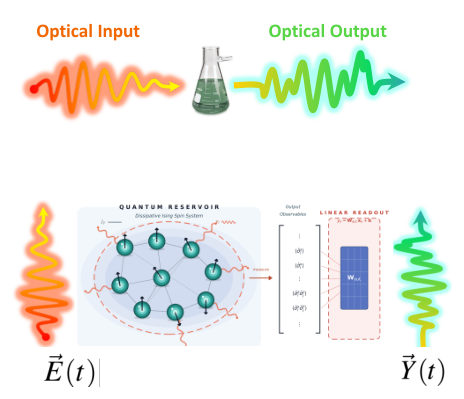
<figcaption class="paper-figure-caption"><b>Fig 1.</b> FIG. 1. Optics as an input–output problem. An input field E(t) (red) interacts with a medium (beaker) to produce an output field Y(t) (green). A quantum Reservoir with trainable readout, the readout layer trained on (E(t),Y(t)) pairs, serves as a surrogate model of the medium, enabling prediction of Y(t) for previously unseen inputs E(t).</figcaption>
</figure>
<figure class="paper-figure-card">
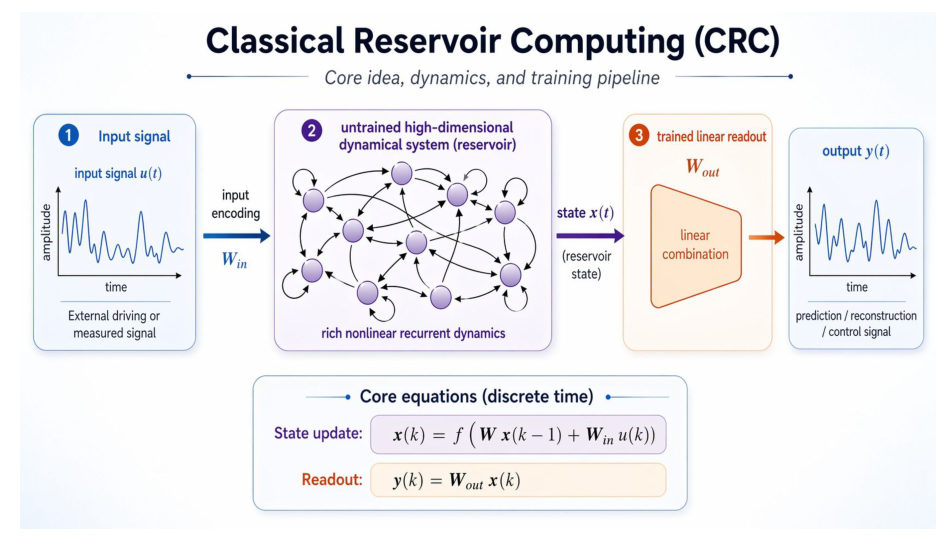
<figcaption class="paper-figure-caption"><b>Fig 2.</b> FIG. 2. Schematic overview of Classical Reservoir Computing (CRC), illustrating the separation between a fixed nonlinear dynamical system (the reservoir) and a trainable linear readout. The input signal u(t) is discretized and injected via the input weight matrixWin. The reservoir state x(k) evolves according to x(k) = f(W x(k −1)+Win u(k)), and the output y(k) is obtained through a trained linear readout y(k) = Wout x(k), where only Wout is optimized during training.</figcaption>
</figure>
<figure class="paper-figure-card">
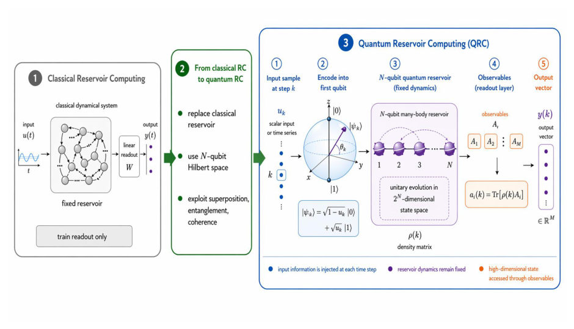
<figcaption class="paper-figure-caption"><b>Fig 3.</b> FIG. 3. Schematic illustration of the transition from classical reservoir computing (CRC) to quantum reservoir computing (QRC). (Left) A classical dynamical system with a fixed reservoir and trained readout layer. (Center) Replacement of the classical reservoir with an N-qubit quantum system. (Right) Full QRC architecture: input is encoded at each time step into the first qubit, the reservoir evolves unitarily in the 2N-dimensional Hilbert space, and observables are extracted via a classical readout layer to produce the output vector.</figcaption>
</figure>
<figure class="paper-figure-card">
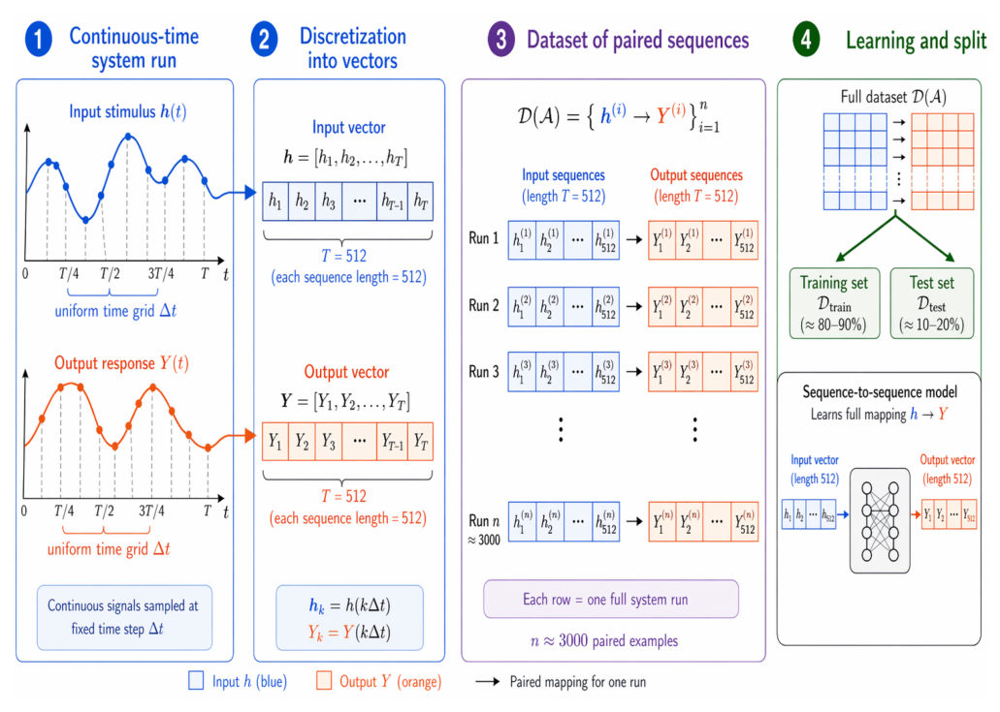
<figcaption class="paper-figure-caption"><b>Fig 4.</b> FIG. 4. Dataset construction and feeding strategy for input–output time-series learning with quantum reservoir computing. Continuous-time input stimuli h(t) and output responses Y(t) are first sampled on a uniform grid with time step ∆t, producing fixed-length vectors of length T = 512. Each row of the dataset corresponds to one complete system run, represented as a paired sequence h(i) →Y(i). The full dataset D(F0) is split into training and test subsets. During learning, each input sequence is fed sequentially into the quantum reservoir, whose measured observables generate temporal reservoir features. A trainable readout then maps these features to the predicted output sequence.</figcaption>
</figure>
<figure class="paper-figure-card">
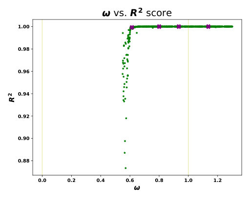
<figcaption class="paper-figure-caption"><b>Fig 5.</b> FIG. 5. Predictive performance of the QRC across driving frequen- cies ω in the single-amplitude regime (F0 = 20). Each point repre- sents the R2 score computed on the test set at a given frequency ω, with an overall performance of R2 = 0.9997.</figcaption>
</figure>

**Summary.** This paper introduces Dissipative Quantum Reservoir Computing (DQRC) as a method to create digital twins for complex quantum systems. By using a small, fixed open quantum system as a reservoir, it learns the input-output map of difficult dynamics, such as High-Harmonic Generation. The results show this approach is highly accurate and generalizes robustly across varying physical driving conditions.

**Why it may be interesting.** This work bridges the gap between complex, non-equilibrium quantum dynamics (like HHG) and modern machine learning techniques, proposing a physically constrained, data-driven modeling tool that respects underlying physical principles.

Detailed structure

**Main problem.** Modeling the complex, nonlinear, and history-dependent input-output dynamics of driven many-body quantum systems from raw data is computationally prohibitive.

**Main result.** A Dissipative Quantum Reservoir Computing (DQRC) framework successfully acts as a compact, physically grounded digital twin, reproducing complex quantum dynamics like High-Harmonic Generation (HHG) using a minimal, fixed quantum reservoir.

**Method.** The authors propose using a DQRC, which trains only a classical readout layer while the reservoir dynamics are governed by a fixed, dissipative quantum evolution (Lindblad master equation).

**Model / system.** The framework is tested on simulating the input-output mapping of a driven many-body system, exemplified by the High-Harmonic Generation (HHG) process in a medium, and benchmarked against a ten-spin Ising chain.

**Key observables.** Reconstruction accuracy ($	ext{R}^2$ score) and amplitude-aware permutation entropy ($	ext{H}_{	ext{amp}}$).

**Important parameters / regimes.** Drive amplitude ($F_0$), driving frequency ($\omega$), and the reservoir size (minimal single-qubit reservoir).

**Assumptions / limitations.** The study assumes that the essential physics can be captured by mapping the dynamics onto a minimal, fixed, dissipative quantum reservoir, rather than requiring a full simulation of the microscopic Hamiltonian.

**Figures summary.** Figures illustrate the input-output problem ($\vec{E}(t) 
ightarrow 	ext{Medium} 
ightarrow \vec{Y}(t)$) and show the amplitude dependence of the entropy ($	ext{H}_{	ext{amp}}$) for the reservoir's generalization capability.

**Paper structure.** The paper first establishes the difficulty of modeling quantum dynamics, introduces the DQRC framework by drawing parallels to classical reservoir computing, details the physical implementation using dissipative quantum dynamics, and finally validates the model's generalization capability across varying drive strengths.

Abstract

Modeling the response of driven many-body quantum systems from input--output data is difficult: the dynamics are nonlinear, history dependent, and expensive to simulate as system size grows. A paradigmatic case is High-Harmonic Generation~(HHG), where a strong field drives a medium to emit radiation that is highly sensitive to the drive and encodes long-range temporal correlations. We introduce a dissipative quantum reservoir computing~(DQRC) framework that builds a digital twin of such a system, learning its input--output map directly from data while the reservoir---itself a small open quantum system---stays fixed and only a classical readout is trained. We show that a minimal single-qubit reservoir reproduces the HHG response of a substantially larger Ising spin chain, and on a representative benchmark matches and on several metrics surpasses previously reported temporal convolutional and Kolmogorov--Arnold-network models, while using a simpler, physically realizable system. A single fixed reservoir further generalizes across a broad range of drives, indicating that it learns a shared physical response structure rather than memorizing trajectories. These results establish dissipative quantum reservoirs as compact, physically grounded digital twins for nonlinear, memory-dependent quantum dynamics.   Code is available at \href{https://github.com/AI-and-Quantum-Computing/DQuRC}{https://github.com/AI-and-Quantum-Computing/DQuRC}.

[↑ back to top](#top)

### ⭐ [Deciding the Attainability of the Multiparameter Quantum Fisher Information is NP-Hard](http://arxiv.org/abs/2609.35975v1)

**Highlighted author(s):** Alexey V. Gorshkov  
**Authors:** Lorcan O. Conlon, Laura Shou, V Vijendran, Kishor Bharti, Aritra Das, Simon K. Yung, Jacob M. Taylor, Alexey V. Gorshkov, Jun Suzuki, Syed M. Assad  
**Type:** theory · **Category:** quantum information and computing · **PDF:** <https://arxiv.org/pdf/2609.35975v1>  
**Analysis basis:** full PDF text, analyzed in chunks
**Topic relevance:** `quantum measurements` **3/5**

↔ Scroll figures horizontally

<figure class="paper-figure-card">
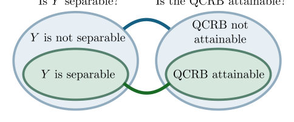
<figcaption class="paper-figure-caption"><b>Fig 1.</b> FIG. 1: Schematic depiction of main results. The left and right outer blue ovals denote the set of all matri- ces Y of a certain dimension and the corresponding set of multiparameter estimation problems defined in Theorem 3 respectively. In this work, we map the problem of deciding whether a given matrix Y is separable or not to the problem of deciding whether the QCRB is attainable (Theorem 3). As it is known that deciding whether a bipartite density matrix is separable or not is NP-hard (Theorem 2), this im- plies that deciding whether the QCRB is attainable or not is also NP-hard (Theorem 4).</figcaption>
</figure>

**Summary.** This paper proves that determining if the theoretical precision limit set by the Quantum Fisher Information (QFI) is actually achievable in quantum parameter estimation is an NP-hard problem. By reducing the problem to the known hard problem of matrix separability, the authors show that a general, efficient criterion for QFI attainability cannot exist unless P=NP.

**Why it may be interesting.** This work provides a deep theoretical constraint on quantum metrology, showing that even calculating the best possible precision bound (QFI) does not guarantee that the bound is physically achievable without solving an NP-hard problem.

Detailed structure

**Main problem.** The paper addresses the fundamental question of determining whether the precision limit set by the Quantum Fisher Information (QFI) for estimating multiple parameters is actually attainable using individual measurements on a quantum state.

**Main result.** They prove that deciding QFI attainability is NP-hard, establishing a fundamental computational barrier: unless P=NP, no efficient general criterion for attainability can exist.

**Method.** The proof relies on a polynomial-time reduction from the known NP-hard problem of determining the separability of a bipartite density matrix to the QFI attainability decision problem.

**Model / system.** The analysis concerns quantum parameter estimation in a general quantum state $\rho(\theta_1, \dots, \theta_p)$ within a $D$-dimensional Hilbert space, utilizing the framework of Symmetric Logarithmic Derivatives (SLDs).

**Key observables.** The Quantum Fisher Information (QFI) matrix ($J_Q$) and the covariance matrix ($V$) derived from the measurement POVM are the key observables used to test the attainability condition $V = J_Q^{-1}$.

**Important parameters / regimes.** The number of parameters ($p$), the dimension of the Hilbert space ($D$), and the structure of the quantum model are important parameters.

**Assumptions / limitations.** The primary assumption is that the computational complexity class P $\neq$ NP, which underpins the hardness result. The analysis also considers restricted models like real, constant-rank quantum models.

**Figures summary.** Figure 1 schematically maps the NP-hard problem of matrix separability to the problem of QCRB attainability, illustrating the reduction used in the proof.

**Paper structure.** The paper establishes the QFI bound, frames the attainability as a decision problem, and then constructs a specific quantum encoding model that maps the hard separability problem instance to the QFI attainability question, proving the NP-hardness.

Abstract

The quantum Fisher information (QFI) sets a fundamental bound on the attainable precision when estimating multiple parameters simultaneously. Incompatibility among the individually optimal measurements can, in some cases, imply that the precision limit set by the QFI is not attainable. In certain special cases, including pure states and full-rank states, the exact conditions for when the precision limit set by the QFI can be saturated are known. However, general conditions for the attainability of the QFI with measurements on individual copies of the quantum state have long been sought. Indeed, this was recently stated as one of the five problems in quantum information theory highlighted by [P. Horodecki et al, PRX Quantum 3, 010101 (2022)]. In this work we prove that exact attainability with individual measurements is NP-hard to decide, even for a restricted set of real, constant-rank quantum models. The source problem for our proof is the NP-hard problem of deciding whether a given bipartite density matrix is separable or not. Our result shows that the longstanding difficulty in obtaining general conditions for QFI attainability reflects a fundamental computational obstruction, rather than merely a limitation of existing mathematical techniques: unless P=NP, no efficiently computable necessary-and-sufficient criterion can exist in general.

[↑ back to top](#top)

### [Measuring the spin of a spin-1/2 and getting a result of 7](http://arxiv.org/abs/2609.37822v1)

**Authors:** Joseph McGowan, Nicholas Mantella, Noah Baker, Aephraim M. Steinberg  
**Type:** experiment · **Category:** other · **PDF:** <https://arxiv.org/pdf/2609.37822v1>  
**Analysis basis:** full PDF text, analyzed in chunks
**Topic relevance:** 🔥 `quantum measurements` **5/5** · `analog quantum simulation` **2/5**

↔ Scroll figures horizontally

<figure class="paper-figure-card">
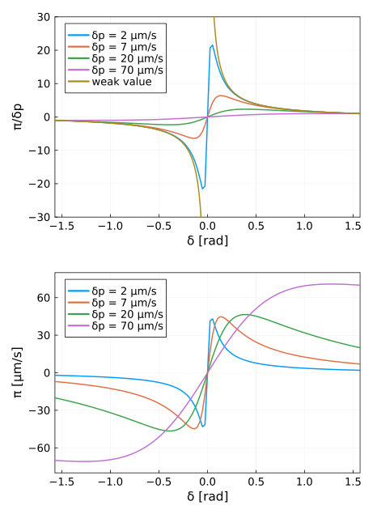
<figcaption class="paper-figure-caption"><b>Fig 1.</b> FIG. 1: Pointer shifts and amplification factors for various values of the momentum kick δp. Above is the bare pointer shift, i.e. ⟨pf⟩|ψ⟩= πf, for the postselected state, and below is πf/δp. Shifts were calculated using TF(z) with σ = 25 µm. The lower plot also shows the weak value ⟨f(δ)| σz |i⟩/ ⟨f(δ)|i⟩.</figcaption>
</figure>
<figure class="paper-figure-card">
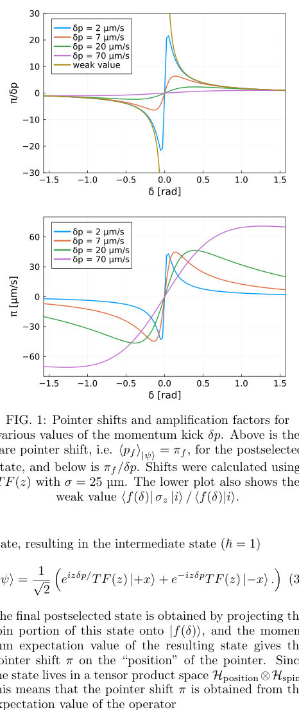
<figcaption class="paper-figure-caption"><b>Fig 2.</b> Figure 1 shows simulations of π for various applied momentum shifts δp, along with the calculated weak value. For this measurement, the pointer shift is given by δp ⟨A⟩w. When δp is large, there is no amplification for any δ; π is bounded by ±δp, and spin rotations merely swap the states. Decreasing δp causes the magnitude of the pointer shift to exceed δp in both directions. The maximum shift, however, is always bounded for small δp;</figcaption>
</figure>
<figure class="paper-figure-card">
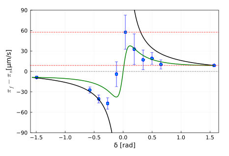
<figcaption class="paper-figure-caption"><b>Fig 3.</b> FIG. 2: Experimental data showing the measured momentum shift (pointer position shift) between the two spin components of the BEC. At each value of δ, each pair of images for a single experimental shot is fitted and the centers subtracted, then this value for all pairs is averaged together. Errorbars represent the standard error on the mean for 60 pairs each. The data are shown with the weak value predictions based on the unamplified kick (in black) and with analytic predictions for a Gaussian initial state of equivalent size (in green).</figcaption>
</figure>
<figure class="paper-figure-card">

<figcaption class="paper-figure-caption"><b>Fig 4.</b> Figure 2 shows experimental data for a cloud with an initial Thomas-Fermi radius of 31 µm, along with the cor- responding weak value prediction as well as the analytic prediction given by eq. (6). The data show reasonable agreement with the weak value, and the amplification of the pointer shift is evident. Each absorption image is fit- ted using a 2D Thomas-Fermi profile. The centers from corresponding image pairs are subtracted, and the re- sulting differences are averaged for each value of δ. This method gives error bars (standard error) which are 5- 10 times smaller than subtracting the averages of the first images and second images. Due to the low post- selection probabilities near δ =...</figcaption>
</figure>
<figure class="paper-figure-card">
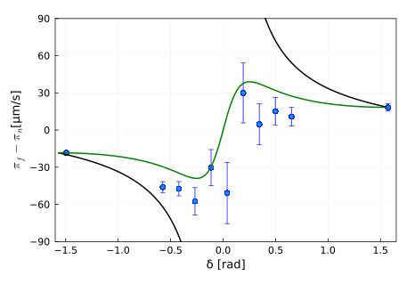
<figcaption class="paper-figure-caption"><b>Fig 5.</b> FIG. 3: Experimental data for a cloud with a similar initial size and atom number to the data in fig. 2 but with a momentum kick approximately 2 times larger (δp = 9.2 ± 0.8 µm s−1). The observed amplification is correspondingly smaller, and the deviation from the weak value prediction (shown in black) occurs sooner. The green curve is calculated from eq. (5) as in fig. 2.</figcaption>
</figure>

**Summary.** The authors report the first experimental realization of measuring an anomalous weak value using a Bose-Einstein condensate of $^{87}	ext{Rb}$ atoms. By performing a weak Stern-Gerlach measurement and utilizing post-selection, they measured a momentum kick amplified by a factor of 14. This work validates the theoretical framework of weak measurements in an atomic platform, demonstrating its potential for advanced quantum sensing.

**Why it may be interesting.** This work provides a concrete, state-of-the-art realization of a fundamental quantum measurement concept (weak values) using ultracold atoms, pushing the boundaries of quantum metrology and quantum measurement theory in AMO physics.

Detailed structure

**Main problem.** To experimentally realize and measure an anomalous weak value, specifically measuring a component of a particle's spin, as originally proposed by Aharonov et al.

**Main result.** The experiment successfully demonstrated weak value amplification in an atomic system, measuring an effective magnification of a weak magnetic momentum kick by a factor of 14, corresponding to a weak value of 7(3) for $\sigma_z$.

**Method.** A weak Stern-Gerlach measurement was performed on a Bose-Einstein condensate using post-selection on the final state to extract the anomalous weak value.

**Model / system.** The physical system is a Bose-Einstein condensate (BEC) of $^{87}	ext{Rb}$ atoms trapped in a magnetic gradient. The measurement relies on coupling the spin and momentum via a weak magnetic field gradient.

**Key observables.** Pointer shift ($\pi$), weak value ($\langle A 
angle_w$), and the momentum kick ($\delta_p$).

**Important parameters / regimes.** The measurement is sensitive to the momentum kick parameter ($\delta$) and the initial cloud size ($\sigma$).

**Assumptions / limitations.** The analysis often assumes the initial state is Gaussian for analytical predictions, although the actual atomic cloud profile may deviate.

**Figures summary.** Figure 2 shows experimental data comparing the measured momentum shift to weak value predictions for a specific initial size. Figure 3 shows similar results for a larger momentum kick, illustrating the dependence on applied parameters.

**Paper structure.** The paper develops the theory of weak value amplification, details the experimental setup using BECs, presents the measurement of the pointer shift, and compares the results to the theoretical weak value predictions across varying experimental parameters.

Abstract

The weak value of an operator is the average result of measuring that operator on a quantum system given specified initial and final states. The overlap between these states appears in the denominator of the weak value, and thus if that overlap is small, the weak value can be arbitrarily large. In 1988, Albert, Aharonov, and Vaidman proposed a weak Stern-Gerlach experiment which would be able to measure a so-called anomalous weak value, a measurement result which lies out- side of the eigenvalue spectrum of the operator being measured. Though anomalous weak values have been measured in numerous optical systems, here we present the first such realization of this experiment as originally proposed. By placing a Bose-Einstein condensate of 87Rb in a magnetic gradient and performing an unlikely postselection, we measure an effective magnification of a weak magnetic momentum kick (~ 8 $μ$m/s) by a factor of 14. We also demonstrate that increasing the momentum kick decreases the "weakness" of the measurement and reduces the amplification.

[↑ back to top](#top)

### [A quantum thermal machine surpassing the classical thermodynamic limit on precision](http://arxiv.org/abs/2609.37149v1)

**Authors:** Simon Sundelin, Ludvig Nordqvist, Khalak Mahadeviya, Vyom Kulkarni, Mohammed Ali Aamir, Mark T. Mitchison, Simone Gasparinetti  
**Type:** experiment · **Category:** statistical mechanics · **PDF:** <https://arxiv.org/pdf/2609.37149v1>  
**Analysis basis:** full PDF text, analyzed in chunks
**Topic relevance:** 🔥 `quantum optics experiment` **4/5** · `QC/QI experiment` **3/5** · `driven-dissipative phase transition` **3/5** · `non-equilibrium universality` **3/5** · `Full counting statistics` **2/5** · `quantum measurements` **2/5** · `Keldysh / 2PI / non-Gaussian methods` **1/5** · `Tavis-Cummings & cavity-many-emitter` **1/5** · `analog quantum simulation` **1/5** · `correlated / nonlocal dissipation` **1/5** · `methods for driven-dissipative` **1/5**

↔ Scroll figures horizontally

<figure class="paper-figure-card">
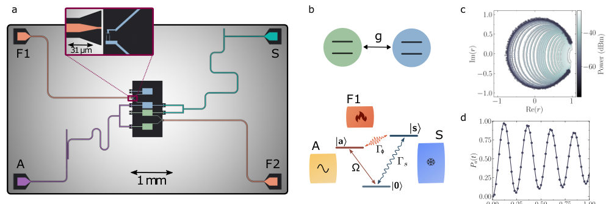
<figcaption class="paper-figure-caption"><b>Fig 1.</b> FIG. 1. Device architecture and operating principle. (a) Rendered false-colour micrograph of the superconducting artificial molecule, composed of two flux-tunable transmons coupled to symmetry-selective microwave waveguides S and A. The flux lines used to inject longitudinal noise are shown in orange. Inset: superconducting quantum interference device (SQUID) of one transmon. (b) Hybridized level structure and transport cycle of the artificial molecule. |0⟩, |a⟩, and |s⟩denote the ground, antisymmetric, and symmetric molecular eigenstates, respectively. The upper-state splitting is 2g, where g is the coherent inter-qubit coupling strength. A coherent drive with Rabi frequency Ωexcites the...</figcaption>
</figure>
<figure class="paper-figure-card">
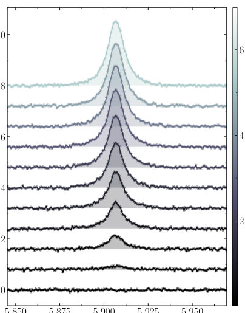
<figcaption class="paper-figure-caption"><b>Fig 2.</b> FIG. 2. Power spectral density of the output field in the symmetric waveguide for increasing mixing rates at a fixed drive rate. The growing emission peak signals heat transferred into the cold bath, and its integrated area yields the emitted heat current.</figcaption>
</figure>
<figure class="paper-figure-card">
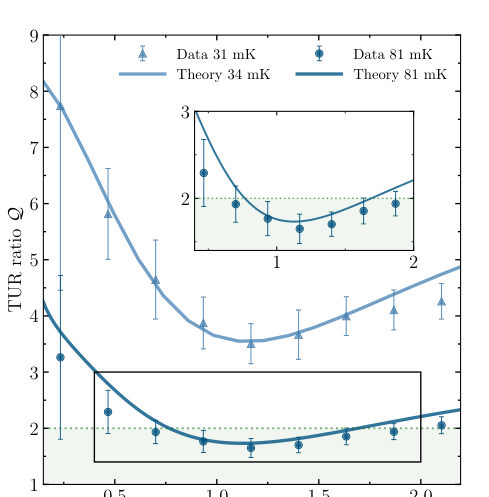
<figcaption class="paper-figure-caption"><b>Fig 3.</b> FIG. 4. Violation of the classical thermodynamic uncertainty relation. Measured TUR ratio Q = (σ/kB)D/J2 as a function of drive strength for cold-bath temperatures of 31 mK and 81 mK. The dashed line marks the classical bound Q = 2. At 81 mK, the measured ratio falls below the classical threshold and enters the sub-classical regime predicted by full counting statistics (see inset for the same data on a larger scale). Solid lines show theoretical results evaluated using independently characterized device parameters, and error bars denote two standard deviations.</figcaption>
</figure>
<figure class="paper-figure-card">
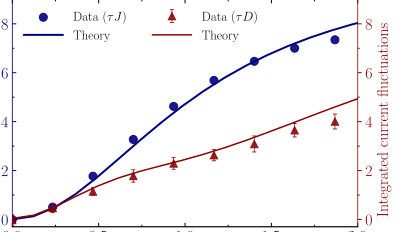
<figcaption class="paper-figure-caption"><b>Fig 4.</b> FIG. 3. Extraction of photon-current moments from con- tinuous microwave measurements. (a) Interleaved ON/OFF protocol used to determine the first and second moments of the integrated heterodyne power. In the ON state, the co- herent drive and injected flux noise sustain transport through the machine, whereas the OFF state provides the background reference of the measurement chain. (b) Measured integrated current τJ (circles) and current fluctuations τD (triangles) as functions of drive strength over the integration time τ = 3 µs and a fixed mixing rate ΓΦ/2π = 3.4 MHz. Solid lines show full counting statistics predictions evaluated using indepen- dently characterized device parameters and...</figcaption>
</figure>
<figure class="paper-figure-card">
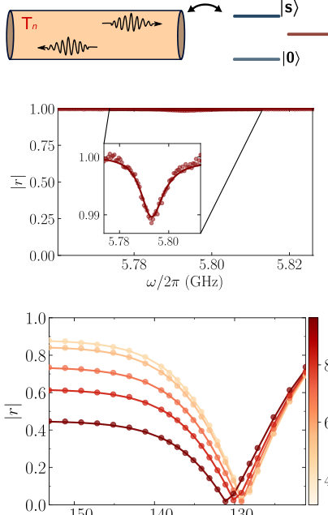
<figcaption class="paper-figure-caption"><b>Fig 5.</b> FIG. 5. Cold-bath temperature calibration based on a four- level molecular spectroscopy model. (a) Schematic of the four-level model. The waveguide at temperature Tn cou- ples radiatively, with rate ΓS, to the symmetric transitions |0⟩↔|s⟩and |s⟩↔|2+⟩L, while the antisymmetric state |a⟩remains dark to the waveguide but is weakly coupled to an environment at a similar temperature. Finite tempera- ture produces thermal population in both |s⟩and |a⟩. (b) Method A: reflection spectroscopy of the |s⟩↔|2+⟩L transi- tion at elevated temperature, obtained by sweeping the probe frequency across the transition. The solid line is a fit to the four-level model used to determine the effective waveguide...</figcaption>
</figure>

**Summary.** This paper experimentally demonstrates that a superconducting quantum thermal machine can surpass the precision limits imposed by classical thermodynamics, violating the canonical Thermodynamic Uncertainty Relation. By measuring current fluctuations and heat dissipation in a superconducting circuit, the authors show a quantum enhancement in performance at reduced energy cost. This work highlights a fundamental distinction between classical and quantum thermodynamic regimes.

**Why it may be interesting.** This work provides a direct, measurable experimental test of fundamental quantum thermodynamic principles, demonstrating a quantum enhancement in precision beyond classical limits, which is highly relevant to open quantum systems and quantum thermodynamics.

Detailed structure

**Main problem.** The paper investigates whether quantum mechanics allows for the violation of the classical Thermodynamic Uncertainty Relation (TUR), which constrains the trade-off between precision and energy cost in non-equilibrium processes.

**Main result.** The authors experimentally demonstrated a violation of the classical TUR in a superconducting quantum thermal machine, measuring a ratio $Q = 1.71 \pm 0.17$, which is below the classical bound of $Q \geq 2$.

**Method.** The experiment uses near-quantum-limited heterodyne detection on a superconducting quantum thermal machine to measure the mean photon current and its fluctuations, allowing for the extraction of the TUR ratio $Q$.

**Model / system.** The system is a superconducting quantum thermal machine built from two flux-tunable transmon qubits forming an artificial molecule, coupled to a cold microwave waveguide bath and driven by classical noise.

**Key observables.** TUR Ratio ($Q$), mean photon current ($J$), and the diffusion coefficient ($D$) extracted from the Power Spectral Density (PSD) of the outgoing microwave field.

**Important parameters / regimes.** The measurement is performed at dilution refrigerator temperatures ($T < 10 	ext{ mK}$); the classical bound is $Q \geq 2$.

**Assumptions / limitations.** The classical TUR assumptions (classical Markovian dynamics obeying local detailed balance) are assumed to break down in the quantum regime; the analysis relies on input-output theory and heterodyne detection techniques.

**Figures summary.** Figures illustrate the device architecture, the transport cycle, the PSD of the output field showing emission peaks, and plots showing the measured TUR ratio $Q$ versus drive strength.

**Paper structure.** The paper establishes the theoretical context of TURs, details the superconducting quantum thermal machine setup, describes the measurement protocol using heterodyne detection to extract current and noise moments, and finally presents the experimental measurement showing the violation of the classical bound.

Abstract

Precision in nonequilibrium processes comes at a thermodynamic cost: suppressing fluctuations generally requires increased dissipation. Thermodynamic uncertainty relations (TURs) make this trade-off quantitative by linking current fluctuations to entropy production in classical stochastic dynamics. In the decade since its discovery, the canonical steady-state TUR and its finite-time generalizations have become a cornerstone of non-equilibrium thermodynamics, constraining the performance of molecular machines and allowing heat dissipation to be inferred from observable fluctuations. Whether the canonical TUR can be violated in a controlled quantum device remains an outstanding experimental question, in part because doing so requires resolving extremely small steady-state currents as well as their fluctuations. Here we experimentally show that steady-state quantum transport can surpass the precision permitted by the canonical TUR. We observe this violation in a superconducting quantum thermal machine coupled to a microwave waveguide acting as a cold bath and to a classical noise source providing an effective infinite-temperature bath. We observe a TUR ratio $Q = 1.71 \pm 0.17$, in violation of the classical bound $Q \geq 2$. Our results demonstrate a fundamental distinction between classical and quantum thermodynamics, paving the way for quantum thermal devices that achieve enhanced precision at reduced energy cost.

[↑ back to top](#top)

### [Single-Photon Nonlinearity from a Nanobeam with a Quantum Dot](http://arxiv.org/abs/2609.36658v1)

**Authors:** Abhijit Biswas, Neelesh Kumar Vij, Allan S. Bracker, Margaret Stevens, Joel Q. Grim, Edo Waks  
**Type:** experiment · **Category:** other · **PDF:** <https://arxiv.org/pdf/2609.36658v1>  
**Analysis basis:** full PDF text, analyzed in chunks
**Topic relevance:** 🔥 `quantum optics experiment` **4/5** · `QC/QI experiment` **3/5** · `analog quantum simulation` **3/5** · `Tavis-Cummings & cavity-many-emitter` **2/5** · `driven-dissipative phase transition` **2/5** · `methods for driven-dissipative` **2/5** · `quantum measurements` **2/5** · `Full counting statistics` **1/5** · `Keldysh / 2PI / non-Gaussian methods` **1/5** · `correlated / nonlocal dissipation` **1/5**

↔ Scroll figures horizontally

<figure class="paper-figure-card">
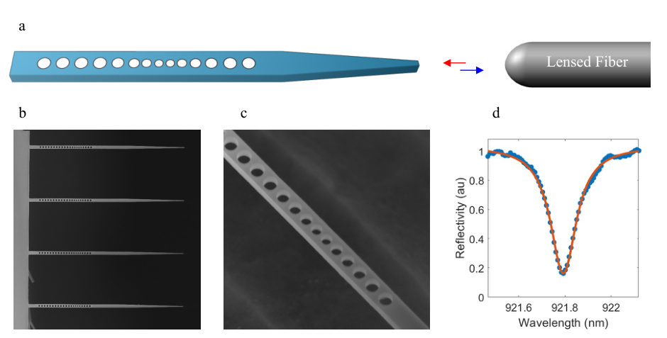
<figcaption class="paper-figure-caption"><b>Fig 1.</b> Figure 1: Design and characterization of the nanobeam cavity. (a) Schematic of a nanobeam cavity with a tapered waveguide edge. (b) SEM image of suspended nanobeams from the top. (c) SEM image showing the cavity region. (d) Cavity reflectivity spectrum for cavity-mode characterization.</figcaption>
</figure>
<figure class="paper-figure-card">
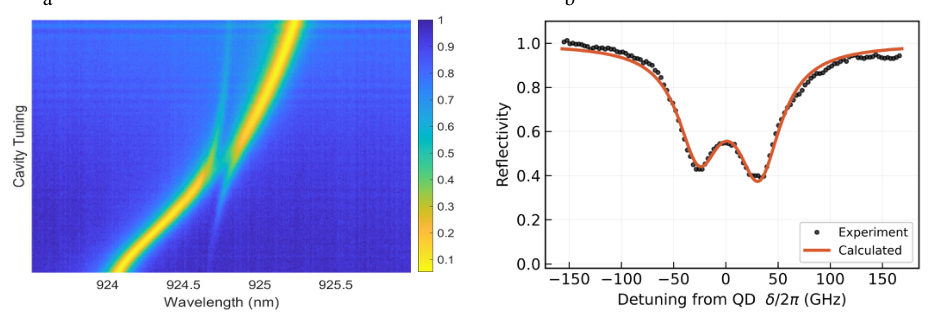
<figcaption class="paper-figure-caption"><b>Fig 2.</b> Figure 2: Strong coupling between the cavity and the quantum dot. (a) Normalized cavity reflectivity under LED excitation while the cavity is tuned across the quantum dot emission wavelength. (b) Normalized cavity reflectivity with the quantum dot on resonance.</figcaption>
</figure>
<figure class="paper-figure-card">
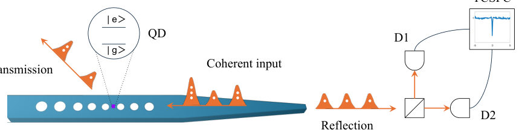
<figcaption class="paper-figure-caption"><b>Fig 3.</b> Figure 3: Resonant reflection from the cavity-quantum dot system. At low photon number, the single-photon components of the incident light are preferentially reflected, while multi-photon components are transmitted.</figcaption>
</figure>
<figure class="paper-figure-card">
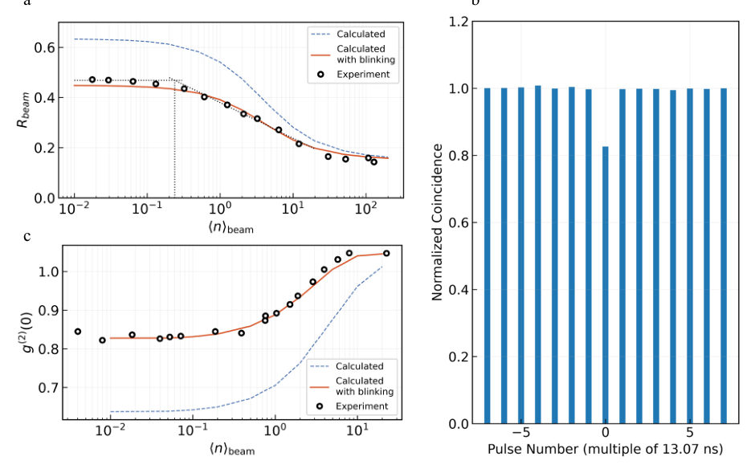
<figcaption class="paper-figure-caption"><b>Fig 4.</b> Figure 4: Single-photon nonlinearity. (a) Reflectivity from the nanobeam as a function of ⟨n⟩beam (b) Second- order autocorrelation measurement of the reflected signal for ⟨n⟩beam = 0.06. (c) Measured g2(0) as a function of incident photon number in the nanobeam, ⟨n⟩beam.</figcaption>
</figure>

**Summary.** This paper reports the realization of single-photon nonlinearity using a quantum dot embedded in a nanobeam cavity. The key innovation is the nanobeam geometry, which allows for high-efficiency coupling to optical fibers while maintaining strong coupling to the quantum emitter. The demonstrated low-threshold nonlinearity establishes this system as a promising, scalable component for quantum photonic circuits.

**Why it may be interesting.** This work is highly relevant as it combines cavity QED principles (strong coupling, nonlinearity) with practical engineering challenges (fiber coupling, chip integration), providing a robust platform for quantum light sources.

Detailed structure

**Main problem.** The primary challenge addressed is developing an efficient single-photon nonlinearity for quantum technologies that simultaneously achieves high-efficiency direct fiber coupling and compatibility with scalable on-chip integration.

**Main result.** The researchers successfully demonstrated a single-photon nonlinearity in a nanobeam cavity coupled to a quantum dot, establishing the system as a compact, chip-integrable, and fiber-compatible building block.

**Method.** The nonlinearity was characterized by measuring the cavity reflectivity using weak, resonant picosecond pulses and analyzing the second-order correlation function, $g^{(2)}(0)$.

**Model / system.** The physical system is a quantum dot coupled to a nanobeam cavity, modeled using the Jaynes-Cummings Hamiltonian and analyzed via the Lindblad master equation. The nanobeam geometry facilitates direct coupling to a single-mode fiber.

**Key observables.** Single-photon nonlinearity threshold (0.24 incident photons per pulse), coupling rate ($g/2\pi = 29.1$ GHz), cooperativity ($C = 3.98$), and $g^{(2)}(0)$ measurements.

**Important parameters / regimes.** Fiber coupling efficiency ($\eta_{	ext{coupling}} = 60\%$), cavity decay rate ($\kappa$), and the strong-coupling regime condition ($g > \kappa_1/4$).

**Assumptions / limitations.** The analysis assumes that linear loss does not alter the underlying photon statistics when calculating $g^{(2)}(0)$ for the integrated system.

**Figures summary.** Figures show the nanobeam design, SEM images, cavity reflectivity spectra exhibiting polariton doublets, and plots detailing reflectivity and $g^{(2)}(0)$ vs. input photon number.

**Paper structure.** The paper details the physical setup, characterizes the cavity and QD coupling parameters using CW light, and then measures the nonlinear response using pulsed excitation to confirm single-photon nonlinearity.

Abstract

An efficient single-photon nonlinearity is a key resource for photonic quantum technologies. Single-photon nonlinearities have been demonstrated with quantum dots (QDs) across a range of cavity and waveguide geometries. However, none of these realizations simultaneously provide high-efficiency direct fiber coupling and compatibility with scalable on-chip integration. The nanobeam cavity addresses these limitations through its in-plane geometry, which enables highly efficient, direct fiber coupling alongside scalable homogeneous and heterogeneous on-chip integration. Here, we report a single-photon nonlinearity from a nanobeam cavity coupled to a single quantum dot. The nanobeam interfaces directly with a single-mode fiber with an efficiency of 60%. Driven by resonant picosecond pulses, the platform achieves a single-photon nonlinearity with a low threshold of 0.24 incident photons per pulse. The system operates in the strong-coupling regime, exhibiting a coupling rate of g/2π = 29.1 GHz and a cooperativity of C = 3.98. These results establish the nanobeam cavity-QD system as a compact, chip-integrable, and fiber-compatible building block for scalable photonic quantum technologies.

[↑ back to top](#top)

### [Independent density and coherence skin effects in adaptive fermion circuits](http://arxiv.org/abs/2609.36017v1)

**Authors:** Karim Chahine, Markus Siegl, Michael Buchhold  
**Type:** theory · **Category:** other · **PDF:** <https://arxiv.org/pdf/2609.36017v1>  
**Analysis basis:** full PDF text, analyzed in chunks
**Topic relevance:** 🔥 `methods for driven-dissipative` **4/5** · 🔥 `quantum measurements` **4/5** · `analog quantum simulation` **3/5** · `correlated / nonlocal dissipation` **3/5** · `driven-dissipative phase transition` **3/5** · `non-equilibrium universality` **2/5** · `Keldysh / 2PI / non-Gaussian methods` **1/5**

↔ Scroll figures horizontally

<figure class="paper-figure-card">
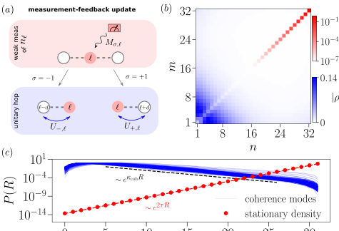
<figcaption class="paper-figure-caption"><b>Fig 1.</b> Figure 1. Two skin effects at opposite edges of one adaptive circuit (τ = 0.5, L = 32, d = 1, balanced pair, θ = 1). (a) Adaptive measurement-feedback update. A weak measure- ment of the occupation at site ℓyields σ = ±1 and selects a coherent hopping operation on the bond (ℓ−d, ℓ) for σ = −1 or (ℓ, ℓ+ d) for σ = +1. (b) Weight ⟨|ρm,n|⟩averaged over the coherence modes defined in [43] (blue) and the stationary state (red), from exact diagonalization of the Liouvillian; each mode is normalized to P</figcaption>
</figure>
<figure class="paper-figure-card">
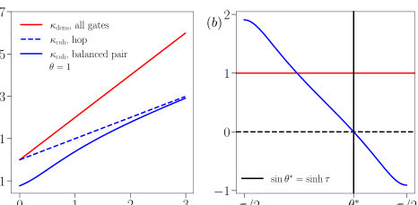
<figcaption class="paper-figure-caption"><b>Fig 2.</b> Figure 2. Analytical density (red) and bulk-coherence (blue) exponents against the control parameters of the circuit; d = 1. (a) Versus measurement strength τ. Dashed: conditioned hop, κcoh = κdens/2. Solid: balanced pair at θ = 1. (b) Versus the phase θ at τ = 0.5 for the balanced pair. As θ = γ+ −γ− is tuned, κcoh passes through zero at sin θ∗= sinh τ, while the density exponent is unaffected.</figcaption>
</figure>
<figure class="paper-figure-card">
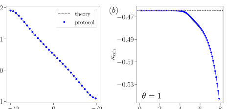
<figcaption class="paper-figure-caption"><b>Fig 3.</b> Figure 3. The differential protocol at finite time (L = 28, r = 6, τ = 0.5, d = 1, balanced pair). (a) Exponent extracted from Eq. (18) at t = 2 (circles) and the prediction of Eq. (12) (dashed). (b) Extracted exponent against time at θ = 1; dashed: Eq. (12).</figcaption>
</figure>
<figure class="paper-figure-card">
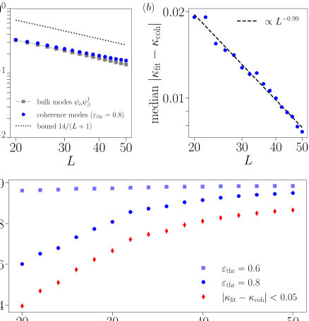
<figcaption class="paper-figure-caption"><b>Fig 4.</b> Figure 4. Convergence of the coherence modes of the full open-chain Liouvillian to the bulk exponent (balanced pair, τ = 0.5, θ = 1, d = 1). (a) Median gauged defect weight wd of the coherence modes [Eq. (20), εthr = 0.8] and of the eigen- modes ψαψ† β of Lbulk; dotted: the bound 14/(L + 1). (b) Me- dian |κfit −κcoh| of the coherence modes; dashed: power-law fit. (c) Number N of eigenmodes satisfying Eq. (20) for εthr = 0.6 (squares) and 0.8 (circles), and with |κfit −κcoh| &lt; 0.05 (diamonds), divided by L2.</figcaption>
</figure>

**Summary.** This paper analyzes adaptive fermion circuits to show that density and coherence localization effects can be tuned independently. By analyzing the system's Liouvillian dynamics, the authors derive separate exponents for density and coherence profiles. This separation is significant because it allows for engineered localization of these two distinct physical properties at opposite ends of the chain.

**Why it may be interesting.** This work provides a concrete, controllable platform (adaptive circuits) to study the separation of different types of localization effects (density vs. coherence) in open quantum systems, which is highly relevant to understanding dissipation and measurement backaction in quantum dynamics.

Detailed structure

**Main problem.** To investigate whether density and coherence skin effects can be independently tuned in adaptive fermion circuits, unlike previous models where they were coupled.

**Main result.** The density skin effect exponent is fixed by measurement strength and feedback displacement, while the coherence exponent can be tuned independently by controlling the relative occupation phase, allowing opposite-edge localization.

**Method.** The analysis uses Liouvillian dynamics, employing gauge transformations and exponential ansatz fitting to extract the decay exponents for both density and coherence profiles.

**Model / system.** The system models spinless fermions on a chain evolving under a trace-preserving Liouvillian governed by measurement-feedback updates, $\partial_t \hat{
ho} = \mathcal{L}\hat{
ho}$.

**Key observables.** Density skin effect exponent ($\kappa_{	ext{dens}}$), coherence skin effect exponent ($\kappa_{	ext{coh}}$), and the stationary density profile $
ho_{n_R}$.

**Important parameters / regimes.** Measurement strength ($	au$), feedback displacement ($d$), and the relative occupation phase ($	heta$).

**Assumptions / limitations.** The analysis assumes an exponential ansatz for the stationary density state and utilizes gauge transformations to map the non-reciprocal dynamics to a normal form for coherence analysis.

**Figures summary.** Figures illustrate the adaptive measurement-feedback update, showing density and coherence profiles at opposite edges, and plot the dependence of $\kappa_{	ext{coh}}$ and $\kappa_{	ext{dens}}$ on control parameters $	au$ and $	heta$.

**Paper structure.** The paper first establishes the Liouvillian framework for adaptive circuits, then derives the independent expressions for $\kappa_{	ext{dens}}$ and $\kappa_{	ext{coh}}$, demonstrating their tunability and the mechanism allowing opposite-edge localization.

Abstract

Adaptive circuits use measurements and outcome-conditioned feedback to implement nonreciprocal dynamics without postselection. We show that fermion circuits host independently tunable density and coherence skin effects. The stationary state has an exact density tilt set only by measurement strength and feedback displacement: conditioned-gate details cancel, yielding an exponential one-particle profile and, at any filling, a tilted ensemble of configuration weights. Decaying coherences instead obey, in the bulk, an effective Hatano-Nelson generator controlled by the conditioned gates through a relative occupation phase. Tuning this phase drives a point-gap topological transition and reverses coherence localization at fixed density, allowing density and coherence to localize at opposite edges. We derive both exponents for conditioned $U(2)$ gates and propose a correlator-ratio probe using ensemble-averaged observables.

[↑ back to top](#top)

### [Crossover of Scaling Behaviors of Work Cumulants in a Driven Gaussian Field Theory](http://arxiv.org/abs/2609.36476v1)

**Authors:** Yanbo Qiao, Ruohan Xu, H. T. Quan  
**Type:** theory · **Category:** statistical mechanics · **PDF:** <https://arxiv.org/pdf/2609.36476v1>  
**Analysis basis:** full PDF text, analyzed in chunks
**Topic relevance:** 🔥 `non-equilibrium universality` **4/5** · `Keldysh / 2PI / non-Gaussian methods` **3/5** · `driven-dissipative phase transition` **3/5** · `Full counting statistics` **2/5** · `methods for driven-dissipative` **2/5** · `analog quantum simulation` **1/5** · `correlated / nonlocal dissipation` **1/5** · `quantum measurements` **1/5**

↔ Scroll figures horizontally

<figure class="paper-figure-card">
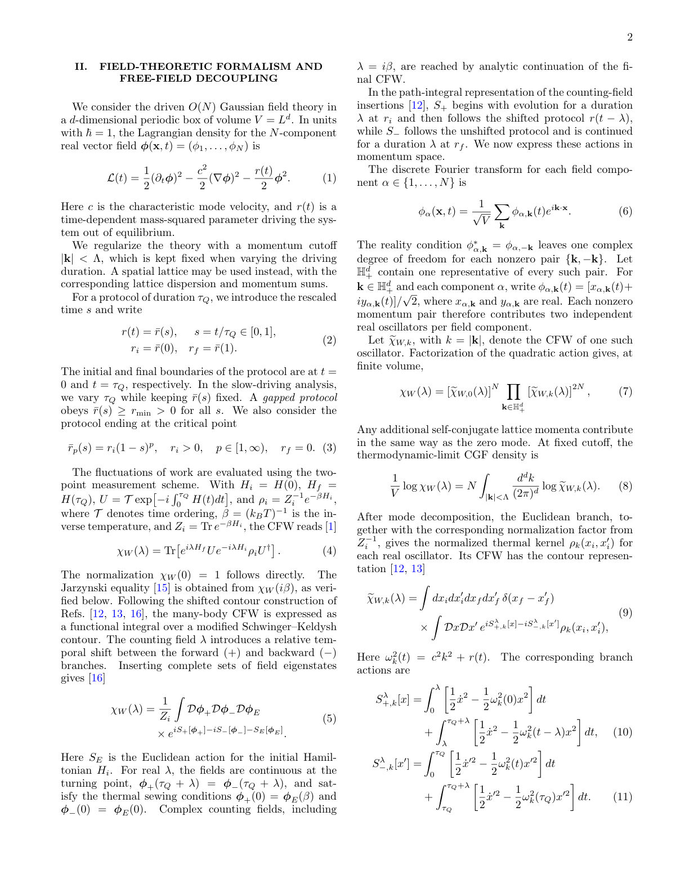
<figcaption class="paper-figure-caption"><b>Fig 1.</b> Low-resolution page preview, page 2</figcaption>
</figure>
<figure class="paper-figure-card">
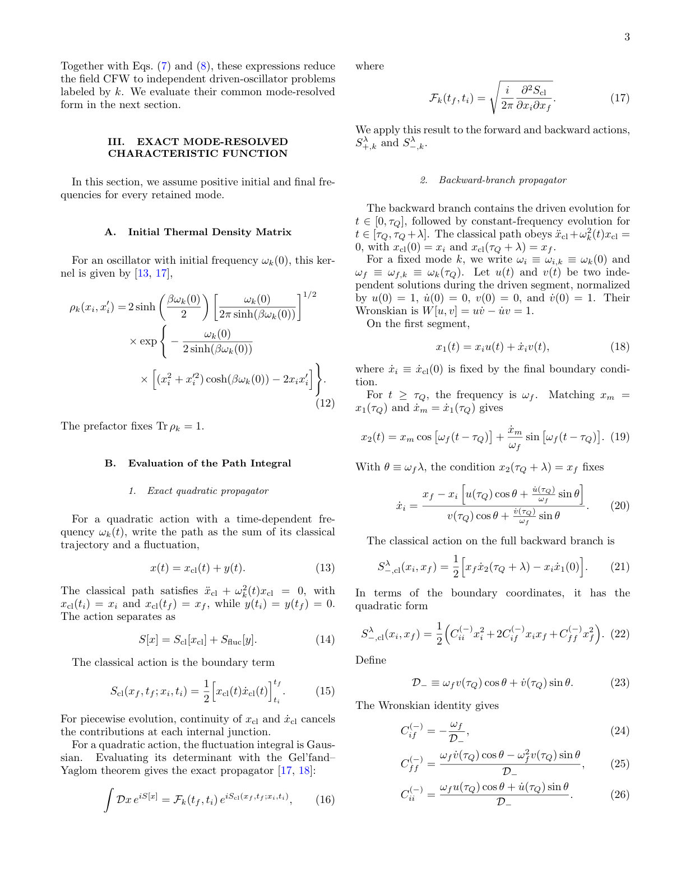
<figcaption class="paper-figure-caption"><b>Fig 2.</b> Low-resolution page preview, page 3</figcaption>
</figure>
<figure class="paper-figure-card">
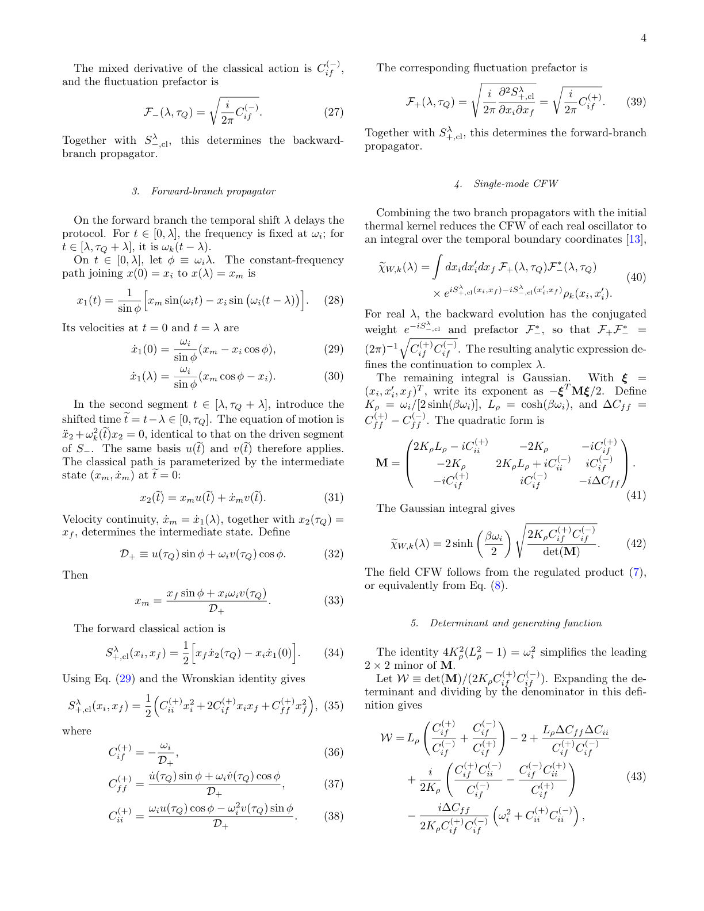
<figcaption class="paper-figure-caption"><b>Fig 3.</b> Low-resolution page preview, page 4</figcaption>
</figure>
<figure class="paper-figure-card">
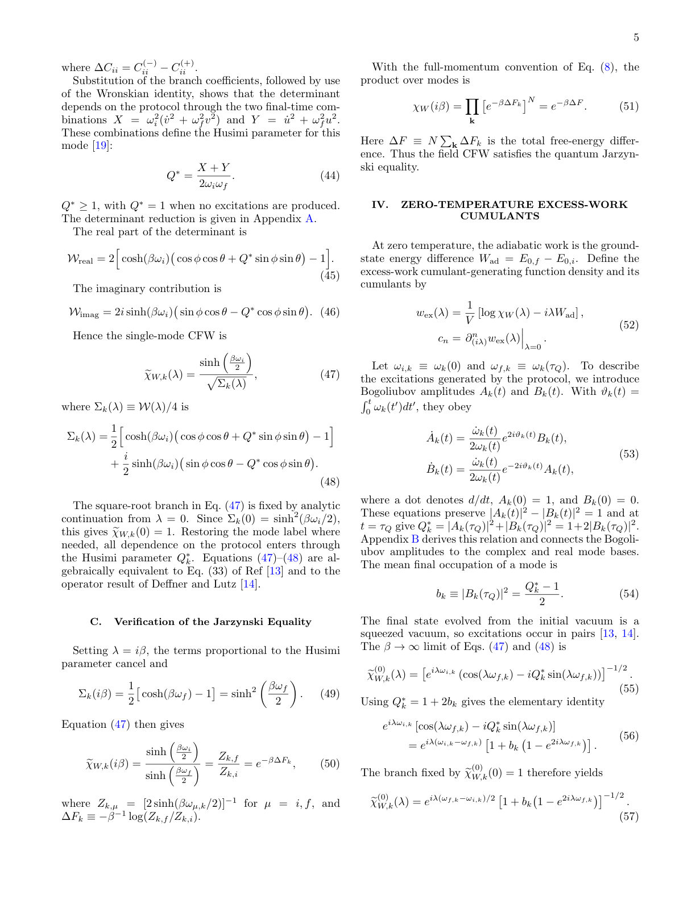
<figcaption class="paper-figure-caption"><b>Fig 4.</b> Low-resolution page preview, page 5</figcaption>
</figure>
<figure class="paper-figure-card">
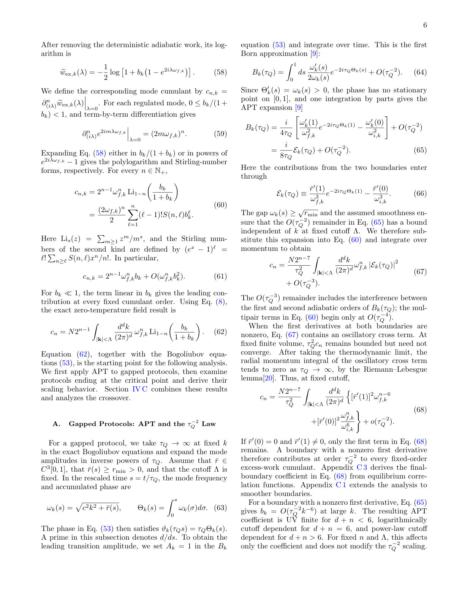
<figcaption class="paper-figure-caption"><b>Fig 5.</b> Low-resolution page preview, page 6</figcaption>
</figure>

**Summary.** This theoretical paper analyzes how work fluctuations scale when a quantum system is driven through a time-dependent process, comparing predictions from the Kibble-Zurek mechanism (critical dynamics) against those from Adiabatic Perturbation Theory (smooth driving). By solving the problem for a Gaussian field theory, the authors map out the precise crossover scaling laws governing the excess-work cumulants. This work provides a foundational, solvable model for understanding non-equilibrium thermodynamics in complex quantum systems.

**Why it may be interesting.** The explicit derivation of crossover scaling laws for work cumulants provides a powerful, solvable model to test general theoretical frameworks concerning non-equilibrium dynamics and critical phenomena in quantum systems.

Detailed structure

**Main problem.** The paper investigates the crossover between different scaling behaviors of work cumulants in a driven quantum system, specifically comparing the Kibble-Zurek (KZ) mechanism with the Adiabatic Perturbation Theory (APT) predictions.

**Main result.** The scaling of the excess-work cumulants depends on the relative exponents of the protocol and the dimensionality, exhibiting distinct power-law behaviors, including logarithmic corrections at specific crossover points.

**Method.** The analysis utilizes path integral formulations, mode decomposition, and advanced scaling arguments derived from solving the mode equations for the Gaussian field theory.

**Model / system.** The system is a driven O(N) Gaussian field theory in a d-dimensional box, whose dynamics are governed by a time-dependent Lagrangian density. The analysis focuses on the work cumulants derived from the Characteristic Function of Work (CFW).

**Key observables.** Work cumulants (excess-work cumulants $c_n$), Characteristic Function of Work (CFW), and the Husimi parameter ($Q^*$).

**Important parameters / regimes.** Protocol exponent ($p$), spatial dimension ($d$), order of cumulant ($n$), and protocol duration ($	au_Q$).

**Assumptions / limitations.** The analysis relies on the solvability of the Gaussian field theory and the validity of both the APT and KZ approximations in different regimes.

**Paper structure.** The paper systematically derives the CFW for the Gaussian field, first analyzing gapped protocols using APT, and then tackling power-law protocols approaching criticality by comparing the resulting KZ scaling with the regular APT contributions.

Abstract

We derive the finite-temperature characteristic function of work (CFW) for a driven $O(N)$ Gaussian field theory and obtain closed-form expressions for all zero-temperature excess-work cumulants. For gapped protocols, we use adiabatic perturbation theory (APT) to derive the $τ_Q^{-2}$ scaling for protocols with a nonzero first derivative at either boundary, where $τ_Q$ is the protocol duration; smoother boundaries lead to faster decay. For power-law protocols approaching the critical point with exponent $p$, we determine the competition between critical excitations and the regular contribution. The $n$th cumulant's critical contribution follows Kibble--Zurek (KZ) scaling $τ_Q^{-p(d+n)/(p+2)}$ for $d+n<2p+4$, acquires a logarithmic correction $τ_Q^{-2p}\logτ_Q$ at $d+n=2p+4$, and scales as $τ_Q^{-2p}$ above this condition, where $d$ is the spatial dimension. This analytical study of the APT--KZ crossover in a solvable model provides a basis for studying their competition in interacting field theories.

[↑ back to top](#top)

### [Near-optimal quantum simulation of lattice Lindbladian dynamics](http://arxiv.org/abs/2609.36203v1)

**Authors:** Rahul Trivedi, Xiehang Yu, Daniel Malz  
**Type:** theory · **Category:** quantum information and computing · **PDF:** <https://arxiv.org/pdf/2609.36203v1>  
**Analysis basis:** full PDF text, analyzed in chunks
**Topic relevance:** 🔥 `methods for driven-dissipative` **4/5** · `correlated / nonlocal dissipation` **3/5** · `driven-dissipative phase transition` **3/5** · `Keldysh / 2PI / non-Gaussian methods` **2/5** · `analog quantum simulation` **2/5** · `non-equilibrium universality` **2/5** · `quantum measurements` **1/5**

↔ Scroll figures horizontally

<figure class="paper-figure-card">
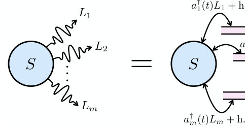
<figcaption class="paper-figure-caption"><b>Fig 1.</b> Figure 1: Dilation of the Lindblad evolution. Each jump operator Lα couples the system S to an independent bosonic field through a† α(t)Lα + h.c.. With all fields initially in the vacuum, tracing out the environment recovers the system’s Lindblad dynamics.</figcaption>
</figure>
<figure class="paper-figure-card">
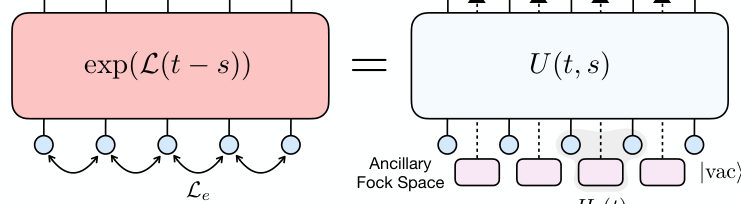
<figcaption class="paper-figure-caption"><b>Fig 2.</b> Figure 2: Dilation of nearest-neighbour Lindblad dynamics on a chain. Each edge term Le is represented by a system–environment interaction He(t) involving the two adjacent sites (blue disks) and ancillary bosonic fields (pink rectangles). The fields start in the vacuum and are traced out after the joint unitary evolution U(t,s), with t ≥s.</figcaption>
</figure>
<figure class="paper-figure-card">
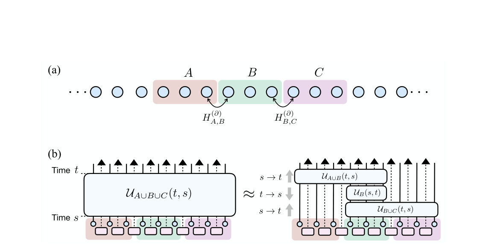
<figcaption class="paper-figure-caption"><b>Fig 3.</b> Figure 3: Local splitting of the system–environment evolution. (a) Regions A, B, and C, with boundary interactions H(∂) A,B and H(∂) B,C. (b) The full evolution is approximated by evolution on B ∪C, backward evolution on B, and evolution on A ∪B. The environment is retained throughout all three operations and traced out only at the end.</figcaption>
</figure>
<figure class="paper-figure-card">
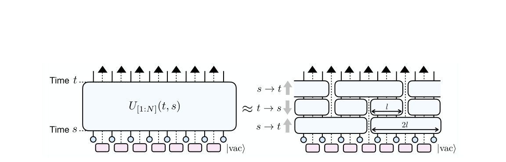
<figcaption class="paper-figure-caption"><b>Fig 4.</b> Figure 4: Three-layer decomposition of the dilated evolution. Each layer comprises unitaries that factorize over blocks of width at most 2l. In the final algorithm, l = O(log(Nt/ε)).</figcaption>
</figure>
<figure class="paper-figure-card">
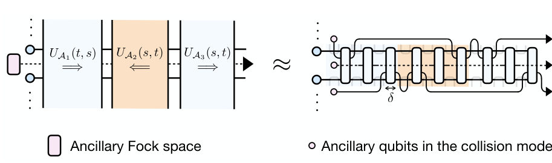
<figcaption class="paper-figure-caption"><b>Fig 5.</b> Figure 5: Collision-model approximation (right) of a sequence of forward and backward system– environment evolutions (left). The bosonic fields are replaced by ancillary qubits associated with time bins of width δ. Each ancillary qubit is used three times: first during forward evolution, again during the corresponding backward time step and a third time in the final forward time step. In the end, the ancillary qubits are traced out.</figcaption>
</figure>

**Summary.** This paper presents a near-optimal quantum algorithm to simulate dynamics governed by Lindbladian master equations on a lattice. By utilizing the exact dilation into a system-environment unitary evolution, the authors adapt techniques from Hamiltonian simulation to handle the irreversible nature of open quantum systems. This achieves scaling comparable to state-of-the-art methods, making it highly relevant for quantum simulation of dissipative processes.

**Why it may be interesting.** This work directly addresses simulating open quantum systems (Lindbladians) on quantum hardware, which is a major challenge in quantum computation, by adapting successful techniques from Hamiltonian simulation.

Detailed structure

**Main problem.** Developing quantum algorithms to simulate time evolution under geometrically local Lindbladians efficiently.

**Main result.** The authors present a near-optimal algorithm achieving gate depth $O(t 	ext{ polylog}(Nt/\epsilon))$, matching the performance of HHKL for Hamiltonian simulation.

**Method.** The approach involves using an exact dilation of the Lindblad master equation via Quantum Stochastic Calculus and then applying techniques analogous to those used for Hamiltonian simulation.

**Model / system.** The system is a lattice of qudits whose dynamics are governed by a Lindbladian master equation $\mathcal{L} = \sum_e L_e$. The simulation is performed by mapping the Lindbladian evolution to a unitary evolution of an extended system-environment state.

**Key observables.** Approximation error in the diamond norm ($\lVert E - \exp(Lt) 
Vert_\diamond \le \epsilon$), and the required gate complexity.

**Important parameters / regimes.** Evolution time ($t$), system size ($N$), and approximation error ($\epsilon$).

**Assumptions / limitations.** The analysis requires bounding the environment state to a low-excitation subspace and relies on constructing efficient block-encodings for the system-environment dynamics.

**Figures summary.** Figures illustrate the dilation of the Lindblad evolution, showing how jump operators couple the system to independent bosonic fields, and how the system-environment interaction is modeled.

**Paper structure.** The paper first establishes the problem using the Lindbladian and its dilation. It then develops techniques to bound the system-environment interaction within a low-excitation space, culminating in the construction of unitaries using block-encoding and polar factor approximations to achieve the final complexity bounds.

Abstract

We consider the problem of simulating dynamics under geometrically local Lindbladians acting on a lattice of qudits. We present an algorithm to approximate the time evolution under these Lindbladians for evolution time $t$ and on $N$ qudits to diamond norm error $\varepsilon$ using geometrically local circuits of depth $O(t \ \polylog(Nt/\varepsilon))$. Our results thus achieve a performance comparable to that of the Haah-Hastings-Kothari-Low (HHKL) algorithm for lattice Hamiltonian simulation.

[↑ back to top](#top)

### [Optically-Induced Modulation and Programming of Diamond Photonic Cavities](http://arxiv.org/abs/2609.37163v1)

**Authors:** Yuchun Zhu, Amirali Arabmoheghi, Nicolas Le Thomas, Niels Quack, Valentin Goblot, Christophe Galland  
**Type:** experiment · **Category:** quantum information and computing · **PDF:** <https://arxiv.org/pdf/2609.37163v1>  
**Analysis basis:** full PDF text, analyzed in chunks
**Topic relevance:** 🔥 `QC/QI experiment` **4/5** · 🔥 `quantum optics experiment` **4/5** · `analog quantum simulation` **3/5** · `Tavis-Cummings & cavity-many-emitter` **2/5** · `driven-dissipative phase transition` **2/5** · `interference shaping light` **1/5** · `quantum measurements` **1/5**

↔ Scroll figures horizontally

<figure class="paper-figure-card">
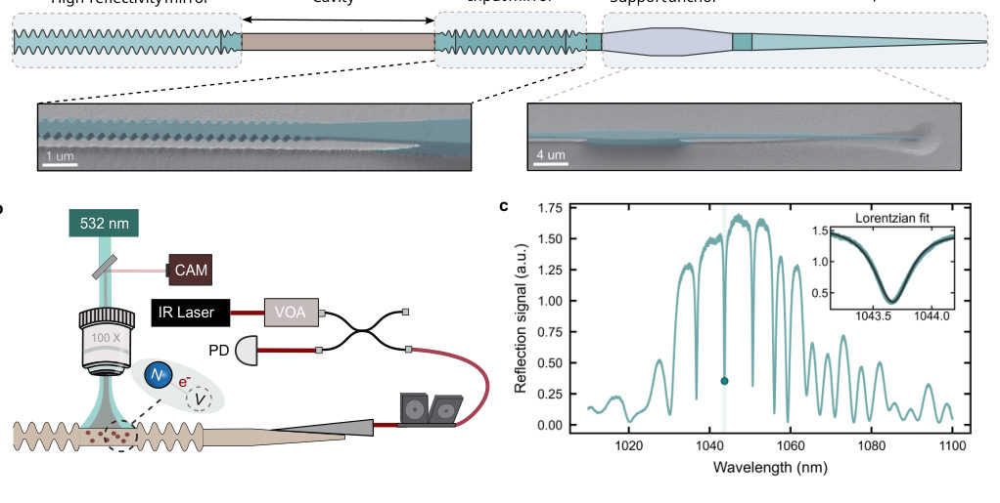
<figcaption class="paper-figure-caption"><b>Fig 1.</b> FIG. 1. Experimental scheme and representative cavity spectrum. a, Schematic of a suspended diamond Fabry–Perot</figcaption>
</figure>
<figure class="paper-figure-card">
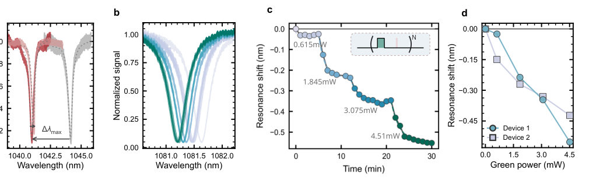
<figcaption class="paper-figure-caption"><b>Fig 2.</b> FIG. 2. Long-lived photorefractive tuning of diamond nanophotonic cavity resonances. a, Normalised reflection</figcaption>
</figure>
<figure class="paper-figure-card">
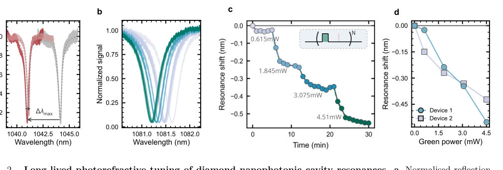
<figcaption class="paper-figure-caption"><b>Fig 3.</b> Figure 1c shows a representative normalized IR reflection spectrum of a fabricated device without green illumination.</figcaption>
</figure>
<figure class="paper-figure-card">
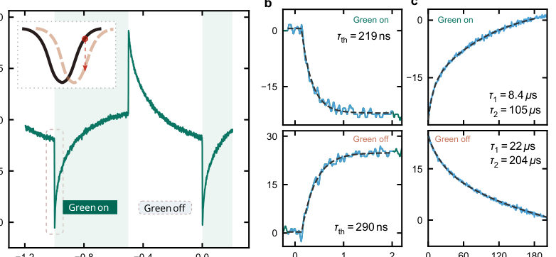
<figcaption class="paper-figure-caption"><b>Fig 4.</b> FIG. 3. Time-domain cavity response under square-wave green excitation. a, Representative time trace of the</figcaption>
</figure>
<figure class="paper-figure-card">
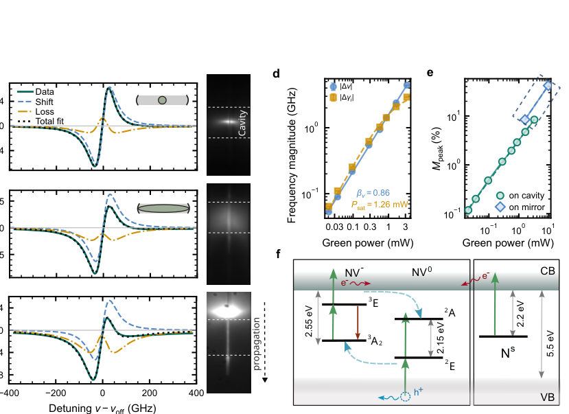
<figcaption class="paper-figure-caption"><b>Fig 5.</b> FIG. 4. Modulation of refractive index and absorption coefficient extracted from LIA spectra. a–c, Contrast-</figcaption>
</figure>

**Summary.** This paper demonstrates a novel method to dynamically control and tune diamond photonic cavities using only light. By inducing both fast thermal shifts and slow, quasi-permanent charge-mediated blue-shifts, the authors establish a highly reconfigurable platform. This work is crucial for developing integrated quantum and nonlinear photonic technologies.

**Why it may be interesting.** The work directly addresses the integration of quantum emitters (NV centers) into advanced photonic circuits, providing a platform for quantum light sources and nonlinear optics, which is central to quantum information processing.

Detailed structure

**Main problem.** The primary challenge addressed is developing practical, dynamic, and tunable mechanisms for controlling monolithic diamond photonic circuits.

**Main result.** The authors demonstrated all-optical modulation ($\approx 45\%$ depth) and long-lived, reversible tuning ($\Delta\lambda = 3.15 	ext{ nm}$) of diamond photonic cavities using green light excitation.

**Method.** The study employed optical spectroscopy, using an IR laser to probe the cavity resonance while modulating or illuminating it with a green laser (532 nm) to induce changes.

**Model / system.** The platform utilizes suspended diamond Fabry-Perot nanobeam cavities containing Nitrogen-Vacancy (NV) color centers. The physics involves competing contributions to the cavity shift: a thermo-optic red-shift and a novel charge-mediated blue-shift via free-carrier plasma dispersion.

**Key observables.** Infrared modulation depth, photo-refractive resonance blue-shift ($\Delta\lambda$), cavity linewidth, and time-dependent resonance shifts.

**Important parameters / regimes.** Modulation depth of $\approx 45\%$; maximum tuning of $3.15 	ext{ nm}$ ($0.87 	ext{ THz}$); comparison to high-voltage Pockels modulators.

**Assumptions / limitations.** The analysis assumes the free-carrier response is governed by the Drude model and that the observed shifts are due to the combination of thermal and photo-carrier effects.

**Figures summary.** Figures illustrate the experimental setup, long-lived photorefractive tuning over days, time-domain responses distinguishing fast thermal and slow charge-related shifts, and spectral analysis comparing different illumination conditions.

**Paper structure.** The paper progresses by first demonstrating the feasibility of all-optical modulation and tuning, then analyzing the temporal dynamics to separate thermal and charge-related shifts, and finally performing detailed modeling to confirm the free-carrier mechanism over singlet absorption.

Abstract

Single-crystal diamond combines exceptional optical, thermal, and mechanical properties while hosting optically addressable and spin-coherent colour centres, making it a promising platform for integrated quantum and nonlinear photonics. However, practical post-fabrication mechanisms for dynamically controlling and tuning monolithic diamond photonic circuits remain limited. Here, we demonstrate all-optical modulation and long-lived tuning of suspended diamond Fabry--Perot nanobeam cavities containing nitrogen-vacancy centres. Under 532~nm illumination, the infrared (1000 to 1100~nm) cavity response is governed by two competing contributions: a well-understood thermo-optic red-shift, and a novel charge-mediated blue-shift that we attribute to the free-carrier plasma dispersion effect. With 10~mW of 20~kHz-modulated green light, we achieve an infrared modulation depth of approximately 45\% of the available reflection contrast. Green illumination also produces quasi-permanent photo-refractive resonance blue-shifts, with a maximum observed tuning of 3.15~nm (0.87~THz), without measurable degradation of the cavity linewidth or contrast. Achieving the same cavity shift in a lithium-niobate Pockels modulator would require 200 to 500~V across a \(5~μ\mathrm{m}\) electrode gap. These results establish a monolithic diamond nanophotonic platform combining agile and reversible modulation with long-lived optical reconfiguration, two key ingredients in photonic technologies.

[↑ back to top](#top)

### [Ordering controlled by the measurement-feedback interval in quantum Boltzmann samplers](http://arxiv.org/abs/2609.36836v1)

**Authors:** Peng Wang, Yu-Xuan Zhang, Hai-Tao Ding, Leong-Chuan Kwek  
**Type:** theory · **Category:** statistical mechanics · **PDF:** <https://arxiv.org/pdf/2609.36836v1>  
**Analysis basis:** full PDF text, analyzed in chunks
**Topic relevance:** 🔥 `driven-dissipative phase transition` **4/5** · 🔥 `quantum measurements` **4/5** · `methods for driven-dissipative` **3/5** · `non-equilibrium universality` **3/5** · `Keldysh / 2PI / non-Gaussian methods` **1/5** · `analog quantum simulation` **1/5** · `correlated / nonlocal dissipation` **1/5**

↔ Scroll figures horizontally

<figure class="paper-figure-card">
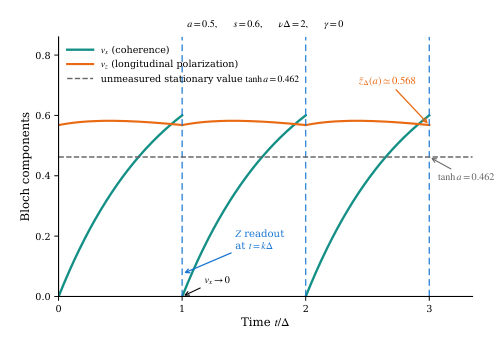
<figcaption class="paper-figure-caption"><b>Fig 1.</b> FIG. 1. Local dynamics underlying the response enhance- ment under periodic readout. Outcome-averaged Bloch com- ponents in the periodic steady state for a clamped input a = 0.5, with s = 0.6, ν∆= 2, and zero environmental de- phasing. The outcome-averaged dynamics follow Eq. (5) ini- tialized immediately after a readout at vx = 0 and vz = ¯z∆(a). Blue dashed lines mark projective Z readouts, which reset vx to zero while leaving the outcome-averaged vz unchanged. Be- tween readouts, transverse coherence rebuilds and vz evolves continuously. Orange dots mark the stationary readout polar- ization ¯z∆(a) ≃0.568, given by Eq. (9); this is not a time av- erage over the interval. The horizontal...</figcaption>
</figure>
<figure class="paper-figure-card">
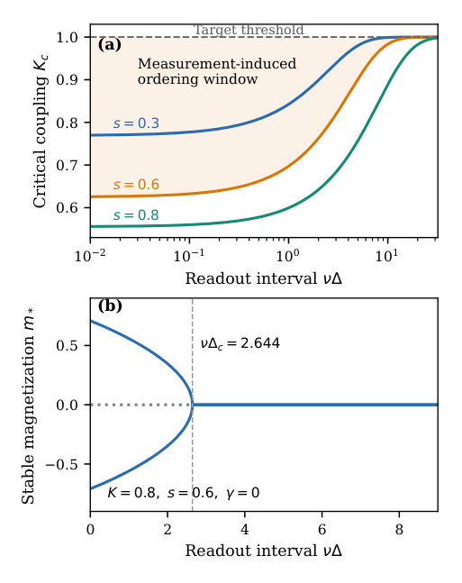
<figcaption class="paper-figure-caption"><b>Fig 2.</b> FIG. 2. Ordering controlled by the readout interval, with zero environmental dephasing. (a) Exact thermodynamic thresh- old, Eq. (27). The shaded region for s = 0.6 is ordered al- though the programmed Curie–Weiss law is disordered. (b) Stable solutions of Eq. (24) at K = 0.8, s = 0.6. The cen- tral dotted branch is unstable. Changing the interval alone crosses the transition at ν∆c = 2.6438.</figcaption>
</figure>
<figure class="paper-figure-card">
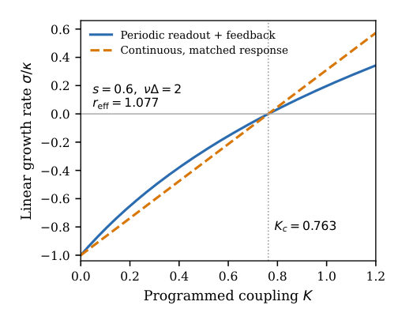
<figcaption class="paper-figure-caption"><b>Fig 3.</b> FIG. 3. Linear relaxation at matched static response. At s = 0.6 and ν∆= 2, the continuous model uses r = reff(∆) from Eq. (14). The curves show Eq. (34) in physical time, normalized by κ. They share the critical coupling but have different relaxation rates below it and different growth rates above it. The comparison concerns infinitesimal perturba- tions about m = 0, not relaxation within an ordered branch.</figcaption>
</figure>
<figure class="paper-figure-card">
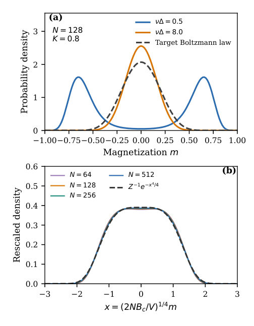
<figcaption class="paper-figure-caption"><b>Fig 4.</b> FIG. 4. Exact stationary calculations for the measured finite network. (a) At N = 128, K = 0.8, s = 0.6, the output is bimodal for ν∆= 0.5 and unimodal for ν∆= 8. The dashed curve is the programmed law, Eq. (1). (b) At K = Kc(0.5/ν) = 0.661927, rescaled distributions approach the quartic critical form. Here V = 1 −E2 and Bc is given by Eq. (31). All curves are theoretical; no trajectory sampling is used.</figcaption>
</figure>

**Summary.** This work demonstrates that the mere act of repeatedly measuring and feeding back results from a quantum system can induce collective ordering, even if the system's inherent programmed state is disordered. The ordering transition is controlled by the measurement-feedback interval, leading to dynamics that mimic continuous dephasing models. This highlights the profound role of measurement back-action in shaping macroscopic quantum behavior.

**Why it may be interesting.** It provides a concrete, measurable mechanism (measurement frequency) by which non-equilibrium quantum dynamics can induce macroscopic order, offering insights into measurement-induced phase transitions relevant to open quantum systems.

Detailed structure

**Main problem.** The paper investigates how the measurement-feedback interval controls the emergence of collective ordering in a quantum Boltzmann sampler, even when the underlying programmed distribution is disordered.

**Main result.** Shortening the measurement-feedback interval drives a continuous transition to an ordered stationary state, and the resulting dynamics map onto those of a continuous dephasing model.

**Method.** The authors derived the exact finite-interval Markov kernel and analyzed the stationary state by comparing discrete measurement dynamics with continuous master equation descriptions.

**Model / system.** The system is a quantum Boltzmann sampler implemented via a partial-reset qubit model, governed by a programmed Hamiltonian and subjected to repeated projective measurements with a feedback interval $\Delta$.

**Key observables.** Invariant polarization ($ar{z}_\Delta(a)$), stationary gain ($G_\Delta$), magnetization ($m$), and critical scaling exponents.

**Important parameters / regimes.** Measurement-feedback interval ($\Delta$), coupling strength ($J_{ij}$), and the environmental dephasing rate ($\gamma=0$ in the main analysis).

**Assumptions / limitations.** The analysis assumes ideal, instantaneous projective measurements and focuses on the zero environmental dephasing rate ($\gamma=0$).

**Figures summary.** Figures illustrate response enhancement exceeding the unmeasured value, the ordering window controlled by the readout interval, and comparisons of linear relaxation rates between the discrete and continuous models.

**Paper structure.** The paper progresses from deriving the finite-interval Markov kernel and showing response enhancement, to analyzing the continuous transition to order via fixed-point analysis, and finally confirming the differences between the discrete and continuous dynamics through critical scaling checks.

Abstract

We show that the measurement--feedback interval alone can induce ordering in a quantum Boltzmann sampler with fixed programmed couplings and a fixed local dissipative rule. At zero environmental dephasing, repeated projective measurements remove transverse coherence regenerated during relaxation, thereby enhancing the local longitudinal response. We derive the exact finite-interval Markov kernel for successive measurement records and obtain the ordering threshold in the Curie--Weiss limit. For couplings below the equilibrium Curie--Weiss threshold, shortening the readout interval drives a continuous transition to an ordered stationary state even though the programmed Boltzmann distribution remains disordered. The stationary response and equation of state map exactly onto those of a continuously interacting model with dephasing, while the linear relaxation rates remain distinct at matched static response. Exact finite-size stationary calculations reveal the transition through bimodal magnetization distributions and mean-field critical scaling.

[↑ back to top](#top)

### [Asymptotic Pseudospectra in Dissipative Floquet Quantum Systems: Geometric Structures and Observable Dynamics](http://arxiv.org/abs/2609.37523v1)

**Authors:** Yuncheng Xie, Haozhe Shi, Zhuocheng Ma, Weibin Chu, Xin-Gao Gong  
**Type:** theory · **Category:** other · **PDF:** <https://arxiv.org/pdf/2609.37523v1>  
**Analysis basis:** full PDF text, analyzed in chunks
**Topic relevance:** 🔥 `driven-dissipative phase transition` **4/5** · `methods for driven-dissipative` **3/5** · `non-equilibrium universality` **3/5** · `Keldysh / 2PI / non-Gaussian methods` **2/5** · `correlated / nonlocal dissipation` **2/5** · `analog quantum simulation` **1/5**

↔ Scroll figures horizontally

<figure class="paper-figure-card">
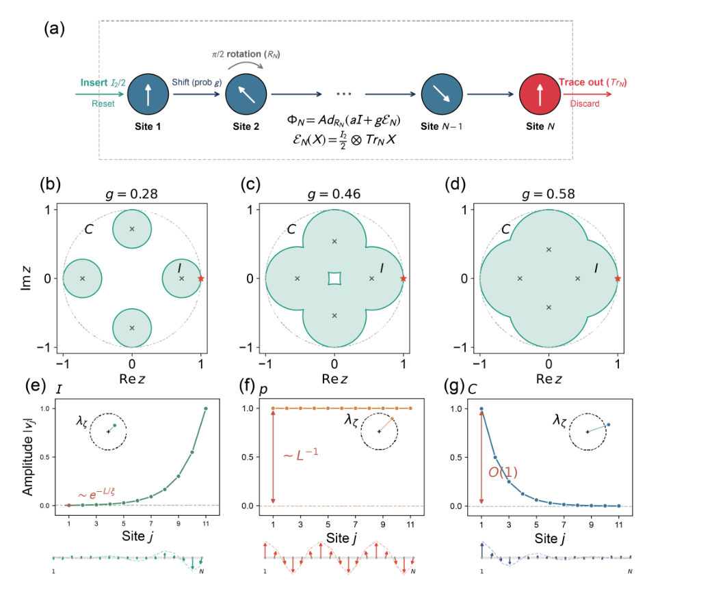
<figcaption class="paper-figure-caption"><b>Fig 1.</b> FIG. 1. Reorganization of the dissipative-shift-chain atlas with the activation probability g. (a) One period of the channel: insertion of a maximally mixed spin, a shift applied with probability g, a π/2 rotation, and the discarding of the last site. (b)–(d) Complete asymptotic pseudospectral atlas at g = 0.28, 0.46, and 0.58. The domains pass from disconnected, to a connected union enclosing a hole, to a filled center. Filled regions carry exponential validity scales, exposed solid boundaries linear scales, and the exterior a positive limiting residual. Crosses mark the exact nonstationary eigenvalues, the star the stationary multiplier, and the dashed circle is |z| = 1. (e)–(g) Spatial...</figcaption>
</figure>
<figure class="paper-figure-card">
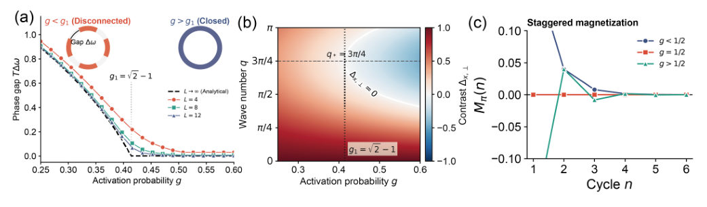
<figcaption class="paper-figure-caption"><b>Fig 2.</b> FIG. 2. Spin-wave observables diagnosing the two geometric transitions of the shift-chain atlas. All curves are theoretical predictions. (a) Width T∆ω of the excluded band of Floquet phases, Eq. (16), against the activation probability g. It vanishes at the first threshold g1 = √</figcaption>
</figure>
<figure class="paper-figure-card">
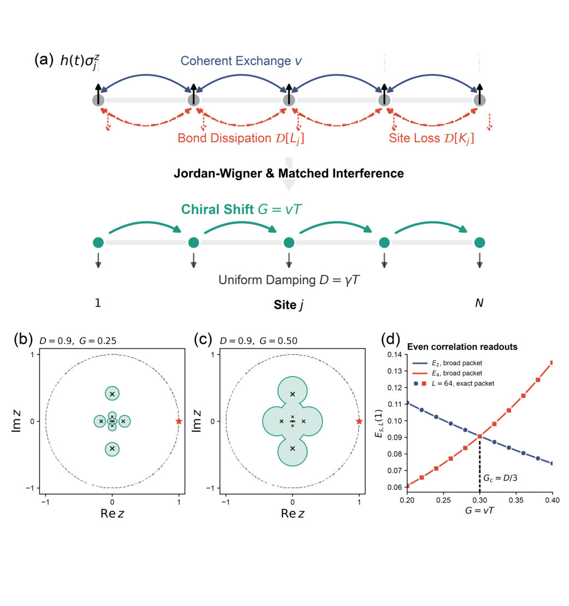
<figcaption class="paper-figure-caption"><b>Fig 3.</b> FIG. 3. Correlation control at fixed stationary state and fixed exact Floquet spectrum in the chiral XY model. (a) The effective dynamics. A spin chain with coherent exchange, bond dissipation, and site loss maps under the Jordan–Wigner transformation and matched interference onto a strict directed shift with uniform damping. (b)–(c) Complete spin-operator pseudospectral atlases at G = 0.25 and G = 0.50, both at D = 0.9. The exact eigenvalues (crosses), the stationary multiplier (star), and the unit circle are identical in the two panels; only the domains deform. Filled domains carry exponential validity scales, exposed solid interfaces linear scales, and the exterior a positive limiting...</figcaption>
</figure>

**Summary.** This paper develops a novel 'asymptotic pseudospectral atlas' to analyze open quantum systems driven by periodic forces, where standard spectral methods fail. By classifying the geometry of the pseudospectra, the authors predict that global structural changes in this atlas correspond directly to measurable physical events, such as the exchange of correlation signal orders in the chiral XY model.

**Why it may be interesting.** This work provides a powerful, geometry-based theoretical tool to predict observable changes in complex, non-Hermitian, open quantum systems, linking spectral theory directly to measurable physical phenomena.

Detailed structure

**Main problem.** The paper addresses the limitations of the Floquet spectrum for periodically driven open quantum systems, necessitating the use of pseudospectra to accurately characterize dynamics in the thermodynamic limit.

**Main result.** The authors establish an 'asymptotic pseudospectral atlas' that provides a geometric structure classifying the validity regimes (exponential, algebraic, bounded) of approximate modes, which dictates observable physical transitions.

**Method.** The core method involves analyzing the asymptotic size-scaling laws of pseudospectral residuals, formalizing this into an atlas that partitions the unit disk into distinct geometric domains.

**Model / system.** The study applies to general periodically driven open quantum systems, demonstrated using specific models like a dissipative shift chain and the chiral XY model.

**Key observables.** Spin-wave observables, correlation signals, and the pseudospectral residual $\epsilon_N(z)$ are used to detect geometric transitions.

**Important parameters / regimes.** The key parameters include the driving strength ($g$) and the system size ($N$), which govern the transitions between different scaling regimes.

**Assumptions / limitations.** The analysis relies on the 'common-limit hypothesis' for simplifying the asymptotic indices and involves complex block constructions for error bounding.

**Figures summary.** Figures illustrate the evolution of the pseudospectral atlas, showing how components merge and holes close at critical parameter values ($g_1, g_2$).

**Paper structure.** The paper builds from defining the pseudospectral problem to introducing the asymptotic atlas, then applies this geometric framework to analyze specific physical models (dissipative shift chain, chiral XY model) to predict observable changes.

Abstract

In periodically driven open quantum systems, nonnormality renders the Floquet spectrum insufficient as the system approaches the thermodynamic limit, so that pseudospectra are needed to characterize the dynamics accurately. While conventional approaches mainly focus on the local dynamics of isolated pseudospectra, their global connections and the resulting physical consequences for observables have remained largely unexplored. Here, we uncover this collective behavior by classifying the unit disk into distinct domains of exponential, algebraic, and bounded accuracy according to the asymptotic size-scaling laws of pseudospectral residuals, yielding an underlying geometric structure. We demonstrate the physical implications of this structure through two exactly solvable models. First, in a dissipative shift chain, parameter tuning drives geometric transitions that are detectable via spin-wave observables. Second, in a chiral XY model, we use this geometric structure to explain the origin of a measurable phenomenon: two correlation signals exchange their retention order under continuous parameter tuning. Our findings not only establish a new theoretical paradigm for understanding dissipative Floquet quantum systems, but also predict geometry-driven observables for quantum computing experiments.

[↑ back to top](#top)

### [Multimode radiation pressure actuation of a mechanical resonator using a spatial mode sorter](http://arxiv.org/abs/2609.38127v1)

**Authors:** Morgan E. Choi, Daniel Allepuz-Requena, Diego Torres-Barajas, Neshat Sadafi, Dalziel J. Wilson  
**Type:** experiment · **Category:** other · **PDF:** <https://arxiv.org/pdf/2609.38127v1>  
**Analysis basis:** full PDF text, analyzed in chunks
**Topic relevance:** 🔥 `interference shaping light` **4/5** · `quantum optics experiment` **3/5** · `analog quantum simulation` **2/5** · `methods for driven-dissipative` **2/5** · `quantum measurements` **2/5** · `correlated / nonlocal dissipation` **1/5** · `driven-dissipative phase transition` **1/5**

↔ Scroll figures horizontally

<figure class="paper-figure-card">
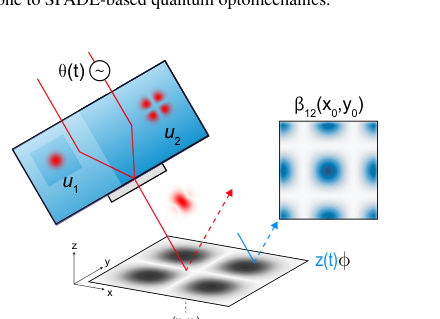
<figcaption class="paper-figure-caption"><b>Fig 1.</b> FIG. 1. Multimode radiation pressure actuation of a membrane. A dynamically structured laser beam is produced by modulating the relative phase θ between two spatial modes u1 and u2 using a multi- plane light converter (MPLC). Reflecting the laser from a membrane (modeshape φ) results in a vibration amplitude z proportional to the optomechanical scattering coefficient β12 = ⟨u2|φ|u1⟩. Rastering the beam position (x0,y0) yields a radiation pressure map β12(x0,y0).</figcaption>
</figure>
<figure class="paper-figure-card">
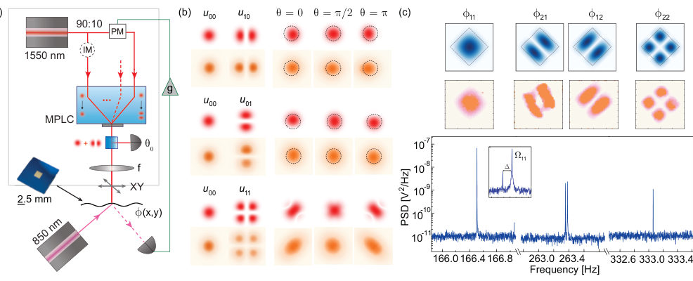
<figcaption class="paper-figure-caption"><b>Fig 2.</b> FIG. 2. Experimental setup and characterization of optical and mechanical modeshapes. (a) Experimental setup for two mode radiation pressure actuation and feedback control. PM = phase modulator. MPLC = Multi-plane light converter. f = lens for focusing onto membrane. XY = micropositioning stage for rastering location of beam on membrane. Green line = feedback of photocurrent from optical lever (purple). Inset: photograph of 2.5 mm square Si3N4 membrane. (b) Intensity profiles of single-mode umn and two-mode illumination fields u00 + αumneiθ produced by the MPLC, for |α|2 ≈0.1 and umn ∈{u00,u21,u11}. Red = model, orange = measurement. (c) Intensity profiles of membrane mechanical mode shapes...</figcaption>
</figure>
<figure class="paper-figure-card">
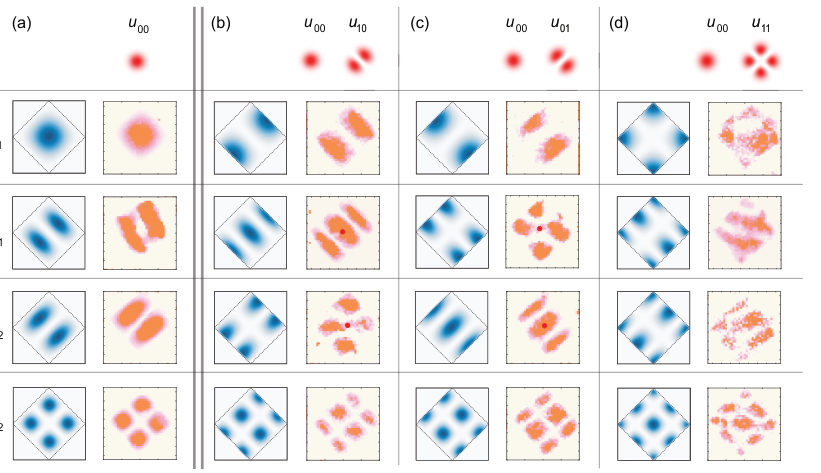
<figcaption class="paper-figure-caption"><b>Fig 3.</b> FIG. 3. Single and two-mode radiation pressure maps for HG-mode illumination of a square membrane. Four mechanical modes φi j (rows) and illumination scenarios u00 +αumneiθ (columns) are shown, corresponding to radiation pressure maps β 2 00,kl(x,y). Blue (orange) = model (measurement): (a) Single-mode u00 maps β 2 00,00(x,y) from Fig. 2c. (b-d) Two-mode maps for umn ∈{u10,u01,u11} using α2 ≈0.1 (b,c) and 0.5 (d). Red dots in (b) and (c) show the beam position used for the feedback cooling data in Fig. 4.</figcaption>
</figure>
<figure class="paper-figure-card">
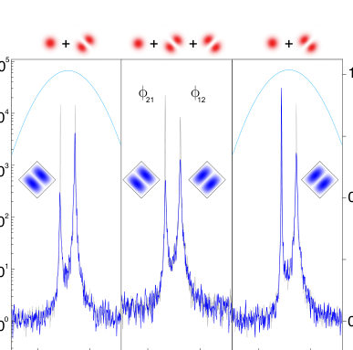
<figcaption class="paper-figure-caption"><b>Fig 4.</b> FIG. 4. Mechanical-mode-selective feedback cooling via multi- mode radiaton pressure actuation. Raw displacement power spec- tral densities (PSDs) for near-degenerature φ21 and φ21 membrane modes are shown, overlaid with the normalized magnitude of the feedback controller gain: a 1-kHz-wide notch filter (light blue, right axis). Left (right) plot: selective cooling of the φ21 (φ12) mechani- cal mode via feedback to the relative phase of the u10 (u01) and u00 optical modes. Middle plot: simultanous cooling of φ21 and φ12 via feedback to both u10 and u01. The beam position on the membrane is indicated by a red circle in Fig. 3.</figcaption>
</figure>

**Summary.** This research demonstrates how to use structured light from a spatial mode demultiplexer to exert a radiation pressure force on a mechanical membrane. By mapping the coupling coefficients, the authors show that two-mode illumination can probe spatial derivatives of the mechanical mode shapes. Crucially, they apply this to implement a feedback cooling scheme capable of simultaneously cooling multiple, nearly degenerate mechanical modes.

**Why it may be interesting.** This work directly bridges quantum optics (structured light, mode coupling) with mechanical quantum systems (nanoresonators, cooling), providing a powerful, scalable tool for quantum state preparation in mechanical oscillators.

Detailed structure

**Main problem.** The paper demonstrates the use of multimode radiation pressure to actuate and cool mechanical resonators, overcoming the difficulty of detecting radiation pressure effects with extended objects.

**Main result.** They successfully used two-mode structured light to map spatial derivatives of mechanical mode shapes and achieved selective, simultaneous cooling of two nearly degenerate mechanical modes.

**Method.** The technique involves illuminating a nanomechanical membrane with structured light generated by a spatial mode demultiplexer (SPADE) to exert a radiation pressure force proportional to mode coupling coefficients.

**Model / system.** The system is a $	ext{Si}_3	ext{N}_4$ nanomechanical membrane resonator. The interaction is governed by the radiation pressure force, which depends on the coupling coefficients $eta_{mn,kl}$ derived from the overlap of optical and mechanical mode profiles.

**Key observables.** Position-dependent intermodal coupling coefficients ($eta_{mn,kl}$), mechanical mode shapes ($\varphi_{ij}$), and the raw displacement power spectral densities (PSDs) showing selective cooling.

**Important parameters / regimes.** The coupling coefficients $eta_{mn,kl}$ are shown to be proportional to spatial derivatives of the mechanical mode shapes, allowing access to higher-order spatial information.

**Assumptions / limitations.** The analysis relies on the reflected field approximation for the optical interaction, and the cooling process is modeled using a feedback force proportional to the mechanical velocity ($\propto -\dot{z}$).

**Figures summary.** Figures illustrate the setup, showing how single-mode and two-mode illumination maps reproduce squared or derivative forms of the mechanical mode shapes. A key figure shows raw PSDs demonstrating the selective and simultaneous cooling of two distinct mechanical modes.

**Paper structure.** The paper first establishes the theoretical framework for multimode optomechanical scattering and radiation pressure force. It then details the experimental characterization of mode coupling using structured light. Finally, it applies this knowledge to implement a feedback cooling scheme to selectively cool multiple degenerate mechanical modes.

Abstract

Multimode optomechanical scattering is ubiquitous in free-space imaging protocols, but its radiation pressure counterpart is challenging to detect with extended objects. Here we demonstrate radiation pressure actuation of a nanomechanical membrane using dynamically structured light from a spatial mode demultiplexer (SPADE). Using single- and two-mode illumination, we directly image the position-dependent intermodal coupling between Hermite-Gauss (HG) modes as mediated by the membrane's motion. As an application, we use multimode radiation pressure feedback to simultaneously cool two nearly degenerate membrane modes. Our results are applicable to diverse mechanical systems and serve as a stepping stone to SPADE-based quantum optomechanics.

[↑ back to top](#top)

### [Factorization dynamics between quantum Fisher information and quantum coherence](http://arxiv.org/abs/2609.36571v1)

**Authors:** Xinzhi Zhao, Xinglei Yu, Liangsheng Li, Wenting Zhou, Chengjie Zhang  
**Type:** both · **Category:** quantum information and computing · **PDF:** <https://arxiv.org/pdf/2609.36571v1>  
**Analysis basis:** full PDF text, analyzed in chunks
**Topic relevance:** 🔥 `quantum optics experiment` **4/5** · `QC/QI experiment` **3/5** · `interference shaping light` **3/5** · `analog quantum simulation` **2/5** · `quantum measurements` **2/5**

↔ Scroll figures horizontally

<figure class="paper-figure-card">
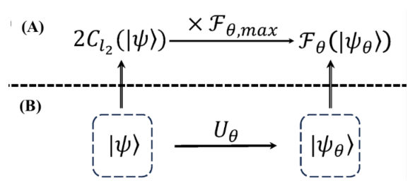
<figcaption class="paper-figure-caption"><b>Fig 1.</b> Fig. 1. Relation of the QFI and quantum coherence. Diagram of the factorization law for the QFI with coherence in the pure state model, Uθ = e−i ˆ Hθ. (A) Factorization law for the QFI. (B) Corresponding evolution process.</figcaption>
</figure>
<figure class="paper-figure-card">
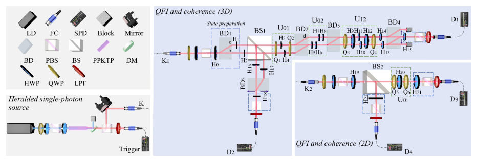
<figcaption class="paper-figure-caption"><b>Fig 2.</b> Fig. 2. Illustration of the experimental setup. An experimental device for testing the factorization law for the QFI and coherence, including qubit cases (2D) and qutrit cases [three-dimensional (3D)]. Pairs of single photons are generated via spontaneous parameter down-conversion (SPDC) using a type II periodically poled potassium titanyl phosphate (PPKTP) crystal. For a wave plate group consisting of an HWP and a quarter-wave plate (QWP), the signal photons with arbitrary linear polarization states are prepared by using a polarized beam splitter (PBS), beam displacer (BD), and HWPs. On a 50:50 unpolarized beam splitter (BS), the photons of the BS reflection path are measured in the...</figcaption>
</figure>
<figure class="paper-figure-card">
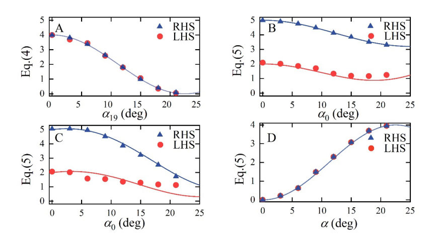
<figcaption class="paper-figure-caption"><b>Fig 3.</b> Fig. 3. Results for the QFI and quantum coherence. Factorization law for the QFI and coherence in the pure state, including (A) qubit cases and (B to D) qutrit cases. Using a fixed combination of unitary operators, we input different initial states. We denote αk as the angle of the HWP Hk, α19 as the angle of the initial states for qubit cases, and α0 (α) as the angle of the initial states for qutrit cases (α is prepared jointly by α0 and α1). (A) Equation 4 is used to verify the factorization law of the QFI and coherence in qubit cases. The blue and red dots display the experimental values for the right-hand side (RHS = 2Cl2Fθ1,max) and the left-hand side (LHS = Fθ1) in Eq. 4, and the...</figcaption>
</figure>
<figure class="paper-figure-card">
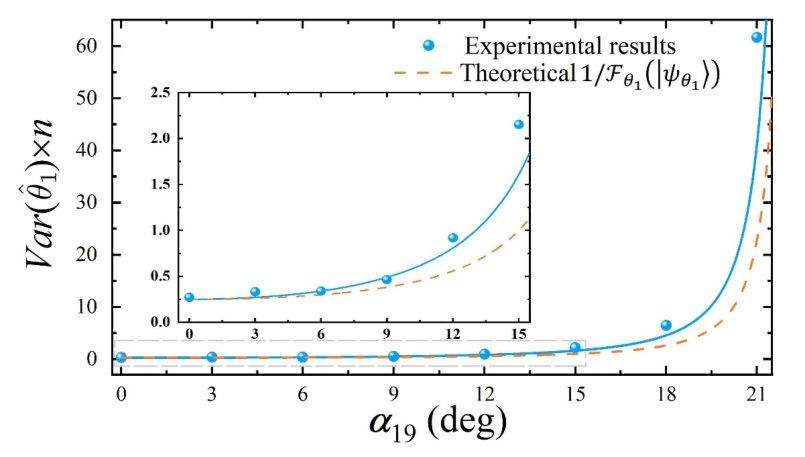
<figcaption class="paper-figure-caption"><b>Fig 4.</b> Fig. 4. Var(ˆθ) and 1/Fθ(|ψθ⟩) for varying the initial states of qubit cases. Equation 6 is used to verify the relation of Var(ˆθ1) × n and 1/Fθ1(|ψθ1⟩) in qubit cases. The experimental variances (blue dots) roughly correspond to the theoretical estimation accuracies (blue solid lines) (see the Supplementary Materials for details). The theoretical curve of 1/Fθ1(|ψθ1⟩) is represented by an orange dashed line.</figcaption>
</figure>

**Summary.** This paper explores the deep connection between Quantum Fisher Information (QFI) and quantum coherence, demonstrating a factorization law that relates the QFI to the initial state's coherence. By confirming this relationship both theoretically and experimentally using photonic qubits and qutrits, the authors provide a powerful tool for quantum metrology, allowing for parameter estimation bounds based only on initial state properties.

**Why it may be interesting.** This work provides a concrete, experimentally verified link between two fundamental quantum resources (coherence and QFI) that govern the ultimate precision limits in quantum sensing, which is highly relevant to quantum optics and quantum information theory.

Detailed structure

**Main problem.** The paper investigates the previously unexplored interplay and factorization relationship between the Quantum Fisher Information (QFI) and quantum coherence in the context of quantum parameter estimation.

**Main result.** The factorization law, linking QFI to the initial state's quantum coherence, is confirmed both theoretically and experimentally for both qubit and qutrit systems. This establishes a lower bound on the parameter estimation variance based solely on initial coherence.

**Method.** The authors employ theoretical derivations for the QFI and coherence measures, which are then verified using experimental measurements on photonic systems.

**Model / system.** The study uses pure states prepared in qubit and qutrit systems, evolving under a unitary transformation $U_{	heta}=e^{-i \hat{H}	heta}$. Experimentally, the platform involves an interferometric network utilizing heralded single-photon sources.

**Key observables.** Quantum Fisher Information ($F_{	heta}$), Quantum Coherence ($\mathcal{C}_{l2}(
ho)$), and the variance of the estimated parameter ($	ext{Var}(\hat{	heta})$).

**Important parameters / regimes.** The dimensionality of the system ($D=2$ for qubits, $D=3$ for qutrits) and the evolution angle $	heta$.

**Assumptions / limitations.** The analysis assumes the Hamiltonian $\hat{H}$ is independent of the parameter $	heta$ for the simplest QFI form, and the experimental measurements rely on specific unitary operations.

**Figures summary.** Figures illustrate the factorization law for QFI vs. coherence in both qubit and qutrit cases, and another figure validates the derived lower bound on the parameter estimation variance.

**Paper structure.** The paper progresses by first establishing the theoretical factorization law for QFI and coherence, then presenting the experimental setup and results to verify this law in both 2D and 3D systems, and finally confirming the resulting lower bound on estimation variance.

Abstract

Quantum Fisher information (QFI) quantifies the sensitivity of a quantum state to a parameter change and plays a key role in quantum metrology. Meanwhile, quantum coherence is a crucial resource for quantum information processing. However, despite extensive studies on various aspects of quantum metrology, the interplay between the dynamics of the QFI and quantum coherence remains unexplored. Here, we explore the factorization relationship between the QFI and quantum coherence, both theoretically and experimentally. We prepare pure states in qubit and qutrit systems and apply unitary evolution to investigate this relationship. Our results confirm the factorization law, offering strong evidence for this relationship. Furthermore, we establish a lower bound on the variance of the estimated parameter that does not require the final state information. This approach reveals a deep connection between the QFI and quantum coherence, providing insights into quantum parameter estimation. These findings have potential applications in quantum sensing and quantum metrology.

[↑ back to top](#top)

### [Spin-exchange interactions between circular Rydberg atoms over long times](http://arxiv.org/abs/2609.37766v1)

**Authors:** Andrés Durán-Hernández, Gautier Creutzer, Aurore Alice Young, Abderrahmane Kassid, Yohann Machu, Jean-Michel Raimond, Michel Brune, Clément Sayrin  
**Type:** experiment · **Category:** other · **PDF:** <https://arxiv.org/pdf/2609.37766v1>  
**Analysis basis:** full PDF text, analyzed in chunks
**Topic relevance:** 🔥 `analog quantum simulation` **4/5** · `QC/QI experiment` **3/5** · `Rydberg arrays` **3/5** · `quantum measurements` **2/5** · `correlated / nonlocal dissipation` **1/5** · `quantum optics experiment` **1/5**

↔ Scroll figures horizontally

<figure class="paper-figure-card">
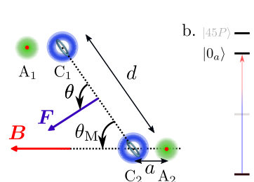
<figcaption class="paper-figure-caption"><b>Fig 1.</b> Figure 1. Manipulation and measurement of interact- ing circular Rydberg qubits. a. We trap two circular Rydberg atoms (C1 and C2, cyan tori) inside optical bottle beams (blue rings) and two auxiliary atoms (A1 and A2) in their ground state (red dots) inside Gaussian optical tweezers (green disks). The distance between the two circular Ryd- berg atoms is set to d = 19 µm and that between Ak and Ck(k ∈{1, 2}) to a = 5.2 µm. We apply a 14 G magnetic field B (red arrow) parallel to the (AkCk) axes, which make an angle θM ≈54.7◦with the (C1C2) axis. The electric field F (blue arrow) makes an angle θ with the latter. During the state preparation and measurement, θ = θM to cancel the interaction...</figcaption>
</figure>
<figure class="paper-figure-card">
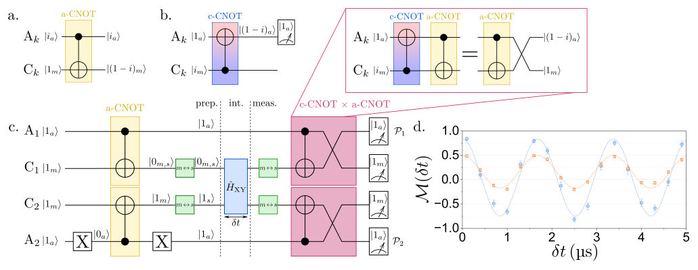
<figcaption class="paper-figure-caption"><b>Fig 2.</b> Figure 2. Manipulation and measurement of interacting circular Rydberg qubits. a. Quantum circuit of the circular-qubit state control. A mw π-pulse on the |1m⟩→|0m,s⟩transition applied on a circular Rydberg qubit Ck in the vicinity of an auxiliary atom Ak in |ia⟩, i ∈{0, 1} is equivalent to an auxiliary-atom-controlled CNOT gate (a-CNOT, yellow box). Ck initially in |1m⟩ends up in |(1 −i)m⟩. b. Quantum circuit of the auxiliary-atom-based measurement. The optical excitation of Ak from |1a⟩to |0a⟩in the vicinity of Ck in |im⟩, i ∈{0, 1}, is equivalent to a circular-qubit-controlled CNOT gate (c-CNOT, red-blue box), which leaves Ak in |(1 −i)a⟩. A subsequent fluorescence measurement of...</figcaption>
</figure>
<figure class="paper-figure-card">
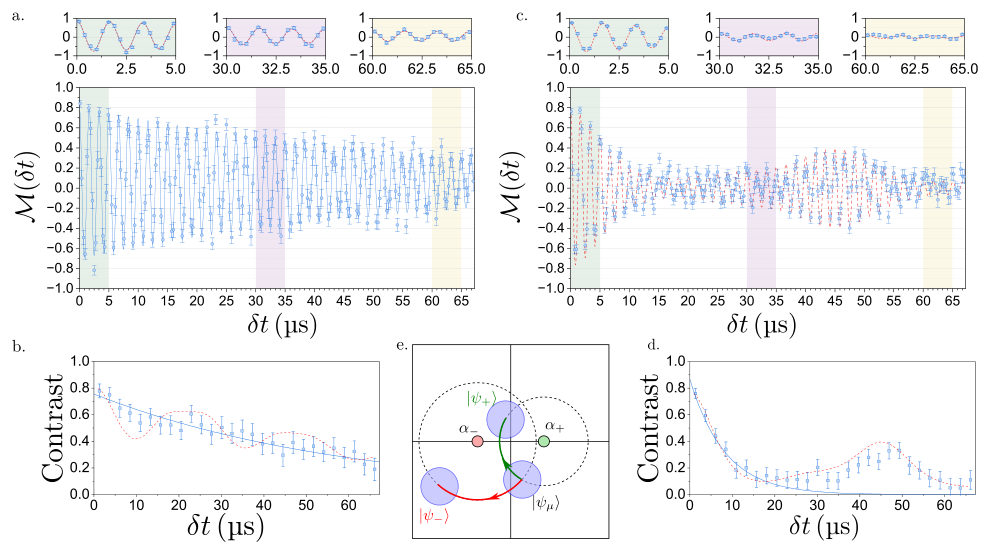
<figcaption class="paper-figure-caption"><b>Fig 3.</b> Figure 3. Long-time spin-exchange interaction and spin-motion coupling. a. Long-duration spin-exchange oscillations. Population imbalance M(δt) (blue points) measured after the sequence of Fig. 2.c. The insets are zooms on the colour-shaded time intervals. The solid blue line is an exponentially-damped sinusoidal fit to the data, with a characteristic decay time T1 = 59(3) µs. The dashed red lines in the insets display the semi-classical numerical simulations of the interaction. b. The contrasts of the measured oscillations (blue squares), of the numerical simulations (red dashed line) and of the exponentially-damped sinusoidal fit to the data of panel a are plotted as a function of δt. The...</figcaption>
</figure>
<figure class="paper-figure-card">
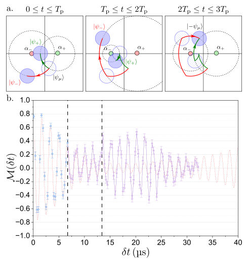
<figcaption class="paper-figure-caption"><b>Fig 4.</b> Figure 4. Dynamical decoupling. a. Phase space tra- jectories of an initial coherent state |ψµ⟩for the relative mo- tion during the dynamical decoupling sequence described in the text. Two phase flips are applied at times δt = Tp and δt = 2Tp. The trajectories are plotted in red and green for an initial spin state |+⟩or |−⟩, respectively. The red- and green- shaded disks indicate their respective rotation centres. The three panels (left to right) correspond to the time intervals be- fore the first phase flip (δt &lt; Tp, left), between the two phase flips (Tp &lt; δt &lt; 2Tp, middle) and after the second phase flip (2Tp &lt; δt &lt; 3Tp, right) in the case Tp = Tt/6. In all three panels, the dashed and...</figcaption>
</figure>

**Summary.** This paper reports on observing spin-exchange interactions between circular Rydberg atoms for unprecedentedly long durations (over 60 $\mu$s). The researchers improved the coherence time by an order of magnitude and demonstrated a novel dynamical decoupling sequence. This work paves the way for long-duration quantum simulation of complex, strongly-interacting quantum systems.

**Why it may be interesting.** This work directly addresses the coherence time limitation in quantum simulation platforms, providing a concrete, experimentally validated method (dynamical decoupling) to extend interaction times for strongly-interacting many-body systems using Rydberg atoms.

Detailed structure

**Main problem.** The primary challenge addressed is extending the interaction time for quantum simulations using neutral atoms, as current Rydberg-based systems are limited to microsecond timescales.

**Main result.** The authors observed spin-exchange interactions over timescales exceeding 60 $\mu$s, improving the state-of-the-art by an order of magnitude, and demonstrated a novel dynamical decoupling technique to counteract spin-motion coupling.

**Method.** The study uses laser-trapped circular Rydberg atoms to encode spin-1/2 qubits and measures the spin-exchange dynamics by monitoring the population imbalance over extended periods.

**Model / system.** The platform utilizes laser-trapped circular Rydberg atoms, forming a hybrid system with auxiliary atoms. The interaction is governed by spin-exchange coupling, and the dynamics are analyzed by measuring the time evolution of the spin coherence.

**Key observables.** Spin-exchange oscillation contrast, population imbalance $M(\delta t)$, and the decay rate of the spin oscillations.

**Important parameters / regimes.** Interaction times exceeding 60 $\mu$s, 40 spin-oscillation periods, and the characteristic decay time $T_1 \approx 59 \mu s$.

**Assumptions / limitations.** The analysis relies on post-selection via syndrome measurement to extend the effective qubit lifetime and models the decay due to spin-motion coupling.

**Figures summary.** Figures detail the physical setup, the quantum circuit sequence for state control and measurement, and the measured population imbalance $M(\delta t)$ showing exponential decay of oscillations over time.

**Paper structure.** The paper details the experimental setup, describes the quantum circuit sequence for state preparation and interaction, presents the measurement of the spin-exchange dynamics, and concludes with the demonstration of dynamical decoupling to preserve coherence.

Abstract

Arrays of neutral atoms excited to Rydberg levels have emerged as one of the most promising platforms for quantum computation and simulation. With the hope to outperform classical devices, the number of atoms has been increased by orders of magnitude. However, the interaction time, i.e., the maximum accumulated time during which an atom interacts with its neighbours, has been limited to a few microseconds only. This restrains the number of gates per atom or prevents the simulation of long-time dynamics of quantum many-body systems. Here, we observe the spin-exchange interaction between two spin 1/2s encoded in laser-trapped circular Rydberg atoms over more than $60μs$ and 40 spin-oscillation periods, improving the state of the art by an order of magnitude. These unprecedented timescales allow us to record for weak atomic trapping a collapse and revival of the spin-exchange oscillation contrast induced by spin-motion coupling. Our results constitute the first observation of this coupling with laser-trapped Rydberg atoms. To counteract its detrimental effect for quantum simulation, we demonstrate a novel dynamical decoupling method that prevents the collapse of the spin oscillations. This method exploits the advantages of our recently developed hybrid platform that enables the measurement and the optical manipulation of long-lived circular Rydberg atoms with auxiliary Rydberg atoms. This work opens a direct route to long-duration quantum simulation of strongly-interacting many-body systems.

[↑ back to top](#top)

### [L-band single-photon generation from a cavity-coupled silicon C-center](http://arxiv.org/abs/2609.37244v1)

**Authors:** Carolina Crosta, Kyu-Young Kim, Purbita Purkayastha, Abhijit Biswas, Jasvith Raj Basani, Amirehsan Alizadehherfati, Amirehsan Boreiri, Chang-Min Lee, Fabio Pezzoli, Edo Waks  
**Type:** experiment · **Category:** quantum information and computing · **PDF:** <https://arxiv.org/pdf/2609.37244v1>  
**Analysis basis:** full PDF text, analyzed in chunks
**Topic relevance:** 🔥 `quantum optics experiment` **4/5** · `QC/QI experiment` **3/5** · `Tavis-Cummings & cavity-many-emitter` **2/5** · `analog quantum simulation` **2/5** · `interference shaping light` **1/5** · `quantum measurements` **1/5**

↔ Scroll figures horizontally

<figure class="paper-figure-card">
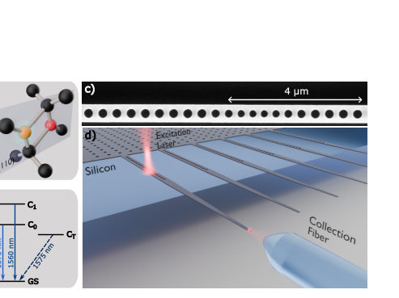
<figcaption class="paper-figure-caption"><b>Fig 1.</b> Figure 1: a) Atomic structure of the C-center. Black, orange and red spheres represent silicon, oxygen and car- bon atoms respectively; b) Electronic structure of the C- center with transition wavelengths at cryogenic tempera- tures; c) SEM image of the nanophotonic crystal cavity; d) Schematic of the experimental configuration. The emit- ter is excited from top, while the emitted light is collected in-plane through a lensed single-mode fiber.</figcaption>
</figure>
<figure class="paper-figure-card">
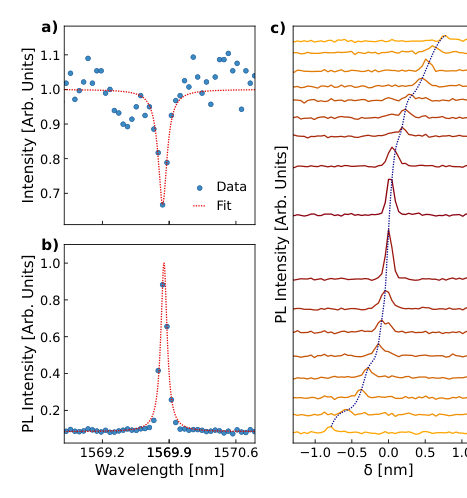
<figcaption class="paper-figure-caption"><b>Fig 2.</b> Figure 2: a) Reflectivity spectrum of the cavity tuned at the C0-line wavelength (dots) and corresponding Lorentzian fit (dashed line), extracting FWHM = 0.11 ± 0.02 nm that corresponds to a quality factor of (1.4 ± 0.3) × 104; b) Pho- toluminescence spectrum (dots) of the emitter at 8 K un- der 800 nm CW excitation, pump power of 10 µW, in on- resonance condition. The Lorentzian fit of the experimental data (dashed line) provides λZPL = 1569.831±0.004 nm and FWHM = 0.078±0.001 nm; c) Photoluminescence intensity as a function of the cavity mode detuning δ. The dashed line is a visual guide to follow the change of δ.</figcaption>
</figure>
<figure class="paper-figure-card">
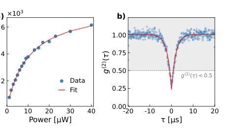
<figcaption class="paper-figure-caption"><b>Fig 3.</b> Figure 4: a) On-resonance C-center count rate as a func- tion of 800 nm CW pump power (dots) and two-level system fit (solid line) with Equation 2, extracting Psat = 10.4±0.3 µW and Isat = (7.68 ± 0.09) × 103 cps; b) Second-order autocorrelation measurement of a C-center under 7 µW = 0.67Psat at 800 nm CW excitation (dots) and correspond- ing fit (solid line) with Equation 3, extracting g(2)(0) = 0.23 ± 0.01.</figcaption>
</figure>
<figure class="paper-figure-card">
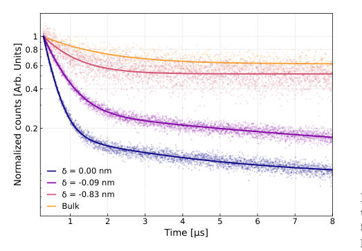
<figcaption class="paper-figure-caption"><b>Fig 4.</b> Figure 3: Time-resolved photoluminescence measurements of a C-center ensemble in a bare nanobeam (orange curve), providing τ0 = 1.45±0.08 µs and a single C-center in a cavity tuned (i) on-resonance (δ = 0 nm, τon = 0.287 ± 0.002 µs); (ii) slightly off-resonance (δ = −0.09 nm, showing a fast increase of the lifetime to τ = 0.523 ± 0.005 µs); and (iii) off-resonance (δ = −0.83 nm, τoff = 0.780 ± 0.030 µs). The C-center is measured at 8 K and excited by a 780 nm pulsed laser with a repetition rate of 100 kHz.</figcaption>
</figure>

**Summary.** This paper reports the successful realization of a single, high-performance quantum light source using a silicon C-center defect coupled to a photonic crystal cavity. By demonstrating strong Purcell enhancement and confirming single-photon emission in the telecom L-band, the research establishes a critical building block for future low-loss quantum communication technologies.

**Why it may be interesting.** This work directly addresses the engineering challenge of integrating quantum emitters into silicon photonics, which is a cornerstone technology for scalable quantum networks and quantum communication.

Detailed structure

**Main problem.** The primary goal is to create a scalable, low-loss, and long-distance quantum light source using single-photon emitters integrated into silicon photonics.

**Main result.** The authors successfully isolated a single silicon C-center and demonstrated single-photon emission ($g^{(2)}(0) = 0.23$) with a significant Purcell enhancement ($F_P \geq 33$) in the telecom L-band.

**Method.** The study combines advanced optical characterization techniques, including time-resolved photoluminescence (PL) measurements and second-order autocorrelation measurements, on a solid-state platform.

**Model / system.** The system utilizes a single C-center defect in Silicon-on-Insulator (SOI) coupled to a high-quality factor nanophotonic crystal cavity. The physics is analyzed using concepts from cavity quantum electrodynamics (Purcell effect) and single-photon statistics.

**Key observables.** Zero-phonon line (ZPL) emission at $\sim 1570$ nm, excited-state lifetime ($	au$), Purcell factor ($F_P$), and the second-order correlation function $g^{(2)}(0)$.

**Important parameters / regimes.** Telecom L-band (1565 - 1625 nm), Purcell factor lower bound of 33, and $g^{(2)}(0) = 0.23$.

**Assumptions / limitations.** The analysis assumes the observed enhancement is due to cavity coupling, and the single-photon nature is confirmed by $g^{(2)}(0) < 0.5$.

**Figures summary.** Figures illustrate the PL spectrum vs. detuning, time-resolved PL showing lifetime changes, and the $g^{(2)}(	au)$ measurement confirming single-photon statistics.

**Paper structure.** The paper progresses from establishing the physical system (C-center in SOI) to demonstrating cavity coupling via PL enhancement, quantifying the enhancement via lifetime measurements (Purcell factor), and finally confirming single-photon emission using $g^{(2)}$ measurements.

Abstract

Monolithic integration of single-photon sources into silicon photonics offers a compelling solution for realizing scalable quantum telecommunication architectures. Among the candidate silicon color centers, the C-center features a zero-phonon emission in the telecom L-band, corresponding to the spectral window of minimum transmission loss in optical fibers. Despite this advantage, isolating single C-centers has remained an unrealized challenge in solid-state quantum optics. In this work, we report the isolation of a single silicon C-center. We enhance the spontaneous emission rate of the zero-phonon line by coupling the single emitter to a nanophotonic crystal cavity, observing a fivefold reduction in the excited-state lifetime compared to bulk conditions, which corresponds to a Purcell factor lower bound of 33. Second-order autocorrelation measurements confirm single-photon emission from the investigated defect, obtaining an optical purity of $g^{(2)}(0) = 0.23$ without background correction. Our results establish a native telecom L-band quantum light source in silicon, laying the foundation for ultra-low-loss and long-distance quantum applications.

[↑ back to top](#top)

### [Exact anomalous current fluctuations in the strong-anisotropy limit of the XXZ chain](http://arxiv.org/abs/2609.37512v1)

**Authors:** Taiki Ishiyama, Taiga Kurose, Kazuya Fujimoto, Tomohiro Sasamoto  
**Type:** theory · **Category:** statistical mechanics · **PDF:** <https://arxiv.org/pdf/2609.37512v1>  
**Analysis basis:** full PDF text, analyzed in chunks
**Topic relevance:** 🔥 `non-equilibrium universality` **4/5** · `Full counting statistics` **3/5** · `Keldysh / 2PI / non-Gaussian methods` **2/5** · `analog quantum simulation` **2/5** · `methods for driven-dissipative` **1/5**

↔ Scroll figures horizontally

<figure class="paper-figure-card">
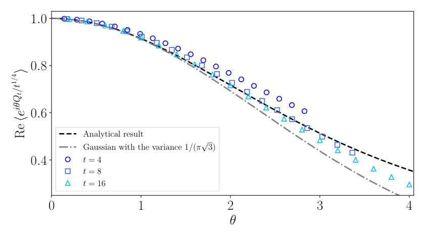
<figcaption class="paper-figure-caption"><b>Fig 1.</b> Figure 1: Real part of the characteristic function of the rescaled current, ⟨eiθQt/t1/4⟩. Numerical results at t = 4, 8, and 16 are compared with the long-time prediction in Eq. (3.12) and the characteristic function of a zero-mean Gaussian with the same variance limt→∞⟨Q2 t⟩c /t1/2 = 1/(π √</figcaption>
</figure>
<figure class="paper-figure-card">
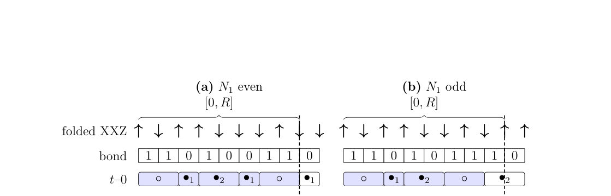
<figcaption class="paper-figure-caption"><b>Fig 2.</b> Figure 2: Schematic illustration of the mapping from the folded XXZ spin configuration to the bond configuration and then to the t–0 configuration. For even N1, the endpoint R ∈2N coincides with a boundary between two t–0 objects, whereas for odd N1, it lies inside a t–0 object. We denote by L, N, and N1 the numbers of t–0 objects, •-objects, and •1-objects, respectively, that are fully contained in (b1, . . . , bR). These complete objects are shaded in blue. A t–0 object straddling the endpoint R is not counted. For panels (a) and (b), the corresponding sectors are (L, N, N1) = (5, 3, 2) and (L, N, N1) = (4, 2, 1), respectively.</figcaption>
</figure>
<figure class="paper-figure-card">
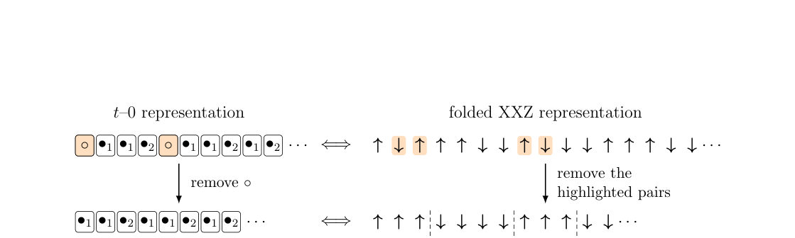
<figcaption class="paper-figure-caption"><b>Fig 3.</b> Figure 3: Relation between the t–0 spin configuration and the magnetization domains in the folded XXZ chain. The upper row shows a t–0 configuration and its corresponding folded spin configuration, with the leftmost spin fixed to ↑. Removing the ◦-objects eliminates the highlighted oppositely oriented spin pairs, leaving the total magnetization unchanged. The lower row shows the remaining occupied objects and the corresponding folded configuration, which consists of magnetization domains without isolated spins. The dashed lines mark the positions of the domain walls, each represented by a t–0 spin label 2. Cancelling an oppositely oriented spin pair across each wall leaves successive groups...</figcaption>
</figure>
<figure class="paper-figure-card">
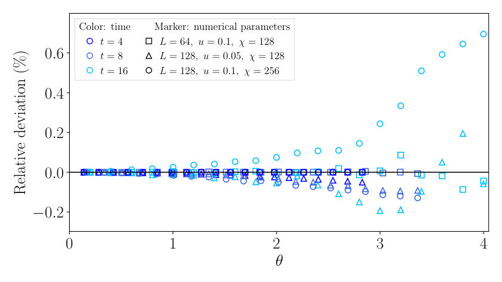
<figcaption class="paper-figure-caption"><b>Fig 4.</b> Figure 4: Relative deviations of the real part of the characteristic function ⟨eiθQt/t1/4⟩from the reference calculation with (L, u, χ) = (128, 0.1, 128). The deviations are defined as the difference between each numerical result and the reference, divided by the reference and expressed as a percentage. Colors indicate the physical times t = 4, 8, 16, while markers distinguish the three parameter sets specified in the legend. The absolute relative deviations remain below approximately 0.7% throughout the plotted range.</figcaption>
</figure>

**Summary.** This paper derives the exact long-time behavior of anomalous spin-current fluctuations in the folded XXZ chain. By mapping the system to the t-0 model and exploiting spin-charge separation, the authors find that the current distribution converges to a non-Gaussian M-Wright function. This provides a rigorous theoretical result for anomalous transport in strongly correlated quantum magnets.

**Why it may be interesting.** The exact derivation of non-Gaussian, anomalous transport statistics in an integrable quantum chain provides deep insights into non-equilibrium dynamics, which is crucial for understanding energy/particle transport in quantum materials.

Detailed structure

**Main problem.** The paper investigates the universal aspects of transport in interacting many-body systems, specifically determining the probability distribution of the time-integrated spin current.

**Main result.** The long-time asymptotic distribution of the rescaled time-integrated spin current converges to a non-Gaussian distribution described by the M-Wright function.

**Method.** The analysis involves mapping the folded XXZ chain to the one-dimensional t-0 model, exploiting exact spin-charge separation to reduce the problem to a free-fermion dynamical calculation.

**Model / system.** The study focuses on the folded XXZ chain, which models the strong-anisotropy limit of the XXZ spin chain. The dynamics are analyzed at infinite temperature, utilizing the mapping to the t-0 model.

**Key observables.** The primary observable is the time-integrated spin current, $Q_t$, analyzed via its Moment-Generating Function (MGF), $\langle e^{\lambda Q_t} 
angle$.

**Important parameters / regimes.** The analysis focuses on the long-time limit ($t 	o \infty$) and the scaling of the current, $Q_t/t^{1/4}$.

**Assumptions / limitations.** The derivation relies on a nonlocal map to the t-0 model and the assumption that the long-time behavior is governed by the free-fermion dynamics after separation.

**Figures summary.** Figure 1 compares the characteristic function of the current at finite times (t=4, 8, 16) against the derived asymptotic prediction and a Gaussian reference.

**Paper structure.** The paper establishes the problem by defining the MGF for the spin current, derives an exact finite-time expression by mapping to the t-0 model, and concludes with a long-time asymptotic analysis yielding the M-Wright function distribution.

Abstract

We study spin-current fluctuations of the folded XXZ chain, which describes the strong-anisotropy limit of the XXZ chain. We obtain an exact expression for the moment-generating function of the time-integrated spin current at infinite temperature. A long-time asymptotic analysis establishes that the rescaled time-integrated current converges to a non-Gaussian distribution described by the M-Wright function. The derivation relies on a nonlocal map to the one-dimensional t-0 model and its exact spin-charge separation. By extending this approach, we also show that the dynamical correlation function of the spins summed over two adjacent sites exhibits a diffusive Gaussian profile at long times.

[↑ back to top](#top)

### [Attosecond correlation interferometry](http://arxiv.org/abs/2609.37838v1)

**Authors:** Assaf Shonfeld, Keren Deutsch, Noa Yaffe, Michael Birk, Matan Even Tzur, Barak Dayan, Oren Cohen, Nirit Dudovich, Chen Mor  
**Type:** experiment · **Category:** other · **PDF:** <https://arxiv.org/pdf/2609.37838v1>  
**Analysis basis:** full PDF text, analyzed in chunks
**Topic relevance:** 🔥 `quantum optics experiment` **4/5** · `interference shaping light` **3/5** · `quantum measurements` **2/5**

↔ Scroll figures horizontally

<figure class="paper-figure-card">
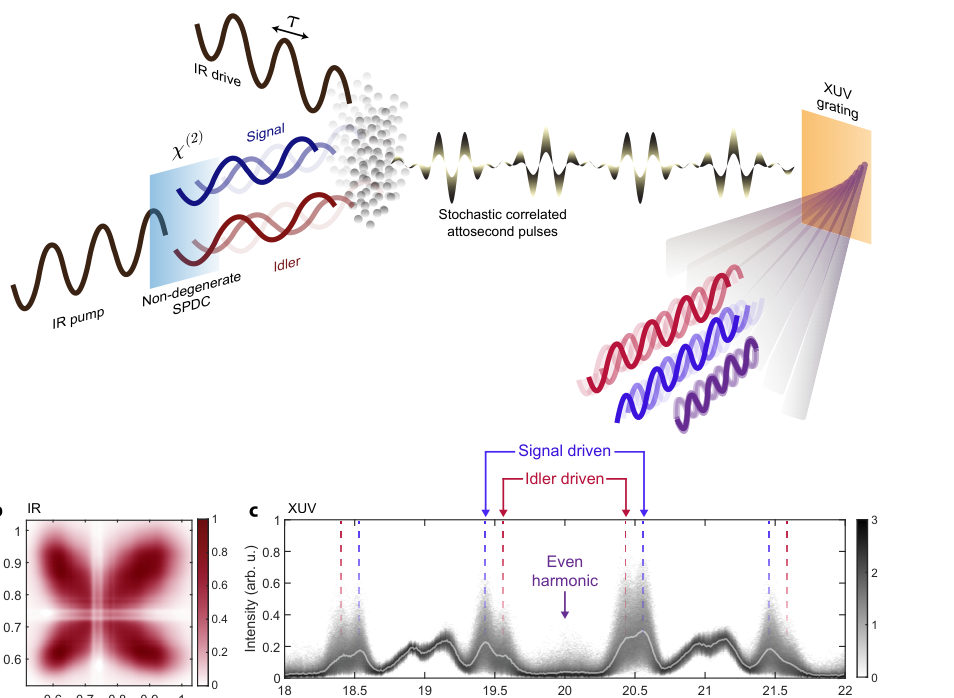
<figcaption class="paper-figure-caption"><b>Fig 1.</b> FIG. 1. Generation of Correlated Attosecond Pulses (a) Schematic of the experimental setup.</figcaption>
</figure>
<figure class="paper-figure-card">
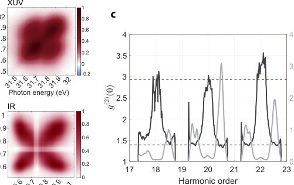
<figcaption class="paper-figure-caption"><b>Fig 2.</b> FIG. 2. Broadband transfer of TMBSV amplitude correlations into XUV harmonics (a)</figcaption>
</figure>
<figure class="paper-figure-card">
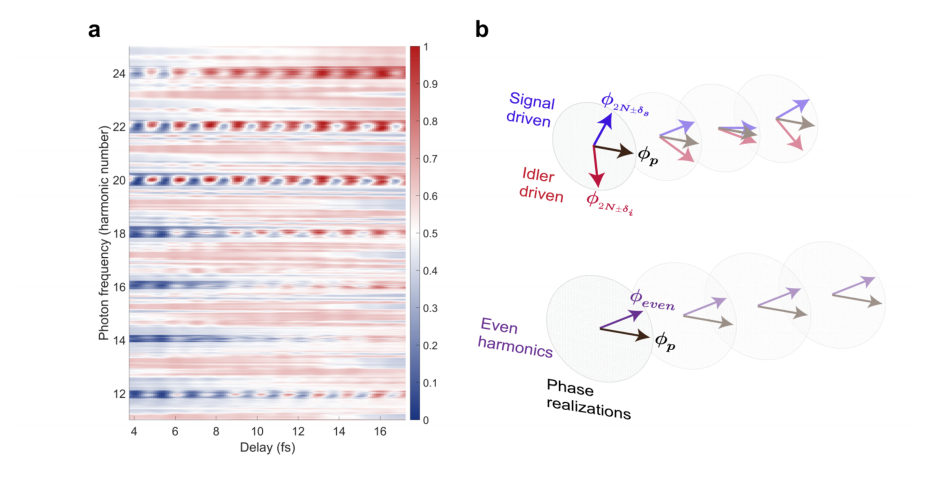
<figcaption class="paper-figure-caption"><b>Fig 3.</b> FIG. 3. Attosecond correlation interferometry (a) Mean-value oscillations of the perturbed har-</figcaption>
</figure>
<figure class="paper-figure-card">
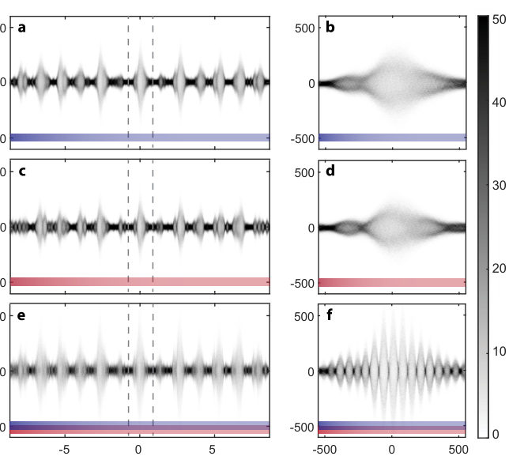
<figcaption class="paper-figure-caption"><b>Fig 4.</b> FIG. 4. Time-domain reconstruction of correlated attosecond pulses. Reconstructed temporal</figcaption>
</figure>

**Summary.** This paper demonstrates a novel method to generate and measure quantum correlations in attosecond extreme-ultraviolet (XUV) light. By perturbing high-harmonic generation with squeezed vacuum fields, the authors transfer quantum correlations from the infrared to the XUV spectrum. This technique allows for the characterization of quantum dynamics with sub-cycle precision, paving the way for quantum attosecond science.

**Why it may be interesting.** This work is highly relevant to AMO and quantum optics as it pushes the measurement of quantum resources (correlations) into the ultrafast, attosecond domain, opening a new frontier for quantum light-matter interaction studies.

Detailed structure

**Main problem.** The primary challenge is probing quantum correlations between optical modes, ranging from classical fluctuations to quantum entanglement, on the natural timescale of electronic motion—the attosecond regime.

**Main result.** The study successfully establishes a framework for generating and probing quantum correlations on attosecond timescales by mapping correlations from the infrared to the XUV spectrum.

**Method.** The authors use high-harmonic generation (HHG) perturbed by two-mode bright squeezed vacuum (TMBSV) fields, employing even harmonics as an intrinsic, phase-sensitive probe.

**Model / system.** The physical system is the nonlinear interaction in gas-phase HHG, perturbed by a TMBSV field generated via SPDC. The process maps quantum correlations from the IR pump/squeezed vacuum fields onto the broadband XUV harmonics.

**Key observables.** Amplitude correlations (via shot-resolved covariance) and phase correlations (via even harmonics) are measured. Key observables include the joint temporal reconstruction of correlated emission and the mean harmonic response vs. delay.

**Important parameters / regimes.** The measurement operates in the attosecond regime, utilizing the transfer of correlations across a broadband XUV spectrum ($\sim 20$ eV bandwidth).

**Assumptions / limitations.** The analysis neglects theoretically squeezed quantum phase fluctuations and residual technical noise compared to the shot-to-shot phase fluctuations.

**Figures summary.** Figures illustrate the experimental setup, the transfer of the four-lobed correlation structure from the IR to the XUV spectrum, and temporal reconstructions showing suppressed fluctuations in the joint signal.

**Paper structure.** The paper progresses by first establishing the challenge, then detailing the use of TMBSV perturbation on HHG, demonstrating the transfer of correlations via covariance measurements, and finally using even harmonics and joint temporal reconstruction to confirm attosecond-scale phase-sensitive measurements.

Abstract

Correlations between optical modes, ranging from classical fluctuations to quantum entanglement, are a cornerstone of modern optics and emerging quantum technologies. However, probing these correlations on the natural timescale of electronic motion - the attosecond regime - remains a major challenge. Here, we generate and characterize correlated attosecond extreme-ultraviolet (XUV) emission by perturbing gas-phase high-harmonic generation with two-mode bright squeezed vacuum. The signal and idler fields imprint their correlated amplitude and phase fluctuations onto two families of harmonics, thereby transferring these correlations from the infrared to broadband XUV modes. Even harmonics serve as an intrinsic attosecond phase-sensitive probe of these correlations through interference between indistinguishable XUV pathways. Shot-resolved covariance measurements reveal the amplitude correlations, while even-harmonics resolve the phase correlations with sub-cycle precision. Time-domain reconstruction of the correlated emission reveals a transition from maximal fluctuations to near-silence within only 30 as. Whereas the signal and idler driven attosecond pulse trains exhibit excess fluctuations individually, their joint reconstruction shows strongly suppressed fluctuations, reflecting their shared correlations. These results establish a framework for generating and probing quantum correlations on attosecond timescales, opening the door to quantum attosecond science.

[↑ back to top](#top)

### [Integrated balanced homodyne detector using CMOS capacitive-feedback TIA for quantum measurements](http://arxiv.org/abs/2609.37671v1)

**Authors:** Sarah Bastiaens, Cedric Bruynsteen, Simone Cammarata, Axl Bomhals, Leandro da Silva, Michiel Van Osta, Johan Bauwelinck, Xin Yin  
**Type:** experiment · **Category:** quantum information and computing · **PDF:** <https://arxiv.org/pdf/2609.37671v1>  
**Analysis basis:** full PDF text, analyzed in chunks
**Topic relevance:** 🔥 `quantum optics experiment` **4/5** · `quantum measurements` **3/5** · `QC/QI experiment` **1/5** · `interference shaping light` **1/5**

↔ Scroll figures horizontally

<figure class="paper-figure-card">
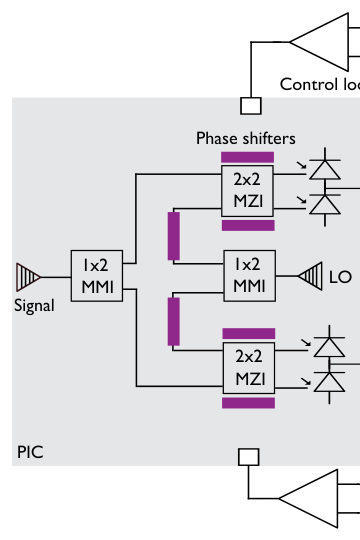
<figcaption class="paper-figure-caption"><b>Fig 1.</b> Fig. 1. Simplified schematic of the designed BHD, comprising of a PIC, a TIA and an external feedback loop.</figcaption>
</figure>
<figure class="paper-figure-card">
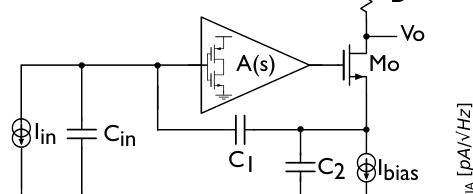
<figcaption class="paper-figure-caption"><b>Fig 2.</b> Fig. 2. Simplified schematic of a capacitive-feedback TIA.</figcaption>
</figure>
<figure class="paper-figure-card">
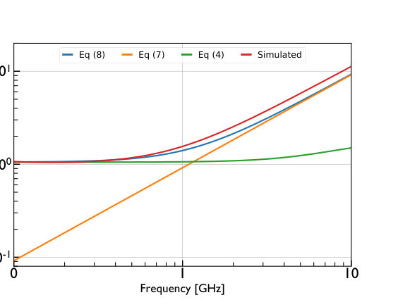
<figcaption class="paper-figure-caption"><b>Fig 3.</b> Fig. 3. Analytical noise model of a capacitive-feedback TIA with comparison to circuit-level simulations of the complete circuit (Cadence virtuoso).</figcaption>
</figure>
<figure class="paper-figure-card">
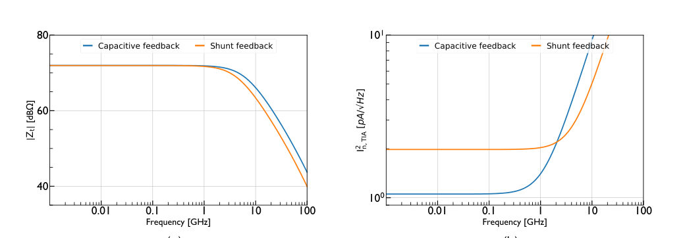
<figcaption class="paper-figure-caption"><b>Fig 4.</b> Fig. 4. (a) Comparison of the transfer functions for capacitive-feedback and shunt-feedback TIAs, configured for the same DC gain of 72 dBΩ(b) Noise performance comparison between capacitive-feedback and shunt-feedback TIAs, both configured for a DC transimpedance gain of 72 dB Ω</figcaption>
</figure>
<figure class="paper-figure-card">
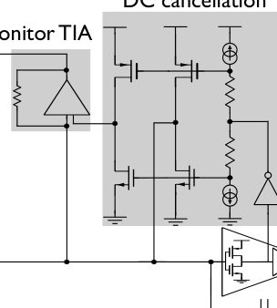
<figcaption class="paper-figure-caption"><b>Fig 5.</b> Fig. 5. Schematic of the proposed TIA.</figcaption>
</figure>

**Summary.** This paper reports the successful demonstration of a high-speed, low-noise balanced homodyne detector by co-integrating a CMOS capacitive-feedback TIA with a silicon photonic chip. The resulting system achieves excellent performance metrics, including a 7.6 GHz bandwidth and 27 dB shot noise clearance. This integration proves the viability of CMOS technology for demanding quantum optical sensing applications.

**Why it may be interesting.** This work provides a highly integrated, low-power platform for quantum optics measurements, directly addressing the hardware requirements for continuous-variable quantum key distribution and quantum sensing.

Detailed structure

**Main problem.** The core challenge is detecting and processing extremely weak optical signals, necessary for quantum measurements, while maintaining performance near the quantum-noise limit.

**Main result.** The authors demonstrated a high-performance, low-noise balanced homodyne detector achieving a 7.6 GHz 3-dB bandwidth and a maximum shot noise clearance of 27 dB.

**Method.** The system integrates a capacitive-feedback transimpedance amplifier (TIA) fabricated in 28 nm CMOS directly with a silicon photonic integrated circuit (PIC).

**Model / system.** The physical system is a Balanced Homodyne Detector (BHD) utilizing a PIC on the iSiPP200 platform and a CMOS TIA. The TIA employs a capacitive-feedback topology to minimize resistor thermal noise.

**Key observables.** 3-dB bandwidth (7.6 GHz), maximum shot noise clearance (27 dB), shot noise-limited bandwidth (13.7 GHz), and Common-Mode Rejection Ratio (up to 54.8 dB).

**Important parameters / regimes.** 28 nm CMOS technology, iSiPP200 silicon photonics platform, and the capacitive-feedback TIA topology.

**Assumptions / limitations.** Analytical noise models assume simplifications like C2 >> C1 and A0 >> 1; the system also faces limitations from PD quantum efficiency and fabrication tolerances.

**Figures summary.** Figures illustrate the BHD schematic, the TIA topology, noise analysis comparing analytical and simulated noise, and measured performance metrics like output noise PSD and CMRR vs. frequency.

**Paper structure.** The paper details the co-design approach, analyzes the TIA noise sources and compares feedback topologies, presents the BHD characterization via S-parameter and noise measurements, and concludes with a summary of the achieved high-performance metrics.

Abstract

A low-noise, high-speed balanced homodyne detector is demonstrated, combining a capacitive-feedback transimpedance amplifier implemented in 28 nm CMOS with a custom photonic integrated circuit fabricated in imec's iSiPP200 silicon photonics platform. The receiver achieves a 3-dB bandwidth of 7.6 GHz, a maximum shot noise clearance of 27 dB, a shot noise-limited bandwidth of 13.7 GHz and a common-mode rejection ratio up to 54.8 dB. These results demonstrate the suitability of CMOS capacitive-feedback transimpedance amplifiers for demanding quantum and coherent sensing optical applications, including continuous-variable quantum key distribution, quantum random number generation, and optical coherence tomography.

[↑ back to top](#top)

### [Scanless quantum Fourier-transform mid-infrared spectroscopy for solids and surface analysis](http://arxiv.org/abs/2609.37281v1)

**Authors:** Paul Gattinger, Michela Conti, Franziska Dietz, Andrei N. Halangescu Moldovan, Andreas W. Schell, Markus Brandstetter, Ivan Zorin  
**Type:** experiment · **Category:** other · **PDF:** <https://arxiv.org/pdf/2609.37281v1>  
**Analysis basis:** full PDF text, analyzed in chunks
**Topic relevance:** 🔥 `quantum optics experiment` **4/5** · `interference shaping light` **3/5** · `quantum measurements` **2/5**

↔ Scroll figures horizontally

<figure class="paper-figure-card">
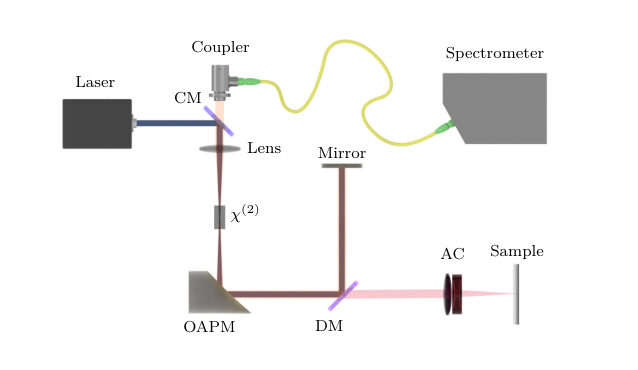
<figcaption class="paper-figure-caption"><b>Fig 1.</b> Figure 1: Experimental setup: the sQFTIR hyperspectral imaging system based on a nonlinear interferometer with a Michelson topology. A pump beam (660 nm continuous-wave laser) is sent into the system through a cold mirror (CM) and focused into a ppKTP crystal type-0 phase-matched for non-degenerate SPDC. In the first pump-pass, the nonlinear crystal produces idler-signal photon pairs through SPDC. The idler, signal and pump beams are collimated by an off-axis parabolic mirror (OAPM) and sent to a dichroic mirror (DM) that reflects pump and signal photons while transmitting the idler. An achromatic doublet focuses the idler photons on the sample, which is mounted on a x-y translational...</figcaption>
</figure>
<figure class="paper-figure-card">
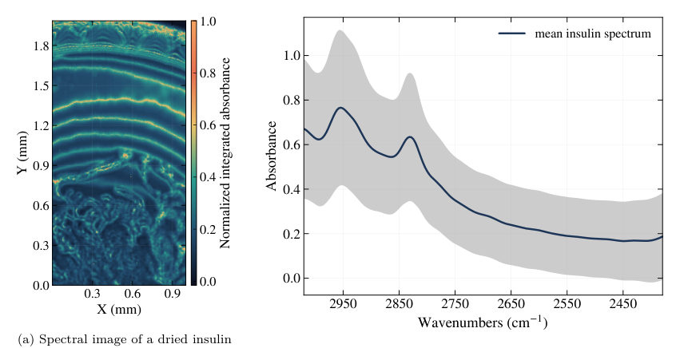
<figcaption class="paper-figure-caption"><b>Fig 2.</b> Figure 2: Hyperspectral imaging of a dried insulin drop on a gold surface. (a) Absorbance image integrated in the band between 2800-2850 cm−1 (b) Average mid-IR absorbance spectrum taken from the hyperspectral cube. The gold mirror in the top right of the spectral image was used as a background for absorbance calculation. The standard deviation of the absorbance spectra is indicated as a grey area.</figcaption>
</figure>
<figure class="paper-figure-card">
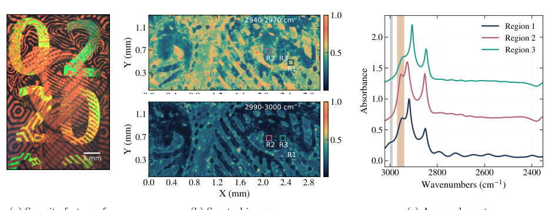
<figcaption class="paper-figure-caption"><b>Fig 3.</b> Figure 3: (a) Visual image of a security feature on a 20€ banknote. (b) Top: spectral image integrated from 2940–2970 cm−1; bottom: spectral image integrated from 2990–3000 cm−1. (c) Averaged spectra extracted from different regions color coded in (b).</figcaption>
</figure>
<figure class="paper-figure-card">
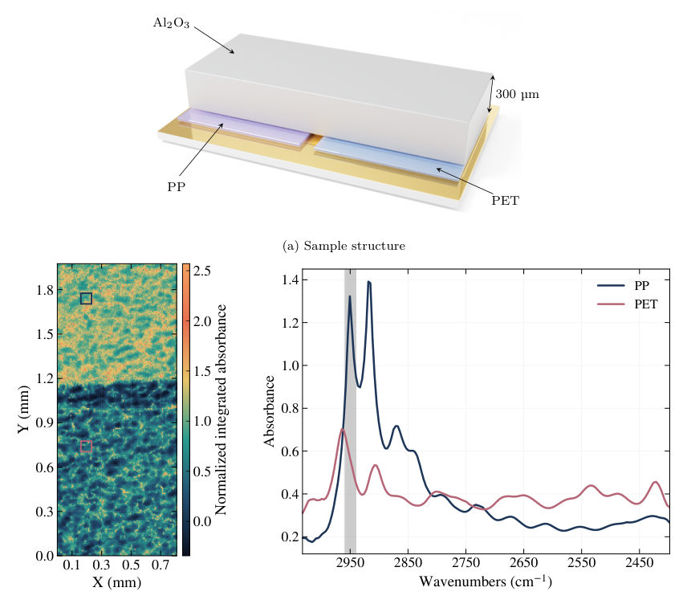
<figcaption class="paper-figure-caption"><b>Fig 4.</b> Figure 4: Microspectroscopy and hyperspectral imaging through a turbid medium: (a) Sample structure consisting of an Al2O3 wafer and polymer films (PP and PET) above a gold mirror. (b) Spectral image of PP and PET underneath a turbid medium; the pixel values are the normalized integrated absorbance in the band between 2940–2960 cm−1. (c) Mean spectra of PP and PET extracted from the hyperspectral dataset; the areas used for averaging are indicated with colored rectangles in (b).</figcaption>
</figure>

**Summary.** This paper introduces and validates a scanless quantum Fourier-transform mid-IR (sQFTIR) microspectrometer. By using quantum sensing with correlated photon pairs, it achieves rapid, shot-noise-limited spectral measurements. The technique is demonstrated to be highly effective for non-destructive chemical analysis of diverse materials, including pharmaceuticals and security features.

**Why it may be interesting.** The core physics relies heavily on quantum optics, specifically nonlinear frequency conversion (SPDC) and quantum sensing principles, making it highly relevant to quantum optics and open quantum systems.

Detailed structure

**Main problem.** Developing a novel, rapid, and sensitive technique for chemical characterization and analysis of solids and interfaces using mid-infrared (mid-IR) spectroscopy.

**Main result.** The custom-built scanless quantum Fourier-transform mid-IR (sQFTIR) system successfully demonstrated hyperspectral imaging of pharmaceuticals, banknote security features, and polymer identification through turbid media.

**Method.** The technique utilizes quantum infrared spectroscopy based on nonlinear interferometry, employing correlated photon pairs generated via SPDC to achieve spectral-domain acquisition without mechanical scanning.

**Model / system.** The system is a sQFTIR microspectrometer using a double-pass configuration with a periodically poled nonlinear crystal (ppKTP). It measures the interference of joint generation probabilities to infer the mid-IR spectrum from near-IR signal photons.

**Key observables.** Absorbance spectra in the functional group region ($3000 	ext{ cm}^{-1} – 2400 	ext{ cm}^{-1}$), fringe visibility, and spectral images.

**Important parameters / regimes.** Measurement speed of 100 ms, spectral range of $3000 	ext{ cm}^{-1} – 2400 	ext{ cm}^{-1}$, and spatial resolution on the tens-of-micrometer scale.

**Assumptions / limitations.** The technique assumes operation in the low-gain regime where difference frequency generation can be neglected.

**Figures summary.** Figures illustrate the experimental setup (Michelson-type interferometer) and show hyperspectral imaging results for dried insulin on gold, a banknote security feature, and polymer identification through a turbid ceramic medium.

**Paper structure.** The paper details the underlying quantum principles of the sQFTIR setup, describes the spectral-domain acquisition and Fourier transform processing, and then demonstrates the technique's capabilities through multiple applied examples.

Abstract

Quantum infrared (IR) spectroscopy is a novel technique based on nonlinear interferometry and quantum sensing with undetected photons. In this approach, spectrally far-separated correlated photon pairs are used for detection and probing, respectively. Hence, the probing wavelength domain (mid-IR) is substantially different from the detection spectral range (near-IR), which enables shot-noise-limited and cost-effective sensing schemes attractive for applied metrology. In this paper, we implement and employ a custom-built scanless quantum Fourier-transform mid-IR (sQFTIR) microspectrometer for chemical characterization and analysis of solids and interfaces. The sQFTIR system employs spectral-domain acquisition, without the need to scan the optical delay. This results in enhanced sensitivity and short measurement times and therefore enables rapid spectral acquisitions in 100~ms spanning a spectral band from 3000 cm$^{-1}$ - 2400 cm$^{-1}$. The capabilities of our approach are demonstrated for hyperspectral mid-IR imaging of dried pharmaceuticals (insulin on a gold surface) and investigation of a security feature on a banknote. Furthermore, we demonstrate hyperspectral imaging and spectroscopy through a turbid ceramic medium.

[↑ back to top](#top)

### [Experimental certification of multipartite Bell correlations using only few-body symmetric correlations](http://arxiv.org/abs/2609.37442v1)

**Authors:** Jiacheng Sun, Mengyao Hu, Paweł Cieśliński, Jinfu Chen, Fei Shi, Bowen Wang, Hongyu Yang, Jizhou Wu, Jordi Tura, Valerio Scarani, Dian Wu, Jian Wu  
**Type:** experiment · **Category:** quantum information and computing · **PDF:** <https://arxiv.org/pdf/2609.37442v1>  
**Analysis basis:** full PDF text, analyzed in chunks
**Topic relevance:** 🔥 `quantum optics experiment` **4/5** · `QC/QI experiment` **3/5** · `quantum measurements` **1/5**

↔ Scroll figures horizontally

<figure class="paper-figure-card">
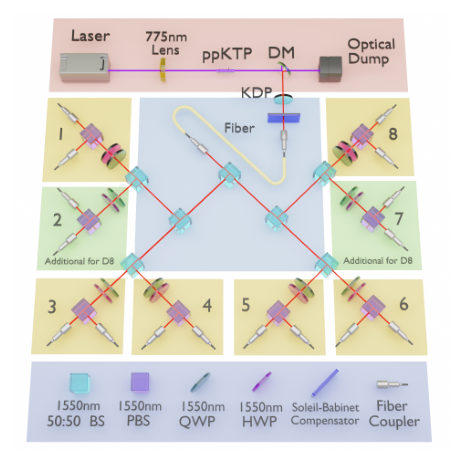
<figcaption class="paper-figure-caption"><b>Fig 1.</b> FIG. 1. Experimental setup. Pulses from a mode-locked Ti:sapphire laser (center wavelength 775 nm, repetition rate 80 MHz) are focused onto a periodically poled KTiOPO4 (pp- KTP) crystal using a lens, producing photon pairs via type- II spontaneous parametric down-conversion (SPDC). Resid- ual pump light is removed with a dichroic mirror (DM). The temporal walk-off is compensated by a potassium dihydrogen phosphate (KDP) crystal and accurately adjusted by a pair of Soleil-Babinet compensators. Each output mode is analyzed by a standard QWP-HWP-PBS module implementing the re- quired local projective settings. Modes 2 and 7, including two additional BSs, are used in D 4 8 preparation. Photons...</figcaption>
</figure>
<figure class="paper-figure-card">
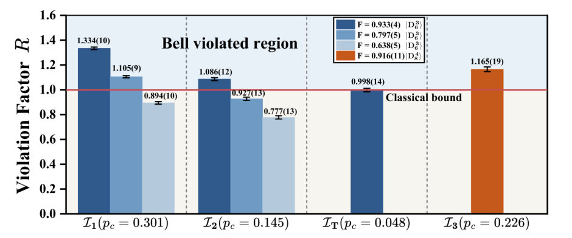
<figcaption class="paper-figure-caption"><b>Fig 2.</b> FIG. 2. Certification of Bell correlations with few-body witnesses at different state fidelities. Bars show the violation factor R = I/βC for I1, I2, and IT evaluated on D 3 6 states prepared with fidelities F = 0.933(4), 0.797(5), and 0.638(5), as well as for I3 evaluated on D 4 8 with F = 0.916(11). All violation factors are normalized to the classical bound(red horizontal line), with the shaded regions indicating Bell violation. The predicted critical white-noise fractions pc are indicated below the corresponding inequalities where applicable. Because several expectation values are extracted from the same multiphoton coincidence data, their statistical correlations are retained using a...</figcaption>
</figure>
<figure class="paper-figure-card">
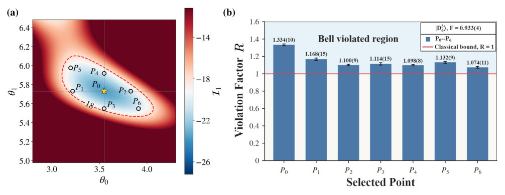
<figcaption class="paper-figure-caption"><b>Fig 3.</b> FIG. 3. Tolerance of I1 to collective misalignment of the measurement settings. (a) Predicted value I1(θ0, θ1) for ideal D 3 6</figcaption>
</figure>
<figure class="paper-figure-card">
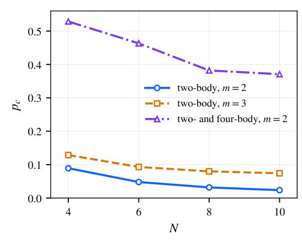
<figcaption class="paper-figure-caption"><b>Fig 4.</b> FIG. 4. Optimal critical noise threshold pc of PI Bell inequal- ities for the half-excitation Dicke states D N/2 N E , N = 4–10, obtained by a see-saw optimization alternating a linear pro- gram over the vertices of LΠ with measurement-angle opti- mization in the symmetric subspace. The three families con- tain two-body correlators with m = 2 or m = 3 settings, or two- and four-body correlators with m = 2.</figcaption>
</figure>
<figure class="paper-figure-card">
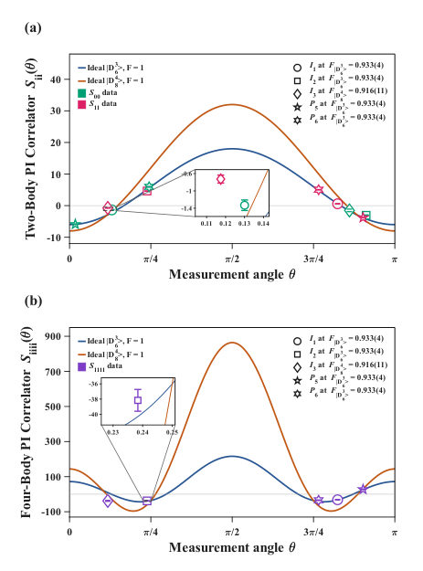
<figcaption class="paper-figure-caption"><b>Fig 5.</b> FIG. 5. Angular dependence of (a) the two-body PI cor- relators Sxx, x ∈{0, 1}, and (b) the four-body PI cor- relator S1111. Here θ specifies the measurement direction A(θ) = cos θ σz + sin θ σx in the xz plane. The solid blue and orange curves show the predictions for the ideal states D 3 6</figcaption>
</figure>

**Summary.** This paper presents an experimental method to certify multipartite Bell correlations in large quantum systems by employing few-body symmetric correlation witnesses. By using only two- and four-body correlators, the technique overcomes the experimental difficulty associated with measuring full-body correlations as system size increases. The results confirm that this approach is robust and highly sensitive, demonstrating a scalable path for quantum verification.

**Why it may be interesting.** This work provides a concrete, experimentally accessible protocol for verifying non-classical correlations in large quantum systems by reducing the measurement burden from full-body to few-body correlations, which is highly relevant for quantum optics and quantum information.

Detailed structure

**Main problem.** The paper addresses the experimental challenge of certifying multipartite Bell correlations in large quantum systems, where conventional methods relying on full-body correlations become experimentally intractable.

**Main result.** The authors demonstrate that Bell correlations can be certified using only few-body permutation-invariant (PI) correlations, significantly enhancing noise tolerance compared to using only two-body witnesses.

**Method.** They utilize Bell correlation witnesses based on few-body PI correlators, experimentally testing these witnesses on postselected Dicke states for six- and eight-photon systems.

**Model / system.** The experiments use multi-photon states, specifically six- and eight-photon postselected Dicke states, whose correlations are measured using polarization correlators.

**Key observables.** Bell violation factors (R), white-noise fraction tolerance ($p_c$), and measured fidelities (e.g., 0.933(4) for 6 photons).

**Important parameters / regimes.** System size (6 and 8 photons), correlation order (two-body and four-body), and noise tolerance thresholds.

**Assumptions / limitations.** The certification characterizes the postselected ensemble, not a loophole-free test, and assumes the measured correlators are representative of the underlying state.

**Figures summary.** Figures illustrate the experimental setup for Dicke state preparation and compare measured violation factors (R) for different witnesses ($I_1, I_2, I_T$) across varying fidelities and noise levels.

**Paper structure.** The paper introduces the problem of large-scale Bell certification, develops the few-body PI witness formalism, presents experimental measurements on 6- and 8-photon Dicke states, and concludes by demonstrating the enhanced noise robustness of the four-body correlators.

Abstract

Certifying Bell correlations in increasingly larger multipartite quantum systems is challenging because conventional Bell inequalities rely on many-body correlations, which become experimentally demanding to estimate as system size grows. Here we demonstrate that multipartite Bell correlations can be certified using few-body permutation-invariant (PI) correlations with a fixed maximal correlation order. We experimentally test few-body PI Bell correlation witnesses tailored for six- and eight-photon postselected Dicke states. The addition of a few four-body correlators is found to significantly enhance the noise tolerance compared with previously studied two-body witnesses: for instance, for six qubits, the selected witness tolerates a white-noise fraction of $p_c\approx0.301$, compared with $p_c\approx0.048$ for the best two-body PI inequality with the same two settings per party. For six and eight photons respectively, we observe violations of the witness bounds by $32$ and $8.9$ standard deviations, arising from postselected polarisation states with fidelities of $0.933(4)$ and $0.916(11)$ to the corresponding half-excitation Dicke states. The witnesses for the six- and eight-photon cases use the same symmetric two- and four-body correlators, just with different coefficients. These results demonstrate an experimentally accessible approach for certifying multipartite Bell correlations in larger systems without requiring full-body correlation measurements.

[↑ back to top](#top)

### [Closing a single-copy gap to the Holevo bound with two-copy measurements](http://arxiv.org/abs/2609.36874v1)

**Authors:** Changhao Li  
**Type:** both · **Category:** quantum information and computing · **PDF:** <https://arxiv.org/pdf/2609.36874v1>  
**Analysis basis:** full PDF text, analyzed in chunks
**Topic relevance:** 🔥 `QC/QI experiment` **4/5** · `quantum measurements` **3/5**

↔ Scroll figures horizontally

<figure class="paper-figure-card">
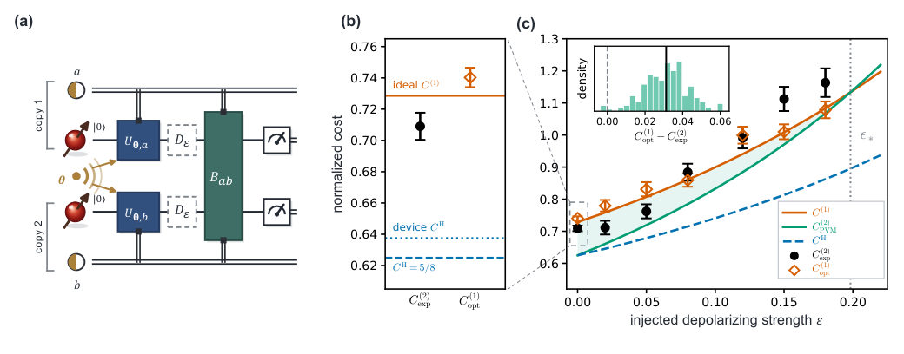
<figcaption class="paper-figure-caption"><b>Fig 1.</b> FIG. 1. Experimental demonstration on ibm boston. (a) Hybrid two-transmon protocol. The classical flags a and b are sampled uniformly and select the conditional encodings Uθ,a and Uθ,b, the optional dashed gates inject the depolarizing strength ϵ, and the sector-selected basis change Bab followed by computational-basis readout implements the collective measurement of Eqs. (8) and (9). (b) At ϵ = 0, the measured cost C(2) exp (filled circle) lies below the certified single-copy lower bound C(1) opt (open diamond), with the ideal C(1) (solid orange), the reconstructed device Holevo bound of 0.638 (dotted blue), and CH = 5/8 (dashed blue) as references. (c) Measured costs against the injected...</figcaption>
</figure>

**Summary.** This paper tackles the fundamental question of how close finite quantum measurements can get to the ultimate theoretical precision limit (the Holevo bound). By constructing a specific, rank-deficient model, the authors prove that the gap between single-copy and two-copy estimates can close. They validate this theoretically derived advantage experimentally using superconducting qubits, showing the two-copy measurement significantly outperforms single-copy estimates even when noise is present.

**Why it may be interesting.** This work directly addresses the fundamental limits of quantum measurement precision, providing concrete physical examples (superconducting qubits) where collective measurements can surpass single-shot estimates, linking fundamental theory (model rank) to experimental capability.

Detailed structure

**Main problem.** The paper investigates the finite-copy gap in quantum multi-parameter estimation, specifically comparing the single-copy optimum bound to the ultimate Holevo bound.

**Main result.** The authors disprove the universal persistence of this gap beyond two parameters by constructing a rank-deficient three-parameter model where the two-copy measurement achieves the Holevo bound. Experimentally, they demonstrate a two-copy advantage over single-copy bounds using superconducting qubits.

**Method.** The study combines theoretical proofs regarding model rank deficiency with experimental implementation using superconducting transmon qubits to measure estimation costs under controlled noise.

**Model / system.** The theoretical model is a three-parameter, rank-two quantum estimation model. Experimentally, the platform uses superconducting transmon qubits on an IBM processor, implementing a hybrid two-transmon protocol.

**Key observables.** The primary observables are the estimation error costs: the single-copy optimum ($C^{(1)}_{opt}$), the two-copy measurement cost ($C^{(2)}_{exp}$), and the theoretical Holevo bound ($CH$).

**Important parameters / regimes.** The key parameters include the number of parameters (three), the number of copies (two), and the injected depolarizing noise strength ($\epsilon$).

**Assumptions / limitations.** The theoretical analysis distinguishes between rank-deficient and full-rank models, where rank deficiency is shown to be necessary for the gap closure. Experimentally, the analysis relies on readout error mitigation techniques.

**Figures summary.** Figure 1 compares the measured two-copy cost below the single-copy and Holevo bounds, showing the advantage persists over a finite noise range. Figure S2 tracks the difference between the single-copy lower bound and measured costs across various injected noise levels.

**Paper structure.** The paper first establishes the theoretical framework by constructing a specific rank-deficient model to close the gap at two copies. It then proves that full-rank models maintain the gap for any finite copy number. The latter part details the experimental realization on superconducting qubits, measuring the advantage and its robustness against controlled depolarization.

Abstract

The Holevo Cramér-Rao bound sets the asymptotically attainable precision of quantum multiparameter estimation, but its attainability with finite quantum state copies remains unresolved in general. While a gap between the single-copy optimum and the Holevo bound persists at any finite copy number for two-parameter estimation models, the higher-parameter case has remained open. Here we disprove universal finite-copy gap persistence beyond two parameters by constructing a three-parameter rank-two model whose Holevo bound is unattainable with one copy but attained exactly with two. We further prove finite-copy persistence for full-rank models with any number of parameters. We then experimentally implement the two-copy collective measurement for the constructed model using superconducting qubits. We observe a two-copy estimation error below the single-copy and separate-measurement bounds determined from state tomography. By introducing controlled depolarization, we show that this precision advantage persists over a finite noise range. Our results connect the attainability of ultimate quantum precision to the structure of the multiparameter estimation model and the resources available for collective measurements.

[↑ back to top](#top)

### [Generalized Effective Spin-Chain formalism for multicomponent anyons in one-dimensional optical lattices](http://arxiv.org/abs/2609.36555v1)

**Authors:** Sagarika Basak, Xi-Wen Guan, Han Pu  
**Type:** theory · **Category:** other · **PDF:** <https://arxiv.org/pdf/2609.36555v1>  
**Analysis basis:** full PDF text, analyzed in chunks
**Topic relevance:** 🔥 `analog quantum simulation` **4/5** · `Frenkel-Kontorova` **1/5** · `Keldysh / 2PI / non-Gaussian methods` **1/5** · `non-equilibrium universality` **1/5**

↔ Scroll figures horizontally

<figure class="paper-figure-card">
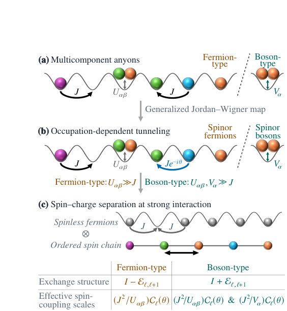
<figcaption class="paper-figure-caption"><b>Fig 1.</b> Figure 1. Spin–charge separation in strongly interacting anyons. (a) Multicomponent anyons with tunneling 𝐽and on-site interactions 𝑈𝛼𝛽and 𝑉𝛼. Colors denote internal components; split terminal wells contrast allowed on-site occupations for fermion-/boson-type anyons. (b) A generalized Jordan–Wigner transformation maps anyons onto multicomponent fermions/bosons with occupation-dependent tunnel- ing. (c) In the strong-interaction regime, the low-energy theory sepa- rates into a spinless-fermion charge sector and an ordered spin chain.</figcaption>
</figure>
<figure class="paper-figure-card">
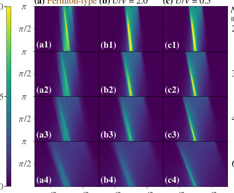
<figcaption class="paper-figure-caption"><b>Fig 2.</b> Figure 2. Statistical-phase-driven asymmetric reconstruction of intrinsic momentum distributions. Intrinsic anyonic momen- tum distribution 𝑛𝑘(𝜃), averaged over 𝑁internal components, from GESC. The statistical phase, 𝜃, shifts the dominant features and re- distributes spectral weight. At fixed population per component, in- creasing 𝑁also increases the filling. Colors saturate for 𝑛𝑘≥1.</figcaption>
</figure>
<figure class="paper-figure-card">

<figcaption class="paper-figure-caption"><b>Fig 3.</b> Figure 3 shows that fractional exchange statistics primarily redistributes spectral weight rather than strongly changing the overall momentum width. The redistribution 𝑅grows with 𝜃and remains finite at 𝜃= 𝜋, even though both AM and ¯𝑘 return to zero. Restoring reflection symmetry therefore does not restore the initial distribution. Mirror asymmetry peaks at</figcaption>
</figure>
<figure class="paper-figure-card">
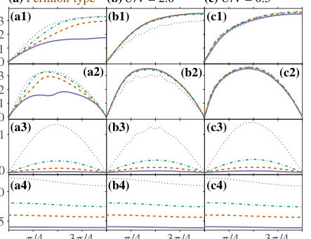
<figcaption class="paper-figure-caption"><b>Fig 4.</b> Figure 3. Momentum reconstruction persists after inversion sym- metry is restored. Four diagnostics quantify the intrinsic anyonic momentum distributions in Fig. 2, using unit-normalized distributions over the full first Brillouin zone [Eqs. (26)–(29)]. Redistribution 𝑅 remains finite at 𝜃= 𝜋, where the mirror asymmetry AM and mean momentum ¯𝑘vanish. The width 𝜎𝑘varies only weakly with 𝜃.</figcaption>
</figure>
<figure class="paper-figure-card">
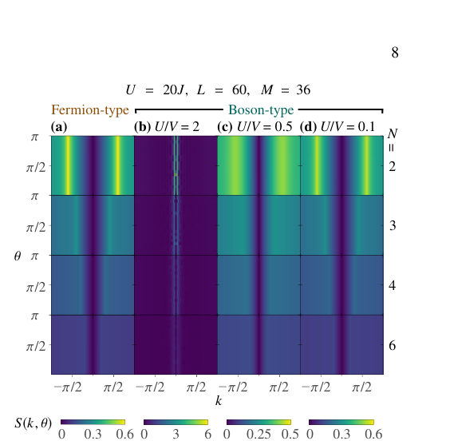
<figcaption class="paper-figure-caption"><b>Fig 5.</b> Figure 4. Interaction anisotropy controls the statistical sensitivity of spin correlations. GESC spin structure factors 𝑆(𝑘, 𝜃) at fixed total population 𝑀. Boson-type anyons with 𝑈/𝑉= 2 concentrate spin correlations at small nonzero momenta, whereas the other cases exhibit broader antiferromagnetic profiles. Unlike Figs. 2 and 3, here the total filling is fixed at 𝑀/𝐿= 0.6.</figcaption>
</figure>

**Summary.** This paper introduces the Generalized Effective Spin-Chain (GESC) formalism to study multicomponent anyons in 1D optical lattices. The method achieves a spin-charge separation, allowing researchers to map complex anyonic interactions onto an effective spin chain. It reveals that fractional statistics govern transport dynamics through virtual spin exchanges, offering a computationally efficient alternative to simulating the full, intractable model.

**Why it may be interesting.** This work provides a powerful, computationally efficient theoretical tool (GESC) to analyze exotic quantum statistics (anyons) in highly correlated systems, directly relevant to ultracold atomic simulations in optical lattices.

Detailed structure

**Main problem.** The paper develops a generalized effective spin-chain (GESC) formalism to understand how fractional exchange statistics are preserved in strongly interacting multicomponent anyons confined to a one-dimensional optical lattice.

**Main result.** The GESC formalism successfully separates spin and charge dynamics, showing that while the charge Hamiltonian is insensitive to the statistical phase, the phase manifests in spin-exchange coefficients, leading to direction-dependent, inversion-asymmetric transport out of equilibrium.

**Method.** The authors use a perturbative expansion in the strong-interaction limit to map the complex Anyon-Hubbard model onto an effective spin-chain Hamiltonian, achieving a spin-charge separation perspective.

**Model / system.** The system models multicomponent anyons (fermion-type and boson-type) in a 1D optical lattice, governed by generalized Anyon-Hubbard Hamiltonians. The core methodology involves mapping particle motion to spinless fermions (charge) and spin states to an ordered spin chain.

**Key observables.** Spin-exchange coefficients ($C_\ell(	heta, t)$), impurity density profiles ($\langle n_{\ell,\downarrow} 
angle$), and the Root Mean Square (RMS) displacement ($W(t)$).

**Important parameters / regimes.** The statistical phase ($	heta$), the ratio of interaction energy to tunneling energy (strong-interaction regime), and the component identity/interaction anisotropy.

**Assumptions / limitations.** The derivation relies on a perturbative expansion in the strong-interaction limit, and the initial analysis assumes the statistical phase $	heta$ is spin-independent.

**Figures summary.** Figures benchmark the GESC formalism against the full Anyon-Hubbard model for impurity density and $W(t)$ across various statistical phases ($	heta$), demonstrating quantitative agreement while showing significant computational savings.

**Paper structure.** The paper systematically introduces the multicomponent Anyon-Hubbard models, develops the GESC formalism via perturbative decoupling, analyzes ground-state correlations, and finally investigates dynamic processes like impurity transport.

Abstract

We develop a generalized effective spin-chain (GESC) formalism for strongly interacting multicomponent anyons in a one-dimensional (1D) optical lattice. By mapping particle motion onto spinless fermions and spin states onto an ordered chain, this framework provides a spin--charge-separated perspective on the physical effects of fractional exchange statistics. In the strong-interaction regime, the leading-order charge Hamiltonian becomes independent of the statistical phase; instead, virtual tunneling through doubly occupied states directly imprints this phase on the spin-exchange coefficients. The GESC formalism captures ground-state properties of the full Anyon--Hubbard model reported in S.~Basak, X.-W.~Guan, and H.~Pu, unpublished manuscript (2026), and reveals that their statistical dependence is predominantly encoded in the explicit anyonic structure of the observables rather than the underlying spin ground state. This formalism uncovers that, out of equilibrium, successive spin exchanges accumulate direction-dependent phases; the resulting interference drives crossover from dispersive to localized impurity transport and generates inversion-asymmetric propagation at intermediate statistics. Suppressed expansion persists for identical and distinguishable impurities, with differences in propagation governed by the interplay between impurity identity and interaction anisotropy. Ultimately, GESC offers a versatile, computationally efficient theoretical framework that connects macroscopic dynamics to microscopic virtual exchange processes, conferring a unique spin--charge-separated vantage for resolving how fractional exchange statistics survives strong interactions and manifests distinctly across static and dynamical regimes.

[↑ back to top](#top)

### [Finite-momentum trimers and Cooper quartets in a one-dimensional Fermi gas with coexistent $s$- and $p$-wave interactions](http://arxiv.org/abs/2609.37032v1)

**Authors:** Yixin Guo  
**Type:** theory · **Category:** quantum gases · **PDF:** <https://arxiv.org/pdf/2609.37032v1>  
**Analysis basis:** full PDF text, analyzed in chunks
**Topic relevance:** 🔥 `analog quantum simulation` **4/5** · `Keldysh / 2PI / non-Gaussian methods` **2/5**

↔ Scroll figures horizontally

<figure class="paper-figure-card">
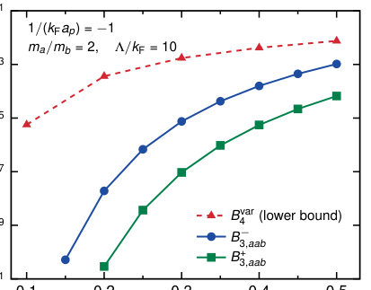
<figcaption class="paper-figure-caption"><b>Fig 1.</b> FIG. 1. Weak-coupling binding scales at 1/(kFap) = −1, ma/mb = 2, and Λ/kF = 10. Circles and squares give the zero-momentum aab trimer bindings B− 3,aab and B+ 3,aab in the inversion parities π = −1 and +1, respectively. Triangles give the variational lower bound Bvar 4 = Edd −E4,trial on the quartet binding, where E4,trial is the energy of the aa+bb trial state. Each cluster is referenced to its own breakup threshold. Lines guide the eye between computed points.</figcaption>
</figure>
<figure class="paper-figure-card">
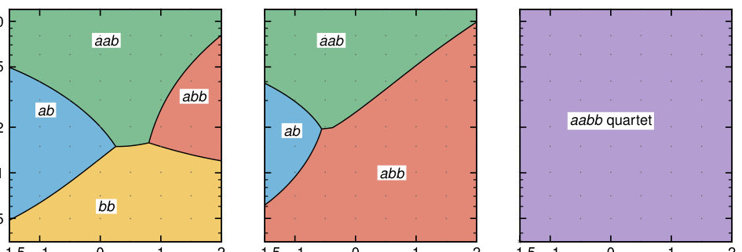
<figcaption class="paper-figure-caption"><b>Fig 2.</b> FIG. 2. Lowest-lying Cooper-cluster comparison at fixed chemical potentials. (a) Pairs and trimers restricted to P = 0. (b) The comparison after minimizing the trimer energy over its total momentum. The pair minima are at P = 0. (c) Including the quartet, which lies below the pair and trimer branches, minimized over their momenta, at every marked point. Dots mark integral-equation roots, and the star marks an independent quartet trial bound. The boundaries in (a) and (b) are solved directly from the STM energy condition (Appendix A 2) and joined by straight segments between calculated points. Markers show the 88 sampled couplings. Panel (c) has no interior boundary in this window. All...</figcaption>
</figure>
<figure class="paper-figure-card">
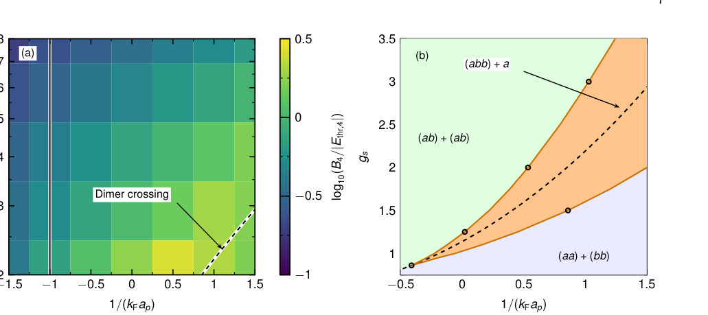
<figcaption class="paper-figure-caption"><b>Fig 3.</b> FIG. 3. (a) Quartet binding in the coupling plane, with colors indicating log10(B4/|Ethr,4|) at 35 sampled couplings in −1.5 ≤gp ≤1.5, 2 ≤gs ≤8. Colors use n = 18. Between n = 14 and 18, B4 changes by at most about 5%, and n = 22, a longer axis, or a different node distribution change it by at most about 3% at four test points (Appendix A 3). The solid line marks the cut gp = −1 discussed in Sec. III D. (b) The lowest fragmentation channel near the dimer crossing: (aa) + (bb), (ab) + (ab), and (abb) + a. The strip boundaries are solved from moving-trimer calculations. Circles mark higher-order checks. The dashed curve in both panels is the equality of the two dimer-pair energies. Here ma/mb...</figcaption>
</figure>
<figure class="paper-figure-card">
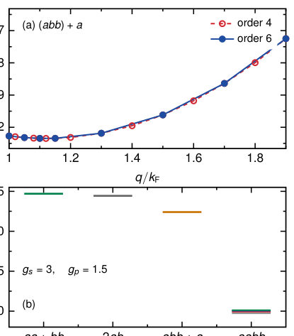
<figcaption class="paper-figure-caption"><b>Fig 4.</b> FIG. 4. Breakup competition at gs = 3 and gp = 1.5. (a) The moving abb trimer plus an a atom, referenced to the lowest two-dimer energy, for moving-trimer panels of order 4 and 6, which coincide on this scale. (b) The two dimer-pair energies, the minimized trimer–atom energy, and quartet energies on the n = 14, 18, 22, 26 grids (gray, red, blue, and green lines in the last column). The quartet lies below all three fragment channels. Momenta and energies are in units of kF and k2 F/mb. Other parameters are those of Fig. 3.</figcaption>
</figure>
<figure class="paper-figure-card">
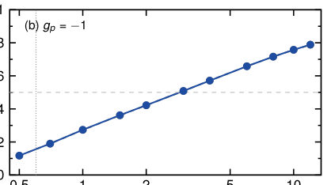
<figcaption class="paper-figure-caption"><b>Fig 5.</b> FIG. 5. Four-body properties along gp = −1. (a) Quartet binding on the integral-equation grids n = 14 and 18. (b) Even-wave fraction Fs = |⟨Vs⟩|/(|⟨Vs⟩| + |⟨Vp⟩|), from energy derivatives on the same grids (Appendix A 3). The vertical dotted line marks the dimer crossing. The horizontal line in (b) denotes equal even- and odd-wave interaction energies. Line styles are common to both panels. Other parameters are those of Fig. 3.</figcaption>
</figure>

**Summary.** This paper theoretically examines the formation and binding of Cooper quartets and trimers in a 1D Fermi gas subjected to both s-wave and p-wave interactions. Using variational methods, the authors demonstrate that the quartet binding can be robustly strong, even when considering the competition from other bound states. The findings highlight that the binding mechanism is complex, depending on more than just the strongest pairwise interaction.

**Why it may be interesting.** This work directly addresses complex many-body physics in ultracold atomic gases, specifically the interplay between different pairing symmetries (s-wave vs. p-wave) and the formation of exotic few-body states like quartets.

Detailed structure

**Main problem.** The study investigates the competition and coexistence of different pairing channels (s-wave and p-wave) and the formation of multi-particle clusters (trimers and Cooper quartets) in a Fermi gas.

**Main result.** The analysis shows that the Cooper quartet binding can be significantly stronger than the trimer binding, and that the binding is not determined solely by the strongest pair interaction or the dominant interaction energy.

**Method.** The research employs a variational approach to minimize the energy of the multi-particle clusters (trimers and quartets) within the framework of a generalized Cooper theory.

**Model / system.** The system is a one-dimensional two-component Fermi gas described by a Hamiltonian including kinetic energy and coexistent s-wave and p-wave attraction terms. Interactions are regularized in the relative momentum to maintain Galilean invariance.

**Key observables.** Binding energy of the quartet relative to its breakup channels, trimer dispersion, and density dependence of binding.

**Important parameters / regimes.** Coexistence of s- and p-wave interactions, finite total momentum of clusters, and varying interspecies attraction strength.

**Assumptions / limitations.** The analysis assumes equal densities ($k_{F,a} = k_{F,b}$) and is performed above an inert Fermi sea; the variational energy provides an upper bound on the true energy.

**Figures summary.** Figures illustrate weak-coupling binding scales for the quartet versus the trimer, and show the momentum dependence of trimer and trimer-atom energies at various coupling strengths.

**Paper structure.** The paper progresses from defining the model Hamiltonian and using variational methods to calculate cluster energies, analyzing the hierarchy of binding energies, and finally comparing in-vacuum versus in-medium (finite density) results.

Abstract

We study finite-momentum trimers and Cooper quartets in a one-dimensional two-component Fermi gas with coexistent $s$- and $p$-wave interactions, regularized in the relative momentum of each pair so that they remain Galilean invariant. Pauli blocking alone then makes the trimer dispersion deviate from free center-of-mass motion, so the trimer energy can be lowest at finite total momentum. Allowing this motion expands the $abb$ region among pairs and trimers and removes the region where an odd-wave pair is lowest. The $aabb$ quartet lies below all these branches at every sampled coupling, and in a strip starting on the crossing of the two dimer-pair channels its lowest breakup channel is a moving $abb$ trimer and an atom. At weak interspecies attraction, a variational bound shows that two odd-wave Cooper pairs bind into a quartet, whose binding exceeds that of the coexisting trimer by orders of magnitude as the attraction weakens. At stronger interspecies attraction, the quartet binding relative to two unlike-species dimers disappears when the odd-wave interaction is switched off, although the even-wave interaction dominates the interaction energy. Relative to the in-vacuum case, the Fermi sea enhances the weak-coupling quartet binding, and at fixed scattering lengths the quartet binding grows with density while the coexisting trimer becomes much shallower. These results show that neither the most strongly bound pair nor the dominant interaction energy alone determines whether the quartet binds.

[↑ back to top](#top)

### [Margenau-Hill distribution as a Necessary and Sufficient Signature of Measurement Incompatibility](http://arxiv.org/abs/2609.37144v1)

**Authors:** Partha Patra, A. K. Pan  
**Type:** both · **Category:** other · **PDF:** <https://arxiv.org/pdf/2609.37144v1>  
**Analysis basis:** full PDF text, analyzed in chunks
**Topic relevance:** 🔥 `quantum measurements` **4/5** · `interference shaping light` **1/5**

↔ Scroll figures horizontally

<figure class="paper-figure-card">
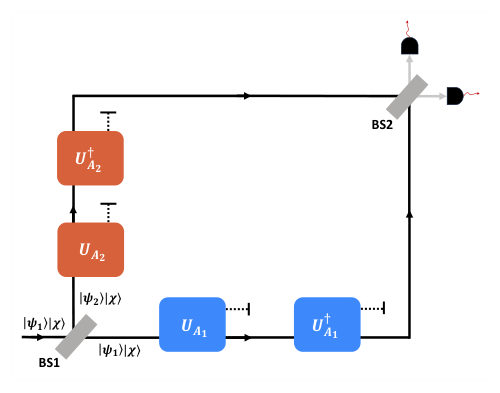
<figcaption class="paper-figure-caption"><b>Fig 1.</b> Figure 1: An interferometric setup for testing MH quasi-probability distribution. See text for detailed description.</figcaption>
</figure>

**Summary.** This paper establishes that the positivity of the Margenau-Hill quasi-probability distribution serves as a necessary and sufficient condition for two unsharp quantum measurements to be jointly measurable. The authors derive the mathematical criteria and propose an experimental protocol using an interferometer to directly measure this distribution, providing a powerful test for quantum incompatibility.

**Why it may be interesting.** This work provides a concrete, experimentally testable diagnostic tool (the MH distribution) to quantify quantum incompatibility, bridging abstract mathematical concepts with physical measurement limitations.

Detailed structure

**Main problem.** The paper aims to establish a rigorous, operational link between the concept of measurement incompatibility and the mathematical positivity of the Margenau-Hill (MH) quasi-probability distribution for dichotomic observables.

**Main result.** It is proven that for unsharp dichotomic measurements, the positivity of the MH distribution is necessary and sufficient for the measurements to be jointly measurable (i.e., compatible).

**Method.** The authors derive joint measurability conditions by analyzing the positivity of the MH distribution, which is then experimentally tested using a modified Mach-Zehnder interferometer setup.

**Model / system.** The study focuses on general quantum systems described by density matrices, specifically analyzing pairs (and generalizations to $n$) of dichotomic observables in an arbitrary finite dimension $d$.

**Key observables.** The Margenau-Hill (MH) quasi-probability distribution, $q(a_1, a_2)$, and the expectation value $\langle P_\Psi 
angle$ measured in an interferometer.

**Important parameters / regimes.** The dimension of the Hilbert space ($d$), and the parameters ($\lambda, \mu$) defining the unsharpness of the measurements.

**Assumptions / limitations.** The equivalence between MH positivity and joint measurability is rigorously proven for two dichotomic unsharp observables; the generalization to $n$ observables relies on the assumption that they are mutually anticommuting.

**Figures summary.** Figure 1 illustrates the interferometric setup, inspired by quantum-switch architectures, designed to directly measure the MH quasi-probability distribution.

**Paper structure.** The paper first derives the general joint measurability condition for two observables, then proves the equivalence between MH positivity and joint measurability, generalizes this to $n$ observables, and concludes by detailing the experimental realization of the test using interferometry.

Abstract

Measurement incompatibility and the negativity of quasi-probability distributions both demonstrate the signature of nonclassicality. However, their relations largely remained qualitative, and no explicit operational connection has been established. We provide an operational link between measurement incompatibility and the Margenau-Hill(MH) quasi-probability distribution associated with two dichotomic observables. { We first derive the joint measurability (measurement compatibility) condition for any pair of dichotomic observables in arbitrary finite dimension $d$.} We then rigorously prove that for any pair of unsharp dichotomic measurements in dimension $d$, the positivity of the MH distribution is equivalent to joint measurability \emph{i.e.}, the MH distribution is positive \emph{if and only if} the measurements are jointly measurable. We further introduce the MH-like quasi-probability distribution for $n$ dichotomic unsharp observables in arbitrary finite dimension and derive a sufficient condition of joint-measurability when the observables are mutually anticommuting. Finally, we propose an interferometric setup, inspired by quantum-switch architectures, that directly reconstructs MH quasi-probability which in turn provides a test of incompatibility.

[↑ back to top](#top)

### [Quantum Simulation of Detuning-Controlled Proximity-Induced Localization and Reentrant Delocalization in a Quasiperiodic Ladder](http://arxiv.org/abs/2609.37059v1)

**Authors:** Mrinal Kanti Giri, Shih Tai-Ming, Pinaki Sengupta, Pochung Chen  
**Type:** both · **Category:** disordered systems and neural networks · **PDF:** <https://arxiv.org/pdf/2609.37059v1>  
**Analysis basis:** full PDF text, analyzed in chunks
**Topic relevance:** 🔥 `analog quantum simulation` **4/5** · `Frenkel-Kontorova` **1/5**

↔ Scroll figures horizontally

<figure class="paper-figure-card">
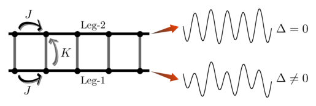
<figcaption class="paper-figure-caption"><b>Fig 1.</b> FIG. 1: The pictorial representation of the coupled AA chain, where Leg-1 (or s-AA chain) corresponds to the AA chain with a staggered on-site potential (∆̸= 0) and Leg-2 (or p- AA chain) corresponds to the pure AA chain (∆= 0).</figcaption>
</figure>
<figure class="paper-figure-card">
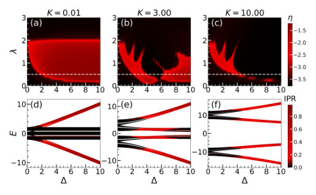
<figcaption class="paper-figure-caption"><b>Fig 2.</b> FIG. 2: Panels (a)-(c) show the phase diagrams in the λ-∆ plane, where the color scale represents η defined in Eq. 2; the dashed green line marks λ = 0.5. The black regions represent the extended or localized regimes, while the red regions indi- cate the intermediate phase (IP), where extended and local- ized eigenstates coexist. Panels (d)-(f) show the correspond- ing energy spectra as a function of ∆at λ = 0.5, with the color scale denoting the inverse participation ratio IPR of the eigenstate. Here, we consider the chain of length L = 3000.</figcaption>
</figure>
<figure class="paper-figure-card">
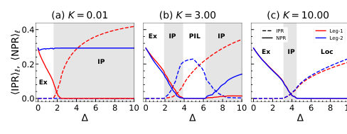
<figcaption class="paper-figure-caption"><b>Fig 3.</b> FIG. 3: Leg-resolved ⟨IPR⟩ℓand ⟨NPR⟩ℓas a function of ∆ for (a) K = 0.01, (b) K = 3.0, and (c) K = 10.0. Here, each chain has length L = 3000 and λ = 0.5. The labels denote Ex: extended phase, IP: intermediate phase, PIL: proximity- induced localization, and Loc: localized phase.</figcaption>
</figure>
<figure class="paper-figure-card">
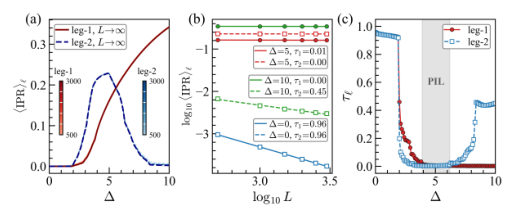
<figcaption class="paper-figure-caption"><b>Fig 4.</b> FIG. 4: Leg-resolved finite-size scaling for K = 3.0 and λ = 0.5. (a) ⟨IPR⟩ℓversus ∆for various system sizes L and the extrapolated L →∞limit. (b) Extraction of the scaling exponent ¯τℓat representative detuning ∆= 0, 5, and 10. (c) Scaling exponent ¯τℓas a function of ∆, highlighting proximity-induced localization (¯τ1 = ¯τ2 = 0) and re-entrant delocalization on leg-2 (¯τ2 &gt; 0)</figcaption>
</figure>
<figure class="paper-figure-card">
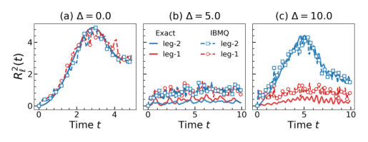
<figcaption class="paper-figure-caption"><b>Fig 5.</b> FIG. 5: Leg-resolved mean-square displacement R2 ℓ(t) ob- tained from exact evolution (solid lines) and IBMQ simula- tions (dashed lines) for (a) ∆= 0, (b) ∆= 5, and (c) ∆= 10 at K = 3. Red and Blue curves correspond to leg-1 and leg-2, respectively.</figcaption>
</figure>

**Summary.** This work explores how detuning can control localization and delocalization in a quasiperiodic ladder system. By applying detuning selectively to one leg, the researchers induce localization in the coupled neighbor, which can then re-enter a delocalized state. The findings are validated using both theoretical diagnostics and real-time quantum simulations on quantum hardware.

**Why it may be interesting.** The ability to programmatically control localization/delocalization using detuning in a quasiperiodic setting provides a powerful platform for studying transport and many-body physics in engineered quantum materials.

Detailed structure

**Main problem.** The study investigates proximity-induced localization (PIL) and subsequent re-entrant delocalization in coupled quasiperiodic ladder systems.

**Main result.** The research demonstrates that applying a staggered detuning to one leg can induce localization in the neighboring leg, and further detuning can cause the system to re-enter a delocalized state, controllable via leg-selective detuning.

**Method.** The study uses both static numerical diagnostics (IPR, NPR) and real-time quantum simulations on IBM Quantum hardware to measure wavefunction spreading.

**Model / system.** The model is a two-leg Aubry-André (AA) ladder governed by a Hamiltonian involving intra-leg hopping, inter-leg coupling, and a staggered detuning ($\Delta$) applied to one leg.

**Key observables.** Inverse Participation Ratio ($	ext{IPR}$), Normalized Participation Ratio ($	ext{NPR}$), Mean-Square Displacement ($	ext{MSD}$), and Participation Entropy ($S_{	ext{PE}}^2$).

**Important parameters / regimes.** Detuning ($\Delta$), inter-leg coupling ($K$), and quasiperiodic potential strength ($\lambda$). Key regimes include weak and strong coupling limits.

**Assumptions / limitations.** The analysis relies on mapping the system to qubits for quantum simulation and uses post-selection techniques to focus on the single-particle sector.

**Figures summary.** Figures illustrate phase diagrams ($\lambda-\Delta$ plane) showing localization regimes, and show leg-resolved diagnostics ($\langle	ext{IPR}
angle_{\ell}, \langle	ext{NPR}
angle_{\ell}$) versus $\Delta$ to distinguish different physical regimes.

**Paper structure.** The paper progresses from defining the coupled AA ladder Hamiltonian and analyzing localization diagnostics in different coupling limits, to demonstrating PIL and re-entrant delocalization using both static calculations and time-resolved quantum simulations.

Abstract

We demonstrate proximity-induced localization and re-entrant delocalization in a detuned quasiperiodic ladder. In the weak-quasiperiodic regime, where uncoupled Aubry-André chains are extended, a staggered detuning applied to only one leg induces localization in the neighboring leg through inter-leg hybridization. With further increasing detuning, the pure chain re-enters a delocalized regime, producing a delocalized-localized-delocalized sequence without directly modifying its quasiperiodic potential. We identify these regimes using static localization diagnostics and demonstrate experimentally accessible dynamical signatures on IBM Quantum hardware: strongly suppressed wavefunction spreading in the proximity-localized regime and its re-entrant recovery at larger detuning. These results establish leg-selective detuning as a programmable control knob for inducing and reversing localization in coupled quasiperiodic systems.

[↑ back to top](#top)

### [Artificial versus Natural Atoms: The uncanny capability of the many-body Schrödinger equation to produce emergent behavior](http://arxiv.org/abs/2609.36356v1)

**Authors:** Constantine Yannouleas  
**Type:** both · **Category:** strongly correlated electrons · **PDF:** <https://arxiv.org/pdf/2609.36356v1>  
**Analysis basis:** full PDF text, analyzed in chunks
**Topic relevance:** 🔥 `analog quantum simulation` **4/5**

↔ Scroll figures horizontally

<figure class="paper-figure-card">
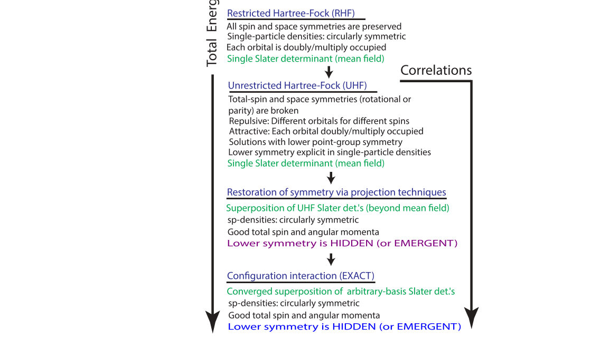
<figcaption class="paper-figure-caption"><b>Fig 1.</b> Figure 1. Synopsis of the method of hierarchical approximations, illustrating that a symmetry breaking at the mean-field level (single UHF Slater determinant) must be accompanied by a subsequent post-Hartree-Fock step of symmetry restoration, yielding a linear superposition of non-orthogonal UHF Slater determinants. The downward arrow on the left emphasizes that the total energy of the system is lowered with each successive step (including most remarkably the symmetry restoration step [57]), approaching thus from above the exact full-configuration-interaction total energy; see Fig. 2 below for a simple example. The arrow on the right emphasizes that the steps beyond the restricted...</figcaption>
</figure>
<figure class="paper-figure-card">
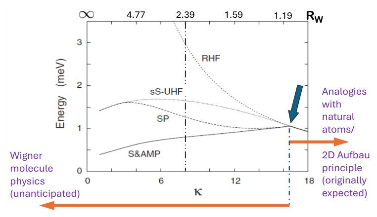
<figcaption class="paper-figure-caption"><b>Fig 2.</b> Figure 2. He-QD at vanishing magnetic field (two electrons confined in a 2D parabolic QD): Energy differences between the ground states of successive approximations and the exact one, plotted vs. κ (the dielectric constant, see the bottom horizontal axis) or RW (the Wigner parameter, see the top horizontal axis). From top to bottom, the curves correspond to the RHF, the spin and space unrestrited Hartree-Fock (sS-UHF), and two subsequent steps of symmetry restoration, i.e., the total-spin projected (SP) alone, and the combined total-spin and angular-momentum projected (S&amp;AMP) approximation. The bifurcation point between the RHF and sS-UHF curves is denoted by an arrow; it happens at RW =...</figcaption>
</figure>
<figure class="paper-figure-card">
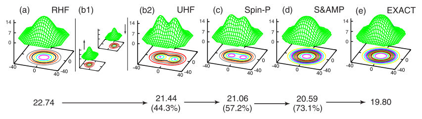
<figcaption class="paper-figure-caption"><b>Fig 3.</b> Figure 3. Successive approximations for the singlet ground state of a two-electron parabolic QD with RW = 2.39 under a vanishing magnetic field. The associated energies (in meV) are listed at the bottom. (a) Electron density of the RHF solution, exhibiting preservation of the circular symmetry of the potential confinement. The correlation energy, Ecorr = 2.94 meV, is given [see Eq. (9)] by the difference between the energy of this state and that of the exact solution [diplayed in panel (e)]. (b1) and (b2) The two occupied spin-up and spin-down space orbitals (modulus square) of the symmetry-broken “singlet” UHF solution (in b1), with the associated total electron density having a...</figcaption>
</figure>
<figure class="paper-figure-card">
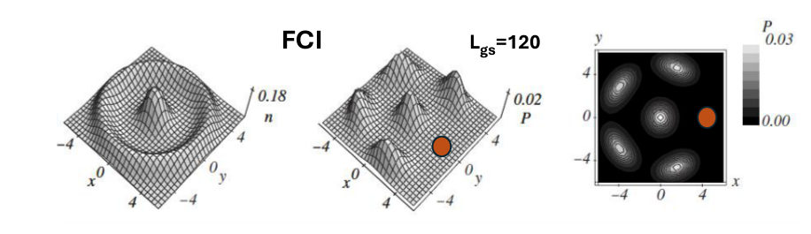
<figcaption class="paper-figure-caption"><b>Fig 4.</b> Figure 4. An example of the hidden (intrinsic) lower symmetry that can be extracted from an FCI calculation. The case portrayed is that of the ground state (with total angular momentum Lgs = 120) of N = 6 scalar bosons interacting via a repulsive Coulomb potential in a rapidly rotating trap. The many-body Hilbert space corresponds to the lowest Landau level, namely, the angular velocity Ωof the trap equals the confinement frequency ω of the trap, Ω= ω [92]. (a) The single-particle density [n(r)], (b) the corresponding CPD [P(r, r0)] [see Eq. (7)] in a 3D plot, and (c) the CPD in a contour plot. The red dots in the CPD plots indicate the reference (fixed) point r0. I note that the...</figcaption>
</figure>
<figure class="paper-figure-card">
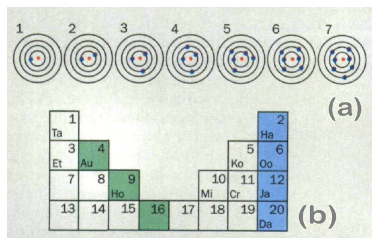
<figcaption class="paper-figure-caption"><b>Fig 5.</b> Figure 5. The Bohr-type 2D artificial atom, as conceptualized in Ref. [82]. (a) The addition of single electrons to the quantum dot can be pictured in terms of circular orbits. The first shell can contain two electrons, the second can contain four and so on. This makes it possible to formulate a periodic table for these artificial two-dimensional atoms. (b) Full shells correspond to the magic numbers N = 2, 6, 12, 20 and so on, while half-filled shells (N = 4, 9, 16, etc) correspond to maximum spin states. (The elements are named after team members from NTT and Delft.) Figure originally published in Ref. [82], Copyright (1998) by the IOP Publishing. Reused with permission. All rights...</figcaption>
</figure>

**Summary.** This review surveys the novel physics of artificial atoms formed by strongly correlated particles, known as Wigner molecules. It demonstrates how the many-body Schrödinger equation predicts emergent quantum phenomena, such as molecular-like spectra, when interparticle repulsion dominates kinetic energy. The work is highly relevant for understanding correlated electron behavior in nanoscale quantum devices and trapped quantum simulators.

**Why it may be interesting.** It bridges the gap between fundamental many-body theory (MBSE) and modern experimental platforms (quantum dots, trapped atoms) to study emergent quantum behavior in strongly correlated systems.

Detailed structure

**Main problem.** The paper reviews the physics of 'artificial atoms' and molecules, which are finite quantum analogs of Wigner crystals, arising from strongly interacting, confined particles.

**Main result.** The physics is governed by the many-body Schrödinger equation (MBSE) in regimes of strong interparticle correlations, leading to emergent phenomena like rovibronal spectra and Wigner molecularization.

**Method.** The review synthesizes theoretical calculations (e.g., FCI, symmetry projection) and discusses experimental platforms, focusing on the Wigner parameter to characterize the correlation strength.

**Model / system.** The systems include 2D semiconductor/moiré quantum dots, trapped ultracold atoms/ions, and electron clusters under high magnetic fields or rotation. The underlying physics is described by the MBSE for mutually repelling confined particles.

**Key observables.** Spectral energy gaps, rovibronal spectra, entanglement, and pinning effects.

**Important parameters / regimes.** The Wigner parameter (RW = Potential Energy / Kinetic Energy) and external fields like magnetic field (B) and rotation ($\Omega$).

**Assumptions / limitations.** The analysis develops a view of symmetry breaking based exclusively on finite systems, contrasting with the thermodynamic limit.

**Paper structure.** The review progresses from general concepts of Wigner molecularization to specific computational methods (e.g., hierarchical schemes) and details results across different physical regimes (field-free, magnetic field, rotating traps).

Abstract

The paper reviews the theoretical and experimental progress achieved in the last 25 years in understanding the novel physics of artificial atoms and molecules as arising from the formation of Wigner molecules (WMs) of localized (to a stronger or lesser extent) fermionic or bosonic particles, which are finite quantum analogs of the more familiar bulk Wigner crystal. The term artificial atoms, as used here, encompasses a broad range of recently fabricated quantum nanodevices and experimental apparatuses consisting of a finite number of mutually repelling confined particles, including two-dimensional semiconductor and moiré transition metal dichalcogenide quantum dots, as well as trapped ultracold neutral atoms or ions. These nano-sized or micro-sized artificial devices and apparatuses (in single well or multi-well of variable-shape arrangements) hold a great promise for technological applications in the field of quantum information and quantum computers, as well as for advances in fundamental many-body physics. Prominent quantum effects of Wigner molecularization are the strong quenching of the spectral energy gaps, the appearance of rovibational spectra (in analogy with natural molecules), entanglement, and pinning due to an external perturbation. In high magnetic fields or at rapid rotation, WMs provide an alternative theory to the fractional quantum Hall effect. The physics of Wigner molecules is shown to derive from the solutions of the many-body Schrödinger equation (MBSE) in the regime of strong interparticle correlations arising from the dominance of the potential over the kinetic energy, or from a high magnetic field, as well as from a rapid rotation... (continues in the paper).

[↑ back to top](#top)

### [Exponential Advantage of Quantum over Classical References in Leakage Detection](http://arxiv.org/abs/2609.36541v1)

**Authors:** Zheng An  
**Type:** theory · **Category:** quantum information and computing · **PDF:** <https://arxiv.org/pdf/2609.36541v1>  
**Analysis basis:** full PDF text, analyzed in chunks
**Topic relevance:** 🔥 `quantum measurements` **4/5**

↔ Scroll figures horizontally

<figure class="paper-figure-card">
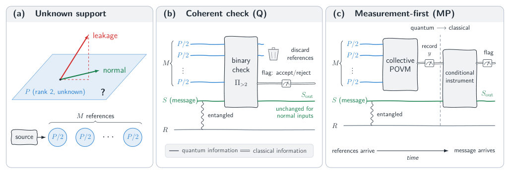
<figcaption class="paper-figure-caption"><b>Fig 1.</b> FIG. 1. Nondisturbing leakage detection with quantum references. (a) The unknown two-dimensional subspace onto which P projects (blue plane) contains normal messages (green); leakage extends outside it (red). The source supplies M references in state P/2, mutually independent and independent of the message conditional on P. (b) The quantum receiver (Q) jointly processes the references and message S with a binary instrument whose rejection projector is Π&gt;2. It returns the message Sout and an accept/reject flag, exactly preserving every normal message and its entanglement with the remote system R; the references are discarded. (c) A measure-and-process receiver (MP) performs a collective POVM...</figcaption>
</figure>
<figure class="paper-figure-card">
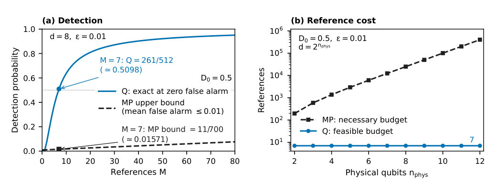
<figcaption class="paper-figure-caption"><b>Fig 2.</b> FIG. 2. Reference costs for an ideal source. (a) Optimal Q detection at zero false alarm from Eq. (4), compared with the Haar-averaged MP upper bound at d = 8, ϵ = 0.01. The latter constrains the guaranteed detection of any MP receiver satisfying the uniform task. At M = 7, Q detects with probability 261/512, whereas the MP bound is 11/700. The Q instrument also satisfies this positive tolerance. (b) At D0 = 0.5, ϵ = 0.01, seven references suffice for Q, while MP requires at least 98(d −2) for d = 2nphys. All curves are evaluated from closed-form expressions.</figcaption>
</figure>
<figure class="paper-figure-card">
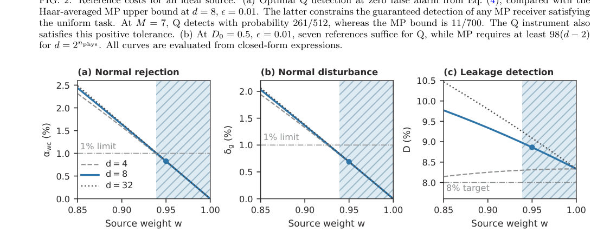
<figcaption class="paper-figure-caption"><b>Fig 3.</b> FIG. 3. Two-reference performance with source contamination. For d = 4, 8, 32, normal rejection probability, conditional disturbance of normal messages, and orthogonal-leakage detection are compared with their task thresholds. Hatching marks the feasible interval at d = 8; dots indicate w = 0.95. The source weight w = 0.95 meets αwc, δg ≤0.01 and D ≥0.08 for all d ≥4; the marked d = 8 instance has M ∗ Q ≤2 and M ∗ MP ≥84. The curves are evaluated from the channel formulas for contaminated references and ideal receiver operations.</figcaption>
</figure>

**Summary.** This paper introduces a method for detecting quantum leakage from an unknown encoding subspace using multiple independent quantum references measured coherently. It rigorously proves that this quantum approach is exponentially superior to classical measurement-first protocols, especially when the encoding structure is unknown. This advances the understanding of quantum resource utilization in quantum information security and verification.

**Why it may be interesting.** The focus on quantum reference measurements to overcome the need for classical knowledge of the encoding subspace is highly relevant to quantum error correction and quantum communication protocols where full state tomography or classical description is impossible.

Detailed structure

**Main problem.** The paper addresses the challenge of detecting quantum leakage from an encoding subspace when the subspace itself is not classically specified.

**Main result.** A coherent measurement using independent quantum references provides an optimal detection law with a sample advantage exponential in the number of physical qubits compared to measurement-first classical protocols.

**Method.** The authors derive detection laws by comparing the performance of a coherent joint measurement (quantum) against a sequential measurement-first (classical) protocol.

**Model / system.** The model involves quantum information processing where a message is encoded into a subspace, and leakage is defined as population outside this subspace. The comparison is made between coherent reference measurements and classical POVM measurements.

**Key observables.** Detection probability ($D_0$), false alarm rate ($\epsilon$), miss probability, and the required number of quantum references ($M$).

**Important parameters / regimes.** Number of references ($M$), ambient dimension ($d$), and tolerance ($\epsilon$).

**Assumptions / limitations.** The coherent check is assumed to be optimal among all tests with zero false alarm for every encoding, and the analysis often assumes ideal reference operations or specific noise models (e.g., local Markov Pauli channels).

**Figures summary.** Figures compare the required number of references ($M$) for quantum vs. measurement-first approaches, demonstrating an exponential advantage for the coherent check, and illustrate the process flow difference between the two detection methods.

**Paper structure.** The paper progresses by first defining the problem of leakage detection without classical knowledge of the subspace. It then derives the optimal detection law for the coherent measurement, contrasts this with the limitations of measurement-first receivers, and quantifies the resulting exponential quantum advantage.

Abstract

Leakage from a known encoding subspace can be detected by projection. However, the corresponding projector is unavailable when the encoding subspace is not classically specified. Here we show how independent quantum references prepared by the same encoder enable leakage detection without a classical description of the encoding. A coherent measurement on the references and a single message leaves every state within the two-dimensional encoding subspace, including its entanglement with a remote system, exactly unchanged. We derive the exact detection law for $M$ ideal references and prove optimality among tests with zero false alarm for every encoding. For orthogonal leakage, the miss probability is asymptotic to $4/M$, independent of the ambient dimension $d$. Measuring all references first, even collectively, gives zero detection at every finite budget under the same zero-false-alarm requirement. For a fixed detection target between zero and one, the optimal measurement-first cost is $Θ(d/ε)$ at sufficiently small tolerance $ε$ on normal false alarm and conditional disturbance; a dimension-independent coherent budget suffices. For one logical qubit encoded in three physical qubits, seven coherent references achieve at least $50\%$ orthogonal-leakage detection, whereas any measurement-first receiver needs at least $588$ under the same $1\%$ normal tolerances. Quantum references thus support leakage checks without classical reconstruction, with a sample advantage exponential in the number of physical qubits.

[↑ back to top](#top)

### [Fast Hamiltonian engineering from cut polytope geometry](http://arxiv.org/abs/2609.36006v1)

**Authors:** Thomas Joachim Friese, Özgün Kum, Aram W. Harrow, Martin Kliesch  
**Type:** theory · **Category:** quantum information and computing · **PDF:** <https://arxiv.org/pdf/2609.36006v1>  
**Analysis basis:** full PDF text, analyzed in chunks
**Topic relevance:** 🔥 `analog quantum simulation` **4/5**

↔ Scroll figures horizontally

<figure class="paper-figure-card">
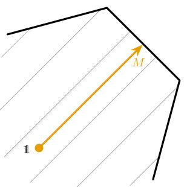
<figcaption class="paper-figure-caption"><b>Fig 1.</b> Figure 1: Visualization of the solution ray and the cut polytope. All solutions lie on the intersection of the ray originating from 1, going in the direction M, and CUTn k. Better solutions lie further along the ray. The optimum is where the ray meets the boundary of CUTn k.</figcaption>
</figure>
<figure class="paper-figure-card">
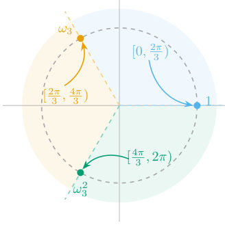
<figcaption class="paper-figure-caption"><b>Fig 2.</b> Figure 2: A possible projection onto the k-th roots of unity. The complex plane is cut from the origin into k equiangular sections. In counterclockwise direction, each section is assigned a k-th root of unity. Rotating the sections around the origin yields rounding functions with equivalent distributions.</figcaption>
</figure>
<figure class="paper-figure-card">
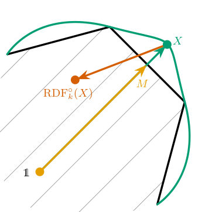
<figcaption class="paper-figure-caption"><b>Fig 3.</b> Figure 3: Intuitively, one might try to solve the elliptope relaxation of the solution ray directly. Then the rounding distortion would, however, introduce a systematic devia- tion away from the ray, leading to an ineffective selection of pulses.</figcaption>
</figure>
<figure class="paper-figure-card">
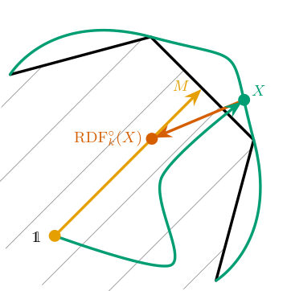
<figcaption class="paper-figure-caption"><b>Fig 4.</b> Figure 4: Instead of optimizing the relaxed solution ray directly, we can bend it by the inverse of the distortion function RDF◦−1 k . Then, in the rounding stage the sam- pled pulses will average out back onto the solution ray. This fully prevents the systematic deviation observed be- fore.</figcaption>
</figure>
<figure class="paper-figure-card">
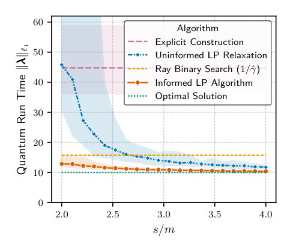
<figcaption class="paper-figure-caption"><b>Fig 5.</b> Figure 5: Comparison of algorithm performances on a canonical instance. The system Hamiltonian is given by an all-to-all connected Ising model on 20 qubits. The target is also an Ising-type Hamiltonian with a connec- tivity graph given by a complete bipartite graph K10,10. All couplings of both Hamiltonians are set to 1. The pulse ratio is varied over 20 equally spaced values be- tween 2.0 and 4.0. For the randomized algorithms, the data is aggregated over 50 independent runs per pulse ratio s/m. The markers indicate the median value, the shaded areas range from the minimal to the maximal attained quantum run time. Runs with an infeasible re- stricted linear program are excluded, which...</figcaption>
</figure>

**Summary.** This work presents a unified, mathematically rigorous framework for Hamiltonian Engineering, solving the problem of simulating a target quantum evolution using limited native controls. By reformulating the problem as an optimization over a polytope, the authors develop an efficient algorithm that achieves provable, near-optimal quantum run times. This establishes a powerful tool for the automatic design and programming of analog quantum simulators across various quantum systems.

**Why it may be interesting.** It provides rigorous, provable guarantees for the automatic programming of analog quantum simulators by establishing a concrete, efficient optimization procedure for Hamiltonian decomposition.

Detailed structure

**Main problem.** The paper addresses Hamiltonian Engineering (HE), which is the task of simulating a target quantum evolution ($H_{	ext{target}}$) using a native system Hamiltonian ($H_{	ext{native}}$) and controlled pulses.

**Main result.** The authors provide a unified framework that reformulates time-optimal HE as an NP-complete polytope problem, solving it via an elliptope relaxation and yielding an approximation ratio of $O(\sqrt{m})$ for quantum run times.

**Method.** The core method involves reformulating the problem as a complex $k$-cut polytope optimization, relaxing it to an elliptope, and solving the resulting Linear Program (LP) using informed and mixed pulse sets.

**Model / system.** The framework is applicable to broad classes of 2-local qubit, qudit, and fermionic systems, aiming to decompose the target Hamiltonian into a sum of controlled conjugations of the native Hamiltonian.

**Key observables.** Optimal Quantum Run Time, Approximation Ratio, Feasibility of the LP solution.

**Important parameters / regimes.** Number of interaction terms ($m$), number of distinct phases ($k$), and the required pulse weights ($\lambda$).

**Assumptions / limitations.** The initial formulation is NP-hard, necessitating relaxation to the elliptope; the mixed LP algorithm is used to guarantee feasibility against finite pulse time errors.

**Figures summary.** Benchmarks are shown on a fully connected Ising model, a chiral clock model for qudits, and the fermionic Harper-Hofstadter model, demonstrating near-optimal run times.

**Paper structure.** The paper introduces the HE problem, proves its NP-hardness, relaxes it to an elliptope, develops the informed and mixed LP algorithms, and concludes with benchmarks comparing the approach to state-of-the-art methods.

Abstract

Hamiltonian engineering (HE) simulates quantum dynamics under a target Hamiltonian using a native entangling system Hamiltonian and restricted control, with applications from quantum gate design to analog quantum simulation. Observing that, for many systems, formulating HE as a linear program only requires specific commutation relations between the control pulses and the system Hamiltonian, we provide a unified framework for broad classes of $2$-local qubit, qudit, and fermionic systems. We reformulate time-optimal HE as a complex $k$-cut polytope problem, with $k$ the number of distinct phases in these commutation relations, and prove it NP-complete for every finite $k$. We therefore relax the polytope to the elliptope and apply a Krivine-type rounding, yielding pulses informed by the system and target Hamiltonians, which we then use in a linear program. We derive how many informed pulses are necessary and sufficient for the linear program to be reliably feasible. Additionally mixing in uniformly sampled pulses guarantees a solution close to the relaxation value from $\mathrm{O}(m)$ pulses, with $m$ the number of interaction terms. Together with upper and lower bounds on the optimal quantum run time, this yields an $\mathrm{O}(\sqrt{m})$ approximation ratio. In benchmarks on a fully connected Ising model, a chiral clock model for qudits, and the fermionic Harper-Hofstadter model, our approach attains near-optimal quantum run times wherever the optimum is computable, reaches run times that saturate with the lattice size in the fermionic case, and outperforms state-of-the-art methods with $\mathrm{O}(m)$ pulses. This establishes a unified approach with provable guarantees to the automatic programming of analog quantum simulators.

[↑ back to top](#top)

### [Multicomponent anyons in one-dimensional optical lattices](http://arxiv.org/abs/2609.36554v1)

**Authors:** Sagarika Basak, Xi-Wen Guan, Han Pu  
**Type:** theory · **Category:** quantum gases · **PDF:** <https://arxiv.org/pdf/2609.36554v1>  
**Analysis basis:** full PDF text, analyzed in chunks
**Topic relevance:** 🔥 `analog quantum simulation` **4/5**

↔ Scroll figures horizontally

<figure class="paper-figure-card">
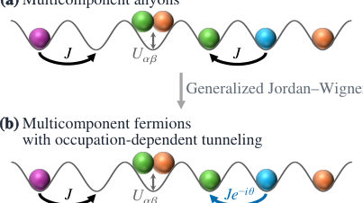
<figcaption class="paper-figure-caption"><b>Fig 1.</b> Figure 1. Fermionic representation of multicomponent anyons. (a) Nearest-neighbor tunneling with amplitude 𝐽at on-site intercom- ponent interaction 𝑈𝛼𝛽. Colors denote the 𝑁internal components. (b) The generalized Jordan–Wigner transformation maps the anyons onto multicomponent fermions with direction- and occupation- dependent Peierls-type tunneling 𝐽exp∓𝑖𝜃𝑛𝑖 .</figcaption>
</figure>
<figure class="paper-figure-card">
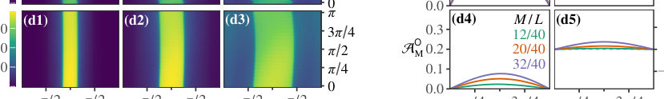
<figcaption class="paper-figure-caption"><b>Fig 2.</b> Figure 2. Fractional statistics leaves distinct signatures in intrinsic anyonic and observable physical-fermion momentum distributions. Intrinsic anyonic momentum distribution 𝑛𝑘for (a) weak interaction (𝑈= 𝐽) and (c) strong interaction (𝑈= 20𝐽), and corresponding observable physical-fermion momentum distribution 𝑛O 𝑘in (b) and (d). The first three columns show lattice fillings 𝑀/𝐿∈{12/40, 20/40, 32/40}, respectively, for 21 equally spaced statistical phases 𝜃∈{0, 0.05𝜋, . . . , 𝜋}. All panels show 𝑁= 2 components. Fractional exchange statistics breaks the 𝑘↔−𝑘symmetry and redistributes spectral weight; inversion symmetry is restored at fermionic (𝜃= 0) and pseudobosonic (𝜃= 𝜋) limits. The...</figcaption>
</figure>
<figure class="paper-figure-card">
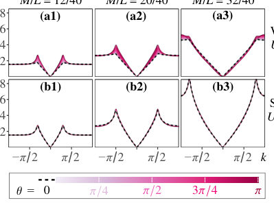
<figcaption class="paper-figure-caption"><b>Fig 3.</b> Figure 3. Spinor anyons retain antiferromagnetic ordering across the full range of fractional exchange statistics. Structure fac- tor 𝑆(𝑘) obtained from the two-body diagonal spin correlations of two-component anyons [Eq. (10)]. Columns show lattice fillings 𝑀/𝐿∈{12/40, 20/40, 32/40}; rows show (a) weak interaction (𝑈= 𝐽) and (b) strong interaction (𝑈= 20𝐽). The 21 curves span statistical phases 𝜃/𝜋∈{0, 0.05, . . . , 1}: (black dotted) for the fermionic limit 𝜃= 0 and progressively darker solid curves for in- creasing 𝜃. The minimum at 𝑘= 0, approximately linear increase at small |𝑘|, and cusps near 𝑘≃±2𝑘F are characteristic of anti- ferromagnetic spin ordering in Eq. (10). The 𝜃dependence...</figcaption>
</figure>
<figure class="paper-figure-card">
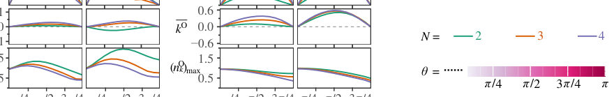
<figcaption class="paper-figure-caption"><b>Fig 4.</b> Figure 4. Additional spin components amplify the statistics-dependent momentum reconstruction. Shown are the (upper left) intrinsic anyonic momentum distribution 𝑛𝑘, (upper middle) observable physical-fermion momentum distribution 𝑛O 𝑘, and (upper right) spin structure factor 𝑆(𝑘) at weak interaction (𝑈= 𝐽). Rows show component number 𝑁∈{2, 3, 4}; alternating columns show fixed population per component 𝑀/𝑁= 6 and fixed total population 𝑀= 36. The 13 curves span statistical phases 𝜃∈{0, 𝜋/12, 𝜋/6, 𝜋/4, . . . , 𝜋}: (black dotted) for the fermionic limit 𝜃= 0 and progressively darker solid curves for increasing 𝜃. The lower block shows the (top row) mirror asymmetries AM and AO M, (middle row)...</figcaption>
</figure>
<figure class="paper-figure-card">
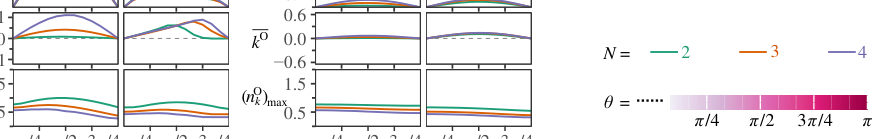
<figcaption class="paper-figure-caption"><b>Fig 5.</b> Figure 5. Strong interactions separate intrinsic anyonic signatures from physical-fermion observables’. As in Fig. 4, except at strong interaction 𝑈= 20𝐽. The intrinsic anyonic momentum distribution 𝑛𝑘retains substantial dependence on the statistical phase through the nonlocal anyonic string in its defining operator, while the corresponding statistics-dependent signatures in the observable physical-fermion momentum distribution 𝑛O 𝑘are strongly suppressed. This suppression is reflected in the small values of both AO M and ¯𝑘O across 𝑁. The spin structure factor 𝑆(𝑘) likewise remains nearly insensitive to 𝜃and retains the characteristic antiferromagnetic form.</figcaption>
</figure>

**Summary.** This paper theoretically explores how multicomponent anyons behave in 1D optical lattices, using the Anyon-Hubbard model. By varying the fractional exchange statistics, the authors show that charge and spin correlations are profoundly altered, leading to novel spectral features and tunable magnetic ordering. The findings establish the statistical phase as a key control knob for both ground-state structure and dynamic behavior.

**Why it may be interesting.** This work directly addresses the physics of strongly correlated quantum gases using anyonic statistics, which is a major frontier in ultracold atom research, especially concerning spin and charge correlations.

Detailed structure

**Main problem.** The study investigates the ground-state and dynamical properties of multicomponent interacting anyons confined within a one-dimensional optical lattice.

**Main result.** The combination of multicomponent effects and fractional exchange statistics significantly reshapes charge and spin correlations, leading to emergent asymmetry and tunable magnetic ordering.

**Method.** The analysis uses theoretical mapping to a generalized Anyon-Hubbard model, employing techniques like Jordan-Wigner transformations and DMRG simulations.

**Model / system.** The system models multicomponent anyons interacting in a 1D optical lattice, governed by an Anyon-Hubbard Hamiltonian. The statistics are controlled by a fractional statistical phase parameter, $	heta$.

**Key observables.** Charge and spin correlations, momentum distribution ($\hat{n}_k$), spin structure factor ($S(k)$), and dipole oscillation dynamics.

**Important parameters / regimes.** Interaction strength ($U$), anyonic statistical parameter ($	heta$), and lattice site occupancy.

**Assumptions / limitations.** The analysis is restricted to one-dimensional systems, and the mapping assumes anticommutation on the same site.

**Figures summary.** Figures illustrate the fermionic representation of the anyon system and compare intrinsic anyonic momentum distributions ($\hat{n}_k$) with observable physical-fermion distributions ($\hat{n}_O^k$).

**Paper structure.** The paper progresses by defining the model and mapping it to a fermionic description, analyzing ground-state correlations (charge/spin) across different statistical regimes, and finally examining quench dynamics to show the tunability of the system's response.

Abstract

We investigate the ground-state and dynamical properties of multicomponent interacting anyons confined in a one-dimensional (1D) optical lattice. Adopting the Anyon--Hubbard model, we explore spin and charge correlations as functions of interaction strength and the anyonic statistical parameter. Our results demonstrate that multicomponent effects combined with fractional exchange statistics substantially reshape both charge and spin correlations. For fractional exchange statistics, the canonical symmetric shell structure with prominent singularities in the spinor fermionic momentum distribution undergoes notable structural reconstruction, exhibiting emergent asymmetry, new spectral peaks, and broadened singular features. Unlike the Tonks--Girardeau bosonic gas, pseudobosons, representing a limiting case of anyons, cease to display a dominant zero-momentum peak. Instead, a quasi-fermionic shell structure emerges with finite-momentum peaks, whose locations are modulated by lattice site occupancy and interaction strength. The structure factor of spin correlations uncovers antiferromagnetic ordering in spinor anyon systems, with correlation magnitudes tunable by anyonic exchange statistics. Furthermore, quench dynamics analysis reveals the statistical phase parameter as an effective tuning knob. It enables the switching of dipole oscillations between underdamped and overdamped relaxation regimes and governs overall cloud expansion dynamics. Our findings pave the way for exploring statistics-driven ground-state and dynamical phase transitions in spinor anyon systems.

[↑ back to top](#top)

### [Quantum States and Spectra of Small Cylindrical and Toroidal Lattices](http://arxiv.org/abs/2609.36711v1)

**Authors:** Caelan Brooks, Kunal K. Das  
**Type:** theory · **Category:** other · **PDF:** <https://arxiv.org/pdf/2609.36711v1>  
**Analysis basis:** full PDF text, analyzed in chunks
**Topic relevance:** 🔥 `analog quantum simulation` **4/5**

↔ Scroll figures horizontally

<figure class="paper-figure-card">
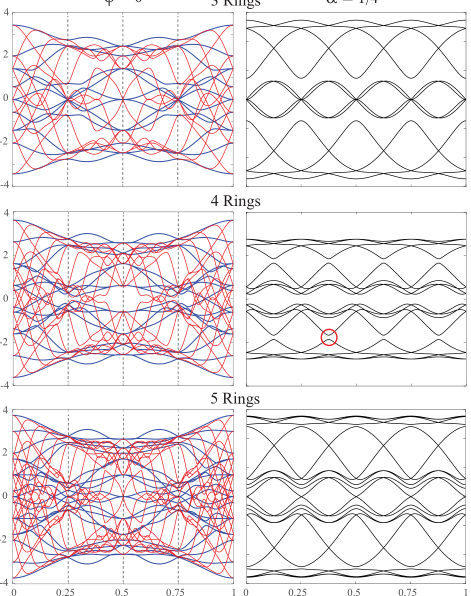
<figcaption class="paper-figure-caption"><b>Fig 1.</b> FIG. 2. (Color online) The periodic boundary condition of a cylindrical lattice breaks the gauge equivalence illustrated for the two Landau gauges x (thin red line) and y (thick blue line) for a 4 × 4 cylindrical lattice. The left panels show that they match at specific values of the field where M × α = k, a natural number, irrespective of the number of sites N in the axial direction. The right panels illustrate that at those values, here shown for α = 1/4, the spectrum is the same for both gauges as a function of a phase ϕ representing an added axial field. When N = M, gaps open in the lines that mark edge states of the bands; one is marked by a red circle.</figcaption>
</figure>
<figure class="paper-figure-card">
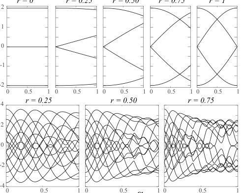
<figcaption class="paper-figure-caption"><b>Fig 2.</b> FIG. 4. (Color online) The origin of the butterfly shape is shown with the gauge dependence varying from f(n) = −nr, with r ∈[0, 1]. Upper panels show for 2 × 2 and lower for 4 × 4 cylindrical lattice.</figcaption>
</figure>
<figure class="paper-figure-card">
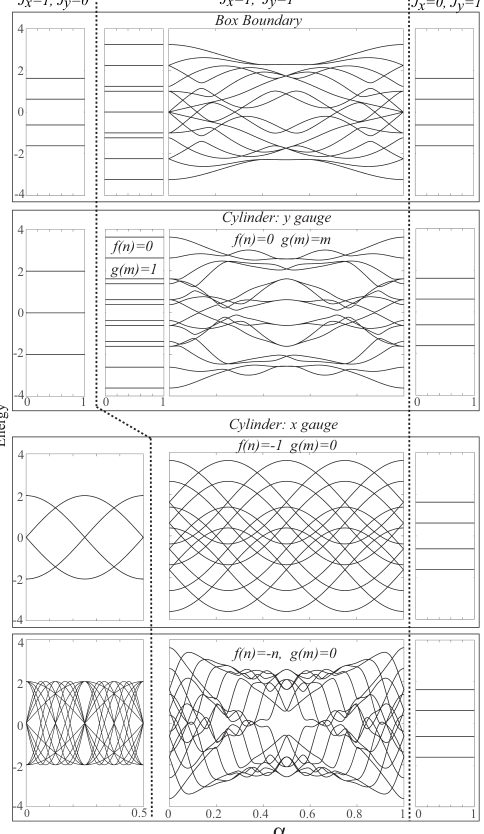
<figcaption class="paper-figure-caption"><b>Fig 3.</b> FIG. 3. (Color online) The spectrum of a 4 × 4 cylindri- cal lattice showing effects of boundary conditions, gauge and coupling: The three columns separated by dotted lines show: (Left) isolated rings Jx = 1, Jy = 0,(Right) isolated strips Jx = 0, Jy = 1, and (Center) the critical case Jx = 1, Jy = 1. The four rows display: (First) box boundary condition insen- sitive to the gauge; (Second) Landau y gauge comparing in the center column the effects of g(m) = 1 with g(m) = m, as in the gauge factor being independent/dependent on the lattice index; (Third) Landau x gauge showing that the spectrum depends on the field α even when the gauge factor f(n) = −1 has no dependence on the lattice index....</figcaption>
</figure>
<figure class="paper-figure-card">
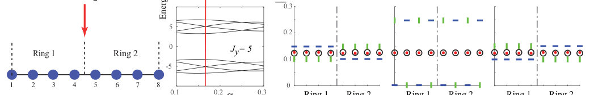
<figcaption class="paper-figure-caption"><b>Fig 4.</b> FIG. 5. (Color online) The schematic uses a 2 × 4 cylindrical lattice with f(n) = −n, g(m) = 0 to illustrate how we plot the eigenstates, by mapping the 2D lattice sites to a 1D sequence. The spectra shown at Jx = 1 for two separate inter-ring coupling Jy trace avoided crossings (solid blue circles), intersections that slide by (dotted green circles) and persistent degeneracies (solid red dots, also tracked with vertical red line). The lowest four eigenstates are shown at α = 1/6 and its neighborhood, where avoided crossings and persistent degeneracies are both present. In this and other plots we will use the legend having increasing energy (black circles, blue horizontal bar, green...</figcaption>
</figure>
<figure class="paper-figure-card">
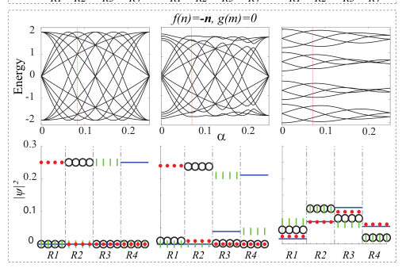
<figcaption class="paper-figure-caption"><b>Fig 5.</b> FIG. 6. (Color online) The effect of the phase variation among the rings is shown by contrasting the case of f(n) = −1 (top rows) with f(n) = −n bottom rows. (Row 1) As the inter-ring coupling is increased from the left to right, for f(n) = −1, the degeneracies are lifted independent of α, and the spectral lines separate uniformly. (Row 3) For f(n) = −n the relative phase between the rings causes strong dependence on α, causing gaps to open up at specific values leading to avoided crossings. (Row 2) In the absence of phase difference between rings, even a small coupling Jy causes the eigenstates to mix; (Row 4) the phase difference resists mixing, which occurs selectively around avoided...</figcaption>
</figure>

**Summary.** This paper theoretically analyzes the quantum energy spectrum of small 2D lattices with cylindrical and toroidal boundaries under the influence of a position-dependent gauge field. It demonstrates that finite size effects break gauge symmetries, leading to distinct spectral features like edge state gaps in cylinders and a localization transition in tori. The findings are crucial for understanding topological phenomena in engineered quantum simulators.

**Why it may be interesting.** This work directly addresses the topological physics of constrained geometries, which is highly relevant for understanding synthetic gauge fields realized in ultracold atoms and quantum simulators.

Detailed structure

**Main problem.** The study investigates the quantum spectrum and states of small lattices with cylindrical and toroidal topologies when subjected to a position-dependent scalar gauge potential.

**Main result.** The paper finds that gauge equivalence, assumed in infinite lattices, is generally lost due to periodic boundary conditions, and it identifies specific conditions that restore this equivalence. Furthermore, it characterizes edge state gaps in cylinders and a localization-delocalization transition in tori.

**Method.** The authors employ a comparative theoretical analysis, examining the Hamiltonian's spectrum and eigenstates by varying gauge choices, boundary conditions, and external field parameters.

**Model / system.** The model is a quantum mechanical system on a finite 2D lattice ($M 	imes N$) described by a hopping Hamiltonian incorporating gauge-dependent phases. The geometry is varied between planar, cylindrical, and toroidal topologies.

**Key observables.** Energy spectrum (eigenvalues), avoided crossings, persistent degeneracies, and the presence/absence of spectral gaps associated with edge states.

**Important parameters / regimes.** Gauge choice (Landau gauges), inter-site coupling strengths ($J_x, J_y$), the magnetic flux parameter ($\alpha$), and the lattice size ($M, N$).

**Assumptions / limitations.** The analysis moves beyond the assumptions of infinite lattices, focusing on small lattices to highlight boundary effects. It compares results across different gauge choices.

**Figures summary.** Figures illustrate the schematic boundary conditions (Box, Cylinder, Torus) and compare spectra for different Landau gauges on cylindrical lattices, showing spectral matching only when specific commensurability conditions are met.

**Paper structure.** The paper follows a comparative structure, first establishing the Hamiltonian and the problem setup, then analyzing the breakdown of gauge equivalence due to finite size, and finally contrasting the spectral features observed in cylindrical versus toroidal geometries.

Abstract

We examine the spectrum and quantum states of small lattices with cylindrical and toroidal topology subject to a scalar gauge potential that introduces a position dependent phase in the inter-site coupling. Equivalency of gauges assumed in infinite lattices is generally lost due to the periodic boundary conditions, and conditions that restore it are identified. We trace the impact of various system parameters including gauge choice, boundary conditions and inter-site coupling strengths, and an additional axial field. We find gauge dependent appearance of avoided crossings and persistent degeneracies, and we show their impact on the associated eigenstates. Smaller lattices develop prominent gaps in spectral lines associated with edge states, which are suppressed in the thermodynamic limit. Toroidal lattices have counterparts of most of the features observed in cylindrical lattices, but notably they display a transition from localization to delocalization determined by the relation between the field parameter and the number of lattice sites.

[↑ back to top](#top)

### [When Classical Correlations Certify Entanglement Recovery](http://arxiv.org/abs/2609.38168v1)

**Authors:** Takeru Utsumi, Yota Tachibana, Yoshifumi Nakata, Takaya Matsuura, Ryuji Takagi, Francesco Buscemi, Masato Koashi  
**Type:** theory · **Category:** quantum information and computing · **PDF:** <https://arxiv.org/pdf/2609.38168v1>  
**Analysis basis:** full PDF text, analyzed in chunks
**Topic relevance:** 🔥 `quantum measurements` **4/5**

↔ Scroll figures horizontally

<figure class="paper-figure-card">
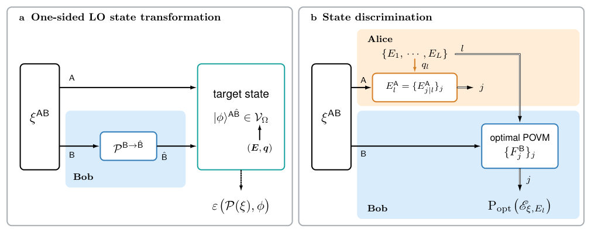
<figcaption class="paper-figure-caption"><b>Fig 1.</b> FIG. 1. The two tasks on a shared state ξAB connected by Theorem 1. a, In the one-sided LO state-transformation task, Bob applies a channel PB→ˆB and compares the resulting state with a target state |ϕ⟩AˆB ∈VΩ. b, In the state-discrimination task, Alice chooses a POVM EA l with probability ql, shares l with Bob, and Bob performs an optimal POVM to guess Alice’s outcome j. Here, VΩin a is determined by the family of Alice’s POVMs E and the probability distribution q used in b.</figcaption>
</figure>
<figure class="paper-figure-card">
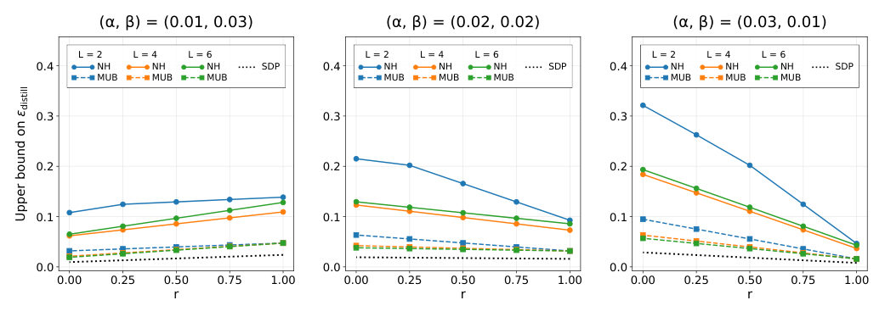
<figcaption class="paper-figure-caption"><b>Fig 2.</b> FIG. 2. Error bounds for εdistill on distilling an MES from the noisy state N A′→B(ΦAA′), where the noise N A′→B is a probabilistic mixture of depolarizing and dephasing channels with noise parameters α and β, respectively. The mixing probabilities of the former and latter channels are 1 −r and r, respectively. We set d = 5. Dashed and solid lines correspond to MUB-based measurements and neighboring-level Hadamard (NH)-based measurements, respectively. In both cases, L denotes the number of measurement bases, optimized over the choice of L MUB- or NH-based bases. As a benchmark, we also show, with the black dotted lines, the error εdistill achieved by the optimal local operation on Bob’s...</figcaption>
</figure>
<figure class="paper-figure-card">
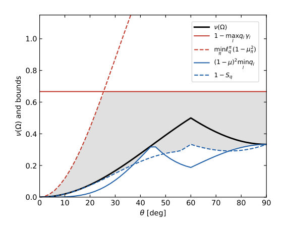
<figcaption class="paper-figure-caption"><b>Fig 3.</b> FIG. 3. The exact spectral gap ν(Ω) (black) and the bounds of Eq. (S83) (red and blue) for the three bases {E1, EF 1 (θ), EF 2 (θ)} with d = 5 and ql = 1/3 are plotted against θ. The shaded region is the interval certified by the bounds. The two θ-Fourier bases both coincide with the computational basis E1 at θ = 0, where the underlying Hilbert space is reducible, and every bound involving µπ vanishes. At θ = 90◦, the θ-Fourier bases coincide with each other, and only two distinct bases remain, namely E1 with weight 1/3 and the Fourier basis with weight 2/3.</figcaption>
</figure>
<figure class="paper-figure-card">
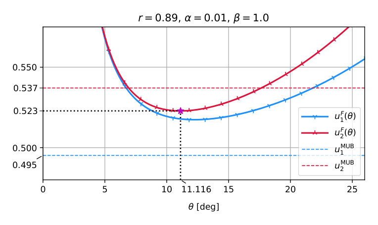
<figcaption class="paper-figure-caption"><b>Fig 4.</b> FIG. 4. The upper bounds u1 in Eq. (S179) (blue) and u2 in Eq. (S180) (red) are plotted for the θ-Fourier basis pair (solid) and the Y -axis-rotated MUB pair (dash-dotted) in the single-qubit case (d = 2). We set the noisy state to ξAB = N A′→B r (|Φ⟩⟨Φ|AA′) with r = 0.89, α = 0.01, and β = 1.0. The θ-Fourier basis pair gives a lower u2 than the Y -axis-rotated MUB pair for θ ∈(6.9◦, 17.6◦), while the latter is always superior for u1.</figcaption>
</figure>
<figure class="paper-figure-card">
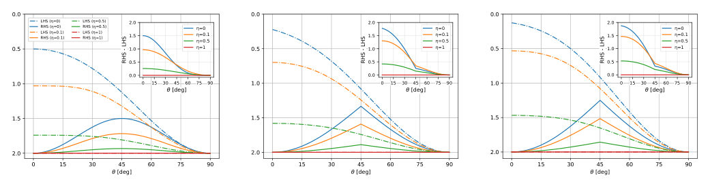
<figcaption class="paper-figure-caption"><b>Fig 5.</b> FIG. 5. The left- and right-hand sides of Eq. (S237) (dash-dotted and solid, respectively) are plotted for several values of the measurement unsharpness parameter η, with θ on the horizontal axis. Note that smaller values on the left-hand side indicate larger disturbance, while, for a fixed pair of observables, smaller values on the right-hand side indicate larger information gain; thus, the vertical axis is inverted. The inset plots the difference between the right-hand side and the left-hand side.</figcaption>
</figure>

**Summary.** This paper develops a general mathematical framework showing that entanglement can be quantitatively certified by measuring classical distinguishability, provided the measurements satisfy an 'irreducibility' condition instead of the stricter complementarity requirement. This breakthrough unifies key areas of quantum information theory, including entanglement distillation and Quantum Error Correction. It offers a robust method to estimate quantum resource limitations using only local, accessible measurements.

**Why it may be interesting.** It provides a powerful, generalized mathematical tool (irreducibility) to connect fundamental concepts like entanglement and distinguishability, which is crucial for understanding the limits of quantum information processing.

Detailed structure

**Main problem.** To establish a general, quantitative correspondence between quantum correlations (entanglement) and classical distinguishability of measurement outcomes, extending beyond the requirement of complementarity.

**Main result.** The connection can be established using the weaker condition of 'irreducibility' induced by measurements, providing a unified framework for entanglement distillation, QEC, and measurement trade-offs.

**Method.** The authors derive quantitative bounds by relating the infidelity of local state transformation to the failure probability in state discrimination using operator norms and spectral gaps.

**Model / system.** The analysis focuses on a bipartite quantum state $\xi_{AB}$ shared between two parties, involving local operations (LO) and general Positive Operator-Valued Measures (POVMs).

**Key observables.** Infidelity of one-sided LO transformation into a maximally entangled state (MES); Failure probability in state discrimination.

**Important parameters / regimes.** The condition of 'irreducibility' induced by the POVMs; the dimension $d$ of the system.

**Assumptions / limitations.** The results apply to general POVMs satisfying the irreducibility condition, relaxing the need for complementarity.

**Figures summary.** Figure 1 illustrates the two connected tasks: (a) one-sided LO state-transformation and (b) state-discrimination, showing how the errors are related.

**Paper structure.** The paper first establishes the quantitative link between the two error measures using the irreducibility condition, then derives specific bounds relating these errors, and finally extends this framework to unify entanglement distillation, QEC, and measurement trade-offs.

Abstract

Entanglement and state distinguishability have long been central topics in quantum foundations. While each has developed into a rich subject in its own right, they can be connected through measurements in complementary bases. This connection provides insights into quantum and classical correlations and underlies many information-processing tasks, most notably quantum error correction (QEC). However, it has remained largely open whether the connection between entanglement and distinguishability extends to general measurements without assuming complementarity. We answer this question in the affirmative: the key is irreducibility induced by measurements, a much more relaxed condition than complementarity. Specifically, for POVMs satisfying an irreducibility condition, we establish a quantitative relation between the infidelity of one-sided local transformation into a maximally entangled state and the failure probability in state discrimination. We then characterize when both errors can vanish simultaneously. Our results have direct applications to entanglement distillation and QEC. Their errors can be certified by estimating classical input-output correlations from experimentally accessible local measurements, without requiring complementarity. The results also extend to quantum measurement theory. We derive novel trade-off relations that bridge two historically distinct approaches: information gain--irreversibility and observable noise--disturbance. Our connection between entanglement and distinguishability via irreducibility thus offers a common framework for entanglement distillation, QEC, and measurement trade-offs.

[↑ back to top](#top)

### [Second-order coherence properties of ultrafast polariton dynamics in plasmonic lattices](http://arxiv.org/abs/2609.37142v1)

**Authors:** Evgeny A. Mamonov, Lukas Freter, Sioneh Eyvazi, Elliot W. Lloyd, Päivi Törmä  
**Type:** both · **Category:** other · **PDF:** <https://arxiv.org/pdf/2609.37142v1>  
**Analysis basis:** full PDF text, analyzed in chunks
**Topic relevance:** `Dicke superradiance` **3/5** · `Tavis-Cummings & cavity-many-emitter` **3/5** · `analog quantum simulation` **3/5** · `driven-dissipative phase transition` **3/5** · `methods for driven-dissipative` **3/5** · `quantum measurements` **3/5** · `quantum optics experiment` **3/5** · `superradiant laser` **3/5** · `correlated / nonlocal dissipation` **2/5** · `non-equilibrium universality` **2/5** · `Full counting statistics` **1/5** · `Keldysh / 2PI / non-Gaussian methods` **1/5** · `interference shaping light` **1/5** · `scars & prethermalization` **1/5**

↔ Scroll figures horizontally

<figure class="paper-figure-card">
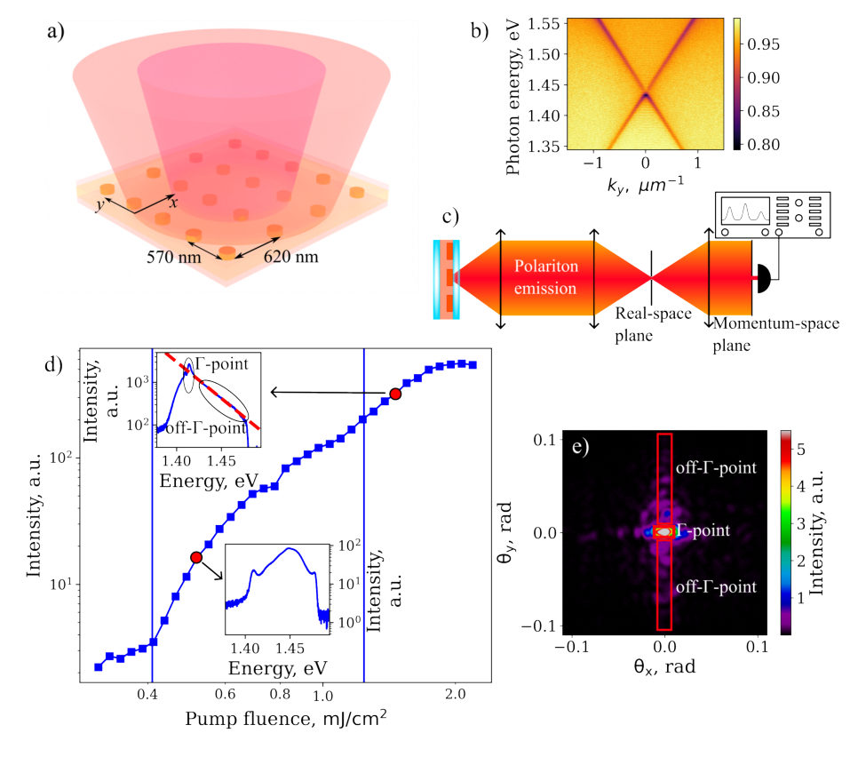
<figcaption class="paper-figure-caption"><b>Fig 1.</b> FIG. 1. a) Schematic of the studied structure with the coordinate frame and lattice periodic-</figcaption>
</figure>
<figure class="paper-figure-card">
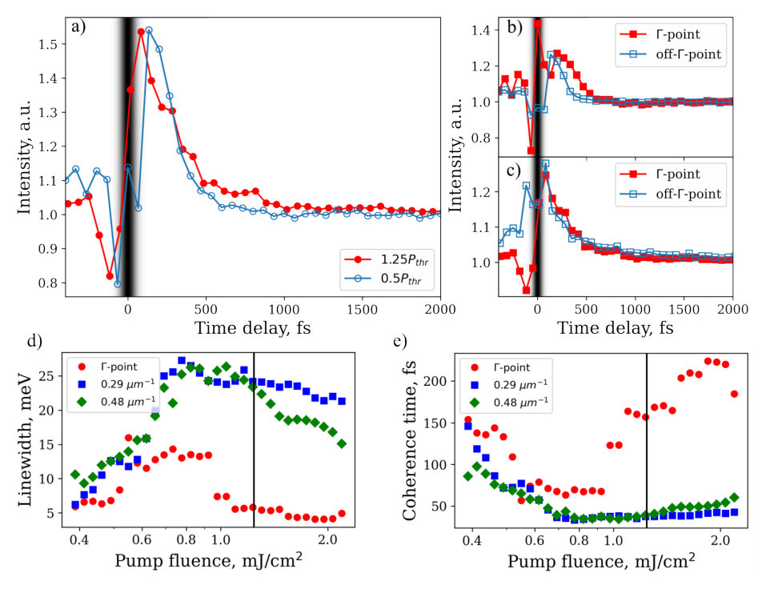
<figcaption class="paper-figure-caption"><b>Fig 2.</b> FIG. 2. a)-c) Typical time profile of the polariton emission, black area denotes the pump and</figcaption>
</figure>
<figure class="paper-figure-card">
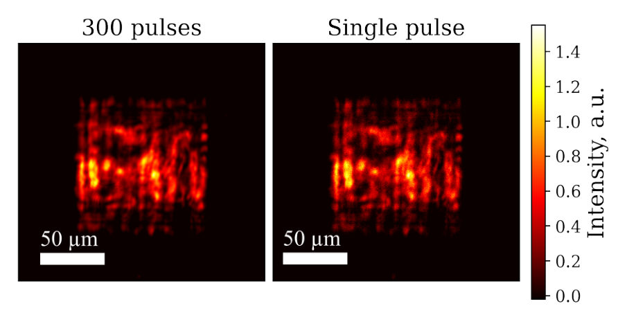
<figcaption class="paper-figure-caption"><b>Fig 3.</b> FIG. 3. Averaged (left) and single-shot (right) real-space polariton emission patterns at the pump</figcaption>
</figure>
<figure class="paper-figure-card">
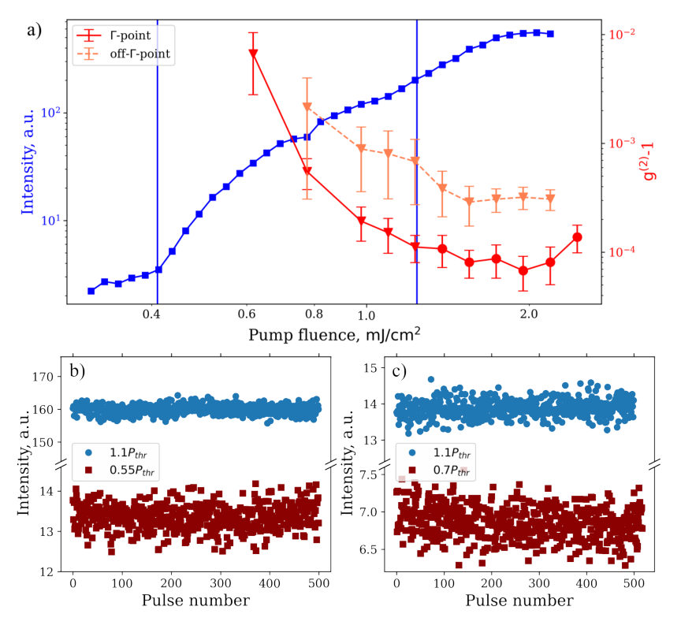
<figcaption class="paper-figure-caption"><b>Fig 4.</b> FIG. 4. a) The g(2)(0) dependence on pump fluence for Γ-point (red curve) and non-Γ-point</figcaption>
</figure>
<figure class="paper-figure-card">
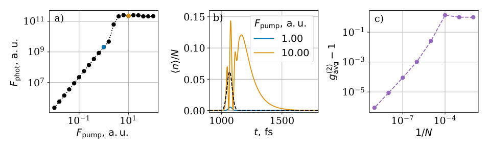
<figcaption class="paper-figure-caption"><b>Fig 5.</b> FIG. 5. Numerical simulations of the photon emission. a) Photon fluence as a function of pump</figcaption>
</figure>

**Summary.** This paper experimentally and theoretically investigates the second-order coherence of ultrafast polariton emission in plasmonic lattices. The authors report observing near-perfect coherence and rapid dynamics, suggesting the system behaves either like a highly coherent Bose-Einstein condensate or a superradiant source. This work advances the understanding of emission statistics in engineered quantum light-matter interfaces.

**Why it may be interesting.** This work bridges quantum optics, condensed matter physics, and AMO physics by applying coherence measurements to engineered light-matter systems (polaritons), providing insights into non-equilibrium quantum statistics beyond simple BEC models.

Detailed structure

**Main problem.** The study investigates the second-order coherence properties of ultrafast polariton dynamics within plasmonic lattices, contrasting with the well-understood first-order coherence.

**Main result.** The authors observed a high degree of coherence ($g^{(2)}(	au=0)-1 < 10^{-4}$) and demonstrated ultrafast dynamics ($>1$ THz), suggesting the process is either a BEC with ultrafast thermalization or superradiance.

**Method.** The research combines experimental measurements of the second-order coherence function ($g^{(2)}$) using pulse-to-pulse fluctuations with theoretical modeling comparing quantum trajectories against cumulant approximations.

**Model / system.** The system is polariton emission from a plasmonic lattice formed by metal nanoparticles, where the active medium is an IR-792 dye in the strong-coupling regime. The dynamics are modeled using concepts from BEC, superradiance, and coupled two-level systems.

**Key observables.** Second-order coherence function ($g^{(2)}(	au=0)$), ultrafast dynamics ($>1$ THz), and emission intensity dependence on pump fluence.

**Important parameters / regimes.** Strong coupling regime, $\Gamma$-point vs. non-$\Gamma$-point radiation, sub-50-fs thermalization time, and Rabi splitting ($\Omega = 200 	ext{ meV}$).

**Assumptions / limitations.** The analysis compares mean-field predictions with exact quantum trajectories, and the interpretation involves modeling the system as either a BEC or a superradiant source.

**Figures summary.** Figures illustrate the plasmonic lattice structure and dispersion, the measurement scheme using pulse-to-pulse fluctuations, the fluence dependence of $g^{(2)}$, and theoretical comparisons of $g^{(2)}$ using different quantum approximations.

**Paper structure.** The paper establishes the need to study $g^{(2)}$ in non-equilibrium light-based condensates. It details the experimental setup and measurements, presents the key results showing high coherence and ultrafast dynamics, and concludes by discussing theoretical interpretations, including superradiance.

Abstract

The first-order coherence properties of strongly coupled systems supporting polariton lasing and Bose-Einstein condensation (BEC) have been thoroughly studied and show consistent results. In contrast, second-order coherence properties have been found to vary for different systems, and the second-order coherence function can deviate from the value of one, typical for atomic BEC, revealing super-Poissonian fluctuations even above the BEC/polariton lasing threshold. This calls for a deeper understanding of the emission statistics and dynamics in light-based condensates, especially in the non-equilibrium regime. Here we demonstrate a coherent state of polariton emission from a plasmonic lattice measured as the second-order coherence function value separately for $\mathrmΓ$- and non-$\mathrmΓ$-point radiation (ground state and high-energy tail). We observe a high degree of coherence with the value $g^{(2)}(τ=0)-1<10^{-4}$. We also demonstrate the ultrafast ($>$1 THz) nature of the dynamics. The process can be interpreted as a BEC with ultrafast, sub-50-fs thermalization, but we also suggest an alternative explanation as superradiance in a system where the emitters have vibrational degrees of freedom.

[↑ back to top](#top)

### [Weakly interacting Bose-Einstein condensate with stochastic resetting](http://arxiv.org/abs/2609.37110v1)

**Authors:** Nikhil Mesquita, Manas Kulkarni, Satya N. Majumdar, Sanjib Sabhapandit  
**Type:** theory · **Category:** quantum gases · **PDF:** <https://arxiv.org/pdf/2609.37110v1>  
**Analysis basis:** full PDF text, analyzed in chunks
**Topic relevance:** `Full counting statistics` **3/5** · `correlated / nonlocal dissipation` **3/5** · `driven-dissipative phase transition` **3/5** · `methods for driven-dissipative` **3/5** · `non-equilibrium universality` **3/5** · `Keldysh / 2PI / non-Gaussian methods` **2/5** · `analog quantum simulation` **2/5** · `quantum measurements` **2/5**

↔ Scroll figures horizontally

<figure class="paper-figure-card">
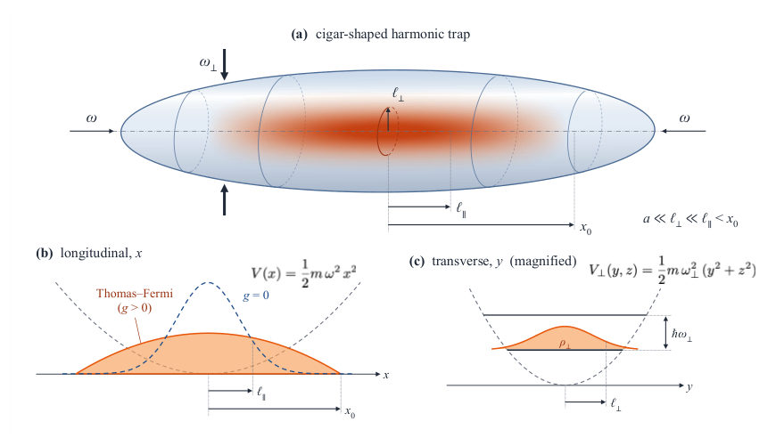
<figcaption class="paper-figure-caption"><b>Fig 1.</b> Figure 1: Schematic of the setup. (a) A gas of bosons in a cigar-shaped harmonic trap with strong transverse confinement ω⊥(thick arrows) and weak longitudinal confinement ω (thin arrows), ω⊥≫ω. The shading shows the condensate density, ∝ρTF(x) ρ⊥(r⊥). Transversely, the gas is frozen in the harmonic-oscillator ground state of width ℓ⊥. Longitudinally, the repulsive interaction stretches it to the Thomas-Fermi length x0 [Eq. (27)], which exceeds the longitudinal oscillator length ℓ∥since x0 = α C1/3ℓ∥with C ≫1 [Eq. (14)]. The oscillator lengths ℓ⊥and ℓ∥are defined in Eq. (2), and the hierarchy of length scales follows from Eqs. (4) and (14). (b) Longitudinal density: the Thomas-Fermi profile...</figcaption>
</figure>
<figure class="paper-figure-card">
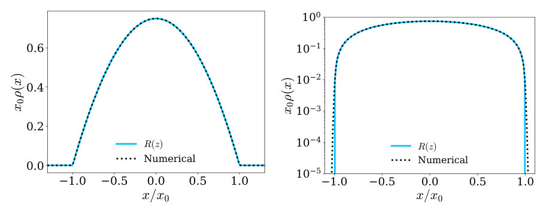
<figcaption class="paper-figure-caption"><b>Fig 2.</b> Figure 2: Condensate density of weakly interacting bosons in harmonic confinement, given by the Thomas-Fermi (TF) solution of the time-independent GPE in Eq. (18). The dashed black lines are obtained by numerically solving Eq. (18) and the solid blue line is the scaled TF density R(z) ≡x0ρ(x) with z = x/x0 in Eq. (28), in (left) linear- linear scale and (right) log-linear scale. The numerical evaluation of the GPE involves the evolution of the time-dependent GPE [Eq. (30)] in imaginary time as detailed in Appendix A.1. The parameters used are N = 5 × 105, m = 0.4, ω = 0.1, g = 0.01.</figcaption>
</figure>
<figure class="paper-figure-card">
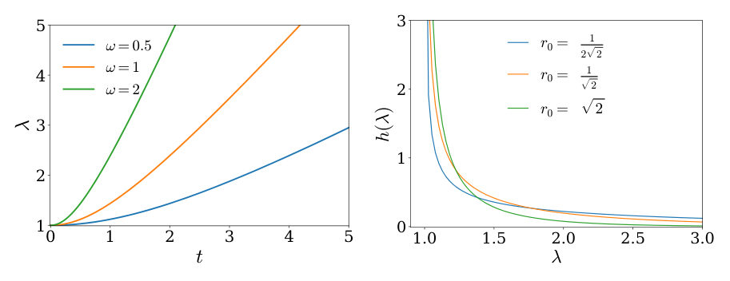
<figcaption class="paper-figure-caption"><b>Fig 3.</b> Figure 3: (Left) The plot of λ as a function of t for various values of ω. The plot is obtained by finding the roots of Eq. (41) numerically. (Right) Plot of h(λ) given in Eq. (48) for various values of r0 = r/( √</figcaption>
</figure>
<figure class="paper-figure-card">
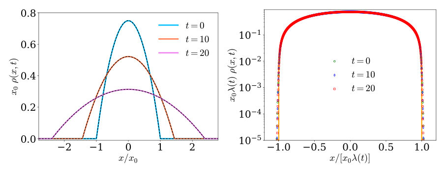
<figcaption class="paper-figure-caption"><b>Fig 4.</b> Figure 4: Dynamics of the condensate density of weakly interacting bosons after the frequency ω is quenched to zero. (Left) the solid lines indicates the analytical plot of the scaling solution λ(t)−1 R(z/λ(t)) ≡x0ρ(x, t) with z = x/x0, given in Eq. (35) at various times t, with the parameter λ(t) implicitly defined in Eq. (41). The dashed black lines are obtained by numerically solving the time-dependent GPE [Eq. (10)] (detailed in Appendix A.2). (Right) The scaled collapsed plot of the average density profile in log- linear scale with the solid orange line plotting R(y) ≡λ(t) x0ρ(x, t) with y = x/[x0λ(t)], given in Eq. (28), and the markers obtained by numerically solving the time...</figcaption>
</figure>
<figure class="paper-figure-card">
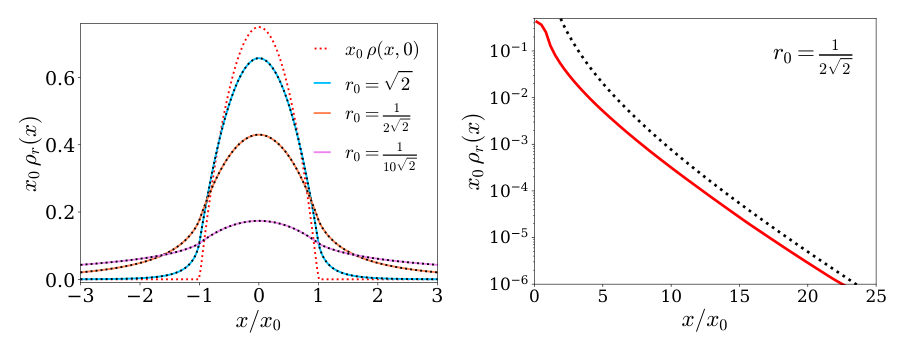
<figcaption class="paper-figure-caption"><b>Fig 5.</b> Figure 5: NESS condensate density of weakly interacting bosons subjected to stochastic resetting as a function z = x/x0, in (left) linear-linear plot and (right) log-linear plot for x/x0 &gt; 0. The solid colored lines are obtained by simulations detailed in Appendix A.3. (Left) The dashed black line is the plot of the analytical function G(z) ≡x0ρr(x) [Eq. (53)] obtained by performing the numerical integration in Eq. (53). For comparison we also plot the initial density profile R(z) ≡x0 ρ(x) [Eq. (28)] in the dotted red line. (Right) The dashed black line plots the asymptotic form of G(z) in Eq. (60). The simulations parameters are x0 = 1, ω = 1, and various r, recalling that r0 = r/( √</figcaption>
</figure>

**Summary.** This work analyzes a weakly interacting Bose-Einstein condensate subjected to stochastic resetting, which introduces dynamically emergent correlations. The authors derive the non-equilibrium steady state properties, finding a specific density profile and exact scaling forms for particle number fluctuations. This study offers insight into how external noise can fundamentally alter the many-body physics of quantum gases.

**Why it may be interesting.** It provides a tractable theoretical framework to study the competition between mean-field repulsive interactions and non-local, attractive correlations induced by external fluctuating environments (stochastic resetting).

Detailed structure

**Main problem.** The paper investigates how dynamically emergent correlations (DEC) generated by stochastic resetting interact with intrinsic repulsive interactions in a Bose-Einstein condensate.

**Main result.** The system reaches a unique non-equilibrium steady state characterized by a density profile with an inverted-parabolic core and exponentially decaying tails, alongside nontrivial fluctuations in edge and particle number.

**Method.** The analysis involves solving the Gross-Pitaevskii equation in the mean-field limit and analytically computing observables like density profiles and full counting statistics in the steady state.

**Model / system.** The system is a weakly interacting Bose-Einstein condensate (BEC) of bosons confined in a highly elongated harmonic trap, modeled using the Gross-Pitaevskii framework.

**Key observables.** Steady-state density profile, edge statistics, and full counting statistics.

**Important parameters / regimes.** Stochastic resetting rate ($r$), interaction strength ($g$), and the system size/length scales.

**Assumptions / limitations.** The analysis assumes weak repulsive interactions and utilizes the Thomas-Fermi approximation for the initial state.

**Figures summary.** Not specified, but the analysis focuses on deriving analytical forms for the density profile and the distribution function $H(\kappa)$ for the counting statistics.

**Paper structure.** The paper progresses by first defining the model, analyzing the free expansion dynamics, and finally deriving the steady-state properties under the stochastic resetting protocol.

Abstract

Stochastic resetting can generate strong correlations in many-body systems through a shared fluctuating environment. Here, we investigate how such dynamically emergent correlations (DEC) coexist with intrinsic (direct) interactions in a weakly repulsive Bose-Einstein condensate described within the Gross-Pitaevskii framework. The condensate undergoes free expansion from an initial Thomas-Fermi state and is stochastically reset to this initial state at a constant rate. We show that the resetting protocol drives the system into a unique nonequilibrium steady state and obtain its density profile, edge statistics, and full counting statistics analytically. The steady-state density retains an inverted-parabolic form within the core, while developing exponentially decaying tails outside it. We further show that resetting induces nontrivial fluctuations of the condensate edge and particle number, yielding exact scaling forms for the edge distribution and the full counting statistics. Our results provide a tractable setting for exploring the interplay between intrinsic repulsive interactions and attractive DEC generated by a common stochastic environment in quantum many-body systems.

[↑ back to top](#top)

### [Characterizing quantum precision enhancement for multiple currents in open quantum systems](http://arxiv.org/abs/2609.35982v1)

**Authors:** Khalak Mahadeviya, Sheikh Parvez Mandal, Mahasweta Pandit, Javier Prior, Mark T. Mitchison, Saulo V. Moreira  
**Type:** theory · **Category:** statistical mechanics · **PDF:** <https://arxiv.org/pdf/2609.35982v1>  
**Analysis basis:** full PDF text, analyzed in chunks
**Topic relevance:** `Full counting statistics` **3/5** · `driven-dissipative phase transition` **3/5** · `Keldysh / 2PI / non-Gaussian methods` **2/5** · `correlated / nonlocal dissipation` **2/5** · `methods for driven-dissipative` **2/5** · `non-equilibrium universality` **2/5** · `quantum measurements` **2/5** · `Tavis-Cummings & cavity-many-emitter` **1/5** · `analog quantum simulation` **1/5**

↔ Scroll figures horizontally

<figure class="paper-figure-card">
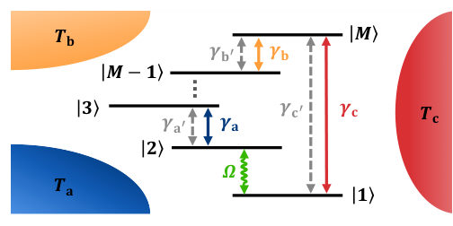
<figcaption class="paper-figure-caption"><b>Fig 1.</b> FIG. 1. Sketch of a generic thermal machine with M non- degenerate energy levels. The green curly arrow shows the transition coupled to a coherent drive with strength Ω. The solid arrows indicate the transitions dissipatively coupled to thermal baths at temperatures Ta, Tb, and Tc, with corre- sponding rates γa (blue), γb (orange), and γc (red). The dashed gray arrows represent parasitic cross-couplings of the transitions to other thermal baths.</figcaption>
</figure>
<figure class="paper-figure-card">
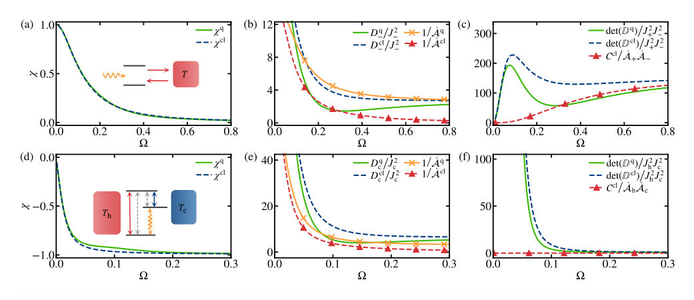
<figcaption class="paper-figure-caption"><b>Fig 2.</b> FIG. 2. Characterizing quantum precision enhancement in a coherently-driven qubit (top row, illustrated in the inset of (a)) and a three-level maser (bottom row, illustrated in the inset of (d)). For the qubit, ∆= 0, γ = 0.7 and n = 0.05; For the maser, γh = 0.1, γc = 2.5, γ′ = γ′ c = γ′ h = 0.001, nh = 3.5, nc = 0.001, n′ h = 4, and n′ c = 0.02. All quantities are plotted as functions of the drive strength Ω. Panels (a) and (d) show the Pearson coefficient χ for quantum (green) and classical descriptions (blue dashed). Panels (b) and (e) show relative fluctuations D/J2 of counting observables N−(qubit) and Nc (maser), for quantum (green) and classical (blue dashed) descriptions, together...</figcaption>
</figure>

**Summary.** This paper develops the Multi-Current Kubo-Martin-Schwinger (MKUR) inequality to set the fundamental precision limit for measuring multiple currents in open quantum systems. By comparing quantum fluctuations against a classical emulator, the authors demonstrate that quantum coherence can lead to joint current fluctuations that surpass classical bounds. This provides a clear signature of nonclassical physics in steady-state energy transduction processes.

**Why it may be interesting.** This work provides a rigorous, quantitative tool (MKUR) to detect nonclassical correlations in steady-state current measurements, which is crucial for understanding quantum thermodynamics and energy harvesting.

Detailed structure

**Main problem.** The paper characterizes the quantum precision limit for measuring multiple fluctuating currents in open quantum systems, extending classical fluctuation theorems.

**Main result.** Violation of the derived Multi-Current Kubo-Martin-Schwinger (MKUR) bound by the quantum system indicates that quantum coherence reduces joint current fluctuations below the limit set by any classical Markovian emulator.

**Method.** The authors derive the MKUR by analyzing the generalized variance of the current covariance matrix, comparing quantum results against a classical emulator derived from the system's steady-state populations.

**Model / system.** The theory is applied to open quantum systems, including a coherently-driven two-level system (qubit) and a three-level heat engine (maser), whose dynamics are governed by Lindblad master equations.

**Key observables.** Joint current fluctuations quantified by the diffusion coefficient matrix $D_{\alphaeta}$, average currents $J_\alpha$, and the Pearson coefficient $\chi$.

**Important parameters / regimes.** Coherent driving strength ($\Omega$), energy gaps ($\Delta$), and the ratio of quantum to classical fluctuation bounds.

**Assumptions / limitations.** The analysis assumes Markovian dynamics and constructs a classical emulator that matches the steady-state populations of the quantum system.

**Figures summary.** Figures illustrate the comparison of Pearson coefficients ($\chi$) between quantum and classical descriptions, and show how the joint fluctuation determinant $\det(D)/J_1^2 J_2^2$ violates the classical bound for the qubit and maser.

**Paper structure.** The paper first introduces the MKUR based on the KUR, derives the bound using multi-parameter metrology, and then applies this framework to two specific models—a coherently-driven qubit and a three-level maser—to demonstrate quantum enhancement.

Abstract

The kinetic uncertainty relation (KUR) constrains fluctuations of individual currents in classical nonequilibrium systems in terms of the dynamical activity, which quantifies the average number of transitions per unit of time. Here, we derive a multi-current KUR (MKUR) establishing the precision limit for multiple currents generated in classical stochastic processes in the nonequilibrium steady state. We then apply our theory to identify quantum devices whose correlated current fluctuations surpass this classical limit by comparing the quantum system to a classical emulator with the same average currents in the steady state. In this way, violations of the emulator's MKUR have a clear physical meaning, i.e., that the quantum-coherent evolution reduces joint current fluctuations below what is possible for a classical Markovian system with the same energy-level structure and incoherent resources. Since the MKUR incorporates correlations between currents, its violation pinpoints nonclassical fluctuations in parameter regimes where the single-current KUR is satisfied. We illustrate the essential and complementary role of these bounds for characterizing joint current precision with two examples: a coherently driven two-level system and an experimentally motivated model of a three-level heat engine subject to parasitic environmental couplings.

[↑ back to top](#top)

### [Derivation of the General Solution of the Black-Scholes Boundary-Value Problem](http://arxiv.org/abs/2609.36447v1)

**Authors:** ByoungSeon Choi, M. Y. Choi  
**Type:** theory · **Category:** statistical mechanics · **PDF:** <https://arxiv.org/pdf/2609.36447v1>  
**Analysis basis:** full PDF text, analyzed in chunks
**Topic relevance:** `Keldysh / 2PI / non-Gaussian methods` **3/5** · `analog quantum simulation` **3/5** · `methods for driven-dissipative` **3/5** · `correlated / nonlocal dissipation` **2/5** · `driven-dissipative phase transition` **2/5** · `non-equilibrium universality` **2/5** · `quantum measurements` **1/5**

↔ Scroll figures horizontally

<figure class="paper-figure-card">
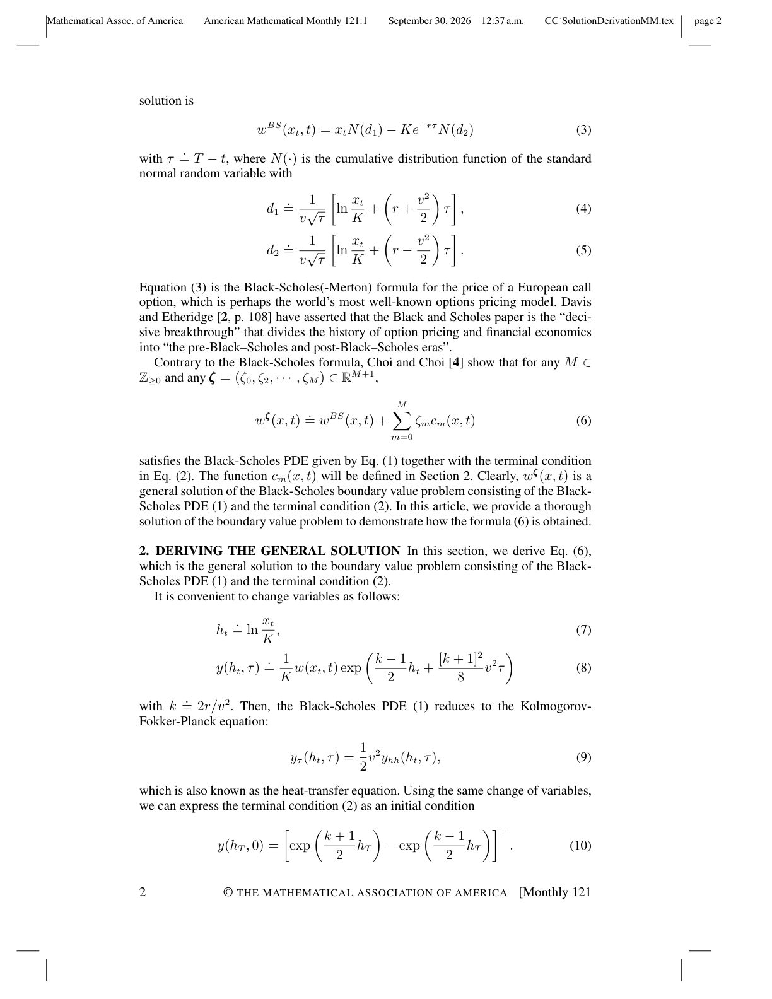
<figcaption class="paper-figure-caption"><b>Fig 1.</b> Low-resolution page preview, page 2</figcaption>
</figure>
<figure class="paper-figure-card">
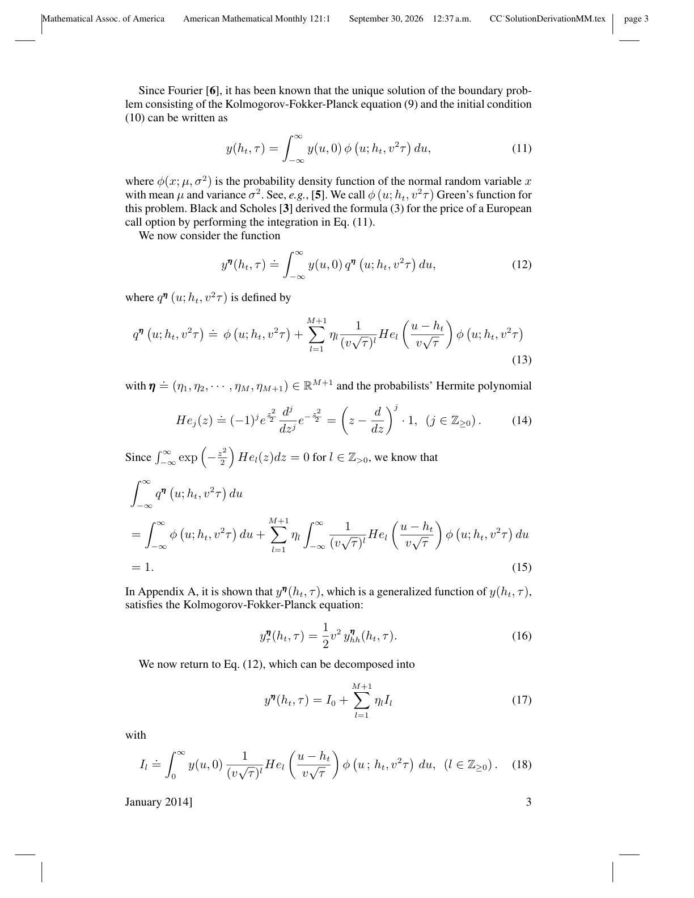
<figcaption class="paper-figure-caption"><b>Fig 2.</b> Low-resolution page preview, page 3</figcaption>
</figure>
<figure class="paper-figure-card">
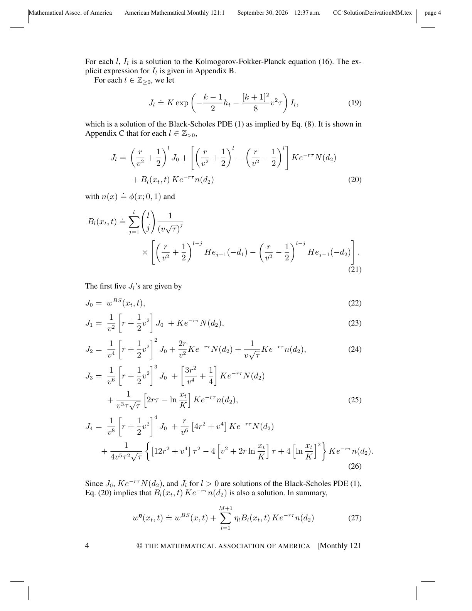
<figcaption class="paper-figure-caption"><b>Fig 3.</b> Low-resolution page preview, page 4</figcaption>
</figure>
<figure class="paper-figure-card">
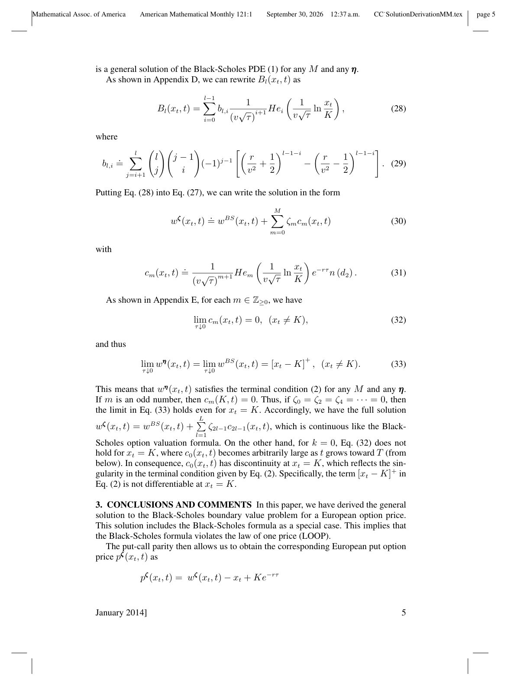
<figcaption class="paper-figure-caption"><b>Fig 4.</b> Low-resolution page preview, page 5</figcaption>
</figure>
<figure class="paper-figure-card">
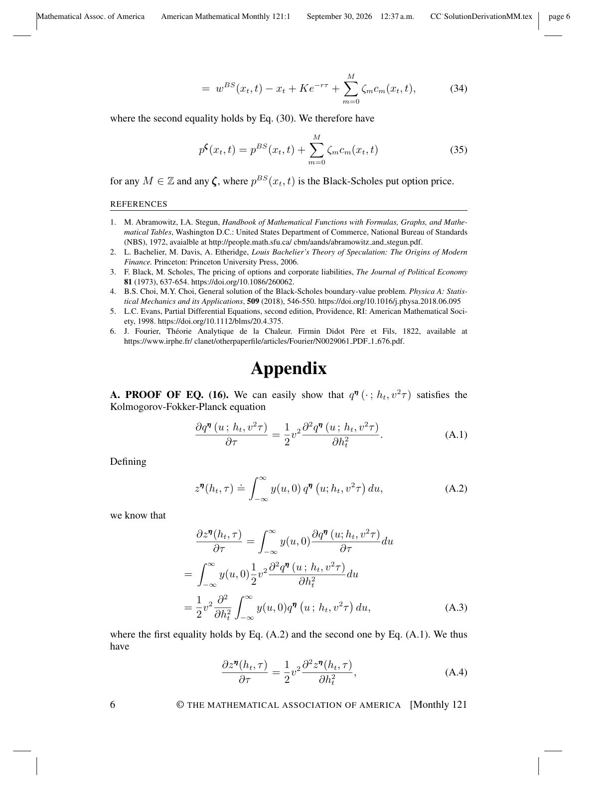
<figcaption class="paper-figure-caption"><b>Fig 5.</b> Low-resolution page preview, page 6</figcaption>
</figure>

**Summary.** This paper mathematically proves that the standard Black-Scholes formula for option pricing is not the unique solution to the governing partial differential equation. By transforming the problem into a heat-equation form, the authors derive a general solution that includes the standard formula as a specific instance, thereby challenging a fundamental assumption in financial theory.

**Why it may be interesting.** While the subject is finance, the mathematical machinery—solving a parabolic PDE (heat equation) with specific boundary/terminal conditions using advanced techniques like Green's functions and orthogonal polynomials—is highly relevant to open quantum systems and non-equilibrium statistical mechanics.

Detailed structure

**Main problem.** To rigorously derive the general solution to the Black-Scholes Boundary-Value Problem (BVP) for European option pricing.

**Main result.** The Black-Scholes formula is not the unique solution to the BVP, implying a violation of the law of one price. A general solution $w_\zeta(x_t, t)$ is derived that encompasses the standard formula as a special case.

**Method.** The problem is transformed into solving a partial differential equation (PDE) that reduces to the Kolmogorov-Fokker-Planck equation, solved using Green's function techniques and properties of Hermite polynomials.

**Model / system.** The model is the Black-Scholes framework for option pricing, governed by a specific PDE and a terminal condition related to the option payoff. The mathematical analysis involves transforming variables to simplify the PDE into a heat-equation form.

**Key observables.** The general solution $w_\zeta(x_t, t)$, the standard Black-Scholes price $w_{BS}(x_t, t)$, and the derived put option price $p_\zeta(x_t, t)$.

**Important parameters / regimes.** The time to maturity $	au = T-t$, the interest rate $r$, and the volatility $v$.

**Assumptions / limitations.** The derivation relies on established properties of Hermite polynomials and involves taking limits ($	au 	o 0$) to complete the solution.

**Paper structure.** The paper first establishes the BVP and the non-uniqueness of the solution. It then uses change of variables to map the PDE to the Kolmogorov-Fokker-Planck equation. The core of the work involves deriving explicit components ($I_l, J_l, B_l$) using Hermite polynomial properties, culminating in the general solution structure.

Abstract

There are infinitely many functions that satisfy the Black-Scholes partial differential equation and the terminal condition corresponding to the European call option. This means that the Black-Scholes formula, which led to the award of the 1997 Nobel Prize in Economic Sciences, is not the unique solution, as was once assumed. Consequently, it violates the law of one price, one of the fundamental laws of economics and finance. In this article, we present a rigorous derivation of these solutions to the Black-Scholes boundary value problem.

[↑ back to top](#top)

### [Is rapid mixing stable?](http://arxiv.org/abs/2609.36016v1)

**Authors:** Jordi A. Montañà-López, Barbara Roos, Sebastian Stengele, Ángela Capel, Rahul Trivedi  
**Type:** theory · **Category:** statistical mechanics · **PDF:** <https://arxiv.org/pdf/2609.36016v1>  
**Analysis basis:** full PDF text, analyzed in chunks
**Topic relevance:** `correlated / nonlocal dissipation` **3/5** · `driven-dissipative phase transition` **3/5** · `methods for driven-dissipative` **3/5** · `non-equilibrium universality` **2/5** · `scars & prethermalization` **2/5** · `Keldysh / 2PI / non-Gaussian methods` **1/5** · `analog quantum simulation` **1/5** · `quantum measurements` **1/5**

↔ Scroll figures horizontally

<figure class="paper-figure-card">
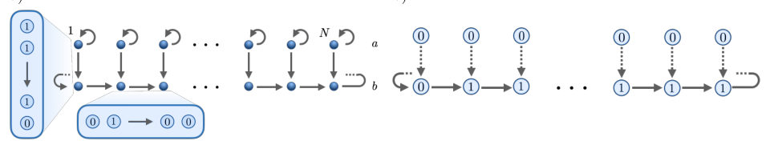
<figcaption class="paper-figure-caption"><b>Fig 1.</b> Figure 1: Mechanism of the dissipation-only construction on the a and b qubits. a) In both L and K, the La,b,i jumps between the a and b qubits introduce conditional resets on the b qubits, while the Lb,i jumps propagate zeros around the b qubits. The generators differ in their single-qubit action on the a qubits and rapidly mix toward the product states σL = η⊗N a ⊗|0N⟩⟨0N|b and σK = (ZηZ)⊗N a ⊗|0N⟩⟨0N|b, respectively. The insets show that La,b,i maps |11⟩aibi to |10⟩aibi and Lb,i maps |01⟩bibi+1 to |00⟩bibi+1. b) The sum L + K rapidly drives the a qubits toward |0N⟩a. The conditional resets La,b,i then switch off, and the a and b qubits evolve independently. Starting from the displayed...</figcaption>
</figure>
<figure class="paper-figure-card">
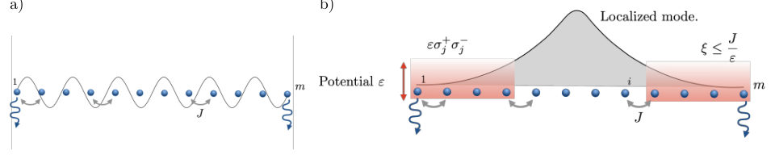
<figcaption class="paper-figure-caption"><b>Fig 2.</b> Figure 2: Boundary-driven relaxation with and without a local potential. Both panels show a chain of qubits of length m with nearest neighbor hopping of strength J and dissipation via equal-rate raising and lowering jump operators on the first and last qubit. The unique fixed point is the fully mixed state. a) Without a potential, coherences are transported towards the dissipative boundaries, and the mixing time is at most polynomial in m. b) Adding a single-site potential ε on the left and right thirds of the chain produces a mode localized in the middle third. The curve is a schematic amplitude profile: the actual witness has v1 = vm = 0, and its neighboring amplitudes satisfy |v2|,...</figcaption>
</figure>
<figure class="paper-figure-card">
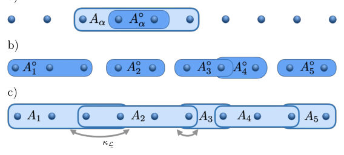
<figcaption class="paper-figure-caption"><b>Fig 3.</b> Figure 3: Bulk-dissipative covers and the rapid-mixing conditions. a) The local generator Mα acts on Aα, and every stationary observable acts trivially on its bulk A◦ α. We assume uniform local relaxation: ∥etlocMα −PMα∥⋄≤1/2 at a time tloc for all α. b) The bulk regions may overlap and must cover the lattice, S</figcaption>
</figure>
<figure class="paper-figure-card">
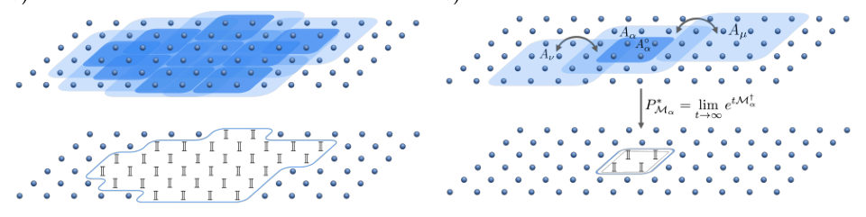
<figcaption class="paper-figure-caption"><b>Fig 4.</b> Figure 4: A bulk-dissipative cover and the local-to-global mixing mechanism. a) The bulk regions cover the lattice. Auxiliary reset maps replace an observable’s action on each A◦ α by the identity while preserving the identity on regions already treated. Composing these maps therefore leaves only a scalar multiple of the identity everywhere. b) Each local generator Mα is supported on Aα (top) and drives observables toward operators that act as the identity on its bulk A◦ α (bottom). When this local dissipation dominates the influence of the remaining interactions, as quantified by Eq. (314), these local decay estimates control convergence of the full system to its unique stationary state.</figcaption>
</figure>
<figure class="paper-figure-card">
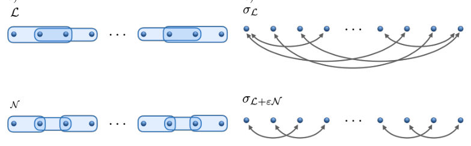
<figcaption class="paper-figure-caption"><b>Fig 5.</b> Figure 5: Local noise obstructs dissipative preparation of macroscopic order. a) The geometrically local Lindbladian L aims to prepare a state σL with nonvanishing connected correlations between bounded-support observables at macroscopic separation. Both L and the geometrically local noise N have uniformly bounded per-site interaction strength. In the one-dimensional setting illustrated, preparation from a product state to sufficiently small fixed trace-norm error requires time Ω(N). The noise terms act on bounded, possibly overlapping regions that cover the lattice, each with a unique local fixed point and local mixing time tnoise. b) Suppose the refined noise influence satisfies κ♯ N...</figcaption>
</figure>

**Summary.** This theoretical paper investigates whether the property of 'rapid mixing' in open quantum systems is robust against local perturbations of the governing dynamics. The authors prove that rapid mixing is generally unstable, providing counterexamples where weak perturbations destroy the fast relaxation rate. They complement this by establishing necessary structural conditions, such as those found in quasifree fermionic systems, that guarantee stable rapid mixing.

**Why it may be interesting.** This work directly addresses the stability of convergence rates in open quantum systems, which is crucial for understanding how real-world noise or local interactions affect the approach to thermal equilibrium in quantum many-body physics.

Detailed structure

**Main problem.** The paper investigates the stability of 'rapid mixing'—a fast relaxation to equilibrium—when the underlying quantum dynamics (Lindbladian) is subjected to local perturbations.

**Main result.** Rapid mixing is not stable in general, as counterexamples show that even weak local perturbations can destroy this property, although sufficient conditions for stable rapid mixing are also developed.

**Method.** The analysis relies on constructing counterexamples using sums of Lindbladians and developing sufficient conditions based on structural properties like quasifree fermionic systems or commuting generators.

**Model / system.** The system is an open quantum system governed by Lindbladian master equations, modeling processes like decoherence and thermalization. The analysis focuses on the time evolution operator $e^{tL}$ acting on the density matrix $
ho$.

**Key observables.** Mixing time ($	au_{L}^{	ext{mix}}$), convergence to the steady state ($P_L$), and the validity of functional inequalities like MLSI.

**Important parameters / regimes.** The strength and locality of the perturbation ($\epsilon$), and the system size ($N$).

**Assumptions / limitations.** The primary assumption questioned is that local perturbations preserve the rapid mixing property, which the authors disprove in general.

**Paper structure.** The paper first establishes the context of rapid mixing for Lindbladians, then presents counterexamples demonstrating its instability under perturbation, followed by the development of sufficient conditions that guarantee stable rapid mixing for specific model classes.

Abstract

Several physically interesting Lindbladians, such as those describing generic open quantum system models as well as engineered state preparation processes, are often rapidly mixing, that is, they relax to steady states in time scaling polylogarithmically with the system size. Owing to the short mixing times, it is physically expected that local perturbations do not substantially increase the mixing time. In this work we question this expectation and ask whether rapid mixing survives. We provide counterexamples showing that rapid mixing is not stable in general, even when the perturbation does not change the steady state. We also show that arbitrarily weak local Hamiltonian perturbations can destroy rapid mixing. Complementing these results, we develop an array of sufficient conditions which imply stable rapid mixing, including several classes of quasifree fermionic systems, commuting Lindbladians, and local spin systems. We also identify conditions under which modified logarithmic Sobolev inequalities (MLSIs), a stronger form of convergence, lead to stable rapid mixing. As a further implication of our results, we show that rapid mixing does not imply a positive MLSI constant.

[↑ back to top](#top)

### [Strong-to-Weak Spontaneous Symmetry Breaking of Dephased Fermions](http://arxiv.org/abs/2609.37965v1)

**Authors:** Abhijat Sarma  
**Type:** theory · **Category:** statistical mechanics · **PDF:** <https://arxiv.org/pdf/2609.37965v1>  
**Analysis basis:** full PDF text, analyzed in chunks
**Topic relevance:** `Keldysh / 2PI / non-Gaussian methods` **3/5** · `driven-dissipative phase transition` **3/5** · `methods for driven-dissipative` **3/5** · `non-equilibrium universality` **3/5** · `quantum measurements` **2/5** · `analog quantum simulation` **1/5** · `correlated / nonlocal dissipation` **1/5**

↔ Scroll figures horizontally

<figure class="paper-figure-card">
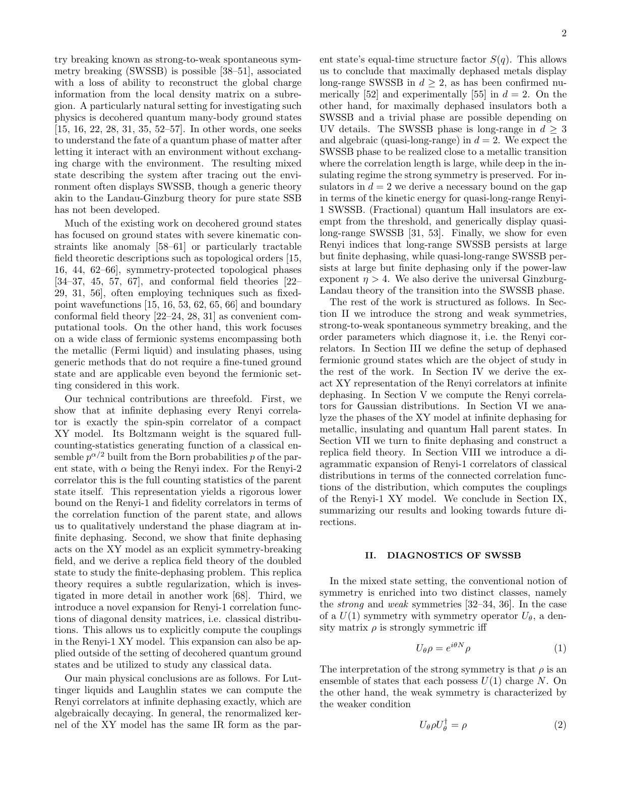
<figcaption class="paper-figure-caption"><b>Fig 1.</b> Low-resolution page preview, page 2</figcaption>
</figure>
<figure class="paper-figure-card">
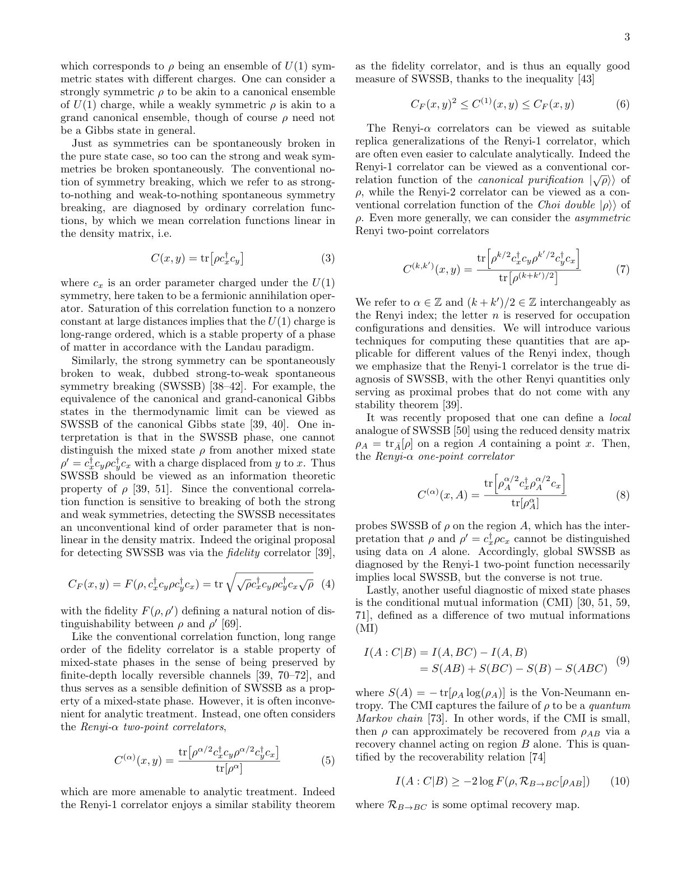
<figcaption class="paper-figure-caption"><b>Fig 2.</b> Low-resolution page preview, page 3</figcaption>
</figure>
<figure class="paper-figure-card">
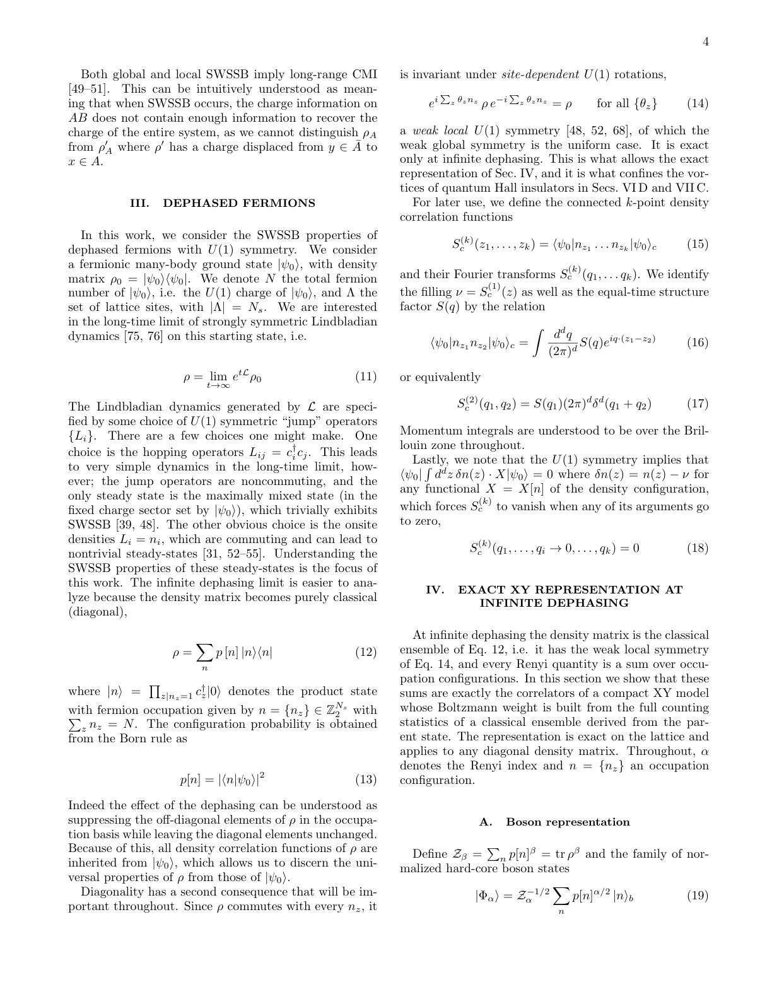
<figcaption class="paper-figure-caption"><b>Fig 3.</b> Low-resolution page preview, page 4</figcaption>
</figure>
<figure class="paper-figure-card">
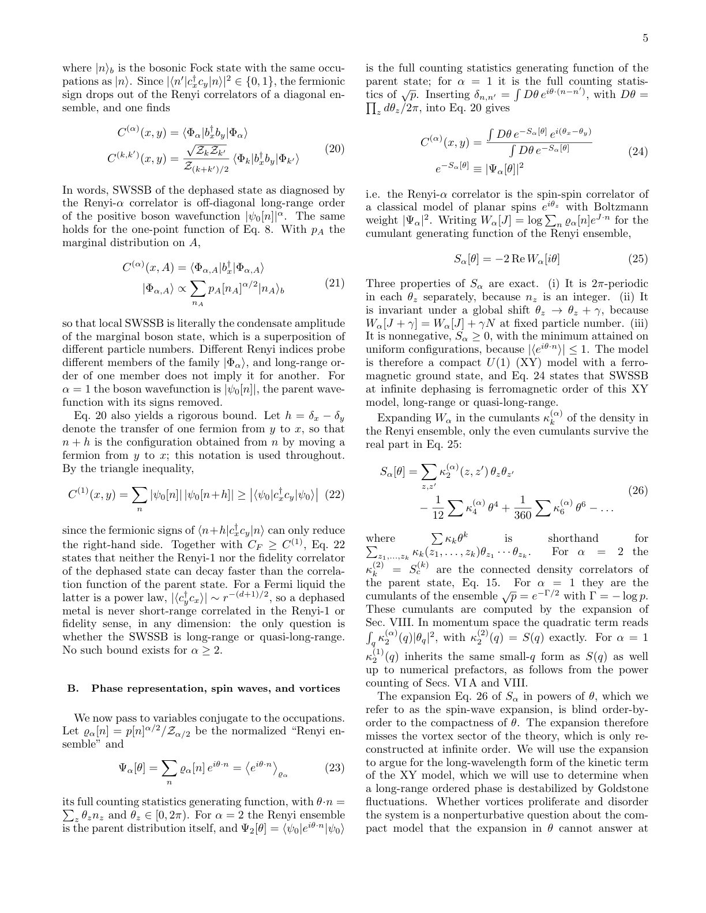
<figcaption class="paper-figure-caption"><b>Fig 4.</b> Low-resolution page preview, page 5</figcaption>
</figure>
<figure class="paper-figure-card">
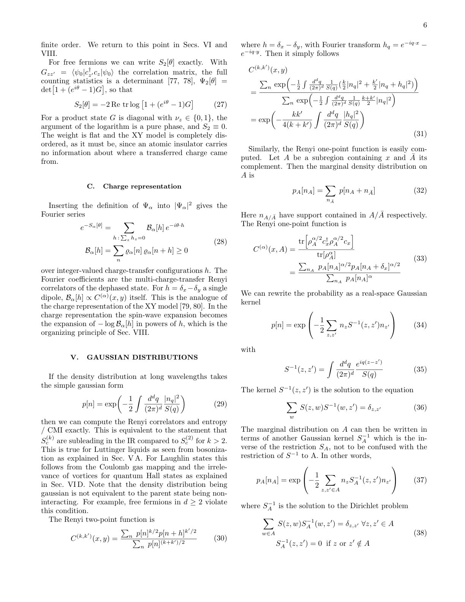
<figcaption class="paper-figure-caption"><b>Fig 5.</b> Low-resolution page preview, page 6</figcaption>
</figure>

**Summary.** This theoretical work characterizes Strong-to-Weak Spontaneous Symmetry Breaking (SWSSB) in dephased fermionic systems using Renyi correlators. The authors show that in the infinite dephasing limit, the system maps onto an XY model, predicting long-range order in dimensions $d\geq 2$. The methodology is highly general, providing tools for analyzing symmetry breaking in mixed quantum states.

**Why it may be interesting.** The connection between information-theoretic measures (Renyi correlators) and fundamental phase transitions (SWSSB) in open quantum systems provides a powerful, non-equilibrium diagnostic tool relevant to decoherence studies in AMO physics.

Detailed structure

**Main problem.** The paper investigates Strong-to-Weak Spontaneous Symmetry Breaking (SWSSB), a novel phase transition occurring in mixed quantum states due to the loss of global charge information.

**Main result.** Fully dephased metals exhibit long-range SWSSB in $d\geq 2$, while the persistence of this order depends on the Renyi index and the parent state's insulating nature.

**Method.** The study employs Renyi correlators as order parameters, deriving exact mappings to compact XY models in the infinite dephasing limit and using replica field theory for finite dephasing.

**Model / system.** The system consists of fermions with U(1) symmetry subjected to infinite density dephasing, allowing the analysis of the resulting mixed state $
ho$. The analysis is extended to metallic and insulating parent states.

**Key observables.** Renyi correlators ($C^{(\alpha)}$), which serve as order parameters diagnosing the SWSSB transition.

**Important parameters / regimes.** Dimensionality ($d$), the Renyi index ($\alpha$), and the degree of dephasing (infinite vs. finite).

**Assumptions / limitations.** The analysis relies on the applicability of Renyi correlators and the mathematical framework of diagrammatic expansions and replica field theory.

**Paper structure.** The paper follows a logical progression: introducing diagnostics (Renyi correlators), defining the system under dephasing, deriving the XY model representation at infinite dephasing, calculating specific correlators, analyzing the resulting phases, and finally addressing the complexity of finite dephasing via replica field theory.

Abstract

Strong-to-weak spontaneous symmetry breaking (SWSSB) is a novel phase transition in mixed states associated with the loss of global charge information. In this work we study fermions with $U(1)$ symmetry under infinite density dephasing and derive the SWSSB properties of the resulting mixed states. Our central observation is that at infinite dephasing every Renyi correlator is exactly the spin-spin correlator of a compact XY model, whose Boltzmann weight is the squared full-counting-statistics generating function of a classical ensemble built from the parent state. For the Renyi-2 correlator it is the full counting statistics of the parent state itself. We complement the infinite dephasing mapping with a novel diagrammatic expansion for the Renyi-1 correlator, applicable to any diagonal mixed state, which computes the couplings of the Renyi-1 XY model. We also study a replica field theory for even Renyi index quantities, applicable at finite dephasing. Our analysis indicates that fully dephased metals display long-range SWSSB in $d\geq 2$, as confirmed numerically and experimentally in $d=2$, and quasi-long-range SWSSB in $d=1$. For insulating parent states both an SWSSB and a trivial phase are possible at infinite dephasing depending on UV details. Long-range SWSSB in $d\geq 3$, or quasi-long-range SWSSB in $d=2$, survives above a nonuniversal, Renyi-index-dependent threshold and is lost when the parent state is deep in the insulating phase, with the exception of quantum Hall insulators which generically have quasi-long-range SWSSB. For even Renyi indices we also determine the stability of the SWSSB phase away from infinite dephasing and derive the universality class of the SWSSB transition.

[↑ back to top](#top)

### [Directional transfer from coherence to longitudinal polarization and algebraic storage in a transmon with Markovian dephasing and a glassy environment: A non-Markovian fractional renewal model](http://arxiv.org/abs/2609.37270v1)

**Authors:** Ruha Uğraş Erdoğan, Ferit Acar Savacı  
**Type:** theory · **Category:** disordered systems and neural networks · **PDF:** <https://arxiv.org/pdf/2609.37270v1>  
**Analysis basis:** full PDF text, analyzed in chunks
**Topic relevance:** `correlated / nonlocal dissipation` **3/5** · `methods for driven-dissipative` **3/5** · `Keldysh / 2PI / non-Gaussian methods` **2/5** · `driven-dissipative phase transition` **2/5** · `non-equilibrium universality` **2/5** · `scars & prethermalization` **2/5** · `quantum measurements` **1/5**

↔ Scroll figures horizontally

<figure class="paper-figure-card">
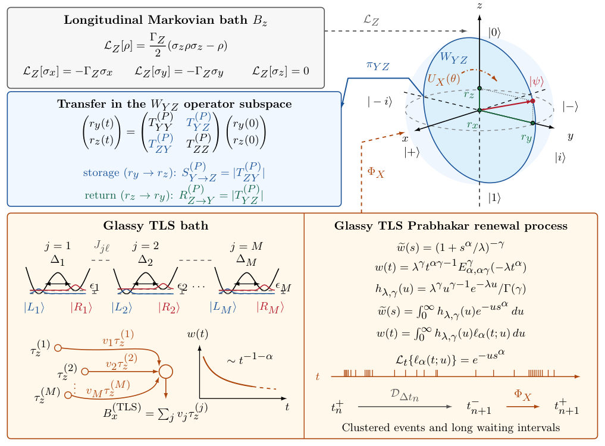
<figcaption class="paper-figure-caption"><b>Fig 1.</b> FIG. 1. Conceptual structure of the fractional-renewal transmon model. Gray and orange connectors indicate longitudinal Markovian dephasing LZ and transverse TLS kicks ΦX, respectively; TLS notation follows Eqs. (7a)–(7c). Independent Prab- hakar waiting times are drawn from the law obtained by evaluating a one-sided α-stable L´evy subordinator at an independent gamma-distributed argument. This scalar construction does not subordinate a quantum semigroup. The waiting-time curve and event timeline are schematic; the illustrated algebraic tail applies for 0 &lt; α &lt; 1. The strip shows conditioned-state drift D∆tn = e∆tnLZ over ∆tn = tn+1 −tn, followed by an instantaneous x-axis rotation kick....</figcaption>
</figure>
<figure class="paper-figure-card">
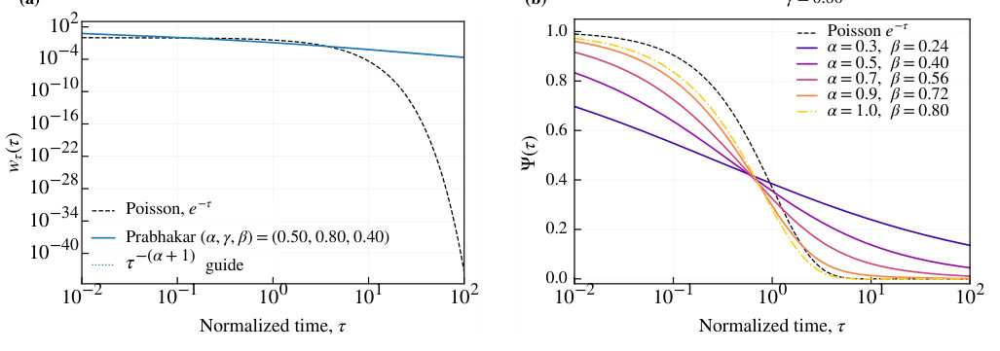
<figcaption class="paper-figure-caption"><b>Fig 2.</b> FIG. 2. Normalized Prabhakar renewal statistics for γ = 0.8, β = αγ and dimensionless time τ = λ1/αt. (a) Dimensionless waiting-time density wτ(τ) = λ−1/αw(τ/λ1/α) at α = 0.5, compared with the Poisson density e−τ and the algebraic guide τ −1−α. (b) Survival probability for α ∈{0.3, 0.5, 0.7, 0.9, 1.0}, compared with the Poisson survival e−τ. For 0 &lt; α &lt; 1, the algebraic survival tail in Eq. (30a) decays more slowly than the Poisson survival. The α = 1 curve corresponds to gamma-distributed waiting times. ChatGPT (OpenAI; GPT-5 Sol Ultra) generated the Python evaluation and plotting code from R.U.Erdogan’s theoretical and numerical specifications; R.U.Erdogan reviewed it against the...</figcaption>
</figure>
<figure class="paper-figure-card">
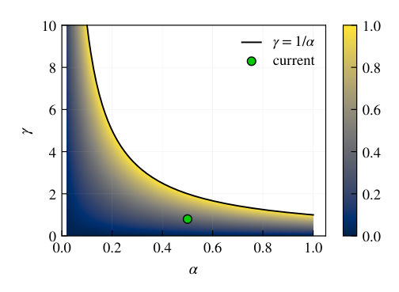
<figcaption class="paper-figure-caption"><b>Fig 3.</b> FIG. 3. Complete-monotonicity (CM) domain of the normal- ized Prabhakar waiting-time density for λ &gt; 0 [Eq. (26b)]. The color field shows β = αγ within 0 &lt; α ≤1, 0 &lt; γ ≤1/α. The black boundary γ = 1/α (β = 1) is included. The uncol- ored region above it represents nonnegative normalized den- sities that are not CM. The green marker denotes the default simulation parameters (α, γ, β) = (0.5, 0.8, 0.4). ChatGPT (OpenAI; GPT-5 Sol Ultra) generated the Python plotting code from R.U.Erdogan’s theoretical and numerical specifi- cations; R.U.Erdogan reviewed it against the analytical CM conditions.</figcaption>
</figure>
<figure class="paper-figure-card">
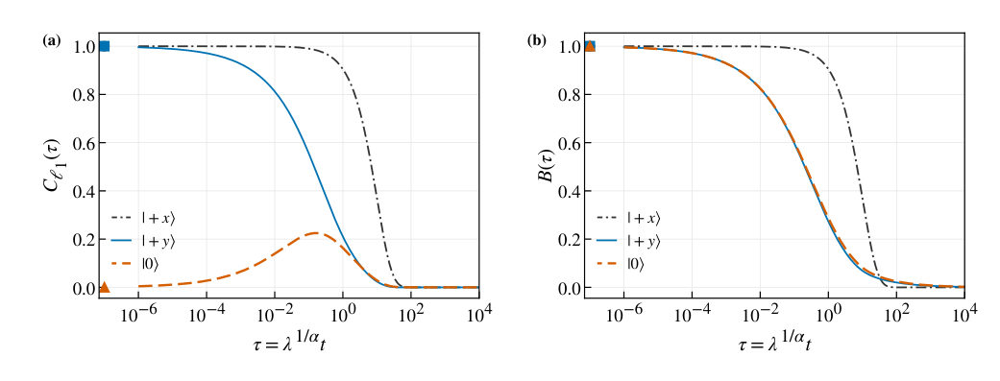
<figcaption class="paper-figure-caption"><b>Fig 4.</b> FIG. 4. Initial-state dependence under Prabhakar renewals: (a) ℓ1 coherence in the computational σz basis, Cℓ1 = p</figcaption>
</figure>
<figure class="paper-figure-card">
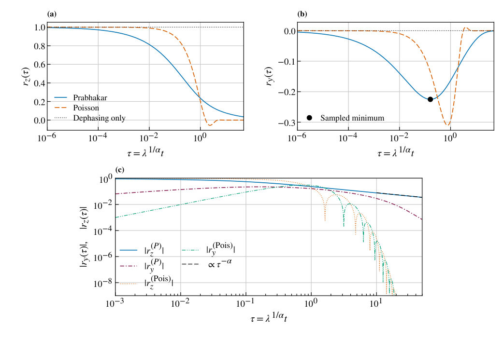
<figcaption class="paper-figure-caption"><b>Fig 5.</b> FIG. 5. Longitudinal polarization retention and reverse z →y transfer from |0⟩, with the Prabhakar parameters and time normalization of Fig. 4. The Poisson reference has ν/λ1/α = 1 and the same dephasing rate and kick angle. (a) Longitudinal polarization rz(τ). (b) Transverse Bloch component ry(τ); the marker identifies its sampled Prabhakar minimum. Black dotted lines show the dephasing-only controls, rz = 1 and ry = 0, respectively. (c) Component magnitudes on logarithmic axes; the dashed black τ −α guide indicates the longitudinal Prabhakar asymptote. ChatGPT (OpenAI; GPT-5 Sol Ultra) generated the Python simulation and plotting code from R.U.Erdogan’s theoretical and numerical...</figcaption>
</figure>

**Summary.** This paper develops a non-Markovian model for transmon decoherence caused by a glassy environment modeled via a fractional renewal process. It shows that the coupling to this disordered bath leads to directional polarization transfer with characteristic algebraic decay tails. The findings highlight that the specific memory structure of the disorder selectively reshapes the qubit's decoherence dynamics.

**Why it may be interesting.** This work provides a sophisticated theoretical framework for understanding memory effects in superconducting qubits due to amorphous defects, moving beyond simple exponential decay models common in basic open quantum system treatments.

Detailed structure

**Main problem.** The paper investigates how decoherence in a transmon qubit can be selectively 'reshaped' by coupling to a complex, disordered environment modeled by Two-Level Systems (TLS).

**Main result.** The model predicts directional persistence in polarization transfer ($\sigma_y 	o \sigma_z$) characterized by algebraic long-time tails ($t^{-\alpha}$), which are distinct from predictions based on simple Poissonian noise models.

**Method.** The analysis employs non-Markovian quantum dynamics, utilizing a fractional renewal framework derived from a Prabhakar waiting-time law to model the glassy environment.

**Model / system.** The system is a transmon qubit coupled to a longitudinal Markovian bath and a transverse TLS environment. The dynamics are governed by a non-Markovian master equation derived from a fractional renewal process.

**Key observables.** Directional transfer between coherence ($\sigma_y$) and longitudinal polarization ($\sigma_z$), and the algebraic decay tails ($t^{-\alpha}$ for forward transfer).

**Important parameters / regimes.** The fractional exponent $\alpha$ ($0 < \alpha < 1$), the pure-dephasing rate ($\Gamma_Z$), and the energy relaxation rate ($\Gamma_1$).

**Assumptions / limitations.** The environment is modeled by a glassy TLS system whose switching rates are coarse-grained using a Prabhakar waiting-time law, and the dynamics are treated as a combination of Markovian and renewal processes.

**Figures summary.** The notes refer to Figure 1, which conceptually illustrates the sequential action of longitudinal Markovian dephasing and transverse TLS kicks governed by independent Prabhakar waiting times.

**Paper structure.** The paper develops the non-Markovian model, derives the governing equations (Volterra/Caputo-type), analyzes the asymptotic behavior using branch-cut analysis for heavy-tailed waiting times, and compares results against standard Poissonian references.

Abstract

We develop a completely positive and trace-preserving non-Markovian transmon model with longitudinal Markovian dephasing and transverse renewal events motivated by a glassy two-level-system environment. A microscopic Hamiltonian identifies coupling subspaces; a normalized Prabhakar waiting-time law phenomenologically coarse grains slow defect reconfigurations. Forward chronological renewal histories yield an exact map-level Volterra equation, a noncommuting kernel--resolvent master equation, and an equivalent drift-conjugated Caputo-type representation with its required initial-value term. Without energy relaxation, Pauli-space dynamics splits into two one-dimensional subspaces and a coupled $(σ_y,σ_z)$ subspace supporting directional transfer between coherence and longitudinal polarization; $σ_x$ polarization is renewal-insensitive. For heavy-tailed waiting times with $0<α<1$, branch-cut analysis gives a generic $t^{-α}$ storage tail in longitudinal polarization generated from initial coherence and $O(t^{-1-α})$ reverse transfer; constant-rate Poisson renewal yields pole-generated exponential decay. Independent zero-temperature relaxation at finite $T_1$ exponentially cuts off these tails when its rate is below twice the pure-dephasing rate. We compare independent inverse-Laplace reconstructions of the waiting-time density, memory kernel, and selected qubit-response components to assess numerical accuracy. For the studied parameters, Prabhakar renewal gives larger forward-transfer magnitudes at the prescribed readout than both a scale-matched constant-rate Poisson reference and an inhomogeneous Poisson reference matching the full expected-count profile, including finite-$T_1$ tests. Both Poisson references yield larger evaluated finite-window peaks. Disorder-motivated renewal memory reshapes transmon decoherence selectively by state and direction.

[↑ back to top](#top)

### [Anomalous transport in periodic systems driven by active fluctuations](http://arxiv.org/abs/2609.37289v1)

**Authors:** Karol Białas  
**Type:** theory · **Category:** statistical mechanics · **PDF:** <https://arxiv.org/pdf/2609.37289v1>  
**Analysis basis:** full PDF text, analyzed in chunks
**Topic relevance:** `Frenkel-Kontorova` **3/5** · `driven-dissipative phase transition` **3/5** · `methods for driven-dissipative` **3/5** · `non-equilibrium universality` **3/5** · `Keldysh / 2PI / non-Gaussian methods` **1/5** · `correlated / nonlocal dissipation` **1/5**

↔ Scroll figures horizontally

<figure class="paper-figure-card">
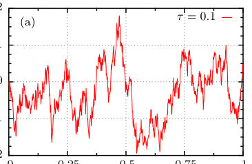
<figcaption class="paper-figure-caption"><b>Fig 1.</b> Figure 1: Representative realizations of a zero-mean (µOU = 0) Ornstein-Uhlenbeck process ηOU(t) for two correlation times: τ = 0.1 (a) and τ = 2.0 (b).</figcaption>
</figure>
<figure class="paper-figure-card">
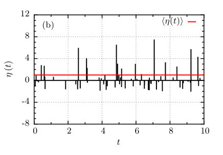
<figcaption class="paper-figure-caption"><b>Fig 2.</b> Figure 2: Representative trajectories of white Poisson shot noise with a skew-normal amplitude distribution ρs(z) for different mean spiking rates λ and average ampli- tudes ζ. The solid red line indicates the mean bias ⟨ηP(t)⟩= 1. Plot reproduced from A1.</figcaption>
</figure>
<figure class="paper-figure-card">
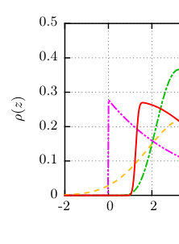
<figcaption class="paper-figure-caption"><b>Fig 3.</b> Figure 3: Comparison of probability density functions ρ(z) for active Poissonian shot noise amplitudes, ranging from unidirectional models to bidirectional skew-normal statistics. Plot reproduced from A2.</figcaption>
</figure>
<figure class="paper-figure-card">
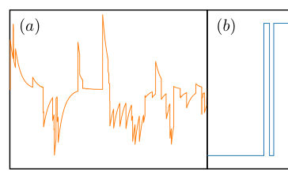
<figcaption class="paper-figure-caption"><b>Fig 4.</b> Figure 4: Exemplary realizations of the colored Poisson noise (a), dichotomous noise (b) and Kubo-Anderson fluctuations (c).</figcaption>
</figure>
<figure class="paper-figure-card">
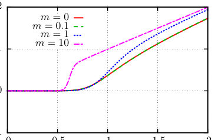
<figcaption class="paper-figure-caption"><b>Fig 5.</b> Figure 5: Generalized tilted washboard potential V (x) (left panel). Average velocity ⟨v⟩as a function of external bias F for different mass values m, with thermal noise intensity DT = 0.1 and barrier parameter ε = 1 (right panel).</figcaption>
</figure>

**Summary.** This research explores how active, non-thermal fluctuations drive anomalous transport in periodic systems, leading to phenomena like giant enhancement and negative mobility. By modeling the noise statistically, the authors quantify these effects using jump-relaxation models. The findings offer theoretical insights into energy transduction in synthetic and biological active matter systems.

**Why it may be interesting.** The study provides concrete, non-equilibrium examples of directed transport and energy dissipation far from equilibrium, which are crucial concepts in understanding open quantum systems and energy flow in mesoscopic physics.

Detailed structure

**Main problem.** The paper investigates the non-equilibrium transport of Brownian particles driven by active fluctuations within periodic potential landscapes.

**Main result.** Active fluctuations can induce giant transport enhancement, absolute negative mobility, and directed motion (ratchet effect) through mechanisms that violate detailed balance.

**Method.** The work combines high-precision Monte Carlo simulations with analytical modeling, developing phenomenological jump-relaxation models.

**Model / system.** The system models Brownian particles in periodic potentials, driven by active fluctuations characterized by white Poisson shot noise with non-Gaussian amplitude statistics. This contrasts with standard thermal noise.

**Key observables.** Giant directed velocity enhancement, absolute negative mobility, and the magnitude of directed current in the zero-bias limit.

**Important parameters / regimes.** Noise variance, particle mass (m), and the statistics of the fluctuation amplitudes (e.g., bidirectional skew-normal distribution).

**Assumptions / limitations.** The analysis relies on modeling active noise as white Poisson shot noise and employing a jump-relaxation framework to decouple particle dynamics.

**Figures summary.** Not specified (Notes suggest quantitative demonstration of enhancement and negative mobility via modeling).

**Paper structure.** The dissertation systematically covers the theoretical distinction between thermal and active fluctuations, dedicating sections to the mechanisms and quantification of giant transport enhancement, absolute negative mobility, and the ratchet effect.

Abstract

This dissertation investigates the transport of Brownian particles driven by active fluctuations in periodic potential landscapes. Unlike thermal noise, active fluctuations break detailed balance and violate the fluctuation-dissipation theorem. They model self-propulsion mechanisms and active-bath interactions in biological and synthetic micro-systems. By focusing on white Poisson shot noise with non-Gaussian amplitude statistics, this work systematically uncovers the mechanisms governing three major transport anomalies: giant transport enhancement, absolute negative mobility, and the ratchet effect.   Combining Monte Carlo simulations with analytical modeling, this work demonstrates that active fluctuations adhering to a bidirectional skew-normal amplitude distribution enhance directed velocity compared to the free-particle by several orders of magnitude. This giant transport enhancement is fully quantified via a phenomenological jump-relaxation model that decouples particle displacement into instantaneous stochastic jumps and deterministic relaxation towards potential minimum. Extending this model to inertial dynamics reveals that finite particle mass m acts as a dynamic control parameter capable of strengthening, weakening, constructively inducing, or completely suppressing transport enhancement depending on noise variance.   Furthermore, an ultra-minimal model for absolute negative mobility is established in a one-dimensional, purely overdamped system, showing that discontinuous shot noise drives transport opposite to an applied bias without requiring particle inertia, nonlinearity of spatially periodic potential, or explicit time-dependent periodic driving. Conversely, under an alternative scaling of the average stochastic force, an asymmetric distribution of fluctuation amplitudes generates net directed transport through a tilting ratchet effect in the zero-bias limit.

[↑ back to top](#top)

### [Classification of topological phases of matter in stochastic systems](http://arxiv.org/abs/2609.38171v1)

**Authors:** Dexin Li, Evelyn Tang  
**Type:** theory · **Category:** statistical mechanics · **PDF:** <https://arxiv.org/pdf/2609.38171v1>  
**Analysis basis:** full PDF text, analyzed in chunks
**Topic relevance:** `driven-dissipative phase transition` **3/5** · `methods for driven-dissipative` **3/5** · `Keldysh / 2PI / non-Gaussian methods` **2/5** · `correlated / nonlocal dissipation` **2/5** · `non-equilibrium universality` **2/5** · `analog quantum simulation` **1/5** · `quantum measurements` **1/5**

↔ Scroll figures horizontally

<figure class="paper-figure-card">
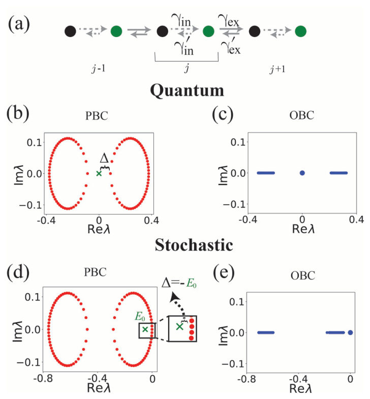
<figcaption class="paper-figure-caption"><b>Fig 1.</b> FIG. 1. (a) Schematic of the non-Hermitian SSH model, defined in Eq. (7). (b,c) The spectra λ of quantum systems are shown in red for periodic boundary conditions (PBC) and in blue for open boundary conditions (OBC). The zero mode exists under OBC and disappears under PBC, which allows a straightforward definition of a bulk gap ∆and the point gap denoted by a green cross. (d,e) Similarly, the spectra λ of stochastic systems are shown in red for periodic boundary conditions (PBC) and in blue for open boundary conditions (OBC). In contrast to quantum systems, the steady state with zero eigenvalue appears under both PBC and OBC, which illustrates the difficulty of defining a bulk gap due to...</figcaption>
</figure>
<figure class="paper-figure-card">
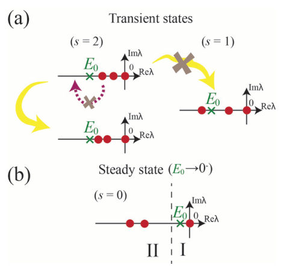
<figcaption class="paper-figure-caption"><b>Fig 2.</b> FIG. 2. Restrictions on the motion of eigenvalues λ of W (red dots) in Hermitian 0D stochastic systems for (a) transient states and (b) the steady state. The topological invariant is defined as s := n+ −1, with n+ the number of eigenvalues above the point gap E0 (green cross). (a) With E0 ̸= 0, the phases with s = 2 can be continuously deformed into each other (yellow arrow). However, they cannot be continuously deformed into the phase with s = 1 (blocked arrow) because Hermiticity restricts eigenvalues to move only along the real axis, preventing them from passing through E0. (b) In the steady-state limit (E0 →0−), only the trivial phase with s = 0 remains. The dashed line between E0 and...</figcaption>
</figure>
<figure class="paper-figure-card">
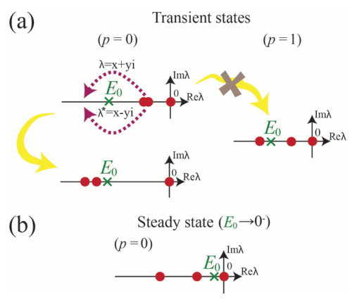
<figcaption class="paper-figure-caption"><b>Fig 3.</b> FIG. 3. Restrictions on the motion of eigenvalues λ of W (red dots) in non-Hermitian 0D stochastic systems in class AI for (a) transient states and (b) the steady state. The topo- logical invariant is defined as p := n−mod 2, the parity of the number of real eigenvalues below the point gap E0 (green cross). (a) With E0 ̸= 0, the phases with p=0 can be con- tinuously deformed into each other (yellow arrow). However, they cannot be continuously deformed into the phase with p=1 (blocked arrow) because the real nature of W restricts each eigenvalue to appear as either a single real number or one of a complex conjugate pair λ = x + yi and λ∗= x −yi. (b) In the steady-state limit (E0 →0−), only...</figcaption>
</figure>
<figure class="paper-figure-card">
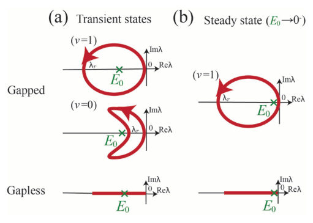
<figcaption class="paper-figure-caption"><b>Fig 4.</b> FIG. 4. PBC spectra of non-Hermitian 1D stochastic sys- tems in class AI for (a) transient states and (b) the steady state. The topological invariant is the winding number ν of the red loops composed of eigenvalues λ of W(k) with re- spect to a reference point E0 (green cross). However, gapless spectra (red line segments, below) include E0 and hence ν is ill-defined. (a) Two phases of gapped cases and a gapless case are shown. Loops with ν = 1 and λr &lt; E0 are topologically different from loops with ν = 0 and λr &gt; E0 where λr is a non-zero real eigenvalue of W(k). (b) In the steady-state limit (E0 →0−), λr &lt; E0 always holds. Hence phases with gapped spectra will always collapse to the phase...</figcaption>
</figure>

**Summary.** This paper establishes a new mathematical framework to classify topological phases in stochastic systems, moving beyond the limitations of quantum-derived methods. By introducing a redefined point gap and homotopy approach, the authors constrain the possible robust symmetry classes to only two. This provides a powerful, rigorous tool for predicting robust behavior in complex, non-equilibrium systems like living matter.

**Why it may be interesting.** This work directly addresses the mathematical generalization of topological concepts from unitary quantum evolution to dissipative, non-Hermitian, and stochastic dynamics, which is crucial for modeling open quantum systems and biological processes.

Detailed structure

**Main problem.** The primary challenge is developing a rigorous classification framework for topological phases of matter specifically within stochastic systems, as existing quantum classifications fail due to Markovian constraints.

**Main result.** The authors find that only two symmetry classes—'no symmetry' and 'pseudo-Hermiticity'—remain robust for ergodic stochastic systems, providing a new predictive framework for active matter.

**Method.** The work introduces new mathematical tools, including a novel homotopy approach and a redefinition of the point gap, to circumvent the limitations of standard spectral and K-theoretic methods.

**Model / system.** The study focuses on stochastic systems governed by the master equation, $rac{d}{dt}p(t) = Wp(t)$, where $W$ is the transition matrix, contrasting this with standard quantum systems described by the Schrödinger equation.

**Key observables.** Topological invariants, the point gap ($E_0$), and the symmetry classes (e.g., AI, BDI$\dagger$).

**Important parameters / regimes.** The zero eigenvalue ($\lambda_0=0$), the gap definition relative to $E_0$, and the dimensionality ($d$).

**Assumptions / limitations.** The analysis assumes the system is ergodic and relies on adapting gap definitions to handle the singular nature of the transition matrix $W$.

**Figures summary.** Figures schematically compare spectra between quantum and stochastic systems, illustrating the definition of the point gap $E_0$ relative to the zero eigenvalue.

**Paper structure.** The paper progresses by first identifying the gap in current theory, then detailing the failure of existing methods (like spectral flattening), introducing the new homotopy/point gap approach, and finally proving the equivalence of this new method to established techniques in 1D.

Abstract

Topological phases of matter support edge states protected from noise and perturbations, and the classification of which symmetry and dimension support such phases was developed for quantum systems and analogous platforms. While topological phases have also been discovered in stochastic systems and posited as mechanisms for biochemical processes, a classification consistent with their Markovian constraints remains lacking, impeding generalization to new scenarios. These constraints alter the matrix space preventing the application of previous classification methods, while hosting new properties such as the necessity of non-Hermiticity for non-trivial topological phases. We introduce new methods including a new homotopy approach and redefinition of the point gap and find that only two symmetry classes remain robust: no symmetry and pseudo-Hermiticity. In these symmetry classes, we identify the dimensions with topologically non-trivial phases and their group structure, creating a rigorous framework for predicting robust behavior in active and living matter.

[↑ back to top](#top)

### [Dynamical resource theory of time-reversal symmetry breaking](http://arxiv.org/abs/2609.36408v1)

**Authors:** Jisho Miyazaki, Kohdai Kuroiwa, Mio Murao  
**Type:** theory · **Category:** other · **PDF:** <https://arxiv.org/pdf/2609.36408v1>  
**Analysis basis:** full PDF text, analyzed in chunks
**Topic relevance:** `correlated / nonlocal dissipation` **3/5** · `driven-dissipative phase transition` **3/5** · `methods for driven-dissipative` **2/5** · `non-equilibrium universality` **2/5** · `quantum measurements` **2/5** · `Keldysh / 2PI / non-Gaussian methods` **1/5** · `analog quantum simulation` **1/5**

↔ Scroll figures horizontally

<figure class="paper-figure-card">
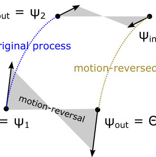
<figcaption class="paper-figure-caption"><b>Fig 1.</b> FIG. 1. Schematic relation between original and motion- reversed processes for a system with momentum.</figcaption>
</figure>
<figure class="paper-figure-card">
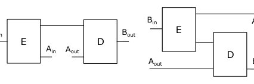
<figcaption class="paper-figure-caption"><b>Fig 2.</b> FIG. 2. (Left) the circuit representation of a general super- channel f : A ⊸B and (right) its map form Mf.</figcaption>
</figure>
<figure class="paper-figure-card">
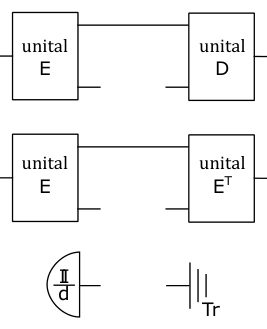
<figcaption class="paper-figure-caption"><b>Fig 3.</b> FIG. 3. (a) Circuit representation of an example of a uni- tal superchannel, featuring a unital encoder channel E and a unital decoder channel D. (b) Circuit representation of an example of a T-symmetric superchannel, featuring a unital encoder channel E and its transposed unital decoder channel E⊤. The motion reversal is assumed to be given by complex conjugation. (c) A T-symmetric superchannel that discards its input channel.</figcaption>
</figure>
<figure class="paper-figure-card">
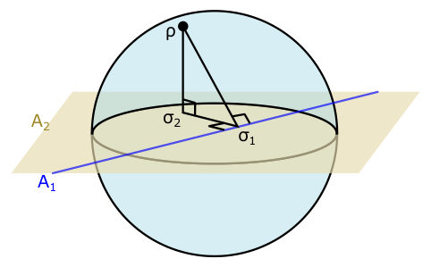
<figcaption class="paper-figure-caption"><b>Fig 4.</b> FIG. 4. Schematic relation among the TGC submanifolds and minimizers in Lemma 4. The ball represents the state space D(H). The geometry is deliberately simplified to depict the generalized Pythagorean theorem in familiar Euclidean terms.</figcaption>
</figure>
<figure class="paper-figure-card">
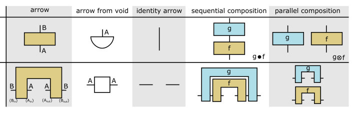
<figcaption class="paper-figure-caption"><b>Fig 5.</b> FIG. 5. Correspondence between elements of the process theories (Cdet, CUnital, and CTRS) and elements of quantum circuits. The circuit element shaped like “⊓” represents a one-slot quantum comb.</figcaption>
</figure>

**Summary.** This paper introduces a dynamical resource theory to quantify time-reversal symmetry breaking in general quantum channels. It resolves a long-standing ambiguity by decomposing total T-violation into a thermodynamic component (nonunitality) and a kinematic component. This framework provides a powerful, operational measure for studying symmetry breaking in open quantum systems.

**Why it may be interesting.** This work provides a rigorous, operational tool to quantify fundamental symmetries in open quantum systems, which is crucial for understanding decoherence and non-equilibrium dynamics in AMO physics.

Detailed structure

**Main problem.** The paper aims to develop an operationally meaningful framework to quantify intrinsic Time-reversal symmetry breaking (T-violation) in general quantum channels, resolving the conceptual confusion between T-violation and non-invertibility.

**Main result.** T-violation is decomposed into two distinct, additive components: kinematic T-violation (from antiunitary motion-reversal) and nonunitality driven by thermodynamics. The resource theory of kinematic T-violation is shown to be robust and applicable even to classical channels.

**Method.** The authors employ dynamical resource theory, defining T-symmetry operationally for quantum channels and decomposing the total T-violation into its constituent parts using specific antiunitary operators.

**Model / system.** The analysis is performed on general quantum channels ($\mathcal{E}$), extending beyond simple Hamiltonians to account for non-unitary, dissipative processes. The framework uses concepts like motion-reversal operators ($\Theta$) and the Oreshkov–Cerf formalism.

**Key observables.** T-violation, kinematic T-violation, nonunitality, transition probabilities, and resource measures like trace distance and relative entropy.

**Important parameters / regimes.** The decomposition relies on the relationship $	ext{T-violation} = 	ext{nonunitality} + 	ext{kinematic T-violation}$.

**Assumptions / limitations.** The definition of motion reversal is relative to a chosen reference time displacement ($U_{\Delta t}$), and the analysis focuses on the simplest setting without decomposing into superselection sectors.

**Figures summary.** Figure 1 schematically relates original and motion-reversed processes for a system with momentum. Figure 5 shows the correspondence between process theory elements and quantum circuit elements.

**Paper structure.** The paper first establishes the operational definition of T-symmetry for processes, then develops the resource theory framework by decomposing T-violation, and finally analyzes the resulting resource theory of kinematic T-violation.

Abstract

Time-reversal symmetry and its violation (T-violation) are fundamental across diverse physics domains, from particle physics to fluctuation theorems and reciprocity. While time-reversal symmetry for isolated systems is simply determined by the Hamiltonian, quantifying the magnitude of T-violation, especially in noisy quantum processes, has been a subject of ongoing debate. Here, we propose an operationally meaningful framework to quantify the intrinsic T-violation of quantum channels. We integrate operationally defined time-reversal transformations into dynamical resource theory to formulate T-violation as a resource. T-violation decomposes into two distinct components: kinematic T-violation originating from antiunitary motion-reversal, and nonunitality driven purely by thermodynamics. This decomposition resolves the longstanding confusion between broken time-reversal symmetry and non-invertibility. Finally, we analyze the resulting resource theory of kinematic T-violation, showing that it is neither quality-like nor quantity-like, and proving the existence of a universal golden unit even within classical channels.

[↑ back to top](#top)

### [Out-of-Time-Ordered Correlators Beyond Lindblad](http://arxiv.org/abs/2609.36029v1)

**Authors:** Elisa Vallini, Felix Fritzsch, Pieter W. Claeys  
**Type:** theory · **Category:** statistical mechanics · **PDF:** <https://arxiv.org/pdf/2609.36029v1>  
**Analysis basis:** full PDF text, analyzed in chunks
**Topic relevance:** `correlated / nonlocal dissipation` **3/5** · `driven-dissipative phase transition` **3/5** · `methods for driven-dissipative` **3/5** · `non-equilibrium universality` **3/5** · `Keldysh / 2PI / non-Gaussian methods` **2/5**

↔ Scroll figures horizontally

<figure class="paper-figure-card">
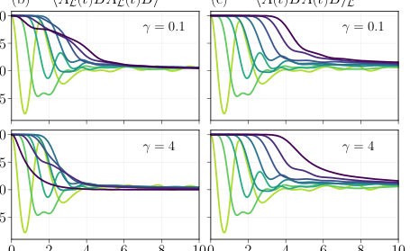
<figcaption class="paper-figure-caption"><b>Fig 1.</b> FIG. 1. Operator spreading in the boundary-dissipated Ising chain (11). The OTOCs are numerically studied for A = σz i , with i = 1, . . . , L, and B = σz 1, for a system of size L = 8. Panel (a) shows the OTOC under unitary dynamics, while panels (b) and (c) show the reduced and full OTOCs, respec- tively, for two different values of γ ̸= 0. The competition be- tween unitary scrambling and dissipation manifests differently in the two quantities, with the full OTOC ⟨A(t)BA(t)B⟩L providing a more faithful description of the scrambling dy- namics of the corresponding closed system.</figcaption>
</figure>
<figure class="paper-figure-card">
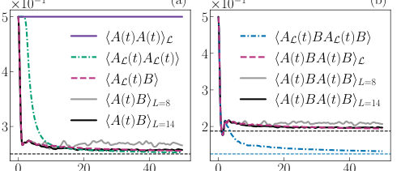
<figcaption class="paper-figure-caption"><b>Fig 2.</b> FIG. 2. Late-time behavior of correlations between A = B = 1</figcaption>
</figure>
<figure class="paper-figure-card">
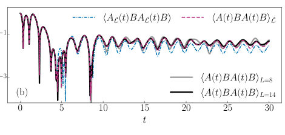
<figcaption class="paper-figure-caption"><b>Fig 3.</b> FIG. 3. Correlation functions and OTOCs in the boundary- dissipated Ising chain (11), for boundary operators A = B = σz 1. (a) Correlation function for the open system (L = 8, γ = 1, dashed magenta), compared with the ones of the closed system for L = 14 (solid black) and L = 8 (solid gray). (b) Full OTOC for the open system (L = 8, γ = 1, dashed magenta), compared with the corresponding closed- system OTOCs for L = 14 (solid black) and L = 8 (solid gray). The reduced OTOC of the open system is also shown (dash-dotted blue). In both panels, the open-system results closely reproduce those of the larger closed system, whereas the reduced OTOC provides a significantly poorer approxi- mation.</figcaption>
</figure>
<figure class="paper-figure-card">
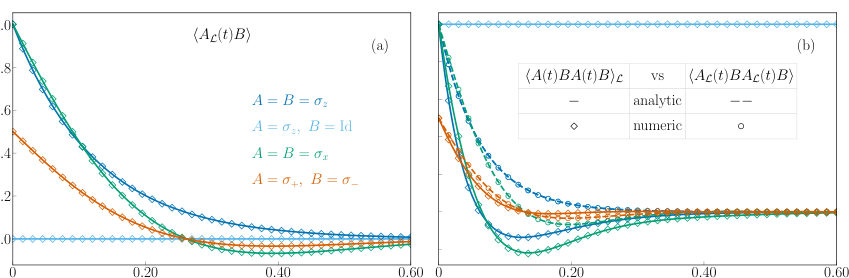
<figcaption class="paper-figure-caption"><b>Fig 4.</b> FIG. 1. Single rotating qubit subject to dephasing and depolarization, cf. Eq. (S49). The parameters are fixed to p = 3, γz = 1, and γ = 2. We consider correlations between A = B = σz (blue), A = σz and B = 1 (light blue), A = B = σx (green), and A = σ+ and B = σ−(orange). (a) Correlation functions ⟨AL(t)B⟩. The analytical expressions (solid lines) are compared with numerical simulations of the Lindblad evolution (diamonds), using a time step ∆t = 10−3. (b) Full OTOCs ⟨A(t)BA(t)B⟩L (solid lines) compared with the corresponding reduced OTOCs ⟨AL(t)BAL(t)B⟩(dashed lines). The analytical results follow from Eqs. (S51) and (S52), with the latter giving the correction that distinguishes the full...</figcaption>
</figure>

**Summary.** This paper develops an extended formalism for calculating Out-of-Time-Ordered Correlators (OTOCs) in open quantum systems, showing that the standard Lindblad approach is insufficient. By including a crucial 'replica-correlation term,' the authors restore physical properties lost in the reduced description. This allows for more accurate study of quantum chaos and operator spreading in realistic, dissipative environments.

**Why it may be interesting.** This work provides a rigorous theoretical tool to accurately calculate quantum chaos measures (OTOCs) in realistic open quantum systems, bridging the gap between unitary and dissipative dynamics.

Detailed structure

**Main problem.** The paper investigates Out-of-Time-Ordered Correlators (OTOCs) in open quantum systems, specifically addressing the limitations of using the standard Lindblad formalism for these higher-order correlators.

**Main result.** The full OTOC dynamics requires an additional 'replica-correlation term' beyond the standard Lindblad approach, which restores fundamental properties like the conservation of the operator Hilbert–Schmidt norm.

**Method.** The authors derive the OTOC evolution by systematically tracking correlations between environment replicas, leading to an extended formalism that corrects the standard reduced dynamics.

**Model / system.** The study uses a microscopic model of a system coupled to a random bath, exemplified by a dissipative Ising chain with boundary dissipation. The dynamics are analyzed by comparing the full unitary evolution to the reduced Lindblad evolution.

**Key observables.** Out-of-Time-Ordered Correlators (OTOCs), operator spreading, and the conservation of the operator Hilbert–Schmidt norm.

**Important parameters / regimes.** Dissipation strength ($\gamma$), time ($t$), and the replica number ($k$).

**Assumptions / limitations.** The standard Lindblad formalism is insufficient for OTOCs because it neglects correlations between replicas, necessitating the inclusion of the replica-correlation term.

**Figures summary.** Figures compare OTOCs for different dissipation strengths ($\gamma$), showing that the full OTOC retains unitary-like behavior, while the reduced OTOC exhibits premature decay near the dissipative boundary.

**Paper structure.** The paper progresses from establishing the failure of the standard Lindblad approach for OTOCs to deriving the necessary replica-correlation term, and finally applying this extended formalism to study operator spreading in dissipative spin chains.

Abstract

Out-of-time-ordered correlators (OTOCs) provide a powerful probe of quantum chaos and scrambling. While the Lindblad formalism is often used to describe OTOCs in open systems, microscopic mechanisms that give rise to the Lindblad equation at the level of time-ordered correlation functions do not necessarily justify this approach at the level of OTOCs. Starting from a microscopic model of a subsystem coupled to a random bath, we show that the resulting OTOC dynamics contains an additional contribution compared to the standard Lindblad approach. This contribution, induced by correlations between different replicas, allows key properties of the underlying unitary dynamics such as long-time freeness to be retained and information scrambling to be captured more faithfully. As an application, we show that this extended formalism can be used to numerically study OTOCs in large closed systems by replacing part of the system with a dissipative boundary, offering a way to study operator spreading and higher-order correlations beyond directly accessible system sizes.

[↑ back to top](#top)

### [Thermodynamics of the space of trajectories governed by a combination of two additive boundary functionals](http://arxiv.org/abs/2609.37102v1)

**Authors:** V. V. Ryazanov  
**Type:** theory · **Category:** statistical mechanics · **PDF:** <https://arxiv.org/pdf/2609.37102v1>  
**Analysis basis:** full PDF text, analyzed in chunks
**Topic relevance:** `non-equilibrium universality` **3/5** · `Keldysh / 2PI / non-Gaussian methods` **2/5** · `methods for driven-dissipative` **2/5** · `quantum measurements` **2/5** · `Full counting statistics` **1/5** · `analog quantum simulation` **1/5** · `correlated / nonlocal dissipation` **1/5** · `driven-dissipative phase transition` **1/5** · `scars & prethermalization` **1/5**

↔ Scroll figures horizontally

<figure class="paper-figure-card">
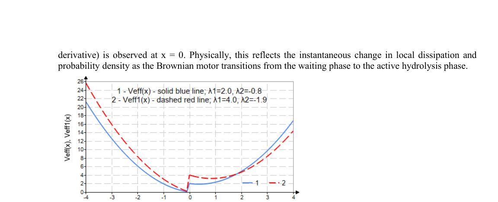
<figcaption class="paper-figure-caption"><b>Fig 1.</b> Fig. 1. Mathcad visualization of the generalized &quot;quantum-mechanical&quot; potential profile for the system of equation (4). The potential function comprises three components: the harmonic trap of the Ornstein-Uhlenbeck process, a step-like &quot;penalty&quot; (Heaviside function), and a linear slope due to drift. The formula for the resulting effective potential is: 2 2</figcaption>
</figure>
<figure class="paper-figure-card">
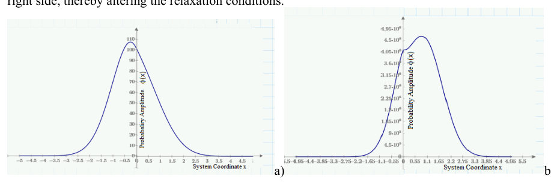
<figcaption class="paper-figure-caption"><b>Fig 2.</b> Figure 2. Evolution of the ground-state wave function 𝜙(𝑥)under different external driving forces: (a) weak drift regime (𝜆2=−0.8, 𝐸0=1.255); (b) strong drift regime (𝜆2=−2.5, 𝐸0=0.399). The ground-state wave function ( ) x  of the effective Feynman–Kac Hamiltonian under a strong asymmetric drift regime (𝜆2=-0.8, - 2.5, 𝜆1=2.0), (=1.5), (D=0.5). The numerical solution is obtained via a twin-shooting Runge–Kutta algorithm and matched at the interface using the secant method, yielding the precise ground-state energy (E0 = 1.255, 0.399). A pronounced coordinate shift of the probability density maximum into the positive half-plane ( 0.8 x  ) is observed, driven by the dominant external...</figcaption>
</figure>
<figure class="paper-figure-card">
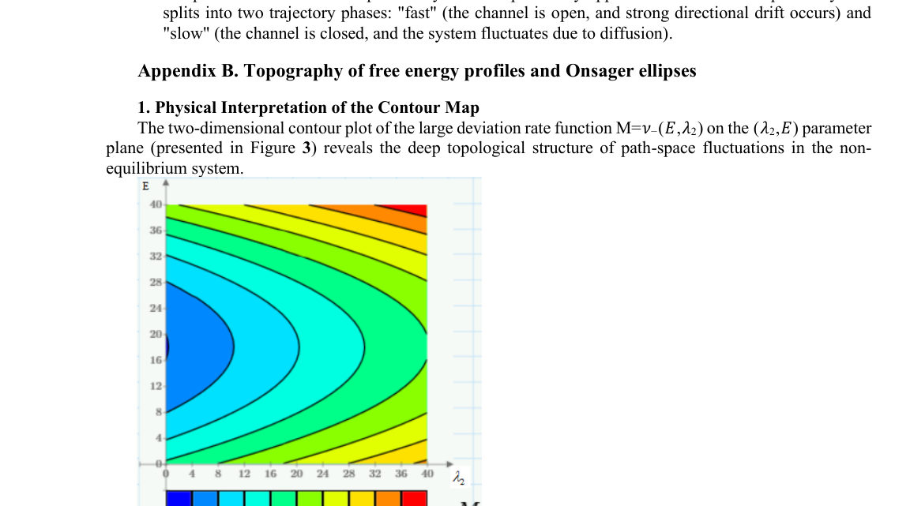
<figcaption class="paper-figure-caption"><b>Fig 3.</b> Figure 3. Topographic contour map of the path-space free energy profile 𝜈−(𝐸,𝜆2). The color gradient corresponds to the magnitude of the rate function matrix 𝑀=𝜈−(𝐸,𝜆2). The transition from concentric quadratic ellipses in the linear regime to asymmetric non-parabolic contours at remote boundaries highlights the breakdown of Onsager’s near-equilibrium symmetry.</figcaption>
</figure>

**Summary.** This work advances stochastic path-space thermodynamics by expanding the set of measurable thermodynamic variables to include complex boundary functionals like residence time and integral current. Using the Ornstein-Uhlenbeck process as a model, the authors derive generalized fluctuation theorems and analyze how external forces break Onsager symmetry in the system's free-energy landscape. This provides a powerful, mathematically rigorous framework for understanding non-equilibrium processes in molecular motors and ion channels.

**Why it may be interesting.** While focused on classical stochastic processes, the rigorous application of fluctuation theorems and the extension of thermodynamic variables into path space provide powerful mathematical tools applicable to open quantum systems where non-equilibrium dynamics are crucial.

Detailed structure

**Main problem.** The paper extends stochastic path-space thermodynamics by systematically incorporating a broad spectrum of boundary and relative functionals of random processes into the description of thermodynamic variables.

**Main result.** It derives a modified path-space fluctuation theorem of the Gallavotti-Cohen type and establishes an exact thermodynamic potential for systems governed by combinations of two additive functionals.

**Method.** The analysis employs the Feynman-Kac formalism and parabolic cylinder theory to calculate the joint Laplace transform, leading to the determination of the effective Hamiltonian's eigenvalues.

**Model / system.** The primary model is a one-dimensional Ornstein-Uhlenbeck process, used to simulate the waiting phase of a molecular Brownian motor or an ion channel sensitive to external stimuli.

**Key observables.** Residence time ($	au_+$), integral current ($	ext{T}_I$), Maximal Deficit (Maximum Drawdown), and the mutual cross-sensitivity coefficient ($\chi_{12}$).

**Important parameters / regimes.** The analysis explores regimes far from equilibrium, such as the deep suppression regime ($	au^+ 	o 0$) and the continuous activation regime ($	au^+ 	o 1$), and the effect of external drift ($V$).

**Assumptions / limitations.** The framework relies on the mathematical tractability afforded by considering the combination of only two additive functionals, and the system dynamics are modeled by the OU process.

**Figures summary.** The figures illustrate the topographic contour map of the path-space free energy profile, showing the transition from symmetric quadratic ellipses near equilibrium to asymmetric, non-parabolic contours when far from equilibrium or when external drifts break symmetry.

**Paper structure.** The paper systematically builds its argument by first extending the formalism via boundary functionals, then detailing the mathematical framework using the Feynman-Kac approach for the OU process, applying it to a biological ion channel model, and finally discussing the derived results and implications.

Abstract

This paper extends the formalism of stochastic path-space thermodynamics by systematically expanding the space of thermodynamic variables with a spectrum of boundary and relative functionals of random processes. Generalizing the approaches introduced in preprints arXiv:2607.24078 and arXiv:2609.08477, we investigate the fluctuation statistics of a one-dimensional Ornstein-Uhlenbeck process with an asymmetric linear drift and a step penalty potential at the origin, which models the waiting phase of a molecular Brownian motor. Utilizing the Feynman-Kac formalism and the parabolic cylinder theory, a numerical scheme based on matching logarithmic derivatives via the secant method is constructed. A high-precision eigenvalues of the effective Hamiltonian is obtained, which define the cumulant generating function. We formulate a modified path-space fluctuation theorem of the Gallavotti-Cohen type for the conjugate drift current at a fixed integral occupation time of the system in the dissipative half-plane. The physical and thermodynamic significance of the new variables is elucidated. A combination of "residence time" and "integral current" functionals is applied to describe an ion channel sensitive to mechanical or electrical stimuli.

[↑ back to top](#top)

### [Multi-Parameter Error Mitigation in Parametric Down-Conversion via SU(1, 1) Composite Segmentation](http://arxiv.org/abs/2609.37514v1)

**Authors:** Nastaran Ragerdi Kashani, Rouhollah Karimzadeh  
**Type:** theory · **Category:** other · **PDF:** <https://arxiv.org/pdf/2609.37514v1>  
**Analysis basis:** full PDF text, analyzed in chunks
**Topic relevance:** `driven-dissipative phase transition` **3/5** · `interference shaping light` **2/5** · `methods for driven-dissipative` **2/5** · `Keldysh / 2PI / non-Gaussian methods` **1/5** · `analog quantum simulation` **1/5** · `correlated / nonlocal dissipation` **1/5** · `non-equilibrium universality` **1/5** · `quantum measurements` **1/5** · `quantum optics experiment` **1/5**

↔ Scroll figures horizontally

<figure class="paper-figure-card">
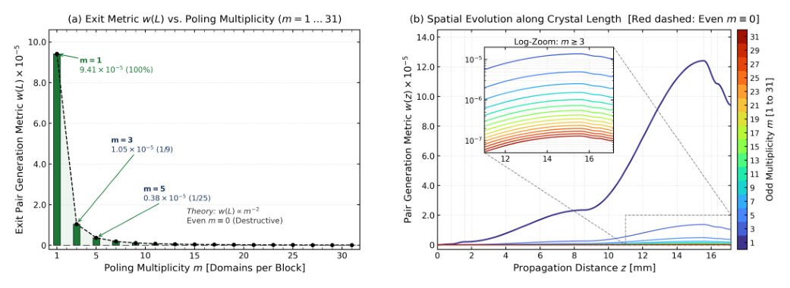
<figcaption class="paper-figure-caption"><b>Fig 1.</b> FIG. 1. (a) Exit pair generation metric w(L) across poling multiplicities m = 1 . . . 31. Odd orders approach the predicted asymptotic m−2 scaling law (dashed curve). Even orders vanish identically for an ideal symmetric square wave. (b) Trajectory of w(z) along the crystal axis for all sixteen odd harmonics. Inset: logarithmic separation of trajectories for m ≥3.</figcaption>
</figure>
<figure class="paper-figure-card">
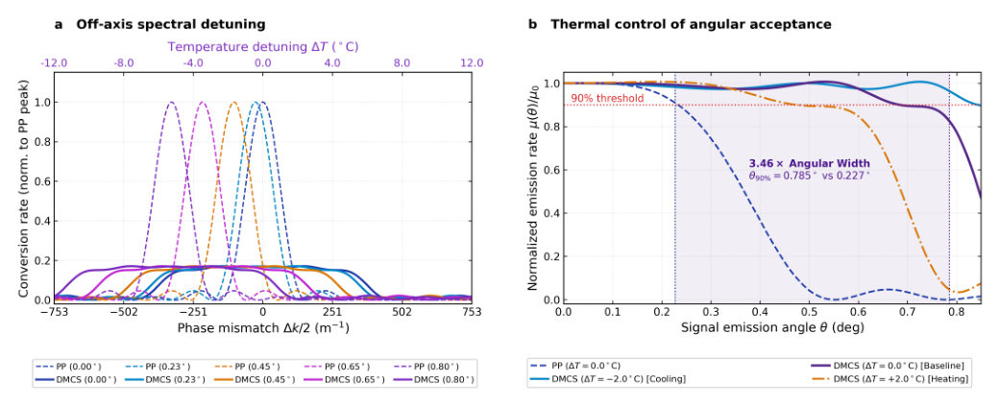
<figcaption class="paper-figure-caption"><b>Fig 2.</b> FIG. 2. (a) Normalized conversion efficiency versus detuning ∆k/2 and temperature for emission angles up to θ = 0.80◦(solid lines: DMCS, dashed lines: PP). (b) Angular acceptance profile at the 90% threshold. At baseline (∆T = 0◦C), the DMCS architecture provides an acceptance half-angle of θ90% = 0.785◦, representing a 3.46× enhancement over the PP baseline (θPP 90% = 0.227◦). Controlled thermal offsets (∆T = −2.0◦C cooling, +2.0◦C heating) dynamically steer and broaden the acceptance window.</figcaption>
</figure>
<figure class="paper-figure-card">
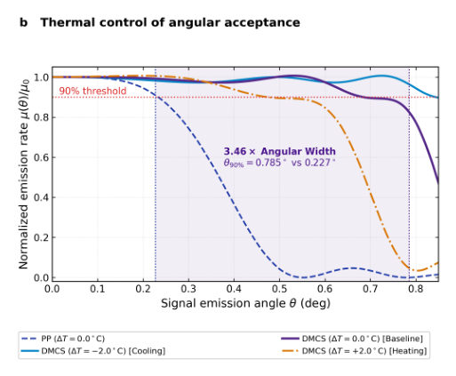
<figcaption class="paper-figure-caption"><b>Fig 3.</b> Figure 3 demonstrates this scaling relation across three representative physical configurations, where crystal seg- ment lengths and poling periods are designed to match the material dispersion at each target band. For short wavelengths (λp = 405 nm →810 nm), choosing r = 0.472 compresses the interaction length to L = 8.10 mm, while third-order poling (m = 3, Λ ≈7.2 µm) avoids sub-micron lithographic constraints. The near-infrared baseline (λp = 532 nm →1064 nm) serves as the un-</figcaption>
</figure>
<figure class="paper-figure-card">
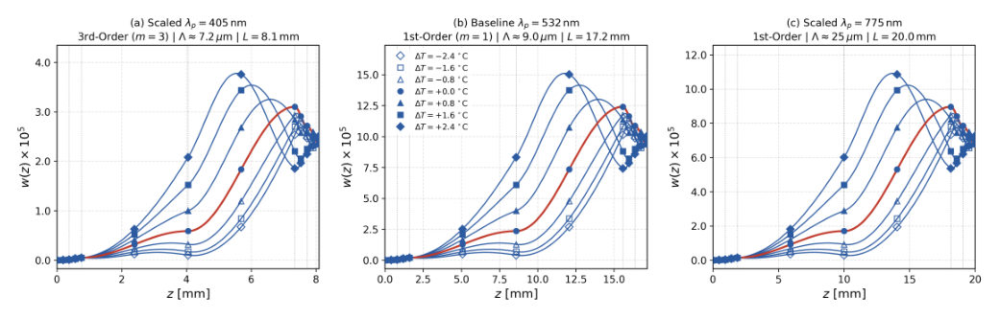
<figcaption class="paper-figure-caption"><b>Fig 4.</b> FIG. 3. Scale Invariance Across Operating Wavelength Regimes. Spatial evolution of the metric w(z) × 105 under temperature detunings ∆T ∈[−2.4◦C, +2.4◦C] (red solid curves: unperturbed ∆T = 0◦C, blue curves with markers: detuned states, vertical dotted lines: segment interfaces) across three regimes: (a) Short-wavelength regime (λp = 405 nm →810 nm, r = 0.472, L = 8.10 mm); (b) Reference regime (λp = 532 nm →1064 nm, r = 1.000, L = 17.16 mm); (c) Telecom regime (λp = 775 nm →1550 nm, r = 1.165, L = 20.00 mm). In each case, physical segment lengths and poling periods are redesigned to satisfy the scaled parameters under material dispersion.</figcaption>
</figure>
<figure class="paper-figure-card">
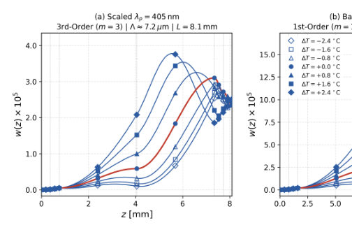
<figcaption class="paper-figure-caption"><b>Fig 5.</b> Figure 4 tracks the state trajectory on the hyperboloid</figcaption>
</figure>

**Summary.** This paper develops a theoretical framework to enhance the robustness of Spontaneous Parametric Down-Conversion (SPDC) by implementing a technique called composite segmentation governed by SU(1, 1) dynamics. The authors demonstrate that this method significantly mitigates performance losses due to temperature drift, angular misalignment, and fabrication defects. The results show that the system maintains high efficiency and phase coherence across realistic environmental variations without needing complex, continuous feedback stabilization.

**Why it may be interesting.** This work provides a highly structured, mathematically rigorous framework (SU(1, 1) algebra) for designing robust quantum light sources, which is crucial for scaling quantum technologies beyond idealized laboratory conditions.

Detailed structure

**Main problem.** The primary challenge addressed is mitigating performance degradation, specifically reduced pair-generation efficiency and phase instability, in Spontaneous Parametric Down-Conversion (SPDC) caused by environmental fluctuations and fabrication imperfections.

**Main result.** The proposed composite segmentation approach maintains high relative conversion efficiency ($\eta \ge 0.954$) and phase coherence across a $5^\circ	ext{C}$ thermal window without continuous feedback, and it tolerates up to two missing poling domains.

**Method.** The analysis employs a theoretical framework based on the SU(1, 1) Lie algebra, utilizing spatial Fourier decomposition and deriving asymptotic scaling laws for error cancellation.

**Model / system.** The system is SPDC in quadratic chi^(2) media, generating two-mode squeezed vacuum states. The dynamics are modeled using coupled-mode equations whose algebra is isomorphic to SU(1, 1), analyzed via Detuning Modulated Composite Segmentation (DMCS).

**Key observables.** Relative pair-generation efficiency ($\eta$), modeled phase-coherence metric ($C_\phi$), and the exit pair conversion metric ($w(L; m)$).

**Important parameters / regimes.** Thermal variation ($\Delta T$), angular misalignment ($	heta$), spatial harmonic order ($m$), and the number of missing poling domains ($\Delta M$).

**Assumptions / limitations.** The analysis assumes the low-gain regime for the pair generation process and relies on the existence of a coordinate-dilation symmetry for wavelength translation.

**Figures summary.** Figure 1 numerically integrates the evolution showing the predicted $1/m^2$ scaling of the pair-generation rate with harmonic order $m$.

**Paper structure.** The paper establishes the physical problem (error sources in SPDC), develops the theoretical model using SU(1, 1) algebra and composite segmentation, derives key scaling laws ($m^{-2}$), and then applies these tools to demonstrate robustness against thermal drift, angular misalignment, and fabrication defects.

Abstract

Spontaneous parametric down-conversion is a primary resource for generating non-classical light, yet phase mismatch fluctuations from temperature drift, angular misalignment, and domain fabrication errors reduce pair-generation efficiency and phase stability. Here, we analyze error mitigation in spontaneous parametric down-conversion using composite segmentation governed by SU(1, 1) spatial dynamics. We show that odd spatial Fourier harmonics preserve error-cancellation flatness with pair-generation rates scaling asymptotically as $m^{-2}$, while a coordinate-dilation symmetry provides a design prescription for translating configurations across distinct operating wavelengths (405, 532, and 775 nm). Furthermore, an open-loop thermo-optic bias counteracts off-axis angular drift to broaden the 90%-efficiency angular acceptance half-width by 3.46x, and up to two missing poling domains are tolerated with no numerically resolved loss in relative conversion efficiency. Across a 5$^\circ$C thermal window, the generated pairs sustain a relative conversion efficiency of $η\ge 0.954$ with the modeled phase-coherence metric remaining above 0.95, providing a structurally robust approach for entangled photon generation without requiring continuous closed-loop feedback stabilization.

[↑ back to top](#top)

### [The Spectral Cost of Detecting Nonequilibrium at Finite Temporal Resolution](http://arxiv.org/abs/2609.37205v1)

**Authors:** Murad Aznagulov  
**Type:** theory · **Category:** statistical mechanics · **PDF:** <https://arxiv.org/pdf/2609.37205v1>  
**Analysis basis:** full PDF text, analyzed in chunks
**Topic relevance:** `driven-dissipative phase transition` **3/5** · `non-equilibrium universality` **3/5** · `quantum measurements` **3/5** · `Keldysh / 2PI / non-Gaussian methods` **1/5** · `correlated / nonlocal dissipation` **1/5** · `methods for driven-dissipative` **1/5**

↔ Scroll figures horizontally

<figure class="paper-figure-card">
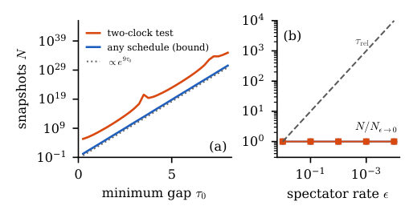
<figcaption class="paper-figure-caption"><b>Fig 1.</b> FIG. 1. Observation cost for the driven ring G of Eq. (11) at α = 0.01. (a) Blue: rigorous analytic information lower bound valid for every causal schedule and stopping rule; for the plotted range maxi DKL[(etG)i·∥(etS)i·] ≤24e−9t. Orange: deterministic 60-digit central-limit power budget of the two- clock current test (rℓ= 1, 4), shown as a protocol diagnostic rather than the theorem’s conservative finite-budget constant. Both have exponent 9 = 2γirr. (b) For the product chain Qϵ at τ0 = 1, the lower bound uses only the driven factor and the test ignores the reversible spectator, exactly as in the proof; both observation costs are therefore independent of ϵ while the relaxation time 1/(2ϵ)...</figcaption>
</figure>
<figure class="paper-figure-card">
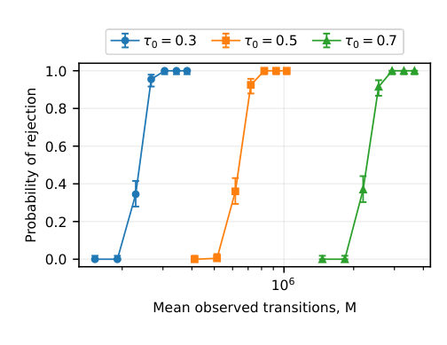
<figcaption class="paper-figure-caption"><b>Fig 2.</b> FIG. 2. Power of the one-record current test for the driven ring at α = 0.01. Bars are exact 95% binomial intervals over independent whole records [20]; snapshots within a record are dependent. The prespecified study shows the shift to larger budgets as τ0 grows; it is not a fit of the asymptotic exponent.</figcaption>
</figure>

**Summary.** This theoretical paper establishes a fundamental, exponential lower bound on the number of measurements needed to detect non-equilibrium dynamics in a stochastic system. The cost scales exponentially with the minimum measurement time gap ($	au_0$) and is governed by the slowest damping rate ($\gamma_{	ext{irr}}$) of the system's irreversible modes. This result sets a rigorous benchmark for experimental detection limits in non-equilibrium statistical mechanics.

**Why it may be interesting.** This work provides a fundamental, quantitative limit on the experimental feasibility of detecting true non-equilibrium dynamics in physical systems, linking measurement limitations directly to the spectral properties ($\gamma_{	ext{irr}}$) of the underlying master equation.

Detailed structure

**Main problem.** Determining the minimum number of measurements required to statistically distinguish a true non-equilibrium stochastic process from any hidden equilibrium process, given a finite minimum measurement gap.

**Main result.** The required number of snapshots scales exponentially with the minimum measurement gap ($	au_0$), specifically $N^* \propto e^{2\gamma_{	ext{irr}}	au_0}$, where $\gamma_{	ext{irr}}$ is the slowest damping rate of the rotating modes.

**Method.** The analysis uses information-theoretic bounds, relating detectability to relative entropy and causal stopping times, establishing both lower and upper bounds on the required sample size.

**Model / system.** The study analyzes stochastic systems governed by finite Markov generators ($Q$), comparing the true irreversible dynamics against the null class of reversible Markov chains.

**Key observables.** Minimum expected number of snapshots ($N^*$), entropy production rate, and the measurable current ($V$).

**Important parameters / regimes.** Minimum measurement gap ($	au_0$), the slowest damping rate ($\gamma_{	ext{irr}}$), and the statistical significance level ($\alpha$).

**Assumptions / limitations.** The process starts in stationarity, and the analysis holds for every causal timing strategy and prespecified measurement schedule.

**Figures summary.** Figures illustrate the exponential scaling of the observation cost for a driven ring, showing the analytic lower bound matching the achievable upper bound, and demonstrating the robustness of the test against hidden equilibrium controls.

**Paper structure.** The paper establishes the core problem by comparing non-equilibrium vs. equilibrium dynamics. It derives the exponential lower bound using information theory and then shows that this bound is achievable by a fixed, non-adaptive measurement protocol.

Abstract

A detector that cannot take two snapshots closer than a time $τ_0$ still identifies a fully observed finite Markov generator exactly, provided its gaps are randomized by two clocks. Identification is not detection. For a normal nonequilibrium network, the number of snapshots needed to reject every hidden equilibrium explanation grows as $e^{2γ_{\mathrm{irr}}τ_0}$, where $γ_{\mathrm{irr}}$ is the slowest damping of rotating modes. No adaptive schedule beats this rate, and a test on one dependent trajectory attains it.

[↑ back to top](#top)

### [Witness-based quantification of non-Markovianity without complete Choi state reconstruction](http://arxiv.org/abs/2609.36080v1)

**Authors:** Pritam Roy, Saheli Mukherjee, Bivas Mallick  
**Type:** theory · **Category:** quantum information and computing · **PDF:** <https://arxiv.org/pdf/2609.36080v1>  
**Analysis basis:** full PDF text, analyzed in chunks
**Topic relevance:** `correlated / nonlocal dissipation` **3/5** · `quantum measurements` **3/5** · `driven-dissipative phase transition` **2/5** · `methods for driven-dissipative` **2/5** · `Keldysh / 2PI / non-Gaussian methods` **1/5** · `non-equilibrium universality` **1/5**

↔ Scroll figures horizontally

<figure class="paper-figure-card">
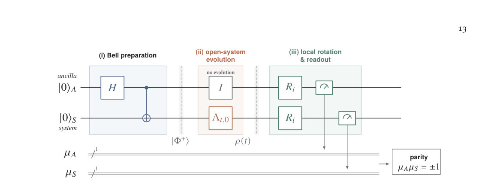
<figcaption class="paper-figure-caption"><b>Fig 1.</b> Figure 1: Single-run experimental circuit for measuring a two-qubit correlation. (i) Bell preparation: the ancilla A and system S are initialized in |0⟩A|0⟩S, and a Hadamard gate followed by a CNOT prepares |Φ+⟩AS = (|00⟩+ |11⟩)/ √</figcaption>
</figure>
<figure class="paper-figure-card">
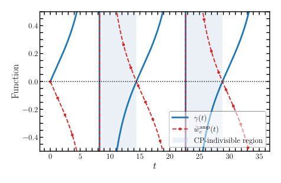
<figcaption class="paper-figure-caption"><b>Fig 2.</b> Figure 2: Operational reconstruction of the non-Markovianity witness for the amplitude-damping channel. The reconstructed</figcaption>
</figure>
<figure class="paper-figure-card">
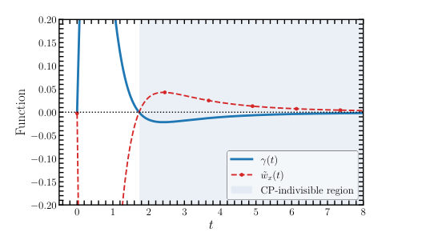
<figcaption class="paper-figure-caption"><b>Fig 3.</b> Figure 3: Operational reconstruction of the non-Markovianity witness for the pure-dephasing channel. The reconstructed witness ewx(t) and the exact decay rate γ(t) are plotted as functions of time for η = 1, Ωc = 1, and s = 3, corresponding to a super-Ohmic reservoir [56]. The shaded regions indicate the CP-indivisible regime, where γ(t) &lt; 0.</figcaption>
</figure>

**Summary.** This paper presents a novel witness-based method to quantify non-Markovianity in open quantum systems without requiring the complete reconstruction of the system's dynamical map. By focusing on positive-semidefinite witnesses, the authors establish a rigorous lower bound on established measures like the RHP measure. This approach offers an efficient and experimentally feasible diagnostic tool for quantum memory effects.

**Why it may be interesting.** This work provides a crucial operational tool for characterizing quantum memory effects in open systems, making the theoretical concept of non-Markovianity experimentally accessible by reducing measurement requirements significantly.

Detailed structure

**Main problem.** Quantifying non-Markovianity, which is essential for exploiting environmental memory as a resource in quantum technologies.

**Main result.** The authors developed a witness-based framework that provides a certifiable lower bound on non-Markovianity measures (like the RHP measure) using only experimentally accessible correlation measurements.

**Method.** The framework uses positive-semidefinite witnesses (which act as POVM elements) to establish a quantitative hierarchy connecting witness expectations, the RHP measure, and the geometric distance measure, bypassing the need for full Choi state reconstruction.

**Model / system.** The analysis focuses on open quantum systems undergoing evolution described by CPTP dynamical maps, applied specifically to amplitude-damping and general Pauli dynamics.

**Key observables.** Witness expectation values, RHP measure, geometric distance measure, and specific correlation functions like Bell-parity projectors.

**Important parameters / regimes.** The time evolution parameter $t$, the environmental correlation time, and the structure of the dynamical map $\Lambda(t, t_0)$.

**Assumptions / limitations.** The framework is derived for dynamics generated by Lindblad-type master equations, and the focus is on positive-semidefinite witnesses for experimental feasibility.

**Paper structure.** The paper establishes the theoretical necessity of quantifying non-Markovianity, critiques existing methods for requiring full map knowledge, introduces the witness-based framework, proves the lower bound relationships, and demonstrates the method's application to specific physical models.

Abstract

Quantifying non-Markovianity is a fundamental problem in the theory of open quantum systems, as it is essential for exploiting environmental memory as a resource in quantum technologies. Existing resource-theoretic and operational quantifiers, however, generally require complete knowledge of the intermediate dynamical map and are therefore experimentally demanding. Here, we develop a witness-based framework for the quantification of non-Markovianity that bypasses complete reconstruction of the Choi state associated with the intermediate dynamical map. We first show that every non-Markovianity witness provides a certifiable lower bound on the geometric resource measure of non-Markovianity and identify the necessary and sufficient conditions under which this bound is tight. Motivated by the fact that non-positive-semidefinite witnesses are generally difficult to measure in real experimental scenario, we then focus on positive-semidefinite witnesses, which admit a natural implementation as positive operator valued measure (POVM) elements. We prove that every positive witness yields a certified lower bound on the Rivas--Huelga--Plenio (RHP) measure, thereby establishing a complete hierarchy connecting witness-based quantification, the RHP measure, and the geometric distance measure. Applying our framework to amplitude-damping and general Pauli dynamics, we find that the optimal positive witnesses reduce to simple Bell-parity projectors. Furthermore, we show that the resulting witness values can be obtained directly from a small number of experimentally accessible correlation measurements, thereby eliminating the need for complete Choi-state reconstruction and providing an efficient and experimentally feasible approach for the quantification of non-Markovianity in open quantum systems.

[↑ back to top](#top)

### [A partially linearized mapping approach to surface hopping (MASH-PLDM) for nonadiabatic dynamics and nonlinear spectroscopy](http://arxiv.org/abs/2609.36197v1)

**Authors:** Jan Obermeier, Kasra Asnaashari, Jeremy O. Richardson  
**Type:** theory · **Category:** other · **PDF:** <https://arxiv.org/pdf/2609.36197v1>  
**Analysis basis:** full PDF text, analyzed in chunks
**Topic relevance:** `Keldysh / 2PI / non-Gaussian methods` **3/5** · `methods for driven-dissipative` **3/5** · `quantum measurements` **3/5** · `correlated / nonlocal dissipation` **1/5** · `driven-dissipative phase transition` **1/5**

↔ Scroll figures horizontally

<figure class="paper-figure-card">
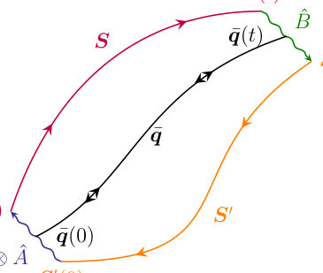
<figcaption class="paper-figure-caption"><b>Fig 1.</b> FIG. 1. The PLDM approximation to the correlation function between ˆA at time 0 and ˆB at time t linearizes the nuclear variables of the forward and backward paths into the average path, ¯q. However, the spin vectors S and S′, which represent the electronic state, are not linearized and follow different forward and backward paths.</figcaption>
</figure>
<figure class="paper-figure-card">
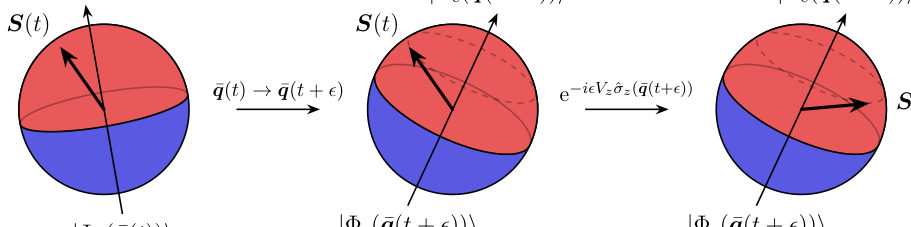
<figcaption class="paper-figure-caption"><b>Fig 2.</b> FIG. 2. Time evolution of the spin vector S induced by Eq. (8). It can be decomposed into two contributions: a rotation around the y-axis (out-of-plane) from the changing character of the adiabatic states; and a precession around the new z-axis on the dashed circle of latitude resulting from the energy difference between the adiabatic states, Vz.</figcaption>
</figure>
<figure class="paper-figure-card">
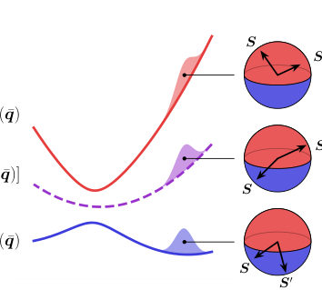
<figcaption class="paper-figure-caption"><b>Fig 3.</b> FIG. 3. In MASH-PLDM, the nuclear force is determined based on the hemispheres in which the spins S and S′ are located. The force is that of the excited state if both spins are in the upper hemisphere, of the lower state if both are in the lower hemisphere, or averaged if they are in different hemispheres.</figcaption>
</figure>
<figure class="paper-figure-card">
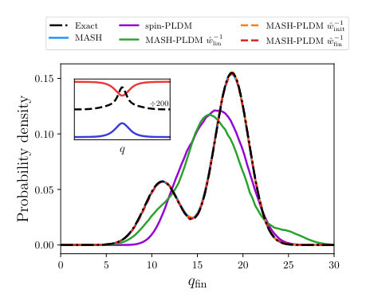
<figcaption class="paper-figure-caption"><b>Fig 4.</b> FIG. 4. Final position distribution after evolving for 150 fs in Tully’s model I. Both MASH and the MASH-PLDM variants agree well with the exact quantum benchmark except when using the linear inverse kernel, ˆw−1 lin . The inset depicts the adiabatic potentials and nonadiabatic coupling vector scaled down by a factor of 200.</figcaption>
</figure>
<figure class="paper-figure-card">
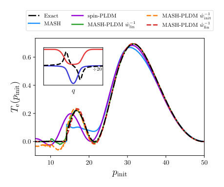
<figcaption class="paper-figure-caption"><b>Fig 5.</b> FIG. 5. The scattering probability of transmission to the upper adiabat as a function of the initial momentum, pinit, for Tully’s model II. The inset depicts the adiabatic potentials and nonadiabatic coupling vector.</figcaption>
</figure>

**Summary.** The paper introduces MASH-PLDM, an advanced surface hopping technique that extends the standard MASH formalism by using a partially linearized density matrix. This allows the method to accurately treat electronic coherences, leading to improved results for nonadiabatic dynamics. Crucially, it provides a pathway to simulate complex multi-time correlation functions required for nonlinear spectroscopy.

**Why it may be interesting.** This work directly addresses the simulation of open quantum systems and nonadiabatic processes crucial in molecular physics and quantum optics, providing an advanced, theoretically grounded trajectory-based method.

Detailed structure

**Main problem.** Developing a robust method to simulate nonadiabatic dynamics and calculate multi-time correlation functions in molecular systems.

**Main result.** The proposed MASH-PLDM method improves upon original MASH dynamics, particularly when electronic coherences are significant, and naturally extends to nonlinear spectroscopy measurements.

**Method.** It employs a partially linearized mapping approach (PLDM) applied to the surface hopping formalism, utilizing two distinct spin vectors to track both population on single surfaces and coherence on an average surface.

**Model / system.** The study focuses on nonadiabatic molecular dynamics, modeled using a two-level electronic system coupled to nuclear degrees of freedom, often analyzed via path integrals and spin vectors on the Bloch sphere.

**Key observables.** Time-dependent excited-state population, multi-time correlation functions (e.g., for time-resolved pump-probe spectroscopy).

**Important parameters / regimes.** The dynamics are governed by the electronic Hamiltonian and the coupling to nuclear motion, analyzed in the quasiclassical limit.

**Assumptions / limitations.** The core approximation is the Partially Linearized Density Matrix (PLDM), which linearizes nuclear variables into an average path while treating electronic spin vectors separately.

**Figures summary.** Figures illustrate the PLDM approximation to correlation functions and the time evolution of the spin vector, showing precession and rotation dynamics.

**Paper structure.** The paper develops the MASH-PLDM formalism by applying the PLDM approximation to the path integral representation of the correlation function, deriving new equations of motion for the nuclei, and validating the method against standard MASH approaches.

Abstract

We derive a partially linearized version of the mapping approach to surface hopping (MASH) that provides a new method for simulating nonadiabatic dynamics in molecular systems. As in the original MASH formalism, trajectories travel on adiabatic surfaces with hops determined by the dynamics of a spin vector on the Bloch sphere. However, because the new approach is based on the partially linearized density matrix (PLDM), it has two spin vectors, which may be in the same or different hemispheres of the Bloch sphere. The former scenario describes an electronic population moving on a single adiabatic surface, whereas the latter describes a coherence moving on the average surface. We show that this new method, called MASH-PLDM, leads to improved results over the original MASH dynamics for a variety of scattering problems and spin-boson models, especially in cases where coherences play an important role. A further benefit of the new methodology is that it can treat multi-time correlation functions such as those required for nonlinear spectroscopy. We demonstrate this capability with a proof-of-principle simulation of time-resolved pump-probe spectroscopy.

[↑ back to top](#top)

### [Density Matrices of Pulsed Quantum Light](http://arxiv.org/abs/2609.38009v1)

**Authors:** Joscelyn van der Veen, Daniel F. V. James  
**Type:** theory · **Category:** other · **PDF:** <https://arxiv.org/pdf/2609.38009v1>  
**Analysis basis:** full PDF text, analyzed in chunks
**Topic relevance:** `Full counting statistics` **3/5** · `quantum measurements` **3/5** · `methods for driven-dissipative` **2/5** · `Keldysh / 2PI / non-Gaussian methods` **1/5** · `interference shaping light` **1/5** · `quantum optics experiment` **1/5**

↔ Scroll figures horizontally

<figure class="paper-figure-card">
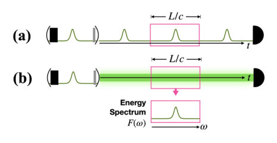
<figcaption class="paper-figure-caption"><b>Fig 1.</b> FIG. 1. We quantize the electric field in some cavity of length L. A coherent density matrix (a) describes the field as a pulse train where each pulse is separated by a time L/c. A stationary density matrix (b) instead has the field existing at all times but with a spectrum that is the Fourier spectrum of a single pulse in any time period L/c.</figcaption>
</figure>

**Summary.** This paper develops a theoretical framework for describing pulsed quantum light using density matrices. It demonstrates that when measured over finite time intervals, different theoretical models of coherence yield the same measurable photocount rates. This resolves ambiguities in the theory by linking the measurable spectrum to the physical properties of the light source.

**Why it may be interesting.** This work is highly relevant to quantum optics and open quantum systems as it provides a rigorous framework for interpreting measurements on pulsed quantum light, resolving ambiguities in defining coherence in time-varying fields.

Detailed structure

**Main problem.** The theoretical description of pulsed quantum light, particularly concerning the role of coherence when moving beyond single-mode fields, needs refinement.

**Main result.** Accounting for finite detection times makes different theoretical density matrices (based on coherence assumptions) yield indistinguishable measurement results for the photocount rate.

**Method.** The authors use density matrices and calculate photocount rates by time-averaging first-order correlation functions, comparing results for Poissonian and squeezed vacuum states.

**Model / system.** The system is pulsed quantum light, often generated by mode-locked lasers, modeled using density matrices ($\hat{
ho}$) that account for both stationary and nonstationary field characteristics.

**Key observables.** Photocount rate ($\omega^{(1)}$) and second-order photocount rate ($\omega^{(2)}$).

**Important parameters / regimes.** Finite detection time ($T$), cavity length ($L$), Poisson rate parameter ($\lambda_k$), and squeezing parameter ($\xi$ or $r_k$).

**Assumptions / limitations.** The crucial assumption is the finite measurement time, which regularizes the measurement outcomes and leads to the equivalence of different theoretical models.

**Figures summary.** Figure 1 illustrates the difference between a coherent density matrix (pulse train) and a stationary density matrix (field with a pulse spectrum).

**Paper structure.** The paper progresses by introducing the density matrix formalism for pulsed light, deriving the first-order photocount rate, establishing the equivalence of models under finite measurement time, and finally calculating and comparing the second-order photocount rate for Poissonian versus squeezed vacuum states.

Abstract

Pulsed light is represented by density matrices whose correlation functions have different properties of stationarity and coherence. We show that these density matrices yield equivalent measurement results after accounting for finite detection times. This in turn reveals a physical meaning to the length of a quantization cavity and explains the origin of the physical spectrum for pulsed light. By generalizing the density matrices for pulsed Gaussian states of light, we can describe pulsed light of varying statistics in the same basis and relate the photocount rate to the pulse spectrum.

[↑ back to top](#top)

### [Ergodicity in a hole-dopped Anderson spin insulator](http://arxiv.org/abs/2609.36936v1)

**Authors:** M. S. Bahovadinov, A. A. Markov, G. V. Shlyapnikov  
**Type:** theory · **Category:** disordered systems and neural networks · **PDF:** <https://arxiv.org/pdf/2609.36936v1>  
**Analysis basis:** full PDF text, analyzed in chunks
**Topic relevance:** `analog quantum simulation` **3/5** · `scars & prethermalization` **3/5** · `Keldysh / 2PI / non-Gaussian methods` **2/5** · `methods for driven-dissipative` **2/5** · `quantum measurements` **1/5**

↔ Scroll figures horizontally

<figure class="paper-figure-card">
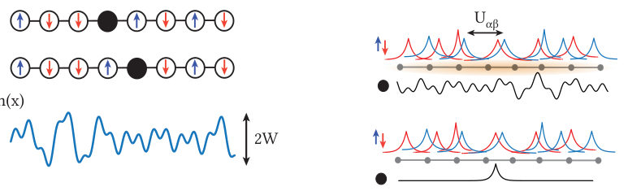
<figcaption class="paper-figure-caption"><b>Fig 1.</b> FIG. 1. Schematic illustration of the system and the main findings. (a) Spin disordered t −JXX model doped with a single hole. (b) At weak disorder W &lt; Wc the spin chain is thermalized by the single hole. At a stronger disorder, W &gt; Wc, the hole localizes and the system as a whole becomes an Anderson insulator.</figcaption>
</figure>
<figure class="paper-figure-card">
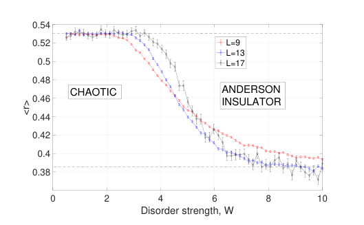
<figcaption class="paper-figure-caption"><b>Fig 2.</b> FIG. 2. Disorder dependence of the disorder-averaged adjacent-gap ratio ⟨r⟩for the single-hole doped disordered XX chain at t/J = 1, shown for system sizes L = {9, 13, 17}. At weak disorder the level statistics is close to the Wigner– Dyson value ⟨r⟩WD ≈0.53, indicating strong level repulsion and delocalized many-body eigenstates. With increasing disorder, ⟨r⟩decreases continuously towards the Poisson value ⟨r⟩P ≈0.386, signaling the suppression of level repulsion and onset of localization. The crossover sharpens with increasing system size, consistent with a disorder-driven localization transition of the coupled hole-spin system.</figcaption>
</figure>
<figure class="paper-figure-card">
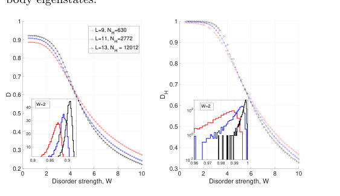
<figcaption class="paper-figure-caption"><b>Fig 3.</b> FIG. 3. Disorder dependence of the Shannon fractal dimensions obtained from the full many-body eigenstates, D (left panel), and from the hole wavefunctions, DH, (right panel) for system sizes L = 9, 11, 13. The many-body fractal dimension D is extracted from the participation entropy of the full eigenstate in the computational basis, while DH is obtained from the reduced hole probability distribution in real space. Insets: histograms of D (left) and DH (right) at weak disorder W = 2. Errorbars are smaller than the symbol sizes.</figcaption>
</figure>
<figure class="paper-figure-card">
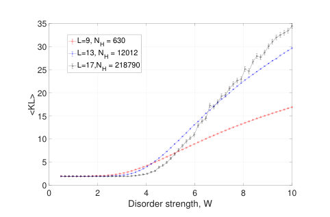
<figcaption class="paper-figure-caption"><b>Fig 4.</b> FIG. 4. Disorder dependence of the disorder-averaged Kullback–Leibler divergence ⟨KL⟩ between neighboring many-body eigenstates for system sizes L = 9, 13, 17.</figcaption>
</figure>
<figure class="paper-figure-card">
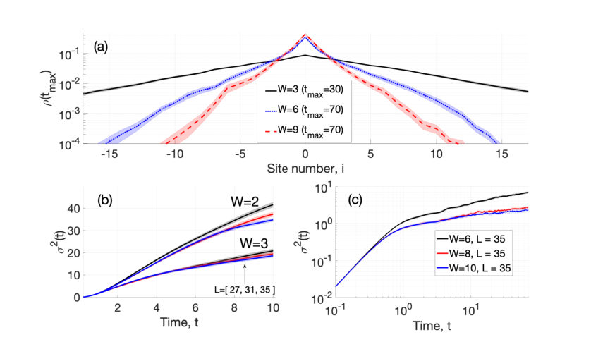
<figcaption class="paper-figure-caption"><b>Fig 5.</b> FIG. 5. Real-time dynamics of the doped hole. (a) Hole probability distribution ρ(j, tmax) at the largest accessible time for disorder strengths W = 3, 6, and 9. At weak disorder the hole distribution is broad, whereas increasing W produces a progressively sharper, exponentially localized profile around the initial hole position. Shaded regions indicate statistical error. (b) Mean-square displacement σ2(t) for weak disorder W = 2 and W = 3 and different system sizes L = 27, 31, 35. (c) Mean- square displacement at stronger disorder W = 6, 8, 10 for L = 35, shown in logarithmic scales. The progressive slowing down and tendency towards saturation demonstrate the emergence of a finite...</figcaption>
</figure>

**Summary.** This work examines how doping a spin Anderson insulator with a single mobile hole affects its insulating nature in the presence of disorder. The authors find that weak disorder allows the hole to delocalize the spin system, but strong disorder pins the hole, thereby restoring the original Anderson insulating state. The transition is robustly confirmed using spectral, dynamical, and localization diagnostics.

**Why it may be interesting.** The interplay between charge dynamics (hole motion) and spin localization in a disordered environment provides a rich platform for studying how mobile excitations can fundamentally alter the nature of quantum phases, relevant to disordered quantum materials.

Detailed structure

**Main problem.** The paper investigates the stability of an Anderson insulator in the spin sector when coupled to a mobile charge degree of freedom (a single hole) via charge doping.

**Main result.** The hole acts as a bath that delocalizes the spin background in the weak disorder limit, but this delocalization is suppressed, restoring the Anderson insulator state, when the hole itself localizes in the strong disorder limit.

**Method.** The study employs theoretical analysis using the t-JXX model, analyzing real-time dynamics, spectral statistics (adjacent-gap ratio), and eigenstate localization diagnostics (fractal dimensions).

**Model / system.** The system is a one-dimensional lattice of two-component fermions described by a t-JXX model, incorporating hole hopping ($H_t$), antiferromagnetic exchange ($H_J$), and a random magnetic field ($H_h$).

**Key observables.** Localization length ($\xi$), spectral statistics ($\langle r 
angle$), participation entropies ($S_q$), and mean-square displacement ($\sigma^2(t)$).

**Important parameters / regimes.** Disorder strength ($W$), hole hopping amplitude ($t$), and antiferromagnetic coupling ($J$).

**Assumptions / limitations.** The analysis is restricted to the single-hole sector, and the model is studied at the isotropic point $J/t=1$.

**Figures summary.** Figures show the crossover of spectral statistics ($\langle r 
angle$) from Wigner-Dyson (weak disorder) to Poissonian (strong disorder), and the transition of $\sigma^2(t)$ from diffusive ($\propto t$) to saturated (finite localization length).

**Paper structure.** The paper develops the model Hamiltonian, analyzes the weak disorder regime where hole motion induces spin delocalization, and contrasts this with the strong disorder regime where hole localization restores the insulating state, using multiple diagnostic tools to confirm the transition.

Abstract

An interacting many-body system being localized in the presence of disorder can fail to serve as its own bath. In an electronic system, the charge and spin degrees of freedom can act as thermal baths for each other. In this paper, we study the stability of an Anderson insulator in the spin sector with respect to charge doping. We consider one-dimensional two-component fermions in a lattice with large onsite repulsion ($t-J_{XX}$ model) and with a single hole in a random magnetic field. In the absence of the hole the spin sector is localized in arbitrarily weak random magnetic fields. We argue that a single hole thermalizes the spin chain in the weak disorder limit. In this regime our numerical results indicate ergodicity of the system as a whole and delocalization of the hole. At larger magnetic fields the hole eventually localizes with a finite localization length, and the Anderson spin insulator is restored.

[↑ back to top](#top)

### [Interlayer Fermi Polarons in Bilayer MoTe$_2$](http://arxiv.org/abs/2609.38045v1)

**Authors:** Ruihao Ni, Eugen Dizer, Maximilian Wolf, Son T. Le, Sharadh Jois, Jeffrey J. Schwartz, Liuxin Gu, Rundong Ma, Suji Park, Beini Gao, Lifu Zhang, Houk Jang, Takashi Taniguchi, Kenji Watanabe, Aubrey T. Hanbicki, Adam L. Friedman, Richard Schmidt, You Zhou  
**Type:** both · **Category:** strongly correlated electrons · **PDF:** <https://arxiv.org/pdf/2609.38045v1>  
**Analysis basis:** full PDF text, analyzed in chunks
**Topic relevance:** `Keldysh / 2PI / non-Gaussian methods` **3/5** · `analog quantum simulation` **2/5** · `methods for driven-dissipative` **2/5** · `driven-dissipative phase transition` **1/5** · `interference shaping light` **1/5** · `quantum measurements` **1/5** · `quantum optics experiment` **1/5**

↔ Scroll figures horizontally

<figure class="paper-figure-card">
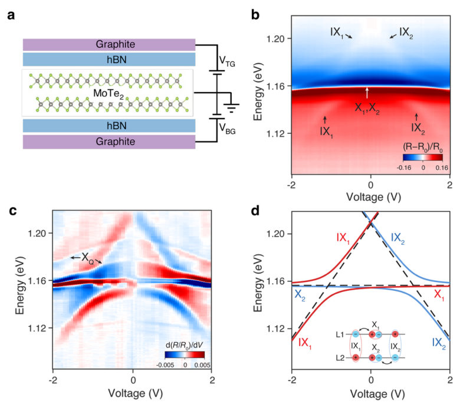
<figcaption class="paper-figure-caption"><b>Fig 1.</b> FIG. 1. Intralayer and interlayer excitons in a MoTe2 bilayer. a, Schematic of a MoTe2 bilayer heterostructure with dual, top and bottom-gate control. The bilayer MoTe2 is encapsulated by two hBN multilayers, with thicknesses of 8 nm (top) and 4.5 nm (bottom). b, c, Electric-field- dependent reflectance contrast (𝑅−𝑅!) /𝑅!, where 𝑅! is the baseline reflectance measured on the same spot at a highly hole-doped gate voltage (b) Reflectance contrast as a function of top gate voltage VTG, and its voltage derivative (c) when the materials are nearly intrinsic: VBG = − 0.556 VTG at T = 6.5 K. X1 and X2 denote intralayer K-valley excitons, IX1 and IX2 denote interlayer excitons with finite...</figcaption>
</figure>
<figure class="paper-figure-card">
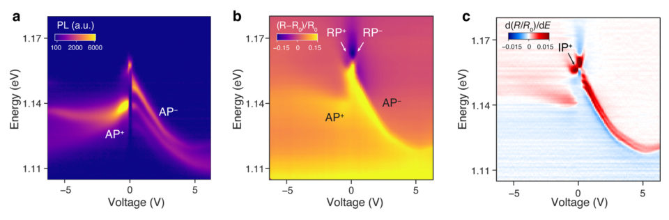
<figcaption class="paper-figure-caption"><b>Fig 2.</b> FIG. 2. Doping-dependent exciton spectroscopy of a MoTe2 bilayer under zero electric field. a, Doping-dependent photoluminescence (PL) spectra under a 635 nm laser excitation as a function of top gate voltage (VTG), with the gate voltage determined as VBG = 0.556VTG. The PL intensity is shown using a square-root color scale to enhance the dynamic range. b, Doping-dependent reflectance contrast (𝑅−𝑅!) /𝑅! and c, its energy derivative. Here 𝑅! is the baseline reflectance measured from a nearby bare gold electrode (see Appendix B). AP± and RP± denote attractive and repulsive polarons, respectively, while IP+ denotes the interlayer polaron observed on the hole- doped side. The + (−) superscript...</figcaption>
</figure>
<figure class="paper-figure-card">
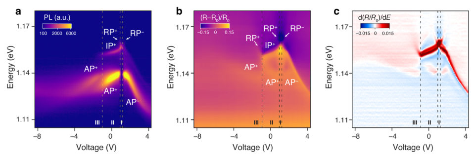
<figcaption class="paper-figure-caption"><b>Fig 3.</b> FIG. 3. Doping-dependent exciton spectroscopy of a MoTe2 bilayer under a finite electric field. a, Doping-dependent PL spectra under a 635 nm laser excitation as a function of top gate voltage (VTG), with the gate voltage determined as VBG = 0.556VTG − 1.112V. The PL intensity is shown using a square-root color scale to enhance the dynamic range. b, Doping-dependent reflectance contrast (𝑅−𝑅!) /𝑅! and c, its energy derivative. Here 𝑅! is the baseline reflectance measured on the gold electrode (see Appendix B). AP± and RP± denote attractive and repulsive polarons, respectively, while IP+ denotes the interlayer polaron observed on the hole-doped side. The + (−) superscript indicates hole...</figcaption>
</figure>
<figure class="paper-figure-card">
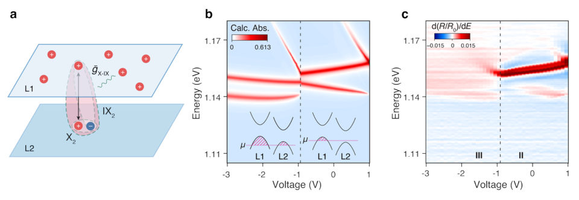
<figcaption class="paper-figure-caption"><b>Fig 4.</b> FIG. 4. Theory of interlayer polarons in a MoTe2 bilayer. a, Illustration of a hybridized intralayer exciton between X2 and IX2 and its coupling to the hole Fermi sea in the opposite MoTe2 layer. b, T-matrix-based theoretical calculation of the absorption spectrum. The insets show the band diagram and hole occupation of layer 1 (L1) and layer 2 (L2) under a finite electric-field while changing the chemical potential. In region II, only one layer is hole-doped, whereas in region III, both layers are doped. c, Experimental energy-derivative reflectance data under the same gating conditions show excellent agreement between theory and experiment.</figcaption>
</figure>

**Summary.** This work reports on the study of Fermi polarons in bilayer MoTe2, a TMD that provides a clean platform for such research. By tuning the electric field and doping, the researchers observe multiple polaron branches whose formation is governed by the layer pseudospin. This establishes a theoretical and experimental framework for understanding complex many-body states in vdW heterostructures.

**Why it may be interesting.** The explicit modeling of pseudospin structure in both the impurity and the bath to reshape polaron formation is highly relevant to understanding correlated phases in low-dimensional quantum materials, bridging concepts from quantum optics and condensed matter theory.

Detailed structure

**Main problem.** The paper investigates the formation and properties of Fermi polarons in bilayer Transition Metal Dichalcogenides (TMDs), focusing on how the layer pseudospin influences these many-body states.

**Main result.** They demonstrate that bilayer MoTe2 retains a direct optical bandgap, allowing the observation of multiple, tunable polaron branches whose structure is dictated by the interplay between carrier doping and an out-of-plane electric field.

**Method.** The study combines experimental exciton spectroscopy (PL and reflectance) with a quantitative field-theoretic model based on the T-matrix approach.

**Model / system.** The system is bilayer MoTe2, a TMD, studied in a dual-gated device. The physics involves excitons interacting with a free carrier Fermi sea, where both components carry a layer pseudospin.

**Key observables.** Multiple polaron branches ($	ext{AP}^{\pm}$, $	ext{RP}^{\pm}$, $	ext{IP}^+$), redshift/blueshift of spectral features, and the evolution of the excitonic spectrum with doping.

**Important parameters / regimes.** Out-of-plane electric field ($V_{	ext{BG}}$), electrostatic doping (carrier density), and the layer pseudospin structure.

**Assumptions / limitations.** The theoretical modeling relies on a T-matrix approach and assumes a simplified electrostatic model for calculating electric fields and doping densities.

**Figures summary.** Figures illustrate the device schematic, field-dependent reflectance maps showing interlayer excitons ($	ext{IX1}$, $	ext{IX2}$), and energy-derivative spectra showing the evolution of polaron branches across different doping regimes.

**Paper structure.** The paper first establishes MoTe2 as a clean platform due to its direct bandgap. It then systematically explores the doping- and electric-field-dependent evolution of the excitonic spectrum into distinct polaron branches, supported by both experimental measurements and theoretical fitting.

Abstract

Atomic bilayers of transition metal dichalcogenides (TMDs) host quantum phases governed by the layer degree of freedom, including bilayer Wigner crystals, fractional Chern insulators, and exciton condensates. These phases are probed primarily through exciton spectroscopy, yet it remains poorly understood how excitons and carriers interact to form Fermi polarons in bilayers, where both the impurity and the Fermi sea carry a layer pseudospin. Progress has been limited because most TMD bilayers have momentum-indirect optical bandgaps, in which non-radiative decay and inhomogeneous broadening obscure the intrinsic spectra. Here, we show that bilayer MoTe$_2$, unlike most TMD bilayers, retains a direct optical bandgap, providing a clean platform for studying bilayer Fermi-polaron physics. In a dual-gated device, an out-of-plane electric field continuously tunes the hybridization between intralayer and interlayer excitons, forming layer-coherent excitons. Upon electrostatic doping, the excitonic spectrum evolves into multiple polaron branches, controlled by both carrier doping and the out-of-plane electric field. Among these, we identify a polaron with no analog in monolayers, in which a layer-coherent exciton is dressed by carriers in the opposite layer, and is quantitatively captured by our field-theoretic model. Our results establish that pseudospin structure in both the impurity and the bath reshapes polaron formation, opening new avenues to many-body states such as Bose-Einstein condensates with interlayer coherence.

[↑ back to top](#top)

### [Local autonomous inference machines for quantum LDPC codes](http://arxiv.org/abs/2609.38139v1)

**Authors:** Siddhant Midha, Dmitry A. Abanin  
**Type:** theory · **Category:** disordered systems and neural networks · **PDF:** <https://arxiv.org/pdf/2609.38139v1>  
**Analysis basis:** full PDF text, analyzed in chunks
**Topic relevance:** `methods for driven-dissipative` **3/5** · `quantum measurements` **3/5** · `analog quantum simulation` **2/5** · `correlated / nonlocal dissipation` **1/5** · `driven-dissipative phase transition` **1/5** · `non-equilibrium universality` **1/5**

↔ Scroll figures horizontally

<figure class="paper-figure-card">
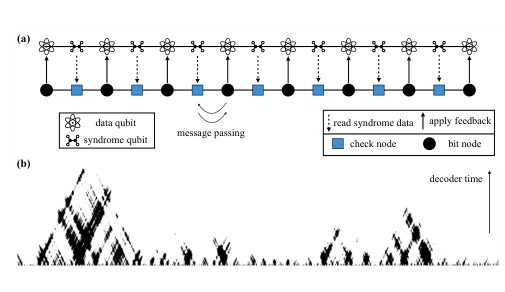
<figcaption class="paper-figure-caption"><b>Fig 1.</b> FIG. 1. Local autonomous inference. (a) We consider the quantum processor, the device consisting of data qubits undergoing Z−errors and syndrome qubits performing per- fect measurements laid out according to the X−parity check matrix HX. A series of classical processors performing mes- sage passing is laid out with the same geometry as the device. The device provides local information to the processors with syndrome data, and feedback is applied back onto the device. (b) Example trajectory of the residual error on the device as a function of decoder time (going upwards) on the repetition code with d = 2000 at physical error rate p = 0.45.</figcaption>
</figure>
<figure class="paper-figure-card">
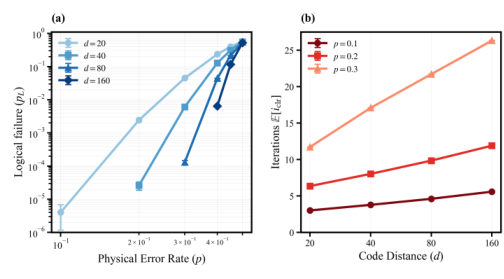
<figcaption class="paper-figure-caption"><b>Fig 2.</b> FIG. 2. Discrete local inference dynamics. (a) Logical error rates pL as a function of physical error rate p for the repetition code with distances d ∈{20, 40, 80, 160}. (b) Aver- age clearing iteration E[iclr] as a function of code distance d.</figcaption>
</figure>
<figure class="paper-figure-card">
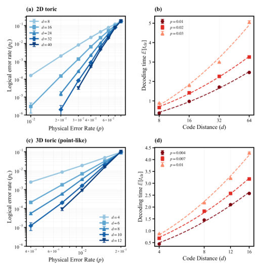
<figcaption class="paper-figure-caption"><b>Fig 3.</b> FIG. 3. Local inference on toric codes. Logical error rates and expected clearing time on the (a-b) two-dimensional toric code and (c-d) point-like sector of the three-dimensional toric code. The fits are of the form E[tclr] = ap(log d)2 + bp for p−dependent constants ap, bp.</figcaption>
</figure>
<figure class="paper-figure-card">
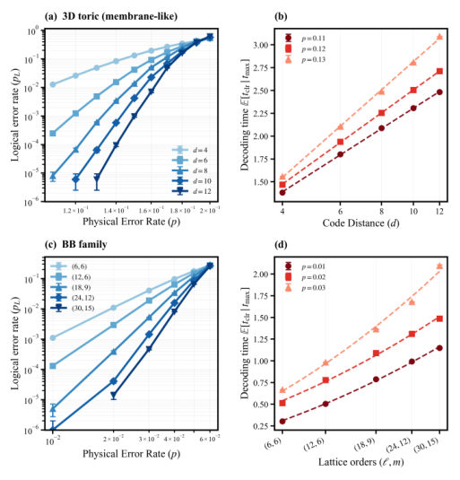
<figcaption class="paper-figure-caption"><b>Fig 4.</b> FIG. 4. Local inference on LDPC codes. Logical er- ror rates and expected clearing time (for convergence in t ≤tmax = 1000) for the (a-b) membrane-like sector of the three-dimensional toric code with a fit E[tclr] = ap(log d)+bp, and (c-d) a family of bivariate-bicycle codes including the Gross code with a fit E[tclr] = ap(log √</figcaption>
</figure>

**Summary.** This work proposes a novel, local, and distributed inference machine for decoding quantum LDPC codes. By replacing global decoding steps with local, belief-guided measurements and feedback, the framework successfully demonstrates error correction threshold behavior in regimes where traditional Belief Propagation fails. This advances the feasibility of building fault-tolerant quantum computation using local physical processes.

**Why it may be interesting.** The concept of mapping complex quantum error correction tasks onto local, autonomous, feedback-driven dynamics is highly relevant to building physical quantum hardware, bridging theoretical quantum information with physical implementation constraints.

Detailed structure

**Main problem.** The paper addresses the challenge of developing a local and distributed framework for decoding quantum Low-Density Parity-Check (LDPC) codes, aiming to realize error correction as a local, non-equilibrium process.

**Main result.** The proposed local inference machine exhibits threshold behavior for quantum LDPC codes in sectors (like point-like sectors of the toric code) where conventional Belief Propagation (BP) decoding fails.

**Method.** The authors construct an autonomous inference machine that uses local measurements and feedback based on local marginal information derived from BP, rather than requiring global consistency.

**Model / system.** The system involves quantum LDPC codes defined on qubits, analyzed using a Tanner graph structure. The dynamics are modeled through local message passing, discrete time steps, and continuous-time Poisson clock updates.

**Key observables.** Decoding Threshold ($p_{th}$), Logical Error Rate ($p_L$), and Syndrome Clearing Time ($t_{clr}$).

**Important parameters / regimes.** Physical error rate ($p$), Code distance ($d$), and the local belief information ($	ext{Pr}_{	ext{BP}}(e_v|s)$).

**Assumptions / limitations.** The analysis assumes the use of CSS quantum codes on qubits and relies on the local inference engine (BP) providing sufficient local marginal information even when globally inconsistent.

**Figures summary.** Figures illustrate the local autonomous inference setup, showing error trajectories for repetition codes, and comparing $p_L$ vs $p$ and $t_{clr}$ for 2D and 3D toric codes under various noise conditions.

**Paper structure.** The paper first introduces the local autonomous inference framework, showing its equivalence to standard BP for some codes. It then demonstrates its effectiveness on codes where standard BP fails, analyzing dynamics in discrete and continuous time for various code geometries.

Abstract

We introduce a local and distributed framework for decoding quantum LDPC codes. Built atop belief propagation (BP), the architecture combines strictly local processing of syndrome information, local feedback, autonomous operation, and highly parallelized decoding. We establish the framework at two complementary levels. First, we show that any code exhibiting a threshold under iterative BP decoding can be promoted to an autonomous local measurement-and-feedback dynamics while preserving that threshold. We then turn to codes for which naive BP does not itself exhibit threshold behavior. Our key observation is that BP can nevertheless provide sufficiently accurate \emph{local} marginal information: active syndrome defects use these local beliefs to \emph{move}, pair, and annihilate through asynchronous feedback. We demonstrate numerically that this construction exhibits threshold behavior in the point-like sectors of the two- and three-dimensional toric codes, where conventional BP decoding fails. Exploiting the graph-generality of BP, we then study the inference dynamics on the membrane-like sector of the three-dimensional toric code and in a family of bivariate-bicycle quantum LDPC codes.

[↑ back to top](#top)

### [Constructing and Probing Three-Boundary Booklet Geometries](http://arxiv.org/abs/2609.37099v1)

**Authors:** Yan Liu, Shaodong Zhou  
**Type:** theory · **Category:** other · **PDF:** <https://arxiv.org/pdf/2609.37099v1>  
**Analysis basis:** full PDF text, analyzed in chunks
**Topic relevance:** `Full counting statistics` **3/5** · `Keldysh / 2PI / non-Gaussian methods` **2/5** · `methods for driven-dissipative` **2/5** · `quantum measurements` **2/5** · `analog quantum simulation` **1/5**

↔ Scroll figures horizontally

<figure class="paper-figure-card">
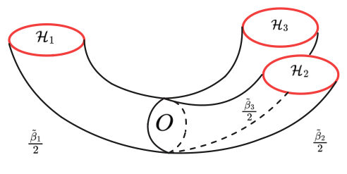
<figcaption class="paper-figure-caption"><b>Fig 1.</b> Figure 1: Schematic Euclidean path integral preparing a PETS3 state. The three Euclidean legs meet at a common heavy junction insertion. The transverse section of each leg represents the spatial sphere Sd−1, while its axial direction represents Euclidean evolution.</figcaption>
</figure>
<figure class="paper-figure-card">
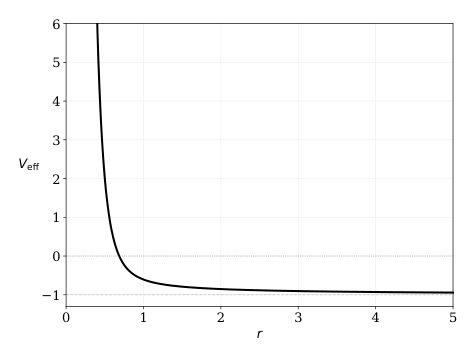
<figcaption class="paper-figure-caption"><b>Fig 2.</b> Figure 2: A mixed-orientation solution of the quartic junction equation (3.13) for three thermal- AdS pages (µi = 0) with d = 4, m = 1, G = 1, L1 = 1, L2 = L3 = 2. The physical branch has orientation (−, +, +), approaches Veff →−1 at large radius, and crosses Veff = 0 at the turning point r∗.</figcaption>
</figure>
<figure class="paper-figure-card">
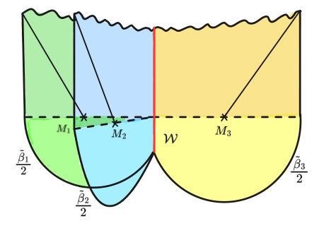
<figcaption class="paper-figure-caption"><b>Fig 3.</b> Figure 3: Schematic of the BH|BH|BH branch: all three pages are black holes connected through the booklet shell worldvolume.</figcaption>
</figure>
<figure class="paper-figure-card">
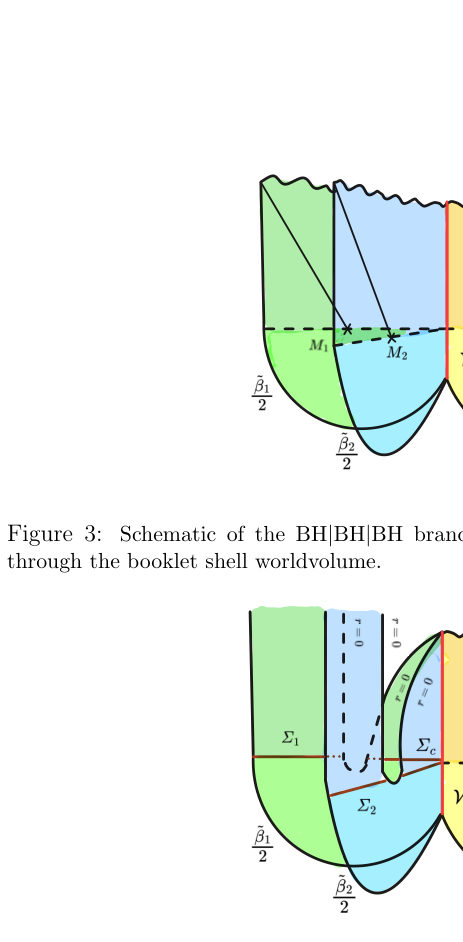
<figcaption class="paper-figure-caption"><b>Fig 4.</b> Figure 4: Schematic of the AdS|AdS|BH branch.</figcaption>
</figure>
<figure class="paper-figure-card">
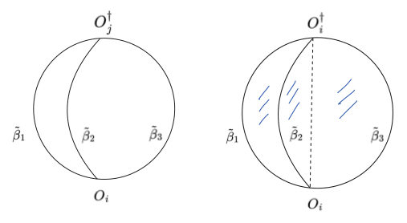
<figcaption class="paper-figure-caption"><b>Fig 5.</b> Figure 5: Euclidean path integrals for overlaps of single-shell PETS3 states, with the transverse Sd−1 suppressed. (a) Path integral for the overlap ⟨Ψmj|Ψmi⟩between two distinct PETS3 states. (b) Overlap ⟨Ψmi|Ψmi⟩with identical shell operators. The dashed line is the trajectory of the dust shell in the dual bulk.</figcaption>
</figure>

**Summary.** This work constructs a theoretical framework for three-boundary black hole microstates ($	ext{PETS}_3$) by generalizing previous two-boundary models. By applying a heavy-operator probe, the authors calculate a diagnostic ratio ($Z_D/Z_U$) that predicts a value of 3 for three boundaries, distinguishing it from the two-boundary case. This suggests a powerful tool for probing the topology of quantum gravitational states.

**Why it may be interesting.** While focused on gravity/QFT, the methodology of using entanglement structure (PETS) and counting states (Gram matrix rank) to probe geometric properties is highly relevant to understanding entanglement structure in complex quantum systems.

Detailed structure

**Main problem.** The paper generalizes the description of black hole microstates from two-boundary systems to three-boundary systems, motivated by geometries beyond simple single-manifold duals.

**Main result.** The three-boundary construction yields a detection-to-universal ratio ($Z_D/Z_U$) of $\simeq 3$, which is exactly twice the value found for the two-boundary case ($3/2$), suggesting a diagnostic tool to distinguish the number of boundaries.

**Method.** The authors use a heavy-operator probe applied to three-boundary Partially Entangled Thermal States ($	ext{PETS}_3$) and constrain the resulting bulk geometry using the Israel junction condition.

**Model / system.** The model involves three-boundary booklet geometries, where the state is defined by a trivalent junction tensor and is constrained by multiway Israel junction conditions. The system is analyzed using Euclidean path integrals and state counting techniques.

**Key observables.** Detection-to-universal ratio ($Z_D/Z_U$), connected overlaps, and the rank of the Gram matrix.

**Important parameters / regimes.** Three-boundary junction tensor, AdS radii ($L_i$), and the effective temperature ($eta_{	ext{eff}}$).

**Assumptions / limitations.** The analysis relies on an ETH-inspired statistical ansatz for junction amplitudes and approximations based on coarse-graining and saddle-point evaluations.

**Figures summary.** Figures illustrate the structure of 3-shell states and show how the detection-to-universal ratio is calculated using saddle-point contributions from universal and detection geometries.

**Paper structure.** The paper progresses from defining the $	ext{PETS}_3$ state via a junction tensor, deriving the constraints from the Israel junction condition, and finally calculating the state overlap and the diagnostic ratio $Z_D/Z_U$ using heavy-operator probes.

Abstract

Partially entangled thermal states (PETS) provide semiclassical families of black-hole microstates prepared through heavy shell insertions. We extend this shell-state framework and propose three-boundary partially entangled thermal states (PETS$_3$) by replacing the two-index insertion data with a trivalent junction tensor. The corresponding bulk three-boundary booklet geometry is constrained semiclassically by the Israel junction condition, allowing us to identify candidate symmetric and mixed-orientation branches. We verify the self-consistency of this construction by counting states in the symmetric all-black-hole sector. Using a heavy-operator probe, we further estimate the detection-to-universal ratio to be $Z_D/Z_U \simeq 3$, twice the two-boundary value of $3/2$. These results suggest that a fine-tuned probe localized on one boundary can test the proposed three-boundary shell state and potentially distinguish it from its two-boundary counterpart.

[↑ back to top](#top)

### [Delay-induced multistability in one-dimensional swarmalators with common intrinsic frequency](http://arxiv.org/abs/2609.36293v1)

**Authors:** Rommel Tchinda Djeudjo, Timoteo Carletti, Kevin P. O'Keeffe  
**Type:** theory · **Category:** statistical mechanics · **PDF:** <https://arxiv.org/pdf/2609.36293v1>  
**Analysis basis:** full PDF text, analyzed in chunks
**Topic relevance:** `driven-dissipative phase transition` **3/5** · `non-equilibrium universality` **3/5** · `analog quantum simulation` **2/5** · `Frenkel-Kontorova` **1/5** · `methods for driven-dissipative` **1/5**

↔ Scroll figures horizontally

<figure class="paper-figure-card">
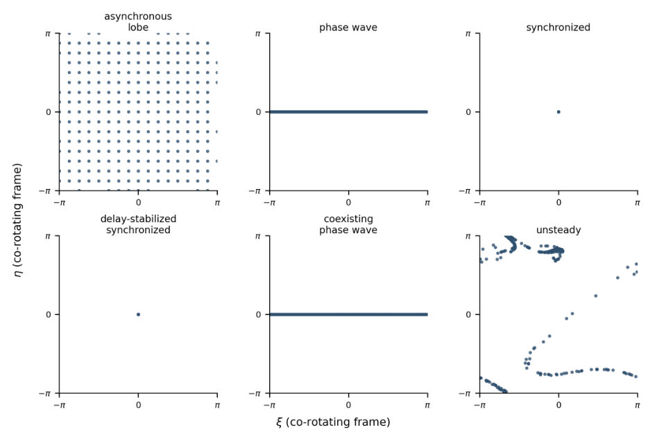
<figcaption class="paper-figure-caption"><b>Fig 1.</b> Figure 1. Representative states for the identical-frequency delayed model in the (ξ, η) plane. Each panel is shown in an appropriate co-moving frame: for a branch with frequencies (Ωξ, Ωη) we plot (ξi −Ωξt, ηi −Ωηt) modulo 2π. The first row shows the asynchronous lobe (K, τ) = (0.90, 1.60), the phase wave (0.50, 0.10), and the synchronized state (2.00, 8.00). The second row shows a delay-stabilized synchronized state with negative same-coordinate coupling (−1.60, 0.50), a phase wave in a phase-wave/synchronized coexistence region (1.05, 7.00), and an unsteady trajectory at a point with no stable canonical branch (0.50, 0.50). Here J = 1 and ω = π/2. All states except the delay-stabilized...</figcaption>
</figure>
<figure class="paper-figure-card">
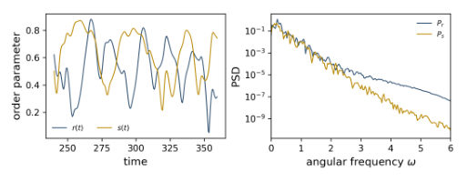
<figcaption class="paper-figure-caption"><b>Fig 2.</b> Figure 2. Representative leftover point with no stable canoni- cal branch, (K, τ) = (0.50, 0.50) (same parameters as Fig. 1). Left: order-parameter time series r(t), s(t). Right: Welch power spectra of r and s, showing sharp peaks at a domi- nant frequency and its harmonics (period ≈30) rather than broadband noise. The 0-1 test of Gottwald and Melbourne [51] gives Kr ≈0.02, Ks ≈0.03, indicating regular (peri- odic/quasiperiodic) macroscopic dynamics, not chaos.</figcaption>
</figure>
<figure class="paper-figure-card">
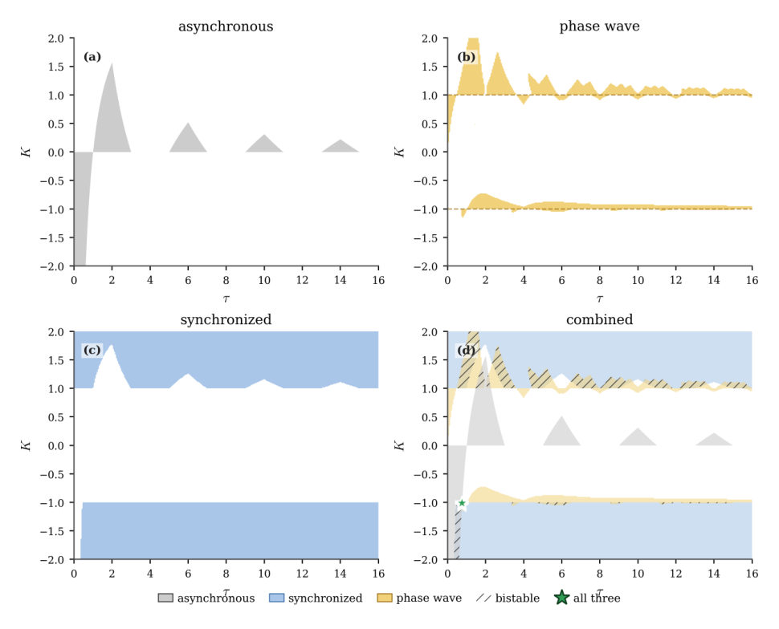
<figcaption class="paper-figure-caption"><b>Fig 3.</b> Figure 3. Stability regions for J = 1 and ω = π/2. (a) The asynchronous region (active-mode stability: damping of the first-harmonic order-parameter sector, neutral higher harmonics excluded) is the exact set of incoherence lobes of the delayed Kuramoto model [Eqs. (9), (10)]. (b) The phase-wave region (gold): a small region near 0 &lt; K &lt; J at low delay plus thin bands that hug the exact real boundary K = ±J (dashed, from λ = 0 in Eq. (27)); brown curves are representative analytic Hopf branches [Eqs. (31)–(33)]. The region is cross-validated by argument-principle root counting (App. C). (c) The synchronized stable region (blue): rotating branches satisfying Eq. (18), which requires cos(Ωτ)...</figcaption>
</figure>
<figure class="paper-figure-card">
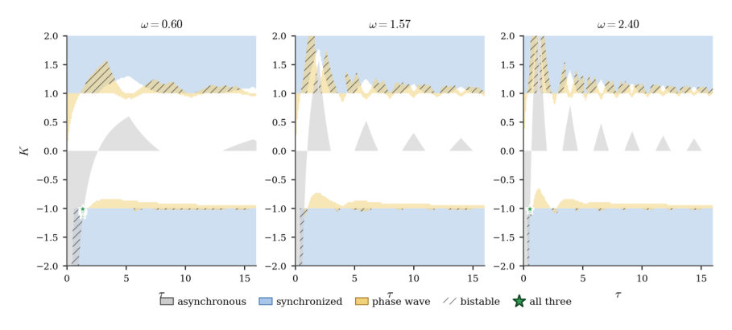
<figcaption class="paper-figure-caption"><b>Fig 4.</b> Figure 4. Dependence of the combined stability diagram on the common frequency. The same color convention as Fig. 3 is used. Increasing ω shifts the positive-K asynchronous lobes to smaller τ and narrows them in τ, while raising their K ceiling (K &lt; ω/(2m −1)) and fitting more lobes into the window; the delay-selected coexistence between canonical branches persists. These panels use the same stability tests as Fig. 3.</figcaption>
</figure>

**Summary.** This work analyzes a delayed 1D swarmalator model with a common intrinsic frequency, revealing that the system can host three distinct, simultaneously stable dynamical states. The key finding is the existence of a narrow parameter window where asynchronous, synchronized, and phase wave states coexist. This demonstrates how delay and non-zero intrinsic frequencies can induce complex, non-trivial multistability in non-equilibrium many-body systems.

**Why it may be interesting.** The emergence of complex, delay-induced multistability in a classical, non-equilibrium system provides a rich analogy for understanding pattern formation and multiple stable phases in open quantum systems or driven many-body dynamics.

Detailed structure

**Main problem.** The study investigates delay-induced multistability in a one-dimensional swarmalator model when all interacting units share a common non-zero intrinsic frequency.

**Main result.** The system exhibits a striking triple coexistence of three distinct stable states—asynchronous, synchronized, and phase wave—in a narrow parameter window, a phenomenon enabled by the non-zero common frequency and delay.

**Method.** The analysis combines stability theory (linearization, Fourier mode analysis) with numerical simulations, including direct perturbation-norm checks, to map out complex parameter regimes.

**Model / system.** The model is a delayed one-dimensional swarmalator on a ring, described by coupled equations of motion involving spatial and phase couplings ($K$ and $J$) and a time delay ($	au$).

**Key observables.** Order parameters ($r, s$), stability boundaries in the $(K, 	au)$ plane, and the persistence/decay rates of perturbations ($\Delta f$).

**Important parameters / regimes.** Common intrinsic frequency ($\omega$), coupling constants ($K, J$), and time delay ($	au$).

**Assumptions / limitations.** The analysis relies heavily on linear stability theory and perturbation methods, although the authors note that quasiperiodic or transient dynamics cannot be entirely excluded.

**Figures summary.** Figure 3 maps the stability regions showing the coexistence of the three canonical states; other figures illustrate power spectra and stability dependence on $\omega$.

**Paper structure.** The paper systematically analyzes the stability of three canonical states (asynchronous, synchronized, phase wave) under a common frequency $\omega$, culminating in the demonstration and characterization of the triple coexistence region.

Abstract

We study the delayed one-dimensional swarmalator model when all units share a common intrinsic frequency ω. Unlike the zero-frequency case, ω cannot be removed by a rotating-frame transformation because delayed interactions retain the phase accumulated over the lag. The result is a two-order-parameter analogue of the delayed Kuramoto model: the asynchronous state acquires incoherence lobes, the synchronized state becomes a rotating branch stable even when both the spatial and phase couplings are repulsive, and the phase wave develops narrow resonant stability bands. These delay-selected windows overlap to produce broad branch coexistence, including a narrow window near K=-J where all three canonical states-asynchronous, phase wave, and synchronized-are simultaneously stable. In regions where no canonical branch is stable, the order parameters oscillate persistently.

[↑ back to top](#top)

### [Exact Trotterization in the Degenerate Quantum Rabi Model](http://arxiv.org/abs/2609.36861v1)

**Authors:** I. Lizuain, A. Rodriguez-Prieto  
**Type:** theory · **Category:** other · **PDF:** <https://arxiv.org/pdf/2609.36861v1>  
**Analysis basis:** full PDF text, analyzed in chunks
**Topic relevance:** `Tavis-Cummings & cavity-many-emitter` **3/5** · `analog quantum simulation` **3/5** · `quantum measurements` **2/5** · `driven-dissipative phase transition` **1/5** · `methods for driven-dissipative` **1/5**

↔ Scroll figures horizontally

<figure class="paper-figure-card">
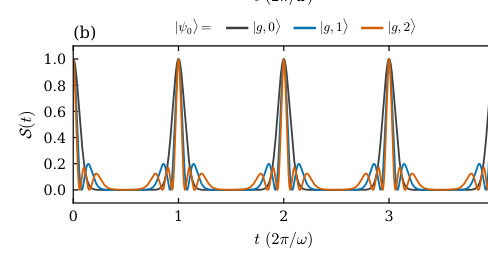
<figcaption class="paper-figure-caption"><b>Fig 1.</b> FIG. 1. Revival probability S(t) as a function of time in the degenerate limit ω0 = 0. (a) Initial state |g, 0⟩for different coupling strengths λ = g/ω, ranging from the SC to the DSC regime of the QRM. (b) Fixed coupling strength λ = 2 for in- creasing photon numbers n in the initial state |g, n⟩, showing secondary peaks separated by the zeros of the Laguerre poly- nomial Ln. In both panels, S(t) is independent of the initial qubit state: any superposition c+ |+, n⟩+ c−|−, n⟩yields the same dynamics, as shown in the text.</figcaption>
</figure>
<figure class="paper-figure-card">
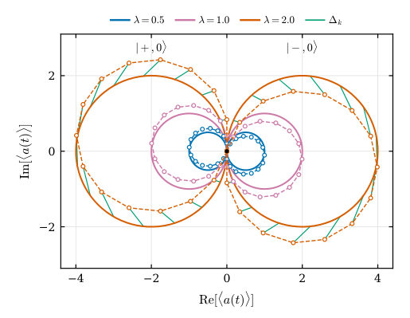
<figcaption class="paper-figure-caption"><b>Fig 2.</b> FIG. 2. Phase-space trajectories of ⟨a(t)⟩over one full period T = 2π/ω for the exact evolution (thick continuous curves) and the first-order Trotterized dynamics with 15 Trotter steps (dashed polygonal paths with open circles at the vertices γk), shown for increasing coupling strengths λ = 0.5, 1.0, 2.0 (blue, pink, orange). The calculations are performed for ini- tial states |+, 0⟩and |−, 0⟩, which have maximal qubit po- larization ⟨σx⟩= ±1 and therefore trace orbits of maximum radius λ. All trajectories start and end at the origin (black dot), since ⟨a⟩= 0 at t = 0 and both the exact and the Trotterized amplitudes return to zero after one full period. Trajectories displaced to the left...</figcaption>
</figure>
<figure class="paper-figure-card">
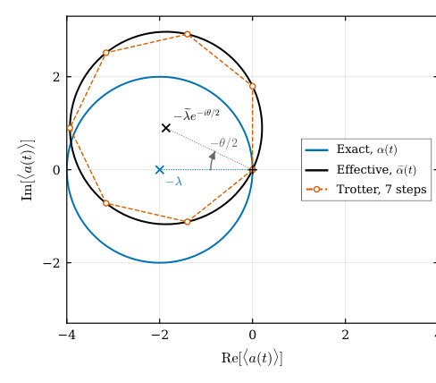
<figcaption class="paper-figure-caption"><b>Fig 3.</b> FIG. 3. Phase-space trajectories of ⟨a(t)⟩for the exact evolu- tion (blue circle), the first-order Trotterized simulation with 7 steps (red polygon), and the continuously evolved renormal- ized model with coupling eλ and phase −θ/2 (black circle). The polygon vertices fall exactly on the black circle, confirm- ing that the Trotterized dynamics reproduces the renormal- ized model exactly. Crosses mark the exact and effective circle centers, −λ and −eλe−iθ/2, the latter rotated by −θ/2 relative to the former, as indicated by the arc. Parameters: λ = 2, initial state |+, 0⟩.</figcaption>
</figure>
<figure class="paper-figure-card">
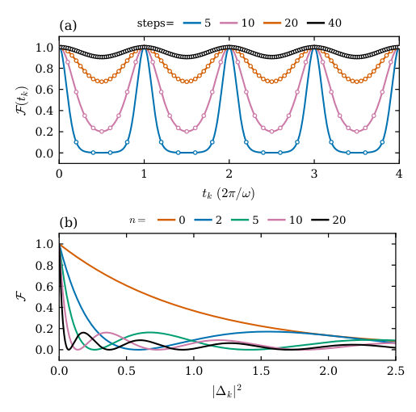
<figcaption class="paper-figure-caption"><b>Fig 4.</b> FIG. 4. Fidelity F as a function of simulation parameters for coupling ratio λ = g/ω = 2. (a) Fidelity F(tk) vs. time for an initial state with n = 0 photons and different numbers of Trot- ter steps per period, showing exact revivals at multiples of the oscillation period T = 2π/ω, independently of the step size. The fidelity decay between revivals decreases as the number of steps increases, consistent with convergence to the exact dynamics in the continuum limit δt →0. Open circles mark the actual (discrete) Trotterized values F(tk); for each curve, the solid line is the smooth function obtained by formally extending Eq. (34) to continuous t at that curve’s own step size θ = 2π/nsteps...</figcaption>
</figure>

**Summary.** This theoretical paper provides an exact characterization of Trotterization errors for simulating the Quantum Rabi Model in the deep strong coupling regime. By analyzing the degenerate limit, the authors show the error manifests as a predictable geometric renormalization of the phase-space trajectory. Crucially, they derive a method to exactly cancel this error by modifying the Trotter-step coupling to a complex amplitude.

**Why it may be interesting.** This work provides a deep, geometric understanding of systematic errors in quantum simulation, showing that the error structure itself is governed by the same underlying physics (displaced Fock state distinguishability) as the physical phenomena being simulated.

Detailed structure

**Main problem.** The paper addresses the need for an exact characterization of Trotterization errors when digitally simulating the Quantum Rabi Model (QRM) in the deep strong coupling regime.

**Main result.** The first-order Trotter operator generates a phase-space trajectory that is exactly a rescaled and rotated version of the true path, and this geometric error is exactly correctable by modifying the Trotter-step coupling to a complex amplitude.

**Method.** The authors derived closed-form expressions for the first-order Trotter operator and analyzed the resulting state fidelity by mapping the error to a geometric renormalization problem in phase space.

**Model / system.** The system is the Quantum Rabi Model (QRM), describing the interaction between a two-level system (qubit) and a bosonic mode. The analysis is performed in the exactly solvable degenerate limit ($\omega_0 = 0$), simplifying the Hamiltonian to $H = \omega a^\dagger a + g \sigma_x(a + a^\dagger)$.

**Key observables.** State fidelity ($F(t)$), survival probability ($S(t)$), and the phase-space trajectory of the bosonic annihilation operator $\langle a(t) 
angle$.

**Important parameters / regimes.** Deep Strong Coupling (DSC) regime ($g \gtrsim \omega \gg \omega_0$), the coupling strength $g$, and the time step $\delta t$.

**Assumptions / limitations.** The derived closed-form results are strictly limited to the degenerate limit ($\omega_0 = 0$); extension to $\omega_0 
eq 0$ requires numerical methods.

**Figures summary.** Figure 1 shows the revival probability $S(t)$ vs. time for the degenerate limit. Figure 2 compares exact vs. Trotterized phase-space trajectories. Figure 3 compares exact, Trotterized, and renormalized phase-space evolution. Figure 4 shows the fidelity $F$ vs. time, demonstrating exact revivals.

**Paper structure.** The paper establishes the physical problem in the DSC regime, derives the closed-form error characterization in the degenerate limit, shows the geometric renormalization of the error, and finally proposes an exact, cost-free correction mechanism.

Abstract

Digital quantum simulation of the quantum Rabi model in the deep strong coupling regime motivates the need for an exact characterization of Trotterization errors, so far known only through qualitative bounds. Here we derive such a characterization in the exactly solvable degenerate limit, valid for arbitrary coupling strength. The first-order Trotter operator admits a closed expression, showing that the generated phase-space trajectory lies exactly on a circle that is rescaled and rigidly rotated with respect to the exact one, rather than merely approximating it. This geometric renormalization yields a closed form for the state fidelity, structurally identical to the physical survival probability governing revivals in the deep strong coupling regime: both are the same geometric question -- the distinguishability of a displaced Fock state -- applied to two different pairs of points in phase space. We further show that this geometric error is exactly correctable by promoting the Trotter-step coupling to a complex amplitude, at no additional circuit cost. These results, obtained in the exactly solvable degenerate limit, provide a benchmark for Trotterization errors in the general Rabi model.

[↑ back to top](#top)

### [Optimal Tolerant Testing of Lindbladian Dissipation](http://arxiv.org/abs/2609.38160v1)

**Authors:** Jinge Bao, Yiyi Cai, Zhong-Xia Shang  
**Type:** theory · **Category:** other · **PDF:** <https://arxiv.org/pdf/2609.38160v1>  
**Analysis basis:** full PDF text, analyzed in chunks
**Topic relevance:** `methods for driven-dissipative` **3/5** · `quantum measurements` **2/5** · `Keldysh / 2PI / non-Gaussian methods` **1/5** · `analog quantum simulation` **1/5** · `correlated / nonlocal dissipation` **1/5** · `driven-dissipative phase transition` **1/5** · `non-equilibrium universality` **1/5**

↔ Scroll figures horizontally

<figure class="paper-figure-card">
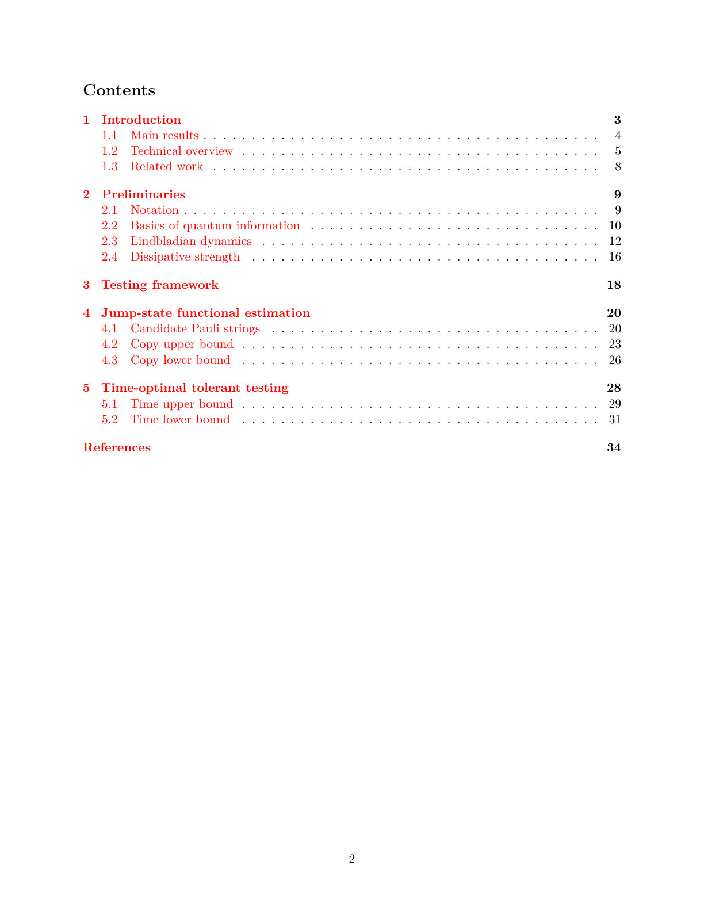
<figcaption class="paper-figure-caption"><b>Fig 1.</b> Low-resolution page preview, page 2</figcaption>
</figure>
<figure class="paper-figure-card">
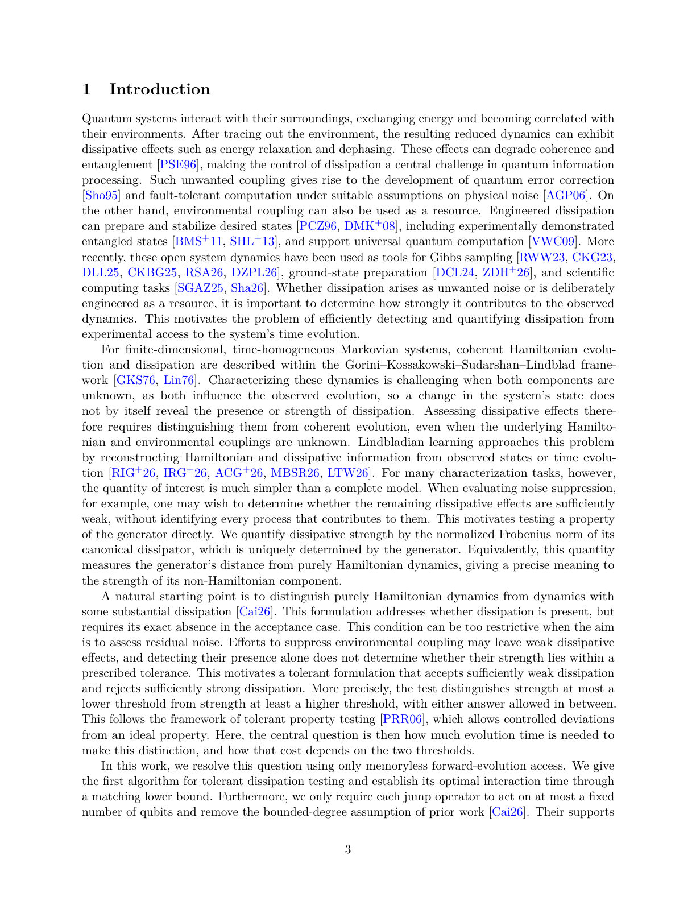
<figcaption class="paper-figure-caption"><b>Fig 2.</b> Low-resolution page preview, page 3</figcaption>
</figure>
<figure class="paper-figure-card">
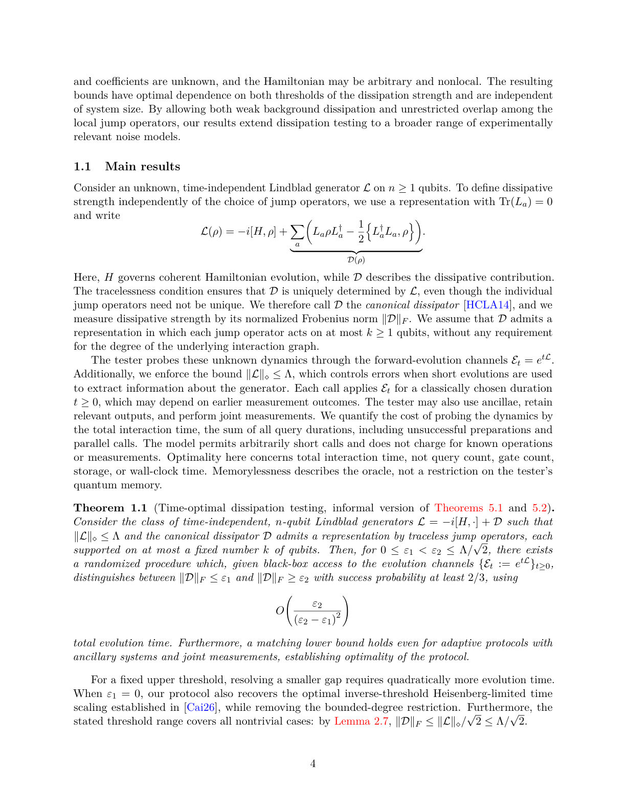
<figcaption class="paper-figure-caption"><b>Fig 3.</b> Low-resolution page preview, page 4</figcaption>
</figure>
<figure class="paper-figure-card">
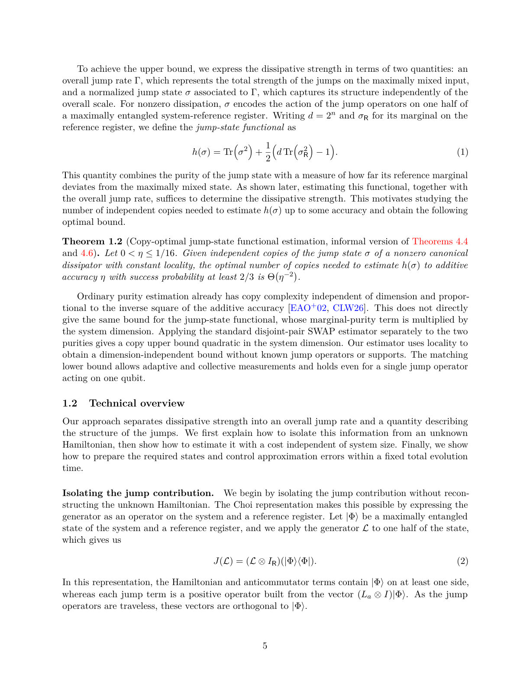
<figcaption class="paper-figure-caption"><b>Fig 4.</b> Low-resolution page preview, page 5</figcaption>
</figure>
<figure class="paper-figure-card">
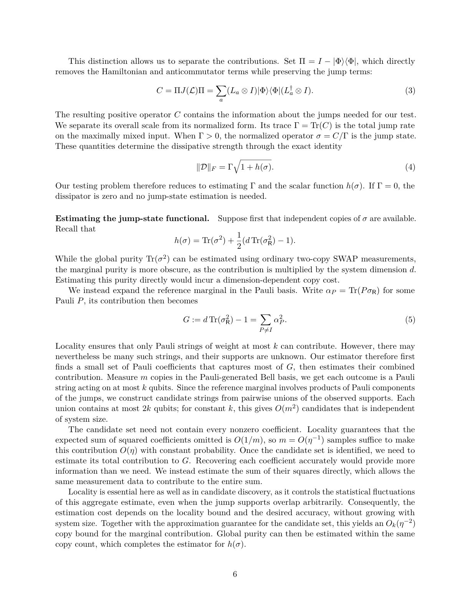
<figcaption class="paper-figure-caption"><b>Fig 5.</b> Low-resolution page preview, page 6</figcaption>
</figure>

**Summary.** This paper presents a theoretically optimal algorithm for 'tolerant property testing' of quantum dissipation. It determines the minimum time required to distinguish between two different levels of noise strength in an open quantum system. The result is significant because it provides a resource-efficient diagnostic tool applicable to a wider range of experimentally relevant quantum noise models.

**Why it may be interesting.** This work provides a rigorous, resource-optimal framework for diagnosing noise in quantum experiments, which is crucial for understanding decoherence in any physical system, including those studied in AMO physics.

Detailed structure

**Main problem.** The paper addresses the problem of optimally and efficiently determining the dissipative strength of an unknown, time-independent Lindblad generator within a specified tolerance.

**Main result.** It establishes an optimal total evolution time complexity of O(epsilon_2 / (epsilon_2 - epsilon_1)^2) for distinguishing between two dissipative strength regimes, which is proven to be optimal even for adaptive protocols.

**Method.** The authors develop an algorithm based on memoryless forward-evolution access to characterize the system dynamics, utilizing techniques from quantum property testing and state-functional estimation.

**Model / system.** The system is an open quantum system governed by Lindblad dynamics, $\mathcal{L}(
ho) = -i[H, 
ho] + \mathcal{D}(
ho)$. The focus is on characterizing the dissipative part, $\mathcal{D}$, quantified by its normalized Frobenius norm.

**Key observables.** The primary observable is the dissipative strength, $\|\mathcal{D}\|_F$, which is tested against thresholds $\epsilon_1$ and $\epsilon_2$. Secondary observables include the jump-state functional $h(\sigma)$ and the total jump rate $\Gamma$.

**Important parameters / regimes.** The key parameters are the tolerance thresholds ($\epsilon_1, \epsilon_2$), the total evolution time $T$, and the accuracy $\eta$ required for estimation.

**Assumptions / limitations.** The generator $\mathcal{L}$ is assumed to be time-independent and have a bounded norm. The analysis also considers the structure of the jump operators, noting improvements over prior bounded-degree requirements.

**Paper structure.** The paper develops from the general challenge of characterizing dissipation to presenting a specific, time-optimal algorithm for tolerant testing, supported by matching lower bounds that establish the optimality of the derived time cost.

Abstract

Quantifying dissipation is essential for controlling quantum noise and characterizing open-system dynamics. In practical experimental settings, residual noise may still persist despite efforts to suppress it, making it important to determine whether the dissipative strength remains within a prescribed tolerance threshold. We study this question for an unknown, time-independent Lindblad generator with bounded strength, where the jump operators are local but with unrestricted overlap, using only memoryless forward-evolution access. The task is to distinguish dissipative strength of at most $\varepsilon_1$ from strength of at least $\varepsilon_2$, for $0 \leq \varepsilon_1 < \varepsilon_2$, measured in the canonical dissipator's normalized Frobenius norm. We give an algorithm that solves this task in total evolution time $O(\varepsilon_2/(\varepsilon_2-\varepsilon_1)^2)$ for all nontrivial thresholds, with constant success probability, and provide a matching lower bound $Ω(\varepsilon_2/(\varepsilon_2-\varepsilon_1)^2)$ that establishes optimality even for adaptive protocols. This extends dissipation testing to the tolerant setting and eliminates the bounded-degree requirement, making the framework applicable to a broader range of experimentally relevant settings.

[↑ back to top](#top)

### [Quantum Estimation under Decoherence in Neutrino Oscillations: Quantum Resources, Flavor Accessibility, and Multiparameter Incompatibility](http://arxiv.org/abs/2609.36038v1)

**Authors:** Jilali Loulijat, Abdallah Slaoui, Mohamed Gouighri, Berihu Teklu  
**Type:** theory · **Category:** other · **PDF:** <https://arxiv.org/pdf/2609.36038v1>  
**Analysis basis:** full PDF text, analyzed in chunks
**Topic relevance:** `correlated / nonlocal dissipation` **3/5** · `driven-dissipative phase transition` **2/5** · `quantum measurements` **2/5** · `Keldysh / 2PI / non-Gaussian methods` **1/5** · `methods for driven-dissipative` **1/5** · `non-equilibrium universality` **1/5**

↔ Scroll figures horizontally

<figure class="paper-figure-card">
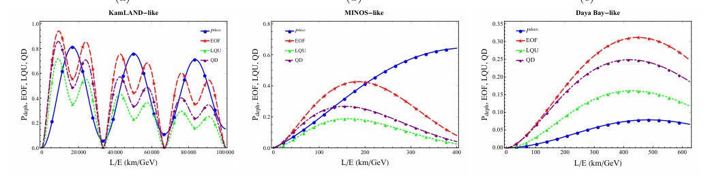
<figcaption class="paper-figure-caption"><b>Fig 1.</b> FIG. 1. Illustrative comparison of two operationally distinct responses in the KamLAND-, MINOS-, and Daya Bay-like regimes. The probability curve is computed from propagation-basis dephasing, Eq. (24), whereas EOF, projective QD, and LQU are evaluated for the flavor-mode state in Eq. (25). The same numerical damping profile is used only to compare decay scales; the curves do not imply that ηp and ηm define the same physical channel. Panels (a)–(c) are effective two-flavor diagnostics and do not contain the intrinsically three-flavor CP phase.</figcaption>
</figure>
<figure class="paper-figure-card">
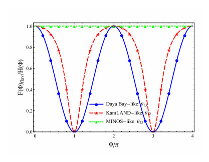
<figcaption class="paper-figure-caption"><b>Fig 2.</b> FIG. 2. Flavor-measurement efficiency Fflav(Φ)/H(Φ) for two-flavor phase estimation. The efficiency depends strongly on the effective mixing amplitude A = sin2(2θ) and on the oscillation phase. The plot illustrates why a flavor projection can be optimal in some regimes and inefficient in others.</figcaption>
</figure>
<figure class="paper-figure-card">
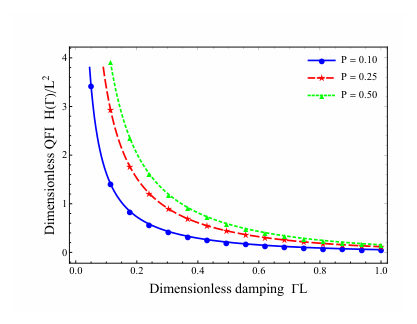
<figcaption class="paper-figure-caption"><b>Fig 3.</b> FIG. 3. Dimensionless QFI for estimating the dephasing strength, Hξmξm = HΓmΓm/L2, for fixed transition proba- bility P and ηm = exp(−ξm). The idealized QFI is largest near the no-decoherence boundary and decreases as the off- diagonal coherence is lost.</figcaption>
</figure>
<figure class="paper-figure-card">
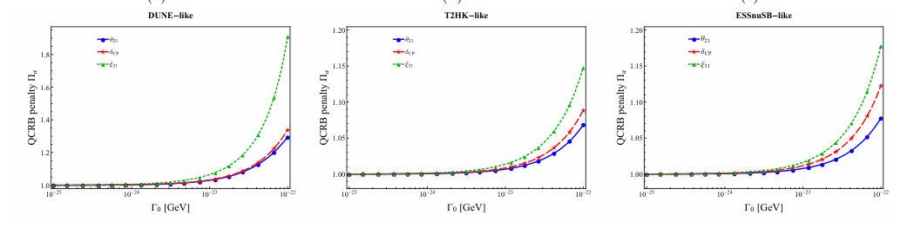
<figcaption class="paper-figure-caption"><b>Fig 4.</b> FIG. 4. Known-rate SLD-QCRB penalty Πknown a for a ∈{θ23, δCP, ξ31} as a function of the common dephasing rate. In this single-energy constant-density benchmark, DUNE-like propagation develops the largest high-rate penalty, while the T2HK-like constant-density configuration and the ESSnuSB-inspired vacuum configuration are less affected over the displayed range.</figcaption>
</figure>
<figure class="paper-figure-card">
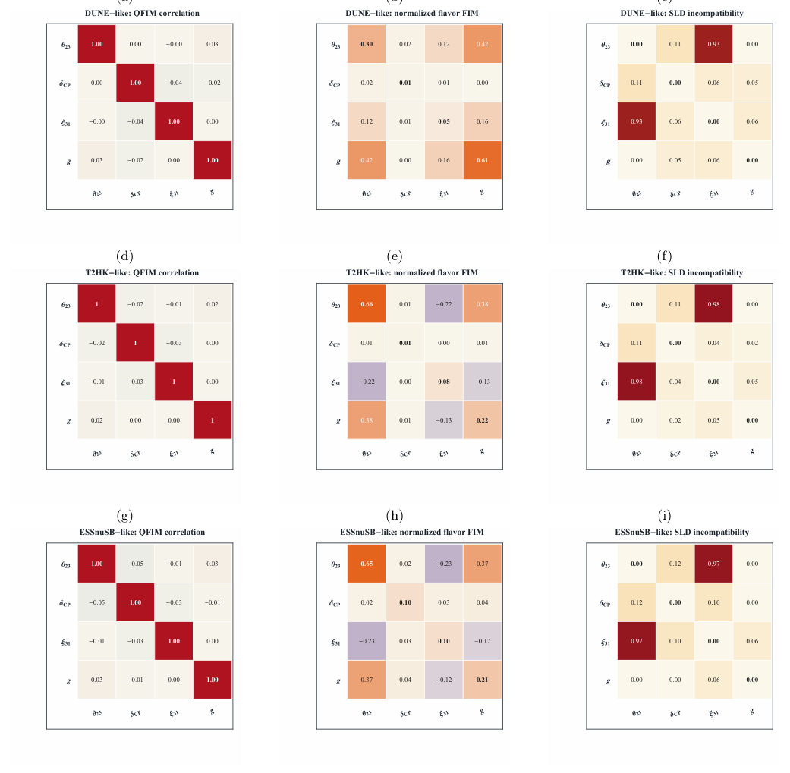
<figcaption class="paper-figure-caption"><b>Fig 5.</b> FIG. 5. Three-flavor constant-density benchmarks at Γ0 = 10−23 GeV for the DUNE-like (top row), T2HK-like (middle row), and ESSnuSB-inspired vacuum (bottom row) configurations. The left column shows the normalized QFIM correlations Hab/√HaaHbb; the middle column shows the flavor FIM normalized by √HaaHbb; and the right column shows the normalized SLD incompatibility cab. The comparison demonstrates that QFIM correlation, flavor accessibility, and joint-estimation com- patibility depend differently on baseline, energy, oscillation phase, and matter effects. In all three configurations, the strong θ23–ξ31 SLD incompatibility shows why diagonal QFI curves alone are insufficient for...</figcaption>
</figure>

**Summary.** This paper analyzes how decoherence affects the precision with which neutrino oscillation parameters can be measured. It distinguishes between two types of decoherence and uses quantum information measures like the QFI to quantify the loss of information. The findings emphasize that the achievable parameter sensitivity is highly dependent on the specific decoherence model and measurement setup.

**Why it may be interesting.** This work provides a rigorous, information-geometric framework for quantifying how quantum resources (like entanglement) are degraded by environmental noise in particle physics, which is highly relevant to open quantum systems theory.

Detailed structure

**Main problem.** The paper investigates the limits of quantum parameter estimation for neutrino oscillations when the system undergoes decoherence, distinguishing between different physical mechanisms of information loss.

**Main result.** The study establishes that different decoherence mechanisms (propagation-basis vs. flavor-mode dephasing) lead to distinct information-geometric diagnostics, and joint estimation of multiple parameters remains constrained by rank deficiency in single-energy measurements.

**Method.** The authors employ quantum information theory tools, calculating Quantum Fisher Information Matrices (QFIM) and comparing them to classical Fisher Information (FI) under various decoherence models.

**Model / system.** The system is neutrino flavor evolution, modeled as an open quantum system undergoing decoherence. Two primary decoherence types are analyzed: propagation-basis dephasing (dampening interference) and effective flavor-mode dephasing (suppressing coherence while fixing populations).

**Key observables.** Quantum Fisher Information (QFI), Fisher Information (FI), Concurrence, Entanglement of Formation, Local Quantum Uncertainty, and various incompatibility measures ($	heta_{23}–\xi_{31}$).

**Important parameters / regimes.** Decoherence rates ($\eta_m$, $\Gamma_0$), mixing angles ($	heta_{23}$), CP-violating phase ($\delta_{CP}$), and mass-squared splittings ($\xi_{31}$).

**Assumptions / limitations.** The analysis is restricted to state-level, monochromatic benchmarks, and the results are explicitly stated not to be event-level sensitivity forecasts.

**Figures summary.** The notes do not detail specific figures, but mention tables comparing diagnostics and showing diagonal forms of the QFIM in the effective-mode representation.

**Paper structure.** The paper progresses by defining the oscillation model, distinguishing the two dephasing families, deriving quantum resource diagnostics (EOF, LQU), developing the QFI/FI comparison framework, and concluding with numerical benchmarks for three different experimental scenarios.

Abstract

Neutrino oscillations offer an interferometric setting for open-system dynamics, quantum resources, and parameter estimation. We distinguish two often-conflated statistical families: propagation-basis dephasing uses a survival factor $η_p$ to damp interference before flavor projection, changing flavor probabilities; effective flavor-mode dephasing suppresses only off-diagonal coherence of a single-particle, two-mode state while fixing its populations. For the two-flavor mode state, we derive exact concurrence, entanglement of formation, and local quantum uncertainty, and reduce one-sided projective discord to a one-parameter optimization. For $0<P<1$ and $0<η_m<1$, the QFIM in $(P,χ,η_m)$ is diagonal, with $\mathcal{H}^{\rm mode}_{χχ}=C_{η_m}^2$ and $\mathcal{H}^{\rm mode}_{ξ_mξ_m}=C_{η_m}^2/(1-η_m^2)$, where $ξ_m=-\lnη_m$. For propagation-basis dephasing, basis-matched QFI and flavor FI separate dynamical information loss from measurement inaccessibility for the mixing angle, mass-squared splitting, and dephasing rate. A monochromatic three-flavor benchmark evaluates the mixed-state QFIM, flavor FIM, and SLD incompatibility for $(θ_{23},δ_{\rm CP},ξ_{31},g)$ at DUNE-like, T2HK-like, and ESSnuSB-inspired points. At $Γ_0=10^{-23}\,\mathrm{GeV}$, the fixed-coordinate ratio $\mathcal{F}^{\rm flav}_{δδ}/\mathcal{H}_{δδ}$ is approximately $0.010$, $0.013$, and $0.105$, respectively; all three points show strong $θ_{23}$--$ξ_{31}$ incompatibility. A single-energy flavor measurement supplies only two independent probabilities, so its four-parameter FIM is rank deficient: these diagonal ratios are conditional diagnostics, not joint four-parameter sensitivities. These are state-level information-geometric benchmarks, not event-level sensitivity forecasts.

[↑ back to top](#top)

### [Spectroscopy of phonon-coupled integer and fractional Chern insulators: emergence of polarons and chirality deficit of graviton mode](http://arxiv.org/abs/2609.36027v1)

**Authors:** Min Long, Yuzhu Wang, Zi Yang Meng  
**Type:** theory · **Category:** strongly correlated electrons · **PDF:** <https://arxiv.org/pdf/2609.36027v1>  
**Analysis basis:** full PDF text, analyzed in chunks
**Topic relevance:** `analog quantum simulation` **3/5** · `Keldysh / 2PI / non-Gaussian methods` **2/5** · `methods for driven-dissipative` **2/5** · `Frenkel-Kontorova` **1/5** · `correlated / nonlocal dissipation` **1/5** · `driven-dissipative phase transition` **1/5**

↔ Scroll figures horizontally

<figure class="paper-figure-card">
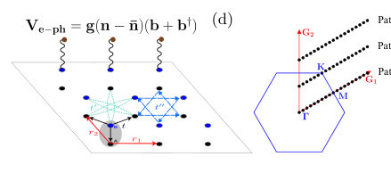
<figcaption class="paper-figure-caption"><b>Fig 1.</b> FIG. 1. Phonon dressing of neutral excitations in CI and FCI, Hamiltonian and Brillouin zone. (a) In the CI, phonons dress excitons into an exciton polaron and soften its dispersion. (b) In FCI, phonons dress the magnetoroton, neutral bound state of fractionally charged quasielectrons and quasiholes, into a magnetoroton polaron. Phonon coupling also enhances spectral weight to the opposite-chirality gravi- ton response, producing a chirality deficit. The black and green curves schematically represent the bare and phonon- dressed dispersions, respectively. (c) Haldane–Holstein model on the honeycomb lattice (d) Brillouin Zone and the three mo- mentum cuts accessible on the Ly = 3 cylinder.</figcaption>
</figure>
<figure class="paper-figure-card">
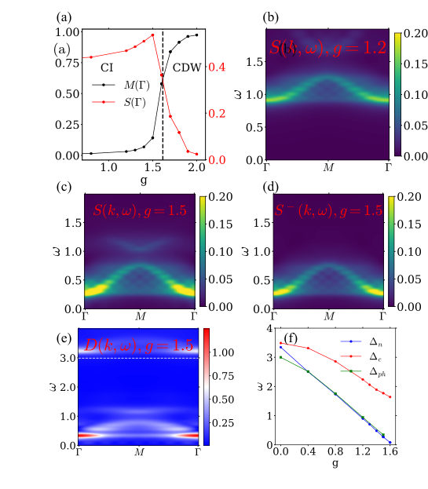
<figcaption class="paper-figure-caption"><b>Fig 2.</b> FIG. 2. CI-CDW transition and Exciton-polarons . The spectrum shown for the CI case focuses on path 1 in Fig. 1 (d). (a) Evolution of CDW parameter M(Γ) and static density correlation S(Γ) at ν = 1 filling as g increases. (b) and (c) S(k, ω) defined in Eq. (2) for different g, where the low- energy branch is fully captured by the n−branch as shown in (d). (e) Phonon spectral function D(k, ω); the white dashed line denotes the intrinsic frequency. (f)Evolution of neutral gap ∆n, charge gap ∆c, and phonon gap ∆ph within the CI phase.</figcaption>
</figure>
<figure class="paper-figure-card">
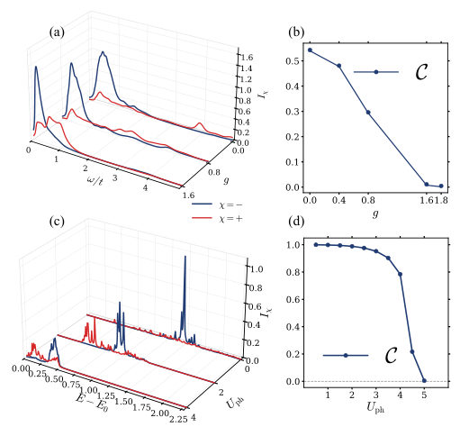
<figcaption class="paper-figure-caption"><b>Fig 3.</b> FIG. 4. Phonon-induced chirality deficit of the gravi- ton response. (a) Chiral graviton spectra Iχ(ω) in the FCI for electron–phonon couplings g = 0, 0.8, and 1.6, calculated on an Lx × Ly = 16 × 3 cylinder. The blue solid and red dashed curves denote the χ = −and χ = + channels, respec- tively; the spectra are normalized by the total weight in χ = − sector. (b)Chirality ratio C = (N−−N+)/(N−+N+) of the in- tegrated spectral weights in the two chiral channels as a func- tion of g. (c) Chiral graviton spectra obtained from a com- plementary Landau-level calculation with a phonon-mediated effective interaction of strength Uph. The spectra are plotted against E −E0, where E0 is the ground...</figcaption>
</figure>
<figure class="paper-figure-card">
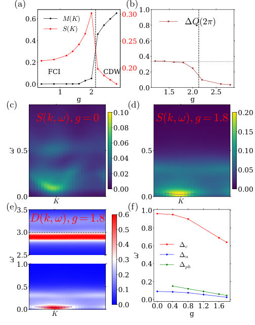
<figcaption class="paper-figure-caption"><b>Fig 4.</b> FIG. 3. FCI-CDW transition and Magnetoroton- polarons. The spectrum shown for the FCI case focuses along path 2 in Fig. 1 (d). (a) evolution of CDW parameter M(K) and static density correlation S(K) at ν = 1/3 filling as g increases. (b) Charge pumping by flux threading. (c) and (d) show S(k, ω) defined in Eq. (2) for g = 0 and g = 1.8 close to the phase boundary; a dashed line is added to guide the magnetoroton-polaron dispersion in (d) and (e). (e) Phonon spectral function D(k, ω); the black dashed line denotes the intrinsic frequency ω0 = 3. We use a broken ω axis here. (f) Evolution of neutral gap ∆n, charge gap ∆c, and phonon gap ∆ph within the FCI phase.</figcaption>
</figure>

**Summary.** This theoretical work examines how electron-phonon coupling destabilizes Chern and fractional Chern insulators by dressing their low-energy neutral excitations into polarons. The study provides a unified picture showing that lattice dynamics reveal these neutral modes, and it quantifies the resulting chirality deficit in the fractional phase. This establishes lattice vibrations as a key diagnostic tool for understanding topological instabilities in correlated electron systems.

**Why it may be interesting.** The explicit connection between lattice dynamics (phonons) and topological electronic states (CIs/FCIs) via polaron formation is highly relevant for understanding emergent phenomena in strongly correlated quantum materials.

Detailed structure

**Main problem.** The paper investigates how strong electron-phonon coupling destabilizes both integer and fractional Chern insulators (CIs and FCIs) towards charge order, and whether a common microscopic mechanism governs these instabilities.

**Main result.** Phonons primarily dress charge-neutral collective modes (excitons and magnetorotons) into polarons, and this dressing mechanism provides a unified picture of the instability, while also causing a measurable chirality deficit in the FCI.

**Method.** The study employs advanced theoretical techniques including Density Matrix Renormalization Group (DMRG) with Local Basis Optimization (LBO) and Time-Dependent Variational Principle (TDVP) to analyze spectral functions and gap evolution.

**Model / system.** The system is modeled using a flat-band Haldane model coupled to dynamical Holstein phonons, analyzed at integer and fractional fillings ($
u$). The analysis extends to probing the chiral response via quadrupolar operators.

**Key observables.** Exciton and magnetoroton polarons, phonon spectral function, charge order parameters ($M(\mathbf{k}), S(\mathbf{k})$), and the chirality deficit of the graviton mode.

**Important parameters / regimes.** Electron-phonon coupling strength ($g$), filling fraction ($
u$), and the relative gap sizes ($\Delta_c, \Delta_n, \Delta_{ph}$).

**Assumptions / limitations.** The analysis relies on the assumption that phonon effects are dominated by dressing charge-neutral modes, and in some parts, approximations like the static limit or Gaussian coupling profiles are used.

**Figures summary.** Figures illustrate the formation of exciton and magnetoroton polarons, the evolution of charge order parameters across phase transitions, and the quantitative measurement of the chirality deficit in the FCI.

**Paper structure.** The paper develops a unified excitation-based picture, first detailing the polaron formation in CIs and FCIs, then quantifying the resulting chirality deficit in the FCI, and finally establishing lattice dynamics as a direct probe for these neutral excitations.

Abstract

Strong electron-phonon coupling can destabilize both Chern insulators (CIs) and fractional Chern insulators (FCIs) in favor of charge order, but whether the instabilities in CI and FCI share a common microscopic mechanism remains unclear. In this paper, we address this question by studying a flat-band Haldane model coupled to dynamical Holstein phonons at integer and fractional fillings using density-matrix renormalization group with local basis optimization. We find that the low-energy effects of phonons are dominated by their dressing of charge-neutral collective modes. In the CI and FCI, phonons dress excitons and magnetorotons into composite modes that we identify as exciton polarons and magnetoroton polarons, respectively. These modes soften strongly upon approaching the transition, while the momenta of their energy minima anticipate the ordering wave vectors of the charge-ordered phases. The phonon spectrum, in turn, acquires dispersive features inherited from the exciton and magnetoroton modes, providing direct lattice signatures of these neutral excitations. Within the FCI phase, electron-phonon coupling also enhances the opposite-chirality spectral weight of the graviton response, thereby resulting in a chirality deficit. Our results provide a unified excitation-based picture of phonon-driven instabilities in CIs and FCIs and establish lattice dynamics as a probe of their neutral collective modes.

[↑ back to top](#top)

### [Cavity-QED enhancement of quantum entanglement and battery performance in double quantum dots](http://arxiv.org/abs/2609.37034v1)

**Authors:** Hamid Arian Zad, Usama Shoukat, Michal Jaščur, Hazrat Ali, Saeed Haddadi  
**Type:** theory · **Category:** other · **PDF:** <https://arxiv.org/pdf/2609.37034v1>  
**Analysis basis:** full PDF text, analyzed in chunks
**Topic relevance:** `analog quantum simulation` **3/5** · `Tavis-Cummings & cavity-many-emitter` **2/5** · `Keldysh / 2PI / non-Gaussian methods` **1/5** · `driven-dissipative phase transition` **1/5** · `methods for driven-dissipative` **1/5** · `quantum measurements` **1/5**

↔ Scroll figures horizontally

<figure class="paper-figure-card">
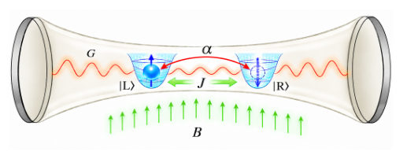
<figcaption class="paper-figure-caption"><b>Fig 1.</b> FIG. 1. Schematic representation of an eDQD embedded in a microwave cavity QED. The electron can tunnel between the left and right dots with amplitude J, experiencing Rashba SOC α that mixes spin and charge degrees of freedom. B is the Zeeman splitting as a result of a homogeneous magnetic field along the z-axis. The cavity mode of frequency Ωcouples to the electron spin via the Jaynes–Cummings interaction of strength G, enabling coherent spin-photon exchange.</figcaption>
</figure>
<figure class="paper-figure-card">
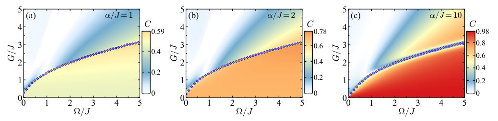
<figcaption class="paper-figure-caption"><b>Fig 2.</b> FIG. 2. Concurrence C of the eDQD system in the G/J-Ω/J plane at kBT/J = 0.01 for (a) α/J = 1, (b) α/J = 2, and (c) α/J = 10. The symbolic blue lines indicate the crossover boundary extracted from the maximum variation of the concurrence, maxG |∂C/∂G| at fixed Ωsatisfying Eq. (14). This boundary closely coincides with the independently determined ground-state crossover associated with the onset of appreciable cavity-photon occupation. In three panels we have assumed, B/J = 2, N = 5 and gc/J = 0.</figcaption>
</figure>
<figure class="paper-figure-card">
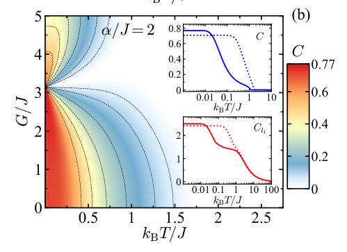
<figcaption class="paper-figure-caption"><b>Fig 3.</b> FIG. 3. The concurrence of the eDQD system in the G/J − T/J plane at Ω/J = 5. (a) α/J = 1, (b) α/J = 2. The upper insets represent the concurrence, while the lower insets show the l1-norm coherence Cl1, providing a complementary mea- sure of the quantum coherence underlying the reduced eDQD state. The dotted curves in the insets show the corresponding results for the eDQD without the cavity with G/J = Ω/J = 0, while the solid curves represent the cavity-coupled eDQD sys- tem with G/J = 3 and Ω/J = 5. In all panels, we have as- sumed: B/J = 2, gc/J = 0, N = 5.</figcaption>
</figure>
<figure class="paper-figure-card">
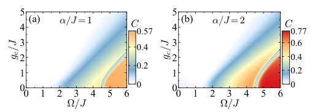
<figcaption class="paper-figure-caption"><b>Fig 4.</b> FIG. 4. The concurrence of the eDQD system in the gc/J − Ω/J plane at kBT/J = 0.01 and G/J = 3. (a) α/J = 1, (b) α/J = 2. In both panels we have assumed: B/J = 2 and N = 5.</figcaption>
</figure>
<figure class="paper-figure-card">
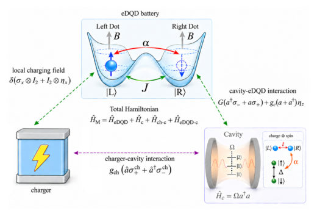
<figcaption class="paper-figure-caption"><b>Fig 5.</b> FIG. 5. Schematic representation of the cavity-mediated eDQD QB. The eDQD, comprising coupled charge and spin degrees of freedom, constitutes the QB, while a single-mode microwave cavity mediates the interaction between the bat- tery and the charging process. The charge and spin sectors are coupled through the Rashba SOC with strength α, while J denotes the inter-dot tunneling amplitude and B the de- tuning energy. The cavity couples to the DQD spin degree of freedom through the Jaynes–Cummings interaction with strength G, and to the charge degree of freedom through gc. The battery can be charged via the cavity-mediated process or by a local external magnetic field applied along either the...</figcaption>
</figure>

**Summary.** This theoretical study explores the interplay between quantum entanglement and energy storage in a silicon double quantum dot coupled to a microwave cavity. By analyzing the system's reduced density matrix, the authors show that cavity coupling and spin-orbit coupling provide complementary control over quantum correlations. A key finding is that the crossover regime governing entanglement is mirrored in the system's extractable work (ergotropy), establishing a unified control mechanism for quantum resources.

**Why it may be interesting.** This work is highly relevant to AMO physics as it models quantum control in solid-state cavity QED systems, linking fundamental quantum information measures (entanglement) directly to practical quantum technologies (quantum batteries).

Detailed structure

**Main problem.** The study investigates how coupling a single-electron double quantum dot (eDQD) to a microwave cavity affects both quantum entanglement and the system's capacity for energy storage.

**Main result.** The cavity coupling and Rashba SOC act as complementary control knobs, creating a distinct crossover regime that simultaneously modifies quantum correlations (concurrence) and the extractable work (ergotropy).

**Method.** The authors use theoretical methods involving the reduced thermal density matrix, calculating entanglement via concurrence and coherence via the l1 norm, alongside energy metrics like ergotropy.

**Model / system.** The system is an eDQD coupled to a single-mode microwave cavity, incorporating Rashba spin-orbit coupling, spin-photon, and charge-photon interactions. The Hamiltonian describes the coupled charge, spin, and cavity modes.

**Key observables.** Concurrence (spin-charge entanglement), l1-norm of coherence, ergotropy (extractable work), and stored energy.

**Important parameters / regimes.** Rashba coupling strength ($\alpha$), cavity coupling strengths ($G, g_c$), cavity frequency ($\Omega$), and temperature ($T$).

**Assumptions / limitations.** The analysis relies on tracing out the cavity degrees of freedom to find the reduced eDQD state, and it examines the system in its thermal equilibrium state.

**Figures summary.** Figures illustrate the dependence of ergotropy, stored energy, and concurrence on coupling parameters, highlighting a sharp, nonlinear crossover boundary in the parameter space.

**Paper structure.** The paper establishes the physical model (eDQD-cavity-SOC), analyzes quantum correlations (entanglement/coherence) using the reduced density matrix, and then extends the analysis to energy storage by calculating ergotropy and showing its correlation with the entanglement crossover.

Abstract

We theoretically investigate quantum correlations and energy storage in a single-electron silicon double quantum dot (eDQD) coupled to a single-mode microwave cavity. The charge and spin degrees of freedom are hybridized by Rashba spin-orbit coupling (SOC), while the cavity interacts with the eDQD through spin-photon and charge-photon couplings. Using the reduced thermal density matrix, we characterize spin-charge entanglement by concurrence and quantum coherence by the $l_1$ norm. At low temperature, the cavity strongly modifies the spin-charge correlations, producing distinct regimes of enhanced and suppressed entanglement. We identify a nonlinear crossover between an eDQD-dominated regime and a photon-dressed regime. This crossover is revealed independently by two signatures: a rapid change in the concurrence and the onset of finite photon occupation in the cavity. Its boundary exhibits a dominant $G_{\rm c}\propto\sqrtΩ$ dependence and is robust against cavity Hilbert-space truncation. Beyond the Rashba coupling studied in [Ferreira et al., Phys. Rev. A 107, 052408 (2023)], we show that the cavity provides an additional tunable means of controlling quantum correlations and energy storage. We further characterize the eDQD as a quantum battery under coherent charging and evaluate its stored energy and ergotropy. The ergotropy varies markedly across a cavity-dressing crossover resembling that identified from entanglement, connecting cavity-induced modification of the dressed states to extractable work. Optimization over the charge-photon coupling reveals parameter-dependent optimal charging regimes and enhanced maximum ergotropy with increasing Rashba coupling. Our results establish cavity coupling and SOC as complementary controls of quantum correlations and extractable energy in semiconductor eDQD-cavity systems.

[↑ back to top](#top)

### [Locking transition in coupled disordered systems](http://arxiv.org/abs/2609.36846v1)

**Authors:** Guy Bunin  
**Type:** theory · **Category:** disordered systems and neural networks · **PDF:** <https://arxiv.org/pdf/2609.36846v1>  
**Analysis basis:** full PDF text, analyzed in chunks
**Topic relevance:** `Frenkel-Kontorova` **3/5** · `Keldysh / 2PI / non-Gaussian methods` **2/5** · `analog quantum simulation` **2/5** · `driven-dissipative phase transition` **1/5** · `non-equilibrium universality` **1/5**

↔ Scroll figures horizontally

<figure class="paper-figure-card">
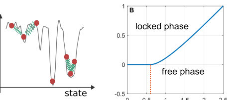
<figcaption class="paper-figure-caption"><b>Fig 1.</b> Figure 1. Disordered systems with identical disorder are cou- pled along a chain. (A) Cartoon of the chain in a the energy landscape drawn in the phases, from left to right: free phase; locked phase, with all copies at the lowest energy state (over- lapping as one bead); locking to lowest free-energy valley. (B) Phase diagram for a long chain with state-matched coupling. Solid line is a first-order transition between a locked phase at the lowest energy, and a free phase, which is short-range correlated along the chain. Dashed line is a REM freezing transition within the free phase.</figcaption>
</figure>
<figure class="paper-figure-card">
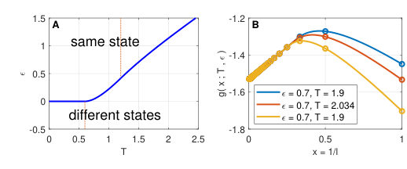
<figcaption class="paper-figure-caption"><b>Fig 2.</b> Figure 2. (A) The phase diagram of two coupled copies with state-matched coupling. Solid line is a first order transi- tion between same-state and different state phases. Vertical dashed lines are REM freezing transitions within each. (B) The free-energy density g(T,ϵ)(x), with x = 1/l. The transi- tion is at g(T,ϵ)(0) = g(T,ϵ)(1) (here at T = 2.034, for ϵ = 0.7).</figcaption>
</figure>
<figure class="paper-figure-card">
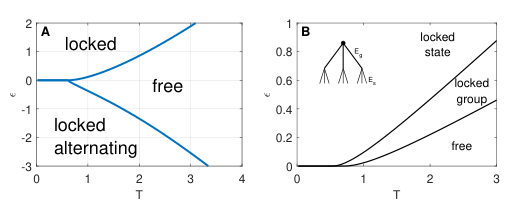
<figcaption class="paper-figure-caption"><b>Fig 3.</b> Figure 4. Phase diagrams. (A) REM with structured cou- pling. (B) GREM with αg = 1.3, ag = 0.52.</figcaption>
</figure>
<figure class="paper-figure-card">
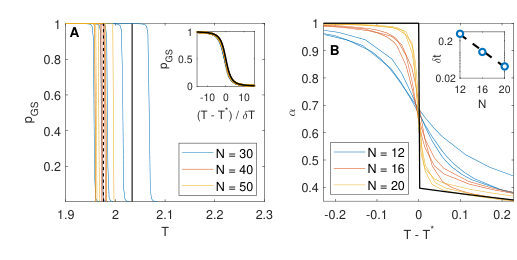
<figcaption class="paper-figure-caption"><b>Fig 4.</b> Figure 3. Transition at L ≫N. (A) Long chain, state- matched coupling: the transition at ϵ = 0.7. pGS is the prob- ability of the minimal energy state. Every line is a single realization of the disorder. The vertical lines are T at the transition by Eq. (10) (solid line) and corrected for N = 50 (dashed line). Inset: after shifting by each realization’s tran- sition temperature T ∗and rescaling by δT ≡T ∗e−ϵN/2T ∗/N, the curves collapse, showing that they are exponentially nar- row in N. (B) Structured couplings: the overlap α between neighbors, after shifting by T ∗. Solid line: the predicted value α∗(T, ϵ = 0.7). Inset: the transition width, measured here from the steepest slope, δT ≡1/...</figcaption>
</figure>
<figure class="paper-figure-card">
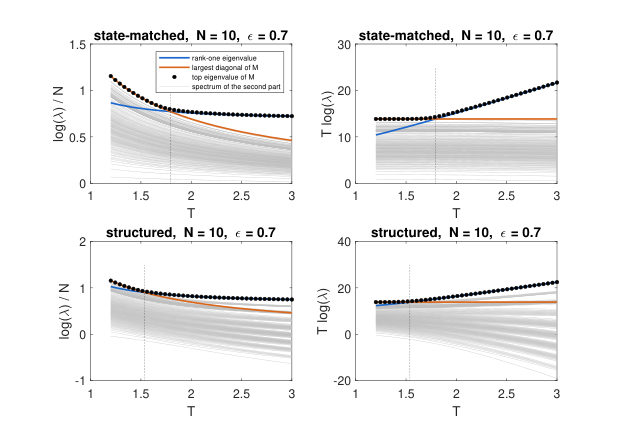
<figcaption class="paper-figure-caption"><b>Fig 5.</b> Figure 5. The eigenvalue transition. Top: state matched coupling, shown as a function of N −1 ln λ (left) and T ln λ (right). Bottom row: same for structured coupling. The thinner lines show the spectra of D for state-matched coupling, and B for structured coupling. Vertical line shows the theoretical position of the transition.</figcaption>
</figure>

**Summary.** This work analyzes the locking transition in coupled disordered systems modeled by the Random Energy Model. It establishes that the transition between correlated and fully locked phases is first-order, depending critically on the nature of the coupling. The findings provide detailed theoretical insights into how disorder dictates macroscopic phase behavior in extended quantum or classical systems.

**Why it may be interesting.** The study of glassy dynamics and phase transitions in disordered systems, particularly those involving energy landscapes and domain formation, provides theoretical tools applicable to understanding complex quantum many-body systems far from equilibrium.

Detailed structure

**Main problem.** The paper investigates the locking transition in coupled disordered systems, specifically determining if the entire chain settles into the lowest-energy state with probability one at positive temperature.

**Main result.** The transition between the short-range correlated phase and the locked phase is found to be first-order, and the system can exhibit complex locking behavior depending on the coupling structure (e.g., locking to the lowest free-energy valley).

**Method.** The analysis uses techniques from statistical mechanics, including calculating free energy densities, saddle-point approximations, and analyzing domain factorizations for large chain lengths.

**Model / system.** The model consists of copies of the Random Energy Model (REM) coupled along a one-dimensional chain, generalized to the GREM. The Hamiltonian involves coupling terms ($\psi$) between neighboring copies.

**Key observables.** Free energy density ($f$), transition temperature ($T^*$), domain lengths ($L$), and the overlap parameter ($\alpha$).

**Important parameters / regimes.** Temperature ($T$), coupling strength ($\epsilon$), chain length ($L$), and system size ($N$).

**Assumptions / limitations.** The analysis relies on the thermodynamic limit ($L 	o \infty, N 	o \infty$) and uses approximations like domain factorization and saddle-point methods.

**Figures summary.** Figures illustrate the phase diagram showing the transition between free and locked phases for different coupling types, and show the free energy density $g(T, \epsilon)(x)$ dependence on domain size.

**Paper structure.** The paper systematically analyzes the free energy landscape by comparing different coupling structures (state-matched vs. structured) and generalizing the model to the GREM, establishing the conditions for the three possible phases.

Abstract

When a system of many interacting constituents is extended across space, every region carries the same disordered landscape, and it is unclear whether distant regions settle into the same state. We study copies of the Random Energy Model (REM), sharing one disorder realization, coupled along a chain. A first-order transition separates a phase with short-range correlations, from a locked phase in which the entire chain occupies the lowest-energy state with probability one, even at positive temperature. No intermediate ordering lengths occur. In the Generalized REM the chain locks either to the lowest-energy state or to the lowest free-energy valley.

[↑ back to top](#top)

### [A Neutral Atom-Based Hybrid Classical-Quantum Approach for the Entanglement Routing Problem](http://arxiv.org/abs/2609.37900v1)

**Authors:** M. Yassine Naghmouchi, Quentin Ma, Agathe Blaise, René Veyland, Wesley Coelho  
**Type:** both · **Category:** quantum information and computing · **PDF:** <https://arxiv.org/pdf/2609.37900v1>  
**Analysis basis:** full PDF text, analyzed in chunks
**Topic relevance:** `QC/QI experiment` **3/5** · `Rydberg arrays` **3/5** · `analog quantum simulation` **2/5**

↔ Scroll figures horizontally

<figure class="paper-figure-card">
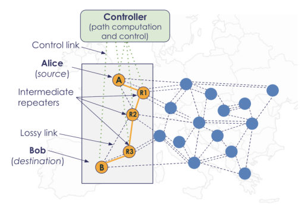
<figcaption class="paper-figure-caption"><b>Fig 1.</b> FIG. 1: Quantum network architecture for entanglement routing. A centralized controller monitors stochastic link availability and computes routing decisions each generation round via classical control links. The local segment shows Alice (source) and Bob (destination) connected through three intermediate repeaters R1, R2, R3 over lossy quantum links. The orange mesh illustrates the quantum backbone over which E2E entanglement is established via entanglement swapping at intermediate repeaters.</figcaption>
</figure>
<figure class="paper-figure-card">
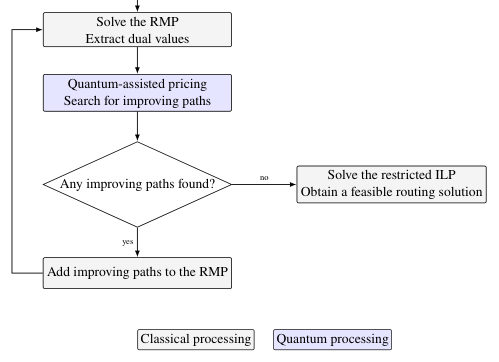
<figcaption class="paper-figure-caption"><b>Fig 2.</b> FIG. 2: Overall workflow of the proposed hybrid classical–quantum column-generation method. Classical computation is used for solving the RMP and the final restricted ILP, while the pricing phase is handled through a quantum-assisted optimization routine.</figcaption>
</figure>
<figure class="paper-figure-card">
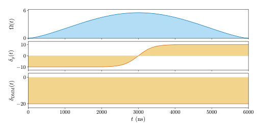
<figcaption class="paper-figure-caption"><b>Fig 3.</b> FIG. 3: Example of a pulse generated by the proposed instance-driven pulse shaping procedure. Top: global Rabi amplitude Ω(t) controls quantum mixing. Middle: global detuning δg(t) defines the classical energy landscape. Bottom: local detuning contribution δDMM(t) used to encode the diagonal QUBO coefficients. The sequence starts from a strongly negative detuning to prepare the initial state and progressively transitions toward a problem-dominated Hamiltonian.</figcaption>
</figure>
<figure class="paper-figure-card">
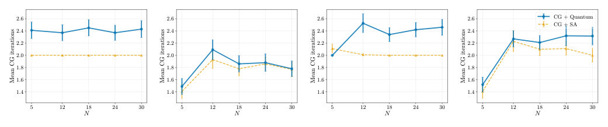
<figcaption class="paper-figure-caption"><b>Fig 4.</b> FIG. 4: Mean column-generation iterations vs. network size N on Topology 1 (20 instances per size N). (a) No reinforcement: CG-SA is flat at 2, whereas CG-Q stabilizes around 2.4. (b) Warm-start only: both methods grow together from ∼1.5 to 2.0–2.1. (c) Post-processing only: profiles are virtually identical to the base case. (d) Warm-start + post-processing: the trend closely matches the WS-only case.</figcaption>
</figure>
<figure class="paper-figure-card">
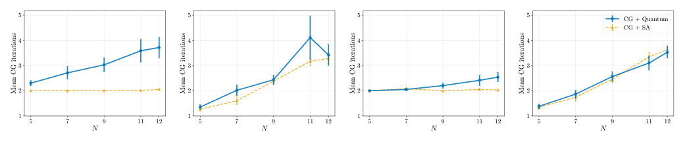
<figcaption class="paper-figure-caption"><b>Fig 5.</b> FIG. 5: Mean column-generation iterations vs. network size N on Topology 2 (20 instances per size N). (a) No reinforcement: CG-SA remains at 2, whereas CG-Q rises to 3.7 at N=12. (b) Warm-start only: both methods grow steeply to 3.3–3.4. (c) Post-processing only: profiles remain close to the base case. (d) Warm-start + post-processing: the trend closely matches the WS-only case.</figcaption>
</figure>

**Summary.** This work tackles the complex, NP-hard problem of routing entanglement in quantum networks under fidelity constraints. It proposes a novel hybrid framework that uses neutral-atom quantum processors to solve the path-finding subproblem within a column generation algorithm. The results demonstrate that this quantum integration yields highly accurate candidate routes for classical refinement.

**Why it may be interesting.** It directly applies advanced quantum hardware capabilities (neutral atoms) to solve a critical, resource-intensive problem in quantum networking (entanglement routing), bridging quantum computation with quantum information theory.

Detailed structure

**Main problem.** The paper addresses the Entanglement Routing in Quantum Networks (ERQN) problem, which is formulated as a fidelity-constrained unsplittable multicommodity flow problem.

**Main result.** The hybrid classical-quantum approach achieved an optimality gap below 1% on tested benchmarks, significantly outperforming classical baselines when combined with warm-start and post-processing.

**Method.** A hybrid classical-quantum column generation framework is used, where the NP-hard pricing subproblem is formulated as a QUBO and solved using a neutral-atom quantum optimization routine.

**Model / system.** The physical platform is a neutral atom quantum processor utilizing Rydberg interactions. The problem is modeled using graph theory for network flow, constrained by fidelity decay factors.

**Key observables.** Optimality gap relative to the exact ILP solution, number of admitted entanglement requests, and mean column-generation iterations.

**Important parameters / regimes.** Link capacity ($C_e$), per-hop fidelity decay ($\pi_e$), and minimum required end-to-end fidelity ($F_k$).

**Assumptions / limitations.** The study assumes a deterministic, per-round routing decision, simplifying the model by ignoring stochastic link availability, waiting times, or finite entanglement lifetimes.

**Figures summary.** Figures illustrate the quantum network architecture and show the mean optimality gap and mean column-generation iterations versus network size for various reinforcement strategies (warm-start, post-processing).

**Paper structure.** The paper establishes the ERQN problem, formulates it as a column generation problem, and proposes integrating a neutral-atom quantum solver (mapping to QUBO) as the pricing oracle, followed by benchmarking against classical methods.

Abstract

Efficient end-to-end entanglement distribution in quantum information networks requires routing under limited resources and fidelity constraints. We study entanglement routing as a fidelity-constrained unsplittable multicommodity flow problem that maximizes the number of admitted requests. As a proof of concept, we integrate neutral-atom quantum optimization into a hybrid classical--quantum column-generation framework. A classical restricted master problem selects routes, while a pricing problem generates fidelity-feasible paths. We formulate this NP-hard constrained shortest-path pricing problem as a quadratic unconstrained binary optimization (QUBO) problem and address it with hardware-aware register embedding and instance-driven pulse shaping. To our knowledge, this is the first study of neutral-atom quantum optimization as a pricing oracle for fidelity-constrained entanglement routing. On small benchmark instances evaluated with neutral-atom processor emulators, the method, combined with warm-start and post-processing, achieves an optimality gap below 1% across all tested sizes; the selected simulated-annealing route-generation baseline exhibits gaps of up to 6%. These results indicate that the generated bitstrings can provide useful candidate routes for classical refinement within column generation. This proof of concept does not establish quantum utility or scalability; further evaluation on larger instances, against stronger classical baselines, and on quantum hardware is needed.

[↑ back to top](#top)

### [From Bellissard's gap labeling to atomistic quasiperiodic bilayers](http://arxiv.org/abs/2609.36981v1)

**Authors:** Thomas D. Kühne, Vladislav Efremkin, Emil Prodan  
**Type:** theory · **Category:** other · **PDF:** <https://arxiv.org/pdf/2609.36981v1>  
**Analysis basis:** full PDF text, analyzed in chunks
**Topic relevance:** `analog quantum simulation` **3/5** · `Full counting statistics` **2/5** · `Keldysh / 2PI / non-Gaussian methods` **1/5** · `methods for driven-dissipative` **1/5** · `quantum measurements` **1/5**

↔ Scroll figures horizontally

<figure class="paper-figure-card">
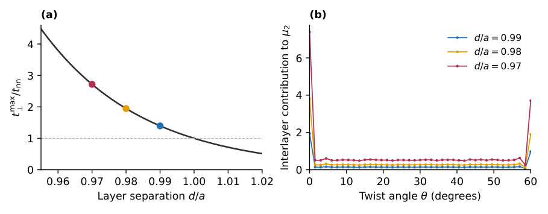
<figcaption class="paper-figure-caption"><b>Fig 1.</b> Figure 1: Geometric coupling and a finite spectral trace. (a) The maximum interlayer hopping relative to nearest-neighbor intralayer hopping, Eq. (10), for ξ/a = 0.03. Colored points mark the three calculated separations. (b) The interlayer contribution ∥B∥2 F /N to the second spectral moment for open honeycomb disks with R/a = 25 and N = 1510 sites per layer. Each curve contains 41 directly evaluated angles from 0◦to 60◦, with lines connecting the samples. The same quantity is independently recovered from all 3020 eigenvalues using Eq. (11).</figcaption>
</figure>
<figure class="paper-figure-card">

<figcaption class="paper-figure-caption"><b>Fig 2.</b> Figure 1 evaluates this decomposition for R/a = 25 and ξ/a = 0.03. The intralayer contribution is identical for all angles and separations. The interlayer contribution depends on registry as well as separation, and increases when d is reduced at fixed angle because every entry of B increases. Direct sums of squared hoppings and second moments of the archived eigenvalues agree to an absolute tolerance of 10−10 across all 123 spectra, validating the finite-matrix trace normalization and spectral calculation. The relation to Bellissard’s viewpoint is the distinction between a finite normalized trace and a bulk trace on a specified algebra. A second moment averages a polynomial of the...</figcaption>
</figure>
<figure class="paper-figure-card">
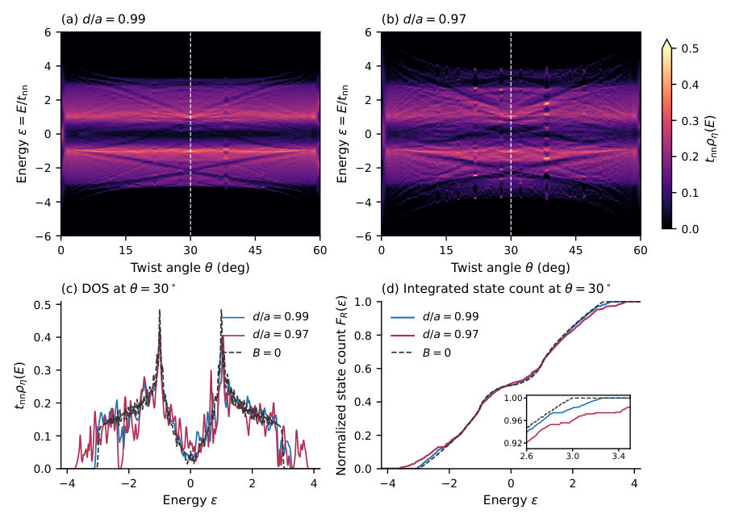
<figcaption class="paper-figure-caption"><b>Fig 3.</b> Figure 2: Butterfly-like spectral reconstruction and finite state counting in the bilayer model. (a,b) DOS maps for d/a = 0.99 and 0.97, with R/a = 25, ξ/a = 0.03, and 1510 sites in each open disk. The angle spacing is 0.25◦. The DOS integrates to one and uses a common Gaussian width η/tnn = 0.02 and color scale, clipped above tnnρη = 0.5. White dashed lines identify the 30◦cross sections. (c) DOS at that angle, without intensity clipping. (d) The exact normalized eigenvalue count, Eq. (13), with an upper-energy inset. Black dashed curves in (c,d) give the corresponding uncoupled-layer reference, B = 0, with the same geometry and per-state normalization.</figcaption>
</figure>

**Summary.** This work bridges the gap between abstract topological band theory (gap labeling) and practical electronic structure calculations for complex, aperiodic materials like moiré bilayers. It establishes a detailed computational protocol to interpret finite-size spectra, ensuring that observed spectral changes are correctly classified as mere hybridization effects versus true topological responses. This is crucial for accurately characterizing quantum materials in condensed matter physics.

**Why it may be interesting.** The rigorous connection between abstract topological invariants (like those from K-theory) and measurable quantities from computational solid-state physics is highly relevant for understanding emergent quantum phenomena in engineered materials.

Detailed structure

**Main problem.** The paper aims to rigorously connect the abstract mathematical framework of Bellissard's gap labeling for aperiodic solids to the concrete electronic structure calculations performed on quasiperiodic bilayers.

**Main result.** It develops a detailed computational framework specifying how to translate atomistic spectral measurements (like finite state counts) into quantities that can be compared with bulk topological invariants, while carefully distinguishing between spectral weight redistribution and true topological response.

**Method.** The methodology involves analyzing spectral moments, calculating finite state counts, and developing protocols for handling nonorthogonal orbitals and basis function movement in electronic structure codes.

**Model / system.** The primary model is a quasiperiodic bilayer, exemplified by a honeycomb structure, whose electronic properties are governed by a tight-binding Hamiltonian incorporating interlayer coupling and twist angles.

**Key observables.** Integrated Density of States (IDS), spectral variance (second-moment identity), finite state count ($F_R$), and topological invariants like the Chern number.

**Important parameters / regimes.** Interlayer coupling ratio ($t_{\max}^{\perp} / t_{	ext{nn}}$), system size ($R$), and relative sliding/twist angle ($	heta$).

**Assumptions / limitations.** The analysis assumes that a gap label requires more than just a plateau in the IDS, necessitating a pairing of the spectral projector to define a topological response.

**Figures summary.** The notes reference figures showing spectral redistribution in DOS maps and the comparison between spectral moments and state counts, illustrating the sensitivity to interlayer coupling.

**Paper structure.** The paper progresses from defining the theoretical gap labeling framework using covariant observables to applying this theory to a finite honeycomb bilayer model. It then details the necessary computational steps for atomistic codes, culminating in a hierarchy of diagnostic checks to claim a topological invariant.

Abstract

Bellissard's framework uses covariant observables to describe aperiodic solids. We examine how butterfly-like spectra in twisted bilayers can be related to bulk gap labels and topological response. A bulk gap permits a spectral projector and an integrated density of states. A topological response requires an additional pairing of that projector. In an illustrative finite honeycomb bilayer, an exact second-moment identity isolates the interlayer contribution to spectral variance. Angle-resolved spectra, finite state counts, an uncoupled reference, and size and broadening checks show how coupling redistributes spectral weight without assigning a bulk gap label. We then examine the requirements for atomistic electronic-structure calculations, including nonorthogonal orbitals, projected densities of states, and basis functions that move during relative sliding. The resulting framework specifies the steps needed to connect atomistic spectra with bulk state counting and topological response.

[↑ back to top](#top)

### [Operational theory for photonic circuits: generalizing linear optics beyond quantum theory](http://arxiv.org/abs/2609.37628v1)

**Authors:** Ismaël Septembre, Matthias Kleinmann, Martin Plávala  
**Type:** theory · **Category:** quantum information and computing · **PDF:** <https://arxiv.org/pdf/2609.37628v1>  
**Analysis basis:** full PDF text, analyzed in chunks
**Topic relevance:** `interference shaping light` **3/5** · `quantum measurements` **2/5** · `Keldysh / 2PI / non-Gaussian methods` **1/5** · `analog quantum simulation` **1/5** · `methods for driven-dissipative` **1/5**

↔ Scroll figures horizontally

<figure class="paper-figure-card">
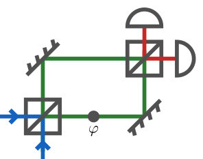
<figcaption class="paper-figure-caption"><b>Fig 1.</b> Figure 3. Sketch of a Mach-Zehnder interferometer. The two input modes first interfere on a beam splitter, then the phase of one of the arms is shifted by φ, then the modes again enter a beam splitter and a coincidence measurement is performed on the output.</figcaption>
</figure>
<figure class="paper-figure-card">
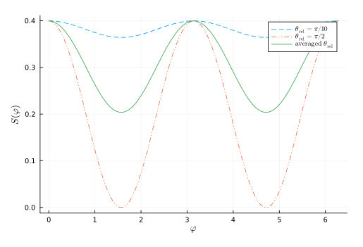
<figcaption class="paper-figure-caption"><b>Fig 2.</b> Figure 5. Measurement signal S(φ) in the Mach-Zehnder in- terferometer in quantum theory as a function of the phase shift φ introduced in one arm of the interferometer for dif- ferent initial relative phases θrel = π/10 (dashed blue line), θrel = π/2 (red dotted-dashed line), and averaged over all rel- ative phases (green solid line). The input states are coherent states with parameters αini 1 = 1 and αini 2 = eiθrel.</figcaption>
</figure>
<figure class="paper-figure-card">
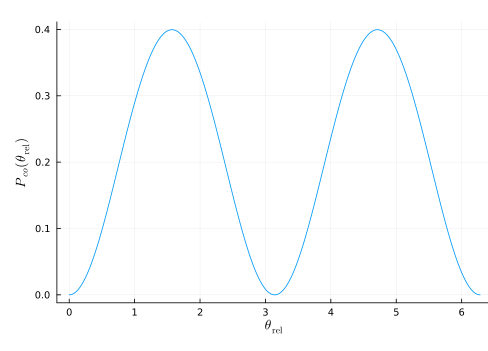
<figcaption class="paper-figure-caption"><b>Fig 3.</b> Figure 4. Coincidence probability in the Hong-Ou-Mandel set-up in quantum theory as a function of the initial relative phase between the two input states θrel. The input states are coherent states with parameters αini 1 = 1 and αini 2 = eiθrel.</figcaption>
</figure>
<figure class="paper-figure-card">
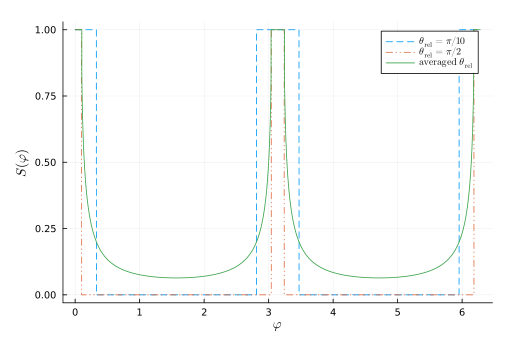
<figcaption class="paper-figure-caption"><b>Fig 4.</b> Figure 8. Output coincidence probability in Mach-Zehnder in- terferometer in classical theory as a function of the phase shift φ introduced in one arm of the interferometer for different ini- tial relative phases θrel = π/10 (dashed blue line), θrel = π/2 (red dotted-dashed line), and averaged over all initial relative phases (green solid line). Here we used Eth/Ecl = 9/10.</figcaption>
</figure>
<figure class="paper-figure-card">
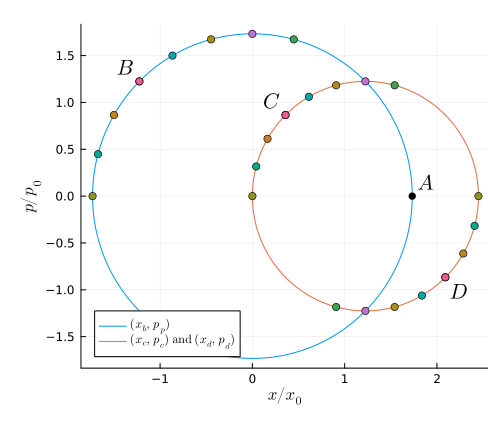
<figcaption class="paper-figure-caption"><b>Fig 5.</b> Figure 6. Points in phase space before and after passing through a beam splitter. Point A represents the state of the first input oscillator which in our formulation is fixed. Points B are the states of the second input oscillator for various values of θrel. Points C and D are the states of the output oscillators, these points are colour-coded so that same colour of points B, C, D corresponds to the same relative phase θrel.</figcaption>
</figure>

**Summary.** This paper generalizes linear optics theory by mapping quantum quadrature operators onto classical phase-space coordinates. It investigates fundamental quantum phenomena like the Hong-Ou-Mandel effect and MZI using this generalized framework. The key finding is that these interference effects persist across classical and alternative theories, suggesting a broader physical principle governs them.

**Why it may be interesting.** This work directly addresses the foundations of quantum optics by testing the necessity of quantum mechanics for observed photonic phenomena, which is highly relevant for understanding photonic quantum computing architectures.

Detailed structure

**Main problem.** To generalize the theory of linear optics beyond quantum mechanics by developing a framework based on quadrature operators and analyzing interference phenomena.

**Main result.** The vanishing of photon coincidences at a beam splitter and the behavior of Mach-Zehnder interferometry are found to occur in both classical and modified quantized theories, suggesting these effects are general features of the generalized framework.

**Method.** The authors use an analogy between quantum quadrature operators and phase-space coordinates, developing a generalized probabilistic theory framework using pseudo-probability distributions on phase space.

**Model / system.** The study focuses on photonic circuits involving linear optical elements like beam splitters and phase shifters, modeled using two coupled harmonic oscillators in phase space.

**Key observables.** Coincidence probability ($P_{co}$), visibility ($V$), and the joint numerical range of coincidence vs. Hadamard coincidence measurements.

**Important parameters / regimes.** Relative phase ($	heta_{rel}$), energy threshold ($E_{th}$), and the comparison between classical, quantum, and sawtooth theory limits.

**Assumptions / limitations.** The analysis relies on describing states via a pseudo-probability distribution $
ho(x, p)$ on phase space, and comparing results across different theoretical models (classical, quantum, etc.).

**Figures summary.** Figures illustrate the HOM dip and MZI behavior for different theories, and Figure 11 compares the joint numerical ranges for coincidence and Hadamard measurements across quantum, classical, and sawtooth models.

**Paper structure.** The paper progresses by establishing the generalized framework using quadrature operators, applying it to fundamental linear optical setups (HOM, MZI), and culminating in a comparison of predictions across classical, quantum, and alternative theories, including contextuality tests.

Abstract

We use the analogy between the quadrature operators in quantum optics and the phase-space coordinates in a mechanical harmonic oscillator to generalise the theory of linear optics beyond quantum theory. For this, we introduce a framework for analysing photonic circuits within generalised probabilistic theories based on quadrature operators. Using this framework, we ask whether phenomena like the Hong-Ou-Mandel effect, Mach-Zehnder interferometry are specific to quantum theory or also occur across a broader class of theories. We find the latter: the vanishing photon coincidences at the output of a beam splitter also occur for classical light and for a modified version of quantised light. Similarly, for Mach-Zehnder interferometry we find that there is no qualitative difference between quantum theory and these alternative theories. Our framework can serve as a foundation to study generalised theories of complex photonic set-ups and photonic quantum computers.

[↑ back to top](#top)

### [Multistate Torsion in Zitterbewegung](http://arxiv.org/abs/2609.37767v1)

**Authors:** Wojciech J. Jankowski  
**Type:** theory · **Category:** other · **PDF:** <https://arxiv.org/pdf/2609.37767v1>  
**Analysis basis:** full PDF text, analyzed in chunks
**Topic relevance:** `Keldysh / 2PI / non-Gaussian methods` **3/5** · `methods for driven-dissipative` **3/5** · `quantum measurements` **1/5**

↔ Scroll figures horizontally

<figure class="paper-figure-card">
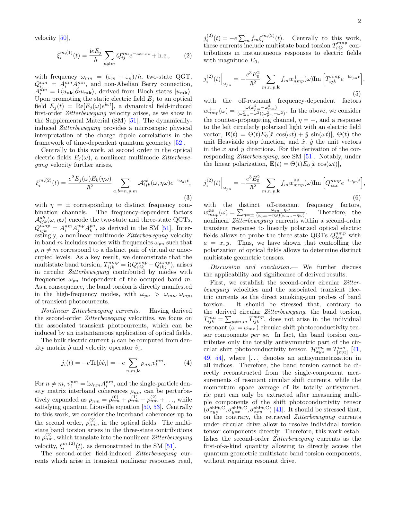
<figcaption class="paper-figure-caption"><b>Fig 1.</b> Low-resolution page preview, page 2</figcaption>
</figure>
<figure class="paper-figure-card">
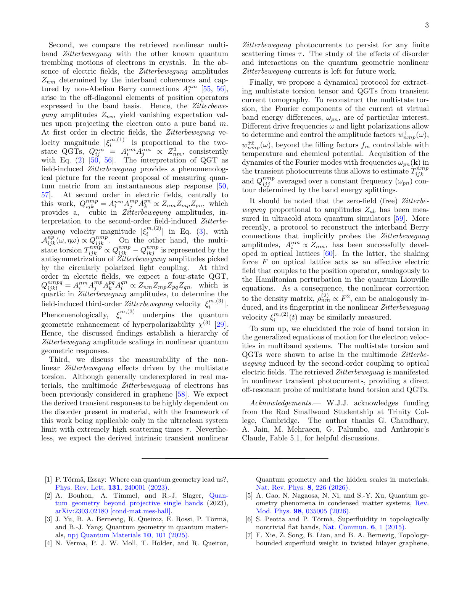
<figcaption class="paper-figure-caption"><b>Fig 2.</b> Low-resolution page preview, page 3</figcaption>
</figure>
<figure class="paper-figure-card">
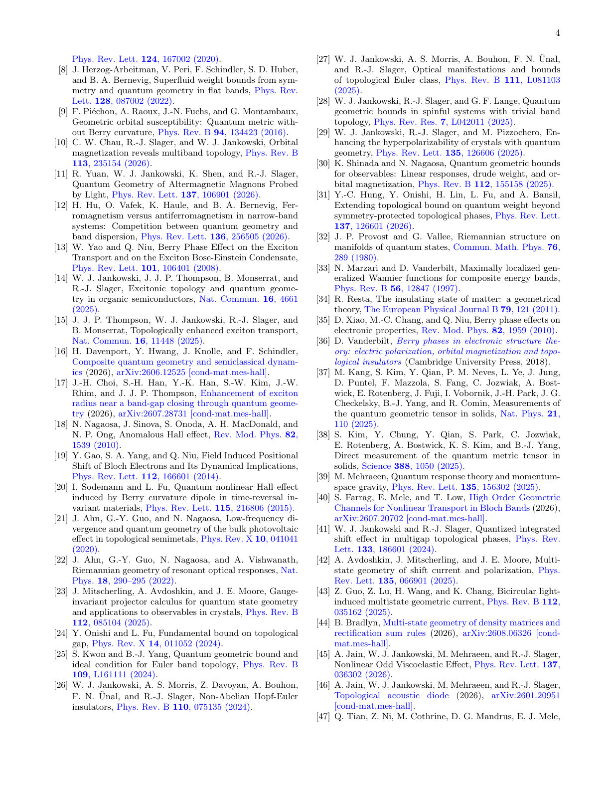
<figcaption class="paper-figure-caption"><b>Fig 3.</b> Low-resolution page preview, page 4</figcaption>
</figure>
<figure class="paper-figure-card">
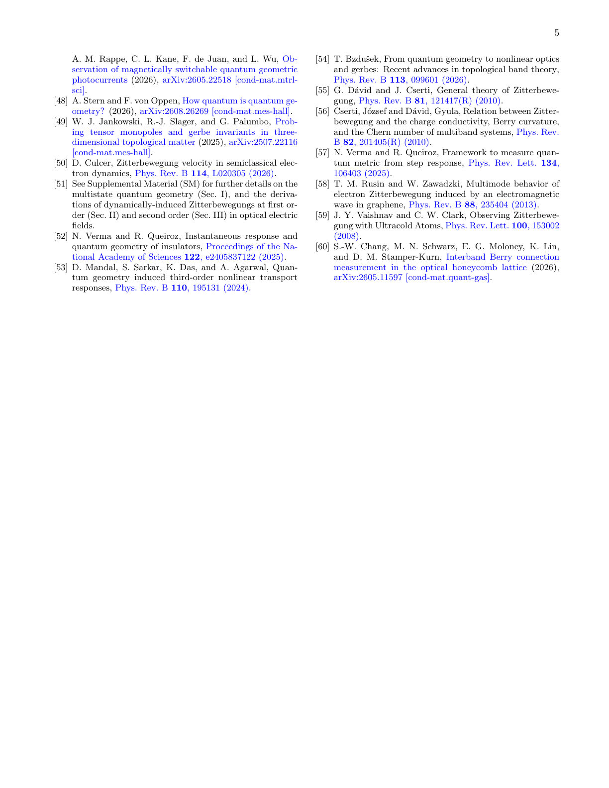
<figcaption class="paper-figure-caption"><b>Fig 4.</b> Low-resolution page preview, page 5</figcaption>
</figure>
<figure class="paper-figure-card">
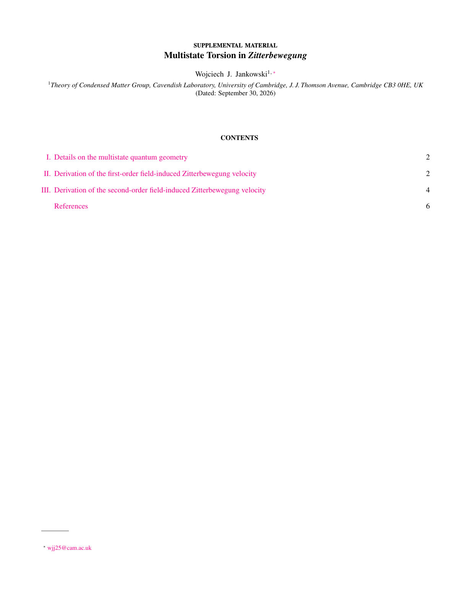
<figcaption class="paper-figure-caption"><b>Fig 5.</b> Low-resolution page preview, page 6</figcaption>
</figure>

**Summary.** This theoretical work develops a framework to analyze the nonlinear Zitterbewegung of electrons in crystals, incorporating the effects of band torsion using multi-state quantum geometric tensors. The key finding is that the resulting transient photocurrents offer a novel, direct method to measure the band torsion, bypassing limitations found in traditional resonant optical measurements.

**Why it may be interesting.** The connection between high-order nonlinear optical responses (like transient photocurrents) and fundamental geometric properties of the band structure (like band torsion) provides a powerful, non-perturbative diagnostic tool for quantum materials.

Detailed structure

**Main problem.** The paper derives and proposes methods to measure nonlinear Zitterbewegung velocity and associated transient photocurrent responses that are augmented by band torsion in crystals.

**Main result.** The nonlinear Zitterbewegung currents provide a direct, off-resonant diagnostic tool to access individual components of the quantum geometric multistate band torsion tensor, which is inaccessible via standard resonant measurements.

**Method.** The analysis involves solving the quantum Liouville equation perturbatively to calculate higher-order density matrix elements, leading to the derivation of second-order Zitterbewegung velocities.

**Model / system.** The system models electrons in clean crystals, utilizing a multi-state quantum geometric framework incorporating band torsion and higher-order quantum geometric tensors (QGTs).

**Key observables.** Multistate band torsion ($T_{nmp}^{ijk}$), nonlinear Zitterbewegung velocity ($\xi_m^{(2)}$), and transient nonlinear photocurrents ($j^{(2)}_i(t)$).

**Important parameters / regimes.** Second order in optical electric fields, clean crystal limit ($	au 	o \infty$), and specific polarization states (circular/linear).

**Assumptions / limitations.** The analysis is based on semiclassical equations of motion for electron velocity and assumes the ultraclean system limit.

**Paper structure.** The paper progresses by deriving the equation of motion for electron velocity, extending the analysis to second order in optical fields, and finally relating the resulting transient photocurrents to the band torsion tensor via tomography protocols.

Abstract

We derive nonlinear Zitterbewegung velocity of electrons augmented by band torsion in crystals. The equation of motion with multistate quantum geometric tensors and torsion culminates in transient nonlinear photocurrent responses distinct from the recently measured resonant steady-state photovoltaic effects induced by circularly polarized light. Tomography protocols for measuring the multistate quantum geometric torsion tensors are proposed.

[↑ back to top](#top)

### [Synchronized Quantum Devices in Lossy Channels](http://arxiv.org/abs/2609.36627v1)

**Authors:** Ravi Singh Adhikari, Aman Gupta, Xiaoyu Ai, Robert Malaney  
**Type:** both · **Category:** quantum information and computing · **PDF:** <https://arxiv.org/pdf/2609.36627v1>  
**Analysis basis:** full PDF text, analyzed in chunks
**Topic relevance:** `quantum optics experiment` **3/5** · `quantum measurements` **2/5** · `QC/QI experiment` **1/5** · `interference shaping light` **1/5**

↔ Scroll figures horizontally

<figure class="paper-figure-card">
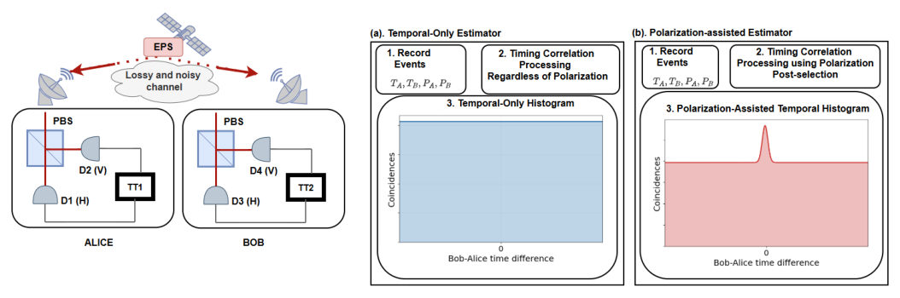
<figcaption class="paper-figure-caption"><b>Fig 1.</b> Fig. 1: Temporal-only and polarization-assisted estimators using identical polarization-resolved receiver hardware. An entangled-photon source (EPS) onboard the satellite distributes correlated photon pairs to two ground stations through independent lossy and noisy free-space channels. At each receiver, a polarizing beam splitter (PBS) separates the incoming photons into horizontal (H) and vertical (V) components, which are detected by polarization-resolved single-photon detectors (D1–D4) and recorded by local time taggers (TT1 and TT2). (a) In the temporal-only estimator, the polarization arrays PA and PB are discarded, and the temporal-correlation histogram is constructed from the...</figcaption>
</figure>
<figure class="paper-figure-card">
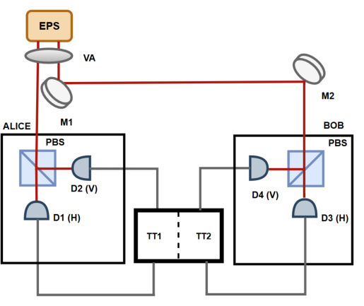
<figcaption class="paper-figure-caption"><b>Fig 2.</b> Fig. 2: Experimental setup for the polarization-assisted clock-synchronization proof-of-concept. The entangled-photon source (EPS) generates polarization- entangled photon pairs, which are routed through the free-space optical chan- nel using mirrors M1–M2. A variable attenuator (VA) introduces controlled channel loss symmetrically at Alice’s and Bob’s stations to emulate high- loss satellite-channel conditions. At Alice and Bob, polarizing beam splitters (PBSs) separate the horizontal (H) and vertical (V) polarization components, which are detected by single-photon counting modules D1–D4. See main text for the setup of TT1 and TT2.</figcaption>
</figure>
<figure class="paper-figure-card">

<figcaption class="paper-figure-caption"><b>Fig 3.</b> Fig. 3: Experimental synchronization-acquisition probability, Psucc,l, as a function of total channel loss, η. Blue and orange denote background- count rates of Rb = 1.5kHz and Rb = 70kHz, respectively. Curves are logistic least-squares fits. Stars denote the fitted synchronization-acquisition loss thresholds for Psucc,l = 0.9.</figcaption>
</figure>
<figure class="paper-figure-card">
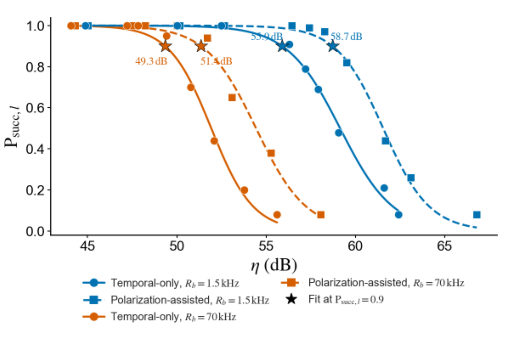
<figcaption class="paper-figure-caption"><b>Fig 4.</b> Fig. 3 presents the experimentally extracted synchronization-acquisition probability for the temporal-only and polarization-assisted estimators at two background-count rates, Rb = 1.5kHz and Rb = 70kHz, representative of low-background and high-background operating conditions, respectively, as a function of η ranging from 45–68dB. At lower total channel loss, both estimators reliably recover the clock offset. As the total channel loss increases, the temporal-only estimator transitions from reliable to unreliable acquisition, whereas polarization post-selection shifts this transition toward higher total channel loss. For the synchronization-acquisition criterion Psucc,l ≥0.9, we define the...</figcaption>
</figure>
<figure class="paper-figure-card">
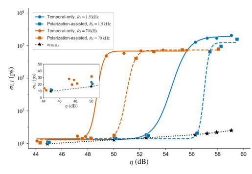
<figcaption class="paper-figure-caption"><b>Fig 5.</b> Fig. 4: SD of the experimentally estimated clock offset, σˆτ,l, as a function of total channel loss, η, for l ∈{T, P}. Blue and orange correspond to background-count rates of Rb = 1.5kHz and Rb = 70kHz, respectively. The black dotted curve with star markers denotes the true pair coincidence- only CRLB, σCRLB,t. The inset zooms in on the low-loss region, where the experimentally estimated SDs are comparable to σCRLB,t. Curves are logistic fits to the experimental data.</figcaption>
</figure>

**Summary.** This paper introduces a polarization-assisted protocol to enhance clock synchronization for quantum devices communicating over lossy channels like satellite links. By exploiting polarization correlations, the method effectively suppresses background noise that plagues standard timing measurements. This results in a significant extension of the operational range, proving its practical importance for the quantum internet.

**Why it may be interesting.** This work directly addresses the practical limitations of quantum networking by providing a concrete, experimentally validated technique to maintain synchronization in noisy, lossy channels, which is crucial for scaling quantum internet infrastructure.

Detailed structure

**Main problem.** The core challenge is achieving reliable clock synchronization for quantum devices operating over high-loss, long-distance quantum channels, such as satellite-to-ground links.

**Main result.** The proposed polarization-assisted protocol significantly improves synchronization robustness, extending the reliable operational range by up to 40% compared to methods relying only on temporal coincidence measurements.

**Method.** The authors compare a temporal-only estimation method against a polarization-assisted estimator, which uses polarization post-selection to suppress background noise.

**Model / system.** The system involves entangled photon pairs generated via SPDC and distributed over free-space channels. The analysis models the timing error ($\Delta t$) and compares the performance of estimators based on time-only versus polarization-resolved coincidence counts.

**Key observables.** Synchronization-acquisition probability ($P_{	ext{succ},l}$), Fisher Information ($I$), and the clock offset ($	au$).

**Important parameters / regimes.** Channel loss ($\eta$), background count rate ($R_b$), and the visibility ($V$) of the entangled source.

**Assumptions / limitations.** Timing errors are assumed to be independent Gaussian variables, and the temporal statistics are assumed independent of the polarization statistics.

**Figures summary.** Figure 5 compares temporal-only vs. polarization-assisted histograms, showing the polarization method reveals a clear peak obscured by noise in the former. Figure 6 quantifies the increased loss threshold ($\eta_{90}$) achieved by the polarization-assisted estimator.

**Paper structure.** The paper develops the theoretical framework by deriving performance metrics (like Fisher Information) for both estimators, analyzes the improvement in the strongly background-dominated limit, and culminates in experimental/simulation results demonstrating the extended operational range in high-loss regimes.

Abstract

Due to their tight temporal coupling, entangled photon pairs produced by spontaneous parametric down-conversion offer a new route to improved network synchronization among quantum-enabled devices. In the emerging space-based quantum internet, such synchronization will be pivotal to operational success. Here, we propose and experimentally demonstrate a new polarization-assisted protocol that allows quantum-enabled devices to remain synchronized under the high loss conditions anticipated for satellite-to-ground quantum channels. Our experimental results show that polarization assistance extends reliable synchronization acquisition to higher channel losses and an increase of up to 40$\%$ in satellite-to-ground distance. Supporting Monte Carlo simulations show that this performance improvement extends over a wide range of photon-starved conditions. Collectively, these results not only provide a proof of concept for polarization-assisted network synchronization but also demonstrate its pragmatic importance in significantly extending the range under which quantum-enabled devices forming the backbone of the quantum internet can remain highly synchronized.

[↑ back to top](#top)

### [Imaging phase winding in topological superconductors with a fork-tip Josephson STM](http://arxiv.org/abs/2609.38174v1)

**Authors:** Vladislav Poliakov, Archisman Panigrahi  
**Type:** theory · **Category:** strongly correlated electrons · **PDF:** <https://arxiv.org/pdf/2609.38174v1>  
**Analysis basis:** full PDF text, analyzed in chunks
**Topic relevance:** `quantum measurements` **3/5** · `Keldysh / 2PI / non-Gaussian methods` **2/5** · `interference shaping light` **1/5**

↔ Scroll figures horizontally

<figure class="paper-figure-card">
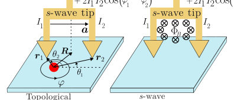
<figcaption class="paper-figure-caption"><b>Fig 1.</b> Figure 1. Schematic of (a) fork-tip Josephson STM near an impurity on a topological superconductor. The impurity gen- erates a local phase winding in the anomalous Green’s func- tion around it, leading to the phase difference (φ1 −φ2) be- tween two junctions and hence to the interference contribution to the critical current. (b) Conventional fork-tip interference in an s-wave superconductor where an Aharonov-Bohm phase difference is induced by an external magnetic flux ΦB.</figcaption>
</figure>
<figure class="paper-figure-card">
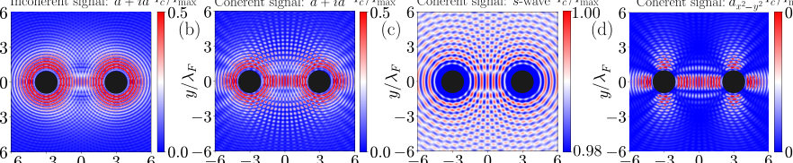
<figcaption class="paper-figure-caption"><b>Fig 2.</b> Figure 2. The spatial pattern of the squared fork-tip critical current near a single point impurity for different superconducting order parameters. (a) I2 c (R) for d + id superconductor (∆θ = ˜∆e2iθ) without phase coherence between the two tips. Since there is no interference term (I2 c (R) = I2 0(r1) + I2 0(r2)) this signal is insensitive to the phase of the order parameter. Panel (b) shows the analogous squared critical current for two phase-coherent tips. The signal now exhibits hyperbolic fringes due to the interference term (2I0(r1)I0(r2) cos(φ1 −φ2)) in I2 c (R). (c) Coherent signal for s-wave (∆θ = ˜∆) superconductor, with a finite background due to the large bulk contribution to...</figcaption>
</figure>
<figure class="paper-figure-card">
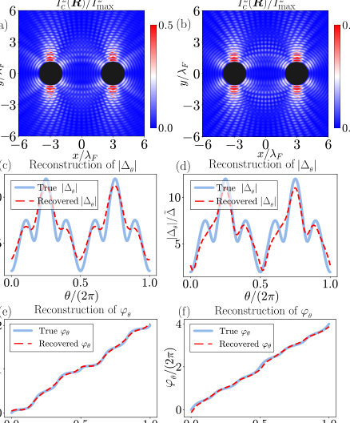
<figcaption class="paper-figure-caption"><b>Fig 3.</b> Figure 3. Reconstruction of order parameter from the squared fork-tip critical current I2 c . (a) Spatial map of I2 c point impu- rity for order parameter ∆1(θ) ∝(6ei2θ+e−i2θ−3ei4θ−2e−i4θ) defined in Eq. (20). (c,e) Magnitude and phase of ∆1(θ) re- constructed by fitting the signal in panel (a) using angular harmonic expansion in Eq. (19). (b) The same as (a) but for ∆2(θ) ∝(−3ei2θ −2e−i2θ +6ei4θ +e−i4θ) from Eq. (20). (d,f) Corresponding reconstruction of |∆2(θ)| and φ2(θ). Although ∆1(θ) and ∆2(θ) have the same magnitude, their phase wind- ings are different. The agreement between reconstructed and original curves demonstrates that both the magnitude and the phase of the order parameter...</figcaption>
</figure>

**Summary.** This work proposes using a fork-tip Josephson Scanning Tunneling Microscope (STM) to overcome the difficulty of measuring the complex phase winding in topological superconductors. By acting as an interferometer, the setup measures the relative phase difference between two points, allowing researchers to reconstruct the full angular dependence of the superconducting order parameter. This offers a direct pathway to experimentally verify theoretical predictions about topological superconductivity.

**Why it may be interesting.** The technique provides a novel, phase-sensitive probe for superconducting order parameters, which is crucial for understanding exotic states like topological superconductivity, bridging condensed matter theory with advanced experimental diagnostics.

Detailed structure

**Main problem.** The primary challenge is accessing the complex phase winding of superconducting order parameters in topological superconductors using conventional real-space measurement techniques.

**Main result.** The proposed fork-tip Josephson STM setup allows for the reconstruction of the angular dependence of both the gap-function magnitude and its complex phase by measuring the relative phase difference between two points.

**Method.** The method involves deriving the Josephson current in the weak tunneling limit, which is then adapted for a fork-tip geometry to measure interference patterns sensitive to relative phase differences.

**Model / system.** The system is a topological superconductor probed by a fork-tip Josephson STM near an impurity. The theoretical framework utilizes anomalous Green's functions derived from the Bogoliubov-de Gennes (BdG) Hamiltonian.

**Key observables.** The interference contribution to the critical current, $I_c(R)$, and the spatial pattern of the squared critical current, $I_c^2(R)$.

**Important parameters / regimes.** The relative phase difference ($\varphi_1 - \varphi_2$) between the two tips, and the superconducting gap function harmonics ($\Delta_m$).

**Assumptions / limitations.** The analysis relies on the weak tunneling limit and semiclassical approximations for the anomalous Green's function in the vicinity of the impurity.

**Figures summary.** Figures illustrate the schematic setup, the resulting critical current formula, and the successful reconstruction of the order parameter's magnitude and phase from the measured spatial pattern.

**Paper structure.** The paper builds from the general derivation of the Josephson current for arbitrary order parameters, introduces the limitations of single-tip measurements, and then details the fork-tip interferometer setup to extract phase information via numerical computation and fitting procedures.

Abstract

The complex phase winding in a topological superconductor remains challenging to access by conventional real-space probes. We propose a scheme to probe this winding with a fork-tip Josephson STM near an impurity, where two superconducting tips form an interferometer sensitive to phase differences between two positions. The signal remains accessible even if the relative phase between the fork-tip and sample fluctuates, establishing a route towards a local phase-sensitive STM probe of topological superconductivity. We numerically compute the interference pattern to demonstrate that the magnitude and phase of the order parameter can be reconstructed as a function of angle, providing a route towards resolving the longstanding open experimental problem of directly detecting phase winding in topological superconductors.

[↑ back to top](#top)

### [Quantum Complexity of Ancilla-Free Unitary Embeddings for Nonlinear Dynamics via Generalized State-Dependent Double-Bracket Flows](http://arxiv.org/abs/2609.37802v1)

**Authors:** Yuki Ito, Hideaki Hakoshima, Keisuke Fujii  
**Type:** theory · **Category:** quantum information and computing · **PDF:** <https://arxiv.org/pdf/2609.37802v1>  
**Analysis basis:** full PDF text, analyzed in chunks
**Topic relevance:** `analog quantum simulation` **3/5** · `Keldysh / 2PI / non-Gaussian methods` **1/5** · `methods for driven-dissipative` **1/5** · `quantum measurements` **1/5**

↔ Scroll figures horizontally

<figure class="paper-figure-card">
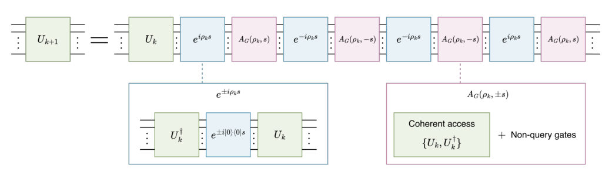
<figcaption class="paper-figure-caption"><b>Fig 1.</b> FIG. 1. An overview of the recursive ancilla-free implementation of nonlinear state-dependent double-bracket dynamics in Eq. (2). This circuit implements an approximate one-step update of duration τ, recursively constructing Uk+1 from Uk and U † k. The state preparation circuit Uk satisfies Uk |0⟩= |ψk⟩, where |ψk⟩approximates the solution at tk = kτ up to a global phase. This implementation is based on the symmetric group-commutator formula, with s = p</figcaption>
</figure>

**Summary.** This paper establishes a general framework for simulating nonlinear quantum dynamics using fully coherent, ancilla-free unitary circuits. It shows that the required quantum resources scale dramatically based on whether the dynamics are contractive, nonexpansive, or expansive. The results provide optimal query complexity bounds for specific models like the Gross-Pitaevskii equation.

**Why it may be interesting.** This work provides a deep theoretical link between the mathematical complexity of nonlinear physical systems and the required computational resources (query complexity) for quantum simulation, which is crucial for designing practical quantum algorithms.

Detailed structure

**Main problem.** The core problem is developing a quantum algorithm to simulate nonlinear quantum dynamics using only unitary, ancilla-free circuits.

**Main result.** The query complexity for simulating nonlinear dynamics is rigorously related to the stability properties (contractive, nonexpansive, expansive) of the dynamics, yielding bounds like $\exp(O(T))$ to $\exp(\exp(O(T)))$.

**Method.** The authors generalize the double-bracket quantum algorithm by replacing the state-independent Hamiltonian with a state-dependent Hermitian operator, analyzing the resulting evolution via trace-norm Lipschitz bounds.

**Model / system.** The model involves nonlinear dynamics governed by a state-dependent operator $G(
ho)$, exemplified by the Nonlinear Schrödinger Equation (NLSE) and the discrete Gross-Pitaevskii equation.

**Key observables.** Query cost (number of oracle calls), trace-norm distance ($\|\cdot\|_1$), and the stability characterization $\Lambda(t)$.

**Important parameters / regimes.** Target evolution time $T$, nonlinearity strength $g$, and approximation accuracy $\epsilon$.

**Assumptions / limitations.** The analysis assumes the existence of an initial state preparation oracle and relies on bounding the Lipschitz continuity of the state-dependent operator $G(
ho)$.

**Figures summary.** Figures illustrate the recursive, ancilla-free implementation structure for the quantum simulation, showing how subsequent unitary steps are built from previous ones.

**Paper structure.** The paper develops a general framework by generalizing the double-bracket algorithm to handle arbitrary state-dependent nonlinearities, followed by detailed complexity analysis based on the dynamics' stability properties.

Abstract

Simulating nonlinear dynamics with quantum computers has gained increasing attention. In general, such simulations require additional quantum resources because unitary quantum evolution is linear. A fundamental question is how nonlinear dynamics can be embedded into fully coherent, ancilla-free unitary circuits and how the complexity of the dynamics governs the required quantum resources. In this work, we generalize the ancilla-free double-bracket quantum algorithm for imaginary-time evolution by replacing its state-independent Hamiltonian with a state-dependent Hermitian operator. Our framework recursively calls an initial state preparation oracle and its inverse, and prepares the target solution to any prescribed accuracy using a fully coherent, ancilla-free unitary embedding. We relate the query cost to the complexity of the nonlinear dynamics, specifically their sensitivity to initial conditions. We obtain query upper bounds of $\exp(O(T))$, $\exp(O(T^2))$, and $\exp(\exp(O(T)))$ when the distance between solutions contracts at least exponentially (contractive), does not increase (nonexpansive), or grows at most exponentially (expansive), respectively, where $T$ is the target evolution time. For the discrete Gross--Pitaevskii equation, our ancilla-free double-bracket circuit achieves optimal worst-case query complexity $Θ(e^{gT/2})$ over a specified family of single-qubit initial states, where $g>0$ is the nonlinearity strength. These results connect the complexity of nonlinear dynamics to the query cost of coherent quantum simulation and provide a foundation for designing ancilla-free unitary embeddings with optimal query complexity.

[↑ back to top](#top)

### [Variational Monte Carlo for the Hubbard model](http://arxiv.org/abs/2609.38015v1)

**Authors:** Luca F. Tocchio  
**Type:** theory · **Category:** strongly correlated electrons · **PDF:** <https://arxiv.org/pdf/2609.38015v1>  
**Analysis basis:** full PDF text, analyzed in chunks
**Topic relevance:** `analog quantum simulation` **3/5** · `Keldysh / 2PI / non-Gaussian methods` **2/5** · `methods for driven-dissipative` **1/5**

↔ Scroll figures horizontally

<figure class="paper-figure-card">
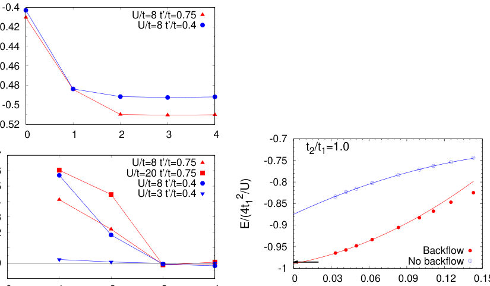
<figcaption class="paper-figure-caption"><b>Fig 1.</b> Fig. 1: Upper left panel: Ground-state energy as a function of the range of backflow parameters on the 2D square lattice for t′/t = 0.4 and 0.75 at U/t = 8. A range equal to zero corresponds to no backflow correlations in the wave function. Lower left panel: Optimized backflow param- eters η|R−R′| as a function of the distance |R −R′| between lattice sites. Results for U/t = 3 and t′/t = 0.4 correspond to a metallic state, the others to Mott insulating states. Data are shown for a lattice with L = 98 sites [21]. Right panel: Energy (in units of 4t2 1/U), as a function of t1/U, for the 1D Hubbard model with t2/t1 = 1. Filled (empty) circles denote the results with (without) backflow...</figcaption>
</figure>
<figure class="paper-figure-card">
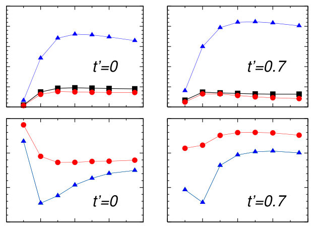
<figcaption class="paper-figure-caption"><b>Fig 2.</b> Fig. 2: Results for 18 electrons on 18 sites as a function of U/t. Upper panels: Accuracy of energy ∆E = (E0 −Ev), Ev and E0 being the variational and the exact values, respectively. Lower panels: Overlap between the exact ground state and the variational wave functions. The variational state without backflow is denoted by blue triangles, the variational state with backflow correlations is denoted by red circles [20].</figcaption>
</figure>
<figure class="paper-figure-card">
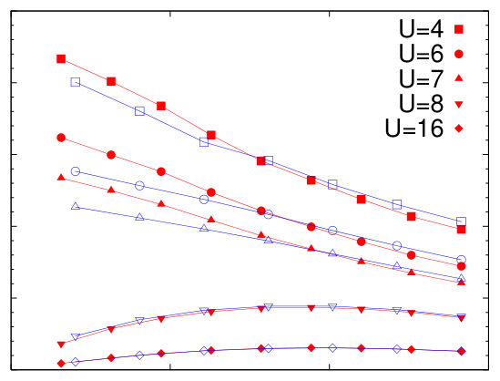
<figcaption class="paper-figure-caption"><b>Fig 3.</b> Fig. 3: Variational results for N(q) divided by |q|, as a function of |q|, for L = 98 (empty symbols) and for L = 162 (full symbols) at t′/t = 0.75. The metal-insulator transition takes place between U/t = 7 and U/t = 8, that is, where N(q) changes its behavior from linear to quadratic for |q| →0 [20].</figcaption>
</figure>
<figure class="paper-figure-card">
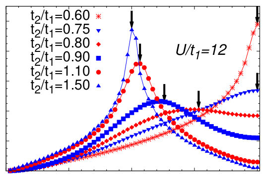
<figcaption class="paper-figure-caption"><b>Fig 4.</b> Fig. 4: Spin-spin correlations S(q) at U/t1 = 12 for different values of the hopping ratio t2/t1. Arrows indicate the location of the peaks. Data are shown on a L = 120 lattice size [33].</figcaption>
</figure>
<figure class="paper-figure-card">
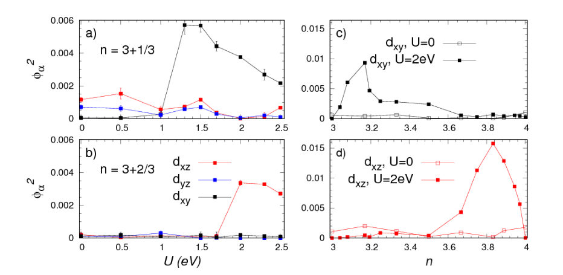
<figcaption class="paper-figure-caption"><b>Fig 5.</b> Fig. 5: Square of the superconducting order parameter ϕ2 α in each orbital as a function of U at n = 3 + 1/3 [panel a)] and n = 3 + 2/3 [panel b)]. Data are for the L = 18 × 18 cluster. Square of the superconducting order parameter in the dxy [panel c)] and dxz [panel d)] orbitals as a function of n at U = 2eV (full squares) and at U = 0 (empty squares). Data are for the L = 12 × 12 cluster. All data are computed at J = 0.2U [25].</figcaption>
</figure>

**Summary.** This lecture notes series introduces the Variational Monte Carlo method for studying the Hubbard model, covering both single- and multi-orbital extensions. It details the computational machinery, including the local estimator and Metropolis sampling, to calculate quantum expectation values. The work demonstrates how this technique can reveal complex correlated phenomena such as superconductivity and orbital selectivity in strongly interacting electron systems.

**Why it may be interesting.** While focused on condensed matter, the VMC framework and the use of advanced wave function ansatze (like Jastrow factors) are general techniques for approximating ground states in complex quantum many-body systems, which has parallels in quantum simulation theory.

Detailed structure

**Main problem.** The paper addresses the challenge of studying correlated Hamiltonians, specifically the Hubbard model, in two dimensions where exact solutions are unavailable.

**Main result.** The Variational Monte Carlo method successfully computes quantum expectation values for the Hubbard model, allowing the diagnosis of phenomena like superconductivity and orbital selectivity.

**Method.** It employs Variational Monte Carlo (VMC) sampling, utilizing a local estimator and the Metropolis algorithm to calculate averages over a variational wave function.

**Model / system.** The primary model is the Hubbard Hamiltonian, presented in both single-orbital and multi-orbital extensions (including nearest/next-nearest neighbor hopping and various repulsion terms).

**Key observables.** Correlation functions (spin/charge order), electronic density per orbital ($n_\alpha$), and pairing correlations ($D_\alpha(r)$).

**Important parameters / regimes.** The interaction strength $U$, hopping parameters ($t, t'$), and filling factor ($n$).

**Assumptions / limitations.** The method relies on constructing a variational Ansatz (e.g., Jastrow-Slater wave function) and assumes that the local estimator approach is tractable despite the complex Hilbert space.

**Figures summary.** Figures illustrate orbital-selective pairing correlations ($D_\alpha(r)$) and orbital occupation differentiation ($n_\alpha$) as a function of interaction strength $U$.

**Paper structure.** The notes suggest an introduction to the Hubbard model, followed by a detailed exposition of the VMC formalism (including local estimators and Metropolis sampling), and concluding with the application of the method to analyze specific correlated phenomena.

Abstract

In these lecture notes, we introduce the variational Monte Carlo method for the Hubbard model. First, we briefly introduce the single-orbital Hubbard model and its multi-orbital extension, focusing only on electronic models. Then, we introduce the general scheme under which variational Monte Carlo works and we present the variational wave functions that can properly describe superconductive and magnetic states in single-orbital and multi-orbital Hubbard models. We also detail how to perform Monte Carlo calculations for the given wave functions. We also describe how to optimize a variational wave function with the stochastic reconfiguration method. Finally, we present a few results for correlation functions that can be computed in variational Monte Carlo, to determine, for instance, the presence of charge or spin order and superconductivity.

[↑ back to top](#top)

### [Active normal-fluid feedback in quantum turbulence from holography](http://arxiv.org/abs/2609.37269v1)

**Authors:** Yu-Ping An, Li Li, Makoto Tusbota, Sebastian Waeber, Hua-Bi Zeng  
**Type:** theory · **Category:** quantum gases · **PDF:** <https://arxiv.org/pdf/2609.37269v1>  
**Analysis basis:** full PDF text, analyzed in chunks
**Topic relevance:** `Keldysh / 2PI / non-Gaussian methods` **3/5** · `methods for driven-dissipative` **1/5** · `quantum measurements` **1/5**

↔ Scroll figures horizontally

<figure class="paper-figure-card">
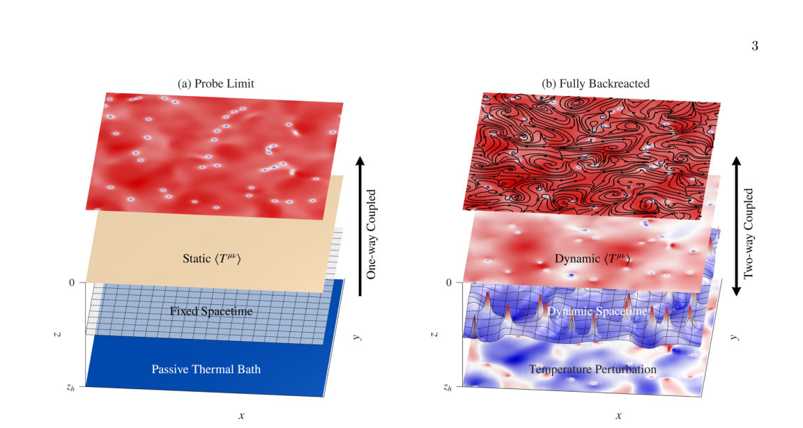
<figcaption class="paper-figure-caption"><b>Fig 1.</b> FIG. 1. Self-consistent holographic modeling of two-fluid dynamics. The schematic contrasts the strictly one-way coupled probe limit (a) with the two-way coupled, fully backreacted model (b). a, In the probe limit, matter fields evolve on a rigid background, restricting the normal fluid to a passive thermal bath without dynamical vortex feedback. b, With full gravitational backreaction, a self-consistent two-way coupling emerges as bulk geometry responds to fluid fields. Top: superfluid condensate overlaid with normal-fluid velocity streamlines. Boundary (z = 0): metric expansion coefficients encode the stress- energy tensor ⟨T µν⟩. Horizon (z = zh): local temperature fluctuations reflect...</figcaption>
</figure>
<figure class="paper-figure-card">
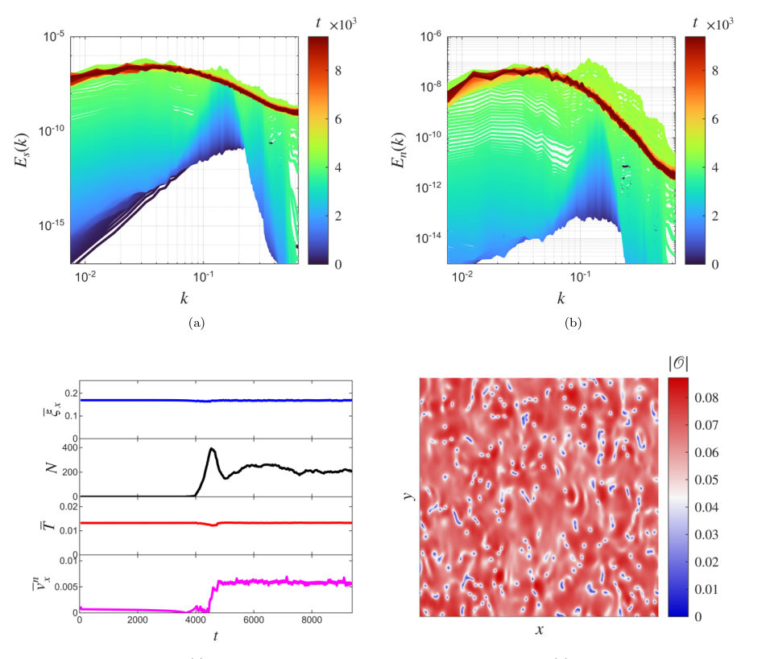
<figcaption class="paper-figure-caption"><b>Fig 2.</b> FIG. 2. Demonstration of statistically steady state with ¯T/Tc = 0.635 and ¯ξx = 0.17. (a,b) Time evolution of the superfluid and normal-fluid energy spectra, Es(k) and En(k), showing relaxation to time-independent distributions after an initial transient. (c) Spatially averaged quantities—mean superfluid velocity ¯ξx, vortex number Nv, effective temperature ¯T, and mean normal-fluid velocity ¯vn x—converge to plateau values with only small fluctuations. The vortex number stabilizes through sustained nucleation-annihilation balance. (d) Snapshot of the condensate magnitude |O| at t ≃9000, illustrating the vortex configuration in the steady state. Together, these panels confirm that the...</figcaption>
</figure>
<figure class="paper-figure-card">
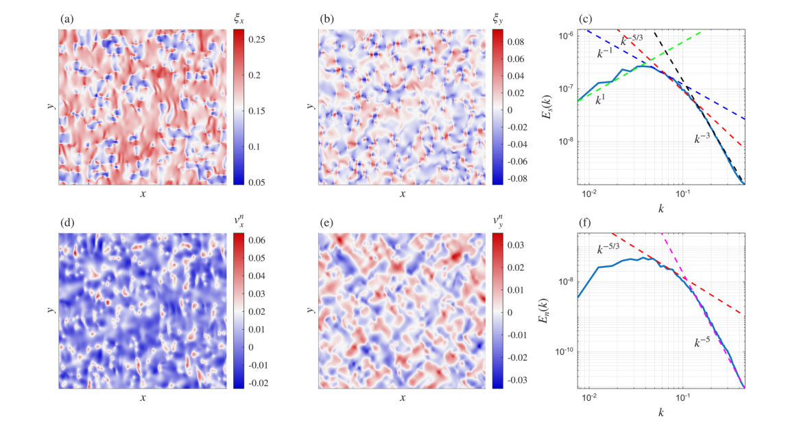
<figcaption class="paper-figure-caption"><b>Fig 3.</b> FIG. 3. Steady-state velocity fields and energy spectra. (a,b) Superfluid velocity components ξx and ξy at t ≃9000. (c) Superfluid energy spectrum Es(k), time-averaged over 100 slices within t ∈[6000, 9000], displaying k1 scaling at large scales, k−1 and k−5/3 at intermediate scales, and k−3 at small scales. (d,e) Normal-fluid velocity components vn x and vn y at t ≃9000. (f) Normal-fluid energy spectrum En(k), averaged over the same interval, showing k−5/3 scaling at intermediate scales and k−5 at small scales. Reference power laws are indicated by dashed lines. For both the superfluid and normal fluid, the spatial distributions of the longitudinal (x) and transverse (y) velocity...</figcaption>
</figure>
<figure class="paper-figure-card">
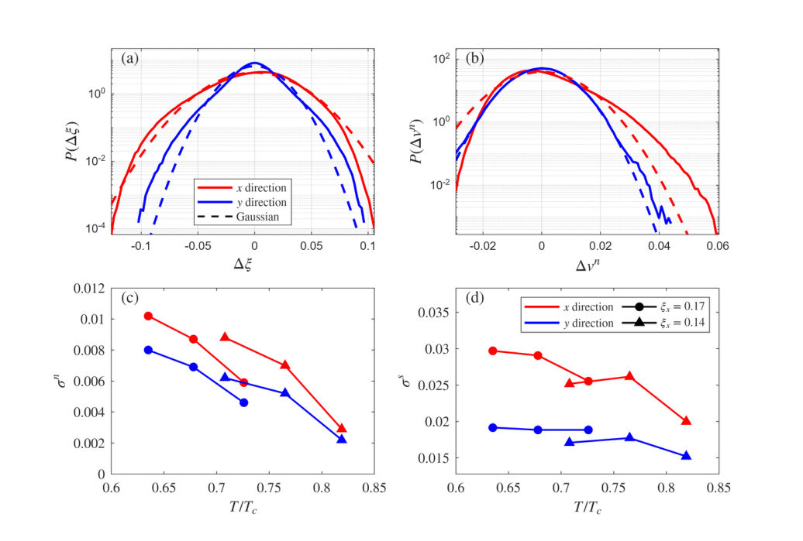
<figcaption class="paper-figure-caption"><b>Fig 4.</b> FIG. 4. Velocity distributions and temperature dependence of fluctuations. (a, b) Probability density functions (PDFs) of velocity fluctuations for the superfluid and normal fluid, P(∆ξ) and P(∆vn) with ∆ξ = ξ −¯ξ, ∆vn = vn −¯vn, accumulated over 100 time slices in the steady state. Both components exhibit pronounced non-Gaussian tails and spatial anisotropy, with fluctuations along the driving direction (x) significantly stronger than in the transverse direction (y); dashed lines denote Gaussian fits for reference. (c, d) Standard deviations of the normal-fluid and superfluid velocity fluctuations, σn and σs, as functions of temperature and driving velocity ¯ξx. The normal-fluid...</figcaption>
</figure>

**Summary.** This work pioneers the use of holographic duality to model quantum turbulence in superfluids, moving beyond phenomenological models. By simulating the fully backreacted system, the authors demonstrate that the normal fluid actively influences the dynamics, yielding non-Gaussian statistics. This establishes a rigorous, first-principles framework for understanding quantum turbulence in cold atomic systems.

**Why it may be interesting.** The use of holographic duality to derive transport coefficients and dynamics from first principles is a powerful tool for AMO physicists studying non-equilibrium quantum systems, providing a non-perturbative approach to superfluid dynamics.

Detailed structure

**Main problem.** The paper addresses the fundamental challenge of modeling active, two-way coupling between the normal fluid and quantized vortices in quantum turbulence, overcoming historical reliance on phenomenological parameters.

**Main result.** The holographic framework successfully models this coupling, revealing that normal-fluid velocity statistics exhibit non-Gaussian tails and spatial anisotropy directly from vortex backreaction, and that temperature suppresses fluctuations via superfluid depletion.

**Method.** The authors employ an ab initio holographic simulation using a fully backreacted gravitational model (AdS/CFT correspondence) to solve coupled Einstein-Maxwell-scalar equations in real time.

**Model / system.** The system is a superfluid at finite temperature, described by Landau's two-fluid model. The dynamics are simulated holographically, mapping the strongly coupled quantum fluid dynamics to classical gravity in a higher dimension.

**Key observables.** Normal-fluid velocity statistics (PDFs), energy spectra ($E_s(k), E_n(k)$), superfluid and normal fluid velocities ($\xi_i, \mathbf{v}_n$), and the superfluid condensate density ($
ho_s$).

**Important parameters / regimes.** Temperature ($T$), superfluid condensate density ($
ho_s$), driving velocity ($ar{\xi}_x$), and the ratio of superfluid to total density ($
ho_s/
ho$).

**Assumptions / limitations.** The holographic duality provides a rigorous first-principles framework, and the hydrodynamic description is an approximation expected to break down near vortex cores.

**Figures summary.** Figures illustrate the comparison between one-way (probe) and two-way (fully backreacted) coupling, show the time evolution of energy spectra and averaged quantities towards steady states, and present the non-Gaussian, anisotropic PDFs of velocity fluctuations.

**Paper structure.** The paper establishes the holographic framework, simulates the dynamics in both continuously driven and freely decaying regimes, analyzes the resulting energy spectra and velocity statistics, and concludes by interpreting the physical meaning of the observed non-equilibrium steady states.

Abstract

The two-fluid model provides a powerful phenomenological framework for superfluids, where components interact through vortex-induced mutual friction. Quantum turbulence in such coupled two-fluid systems has become a central theme in low-temperature physics. However, the fundamental incompatibility between discrete vortex-line and continuum descriptions has historically forced reliance on phenomenological parameters. Here, we present an ab initio holographic simulation of this active two-fluid dynamics. Using a fully backreacted gravitational model, we intrinsically incorporate reciprocal momentum exchange and finite-temperature dissipation without empirical inputs. Contrasting continuously driven and freely decaying turbulence, we uncover pronounced non-Gaussian tails and spatial anisotropy in the normal-fluid velocity statistics, arising directly from the dynamical quantized vortex backreaction. Raising the temperature suppresses normal-fluid velocity fluctuations despite increasing the vortex density. This suppression is unambiguously traced to the thermal depletion of the superfluid condensate. Our results establish holographic duality as a rigorous first-principles framework for quantum turbulence, revealing the active role of the normal fluid far from equilibrium and yielding predictions for ongoing cold-atom and superfluid experiments.

[↑ back to top](#top)

### [Affine spin-pencil factorization of generalized driven anisotropic Rabi--Stark Hamiltonians in an inhomogeneous orthosymplectic superalgebra](http://arxiv.org/abs/2609.36511v1)

**Authors:** B. M. Rodriguez-Lara, F. H. Maldonado-Villamizar, A. Kafuri, A. Moroz  
**Type:** theory · **Category:** other · **PDF:** <https://arxiv.org/pdf/2609.36511v1>  
**Analysis basis:** full PDF text, analyzed in chunks
**Topic relevance:** `analog quantum simulation` **3/5** · `Tavis-Cummings & cavity-many-emitter` **2/5**

↔ Scroll figures horizontally

<figure class="paper-figure-card">
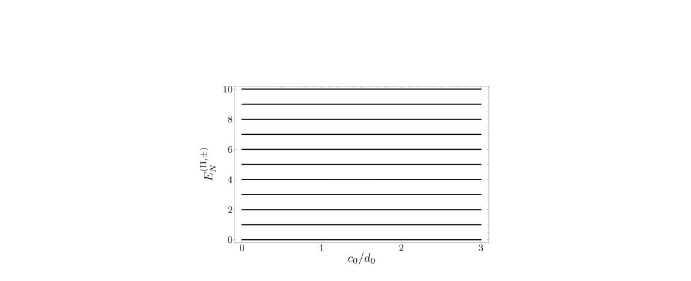
<figcaption class="paper-figure-caption"><b>Fig 1.</b> FIG. 1. Identity–identity spectral branch. Light gray curves show the numerical finite-Fock spectrum of</figcaption>
</figure>
<figure class="paper-figure-card">
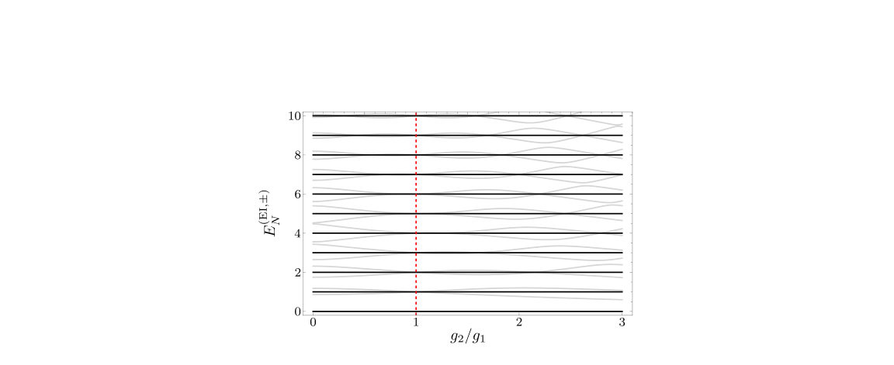
<figcaption class="paper-figure-caption"><b>Fig 2.</b> FIG. 2. Exchange–identity spectral branch. Light gray curves show the numerical finite-Fock spectrum</figcaption>
</figure>
<figure class="paper-figure-card">
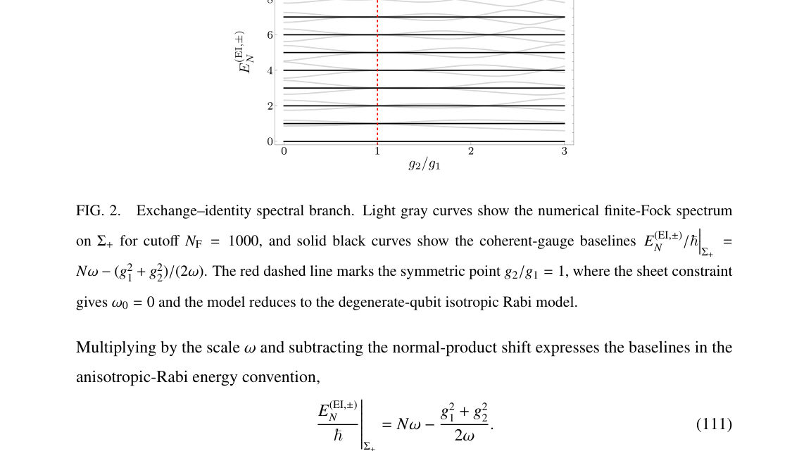
<figcaption class="paper-figure-caption"><b>Fig 3.</b> Figure 2 compares the finite-Fock spectrum on the exchange–identity sheet with the scaled</figcaption>
</figure>
<figure class="paper-figure-card">
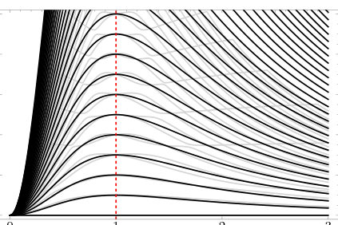
<figcaption class="paper-figure-caption"><b>Fig 4.</b> FIG. 3. Identity–exchange spectral branch. Light gray curves show the numerical finite-Fock spectrum</figcaption>
</figure>
<figure class="paper-figure-card">
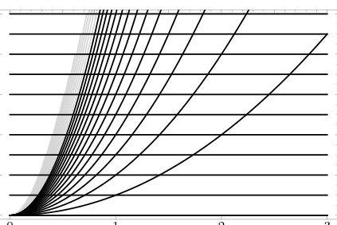
<figcaption class="paper-figure-caption"><b>Fig 5.</b> FIG. 4. Exchange–exchange spectral branches. Light gray curves show the numerical finite-Fock spectrum</figcaption>
</figure>

**Summary.** This theoretical paper develops a supersymmetric factorization method for complex Rabi-Stark Hamiltonians using the inhomogeneous orthosymplectic superalgebra. By analyzing the structure via an affine factor, the authors characterize the system's spectral properties across multiple physical limits. This provides a powerful algebraic tool for understanding driven quantum optical systems.

**Why it may be interesting.** This work provides a deep algebraic and structural understanding of complex quantum coupling models (Rabi-Stark), which are central to controlling quantum interactions in modern AMO platforms like trapped ions and superconducting circuits.

Detailed structure

**Main problem.** The paper constructs a supersymmetric factorization for generalized driven anisotropic Rabi--Stark Hamiltonians.

**Main result.** The factorization successfully characterizes the spectral structure across various parameter regimes, yielding a factor index of two and defining coherent-gauge baselines for the energy spectrum.

**Method.** The analysis employs an affine factor $\hat{A} = \hat{C} + \hat{a} \hat{D}$ within the inhomogeneous orthosymplectic superalgebra $\mathfrak{hosp}(2|2)$ to derive factorized Hamiltonians $\hat{H}_{\pm} = \hat{A}^{\dagger}\hat{A}$ and $\hat{A}\hat{A}^{\dagger}$.

**Model / system.** The model concerns generalized driven anisotropic Rabi--Stark Hamiltonians, which are analyzed using the algebraic framework of $\mathfrak{osp}(2|2)$ embedded in $\mathfrak{hosp}(2|2)$. The system relates to quantum Rabi models relevant in platforms like trapped-ion simulations.

**Key observables.** Zero-energy ground doublet, Witten index of two, coherent-gauge baselines, and the finite-Fock spectrum.

**Important parameters / regimes.** Six real pencil parameters constrain the system, defining various limiting cases including the isotropic Rabi model and driven-oscillator families.

**Assumptions / limitations.** The analysis assumes the invertibility of the spin matrices $\hat{C}$ and $\hat{D}$ and relies on matching coefficients in the Bargmann differential equation hierarchy to determine baselines.

**Figures summary.** Figures compare the finite-Fock spectrum on different factorization sheets (Identity–exchange, Exchange–exchange, Interior) against the derived coherent-gauge baselines.

**Paper structure.** The paper develops from standard Rabi models to the full quantum Rabi model, embedding the structure into $\mathfrak{osp}(2|2)$, and finally extending the analysis to the inhomogeneous algebra $\mathfrak{hosp}(2|2)$ using the spin-pencil factorization.

Abstract

We construct a supersymmetric factorization for generalized driven anisotropic Rabi--Stark Hamiltonians using an affine factor $\hat{A}=\hat{C}+\hat{a}\hat{D}$ in an inhomogeneous orthosymplectic superalgebra, with two real invertible spin matrices $\hat{C}$ and $\hat{D}$. The six real pencil parameters constrain nine Hamiltonian frequencies and one energy offset up to an overall frequency scale. The normal product $\hat{A}^{\dagger}\hat{A}$ has an exact zero-energy ground doublet and, with its antinormal partner $\hat{A}\hat{A}^{\dagger}$, gives a Witten index of two. For distinct pencil roots with finite baseline slopes, coherent gauges define a Bargmann hierarchy and endpoint conditions for exceptional finite-polynomial states. The spin grading organizes four limiting cases, comprising two driven-oscillator families with every baseline exact and the constrained anisotropic-Rabi and Rabi--Stark sheets, which meet at the degenerate-qubit isotropic Rabi model. An aligned interior example adds direct and longitudinal drives, Stark deformation, and intensity-dependent coupling while retaining the factorization.

[↑ back to top](#top)

### [Digital Quantum Algorithms for Generating and Utilizing Spin Squeezed States](http://arxiv.org/abs/2609.36004v1)

**Authors:** Mingru Yang, Ruby Wei, Chao Yin  
**Type:** both · **Category:** quantum information and computing · **PDF:** <https://arxiv.org/pdf/2609.36004v1>  
**Analysis basis:** full PDF text, analyzed in chunks
**Topic relevance:** `QC/QI experiment` **3/5** · `quantum measurements` **1/5** · `quantum optics experiment` **1/5**

↔ Scroll figures horizontally

<figure class="paper-figure-card">
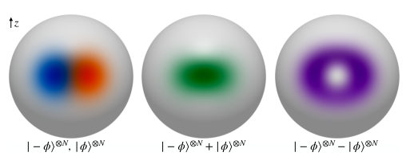
<figcaption class="paper-figure-caption"><b>Fig 1.</b> FIG. 1. A sketch of a simple SSS |Φ⟩(middle) in the DM, which is a superposition of two CSSs (left). Flipping the relative phase gives a state close to the W-state [78, 97] in a rotated basis (right), which is not a SSS.</figcaption>
</figure>
<figure class="paper-figure-card">
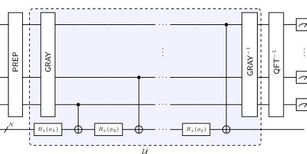
<figcaption class="paper-figure-caption"><b>Fig 2.</b> FIG. 2. An adaptive protocol that prepares a ξ-SSS from |+⟩⊗N.</figcaption>
</figure>
<figure class="paper-figure-card">
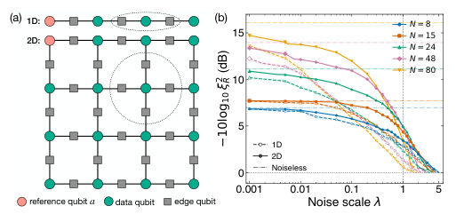
<figcaption class="paper-figure-caption"><b>Fig 3.</b> FIG. 4. (a) Illustration of the Lieb lattice [123] geometry of the 1d and 2d protocol. (b) Wineland spin squeezing pa- rameter ξ2 R obtained from the 1d and 2d protocol versus the noise scale λ for different system sizes N. We switch from the protocol in Fig. 3 (smaller marker) to that in Fig. 2 (larger marker) when tuning down λ. The noise level used in the simulation is set to be λ times (p2, p1, preadout, pidle, pinit) = (0.8, 0.02, 1, 0.001, 0.1)% which are the typical stochastic in- coherent raw noise rates for two- and one-qubit depolarizing errors, classical readout bit flips, idle Pauli errors, and initial- ization errors in the current superconducting qubit devices.</figcaption>
</figure>

**Summary.** This paper develops novel, resource-efficient digital quantum algorithms to create Spin Squeezed States (SSSs) necessary for quantum metrology. By introducing an adaptive circuit protocol, the authors achieve an exponentially improved depth scaling compared to prior methods. The work validates the approach by predicting significant metrological gains on superconducting qubit architectures.

**Why it may be interesting.** The work provides concrete, resource-efficient quantum circuit blueprints for generating highly entangled states crucial for quantum sensing, directly impacting the feasibility of near-term quantum metrology experiments.

Detailed structure

**Main problem.** The paper addresses the challenge of developing efficient digital quantum algorithms to generate and utilize Spin Squeezed States (SSSs) for quantum metrology.

**Main result.** They introduce an adaptive local-circuit protocol achieving a depth scaling of $O(\log 1/\xi)$, which is exponentially faster than non-adaptive methods, and demonstrate a predicted metrological gain of 4.2 dB.

**Method.** The core method is an adaptive local-circuit protocol combining block encoding, Linear Combination of Unitaries (LCU), and phase estimation, complemented by theoretical lower bounds derived from entanglement entropy.

**Model / system.** The system is modeled using N qubits, focusing on preparing SSSs within the Dicke manifold. The protocols are designed for near-term digital quantum devices, specifically mentioning superconducting qubits.

**Key observables.** Squeezing parameter $\xi$, metrological gain (e.g., 4.2 dB), circuit depth $D$, and bipartite entanglement entropy $H_{\epsilon}^{\max}(
ho_L)$.

**Important parameters / regimes.** Squeezing parameter $\xi$, system size $N$, and the depth scaling $D = O(\log 1/\xi)$.

**Assumptions / limitations.** The depth analysis assumes the final state resides in the Dicke manifold (DM); the simulation relies on approximating the true correlated-disorder model with an independent-bond Random-Bond Ising Model (RBIM).

**Figures summary.** Figures illustrate the target SSS state, the adaptive protocol structure involving ancillae and rotations, and simulation results showing metrological gain and acceptance rate versus noise scale.

**Paper structure.** The paper establishes the problem by comparing analog vs. digital approaches, presents the adaptive protocol (Theorem 1), proves the optimal depth scaling via entanglement bounds (Theorem 2), and discusses error mitigation using techniques like the MWPM decoder.

Abstract

Spin squeezed states (SSSs) are conventionally viewed as analog resources for quantum metrology. Here we develop algorithms to efficiently generate and exploit SSSs on a digital quantum computer. We introduce an adaptive local-circuit protocol that prepares SSSs with squeezing parameter $ξ$ in depth $\mathrm{O}\left(\log{1/ξ}\right)$, yielding an exponential improvement over non-adaptive approaches. We prove that this depth is optimal for permutation symmetric SSSs by deriving a matching lower bound on entanglement entropy. We further leverage the squeezing paradigm to deterministically prepare the Dicke states using asymptotically fewer resources than prior methods. Remarkably, classical simulations of our preparation protocols under realistic noise models predicts a metrological gain of 4.2 dB beyond the standard quantum limit with 55 superconducting qubits in total including ancillae. Our work paves the way for performing quantum metrology on near-term digital quantum devices.

[↑ back to top](#top)

### [Optimal interferometric certification of multi-photon indistinguishability](http://arxiv.org/abs/2609.37620v1)

**Authors:** Marco Robbio, Michał Oszmaniec, Nicolas J. Cerf, Ernesto Galvão, Leonardo Novo  
**Type:** theory · **Category:** quantum information and computing · **PDF:** <https://arxiv.org/pdf/2609.37620v1>  
**Analysis basis:** full PDF text, analyzed in chunks
**Topic relevance:** `interference shaping light` **3/5** · `quantum measurements` **2/5**

↔ Scroll figures horizontally

<figure class="paper-figure-card">
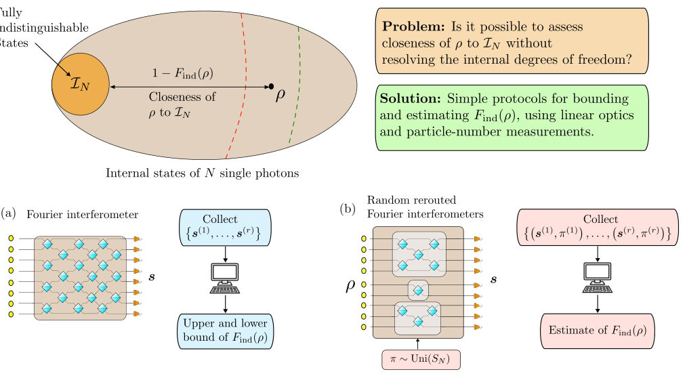
<figcaption class="paper-figure-caption"><b>Fig 1.</b> FIG. 1: We consider an unknown state ρ describing internal states of an N-photon input with exactly one photon in each of N spatial modes. We seek to quantify its closeness to the set of states describing perfectly indistinguishable photon states, without resolving the internal degrees of freedom. This closeness is measured by the fidelity Find(ρ) to the closest perfectly indistinguishable state. Top: Geometric representation of the certification problem. Bottom left (a): The cyclic protocol uses a single fixed Fourier interferometer followed by photon-number-resolving detection. Post-processing the observed output patterns provides upper and lower bounds (for independent photon sources) on...</figcaption>
</figure>
<figure class="paper-figure-card">
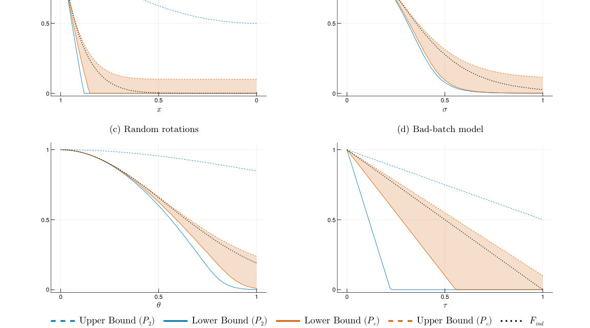
<figcaption class="paper-figure-caption"><b>Fig 2.</b> FIG. 2: Comparison of certification bounds across representative noise models. All panels show N = 10 photons. The indistinguishability fidelity Find is compared with bounds inferred from the cyclic weight Pc and from the average pairwise Hong–Ou–Mandel statistic P2. (a) X model: Pure internal states have a uniform pairwise overlap ⟨ϕi|ϕj⟩= x for i ̸= j, interpolating between mutually orthogonal and identical states. (b) Random time delay: Gaussian temporal wave packets acquire random arrival-time offsets, modeling timing jitter. (c) Random rotations: Initially identical pure internal states undergo independent random unitary rotations, modeling coherent internal-state mismatch. (d)...</figcaption>
</figure>

**Summary.** This paper introduces two novel, efficient protocols to certify the indistinguishability fidelity of multi-photon quantum states. These methods generalize the Hong-Ou-Mandel effect and provide provably optimal sampling complexity for estimating this crucial resource. The development makes high-fidelity characterization of photonic quantum states accessible to current experimental technologies.

**Why it may be interesting.** This work provides rigorous, operationally meaningful methods to quantify a fundamental resource (indistinguishability) in photonic quantum information, directly applicable to quantum communication and computation.

Detailed structure

**Main problem.** The paper develops efficient and experimentally friendly protocols to estimate or bound the fidelity of an N-photon state to the closest perfectly indistinguishable state.

**Main result.** Two protocols are presented: one for separable states using a Fourier interferometer, and a randomized one for arbitrary states, both achieving optimal sample scaling of O(1/epsilon).

**Method.** The methods generalize the Hong-Ou-Mandel test by developing protocols based on photon-number measurements and randomized linear-optical interferometers.

**Model / system.** The system involves N photons in an interferometer setting, characterized by the fidelity F_ind, which measures how close the state is to perfect indistinguishability.

**Key observables.** Fidelity to the closest indistinguishable state (F_ind), the reduced external state (Omega_ext(rho)), and various expectation values derived from interferometry.

**Important parameters / regimes.** The required sample complexity scales optimally as O(1/epsilon) for certification.

**Assumptions / limitations.** The protocols are designed to be operationally motivated and experimentally practical, overcoming limitations of previous methods that required strong structural assumptions.

**Figures summary.** Figure 1 illustrates the certification problem, showing the geometric representation and detailing the setups for both the cyclic (fixed Fourier interferometer) and randomized (sampling random permutations) protocols.

**Paper structure.** The paper first establishes the theoretical definition of indistinguishability fidelity, then details the two distinct measurement protocols (cyclic and randomized) to bound or estimate this fidelity, culminating in complexity analysis showing optimal scaling.

Abstract

Multiphoton indistinguishability is a key resource for photonic quantum technologies, yet its characterization typically relies on resource-intensive methods. In this work, we develop two efficient and experimentally friendly protocols to estimate or bound the fidelity $F_{\mathrm{ind}}$ of an $N$-photon state to the closest perfectly indistinguishable state. The first protocol applies to sources preparing separable states, uses a single Fourier interferometer together with photon-number-resolving detection, and yields tight two-sided bounds on $F_{\mathrm{ind}}$. The second protocol combines randomized implementations of linear-optical interferometers with photon counting, enabling direct estimation of $F_{\mathrm{ind}}$ for arbitrary $N$-photon states. Both protocols can certify $F_{\mathrm{ind}} = 1 - \mathcal{O}(ε)$ using provably optimal $\mathcal{O}(1/ε)$ samples, in contrast to previous approaches which required prior assumptions on the model of partial distinguishability. Our methods, based on a multiphoton generalization of the Hong-Ou-Mandel test, bring the rigorous and operationally meaningful certification of multiphoton indistinguishability within reach of current photonic technologies.

[↑ back to top](#top)

### [Phase separation, morphology, and metastability in the three-dimensional active Potts model](http://arxiv.org/abs/2609.37436v1)

**Authors:** Aditya Kumar Dutta, Raja Paul  
**Type:** theory · **Category:** statistical mechanics · **PDF:** <https://arxiv.org/pdf/2609.37436v1>  
**Analysis basis:** full PDF text, analyzed in chunks
**Topic relevance:** `non-equilibrium universality` **3/5** · `driven-dissipative phase transition` **1/5** · `methods for driven-dissipative` **1/5**

↔ Scroll figures horizontally

<figure class="paper-figure-card">
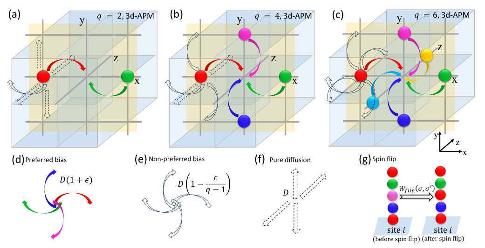
<figcaption class="paper-figure-caption"><b>Fig 1.</b> Figure 1. Schematics of 3d-active Potts model dynamics. (a–c) Particles hop between nearest-neighbor lattice sites in the (a) 2-state, (b) 4-state and (c) 6-state 3d active Potts model. Several particles can occupy the same site. Filled curved arrows denote preferred hopping, while open arrows indicate non-preferred hopping. For the q = 2 and q = 4 models, active hopping occurs in the xy plane; the q = 6 model also has active hopping along z. Dashed arrows represent pure diffusion. For clarity, hopping and diffusion are illustrated only for the red particle. (d–f) Schematic of the corresponding hopping and diffusion rates. (g) Local spin reversal from state σ to state σ′ occurs with rate...</figcaption>
</figure>
<figure class="paper-figure-card">
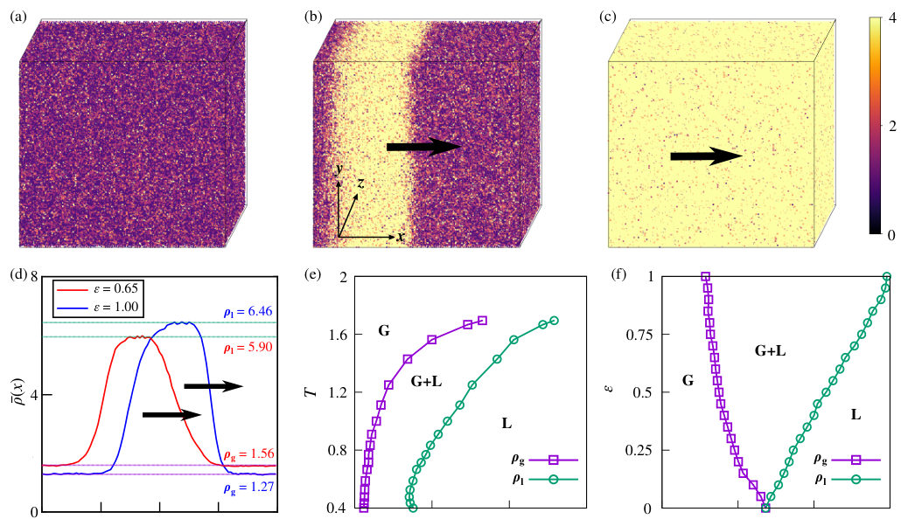
<figcaption class="paper-figure-caption"><b>Fig 2.</b> Figure 2. 2-state 3d-APM: (a–c) Snapshots in 96 × 96 × 96 domains with the colorbar representing site density, showing (a) gas (ρ0 = 1), (b) gas-liquid coexistence (ρ0 = 3) and (c) liquid (ρ0 = 8) phases for β = 1, ϵ = 1. (d) YZ-averaged density profiles ¯ρ(x) of the coexistence regime for two self-propulsion speeds (β = 1). (e) Temperature-density (T −ρ) phase diagram for ϵ = 0.9, and (f) Velocity-density (ϵ −ρ) phase diagram for β = 1.</figcaption>
</figure>
<figure class="paper-figure-card">
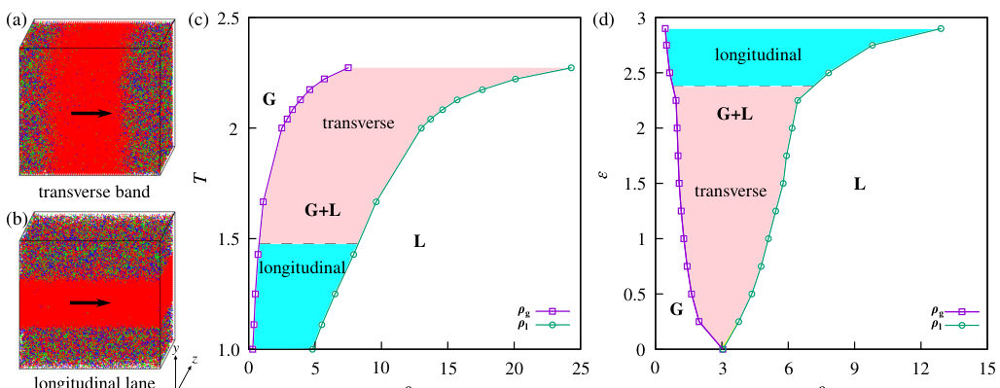
<figcaption class="paper-figure-caption"><b>Fig 3.</b> Figure 3. 4-state 3d-APM: Orientational snapshots: (a) showing transverse band movement at low propulsion (ϵ = 1) and (b) showing longitudinal lane movement at high propulsion (ϵ = 2.5) for ρ = 3, β = 0.7 in a 96 × 96 × 96 domain. Color mapping: right (σ = 1, red); up (σ = 2, blue); left (σ = 3, green); down (σ = 4, magenta). (c) Temperature-density (T −ρ) phase diagram for ϵ = 2.1, and (d) Velocity-density (ϵ −ρ) phase diagram for β = 0.7.</figcaption>
</figure>
<figure class="paper-figure-card">
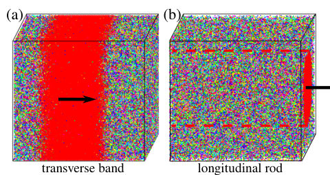
<figcaption class="paper-figure-caption"><b>Fig 4.</b> Figure 4. 6-state 3d-APM: Orientational snapshots show- ing: (a) transverse band movement at low propulsion (ϵ = 2.5) and (b) longitudinal rod movement at high propulsion (ϵ = 4.5) for ρ = 2.5, β = 0.6 in a 64 × 64 × 64 system. The dotted lines indicate the extent of the rod. Color mapping: right (σ = 1, red); up (σ = 2, blue); left (σ = 3, green); down (σ = 4, magenta); front (σ = 5, yellow); behind (σ = 6, cyan).</figcaption>
</figure>
<figure class="paper-figure-card">
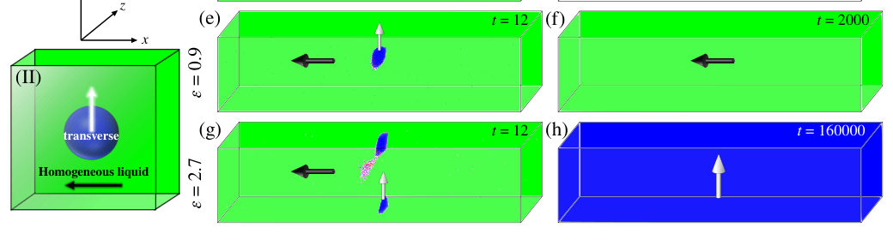
<figcaption class="paper-figure-caption"><b>Fig 5.</b> Figure 5. Time evolution and steady states following droplet excitation in the 4-state 3d-APM (I), (II) Schematics illustrating the insertion of (I) counterpropagating and (II) transversely propagating droplets into a homogeneous liquid back- ground. Early-time (a, c, e, g) and steady-state (b, d, f, h) snapshots demonstrate the outcomes: (a, b) At low self-propulsion bias (ϵ = 0.9), a counterpropagating droplet dissolves into the background. (c, d) At high bias (ϵ = 2.7), it forms a persistent slab state comprising the droplet state (red) and background (green). (e, f) A transversely propagating droplet at low bias (ϵ = 0.9) similarly dissipates. (g, h) At high bias (ϵ = 2.7), the...</figcaption>
</figure>

**Summary.** This paper analyzes the phase behavior of the 3D active Potts model, a system modeling interacting particles with internal states and self-propulsion. Using Monte Carlo simulations and hydrodynamic theory, the authors map out phase diagrams and show how the dense phase morphology evolves from slabs to rods depending on propulsion speed. Crucially, they demonstrate that the ordered liquid phase is metastable, easily disrupted by external perturbations.

**Why it may be interesting.** The study of active matter models like the APM provides insights into non-equilibrium phase transitions and pattern formation, which are crucial topics in modern statistical mechanics and complex systems.

Detailed structure

**Main problem.** The study investigates phase separation, morphology, and metastability in the three-dimensional active Potts model (APM).

**Main result.** The 3D APM exhibits distinct phase behaviors (gaseous, liquid, coexistence) whose morphology (slab vs. cylindrical) changes with propulsion speed, and the polar liquid phase is shown to be metastable against droplet perturbations.

**Method.** The research employs Monte Carlo simulations and derives hydrodynamic equations by expanding the master equation in the continuum limit.

**Model / system.** The system is the three-dimensional active Potts model (APM) on a cubic lattice with $q=2, 4,$ or $6$ orientational states. Dynamics are governed by spin-flipping rates and particle hopping rates biased by self-propulsion.

**Key observables.** Steady-state phase diagrams, density profiles ($ar{
ho}(x)$), and the morphology of the dense phase (slab, rod, cylinder).

**Important parameters / regimes.** Number of states ($q$), temperature ($eta$), average density ($
ho$), and self-propulsion bias ($\epsilon$).

**Assumptions / limitations.** The analysis extends known 2D results to 3D and utilizes hydrodynamic approximations for the density evolution.

**Figures summary.** Figures illustrate schematics of hopping rates, density profiles showing phase separation, and time evolution snapshots demonstrating morphology changes (slab to rod) and the effect of droplet excitations.

**Paper structure.** The paper first establishes the model dynamics and then analyzes the phase behavior across different $q$ values. It progresses from steady-state phase diagrams to detailed analyses of morphology changes with propulsion bias, culminating in stability tests using artificial droplet perturbations.

Abstract

We study the three-dimensional active Potts model (APM) on a cubic lattice with 2, 4, and 6 orientational states. The steady-state phase diagrams exhibit low-density gaseous, high-density polar liquid, and liquid--gas coexistence phases, with the phase behavior controlled by density, temperature, and propulsion speed and retaining the main features of the previously studied two-dimensional APM. At weak propulsion, the dense phase forms a slab perpendicular to its direction of motion. With increasing propulsion speed, this morphology persists for the 2-state model, whereas the dense phases for 4 and 6 states reorient and propagate along their longitudinal direction. For the 6-state model, the reoriented dense phase further develops a cylindrical morphology. We also examine the stability of polar liquids against artificially introduced droplets using microscopic simulations and coarse-grained hydrodynamic equations. At high propulsion speeds, counter-propagating droplets can partially modify the initial polar state, while transverse droplets can completely alter it, demonstrating the metastable nature of polar liquids in the three-dimensional active Potts model.

[↑ back to top](#top)

### [Quantum Statistical Thermal Engine at the BCS-BEC crossover](http://arxiv.org/abs/2609.37592v1)

**Authors:** Santiago Henríquez Lira, Felipe Isaule, Martín HvE Groves, Francisco J. Peña, Patricio Vargas, Thomás Fogarty  
**Type:** theory · **Category:** statistical mechanics · **PDF:** <https://arxiv.org/pdf/2609.37592v1>  
**Analysis basis:** full PDF text, analyzed in chunks
**Topic relevance:** `Keldysh / 2PI / non-Gaussian methods` **3/5** · `analog quantum simulation` **1/5** · `methods for driven-dissipative` **1/5**

↔ Scroll figures horizontally

<figure class="paper-figure-card">
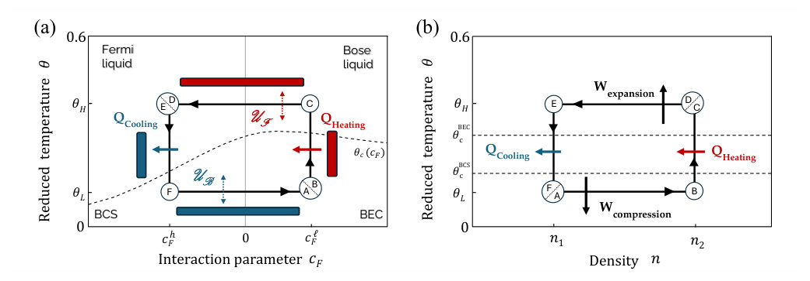
<figcaption class="paper-figure-caption"><b>Fig 1.</b> FIG. 1. Illustration of the cycle at the BCS-BEC crossover, with cF = (kF a)−1 and θ = T/EF . The cycle consists of: adiabatic compression (A–B), isochoric heating (B–C), a hot statistical isotherm (C–D), adiabatic expansion (D–E), isochoric cooling (E–F), and a cold statistical isotherm (F–A). Strokes which include coupling to the hot and cold reservoirs, are indicated by the red and blue colors, respectively. (a) Trajectory in the (θ, cF ) plane, showing the initial (cℓ F ) and target (ch F ) branches relative to the superfluid transition θc = Tc/EF (dashed curve); U indicates the statistical stroke, where both heat and work are exchanged. (b) Trajectory in the (θ, n) plane, showing the...</figcaption>
</figure>
<figure class="paper-figure-card">
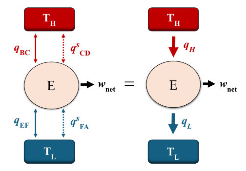
<figcaption class="paper-figure-caption"><b>Fig 2.</b> FIG. 2. Equivalent flow diagram of the statistical thermal cycle as a heat engine. The effective heats are resolved at the hot and cold reservoirs according to qH = qBC + qCD and qL = qEF + qFA, respectively.</figcaption>
</figure>
<figure class="paper-figure-card">
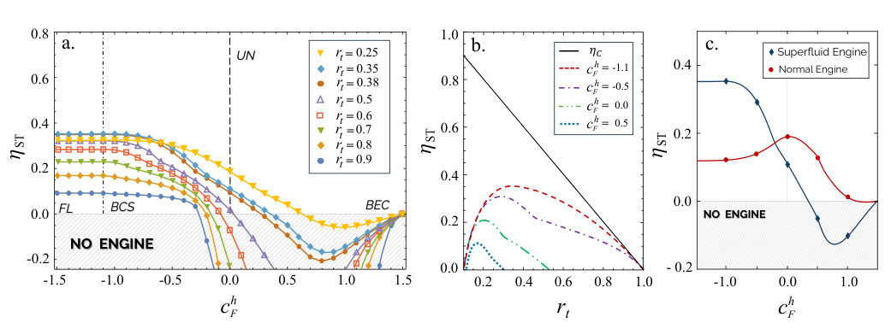
<figcaption class="paper-figure-caption"><b>Fig 3.</b> FIG. 3. Efficiency at the BCS–BEC crossover, ηST = wnet/|qH|, for fixed compression ratio rc = 1. (a) The target branch ch F of the cycle is moved from the BEC side, to unitarity (UN, dashed line), the BCS phase and the Fermi liquid (FL) regime for different rt = TL/TH. (b) Dependence of ηST on rt, compared with the Carnot efficiency ηC. All calculations in (a) and (b) use cℓ F = 1.5, and θL = 0.1. (c) Superfluid Engine (θL = 0.1 rt = 0.35) is compared with Normal Engine (θL = 0.3, rt = 0.59), with T BEC c = 0.26EF for cF = 1.5.</figcaption>
</figure>
<figure class="paper-figure-card">
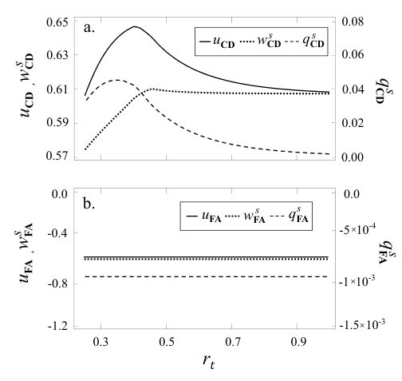
<figcaption class="paper-figure-caption"><b>Fig 4.</b> FIG. 4. First law balance. (a) The statistical hot stroke (C →D). (b) The statistical cold stroke (F →A). The inter- nal energy us, statistical heat qs and statistical work ws are shown as functions of rt = TL/TH. The displayed calculations use rc = 1, cℓ F = 1.5, ch F = −0.4, and θL = 0.1.</figcaption>
</figure>
<figure class="paper-figure-card">
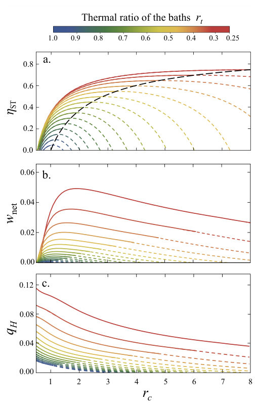
<figcaption class="paper-figure-caption"><b>Fig 5.</b> FIG. 5. (Color online). Performance of the ST-Engine as a function of the compression ratio rc for different values of rt = TL/TH, as indicated by the colorbar. (a) Efficiency ηST = wnet/qH. The black dashed line displays the Otto efficiency ηOtto = 1 −r−2/3 c . (b) Net work output wnet. The work displays a maximum at an optimal compression ratio ropt c . (c) Effective heat supplied qH. In all the panels, the solid colored curves consider cycles where TB &lt; TH, while the dotted colored curves consider cycles where TB &gt; TH. All the displayed calculations use cℓ F = 1.5, ch F = −1.1, and θL = 0.1.</figcaption>
</figure>

**Summary.** This work develops a quantum heat engine model based on a Fermi gas undergoing the BCS-BEC crossover. By analyzing a specialized Statistical Thermal Cycle (STC) using the FRG formalism, the authors demonstrate that the engine's performance is dictated by the gas's quantum statistics, not just volume changes. This allows the system to function as a versatile machine with tunable efficiency.

**Why it may be interesting.** It provides a concrete, tunable model for quantum thermal machines, showing how fundamental many-body physics (BCS-BEC crossover) can be harnessed as a thermodynamic resource, which is highly relevant to quantum thermodynamics.

Detailed structure

**Main problem.** The paper proposes and analyzes a quantum heat engine that operates by exploiting the internal quantum statistical structure of the working medium across the BCS-BEC crossover.

**Main result.** The engine can function as a versatile machine (engine, refrigerator, accelerator, or heater) because the work extraction relies on the interaction-driven changes in the gas's statistical character, achieving efficiencies up to 38%.

**Method.** The study employs the Functional Renormalization Group (FRG) formalism to derive the equation of state non-perturbatively, followed by the construction and analysis of a Statistical Thermal Cycle (STC).

**Model / system.** The system is a three-dimensional Fermi gas with two spin components interacting via s-wave contact interactions, allowing tuning between BCS superfluid and BEC molecular regimes.

**Key observables.** Efficiency ($\eta_{ST}$), net work ($w_{net}$), heat flows ($q_H, q_L$), and the energy per particle ($e$).

**Important parameters / regimes.** Scattering length ($a$), density ($n$), temperature ($T$), and the dimensionless interaction parameter ($c_F = 1/(k_F a)$).

**Assumptions / limitations.** The analysis relies on a truncated ansatz within the FRG framework, and the cycle is analyzed by combining isentropic, isochoric, and isothermal statistical strokes.

**Figures summary.** Figures map the operational regimes (Engine, Refrigerator, Accelerator, Heater) across the BCS-BEC crossover and show the dependence of efficiency on interaction parameters.

**Paper structure.** The paper first establishes the theoretical framework using FRG to calculate thermodynamics across the crossover. It then details the construction of the six-stroke Statistical Thermal Cycle (STC) and analyzes how the work and heat are exchanged in each stroke, concluding with a comprehensive mapping of the machine's operational versatility.

Abstract

We propose a quantum heat engine based on a two-component Fermi gas with s-wave contact interaction, operating across the BCS-BEC crossover. The work is extracted from the statistical properties of the gas, which are controlled by the interaction, rather than relying solely on compression and expansion stages. Using the functional renormalization group formalism, we obtain the equation of state in a non-perturbative form along the crossover, encompassing the superfluid-normal phase transition. The cycle combines isentropic density strokes, isochoric thermalization, and isothermal interaction sweeps. This construction makes it possible to integrate features of both Otto and Carnot cycles, in which the system simultaneously saturates both efficiency limits without the net work vanishing. In the absence of density variations, the cycle reduces to a statistical Stirling-like engine, in which the work generated arises exclusively from the interaction, achieving efficiencies up to $38\%$. A pronounced asymmetry emerges through the crossover, giving rise to distinct operating regimes depending on the trajectory followed in the phase diagram. Consequently, the same architecture can be tuned to function as an engine, refrigerator, accelerator, or heater. These findings highlight pairing correlations as a versatile thermodynamic resource for quantum heat machines.

[↑ back to top](#top)

### [Topological Pseudo-Goldstone Modes from Weakly Broken Dipole Conservation](http://arxiv.org/abs/2609.36994v1)

**Authors:** Yan-Guang Yue, Jie Lou, Yan Chen  
**Type:** theory · **Category:** quantum gases · **PDF:** <https://arxiv.org/pdf/2609.36994v1>  
**Analysis basis:** full PDF text, analyzed in chunks
**Topic relevance:** `analog quantum simulation` **3/5** · `quantum measurements` **2/5**

↔ Scroll figures horizontally

<figure class="paper-figure-card">
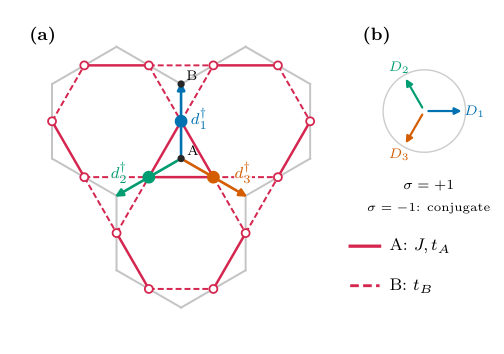
<figcaption class="paper-figure-caption"><b>Fig 1.</b> FIG. 1. Geometry and chiral order. (a) Three complete honeycomb hexagons (gray), with dipole orbitals at their bond centers. Arrows show the three central dipole vectors eν = 2δν; their sum vanishes. Solid and dashed kagome links belong to A and B triangles, respectively. In the benchmark model, only A triangles carry the three-body term J; flavor mixing acts on both. (b) The displayed uniform amplitudes have chirality σ = +1; complex conjugation gives σ = −1. The star term locks their common phase.</figcaption>
</figure>
<figure class="paper-figure-card">
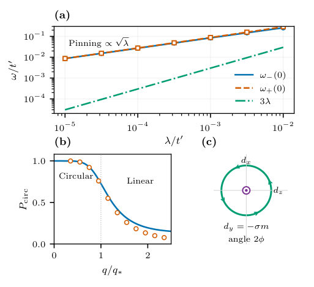
<figcaption class="paper-figure-caption"><b>Fig 2.</b> FIG. 2. From weak breaking to chiral dynamics in the bench- mark completion. (a) Exact Gaussian poles, Eq. (6), and full BdG symbols: pinning scales as √</figcaption>
</figure>
<figure class="paper-figure-card">
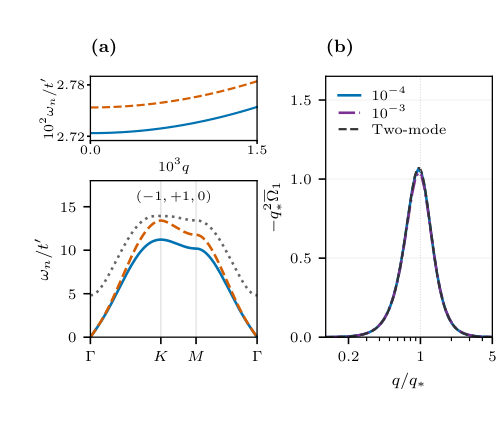
<figcaption class="paper-figure-caption"><b>Fig 3.</b> FIG. 3. Lattice topology and local geometry of the benchmark completion. (a) Full positive-frequency bands at λ = 10−4, σ = +1, with lowest-band Chern number C1 = −1 and full vector (−1, +1, 0). Upper zoom: absolute frequencies of the two low bands near Γ along qˆx, resolving their splitting 3λ. (b) Angular-averaged embedded BdG curvature at two mixing strengths and the two-mode form, Eq. (8). Curvature peaks near the polarization crossover q∗= (m/|a|)1/3.</figcaption>
</figure>
<figure class="paper-figure-card">
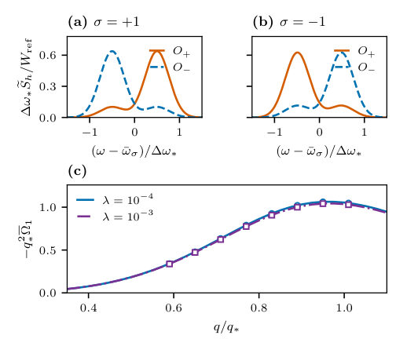
<figcaption class="paper-figure-caption"><b>Fig 4.</b> FIG. 4. Tensor-current spectroscopy of the benchmark phase doublet. (a,b) Independently evaluated spectra for oppo- site chiralities at the same displayed momentum q = q∗ˆx, λ = 10−4. The helicity preferences reverse; exact time rever- sal relates (σ, q) to (−σ, −q). (c) Independent full BdG cur- vature (lines) and reconstruction from jointly fitted helicity areas (symbols), using noiseless spectra with sharp intrinsic poles. The spectral curves in (a,b) are Gaussian-convolved with standard deviations (sω/∆ω∗, sq/qres) = (0.25, 0.1) and one shared intensity calibration Wref. Here ∆ω∗is the split- ting at q∗ˆx and qres = ∆ω∗/|∂q ¯ω| (SM); each spectrum is centered on its own ¯ωσ. The SM...</figcaption>
</figure>

**Summary.** This theoretical study details how breaking dipole conservation in a neutral dipole condensate leads to the emergence of a topological pseudo-Goldstone mode. The authors use a combination of effective Lagrangian theory and tensor spectroscopy to prove this topology and demonstrate a method to experimentally reconstruct the associated local Berry curvature from measurable spectral responses.

**Why it may be interesting.** This work directly connects symmetry breaking, topological invariants (Chern numbers), and observable spectroscopic measurements (dichroism) within the context of interacting quantum gases, providing a concrete model for emergent topological phases.

Detailed structure

**Main problem.** The paper establishes a theoretical mechanism showing how weakly breaking dipole conservation in a neutral condensate can induce topological features in its low-energy phase-mode sector.

**Main result.** Weak breaking generates a topological lowest band in the pseudo-Goldstone sector, and the parent dipole charges define a tensor current capable of reconstructing the embedded local Berry curvature.

**Method.** The analysis involves deriving the low-energy phase dynamics from a parent Hamiltonian, using geometric tomography, and employing tensor spectroscopy to reconstruct the Berry curvature from measurable dichroism signals.

**Model / system.** The system is a neutral dipole condensate modeled on a honeycomb lattice, governed by a Hamiltonian that includes hopping, density-interaction, and a three-body star term, perturbed by weak flavor-mixing couplings.

**Key observables.** Topological Chern numbers (e.g., $(-1, +1, 0)$), the low-band Berry curvature $\Omega_1(q)$, and the contrast $D_1(q)$ measured via tensor spectroscopy.

**Important parameters / regimes.** The analysis identifies three distinct energy/length scales: phase pinning ($\propto \lambda^{1/2}$), chiral splitting ($\propto \lambda$), and curvature radius ($q^* \propto \lambda^{1/3}$).

**Assumptions / limitations.** The analysis is performed at zero temperature, and the reconstruction of curvature relies on the low-energy matching regime where finite momentum ($q 
eq 0$) is required.

**Figures summary.** Figures illustrate the honeycomb lattice geometry, the transition between pinning and chiral dynamics, and the resulting lattice topology showing the calculated Chern number $C_1 = -1$ and the local Berry curvature $\Omega_1(q)$.

**Paper structure.** The paper first analyzes the parent Hamiltonian in the conserving limit, then introduces weak breaking via $H_{mix}$ to derive the low-energy Lagrangian. Subsequently, it details the use of tensor spectroscopy and dichroism measurements to reconstruct the topological Berry curvature, concluding with stability bounds and physical interpretations.

Abstract

Weakly breaking a continuous symmetry in an ordered phase can convert its Goldstone modes into topological collective bands. We establish this mechanism in a neutral dipole condensate whose conserving parent supports two independent Goldstone phase modes. Weak real flavor mixing pins the phases and selects a chiral condensate. The resulting gyroscopic coupling acts on their winding polarization texture, producing a pseudo-Goldstone sector containing a topological lowest band. Restoring dipole conservation forces the two modes to meet at zero frequency, where their separate band Chern numbers cease to be defined. The same parent dipole charges define a tensor current whose circular response permits model-assisted reconstruction of low-energy embedded local Berry curvature in the benchmark regime. Analytical stability bounds and a large-occupation limit provide a controlled realization of this mechanism.

[↑ back to top](#top)

### [A magnetic-field insensitive gate set for trapped-ion nuclear spin qubits](http://arxiv.org/abs/2609.37318v1)

**Authors:** Jonathan Paul Home, Jeremy Flannery, Matteo Mazzanti, Jan Apolin, Shreyans Jain  
**Type:** theory · **Category:** other · **PDF:** <https://arxiv.org/pdf/2609.37318v1>  
**Analysis basis:** full PDF text, analyzed in chunks
**Topic relevance:** `QC/QI experiment` **3/5** · `quantum measurements` **1/5**

↔ Scroll figures horizontally

<figure class="paper-figure-card">
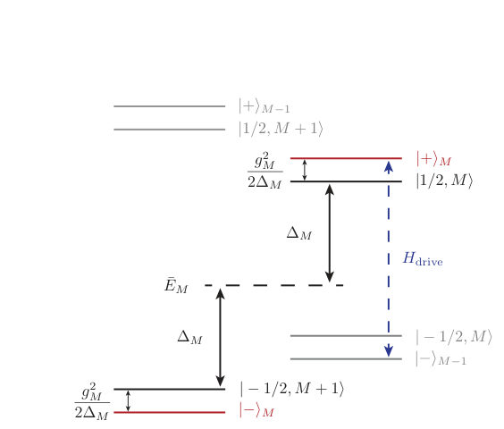
<figcaption class="paper-figure-caption"><b>Fig 1.</b> FIG. 1. Relevant energy levels and relative splittings.</figcaption>
</figure>
<figure class="paper-figure-card">
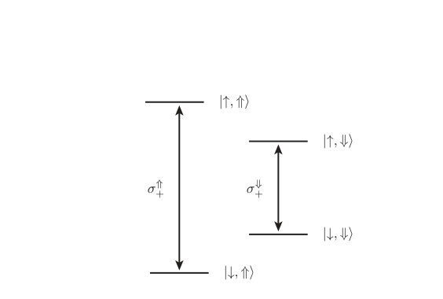
<figcaption class="paper-figure-caption"><b>Fig 2.</b> FIG. 2. Simplified level definition used for the discussion of two-qubit gates. The electron spin-flip operators for each transition are labelled as σi ±with superscripts i =⇑, ⇓.</figcaption>
</figure>
<figure class="paper-figure-card">
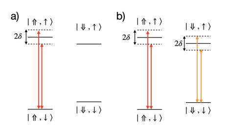
<figcaption class="paper-figure-caption"><b>Fig 3.</b> FIG. 3. Two qubit gate schemes. a) The two-tone scheme involves microwave dressing fields applied ±δ detuned from the ⇑electron spin flip transition. This gate can be used to perform a phase gate on the nuclear spin, but the atom leaves the pure nuclear spin encoding during the gate. b) The four- tone gate uses drives on both electron spin-flip transitions simultaneously, with the same strength. The only difference is that the two tones driving the ⇓transition have a relative phase which is offset from that of the two tones for the ⇑ transition π/2. This ensures that the Hamiltonian acting on the nuclear spin states has a force direction which depends on the nuclear spin, thus allowing a...</figcaption>
</figure>

**Summary.** This paper details a method to implement fast, high-fidelity two-qubit gates for nuclear spin qubits in trapped ions. By utilizing a four-tone microwave drive, the authors overcome the inherent slowness of nuclear spin manipulation while ensuring the gate operation remains robust against external magnetic field fluctuations. This advances the feasibility of using nuclear spins for quantum computation.

**Why it may be interesting.** This work directly addresses the critical challenge of scaling quantum computation in trapped ions by providing a pathway to fast, robust gates for nuclear spins, which are otherwise difficult to control.

Detailed structure

**Main problem.** Developing a complete set of fast, magnetic-field insensitive quantum gates for nuclear spin qubits in trapped ions, especially in high magnetic field regimes.

**Main result.** The authors propose a four-tone microwave gate scheme that achieves gate speeds comparable to electron spin gates while maintaining insensitivity to external magnetic field noise.

**Method.** The technique involves using a multi-tone microwave drive, carefully detuned from resonance, to induce conditional phase shifts between nuclear spin states rather than relying on slow, direct nuclear spin flips.

**Model / system.** The system is trapped ions (e.g., Be+, Ca+) where the qubit is encoded in the nuclear spin, coupled to the electron spin via the hyperfine interaction. The Hamiltonian includes terms for the hyperfine interaction and the external magnetic field.

**Key observables.** Gate fidelity, gate speed (compared to electron spin flips), and susceptibility to external magnetic field noise.

**Important parameters / regimes.** High magnetic fields (e.g., 3 T, 6 T), hyperfine coupling constant (A), and the relative phases of the applied microwave tones.

**Assumptions / limitations.** The analysis assumes the magnetic field is along the z-axis and that the four-tone drive can effectively decouple the gate operation from magnetic field noise.

**Figures summary.** Figures illustrate the energy level splittings and the schematic implementation of the two-qubit gate schemes, comparing two-tone and four-tone drive mechanisms.

**Paper structure.** The paper progresses from establishing the physical challenge (speed vs. field sensitivity) to deriving the Hamiltonian for the gate, proposing the four-tone drive as the solution, and analyzing its noise robustness compared to single-drive methods.

Abstract

We outline a complete set of operations for manipulating nuclear spin qubits of trapped-ions stored in high magnetic fields such as required for Penning trapping, where the nuclear and electron spins are largely decoupled due to the dominance of the external field Hamiltonian. The reduced nuclear magnetic moment results in insensitivity to external magnetic fields compared to the use of an electron spin, but also makes the nuclear spin hard to manipulate on fast timescales. To maintain speed, we propose a two-qubit phase gate technique which utilizes the electron spin, but for which the qubit remains protected from magnetic fields through retaining the nuclear encoding. This method works for magnetic-field insensitive qubits at lower fields as well as for both microwave and laser field gradients.

[↑ back to top](#top)

### [Adaptive decoding of quantum LDPC codes through decoder disagreement](http://arxiv.org/abs/2609.37629v1)

**Authors:** Maida Wang, Peter V. Coveney  
**Type:** both · **Category:** quantum information and computing · **PDF:** <https://arxiv.org/pdf/2609.37629v1>  
**Analysis basis:** full PDF text, analyzed in chunks
**Topic relevance:** `QC/QI experiment` **3/5** · `quantum measurements` **1/5**

↔ Scroll figures horizontally

<figure class="paper-figure-card">
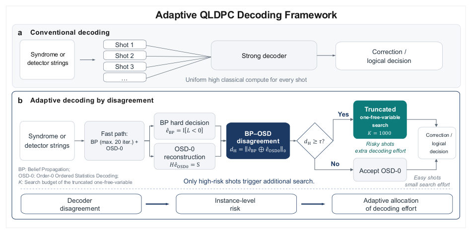
<figcaption class="paper-figure-caption"><b>Fig 1.</b> Figure 1. Adaptive qLDPC decoding by BP-OSD disagreement. (a) Conventional decoding applies the same procedure and the same search budget to every shot, so the classical cost of accurate decoding scales with the entire syndrome stream. (b) In the adaptive pipeline every shot first takes the fast path, BP with at most 20 iterations followed by OSD-0. That pass yields two estimates of the same error: the probabilistic BP hard decision ˆeBP = I[L &lt; 0] and the syndrome-consistent output ˆeOSD0 satisfying HˆeOSD0 = s, which coincides with ˆeBP whenever BP already satisfies the syndrome. Their Hamming disagreement dH = ∥ˆeBP ⊕ˆeOSD0∥0 measures how risky the shot is, at negligible extra cost....</figcaption>
</figure>
<figure class="paper-figure-card">
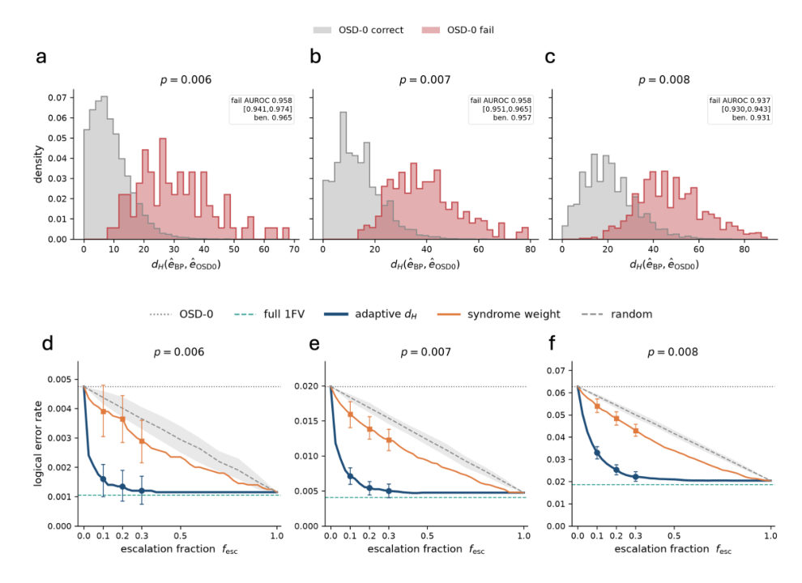
<figcaption class="paper-figure-caption"><b>Fig 2.</b> Figure 2. Disagreement tracks decoding risk and enables a targeted improvement in logical error rate, for the [[144, 12, 12]] bivariate bicycle code over 24 syndrome extraction rounds with 20,000 shots per operating point. (a to c) Distributions of the BP-OSD disagreement dH for shots on which OSD-0 succeeds and fails, at p = 0.006, 0.007 and 0.008. Insets report the area under the receiver operating characteristic curve (AUROC) for OSD-0 failure with its bootstrap 95% interval, together with the corresponding value for beneficial escalation (labelled ben. in the panels), the case in which OSD-0 fails while the full 1FV sweep succeeds. (d to f) Logical error rate against escalation fraction...</figcaption>
</figure>
<figure class="paper-figure-card">
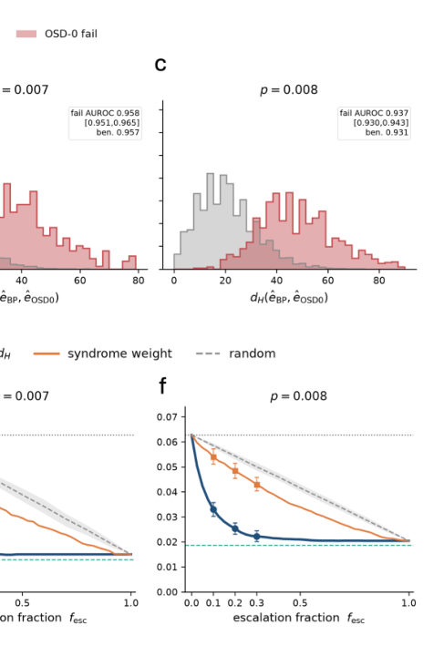
<figcaption class="paper-figure-caption"><b>Fig 3.</b> Figure 2(d to f) shows the resulting logical error rate against fesc. Without escalation the OSD-0 baseline gives logical error rates of 0.00475, 0.01990 and 0.06275 at p = 0.006, 0.007 and 0.008, while the full 1FV reference gives 0.00105, 0.00410 and 0.01865; the strong search is worth a factor of 4.52, 4.85 and 3.36 in logical error rate. Escalating the 20% of shots with the largest dis-</figcaption>
</figure>
<figure class="paper-figure-card">
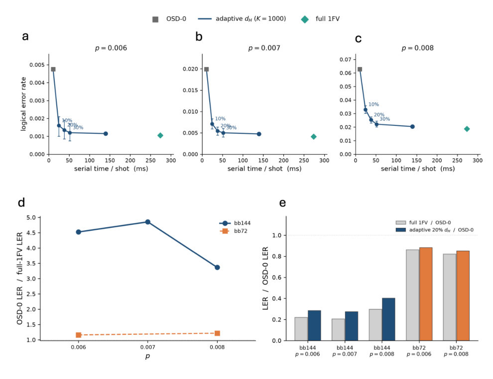
<figcaption class="paper-figure-caption"><b>Fig 4.</b> Figure 3. Trade-off between accuracy and computation, and the role of decoder headroom. (a to c) Logical error rate against measured single-threaded serial decoding time per shot at p = 0.006, 0.007 and 0.008, for the OSD-0 fast path, the adaptive policy at escalation fractions of 10%, 20% and 30%, the truncated branch applied to every shot, and the full 1FV reference. The adaptive points sit on a different part of the trade-off from the fixed strong branches, keeping most of the available improvement at a fraction of the serial cost. (d) Ratio of the OSD-0 logical error rate to the full 1FV logical error rate, the decoder headroom, for the [[144, 12, 12]] and [[72, 12, 6]] codes. (e)...</figcaption>
</figure>
<figure class="paper-figure-card">
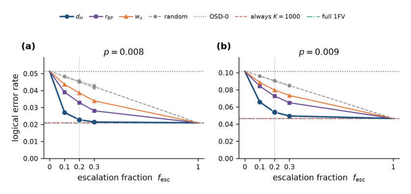
<figcaption class="paper-figure-caption"><b>Fig 5.</b> Figure 4. Transfer of disagreement-guided routing to a radial qLDPC code. Logical error rate against escalation fraction for the n = 90, k = 8 radial instance over twelve rounds of syndrome extraction at (a) p = 0.008 and (b) p = 0.009, with 20,000 test shots per operating point. Exact matched-budget routing on dH, on the BP residual rBP and on the syndrome weight ws is compared with random routing, averaged over 200 seeds; every escalated shot goes to the same K = 1000 branch. The OSD-0 baseline, the K = 1000 branch applied to every shot and the full 1FV reference are shown for comparison, the last two differ by a single logical failure at each operating point. Routing on disagreement...</figcaption>
</figure>

**Summary.** This paper presents an adaptive decoding strategy for quantum LDPC codes that significantly improves resource efficiency. It uses the internal disagreement between two fast decoding methods (BP and OSD-0) as a predictive risk signal. By only applying deep, expensive searches to the most suspicious decoding instances, the method achieves near-optimal error correction performance at a substantially reduced computational cost.

**Why it may be interesting.** For AMO physicists working on quantum error correction, this provides a concrete, resource-aware protocol for utilizing limited computational resources (like gate time or classical processing power) to maximize the fidelity of quantum computation.

Detailed structure

**Main problem.** Efficiently decoding quantum low-density parity-check (qLDPC) codes is challenging because decoding difficulty varies significantly across different syndromes, leading to the need for expensive, uniform post-processing searches.

**Main result.** By using the disagreement between Belief Propagation (BP) and Ordered-Statistics Decoding (OSD-0) as an internal risk signal, the authors can concentrate deep search effort on the highest-risk instances, recovering most of the potential error rate improvement while drastically reducing mean decoding cost.

**Method.** The paper introduces an adaptive decoder that uses the Hamming distance disagreement ($d_H$) between the BP hard decision and the OSD-0 solution to route decoding attempts: low-risk shots use a fast path, while high-risk shots are escalated to a deeper, computationally expensive search.

**Model / system.** The work focuses on decoding qLDPC codes, tested on specific codes like the $[[144, 12, 12]]$ bivariate bicycle code and a radial code. The results are validated both through simulation under circuit-level depolarizing noise and on the Quantinuum H2 trapped-ion processor.

**Key observables.** Logical error rate (LER), mean serial decoding cost, and the disagreement metric ($d_H$) used as the risk signal.

**Important parameters / regimes.** Noise probability ($p$), search depth ($K=500$ vs $K=1000$), and the fraction of instances escalated (e.g., top 20%).

**Assumptions / limitations.** The core assumption is that the required additional search effort can be accurately predicted by the internal disagreement signal ($d_H$) derived from the fast decoder outputs.

**Figures summary.** Figures illustrate the comparison between conventional and adaptive decoding pipelines, showing $d_H$ distributions that separate successful from failed OSD-0 attempts, and comparing LER vs. escalation fraction for different routing strategies.

**Paper structure.** The paper establishes the problem of inefficient decoding, introduces the adaptive framework using BP-OSD disagreement as a risk metric, validates this metric against other heuristics (syndrome weight, BP residual), and finally quantifies the performance gains on various codes and hardware platforms.

Abstract

Accurate decoding of quantum low-density parity-check (qLDPC) codes often relies on expensive post-processing search, although decoding difficulty varies strongly between syndromes. We find that the benefit of deeper post-processing search is highly concentrated in a small subset of decoding instances, and that these instances can be identified directly from the decoder itself. To this end, we introduce an adaptive decoder based on belief propagation (BP) and ordered-statistics decoding (OSD), using the disagreement between the BP hard decision and the syndrome-consistent order-zero OSD solution as an internal risk signal to determine where deeper search is required. On a $[[144,12,12]]$ bivariate bicycle code under circuit-level depolarising noise, encoding $12$ logical qubits in $144$ data qubits with distance $12$, escalating only the highest-risk $20\%$ of instances recovers $85\%$ to $92\%$ of the improvement in logical error rate available from a full one-free-variable sweep, while reducing the mean serial decoding cost by a factor of $3.6$ relative to applying the same truncated search to every instance. At matched budget, disagreement-guided routing also outperforms routing based on the BP syndrome residual, syndrome weight and random selection. The same behaviour reappears on a structurally distinct radial qLDPC code obtained from a lifted-product construction, where escalating $20\%$ of instances recovers $87\%$ to $94\%$ of the available gain. A $Z$-memory experiment on the Quantinuum H2 trapped-ion processor, implementing both $X$-type and $Z$-type checks, further shows that the signal remains predictive under device noise. These results show that decoder-internal disagreement can expose where additional decoding effort is valuable, allowing classical computation to be concentrated on the instances most likely to benefit from it.

[↑ back to top](#top)

### [Boundary Condition dependent Universality Classes on a Hyperbolic Lattice](http://arxiv.org/abs/2609.37325v1)

**Authors:** Pallabi Dey, Debasish Banerjee, Arnab Kundu, Ritam Sinha  
**Type:** both · **Category:** statistical mechanics · **PDF:** <https://arxiv.org/pdf/2609.37325v1>  
**Analysis basis:** full PDF text, analyzed in chunks
**Topic relevance:** `non-equilibrium universality` **3/5** · `methods for driven-dissipative` **1/5**

↔ Scroll figures horizontally

<figure class="paper-figure-card">
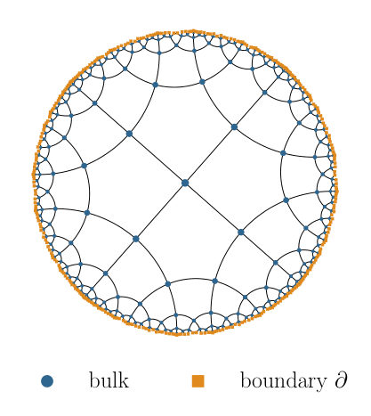
<figcaption class="paper-figure-caption"><b>Fig 1.</b> FIG. 1. The {5, 4} hyperbolic tessellations with N = 597 sites in the Poincar´e disk.</figcaption>
</figure>
<figure class="paper-figure-card">
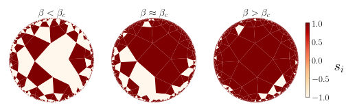
<figcaption class="paper-figure-caption"><b>Fig 2.</b> FIG. 2. Illustrative spin configuration of the Ising model on the {5, 4} tessellations in the disordered phase β &lt; βc, near criticality β ≈βc and ordered phase β &gt; βc.</figcaption>
</figure>
<figure class="paper-figure-card">
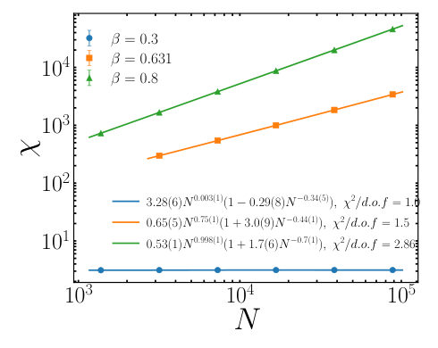
<figcaption class="paper-figure-caption"><b>Fig 3.</b> FIG. 3. Volume dependence of the susceptibility χ on the {5, 4} tessellations with OBC in the disordered phase β = 0.3 (&lt; βc), near criticality β = 0.631 (≈βc) and ordered phase β = 0.8 (&gt; βc).</figcaption>
</figure>
<figure class="paper-figure-card">
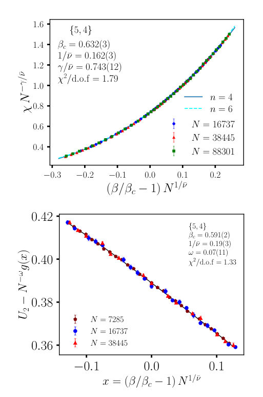
<figcaption class="paper-figure-caption"><b>Fig 4.</b> FIG. 4. (Top) FSS collapse on the {5, 4} tiling using the volume-scaling with OBC. Solid and dashed lines are fits to fourth and sixth order polynomials respectively. Quoted ex- ponents use the quartic polynomial fit. (Bottom) The FSS collapse of Binder cumulant at the fixed βc = 0.591(2), ob- tained from Binder-crossing (see SM Sec. II), but requires a scaling correction (in the same variable), where g(x) is a lin- ear polynomial.</figcaption>
</figure>
<figure class="paper-figure-card">
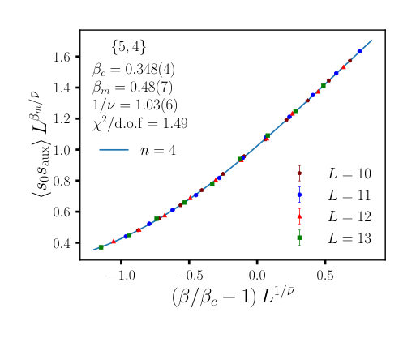
<figcaption class="paper-figure-caption"><b>Fig 5.</b> FIG. 5. FSS fit to the two point correlation function of the spins separated by the largest geodesic distance on the {5, 4} show a scaling collapse with critical exponents that are con- sistent with mean-field scaling.</figcaption>
</figure>

**Summary.** This work analyzes the critical behavior of the Ising model on hyperbolic lattices, finding that the choice of boundary condition (Open vs. Wired) dictates the resulting universality class. Using Monte-Carlo simulations and Finite-Size Scaling, the authors demonstrate that OBC leads to exponents deviating from mean-field theory, while WBC aligns with it, highlighting the critical role of boundary dynamics in curved geometries.

**Why it may be interesting.** The explicit study of boundary effects on critical phenomena in curved spaces provides a model for understanding how boundary constraints can fundamentally alter bulk critical theories, which has parallels in open quantum systems.

Detailed structure

**Main problem.** The study investigates how different boundary conditions (Open vs. Wired) fundamentally alter the critical behavior and universality classes of the Ising model when placed on negatively curved hyperbolic lattices.

**Main result.** Open boundary conditions yield critical exponents distinct from mean-field predictions, suggesting a new universality class, while wired boundary conditions recover mean-field behavior, emphasizing that boundary dynamics must be specified for accurate characterization.

**Method.** The research employs Monte-Carlo simulations combined with rigorous Finite-Size Scaling (FSS) analysis to extract critical coupling constants and scaling exponents.

**Model / system.** The system is the ferromagnetic Ising model ($s_i = \pm 1$) simulated on finite hyperbolic tessellations of Euclidean AdS$_2$, specifically using the $\{5, 4\}$ geometry. The Hamiltonian is analyzed under both Open Boundary Conditions (OBC) and Wired Boundary Conditions (WBC).

**Key observables.** Critical coupling ($eta_c$), susceptibility ($\chi$), Binder cumulant ($U_2$), and finite-size scaling exponents ($ar{
u}, \gamma/ar{
u}$).

**Important parameters / regimes.** The geometry is defined by the tessellation $\{p, q\}$ (e.g., $\{5, 4\}$), and the comparison is drawn between OBC and WBC regimes.

**Assumptions / limitations.** The primary assumption is that the critical behavior is sensitive to the boundary conditions, and the analysis relies on the validity of the FSS hypothesis for different boundary types.

**Figures summary.** Figures illustrate the hyperbolic tessellation, spin configurations in different phases, and the collapse of susceptibility and Binder cumulant data under FSS for both OBC and WBC.

**Paper structure.** The paper systematically compares the critical behavior derived from OBC versus WBC on the hyperbolic lattice, using FSS to extract exponents, and concludes by arguing for the necessity of specifying boundary dynamics.

Abstract

We study the ferromagnetic Ising model on finite hyperbolic tessellations of Euclidean AdS$_2$ with open and wired boundary conditions. Because a finite fraction of spins remains at the boundary as the lattice grows, these conditions select distinct thermodynamic behaviours. In the $\{5,4\}$ tessellation, Monte-Carlo simulations using efficient worm algorithms on open boundaries (OBC) yield a transition near $β_c J=0.632(3)$, with susceptibility data collapsing under scaling by the total number of spins $N$. The fitted finite-size exponents, $1/\barν \simeq 0.162$ and $γ/\barν \simeq 0.743$, differ substantially from the mean-field volume scaling. Wired boundaries (WBC), which correlate boundary spins, instead show a transition around $β_c J=0.348(4)$ to an ordered phase consistent with the mean-field exponents. While the mean-field criticality with WBC is consistent with previous studies and with the suppression of independent boundary fluctuations, the OBC exponents hint at the presence of a new universality class. Results from other tessellations support the robustness of the observed scaling with OBC. We discuss a possible route to interpolate between the different boundary conditions. Our findings show that boundary dynamics must be specified when characterizing critical behaviour on hyperbolic lattices.

[↑ back to top](#top)

### [Encoding universal quantum computation into quantized Berry phases: Hardness results and classical algorithms](http://arxiv.org/abs/2609.37199v1)

**Authors:** Kazuki Sakamoto, Keisuke Fujii  
**Type:** theory · **Category:** quantum information and computing · **PDF:** <https://arxiv.org/pdf/2609.37199v1>  
**Analysis basis:** full PDF text, analyzed in chunks
**Topic relevance:** `analog quantum simulation` **3/5** · `quantum measurements` **1/5**

↔ Scroll figures horizontally

<figure class="paper-figure-card">
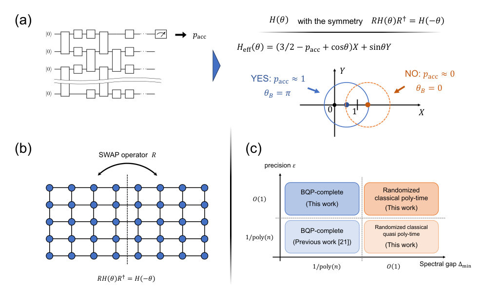
<figcaption class="paper-figure-caption"><b>Fig 1.</b> FIG. 1. Overview of the main results. (a) Hardness mechanism. The acceptance probability pacc of the encoded quantum computation is mapped to an effective two-level Hamiltonian in the low-energy subspace. In the YES case, pacc ≈1 and the loop encloses the origin, giving θB = π, whereas in the NO case, pacc ≈0 and the loop does not enclose it, giving θB = 0. The symmetry RH(θ)R† = H(−θ) quantizes the Berry phase of the full Hamiltonian to 0 or π. (b) The reflection R exchanges the two halves of the lattice and realizes the symmetry RH(θ)R† = H(−θ), which protects the quantization of the Berry phase throughout the reduction. (c) We assume that B1 = O(1) and γ ≥1 −O(ε). For inverse-polynomial...</figcaption>
</figure>

**Summary.** This paper rigorously analyzes the computational complexity of measuring quantized Berry phases in quantum many-body systems. It demonstrates that for systems with small spectral gaps, this measurement is $\mathsf{BQP}$-complete, implying a quantum advantage. Conversely, it identifies the spectral gap as the critical resource, showing that constant gaps allow for efficient classical algorithms.

**Why it may be interesting.** This work directly addresses the boundary between quantum computational advantage and classical simulation feasibility in fundamental quantum physics observables, which is central to quantum information theory applied to condensed matter.

Detailed structure

**Main problem.** The paper characterizes the computational complexity of estimating quantized Berry phases, specifically determining if the phase is exactly 0 or $\pi$.

**Main result.** It proves that distinguishing between $	heta_B=0$ and $	heta_B=\pi$ is $\mathsf{BQP}$-complete for certain Hamiltonians, establishing a super-polynomial quantum advantage. However, it also shows that classical tractability is achieved when the spectral gap is constant.

**Method.** The authors use quantum computation encoding to map the output of an arbitrary quantum circuit onto the Berry phase, allowing the use of established complexity theory tools.

**Model / system.** The study focuses on quantum many-body systems described by local Hamiltonians on lattices (e.g., 2D square lattice with Heisenberg/XY interactions). The complexity is analyzed based on the spectral gap ($\Delta$) of the system.

**Key observables.** Quantized Berry Phase ($	heta_B$), Spectral Gap ($\Delta$), Acceptance Probability ($p_{acc}$)

**Important parameters / regimes.** Inverse-polynomial spectral gap, constant spectral gap, fidelity of the guiding state ($\gamma$)

**Assumptions / limitations.** The hardness results assume an inverse-polynomially small spectral gap; classical tractability is shown under the assumption of a constant spectral gap.

**Figures summary.** Figure 1 illustrates the hardness mechanism by mapping computation acceptance probability to $	heta_B \in \{0, \pi\}$, shows the role of reflection symmetry in quantization, and summarizes the three main complexity results.

**Paper structure.** The paper proceeds by first establishing the hardness of the problem by encoding quantum computation into the Berry phase. It then extends this hardness to physically relevant 2D lattice models. Finally, it provides a constructive classical polynomial-time algorithm for the case where the spectral gap is constant.

Abstract

The Berry phase is a fundamental geometric quantity for characterizing the geometry and topology of quantum many-body systems. Previous work established a super-polynomial quantum advantage in Berry phase estimation at inverse-polynomial precision, given an ansatz state approximating the initial ground state. However, whether this hardness persists for Berry phases quantized by symmetry, which can be distinguished at constant precision, remained open. In this work, we characterize the computational complexity of quantized Berry phase estimation. First, we prove that deciding whether the Berry phase is exactly $0$ or $π$ is $\mathsf{BQP}$-complete when the spectral gap is inverse-polynomially small. This result implies that distinguishing the quantized Berry phase still has a super-polynomial quantum advantage, assuming $\mathsf{BPP}\neq \mathsf{BQP}$. To prove this result, we introduce an encoding that maps the output of any quantum computation to a Berry phase that is exactly $0$ or $π$. Second, we extend this hardness to physically motivated Hamiltonians on a 2D square lattice, including Heisenberg and XY interactions. Third, we provide a classical polynomial-time algorithm for geometrically local Hamiltonians on fixed-dimensional lattices with constant spectral gaps. Therefore we identify that the spectral gap is a key resource for the classical tractability, rather than precision. These results establish a super-polynomial quantum advantage for computing a quantized topological invariant that is unchanged under symmetry- and gap-preserving deformations, and provide new steps towards practical quantum advantage in quantum physics.

[↑ back to top](#top)

### [Entanglement spectrum and magic in higher-dimensional free fermionic systems](http://arxiv.org/abs/2609.36008v1)

**Authors:** Beatrice Magni, Daniele Iannotti, Riccardo Travaglino  
**Type:** theory · **Category:** statistical mechanics · **PDF:** <https://arxiv.org/pdf/2609.36008v1>  
**Analysis basis:** full PDF text, analyzed in chunks
**Topic relevance:** `analog quantum simulation` **3/5** · `Keldysh / 2PI / non-Gaussian methods` **1/5**

↔ Scroll figures horizontally

<figure class="paper-figure-card">
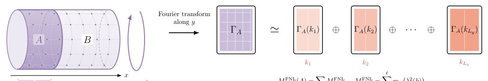
<figcaption class="paper-figure-caption"><b>Fig 1.</b> FIG. 1. Dimensional reduction of fermionic non-local magic for a pure Gaussian state in two dimensions. (a) The subsystem A (violet) is a strip of width ℓalong x that wraps around the cylinder’s periodic direction y, of circumference Ly. (b) For states invariant under translations along y, this symmetry is preserved by the restriction to A. A transverse Fourier transformation therefore decomposes the restricted Majorana covariance matrix ΓA (violet) into independent momentum blocks ΓA(k) (peach), with k = 2πn/Ly. Each block defines a one-dimensional Gaussian channel. The additive spectral expression for fermionic non-local magic then gives the exact decomposition M FNL α (A) = P</figcaption>
</figure>
<figure class="paper-figure-card">

<figcaption class="paper-figure-caption"><b>Fig 2.</b> FIG. 2. Comparison between Eq. (27) and the nu- merical values obtained directly from the correlation ma- trix. The strips considered have dimension Ly = ℓ= {40, 60, 80, 120, 160, 240, 320, 480} with µ = 0.5. In the in- set, we show the same comparison of the FNL with fixed Ly = ℓ= 160 and µ ∈[0, 3] varying inside and outside the critical regime (black dashed line).</figcaption>
</figure>
<figure class="paper-figure-card">
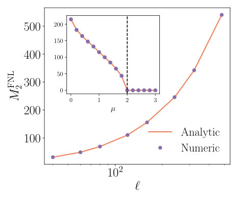
<figcaption class="paper-figure-caption"><b>Fig 3.</b> Fig. 2 as a function of the system size and of the chemical potential µ. The leading growth of the fermionic non- local magic is entirely controlled by the number of gapless transverse modes, yielding an Ly log ℓscaling. Instead, outside of the critical regime, the FNL vanish completely. This is consistent with the analysis in Ref. [71] of the one-dimensional XY model, which indeed reduces to the Hopping model for certain parameter values.</figcaption>
</figure>
<figure class="paper-figure-card">
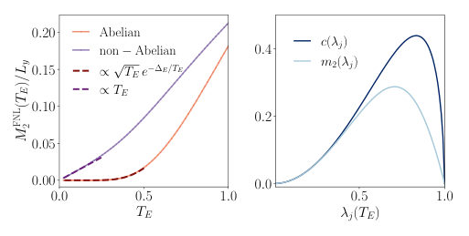
<figcaption class="paper-figure-caption"><b>Fig 4.</b> FIG. 3. FNL variation with the entanglement temperature of the matter-Majorana entanglement spectrum in the Ki- taev model. The left panel shows the temperature-resolved fermionic non-local magic M FNL 2 (TE)/Ly as a function of the entanglement temperature TE. In the non-Abelian phase the low-temperature behavior is linear, M FNL 2 (TE) ∝TE, whereas in the Abelian phase it is exponentially suppressed according to M FNL 2 (TE) ∼√TE exp(−∆E/TE). The dashed lines denote the corresponding low-temperature fits. Numer- ics are performed on a system with Lx = 48, a subsystem ℓx = Lx/2 = 24, and Ly = 401. We use the parameter sets Jx = Jy = Jz = 1, J′ = 0.2 for the non-Abelian phase and Jx = Jz =...</figcaption>
</figure>
<figure class="paper-figure-card">
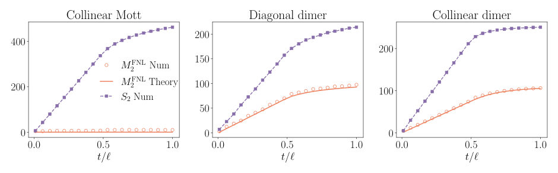
<figcaption class="paper-figure-caption"><b>Fig 5.</b> FIG. 4. Quench dynamics of entanglemnt Rényi entropy and non-local magic for α = 2 in a quench from three different states, in a hopping hamiltonain with Ly = 10 and ℓ= 100. The figure shows the perfect agreement with the exact numerical expression for the FNL (11) and its quasi-particle version (55), and their comparison with the α = 2 Rènyi entropy, which shows clearly that the bound in (13) is a loose bound. Interestingly, the figure makes clear that for collinear mott state, while the entanglement entropy grows extensively, the FNL remains close to zero at all times, highlighting that FNL truly plays a complementary role to entanglement, and can be small when entanglement is large. In...</figcaption>
</figure>

**Summary.** This work explores fermionic non-local magic in free-fermion systems using the entanglement spectrum as a diagnostic tool. It derives scaling laws for FNL in various geometries and applies these tools to the Kitaev model, showing phase-dependent behavior. Furthermore, it analyzes the time evolution of entanglement measures under random quantum circuits, confirming diffusive dynamics in higher dimensions.

**Why it may be interesting.** The connection between entanglement measures (like FNL) and spectral properties, especially how these quantities reveal underlying topological phases (Abelian vs. non-Abelian) in condensed matter models, is highly relevant to understanding quantum phases of matter.

Detailed structure

**Main problem.** The paper investigates fermionic non-local magic (FNL) in higher-dimensional free-fermion systems, relating it to the entanglement spectrum and its behavior under various conditions.

**Main result.** The study establishes specific scaling laws for FNL in 2D strip geometries and shows that the entanglement-temperature deformation of FNL exhibits distinct behavior (exponential vs. algebraic) in Abelian versus non-Abelian phases of the Kitaev model.

**Method.** The analysis heavily relies on dimensional reduction techniques applied to Gaussian states, utilizing the entanglement spectrum and comparing FNL to other entanglement measures like the capacity of entanglement.

**Model / system.** The primary models are higher-dimensional free-fermion systems, analyzed using Gaussian states, and specifically applied to the matter-Majorana sector of the Kitaev model.

**Key observables.** Fermionic Non-local Magic (FNL), Entanglement Spectrum, Capacity of Entanglement, and the ensemble-averaged squared Majorana weight.

**Important parameters / regimes.** Dimensionality (2D, higher-D), temperature ($T_E$), and system sizes ($\ell, L_y$).

**Assumptions / limitations.** The analysis assumes the free-fermion Gaussian state setting, allowing for closed spectral expressions, and often employs continuum limits and Gaussian approximations for dynamics.

**Figures summary.** Figure 1 illustrates the dimensional reduction of FNL for a pure Gaussian state in 2D via momentum block decomposition. Figure 10 compares entanglement entropies in random Clifford Gaussian circuits, showing diffusive growth.

**Paper structure.** The paper progresses from analyzing FNL in static, translationally invariant states (strip geometries, Kitaev model) to studying its out-of-equilibrium dynamics under random quantum gates (quenches/circuits), culminating in diffusive spreading results.

Abstract

We study fermionic non-local magic in higher-dimensional free-fermion systems through the lens of the entanglement spectrum. For translationally invariant Gaussian states in strip geometries, dimensional reduction maps the problem to independent lower-dimensional momentum sectors, leading in two dimensions to a multiplicative logarithmic violation of the boundary law analogous to Gioev-Klich-Widom scaling. We further show that the second Rényi fermionic non-local magic is bounded by the capacity of entanglement and introduce an entanglement-temperature deformation that probes the low-energy structure of the entanglement Hamiltonian. Applied to the matter-Majorana sector of the Kitaev model, this response is exponentially suppressed in the Abelian phase and algebraic in the non-Abelian phase, where its ratio with the capacity approaches a universal constant. Out of equilibrium, we extend the quasi-particle description to fermionic non-local magic in higher-dimensional quenches and show that random Gaussian circuits exhibit diffusive spreading in two spatial dimensions.

[↑ back to top](#top)

### [Non-equilibrium fluctuations of gradient exclusion processes in dimension $d\le 3$](http://arxiv.org/abs/2609.37897v1)

**Authors:** Claudio Landim, Sunder Sethuraman  
**Type:** theory · **Category:** statistical mechanics · **PDF:** <https://arxiv.org/pdf/2609.37897v1>  
**Analysis basis:** full PDF text, analyzed in chunks
**Topic relevance:** `non-equilibrium universality` **3/5** · `driven-dissipative phase transition` **1/5**

↔ Scroll figures horizontally

<figure class="paper-figure-card">
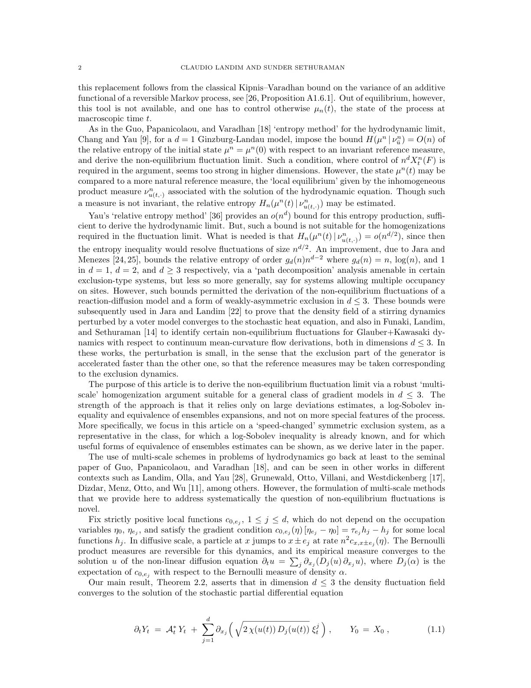
<figcaption class="paper-figure-caption"><b>Fig 1.</b> Low-resolution page preview, page 2</figcaption>
</figure>
<figure class="paper-figure-card">
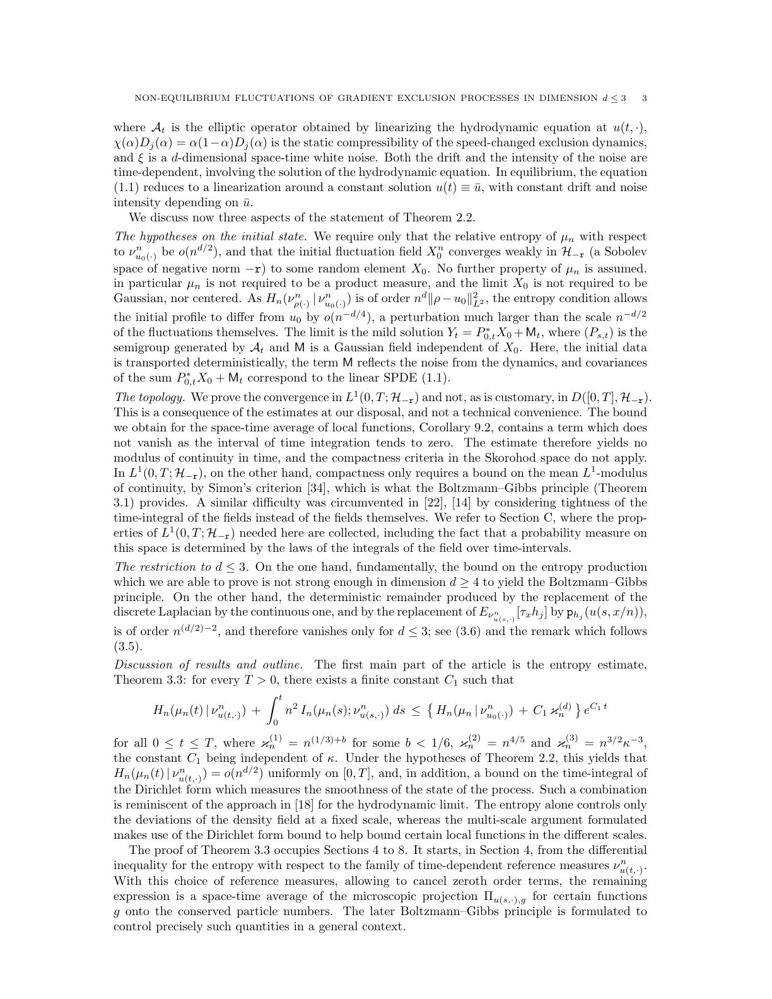
<figcaption class="paper-figure-caption"><b>Fig 2.</b> Low-resolution page preview, page 3</figcaption>
</figure>
<figure class="paper-figure-card">
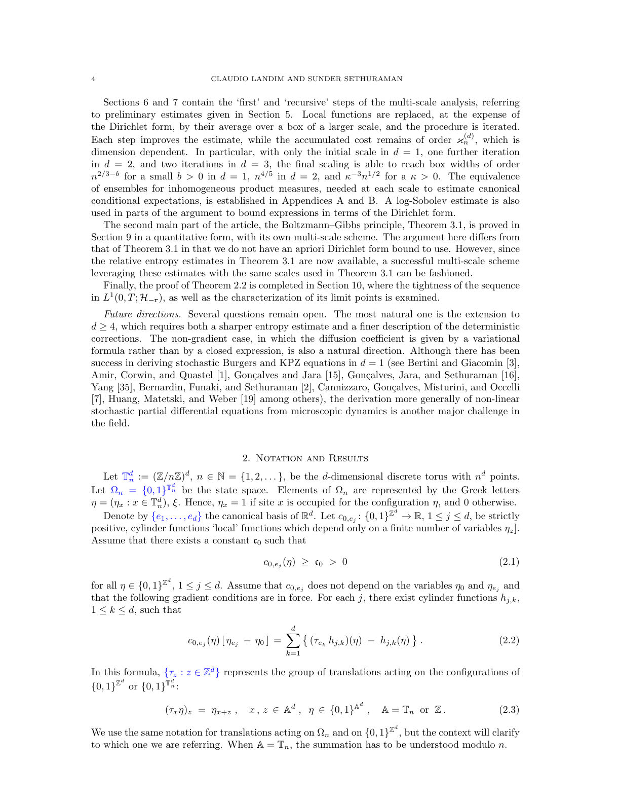
<figcaption class="paper-figure-caption"><b>Fig 3.</b> Low-resolution page preview, page 4</figcaption>
</figure>
<figure class="paper-figure-card">
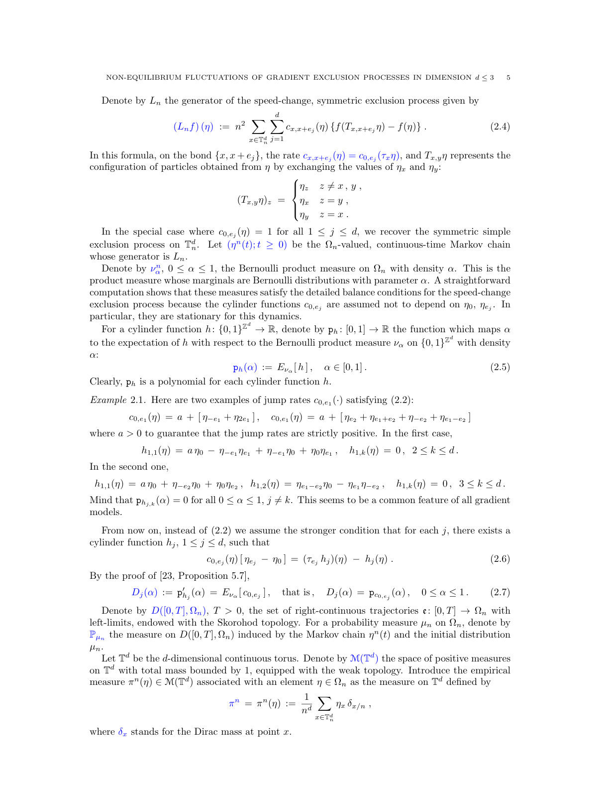
<figcaption class="paper-figure-caption"><b>Fig 4.</b> Low-resolution page preview, page 5</figcaption>
</figure>
<figure class="paper-figure-card">
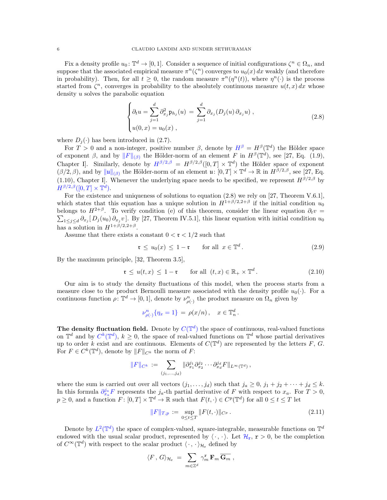
<figcaption class="paper-figure-caption"><b>Fig 5.</b> Low-resolution page preview, page 6</figcaption>
</figure>

**Summary.** This paper analyzes the non-equilibrium fluctuations of a gradient exclusion process on a discrete torus in dimensions $d \le 3$. It proves that the density fluctuation field converges to the solution of a linear Stochastic Partial Differential Equation (SPDE). The methodology relies on advanced tools like multi-scale analysis and relative entropy methods to bridge the gap between microscopic particle dynamics and continuous stochastic field theories.

**Why it may be interesting.** The rigorous derivation of fluctuation theorems and the connection between microscopic dynamics (exclusion processes) and continuous stochastic PDEs is a cornerstone of non-equilibrium statistical mechanics, highly relevant for understanding open quantum systems dynamics.

Detailed structure

**Main problem.** The paper derives the non-equilibrium fluctuation limit for a gradient, speed-change, symmetric exclusion process.

**Main result.** The density fluctuation field converges in L^1(0, T; H^-r) to the solution of a linear Stochastic Partial Differential Equation (SPDE) driven by space-time white noise.

**Method.** The analysis employs multi-scale homogenization arguments, relative entropy estimates, and martingale theory to control the fluctuations around the hydrodynamic limit.

**Model / system.** The system is a mass conservative interacting particle system (gradient, speed-change, symmetric exclusion process) studied on the discrete torus T^d_n, with the hydrodynamic limit governed by a non-linear parabolic PDE.

**Key observables.** Empirical measure, density fluctuation field X_n^t, and the relative entropy H_n(mu_n | nu_n u).

**Important parameters / regimes.** The dimension d <= 3 is crucial for the derivation; the initial condition requires a relative entropy bound of o(n^(d/2)).

**Assumptions / limitations.** The derivation fundamentally relies on the dimension being $d \le 3$ for the deterministic remainder to vanish, and the initial state must satisfy a specific entropy bound.

**Paper structure.** The paper follows a structure involving establishing the hydrodynamic limit via PDE convergence, followed by a detailed multi-scale analysis using relative entropy bounds to prove the convergence of the fluctuation field to an SPDE solution.

Abstract

We consider a gradient, speed-change, symmetric exclusion process on the discrete torus $T^d_n$, $d\le 3$, whose empirical measure evolves, on the diffusive scale, according to a non-linear parabolic equation. We prove that, starting from a sequence of initial states whose relative entropy with respect to the inhomogeneous product measure associated with the initial profile is $o(n^{d/2})$, and whose density fluctuation field converges, the density fluctuation field converges, in $L^1(0,T; H_{- r})$, to the solution of a linear stochastic partial differential equation with time-dependent coefficients driven by a conservative space-time white noise.

[↑ back to top](#top)

### [Optimal Ground-State Preparation with a Guiding State](http://arxiv.org/abs/2609.38091v1)

**Authors:** Stacey Jeffery, Rolando D. Somma, Freek Witteveen, Ronald de Wolf  
**Type:** theory · **Category:** quantum information and computing · **PDF:** <https://arxiv.org/pdf/2609.38091v1>  
**Analysis basis:** full PDF text, analyzed in chunks
**Topic relevance:** `analog quantum simulation` **3/5** · `quantum measurements` **1/5**

↔ Scroll figures horizontally

<figure class="paper-figure-card">
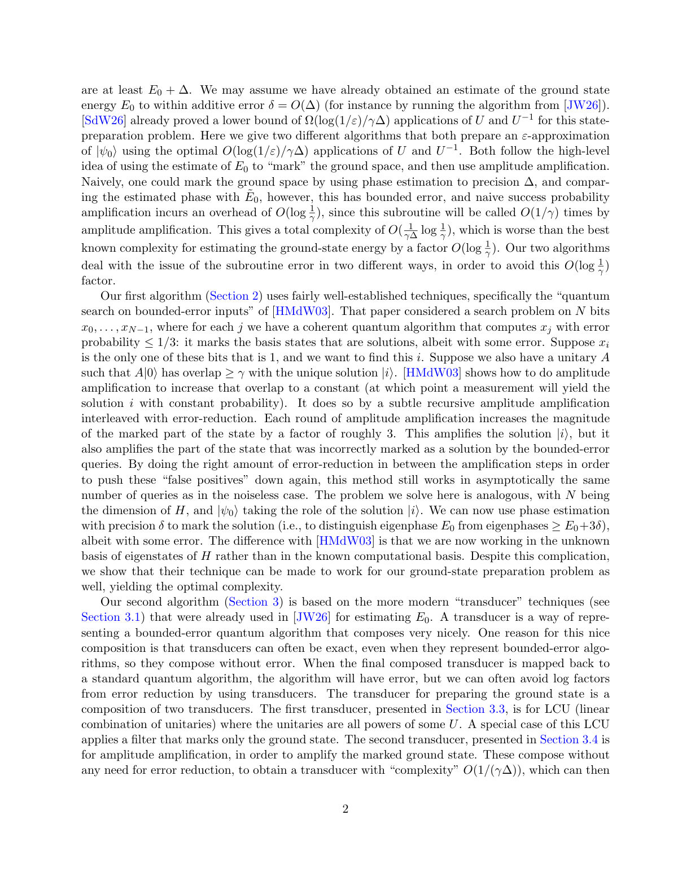
<figcaption class="paper-figure-caption"><b>Fig 1.</b> Low-resolution page preview, page 2</figcaption>
</figure>
<figure class="paper-figure-card">
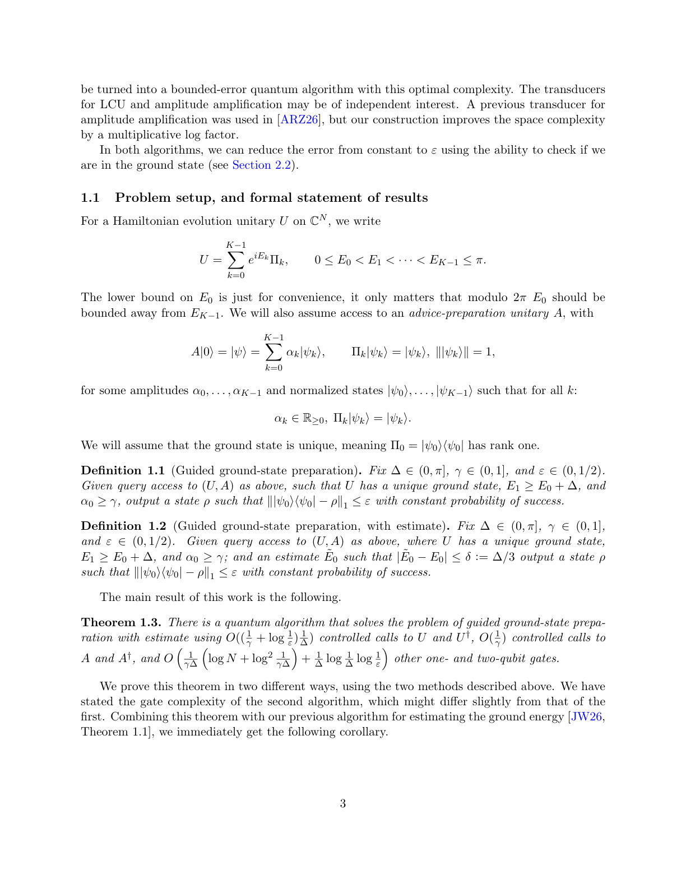
<figcaption class="paper-figure-caption"><b>Fig 2.</b> Low-resolution page preview, page 3</figcaption>
</figure>
<figure class="paper-figure-card">
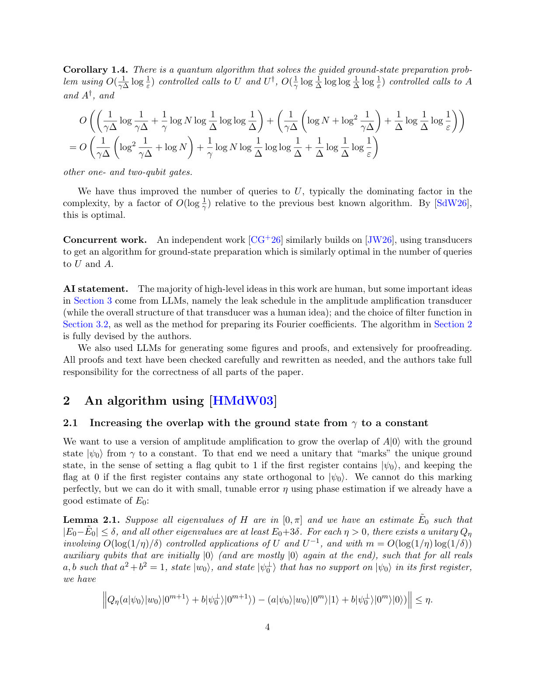
<figcaption class="paper-figure-caption"><b>Fig 3.</b> Low-resolution page preview, page 4</figcaption>
</figure>
<figure class="paper-figure-card">
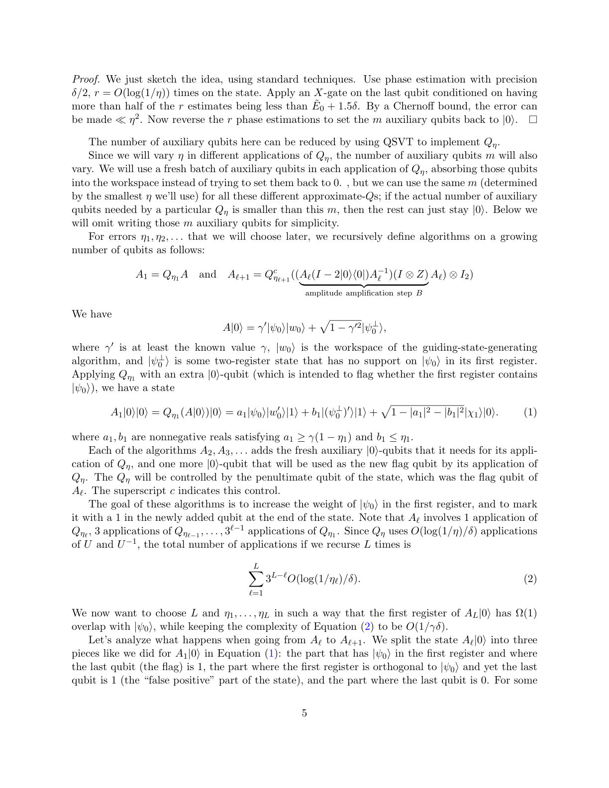
<figcaption class="paper-figure-caption"><b>Fig 4.</b> Low-resolution page preview, page 5</figcaption>
</figure>
<figure class="paper-figure-card">
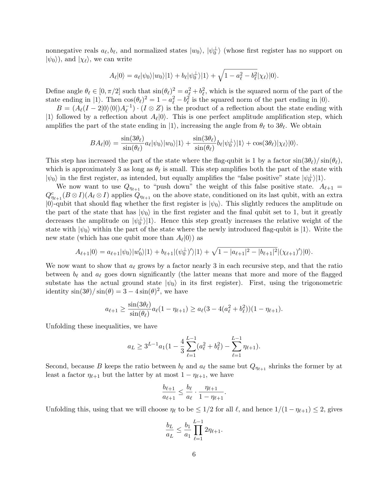
<figcaption class="paper-figure-caption"><b>Fig 5.</b> Low-resolution page preview, page 6</figcaption>
</figure>

**Summary.** This paper develops optimal quantum algorithms for preparing a state close to the ground state of a Hamiltonian, given limited initial information. By combining amplitude amplification with techniques like quantum transducers, the authors achieve a highly efficient complexity bound dependent on the initial overlap and energy estimation accuracy. This advances the field of quantum simulation by providing rigorous, near-optimal algorithmic guarantees.

**Why it may be interesting.** This work provides state-of-the-art algorithmic tools for quantum simulation, directly impacting how efficiently we can prepare the ground state of complex Hamiltonians relevant to condensed matter physics.

Detailed structure

**Main problem.** The paper addresses the challenge of efficiently preparing a quantum state that approximates the unique ground state of a given Hamiltonian, starting from a state with only a partial overlap.

**Main result.** The authors derive an optimal complexity bound for ground-state preparation, achieving a query complexity of $O(\log(1/\varepsilon)/(\gamma\delta))$ applications of the Hamiltonian evolution operator $U=e^{iH}$ and the guiding state preparation unitary $A$.

**Method.** The approach combines amplitude amplification techniques with error reduction methods, and later develops an alternative framework using quantum transducers to achieve the required state projection.

**Model / system.** The system is defined by a Hamiltonian $H$ possessing a unique ground state $|\psi_0
angle$ with energy $E_0$. The process requires access to the unitary evolution $U=e^{iH}$ and a unitary $A$ that generates a 'guiding state' $A|0
angle$ with initial overlap $\gamma$ with $|\psi_0
angle$.

**Key observables.** The primary observable is the fidelity or overlap between the prepared state and the true ground state $|\psi_0
angle$.

**Important parameters / regimes.** Key parameters include the initial overlap $\gamma$, the energy estimation error $\delta$, the target approximation error $\epsilon$, and the gap $\Delta$ between $E_0$ and other eigenvalues.

**Assumptions / limitations.** The analysis assumes the existence of an estimate $	ilde{E}_0$ for $E_0$ with precision $\delta$, and that the Hamiltonian is gapped by at least $3\delta$.

**Figures summary.** No specific figure summaries were extracted, but the notes detail mathematical derivations and state evolution equations.

**Paper structure.** The paper presents two distinct algorithmic approaches: one interleaving amplitude amplification and error reduction (following [HMdW03]), and a second, more advanced method utilizing quantum transducers for state projection.

Abstract

Suppose a Hamiltonian $H$ has a unique ground state $|ψ_0\rangle$ with an eigenvalue $E_0$, and we have an estimate $\tilde{E}_0$ such that $|\tilde{E}_0-E_0|\leqδ$, and there is a gap of at least $3δ$ between $E_0$ and all other eigenvalues. Suppose we have a unitary $A$ available that can produce a "guiding state'" $A|0\rangle$ that has overlap at least $γ$ with $|ψ_0\rangle$. We show how to obtain an $\varepsilon$-approximation of $|ψ_0\rangle$ using $O(\log(1/\varepsilon)/γδ)$ applications of $U=e^{iH}$ and $A$, and their inverses. We give two different algorithms, one based on interleaving amplitude amplification and error-reduction in the style of [HMdW03], and one using the composition of transducers. This paper is the state-preparation follow-up to our two recent ground-state-energy estimation papers [JW26, SdW26]. Combined, our results show an optimal $O(\log(1/\varepsilon)/γδ)$ upper bound for ground state preparation.

[↑ back to top](#top)

### [Root-system structure of sloppiness in passive Gaussian metrology](http://arxiv.org/abs/2609.36579v1)

**Authors:** A. Kafuri, B. M. Rodriguez-Lara  
**Type:** theory · **Category:** other · **PDF:** <https://arxiv.org/pdf/2609.36579v1>  
**Analysis basis:** full PDF text, analyzed in chunks
**Topic relevance:** `quantum measurements` **3/5** · `quantum optics experiment` **1/5**

↔ Scroll figures horizontally

<figure class="paper-figure-card">

<figcaption class="paper-figure-caption"><b>Fig 1.</b> FIG. 1. Restricted-root arrangements in squeezing-spectrum space. (a) Arrangement for the C2</figcaption>
</figure>
<figure class="paper-figure-card">
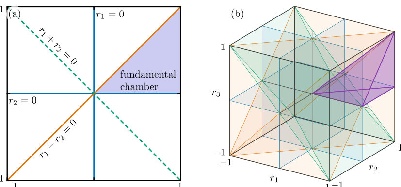
<figcaption class="paper-figure-caption"><b>Fig 2.</b> Figure 1 shows the restricted-root arrangement for the first two nontrivial cases, illustrat-</figcaption>
</figure>
<figure class="paper-figure-card">
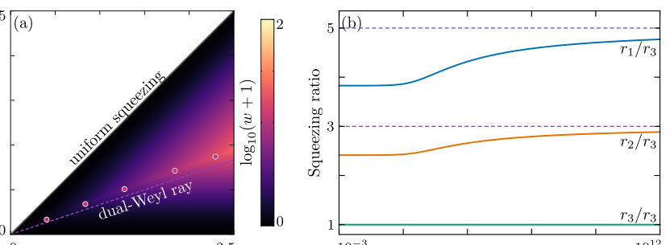
<figcaption class="paper-figure-caption"><b>Fig 3.</b> FIG. 2. E-optimal (maximin) probe design in the canonical angle normalization. (a) The quantity</figcaption>
</figure>
<figure class="paper-figure-card">
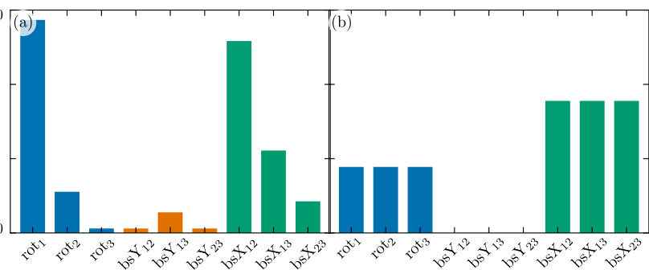
<figcaption class="paper-figure-caption"><b>Fig 4.</b> FIG. 3. Passive Fisher spectra for the two competing probe-design objectives at n = 3 and mean</figcaption>
</figure>

**Summary.** This paper rigorously analyzes the fundamental limits of quantum sensing using passive Gaussian transformations. It shows that the loss of measurement identifiability is governed by the $C_n$ root system, and it derives optimal squeezing strategies for maximizing measurement sensitivity. The results provide a comprehensive classification of local identifiability, sensitivity optimization, and resource compatibility in quantum metrology.

**Why it may be interesting.** This work provides a deep mathematical framework connecting the algebraic structure of symmetry groups (root systems) directly to the fundamental physical limits of quantum measurement precision in continuous variable systems.

Detailed structure

**Main problem.** The paper determines the global structure governing parameter identifiability, sensitivity, and compatibility for passive Gaussian transformations in quantum metrology.

**Main result.** The exact sloppiness structure is governed by the $C_n$ restricted-root system, and the E-optimal probe design leads to an arithmetic progression for the optimal squeezing spectrum.

**Method.** The authors use algebraic geometry (restricted-root systems) combined with quantum estimation theory (Quantum Fisher Matrix analysis) to map physical limitations to mathematical structures.

**Model / system.** The system involves $n$-mode squeezed Gaussian probes undergoing passive transformations, analyzed within the framework of the Lie group $	ext{Sp}(2n,\mathbb{R})/	ext{U}(n)$.

**Key observables.** Quantum Fisher Matrix (QFI) eigenvalues, passive Fisher weights, and the condition number ($\kappa$) of the sensitivity matrix.

**Important parameters / regimes.** Squeezing spectrum $r = (r_1, \dots, r_n)$, mean photon number $N$, and the resource allocation parameter $a$.

**Assumptions / limitations.** The analysis focuses on pure zero-mean Gaussian probes and utilizes the canonical squeezing basis for initial structural identification.

**Figures summary.** Figures illustrate the restricted-root arrangements for $C_2$ and $C_3$, showing singular lines/planes corresponding to vanishing Fisher weights, and compare optimal design strategies.

**Paper structure.** The paper systematically moves from identifying the algebraic structure ($C_n$ roots) governing Fisher-rank loss, to solving optimization problems (E-optimal, A-optimal) for probe design, and finally analyzing resource limits and degeneracy lifting via displacement measurements.

Abstract

Passive transformations of an $n$-mode squeezed probe become locally unidentifiable when the quantum Fisher matrix loses rank. For pure zero-mean Gaussian probes, we show that the $C_{n}$ restricted-root system of $\mathrm{Sp}(2n,\mathbb{R})/\mathrm{U}(n)$ governs this exact sloppiness. For squeezing magnitudes $r_{1},\ldots,r_{n}$ in the canonical basis, the roots $2r_{j}$ and $r_{j}\pm r_{k}$ label the local phase rotations and two beam-splitter quadratures, and their vanishing identifies every Fisher-null direction. The associated Fisher weights quantify the approach to each singular wall. At fixed positive mean photon number, we solve the E-optimal probe-design problem of maximizing the smallest passive Fisher eigenvalue in two explicit generator normalizations. In the canonical phase and beam-splitter angle convention, the unique optimum in the fundamental Weyl chamber is an arithmetic progression approaching the consecutive-odd-integer dual-Weyl direction at large resource. With an invariant generator norm, the smallest eigenvalue is independent of the passive frame and the optimum lies exactly on that ray at every resource. Uniform squeezing instead minimizes the local-phase A-optimal cost while leaving one beam-splitter quadrature unidentifiable for every mode pair. Finally, the two quadratures of each identifiable mode pair saturate the quantum-geometric incompatibility bound, and the largest compatible passive submodel has $n(n+1)/2$ parameters at a regular spectrum. The resulting classification separates local identifiability, sensitivity optimization, and simultaneous attainability.

[↑ back to top](#top)

### [Adaptive Rotation for iSOMA: Geometry, Benchmarking, and Noise Robustness in Variational Quantum Objectives](http://arxiv.org/abs/2609.37193v1)

**Authors:** Vojtěch Novák, Ivan Zelinka  
**Type:** both · **Category:** numerical methods · **PDF:** <https://arxiv.org/pdf/2609.37193v1>  
**Analysis basis:** full PDF text, analyzed in chunks
**Topic relevance:** `analog quantum simulation` **3/5**

↔ Scroll figures horizontally

<figure class="paper-figure-card">
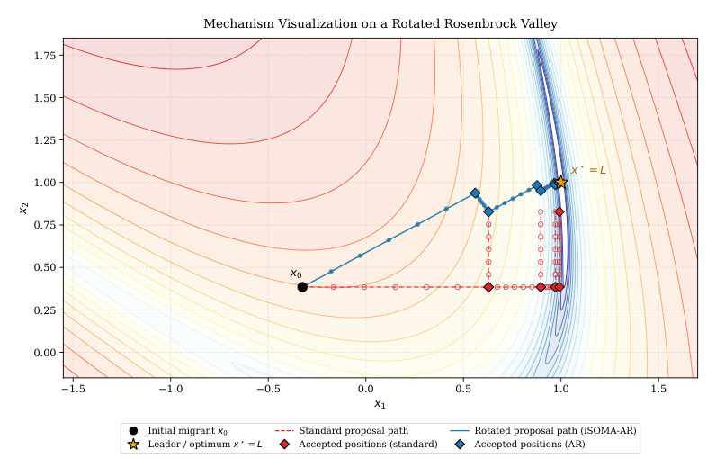
<figcaption class="paper-figure-caption"><b>Fig 1.</b> Fig. 1 Illustrative proposal geometry on a rotated Rosenbrock valley. With the same partially active perturbation mask, standard iSOMA applies masking in the original coordinate system, whereas iSOMA-AR applies it in the learned basis Qs. The rotated proposals follow the valley geometry more directly and make faster progress toward the leader. Discrete points denote evaluated path locations and diamonds denote accepted replacements.</figcaption>
</figure>
<figure class="paper-figure-card">
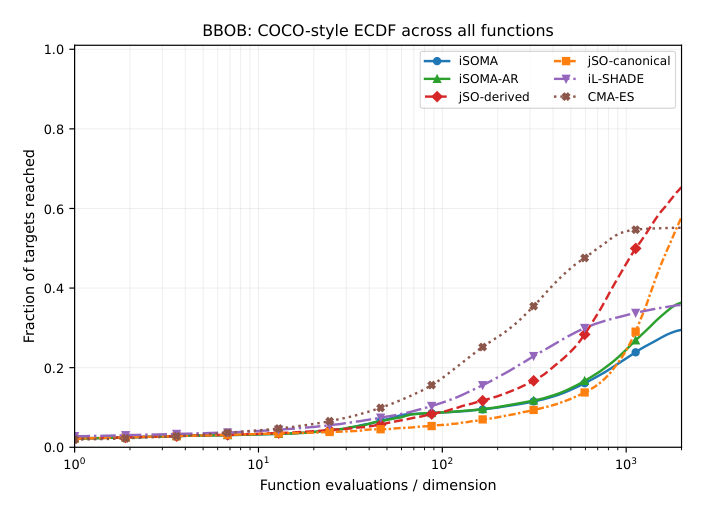
<figcaption class="paper-figure-caption"><b>Fig 2.</b> Fig. 2 COCO-style fixed-target ECDF across all BBOB functions, dimensions, instances, and 51 target precisions at the 2000D budget. The jSO-derived and jSO-canonical implementations are shown as separate curves; canonical jSO is a post-hoc sensitivity comparator and is not included in the primary five-method rank analysis.</figcaption>
</figure>
<figure class="paper-figure-card">
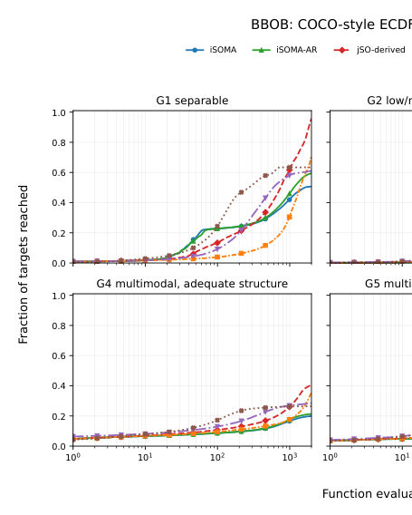
<figcaption class="paper-figure-caption"><b>Fig 3.</b> Fig. 3 COCO-style fixed-target ECDF split by the five official BBOB function groups.</figcaption>
</figure>
<figure class="paper-figure-card">
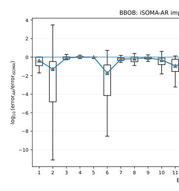
<figcaption class="paper-figure-caption"><b>Fig 4.</b> Fig. 4 Distribution of log10(errorAR/erroriSOMA) by BBOB function. Values below zero favor iSOMA-AR.</figcaption>
</figure>
<figure class="paper-figure-card">
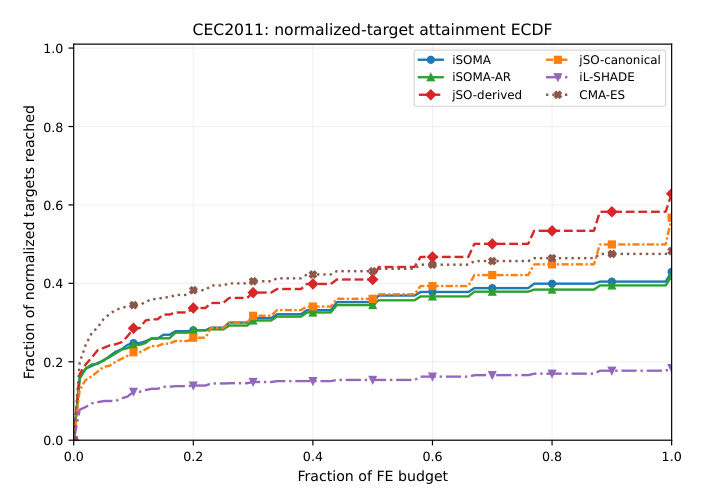
<figcaption class="paper-figure-caption"><b>Fig 5.</b> Fig. 5 Diagnostic normalized-target ECDF over the 22 CEC 2011 real-world problems. Targets are relative gap reductions reconstructed from saved checkpoints; this diagnostic lies outside the official CEC/COCO metrics.</figcaption>
</figure>

**Summary.** This paper introduces iSOMA-AR, an enhanced optimization algorithm that uses adaptive rotation to learn an optimal basis for guiding search proposals in complex, coordinate-dependent landscapes. It demonstrates that this technique significantly boosts performance on deterministic black-box benchmarks and improves optimization for certain quantum spin models. The work highlights that while adaptive rotation is powerful for geometry, the overall noise robustness of the method relies more on the underlying SOMA migration mechanism.

**Why it may be interesting.** While the focus is on optimization algorithms, the application to VQOs and the explicit comparison of search geometry against physical Hamiltonians makes it relevant to understanding the optimization landscape of quantum circuits.

Detailed structure

**Main problem.** The paper addresses the challenge of optimizing Variational Quantum Objectives (VQOs) by improving the search mechanism of the iSOMA algorithm to reduce coordinate dependence.

**Main result.** Adaptive rotation (iSOMA-AR) significantly outperforms baseline iSOMA on noiseless, geometrically difficult black-box optimization benchmarks, suggesting its utility in coordinate-sensitive deterministic problems.

**Method.** The core method is iSOMA-AR, which learns an optimal basis from successful migration displacements to selectively apply the perturbation mask, guiding the search along local geometric features.

**Model / system.** The work benchmarks optimization on general black-box global optimization problems (BBOB, CEC 2011) and specific quantum objectives derived from frustrated-spin models (Hamiltonians $H_{SG}, Q1, Q2, Q3$).

**Key observables.** Performance metrics include success rates, convergence trajectories (mean rank), and the comparison of objective function values ($E_{best} - E_0$) across different noise levels.

**Important parameters / regimes.** Key parameters include the learning rate ($\eta$), the off-axis score threshold ($
ho > 0.18$), and the noise strength applied to the quantum evaluations.

**Assumptions / limitations.** The primary assumption is that the standard PRT mask is suboptimal because it is tied to the global coordinate system, which iSOMA-AR attempts to correct by learning a local basis.

**Figures summary.** Figures illustrate the improved proposal geometry of iSOMA-AR over standard iSOMA on rotated valleys, and tables summarize performance comparisons across BBOB and CEC 2011 benchmarks.

**Paper structure.** The paper introduces iSOMA-AR, details its mechanism using learned bases, benchmarks it extensively on noiseless BBOB and CEC 2011 problems, tests its application on frustrated-spin VQA objectives, and finally analyzes its robustness under increasing noise.

Abstract

We study whether the coordinate dependence of the improved Self-Organizing Migrating Algorithm (iSOMA) can be reduced while retaining its inexpensive leader-directed migration mechanism. We introduce iSOMA-AR, which learns a basis from successful migration displacements and selectively applies the standard perturbation mask in that basis. On the complete noiseless BBOB suite, iSOMA- AR significantly outperformed baseline iSOMA across matched conditions, with the largest gains on geometrically difficult landscapes. A targeted ablation shows that the learned orientation is beneficial on a rotated ill-conditioned landscape and that moderate changes of the gate threshold and rotation cap preserve the qualitative result. On CEC 2011 Real World Optimization Problems, iSOMA-AR outperformed iL-SHADE on most problems, although its advantage over baseline iSOMA was not statistically significant. A canonical-jSO rerun is reported as a post-hoc sensitivity check alongside the original jSO-derived comparator. On frustrated-spin variational quantum objectives, adaptive rotation improved most transverse-field conditions, while gains on the diagonal and anisotropic models were absent or selective. Under strong effective sampling noise, the SOMA variants were the most robust population-based methods in the comparison, but iSOMA-AR was not significantly better than baseline iSOMA. Repairing all-zero PRT masks greatly reduced repeated-point evaluations without changing endpoint quality significantly, making this implementation detail unlikely to explain the noise result. Overall, adaptive rotation is most useful on coordinate-sensitive deterministic problems, while the observed noise robustness appears to arise mainly from the underlying SOMA migration mechanism.

[↑ back to top](#top)

### [Frustrated Gd3+ Double Perovskites as High-Performance Magnetocaloric Materials for Sub-100 mK Adiabatic Demagnetization Refrigeration](http://arxiv.org/abs/2609.36538v1)

**Authors:** Tim Treu, Marvin Klinger, Christian Heil, Hans-Albrecht Krug von Nidda, Vinicius E. S. Frehse, Mamoun Hemmida, Anton Jesche, Alexander A. Tsirlin, Philipp Gegenwart  
**Type:** both · **Category:** statistical mechanics · **PDF:** <https://arxiv.org/pdf/2609.36538v1>  
**Analysis basis:** full PDF text, analyzed in chunks
**Topic relevance:** `analog quantum simulation` **3/5**

↔ Scroll figures horizontally

<figure class="paper-figure-card">
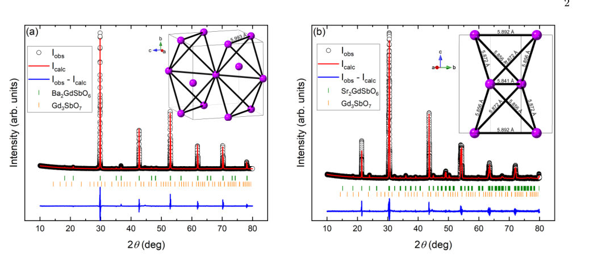
<figcaption class="paper-figure-caption"><b>Fig 1.</b> FIG. 1. SPXRD pattern of Ba2GdSbO6 (a) and Sr2GdSbO6 (b) collected at 300 K. The insets depict the Gd3+-ion tetrahedral coordination within the respective unit cells, with bond distances given in ˚A.</figcaption>
</figure>
<figure class="paper-figure-card">
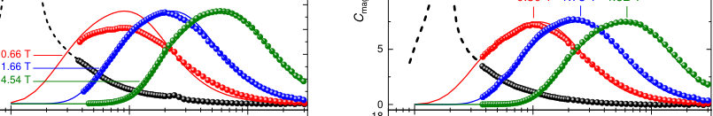
<figcaption class="paper-figure-caption"><b>Fig 2.</b> FIG. 3. Temperature-dependent magnetic specific heat Cmag(T) (upper panels) and entropy Smag(T) (lower panels) of (a) Ba2GdSbO6 and (b) Sr2GdSbO6. The dashed lines indicate data calculated from the ADR warming curves (see Section II D). The colored lines illustrate model calculations based on Equation C2, utilising the specified effective field values. Grey arrows indicate the potential to cool to below 100 mK during an ADR process.</figcaption>
</figure>
<figure class="paper-figure-card">
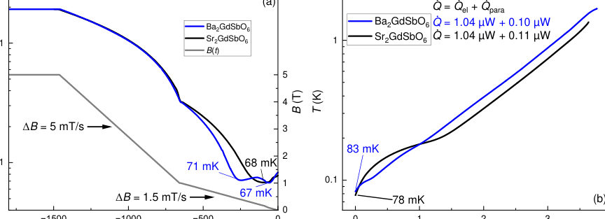
<figcaption class="paper-figure-caption"><b>Fig 3.</b> FIG. 4. (a) ADR cooling curves starting from T = 2 K and B = 5 T. The ramp rate was reduced below 1 T to improve temperature measurement accuracy. Ba2GdSbO6 exhibits two minima at 71 mK (0.4 T) and 67 mK (0.1 T), while Sr2GdSbO6 shows a single anomaly at 68 mK and 0.15 T. (b) Warming curves for both compounds after reaching zero field at t = 0, with phase transitions visible as kinks in the curves. Note that the short warmup time is caused by the deliberate introduction of significant electrical heating Qel (see Section G)</figcaption>
</figure>
<figure class="paper-figure-card">
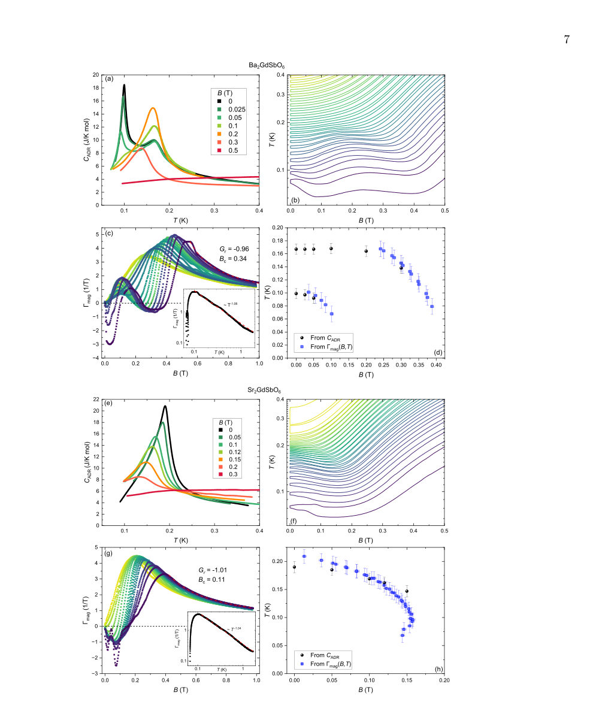
<figcaption class="paper-figure-caption"><b>Fig 4.</b> FIG. 5. Heat capacity CADR of Ba2GdSbO6 (a) and Sr2GdSbO6 (e) derived from ADR warming curves using Eq. G1. (b), (f) T(B) plots of Ba2GdSbO6 (a) and Sr2GdSbO6 recorded by sweeping the applied field between 0 and 1 T, starting from 2 K and 5 T. The minima in the traces indicate magnetic phase boundaries. (c), (g) Magnetic Gr¨uneisen parameter Γmag, calculated from the T(B) traces using Eq. 2. The inset shows the temperature dependence of Γmag. (d), (h) Tentative phase diagram, where the peak positions from (a), (e) and the zero crossings from (c), (g) are marked.</figcaption>
</figure>

**Summary.** This research identifies $	ext{Gd}^{3+}$-based double perovskites as excellent candidates for advanced cooling technologies due to their high magnetocaloric performance. By leveraging their frustrated magnetic structure, the materials achieve record low temperatures in Adiabatic Demagnetization Refrigeration (ADR). The combination of detailed magnetic measurements and thermodynamic modeling validates their potential for practical, ultra-low temperature applications.

**Why it may be interesting.** The work directly addresses the practical limits of quantum refrigeration, providing material candidates whose magnetic phase transitions can be engineered to operate at the millikelvin scale, which is crucial for quantum computing infrastructure.

Detailed structure

**Main problem.** The primary goal is to develop and test high-performance magnetocaloric materials capable of achieving temperatures below 100 mK for advanced quantum technologies using Adiabatic Demagnetization Refrigeration (ADR).

**Main result.** The $	ext{Gd}^{3+}$-based double perovskites, $	ext{Ba}_2	ext{GdSbO}_6$ and $	ext{Sr}_2	ext{GdSbO}_6$, successfully demonstrate record low cooling temperatures (down to $\sim 67-78 	ext{ mK}$) and exhibit outstanding magnetic entropy densities.

**Method.** The study combines experimental measurements of magnetic susceptibility, specific heat, and direct ADR cycling with theoretical modeling using mean-field approximations to analyze the magnetocaloric effect.

**Model / system.** The system under investigation is the magnetic ordering and magnetocaloric response of $	ext{Gd}^{3+}$ ions within the double perovskite crystal structure ($	ext{Ba}_2	ext{GdSbO}_6$ and $	ext{Sr}_2	ext{GdSbO}_6$). The physics is governed by the interplay of exchange and dipolar interactions, which are suppressed by the frustrated geometry.

**Key observables.** Adiabatic Demagnetization Refrigeration (ADR) temperatures, magnetic entropy density ($\Delta S_m$), specific heat capacity ($C_{	ext{mag}}$), and the magnetic Grüneisen parameter ($\Gamma_{	ext{mag}}$).

**Important parameters / regimes.** Target temperatures below 100 mK; high magnetic entropy density ($\sim 190-200 	ext{ mJ K}^{-1} 	ext{ cm}^{-3}$); initial fields up to 5 T.

**Assumptions / limitations.** The superior performance is attributed to the frustrated 3D network formed by $	ext{Gd}^{3+}$ ions, and models often rely on mean-field approximations for magnetic interactions.

**Figures summary.** Figures show SPXRD confirming crystal structure, magnetic susceptibility vs. T/B, isothermal magnetization curves, and temperature traces from ADR cycles, comparing calculated and measured heat capacities.

**Paper structure.** The paper progresses from establishing the need for ultra-low temperature cooling to characterizing the magnetic properties (susceptibility, $M(B)$), calculating the magnetocaloric effect ($\Delta S_m$), and finally demonstrating the performance via direct ADR measurements.

Abstract

Achieving temperatures below 100 mK is essential for advancing quantum technologies and exploring fundamental quantum phenomena. While paramagnetic salts have traditionally enabled adiabatic demagnetization refrigeration (ADR), their limitations have driven the search for more effective alternatives. In this work, we present Gd3+-based double perovskites, Ba2GdSbO6 and Sr2GdSbO6, as high-performance magnetocaloric materials. Starting ADR from 2 K and 5 T, these compounds reach 67 mK and 68 mK in small finite magnetic fields, and 83 mK and 78 mK in zero field, respectively, which are the lowest reported ADR temperatures for Gd3+ magnets (S = 7/2) under these conditions. The frustrated geometry and the complex interplay of exchange and dipolar interactions suppress their antiferromagnetic ordering temperatures to 100 and 166 mK for Ba2GdSbO6 and 190 mK for Sr2GdSbO6, while maintaining an outstanding entropy density of 189 mJ K-1 cm-3 and 201 mJ K-1 cm-3, respectively. Notably, Ba2GdSbO6 sustains sub-100 mK cooling even at finite fields of 0.5 T, making it particularly promising for practical ADR applications.

[↑ back to top](#top)

### [Magnetic properties and Fermi-surface topology of kagome magnet HoV$_6$Sn$_6$](http://arxiv.org/abs/2609.36258v1)

**Authors:** Tucker Beekmann, Ganesh Pokharel, Wyatt Edward Ackerman, Stephen D. Wilson, David E. Graf, Keshav Shrestha  
**Type:** both · **Category:** strongly correlated electrons · **PDF:** <https://arxiv.org/pdf/2609.36258v1>  
**Analysis basis:** full PDF text, analyzed in chunks
**Topic relevance:** `analog quantum simulation` **3/5**

↔ Scroll figures horizontally

<figure class="paper-figure-card">
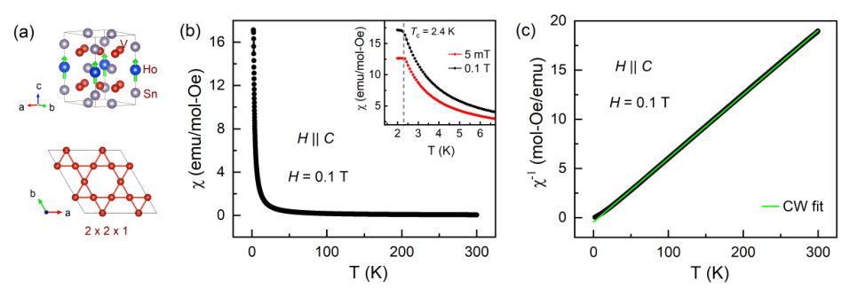
<figcaption class="paper-figure-caption"><b>Fig 1.</b> FIG. 1. (a) Unit cell of HoV6Sn6 (upper panel). The arrow indicates the magnetic moment direction</figcaption>
</figure>
<figure class="paper-figure-card">
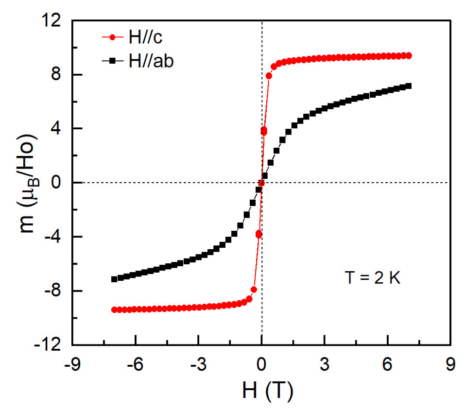
<figcaption class="paper-figure-caption"><b>Fig 2.</b> FIG. 2. Field-dependent magnetization M(H) of HoV6Sn6 measured at T = 2 K with the magnetic</figcaption>
</figure>
<figure class="paper-figure-card">
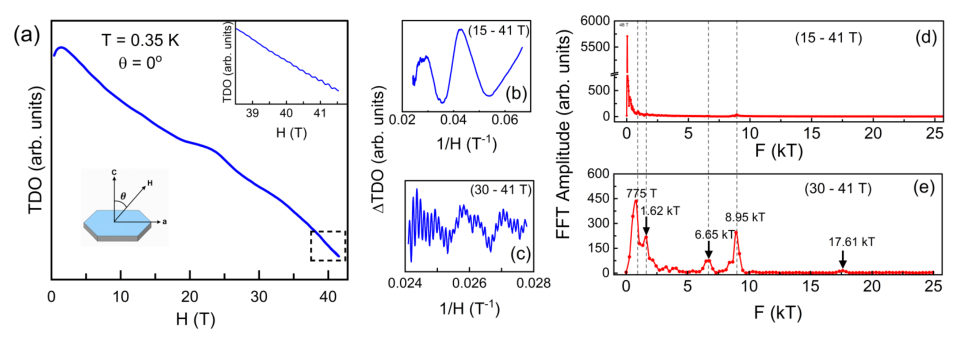
<figcaption class="paper-figure-caption"><b>Fig 3.</b> FIG. 3. (a) TDO signal as a function of magnetic field for HoV6Sn6 at T = 0.35 K and θ = 0◦,</figcaption>
</figure>
<figure class="paper-figure-card">
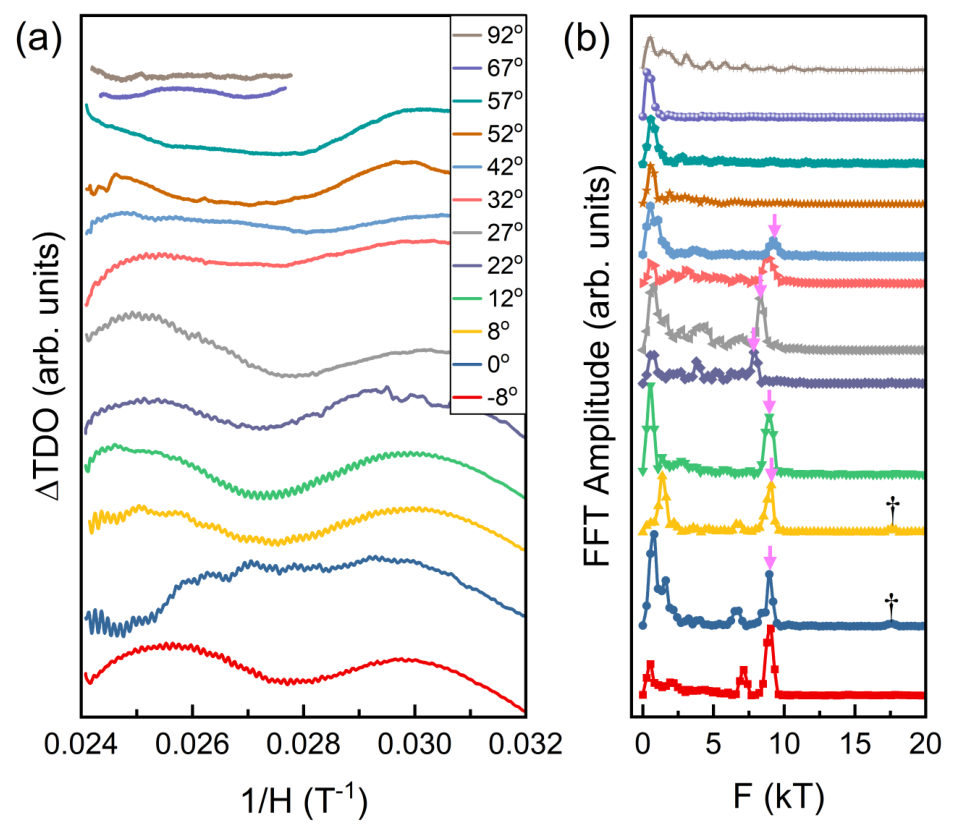
<figcaption class="paper-figure-caption"><b>Fig 4.</b> FIG. 4. (a) Background-subtracted TDO signals at selected tilt angles, θ. At low θ, a low-</figcaption>
</figure>
<figure class="paper-figure-card">
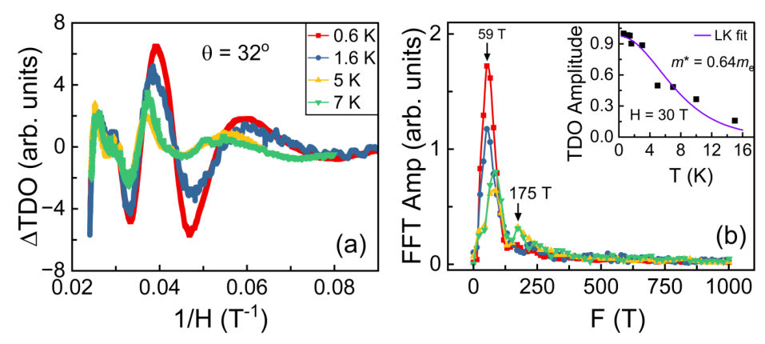
<figcaption class="paper-figure-caption"><b>Fig 5.</b> FIG. 5. (a) Temperature dependence of the TDO signal of HoV6Sn6 at selected temperatures,</figcaption>
</figure>

**Summary.** This work comprehensively characterizes the magnetic and electronic properties of the kagome magnet HoV6Sn6. By combining magnetization measurements, quantum oscillation experiments, and DFT calculations, the authors establish strong magnetic anisotropy and map out a complex, multiband Fermi surface. The results highlight the crucial role of the V-d orbitals in determining the low-energy electronic behavior of this material.

**Why it may be interesting.** The interplay between magnetic ordering, complex Fermi surface topology, and strong electronic correlations (V-d orbital dominance) in a geometrically frustrated kagome lattice is highly relevant to understanding strongly correlated electron systems.

Detailed structure

**Main problem.** The study investigates the magnetic properties and Fermi-surface topology of the kagome magnet HoV6Sn6.

**Main result.** The research reveals strong magnetic anisotropy favoring c-axis alignment and identifies a multiband Fermi-surface topology, with electronic properties dominated by V-d orbitals.

**Method.** The study combines magnetization measurements, low-temperature quantum oscillation measurements (TDO), and first-principles electronic structure calculations.

**Model / system.** The physical system is HoV6Sn6, a kagome lattice magnet. The electronic structure is modeled using DFT calculations, revealing features like flat bands and van Hove singularities near the Fermi level.

**Key observables.** Temperature-dependent magnetization, magnetic anisotropy (saturation moments), quantum oscillation frequencies, and Fermi-surface geometry.

**Important parameters / regimes.** Critical temperature $T_c \approx 2.4 \text{ K}$; magnetic fields up to 41.5 T; effective mass $m^* = 0.64(6)m_e$.

**Assumptions / limitations.** The high-temperature susceptibility follows Curie-Weiss behavior, and the temperature dependence of quantum oscillations is analyzed using the Lifshitz–Kosevich formalism.

**Figures summary.** Figures show magnetic susceptibility vs. temperature, field-dependent magnetization revealing anisotropy, and TDO spectra displaying multiple quantum oscillation frequencies whose angular dependence maps Fermi-surface pockets.

**Paper structure.** The paper proceeds by characterizing the magnetic ordering via magnetization measurements, then probes the electronic structure and Fermi surface using TDO quantum oscillations, and finally corroborates these findings with first-principles calculations of the band structure and DOS.

Abstract

We report a study of the magnetic properties and Fermi-surface topology of the kagome magnet HoV$_6$Sn$_6$ using magnetization and tunnel-diode-oscillator (TDO) measurements. The temperature-dependent magnetization exhibits Curie-Weiss behavior at high temperatures and reveals long-range magnetic order below $T_c$ $\approx$ 2.4 K. Below Tc, the field-dependent magnetization reveals pronounced magnetic anisotropy, with saturation moments of $\approx$ 9.5 and 7 $μ_B$ /Ho for fields applied along the out-of-plane and in-plane directions, respectively. To probe the Fermi surface, we perform TDO measurements in magnetic fields up to 41.5 T and at temperatures down to 0.35 K. The TDO signal exhibits well-defined quantum oscillations with multiple frequencies extending up to $\sim$ 9 kT. Angular- and temperature-dependent measurements are used to determine the Fermi-surface geometry and cyclotron effective masses, respectively. To elucidate the electronic structure, we perform first-principles calculations of the electronic bands, density of states (DOS), and Fermi surface. The calculated band structure exhibits flat-band features, van Hove singularities, and Dirac-like crossings near the Fermi level. The DOS near the Fermi level is dominated by the V-d orbitals, indicating that the V kagome layers play a major role in determining the low-energy electronic properties of HoV6Sn6. Our calculations further support a ferromagnetic ground state with the Ho moments oriented along the c axis, consistent with neutron-scattering measurements. The calculated quantum-oscillation frequencies from the Fermi-surface pockets of HoV6Sn6 are in overall good agreement with the experimentally observed frequencies. Our combined experimental and theoretical results provide insight into the magnetic anisotropy and electronic structure of HoV$_6$Sn$_6$ and reveal its multiband Fermi-surface topology.

[↑ back to top](#top)

### [Neural-quantum-state based downfolding of the three-band Emery model for cuprates and nickelates](http://arxiv.org/abs/2609.38150v1)

**Authors:** Hannah Lange, Julius F. A. Tirpitz, Annabelle Bohrdt  
**Type:** theory · **Category:** strongly correlated electrons · **PDF:** <https://arxiv.org/pdf/2609.38150v1>  
**Analysis basis:** full PDF text, analyzed in chunks
**Topic relevance:** `methods for driven-dissipative` **3/5**

↔ Scroll figures horizontally

<figure class="paper-figure-card">
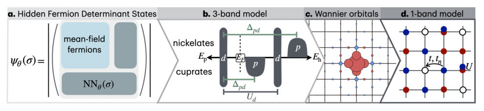
<figcaption class="paper-figure-caption"><b>Fig 1.</b> FIG. 1. We employ Hidden Fermion Determinant States (HFDS, a) to model the three-band Emery model relevant to cuprate and nickelate materials (b). This allows us to determine the interacting Wannier functions (c), here shown for ∆pd/tpd = 3.0 and δ = 1/8, and to downfold to a single-band Fermi-Hubbard model (d).</figcaption>
</figure>
<figure class="paper-figure-card">
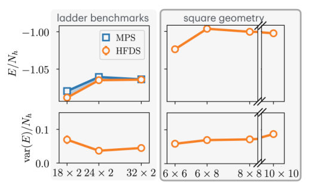
<figcaption class="paper-figure-caption"><b>Fig 2.</b> FIG. 2. Energy E and energy variance var(E) in units of tpd and per hole Nh for δ = 1/8, ∆pd/tpd = 3.5 and Ud/tpd = 6.0. Left: We compare the HFDS (orange) and MPS (blue) en- ergies for long Lx × 2 systems MPS calculations are feasi- ble with periodic (open) boundaries in the long direction for HFDS (MPS). The shaded blue region indicates the estimate on the energy difference from the different boundary condi- tions. Right: HFDS results for square geometries with fully periodic boundaries.</figcaption>
</figure>
<figure class="paper-figure-card">
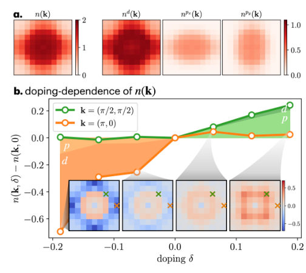
<figcaption class="paper-figure-caption"><b>Fig 3.</b> FIG. 3. The density in reciprocal space, n(k): a. We show the full n(k) as well as the contributions nν(k) from ν = d, px, py (left to right) for a 10 × 10 system with δ = 1/8 and ∆pd/tpd = 3.5. b. The difference n(k, δ) −n(k, 0) as a function of doping δ for 8 × 8 systems. Green (orange) show the result for the nodal k = (π/2, π/2) (antinodal k = (π, 0)) and equivalent points. Insets show the full difference map for selected doping values.</figcaption>
</figure>
<figure class="paper-figure-card">
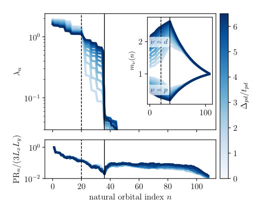
<figcaption class="paper-figure-caption"><b>Fig 4.</b> FIG. 4. Natural orbitals and Wannier functions for a 6 × 6 system at δ = 1/8 and with Ud/tpd = 6.0. We show the natu- ral orbital occupation λn (top panel). Solid (dashed) vertical lines correspond to n = LxLy (n = Nh/2). The inset displays the relative orbital mass mν(n) when occupying the corre- sponding natural orbitals vn up to the index n, see Eq. (10). Wannier functions wn are constructed as superpositions of vn projected onto the subspace {vl}l&lt;n. Small values of the participation ratio PRn, Eq. (11), indicate a high degree of localization.</figcaption>
</figure>
<figure class="paper-figure-card">
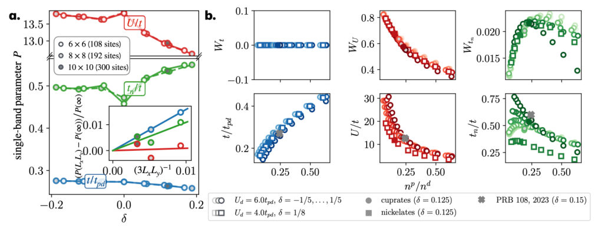
<figcaption class="paper-figure-caption"><b>Fig 5.</b> FIG. 5. a. The largest contributions to the downfolded single-band model as a function of electron (δ &lt; 0 and hole (δ &gt; 0) doping for Ud/tpd = 6.0 and ∆pd/tpd = 3.5: nearest-neighbor tunneling t (blue), on-site repulsion U (red) and density-assisted hopping tn (green), see Eq. (6). Markers with white, light gray and dark gray filling indicate the result for 6 × 6, 8 × 8 and 10×10 unit cell systems, respectively. The inset compares the effect of different system sizes explicitly by showing the difference for each parameter and each system size, P(LxLy), w.r.t. the extrapolated value, P(∞). b. The largest contributions to the downfolded single-band model as a function of the relative p- vs....</figcaption>
</figure>

**Summary.** This work applies Neural Quantum States (HFDS) to simulate the complex three-band Emery model relevant to cuprates and nickelates. The authors successfully downfold this multi-band model into effective single-band descriptions, revealing that these effective models deviate significantly from simple Fermi-Hubbard forms by requiring interaction terms like density-assisted hopping. This validates NQS as a powerful tool for studying strongly correlated electron systems.

**Why it may be interesting.** The use of NQS to tackle the complex, strongly correlated nature of the Emery model provides a powerful, scalable numerical tool for studying high-Tc superconductivity, which is a major focus area in condensed matter theory.

Detailed structure

**Main problem.** The central challenge is understanding the physics behind high-temperature superconductivity in cuprates and nickelates.

**Main result.** The study establishes Neural Quantum States (HFDS) as an efficient tool for the 2D Emery model, showing that effective single-band descriptions require complex, non-Hubbard terms like density-assisted hopping ($t_n$).

**Method.** The authors use Neural Quantum States (HFDS) as a variational approach to simulate the three-band Emery model and subsequently downfold it to effective single-band Hamiltonians using interacting Wannier functions.

**Model / system.** The system is the three-band Emery model describing copper and nickel oxides, involving $d$ and $p$ orbitals, characterized by hopping terms ($t_{pd}$), charge-transfer energy ($\Delta_{pd}$), and on-site Hubbard interactions ($U_
u$).

**Key observables.** Momentum-space distribution of dopants, effective single-band parameters ($U/t$, $t_n$), and the particle-hole asymmetry.

**Important parameters / regimes.** Charge-transfer energy ($\Delta_{pd}$), doping ($\delta$), and interaction ratios ($U/t$).

**Assumptions / limitations.** The single-band description derived via Wannier functions is an approximation, and the analysis relies on the variational minimization provided by the NQS ansatz.

**Figures summary.** Figures illustrate the HFDS modeling of the three-band Emery model, the downfolding process to single-band models, and the systematic dependence of effective parameters on doping and charge-transfer energy.

**Paper structure.** The paper first introduces the Emery model and the NQS method (HFDS) for simulation. It then details the downfolding procedure using Wannier functions to derive effective single-band Hamiltonians. Finally, it analyzes the resulting effective parameters across various doping and charge-transfer regimes.

Abstract

Understanding the physics underlying high-temperature superconductivity in cuprates and, more recently, infinite-layer nickelates has remained a central challenge in condensed-matter physics. We establish neural quantum states (NQS), specifically Hidden Fermion Determinant States (HFDS), as a scalable variational approach to the three-band Emery model of the copper- and nickel-oxide layers in these materials. After benchmarking HFDS against matrix product states on width-two geometries, we study ground states of fully two-dimensional (2D) systems of up to $10\times10$ unit cells ($300$ sites). We characterize the momentum-space distribution of dopants and find a pronounced electron-hole dichotomy similar to cuprate experiments. We further downfold the three-band model to effective single-band descriptions by constructing interacting Wannier functions. We consider a wide range of parameters -- from the charge-transfer regime relevant to cuprates to the Hubbard-Mott regime of nickelates, as well as systematic scans of the charge-transfer gap that has been demonstrated to impact the critical superconducting temperatures. Across all regimes, the effective model significantly deviates from the usual Fermi-Hubbard model: The typical ratio $U/t$ is enhanced, some parameters experience a significant doping dependence, and sizable terms beyond the conventional Hubbard model are present, most notably a density-assisted hopping $t_n$. Notably, in all effective models, $t_n$ has the largest contribution to particle-hole asymmetry, rather than next-nearest-neighbor hopping contributions. The effective parameters sensitively depend on the charge-transfer energy, doping, and interaction ratios. Our results establish HFDS as an efficient tool for studying the 2D Emery model and demonstrate that single-band descriptions can require interaction terms generated by the underlying multi-band models.

[↑ back to top](#top)

### [Optimal single-copy estimation of quantum state moments: why $\operatorname{Tr}(ρ^3)$ and $\operatorname{Tr}(ρ^4)$ are equally hard](http://arxiv.org/abs/2609.37781v1)

**Authors:** Zhenhuan Liu  
**Type:** theory · **Category:** quantum information and computing · **PDF:** <https://arxiv.org/pdf/2609.37781v1>  
**Analysis basis:** full PDF text, analyzed in chunks
**Topic relevance:** `quantum measurements` **3/5**

↔ Scroll figures horizontally

<figure class="paper-figure-card">
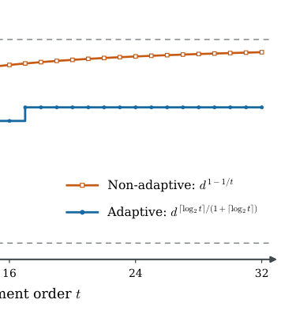
<figcaption class="paper-figure-caption"><b>Fig 1.</b> Figure 1: Comparison between sample complexities of adaptive and nonadaptive protocols.</figcaption>
</figure>

**Summary.** This theoretical paper determines the optimal number of single-copy measurements needed to estimate higher-order moments of an unknown quantum state. It establishes a clear scaling law for this complexity, showing that the difficulty follows a dyadic hierarchy for different moment orders. The results highlight the significant advantage provided by adaptive measurement strategies over nonadaptive ones for higher moments.

**Why it may be interesting.** This work provides rigorous, quantitative bounds on the limits of quantum state tomography and characterization, which is crucial for designing practical quantum experiments and understanding the fundamental resource costs associated with measuring complex quantum correlations.

Detailed structure

**Main problem.** The paper addresses the fundamental problem of determining the optimal sample complexity required to estimate nonlinear properties of an unknown quantum state, specifically the state moments $\operatorname{Tr}(
ho^t)$, using only single-copy measurements.

**Main result.** The optimal sample complexity for estimating $\operatorname{Tr}(
ho^t)$ scales as $\Theta(d^{rac{\lceil\log_2 t
ceil}{1+\lceil\log_2 t
ceil}})$, showing a predictable dyadic hierarchy where moments like $\operatorname{Tr}(
ho^3)$ and $\operatorname{Tr}(
ho^4)$ share the same exponent.

**Method.** The authors derive upper bounds using adaptive state filtering, which recursively reduces the problem to lower-order moment estimation in smaller state spaces. Lower bounds are established by comparing moment-matched ensembles via smooth interpolation.

**Model / system.** The system is an unknown $d$-dimensional quantum state $
ho$. The measurement model is restricted to single-copy measurements, but the measurement strategy can be adaptive based on classical outcomes.

**Key observables.** State moments $\operatorname{Tr}(
ho^t)$ for integer $t \ge 2$, purity ($\operatorname{Tr}(
ho^2)$), and related ordered overlaps.

**Important parameters / regimes.** State dimension $d$, moment order $t$, and the required additive error $\epsilon$.

**Assumptions / limitations.** The analysis assumes the ability to perform adaptive single-copy measurements for the upper bound, and the lower bound analysis relies on bounding the total variation distance between true and estimated probability measures.

**Figures summary.** Figure 1 compares the sample complexities for adaptive versus nonadaptive protocols across various moment orders ($t=2, 3, 4, 5, 6, 8, 16, 24, 32$), illustrating the scaling behavior.

**Paper structure.** The paper first establishes the optimal complexity for general moments using adaptive techniques, demonstrating the dyadic hierarchy. It then contrasts this with nonadaptive protocols, deriving a matching lower bound $\Omega(d^{1-1/t})$ for $t \ge 4$. The structure builds from the known purity case ($t=2$) to general higher-order moments.

Abstract

Estimating nonlinear properties of an unknown quantum state with restrictive experimental accessibility is a fundamental problem in quantum learning. We study the sample complexity of estimating the state moments $\operatorname{Tr}(ρ^t)$, allowing arbitrary adaptive single-copy measurements. While purity estimation has optimal sample complexity $Θ(\sqrt d)$ at constant additive error, the optimal dimension dependence for higher moments has remained unclear. We resolve this question for every fixed integer $t\ge 2$: for any sufficiently small constant additive error, the optimal sample complexity is \[ Θ\!\left(d^{\frac{\lceil\log_2 t\rceil}{1+\lceil\log_2 t\rceil}}\right) \] with constant success probability. The complexity thus follows a dyadic hierarchy: for each integer $h\geq1$, all moment orders $2^{h-1}<t\leq2^h$ share the same exponent. In particular, the third and fourth moments both require $Θ(d^{2/3})$ copies. We also establish an $Ω(d^{1-1/t})$ lower bound for arbitrary nonadaptive single-copy protocols, matching the known upper bound and demonstrating an advantage from adaptivity for every $t\geq4$. Our upper bound uses adaptive state filtering to reduce higher-order moment estimation to lower-order moment estimation in a smaller state space. For the lower bound, we directly compare moment-matched ensembles through a smooth interpolation, bypassing the maximally mixed state as an intermediate hypothesis and yielding matching bounds beyond $\sqrt d$.

[↑ back to top](#top)

### [Query-optimal unitary channel tomography in diamond distance with parallel access](http://arxiv.org/abs/2609.38145v1)

**Authors:** Entong He, Zihao Li, Yuxiang Yang  
**Type:** theory · **Category:** quantum information and computing · **PDF:** <https://arxiv.org/pdf/2609.38145v1>  
**Analysis basis:** full PDF text, analyzed in chunks
**Topic relevance:** `quantum measurements` **3/5**

↔ Scroll figures horizontally

<figure class="paper-figure-card">
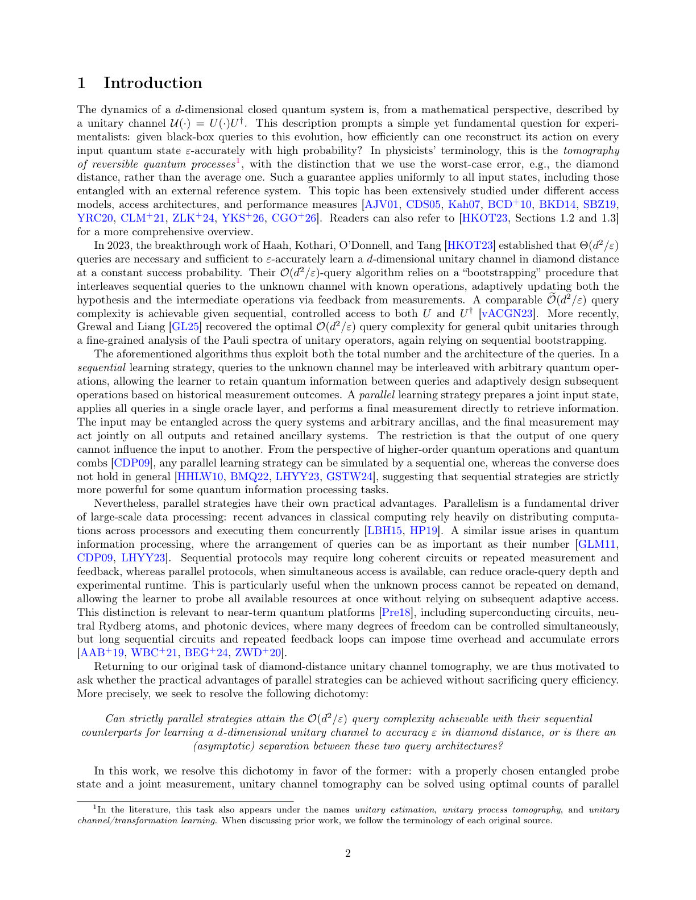
<figcaption class="paper-figure-caption"><b>Fig 1.</b> Low-resolution page preview, page 2</figcaption>
</figure>
<figure class="paper-figure-card">
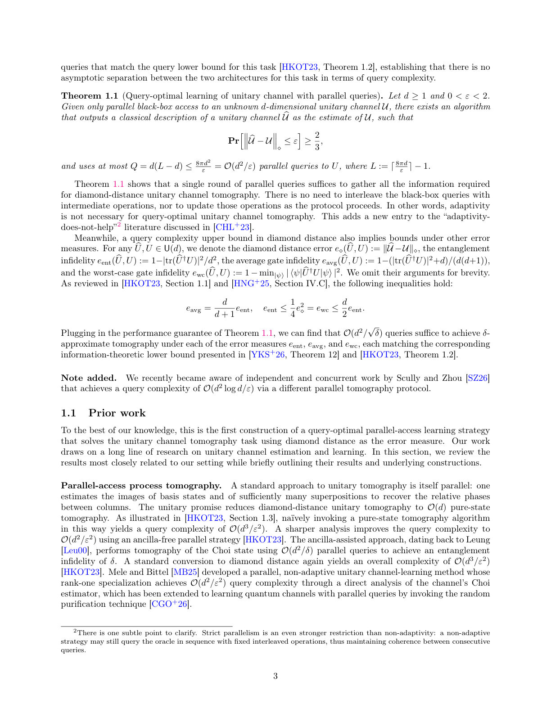
<figcaption class="paper-figure-caption"><b>Fig 2.</b> Low-resolution page preview, page 3</figcaption>
</figure>
<figure class="paper-figure-card">
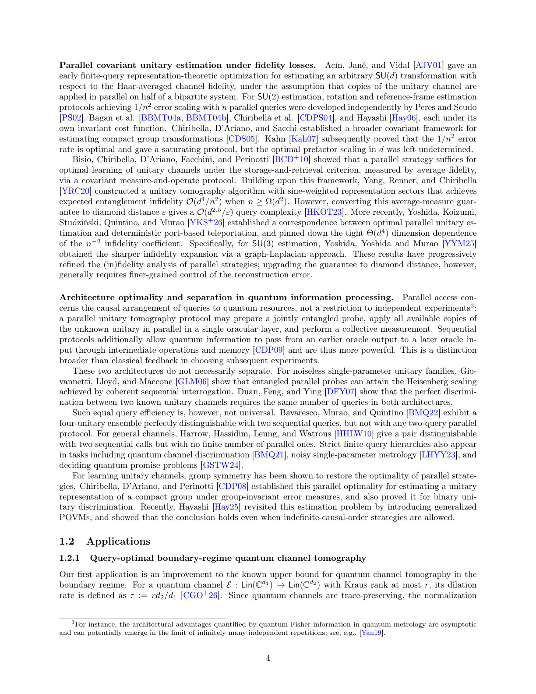
<figcaption class="paper-figure-caption"><b>Fig 3.</b> Low-resolution page preview, page 4</figcaption>
</figure>
<figure class="paper-figure-card">
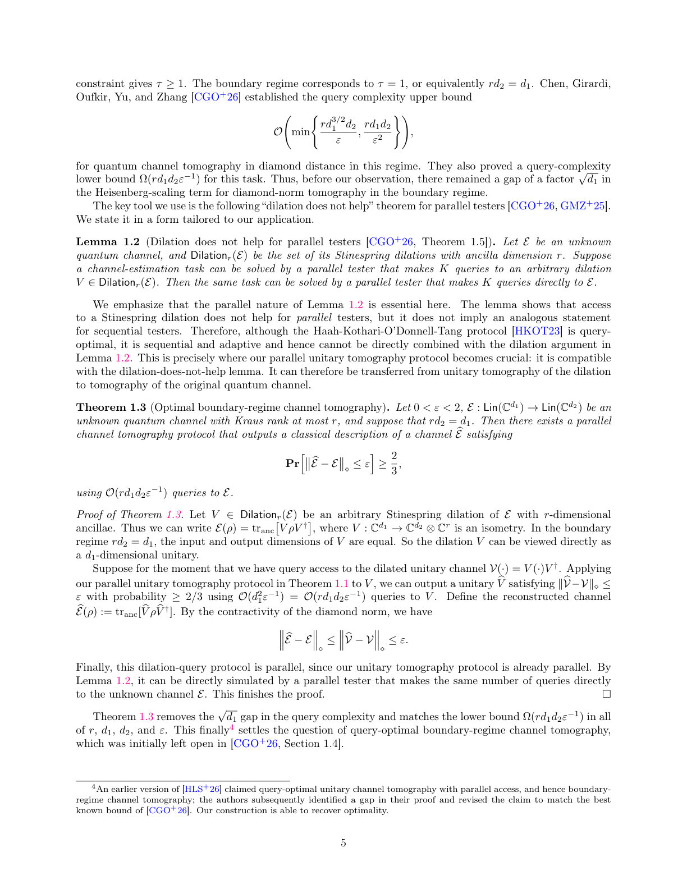
<figcaption class="paper-figure-caption"><b>Fig 4.</b> Low-resolution page preview, page 5</figcaption>
</figure>
<figure class="paper-figure-card">
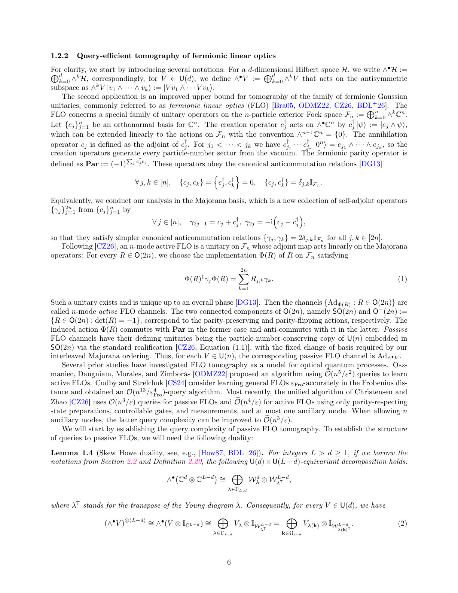
<figcaption class="paper-figure-caption"><b>Fig 5.</b> Low-resolution page preview, page 6</figcaption>
</figure>

**Summary.** This paper addresses the efficiency of quantum process tomography, specifically for unitary channels. It proves that a non-adaptive, parallel-query protocol can achieve the optimal query complexity, closing a theoretical gap that previously suggested sequential measurements were inherently more powerful. This result has implications for designing efficient quantum characterization experiments.

**Why it may be interesting.** It resolves a long-standing theoretical gap by proving that adaptivity (the advantage of sequential measurements) is not necessary for achieving optimal query complexity in unitary channel tomography.

Detailed structure

**Main problem.** Determining the most efficient query complexity to estimate an unknown unitary quantum channel in the diamond distance.

**Main result.** The authors show a protocol using only parallel queries that achieves the optimal $O(d^2/\epsilon)$ query complexity, matching the lower bound previously established for sequential methods.

**Method.** The work develops a new, non-adaptive protocol utilizing entangled probe states and joint measurements to estimate the unitary channel.

**Model / system.** The system is a $d$-dimensional closed quantum system whose dynamics are governed by an unknown unitary channel $U$. The analysis compares parallel versus sequential query strategies.

**Key observables.** Diamond distance ($\epsilon_{\diamond}$), entanglement infidelity ($\epsilon_{	ext{ent}}$), and average gate infidelity ($\epsilon_{	ext{avg}}$).

**Important parameters / regimes.** Dimensionality $d$, desired accuracy $\epsilon$, and the number of queries $Q$.

**Assumptions / limitations.** The protocol relies on the availability of a properly chosen entangled probe state and the ability to perform joint measurements.

**Paper structure.** The paper establishes the problem of quantum process tomography, contrasts sequential vs. parallel query strategies, presents the new parallel protocol achieving optimal query complexity, and discusses applications to boundary-regime and fermionic systems.

Abstract

In the study of quantum process tomography, it has remained open how to learn a unitary channel in diamond distance with strictly parallel queries as efficiently as with sequential queries. Sequential queries allow one to exploit adaptivity to refine the estimate and adjust the learning strategy accordingly, whereas such adjustments are impossible for parallel queries. From the perspective of higher-order quantum operations, any parallel learning strategy can be simulated by a sequential one, whereas the converse does not hold in general, suggesting that sequential learning strategies are potentially more powerful. Contrary to this intuition, we present a new protocol for learning an unknown $d$-dimensional unitary channel to within $\varepsilon$ in diamond distance using $\mathcal{O}(d^2/\varepsilon)$ parallel queries, matching the lower bound presented in [Haah, Kothari, O'Donnell, and Tang, FOCS '23]. Our protocol thus closes the gap between parallel and sequential strategies for unitary channel tomography. As applications, it achieves optimal query complexity for boundary-regime quantum channel tomography and improves the query efficiency of the best-known protocol for tomography of fermionic linear optics.

[↑ back to top](#top)

### [Universal Inductive Inference of Quantum States](http://arxiv.org/abs/2609.36912v1)

**Authors:** Taiga Hiroka, Min-Hsiu Hsieh, Yuki Shirakawa  
**Type:** theory · **Category:** quantum information and computing · **PDF:** <https://arxiv.org/pdf/2609.36912v1>  
**Analysis basis:** full PDF text, analyzed in chunks
**Topic relevance:** `quantum measurements` **3/5**

↔ Scroll figures horizontally

<figure class="paper-figure-card">
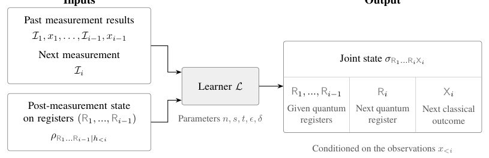
<figcaption class="paper-figure-caption"><b>Fig 1.</b> Figure 1: Inputs and output of the learner L at round i. The instruments I1, . . . , Ii−1 and their outcomes x1, . . . , xi−1 form the classical history h&lt;i = (I1, x1, ..., Ii−1, xi−1). The learner receives h&lt;i, the description of the target measurement Ii, and a single copy of the conditional post-measurement state ρR1...Ri−1|h&lt;i. It outputs a joint state σ on R1...RiXi, where Xi stores the next measurement outcome and Ri is the next post-measurement quantum system. The output must approximate the corresponding joint state of the source conditioned on h&lt;i, including its correlations with the past systems.</figcaption>
</figure>

**Summary.** This paper extends Solomonoff's universal induction principle to the quantum domain, creating a framework for predicting future quantum states based on measurement history. It establishes efficient algorithmic bounds for this inference task and proves that these bounds are fundamentally limited by information-theoretic lower bounds. The results are significant for understanding the computational complexity of quantum state reconstruction and prediction.

**Why it may be interesting.** This work provides fundamental theoretical tools for characterizing the limits of prediction and learning in quantum systems, which is crucial for quantum machine learning and quantum process tomography.

Detailed structure

**Main problem.** The paper develops a universal quantum inductive inference framework analogous to Solomonoff's induction for learning and predicting quantum sources.

**Main result.** It establishes an information-theoretic algorithm for quantum inductive inference with round complexity $O(s\epsilon^{-2}\delta^{-1})$, matching a proven lower bound.

**Method.** The authors use information-theoretic techniques to derive both upper bounds (algorithms) and lower bounds (complexity requirements) for the inference task.

**Model / system.** The system models a quantum source generating multipartite quantum states ($
ho_{R_1...R_m}$) whose description is governed by an unknown $s$-bit program. The learning process involves predicting the next state and outcome given a history of measurements.

**Key observables.** Trace distance ($\epsilon$), round complexity, and the joint state ($\sigma_{R_1...R_iX_i}$) predicting the next outcome.

**Important parameters / regimes.** Source description length ($s$), error tolerance ($\epsilon$), failure probability ($\delta$), and the number of qubits ($n$).

**Assumptions / limitations.** The source is assumed to be generated by an unknown $s$-bit program, and the analysis relies on quantum cryptographic assumptions for hardness results.

**Figures summary.** Figure 1 illustrates the inputs (past history, next instrument, conditional state) and the output (joint predicted state) of the quantum inductive learner $L$ at any given round $i$.

**Paper structure.** The paper first introduces the quantum inductive inference problem, then presents the algorithmic solution (Theorem 1.1) and the tomography algorithm (Theorem 1.2). It follows this by proving the matching lower bounds (Theorems A.1/4) and concluding with hardness results based on one-way puzzles.

Abstract

Solomonoff's universal inductive inference [Inf. Control. 1964] is one of the most general frameworks for learning from sequential data and predicting future observations. It provides prediction guarantees for any computable stochastic source. We ask whether an analogous universal theory of induction can be developed for quantum systems. To this end, we introduce universal quantum inductive inference, a framework for learning and predicting quantum sources that may exhibit arbitrary correlations and entanglement across time. Given the outcomes of past measurements and the corresponding post-measurement quantum systems, the learner produces a joint state that predicts the next measurement outcome and post-measurement system while preserving correlations with the past systems. We model a quantum source as a multipartite quantum state whose description is generated by an unknown $s$-bit program within a given time bound. The learner is required to produce a state that is $ε$-close in trace distance to the target with probability at least $1-δ$. We establish an information-theoretic inference algorithm with round complexity $O(sε^{-2}δ^{-1})$. We further prove a matching lower bound in the relevant parameter regime, even for classical sources. As a second result, we construct a non-i.i.d. state tomography algorithm that outputs a classical description of the conditional state of the next system given past measurement outcomes. Our information-theoretic tomography algorithm achieves round complexity $O(s\min\{2^s,2^n\}ε^{-2}δ^{-1})$, where $n$ is the number of qubits received in each round. Finally, we investigate the computational hardness of universal quantum inductive inference under quantum cryptographic assumptions.

[↑ back to top](#top)

### [What is Physics For? Why Classical Physics is not the Limit of Quantum Mechanics](http://arxiv.org/abs/2609.36207v1)

**Authors:** Adam Frank, Jacques L. Pienaar, Michel Bitbol, Harald Wiltsche, Gabriela Barreto Lemos, Marcelo Gleiser, Marcus Appleby  
**Type:** theory · **Category:** other · **PDF:** <https://arxiv.org/pdf/2609.36207v1>  
**Analysis basis:** full PDF text, analyzed in chunks
**Topic relevance:** `quantum measurements` **3/5**

↔ Scroll figures horizontally

<figure class="paper-figure-card">
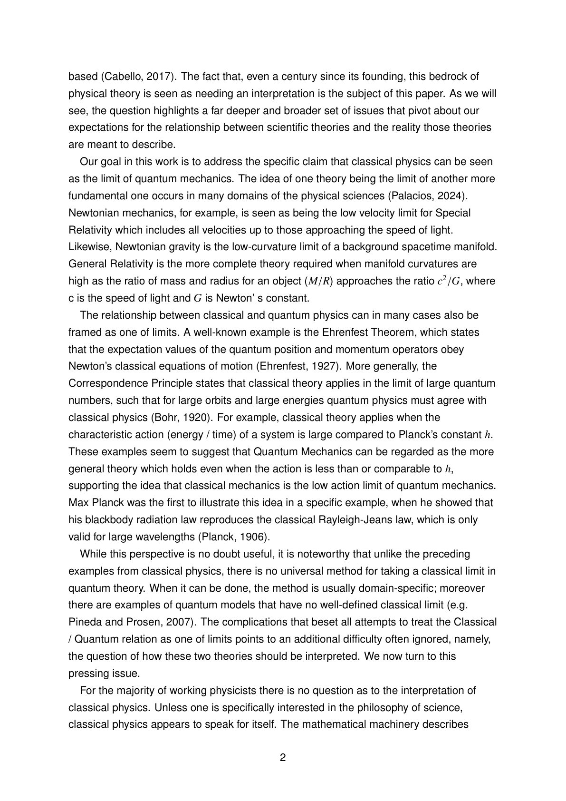
<figcaption class="paper-figure-caption"><b>Fig 1.</b> Low-resolution page preview, page 2</figcaption>
</figure>
<figure class="paper-figure-card">
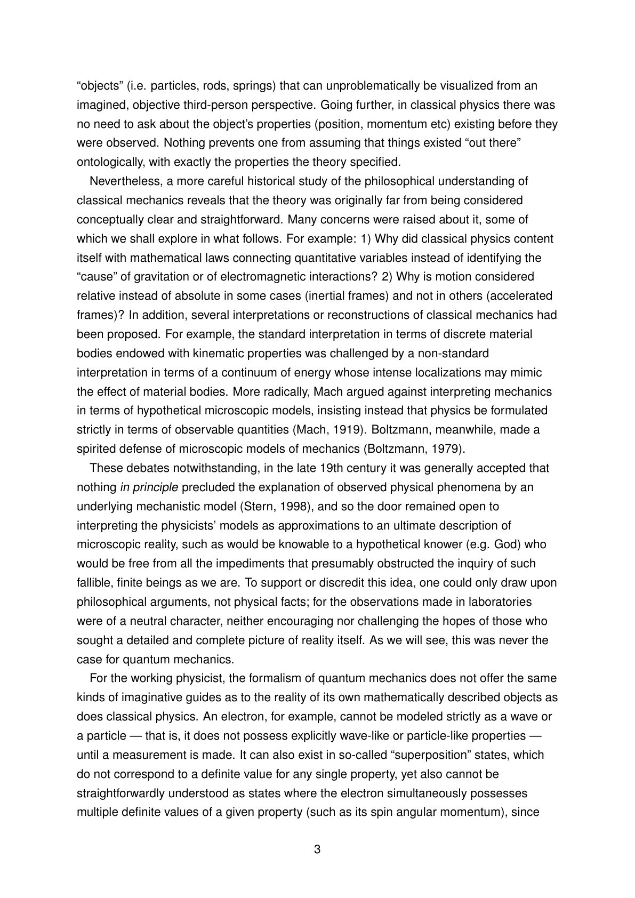
<figcaption class="paper-figure-caption"><b>Fig 2.</b> Low-resolution page preview, page 3</figcaption>
</figure>
<figure class="paper-figure-card">
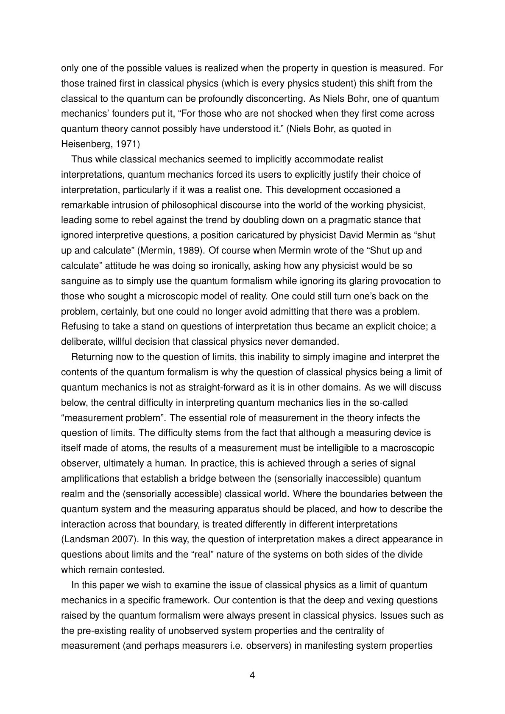
<figcaption class="paper-figure-caption"><b>Fig 3.</b> Low-resolution page preview, page 4</figcaption>
</figure>
<figure class="paper-figure-card">
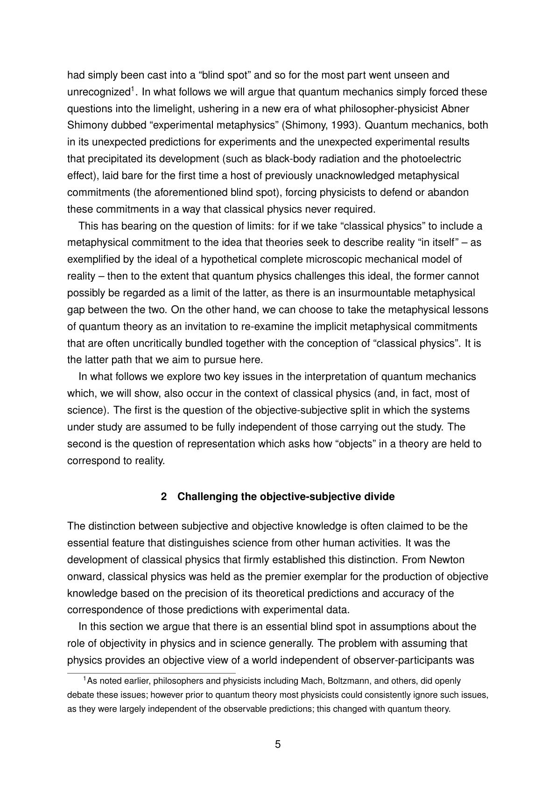
<figcaption class="paper-figure-caption"><b>Fig 4.</b> Low-resolution page preview, page 5</figcaption>
</figure>
<figure class="paper-figure-card">
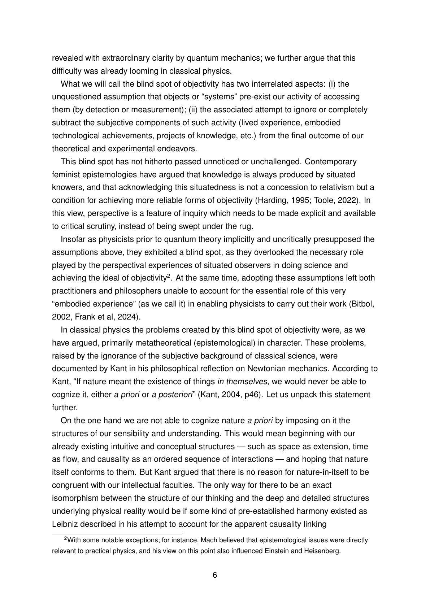
<figcaption class="paper-figure-caption"><b>Fig 5.</b> Low-resolution page preview, page 6</figcaption>
</figure>

**Summary.** This paper argues that the deep philosophical questions surrounding quantum mechanics—such as the measurement problem and the observer's role—were already present in classical physics. By analyzing the formalisms, the authors suggest that QM serves as a catalyst, forcing physicists to confront the implicit metaphysical assumptions about objectivity that were previously ignored. It advocates for a reconceptualization of physics that incorporates the role of the observer and the context of measurement.

**Why it may be interesting.** It is highly relevant as it addresses the foundational interpretation of quantum theory, which underpins all applications in AMO and quantum optics, by questioning the very definition of 'objective' physical reality.

Detailed structure

**Main problem.** The paper challenges the conventional understanding of classical physics as a mere low-action limit of quantum mechanics by arguing that deep philosophical issues were latent in classical theory all along.

**Main result.** Quantum mechanics does not fundamentally break with classical physics; rather, it forces a re-examination of the implicit metaphysical assumptions regarding objectivity and the observer/system split.

**Method.** The authors employ a philosophical and conceptual analysis, comparing the formalisms of QM and classical physics, and drawing parallels with modern interpretations like QBism and metrology.

**Model / system.** The primary models are Quantum Mechanics (QM) and classical physics. The discussion centers on the conceptual boundary between the quantum system and the classical measuring apparatus.

**Key observables.** The key diagnostic is the conceptual difficulty in defining the measurement boundary and the nature of objective reality.

**Important parameters / regimes.** Planck's constant (h) and the concept of the low-action limit are central parameters, alongside the philosophical concepts of objectivity and subjectivity.

**Assumptions / limitations.** The paper assumes that the formalisms of QM and classical physics are useful tools for exposing underlying metaphysical commitments, rather than being perfect descriptions of reality.

**Paper structure.** The paper progresses by first examining the classical limit concept, then detailing the interpretive difficulties (measurement problem, subject-object split), and finally proposing alternative frameworks like QBism and re-evaluating objectivity through metrology.

Abstract

Quantum mechanics is justifiably held to be the most successful physical theory ever created; yet no universally accepted interpretation of its mathematical formalism exists after a century of debate. We examine the specific claim that classical physics stands as the low-action limit of quantum mechanics, arguing that the deep interpretive difficulties exposed by the quantum formalism, the measurement problem, the subject-object divide, and the nature of scientific representation, were already latent in classical physics, constituting what we call a blind spot of objectivity. Taking quantum theory as an invitation to re-examine the implicit metaphysical commitments bundled with 'classical physics', we explore two key issues-the objective/subjective split and the nature of theoretical representation-and argue that quantum mechanics does not represent a break with classical physics per se but rather brings previously unacknowledged philosophical assumptions into the limelight. We discuss the London-Bauer interpretation and QBism as exemplars of interpretations that embrace this broader reconceptualisation.

[↑ back to top](#top)

### [Transverse momentum as the counter-diabatic generator in bent waveguide couplers](http://arxiv.org/abs/2609.36431v1)

**Authors:** Yu-kai Lee, Shuo-Yen Tseng  
**Type:** theory · **Category:** other · **PDF:** <https://arxiv.org/pdf/2609.36431v1>  
**Analysis basis:** full PDF text, analyzed in chunks
**Topic relevance:** `analog quantum simulation` **2/5** · `methods for driven-dissipative` **2/5** · `Keldysh / 2PI / non-Gaussian methods` **1/5** · `correlated / nonlocal dissipation` **1/5** · `driven-dissipative phase transition` **1/5** · `interference shaping light` **1/5** · `quantum measurements` **1/5**

↔ Scroll figures horizontally

<figure class="paper-figure-card">
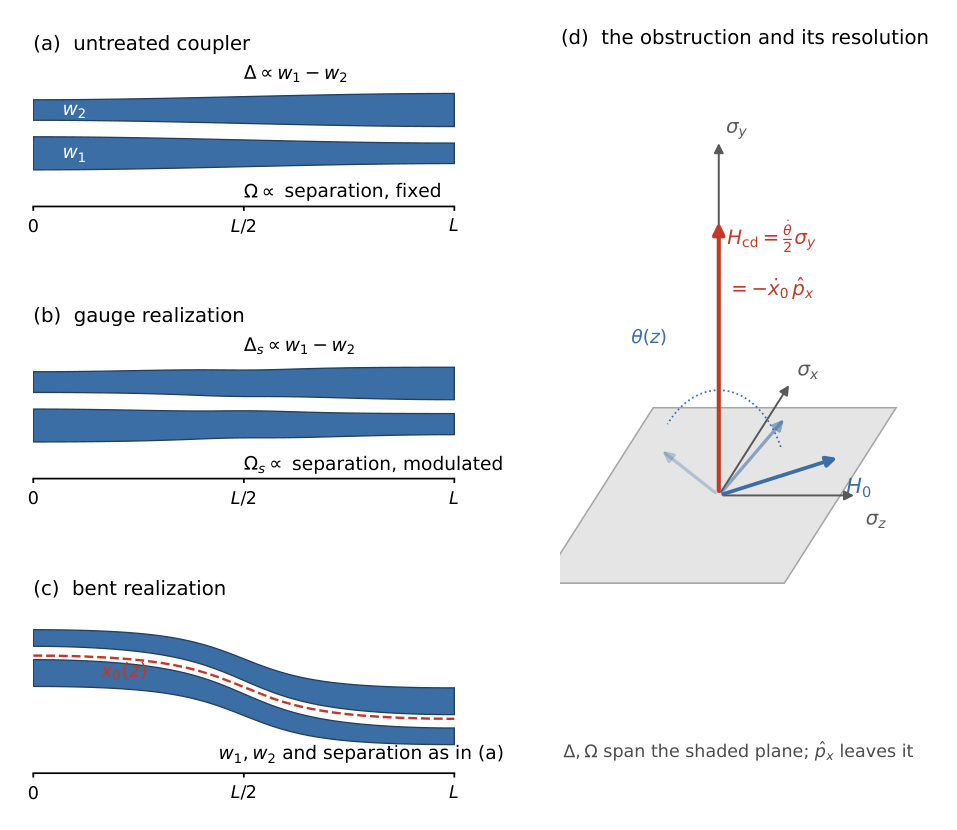
<figcaption class="paper-figure-caption"><b>Fig 1.</b> FIG. 1. Schematic of the coupler geometries, drawn to scale from the facet-matched designs of</figcaption>
</figure>
<figure class="paper-figure-card">
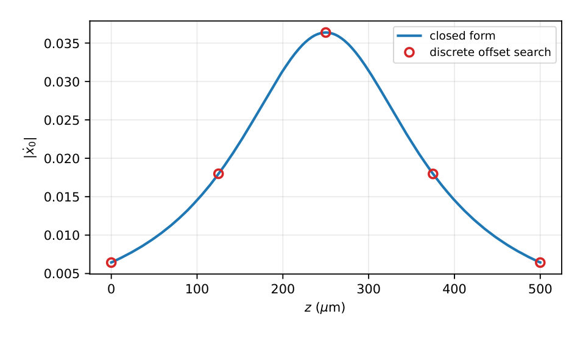
<figcaption class="paper-figure-caption"><b>Fig 2.</b> FIG. 2. Axis slope from Eq. (18) compared with a direct numerical offset search, evaluated at five</figcaption>
</figure>
<figure class="paper-figure-card">
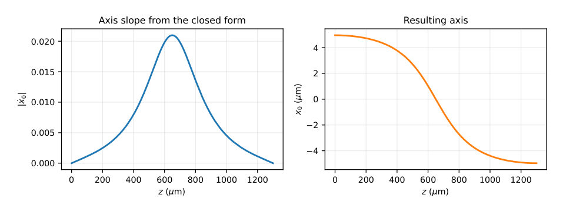
<figcaption class="paper-figure-caption"><b>Fig 3.</b> FIG. 3. Axis slope from Eq. (18) for the facet-matched taper, and the axis obtained by integrating</figcaption>
</figure>
<figure class="paper-figure-card">
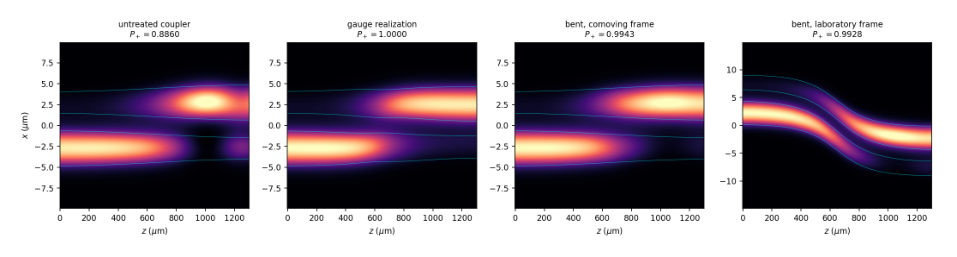
<figcaption class="paper-figure-caption"><b>Fig 4.</b> FIG. 4. Propagated intensity at L = 1300 µm with core boundaries overlaid. From left: the</figcaption>
</figure>
<figure class="paper-figure-card">
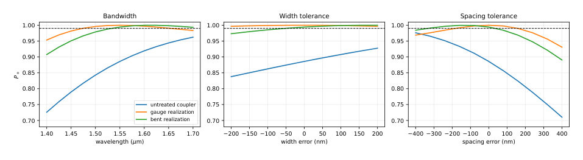
<figcaption class="paper-figure-caption"><b>Fig 5.</b> FIG. 5. Supermode fidelity against wavelength and against the two fabrication error directions, for</figcaption>
</figure>

**Summary.** This paper analyzes mode-evolution couplers, demonstrating that achieving perfect adiabatic light transfer requires a Counter-Diabatic (CD) driving term. The authors prove that the transverse momentum ($\hat{p}_x$) supplies this necessary term when the coupler axis is bent. This allows them to analytically design the required bending profile, achieving high supermode fidelity comparable to other advanced control methods.

**Why it may be interesting.** This work provides a concrete, physical realization of a theoretical concept (CD driving) in a photonic system, showing how geometric manipulation (bending) can compensate for nonadiabatic losses, which is highly relevant to quantum optics and integrated photonics.

Detailed structure

**Main problem.** The paper addresses the challenge of achieving high-fidelity, fast mode conversion in optical couplers by implementing the Counter-Diabatic (CD) protocol.

**Main result.** The transverse momentum ($\hat{p}_x$) is identified as the necessary and sufficient generator for the CD term in bent waveguide couplers, allowing for an analytical determination of the required axis slope.

**Method.** The authors use a Hamiltonian approach, comparing the required CD term ($\propto \sigma_y$) with the terms available from geometric control ($\Delta, \Omega$), and deriving the required spatial profile from the momentum operator.

**Model / system.** The system is a two-mode optical coupler governed by coupled-mode equations analogous to the time-dependent Schrödinger equation. The evolution is analyzed using supermode basis states, with the Hamiltonian depending on detuning ($\Delta$) and coupling ($\Omega$).

**Key observables.** Supermode fidelity ($P_+$), which quantifies the efficiency of light transfer, and the required axis slope $\dot{x}_0(z)$.

**Important parameters / regimes.** The rate of change of the mixing angle ($\dot{	heta}$), the supermode splitting ($\Deltaeta$), and the geometric parameters ($\Delta, \Omega$).

**Assumptions / limitations.** The analysis is restricted to a two-level approximation and is derived assuming the coupling mechanism is dominated by the transverse momentum's effect.

**Figures summary.** Figures compare the supermode fidelity for three coupler types (untreated, gauge realization, bent realization) under fabrication errors, showing the bent realization achieves near-unity fidelity.

**Paper structure.** The paper first establishes the need for a CD term ($\propto \sigma_y$) that cannot be generated by standard geometric parameters ($\Delta, \Omega$). It then demonstrates that transverse momentum ($\hat{p}_x$) supplies this term, leading to a closed-form expression for the required axis slope, which is verified against numerical simulations.

Abstract

Bending the axis of a mode-evolution coupler suppresses the nonadiabatic coupling between its supermodes, and bent couplers of this kind were recently shown to realize the counter-diabatic (CD) protocol. Here we identify the operator responsible. Rigid lateral displacement of a waveguide structure is generated by the transverse momentum $\hat p_x$, whose diagonal matrix elements vanish in a real supermode basis and whose off-diagonal element is purely imaginary; in a two-mode system such an operator is proportional to $\sy$. The CD term of a two-waveguide coupler is itself proportional to $\sy$, while the detuning and the coupling, the two parameters set by the waveguide widths and spacing, lie in the $σ_z$--$σ_x$ plane and cannot produce it. The transverse momentum is therefore the CD generator of the bent coupler, by necessity rather than by design. Equating the term it supplies to the nonadiabatic coupling gives the axis slope in closed form as a ratio of two matrix elements of the unperturbed supermodes at a single cross section, which a commutator identity recasts in coupled-mode variables as $\dot{\xo}=\dotθ/(γ\dbeta^{2})$. The expression agrees with the numerical offset search to $0.3\%$ and requires no search. Beam propagation simulations confirm the design and compare it, for the first time, with the CD protocol realized by unitary transformation in a straight coupler built from the same reference structure. The two devices reach $0.994$ and $1.000$ supermode fidelity where the untreated coupler reaches $0.886$, and agree in bandwidth and fabrication tolerance, while their internal trajectories differ by exactly the frame transformation that relates them.

[↑ back to top](#top)

### [Emergent activity powers a path to chaos for pairs of acoustically trapped spheres](http://arxiv.org/abs/2609.37946v1)

**Authors:** Matthew K. Gronert, Ben Cao, Ella M. King, David G. Grier  
**Type:** both · **Category:** statistical mechanics · **PDF:** <https://arxiv.org/pdf/2609.37946v1>  
**Analysis basis:** full PDF text, analyzed in chunks
**Topic relevance:** `driven-dissipative phase transition` **2/5** · `non-equilibrium universality` **2/5** · `Frenkel-Kontorova` **1/5** · `analog quantum simulation` **1/5** · `correlated / nonlocal dissipation` **1/5**

↔ Scroll figures horizontally

<figure class="paper-figure-card">
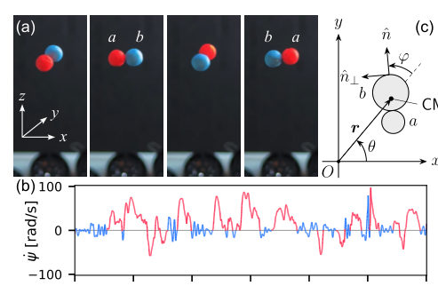
<figcaption class="paper-figure-caption"><b>Fig 1.</b> FIG. 1. (a) Video sequence [9] at 67 ms intervals of a pair of millimeter-scale beads, a and b, spontaneously spinning around the ˆz axis of an acoustic levitator. (b) Measured ro- tation rate, ˙ψ(t) = ˙φ(t) + ˙θ(t), colored by dynamical state (red: spinning, at least one full rotation, blue: rocking) for another pair of beads with a = (0.895 ± 0.005) mm and b = (0.930 ± 0.005) mm. (c) Geometry: The origin, O, is centered on the trap. The beads’ center of mass (CM) is dis- placed from O by r at angle θ relative to ˆx. The pair’s axis, ˆn, points from a to b and makes angle φ with respect to ˆr. The transverse unit vector is ˆn⊥= ˆz × ˆn.</figcaption>
</figure>
<figure class="paper-figure-card">
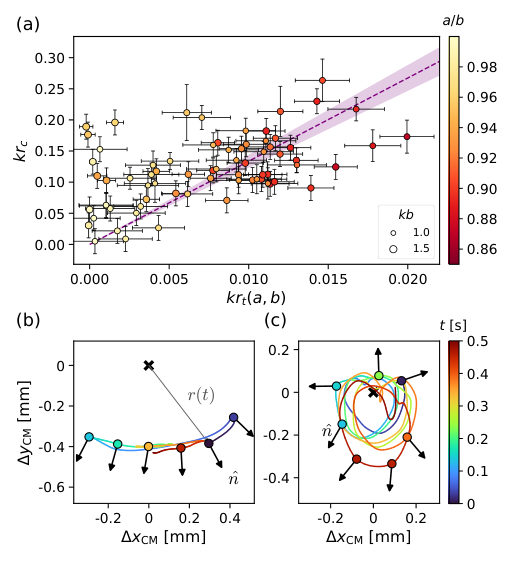
<figcaption class="paper-figure-caption"><b>Fig 2.</b> FIG. 2. (a) Static equilibrium: measured CM displacement, rc, of pairs of EPS beads versus predictions, rt(a, b), for a trap with f = 1. The diameter of each plot symbol is pro- portional to kb; color indicates a/b. Linear regression yields f = 0.075 ± 0.006 for the trap’s aspect ratio. (b) Libra- tion: measured CM trajectory, r(t), relative to the trap (×), of a pair of beads actively rocking: a = (1.242 ± 0.005) mm, b = (1.988±0.003) mm. (c) Spinning: a = (1.317±0.005) mm, b = (1.529±0.005) mm. Color in (b) and (c) indicates elapsed time, circles mark representative data points, and arrows show the measured pair orientation, ˆn, at those times.</figcaption>
</figure>
<figure class="paper-figure-card">
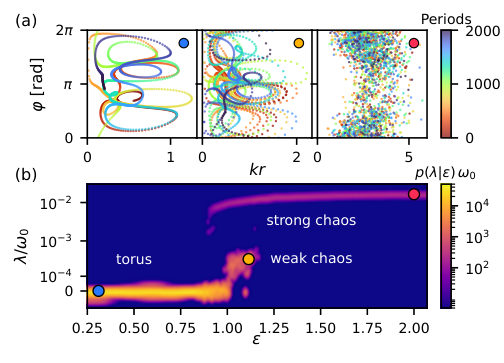
<figcaption class="paper-figure-caption"><b>Fig 3.</b> FIG. 3. (a) Poincar´e sections in the (kr, φ) plane at ε = 0.31 (torus), 1.11 (weak chaos) and 2.00 (strong chaos), given ka = 0.35, kb = 1.5 and ζ = 0.002. Points are colored by period number. (b) Probability density, p(λ | ε), of the largest Lyapunov exponent, λ, (on an arcsinh-scaled axis with linear width 10−4) for random initial conditions. Plot symbols cor- respond to trajectories in (a).</figcaption>
</figure>

**Summary.** This work models the dynamics of two acoustically trapped spheres, demonstrating that non-reciprocal forces can drive the system from a stable, passive state into complex, deterministic chaos. The transition follows a predictable route through a quasiperiodic torus, providing a fundamental example of how non-equilibrium physics can generate complex dynamics without external noise or self-propulsion.

**Why it may be interesting.** The mechanism of chaos generation—driven by non-reciprocal forces and dissipation in a classical mechanical system—provides a clean, non-quantum analogue for understanding how complex, non-equilibrium dynamics can emerge in many-body systems.

Detailed structure

**Main problem.** The paper investigates the emergence of autonomous, non-steady activity and the subsequent transition to deterministic chaos in a pair of acoustically trapped spheres.

**Main result.** The system exhibits a clear, noise-free path from a passive, stable state to a quasiperiodic torus, and finally into deterministic chaos, driven solely by non-reciprocal wave scattering forces.

**Method.** The analysis combines theoretical modeling using coupled equations of motion with experimental validation of the observed dynamic regimes.

**Model / system.** The system consists of two solid spheres trapped in a standing acoustic wave, whose dynamics are governed by coupled equations involving trapping potentials, drag forces, and non-reciprocal forces arising from size mismatch.

**Key observables.** Emergent activity (intermittent spinning/twitching), Lyapunov exponent ($\lambda$), Poincaré sections, and the system's asymptotic state (passive, quasiperiodic, chaotic).

**Important parameters / regimes.** The dimensionless activity number $S(a, b)$, the non-reciprocal force threshold $F_c$, and the dimensionless distance from threshold $\epsilon$.

**Assumptions / limitations.** The model relies on linearizing equations of motion about equilibrium and uses approximations for wave-mediated interactions, though the qualitative picture is claimed to be robust to higher-order corrections.

**Figures summary.** Figures illustrate the transition through Poincaré sections, showing the progression from a stable torus ($\epsilon=0.31$) to weak chaos ($\epsilon=1$).

**Paper structure.** The paper establishes the governing equations, analyzes the stability of the passive state using bifurcation theory, maps out the transition from stable equilibrium to Hopf bifurcation (librations), and finally characterizes the route to chaos via quasiperiodicity.

Abstract

Pairs of spheres sharing an acoustic trap sometimes spin intermittently despite having no self-propulsion, no obvious power source, and no symmetry-breaking mechanism, switching between rocking and spinning within a single trajectory. Nonreciprocal wave scattering powers this emergent activity, and drag shapes their dynamics by coupling rotations to translations. Mismatched pairs can pass through a supercritical Hopf bifurcation into a quasiperiodic torus on which the pair's orbit reverses regularly and, farther from equilibrium, into deterministic chaos. Experiments motivate this mechanism and share its qualitative signatures; simulations reveal a full noise-free route from passivity to chaos, and suggest how analogous dynamics can emerge in other active-matter systems.

[↑ back to top](#top)

### [Optical Fourier Architecture for Universal Nonlinear Functions](http://arxiv.org/abs/2609.37746v1)

**Authors:** Martin F. X. Mauser, Joshua Morris, Sara Galatro, Philip Walther, Borivoje Dakic  
**Type:** theory · **Category:** other · **PDF:** <https://arxiv.org/pdf/2609.37746v1>  
**Analysis basis:** full PDF text, analyzed in chunks
**Topic relevance:** `analog quantum simulation` **2/5** · `interference shaping light` **2/5** · `methods for driven-dissipative` **2/5**

↔ Scroll figures horizontally

<figure class="paper-figure-card">
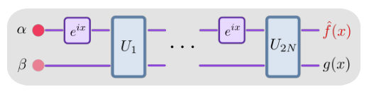
<figcaption class="paper-figure-caption"><b>Fig 1.</b> FIG. 1: Optical circuit ansatz. A 2 × 2 linear optical circuit acts on a fixed input state and evaluates the N-harmonic Fourier series ˆf(x) for input x, encoded by 2N repeating tunable single-mode phase shifters that specify x and fixed MZIs.</figcaption>
</figure>
<figure class="paper-figure-card">
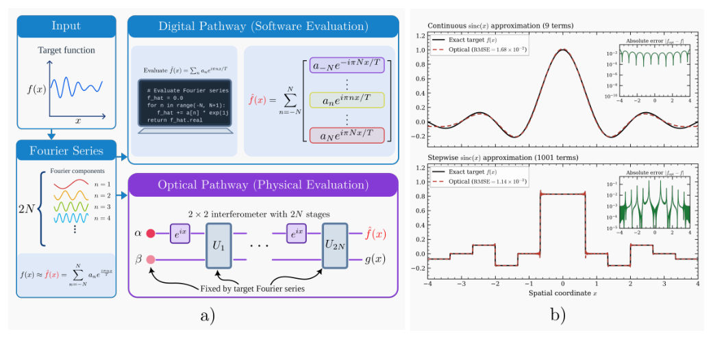
<figcaption class="paper-figure-caption"><b>Fig 2.</b> FIG. 2: Optical encoding of a function. (a) Conceptual compilation pipeline: an arbitrary target function is approximated by a truncated Fourier series, with the quality of the approximation depending on the number of terms and the target function. Given any such series, we generate by algebraic spectral factorisation a sequence of MZIs and single-mode phase shifters that, when acting on a fixed optical input, produce the desired approximating function output ˆf(x). (b) Simulated function approximation: Up: the smooth target sinc(x) function is faithfully reproduced by the coherent optical system using a modest circuit depth. Down: approximation of a stepwise quantized sinc(x) function...</figcaption>
</figure>
<figure class="paper-figure-card">
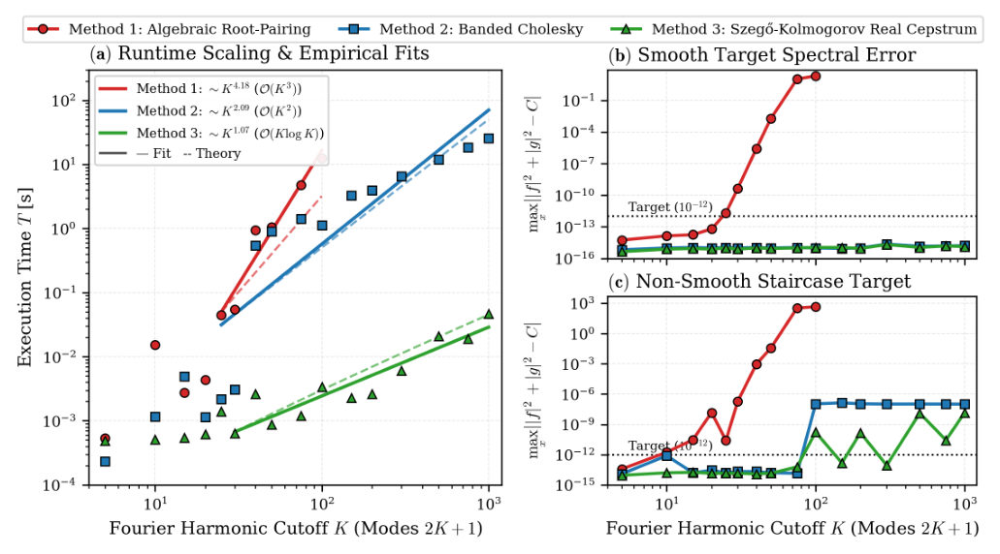
<figcaption class="paper-figure-caption"><b>Fig 3.</b> FIG. 3: Comprehensive benchmark of spectral factorisation algorithms. (a) Execution runtime scaling on a log-log scale. Empirical benchmark measurements (markers) are fitted to asymptotic power laws T(K) ∝Kα (solid lines), with respect to theoretical runtime expectation (dashed lines). Hereby, the algebraic root-pairing scales as ∼K4.18 before diverging, while the banded Cholesky and Szeg˝o-Kolmogorov scale with ∼K2.09 and ∼K1.07 respectively, closely matching their theoretical scaling. (b) Spectral unitary residual ∥C −|f|2 −|g|2∥∞on a smooth Gaussian-mixture target function. Both Cholesky and Szeg˝o-Kolmogorov sustain uniform machine-precision accuracy across all examined orders, whereas...</figcaption>
</figure>

**Summary.** This work presents a deterministic, lossless method to build an optical circuit that computes any function represented by a finite Fourier series. By leveraging spectral factorization and Cholesky decomposition, the authors construct the necessary optical unitaries layer-by-layer. This establishes a universal, scalable foundation for nonlinear optical computation using integrated photonics.

**Why it may be interesting.** While the core physics is in optics, the rigorous mathematical machinery—spectral factorization, Toeplitz matrix decomposition, and deterministic circuit synthesis—is highly relevant to quantum information theory and quantum computation, particularly in photonic quantum computing architectures.

Detailed structure

**Main problem.** The paper addresses the challenge of evaluating an arbitrary finite Fourier series using only linear optical components, aiming to achieve universal, deterministic nonlinear optical computing.

**Main result.** It proves that such a lossless optical circuit always exists and provides an $O(N)$ depth construction method for an $N$-harmonic expansion.

**Method.** The construction relies on an exact algebraic method derived from spectral factorization, which requires finding a complementary polynomial $g(z)$ such that $|f(z)|^2 + |g(z)|^2 = C$.

**Model / system.** The physical system is a two-mode ($2 	imes 2$) linear optical circuit implemented on integrated photonic circuits. The computation is modeled by the evolution of a fixed input state $|\phi
angle$ through a sequence of tunable phase shifters and fixed unitaries.

**Key observables.** The optical amplitude in a fixed output mode, proportional to the target function $\hat{f}(z)$.

**Important parameters / regimes.** The circuit depth scales as $O(N)$ for an $N$-harmonic expansion; the input power $C$ must be greater than the maximum value of $|\hat{f}(z)|^2$ on the unit circle.

**Assumptions / limitations.** The method assumes the target function can be represented by a finite Fourier series and operates entirely on classical coherent optical amplitudes, avoiding nonlinear materials.

**Figures summary.** Figure 1 illustrates the general optical circuit ansatz. Figure 3 benchmarks three spectral factorization algorithms (Algebraic root-pairing, Cholesky, Szegő-Kolmogorov) comparing runtime scaling and spectral unitary residuals for smooth and staircase functions.

**Paper structure.** The paper develops the theory by first establishing the necessary algebraic condition ($|f|^2 + |g|^2 = C$) using the Fejér-Riesz theorem. It then details the deterministic computation of $g(z)$ via Cholesky factorization of a Toeplitz matrix, followed by an iterative, layer-by-layer construction of the required unitary optical circuit.

Abstract

We introduce an exact algebraic architecture that evaluates an arbitrary finite Fourier series using a two-mode ($2 \times 2$) linear optical circuit, with the only tunable components being single-mode phase shifters encoding the function argument. We prove that such a circuit must exist for every Fourier series and derive an analytical method for its construction based on spectral factorisation. The resulting optical system exhibits an $\mathcal{O}(N)$ depth for an $N$-harmonic expansion, executing function evaluations in the passive optical time-of-flight. Finally, we validate our claims numerically, demonstrating that even for sequences with thousands of Fourier terms, our proposed circuit construction correctly synthesises continuous and discontinuous nonlinear functions. Our architecture thus provides a universal, deterministic foundation for single-variable nonlinear optical computing on integrated photonic platforms.

[↑ back to top](#top)

### [Autonomous self-harmonic drift in Langevin dynamics causes a compaction of underlying domain for the density of Stochastic Localization](http://arxiv.org/abs/2609.36232v1)

**Authors:** Ken Sekimoto  
**Type:** theory · **Category:** statistical mechanics · **PDF:** <https://arxiv.org/pdf/2609.36232v1>  
**Analysis basis:** full PDF text, analyzed in chunks
**Topic relevance:** `Keldysh / 2PI / non-Gaussian methods` **2/5** · `methods for driven-dissipative` **2/5** · `quantum measurements` **1/5**

↔ Scroll figures horizontally

<figure class="paper-figure-card">
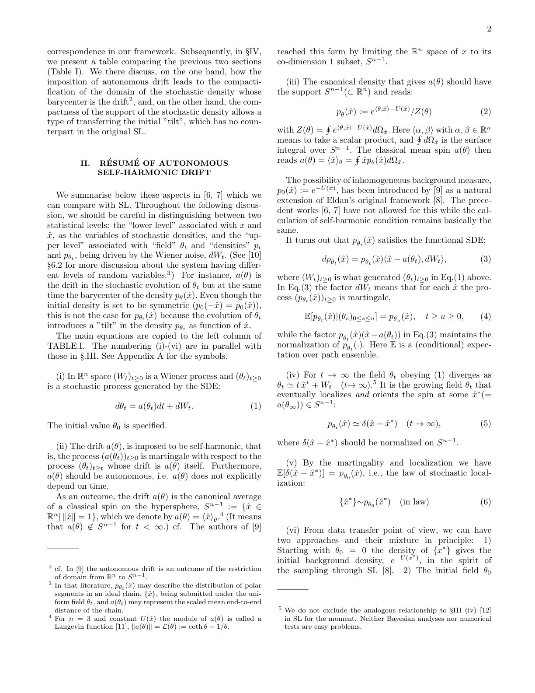
<figcaption class="paper-figure-caption"><b>Fig 1.</b> Low-resolution page preview, page 2</figcaption>
</figure>
<figure class="paper-figure-card">
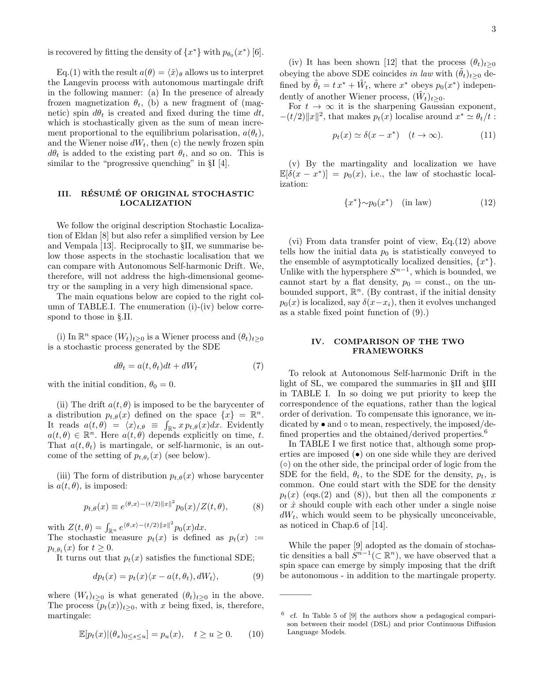
<figcaption class="paper-figure-caption"><b>Fig 2.</b> Low-resolution page preview, page 3</figcaption>
</figure>
<figure class="paper-figure-card">
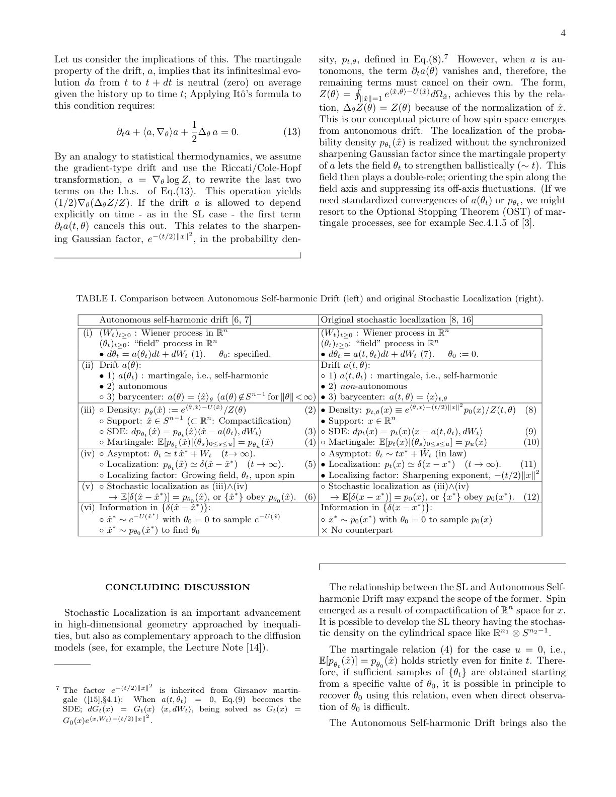
<figcaption class="paper-figure-caption"><b>Fig 3.</b> Low-resolution page preview, page 4</figcaption>
</figure>
<figure class="paper-figure-card">
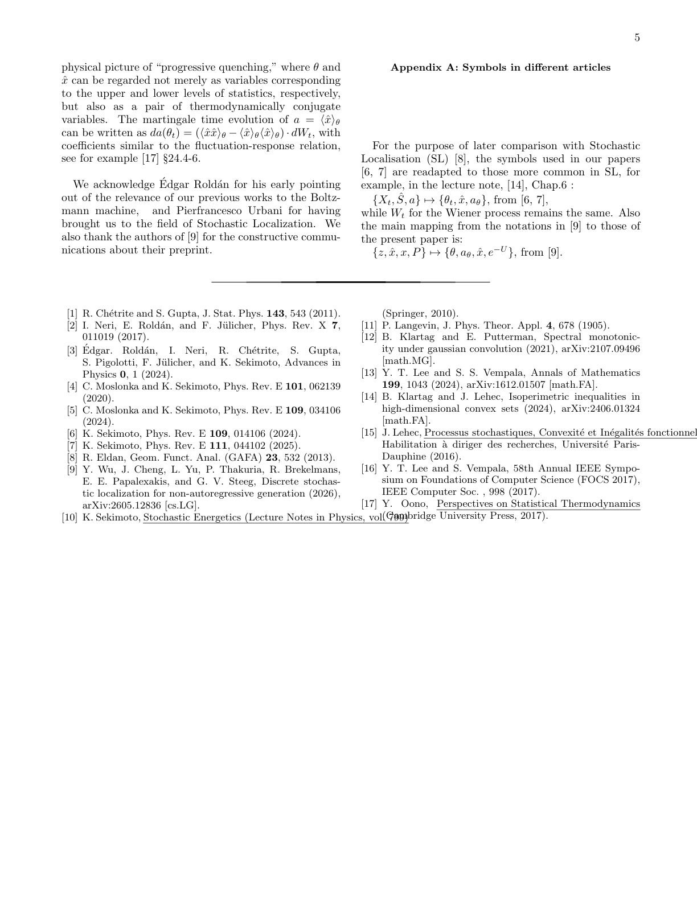
<figcaption class="paper-figure-caption"><b>Fig 4.</b> Low-resolution page preview, page 5</figcaption>
</figure>

**Summary.** This theoretical paper connects Langevin dynamics with self-harmonic drift to the mathematical concept of Stochastic Localization. By analyzing the dynamics, the authors show that the requirement of autonomous drift causes the underlying probability domain to compactify onto a sphere. This comparison expands the theoretical scope of Stochastic Localization by providing a physical, constrained system realization.

**Why it may be interesting.** The connection drawn between classical stochastic dynamics (Langevin/drift) and geometric concepts like Stochastic Localization provides a novel, physically motivated context for mathematical tools used in data science and geometry.

Detailed structure

**Main problem.** The paper compares the dynamics of Langevin systems with autonomous self-harmonic drift to the concept of Stochastic Localization (SL) to understand the mechanism of domain compaction.

**Main result.** The autonomous requirement in the self-harmonic drift case forces the probability distribution's domain to compactify onto the surface of a sphere, linking it to the mathematical framework of SL.

**Method.** The analysis involves comparing functional Stochastic Differential Equations (SDEs) governing the probability densities in both frameworks, utilizing martingale properties.

**Model / system.** The primary model is Langevin dynamics with a self-harmonic drift acting on classical spins constrained to a hypersphere ($S^{n-1}$). This is compared to the general Stochastic Localization framework defined on Euclidean space ($\mathbb{R}^n$).

**Key observables.** The asymptotic convergence of the stochastic density to a delta-function ($\delta(\hat{x} - \hat{x}^*)$) and the relationship between the drift term and the barycenter of the distribution.

**Important parameters / regimes.** The dimension $n$, the time $t$, and the initial density $p_0(\hat{x})$ or $p_0(\mathbf{x})$.

**Assumptions / limitations.** The self-harmonic drift is assumed to be autonomous, and the comparison relies on the martingale property of the underlying stochastic process.

**Figures summary.** A comparison table (TABLE I) summarizes the correspondences between the two theoretical frameworks, detailing the mathematical links between the two types of stochastic processes.

**Paper structure.** The paper introduces the problem by defining the two systems (Self-harmonic Drift and SL), develops the mathematical machinery using SDEs and martingales, derives the key results showing the equivalence and the compactification mechanism, and concludes by discussing the implications for extending SL.

Abstract

Our recent research on Langevin dynamics with self-harmonic drift and classical spins has revealed a strong connection to ``Stochastic Localization," a concept attracting attention in the fields of mathematical geometry and data science. Roughly speaking, the former can be viewed as a version of the latter in which the $n$-dimensional Euclidean space - the domain of the probability distribution function appearing in the latter - is ``compactified'' to the surface of an $n$-dimensional sphere. By comparing the two frameworks, we argue that this compactification is a consequence of requiring the drift to be autonomous. The relationship between the two approaches may expand the scope of Stochastic Localization.

[↑ back to top](#top)

### [Defect Organization in Coexisting Hexagonal and Square Lattices on Ellipsoids](http://arxiv.org/abs/2609.37668v1)

**Authors:** Wenyu Liu, Han Xie, Baohui Li, Jeff Z. Y. Chen, Yao Li  
**Type:** theory · **Category:** statistical mechanics · **PDF:** <https://arxiv.org/pdf/2609.37668v1>  
**Analysis basis:** full PDF text, analyzed in chunks
**Topic relevance:** `analog quantum simulation` **2/5** · `Frenkel-Kontorova` **1/5** · `driven-dissipative phase transition` **1/5** · `non-equilibrium universality` **1/5**

↔ Scroll figures horizontally

<figure class="paper-figure-card">
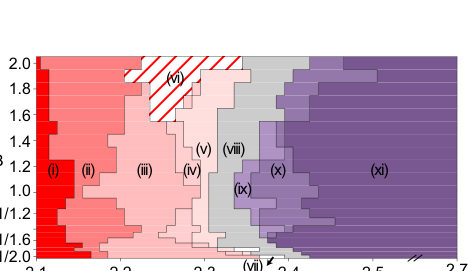
<figcaption class="paper-figure-caption"><b>Fig 1.</b> FIG. 1. State diagram of mixed Hex-Sq lattices on ellipsoidal surfaces as functions of reduced density ρ∗and aspect ratio A/B. Red, purple, and gray backgrounds denote the Hex-dominant, Sq-dominant, and intermediate regimes, respectively. Roman numerals identify (i) Hex scars (see Fig. 2), (ii) coexistence of Hex scars and Sq-rich rectangular domains (see Fig. 7), (iii) Sq-rich rectangular domains (see Fig. 4), (iv) coexistence of Sq-rich rectangular domains and counter domains (see Fig. 9), (v) counter domains (see Fig. 8), (vi) vertex-contacted domains (see Fig. 6), (vii) biangular domains (see Fig. 10), (viii) asymmetric mixed state, (ix) Hex- rich triangular domains (see Fig. 11), (x)...</figcaption>
</figure>
<figure class="paper-figure-card">
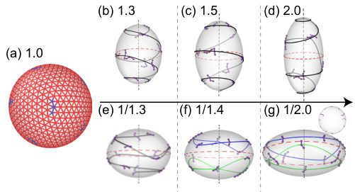
<figcaption class="paper-figure-caption"><b>Fig 2.</b> FIG. 2. Representative Hex-scar configurations corresponding to state (i) in Fig. 1 at ρ∗= 2.10. (a) Spherical reference. (b)– (d) Prolate ellipsoids with A/B = 1.3, 1.5, and 2.0. (e)–(g) Oblate ellipsoids with A/B = 1/1.3, 1/1.4, and 1/2.0. Purple particles mark non-sixfold-coordinated particles. Black, blue, and green curves are visual guides connecting scar centers. The black dashed line connects the two poles, while the red dashed line marks the equatorial plane. The arrow indicates increasing deviation from sphericity, corresponding to increasing prolateness in the upper row and increasing oblateness in the lower row.</figcaption>
</figure>
<figure class="paper-figure-card">
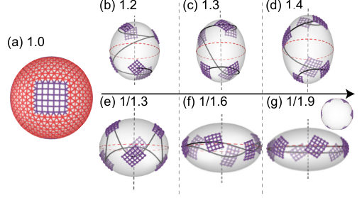
<figcaption class="paper-figure-caption"><b>Fig 3.</b> FIG. 4. Representative Sq-rich rectangular domains in a Hex- dominant background corresponding to state (iii) in Fig. 1 at ρ∗= 2.24 for several aspect ratios A/B. (a) Approximately octahedral arrangement on the sphere. (b)–(d) Prolate configurations with A/B = 1.2, 1.3, and 1.4, respectively, in which the six domains form an increasingly extended polar helix. (e)–(g) Oblate configurations with A/B = 1/1.3, 1/1.6, and 1/1.9, respectively, in which the domains approach and eventually occupy the equatorial belt. Black curves are visual guides connecting the domain centers. Aspect ratios are indicated in the individual panels.</figcaption>
</figure>
<figure class="paper-figure-card">
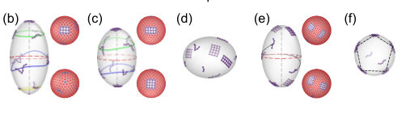
<figcaption class="paper-figure-caption"><b>Fig 4.</b> FIG. 7. Coexistence of Hex scars and Sq-rich rectangular domains corresponding to state (ii) in Fig. 1. (a) Detailed view of the state-(ii) region in Fig. 1, where Hex scars and Sq-rich rectangular domains coexist. (b)–(f) Representative configurations containing, respectively, 10 scars and 1 domain, 8 scars and 2 domains, 6 scars and 3 domains, 4 scars and 4 domains, and 2 scars and 5 domains.</figcaption>
</figure>
<figure class="paper-figure-card">
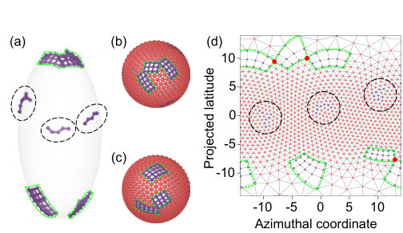
<figcaption class="paper-figure-caption"><b>Fig 5.</b> FIG. 6. Vertex-contacted domains (VCD) on prolate ellipsoids corresponding to state (vi) in Fig. 1. (a) Representative side views and an enlarged polar contact region. (b) and (c) Polar views of the contacted domains. (d) Planar projection of the ellipsoidal lattice. Red dots mark locally neutral contacted vertices, and black dashed outlines identify compensating positive defects at lower- curvature latitudes. In the large side views, the defect-free Hex background is omitted and only the defect structures are shown; the accompanying top- and bottom-view insets, where present, retain the complete surface lattice. The same visualization convention is used for all subsequent snapshots.</figcaption>
</figure>

**Summary.** This work explores how the geometry of a curved surface, specifically the variation in Gaussian curvature, dictates the arrangement of defects where two competing crystal lattices (hexagonal and square) coexist. Using simulations on ellipsoids, the authors show that curvature acts as a powerful organizing principle, forcing defects to redistribute to minimize elastic strain energy. This demonstrates that geometric anisotropy can be used to engineer specific, stable defect patterns in condensed matter systems.

**Why it may be interesting.** The principles governing defect organization under geometric constraints—where local energy minimization forces global structural reorganization—are highly relevant to understanding phase transitions and defect dynamics in complex quantum materials or patterned quantum systems.

Detailed structure

**Main problem.** The study investigates how the interplay between varying surface curvature and competing lattice symmetries (hexagonal and square) dictates the organization and distribution of topological defects in 2D crystalline systems.

**Main result.** Nonuniform curvature can actively engineer rich defect patterns by controlling the spatial distribution of topological charge, with prolate vs. oblate geometries leading to distinct defect arrangements.

**Method.** The research employs simulated-annealing Langevin dynamics simulations to find the lowest-energy configurations of particles forming mixed lattices on ellipsoidal surfaces.

**Model / system.** The system models Hertzian particles forming coexisting hexagonal and square lattices constrained to prolate or oblate ellipsoids, analyzed using a specific interaction potential.

**Key observables.** Signed topological-charge surface density ($
ho(	heta)$), Gaussian curvature ($K(	heta)$), and the defect-curvature deviation index ($D_{
ho K}$).

**Important parameters / regimes.** Ellipsoidal aspect ratio ($A/B$), reduced density ($
ho^*$), and the degree of lattice dominance (Hex-dominant vs. Sq-dominant).

**Assumptions / limitations.** The analysis relies on mapping reduced density and aspect ratio, and comparisons are made using the ten lowest-energy configurations from multiple independent annealing runs.

**Figures summary.** Figures illustrate state diagrams mapping lattice organization, representative configurations of Hex-scars and Sq-domains on different ellipsoids, and comparisons of charge density vs. curvature profiles.

**Paper structure.** The paper systematically analyzes the system by first establishing the physical model and simulation methods, then presenting results across different lattice dominance regimes (Hex/Sq) and contrasting the effects of prolate versus oblate curvature anisotropy.

Abstract

Curvature and topology jointly organize defects in two-dimensional crystals, but their combined role remains unresolved when competing lattice symmetries coexist with spatially varying curvature. We use simulated-annealing Langevin dynamics to study Hertzian particles forming coexisting hexagonal (Hex) and square (Sq) lattices on prolate and oblate ellipsoids. Mapping reduced density and aspect ratio reveals a broad sequence of scar and domain-based morphologies in both Hex-dominant and Sq-dominant backgrounds. Latitude-resolved comparisons show that Gaussian curvature biases defects toward its maxima under weak deformation. Strong prolateness, however, confines high curvature to small polar caps that cannot independently accommodate all defect motifs. Defects then spread toward lower-curvature latitudes to relieve defect crowding and elastic repulsion. In the Hex-dominant regime, this competition drives vertex-contacted domains with neutralized corner contacts, and compensating positive defects locate away from the poles. The Sq-dominant regime features Hex-rich triangular domains, bridged states, and linear or open scars similarly reorganized by curvature anisotropy. On oblate ellipsoids, the extended equatorial high-curvature belt allows defects to separate azimuthally while remaining curvature-localized. This work elucidates that nonuniform curvature can engineer rich defect patterns by selecting the spatial distribution of topological charge and the connectivity of finite defect motifs.

[↑ back to top](#top)

### [Improved estimate of local Markovianity for quantum Gibbs states](http://arxiv.org/abs/2609.38007v1)

**Authors:** Tai Hsuan Yang  
**Type:** theory · **Category:** statistical mechanics · **PDF:** <https://arxiv.org/pdf/2609.38007v1>  
**Analysis basis:** full PDF text, analyzed in chunks
**Topic relevance:** `Keldysh / 2PI / non-Gaussian methods` **2/5** · `methods for driven-dissipative` **2/5** · `analog quantum simulation` **1/5**

↔ Scroll figures horizontally

<figure class="paper-figure-card">
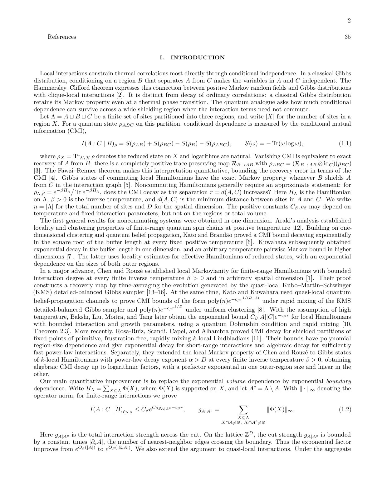
<figcaption class="paper-figure-caption"><b>Fig 1.</b> Low-resolution page preview, page 2</figcaption>
</figure>
<figure class="paper-figure-card">
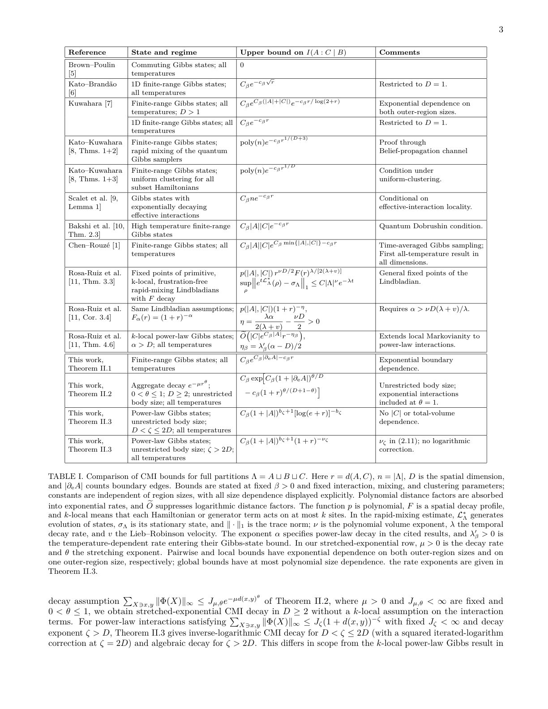
<figcaption class="paper-figure-caption"><b>Fig 2.</b> Low-resolution page preview, page 3</figcaption>
</figure>
<figure class="paper-figure-card">
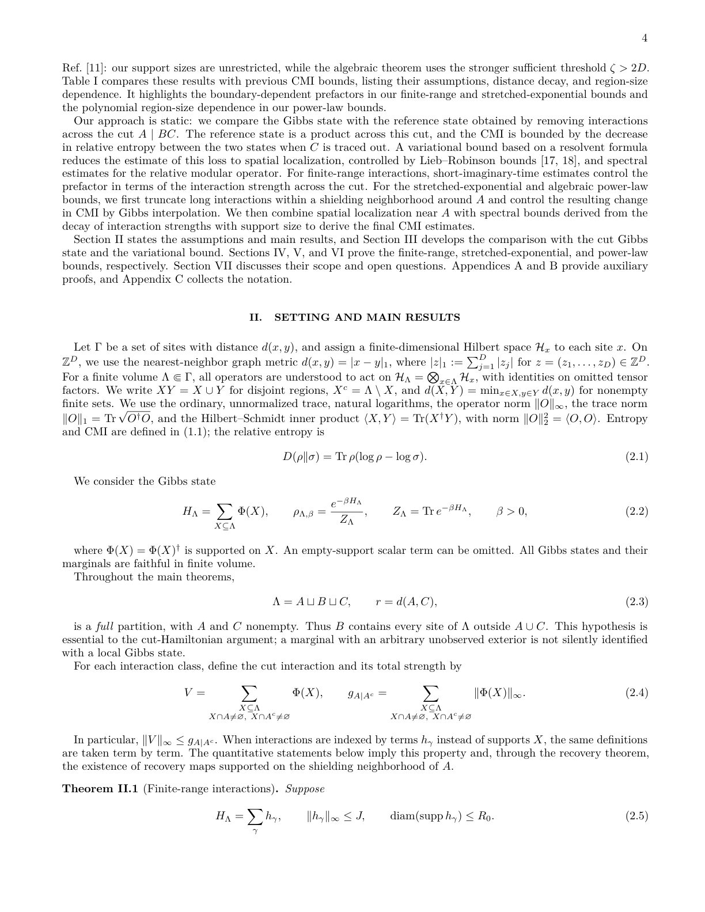
<figcaption class="paper-figure-caption"><b>Fig 3.</b> Low-resolution page preview, page 4</figcaption>
</figure>
<figure class="paper-figure-card">
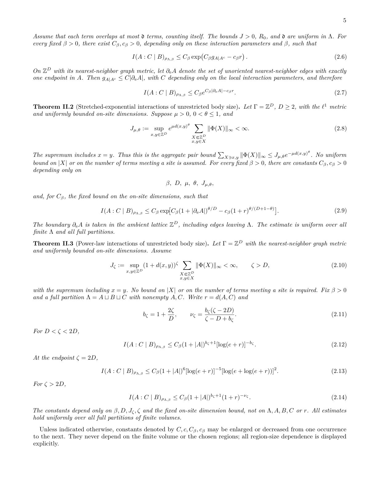
<figcaption class="paper-figure-caption"><b>Fig 4.</b> Low-resolution page preview, page 5</figcaption>
</figure>
<figure class="paper-figure-card">
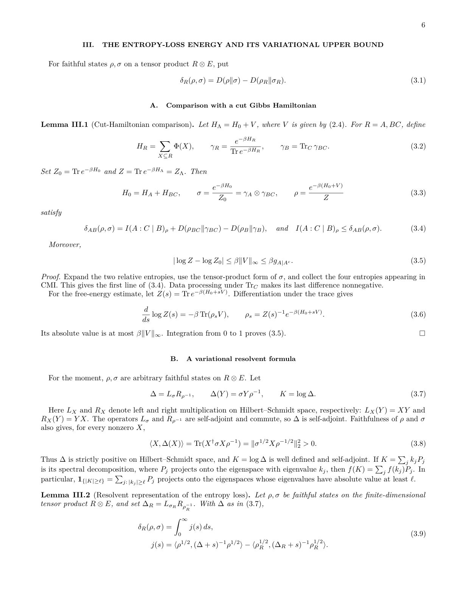
<figcaption class="paper-figure-caption"><b>Fig 5.</b> Low-resolution page preview, page 6</figcaption>
</figure>

**Summary.** This work provides rigorous, improved estimates for how local quantum correlations decay in quantum Gibbs states. By analyzing the Conditional Mutual Information (CMI) for different interaction types, the authors show that the decay rate depends on the boundary size rather than the volume, which is a significant theoretical advance for characterizing quantum locality.

**Why it may be interesting.** The improved, boundary-dependent bounds on CMI are crucial for understanding quantum correlations and locality in thermal quantum many-body systems, which is central to modern condensed matter theory.

Detailed structure

**Main problem.** The paper aims to establish improved, quantitative estimates for the local Markovian properties of quantum Gibbs states.

**Main result.** It derives specific decay rates for the Conditional Mutual Information (CMI) based on the decay type of the interactions (finite-range, stretched-exponential, or power-law).

**Method.** The analysis uses a static approach, bounding the CMI by relating it to a relative-entropy loss, which is then controlled using variational methods and resolvent identities.

**Model / system.** The system is a quantum lattice model described by a Hamiltonian $H_{\Lambda}$, and the state is the quantum Gibbs state $
ho_{\Lambda, eta} = e^{-eta H_{\Lambda}} / 	ext{Tr} e^{-eta H_{\Lambda}}$.

**Key observables.** Conditional Mutual Information (CMI), Relative Entropy Loss ($\delta_R(
ho, \sigma)$), and the cut interaction strength ($g_{A|Ac}$).

**Important parameters / regimes.** Inverse temperature ($eta$), separation distance ($r$), and the decay exponents ($\zeta, 	heta$) characterizing the interaction decay.

**Assumptions / limitations.** The results hold for fixed positive temperature ($eta > 0$) and rely on bounding the interaction strength across a spatial cut.

**Paper structure.** The paper systematically compares its derived bounds (for finite-range, quasi-local, and power-law interactions) against prior work, utilizing variational calculus and resolvent identities to control the relative entropy loss.

Abstract

We establish improved locally Markovian properties of quantum Gibbs states at every fixed positive temperature. For finite-range interactions of bounded interaction degree, the conditional mutual information (CMI) decays exponentially with separation, with a prefactor exponential in the boundary size. This improves the exponential volume dependence of the local Markov bounds established by Chen and Rouzé \cite{Chen2025}. For exponentially and stretched-exponentially decaying interactions, we obtain stretched-exponential CMI decay with a boundary-dependent prefactor. For power-law interactions, we prove inverse-logarithmic or algebraic decay with polynomial region-size dependence. Our proof is static, in contrast to the dynamical approach of Chen and Rouzé. We compare the Gibbs state with a product state obtained by removing boundary interactions, reducing the CMI bound to a relative-entropy loss that we control using locality estimates.

[↑ back to top](#top)

### [Magnetic excitations of the strongly-anisotropic triangular XXZ model: a projected spin-product state approach](http://arxiv.org/abs/2609.36140v1)

**Authors:** Achille Mauri, Frédéric Mila  
**Type:** theory · **Category:** strongly correlated electrons · **PDF:** <https://arxiv.org/pdf/2609.36140v1>  
**Analysis basis:** full PDF text, analyzed in chunks
**Topic relevance:** `Keldysh / 2PI / non-Gaussian methods` **2/5** · `analog quantum simulation` **2/5**

↔ Scroll figures horizontally

<figure class="paper-figure-card">
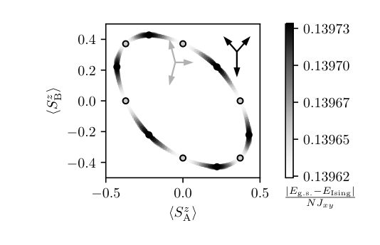
<figcaption class="paper-figure-caption"><b>Fig 1.</b> FIG. 1. Line of quasi-degenerate projected states at zero longitudinal field for L = 12. The arrows show the sublattice magnetizations in the AFM case in the Y state (black) and in the UD0 state (grey), which are respectively local minima and maxima of the variational energy along the line.</figcaption>
</figure>
<figure class="paper-figure-card">
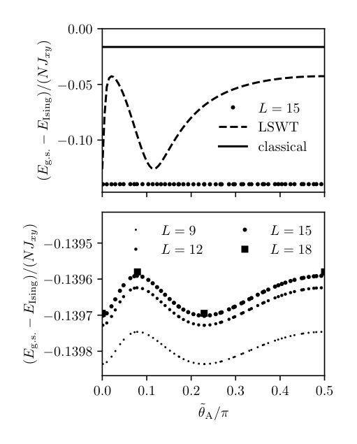
<figcaption class="paper-figure-caption"><b>Fig 2.</b> FIG. 2. Energy as a function of the canting angle at sublat- tice A. Solid and dashed lines show, respectively, the classical energy and the classical + 1/S energy along the classically- degenerate ground-state manifold for Jxy/Jzz = 0.07. The dots show the minimum energy of a projected spin-product state with fixed canting angle ˜θA = arctan(⟨Sx i ⟩/⟨Sz i ⟩). The bottom panel enlarges the narrow interval of energies separat- ing the Y and the UD0 solutions, and shows results obtained by the projected spin-product approximation for different L.</figcaption>
</figure>
<figure class="paper-figure-card">
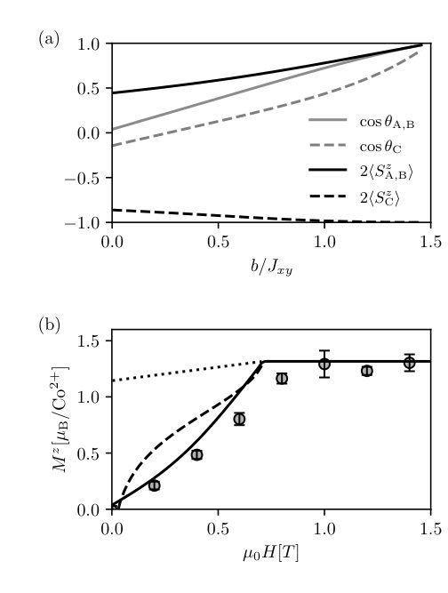
<figcaption class="paper-figure-caption"><b>Fig 3.</b> FIG. 3. (a) Variational parameters and longitudinal sublat- tice magnetizations as a function of the magnetic field b, com- puted on an L = 15 cylinder. (b) Theoretical magnetization curve obtained within the projected product-state approxi- mation (solid line), the classical XXZ model (dotted line), and the classical+ LSWT approximation (dashed line). Grey circles show experimental data points from Ref. [10]. The theoretical curves were calculated assuming a gyromagnetic factor gzz = 7.9, Jxy = 0.217 meV, and Jzz = 3.1meV.</figcaption>
</figure>
<figure class="paper-figure-card">
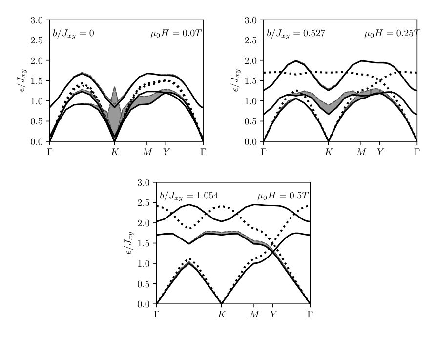
<figcaption class="paper-figure-caption"><b>Fig 4.</b> FIG. 4. Dispersion relations ϵn(k) and matrix elements |⟨n, k|Sz(k)|0⟩|2 within the linearized time-dependent variational principle, calculated on an L = 12 cylinder. The dispersion is represented by solid lines. The matrix elements of the branches are the dashed lines measured from the corresponding solid lines. The dotted curves are dispersions within linear spin-wave theory for b = gzzµBµ0H, gzz = 7.9, Jxy = 0.217 meV, and Jzz = 3.1 meV. In the top-left panel, the mode with strong intensity at the K point is the low-energy gapped pseudo-Goldstone mode.</figcaption>
</figure>
<figure class="paper-figure-card">
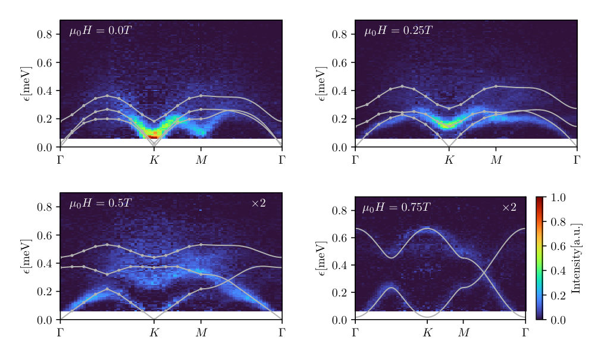
<figcaption class="paper-figure-caption"><b>Fig 5.</b> FIG. 5. Dispersion of the excitation modes within the projected spin-wave approximation (white lines) for b = gzzµBµ0H, gzz = 7.9 and Jxy = 0.217 meV, in comparison to inelastic neutron scattering data on KCSO from Ref. [10]. For the spectrum at H = 0.75T, we used the analytical expressions ϵk = b± 1</figcaption>
</figure>

**Summary.** This paper analyzes the magnetic excitations of the triangular XXZ model using a novel projected coherent-state approximation. By restricting the variational space to low-energy Ising configurations, the authors derive the excitation spectrum, showing marked improvements over standard spin-wave theory. This work is crucial for understanding frustrated quantum magnets relevant to materials like cobaltites.

**Why it may be interesting.** The use of variational principles on constrained quantum manifolds (projected states) is a powerful technique for strongly correlated systems, offering insights into low-energy excitations beyond simple mean-field treatments.

Detailed structure

**Main problem.** The paper investigates the ground-state properties and the excitation spectrum of the spin-1/2 triangular XXZ model, particularly in the regime of strong Ising-like anisotropy.

**Main result.** The projected coherent-state approximation significantly improves upon linear spin-wave theory, predicting a low-energy pseudo-Goldstone mode at zero field.

**Method.** The authors employ a 'projected' coherent-state approximation, utilizing the Time-Dependent Variational Principle (TDVP) restricted to the low-energy manifold of the triangular Ising antiferromagnet.

**Model / system.** The system is the spin-1/2 triangular XXZ model, described by a Hamiltonian involving exchange interactions and a longitudinal magnetic field. The analysis focuses on the highly constrained quantum-Ising limit.

**Key observables.** Ground-state ordering, magnetization curve, excitation spectrum (relevant to neutron scattering), and the pseudo-Goldstone mode.

**Important parameters / regimes.** Strong Ising-like anisotropy ($\alpha = J_{xy}/J_{zz}$ small), and the longitudinal field $b$ in the range $0 < b < b_c$.

**Assumptions / limitations.** The primary assumption is the validity of the projected coherent-state approximation, which is an improvement over standard linear spin-wave theory.

**Figures summary.** Figure 12 illustrates the real-space susceptibility matrix $L_{ij}$ as a function of lattice position for different sublattices.

**Paper structure.** The work proceeds by first defining the model and the projected approximation. It then analyzes the ground state and magnetization curve, followed by deriving the excitation spectrum via linearization of the TDVP equations to find spin-wave-like excitations.

Abstract

Recent experiments have sparked interest on the ground-state properties and on the excitation spectrum of the spin-$1/2$ triangular XXZ model with strong Ising-like anisotropy. In this work, we introduce and analyze a ``projected'' coherent-state approximation to the model, constructed by projecting spin-product states onto the low-energy configurations of the triangular Ising antiferromagnet. Within this approximation, we discuss the structure of the ground-state ordering and the magnetization curve under a longitudinal field. We then discuss the excitation spectrum by linearizing equations of motion deriving from a time-dependent variational principle. This leads to a natural description of spin-wave-like excitations within the strongly constrained Hilbert space. At zero field, the variational approximation leads to a very flat landscape of quasi-degenerate states, which results in a low-energy pseudo-Goldstone mode in the excitation spectrum. We compare our results to experimental measurements on the cobaltite K$_{2}$Co(SeO$_{3}$)$_{2}$ (KCSO). Our approximation leads to a dramatic improvement as compared to linear spin-wave theory. However, there remain deviations in the value of the pseudo-Goldstone gap and in the dispersion near $M$ points at low field.

[↑ back to top](#top)

### [The Principle of Minimum Justified Correlation](http://arxiv.org/abs/2609.38124v1)

**Authors:** John H Van Drie  
**Type:** theory · **Category:** statistical mechanics · **PDF:** <https://arxiv.org/pdf/2609.38124v1>  
**Analysis basis:** full PDF text, analyzed in chunks
**Topic relevance:** `Keldysh / 2PI / non-Gaussian methods` **2/5** · `analog quantum simulation` **1/5** · `quantum measurements` **1/5**

↔ Scroll figures horizontally

<figure class="paper-figure-card">
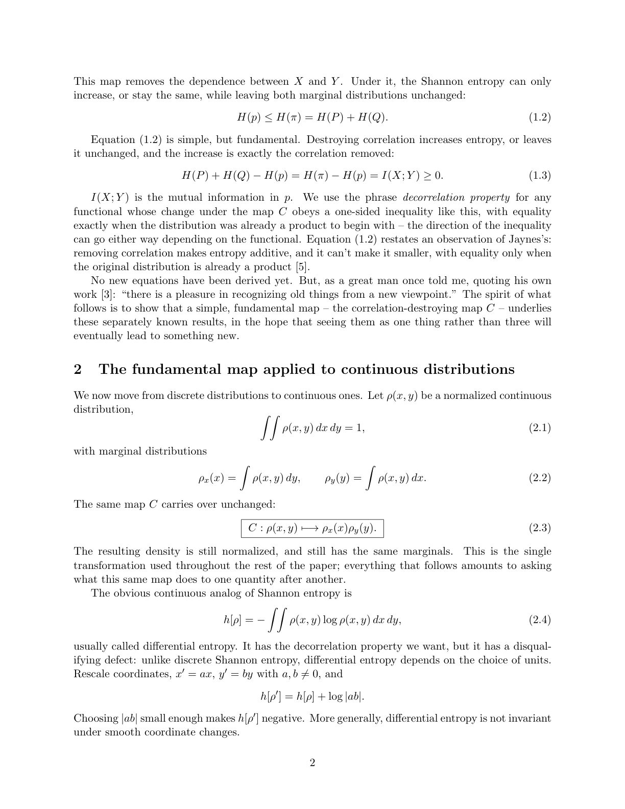
<figcaption class="paper-figure-caption"><b>Fig 1.</b> Low-resolution page preview, page 2</figcaption>
</figure>
<figure class="paper-figure-card">
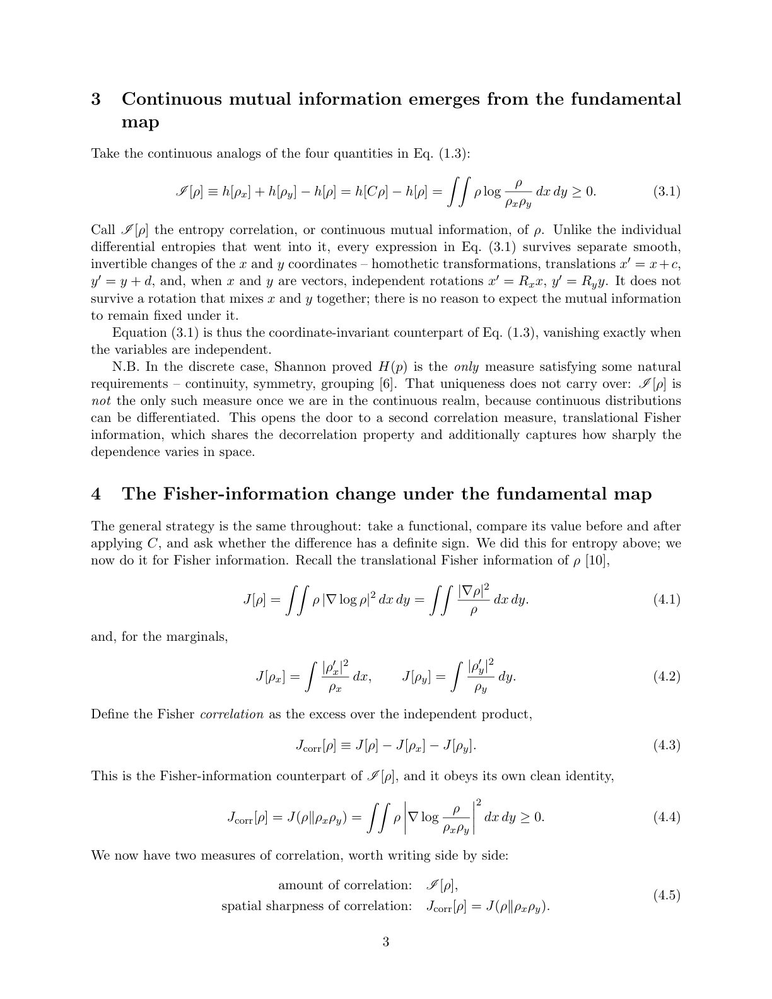
<figcaption class="paper-figure-caption"><b>Fig 2.</b> Low-resolution page preview, page 3</figcaption>
</figure>
<figure class="paper-figure-card">
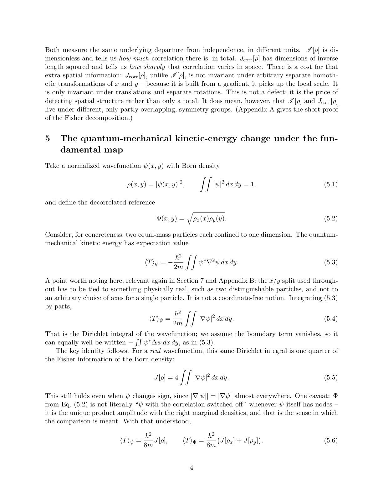
<figcaption class="paper-figure-caption"><b>Fig 3.</b> Low-resolution page preview, page 4</figcaption>
</figure>
<figure class="paper-figure-card">
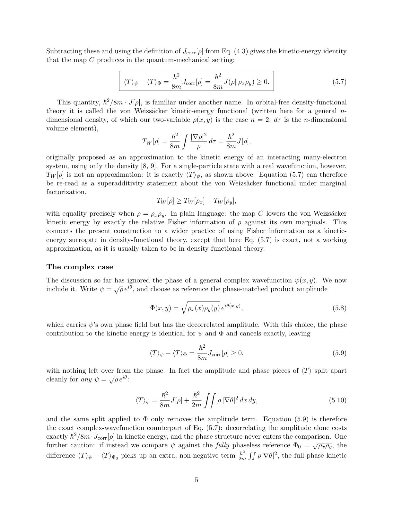
<figcaption class="paper-figure-caption"><b>Fig 4.</b> Low-resolution page preview, page 5</figcaption>
</figure>
<figure class="paper-figure-card">
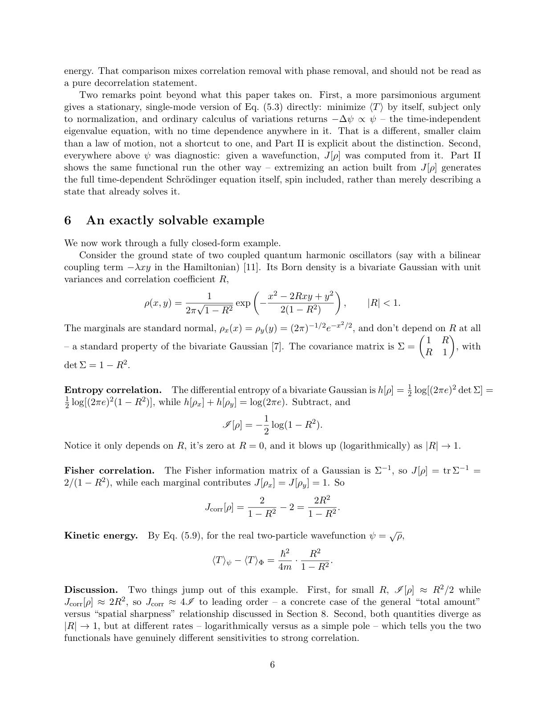
<figcaption class="paper-figure-caption"><b>Fig 5.</b> Low-resolution page preview, page 6</figcaption>
</figure>

**Summary.** This work unifies entropy, Fisher information, and quantum kinetic energy by showing they all quantify correlation. It derives a key identity linking the kinetic energy difference to the relative Fisher information, supporting a 'Principle of Minimum Justified Correlation.' This suggests that physical systems naturally tend toward the least correlated state consistent with their known constraints.

**Why it may be interesting.** It provides a novel, information-theoretic lens through which to view fundamental quantum mechanical constraints, potentially offering a variational principle for deriving physical laws.

Detailed structure

**Main problem.** To develop a unified principle connecting Shannon entropy, Fisher information, and quantum kinetic energy as fundamental measures of correlation in physical systems.

**Main result.** The paper establishes a quantitative identity showing that the difference in kinetic energy between a correlated state and its product-amplitude reference state is proportional to the relative Fisher information. This supports the Principle of Minimum Justified Correlation.

**Method.** The analysis uses information-theoretic tools (entropy, Fisher information) applied to both discrete and continuous probability distributions, linking these measures to quantum expectation values (kinetic energy).

**Model / system.** The theory is developed for general joint probability densities $\rho(x, y)$ and normalized quantum wavefunctions $\psi(x, y)$, comparing them to product states $\Phi = \sqrt{\rho_x \rho_y}$.

**Key observables.** Shannon Entropy Correlation $I[\rho]$, Relative Fisher Information $J(\rho\|\rho_x\rho_y)$, and the kinetic energy difference $\langle T\rangle_\psi - \langle T\rangle_\Phi$.

**Important parameters / regimes.** Reduced Planck constant ($\hbar$), mass ($m$), and the structure of the correlation itself.

**Assumptions / limitations.** The principle is stated as being relative to a chosen decomposition (e.g., $x$ and $y$ coordinates) and the comparison relies on the existence of a product-amplitude reference state $\Phi$.

**Paper structure.** Part I develops the identities linking entropy, Fisher information, and kinetic energy, culminating in the statement of the Principle of Minimum Justified Correlation. Part II is reserved for addressing open questions like time dependence and a route to the Schrödinger equation.

Abstract

It is shown that Shannon entropy, Fisher information, and quantum-mechanical kinetic energy may all be viewed as measures of correlation. We begin with a fundamental correlation-destroying map: a joint probability density $ρ(x,y)$ is replaced by $ρ_x(x)ρ_y(y)$, the product of its marginal distributions. In the discrete case, Shannon's entropy is nondecreasing under this map. For continuous distributions, this fundamental map leads to a well-behaved, coordinate-invariant correlation measure, analogous to the discrete Shannon entropy: \[ I[ρ] = h[ρ_x] + h[ρ_y] - h[ρ]. \] In the continuous case, however, another measure appears: Fisher information. The relative Fisher information $J(ρ\|ρ_xρ_y)$ behaves similarly under the fundamental map. For a normalized real quantum wavefunction, this decrease is exactly proportional to the decrease in mean kinetic energy, \[ \langle T\rangle_ψ- \langle T\rangle_Φ= \frac{\hbar^2}{8m} J(ρ\|ρ_xρ_y), \qquad Φ= \sqrt{ρ_x ρ_y}. \] In Jaynes's language, the result supports a principle of minimum justified correlation: given physical constraints and a set of possible distributions or related amplitudes satisfying those constraints, select from that set those with the least correlation.   This is Part I of a two-part paper. Here we develop the entropy, Fisher-information, and kinetic-energy identities above, and state the principle they support. Part II addresses questions which Part I raises but leaves unanswered: multiple solutions, time dependence, the role of spin, a route to the Schrödinger equation itself, and a proposed experimental test. AI has been used.

[↑ back to top](#top)

### [Accurate ground-state entropies from population Monte Carlo: The antiferromagnetic Ising model on the Shastry-Sutherland lattice](http://arxiv.org/abs/2609.37174v1)

**Authors:** Denis Gessert, Wolfhard Janke, Martin Weigel  
**Type:** theory · **Category:** statistical mechanics · **PDF:** <https://arxiv.org/pdf/2609.37174v1>  
**Analysis basis:** full PDF text, analyzed in chunks
**Topic relevance:** `analog quantum simulation` **2/5** · `methods for driven-dissipative` **1/5**

↔ Scroll figures horizontally

<figure class="paper-figure-card">
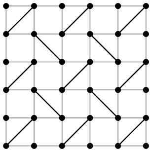
<figcaption class="paper-figure-caption"><b>Fig 1.</b> FIG. 1. Shastry-Sutherland lattice of a 6 × 6 square lattice.</figcaption>
</figure>
<figure class="paper-figure-card">
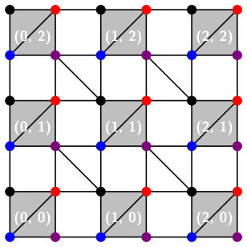
<figcaption class="paper-figure-caption"><b>Fig 2.</b> FIG. 2. Domain decomposition of the Shastry-Sutherland lattice into four sublattices used for GPU updates. For bet- ter memory coalescence, each sublattice is stored separately. Spins on a plaquette highlighted in gray share the same index, with the respective two-dimensional indices indicated.</figcaption>
</figure>
<figure class="paper-figure-card">
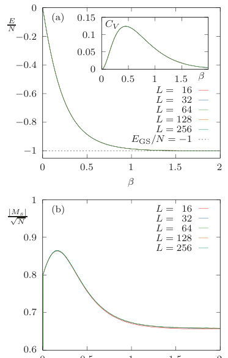
<figcaption class="paper-figure-caption"><b>Fig 3.</b> FIG. 3. (a) Energy per site E/N, and (b) (staggered) mag- netization per square-root-volume |Ms|/ √</figcaption>
</figure>
<figure class="paper-figure-card">
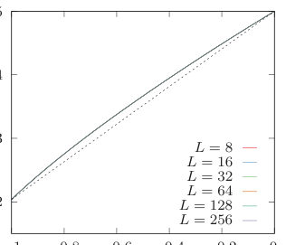
<figcaption class="paper-figure-caption"><b>Fig 4.</b> FIG. 5. Parametric plot showing nfmd vs. E/N. The dashed line connects the points (E/N, nfmd) for infinite and zero tem- perature, which shows that the relation between the two quan- tities is close-to-linear. Error bars are smaller than the line width.</figcaption>
</figure>
<figure class="paper-figure-card">
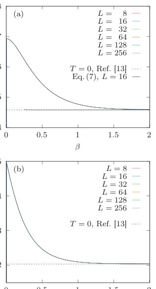
<figcaption class="paper-figure-caption"><b>Fig 5.</b> FIG. 4. (a) Entropy per site S/N, and (b) the fraction of ferromagnetically oriented diagonal interactions nfmd as func- tion of inverse temperature β for different system sizes L. In both cases, the zero-temperature results from Ref. [13] are indicated as dotted lines, and as for the energy and magneti- zation in Fig. 3 finite-size effects are negligible. In panel (a), the estimator for the residual entropy (7) evaluated for the L = 16 simulation data is shown as a solid black line, and it is in good visual agreement with the value of Ref. [13]. Error bars are smaller than the line width.</figcaption>
</figure>

**Summary.** This paper uses Population Annealing Monte Carlo simulations to accurately determine the ground-state entropy of the antiferromagnetic Ising model on the Shastry-Sutherland lattice. The results confirm the system's disordered ground state and provide a precise numerical value for the entropy, comparing it to established theoretical benchmarks. Furthermore, the authors analyze the geometry of the ground state by finding a power-law decay in the size distribution of local energy clusters.

**Why it may be interesting.** While focused on classical statistical mechanics, the use of advanced simulation techniques like Population Annealing and the rigorous analysis of ground-state degeneracy and cluster statistics are highly relevant to understanding complex quantum many-body ground states.

Detailed structure

**Main problem.** The primary goal is to compute the ground-state entropy of a classical spin system with high precision.

**Main result.** The calculated ground-state entropy for the specific lattice configuration is $0.45877778(10)$ per site, which agrees with advanced methods like CTMRG.

**Method.** The study employs the Population Annealing (PA) Monte Carlo simulation method to estimate the free energy and subsequently the ground-state entropy.

**Model / system.** The system is the classical antiferromagnetic Ising model defined on the Shastry-Sutherland lattice. The Hamiltonian includes both nearest-neighbor and diagonal couplings, allowing analysis across different coupling regimes ($\alpha$).

**Key observables.** Ground-state entropy ($S/N$), Energy ($E/N$), Specific Heat ($C_V$), Staggered Magnetization ($|M_s|$), and the size distribution of local energy clusters.

**Important parameters / regimes.** The coupling ratio $\alpha$ (determining the relative strength of diagonal vs. nearest-neighbor interactions) and the simulation temperature/inverse temperature ($eta$).

**Assumptions / limitations.** The analysis assumes the applicability of the PA method for sampling the ground state and that the system's behavior can be characterized by power-law or exponential decay in cluster statistics.

**Figures summary.** Figures illustrate the lattice structure, the evolution of energy, specific heat, and magnetization with inverse temperature ($eta$), and the cluster-size distribution for sites deviating from the ground-state energy.

**Paper structure.** The paper details the PA method for entropy estimation, applies it to the Ising model on the Shastry-Sutherland lattice to find $S(T=0)$, and concludes with a detailed analysis of the power-law decay of cluster sizes associated with non-ground-state local energies.

Abstract

We demonstrate how the population annealing Monte Carlo simulation method can be used to compute the ground-state entropy to high precision. This approach is tested for the classical antiferromagnetic Ising model on the Shastry-Sutherland lattice with diagonal couplings chosen twice as strong as the nearest-neighbor interactions. In the absence of an external magnetic field, the model is known to be disordered at all temperatures, with a macroscopically degenerate ground state. We find the ground-state entropy to be $0.458\,777\,78(10)$ per site, which is in good agreement with the estimate of a recent study using the corner transfer matrix renormalization group method. The sampled ground-state configurations are analyzed by considering the bond configurations, the local-energy configurations, and the spin-spin correlations. While all observations are consistent with the disordered nature of the ground state, the numerical data suggest a power-law decay of the size distribution of clusters of sites with local energies different from the ground-state level.

[↑ back to top](#top)

### [Arbitrary high-dimensional entanglement purification with the superposition of paths](http://arxiv.org/abs/2609.37136v1)

**Authors:** Zi-Han Zheng, Wen-Qiang Liu, Chen-Ming Bai, Hai-Rui Wei  
**Type:** theory · **Category:** quantum information and computing · **PDF:** <https://arxiv.org/pdf/2609.37136v1>  
**Analysis basis:** full PDF text, analyzed in chunks
**Topic relevance:** `quantum measurements` **2/5** · `interference shaping light` **1/5**

↔ Scroll figures horizontally

<figure class="paper-figure-card">
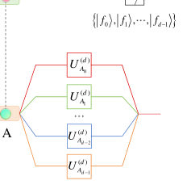
<figcaption class="paper-figure-caption"><b>Fig 1.</b> Fig. 2. Schematic diagram of the 𝑑-dimensional EPP for qutrit-flip or phase-flip errors using path superposition. Appropriate single-qudit operations 𝑈(𝑑) 𝐴𝑘and 𝑈(𝑑) 𝐵𝑘are chosen according to the type of error to be purified.</figcaption>
</figure>
<figure class="paper-figure-card">
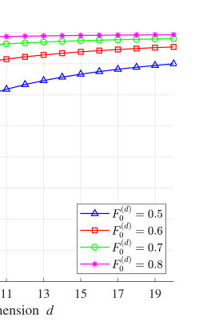
<figcaption class="paper-figure-caption"><b>Fig 2.</b> Fig. 5. Relationship between the purification fidelity 𝐿(𝑑) 0,0 and the dimension 𝑑for</figcaption>
</figure>
<figure class="paper-figure-card">
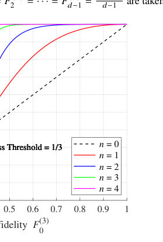
<figcaption class="paper-figure-caption"><b>Fig 3.</b> Fig. 6. Purification fidelity 𝐿(3) 0,0 as a function of the initial fidelity 𝐹(3) 0 for 𝑑= 3, with different iteration numbers 𝑛.</figcaption>
</figure>

**Summary.** This paper presents a scalable method for high-dimensional entanglement purification using the superposition of paths. It demonstrates that this protocol can correct both qudit-flip and phase-flip errors, achieving enhanced fidelity as the system dimension increases. The work is significant for advancing high-dimensional quantum communication networks.

**Why it may be interesting.** The work directly tackles noise resilience in high-dimensional quantum communication channels, which is a major frontier in quantum information science, and proposes a novel physical mechanism (path superposition) for implementation.

Detailed structure

**Main problem.** The paper addresses the challenge of implementing a scalable entanglement purification protocol (HDEPP) to combat noise in high-dimensional quantum entanglement.

**Main result.** The proposed protocol successfully purifies high-dimensional entangled states, showing that the purification fidelity actually increases as the dimension of the system increases.

**Method.** The method utilizes the physical realization of 'superposition of paths' combined with controlled single-qudit gates and measurements in the Fourier basis to perform the purification.

**Model / system.** The system involves high-dimensional qudit states ($d$-ary, $d>2$), specifically focusing on purifying Bell states distributed across spatial and frequency degrees of freedom using hyperentanglement.

**Key observables.** Purification fidelity ($\mathcal{L}$), initial fidelity ($\mathcal{F}$), and the ability to correct both qudit-flip and phase-flip errors.

**Important parameters / regimes.** The dimension $d$ of the qudits, the number of purification rounds ($n$), and the initial error rates.

**Assumptions / limitations.** The protocol assumes the physical realization of spatial path superposition is experimentally feasible and that the system can be modeled using hyperentanglement across different degrees of freedom.

**Figures summary.** Figures illustrate schematic diagrams for the EPP using path superposition (Fig. 1) and the optical implementation for purifying errors using spatial and frequency DOFs (Fig. 3, Fig. 4).

**Paper structure.** The paper first introduces the general HDEPP using path superposition for qutrit-flip/phase-flip errors, then generalizes this to arbitrary $d$-dimensions, and finally details the optical implementation using hyperentanglement across spatial and frequency modes.

Abstract

High-dimensional quantum entanglement offers significant advantages over its two-dimensional counterparts in various quantum information processing tasks. We propose a scalable method for implementing an arbitrary high-dimensional entanglement purification protocol (HDEPP) using path superposition. By selecting appropriate single-qudit gates, qudit-flip errors and phase-flip errors can be purified. Counterintuitively, the HDEPP becomes more robust for higher-dimensional systems and exhibits enhanced purification fidelity as the dimension increases. Our HDEPP not only requires fewer operational resources but also in principle can achieve unity fidelity through multiple rounds of iteration. Furthermore, we develop feasible optical schemes to purify the frequency degree of freedom of photons suffering from qudit-flip and phase-flip errors using hyperentanglement. This work paves the way toward high-dimensional quantum communication and quantum networks.

[↑ back to top](#top)

### [Consistent histories and the ultrametric on infinite tensor products](http://arxiv.org/abs/2609.37375v1)

**Authors:** Andrew Lesniewski  
**Type:** theory · **Category:** other · **PDF:** <https://arxiv.org/pdf/2609.37375v1>  
**Analysis basis:** full PDF text, analyzed in chunks
**Topic relevance:** `quantum measurements` **2/5** · `interference shaping light` **1/5**

↔ Scroll figures horizontally

<figure class="paper-figure-card">
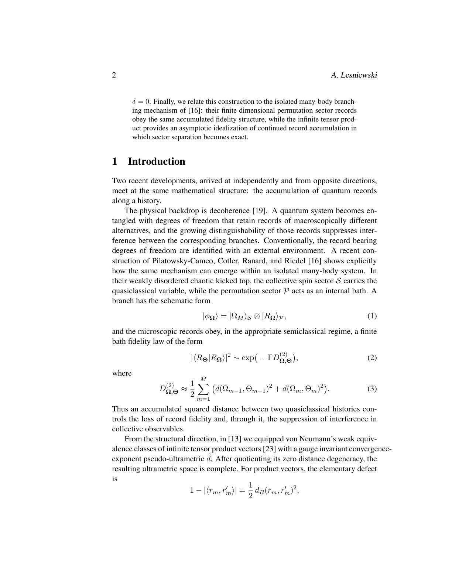
<figcaption class="paper-figure-caption"><b>Fig 1.</b> Low-resolution page preview, page 2</figcaption>
</figure>
<figure class="paper-figure-card">
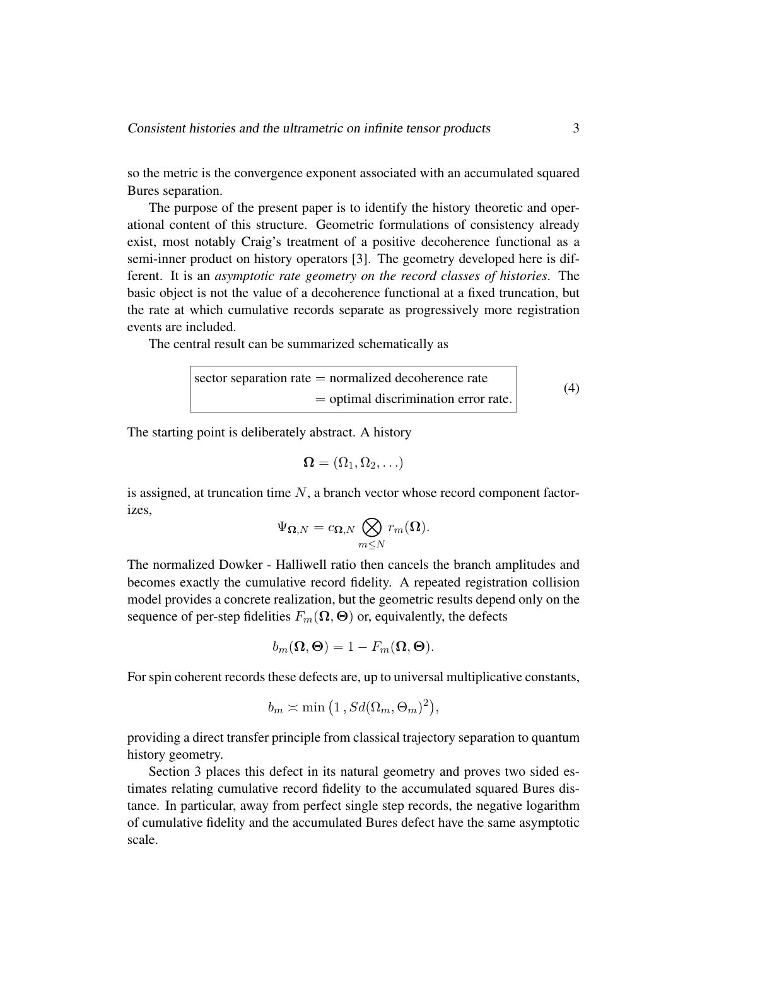
<figcaption class="paper-figure-caption"><b>Fig 2.</b> Low-resolution page preview, page 3</figcaption>
</figure>
<figure class="paper-figure-card">
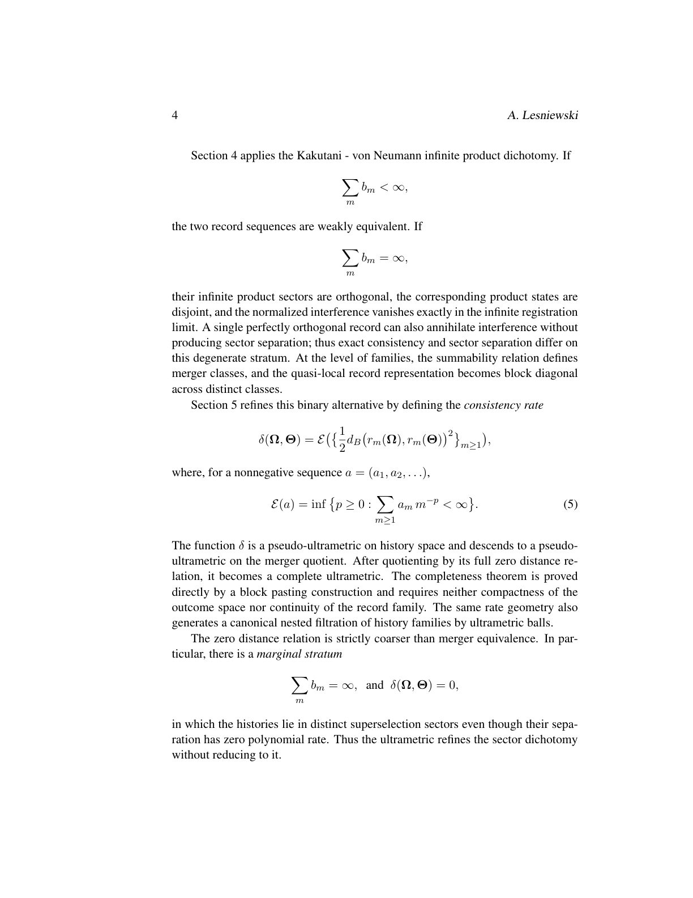
<figcaption class="paper-figure-caption"><b>Fig 3.</b> Low-resolution page preview, page 4</figcaption>
</figure>
<figure class="paper-figure-card">
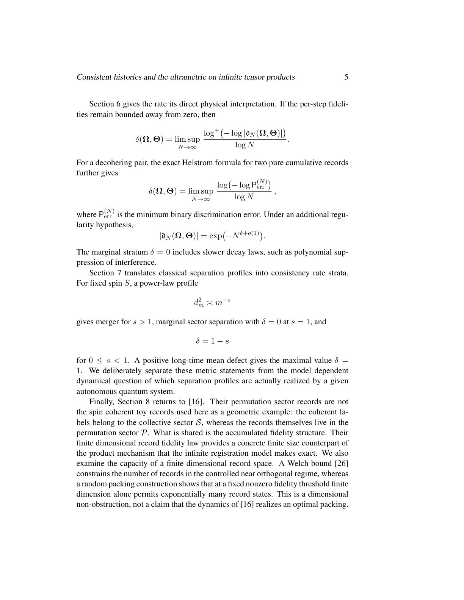
<figcaption class="paper-figure-caption"><b>Fig 4.</b> Low-resolution page preview, page 5</figcaption>
</figure>
<figure class="paper-figure-card">
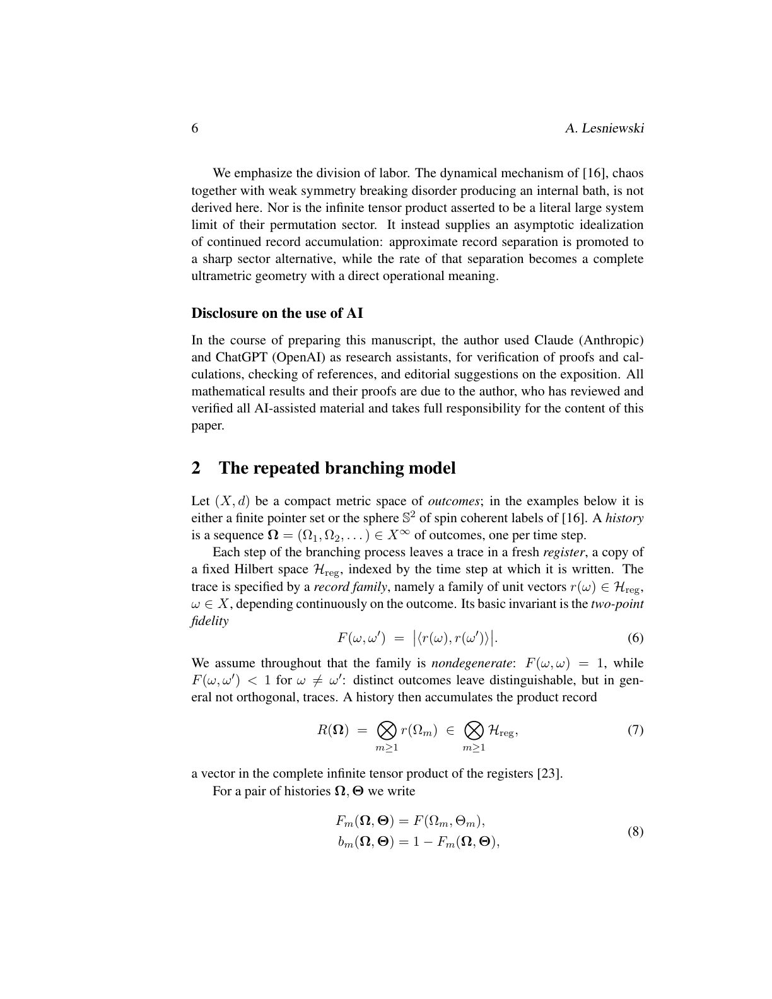
<figcaption class="paper-figure-caption"><b>Fig 5.</b> Low-resolution page preview, page 6</figcaption>
</figure>

**Summary.** This paper establishes a novel, rigorous geometry for quantum histories by defining a complete ultrametric based on the rate at which accumulated quantum records become distinguishable. This 'consistency rate' ($\delta$) quantifies the transition from quantum superposition to classical probability, linking fundamental concepts like interference decay and quantum error bounds. It provides a powerful mathematical tool for understanding decoherence in the infinite limit.

**Why it may be interesting.** It provides a deep mathematical tool (ultrametric geometry) to quantify the operational distinguishability between quantum histories, offering a rigorous framework for decoherence and the emergence of classicality in open quantum systems.

Detailed structure

**Main problem.** The paper develops a rigorous geometric framework for histories in quantum mechanics, specifically addressing how to assign classical probabilities to sequences of coarse-grained events when interference terms are considered in the infinite limit.

**Main result.** It constructs a complete ultrametric on the space of quantum histories, whose convergence exponent, the 'consistency rate' ($\delta$), has equivalent interpretations related to sector separation, interference decay, and minimum discrimination error.

**Method.** The analysis relies on extending the consistent histories formulation using the infinite tensor product structure and analyzing the decay of the normalized Dowker-Halliwell interference, which is controlled by the accumulated squared Bures distance.

**Model / system.** The model is the abstract quantum mechanical history space, formalized using an infinite tensor product structure to represent the accumulation of quantum records ($\Omega = (\Omega_1, \Omega_2, \dots)$). It compares this idealized infinite limit to finite-dimensional record packing constraints.

**Key observables.** Normalized Dowker-Halliwell interference, accumulated squared Bures distance, the consistency rate ($\delta$), and the minimum error probability for discriminating cumulative records.

**Important parameters / regimes.** The rate $\delta$ is determined by the asymptotic behavior of the per-step record defect $\{b_m\}$, which can follow power-law profiles $d^2m \propto m^{-s}$.

**Assumptions / limitations.** The use of the infinite tensor product is an asymptotic idealization, which bypasses finite-size packing constraints encountered in physical, finite-dimensional systems.

**Paper structure.** The paper builds from the definition of the consistent histories formulation to analyzing the decay of interference via the Bures distance. It applies the Kakutani-von Neumann dichotomy to characterize the asymptotic structure, culminating in the definition and interpretation of the ultrametric consistency rate $\delta$.

Abstract

The consistent histories formulation of quantum mechanics assigns classical probabilities to sequences of coarse-grained events when the corresponding interference terms vanish. In finite models these terms generically need not vanish exactly, and their smallness alone supplies no asymptotic geometry on the space of histories. We construct such a geometry for histories that accumulate quantum records. When the normalized Dowker - Halliwell interference between two histories factorizes as the cumulative fidelity of their records, its decay is controlled by the accumulated squared Bures distance. In the infinite registration limit, the Kakutani - von Neumann dichotomy gives a sharp sector alternative: summable Bures defect yields weakly equivalent record sequences, whereas nonsummable defect produces orthogonal superselection sectors and vanishing normalized interference. The convergence exponent of the Bures defect defines a pseudo-ultrametric on histories. After quotienting its zero distance degeneracy, it becomes a complete ultrametric, requiring neither compactness of the outcome space nor continuity of the record family, and coincides with the gauge invariant sector metric $\tilde d$ introduced in \cite{LesTP}. Its value, the \emph{consistency rate}, has three equivalent interpretations: it is the sector separation metric, the polynomial growth exponent of the negative logarithm of normalized interference, and, by the Helstrom formula, the corresponding exponent of the negative logarithm of the minimum error probability for discriminating the cumulative records. Classical separation profiles determine the rate: positive long time mean defect gives the maximal value $δ=1$, while the borderline profile $d_m^2\asymp m^{-1}$ produces distinct superselection sectors at zero polynomial rate, $δ=0$.

[↑ back to top](#top)

### [Correlation-assisted topological and metamagnetic transitions in Rashba-coupled superconductors: $t$-$J$-$U$ model study](http://arxiv.org/abs/2609.37812v1)

**Authors:** Tushar Dey, Maciej Fidrysiak, Józef Spałek  
**Type:** theory · **Category:** strongly correlated electrons · **PDF:** <https://arxiv.org/pdf/2609.37812v1>  
**Analysis basis:** full PDF text, analyzed in chunks
**Topic relevance:** `Keldysh / 2PI / non-Gaussian methods` **2/5** · `analog quantum simulation` **1/5**

↔ Scroll figures horizontally

<figure class="paper-figure-card">
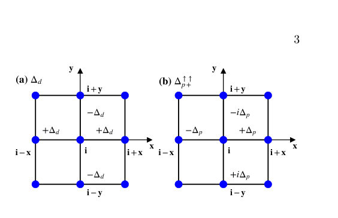
<figcaption class="paper-figure-caption"><b>Fig 1.</b> FIG. 1. Schematic real-space representation of SC bond am- plitudes for (a) singlet and (b) one of triplet components of the mixed parity order parameter, ∆d and ∆↑↑ p+, respectively. Lattice sites are marked by blue circles. The singlet ampli- tude remains invariant under spatial inversion and acquires phase π (equivalent to sign reversal) under spatial rotation by θ = π/2. (b) Equal-spin amplitudes contributing to ∆↑↑ p+ order parameter component are odd under inversion and ac- quire a relative phase of −π/2 under θ = π/2 spatial rotation. The remaining nonzero amplitude, ∆↓↓ p−, is not shown as it ex- hibits phase structure analogous to that illustrated in (b), yet acquires opposite...</figcaption>
</figure>
<figure class="paper-figure-card">
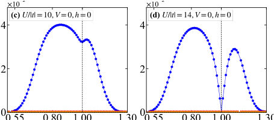
<figcaption class="paper-figure-caption"><b>Fig 2.</b> FIG. 2. Reference results for spin-orbit coupling and Zeeman field set to zero (V ≡0, h ≡0). The panels show the band- filling dependence of the singlet d-wave order parameter, ∆d, as well as equal-spin triplet p-wave components, ∆↑↑ p+ and ∆↓↓ p− (here equal to zero, indicating pure d-wave SC). The on-site Coulomb interaction is set to (a) U = 6|t|, (b) U = 8|t|, (c) U = 10|t|, and (d) U = 14|t|. The remaining parameters are t = −0.35 eV, t′ = 0.25|t|, J = 0.3|t|, kBT = 10−5|t|, and lattice of size has been set to N = 800 × 800. Metal- to-insulator transition at the half filling (n = 1) occurs in between U = 10|t| and U = 14|t|, cf. panels (c) and (d).</figcaption>
</figure>
<figure class="paper-figure-card">
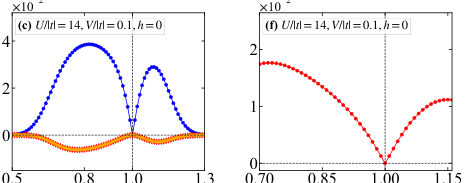
<figcaption class="paper-figure-caption"><b>Fig 3.</b> FIG. 3. Characteristics of the mixed-parity SC as a func- tion of electronic density for nonzero RSOC magnitude (V = 0.1|t|) and no applied Zeeman field (h = 0). The on-site Coulomb repulsion is set to U = 6|t| [(a) and (d)], U = 10|t| [(b) and (e)], and U = 14|t| [(c) and (f)], whereas the re- maining parameters are the same as those adopted in Fig. 2. Left panels detail singlet d-wave order parameter, ∆d, along- side the relevant equal-spin triplet p-wave components, ∆↑↑ p+ and ∆↓↓ p−(multiplied by a factor of 20 for clarity). Equal magnitudes of ∆↑↑ p+ and ∆↓↓ p−amplitudes are a consequence of time-reversal symmetry. Right panels show the corresponding ratios |∆↑↑ p+/∆d| (equivalent to...</figcaption>
</figure>
<figure class="paper-figure-card">
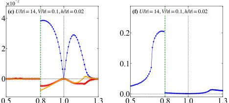
<figcaption class="paper-figure-caption"><b>Fig 4.</b> FIG. 4. Band-filling dependence of the SC and magnetic properties for nonzero RSOC and Zeeman field (V = 0.1, h = 0.02). The panels are organized according to increasing on-site Coulomb repulsion: U = 6|t| [(a), (d)], U = 10|t| [(b), (e)], and U = 14|t| [(c), (f)]. The remaining parameters are the same as those adopted in Sec. IV A. Left panels detail the band-filling evolution of the singlet (∆d) and triplet (∆↑↑ p+, ∆↓↓ p−) SC amplitudes, whereas right panels show the magne- tization. A discontinuity in both the SC amplitudes and the magnetization near n ≈0.8 for all considered values of U indi- cates first-order phase transition (marked by vertical dashed lines).</figcaption>
</figure>
<figure class="paper-figure-card">
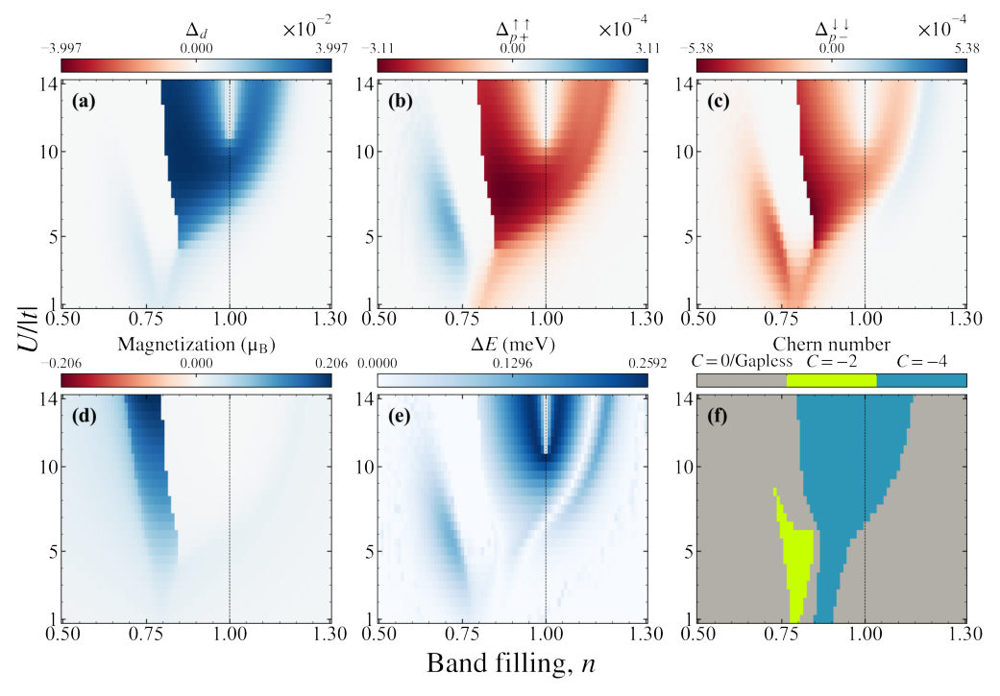
<figcaption class="paper-figure-caption"><b>Fig 5.</b> FIG. 5. Band filling vs. on-site Coulomb repulsion phase diagram of RSOC-coupled t-J-U model in an applied Zeeman field. The adopted parameters are t = −0.35 eV, t′ = 0.25|t|, J = 0.3|t|, V = 0.1, h = 0.02, kBT = 10−5|t|, and lattice size is set to N = 800 × 800. The top row shows (a) the singlet d-wave amplitude ∆d, as well as equal-spin triplet components (b) ∆↑↑ p+ and (c) ∆↓↓ p−. The bottom row details the corresponding (d) magnetization (in µB), (e) bulk energy gap ∆E (in meV), and (f) Chern number C. A sharp discontinuity is apparent across the parameter space in panels (a-e) for n ≈0.8, signaling a first-order phase transition. In particular, the C = −2 state is reachable via the...</figcaption>
</figure>

**Summary.** This theoretical study examines how combining strong electronic correlations with Rashba spin-orbit coupling affects superconductivity in cuprate-like materials. Using the $t$-$J$-$U$ model, the authors pinpoint a correlation-driven topological superconducting state ($C=\pm 2$) that manifests alongside distinct metamagnetic transitions. The work highlights the necessity of correlation effects beyond mean-field theories to accurately map the phase diagram of such complex superconductors.

**Why it may be interesting.** The explicit inclusion of RSOC and its interaction with strong correlations provides a rich platform for studying topological superconductivity beyond standard BCS theory, which is relevant for understanding exotic superconducting phases in correlated materials.

Detailed structure

**Main problem.** The study investigates the joint effects of electronic correlations and Rashba-type spin-orbit coupling (RSOC) on superconducting pairing, focusing on emergent topological and metamagnetic transitions.

**Main result.** The authors identify a distinct $C = \pm 2$ Topological Superconducting (TSC) state driven specifically by electronic correlations, which is accompanied by discontinuous metamagnetic and Lifshitz transitions.

**Method.** The analysis employs the Statistically-Consistent Variational Approximation (SGA) applied to the $t$-$J$-$U$ model, analyzing phase diagrams and free-energy differences.

**Model / system.** The system is modeled using the $t$-$J$-$U$ Hamiltonian augmented with RSOC and a Zeeman field, applied to a square lattice structure relevant to cuprate superconductors.

**Key observables.** Chern number ($C$), SC order parameter components ($\Delta_d$, $\Delta_p$), magnetization, and the free-energy difference ($\Delta F$).

**Important parameters / regimes.** On-site Coulomb repulsion ($U$), RSOC magnitude ($V$), and Zeeman field ($h$) are varied across different doping regimes near half-filling.

**Assumptions / limitations.** The analysis relies on the SGA approximation and restricts the variational space to maintain lattice translational symmetry, excluding long-range SDW or CDW orders.

**Figures summary.** Figures illustrate the evolution of SC amplitudes, energy gaps, and magnetization as a function of band filling, showing hysteresis loops and transitions between different topological states ($C=\pm 4$ vs $C=\pm 2$).

**Paper structure.** The paper systematically analyzes the phase diagram by varying correlation strength ($U$) and doping, comparing results obtained from the $t$-$J$-$U$ model against simpler weak-coupling schemes (BdG) to isolate correlation-driven physics.

Abstract

Unconventional superconductivity commonly emerges in systems characterized by strong electronic correlations, with layered copper-oxides serving as a canonical example. Observation of spin-momentum locking within Bi-family of the cuprates, compatible with the presence of non-negligible Rashba-type spin-orbit coupling (RSOC), calls for an investigation of the joint effects of electronic correlations and RSOC on pairing in copper-oxide and related superconductors. Employing statistically-consistent variational approximation (SGA), we carry out such an analysis by constructing the phase diagram for the case of square-lattice \textit{t-J-U} model incorporating RSOC. We also investigate the effects of time-reversal-symmetry breaking by Zeeman field, as well as characterize emergent topological superconducting (TSC) states. Chern number $C = \pm 4$ TSC is found in a broad regime of on-site Coulomb repulsion close to half-filling. The latter is not governed by correlations and emerges also within the weak-coupling Bogoliubov-de Gennes (BdG) scheme. Yet, we identify a distinct $C = \pm 2$ TSC state that is driven specifically by electronic correlations via a topological transition occurring with no bulk quasiparticle gap closure, and is accompanied by discontinuous metamagnetic and Lifshitz transitions. Moreover, a qualitatively distinct doping evolution of the $d$- and $p$-wave components of the underlying mixed-parity SC order parameter above the metal-to-insulator transition is demonstrated. Our work points toward the relevance of joint correlation and RSOC effects beyond BdG scheme to phase diagrams of RSOC-coupled superconductors.

[↑ back to top](#top)

### [Resonance Breaking in Noisy Shor's Algorithm](http://arxiv.org/abs/2609.37636v1)

**Authors:** Zhengwei Liu  
**Type:** theory · **Category:** quantum information and computing · **PDF:** <https://arxiv.org/pdf/2609.37636v1>  
**Analysis basis:** full PDF text, analyzed in chunks
**Topic relevance:** `quantum measurements` **2/5** · `Keldysh / 2PI / non-Gaussian methods` **1/5**

↔ Scroll figures horizontally

<figure class="paper-figure-card">
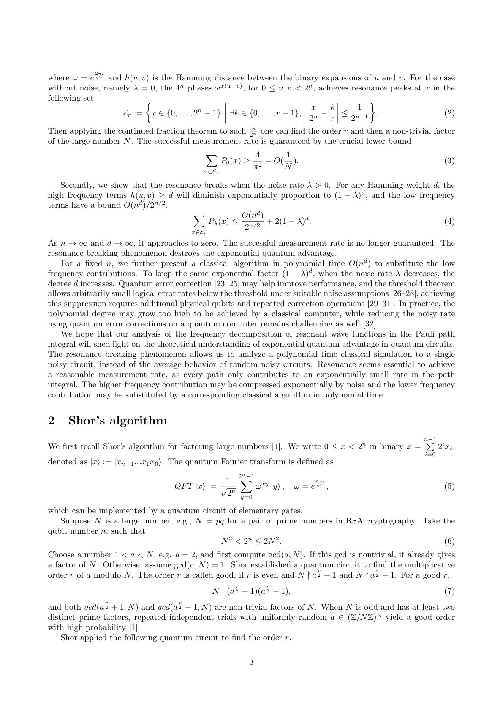
<figcaption class="paper-figure-caption"><b>Fig 1.</b> Low-resolution page preview, page 2</figcaption>
</figure>
<figure class="paper-figure-card">
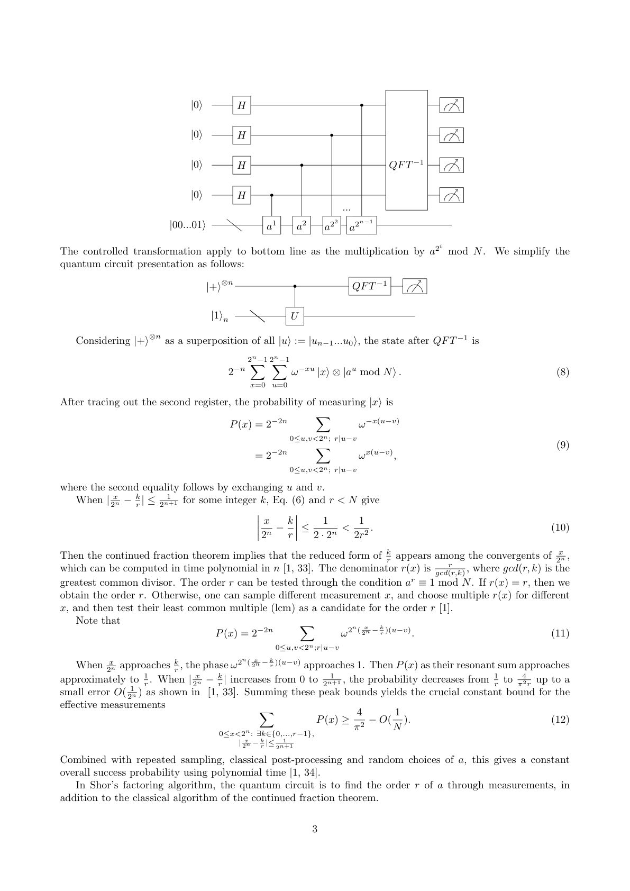
<figcaption class="paper-figure-caption"><b>Fig 2.</b> Low-resolution page preview, page 3</figcaption>
</figure>
<figure class="paper-figure-card">
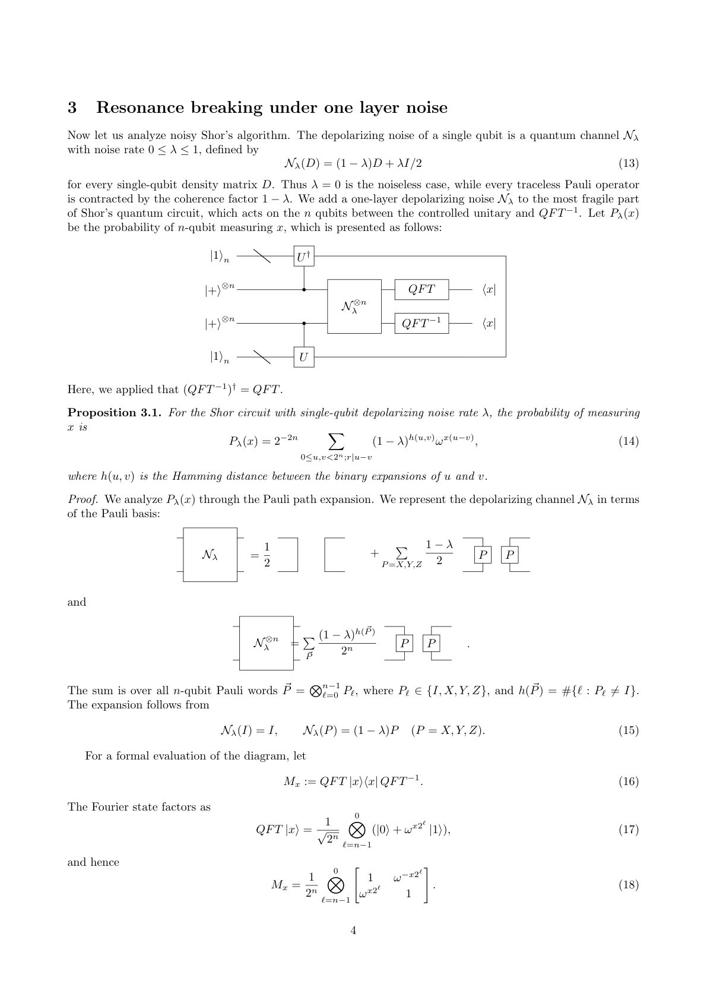
<figcaption class="paper-figure-caption"><b>Fig 3.</b> Low-resolution page preview, page 4</figcaption>
</figure>
<figure class="paper-figure-card">
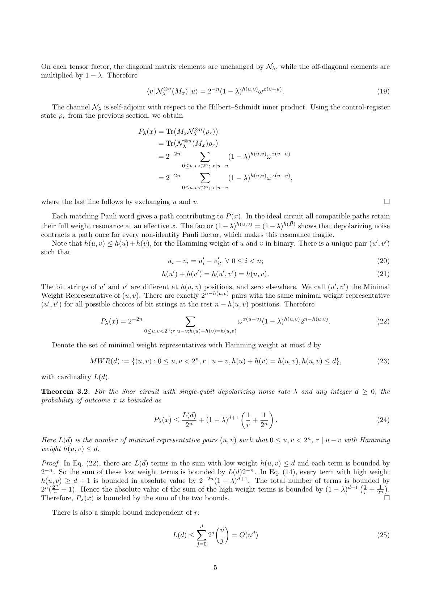
<figcaption class="paper-figure-caption"><b>Fig 4.</b> Low-resolution page preview, page 5</figcaption>
</figure>
<figure class="paper-figure-card">
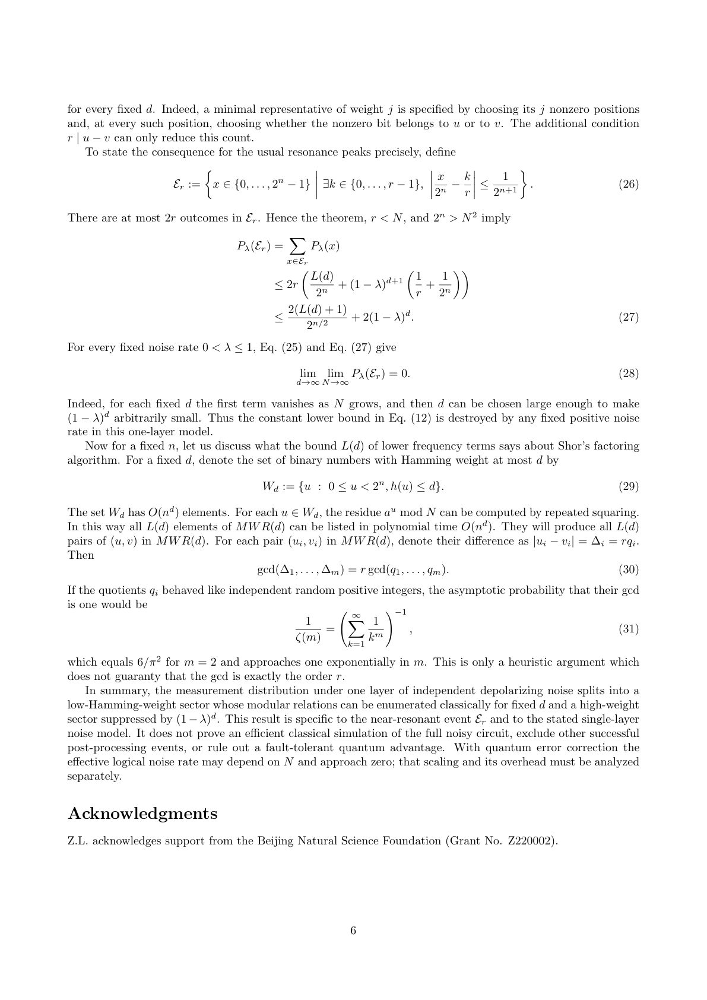
<figcaption class="paper-figure-caption"><b>Fig 5.</b> Low-resolution page preview, page 6</figcaption>
</figure>

**Summary.** This paper proves that Shor's algorithm loses its exponential quantum advantage when subjected to even arbitrarily small amounts of depolarizing noise. By analyzing the measurement probability using the Pauli path integral, the authors show that the characteristic resonance peaks decay exponentially with the noise rate. This suggests that practical quantum computation requires error correction beyond the scope of the analyzed noise model.

**Why it may be interesting.** It provides a concrete, quantitative demonstration of how realistic noise models can fundamentally undermine the theoretical speedup of quantum algorithms, which is crucial for assessing near-term quantum hardware feasibility.

Detailed structure

**Main problem.** The paper analyzes how the exponential quantum advantage of Shor's algorithm breaks down when the quantum circuit is subjected to noise.

**Main result.** The presence of any small, non-zero depolarizing noise rate causes the measurement probability associated with the resonant peaks to decay exponentially, destroying the quantum advantage.

**Method.** The analysis uses the Pauli path integral expansion to calculate the measurement probability distribution in the presence of noise, comparing the noisy result to the noiseless ideal case.

**Model / system.** The model is Shor's quantum circuit used for factoring, specifically analyzing the effect of independent single-qubit depolarizing noise of rate $\lambda$ applied to the control register.

**Key observables.** The probability of measuring a specific bit-string $x$, denoted $P_\lambda(x)$, and the measurement rate within the resonance set $E_r$.

**Important parameters / regimes.** The noise rate $\lambda$, the number of qubits $n$, and the Hamming weight $d$ of the Pauli word.

**Assumptions / limitations.** The analysis is restricted to a single layer of depolarizing noise, and the conclusion does not rule out fault-tolerant quantum advantage.

**Paper structure.** The paper first establishes the noiseless resonance peak probability using the Pauli path integral. It then derives the noisy probability $P_\lambda(x)$ and shows that the high-frequency terms decay as $(1-\lambda)^d$, while the low-frequency terms are bounded by $O(nd)/2^{n/2}$, leading to the conclusion that the total rate vanishes for $\lambda > 0$.

Abstract

We argue that the exponential quantum advantage in Shor's algorithm is broken under one-layer depolarizing noise of arbitrary small error rate, by analyzing a resonance breaking phenomenon in noisy quantum circuits. First, we express the distribution of measurements on $n$-qubit strings as the superposition of the $4^n$ wave functions in the Pauli path integral. In the noiseless case, the bit-strings achieving resonant peaks guaranteed a constant rate of successful measurements to factor a large number. Secondly, when the middle layer of the quantum circuit has independent depolarizing noise of rate $λ$, for any Hamming weight $d$, we obtain corresponding measurement rate bounded by $2(1-λ)^d$ for higher frequency terms and by $O(n^d)/2^{n/2}$ for low frequency terms. The rate approaches to zero as $n$ and $d$ approaches to infinity. Resonance breaking destroys the exponential quantum advantage. Furthermore, we design a classical factoring algorithm in polynomial time $O(n^d)$ to substitute the low frequency contribution.

[↑ back to top](#top)

### [A commuting operator self-test for exact entanglement embezzlement](http://arxiv.org/abs/2609.38083v1)

**Authors:** Connor Paddock, Simon Schmidt  
**Type:** theory · **Category:** other · **PDF:** <https://arxiv.org/pdf/2609.38083v1>  
**Analysis basis:** full PDF text, analyzed in chunks
**Topic relevance:** `quantum measurements` **2/5**

↔ Scroll figures horizontally

<figure class="paper-figure-card">
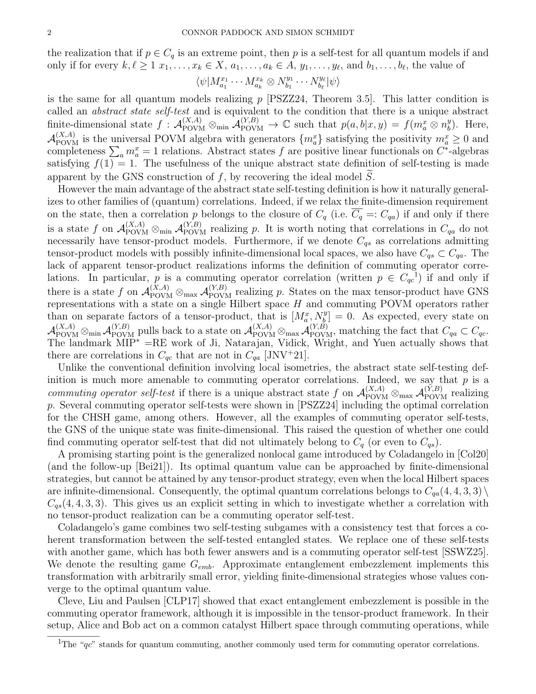
<figcaption class="paper-figure-caption"><b>Fig 1.</b> Low-resolution page preview, page 2</figcaption>
</figure>
<figure class="paper-figure-card">
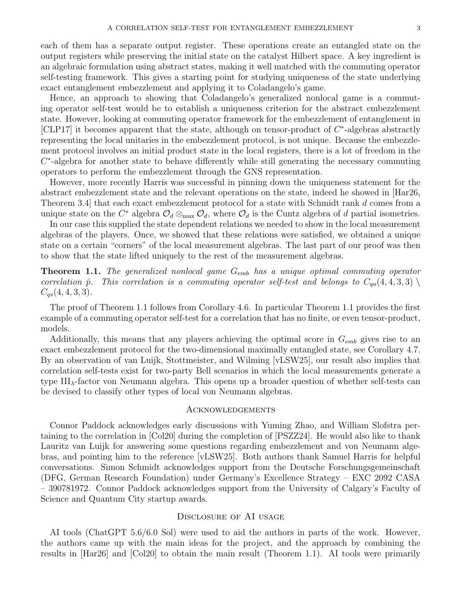
<figcaption class="paper-figure-caption"><b>Fig 2.</b> Low-resolution page preview, page 3</figcaption>
</figure>
<figure class="paper-figure-card">
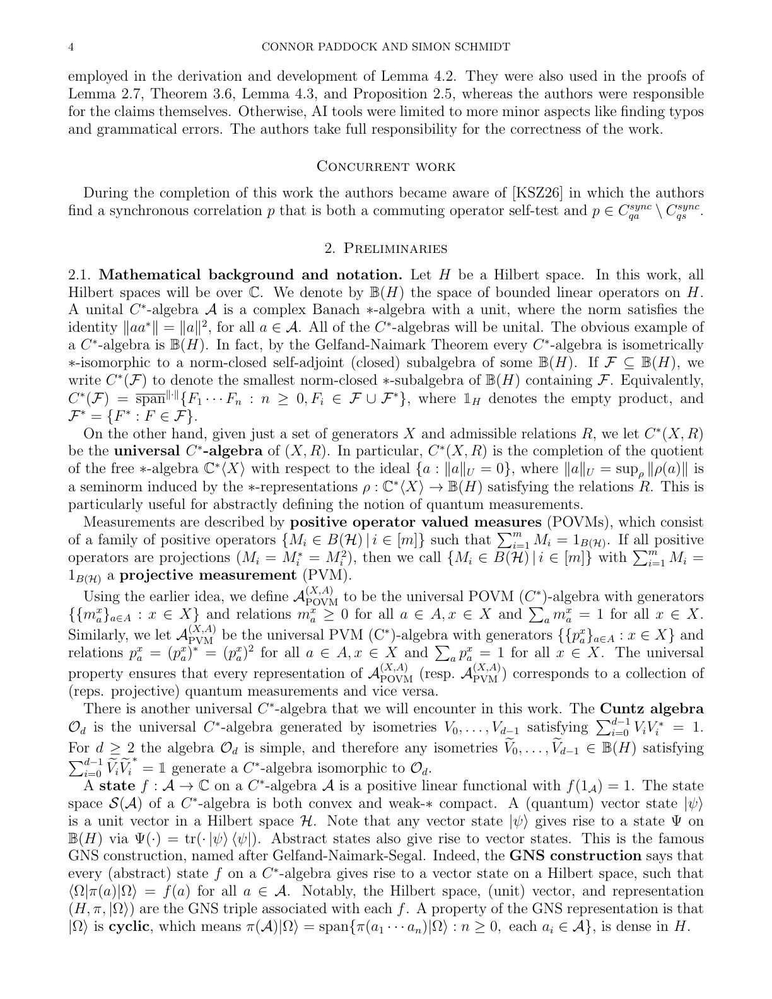
<figcaption class="paper-figure-caption"><b>Fig 3.</b> Low-resolution page preview, page 4</figcaption>
</figure>
<figure class="paper-figure-card">
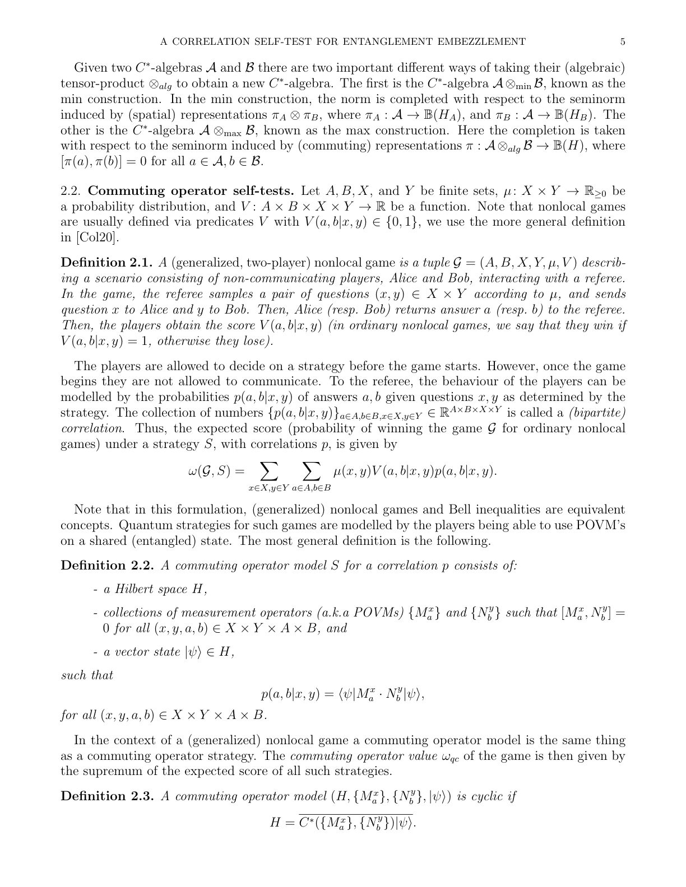
<figcaption class="paper-figure-caption"><b>Fig 4.</b> Low-resolution page preview, page 5</figcaption>
</figure>
<figure class="paper-figure-card">
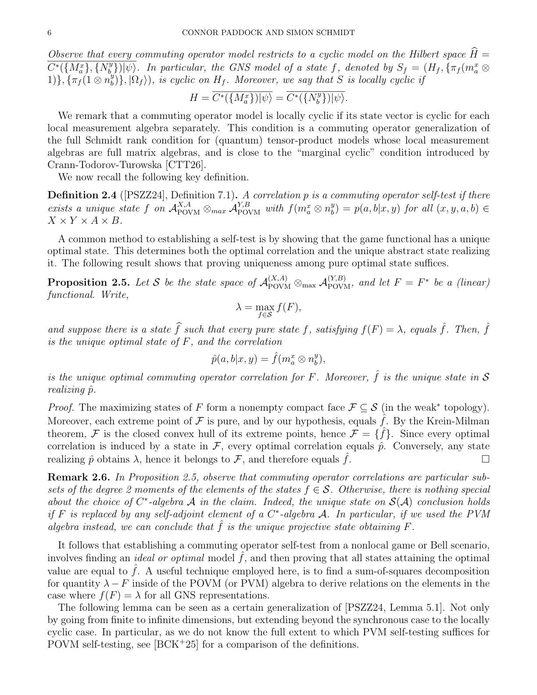
<figcaption class="paper-figure-caption"><b>Fig 5.</b> Low-resolution page preview, page 6</figcaption>
</figure>

**Summary.** This theoretical paper develops a framework for 'commuting operator self-tests' to characterize quantum correlations. It applies this framework to a game based on entanglement embezzlement, proving that the optimal correlation is a unique self-test. Crucially, the result demonstrates a correlation that cannot be modeled by simple tensor products, advancing the understanding of quantum resource theories.

**Why it may be interesting.** This work pushes the boundaries of quantum information theory by using abstract operator algebra tools to classify quantum correlations, providing a rigorous mathematical tool (the self-test) to detect non-local quantum resources that defy simple tensor product descriptions.

Detailed structure

**Main problem.** The paper investigates the characterization of quantum correlations, specifically focusing on determining when the optimal correlation for an entanglement embezzlement protocol can be uniquely described by a commuting operator self-test.

**Main result.** The optimal correlation for the entanglement embezzlement game ($G_{emb}$) is shown to be a commuting operator self-test that cannot be realized by any standard quantum tensor-product model, providing a novel example in the field.

**Method.** The analysis heavily employs advanced $C^*$-algebraic techniques, including the use of Cuntz algebras and abstract state characterizations, to prove the uniqueness and non-factorizability of the optimal quantum state.

**Model / system.** The model is a generalized two-player nonlocal game ($G_{emb}$) involving commuting measurements on a joint state, which is mathematically formalized using commuting operator correlations ($\mathcal{C}_{qc}$) within the framework of operator algebras.

**Key observables.** The optimal correlation $\hat{p}$ for the game $G_{emb}$, and the associated unique abstract state $f$ on the tensor product of local measurement algebras.

**Important parameters / regimes.** The structure of the local measurement algebras (related to $M_3(\mathbb{C})$ and $M_2(\mathbb{C})$) and the entanglement state $|\Phi_2
angle$.

**Assumptions / limitations.** The proof relies on advanced theorems from operator algebras, such as Harris' unique abstract state characterization and the properties of GNS representations.

**Paper structure.** The paper builds from defining the commuting operator self-test framework, applying it to the specific entanglement embezzlement game $G_{emb}$, and culminating in the proof that the optimal correlation is a unique self-test lacking a tensor-product realization.

Abstract

We show that the optimal commuting operator correlation for a variant of Coladangelo's two-player generalized nonlocal game, based on the embezzlement of entanglement, is a commuting operator self-test. Our result gives the first correlation self-test for an exact entanglement embezzlement protocol in the commuting operator framework. Because the unique optimal correlation necessitates the exact embezzlement of entanglement, the correlation is unrealizable using quantum tensor-product models, even if the local spaces are allowed to be infinite dimensional. As such, our result provides an example of a commuting operator self-test where the Hilbert space shared by the two parties cannot be factored into a tensor-product of local spaces that is compatible with the local measurement operators. Our main proof technique relies on Harris' unique abstract state characterization of exact embezzlement of entanglement involving Cuntz algebras.

[↑ back to top](#top)

### [Classical Verification of Quantum Computation with Quasilinear Resources, from Compiled Nonlocal Games](http://arxiv.org/abs/2609.38060v1)

**Authors:** Finn Holler, Anand Natarajan  
**Type:** theory · **Category:** quantum information and computing · **PDF:** <https://arxiv.org/pdf/2609.38060v1>  
**Analysis basis:** full PDF text, analyzed in chunks
**Topic relevance:** `quantum measurements` **2/5**

↔ Scroll figures horizontally

<figure class="paper-figure-card">
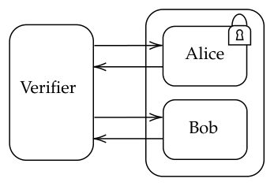
<figcaption class="paper-figure-caption"><b>Fig 1.</b> Figure 1: Schematic of a compiled nonlocal game. Lock denotes quantum fully homomorphic encryption. Both ‘Alice’ and ‘Bob’ are invocations of the same single prover and are only distinguished for illustrative purposes. Communication is sequential and flows from top to bottom.</figcaption>
</figure>
<figure class="paper-figure-card">
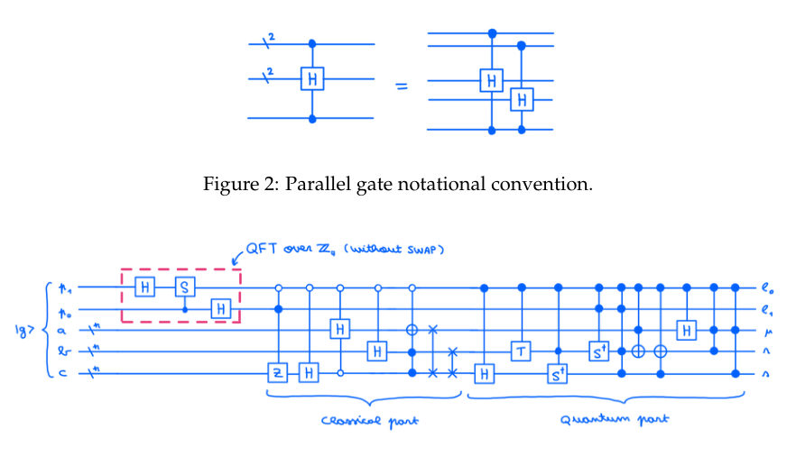
<figcaption class="paper-figure-caption"><b>Fig 2.</b> Figure 3: Explicit circuit implementation of UQFT for Cn in chosen basis. Note that we are using a slightly ambiguous notational convention for parallel gates.</figcaption>
</figure>
<figure class="paper-figure-card">
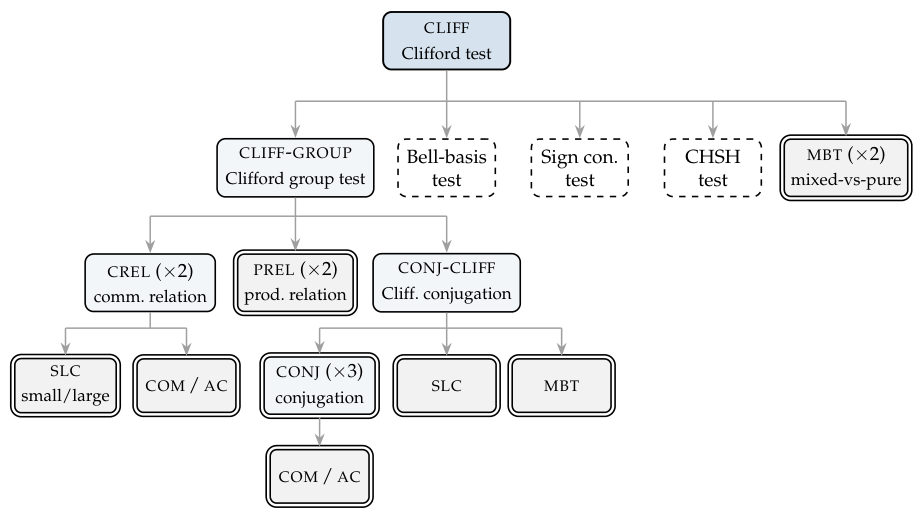
<figcaption class="paper-figure-caption"><b>Fig 3.</b> Figure 4: Protocol structure of the Clifford test. An arrow points from each test to the subtests it invokes. Solid boxes are protocols defined in this section; the darkest is the top-level Clifford test (protocol 11), gray boxes are the primitive tests, and dashed boxes are subtests specified inline within protocol 11. Double outlines mark leaf tests that are executed as CON(T) (cf. the consistency convention above); named dispatchers (CLIFF-GROUP, CREL, CONJ-CLIFF) have a single outline and are unwrapped, as are the Clifford test itself and the inline subtests. A multiplicity “×k” indicates that the protocol is invoked k times (with different operator sets); e.g. CREL and PREL are each...</figcaption>
</figure>

**Summary.** This paper develops a method to classically verify quantum computations (BQP) using quantum self-testing techniques. It achieves a quasilinear resource bound by leveraging the LWE assumption and adapting protocols from the multi-prover setting to a single-prover setting. This advances the understanding of verifiable quantum computation in the circuit model.

**Why it may be interesting.** While focused on complexity theory, the rigorous analysis of quantum state verification and the use of advanced cryptographic tools like LWE make it highly relevant for understanding the physical limits of quantum information processing.

Detailed structure

**Main problem.** The paper aims to construct the first argument system for BQP (Bounded-error Quantum Polynomial time) with quasilinear total resource requirements in the circuit model, enabling classical verification of quantum computation.

**Main result.** They achieve this by using computational self-testing based on the LWE assumption, resulting in a resource requirement of O(poly(λ, log g) * g) for a circuit with g gates.

**Method.** The approach combines computational self-testing, the LWE assumption, and the application of a compiler (Kalai et al.) to translate multi-prover nonlocal games into a single-prover argument system.

**Model / system.** The model is quantum computation realized through quantum circuits involving single-qubit Clifford observables ($\sigma_X, \sigma_Y, \sigma_Z$). The verification process is classical, relying on cryptographic assumptions.

**Key observables.** Winning probabilities ($p_{win}$), commutator norms ($\|[W_1, W_2]\|^2$), and the verification error rate.

**Important parameters / regimes.** LWE security parameter ($\lambda$), number of gates ($g$), and the error parameter ($\epsilon$).

**Assumptions / limitations.** The primary assumptions include the Learning with Errors (LWE) assumption and the sub-exponential hardness of LWE for non-uniform quantum adversaries.

**Figures summary.** Figure 1 schematically illustrates a compiled nonlocal game structure. Figure 3 shows the structure of a quantum circuit implementing a specific transformation.

**Paper structure.** The paper builds the argument system by first establishing a computational self-test for certifying quantum states, then using this test to dequantize efficient verification protocols, and finally applying a compiler to adapt the result from a multi-prover to a single-prover setting.

Abstract

Computational self-testing gives a classical verifier command over the quantum register of a single computationally bounded prover. We use this framework to construct the first argument system for BQP with quasilinear total resource requirements in the circuit model. Our argument system is based on the learning with errors (LWE) assumption and requires total resources of $O(\mathrm{poly}(λ, \log g)\cdot g)$ for delegating a circuit with $g$ gates, where $λ$ is the LWE security parameter. This is achieved by constructing a new computational self-test for certifying the prover's quantum state and using it to dequantize the efficient verification protocol of Broadbent (ToC 2018). Specifically, this self-test enables the verifiable, random remote state preparation of tensor product states of the single-qubit Clifford observables $σ_X, σ_Y, σ_Z, (σ_Y-σ_X)/\sqrt{2}$ and $(σ_Y+σ_X)/\sqrt{2}$, with constant robustness: the verification error is independent of the number of prepared qubits. This approach was first proposed by Coladangelo et al. (ToC 2024) in the multi-prover setting. We replicate their result in the single-prover setting by applying the compiler proposed by Kalai et al. (STOC 2023)---which turns any nonlocal game into a single-prover argument system---to a modified version of their self-test.

[↑ back to top](#top)

### [Collectivity limits quantum entanglement](http://arxiv.org/abs/2609.36113v1)

**Authors:** Donghoon Kim, Tomotaka Kuwahara  
**Type:** theory · **Category:** statistical mechanics · **PDF:** <https://arxiv.org/pdf/2609.36113v1>  
**Analysis basis:** full PDF text, analyzed in chunks
**Topic relevance:** `analog quantum simulation` **2/5**

↔ Scroll figures horizontally

<figure class="paper-figure-card">
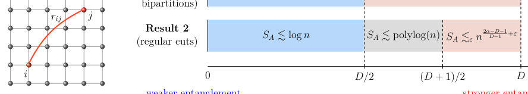
<figcaption class="paper-figure-caption"><b>Fig 1.</b> FIG. 1. Model and overview of the entanglement bounds. (a) Kac-normalized power-law interactions on a D-dimensional lattice. (b) For arbitrary bipartitions (Result 1), the entanglement entropy SA(|Ω⟩) is bounded logarithmically below the first threshold α = D/2 and, above it, by the subvolume power n(2α−D)/D up to a logarithmic factor. For regular codimension-one cuts (Result 2), such as half-system cuts or box-like regions, it admits a polylogarithmic bound below the second threshold α = (D + 1)/2 and, above it, a subvolume power-law bound with exponent arbitrarily close to (2α −D −1)/(D −1).</figcaption>
</figure>
<figure class="paper-figure-card">
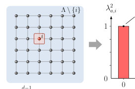
<figcaption class="paper-figure-caption"><b>Fig 2.</b> FIG. 2. Collective suppression of the one-site Schmidt spec- trum. The dominant Schmidt weight satisfies λ2 0,i ≥1−q∗at every site, while the total weight of all subleading Schmidt components is at most q∗. Throughout the Kac-normalized regime 0 ≤α &lt; D, the maximal one-site Schmidt tail q∗ad- mits a system-size-dependent upper bound that vanishes as n →∞, so the local Schmidt spectrum becomes increasingly concentrated on its leading component; the corresponding regime-dependent scaling is given in Eq. (10).</figcaption>
</figure>
<figure class="paper-figure-card">
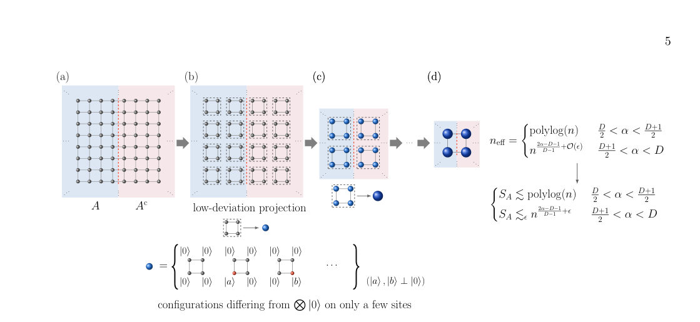
<figcaption class="paper-figure-caption"><b>Fig 3.</b> FIG. 3. Multiscale collective suppression across a regular cut. (a) A microscopic lattice separated by a regular codimension- one cut. (b) The lattice is partitioned into blocks, and each block is restricted to a low-deviation sector. (c) The retained block space becomes one effective site on a coarse lattice, allowing the same construction to be iterated. (d) The coarse-graining procedure is continued up to a stopping scale at which the effective interaction and local-deviation bounds remain controlled. For D/2 &lt; α &lt; (D +1)/2, this reduces the effective system to neff = polylog(n) sites. For (D +1)/2 &lt; α &lt; D, the controlled</figcaption>
</figure>

**Summary.** This paper rigorously analyzes how quantum entanglement is limited in systems with long-range interactions by introducing the concept of 'collectivity.' It derives sharp upper bounds on entanglement entropy, showing that the scaling depends critically on the interaction decay exponent $\alpha$ relative to geometric thresholds. This work advances the understanding of quantum correlations beyond simple spatial locality arguments.

**Why it may be interesting.** The identification of 'collectivity' as a fundamental constraint mechanism provides a powerful, non-local tool for bounding entanglement, which is crucial for understanding quantum correlations in complex, interacting many-body systems.

Detailed structure

**Main problem.** The central problem is understanding the fundamental physical mechanisms that constrain the entanglement entropy in many-body quantum systems, especially when interactions are long-range.

**Main result.** The work establishes 'collectivity' as a mechanism, alongside spatial locality, that rigorously constrains entanglement scaling, yielding improved bounds (e.g., polylogarithmic) for regular bipartitions compared to arbitrary ones.

**Method.** The analysis combines rigorous spectral gap estimates, concentration inequalities on the one-site Schmidt spectrum, and a Mean-Field Renormalization Group (MFRG) construction for geometric cuts.

**Model / system.** The study analyzes generic gapped Hamiltonians on a D-dimensional lattice with Kac-normalized power-law interactions decaying as $r^{-\alpha}$. A fermionic pairing model is used to provide a concrete, solvable illustration of the general theory.

**Key observables.** Entanglement entropy ($S_A$), one-site Schmidt spectrum concentration ($q^*$), and the spectral gap ($\Delta$).

**Important parameters / regimes.** The interaction decay exponent $\alpha$ relative to critical thresholds $D/2$ and $(D+1)/2$, and the lattice dimension $D$.

**Assumptions / limitations.** The system is assumed to have a unique, normalized ground state with a finite spectral gap ($\Delta > 0$).

**Figures summary.** Figures illustrate the scaling of entanglement entropy ($S_A$) versus system size ($n$) for various $\alpha$ regimes, showing distinct transitions at $\alpha = D/2$ and $\alpha = (D+1)/2$.

**Paper structure.** The paper first establishes general bounds for arbitrary bipartitions using fluctuation analysis, then improves these bounds for regular codimension-one cuts using an MFRG approach, and finally confirms these results using a solvable quadratic fermionic model.

Abstract

Understanding what limits many-body quantum entanglement is a central problem in physics. Spatial locality has long provided a fundamental mechanism: correlations between a region and its complement must be mediated through a small spatial interface, thereby constraining their entanglement. Here we show that universal constraints on entanglement can persist even when interactions are strongly nonlocal, through collectivity: many weak interactions suppress collective quantum fluctuations while retaining a finite overall interaction scale. We establish this mechanism rigorously for generic gapped Hamiltonians with Kac-normalized power-law interactions $r^{-α}$ on a $D$-dimensional lattice. For arbitrary bipartitions, we prove that the ground-state entanglement scales at most logarithmically with system size for $α<D/2$ and subextensively for $D/2<α<D$, due to suppressed collective fluctuations around individual sites. For spatially regular bipartitions with codimension-one boundaries, we show that collective suppression can be propagated to successively larger length scales through a renormalization-group construction. As a result, we prove that the entanglement bound improves to polylogarithmic scaling for $D/2<α<(D+1)/2$, and remains parametrically stronger than the arbitrary-bipartition bound for $(D+1)/2<α<D$. Together, these results reveal collectivity as a fundamental mechanism for constraining many-body entanglement alongside spatial locality.

[↑ back to top](#top)

### [Device-independent quantification of steerability in tripartite scenario](http://arxiv.org/abs/2609.36907v1)

**Authors:** Xin-Hong Wang, Miao-Tzu Lin, Shin-Liang Chen  
**Type:** theory · **Category:** quantum information and computing · **PDF:** <https://arxiv.org/pdf/2609.36907v1>  
**Analysis basis:** full PDF text, analyzed in chunks
**Topic relevance:** `quantum measurements` **2/5**

↔ Scroll figures horizontally

<figure class="paper-figure-card">
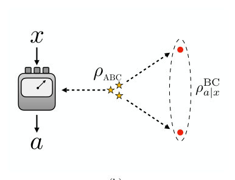
<figcaption class="paper-figure-caption"><b>Fig 1.</b> FIG. 1. The two tripartite steering scenarios considered in this work. Three parties share a quantum state ρABC. The measurement devices of the steering parties are uncharacter- ized black boxes, which return an outcome for each input; the steered side is described by the conditional states. (a) The 2-steer-1 scenario: Alice and Bob, upon receiving the inputs x and y, return the outcomes a and b, and Charlie’s condi- tional states are steered to the assemblage {ρC ab|xy}a,b,x,y of Eq. (11). (b) The 1-steer-2 scenario: Alice, upon receiving the input x, returns the outcome a, and Bob and Charlie are jointly left with the assemblage {ρBC a|x}a,x of Eq. (20).</figcaption>
</figure>
<figure class="paper-figure-card">
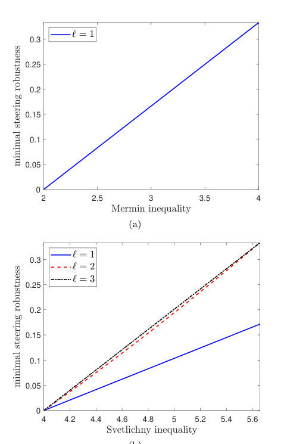
<figcaption class="paper-figure-caption"><b>Fig 2.</b> FIG. 2. Device-independent lower bounds on the steering robustness SRL in the 2-steer-1 scenario, obtained from the SDP of Eq. (35), as functions of the observed violation of (a) the Mermin inequality and (b) the Svetlichny inequality. Here and in the figures below, the hierarchy is truncated once the next level improves the optimum by less than 10−7, and every level computed is plotted, so the highest one shown is the converged bound.</figcaption>
</figure>
<figure class="paper-figure-card">
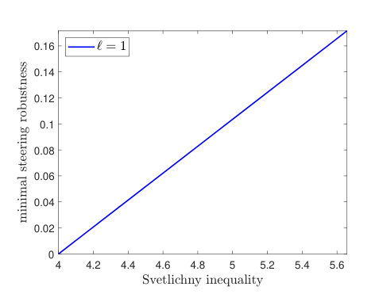
<figcaption class="paper-figure-caption"><b>Fig 3.</b> FIG. 3. Device-independent lower bound on the no-signaling steering robustness SRNS in the 2-steer-1 scenario, as a func- tion of the observed violation of the Svetlichny inequality. The bound vanishes at the Svetlichny bound Bobs = 4 rather than at a smaller value, for the reason given below Eq. (42). The corresponding bound for the Mermin inequality is identically zero and is not shown.</figcaption>
</figure>
<figure class="paper-figure-card">
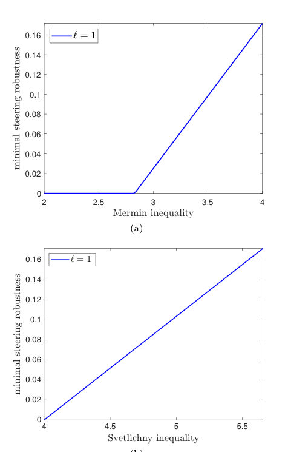
<figcaption class="paper-figure-caption"><b>Fig 4.</b> FIG. 4. Device-independent lower bounds on the steering robustness in the 1-steer-2 scenario, obtained from the SDP of Eq. (51), as functions of the observed violation of (a) the Mermin inequality and (b) the Svetlichny inequality. In panel (a) the bound stays at zero up to Bobs = 2 √</figcaption>
</figure>

**Summary.** This work extends the concept of device-independent quantum steering quantification to three parties, analyzing two distinct tripartite scenarios. By employing the Assemblage Moment Matrices framework, the authors construct Semidefinite Programs to derive lower bounds on steering robustness. This provides a powerful, experimentally verifiable tool for certifying genuine multipartite nonlocality.

**Why it may be interesting.** The rigorous, device-independent quantification of multipartite entanglement measures like steering is fundamental for certifying genuine multipartite quantum correlations in experimental settings.

Detailed structure

**Main problem.** The paper extends the device-independent (DI) quantification of quantum steering from the bipartite to the tripartite setting, analyzing two specific configurations: 2-steer-1 and 1-steer-2.

**Main result.** They develop Semidefinite Programs (SDPs) that yield lower bounds on the steering robustness for both tripartite scenarios, confirming the DI certification of measurement incompatibility.

**Method.** The core method involves extending the Assemblage Moment Matrices (AMMs) framework to construct SDPs based on observed correlations or violations of Bell inequalities.

**Model / system.** The analysis concerns a tripartite quantum state shared by three parties (Alice, Bob, Charlie) and quantifies the non-local correlations captured by quantum steering.

**Key observables.** Steering Robustness (SR), correlations $P(a, b, c|x, y, z)$, and violations of Bell inequalities like Mermin and Svetlichny.

**Important parameters / regimes.** The scenarios are defined by which parties are jointly steering which other parties (2-steer-1 vs. 1-steer-2).

**Assumptions / limitations.** The quantification relies on the assumption that the observed correlations can be bounded by SDPs derived from the AMM framework, extending previous bipartite results.

**Figures summary.** Figure 1 illustrates the two tripartite steering scenarios: (a) 2-steer-1 (Alice and Bob steer Charlie) and (b) 1-steer-2 (Alice steers Bob and Charlie).

**Paper structure.** The paper systematically extends the AMM framework to the tripartite case, deriving SDPs for both 2-steer-1 and 1-steer-2, and establishing bounds on steering robustness by relating them to Bell inequality violations.

Abstract

Quantum steering captures the ability of one party, through local measurements on a shared entangled state, to affect the conditional states held by distant parties in a way that admits no local explanation. Its device-independent (DI) quantification -- requiring no characterization of any state or measurement -- has been developed in the bipartite setting, notably through the framework of assemblage moment matrices (AMMs) [Phys. Rev. Lett. 116, 240401 (2016)], but has remained largely unexplored beyond it. Here, we extend the AMM framework to tripartite steering, covering both the scenario in which two parties jointly steer a third one (2-steer-1) and that in which a single party steers the remaining two (1-steer-2). For each scheme, we construct a semidefinite program that, from the observed correlations -- or merely from the violation of a Bell inequality -- yields lower bounds on the steering robustness of the underlying assemblage. As a by-product, our bounds also certify, in a DI manner, the incompatibility of the measurements performed by the steering parties.

[↑ back to top](#top)

### [Emergent Symmetries in Ensemble Averages](http://arxiv.org/abs/2609.36542v1)

**Authors:** Masahito Yamazaki  
**Type:** theory · **Category:** statistical mechanics · **PDF:** <https://arxiv.org/pdf/2609.36542v1>  
**Analysis basis:** full PDF text, analyzed in chunks
**Topic relevance:** `Keldysh / 2PI / non-Gaussian methods` **2/5**

↔ Scroll figures horizontally

<figure class="paper-figure-card">
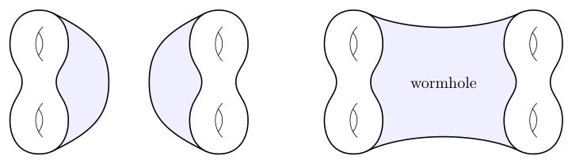
<figcaption class="paper-figure-caption"><b>Fig 1.</b> Figure 1: The factorization puzzle [12, 13]. The two boundary CFTs live on (here genus-two) Riemann surfaces, drawn in white, and the shaded regions represent the bulk, whose boundaries are these surfaces. (a) Disconnected bulk geometries, each filling in one of the boundaries, reproduce the factorized answer ZCFT1 ·ZCFT2. (b) The gravitational path integral also includes wormhole geometries connecting the two boundaries, whose contributions do not factorize. The puzzle can be resolved if the bulk computes the ensemble average on the boundary, for which ⟨ZCFT,1⟩⟨ZCFT,2⟩̸= ⟨ZCFT,1 · ZCFT,2⟩.</figcaption>
</figure>

**Summary.** This paper explores the mechanism by which global symmetries can appear in quantum gravity theories when averaging over an ensemble of possibilities. It uses advanced mathematical tools, like the Siegel-Weil formula applied to CFTs, to show that this averaging process yields symmetries that are otherwise absent. This work proposes a new conjecture linking symmetry breaking in mixed states to the structure of ensemble averages in holography.

**Why it may be interesting.** The concept of symmetry emergence via averaging is a powerful theoretical tool that connects concepts from condensed matter (topological order, symmetry breaking) to fundamental questions in quantum gravity and string theory.

Detailed structure

**Main problem.** The paper investigates how global symmetries, generally believed absent in quantum gravity, can emerge when considering ensemble averages of quantum field theories.

**Main result.** Global symmetries emerge from the ensemble average calculation, which is mathematically realized by equating the average partition function to a specific Eisenstein series, suggesting a mechanism for symmetry emergence in holographic contexts.

**Method.** The core method involves computing ensemble averages of partition functions (theta functions) using the Siegel-Weil formula, relating them to sums over bulk geometries (Eisenstein series).

**Model / system.** The study uses 2D Narain-type CFTs whose ensemble average is dual to a 3D Abelian Chern-Simons theory in the context of holography. It also analyzes Strong-to-Weak Spontaneous Symmetry Breaking (SWSSB) in the thermofield-double construction.

**Key observables.** The ensemble average of the theta function $\langle \vartheta_{Q, \alpha} 
angle$, the R\'enyi-2 correlator, and the resulting Eisenstein series $E_{Q, \alpha}$.

**Important parameters / regimes.** The quadratic form $Q(\ell)$, the moduli space $M_Q$, and the large-distance limit $|x-y| 	o \infty$ for correlation functions.

**Assumptions / limitations.** The analysis assumes that the ensemble average resolves the 'factorization puzzle' in AdS/CFT, and it proposes a new Swampland conjecture based on these findings.

**Figures summary.** Figure 1 illustrates the 'factorization puzzle,' contrasting factorized contributions from disconnected bulk geometries versus non-factorizing contributions from wormhole geometries, which the ensemble average is expected to resolve.

**Paper structure.** The paper progresses from establishing the problem of symmetry emergence in quantum gravity, to applying the Siegel-Weil formula to CFT ensembles, and finally generalizing the concept to recast SWSSB in holographic models.

Abstract

It is widely believed that there are no exact global symmetries in quantum gravity. We review recent works showing that global symmetries can nevertheless emerge after ensemble averages of theories, as encountered in holography. As a precision case study, we discuss the ensemble average of two-dimensional Narain-type conformal field theories associated with an even quadratic form of general signature, which is computed by the Siegel-Weil formula and interpreted as a sum over geometries in a three-dimensional Abelian Chern-Simons theory. Global symmetries of the bulk anyons can emerge after the average, as T-dualities relating different theories in the ensemble are "folded" into symmetries of a single theory (duality origami). We discuss the relation to the Swampland program, including the emergence of global symmetries at infinite distance. Finally, we recast strong-to-weak spontaneous symmetry breaking (SWSSB) of mixed states as an emergence of symmetries in ensemble averages; in holography, wormholes connecting the two sides of a thermofield-double construction provide its bulk realization. This motivates a new Swampland conjecture.

[↑ back to top](#top)

### [Excitonic Stripe Order in the Two-Orbital Hubbard-Kanamori Model](http://arxiv.org/abs/2609.36051v1)

**Authors:** Rafael D. Soares, Luke Staszewski, Chunhan Feng, Alexander Wietek  
**Type:** theory · **Category:** strongly correlated electrons · **PDF:** <https://arxiv.org/pdf/2609.36051v1>  
**Analysis basis:** full PDF text, analyzed in chunks
**Topic relevance:** `analog quantum simulation` **2/5**

↔ Scroll figures horizontally

<figure class="paper-figure-card">
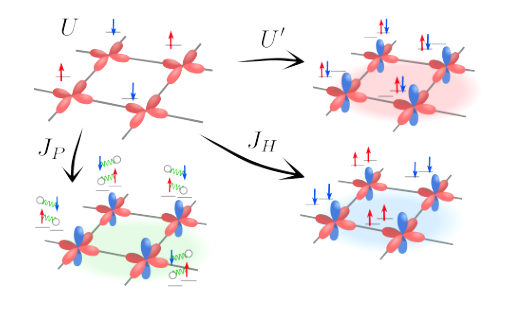
<figcaption class="paper-figure-caption"><b>Fig 1.</b> Figure 1. Schematic illustration of the principal ordered phases that emerge in the generalization of the single orbital Hubbard model to the two-orbital Hubbard-Kanamori model at the Hartree–Fock level: N´eel order (blue), orbital density wave order (red); and excitonic order (green).</figcaption>
</figure>
<figure class="paper-figure-card">
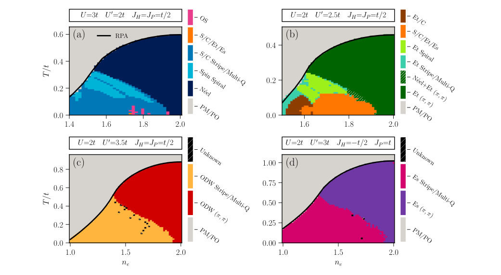
<figcaption class="paper-figure-caption"><b>Fig 2.</b> Figure 2. Temperature-electron density phase diagrams for four characteristic regimes of the Hubbard-Kanamori model. Panel shows (a) the predominantly intra-orbital magnetically ordered regime (U = 3.0t, U ′ = U −2JH, JH = JP = 0.5t); (b) Et ordered phase (U = 2.0t, U ′ = 2.5t, JH = JP = 0.5t); (c) orbitally ordered region (U = 2.0t, U ′ = 3.5t, JH = JP = 0.5t); and (d) Es ordered regime (U = 2.0t, U ′ = 3.0t, JH = −0.5t, JP = t). Black lines indicate phase boundaries derived from spin and charge susceptibility instabilities in the paramagnetic (PM) and para-orbital (PO) states within the RPA. Labels S and C denote spin and charge, respectively, with the / symbol indicating potential...</figcaption>
</figure>
<figure class="paper-figure-card">
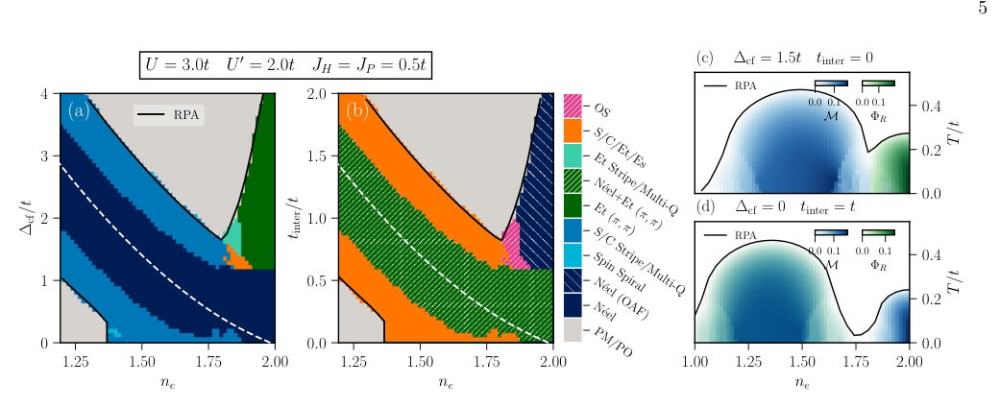
<figcaption class="paper-figure-caption"><b>Fig 3.</b> Figure 3. Effects of crystal-field splitting and inter-orbital hybridization. (a) Phase diagram as a function of crystal-field splitting ∆cf and electron density at a fixed temperature T = 0.1t for tinter = 0. (b) Phase diagram as a function of inter- orbital hybridization tinter and electron density at T = 0.1t for ∆cf = 0. The dashed white lines indicate the electron density of the non-interacting intra-band nesting condition as a function of ∆cf (a) and tinter (b). Solid black lines are computed from the spin and charge RPA susceptibilities. (c) Magnetic and real components of the Et order parameters as a function of temperature and electron density for ∆cf = 1.5t and tinter = 0. (d)...</figcaption>
</figure>
<figure class="paper-figure-card">
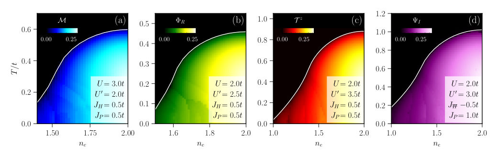
<figcaption class="paper-figure-caption"><b>Fig 4.</b> Figure 4. Average value of dominant order parameter as a function of the temperature and electronic density across the four main regimes. Panel (a) corresponds to the mainly magnetically ordered regime, the calculations are done with U = 3.0t, U ′ = U −2JH. Panel (b) is representative of the excitonic ordered phase, the calculations used U = 2.0t and U ′ = 2.5t. Panel (c) shows the orbitally ordered region, where we used U = 2.0t and U ′ = 3.5t. Panel (d) corresponds to Es ordered regime, U = 2.0t and U ′ = 3.0t. The white lines correspond to the phase boundaries derived from the instabilities of the spin and charge susceptibilities in the paramagnetic and para-orbital state within the RPA....</figcaption>
</figure>
<figure class="paper-figure-card">
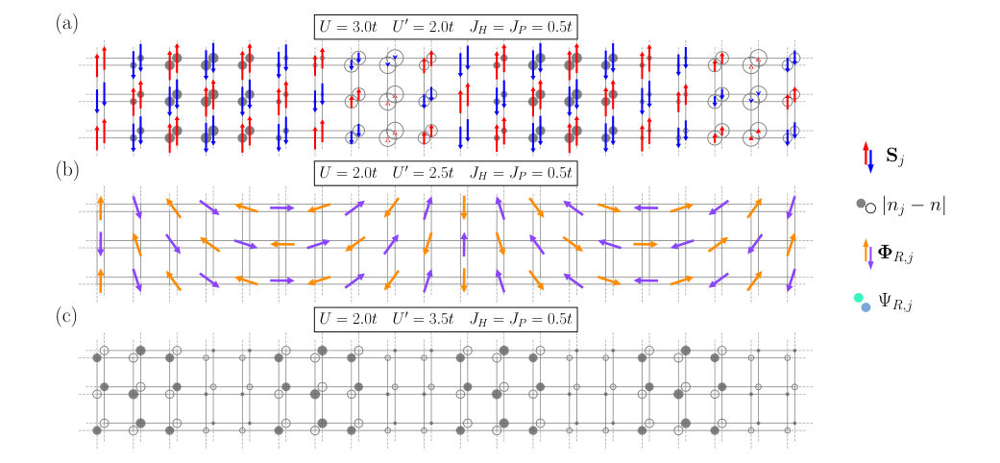
<figcaption class="paper-figure-caption"><b>Fig 5.</b> Figure 5. Representative orders of the doped Hubbard-Kanamori at finite temperature. (a) Spin-charge stripes. Charge and spin density waves, with orbitally aligned magnetic moments. (U = 3, U ′ = 2, JH = JP = 0.5 with n = 1.81, T/t = 0.055). (b) Excitonic spiral. Orbital coherence leads to density waves in the spin singlet and triplet channels. These can coexist with the usual magnetic ordering, not plotted here (U = 2, U ′ = 2.5, JH = JP = 0.5 with n = 1.81, T/t = 0.085). (c) Orbital density waves. A charge density wave forms in each orbital with a spatially modulated orbital imbalance (U = 2, U ′ = 3.5, JH = JP = 0.5 with n = 1.51, T/t = 0.31). In (a) we plot the intra-orbital spin,...</figcaption>
</figure>

**Summary.** This work explores excitonic stripe order in the two-orbital Hubbard-Kanamori model, treating it as an excitonic analogue of charge/spin stripes. Using Hartree-Fock and RPA, the authors demonstrate that excitonic stripes form a distinct symmetry-broken state whose spin character depends critically on the Hund's coupling sign. The results provide a detailed phase diagram mapping out various correlated electronic phases.

**Why it may be interesting.** While focused on condensed matter, the study's rigorous use of symmetry analysis and mean-field techniques for identifying distinct symmetry-broken phases is relevant to understanding order parameters in complex quantum many-body systems.

Detailed structure

**Main problem.** The paper investigates excitonic stripe order, an excitonic analogue of stripe order, in a multi-orbital correlated electron system.

**Main result.** Excitonic stripes are established as a distinct symmetry-broken state in multi-orbital correlated systems, with the spin character (singlet vs. triplet) dictated by the sign of Hund's exchange coupling.

**Method.** The study employs unrestricted real-space Hartree-Fock calculations complemented by Random-Phase-Approximation (RPA) instability analysis to map out phase diagrams.

**Model / system.** The system is modeled by the two-orbital Hubbard-Kanamori model on a square lattice. The Hamiltonian includes hopping, crystal-field splitting, and various repulsive/exchange interactions.

**Key observables.** Excitonic order, stripe order (spatial modulation of inter-orbital particle-hole coherence), and the spontaneous breaking of a relative orbital Z2 symmetry.

**Important parameters / regimes.** Hund's exchange coupling (J_H), crystal-field splitting (Delta_cf), and doping level are key parameters controlling the resulting ordered phase.

**Assumptions / limitations.** The analysis relies on mean-field approximations (Hartree-Fock) and RPA, which are noted to be limited by the Mermin-Wagner theorem for true long-range order at finite temperature.

**Figures summary.** Figure 1 schematically illustrates principal ordered phases (Néel, orbital density wave, excitonic order) at the Hartree-Fock level. Figure 2 shows temperature-electron density phase diagrams for various regimes.

**Paper structure.** The paper systematically analyzes the internal symmetries of the Hamiltonian, develops gap equations for different ordered phases (AFM, Triplet Excitonic, ODW, Singlet Excitonic), and uses RPA susceptibility calculations to determine instability boundaries.

Abstract

Excitonic condensation and stripe formation are two distinct manifestations of electronic correlations. While excitonic order naturally arises in multi-orbital systems, stripe order is a prominent feature of doped correlated-electron models. Here, we investigate an excitonic analogue of stripe order in the two--orbital Hubbard-Kanamori model on the square lattice, characterized by a spatial modulation of inter-orbital particle-hole coherence and, in the orbital-parity-symmetric limit, spontaneous breaking of a relative orbital $\mathbb{Z}_2$ symmetry. Using unrestricted real-space Hartree-Fock calculations complemented by random-phase-approximation instability analysis, we determine how the Kanamori interactions select different excitonic channels. The sign of Hund's exchange controls the spin character of the condensate: ferromagnetic Hund coupling favors triplet excitonic order, whereas antiferromagnetic Hund coupling stabilizes singlet excitonic order. Upon doping, commensurate excitonic density waves develop incommensurate textures, including excitonic stripes and, in the triplet sector, spiral excitonic density waves. We further show that crystal-field splitting strongly reorganizes the excitonic instability by modifying inter-orbital nesting and can stabilize triplet excitonic order even in the absence of pair hopping. Our results establish excitonic stripes as a distinct symmetry-broken state of multi-orbital correlated systems and identify microscopic routes for their stabilization.

[↑ back to top](#top)

### [On the Spectrum of Some Temperley-Lieb Spin Chains](http://arxiv.org/abs/2609.38074v1)

**Authors:** Robert Ferydouni, Bruno Nachtergaele  
**Type:** theory · **Category:** statistical mechanics · **PDF:** <https://arxiv.org/pdf/2609.38074v1>  
**Analysis basis:** full PDF text, analyzed in chunks
**Topic relevance:** `analog quantum simulation` **2/5**

↔ Scroll figures horizontally

<figure class="paper-figure-card">
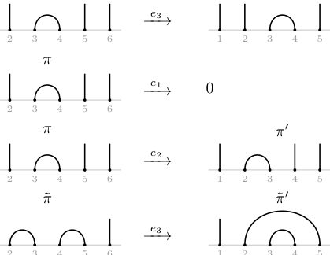
<figcaption class="paper-figure-caption"><b>Fig 1.</b> Figure 1: The action of the generators on link patterns, drawn on L = 6 sites with arcs above the line and through-lines as vertical segments.</figcaption>
</figure>
<figure class="paper-figure-card">
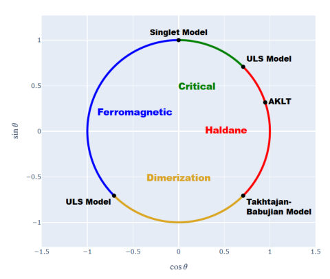
<figcaption class="paper-figure-caption"><b>Fig 2.</b> Figure 2: Conjectured phase diagram for spin-1 SU(2) invariant chains. The singlet model is the purely biquadratic point up to a shift and normalization of the spectrum.</figcaption>
</figure>
<figure class="paper-figure-card">
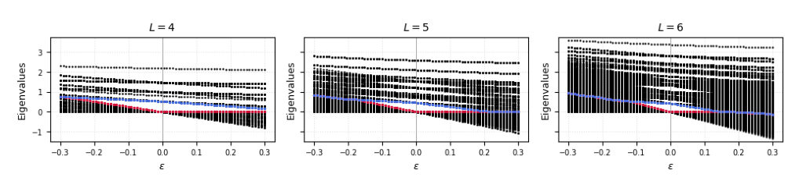
<figcaption class="paper-figure-caption"><b>Fig 3.</b> Figure 3: The spectrum of the Hamiltonian in (6.9) with s = 1, OBC, L = 4, 5, 6 plotted against ε. The first DL eigenvalues are in red and the (DL + 1)-st eigenvalue is in blue.</figcaption>
</figure>
<figure class="paper-figure-card">
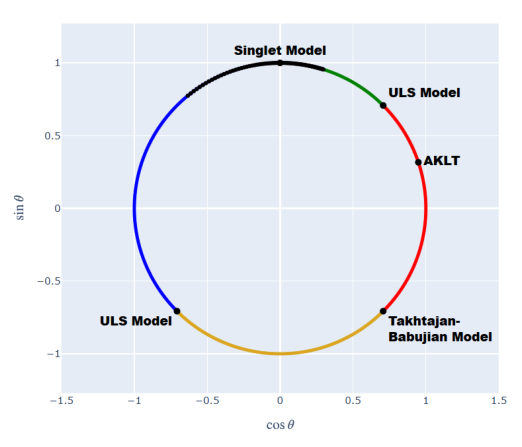
<figcaption class="paper-figure-caption"><b>Fig 4.</b> Figure 4: The perturbed models in the spin-1 phase diagram whose spectrum we plot in Figure 3 are labeled in black.</figcaption>
</figure>
<figure class="paper-figure-card">
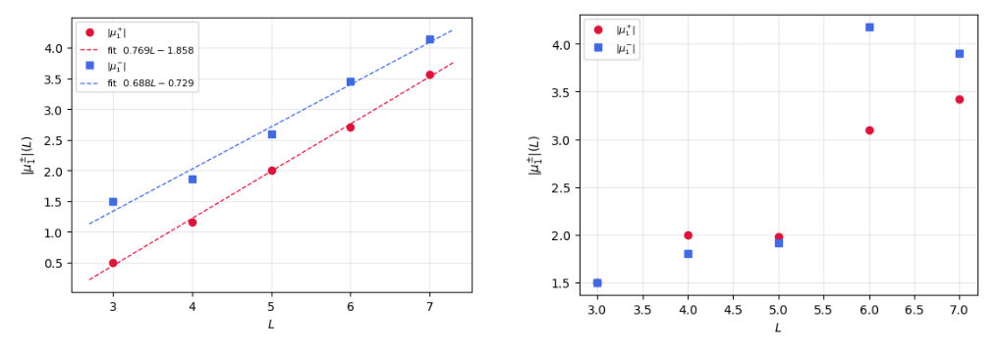
<figcaption class="paper-figure-caption"><b>Fig 5.</b> Figure 5: Fitted plot of µ± 1 (L) for s = 1 under open boundary conditions (left) and periodic boundary conditions (right), for various system sizes L.</figcaption>
</figure>

**Summary.** This paper provides a comprehensive mathematical review of spin-$s$ chains whose interactions are governed by the singlet projection, leading to a Temperley-Lieb algebra structure. Key findings include determining the exact spectral gap and proving that the ground state projectors obey the Jones-Wenzl recursion. It advances the understanding of how symmetry breaking can occur in gapped quantum systems.

**Why it may be interesting.** The deep connection between quantum spin chains, Temperley-Lieb algebras, and spectral properties provides powerful mathematical tools applicable to understanding gap closing and critical behavior in many-body quantum systems.

Detailed structure

**Main problem.** The paper reviews and extends mathematical results concerning the energy spectrum of spin-$s$ quantum chains governed by nearest-neighbor interactions derived from the singlet projection.

**Main result.** The authors determine the exact spectral gap for the fully polarized state as $1 - 2/d$ and show that the ground state projectors satisfy the Jones-Wenzl recursion.

**Method.** The analysis combines algebraic techniques (Temperley-Lieb algebra), variational estimates, and finite-size criteria (Knabe's criterion) to analyze the spectral properties.

**Model / system.** The model is a spin-$s$ chain with a nearest neighbor interaction proportional to the projection onto the singlet state of two spin-$s$ degrees of freedom. This interaction generates a Temperley-Lieb algebra with loop parameter $d=2s+1$.

**Key observables.** Spectral gap, ground state degeneracy (quantum integers $[L+1]_q$), and the ordering of energy levels across symmetry sectors.

**Important parameters / regimes.** Spin quantum number $s$, loop parameter $d=2s+1$, and the chain length $L$.

**Assumptions / limitations.** The analysis assumes the interaction terms generate a Temperley-Lieb algebra and utilizes established results regarding the structure of the Hamiltonian.

**Paper structure.** The paper systematically reviews the model's algebraic structure, proves ferromagnetic ordering of energy levels, calculates the spectral gap using variational methods, analyzes open chain ground states via the Jones-Wenzl recursion, and concludes by discussing symmetry breaking.

Abstract

We review mathematical results about the spectrum of spin-$s$ chains with a nearest neighbor interaction given by the projection onto the singlet state of two spin-$s$ degrees of freedom. Up to normalization, these interaction terms generate a Temperley-Lieb algebra at loop parameter $d=2s+1$. We also present several new results. First, we prove a ferromagnetic ordering of energy levels across symmetry sectors of the model, thus generalizing a previous result of Nachtergaele, Spitzer and Starr (2004) for the spin-$\tfrac12$ $XXZ$ chain. This enables us to determine a uniform lower bound on the finite volume spectral gap for these spin chains. By combining a variational estimate with Knabe's finite size criterion, we show that the exact spectral gap of the GNS Hamiltonian of the fully polarized state is $1-2/d$. Furthermore, this value serves as a lower bound for the gap of the maximally mixed ground state. Finally, we show that the ground state projectors on open chains satisfy the Jones-Wenzl recursion, thereby recovering a known result that the degeneracies are the quantum integers $[L+1]_q$ for $q+q^{-1}=d$. We discuss how the high degeneracy of the ground states allows the model to break a continuous symmetry while remaining gapped, and renders that gap unstable.

[↑ back to top](#top)

### [One-dimensional quantum Gibbs states in constant circuit depth](http://arxiv.org/abs/2609.35973v1)

**Authors:** Saúl Pilatowsky-Cameo, Georgios Styliaris, Ainesh Bakshi, Daniel Malz  
**Type:** theory · **Category:** statistical mechanics · **PDF:** <https://arxiv.org/pdf/2609.35973v1>  
**Analysis basis:** full PDF text, analyzed in chunks
**Topic relevance:** `analog quantum simulation` **2/5**

↔ Scroll figures horizontally

<figure class="paper-figure-card">
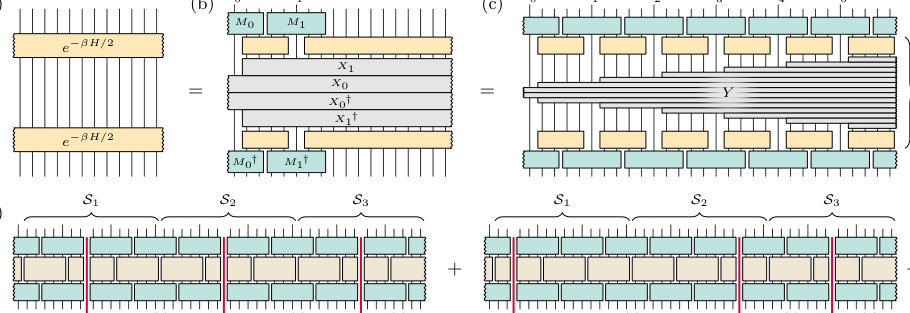
<figcaption class="paper-figure-caption"><b>Fig 1.</b> Figure 1. Schematic of the construction. (a) Unnormalized Gibbs state e−βH on a ring (vertical wires are qubits). (b) Applying the entanglement bulk decomposition at sites k0 and k1 yields local operators Mj (teal), Gibbs states of the remaining segments (yellow), and QPIs Xj (gray). (c) Iterating over all kj leaves, between the Mj, an operator Ωcontaining the separable staircase Y . (d) Ωis a sum of positive terms, each a product over the blocks [kj−1 + 1, kj] with a cut (red) in every superblock Ss. Since no Mj crosses a cut, each term factorizes over the regions A(µ) s of Theorem 1.</figcaption>
</figure>

**Summary.** This work characterizes the structure of quantum Gibbs states in 1D systems, showing they are highly structured and can be prepared efficiently using only constant-depth quantum circuits. The findings establish strong bounds on entanglement, demonstrating that long-range localizable entanglement vanishes rapidly in 1D at finite temperatures. This has significant implications for understanding quantum thermalization dynamics.

**Why it may be interesting.** It provides rigorous, resource-theoretic bounds on the entanglement structure of thermal states, which is crucial for understanding how quantum information is stored and processed in realistic, interacting many-body systems.

Detailed structure

**Main problem.** The paper investigates the structural properties and resource requirements for preparing quantum Gibbs states at thermal equilibrium in one-dimensional systems.

**Main result.** It proves that 1D Gibbs states can be decomposed into mixtures of product states over bounded blocks, allowing preparation via quantum circuits of constant depth.

**Method.** The authors use mathematical decomposition techniques, relating the Gibbs state to local operators and employing concepts from entanglement theory to establish separability bounds.

**Model / system.** The focus is on 1D spin chains (qubits) and fermionic systems governed by geometrically local Hamiltonians, analyzed at constant positive temperatures.

**Key observables.** Entanglement depth, entanglement width, localizable entanglement, and circuit depth complexity.

**Important parameters / regimes.** Constant temperature ($eta$ fixed), 1D geometry, and the constant depth bound $C_eta$ which depends on $eta$.

**Assumptions / limitations.** The Hamiltonian is geometrically local, and the results are proven for constant positive temperatures.

**Figures summary.** Figure 1 schematically illustrates the construction involving Entanglement Bulk Decomposition (EBD) and the factorization of the state operator $\Omega$ over local regions.

**Paper structure.** The paper builds from establishing the general decomposition of the Gibbs state (Theorem 1) to proving its preparation via constant-depth circuits (Corollary 1), analyzing entanglement bounds (Corollary 2), and extending these results to fermionic systems and quantum thermalization.

Abstract

We prove that the Gibbs state of any spin chain can be exactly decomposed into a mixture of product states over contiguous blocks of qubits with bounded length, at any constant temperature. As a consequence, any such Gibbs state can be prepared by local unitary circuits of constant depth, with efficient classical preprocessing. We place strong limits on the spatial structure of thermal entanglement: both the entanglement depth and entanglement width (measures of multiparticle entanglement) are bounded by constants, while the localizable entanglement (the bipartite entanglement that can be generated with the aid of local measurements and classical communication) vanishes exactly beyond a constant threshold distance. Our result also has implications for quantum thermalization: for any translation-invariant spin-chain Hamiltonian with nondegenerate spectral gaps, typical low-complexity pure states drawn from a maximally entropic ensemble at any constant effective temperature become locally indistinguishable from the Gibbs state upon unitary evolution. Additionally, we obtain an analogous decomposition for fermionic systems: the Gibbs state of any 1D local fermionic Hamiltonian is exactly a mixture of constant-depth local fermionic circuits acting on Gaussian states.

[↑ back to top](#top)

### [Optimal Quantum Junta Testing without Inverse Queries](http://arxiv.org/abs/2609.37926v1)

**Authors:** Jinge Bao, Minbo Gao, Penghui Yao  
**Type:** theory · **Category:** quantum information and computing · **PDF:** <https://arxiv.org/pdf/2609.37926v1>  
**Analysis basis:** full PDF text, analyzed in chunks
**Topic relevance:** `quantum measurements` **2/5**

↔ Scroll figures horizontally

<figure class="paper-figure-card">
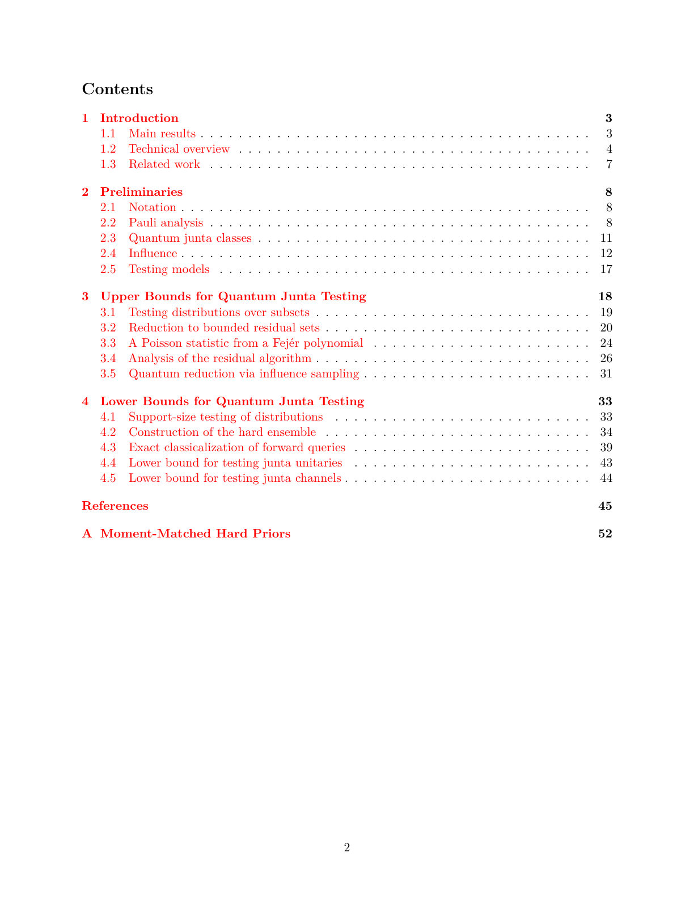
<figcaption class="paper-figure-caption"><b>Fig 1.</b> Low-resolution page preview, page 2</figcaption>
</figure>
<figure class="paper-figure-card">
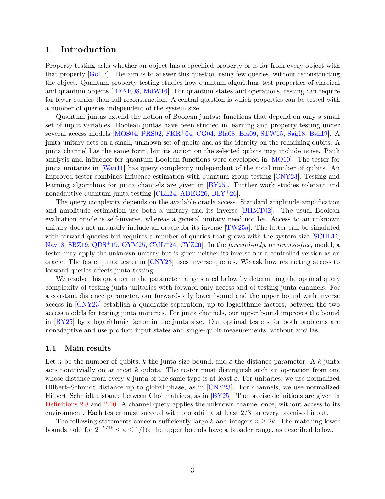
<figcaption class="paper-figure-caption"><b>Fig 2.</b> Low-resolution page preview, page 3</figcaption>
</figure>
<figure class="paper-figure-card">
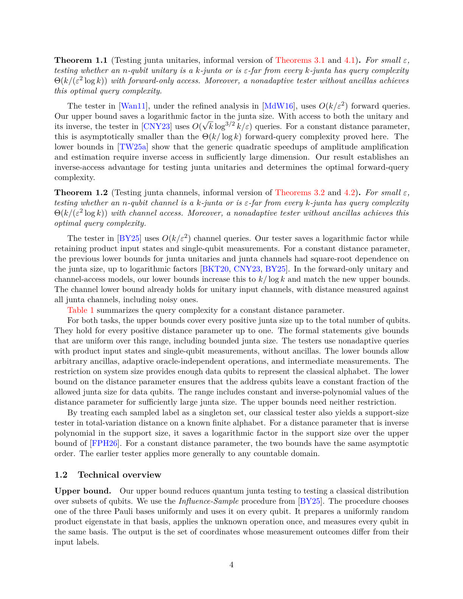
<figcaption class="paper-figure-caption"><b>Fig 3.</b> Low-resolution page preview, page 4</figcaption>
</figure>
<figure class="paper-figure-card">
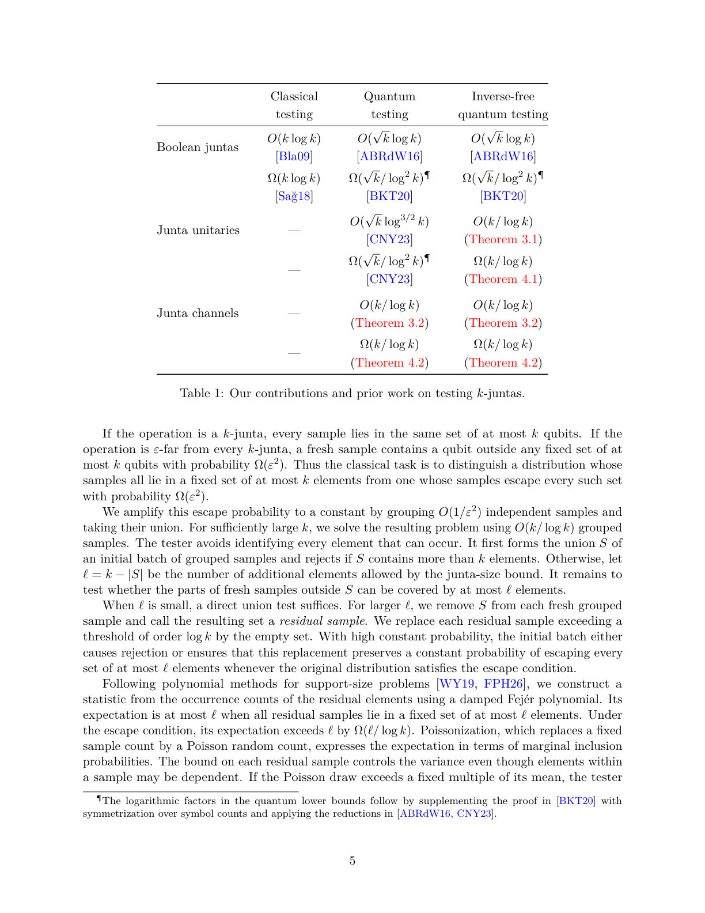
<figcaption class="paper-figure-caption"><b>Fig 4.</b> Low-resolution page preview, page 5</figcaption>
</figure>
<figure class="paper-figure-card">
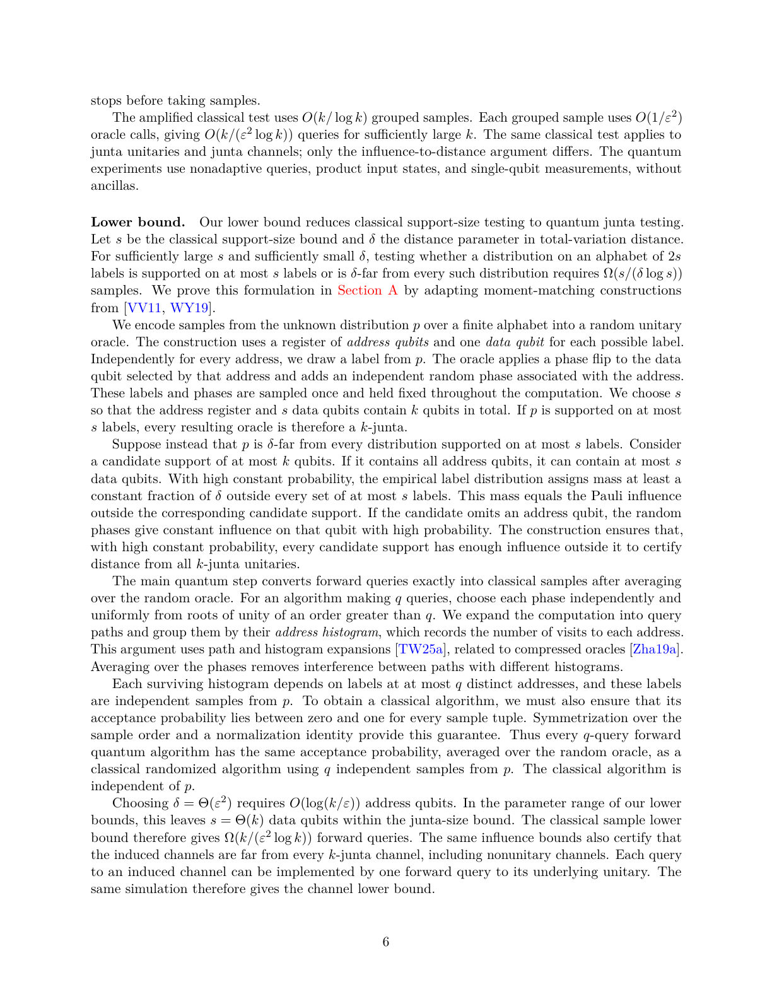
<figcaption class="paper-figure-caption"><b>Fig 5.</b> Low-resolution page preview, page 6</figcaption>
</figure>

**Summary.** This paper rigorously determines the optimal query complexity for testing quantum juntas, which are quantum operations restricted to acting on a small subset of qubits. By establishing matching upper and lower bounds, the authors prove that the required number of queries scales as $\Theta(k/(\epsilon^2 \log k))$ in the forward-only model. This work highlights the deep connection between quantum verification tasks and classical combinatorial testing problems.

**Why it may be interesting.** The connection drawn between quantum junta testing and classical support-size testing provides a powerful theoretical tool for understanding the fundamental limitations of quantum verification protocols.

Detailed structure

**Main problem.** The paper determines the optimal query complexity required to test whether an unknown quantum operation (unitary or channel) acts nontrivially on at most $k$ qubits (a $k$-junta).

**Main result.** For the forward-only model, the optimal query complexity for both unitary and channel junta testing is established to be $\Theta(k/(\epsilon^2 \log k))$ for constant $\epsilon$.

**Method.** The authors establish the bounds by reducing quantum junta testing to classical support-size testing, using moment-matching techniques and Chebyshev polynomials to derive matching upper and lower bounds.

**Model / system.** The system involves an unknown $n$-qubit unitary or quantum channel $\mathcal{E}$. The testing is performed in a forward-only model, meaning the tester only has access to the operation itself, not its inverse.

**Key observables.** Query complexity, total variation distance (dTV), and the support size of the operation's action ($k$).

**Important parameters / regimes.** Junta size $k$, distance parameter $\epsilon$, and the number of qubits $n$.

**Assumptions / limitations.** The results hold for sufficiently large $k$ and $n \ge 2k$. The lower bound relies on the ability to exactly classicalize forward quantum queries on average.

**Figures summary.** Table 1 summarizes the query complexity for testing $k$-juntas across various settings (Boolean, Unitary, Channel) comparing classical, quantum, and inverse-free quantum testing.

**Paper structure.** The paper first establishes the problem setup and then develops the upper bounds using nonadaptive testers. The core of the work involves deriving the lower bounds by reducing classical support-size testing to quantum junta testing, culminating in the matching complexity results.

Abstract

We study the query complexity of testing quantum juntas. Given an unknown $n$-qubit unitary or quantum channel, the goal is to decide whether it acts nontrivially on at most $k$ qubits or is $\varepsilon$-far from every such operation. For unitaries, we consider the forward-only model, where the tester has access to $U$, but not to $U^\dagger$ or controlled-$U$. We give tight bounds for both unitary and channel junta testing. For sufficiently large $k$, $n \ge 2k$, and a broad range of $\varepsilon$, both problems have query complexity $Θ\left(k/(\varepsilon^2\log k)\right)$. Our upper bounds are achieved by simple nonadaptive testers using product inputs and single-qubit measurements. For junta channels, this closes the gap by Bao and Yao (COLT 23, TPAMI 2025) between an $\widetilde{O}(k)$ upper bound and a $\widetildeΩ(\sqrt{k})$ lower bound at constant $\varepsilon$, establishing the optimal $Θ(k/\log k)$ query complexity. At the heart of both bounds is a strong connection between quantum junta testing and classical support-size testing. For the upper bounds, we reduce quantum junta testing to a generalized support-size problem for distributions over random subsets, and develop a new tester with improved sample complexity. For the lower bounds, we proceed in the reverse direction, reducing classical support-size testing to quantum junta testing through a phase-masked hard ensemble and showing that forward quantum queries can be exactly classicalized on average. Together, these reductions identify support-size testing as the classical core of quantum junta testing and yield matching lower bounds. At constant $\varepsilon$, they also give a separation between $Θ(k/\log k)$ forward queries and $\widetilde{O}(\sqrt{k})$ queries with inverse access.

[↑ back to top](#top)

### [Optimized Randomized Hamiltonian Simulation via Average-Error Analysis](http://arxiv.org/abs/2609.36694v1)

**Authors:** Hayata Morisaki, Keisuke Fujii  
**Type:** theory · **Category:** quantum information and computing · **PDF:** <https://arxiv.org/pdf/2609.36694v1>  
**Analysis basis:** full PDF text, analyzed in chunks
**Topic relevance:** `analog quantum simulation` **2/5**

↔ Scroll figures horizontally

<figure class="paper-figure-card">
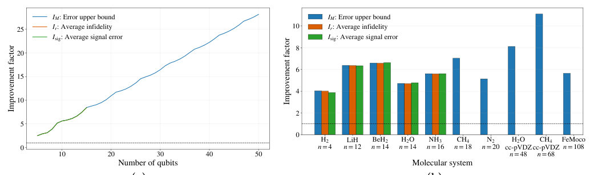
<figcaption class="paper-figure-caption"><b>Fig 1.</b> FIG. 1. Improvement factors for (a) the quartic SYK model and (b) molecular electronic-structure Hamiltonians. In (a), the solid curves show the medians over 50 independent coupling realizations with J = 1 at each system size. The predicted factor IM is evaluated for n = 5, . . . , 50, while the actual-error factors Ir and Isig are evaluated for the classically tractable sizes n ≤15. In (b), IM is shown for every molecular instance, whereas Ir and Isig are evaluated through the 16-qubit NH3 instance. For both panels, tλsingle = 1 and N = 100. The dashed lines denote no improvement.</figcaption>
</figure>
<figure class="paper-figure-card">
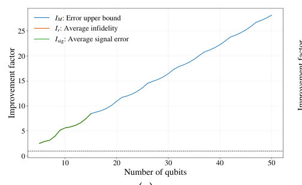
<figcaption class="paper-figure-caption"><b>Fig 2.</b> Figure 1(b) shows that grouping also improves the common error bound for every molecular Hamiltonian considered, with IM ranging from about 4 to 11. The largest improvement occurs for CH4 in the cc-pVDZ ba- sis. The variation is not monotonic in the number of qubits—in particular, the FeMoco value is below those of both cc-pVDZ instances—showing that the gain is con- trolled by the coefficient distribution within the chosen groups rather than by system size alone. For the in- stances up to 16 qubits, the actual factors Ir and Isig nearly coincide with each other and closely track IM. Thus, the common error parameter also captures the improvement from grouping for both error measures in...</figcaption>
</figure>

**Summary.** This paper introduces an optimized framework for randomized Hamiltonian simulation by shifting the focus from worst-case to average-case error analysis. It shows that sampling terms proportional to their Hilbert-Schmidt norms, especially when grouping commuting Pauli terms, yields significantly tighter error bounds than standard methods. This establishes average-error optimization as a superior, practical design principle for quantum simulation.

**Why it may be interesting.** This work provides a rigorous, theoretically grounded optimization principle (average-error minimization) for a crucial quantum algorithm (Hamiltonian simulation), directly impacting the feasibility and required circuit depth for simulating complex quantum dynamics.

Detailed structure

**Main problem.** The paper aims to develop optimized randomized Hamiltonian simulation techniques to accurately approximate the time evolution operator $U_t = e^{-itH}$ for quantum many-body systems.

**Main result.** By optimizing the sampling distribution based on minimizing Haar-averaged error bounds (using Hilbert-Schmidt norms), the authors achieve smaller error bounds than conventional methods like qDRIFT, with demonstrated improvements on large-scale Hamiltonians.

**Method.** The core method involves deriving nonasymptotic upper bounds for the Haar-averaged infidelity and signal error, comparing worst-case (operator norm) vs. average-case (Hilbert-Schmidt norm) error analysis.

**Model / system.** The simulations are applied to various quantum many-body systems, including the Sachdev-Ye-Kitaev (SYK) model and molecular electronic-structure Hamiltonians, which are represented as sums of Pauli strings.

**Key observables.** Haar-averaged infidelity ($	ext{r}_p(t, N)$) and average time-evolution signal error ($\varepsilon_p(t, N)$).

**Important parameters / regimes.** The error bounds scale with $t^2/N$ and depend on the structure of the Hamiltonian terms (e.g., $	ext{Tr}(D_p)$).

**Assumptions / limitations.** The analysis relies on deriving bounds for the mean time-evolution operator and assumes that optimizing the sampling distribution based on average error is a practical design principle.

**Figures summary.** Figure 1 compares theoretical and numerical improvement factors ($	ext{IM}, 	ext{I}_r, 	ext{I}_{	ext{sig}}$) for both SYK and molecular Hamiltonians, showing that grouping terms leads to significant error reduction.

**Paper structure.** The paper first establishes the general framework for randomized simulation, contrasting worst-case vs. average-case error analysis. It then derives nonasymptotic bounds for the average error, introducing the concept of grouping Pauli terms into blocks to improve the error parameter, and finally validates these improvements using numerical benchmarks on molecular Hamiltonians.

Abstract

Hamiltonian simulation is a central application of quantum computing. Randomized Hamiltonian simulation approximates the target dynamics by sampling quantum circuits and often allows simpler circuit implementations. We develop a framework for randomized Hamiltonian simulation in which Hamiltonian terms are sampled with arbitrary probabilities and the corresponding short-time evolutions are implemented sequentially. The leading channel error relative to ideal time evolution is governed by the variance of the sampled generators. Minimizing the variance-based upper bound on the worst-case error recovers qDRIFT, a leading randomized Hamiltonian simulation algorithm that samples terms in proportion to their operator norms. For typical input states, however, this sampling distribution need not be optimal. Minimizing Haar-averaged error bounds instead yields sampling probabilities proportional to the Hilbert-Schmidt norms of the terms. This choice can provide smaller average-error bounds than conventional qDRIFT. For Hamiltonians expressed as sums of Pauli strings, we combine this framework with commuting Pauli grouping to obtain smaller error bounds than conventional qDRIFT at fixed $R_z$ depth. Numerical benchmarks for the Sachdev-Ye-Kitaev model show error-bound improvement factors consistent with linear scaling in the number of qubits. For the 108-qubit FeMoco Hamiltonian, the error bounds are reduced by a factor of about 5.65. These results establish average-error optimization as a practical design principle for randomized Hamiltonian simulation.

[↑ back to top](#top)

### [Parametric DRAG for leakage-suppressed exchange gates in superconducting qubits](http://arxiv.org/abs/2609.37296v1)

**Authors:** Yiwen Li, Xinsheng Tan, Yang Yu  
**Type:** theory · **Category:** quantum information and computing · **PDF:** <https://arxiv.org/pdf/2609.37296v1>  
**Analysis basis:** full PDF text, analyzed in chunks
**Topic relevance:** `QC/QI experiment` **2/5**

↔ Scroll figures horizontally

<figure class="paper-figure-card">
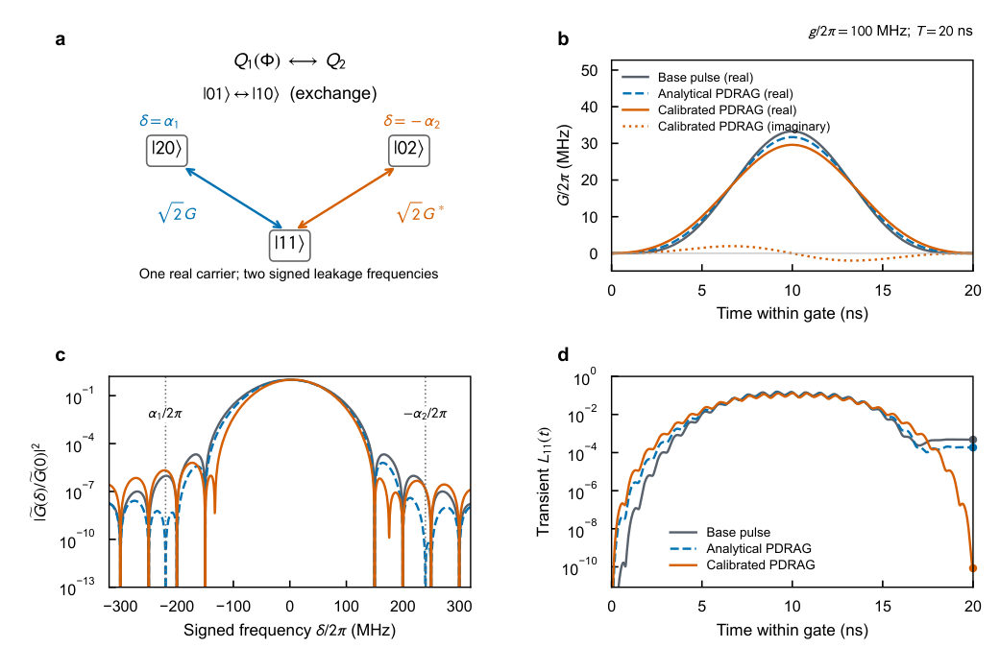
<figcaption class="paper-figure-caption"><b>Fig 1.</b> FIG. 1. PDRAG construction and finite-gate dynamics for the smooth sin4 envelope at T = 20 ns and g/2π = 100 MHz. (a) Desired exchange and the two conjugate leakage channels. (b) Real parts of the base, analytical PDRAG, and calibrated PDRAG exchange envelopes; the dotted curve shows the imaginary part of calibrated PDRAG. (c) Fourier power of the complete complex envelopes, normalized by their zero-frequency values. Vertical lines mark α1/2π = −220 MHz and −α2/2π = +240 MHz, the two analytical roots in Eq. (9). (d) Time-dependent leakage from |11⟩d out of the idle computational subspace, with endpoint markers showing the residual after coherent return. Dynamics use the complete...</figcaption>
</figure>
<figure class="paper-figure-card">
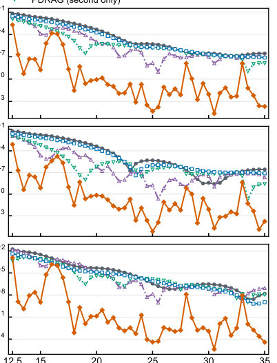
<figcaption class="paper-figure-caption"><b>Fig 2.</b> FIG. 2. Leakage suppression across gate durations for the sin4 pulse family in the carrier-resolved Duffing model at g/2π = 100 MHz. (a) Endpoint leakage from |11⟩d for five pulse families. (b),(c) The two resolved leakage channels, P20 and P02, for the same five families. Their sum is L11 in this excitation-conserving model. Markers show calculations at 0.5-ns intervals from 12.5 to 35 ns; lines connect the calcu- lated points. Each family is independently calibrated for full exchange at every duration under the same parameter bounds.</figcaption>
</figure>
<figure class="paper-figure-card">
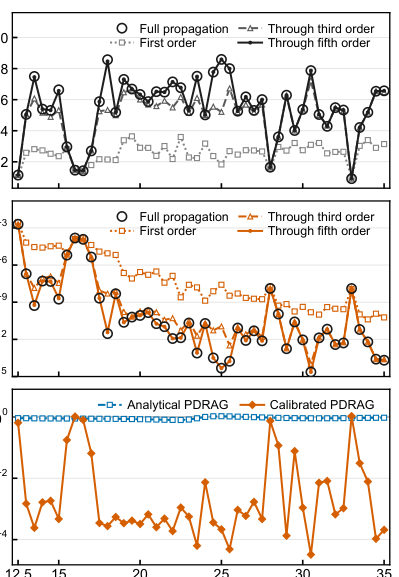
<figcaption class="paper-figure-caption"><b>Fig 3.</b> FIG. 3. Finite-pulse returns explain the additional suppres- sion from PDRAG calibration in the Duffing model at g/2π = 100 MHz. (a) Calibration gain S = log10(Lan 11/Lcal 11 ) from full propagation and the Floquet block expansion through first, third, and fifth order. (b) Calibrated endpoint leak- age for the same predictions. (c) Interference ratio R3 = ∥q1 + q3∥2/(∥q1∥2 + ∥q3∥2) for analytical and calibrated PDRAG, evaluated at T. The unit line separates destruc- tive and constructive interference between the two expansion contributions. All panels use the same 46 commands per fam- ily at 0.5-ns intervals from 12.5 to 35 ns; lines connect cal- culated points. Commands and Floquet...</figcaption>
</figure>
<figure class="paper-figure-card">
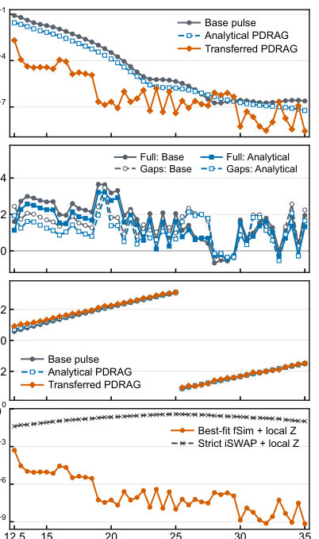
<figcaption class="paper-figure-caption"><b>Fig 4.</b> FIG. 4. Charge-model transfer and the role of static dressed gaps at g/2π = 100 MHz. (a) Endpoint leakage L11 for the three pulse families. (b) Relative suppression SX = log10(LX/Ltr) against Base (X = B, grey) and analytical PDRAG (X = A, blue). Solid filled markers show full charge propagation; dashed open markers show the three-state gap reference in Eq. (19). (c) Conditional phase of the compu- tational map. (d) Transferred-PDRAG infidelity relative to best-fit fSim and strict iSWAP, both allowing local Z cor- rections. Derivative coefficients retain their same-duration Duffing values; amplitude and carrier are calibrated for full exchange. Markers include all 46 durations; lines...</figcaption>
</figure>

**Summary.** This paper introduces Parametric DRAG (PDRAG) to suppress leakage in superconducting qubit exchange gates. By controlling both the first and second derivatives of the pulse envelope, the technique significantly reduces unwanted leakage channels. This advancement is crucial for building reliable quantum processors by enabling high-fidelity gate operations.

**Why it may be interesting.** This work provides a highly practical and numerically rigorous method for designing control pulses for superconducting qubits, directly addressing a major bottleneck (leakage) in realizing high-fidelity quantum gates.

Detailed structure

**Main problem.** The primary challenge is suppressing leakage pathways in superconducting qubits while maintaining the fidelity of fast quantum exchange gates.

**Main result.** The proposed Parametric DRAG (PDRAG) technique achieves significant leakage suppression, demonstrating geometric-mean reductions up to $5.27 	imes 10^5$ compared to base pulses.

**Method.** The method involves designing the pulse using derivative control (first and second derivatives) applied to the exchange interaction envelope, which is then calibrated to minimize leakage.

**Model / system.** The system is based on superconducting qubits modeled by weakly anharmonic transmons, described by a Duffing oscillator Hamiltonian. The control is implemented via frequency excursions.

**Key observables.** Leakage coefficients ($L_{11}$), gate fidelity ($L$, $1-F_{fSim}$), and the achieved suppression gain ($S$).

**Important parameters / regimes.** Gate duration (12.5–35 ns), coupling strength ($g/2\pi=100$ MHz), and the derivative coefficients ($eta, \gamma$).

**Assumptions / limitations.** The analysis assumes the applicability of the rotating-wave approximation and relies on complex calibration procedures to tune derivative coefficients.

**Figures summary.** Figures illustrate the construction of PDRAG, comparing leakage dynamics across different pulse protocols (Base vs. Calibrated PDRAG) and showing the spectral content of the control fields.

**Paper structure.** The paper introduces the problem of leakage in fast gates, details the PDRAG method using derivative control, presents quantitative results showing massive leakage suppression across various gate times, and finally discusses transferring the optimized coefficients to a charge Hamiltonian model.

Abstract

Programmable exchange interactions support quantum gates and many-body simulation in superconducting circuits. Fast excitation transfer, however, opens two leakage pathways in weakly anharmonic transmons, degrading gates and driving simulated dynamics outside the encoded state space. We introduce parametric derivative removal by adiabatic gate (PDRAG) to suppress both pathways while preserving the target exchange. Their conjugate structure determines first- and second-derivative corrections implemented through one real frequency command. At $g/2π=100$ MHz, calibrated PDRAG achieves a geometric-mean leakage reduction of $5.27\times10^5$ relative to the base pulse across 12.5--35 ns in Duffing simulations. At 13 ns, endpoint leakage reaches $1.98\times10^{-7}$ for the calibrated full-exchange pulse. Transferring the derivative coefficients to a charge Hamiltonian gives a mean 893-fold reduction over 12.5--22 ns after amplitude and carrier recalibration. Floquet return interference and charge-induced gap shifts explain the calibration and transfer gains, connecting compact pulse design to leakage-suppressed programmable interactions.

[↑ back to top](#top)

### [Quantized Hyperfine Field at an Implanted $μ^+$ Site in PrPb$_3$: Interplay between Localized $f$ Electrons and an Interstitial Charged Particle](http://arxiv.org/abs/2609.36868v1)

**Authors:** T. U. Ito, W. Higemoto, K. Ohishi, N. Nishida, R. H. Heffner, Y. Aoki, A. Amato, T. Onimaru, H. S. Suzuki  
**Type:** experiment · **Category:** strongly correlated electrons · **PDF:** <https://arxiv.org/pdf/2609.36868v1>  
**Analysis basis:** full PDF text, analyzed in chunks
**Topic relevance:** `quantum measurements` **2/5**

↔ Scroll figures horizontally

<figure class="paper-figure-card">
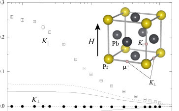
<figcaption class="paper-figure-caption"><b>Fig 1.</b> FIG. 1. The temperature dependence of the µ+ Knight shift in a magnetic field µ0H = 2 T applied along the [001] direc- tion. The inset shows the µ+ localization site.</figcaption>
</figure>
<figure class="paper-figure-card">
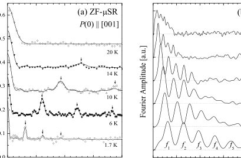
<figcaption class="paper-figure-caption"><b>Fig 2.</b> FIG. 2. (a)ZF-µ+SR spectra above 1.7 K. The base lines are shifted by 0.1 as the temperature increases. The solid curves are the best fits with Eq.(7). (b)FFT spectra of the ZF-µ+SR signals (see text).</figcaption>
</figure>
<figure class="paper-figure-card">

<figcaption class="paper-figure-caption"><b>Fig 3.</b> Figure 1 shows the extremely anisotropic nature of the shifts K∥≫K⊥. We now rewrite the Knight shift as a rank-2 tensor ˆK. Hereafter, coordinate axes are set to be along primitive vectors of the simple cubic lattice so that ˆK becomes a diagonal tensor. When the µ+ is located at the site with four-fold symmetry around the z axis, the diagonal components Kii conform to Kxx = Kyy = K⊥ and Kzz = K∥. Following the treatment in Ref. [4], we decompose ˆK as</figcaption>
</figure>
<figure class="paper-figure-card">
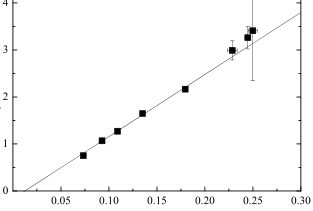
<figcaption class="paper-figure-caption"><b>Fig 4.</b> FIG. 4. The fundamental frequency ωf/2π (= f1) versus the K∥in a field of 2 T. The solid line indicates a linear fit.</figcaption>
</figure>

**Summary.** This work uses mu+SR to study how an implanted mu+ particle modifies the electronic state of localized f electrons in PrPb3. Key findings include observing quantized mu+ spin precession frequencies, which confirm a strong, anisotropic coupling between the mu+ spin and the Pr nuclear spins. This provides microscopic evidence of the interplay between interstitial impurities and localized magnetic moments.

**Why it may be interesting.** The observation of quantized spin dynamics and the detailed analysis of the spin Hamiltonian provide insights into strong local magnetic interactions and crystal field effects in rare-earth compounds, which are central to correlated electron physics.

Detailed structure

**Main problem.** The study investigates the local magnetic effect of an implanted mu+ particle on localized f electrons in PrPb3, focusing on the interplay between the mu+ spin and the hyperfine-enhanced nuclear spin of nearest neighbor Pr ions.

**Main result.** Spontaneous mu+ spin precession with harmonic frequencies was observed for the first time in f electron compounds, indicating a quantized hyperfine field arising from coupling between the mu+ spin and the Pr nuclear spin.

**Method.** The research utilizes Positive Muon Spin Rotation and Relaxation (mu+SR) measurements to probe the local magnetic environment.

**Model / system.** The system is PrPb3 containing an interstitial mu+. The physics is modeled using a spin Hamiltonian incorporating hyperfine coupling terms (H_SI) that exhibit Ising-like anisotropy.

**Key observables.** Mu+ spin precession frequencies (f_i), Mu+ Knight shift (K), and the time evolution of the muon polarization P(t).

**Important parameters / regimes.** The hyperfine field (HF) at the mu+ site is found to be quantized, and the coupling constant a_J is estimated to be around 10^5 mK.

**Assumptions / limitations.** The mu+ influence is assumed to affect only the nearest neighbor Pr ions, and the analysis relies on fitting the muon relaxation function to a sum of cosine terms.

**Figures summary.** The notes mention fitting the muon polarization decay to a sum of cosine terms yielding five harmonic frequencies, and a linear fit of the fundamental frequency versus the measured K_parallel.

**Paper structure.** The paper progresses from establishing the physical system and the mu+SR technique, to developing the spin Hamiltonian describing the coupling, and finally presenting the key results showing quantized precession frequencies and the derived hyperfine field.

Abstract

The local effect of an interstitial hydrogen-like particle on localized $f$ electrons was studied in PrPb$_3$ by means of $μ^+$ spin rotation and relaxation. Spontaneous $μ^+$ spin precession with harmonic frequencies was observed for the first time in $f$ electron compounds. We demonstrate that the signal is derived from a coupling between the $μ^+$ spin and the hyperfine-enhanced nuclear spin of nearest neighbor (nn) $^{141}$Pr with Ising-like anisotropy. The signal also suggests a marked suppression of spin dynamics of the nn $^{141}$Pr in comparison with that of the bulk $^{141}$Pr. These facts strongly indicate modification of the $f$ electronic state due to the interstitial charged particle.

[↑ back to top](#top)

### [Resource Compatibility in Optimal Quantum Symmetry Testing](http://arxiv.org/abs/2609.38134v1)

**Authors:** Yimeng Cao, Ranyiliu Chen, Chengkai Zhu, Xin Wang  
**Type:** theory · **Category:** quantum information and computing · **PDF:** <https://arxiv.org/pdf/2609.38134v1>  
**Analysis basis:** full PDF text, analyzed in chunks
**Topic relevance:** `quantum measurements` **2/5**

↔ Scroll figures horizontally

<figure class="paper-figure-card">
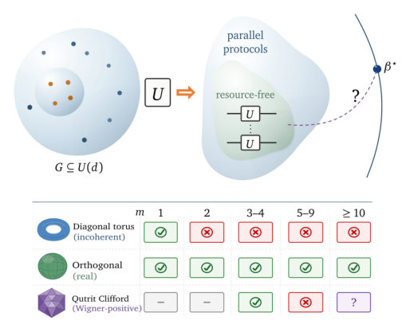
<figcaption class="paper-figure-caption"><b>Fig 1.</b> FIG. 1. Resource-free unitary subgroup testing. The upper schematic asks whether free parallel protocols attain the unrestricted optimum β⋆; the lower panel summarizes attainable, ruled-out, trivial, and open query regimes for the three subgroup tests.</figcaption>
</figure>

**Summary.** This work develops a rigorous framework to quantify the resource cost in optimal quantum symmetry testing. By deriving representation-theoretic bounds, the authors prove that achieving the best possible error rate often requires the system marginal to possess specific structural properties, such as high coherence or support restricted to certain sectors. This deepens the understanding of resource compatibility in quantum information tasks.

**Why it may be interesting.** It provides rigorous mathematical tools (representation theory, error bounding) to quantify the fundamental resource costs associated with distinguishing quantum states based on underlying symmetries, which is crucial for quantum characterization tasks.

Detailed structure

**Main problem.** The paper investigates whether optimal quantum symmetry testing can be achieved without utilizing the quantum resource inherently associated with the symmetry group.

**Main result.** The authors derive quantitative bounds showing that resource-free optimality is generally impossible, and they establish specific minimum coherence requirements for achieving the optimum in certain cases.

**Method.** The analysis uses representation theory, deriving a converse bound on the excess type-II error based on penalties related to suboptimal types and deviations in Schur profiles.

**Model / system.** The model involves testing a unitary $U$ belonging to a specific subgroup $G$ (like the diagonal torus or orthogonal subgroup) against the Haar measure on $U(d)$, using $m$-query parallel protocols.

**Key observables.** Type-I and Type-II error probabilities ($\alpha, eta$), system marginal ($
ho$), and representation-theoretic scores ($h_m(\eta)$).

**Important parameters / regimes.** The number of queries ($m$), the dimension ($d$), and the coherence measure ($C_{	ext{rel}}$).

**Assumptions / limitations.** The analysis often assumes zero type-I error ($\alpha=0$) to derive the lower bounds on the type-II error.

**Figures summary.** The notes reference tables detailing spectral phase-order bounds, exact scaled coefficients for different groups, and the structure of active Schur sectors for various query numbers.

**Paper structure.** The paper builds from establishing the general representation-theoretic converse bound, applying this to specific groups (torus, orthogonal, Clifford), and finally analyzing the resource requirements (coherence, number of queries) needed to approach the theoretical optimum.

Abstract

Can a symmetry be tested optimally without using the quantum resource naturally associated with it? For parallel subgroup-versus-Haar testing, we derive a quantitative representation-theoretic converse for every protocol with zero type-I error: the excess type-II error is bounded below by the sum of two nonnegative penalties, one for weight on suboptimal subgroup types and one for deviations of within-type Schur profiles from their typewise extremal profiles. At optimality, both penalties vanish, yielding support and weight locking for every optimal system marginal. Disjointness of the resulting locked set and the free marginal set rules out resource-free optimality, whereas overlap alone does not establish attainability. For the diagonal torus in dimension $d\geq 2$, optimal testing without coherence is possible only with a single query. We determine both the exact optimal type-II error over all protocols with incoherent system marginals and the minimum system-marginal coherence required to attain the unrestricted optimum. For the orthogonal subgroup in dimension $d\geq 2$, a real protocol attains the optimum at every query number. For the qutrit Clifford group, Wigner-positive optimal protocols exist at three and four queries but not from five through nine; whether they exist beyond nine queries remains open. Together, these results relate the subgroup- and query-dependent resource requirements of optimal symmetry testing to structural constraints on optimal system marginals.

[↑ back to top](#top)

### [SQUARE: Structured Quantum Representation Adapters as Compact Quadratic Feature Maps for Frozen Language Models](http://arxiv.org/abs/2609.37134v1)

**Authors:** Emily Jimin Roh, Hyojun Ahn, Hoyeong Lee, Soohyun Park, Sung Whan Yoon, Vaneet Aggarwal, Joongheon Kim  
**Type:** both · **Category:** quantum information and computing · **PDF:** <https://arxiv.org/pdf/2609.37134v1>  
**Analysis basis:** full PDF text, analyzed in chunks
**Topic relevance:** `quantum measurements` **2/5**

↔ Scroll figures horizontally

<figure class="paper-figure-card">
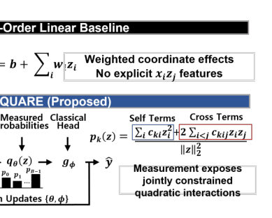
<figcaption class="paper-figure-caption"><b>Fig 1.</b> Figure 1: First-order adaptation and SQUARE over frozen LM bottleneck. (A) A linear base- line aggregates weighted coordinate effects but does not explicitly output pairwise products. (B) SQUARE normalizes and amplitude-encodes z, learns structured circuit mixing, and measures a readout containing normalized z2 i and zizj terms. During training, simulator backpropagation jointly updates the circuit and classical head. For deployment, the learned map is compiled exactly into a batched PyTorch implementation with the same outputs. Shared circuit angles constrain many inter- action coefficients, while inference remains fully compatible with classical frozen-LM pipelines.</figcaption>
</figure>
<figure class="paper-figure-card">
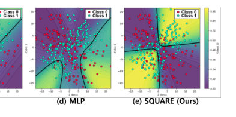
<figcaption class="paper-figure-caption"><b>Fig 2.</b> Figure 2: Learned decision surfaces on MNLI-derived two-dimensional PCA bottlenecks with con- trolled nonlinear labels.</figcaption>
</figure>
<figure class="paper-figure-card">

<figcaption class="paper-figure-caption"><b>Fig 3.</b> Fig. 2 visualizes the learned decision surfaces over the shared PCA bottleneck. BitFit and LoRA produce relatively smooth boundaries and miss several curved regions of the controlled label struc- ture. Prefix and MLP yield more flexible surfaces, but still show visible mismatch with the imposed nonlinear boundary. In contrast, SQUARE more closely follows the interaction-dependent regions, consistent with its measured feature map providing cross-coordinate features to the task head. The black contour indicates the learned p(y = 1 | z) = 0.5 boundary.</figcaption>
</figure>
<figure class="paper-figure-card">
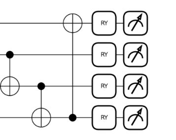
<figcaption class="paper-figure-caption"><b>Fig 4.</b> Figure 3: Visualization of the SQUARE parameterized quantum circuit used in the main experi- ments. The input bottleneck representation is amplitude-encoded into an n-qubit state |ψ(z)⟩. Each layer applies an RY RZ rotation block, ring CNOT entanglement, and a final RY rotation block before measurement. The shown example uses n = 4 qubits and one circuit layer.</figcaption>
</figure>
<figure class="paper-figure-card">
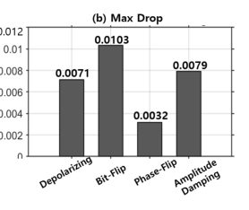
<figcaption class="paper-figure-caption"><b>Fig 5.</b> Figure 4: Post-training simulated quantum noise sensitivity of SQUARE with the BERT frozen bottleneck in MNLI. A trained SQUARE model is evaluated under depolarizing, bit-flip, phase-flip, and amplitude-damping noise injected only during evaluation (Singkanipa &amp; Lidar, 2025).</figcaption>
</figure>

**Summary.** This paper introduces SQUARE, a Structured Quantum Representation Adapter, which enhances frozen Language Models by mapping their low-dimensional bottleneck features through a parameterized quantum circuit. By measuring the resulting quantum state, SQUARE generates a structured feature map that explicitly models pairwise feature interactions. This approach achieves superior performance on downstream tasks compared to standard linear or low-rank adaptation methods.

**Why it may be interesting.** It demonstrates a concrete application of quantum circuit structure (parameterized quantum circuits) to enhance classical machine learning feature representation, providing a structured, physically motivated way to model high-order feature interactions.

Detailed structure

**Main problem.** The paper addresses how to design a compact module to parameterize feature interactions within a low-dimensional bottleneck vector derived from frozen Language Models (LMs) for downstream tasks.

**Main result.** The proposed SQUARE adapter achieves state-of-the-art performance on controlled interaction tasks, significantly outperforming established classical and quantum-inspired baselines.

**Method.** SQUARE uses amplitude encoding of the bottleneck vector into a quantum state, applies a trainable parameterized quantum circuit, and measures the resulting state to generate a structured, quadratic feature map.

**Model / system.** The system involves adapting frozen Language Models (LMs) by projecting their fixed, low-dimensional bottleneck representation $\mathbf{z}$ through a quantum circuit structure. The circuit is parameterized and simulates the measurement of quantum expectation values.

**Key observables.** Average test accuracy (0.7565) on GLUE-derived tasks; basis-probability features and Pauli-Z readouts, which are shown to be quadratic forms of the input coordinates.

**Important parameters / regimes.** The bottleneck dimension $d$; the structure of the quantum circuit (e.g., RY-RZ-Ring-CNOT-RY); and the number of trainable circuit parameters $\theta$.

**Assumptions / limitations.** The performance gain is attributed to the structured parameterization induced by the quantum circuit, not necessarily a claim of quantum computational advantage. The evaluation is performed on controlled interaction tasks derived from GLUE inputs.

**Figures summary.** Figure 1 compares the feature map generation, showing the linear baseline versus the structured, quadratic feature map generated by SQUARE via amplitude encoding and circuit measurement.

**Paper structure.** The paper introduces the problem of feature interaction modeling for frozen LMs, proposes the quantum-based SQUARE adapter, details the quantum circuit mechanics and feature extraction, and validates its performance through extensive comparison against various classical and quantum-inspired baselines on controlled tasks.

Abstract

Frozen language models (LMs) are increasingly used as fixed feature extractors for downstream reranking, scoring, and preference modeling, raising a practical question: how should a compact module represent interactions among features in a fixed low-dimensional bottleneck? Common linear and low-rank adapters remain linear at the adaptation module itself, whereas explicit second-order alternatives introduce pairwise interactions through direct parameterization or predefined factorizations. We propose SQUARE, a Structured QUAntum REpresentation adapter that amplitude-encodes the bottleneck vector, applies a parameterized quantum circuit, and measures the resulting state. We show that each basis-probability feature is exactly a normalized quadratic form in the bottleneck coordinates, while the additional Pauli-$Z$ readouts are signed linear combinations of these probabilities. The measured map can therefore parameterize interactions over $O(d^2)$ coordinate pairs through a small set of shared circuit parameters, where $d$ is the bottleneck dimension. It provides a structured parameterization within, rather than beyond, the classical normalized-quadratic feature class. In a disjoint same-pipeline evaluation over eight GLUE-derived controlled interaction tasks and five shared seeds, SQUARE achieves an average test accuracy of $0.7565$, compared with $0.7355$ for an affine normalized-quadratic predictor, $0.7271$ for the evaluated parameter-matched Givens mixing model, $0.6817$ for an MLP, and $0.6155$ for a frozen-circuit control. Under reduced supervision, it also shows consistent gains over the strongest evaluated classical comparator, with the same qualitative pattern across multiple frozen LM backbones. All circuit experiments use simulation, while the learned feature map can be evaluated exactly in batched PyTorch without quantum hardware.

[↑ back to top](#top)

### [Stability of isometries of quantum states](http://arxiv.org/abs/2609.37133v1)

**Authors:** Sam Looi  
**Type:** theory · **Category:** other · **PDF:** <https://arxiv.org/pdf/2609.37133v1>  
**Analysis basis:** full PDF text, analyzed in chunks
**Topic relevance:** `quantum measurements` **2/5**

↔ Scroll figures horizontally

<figure class="paper-figure-card">
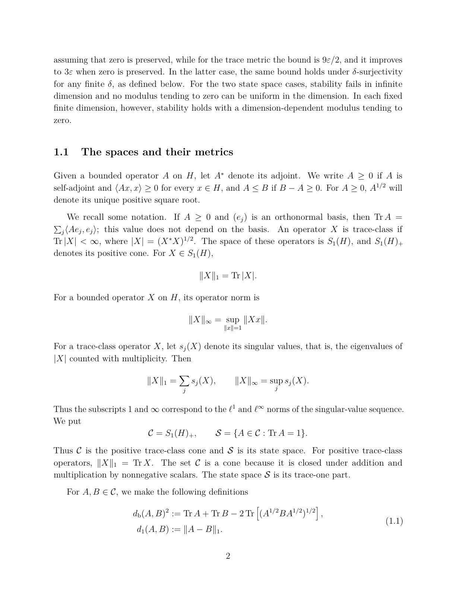
<figcaption class="paper-figure-caption"><b>Fig 1.</b> Low-resolution page preview, page 2</figcaption>
</figure>
<figure class="paper-figure-card">
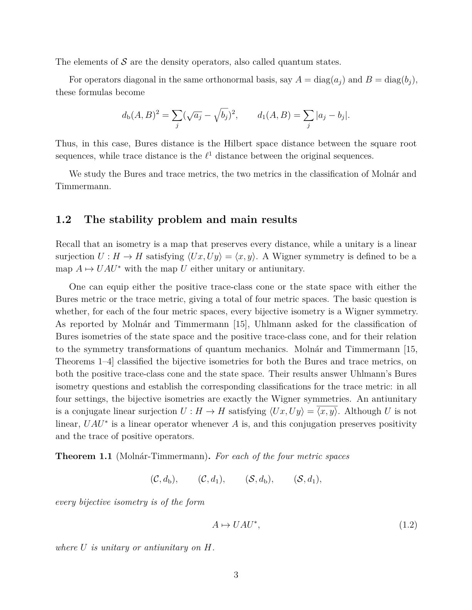
<figcaption class="paper-figure-caption"><b>Fig 2.</b> Low-resolution page preview, page 3</figcaption>
</figure>
<figure class="paper-figure-card">
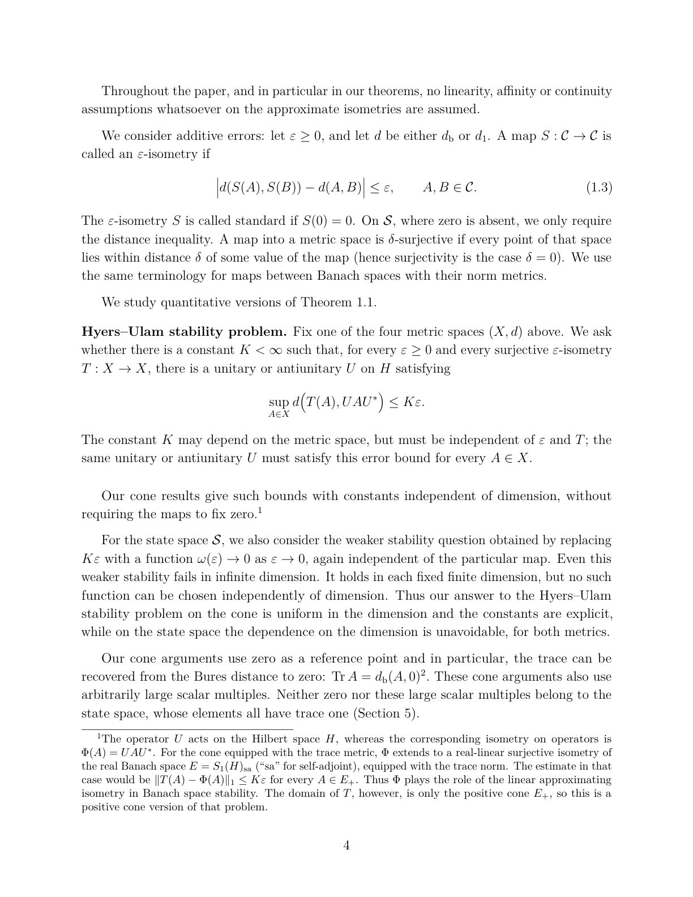
<figcaption class="paper-figure-caption"><b>Fig 3.</b> Low-resolution page preview, page 4</figcaption>
</figure>
<figure class="paper-figure-card">
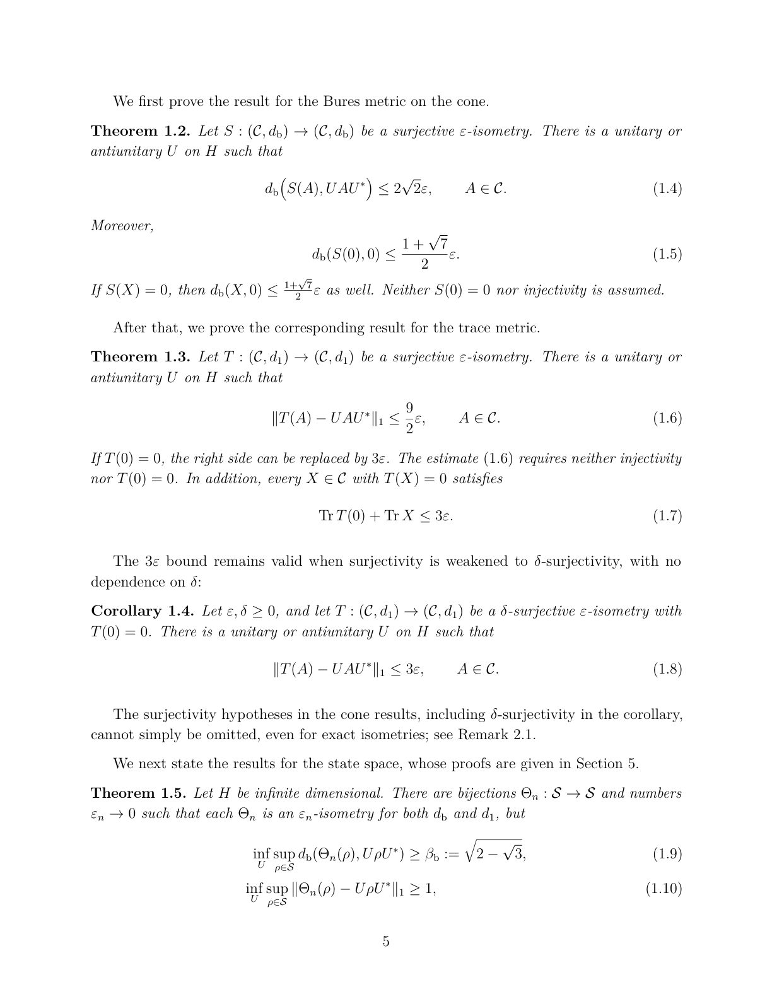
<figcaption class="paper-figure-caption"><b>Fig 4.</b> Low-resolution page preview, page 5</figcaption>
</figure>
<figure class="paper-figure-card">
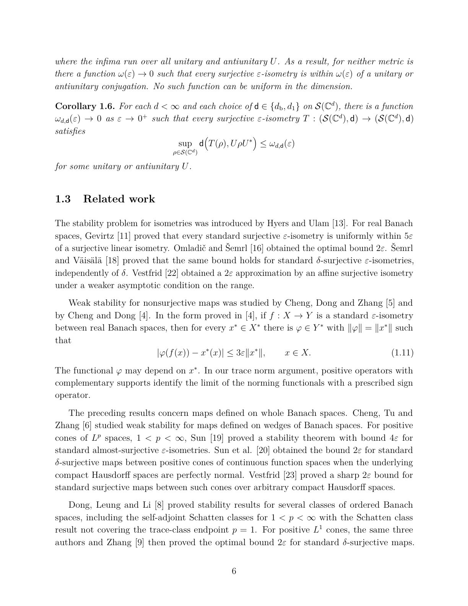
<figcaption class="paper-figure-caption"><b>Fig 5.</b> Low-resolution page preview, page 6</figcaption>
</figure>

**Summary.** This work provides a detailed mathematical analysis of how well approximate isometries of quantum states must resemble true symmetries (Wigner symmetries). It establishes strong, dimension-independent stability bounds for the cone of states but shows that the state space itself exhibits dimension-dependent instability in infinite dimensions. This has implications for quantifying the robustness of quantum operations.

**Why it may be interesting.** The rigorous mathematical analysis of stability for quantum operations is fundamental to understanding the robustness of quantum information processing protocols against noise or imperfect measurements.

Detailed structure

**Main problem.** The paper investigates the Hyers-Ulam stability of approximate isometries acting on the cone of positive trace-class operators and the state space of quantum states.

**Main result.** It proves dimension-independent stability bounds for the cone in both the trace and Bures metrics, but demonstrates that stability fails in infinite dimensions and requires dimension-dependent moduli for the state space.

**Method.** The analysis uses functional analysis tools, comparing approximate isometries to exact Wigner symmetries (unitary/antiunitary conjugations) using both the trace and Bures metrics.

**Model / system.** The system involves quantum states, represented by positive trace-class operators on a complex Hilbert space, analyzed using the trace distance and Bures distance.

**Key observables.** Trace distance ($\|A-B\|_1$), Bures distance ($d_b$), and the deviation from a Wigner symmetry.

**Important parameters / regimes.** The approximation error $\varepsilon$, and the dimension $d$ of the Hilbert space.

**Assumptions / limitations.** The stability results rely on the assumption of surjectivity or $\delta$-surjectivity of the approximate isometry.

**Paper structure.** The paper progresses by establishing stability results for the cone (dimension-independent) and then tackling the state space, culminating in a proof of instability in infinite dimensions using specific constructions.

Abstract

We prove dimension-independent Hyers-Ulam stability for surjective approximate isometries of the positive trace-class cone in both the trace and Bures metrics. Here $\varepsilon\geq0$ is a uniform upper bound on the additive error in preserving distances. Such an approximate isometry is uniformly approximated by a Wigner symmetry (a unitary or antiunitary conjugation), with error at most $9\varepsilon/2$ in the trace metric and $2\sqrt2\varepsilon$ in the Bures metric, even if it does not fix zero. For maps fixing zero, the trace bound improves to $3\varepsilon$ even under the hypothesis of $δ$-surjectivity, independently of $δ$. In infinite dimensions, we construct bijections of the full state space, including mixed states, whose distortions tend to zero in both metrics but which stay a fixed uniform distance from every Wigner symmetry. For state spaces, stability holds in each fixed finite dimension with a dimension-dependent modulus tending to zero as $\varepsilon\to0$, but no such modulus can be chosen independently of dimension.

[↑ back to top](#top)

### [Derivation of Fokker-Planck equation and its entropy production](http://arxiv.org/abs/2609.36260v1)

**Authors:** Tânia Tomé, Mário J. de Oliveira  
**Type:** theory · **Category:** statistical mechanics · **PDF:** <https://arxiv.org/pdf/2609.36260v1>  
**Analysis basis:** full PDF text, analyzed in chunks
**Topic relevance:** `Keldysh / 2PI / non-Gaussian methods` **1/5** · `analog quantum simulation` **1/5** · `correlated / nonlocal dissipation` **1/5** · `driven-dissipative phase transition` **1/5** · `methods for driven-dissipative` **1/5** · `non-equilibrium universality` **1/5** · `quantum measurements` **1/5**

↔ Scroll figures horizontally

<figure class="paper-figure-card">
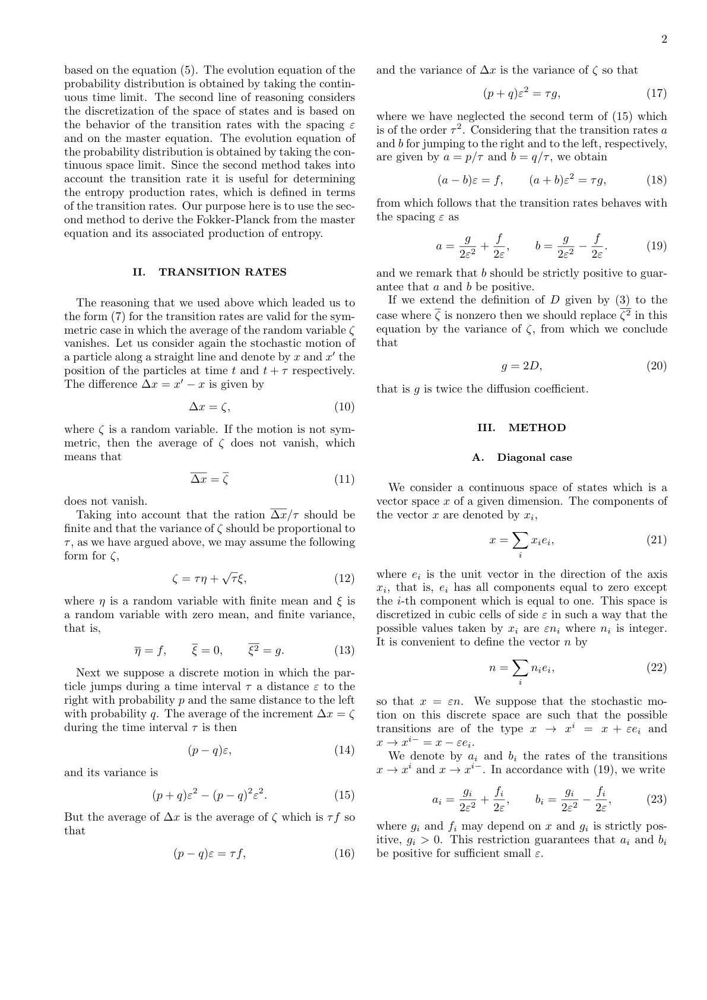
<figcaption class="paper-figure-caption"><b>Fig 1.</b> Low-resolution page preview, page 2</figcaption>
</figure>
<figure class="paper-figure-card">
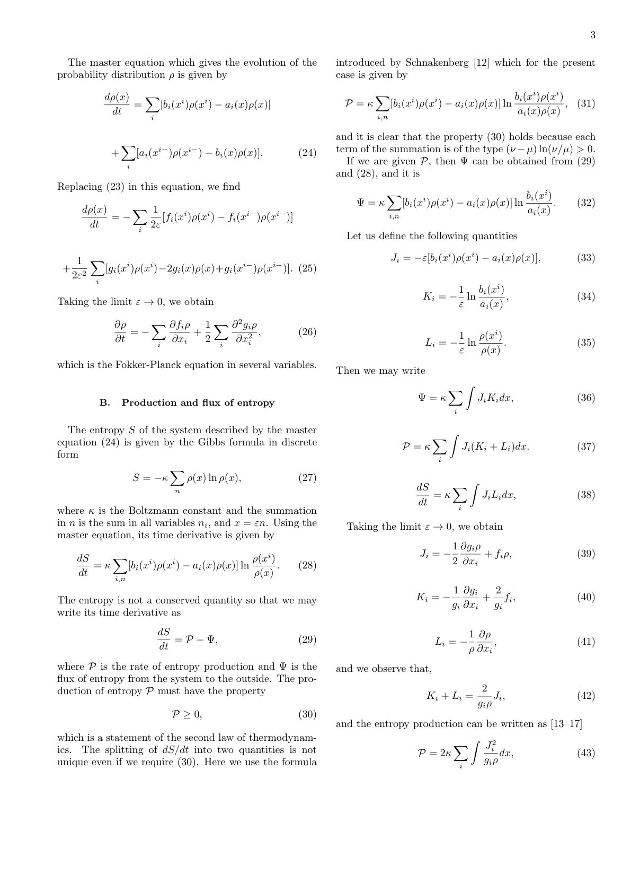
<figcaption class="paper-figure-caption"><b>Fig 2.</b> Low-resolution page preview, page 3</figcaption>
</figure>
<figure class="paper-figure-card">
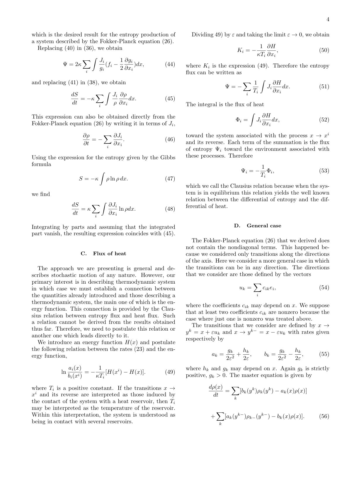
<figcaption class="paper-figure-caption"><b>Fig 3.</b> Low-resolution page preview, page 4</figcaption>
</figure>
<figure class="paper-figure-card">
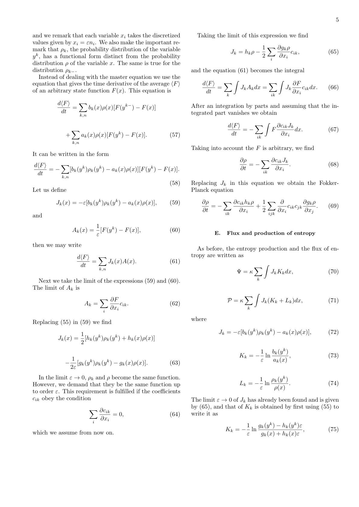
<figcaption class="paper-figure-caption"><b>Fig 4.</b> Low-resolution page preview, page 5</figcaption>
</figure>
<figure class="paper-figure-card">
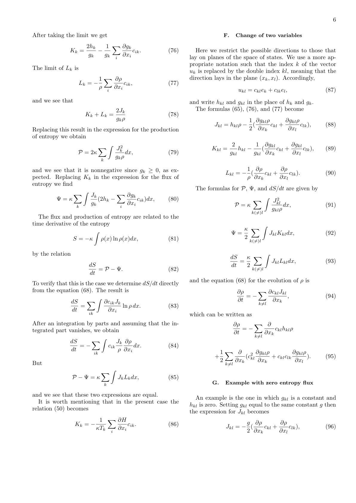
<figcaption class="paper-figure-caption"><b>Fig 5.</b> Low-resolution page preview, page 6</figcaption>
</figure>

**Summary.** This paper develops a comprehensive theoretical framework to derive the Fokker-Planck equation from a discrete master equation by taking the continuum limit. It rigorously calculates the rate of entropy production and entropy flux for systems coupled to heat reservoirs or isolated systems. This provides a powerful tool for analyzing non-equilibrium dynamics in statistical mechanics.

**Why it may be interesting.** This work provides a rigorous, general framework for deriving non-equilibrium statistical mechanics equations (like the Fokker-Planck equation) directly from microscopic jump processes, which is crucial for understanding open quantum systems and thermalization dynamics.

Detailed structure

**Main problem.** The paper derives the Fokker-Planck equation and rigorously calculates the associated rate of entropy production from the underlying master equation.

**Main result.** The derivation successfully yields the Fokker-Planck equation and provides explicit, thermodynamically consistent formulas for the entropy production rate ($P$) and entropy flux ($\Psi$).

**Method.** The core method involves taking the continuous space limit ($\epsilon 	o 0$) of a discrete master equation, allowing the transition from stochastic jump processes to continuous diffusion equations.

**Model / system.** The analysis models general stochastic motion, applicable to systems interacting with multiple heat reservoirs or isolated systems, using a state space $x$ (generalized to phase space).

**Key observables.** Probability density $
ho(x)$, Entropy $S$, Entropy Production $P$, and Entropy Flux $\Psi$.

**Important parameters / regimes.** The small parameter $\epsilon$ (related to the discretization spacing), temperature $T_i$, and the system Hamiltonian $H$.

**Assumptions / limitations.** The derivation relies on the assumption that the time evolution of entropy can be decomposed as $dS/dt = P - \Psi$, and that certain integrated parts vanish during the limit process.

**Paper structure.** The paper progresses by first defining the master equation for discrete states, then deriving the continuous Fokker-Planck equation in the limit $\epsilon 	o 0$. It subsequently analyzes the entropy balance, deriving expressions for $P$ and $\Psi$ for coupled systems and isolated systems, confirming thermodynamic consistency.

Abstract

We derive the Fokker-Planck equation and its entropy production from the master equation. To this end we consider a discrete space of states where the master equation is defined and appropriate transition rates are introduced. A transition rate has two parts, one of which is the ordinary term proportional to the inverse of the spacing and the other is inversely proportional to the square of the spacing corresponding to the variance of the independent stochastic variable. In the continuous space limit, we obtain the Fokker-Planck as well as the rate of entropy production and the flux of entropy. We also consider the case where the space of states is the phase space and discuss the equations appropriate for systems in contact with several heat reservoirs and for isolated systems.

[↑ back to top](#top)

### [Multiscale Reconstruction of Weighted Networks from Coarse-Grained Data](http://arxiv.org/abs/2609.37957v1)

**Authors:** Mattia Marzi, Frank P. Pijpers, Diego Garlaschelli  
**Type:** theory · **Category:** disordered systems and neural networks · **PDF:** <https://arxiv.org/pdf/2609.37957v1>  
**Analysis basis:** full PDF text, analyzed in chunks
**Topic relevance:** `Keldysh / 2PI / non-Gaussian methods` **1/5** · `analog quantum simulation` **1/5** · `driven-dissipative phase transition` **1/5** · `methods for driven-dissipative` **1/5** · `non-equilibrium universality` **1/5**

↔ Scroll figures horizontally

<figure class="paper-figure-card">
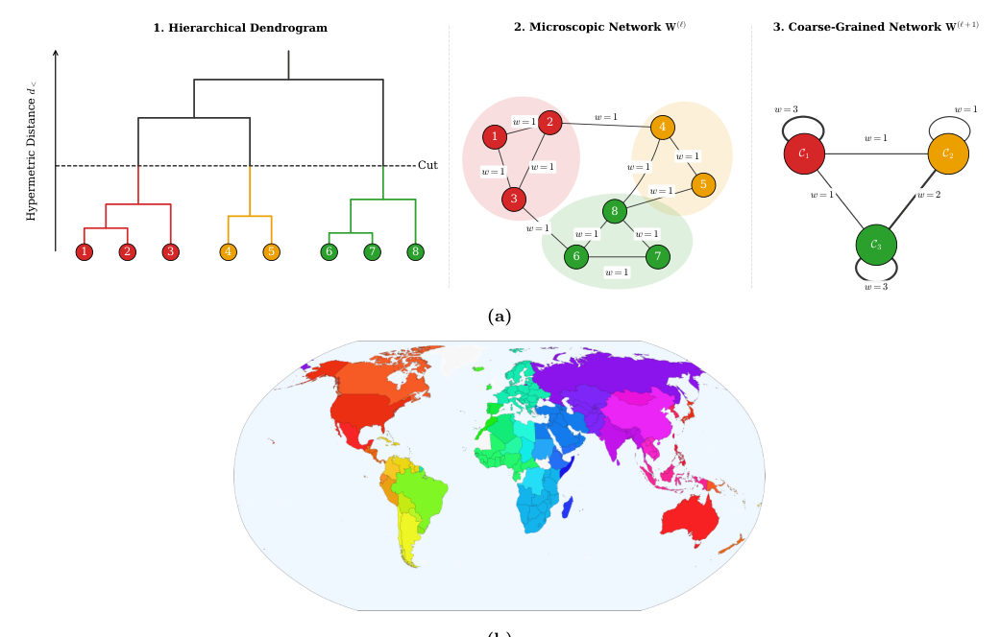
<figcaption class="paper-figure-caption"><b>Fig 1.</b> FIG. 1: Ultrametric aggregation of the ITN. Panel (a) illustrates the construction of the multiscale representa- tion. Countries form the microscopic layer Ω0, while cutting the single-linkage dendrogram at height dc defines the macro-regional layer Ω1(dc). Edge weights are aggregated by summation, and self-loops at the macro-regional scale represent total internal weight within a block. Panel (b) shows the 1993 macro-regional partition obtained with the main cut dc = 800, km, with different colors identifying different macro-regions.</figcaption>
</figure>
<figure class="paper-figure-card">
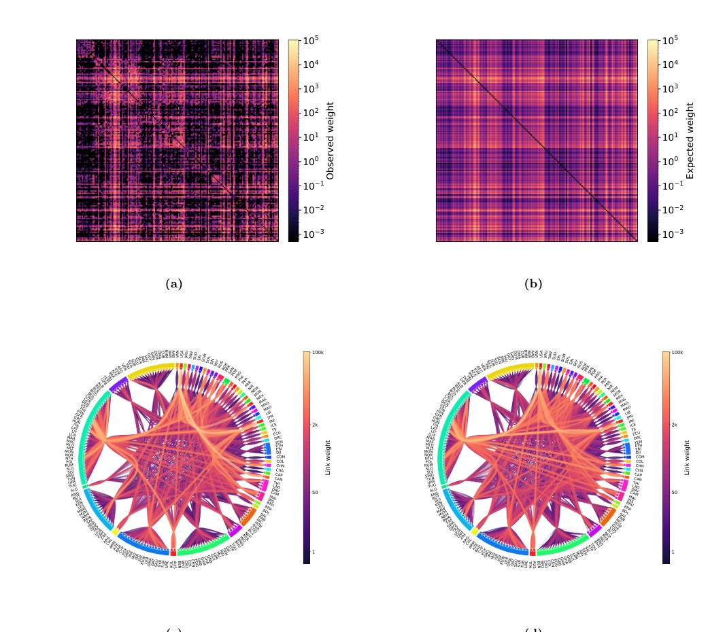
<figcaption class="paper-figure-caption"><b>Fig 2.</b> FIG. 2: Observed and reconstructed country-level weighted ITN in 1993. Panels (a,b): observed country- to-country weights and wMSM expected weights, with countries ordered by macro-region. Black entries correspond to absent links or values outside the plotted range. Panels (c,d): circular visualization of the same observed and reconstructed weighted networks. In the reconstructed network, the displayed support is obtained by retaining the top-⟨L(0)⟩dyads according to the fitted probabilities. This gives the most likely binary realization predicted by the model. Edge width encodes the corresponding expected trade volume. Node colors identify macro-regions.</figcaption>
</figure>
<figure class="paper-figure-card">
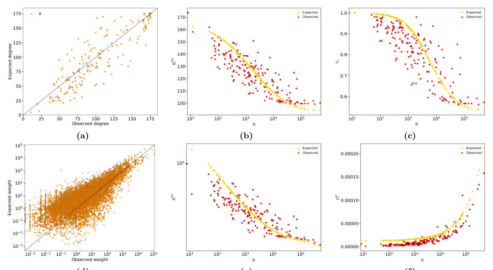
<figcaption class="paper-figure-caption"><b>Fig 3.</b> FIG. 3: Country-level diagnostics for the 1993 ITN reconstructed by the wMSM. Panels (a–c): observed versus expected degrees, average nearest-neighbor degree knn i , and binary clustering coefficient ci. Panels (d–f): ob- served positive dyadic weights versus expected weights, average nearest-neighbor strength snn i , and weighted clustering coefficient cw i . In the local-profile panels, points and curves compare observed country-level values with expected val- ues under the fitted ensemble.</figcaption>
</figure>
<figure class="paper-figure-card">
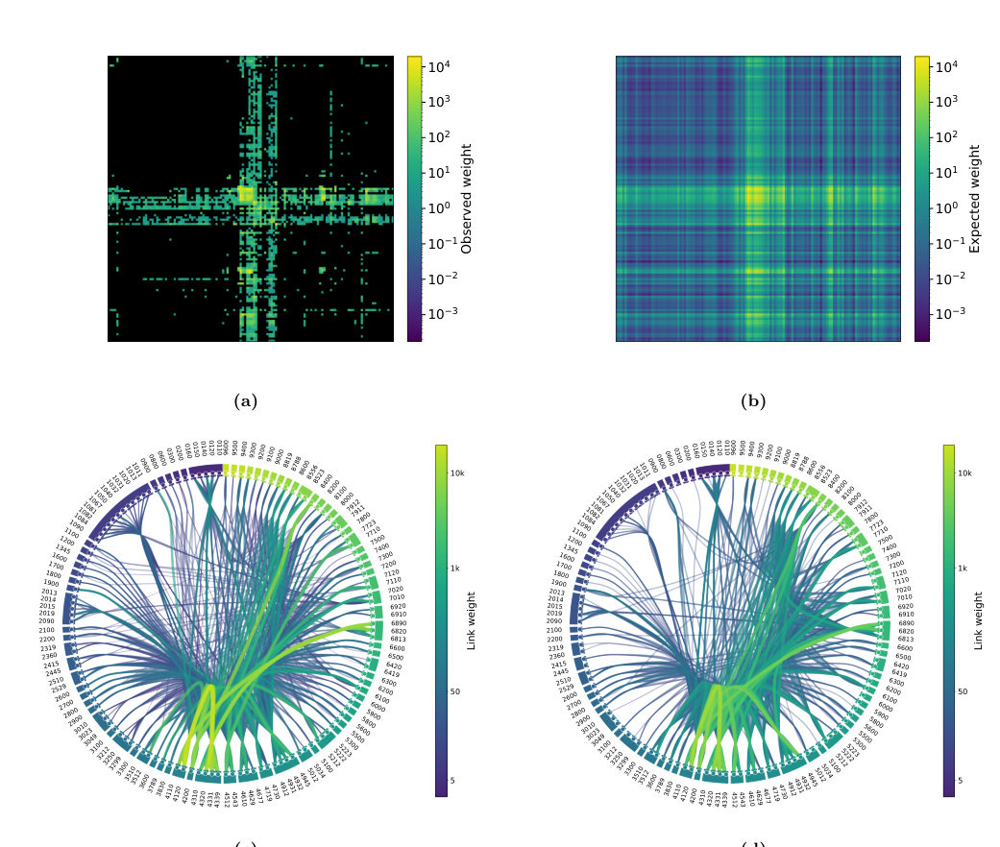
<figcaption class="paper-figure-caption"><b>Fig 4.</b> FIG. 4: Observed and reconstructed four-digit SBI production network for good group g = 4. Panels (a,b): observed sector-to-sector weights and wMSM expected weights, with sectors ordered according to the SBI hierarchy. Black entries correspond to absent links or values outside the plotted range. Panels (c,d): circular visualization of the same observed and reconstructed weighted networks. In the reconstructed network, the displayed support is obtained by retaining the top-⟨L(0)⟩dyads according to the fitted probabilities. This gives the most likely binary realization predicted by the model. Edge width encodes the corresponding expected production volume. Node colors identify sectoral groups.</figcaption>
</figure>
<figure class="paper-figure-card">
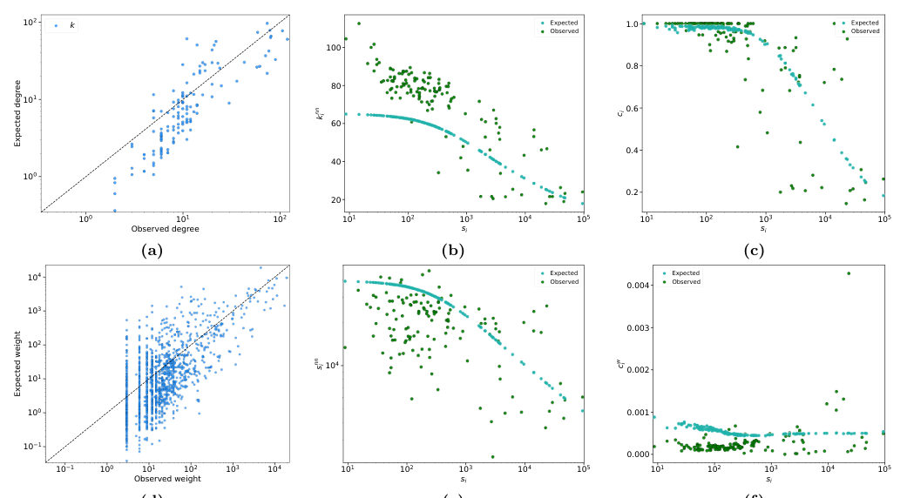
<figcaption class="paper-figure-caption"><b>Fig 5.</b> FIG. 5: Four-digit SBI diagnostics for the DPN reconstructed by the wMSM, shown for good group g = 4. Panels (a–c): observed versus expected degrees, average nearest-neighbor degree knn i , and binary clustering coefficient ci. Panels (d–f): observed positive dyadic weights versus expected weights, average nearest-neighbor strength snn i , and weighted clustering coefficient cw i . In the local-profile panels, points and curves compare observed sector-level values with expected values under the fitted ensemble.</figcaption>
</figure>

**Summary.** This paper develops a multiscale probabilistic framework to reconstruct complex weighted networks from incomplete, coarse-grained data. By ensuring the model's functional form is preserved during aggregation, the authors can transfer parameters calibrated at a macro-scale to infer fine-scale details. This method proves highly effective for analyzing real-world systems like international trade and industrial flows.

**Why it may be interesting.** While the application is in network science, the mathematical framework of parameter transfer and functional invariance across scales echoes concepts used in renormalization group theory or multiscale modeling in quantum many-body physics.

Detailed structure

**Main problem.** The core problem is reconstructing weighted networks when only coarse-grained (aggregated) data is available, which is problematic because the underlying process occurs at a finer scale.

**Main result.** The proposed multiscale reconstruction method successfully recovers the fine-scale binary structure with high accuracy, even when calibrated using information from much coarser aggregate layers.

**Method.** The authors use a multiscale model of weighted networks (wMSM) designed to be functionally invariant under coarse-graining, allowing parameters calibrated at an aggregate level to be transferred to finer levels without refitting.

**Model / system.** The method is tested on empirical weighted networks, specifically the International Trade Network (ITN) and the Dutch production network (DPN), where aggregation occurs geographically or sectorally.

**Key observables.** Precision, specificity, accuracy, maximum degree-error, relative error in link count, and various structural diagnostics (e.g., clustering coefficients).

**Important parameters / regimes.** The density parameter $\delta$ and the strength normalization parameter $
ho$, which are calibrated at the observable aggregate layer.

**Assumptions / limitations.** The model assumes that the functional form of the link probability is preserved under coarse-graining, which is a key advantage over standard maximum-entropy methods.

**Figures summary.** Figures illustrate the ultrametric aggregation process for the ITN and compare observed vs. reconstructed country-level weighted networks for a specific year (1993).

**Paper structure.** The paper introduces the wMSM framework, details its functional invariance property, applies it to two distinct empirical networks (ITN and DPN), and rigorously benchmarks its performance against state-of-the-art methods across varying aggregation scales.

Abstract

Network reconstruction from partial information is usually performed at the same resolution level at which constraints are observable. This becomes problematic when only coarse-grained information is available, while the relevant process occurs at a finer scale. Here we employ the multiscale model of weighted networks introduced in a companion paper and turn it into a probabilistic framework for reconstructing weighted networks across arbitrary aggregation levels. The model is built to preserve its functional form under coarse-graining, so that global parameters calibrated on an observable aggregate layer can be transferred to finer layers without refitting. We test the method on two empirical systems with different aggregation mechanisms. In the International Trade Network, countries are aggregated into geographic macro-regions and the observed coarse-grained layer is used to infer the underlying country-level network. In the Dutch production network, sectoral flows are reconstructed across the hierarchical industrial classification, using coarser sectoral layers to infer finer ones. In both geographical and sectoral settings, we benchmark our genuinely multiscale reconstruction method against a state-of-the-art weighted reconstruction model calibrated directly at the target resolution, and therefore using additional information available at the same (finer) scale at which performance is evaluated. Remarkably, despite this informational disadvantage, our method recovers the fine-scale binary structure with high accuracy, improving precision, specificity, accuracy and maximum degree-error diagnostics, while remaining nearly equivalent in sensitivity.

[↑ back to top](#top)

### [Non-Canonical Quantum Otto Engine](http://arxiv.org/abs/2609.37194v1)

**Authors:** Wei Wu, Jun-Hong An  
**Type:** theory · **Category:** statistical mechanics · **PDF:** <https://arxiv.org/pdf/2609.37194v1>  
**Analysis basis:** full PDF text, analyzed in chunks
**Topic relevance:** `Keldysh / 2PI / non-Gaussian methods` **1/5** · `correlated / nonlocal dissipation` **1/5** · `driven-dissipative phase transition` **1/5** · `methods for driven-dissipative` **1/5** · `non-equilibrium universality` **1/5**

↔ Scroll figures horizontally

<figure class="paper-figure-card">
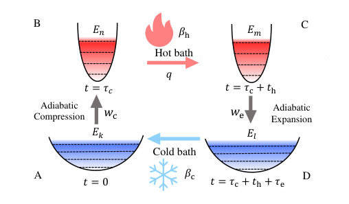
<figcaption class="paper-figure-caption"><b>Fig 1.</b> FIG. 1. Diagrammatic sketch of the quantum Otto cycle.</figcaption>
</figure>
<figure class="paper-figure-card">
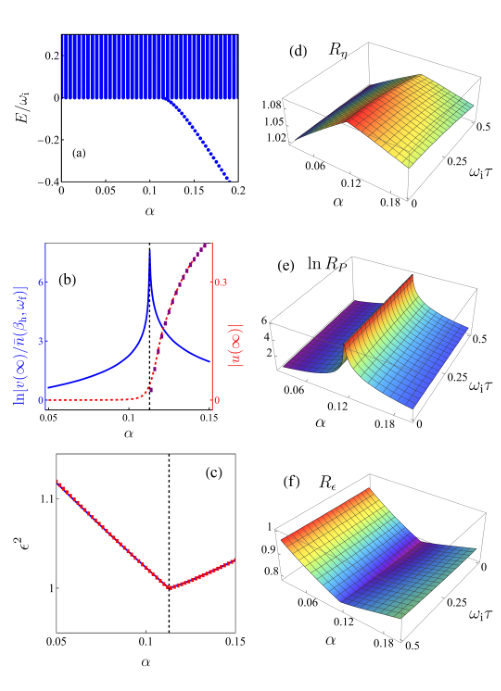
<figcaption class="paper-figure-caption"><b>Fig 2.</b> FIG. 2. (a) Energy spectrum of the total system consisting of the working substance and the hot bath. (b) v(∞)/¯n(βh, ωf) (blue line) and |u(∞)| (red dashed line) are plotted as the functions of α. The purple rectangles are analytical results |u(∞)| = Z. (c) ϵ2 versus α. The red rectangles are numer- ical results with ωiτ = 100, while the blue solid line is the adiabatic result of ϵ2 adi = 1+1/v(∞). (d) Rη ≡⟨η⟩/⟨ηBM⟩(e) RP ≡⟨P⟩/⟨PBM⟩and (f) Rϵ ≡ϵ/ϵM as the functions of the cycle time τ and the coupling constant α. We use ωf = 2ωi, βc = 5ω−1 i , βh = 0.1ω−1 i , s = 0.5, and ωc = 10ωi.</figcaption>
</figure>
<figure class="paper-figure-card">
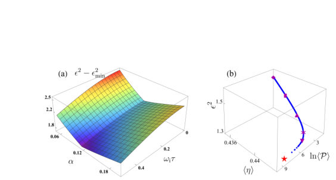
<figcaption class="paper-figure-caption"><b>Fig 3.</b> FIG. 3. (a) ϵ2 −ϵ2 text is plotted as the functions of τ and α. (b) Trade-off relation among the power ⟨P⟩, the efficiency ⟨η⟩, and the fluctuation ϵ with ωiτ = 1. Different blue points correspond to different coupling strengths. Six representative data are displayed separately: α = 0.05 (diamond), α = 0.07 (rectangle), α = 0.09 (up-triangle), α = 0.12 (down-triangle), α = 0.13 (six-pointed star) and α = 0.1128 (red five-pointed star), which is the critical coupling strength at which the bound state forms. Other parameters are the same as those in Fig. 2.</figcaption>
</figure>

**Summary.** This paper analyzes a quantum Otto engine, focusing on how non-Markovian thermalization affects its performance statistics. By moving beyond the standard Born-Markov approximation, the authors show that engineering the system's energy spectrum near a quantum critical point allows for the simultaneous enhancement of efficiency and power while reducing fluctuations. This suggests a new pathway for designing stable and highly efficient quantum energy devices.

**Why it may be interesting.** This work provides a deep theoretical understanding of how non-Markovian quantum dynamics can enhance the performance metrics (efficiency, power) and stability (reduced variance) of fundamental thermodynamic engines, which is crucial for quantum energy technology.

Detailed structure

**Main problem.** The study investigates the non-canonical effects on the statistical properties (average values and variances) of efficiency and power in a finite-time quantum Otto cycle, moving beyond the limitations of standard canonical thermalization assumptions.

**Main result.** The average efficiency and power can be simultaneously boosted while decreasing their variances by engineering the energy spectrum structure, particularly near a quantum critical point induced by a bound state formation.

**Method.** The authors use characteristic functions and detailed derivations of expectation values ($\langle W 
angle, \langle Q 
angle, \langle W^2 
angle$) to compare exact non-Markovian results against the standard Born-Markov approximations.

**Model / system.** The model is a quantum Otto engine where the working substance is treated as a quantum harmonic oscillator coupled to hot and cold thermal baths. The dynamics are governed by master equations and quantum Langevin equations.

**Key observables.** Average efficiency ($\langle \eta 
angle$), average power ($\langle P 
angle$), and their respective variances ($\epsilon^2_\eta, \epsilon^2_P$).

**Important parameters / regimes.** The energy spectrum structure, the proximity to a quantum critical point, and the coupling strength (non-Markovian vs. Born-Markov regime).

**Assumptions / limitations.** The analysis explicitly contrasts the non-Markovian regime with the Born-Markov approximation, which is assumed to break down under strong coupling.

**Figures summary.** Figures illustrate the quantum Otto cycle diagram, the energy spectrum showing bound states, and plots comparing fluctuation ($\epsilon^2$) and the trade-off relation between $\langle P
angle$, $\langle\eta
angle$, and $\epsilon$ across different time scales.

**Paper structure.** The paper progresses by defining the system and cycle, deriving the necessary statistical tools (characteristic functions, expectation values), comparing exact non-Markovian results to the Born-Markov benchmark, and finally analyzing the optimal conditions near quantum criticality.

Abstract

The fast-developing quantum technology is propelling thermal machine, which lies at the heart of thermodynamics, into a new golden era. Being stochastic because of the non-negligible thermal and quantum fluctuations, the efficiency and power of a finite-time quantum heat engine exhibit a trade-off, preventing the simultaneous achievement of high power and high efficiency. Conventional studies treat the statistics of a heat engine by assuming canonical thermalization, which is valid only under weak-coupling conditions. We here investigate the noncanonical effect on the statistics of the efficiency and power for a finite-time quantum Otto cycle. It is revealed that their average values and variances are highly controllable by engineering the energy spectrum structure of the composite system consisting of the working substance and the bath. Near the quantum critical point induced by the formation of a bound state in the energy spectrum, the average efficiency and power can be boosted simultaneously, meanwhile, both of their variances are decreased. Deepening our understanding of the usefulness of quantum reservoir engineering in thermodynamics, our result lays the foundation for the realization of efficient and stable quantum energy devices.

[↑ back to top](#top)

### [Semiclassical spin-bath calculation of the nitrogen-isotope effect on NV$^-$ ensemble coherence in diamond](http://arxiv.org/abs/2609.37596v1)

**Authors:** Chikara Shinei  
**Type:** theory · **Category:** other · **PDF:** <https://arxiv.org/pdf/2609.37596v1>  
**Analysis basis:** full PDF text, analyzed in chunks
**Topic relevance:** `Keldysh / 2PI / non-Gaussian methods` **1/5** · `QC/QI experiment` **1/5** · `correlated / nonlocal dissipation` **1/5** · `methods for driven-dissipative` **1/5** · `quantum measurements` **1/5**

↔ Scroll figures horizontally

<figure class="paper-figure-card">
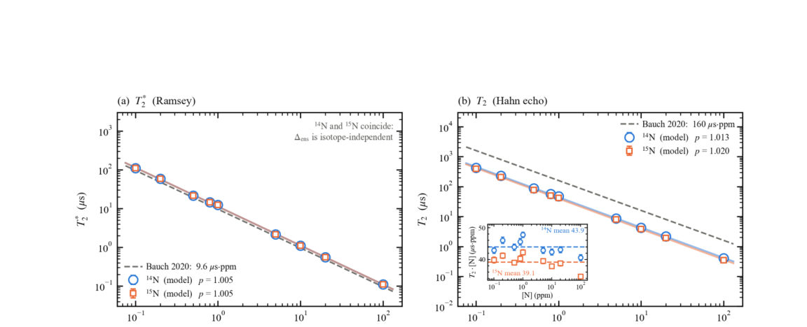
<figcaption class="paper-figure-caption"><b>Fig 1.</b> FIG. 1. Simulated ensemble coherence times versus nitrogen concentration for ¹⁴N (blue circles) and ¹⁵N (orange squares) P1 baths, with 1σ uncertainties propagated from the fits of Eqs. (7) and (8). Solid lines are weighted power-law fits; dashed grey lines are the measured scalings of Ref. [2], 9.6 μs·ppm for T₂* and 160 μs·ppm for T₂. (a) T₂* is identical for the two isotopes, as required by Eq. (3). (b) T₂ is shorter for ¹⁵N at every concentration; the model underestimates its absolute value by a factor of about 3.6. Inset: T₂·[N], which removes the common 1/[N] dependence; dashed lines are the weighted means, and ¹⁴N lies above ¹⁵N at every concentration.</figcaption>
</figure>
<figure class="paper-figure-card">
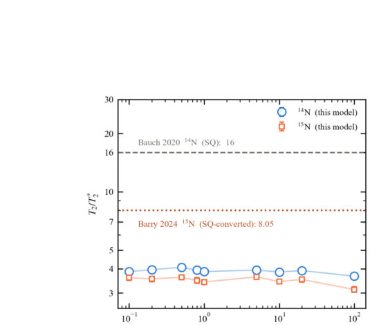
<figcaption class="paper-figure-caption"><b>Fig 2.</b> FIG. 2. Concentration-independent ratio T₂/T₂* for the two isotopes. The model gives a flat ratio, as required by the common 1/[N] scaling, with the ¹⁵N value lying systematically below the ¹⁴N value. Horizontal lines mark the experimental ¹⁴N value of Ref. [2] (dashed) and the ¹⁵N value of Ref. [9] converted to the same single- quantum convention (dotted). The model reproduces the ordering and the concentration-independence but not the full magnitude of the separation.</figcaption>
</figure>
<figure class="paper-figure-card">
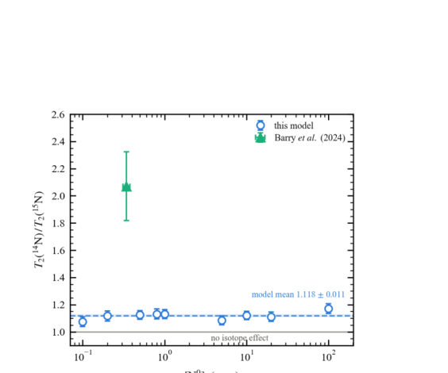
<figcaption class="paper-figure-caption"><b>Fig 3.</b> FIG. 3. Isotope ratio T₂(¹⁴N)/T₂(¹⁵N) versus nitrogen concentration. Open circles are the semiclassical model of this work, with 1σ paired-bootstrap uncertainties; the dashed line and shaded band are their weighted mean, 1.118 ± 0.011. The filled triangle is the ¹⁵N magnetometer of Ref. [9]; the horizontal bar is the uncertainty in [N], which is itself inferred from the measured T₂* and the dephasing relation of Ref. [2]. The ¹⁴N coherence time entering the measured ratio is taken from the empirical relation 160 ± 12 μs·ppm of Ref. [2], whose 7.5 % uncertainty is included in the plotted error bar. The grey line at unity marks the absence of any isotope effect.</figcaption>
</figure>
<figure class="paper-figure-card">
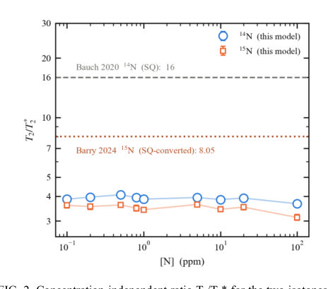
<figcaption class="paper-figure-caption"><b>Fig 4.</b> Figure 1 shows the simulated T₂* and T₂ over three decades of nitrogen concentration. Fitting T = A/[N]p with weights from the propagated errors gives p = 1.005 ± 0.003 for T₂* and p = 1.013 ± 0.003 (¹⁴N), p = 1.020 ± 0.003 (¹⁵N) for T₂ — inverse-linear scaling within a few parts per thousand, in agreement with the experimental observation of Ref. [2]. Constraining p = 1 gives the slopes collected in Table I.</figcaption>
</figure>
<figure class="paper-figure-card">
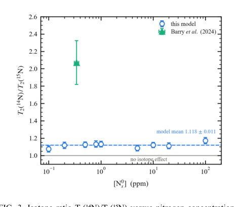
<figcaption class="paper-figure-caption"><b>Fig 5.</b> Figure 2 collects the result. The model gives T₂/T₂* = 3.93 for ¹⁴N and 3.50 for ¹⁵N, a reduction by a factor 1.12, flat in concentration as required. Experimentally the corresponding numbers are 16 [2] and 8.05 [9], a reduction by 1.99.</figcaption>
</figure>

**Summary.** This theoretical study models the decoherence of $	ext{NV}^-$ ensembles in diamond due to the surrounding nitrogen nuclear spin bath. By using a semiclassical spin-bath approach, the authors quantify the effect of the nitrogen isotope ($	ext{}^{14}	ext{N}$ vs. $	ext{}^{15}	ext{N}$) on the coherence time $T_2$. They successfully predict a constant, isotope-dependent ratio for $T_2$, providing a quantitative benchmark for understanding solid-state quantum coherence limitations.

**Why it may be interesting.** This work is highly relevant to open quantum systems and quantum optics as it provides a detailed theoretical mechanism (spin-bath coupling) to explain subtle, isotope-dependent decoherence effects in solid-state qubits ($	ext{NV}^-$).

Detailed structure

**Main problem.** The paper investigates whether the nitrogen nuclear isotope ($	ext{}^{14}	ext{N}$ vs. $	ext{}^{15}	ext{N}$) alone can account for the observed reduction in the ratio of Hahn-echo ($T_2$) to Ramsey ($T_2^*$) coherence times in $	ext{NV}^-$ ensembles in diamond.

**Main result.** The semiclassical model predicts a constant isotope ratio for $T_2$ of $1.118 \pm 0.011$, which is independent of nitrogen concentration and is significantly above unity, suggesting the isotope has a measurable effect on coherence.

**Method.** The authors employ a semiclassical spin-bath model, calculating the bath dynamics based on the fraction of hyperfine-degenerate $	ext{P}1$ pairs, which governs the spin-spin flip-flop rate.

**Model / system.** The system is $	ext{NV}^-$ ensembles in diamond, whose coherence is limited by the dipolar interaction with the surrounding nitrogen nuclear spin bath ($	ext{P}1$ centers). The model uses the Jahn-Teller-resolved $	ext{P}1$ hyperfine tensor to calculate the bath dynamics.

**Key observables.** Hahn-echo time ($T_2$), Ramsey time ($T_2^*$), and the ratio $T_2(	ext{N}^{14}) / T_2(	ext{N}^{15})$.

**Important parameters / regimes.** Nitrogen concentration [N], hyperfine degeneracy fraction ($f_{	ext{res}}$), and the nuclear spin isotopes ($	ext{}^{14}	ext{N}$ vs. $	ext{}^{15}	ext{N}$).

**Assumptions / limitations.** The model assumes that the coherence decay is governed by the fraction of resonant, flip-flop-active P1 pairs, and it serves as a benchmark for more complex many-body calculations.

**Figures summary.** Figures illustrate the concentration-independent ratio of coherence times for both isotopes and show the distribution of correlation times ($	au_c$) for both isotopes, indicating a displacement in the $	ext{N}^{15}$ case.

**Paper structure.** The paper establishes the physical problem by noting the discrepancy in the $T_2/T_2^*$ ratio between natural and $	ext{}^{15}	ext{N}$-doped samples. It then develops a semiclassical spin-bath model based on the hyperfine tensor, calculates the isotope-dependent degeneracy fraction, and finally predicts the constant, concentration-independent ratio of $T_2$ times.

Abstract

The ratio $T_2$/$T_2^*$ of the Hahn-echo and Ramsey times of nitrogen-vacancy (NV$^-$) ensembles is independent of the nitrogen concentration [N] and is $\approx$ 16 in diamond of natural isotopic abundance ($^{14}$N), yet a recent $^{15}$N-doped ensemble magnetometer gives only 8.05 $\pm$ 0.18 in the single-quantum convention. We ask whether the nitrogen nuclear isotope alone can cause such a reduction. Using a semiclassical spin-bath model with the Jahn-Teller-resolved P1 hyperfine tensor, we show that the fraction of P1 pairs that are hyperfine-degenerate, and hence free to flip-flop, is 1/4 for $^{14}$N (I = 1) but 5/16 for $^{15}$N (I = 1/2). Simulations over [N] = 0.1--100 ppm confirm that this shortens $T_2$ while leaving $T_2^*$ exactly unchanged: $T_2$($^{14}$N)/$T_2$($^{15}$N) = 1.118 $\pm$ 0.011, independent of [N] and 11$σ$ above unity. The measured contrast, 2.07 $\pm$ 0.25, is 3.8$σ$ larger, identifying resonant-channel counting as a real but partial contribution and setting a quantitative benchmark for many-body calculations.

[↑ back to top](#top)

### [An adaptive fractional state links circuit mechanisms to cortical dynamics across the visual hierarchy](http://arxiv.org/abs/2609.37355v1)

**Authors:** Brendan Harris, Pulin Gong  
**Type:** both · **Category:** disordered systems and neural networks · **PDF:** <https://arxiv.org/pdf/2609.37355v1>  
**Analysis basis:** full PDF text, analyzed in chunks
**Topic relevance:** `Keldysh / 2PI / non-Gaussian methods` **1/5** · `driven-dissipative phase transition` **1/5** · `methods for driven-dissipative` **1/5** · `non-equilibrium universality` **1/5**

↔ Scroll figures horizontally

<figure class="paper-figure-card">
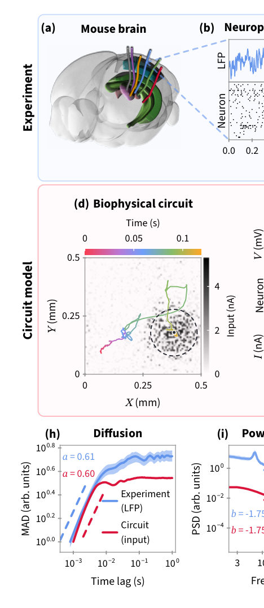
<figcaption class="paper-figure-caption"><b>Fig 1.</b> Figure 1: Cortical activity combines superdiffusion, long-range memory, and oscillations.</figcaption>
</figure>
<figure class="paper-figure-card">
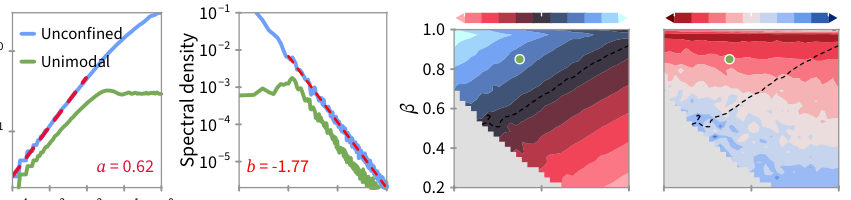
<figcaption class="paper-figure-caption"><b>Fig 2.</b> Figure 2: A minimal effective theory links superdiffusion, memory, and oscillations. Upper text shows the bFNS model, Equation 1.</figcaption>
</figure>
<figure class="paper-figure-card">
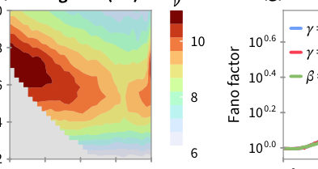
<figcaption class="paper-figure-caption"><b>Fig 3.</b> Figure 3: An empirical bi-fractional mean field reproduces the adaptive fractional state.</figcaption>
</figure>
<figure class="paper-figure-card">
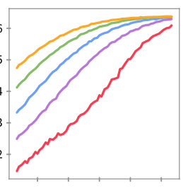
<figcaption class="paper-figure-caption"><b>Fig 4.</b> Figure 4: Working regimes vary systematically across the visual hierarchy.</figcaption>
</figure>

**Summary.** This work characterizes the 'adaptive fractional (AF) state' in the visual cortex, a dynamical regime defined by the simultaneous presence of superdiffusion, long-range memory, and oscillations. By applying a bi-fractional mean-field theory, the authors show that the quantitative signatures of this state vary systematically across the visual hierarchy, suggesting that circuit maturation involves tuning these fractional dynamical parameters.

**Why it may be interesting.** The use of fractional calculus to model complex, non-Markovian dynamics in biological systems provides a powerful mathematical tool for understanding emergent collective behavior, which has parallels in modeling complex quantum many-body dynamics or open quantum systems.

Detailed structure

**Main problem.** The paper investigates how cortical circuits reconcile the competing demands of responding flexibly to new inputs while integrating information about the past (long-term temporal integration).

**Main result.** Cortical activity exhibits an 'adaptive fractional (AF) state,' characterized by the coexistence of heavy-tailed superdiffusive excursions, long-range temporal memory, and oscillations. This state varies systematically across the visual hierarchy, correlating with changes in effective inhibition.

**Method.** The authors combine analysis of Neuropixels recordings (LFP/spiking activity) with the development and application of a bi-fractional neural sampling (bFNS) effective mean-field theory.

**Model / system.** The system is the mouse visual cortex, analyzed using data from six visual areas. The theoretical framework is the bi-fractional model, which uses spatial and temporal fractional derivatives to capture non-Gaussian excursions and long-range memory.

**Key observables.** Superdiffusion exponent ($a$), temporal fractional order (long-range memory), oscillation frequencies ($	heta, \gamma$), excess kurtosis ($\kappa$), and the Fano factor ($F(	au)$).

**Important parameters / regimes.** The dynamical exponents ($a, b, c$) are key, showing a systematic shift across the visual hierarchy, linked to progressive weakening of effective inhibition.

**Assumptions / limitations.** The analysis assumes that the observed dynamics can be effectively described by a bi-fractional process, and the interpretation of exponents relies on fitting these fractional models to empirical data.

**Figures summary.** Figures illustrate LFP step-size distributions showing heavy tails, Power Spectral Density decomposition into oscillatory and aperiodic parts, and plots showing the systematic variation of dynamical exponents across different visual areas and cortical layers.

**Paper structure.** The paper establishes the problem (reconciling flexibility and memory), introduces the AF state concept, details the bi-fractional model formulation, presents experimental evidence from LFP/spiking data showing the coexisting signatures, and finally maps the systematic variation of these signatures across the visual hierarchy.

Abstract

Cortical circuits must respond flexibly to new inputs while integrating information about the past, yet the way in which neural activity reconciles these competing demands remains unclear. Combining Neuropixels recordings from six mouse visual areas with mechanistic circuit modeling, we identify a dynamical regime in which heavy-tailed superdiffusive fluctuations coexist with long-range temporal dependence and oscillations. We formalize this regime as the adaptive fractional (AF) state, using an effective mean-field theory in which spatial and temporal fractional derivatives capture heavy-tailed excursions and long-range memory, respectively. We find that dynamical exponents characterizing the AF state vary systematically across the visual hierarchy: higher visual areas exhibit weaker superdiffusion and stronger temporal memory. In the circuit model, this hierarchical shift emerges from a progressive weakening of effective inhibition. These findings extend the classical hierarchy of timescales to a hierarchy of dynamical regimes and suggest that the AF state allows cortical areas to jointly express rapid responses and long-term temporal integration.

[↑ back to top](#top)

### [Blind directions of linear response and the limits of finite-perturbation bounds on efficiency fluctuations](http://arxiv.org/abs/2609.37940v1)

**Authors:** Badr Farih  
**Type:** theory · **Category:** statistical mechanics · **PDF:** <https://arxiv.org/pdf/2609.37940v1>  
**Analysis basis:** full PDF text, analyzed in chunks
**Topic relevance:** `Full counting statistics` **1/5** · `driven-dissipative phase transition` **1/5** · `non-equilibrium universality` **1/5** · `quantum measurements` **1/5**

↔ Scroll figures horizontally

<figure class="paper-figure-card">
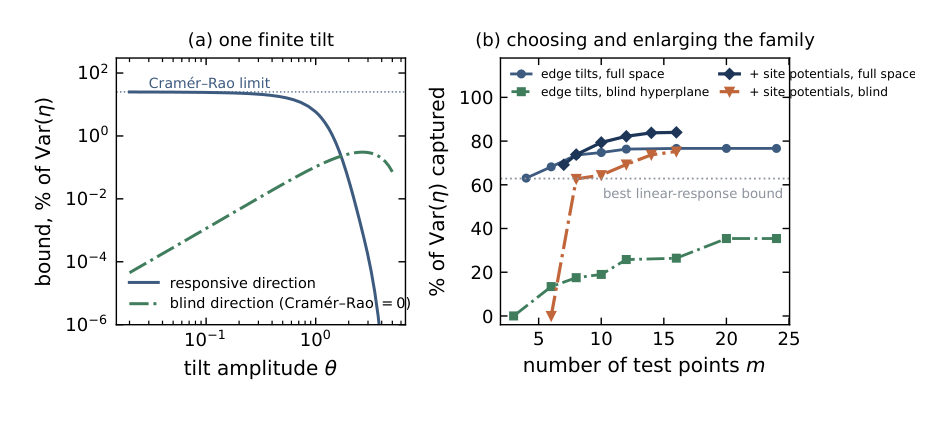
<figcaption class="paper-figure-caption"><b>Fig 1.</b> Fig. 1 (a) One finite perturbation of the three-state model. Along a responsive direction the bound sits at its Cram´er–Rao value (dotted) for small θ and collapses beyond θ ∼1. Along a blind direction Cram´er–Rao is exactly zero; the bound rises as θ2 from the origin, as Proposition 3 requires, peaks near θ = 2.5 and falls. (b) Several test points together. The horizontal line is the best linear-response bound. Edge tilts alone reach 76.7% in the full space and 35.4% on the blind hyperplane; adding site potentials raises these to 84.0% and 75.2%</figcaption>
</figure>
<figure class="paper-figure-card">
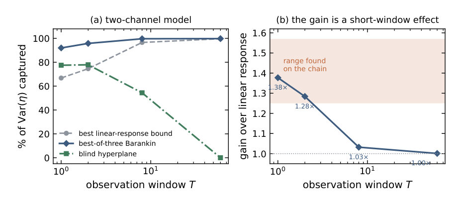
<figcaption class="paper-figure-caption"><b>Fig 2.</b> Fig. 2 (a) Two-channel model against observation window. As the window grows the counts become Gaussian, the best linear-response bound approaches Var(η), and the blind hyperplane (where that bound is identically zero) yields exactly nothing. (b) The same as a ratio. The shaded band is the range of gains found on the three-state model</figcaption>
</figure>

**Summary.** This theoretical work develops advanced statistical bounds to estimate the variance of non-linear observables, like thermodynamic efficiency, in non-equilibrium systems. It demonstrates that when standard linear response methods fail, higher-order bounds, such as the Barankin bound, can still quantify the achievable precision using finite perturbations. The findings establish a new computational tool for analyzing energy transduction in Markov processes.

**Why it may be interesting.** It provides a sophisticated extension of fluctuation theorems, showing how higher-order statistical tools can extract information about non-linear processes that are invisible to standard linear response theory, which is crucial for understanding energy conversion in open quantum systems.

Detailed structure

**Main problem.** The paper investigates the limits of precision in estimating non-linear observables, such as exergetic efficiency, using finite perturbations when standard linear response bounds fail.

**Main result.** For the exergetic efficiency $\eta$, the Barankin multi-point bound remains strictly positive in directions where linear-response bounds vanish, recovering a significant fraction of the variance.

**Method.** The authors employ the Barankin multi-point bound and analyze the $\chi^2$ divergence cost associated with perturbing the Markov jump process rates.

**Model / system.** The analysis is performed on a time-homogeneous Markov jump process on a finite state space, operating in a non-equilibrium steady state. The focus is on the exergetic efficiency $\eta = W/(W + T_0S)$.

**Key observables.** Exergetic efficiency ($\eta$), Cramér-Rao bound, Barankin multi-point bound, $\chi^2$ divergence.

**Important parameters / regimes.** The gain is a short-window effect that disappears as counts become Gaussian; the bound is shown to be a computational instrument, not a general uncertainty relation.

**Assumptions / limitations.** The analysis relies on the existence of moments for the exergetic ratio $\eta$ and the use of the $\chi^2$ divergence as the cost measure for finite perturbations.

**Figures summary.** Not specified by the notes, but the analysis compares various bounds (Cramér-Rao vs. Barankin) across different perturbation directions and network sizes.

**Paper structure.** The paper establishes the failure of linear response for $\eta$, introduces the Barankin bound, proves its positivity in 'blind directions,' and concludes by detailing the limitations of the bound as an inference tool.

Abstract

Thermodynamic uncertainty relations bound the fluctuations of time-antisymmetric currents. Stochastic efficiency is not one: a ratio of two odd quantities, it is even under path reversal, and for the conventional ratio $-W/Q_h$ no moment exists. We work with the exergetic ratio $η=W/(W+T_0S)$, whose moments exist, and ask how much of its variance a finite perturbation of the dynamics can certify when linear response cannot. The question is specific to nonlinear observables: for every current, and every observable linear in transition counts and residence times, the multiparameter Cramér-Rao bound over rate and site perturbations already equals the variance. For $η$ it does not. The Cramér-Rao bound vanishes on a hyperplane of perturbation directions, while the Barankin multi-point bound, applied to tilted path measures, stays positive there and recovers 75% of the variance of $η$ in a three-state motor model where every linear-response bound is zero. The Gram matrix of tilted Markov-jump path measures is a Feynman-Kac matrix exponential whose potential is the Hellinger integrand of the jump intensities, and the cost of a perturbation is its $χ^2$ divergence, which no dissipation bound controls. The bound captures 1.25-1.57 times the best linear-response bound, and the gain persists on networks of up to sixteen states. For an Ornstein-Uhlenbeck process the construction is exactly solvable: the optimal tilt scales as $T^{-1/2}$ and three test points nearly reach the supremum. Two limits are established. The gain is a short-window effect that disappears as the counts become Gaussian, and the bound cannot be turned into inference: coarse measurements bound $χ^2$ only from below. The construction is a computational instrument for a model in hand, not an uncertainty relation.

[↑ back to top](#top)

### [Boundary Criticality in (2+1)-dimensional U(1) Dirac Quantum Spin Liquid](http://arxiv.org/abs/2609.38088v1)

**Authors:** Huan Jiang, Zhiming Pan, Xue-Jia Yu, Shao-Kai Jian  
**Type:** theory · **Category:** strongly correlated electrons · **PDF:** <https://arxiv.org/pdf/2609.38088v1>  
**Analysis basis:** full PDF text, analyzed in chunks
**Topic relevance:** `Keldysh / 2PI / non-Gaussian methods` **1/5** · `analog quantum simulation` **1/5** · `non-equilibrium universality` **1/5**

↔ Scroll figures horizontally

<figure class="paper-figure-card">
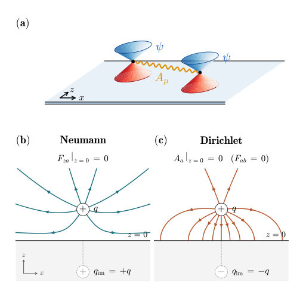
<figcaption class="paper-figure-caption"><b>Fig 1.</b> FIG. 1. (a) Fractionalized Dirac spinons ψ in a (2+1)D quan- tum spin liquid coupled to a gauge field Aµ, with the system subject to open boundary conditions in the z direction. (b,c) Electrostatic image-charge picture of the Neumann (b) and Dirichlet (c) boundary conditions, corresponding to same-sign and opposite-sign image charges, respectively.</figcaption>
</figure>
<figure class="paper-figure-card">
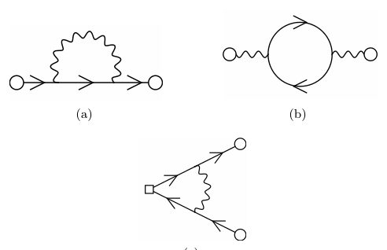
<figcaption class="paper-figure-caption"><b>Fig 2.</b> FIG. 2. One-loop diagrams for the boundary renormalization of (a) the fermion self-energy, (b) the gauge field polarization, and (c) the fermion composite operator. All external legs terminate on the boundary, as indicated by ◦. The solid line with arrow denotes the fermion propagator, while the waving line represents the gauge field porpagator. The □represents a composite operator insertion on the boundary.</figcaption>
</figure>
<figure class="paper-figure-card">
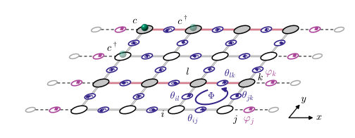
<figcaption class="paper-figure-caption"><b>Fig 3.</b> FIG. 3. Illustration of the fermion-gauge lattice model with L = 4. The matter fields reside on the lattice, while the dynamical U(1) gauge fields reside on the solid bulk links. The system has open boundary conditions along the x di- rection and periodic boundary conditions along the y axis. Gray (white) sites denote A (B) sublattices. The hopping amplitude between A sublattice (pink link) is −t, and t oth- erwise. The dashed virtual bonds contain the boundary- localized U(1) phase field φi.</figcaption>
</figure>

**Summary.** This work analyzes the boundary criticality of a 2+1 dimensional U(1) Dirac Quantum Spin Liquid using perturbative Renormalization Group techniques. By examining the difference between Neumann and Dirichlet boundary conditions, the authors establish that these conditions define distinct boundary universality classes. The findings are supported by a proposed fermion-gauge lattice model for potential physical realization.

**Why it may be interesting.** The study of boundary effects in strongly correlated systems like QSLs is crucial for understanding how boundaries modify bulk quantum phases, which is relevant for engineered quantum materials.

Detailed structure

**Main problem.** The paper investigates the boundary criticality in a (2+1)-dimensional U(1) Dirac Quantum Spin Liquid (QSL).

**Main result.** The boundary conditions (Neumann vs. Dirichlet) lead to distinct boundary universality classes, characterized by different boundary scaling dimensions.

**Method.** The analysis employs a perturbative Renormalization-Group (RG) approach in a half-space, calculating one-loop corrections to boundary two-point functions.

**Model / system.** The system is a U(1) Dirac spin liquid, whose low-energy physics is modeled by (2+1) dimensional Quantum Electrodynamics (QED$_3$). A microscopic lattice model is also proposed to realize these boundary interactions.

**Key observables.** Boundary scaling dimensions ($\Delta_\partial$), boundary renormalization factors ($Z_\partial$), and the anomalous dimension of boundary fermion operators ($\eta_\partial^O$).

**Important parameters / regimes.** The gauge coupling constant ($e$), the dimensionality (2+1), and the boundary conditions (Neumann/Dirichlet).

**Assumptions / limitations.** The analysis is restricted to one-loop order and relies on the continuum QED$_3$ description of the QSL.

**Figures summary.** Figures illustrate the electrostatic image-charge picture for boundary conditions, one-loop diagrams for renormalization, and the structure of the proposed fermion-gauge lattice model.

**Paper structure.** The paper develops the RG analysis by calculating bulk and boundary renormalization factors for fermion and gauge fields, determines the boundary scaling dimensions based on boundary conditions, and concludes by proposing a lattice realization.

Abstract

An emergent gauge field can control boundary critical behavior without changing the bulk quantum spin liquid. We investigate the boundary criticality in $(2+1)$-dimensional $U(1)$ Dirac spin liquid, whose low-energy physics is described by massless quantum electrodynamics. Using a perturbative renormalization-group analysis in a half-space, we show that Neumann and Dirichlet boundary conditions for the emergent gauge field lead to distinct boundary universality classes. We determine the boundary scaling dimensions of the fundamental fields and gauge-invariant operators that provide observable signatures. We further propose a fermion-gauge lattice model with tunable boundary interactions as a microscopic setting for realizing and probing these boundary universality classes.

[↑ back to top](#top)

### [Uniform-Charge-Density $d$-Wave Superconductivity in the Pure $t$-$J$ Model at $1/8$ Doping on an Infinite Cylinder](http://arxiv.org/abs/2609.37191v1)

**Authors:** Guangyu Yu, Zheng Zhu  
**Type:** theory · **Category:** strongly correlated electrons · **PDF:** <https://arxiv.org/pdf/2609.37191v1>  
**Analysis basis:** full PDF text, analyzed in chunks
**Topic relevance:** `Keldysh / 2PI / non-Gaussian methods` **1/5** · `analog quantum simulation` **1/5** · `methods for driven-dissipative` **1/5**

↔ Scroll figures horizontally

<figure class="paper-figure-card">
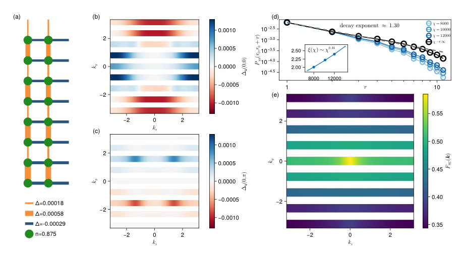
<figcaption class="paper-figure-caption"><b>Fig 1.</b> FIG. 1. (a) Bond-resolved superconducting order parameter and on-site electron density. The two inequivalent y bonds have ∆= +0.00018 (thin orange) and +0.00058 (thick orange), while x bonds have ∆= −0.00029 (blue), realizing the d-wave sign structure; the density is uniform at n = 0.875. (b) Uniform pairing component ∆k(0, 0) in the first Brillouin zone, shown as discrete strips at the allowed transverse momenta ky = nπ/4 (kx continuous); the sign change across kx = ±ky is characteristic of dx2−y2 pairing. (c) Finite-momentum component ∆k(0, π) on the same color scale as (b), strongly suppressed relative to the uniform component. (d) Singlet pair correlation Pyy(r) on a double-logarithmic...</figcaption>
</figure>
<figure class="paper-figure-card">
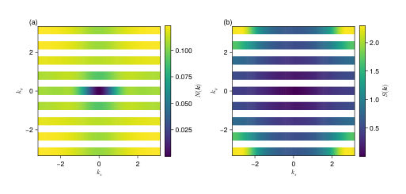
<figcaption class="paper-figure-caption"><b>Fig 2.</b> FIG. 3. (a) Static charge structure factor N(k) in the first Brillouin zone (transverse momentum quantized to the dis- crete cuts ky = nπ/4, kx continuous). The featureless pro- file shows no evidence for charge ordering. (b) Static spin structure factor S(k). The spectral weight near (± 7</figcaption>
</figure>
<figure class="paper-figure-card">
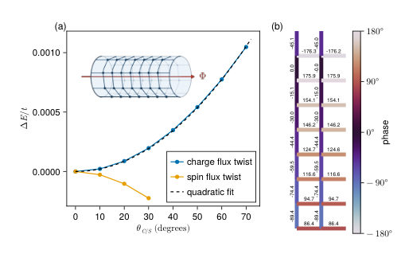
<figcaption class="paper-figure-caption"><b>Fig 3.</b> FIG. 2. (a) Ground-state energy change per site, ∆E/t = [E(θ) −E(0)]/t, versus twist angle for charge flux (blue) and spin flux (yellow) twists; the inset sketches a flux Φ thread- ing the cylinder. The energy increases quadratically under charge flux (dashed line: quadratic fit), signaling finite super- conducting phase stiffness, but decreases monotonically under spin flux. (b) Order-parameter phase (in degrees, labeled on each bond) under a charge flux twist θC = 60◦: the phase winds smoothly along the y-direction, faithfully following the applied boundary twist.</figcaption>
</figure>
<figure class="paper-figure-card">
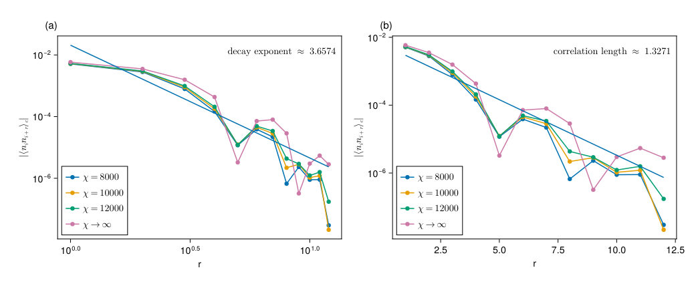
<figcaption class="paper-figure-caption"><b>Fig 4.</b> FIG. 4. Real-space density-density connected correlation function |⟨nini+r⟩c|, shown on (a) double-logarithmic and (b) semi- logarithmic scales. A power-law fit to the extrapolated curve gives a decay exponent ≈3.66, while an exponential fit gives a correlation length ξ ≈1.33 lattice constants. Both fits confirm the absence of long-range charge order.</figcaption>
</figure>
<figure class="paper-figure-card">
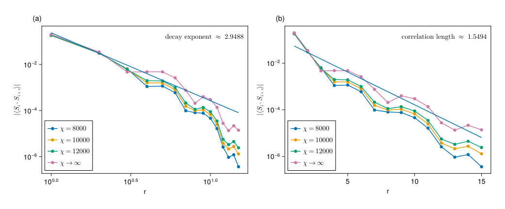
<figcaption class="paper-figure-caption"><b>Fig 5.</b> FIG. 5. Real-space spin-spin correlation function |⟨Si ·Si+r⟩|, shown on (a) double-logarithmic and (b) semi-logarithmic scales. A power-law fit to the extrapolated curve gives a decay exponent ≈2.95, while an exponential fit gives a correlation length ξ ≈1.55 lattice constants. Both fits rule out long-range magnetic order.</figcaption>
</figure>

**Summary.** This theoretical study uses the VUMPS method on the $t$-$J$ model to resolve the stripe vs. superconductivity debate at 1/8 doping. The authors conclude that the system favors a uniform $d$-wave superconducting state, as evidenced by robust pairing correlations and the rapid decay of charge and spin order parameters. This provides methodologically distinct evidence supporting superconductivity in this minimal model.

**Why it may be interesting.** The rigorous application of advanced tensor network methods to resolve fundamental debates in strongly correlated electron systems provides crucial benchmarks for understanding high-Tc superconductivity mechanisms.

Detailed structure

**Main problem.** The paper addresses the long-standing controversy regarding the ground state of the $t$-$J$ model at $1/8$ hole doping, specifically whether it exhibits stripe order or superconductivity.

**Main result.** The study finds that the ground state is a uniform-charge-density $d$-wave superconductor with quasi-long-range pairing correlations, while charge and spin correlations decay rapidly, ruling out long-range stripe or magnetic order.

**Method.** The Variational Uniform Matrix Product State (VUMPS) method is employed to optimize the wave function in the thermodynamic limit along the cylinder axis.

**Model / system.** The system is the pure $t$-$J$ model on a square lattice, studied at $1/8$ hole doping ($\langle n_i 
angle = 0.875$). The analysis is performed on an infinite cylinder geometry.

**Key observables.** Superconducting pairing ($\Delta$), superconducting phase stiffness, charge structure factor ($N(\mathbf{k})$), spin structure factor ($S(\mathbf{k})$), and real-space correlation functions ($\langle n_i n_{i+r} 
angle_c$, $\langle S_i \cdot S_{i+r} 
angle$).

**Important parameters / regimes.** Hole doping of $1/8$; $J/t = 0.4$; cylinder circumference $L_y=8$.

**Assumptions / limitations.** The VUMPS method eliminates boundary pinning effects, and the rapid decay of correlations is robust across different fitting parametrizations.

**Figures summary.** Figures show the $d$-wave structure of the order parameter, confirmation of quasi-long-range pairing via power-law decay of correlations, and the absence of sharp peaks in charge/spin structure factors on the $L_y=8$ cylinder.

**Paper structure.** The paper systematically analyzes superconducting order (via pairing correlations and phase stiffness), then investigates charge and spin correlations (via structure factors and real-space decay), contrasting the results with known stripe-forming regimes (e.g., $L_y=6$ at $1/6$ doping).

Abstract

The ground state of the square-lattice $t$-$J$ model at $1/8$ hole doping has been the subject of a long-standing controversy, with conflicting numerical reports of stripe order versus superconductivity. Here, we address this debate using the variational uniform matrix product state (VUMPS) method, which optimizes the wave function directly in the thermodynamic limit along the cylinder axis and eliminates the boundary pinning effects that can arise in finite-cylinder calculations. On an infinite cylinder of circumference $L_y = 8$, we find a uniform-charge-density $d$-wave superconducting ground state with quasi-long-range pairing correlations. The dominant pairing occurs at zero center-of-mass momentum, while no sizable finite-momentum pairing component is detected. Twisted-boundary-condition calculations reveal a finite superconducting phase stiffness, with the order-parameter phase winding smoothly to follow the applied flux, providing an independent probe of the robustness of the superconductivity. Moreover, both charge and spin correlations decay rapidly, with no signatures of long-range stripe or magnetic order, in contrast to an $L_y=6$ cylinder at $1/6$ doping where the same method readily identifies stripe order. Our results provide methodologically distinct evidence in the long-standing stripe--superconductivity debate in the pure $t$-$J$ model and reveal uniform $d$-wave superconductivity in a minimal model of doped Mott insulators.

[↑ back to top](#top)

### [Breakdown of Local Denoising as Semantic Speciation](http://arxiv.org/abs/2609.38176v1)

**Authors:** Guangkuo Liu, Mert Okyay, Yifan F. Zhang, Fangjun Hu, Rahul Nandkishore, Xun Gao  
**Type:** theory · **Category:** disordered systems and neural networks · **PDF:** <https://arxiv.org/pdf/2609.38176v1>  
**Analysis basis:** full PDF text, analyzed in chunks
**Topic relevance:** `driven-dissipative phase transition` **1/5** · `non-equilibrium universality` **1/5**

↔ Scroll figures horizontally

<figure class="paper-figure-card">
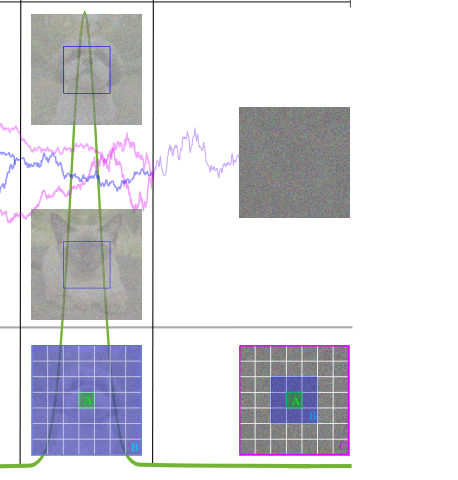
<figcaption class="paper-figure-caption"><b>Fig 1.</b> Figure 1: Semantic speciation locates the window in which local denoising breaks down. De- noising trajectory is from t = 1 (right) to t = 0 (left). The upper panel depicts a semantic speciation from white noise to cat or dog for local region (blue) and global region (magenta); the corresponding thresholds define a speciation window (black vertical lines). The noisy images in the window depict generation times in which the semantic identity is visible in the whole image, but invisible in a local patch (blue box). In the lower row, A is the patch to denoise (green), B its minimal surrounding context (blue) for below-threshold denoising, and C the rest of the image (magenta). The green curve...</figcaption>
</figure>
<figure class="paper-figure-card">
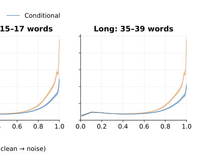
<figcaption class="paper-figure-caption"><b>Fig 2.</b> Figure 2: Semantic conditioning reduces the average local–global prediction gap in SD3. A smaller conditional gap means that restricting distant image-token interactions changes the model prediction less when semantic information is supplied. This is consistent with the common-cause interpretation: the description explains part of the shared image structure that would otherwise require distant context.</figcaption>
</figure>
<figure class="paper-figure-card">
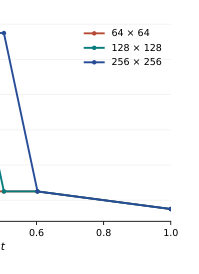
<figcaption class="paper-figure-caption"><b>Fig 3.</b> Figure 3: Label–reconstruction similarity remains high at early diffusion times and then falls toward zero. The sharp drop occurs first for the 64 × 64 crop, then for the 128 × 128 crop, and last for the full image.</figcaption>
</figure>
<figure class="paper-figure-card">

<figcaption class="paper-figure-caption"><b>Fig 4.</b> Fig. 4(a) tracks the four mutual informations It(S; B), It(S; AB), It(S; BC), It(S; ABC). These curves are monotone decreasing under the forward diffusion dynamics and develop sharp late- time cliffs. The smaller regions lose semantic information earlier, while the global regions remain informative until later times. This is the finite-size numerical signature of the forward-backward semantic transition.</figcaption>
</figure>
<figure class="paper-figure-card">
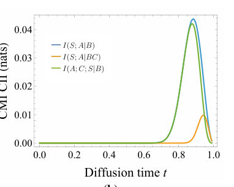
<figcaption class="paper-figure-caption"><b>Fig 5.</b> Fig. 4(b) plots the two conditional gaps It(S; A|B) = It(S; AB) −It(S; B), and It(S; A|BC) = It(S; ABC)−It(S; BC). These gaps peak near the steepest parts of the corresponding MI cliffs. For the parameters used here, Gloc peaks near t ≃0.88, whereas Gglob is smaller and delayed, peaking near t ≃0.94. This delay reflects the greater robustness of the global context ABC to the forward noise.</figcaption>
</figure>

**Summary.** This theoretical paper connects the concepts of semantic structure emergence and the breakdown of local information processing in generative models. It proves that when semantic labels are the common cause of correlations, the failure of local denoising must occur within the period where the model commits to a semantic class. The work provides analytical conditions for these two distinct temporal windows to merge into a single phase transition.

**Why it may be interesting.** While the core subject is ML, the rigorous mathematical framework involving phase transitions, information bounds, and the analysis of local vs. global correlations mirrors concepts used in critical phenomena and disordered systems.

Detailed structure

**Main problem.** The paper investigates the relationship between two temporal dynamics in generative models: the 'speciation window' (semantic commitment) and the 'nonlocality window' (failure of local context).

**Main result.** Under a 'common cause' hypothesis, the nonlocality window must be contained within the speciation window, and conditions are derived for both windows to merge into a single 'phase transition'.

**Method.** The analysis uses information-theoretic tools, specifically Mutual Information (MI) and Conditional Mutual Information (CMI), applied to theoretical models and analytically verified in Gaussian mixtures.

**Model / system.** The study focuses on generative models, including diffusion and autoregressive models, analyzing their dynamics through the lens of semantic information structure.

**Key observables.** Speciation Window, Nonlocality Window, Mutual Information (MI), Conditional Mutual Information (CMI), and the breakdown of local denoising quantified by I(A; C | B).

**Important parameters / regimes.** Diffusion time $t$ (ranging from 0 to 1), system size $N$, and the signal-to-noise ratio $K_R$.

**Assumptions / limitations.** The central assumption is the 'common cause' hypothesis, which posits that semantic labels explain a fraction of the correlations between distant tokens.

**Figures summary.** Figure 1 illustrates that semantic speciation locates the window where local denoising breaks down, showing the denoising trajectory. Figure 2 shows that semantic conditioning reduces the average local–global prediction gap.

**Paper structure.** The paper first formally defines the two windows using information theory, then develops the common-cause hypothesis, and finally proves the containment relationship and the conditions for the phase transition using analytical calculations in Gaussian mixtures.

Abstract

The dynamics of generative models exhibit two apparently distinct temporal windows: a speciation window, in which a sample commits to a semantic class, and a nonlocality window, in which local context windows become insufficient for generation. Motivated by evidence of their near-concurrence in a variety of frontier models, we investigate their relationship through the spatial distribution of semantic information. Under a "common cause" hypothesis, we prove that the nonlocality window must lie in the speciation window. This hypothesis postulates that semantic labels explain a fraction of the correlations between distant tokens, a condition that is natural for many real datasets. We further give conditions under which both windows shrink to a single limiting time as system size grows, defining a "phase transition", and verify this behavior analytically in Gaussian mixtures. Together, these results identify conditions under which semantic information explains the concurrence of speciation and nonlocality, connecting two complementary perspectives on the emergence of semantic structure in generative modeling.

[↑ back to top](#top)

### [Evanescent-wave Johnson Noise from Superconductors](http://arxiv.org/abs/2609.36497v1)

**Authors:** Hruday Mallubhotla, Gustav Romare, Ilya Esterlis, Maxim Vavilov, Robert Joynt, Alex Levchenko  
**Type:** theory · **Category:** other · **PDF:** <https://arxiv.org/pdf/2609.36497v1>  
**Analysis basis:** full PDF text, analyzed in chunks
**Topic relevance:** `Keldysh / 2PI / non-Gaussian methods` **1/5** · `correlated / nonlocal dissipation` **1/5**

↔ Scroll figures horizontally

<figure class="paper-figure-card">
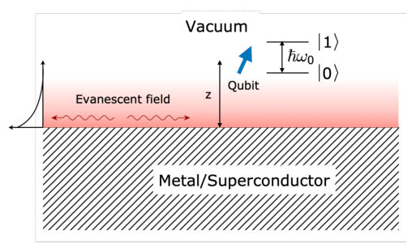
<figcaption class="paper-figure-caption"><b>Fig 1.</b> FIG. 1. A qubit with level splitting ℏω0 in vacuum, placed a distance z above a metal which becomes a supercon- ductor at low temperatures. Current fluctuations in the metal/superconductor generate evanescent electromagnetic waves that relax the qubit with the rate 1/T1.</figcaption>
</figure>
<figure class="paper-figure-card">
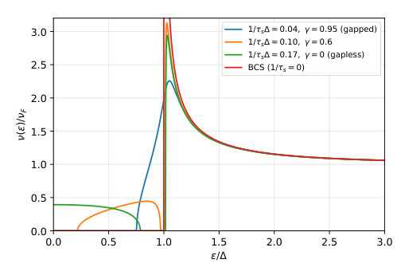
<figcaption class="paper-figure-caption"><b>Fig 2.</b> FIG. 2. Quasiparticle density of states from the Shiba theory, Eqs. (31)–(33), for representative parameters (cf. Ref. [43], Fig. 1). Energies are measured in units of the self-consistent gap ∆.</figcaption>
</figure>
<figure class="paper-figure-card">
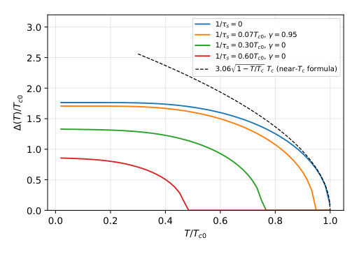
<figcaption class="paper-figure-caption"><b>Fig 3.</b> FIG. 3. Self-consistent gap with magnetic pair breaking, from Eqs. (35)–(36). The dashed curve is the near-Tc formula, shown to emphasize its limited domain of validity.</figcaption>
</figure>
<figure class="paper-figure-card">
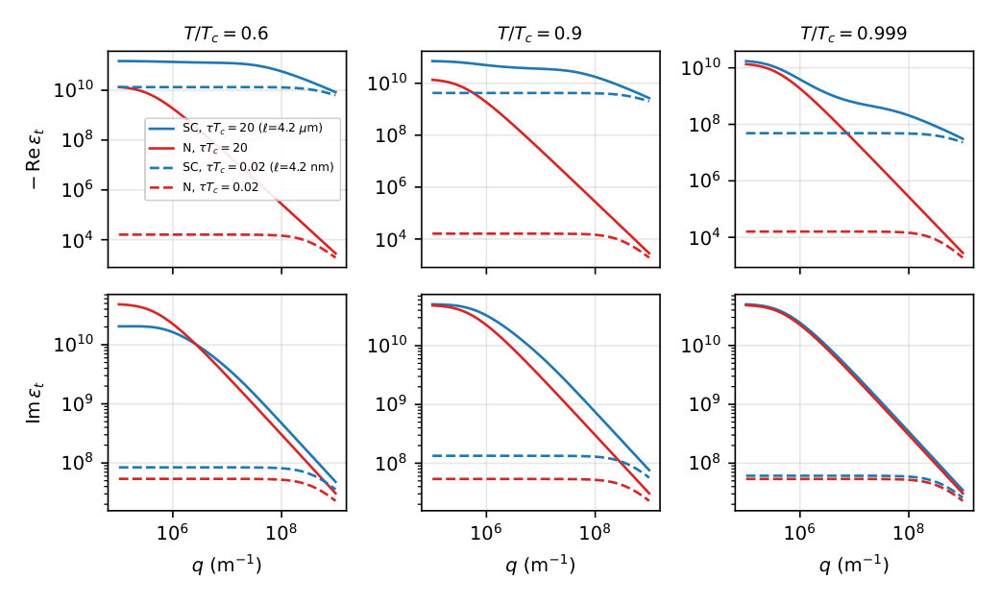
<figcaption class="paper-figure-caption"><b>Fig 4.</b> FIG. 4. Transverse dielectric function of Nb at 2.88 GHz, for the superconducting (blue) vs. normal (red) states. Solid lines are for clean samples (τTc = 20, ℓ= 4.2 µm, 1/ℓ= 2.4 × 105 m−1) and dashed lines are for dirty samples (τTc = 0.02, ℓ= 4.2 nm, 1/ℓ= 2.4 × 108 m−1). 1/ξ0 = 2.6 × 107 m−1. Three temperatures are shown. The plotted range 105 m−1 ≤q ≤ 109 m−1 corresponds to the dominant momenta q ∼1/2z for qubit heights between ∼1 nm and several micrometers, i.e., the experimentally relevant range; the upper end is still an order of magnitude below kF , where the quasiclassical kernel applies.</figcaption>
</figure>
<figure class="paper-figure-card">
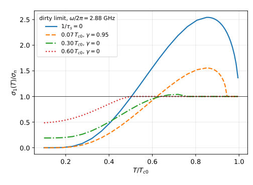
<figcaption class="paper-figure-caption"><b>Fig 5.</b> FIG. 5. Dirty-limit σ1(T)/σn at 2.88 GHz as computed from the kernel (43), for τTc = 0.02 (1/τ ≈28 ∆0); in this k →0, 1/τ ≫∆limit the ratio σ1/σn is independent of τ (Mattis– Bardeen) and of the material parameters other than ∆(T). As magnetic scattering is turned on the coherence peak disap- pears and the system becomes gapless. In the gapless regime the residual dissipation satisfies σ1(0)/σn = [ν(0)/νF]2.</figcaption>
</figure>

**Summary.** This theoretical paper calculates the Johnson noise emitted by superconductors in the near-field vacuum, quantifying how this noise limits the coherence time ($T_1$) of nearby qubits. Key findings include the prediction of a coherence-enhanced noise peak below $T_c$ and the establishment of a temperature-independent noise floor due to magnetic impurities in the gapless regime.

**Why it may be interesting.** This work directly connects superconducting electrodynamics (Johnson noise) to open quantum system dynamics ($T_1$ relaxation), providing quantitative predictions for decoherence mechanisms in solid-state quantum devices.

Detailed structure

**Main problem.** The paper computes the evanescent-wave Johnson noise (EWJN) generated by superconductors and determines its effect on the relaxation time ($T_1$) of nearby quantum qubits.

**Main result.** The magnetic noise exhibits a Hebel-Slichter-type coherence peak below $T_c$, and the theory predicts a zero-temperature noise floor induced by magnetic impurities in the gapless regime.

**Method.** The analysis uses the fluctuation-dissipation theorem applied to the electromagnetic response, deriving the noise kernels from the microscopic transverse current-response kernel $Q(q, \omega)$.

**Model / system.** The system involves a qubit placed in vacuum above a bulk BCS superconductor. The theory incorporates impurity scattering (non-magnetic and magnetic) and analyzes the response in the near-field (evanescent wave) regime.

**Key observables.** Relaxation rate ($1/T_1$) of spin and charge qubits; magnetic and electric field noise spectral densities ($b_B, b_E$).

**Important parameters / regimes.** Temperature ($T$), distance ($z$), superconducting gap ($\Delta$), impurity concentrations, and the ratio of superconducting to normal-state density of states ($
u(0)/
u_F$).

**Assumptions / limitations.** The formalism assumes the near-field approximation ($z \ll c/\omega$) and uses the quasiclassical (Fermi-surface) approximation for response functions.

**Figures summary.** Figure 1 schematically illustrates the qubit coupled to evanescent waves from the superconductor. Figure 2 shows the quasiparticle density of states derived from Shiba theory for various impurity concentrations.

**Paper structure.** The paper develops the theory by calculating the microscopic transverse current-response kernel, applying the fluctuation-dissipation theorem, and deriving the final $T_1$ expression, analyzing different temperature and impurity regimes.

Abstract

We compute the evanescent-wave Johnson noise (EWJN) in the vacuum half-space above a superconductor, and the resulting relaxation time ($T_1$) of spin and charge qubits placed at nanometer distances from the surface. The electromagnetic response is described by a single microscopic transverse current-response kernel $Q(q, ω)$ for a BCS superconductor. This is computed for varying densities of both non-magnetic impurities and magnetic impurities, for arbitrary frequency and temperature and for wave vectors $q \ll k_F$ (the Fermi wavevector). When combined with the fluctuation-dissipation theorem and the nonlocal surface impedances of the half-space, this yields the magnetic and electric field noise at any distance $z \gg k_F^{-1}$ from the surface, from which we obtain $T_1$. Just below $T_c$ the magnetic noise is enhanced relative to the normal state by the coherence (Hebel-Slichter-type) peak of the dissipative conductivity and drops exponentially at lower temperatures; the electric noise shows no coherence peak. The theory predicts that there is a zero-temperature noise floor induced by magnetic impurities. In the gapless regime produced by pair breaking, the finite subgap density of states $ν(0)$ yields a temperature-independent noise spectral density and a relaxation rate bounded by $T_1^{-1}(T)\le[ν(0)/ν_F]^{2}\,T_{1,N}^{-1}(T)$ for $T\ll T_c$, with equality in the extreme nonlocal regime. Here $ν(0)$ and $ν_F$ are the superconducting and normal-state densities of states at the Fermi energy, and $T_{1,N}(T)$ is the relaxation time the same electrode would produce in its normal state at the same temperature.

[↑ back to top](#top)

### [Learning quantum symmetries](http://arxiv.org/abs/2609.38085v1)

**Authors:** Isaac Holt, Sathyawageeswar Subramanian  
**Type:** theory · **Category:** quantum information and computing · **PDF:** <https://arxiv.org/pdf/2609.38085v1>  
**Analysis basis:** full PDF text, analyzed in chunks
**Topic relevance:** `analog quantum simulation` **1/5** · `quantum measurements` **1/5**

↔ Scroll figures horizontally

<figure class="paper-figure-card">
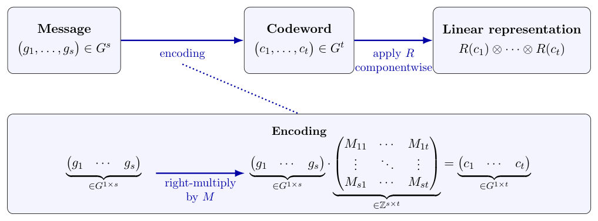
<figcaption class="paper-figure-caption"><b>Fig 1.</b> Figure 1: Construction of a linearisation of projective representation R of finite abelian group G.</figcaption>
</figure>

**Summary.** This paper advances the theory of quantum algorithms for learning symmetries in quantum systems, generalizing the classical Hidden Subgroup Problem. It introduces the physically motivated 'Anyonic' symmetry learning problem and develops efficient algorithms for states, unitaries, and Hamiltonians by reducing them to the StateHSP. This provides a comprehensive framework for analyzing symmetry in diverse quantum contexts.

**Why it may be interesting.** This work provides a powerful theoretical toolkit for characterizing symmetries in quantum systems, which is crucial for understanding topological order, quantum error correction, and the structure of quantum Hamiltonians.

Detailed structure

**Main problem.** The paper develops quantum algorithms to learn the symmetry subgroups of various quantum objects, extending beyond the classical Hidden Subgroup Problem (HSP). It specifically addresses symmetries of quantum states, unitaries, and Hamiltonians.

**Main result.** Efficient quantum algorithms are derived for learning symmetries, including a novel approach for 'Anyonic' state symmetries and extensions to unitaries and Hamiltonians by reducing them to the State Hidden Subgroup Problem (StateHSP).

**Method.** The core methodology involves generalizing the StateHSP framework, introducing new primitives like Fourier Difference Sampling, and employing mathematical reductions to map complex symmetry problems onto solvable instances of StateHSP.

**Model / system.** The study focuses on symmetries associated with quantum states (pure and mixed), which are characterized by projective unitary representations of a group G. The scope extends to unitaries, Hamiltonians, and finite collections of states.

**Key observables.** The symmetry subgroup $S \le G$ that leaves the quantum object invariant (the normal core or anyonic symmetry subgroup).

**Important parameters / regimes.** The structure of the hidden subgroup (e.g., normal vs. general non-abelian groups) and the type of symmetry considered (Bose vs. Anyonic).

**Assumptions / limitations.** The algorithms rely on the ability to reduce the symmetry learning problem for different objects (like unitaries) down to the StateHSP instance.

**Paper structure.** The paper builds from the StateHSP for Bose symmetries to introduce the more general Anyonic symmetry learning problem. It then details the necessary mathematical reductions and provides specific algorithmic results for various quantum objects, culminating in the general framework.

Abstract

Quantum algorithms are powerful tools for finding symmetries of classical objects, most famously through Shor's algorithm and the framework of the Hidden Subgroup Problem (HSP). In this work, we study quantum algorithms for learning symmetries of quantum objects. Our starting point is the recently introduced State Hidden Subgroup Problem (StateHSP), a quantum generalisation of HSP in which the task is to learn the symmetry subgroup of a quantum state. We obtain positive results for non-abelian StateHSP, giving efficient quantum algorithms whenever the hidden subgroup is normal and for ambient groups belonging to a broad class of non-abelian groups, extending the previous general theory beyond the abelian setting.   StateHSP learns \emph{Bose} symmetries, associated with linear representations, whereas physically equivalent pure states are defined only up to global phase. Motivated by this, we introduce a new \emph{Anyonic} state symmetry learning problem based on a more physically natural notion of symmetry than that considered by StateHSP. We give an efficient quantum algorithm by reducing the problem to StateHSP, where the reduction relies on a new connection between linearisations of projective representations and linear error-correcting codes. As an application, we obtain an improved algorithm for learning stabiliser groups that applies to mixed qudit states of arbitrary local dimension. Finally, we introduce symmetry learning problems for other quantum objects, including unitaries, Hamiltonians, and finite collections of states, and obtain efficient quantum algorithms by reducing them to instances of StateHSP.

[↑ back to top](#top)

### [Low Frequency Gravitational Wave Detection with Gravito-Magnetism](http://arxiv.org/abs/2609.35962v1)

**Authors:** Reza Ebadi, Surjeet Rajendran  
**Type:** both · **Category:** other · **PDF:** <https://arxiv.org/pdf/2609.35962v1>  
**Analysis basis:** full PDF text, analyzed in chunks
**Topic relevance:** `analog quantum simulation` **1/5** · `quantum measurements` **1/5**

↔ Scroll figures horizontally

<figure class="paper-figure-card">
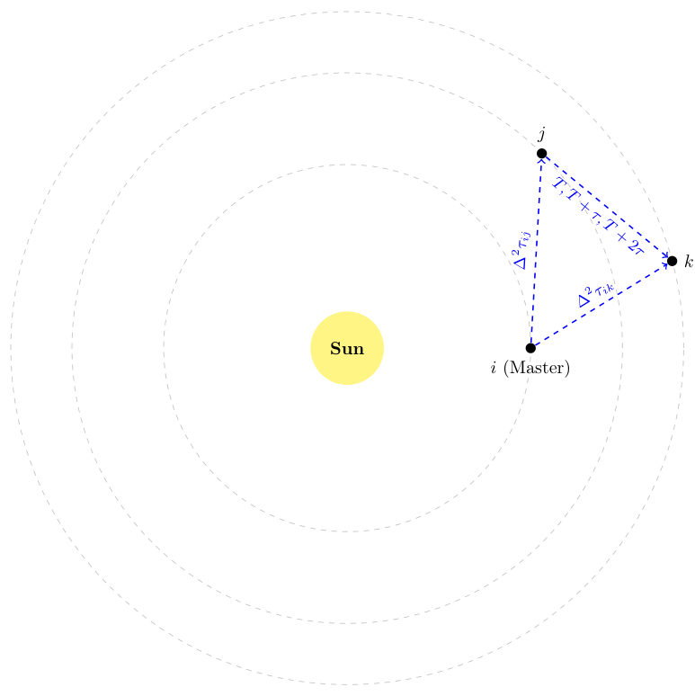
<figcaption class="paper-figure-caption"><b>Fig 1.</b> Figure 1: The three-satellite measurement constellation in solar orbit. Satellite i serves as the master clock to synchronize the array. The deputy satellites exchange laser pulses at designated global times T, T + τ, and T + 2τ to measure the discrete double time difference ∆2τ. The multiple baselines are mathematically required to invert the signal matrix and simultaneously canceling higher-order gravity gradient noise from the asteroid belt.</figcaption>
</figure>
<figure class="paper-figure-card">
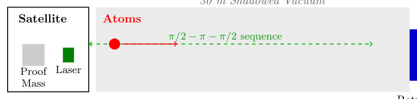
<figcaption class="paper-figure-caption"><b>Fig 2.</b> Figure 2: The hybrid atom-interferometer proof mass concept. A sun shield creates a 30-meter dark vacuum region behind the satellite. Ultra-cold atoms produced in the satellite are sent to this region. Laser pulses from the satellite, along with their reflections from the retro-reflector, are used to execute Mach-Zender π/2 −π −π/2 sequences to measure non-gravitational accelerations, which are fed back to fully stabilize the central macroscopic proof mass. We need such a setup along each measurement axis - thus, two such interferometers for each satellite.</figcaption>
</figure>

**Summary.** This work proposes a novel method to detect low-frequency gravitational waves by measuring the gravitomagnetic component, which allows separation from dominant gravity gradient noise. The technique requires a three-satellite constellation and proposes using atom interferometers to provide the necessary ultra-stable inertial reference for the proof mass. This combines advanced general relativity concepts with cutting-edge AMO metrology.

**Why it may be interesting.** The integration of ultra-cold atom interferometry (a core AMO technique) to stabilize the inertial reference for gravitational wave detection is highly relevant. It pushes the boundaries of precision measurement by requiring control over quantum systems (atoms) to measure classical spacetime perturbations.

Detailed structure

**Main problem.** Detecting low-frequency gravitational waves (10 nHz to 1 $\mu$Hz) is severely limited by Newtonian gravity gradient noise (GGN) from the asteroid belt.

**Main result.** By exploiting the relativistic nature of gravitational waves to measure the gravitomagnetic component via Lorentz acceleration, the signal can be unambiguously extracted from the GGN background using a three-satellite constellation.

**Method.** The authors propose using a three-satellite constellation to measure discrete double time differences in laser pulse arrival times, combined with the use of atom interferometers as a pristine inertial reference.

**Model / system.** The system involves three satellites in elliptical orbits around the Sun, measuring time-of-arrival of laser pulses. The proposed enhancement uses atom interferometers to stabilize a macroscopic proof mass, mimicking LISA-like setups.

**Key observables.** The gravitomagnetic component of gravitational waves, measured via the Lorentz acceleration ($\vec{v} 	imes \vec{B}_{	ext{gravito}}$) on test bodies, and the discrete double time difference ($\Delta^2	au_{jk}$) between satellite laser pulses.

**Important parameters / regimes.** Low-frequency band (10 nHz to 1 $\mu$Hz); required interrogation time $T \sim 10^4$ s; target acceleration sensitivity $\sim 10^{-21} 	ext{ m/s}^2/\sqrt{	ext{Hz}}$.

**Assumptions / limitations.** The analysis assumes the weak field limit and relies on the ability to use atom interferometers to provide an inertial reference stable enough for long interrogation times.

**Figures summary.** Figure 1 illustrates the three-satellite constellation in solar orbit with satellite i as the master clock. Figure 2 depicts the hybrid atom-interferometer proof mass concept, showing the Sun, Sun Shield, Satellite, Proof Mass, Laser, and Retro-reflector arrangement.

**Paper structure.** The paper first establishes the fundamental concept of using gravitomagnetism to overcome GGN noise. It then details the measurement protocol using a three-satellite constellation based on time-of-arrival measurements. Finally, it discusses the necessary technological upgrade using atom interferometers to achieve the required inertial stability.

Abstract

The detection of gravitational waves in the low-frequency band (10 nHz to 1 micro-Hz) using inner solar system proof masses is severely limited by Newtonian gravity gradient noise (GGN) sourced by the asteroid belt. In this paper, we propose a novel detection concept that exploits the relativistic nature of gravitational waves to break the degeneracy between the signal and the asteroid GGN background. The non-relativistic motion of asteroids dominantly sources gravito-electric fields, with velocity suppressed gravito-magnetic components. Relativistic gravitational waves produce gravito-electric and gravito-magnetic components of equal magnitude. We propose detecting the gravito-magnetic component of low frequency gravitational waves using the Lorentz acceleration of test bodies. The measurement of this Lorentz acceleration is metrologically possible due to the fact that expected astrophysical sources of low frequency gravitational waves have considerably higher characteristic strains than the strains typically expected at higher frequencies. We show that this measurement allows for unambiguous extraction of the gravitational wave signal from the gravity gradient noise in a three satellite constellation. The gravito-magnetic measurement still requires a proof mass that is well isolated from non-gravitational noise. We propose the use of atom interferometers to serve as such a pristine inertial reference.

[↑ back to top](#top)

### [Nonreciprocal Chiral Automata](http://arxiv.org/abs/2609.35984v1)

**Authors:** Andrew A. Allocca, Armin Rahmani, Pouyan Ghaemi, Sriram Ganeshan  
**Type:** theory · **Category:** statistical mechanics · **PDF:** <https://arxiv.org/pdf/2609.35984v1>  
**Analysis basis:** full PDF text, analyzed in chunks
**Topic relevance:** `Keldysh / 2PI / non-Gaussian methods` **1/5** · `non-equilibrium universality` **1/5**

↔ Scroll figures horizontally

<figure class="paper-figure-card">
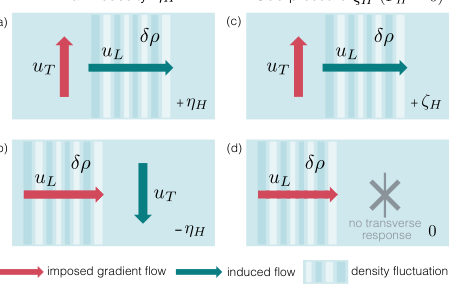
<figcaption class="paper-figure-caption"><b>Fig 1.</b> FIG. 1. The nonreciprocal effect of odd pressure ζH can be seen in the response to imposed nonuniform flows, as in Eq. (2). Hall viscosity generates both (a) longitudinal flow uL from transverse flow gradients (b) transverse flows uT from longitudinal flow gradients. Odd pressure ζH generates (c) longitudinal flows from transverse flow gradients, but (d) there is no effect from longitudinal flow gradients—a nonre- ciprocal response. In all cases changing uL induces density fluctuations δρ.</figcaption>
</figure>
<figure class="paper-figure-card">
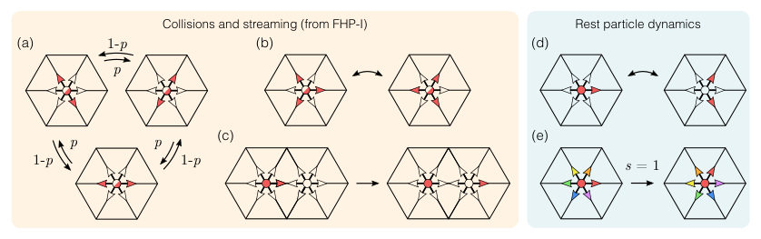
<figcaption class="paper-figure-caption"><b>Fig 2.</b> FIG. 2. Schematic depictions of the collision and streaming rules for the FHP-II automaton, separated into processes inherited from FHP-I and new dynamics of rest particles. Arrows represent mobile states and the central circle the rest state. The two-body and three-body collisions are shown in (a) and (b), with a half-filled circle indicating insensitivity to rest particles. Streaming is shown in (c): mobile particles move to the next vertex along their velocity and rest particles remain in place. The collisions that change the rest particle occupation are shown in (d), and in (e) we show the rotation of all mobile state occupations when a rest particle is present.</figcaption>
</figure>

**Summary.** This paper develops a microscopic lattice-gas model to realize the odd pressure coefficient ($\zeta_H$), a key parity-odd transport property in 2D fluids. By introducing a specific parity-breaking collision rule, the authors show that the model generates a nonreciprocal hydrodynamic response. The work uses Chapman-Enskog theory to connect these microscopic rules to macroscopic transport coefficients.

**Why it may be interesting.** The study of non-equilibrium transport coefficients like odd pressure is crucial for understanding energy dissipation and momentum transfer in complex fluids, which has parallels in non-equilibrium quantum dynamics and open quantum systems.

Detailed structure

**Main problem.** The primary goal is to construct a microscopic model that realizes the odd pressure coefficient ($\zeta_H$), a parity-odd transport response in 2D fluids, and to understand the resulting nonreciprocal hydrodynamics.

**Main result.** The authors successfully constructed such a model using a lattice-gas automaton, showing that the odd pressure coefficient can be generated by a local parity-breaking collision rule acting as an effective magnetic field.

**Method.** The analysis employs Chapman-Enskog coarse-graining to derive macroscopic transport coefficients from the microscopic lattice-gas dynamics, supplemented by Boltzmann equation analysis.

**Model / system.** The system is a lattice-gas cellular automaton based on the Frisch-Hasslacher-Pomeau II (FHP-II) model, which includes a non-mobile rest particle state ($N_0$) and a specific parity-breaking collision rule.

**Key observables.** Odd pressure ($\zeta_H$), Hall viscosity ($\eta_H$), and rotational viscosity ($\Gamma, \Gamma_H$), which quantify nonreciprocal hydrodynamic responses.

**Important parameters / regimes.** The analysis depends on the collision parameters ($\gamma, eta, \kappa$) and the assumption of weak rotational effects.

**Assumptions / limitations.** The derivation relies on the Chapman-Enskog expansion, assuming slow spatial/temporal variations, and that the rotational effect is weak.

**Figures summary.** Figure 1 illustrates the nonreciprocal effect of odd pressure ($\zeta_H$) by comparing responses to imposed nonuniform flows. Figure 2 schematically depicts the collision and streaming rules for the FHP-II automaton.

**Paper structure.** The paper first introduces the physical problem and the FHP-II model. It then uses the Chapman-Enskog expansion to derive the full set of transport coefficients, establishing the relationship between odd and even viscosities. Finally, it extends the analysis to rotational viscosities ($\Gamma, \Gamma_H$) by analyzing the linearized collision matrix and its eigenvalues.

Abstract

Odd pressure is a parity-odd transport coefficient that gives an isotropic pressure response to vorticity in compressible two-dimensional fluids. By asymmetrically coupling vortical and compressional modes, it provides a direct mechanism for a nonreciprocal hydrodynamic response reminiscent of several biological systems. Yet microscopic models realizing odd pressure as a transport coefficient are relatively scarce. Here, we construct one such model using a lattice-gas cellular automaton based on the Frisch-Hasslacher-Pomeau II model with rest particles and chiral collisions, whose Chapman-Enskog coarse-graining produces a nonzero odd pressure coefficient. The key ingredient is a local parity-breaking collision that weakly rotates moving particles in the presence of a rest particle. At hydrodynamic scales, this microscopic rule acts as an effective magnetic field, converting the model's bulk viscosity into odd pressure. More generally, we derive expressions relating Hall viscosity, odd pressure, and odd torque to their parity-even counterparts in our model.

[↑ back to top](#top)

### [Probing the electronic structure of $\mathrm{UTe}_2$ with ARPES and high-energy spectroscopy](http://arxiv.org/abs/2609.36706v1)

**Authors:** Shin-ichi Fujimori  
**Type:** both · **Category:** strongly correlated electrons · **PDF:** <https://arxiv.org/pdf/2609.36706v1>  
**Analysis basis:** full PDF text, analyzed in chunks
**Topic relevance:** `Keldysh / 2PI / non-Gaussian methods` **1/5** · `quantum measurements` **1/5**

↔ Scroll figures horizontally

<figure class="paper-figure-card">
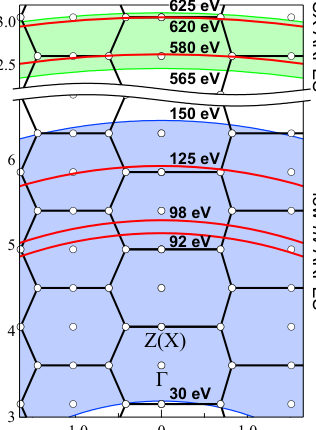
<figcaption class="paper-figure-caption"><b>Fig 1.</b> Figure 1. Crystal structure and Brillouin zone of UTe2. (a) Crystal structure (left) and Brillouin zone of UTe2. (b) ARPES cuts in multi-Brillouin-zone momentum space along the ⟨100⟩(ka) and ⟨010⟩(kb) directions. Panel (a) is reprinted from Fig. 1 of Fujimori et al , 2019 [3].</figcaption>
</figure>
<figure class="paper-figure-card">
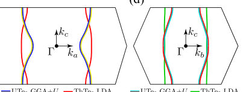
<figcaption class="paper-figure-caption"><b>Fig 2.</b> Figure 2. Calculated Fermi surfaces of UTe2. (a) Fermi surface calculated using GGA+U with U = 2 eV. (b) Fermi surface calculated for ThTe2, corresponding to the localized-5f 2 limit. (c) Comparison in the ka–kc plane. (d) Comparison in the kb–kc plane. Panel (a) is reprinted from [28] with permission, Copyright (2019) by the American Physical Society.</figcaption>
</figure>
<figure class="paper-figure-card">
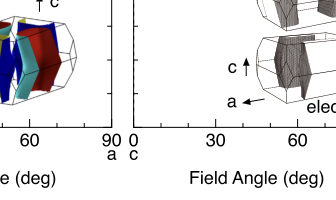
<figcaption class="paper-figure-caption"><b>Fig 3.</b> Figure 3. The result of dHvA experiment of UTe2. (a) Angular dependence of the dHvA frequency in UTe2. (b), (c) Angular dependence of the dHvA frequency calculated by GGA+U (U = 2 eV) in UTe2 and LDA for ThTe2. Reproduced from Fig. 5 of Aoki et al , 2022 [6] under CC BY 4.0.</figcaption>
</figure>
<figure class="paper-figure-card">
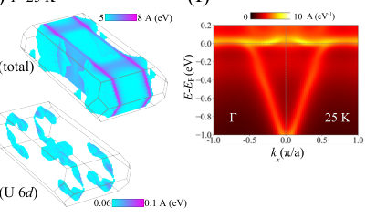
<figcaption class="paper-figure-caption"><b>Fig 4.</b> Figure 4. Proposed three-dimensional Fermi surfaces and spectra from DFT+DMFT- based calculations for UTe2. (a,b) Fermi surface and near-EF spectral function at 116 K from Halloran et al, 2025 [12]. (c,d) Fermi surface and near-EF quasiparticle spectrum at 11 K from Choi et al, 2024 [31]. (e,f) Results from Kang et al: (e) total (upper) and U 6d-projected (lower) Fermi surfaces showing the three dimensional pocket at Γ [33]; (f) spectral function near Γ at 25 K [32]. Panels (a,b), (c,d), and (f) are reproduced from [12], [31], and [32], respectively, under the CC BY 4.0 license and with permission from Springer Nature; panel (e) is reprinted from [33] with permission, Copyright (2025) by...</figcaption>
</figure>
<figure class="paper-figure-card">
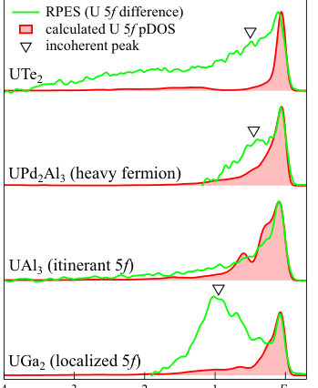
<figcaption class="paper-figure-caption"><b>Fig 5.</b> Figure 5. RPES spectra of UTe2, together with those of representative uranium compounds. (a) Density plot of the RPES spectra of UTe2, obtained by subtracting the spectrum measured at hν = 725 eV (center), together with the corresponding U 4d5/2 XAS spectrum (right). On- and off-resonance spectra were measured at hν = 736 eV and 731 eV, respectively, and the corresponding difference spectrum is shown at the bottom panel. (b) Comparison of the RPES spectra of UTe2 with those of the heavy- fermion compound UPd2Al3, the itinerant-5f compound UAl3, and the localized-5f compound UGa2. The corresponding calculated U 5f partial DOS are also shown for comparison. Panel (a) is replotted from Fig. 4...</figcaption>
</figure>

**Summary.** This review synthesizes diverse spectroscopic data on UTe2 to resolve the fundamental ambiguity surrounding the U 5f electron character. By integrating ARPES, X-ray spectroscopy, and DFT+DMFT calculations, the authors argue for an intermediate-valence state. This work is crucial for establishing the electronic benchmarks needed to understand the material's unconventional superconductivity.

**Why it may be interesting.** The comparison between highly sensitive spectroscopic probes (XPS vs XAS) to resolve valence fluctuations is a general methodology applicable to understanding strongly correlated systems in AMO physics, even if the specific material is not an AMO platform.

Detailed structure

**Main problem.** The central issue is determining the nature of the U 5f electrons and their role in the unconventional superconductivity of UTe2.

**Main result.** The spectroscopic evidence points towards an intermediate-valence ground state in UTe2, characterized by a significant admixture of 5f^2 and 5f^3 configurations.

**Method.** The review synthesizes results from multiple advanced experimental techniques (ARPES, XAS, RIXS, etc.) and compares them against theoretical calculations like DFT+DMFT.

**Model / system.** The system is UTe2, a strongly correlated material. The analysis involves modeling valence fluctuations between different $5f$ configurations ($5f^2$ vs $5f^3$) and mapping the resulting electronic structure onto theoretical frameworks.

**Key observables.** Low-energy quasiparticle excitations, Fermi surface topology, and the relative spectral weight observed in core-level vs. valence X-ray spectroscopies.

**Important parameters / regimes.** The degree of $5f$ itinerancy, the effective Coulomb interaction ($U$), and the hybridization strength ($t$) between $5f$ and ligand orbitals.

**Assumptions / limitations.** The analysis relies on integrating results from disparate techniques, acknowledging the pronounced technique dependence of the inferred electronic structure.

**Figures summary.** Figures illustrate the crystal structure and Brillouin zone, showing ARPES cuts in momentum space, and comparing calculated Fermi surfaces using different theoretical parameters (e.g., varying U in GGA+U).

**Paper structure.** The paper reviews spectroscopic studies, first detailing the experimental techniques (ARPES, X-ray probes) and their findings, then integrating these results with advanced theoretical methods (DFT+DMFT) to build a coherent picture of the $5f$ electronic structure.

Abstract

$\mathrm{UTe}_2$ has emerged as one of the most intensively studied strongly correlated materials in recent years owing to its unconventional superconductivity and the possible realization of a spin-triplet, topologically nontrivial pairing state. A central open issue concerns the nature of the $\mathrm{U}\,5f$ electrons and their participation in low-energy quasiparticle states. In this review, we summarize recent spectroscopic studies of $\mathrm{UTe}_2$ using momentum-resolved angle-resolved photoemission spectroscopy (ARPES) and element- and configuration-sensitive X-ray probes, including X-ray absorption spectroscopy (XAS), X-ray absorption near-edge structure (XANES), X-ray magnetic circular dichroism (XMCD), resonant X-ray emission spectroscopy (RXES), and resonant inelastic X-ray scattering (RIXS). A key finding is the pronounced technique dependence of the inferred electronic structure. We synthesize the present spectroscopic picture by integrating these results with modern electronic-structure calculations such as density functional theory plus dynamical mean-field theory (DFT+DMFT). These findings support an intermediate-valence ground state with significant admixture of $5f^2$ and $5f^3$ configurations in $\mathrm{UTe}_2$, and they delineate key experimental and theoretical benchmarks needed to connect the normal-state electronic structure to the superconducting mechanism.

[↑ back to top](#top)

### [3/8 charge-density wave instability in the kagome metal CsV$_3$Sb$_5$](http://arxiv.org/abs/2609.38071v1)

**Authors:** Luca Buiarelli, Hyeonseo H. Park, Ethan T. Ritz, Rafael M. Fernandes, Turan Birol  
**Type:** theory · **Category:** strongly correlated electrons · **PDF:** <https://arxiv.org/pdf/2609.38071v1>  
**Analysis basis:** full PDF text, analyzed in chunks
**Topic relevance:** `Frenkel-Kontorova` **1/5**

↔ Scroll figures horizontally

<figure class="paper-figure-card">
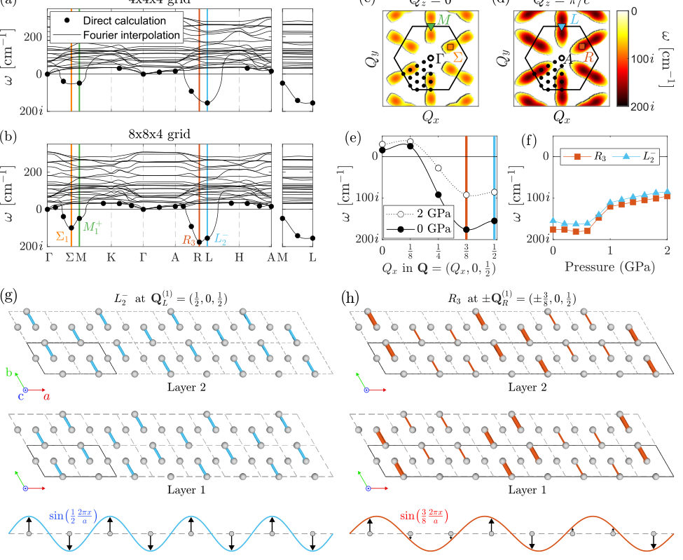
<figcaption class="paper-figure-caption"><b>Fig 1.</b> Figure 1. Phonon instabilities of CsV3Sb5 from DFPT. (a–b) Phonon dispersion along high-symmetry lines, calculated on a 4 × 4 × 4 (a) and 8 × 8 × 4 (b) Q-point grid; black circles show frequencies computed directly by DFPT. The finer grid in (b) reveals the Σ1 and R3 instabilities absent in (a). (c–d) Color plot of the imaginary part of the unstable phonon frequencies in the Brillouin zone of P6/mmm at the high-symmetry planes (c) Qz = 0 and (d) Qz = π/c; yellow and orange squares mark the points along the Σ and R lines with δ = 3/8. (e) Unstable phonon frequencies along the A–L line at applied pressures of 0 and 2 GPa. (f) Pressure evolution of the R3 and L− 2 imaginary frequencies,...</figcaption>
</figure>
<figure class="paper-figure-card">

<figcaption class="paper-figure-caption"><b>Fig 2.</b> Figure 2. (a) Total energy as a function of the displacement amplitude along the L− 2 and R3 phonon eigenvectors, com- puted in 2 × 1 × 2 and 8 × 1 × 2 supercells, respectively. The displacement on the horizontal axis is the root-sum-of-squares displacement normalized by the square root of the supercell size relative to the primitive cell. (b–c) Enthalpy along the same distortions at applied pressure values of 0, 0.5, and 1 GPa. The contrasting pressure sensitivity of the two modes is the key result: the L− 2 minimum rises rapidly with pressure (b) while the R3 minimum remains comparatively stable (c), switching the most stable phase near 1 GPa.</figcaption>
</figure>
<figure class="paper-figure-card">
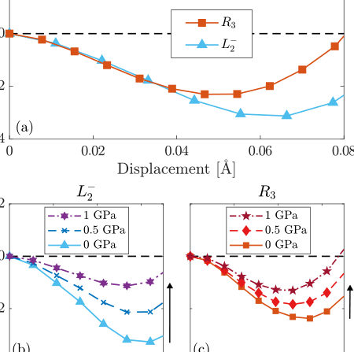
<figcaption class="paper-figure-caption"><b>Fig 3.</b> Fig. 1(g–h) contrasts the real-space characters of the L− 2 and R3 modes extracted from their polarizations. Apart from the different periodicities (2 unit cells along [100] for L− 2 , as opposed to 8 unit cells for R3), both modes are well described as nearest-neighbor bond order between the V ions. The pressure dependence of the unstable phonon branch near L is shown in Figs. 1(e–f). Both the R3 and L− 2 instabilities exhibit only a small change in frequency up to ∼0.8 GPa, above which both of their frequencies decrease in absolute magnitude sharply, and continue to decrease with pressure afterwards. Nevertheless, both modes remain unstable well beyond 2 GPa, consistent with earlier...</figcaption>
</figure>
<figure class="paper-figure-card">
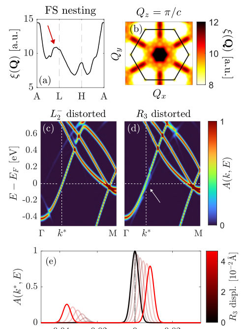
<figcaption class="paper-figure-caption"><b>Fig 4.</b> Figure 3. Electronic structure of CsV3Sb5 and its response to the R3 distortion. (a) Fermi surface nesting function ξ(Q) along the A–L–H–A path and (b) color plot of ξ(Q) in the Brillouin zone at Qz = π/c. The latter reveals a momentum-dependent structure reminiscent of that of the un- stable phonon modes shown in Fig. 1(d). (c–d) Band struc- ture (spectral density) unfolded into the primitive Brillouin zone along the Γ–M line for the L− 2 distorted structure at its energy minimum (c) and the R3 distorted structure at its energy minimum (d). (e) Energy cuts of the spectral density as a function of R3 displacement, at fixed momentum k∗.</figcaption>
</figure>
<figure class="paper-figure-card">
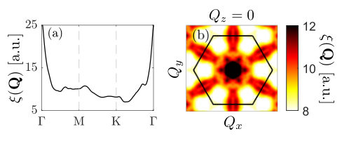
<figcaption class="paper-figure-caption"><b>Fig 5.</b> Figure 4. Fermi surface nesting function on the Qz = 0 plane. (a) Nesting on the high symmetry line Γ–M–K-Γ line. (b) Nesting on the Qx, Qy plane as a heat map. Contrary to qz = π/c, the relative peaks close to the BZ edge are on the Γ–K line.</figcaption>
</figure>

**Summary.** This theoretical study investigates the charge density wave (CDW) instability in the kagome metal CsV3Sb5, finding that the dominant instability switches from one type to another as pressure increases. By combining advanced DFT calculations with Landau theory, the authors map out the phase diagram, explaining the observed structural transitions and their connection to the superconducting state.

**Why it may be interesting.** While focused on CDW physics, the detailed analysis of competing order parameters, phase transitions driven by external fields (pressure), and the use of symmetry-constrained free energy functionals are highly relevant to understanding complex many-body ground states in correlated materials.

Detailed structure

**Main problem.** The study aims to determine the leading lattice instability (Charge Density Wave, CDW) in the kagome metal CsV3Sb5 and understand how this instability changes with applied pressure relative to superconducting transitions.

**Main result.** The analysis predicts that the CDW instability switches from a conventional L-2 type at ambient pressure to a new R3 instability above approximately 1 GPa, consistent with experimental observations.

**Method.** The authors employed Density Functional Perturbation Theory (DFPT) calculations, finite-displacement DFT, and a Landau free energy analysis to model the competing electronic and lattice instabilities.

**Model / system.** The physical system is the kagome metal CsV3Sb5. The theoretical framework involves analyzing the competition between multiple order parameters (M, L, Sigma, R) using a complex free energy functional derived from symmetry considerations.

**Key observables.** CDW wavevectors (Q), phonon frequencies (imaginary parts), superconducting critical temperature (Tc), and lattice distortions (monoclinic symmetry).

**Important parameters / regimes.** Pressure (P), specifically the transition point near 1 GPa, and the relative strengths of anharmonic coupling terms in the free energy functional.

**Assumptions / limitations.** The analysis assumes that the R3 mode is the leading instability based on fine-grid DFPT calculations, and that the free energy can be accurately modeled by coupling the four primary order parameters.

**Figures summary.** Figures illustrate phonon instabilities across different Q-grids, show the pressure evolution of imaginary phonon frequencies for L-2 and R3 modes, and compare total energy/enthalpy curves to map the phase transition between the two CDW states.

**Paper structure.** The paper progresses from identifying the initial instability using DFPT on fine grids, to comparing the stability of competing modes (L-2 vs R3) using finite-displacement calculations, and finally constructing a comprehensive Landau free energy functional to explain the coexistence and transition between multiple ordered phases.

Abstract

The kagome metal CsV$_3$Sb$_5$ exhibits charge density wave (CDW) and superconducting transitions, both of which are substantially affected by pressure. Recent x-ray diffraction experiments identify a new charge-ordered phase at a pressure coinciding with the dip of the superconducting dome. This CDW phase displays a distinctive wavevector $\mathbf{Q} = (3/8, 0, 1/2)$ and monoclinic symmetry, in contrast to the $2\times2\times 2$ and $2\times2\times 4$ orders reported at ambient pressure. In this letter, we show that density functional perturbation theory (DFPT) calculations on a fine reciprocal-space grid predict the leading lattice instability of CsV$_3$Sb$_5$ to be at this wavevector. Finite-displacement calculations reveal that while anharmonic effects stabilize the conventional $L_2^-$ CDW at ambient pressure, the competing $3/8$ instability becomes energetically favorable above $\sim$1 GPa, consistent with experimental observations. Interestingly, the nesting function displays a peak at the same wavevector. A Landau free energy analysis explains the emergence of the monoclinic distortion observed in x-ray diffraction, in addition to several bond-ordering patterns that may be relevant to the observed trends in the superconducting $T_c$.

[↑ back to top](#top)

### [A Tale of Two Walks: Kipnis, Marchioro and Presutti Meet Kac in a Quantum World](http://arxiv.org/abs/2609.38044v1)

**Authors:** Qian Chen, Jingcheng Liu, Minglong Qin, Leonard Schulman, Fang Song, Penghui Yao, Mingnan Zhao  
**Type:** theory · **Category:** statistical mechanics · **PDF:** <https://arxiv.org/pdf/2609.38044v1>  
**Analysis basis:** full PDF text, analyzed in chunks
**Topic relevance:** `analog quantum simulation` **1/5**

↔ Scroll figures horizontally

<figure class="paper-figure-card">
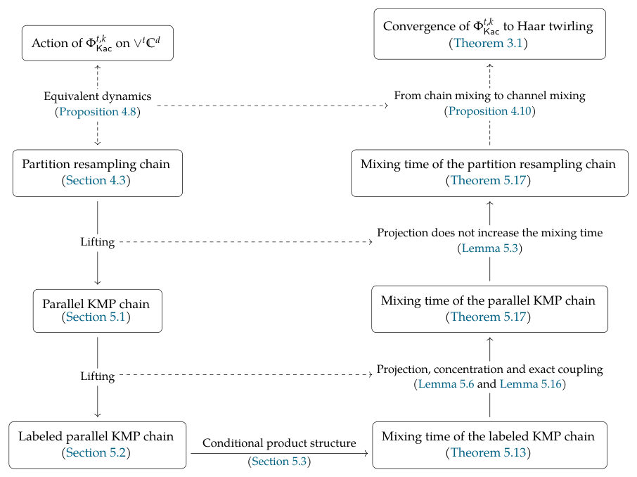
<figcaption class="paper-figure-caption"><b>Fig 1.</b> Figure 1: Proof outline. The left column shows the relevant quantum and classical dynamics, and the right column shows the corresponding quantitative bounds.</figcaption>
</figure>

**Summary.** This work reveals a fundamental link between the quantum parallel Kac's walk and the classical Kipnis-Marchioro-Presutti (KMP) process. By showing this equivalence, the authors derive sharp, uniform mixing time bounds for the KMP process, improving known results for random walks on simplices. This advances the understanding of convergence rates in complex interacting particle systems.

**Why it may be interesting.** The connection between quantum randomizing processes (Kac walk) and classical mixing dynamics (KMP) provides powerful tools for analyzing convergence in complex many-body systems, relevant for understanding thermalization and scrambling in quantum many-body physics.

Detailed structure

**Main problem.** The paper establishes a deep connection between the parallel Kac's walk (a quantum process) and the Kipnis-Marchioro-Presutti (KMP) process (a classical interacting particle system). It aims to analyze the mixing times of these processes.

**Main result.** The analysis shows that the quantum twirling channel converges rapidly to the Haar measure, and it proves a mixing time analogue of Aldous's conjecture for the KMP process on general graphs.

**Method.** The authors use techniques involving conditional product structure, exact coupling, and relating quantum dynamics to classical Markov chains on partitions to derive sharp mixing bounds.

**Model / system.** The models include the parallel Kac's walk on the symmetric subspace of $(\mathbb C^d)^{\otimes t}$, the standard KMP process on general graphs, and the coordinate hit-and-run process on the standard simplex.

**Key observables.** Mixing time, total variation distance, and the rate of convergence to the Haar measure.

**Important parameters / regimes.** Number of copies $t$, dimension $d$, and error tolerance $\epsilon$.

**Assumptions / limitations.** The analysis relies on the conditional product structure holding for both quantum and classical KMP dynamics.

**Figures summary.** The notes do not provide a summary of figures, but mention Figure 1 outlines the proof connecting quantum/classical dynamics to quantitative bounds.

**Paper structure.** The paper proceeds by first establishing the equivalence between the parallel Kac's walk and a classical partition resampling chain. It then applies advanced Markov chain techniques to prove the mixing time bounds for this classical process, culminating in applications to specific random walks like coordinate hit-and-run.

Abstract

We reveal an unexpected connection between the parallel Kac's walk and the Kipnis-Marchioro-Presutti (KMP) process. The twirling channel induced by the parallel Kac's walk on the symmetric subspace is exactly encoded by a classical Markov chain on partitions, which lifts to a parallel KMP process on complete graphs. This correspondence reduces the analysis of the twirling channel to the mixing of the parallel KMP process. We prove that $O(\log d+\log(1/\varepsilon))$ repetitions suffice to approximate Haar twirling on the symmetric subspace of $(\mathbb C^d)^{\otimes t}$ to error $\varepsilon$, uniformly in the number of copies $t$.   For the standard KMP process on general graphs, we prove a mixing-time analogue of Aldous's conjecture: at fixed accuracy, the mixing time of the $t$-particle process is at most a constant times the single-particle mixing time multiplied by the logarithm of the number of vertices, uniformly in $t$. As an application, we improve the total variation mixing-time bound for coordinate hit-and-run on the $n$-dimensional standard simplex from $\widetilde O(n^3)$ (Kook and Vempala, 2026) to $\widetilde O(n)$, while removing the dependence on the initial distribution.   Our main technical contribution is conditional product structure for both parallel and standard KMP processes. Conditioned on suitable auxiliary randomness, the labeled particles evolve independently. Combining this structure with an exact coupling yields mixing bounds uniform in the number of particles for both unlabeled KMP models. These bounds are sharp up to logarithmic factors and imply rapid convergence of the parallel Kac twirling channel on the symmetric subspace.

[↑ back to top](#top)

### [Block-Wise Variational Quantum Algorithms for PDEs with Interface Penalty Constraints](http://arxiv.org/abs/2609.36710v1)

**Authors:** Hangran Jie, Yuntao Cui, Sunho Kim  
**Type:** both · **Category:** quantum information and computing · **PDF:** <https://arxiv.org/pdf/2609.36710v1>  
**Analysis basis:** full PDF text, analyzed in chunks
**Topic relevance:** `Keldysh / 2PI / non-Gaussian methods` **1/5**

↔ Scroll figures horizontally

<figure class="paper-figure-card">
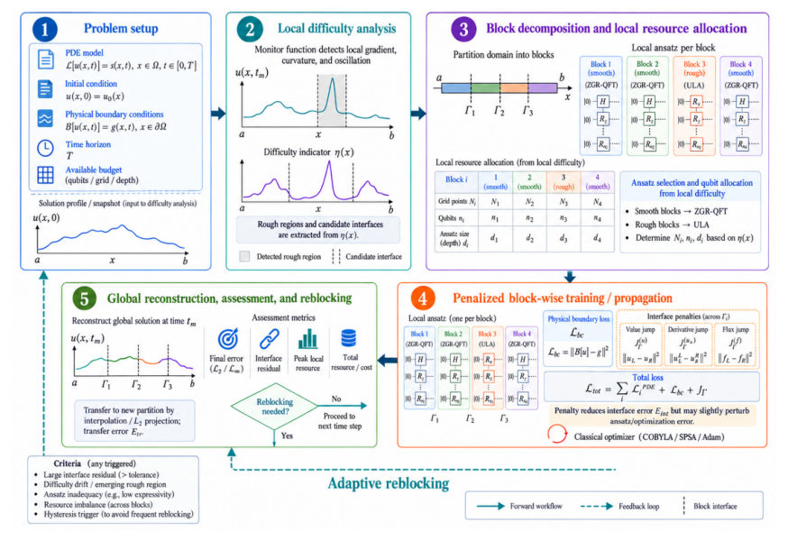
<figcaption class="paper-figure-caption"><b>Fig 1.</b> Fig. 1 Workflow of the proposed block-wise VQA–PDE framework. Stage 1 defines the PDE, initial and physical-boundary data, time horizon, and available resources. Stage 2 evaluates the normalized local- difficulty monitor and identifies rough regions. Stage 3 places block interfaces and assigns power-of-two grid budgets, qubit widths, and block-dependent ansatz families. Stage 4 minimizes local PDE residuals together with the physical-boundary loss and value, derivative, and PDE-dependent flux interface penalties. Stage 5 reconstructs the global field, evaluates accuracy and resource diagnostics, and triggers adaptive reblocking when the current partition becomes inadequate. A reblocking...</figcaption>
</figure>
<figure class="paper-figure-card">
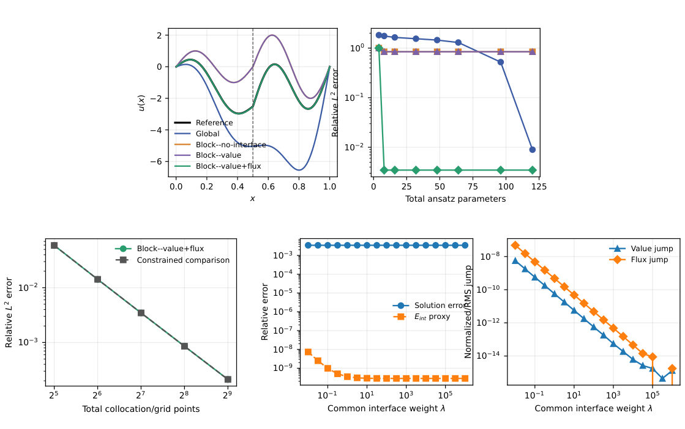
<figcaption class="paper-figure-caption"><b>Fig 2.</b> Fig. 2 Experiment 1, shown at the fixed panel height used throughout this section. Top left: reference, global, and flux-controlled block profiles at the matched budget; the dashed line is the material interface. Top right: relative error versus total ansatz parameters. Bottom left: closure/grid convergence, with approximately second-order decay. Bottom center: field error versus the common interface weight. Bottom right: RMS value and physical-flux jumps versus that weight. The unstable no-flux profile is omitted from the profile scale but retained in the numerical comparison</figcaption>
</figure>
<figure class="paper-figure-card">
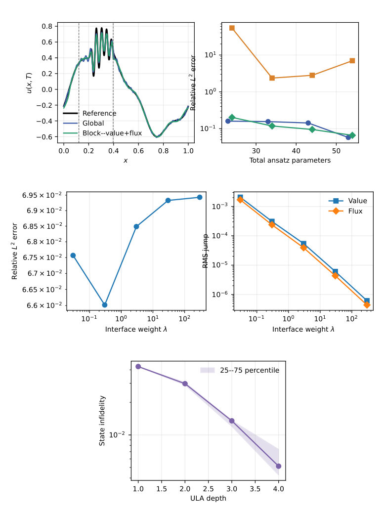
<figcaption class="paper-figure-caption"><b>Fig 3.</b> Fig. 3 Experiment 2, with every ordinary panel shown at the common fixed height. First row, left: final reference, global, and controlled block profiles; dashed lines delimit the rough block selected from u0. First row, right: relative error versus total ansatz parameters, including the moderate-budget block gain and higher-budget global crossover. Second row: field error and interface jumps versus the common value/flux weight. Third row: the separate five-qubit ULA statevector check; points are medians over ten initializations and the band is the 25–75 percentile range</figcaption>
</figure>
<figure class="paper-figure-card">
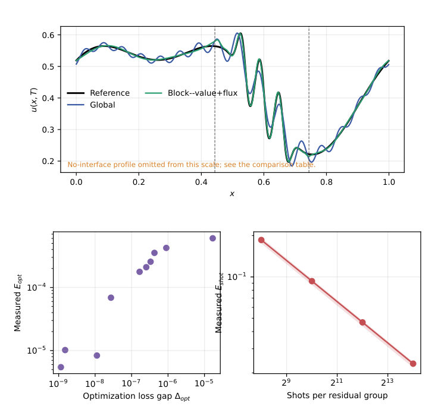
<figcaption class="paper-figure-caption"><b>Fig 4.</b> Fig. 4 Experiment 3, with both rows shown at the common fixed height. Top: nonlinear solution comparison at T = 0.02; the black, blue, and green curves are the reference, global, and value-plus-flux block solutions, and dashed lines mark the rough-block interfaces. Bottom left: directly measured optimizer deviation Eopt versus loss gap ∆opt for ten fixed-budget seeds. Bottom right: median shot-induced deviation versus shots per residual group; faint lines show individual seeds and the central trend follows M −1/2. The divergent no-interface profile is omitted from the plotted range but retained in the error table.</figcaption>
</figure>
<figure class="paper-figure-card">
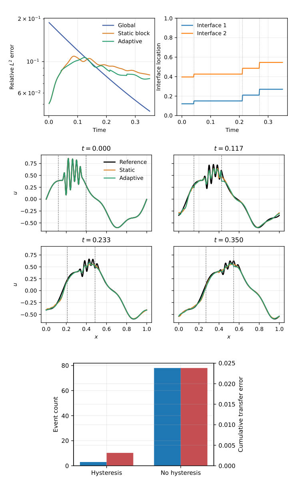
<figcaption class="paper-figure-caption"><b>Fig 5.</b> Fig. 5 Experiment 4 results grouped with their governing equations and discussion. Top: relative errors and stepwise interface trajectories; dotted vertical lines mark the three reblocking events. Middle: four field snapshots, with dashed adaptive interfaces. Bottom: event count and cumulative transfer error with and without hysteresis. Panel heights follow the common convention used in the preceding experiments</figcaption>
</figure>

**Summary.** This paper introduces a block-wise Variational Quantum Algorithm framework designed to solve PDEs whose solutions are not uniform across the domain. By decomposing the problem into smaller, locally optimized quantum subproblems coupled by interface penalties, it overcomes the resource limitations of global quantum representations. This approach proves that high-fidelity quantum simulation of complex PDEs is feasible on near-term quantum hardware.

**Why it may be interesting.** It provides a concrete, resource-aware quantum algorithm design pattern for simulating complex physical systems governed by PDEs, moving beyond idealized global representations.

Detailed structure

**Main problem.** Developing Variational Quantum Algorithms (VQAs) to solve Partial Differential Equations (PDEs) that exhibit spatially heterogeneous complexity, such as localized singularities or thin boundary layers.

**Main result.** The block-wise VQA framework achieves lower approximation errors and reduced peak local circuit width compared to global VQA approaches, demonstrating that high-fidelity PDE solutions are possible without a single globally expressive ansatz.

**Method.** The method decomposes the computational domain into locally represented quantum subproblems (blocks), coupling them via unified jump penalties inspired by Discontinuous Galerkin methods.

**Model / system.** The model involves solving general PDEs (elliptic, advection-diffusion, Burgers) over a spatial domain $\Omega$, which is adaptively partitioned into smaller blocks $I_i$. The solution is encoded into a quantum state $|\psi(	heta)
angle$.

**Key observables.** Approximation errors, peak local circuit width, residual-based loss function values, and error contributions separated by source (e.g., interface coupling, ansatz expressivity).

**Important parameters / regimes.** The computational budget (qubit count/grid size) and the local difficulty indicator $\eta(x)$ used for adaptive reblocking.

**Assumptions / limitations.** The analysis relies on rigorously separating various error contributions and assumes a PDE-dependent stability condition for the residual-to-solution control.

**Figures summary.** The notes mention comparing results against global VQA approaches, showing error reduction and reduced peak circuit width for the block-wise method in various PDE tests.

**Paper structure.** The paper introduces the problem limitation of global ansatzes, proposes the block-wise decomposition and coupling mechanism, details the adaptive resource allocation and error analysis, and validates the approach through residual-based simulations on multiple PDE types.

Abstract

Global variational quantum algorithm (VQA) frameworks for solving partial differential equations (PDEs) often rely on a single expressive ansatz over a uniform grid, which becomes structurally inefficient when solutions exhibit spatially heterogeneous complexity such as localized singularities or thin boundary layers. A localized nonsmooth feature can degrade the convergence of the entire global quantum representation, imposing unnecessary circuit depth and amplifying the risk of vanishing gradients in barren plateaus.   To overcome this limitation, we propose a block-wise VQA framework for PDEs characterized by spatially heterogeneous solution complexity. The computational domain is decomposed into locally represented quantum subproblems, where grid budgets and ansatz families are dynamically assigned based on a computable difficulty indicator. Artificial block interfaces are coupled through unified jump penalties for state values, derivatives, and physical fluxes, while adaptive reblocking tracks moving rough regions to maintain local accuracy without excessive global qubit overhead. The error analysis rigorously separates spatial discretization, ansatz expressivity, optimization convergence, finite-shot sampling noise, transfer errors from reblocking, and interface-coupling contributions. Reproducible residual-based simulations on representative elliptic, advection--diffusion, and Burgers problems demonstrate lower approximation errors and reduced peak local circuit width compared to global VQA approaches. These results substantiate block-wise quantum resource localization, confirming that high-fidelity PDE solutions can be achieved on near-term quantum devices without requiring a single globally expressive ansatz.

[↑ back to top](#top)

### [Conversable Quantum Fire in the Standard Model](http://arxiv.org/abs/2609.36335v1)

**Authors:** Ofer Casper, Barak Nehoran, Or Sattath  
**Type:** theory · **Category:** quantum information and computing · **PDF:** <https://arxiv.org/pdf/2609.36335v1>  
**Analysis basis:** full PDF text, analyzed in chunks
**Topic relevance:** `quantum measurements` **1/5**

↔ Scroll figures horizontally

<figure class="paper-figure-card">
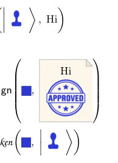
<figcaption class="paper-figure-caption"><b>Fig 1.</b> Fig. 2. One-shot-signature syntax. Note that an honestly generated one-shot sig- nature and public-key pair share the same color.</figcaption>
</figure>
<figure class="paper-figure-card">
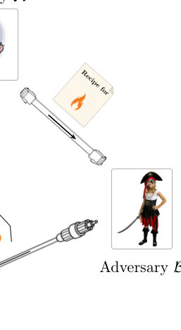
<figcaption class="paper-figure-caption"><b>Fig 2.</b> Fig. 5. Keyless untelegraphability. Keyless untelegraphability requires that no ef- ficient pair of adversaries can make the referee accept with non-negligible probability.</figcaption>
</figure>
<figure class="paper-figure-card">
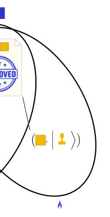
<figcaption class="paper-figure-caption"><b>Fig 3.</b> Fig. 7. Cloning a flame. The black ellipses enclose each of the new blue flames. Note that although the new one-shot signatures are red and yellow, the two flames remain blue, corresponding to the original serial number.</figcaption>
</figure>
<figure class="paper-figure-card">
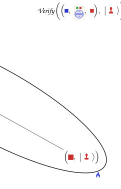
<figcaption class="paper-figure-caption"><b>Fig 4.</b> Fig. 9. Conversing a flame. Note that at the end of the protocol the binary signatures tree has a similar form to the cloning tree, even though the leaves are held by different parties.</figcaption>
</figure>

**Summary.** This paper introduces "conversable quantum fire," a quantum state that can be copied but not classically transmitted in one direction. By leveraging this primitive, the authors construct a novel, classically verifiable scheme for certifying high min-entropy, demonstrating a deep link between quantum information theory and modern cryptography.

**Why it may be interesting.** While highly theoretical, the concepts of quantum state transferability and information security are foundational to quantum computation and quantum networking protocols, providing rigorous bounds on classical communication capabilities.

Detailed structure

**Main problem.** The paper aims to construct a quantum primitive called "quantum fire" that is clonable but untelegraphable, and to establish its cryptographic utility for certifying min-entropy.

**Main result.** The authors prove the existence of a publicly certifiable, classically transferable min-entropy scheme based on a "conversable quantum fire" construction derived from one-shot signatures.

**Method.** The construction utilizes novel properties—keyless untelegraphability and conversability—to link quantum information security to classical cryptographic primitives like one-shot signatures.

**Model / system.** The model centers on quantum states exhibiting "quantum fire" properties, which are constructed using one-shot signatures, LWE, and are analyzed through protocols involving cloning, verification, and classical interaction.

**Key observables.** Clonability, untelegraphability, keyless untelegraphability, conversability, and the resulting min-entropy of the serial number distribution.

**Important parameters / regimes.** The construction has two variants: one supporting polynomially many flames (logarithmic depth) and another supporting exponentially many flames (linear depth).

**Assumptions / limitations.** The constructions rely on the existence of unforgeable one-shot signatures and the ability to perform classical interactions (conversability).

**Figures summary.** The figures graphically define the syntax and security games for one-shot signatures and quantum fire, illustrating the processes of sparking, cloning, verifying, and conversing a quantum flame.

**Paper structure.** The paper develops the theory by defining the primitives (one-shot signatures, quantum fire) graphically, proving the novel properties (keyless untelegraphability, conversability), and culminating in the construction of the classically certifiable min-entropy scheme.

Abstract

Quantum fire consists of quantum states that can be efficiently functionally cloned but cannot be transmitted using one-way classical communication. Whereas all previous quantum-fire constructions with proven untelegraphability are relative to an oracle, ours, based on one-shot signatures, is in the standard model.   Our construction achieves two further notions that we introduce: (a) keyless untelegraphability, a strengthening of untelegraphability; and (b) conversability, meaning that a flame, though not telegraphable via one-way classical communication, can be transmitted via classical interaction. Hence one-way and two-way classical communication differ qualitatively in their power to transmit this quantum fire.   We use these two novel properties of quantum fire, along with its clonability, to give one of the first cryptographic applications of quantum fire. Keyless untelegraphability forces the distribution of serial numbers of valid flames to have high min-entropy, while conversability and clonability allow the corresponding flame to be cloned and transferred using only classical communication.   We present two variants of our conversable quantum-fire construction. The first, based on one-shot signatures (instantiable from subexponential iO, subexponentially secure one-way functions, and LWE), supports polynomially many flames, and super-logarithmic min-entropy of the serial-number distribution. The second, under the stronger assumption of exponentially unforgeable one-shot signatures (instantiable relative to a classical oracle), supports exponentially many flames, and linear min-entropy.

[↑ back to top](#top)

### [Digital quantum state preparation by nucleation](http://arxiv.org/abs/2609.37527v1)

**Authors:** Jean Paul Sadia, Morten Hjorth-Jensen, Dean Lee, Ryan LaRose  
**Type:** theory · **Category:** quantum information and computing · **PDF:** <https://arxiv.org/pdf/2609.37527v1>  
**Analysis basis:** full PDF text, analyzed in chunks
**Topic relevance:** `analog quantum simulation` **1/5**

↔ Scroll figures horizontally

<figure class="paper-figure-card">
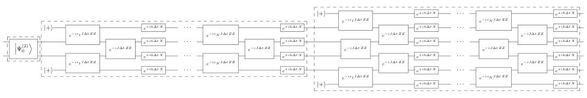
<figcaption class="paper-figure-caption"><b>Fig 1.</b> FIG. 1. The quantum circuit for nucleation demonstrated for the one-dimensional transverse-field Ising model (TFIM) (1). First, the exact ground state of a small lattice Hamiltonian, here for two qubits, is found and prepared on a quantum computer. Then, we grow the model from a small to a large lattice, here adding two qubits to the edges of the lattice initialized to the |+⟩state at each step. Each growth stage adiabatically interpolates from the smaller previous lattice to the larger subsequent lattice with new qubits added (3). To do this in a quantum circuit, we use a discretized schedule (4) and a number of Trotter steps N. Each growth stage evolves for a total evolution time T, with...</figcaption>
</figure>
<figure class="paper-figure-card">
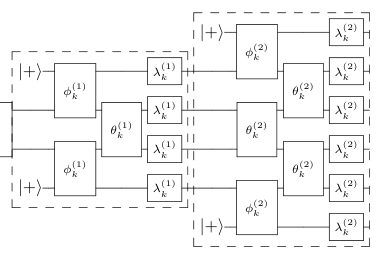
<figcaption class="paper-figure-caption"><b>Fig 2.</b> FIG. 2. Sketch of the quantum circuit for optimized nucle- ation. The structure of the circuit is identical to the nucle- ation circuit in Fig. 1, but here we allow variational optimiza- tion of the parameters θ, ϕ, and λ to minimize the energy. The subscript k indicates the number of layers k = 1, ..., L in each nucleation stage. That is, each dashed box repeats L times, where L is a hyperparameter, with independent pa- rameters in each repetition.</figcaption>
</figure>
<figure class="paper-figure-card">
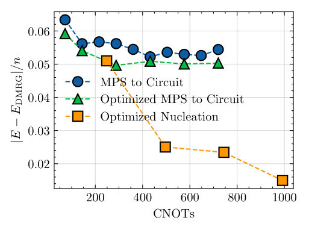
<figcaption class="paper-figure-caption"><b>Fig 3.</b> FIG. 4. Error vs number of two-qubit gates for the MPS to cir- cuit method and optimized nucleation. These results are for a 5 × 5 transverse-field Ising model with J = 1.0 and h = 2.5. Errors are computed relative to DMRG with bond dimension χDMRG = 196. Numerical simulations for computing ener- gies are done with an MPS with bond dimension χ = 100 for both the MPS to circuit and optimized nucleation methods. As shown, optimized nucleation provides a lower energy error than the MPS to circuit method, even when we allow for pa- rameter optimization after the MPS to circuit method. For fairness of comparison, both optimized nucleation and opti- mized MPS to circuit are provided with the same...</figcaption>
</figure>
<figure class="paper-figure-card">
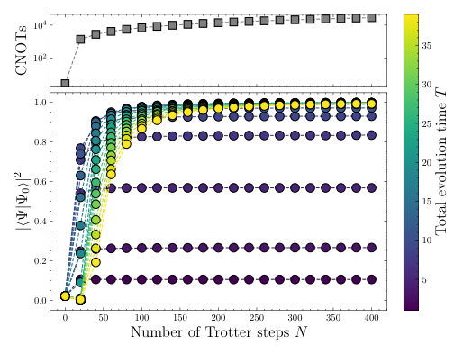
<figcaption class="paper-figure-caption"><b>Fig 4.</b> FIG. 3. Illustration of nucleation from a two-qubit to a twelve- qubit one-dimensional TFIM (1) with J = 1 and h = 1/2. The colorbar shows the total evolution time T (in units of 1/J), and the horizontal axis shows the number of Trotter steps N. Initial state overlap is shown at N = 0 Trotter steps. As can be seen, the nucleation state |Ψ⟩approaches the true ground state |Ψ0⟩as the total evolution time and number of Trotter steps increases. The highest overlap we achieve is 0.997, starting from the initial overlap (for all T, N) of 0.022.</figcaption>
</figure>
<figure class="paper-figure-card">
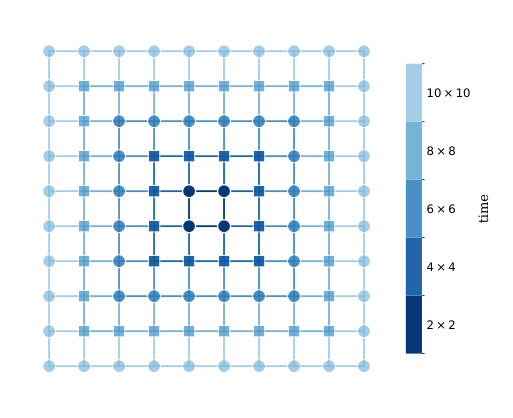
<figcaption class="paper-figure-caption"><b>Fig 5.</b> FIG. 5. Illustration of two-dimensional nucleation growth, starting with a core 2 × 2 lattice and expanding in time to a 4 × 4, 6 × 6, ..., and a 10 × 10 lattice. Different markers are used between growth layers for clarity, and colors progress from darker to lighter as time increases. While this growth pattern is perhaps the most natural to consider, several al- ternatives are possible, e.g. the column-wise growth shown in Appendix C Fig. 7.</figcaption>
</figure>

**Summary.** This paper introduces 'nucleation,' a novel adiabatic quantum circuit technique for preparing the ground states of large lattice Hamiltonians on digital quantum computers. By growing the system size incrementally from a small seed, it provides a structured approach that can outperform existing state preparation methods, particularly for 2D models, while offering rigorous theoretical bounds on resource requirements.

**Why it may be interesting.** It provides a concrete, resource-aware quantum circuit blueprint for simulating complex quantum materials, directly addressing resource scaling issues critical for near-term quantum hardware.

Detailed structure

**Main problem.** Developing efficient quantum state preparation methods for simulating lattice Hamiltonians on digital quantum computers.

**Main result.** The proposed 'nucleation' method, especially when optimized, can prepare initial states for 2D lattice models with fewer two-qubit gates than current leading methods.

**Method.** The method uses a process inspired by physical nucleation, starting from a small, solvable lattice ground state and adiabatically growing it to the target size via Trotterized evolution.

**Model / system.** The work focuses on lattice Hamiltonians, specifically the Transverse-Field Ising Model (TFIM), demonstrated in both one and two dimensions. The process involves adiabatically varying the Hamiltonian parameters to grow the system size.

**Key observables.** Fidelity of the prepared state, energy error relative to DMRG, and the required number of two-qubit gates (circuit depth).

**Important parameters / regimes.** Total evolution time ($T$), number of Trotter steps ($N$), and the minimum spectral gap ($\Delta_{\min}$) of the system Hamiltonian.

**Assumptions / limitations.** The method relies on the adiabatic theorem and Trotter error bounds, though the authors show practical results significantly outperform the derived theoretical worst-case bounds.

**Figures summary.** Figures illustrate the quantum circuits for nucleation growth on 1D and 2D TFIMs, showing the increasing overlap with the true ground state as evolution time/steps increase, and comparing energy errors against other state preparation techniques.

**Paper structure.** The paper introduces the nucleation concept, derives theoretical bounds using adiabatic and Trotter error theorems, demonstrates the method on 1D TFIM, and finally compares optimized nucleation against state-of-the-art methods for 2D TFIM.

Abstract

Quantum state preparation is crucial for quantum algorithms, and improved state preparation methods can reduce resource requirements by orders of magnitude. In this work, we introduce a state preparation method for lattice Hamiltonians on digital quantum computers inspired by nucleation. In our method, the exact ground state of a small lattice Hamiltonian is prepared in a quantum circuit, then a series of growth stages are performed via Trotterized adiabatic evolution to increase the size of the lattice to the desired model. Using the adiabatic theorem and Trotter error bounds, we provide sufficient conditions on the total evolution time and number of Trotter steps required for nucleation to prepare an initial state with desired fidelity. In addition, we introduce optimized nucleation which considers variational optimization on top of the nucleation structure. For a two-dimensional Ising model, we show that optimized nucleation can outperform a current leading method for state preparation on digital quantum computers.

[↑ back to top](#top)

### [Exact quantum algorithm for searching of multiple sets intersection](http://arxiv.org/abs/2609.36908v1)

**Authors:** Sheng-Ao Mao, Lin Zhang, Bo Li  
**Type:** theory · **Category:** quantum information and computing · **PDF:** <https://arxiv.org/pdf/2609.36908v1>  
**Analysis basis:** full PDF text, analyzed in chunks
**Topic relevance:** `quantum measurements` **1/5**

↔ Scroll figures horizontally

<figure class="paper-figure-card">
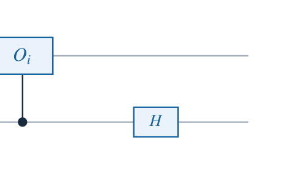
<figcaption class="paper-figure-caption"><b>Fig 1.</b> Figure 1: Quantum circuit for the membership oracle U fi.</figcaption>
</figure>
<figure class="paper-figure-card">
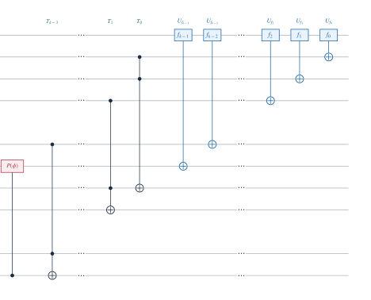
<figcaption class="paper-figure-caption"><b>Fig 2.</b> Figure 2: Quantum circuit for the intersection oracle operator O∩(ϕ).</figcaption>
</figure>
<figure class="paper-figure-card">
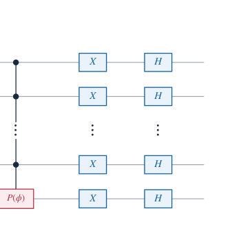
<figcaption class="paper-figure-caption"><b>Fig 3.</b> Figure 3: Quantum circuit for the diffusion operator D(ϕ).</figcaption>
</figure>
<figure class="paper-figure-card">
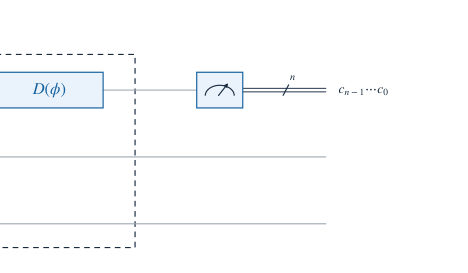
<figcaption class="paper-figure-caption"><b>Fig 4.</b> Figure 4: Complete quantum circuit for exact intersection search.</figcaption>
</figure>
<figure class="paper-figure-card">
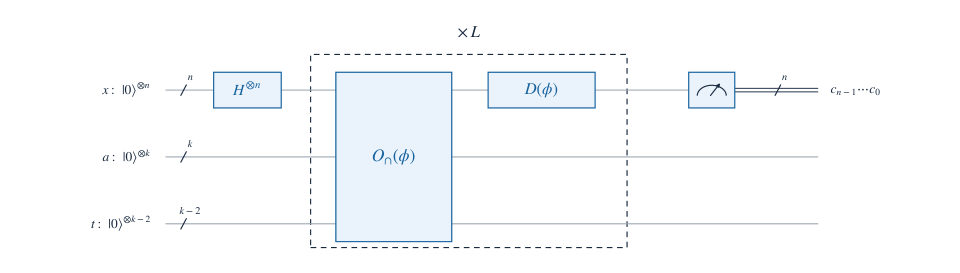
<figcaption class="paper-figure-caption"><b>Fig 5.</b> Fig. 5 shows the sampling results for k = 2 with r = 1, 2, 3, and 4. For r = 1, 2, 3, and</figcaption>
</figure>

**Summary.** This paper presents an exact quantum algorithm designed to find elements belonging to the intersection of multiple constrained sets. It achieves this by modifying Grover's search algorithm and deriving a precise phase-matching condition. The work provides both the theoretical proof and the quantum circuit implementation for this complex set operation.

**Why it may be interesting.** While focused on quantum algorithms, the rigorous mathematical derivation of the phase-matching condition and the circuit construction for complex set operations provides valuable theoretical tools applicable to quantum simulation protocols.

Detailed structure

**Main problem.** The paper addresses the challenge of developing an exact quantum algorithm to search for the intersection of multiple constrained sets ($A = igcap A_i$).

**Main result.** An exact quantum search algorithm for set intersection is proposed, deriving a specific phase-matching condition required for the search to succeed with zero theoretical failure rate.

**Method.** The method modifies Grover's search algorithm by constructing a specialized intersection oracle and applying a derived phase-matching condition to ensure the search operator is unitary and achieves perfect state projection.

**Model / system.** The model is quantum computation on a search space of size $N=2^n$. The algorithm relies on constructing and implementing controlled phase oracles ($U_{f_i}$) for each set membership function.

**Key observables.** The probability of finding the intersection (must be 1 for exact search), and the non-target amplitude ($B_L$) which must be zero.

**Important parameters / regimes.** The size of the search space ($N$), the size of the intersection set ($r$), the phase rotation angle ($\phi$), and the number of iterations ($L$).

**Assumptions / limitations.** The derivation assumes the accessibility of a controlled phase oracle and relies on the phase-matching condition derived from the modified Grover's framework.

**Figures summary.** Figures illustrate the quantum circuits for the membership oracle, the intersection oracle, the diffusion operator, and the complete circuit for exact intersection search, showing simulation results for $k=2, 3, 	ext{ and } 4$.

**Paper structure.** The paper first establishes the theoretical framework by deriving the phase-matching condition for exact search. It then details the quantum circuit implementation using controlled phase oracles and concludes with numerical simulations validating the algorithm's performance for multiple sets.

Abstract

Grover's algorithm achieves a quadratic speedup for unstructured search when a global oracle for the target set is available. However, its success probability is generally below $100\%$. To overcome this issue, Long presented a modified version of Grover's search algorithm by introducing a phase-matching condition, which can search for the target set with zero theoretical failure rate. Nevertheless, in many applications, the target set is determined by the intersection of multiple constrained sets. Most existing Grover-based methods are limited to the intersection of only two sets and are not always successful in searching for the target set. In this work, based on Long's method, we propose an algorithm for exactly searching the intersection of multiple sets. We derive and prove a phase-matching condition for searching the intersection exactly. Furthermore, we present a quantum circuit that implements exact intersection search. Finally, we support our theoretical results with numerical simulations.

[↑ back to top](#top)

### [Improved Quantum Algorithms for Black-Box Abelian Group Decomposition](http://arxiv.org/abs/2609.36480v1)

**Authors:** Junrong Luo, Yinan Li, Francois Le Gall  
**Type:** theory · **Category:** quantum information and computing · **PDF:** <https://arxiv.org/pdf/2609.36480v1>  
**Analysis basis:** full PDF text, analyzed in chunks
**Topic relevance:** `quantum measurements` **1/5**

↔ Scroll figures horizontally

<figure class="paper-figure-card">
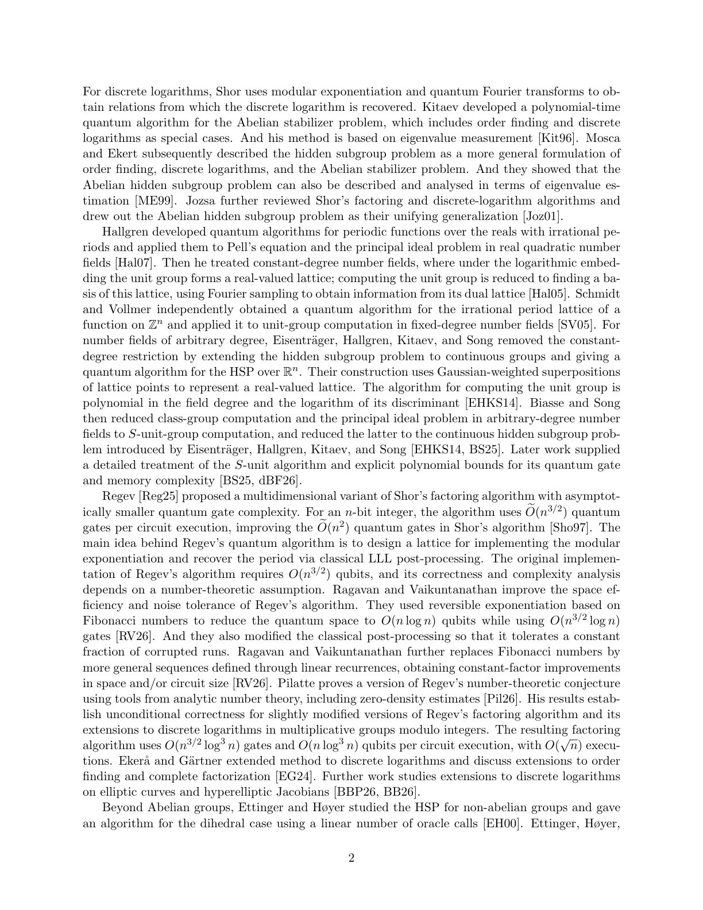
<figcaption class="paper-figure-caption"><b>Fig 1.</b> Low-resolution page preview, page 2</figcaption>
</figure>
<figure class="paper-figure-card">
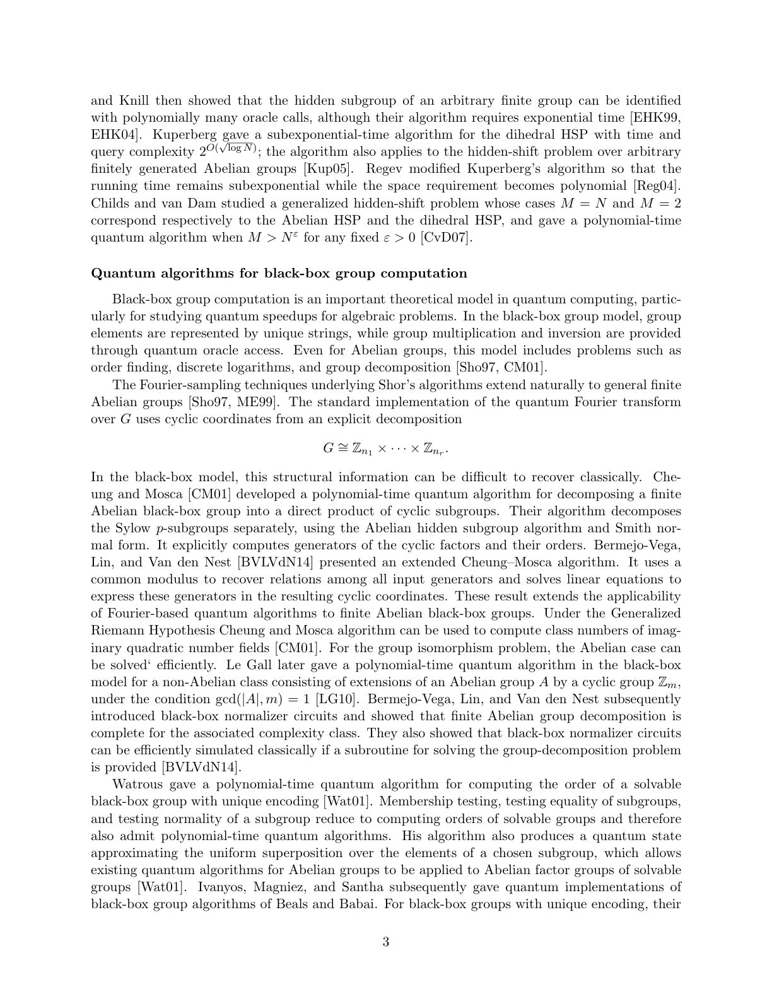
<figcaption class="paper-figure-caption"><b>Fig 2.</b> Low-resolution page preview, page 3</figcaption>
</figure>
<figure class="paper-figure-card">
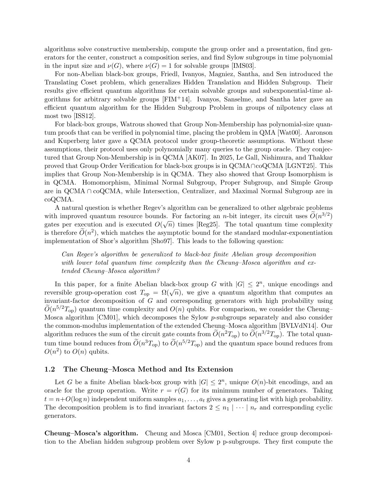
<figcaption class="paper-figure-caption"><b>Fig 3.</b> Low-resolution page preview, page 4</figcaption>
</figure>
<figure class="paper-figure-card">
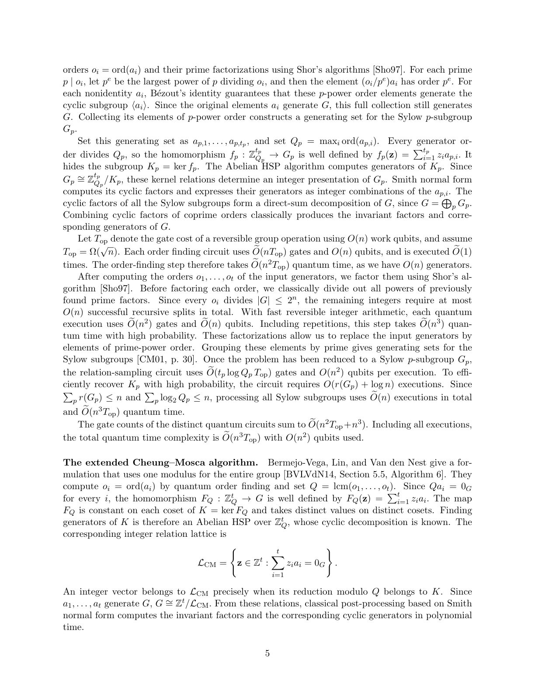
<figcaption class="paper-figure-caption"><b>Fig 4.</b> Low-resolution page preview, page 5</figcaption>
</figure>
<figure class="paper-figure-card">
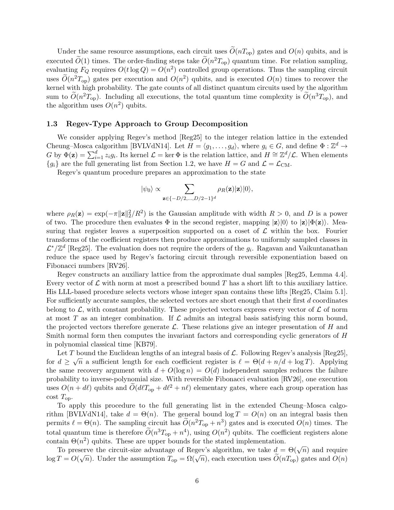
<figcaption class="paper-figure-caption"><b>Fig 5.</b> Low-resolution page preview, page 6</figcaption>
</figure>

**Summary.** This paper presents an improved quantum algorithm for decomposing finite Abelian black-box groups. By adapting Regev's lattice-reduction technique, the authors achieve significant polynomial speedups in both the total quantum time and the required quantum memory compared to prior state-of-the-art methods. This advances the theoretical understanding of quantum computation for fundamental group-theoretic problems.

**Why it may be interesting.** While focused on abstract group theory, the core techniques—quantum sampling, lattice reduction, and complexity analysis—are central to quantum information theory and have analogues in quantum simulation and quantum error correction.

Detailed structure

**Main problem.** The paper addresses the fundamental problem of decomposing finite Abelian black-box groups into their constituent cyclic factors.

**Main result.** The authors propose a quantum algorithm that significantly improves the complexity bounds compared to existing methods, reducing the total quantum time bound from $O(n^3 T_{op})$ to $O(n^{5/2} T_{op})$ and the quantum space from $O(n^2)$ to $O(n)$ qubits.

**Method.** The algorithm adapts the quantum sampling and classical lattice-reduction technique derived from Regev's factoring algorithm to the group decomposition problem.

**Model / system.** The model is an abstract, black-box finite Abelian group $G$ with order $|G| \le 2^n$, characterized by a reversible group-operation cost $T_{op} = \Omega(\sqrt{n})$.

**Key observables.** The primary observables are the computational complexities: circuit gate counts, total quantum time bounds, and quantum space requirements (qubits).

**Important parameters / regimes.** The key parameters include the group order bound ($2^n$), the input size parameter $n$, and the group operation cost $T_{op}$.

**Assumptions / limitations.** The improvements rely on proving that the associated integer relation lattices admit integral bases with small Euclidean norms, and the analysis assumes the group structure allows for the application of Regev's lattice-reduction framework.

**Paper structure.** The paper introduces the problem, reviews existing quantum algorithms (Cheung-Mosca, etc.), details the adaptation of Regev's lattice method, presents the complexity improvements, and concludes with the technical ingredients supporting the bounds.

Abstract

Decomposing finite Abelian black-box groups into cyclic factors is a basic problem in quantum computation. We give a quantum algorithm for decomposing finite Abelian black-box groups by adapting the quantum sampling and classical lattice-reduction method of Regev's factoring algorithm. The algorithm computes an invariant-factor decomposition and corresponding cyclic generators with high probability. For a group G of order at most 2^n with unique encodings and reversible group-operation cost T_op = Omega(sqrt(n)), our algorithm uses O(sqrt(n)) quantum circuits, each with O~(n T_op) gates and executed at most O(n) times.   For comparison, we consider the Cheung-Mosca algorithm, which decomposes the Sylow p-subgroups separately. We also consider the common-modulus implementation of the extended Cheung-Mosca algorithm. Our algorithm reduces the sum of the circuit gate counts from O~(n^2 T_op) to O~(n^(3/2) T_op). The total quantum time bound decreases from O~(n^3 T_op) to O~(n^(5/2) T_op), and the quantum space bound decreases from O(n^2) to O(n) qubits. The classical computation uses polynomially many bit operations and group-operation queries.   These improvements rely on two technical ingredients. We prove that the integer relation lattices used in our algorithm admit, with high probability, integral bases whose vectors have Euclidean norm at most exp(O(sqrt(n))). We preserve the circuit-size advantage of Regev's algorithm for group decomposition by incorporating all O(n) sampled generators while keeping the lattice-reduction dimension at O(sqrt(n)).

[↑ back to top](#top)

### [Localization Transition in Kinetically Deformed one-dimensional Aubry-André Model](http://arxiv.org/abs/2609.36446v1)

**Authors:** Arpita Goswami  
**Type:** theory · **Category:** statistical mechanics · **PDF:** <https://arxiv.org/pdf/2609.36446v1>  
**Analysis basis:** full PDF text, analyzed in chunks
**Topic relevance:** `Frenkel-Kontorova` **1/5**

↔ Scroll figures horizontally

<figure class="paper-figure-card">
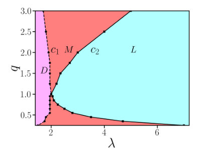
<figcaption class="paper-figure-caption"><b>Fig 1.</b> FIG. 1: Numerically determined localization map to the q-generalized AA model. D = delocalized phase, M = mixed (intermediate) phase, and L = Localized phase. The c1 and c2 lines correspond to the D-M and M-L crossover lines in the phase diagram.</figcaption>
</figure>
<figure class="paper-figure-card">
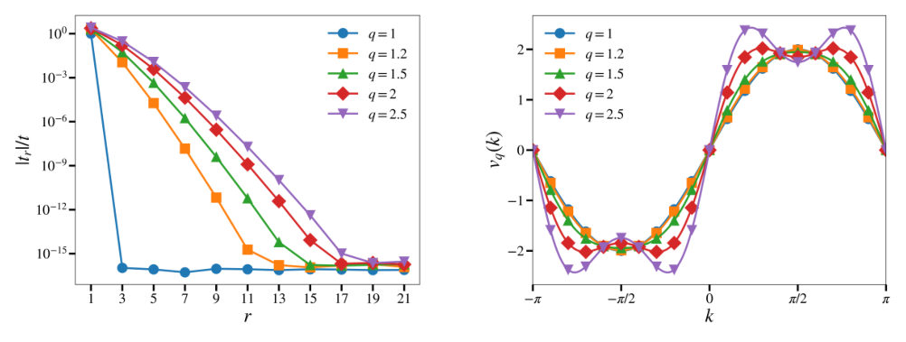
<figcaption class="paper-figure-caption"><b>Fig 2.</b> FIG. 2: (a) Normalized odd-range hopping amplitudes |tr/t1| generated by the q-deformed kinetic operator. The higher range processes are not independently tunable but are correlated through the single deformation parameter q. (b) Corresponding group velocity vq(k) = ∂εq(k)/∂k. The deformation progressively modifies the velocity’s momentum dependence, shifting it away from the sinusoidal form of the conventional nearest-neighbor model. These two representations provide complementary views of the same kinetic deformation.</figcaption>
</figure>
<figure class="paper-figure-card">
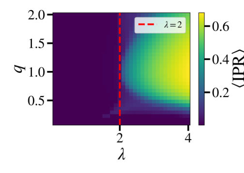
<figcaption class="paper-figure-caption"><b>Fig 3.</b> FIG. 3: Average IPR as a function of q and λ. The red dashed line corresponds to λ = 2. The q is varied from 0.1 to 2 and λ is varied from 0 to 4. q = 1 gives back the standard AA limit. Calculations are done for N = 1000.</figcaption>
</figure>
<figure class="paper-figure-card">
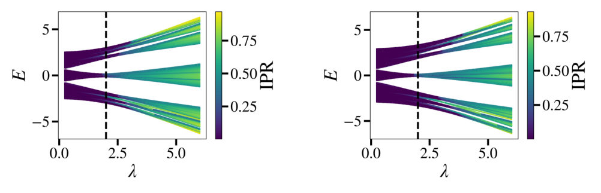
<figcaption class="paper-figure-caption"><b>Fig 4.</b> FIG. 4: The contour plot of IPR of each state as a function of energy (E) and quasi-periodic potential strength for (a) q = 0.5 and (b) q = 2.5 for system size N = 1000.</figcaption>
</figure>
<figure class="paper-figure-card">
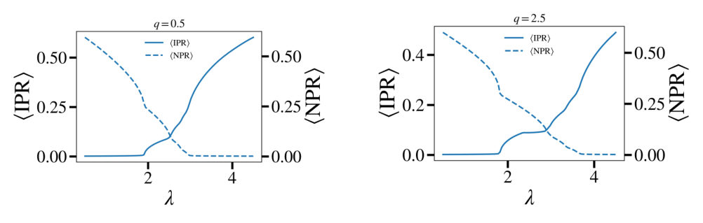
<figcaption class="paper-figure-caption"><b>Fig 5.</b> FIG. 5: ⟨IPR⟩, ⟨NPR⟩as a function of λ at (a) q = 0.5 and (b) q = 2.5 respectively for system size N = 1000.</figcaption>
</figure>

**Summary.** This work modifies the Aubry-André model by introducing a q-deformation into the kinetic energy term, controlled by the parameter q. This deformation generates an infinite, correlated set of long-range hopping terms, fundamentally altering the system's localization structure. The key finding is the emergence of a new intermediate phase where localized and extended eigenstates coexist, extending the physics beyond the model's original critical point.

**Why it may be interesting.** The study provides a controlled, algebraic mechanism (q-deformation) to perturb a fundamental model in condensed matter physics, allowing for the exploration of novel spectral phases (coexistence of localized/extended states) beyond standard critical points.

Detailed structure

**Main problem.** The paper investigates how introducing a q-deformation into the kinetic energy term of the one-dimensional Aubry-André (AA) model modifies the system's localization properties.

**Main result.** The deformation breaks the AA model's exact self-duality, leading to a fraction of delocalized states even beyond the standard critical point ($\lambda_c=2$) and creating an intermediate regime of coexisting localized and extended eigenstates.

**Method.** The authors construct a Hermitian q-deformed kinetic operator using q-number algebra and analyze the resulting spectral properties using localization diagnostics like the Inverse Participation Ratio (IPR).

**Model / system.** The system is the one-dimensional Aubry-André (AA) model, modified by a q-deformation in the single-particle kinetic energy. The Hamiltonian is $H_q = H_{kin}(q) + \lambda \cos(2\pi\alpha n + \phi)$, where $H_{kin}(q)$ is a nonlinear function of the lattice translation operator.

**Key observables.** Inverse Participation Ratio (IPR), Normalized Participation Ratio (NPR), and the existence/location of delocalized states.

**Important parameters / regimes.** Deformation parameter $q$, potential strength $\lambda$, and the critical point $\lambda_c=2$.

**Assumptions / limitations.** The deformation is controlled by the single parameter $q$, which generates an infinite, correlated hierarchy of odd-range hopping processes.

**Figures summary.** Figures illustrate the localization map (D, M, L phases) in the $q-\lambda$ plane, the correlated odd-range hopping amplitudes, and the convergence of IPR/NPR diagnostics with system size $N$.

**Paper structure.** The paper introduces the $q$-deformation, derives the resulting infinite-range hopping structure, analyzes the breakdown of self-duality, and finally maps out the modified localization phase diagram compared to the standard AA model.

Abstract

We propose a $q$-deformation in the single-particle kinetic energy and investigate how it modifies the localization in the one-dimensional Aubry-André (AA) model. We construct a Hermitian $q$-deformed kinetic operator as a nonlinear function of the lattice translation operator, preserving the uniform lattice and recovering the conventional AA Hamiltonian continuously in the undeformed limit $q\to1$. The deformation generates an infinite set of correlated odd-range kinetic processes, controlled by a single parameter q, rather than phenomenologically involving long-range hopping. Under the dual transformation, this long-range hopping appears as higher harmonics of the dual quasiperiodic potential, providing a controlled route for breaking the exact self-duality of the AA model, with $q$ as the control parameter, consequently modifying the localization structure for $q\neq1$. In contrast to the conventional AA model, where all eigenstates localize simultaneously at $λ_c=2$, the deformed model exhibits a fraction of delocalized states even beyond $λ_c =2$. An intermediate regime also emerges in the $q-λ$ plane where localized and extended eigenstates coexist across the spectrum. We also propose a possible experimental realization of the hierarchy produced in the $q$-deformed kinetic setting in a periodically driven AA model.

[↑ back to top](#top)

### [Minimal building blocks for molecular quantum circuits with exact spin symmetry](http://arxiv.org/abs/2609.37101v1)

**Authors:** Mengwei Liu, Zhenyu Li  
**Type:** theory · **Category:** other · **PDF:** <https://arxiv.org/pdf/2609.37101v1>  
**Analysis basis:** full PDF text, analyzed in chunks
**Topic relevance:** `analog quantum simulation` **1/5**

↔ Scroll figures horizontally

<figure class="paper-figure-card">
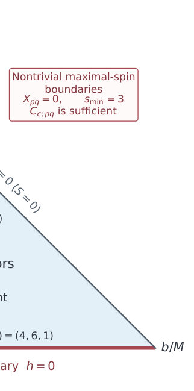
<figcaption class="paper-figure-caption"><b>Fig 1.</b> Figure 1. Sufficient additions and minimum orbital support across the sector family. The coordinates b, r, h in Eq. (4) count double, single, and empty occupations in a minimum-seniority highest-weight pattern. The interior, including singlets on r = 0, requires two orbitals and is completed by any fixed Xpq with p ̸= q. On the nontrivial parts of b = 0 and h = 0, Xpq = 0, and any fixed Cc;pq with pairwise distinct c, p, q attains the three-orbital minimum. Endpoint exceptions are listed in Table I. The marked H2, H3, H4 sectors have (b/M, h/M) = (0, 1/2); the O2 π-CAS(6e,4o) sector has (1/2, 0), and the TME triplet sector has (1/3, 1/3) in the interior. The continuous simplex organizes...</figcaption>
</figure>
<figure class="paper-figure-card">
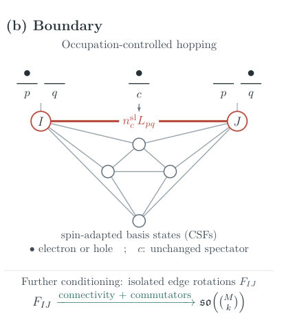
<figcaption class="paper-figure-caption"><b>Fig 2.</b> Figure 2. Physical transitions underlying the two controllability mechanisms. Vertices are spin-adapted many-electron basis states (CSFs) in the MS = S component; horizontal bars denote orbitals rather than energies. (a) In the dashed subspace KR of Eq. (10), pair transfer Xpq connects u = P † p |χ⟩and v = P † q |χ⟩, while an orbital rotation links them to w. The paired spin sketches represent one normalized singlet CSF. Isolating the u–v rotation gives all rotations on span{u, v, w}; orbital cyclicity and subspace expansion extend them to the complete sector. (b) On either nontrivial maximal-spin boundary, configurations form the Johnson graph J(M, k) of spinless particles or holes. The...</figcaption>
</figure>
<figure class="paper-figure-card">
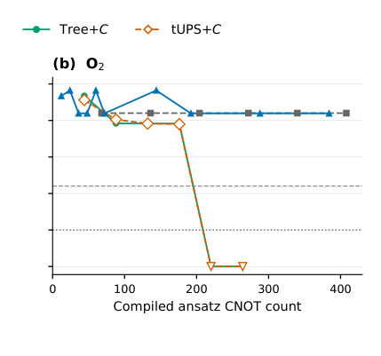
<figcaption class="paper-figure-caption"><b>Fig 3.</b> Figure 3. A conditioned rotation removes the observed boundary energy plateau. (a) H4 roots 0–1 and (b) O2 roots 0–5. Each checkpoint selects one complete chain from five starts by the summed final VQD objectives. Energy error and ansatz CNOT count are maxima over the roots of that chain; the maximizing roots need not coincide. All 50 checkpoints within the displayed windows are shown. Five additional H4 Dense L checkpoints retain the approximately 9.67-mHa plateau up to 7728 CNOTs outside the window. Downward markers indicate errors below the 0.01-mHa display floor. Dashed and dotted lines mark 1.6 and 0.1 mHa; lines connect tested checkpoints. The optimization and compilation procedures...</figcaption>
</figure>
<figure class="paper-figure-card">
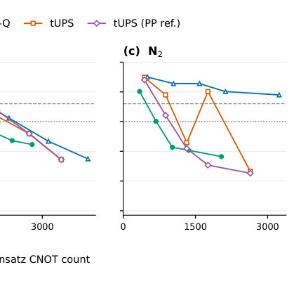
<figcaption class="paper-figure-caption"><b>Fig 4.</b> Figure 4. Accuracy versus compiled ansatz CNOT count in complete fixed-(N, S, MS) interior sectors. Each point uses the variational-energy-selected output at a tested circuit size and the count of that same parameter-bound circuit. (a) Linear-H6 ground-state error and single-state count. (b) The larger TME singlet or triplet energy error and the summed count for both states. (c) Maximum energy error and maximum count over eight N2 geometries at a common repetition count; the two maxima may occur at different geometries. Lines connect sampled circuit sizes; dashed and dotted lines mark 1.6 and 0.1 mHa. All controls use fixed orbitals; PP ref. denotes the perfect-pairing reference....</figcaption>
</figure>

**Summary.** This paper theoretically determines the minimal quantum operations needed to achieve full controllability (generating all state-space rotations) in molecular quantum circuits. It establishes that the required complexity depends on the electronic sector, needing two orbitals in the interior but three on certain boundaries. This has direct implications for designing efficient and complete quantum algorithms for molecular simulations.

**Why it may be interesting.** This work provides fundamental theoretical constraints on the gate set required for simulating molecular electronic structure, directly impacting the resource estimation for quantum chemistry algorithms.

Detailed structure

**Main problem.** The paper determines the minimal set of additional quantum operations needed, beyond simple orbital rotations, to ensure that a quantum circuit can generate every possible real state-space rotation within a fixed molecular electronic subspace.

**Main result.** The minimum number of orbitals required for this additional generator is two in the interior of the subspace and three on nontrivial boundaries, achievable using only one- and two-electron terms.

**Method.** The analysis uses structural questions from Lie algebra theory to classify the required generators, comparing the generated algebra to the target dynamical Lie algebra $\mathfrak{so}(d)$.

**Model / system.** The study models nonrelativistic, spin-free molecular Hamiltonians analyzed in fixed subspaces defined by particle number ($N$), total spin ($S$), and spin projection ($M_S$).

**Key observables.** The required minimum number of spatial orbitals (2 vs. 3), and the resulting ability to generate the full dynamical Lie algebra $\mathfrak{so}(d)$.

**Important parameters / regimes.** Fixed quantum numbers ($N, S, M_S$), the distinction between interior and maximal-spin boundaries, and the use of one- and two-electron terms.

**Assumptions / limitations.** The analysis assumes the system is spin-free and the Hamiltonian is real, and the results are structural, independent of the specific molecular Hamiltonian.

**Figures summary.** Not specified (Notes focus on theoretical results and comparisons rather than figure descriptions).

**Paper structure.** The paper progresses by first defining the problem in terms of generating the full state-space rotation group, then analyzing the interior and boundary sectors separately to derive the minimum orbital support required for the necessary additional generators.

Abstract

Preserving particle number and spin helps quantum circuits target molecular electronic states, but does not guarantee access to every state with the required quantum numbers. We determine which additional operations, combined with spin-independent orbital rotations connecting all spatial orbitals, generate every real state-space rotation within each complete subspace of fixed particle number $N$, total spin $S$, and spin projection $M_S$. We consider spin-free molecular calculations in real orbitals, without an additional spatial-symmetry restriction, and continuously tunable operations that preserve particle number, full spin symmetry, and real amplitudes. Below the maximal-spin limits set by the electron and hole numbers, repeated singlet-pair transfer between any two fixed spatial orbitals is sufficient. On nontrivial maximal-spin boundaries, pair transfer vanishes, and an additional generator built from one- and two-electron terms is sufficient exactly when its action in the target subspace is not a linear combination of orbital-rotation generators. The minimum number of spatial orbitals needed by one additional generator is two in the interior and three on nontrivial boundaries, even when terms involving more than two electrons are allowed. Both minima are attained using only one- and two-electron terms. The three-orbital optimum rotates two orbitals according to the occupation of a third, and its unitary factors exactly into eight commuting Pauli rotations. Molecular benchmarks show that this operation removes the observed boundary energy-error plateaus, while sparse interior constructions attain the prescribed energy accuracy with fewer compiled CNOT gates in selected fixed-orbital comparisons.

[↑ back to top](#top)

### [Quantum Computing for Network Security Classification: Near-Term Classification and Long-Term Memory Efficiency](http://arxiv.org/abs/2609.36479v1)

**Authors:** Yuqing Li, Poonam Bala Nehru, Yunpeng Zhang, Danindu Gammanpilage, Xin Jin, Zeguan Wu, Junyu Liu  
**Type:** both · **Category:** quantum information and computing · **PDF:** <https://arxiv.org/pdf/2609.36479v1>  
**Analysis basis:** full PDF text, analyzed in chunks
**Topic relevance:** `quantum measurements` **1/5**

↔ Scroll figures horizontally

<figure class="paper-figure-card">
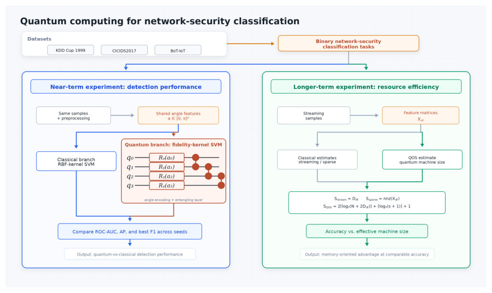
<figcaption class="paper-figure-caption"><b>Fig 1.</b> Fig. 1. Overall workflow for the two experiments. The near-term branch compares classical and quantum SVM kernels for network-security detection and classification performance, while the longer-term branch evaluates QOS-inspired resource efficiency through effective machine-size estimates.</figcaption>
</figure>
<figure class="paper-figure-card">
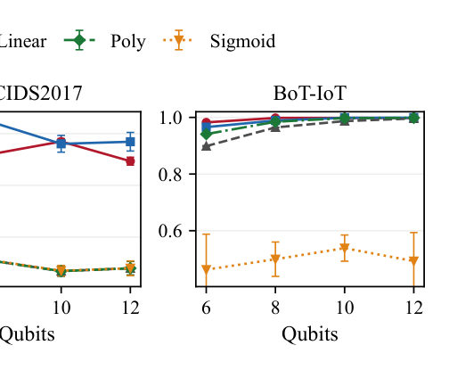
<figcaption class="paper-figure-caption"><b>Fig 2.</b> Fig. 2. ROC-AUC ablation across qubit counts and kernel choices. Error bars show standard deviation across three seeds.</figcaption>
</figure>
<figure class="paper-figure-card">
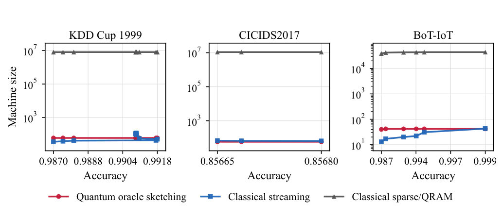
<figcaption class="paper-figure-caption"><b>Fig 3.</b> Fig. 3. Machine size versus accuracy for the quantum oracle sketching experiment. Because the accuracies are near-saturated for some datasets, the x-axis is zoomed to the observed accuracy range for readability.</figcaption>
</figure>

**Summary.** This paper assesses the utility of quantum computing for network security classification by examining two aspects: immediate performance and future resource scaling. Near-term results show quantum kernels are sometimes competitive but not universally superior to classical methods. More significantly, the work demonstrates that quantum methods may offer a substantial memory advantage for handling massive, streaming datasets compared to explicit classical storage models.

**Why it may be interesting.** While the core application is in cybersecurity, the methodology involves quantum feature mapping, kernel methods, and resource estimation (memory scaling), which are relevant theoretical tools in quantum information processing.

Detailed structure

**Main problem.** The paper systematically investigates how quantum computing can contribute to network-security classification, analyzing both near-term performance gains and long-term memory efficiency.

**Main result.** Quantum kernels are competitive but task-dependent for near-term classification, while the primary long-term advantage lies in memory-efficient data access via Quantum Oracle Sketching (QOS).

**Method.** The study employs two complementary methods: evaluating quantum-kernel Support Vector Machines (SVMs) on standard datasets for near-term testing, and using Quantum Oracle Sketching (QOS) to estimate memory requirements for streaming data.

**Model / system.** The model involves applying quantum feature mapping (via angle encoding of SVD coordinates) to classical network-security data (KDD Cup 1999, CICIDS2017, BoT-IoT) within the framework of quantum-kernel SVMs.

**Key observables.** Classification metrics (ROC-AUC, AP, F1 score) for near-term; Effective memory-size proxy ($S_{QOS}$) compared to classical storage ($S_{sparse}$) for long-term.

**Important parameters / regimes.** Dataset choice, kernel type (quantum fidelity vs. classical RBF), feature filtering threshold ($\min df$), and qubit counts (for ablation studies).

**Assumptions / limitations.** The near-term comparison assumes the data pipeline and SVM objective are fixed, isolating the kernel's contribution. The long-term analysis is an estimate-based comparison of memory size, not a runtime speedup claim.

**Figures summary.** Figure 2 shows ROC-AUC ablation across different kernel choices; Figure 3 compares the required machine size (QOS vs. Classical streaming/sparse) versus accuracy for the memory efficiency analysis.

**Paper structure.** The paper is structured around two main experiments: first, a near-term comparison of quantum vs. classical SVM kernels on multiple datasets; second, a long-term analysis using QOS to estimate memory advantages for streaming data access.

Abstract

Quantum computing has already been explored in several network-security applications. However, how quantum computing may contribute to network-security classification in both the near term and the longer term has not been systematically discussed. This paper studies this question through two complementary experiments. First, we evaluate near-term quantum-kernel support vector machines (SVMs) on practical network-security classification tasks and compare them with classical SVM baselines on KDD Cup 1999, CICIDS2017, and BoT-IoT. Across these runs, quantum kernels are competitive. They can match or improve classical baselines in some settings, while classical RBF kernels remain stronger in others. This suggests that near-term quantum-kernel methods should be evaluated as practical, dataset-dependent alternatives to classical kernels rather than as uniformly superior replacements. Second, we use quantum oracle sketching (QOS) to study a longer-term memory advantage for classification with streaming classical samples. In QOS, samples are processed online and used to incrementally construct an approximate quantum oracle, which provides coherent query access for downstream quantum algorithms without retaining the entire dataset. Under the QOS-inspired machine-size estimate, comparable accuracy corresponds to a substantially smaller effective memory-size proxy than explicit sparse/QRAM-style storage. Compared with a simple streaming proxy, the result is more nuanced because aggressive feature filtering can make the streaming dimension small. This suggests that the long-term value of quantum computing for network-security classification may lie in memory-efficient data access rather than immediate runtime speedup. Together, these experiments show how quantum computing may contribute to network-security classification from near-term classification performance and longer-term memory efficiency.

[↑ back to top](#top)

### [Quantum Fidelity Landscape-Guided Prior Calibration for Single-Circuit QGAN Image Generation](http://arxiv.org/abs/2609.36702v1)

**Authors:** Xue Yang, Rigui Zhou, Dax Enshan Koh, Siong Thye Goh, Yitao Tang, ShiZheng Jia, Young-Wook Cho, Hongyu Chen  
**Type:** both · **Category:** quantum information and computing · **PDF:** <https://arxiv.org/pdf/2609.36702v1>  
**Analysis basis:** full PDF text, analyzed in chunks
**Topic relevance:** `quantum measurements` **1/5**

↔ Scroll figures horizontally

<figure class="paper-figure-card">
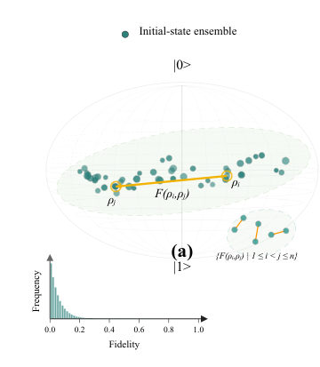
<figcaption class="paper-figure-caption"><b>Fig 1.</b> Figure 1: The green dots in (a) denote a discrete initial-state ensemble sampled from the quantum prior, and the blue dots in (b) represent the corresponding generated-state ensemble after the generator’s unitary evolution. In (b), we also show a denser ensemble example (red dots), whose QFL histogram exhibits a markedly different distribution from the other two ensembles. In each QFL histogram, the horizontal axis denotes the pairwise fidelity between distinct quantum states, while the vertical axis gives the frequency of state pairs falling into each fidelity bin; each unordered pair is counted once, with self-pairs excluded.</figcaption>
</figure>
<figure class="paper-figure-card">
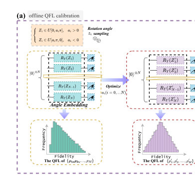
<figcaption class="paper-figure-caption"><b>Fig 2.</b> Figure 2: Overall framework of BasicQGAN. (a) During offline QFL calibration, the state-preparation parameters z1, z2, . . . , zn are optimized to transform the initial ensemble ρ1, ρ2, . . . , ρn into a calibrated ensemble ρ′ 1, ρ′ 2, . . . , ρ′ n. (b) During online adversarial training, the calibrated preparation parameters z′ 1, z′ 2, . . . , z′ n initialize the state ensemble used by the single-circuit quantum generator.</figcaption>
</figure>
<figure class="paper-figure-card">
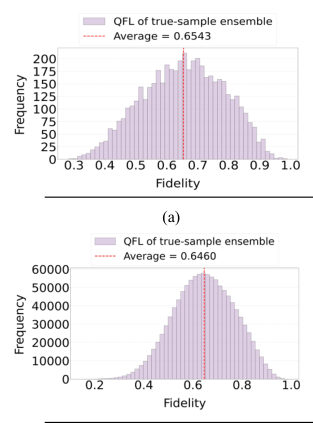
<figcaption class="paper-figure-caption"><b>Fig 3.</b> Figure 3: Empirical QFL distributions computed from 500, 1000, 1500, and 2000 real samples of MNIST digit 0 at 16 × 16 resolution.</figcaption>
</figure>
<figure class="paper-figure-card">
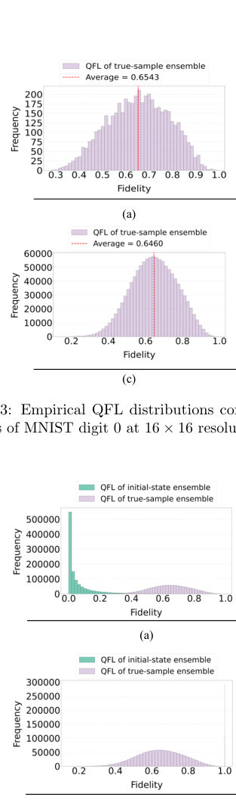
<figcaption class="paper-figure-caption"><b>Fig 4.</b> Figure 4: QFL distributions induced by different prior preparations and by real data. Panels (a)–(c) use uncalibrated sampling schemes, whereas panel (d) uses the QFL-calibrated prior.</figcaption>
</figure>
<figure class="paper-figure-card">
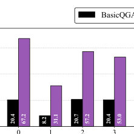
<figcaption class="paper-figure-caption"><b>Fig 5.</b> Figure 6: BasicQGAN obtains lower FID scores than PQWGAN(Global) across MNIST classes at 16 × 16 resolution.</figcaption>
</figure>

**Summary.** This paper introduces BasicQGAN, a novel QGAN framework for single-circuit image generation that avoids patch-based decomposition. It leverages the Quantum Fidelity Landscape (QFL)—a measure of pairwise quantum fidelity—to theoretically constrain and calibrate the quantum prior before adversarial training. Experiments show this calibration leads to stable, high-quality image synthesis using fewer quantum resources.

**Why it may be interesting.** The work provides a rigorous geometric constraint (QFL) derived from quantum information theory to stabilize the training of complex quantum machine learning models, which is highly relevant for understanding resource limitations in NISQ devices.

Detailed structure

**Main problem.** To improve Quantum Generative Adversarial Networks (QGANs) for end-to-end image generation by overcoming the limitations of patch-based methods.

**Main result.** The proposed BasicQGAN framework, which incorporates Quantum Fidelity Landscape (QFL) calibration, achieves stable and effective pixel-level image generation with fewer resources than patch-based alternatives.

**Method.** The authors introduce the QFL, a theoretical structure based on pairwise quantum fidelity, and propose an offline calibration step to align the prior-induced QFL with the data-induced QFL before adversarial training.

**Model / system.** The model is a single-circuit QGAN operating in the NISQ era, utilizing an initial state ensemble $\{
ho_i\}$ whose structure is governed by the QFL. The generation process involves a shared unitary transformation and a fixed amplitude readout.

**Key observables.** Quantum Fidelity Landscape (QFL), Squared Uhlmann fidelity, and the resulting bound on decoded sample separation.

**Important parameters / regimes.** The required number of qubits and trainable parameters; the learning rate used during QFL calibration (e.g., 0.3).

**Assumptions / limitations.** The approach assumes a fixed Lipschitz readout to derive the output-separation bound, and the core assumption is that the QFL captures the necessary structural information for stable training.

**Figures summary.** Figure 1 compares QFL histograms for initial, generated, and true sample ensembles. Figure 2 illustrates the two-stage BasicQGAN process: offline QFL calibration followed by online adversarial training. Appendix I shows FID curves and sample generations across various datasets.

**Paper structure.** The paper introduces the QFL theory, derives bounds relating fidelity to output separation, proposes the BasicQGAN framework with an offline calibration stage, and validates the method through extensive experiments on multiple grayscale image datasets.

Abstract

Quantum Generative Adversarial Networks (QGANs) have emerged as representative generative models in the Noisy Intermediate-Scale Quantum (NISQ) era and have attracted increasing attention in quantum machine learning. However, most existing QGAN methods rely on patch-based decomposition strategies, which weaken the global consistency of generated images and increase quantum resource overhead. In this work, we investigate a simpler approach: pixel-level, end-to-end image generation using a single-quantum-circuit QGAN. By analyzing the structural matching relationship between the quantum prior and the target data distribution in Hilbert space, we provide a new theoretical perspective for understanding the training behavior of naive end-to-end QGANs. Specifically, we introduce the Quantum Fidelity Landscape (QFL), defined as the pairwise-fidelity structure induced by an ensemble of quantum states and preserved under shared unitary transformations of the quantum generation process. We show that, under a fixed Lipschitz readout, this invariant imposes a one-sided bound on decoded sample separation, motivating calibration of the prior-induced QFL before adversarial training. To validate this theoretical insight, we propose BasicQGAN, a QGAN framework incorporating quantum prior calibration. Before adversarial optimization, BasicQGAN aligns the prior-induced QFL with the data-induced QFL. Experimental results on small-scale grayscale image datasets show that BasicQGAN achieves stable and effective end-to-end pixel-level image generation while requiring fewer qubits and trainable parameters than representative patch-based quantum generators. Furthermore, experiments with different initial quantum-state ensembles show that QFL-calibrated ensembles achieve better generative performance.

[↑ back to top](#top)

### [Quantum Leakage Resilience of Shamir Secret Sharing](http://arxiv.org/abs/2609.37276v1)

**Authors:** Rishabh Batra, Fuyuki Kitagawa, Ryo Nishimaki, Takashi Yamakawa  
**Type:** theory · **Category:** quantum information and computing · **PDF:** <https://arxiv.org/pdf/2609.37276v1>  
**Analysis basis:** full PDF text, analyzed in chunks
**Topic relevance:** `quantum measurements` **1/5**

↔ Scroll figures horizontally

<figure class="paper-figure-card">
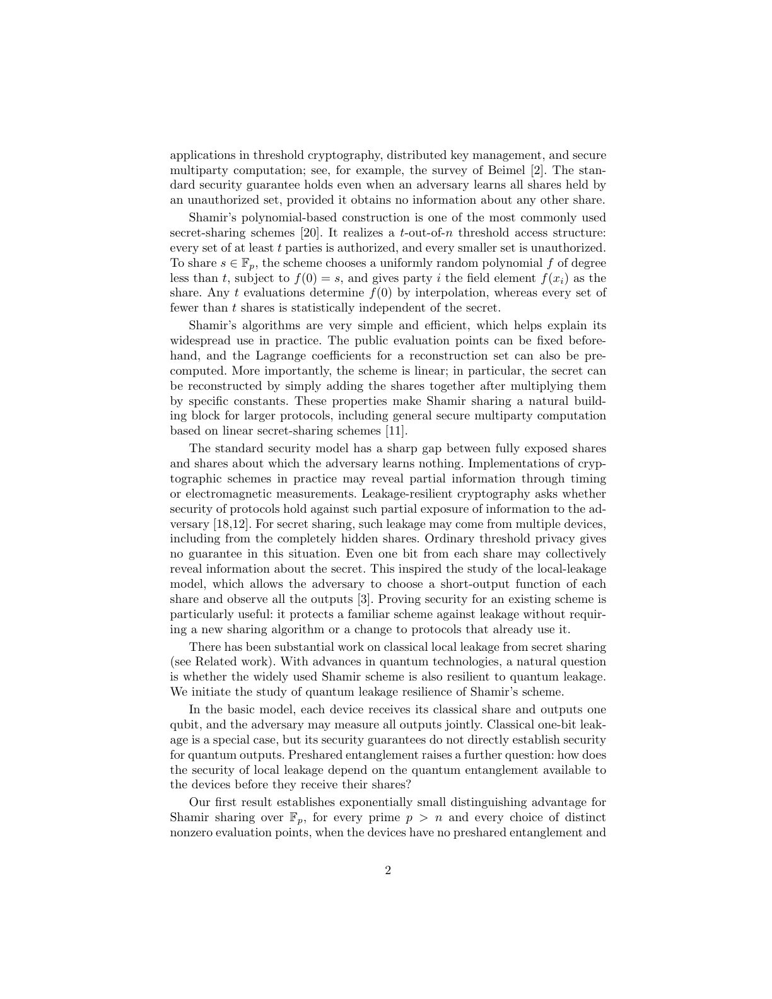
<figcaption class="paper-figure-caption"><b>Fig 1.</b> Low-resolution page preview, page 2</figcaption>
</figure>
<figure class="paper-figure-card">
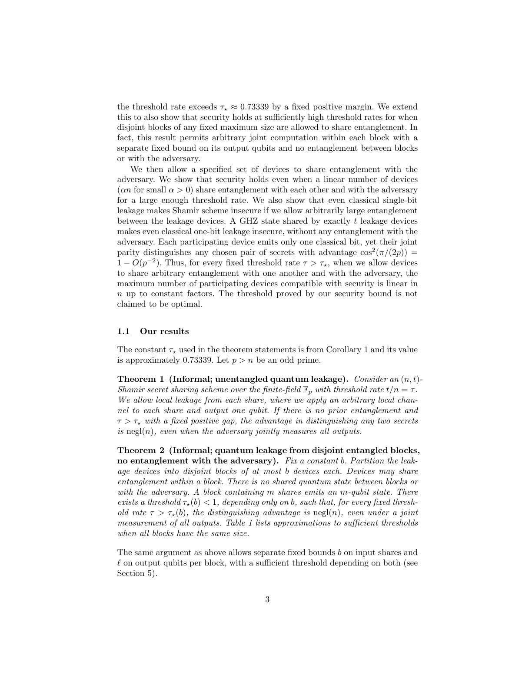
<figcaption class="paper-figure-caption"><b>Fig 2.</b> Low-resolution page preview, page 3</figcaption>
</figure>
<figure class="paper-figure-card">
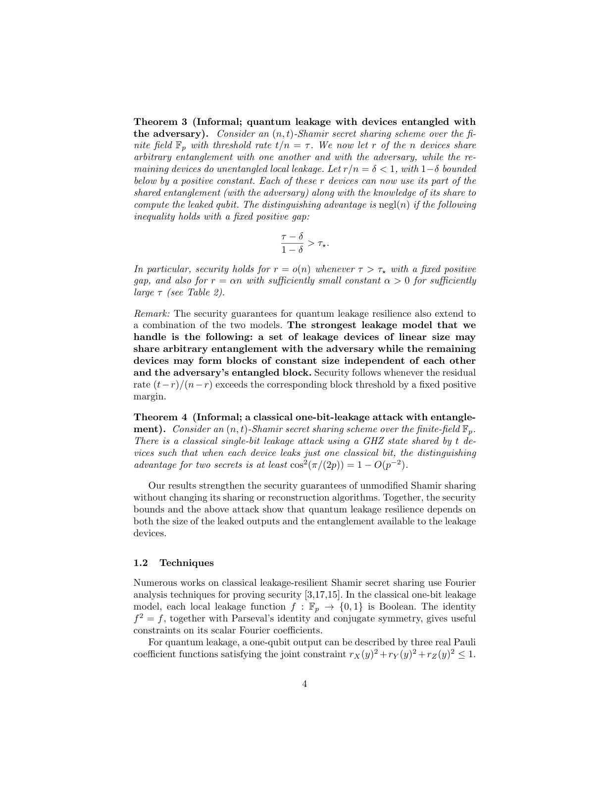
<figcaption class="paper-figure-caption"><b>Fig 3.</b> Low-resolution page preview, page 4</figcaption>
</figure>
<figure class="paper-figure-card">
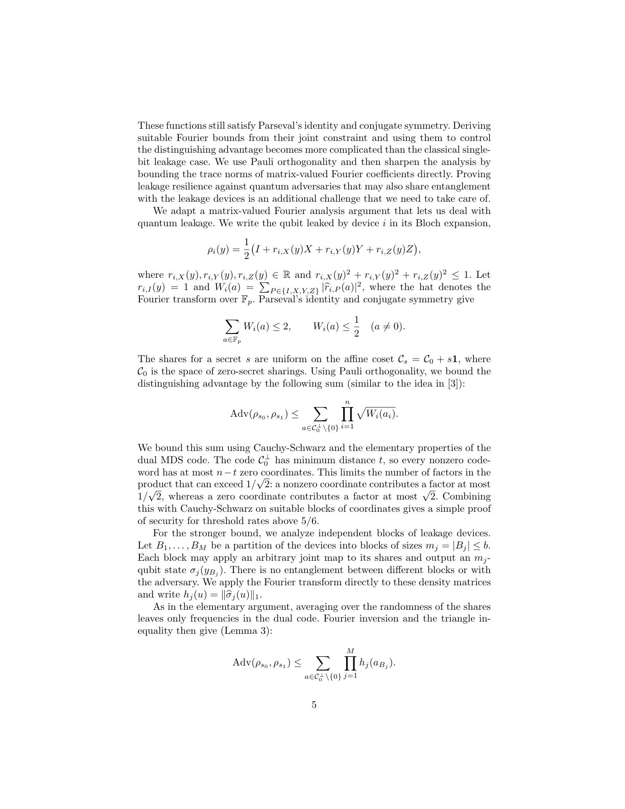
<figcaption class="paper-figure-caption"><b>Fig 4.</b> Low-resolution page preview, page 5</figcaption>
</figure>
<figure class="paper-figure-card">
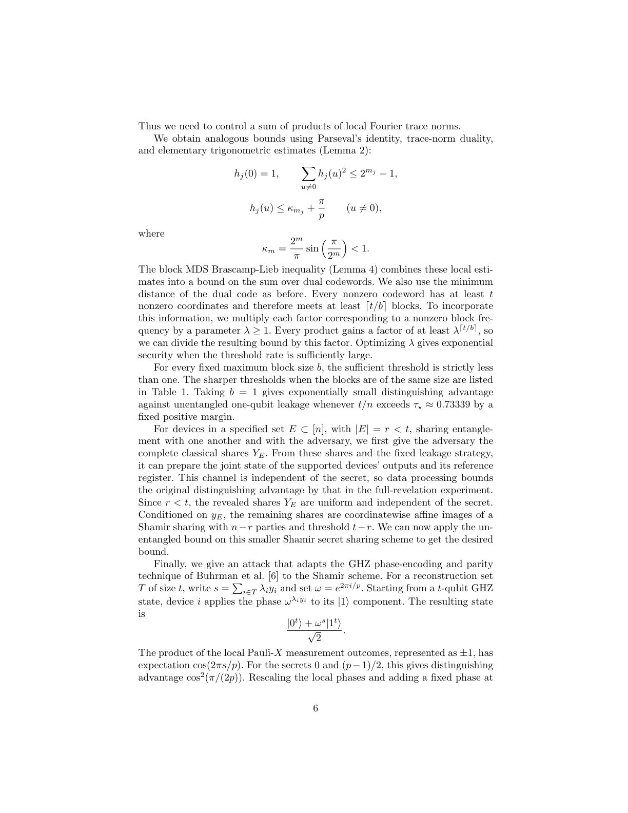
<figcaption class="paper-figure-caption"><b>Fig 5.</b> Low-resolution page preview, page 6</figcaption>
</figure>

**Summary.** This work analyzes the security of Shamir's secret sharing scheme against quantum leakage attacks. Using advanced Fourier analysis on finite fields, the authors derive critical threshold rates required to ensure that the leaked quantum information is insufficient for an adversary to distinguish between possible secrets. The findings establish quantitative limits on the resilience of secret sharing in the presence of quantum side channels.

**Why it may be interesting.** It provides rigorous, information-theoretic bounds on the security of cryptographic primitives (secret sharing) against sophisticated quantum side-channel attacks, which is fundamental to quantum information security.

Detailed structure

**Main problem.** The paper investigates the quantum leakage resilience of Shamir's secret sharing scheme, analyzing how easily an adversary can distinguish between two secrets based on leaked quantum information.

**Main result.** Security is maintained if the threshold rate $t/n$ exceeds a critical threshold $	au^\star \approx 0.73339$ when no entanglement is shared, and security can be extended to linear entanglement support under high threshold rates.

**Method.** The analysis employs finite-field Fourier analysis, bounding the distinguishing advantage using properties of the dual MDS code and techniques like the MDS Brascamp-Lieb inequality.

**Model / system.** The model is Shamir's secret sharing over prime fields, where the leakage is modeled as a local quantum channel outputting qubits from each share.

**Key observables.** Distinguishing advantage ($	ext{Adv}$), threshold rate ($	au = t/n$), and the critical threshold ($	au^\star$).

**Important parameters / regimes.** Threshold rate $	au$, field size $p$, and the entanglement support size ($\alpha n$).

**Assumptions / limitations.** The analysis assumes the structure of the dual MDS code and relies on bounding the Fourier coefficients of the leakage operators.

**Figures summary.** The notes mention tables summarizing sufficient thresholds for different block sizes and theorems relating to the security bounds.

**Paper structure.** The paper progresses by first establishing the basic quantum leakage bound without entanglement, then generalizing to disjoint entangled blocks, and finally analyzing the case where a linear number of devices share entanglement with the adversary.

Abstract

We initiate the study of quantum leakage resilience of unmodified Shamir secret sharing over prime fields. A well-studied leakage model for Shamir's secret sharing classically is single-bit local leakage from each share. We consider its quantum analogue where, for each party, a local leakage channel takes as input the party's share and outputs a leaked qubit. Without preshared entanglement, we show that the distinguishing advantage is $2^{-Ω(n)}$ when the threshold rate $t/n=τ$ exceeds $τ_\star\approx0.73339$ by a fixed positive margin.   More generally, we allow disjoint entangled blocks of any fixed maximum size where there is no entanglement between different blocks or with the adversary, and each block emits at most a fixed number of qubits. Security holds when the threshold rate is high enough (sufficiently close to one). We then allow a specified set of devices to share entanglement with the adversary. We show that security holds even when a linear number of devices ($αn$ for small $α>0$) share entanglement with each other and with the adversary for a large enough threshold rate.   As a complementary negative result, we also show that even classical single-bit leakage makes Shamir scheme insecure if we allow arbitrarily large entanglement between the leakage devices. A GHZ state shared by exactly $t$ leakage devices makes even classical one-bit leakage insecure, without any entanglement with the adversary. In this attack, each participating device emits only one classical bit, and their joint parity distinguishes any chosen pair of secrets with a constant advantage. Thus, for fixed threshold rates above $τ_\star$, the maximum number of devices that may share arbitrary entanglement with one another and with the adversary while preserving security is linear in $n$ up to constant factors, although the optimal support fraction remains open.

[↑ back to top](#top)

### [Quantum metric induced nonlinear transport in the hidden loop-current phase of kagome metal RbV$_3$Sb$_5$](http://arxiv.org/abs/2609.36353v1)

**Authors:** Jia-Chen Shi, Shupeng Xu, Utkarsh Khandelwal, Nashra Pistawala, Luminita Harnagea, Steven J. May, Ritesh Agarwal  
**Type:** experiment · **Category:** strongly correlated electrons · **PDF:** <https://arxiv.org/pdf/2609.36353v1>  
**Analysis basis:** full PDF text, analyzed in chunks
**Topic relevance:** `quantum measurements` **1/5**

↔ Scroll figures horizontally

<figure class="paper-figure-card">
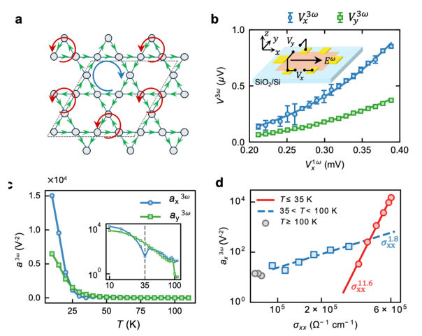
<figcaption class="paper-figure-caption"><b>Fig 1.</b> Figure 1. Observation of third-order nonlinear transport in 𝑹𝒃𝑽𝟑𝑺𝒃𝟓. a, Schematic of the loop-current state in the 2×2 CDW phase. Arrows indicate the directions of currents, and the dashed gray line marks the 2×2 CDW unit cell31,33. b, 𝑉%</figcaption>
</figure>
<figure class="paper-figure-card">
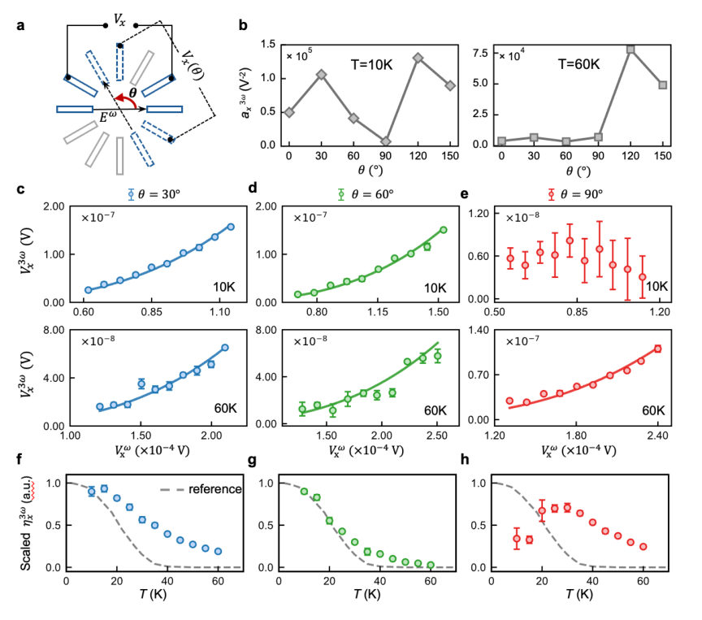
<figcaption class="paper-figure-caption"><b>Fig 2.</b> Figure 2. Angular dependence of the third-order longitudinal response in 𝑹𝒃𝑽𝟑𝑺𝒃𝟓. a, Schematic of the circular twelve electrode device used to probe angle-dependent transport. By rotating the measurement geometry by an angle 𝜃, signals along different lattice directions are measured. b, Cubic fitting parameter, 𝑎%</figcaption>
</figure>
<figure class="paper-figure-card">
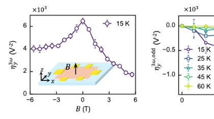
<figcaption class="paper-figure-caption"><b>Fig 3.</b> Figure 3. B-field odd third-order Hall response below 35 K. a, Third-order nonlinear Hall response 𝜂(</figcaption>
</figure>
<figure class="paper-figure-card">
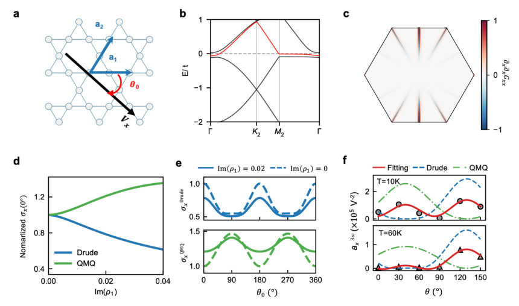
<figcaption class="paper-figure-caption"><b>Fig 4.</b> Figure 4. Loop current enhanced quantum metric quadrupole in the kagome model. a, Kagome lattice and primitive translation vectors 𝑎- and 𝑎.. The angle 𝜃/ is defined between the applied electric field and the 𝑎- axis. b, Electronic band structure for 𝜌= (0.01 + 0.02𝑖, 0.02, 0.02). See text for details. The band highlighted in red is used to evaluate the momentum-resolved quantity in c. c, Normalized momentum-space quantum metric quadrupole (QMQ) distribution of 𝜕%𝜕%𝐺%%(𝑘%, 𝑘() within the first Brillouin zone. d, Drude and QMQ contributions to the third-order longitudinal response at 𝜃/ = 0∘ as functions of 𝐼𝑚(𝜌-). Each contribution is normalized by its value at 𝐼𝑚(𝜌-) = 0. e, Angular...</figcaption>
</figure>

**Summary.** This work uses third-order nonlinear transport measurements to investigate a hidden, low-temperature electronic phase in the kagome metal $	ext{RbV}_3	ext{Sb}_5$. The detection of temperature-dependent kinks and magnetic field-odd components confirms electronic reconstruction and time-reversal symmetry breaking. The analysis attributes the observed directional anisotropy to the quantum metric quadrupole, linking nonlinear transport directly to loop-current order.

**Why it may be interesting.** The use of higher-order nonlinear transport to diagnose subtle symmetry breaking (TRSB) and electronic reconstruction in a correlated material like a kagome metal is highly relevant for understanding emergent quantum phases.

Detailed structure

**Main problem.** The study aims to probe a subtle, low-temperature hidden electronic phase, possibly involving loop-current order, in kagome metals.

**Main result.** The emergence of a field-odd transverse third-harmonic response and a distinct kink in the longitudinal response near 35 K strongly indicate electronic reconstruction and time-reversal symmetry breaking.

**Method.** The research utilizes third-order nonlinear transport measurements ($	ext{V}_{	ext{III}}/	ext{V}_{	ext{I}}^3$) by applying AC electric fields and measuring the resulting third harmonic voltage.

**Model / system.** The physical system is the kagome metal $	ext{RbV}_3	ext{Sb}_5$. The theoretical framework involves modeling the low-temperature state using a loop-current charge-density-wave (CDW) model.

**Key observables.** Third-harmonic response ($	ext{n}=3$), longitudinal and transverse nonlinear coefficients ($	ext{a}_{	ext{III}}, 	ext{a}'_{	ext{III}}$), and the magnetic field-odd component ($	ext{h}'_{	ext{III}}$).

**Important parameters / regimes.** Temperature ($T$), applied magnetic field ($B$), and the angle ($	heta$) of the driving electric field.

**Assumptions / limitations.** The nonlinear response is successfully decomposed into contributions from the conventional Drude term and the quantum metric quadrupole (QMQ) term.

**Figures summary.** Figures show the cubic dependence of the third-harmonic voltage on the driving field, the temperature dependence of the nonlinear coefficients highlighting the 35 K kink, and the angular dependence of the response.

**Paper structure.** The paper establishes third-order nonlinear transport as a sensitive probe, presents measurements showing anomalies at 35 K (longitudinal) and field-odd components (transverse), and finally models the anisotropy using the QMQ contribution within a loop-current CDW framework.

Abstract

A hidden low-temperature phase with possible loop-current order has been proposed in the kagome metals AV$_3$Sb$_5$ (A=K, Rb or Cs), but its experimental signatures remain subtle and indirect. Here, we use third-order nonlinear transport to probe this hidden phase in RbV$_3$Sb$_5$. At ~35 K, the longitudinal cubic response develops a strong kink and pronounced directional anisotropy with a strong departure from common relaxation time scaling, while the transverse cubic response acquires a magnetic field-odd component at the same temperature. Their coincident onset identifies the third-harmonic response as a sensitive marker of the low-temperature electronic reconstruction with time-reversal broken symmetry. Crucially, we find that the quantum metric quadrupole contributes directly to the longitudinal third-order response. In a loop-current charge-density-wave model, its direction selective enhancement captures the observed angular reconstruction. Our work shows how higher-order nonlinear transport translates subtle changes in electronic symmetry and quantum metric into measurable electrical signatures in quantum materials that is important for studying complex electronic phases of matter.

[↑ back to top](#top)

### [Quantum Query Lower Bounds for Triangle-Listing and Spanners](http://arxiv.org/abs/2609.37091v1)

**Authors:** Yu Chen, Ananta Mukherjee, Mingyang Yang  
**Type:** theory · **Category:** quantum information and computing · **PDF:** <https://arxiv.org/pdf/2609.37091v1>  
**Analysis basis:** full PDF text, analyzed in chunks
**Topic relevance:** `quantum measurements` **1/5**

↔ Scroll figures horizontally

<figure class="paper-figure-card">
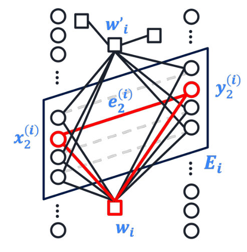
<figcaption class="paper-figure-caption"><b>Fig 1.</b> Figure 1: Consider any induced matching Ei ⊆ERS with i ∈[B]. The marked item for block i has value 2. All unselected edges of Ei are represented by gray dashed lines. In addition, the triangle over {x(i) 2 , y(i) 2 , wi} is highlighted in red.</figcaption>
</figure>
<figure class="paper-figure-card">
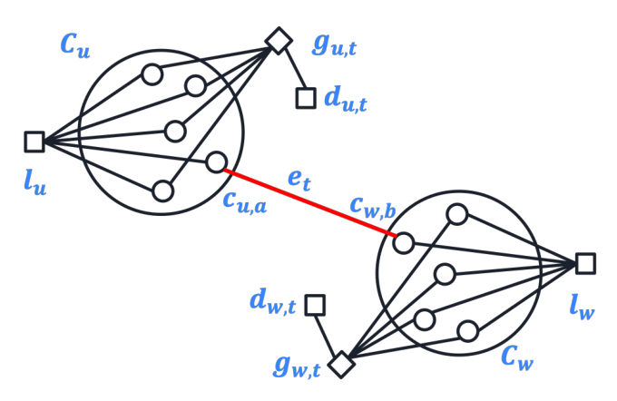
<figcaption class="paper-figure-caption"><b>Fig 2.</b> Figure 2: Consider the skeleton edge σt = (u, w) ∈EΣ with u ∈U and w ∈W for some t ∈[B]. Since the hidden value for block t is (a, b), the hidden edge for block t, highlighted in red, is (cu,a, cw,b) ∈Er. For every unselected node cu,x ∈Cu with x ̸= a, add an incident edge to the gadget gu,t. For every unselected node cw,y ∈Cw with y ̸= b, add an incident edge to the gadget gw,t.</figcaption>
</figure>
<figure class="paper-figure-card">
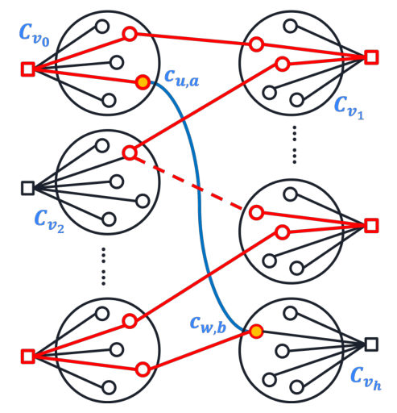
<figcaption class="paper-figure-caption"><b>Fig 3.</b> Figure 3: Fix two arbitrary coordinate nodes cu,a and cw,b such that u ∈U, w ∈W for some a, b ∈[N]. Assume the hidden edge e = (cu,a, cw,b) ∈Er exists (highlighted in blue). Fix an arbitrary shortest path P in Gr \ e between cu,a and cw,b (highlighted in red). Let SP = (v0 = u, v1, . . . , vh = w) be the projected skeleton sequence of P. For the junctions v2 and vh, they belong to the first case in Observation 5.11. For the junctions v0, v1, vh−2 and vh−1, they belong to the second case.</figcaption>
</figure>

**Summary.** This paper determines quantum query lower bounds for graph problems like triangle listing and spanner construction within the general graph query model. It extends the quantum query recording framework to prove these bounds by reducing the graph problems to intermediate search tasks. The results establish significant theoretical limits on the efficiency of quantum algorithms for analyzing graph structure.

**Why it may be interesting.** The rigorous application of advanced quantum query complexity techniques, particularly the recording method, to fundamental graph problems provides deep insights into the inherent computational difficulty of graph structure discovery.

Detailed structure

**Main problem.** The paper establishes quantum query lower bounds for two specific relational graph problems: listing all triangles in a graph and constructing a multiplicative spanner.

**Main result.** It achieves a first non-trivial quantum lower bound for triangle listing ($\Omega(n^{3/2-o(1)})$) and provides a bound for $k$-spanner construction ($\Omega(n^{1 + 1/2\mu_k})$).

**Method.** The analysis extends the quantum query recording framework to handle bidirectional oracles, deriving bounds by reducing the graph problems to intermediate multi-block search problems (BHVF and RMIF).

**Model / system.** The work operates in the general graph query model, utilizing quantum query complexity theory. The core technical tool is the 'recording method,' which tracks information across multiple query steps in a shared quantum record.

**Key observables.** Quantum query complexity, recording progress ($\Delta_{t,k}$), and the success probability of finding hidden values.

**Important parameters / regimes.** Graph size ($n$), number of blocks ($B$), size of the hidden space ($N$), and the target spanner parameter ($k$).

**Assumptions / limitations.** The results are derived under the general graph query model (mixed model). The $k$-spanner bounds are compared against conjectures related to the Erdős girth conjecture.

**Paper structure.** The paper first extends the quantum query recording framework for bidirectional oracles and establishes a generic blockwise soundness lemma. It then uses this framework to derive lower bounds for intermediate search problems (BHVF/RMIF), which are subsequently used to prove the final bounds for triangle listing and $k$-spanner construction.

Abstract

This paper gives quantum query lower bounds for two relational graph problems, triangle listing and explicit multiplicative spanner construction, in the general graph query model, where quantum adjacency, degree and neighborhood queries are all available in arbitrary superposition. Both results are obtained by reductions via intermediate multi-block search problems. We extend the quantum query recording framework by Zhandry (CRYPTO 2019) and Hamoudi and Magniez (ToCT 2023) to handle a recording architecture for bidirectional oracles and give a generic blockwise soundness framework, which for arbitrary families of local accepting projectors, gives an exact operator-norm characterization of their maximum overlap with the subspace of bounded weight records. Using the intermediate search problems, we exhibit a family of $n$-vertex graphs with $Θ(n)$ triangles on which listing any constant fraction of the triangles requires $Ω(n^{3/2-o(1)})$ quantum queries. This is the first nontrivial quantum lower bound for triangle listing, a question raised by Jiang and Peng (ICML 2026). Further, we show that, for every fixed $k\ge 7$, constructing a multiplicative $k$-spanner requires $Ω(n^{1+\frac{1}{2μ_k}})$ quantum queries, where $μ_k=k/3+O(1)$. For $k\in\{7,8\}$ the bound is $Ω(n^{5/4})$, which matches what would be implied by an unproven instance of the Erdős girth conjecture, and for large $k$ the exponent $1+\frac{3}{2k}$ exceeds the $1+\frac{4}{3k}$ implied by the provable high girth dense graphs due to Lazebnik, Ustimenko and Woldar, 1995.

[↑ back to top](#top)

### [Shared Phase Arithmetic for Parallel Quantum Rotations](http://arxiv.org/abs/2609.36574v1)

**Authors:** Anbang Wu, Liqiang Lu, Pu Pang, Jianwei Yin, Jingwen Leng, Minyi Guo  
**Type:** theory · **Category:** quantum information and computing · **PDF:** <https://arxiv.org/pdf/2609.36574v1>  
**Analysis basis:** full PDF text, analyzed in chunks
**Topic relevance:** `analog quantum simulation` **1/5**

↔ Scroll figures horizontally

<figure class="paper-figure-card">
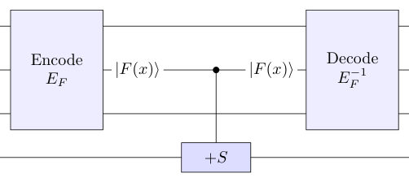
<figcaption class="paper-figure-caption"><b>Fig 1.</b> Figure 1: Parallel phase kickback. Each horizontal wire denotes a register: Q holds the M data qubits; S holds the b-bit phase sum; W is optional encoder workspace of aE qubits; and G holds the b-qubit phase-gradient reference |Gb⟩. The labels |0⟩denote all-zero registers, not necessarily single qubits. Addition imprints a basis-dependent phase; decoding clears S and W. Up to b −1 additional adder carry qubits are omitted and are distinct from W. A valid measurement-assisted decoder can replace the inverse unitary.</figcaption>
</figure>

**Summary.** This paper presents the Parallel Phase Kickback (PPK) technique to efficiently implement quantum gates defined by complex phase arithmetic. It achieves this by separating the cost of calculating the phase function from the cost of applying it. The technique shows significant gate count savings, particularly when the rotation parameters have disjoint binary supports, making it crucial for scaling quantum algorithms.

**Why it may be interesting.** While focused on quantum computation, the rigorous analysis of resource scaling (T-gates) for implementing complex unitary transformations is foundational for designing quantum algorithms that might interact with AMO systems, especially those requiring precise phase control.

Detailed structure

**Main problem.** The paper addresses the challenge of efficiently computing and applying complex quantum phase rotations, specifically those defined by a weighted sum of parameters, using shared quantum arithmetic.

**Main result.** It develops the Parallel Phase Kickback (PPK) technique, showing that when rotation weights have disjoint binary support, the T-gate cost can be significantly reduced, achieving near-linear scaling with the number of rotations.

**Method.** The core method involves three steps: coherently encoding the weighted sum into an auxiliary register, adding this sum to a phase-gradient state to imprint the phase, and then uncomputing the auxiliary information.

**Model / system.** The model is quantum computation utilizing diagonal quantum gates, analyzed within the Clifford+T gate set. The process involves multiple registers: data qubits, a phase sum register, an encoder workspace, and a phase-gradient reference state.

**Key observables.** Gate counts, specifically T-gate counts, and the resulting phase accuracy ($\delta_{	ext{ang}}$).

**Important parameters / regimes.** The bit resolution $b$ (determining the phase precision $2^b$), the number of weights $M$, and the structure of the weights (e.g., disjoint binary support).

**Assumptions / limitations.** The analysis assumes the weights are supplied and focuses on the logical circuit cost, separating the cost of phase function representation from its application.

**Figures summary.** Figure 1 illustrates the PPK process flow, detailing the sequence of Encode $	o$ Add $	o$ Decode across the data, shift, workspace, and reference registers.

**Paper structure.** The paper first introduces the problem of phase accumulation via weighted sums. It then details the PPK construction, proving correctness and analyzing costs for general weights, followed by specialized analyses for two rotations and weights with disjoint binary support, culminating in cost comparisons across different techniques.

Abstract

A layer of diagonal quantum gates can be specified by an integer-valued function on computational basis states. This description suggests implementing the layer by evaluating that function reversibly and translating its value into a phase using a shared quantum register. We develop this viewpoint for parallel phase kickback (PPK): the weighted sum of several rotation parameters is computed coherently, added once to a phase-gradient state, and then uncomputed. The construction separates the cost of representing a phase function from the cost of applying it. We prove correctness, give explicit error bounds, and analyze logical gate counts for general weights, pairs of rotations, and weights with disjoint binary support. With Clifford-only encoding, a batch uses at most $4(b-1)$ T gates at $b$-bit phase resolution, excluding initialization. The first phase reference is prepared with independent rotations synthesized by Gridsynth; additional phase-gradient states then follow from the disjoint-support construction with $O(b)$ T gates each. The resulting bounds identify when shared phase arithmetic reduces amortized rotation cost and when encoding overhead limits that advantage.

[↑ back to top](#top)

### [Topological Band Theory for High-Dimensional Parameter Spaces](http://arxiv.org/abs/2609.35977v1)

**Authors:** Vivek Chakrabhavi, Walt Chavarria, Jonathan J. Heckman, Steven Rayan  
**Type:** theory · **Category:** other · **PDF:** <https://arxiv.org/pdf/2609.35977v1>  
**Analysis basis:** full PDF text, analyzed in chunks
**Topic relevance:** `analog quantum simulation` **1/5**

↔ Scroll figures horizontally

<figure class="paper-figure-card">
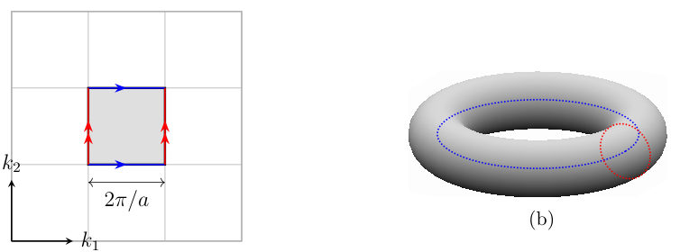
<figcaption class="paper-figure-caption"><b>Fig 1.</b> Figure 1: Two representations of the Brillouin zone of a square lattice with spacing a. (a) A fundamental momentum-space cell of side 2π/a, with opposite sides identified. (b) A schematic embedding of the resulting quotient torus. The radii of the embedded torus have no physical significance.</figcaption>
</figure>
<figure class="paper-figure-card">
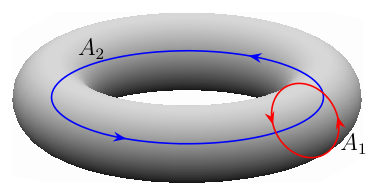
<figcaption class="paper-figure-caption"><b>Fig 2.</b> Figure 2: A spatial 2-torus is shown with a background gauge potential A threaded through its two fundamental cycles.</figcaption>
</figure>
<figure class="paper-figure-card">
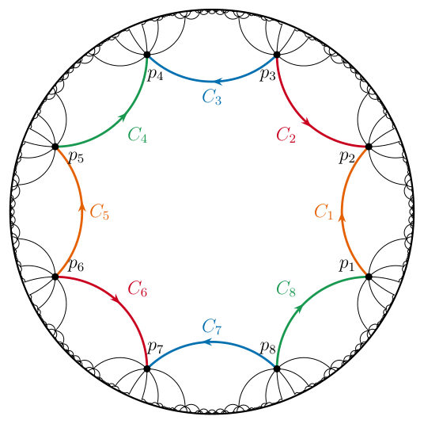
<figcaption class="paper-figure-caption"><b>Fig 3.</b> Figure 3: An {8, 8} tiling of the Poincar´e disk D. The center octagon is labeled by geodesic sides Ci with respective orientations and lattice points pi. Opposite sides of the same color are identified in order to construct the g = 2 Bolza surface Σ.</figcaption>
</figure>
<figure class="paper-figure-card">
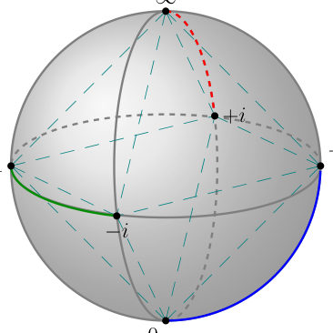
<figcaption class="paper-figure-caption"><b>Fig 4.</b> Figure 4: The Riemann Sphere with branch points {0, 1, −1, i, −i, ∞} inscribing an octahe- dron shown in light blue. The branch points are paired into three branch cuts, with Branch Cut #1 in dark blue, Branch Cut #2 in green, and Branch Cut #3 in red.</figcaption>
</figure>

**Summary.** This work extends topological band theory beyond the standard 2D quantum Hall effect by analyzing systems on high-dimensional parameter spaces or curved manifolds. It shows that the topological invariants are governed by higher-order curvature terms, generalizing the Chern number concept. This provides a robust theoretical tool for characterizing topological phases in complex, higher-dimensional physical settings.

**Why it may be interesting.** The generalization of topological invariants to higher dimensions and curved spaces provides a powerful mathematical framework applicable to modern condensed matter systems beyond simple lattice models.

Detailed structure

**Main problem.** The paper generalizes topological band theory, traditionally applied to 2D quantum Hall systems, to systems defined on high-dimensional parameter spaces or curved manifolds.

**Main result.** The topological invariants generalize from the Chern class to higher-order curvature invariants involving the symplectic form and the Berry curvature, leading to quantized contributions in Kubo-like formulae.

**Method.** The theory constructs a Berry connection and curvature on the high-dimensional parameter space $M_\Theta$, generalizing the standard integral quantization procedures.

**Model / system.** The study considers quantum Hall systems on Riemann surfaces of genus $g>1$ or matter on compact oriented manifolds of dimension $4\ell+2$. The analysis uses hyperbolic band theory as an explicit example.

**Key observables.** Generalized Hall conductivity $\sigma_{Hall}$ and higher integral invariants $
u_m$, which are quantized integers.

**Important parameters / regimes.** The dimension of the parameter space ($d>2$) and the genus of the underlying manifold ($g>1$).

**Assumptions / limitations.** The analysis requires defining the symplectic form $S$ on the moduli space $M_\Theta$ and retaining the full differential-geometric data on the parameter space.

**Figures summary.** Figure 1 illustrates the Brillouin zone for a square lattice as a quotient torus $T^2$. Other figures relate to the geometry of the parameter space and background gauge potentials.

**Paper structure.** The paper progresses by first establishing the standard 2D case, then generalizing the theory to higher dimensions using background $p$-form potentials, and finally illustrating the general framework with a concrete example on the genus-two Bolza Riemann surface.

Abstract

We study the topological band theory of quantum Hall systems in which the adiabatic flux parameters of an external gauge potential form a high-dimensional manifold. This situation arises both for strongly correlated matter on spatial Riemann surfaces of genus $g > 1$, as well as in the formal study of matter on compact oriented manifolds of dimension $4\ell+2 = 2p$ coupled to $p$-form gauge potentials. In these cases, the underlying topological invariants defined over the parameter space are significantly richer than the low-dimensional (i.e., two-dimensional) case and involve both the curvature (i.e., first Chern class) as well as higher order curvature invariants. These higher curvature invariants correspond to topologically protected contributions to Kubo-like formulae, constructed from correlation functions of the physical current operators. We illustrate these general considerations with an explicit example from hyperbolic band theory based on the genus-two Bolza Riemann surface, a case which has recently been simulated on a synthetic-dimension platform.

[↑ back to top](#top)

### [Towards verifiable quantum advantage with random circuits: Observables that survive concentration](http://arxiv.org/abs/2609.37890v1)

**Authors:** Antonio A. Mele, Francesco A. Mele, Jarrod R. McClean, Thomas E. O'Brien  
**Type:** theory · **Category:** quantum information and computing · **PDF:** <https://arxiv.org/pdf/2609.37890v1>  
**Analysis basis:** full PDF text, analyzed in chunks
**Topic relevance:** `quantum measurements` **1/5**

↔ Scroll figures horizontally

<figure class="paper-figure-card">
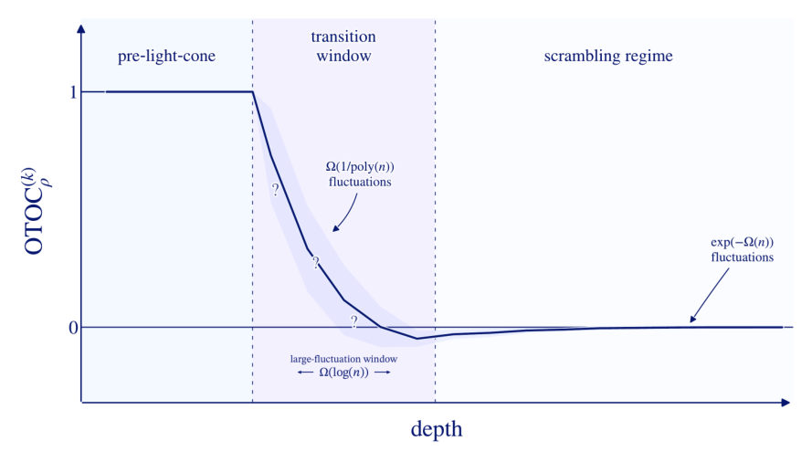
<figcaption class="paper-figure-caption"><b>Fig 1.</b> Figure 1. Representative depth dependence of OTOC(k) ρ in a local random circuit. Before the Heisenberg light cone reaches the probe, the OTOC equals 1 for every circuit realization. At intermediate depths, circuit-to-circuit fluctuations become visible, before the observable approaches its deep-circuit behavior. The data show OTOC(2) ρ for ρ = |0n⟩⟨0n| in a one-dimensional open- boundary Haar-random brickwork circuit with n = 18 qubits, B = Z4, and M = Z14. For general fixed k, we locate a growing range of Ω(log n) consecutive depths with large fluctuations between the light-cone and design regimes, without determining the full transition width; this interval can be scanned efficiently in...</figcaption>
</figure>
<figure class="paper-figure-card">
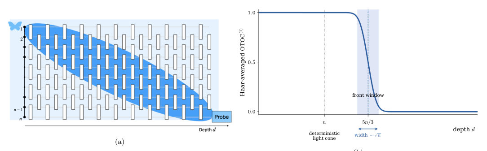
<figcaption class="paper-figure-caption"><b>Fig 2.</b> Figure 2. First-order OTOC in the one-dimensional endpoint geometry. (a) Circuit geometry and the eye-shaped region of influential gates, with longitudinal extent Θ(n) and maximal width Θ(√n). (b) Circuit-averaged OTOC as a function of depth. The solid curve shows the exact circuit average and the dashed curve the Gaussian approximation of Eq. (3). The shaded region marks the O(√n) depth window around d⋆= 5n/3.</figcaption>
</figure>
<figure class="paper-figure-card">
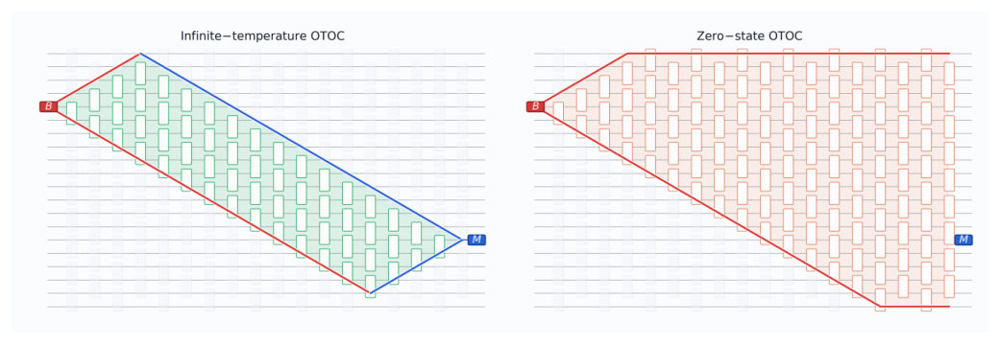
<figcaption class="paper-figure-caption"><b>Fig 3.</b> Figure 3. Causal light cones for OTOCs in one-dimensional brickwork circuits. For the infinite-temperature trace OTOC (left), only gates in the causal diamond LC− T (B) ∩LC+ T (M) can affect the observable. For a fixed-state OTOC (right), cyclic trace cancellation is unavailable, and the exact deterministic reduction retains the full backward light cone LC− T (B) of the butterfly operator.</figcaption>
</figure>

**Summary.** This paper proves that Out-of-Time-Order Correlators (OTOCs) in random quantum circuits retain significant, measurable fluctuations as system size grows, thus providing a pathway for verifiable quantum advantage. The authors develop theoretical bounds and a novel classical algorithm to estimate these OTOCs efficiently by exploiting the localization of gate contributions within the circuit structure.

**Why it may be interesting.** This work provides rigorous theoretical guarantees about the robustness of OTOC measurements against circuit randomness, which is crucial for designing verifiable quantum advantage experiments on near-term hardware.

Detailed structure

**Main problem.** The paper addresses the challenge of verifying quantum advantage using observable measurements in random quantum circuits, specifically overcoming the issue of observable concentration.

**Main result.** They prove that fixed-order Out-of-Time-Order Correlators (OTOCs) exhibit inverse-polynomial circuit-to-circuit fluctuations at system-scale depths for local random circuits.

**Method.** The authors use theoretical proofs based on relating the change in ensemble-averaged OTOC to lower bounds on the circuit-to-circuit variance, and develop a classical algorithm for efficient estimation.

**Model / system.** The model involves local random quantum circuits, specifically analyzed using 1D Haar-random brickwork circuits acting on $n$ qubits.

**Key observables.** Out-of-time-order correlators ($	ext{OTOC}(k)$), particularly $	ext{OTOC}(1)$ and the infinite-temperature endpoint OTOC ($	ext{OTOC}_\infty$).

**Important parameters / regimes.** Fixed order $k$, system size $n$, and circuit depth $d$. The fluctuations are most visible in a depth window of $O(\sqrt{n})$ around $d^*=5n/3$ in 1D.

**Assumptions / limitations.** The analysis relies on bounding the error introduced by separating gates into a 'retained' region ($E_R$) and a 'random' region, and assumes the OTOC can be approximated by a conditional mean.

**Figures summary.** Figures illustrate the depth dependence of $	ext{OTOC}(k)$ showing the transition from constant values to fluctuating regimes, and detail the geometry of the influential 'eye-shaped region' of gates.

**Paper structure.** The paper first establishes the general theorem on inverse-polynomial fluctuations. It then applies this to 1D circuits, deriving specific variance bounds ($\Omega(n^{-1/2})$) and developing a classical algorithm to estimate the OTOC at the critical depth by restricting the calculation to the localized 'eye-shaped region'.

Abstract

Demonstrating quantum advantage on current quantum hardware is a central goal of quantum computing, and random quantum circuits underpin many leading proposals. Yet sampling-based demonstrations are often difficult to verify, while observable-based approaches face a different challenge: concentration can suppress differences between circuit instances. Recent experiments have put forward the estimation of out-of-time-order correlators (OTOCs) in random circuits as a promising task for verifiable quantum advantage, yet whether their circuit-to-circuit fluctuations survive concentration as system size grows has remained open. Here we show that they do. For broad classes of local random circuits in any fixed spatial dimension, we prove inverse-polynomial fluctuations of fixed-order OTOCs at system-scale depths. In one-dimensional Haar-random brickwork circuits, we further show that macroscopically many gates contribute to these fluctuations, yet in each layer they remain confined to a sublinear-width region. As a byproduct, we develop a classical algorithm exhibiting the first rigorous improvement over brute-force classical simulation of OTOCs in 1D. Although classical hardness remains open, our results rule out strong concentration as an obstruction to OTOC-based proposals for verifiable quantum advantage.

[↑ back to top](#top)

## Other papers (31)

*Papers from primary archives without highlighted authors or any topic match. Click to expand.*

Show other papers

### [A Divide-and-Conquer Quantum-Selected Configuration Interaction for Evaluating $π$-$π$ Stacking Interaction Energies in the Benzene Dimer](http://arxiv.org/abs/2609.36708v1)

**Authors:** Ryotaro Tajima, Rei Sato, Yosuke Iyama, Ryo Kiguchi, Yoshitake Kitanishi  
**Type:** theory · **Category:** strongly correlated electrons · **PDF:** <https://arxiv.org/pdf/2609.36708v1>  
**Analysis basis:** full PDF text, analyzed in chunks

↔ Scroll figures horizontally

<figure class="paper-figure-card">
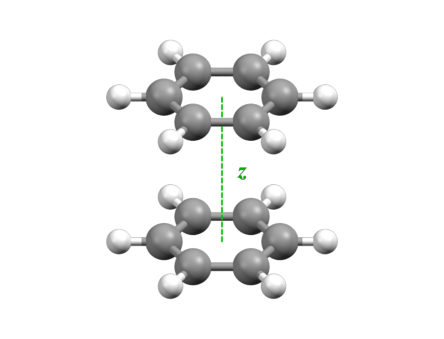
<figcaption class="paper-figure-caption"><b>Fig 1.</b> Figure 1. Sandwich-type benzene dimer molecule. z is the intermolecular separation between the two monomers.</figcaption>
</figure>
<figure class="paper-figure-card">
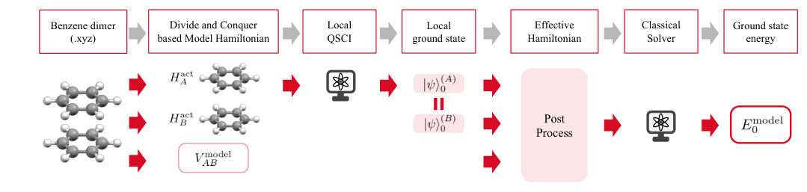
<figcaption class="paper-figure-caption"><b>Fig 2.</b> Figure 2. Schematic overview of the proposed Deep QSCI framework for the benzene dimer. The dimer model Hamiltonian comprises the active-space monomer Hamiltonians, ˆHact A and ˆHact B , and the model intermonomer interaction ˆV model AB . QSCI is performed once for an isolated monomer for each basis-set and active-space choice. The resulting state is reused to construct the reduced local spaces for both A and B. These local spaces and ˆV model AB define an effective Hamiltonian in the reduced product space, which is diagonalized classically to obtain EDeep QSCI AB .</figcaption>
</figure>
<figure class="paper-figure-card">
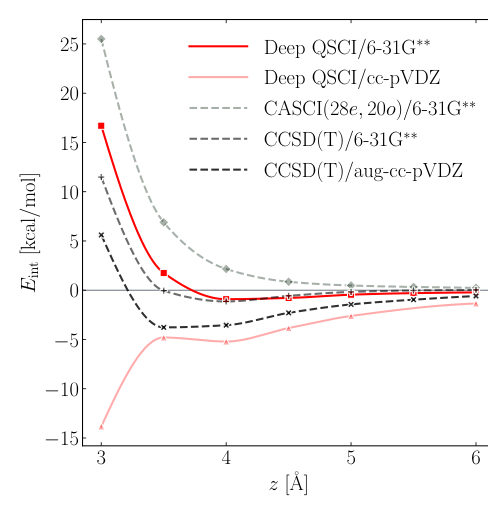
<figcaption class="paper-figure-caption"><b>Fig 3.</b> Figure 4. Potential-energy curves of the sandwich benzene dimer as functions of the intermolecular separation z. (a) Ab- solute dimer energies obtained with Deep QSCI, CASCI, and CCSD(T); the inset shows EAB(z) −EAB(6.0 Å). (b) Inter- action energies. The plotted Deep QSCI and CASCI calcula- tions use the dimer space CAS(28e, 20o); no CAS truncation is assigned to CCSD(T). The Deep QSCI values are defined rel- ative to isolated monomers without ghost functions, whereas the classical CASCI and CCSD(T) interaction energies are counterpoise corrected. Symbols denote the calculated data points, and the shape-preserving spline curves are guides to the eye. Basis sets are indicated in the legend.</figcaption>
</figure>

**Summary.** This paper introduces Deep QSCI, a novel quantum algorithm that combines divide-and-conquer techniques with configuration selection to calculate weak intermolecular interactions. By reusing calculations from a single monomer, it drastically reduces the required quantum resources for simulating the benzene dimer. The method provides a resource-efficient pathway to model interaction curves, although quantitative accuracy remains limited by orbital consistency issues.

**Why it may be interesting.** This work is highly relevant to AMO physics and quantum chemistry as it proposes a resource-efficient quantum algorithm to tackle complex, weakly interacting molecular systems, directly addressing the scaling challenges of full quantum simulations.

Detailed structure

**Main problem.** The paper aims to accurately evaluate the weak $\pi$-$\pi$ stacking interaction energies in the benzene dimer, a problem requiring precise description of electron correlation on a small energy scale.

**Main result.** The proposed Deep QSCI method yields an attractive minimum energy of $-0.91 	ext{ kcal/mol}$ at $4.0 	ext{ Å}$ using the 6-31G** basis, which is compared against high-level $	ext{CCSD(T)}$ benchmarks.

**Method.** The authors propose Deep QSCI, which merges the divide-and-conquer strategy of Deep VQE with the configuration selection of QSCI. This allows the calculation of the dimer Hamiltonian by reusing a reduced local basis derived from a single monomer calculation, significantly reducing the required quantum register size.

**Model / system.** The system studied is the benzene dimer, modeled using an effective Hamiltonian constructed from the monomer's reduced local basis and an intermonomer interaction term. The calculation is performed in an active space framework, decomposing the dimer into two identical monomers.

**Key observables.** Interaction energy ($	ext{E}_{	ext{int}}$) as a function of intermolecular separation ($z$), with specific values reported for 6-31G** ($-0.91 	ext{ kcal/mol}$ at $4.0 	ext{ Å}$) and comparison to $	ext{CCSD(T)}$ ($-1.14 	ext{ kcal/mol}$).

**Important parameters / regimes.** The quantum register size is reduced from 40 to 20 qubits for the monomer CAS(14e,10o) using 6-31G**, and the calculations are performed across various basis sets (6-31G**, cc-pVDZ).

**Assumptions / limitations.** Key limitations include the potential for insufficient consistency of active orbitals and reduced local bases between monomers, and the fact that the resulting Hamiltonian is a fragment-based model, not an exact decomposition.

**Figures summary.** The notes mention Figure 1 showing the sandwich-type benzene dimer and Figure 2/3 illustrating the schematic workflow of Deep QSCI, detailing the reuse of monomer calculations to construct the effective dimer Hamiltonian.

**Paper structure.** The paper introduces the physical problem (benzene dimer interaction), proposes the Deep QSCI methodology by combining Deep VQE and QSCI, details the procedure of reusing monomer calculations to build the effective dimer Hamiltonian, presents preliminary results comparing to classical benchmarks, and concludes by discussing limitations regarding orbital consistency and charge transfer.

Abstract

Accurate evaluation of $π$--$π$ stacking interactions requires a description of electron correlation on a small energy scale. Direct variational quantum calculations of the benzene dimer with CAS(28e,20o) require 40 qubits and deep circuits. Here, we propose Divide-and-Conquer Quantum-Selected Configuration Interaction (Deep QSCI), combining the divide-and-conquer idea of Deep VQE with QSCI, and apply it to the sandwich benzene dimer. We perform QSCI for one monomer and construct a reduced local basis by applying particle-number-conserving one-electron excitations to its ground state. Using this basis and the intermonomer interaction Hamiltonian, we build and diagonalize an effective Hamiltonian of the dimer. Since the monomers have the same structure, the QSCI result is reused for both monomers and across intermolecular distances, reducing the required quantum register from 40 to 20 qubits for the monomer CAS(14e,10o). With 6-31G**, the model gives an attractive minimum of -0.91 kcal/mol at 4.0 $Å$, compared with the counterpoise-corrected CCSD(T) value of -1.14 kcal/mol. With cc-pVDZ, a large cancellation appears between the product-state interaction energy and the energy lowering by diagonalization. This may reflect insufficient consistency of the active orbitals and reduced local bases between monomers. Orbital consistency, reduced-space convergence across basis sets, and charge transfer remain key issues for quantitative accuracy. Deep QSCI thus provides a resource-efficient approach to constructing model interaction curves without repeating monomer quantum calculations at each separation.

[↑ back to top](#top)

### [A Memory-Magic Exchange Law in Streaming Clifford+T Compilation](http://arxiv.org/abs/2609.37368v1)

**Authors:** Jinze Yang, Yangyang Li, Xiu-Hao Deng  
**Type:** theory · **Category:** quantum information and computing · **PDF:** <https://arxiv.org/pdf/2609.37368v1>  
**Analysis basis:** full PDF text, analyzed in chunks

↔ Scroll figures horizontally

<figure class="paper-figure-card">
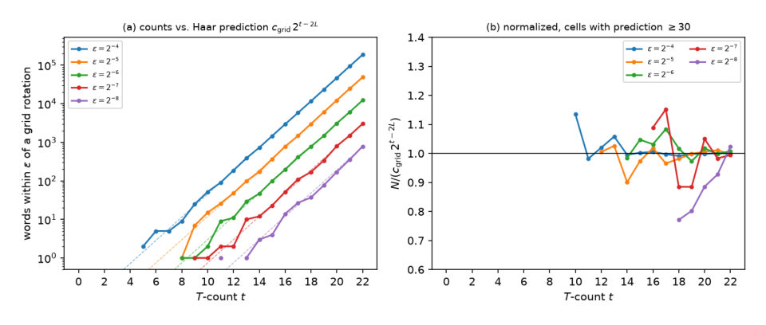
<figcaption class="paper-figure-caption"><b>Fig 1.</b> FIG. 1. Number of Clifford+T words of T-count exactly t within ε of a grid rotation on a Haar-random coset G1Rz(θ)G2. (a) Counts (markers) against the exact Haar prediction cgrid2t−2L with cgrid = 48εQε/π (dashed). (b) The same counts divided by that prediction, plotted where the prediction is at least 30; every ε has reached the Haar value by t = 22. Exhaustive enumeration to t = 22 (3.0 × 108 words, 1.5 × 108 in the top shell).</figcaption>
</figure>
<figure class="paper-figure-card">
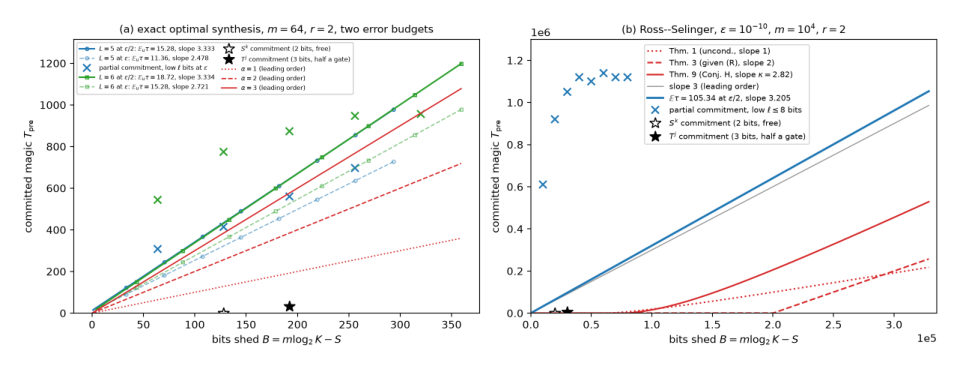
<figcaption class="paper-figure-caption"><b>Fig 2.</b> FIG. 2. The fractional-passthrough tradeoff family (r = 2) against the lower bounds. (a) Exact minimal T-counts from the enumeration, m = 64, L = 5, 6—an optimum no synthesis algorithm can beat—against the leading-order slopes α = 1, 2, 3; at L ≤6 the additive terms swamp the main terms, all three bounds being vacuous, so only slopes can be compared there. Solid: the committed piece synthesized at ε/2, the accuracy Theorem 8 requires for r = 2, which is the family the theorem bounds. Dashed: the same optima at word accuracy ε, a single-rotation calibration and not a point of the family. The two budgets straddle α = 3—slopes 3.333 and 3.334 above it, 2.478 and 2.721 below—and the ε/2 slopes...</figcaption>
</figure>

**Summary.** This paper derives a fundamental 'Memory-Magic Exchange Law' governing the trade-off between using classical memory versus pre-committing magic quantum states when compiling quantum circuits. By employing advanced number theory and information theory, the authors establish rigorous lower bounds on this exchange rate, which is crucial for understanding the resource scaling of fault-tolerant quantum computation.

**Why it may be interesting.** While focused on abstract compilation theory, the resource constraints derived here (e.g., minimum T-gate count) directly impact the feasibility and scaling of implementing quantum algorithms on near-term hardware.

Detailed structure

**Main problem.** The paper determines the fundamental exchange rate ($\alpha$) between two resources—classical memory carried across computation rounds versus pre-committed magic states—required for fault-tolerant, streaming quantum circuit compilation.

**Main result.** The analysis establishes rigorous lower bounds on this exchange rate, suggesting theoretical limits like $\alpha=3$ under certain conjectures, which dictates the efficiency of compiling complex quantum operations.

**Method.** The work employs advanced techniques from number theory, including determinant methods, equidistribution estimates, and information-theoretic bounds (like Fano's inequality) to constrain resource requirements.

**Model / system.** The model is the ancilla-free, coordinatewise Clifford+T quantum compilation scheme, which processes quantum operations in a streaming manner over multiple rounds.

**Key observables.** The exchange rate $\alpha$ (T-gates committed per bit of memory forgone), the required T-gate count ($T_{	ext{pre}}$), and the required precision ($\epsilon$).

**Important parameters / regimes.** The error parameter $\epsilon$, the number of qubits $m$, and the total number of rounds $r$.

**Assumptions / limitations.** The rate $\alpha=3$ relies on an unproven equidistribution conjecture; the analysis is specific to coordinatewise synthesis.

**Paper structure.** The paper develops by first establishing initial bounds using number theory, then improving these bounds using determinant methods and sphere section analysis, culminating in comparisons with information-theoretic limits and conjecture-based results.

Abstract

A phase that reaches a fault-tolerant processor in additive pieces can be remembered until the last piece arrives, or executed on arrival: the first option costs classical memory carried across rounds, the second costs magic states committed before the phase is known. We determine the exchange rate $α$, committed $T$ gates per bit of memory forgone, for ancilla-free coordinatewise Clifford+$T$ compilation. The Ramanujan bound for the Clifford+$T$ lattice gives $α\ge2$ with explicit constants, the square-root barrier of the spectral method. An elementary determinant method, using that quaternion numerators are lattice points on spheres in both real embeddings of $\mathbb{Q}(\sqrt2)$, counts words near an arbitrary rotation coset below that barrier and gives $α\ge11/5$ asymptotically and unconditionally, and a height dichotomy for the resulting sphere sections raises this to $α\ge17/7$. At Clifford-framed cosets the volume law holds up to subexponential factors: all but a vanishing fraction of $z$-rotations need $T$-count $(3-o(1))\log_2(1/\varepsilon)$, and processes whose committed pieces are close to Clifford-framed $z$-rotations, including per-rotation pipelines, have $α\ge3-o(1)$, which a fractional-passthrough family attains under the Ross-Selinger typical-cost hypothesis. Under an equidistribution conjecture supported by exhaustive enumeration to $T$-count 22, $α=3$ in general and memory should be shed in whole rotations. The bounds hold even when the phases cancel to the identity; side information enters through a conditional entropy; probabilistic mixing halves the costs but not the rate. With clean ancillas and a phase-gradient catalyst, table lookups batched across coordinates drive the rate to $O(1/\log\log(1/\varepsilon))$, so the constant-rate law is specific to coordinatewise synthesis.

[↑ back to top](#top)

### [A quantum double-bracket algorithm for imaginary-time evolution with exponentially shorter depth](http://arxiv.org/abs/2609.37095v1)

**Authors:** Ioannis Kolotouros, Raul Garcia-Patron  
**Type:** theory · **Category:** quantum information and computing · **PDF:** <https://arxiv.org/pdf/2609.37095v1>  
**Analysis basis:** full PDF text, analyzed in chunks

↔ Scroll figures horizontally

<figure class="paper-figure-card">
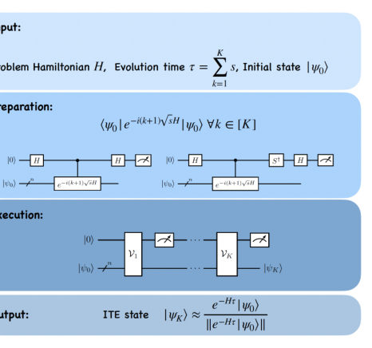
<figcaption class="paper-figure-caption"><b>Fig 1.</b> Figure 1: General overview of our method. At first the total evolution time τ is discretized into K steps. Then, the quantum circuit Vk corresponding to each step of the algorithm is constructed by measuring the overlap ⟨ψ0| e−i(k+1)√sH |ψ0⟩, where |ψ0⟩is the initial state. Provided that we measure the ancilla in the state |0⟩at every step of the algorithm, then at step K we will have an approximation of the ITE state.</figcaption>
</figure>
<figure class="paper-figure-card">
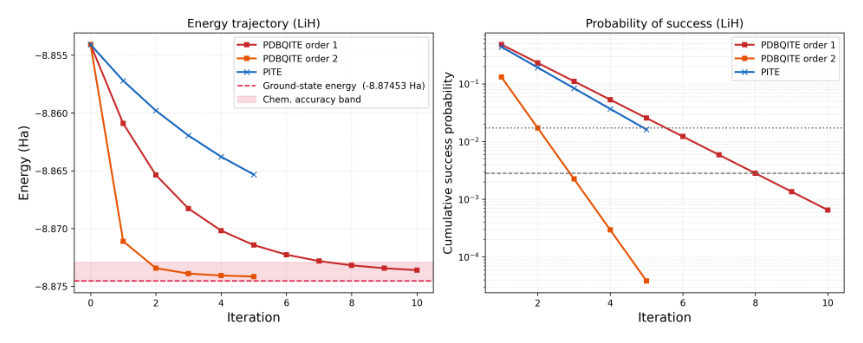
<figcaption class="paper-figure-caption"><b>Fig 2.</b> Figure 2: Energy trajectory (left figure) and cumulative probability of success (right figure) for the LiH molecule. For first-order PDBQITE we choose a timestep sk = 0.2 and perform 10 iterations, while for second-order PDBQITE and PITE we choose a timestep sk = 0.7 and perform only 5 iterations. Horizontal lines mark the cumulative success probability at which second-order (dotted) and first-order (dashed) PDBQITE reach chemical accuracy.</figcaption>
</figure>
<figure class="paper-figure-card">
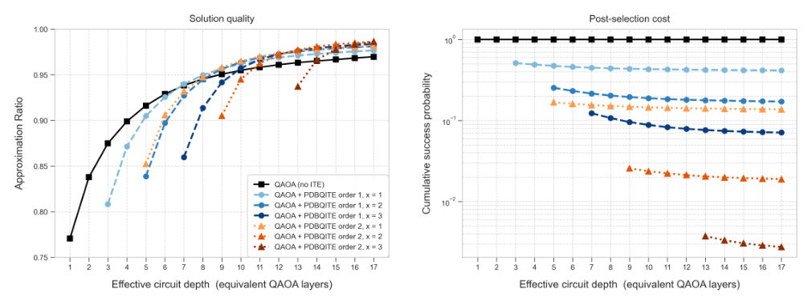
<figcaption class="paper-figure-caption"><b>Fig 3.</b> Figure 3: Approximation ratio (left) and cumulative success probability (right) as a function of “equivalent QAOA layers”, for randomly weighted 4-regular MaxCut instances of size n = 18. We compare QAOA against QAOA augmented with up to three PDBQITE steps of first (s = 0.35) and second order (s = 0.7).</figcaption>
</figure>
<figure class="paper-figure-card">
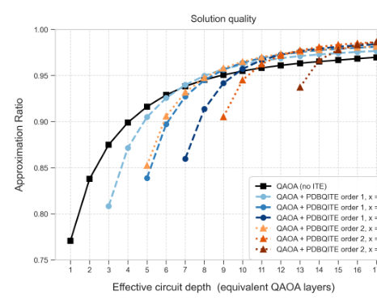
<figcaption class="paper-figure-caption"><b>Fig 4.</b> Fig. 3 shows the approximation ratio as a function of equivalent QAOA layers. For x iterations of y-th</figcaption>
</figure>
<figure class="paper-figure-card">
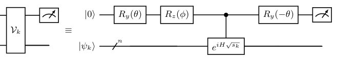
<figcaption class="paper-figure-caption"><b>Fig 5.</b> Figure 4: Linear combination of unitaries circuit to perform one iteration of probabilistic DB-QITE. If the ancilla qubit is measured in the |0⟩state, the remaining system has performed imaginary-time evolution.</figcaption>
</figure>

**Summary.** This paper presents PDBQITE, a novel, depth-efficient quantum algorithm for performing imaginary-time evolution to find ground states. By replacing the exponentially deep circuit of previous methods with a probabilistic, linear combination approach, it significantly reduces circuit depth. The algorithm is shown to outperform existing techniques on molecular Hamiltonians and optimization problems like MaxCut.

**Why it may be interesting.** This work provides a concrete, resource-efficient quantum algorithm for simulating fundamental quantum dynamics (ground state preparation) that directly addresses the depth scaling bottleneck in quantum simulation algorithms.

Detailed structure

**Main problem.** The paper addresses the challenge of efficiently preparing the ground state of a target Hamiltonian using Imaginary-Time Evolution (ITE) with significantly reduced quantum circuit depth compared to prior methods.

**Main result.** The proposed PDBQITE algorithm achieves an exponential reduction in circuit depth compared to DB-QITE, and hybrid QAOA-PDBQITE schemes outperform standard QAOA for optimization problems like MaxCut.

**Method.** It introduces PDBQITE, a probabilistic variant of Double-Bracket QITE, which approximates the non-unitary ITE evolution by applying a linear combination of unitaries at each step.

**Model / system.** The core model is the quantum state evolution governed by the imaginary-time evolution operator $e^{-H	au}$. Applications include finding the ground state of molecular Hamiltonians (e.g., LiH, BeH2) and solving combinatorial optimization problems like MaxCut and MIS.

**Key observables.** Approximation ratio (fidelity to the ground state), per-step success probability, and energy expectation values.

**Important parameters / regimes.** Number of iterations ($K$), time step size ($\sqrt{s}$), and the system size ($n$ qubits).

**Assumptions / limitations.** The primary trade-off is the exponential decay of the total success probability, although an analytical lower bound independent of system size is derived.

**Figures summary.** Figures compare the approximation ratio vs. QAOA depth for MaxCut, show the energy trajectory and cumulative probability of success for molecular Hamiltonians ($	ext{BeH}_2$, $	ext{LiH}$), and compare PDBQITE performance against PITE.

**Paper structure.** The paper introduces ITE and DB-QITE, details the implementation and theory of PDBQITE, evaluates its performance on MaxCut and molecular Hamiltonians, and concludes with a summary of the improved resource scaling.

Abstract

Imaginary-time evolution (ITE) is a widely used technique for preparing the ground state of a target Hamiltonian. Building on the recently proposed framework of Double-Bracket quantum ITE (DB-QITE), we introduce a probabilistic variant (PDBQITE) that achieves an exponential reduction in circuit depth. Our algorithm requires only a single ancilla qubit and a quantum circuit that consists of one controlled real-time evolution and one mid-circuit measurement per iteration. The trade-off is an exponential decay of the total success probability with the number of iterations, for which we derive an analytical lower bound that is independent of system size. Our numerical simulations show that the per-step success probability remains close to unity, making it realistic to execute many iterations, thus providing a substantial improvement over prior constructions. We show that PDBQITE outperforms the near-term probabilistic algorithm PITE for ground-state preparation of molecular Hamiltonians, and that a hybrid QAOA-PDBQITE scheme achieves higher approximation ratios than QAOA at the same circuit depth on random regular graphs for the MaxCut problem.

[↑ back to top](#top)

### [Advancing Fuzzy-Sphere CFTs: $\mathrm{SO}(3)$-Rotation-Resolving Exact Diagonalization, 3D Ising Heavy Primaries, and Quasi-Hole-Space Projection](http://arxiv.org/abs/2609.35960v1)

**Authors:** Zheng Zhou, Yin-Chen He  
**Type:** theory · **Category:** statistical mechanics · **PDF:** <https://arxiv.org/pdf/2609.35960v1>  
**Analysis basis:** full PDF text, analyzed in chunks

↔ Scroll figures horizontally

<figure class="paper-figure-card">
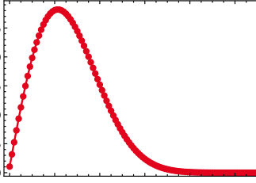
<figcaption class="paper-figure-caption"><b>Fig 1.</b> Figure 1. The dimensions of spin-l sectors of the Ising-even Hilbert space. (Left) The proportion in</figcaption>
</figure>
<figure class="paper-figure-card">
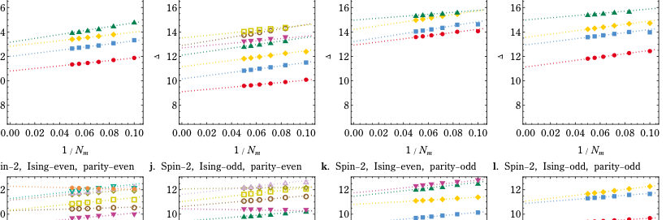
<figcaption class="paper-figure-caption"><b>Fig 2.</b> Figure 3. The finite-size extrapolation of scaling dimensions of conformal primaries with spin l =</figcaption>
</figure>
<figure class="paper-figure-card">
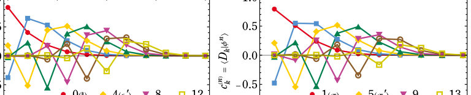
<figcaption class="paper-figure-caption"><b>Fig 3.</b> Figure 5. Wave-function amplitudes c(n) k = ⟨Dk|ϕn⟩of |ϕn⟩states in the APD-invariant subspace |Dk⟩</figcaption>
</figure>
<figure class="paper-figure-card">
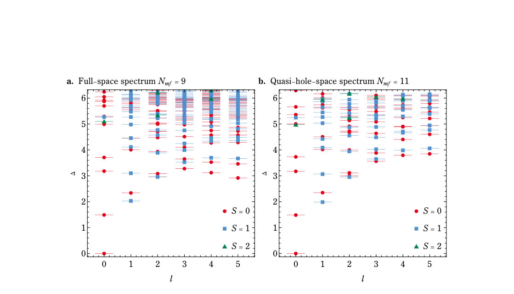
<figcaption class="paper-figure-caption"><b>Fig 4.</b> Figure 6. The spectrum of the SU(2)1-Higgs transition within (a) full Hilbert space at Nm = 9 and</figcaption>
</figure>
<figure class="paper-figure-card">
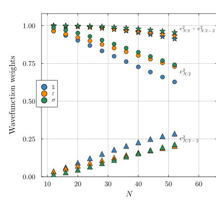
<figcaption class="paper-figure-caption"><b>Fig 5.</b> Figure 10. Wave function weights of the ground state, σ and ϵ in the j = Nm/2, Nm/2 −2 sectors.</figcaption>
</figure>

**Summary.** This work significantly advances the study of 3D CFTs using fuzzy-sphere regularization by developing a computationally efficient algorithm that resolves the full $\mathrm{SO}(3)$ symmetry. Key results include identifying many heavy operators for the 3D Ising CFT and establishing a general strategy for analyzing CFTs coupled to topologically ordered phases like FQH states.

**Why it may be interesting.** The connection between CFTs, topological order (FQH states), and advanced numerical techniques like ED on curved spaces is highly relevant for understanding critical phenomena in strongly interacting quantum systems.

Detailed structure

**Main problem.** The paper advances the study of three-dimensional conformal field theories (CFTs) using fuzzy-sphere regularization, focusing on identifying and characterizing heavy primary operators.

**Main result.** A new $\mathrm{SO}(3)$-resolving exact diagonalization algorithm was developed, significantly reducing computational costs and allowing the identification of numerous previously unknown heavy scalar primaries for the 3D Ising CFT.

**Method.** The core method involves developing an exact diagonalization algorithm that fully resolves the $\mathrm{SO}(3)$ rotational symmetry on the fuzzy sphere, alongside projecting the Hilbert space onto quasi-hole states for FQH systems.

**Model / system.** The primary model is the 3D Ising CFT, studied via fuzzy-sphere regularization. The analysis also extends to critical points involving fractional quantum Hall (FQH) states, utilizing the Laughlin state wave functions.

**Key observables.** Scaling dimensions ($\Delta$) of primary operators, the full $\mathrm{SO}(3)$ symmetry resolution, and the structure of wave functions related to area-preserving diffeomorphisms.

**Important parameters / regimes.** Scaling dimension $\Delta \approx 16.5$ (for heavy primaries), the magnetic monopole strength, and the size of the system ($N_m$).

**Assumptions / limitations.** The method assumes that the fuzzy-sphere framework provides a suitable regularization for the CFTs, and that the quasi-hole projection effectively isolates the relevant CFT spectrum.

**Figures summary.** Figures plot eigenvalues of $\Xi = |K|^2$ versus the dilatation operator expectation value, and show scaling dimensions ($\Delta$) derived from different theoretical methods (Fuzzy vs. CB vs. $\epsilon$-exp).

**Paper structure.** The paper details the setup of the fuzzy-sphere Ising model, describes the construction of the Hilbert space using $\mathrm{SO}(3)$-resolved ED, and then presents the results regarding operator identification and FQH projections.

Abstract

Fuzzy-sphere regularization has recently emerged as a powerful framework for studying three-dimensional conformal field theories (CFTs). In this work, we exploit symmetry and Hilbert-space structures to substantially advance this framework. We develop an exact-diagonalization algorithm that resolves the full $\mathrm{SO}(3)$ rotational symmetry, reducing computational costs by factors of several hundred. For the three-dimensional Ising CFT, we identify around 100 primary operators, including a large number of previously unknown heavy scalar primaries up to scaling dimension $Δ\approx16.5$. We also resolve the tension between previous fuzzy-sphere and bootstrap results regarding the parity-odd scalar primary. Furthermore, we identify a branch of scalar primaries associated with $φ^n$ operators in the $φ^4$ Lagrangian description, beginning with the identity, $σ$, $ε$, $ε'$, and $σ'$. Their wave functions exhibit a semi-classical structure closely related to states invariant under area-preserving diffeomorphisms of the sphere. Finally, we show that critical points involving fractional quantum Hall states can be studied within a substantially reduced Hilbert space spanned by quasi-hole states of the corresponding model quantum Hall wave functions like the Laughlin state. This suggests a general strategy for exploring CFTs intertwined with topologically ordered phases.

[↑ back to top](#top)

### [Approximate majorization and high-order capacity of quantum depolarizing channels](http://arxiv.org/abs/2609.37240v1)

**Authors:** Zhiwei Song, Xin Wang, Marco Tomamichel, Kun Fang  
**Type:** theory · **Category:** quantum information and computing · **PDF:** <https://arxiv.org/pdf/2609.37240v1>  
**Analysis basis:** full PDF text, analyzed in chunks

↔ Scroll figures horizontally

<figure class="paper-figure-card">
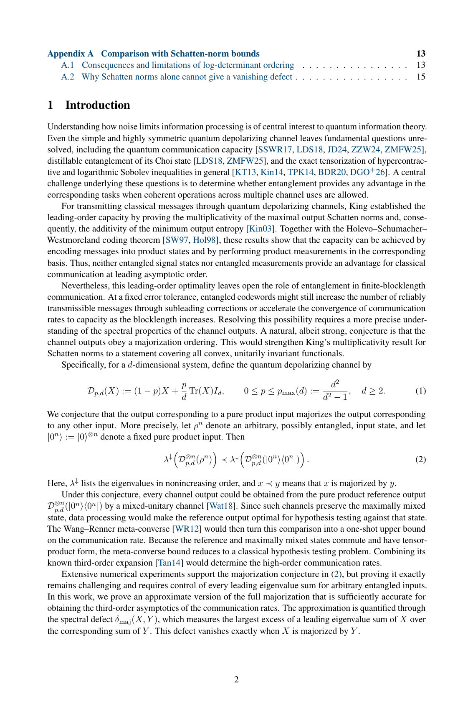
<figcaption class="paper-figure-caption"><b>Fig 1.</b> Low-resolution page preview, page 2</figcaption>
</figure>
<figure class="paper-figure-card">
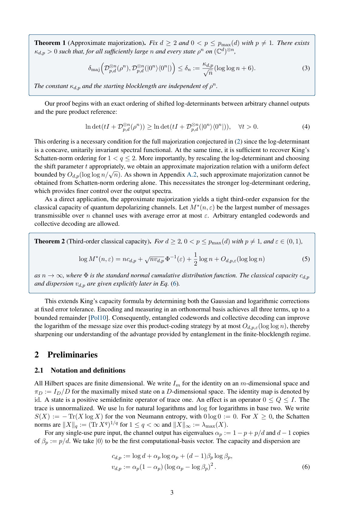
<figcaption class="paper-figure-caption"><b>Fig 2.</b> Low-resolution page preview, page 3</figcaption>
</figure>
<figure class="paper-figure-card">
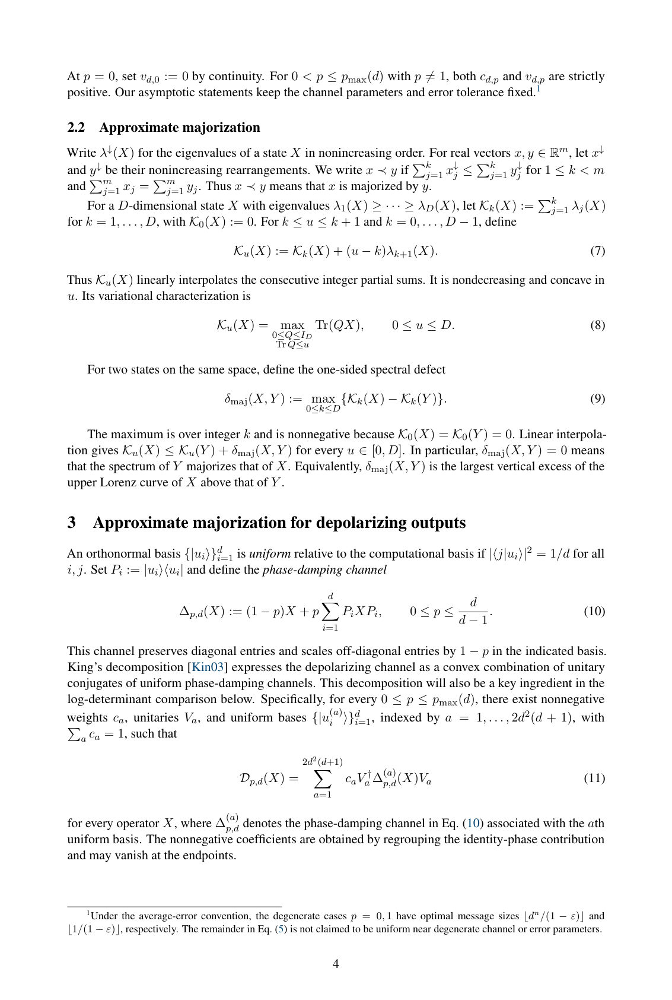
<figcaption class="paper-figure-caption"><b>Fig 3.</b> Low-resolution page preview, page 4</figcaption>
</figure>
<figure class="paper-figure-card">
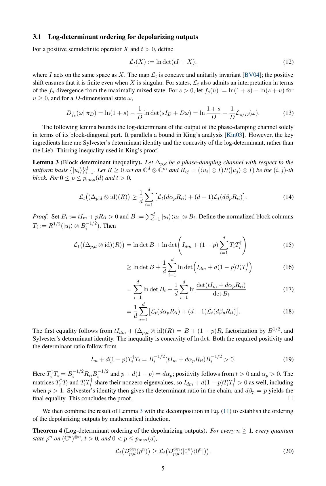
<figcaption class="paper-figure-caption"><b>Fig 4.</b> Low-resolution page preview, page 5</figcaption>
</figure>
<figure class="paper-figure-card">
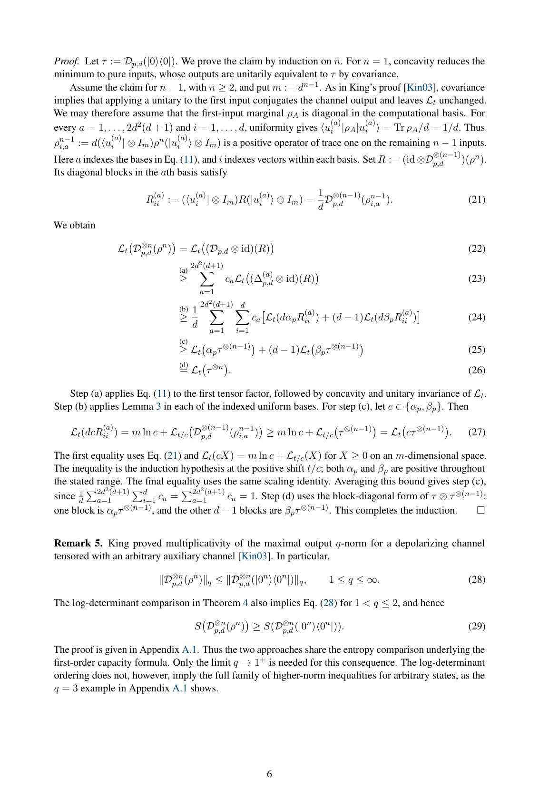
<figcaption class="paper-figure-caption"><b>Fig 5.</b> Low-resolution page preview, page 6</figcaption>
</figure>

**Summary.** This work tackles the question of entanglement advantage in quantum communication using depolarizing channels. By proving an approximate majorization relation for the channel outputs, the authors derive a precise third-order expansion for the classical capacity. This shows that while entanglement offers some improvement over product coding, this advantage is sub-logarithmic in the blocklength $n$.

**Why it may be interesting.** The rigorous mathematical tools developed (majorization, log-determinant ordering) provide powerful, non-standard ways to quantify resource advantages (like entanglement) in quantum communication protocols, which is highly relevant to open quantum systems theory.

Detailed structure

**Main problem.** The paper investigates whether entanglement provides an advantage for classical communication capacity when using multiple uses of quantum depolarizing channels in the finite-blocklength regime.

**Main result.** They prove an approximate majorization relation for the channel outputs, leading to a tight third-order expansion showing that entanglement improves the message size by at most $O(\log \log n)$ bits over product coding.

**Method.** The analysis combines proving an approximate majorization relation using log-determinant orderings with established quantum information theory bounds (like the hypothesis-testing meta-converse).

**Model / system.** The system analyzed is the quantum depolarizing channel, $D_{p,d}$, applied over $n$ uses. The core mathematical tools involve majorization ($\prec$), spectral defects ($\delta_{	ext{maj}}$), and log-determinant functionals.

**Key observables.** Classical capacity ($c_{d,p}$), spectral defect ($\delta_{	ext{maj}}$), and the message size $\log M^*(n, \varepsilon)$.

**Important parameters / regimes.** Depolarizing parameter ($p$), blocklength ($n$), and error tolerance ($\varepsilon$).

**Assumptions / limitations.** The authors conjecture a full majorization relation but only prove an approximate version, which is sufficient for the third-order capacity expansion.

**Figures summary.** Not specified.

**Paper structure.** The paper builds from establishing necessary spectral orderings (log-determinant) to proving an approximate majorization bound, which is then directly applied in the context of quantum channel capacity to derive the finite-blocklength expansion.

Abstract

A central challenge in quantum information theory is to determine whether entanglement provides an advantage for information processing when coherent operations across multiple channel uses are allowed. For depolarizing channels, King's proof of the additivity of the minimum output entropy rules out such an advantage for classical communication at leading asymptotic order, while leaving open the possibility of an advantage for higher orders. In this work, we conjecture a majorization relation for the outputs of depolarizing channels and prove an approximate version of this conjecture. Our proof combines an exact ordering of shifted log-determinants with an anti-concentration bound for the spectrum of the product-state output, refining King's analysis based on Schatten norms. As a direct application, we obtain a tight third-order expansion for the classical capacity of quantum depolarizing channels. Consequently, entangled codewords and collective decoding can improve the message size over the product-coding strategy by at most $O(\log \log n)$ bits, sharpening our understanding of the role of entanglement in the finite-blocklength regime.

[↑ back to top](#top)

### [Asymptotically Optimal Mixed-State Cloning](http://arxiv.org/abs/2609.35986v1)

**Authors:** Jiani Fei, Jinzhao Wang  
**Type:** theory · **Category:** quantum information and computing · **PDF:** <https://arxiv.org/pdf/2609.35986v1>  
**Analysis basis:** full PDF text, analyzed in chunks

↔ Scroll figures horizontally

<figure class="paper-figure-card">
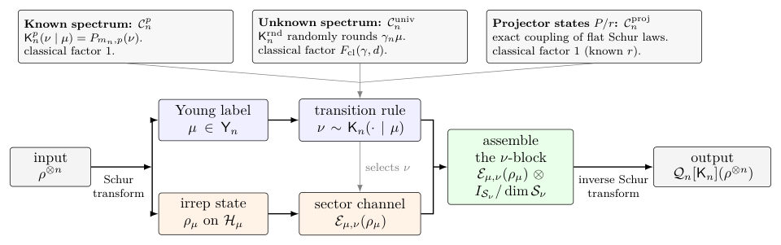
<figcaption class="paper-figure-caption"><b>Fig 1.</b> Figure 1: Schur–Cartan cloner construction. A Young-label transition rule selects ν, while the covariant channel Eµ,ν processes the conditional irrep state. Known-spectrum, unknown-spectrum, and projector cloners differ only in their label rules, shown above. Their asymptotic fidelities are given in Theorems 1.1 to 1.3.</figcaption>
</figure>
<figure class="paper-figure-card">
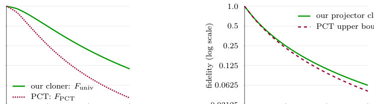
<figcaption class="paper-figure-caption"><b>Fig 2.</b> Figure 2: Fixed-gain comparison with PCT. (a) For p = (3/5, 2/5), both curves are exact asymptotic fidelities for protocols without the spectrum (Theorems 1.2 and 1.4). (b) For rank-two projectors in d = 4, the solid curve is our cloner’s exact fidelity γ−2. The dashed curve is the PCT upper bound γ−2(√2γ −1/γ)1/2 (Theorems 1.3 and 1.4). The gap is strict for every simple full-rank spectrum and every 1 &lt; r &lt; d.</figcaption>
</figure>

**Summary.** This work establishes the theoretical limits for cloning mixed quantum states by deriving the optimal asymptotic fidelity for both known and unknown spectral information. The authors introduce a novel cloner construction that is proven to outperform the standard Purify-Clone-Trace (PCT) channel, providing crucial benchmarks for quantum information theory.

**Why it may be interesting.** The rigorous derivation of optimal cloning bounds and the explicit comparison to established methods like PCT provides fundamental theoretical benchmarks for quantum information processing protocols.

Detailed structure

**Main problem.** The paper determines the asymptotic global fidelity for cloning generic mixed quantum states, comparing the optimal achievable fidelity against established bounds like the Purify-Clone-Trace (PCT) channel.

**Main result.** The authors derive explicit formulas for the optimal fidelity for both known and unknown spectra, proving that their proposed cloner strictly outperforms the PCT method for both full-rank and projector states.

**Method.** The analysis uses asymptotic limits, local asymptotic normality (LAN), and Gaussian fidelity bounds to establish both upper and lower bounds on the cloning fidelity.

**Model / system.** The system involves quantum state cloning channels acting on mixed states in a fixed dimension $d$. The inputs are characterized by simple, full-rank spectra or by rank-$r$ orthogonal projectors.

**Key observables.** Root Uhlmann fidelity ($F$), asymptotic fidelity values ($F_{	ext{orb}}, F_{	ext{univ}}$), and the infidelity coefficient.

**Important parameters / regimes.** Fixed dimension $d$, cloning gain $\gamma = \lim m_n/n > 1$, and the rank $r$ of the projector state.

**Assumptions / limitations.** The main theorems apply to the regime of simple full-rank spectra; the analysis relies on asymptotic limits and LAN approximations.

**Figures summary.** Figure 1 summarizes the cloner construction using Schur-Weyl labels. Figure 2 compares the fidelities achieved by the proposed cloner versus the PCT upper bound for projector states, showing the cloner is superior.

**Paper structure.** The paper progresses by first establishing the optimal fidelity for known spectra, then deriving the minimax optimum for unknown spectra, and finally providing separate, detailed analyses for projector states and comparing the results rigorously against the PCT channel.

Abstract

We determine asymptotic global fidelities of cloning generic mixed states with simple (non-degenerate) full-rank spectra. In fixed dimension $d$, let $n$ inputs and $m_n$ outputs satisfy $m_n/n\toγ>1$. For a known simple full-rank spectrum $p_1>\cdots>p_d>0$, we prove that the optimal root fidelity between the entire output and the product target state is $$   F_\rm{orb}(γ,p)   =\prod_{i<j}   \frac{\sqrtγ+\sqrt{q_{ij}(γ-1+q_{ij})}}   {γ+q_{ij}},   \qquad q_{ij}=\frac{p_j}{p_i}. $$ When the spectrum is unknown, one spectrum-independent cloner attains $$   F_\rm{univ}(γ,p)   =\left(\frac{2\sqrtγ}{1+γ}\right)^{(d-1)/2}   F_\rm{orb}(γ,p), $$ uniformly on compact subsets of the simple full-rank chamber and is minimax optimal. The two factors quantify spectral and eigenbasis uncertainty. Our channels combine classical processing of Schur--Weyl labels with a covariant Cartan-sector channel. Local asymptotic normality and a Gaussian fidelity bound against arbitrary channels yield the converses. For flat projector states $ρ=P/r$, with $P$ a rank-$r$ orthogonal projector, we separately prove the optimum $γ^{-r(d-r)/2}$. Furthermore, we estimate the exact asymptotic fidelity of purify--clone--trace (PCT), and show that our cloners strictly outperform PCT at every fixed gain for simple full-rank spectra and rank-$r$ projector states with $1<r<d$.

[↑ back to top](#top)

### [Bivariate Bicycle Codes over Group Algebras](http://arxiv.org/abs/2609.36213v1)

**Authors:** Chaobin Liu  
**Type:** theory · **Category:** quantum information and computing · **PDF:** <https://arxiv.org/pdf/2609.36213v1>  
**Analysis basis:** full PDF text, analyzed in chunks

↔ Scroll figures horizontally

<figure class="paper-figure-card">
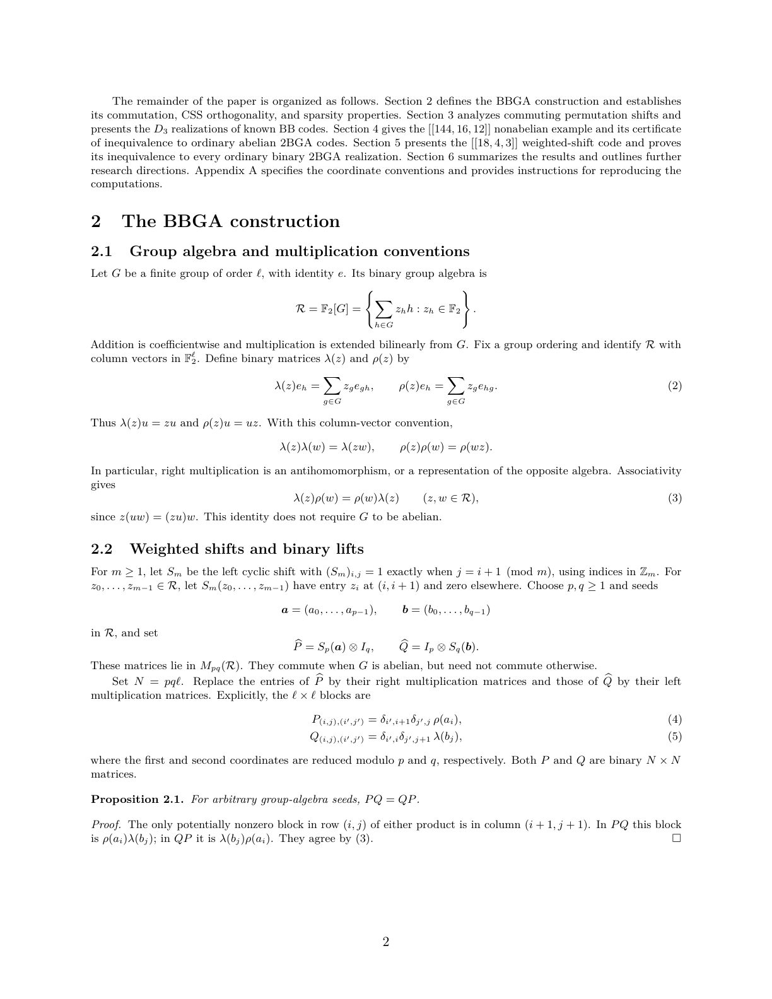
<figcaption class="paper-figure-caption"><b>Fig 1.</b> Low-resolution page preview, page 2</figcaption>
</figure>
<figure class="paper-figure-card">
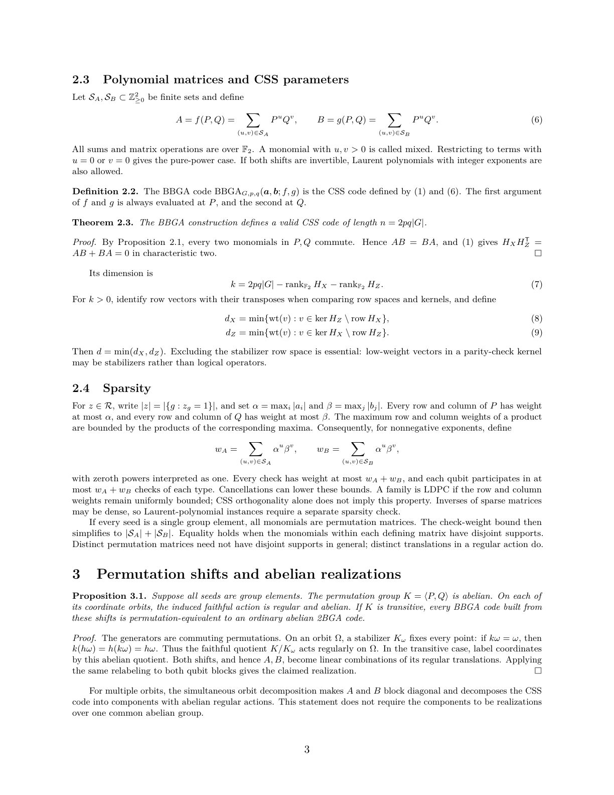
<figcaption class="paper-figure-caption"><b>Fig 2.</b> Low-resolution page preview, page 3</figcaption>
</figure>
<figure class="paper-figure-card">
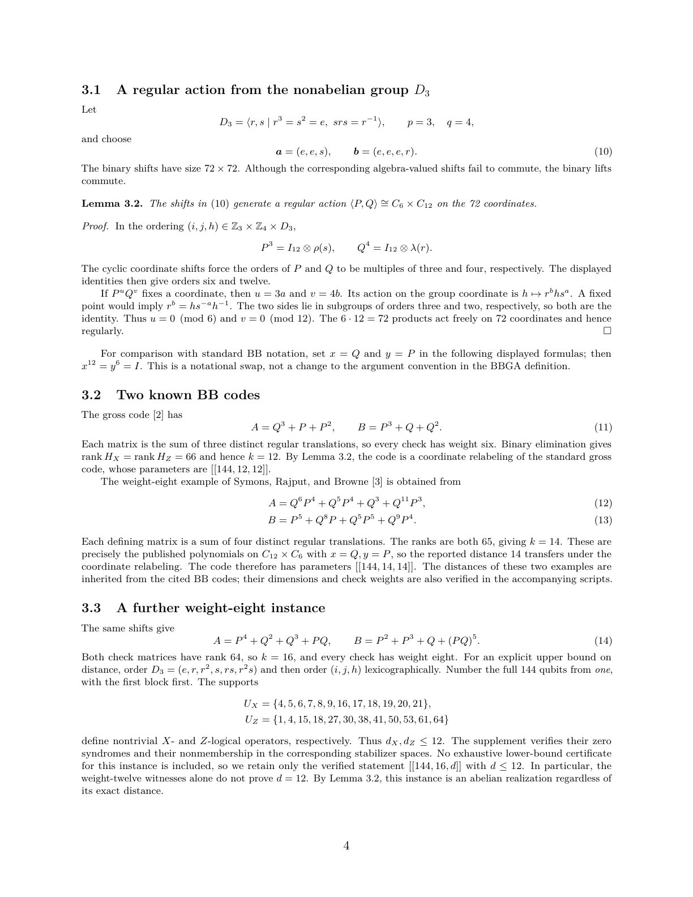
<figcaption class="paper-figure-caption"><b>Fig 3.</b> Low-resolution page preview, page 4</figcaption>
</figure>
<figure class="paper-figure-card">
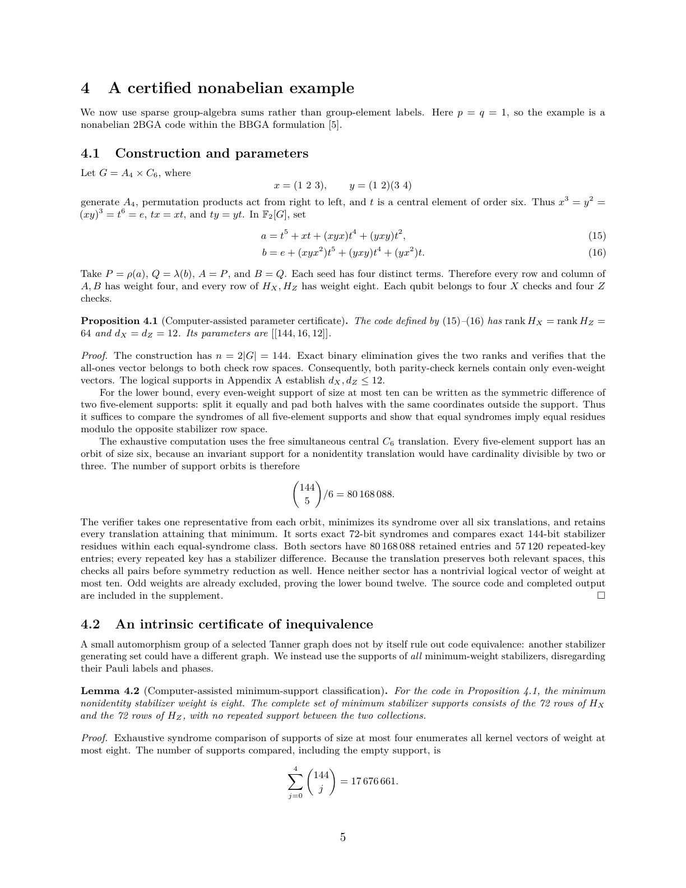
<figcaption class="paper-figure-caption"><b>Fig 4.</b> Low-resolution page preview, page 5</figcaption>
</figure>
<figure class="paper-figure-card">
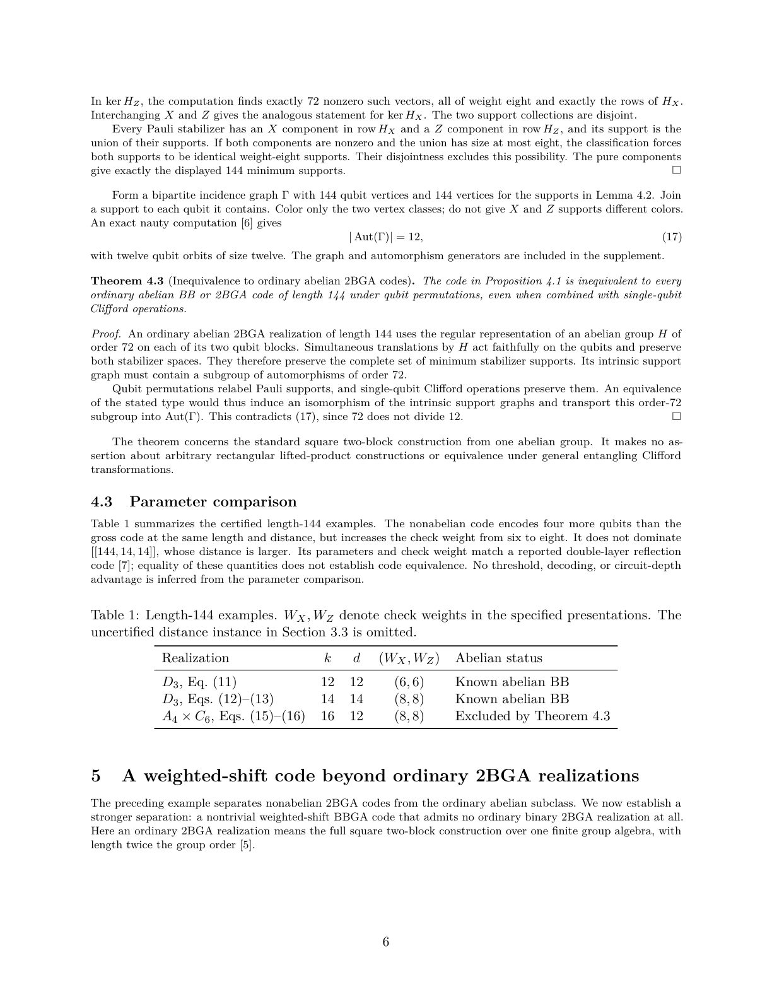
<figcaption class="paper-figure-caption"><b>Fig 5.</b> Low-resolution page preview, page 6</figcaption>
</figure>

**Summary.** This paper develops a weighted-shift framework for constructing Bivariate Bicycle Group-Algebra (BBGA) quantum codes over group algebras. It rigorously proves that certain constructed codes, particularly those derived from nonabelian or specific weighted-shift structures, cannot be equivalent to simpler, ordinary abelian realizations. This expands the known landscape of quantum error-correcting codes.

**Why it may be interesting.** This work advances the algebraic theory of quantum error-correcting codes by providing explicit constructions that challenge the boundaries of known equivalence classes, which is fundamental for designing robust quantum hardware.

Detailed structure

**Main problem.** The paper investigates Bivariate Bicycle Group-Algebra (BBGA) codes defined over finite group algebras, aiming to distinguish codes constructed via nonabelian group structures from those equivalent to simpler abelian realizations.

**Main result.** The authors construct specific quantum error-correcting codes, including one over $A_4 	imes C_6$ and another over $\mathbb{F}_2[C_3]$, which are proven to be inequivalent to any ordinary abelian 2BGA realization.

**Method.** The construction relies on weighted-shift formulations using commuting shifts derived from left and right multiplications in the group algebra, leading to CSS codes defined by polynomial generators.

**Model / system.** The model is quantum error correction using stabilizer codes defined over the group algebra $\mathbb{F}_2[G]$ of a finite group $G$. Examples include $G=D_3$, $G=A_4 	imes C_6$, and $G=C_3$.

**Key observables.** Code parameters $[[n, k, d]]$, check weights ($W_X, W_Z$), minimum stabilizer supports, and the automorphism group of the support graph $\Gamma$.

**Important parameters / regimes.** Code length $n=144$ and $n=18$; dimension $k=16$ and $k=4$; distance $d=12$ and $d=3$.

**Assumptions / limitations.** The primary distinction is drawn between the general weighted-shift formulation and the restricted class of ordinary abelian 2BGA realizations.

**Figures summary.** The notes do not describe specific figures, but refer to tables summarizing known code parameters and the use of displayed formulas defining code generators.

**Paper structure.** The paper builds from establishing the general weighted-shift formulation for BBGA codes, presenting known examples (like those for $D_3$), constructing a specific nonabelian example ($A_4 	imes C_6$) and proving its inequivalence, and finally presenting a weighted-shift example ($C_3$) that extends beyond the ordinary abelian class.

Abstract

We study a weighted-shift formulation of bivariate bicycle group-algebra (BBGA) codes over finite group algebras. One binary shift acts by right multiplication and the other by left multiplication; associativity ensures that these shifts commute even for a nonabelian seed group. Bivariate polynomials in the shifts, including mixed monomials, therefore define CSS codes. We give explicit sparsity bounds and distinguish nonabelian seed groups from codes that are intrinsically inequivalent to abelian realizations. For $D_3$, a pair of weighted permutation shifts generates a regular $C_6\times C_{12}$ action and recovers the known $[[144,12,12]]$ and $[[144,14,14]]$ bivariate bicycle codes. We also present a computer-verified $[[144,16,12]]$ code over $A_4\times C_6$, with every check of weight eight. This example belongs to the established nonabelian two-block group-algebra family. Exhaustive low-weight enumeration and an intrinsic stabilizer-support invariant certify that it is inequivalent to any ordinary abelian BB or two-block group-algebra realization, even under qubit permutations combined with local Clifford operations. Finally, a nonuniform weighted-shift construction over $\mathbb{F}_2[C_3]$ yields a $[[18,4,3]]$ code with check weights six and eight. An exact enumeration of its minimum stabilizer supports rules out every ordinary binary 2BGA realization at that length, under the same equivalence. This establishes that the unrestricted weighted-shift formulation extends beyond the ordinary 2BGA class, even with an abelian seed group.

[↑ back to top](#top)

### [Chemical-Disorder-Induced Non-metallic Transport in Thermodynamically Metallic Mo4TGa16Ge (T = Co, Rh or Ir)](http://arxiv.org/abs/2609.37707v1)

**Authors:** Chaoguo Wang, Jiaqi Tian, Xin Gui  
**Type:** both · **Category:** strongly correlated electrons · **PDF:** <https://arxiv.org/pdf/2609.37707v1>  
**Analysis basis:** full PDF text, analyzed in chunks

↔ Scroll figures horizontally

<figure class="paper-figure-card">
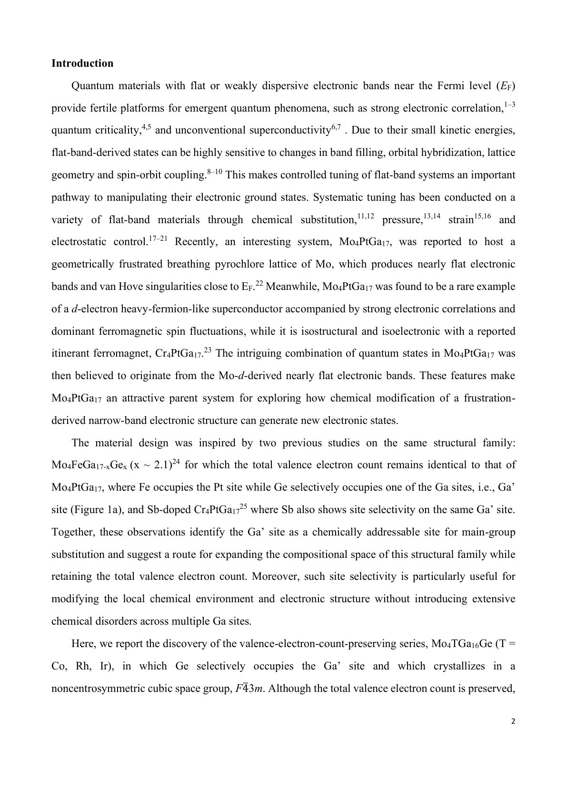
<figcaption class="paper-figure-caption"><b>Fig 1.</b> Low-resolution page preview, page 2</figcaption>
</figure>
<figure class="paper-figure-card">
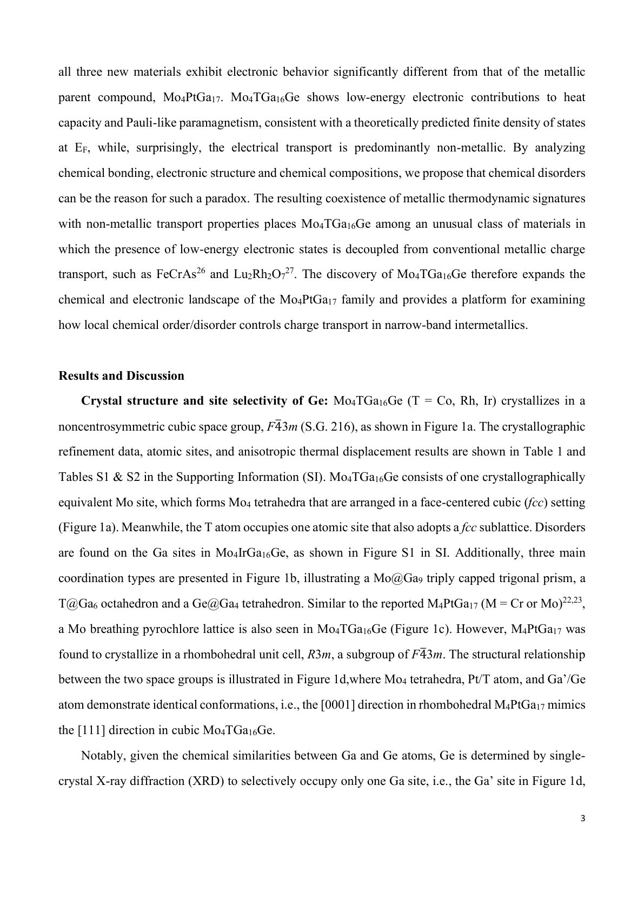
<figcaption class="paper-figure-caption"><b>Fig 2.</b> Low-resolution page preview, page 3</figcaption>
</figure>
<figure class="paper-figure-card">
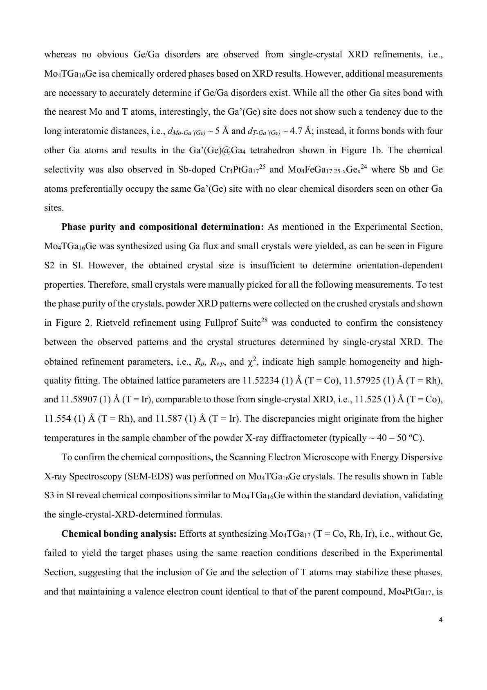
<figcaption class="paper-figure-caption"><b>Fig 3.</b> Low-resolution page preview, page 4</figcaption>
</figure>
<figure class="paper-figure-card">

<figcaption class="paper-figure-caption"><b>Fig 4.</b> Low-resolution page preview, page 5</figcaption>
</figure>
<figure class="paper-figure-card">
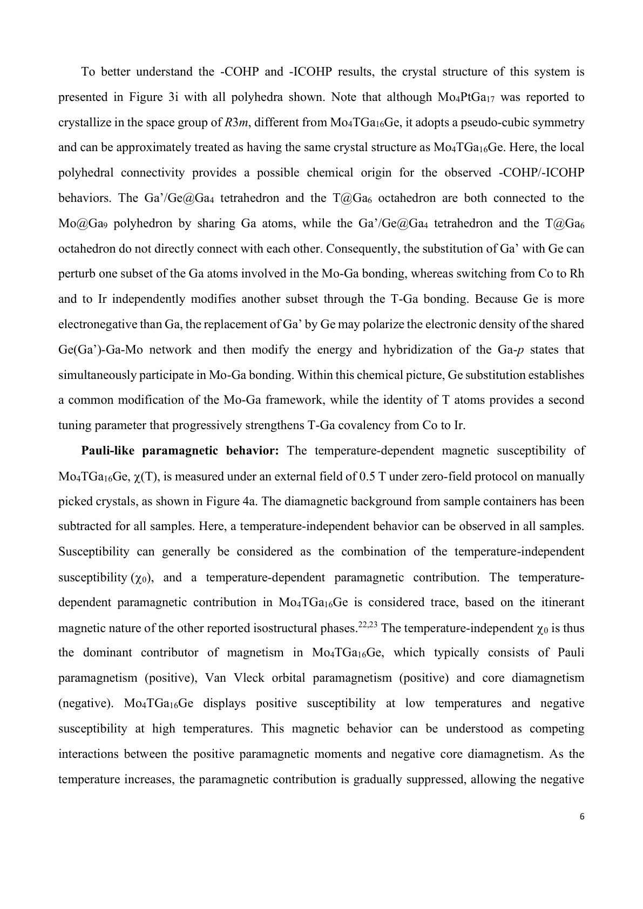
<figcaption class="paper-figure-caption"><b>Fig 5.</b> Low-resolution page preview, page 6</figcaption>
</figure>

**Summary.** This work explores the $	ext{Mo}_4	ext{TGa}_{16}	ext{Ge}$ compounds, which possess flat-band electronic characteristics. The researchers found a conflict between theoretical predictions of metallic behavior and experimental measurements showing non-metallic transport. They resolve this by proposing that chemical disorder, induced by the substitution of elements, is responsible for suppressing the metallic transport properties in these sensitive intermetallics.

**Why it may be interesting.** The study directly addresses the interplay between electronic structure theory (flat bands, correlation) and real-world material imperfections (chemical disorder), which is a key area in strongly correlated electron physics.

Detailed structure

**Main problem.** The paper investigates the origin of non-metallic electrical transport features that coexist with thermodynamically metallic electronic signatures in a new series of compounds.

**Main result.** The discrepancy is attributed to the high sensitivity of narrow-band materials to chemical disorders, suggesting a chemically tunable platform for studying disorder-controlled transport.

**Method.** The study combines theoretical calculations (DFT, COHP/ICOHP) with extensive experimental measurements, including transport ($
ho(T)$), heat capacity ($C_p(T)$), and X-ray crystallography.

**Model / system.** The physical system is the $	ext{Mo}_4	ext{TGa}_{16}	ext{Ge}$ series ($	ext{T} = 	ext{Co}, 	ext{Rh}, 	ext{or Ir}$), derived from the flat-band superconductor $	ext{Mo}_4	ext{PtGa}_{17}$. These compounds are structurally related and exhibit flat-band electronic states.

**Key observables.** Electrical resistivity ($
ho(T)$), Sommerfeld coefficient ($\gamma$) from $C_p(T)$, electronic band structure, and chemical bonding analysis via COHP/ICOHP.

**Important parameters / regimes.** Low temperatures, Fermi energy ($E_F$), and the chemical identity of the transition metal T ($	ext{Co}, 	ext{Rh}, 	ext{Ir}$).

**Assumptions / limitations.** The non-metallic transport features are not intrinsic semiconducting gaps but are instead induced by chemical disorder effects on the narrow-band electronic structure.

**Figures summary.** Figures detail the crystal structure, XRD patterns, magnetic susceptibility, temperature-dependent heat capacity, electronic band structures, and resistivity measurements for the studied compounds.

**Paper structure.** The paper follows a structure of structural characterization (XRD, composition) $\rightarrow$ electronic structure analysis (DFT, bonding) $\rightarrow$ thermodynamic measurements ($C_p(T)$) $\rightarrow$ transport measurements ($
ho(T)$), culminating in a unified explanation linking disorder to the observed transport paradox.

Abstract

Flat-band electronic states can be highly sensitive to chemical perturbations, offering opportunities to access a broader range of electronic behaviors beyond that of parent materials. Here, we report the discovery of a new series of compounds, Mo4TGa16Ge (T = Co, Rh, or Ir), derived from the strongly correlated flat-band superconductor, Mo4PtGa17, via nominally preserving the total valence electron counts. All three materials crystallize in a noncentrosymmetric cubic space group, F-43m, with Ge selectively occupying one of the Ga sites in the parent compound. Although the total electron count remains the same, Mo4TGa16Ge exhibits significantly distinct properties from Mo4PtGa17. Theoretical calculations predict metallic electronic structures with narrow, dominant Mo-d states at the Fermi energy, while low-temperature heat capacity results demonstrate finite Sommerfeld coefficients. However, electrical transport measurements show predominantly non-metallic behaviors with small observed activation energies, excluding the possibilities of conventional semiconducting behaviors. Combining chemical bonding analysis, electronic structure and compositional determination from X-ray crystallography and spectroscopy, we propose that the coexistence of the non-metallic transport features and the thermodynamically metallic behaviors can be attributed to the high sensitivity of the narrow-band materials to chemical disorders. Thus, the discovery and investigation of Mo4TGa16Ge provide a chemically tunable platform for studying disorder-controlled transport in flat-band intermetallics.

[↑ back to top](#top)

### [Constant-rate quantum codes with low-weight stabilizers and full logical Clifford actions via transversal and fold-transversal gates](http://arxiv.org/abs/2609.37699v1)

**Authors:** Takaya Matsuura, Yohji Chin, Shohei Kiryu, Kosuke Fukui  
**Type:** theory · **Category:** quantum information and computing · **PDF:** <https://arxiv.org/pdf/2609.37699v1>  
**Analysis basis:** full PDF text, analyzed in chunks

↔ Scroll figures horizontally

<figure class="paper-figure-card">
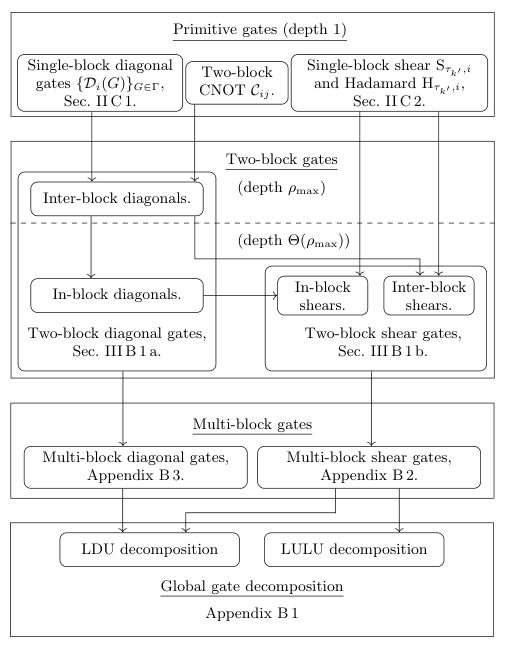
<figcaption class="paper-figure-caption"><b>Fig 1.</b> FIG. 1. A flowchart of the bottom-up construction of full logical Clifford gates for PRISM codes.</figcaption>
</figure>
<figure class="paper-figure-card">
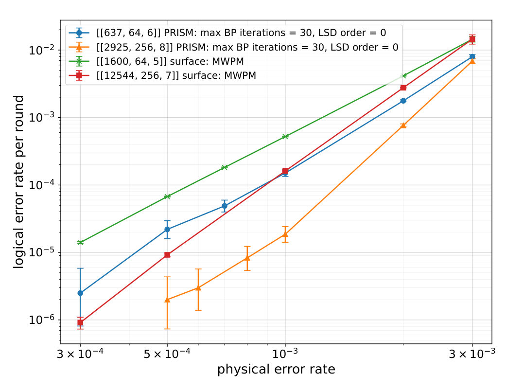
<figcaption class="paper-figure-caption"><b>Fig 2.</b> FIG. 2. Simulation result of the block logical error rate per syndrome extraction cycle for the memory experiment of the J637, 64, 6K and J2925, 256, 8K PRISM codes constructed from the seed [21, 8, 6] and [45, 16, 8] Steinberg codes.</figcaption>
</figure>

**Summary.** This paper presents a novel family of quantum error-correcting codes designed for fault-tolerant quantum computation. These codes maintain a constant encoding rate and feature sublogarithmically growing stabilizer weights. Crucially, they support all logical Clifford operations using only efficient transversal and fold-transversal gates.

**Why it may be interesting.** It provides a concrete, mathematically rigorous construction for fault-tolerant quantum computation that addresses the critical trade-off between code rate, stabilizer weight, and native gate set complexity.

Detailed structure

**Main problem.** The central challenge is constructing quantum error-correcting codes that simultaneously achieve a constant encoding rate, sublogarithmic stabilizer weight, and support for the entire logical Clifford group using only transversal and fold-transversal gates.

**Main result.** The authors introduce a family of quantum codes, derived from Steinberg modules via hypergraph products, that achieve this combination, providing a path toward fault-tolerant quantum computation with low space overhead.

**Method.** The construction relies on classical codes whose spaces are absolutely irreducible Steinberg modules of their Tanner-graph automorphism groups, which are then combined using the hypergraph product.

**Model / system.** The model involves quantum CSS codes constructed using the hypergraph product of classical codes derived from Steinberg codes associated with finite groups of Lie type (Chevalley groups).

**Key observables.** Constant encoding rate, sublogarithmically growing stabilizer weight ($w = (\log n)^{1/2-o(1)}$), and the ability to generate the full logical Clifford group.

**Important parameters / regimes.** The construction requires the code to be derived from Steinberg codes and involves the analysis of group theory structures (e.g., Tits buildings, BN-pairs).

**Assumptions / limitations.** The construction assumes the existence of specific algebraic structures (Steinberg modules) and relies on the properties of transversal and fold-transversal gates for gate synthesis.

**Figures summary.** Not specified in the provided notes.

**Paper structure.** The paper builds upon the need for codes with specific parameter regimes, detailing the construction based on Steinberg codes and the hypergraph product, and demonstrating the resulting gate set capabilities.

Abstract

Low-space-overhead fault-tolerant quantum computation requires not only high-rate quantum error-correcting codes but also space-efficient implementations of logical operations. Transversal and fold-transversal gates are promising since they limit error propagation and require no additional qubits. However, the logical operations they enable are typically restricted, and a central challenge is to construct codes that combine a complete set of logical Clifford gates with favorable code parameters. In this work, we introduce a family of quantum codes with an asymptotically constant encoding rate and sublogarithmically growing stabilizer weight, while supporting the entire logical Clifford group using only transversal and fold-transversal gates. Our construction is based on classical codes whose code spaces are absolutely irreducible Steinberg modules of their Tanner-graph automorphism groups. Taking hypergraph products of these classical codes yields quantum codes for which all logical Clifford operations can be synthesized from a fixed set of transversal and fold-transversal gates. Moreover, the slow growth of the stabilizer weight enables a high error-correcting performance in small instances. These results provide a path toward fault-tolerant quantum computation with low space overhead using transversal and fold-transversal gates.

[↑ back to top](#top)

### [Encoding and Node Choices in Transversal Fault-Tolerant Distributed Quantum Computations: An Initial Study](http://arxiv.org/abs/2609.37210v1)

**Authors:** Seng W. Loke  
**Type:** theory · **Category:** quantum information and computing · **PDF:** <https://arxiv.org/pdf/2609.37210v1>  
**Analysis basis:** full PDF text, analyzed in chunks

↔ Scroll figures horizontally

<figure class="paper-figure-card">
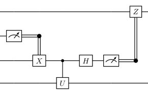
<figcaption class="paper-figure-caption"><b>Fig 1.</b> Fig. 1: Distributed controlled-U (i.e., dCNOT is when U=X) between nodes QC and QC′ (the computation qubits are c, the control qubit, and t, the target qubit), and the wavy line illustrates a Bell pair involving the communication qubits from the two nodes both initially |0⟩.</figcaption>
</figure>
<figure class="paper-figure-card">
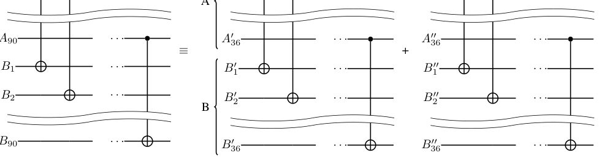
<figcaption class="paper-figure-caption"><b>Fig 2.</b> Fig. 2: Transversal CNOT using [[90, 8, 10]] blocks, one on each node, and using two [[36, 4, 6]] blocks on each node.</figcaption>
</figure>
<figure class="paper-figure-card">
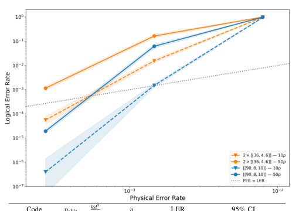
<figcaption class="paper-figure-caption"><b>Fig 3.</b> Fig. 3: Comparison of the LERs (as the physical error rate p varies) for the inter-node transversal CNOT operation using two different encodings for 8 logical qubits on each node: (i) two [[36, 4, 6]] blocks on each node, and (ii) one block of [[90, 8, 10]] on each node.</figcaption>
</figure>
<figure class="paper-figure-card">
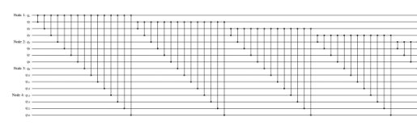
<figcaption class="paper-figure-caption"><b>Fig 4.</b> Fig. 4: Global gate operation (GCZL16) over 4 nodes, with 120 CZLs; GCZL16 = Q</figcaption>
</figure>
<figure class="paper-figure-card">
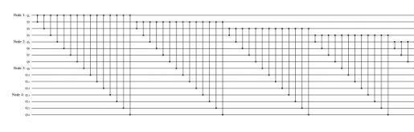
<figcaption class="paper-figure-caption"><b>Fig 5.</b> Fig. 5: The first 54 CZLs, from Figure 4.</figcaption>
</figure>

**Summary.** This work investigates the optimal choice of quantum error-correcting codes for distributed quantum computation. The authors demonstrate that minimizing physical resource usage (ebits) is not the primary goal; instead, maximizing the code distance is crucial for maintaining a low logical error rate. The findings guide the selection of robust encoding schemes for implementing complex, non-local quantum gates.

**Why it may be interesting.** It provides concrete, quantitative guidelines for resource allocation in large-scale quantum processors, showing that hardware efficiency metrics (like ebit count) must be superseded by error-suppression metrics (like code distance) for reliable computation.

Detailed structure

**Main problem.** The paper compares different quantum error-correcting encodings and node arrangements to minimize the Logical Error Rate (LER) when performing distributed quantum operations like transversal CNOTs and the global gate (GCZ).

**Main result.** Reducing ebit consumption alone is insufficient; the choice of encoding must balance ebit cost against achieving a large code distance to effectively suppress the logical error rate.

**Method.** The authors analyze the LER by comparing performance metrics across various Bivariate-Bicycle (BB) codes, demonstrating that larger, more robust encodings can outperform smaller, more ebit-efficient ones.

**Model / system.** The model is distributed quantum computation across multiple nodes (QPUs) utilizing fault-tolerant quantum error correction, specifically focusing on transversal gates like CNOT and GCZ.

**Key observables.** Logical Error Rate (LER), ebits required, and code parameters ($[[n, k, d]]$).

**Important parameters / regimes.** Physical error rate ($p$), code distance ($d$), and the ratio of logical to physical resources.

**Assumptions / limitations.** The analysis assumes a cloud service model where nodes are selected from a heterogeneous collection and focuses on transversal operations.

**Figures summary.** Figures illustrate the structure of distributed CNOTs and the decomposition of complex gates like GCZ into transversal operations, comparing the physical connections and resulting LER for different code choices.

**Paper structure.** The paper progresses by first establishing the problem of distributed operations, then comparing specific encoding choices (e.g., $[[90, 8, 10]]$ vs. $2 	imes [[36, 4, 6]]$) for CNOTs, and finally extending the analysis to complex gates like GCZ, concluding with a general optimization framework for selecting the best encoding.

Abstract

We compare and study different Bivariate-Bicycle (BB) encodings and node choices for distributed quantum operations such as transversal non-local CNOTs. We observe that while some encodings have more physical qubits requiring more ebits for a distributed computation, reducing ebit consumption alone might not be the best criterion for selecting an encoding for the logical qubits, if the goal is to reduce the logical error rate of the distributed computation; for example, one should also consider encodings with a larger distance, which using more physical qubits can provide. We consider distributed, or non-local, CNOTs and computation of the global gate (GCZ) over distributed logical qubits as examples. The choice of encoding enables particular concurrent operations; e.g., we show that a transversal physical GCZ on a self-dual $[[120,8,12]] BB$ code can realize eight concurrent logical GCZ operations after accounting for the logical permutation induced by transversal Hadamard.

[↑ back to top](#top)

### [Evolution of Magnetism in Ce$_4$Ge$_7$ under Magnetic Field and Pressure](http://arxiv.org/abs/2609.37129v1)

**Authors:** Kaixin Ye, Qihe Yu, Yongjian Li, Yanan Zhang, Ye Chen, Rui Li, Lin Jiao, M. Smidman, Yongjun Zhang, Yu Liu, Huiqiu Yuan  
**Type:** experiment · **Category:** strongly correlated electrons · **PDF:** <https://arxiv.org/pdf/2609.37129v1>  
**Analysis basis:** full PDF text, analyzed in chunks

↔ Scroll figures horizontally

<figure class="paper-figure-card">
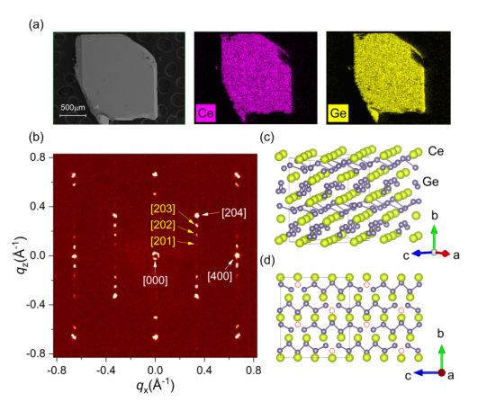
<figcaption class="paper-figure-caption"><b>Fig 1.</b> FIG. 1. (a) Scanning electron microscopy (SEM) image of a representative Ce4Ge7 single crystal and the correspond- ing elemental mapping. (b) X-ray diffraction pattern on the h0l plane. Superstructure reflections relative to the parent Imma structure are indicated by the yellow arrows. (c) Crys- tal structure (space group C2221) and (d) The view from [1 0 0] direction of Ce4Ge7. The red dotted circle in (d) indicates the Ge vacancies.</figcaption>
</figure>
<figure class="paper-figure-card">
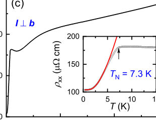
<figcaption class="paper-figure-caption"><b>Fig 2.</b> FIG. 2. (a) Zero-field-cooled (ZFC) (solid lines) and field-cooled (FC) (dashed-dotted lines) magnetic susceptibil- ity χ(T) for H ⊥b and H ∥b. The inset shows the inverse susceptibility χ−1(T); the red dashed line represents a Curie– Weiss fit to the data in the temperature range from 100 K to 300 K. (b) Temperature dependence of the specific heat di- vided by temperature Cp/T. The red dashed line represents a fit to the function Cp/T = γ + βT 2. The inset shows the electronic specific heat Cel/T (left axis) and the correspond- ing electronic entropy Sel (right axis), where R is ideal gas constant. (c) Temperature dependence of the electrical resis- tivity ρ(T). Inset: ρ(T) below 15 K with...</figcaption>
</figure>
<figure class="paper-figure-card">
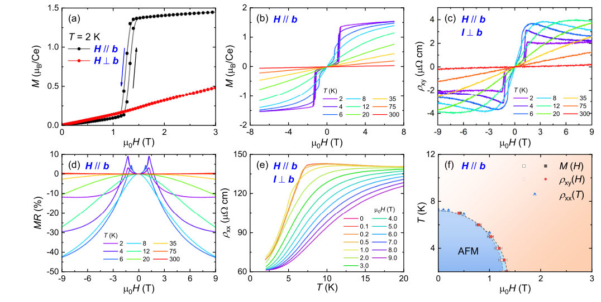
<figcaption class="paper-figure-caption"><b>Fig 3.</b> FIG. 3. (a) Magnetization curves M(H) of Ce4Ge7 at 2 K. (b) Isothermal magnetization curves at selected temperatures. (c) Isothermal Hall resistivity ρxy(H) curves. (d) Isothermal magnetoresistance MR = [ρxx(H) −ρxx(0)]/ρxx(0) × 100% curves. (e) Temperature dependence of resistivity ρ(T) at fixed magnetic fields. (f) Magnetic field-temperature phase diagram of Ce4Ge7. Three individual single crystals were used for the magnetization, Hall resistivity, magnetoresistance and resistivity measurements, respectively, and the results are mutually consistent across the phase diagram. Solid and open symbols represent data measured upon increasing field and decreasing field, respectively....</figcaption>
</figure>
<figure class="paper-figure-card">
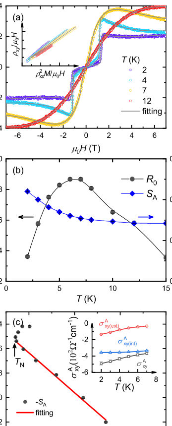
<figcaption class="paper-figure-caption"><b>Fig 4.</b> FIG. 4. (a) Hall resistivity ρxy(H) at representative tem- peratures is shown here for clarity, with the complete set provided in the Supplementary Information [25]. The grey lines represent fitting results using the expression ρxy = R0µ0H + SAρ2 xxM. Inset: the linear fitting of ρxy/µ0H as a function of ρ2 xxM/µ0H. (b) Temperature dependence of the fitting parameters R0 (left axis) and SA (right axis). (c) Linear fitting of −SA as a function of σ2 xx/M and the inset shows temperature dependence of the total anomalous Hall conductivity σA xy and its separated intrinsic (σA xy,int) and ex- trinsic (σA xy,ext) components.</figcaption>
</figure>
<figure class="paper-figure-card">
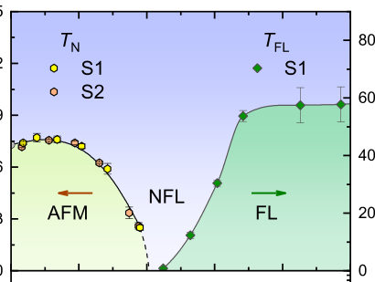
<figcaption class="paper-figure-caption"><b>Fig 5.</b> FIG. 7. (a) Temperature-pressure (T-P) phase diagram for Ce4Ge7. The left and right axes correspond to the Néel temperature TN and the Fermi liquid temperature TFL, re- spectively. The dashed line indicates the extrapolation of TN towards 0 K, at Pc = 10.2 GPa. (b) The evolution of residual resistivity ρ0 (left axis) and A coefficient (right axis) under pressure.</figcaption>
</figure>

**Summary.** This paper reports comprehensive measurements on Ce4Ge7, a heavy-fermion material, detailing its magnetic and electronic response to magnetic fields and pressure. Key findings include an antiferromagnetic transition, a field-induced metamagnetic transition, and strong evidence pointing towards an antiferromagnetic quantum critical point at a specific pressure. The work utilizes advanced transport diagnostics like the anomalous Hall effect to probe the underlying correlated electronic states.

**Why it may be interesting.** The investigation of quantum critical points in heavy-fermion systems using pressure tuning is a canonical problem in condensed matter physics, providing experimental benchmarks for theories of quantum phase transitions and strongly correlated electron behavior.

Detailed structure

**Main problem.** The study investigates the magnetic and transport properties of the heavy-fermion material Ce4Ge7 under external tuning parameters, specifically applied magnetic fields and hydrostatic pressure.

**Main result.** The material exhibits an antiferromagnetic transition, a field-induced metamagnetic transition accompanied by an anomalous Hall effect, and shows signatures of an antiferromagnetic quantum critical point near 10.2 GPa.

**Method.** The research combines single-crystal synthesis, structural characterization (XRD), and advanced transport measurements, including magnetization, specific heat, resistivity, and anomalous Hall effect measurements under high pressure using a diamond anvil cell.

**Model / system.** The system is single-crystalline Ce4Ge7, an orthorhombic heavy-fermion compound. The physics is analyzed using models for antiferromagnetic spin-wave excitations, Fermi liquid theory, and the intrinsic Karplus-Luttinger mechanism for the anomalous Hall effect.

**Key observables.** Antiferromagnetic transition temperature (TN), metamagnetic transition field, anomalous Hall conductivity (sigma_Axy), residual resistivity (rho_0), and the coefficient A in the temperature-dependent resistivity.

**Important parameters / regimes.** Magnetic field (up to 1.3 T), pressure (up to 24.3 GPa), and the critical pressure P_c = 10.2 GPa.

**Assumptions / limitations.** The analysis assumes that the anomalous Hall effect is dominated by the intrinsic Karplus-Luttinger mechanism, and that the low-temperature resistivity can be described by Fermi liquid or spin-wave models.

**Figures summary.** Figures illustrate the evolution of resistivity and magnetic susceptibility with temperature and pressure, showing the AFM transition, the metamagnetic jump, and the divergence of transport coefficients near the critical pressure.

**Paper structure.** The paper systematically presents measurements of magnetic and transport properties across varying fields and pressures. It first establishes the magnetic ground state (AFM transition), then analyzes the field-induced transitions (metamagnetism/AHE), and finally maps the phase diagram by studying the pressure dependence of the magnetic order and transport coefficients to locate the QCP.

Abstract

We report the magnetic and transport properties of single-crystalline Ce$_4$Ge$_7$, which crystallizes in a non-centrosymmetric orthorhombic structure (space group C222$_1$). It undergoes an antiferromagnetic transition at $T_N$ = 7.3 K. When a magnetic field is applied along the $b$-axis, a metamagnetic transition occurs at 1.3 T (at 2 K). Correspondingly, this transition gives rise to an anomalous Hall effect, which is dominated by the intrinsic Karplus-Luttinger mechanism. Under hydrostatic pressure, $T_N$ of Ce$_4$Ge$_7$ initially increases slightly and is then gradually suppressed. For pressures above $P_c$ = 10.2 GPa, no magnetic order is observed. The divergence of the $A$ coefficient, the maximum of the residual resistivity, and the non-Fermi liquid behavior around $P_c$ indicate the possible existence of an antiferromagnetic quantum critical point in Ce$_4$Ge$_7$.

[↑ back to top](#top)

### [Foundation Neural-Network Quantum States for Molecular Potential Energy Surfaces in Second Quantization](http://arxiv.org/abs/2609.37733v1)

**Authors:** Lizhong Fu, Jianan Wei, Wenguan Wang, Honghui Shang  
**Type:** theory · **Category:** numerical methods · **PDF:** <https://arxiv.org/pdf/2609.37733v1>  
**Analysis basis:** full PDF text, analyzed in chunks

↔ Scroll figures horizontally

<figure class="paper-figure-card">
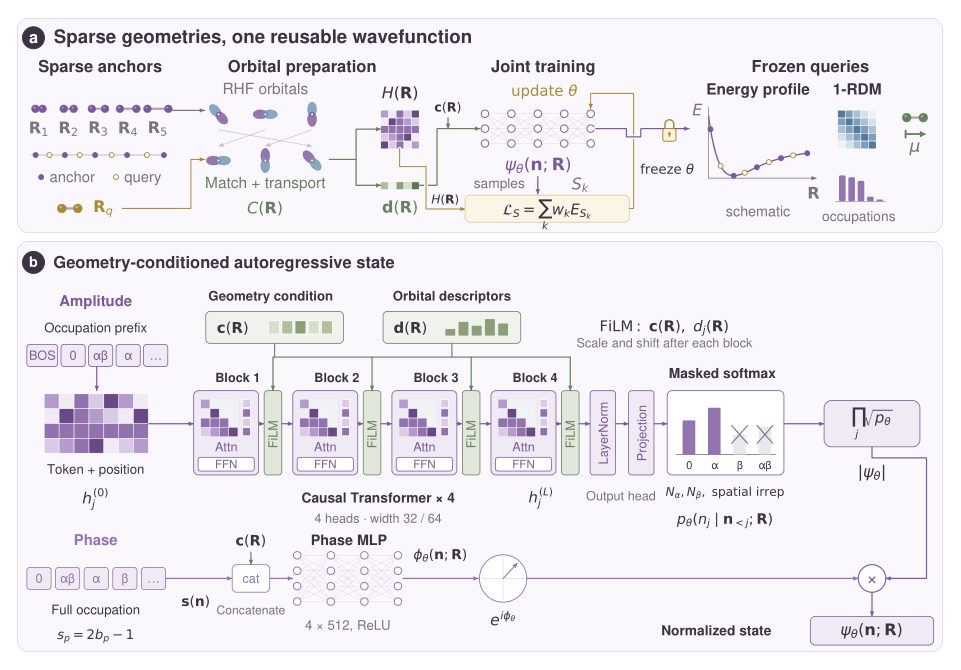
<figcaption class="paper-figure-caption"><b>Fig 1.</b> Figure 1: Geometry-conditioned FNQSs. (a) Starting from sparse anchor geometries, restricted Hartree–Fock (RHF) orbitals are matched and phase-aligned to construct consistent occupation bases and molecular Hamiltonians. Joint variational Monte Carlo (VMC) training produces a shared wavefunction model. At new geometries, the frozen model yields energies and the one-particle reduced density matrix (1-RDM). (b) Occupation prefixes pass through causal Transformer blocks, with geometry and orbital descriptors supplied through feature-wise linear modulation (FiLM), to produce normalized occupation probabilities and hence the wavefunction amplitude. A separate multilayer perceptron (MLP) maps the...</figcaption>
</figure>
<figure class="paper-figure-card">
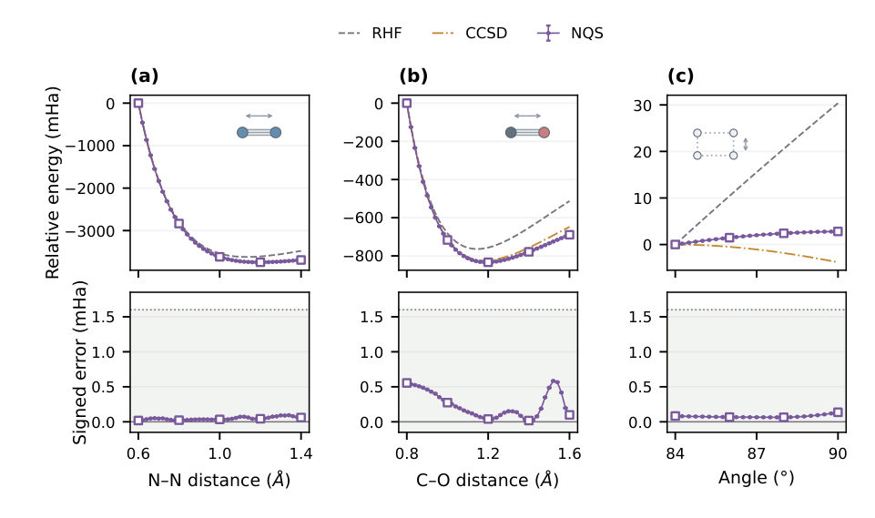
<figcaption class="paper-figure-caption"><b>Fig 2.</b> Figure 2: Potential energy surfaces. (a) N2, (b) CO, and (c) H4. Each panel combines NQS, RHF, and coupled-cluster singles and doubles (CCSD) relative energies (upper) and NQS signed errors against FCI (lower), with the 1.6 mHa band below. Energies are relative to each method’s path origin. CCSD uses a restricted reference. Squares mark anchors, dots queries, and bars one sampling standard error.</figcaption>
</figure>
<figure class="paper-figure-card">
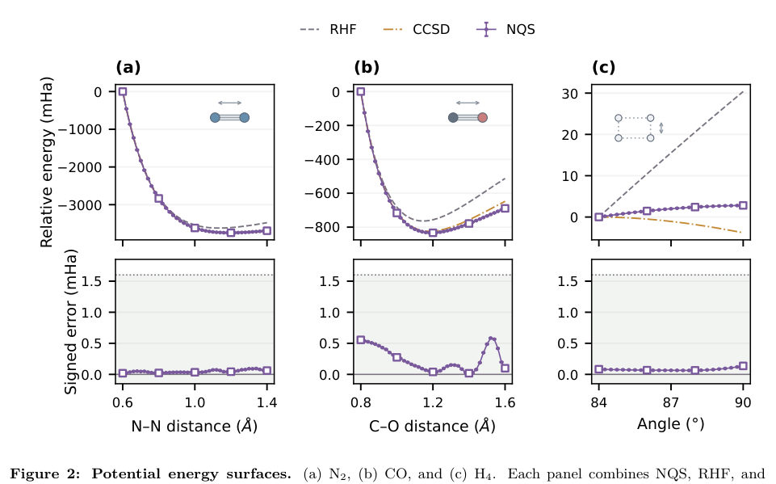
<figcaption class="paper-figure-caption"><b>Fig 3.</b> Fig. 3 compares the errors with unaligned and aligned orbitals along the N2 scan across three paired training seeds. Within each pair, only the orbital basis changes; the architecture, optimizer, and sampling budget are identical. The aligned models predict every untrained geometry within chemical accuracy (query MAE 0.049–0.085 mHa across seeds). The unaligned models fit most anchors but fail between them, with query MAEs of 34–37 mHa and errors above 100 mHa adjacent to anchors; some unaligned runs also miss chemical accuracy at an anchor. The largest failures occur where canonical orbital ordering changes (upper plot in Fig. 3). Alignment removes these artificial discontinuities in the...</figcaption>
</figure>
<figure class="paper-figure-card">
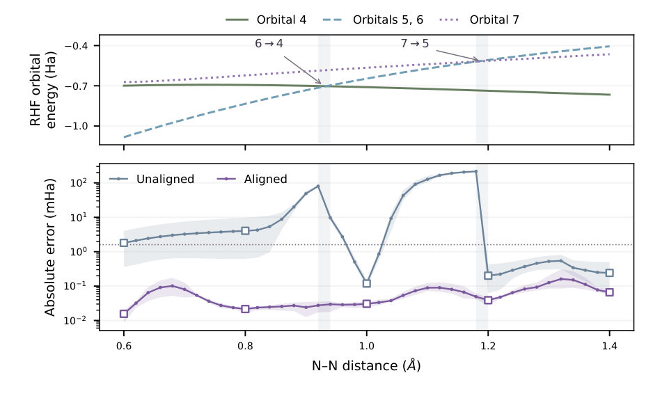
<figcaption class="paper-figure-caption"><b>Fig 4.</b> Figure 3: Orbital alignment. Alignment enables transfer between N2 training anchors. The upper plot tracks aligned RHF orbital energies; the degenerate pair 5/6 is drawn as one curve. Arrows label changes in the canonical indices of the indicated continuous branches. Both plots share the N–N distance axis; vertical bands mark the two orbital-ordering exchanges (0.92–0.94 and 1.18–1.20 Å). The lower plot compares absolute energy errors over three paired seeds: lines show means and colored ribbons the minimum–maximum range. Squares mark anchors, dots queries, and the dotted line 1.6 mHa. Architecture, optimization, and sampling budgets are matched within each pair.</figcaption>
</figure>
<figure class="paper-figure-card">
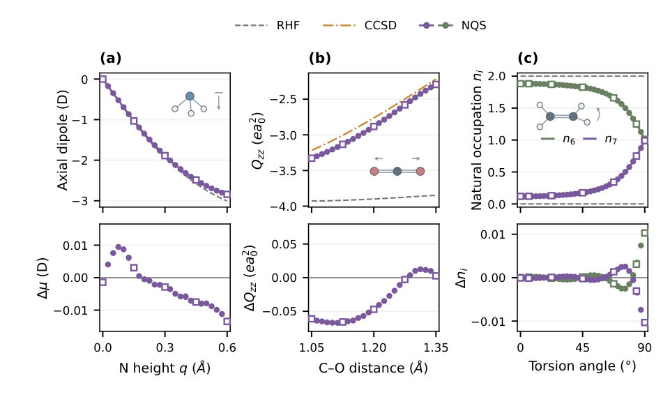
<figcaption class="paper-figure-caption"><b>Fig 5.</b> Figure 4: Electronic properties. (a) NH3 dipole, (b) CO2 quadrupole, and (c) ethylene natural occupations 6/7. Each panel combines the observable (upper) and its NQS-minus-FCI error (lower). Upper curves show NQS estimates connected by solid lines, RHF (dashed), and CCSD (dash-dotted). Circles mark queries, squares anchors, and bars one sampling standard error.</figcaption>
</figure>

**Summary.** This paper introduces Foundation Neural-Network Quantum States (FNQSs) to efficiently calculate molecular Potential Energy Surfaces (PESs) in second quantization. By using a single, geometry-conditioned autoregressive model and implementing orbital alignment, the method achieves chemical accuracy at novel geometries without retraining. This approach drastically reduces the computational cost of mapping complex molecular energy landscapes.

**Why it may be interesting.** This work represents a significant advancement in applying deep learning to quantum chemistry, providing a highly scalable and efficient framework for mapping complex, high-dimensional potential energy surfaces that is directly relevant to molecular dynamics and quantum simulation.

Detailed structure

**Main problem.** The core challenge is developing a method to construct Molecular Potential Energy Surfaces (PESs) by sharing a single, optimized representation of the electronic wavefunction across different molecular geometries, thereby avoiding repeated, expensive variational optimization at every geometry.

**Main result.** The proposed method achieves chemical accuracy at untrained geometries for small molecules and yields massive computational cost reductions (estimated $25.8	imes$ end-to-end GPU-cost reduction) compared to independent optimization.

**Method.** The authors introduce geometry-conditioned Foundation Neural-Network Quantum States (FNQSs) using an autoregressive Transformer architecture to parameterize the wavefunction in second quantization. Orbital alignment is crucial for maintaining basis consistency across geometries.

**Model / system.** The system is molecular electronic structure, treated in second quantization using an occupation-basis model. The Hamiltonian is parameterized, and the state $|\Psi_	heta(R)
angle$ is learned by conditioning the autoregressive network on the molecular geometry $R$ and aligned orbital descriptors.

**Key observables.** Electronic energies (PES), dipoles, quadrupoles, and natural occupations.

**Important parameters / regimes.** Chemical accuracy threshold (1.6 mHa), Mean Absolute Error (MAE) values (down to 0.049-0.085 mHa), and computational cost reduction factors ($\sim 25.8	imes$).

**Assumptions / limitations.** The method assumes that orbital identities and phases can be consistently aligned and transported across different geometries to ensure a shared, continuous basis representation.

**Figures summary.** Figures illustrate the process of orbital matching and phase alignment; comparisons show energy errors for various molecules ($	ext{N}_2$, $	ext{CO}$, $	ext{H}_4$) across different training/conditioning strategies, highlighting the necessity of alignment and descriptor conditioning.

**Paper structure.** The paper introduces the FNQS architecture, details the necessity of orbital alignment for basis transport, presents results showing high accuracy on PESs at untrained geometries, and quantifies the massive computational savings achieved by this shared representation.

Abstract

Second-quantized neural-network quantum states have achieved accurate molecular energies, but extending them across molecular geometries requires a shared representation of the geometry-dependent wavefunction coefficients. We introduce geometry-conditioned foundation neural-network quantum states for molecular electronic structure in second quantization. A single autoregressive model learns a family of ground states from sparse anchor geometries and provides wavefunctions at untrained geometries without further optimization. Orbital alignment matches orbital identities and transports their phases, establishing an aligned orbital basis across geometries. Frozen energies reach chemical accuracy at every untrained query geometry for N$_2$, CO, and H$_4$. On additional molecular paths, the energy-trained wavefunctions yield dipoles, quadrupoles, and natural occupations without property labels. Across three paired N$_2$ training seeds, orbital alignment lowers the mean absolute energy error over all untrained query geometries from 34-37 mHa to 0.049-0.085 mHa. At approximately 1 mHa mean absolute error, frozen evaluation reduces the per-geometry cost by $986\times$ relative to independent optimization, yielding an estimated $25.8\times$ end-to-end GPU-cost reduction on a 161-point N$_2$ grid.

[↑ back to top](#top)

### [From Chemical Complexity to Tunable Magnetic Ordering in Highly Disordered High-Entropy Spinel Oxides](http://arxiv.org/abs/2609.37792v1)

**Authors:** Neha Sharma, Sushanta Mandal, Nikita Sharma, Amritpal, Sangeeta Thakur, Viktor Ukleev, Chen Luo, Florin Radu, S. D. Kaushik, Tirthankar Chakraborty, Sanjoy Kr. Mahatha, Denis Pelloquin, Sourav Marik  
**Type:** both · **Category:** strongly correlated electrons · **PDF:** <https://arxiv.org/pdf/2609.37792v1>  
**Analysis basis:** full PDF text, analyzed in chunks

↔ Scroll figures horizontally

<figure class="paper-figure-card">
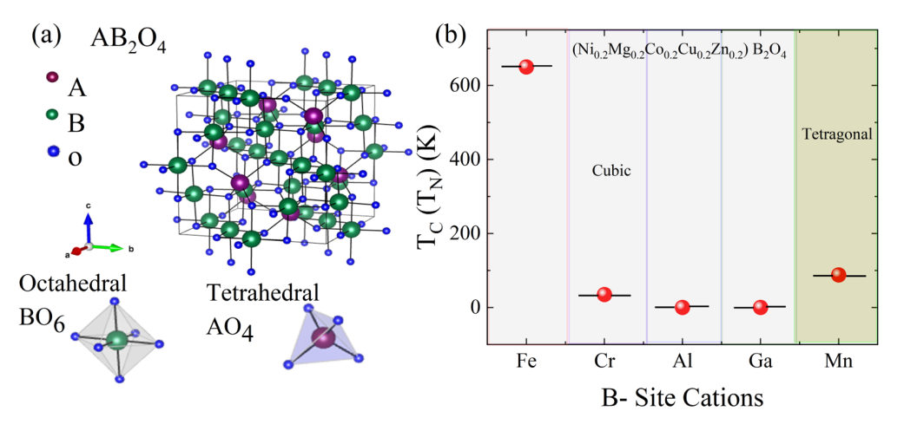
<figcaption class="paper-figure-caption"><b>Fig 1.</b> FIG. 1. (a) Crystal structure of cubic spinel AB2O4 structure. (b) Magnetic transition temperatures and crystal structures for (Ni0.2Mg0.2Co0.2Cu0.2Zn0.2)B2O4 materials, where B = Cr, Fe, Al, Ga, and Mn. Magnetic transition temperatures for single B-site compositions are taken from ref [10–12]</figcaption>
</figure>
<figure class="paper-figure-card">
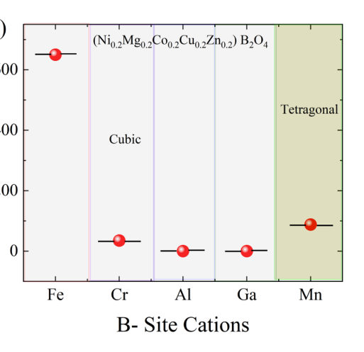
<figcaption class="paper-figure-caption"><b>Fig 2.</b> Figure 2(a) presents the room-temperature X- ray diffraction (RT-XRD) patterns for the spinel- type high-entropy oxides with nominal com- positions of (Ni0.2Mg0.2Co0.2Cu0.2Zn0.2)B2O4, where B = Cr, Mn0.5Cr0.5, Mn0.33Cr0.33Fe0.33, Mn0.25Cr0.25Fe0.25Ga0.25, and Mn0.2Cr0.2Fe0.2Ga0.2Ti0.2. The XRD patterns for single B-site compositions (B = Fe, Ga, Al, Mn) are provided in the supporting information (SI, Figure S1) file. All diffraction patterns confirm the formation of phase-pure materials. Rietveld refinement of the RT-XRD reveals that all compositions crystallize in the cubic spinel structure with space group Fd3m. Figure 2(b) illustrates the evolution of the lattice parameter as a function...</figcaption>
</figure>
<figure class="paper-figure-card">
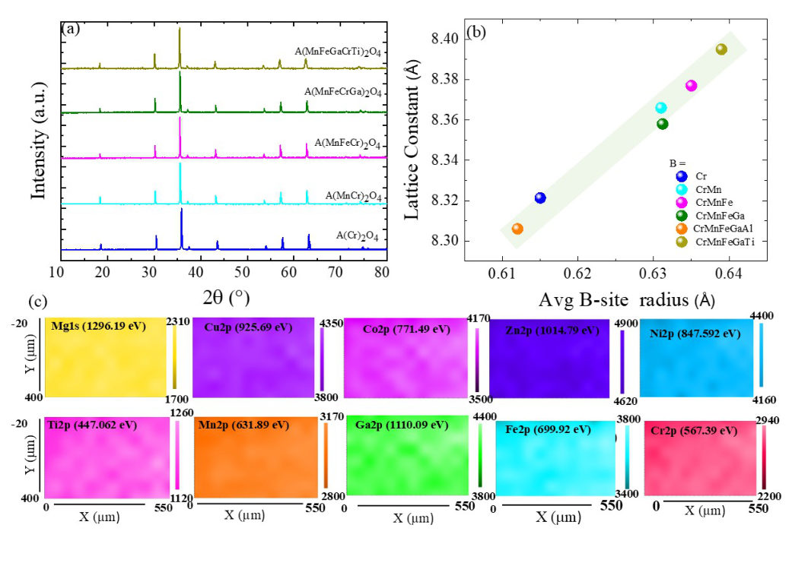
<figcaption class="paper-figure-caption"><b>Fig 3.</b> FIG. 2. (a) Room temperature X-ray diffraction patterns for (Ni0.2Mg0.2Co0.2Cu0.2Zn0.2)B2O4 materials, where B = Cr, Mn0.5Cr0.5, Mn0.33Cr0.33Fe0.33, Mn0.25Cr0.25Fe0.25Ga0.25, and Mn0.2Cr0.2Fe0.2Ga0.2Ti0.2. (b) Variation of lattice constant (a = b = c) with average B-site cationic radius. A monotonic increase in the lattice constant is observed with increasing average B-site ionic radius, consistent with Vegard’s law. (c) Room-temperature X-ray photoelectron spectroscopy (XPS) mapping for compositionally most complex sample, (Ni0.2Mg0.2Co0.2Cu0.2Zn0.2)(Cr0.2Mn0.2Fe0.2Ga0.2Ti0.2)2 O4, performed with a 50 µm spot size, reveals a uniform spatial distribution of all constituent elements.</figcaption>
</figure>
<figure class="paper-figure-card">
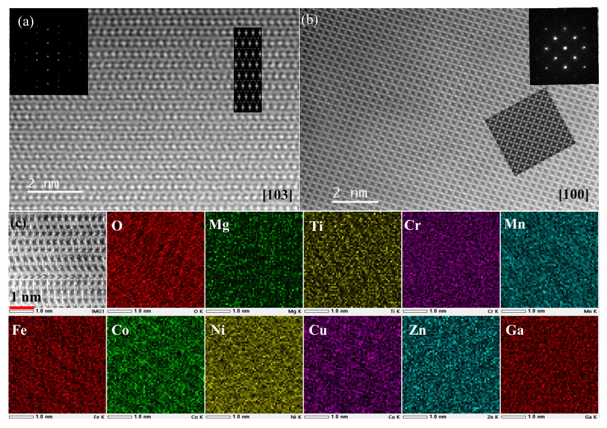
<figcaption class="paper-figure-caption"><b>Fig 4.</b> FIG. 3. Room-temperature high-angle annular dark-field Scanning Transmission Electron Microscopy (HAADF- STEM) image acquired along the (a) [103] and (b) [100] zone axis for compositionally most complex sample, (Ni0.2Mg0.2Co0.2Cu0.2Zn0.2)(Cr0.2Mn0.2Fe0.2Ga0.2Ti0.2)2 O4. The corresponding fast Fourier transform (FFT) pattern exhibits distinct reflections consistent with cubic symmetry. Simulated HAADF-STEM images, shown alongside the experimental data, further support the structural feature. The periodic lattice arrangements are in excellent agreement with the expected cation distribution in a spinel lattice, indicating that the high configurational disorder does not disrupt the long-range...</figcaption>
</figure>
<figure class="paper-figure-card">
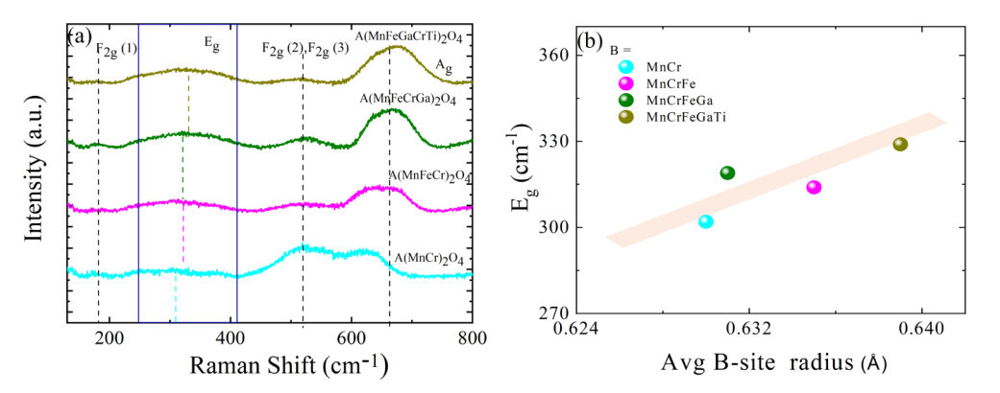
<figcaption class="paper-figure-caption"><b>Fig 5.</b> FIG. 4. Room temperature Raman spectra for (Ni0.2Mg0.2Co0.2Cu0.2Zn0.2)B2O4 materials, where B = Mn0.5Cr0.5, Mn0.5Fe0.5, Mn0.33Cr0.33Fe0.33, Mn0.25Cr0.25Fe0.25Ga0.25, and Mn0.2Cr0.2Fe0.2Ga0.2Ti0.2. In agreement with the cubic spinel oxides, all the samples exhibit five Raman-active modes. (b) Variation in octahedra-linked Eg modes with the average radius of the B-site cations.</figcaption>
</figure>

**Summary.** This work demonstrates that high-entropy spinel oxides maintain robust, long-range ferrimagnetic ordering despite extreme chemical disorder. By systematically varying the cation composition, the researchers found that the magnetic transition temperature ($T_C$) follows a simple, predictable linear average. This establishes a powerful, disorder-driven pathway for tuning magnetic properties in complex functional oxides.

**Why it may be interesting.** The concept of emergent, predictable magnetic order arising from quenched, high-entropy disorder is highly relevant to understanding complex magnetic ground states in strongly correlated materials, suggesting new design rules beyond simple superexchange models.

Detailed structure

**Main problem.** The study investigates how extreme configurational disorder, induced by high-entropy stabilization, affects the magnetic ordering in spinel oxides.

**Main result.** Robust, long-range ferrimagnetic ordering is observed, and the magnetic transition temperature ($T_C$) exhibits a predictable, linear, arithmetic average dependence on the constituent single-site systems.

**Method.** The research combines structural characterization (XRD, STEM) with advanced magnetic measurements (XMCD, Neutron Powder Diffraction) and theoretical modeling (mean-field approximations).

**Model / system.** The system is spinel-type high-entropy oxides, $	ext{AB}_2	ext{O}_4$, where both the A and B sites are composed of multiple randomly distributed principal cations. The magnetic behavior is analyzed using mean-field theory.

**Key observables.** Magnetic transition temperature ($T_C$), total angular momentum ($J$), magnetic moments ($\mu_B$), and the magnetic structure determined via NPD.

**Important parameters / regimes.** Compositional fractions ($p_i$), temperature ($T$), and the average exchange interaction ($	ext{J}_{	ext{ex}}$).

**Assumptions / limitations.** The magnetic ordering is explained within a mean-field framework, assuming the exchange interaction is governed by an effective, averaged interaction across the disordered lattice.

**Figures summary.** Figures show structural confirmation (Vegard's law, STEM homogeneity), magnetic measurements (FC magnetization vs. T), and NPD patterns confirming long-range magnetic order at low temperatures.

**Paper structure.** The paper progresses from establishing the structural stability of the high-entropy phase to characterizing the magnetic response using multiple techniques, culminating in the demonstration of predictable, long-range ferrimagnetism despite extreme disorder.

Abstract

High-entropy stabilization chemistry is redefining materials design by transforming configurational disorder, arising from the deliberate incorporation of multiple principal cations, into a thermodynamic advantage that promotes phase stability and enables emergent functionalities. In this work, we investigate the evolution of magnetic ordering in spinel-type high entropy oxides by systematically varying the cation composition of the B site within a fixed high-entropy A-site matrix, (Ni$_{0.2}$Mg$_{0.2}$Co$_{0.2}$Cu$_{0.2}$Zn$_{0.2}$)B$_2$O$_4$. Upon introducing multicomponent B-site configurations, we uncover a strikingly linear dependence of the magnetic transition temperature (T$_C$) on the T$_C$s of the corresponding single B-site high-entropy systems. Remarkably, this trend persists even in highly complex (Ni$_{0.2}$Mg$_{0.2}$Co$_{0.2}$Cu$_{0.2}$Zn$_{0.2}$)(Cr$_{0.2}$Mn$_{0.2}$Fe$_{0.2}$Ga$_{0.2}$X$_{0.2}$)$_2$O$_4$, X = Al and Ti. Despite the material's extremely high degree of disorder, absence of a dominant magnetic ion or a straightforward superexchange pathway, detailed magnetization measurements, low-temperature X-ray magnetic circular dichroism, and neutron powder diffraction studies reveal robust long-range ferrimagnetic ordering. These results reveal an emergent predictability in ferrimagnetic high-entropy spinel oxides, where, despite extreme configurational disorder and competing interactions, robust ferrimagnetic order can arise from, rather than be hindered by, extreme configurational disorder. This establishes a pathway for predictively tuning magnetic transition temperatures in high-entropy oxides beyond conventional ordered systems.

[↑ back to top](#top)

### [From Classical to Quantum Channels: Achieving Positive Covert Rates](http://arxiv.org/abs/2609.36162v1)

**Authors:** Hassan ZivariFard, Xiaodong Wang, Alexei Ashikhmin  
**Type:** theory · **Category:** quantum information and computing · **PDF:** <https://arxiv.org/pdf/2609.36162v1>  
**Analysis basis:** full PDF text, analyzed in chunks

↔ Scroll figures horizontally

<figure class="paper-figure-card">
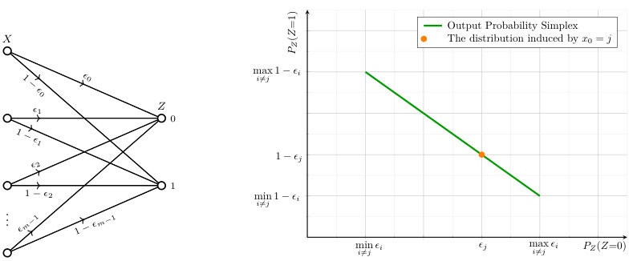
<figcaption class="paper-figure-caption"><b>Fig 1.</b> Fig. 2: A general binary-output DMC with WZ|X(0|i) = ϵi and WZ|X(1|i) = 1 −ϵi, for i ∈[0:m −1],</figcaption>
</figure>
<figure class="paper-figure-card">
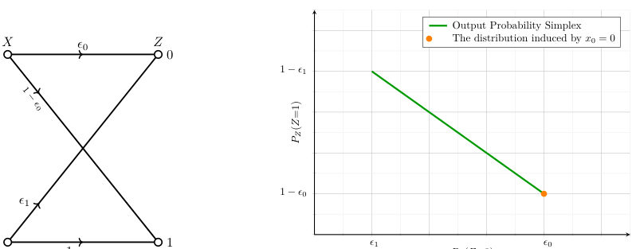
<figcaption class="paper-figure-caption"><b>Fig 2.</b> Fig. 3: A general binary-input, binary-output DMC and the set of all output distributions induced by</figcaption>
</figure>
<figure class="paper-figure-card">

<figcaption class="paper-figure-caption"><b>Fig 3.</b> Fig. 4: A general ternary-input, binary-output DMC and the set of all output distributions induced by</figcaption>
</figure>
<figure class="paper-figure-card">
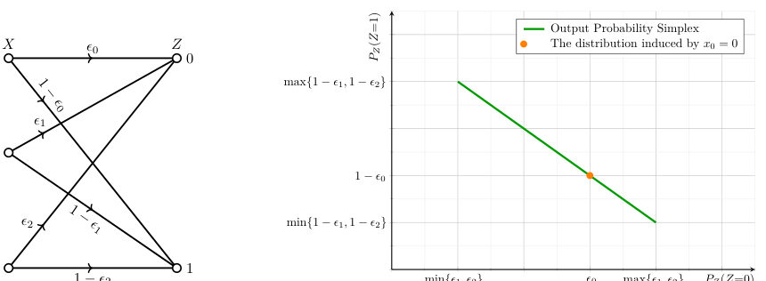
<figcaption class="paper-figure-caption"><b>Fig 4.</b> Fig. 4 and consider a binary-output DMC with an input alphabet of size four, as depicted in Fig. 5</figcaption>
</figure>
<figure class="paper-figure-card">
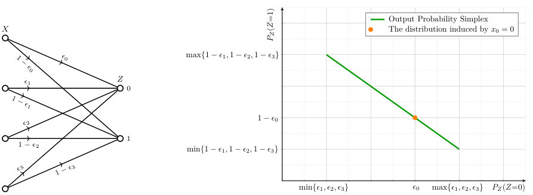
<figcaption class="paper-figure-caption"><b>Fig 5.</b> Fig. 5: A general quaternary-input, binary-output DMC and the set of all output distributions induced by</figcaption>
</figure>

**Summary.** This paper rigorously determines the conditions required for achieving positive covert communication rates across classical, classical-quantum, and quantum channels. It establishes necessary and sufficient conditions using geometric and information-theoretic tools, showing that channel structure dictates the achievable secrecy capacity. The findings generalize fundamental limits for secure communication in modern quantum information theory.

**Why it may be interesting.** This work provides fundamental information-theoretic bounds on secrecy and detectability in quantum communication, which is crucial for designing secure quantum networks and understanding the limits of quantum key distribution.

Detailed structure

**Main problem.** The paper investigates the fundamental conditions under which positive covert communication rates can be achieved across various communication channels, including classical, classical-quantum, and fully quantum settings.

**Main result.** Positive covert rates are achievable under specific geometric conditions related to the dimensions of input and output probability simplices, and the analysis shows that mixing the innocent state can guarantee feasibility for quantum channels.

**Method.** The analysis employs geometric interpretations of the covertness constraint, utilizing concepts like the dimension of probability simplices, mutual information, and trace distance bounds derived from random coding techniques.

**Model / system.** The study models communication over Discrete Memoryless Channels (DMCs), encompassing point-to-point, Multiple-Access Channels (MACs), classical-quantum, and general quantum channels.

**Key observables.** Covert communication rate, channel input/output probability simplices, and the trace distance between the actual and innocent output states.

**Important parameters / regimes.** The dimensionality of the input vs. output probability simplices, and the rate pair $(R, R_K)$ for covert capacity.

**Assumptions / limitations.** The analysis often relies on the assumption that the innocent symbol/state can be chosen appropriately, and it contrasts with known limitations like the square-root law for certain channels.

**Figures summary.** Figures illustrate the concept of covert communication over point-to-point channels and show the structure of the output probability simplex for binary-output DMCs.

**Paper structure.** The paper develops results sequentially, first for classical point-to-point channels, then extending to MACs and classical-quantum settings, culminating in a detailed analysis of the covertness constraint for general quantum channels.

Abstract

In this paper, we study the conditions under which covert communication at positive rates is feasible over discrete memoryless classical, classical-quantum, and quantum channels. For classical point-to-point channels, we show that if the dimension of the channel input probability simplex exceeds that of the channel output probability simplex, equivalently, if the input alphabet has larger cardinality than the output alphabet, then positive covert rates are achievable for certain classes of Discrete Memoryless Channels (DMCs). We further show that allowing the innocent symbol (i.e., the symbol transmitted in the no-communication mode) to be chosen appropriately can enlarge the class of DMCs for which positive covert rates are achievable. We also study covert communication over classical Multiple-Access Channels (MACs), where the additional transmitter effectively enlarges the set of available channel input pairs, and we show that the conditions required to satisfy the covertness constraint are less restrictive for MACs than for point-to-point channels. We extend these results to classical-quantum DMCs by showing that if the dimension of the input probability simplex exceeds the affine dimension of the set of output states that can be induced at the channel output, then positive covert rates are achievable for certain classes of classical-quantum DMCs. Finally, for quantum channels, we show that if the innocent state (i.e., the state transmitted in the no-communication mode) is mixed, then the covertness constraint can always be satisfied by a non-trivial input ensemble. Consequently, positive covert rates are achievable whenever the legitimate receiver can distinguish at least two states in a suitable such ensemble.

[↑ back to top](#top)

### [From Projected Subspaces to Full-Space Implementations: Representation-Equivalence Audits for Open-Shell ADAPT-VQE](http://arxiv.org/abs/2609.36060v1)

**Authors:** Lucia Malíčková, Petr Klenovský  
**Type:** theory · **Category:** strongly correlated electrons · **PDF:** <https://arxiv.org/pdf/2609.36060v1>  
**Analysis basis:** full PDF text, analyzed in chunks

↔ Scroll figures horizontally

<figure class="paper-figure-card">
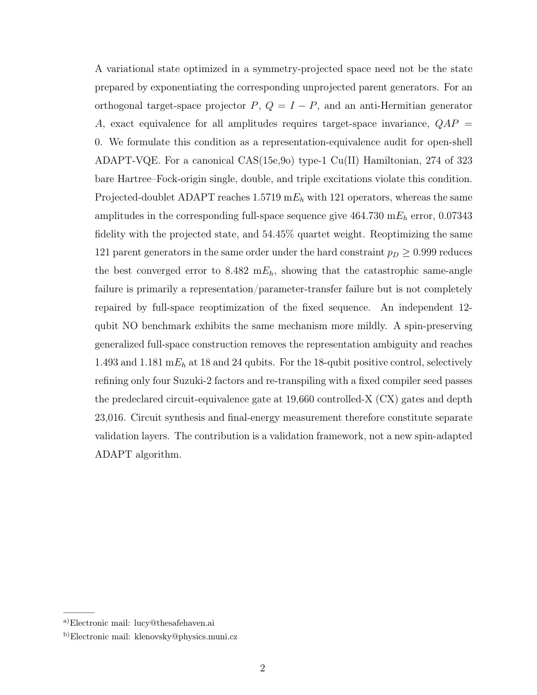
<figcaption class="paper-figure-caption"><b>Fig 1.</b> Low-resolution page preview, page 2</figcaption>
</figure>
<figure class="paper-figure-card">
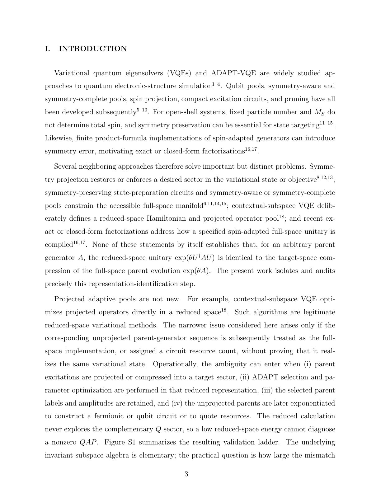
<figcaption class="paper-figure-caption"><b>Fig 2.</b> Low-resolution page preview, page 3</figcaption>
</figure>
<figure class="paper-figure-card">
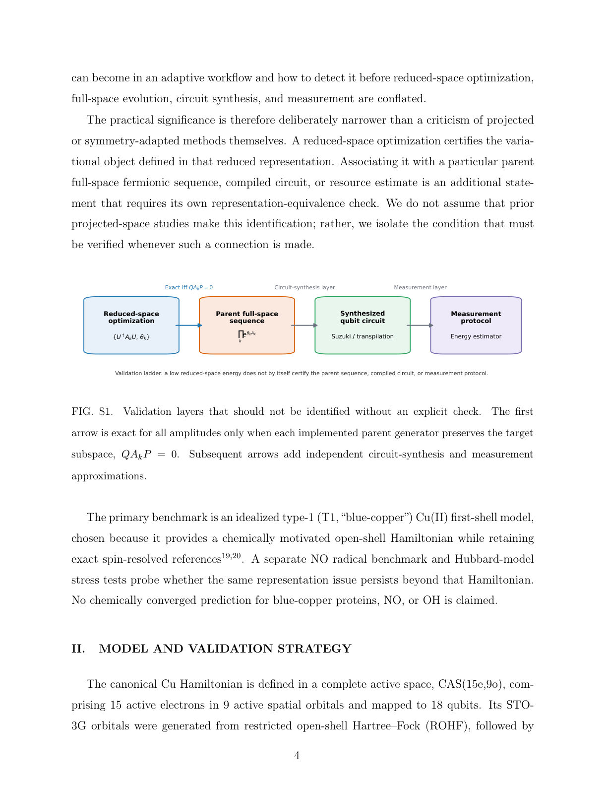
<figcaption class="paper-figure-caption"><b>Fig 3.</b> Low-resolution page preview, page 4</figcaption>
</figure>
<figure class="paper-figure-card">
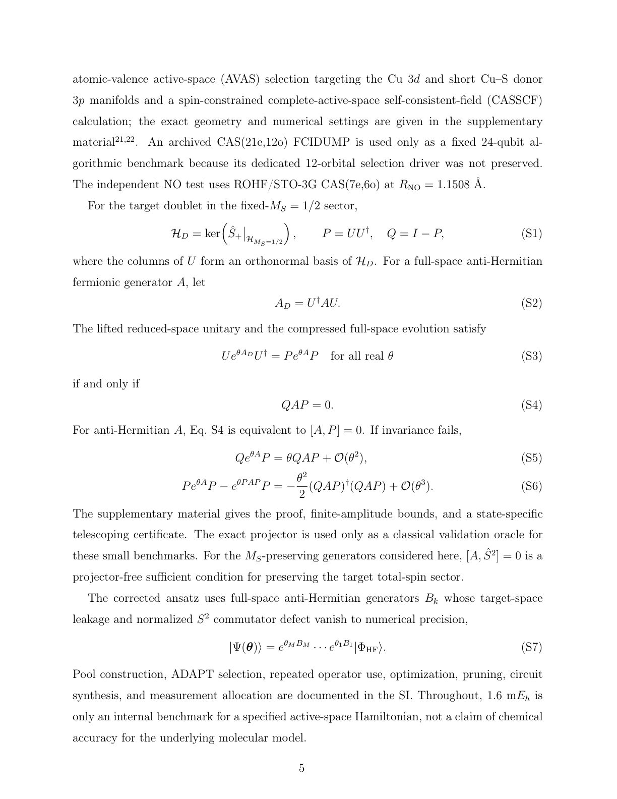
<figcaption class="paper-figure-caption"><b>Fig 4.</b> Low-resolution page preview, page 5</figcaption>
</figure>
<figure class="paper-figure-card">
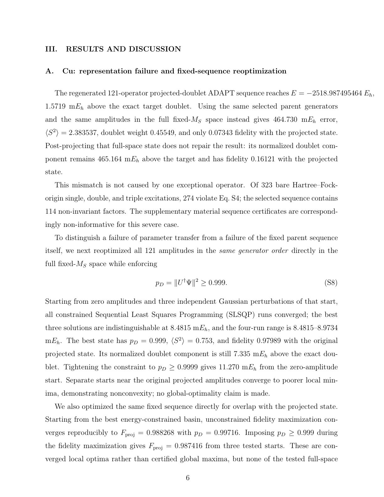
<figcaption class="paper-figure-caption"><b>Fig 5.</b> Low-resolution page preview, page 6</figcaption>
</figure>

**Summary.** This work develops a rigorous validation framework to audit the equivalence between quantum states optimized in symmetry-projected subspaces and their full-space parent generators. By testing Cu(II) and NO systems, the authors show that parameter transfer from reduced to full space often fails catastrophically. The key takeaway is that quantum simulation requires validating not just the energy, but the entire computational pipeline: the state representation, the generating sequence, the circuit compilation, and the final measurement.

**Why it may be interesting.** It provides crucial methodological rigor for quantum chemistry simulations, warning that simply minimizing energy in a restricted basis is insufficient proof of the underlying physical state when mapping to quantum hardware circuits.

Detailed structure

**Main problem.** The paper audits the representation equivalence between a quantum state optimized in a symmetry-projected subspace and the state generated by exponentiating the corresponding unprojected parent generators in the full Hilbert space.

**Main result.** The study demonstrates that low energy achieved in a reduced-space optimization does not guarantee the correct full-space circuit implementation, requiring explicit representation-equivalence checks.

**Method.** The authors use ADAPT-VQE within a 'validation ladder' framework, comparing results from projected ansätze against full-space reoptimization and circuit synthesis.

**Model / system.** The calculations are performed on open-shell electronic structure problems, specifically using a canonical CAS(15e,9o) type-1 Cu(II) Hamiltonian, and are extended to larger NO systems.

**Key observables.** Energy error ($	ext{mEh}$), projected fidelity, quartet weight, and the violation of the representation-equivalence condition ($	ext{QAP}=0$).

**Important parameters / regimes.** The comparison involves comparing results from projected-doublet ADAPT to full-space sequences, and later testing 18- and 24-qubit NO systems.

**Assumptions / limitations.** The primary assumption is that the reduced-space optimization only certifies the variational object within that subspace, necessitating external validation for the full circuit.

**Figures summary.** Figures illustrate the 'Validation ladder' showing multiple independent validation steps are necessary, and show energy error convergence for Cu and NO systems under different compilation schedules.

**Paper structure.** The paper progresses by first establishing the theoretical condition for equivalence ($	ext{QAP}=0$), demonstrating failures using the Cu(II) Hamiltonian, then showing improvements via constrained reoptimization, and finally extending the validation to larger, more complex qubit systems (NO).

Abstract

A variational state optimized in a symmetry-projected space need not be the state prepared by exponentiating the corresponding unprojected parent generators. For an orthogonal target-space projector $P$, $Q=I-P$, and an anti-Hermitian generator $A$, exact equivalence for all amplitudes requires target-space invariance, $QAP=0$. We formulate this condition as a representation-equivalence audit for open-shell ADAPT-VQE. For a canonical CAS(15e,9o) type-1 Cu(II) Hamiltonian, 274 of 323 bare Hartree--Fock-origin single, double, and triple excitations violate this condition. Projected-doublet ADAPT reaches 1.5719 m$E_h$ with 121 operators, whereas the same amplitudes in the corresponding full-space sequence give 464.730 m$E_h$ error, 0.07343 fidelity with the projected state, and 54.45\% quartet weight. Reoptimizing the same 121 parent generators in the same order under the hard constraint $p_D\ge0.999$ reduces the best converged error to 8.482 m$E_h$, showing that the catastrophic same-angle failure is primarily a representation/parameter-transfer failure but is not completely repaired by full-space reoptimization of the fixed sequence. An independent 12-qubit NO benchmark exhibits the same mechanism more mildly. A spin-preserving generalized full-space construction removes the representation ambiguity and reaches 1.493 and 1.181 m$E_h$ at 18 and 24 qubits. For the 18-qubit positive control, selectively refining only four Suzuki-2 factors and re-transpiling with a fixed compiler seed passes the predeclared circuit-equivalence gate at 19,660 controlled-X (CX) gates and depth 23,016. Circuit synthesis and final-energy measurement therefore constitute separate validation layers. The contribution is a validation framework, not a new spin-adapted ADAPT algorithm.

[↑ back to top](#top)

### [Near-Optimal Parallel Unitary Process Tomography in Diamond Distance](http://arxiv.org/abs/2609.36127v1)

**Authors:** Noam Scully, Sisi Zhou  
**Type:** theory · **Category:** quantum information and computing · **PDF:** <https://arxiv.org/pdf/2609.36127v1>  
**Analysis basis:** full PDF text, analyzed in chunks

↔ Scroll figures horizontally

<figure class="paper-figure-card">
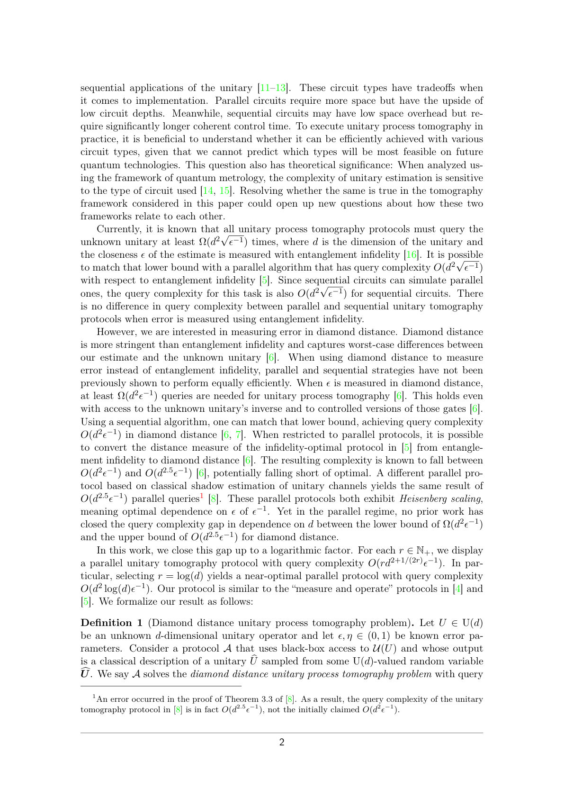
<figcaption class="paper-figure-caption"><b>Fig 1.</b> Low-resolution page preview, page 2</figcaption>
</figure>
<figure class="paper-figure-card">
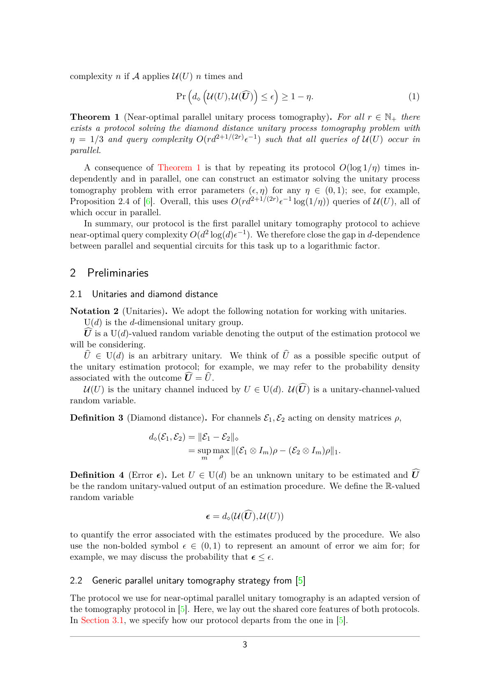
<figcaption class="paper-figure-caption"><b>Fig 2.</b> Low-resolution page preview, page 3</figcaption>
</figure>
<figure class="paper-figure-card">
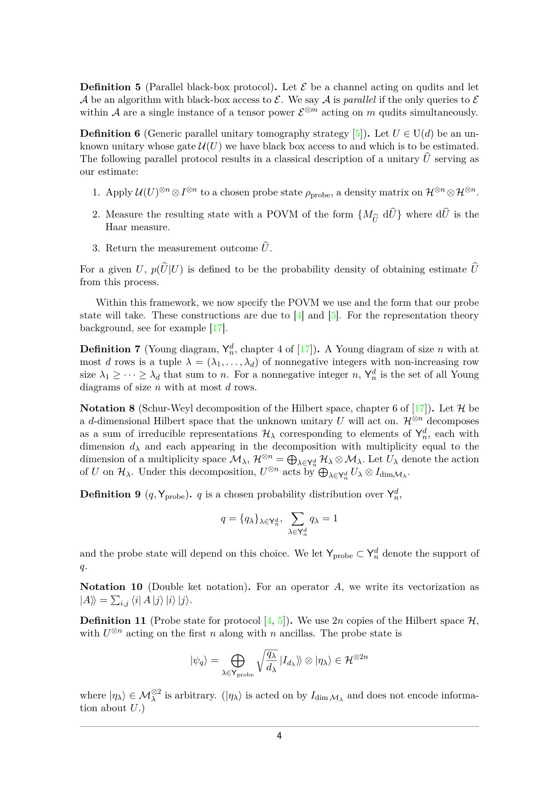
<figcaption class="paper-figure-caption"><b>Fig 3.</b> Low-resolution page preview, page 4</figcaption>
</figure>
<figure class="paper-figure-card">
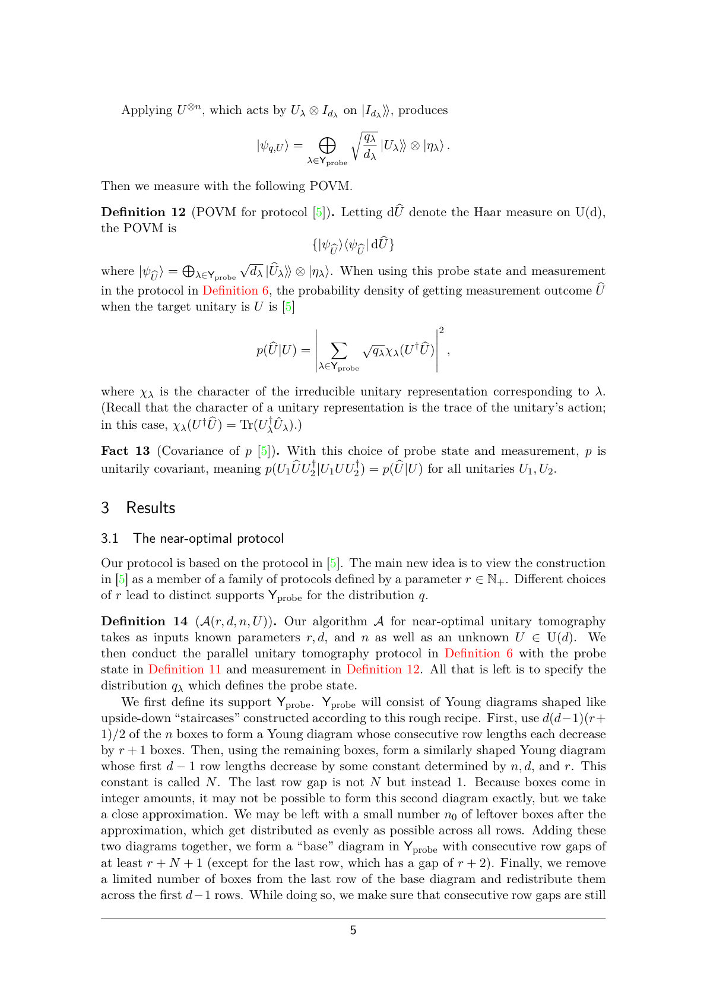
<figcaption class="paper-figure-caption"><b>Fig 4.</b> Low-resolution page preview, page 5</figcaption>
</figure>
<figure class="paper-figure-card">
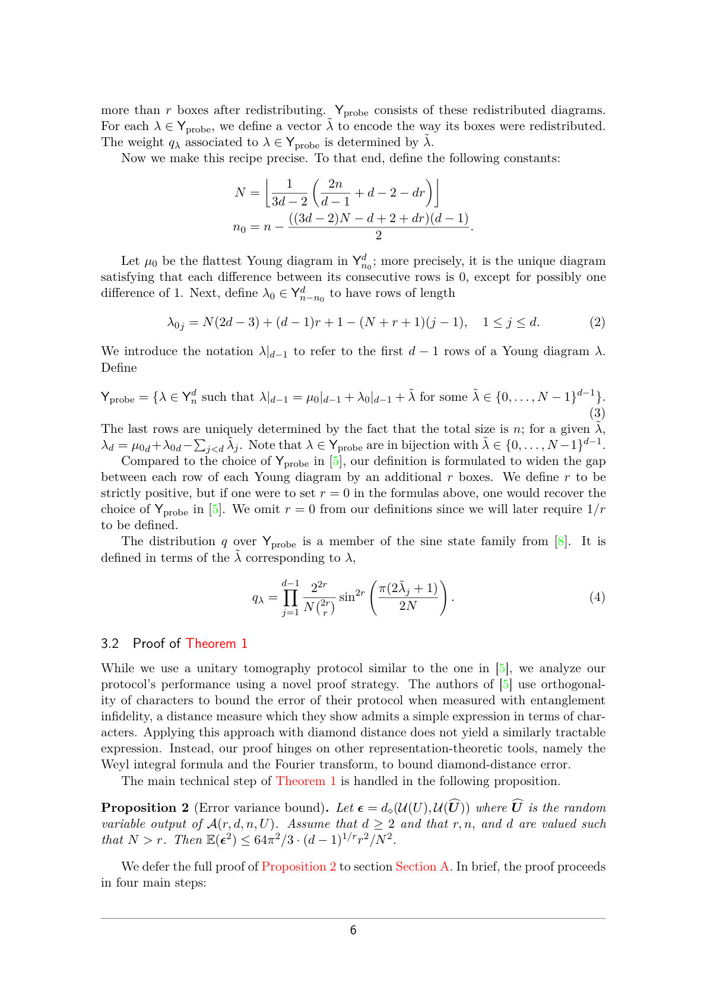
<figcaption class="paper-figure-caption"><b>Fig 5.</b> Low-resolution page preview, page 6</figcaption>
</figure>

**Summary.** This paper develops a novel, explicit parallel circuit protocol for unitary process tomography, demonstrating that its resource requirements are nearly equivalent to the best sequential methods. By closing the gap between parallel and sequential circuit complexity up to a logarithmic factor, it significantly improves our understanding of the computational overhead for characterizing quantum gates.

**Why it may be interesting.** This work directly impacts the resource estimation for quantum computation, providing concrete, improved bounds for implementing quantum gates, which is fundamental to quantum information theory.

Detailed structure

**Main problem.** The paper addresses the challenge of performing unitary process tomography—determining an unknown unitary gate $U$—with near-optimal query complexity.

**Main result.** It proves the existence of a novel parallel circuit protocol that achieves a query complexity only logarithmically worse than the best known sequential protocol, closing a major gap in resource estimation.

**Method.** The authors employ advanced mathematical tools, including the Weyl integral formula and Fourier analysis on the torus, to bound the error variance in the diamond distance.

**Model / system.** The system involves a $d$-dimensional unitary operator $U \in U(d)$ acting on a quantum system. The tomography is measured using the diamond distance, $d_{\diamond}$, which quantifies the error between the estimated and true process.

**Key observables.** The primary observable is the error $\epsilon = d_{\diamond}(U(U), U(c_U))$, and the complexity is measured by the required number of queries (the circuit depth/size).

**Important parameters / regimes.** Key parameters include the dimension $d$, the error tolerance $\epsilon$, and the parameter $r$ used to construct the parallel protocol.

**Assumptions / limitations.** The analysis heavily relies on the unitarily covariant nature of the diamond distance and the use of specific mathematical techniques like the Weyl integral formula and Fourier decomposition.

**Paper structure.** The paper establishes the problem, compares sequential vs. parallel resource bounds, and then develops the novel parallel protocol $A(r, d, n, U)$ whose error variance is bounded using Fourier analysis techniques.

Abstract

Unitary process tomography is the act of learning how an unknown unitary gate acts on a quantum system. It is an essential procedure for realizing a functioning quantum computer. As quantum technologies develop, it is important to understand the computational resources needed to conduct unitary process tomography using a variety of types of circuits. In particular, when measuring error in diamond distance, it is known how to achieve optimal query complexity using a sequential circuit architecture, but it had not been known whether a parallel circuit architecture could achieve the same optimal query complexity. In this work, we prove that unitary process tomography with near-optimal query complexity is indeed possible using a parallel circuit by introducing an explicit, novel parallel procedure. This closes the gap between sequential and parallel circuits up to a logarithmic factor, showing that parallel and sequential strategies are nearly equally capable for this task.

[↑ back to top](#top)

### [Near-Optimal Quantum Algorithm and Complexity Analysis for Riccati Problems](http://arxiv.org/abs/2609.37207v1)

**Authors:** Jingyao Wang, Yanqiao Wang, Bowen Li, Jin-Peng Liu, Zhengfeng Ji  
**Type:** theory · **Category:** quantum information and computing · **PDF:** <https://arxiv.org/pdf/2609.37207v1>  
**Analysis basis:** full PDF text, analyzed in chunks

↔ Scroll figures horizontally

<figure class="paper-figure-card">
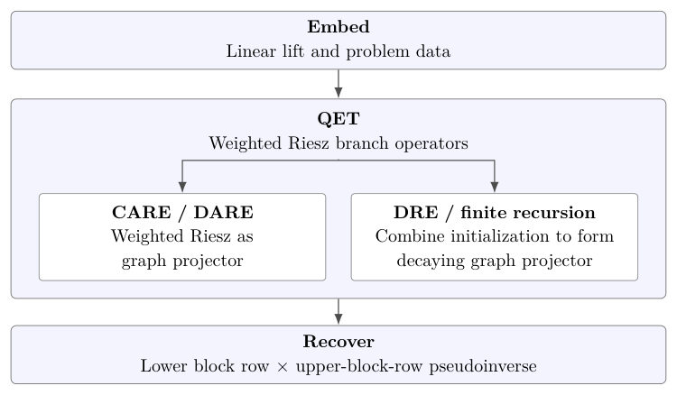
<figcaption class="paper-figure-caption"><b>Fig 1.</b> Figure 1: The Quantum Weighted Riesz Method. The QET stage constructs weighted Riesz branch operators. DREs and finite recursions combine these operators with initial data to form a decaying graph projector (DGP); CARE and DARE directly construct the limiting Riesz projector. Both routes use the same block-row recovery to return a block-encoding of the Riccati solution, with explicit output normalization and operator-norm error bounds under the stated assumptions.</figcaption>
</figure>
<figure class="paper-figure-card">
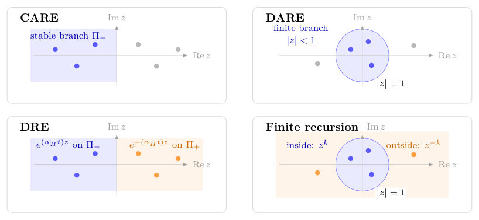
<figcaption class="paper-figure-caption"><b>Fig 2.</b> Figure 2: Spectral branches and weights in the QET stage. The top panels select the blue stable branches for CARE and DARE; gray points are unselected. The bottom panels include both blue and orange branches, with forward weights on the left or inside and inverse weights on the right or outside. Points are schematic spectral locations, and each circle marks |z| = 1; the DRE weights use b HDRE = HDRE/αH.</figcaption>
</figure>
<figure class="paper-figure-card">

<figcaption class="paper-figure-caption"><b>Fig 3.</b> Figure 3: Classical closed-loop response with n = 64 and 104 nodes per contour under the common settings of Appendix G.5. (a) State norm. (b) Scalar control. Open circles without connecting lines show Our Algorithm; dashed curves show Reference LQR. One circle is displayed every 25 samples. The algorithm uses cubic-spline interpolation of 161 Riccati evaluations; the reference uses the independent closed-form solution. Each trajectory stores all 401 sampled values. Amplitude estimation is not simulated.</figcaption>
</figure>
<figure class="paper-figure-card">
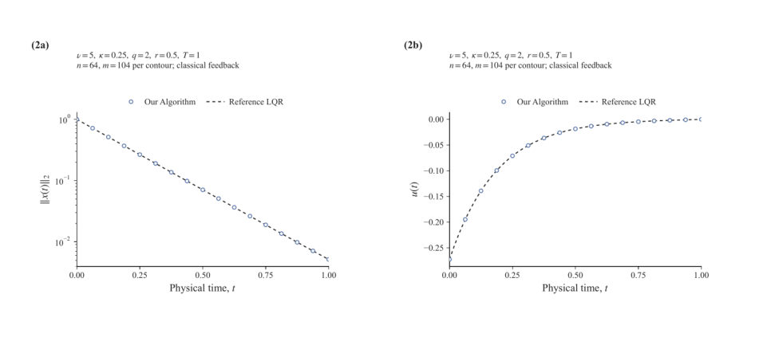
<figcaption class="paper-figure-caption"><b>Fig 4.</b> Figure 4 compares dimension dependence for the same fixed physical parameters and target accuracy. The executed RK4 arithmetic count grows from 4.95 × 107 to 1.276 × 1010 over n = 64, 128, 256, 512, 1024, while the complete quantum construction uses 82 516 028 logical Hamiltonian- oracle queries at every dimension. The maximum measured spectral errors are 5.18 × 10−11 for RK4 and 1.88 × 10−10 for the quantum success-block simulation, both below 10−8. The distinct units and output representations are specified in the caption; the counting and numerical-validation details are given in Appendix G.5.</figcaption>
</figure>
<figure class="paper-figure-card">
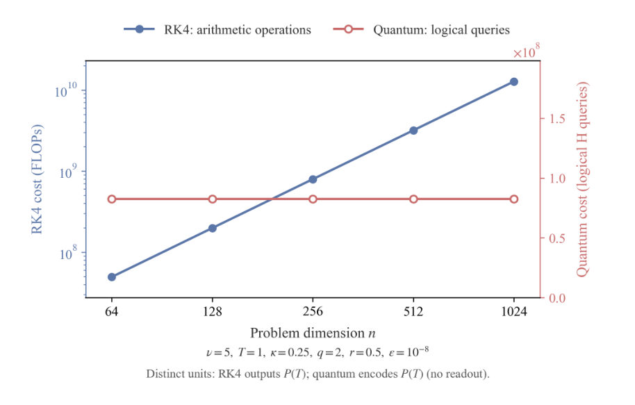
<figcaption class="paper-figure-caption"><b>Fig 5.</b> Figure 4: Dimension dependence at ν = 5, T = 1, κ = 1/4, q = 2, r = 0.5, and ε = 10−8, with the unscaled path Laplacian. The blue curve uses the logarithmic left axis and counts RK4 additions, subtractions, multiplications, and divisions, including all five refinement runs and error- indicator calculations. The red curve uses the linear right axis and counts logical Hamiltonian- oracle queries for one complete P(1) block-encoding, with 104 nodes per contour and frozen QSP degrees (757, 29, 57). It includes the transient term and both recovery inverses; no normalization amplification is used. RK4 outputs an explicit matrix, whereas the quantum output is a block- encoding without readout. The...</figcaption>
</figure>

**Summary.** This paper presents quantum algorithms to efficiently compute the solution matrices for various Riccati equations, which are crucial in fields like optimal control and quantum chemistry. The authors achieve near-optimal query complexity bounds and rigorously prove that solving certain instances of these equations is BQP-hard. This work bridges advanced mathematical physics problems with the theoretical limits of quantum computation.

**Why it may be interesting.** While the application is in physics (LQR, RPA), the core contribution is establishing computational complexity (BQP-hardness) for solving fundamental equations arising in quantum dynamics, which is highly relevant to quantum information theory.

Detailed structure

**Main problem.** Developing quantum algorithms to construct block-encodings of solution matrices for various Riccati equations (CAREs, DAREs, DREs, and finite recursions).

**Main result.** The algorithms achieve near-optimal query complexity for CAREs and DAREs, and the problem of encoding solutions for certain Riccati equations is proven to be BQP-complete.

**Method.** The core method is the Quantum Weighted Riesz Method, which involves embedding the problem, constructing a graph projector via weighted Riesz operators (QET), and recovering the solution matrix.

**Model / system.** The mathematical model is the set of Riccati equations (CARE, DARE, DRE), which arise in optimal control (LQR) and quantum chemistry (RPA). The quantum computation is framed around constructing the block-encoding of the solution matrix $P$.

**Key observables.** Solution matrices $P$, query complexity $Q$, generalized singularity factor $\mathcal{R}$, and initialization conditioning factor $\kappa_{	ext{init}}$.

**Important parameters / regimes.** Spectral separation ($\mathcal{R}$), output normalization ($\alpha$), and initialization/output scales.

**Assumptions / limitations.** The analysis relies on stated access and normalization assumptions, and the lower bounds are established for specific input-oracle families.

**Figures summary.** Figure 1 illustrates the Quantum Weighted Riesz Method pipeline (Embed $
ightarrow$ QET $
ightarrow$ Recover) for various Riccati problems. Other figures detail spectral branches and weights.

**Paper structure.** The paper develops the quantum algorithm framework, analyzes the query complexity bounds by establishing lower bounds, and culminates in proving BQP-completeness for specific Riccati problem instances.

Abstract

We develop quantum algorithms that construct block-encodings of solution matrices for continuous- and discrete-time algebraic Riccati equations (CAREs and DAREs), differential Riccati equations (DREs), and finite Riccati recursions. The Quantum Weighted Riesz Method, unifying four kinds of Riccati problems, constructs projectors onto the solution graphs using weighted Riesz branching operators and recovers the solution matrices. Under the stated access and normalization assumptions, our algorithms for CAREs and DAREs have near-optimal query complexity $Θ(\mathcal Rα)$ up to logarithmic factors, with the generalized singularity factor $\mathcal R$ that reflects spectral separation, and the output normalization $α$. For DREs and finite-horizon problems, the query complexity has an additional initialization conditioning factor $κ_{\rm init}$. We establish product query lower bounds for specified input-oracle families, demonstrating necessary joint dependence on spectral separation and initialization or output scale. We also prove that selected-value promise problems are BQP-complete on explicit circuit-generated families of single-control discrete-time algebraic and zero-terminal differential Riccati equations. Applications include classical feedback evaluation for linear-quadratic control, a query-complexity comparison for stable random-phase approximation Riccati equations in quantum chemistry, and heated boundary control with numerical validation.

[↑ back to top](#top)

### [Optimal Entanglement Routing in Quantum Repeater Chains: Beyond Fixed Operation Order and Purification Schedule](http://arxiv.org/abs/2609.37206v1)

**Authors:** Aikaterini Mandilara, Antonia Tsili, Dimitris Syvridis, Konstantinos Christodoulopoulos  
**Type:** theory · **Category:** quantum information and computing · **PDF:** <https://arxiv.org/pdf/2609.37206v1>  
**Analysis basis:** full PDF text, analyzed in chunks

↔ Scroll figures horizontally

<figure class="paper-figure-card">
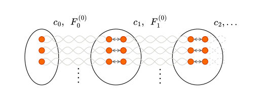
<figcaption class="paper-figure-caption"><b>Fig 1.</b> Fig. 1. A schematic representation of the linear quantum repeater chain considered in this work. Neighboring repeater nodes are con- nected through elementary links e, each characterized by a baseline fidelity F (0) e and an entanglement-generation capacity ce. Long- distance entanglement is established through sequences of entangle- ment purification and entanglement swapping operations. Curly lines denote shared entanglement, while red dots represent matter qubits stored in quantum memories.</figcaption>
</figure>
<figure class="paper-figure-card">
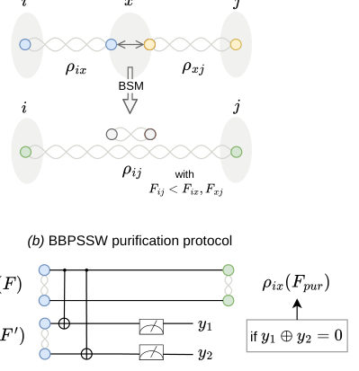
<figcaption class="paper-figure-caption"><b>Fig 2.</b> Fig. 2. (a) Entanglement swapping. A Bell-state measurement (BSM) at node x transforms the adjacent entangled pairs ρix and ρxj into the virtual pair ρij. (b) BBPSSW purification. Bilateral CNOT operations followed by measurement act on two entangled pairs, ρix(F) and ρix(F ′), spanning the same link, producing upon successful post-selection a purified pair ρix(Fpur). Curly lines denote shared entanglement, while dots represent matter qubits stored in quantum memories.</figcaption>
</figure>
<figure class="paper-figure-card">
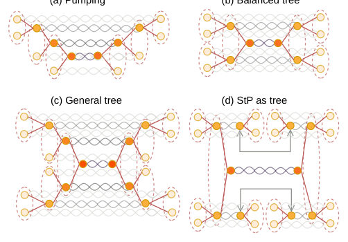
<figcaption class="paper-figure-caption"><b>Fig 3.</b> Fig. 3. Examples of purification schedules represented as rooted binary trees. Leaves correspond to raw entangled pairs, while inter- nal nodes represent BBPSSW purification operations. (a) Pumping repeatedly purifies one stored pair against freshly generated pairs, resulting in a maximally unbalanced tree. (b) A balanced tree re- cursively purifies pairs of equal purification depth. (c) A general tree schedule, of which pumping and balanced trees are particular instances. (d) An example of swapping before purifying (StP) having, under the single-Pauli-error model, similar effect as a balanced tree purification schedule — initial pairs are purified, then swapped (gray arrows) and the final...</figcaption>
</figure>
<figure class="paper-figure-card">
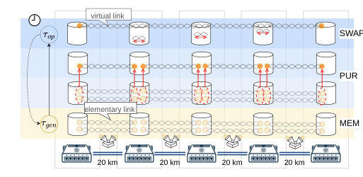
<figcaption class="paper-figure-caption"><b>Fig 4.</b> Fig. 4. Network operation model. Entangled pairs generated at rate Rgen,e during the generation phase of duration τgen are stored in memory and later used for purification and entanglement swapping in the operation phase of duration τop, yielding an effective link capacity ce = ⌊Rgen,e · τgen⌋. Then, the cycle of duration τslot repeats.</figcaption>
</figure>
<figure class="paper-figure-card">
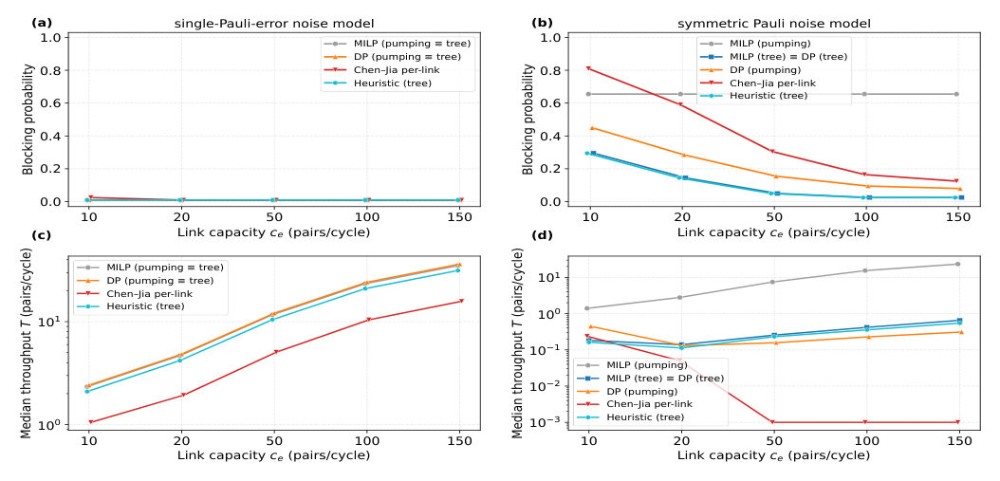
<figcaption class="paper-figure-caption"><b>Fig 5.</b> Fig. 5. Capacity sweep at the default L = 4, Fth = 0.70, under the single-Pauli-error noise model (left) and symmetric Pauli noise model (right): (a),(b) blocking probability; (c),(d) median served throughput (log scale, display floor 10−3). Merged legend entries (≡) denote algorithms whose blocked instance sets coincide at every point; in the single-Pauli column each method’s pumping and tree instantiations coincide exactly.</figcaption>
</figure>

**Summary.** This work tackles the complex problem of optimizing entanglement routing in quantum repeaters by relaxing previous constraints on operation order and purification scheduling. By developing advanced optimization frameworks, the authors prove that the purification schedule, rather than the sequence of operations, is the primary determinant of achievable network throughput. This advances the theoretical understanding of scalable quantum communication networks.

**Why it may be interesting.** It provides rigorous, exact optimization tools (MILP/DP) for resource management in quantum networks, which is crucial for scaling quantum communication infrastructure.

Detailed structure

**Main problem.** The paper aims to find the optimal strategy for maximizing the expected end-to-end throughput of entanglement across a quantum repeater chain while maintaining a required fidelity threshold.

**Main result.** The purification schedule is the dominant factor governing feasibility, as a free operation order can only increase feasibility but not the throughput beyond what the schedule dictates.

**Method.** The authors develop a unified optimization framework using both Mixed-Integer Linear Programming (MILP) for fixed operation orders and Dynamic Programming (DP) for arbitrary operation orders.

**Model / system.** The system modeled is a linear quantum repeater chain where entanglement is distributed via entanglement swapping and probabilistic purification protocols (like BBPSSW).

**Key observables.** Expected end-to-end throughput ($T$), fidelity ($F$), and the feasibility of the entanglement link.

**Important parameters / regimes.** Finite link capacities ($c_e$), baseline link fidelities ($F^{(0)}_e$), and the fidelity threshold ($F_{th}$).

**Assumptions / limitations.** The analysis is primarily restricted to linear repeater chains and assumes specific noise models (e.g., symmetric Pauli noise).

**Figures summary.** Figure 1 schematically illustrates the linear quantum repeater chain, showing elementary links, baseline fidelities, and capacities.

**Paper structure.** The paper first establishes the physical model and limitations of prior work, then develops the unified optimization framework using MILP and DP, and finally proves key results comparing the impact of operation order versus purification schedule.

Abstract

Entanglement routing establishes entangled pairs between distant nodes of a quantum network by purifying and swapping pairs generated on elementary links. Existing methods typically restrict the decision space along two axes: the operation order, often fixed to purify-then-swap (PtS), and the purification schedule of each link, often restricted to pumping. Focusing on linear repeater chains with finite link capacities, we relax both restrictions and study the maximization of the expected end-to-end throughput subject to a fidelity threshold under two quantum-noise models. We develop a unified capacity-aware optimization framework comprising an exact mixed-integer linear program (MILP) under PtS, instantiated with either pumping or general tree purification schedules, and an exact dynamic program (DP) over arbitrary operation orders. Under symmetric Pauli noise, we prove that pumping converges to a fidelity strictly below unity, imposing a capacity-independent feasibility bound and a maximum chain length on every pumping-based PtS method, whereas general tree schedules yield a capacity-dependent bound. We further prove that post-swap purification never increases the throughput, so a free operation order can only increase feasibility. Numerical evaluations confirm the bounds: tree schedules serve over 90\% of the requests that pumping cannot at moderate fidelity thresholds; within the pumping class, a free operation order recovers much of this advantage; but once links use tree schedules, the tree-based MILP and the order-exact DP serve identical request sets throughout. Operation order and purification schedule are thus substitutes, with the purification schedule the dominant factor governing feasibility under symmetric Pauli noise.

[↑ back to top](#top)

### [Optimal Quantum-Classical Separations for Exact Learning](http://arxiv.org/abs/2609.38073v1)

**Authors:** Srinivasan Arunachalam, Amin Shiraz Gilani, Nikhil S. Mande  
**Type:** theory · **Category:** quantum information and computing · **PDF:** <https://arxiv.org/pdf/2609.38073v1>  
**Analysis basis:** full PDF text, analyzed in chunks

↔ Scroll figures horizontally

<figure class="paper-figure-card">
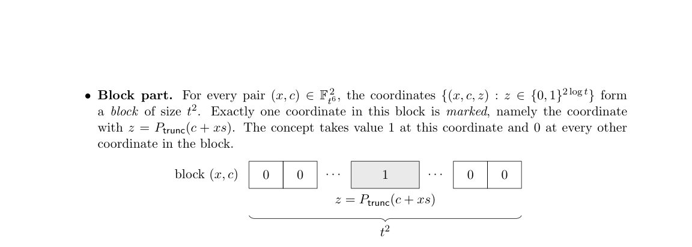
<figcaption class="paper-figure-caption"><b>Fig 1.</b> Figure 1: Each block has one marked address, namely z = Ptrunc(c + xs). Finding the marked address reveals the value Ptrunc(c + xs).</figcaption>
</figure>
<figure class="paper-figure-card">
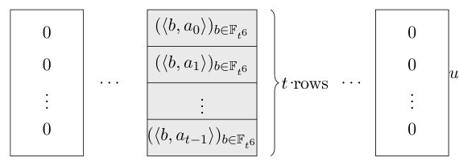
<figcaption class="paper-figure-caption"><b>Fig 2.</b> Figure 2: The cheat-sheet part consists of t6 sheets indexed by u ∈Ft6. All sheets are zero except the active sheet u = s, whose j-th row is the Hadamard encoding (b 7→⟨b, aj⟩)b∈Ft6 of the coefficients aj.</figcaption>
</figure>
<figure class="paper-figure-card">
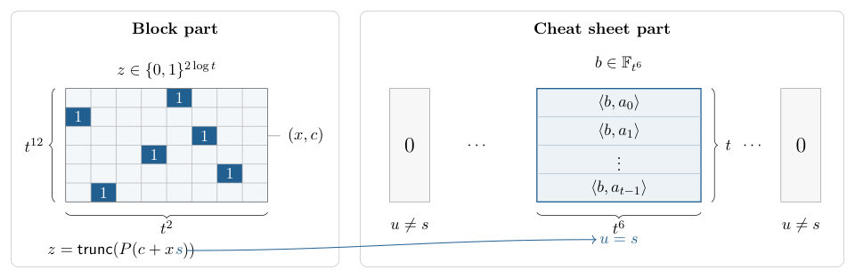
<figcaption class="paper-figure-caption"><b>Fig 3.</b> Figure 3: The two parts of cP,s. Each block (represented by rows in the block part) has a unique marked address; blank entries are zero. The cheat sheet part consists of t6 sheets indexed by u ∈Ft6: sheet s encodes the coefficients of P, and every other sheet is zero. The arrow shows that the s part that is uncovered in the block part serves as the pointer for the row in the cheat sheet part.</figcaption>
</figure>
<figure class="paper-figure-card">
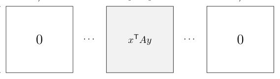
<figcaption class="paper-figure-caption"><b>Fig 4.</b> Figure 4: The concept cb,A. Rows and columns within each block are indexed by x, y ∈Fq 2, respectively. Only block b is nonzero. For c0, every block is zero.</figcaption>
</figure>

**Summary.** This paper rigorously studies the separation between classical, randomized, and quantum query complexities for learning concepts. By constructing specific concept classes, the authors disprove a long-standing conjecture relating randomized and quantum query bounds. This work demonstrates that quantum speedups in learning can exceed those predicted by simple Grover or Bernstein-Vazirani type analyses.

**Why it may be interesting.** The work provides fundamental theoretical tools for understanding the limits of quantum computation in information processing tasks, which underpins the theoretical understanding of quantum algorithms.

Detailed structure

**Main problem.** The paper investigates the optimal relationship between deterministic, randomized, and quantum query complexities for exact learning with membership queries.

**Main result.** It refutes the conjecture $R(\mathcal C)=O(\mathsf{Q}(\mathcal C)^2+\mathsf{Q}(\mathcal C)\log N)$ by constructing concept classes where the randomized complexity scales significantly faster than predicted by the quantum complexity.

**Method.** The authors use sophisticated adversary arguments and constructive proofs based on bilinear forms and polynomial structures to establish lower bounds on query complexity, contrasting them with upper bounds derived from quantum algorithms like amplitude amplification.

**Model / system.** The model is the theoretical setting of exact learning for concept classes $\mathcal C \subseteq \{0, 1\}^N$, analyzed through the lens of query complexity measures ($D, R, Q$). The constructions involve concepts defined over finite fields using bilinear forms or polynomial structures.

**Key observables.** Deterministic query complexity $D(\mathcal C)$, Randomized query complexity $R(\mathcal C)$, and Quantum query complexity $Q(\mathcal C)$.

**Important parameters / regimes.** The size of the domain $N$, and the complexity parameters $q$ or $t$ used in the specific constructions.

**Assumptions / limitations.** The separation results are non-trivial only when the quantum query complexity $Q(\mathcal C) = \omega(1)$.

**Figures summary.** Figure 1 illustrates a concept class based on a bilinear form, showing a marked address within a block. Figure 2 illustrates a concept class involving a 'Block part' and a 'Cheat-sheet part' related to polynomial coefficients.

**Paper structure.** The paper proceeds by first establishing separations using specific constructions (e.g., bilinear forms) to refute the randomized/quantum conjecture. It then explores related theoretical bounds by analyzing various information-theoretic parameters ($\gamma, 	ext{ETD}$) and relating them to query complexity bounds.

Abstract

We study exact learning with membership queries for concept classes $\mathcal C\subseteq\{0,1\}^N$, focusing on the relationships among their deterministic, randomized, and quantum query complexities, denoted $\mathsf{D}(\mathcal C)$, $\mathsf{R}(\mathcal C)$, and $\mathsf{Q}(\mathcal C)$, respectively. The two canonical quantum speedups in this model are witnessed by Grover search and Bernstein-Vazirani, leading to the longstanding conjecture $$ \mathsf{R}(\mathcal C)=O(\mathsf{Q}(\mathcal C)^2+\mathsf{Q}(\mathcal C)\log N). $$ We first refute this conjecture by constructing concept classes $\mathcal C$ and $\mathcal C'$ satisfying \[ \mathsf{R}(\mathcal C)=Ω\!\left(\frac{\mathsf{Q}(\mathcal C)^3\log N}{\log \mathsf{Q}(\mathcal C)}\right) \qquad\text{and}\qquad \mathsf{D}(\mathcal C')=Ω(\mathsf{Q}(\mathcal C')^3\log N). \] The first bound matches the upper bound of Arunachalam et al.~[Quantum'21] up to constant factors, while the second matches the upper bound of Servedio and Gortler~[SICOMP'04]. In particular, this shows that the saving in the randomized upper bound of Arunachalam et al. fundamentally relies on randomness. Apart from characterizing the optimal relationship between classical and quantum query complexity, our results are the first to show that quantum speedups for learning can go beyond the Grover and Bernstein-Vazirani paradigms.

[↑ back to top](#top)

### [Out-of-time-order Correlators in Volcano potentials](http://arxiv.org/abs/2609.35990v1)

**Authors:** Aritra Banerjee, Reetik Jangir, Rishant Sharma  
**Type:** theory · **Category:** other · **PDF:** <https://arxiv.org/pdf/2609.35990v1>  
**Analysis basis:** full PDF text, analyzed in chunks

↔ Scroll figures horizontally

<figure class="paper-figure-card">
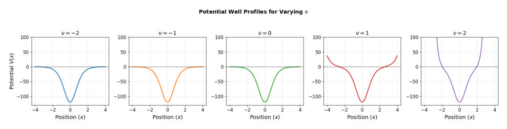
<figcaption class="paper-figure-caption"><b>Fig 1.</b> FIG. 1: Volcano potential well profiles V (x) for for various values of ν with a1 = −0.05 and a2 = 120. The first three are variations on the PT potential and the succession can be written as deformed PT −→PT −→shifted PT −→soft confinement −→hard confinement. Note that since a1 is small, the variants of PT have same eigenfunctions (up to energy shift/perturbative corrections).</figcaption>
</figure>
<figure class="paper-figure-card">
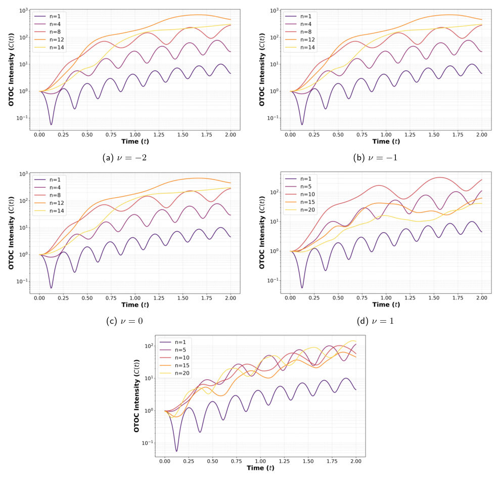
<figcaption class="paper-figure-caption"><b>Fig 2.</b> FIG. 2: Short-time exponential-like growth and subsequent oscillation of the OTOC (Cn(t)) in logarithmic scale for various values of ν with a1 = −0.05 and a2 = 120. Note that higher states tend to start out with more rapid irregular growth and then slowly stabilize. Oscillations for higher states also dephase more sharply.</figcaption>
</figure>
<figure class="paper-figure-card">
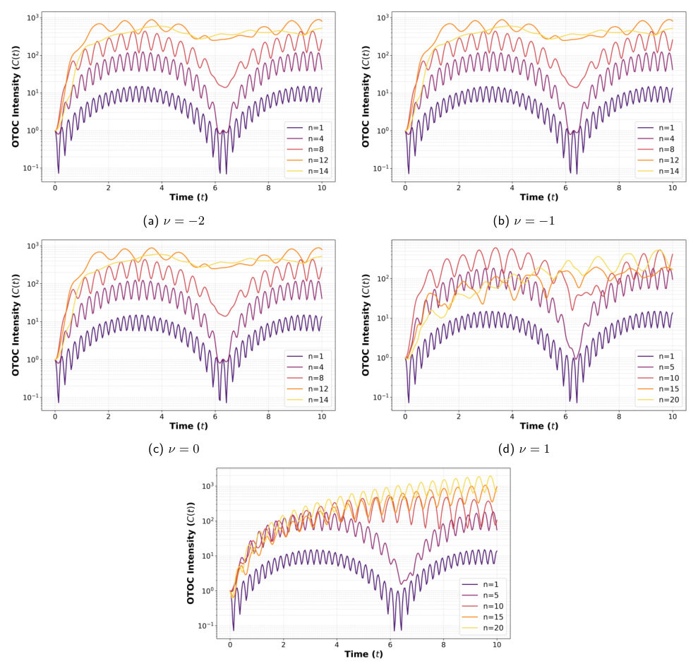
<figcaption class="paper-figure-caption"><b>Fig 3.</b> FIG. 3: Long-time growth and saturation of the OTOC (Cn(t)) in logarithmic scale for various values of ν with a1 = −0.05 and a2 = 120. The temporal region of rapid non-oscillatory growth increases for higher states. But definitely some higher states show more oscillatory growth than others.</figcaption>
</figure>
<figure class="paper-figure-card">
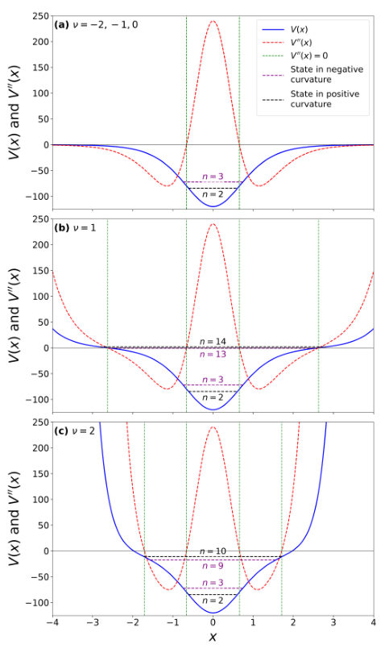
<figcaption class="paper-figure-caption"><b>Fig 4.</b> FIG. 4: Potential (blue) and curvature (red dashed) curves for various values of ν with fixed a1 = −0.05 and a2 = 120. The horizontal dashed lines indicate the energies of the bound states, labeled by their state number (n). Purple and black lines denote states predominantly having probability density in the region of negative and positive curvatures, respectively.</figcaption>
</figure>
<figure class="paper-figure-card">
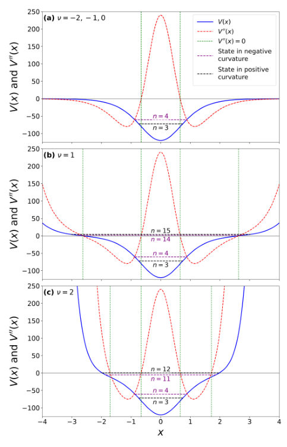
<figcaption class="paper-figure-caption"><b>Fig 5.</b> FIG. 5: Potential (blue) and curvature (red dashed) curves for various values of ν with fixed a1 = −0.05 and a2 = 120. The horizontal dashed lines indicate the energies of the bound states, labeled by their state number (n). Purple and black lines denote states predominantly having probability density (Airy-Corrected) in the region of negative and positive curvatures, respectively.</figcaption>
</figure>

**Summary.** This paper analyzes the Out-of-Time-Order Correlator (OTOC) for the generalized Volcano potential, a model capable of exhibiting diverse potential behaviors. The authors demonstrate that the initial exponential growth of the OTOC, often associated with quantum chaos, is not a global indicator but rather a signature linked to the excited states sampling regions of negative potential curvature. This provides a refined diagnostic tool for understanding quantum dynamics in complex potentials.

**Why it may be interesting.** The work connects a fundamental measure of quantum chaos (OTOC) to the local geometry (curvature) of the underlying potential, providing a nuanced understanding of when local instability predicts observable scrambling signatures.

Detailed structure

**Main problem.** The paper investigates the Out-of-Time-Order Correlator (OTOC) as a diagnostic tool to characterize quantum information scrambling and the nature of quantum chaos in specific physical potentials.

**Main result.** The short-time exponential growth of the OTOC does not universally signal global quantum chaos; instead, it is shown to correlate specifically with the sampling of negative curvature regions within the potential.

**Method.** The study employs a combination of analytical derivations, numerical diagonalization (using DVR), and semiclassical analysis to compute the OTOC for the generalized Volcano potential.

**Model / system.** The system is modeled by a particle governed by the Schrödinger equation with the 'Volcano potential,' $V(x) = -(\alpha_1 \cosh^{2
u} x + \alpha_2 	ext{sech}^2 x)$, which interpolates between various potential shapes, including the Pöschl-Teller case.

**Key observables.** The Out-of-Time-Ordered Correlator (OTOC), $C_n(t)$, which quantifies the growth of an initially localized operator under time evolution.

**Important parameters / regimes.** The potential parameter $
u$, and the potential coefficients $\alpha_1$ and $\alpha_2$, which dictate the potential's asymptotic behavior and curvature.

**Assumptions / limitations.** The analysis relies on projecting calculations onto the bound state manifold for analytic tractability and uses finite-grid discretization for numerical computations.

**Figures summary.** Figures qualitatively show the profiles of the Volcano potential for different $
u$ and illustrate the calculated OTOC values for various parameter regimes.

**Paper structure.** The paper is structured to introduce the potential, detail the OTOC computation, analyze the dependence on potential curvature, provide a detailed analysis of the exactly solvable Pöschl-Teller case, discuss implications for braneworlds, and conclude.

Abstract

The out-of-time-order correlator (OTOC) has emerged as an important diagnostic for quantum information scrambling and a key signature of quantum chaos. In this work, we discuss out-of-time-order correlators, analytically and numerically, for the so-called Volcano potentials. This family of potentials parametrically interpolates between bounded wells and confining walls, and includes Pöschl-Teller as a specific case. Through a combination of numerical diagonalization and semiclassical analysis, we investigate various regimes of the potential parameter regimes containing regions of both positive and negative curvatures. Moreover, we demonstrate in this case that short-time exponential growth of the OTOC does not necessarily signal global quantum chaos; instead, it correlates with the sampling of negative curvature regions by excited states.

[↑ back to top](#top)

### [Puncturing for Adaptive Entanglement-Assisted Stabilizer Codes](http://arxiv.org/abs/2609.36273v1)

**Authors:** Nicolai Peder Bülow Pedersen, Jakob Kaltoft Søndergaard, Jaron Skovsted Gundersen, René Bødker Christensen, Petar Popovski  
**Type:** theory · **Category:** quantum information and computing · **PDF:** <https://arxiv.org/pdf/2609.36273v1>  
**Analysis basis:** full PDF text, analyzed in chunks

↔ Scroll figures horizontally

<figure class="paper-figure-card">
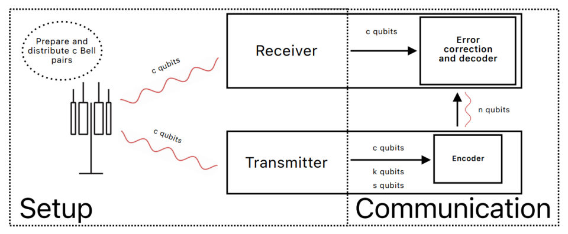
<figcaption class="paper-figure-caption"><b>Fig 1.</b> Figure 1: Communication framework for an entanglement-assisted stabilizer code. A base station</figcaption>
</figure>
<figure class="paper-figure-card">
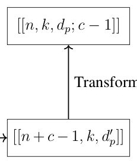
<figcaption class="paper-figure-caption"><b>Fig 2.</b> Figure 2: The four steps of puncturing an entanglement-assisted stabilizer.</figcaption>
</figure>
<figure class="paper-figure-card">
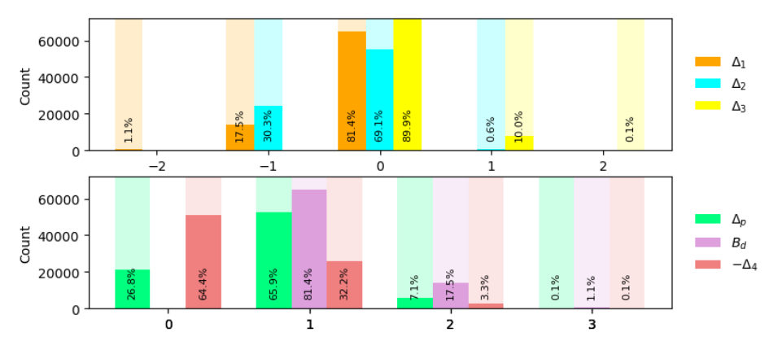
<figcaption class="paper-figure-caption"><b>Fig 3.</b> Figure 3: Histograms of ∆i for i ∈{1, 2, 3, 4, p} and Bd obtained from the 79 437 puncturing</figcaption>
</figure>

**Summary.** This paper develops a resource-aware puncturing technique for entanglement-assisted quantum error-correcting codes. By adapting existing puncturing methods, the authors show how to reduce the required shared Bell pairs by one while maintaining the code's error-correcting distance. This is vital for building practical quantum communication systems with limited entanglement resources.

**Why it may be interesting.** This work provides a concrete, systematic method for optimizing quantum resource usage in QEC, which is crucial for scaling up quantum communication protocols that rely on shared entanglement.

Detailed structure

**Main problem.** The paper addresses the need for resource-aware quantum error-correcting codes that can adapt their structure when the availability of pre-shared entanglement (Bell pairs) is intermittent.

**Main result.** A novel three-step puncturing procedure was developed to extend puncturing constructions from standard stabilizers to entanglement-assisted codes, successfully reducing Bell pair requirements by one while preserving logical qubits and demonstrating distance preservation in most random cases.

**Method.** The method involves interpreting the EAQECC as an unassisted stabilizer, applying a standard puncturing procedure to a receiver-side qubit, and then recovering the entanglement-assisted representation.

**Model / system.** The study focuses on Quantum Error-Correcting Codes (QECCs), specifically Entanglement-Assisted Stabilizer Codes (EAQECCs), which use pre-shared Bell pairs to enhance error correction capabilities.

**Key observables.** Code distance ($d$), number of logical qubits ($k$), number of physical qubits ($n$), and the required number of Bell pairs ($c$).

**Important parameters / regimes.** The fidelity ($F$) of the shared Bell pairs, and the specific structure of the puncturing map applied to the receiver-side qubits.

**Assumptions / limitations.** The analysis assumes the shared Bell pairs are perfect ($F=1$), and the puncturing procedure is restricted to the receiver's halves of the shared pairs.

**Figures summary.** Figures illustrate the communication framework for EAQECCs and show histograms analyzing the distance loss ($\Delta_i$) across various puncturing scenarios, confirming distance preservation in a high percentage of cases.

**Paper structure.** The paper builds from the general theory of stabilizer codes and puncturing, extends this theory to the entanglement-assisted setting via a three-step procedure, derives mathematical bounds on distance loss, and concludes with extensive statistical analysis on randomly generated codes.

Abstract

Quantum error-correcting codes are essential for reliable quantum communication. The achievable parameters can be improved by using entanglement-assisted stabilizers at the cost of consuming pre-shared Bell pairs. If the availability of such Bell pairs is intermittent, the ability to adapt the code to available resources is beneficial. That is, to pick a single mother code that can be adapted to different entanglement budgets. To achieve this, we extend an existing puncturing construction for standard/unassisted stabilizers to the entanglement-assisted setting through a three-step procedure: Interpreting the code as an unassisted stabilizer, puncturing a receiver-side qubit, and recovering an entanglement-assisted representation. This procedure reduces the number of required Bell pairs by one while preserving the number of transmitted and logical qubits. We derive a bound on the resulting distance loss and establish conditions for preserving the original code distance. Finally, we analyse distinct, randomly generated, entanglement-assisted stabilizers with five to eight transmitted qubits. Of these codes, 14.75% have a greater distance than their associated unassisted representations. Among this subset, 81.4% admit at least one puncturing choice that preserves the original entanglement-assisted distance. These results illustrate how puncturing can reduce entanglement requirements while maintaining code distance.

[↑ back to top](#top)

### [Quantifying Teleportation Overhead in Distributed Unitary Coupled-Cluster Ansätze](http://arxiv.org/abs/2609.36266v1)

**Authors:** Grier M. Jones, Hassan Tariq Shafi, Zixuan Wang, Thomas Trenty, Zachary Vernec, Hans-Arno Jacobsen  
**Type:** theory · **Category:** quantum information and computing · **PDF:** <https://arxiv.org/pdf/2609.36266v1>  
**Analysis basis:** full PDF text, analyzed in chunks

↔ Scroll figures horizontally

<figure class="paper-figure-card">
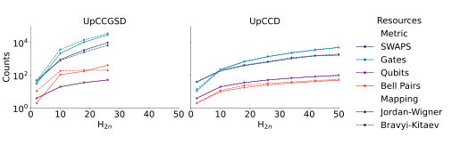
<figcaption class="paper-figure-caption"><b>Fig 1.</b> Fig. 2: Resource estimations of TeleSABRE for the UpCCD (left) and UpCCGSD (right) ans¨atze as a function of hydrogen chain length (H2n, x-axis). Each panel reports SWAP count, total gate count, qubit count, and required Bell pairs (color) on a log-scale y-axis (Counts) for both the JW (solid lines) and BK (dashed lines) encodings.</figcaption>
</figure>
<figure class="paper-figure-card">
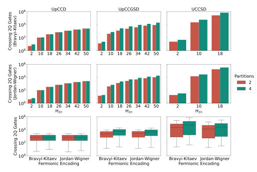
<figcaption class="paper-figure-caption"><b>Fig 2.</b> Fig. 1: Resource estimations for the three ans¨atze, two fermionic encodings, and two naive partitionings examined. The first two rows show the number of two-qubit gates (y- axis) that cross the partitions (hue) as a function of system size (x-axis). The third row highlights the distribution of number of Bell pairs across system size (y-axis) for both partitioning schemes (x-axis) using boxplots.</figcaption>
</figure>
<figure class="paper-figure-card">
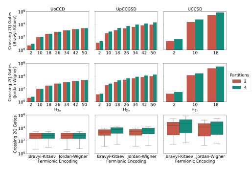
<figcaption class="paper-figure-caption"><b>Fig 3.</b> Fig. 2 presents the resources needed for the UpCCGSD and UpCCD ans¨atze under the JW and BK encodings as a function of hydrogen chain length (H2n) when routing circuits using TeleSABRE. Across both ans¨atze, qubit and Bell-pair counts grow much more slowly than SWAP and gate counts, and the encodings track closely with one another throughout, indicating that TeleSABRE’s routing and layout optimization largely absorbs the encoding-dependent differences observed under naive partitioning. For UpCCD, all four metrics scale similarly across the full range considered. For UpCCGSD, which was evaluated up to H26 owing to memory constraints, exhibits substantially larger absolute resource...</figcaption>
</figure>

**Summary.** This work quantifies the resource overhead required to run quantum chemistry simulations using Coupled-Cluster methods on distributed quantum hardware. By comparing naive circuit partitioning against the optimized TeleSABRE algorithm, the authors determine that UpCCD is the most resource-efficient ansatz. The findings are critical for understanding the scaling limitations of quantum algorithms on modular quantum processors.

**Why it may be interesting.** It provides concrete, quantitative metrics (Bell pairs, gate counts) for scaling quantum chemistry algorithms onto realistic, distributed hardware architectures, which is crucial for assessing the feasibility of near-term quantum computation.

Detailed structure

**Main problem.** The paper estimates the distributed-resource requirements for implementing Unitary Coupled-Cluster (UCC) ansätze in the context of Distributed Quantum Computing (DQC).

**Main result.** The UpCCD ansatz shows the most favorable scaling for distributed resources, significantly outperforming UCCSD, and the TeleSABRE algorithm substantially reduces required Bell pairs compared to naive distribution methods.

**Method.** The authors compare a naive circuit partitioning approach against the optimized TeleSABRE algorithm to quantify the cost of nonlocal two-qubit gates, reporting costs in Bell pairs and classical communication.

**Model / system.** The focus is on quantum chemistry calculations using UCC ansätze (UCCSD, UpCCD, UpCCGSD) applied to hydrogen chains. The resource analysis is performed for two fermionic mappings: Jordan-Wigner and Bravyi-Kitaev.

**Key observables.** Distributed-resource requirements, quantified by Bell-pair costs and classical communication overhead for nonlocal two-qubit gates.

**Important parameters / regimes.** Hydrogen chain length ($H2n$), and the specific UCC ansatz used (UCCSD, UpCCD, UpCCGSD).

**Assumptions / limitations.** The analysis assumes an implementable gate set including arbitrary-angle rotations, and the resource estimation is limited by memory constraints for larger systems.

**Figures summary.** Fig. 1 compares two-qubit gates crossing partition boundaries for the three ansätze under naive partitioning. Fig. 2 shows resource estimations (SWAP, Bell pairs) vs. system size for UpCCD and UpCCGSD using TeleSABRE.

**Paper structure.** The paper introduces the problem of DQC for quantum chemistry, details the resource estimation methodology comparing naive vs. TeleSABRE, presents quantitative results comparing different ansätze and encodings, and concludes with scaling analysis.

Abstract

Distributed quantum computing (DQC) has been proposed as a way to scale quantum algorithms for practical applications beyond monolithic quantum processor architectures. Among these applications, quantum chemistry is widely regarded as one of the most promising use cases for quantum computing. In this work, we estimate the distributed-resource requirements of unitary coupled-cluster (UCC) ansätze for quantum chemistry, focusing on unitary coupled-cluster singles and doubles (UCCSD), unitary pair coupled-cluster doubles (UpCCD), and unitary pair coupled-cluster with generalized singles and doubles (UpCCGSD) circuits for hydrogen chains. We focus on a teleportation-based approach to DQC, quantitatively comparing a naive distribution method to the output of the TeleSABRE algorithm. For both approaches, we estimate the cost of handling nonlocal two-qubit gates across a fixed midpoint or quarter-point partition, reporting Bell-pair/classical-communication costs in teleportation. Across Jordan-Wigner and Bravyi-Kitaev, we find that UpCCD with spin-blocked Jordan-Wigner ordering gives the most favorable scaling, while UCCSD incurs substantially larger distributed-resource requirements.

[↑ back to top](#top)

### [Quantum percolation conjecture on regular trees](http://arxiv.org/abs/2609.38017v1)

**Authors:** Simon Becker, Izak Oltman  
**Type:** theory · **Category:** disordered systems and neural networks · **PDF:** <https://arxiv.org/pdf/2609.38017v1>  
**Analysis basis:** full PDF text, analyzed in chunks

↔ Scroll figures horizontally

<figure class="paper-figure-card">
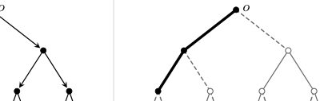
<figcaption class="paper-figure-caption"><b>Fig 1.</b> Figure 2. From the regular tree to the open forward cluster, for k = 2. The first panel cuts the fixed edge {o−, o} and discards the entire component above it. The second panel is the deterministic tree T+, with two children at every vertex. The third panel shows one percolation configuration: bold edges and filled vertices form T, while thin solid edges are open but disconnected from o. The illustrated cluster has three vertices because all four of its boundary edges are closed. The definition of T does not condition on survival. Dots mark omitted generations of the ambient tree, not leaves.</figcaption>
</figure>
<figure class="paper-figure-card">
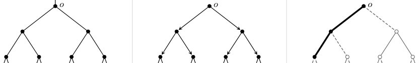
<figcaption class="paper-figure-caption"><b>Fig 2.</b> Figure 2 shows the passage from the original percolation model to T+ and T. For each integer n ≥0, define the event Rn, its probability sn, and the survival probability s by</figcaption>
</figure>

**Summary.** This paper rigorously analyzes quantum percolation on regular trees, proving that the threshold for infinite cluster formation ($p_c$) is strictly lower than the threshold for the appearance of an absolutely continuous spectrum ($p_{ac}$). The methodology combines advanced spectral theory, resolvent analysis, and contraction mapping arguments to establish this crucial separation in the system's spectral properties.

**Why it may be interesting.** This work provides a rigorous mathematical framework for understanding spectral localization in disordered quantum systems, directly addressing the quantum percolation conjecture in a highly structured setting (trees).

Detailed structure

**Main problem.** The paper investigates the relationship between the onset of infinite connected components (percolation) and the appearance of extended quantum states (absolutely continuous spectrum) in random subgraphs of regular trees.

**Main result.** The authors prove a strict separation between the percolation threshold ($p_c$) and the threshold for the appearance of an absolutely continuous spectrum ($p_{ac}$), showing $p_c < p_{ac}$ for regular trees.

**Method.** The analysis heavily relies on spectral theory, specifically examining the boundary values of the resolvent operator using fixed-point equations and contraction mapping principles.

**Model / system.** The system is Bernoulli bond percolation on a regular tree of degree $k+1 \ge 3$. The quantum dynamics are governed by the adjacency operator $A_\omega$ acting on the graph's Hilbert space.

**Key observables.** Connectivity threshold ($p_c$), onset of absolutely continuous spectrum ($p_{ac}$), and the spectral measure $\mu_u(B)$ derived from the resolvent's imaginary part.

**Important parameters / regimes.** The degree of the tree ($k+1$), the bond retention probability ($p$), and the critical probability $p_c = 1/k$.

**Assumptions / limitations.** The proof requires establishing that the imaginary part of the resolvent boundary value is zero almost surely, which is achieved via contraction estimates on probability measures.

**Figures summary.** Figure 1 schematically illustrates the separation of regimes: $p_c = 1/k$ to $1/k + \epsilon_k$ (where no a.c. spectrum exists) and the region governed by Bordenave's theorem.

**Paper structure.** The paper develops the theory by first defining the spectral diagnostics, then using recursive relations for the resolvent ($\Gamma_T(z)$), establishing contraction bounds ($
ho_k < 1$), and finally proving that the imaginary part of the resolvent is zero almost surely, leading to the spectral conclusion.

Abstract

For Bernoulli bond percolation on every regular tree of degree at least three, we prove that infinite clusters appear strictly before absolutely continuous spectrum. Throughout an explicit supercritical interval, the adjacency operator of every open cluster almost surely has no absolutely continuous component. Together with Bordenave's theorem, this gives $p_c<p_{ac}<1$.

[↑ back to top](#top)

### [Rapid Mixing of Parallel Kac's Walk: From Spheres to Stiefel Manifolds](http://arxiv.org/abs/2609.37999v1)

**Authors:** Qian Chen, Minglong Qin, Fang Song, Penghui Yao, Mingnan Zhao  
**Type:** theory · **Category:** quantum information and computing · **PDF:** <https://arxiv.org/pdf/2609.37999v1>  
**Analysis basis:** full PDF text, analyzed in chunks

↔ Scroll figures horizontally

<figure class="paper-figure-card">
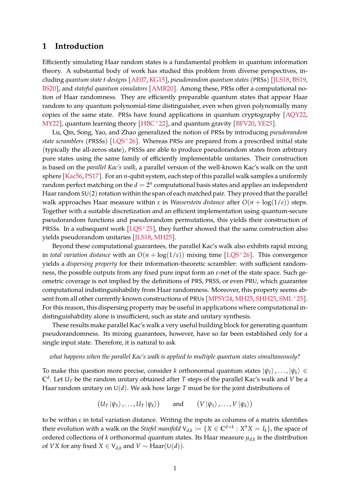
<figcaption class="paper-figure-caption"><b>Fig 1.</b> Low-resolution page preview, page 2</figcaption>
</figure>
<figure class="paper-figure-card">
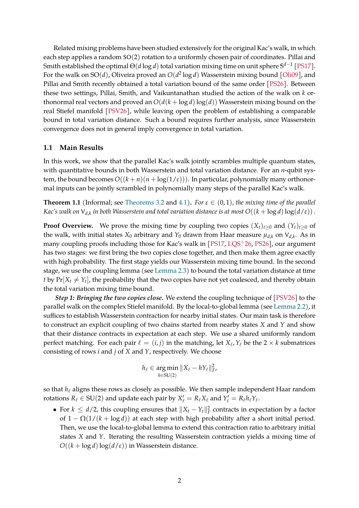
<figcaption class="paper-figure-caption"><b>Fig 2.</b> Low-resolution page preview, page 3</figcaption>
</figure>
<figure class="paper-figure-card">
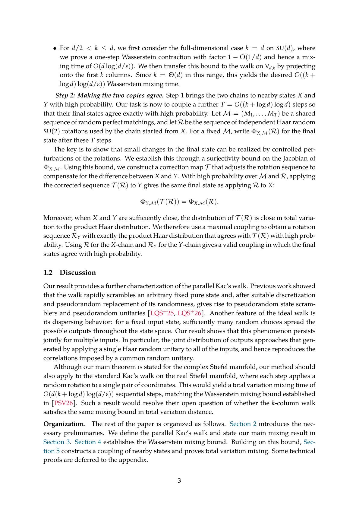
<figcaption class="paper-figure-caption"><b>Fig 3.</b> Low-resolution page preview, page 4</figcaption>
</figure>
<figure class="paper-figure-card">
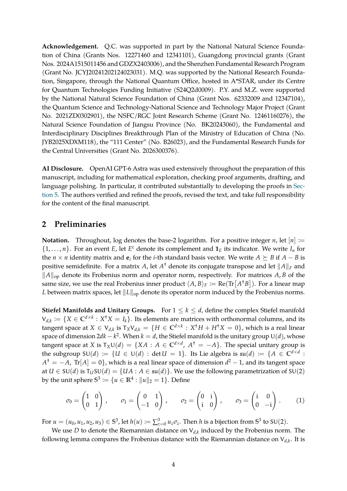
<figcaption class="paper-figure-caption"><b>Fig 4.</b> Low-resolution page preview, page 5</figcaption>
</figure>
<figure class="paper-figure-card">
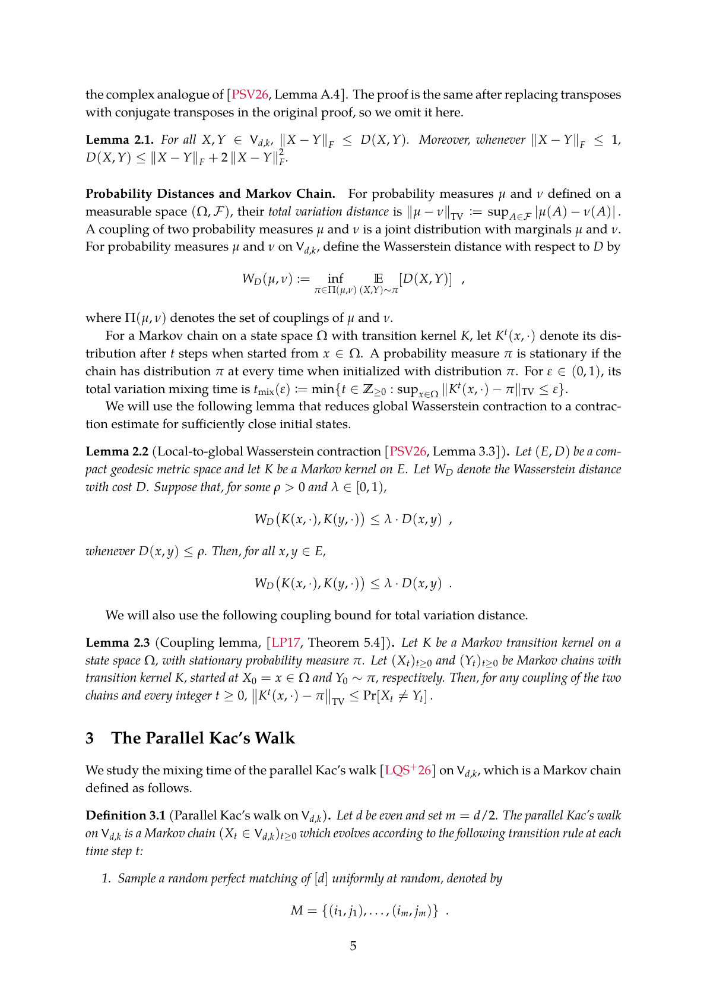
<figcaption class="paper-figure-caption"><b>Fig 5.</b> Low-resolution page preview, page 6</figcaption>
</figure>

**Summary.** This work analyzes the mixing rate of a parallel version of Kac's walk when applied to multiple orthonormal quantum states, modeling the system on the complex Stiefel manifold. The authors prove that the mixing time is bounded by $O((k + \log d) \log(d/\epsilon))$ in both Wasserstein and total variation metrics. This result generalizes previous findings by showing rapid scrambling for multiple entangled quantum states.

**Why it may be interesting.** The rapid mixing property of quantum random walks on structured manifolds like the Stiefel manifold is crucial for understanding quantum scrambling and the efficiency of quantum information processing protocols.

Detailed structure

**Main problem.** The paper investigates the rate at which the parallel Kac's walk mixes when acting simultaneously on $k$ orthonormal quantum states.

**Main result.** The joint distribution of the $k$ output states mixes rapidly on the complex Stiefel manifold $V_{d,k}$ in $O((k + \log d) \log(d/\epsilon))$ steps for both Wasserstein and total variation distances.

**Method.** The proof utilizes coupling techniques and detailed analysis of the Jacobian of the evolution map to bound the distance between the walk's distribution and the Haar-random unitary distribution.

**Model / system.** The system is the parallel Kac's walk, viewed as a Markov chain on the complex Stiefel manifold $V_{d,k}$, representing an ordered collection of $k$ orthonormal quantum states in $\mathbb{C}^d$.

**Key observables.** Joint distribution of $k$ output states, Wasserstein distance ($W_D$), and total variation distance ($\epsilon$).

**Important parameters / regimes.** $k$ (number of states), $d$ (ambient dimension), $\epsilon$ (desired accuracy).

**Assumptions / limitations.** The analysis relies on constructing explicit couplings and establishing contraction estimates for the distance metrics on the Stiefel manifold.

**Paper structure.** The paper develops the analysis by first establishing Wasserstein mixing bounds using contraction estimates, followed by constructing a coupling argument to prove the total variation mixing time.

Abstract

Kac's walk is a classical local random walk whose action on a single real unit vector in dimension $d$ mixes in total variation in $Θ(d\log d)$ sequential steps~\cite{PS17}. Lu, Qin, Song, Yao, and Zhao introduced a parallel version of Kac's walk that mixes a single quantum state in $O(\log d)$ rounds~\cite{LQSY+26}. After discretizing the randomness and replacing it by suitable pseudorandom primitives, this parallel walk gives rise to pseudorandom state scramblers, and was subsequently shown to yield pseudorandom unitaries~\cite{LQSY+25}.   We study what happens when the parallel Kac's walk acts simultaneously on $k$ orthonormal quantum states. We prove that, for any $1\leq k < d$, after $O\!\left((k+\log d)\log(d/\varepsilon)\right)$ steps, the joint distribution of the $k$ output states is $\varepsilon$-close, in both Wasserstein and total variation distance, to that obtained by applying a common Haar-random unitary to the same inputs. This generalizes the dispersing property of the parallel Kac's walk from a single quantum state to multiple orthonormal quantum states. Equivalently, viewing an ordered collection of $k$ orthonormal states as a point on the complex Stiefel manifold $V_{d,k}=\{X\in\mathbb C^{d\times k}:X^\dagger X=I_k\}$, we show that the parallel Kac's walk mixes rapidly on $V_{d,k}$, with both Wasserstein and total variation mixing times bounded by $O\!\left((k+\log d)\log(d/\varepsilon)\right)$. This extends the Wasserstein mixing result of Pillai, Smith, and Vaikuntanathan for the standard Kac's walk on real Stiefel manifolds~\cite{PSV26}.

[↑ back to top](#top)

### [Separability rigidity of Gaussian states under positive domination](http://arxiv.org/abs/2609.36336v1)

**Authors:** Evgeny Shchukin, Peter van Loock  
**Type:** theory · **Category:** quantum information and computing · **PDF:** <https://arxiv.org/pdf/2609.36336v1>  
**Analysis basis:** full PDF text, analyzed in chunks

↔ Scroll figures horizontally

<figure class="paper-figure-card">
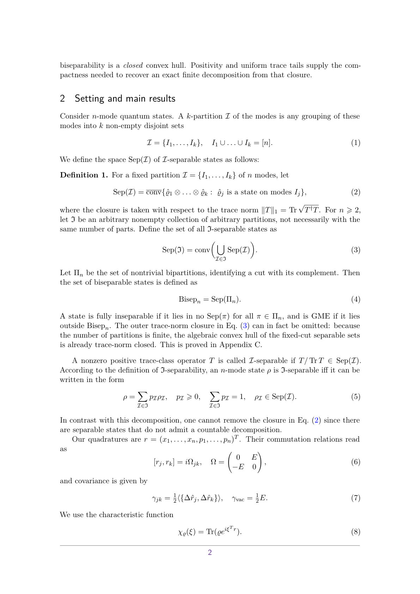
<figcaption class="paper-figure-caption"><b>Fig 1.</b> Low-resolution page preview, page 2</figcaption>
</figure>
<figure class="paper-figure-card">
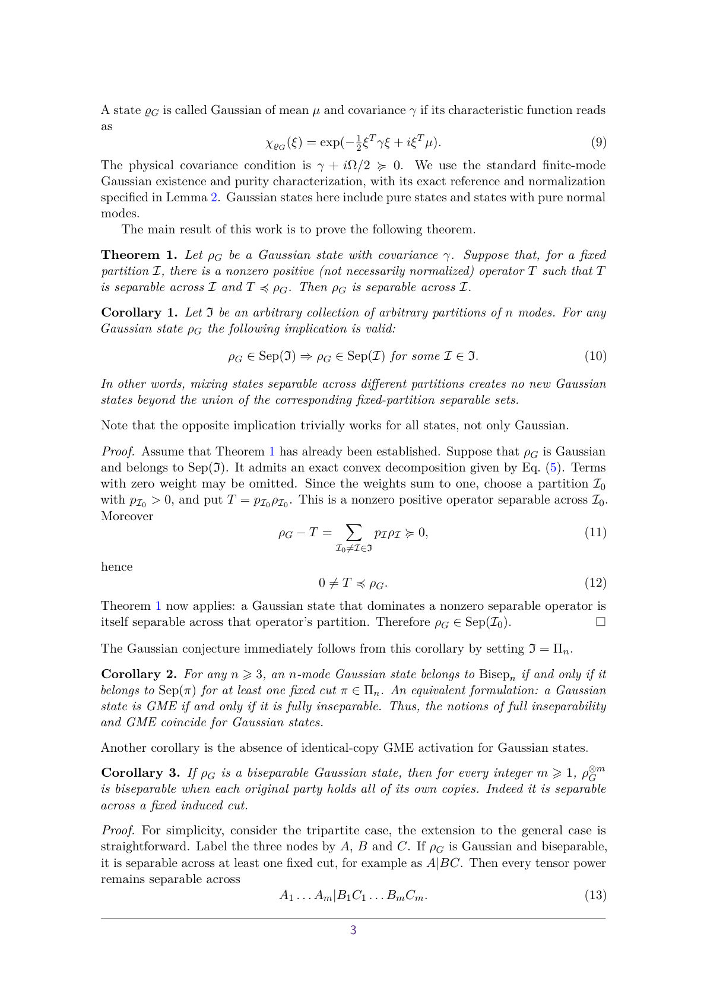
<figcaption class="paper-figure-caption"><b>Fig 2.</b> Low-resolution page preview, page 3</figcaption>
</figure>
<figure class="paper-figure-card">
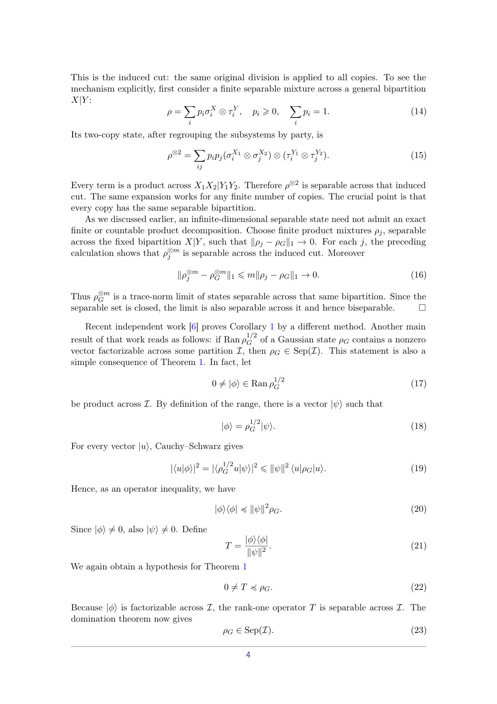
<figcaption class="paper-figure-caption"><b>Fig 3.</b> Low-resolution page preview, page 4</figcaption>
</figure>
<figure class="paper-figure-card">
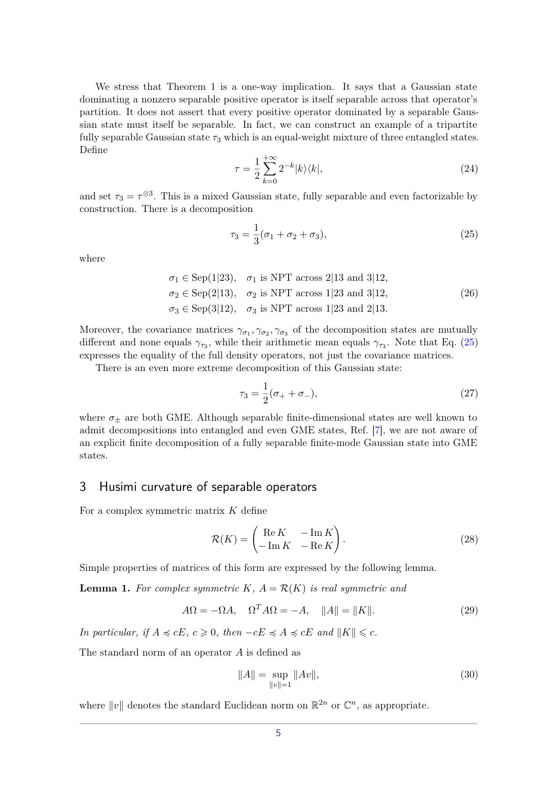
<figcaption class="paper-figure-caption"><b>Fig 4.</b> Low-resolution page preview, page 5</figcaption>
</figure>
<figure class="paper-figure-card">
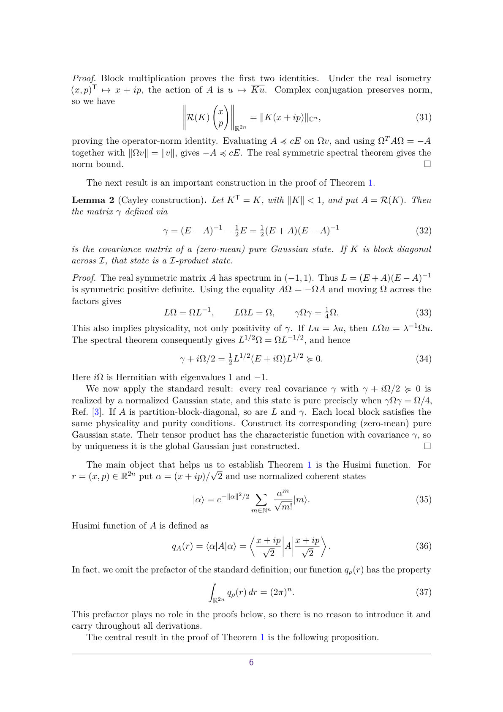
<figcaption class="paper-figure-caption"><b>Fig 5.</b> Low-resolution page preview, page 6</figcaption>
</figure>

**Summary.** This paper establishes a separability rigidity theorem for Gaussian quantum states, showing that if a Gaussian state dominates a separable operator, the state itself must be separable. The authors prove this using advanced tools from phase-space analysis, demonstrating that for Gaussian states, full inseparability and genuine multipartite entanglement are equivalent concepts.

**Why it may be interesting.** The work provides powerful mathematical tools (phase-space analysis, Hessian bounds) to characterize entanglement in a highly structured class of quantum states (Gaussian states), which are common in quantum optics and continuous variable quantum information.

Detailed structure

**Main problem.** The paper proves a separability rigidity theorem for finite-mode Gaussian states, determining when the domination of a separable operator by a Gaussian state implies the Gaussian state itself is separable.

**Main result.** The core result is that for Gaussian states, the domination of a separable operator implies the state is separable across the corresponding partition, leading to the conclusion that full inseparability and genuine multipartite entanglement coincide for these states.

**Method.** The proof heavily utilizes the characteristic function and the Husimi function in phase space, deriving key inequalities involving the Hessian of the logarithm of the Husimi function to establish the required bounds.

**Model / system.** The system under study is finite-mode quantum states, specifically restricted to Gaussian states ($
ho_G$). The analysis is performed using quadratures and covariance matrices, focusing on entanglement properties defined by separability across partitions.

**Key observables.** Husimi function ($q_T(r)$), Logarithmic Hessian ($
abla^2 \log q_T(r)$), Covariance matrix ($\gamma$), and the characteristic function ($\chi_
ho(\xi)$).

**Important parameters / regimes.** The number of modes ($n$), the partition structure ($\mathcal{I}$), and the approximation parameter $\epsilon$ used in the limiting processes.

**Assumptions / limitations.** The main theorem is a one-way implication (domination $\implies$ separability), and the analysis relies on the trace-norm continuity of Husimi derivatives and finite-mixture approximations.

**Figures summary.** The notes describe constructions involving Gaussian states on 3 qubits ($	au_3$) decomposed into mixtures of states ($\sigma_+, \sigma_-$) that violate known biseparability inequalities.

**Paper structure.** The paper builds from establishing foundational inequalities relating the Hessian of the Husimi function to separable operators (Proposition 1), progressing to proving the main rigidity theorem, and concluding with explicit constructions demonstrating the equivalence of entanglement measures for Gaussian states.

Abstract

We prove a separability rigidity theorem for finite-mode Gaussian states. Let $ρ_G$ be Gaussian and let $\mathcal I$ be a fixed partition of the modes. If $ρ_G$ dominates a nonzero positive operator $T$ that is separable across $\mathcal I$, $0\neq T\preccurlyeq ρ_G$, then $ρ_G$ itself is separable across $\mathcal I$. The dominated operator is arbitrary and need not be Gaussian. As consequences, convex mixing among finitely many separability partitions creates no new Gaussian states: a Gaussian state belonging to such a convex class is already separable across one fixed partition. In particular, full inseparability and genuine multipartite entanglement coincide for finite-mode Gaussian states, and identical copies of a biseparable Gaussian state cannot activate genuine multipartite entanglement. We also show that the implication cannot be reversed by constructing a fully separable Gaussian state that dominates a positive multiple of a genuine multipartite entangled state.

[↑ back to top](#top)

### [Static versus dynamic universality in the site-diluted kagome Ising model](http://arxiv.org/abs/2609.36886v1)

**Authors:** Alexandros Vasilopoulos, Zeynep Demir Vatansever, Erol Vatansever, Gerard T. Barkema, Nikolaos G. Fytas  
**Type:** theory · **Category:** statistical mechanics · **PDF:** <https://arxiv.org/pdf/2609.36886v1>  
**Analysis basis:** full PDF text, analyzed in chunks

↔ Scroll figures horizontally

<figure class="paper-figure-card">
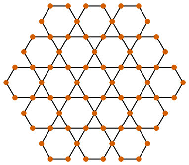
<figcaption class="paper-figure-caption"><b>Fig 1.</b> FIG. 1. Schematic representation of the kagome lattice. The lattice consists of corner-sharing triangles alternating with hexagonal plaquettes, with each unit cell containing three sites forming an equilateral triangle. Each site has coordi- nation number four.</figcaption>
</figure>
<figure class="paper-figure-card">
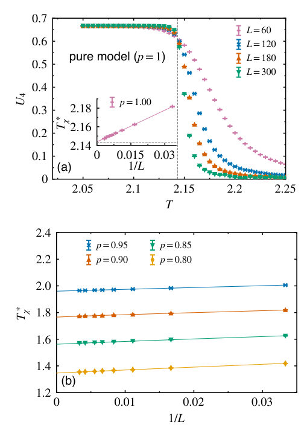
<figcaption class="paper-figure-caption"><b>Fig 2.</b> FIG. 2. (a) Fourth-order Binder cumulant U4 versus tem- perature for the pure kagome Ising model (p = 1) and char- acteristic system sizes. The crossing of the curves locates the critical temperature Tc (vertical dashed line). The inset shows the finite-size scaling of the χ maxima locations T ∗ χ. (b) Equivalent scaling of the pseudo-critical temperatures T ∗ χ for the site-diluted model, for all values of p considered.</figcaption>
</figure>
<figure class="paper-figure-card">
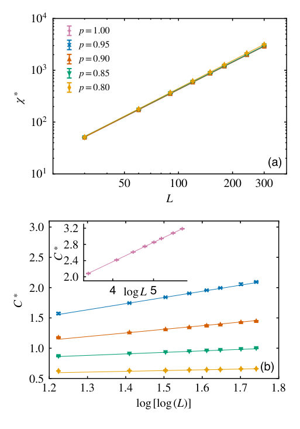
<figcaption class="paper-figure-caption"><b>Fig 3.</b> FIG. 3. (a) Finite-size scaling of the magnetic susceptibil- ity peaks χ∗for the site-diluted Ising model on the kagome lattice, for all values of the spin concentration p consid- ered. The solid lines represent fits to the power-law ansatz χ∗∼Lγ/ν, with the extracted exponent ratios γ/ν consis- tent with the exact Ising value 7/4 for all p (see Table II). (b) Finite-size scaling of the specific heat peak C∗on the kagome lattice. The main panel shows the double-logarithmic scaling C∗∼log[log(L)] observed for the site-diluted cases (p &lt; 1), while the inset demonstrates the logarithmic scaling C∗∼log(L) expected for the pure (p = 1) Ising universality class.</figcaption>
</figure>
<figure class="paper-figure-card">
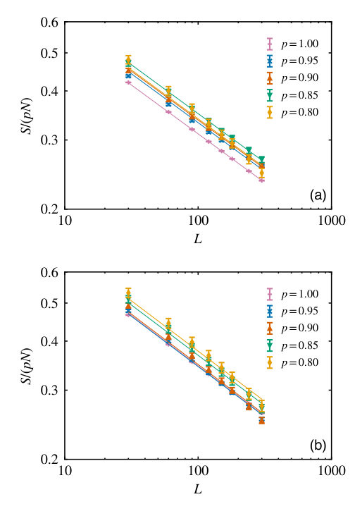
<figcaption class="paper-figure-caption"><b>Fig 4.</b> FIG. 4. Scaling of the normalized average Wolff cluster size S/(pN) with system size L for the site-diluted Ising model on the kagome (a) and square (b) lattices, for all values of the spin concentration p considered. Solid lines are power- law fits of the form S ∼Lγ/ν, yielding exponent ratios that average to γ/ν = 1.747(4) across all dilutions. Both axes are on a logarithmic scale, with the power-law scaling appearing as straight lines.</figcaption>
</figure>
<figure class="paper-figure-card">
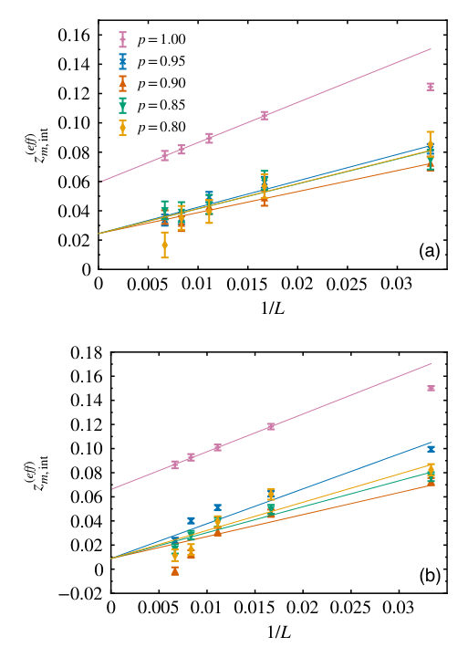
<figcaption class="paper-figure-caption"><b>Fig 5.</b> FIG. 5. Effective dynamic critical exponent z(eff) m,int versus 1/L for the site-diluted kagome (a) and square (b) Ising models, for all values of p considered. Solid lines are fits to the ther- modynamic limit.</figcaption>
</figure>

**Summary.** This paper examines the critical behavior of the site-diluted Ising model on the kagome lattice, comparing static and dynamic universality. While static exponents remain robustly fixed to pure Ising values, the dynamic exponent $z$ shows lattice-dependent deviations in the diluted regime. The authors argue these differences stem from finite-size crossovers rather than a failure of dynamic universality.

**Why it may be interesting.** The comparison of dynamic critical exponents across different lattices and the identification of crossover effects versus true universality breakdown are fundamental questions in critical phenomena, relevant to understanding complex many-body dynamics.

Detailed structure

**Main problem.** The study investigates the difference between static and dynamic universality classes in the site-diluted Ising model on the kagome lattice, comparing its behavior to the square lattice.

**Main result.** Static critical exponents retain their pure Ising values across all dilutions, while the dynamic exponent $z$ differs between the two lattices in the diluted regime, attributed to finite-size crossover effects rather than a breakdown of dynamic universality.

**Method.** The research employs Monte Carlo simulations using the Wolff single-cluster algorithm to calculate equilibrium and dynamic critical properties.

**Model / system.** The system is the site-diluted Ising model defined by the Hamiltonian $H = -\sum_{\langle ij 
angle} \epsilon_i \epsilon_j \sigma_i \sigma_j$ on the kagome lattice. The dilution is controlled by the spin concentration $p$.

**Key observables.** Static critical exponents ($
u$, $\gamma/
u$), dynamic critical exponent ($z$), specific heat ($C^*$), and magnetic susceptibility ($\chi^*$).

**Important parameters / regimes.** Spin concentration $p$, lattice geometry (kagome vs. square), and temperature $T$ relative to the critical temperature $T_c$.

**Assumptions / limitations.** The analysis assumes that the difference in $z$ between lattices in the diluted regime is due to finite-size crossover effects related to different percolation thresholds, not a fundamental breakdown of dynamic universality.

**Figures summary.** Figures show scaling of Binder cumulant and susceptibility for pure and diluted models, and the paper references comparisons of dynamic exponents ($z_{	ext{eff}}$) versus system size $L$.

**Paper structure.** The paper analyzes static results first, confirming the retention of pure Ising exponents. It then moves to dynamic properties, comparing the behavior of the dynamic exponent $z$ on the kagome and square lattices as a function of dilution $p$, concluding with an RG flow interpretation.

Abstract

We study the site-diluted Ising model on the kagome lattice using the Wolff single-cluster algorithm, focusing on both equilibrium and dynamic critical properties. The equilibrium critical exponents $ν= 1$ and $γ/ν= 7/4$ retain their exact pure Ising values for all spin concentrations $p$ considered, consistent with the marginal irrelevance of disorder at $α= 0$, with the specific heat crossing over from logarithmic to double-logarithmic growth upon dilution. These static results are shared between the kagome and square lattices. On the dynamic side, $z$ decreases upon dilution on both lattice, opposite to what is observed under local dynamics, with evidence of saturation to a $p$-independent value at strong dilution, suggesting a diluted dynamic fixed point. While $z$ is consistent between the two lattices in the pure case, it differs in the diluted regime, an effect we attribute to the two lattices sitting at different positions along the renormalization-group flow between the Ising and percolation fixed points, rather than to a true asymptotic breakdown of dynamic universality.

[↑ back to top](#top)

### [Succinct Arguments for QMA in the Quantum Random Oracle Model](http://arxiv.org/abs/2609.37429v1)

**Authors:** Alessandro Chiesa, Zihan Hu  
**Type:** theory · **Category:** other · **PDF:** <https://arxiv.org/pdf/2609.37429v1>  
**Analysis basis:** full PDF text, analyzed in chunks

↔ Scroll figures horizontally

<figure class="paper-figure-card">

<figcaption class="paper-figure-caption"><b>Fig 1.</b> Low-resolution page preview, page 2</figcaption>
</figure>
<figure class="paper-figure-card">
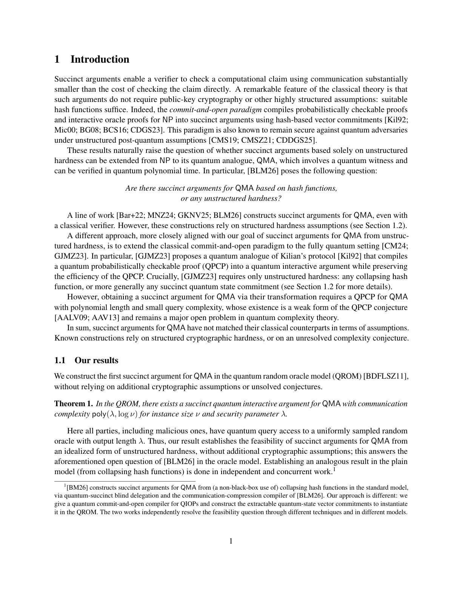
<figcaption class="paper-figure-caption"><b>Fig 2.</b> Low-resolution page preview, page 3</figcaption>
</figure>
<figure class="paper-figure-card">
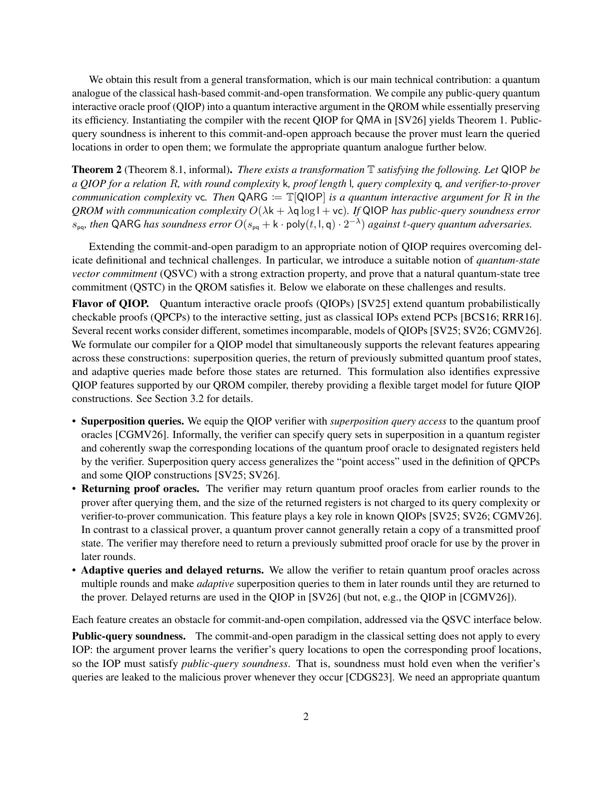
<figcaption class="paper-figure-caption"><b>Fig 3.</b> Low-resolution page preview, page 4</figcaption>
</figure>
<figure class="paper-figure-card">
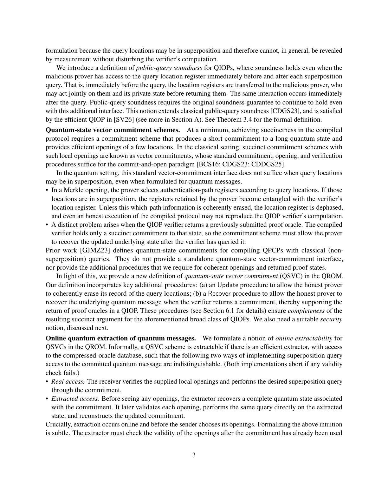
<figcaption class="paper-figure-caption"><b>Fig 4.</b> Low-resolution page preview, page 5</figcaption>
</figure>
<figure class="paper-figure-card">
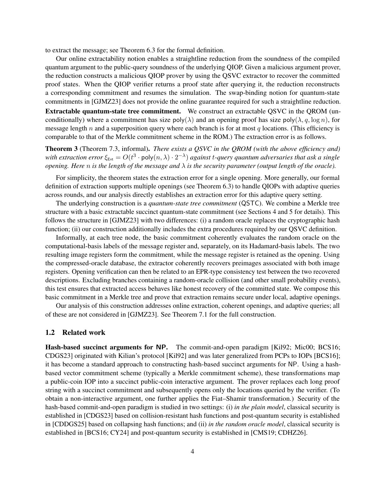
<figcaption class="paper-figure-caption"><b>Fig 5.</b> Low-resolution page preview, page 6</figcaption>
</figure>

**Summary.** This paper achieves a major theoretical breakthrough by constructing the first succinct argument for QMA in the Quantum Random Oracle Model (QROM) using only unstructured hardness. It extends the classical commit-and-open paradigm to the quantum setting via a novel transformation of Quantum Interactive Oracle Proofs. This result significantly advances the understanding of verifiable quantum computation complexity.

**Why it may be interesting.** While highly theoretical, the development of robust, unconditionally secure quantum cryptographic primitives like these commitments and arguments is foundational for any advanced quantum information theory work.

Detailed structure

**Main problem.** The core problem is constructing succinct arguments for QMA (Quantum Merlin-Arthur) in the Quantum Random Oracle Model (QROM) without relying on unproven conjectures or structured hardness assumptions.

**Main result.** The authors construct the first such succinct argument for QMA in the QROM, demonstrating that unstructured hardness alone suffices for this purpose.

**Method.** The method involves a general, efficiency-preserving transformation that compiles Quantum Interactive Oracle Proofs (QIOPs) into quantum arguments (QARGs) using a quantum analogue of the classical commit-and-open paradigm.

**Model / system.** The theoretical setting is the Quantum Random Oracle Model (QROM). The proof framework involves compiling QIOPs, which are interactive generalizations of quantum PCPs, into arguments.

**Key observables.** Communication complexity, soundness error, and the probability difference between simulation and extraction worlds.

**Important parameters / regimes.** The complexity is shown to be poly(lambda, log nu), where lambda and nu are related to the security parameters.

**Assumptions / limitations.** The result relies on the QROM and the construction of extractable vector commitments for quantum states with local openings.

**Paper structure.** The paper develops the necessary quantum commitment schemes (QSVC) first, followed by the transformation that compiles QIOPs into QARGs, and finally, the analysis bounding the probability difference between simulation and extraction worlds.

Abstract

Succinct arguments are a fundamental cryptographic primitive for verifying computational claims with small communication. In the classical setting, succinct arguments for NP can be constructed from unstructured hardness alone (e.g., hash functions) by compiling probabilistically checkable proofs (PCPs) or interactive oracle proofs (IOPs) for NP via the commit-and-open paradigm. In contrast, known succinct arguments for QMA rely on ``structured'' cryptographic primitives, or on the quantum PCP conjecture.   We construct the first succinct argument for QMA in the quantum random oracle model (QROM) without relying on additional cryptographic assumptions or unproven conjectures. This yields succinct arguments for QMA from unstructured hardness alone, showing that ideal hash functions not only suffice for succinct arguments for NP but also for QMA.   Underlying our result is an efficiency-preserving transformation that compiles quantum interactive oracle proofs (QIOPs), a recently introduced interactive generalization of quantum PCPs, into quantum arguments for the same language, via a natural quantum commit-and-open paradigm. Our transformation applies to every QIOP with public-query soundness, a notion that we formalize to capture a natural requirement of the commit-and-open paradigm and is satisfied by a known QIOP for QMA. As a key ingredient in our transformation, we formalize and construct extractable vector commitments for quantum states with local openings in the QROM, which may be of independent interest.

[↑ back to top](#top)

### [The exact strong converse exponent for private communication over quantum channels](http://arxiv.org/abs/2609.38144v1)

**Authors:** Hao-Chung Cheng, Christoph Hirche, Marco Tomamichel  
**Type:** theory · **Category:** quantum information and computing · **PDF:** <https://arxiv.org/pdf/2609.38144v1>  
**Analysis basis:** full PDF text, analyzed in chunks

↔ Scroll figures horizontally

<figure class="paper-figure-card">
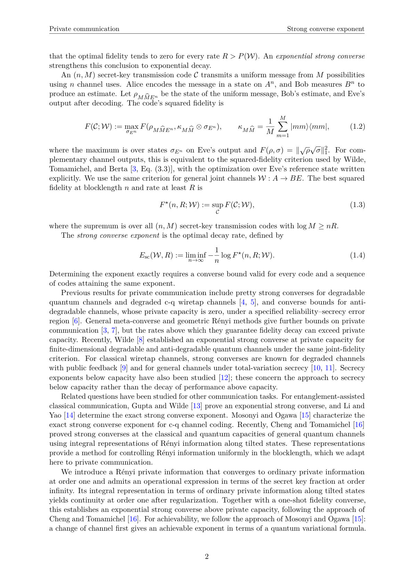
<figcaption class="paper-figure-caption"><b>Fig 1.</b> Low-resolution page preview, page 2</figcaption>
</figure>
<figure class="paper-figure-card">
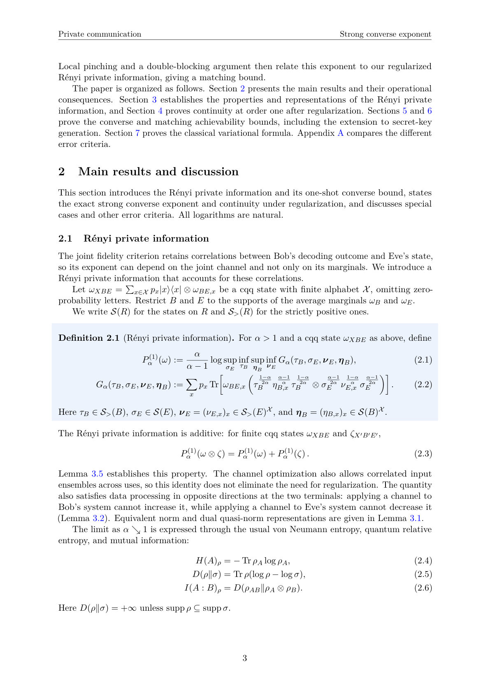
<figcaption class="paper-figure-caption"><b>Fig 2.</b> Low-resolution page preview, page 3</figcaption>
</figure>
<figure class="paper-figure-card">
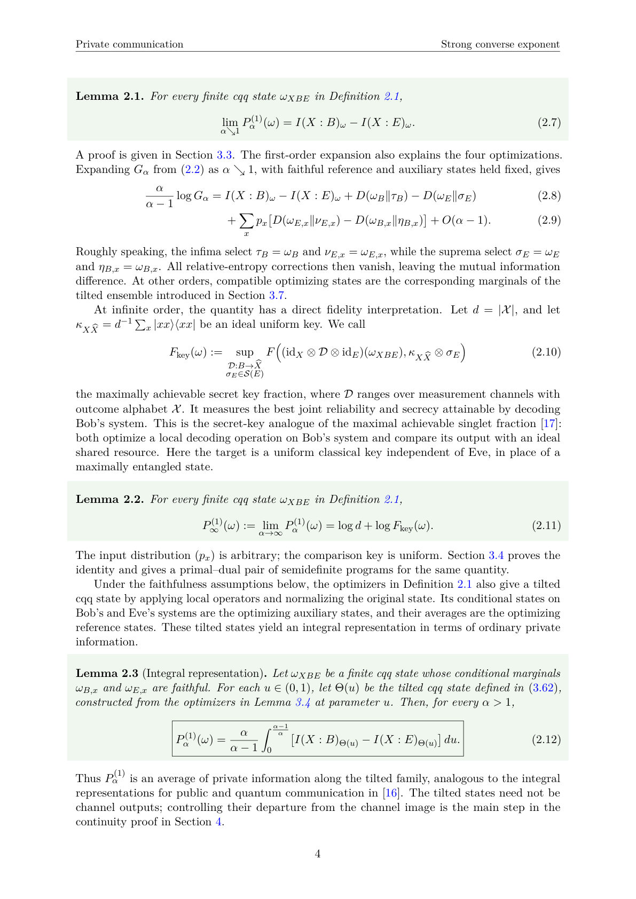
<figcaption class="paper-figure-caption"><b>Fig 3.</b> Low-resolution page preview, page 4</figcaption>
</figure>
<figure class="paper-figure-card">
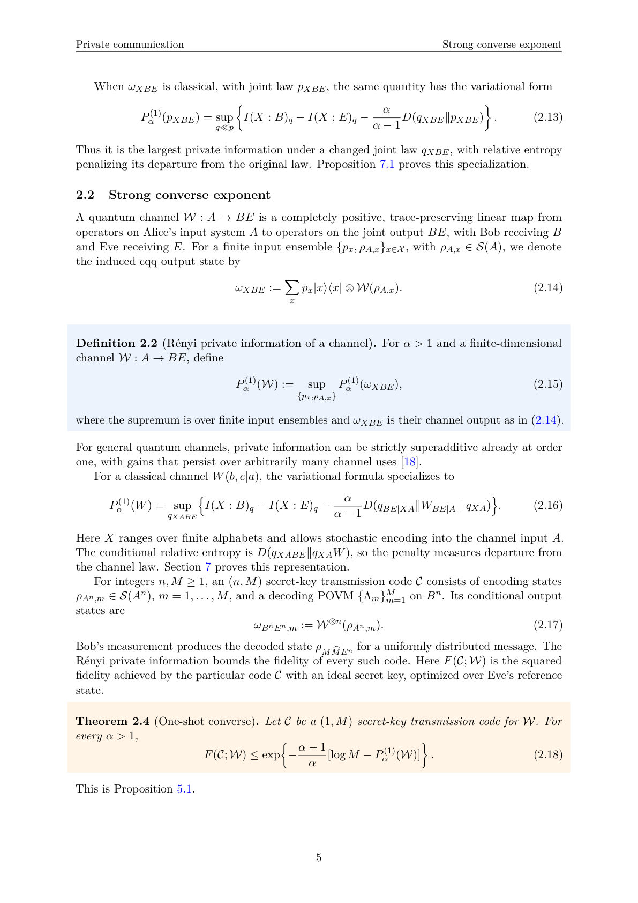
<figcaption class="paper-figure-caption"><b>Fig 4.</b> Low-resolution page preview, page 5</figcaption>
</figure>
<figure class="paper-figure-card">
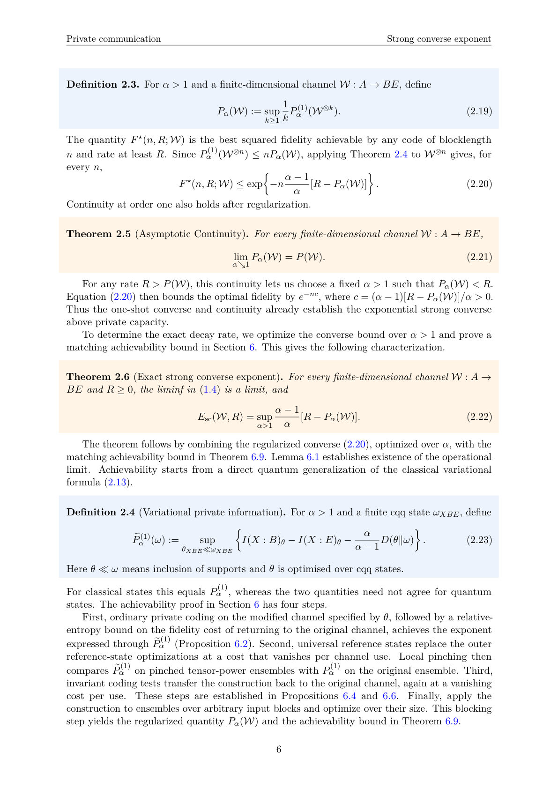
<figcaption class="paper-figure-caption"><b>Fig 5.</b> Low-resolution page preview, page 6</figcaption>
</figure>

**Summary.** This paper rigorously determines the exact strong converse exponent for secret-key quantum communication over arbitrary quantum wiretap channels. It achieves this by introducing and analyzing a novel Rényi private information measure. The result provides a fundamental, rate-achieving bound for how fast the fidelity must decay when the transmission rate exceeds the private capacity.

**Why it may be interesting.** While focused on quantum information theory, the rigorous mathematical techniques involving information measures (like Rényi entropy generalizations) and rate-distortion theory are highly relevant to understanding the fundamental limits of quantum communication protocols.

Detailed structure

**Main problem.** The paper determines the exact strong converse exponent for private communication (secret-key transmission and generation) over general finite-dimensional quantum wiretap channels.

**Main result.** The strong converse exponent is characterized by a formula involving the regularized Rényi private information, establishing an exact rate limit for secure communication.

**Method.** The authors introduce a novel Rényi private information and use it to derive both one-shot and asymptotic converse bounds, which are shown to match the achievability bounds.

**Model / system.** The analysis focuses on unassisted transmission over a fixed finite-dimensional memoryless joint quantum wiretap channel $W: A 
ightarrow BE$, where $B$ is the legitimate receiver's output and $E$ is the eavesdropper's output.

**Key observables.** Private Capacity $P(W)$, squared fidelity $F(C; W)$, and the strong converse exponent $	ext{Esc}(W, R)$.

**Important parameters / regimes.** The Rényi order $\alpha > 1$, the transmission rate $R$, and the blocklength $n$.

**Assumptions / limitations.** The derivation relies on the joint fidelity criterion and specific mathematical tools like the integral representation of Rényi private information.

**Paper structure.** The paper introduces the problem, defines the Rényi private information, derives its integral representation, establishes the converse bound using this quantity, and finally matches it with an achievability bound to determine the exact exponent.

Abstract

We determine the exact strong converse exponent for secret-key transmission and generation over general finite-dimensional quantum wiretap channels, measuring reliability and secrecy jointly by squared fidelity to an ideal secret key. We introduce a novel Renyi private information whose regularization characterizes this exponent. An exact integral representation in terms of ordinary private information gives a uniform continuity bound, showing that the regularized quantity converges to private capacity as the Renyi order approaches one. This establishes for any wiretap channel an exponential fidelity decay at every rate above private capacity.

[↑ back to top](#top)

### [Towards Scalable Quantum Unit Commitment in Power Systems: Encoding and Complexity Reduction Techniques](http://arxiv.org/abs/2609.36999v1)

**Authors:** Marc Carrillo-MuÑoz, Sergio MartÍnez-Hermida, Sara Barja-MartÍnez, Antonio E. SaldaÑa GonzÁlez, MÒnica AragÜÉs-PeÑalba  
**Type:** theory · **Category:** quantum information and computing · **PDF:** <https://arxiv.org/pdf/2609.36999v1>  
**Analysis basis:** full PDF text, analyzed in chunks

↔ Scroll figures horizontally

<figure class="paper-figure-card">
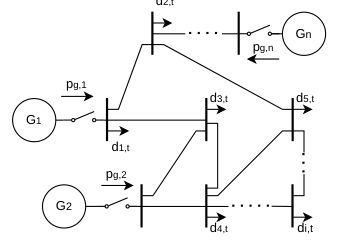
<figcaption class="paper-figure-caption"><b>Fig 1.</b> FIGURE 2. Generic electrical representation of the Unit Commitment problem.</figcaption>
</figure>
<figure class="paper-figure-card">
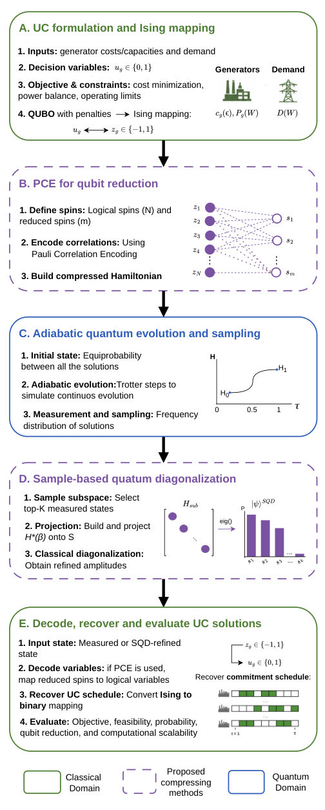
<figcaption class="paper-figure-caption"><b>Fig 2.</b> FIGURE 1. Methodology flowchart of the proposed quantum UC workflow.</figcaption>
</figure>
<figure class="paper-figure-card">
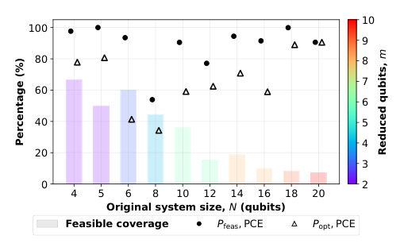
<figcaption class="paper-figure-caption"><b>Fig 3.</b> FIGURE 3. Best PCE configuration for each UC case study. Bars represent the feasible-state coverage Cfeas of the selected reduced representation. Circular markers show the total feasible probability Pfeas, while triangular markers show the optimal or best feasible probability Popt. The colour scale indicates the reduced number of qubits m.</figcaption>
</figure>
<figure class="paper-figure-card">
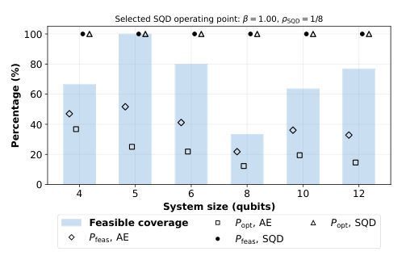
<figcaption class="paper-figure-caption"><b>Fig 4.</b> FIGURE 4. Selected SQD operating point for the direct UC case studies with β = 1.0 and ρSQD = 1/8. Bars show the feasible-state coverage Cfeas. Markers show the feasible and optimal probabilities before SQD, P AE feas and P AE opt , and after SQD, P SQD feas and P SQD opt .</figcaption>
</figure>
<figure class="paper-figure-card">
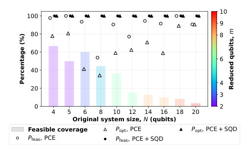
<figcaption class="paper-figure-caption"><b>Fig 5.</b> FIGURE 5. Combined PCE+SQD results for the UC case studies. Bars represent the feasible-state coverage of the retained SQD subspace. Empty markers show the feasible and optimal probabilities after PCE-based adiabatic evolution, while filled markers show the corresponding probabilities after SQD post-processing. The colour scale indicates the reduced number of qubits m.</figcaption>
</figure>

**Summary.** This paper proposes an advanced, scalable quantum optimization framework for solving the Unit Commitment problem in power grids. It integrates Pauli Correlation Encoding (PCE) to reduce the required number of qubits and Sample-based Quantum Diagonalisation (SQD) to refine the solution quality. The combined method significantly improves reliability and scalability compared to unreduced quantum formulations.

**Why it may be interesting.** The work directly addresses quantum resource limitations (qubit count) and solution quality (probability concentration) in a complex, real-world optimization problem, providing a blueprint for hybrid quantum-classical solvers.

Detailed structure

**Main problem.** Developing a scalable quantum optimization framework for the Unit Commitment (UC) problem in power systems.

**Main result.** The combined use of Pauli Correlation Encoding (PCE) for qubit reduction and Sample-based Quantum Diagonalisation (SQD) for post-processing yields the best performance, achieving high probability of finding optimal and feasible solutions with lower effective computational cost.

**Method.** The approach involves formulating the UC problem as a QUBO/Ising Hamiltonian, applying PCE to compress the Hamiltonian to fewer qubits, and then using SQD to refine the solution sampled from the reduced quantum state.

**Model / system.** The system is the Unit Commitment (UC) problem in power systems, modeled mathematically as a binary optimization problem transformed into a QUBO Hamiltonian suitable for adiabatic quantum evolution (AQE).

**Key observables.** Probability of recovering the optimal solution ($P_{opt}$), probability of recovering a feasible solution ($P_{feas}$), effective qubit size reduction, and total computational time.

**Important parameters / regimes.** Number of generators ($N$), penalty parameter ($\lambda$), and the compression factor derived from PCE.

**Assumptions / limitations.** The analysis relies on classical emulation of quantum processes, and the effectiveness of the combined PCE+SQD workflow is tested against direct adiabatic evolution.

**Figures summary.** Figures compare performance metrics (probabilities, runtime) across different workflow combinations (Direct AE, AE+SQD, PCE, PCE+SQD) as the system size ($N$) increases, demonstrating the benefits of the combined approach.

**Paper structure.** The paper details the classical formulation of the UC problem into a QUBO, introduces the quantum workflow involving PCE preprocessing, followed by AQE, and concluding with SQD post-processing, analyzing the performance gains at each stage.

Abstract

This paper develops a Quantum optimisation Unit Commitment (UC) framework that benefits from Pauli Correlation Encoding (PCE) as a qubit reduction preprocessing technique and Sample-based Quantum Diagonalisation (SQD) as a hybrid post-processing refinement method. The UC problem is formulated in binary form, then transformed into a QUBO problem and mapped onto an Ising representation suitable for adiabatic quantum evolution within the Qibo framework. This study analyses how PCE and SQD techniques affect qubit scalability, computational effort, feasibility, and probability of recovering the optimal solution as the number of generators increases. The results show that PCE reduces the effective size of the encoded problem, SQD improves the concentration of probability on feasible and optimal solutions, and their combined application provides the best overall behaviour in several scalable case studies, achieving more reliable solutions with lower effective computational cost than the unreduced formulation. The repository is available open source in Github (link is not yet available until work is published. However, if requested by the reviewers, we can make it open for a scific time window, if requested).

[↑ back to top](#top)

### [Ultra-high-distance quantum memories from amplified qLDPC codes](http://arxiv.org/abs/2609.37231v1)

**Authors:** Zijian Liang, Boren Gu, Yu-An Chen, Jens Eisert, Zongyuan Wang  
**Type:** theory · **Category:** quantum information and computing · **PDF:** <https://arxiv.org/pdf/2609.37231v1>  
**Analysis basis:** full PDF text, analyzed in chunks

↔ Scroll figures horizontally

<figure class="paper-figure-card">
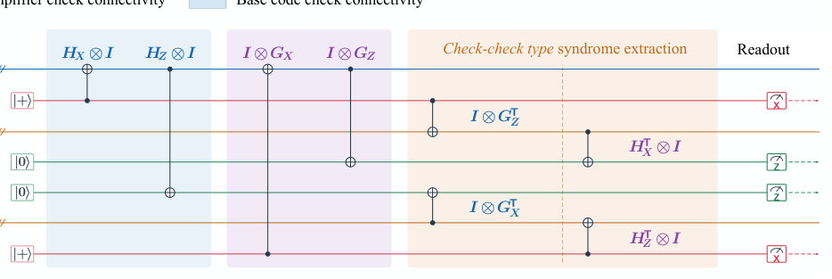
<figcaption class="paper-figure-caption"><b>Fig 1.</b> FIG. 1. Recursive amplification and staged joint syndrome extraction. (a) Successive amplification. Starting from Q (0) = Q, each step applies the same amplifier according to Q (𝑡+1) = Q (𝑡) ⊗A. Blue and purple shading denote check connectivity inherited from the base code and amplifier, respectively. White circles are data qubits in the central (data–data) register 𝑄1 ⊗𝐴1. Orange circles are data qubits in the two side (check–check) registers, which complete the inherited and coupling checks while preserving commutation; the three data registers are defined in Eq. (12). (b) One round of staged joint syndrome extraction. Copies of the base-code extraction circuit run in parallel on central...</figcaption>
</figure>
<figure class="paper-figure-card">
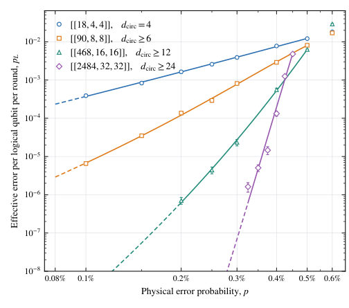
<figcaption class="paper-figure-caption"><b>Fig 2.</b> FIG. 2. Circuit-level memory performance under recur- sive amplification. Effective logical error rate 𝑝𝐿per logical qubit per noisy round versus physical error probability 𝑝for the [[18, 4, 4]] seed and its first three flagged [[4, 2, 2]] ampli- fications. Simulations use noiseless idling and independent BP+LSD decoding of the CSS sectors. Curves show em- pirical binomial maximum-likelihood fits and extrapolations using 𝑝𝐿= 𝑝𝛿/2 exp(𝑐0 + 𝑐1𝑝+ 𝑐2𝑝2) [15], with 𝛿= 4 for the seed and 𝛿= 6, 12, 24 for the three amplification levels, re- spectively, corresponding to the circuit-distance lower bounds shown in the legend.</figcaption>
</figure>
<figure class="paper-figure-card">
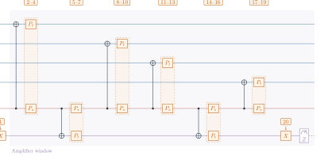
<figcaption class="paper-figure-caption"><b>Fig 3.</b> FIG. 3. Flagged amplifier 𝑋-check core and its 20 single- fault cases. (a) Core circuit and fault positions before the newly appended side data couplings, with 𝑞𝑎= 𝑞⊗𝑒𝑎, 𝑠= 𝑞⊗ 𝑒𝑋, and 𝑓= 𝑓𝑋. Cases 1 and 20 are 𝑋errors immediately after flag preparation and before its 𝑍measurement, respectively. Each pair of orange boxes represents one CNOT fault, with the Pauli factors ordered as control and target. (b) Cases 2– 19 correspond to 𝑋⊗𝐼, 𝐼⊗𝑋, and 𝑋⊗𝑋after each of the six CNOTs. Each numbered case is considered separately, giving 20 cases at eight physical locations. The syndrome- preparation fault is a 𝑍error and is excluded from this pure-𝑋 list.</figcaption>
</figure>
<figure class="paper-figure-card">
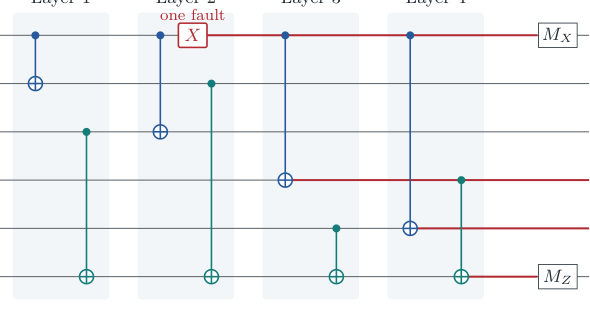
<figcaption class="paper-figure-caption"><b>Fig 4.</b> FIG. 4. A detected single fault with a logical data response. An 𝑋𝑎𝑋fault after the second 𝑋-check CNOT produces 𝑋3𝑋4, noisy outcomes (𝑚𝑋, 𝑚𝑍) = (0, 1), and zero terminal syndrome. Gates within each layer act on disjoint qubits simultaneously.</figcaption>
</figure>
<figure class="paper-figure-card">
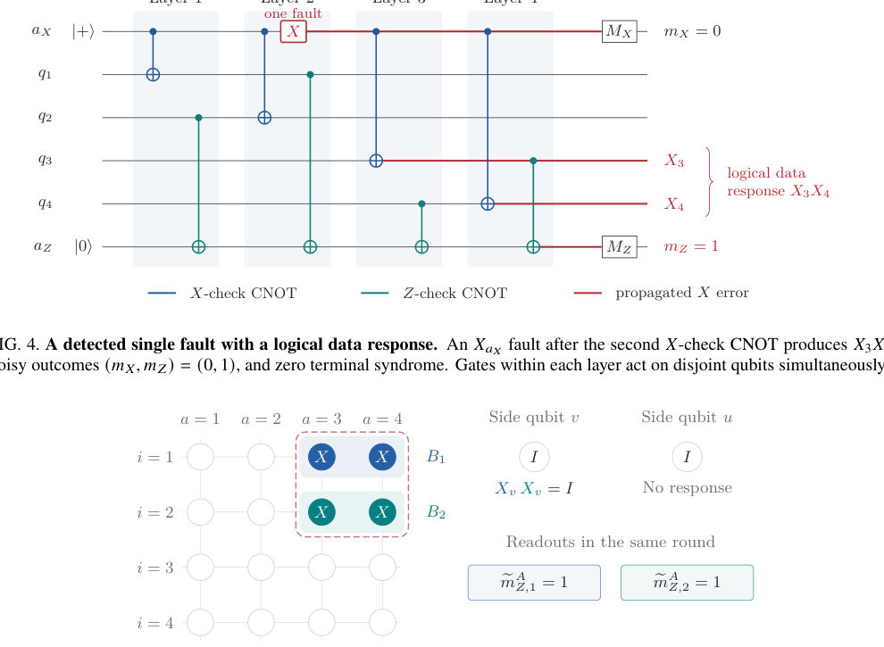
<figcaption class="paper-figure-caption"><b>Fig 5.</b> FIG. 5. Logical responses in an unflagged self-tensor circuit. In one noisy round, an ancilla-𝑋fault after the second central 𝑋-check CNOT in each amplifier row 𝑖= 1, 2 produces 𝑋𝑖,3𝑋𝑖,4𝑋𝑣. The side responses cancel, leaving a logical rectangle and noisy outcomes e𝑚𝐴 𝑍,1 = e𝑚𝐴 𝑍,2 = 1. Two additional readout faults hide these outcomes, giving a four-fault zero-record logical history. Colors distinguish the two hook responses.</figcaption>
</figure>

**Summary.** This work presents a novel 'distance amplifier' technique to construct quantum memories with exponentially increasing fault tolerance. By developing a fault-response certificate, the authors prove that the circuit distance of the resulting qLDPC code multiplies at each amplification step. This offers a systematic and scalable route toward fault-tolerant quantum computing.

**Why it may be interesting.** The rigorous, systematic framework for building fault-tolerant quantum memories by multiplying protection levels is highly relevant for designing scalable quantum computation architectures.

Detailed structure

**Main problem.** The paper addresses the challenge of building quantum memories with sufficiently high fault tolerance, recognizing that simple code distance is insufficient due to error propagation during syndrome extraction.

**Main result.** They introduce 'distance amplifiers' that allow for the modular, recursive construction of qLDPC codes, proving a multiplicative relationship for the certified circuit distance across amplification steps.

**Method.** The authors develop a 'fault-response certificate' and use a modular tensor-product approach to combine base codes with amplifiers, rigorously bounding the circuit distance.

**Model / system.** The system is a quantum memory encoded using quantum Low-Density Parity-Check (qLDPC) codes. The structure is built by tensoring a base code with an amplifier code, forming an amplified code T = Q $\otimes$ A.

**Key observables.** Certified circuit distance ($d_{	ext{circ}}$), code parameters ($e_n, e_k$), and the logical error rate per round ($p_L$).

**Important parameters / regimes.** The multiplicative gain factor ($\alpha_P$) achieved by the amplifier, and the physical error probability ($p$).

**Assumptions / limitations.** The multiplicative property of the circuit distance holds when the seed certificate is attained, and the analysis relies on bounding fault costs by summing local responses.

**Figures summary.** Figures illustrate recursive amplification structures and the staged joint syndrome extraction process, detailing error propagation and logical data responses.

**Paper structure.** The paper progresses by first identifying the limitations of simple distance metrics, then introducing the distance amplifier framework, proving the multiplicative circuit distance bound for specific amplifiers, and finally demonstrating the recursive application to build high-distance codes.

Abstract

A large code distance does not by itself guarantee a well-protected quantum memory, as faults during syndrome extraction can propagate into correlated data errors. Certifying circuit distance becomes demanding as circuits grow. In this work, we introduce distance amplifiers, a modular approach to increasing both code distance and certified circuit-level protection in quantum low-density parity-check codes. The construction tensors a base code with an amplifier, adapting their syndrome-extraction circuits to the amplified code. To certify the resulting memory, we develop a fault-response certificate that yields rigorous lower bounds on circuit distance. Suitable gate ordering and flag qubits control correlated errors, allowing us to establish explicit conditions under which the amplified circuit distance equals the product of the constituent circuit distances. We prove this multiplicative relation for three types of amplifiers: the flagged $[[4,2,2]]$, hypergraph-product, and rotated surface codes. The certificate extends recursively, so the circuit distance multiplies exactly at every amplification step. For example, four successive applications of the flagged $[[4,2,2]]$ amplifier to a $[[18,4,4]]$ seed yield a $[[13320,64,64]]$ code with the circuit distance $d_{\mathrm{circ}} \geq 48$ and check weights $w \leq 14$. We further show how individual logical qubits can be tracked explicitly through amplification. By enabling high-distance quantum memories to be built and certified from smaller building blocks, our framework offers a systematic route toward scalable fault-tolerant quantum computing.

[↑ back to top](#top)

### [Universal quantum coding](http://arxiv.org/abs/2609.38038v1)

**Authors:** Jacopo Rizzo, Ludovico Lami, Jens Eisert, Lorenzo Leone  
**Type:** theory · **Category:** quantum information and computing · **PDF:** <https://arxiv.org/pdf/2609.38038v1>  
**Analysis basis:** full PDF text, analyzed in chunks

↔ Scroll figures horizontally

<figure class="paper-figure-card">
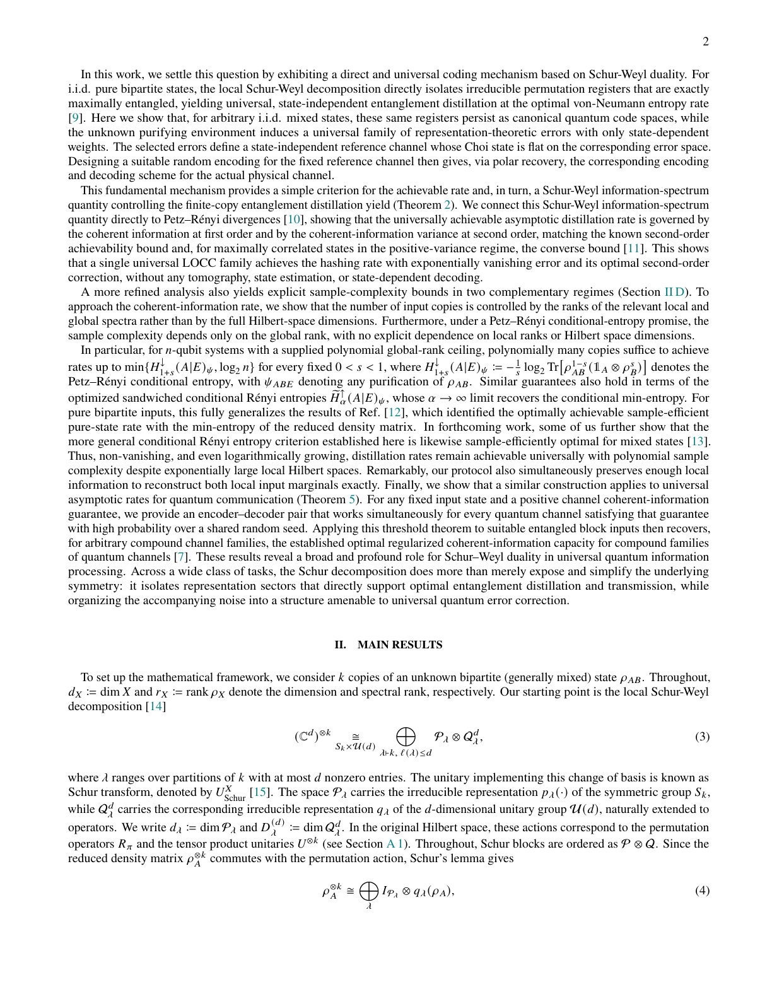
<figcaption class="paper-figure-caption"><b>Fig 1.</b> Low-resolution page preview, page 2</figcaption>
</figure>
<figure class="paper-figure-card">
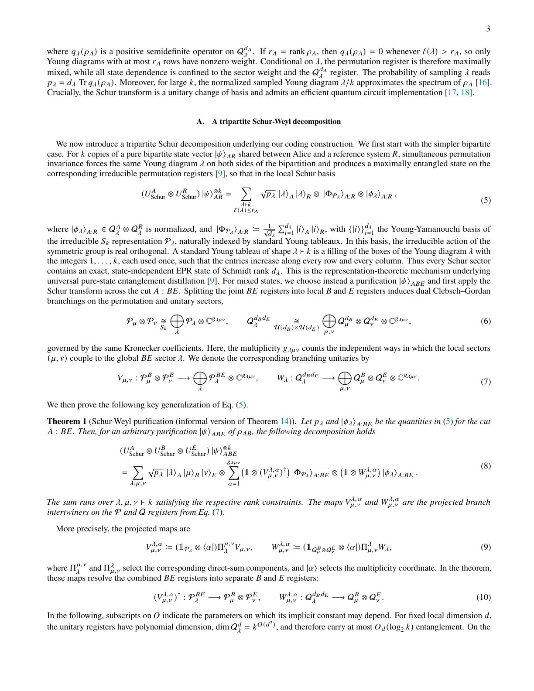
<figcaption class="paper-figure-caption"><b>Fig 2.</b> Low-resolution page preview, page 3</figcaption>
</figure>
<figure class="paper-figure-card">
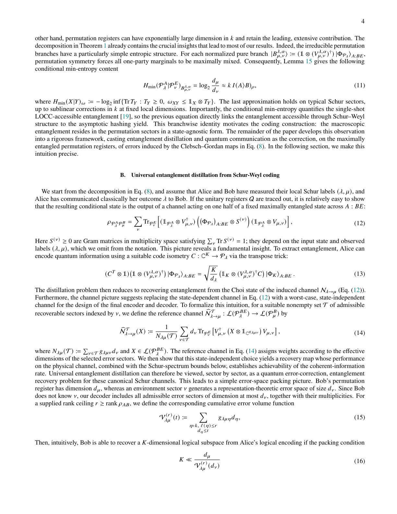
<figcaption class="paper-figure-caption"><b>Fig 3.</b> Low-resolution page preview, page 4</figcaption>
</figure>
<figure class="paper-figure-card">
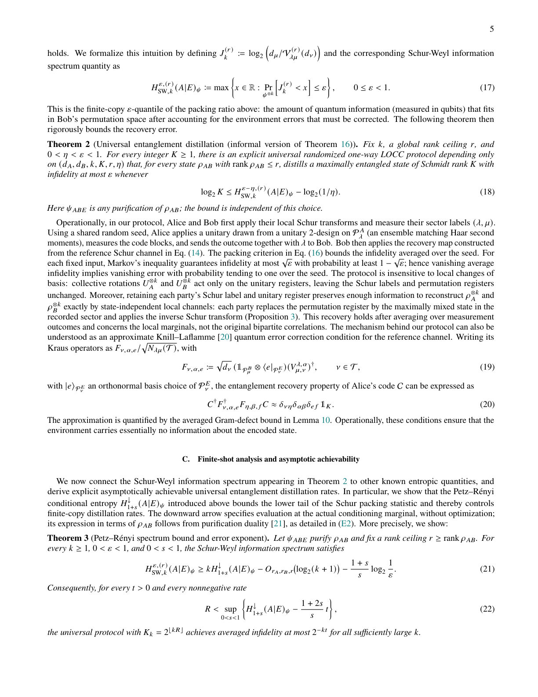
<figcaption class="paper-figure-caption"><b>Fig 4.</b> Low-resolution page preview, page 5</figcaption>
</figure>
<figure class="paper-figure-card">
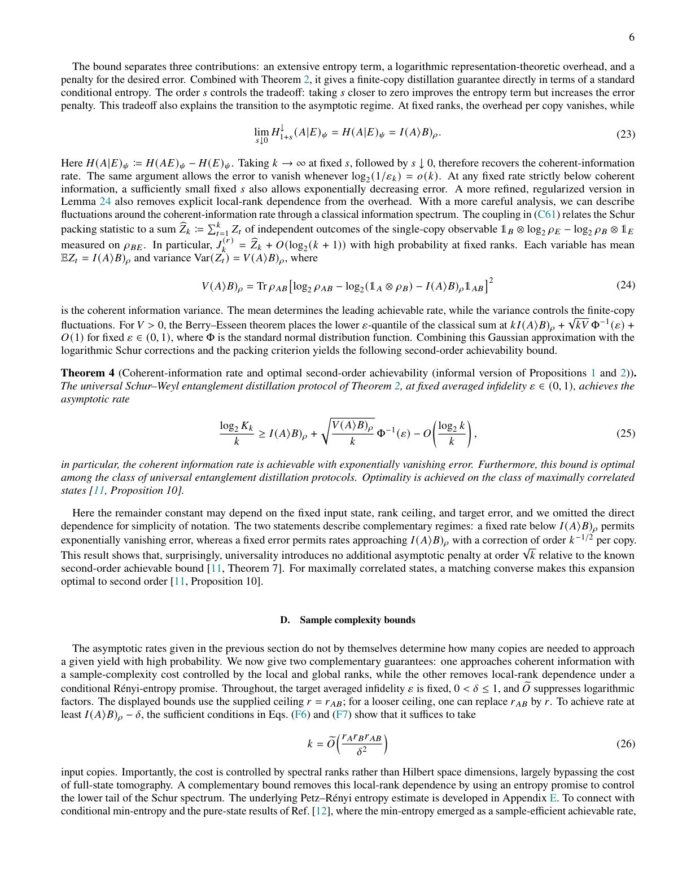
<figcaption class="paper-figure-caption"><b>Fig 5.</b> Low-resolution page preview, page 6</figcaption>
</figure>

**Summary.** This paper introduces a universal quantum coding framework by leveraging Schur-Weyl duality, which removes the need for prior knowledge of the quantum state or channel. It demonstrates that the structure of the state's symmetry (via irreducible permutation spaces) dictates optimal protocols for tasks like entanglement distillation. This unifies quantum error correction and communication within a powerful representation-theoretic lens.

**Why it may be interesting.** The reliance on representation theory (Schur-Weyl duality) to solve fundamental problems in quantum information theory provides a powerful, abstract mathematical tool applicable across quantum computing and communication protocols.

Detailed structure

**Main problem.** To establish a universal quantum error-correction principle for entanglement distillation and quantum communication that does not rely on prior knowledge of the specific quantum state or noisy channel.

**Main result.** Schur-Weyl duality provides a general, representation-theoretic framework for optimal, tomography-free quantum coding, yielding protocols with exponentially vanishing error rates.

**Method.** The authors utilize Schur-Weyl duality and the local Schur-Weyl decomposition of multiple copies of the unknown state to construct maximally entangled quantum code spaces.

**Model / system.** The analysis concerns unknown bipartite mixed states ($
ho_{AB}$) and noisy quantum channels, treating the system via tensor products and their decomposition into irreducible permutation spaces.

**Key observables.** Coherent information rates, Petz-Rényi conditional entropies, and the Schur-Weyl information spectrum.

**Important parameters / regimes.** The achievable rate is governed by the spectral ranks of the underlying state, which dictates the sample complexity.

**Assumptions / limitations.** The protocols are shown to be invariant under local unitaries, and the analysis assumes the existence of a fixed reference channel for error modeling.

**Paper structure.** The paper builds from defining the problem of state-independent coding, introducing the Schur-Weyl decomposition as the core tool, deriving theorems for universal distillation and error correction based on this decomposition, and finally analyzing the sample complexity bounds.

Abstract

Entanglement distillation from noisy bipartite states and reliable quantum communication over noisy channels are fundamental tasks in quantum information theory, yet optimal coding schemes typically rely on prior knowledge of the underlying state or channel. Here, through Schur-Weyl duality, we establish a universal quantum error-correction principle that removes this dependence entirely. We show that the irreducible permutation spaces arising from the local Schur-Weyl decomposition of many identical copies of an unknown bipartite mixed state form maximally entangled quantum code spaces, with an error structure determined entirely by representation theory. Correcting these symmetry-resolved errors yields universal protocols for entanglement distillation and quantum communication that achieve coherent-information rates with exponentially vanishing error and optimal second-order correction. The protocols are invariant under local unitaries and allow both input marginals to be recovered exactly. At finite block length, their achievable rates are governed by an associated Schur-Weyl information spectrum, which we relate to Petz-Rényi conditional entropies of the underlying state. The resulting sample complexity depends only on the relevant spectral ranks, rather than on the respective Hilbert space dimensions. In particular, for $n$-qubit states of $O(\operatorname{poly} n)$ global rank, we show that a Petz-Rényi conditional-entropy promise suffices for optimal sample-efficient entanglement distillation. Altogether, these results identify Schur-Weyl duality as a fundamental and general mechanism for optimal, tomography-free universal quantum coding, placing entanglement distillation, quantum error correction and quantum communication within a unified representation-theoretic framework.

[↑ back to top](#top)

## Secondary cond-mat archives

*Papers from cond-mat.mtrl-sci, mes-hall, other, soft, supr-con. These archives are de-prioritized — they appear at the end regardless of relevance score.*

### Relevant in secondary archives (21)

### [Evidence for Distributed Fault Energetics and Their Impact on Deformation in a Chemically Complex Alloy](http://arxiv.org/abs/2609.36780v1)

**Authors:** Kaijun Yin, Jun-Ping Du, Peijun Yu, Rui Feng, Hanyu Hou, Haw-Wen Hsiao, Ke An, Peter K. Liaw, Shigenobu Ogata, Jian-Min Zuo  
**Type:** both · **Category:** numerical methods · **PDF:** <https://arxiv.org/pdf/2609.36780v1>  
**Analysis basis:** abstract only; PDF text extraction failed or PDF unavailable
**Topic relevance:** `methods for driven-dissipative` **3/5** · `Keldysh / 2PI / non-Gaussian methods` **2/5** · `analog quantum simulation` **2/5** · `driven-dissipative phase transition` **2/5** · `non-equilibrium universality` **2/5** · `Frenkel-Kontorova` **1/5** · `correlated / nonlocal dissipation` **1/5** · `quantum measurements` **1/5** · `scars & prethermalization` **1/5**

**Summary.** This work establishes a distribution-based framework to understand how local chemical disorder dictates mechanical deformation in complex alloys like CrCoNi. By linking measured fault widths to the apparent fault energy landscape, the authors show that energy fluctuations are stabilizing and that thermal history dictates the competition between various deformation mechanisms. This provides a crucial, experimentally grounded tool for materials science.

**Why it may be interesting.** While focused on materials science, the use of kinetic Monte Carlo simulations and developing a distribution-based framework to model complex, history-dependent energy landscapes shares methodological overlap with modeling non-equilibrium dynamics in open quantum systems or disordered quantum materials.

Detailed structure

**Main problem.** Quantifying the role of the distributed local fault energy landscape in the deformation mechanisms of chemically complex alloys is experimentally challenging.

**Main result.** The study reveals a distributed local fault-energy landscape in CrCoNi, showing that energy fluctuations stabilize the system and that heat treatment causes an upward shift in apparent fault energetics, which biases deformation pathways.

**Method.** The authors develop a distribution-based framework linking measured stacking fault widths to apparent fault energy, supported by kinetic Monte Carlo simulations and electron microscopy observations.

**Model / system.** The system studied is a chemically complex alloy, specifically CrCoNi. The model involves analyzing the local fault-energy landscape, which is influenced by local chemical order (e.g., L12 type short-range order).

**Key observables.** Experimentally measured stacking fault widths, apparent fault energy, and the competition between stacking faulting, nano-twinning, and HCP transformation.

**Important parameters / regimes.** Local chemical environment heterogeneity, temperature/heat treatment history, and the resulting local fault energy distribution.

**Assumptions / limitations.** The framework assumes that the local fault energy landscape can be described by a distribution derived from experimental measurements.

**Paper structure.** The paper introduces the problem of quantifying distributed fault energetics in complex alloys, develops a distribution-based framework using experimental data (stacking fault widths), and then applies this framework using kinetic Monte Carlo simulations and microscopy to show history-dependent biasing of deformation modes.

Abstract

Chemically complex alloys feature intrinsically heterogeneous local chemical environments and, consequently, fluctuations in local fault energetics. However, experimentally quantifying their relationship remains challenging, leaving the role of this distributed energy landscape in deformation mechanisms incompletely resolved. Here, we develop a distribution based framework linking experimentally measured stacking fault widths to deformation relevant apparent fault energy, revealing a distributed local fault-energy landscape in CrCoNi. The framework reveals the stabilizing role of energy fluctuations and captures an upward shift in the apparent fault energetics, from negative values toward zero following heat treatment, which atomistic simulations associate with the emergence of L12 type chemical short-range order. Using one-dimensional kinetic Monte Carlo simulations, supported by electron microscopy observations, we further show that history-dependent changes in the local fault-energy landscape bias the competition among stacking faulting, nano-twinning and HCP transformation in CrCoNi. Our results provide an experimentally anchored, distribution-based framework for understanding deformation in chemically complex alloys as it evolves within a distributed fault-energy landscape shaped by local chemical order.

[↑ back to top](#top)

### [Ohm's law for information revealed by a skyrmion Maxwell's demon](http://arxiv.org/abs/2609.36955v1)

**Authors:** Soma Miki, Yoshishige Suzuki, Ryo Ishikawa, Yuki Hibino, Shunya Morishita, Hiroto Imanishi, Keigo Adachi, Yoichi Shiota, Takayuki Nozaki, Minori Goto, Hikaru Nomura, Shigemi Mizukami, Eiiti Tamura  
**Type:** experiment · **Category:** statistical mechanics · **PDF:** <https://arxiv.org/pdf/2609.36955v1>  
**Analysis basis:** full PDF text, analyzed in chunks
**Topic relevance:** `driven-dissipative phase transition` **3/5** · `non-equilibrium universality` **3/5** · `analog quantum simulation` **2/5** · `methods for driven-dissipative` **2/5** · `quantum measurements` **2/5** · `Keldysh / 2PI / non-Gaussian methods` **1/5** · `correlated / nonlocal dissipation` **1/5**

↔ Scroll figures horizontally

<figure class="paper-figure-card">
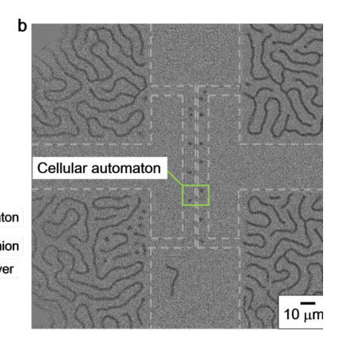
<figcaption class="paper-figure-caption"><b>Fig 1.</b> Figure 1 | Experimental realisation of Maxwell’s demon using magnetic skyrmions. a, Two neighbouring nanowires contain elongated strip-shaped potential wells, each confining a single magnetic skyrmion. The position of the skyrmion on the right (the system) is monitored optically, and this information is used in real time to apply an electrical current to the skyrmion on the left (the demon).</figcaption>
</figure>
<figure class="paper-figure-card">
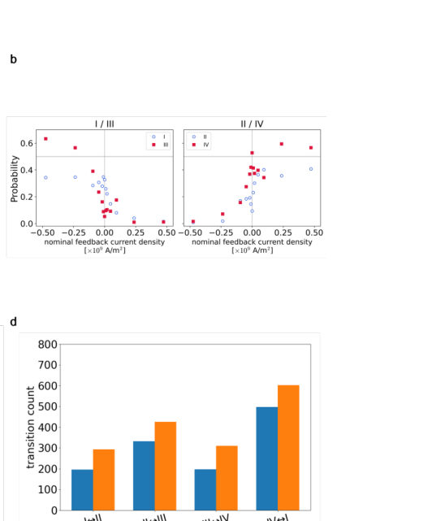
<figcaption class="paper-figure-caption"><b>Fig 2.</b> Figure 2 | Four-state representation and transition dynamics of the skyrmion information engine.</figcaption>
</figure>
<figure class="paper-figure-card">
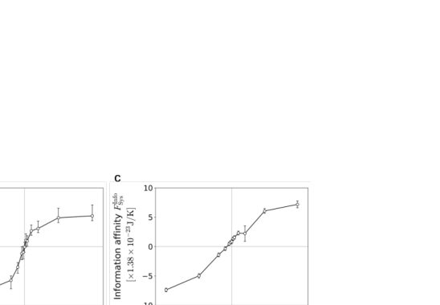
<figcaption class="paper-figure-caption"><b>Fig 3.</b> Figure 3 |a HE information flow, b Information current, c Information affinity: nominal feedback current dependence. The data points represent experimental results. Solid lines: connecting the data points and guiding to the eye. Error bars: the 3𝜎-equivalent statistical uncertainty, defined by the 0.135th and 99.865th percentiles of the bootstrap distribution, together with the systematic uncertainty due to sample degradation.</figcaption>
</figure>
<figure class="paper-figure-card">
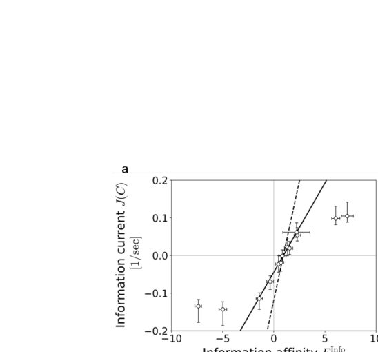
<figcaption class="paper-figure-caption"><b>Fig 4.</b> Figure 4 | Ohm’s law for information and heat absorption driven by information feedback.</figcaption>
</figure>

**Summary.** The research demonstrates Ohm's law for information by creating an information engine using magnetic skyrmions. By analyzing the steady-state current flow driven by a feedback mechanism analogous to Maxwell's demon, the authors show that the information current is linearly proportional to the driving information affinity. This provides a novel, solid-state platform for studying information thermodynamics.

**Why it may be interesting.** This work provides a tangible, solid-state realization of non-equilibrium thermodynamics principles, specifically linking information flow (entropy/information) to measurable electrical-like laws (Ohm's law), which is highly relevant to open quantum systems and energy transduction.

Detailed structure

**Main problem.** The primary goal is to experimentally establish an Ohm-like constitutive relationship for information transport, drawing an analogy between electrical circuits and information thermodynamics.

**Main result.** The authors successfully demonstrated that the information current generated in their system is proportional to the information affinity, thereby establishing Ohm's law for information in a physical platform.

**Method.** The experiment involves realizing an information engine using two magnetic skyrmions undergoing Brownian motion at room temperature, monitored via magneto-optical microscopy.

**Model / system.** The system is modeled as a bipartite network of four states (vertices) connected by a closed loop, where information flow is quantified using transition rates and state probabilities.

**Key observables.** Information current (J_n), Information affinity ($\mathcal{F}_{	ext{Sys}}^{	ext{Info}}$), and Information conductance ($L_{	ext{Sys}}^{	ext{Info}}$).

**Important parameters / regimes.** Room temperature operation, feedback current density (e.g., $0.094 	imes 10^9 	ext{ A/m}^2$), and the system's magnetic skyrmion dynamics.

**Assumptions / limitations.** The relationship must be slightly modified in real circuits to account for interactions between information carriers and the scattering of the information current.

**Figures summary.** Figures illustrate the schematic setup, the four-state loop, the dependence of vertex probabilities on feedback current, and plots confirming the linear relationship between information current and information affinity.

**Paper structure.** The paper establishes the theoretical link between information affinity and current, details the experimental setup using skyrmions, measures the resulting information current and affinity, and finally verifies the linear proportionality (Ohm's law) and discusses necessary corrections.

Abstract

Reducing the energy cost of computation-a pressing issue in the age of AI-requires a framework for circuit design based on information thermodynamics. By extending non-equilibrium statistical mechanics to information thermodynamics, it has been shown that a probability flow carrying information-hereinafter referred to as an 'information current'-is driven by its conjugate thermodynamic force, namely 'information affinity'. Since information affinity plays a role analogous to that of voltage in an electrical circuit, it is suggested that information transport also follows a linear response relationship analogous to Ohm's law. However, despite this theoretical prediction, experimentally establishing an Ohm-like constitutive relation for information transport remains an important unsolved problem. Here, we realise an information engine consisting of two magnetic skyrmions undergoing Brownian motion at room temperature. We demonstrate that the resulting information current is proportional to the information affinity generated by Maxwell's demon over a relatively wide range, establishing Ohm's law for information. Furthermore, we clarify that, in real information circuits, both Ohm's law for information and Kirchhoff's voltage law must be slightly modified to account for interactions between information carriers and the scattering of the information current.

[↑ back to top](#top)

### [Spin separation of Dirac electrons by twisted and vector optical beams](http://arxiv.org/abs/2609.37010v1)

**Authors:** A. A. Gunyaga, M. V. Durnev, S. A. Tarasenko  
**Type:** theory · **Category:** other · **PDF:** <https://arxiv.org/pdf/2609.37010v1>  
**Analysis basis:** full PDF text, analyzed in chunks
**Topic relevance:** `interference shaping light` **3/5** · `Keldysh / 2PI / non-Gaussian methods` **2/5** · `methods for driven-dissipative` **2/5** · `analog quantum simulation` **1/5** · `quantum measurements` **1/5**

↔ Scroll figures horizontally

<figure class="paper-figure-card">
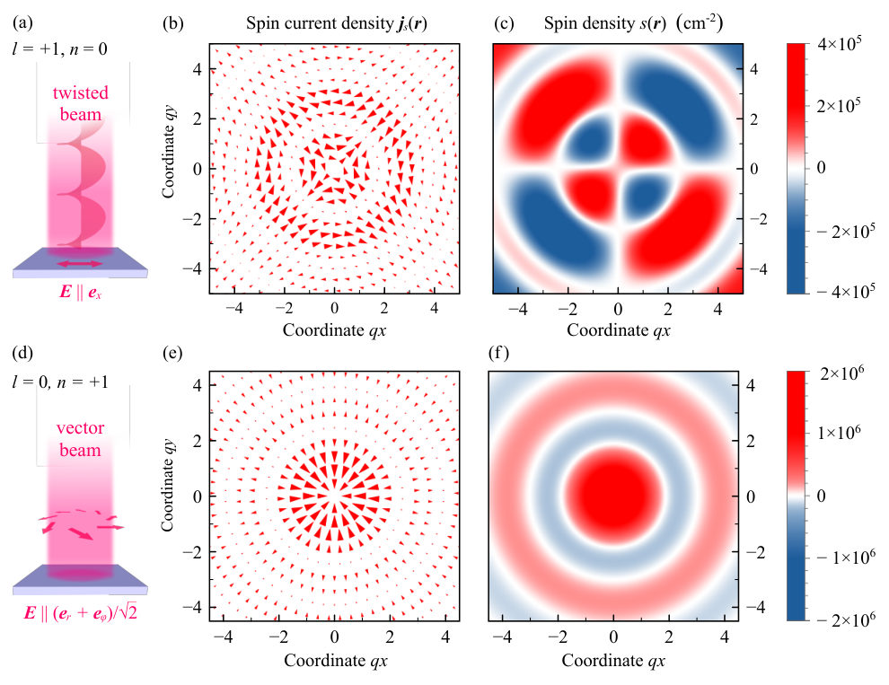
<figcaption class="paper-figure-caption"><b>Fig 1.</b> FIG. 1. Optical generation of spin currents and spin polarization of electrons by linearly polarized twisted and vector beams. (a) and (d) Sketches of optical beams with orbital angular momentum l and winding number n. (b) and (e) Spatial distributions of spin currents, (c) and (f) Spatial distributions of emerging spin densities. Figures are calculated for parameters relevant to n-type TMDC layers: the band gap 2δ = 2 eV, the interband velocity a = c/300, the relaxation times τ1 = τ2 = 1 ps, the spin diffusion coefficient Ds = 15 cm2/s, the spin relaxation time τs = 10 ns, the spin Hall angle θ = 10−2 rad, the radiation intensity I = 1 kW/cm2, the photon energy ℏω/2δ = 1.1, and the...</figcaption>
</figure>
<figure class="paper-figure-card">
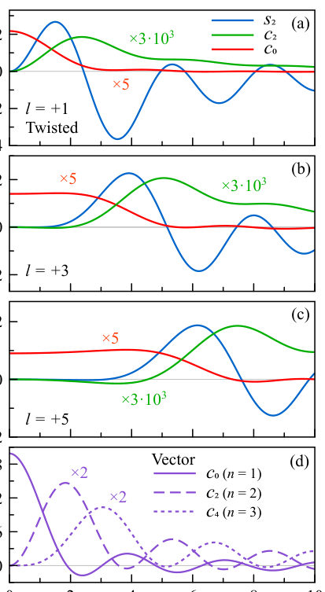
<figcaption class="paper-figure-caption"><b>Fig 2.</b> FIG. 2. Radial functions cm(qr) and sm(qr) of the spin density expanded over angular harmonics, see Eq. (9). (a)- (c) Evolution of spin distributions induced by twisted Bessel beams with increasing the OAM projection l. (d) Spin dis- tributions induced by vector beams with different winding numbers n. The distributions are calculated for the same pa- rameters as in Fig. 1, relevant to n-type TMDC layers, for polarization angles (a)-(c) φ0 = 0 and (d) φ0 = π/4.</figcaption>
</figure>

**Summary.** This paper theoretically demonstrates that structured light beams, such as twisted or vector beams, can spatially separate electron spins in 2D Dirac materials. By analyzing the resulting spin currents, the authors show that the light's spatial pattern can directly dictate the accumulation of spin density in the material. This offers a promising, optically controlled mechanism for spintronics applications.

**Why it may be interesting.** This work bridges quantum optics (structured light, OAM) with condensed matter physics (spin transport in 2D materials), providing a novel, non-contact method for manipulating electron spin states using light fields.

Detailed structure

**Main problem.** The paper demonstrates that structured light, specifically twisted and vector optical beams, can induce the spatial separation of two-dimensional (2D) Dirac electrons with opposite spin projections.

**Main result.** Both beam types generate spatially textured spin currents, leading to significant local spin density, suggesting a mechanism to imprint optical beam patterns onto electron spin degrees of freedom.

**Method.** The authors derived analytical expressions for spin density evolution in quasi-local and diffusion-controlled regimes, solving the spin diffusion-relaxation equation using Green's function methods.

**Model / system.** The system involves 2D Dirac materials, particularly relevant to transition metal dichalcogenide (TMDC) monolayers. The interaction is modeled as an indirect coupling mechanism driven by the spatial structure of the structured light beams.

**Key observables.** Spin current density j_s(r) and resulting spin density s(r), which can be probed via Faraday or Kerr rotation techniques.

**Important parameters / regimes.** Key parameters include the band gap (2\delta = 2 eV), spin relaxation time (τ_s = 10 ns), and the beam's Orbital Angular Momentum (OAM) or polarization winding number (l or n).

**Assumptions / limitations.** The analysis assumes the spin current generation is controlled by the field's spatial structure and neglects standard optical spin orientation from circularly polarized light, as well as inversion-symmetry breaking effects.

**Figures summary.** Figure 1 illustrates the spatial distributions of spin currents and densities for both twisted and vector beams. Figure 2 shows the radial evolution of the spin density expansion coefficients for varying OAM.

**Paper structure.** The paper establishes the physical problem, derives the governing spin diffusion equation, analyzes the spin current generation from structured light (twisted and vector beams), and presents numerical calculations of the resulting spin textures in different physical regimes.

Abstract

We demonstrate that twisted and vector optical beams can spatially separate two-dimensional electrons with opposite spin projections. Spin accumulation arises from diverging spin currents induced by structured light together with spin relaxation and diffusion. We derive analytical expressions for the resulting spin density in the quasi-local and diffusion-controlled regimes and numerically calculate the spin textures for the parameters relevant to transition metal dichalcogenide monolayers. Our results suggest a mechanism by which the twist and vector pattern of optical beams can be imprinted onto the electron spin degree of freedom.

[↑ back to top](#top)

### [Magnetic-field-activated transport from band geometry in gapped nodal-line semimetals](http://arxiv.org/abs/2609.36606v1)

**Authors:** L. Medel Onofre, L. E. Sosa-Arias, A. Martín-Ruiz  
**Type:** theory · **Category:** other · **PDF:** <https://arxiv.org/pdf/2609.36606v1>  
**Analysis basis:** full PDF text, analyzed in chunks
**Topic relevance:** `Keldysh / 2PI / non-Gaussian methods` **3/5** · `methods for driven-dissipative` **2/5** · `analog quantum simulation` **1/5** · `quantum measurements` **1/5**

↔ Scroll figures horizontally

<figure class="paper-figure-card">
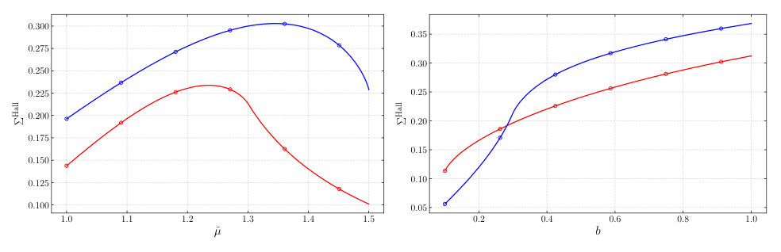
<figcaption class="paper-figure-caption"><b>Fig 1.</b> FIG. 1: Dimensionless intrinsic Hall response Σ(b, ∆, ˜µ) defined in Eq. (23). Left panel: dependence on the rescaled chemical potential ˜µ = µ/m for two values of the magnetic field, b = 0.3 (red) and b = 0.5 (blue). The response increases close to the gap edge, reaches a maximum, and then decreases as the Fermi level moves deeper into the conduction band. Right panel: magnetic-field dependence as a function of b = B/Beff for fixed values ˜µ = 1.1 (red) and ˜µ = 1.3 (blue). The linear weak-field regime is followed by a pronounced nonlinear behavior associated with orbital-magnetic-moment effects and the field-induced restriction of the phase space.</figcaption>
</figure>
<figure class="paper-figure-card">
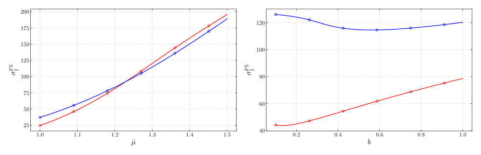
<figcaption class="paper-figure-caption"><b>Fig 2.</b> FIG. 2: Dimensionless longitudinal Fermi-surface conductivity σFS ∥, defined by Eq. (31). Left panel: dependence on the rescaled chemical potential ˜µ = µ/m for two magnetic-field strengths, b = 0.3 (red) and b = 0.5 (blue). The conductivity increases with carrier density, while the magnetic field enhances the response mainly close to the gap edge. Right panel: magnetic-field dependence for ˜µ = 1.1 (red) and ˜µ = 1.3 (blue). The weak-field behavior is followed by a pronounced nonlinear evolution resulting from the combined effects of the orbital magnetic moment and the magnetic-field-induced deformation of the Fermi surface.</figcaption>
</figure>
<figure class="paper-figure-card">
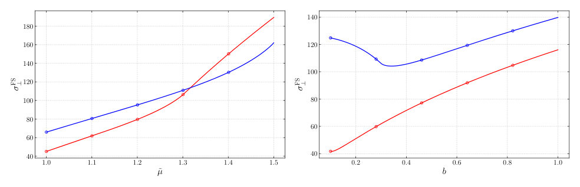
<figcaption class="paper-figure-caption"><b>Fig 3.</b> FIG. 3: Dimensionless transverse Fermi-surface conductivity σFS ⊥, defined by Eq. (32). Left panel: dependence on the rescaled chemical potential ˜µ = µ/m for b = 0.3 (red) and b = 0.5 (blue). The conductivity grows monotonically with the chemical potential, while the magnetic field induces a marked anisotropic enhancement close to the gap edge. Right panel: magnetic-field dependence for ˜µ = 1.1 (red) and ˜µ = 1.3 (blue). The nonmonotonic evolution reflects the progressive competition between the field-induced deformation of the Fermi surface and the redistribution of geometrically active states contributing to transport.</figcaption>
</figure>
<figure class="paper-figure-card">
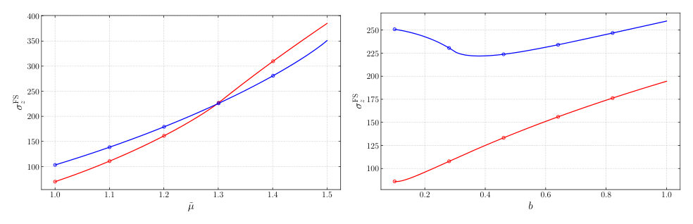
<figcaption class="paper-figure-caption"><b>Fig 4.</b> FIG. 4: Dimensionless out-of-plane Fermi-surface conductivity σFS z , defined by Eq. (33). Left panel: dependence on the rescaled chemical potential ˜µ = µ/m for magnetic fields b = 0.3 (red) and b = 0.5 (blue). The conductivity increases steadily as the Fermi level moves away from the gap, with magnetic-field effects being more pronounced near the band edge. Right panel: dependence on the magnetic field for ˜µ = 1.1 (red) and ˜µ = 1.3 (blue). Deviations from the weak-field regime become evident at intermediate fields, illustrating the nonperturbative influence of the orbital magnetic moment on Fermi-surface transport.</figcaption>
</figure>
<figure class="paper-figure-card">
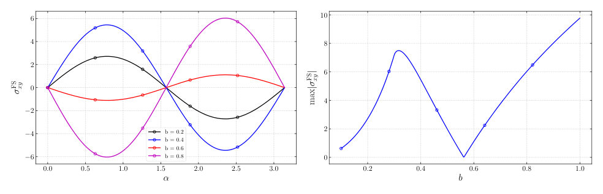
<figcaption class="paper-figure-caption"><b>Fig 5.</b> FIG. 5: Planar Hall conductivity arising from the magnetic-field-induced anisotropy of the Fermi-surface transport. Left panel: angular dependence of the planar Hall conductivity σFS xy , given by Eq. (38), for ˜µ = 1.3 and four representative magnetic fields, b = 0.2, 0.4, 0.6, and 0.8. The response follows the characteristic sin(2α) dependence of Eq. (38), vanishing when the magnetic field is parallel or perpendicular to the electric field (α = 0, π/2, π) and reaching its extrema at α = π/4 and 3π/4. Right panel: maximum planar Hall conductivity, max |σFS xy | = 1</figcaption>
</figure>

**Summary.** This paper presents a nonperturbative semiclassical theory for magnetotransport in nodal-line semimetals. It demonstrates that magnetic fields activate intrinsic Hall currents by modifying the geometrically active Fermi surface via the orbital magnetic moment. The work provides a unified framework for understanding topological magnetotransport beyond simple weak-field approximations.

**Why it may be interesting.** While focused on condensed matter transport, the use of semiclassical wave-packet dynamics and the explicit calculation of Berry curvature effects provide advanced theoretical tools applicable to open quantum systems where geometric phases are crucial.

Detailed structure

**Main problem.** To develop a nonperturbative semiclassical theory describing magnetotransport in gapped nodal-line semimetals.

**Main result.** The study shows that the orbital magnetic moment reconstructs the active Fermi surface, activating an intrinsic Hall current absent at zero field, and predicts measurable planar Hall effects at intermediate magnetic fields.

**Method.** The authors employ a semiclassical wave-packet formalism, deriving exact expressions for intrinsic Hall response and dissipative conductivity valid to all orders in the magnetic field.

**Model / system.** The system is gapped nodal-line semimetals, modeled using a minimal two-band Hamiltonian. The analysis focuses on the geometry of the nodal ring in momentum space.

**Key observables.** Intrinsic Hall response, dissipative Fermi-surface conductivity, Planar Hall effect, and the dependence of transport on the chemical potential.

**Important parameters / regimes.** Magnetic field strength (analyzed nonperturbatively), chemical potential ($\mu$), and the proximity of the Fermi level to the nodal ring.

**Assumptions / limitations.** The semiclassical regime is assumed, and the analysis extends beyond weak-field, perturbative expansions.

**Figures summary.** Not specified by the notes, but the analysis involves deriving conductivity tensors and showing field-dependent responses.

**Paper structure.** The paper progresses by introducing the semiclassical Boltzmann formalism, detailing the nodal-line model geometry, evaluating the intrinsic and dissipative responses, and concluding with a unified framework for geometric magnetotransport.

Abstract

We develop a nonperturbative semiclassical theory of magnetotransport in gapped nodal-line semimetals, retaining the full magnetic-field dependence of Berry-curvature and orbital-magnetic-moment corrections. Starting from a minimal two-band model, we derive exact expressions for both the intrinsic Hall response and the dissipative Fermi-surface conductivity, valid to all orders in the magnetic field within the semiclassical regime. We show that the orbital magnetic moment reconstructs the geometrically active Fermi surface, breaking the azimuthal cancellation imposed by the nodal-line geometry and thereby activating an intrinsic Hall current that is absent at zero magnetic field. The Hall response exhibits a pronounced nonmonotonic dependence on the chemical potential and a strongly nonlinear magnetic-field evolution, reflecting the redistribution of geometrically active states around the nodal ring. We further demonstrate that the Fermi-surface conductivities recover the conventional Drude behavior in the weak-field limit, while acquiring quadratic and ultimately nonperturbative magnetic-field corrections together with a field-induced transport anisotropy that gives rise to a measurable planar Hall effect at intermediate fields. Both the intrinsic and dissipative responses are strongly enhanced when the Fermi level lies close to the nodal ring, where Berry curvature and orbital magnetic moment are largest. Our results identify magnetic-field-activated geometric transport as a characteristic signature of nodal-line semimetals and provide a unified framework for describing magnetotransport beyond perturbative magnetic-field expansions, together with experimentally accessible signatures of orbital-magnetic-moment physics.

[↑ back to top](#top)

### [Rotational symmetry and common-mode phase drift in a counter-wound S-shaped Aharonov--Bohm interferometer](http://arxiv.org/abs/2609.37753v1)

**Authors:** Halil Serdar Solak, Afif Siddiki  
**Type:** both · **Category:** other · **PDF:** <https://arxiv.org/pdf/2609.37753v1>  
**Analysis basis:** full PDF text, analyzed in chunks
**Topic relevance:** `interference shaping light` **3/5** · `analog quantum simulation` **1/5** · `quantum measurements` **1/5**

↔ Scroll figures horizontally

<figure class="paper-figure-card">
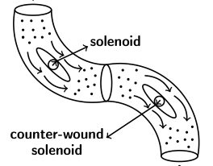
<figcaption class="paper-figure-caption"><b>Fig 1.</b> FIG. 1. Schematic projection of the three-dimensional double- bend waveguide. Two quarter-circle reference arcs of opposite curvature are joined tangentially. The tube has an elliptical transverse cross section, and a through-opening in each bend creates two lateral conducting arms that rejoin before the next split. Solenoids occupy the openings without contacting the conductor; their axes are normal to the centerline plane. Both signed fluxes are referred to the same normal direction, with Φ1 = −Φ2 for counter-wound operation. Magnetic fields are assumed to be confined to the excluded regions. Dots and arrows indicate propagation schematically, rather than calculated particle trajectories....</figcaption>
</figure>
<figure class="paper-figure-card">
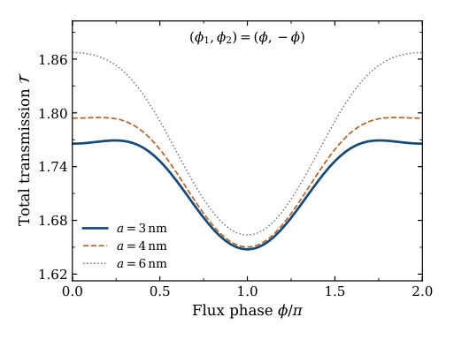
<figcaption class="paper-figure-caption"><b>Fig 2.</b> FIG. 2. Calculated total transmission of the balanced three- dimensional InAs waveguide for (ϕ1, ϕ2) = (ϕ, −ϕ) at EF ≃ 7.283 meV and zero electronic temperature. The curves com- pare cubic grid spacings of 3, 4, and 6 nm; lines connect inde- pendently calculated points. The lead capacity is three orbital channels, with spin degeneracy included only when convert- ing transmission to conductance. The remaining separation between the curves is a discretization effect.</figcaption>
</figure>
<figure class="paper-figure-card">
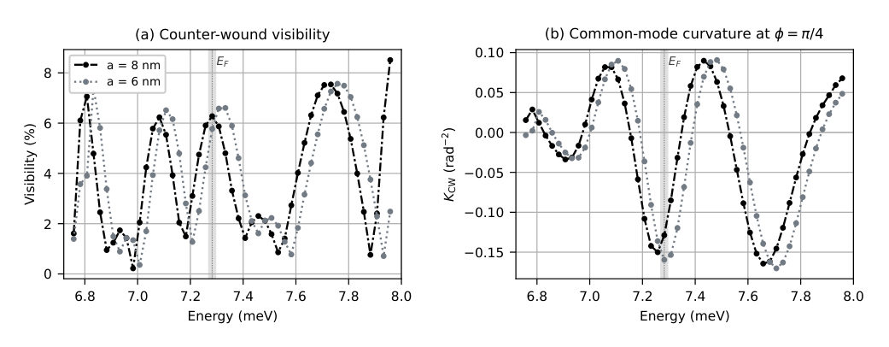
<figcaption class="paper-figure-caption"><b>Fig 3.</b> FIG. 3. Energy dependence of the counter-wound response on the 8 and 6 nm grids at zero electronic temperature. (a) Visibility of the counter-wound sweep T (E; ϕ, −ϕ) over one flux period. (b) Common-mode curvature KCW at ϕ = π/4. The dotted vertical line marks EF ; the shaded band is the full width at half maximum of −∂f/∂E at 100 mK. The two grids differ mainly by a rigid shift of about 35 µeV (Sec. V B).</figcaption>
</figure>
<figure class="paper-figure-card">
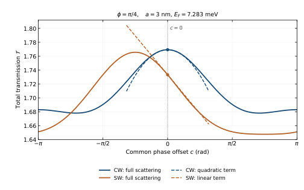
<figcaption class="paper-figure-caption"><b>Fig 4.</b> FIG. 4. Common-offset response at ϕ = π/4 for the counter- wound (CW) and same-winding (SW) configurations on the 3 nm grid. Solid curves connect independently calculated transmission values. Dashed curves show the leading local ap- proximations: quadratic for CW and linear for SW, displayed for |c| ≤1 rad. The vertical line marks c = 0. Calculations use EF = 7.2826087 meV and zero electronic temperature.</figcaption>
</figure>
<figure class="paper-figure-card">
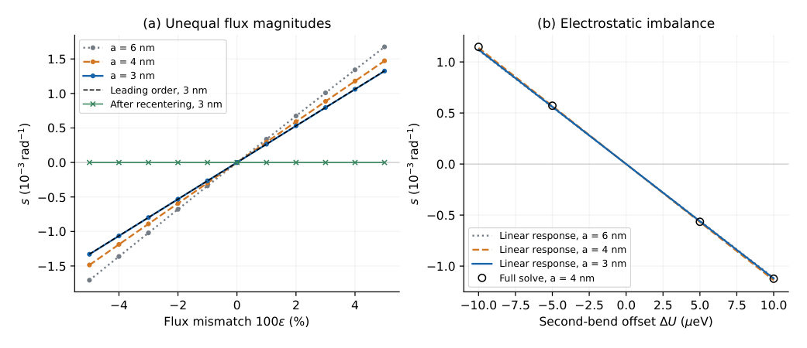
<figcaption class="paper-figure-caption"><b>Fig 5.</b> FIG. 5. Common-mode sensitivity at ϕ = π/4. (a) Normalized slope at the nominal operating point for unequal flux magnitudes. Markers are full scattering calculations; lines join them. The thin black dashed line is the leading expression (51) on the 3 nm grid; green crosses show the recalculated slopes after recentering. (b) Response to a uniform potential offset in the second bend, with both leads and the first bend unchanged. Lines are first-order potential-response predictions for three grid spacings. Open markers are separate finite-offset scattering calculations on the 4 nm grid. Their agreement tests the local expansion, not convergence to the continuum. Both panels use the...</figcaption>
</figure>

**Summary.** This work analyzes the robustness of quantum interference in a specialized S-shaped Aharonov-Bohm interferometer by exploiting its geometric and rotational symmetries. The authors demonstrate that the counter-wound geometry protects the system from common magnetic flux drifts, which is a crucial finding for designing stable quantum devices. The study uses advanced 3D scattering calculations to quantify the achievable visibility and noise response.

**Why it may be interesting.** The focus on symmetry-protected robustness against environmental noise (common-mode drift) in a mesoscopic quantum device is highly relevant to building stable quantum sensors or quantum interconnects.

Detailed structure

**Main problem.** The study investigates how common flux offsets affect the interference visibility in a counter-wound S-shaped Aharonov-Bohm interferometer, leveraging symmetry protection.

**Main result.** The counter-wound configuration is shown to be stationary against common flux offsets due to symmetry constraints, although the measured visibility remains low (2.6-2.9% continuum estimate).

**Method.** The research combines theoretical analysis of symmetries (microreversibility, rotational symmetry) with three-dimensional scattering calculations using the Landauer-Büttiker formalism.

**Model / system.** The system is a 3D InAs Aharonov-Bohm waveguide formed by two quarter-circle bends of opposite curvature, modeled with a spin-independent, two-terminal Hamiltonian.

**Key observables.** Interference visibility, transmission variance, mean shift, and the response coefficients to common/differential flux noise.

**Important parameters / regimes.** Reference radius $R = 350$ nm, Fermi energy $E_F \simeq 7.283$ meV, and low electron temperatures ($\approx 100$ mK).

**Assumptions / limitations.** The model assumes ideal confined fluxes, spin-independent transport, and linear response approximations for noise analysis.

**Figures summary.** Figure 1 schematically illustrates the double-bend waveguide structure, confirming the geometry of two quarter-circle arcs of opposite curvature joined tangentially.

**Paper structure.** The paper establishes the physical system and symmetries, derives the necessary constraints from microreversibility, performs 3D scattering calculations to quantify visibility and noise response, and concludes with experimental requirements for testing the symmetry protection.

Abstract

We study common flux offsets in a three-dimensional InAs Aharonov-Bohm waveguide formed by two quarter-circle bends of opposite curvature. Each bend contains a through-opening that separates two conducting arms and encloses an independently specified flux. For a spin-independent, two-terminal model with ideal confined fluxes, microreversibility and a rotation exchanging the complete modules imply $\mathcal{T}(φ_1,φ_2)=\mathcal{T}(-φ_2,-φ_1)$. The counter-wound configuration is therefore stationary against common offsets, while the same-winding configuration is stationary against differential offsets. This constraint does not require cancellation of every interference phase, and it extends to a spatially uniform ambient field perpendicular to the plane of the guide, even though that field also penetrates the conductor. Three-dimensional scattering calculations at $R=350$ nm and $E_F\simeq 7.283$ meV retain three open orbital lead modes and strong reflection at the openings. The finest sampled counter-wound sweep has a visibility of approximately 3.56%; referring the grids to a common threshold gives an estimated continuum visibility of 2.6-2.9%. The response coefficients vary strongly with energy, while a 100 mK electron temperature retains about 98% of the visibility. For weak, purely common Gaussian phase noise, the leading transmission variance is quartic in noise amplitude, whereas the mean shift remains quadratic. Flux imbalance and asymmetric scalar potentials restore a linear response; symmetric scalar disorder preserves stationarity without guaranteeing high transmission. The proposed experimental test requires few-mode coherent transport, calibrated flux controls, and a magnetic-source design whose leakage fields and spin-dependent terms are assessed explicitly.

[↑ back to top](#top)

### [Interlayer coupling between twisted graphenes through atomically-precise barriers](http://arxiv.org/abs/2609.36703v1)

**Authors:** Yueyang Wang, Ben Fuller, Hongxia Xue, Tianyu Zhang, Kenji Watanabe, Takashi Taniguchi, Vladimir Falko, Dong-Keun Ki  
**Type:** experiment · **Category:** strongly correlated electrons · **PDF:** <https://arxiv.org/pdf/2609.36703v1>  
**Analysis basis:** full PDF text, analyzed in chunks
**Topic relevance:** `analog quantum simulation` **3/5** · `Keldysh / 2PI / non-Gaussian methods` **1/5**

↔ Scroll figures horizontally

<figure class="paper-figure-card">
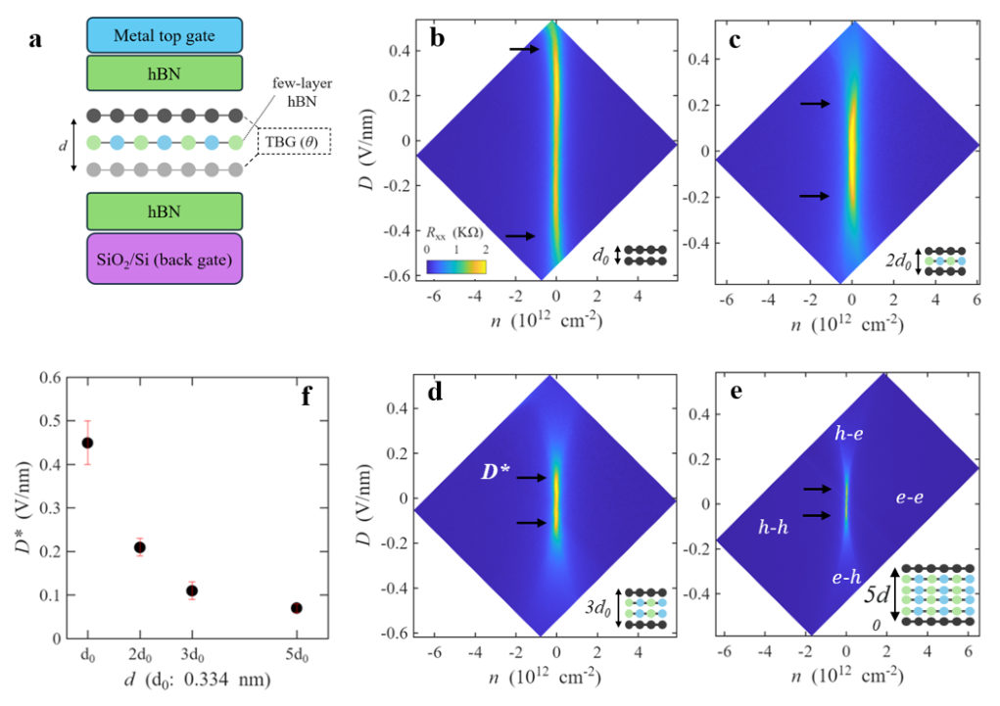
<figcaption class="paper-figure-caption"><b>Fig 1.</b> FIG. 1. (a) Schematics of typical device structure. Two graphene layers are twisted with a angle θ and separated by an ultrathin hBN spacer. (b-e) The longitudinal resistance as a function of n and D at B = 0 T of 0-hBN device (b), 1-hBN device (c), 2-hBN device (d), and 4-hBN device (e). Devices 0-hBN, 1-hBN, and 2-hBN are made from the same graphene flakes. The schematic inset demonstrates the interlayer distance for each device. Black arrows denote the position of the critical displacement field D∗where the Dirac peak splits or broadens and e −h bilayer is formed (e: electron, h: hole). Data in (b-d) are measured at 100 mK, and in (e) at 300 mK. (f) D∗as a function of interlayer distance...</figcaption>
</figure>
<figure class="paper-figure-card">
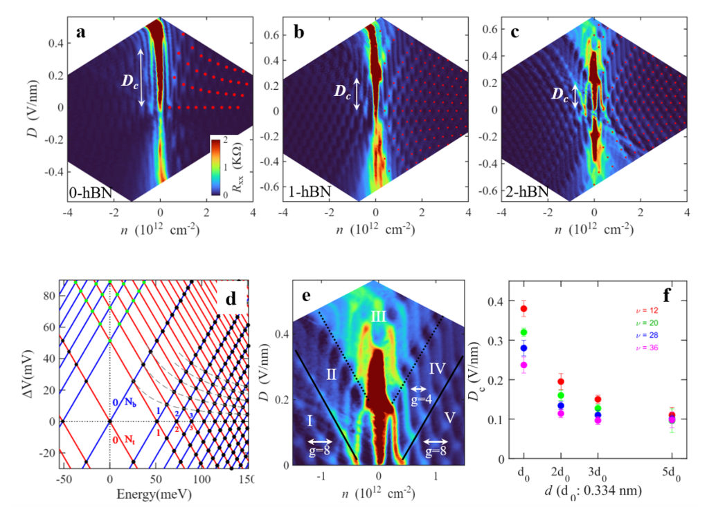
<figcaption class="paper-figure-caption"><b>Fig 2.</b> FIG. 2. (a-c) Longitudinal resistance as a function of n and D at 2 T for 0-hBN device (a), 1-hBN device (b), and 2-hBN device (c). The red dots are calculated by the capacitance model, demonstrating a great match with experimental data. Measurement of (a) is done at 6 K while (b,c) at 100 mK. (d) The simulated crossing pattern using the equation e∆V = ELL(Nt) −ELL(Nb) where ELL(N) = sgn(N)νF p</figcaption>
</figure>
<figure class="paper-figure-card">
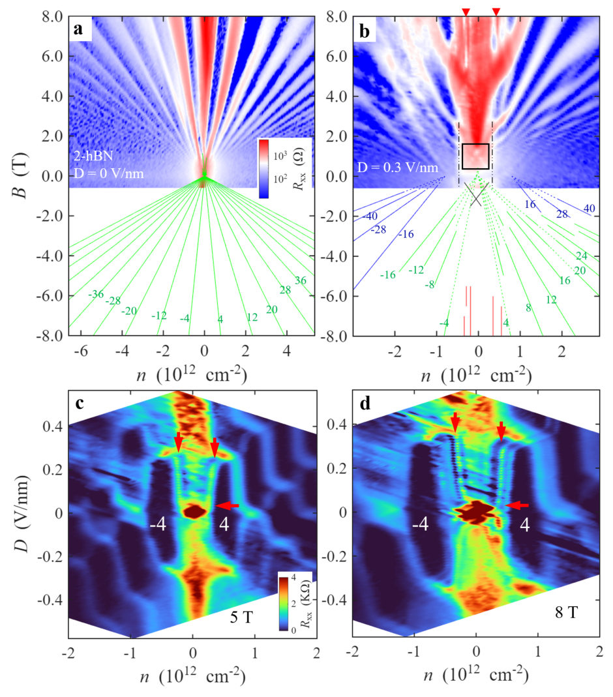
<figcaption class="paper-figure-caption"><b>Fig 3.</b> FIG. 3. (a,b) Landau fan diagrams of 2-hBN device at D = 0 V/nm (a) and D = 0.3 V/nm (b) with schematics of filling states. Without applying D, the quantum oscillations exhibit 8-fold degeneracy, with filling factors ν = ±4, ±12, ±20, .... Under finite D, the degeneracy is immediately lifted, and multiple fanning points emerge. The black broken lines in (b) indicate the area of electron-hole bilayer region. The vertical features are indicated by red lines and triangles. (c,d) Longitudinal resistance of 2-hBN device as a function of n and D at 5 T (c) and 8 T (d). The positions of filling factors ν = nh/(eB) of ±4 are indicated in white numbers. All measured at 200 mK.</figcaption>
</figure>
<figure class="paper-figure-card">
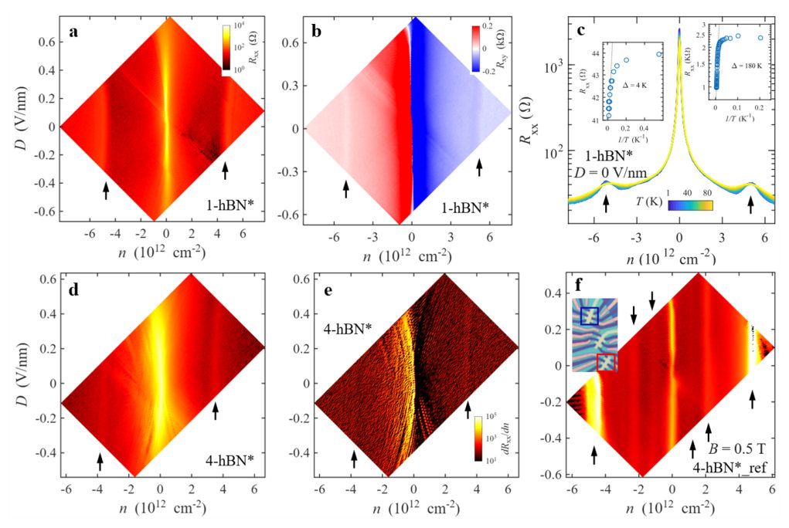
<figcaption class="paper-figure-caption"><b>Fig 4.</b> FIG. 4. (a,b) Rxx (a) and Rxy (b) as a function of n and D measured at 0.3 T and 0.3 K for 1-hBN∗device. The black arrows indicate the position of side peaks at nS1 = ±4.9 × 1012 cm−2 (1.45◦) in (a) and the corresponding Hall feature in (b). (c) Temperature-dependent Rxx of 1-hBN∗device measured at D = 0 V/nm. The insets present the Arrhenius plots, where the dotted line denotes the Arrhenius fitting and ∆is the extracted gap of the side peak (left) and the main peak (right). (d) Rxx as a function of n and D measured at 0.5 T and 0.3 K for 4-hBN∗device. The black arrows indicate the position of side peaks at nS4 = ±3.8 × 1012 cm−2, corresponding to 1.28◦. (e) Differential resistance dRxx/dn...</figcaption>
</figure>

**Summary.** This work introduces a method to achieve atomic-layer-precise control over interlayer coupling in twisted bilayer graphene using hBN spacers. By systematically tuning the spacer thickness, the researchers demonstrated that interlayer interactions can be controlled, allowing for the study of moiré physics and correlated electronic states in a highly tunable platform.

**Why it may be interesting.** The ability to tune interlayer coupling via an engineered barrier (hBN) provides a clean, tunable platform to study correlated electron physics, mimicking the effects of varying material stacking or external strain in a highly controlled manner.

Detailed structure

**Main problem.** The central goal is to understand and control interlayer coupling in van der Waals (vdW) materials to engineer novel electronic phenomena like correlated states and topological phases.

**Main result.** The authors demonstrated that by using atomically-precise hBN spacers, they can systematically tune the interlayer coupling, showing that the critical field for electron-hole bilayer behavior decreases as the spacer separation increases.

**Method.** The study uses dual-gated devices on twisted bilayer graphene (TBG) separated by varying thicknesses of hBN spacers, measuring longitudinal resistance ($R_{xx}$) as a function of carrier density and vertical displacement field.

**Model / system.** The physical system is TBG separated by hBN spacers, allowing for independent control over interlayer distance ($d$) and twist angle ($	heta$). The analysis involves modeling the potential difference ($\Delta V$) between layers and observing quantum transport signatures like Landau level crossings.

**Key observables.** Longitudinal resistance ($R_{xx}$), critical displacement field ($D^*$), Landau level crossings, and the emergence of electron-hole bilayer states.

**Important parameters / regimes.** Interlayer distance ($d$) controlled by hBN thickness, displacement field ($D$), and twist angle ($	heta$).

**Assumptions / limitations.** The analysis assumes that tuning the spacer thickness allows for independent control of the interlayer coupling strength, enabling systematic decoupling.

**Figures summary.** Figures illustrate device schematics, $R_{xx}$ vs. density/displacement field plots showing $D^*$ dependence on spacer thickness, and Landau fan diagrams detailing quantum oscillations and electron-hole state emergence.

**Paper structure.** The paper progresses by first establishing the method for atomic-scale control of interlayer coupling using hBN spacers. It then analyzes transport measurements ($R_{xx}$ vs. $D$) to quantify the coupling strength ($D^*$) and explores high-field magnetotransport to map out correlated electronic states.

Abstract

Understanding and controlling interlayer coupling in van der Waals (vdW) materials is crucial for engineering novel electronic phenomena, including correlated states, topological phases, and superconductivity. Twisted bilayer graphene (TBG) offers a highly tunable platform to explore how interlayer orientation and separation influence quantum transport and moiré physics. Here, we introduce a method for achieving precise, atomic-scale control of interlayer coupling in TBG using dual-gated devices separated by ultrathin, thickness-tunable hBN spacers. This approach enables systematic control of interlayer interactions, demonstrating that the critical displacement field required for electron-hole bilayer behavior decreases as the layer separation increases at a fixed twist angle. Remarkably, at small twist angles, moiré-related side peaks persist even when layers are separated by tetralayers of hBN (approximately 1.3 nm), indicating robust interlayer band hybridization. By combining atomic-layer-precise control of interlayer coupling with independent twist angle tunability, our platform opens new avenues for discovering novel moiré physics governed by engineered interlayer coupling and moiré patterns.

[↑ back to top](#top)

### [Effects of Longitudinal Spin Current Density Gradient on Spin-Orbit Torque Switching of Perpendicular Magnetization](http://arxiv.org/abs/2609.36489v1)

**Authors:** Guowen Gong, Qianbiao Liu, Lijun Zhu  
**Type:** both · **Category:** other · **PDF:** <https://arxiv.org/pdf/2609.36489v1>  
**Analysis basis:** full PDF text, analyzed in chunks
**Topic relevance:** `analog quantum simulation` **2/5** · `driven-dissipative phase transition` **2/5** · `non-equilibrium universality` **2/5** · `Keldysh / 2PI / non-Gaussian methods` **1/5** · `methods for driven-dissipative` **1/5** · `quantum measurements` **1/5** · `scars & prethermalization` **1/5**

↔ Scroll figures horizontally

<figure class="paper-figure-card">
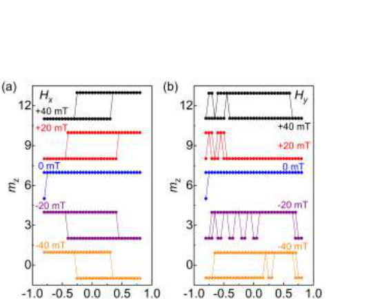
<figcaption class="paper-figure-caption"><b>Fig 1.</b> FIG. 2. Out-of-plane component of the magnetization vs the uniform current density under different uniform (a) longitudinal magnetic fields Hx and (b) transverse magnetic fields Hy.</figcaption>
</figure>
<figure class="paper-figure-card">
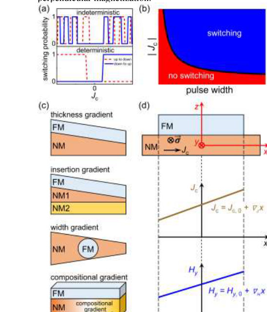
<figcaption class="paper-figure-caption"><b>Fig 2.</b> FIG. 1. (a) Schematic of switching probability as a function of pulse amplitude. (b) Phase diagram of deterministic switching. (c) Typical wedge structures for generating a longitudinal spin current density. (d) The reduced model and definitions of the parameters of the current-density gradient and the associated transverse field in simulations.</figcaption>
</figure>
<figure class="paper-figure-card">
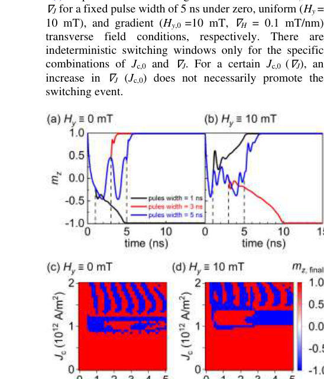
<figcaption class="paper-figure-caption"><b>Fig 3.</b> FIG. 3. Magnetization switching induced by a uniform spin current density. Time-resolved evolution of the spatially averaged out-of-plane magnetization (mz) under a uniform current (Jc = 9 × 1011 A/m2) and different pulse widths (1 ns, 3 ns, and 5 ns) simulated with the transverse magnetic field of (a) 0 mT and (b) 10 mT, respectively. Switching phase diagrams as functions of the uniform current density and pulse width with the transverse magnetic field of (c) 0 mT and (d) 10 mT. For (a)-(d), the initial state is mz = +1.</figcaption>
</figure>
<figure class="paper-figure-card">
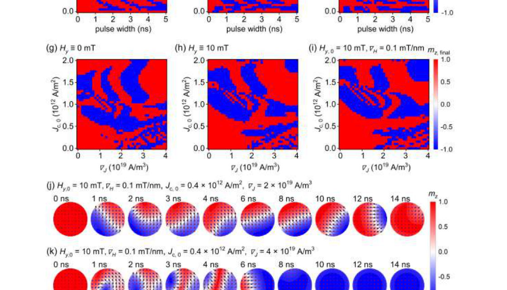
<figcaption class="paper-figure-caption"><b>Fig 4.</b> FIG. 4. Magnetization switching by a gradient spin current density. Time-resolved evolution of mz under different current- density gradients for Jc, 0 = 4 × 1011 A/m2 and 5 ns pulse width under a transverse magnetic field of (a) Hy ≡ 0 mT, (b) Hy ≡ 10 mT, and (c) Hy,0 = 10 mT,∇H ≡ 0.1 mT/nm. Dependence of the switching results on the average current density and pulse width (∇𝐽= 2 × 1019 A/m3) under a transverse magnetic field of (d) Hy ≡ 0 mT, (e) Hy ≡ 10 mT, and (f) Hy,0 = 10 mT,∇H ≡ 0.1 mT/nm. Dependence of the switching results on the average current density and current gradient (pulse width = 5 ns) under a transverse magnetic field of (g) Hy ≡ 0 mT, (h) Hy ≡ 10 mT, and (i) Hy,0 = 10...</figcaption>
</figure>
<figure class="paper-figure-card">
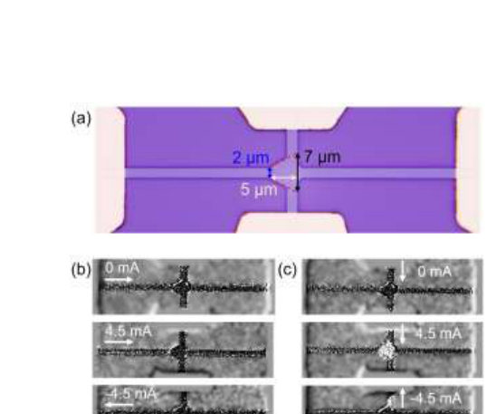
<figcaption class="paper-figure-caption"><b>Fig 5.</b> Fig. 5. Experimental verification of a Pt75Ti25/Ti/FeCoB device. (a) Optical microscopy image of the device, indicating a strong longitudinal width gradient. Kerr microscopy images after different current pulses (b) along and (c) transverse to the width gradient.</figcaption>
</figure>

**Summary.** This work addresses the critical question of whether a longitudinal spin current gradient can substitute for an external longitudinal magnetic field to deterministically switch perpendicular magnetization in magnetic heterostructures. Through micromagnetic simulations and experiments, the authors demonstrate that gradients are insufficient, concluding that deterministic switching requires a longitudinal field or, alternatively, perpendicular spin components.

**Why it may be interesting.** While focused on spintronics, the analysis of non-equilibrium dynamics, phase transitions (switching), and the role of engineered gradients in controlling magnetization reversal shares conceptual overlap with understanding non-equilibrium dynamics in quantum many-body systems.

Detailed structure

**Main problem.** The paper investigates whether a longitudinal spin current density gradient can replace the longitudinal magnetic field required for achieving deterministic spin-orbit torque (SOT) switching in perpendicular magnetic anisotropy (PMA) heterostructures.

**Main result.** The study concludes that any realistic longitudinal spin current density gradient is insufficient to enable deterministic switching, as the switching remains highly indeterministic and sensitive to device variations. Perpendicular spins are shown to be a much more effective mechanism for deterministic switching.

**Method.** The research combines micromagnetic simulations with experimental measurements on NM/FM bilayers to analyze magnetization dynamics under varying current and field conditions.

**Model / system.** The system under study is a normal metal/ferromagnet (NM/FM) bilayer exhibiting PMA. The dynamics are governed by spin-orbit torques derived from spin currents, considering both uniform and gradient components.

**Key observables.** Out-of-plane component of magnetization ($m_z$), switching probability, and the time-revolved evolution of $m_z$ during SOT switching.

**Important parameters / regimes.** Longitudinal spin current density gradient ($
abla j_s$), applied longitudinal magnetic field ($H_x$), and the pulse width ($	au$).

**Assumptions / limitations.** The analysis assumes that deterministic switching requires an effective longitudinal magnetic field, and the authors note that observed switching in literature might stem from mechanisms other than simple longitudinal spin current gradients.

**Figures summary.** Figures illustrate the schematics of gradient generation, the time-resolved evolution of $m_z$ under uniform vs. gradient currents, and phase diagrams showing the dependence of the final switching state on current density and gradient strength.

**Paper structure.** The paper establishes the open question regarding gradient replacement for $H_x$, presents micromagnetic simulations showing the failure of gradients to induce deterministic switching, and concludes with experimental evidence contrasting gradient effects with the superior performance of perpendicular spin generation.

Abstract

It has remained a critical open question as to whether a longitudinal spin current gradient (e.g., due to a gradient in the thickness, composition, or width) can replace the longitudinal magnetic field required for deterministic spin-orbit torque switching of normal metal/ferromagnet heterostructures with perpendicular magnetic anisotropy. Here, we report robust micromagnetic and experimental evidence that any realistic longitudinal spin-current density gradient cannot be an effective replacement for a longitudinal magnetic field to enable deterministic switching of a perpendicular magnetic anisotropy device. Instead, the longitudinal spin current density can only modify the nucleation and pulse-timing-sensitive oscillations of magnetic domains and thus the picosecond-scale strip-like indeterministic switching windows. The same conclusions hold robustly when the transverse effective field associated with the spin-current pulse (the sum of the Oersted field and field-like torque) is taken into account. The indeterministic switching prevents applications in the presence of finite device-to-device variations and drifts in write current pulse and thermal fluctuations of device parameters. We also experimentally show that, instead of a longitudinal spin current density gradient, perpendicular spins are much more effective in deterministic switching of perpendicular spin torque devices.

[↑ back to top](#top)

### [Engineering Vacuum Fluctuations in Hyperbolic Heterostructures](http://arxiv.org/abs/2609.37182v1)

**Authors:** Jie-Cheng Feng, Xinle Cheng, Itai Keren, Dante M. Kennes, Abhay N. Pasupathy, Dmitri N. Basov, Emil Vinas Bostrom, Angel Rubio  
**Type:** theory · **Category:** other · **PDF:** <https://arxiv.org/pdf/2609.37182v1>  
**Analysis basis:** full PDF text, analyzed in chunks
**Topic relevance:** `Keldysh / 2PI / non-Gaussian methods` **2/5** · `correlated / nonlocal dissipation` **1/5** · `driven-dissipative phase transition` **1/5** · `methods for driven-dissipative` **1/5** · `quantum measurements` **1/5**

↔ Scroll figures horizontally

<figure class="paper-figure-card">
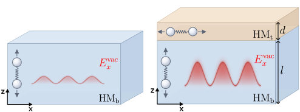
<figcaption class="paper-figure-caption"><b>Fig 1.</b> FIG. 1. Directional control of vacuum fluctuations in a hyperbolic phonon polariton heterostructure. Left: In a bare hyperbolic material HMb, the relevant phonon- polariton mode is dominated by a material excitation with out-of-plane polarization, such that the vacuum fluctuations of the in-plane electric field ⟨E2 x⟩vac are weak. Right: HMb is capped by a second hyperbolic material HMt, with differ- ently oriented anisotropy arising from a material excitation with primarily in-plane polarization. When the hyperbolic frequency windows overlap, the polariton modes hybridize and enhance ⟨E2 x⟩vac deep inside HMb.</figcaption>
</figure>
<figure class="paper-figure-card">
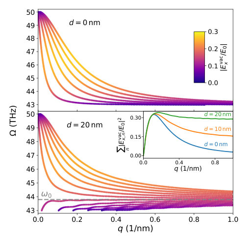
<figcaption class="paper-figure-caption"><b>Fig 2.</b> FIG. 2. Dispersion and in-plane vacuum electric field for the lowest six hyperbolic phonon-polariton branches. The color denotes |Evac x /E0| inside the HMb slab, where Evac x = p</figcaption>
</figure>
<figure class="paper-figure-card">
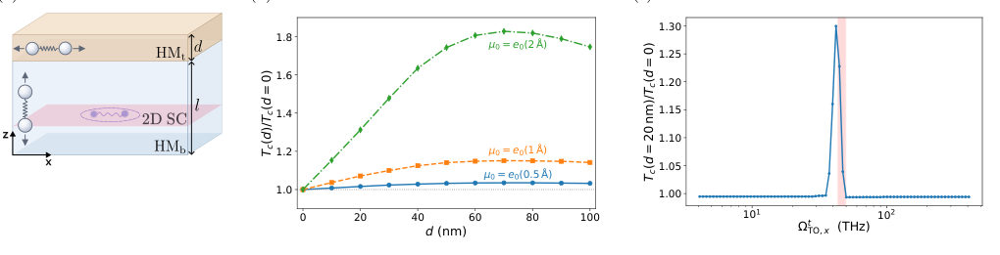
<figcaption class="paper-figure-caption"><b>Fig 3.</b> FIG. 3. Hyperbolic control of superconductivity. (a) Schematic of a 2D superconducting layer embedded in a HMb sample of thickness l, and covered by an HMt overlayer of thickness d. (b) Relative change in critical temperature Tc(d)/Tc(d = 0), as a function of d for several dipole strengths µ0. The thickness of HMb is fixed to l = 100 nm, with out-of-plane TO and LO phonon frequencies 43 THz and 50 THz. (c) Tc(d = 20 nm)/Tc(d = 0) as a function of the in-plane TO frequency of HMt, with the LO/TO ratio fixed. The red shaded area marks the hyperbolic regime of HMb. The strongest modification occurs when the hyperbolic frequency range of HMt overlaps the relevant mode of HMb.</figcaption>
</figure>

**Summary.** This paper proposes using hyperbolic heterostructures to actively engineer the vacuum electromagnetic field deep within a material. By placing a thin overlayer, researchers can reshape the vacuum fluctuations, which is then shown to remotely tune the superconducting critical temperature of an embedded 2D layer. This suggests a novel, on-chip route for controlling quantum material properties via vacuum field engineering.

**Why it may be interesting.** This work directly addresses the engineering of vacuum fields in structured media, which is a key area in quantum optics and open quantum systems, providing a mechanism for long-range, non-local control over material properties.

Detailed structure

**Main problem.** The challenge is to engineer and control the quantum vacuum fluctuations deep inside a material structure, moving beyond surface-level control.

**Main result.** A thin overlayer with opposite hyperbolicity can remotely reshape the vacuum field inside a hyperbolic material, which in turn can modify the critical temperature of an embedded superconductor.

**Method.** The study uses theoretical modeling involving the hybridization of hyperbolic polariton modes and applies Eliashberg theory to analyze the superconducting response.

**Model / system.** The system is a hyperbolic heterostructure composed of a bottom hyperbolic material (HMb) and a thin overlayer (HMt). The physics is governed by the coupling between the vacuum field and matter excitations, such as phonons or superconducting pairs.

**Key observables.** Vacuum fluctuations of the in-plane electric field ($\langle E_{2x} 
angle_{vac}$) and the superconducting critical temperature ($T_c$).

**Important parameters / regimes.** The degree of overlap between the hyperbolic bands of the two materials, and the thickness of the overlayer.

**Assumptions / limitations.** The analysis simplifies quantization by neglecting the damping term, and the model is not intended as a quantitative description of specific experiments.

**Figures summary.** Figures illustrate the directional control of vacuum fluctuations, showing enhancement of the in-plane field when capped by HMt, and demonstrate that $T_c$ changes only when the hyperbolic bands overlap.

**Paper structure.** The paper establishes the problem of vacuum control, models the hyperbolic heterostructure, calculates the field modification via mode hybridization, and applies this control mechanism to predict changes in superconductivity using Eliashberg theory.

Abstract

Vacuum fluctuations can be engineered using optical cavities, resonators, and surface-polaritonic modes, but extending such control deep inside a material remains challenging.Here we show that the vacuum field inside a hyperbolic material can be reshaped by a much thinner overlayer with opposite hyperbolicity.This effect requires overlap between the hyperbolic bands of the two materials and modifies the coupling between the vacuum field and matter excitations within the bottom material, without changing its intrinsic dielectric properties. As an application, we use Eliashberg theory to study a two-dimensional superconducting layer inside the bottom material, showing that the overlayer can remotely change its critical temperature.Our results may shed light on recent experiments reporting changes in superconductivity arising from a frequency-matched hyperbolic overlayer, and suggest an on-chip route to long-range control of matter excitations and collective material properties.

[↑ back to top](#top)

### [Linear and nonlinear transport responses of topological nodal-line semimetals](http://arxiv.org/abs/2609.36664v1)

**Authors:** L. E. Sosa-Arias, A. Martín-Ruiz  
**Type:** theory · **Category:** other · **PDF:** <https://arxiv.org/pdf/2609.36664v1>  
**Analysis basis:** full PDF text, analyzed in chunks
**Topic relevance:** `analog quantum simulation` **2/5** · `Keldysh / 2PI / non-Gaussian methods` **1/5** · `methods for driven-dissipative` **1/5**

↔ Scroll figures horizontally

<figure class="paper-figure-card">
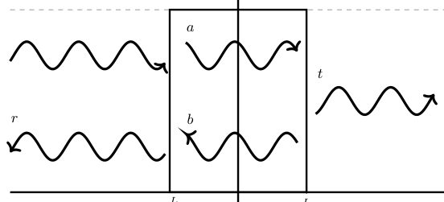
<figcaption class="paper-figure-caption"><b>Fig 1.</b> FIG. 1: Schematic scattering setup for a nodal-line semimetal (NLSM) in the presence of a gate-defined electrostatic barrier of height V0 and width L. An incoming state from the left is partially reflected with amplitude r and partially transmitted with amplitude t, while the barrier region z ∈[−L/2, L/2] supports forward- and backward-propagating modes with amplitudes a and b. This geometry provides the basis for computing the energy-resolved transmission coefficient T(E) within the Landauer-B¨uttiker framework.</figcaption>
</figure>
<figure class="paper-figure-card">
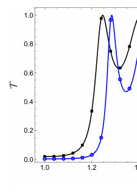
<figcaption class="paper-figure-caption"><b>Fig 2.</b> FIG. 2: Transmission probability as a function of the energy ratio ϵ = V0</figcaption>
</figure>
<figure class="paper-figure-card">
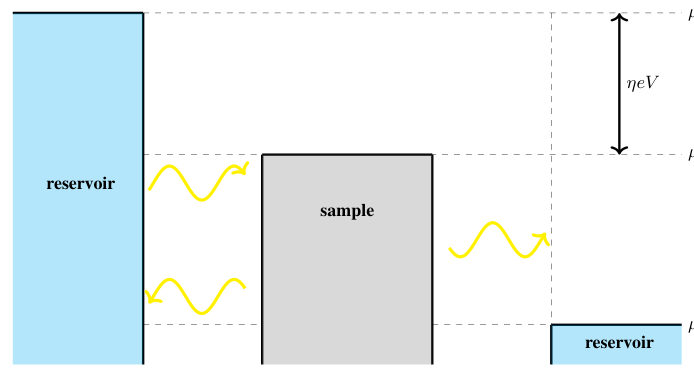
<figcaption class="paper-figure-caption"><b>Fig 3.</b> FIG. 3: Schematic illustration of two-terminal transport within the Landauer-B¨uttiker picture. The sample is modeled as a phase-coherent scatterer connected to two large reservoirs, each in local equilibrium with electrochemical potentials µL = µ + ηeV and µR = µ −(1 −η)eV , respectively. The parameter η ∈[0, 1] specifies how the external bias V is partitioned between the contacts. Incident modes from the left reservoir are partially transmitted through the sample and partially reflected back, and the resulting energy-resolved transmission coefficient T (E) determines the current through Eq. (25).</figcaption>
</figure>
<figure class="paper-figure-card">
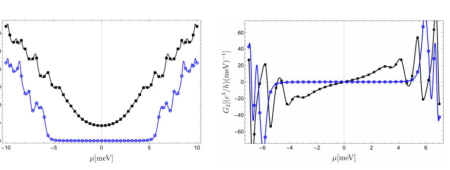
<figcaption class="paper-figure-caption"><b>Fig 4.</b> FIG. 4: (Color online) Linear (G1, left) and quadratic (G2, right) conductance densities as a function of the chemical potential µ at zero temperature. The linear conductance is given in units of e2/h, while the quadratic conductance is expressed in units of e3/h (meV)−1. Black symbols correspond to the gapless nodal-line semimetal, whereas blue symbols include a finite PT -breaking mass term (m = 5 meV). The opening of the gap suppresses the linear conductance and produces a plateau around µ ≃0, while the nonlinear response exhibits enhanced oscillations near the band edges. Both G1 and G2 vanish within the insulating gap, confirming the semimetal-insulator transition.</figcaption>
</figure>
<figure class="paper-figure-card">
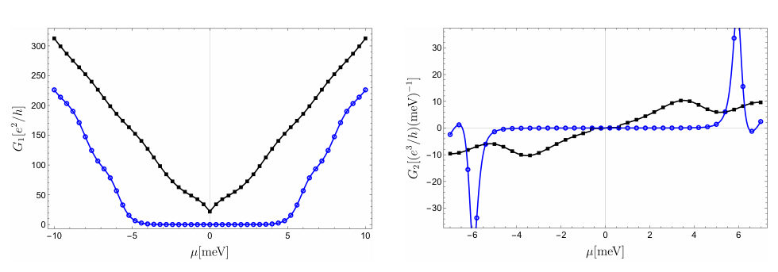
<figcaption class="paper-figure-caption"><b>Fig 5.</b> FIG. 5: (Color online) Linear (G1, left) and quadratic (G2, right) conductance densities as a function of the chemical potential µ at finite temperature (4K). The linear conductance is given in units of e2/h, while the quadratic conductance is expressed in units of e3/h (meV)−1. Finite temperature suppresses the oscillatory behavior of both conductance densities due to the thermal averaging over an energy window of order kBT.</figcaption>
</figure>

**Summary.** This paper theoretically analyzes charge transport in topological nodal-line semimetals through a finite barrier. It shows that the nodal topology protects Klein tunneling at normal incidence and derives expressions for linear and nonlinear conductances. The findings highlight that nonlinear Hall currents are a key signature of the nodal topology when $\mathcal{PT}$-symmetry is broken.

**Why it may be interesting.** The study of topological transport phenomena, especially those involving Berry curvature and non-trivial boundary conditions, provides rich theoretical analogues for understanding quantum transport in engineered mesoscopic systems, which is relevant to open quantum systems.

Detailed structure

**Main problem.** The study investigates the linear and nonlinear charge transport responses across topological nodal-line semimetals (NLSMs) when subjected to a finite electrostatic barrier.

**Main result.** The work demonstrates the persistence of Klein-tunneling behavior at normal incidence, protected by the nodal topology, and reveals that nonlinear Hall currents emerge upon breaking $\mathcal{PT}$-symmetry.

**Method.** The analysis employs the Landauer-Büttiker formalism to derive general expressions for conductances, solving the corresponding quantum scattering problem across the barrier.

**Model / system.** The system is a 3D topological nodal-line semimetal, modeled by a two-band Hamiltonian that is perturbed by a symmetry-breaking mass term ($m\sigma_z$). The transport is analyzed across a barrier potential $V(z)$.

**Key observables.** Transmission probability $T(E, k_\perp)$, linear and nonlinear conductances (longitudinal and Hall components), and the Berry curvature $\Omega_s(\mathbf{k})$.

**Important parameters / regimes.** Barrier height ($V_0$), barrier width ($L$), temperature ($T$), and the $\mathcal{PT}$-breaking mass term ($m$).

**Assumptions / limitations.** The analysis assumes a coherent ballistic transport regime and focuses on the normal-incidence channel for Klein tunneling protection.

**Paper structure.** The paper progresses by first establishing the model Hamiltonian and the scattering problem, then deriving the transmission probability, and finally applying the Landauer-Büttiker formalism to calculate the nonlinear transport responses.

Abstract

Topological nodal-line semimetals are three-dimensional quantum materials characterized by band crossings that form closed loops in momentum space. In $\mathcal{PT}$-symmetric realizations, these nodal rings are stabilized in the absence of spin-orbit coupling, giving rise to drumhead surface states and unconventional transport responses. In this work, we study charge transport across a nodal-line semimetal containing a finite electrostatic barrier, with both leads described by the same equilibrium material. By solving the corresponding scattering problem, we show that the transmission across the barrier exhibits {Klein-tunneling behavior protected at normal incidence by the nodal topology}, despite the extended nodal-line dispersion, which can be traced back to Berry-curvature-induced momentum locking. Using the Landauer-Büttiker formalism, we derive general expressions for the linear and nonlinear conductances, including both longitudinal and Hall components, and evaluate them at zero and finite temperature. Our analytical and numerical results elucidate the dependence of the conductance on barrier height and width, as well as on a $\mathcal{PT}$-breaking mass term. We identify distinct transport regimes in which nonlinear contributions are strongly enhanced and transverse Hall currents emerge, providing clear transport signatures of nodal-line topology and suggesting potential routes toward device applications.

[↑ back to top](#top)

### [Multiscale modelling of nanoscaled FETs based on 2D ferroelectric materials](http://arxiv.org/abs/2609.37823v1)

**Authors:** Alejandro Toral-Lopez, Michele Virgilio, Gianluca Fiori, Damiano Marian  
**Type:** theory · **Category:** other · **PDF:** <https://arxiv.org/pdf/2609.37823v1>  
**Analysis basis:** full PDF text, analyzed in chunks
**Topic relevance:** `Keldysh / 2PI / non-Gaussian methods` **2/5** · `methods for driven-dissipative` **1/5** · `quantum measurements` **1/5**

↔ Scroll figures horizontally

<figure class="paper-figure-card">
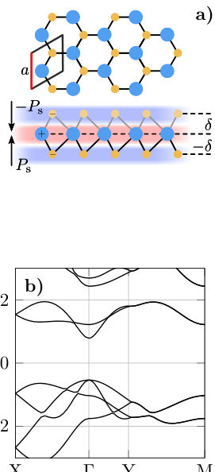
<figcaption class="paper-figure-caption"><b>Fig 1.</b> Fig. 1 (a) Schematic depiction of the atomic structure and unit cell parameters of the 2D InP monolayer. (b) Electronic band structure of the minimum-energy ferroelectric configuration calculated via DFT. Although the calculations reported in this subsection were performed using the hexagonal structure, the electronic band structure reported here refers to the orthorhombic cell used for the Wannierization and the transport device calculations (see Methods for more details). (c) Energy density versus macroscopic polarization (the units of the polarization are reported according to the Supplemental Material of Ref. [7]) , exhibiting the characteristic double-well potential. Data points are...</figcaption>
</figure>
<figure class="paper-figure-card">
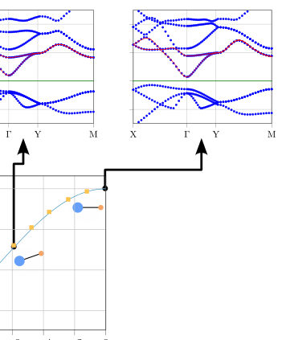
<figcaption class="paper-figure-caption"><b>Fig 2.</b> Fig. 2 Evolution of the electronic band structure for three representative snapshots along the Minimum Energy Path (MEP) extracted from NEB calculations. Blue dots correspond to the first- principles bands calculated with Quantum ESPRESSO, while the red solid lines represent the bands resulting from the Wannierization process.</figcaption>
</figure>
<figure class="paper-figure-card">
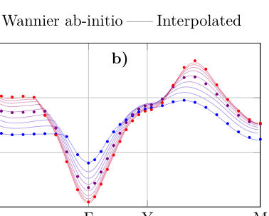
<figcaption class="paper-figure-caption"><b>Fig 3.</b> Fig. 3 a) Representative Wannier on-site energy (ε) and first neighbor hopping parameter (tij) as a function of the macroscopic polarization, comparing discrete ab-initio data (symbols) against the analytical fitting (lines). b) Evolution of the lowest conduction bands as a function of the macro- scopic polarization. The marks denote the eigenvalues extracted directly from the discrete Wannier Hamiltonians for specific ab-initio structural snapshots. The solid lines represent the band structures generated by the continuous, interpolated Hamiltonian H(P). The model perfectly captures the band topology at the explicitly sampled configurations while also predicting the smooth electronic evolu-...</figcaption>
</figure>
<figure class="paper-figure-card">
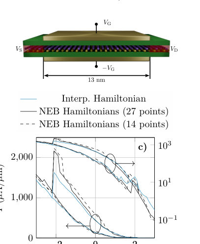
<figcaption class="paper-figure-caption"><b>Fig 4.</b> Fig. 4 Overview of the multiscale device simulation framework. a) Flowchart of the modified self- consistent Poisson-NEGF transport solver, highlighting the inner convergence loop on the electrostatic potential V and the outer feedback loop on the ferroelectric polarization P and polarization-dependent Hamiltonian H(P). b) 3D schematic representation of the simulated double-gated InP FeFET with a 13 nm channel length under asymmetric gate biasing (±VG/2). c) Simulated transfer characteristics (IDS −VG) comparing, interpolated Hamiltonian model (blue solid line) against the discrete NEB snapshot Hamiltonians sampled at 27 points (black solid line) and 14 points (dashed line).</figcaption>
</figure>
<figure class="paper-figure-card">
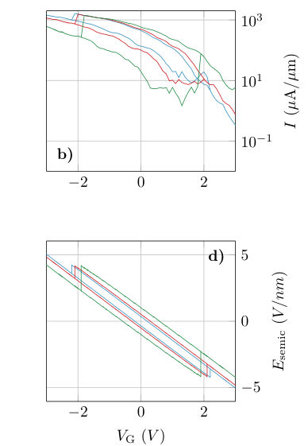
<figcaption class="paper-figure-caption"><b>Fig 5.</b> Fig. 5 Impact of gate oxide permittivity (εox ∈{15ε0, 10ε0, 5ε0}) on the simulated InP FeFET performance. The top panels display the device transfer characteristics in linear (a) and logarithmic (b) scales for dielectric constants of 15ε0 (blue), 10ε0 (red), and 5ε0 (green). The bottom panels illustrate the corresponding hysteresis loops of the macroscopic polarization P (c) and the electric field Esemic (d) across the 2D semiconductor channel layer as a function of the applied gate voltage (VG).</figcaption>
</figure>

**Summary.** This work presents a multiscale simulation framework to model 2D ferroelectric field-effect transistors using InP. It bridges DFT calculations with NEGF transport by creating a continuous, polarization-dependent Hamiltonian. This advanced methodology successfully predicts key device behaviors, such as memory windows and hysteresis, by self-consistently coupling electronic transport to the material's structural polarization state.

**Why it may be interesting.** While focused on solid-state electronics, the methodology of coupling structural dynamics (polarization) directly into the electronic Hamiltonian ($\hat{H}(P)$) is a sophisticated example of open quantum system modeling, where the environment (the lattice/dipole) dictates the system's Hamiltonian.

Detailed structure

**Main problem.** The core problem is developing accurate, predictive multiscale simulations to model the performance of next-generation 2D ferroelectric field-effect transistors (FeFETs). This requires bridging atomic-scale physics with device-level electronic transport.

**Main result.** The authors successfully developed a multiscale framework that captures the dynamic interplay between ion movement (polarization switching) and electronic transport, naturally reproducing key device signatures like hysteresis loops.

**Method.** The approach combines first-principles Density Functional Theory (DFT) calculations with Non-Equilibrium Green's Function (NEGF) transport solvers. A key innovation is creating a continuous, polarization-dependent Hamiltonian that evolves self-consistently with the Poisson equation.

**Model / system.** The system studied is a 2D ferroelectric monolayer, using Indium Phosphide (InP) as a case study. The model uses a continuous Hamiltonian $\hat{H}(P)$ derived by interpolating parameters across the ferroelectric phase transition path.

**Key observables.** Transfer characteristics ($I_{DS}$ vs $V_G$), memory window, hysteresis loops, spontaneous polarization ($P_s$), and coercive field ($E_c$).

**Important parameters / regimes.** Spontaneous polarization ($P_s = 11.52 \text{ pC/m}$), Bandgap ($E_g = 1.34 \text{ eV}$), Coercive field ($E_c = 4.18 \text{ V/nm}$).

**Assumptions / limitations.** The framework assumes the polarization vector is strictly out-of-plane (along the y-axis) and that the continuous interpolation accurately captures the physics between discrete DFT snapshots.

**Figures summary.** Figures illustrate the atomic structure, the ferroelectric energy landscape (double-well potential), the relationship between polarization and internal field, and the comparison of transport results using interpolated versus discrete Hamiltonians.

**Paper structure.** The paper progresses by first establishing the need for multiscale modeling, detailing the DFT/NEB calculations to map the polarization path, developing the continuous Hamiltonian interpolation, and finally embedding this into a self-consistent Poisson-NEGF solver to predict device I-V curves.

Abstract

Ferroelectric materials are highly attractive for low-power, high-speed electronics and emerging neuromorphic computing architectures. However, the severe physical scaling limits of conventional bulk (3D) ferroelectrics at the nanoscale have shifted attention towards two-dimensional (2D) ferroelectric monolayers. Accurate device-level performance predictions are essential to accelerate the experimental testing and screening of these novel materials. In this work, we present a multiscale simulation framework that bridges first-principles density functional theory with Non-Equilibrium Green's Function (NEGF) transport calculations. Using a 2D Indium Phosphide monolayer as a case study, our approach leverages a continuously interpolated, polarization-dependent Hamiltonian embedded within a self-consistent Poisson-NEGF solver. The model captures the dynamic interplay between ion movement and electronic transport, naturally reproducing macroscopic hysteresis loops and memory windows without empirical parameters. This predictive pipeline provides a computationally efficient tool to evaluate and optimize next-generation 2D ferroelectric field-effect transistors.

[↑ back to top](#top)

### [Deep Learning GW Quasiparticle Hamiltonians for Many-Body Excited-State Electronic Structure at Scale](http://arxiv.org/abs/2609.36962v1)

**Authors:** Xiaoxun Gong, Zechen Tang, Woochang Kim, Yang Li, Wenhui Duan, Yong Xu, Steven G. Louie  
**Type:** theory · **Category:** numerical methods · **PDF:** <https://arxiv.org/pdf/2609.36962v1>  
**Analysis basis:** full PDF text, analyzed in chunks
**Topic relevance:** `analog quantum simulation` **2/5**

↔ Scroll figures horizontally

<figure class="paper-figure-card">
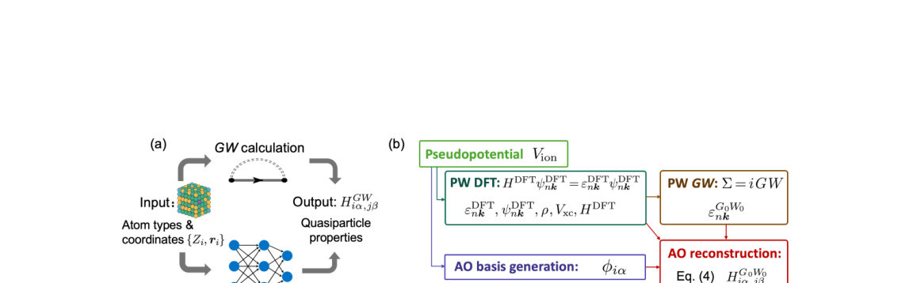
<figcaption class="paper-figure-caption"><b>Fig 1.</b> FIG. 1. Overview of the DeepH-GW method. (a) An effective GW Hamiltonian is constructed in a localized atomic-orbital (AO) basis from a first-principles high-fidelity GW calculation. Diagonalization of this Hamiltonian yields quasiparticle energies and wavefunctions from which excited-state properties can be evaluated. DeepH-GW learns the mapping from atomic structure to this reconstructed AO Hamiltonian. (b) Workflow for constructing the effective AO GW Hamiltonian according to Eq. (4). A plane-wave (PW) self- consistent DFT calculation provides the starting point for the PW GW calculation. In parallel, an AO basis is generated using an AO DFT calculation with the same set of...</figcaption>
</figure>
<figure class="paper-figure-card">
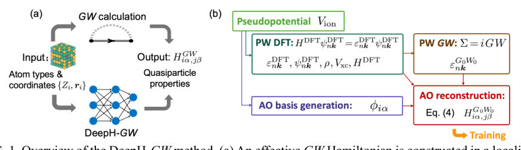
<figcaption class="paper-figure-caption"><b>Fig 2.</b> FIG. 2. Validation of the reconstructed AO Hamiltonians against PW calculations at the DFT and GW levels. At the DFT level, the band structures obtained from the reconstructed AO Hamiltonians (blue lines) agree closely with the PW DFT results (blue dots) for (a) diamond and (b) GaP. At the GW level, the reconstructed AO effective GW Hamiltonians (red lines) reproduce the overall quasiparticle band structures obtained from PW GW calculations (red dots), with discrepancies for some conduction bands. In each panel, the valence- band maximum is set to zero.</figcaption>
</figure>
<figure class="paper-figure-card">
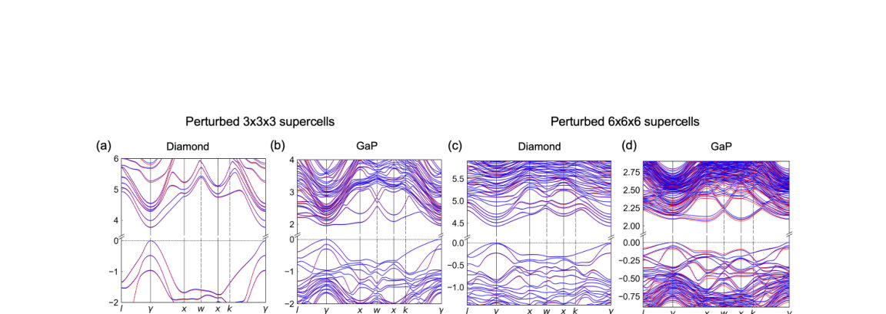
<figcaption class="paper-figure-caption"><b>Fig 3.</b> FIG. 3. Accuracy and cross-scale transferability of DeepH-GW. (a) Band structure predicted by a DeepH- GW model trained on randomly displaced 3 × 3 × 3 diamond supercells and evaluated on an unseen supercell of the same size. (b) Corresponding result for GaP. (c) Prediction for a randomly displaced 6 × 6 × 6 diamond supercell using the model trained only on 3 × 3 × 3 structures. The mean absolute error (MAE) over the 20 bands closest to the Fermi level is 5.9 meV. (d) Corresponding cross-scale prediction for GaP. The corresponding MAE over the 40 closest bands is 9.7 meV. In all panels, the DeepH-GW predictions (blue dots) are compared with the eigenvalues of the reference PW-reconstructed...</figcaption>
</figure>
<figure class="paper-figure-card">
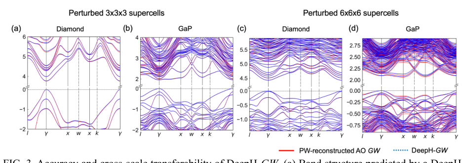
<figcaption class="paper-figure-caption"><b>Fig 4.</b> FIG. 4. Temperature dependence of the fundamental (indirect) band gap of diamond. The temperature- dependent fundamental band gap computed using DeepH-GW is evaluated using the Zacharias-Giustino special-displacement method [56,57] averaged over an ensemble of ten 12 × 12 × 12 supercells. The DFT- level calculations with electron-phonon matrix elements from DFPT (blue line) underestimate the magnitude of the band-gap renormalization, whereas direct DeepH-GW simulations (red dots) yield substantially better agreement with experiment (black triangles). All values are reported relative to the corresponding 𝑇= 0 result. Thermal-expansion effects are included, and the red line serves as a guide...</figcaption>
</figure>

**Summary.** This paper presents DeepH-GW, a novel deep-learning framework designed to calculate accurate quasiparticle electronic structures by predicting the effective GW Hamiltonian directly from atomic structure. By combining the accuracy of plane-wave GW calculations with the efficiency of neural network inference, it achieves near-DFT accuracy at a much larger scale. This breakthrough provides a practical foundation model for simulating complex, many-body excited-state properties in materials.

**Why it may be interesting.** While focused on condensed matter electronic structure, the core methodology—using deep learning to create a linear-scaling, highly accurate surrogate model for a complex many-body Hamiltonian (GW)—is a powerful general technique applicable to modeling Hamiltonians in AMO physics or open quantum systems.

Detailed structure

**Main problem.** The primary challenge is developing a computationally efficient method to calculate accurate quasiparticle electronic structures, which are foundational for understanding excited-state properties, while overcoming the high computational cost of standard first-principles GW calculations for large systems.

**Main result.** The DeepH-GW framework successfully reproduces GW-level quasiparticle band structures with errors on the order of a few meV and demonstrates strong cross-scale transferability to large supercells.

**Method.** The authors introduce DeepH-GW, a deep-learning framework that predicts the effective GW quasiparticle Hamiltonian directly from the atomic structure, trained on high-fidelity plane-wave GW calculations.

**Model / system.** The method targets the effective GW quasiparticle Hamiltonian, which is constructed in a localized Atomic Orbital (AO) basis set. It bridges the systematic accuracy of plane-wave (PW) methods with the linear-scaling inference speed of neural networks.

**Key observables.** Quasiparticle band structures, band gaps, and temperature-dependent electron-phonon band-gap renormalization.

**Important parameters / regimes.** Errors on the order of a few meV; transferability from small training structures to substantially larger supercells.

**Assumptions / limitations.** The framework assumes that the static GW effective self-energy is sufficiently short-ranged (nearsighted) to be captured by local message-passing architectures, though long-range interactions require careful handling.

**Figures summary.** Figures illustrate the workflow, showing the reconstruction of the AO effective GW Hamiltonian from PW data, and comparing predicted band structures and temperature-dependent band gaps against reference calculations and experimental data.

**Paper structure.** The paper outlines the necessity of GW calculations, introduces the DeepH-GW architecture, details the training process using PW GW data to reconstruct the Hamiltonian in an AO basis, validates the accuracy and transferability across different system sizes, and finally demonstrates its application to temperature-dependent phenomena like electron-phonon coupling.

Abstract

Accurate quasiparticle electronic structures are the foundation for understanding excited-state properties of materials and explaining optoelectronic, quantum, and transport phenomena. First-principles GW calculations nevertheless remain computationally intensive for large or configurationally complex systems. Here we introduce DeepH-GW, a deep-learning framework that predicts an effective GW quasiparticle Hamiltonian directly from atomic structure. Building on the local, equivariant message-passing architecture of DeepH, DeepH-GW is trained on high-fidelity plane-wave GW calculations through a real-space Hamiltonian-reconstruction interface. This approach combines the systematic accuracy and broad chemical applicability of plane-wave methods with linear-scaling neural-network inference. Across the systems examined, DeepH-GW reproduces quasiparticle band structures with errors on the order of a few meV. Moreover, we show that, despite the intrinsic nonlocality of many-body interactions, DeepH-GW exhibits strong cross-scale transferability from relatively small training structures to substantially larger supercells. We demonstrate that the framework can accurately capture GW-level electron-phonon band-gap renormalization through predictions in supercells with thermal displacements, illustrating the power of the approach. DeepH-GW therefore provides a practical route toward large-scale many-body simulations and foundation models for excited-state electronic structure.

[↑ back to top](#top)

### [Interlayer dark excitons in a van der Waals heterostructure](http://arxiv.org/abs/2609.38033v1)

**Authors:** Rundong Ma, Konstantin Davydov, Liuxin Gu, Lifu Zhang, Hassan Alnatah, Beini Gao, Ruihao Ni, Suji Park, Houk Jang, Takashi Taniguchi, Kenji Watanabe, You Zhou  
**Type:** experiment · **Category:** other · **PDF:** <https://arxiv.org/pdf/2609.38033v1>  
**Analysis basis:** full PDF text, analyzed in chunks
**Topic relevance:** `quantum measurements` **2/5**

↔ Scroll figures horizontally

<figure class="paper-figure-card">
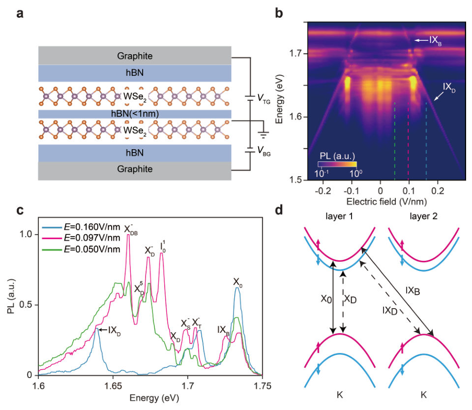
<figcaption class="paper-figure-caption"><b>Fig 1.</b> Fig. 1 | Electrical control of interlayer excitons. (a) Schematic of a dual-gate device. (b) Electric- field-dependent PL spectra when both layers are intrinsic. Dashed lines indicate where the spectra in (c) are collected. (c) Representative PL spectra at 0.050 V/nm, 0.097 V/nm, and 0.160 V/nm. The spectra show the neutral intralayer exciton (X0), the intralayer dark exciton (XD) and its phonon replicas (𝑋𝑋𝐷𝐷 5 ), indirect exciton phonon replicas (𝐼𝐼0 1), the charged dark exciton (𝑋𝑋𝐷𝐷 −), and the brightened dark exciton (𝑋𝑋𝐷𝐷𝐷𝐷 −), located approximately 43, 58, 51, 63, and 72 meV below X0, respectively. At 0.097 V/nm, enhanced emission is observed from interlayer bright exciton (IXB), 𝐼𝐼0...</figcaption>
</figure>
<figure class="paper-figure-card">
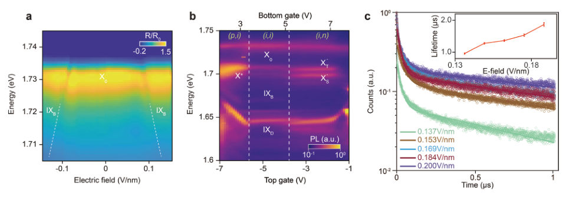
<figcaption class="paper-figure-caption"><b>Fig 2.</b> Fig. 2 | Reflectance, doping-dependence, and lifetime dynamics of the interlayer excitons. (a) Electric field dependence of reflectance spectra. Dashed lines trace IXB. (b) Doping dependence of IXD PL spectra under an electric field (VBG = 0.96 VTG + 8.8 V). (c) Time-resolved photoluminescence (TRPL) measurement of IXD in D2 under different electric fields when both layers are intrinsic. The inset shows the fitted lifetime as a function of the applied electric field.</figcaption>
</figure>
<figure class="paper-figure-card">
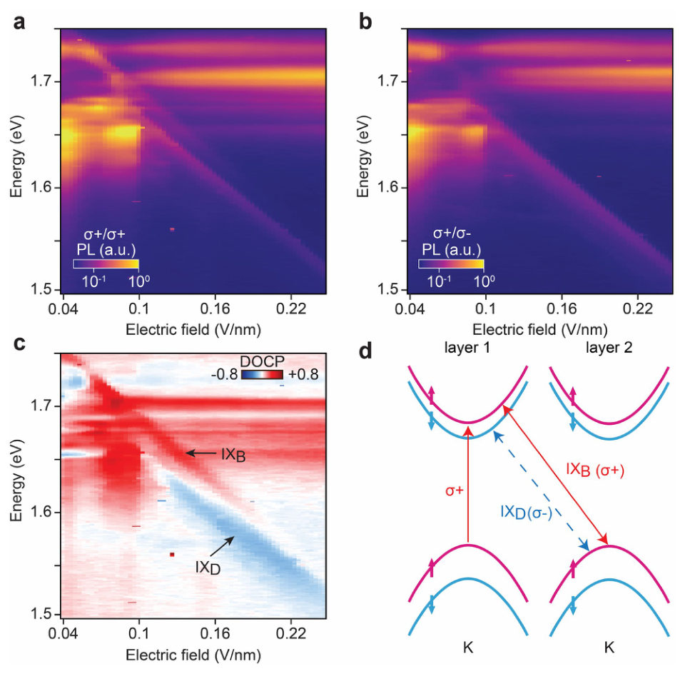
<figcaption class="paper-figure-caption"><b>Fig 3.</b> Fig. 3 | Valley polarization of interlayer excitons. (a, b) Electric-field-dependent PL under (a) co-circular and (b) cross-circular excitation and detection. (c) Degree of circular polarization (DOCP) as a function of the electric field. (d) Schematic of selection rules of IXB and IXD.</figcaption>
</figure>
<figure class="paper-figure-card">
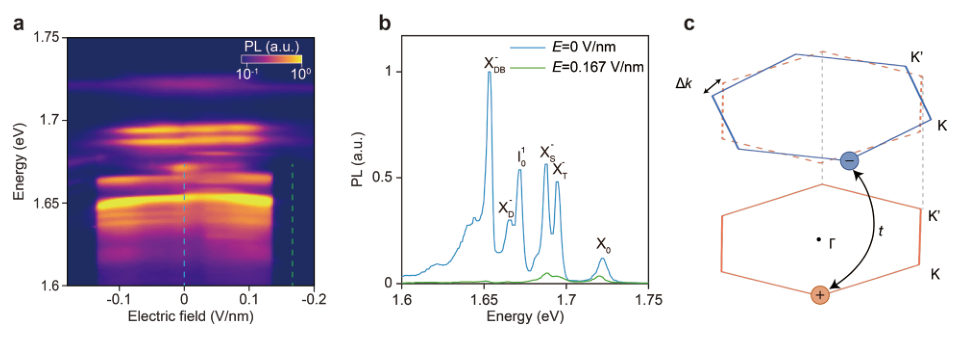
<figcaption class="paper-figure-caption"><b>Fig 4.</b> Fig. 4 | Electrical control of excitons in a twisted WSe2/hBN/WSe2 heterostructure. (a) Electric-field-dependent PL with both layers intrinsic. Dashed lines indicate where the spectra in (b) are collected. (b) Representative PL spectra at 0 V/nm (blue) and 0.167 V/nm (green). (c) Schematic of twist-induced momentum mismatch that suppresses interlayer tunneling and IX emission.</figcaption>
</figure>

**Summary.** This work reports the direct spectroscopic identification of bright (singlet) and dark (triplet) interlayer excitons in $	ext{WSe}_2/	ext{hBN}/	ext{WSe}_2$ heterostructures. By using electric-field and time-resolved measurements, the authors confirmed that the dark excitons are long-lived and retain valley polarization. These findings offer critical control mechanisms for excitonic many-body physics and optoelectronic applications.

**Why it may be interesting.** The ability to spectroscopically separate and characterize spin-forbidden dark excitons alongside their bright counterparts provides fundamental insights into spin-valley locking and exciton dynamics, which are crucial for designing next-generation quantum emitters.

Detailed structure

**Main problem.** The primary challenge is the unambiguous spectroscopic identification of spin-singlet (bright) versus spin-triplet (dark) interlayer excitons (IXs) in TMD heterostructures, as this spin state dictates population and transport.

**Main result.** The authors spectroscopically identified two distinct, momentum-direct interlayer transitions ($	ext{IXB}$ and $	ext{IXD}$) with opposite spin configurations, demonstrating that the dark excitons ($	ext{IXD}$) possess ultralong lifetimes and retain strong valley polarization.

**Method.** The study employed electric-field-dependent photoluminescence and reflectance measurements, alongside time-resolved and polarization analyses.

**Model / system.** The research uses high-quality, dual-gated $	ext{WSe}_2/	ext{hBN}/	ext{WSe}_2$ homobilayers to study interlayer excitons formed between adjacent TMD layers.

**Key observables.** Two distinct interlayer transitions ($	ext{IXB}$ and $	ext{IXD}$), opposite circular helicities, ultralong lifetimes (microseconds for $	ext{IXD}$), and field-dependent spectral shifts.

**Important parameters / regimes.** Interlayer splitting ($\sim 19 	ext{ meV}$), electric field strength, and the twist angle between the TMD layers.

**Assumptions / limitations.** The analysis assumes that the observed splitting is due to a combination of spin-orbit coupling, binding energy differences, and exchange interaction.

**Figures summary.** Figures show field-dependent PL revealing both $	ext{IXB}$ and $	ext{IXD}$; reflectance confirms $	ext{IXB}$ absorption but not $	ext{IXD}$ absorption; and TRPL demonstrates the microsecond lifetime of $	ext{IXD}$ compared to $	ext{IXB}$.

**Paper structure.** The paper progresses by first establishing the existence of two distinct IX species via field-dependent spectroscopy, then characterizing their differing dynamics (lifetime, polarization) using time-resolved measurements, and finally demonstrating external control over these states using twist-angle modulation.

Abstract

Interlayer excitons in transition metal dichalcogenide (TMD) heterostructures exhibit long lifetimes and long-range transport, making them promising for excitonic devices and quantum many-body phases, such as Bose-Einstein condensates. Achieving these goals requires a precise understanding of spin-allowed bright and nominally spin-forbidden dark excitons, because the lowest-energy exciton species governs population, transport, and condensation. Despite substantial progress, unambiguously distinguishing singlet and triplet interlayer excitons has been challenging, as moiré excitons in these heterostructures can mimic their optical signatures. Here, we report the direct spectroscopic identification of bright (singlet) and dark (triplet) interlayer excitons in high-quality, dual-gated WSe$_2$/hBN/WSe$_2$ homobilayers. Electric-field-dependent photoluminescence and reflectance reveal two momentum-direct interlayer transitions with distinct spin configurations. The interlayer dark excitons obey selection rules that differ from those of bright excitons. Strikingly, interlayer dark excitons retain strong valley polarization, even with their ultralong lifetime exceeding microseconds. Finally, we demonstrate twist-angle control, wherein twist-induced electron-hole momentum mismatch modulates interlayer exciton emission. These results provide critical insights into the electronic and excitonic structure of TMD heterostructures, opening new avenues for excitonic many-body physics and optoelectronic devices.

[↑ back to top](#top)

### [Atomic-scale control of spin transport in exchange-coupled molecules](http://arxiv.org/abs/2609.37299v1)

**Authors:** A. Fétida, R. Robles, F. Scheurer, M. Romeo, J. Kröger, N. Lorente, L. Limot  
**Type:** both · **Category:** strongly correlated electrons · **PDF:** <https://arxiv.org/pdf/2609.37299v1>  
**Analysis basis:** full PDF text, analyzed in chunks
**Topic relevance:** `Keldysh / 2PI / non-Gaussian methods` **1/5** · `analog quantum simulation` **1/5** · `quantum measurements` **1/5**

↔ Scroll figures horizontally

<figure class="paper-figure-card">
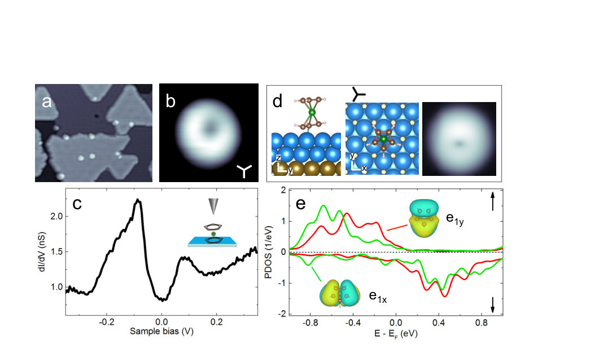
<figcaption class="paper-figure-caption"><b>Fig 1.</b> FIG. 1. (a) Co islands grown on Cu(111). Islands are two (2 ML) or, occasionally, one (1 ML)</figcaption>
</figure>
<figure class="paper-figure-card">
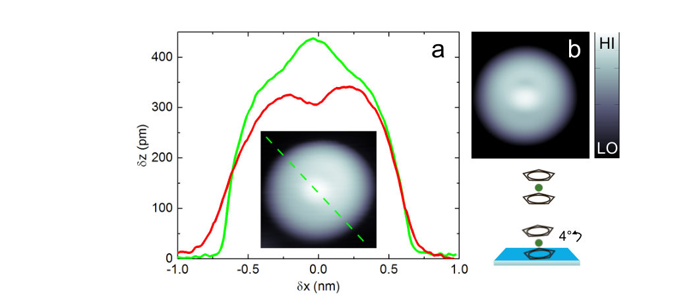
<figcaption class="paper-figure-caption"><b>Fig 2.</b> FIG. 2. (a) Constant-current STM image and apparent-height profile of Nc/Co (2 ML) acquired</figcaption>
</figure>
<figure class="paper-figure-card">
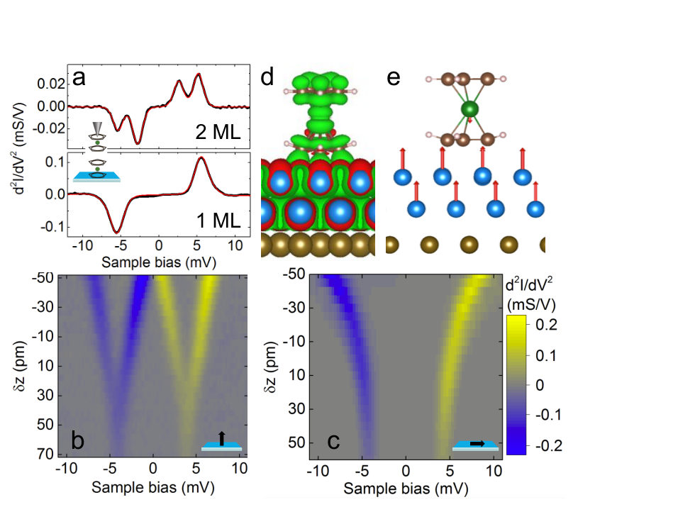
<figcaption class="paper-figure-caption"><b>Fig 3.</b> FIG. 3. (a) Spin-excitation spectra of Nc/Co adsorbed on Co islands of two different thicknesses: 2</figcaption>
</figure>
<figure class="paper-figure-card">
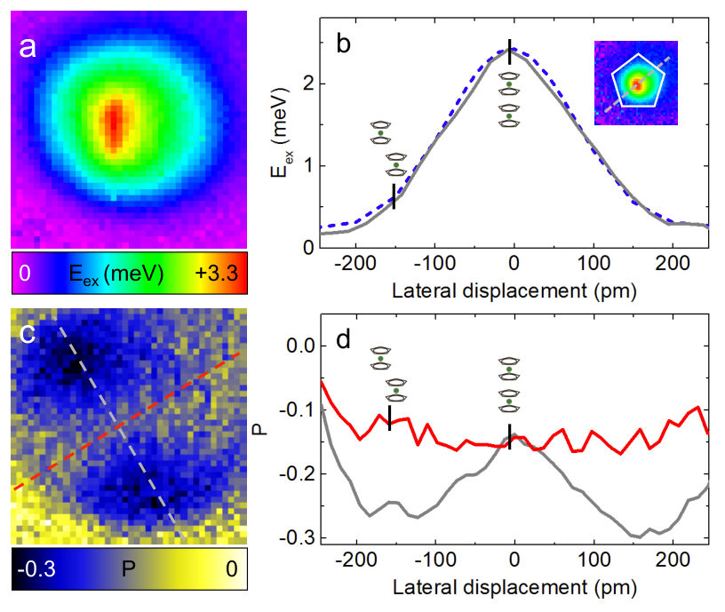
<figcaption class="paper-figure-caption"><b>Fig 4.</b> FIG. 4. (a) Exchange-energy map of the Nc-Nc junction, measured over 0.51 × 0.51 nm2 at</figcaption>
</figure>

**Summary.** This work experimentally and theoretically links charge transport, magnetic exchange, and spin polarization in molecular junctions using STM. By simultaneously mapping these three quantities, the authors demonstrate that while conductance and exchange coupling follow similar spatial rules governed by hopping, the spin polarization is highly sensitive to the specific orbital structure of the junction. This establishes a fundamental, real-space understanding of spin transport in molecular magnets.

**Why it may be interesting.** The direct, real-space measurement and theoretical linkage between charge transport (conductance) and magnetic coupling (exchange/spin polarization) in molecular junctions provides a powerful experimental realization of correlated electron physics in nanoscale systems.

Detailed structure

**Main problem.** To establish a real-space connection between tunneling, exchange, and spin transport in magnetically coupled molecules.

**Main result.** The study shows that conductance and exchange coupling share similar spatial dependencies, suggesting both are governed by the same hopping matrix, while spin polarization depends on the specific orbital composition.

**Method.** The researchers used STM spectroscopy to simultaneously extract junction conductance, exchange coupling, and spin polarization from a single dataset, complemented by DFT calculations.

**Model / system.** The system involves an exchange-coupled molecular junction formed between a single molecule functionalized on an STM tip and a second molecule adsorbed on a ferromagnetic surface (e.g., Co islands). The physics is modeled using a minimal Hubbard description for the molecular interaction.

**Key observables.** Junction conductance, exchange coupling strength ($E_{ex}$), and spin polarization ($P$) mapped spatially across the junction.

**Important parameters / regimes.** The hopping matrix elements between molecular frontier orbitals, which dictate the coupling strength and transport channels.

**Assumptions / limitations.** The analysis assumes a minimal Hubbard description governs the coupling, and the conductance calculation employs Bardeen’s tunneling formalism.

**Figures summary.** Figures illustrate STM images, simulated conductance maps, spin-excitation spectra showing characteristic splittings, and spatial maps detailing the variation of exchange energy and spin polarization across the junction.

**Paper structure.** The paper progresses by characterizing the physical setup (molecular junction), measuring multiple correlated quantities (G, $E_{ex}$, P) from one dataset, relating their spatial dependencies to a common underlying hopping mechanism, and finally detailing how orbital composition dictates the measured spin polarization.

Abstract

Spin transport between coupled spins is governed by tunneling and exchange interactions, yet their microscopic relation in real space has remained experimentally elusive. To address this, we functionalize the tip of a scanning tunneling microscope with a single molecule and use it as a movable spin sensor positioned above a second molecule on a ferromagnetic surface, forming an exchange-coupled molecular junction. From the same spectroscopic dataset, we independently extract the junction conductance, exchange coupling, and spin polarization with atomic-scale resolution. Conductance and exchange display nearly identical spatial dependences, consistent with a minimal Hubbard description in which both are governed by the same hopping matrix between the molecular frontier orbitals. In contrast, the spin polarization depends on the orbital composition and the relative weight of the resulting transport channels. These results establish a real-space connection between tunneling, exchange, and spin transport in magnetically coupled molecules.

[↑ back to top](#top)

### [Magnetoplasmon molecule](http://arxiv.org/abs/2609.36036v1)

**Authors:** A. V. Larionov, A. V. Gorbunov, A. B. Van'kov, D. A. Shchigarev, L. V. Kulik, V. Umansky  
**Type:** experiment · **Category:** strongly correlated electrons · **PDF:** <https://arxiv.org/pdf/2609.36036v1>  
**Analysis basis:** full PDF text, analyzed in chunks
**Topic relevance:** `analog quantum simulation` **1/5** · `correlated / nonlocal dissipation` **1/5** · `quantum optics experiment` **1/5**

↔ Scroll figures horizontally

<figure class="paper-figure-card">
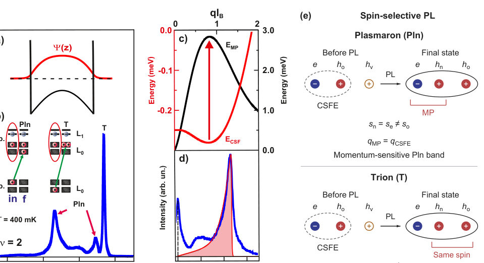
<figcaption class="paper-figure-caption"><b>Fig 1.</b> FIG. 1. (a) Calculated quantum-well potential and lowest-subband envelope wave function. (b) PL spectrum at ν = 2 and T = 400 mK, with dpump ≈0.8 mm and Ipump ≈2 mW cm−2; the insets show the plasmaron (Pln) and trion (T) channels. (c) Calculated CSFE and magnetoplasmon dispersions. (d) Energy-loss spectrum of the photoexcited-hole recombination; the red curve is calculated for a Boltzmann CSFE distribution. (e) Spin-selective PL pathways. Recombination of hv with e0 creates hn. In the Pln channel, e and hn form the magnetoplasmon component and qMP = qCSFE; in the T channel, hn and ho occupy the same spin sublevel. Arrows denote optical transitions; positions are schematic.</figcaption>
</figure>
<figure class="paper-figure-card">
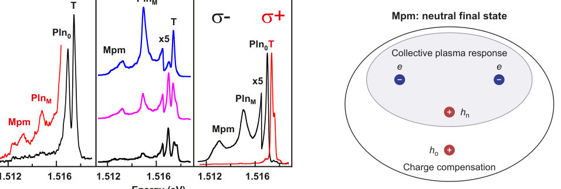
<figcaption class="paper-figure-caption"><b>Fig 2.</b> FIG. 2. PL spectra of the 2DES at T = 600 mK and dpump ≈10 µm. (a,b) Evolution over Ipump ≈0.1–20 W cm−2. (c) Polarization-resolved molecular (Mpm), plasmaron (Pln0, PlnM), and trion (T) features; the upper diagrams show the initial and final configurations. (d) Schematic molecular channel. Recombination of hv creates hn; both excited electrons and hn form the plasma-active component, while ho compensates its charge. The contours indicate constituent grouping, not a calculated geometry.</figcaption>
</figure>
<figure class="paper-figure-card">
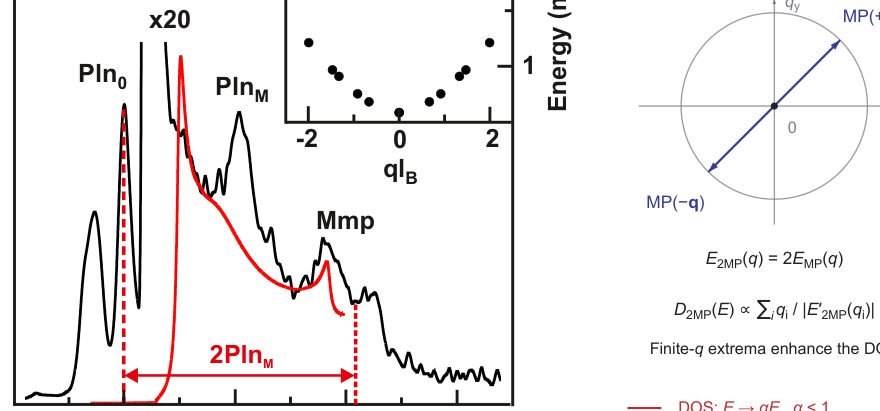
<figcaption class="paper-figure-caption"><b>Fig 3.</b> FIG. 3. (a) Energy-loss spectrum at T = 600 mK, dpump ≈10 µm, and Ipump ≈0.3 W cm−2 (black). The red curve is the two-magnetoplasmon density of states (DOS) at zero total generalized momentum, rescaled by α &lt; 1; the inset shows the initial biexciton dispersion. (b) Momentum-space reference: +q and −q give Q = 0, with E2MP(q) = 2EMP(q). Finite-q stationary points enhance the DOS. The schematic is not a molecular geometry or an assignment of the two molecular lines to separate van Hove features.</figcaption>
</figure>
<figure class="paper-figure-card">
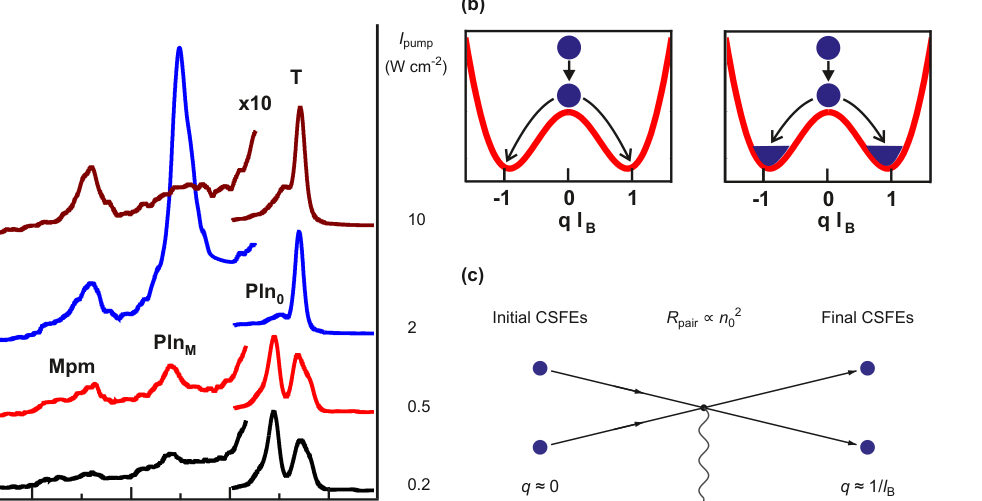
<figcaption class="paper-figure-caption"><b>Fig 4.</b> FIG. 4. (a) Pump-dependent PL as the CSFE ensemble crosses over from gas to condensate at T = 600 mK and dpump ≈10 µm; Ipump = 0.2, 0.5, 2, and 10 W cm−2 from bottom to top. (b) Single-particle and collective occupation of the CSFE dispersion minimum. (c) Two-CSFE phonon-assisted relaxation from q ≈0 to q ≈1/lB. In the dilute limit, the pair-event rate satisfies Rpair ∝n2 0.</figcaption>
</figure>
<figure class="paper-figure-card">
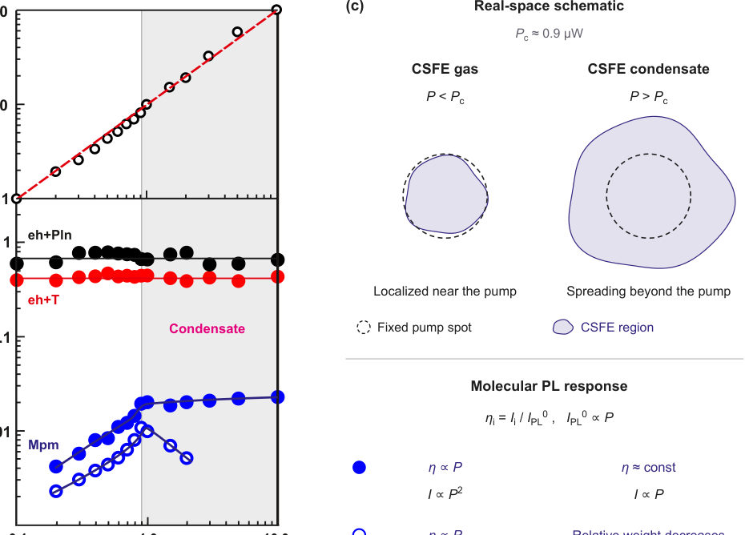
<figcaption class="paper-figure-caption"><b>Fig 5.</b> FIG. 5. (a) Integrated PL intensity versus pump power P. (b) PL-channel intensities normalized to the integrated PL; the gray region marks the condensate regime above Pc ≈0.9 µW. (c) Qualitative real-space schematic. The pump spot is fixed, whereas the CSFE region spreads in the condensate. Since ηi = Ii/I0 PL and I0 PL ∝P, ηi ∝P corresponds to Ii ∝P 2, while constant ηi corresponds to Ii ∝P. The spatial profiles are schematic.</figcaption>
</figure>

**Summary.** This paper reports the experimental detection of a 'magnetoplasmon molecule,' a complex four-particle excitation in a 2DES under a magnetic field. Using low-temperature photoluminescence spectroscopy, the authors analyze spectral features and pump-power dependencies to confirm the existence of this bound state. The findings advance the understanding of strongly correlated electron dynamics in quantum Hall systems.

**Why it may be interesting.** This work bridges concepts from strongly correlated electron physics (high-density electron systems, excitons) with collective excitations (plasmons), offering experimental validation of complex, multi-particle bound states in quantum Hall systems.

Detailed structure

**Main problem.** The study investigates the formation and properties of a novel intrinsic four-particle excitation, termed a magnetoplasmon molecule, within a two-dimensional electron system subjected to a strong external magnetic field.

**Main result.** The authors report the experimental observation of this hybrid magnetoplasmon molecule, characterized by specific spectral features and distinct power-law dependencies in the photoluminescence intensity.

**Method.** The research employs spectroscopic measurements (Photoluminescence, PL) on a high-quality GaAs/AlGaAs quantum well, analyzing energy-loss spectra derived from photoexcited carrier recombination.

**Model / system.** The physical system is a 2DES in a quantum well under a magnetic field, involving quasi-equilibrium ensembles of Cyclotron Spin-Flip Excitons (CSFEs). The molecule itself is a four-particle complex consisting of two electrons and two Fermi holes.

**Key observables.** PL spectra showing distinct molecular ($	ext{Mpm}$), plasmaron ($	ext{Pln}$), and trion ($	ext{T}$) features; superlinear/linear dependence of PL intensity on pump power ($I_{	ext{pump}}$); and energy-loss features exceeding single magnetoplasmon energies.

**Important parameters / regimes.** Low temperatures ($T \approx 400-600 	ext{ mK}$); low electron density ($n_e = 2 	imes 10^{11} 	ext{ cm}^{-2}$); and varying excitation spot sizes ($	ext{dpump} \approx 10 	ext{ µm}$ for molecular state observation).

**Assumptions / limitations.** The analysis assumes the system operates in the single-excitation limit for certain measurements, and the theoretical description relies on modeling the interaction between the molecule and the CSFE condensate.

**Figures summary.** Figures illustrate PL spectra showing molecular/plasmaron/trion features, energy-loss spectra comparing calculated DOS to experiment, and PL intensity dependence on pump power, particularly noting the transition from quadratic to linear dependence upon condensate formation.

**Paper structure.** The paper progresses by first establishing the theoretical basis for the hybrid molecule, then detailing the experimental setup and measurement techniques using PL spectroscopy, and finally presenting evidence through power-law analysis and spectral feature identification to confirm the molecule's existence and its interaction with the CSFE condensate.

Abstract

We investigate a two-dimensional electron system in an external magnetic field. An intrinsic four-particle excitation of the electron system, which we term a magnetoplasmon molecule, is observed. The molecule comprises two identical electrons and two Fermi holes with opposite spins. Both electrons and one Fermi hole participate in the collective plasma oscillations of the electron system, whereas the second Fermi hole neutralizes the excess electronic charge. We examine the interaction between the magnetoplasmon molecule and a magnetoexciton condensate.

[↑ back to top](#top)

### [Tuning the secondary electron yield and electronic conductivity of MgZnO multilayers synthesized by Atomic layer deposition](http://arxiv.org/abs/2609.36919v1)

**Authors:** Mathieu Lafarie, Sarah Dadouch, Fréderic Miserque, Yunlin Zheng, Jocelyne Leroy, Mohamed Belhaj, Thomas Proslier  
**Type:** experiment · **Category:** other · **PDF:** <https://arxiv.org/pdf/2609.36919v1>  
**Analysis basis:** full PDF text, analyzed in chunks
**Topic relevance:** `analog quantum simulation` **1/5** · `driven-dissipative phase transition` **1/5** · `quantum measurements` **1/5**

↔ Scroll figures horizontally

<figure class="paper-figure-card">
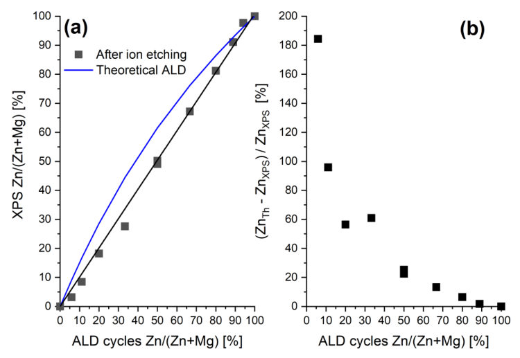
<figcaption class="paper-figure-caption"><b>Fig 1.</b> Figure 1: Graphs showing (a) the Zn ratio of ZnMgO heterostructures and (b) the corresponding relative difference between theoretical and measured Zn ratios as a function of the ZnO ALD cycle ratio for ZnMgO heterostructures in series 1. The relative error bars for each measurement are combined in the thickness of the dots.</figcaption>
</figure>
<figure class="paper-figure-card">
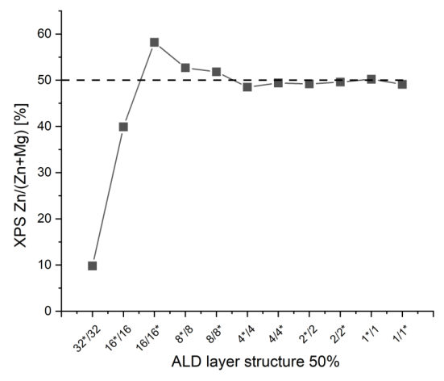
<figcaption class="paper-figure-caption"><b>Fig 2.</b> Figure 2: Graph showing Zn ratio of series 2 heterostructures after ion etching. The relative error bars for each measurement are combined in the thickness of the dots.</figcaption>
</figure>
<figure class="paper-figure-card">
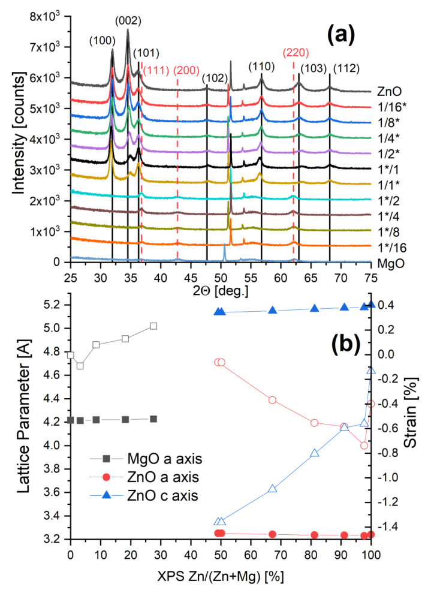
<figcaption class="paper-figure-caption"><b>Fig 3.</b> Figure 3: XRD diffractograms (a) and the associated lattice parameters and strains (b) for the ZnMgO heterostructures in series 1. The relative error bars for each measurement are combined in the thickness of the dots.</figcaption>
</figure>
<figure class="paper-figure-card">
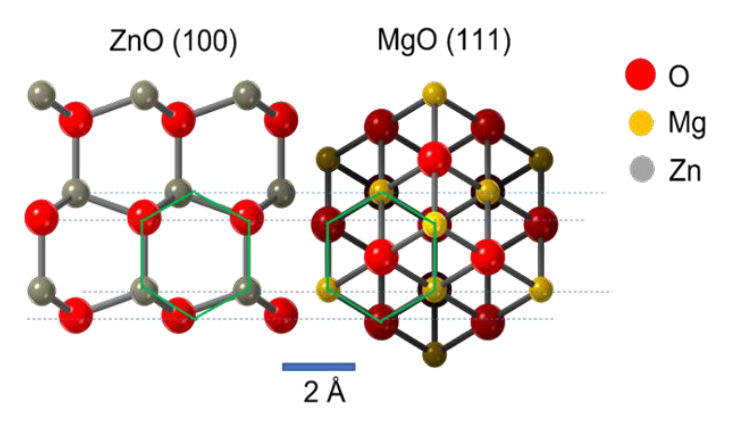
<figcaption class="paper-figure-caption"><b>Fig 4.</b> Figure 4: Representation of the adaptation between a hexagonal (ZnO) and cubic (MgO) structure for ZnO: MgO = 1:1, deduced from the series 1 diffractograms.</figcaption>
</figure>
<figure class="paper-figure-card">
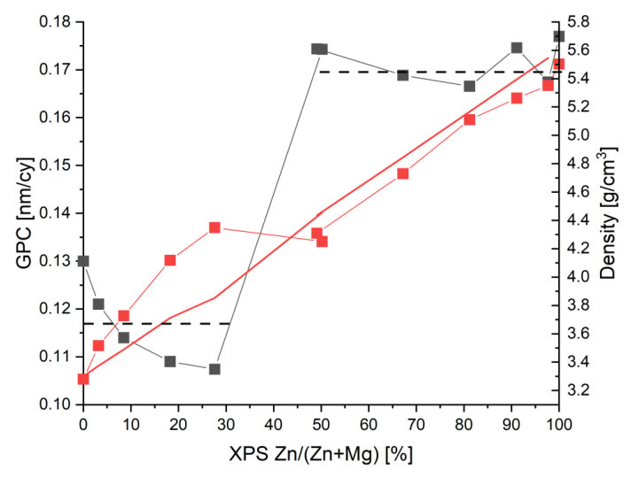
<figcaption class="paper-figure-caption"><b>Fig 5.</b> Figure 5: Averaged growth rate per cycle (GPC) in red and density in black as a function of Zn ratio in series 1 samples. The relative error bars for each measurement are combined in the thickness of the dots.</figcaption>
</figure>

**Summary.** This paper reports on the synthesis and characterization of MgZnO multilayers using Atomic Layer Deposition to control surface electronic properties. By creating heterostructures, the researchers successfully demonstrated a method to independently tune both the secondary electron emission yield (TEEY) and the electrical conductivity. This work offers a rational design pathway for functional surfaces critical for high-vacuum electronic applications.

**Why it may be interesting.** While the focus is on classical vacuum electronics, the control over surface electronic properties (TEEY) via engineered interfaces and composition gradients is analogous to controlling boundary conditions or surface states in quantum systems.

Detailed structure

**Main problem.** The primary goal is to mitigate performance degradation in vacuum RF systems, such as multipacting, which is caused by secondary electron emission (SEE) from material surfaces.

**Main result.** The study demonstrates that using MgZnO multilayers synthesized via ALD allows for the independent and systematic tuning of both the Total Electron Emission Yield (TEEY) and the electrical conductivity.

**Method.** The researchers synthesized and characterized MgZnO heterostructures using Atomic Layer Deposition (ALD) and measured TEEY and conductivity using electron guns and 4-point measurements.

**Model / system.** The physical system is MgZnO multilayer thin films deposited on a substrate using ALD. The structure is controlled by varying the number of $	ext{ZnO}$ and $	ext{MgO}$ ALD cycles, creating heterostructures.

**Key observables.** Total Electron Emission Yield (TEEY), electrical conductivity, chemical composition (Zn ratio), and structural phases ($	ext{ZnO}$-type vs. $	ext{MgO}$-type microstructure).

**Important parameters / regimes.** ALD cycle counts, electron beam energy (1 eV - 2 keV), and the resulting Zn ratio (e.g., 100% to 27%).

**Assumptions / limitations.** The authors assume that the combination of TEEY and conductivity achieved through heterostructuring is superior to what can be achieved in single-phase materials.

**Figures summary.** Figures illustrate the correlation between TEEY and structural transitions (e.g., Figure 3), and show how conductivity and TEEY vary with composition and strain (e.g., Figure 12).

**Paper structure.** The paper systematically presents the fabrication process (ALD), followed by detailed characterization of structure (XRR, XRD), composition (XPS), and finally, the measurement and correlation of the key electronic properties (TEEY and conductivity) across different multilayer compositions.

Abstract

Secondary electron emission (SEE), arising from the interaction of energetic electrons with material surfaces, can induce deleterious effects in vacuum radio-frequency (RF) systems, notably multipacting, thereby degrading performance and threatening device integrity. Despite extensive efforts, effective and widely adopted mitigation strategies remain limited. Here, we report an approach to simultaneously tailor SEE and electrical conductivity using nanometric multi-element multilayers deposited by atomic layer deposition (ALD). The design and fabrication of these heterostructures are presented, and a range of films is systematically characterized to establish correlations between emission properties, electrical conductivity, chemical and structural features. We demonstrate that such heterostructures enable combinations of total electron emission yield (TEEY) and conductivity unattainable in single-phase materials, including regimes combining high TEEY with relatively high conductivity and low TEEY with low conductivities. These results open new avenues for the rational design of functional surfaces for vacuum electronic applications.

[↑ back to top](#top)

### [Orientation engineering is a universal strategy for ferroelectric trans-switching](http://arxiv.org/abs/2609.36871v1)

**Authors:** Cameron Scott, Jorge Íñiguez-González  
**Type:** theory · **Category:** other · **PDF:** <https://arxiv.org/pdf/2609.36871v1>  
**Analysis basis:** full PDF text, analyzed in chunks
**Topic relevance:** `Keldysh / 2PI / non-Gaussian methods` **1/5** · `analog quantum simulation` **1/5**

↔ Scroll figures horizontally

<figure class="paper-figure-card">
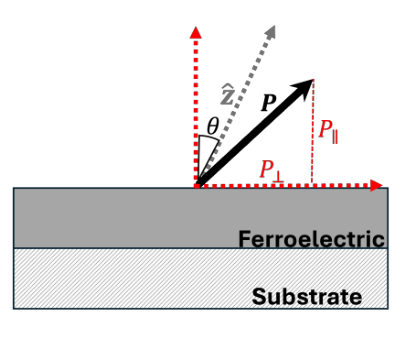
<figcaption class="paper-figure-caption"><b>Fig 1.</b> FIG. 1. Schematic of the orientation-engineered films con- sidered in this work. A principal direction of the crystalline lattice (ˆz) forms an angle (θ) with the vertical growth direc- tion. For arbitrary θ, the polarization (P) can be projected onto both out-of-plane (P∥) and in-plane (P⊥) components. Improper-like couplings between P∥and P⊥naturally occur for θ ̸= 0, leading to trans-switching.</figcaption>
</figure>
<figure class="paper-figure-card">
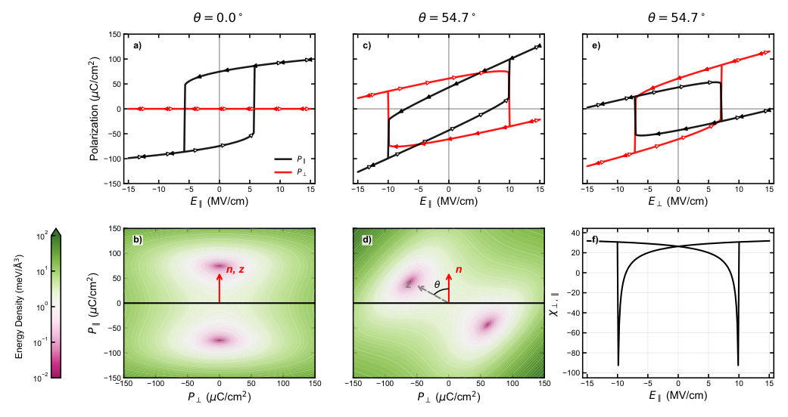
<figcaption class="paper-figure-caption"><b>Fig 2.</b> FIG. 2. Trans-switching in LiNbO3 films. Panels a) and b) show, respectively, the hysteresis curve and zero-field free energy landscape a film with θ = 0◦between the polar axis and the growth direction. A vertical electric field E∥leads to the standard hysteresis loop of the out-of-plane polarization P∥. Panels c) and d) correspond to the case with θ = 54.7◦. The non-zero angle imbues the equilibrium polarization with both in-plane and out-of-plane components that switch simultaneously under E∥. Panel e) shows the reciprocal effect of switching P∥by applying an in-plane field E⊥to the film with θ = 54.7◦. Panel f) shows the crossed dielectric susceptibility, ϵ0χ⊥,∥= ∂P⊥/∂E∥, corresponding...</figcaption>
</figure>
<figure class="paper-figure-card">
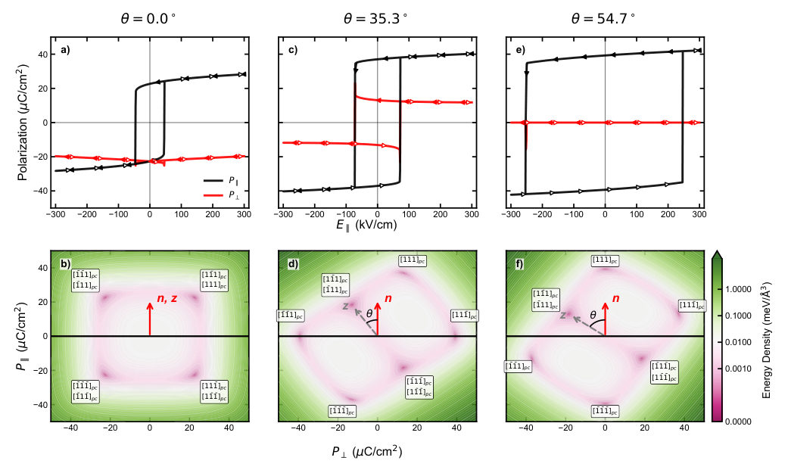
<figcaption class="paper-figure-caption"><b>Fig 3.</b> FIG. 3. Trans-switching in rhombohedral BaTiO3 at 150 K. Panels a) and b) show, respectively, the hysteresis loops and zero- field energy landscape for a perfect alignment of the [001]pc pseudocubic axis with the growth direction (θ = 0◦). We observe a 71◦polarization rotation that only involves P∥. Panels c-f) show, respectively, the corresponding results for θ = 35.3◦([112]pc orientation) and θ = 54.7◦([111]pc orientation). Only one minimum has the maximum P∥component, and an electric field E∥ drives the switching to the symmetrically opposite minimum, reversing all non-zero components and achieving trans-switching. The free-energy maps in the (P∥, P⊥) plane show the result of a...</figcaption>
</figure>
<figure class="paper-figure-card">
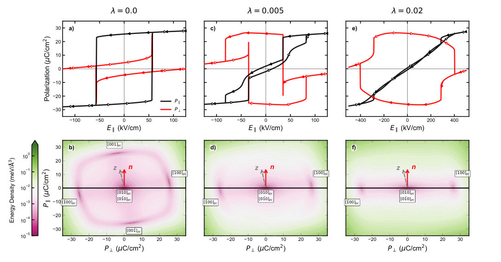
<figcaption class="paper-figure-caption"><b>Fig 4.</b> FIG. 4. Effect of screening on tetragonal BaTiO3 at 300 K with θ = 10◦orientation. Panel a) shows trans-switching for perfect short circuit boundary conditions (λ = 0), as the vertical field E∥connects the two free-energy minima with maximum |P∥| in panel b). Increasing λ in Panels c) and d) removes these minima at zero field field (although they can still be induced by a finite E∥), so the remanent equilibrium states display large P⊥and a relatively small P∥. This results in a triple hysteresis loop. Further increasing λ removes the remanent P∥almost completely, leading to a situation with a nearly purely linear dielectric response for P∥, and (trans-)switching restricted to P⊥.</figcaption>
</figure>

**Summary.** This work proposes 'orientation engineering' as a powerful, general design strategy for ferroelectric materials, showing it can induce 'trans-switching'—where polarization switches perpendicular to the applied field. By analyzing the free energy landscape based on the film's growth direction, the authors predict novel functionalities in common ferroelectrics, opening pathways for advanced 3D device architectures.

**Why it may be interesting.** While focused on ferroelectrics, the concept of controlling symmetry breaking via geometric orientation ($	heta$) to induce novel coupling terms ($f P_\parallel P_\perp$) is analogous to engineering coupling terms in quantum Hamiltonians to achieve desired non-local or perpendicular dynamics.

Detailed structure

**Main problem.** To demonstrate that controlling the growth direction ('orientation engineering') in ferroelectric thin films is a universal method to induce exotic switching behaviors, particularly 'trans-switching'.

**Main result.** Orientation engineering enables trans-switching, where polarization components switch perpendicularly to the applied electric field, in common ferroelectrics like LiNbO3 and BaTiO3.

**Method.** Theoretical analysis using Landau theory, symmetry arguments, and phenomenological calculations applied to representative ferroelectric compounds.

**Model / system.** The study focuses on epitaxial ferroelectric thin films, modeled using a fourth-order Landau free energy functional that is adapted based on the angle ($	heta$) between the principal axis and the growth direction.

**Key observables.** Hysteresis loops, off-diagonal dielectric susceptibility ($\epsilon_0\chi_{\perp,\parallel}$), and the polarization components ($P_{\parallel}$, $P_{\perp}$).

**Important parameters / regimes.** Growth angle ($	heta$), electric screening parameter ($\lambda$), and temperature ($T$).

**Assumptions / limitations.** The analysis relies on symmetry-driven effects and assumes the validity of the Landau theory framework for describing the phase transitions.

**Figures summary.** Figures illustrate the energy landscapes and hysteresis loops for LiNbO3 and BaTiO3, contrasting standard switching ($	heta=0^\circ$) with trans-switching observed at oblique angles ($	heta 
eq 0^\circ$).

**Paper structure.** The paper progresses from establishing the concept of orientation engineering as a superior design route compared to strain engineering, deriving the relevant free energy terms, and then applying this framework to analyze both uniaxial (LiNbO3) and triaxial (BaTiO3) ferroelectrics under varying screening conditions.

Abstract

About two decades ago, ``strain engineering'' emerged as a powerful strategy to tune epitaxial thin films. Here we contend that ''orientation engineering'' - that is, controlling the film's growth direction - constitutes a complementary design route that opens unprecedented opportunities and deserves greater attention. Specifically, we show that orientation engineering can endow standard ferroelectric compounds with exotic and useful behaviors that may be difficult or impossible to obtain otherwise. Critically, we predict it readily enables ''trans-switching,'' where polarization components switch perpendicularly to the applied electric field, paving the way for novel 3D device architectures. We also show that, by controlling the electric screening provided by electrodes in contact with the film, ferrielectric behavior can be obtained. Notably, one can even design an operational mode where the switching is, in effect, fully transversal to the applied field. Supported by phenomenological calculations for representative compounds LiNbO$_3$ and BaTiO$_3$, we thus propose orientation engineering as a powerful and general method to unlock unprecedented functionalities in common ferroelectrics.

[↑ back to top](#top)

### [Unveiling Three-Dimensional Skyrmion Transitions Through Vortices and Monopoles](http://arxiv.org/abs/2609.36261v1)

**Authors:** Melissa E. Henderson, Daichi Kurebayashi, Benjamin Heacock, Wangchun Chen, Charles W. Clark, David G. Cory, Dusan Sarenac, Shannon Watson, Jonathan S. White, Lisa DeBeer-Schmitt, Oleg A. Tretiakov, Dmitry A. Pushin  
**Type:** experiment · **Category:** other · **PDF:** <https://arxiv.org/pdf/2609.36261v1>  
**Analysis basis:** full PDF text, analyzed in chunks
**Topic relevance:** `analog quantum simulation` **1/5** · `quantum measurements` **1/5**

↔ Scroll figures horizontally

<figure class="paper-figure-card">
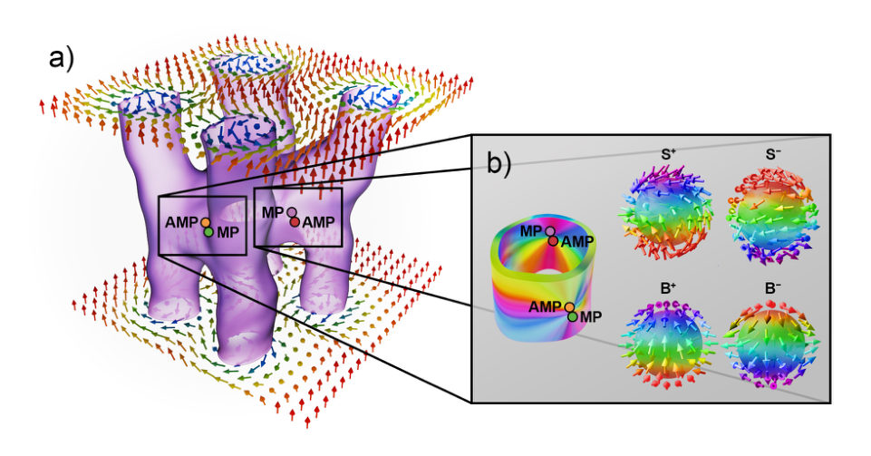
<figcaption class="paper-figure-caption"><b>Fig 1.</b> Fig. 1. Illustration of possible exotic skyrmionium stabilization pathway through the merging and separation of 4 individual skyrmion tubes. Coupled monopoles (MP) and antimonopoles (AMP) are shown at topological transition points, highlighting their corresponding Branching (B) and Segmenting (S) spin defects in the inset.</figcaption>
</figure>
<figure class="paper-figure-card">
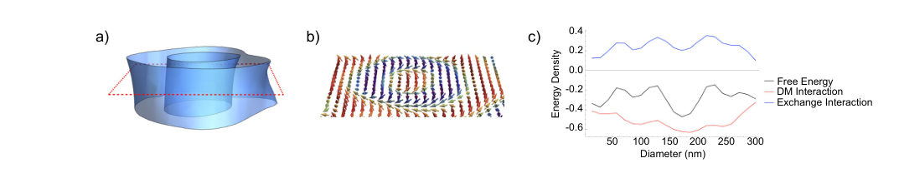
<figcaption class="paper-figure-caption"><b>Fig 2.</b> Fig. 2. Experimentally observed skyrmionium structure in three dimensions. Mz = −0.5 contours (a) highlight the doughnut-like spin texture, displayed over a height of 72 nm. Three-dimensional skyrmionium magnetization is shown for one selected depth (b) corresponding to the highlighted region in (a), with the corresponding evolution of the free energy density terms plotted across the width of the skyrmionium (c). The topological charge is calculated from slice b) as 0.006. The width of the skyrmionium is approximately twice the width of a regular skyrmion for this system. Symmetric double-peak structures characterize the transition between opposite in-plane spin rotations when traversing...</figcaption>
</figure>
<figure class="paper-figure-card">
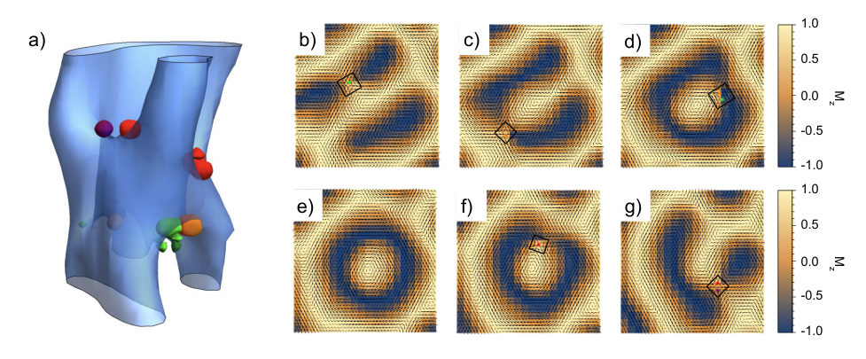
<figcaption class="paper-figure-caption"><b>Fig 3.</b> Fig. 3. Experimentally observed skyrmionium topological transition in three dimensions. Three-dimensional contours (a) of the z-component of the magnetization, mz = −0.5, and the emergent magnetic charge density, ρem, show a coupling of merons and monopoles, with bimerons occurring through the coupling of S−(orange)/B+ (green) and S+</figcaption>
</figure>
<figure class="paper-figure-card">
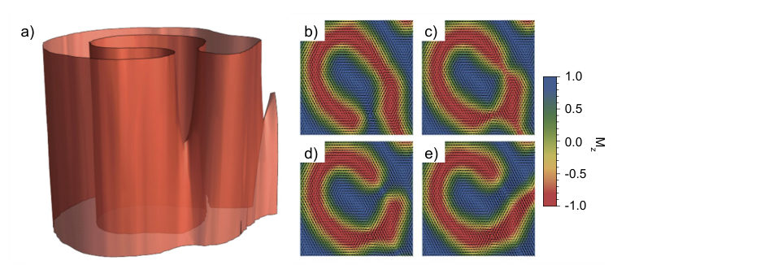
<figcaption class="paper-figure-caption"><b>Fig 4.</b> Fig. 4. Characteristic three-dimensional skyrmionium transition from Monte Carlo simulations. Three-dimensional contours (a) of the z-component of the magnetization, mz = −0.5. In-plane magnetization slices (b-g) show similar transition dynamics to (Fig. 3) via vortices and merons at transition points.</figcaption>
</figure>
<figure class="paper-figure-card">
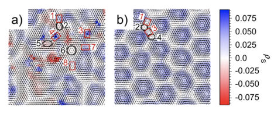
<figcaption class="paper-figure-caption"><b>Fig 5.</b> Fig. 5. Coexisting skyrmion and vortex-antivortex lat- tice structures for field-increasing experimental recon- structions. In-plane slices show the topological charge density for selected skyrmion hosting fields, correspond- ing to the disordered skyrmion state at 0.015 T (a) and the ordered skyrmion state at 0.025 T (b). Black ar- rows represent the xy component of spin and ρs denotes the calculated topological charge density. Selected re- gions containing vortices (black) and antivortices (red) are highlighted, with corresponding topological charges calculated in Table I.</figcaption>
</figure>

**Summary.** This work pioneers the experimental visualization of three-dimensional topological skyrmion structures in a bulk magnetic material using neutron scattering tomography. By observing complex transitions mediated by magnetic monopoles and merons, the research confirms the existence of higher-dimensional topological quasiparticles. This breakthrough paves the way for designing advanced, multi-bit spintronic devices based on bulk topological control.

**Why it may be interesting.** While the primary focus is condensed matter magnetism, the study of topological defects (monopoles, merons) and their dynamics in a controlled material system provides a rich platform for understanding emergent topological order, which has parallels in quantum field theory and topological quantum computation.

Detailed structure

**Main problem.** The research aims to move beyond the traditional two-dimensional description of magnetic skyrmions to experimentally visualize and characterize their higher-dimensional, three-dimensional topological structures and the complex transition pathways between them.

**Main result.** The authors report the first experimental visualization of three-dimensional topological Q=0 skyrmion structures, revealing metastable skyrmioniums and novel transition dynamics mediated by the coupling of merons and monopoles.

**Method.** The study employed neutron scattering tomography (SANS) techniques on a bulk magnetic sample, supplemented by Monte Carlo simulations to reconstruct and analyze the magnetic structure across varying external magnetic fields.

**Model / system.** The physical system is a bulk chiral magnet, specifically $	ext{Co}_8	ext{Zn}_8	ext{Mn}_4$. The theoretical framework involves analyzing skyrmion topology, which is extended into 3D strings, and understanding the role of emergent quasiparticles like monopoles and merons in mediating topological changes.

**Key observables.** Three-dimensional magnetization contours ($m_z$), topological charge density ($
ho_{em}$), the existence of composite skyrmioniums, and the identification of vortex-antivortex lattices.

**Important parameters / regimes.** The study spans field-induced transitions across the equilibrium phase, with measurements taken at 310 K and fields up to 0.035 T.

**Assumptions / limitations.** The analysis assumes that neutron scattering tomography can accurately probe the bulk 3D structure, overcoming the ambiguity inherent in 2D planar projections.

**Figures summary.** Figures illustrate the 3D visualization of skyrmioniums (doughnut-like textures) and the transition pathways, showing the coupling of magnetic monopoles and merons at defect points.

**Paper structure.** The paper establishes the need to study 3D skyrmions, details the experimental setup using neutron scattering tomography, presents the observation of $Q=0$ structures and their formation via vortex-mediated transitions, and concludes by discussing implications for higher-dimensional spintronics.

Abstract

Magnetic skyrmions represent vortex-like spin configurations that provide a robust platform for next-generation spintronic technologies. Although they are often treated as two-dimensional objects with integer topological charge, their extension into three-dimensional strings realizes other composite structures with unique device functionalities that transcend planar frameworks. Unfortunately, a lack of bulk probes has failed to realize such higher-dimensional topological structures and their implementations. Here, we report the first experimental visualization of three-dimensional topological $Q = 0$ skyrmion structures using neutron scattering tomography techniques across the equilibrium phase of a Co$_8$Zn$_8$Mn$_4$ sample. Disordered skyrmion states reveal metastable skyrmioniums and composite topological objects novel to bulk systems. Vortex-antivortex lattices mediate changes in topology, with unprecedented transition pathways via a coupling of merons and monopoles. The present realization of bulk Q = 0 quasiparticles and meron-mediated dynamics paves the way for higher-dimensional spintronic frameworks through multi-bit encoding architectures, unidirectional transport schemes, and monopole-mediated controls.

[↑ back to top](#top)

### [Coherent energy cascades in nonlinear disordered Hamiltonians](http://arxiv.org/abs/2609.36009v1)

**Authors:** Anxo Biasi, Brad Cownden, Oleg Evnin, Alvaro Iturbe Jabaloyes  
**Type:** theory · **Category:** other · **PDF:** <https://arxiv.org/pdf/2609.36009v1>  
**Analysis basis:** full PDF text, analyzed in chunks
**Topic relevance:** `analog quantum simulation` **1/5**

↔ Scroll figures horizontally

<figure class="paper-figure-card">
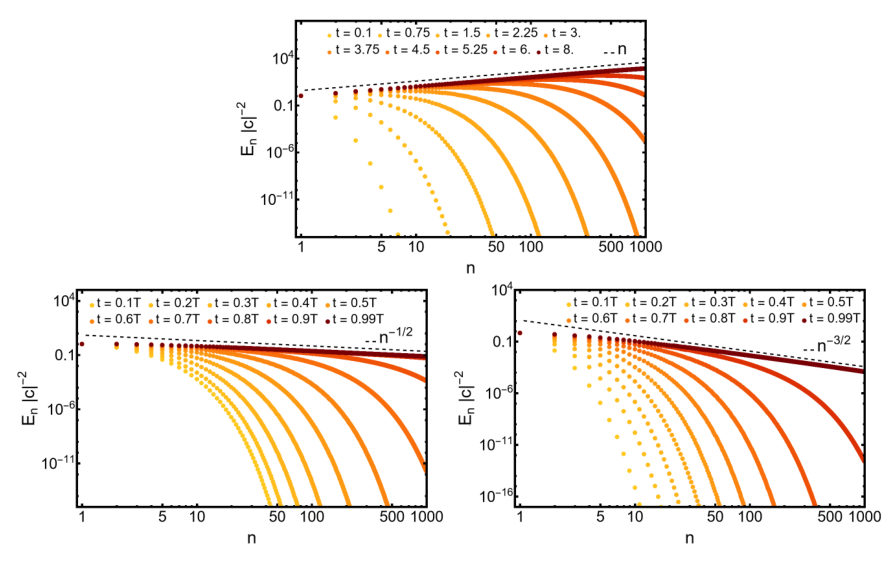
<figcaption class="paper-figure-caption"><b>Fig 1.</b> Figure 1: Analytic solutions for the three types of cascades present on the invariant manifold.</figcaption>
</figure>
<figure class="paper-figure-card">
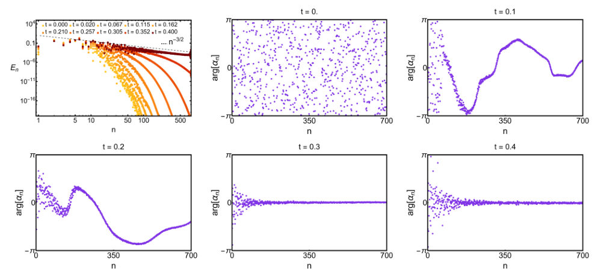
<figcaption class="paper-figure-caption"><b>Fig 2.</b> Figure 2: Emergence of a coherent energy cascade from random initial data in a system admitting Cascade III solutions on the invariant manifold. Upper-left corner: power-law spectrum forma- tion. Remaining plots: distribution of phases at successive times during the evolution. In these and subsequent plots, the phases have been rotated for visual purposes using the symmetry trans- formation αn →ei(θ1n+θ0)αn of resonant systems (1.2), with θ1, θ0 ∈R.</figcaption>
</figure>
<figure class="paper-figure-card">
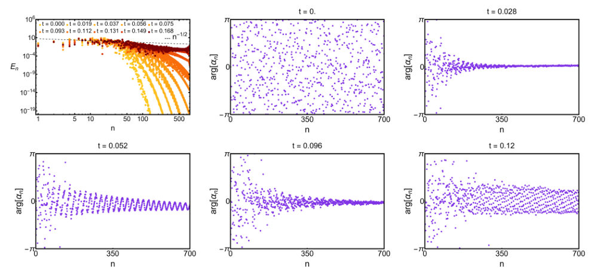
<figcaption class="paper-figure-caption"><b>Fig 3.</b> Figure 3: Evolution of a system admitting Cascade II solutions on the invariant manifold, initial- ized with random initial data. Upper-left corner: energy spectrum at successive times. Remaining plots: phase distribution at the corresponding times.</figcaption>
</figure>
<figure class="paper-figure-card">
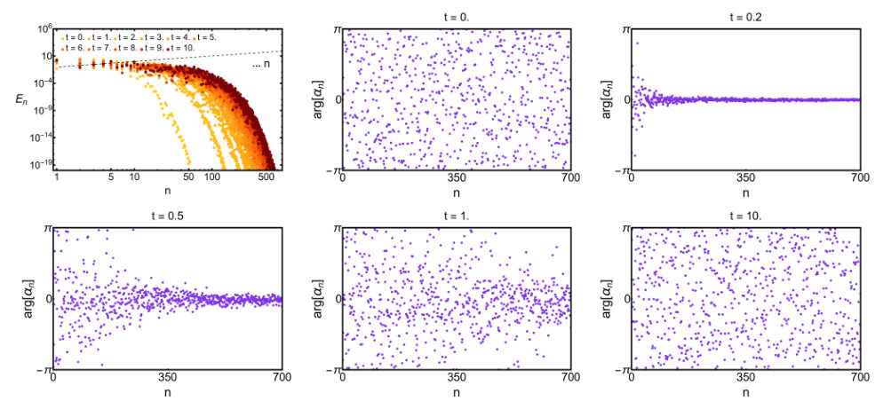
<figcaption class="paper-figure-caption"><b>Fig 4.</b> Figure 4: Evolution of a system admitting Cascade I solutions on the invariant manifold, initialized with random initial data. Upper-left corner: energy spectrum at successive times. Remaining plots: phase distribution at the corresponding times.</figcaption>
</figure>
<figure class="paper-figure-card">
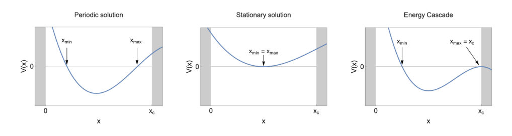
<figcaption class="paper-figure-caption"><b>Fig 5.</b> Figure 5: Representative forms of V (x) associated with periodic, stationary, and cascade solutions.</figcaption>
</figure>

**Summary.** This work proves that phase-coherent energy cascades can persist in highly disordered, infinite-dimensional Hamiltonian systems. By showing that only an infinitesimal fraction of structured couplings is necessary, the authors demonstrate that organized structure can guide energy flow across many scales, even when the system is largely random. This challenges the notion that disorder necessarily destroys coherent energy transport.

**Why it may be interesting.** The finding that structured interactions can survive and mediate energy transfer across vast scales in the presence of disorder is highly relevant to understanding complex, non-integrable quantum many-body systems where disorder is inherent.

Detailed structure

**Main problem.** The paper investigates the mechanism of energy transfer (energy cascades) in nonlinear, dispersive Hamiltonian systems, specifically contrasting phase-incoherent (weak turbulence) versus phase-coherent energy transport.

**Main result.** Coherent energy cascades are robust and can be sustained even in systems with predominantly random nonlinear couplings, provided a small, structured subset of couplings remains organized.

**Method.** The authors use theoretical proofs to construct resonant Hamiltonian systems that support invariant manifolds, followed by numerical simulations to test the robustness of the cascade mechanism.

**Model / system.** The model is an infinite-dimensional resonant Hamiltonian system described by equations of motion involving random nonlinear couplings. The system conserves energy and particle number, and the analysis focuses on the dynamics near an invariant manifold.

**Key observables.** Phase alignment of normal modes, formation of power-law energy spectra ($E_n \propto n^{-\gamma}$), and the growth/blow-up of Sobolev norms ($H_s$).

**Important parameters / regimes.** The ratio of deterministic to random couplings, the spectral resonance structure, and the dimensionality of the system.

**Assumptions / limitations.** The initial theoretical proofs are established on the assumption of an invariant manifold, though numerical work tests robustness outside this regime.

**Figures summary.** Figures illustrate the three types of energy cascades (I, II, and III) and show the emergence of Cascade III from random initial data, confirming power-law formation and phase distribution.

**Paper structure.** The paper systematically develops a construction for resonant Hamiltonian systems supporting invariant manifolds, analyzes the resulting energy cascade solutions (categorizing them by spectral decay and norm growth), and concludes by proving the robustness of the coherent cascade mechanism against disorder.

Abstract

The familiar wave kinetic theory revolves around turbulent energy cascades characterized by random phases of the individual normal modes. By contrast, recent years have revealed turbulent cascades where the transfer of energy is mediated by phase-coherent dynamics. Such coherent cascades have been previously established in deterministic systems with a tightly controlled algebraic structure of the mode interactions, such as nonlinear Schrödinger equations.   Here, we show that the presence of phase-coherent cascades is robust with respect to substantial alterations of the mode couplings. We prove that, in infinite-dimensional resonant Hamiltonian systems with fully resonant normal mode spectra and random nonlinear couplings, a structured subset of couplings --- an infinitesimal fraction of the total --- suffices to support coherent cascades characterized by phase alignment, the formation of power-law spectra, and either unbounded growth of Sobolev norms or a finite-time blow-up. Numerical simulations further demonstrate the emergence of coherent cascades from random initial data through a process of phase locking, suggesting a mechanism for their emergence in broader classes of initial data and systems. We thus show that disordered mode interactions can sustain, rather than block, coherent energy transport across arbitrarily distant scales.

[↑ back to top](#top)

### [Nonlinear optical responses of semiconducting graphene nanoribbons: Strong constraint from a hidden symmetry](http://arxiv.org/abs/2609.37418v1)

**Authors:** Jiawei Ruan, Weichen Tang, Yang-Hao Chan, Chen Hu, Xiaoxun Gong, Steven G. Louie  
**Type:** theory · **Category:** other · **PDF:** <https://arxiv.org/pdf/2609.37418v1>  
**Analysis basis:** full PDF text, analyzed in chunks
**Topic relevance:** `Keldysh / 2PI / non-Gaussian methods` **1/5**

↔ Scroll figures horizontally

<figure class="paper-figure-card">
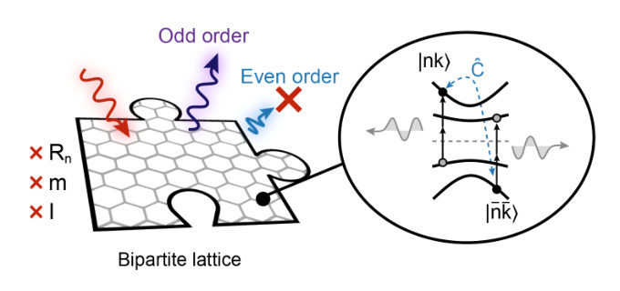
<figcaption class="paper-figure-caption"><b>Fig 1.</b> FIG. 1. Schematic of NLO responses in a bipartite-lattice semiconducting system. In such ideal</figcaption>
</figure>
<figure class="paper-figure-card">
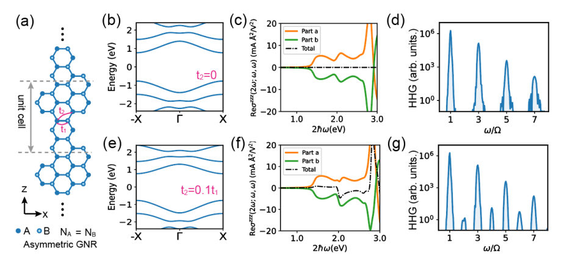
<figcaption class="paper-figure-caption"><b>Fig 2.</b> FIG. 2. (a) Crystal structure of a specific fully asymmetric GNR. There is no rotational symmetry, mirror symmetry, or inversion symmetry in the plane of the carbon atoms. (b) Band structure computed based on a TB model only considering nearest-neighbor hopping. (c) The real part of the frequency-resolved SHG conductivity tensor computed from the sum-over-band formula (Eq. S11 in the SM) with band structure from (b). The orange and green solid lines are the contributions from the states with 𝐤∈[Γ, 𝑋] (part a) and 𝐤∈[Γ, −𝑋] (part b),</figcaption>
</figure>
<figure class="paper-figure-card">
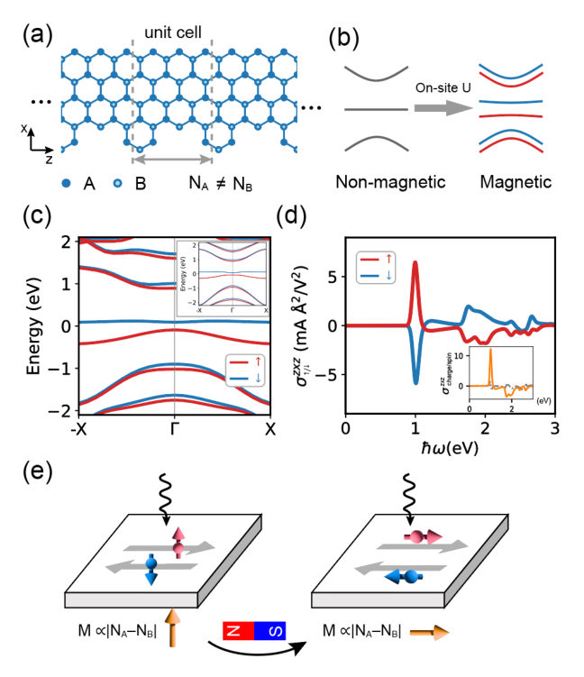
<figcaption class="paper-figure-caption"><b>Fig 3.</b> FIG. 3. (a) The structure of a Janus GNR, with different edge shapes on the two sides and different numbers of atoms on the graphene A and B sublattices, synthesized in Ref. [19]. In our DFT calculations, hydrogen atoms are used to passivate the dangling bonds (not shown); the corresponding structure is provided in the SM. (b) Schematic for the development of</figcaption>
</figure>

**Summary.** This work reveals that hidden, nonspatial symmetries, particularly the bipartite-lattice particle-hole symmetry, impose strong constraints on nonlinear optical responses in graphene nanoribbons. This symmetry causes the suppression of even-order NLO effects and, crucially, enables the efficient, field-tunable generation of pure spin currents in magnetic GNRs.

**Why it may be interesting.** The deep connection between fundamental lattice symmetries (like particle-hole symmetry) and measurable optical responses (NLO effects) provides a powerful, symmetry-based tool for designing spintronic materials.

Detailed structure

**Main problem.** The paper investigates how nonspatial symmetries, specifically the approximate bipartite-lattice particle-hole (BLPH) symmetry, constrain nonlinear optical (NLO) responses in graphene nanoribbons (GNRs).

**Main result.** The BLPH symmetry strongly suppresses even-order NLO effects, even when inversion symmetry is absent, and enables the optical generation of nearly pure spin shift currents in ferromagnetic GNRs.

**Method.** The analysis uses the quantum kinetic equation for the density matrix, deriving symmetry relations from the Hamiltonian properties to predict vanishing contributions to even-order current densities.

**Model / system.** The study focuses on semiconducting Graphene Nanoribbons (GNRs) with bipartite-lattice structures, extending to ferromagnetic Janus GNRs. The theoretical framework involves tight-binding models and symmetry analysis using operations like chiral and particle-hole symmetry.

**Key observables.** Nonlinear optical responses (SHG, HHG), charge shift currents, and spin shift currents.

**Important parameters / regimes.** The degree of symmetry preservation (approximate BLPH symmetry), external magnetic field strength, and the lattice structure (bipartite).

**Assumptions / limitations.** The analysis relies on the independent-particle approximation and the assumption of approximate preservation of the BLPH symmetry in real systems.

**Figures summary.** Figures illustrate the vanishing of even-order current contributions due to symmetry, show band structures for ideal and perturbed GNRs, and compare charge vs. spin current generation in magnetic systems.

**Paper structure.** The paper systematically analyzes symmetry constraints on NLO responses, first establishing the general principle of symmetry suppression in bipartite lattices, then applying this to nonmagnetic GNRs, and finally demonstrating the unique generation of pure spin currents in ferromagnetic GNRs.

Abstract

Nonlinear optical (NLO) responses are powerful tools for probing material structures, as they are highly sensitive to spatial symmetries. For instance, it is well known that having inversion symmetry forbids even-order NLO effects. Here, we show that nonspatial symmetries can also significantly constrain NLO responses. In graphene nanoribbons (GNRs) with bipartite-lattice structures, we identify the approximate bipartite-lattice particle-hole (BLPH) symmetry strongly suppresses even-order NLO effects, even for systems with no inversion symmetry. Importantly, we demonstrate that this approximate symmetry enables the optical generation of nearly pure spin shift currents in ferromagnetic GNRs, with the charge shift currents strongly suppressed. The spin orientation of these photo-induced DC spin currents can be easily tuned by an external magnetic field, providing distinct advantages over previous schemes for generating pure spin shift currents in antiferromagnetic systems. We illustrate our findings using a recently synthesized ferromagnetic Janus GNR. Our results underscore the significance of an overlooked symmetry aspect of NLO responses and highlight magnetic GNRs as promising candidates for spintronic devices.

[↑ back to top](#top)

### [Reversible field-free superconducting diode effect controlled by an antiferromagnet](http://arxiv.org/abs/2609.38003v1)

**Authors:** Filip Krizek, Kamil Olejník, Tobias Edwinson, August Jacobi, Athira Suresh, Andrej Farkaš, Jan Kraus, Vít Novák, Christoph Müller, Vojtěch Pařízek, Niclas Heinsdorf, Peter Wadley, Oliver Amin, Kevin Edmonds, Tomas Jungwirth, Libor Šmejkal, Anna Birk Hellenes, Sumit Ghosh, Michal Mazur, Dominik Kriegner, Lucas Casparis, Saulius Vaitiekėnas  
**Type:** both · **Category:** other · **PDF:** <https://arxiv.org/pdf/2609.38003v1>  
**Analysis basis:** full PDF text, analyzed in chunks
**Topic relevance:** `analog quantum simulation` **1/5**

↔ Scroll figures horizontally

<figure class="paper-figure-card">
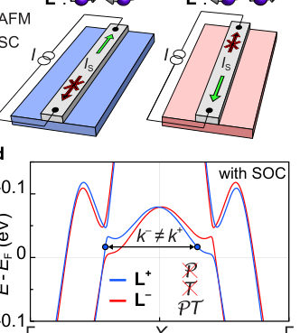
<figcaption class="paper-figure-caption"><b>Fig 1.</b> Fig. 1. Symmetry of CuMnAs and the superconducting diode effect. a, Schematic illustration of the CuMnAs unit cell. Arrows indicate the Mn magnetic moments of the two sub-lattices M1 and M2, with the Néel vector defined as L = M1 −M2. The states L+ and L−correspond to opposite Néel-vector orientations along the [100] axis. b, Non-relativistic density functional theory band structure of CuMnAs without spin-orbit coupling (SOC). The gray box marks the Dirac crossing highlighted in d. c, Schematic of the superconducting diode effect in a hybrid PT -symmetric antiferromagnet/superconductor bar, illus- trating reversal of the diode polarity upon reversal of the Néel vector (L+ ↔L−). d,...</figcaption>
</figure>
<figure class="paper-figure-card">
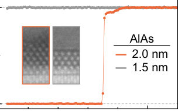
<figcaption class="paper-figure-caption"><b>Fig 2.</b> Fig. 2. CuMnAs/AlAs/Al heterostructure and proximity tuning. a, High-angle annular dark- field scanning transmission electron microscopy (STEM) image of the epitaxial CuMnAs/AlAs/Al het- erostructure on GaP. The scale bar is 5 nm. b, Magnetization per Mn atom, M, as a function of applied magnetic field, H, for the CuMnAs heterostructure and a reference ferromagnetic MnAs sample. The CuMnAs signal is multiplied by 10. c, Normalized sheet resistance, RS/RN, as a function of temperature, T, for heterostructures with 2.0 and 1.5 nm AlAs barriers. Superconductivity is recovered for the 2.0 nm barrier, with TC ≈350 mK, whereas no transition is observed for the 1.5 nm barrier down to 20 mK....</figcaption>
</figure>
<figure class="paper-figure-card">
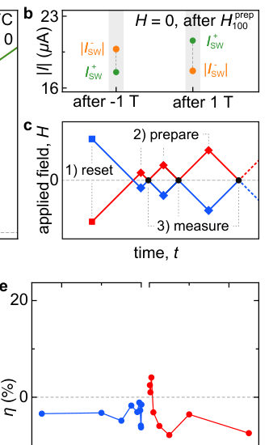
<figcaption class="paper-figure-caption"><b>Fig 3.</b> Fig. 3. Remanent control of the field-free superconducting diode effect. a, Absolute voltage, |V |, as a function of current magnitude, |I|, measured after zero-field cooling (at H = 0). Top inset: schematic of the device geometry overlaid with four-terminal measurement configuration. Bottom inset: switching- current, ISW, distributions for positive and negative current sweeps. b, Switching currents measured at H = 0 after preparation fields Hprep 100 = ±1 T. Reversing the preparation field interchanges I+ SW and |I− SW|. c, Magnetic-field preparation protocol. The device is reset, exposed to a finite preparation field, and measured after returning to H = 0. Red and blue indicate opposite...</figcaption>
</figure>

**Summary.** This work demonstrates a superconducting diode effect in a field-free setup using an antiferromagnetically coupled superconductor. The key finding is that the diode's directionality is controlled solely by manipulating the AFM's internal Néel state, proving that such non-reciprocity does not require net magnetization or spin-split bands. This opens a pathway for realizing superconducting quantum components using collinear compensated magnets.

**Why it may be interesting.** The finding that non-reciprocity can be controlled by a compensated, spin-degenerate AFM state, rather than relying on conventional spin-splitting mechanisms, expands the scope of magnetically induced superconducting phenomena relevant to quantum circuits.

Detailed structure

**Main problem.** The paper aims to demonstrate and control the superconducting diode effect (SDE) in a field-free manner, which requires breaking time-reversal symmetry.

**Main result.** A field-free SDE is achieved in Al proximitized by an antiferromagnet (CuMnAs), and its polarity is shown to be controlled by reversing the remanent Néel state of the AFM, without requiring spin splitting or net magnetization.

**Method.** The study combines experimental measurements (I-V curves, magnetotransport) with theoretical calculations (DFT) to characterize the superconducting junction and its magnetic control.

**Model / system.** The physical system is a heterostructure: superconducting Al, an insulating AlAs spacer, and a collinear antiferromagnetic CuMnAs layer. The mechanism relies on the AFM order breaking T-symmetry in a spin-degenerate manner.

**Key observables.** Diode efficiency ($\eta$), switching currents ($I_{	ext{SW}}^{+}, |I_{	ext{SW}}^{-}$), and the nonlinear resistance ($	ext{Reven}$).

**Important parameters / regimes.** Antiferromagnetic Néel state reversal, spacer layer thickness, and applied magnetic field strength ($H_{	ext{prep}}$).

**Assumptions / limitations.** The superconducting proximity effect is modeled, and the control mechanism is assumed to be directly linked to the AFM's remanent state.

**Figures summary.** Figures illustrate the heterostructure, magnetization loops showing field-induced Néel state reversal, and I-V curves demonstrating the non-reciprocal current flow ($\eta$) that reverses upon magnetic field cycling.

**Paper structure.** The paper establishes the background on SDE, details the $	ext{CuMnAs/AlAs/Al}$ heterostructure, measures the SDE and its dependence on the AFM state via field preparation, and correlates this with theoretical predictions.

Abstract

The semiconductor diode, which allows current to flow preferentially in one direction, is a fundamental building block of numerous modern electronic circuits. Its superconducting analogue---the superconducting diode effect---enables directional dissipationless current flow and may provide similar functionality in future superconducting quantum circuits. Realization of such a nonreciprocal supercurrent requires broken time-reversal symmetry. At zero applied field, this has been typically associated either with intrinsic unconventional superconductivity or extrinsic spin-split electronic states induced by magnetic proximity. Here we demonstrate a field-free superconducting diode effect in conventional superconducting Al proximitized by collinear antiferromagnetic CuMnAs, whose electronic structure breaks time-reversal symmetry without generating spin splitting. By tuning the proximity effect through an insulating AlAs interlayer and correlating the reversal of the diode polarity with the reversal of the remanent Néel state, we establish that the antiferromagnet controls the superconducting diode effect. Our results show that neither spin-split bands nor net magnetization is required for a magnetically controlled field-free superconducting diode effect, extending superconducting nonreciprocity to a broader class of collinear compensated magnets.

[↑ back to top](#top)

### [Spatially dispersive photogalvanic effects as a probe of quantum geometric tensor](http://arxiv.org/abs/2609.38102v1)

**Authors:** Yicong Chen, Bumseop Kim, Senin Ahammed Akkara Paramban, Zhurun Ji, Utkarsh Khandelwal, Shupeng Xu, Jiachen Shi, Sergiy Krylyuk, Albert V. Davydov, Andrew M. Rappe, Ritesh Agarwal  
**Type:** both · **Category:** other · **PDF:** <https://arxiv.org/pdf/2609.38102v1>  
**Analysis basis:** full PDF text, analyzed in chunks
**Topic relevance:** `interference shaping light` **1/5**

↔ Scroll figures horizontally

<figure class="paper-figure-card">
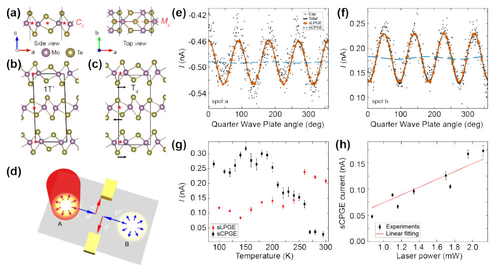
<figcaption class="paper-figure-caption"><b>Fig 1.</b> FIG. 1. Spatially dispersive photogalvanic responses in MoTe2. (a) Side and top views of a single-layer MoTe2 crystal. The twofold rotational axis and mirror plane are denoted as C2 and My, respectively. (b,c) Crystal structures of the centrosymmetric 1T′ phase (room temperature) and the non-centrosymmetric Td (Weyl) phase (below 250 K). (d) Schematic of the spatially dispersive photocurrent measurement geometry. The red cylinder denotes the focused mid-infrared beam, the blue arrow indicates the in-plane intensity gradient q, and the red arrow the resulting photocurrent J. Displacing the beam laterally from position A to position B reverses the averaged intensity gradient and...</figcaption>
</figure>
<figure class="paper-figure-card">
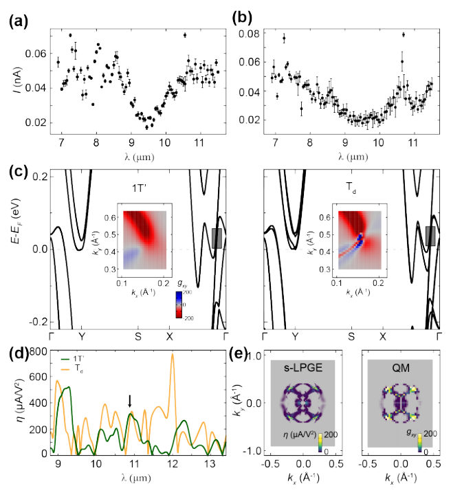
<figcaption class="paper-figure-caption"><b>Fig 2.</b> FIG. 2. Spectral and momentum-space signatures of quantum metric–driven photocurrent. (a,b) Wavelength dependence of the spatially dispersive LPGE (s-LPGE) measured at 300 K(a) and 77 K(b), respectively, showing closely similar line shapes and characteristic spectral features across the structural transition. (c) Calculated electronic band structure in the relevant energy window, indicating the interband transitions contributing to the measured response. Inset: Momentum-resolved quantum metric near the Weyl points for the two phases. (d) First-principles calculations of the s-LPGE spectra for the 1T ′ and Td phases, reproducing the experimental line shape and peak structure. (e) Comparison...</figcaption>
</figure>
<figure class="paper-figure-card">
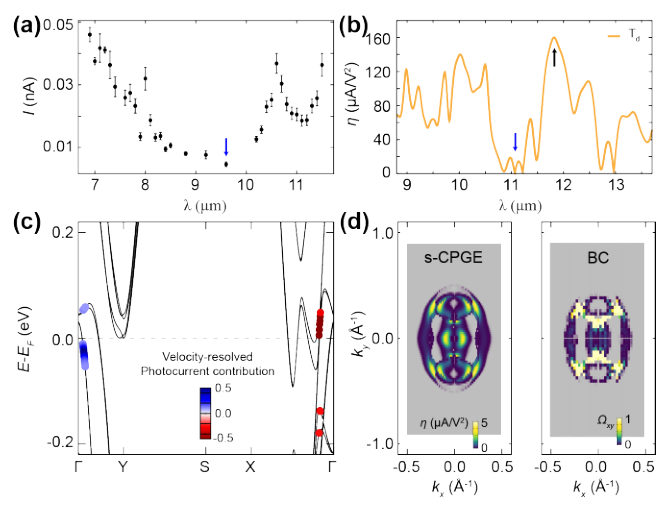
<figcaption class="paper-figure-caption"><b>Fig 3.</b> FIG. 3. Berry curvature–driven s-CPGE response and competing momentum-space contributions. (a) Wavelength dependence of the spatially dispersive CPGE (s-CPGE) measured at 77 K, showing a nonmonotonic spectral response with a pronounced minimum near ∼9 µm to 10 µm. (b) First-principles calculation of the s-CPGE spectrum, reproducing the overall nonmonotonic spectral evolution. The blue and black arrows indicate the dip and peak energies analyzed in (c) and (d), respectively. (c) Velocity-weighted photocarrier contributions to the s-CPGE at the dip energy across the Brillouin zone, showing positive (red) and negative (blue) contributions from different momentum-space regions that nearly...</figcaption>
</figure>
<figure class="paper-figure-card">
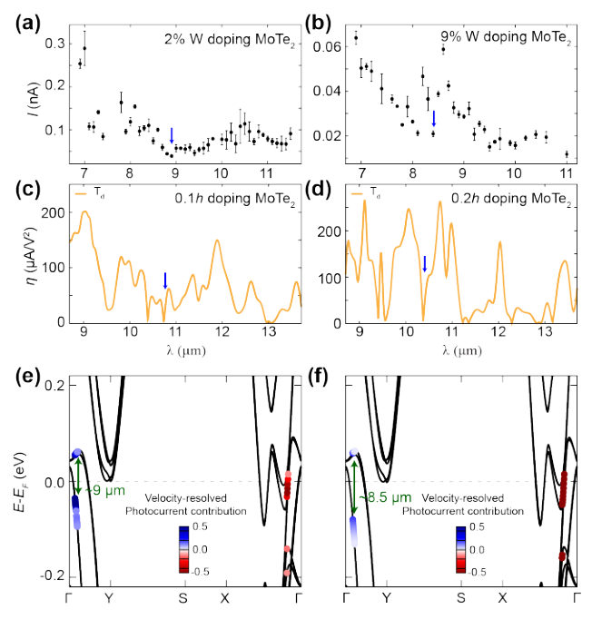
<figcaption class="paper-figure-caption"><b>Fig 4.</b> FIG. 4. Doping dependence of the Berry curvature–driven s-CPGE response. (a,b) Wavelength dependence of the spatially dispersive CPGE (s-CPGE) measured at 77 K for 2 % (a) and 9 % (b) W-doped MoTe2, showing a systematic shift of the characteristic spectral dip (blue arrows), which is more clearly resolved in the calculated spectra shown in (c,d). (c,d) Corresponding first-principles calculations reproducing the experimentally observed spectral evolution and the doping-induced shift of the dip position with increasing hole doping. (e,f) Velocity-weighted photocarrier contributions to the s-CPGE evaluated at the dip energies for 0.1 h (e) and 0.2 h (f) hole doping, where the chemical...</figcaption>
</figure>

**Summary.** This paper introduces the use of spatially dispersive photogalvanic effects as a novel technique to experimentally separate and quantify the quantum metric and Berry curvature components of the quantum geometric tensor. Using $	ext{MoTe}_2$, the authors demonstrate that the linear and circular components of the photocurrent correspond, respectively, to these two geometric quantities. This method proves highly valuable for characterizing topological properties in materials across different structural phases and doping levels.

**Why it may be interesting.** This work provides a powerful, non-invasive optical tool to map out fundamental topological invariants (Berry curvature and quantum metric) in solid-state materials, which is crucial for understanding topological electronic phases.

Detailed structure

**Main problem.** The study aims to develop an optical protocol to simultaneously and independently probe both the Berry curvature and the quantum metric components of the quantum geometric tensor (QGT). This overcomes limitations in conventional methods that often require external symmetry breaking or fail to separate these contributions.

**Main result.** The spatially dispersive photogalvanic effect successfully separates the response into helicity-even ($	ext{s-LPGE}$, metric-dominated) and helicity-odd ($	ext{s-CPGE}$, curvature-driven) channels. Furthermore, the $	ext{s-CPGE}$ response is shown to be highly sensitive to carrier doping, exhibiting a systematic spectral shift.

**Method.** The research combines experimental measurements of polarization-dependent photocurrents using spatially focused laser beams with first-principles electronic structure calculations to model the momentum-resolved contributions.

**Model / system.** The primary platform is $	ext{MoTe}_2$, a material chosen for its temperature-tunable structural transition from an inversion-symmetric $1	ext{T}'$ phase to an inversion-broken $	ext{Td}$ phase. The response is analyzed based on interband transitions governed by the material's electronic band structure.

**Key observables.** Polarization-dependent photocurrent components ($	ext{s-LPGE}$ and $	ext{s-CPGE}$), spectral dependence on photon energy, and the shift of characteristic spectral dips with doping.

**Important parameters / regimes.** Temperature (e.g., 300 K vs 77 K), doping concentration (e.g., W substitution), and the polarization angle ($\phi$) of the incident light.

**Assumptions / limitations.** The analysis assumes that the spatially dispersive current can be decomposed into distinct helicity-even and helicity-odd components, and that doping effects can be modeled by a rigid chemical-potential shift.

**Figures summary.** Figures illustrate the polarization-dependent photocurrent measurements, showing the emergence of $	ext{s-CPGE}$ upon cooling. They also compare calculated $	ext{s-LPGE}$ and $	ext{s-CPGE}$ spectra to experiment, demonstrating the spectral evolution and the doping-induced blue shift of the $	ext{s-CPGE}$ dip.

**Paper structure.** The paper establishes the theoretical basis for using spatially dispersive photogalvanic effects to probe the QGT. It then presents experimental evidence using $	ext{MoTe}_2$ across a structural transition to separate metric and curvature contributions. Finally, it explores the sensitivity of the curvature-driven response to doping via theoretical modeling.

Abstract

Berry curvature and quantum metric of Bloch states govern a wide range of phenomena, yet unified experimental access to both remains limited. Here we show that light spatial-dispersion alters the selection rules of second-order photocurrents and responses forbidden by parity become allowed in centrosymmetric crystals without any external fields, magnetic order, interfaces, strain, or engineered symmetry breaking. The resulting response is intrinsic and its weight is set by the quantum geometry of the Bloch states. Conventional photogalvanic effects are constrained by crystal symmetry and entangle the quantum metric with shift vector contributions. The spatially-dispersive response instead isolates the quantum metric and Berry curvature in distinct polarization channels. Implementing this approach in 1T'-MoTe2 across its temperature-driven transition to Td-Weyl phase, we resolve helicity-even and helicity-odd photocurrents corresponding to quantum metric and Berry curvature contributions, respectively, from the same device. The metric-dominated response persists across both phases and exhibits a robust spectral structure reproduced by first-principles calculations and linked to momentum-resolved quantum metric hotspots. In contrast, the curvature-driven channel emerges only when inversion symmetry is broken and shows strong sensitivity to carrier doping through competing momentum-space contributions. Our results establish photogalvanic effects with spatially varying optical fields as a general route to accessing quantum geometry in materials where photon energy and electronic filling probe different parts of the excitation manifold.

[↑ back to top](#top)

### Other secondary papers (5)

Show other secondary papers

### [Anisotropic interface-confined superconductivity in FeTe-based heterostructures](http://arxiv.org/abs/2609.38148v1)

**Authors:** Bicky Singh Moirangthem, Kamal R. Joshi, Zi-Jie Yan, Pu Xiao, Lok-Kan Lai, Cui-Zu Chang, Ruslan Prozorov  
**Type:** experiment · **Category:** other · **PDF:** <https://arxiv.org/pdf/2609.38148v1>  
**Analysis basis:** full PDF text, analyzed in chunks

↔ Scroll figures horizontally

<figure class="paper-figure-card">
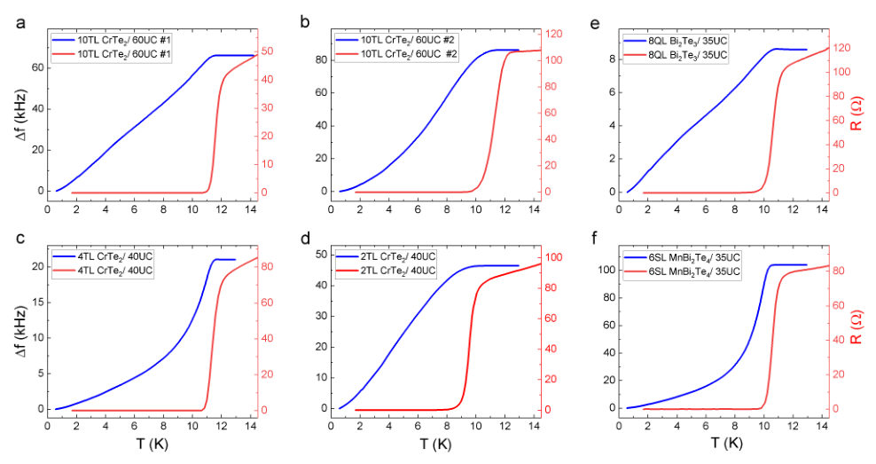
<figcaption class="paper-figure-caption"><b>Fig 1.</b> FIG. 1. (a)-(f) Comparison of temperature dependent resonant frequency change ∆f and measured resistance R in six FeTe heterostructures. The onsets of superconducting transition observed in transport measurements are fairly consistent with the appearance of diamagnetic screening in all six samples.</figcaption>
</figure>
<figure class="paper-figure-card">
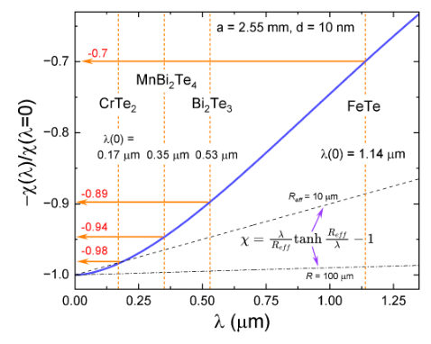
<figcaption class="paper-figure-caption"><b>Fig 2.</b> FIG. 2. The normalized magnetic susceptibility as a func- tion of the London penetration depth χ(λ) calculated using COMSOL finite element software for our sample dimensions in a perpendicular applied magnetic field. For comparison, dashed and dashed-dotted lines show “conventional” mag- netic susceptibility used to describe usual, even thin, crystals with the effective dimension, Reff, absorbing the demagne- tizing factor corrections [44, 55]. For thicker crystals, typical Reff ∼100 µm and for very thin samples, Reff ∼10 µm. In either case, there is an obvious and significant difference with the ultrathin limit χ(λ). The arrows and numbers show how to obtain the normalization values from...</figcaption>
</figure>
<figure class="paper-figure-card">
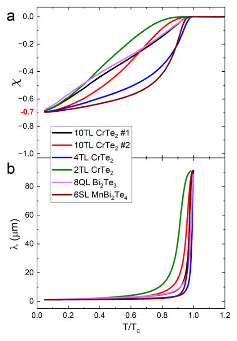
<figcaption class="paper-figure-caption"><b>Fig 3.</b> FIG. 3. (a) The variation of normalized magnetic susceptibil- ity χ(T/Tc) in six measured FeTe heterostructures. Consider- ing the λ(T = 0) ≈1.14 µm for FeTe, χ has been normalized between -0.7 to 0. (b) Corresponding London penetration depth λ extracted using the calibration curve in Fig.2.</figcaption>
</figure>
<figure class="paper-figure-card">
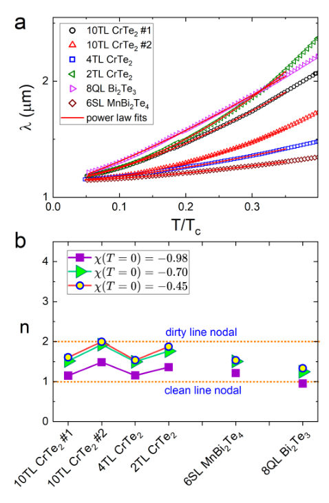
<figcaption class="paper-figure-caption"><b>Fig 4.</b> FIG. 4. (a) Low-temperature λ(T/Tc) analyzed using power- law behavior, ∆λ(t) ∝tn, which in recent years has become a standard practice to distinguish nodal and nodeless order pa- rameters [43]. Fits are over 0.05 ≤T/Tc ≤0.35. (b) The ob- tained exponents n for the studied materials. Different sym- bols correspond to different λ(T = 0) shown in the legend. The values between 1 and 2 are consistent with a line nodal order parameter with various degrees of non-magnetic disor- der scattering, though a strongly anisotropic nodeless gap is not excluded.</figcaption>
</figure>
<figure class="paper-figure-card">
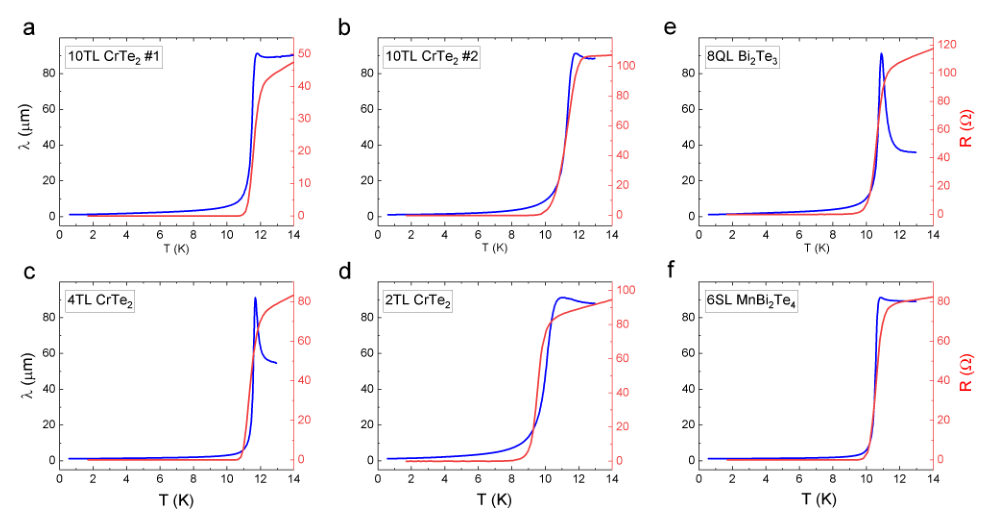
<figcaption class="paper-figure-caption"><b>Fig 5.</b> FIG. 5. The converted λ(T) curves are plotted together with R(T) curves, left and right Y-axes, respectively. The transition widths in both measured quantities practically coincide in all samples, except for the 2TL-CrTe2 sample with the thinnest top layer.</figcaption>
</figure>

**Summary.** The authors investigated superconductivity in ultrathin FeTe-based heterostructures by measuring the whole-sample magnetic response. They developed a specialized analysis to overcome geometric measurement artifacts, successfully extracting the temperature-dependent London penetration depth. The results strongly suggest that the superconductivity originates at the FeTe interface and possesses a highly anisotropic order parameter, pointing toward unconventional pairing mechanisms.

**Why it may be interesting.** This work provides a rigorous experimental methodology for probing superconducting properties in highly confined, complex interfaces, which is crucial for realizing novel quantum materials.

Detailed structure

**Main problem.** The primary challenge is determining the intrinsic superconducting nature of an interfacial layer that is only a few nanometers thick, especially in systems where magnetism and topology coexist.

**Main result.** The superconducting state is governed by the interfacial FeTe layer, exhibiting a strongly anisotropic order parameter (suggesting line nodes or deep gap minima) rather than a simple isotropic s-wave gap.

**Method.** The study measures the whole-sample Meissner response ($\chi(T)$) using a frequency-domain tunnel-diode resonator (fTDR) and extracts the London penetration depth ($\lambda(T)$) by inverting the susceptibility.

**Model / system.** The research investigates FeTe-based heterostructures formed by interfacing FeTe with various overlayers (e.g., $	ext{CrTe}_2$, $	ext{MnBi}_2	ext{Te}_4$). The superconducting layer is assumed to be ultrathin and buried beneath normal layers.

**Key observables.** Whole-sample magnetic susceptibility ($\chi(T)$), London penetration depth ($\lambda(T)$), and the resistive transition ($R(T)$).

**Important parameters / regimes.** The analysis is highly sensitive to the ultrathin geometry, requiring specialized calibration because conventional normalization ($\chi(T 	o 0) = -1$) fails.

**Assumptions / limitations.** The authors assume that the broad magnetic transitions are due to extreme geometry and large $\lambda$, rather than structural or chemical inhomogeneity, allowing for the extraction of intrinsic $\lambda(T)$.

**Figures summary.** Figures compare the temperature dependence of the resonant frequency shift ($\Delta f$) and resistance ($R$) across six heterostructures, showing alignment between the superconducting transition and diamagnetic screening. $\lambda(T)$ is extracted and analyzed via power-law fits.

**Paper structure.** The paper establishes the experimental setup using fTDR to measure $\chi(T)$ on multiple heterostructures. It addresses the failure of standard normalization in the ultrathin limit, develops a calibration to extract $\lambda(T)$, and then analyzes the temperature dependence of $\lambda(T)$ and the superfluid density to constrain the superconducting gap structure.

Abstract

Interface-confined superconductivity emerges from the interaction of electronic states across chemically distinct boundaries, providing a route to engineer superconducting phases where magnetism and topology coexist. Determining the intrinsic nature of such superconductivity, however, is challenging because the superconducting layer is only a few nanometers thick and buried beneath several normal layers. Here, we measure the whole-sample Meissner response of six $\mathrm{FeTe}$-based heterostructures in a uniform magnetic field using a frequency-domain tunnel-diode resonator. In the ultrathin limit, the conventional normalization of the measured susceptibility, $χ(T\to0)=-1$, fails by tens of percent. We establish the appropriate calibration and invert $χ(T)$ to determine the London penetration depth $λ(T)$. Two key results emerge. First, the broad transitions observed in $χ(T)$ arise naturally from the extreme geometry and large $λ$, without requiring chemical or structural inhomogeneity; the extracted $λ(T)$ closely tracks the resistive transition. Second, $λ(T)$ and the corresponding superfluid density are inconsistent with a fully gapped isotropic $s$-wave state and instead indicate a strongly anisotropic order parameter possibly with line nodes or deep gap minima. The inferred $λ(0)$ is of order $1\,μ$m, consistent with an independent analysis of the 2D phase stiffness. Despite the distinct chemical, magnetic, and topological character of the three overlayers, all six FeTe heterostructures exhibit similar low-temperature power-law behavior, with no systematic dependence of the superconducting response on overlayer identity. These results point to the interfacial $\mathrm{FeTe}$ layer as the common origin of superconductivity.

[↑ back to top](#top)

### [Enhanced Critical Currents and Irreversibility Fields in YBa$_2$Cu$_4$O$_8$ Films through Ca-Substitution](http://arxiv.org/abs/2609.36402v1)

**Authors:** Jiangteng Liu, Shuhei Funaki, Yuki Ogimoto, Bryan Zhang, Ryoya Nagaura, Ryuji Yoshida, Takeharu Kato, Masashi Miura, Serena Eley  
**Type:** experiment · **Category:** strongly correlated electrons · **PDF:** <https://arxiv.org/pdf/2609.36402v1>  
**Analysis basis:** full PDF text, analyzed in chunks

↔ Scroll figures horizontally

<figure class="paper-figure-card">
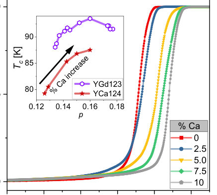
<figcaption class="paper-figure-caption"><b>Fig 1.</b> FIG. 1. Normalized magnetic moment as a function of tem- perature for all 5 samples in an applied field of 3 Oe. The inset shows the hole doping dependence of Tc. YGd123 data are from Ref. [30].</figcaption>
</figure>
<figure class="paper-figure-card">
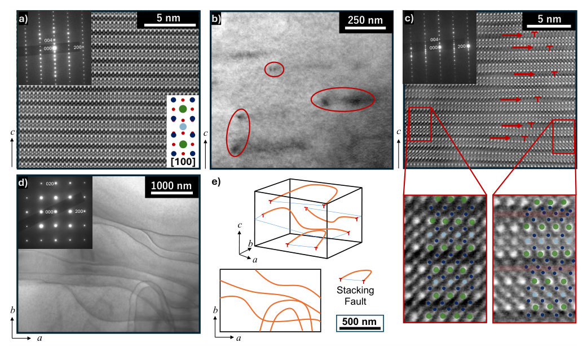
<figcaption class="paper-figure-caption"><b>Fig 2.</b> FIG. 2. (a) Cross-sectional HAADF-STEM images of sample with 7.5% Ca doping. The upper and lower insets show the electron diffraction pattern and crystal structure of YBa2Cu4O8 viewed along the [100] direction, respectively. The atom colors are Y/Ca (pale blue), Ba (Green), Cu (dark blue), and O (red). Cross-sectional view of (b) TEM images and (c) high-angle annular dark-field STEM images of the YCa124 film in the stacking fault region, where the electron diffraction pattern also shows extra diffraction spots. The red arrow indicates the presence of stacking faults caused by extra CuO layers. This is also highlighted in red in the zoomed-in view. (d) Planar-view TEM image showing the...</figcaption>
</figure>
<figure class="paper-figure-card">
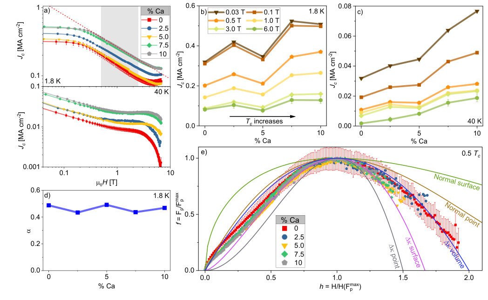
<figcaption class="paper-figure-caption"><b>Fig 3.</b> FIG. 3. (a) Field-dependent Jc for YCa124 films with different Ca doping levels at T = 1.8 K in the upper panel and 40 K in the lower panel. Critical current density Jc versus % Ca at different applied magnetic fields for temperatures of (b) 1.8 K and (c) 40 K, respectively. (d) Comparison of extracted α vs % Ca at 1.8 K. Here, α is the power-law exponent extracted from the slope of a linear fit to log Jc −log µ0H, restricted to a field range of 0.5 - 2.5 T, as shown in the shaded region in (a). (e) Normalized pinning force f = Fp/Fp,max against reduced field h = H/H(Fp,max) at 0.5 Tc for all five YCa124 films.</figcaption>
</figure>
<figure class="paper-figure-card">
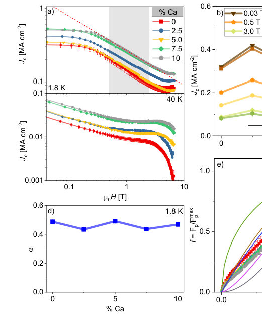
<figcaption class="paper-figure-caption"><b>Fig 4.</b> Figure 2(c) resolves the atomic-scale origin of these dark features through cross-sectional HAADF-STEM, with the c axis again vertically oriented. The red ar- rows indicate local expansion along the c axis. To in- vestigate the origin of this expansion, enlarged views of both well-ordered and expanded regions are shown. In the enlarged view of the well-ordered region on the right, we see superconducting CuO2 planes (bright white layers in the STEM image) lying parallel to the ab plane, with double Cu-O chains (darker layers) interleaved between the CuO2 bilayers. In contrast, the expanded region on the left contains an additional Cu-O chain layer within the double-chain block, forming a...</figcaption>
</figure>
<figure class="paper-figure-card">
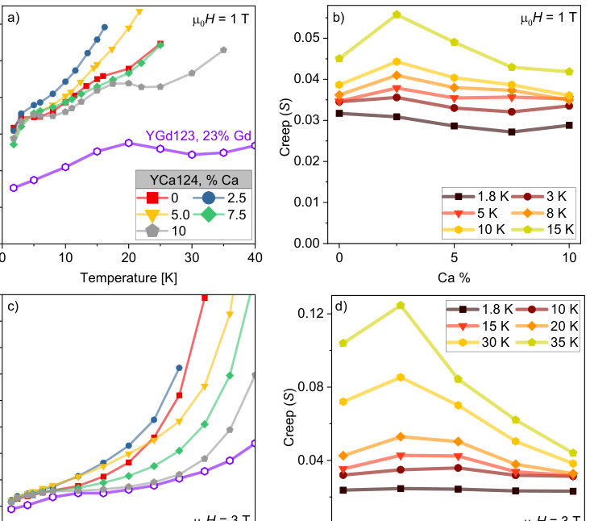
<figcaption class="paper-figure-caption"><b>Fig 5.</b> FIG. 4. Temperature dependence of the vortex creep parameter S in YCa124 films with different Ca concentrations under applied magnetic fields of (a) 1 T and (c) 3 T. For comparison, data for a YGd123 film from Ref. [56] are included as open hexagons. S versus Ca doping at six different temperatures under an applied magnetic field of (b) 1 T and (d) 3 T.</figcaption>
</figure>

**Summary.** This work demonstrates that substituting Calcium into YBa2Cu4O8 films enhances superconducting performance by optimizing the hole doping level. By increasing the critical current density ($J_c$) and slowing vortex creep, the study confirms that structural defects, specifically Y-125 stacking faults, act as the dominant and robust pinning mechanism.

**Why it may be interesting.** While focused on cuprates, the detailed analysis of vortex dynamics, pinning mechanisms, and the interplay between doping, disorder, and superconducting parameters provides rich context for understanding strongly correlated superconducting states.

Detailed structure

**Main problem.** The study aims to optimize superconducting properties, specifically critical current density ($J_c$) and vortex dynamics, in YBa2Cu4O8 films by tuning the hole concentration.

**Main result.** Ca substitution increases the hole concentration in YCa124 films, driving them toward optimal doping, which significantly enhances $T_c$ and $J_c$. The pinning mechanism remains consistent, governed by planar stacking-fault intergrowths.

**Method.** The research combines epitaxial film growth, magnetotransport measurements (SQUID), and structural characterization (STEM) to analyze superconducting parameters.

**Model / system.** The physical system is epitaxial YBa2Cu4O8 (YCa124) films, a high-temperature superconductor. The analysis involves concepts like the Ginzburg number ($G_i$) and vortex pinning models (e.g., Dew-Hughes model).

**Key observables.** Critical current density ($J_c$), superconducting transition temperature ($T_c$), creep rate ($S$), and the power-law exponent ($\alpha$) in $J_c \propto B^{-\alpha}$.

**Important parameters / regimes.** Ca doping concentration ($x$), hole concentration ($p$), temperature ($T$), and applied magnetic field ($B$).

**Assumptions / limitations.** The enhancement of $J_c$ is attributed to Ca-induced disorder creating efficient planar pinning centers, and the analysis uses established empirical relations for doping dependence.

**Figures summary.** Figures show the dependence of $T_c$ and $J_c$ on Ca doping, STEM images reveal planar stacking faults, and plots demonstrate the constant field dependence of $J_c$ and overlapping pinning force curves.

**Paper structure.** The paper systematically investigates how Ca substitution tunes doping levels, leading to enhanced $T_c$ and $J_c$. It then analyzes the field dependence of $J_c$ and the vortex creep rate, correlating these changes with structural features like stacking faults and theoretical bounds like $J_d$ and $G_i$.

Abstract

The intrinsic carrier concentration of superconducting materials may not be optimal, and different superconducting properties may have distinct optimal doping levels. Here, we show that Ca substitution increases the hole concentration in intrinsically underdoped epitaxial (Y$_{1-x}$Ca$_x$)Ba$_2$Cu$_4$O$_8$ (YCa124) films with $x \leq 0.10$, driving YCa124 toward optimal doping, increasing $T_c$ and $J_c$. At 40 K, 10% Ca doping increases $J_c$ by factors of 2.4 and 10 at 0.03 and 6 T, respectively, compared with the undoped film. The field dependence of $J_c$ follows $J_c \propto B^{-0.5}$, independent of Ca content, indicating that Ca substitution does not alter the dominant pinning mechanism. This field dependence is consistent with pinning by planar Y-125 stacking-fault intergrowths observed by electron microscopy. In addition, Ca substitution slows thermally activated vortex motion (creep) at $T \gtrsim 15$ K, while at lower temperatures the creep rate $S$ shows an unusual decrease with increasing field. Finally, we consider how doping tunes the upper bound on $J_c$, set by the depairing current density $J_d$, and the lower bound on creep, set by the Ginzburg parameter $G_i$. We find positive correlations between $J_c$ and $J_d$, and between $S$ and $G_i$, and compare them with trends across a broad range of superconductors.

[↑ back to top](#top)

### [Symmetry-enforced topological parity: revisiting $2\mathbb{Z}$ classifications beyond cellwise symmetry actions](http://arxiv.org/abs/2609.37106v1)

**Authors:** Ken Shiozaki  
**Type:** theory · **Category:** other · **PDF:** <https://arxiv.org/pdf/2609.37106v1>  
**Analysis basis:** full PDF text, analyzed in chunks

↔ Scroll figures horizontally

<figure class="paper-figure-card">
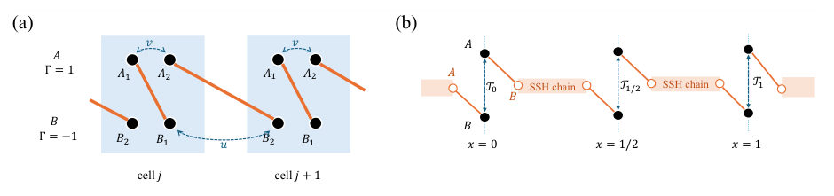
<figcaption class="paper-figure-caption"><b>Fig 1.</b> FIG. 1. Real-space interpretation of the one-dimensional SPT–LSM constraints in terms of complex fermions. A and B denote the Γ = +1 and Γ = −1 subspaces, respectively. Dashed arrows indicate Kramers pairing, and orange bonds indicate hopping. [a] Class CII. Blue shading marks unit cells. Time reversal pairs A1,j with A2,j through v, and B1,j with B2,j+1 through u. The intracell and intercell dimers realize qk = diag(1, e−ik), the direct sum of a trivial dimerized chain and a topological SSH chain, with W1[q] = −1. [b] Class DIII. At each mirror center x = s, the A, B orbitals shown as filled circles form a Kramers pair under the antiunitary mirror operation Ts. The antiunitary mirror...</figcaption>
</figure>
<figure class="paper-figure-card">
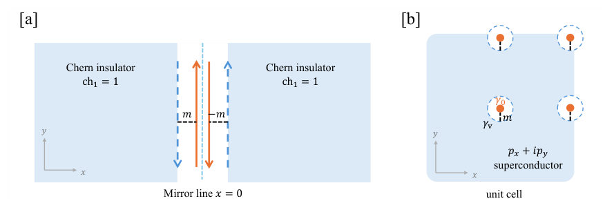
<figcaption class="paper-figure-caption"><b>Fig 2.</b> FIG. 2. Real-space SPT–LSM mechanisms in two dimensions. [a] Class AII. Orange solid arrows denote the original helical pair on the mirror line x = 0. The mirror-related Chern insulators on the two sides each have ch1 = 1 and supply the counterpropagating edge modes shown by blue dashed arrows. Black dashed segments mark couplings m and −m between counterpropagating modes. Taken together, the couplings preserve the symmetry and gap all four modes. The transverse separation of the modes is schematic. [b] Class D in the superconducting description. A px + ipy superconductor with bC2 2 = 1 has vortices at the rotation centers. Blue dashed circles mark these vortices, each binding a Majorana...</figcaption>
</figure>
<figure class="paper-figure-card">
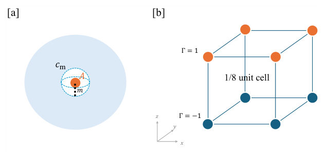
<figcaption class="paper-figure-caption"><b>Fig 3.</b> FIG. 3. Real-space SPT–LSM mechanism for three-dimensional class BDI. [a] The shaded region represents a class AIII bulk with an odd winding number in a unit-monopole background. The monopole binds a zero mode cm, indicated schematically by the blue dashed sphere. The orange dot is a microscopic orbital A at the inversion center whose chiral eigenvalue is opposite to that of the bound state. The black dashed bond represents a symmetry-preserving hybridization with amplitude m that gaps the orbital and the bound state. [b] Periodic orbital arrangement for the symmetry matrices in Eq. (193). Each of the eight inequivalent inversion centers in a unit cell hosts one complex-fermion orbital....</figcaption>
</figure>
<figure class="paper-figure-card">
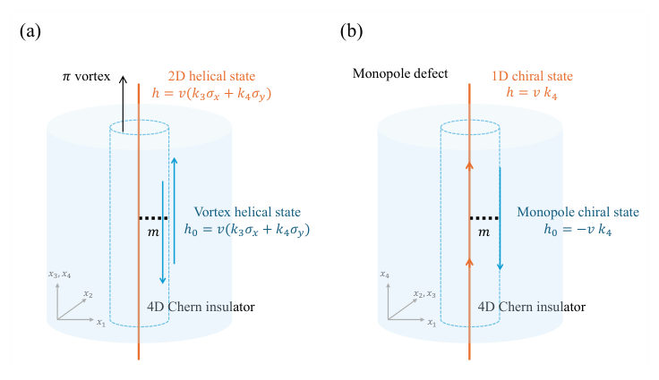
<figcaption class="paper-figure-caption"><b>Fig 4.</b> FIG. 4. Real-space SPT–LSM mechanisms in four dimensions. The shaded regions represent four-dimensional Chern insulators with |ch2| = 1. [a] Class AII with dτ = 2. A π flux pierces the x1x2 plane and extends along x3, x4, represented schematically by a single vertical axis. The blue dashed cylinder marks the regularized flux core. The blue arrows indicate the bound two- dimensional helical Weyl state of Eq. (247). The orange line denotes the original helical state on the rotation-fixed plane. The coupling m gaps the two states while preserving time reversal. [b] Class AI with dτ = 4. A unit monopole line extends along x4, with transverse coordinates x1, x2, x3; the dashed tube schematically...</figcaption>
</figure>
<figure class="paper-figure-card">
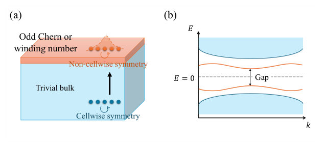
<figcaption class="paper-figure-caption"><b>Fig 5.</b> FIG. 5. Boundary realization of anomalous SPT phases. (a) Restricting a cellwise symmetry of a finite-range bulk to the boundary subspace induces a non-cellwise boundary action. The orange boundary supports a gapped phase with an odd Chern or winding number. The blue bulk can be deformed to an atomic limit while preserving the retained symmetries. (b) Schematic half-space spectrum after the boundary is gapped. For sufficiently small δ &gt; 0, the orange boundary bands, described by Hbdy k = δHk, remain separated from the blue bulk continua and are gapped at E = 0 (dashed line). The horizontal axis denotes momentum parallel to the boundary.</figcaption>
</figure>

**Summary.** This theoretical paper investigates how momentum-dependent symmetries can alter the topological classification of insulators, potentially allowing for odd topological invariants. By rigorously analyzing the role of locality, the authors establish strict rules governing whether such odd invariants can physically exist in lattice models.

**Why it may be interesting.** This work provides deep mathematical constraints on topological phases, which is foundational knowledge for understanding symmetry-protected topological phases relevant to quantum materials and condensed matter theory.

Detailed structure

**Main problem.** The paper revisits the classification of topological insulators and superconductors by analyzing how momentum-dependent symmetry actions can change the topological constraint from an even-integer ($\mathbb{Z}_2$) to an odd-integer constraint.

**Main result.** The realization of odd topological numbers is highly constrained by locality, leading to three distinct possibilities: realizable by finite-range actions, realizable only by exponentially decaying quasilocal actions, or impossible in finite-dimensional Bloch systems.

**Method.** The authors derive parity relations between topological invariants (Chern/winding numbers) and symmetry operator invariants, comparing locality conditions (cellwise $\subseteq$ finite range $\subseteq$ quasilocal) to establish these constraints.

**Model / system.** The study focuses on single-particle systems described by gapped Hamiltonians ($H_k$) on the Brillouin torus $T^d$, incorporating internal and order-two crystalline symmetries (e.g., Time-Reversal Symmetry and Particle-Hole Symmetry).

**Key observables.** Topological invariants such as the Chern number and winding number, and the parity constraint relating the Hamiltonian's invariant to the symmetry operator's invariant.

**Important parameters / regimes.** The dimensionality of the system ($d=1$ to $4$), the nature of the symmetry action (momentum-dependent vs. cellwise), and the locality scale (finite-range vs. quasilocal).

**Assumptions / limitations.** The analysis assumes working with single-particle degrees of freedom per unit cell and relies on establishing paths between fixed momentum planes ($k_4=0$ and $k_4=\pi$) using techniques like polar decomposition.

**Figures summary.** Not specified, but the analysis involves comparing isomorphism classes of real symmetric matrices derived from symmetry-related operators at different momentum points.

**Paper structure.** The paper is highly structured, first establishing the general framework and symmetry analysis, then deriving parity relations across dimensions (1D to 4D), and concluding with explicit model constructions and no-go theorems based on locality.

Abstract

Momentum-dependent symmetry actions can turn the even-integer constraint of a $2\mathbb{Z}$ classification of topological insulators and superconductors into an odd-integer constraint without changing the symmetry algebra. For internal and order-two crystalline symmetries in up to four spatial dimensions, we derive parity relations between the Chern or winding number of a gapped Hamiltonian and topological invariants of its momentum-dependent antiunitary symmetry matrices. Whenever the symmetry action enforces odd parity, any symmetry-preserving gapped phase must be topologically nontrivial. Using cellwise actions, which are represented by momentum-independent matrices in a fixed unit-cell basis, as a reference, we determine how locality constrains the realization of odd topological numbers. Explicit model constructions and no-go theorems distinguish three cases: odd values can be realized by finite-range symmetry actions, can be realized by exponentially decaying quasilocal actions but not by finite-range actions, or are impossible in finite-dimensional Bloch systems.

[↑ back to top](#top)

### [Topological Hall Effect Induced by Chiral Spin Textures at the Ferroelectric/Ferromagnetic Interface](http://arxiv.org/abs/2609.37406v1)

**Authors:** Jingkuan Xiao, Yaqing Han, Jianfeng Guo, Renjun Du, Jiawei Jiang, Baoshan Cui, Runnong Zhou, Siqin Wang, Siqi Jiang, Fuzhuo Lian, Di Zhang, Guodong Ma, Jiabei Huang, Zhaochen Qu, Wanting Xu, Kenji Watanabe, Takashi Taniguchi, Alexander S. Mayorov, Jinsheng Wen, Haifeng Ding, Gong Chen, Ahmet Avsar, Hongxin Yang, Lihong Bao, Hong-Jun Gao, Shiyu Zhu, Lei Wang, Geliang Yu  
**Type:** both · **Category:** other · **PDF:** <https://arxiv.org/pdf/2609.37406v1>  
**Analysis basis:** full PDF text, analyzed in chunks

↔ Scroll figures horizontally

<figure class="paper-figure-card">
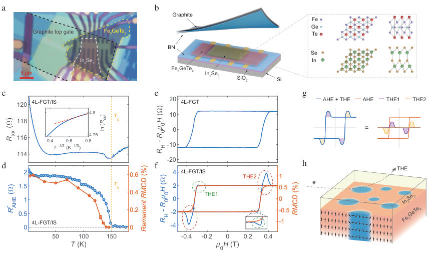
<figcaption class="paper-figure-caption"><b>Fig 1.</b> Fig. 1 Sample structure and transport properties. a) Optical micrograph of the fabricated device. The scale bar corresponds to 5 µm. b) Schematic illustration of the FGT/IS vdW heterostructure device. The zoom-in displays the top and side views of monolayer FGT and IS. c) Temperature-dependent longitudinal resistance of the FGT/IS heterostructure. Inset: Fit to the variable-range hopping model, Rxx ∝exp[(T0/T)1/3]. d) Temperature dependence of the remanent anomalous Hall resistance Rr AHE (blue solid line) and remanent RMCD signal (orange solid line) in the FGT/IS heterostructure. The yellow dashed line indicates the ferromagnetic transition temperature Tc, determined from where Rr AHE...</figcaption>
</figure>
<figure class="paper-figure-card">
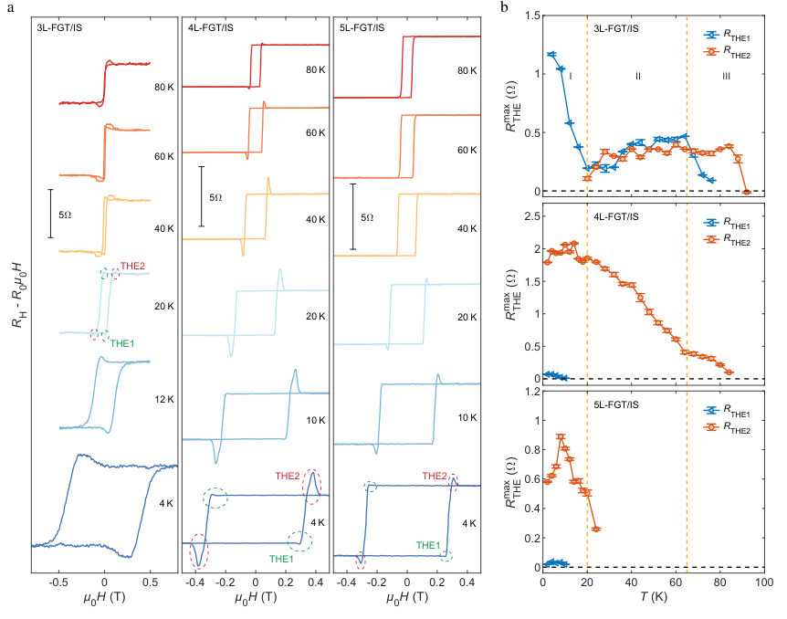
<figcaption class="paper-figure-caption"><b>Fig 2.</b> Fig. 2 Temperature dependence of two groups of THE. a) Magnetic field dependence of the anomalous and topo- logical Hall resistance at various temperatures in the FGT/IS heterostructures. All curves are antisymmetrized to eliminate contributions from the longitudinal resistance, and the ordinary Hall component is subtracted via linear fitting in the high-field regime. Green and red dashed circles indicate the positions of the topological Hall features, labeled as THE1 and THE2. b) Temperature dependence of the maximum topological Hall resistance Rmax THE. The error bars correspond to the standard deviation of the noise in the respective measurements.</figcaption>
</figure>
<figure class="paper-figure-card">
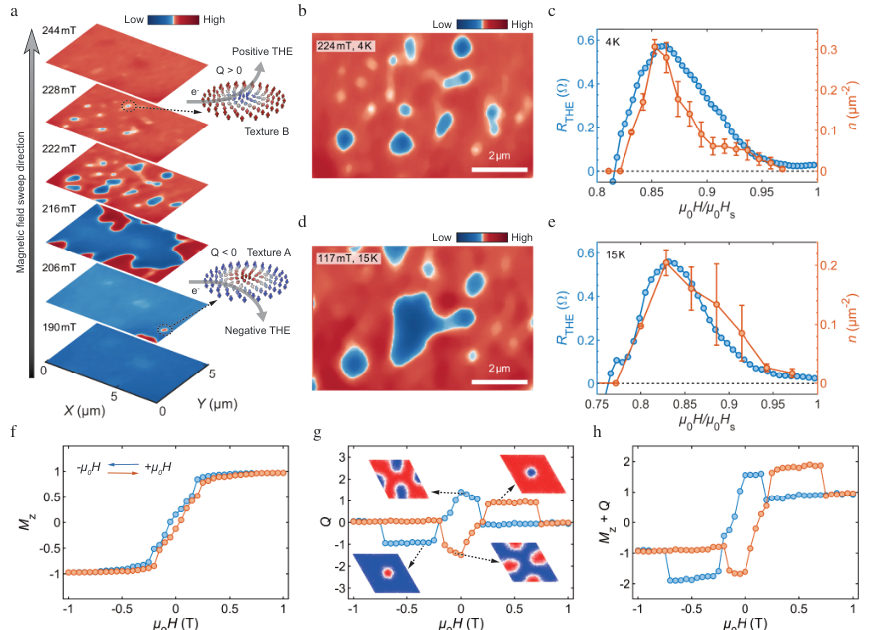
<figcaption class="paper-figure-caption"><b>Fig 3.</b> Fig. 3 Correlation between magnetic bubbles and the THE. a) Field-dependent MFM images of the 5L-FGT/IS heterostructure at 4 K, acquired after applying a −300 mT reset field. The images reveal two distinct types of bubbles, distinguished by their MFM contrast (red and blue, marked by black dashed circles), which correspond to opposite out-of-plane core magnetizations. Notably, bubbles with red contrast emerge at lower fields, while those with blue contrast dominate at higher fields. Schematics illustrating the THE sign reversal associated with topological charges Q &gt; 0 and Q &lt; 0. b and d) MFM images of the 5L-FGT/IS heterostructure at 4 K (b) and 15 K (d), taken after applying a reset field...</figcaption>
</figure>
<figure class="paper-figure-card">
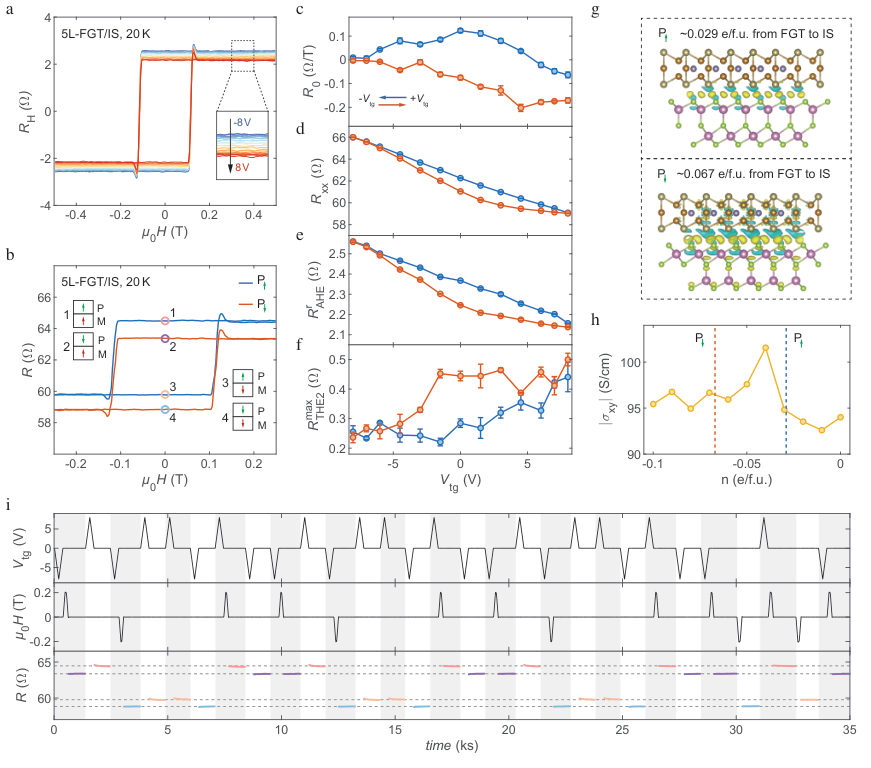
<figcaption class="paper-figure-caption"><b>Fig 4.</b> Fig. 4 Ferroelectric control of anomalous and topological Hall effects. a) Magnetic field dependence of the Hall resistance under various top-gate voltages in 5L-FGT/IS heterostructure at T = 20 K. b) Magnetic field dependence of the resistance under positive poling (blue solid line) and negative poling (orange solid line). Positive (negative) poling corresponds to sweeping the top gate from +8 V (−8 V) to 0 V. The circles around the zero magnetic field highlight four distinct resistance states. Green (red) arrows mark the direction of electric (magnetic) field poling. c-f) Top-gate voltage dependence of the ordinary Hall coefficient R0 (c), longitudinal resistance Rxx (d), remanent...</figcaption>
</figure>

**Summary.** This paper investigates how chiral spin textures, stabilized by DMI, generate a Topological Hall Effect in $	ext{Fe}_3	ext{GeTe}_2/\alpha	ext{-In}_2	ext{Se}_3$ heterostructures. By utilizing the switchable ferroelectric polarization of the $	ext{In}_2	ext{Se}_3$ layer, the authors demonstrate nonvolatile electrical control over the THE. This work highlights the potential of vdW interfaces for advanced, electrically programmable spintronic devices.

**Why it may be interesting.** While the core physics is condensed matter magnetism, the demonstration of electrical control over topological magnetic states (THE) in a vdW heterostructure is highly relevant to developing novel, energy-efficient memory and logic devices, bridging magnetism and ferroelectricity.

Detailed structure

**Main problem.** The study investigates the Topological Hall Effect (THE) induced by chiral spin textures at the interface between ferroelectric and ferromagnetic materials, aiming to demonstrate nonvolatile electrical control over these topological magnetic phenomena.

**Main result.** The research successfully shows that the system exhibits interfacial chiral spin textures stabilized by DMI, leading to two distinct THE components, and further demonstrates that the combination of ferroelectric and magnetic bistabilities enables a nonvolatile four-state memory functionality.

**Method.** The work combines transport measurements (measuring AHE and THE components), real-space imaging using MFM, and theoretical modeling using atomistic spin-dynamics simulations and first-principles calculations.

**Model / system.** The physical system is a few-layer van der Waals heterostructure, specifically $	ext{Fe}_3	ext{GeTe}_2/\alpha	ext{-In}_2	ext{Se}_3$, which combines ferromagnetic and ferroelectric properties. The physics is governed by interfacial Dzyaloshinskii-Moriya interaction (DMI) and switchable ferroelectric polarization.

**Key observables.** Topological Hall Resistance ($R_{THE}$), Anomalous Hall Resistance ($R_{AHE}$), hysteresis loops, and the number of distinguishable Hall resistance states (up to four).

**Important parameters / regimes.** Coercive field ($\mu_0H_c$), critical temperature ($T_c$), and the ferroelectric polarization state.

**Assumptions / limitations.** The THE is primarily attributed to interfacial chiral spin textures stabilized by DMI, and the ferroelectric polarization acts as a switchable, nonvolatile tuning knob for these topological effects.

**Figures summary.** Figures illustrate temperature and magnetic field dependence of Hall resistance, showing distinct THE components ($	ext{THE}_1, 	ext{THE}_2$) and the correlation between magnetic bubble density (MFM) and THE magnitude.

**Paper structure.** The paper progresses by establishing the physical system and the theoretical basis (DMI, THE), presenting experimental evidence of the THE and its thickness/temperature dependence, and culminating in the demonstration of electrical control via ferroelectric switching to achieve multi-state memory.

Abstract

Chiral spin textures, largely driven by the Dzyaloshinskii-Moriya interaction, offer significant potential for next-generation computing technologies due to their chirality and topological stability. Ferroelectric/ferromagnetic van der Waals heterostructures are particularly appealing because they can combine interfacial inversion-symmetry breaking and spin-orbit coupling to promote interfacial Dzyaloshinskii-Moriya interaction, while switchable ferroelectric polarization provides a nonvolatile tuning knob. This study investigates interfacial chiral spin textures in few-layer Fe$_3$GeTe$_2$/$α$-In$_2$Se$_3$ heterostructures. Two groups of topological Hall signals are identified just below and above the coercive field, and thickness-dependent transport reveals a notable reduction in critical temperature with increasing Fe$_3$GeTe$_2$ layer thickness. Low-temperature magnetic force microscopy images reveal two types of magnetic bubbles with opposite magnetic contrasts near the coercive field, each associated with distinct topological Hall signals. Together with atomistic spin-dynamics simulations and first-principles calculations, these results support the formation of interfacial DMI-stabilized chiral spin textures. Switching the ferroelectric polarization of the $α$-In$_2$Se$_3$ layer further enables nonvolatile modulation of both anomalous and topological Hall effects. The resulting ferroelectric and magnetic bistabilities generate four distinguishable Hall resistance states programmable by electric and magnetic fields. These findings highlight the potential of van der Waals interfaces for advanced device applications.

[↑ back to top](#top)

### [Topology Obstructs Nodeless Excitons](http://arxiv.org/abs/2609.36248v1)

**Authors:** Lumen Eek  
**Type:** theory · **Category:** other · **PDF:** <https://arxiv.org/pdf/2609.36248v1>  
**Analysis basis:** full PDF text, analyzed in chunks

↔ Scroll figures horizontally

<figure class="paper-figure-card">
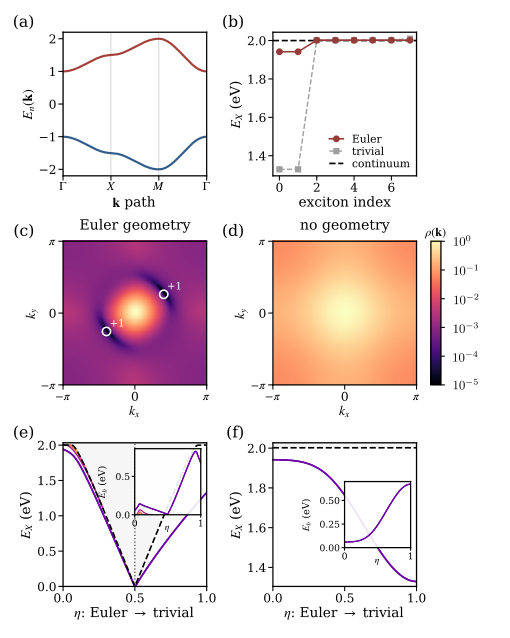
<figcaption class="paper-figure-caption"><b>Fig 1.</b> FIG. 1. Euler obstruction to a nodeless exciton. (a) Electronic band structure of the three-band model with deg(n) = 1. (b) Exciton spectrum obtained from the BSE with an onsite at- traction V (q) = U, compared with that of a topologically trivial reference model having the same electronic dispersion. (c,d) Internal-momentum probability density of the lowest bound exciton in the Euler-nontrivial and trivial models, re- spectively. The Euler-nontrivial exciton has two isolated ze- ros, each with index +1, as required by νe = 2, whereas the corresponding exciton in the trivial model is nodeless.</figcaption>
</figure>
<figure class="paper-figure-card">
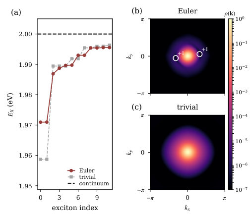
<figcaption class="paper-figure-caption"><b>Fig 2.</b> FIG. 2. Euler excitons with a RK interaction. (a) Exci- ton spectra for the Euler and topologically trivial band ge- ometries, with identical single-particle dispersions [given in Fig. 1(a)]. (b),(c) Momentum-space densities of the lowest exciton for the Euler and trivial geometries, respectively. The white circles in (b) indicate the zeros. We take g = 0.25 eV and r0 = a, with a the lattice constant.</figcaption>
</figure>
<figure class="paper-figure-card">

<figcaption class="paper-figure-caption"><b>Fig 3.</b> FIG. 3. One-dimensional w1-obstructed excitons. (a) Single- particle spectrum of the obstructed and trivial three-band models. (b) Conduction–valence exciton spectra for a contact interaction V (q) = U = 0.8 and λ = 0. (c) Lowest obstructed exciton wavefunction for λ = 0 and λ = 0.24. (d) Lowest exciton wavefunction of the trivial model.</figcaption>
</figure>
<figure class="paper-figure-card">
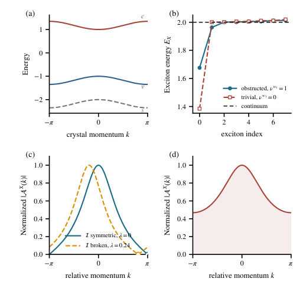
<figcaption class="paper-figure-caption"><b>Fig 4.</b> Figure 3(a) shows the single-particle spectrum, while Fig. 3(b) shows the conduction–valence exciton spectrum for a contact interaction V (q) = U = 0.8 and λ = 0. Analogous to the two-dimensional results in the main text, the obstructed exciton has a smaller binding energy than its topologically trivial counterpart. In Fig. 3(c), we show the lowest-energy obstructed exciton wavefunction for λ = 0 and λ = 0.24. Both wavefunctions contain an odd number of zeros (one in this case), as required by νw1 = 1. For λ = 0, inversion symmetry pins this zero to the BZ boundary. A finite λ breaks inversion sym- metry and moves the zero to an arbitrary momentum without removing it. For comparison, Fig....</figcaption>
</figure>
<figure class="paper-figure-card">
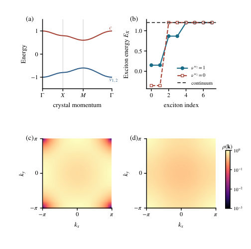
<figcaption class="paper-figure-caption"><b>Fig 5.</b> FIG. 4. Two-dimensional w2-obstructed excitons. (a) Single- particle spectrum of the obstructed and trivial models along Γ−X−M−Γ, consisting of two degenerate valence bands and one trivial conduction band. The minimum direct gap occurs at M. (b) Lowest exciton energies for a contact interaction V (q) = U = 2. The dashed line marks the free electron–hole continuum. (c),(d) Momentum-space densities of the lowest excitons for νw2 = 1 and νw2 = 0, respectively. The densities are normalized to their respective maxima and shown on the same logarithmic scale.</figcaption>
</figure>

**Summary.** This theoretical paper demonstrates that the topology of the electronic band structure can fundamentally obstruct the formation of simple, nodeless excitons. By analyzing systems using topological invariants like the Euler number, the authors show that non-trivial topology forces nodes into the exciton wavefunction, which in turn weakens the exciton's binding energy compared to its topologically simple counterpart.

**Why it may be interesting.** This work provides a powerful, general theoretical tool showing how global geometric properties (topology) of the electronic band structure impose concrete, measurable constraints (nodes, energy shifts) on emergent quasiparticles like excitons, which is highly relevant for designing novel quantum materials.

Detailed structure

**Main problem.** The paper investigates whether the lowest-energy exciton wavefunction must be nodeless, or if the underlying band topology can enforce nodal structures that modify the exciton binding energy.

**Main result.** Topological invariants, such as the Euler number ($
u_e$) or second Stiefel-Whitney class ($
u_{w2}$), directly constrain the exciton wavefunction, forcing nodes and resulting in a reduced binding energy compared to topologically trivial cases.

**Method.** The study employs a combination of topological analysis (Chern/Euler numbers) and solving the Bethe-Salpeter Equation (BSE) for the exciton envelope wavefunction, comparing results across different topological phases.

**Model / system.** The analysis uses minimal three-band models, including a PT-symmetric model and the realification of the Qi–Wu–Zhang (QWZ) model, to study excitons in semiconductors/insulators.

**Key observables.** Exciton energies ($E_X$), momentum-space exciton density ($
ho(\mathbf{k})$), and topological invariants ($
u_e$, $C_X$, $
u_{w2}$).

**Important parameters / regimes.** The rank of the transition bundle, the interaction potential (contact vs. Rytova-Keldysh), and the topological invariants themselves.

**Assumptions / limitations.** The analysis relies on treating the exciton wavefunction as a section of a transition bundle and uses approximations like the BSE framework.

**Figures summary.** Figures compare the exciton spectra and momentum-space densities for topologically non-trivial ($
u_e=2$ or $
u_{w2}=1$) versus topologically trivial ($
u_e=0$ or $
u_{w2}=0$) models, clearly showing the presence of nodes in the former.

**Paper structure.** The paper systematically develops the theoretical framework by first establishing the link between band topology and exciton wavefunctions using various invariants (Chern, Euler). It then applies this framework to specific models (PT-symmetric, QWZ) to calculate and compare the resulting exciton spectra and nodal structures.

Abstract

Lowest-energy excitons are usually expected to have nodeless $1s$-like envelope wavefunctions. We show that band topology can obstruct this expectation. The exciton envelope wavefunction is a section of the valence-conduction transition bundle, whose topology can enforce momentum-space zeros, with their parity or signed total index fixed by the corresponding characteristic class. We exemplify this behavior in a minimal $PT$-symmetric three-band model with a rank-two transition bundle characterized by Euler number $ν^e=2$. By directly solving the Bethe-Salpeter equation with both contact and Rytova-Keldysh interactions, we find that the lowest exciton contains two zeros, each with index $+1$, and is less strongly bound than its topologically trivial counterpart. We further classify topology-enforced exciton nodal structures for real and complex transition bundles in dimensions $d \leq 3$. Our results establish the topology of the transition bundle as a direct constraint on exciton wavefunctions and spectra.

[↑ back to top](#top)

