
# arxiv digest (quant-ph + cond-mat) — 2026-10-03

*226 papers · 22 relevant · 7 highlighted*

## 🔥 Most relevant (22)

*Every paper with at least one nonzero topic score, sorted by best-matching score. 🔥 marks scores ≥4/5. Click the title to jump to the full entry below; click [arXiv] to open the paper page. `(secondary)` marks papers from de-prioritized cond-mat archives.*

Show 22 relevant papers

- [Engineering non-ergodic properties in two dimensional quantum many-body systems](#paper-2610.00635) [[arXiv]](http://arxiv.org/abs/2610.00635v1) — 🔥 `scars & prethermalization` **5/5** · `analog quantum simulation` **3/5**
- [Operator-language Feynman rules for driven-dissipative quantum systems: from mean field to non-Gaussian photon correlations](#paper-2610.00667) [[arXiv]](http://arxiv.org/abs/2610.00667v1) — 🔥 `Keldysh / 2PI / non-Gaussian methods` **4/5** · 🔥 `methods for driven-dissipative` **4/5** · `Full counting statistics` **3/5** · `Tavis-Cummings & cavity-many-emitter` **3/5** · `correlated / nonlocal dissipation` **3/5** · `driven-dissipative phase transition` **3/5** · `non-equilibrium universality` **2/5** · `analog quantum simulation` **1/5** · `interference shaping light` **1/5** · `quantum measurements` **1/5**
- [How Superradiance Survives Molecular Noise inside Virus Capsids](#paper-2610.00739) [[arXiv]](http://arxiv.org/abs/2610.00739v1) — 🔥 `Dicke superradiance` **4/5** · `Tavis-Cummings & cavity-many-emitter` **3/5** · `correlated / nonlocal dissipation` **3/5** · `superradiant laser` **3/5** · `analog quantum simulation` **2/5** · `driven-dissipative phase transition` **2/5** · `methods for driven-dissipative` **2/5** · `Keldysh / 2PI / non-Gaussian methods` **1/5** · `free-space correlated emission` **1/5** · `non-equilibrium universality` **1/5** · `quantum optics experiment` **1/5**
- [Efficient learning of quantum interactions from thermal metastable states](#paper-2610.01538) [[arXiv]](http://arxiv.org/abs/2610.01538v1) — 🔥 `methods for driven-dissipative` **4/5** · `analog quantum simulation` **3/5** · `driven-dissipative phase transition` **3/5** · `non-equilibrium universality` **3/5** · `scars & prethermalization` **3/5** · `Keldysh / 2PI / non-Gaussian methods` **2/5** · `correlated / nonlocal dissipation` **2/5** · `quantum measurements` **2/5**
- [Quantum synchronization in atom-cavity coupled systems](#paper-2610.01094) [[arXiv]](http://arxiv.org/abs/2610.01094v1) — 🔥 `driven-dissipative phase transition` **4/5** · `Tavis-Cummings & cavity-many-emitter` **3/5** · `analog quantum simulation` **3/5** · `methods for driven-dissipative` **3/5** · `non-equilibrium universality` **3/5** · `correlated / nonlocal dissipation` **2/5** · `Keldysh / 2PI / non-Gaussian methods` **1/5** · `quantum measurements` **1/5**
- [Strongly coupled ultracompressed self-cavity plasmon polaritons at millikelvin temperatures](#paper-2610.00473) [[arXiv]](http://arxiv.org/abs/2610.00473v1) `(secondary)` — 🔥 `quantum optics experiment` **4/5** · `analog quantum simulation` **3/5** · `driven-dissipative phase transition` **3/5** · `Tavis-Cummings & cavity-many-emitter` **2/5** · `quantum measurements` **2/5** · `QC/QI experiment` **1/5** · `correlated / nonlocal dissipation` **1/5** · `interference shaping light` **1/5** · `methods for driven-dissipative` **1/5** · `non-equilibrium universality` **1/5**
- ⭐ [Exact first-detection probability in a locally monitored solvable quantum circuit](#paper-2610.01703) [[arXiv]](http://arxiv.org/abs/2610.01703v1) — 🔥 `quantum measurements` **4/5** · `Full counting statistics` **3/5** · `correlated / nonlocal dissipation` **3/5** · `driven-dissipative phase transition` **2/5** · `methods for driven-dissipative` **2/5** · `non-equilibrium universality` **2/5** · `Keldysh / 2PI / non-Gaussian methods` **1/5**
- [Generative Modeling of Stochastic Dynamics for Long-Time Evolution](#paper-2610.00546) [[arXiv]](http://arxiv.org/abs/2610.00546v1) — 🔥 `non-equilibrium universality` **4/5** · `driven-dissipative phase transition` **3/5** · `methods for driven-dissipative` **3/5** · `Keldysh / 2PI / non-Gaussian methods` **2/5** · `Frenkel-Kontorova` **1/5** · `analog quantum simulation` **1/5** · `quantum measurements` **1/5** · `scars & prethermalization` **1/5**
- ⭐ [Mixed-state phases induced by power-law quantum channels](#paper-2610.00480) [[arXiv]](http://arxiv.org/abs/2610.00480v1) — 🔥 `correlated / nonlocal dissipation` **4/5** · `driven-dissipative phase transition` **3/5** · `methods for driven-dissipative` **3/5** · `analog quantum simulation` **2/5** · `non-equilibrium universality` **2/5** · `Keldysh / 2PI / non-Gaussian methods` **1/5**
- [Experimental realization of Wheeler's delayed-choice experiment with dual selections](#paper-2610.01832) [[arXiv]](http://arxiv.org/abs/2610.01832v1) — 🔥 `quantum optics experiment` **4/5** · `interference shaping light` **3/5** · `quantum measurements` **3/5** · `analog quantum simulation` **2/5** · `QC/QI experiment` **1/5**
- [Predicting electric-field noise in ion traps using fluctuation electrodynamics](#paper-2610.01693) [[arXiv]](http://arxiv.org/abs/2610.01693v1) — 🔥 `QC/QI experiment` **4/5** · `Keldysh / 2PI / non-Gaussian methods` **2/5** · `methods for driven-dissipative` **2/5** · `analog quantum simulation` **1/5** · `correlated / nonlocal dissipation` **1/5** · `quantum measurements` **1/5**
- [Achieving Identical Stored Energy in Cascaded Collisional Quantum Battery Charging: Analytical Result](#paper-2610.01332) [[arXiv]](http://arxiv.org/abs/2610.01332v1) — 🔥 `quantum measurements` **4/5** · `Full counting statistics` **2/5** · `methods for driven-dissipative` **2/5** · `correlated / nonlocal dissipation` **1/5** · `driven-dissipative phase transition` **1/5**
- [Less precise but less noisy: local circuits for momentum-space state preparation and measurement](#paper-2610.01704) [[arXiv]](http://arxiv.org/abs/2610.01704v1) — 🔥 `QC/QI experiment` **4/5** · `analog quantum simulation` **3/5** · `quantum measurements` **3/5**
- [Krylov complexity of a tilted extended Bose-Hubbard chain with Rydberg-dressed interactions](#paper-2610.00712) [[arXiv]](http://arxiv.org/abs/2610.00712v1) — 🔥 `analog quantum simulation` **4/5** · `Rydberg arrays` **3/5** · `scars & prethermalization` **2/5**
- [Non-Markovian effects on informational steady states](#paper-2610.01782) [[arXiv]](http://arxiv.org/abs/2610.01782v1) — 🔥 `quantum measurements` **4/5** · `methods for driven-dissipative` **2/5** · `correlated / nonlocal dissipation` **1/5** · `driven-dissipative phase transition` **1/5** · `non-equilibrium universality` **1/5**
- [On the Metastability of the Mean-Field Interchange Model for Local Dimension $\geq 3$](#paper-2610.01987) [[arXiv]](http://arxiv.org/abs/2610.01987v1) — 🔥 `scars & prethermalization` **4/5** · `correlated / nonlocal dissipation` **1/5** · `driven-dissipative phase transition` **1/5** · `methods for driven-dissipative` **1/5** · `non-equilibrium universality` **1/5**
- [Spiking neural networks for streaming qubit readout](#paper-2610.02129) [[arXiv]](http://arxiv.org/abs/2610.02129v1) — 🔥 `QC/QI experiment` **4/5** · `quantum measurements` **3/5** · `methods for driven-dissipative` **1/5**
- [Thin-capping layer epitaxial quantum dots for near-field quantum photonics](#paper-2610.02080) [[arXiv]](http://arxiv.org/abs/2610.02080v1) — 🔥 `quantum optics experiment` **4/5** · `Tavis-Cummings & cavity-many-emitter` **2/5** · `interference shaping light` **1/5** · `quantum measurements` **1/5**
- [Gate Dispersive Charge Detection in Ge/SiGe Quantum Dots](#paper-2610.01100) [[arXiv]](http://arxiv.org/abs/2610.01100v1) `(secondary)` — 🔥 `QC/QI experiment` **4/5** · `quantum measurements` **3/5**
- [Real-Time Adaptive Filtering and the Boxcar Limit in Superconducting Qubit Readout](#paper-2610.00783) [[arXiv]](http://arxiv.org/abs/2610.00783v1) — 🔥 `QC/QI experiment` **4/5** · `quantum measurements` **3/5**
- [Microscopic Insights into the Quarkyonic Hadron--Quark Crossover: Lessons from Ultracold Fermi Gases](#paper-2610.01117) [[arXiv]](http://arxiv.org/abs/2610.01117v1) — 🔥 `analog quantum simulation` **4/5** · `Keldysh / 2PI / non-Gaussian methods` **2/5**
- [Adaptivity is all you need: Optimal stabilizer learning using just single-copy measurements](#paper-2610.02031) [[arXiv]](http://arxiv.org/abs/2610.02031v1) — 🔥 `quantum measurements` **4/5**

## ⭐ Highlighted (7)

*Papers by authors on your watch list. Click the title to jump to the full entry below; click [arXiv] to open the paper page.*

Show 7 highlighted papers

- ⭐ [Function-like pseudorandom unitaries generate pseudorandom quantum processes](#paper-2610.01038) [[arXiv]](http://arxiv.org/abs/2610.01038v1) — Alexey V. Gorshkov
- ⭐ [Learning Many-Body Hamiltonians Using a Local Probe](#paper-2610.02157) [[arXiv]](http://arxiv.org/abs/2610.02157v1) — Alexey V. Gorshkov
- ⭐ [Mixed-state phases induced by power-law quantum channels](#paper-2610.00480) [[arXiv]](http://arxiv.org/abs/2610.00480v1) — Alexey V. Gorshkov
- ⭐ [Exact first-detection probability in a locally monitored solvable quantum circuit](#paper-2610.01703) [[arXiv]](http://arxiv.org/abs/2610.01703v1) — Igor Lesanovsky
- ⭐ [Universal Bound and Phase Transition in Many-Body Fermionic Non-Gaussianity](#paper-2610.02075) [[arXiv]](http://arxiv.org/abs/2610.02075v1) — Yuto Ashida
- ⭐ [CTMRG as a tensor-network message-passing algorithm](#paper-2610.00631) [[arXiv]](http://arxiv.org/abs/2610.00631v1) — Andrii Sotnikov
- ⭐ [Thermal entanglement transitions from strong $\textrm{SU}(2)$ symmetry](#paper-2610.00826) [[arXiv]](http://arxiv.org/abs/2610.00826v1) — Ehud Altman

## All papers (146, sorted by relevance)

*Papers from quant-ph and your primary cond-mat archives (quant-gas, stat-mech, str-el, dis-nn). Highlighted papers (⭐) come first, then everything else sorted by topic-relevance score, highest first.*

### ⭐ [Exact first-detection probability in a locally monitored solvable quantum circuit](http://arxiv.org/abs/2610.01703v1)

**Highlighted author(s):** Igor Lesanovsky  
**Authors:** Cecilia De Fazio, Igor Lesanovsky, Gabriele Perfetto  
**Type:** theory · **Category:** statistical mechanics · **PDF:** <https://arxiv.org/pdf/2610.01703v1>  
**Analysis basis:** full PDF text, analyzed in chunks
**Topic relevance:** 🔥 `quantum measurements` **4/5** · `Full counting statistics` **3/5** · `correlated / nonlocal dissipation` **3/5** · `driven-dissipative phase transition` **2/5** · `methods for driven-dissipative` **2/5** · `non-equilibrium universality` **2/5** · `Keldysh / 2PI / non-Gaussian methods` **1/5**

↔ Scroll figures horizontally

<figure class="paper-figure-card">
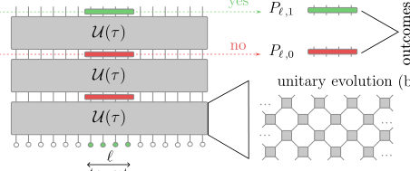
<figcaption class="paper-figure-caption"><b>Fig 1.</b> FIG. 1. Measurement protocol. (a) Circuit representa- tion of the state in Eq. (4) for a system of size L. A monitored subregion of size ℓ≪L is initialized in the target product state ∣0ℓ⟩(green circles). The unitary circuit dynamics is in- terspersed with local stroboscopic measurements on the mon- itored subregion at times τ, 2τ, . . . , kτ, where τ is the probing time. (b) The brickwork operator U(τ) = (Ui Uh)τ, built from alternating layers of two-site gates applied at half-integer and integer sites, as given in Eq. (2). (c) Local projective measure- ments are performed on the monitored subsystem only. Each outcome answers the question “is the subsystem in the target state?”, projecting...</figcaption>
</figure>
<figure class="paper-figure-card">
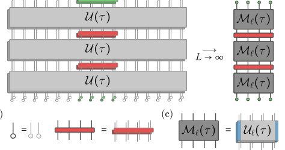
<figcaption class="paper-figure-caption"><b>Fig 2.</b> FIG. 2. Folded space representation. (a) Two-layer circuit representing the probability F(k) in Eq. (5) for the exemplary value k = 3 in the folded space, with folding per- formed at the level of the projector Pℓ,1. (b) A single-qudit propagator in the folded space (left-hand side)—indicated by darker and thicker lines—acts so that each site corresponds to the tensor product of two qubits. The folded-space projec- tor (left-hand side) likewise factorizes into the tensor product of two layers Pℓ,0 ⊗Pℓ,0 (right-hand side). (c) The opera- tor Mℓ(τ), which implements the evolution of the monitored subregion for L →∞, is obtained from the brickwork circuit Uℓ(τ) acting on the region of size...</figcaption>
</figure>
<figure class="paper-figure-card">
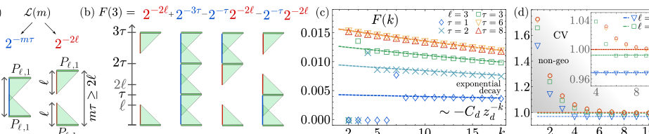
<figcaption class="paper-figure-caption"><b>Fig 3.</b> FIG. 3. Results. (a) Geometrical interpretation of the Loschmidt echo (7). Each folded-space projector Pℓ,1 enforces a larger space-time region of the circuit in Eq. (7), forming an isosceles right triangle of base ℓ(green), to be in the zero state. For mτ &lt; 2ℓ, the two projectors are causally connected, and the exponent of L(m) scales with the temporal distance mτ (blue). For mτ ≥2ℓ, L(m) factorizes into two independent contributions, each scaling exponentially with the triangle base (red). (b) Example of a partition decomposition of the first-detection probability F(k) for k = 3 and ℓ&lt; τ &lt; 2ℓ. Here, Loschmidt echoes contribute differently (red and blue) depending on the temporal distances...</figcaption>
</figure>

**Summary.** This work provides exact analytical results for the probability of first detecting a specific state in a quantum circuit undergoing local monitoring. By relating this probability to the subsystem Loschmidt echo, the authors characterize how measurement frequency dictates the detection statistics. The findings reveal a transition from simple geometric decay to complex, correlated behavior as the measurement rate changes.

**Why it may be interesting.** It provides a rare exact characterization of how local measurement backaction fundamentally reshapes detection statistics in an interacting quantum many-body system, which is crucial for understanding open quantum dynamics.

Detailed structure

**Main problem.** The paper derives exact analytical results for the probability of first detecting a subset of qubits back in their initial state within a locally monitored quantum circuit.

**Main result.** The first-detection probability exhibits two distinct regimes: geometric statistics for infrequent monitoring, and correlated deviations from this behavior for frequent monitoring.

**Method.** The analysis employs a renewal equation linking the first-detection probability to the subsystem Loschmidt echo, utilizing generating functions and pole analysis for asymptotic behavior.

**Model / system.** The study focuses on the deterministic Floquet-quantum East model (DFQEM), an interacting quantum circuit subjected to local stroboscopic measurements.

**Key observables.** First-Detection Return Probability (FDRP), Subsystem Loschmidt Echo, Coefficient of Variation (CV).

**Important parameters / regimes.** Measurement probing time ($	au$), monitored subregion size ($\ell$), and the ratio between $	au$ and the relaxation timescale ($2\ell$).

**Assumptions / limitations.** The analysis assumes the initial state of the unmonitored qubits is a bi-translationally invariant product state and relies on the renewal equation framework.

**Figures summary.** Figures illustrate the measurement protocol, the folded space representation for calculation, and the dependence of the Loschmidt echo and FDRP on measurement parameters.

**Paper structure.** The paper builds from defining the local monitoring protocol and the FDRP, deriving the renewal equation linking it to the Loschmidt echo, and then analyzing the resulting statistics in the limits of infrequent versus frequent measurements using generating functions.

Abstract

We study the interplay between local stroboscopic measurements and the unitary quantum circuit dynamics of the deterministic Floquet-quantum East model. We derive exact analytical results for the probability of first detecting a subset of qubits back in their initial state. This is achieved via a renewal equation linking the first-detection probability to the subsystem Loschmidt echo, which encodes the effective open dynamics of the monitored qubits. The resulting statistics exhibit two regimes set by the competition between the measurement probing time and the relaxation timescale of the unitary circuit dynamics: while infrequent monitoring leads to geometric first-detection statistics, frequent monitoring induces correlations that manifest as deviations from this geometric behavior. These results provide a rare exact characterization of how local measurement backaction reshapes detection statistics in an interacting quantum many-body system. In our local protocol, return probabilities are controlled by the size of the monitored subregion and can therefore be accessed on digital quantum simulators via local mid-circuit measurements.

[↑ back to top](#top)

### ⭐ [Mixed-state phases induced by power-law quantum channels](http://arxiv.org/abs/2610.00480v1)

**Highlighted author(s):** Alexey V. Gorshkov  
**Authors:** Christopher Fechisin, Tsung-Cheng Lu, Zhi-Yuan Wei, Jeet Shah, Yu-Xin Wang, Alexey V. Gorshkov, Cheng-Ju Lin  
**Type:** theory · **Category:** statistical mechanics · **PDF:** <https://arxiv.org/pdf/2610.00480v1>  
**Analysis basis:** full PDF text, analyzed in chunks
**Topic relevance:** 🔥 `correlated / nonlocal dissipation` **4/5** · `driven-dissipative phase transition` **3/5** · `methods for driven-dissipative` **3/5** · `analog quantum simulation` **2/5** · `non-equilibrium universality` **2/5** · `Keldysh / 2PI / non-Gaussian methods` **1/5**

↔ Scroll figures horizontally

<figure class="paper-figure-card">
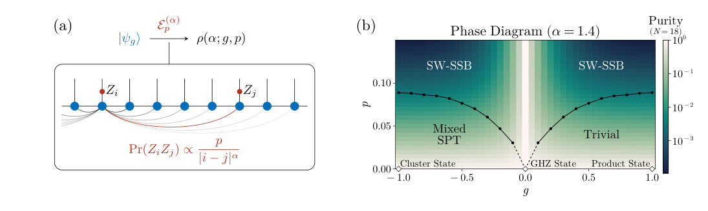
<figcaption class="paper-figure-caption"><b>Fig 1.</b> Figure 1. (a) Summary of the construction considered in this work. We produce a family of mixed states ρ(α; g, p) by decohering the MPS |ψg⟩via the power-law-correlated quantum channel E(α) p introduced in Eq. (16). (b) Phase diagram classifying ρ(α; g, p) for one choice of fixed α, namely α = 1.4. The phase diagram features two regions in which mixed analogues of the pure-state orders persist, giving way at the phase boundary p = pc(g) to SW-SSB in the Rényi-2 sense. Each point denotes a measured phase boundary, with solid lines interpolating linearly between the measured values. The dashed lines are extrapolations based on the argument that pc(g) →0 as |g| →0 within the statistical...</figcaption>
</figure>
<figure class="paper-figure-card">
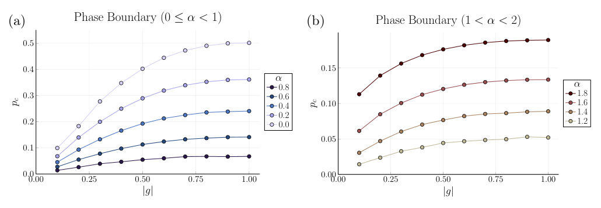
<figcaption class="paper-figure-caption"><b>Fig 2.</b> Figure 2. The phase boundaries separating the symmetric phase (p &lt; pc) from the SW-SSB phase (p &gt; pc) for various α. (a) We plot pc(g) for α &lt; 1 where p has been Kac normalized. (b) We plot pc(g) for α &gt; 1 where p has not been Kac normalized. Notice in particular that pc(g) decreases with increasing α below α = 1, while it increases with increasing α above α = 1. This behavior can be understood from the fact that limα→1 p/N1−α</figcaption>
</figure>
<figure class="paper-figure-card">
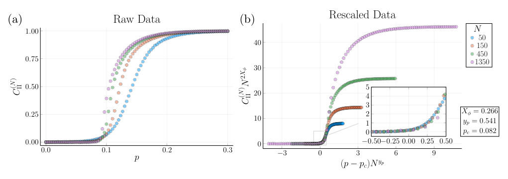
<figcaption class="paper-figure-caption"><b>Fig 3.</b> Figure 3. (a) The Rényi-2 correlator C(N) II as a function of p at fixed α = 1.4 and g = 0.6 before rescaling. (b) The Rényi-2 correlator after rescaling using the values of pc, Xϕ, and yp presented in the table to the lower right. In the inset, we present a magnified view of the same data around (p−pc) = 0 to emphasize the scaling collapse, wherein the finite-size curves C(N) II collapse to the universal curve ˜CII upon rescaling, as described in the text.</figcaption>
</figure>
<figure class="paper-figure-card">
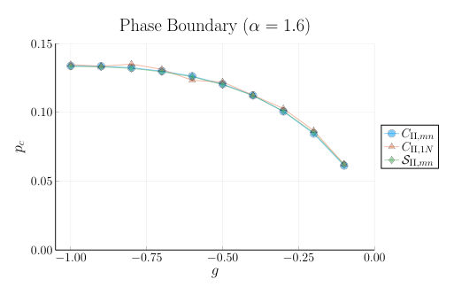
<figcaption class="paper-figure-caption"><b>Fig 4.</b> Figure 4. The critical pc extracted from finite-size scaling on the observables associated with SW-SSB (CII,mn), Rényi-2 co- herent information (CII,1N), and string order (SII,mn). This figure supports the claim that all three observables probe the same phase transition. We note that the noise in CII,1N is due to the slower convergence of MCMC for this observable. Physically, this effect arises because the edge sites have fewer neighbors than the bulk sites and hence participate in fewer Monte Carlo updates.</figcaption>
</figure>
<figure class="paper-figure-card">
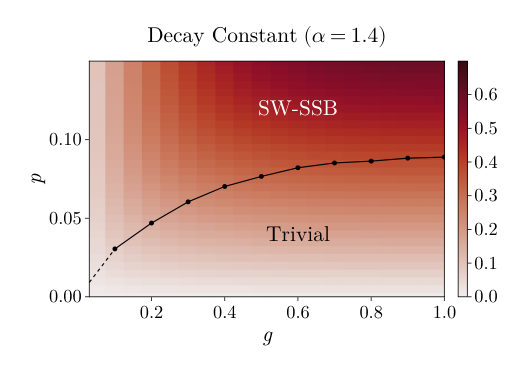
<figcaption class="paper-figure-caption"><b>Fig 5.</b> Figure 5. The purity decays in system size as e−γN, with decay constant γ dependent on g, p, and α. The heatmap shows γ at a fixed α, plotted as a function of g and p.</figcaption>
</figure>

**Summary.** This paper explores mixed-state quantum order, specifically SW-SSB, which cannot occur in pure states. By applying a long-range, power-law quantum channel to a 1D system, the authors construct a phase diagram exhibiting transitions between trivial, mixed SPT, and SW-SSB phases. The methodology combines advanced diagnostics like Rényi-2 measures with mappings to classical statistical mechanics, providing a deep theoretical understanding of environmentally induced quantum order.

**Why it may be interesting.** This work directly addresses the physics of open quantum systems and quantum phase transitions, showing how non-local environmental coupling (long-range channels) can stabilize exotic ordered phases inaccessible in local models.

Detailed structure

**Main problem.** The paper investigates the emergence and characterization of mixed-state quantum phases, such as Strong-to-Weak Spontaneous Symmetry Breaking (SW-SSB), which are fundamentally different from pure-state phenomena.

**Main result.** By introducing a long-range quantum channel with power-law decay, the authors construct a phase diagram hosting trivial, mixed SPT, and SW-SSB phases, demonstrating that long-range interactions can induce such mixed-state order in 1D.

**Method.** The analysis employs Rényi-2 diagnostics and involves mapping the quantum system dynamics to classical statistical mechanics models (like the Ising model) to analyze phase transitions.

**Model / system.** The system is modeled using a family of Matrix Product States (MPS) subjected to a long-range quantum channel implementing two-body dephasing whose probability decays according to a power-law in site separation.

**Key observables.** Rényi-2 diagnostics (e.g., Rényi-2 string order parameter, $C_{II}$), and the coherence information quantifying logical qubits.

**Important parameters / regimes.** The power-law exponent ($\alpha$), the channel strength ($p$), and the state parameter ($g$) which controls the interpolation between trivial and SPT phases.

**Assumptions / limitations.** The analysis relies on the ability to tune the mixed states to high purity for experimental feasibility, and uses mappings to classical models for theoretical analysis.

**Figures summary.** Figures illustrate the phase diagram showing transitions between different ordered phases, and plots show the scaling behavior of Rényi-2 correlators and the string order parameter as a function of the decoherence strength $p$.

**Paper structure.** The paper first establishes the physical problem of mixed-state order, then details the construction of the model using MPS and power-law channels. It proceeds through theoretical analysis using Rényi-2 diagnostics, mapping to classical models, and finally presents numerical results confirming the phase transitions and scaling behavior.

Abstract

Open quantum systems can exhibit inherently mixed quantum orders, such as strong-to-weak spontaneous symmetry breaking (SW-SSB), which have no analogue in pure states. It is generally expected that a finite-depth local quantum channel cannot induce a phase transition to SW-SSB in one spatial dimension. We circumvent this obstruction by introducing a long-range quantum channel, which implements two-body dephasing on pairs of sites with probability falling off according to a power-law in the site separation. Applying this channel to a one-parameter family of matrix product states interpolating between trivial and symmetry-protected topological (SPT) phases, we construct a phase diagram that hosts trivial, mixed SPT, and SW-SSB phases with respect to Rényi-2 diagnostics. Notably, the mixed SPT phase is distinct from previously studied decohered SPT phases: it hosts two logical qubits and exhibits nonvanishing Rényi-2 string order, despite vanishing conventional string order. Through a series of mappings to a classical statistical mechanics model, we establish a direct connection between the loss of logical information and the onset of SW-SSB in this model. Finally, we consider the feasibility of experimental realization of the phenomena we have studied. We emphasize that our family of mixed states can be tuned to regimes of high purity, substantially reducing measurement overhead and enabling their experimental realization and detection on near-term quantum hardware.

[↑ back to top](#top)

### ⭐ [Learning Many-Body Hamiltonians Using a Local Probe](http://arxiv.org/abs/2610.02157v1)

**Highlighted author(s):** Alexey V. Gorshkov  
**Authors:** Suying Liu, Zitai Xu, Alexey V. Gorshkov, Xiaodi Wu, Yu-Xin Wang, Zhi-Yuan Wei  
**Type:** theory · **Category:** quantum information and computing · **PDF:** <https://arxiv.org/pdf/2610.02157v1>  
**Analysis basis:** full PDF text, analyzed in chunks
**Topic relevance:** `analog quantum simulation` **3/5** · `quantum measurements` **3/5** · `QC/QI experiment` **1/5**

↔ Scroll figures horizontally

<figure class="paper-figure-card">
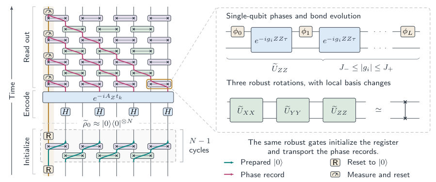
<figcaption class="paper-figure-caption"><b>Fig 1.</b> FIG. 1. Overview of the learning protocol. (a) Time runs upward. Repeatedly resetting the bright qubit and applying robust SWAPs prepares the register approximately in the all-zero state. The unknown Hamiltonian parameters are then encoded in parallel into quantum states distributed across the system. Alternating SWAP layers transport this information back toward the bright qubit, where the encoded states are read out sequentially. (b) The SWAP operations are constructed directly from the unknown interactions using quantum signal processing. Combining robust rotations along three axes produces a SWAP that works uniformly over the promised range of interaction strengths, without prior...</figcaption>
</figure>

**Summary.** This paper presents a novel protocol to learn the parameters of an unknown many-body Hamiltonian using measurements restricted to a single local qubit. By employing parallel phase encoding and robust quantum information transfer techniques, the authors achieve Heisenberg-limited precision scaling. This establishes a scalable route for characterizing complex quantum dynamics with minimal measurement access.

**Why it may be interesting.** This work provides a concrete, scalable measurement protocol that drastically reduces the experimental overhead required to characterize complex quantum dynamics, which is crucial for designing and benchmarking quantum hardware.

Detailed structure

**Main problem.** The paper addresses the challenge of reconstructing unknown many-body Hamiltonians by measuring only a single, local qubit.

**Main result.** It demonstrates that a single measurable qubit is sufficient to learn all $O(N)$ parameters of a bounded-degree two-body Hamiltonian on $N$ qubits at the Heisenberg limit.

**Method.** The protocol combines parallel phase encoding with robust information transfer, utilizing synthesized SWAP gates to move state information from distant qubits to the local probe.

**Model / system.** The system is an $N$-qubit chain or general graph evolving under an unknown nearest-neighbor two-body Hamiltonian. Control is restricted to fast single-qubit operations and measurement on one 'bright qubit'.

**Key observables.** The primary observables are the expectation values of Pauli operators ($\langle X 
angle_t, \langle Y 
angle_t, \langle Z 
angle_t$) measured on the local probe qubit.

**Important parameters / regimes.** The scaling is characterized by achieving Heisenberg-limited precision ($\epsilon$) and a total query time of $e^{O(N)}$ for the chain, matching fundamental lower bounds.

**Assumptions / limitations.** Assumes fast single-qubit control and the existence of a connected reference backbone interaction to facilitate information propagation.

**Figures summary.** Figure 1 illustrates the protocol overview, showing initialization, parallel encoding of unknown parameters into phases, and sequential readout at the bright qubit, including details on constructing robust SWAP operations.

**Paper structure.** The paper develops the protocol by first establishing the general framework for local-probe Hamiltonian learning, then detailing the specific implementation for the 1D chain model, and finally analyzing the complexity scaling for arbitrary bounded-degree interaction graphs using graph theory techniques.

Abstract

Hamiltonian learning provides a systematic framework for reconstructing unknown quantum dynamics. However, existing protocols typically assume direct measurement access to the entire system. With fast single-qubit control and a connected reference backbone, we show that a single measurable qubit suffices to learn all $O(N)$ independent parameters of a bounded-degree two-body Hamiltonian on $N$ qubits at the Heisenberg limit. Crucially, our protocol uses robust SWAP gates synthesized by quantum signal processing, enabling coherent transfer of states evolving under distant Hamiltonian parameters to the measurable qubit. This transfer requires no prior calibration of the Hamiltonian parameters of the intermediate links. A parallel learning architecture achieves total query time $\widetilde{O}(N)$ for an $N$-qubit chain, while retaining Heisenberg-limited precision scaling. On the chain, these scalings match the fundamental precision and information-propagation lower bounds up to logarithmic factors. The framework further extends to arbitrary bounded-degree interaction graphs. Our results establish a scalable route to learning an extensive number of many-body Hamiltonian parameters through only a local measurement interface.

[↑ back to top](#top)

### ⭐ [CTMRG as a tensor-network message-passing algorithm](http://arxiv.org/abs/2610.00631v1)

**Highlighted author(s):** Andrii Sotnikov  
**Authors:** Illia Lukin, Andrii Sotnikov  
**Type:** theory · **Category:** statistical mechanics · **PDF:** <https://arxiv.org/pdf/2610.00631v1>  
**Analysis basis:** full PDF text, analyzed in chunks
**Topic relevance:** `methods for driven-dissipative` **3/5** · `analog quantum simulation` **2/5**

↔ Scroll figures horizontally

<figure class="paper-figure-card">
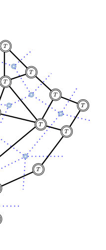
<figcaption class="paper-figure-caption"><b>Fig 1.</b> Figure 1: Tensors T are placed on the vertices of the graph G, and contracted indices correspond to graph edges in black lines. The dual graph is constructed by placing dual vertices (in blue) on the faces of the original graph and connecting the dual vertices by the edge (dotted blue lines) if the original faces share the edge.</figcaption>
</figure>
<figure class="paper-figure-card">
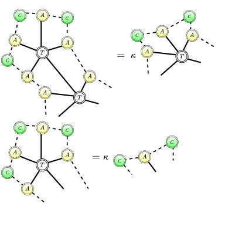
<figcaption class="paper-figure-caption"><b>Fig 2.</b> Figure 2: Definition of the MPS messages. (a) A general subgraph consisting of ten- sors T with varying connectivity, together with its boundary represented as an MPS; the MPS consists of the message tensors A and various corner matrices C, C−1,.... (b) Derivation of the self-consistency equation for the tensor A: a single bulk ten- sor T can be fully isolated by an MPS ring (except for one bond), and this isolated contraction must equal the message tensor on the remaining bond together with the appropriate corner matrices. This yields the update equation for A.</figcaption>
</figure>
<figure class="paper-figure-card">
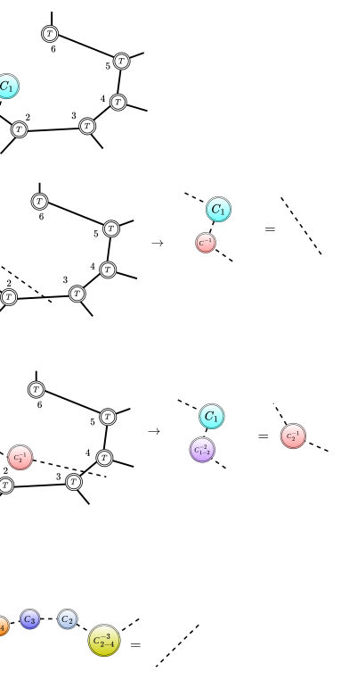
<figcaption class="paper-figure-caption"><b>Fig 3.</b> Figure 3: Derivation of the relations between different corner matrices: for a 7-gon face with corner matrices C1,..., C7, an MPS message isolating a single vertex 7 can be continued across different edges of the polygon, giving equivalent representations of the same environment — with no corner matrix in the chosen gauge (a), with the inverse matrix C−1 1 (red) (b), or with the two-index matrix C−2 1−2 = C−1 1 C−1 2 (vio- let) (c). Comparing these equivalent representations fixes the relations between the different corner matrices. (d) An illustration of the general corner matrices, using C−3 2−4 as an example: this is the corner matrix that lies on one side of vertices 2,3,4, without...</figcaption>
</figure>
<figure class="paper-figure-card">
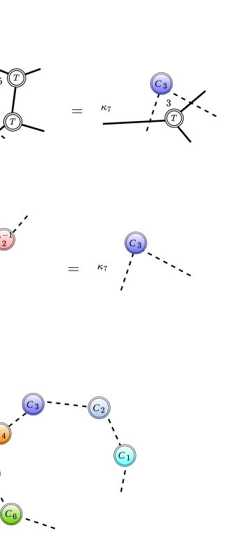
<figcaption class="paper-figure-caption"><b>Fig 4.</b> Figure 4: The derivation of the CTM equations for the corner matrices. (a) Consider a face of the graph — a polygon, here a 7-gon — with its vertices labeled for con- venience. We isolate vertex 7 with an MPS message and continue this MPS until it crosses bonds 2–3 and 3–4; consistency of the message environment then forces this isolated-vertex contraction to equal the C3 corner matrix at vertex 3. (b) Rewriting the matrices C−2 1−2 and C−3 4−6 in terms of C1, C2,..., C7 casts the equation purely in terms of the tensors A and the matrices C. (c) The equivalent, most universal form of the equation: the MPS message isolating vertex k equals the product of all the corner matrices around the...</figcaption>
</figure>
<figure class="paper-figure-card">
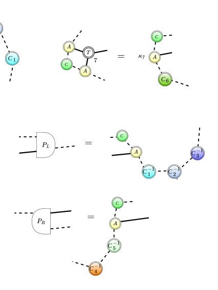
<figcaption class="paper-figure-caption"><b>Fig 5.</b> Figure 5: The derivation of the CTMRG projectors. (a) The corner-matrix equation at vertex 7, together with the update equation for the tensor A at the same vertex. The diagram for the A update is a subgraph of the diagram for the C update, so the two equations can be combined. (b) Combining the two equations in (a) gives the biorthogonal relation shown here: with a suitable normalization, the vectors carried by two A tensors on the same bond are mutually orthogonal. This relation lets us define the biorthogonal projectors PL, PR. Note that the two projectors carry different numbers of inverse C matrices; this asymmetry is purely conventional — we split the corner matrices evenly between PL...</figcaption>
</figure>

**Summary.** This paper develops a unified message-passing framework to compute tensor network contractions, specifically reformulating the Corner Transfer Matrix Renormalization Group (CTMRG). By treating CTMRG as a message-passing algorithm on general planar graphs, it provides a systematic method that unifies previous, case-specific techniques. This advances the computational analysis of 2D statistical mechanics models on complex geometries.

**Why it may be interesting.** While focused on classical statistical mechanics, the message-passing formalism developed here (reconciling CTMRG and BP) provides a powerful, systematic computational tool applicable to quantum many-body systems described by tensor networks, which is relevant for simulating quantum Hamiltonians.

Detailed structure

**Main problem.** The paper addresses the computationally challenging problem of exactly contracting tensor networks defined on two-dimensional planar graphs.

**Main result.** It successfully formulates the Corner Transfer Matrix Renormalization Group (CTMRG) as a systematic message-passing algorithm analogous to Belief Propagation (BP) for general planar graphs.

**Method.** The method involves defining message tensors and 'corner' matrices that encode local information, establishing self-consistency equations for these tensors by ensuring consistency across shared faces.

**Model / system.** The theory is tested on the ferromagnetic Ising model and generalized to arbitrary planar graphs, including those with hyperbolic geometry.

**Key observables.** The partition function, correlation functions, and the message tensors/corner matrices themselves are the primary focus.

**Important parameters / regimes.** The virtual bond dimension ($\chi$) is a key parameter, with the Belief Propagation limit corresponding to $\chi=1$.

**Assumptions / limitations.** The derivation assumes the existence of a gauge condition for every polygon face to simplify the structure of the corner matrices.

**Figures summary.** Figures illustrate the placement of tensors on vertices and dual graphs, define the message MPS environment, and show the derivation of the universal product form for the CTM equations and the biorthogonal projectors.

**Paper structure.** The paper builds by first establishing the tensor network setup, then introducing the message-passing framework using corner matrices, deriving the self-consistency equations for these matrices, and finally showing how these equations fully determine the message MPS.

Abstract

We formulate the corner transfer matrix equations, and the corner transfer matrix renormalization group built on them, as a set of local equations on general planar graphs. These equations depend only on the local subgraphs of the planar graph and are glued together consistently to describe the whole graph. Solving them yields message tensors and corner matrices, which can be used to construct an MPS environment for any connected subgraph. We test the proposed equations on the ferromagnetic Ising model, on a variety of infinite lattices (including hyperbolic ones) and on finite graphs, and find systematic improvement over belief propagation.

[↑ back to top](#top)

### ⭐ [Universal Bound and Phase Transition in Many-Body Fermionic Non-Gaussianity](http://arxiv.org/abs/2610.02075v1)

**Highlighted author(s):** Yuto Ashida  
**Authors:** Masahiro Hoshino, Ryota Matsuda, Yuto Ashida  
**Type:** theory · **Category:** statistical mechanics · **PDF:** <https://arxiv.org/pdf/2610.02075v1>  
**Analysis basis:** full PDF text, analyzed in chunks
**Topic relevance:** `Keldysh / 2PI / non-Gaussian methods` **3/5** · `analog quantum simulation` **1/5**

↔ Scroll figures horizontally

<figure class="paper-figure-card">
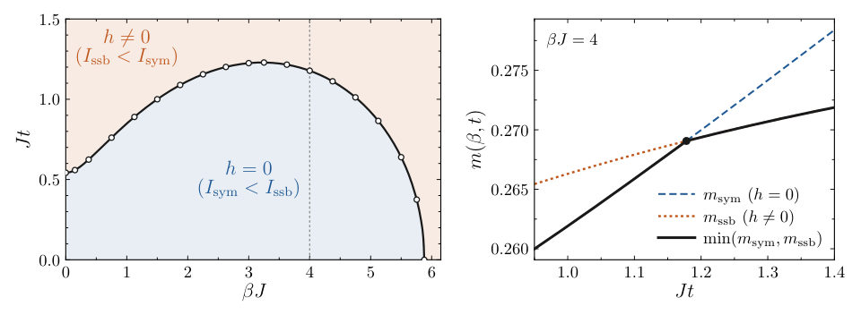
<figcaption class="paper-figure-caption"><b>Fig 1.</b> FIG. 1. Phase diagram (left) and MRE density (right) of the KM state in the large-N SYK model, obtained by numerically solving the SD equations with L = 512 integration points, without extrapolation to the continuum limit. Left: regions where the symmetric saddle (h = 0, blue shading) or the saddle with broken symmetry (h ̸= 0, orange shading) has the smaller action. Open circles mark crossing points of the two actions, and the solid curve gives the phase boundary. The vertical line with short dashes marks the cut at βJ = 4 shown in the right panel. Right: msym (blue dashed) and mssb (orange dotted), together with their minimum m(β, t) (solid black), as functions of Jt at βJ = 4, with m(β,...</figcaption>
</figure>

**Summary.** This work analyzes fermionic non-Gaussianity using the magic Rényi entropy (MRE) to characterize quantum states in many-body systems. The authors establish a universal upper bound for MRE and demonstrate that the MRE can detect a first-order phase transition in the SYK model that is not visible in the system's thermal free energy. This highlights MRE as a sensitive probe of quantum correlations beyond standard thermodynamic measures.

**Why it may be interesting.** The detection of a non-Gaussianity transition that decouples from the standard thermal free energy is a powerful diagnostic tool for characterizing quantum phases in strongly interacting systems.

Detailed structure

**Main problem.** The paper investigates fermionic non-Gaussianity, a resource for quantum computation, by deriving its universal upper bound and analyzing its growth dynamics.

**Main result.** They prove that typical Haar-random states achieve a maximal MRE density of ln(4/3) per Majorana, and they identify a first-order phase transition in the MRE density for the SYK model that is invisible to the thermal free energy.

**Method.** The analysis uses the magic Rényi entropy (MRE) as a diagnostic tool, employing path integrals, saddle-point approximations, and solving Schwinger-Dyson equations.

**Model / system.** The study focuses on quantum many-body systems, specifically utilizing the Sachdev-Ye-Kitaev (SYK) Hamiltonian to model interacting dynamics, and analyzing purity measures for fermionic states.

**Key observables.** Magic Rényi entropy (MRE), Purity ($
u_2$), Universal Upper Bound, and the difference between annealed and quenched logarithmic averages.

**Important parameters / regimes.** Large-system limit (N->infinity), imaginary and real-time durations ($eta, t$), and the coupling strength J in the SYK model.

**Assumptions / limitations.** The analysis relies heavily on the saddle-point approximation to determine the leading exponential behavior in the large-N limit.

**Figures summary.** Figures illustrate the phase diagram and the MRE density of the KM state, showing a kink marking a first-order transition.

**Paper structure.** The paper progresses from establishing the universal upper bound for MRE in random states, to analyzing the dynamics of the MRE in the SYK model, and finally deriving the necessary saddle-point equations to confirm the phase transition structure.

Abstract

Fermionic non-Gaussianity is a resource for universal quantum computation that can be generated by interactions in quantum many-body systems. Using the magic Rényi entropy (MRE) as a measure of non-Gaussianity, we derive its universal upper bound and Haar mean, proving that typical Haar-random states attain the maximal MRE density of $\ln(4/3)$ per Majorana in the large-system limit. We also show that the MRE can differ extensively between states with identical covariance matrices. To investigate how non-Gaussianity grows toward this maximal density, we evolve a Gaussian state in imaginary and real time under the Sachdev-Ye-Kitaev Hamiltonian. By varying the imaginary- and real-time durations, we identify a first-order transition marked by a kink in the MRE density and spontaneous breaking of the permutation symmetry among the four copies used to evaluate the MRE. This transition represents a qualitative change in the non-Gaussianity of the state that is not reflected in the thermal free energy.

[↑ back to top](#top)

### ⭐ [Thermal entanglement transitions from strong $\textrm{SU}(2)$ symmetry](http://arxiv.org/abs/2610.00826v1)

**Highlighted author(s):** Ehud Altman  
**Authors:** Siqi Mo, Ehud Altman, Samuel J. Garratt  
**Type:** theory · **Category:** statistical mechanics · **PDF:** <https://arxiv.org/pdf/2610.00826v1>  
**Analysis basis:** full PDF text, analyzed in chunks
**Topic relevance:** `Keldysh / 2PI / non-Gaussian methods` **1/5** · `analog quantum simulation` **1/5** · `methods for driven-dissipative` **1/5**

↔ Scroll figures horizontally

<figure class="paper-figure-card">
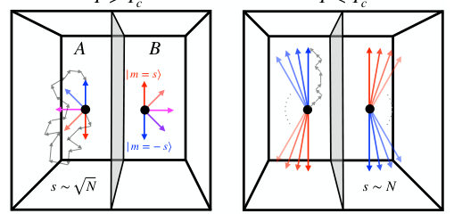
<figcaption class="paper-figure-caption"><b>Fig 1.</b> FIG. 1. Coincidence of thermal and entanglement transitions in the singlet sector of locally interacting ferromagnets. Due to the singlet constraint, pure states with half-system spin s are entangled superpositions with Schmidt rank 2s + 1. Each of the two subsystem A and B contains approximately N/2 spins and these must be entangled into a total singlet. In the paramagnetic phase the half-system spin (colored arrows) scales as s ∼ √</figcaption>
</figure>
<figure class="paper-figure-card">
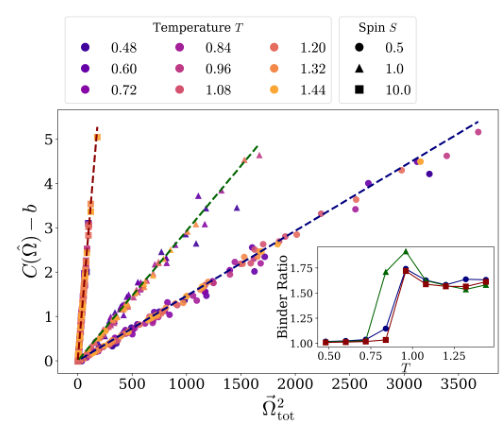
<figcaption class="paper-figure-caption"><b>Fig 2.</b> FIG. 2. Numerical integration of C(ˆΩ) (scatter points) shifted to the origin and the analytical prediction C(ˆΩ) = 3 2 S N ⃗Ω2 tot (dashed lines), plotted against ⃗Ω2 tot, for various S indicated by different shapes. The configurations ˆΩare sampled from the semiclassical theory Eq. (32) on a three-dimensional cubic lattice with N = L3 = 83, and S = 0.5 , 1.0 , 10, with 15 data points drawn at each temperature. The temperature range is chosen to span both the ordered phase and the disordered phase. The critical temperature separating the two phases is identified by the Binder ratio B = ⟨⃗Ω4 Oct⟩/⟨⃗Ω2 Oct⟩2</figcaption>
</figure>
<figure class="paper-figure-card">
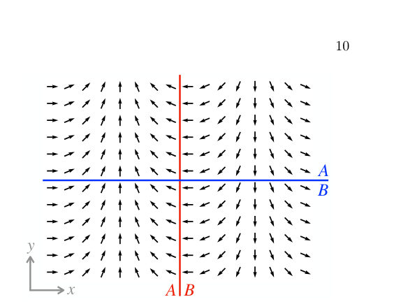
<figcaption class="paper-figure-caption"><b>Fig 3.</b> FIG. 3. Two-dimensional spatial slice through a d- dimensional saddle point configuration ¯Ωj (black arrows) in an anisotropic system with Lx &gt; Li̸=x. These configurations are only stable against thermal fluctuations in d ≥3 and at low temperatures. The wavevector of the saddle point is along the spatial x direction. For the bipartition AB indicated by the red line the subsystem total spin ⃗ΩA is dominated by the saddle point. In this case we find the lower bounds on mixed-state entanglement measures in Eq. (49). For the blue bipartition the subsystem total spin for the saddle point configuration vanishes ¯ΩA = 0, and the statistical properties of ⃗ΩA are instead controlled by...</figcaption>
</figure>
<figure class="paper-figure-card">
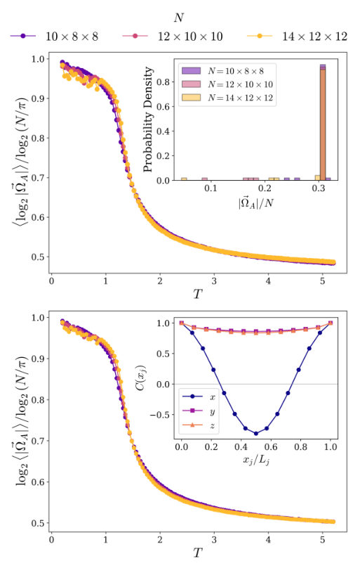
<figcaption class="paper-figure-caption"><b>Fig 4.</b> FIG. 4. Monte Carlo calculations of the lower bounds on (a) distillable entanglement and (b) logarithmic negativity in anisotropic systems with S = 50. For S ≫1 the full lower bounds are approximately ⟨log2 |⃗ΩA|⟩and log2⟨|⃗ΩA|⟩, respectively. Here the system dimensions are N = Lx × Ly × Lz (see legend), where Lx &gt; Ly = Lz, and the bipartition of the system into equal halves A and B is across a spatial y −z plane. In the main panels we find both ⟨log2 |⃗ΩA|⟩/ log2(N/π) and log2⟨|⃗ΩA|⟩/ log2(N/π) to approach 1 at low temperatures as predicted in Eq. (49), and to approach 0.5 at high temperatures as predicted in Eq. (44), where the log2(π) is a subleading (in L) factor that should be...</figcaption>
</figure>
<figure class="paper-figure-card">
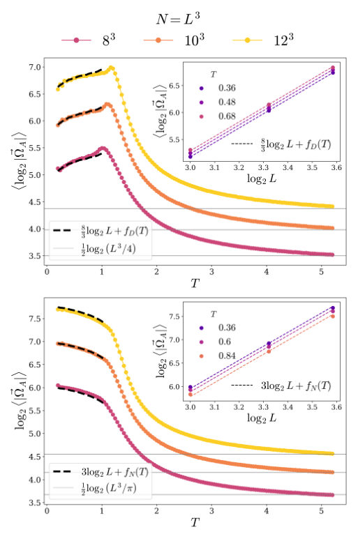
<figcaption class="paper-figure-caption"><b>Fig 5.</b> FIG. 5. Monte Carlo calculations of (a) ⟨log2 |⃗ΩA|⟩and (b) log2⟨|⃗ΩA|⟩in isotropic systems L = Lx,y,z with L = 8, 10, 12 (legend) and S = 50. Here we average these quantities over equal bipartitions AB of the system across planes normal to each of the three coordinate axes. In the inset of (a) we show ⟨log2 |⃗ΩA|⟩versus the prediction (8/3) log2 L+fD(T) in Eq. (55), where at each T the object fD(T) is determined via a single-parameter fit to ⟨log2 |⃗ΩA|⟩versus log2 L (see inset). The dashed black lines in the main panel of (a) show (8/3) log2 L + fD(T) for each L. In the main panel of (b), dashed black lines show 3 log2 L+fN(T), where at each T the object fN(T) is again a fitting...</figcaption>
</figure>

**Summary.** This work analyzes mixed-state entanglement in spin systems possessing strong SU(2) symmetry, showing that thermal ordering transitions coincide with entanglement transitions. By developing a semiclassical theory, the authors prove that entanglement scaling changes dramatically between paramagnetic and ferromagnetic phases. This establishes a deep connection between the statistical mechanics of the system and its quantum information content.

**Why it may be interesting.** It provides a concrete, quantitative link between macroscopic thermodynamic phase transitions (ordering) and quantum information measures (entanglement) in the context of open quantum systems dynamics.

Detailed structure

**Main problem.** The study investigates how finite-temperature ordering transitions in strongly symmetric spin systems are directly linked to transitions in mixed-state entanglement.

**Main result.** The entanglement measures (distillable entanglement and logarithmic negativity) exhibit a transition in their system size scaling, moving from logarithmic to parametrically faster growth across the ferromagnetic phase transition.

**Method.** The authors combine establishing relations between entanglement and spin correlations with developing a semiclassical theory for the singlet sector, which is verified using Monte Carlo and exact numerical simulations.

**Model / system.** The system consists of locally interacting spin systems with ferromagnetic interactions, analyzed specifically within the total singlet sector ($	ext{SU}(2)$ symmetry). The analysis uses Gibbs states restricted to this singlet subspace.

**Key observables.** Mixed-state entanglement measures (distillable entanglement, logarithmic entanglement negativity) and spin correlations ($	ext{Tr}[
ho_0 \vec{S}_i \cdot \vec{S}_j]$).

**Important parameters / regimes.** Temperature ($T$), system size ($N$), and the ferromagnetic coupling strength.

**Assumptions / limitations.** The semiclassical theory is valid in the large $S$ limit, and the analysis relies on saddle-point approximations for path integrals.

**Figures summary.** Figure 1 illustrates the coincidence of thermal and entanglement transitions in the singlet sector, showing the scaling of the half-system spin ($\sim \sqrt{N}$ vs. $\sim N$) across the critical temperature $T_c$.

**Paper structure.** The paper first establishes the connection between entanglement and correlations in the singlet sector, develops a semiclassical theory for the large $S$ limit, derives the scaling laws for entanglement measures, and finally confirms these predictions using numerical simulations and exact 1D calculations.

Abstract

We study mixed-state entanglement in Gibbs states with strong $\mathrm{SU}(2)$ symmetry, focusing on locally interacting spin systems with ferromagnetic interactions. Our main result is to show that finite-temperature ordering transitions are associated with entanglement transitions, and therefore the steady state of strongly symmetric Lindbladians can exhibit entanglement transitions. While in the paramagnetic phase it is known that the distillable entanglement and logarithmic entanglement negativity between two halves of a large system grow logarithmically with the square root of the number of spins, we show that in ferromagnetic phases these quantities grow parametrically faster with system size. To arrive at this result we first establish relations between these mixed-state entanglement measures and spin correlations in states that are singlets under global $\rm{SU}(2)$ symmetry transformations. We then introduce a semiclassical theory for $\rm{SU}(2)$ singlet thermal states. While the global singlet constraint generally enters this theory as a complicated function of the full semiclassical spin configuration, we show that in large $S$ limit it simplifies drastically to a Gaussian suppression of total magnetization in disordered phases as well as in ordered phases in the vicinity of continuous thermal phase transitions. This leads us to a field theory describing spin correlations in the singlet sector. Using this we determine the behavior of various probes of mixed-state entanglement at low and at high temperatures, supporting our analytical results using numerical Monte Carlo simulations of a three-dimensional lattice realization of our semiclassical theory. We also use exact numerics in one-dimensional spin-$1/2$ systems to confirm our predictions for the scaling of mixed-state entanglement with correlation length and system size in the paramagnetic phase.

[↑ back to top](#top)

### ⭐ [Function-like pseudorandom unitaries generate pseudorandom quantum processes](http://arxiv.org/abs/2610.01038v1)

**Highlighted author(s):** Alexey V. Gorshkov  
**Authors:** Zitai Xu, Rahul Arvind, Kishor Bharti, Tobias Haug, Dax Enshan Koh, Wai-Keong Mok, Andrew Tanggara, Alexey V. Gorshkov  
**Type:** theory · **Category:** quantum information and computing · **PDF:** <https://arxiv.org/pdf/2610.01038v1>  
**Analysis basis:** full PDF text, analyzed in chunks

↔ Scroll figures horizontally

<figure class="paper-figure-card">
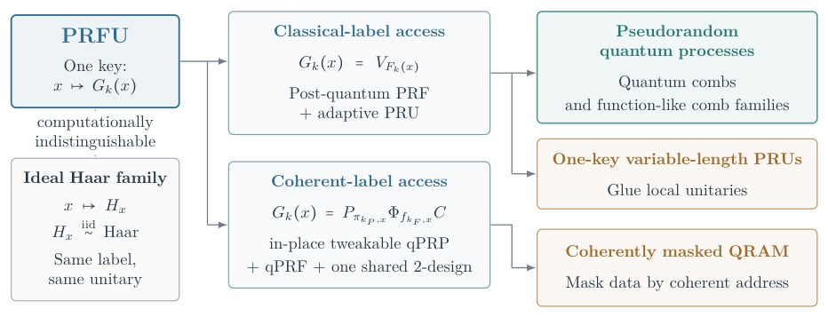
<figcaption class="paper-figure-caption"><b>Fig 1.</b> FIG. 1. Overview of PRFU constructions and selected applications. A single key specifies a unitary family that emulates independent Haar unitaries, with repeated labels reusing the same unitary. The two branches give constructions for classical- label access (Sec. III) and coherent-label access (Sec. IV). Retaining private memory yields pseudorandom combs and function- like comb families (Sec. V); gluing local unitaries yields one-key variable-length PRUs (Sec. VI A); coherent control by memory addresses enables masked QRAM queries (Sec. VI C).</figcaption>
</figure>
<figure class="paper-figure-card">
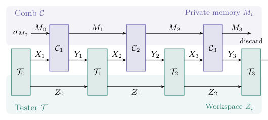
<figcaption class="paper-figure-caption"><b>Fig 2.</b> FIG. 2. A three-round quantum comb (purple) interacting with a tester (green). The comb receives Xi, returns Yi, and retains private memory Mi between rounds. The tester interleaves its operations with the comb’s teeth, carrying its own workspace Zi from one operation to the next. The comb starts with memory state σM0 and discards its terminal memory. The tester produces the final outcome.</figcaption>
</figure>

**Summary.** This work introduces Pseudorandom Function-like Unitaries (PRFU) to efficiently generate entire families of unitaries mimicking true random quantum evolution. By distinguishing between classical and coherent label access, the authors provide rigorous security proofs for these constructions. This advances quantum pseudorandomness from single operations to reusable, complex quantum dynamics for applications like quantum authentication and QRAM emulation.

**Why it may be interesting.** The ability to generate complex, random-looking quantum dynamics efficiently is crucial for simulating complex quantum systems or designing quantum protocols that require high levels of randomness.

Detailed structure

**Main problem.** The paper addresses the need for an efficient, reusable family of pseudorandom unitaries to emulate the complex behavior of Haar-random quantum evolution, which is typically exponentially hard to describe.

**Main result.** They introduce Pseudorandom Function-like Unitaries (PRFU) that generate such families using a single short key, providing security proofs for both classical and coherent label access.

**Method.** The construction relies on combining post-quantum pseudorandom functions (PRF) with pseudorandom unitaries (PRU) and employs advanced cryptographic techniques like indexed path-recording and recursive unitary gluing for security proofs.

**Model / system.** The model involves quantum unitaries $U(2n)$ acting on data and label registers. The core objects are the PRFU family $\{G_k(x)\}$ and the resulting pseudorandom quantum processes, including quantum combs.

**Key observables.** Distinguishing advantage (computational indistinguishability), acceptance probabilities, and the ability to maintain quantum coherence across label superpositions.

**Important parameters / regimes.** Security parameter $\lambda$, number of qubits $n$, and the number of queries $q$ or recursion depth $R$.

**Assumptions / limitations.** Security proofs rely on the existence of post-quantum pseudorandom functions (PRF) and quantum-secure primitives.

**Figures summary.** Figure 1 summarizes the key concepts, illustrating PRFU constructions for classical vs. coherent label access and detailing applications like masked QRAM and quantum combs.

**Paper structure.** The paper develops the PRFU concept, first analyzing classical-label access using PRFs, then extending to coherent-label access using path-recording, and finally demonstrating applications like variable-width unitaries and quantum combs via recursive gluing.

Abstract

Haar-random unitaries provide a canonical model of generic random quantum evolution, but they typically have exponential description and circuit complexity. Although pseudorandom unitaries efficiently emulate a single Haar-random unitary, many tasks require an entire reusable family of independently random-looking operations. We introduce pseudorandom function-like unitaries (PRFU), which generate such a family indexed by public labels using only a single short key. We distinguish classical- and coherent-label access and establish security under adaptive quantum queries. For classical labels, we provide a generic construction from a post-quantum pseudorandom function and a pseudorandom unitary. For coherent labels, we use an indexed path-recording framework to analyze interference across labels and prove security of a construction based on quantum-secure function and permutation primitives. We further show that PRFUs generate pseudorandom channels and quantum combs with private memory, which are secure against adaptive interventions and concurrent sessions. Combining PRFUs with unitary gluing yields a one-key family of pseudorandom unitaries whose supported register widths can be chosen after key generation. Further applications include nonce-resolved quantum authentication, coherently masked QRAM queries, and efficient emulation of random multi-time dynamics. Our results extend quantum pseudorandomness from individual operations to efficiently generated families of random-looking quantum dynamics.

[↑ back to top](#top)

### [Engineering non-ergodic properties in two dimensional quantum many-body systems](http://arxiv.org/abs/2610.00635v1)

**Authors:** Nyayabanta Swain, Gabriel Lemarié, Shaffique Adam  
**Type:** theory · **Category:** other · **PDF:** <https://arxiv.org/pdf/2610.00635v1>  
**Analysis basis:** full PDF text, analyzed in chunks
**Topic relevance:** 🔥 `scars & prethermalization` **5/5** · `analog quantum simulation` **3/5**

↔ Scroll figures horizontally

<figure class="paper-figure-card">
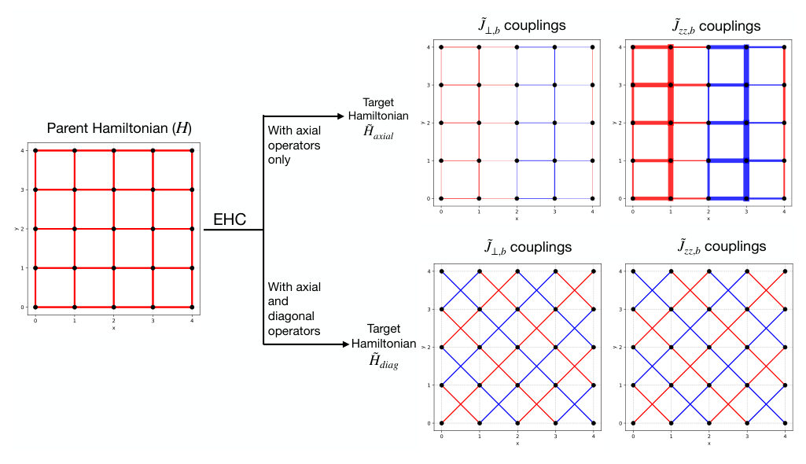
<figcaption class="paper-figure-caption"><b>Fig 1.</b> FIG. 1. Visual representation of the couplings of the parent and target Hamiltonians: This figure illustrates the construction of distinct two-dimensional target Hamiltonians obtained from a common parent Hamiltonian using the eigenstate- to-Hamiltonian construction approach. The parent Hamiltonian, H is the spin-1/2 XXZ model with antiferromagnetic spin-flip and spin preserving couplings of unit magnitude (shown as red bonds) between nearest-neighbor (NN) spins and no couplings along the next-nearest-neighbor (NNN) bonds. Applying EHC with only axial (NN) operators yields the target Hamiltonian ˜Haxial where the couplings ˜J⊥,b and ˜Jzz,b, exhibit a characteristic (π/2, 0) ordering in...</figcaption>
</figure>
<figure class="paper-figure-card">
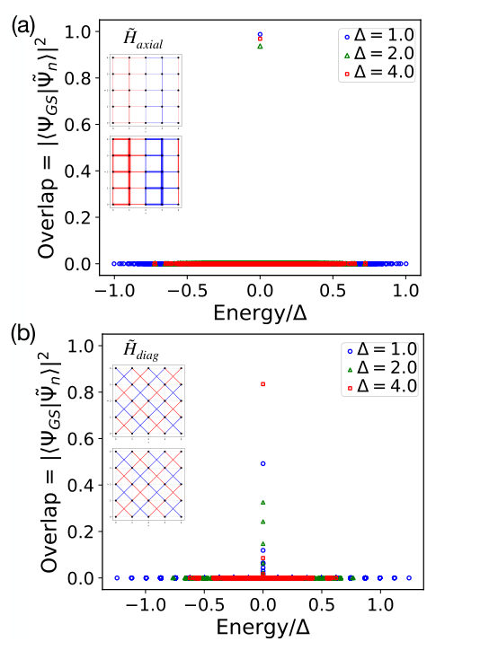
<figcaption class="paper-figure-caption"><b>Fig 2.</b> FIG. 2. Robustness of the EHC mapping. Study of the overlap of the ground state of parent Hamiltonian with all the eigenstates of the EHC built target Hamiltonians computed with exact diagonalization method. (a) For ˜Haxial, the overlap is negligible for most eigenstates except for a single eigenstate located in the middle of the spectrum for which the overlap approaches unity. This is independent of the value of ∆. (b) For ˜Hdiag, the overlap is negligible for almost all eigenstates except for few eigenstates located in the middle of the spec- trum. With increasing ∆, the maximum overlap approaches unity.</figcaption>
</figure>
<figure class="paper-figure-card">
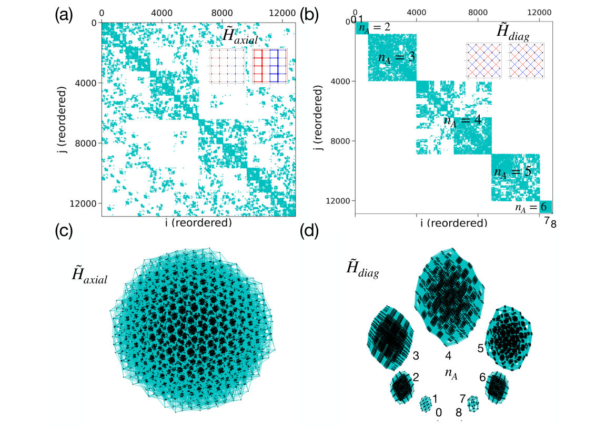
<figcaption class="paper-figure-caption"><b>Fig 3.</b> FIG. 3. Matrix structure and Hilbert-space connectivity of target Hamiltonians. The figure illustrates the structure of the adjacency matrix and network representations of the EHC-engineered Hamiltonians ˜Haxial, and ˜Hdiag. This is independent of the value of the anisotropy parameter ∆. (a) Sparse matrix representation of the adjacency matrix of ˜Haxial in the reordered basis obtained from the Hilbert-space connectivity graph. The Hamiltonian forms a single block, indicating that all basis states are mutually connected. (b) Sparse matrix representation of the adjacency matrix of ˜Hdiag in the reordered basis, which decomposes into nine disconnected blocks, corresponding to nA = 0, . . . ,...</figcaption>
</figure>
<figure class="paper-figure-card">
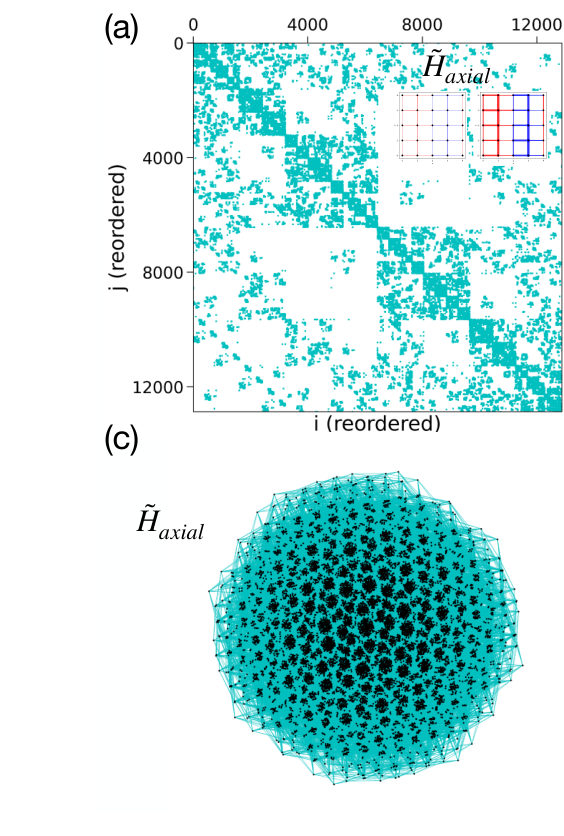
<figcaption class="paper-figure-caption"><b>Fig 4.</b> Fig. 2(a), shows the overlap values across the spec- trum of ˜Haxial for different values of the anisotropy pa- rameter ∆. It reveals that |ΨGS⟩has negligible over- lap with almost all eigenstates of ˜Haxial, except for a single eigenstate located in the middle of the spectrum. The overlap magnitude for this mid-spectrum state ap- proches unity. This indicates that the EHC procedure produces an almost exact mapping between the parent Hamiltonian ground state and a single excited eigenstate of ˜Haxial. Moreover, we observe that ∆has negligible effect in this case. In contrast, Fig. 2(b) displays the corresponding over-</figcaption>
</figure>
<figure class="paper-figure-card">
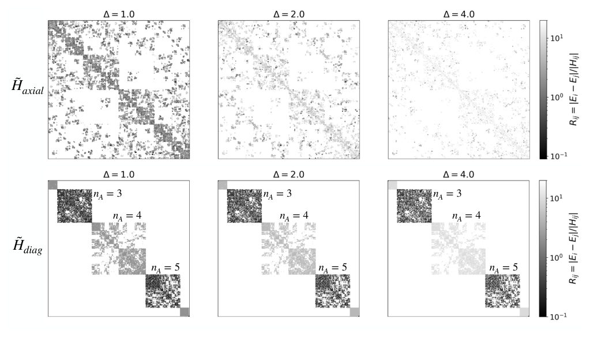
<figcaption class="paper-figure-caption"><b>Fig 5.</b> FIG. 4. Anisotropy-driven evolution of resonance structure for target Hamiltonians. Resonance matrix structure of the EHC-engineered Hamiltonians ˜Haxial and ˜Hdiag with increasing anisotropy ∆. The matrix elements are characterized by the dimensionless resonance parameter Rij = |Ei −Ej|/|Hij|, with the gray color scale indicating the degree of resonance, Rij &lt; 1 indicates resonant (dark) and Rij ≥1 indicates off-resonant (light). ˜Haxial forms a single connected block with a clear evolution with ∆. At large anisotropy, ∆= 4, resonant links are sparse, indicating suppressed hybridization and non-ergodic tendencies. In contrast, ˜Hdiag displays a fragmented structure for all ∆. The resonance...</figcaption>
</figure>

**Summary.** This paper introduces a systematic method, Eigenstate-to-Hamiltonian Construction (EHC), to engineer non-ergodic quantum dynamics in 2D spin systems. By constructing two Hamiltonians based on different interaction geometries (axial vs. diagonal), the authors show that the lattice structure directly controls the system's dynamics, leading to phenomena like Hilbert-space fragmentation and quantum scars.

**Why it may be interesting.** This work provides a powerful, systematic theoretical tool (EHC) to design quantum models exhibiting specific non-equilibrium behaviors, which is highly relevant for understanding quantum simulation and controlling coherence in engineered quantum materials.

Detailed structure

**Main problem.** The paper addresses the challenge of systematically engineering non-ergodic quantum dynamics in 2D interacting quantum many-body systems, moving beyond reliance on intuition or numerical search.

**Main result.** The authors successfully constructed two distinct 2D spin Hamiltonians ($	ilde{H}_{	ext{axial}}$ and $	ilde{H}_{	ext{diag}}$) using an eigenstate-to-Hamiltonian construction, demonstrating that the interaction geometry dictates the emergence of non-ergodic features like Hilbert-space fragmentation and quantum scars.

**Method.** The core method is the Eigenstate-to-Hamiltonian Construction (EHC), which systematically builds target Hamiltonians whose eigenstates are known, circumventing the exponential scaling of the Hilbert space dimension.

**Model / system.** The study focuses on spin-1/2 XXZ models on a square lattice in two dimensions. Two target Hamiltonians are constructed: one ($	ilde{H}_{	ext{axial}}$) using only nearest-neighbor (axial) couplings, and another ($	ilde{H}_{	ext{diag}}$) incorporating diagonal (next-nearest-neighbor) couplings.

**Key observables.** Hilbert-space fragmentation, quantum many-body scar signatures (low-entanglement, highly localized eigenstates), and the crossover between ergodic and non-ergodic dynamics.

**Important parameters / regimes.** Anisotropy ($\Delta$), interaction geometry (axial vs. diagonal), and the coupling strengths ($	ilde{J}^\perp_{b}, 	ilde{J}^{zz}_{b}$).

**Assumptions / limitations.** The primary assumption is that the EHC method provides a systematic route to designing Hamiltonians with specific dynamical properties, particularly in 2D systems.

**Figures summary.** Figure 1 visually illustrates the construction process, showing the coupling patterns for the parent model and the two engineered target Hamiltonians ($	ilde{H}_{	ext{axial}}$ and $	ilde{H}_{	ext{diag}}$).

**Paper structure.** The paper introduces the problem of engineering non-ergodicity, details the EHC methodology, applies it to construct two geometrically distinct 2D spin Hamiltonians, and then analyzes the resulting dynamics and Hilbert-space structure for both models.

Abstract

Non-ergodic quantum many-body dynamics offers a route to persistent quantum coherence far from equilibrium, beyond the conventional expectations of thermalizing statistical mechanics. Most known examples have been identified through intuition, analogy, or numerical search, rather than by systematic Hamiltonian design. This leaves few general methods for engineering robust non-ergodic dynamics in disorder-free interacting quantum many-body systems, especially in higher dimensions where enhanced connectivity generally disfavors ergodicity breaking. Here, we use an eigenstate-to-Hamiltonian construction approach to systematically engineer two-dimensional quantum spin Hamiltonians with tunable non-ergodic properties. Starting from a common parent model and input eigenstate, we construct two target Hamiltonians on the square lattice that differ in their interaction geometry: axial versus diagonal. We show that the resulting interaction geometry and coupling pattern control the Hilbert-space structure and dynamics. The axial model forms a connected Hilbert-space network and exhibits an anisotropy-driven crossover from ergodic to non-ergodic behavior through the suppression of resonances. In contrast, the diagonal model exhibits Hilbert-space fragmentation and, within its largest irreducible sector, signatures of quantum many-body scar dynamics including towers of highly localized, low-entanglement eigenstates, and long-lived coherent revivals. These results establish a direct link between Hamiltonian design, Hilbert-space network structure, and emergent non-ergodic dynamics.

[↑ back to top](#top)

### [Operator-language Feynman rules for driven-dissipative quantum systems: from mean field to non-Gaussian photon correlations](http://arxiv.org/abs/2610.00667v1)

**Authors:** Peter Ehlers, Phi Hung Nguyen, Daniel Soh  
**Type:** theory · **Category:** other · **PDF:** <https://arxiv.org/pdf/2610.00667v1>  
**Analysis basis:** full PDF text, analyzed in chunks
**Topic relevance:** 🔥 `Keldysh / 2PI / non-Gaussian methods` **4/5** · 🔥 `methods for driven-dissipative` **4/5** · `Full counting statistics` **3/5** · `Tavis-Cummings & cavity-many-emitter` **3/5** · `correlated / nonlocal dissipation` **3/5** · `driven-dissipative phase transition` **3/5** · `non-equilibrium universality` **2/5** · `analog quantum simulation` **1/5** · `interference shaping light` **1/5** · `quantum measurements` **1/5**

↔ Scroll figures horizontally

<figure class="paper-figure-card">
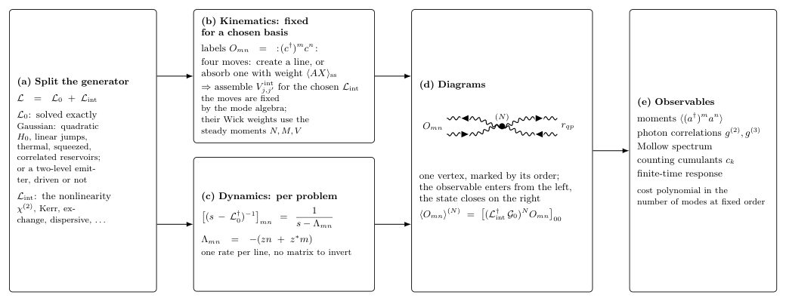
<figcaption class="paper-figure-caption"><b>Fig 1.</b> FIG. 1. The construction in one picture. (a) A Lindbladian is split into a Gaussian part L0, diagonalized exactly in Sec. III, and a nonlinear remainder Lint. (b) Once the eigenoperator basis and its steady covariance are chosen, every interaction acts through four elementary moves whose Wick-basis weights are steady-state contractions. The move algebra is fixed by the mode algebra, while the vertex table for a specified Lint is assembled mechanically from those moves (Sec. IV B). (c) The dynamics enters only through the resolvent of L0, a scalar on every label and, for Gaussian L0, a sum of one rate per line (Sec. IV C). (d) Each order of perturbation theory is a single-vertex diagram...</figcaption>
</figure>
<figure class="paper-figure-card">
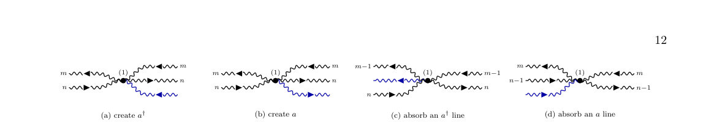
<figcaption class="paper-figure-caption"><b>Fig 2.</b> FIG. 3. The four elementary moves, drawn as first-order diagrams. Left arrows are factors of a† (or β†), right arrows factors of a (or β); the labels give the number of lines in each bundle, and the line that is created or absorbed is shown in colour. (a),(b) A mode operator creates its own line, with weight one. (c),(d) It absorbs one existing line. The weight of an absorption is the steady-state contraction of the incoming operator A with the absorbed one X, taken in the order in which they stand: ⟨AX⟩ss when A multiplies from the left and ⟨XA⟩ss when it multiplies from the right, times the number of lines of that kind; for one mode these are N, N + 1, M, and M ∗, Eqs. (54)–(57). In...</figcaption>
</figure>
<figure class="paper-figure-card">
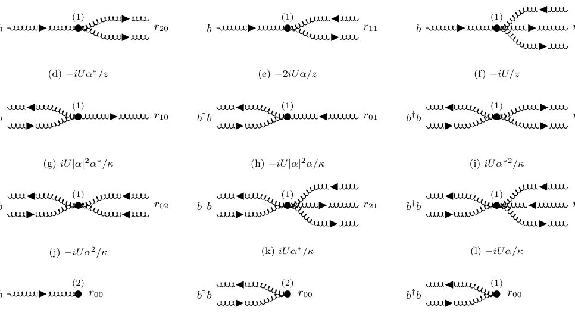
<figcaption class="paper-figure-caption"><b>Fig 3.</b> FIG. 4. Diagrams for the driven Kerr cavity, each labelled by its value and by the initial-state term rqp its outgoing lines close on. (a)–(f) The complete first-order table for the observable b, from Eq. (91). (g)–(l) The complete first-order table for b†b, Eq. (93). (m),(n) Second-order steady-state diagrams for ⟨b⟩and ⟨b†b⟩, obtained by gluing the first-order tables, Eqs. (103) and (97). (o) The first-order steady-state diagram for ⟨b†b⟩vanishes. In the steady state only (a), (m), (n), and (o) contribute; at finite time every panel does, weighted by Tr[Opqρ0].</figcaption>
</figure>
<figure class="paper-figure-card">
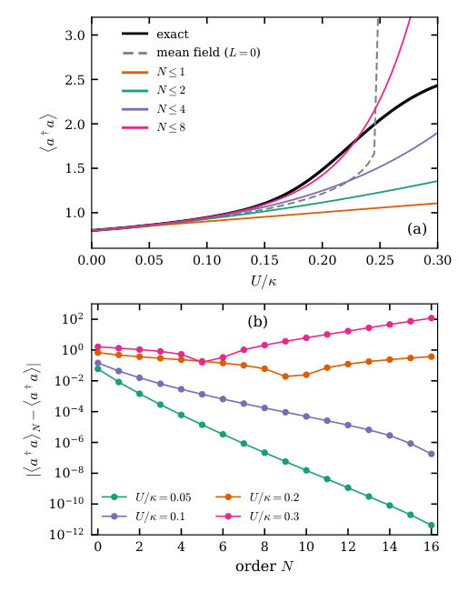
<figcaption class="paper-figure-caption"><b>Fig 4.</b> FIG. 5. Driven Kerr cavity beyond second order, for ∆c = −κ and η = κ, so that |α|2 = 0.8. (a) Intracavity photon num- ber versus U: exact steady state (black), mean-field theory, which is the sum of all L = 0 contributions (grey dashed), and partial sums of the diagrammatic series through order N. (b) Absolute error of the partial sums versus order N. The series is asymptotic: the error decreases to a minimum at an order that shrinks as U grows and increases beyond it. At U = 0.05κ and 0.1κ the error is still decreasing at N = 16.</figcaption>
</figure>
<figure class="paper-figure-card">
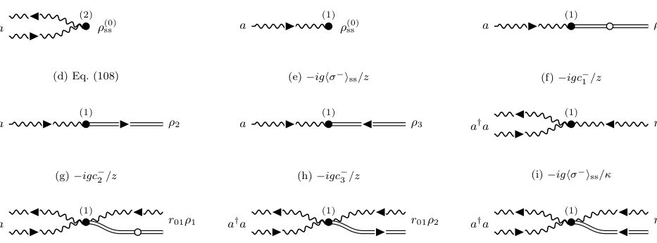
<figcaption class="paper-figure-caption"><b>Fig 5.</b> FIG. 6. Diagrams for a driven emitter in a cavity, Eq. (105). (a)–(c) Bare split: steady-state diagrams for the emitter population at orders 2, 4, and 2r, which form the geometric series of Eq. (106); for a classical dipole all diagrams beyond second order vanish. (d) Dressed split: the second-order steady-state diagram for the photon number, Eq. (108). (e)–(h) First-order table for the cavity field a: the emitter operator left at the vertex is either replaced by its steady-state mean (e) or starts one of the three dressed lines (f)–(h), which close on the duals ρk. (i)–(l) First-order table for a†a, routes through σ−; the routes through σ+ are their Hermitian conjugates. Gluing (i) to the...</figcaption>
</figure>

**Summary.** This paper introduces a novel, operator-language Feynman rule set for analyzing driven-dissipative quantum systems governed by Lindblad master equations. By systematically separating the generator into a solvable part and an interaction part, it allows for diagrammatic calculation of correlation functions. This method is particularly valuable for accurately determining non-Gaussian statistics in complex quantum optical setups.

**Why it may be interesting.** This work provides a powerful, systematic, and diagrammatic framework for calculating higher-order correlations in open quantum systems, moving beyond the limitations of mean-field or Gaussian approximations.

Detailed structure

**Main problem.** The paper develops a systematic, diagrammatic perturbation theory to construct Feynman rules for Lindblad master equations governing driven-dissipative quantum systems.

**Main result.** The rules successfully calculate non-Gaussian photon correlations (like $g^{(3)}$) in systems like Kerr rings, surpassing the accuracy of standard Gaussian cumulant closures.

**Method.** The method constructs rules by splitting the Liouvillian generator $L = L_0 + L_{	ext{int}}$, separating the expansion into a kinematic part (algebraic contractions) and a dynamical part (the resolvent of the solvable unperturbed generator $L_0$).

**Model / system.** The theory applies to open quantum systems described by Lindblad master equations, covering diverse models such as driven Kerr cavities, strongly driven two-level atoms, and coupled Kerr chains/rings.

**Key observables.** Photon correlations ($g^{(2)}, g^{(3)}$), photon-counting cumulants, and steady-state expectation values.

**Important parameters / regimes.** Coupling strengths ($U, \kappa$), detunings ($\Delta$), and the order of the perturbative expansion.

**Assumptions / limitations.** The method assumes the existence of an exactly solvable, Gaussian unperturbed generator $L_0$ whose resolvent can be calculated in closed form.

**Figures summary.** Figures illustrate the construction process, showing the splitting of the generator, the kinematic rules, and the resulting diagrammatic structure used to calculate observables.

**Paper structure.** The paper builds the formalism by defining the operator language for the Liouvillian, detailing the separation into kinematic and dynamic parts, and then applies these rules to calculate specific observables for various physical models, comparing results against known limits and closures.

Abstract

We construct Feynman rules for Lindblad master equations in the operator language of quantum optics: a fixed algebra of elementary operator moves and closed-form propagators for perturbation theory about an exactly solvable, in most cases Gaussian, generator. The expansion separates into a kinematic part (the shift algebra on the Wick-ordered eigenoperators $O_{mn}=:(c^\dagger)^m c^n:$, from which the vertex table for a specified interaction is assembled) and a dynamical part that enters only through the resolvent of the unperturbed generator, diagonal and additive for any stable, diagonalizable Gaussian $L_0$, including thermal and squeezed reservoirs and correlated decay, and equally available for a two-level emitter, driven or undriven. In the driven Kerr cavity the loop expansion is the semiclassical expansion and the series is asymptotic. In a strongly driven two-level atom, dressed lines replace a series of finite radius by one accurate deep into saturation, one line per Mollow component. For Kerr rings and chains the cost is polynomial in the number of sites at fixed perturbative order. On a three-site ring the diagrams recover the non-Gaussian part of the three-photon correlation that the Gaussian cumulant closure lacks; carried to tenth order they give the smallest $g^{(3)}$ error of the methods compared for $U\leq0.25κ$ at a cost below that of a fourth-order closure, and third- and fourth-order closures are more accurate at moderate coupling. The same rules, extended to the counting-field-tilted generator, give the photon-counting cumulants of a disordered eight-site chain beyond direct diagonalization; quantum-jump trajectories at three couplings agree with them to within $1.6$ standard errors, within one at the strongest coupling, where they place the third cumulant six standard errors above the Gaussian value.

[↑ back to top](#top)

### [How Superradiance Survives Molecular Noise inside Virus Capsids](http://arxiv.org/abs/2610.00739v1)

**Authors:** Tianran Li, Irina Tsvetkova, Matthew Brauser, Amala Raj, Philip Shushkov, Bogdan Dragnea  
**Type:** both · **Category:** other · **PDF:** <https://arxiv.org/pdf/2610.00739v1>  
**Analysis basis:** full PDF text, analyzed in chunks
**Topic relevance:** 🔥 `Dicke superradiance` **4/5** · `Tavis-Cummings & cavity-many-emitter` **3/5** · `correlated / nonlocal dissipation` **3/5** · `superradiant laser` **3/5** · `analog quantum simulation` **2/5** · `driven-dissipative phase transition` **2/5** · `methods for driven-dissipative` **2/5** · `Keldysh / 2PI / non-Gaussian methods` **1/5** · `free-space correlated emission` **1/5** · `non-equilibrium universality` **1/5** · `quantum optics experiment` **1/5**

↔ Scroll figures horizontally

<figure class="paper-figure-card">
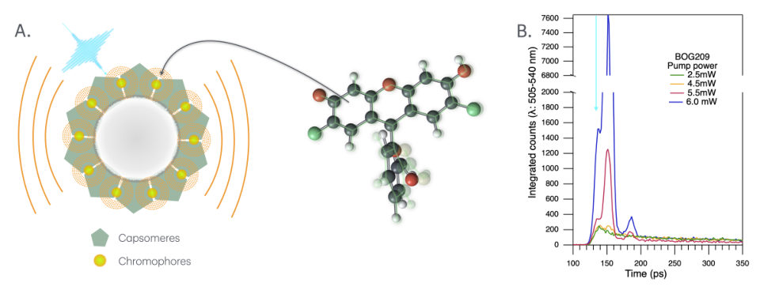
<figcaption class="paper-figure-caption"><b>Fig 1.</b> Figure 1: A. Schematic of a symmetric virus with chromophores wedged in between the oligomeric</figcaption>
</figure>
<figure class="paper-figure-card">
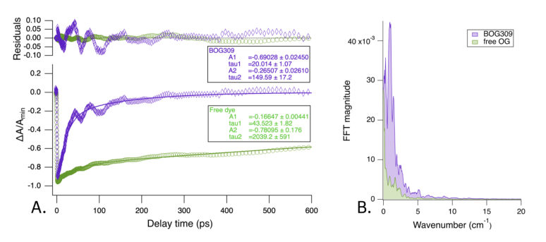
<figcaption class="paper-figure-caption"><b>Fig 2.</b> Figure 2: A. Transient absorption traces for a 70 nM solution of BOG particles carrying 𝑁≈309</figcaption>
</figure>
<figure class="paper-figure-card">
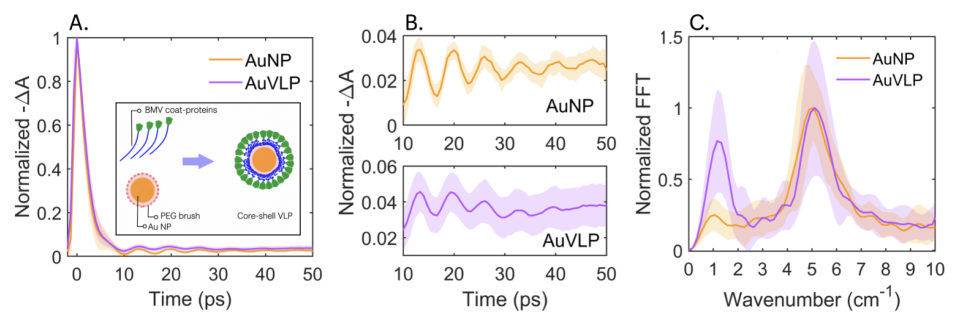
<figcaption class="paper-figure-caption"><b>Fig 3.</b> Figure 3: Probing capsid vibration via AuNP breathing mode. A. Averaged transient-absorption</figcaption>
</figure>
<figure class="paper-figure-card">
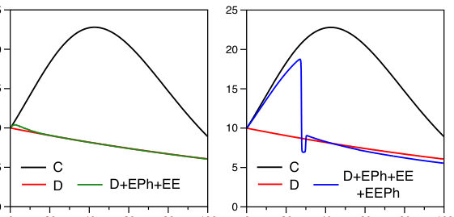
<figcaption class="paper-figure-caption"><b>Fig 4.</b> Figure 4: Vibronically assisted recovery of superradiance. Simulated emission from a 10-</figcaption>
</figure>

**Summary.** This research investigates how superradiance can persist at room temperature in dye-labeled virus capsids, a process normally hindered by molecular noise. The authors propose that coherent, underdamped capsid vibrations act as a dynamic structural element, coupling to the dye excitons to restore the necessary collective polarization for light emission. By combining TA spectroscopy and theoretical modeling, they provide evidence for this phonon-mediated mechanism.

**Why it may be interesting.** This work is highly relevant to AMO physics as it models quantum coherence (SR) in a complex, open, and noisy solid-state/biological environment, using vibrational modes as the mediating coupling mechanism, which is a core topic in cavity QED and molecular physics.

Detailed structure

**Main problem.** The paper addresses the fundamental mechanism enabling superradiance (SR) to occur at room temperature despite significant molecular noise sources like collisional dephasing.

**Main result.** The authors find that underdamped, low-frequency collective vibrations (phonons) of the virus capsid are necessary to dynamically modulate the exciton-exciton interaction, thereby promoting the collective polarization required for SR.

**Method.** The study combines ultrafast spectroscopy (Transient Absorption) experiments on dye-labeled virus capsids with theoretical modeling of coupled quantum oscillators.

**Model / system.** The system involves excited organic dyes chemically bound to an icosahedral virus shell (BOGs). The model treats the dye excitation as coupled to the collective, low-frequency vibrational modes of the capsid, which act as a dynamic environment.

**Key observables.** Superradiant emission intensity, oscillatory modulation in TA residuals, and the detection of low-frequency vibrational peaks ($\approx 1.3 	ext{ cm}^{-1}$).

**Important parameters / regimes.** Room temperature, underdamped frequency ($\approx 1 	ext{ cm}^{-1}$), and the coupling strength between the dye excitons and the capsid motion.

**Assumptions / limitations.** The analysis assumes that the observed low-frequency modes are acoustic-like, underdamped phonons, and that SR recovery requires modulation of the exciton-exciton interaction, not just individual site energies.

**Figures summary.** Figure 1 shows the SR emission profile. Figure 2 shows oscillatory modulation in TA residuals for BOGs. Figure 3 shows the detection of a low-frequency peak ($\approx 1.3 	ext{ cm}^{-1}$) in AuVLP TA traces. Figure 4 simulates that SR only reappears when the vibration modulates the exciton-exciton interaction.

**Paper structure.** The paper establishes the problem (SR at room temperature), presents experimental evidence for low-frequency oscillations in BOGs and AuVLPs, and concludes with theoretical modeling demonstrating that these coherent vibrations are the active ingredient promoting the necessary collective polarization for SR.

Abstract

Excited organic dyes chemically bound to an icosahedral virus shell can spontaneously synchronize and emit a superradiant burst of light. The mechanism that allows it to occur at room temperature, despite collisional dephasing and inhomogeneous broadening, is not understood. Few other known low-dimensional condensed matter systems exhibit room-temperature superradiance (SR). In the fluctuation-prone environment of molecular-based systems, electron--vibrational coupling has been proposed to play a central role. Here, we addressed experimentally the existence of underdamped virus capsid phonon-like modes and theoretically their involvement in the transition from uncorrelated to cooperative emission. We find that SR-active dye-labeled capsids exhibit underdamped low-frequency oscillations that modulate the dye excited-state response, and modeling shows how such capsid motion can promote the collective polarization required for superradiant emission.

[↑ back to top](#top)

### [Efficient learning of quantum interactions from thermal metastable states](http://arxiv.org/abs/2610.01538v1)

**Authors:** Bingrun Wang, Qi Ye, Chi-Fang Chen  
**Type:** theory · **Category:** statistical mechanics · **PDF:** <https://arxiv.org/pdf/2610.01538v1>  
**Analysis basis:** full PDF text, analyzed in chunks
**Topic relevance:** 🔥 `methods for driven-dissipative` **4/5** · `analog quantum simulation` **3/5** · `driven-dissipative phase transition` **3/5** · `non-equilibrium universality` **3/5** · `scars & prethermalization` **3/5** · `Keldysh / 2PI / non-Gaussian methods` **2/5** · `correlated / nonlocal dissipation` **2/5** · `quantum measurements` **2/5**

↔ Scroll figures horizontally

<figure class="paper-figure-card">
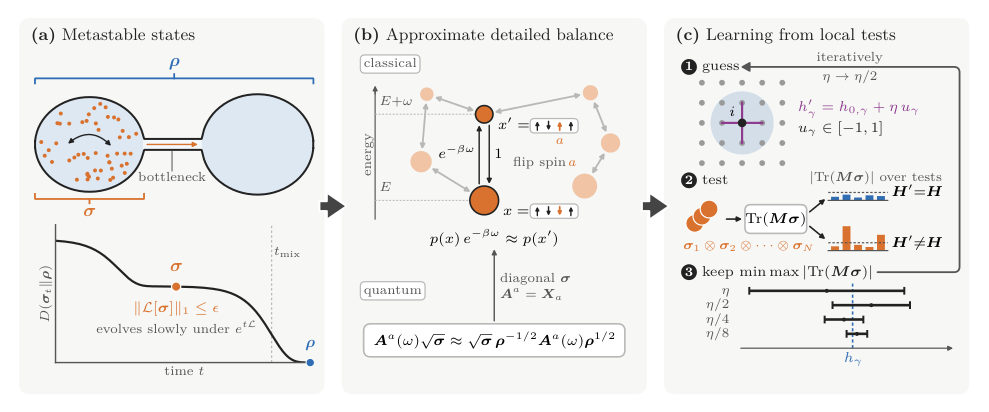
<figcaption class="paper-figure-caption"><b>Fig 1.</b> Figure 1: Overview of the results. (a) In this example, a metastable state σ is concentrated in one region of configuration space, whereas the Gibbs state ρ spreads over all of it. Probability leaks out of that region only slowly, so σ is approximately stationary under the Lindbladian evolution, ∥L[σ]∥1 ≤ϵ, yet still far from equilibrium (the plateau of D(σt∥ρ)). (b) Metastability implies approximate detailed balance (ADB). Classically, if configurations x and x′ differ by one spin flip and their energies differ by ω, the probability fluxes between them balance, p(x)e−βω ≈p(x′). ADB is the quantum version for single-site jumps Aa, and it reduces to this classical relation when σ is diagonal...</figcaption>
</figure>
<figure class="paper-figure-card">
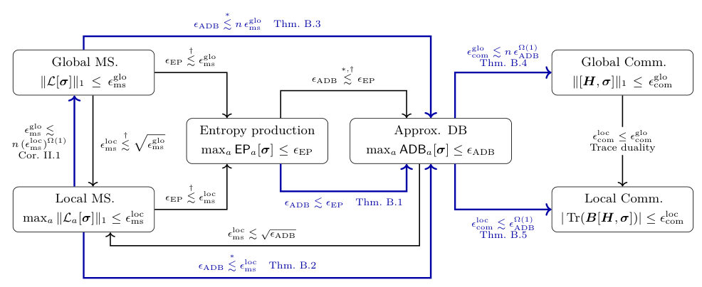
<figcaption class="paper-figure-caption"><b>Fig 2.</b> Figure 2: Relations between metastability (MS), entropy production (EP), approximate detailed balance (ADB), and commutation with the Hamiltonian (Comm.). Black arrows are results from Ref. [36] or direct consequences, and blue arrows are our results. At fixed temperature and local parameters, ≲suppresses constants, and Ω(1) denotes a positive exponent. Asterisks (∗) mark bounds that hold up to additional factors polylogarithmic in the inverse error. Daggers (†) mark additional ∥log σ −log ρ∥dependence, which requires full-rank states. For Local Comm., B is a norm-one local operator. Our ADB-to-local-commutation bound extends this class to products of a fixed number of local operators...</figcaption>
</figure>
<figure class="paper-figure-card">
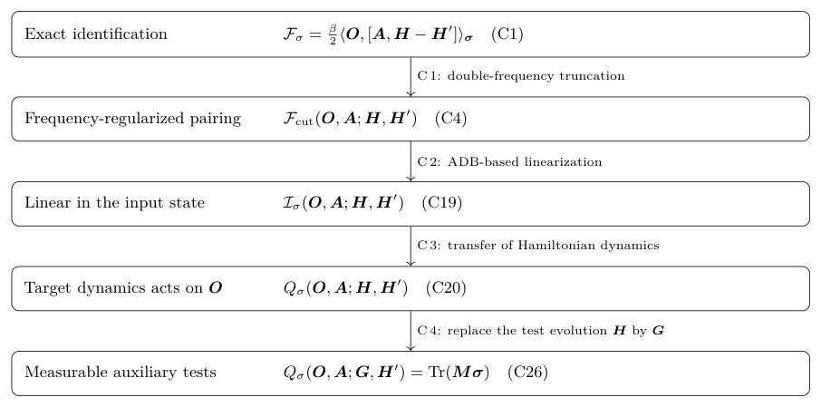
<figcaption class="paper-figure-caption"><b>Fig 3.</b> Figure 3: Construction of the measurable tests from the identifiability equation (C3). The first three steps produce the expression with true auxiliary dynamics. The fourth defines the family with selectable dynamics. ADB-based linearization is the main technical step.</figcaption>
</figure>

**Summary.** This paper develops a general framework for learning quantum interactions from metastable states rather than requiring the computationally intractable exact Gibbs states. By exploiting the concept of Approximate Detailed Balance, the authors extend existing efficient learning protocols to these realistic, non-equilibrium inputs. This provides a powerful, unified method for characterizing complex quantum dynamics from limited measurements.

**Why it may be interesting.** This work is highly relevant as it provides a robust theoretical tool for characterizing and learning the dynamics of complex, non-equilibrium quantum systems, which are common in open quantum systems and thermalization studies.

Detailed structure

**Main problem.** The central task is learning the unknown quantum interactions (Hamiltonian) governing a many-body system from measurements taken on finite-temperature, non-equilibrium metastable states.

**Main result.** The authors establish a unified framework showing that the Hamiltonian can be learned from metastable states using the same efficient protocols developed for true Gibbs states, achieving near-optimal complexity.

**Method.** The approach extends established Gibbs-state learning protocols to metastable states by leveraging the concept of Approximate Detailed Balance (ADB). It uses local measurements on these metastable states to iteratively estimate Hamiltonian coefficients.

**Model / system.** The system is an $n$-qubit lattice governed by a Hamiltonian $H$ and evolves under a Lindbladian master equation $L[\sigma]$. The input data consists of $\epsilon$-metastable states $\sigma$, which are approximate stationary points ($\|L[\sigma]\|_1 \le \epsilon$) but not necessarily the true Gibbs state.

**Key observables.** Hamiltonian coefficients ($h_\gamma$), expectation values $	ext{Tr}(M_\sigma)$, and the degree of non-equilibrium ($\|L[\sigma]\|_1$).

**Important parameters / regimes.** Inverse temperature ($eta$), metastability error ($\epsilon$), and desired estimation precision ($\eta$).

**Assumptions / limitations.** The system dynamics are modeled by a weak-coupling, time-Markovian Lindbladian, and the input states are sufficiently metastable to exhibit Approximate Detailed Balance (ADB).

**Figures summary.** Figure 1 illustrates that a metastable state can be far from equilibrium but still approximately stationary, demonstrating that metastability implies Approximate Detailed Balance (ADB), which underpins the iterative learning algorithm.

**Paper structure.** The paper develops the theory by first defining the problem in terms of metastable states, then extending the known Gibbs-state learning mechanisms to this new input class, and finally deriving the complexity bounds for the estimation process.

Abstract

Learning quantum interactions from finite-temperature many-body systems is a central task in emerging quantum platforms. Recently, the problem of learning from lattice quantum Gibbs states has found rigorous, efficient protocols. Nevertheless, exact Gibbs states, as the input premise, are in fact computationally intractable to prepare and may not faithfully represent generic finite-temperature quantum systems. In contrast, a system coupled to a heat bath can be stuck at an approximate stationary state (metastable state) long before it truly equilibrates. Here, we formulate a physically and algorithmically consistent alternative: learning from such metastable states of detailed-balanced master equations (Lindbladians) arising from system-bath interactions. We distill the algorithmic mechanism and structural condition underlying Gibbs-state learning and extend it in full to metastable states, attaining nearly optimal sample and computational complexity (in the system size and the precision). More broadly, we sharpen notions of metastability and develop a unified framework for finite-temperature learning.

[↑ back to top](#top)

### [Quantum synchronization in atom-cavity coupled systems](http://arxiv.org/abs/2610.01094v1)

**Authors:** Katha Haldar, Anushree Dey, Saikat Ghosh, Bimalendu Deb  
**Type:** theory · **Category:** other · **PDF:** <https://arxiv.org/pdf/2610.01094v1>  
**Analysis basis:** full PDF text, analyzed in chunks
**Topic relevance:** 🔥 `driven-dissipative phase transition` **4/5** · `Tavis-Cummings & cavity-many-emitter` **3/5** · `analog quantum simulation` **3/5** · `methods for driven-dissipative` **3/5** · `non-equilibrium universality` **3/5** · `correlated / nonlocal dissipation` **2/5** · `Keldysh / 2PI / non-Gaussian methods` **1/5** · `quantum measurements` **1/5**

↔ Scroll figures horizontally

<figure class="paper-figure-card">
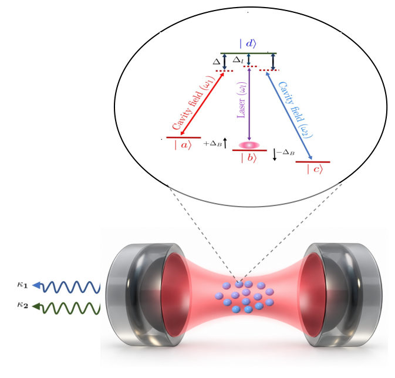
<figcaption class="paper-figure-caption"><b>Fig 1.</b> FIG. 1. A schematic diagram showing an ensemble of atoms in a bimodal cavity, κ1 and κ2 are the two cavity decay rates. Inset shows a single four-level atom interacting with two cavity modes and a laser field. The levels | a⟩, | b⟩and | c⟩denote three ground-state magnetic sub-levels which are split due to an applied magnetic field. The cavity modes 1 and 2 couple the levels | a⟩and | c⟩to the excited level | d⟩, respectively; while the transition | b⟩→| d⟩is driven by a laser field.</figcaption>
</figure>
<figure class="paper-figure-card">
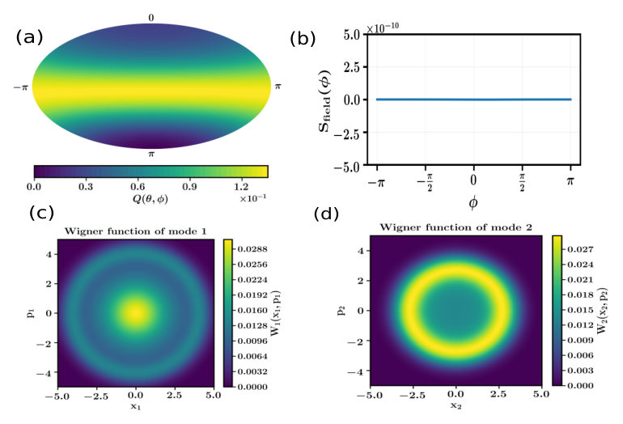
<figcaption class="paper-figure-caption"><b>Fig 2.</b> FIG. 2. (a) Plotted is Qfield(θ, ϕ) for no cavity drives i.e. Ω1 = Ω2 = 0, Ω= 0.45Γd κ1 = κ2 = 10−4Γd, g1 = g2 = 0.5Γd, ∆d = 100Γd, ∆a = 0.01Γd, ∆c = −0.01Γd, δ1 = −0.001, δ2 = 0.001 and γ1 = γ2 = 1 × 10−2Γd and the subplot (b) shows the corresponding Sfield. Subplots (a) and (b) reveal a cavity-field limit cycle. Subplots (c) and (d) show the Wigner quasiprobability distributions W1(x1, p1) and W2(x2, p2) of the cavity field mode 1 and mode 2, respectively. The finite-radius annular Wigner distributions centered away from the vacuum point confirm the existence of nonzero cavity-field amplitudes with phase diffusion as a characteristic feature of a limit cycle. The conditions ⟨ˆa1⟩= ⟨ˆa2⟩=...</figcaption>
</figure>
<figure class="paper-figure-card">
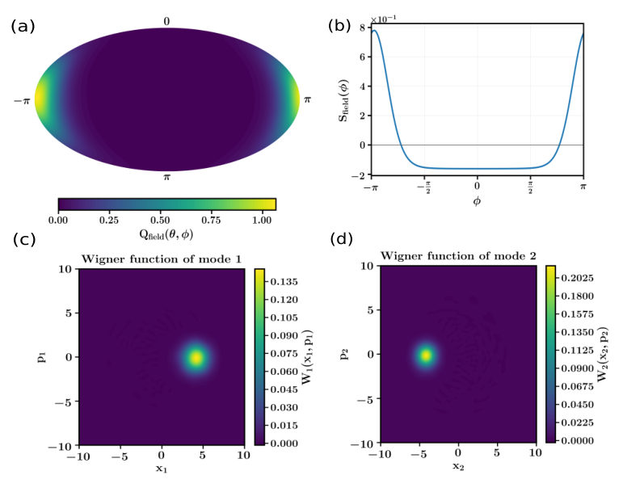
<figcaption class="paper-figure-caption"><b>Fig 3.</b> FIG. 3. Qfield (a) and Wigner distributions (c,d) for Ω1 = Ω2 = 0.005Γd, with all other parameters remaining fixed as in Fig. 2. Subplot (b) shows the corresponding Sfield(ϕ). Subplots (c) and (d) display W1(x1, p1) and W2(x2, p2), respectively. The phase localization in (a) along with the crescent-shaped W1(x1, p1) and W2(x2, p2) in (c) and (d), indicates that the cavity drives force the system to select a definite phase by distorting the phase-diffused limit cycle, leading to the emergence of an out-of-phase two-mode synchronized field state. Here ⟨ˆa† 1ˆa1⟩= 9.07, ⟨ˆa† 2ˆa2⟩= 8.97, ⟨ˆa1⟩= 2.90 −0.10i and ⟨ˆa2⟩= −2.93 −0.14i.</figcaption>
</figure>
<figure class="paper-figure-card">
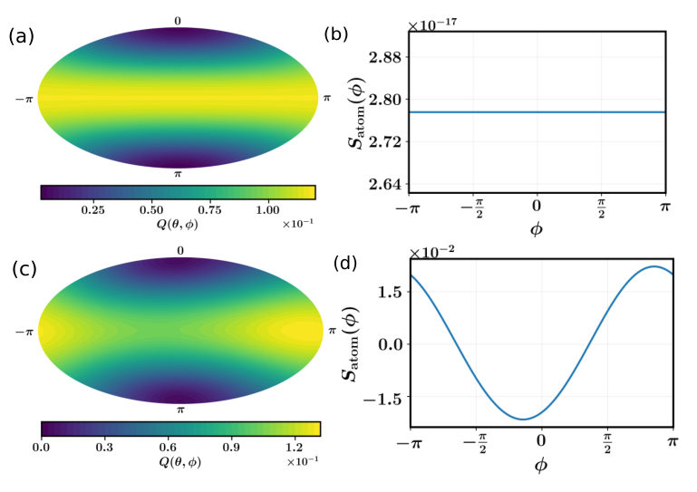
<figcaption class="paper-figure-caption"><b>Fig 4.</b> FIG. 4. Atomic Husimi-Q distribution (a,c) and the corresponding Satom (b,d) for Ω= 0.45Γd, κ1 = κ2 = 10−4Γd, g1 = g2 = 0.5Γd, ∆d = 100Γd and γ1 = γ2 = 1 × 10−2Γd. Subplots (a) and (b) correspond to the no cavity-drive case, Ω1 = Ω2 = 0, where Q(θ, ϕ) remains nearly phase-independent and the corresponding Satom(ϕ) is essentially flat, indicating a limit-cycle. Subplots (c) and (d) correspond to finite cavity drives, Ω1 = Ω2 = 0.005Γd, where the atomic phase-space distribution becomes localized and the corresponding Satom develops pronounced structure with enhanced weight near ϕ = ±π, demonstrating the emergence of atomic out-of-phase synchronization. The results displayed in this and the...</figcaption>
</figure>
<figure class="paper-figure-card">
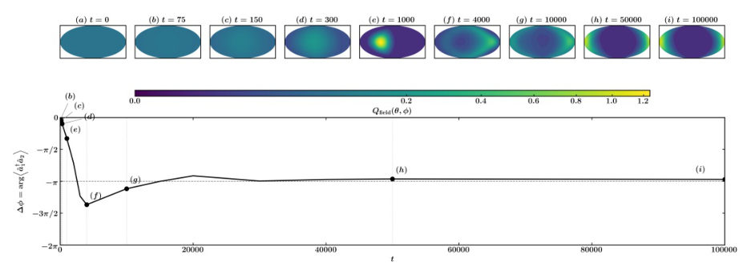
<figcaption class="paper-figure-caption"><b>Fig 5.</b> FIG. 5. Dynamical development of relative-phase locking in the two-mode field. The upper panels show the two-mode field Husimi-Q distribution Qfield(θ, ϕ; t) at representative evolution times. The lower panel shows the relative phase ∆ϕ(t) = arg⟨ˆa† 1ˆa2⟩t, with the marked points corresponding to the Husimi snap- shots above.</figcaption>
</figure>

**Summary.** This paper analyzes quantum synchronization and limit-cycle dynamics in a driven atom-cavity system using two coupled cavity modes. By employing advanced quasi-probability distributions and mutual information measures, the authors characterize the interplay between field synchronization and quantum correlations. The findings highlight fundamental trade-offs in these complex quantum optical systems.

**Why it may be interesting.** This work is highly relevant as it tackles emergent quantum phenomena (synchronization, limit cycles) in driven, dissipative quantum systems, providing tools to quantify quantum advantages for quantum metrology.

Detailed structure

**Main problem.** The study investigates the emergence of quantum synchronization and limit-cycle behavior in complex, driven, and dissipative quantum systems.

**Main result.** The research reveals that field synchronization and Wehrl mutual information are mutually exclusive, and the system can exhibit out-of-phase synchronized states when driven by weak classical fields.

**Method.** The analysis employs advanced quantum diagnostic tools like the generalized two-mode field Husimi-Q function and spin-1 Husimi-Q function, alongside analyzing symmetry breaking and mutual information.

**Model / system.** The system is a Cavity Quantum Electrodynamics (CQED) setup involving an ensemble of spin-1 atoms coupled to two driven cavity field modes. The dynamics are governed by a Lindblad master equation derived after adiabatically eliminating the excited atomic state.

**Key observables.** Limit cycles, quantum synchronization measures ($S_{	ext{field}}(\phi)$), Wehrl mutual information ($I_W$), and coherence properties derived from Husimi-Q functions.

**Important parameters / regimes.** The analysis is relevant in the strong-coupling cavity QED regime, requiring careful consideration of cavity decay rates ($\kappa_i$) relative to coupling strengths ($g_i$) and drive strengths ($\Omega_i$).

**Assumptions / limitations.** The primary assumptions include using the electric-dipole and rotating wave approximations, and performing adiabatic elimination of the excited atomic state $|d\rangle$.

**Figures summary.** Figure 1 schematically illustrates the CQED setup involving atoms in a bimodal cavity with specified decay rates.

**Paper structure.** The paper follows a structure involving the derivation of the effective Hamiltonian via adiabatic elimination, followed by the application of quantum diagnostic tools (Husimi-Q functions, mutual information) to analyze the resulting time evolution dynamics.

Abstract

We consider a cavity quantum electrodynamics (CQED) setup where an ensemble of spin-1 atoms driven by a classical field interacts with two driven cavity field modes. We show that the two sub-systems - the atoms and the two-mode cavity field, exhibit limit-cycle or quantum synchronization depending on the cavity drive strengths and other system parameters. In order to visualize the limit cycle and synchronization in the field, we introduce generalized two-mode field Husimi-Q function using SU(2) coherent states. For atomic spin states, we make use of spin-1 Husimi-Q function to visualize the same. We further corroborate the occurrence of field synchronization and limit cycle by analyzing $U(1)$ symmetry breaking, Wigner quasi-probability distribution, coherence properties of reduced field density matrix. Our results reveal intriguing interplay between the limit-cycle and quantum synchronization behavior, highlighting emergent quantum phenomena in driven dissipative interacting quantum systems. Additionally, we calculate Wehrl mutual information between the two modes and find that the field synchronization and Wehrl mutual information are mutually exclusive. Our study would be important to extract quantum advantages in quantum metrology using coupled atom-cavity systems.

[↑ back to top](#top)

### [Generative Modeling of Stochastic Dynamics for Long-Time Evolution](http://arxiv.org/abs/2610.00546v1)

**Authors:** Yang-yang Tan, Jinyang Li, Lingxiao Wang  
**Type:** both · **Category:** statistical mechanics · **PDF:** <https://arxiv.org/pdf/2610.00546v1>  
**Analysis basis:** full PDF text, analyzed in chunks
**Topic relevance:** 🔥 `non-equilibrium universality` **4/5** · `driven-dissipative phase transition` **3/5** · `methods for driven-dissipative` **3/5** · `Keldysh / 2PI / non-Gaussian methods` **2/5** · `Frenkel-Kontorova` **1/5** · `analog quantum simulation` **1/5** · `quantum measurements` **1/5** · `scars & prethermalization` **1/5**

↔ Scroll figures horizontally

<figure class="paper-figure-card">
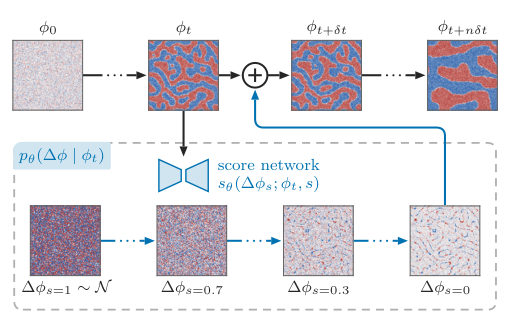
<figcaption class="paper-figure-caption"><b>Fig 1.</b> FIG. 1. Conditional transition kernel. The upper row shows the physical trajectory from ϕ0 to ϕt and onward in steps of δt. In the lower row, the present field ϕt conditions a score network that guides reverse diffusion from Gaussian noise at s = 1 to an increment ∆ϕs=0 ∼pθ(∆ϕ | ϕt). Adding this increment to ϕt yields ϕt+δt. Repeated sampling generates ϕt+nδt. The snapshots illustrate coarsening deep in the bro- ken phase.</figcaption>
</figure>
<figure class="paper-figure-card">
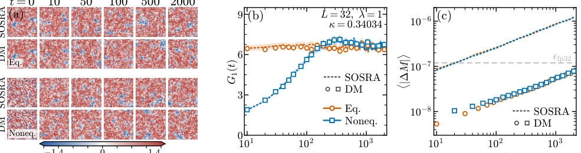
<figcaption class="paper-figure-caption"><b>Fig 2.</b> FIG. 2. Long-time prediction of the learned kernel from the diffusion model (DM) against a high-precision stochastic equation solver (SOSRA [22]) for Model B at the critical point (κ = 0.34034, λ = 1, L = 32, and δt = 10). (a) Field configurations at t = 0, 10, 50, 100, 500, and 2000 for equilibrium HMC (upper pair) and non-equilibrium Gaussian (lower pair, with the spatial mean of the paired HMC field) initial ensembles. Within each pair, SOSRA and DM are shown above and below, respectively, and start from the same field at t = 0. (b) Equal-time power G1(t) of the smallest diagonal mode. Dotted lines with bands show SOSRA, and points show DM. (c) Mean-field drift ⟨|M(t) −M(0)|⟩. Both...</figcaption>
</figure>
<figure class="paper-figure-card">
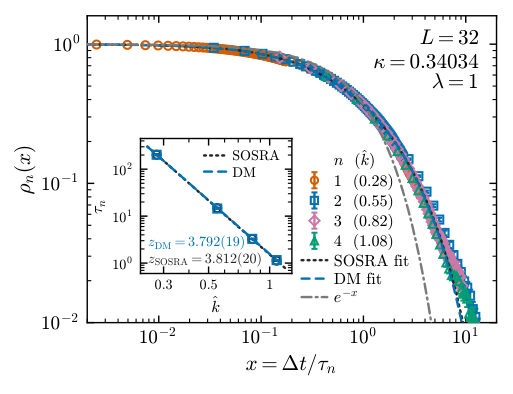
<figcaption class="paper-figure-caption"><b>Fig 3.</b> FIG. 3. Critical relaxation at κ = 0.34034, λ = 1, and L = 32. The diagonal-mode correlations collapse when plotted against x = ∆t/τn. Colored markers show the DM results, with error bars denoting standard errors. The dotted black curve and the dashed blue curve show fits of Eq. (11) to the SOSRA and DM data, respectively. The gray dash-dotted curve is e−x. The inset shows the relaxation times versus lattice momentum, yielding effective exponents z = 3.792(19) for the DM and z = 3.812(20) for SOSRA.</figcaption>
</figure>
<figure class="paper-figure-card">
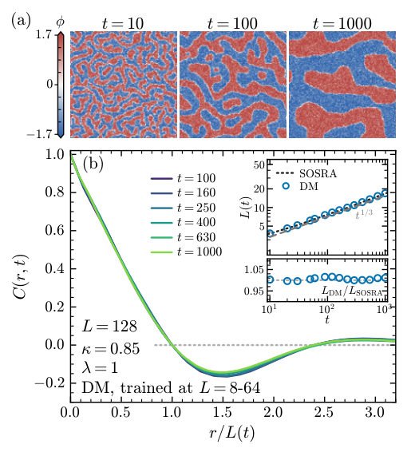
<figcaption class="paper-figure-caption"><b>Fig 4.</b> FIG. 4. Coarsening deep in the broken phase (κ = 0.85, λ = 1). The kernel was trained only on synthetic field config- urations at L ≤64 and applied at L = 128 from a disordered initial state. (a) DM configurations at t = 10, 100, and 1000. (b) Collapse of the sign-field correlation C(r, t) for t = 100– 1000. The insets compare the domain size L(t), defined by the first zero of C(r, t), with the direct SOSRA result and show their ratio. The black dotted line shows SOSRA, and blue open circles show DM. The gray dashed line denotes the t1/3 growth law. The SOSRA and DM ensembles contain 128 and 32 trajectories, respectively.</figcaption>
</figure>
<figure class="paper-figure-card">
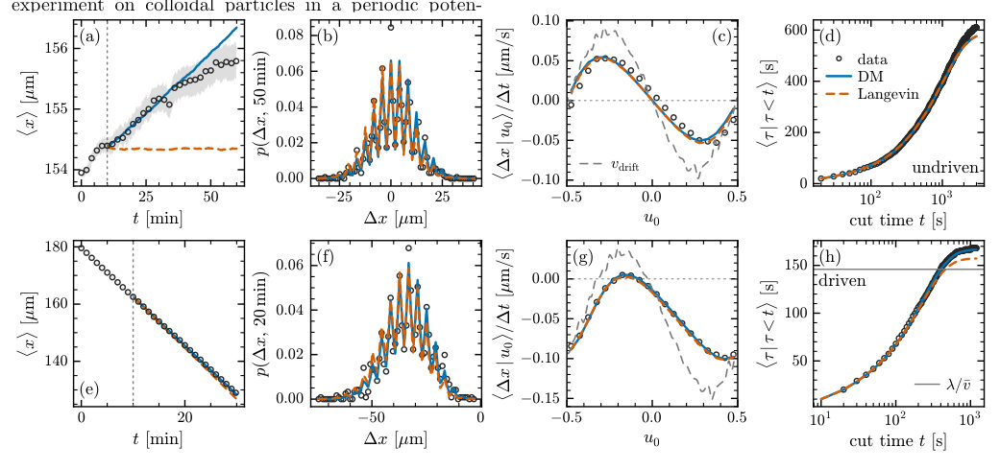
<figcaption class="paper-figure-caption"><b>Fig 5.</b> FIG. 5. DM predictions for undriven (upper row) and driven (lower row) colloidal motion in a periodic potential [29, 50]. Black circles show the experimental data. Blue solid lines show DM and orange dashed lines the Langevin reference based on Ref. [29]. (a,e) Mean position ⟨x(t)⟩. Shading shows the standard error of the mean displacement from t = 0. The dotted line at t = 10 min marks the end of training. (b,f) Distributions of the net displacement over 50 min of undriven motion and 20 min of driven motion, both measured from t = 10 min. (c,g) Mean displacement rate ⟨∆x | u0⟩/∆t at ∆t = δt = 10 s as a function of the initial phase u0. Gray dashed lines show the instantaneous Langevin...</figcaption>
</figure>

**Summary.** This paper demonstrates that generative diffusion models can predict the long-time evolution of complex stochastic physical systems using only short-time measurements. By learning the finite-time transition kernel, the models accurately reproduce universal scaling laws observed in lattice models and predict transport properties in experimental colloidal systems. This establishes a powerful, data-driven methodology for studying non-equilibrium statistical mechanics.

**Why it may be interesting.** This work provides a powerful, data-driven tool for characterizing non-equilibrium dynamics, which is crucial for understanding relaxation and phase ordering in complex quantum or classical many-body systems where analytical solutions are intractable.

Detailed structure

**Main problem.** The core problem is predicting the long-time, non-equilibrium evolution of stochastic physical systems when the underlying equation of motion is unknown, using only short-time configuration data.

**Main result.** Generative diffusion models successfully learn the finite-time transition kernel, allowing accurate prediction of dynamic critical scaling, coarsening dynamics, and particle transport over much longer timescales than the training data.

**Method.** The authors train conditional diffusion models on pairs of configurations separated by a short time lag ($\delta t$) to learn the transition kernel, which is then iterated using the Chapman-Kolmogorov equation for long-time prediction.

**Model / system.** The work tests this approach on several systems: 2D lattice models (e.g., Model B for conserved order parameters), and experimental data from driven colloidal particles in a periodic optical potential.

**Key observables.** Dynamic critical exponents ($z$), coarsening exponents ($t^{1/3}$), particle current ($ar{v}$), and mean passage times.

**Important parameters / regimes.** The training lag ($\delta t$) is the key input, while the prediction time can be orders of magnitude longer; the system parameters include diffusion coefficients and potential strengths.

**Assumptions / limitations.** The dynamics are assumed to be autonomous, meaning the transition law depends only on the time interval $\Delta t$, not the absolute time $t$.

**Figures summary.** Figures compare the long-time prediction of the learned kernel against direct simulations (SOSRA) for lattice models, showing agreement in scaling laws. Other figures compare predicted particle currents and mean-square displacements for driven colloids against experimental data.

**Paper structure.** The paper develops the general framework for stochastic dynamics, applies it to lattice models to reproduce critical scaling, and then validates the method using high-precision measurements of driven colloidal particle transport.

Abstract

Exact stochastic equations for non-equilibrium dynamics are rarely accessible. We show that the long-time evolution of stochastic dynamics can be predicted from configuration pairs at a fixed short time lag, without knowledge of the equation of motion. Generative diffusion models learn the finite-time transition kernel from these pairs, and iterating it propagates the dynamics far beyond the training lag. For two-dimensional Model B, the diffusive dynamics of a conserved order parameter, the learned kernels reproduce dynamic critical scaling and self-similar $t^{1/3}$ coarsening. Agreement with direct simulations persists on lattices twice the largest training size and for initial ensembles absent from training. For driven colloids in a periodic optical potential, ten minutes of measured trajectories suffice to predict the particle current and mean passage time over the next twenty minutes within experimental uncertainty. Short-time observations thus contain the information needed to predict emergent non-equilibrium dynamics at much longer times.

[↑ back to top](#top)

### [Experimental realization of Wheeler's delayed-choice experiment with dual selections](http://arxiv.org/abs/2610.01832v1)

**Authors:** Xiaowan Yang, Xinglei Yu, Liangsheng Li, Xinzhi Zhao, Tianle Zheng, Chengjie Zhang, Chuan-Feng Li, Guang-Can Guo  
**Type:** experiment · **Category:** other · **PDF:** <https://arxiv.org/pdf/2610.01832v1>  
**Analysis basis:** full PDF text, analyzed in chunks
**Topic relevance:** 🔥 `quantum optics experiment` **4/5** · `interference shaping light` **3/5** · `quantum measurements` **3/5** · `analog quantum simulation` **2/5** · `QC/QI experiment` **1/5**

↔ Scroll figures horizontally

<figure class="paper-figure-card">
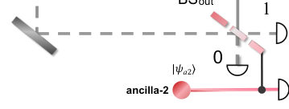
<figcaption class="paper-figure-caption"><b>Fig 1.</b> FIG. 1. A schematic diagram of a dual-selection experimental setup with a Mach-Zehnder interferometer. A tunable phase shifter φ is added to one arm of the interference loop, and both of the two beam splitters BSin and BSout can be selec- tively present or absent. The selection of BSin is controlled by the delayed-choice of measurement basis for ancilla qubit- 1 of entangled state |ψa1s⟩= (|0⟩a1|0⟩s + |1⟩a1|1⟩s)/ √</figcaption>
</figure>
<figure class="paper-figure-card">
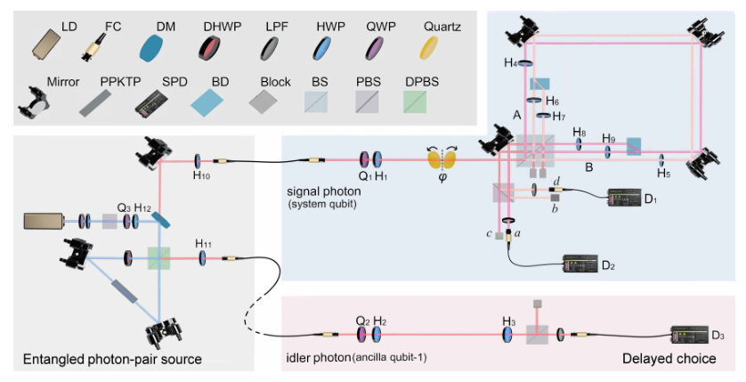
<figcaption class="paper-figure-caption"><b>Fig 2.</b> FIG. 3. Schematic illustration of the experimental setup. Our experimental setup can be divided into three parts: the entangled photon-pair source, delayed-choice and dual selection. In the entangled photon-pair source part, the angle of H12 is 22.5◦, a photon with a wavelength of 405nm incident on a type-II PPKTP crystal produces a pair of photons with a wavelength of 810nm that are separately transported into single-mode fibers. In the delayed-choice part, H3 and polarizing beam splitter (PBS) in the dotted box comprise the measurement module, H3 has four rotation angles of 0◦, 45◦, 22.5◦and −22.5◦. In the dual-selection part, signal photon passes through quartz crystals which add phase φ...</figcaption>
</figure>
<figure class="paper-figure-card">
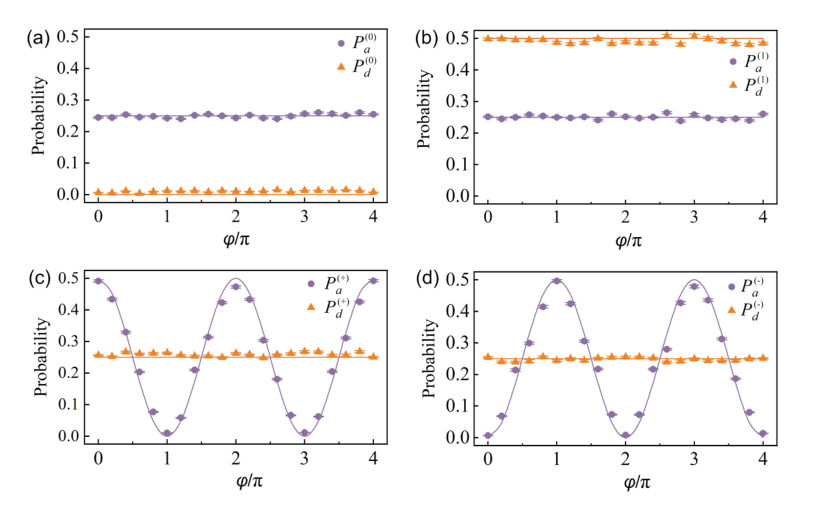
<figcaption class="paper-figure-caption"><b>Fig 3.</b> FIG. 4. The probabilities of measurement outcomes for varying phase φ. Purple dots represent experimental data for P (i) a , and purple solid lines are their theoretical values. Orange triangles represent experimental data for P (i) d , and orange solid lines are their theoretical values. Theoretically, P (0) a = P (1) a = P (+) d = P (−) d = 1/4, P (0) d = 0, P (1) d = 1/2, and P (±) a = (1 ± cosφ)/4. The error bars are derived from error propagation formula. (a) H3 in Figure 3 is set to 0◦, and projective measurements are performed on idler photons with outcome states being |0⟩a1. (b) H3 is set to 45◦, and projective measurements are performed on idler photons with outcome states being...</figcaption>
</figure>

**Summary.** This paper reports the experimental realization of Wheeler's delayed-choice experiment by implementing dual selections in a Mach-Zehnder interferometer using entangled photons. By independently controlling the presence of two beam splitters, the authors demonstrate that wave-like interference patterns only emerge when both components are active. The work confirms the fundamental principles of quantum superposition in measurement settings.

**Why it may be interesting.** This work provides a sophisticated experimental realization of fundamental quantum concepts (delayed choice, wave-particle duality) using advanced photonic techniques, which is highly relevant to quantum optics and open quantum systems.

Detailed structure

**Main problem.** The paper experimentally investigates Wheeler's delayed-choice experiment to demonstrate the wave-particle duality of single photons using a novel setup with dual selections.

**Main result.** The experiment successfully shows that wave-like behavior only emerges when both beam splitters are present, and it predicts that a superposition of beam splitter presence/absence leads to a quantum superposition state.

**Method.** The setup uses entangled photon pairs in a Mach-Zehnder interferometer (MZI) and implements delayed choice by controlling the measurement basis of an idler photon to determine the state of the signal photon after it has passed through the interferometer.

**Model / system.** The physical platform is an MZI utilizing entangled photon pairs generated via SPDC. The system is modeled using quantum circuits involving two ancilla qubits to control the presence/absence of two beam splitters (BSin and BSout).

**Key observables.** Interference visibility (V), detection probabilities ($P^{(i)}_{jk}$) in different paths (a and d), and the dependence of these probabilities on the relative phase ($\varphi$).

**Important parameters / regimes.** The ability to control the presence/absence of both $	ext{BS}_{	ext{in}}$ and $	ext{BS}_{	ext{out}}$, and the phase $\varphi$ used to modulate interference.

**Assumptions / limitations.** The experiment assumes the ability to selectively control the presence/absence of both beam splitters, and the initial entangled state is $\left|\psi_{a1s}
ight
angle=rac{1}{\sqrt{2}}(|0
angle_{a1}|0
angle_s + |1
angle_{a1}|1
angle_s)$.

**Figures summary.** Figure 1 shows the schematic of the dual-selection setup. Figure 2 illustrates the quantum circuit model. Figure 4 presents experimental probabilities showing interference patterns when BSout is present versus when it is absent.

**Paper structure.** The paper details the experimental setup, models the dual-selection mechanism using quantum circuits, presents measurements comparing wave-like (both BS present) and particle-like (BS absent) regimes, and concludes by discussing the quantum eraser aspect.

Abstract

Wheeler's delayed-choice experiment demonstrates wave-particle duality of particles using different experimental configurations of a Mach-Zehnder interferometer. In a quantum version of this experiment, the wave-particle behavior of photons can be observed by controlling presence or absence of the second beam splitter. Here, we implement a delayed-choice experiment with dual selections based on entangled photons, experimentally controlling both of two beam splitters in the Mach-Zehnder interferometer, where the presence and absence of the second beam splitter are simultaneously controlled through path encoding. Our experiment reveals the wave-particle behavior of single photons under different configurations of two beam splitters. We further discuss the scenario when two beam splitters are in a quantum superposition of being present and absent, photons will be in a wave-particle quantum superposition state.

[↑ back to top](#top)

### [Predicting electric-field noise in ion traps using fluctuation electrodynamics](http://arxiv.org/abs/2610.01693v1)

**Authors:** Markus Teller, Da An, Alberto M. Alonso, Philip C. Holz, Philipp Schindler, Hartmut Häffner, Tracy E. Northup  
**Type:** both · **Category:** other · **PDF:** <https://arxiv.org/pdf/2610.01693v1>  
**Analysis basis:** full PDF text, analyzed in chunks
**Topic relevance:** 🔥 `QC/QI experiment` **4/5** · `Keldysh / 2PI / non-Gaussian methods` **2/5** · `methods for driven-dissipative` **2/5** · `analog quantum simulation` **1/5** · `correlated / nonlocal dissipation` **1/5** · `quantum measurements` **1/5**

↔ Scroll figures horizontally

<figure class="paper-figure-card">
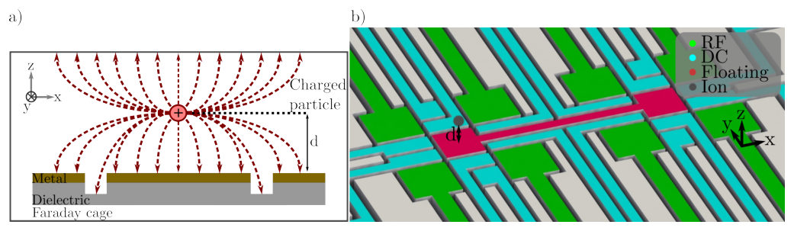
<figcaption class="paper-figure-caption"><b>Fig 1.</b> FIG. 1. a) A charged particle is trapped at a distance d above a generic surface ion trap. Metal electrodes partially cover a dielectric substrate. b) The surface ion trap that we use [14, 15] includes one electrically floating metallic wire in addition to RF and DC electrodes. A single 40Ca+ ion is trapped at a distance d above the wire.</figcaption>
</figure>
<figure class="paper-figure-card">
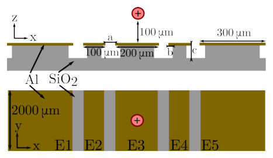
<figcaption class="paper-figure-caption"><b>Fig 2.</b> FIG. 3. A design for a surface ion trap with three variable parameters: the trench width a, undercut b, and depth c. The five electrodes E1−E5 are aluminum; the substrate is fused silica. An ion is trapped 100 µm above E3.</figcaption>
</figure>
<figure class="paper-figure-card">
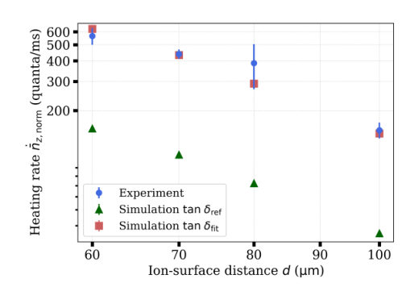
<figcaption class="paper-figure-caption"><b>Fig 3.</b> FIG. 2. Normalized heating rates of the ion’s motion along the z axis as a function of the distance d from ion to trap surface, in the trap shown in Fig. 1b. All error bars represent one standard deviation. Circles: rates obtained from exper- iments. The rates correspond to the weighted means of the values listed in Tab. I. Triangles: rates predicted by Eq. 3 as- suming a loss tangent tan δref for the trap substrate. Relative uncertainties are estimated to be 1 %, too small to be visible. Squares: rates predicted by Eq. 3 for a fitted loss tangent. Error bars are determined from the uncertainty of the fitted loss tangent.</figcaption>
</figure>
<figure class="paper-figure-card">
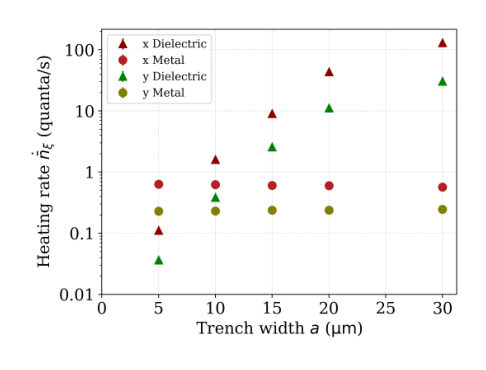
<figcaption class="paper-figure-caption"><b>Fig 4.</b> FIG. 5. Simulated heating rates along the x and y axes un- der the same conditions as Fig. 4a and for trap frequencies ωx = ωy = 2π·1 MHz. Circles correspond to heating-rate con- tributions from the metal electrodes. Triangles correspond to heating-rate contributions from the dielectric substrate.</figcaption>
</figure>
<figure class="paper-figure-card">
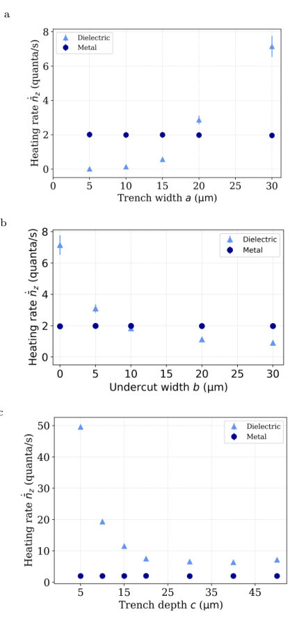
<figcaption class="paper-figure-caption"><b>Fig 5.</b> FIG. 4. Simulated heating rates along the z axis at a trap frequency ωz = 2π · 1 MHz and an ion-surface distance d = 100 µm, for the trap shown in Fig. 3. Circles correspond to heating-rate contributions from the metal electrodes. Trian- gles correspond to heating-rate contributions from the dielec- tric substrate. (a) The trench width a is varied for fixed values of the undercut width b = 0 µm and trench depth c = 50 µm. (b) The undercut width b is varied for for a = 30 µm and c = 50 µm. (c) The trench depth c is varied for a = 30 µm and b = 0 µm.</figcaption>
</figure>

**Summary.** This paper presents a comprehensive method to predict electric-field noise in surface ion traps by applying fluctuation electrodynamics to both dielectric and metallic components. Using FEA, the authors show that the noise is dominated by the substrate dielectrics and provide guidelines on how electrode geometry can be engineered to shield the trapped ion from these detrimental noise sources.

**Why it may be interesting.** This work provides a crucial, quantitative tool for designing next-generation quantum hardware. By linking fundamental material properties (loss tangent) to measurable quantum errors (heating rates), it guides the engineering of trap architectures to minimize decoherence.

Detailed structure

**Main problem.** The paper addresses the critical challenge of accurately predicting electric-field noise in microfabricated surface ion traps, as this noise directly causes gate errors in trapped-ion quantum computers.

**Main result.** The developed model successfully predicts the observed noise for a specific trap geometry within a factor of four, and it demonstrates that the noise is overwhelmingly dominated by dielectric fluctuations rather than metallic ones.

**Method.** The authors employ a method rooted in the fluctuation-dissipation theorem, utilizing Finite-Element Analysis (FEA) to calculate the noise spectral density arising from fluctuating electric fields in both dielectric and metallic materials.

**Model / system.** The system under study is a surface ion trap, where ions are trapped near metallic electrodes on a dielectric substrate. The model accounts for the geometry of the electrodes and the material properties (specifically energy loss) of the surrounding dielectrics and metals.

**Key observables.** Electric-field noise spectral density ($S_E$), motional heating rate ($\dot{ar{n}}$), and trap frequencies ($\omega_z$).

**Important parameters / regimes.** Trap distance ($d$), electrode geometry parameters (trench width $a$, undercut width $b$, trench depth $c$), and the material loss tangent ($	an \delta$).

**Assumptions / limitations.** The noise contributions from metals and dielectrics are assumed to be uncorrelated, and the analysis relies on solving Maxwell's equations using FEA.

**Figures summary.** Figures compare measured and simulated heating rates as a function of trap distance and electrode geometry parameters, showing how increasing trench depth or undercut width can mitigate noise.

**Paper structure.** The paper introduces the theoretical framework using the fluctuation-dissipation theorem, applies it using FEA to model noise from both dielectrics and metals, presents results on specific trap geometries, and concludes with systematic studies on how electrode structure modifies the noise profile.

Abstract

Electric-field noise in microfabricated surface ion traps contributes to gate errors in trapped-ion quantum computers, but this noise has been challenging to predict. Here, we present a method to predict the electric-field noise arising from fluctuations in the bulk of dielectric and metallic materials. The method is valid for arbitrary trap geometries, and the only relevant material property is energy loss. We apply it to an ion trap with an electrically floating electrode and find the contribution from dielectrics to be dominant. Our model predicts the observed noise for this trap within a factor of four. In addition, we apply our model to typical surface trap designs and analyze how the electrode structures shield the noise.

[↑ back to top](#top)

### [Achieving Identical Stored Energy in Cascaded Collisional Quantum Battery Charging: Analytical Result](http://arxiv.org/abs/2610.01332v1)

**Authors:** Longyan Gong, Jing Zhang, Yongtao Li  
**Type:** theory · **Category:** quantum information and computing · **PDF:** <https://arxiv.org/pdf/2610.01332v1>  
**Analysis basis:** full PDF text, analyzed in chunks
**Topic relevance:** 🔥 `quantum measurements` **4/5** · `Full counting statistics` **2/5** · `methods for driven-dissipative` **2/5** · `correlated / nonlocal dissipation` **1/5** · `driven-dissipative phase transition` **1/5**

↔ Scroll figures horizontally

<figure class="paper-figure-card">
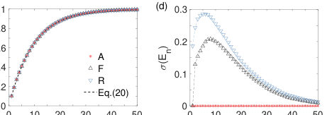
<figcaption class="paper-figure-caption"><b>Fig 1.</b> FIG. 1: Results for charger qubits in the excited state |φa⟩= |1⟩. (a) The adaptive angle θa versus collision steps n (five quantum trajectories denoted by five different sym- bols). (b) Conditional pure state of the battery |φb(τ)⟩= √1 −en|0⟩+ √en exp(iαn)|1⟩for n = 1, 2, 5, 9, 15, 50 (1000 quantum trajectories); polar angle αn, and radius en increases outward. (c) Mean stored energies ⟨En⟩and (d) stored-energy fluctuations σ(En) versus n for measurement protocols with adaptive (A), fixed (F) and random (R) angles. Parameters: ∆= 0.3, g = 0.05 and Ωτ = π/2; θf = π/2.</figcaption>
</figure>
<figure class="paper-figure-card">
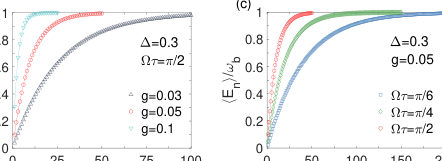
<figcaption class="paper-figure-caption"><b>Fig 2.</b> FIG. 2: For the adaptive-angle measurement protocol, mean stored energies ⟨En⟩versus collision steps n for charger qubits prepared in the excited state |φa⟩= |1⟩. Panels (a)–(c) cor- respond to different parameter sets. Lines denote theoretical predictions from Eq. (20).</figcaption>
</figure>
<figure class="paper-figure-card">
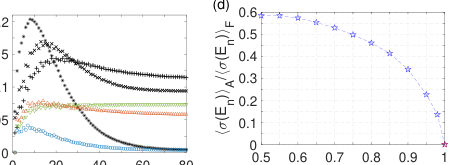
<figcaption class="paper-figure-caption"><b>Fig 3.</b> FIG. 3: Results for charger qubits in the superposition state |φa⟩= √1 −ea|0⟩+ √ea|1⟩. (a) Conditional pure state of the battery |φb(τ)⟩= √1 −en|0⟩+ √en exp(iαn)|1⟩from 1000 quantum trajectories for en = 0.65 and n = 60. (b) Mean stored energies ⟨En⟩and (c) stored-energy fluctua- tions σ(En) versus n, where A and F denote adaptive-angle and fixed-angle measurement protocols, respectively. (d) Ra- tio of average stored-energy fluctuations versus ea. Param- eters: ∆= 0.3, g = 0.05, Ωτ = 4π/9; θf = 0.1 for ea = 0.5, 0.55, · · · , 0.70, and θf = 0.15, 0.2, 0.2, 0.25, 0.3, 0.4 for ea = 0.75, 0.80, · · · , 0.95, 0.98.</figcaption>
</figure>

**Summary.** This paper tackles the challenge of ensuring uniform energy storage in quantum batteries by analyzing the effect of quantum stochasticity. The authors introduce an adaptive measurement protocol that allows for the analytical suppression of energy fluctuations when the charger is in an excited state. This provides a feasible theoretical pathway toward building highly reliable quantum energy storage devices.

**Why it may be interesting.** This work directly addresses noise and reliability in quantum energy storage devices, which is a critical area bridging quantum optics, open quantum systems, and quantum information processing.

Detailed structure

**Main problem.** The core challenge is achieving charging uniformity, meaning identical stored energy across different quantum measurement trajectories, which is fundamentally hindered by intrinsic quantum stochasticity.

**Main result.** The authors analytically prove that complete suppression of stored-energy fluctuations is possible for chargers prepared in the excited state, but this suppression is fundamentally prohibited for general superposition states.

**Method.** The work proposes and analyzes an adaptive measurement protocol applied after each collision in a cascaded quantum battery charging model.

**Model / system.** The system is a two-qubit quantum battery interacting with a charger via cascaded collisions, governed by a Hamiltonian involving coupling terms. The process involves repeated unitary evolution followed by projective measurements on the charger.

**Key observables.** Stored Energy ($E(T)$), Charging Power ($P(T)$), and the standard deviation of stored energy ($\delta(T)$) across trajectories.

**Important parameters / regimes.** The state of the charger (excited state vs. general superposition state) and the adaptive measurement angle ($	heta$).

**Assumptions / limitations.** The model assumes two-level qubits for both the charger and the battery, and the protocol relies on determining an adaptive measurement angle based on the state after the previous collision.

**Figures summary.** Figures compare the mean stored energy and the standard deviation of stored energy ($\sigma(E_n)$) for adaptive, fixed, and random measurement protocols, demonstrating fluctuation suppression with the adaptive method.

**Paper structure.** The paper first establishes the problem of energy fluctuation in quantum batteries. It then introduces the two-qubit model and the adaptive measurement protocol. The core analysis involves deriving recurrence relations for the energy coefficients, leading to the main results distinguishing between excited-state and superposition-state chargers.

Abstract

Charging uniformity across distinct trials is an essential requirement for reliable quantum batteries. Nevertheless, intrinsic quantum stochasticity poses a fundamental challenge to this goal. This work investigates a two-qubit quantum battery within the framework of cascaded collision models. We propose an adaptive measurement on the charger after each collision, yielding two conditional battery states of equal expected stored energy. For chargers prepared in the excited state, we analytically prove that complete suppression of trajectory-dependent stored-energy fluctuations is attainable; for chargers prepared in general superposition states, our theory reveals that full suppression is fundamentally prohibited owing to battery-phase-dependent recursive dynamics. Numerical simulations are in excellent quantitative agreement with theoretical predictions. These findings provide a feasible pathway toward high-uniformity quantum-battery charging.

[↑ back to top](#top)

### [Less precise but less noisy: local circuits for momentum-space state preparation and measurement](http://arxiv.org/abs/2610.01704v1)

**Authors:** Etienne Granet, Henrik Dreyer  
**Type:** both · **Category:** quantum information and computing · **PDF:** <https://arxiv.org/pdf/2610.01704v1>  
**Analysis basis:** full PDF text, analyzed in chunks
**Topic relevance:** 🔥 `QC/QI experiment` **4/5** · `analog quantum simulation` **3/5** · `quantum measurements` **3/5**

↔ Scroll figures horizontally

<figure class="paper-figure-card">
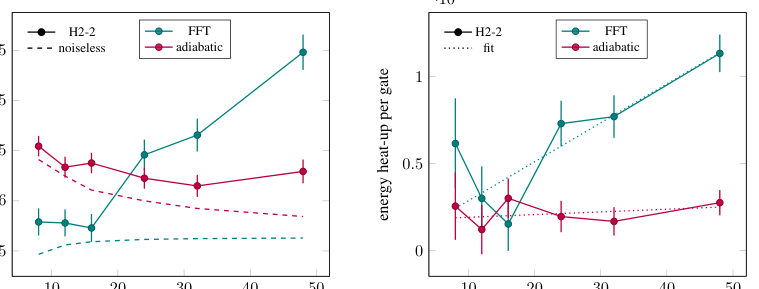
<figcaption class="paper-figure-caption"><b>Fig 1.</b> FIG. 2. Left panel: Energy density as a function of system size, measured on Quantinuum H2-2 quantum computer (solid lines) and noiseless values (dashed lines), using a FFT (teal) and an adiabatic evolution (purple). We choose the number of steps in the adiabatic evolution so as to have approximately the same number of two-qubit gates as the FFT for every system size. Error bars indicate one standard deviation. Right panel: Energy increase per two-qubit gate due to noise, as a function of system size measured on Quantinuum H2-2 quantum computer, from the same data as left panel. The dotted lines show a linear fit of the data.</figcaption>
</figure>
<figure class="paper-figure-card">
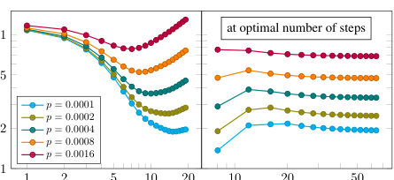
<figcaption class="paper-figure-caption"><b>Fig 2.</b> FIG. 3. Left panel: Numerical simulations for the energy density above ground state as a function of number of Trotter steps in the adiabatic evolution, for different noise rate p, in size N = 32. Right panel: Energy density above ground state as a function of number of system size N, at the number of Trotter steps that minimizes the energy for a given noise rate p. These simulations assume perfect preparation of the initial state (8), which can be in practice always replaced by | + ..+⟩ and a post-selection onto even particle number, which does not require any two-qubit gates.</figcaption>
</figure>
<figure class="paper-figure-card">
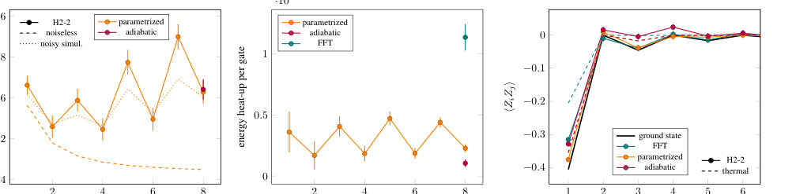
<figcaption class="paper-figure-caption"><b>Fig 3.</b> FIG. 4. Left panel: Energy density as a function of number of steps in the ansatz of the parametrized circuit, in size N = 48, measured on Quantinuum H2-2 quantum computer (solid lines), noiseless values (dashed lines) and noisy simulations with depolarizing noise 0.001 after every two-qubit gate (dotted lines). We indicate the value obtained with an adiabatic evolution for 8 steps as a comparison. Middle panel: Energy increase per two-qubit gate compared to noiseless due to noise, as a function of number of steps, measured on Quantinuum H2-2 quantum computer, from the same data as left panel. We also plot as a comparison the FFT value from Fig 2, with a number of two-qubit gates roughly...</figcaption>
</figure>
<figure class="paper-figure-card">
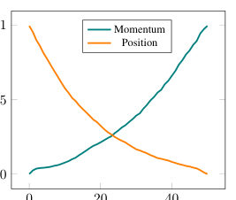
<figcaption class="paper-figure-caption"><b>Fig 4.</b> FIG. 5. Standard deviation of |α(n) j,ℓ|2 (teal) and |β(n) j,ℓ|2 (or- ange) corresponding to ℓ, multiplied by √</figcaption>
</figure>
<figure class="paper-figure-card">
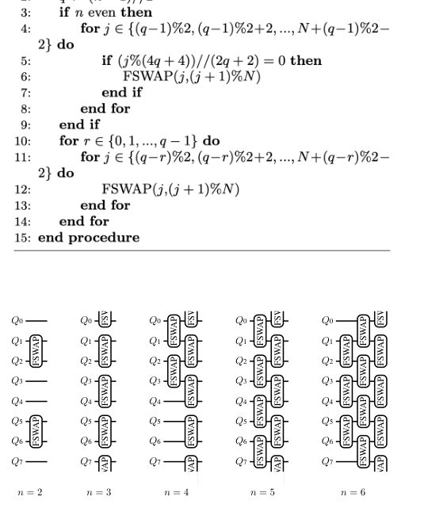
<figcaption class="paper-figure-caption"><b>Fig 5.</b> FIG. 6. Illustration of the FSWAP circuit applied on the qubits on the left, generated by the measurement gadget given in Algo 1 for different values of n.</figcaption>
</figure>

**Summary.** This work argues that noise sensitivity is a critical metric for quantum algorithm design, showing that adiabatic evolution can outperform the high-precision FFT for ground state preparation on current hardware. By demonstrating that local circuits are less error-prone, the authors propose a superior, less noisy measurement protocol for physical observables like spectral functions.

**Why it may be interesting.** It provides concrete, hardware-validated evidence that noise characteristics (error propagation) can dictate algorithmic choice more critically than idealized metrics like gate count, which is crucial for near-term quantum simulation.

Detailed structure

**Main problem.** The paper addresses the need to optimize quantum algorithms by considering noise sensitivity, rather than just gate count or circuit depth, especially for simulating many-body quantum systems.

**Main result.** For ground state preparation, adiabatic evolution outperforms the high-precision Fast Fourier Transform (FFT) on current hardware for larger system sizes because its error propagation is slower.

**Method.** The authors compare adiabatic quantum evolution circuits against digital circuits like the FFT, and propose a novel local circuit measurement scheme for momentum space observables.

**Model / system.** The study uses the tight-binding chain model, analyzed via its Hamiltonian, and is demonstrated on the Quantinuum H2-2 quantum computer.

**Key observables.** Ground state energy, energy heating per two-qubit gate, momentum occupation numbers, and spectral function measurements.

**Important parameters / regimes.** System size $N$, number of two-qubit gates, and the crossover size $N^*$ where adiabatic methods become superior.

**Assumptions / limitations.** The comparison assumes matching circuit depth or gate count between the competing algorithms.

**Figures summary.** Figures compare energy vs. system size, showing the crossover point where adiabatic evolution surpasses FFT performance due to lower error scaling. Other figures compare reconstructed momentum densities from local circuits against exact values.

**Paper structure.** The paper first establishes the problem of noise sensitivity, compares adiabatic evolution vs. FFT for ground state preparation, and then introduces and validates a less noisy, local circuit measurement scheme for spectral function measurement.

Abstract

Quantum algorithms are usually optimized for gate count or circuit depth. We find on Quantinuum System Model H2 quantum computer that for a tight-binding chain ground state preparation, there is a system size $N$ beyond which the adiabatic evolution reaches significantly lower energies than the Fermionic Fourier Transform (FFT), with the same number of gates, and with the same circuit depth. We attribute this high noise sensitivity of the FFT to its high precision, being able to distinguish momenta by $1/N$. This high resolution in momentum space requires long-range couplings in real space, which propagates errors faster. In contrast, although local and physical circuits such as the adiabatic evolution have a coarser momentum resolution, they also propagate errors more slowly. For physical applications, high momentum resolution is rarely required and is often worth trading for low noise sensitivity. We also introduce a momentum measurement scheme that although less precise than FFT, is less costly and less noisy. We show that it achieves better performance than FFT for spectral function measurement on Quantinuum System Model H2 quantum computer. Our work emphasizes the importance of reducing the noise sensitivity of quantum algorithms, beyond the number of gates or circuit depth.

[↑ back to top](#top)

### [Krylov complexity of a tilted extended Bose-Hubbard chain with Rydberg-dressed interactions](http://arxiv.org/abs/2610.00712v1)

**Authors:** Yifan Chen, Tianyi Yan, Lu Qin, Weibin Li  
**Type:** theory · **Category:** other · **PDF:** <https://arxiv.org/pdf/2610.00712v1>  
**Analysis basis:** full PDF text, analyzed in chunks
**Topic relevance:** 🔥 `analog quantum simulation` **4/5** · `Rydberg arrays` **3/5** · `scars & prethermalization` **2/5**

↔ Scroll figures horizontally

<figure class="paper-figure-card">
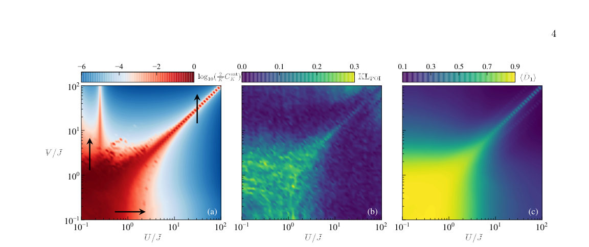
<figcaption class="paper-figure-caption"><b>Fig 1.</b> FIG. 1. Complexity diagnostics in the (U/J, V/J) plane for the tilted extended Bose–Hubbard chain. (a) Long-time saturation value of the Krylov complexity, log10(2Csat K /K), for the localized initial state |ψl⟩. The black arrows indicate crossover regions associated with increasingly intricate Krylov complexity patterns. (b) Kullback–Leibler divergence KLPOI. (c) Spectrum- averaged participation entropy ⟨eD1⟩. Throughout the calculation, the tilt is F = 0.1J and unit filling with N = L = 6 is used.</figcaption>
</figure>
<figure class="paper-figure-card">
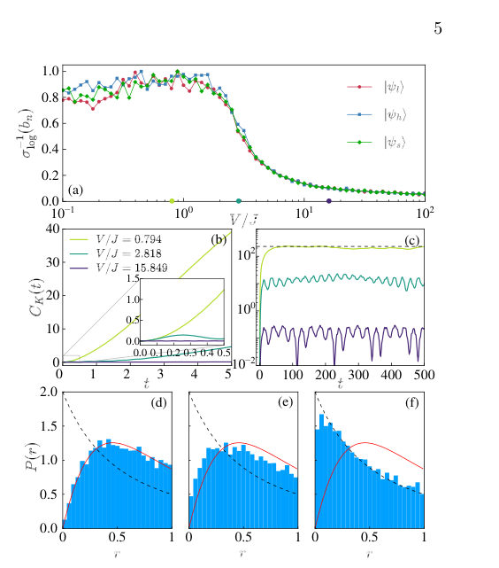
<figcaption class="paper-figure-caption"><b>Fig 2.</b> FIG. 3. Same as Fig. 2, but for weak on-site interaction U/J ≃0. (a) σ−1 log(bn) as a function of V/J for the three ini- tial states. The dots mark V/J = 0.794, 2.818, and 15.849 on the V/J axis. (b) and (c) Time evolution of CK(t) for |ψl⟩ at the three interactions marked in (a). When V/J = 0.794, the corresponding long-time complexity saturates around the dashed line CK = K/2. (d)–(f) Level-spacing-ratio his- tograms at the marked interaction strengths. In all panels L = 6, F/J = U/J = 0.1, with N = 6 in (a)–(c) and N = 12 in (d)–(f).</figcaption>
</figure>
<figure class="paper-figure-card">
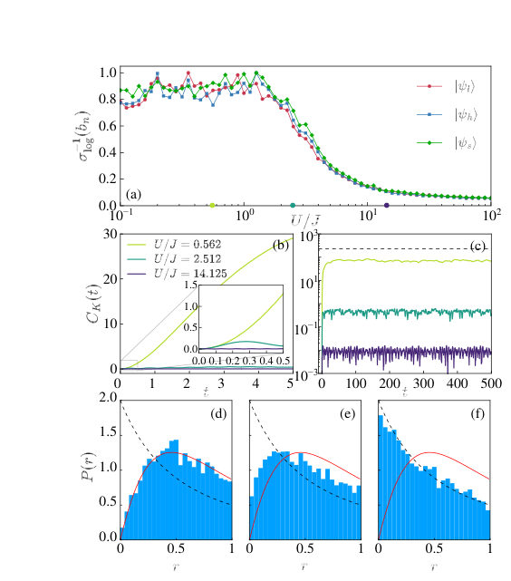
<figcaption class="paper-figure-caption"><b>Fig 3.</b> FIG. 2. Bose-Hubbard model regime. (a) Lanczos-sequence diagnostic σ−1 log(bn) as function of U/J for the three initial states. Three dots on the U/J axis correspond to U/J = 0.562, 2.512 and 14.125, respectively. (b) and (c) Time evo- lutions of the Krylov complexity CK(t) for |ψl⟩at the three different U/J values. In panel(c), the dashed line gives K/2. Panels (d), (e) and (f) show level-spacing-ratio histograms at the interaction strengths marked in (a). Dashed black and solid red lines are the Poisson and WD distributions. In all panels L = 6, F/J = V/J = 0.1. In the numerical calcula- tions, we consider N = 6 in (a)–(c) and N = 12 in (d)–(f). Larger N is used in (d)–(f) to better...</figcaption>
</figure>
<figure class="paper-figure-card">
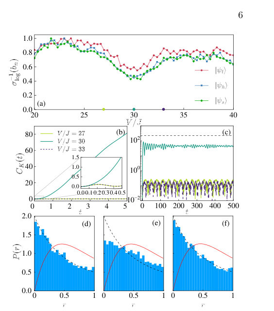
<figcaption class="paper-figure-caption"><b>Fig 4.</b> FIG. 4. (a) σ−1 log(bn) as a function of V/J for the three initial Fock states with U/J = 30; the dots mark V/J = 27, 30, and 33. (b), (c) Time evolution of CK(t) for |ψl⟩at the three interactions marked in (a). The saturated complexity is smaller than the delocalized value K/2 marked by the dashed line. (d)–(f) Level-spacing-ratio histograms at the marked interaction strengths; dashed black and solid red lines are the Poisson and WD distributions. In all panels L = 6, F/J = 0.1, with N = 6 in (a)–(c) and N = 12 in (d)–(f).</figcaption>
</figure>
<figure class="paper-figure-card">
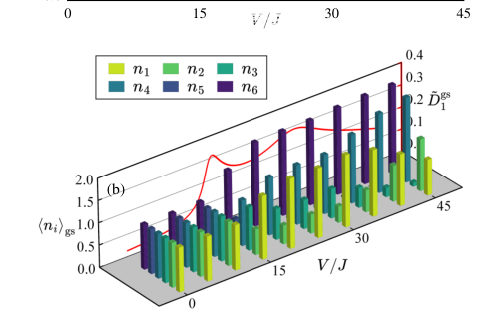
<figcaption class="paper-figure-caption"><b>Fig 5.</b> FIG. 5. (a) Scaled energy as a function of V/J for the three initial states with U/J = 30. (b) Ground-state occupation of each site as a function of V/J. The red line in the side panel denotes the ground-state GFD. It becomes large when V ∼U. Other parameters are F/J = 0.1 and L = N = 6.</figcaption>
</figure>

**Summary.** This paper investigates quantum chaos in a tilted extended Bose-Hubbard chain simulated with Rydberg-dressed interactions. By calculating Krylov state complexity, the authors demonstrate that this diagnostic provides unique, state-sensitive information about information scrambling. They identify a distinct quasi-chaotic regime where complexity signals differ significantly from traditional spectral measures.

**Why it may be interesting.** This work directly applies advanced quantum chaos diagnostics (Krylov complexity) to a highly relevant and experimentally accessible platform (Rydberg-dressed Bose-Hubbard model), providing a powerful new tool for understanding thermalization in quantum simulators.

Detailed structure

**Main problem.** The study investigates Krylov state complexity as a state-sensitive diagnostic tool to characterize many-body chaos, thermalization, and information scrambling in quantum many-body systems.

**Main result.** The authors found a pronounced quasi-chaotic diagonal regime near $U \simeq V$ where Krylov complexity shows a sharp ridge, demonstrating that this diagnostic provides information beyond what is captured by standard spectral diagnostics alone.

**Method.** The analysis employs exact diagonalization and Lanczos recursion to compute time-dependent Krylov state complexity and compare it against spectral level-spacing statistics.

**Model / system.** The system modeled is a one-dimensional, tilted extended Bose-Hubbard chain, which is physically realizable using Rydberg-dressed interactions in optical lattices.

**Key observables.** Krylov state complexity ($C_K(t)$), long-time saturation value ($\langle C_{sat} 
angle$), spectral level-spacing statistics, and Kullback–Leibler (KL) Divergence.

**Important parameters / regimes.** The competition between on-site interaction ($U$) and nearest-neighbor interaction ($V$), and the ratio $U/V$ near the quasi-chaotic regime.

**Assumptions / limitations.** The analysis is performed in the fixed-N sector, and a weak linear tilt ($F=0.1J$) is applied to avoid Wannier–Stark localization.

**Figures summary.** Figures compare Krylov complexity saturation ($C_{sat}^K$) against spectral diagnostics ($	ext{KL}_{	ext{POI}}$ and $\langle e_D^{(1)} 
angle$) across the $(U/J, V/J)$ plane, highlighting the distinct signature of the diagonal ridge in $C_{sat}^K$.

**Paper structure.** The paper introduces the model and the diagnostic tools, calculates the time evolution using Lanczos recursion, and then presents comparative results showing the unique information provided by Krylov complexity versus spectral measures across different interaction regimes.

Abstract

We investigate Krylov state complexity in a tilted extended Bose-Hubbard chain in which both the on-site interaction $U$ and nearest-neighbor interaction $V$ are present. The tilted extended Bose-Hubbard model can be realized with Rydberg-dressed interactions in optical lattices. Using exact diagonalization and Lanczos recursion from three physically motivated Fock states, we compute the time-dependent complexity, its long-time saturation value, and the fluctuations of the Lanczos coefficients for an open chain at unit filling. Crucially, we identify a pronounced quasi-chaotic diagonal regime near $U\simeq V$ in which the Krylov complexity saturation exhibits a sharp ridge while the spectral level-spacing statistics remain partially chaotic. This dissociation arises from the competition between the on-site and nearest-neighbor interaction, which generates a dense manifold of near-resonant many-body configurations that is efficiently coupled by the state-dependent dynamics but retains residual spectral structure. Our results show that Krylov state complexity provides complementary, state-sensitive information about many-body chaos that is not captured by the spectral diagnostics alone, establishing Krylov complexity as a useful diagnostic for studying thermalization and information scrambling in experimentally accessible quantum simulators.

[↑ back to top](#top)

### [Non-Markovian effects on informational steady states](http://arxiv.org/abs/2610.01782v1)

**Authors:** Jacob Werner  
**Type:** theory · **Category:** quantum information and computing · **PDF:** <https://arxiv.org/pdf/2610.01782v1>  
**Analysis basis:** full PDF text, analyzed in chunks
**Topic relevance:** 🔥 `quantum measurements` **4/5** · `methods for driven-dissipative` **2/5** · `correlated / nonlocal dissipation` **1/5** · `driven-dissipative phase transition` **1/5** · `non-equilibrium universality` **1/5**

↔ Scroll figures horizontally

<figure class="paper-figure-card">

<figcaption class="paper-figure-caption"><b>Fig 1.</b> Figure 1: Markovian CM schematic</figcaption>
</figure>
<figure class="paper-figure-card">
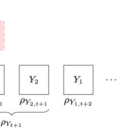
<figcaption class="paper-figure-caption"><b>Fig 2.</b> Figure 2: Two-qubit ancilla CM schematic</figcaption>
</figure>
<figure class="paper-figure-card">
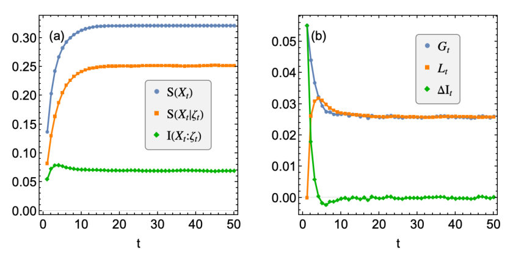
<figcaption class="paper-figure-caption"><b>Fig 3.</b> Figure 3: Key conditional quantities are shown, averaged over 10,000 trajectories, with ρX0 = |+⟩⟨+|, ρY = ρth(0.3) ⊗|+⟩⟨+|, θXY1 = 0.3, θXY2 = 0.5, and θY1Y2 = θY2Y1 = 0. Results are reproduced from Ref. [1].</figcaption>
</figure>
<figure class="paper-figure-card">
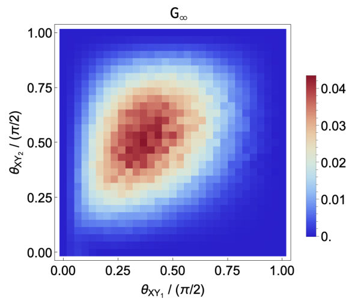
<figcaption class="paper-figure-caption"><b>Fig 4.</b> Figure 4: G∞is shown for various values of θXY1 and θXY2, with ρX0 = |+⟩⟨+| and ρY = ρth(0.3) ⊗|+⟩⟨+|. The Y Y interaction parameters are set to 0, i.e., the process is Markovian and NBLP = 0 always.</figcaption>
</figure>
<figure class="paper-figure-card">
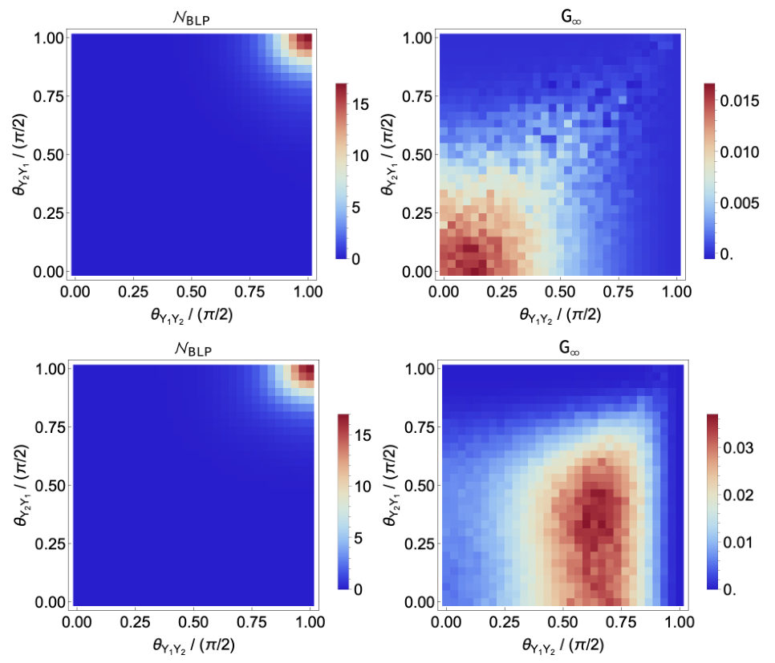
<figcaption class="paper-figure-caption"><b>Fig 5.</b> Figure 5: NBLP and G∞are shown for various values of θY1Y2 and θY2Y1, with ρX0 = |+⟩⟨+| and ρY = ρth(0.3) ⊗|+⟩⟨+|. The upper plots set θXY1 = θXY2 = 0.2(π/2), and the lower plots set θXY1 = θXY2 = 0.8(π/2). Spearman’s ρ for G∞and NBLP is approximately −0.33 (p &lt; 10−20) for θXY1 = θXY2 = 0.2(π/2) and −0.52 (p &lt; 10−20) for θXY1 = θXY2 = 0.8(π/2).</figcaption>
</figure>

**Summary.** This paper explores how memory effects, or non-Markovianity, alter the steady-state information flow in quantum systems undergoing continuous measurement. Using a two-qubit ancilla model, the authors demonstrate a negative correlation: higher memory effects lead to lower steady-state information gain. This provides theoretical insight into the interplay between environmental memory and information processing limits.

**Why it may be interesting.** This work directly addresses open quantum systems dynamics by linking memory effects (non-Markovianity) to fundamental information-theoretic quantities like steady-state information flow, which is crucial for understanding measurement back-action.

Detailed structure

**Main problem.** The paper investigates how memory effects, quantified by non-Markovianity, influence the formation and steady-state properties of Informational Steady States (ISSs).

**Main result.** A negative correlation was found between the steady-state information gain per measurement ($G_\infty$) and the degree of non-Markovianity ($N_{BLP}$) for the studied model.

**Method.** The analysis uses continuous monitoring within collision models, calculating information gain and loss rates to determine the steady state.

**Model / system.** The system is modeled using continuously monitored collision models ($	ext{CM}_2$) involving a system qubit interacting with two-qubit ancillas ($Y_1$ and $Y_2$). Non-Markovianity is introduced via ancilla-ancilla interactions.

**Key observables.** Steady-state information gain ($G_\infty$), degree of non-Markovianity ($N_{BLP}$), Holevo Information, and the conditional state $
ho_{X_t|\zeta_t}$.

**Important parameters / regimes.** Interaction parameters ($	heta_{XY1}, 	heta_{XY2}, 	heta_{Y1Y2}, 	heta_{Y2Y1}$), which control the degree of non-Markovianity and information flow.

**Assumptions / limitations.** The analysis assumes resonance ($\omega_X = \omega_Y$) and works within the framework of continuously monitored collision models.

**Figures summary.** Figures schematically illustrate the Markovian and non-Markovian collision models relevant to ISSs.

**Paper structure.** The paper first establishes the ISS concept in Markovian settings, then extends the model to include non-Markovian interactions via ancilla-ancilla coupling. It calculates information gain/loss rates and quantifies the correlation between these rates and the non-Markovianity measure.

Abstract

Informational steady states (ISSs) arise when the rate at which information is gained from continuous measurements is exactly balanced by the rate at which information from earlier measurements is lost to the environment. While ISSs have been studied in Markovian settings, relatively little is known about how memory effects influence their formation and steady-state properties. In this work, we investigate non-Markovian effects on ISSs within the framework of continuously monitored collision models. We model the environment as a sequence of two-qubit ancillas and find that, for this specific model, the steady-state information gain per measurement is negatively correlated with the degree of non-Markovianity. Numerical results further characterize how the system-ancilla and ancilla-ancilla interaction parameters influence both the degree of non-Markovianity and the steady-state information gain.

[↑ back to top](#top)

### [On the Metastability of the Mean-Field Interchange Model for Local Dimension $\geq 3$](http://arxiv.org/abs/2610.01987v1)

**Authors:** Sergio Escobar, Lin Lin, Michael Ragone, Kevin D. Stubbs  
**Type:** theory · **Category:** statistical mechanics · **PDF:** <https://arxiv.org/pdf/2610.01987v1>  
**Analysis basis:** full PDF text, analyzed in chunks
**Topic relevance:** 🔥 `scars & prethermalization` **4/5** · `correlated / nonlocal dissipation` **1/5** · `driven-dissipative phase transition` **1/5** · `methods for driven-dissipative` **1/5** · `non-equilibrium universality` **1/5**

↔ Scroll figures horizontally

<figure class="paper-figure-card">
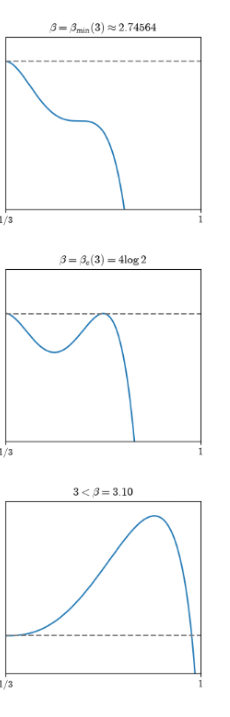
<figcaption class="paper-figure-caption"><b>Fig 1.</b> Figure 2: The free energy distribution for d = 3 along the symmetry-breaking branch (x1, x2, x3) =  x1, 1−x1</figcaption>
</figure>
<figure class="paper-figure-card">
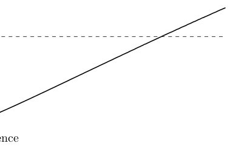
<figcaption class="paper-figure-caption"><b>Fig 2.</b> Figure 3: Plot of βd(r) for d = 3. Its unique minimum gives the spinodal threshold βmin(3); the point rc gives the critical inverse temperature βc(3); and the limiting value limr↓1 β3(r) = 3 is the threshold for the stability of the uniform distribution. The same qualitative geometry holds for every βd(r), d ≥3.</figcaption>
</figure>

**Summary.** This paper analyzes the thermalization dynamics of the mean-field interchange model for $d \geq 3$ using the Davies master equation. It proves that the system enters a metastable regime in a specific temperature window $(eta_{\min}(d), d)$, characterized by an exponentially small spectral gap. The mathematical machinery involves Schur-Weyl duality and analyzing the associated Young diagram Markov chain.

**Why it may be interesting.** This work provides a deep mathematical understanding of non-equilibrium dynamics in quantum many-body systems, directly addressing the phenomenon of slow thermalization via spectral gap analysis.

Detailed structure

**Main problem.** The paper investigates the rate of convergence to thermal equilibrium (thermalization) for open quantum systems, specifically characterizing the conditions under which metastability occurs.

**Main result.** The mean-field interchange model exhibits metastability in the temperature range $(eta_{\min}(d), d)$ for local dimension $d \geq 3$, where the spectral gap vanishes exponentially in system size $n$.

**Method.** The analysis employs Schur-Weyl duality to decompose the dynamics generator into a classical Markov generator on Young diagrams, allowing for the rigorous bounding of the spectral gap.

**Model / system.** The system is the mean-field interchange model, whose dynamics are governed by the Davies dynamics (a Markovian master equation). The model is analyzed for local dimension $d \geq 3$ and involves quantum magnetic interactions.

**Key observables.** The spectral gap of the Davies generator, $	ext{gap}(L_{	ext{loc}})$, which diagnoses the rate of thermalization.

**Important parameters / regimes.** The local dimension $d \geq 3$, the inverse temperature $eta$, and the critical temperature boundaries $eta_{\min}(d)$ and $d$.

**Assumptions / limitations.** The analysis relies heavily on decomposing the generator using Schur-Weyl duality and applying comparison arguments to control various symmetry sectors.

**Paper structure.** The paper proceeds by decomposing the dynamics generator, analyzing the dominant component related to Young diagrams to establish the metastable window, and finally controlling the remaining symmetry sectors using group mixer comparison strategies.

Abstract

Many quantum systems are believed to thermalize slowly at low temperatures due to the existence of metastable phases. However, there are cases where further cooling can restore polynomial-time thermalization: we demonstrate that the Davies dynamics of the mean-field interchange model with local dimension $d\geq 3$ and single-site generalized Pauli couplings exhibits this behavior. The dynamical phase diagram is beholden to two distinguished inverse temperatures, $β_{\mathrm{min}}(d)$ and $β=d$, with the static first-order phase transition lying between them. At low and high temperatures surrounding the interval $(β_{\mathrm{min}}(d),d)$, the spectral gap of the Davies generator is bounded below by an inverse polynomial in system size $n$. Meanwhile, in this interval, the gap vanishes exponentially in $n$, indicating metastability. The proof uses Schur-Weyl duality to decompose the Davies generator into a classical Markov generator on Young diagrams, and the restriction to the remaining symmetry sectors whose gap is $Ω(n^{-1})$. Thus, exponential slowdown arises entirely from the Young diagram chain.

[↑ back to top](#top)

### [Spiking neural networks for streaming qubit readout](http://arxiv.org/abs/2610.02129v1)

**Authors:** Barry M. Dillon, Aqib Javed, Jim Harkin, Patryk Dabkowski, Benjamin Lienhard  
**Type:** both · **Category:** quantum information and computing · **PDF:** <https://arxiv.org/pdf/2610.02129v1>  
**Analysis basis:** full PDF text, analyzed in chunks
**Topic relevance:** 🔥 `QC/QI experiment` **4/5** · `quantum measurements` **3/5** · `methods for driven-dissipative` **1/5**

↔ Scroll figures horizontally

<figure class="paper-figure-card">
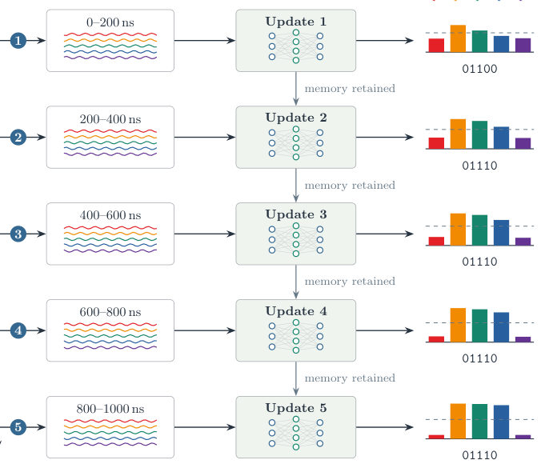
<figcaption class="paper-figure-caption"><b>Fig 1.</b> Figure 1: This figure depicts the real-time updates of the SNN measuring qubits in the 01110 state over 200ns timesteps. The coloured lines represent the demodulated traces for each qubit. These are then averaged and fed directly to the SNN, which updates its internal neuron states and predictions for the qubit readout classes.</figcaption>
</figure>
<figure class="paper-figure-card">
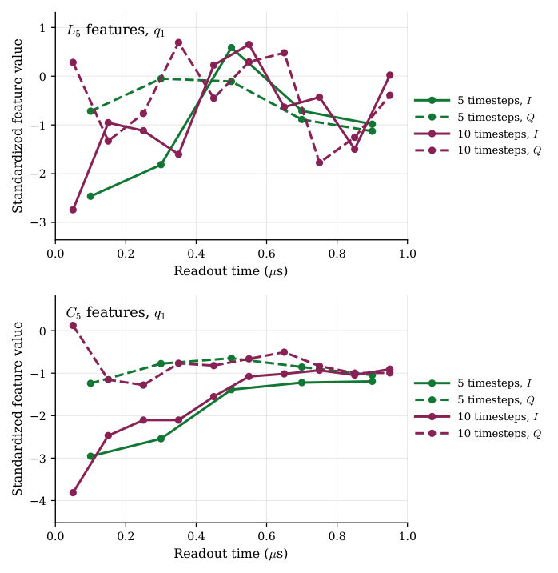
<figcaption class="paper-figure-caption"><b>Fig 2.</b> Figure 2: Local L5 feature values (top) and cumulative C5 feature values (bottom) for q5, comparing T =5 and T =10 readout summaries over the 1 µs acquisition window. Solid lines show the I component and dashed lines show the Q component.</figcaption>
</figure>
<figure class="paper-figure-card">
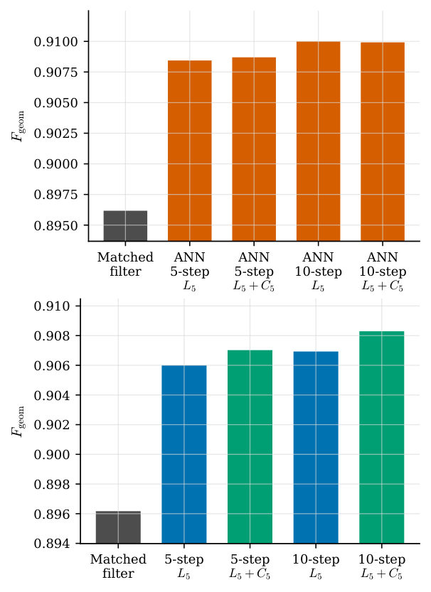
<figcaption class="paper-figure-caption"><b>Fig 3.</b> Figure 3: In the plot, we compare ANN models using the geometric mean assignment fidelity. In the plot below, we compare SNN models with a 64-dim hidden layer using the geometric mean assignment fidelity.</figcaption>
</figure>
<figure class="paper-figure-card">
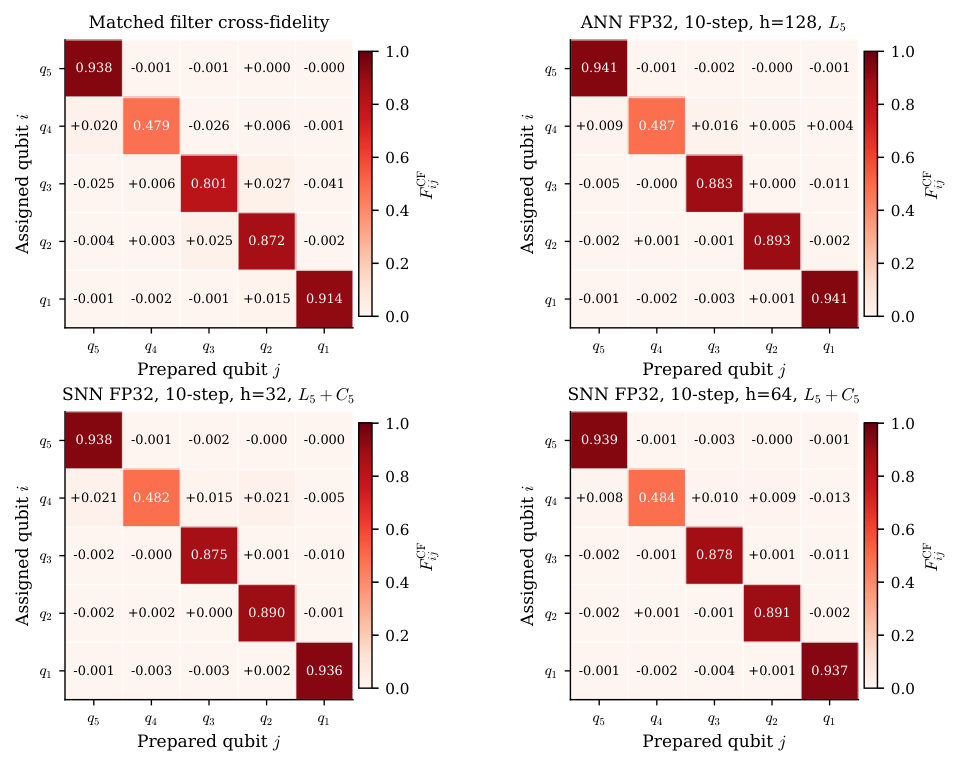
<figcaption class="paper-figure-caption"><b>Fig 4.</b> Figure 4: Cross-fidelity matrices for MF baseline (top left), the ANN baseline (top right), the 32-dim SNN (bottom left), and 64-dim SNN (bottom right). All models use T =10 and the L5 + C5 feature set.</figcaption>
</figure>
<figure class="paper-figure-card">
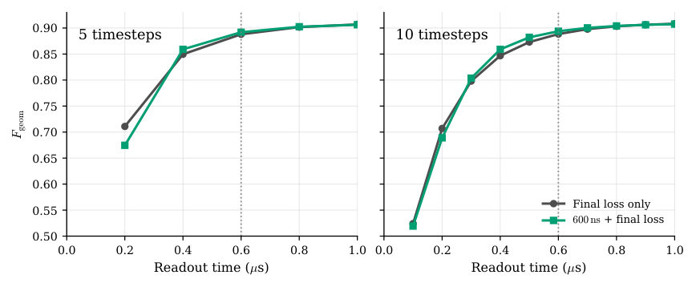
<figcaption class="paper-figure-caption"><b>Fig 5.</b> Figure 5: Mid-readout fidelity for the 64-dim SNN trained on L5 + C5 features. The final- loss-only model is compared with a model trained with equal loss terms at 600 ns and 1 µs. The dotted vertical line marks the auxiliary-loss timestep.</figcaption>
</figure>

**Summary.** This paper introduces Spiking Neural Networks (SNNs) as a solution for real-time, high-fidelity readout of superconducting qubits. By processing measurement data in streaming chunks, the SNNs overcome the latency limitations of traditional methods, achieving performance comparable to full-trace ANNs while being optimized for low-latency deployment on FPGA hardware.

**Why it may be interesting.** This work directly addresses the engineering bottleneck of quantum computing—the need for fast, real-time measurement feedback—by integrating advanced neuromorphic computing techniques with superconducting hardware.

Detailed structure

**Main problem.** Achieving fast and accurate qubit-state assignment is critical for real-time feedback, calibration, and error correction in quantum processors.

**Main result.** Spiking Neural Networks (SNNs) provide a streaming, time-resolved estimate of the qubit state that matches the accuracy of full-trace ANNs while offering low-latency, real-time performance on FPGA hardware.

**Method.** The authors propose using SNN discriminators that process the frequency-multiplexed readout measurement window in successive time chunks, exploiting temporal structure.

**Model / system.** The work focuses on superconducting qubits, specifically a five-qubit transmon processor, whose state is read out via frequency-multiplexed IQ traces. The analysis is performed on the time-resolved IQ data over the first $1 \mu s$ of acquisition.

**Key observables.** Geometric-mean assignment fidelity ($F_{geom}$), single-qubit assignment fidelity ($F_q$), and cross-fidelity matrix ($F_{ij}^{CF}$) to quantify crosstalk.

**Important parameters / regimes.** The analysis uses time-resolved IQ traces sampled at $\Delta t = 2 	ext{ ns}$ over a $1 \mu s$ window.

**Assumptions / limitations.** The primary assumption is that SNNs can effectively capture the temporal dynamics of the readout signal, overcoming the latency bottleneck of traditional methods.

**Figures summary.** Figure 1 illustrates the real-time update process of the SNN measuring qubits over time steps, showing how predictions evolve as new data chunks arrive.

**Paper structure.** The paper first establishes the necessity of fast readout for quantum control, details the physical measurement setup and data processing (IQ demodulation), compares SNNs against Matched Filtering and ANNs, and concludes with hardware implementation results on FPGAs.

Abstract

Fast and accurate qubit-state assignment is essential for feedback, calibration, and error correction in quantum processors. In superconducting platforms, frequency-multiplexed readout makes this task intrinsically multivariate as measured traces can encode crosstalk, qubit-state relaxation events, and other transient nonidealities that are not fully captured by conventional matched filtering. Here, we introduce spiking neural network (SNN) discriminators for superconducting qubit readout. By processing the measurement window in successive time chunks, the networks exploit temporal structure and update classification scores as data arrive, rather than waiting until the end of the readout window. The spiking networks outperform matched-filter discrimination and approach the accuracy of a full-trace artificial neural network. Beyond reaching the performance of artificial neural networks, the key advantage of SNNs is that they provide a streaming, time-resolved estimate of the qubit state that evolves as the readout signal is acquired. Using quantisation-aware training and hls4ml synthesis, we further demonstrate that each FPGA inference update can be completed before the next readout chunk arrives. These results establish spiking neural networks as a promising route to low-latency, real-time qubit readout on FPGA hardware, with broader implications for time-critical quantum-control and scientific-inference applications.

[↑ back to top](#top)

### [Thin-capping layer epitaxial quantum dots for near-field quantum photonics](http://arxiv.org/abs/2610.02080v1)

**Authors:** Yuting Guo, Jonathan Bar-David, Pasquale Cilibrizzi, Sung-Yul L. Park, Jin Dong Song, Luca Sapienza  
**Type:** experiment · **Category:** other · **PDF:** <https://arxiv.org/pdf/2610.02080v1>  
**Analysis basis:** full PDF text, analyzed in chunks
**Topic relevance:** 🔥 `quantum optics experiment` **4/5** · `Tavis-Cummings & cavity-many-emitter` **2/5** · `interference shaping light` **1/5** · `quantum measurements` **1/5**

↔ Scroll figures horizontally

<figure class="paper-figure-card">
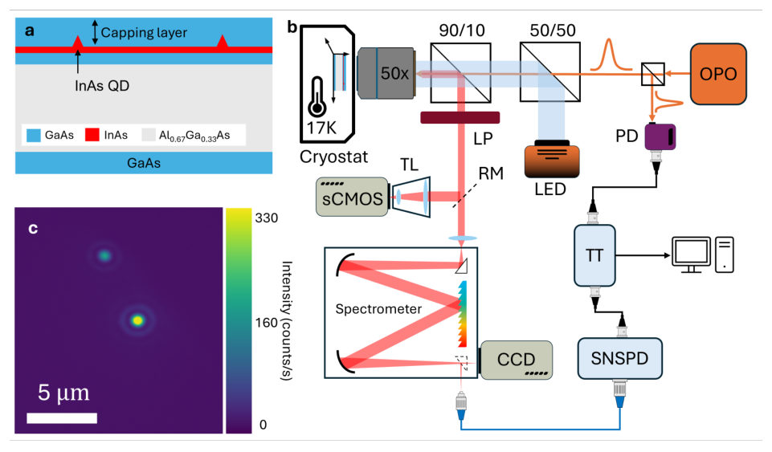
<figcaption class="paper-figure-caption"><b>Fig 1.</b> Figure 1: (a) Schematic of the sample (not to scale). The triangles represent the QD single-photon emitters. The capping layer thickness is highlighted. (b) Schematic of the experimental setup (not to scale). The sample is illuminated through a 50× objective by an LED for imaging and a pulsed laser for spectroscopy and time-resolved measurements. A 90/10 (Reflection/Transmission) beamsplitter reflects the photoluminescence signal towards the collection path. For imaging, photoluminescence is sent onto a scientific Complementary Metal–Oxide–Semiconductor (sCMOS) camera via a tube lens (TL). For spectroscopy, light is dispersed by a spectrometer and recorded by a Charge-Coupled Device (CCD)....</figcaption>
</figure>
<figure class="paper-figure-card">
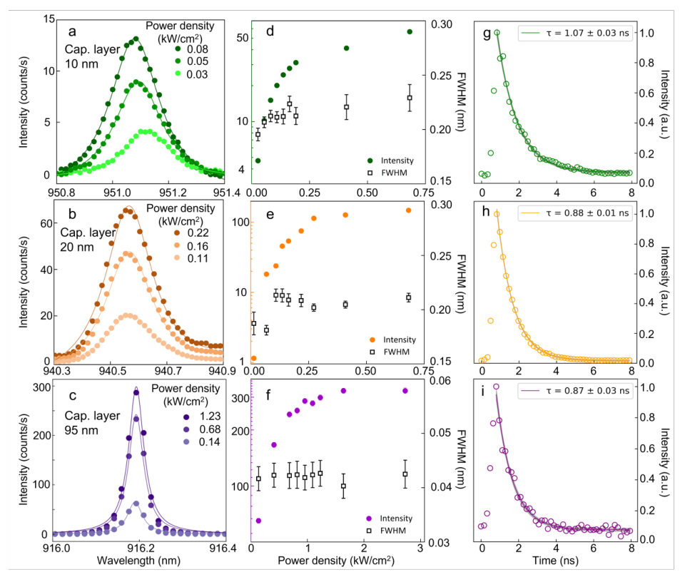
<figcaption class="paper-figure-caption"><b>Fig 2.</b> Figure 2: (a-c) Photoluminescence emission peaks of InAs/GaAs quantum dots (solid circles, 10 nm CL in green, 20 nm CL in orange, 95 nm CL in purple) taken at three different 880 nm laser pump powers, fitted (solid lines) with Lorentzian functions. (d-f) Peak intensity (solid circles) and Full Width Half Maximum (FWHM, black hollow squares) of selected QD lines, plotted as a function of laser excitation power density. (g-i) Time-resolved PL measurements, showing the excited-state decays (empty circles) fitted by an exponential decay curve (solid lines). The lifetime extracted from the fit (τ) is shown in the legend and the shaded grey areas correspond to the 95 % confidence intervals in the...</figcaption>
</figure>
<figure class="paper-figure-card">
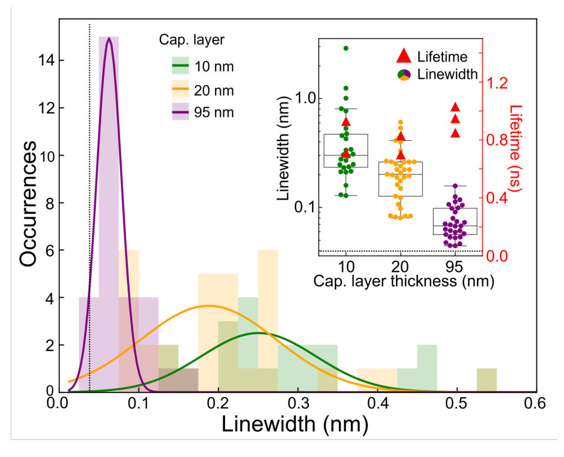
<figcaption class="paper-figure-caption"><b>Fig 3.</b> Figure 3: Histogram of the linewidths of QDs as a function of capping layer (CL) thickness, with the same colour coding as in Fig.2. Inset: distribution of the linewidths as a function of CL thickness. Black boxes indicate the central 50 % of the distribution, with the centre line indicating the median. Whiskers indicate the full data range, excluding outliers. Extracted lifetime values for different capping layer thickness are shown in red triangles. In both the main panel and the inset, a fine dotted line indicates the system resolution limit.</figcaption>
</figure>
<figure class="paper-figure-card">
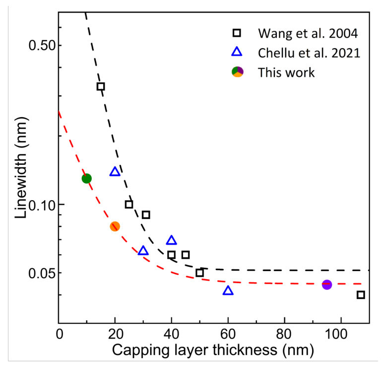
<figcaption class="paper-figure-caption"><b>Fig 4.</b> Figure 4: Collection of InAs/GaAs QD narrowest emission linewidths, plotted as a function of capping layer thickness (colored solid circles), compared with linewidth values from previous reports.28,33 The black dashed line is an exponential fit to Wang et al.’s data.28 The red dashed line shows the exponential fit to our data.</figcaption>
</figure>

**Summary.** This paper reports on the growth and optical characterization of InAs/GaAs quantum dots capped with very thin layers. The key finding is that these QDs maintain excellent optical quality, including narrow linewidths and long lifetimes, even when placed close to the surface. This breakthrough opens a viable path for utilizing these stable emitters in near-field quantum photonic applications.

**Why it may be interesting.** This work is highly relevant to open quantum systems and quantum optics as it experimentally validates a pathway to integrate stable quantum emitters into plasmonic/near-field photonic devices, a key goal in quantum technology.

Detailed structure

**Main problem.** The challenge is to enable near-field quantum photonics applications by bringing quantum emitters close to metallic structures while maintaining the high optical quality of the quantum dots.

**Main result.** The study demonstrates that InAs/GaAs quantum dots maintain high optical quality, exhibiting significantly narrow emission linewidths and stable excitonic lifetimes even when capped with very thin GaAs layers (10-20 nm).

**Method.** The research involved growing InAs/GaAs QDs using MBE with varying GaAs capping layer thicknesses (10 nm, 20 nm, 95 nm) and characterizing them using micro-photoluminescence, time-resolved PL, and spectroscopy.

**Model / system.** The physical system is InAs/GaAs epitaxial quantum dots. The experiment varies the thickness of the GaAs capping layer (CL) to control the proximity of the emitter to the surface, which is critical for near-field light-matter interactions.

**Key observables.** Emission linewidths (observed up to 5 times smaller than previous reports), excitonic lifetimes ($\sim 0.9-1.1$ ns), and PL spectra evolution.

**Important parameters / regimes.** GaAs capping layer thickness (10 nm, 20 nm, 95 nm); near-field separation (tens of nanometers or less).

**Assumptions / limitations.** The good optical quality in thin-capped structures suggests that detrimental surface effects are mitigated in these specific QDs, allowing for near-field coupling.

**Figures summary.** Figures show PL spectra evolution with power, linewidth/intensity vs. power density, and time-resolved PL measurements confirming stable lifetimes across different capping layer thicknesses.

**Paper structure.** The paper establishes the need for near-field coupling, presents the experimental growth and characterization of QDs with varying thin capping layers, and reports measurements showing preserved optical quality despite reduced separation from the surface.

Abstract

Epitaxial quantum dots (QDs) are widely recognised as one of the best quantum light sources, given their good stability, brightness, quantum efficiency and coherence. To reach such properties, QDs are protected from potentially detrimental surface states by a relatively thick capping layer, typically exceeding 50nm. This prevents the implementation of near-field effects, like plasmonic-based ones, that can dramatically increase the light-matter interaction, since the control of the spontaneous emission dynamics and directionality of the emission can only occur if the emitter is in close proximity (typically tens of nanometers or less) from the metallic structures. In this work, we report the growth and optical characterisation of InAs/GaAs QDs with GaAs capping layer thickness of 10nm, 20nm, and a more standard 95nm. Remarkably, we observe emission linewidths up to 5 times smaller than previously reported, with unperturbed excitonic lifetimes. These results demonstrate that the epitaxial QD's high optical quality can be maintained even when the emitters are at reduced distances from the surface, opening the path for the exploration of near-field light-matter interactions with coherent and stable emitters, suitable for quantum technology applications.

[↑ back to top](#top)

### [Real-Time Adaptive Filtering and the Boxcar Limit in Superconducting Qubit Readout](http://arxiv.org/abs/2610.00783v1)

**Authors:** Hans Johnson, Tanay Roy, Leonardo Bove, David van Zanten, Silvia Zorzetti, Jafar Saniie  
**Type:** experiment · **Category:** quantum information and computing · **PDF:** <https://arxiv.org/pdf/2610.00783v1>  
**Analysis basis:** full PDF text, analyzed in chunks
**Topic relevance:** 🔥 `QC/QI experiment` **4/5** · `quantum measurements` **3/5**

↔ Scroll figures horizontally

<figure class="paper-figure-card">
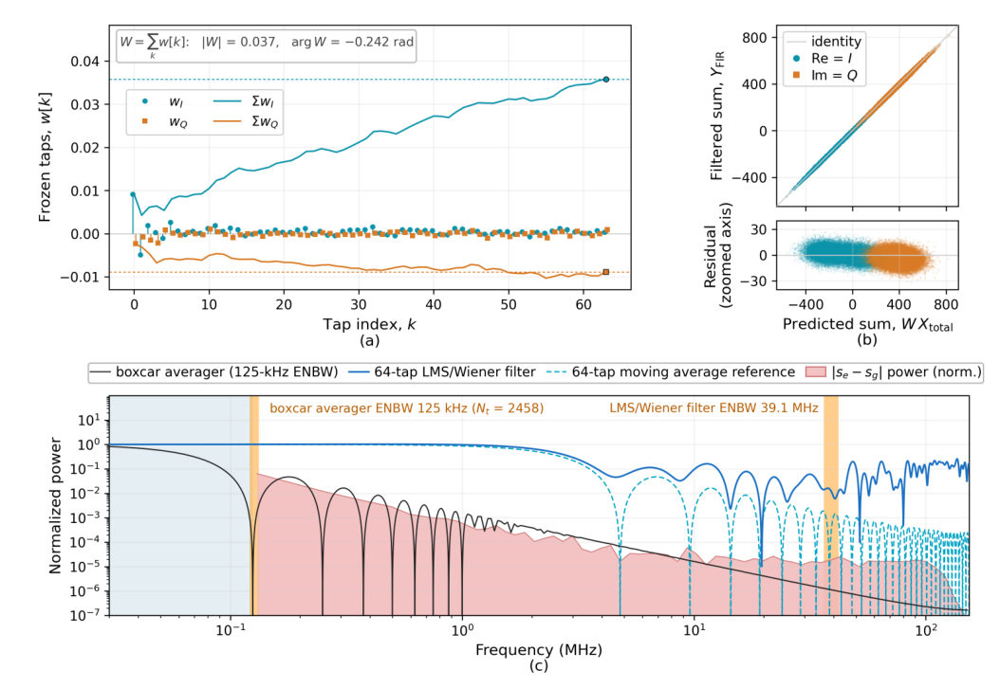
<figcaption class="paper-figure-caption"><b>Fig 1.</b> Fig. 1. The kernel collapse on the deployed instrument [Q1 (transmon) at Readout Length (RL) 8 µs; 50,000 shots per class, half held out for testing]. (a) The frozen 64-tap coefficient vector, trained on-fabric with the qubit prepared in |g⟩and read back over DMA in Q27.16 fixed-point format. The running-sum overlay accumulates the taps to the collapse scalar W, with |W| = 0.037 and arg W = −0.242 rad [exp.]. (b) The scalar approximation of Eq. 5, tested on held-out shots from both classes. Each shot’s filtered window sum YFIR is plotted against WXtotal, with W from the taps in (a) and Xtotal the raw boxcar statistic of Eq. 5; nothing was fitted. The points lie close to the identity line,...</figcaption>
</figure>
<figure class="paper-figure-card">
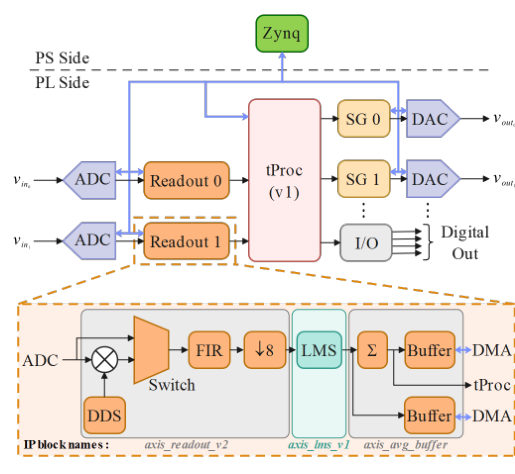
<figcaption class="paper-figure-caption"><b>Fig 2.</b> Fig. 2. The instrument in the QICK readout chain. The Zynq Processing System (PS) accesses the readout and control blocks in the Programmable Logic (PL). These blocks connect the converters (ADC, DAC), two read- out channels, timed processor (tProc), signal generators, and digital I/O. The expanded readout-1 path shows DDS downconversion, FIR filtering, and decimation by eight (axis_readout_v2) feeding the LMS filter (axis_lms_v1, teal; Fig. 3). Its output enters the accumulate-and-buffer stage (axis_avg_buffer), and the windowed sum feeds the tProc. The buffers transfer data to the host by Direct Memory Access (DMA). Blue arrows mark PS-side access. Panels redrawn from [17] with the...</figcaption>
</figure>
<figure class="paper-figure-card">
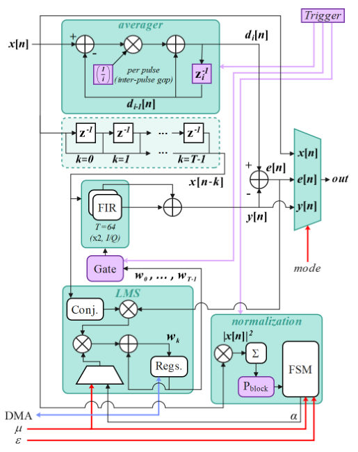
<figcaption class="paper-figure-caption"><b>Fig 3.</b> Fig. 3. Adaptive filter (axis_lms_v1) firmware block diagram. The averager forms the reference di[n] across pulses (z−1 i : a one-pulse delay at fixed sample position n). The FIR filter and the LMS blocks share one tapped delay line. The LMS block conjugates the regressor, scales the gradient, and integrates it into the weight registers. A pulse-boundary gate releases the updated weights to the FIR, closing the adaptation loop. A reciprocal Finite- State Machine (FSM) forms the per-pulse step α in the normalization block (Eq. 16). Black lines indicate AXI4-Stream (AXIS) datapaths, red lines denote run-time user input via AXI4-Lite (AXI), blue lines are DMA PS-side access, and purple denotes...</figcaption>
</figure>
<figure class="paper-figure-card">
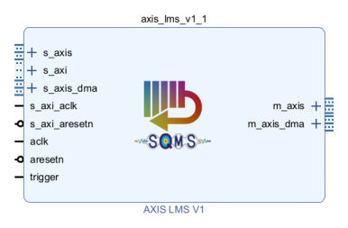
<figcaption class="paper-figure-caption"><b>Fig 4.</b> Fig. 4. Packaged adaptive-filter IP in the Vivado block-design integrator. AXI4-Stream ports carry readout samples input/output and coefficient trans- fers with an external DMA. AXI4-Lite provides user-defined variables via reg- ister access during experiments. The tProc trigger coordinates pulse-boundary operations. Stream and configuration interfaces have separate clock/reset pairs.</figcaption>
</figure>
<figure class="paper-figure-card">
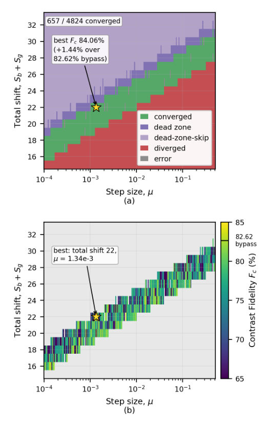
<figcaption class="paper-figure-caption"><b>Fig 5.</b> Fig. 5. The convergence regime of the transmon (Q1) training sweep [exp.]. (a) Regime map over step size µ and total shift Sb + Sg, each configuration classed as converged, dead-zone (the amplitude-floor regime of Eq. 20), dead- zone-skip, diverged, or error. The 1514 dead-zone-skip configurations were not measured, and the floor’s monotonicity in total shift records them as dead. Every configuration below the cropped axis range (total shift 15–33) diverged. (b) Contrast readout fidelity Fc of the 657 configurations classified as converged.</figcaption>
</figure>

**Summary.** This work analyzes the limits of superconducting qubit readout fidelity by comparing adaptive filtering techniques against standard boxcar averaging. The key finding is that while filtering reduces noise, the fundamental measurement process imposes a 'boxcar limit,' meaning advanced digital processing alone cannot significantly improve state discrimination beyond optimized fixed-window averaging.

**Why it may be interesting.** It provides a rigorous, quantitative analysis of the fundamental limits imposed by the measurement process itself, separating hardware noise mitigation from the actual decision-making capability of the readout circuit.

Detailed structure

**Main problem.** The paper investigates whether advanced digital signal processing, such as adaptive filtering, can improve the readout fidelity of superconducting qubits beyond the performance achievable with standard boxcar averaging.

**Main result.** The study found that while adaptive filtering successfully reduced trace noise, it did not lead to a resolved improvement in the state discrimination signal-to-noise ratio ($	ext{SNR}_{	ext{disc}}$) compared to optimized boxcar averaging.

**Method.** The authors compared the performance of a real-time trained LMS filter against boxcar averaging and sequential detection methods on superconducting qubit readout signals.

**Model / system.** The experiment uses superconducting qubits, specifically 2D transmon qubits (Q1) and 3D ancilla qubits (Q2), read out via dispersive coupling. The readout process involves digitizing the resonator response signal.

**Key observables.** Fidelity (contrast readout fidelity), Signal-to-Noise Ratio ($	ext{SNR}_{	ext{disc}}$), and mean decision time ($	ext{E}[t_{	ext{decide}}]$).

**Important parameters / regimes.** Readout window length (e.g., 8 $\mu$s), the boxcar limit, and the LMS filter's performance relative to the theoretical matched-filter ceiling.

**Assumptions / limitations.** The analysis distinguishes between waveform denoising (which can be improved) and the actual decision improvement, suggesting the boxcar limit constrains the achievable discrimination gain.

**Figures summary.** Figures illustrate the kernel collapse identity, comparing the spectral power distribution of the signal difference, and showing fidelity accrual over integration time for different readout methods.

**Paper structure.** The paper establishes the baseline (boxcar averaging), tests the adaptive filter (LMS) for noise reduction, and then compares the resulting discrimination SNR against theoretical limits and optimized windowing/sequential detection methods.

Abstract

In dispersive readout of superconducting qubits, the common baseline is a boxcar averager: a uniformly weighted average over a fixed window followed by threshold-based state assignment. We ask when additional digital processing improves fidelity. We evaluated an adaptive finite-impulse-response (FIR) filter trained in real time by the least-mean-squares (LMS) algorithm on an FPGA quantum controller, and analyzed measured readout shots offline to compare the frozen filter with boxcar averaging and to test per-sample weighting and sequential detection.   For the fixed FIR filters tested, summing the filtered samples gives the boxcar sum multiplied by one complex number, apart from a small edge correction (the kernel collapse). This scales state separation and noise equally, so discrimination cannot improve (the boxcar limit).   The frozen LMS filter reduces trace noise without a resolved fidelity improvement at the tested readout lengths. Replayed on the same shots offline, each filtered shot carries 99.4% of the boxcar shot's discrimination signal-to-noise ratio at the 8 $μ$s operating point of the 2D transmon qubit (Q1).   On Q1, optimizing the readout window's start and duration improves contrast readout fidelity by +2.4% to +5.6% across four readout lengths. Per-sample weighting adds up to +3.0% over full-window integration, and only +0.33% beyond the tuned window at 8 $μ$s.   Remaining results are from a 3D ancilla qubit (Q2), which sits above the early-decision crossover that Q1 sits below. Hardware sweeps locate the crossover window near 1 $μ$s. Offline, the sequential test decided most shots early, with fidelity within 0.5 percentage points of the boxcar. About 30 labeled shots per class build a matched-filter template nearly as good as one from hundreds.   The results form an operating-point record that separates waveform denoising from decision improvement.

[↑ back to top](#top)

### [Microscopic Insights into the Quarkyonic Hadron--Quark Crossover: Lessons from Ultracold Fermi Gases](http://arxiv.org/abs/2610.01117v1)

**Authors:** Hiroyuki Tajima  
**Type:** theory · **Category:** quantum gases · **PDF:** <https://arxiv.org/pdf/2610.01117v1>  
**Analysis basis:** full PDF text, analyzed in chunks
**Topic relevance:** 🔥 `analog quantum simulation` **4/5** · `Keldysh / 2PI / non-Gaussian methods` **2/5**

↔ Scroll figures horizontally

<figure class="paper-figure-card">
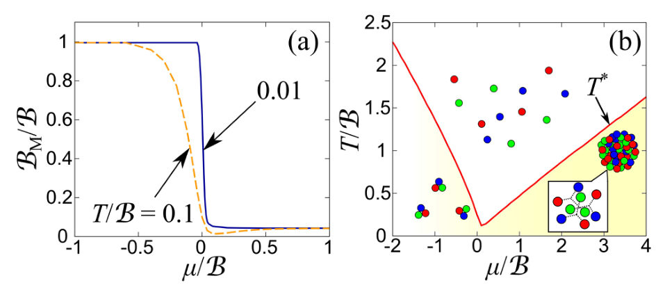
<figcaption class="paper-figure-caption"><b>Fig 1.</b> Figure 1: (a) In-medium binding energy BM at T/B = 0.01 and 0.1. (b) Schematic grand-canonical diagram: the line T ∗marks the Mott temperature where the in-medium three-body bound-state energy vanishes. Adapted with modified labels and colors from Figs. 2 and 4 of H. Tajima, S. Tsutsui, T. M. Doi, and K. Iida, “Cooper triples in attractive three-component fermions: Implication for hadron-quark crossover,” Phys. Rev. Research 4, L012021 (2022) [25], https://doi.org/10.1103/PhysRevResearch.4.L012021, licensed under CC BY 4.0 (https: //creativecommons.org/licenses/by/4.0/).</figcaption>
</figure>
<figure class="paper-figure-card">
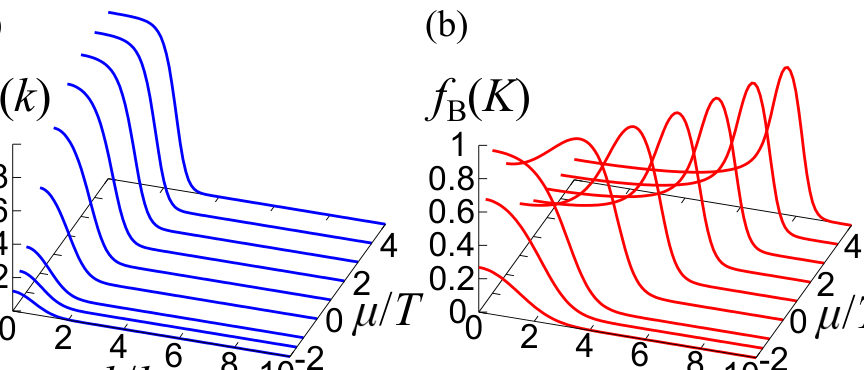
<figcaption class="paper-figure-caption"><b>Fig 2.</b> Figure 2: Momentum distributions of (a) quark-like constituents and (b) baryon-like three-body correlations at T/B = 0.2, with kT = √</figcaption>
</figure>
<figure class="paper-figure-card">
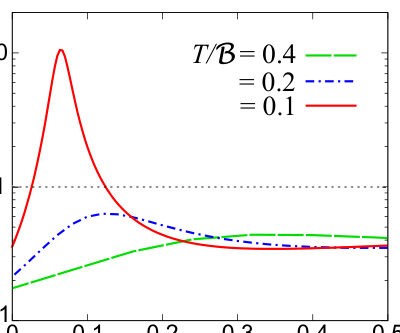
<figcaption class="paper-figure-caption"><b>Fig 3.</b> Figure 3: Squared isothermal speed of sound c2 s normalized by v2 F, where vF = πn/(3m); the dotted line marks the high-density limit. Reproduced from Fig. 3 of H. Tajima, K. Iida, T. Kojo, and H. Liang, “Tripling Fluctuations and Peaked Sound Speed in Fermionic Matter,” Phys. Rev. Lett. 135, 042701 (2025) [26], https://doi.org/10.1103/4ywp-752m, licensed under CC BY 4.0 (https://creativecommons.org/ licenses/by/4.0/).</figcaption>
</figure>

**Summary.** This paper develops a theoretical framework by mapping the hadron-quark crossover onto the physics of three-body crossovers seen in ultracold Fermi gases. It demonstrates that the mechanism causing a momentum shell formation—the interplay between bound states and the continuum—is responsible for predicting a characteristic peak in the speed of sound in dense QCD matter. This provides a concrete, calculable link between cold atom physics and astrophysics.

**Why it may be interesting.** The direct analogy drawn between the well-understood BEC-BCS crossover in ultracold atoms and the exotic physics of the hadron-quark crossover provides a powerful, calculable theoretical tool for condensed matter/AMO theorists.

Detailed structure

**Main problem.** The paper addresses the challenge of understanding the continuous crossover from hadronic matter to quark matter at high baryon density.

**Main result.** The authors show that the interplay between a three-body bound-state pole and the scattering continuum generates a baryonic momentum shell, which in turn causes a peak in the speed of sound in the crossover region.

**Method.** The analysis employs fluctuation theory, drawing an analogy between the BEC-BCS crossover in ultracold Fermi gases and the three-body crossover in dense QCD matter.

**Model / system.** The model uses a three-component Fermi gas with an attractive three-body contact interaction to simulate the baryon formation process, connecting it to quarkyonic matter.

**Key observables.** Speed of sound ($c_s^2$), baryonic momentum distribution ($f_B(K)$), and the in-medium three-body binding energy ($B_M$).

**Important parameters / regimes.** High baryon density, low temperatures, and the three-body coupling strength ($V_3$).

**Assumptions / limitations.** The analysis relies on the pole-continuum cancellation mechanism and approximations regarding the occupied continuum weight.

**Figures summary.** Figures illustrate the momentum distributions of quark and baryon constituents, and plot the squared isothermal speed of sound, showing a pronounced maximum in the crossover region.

**Paper structure.** The paper reviews the theoretical framework by first establishing the BEC-BCS analogy, then developing the three-body fluctuation theory using T-matrix calculations, and finally applying this mechanism to predict observable features like the momentum shell and speed of sound peak in the context of QCD.

Abstract

In neutron-star and dense quantum chromodynamics (QCD) physics, it is important to understand how baryonic matter evolves into quark matter at high density. A continuous hadron--quark crossover is one of the most attractive candidates because it can reconcile the comparatively soft equation of state around nuclear density with the rapid stiffening required to support massive neutron stars. Recent neutron-star observations motivate equations of state that stiffen rapidly across the intermediate-density regime, while quarkyonic-matter descriptions feature a shell-like baryon momentum distribution there. In this paper, we review our recent work on the microscopic description and interpretation of these phenomena by drawing an analogy with the Bose--Einstein condensate (BEC) to Bardeen--Cooper--Schrieffer (BCS) crossover in ultracold Fermi gases and two-color QCD. As pairing fluctuations play a crucial role in the BEC--BCS crossover, we discuss the role of its three-body counterpart, that is, tripling fluctuations associated with baryon formation in the hadron--quark crossover. In terms of a phase-shift representation of tripling fluctuations, the interplay between a three-body bound-state pole and the scattering continuum suppresses low-momentum baryonic occupation, generates a baryonic momentum shell, and reduces the density susceptibility, thereby producing a peak in the speed of sound. We review the demonstration of this mechanism in a one-dimensional three-component Fermi gas, its relativistic extension, and its connection to phenomenological quarkyonic equations of state.

[↑ back to top](#top)

### [Adaptivity is all you need: Optimal stabilizer learning using just single-copy measurements](http://arxiv.org/abs/2610.02031v1)

**Authors:** L. Bittel, J. Eisert, W. Gong, A. A. Mele, L. Schatzki  
**Type:** theory · **Category:** quantum information and computing · **PDF:** <https://arxiv.org/pdf/2610.02031v1>  
**Analysis basis:** full PDF text, analyzed in chunks
**Topic relevance:** 🔥 `quantum measurements` **4/5**

↔ Scroll figures horizontally

<figure class="paper-figure-card">
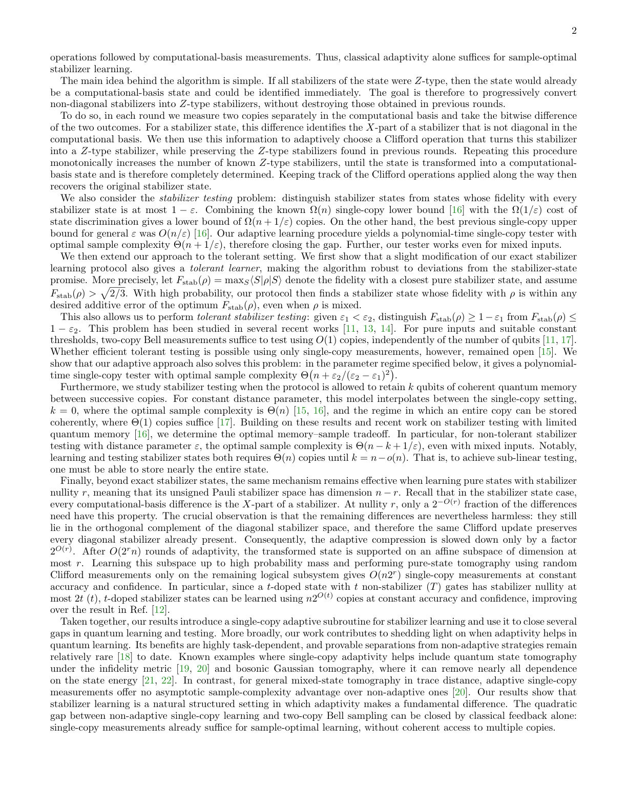
<figcaption class="paper-figure-caption"><b>Fig 1.</b> Low-resolution page preview, page 2</figcaption>
</figure>
<figure class="paper-figure-card">
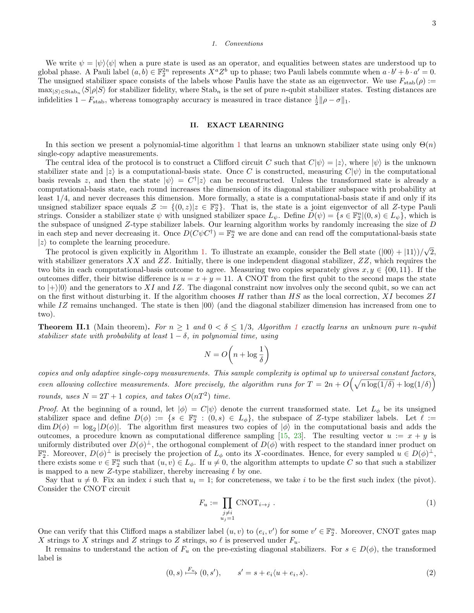
<figcaption class="paper-figure-caption"><b>Fig 2.</b> Low-resolution page preview, page 3</figcaption>
</figure>
<figure class="paper-figure-card">
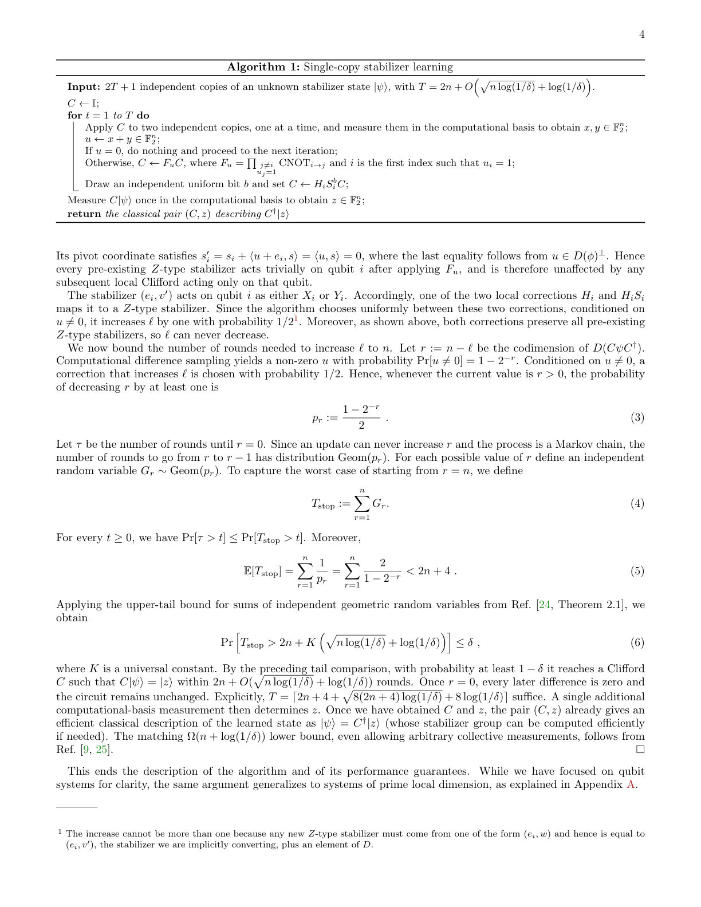
<figcaption class="paper-figure-caption"><b>Fig 3.</b> Low-resolution page preview, page 4</figcaption>
</figure>
<figure class="paper-figure-card">
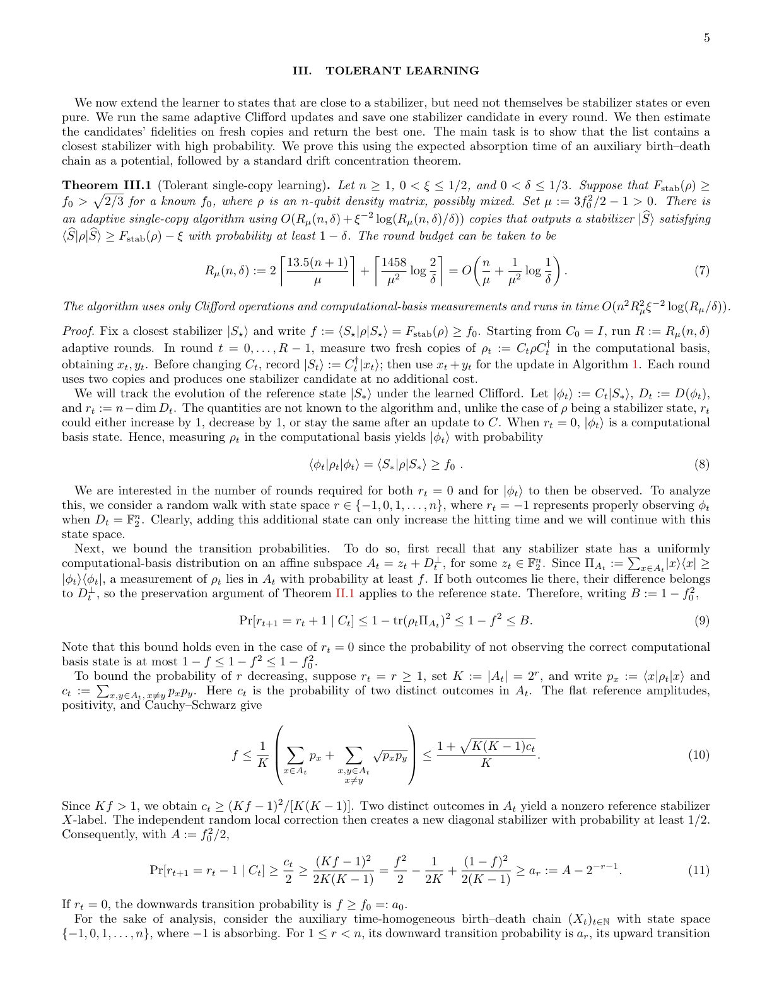
<figcaption class="paper-figure-caption"><b>Fig 4.</b> Low-resolution page preview, page 5</figcaption>
</figure>
<figure class="paper-figure-card">
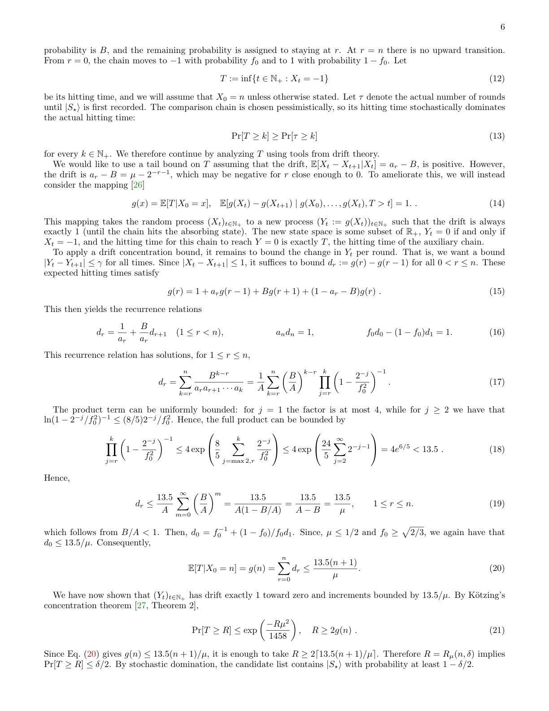
<figcaption class="paper-figure-caption"><b>Fig 5.</b> Low-resolution page preview, page 6</figcaption>
</figure>

**Summary.** This work demonstrates that by employing an adaptive measurement strategy, the sample complexity for learning unknown stabilizer states can be drastically reduced from quadratic ($\Omega(n^2)$) to linear ($\Theta(n)$). This breakthrough shows that classical feedback can bridge a major gap in quantum resource estimation, providing optimal protocols for both state learning and fidelity testing.

**Why it may be interesting.** The core finding—that adaptivity removes a quadratic scaling barrier in quantum state characterization—provides a powerful general principle for designing efficient quantum measurement protocols applicable across various quantum information tasks.

Detailed structure

**Main problem.** The paper addresses the resource efficiency (sample complexity) required to learn and test unknown stabilizer states using quantum measurements.

**Main result.** Adaptivity in measurement choice closes a quadratic gap, allowing exact learning of $n$-qubit stabilizer states using only $\Theta(n)$ single-copy measurements, matching the optimal Bell sampling complexity.

**Method.** The authors develop an adaptive algorithm that iteratively uses single-copy Clifford measurements and classical feedback to progressively determine the stabilizer generators of the unknown state.

**Model / system.** The focus is on $n$-qubit (and $n$-qudit) stabilizer states, which are fundamental to quantum error correction and quantum computation. The analysis compares the required measurements for adaptive vs. non-adaptive protocols.

**Key observables.** Stabilizer fidelity ($F_{	ext{stab}}$), dimension of the diagonal stabilizer subspace ($\ell$), and the required number of measurements ($N$).

**Important parameters / regimes.** The number of qubits ($n$), the error tolerance ($\epsilon$), and the local dimension ($p$) are key parameters governing the complexity bounds.

**Assumptions / limitations.** The analysis relies on the ability to perform adaptive measurements and assumes the state is sufficiently close to a stabilizer state for the testing protocols.

**Figures summary.** Not specified in the notes, but the results establish complexity bounds for learning and testing protocols.

**Paper structure.** The paper establishes the problem gap (Bell vs. non-adaptive single-copy), presents the adaptive learning algorithm for exact state recovery, extends this to tolerant state estimation, and finally determines optimal memory-sample tradeoffs.

Abstract

Stabilizer states are central to quantum computing, underlying quantum error correction, benchmarking, and efficient classical simulation. Yet their learnability exhibits a striking gap: an $n$-qubit stabilizer state can be learned from $Θ(n)$ copies using two-copy Bell measurements, whereas non-adaptive single-copy measurements require $Ω(n^2)$ copies. Here we show that adaptivity completely closes this gap. We give a polynomial-time adaptive algorithm that learns an arbitrary $n$-qubit stabilizer state from $Θ(n)$ single-copy Clifford measurements, matching the optimal sample complexity of Bell sampling without any multi-copy measurements. The same ideas yield a sample-optimal single-copy tolerant tester and, with $k$ qubits of quantum memory, the optimal testing tradeoff $Θ(n-k+1/\varepsilon)$ at infidelity $\varepsilon$. Finally, we show that this adaptive mechanism extends beyond exact stabilizer states: states of stabilizer nullity at most $r$, including states prepared by Clifford circuits with a bounded number of $T$ gates, can be learned using $O(n2^{r})$ single-copy measurements.

[↑ back to top](#top)

### [Algebraic Relaxation of Strong-to-Weak Symmetry-Breaking Order via Charge-Sector Broadening](http://arxiv.org/abs/2610.00474v1)

**Authors:** Zi-Xi Fang, Kai Zhang  
**Type:** theory · **Category:** statistical mechanics · **PDF:** <https://arxiv.org/pdf/2610.00474v1>  
**Analysis basis:** full PDF text, analyzed in chunks
**Topic relevance:** `Keldysh / 2PI / non-Gaussian methods` **3/5** · `correlated / nonlocal dissipation` **3/5** · `driven-dissipative phase transition` **3/5** · `methods for driven-dissipative` **3/5** · `non-equilibrium universality` **3/5** · `analog quantum simulation` **2/5** · `quantum measurements` **2/5** · `scars & prethermalization` **2/5**

↔ Scroll figures horizontally

<figure class="paper-figure-card">
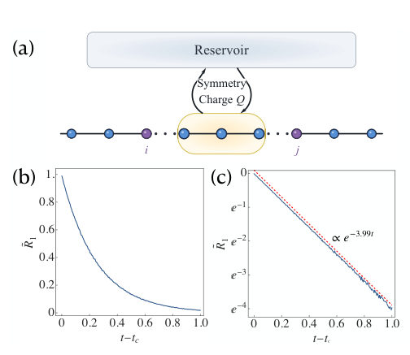
<figcaption class="paper-figure-caption"><b>Fig 1.</b> FIG. 1. (a) Illustration of local strong-symmetry breaking on a finite lattice region. (b) Exponential decay of the long-range connected R´enyi-1 correlator under the local symmetry-breaking perturbation in Eq. (4), with a semilogarithmic plot shown in (c). The unperturbed strongly Z2-symmetric Liouvillian is L0[ρ] = γx PL i=1 D[Xi]ρ + γz PL−1 i=1 D[ZiZi+1]ρ + γ4 PL−3 i=1 D[ZiZi+1Zi+2Zi+3]ρ, where D[O]ρ = OρO† −1</figcaption>
</figure>
<figure class="paper-figure-card">
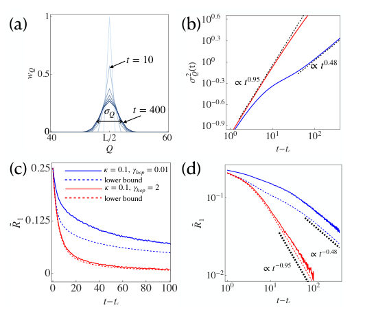
<figcaption class="paper-figure-caption"><b>Fig 2.</b> FIG. 2. Charge-space broadening and R´enyi-1 algebraic relax- ation under local U(1) charge exchange. Numerical results for a spinless-fermion chain in Eq. (16) with L = 100 and z = 2, initial- ized in ¯PL/2. A balanced leakage channel with κ+ = κ−= κ = 0.1 acts at x = L/2, with γϕ = 5. Blue and red denote γhop = 0.01 and 2, respectively. (a) Broadening of the charge-sector distribution wQ(t) for γhop = 0.01, with width σQ. (b) Charge variance on log- arithmic scales; black dashed lines indicate σ2 Q ∝(t −tc)0.48 (blue) and (t −tc)0.95 (red). (c) Connected R´enyi-1 correlator eR1(ρ, c† i cj) for i = L/4 and j = 3L/4. Solid curves are numerical results, while colored dashed curves are the...</figcaption>
</figure>
<figure class="paper-figure-card">
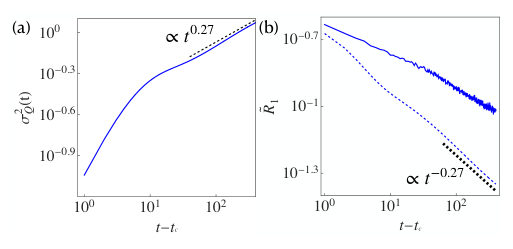
<figcaption class="paper-figure-caption"><b>Fig 3.</b> FIG. 3. Numerical results for the dipole-conserving model in Eq. (16) with L = 50, γhop = 0.01, γϕ = 5, and κ+ = κ−= κ = 0.1, initialized in ¯PL/2. (a) Charge variance σ2 Q(t) ∝(t −tc)0.27, close to the predicted exponent 1/z = 1/4. (b) Log-log plot of the connected R´enyi-1 correlator for i = L/4 and j = 3L/4. The solid curve is the numerical result, while the blue dashed curve is the auxiliary-state prediction computed from the same wQ(t). Black dashed lines indi- cate the algebraic behaviors (t −tc)0.27 and (t −tc)−0.27 in (a) and (b), respectively.</figcaption>
</figure>

**Summary.** This theoretical paper analyzes the decay of order associated with Strong-to-Weak Spontaneous Symmetry Breaking (SW-SSB) in open quantum systems. It distinguishes between discrete ($Z_2$) and continuous ($U(1)$) symmetries, finding that discrete order decays exponentially while continuous order relaxes algebraically. The methodology involves using connected Rényi correlators and analyzing charge-sector dynamics to derive universal scaling laws.

**Why it may be interesting.** This work provides deep insights into how information-theoretic order (like SSB) persists or decays in realistic, dissipative quantum environments, which is crucial for understanding quantum coherence and thermalization.

Detailed structure

**Main problem.** The paper investigates how the long-range order associated with Strong-to-Weak Spontaneous Symmetry Breaking (SW-SSB) decays when the strong symmetry is explicitly broken by coupling to an environment.

**Main result.** The decay rate depends on the symmetry: discrete $Z_2$ symmetry shows exponential decay, while continuous $U(1)$ symmetry exhibits a parametrically slower algebraic relaxation with a universal two-stage scaling law.

**Method.** The analysis uses the connected Rényi-$k$ correlator ($	ilde{R}_k$) and compares the full mixed state to an auxiliary state derived from charge-sector weights to establish rigorous lower bounds on the decay.

**Model / system.** The study considers open quantum systems governed by Liouvillian dynamics, specifically examining fermionic chains with local charge exchange coupling to a reservoir. Symmetries analyzed include discrete $\mathbb{Z}_2$ and continuous $U(1)$.

**Key observables.** Connected Rényi-1 correlator ($	ilde{R}_1$), connected Rényi-2 correlator ($	ilde{R}_2$), and the charge variance ($\sigma_Q^2$).

**Important parameters / regimes.** The hydrodynamic exponent $z$, the coupling strength $\kappa$, and the time evolution $t$.

**Assumptions / limitations.** The analysis relies on establishing lower bounds by comparing the true correlator to an auxiliary state, often assuming Gaussian distributions for charge fluctuations in the thermodynamic limit.

**Figures summary.** Figures illustrate the exponential decay for $Z_2$ symmetry and the algebraic relaxation for $U(1)$ symmetry, showing the two-stage scaling $	ilde{R}_1 \sim t^{-1}$ followed by $	ilde{R}_1 \sim t^{-1/z}$.

**Paper structure.** The paper first analyzes the $Z_2$ case showing exponential decay. It then focuses on the $U(1)$ case, deriving lower bounds for $	ilde{R}_k$ by analyzing the charge-sector dynamics, leading to the identification of the two-stage algebraic scaling law.

Abstract

Strong-to-weak spontaneous symmetry breaking (SW-SSB) is a distinctive phenomenon of mixed quantum states, characterized by nonlinear long-range order associated with strong symmetry. In realistic open quantum systems, however, strong symmetry is macroscopically fragile and can be explicitly reduced to weak symmetry through local charge exchange with the environment. In this paper, we investigate how the SW-SSB order decays under such strong-symmetry-breaking Liouvillian dynamics. For discrete $\mathbb{Z}_2$ symmetry, a local symmetry-breaking perturbation drives an exponential decay of the Rényi-1 long-range correlator, revealing the fragility of discrete SW-SSB order. By contrast, for continuous $U(1)$ symmetry, local charge exchange broadens the distribution over symmetry-charge sectors and leads to parametrically slower algebraic relaxation. We establish a rigorous algebraic lower bound on the connected Rényi-1 long-range correlation, demonstrating the robustness of this slow relaxation. In the thermodynamic limit, we further uncover a two-stage dynamical scaling: $\tilde{R}_1\sim t^{-1}$ at early times and $\tilde{R}_1\sim t^{-1/z}$ at long times, with $z$ set by the underlying hydrodynamic dynamics. As a numerical verification, we consider fermionic chains with $z=2$ and $z=4$, which are excellent agreement with the theoretical predictions.

[↑ back to top](#top)

### [Avoiding Exponentially Large Groups with Open Quantum System Technology](http://arxiv.org/abs/2610.01932v1)

**Authors:** Jihong Cai, Advith Govindarajan, Marius Junge  
**Type:** theory · **Category:** quantum information and computing · **PDF:** <https://arxiv.org/pdf/2610.01932v1>  
**Analysis basis:** full PDF text, analyzed in chunks
**Topic relevance:** `correlated / nonlocal dissipation` **3/5** · `driven-dissipative phase transition` **3/5** · `methods for driven-dissipative` **3/5** · `analog quantum simulation` **2/5** · `non-equilibrium universality` **2/5** · `quantum measurements` **2/5** · `Keldysh / 2PI / non-Gaussian methods` **1/5**

↔ Scroll figures horizontally

<figure class="paper-figure-card">
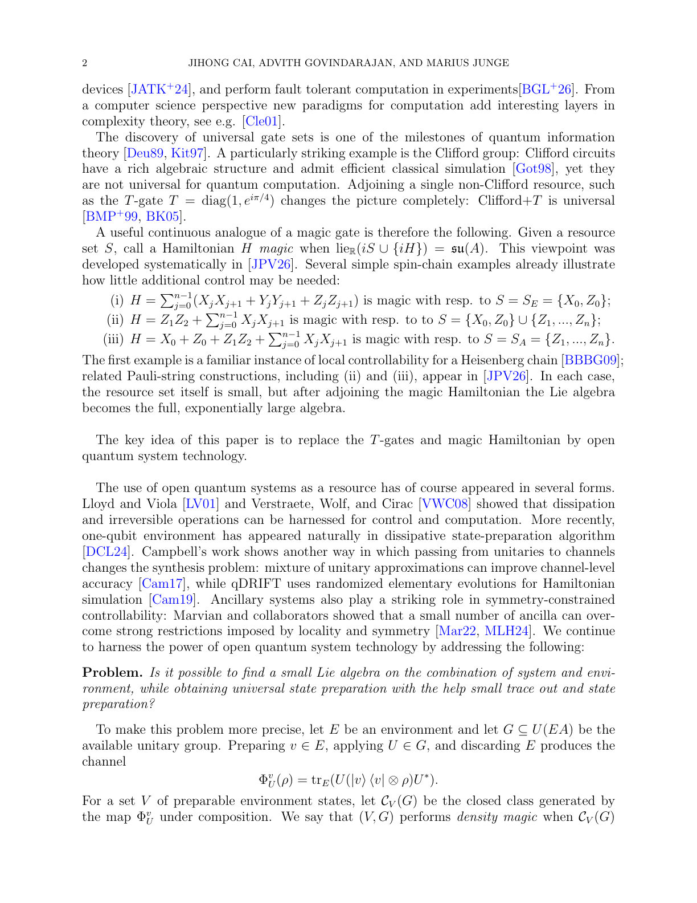
<figcaption class="paper-figure-caption"><b>Fig 1.</b> Low-resolution page preview, page 2</figcaption>
</figure>
<figure class="paper-figure-card">
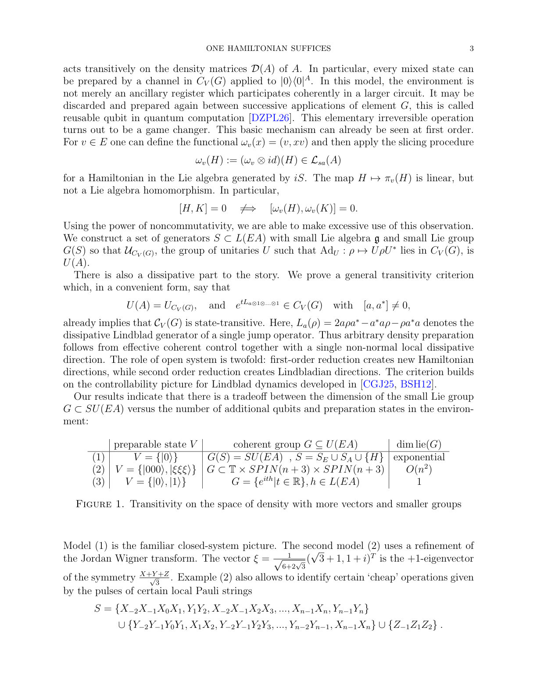
<figcaption class="paper-figure-caption"><b>Fig 2.</b> Low-resolution page preview, page 3</figcaption>
</figure>
<figure class="paper-figure-card">
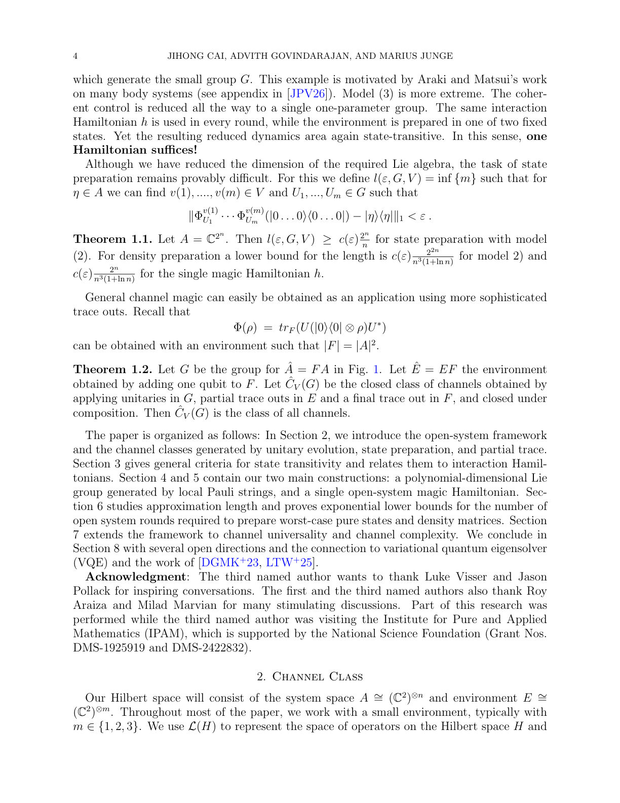
<figcaption class="paper-figure-caption"><b>Fig 3.</b> Low-resolution page preview, page 4</figcaption>
</figure>
<figure class="paper-figure-card">
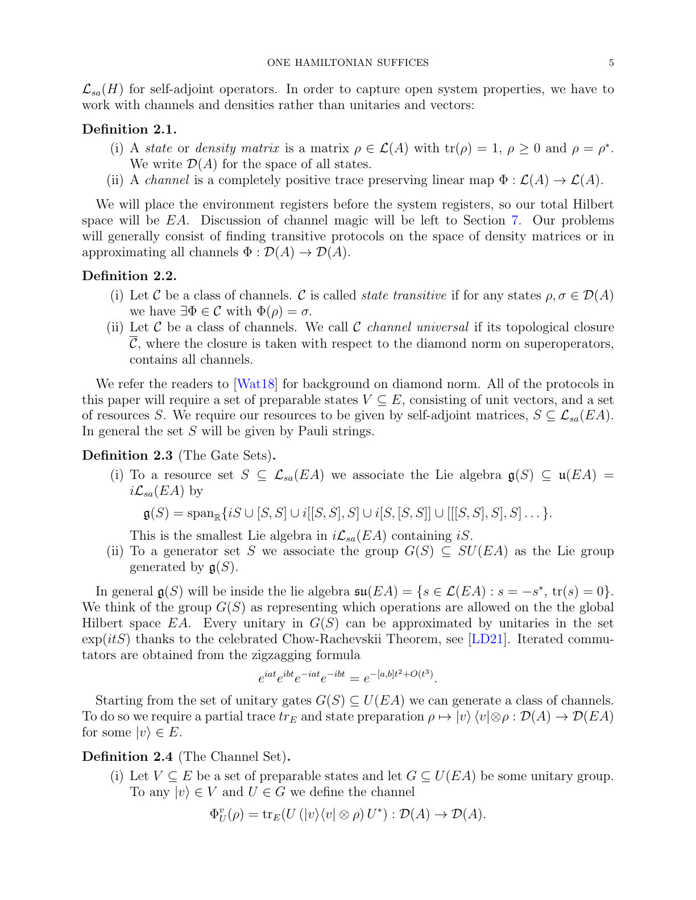
<figcaption class="paper-figure-caption"><b>Fig 4.</b> Low-resolution page preview, page 5</figcaption>
</figure>
<figure class="paper-figure-card">
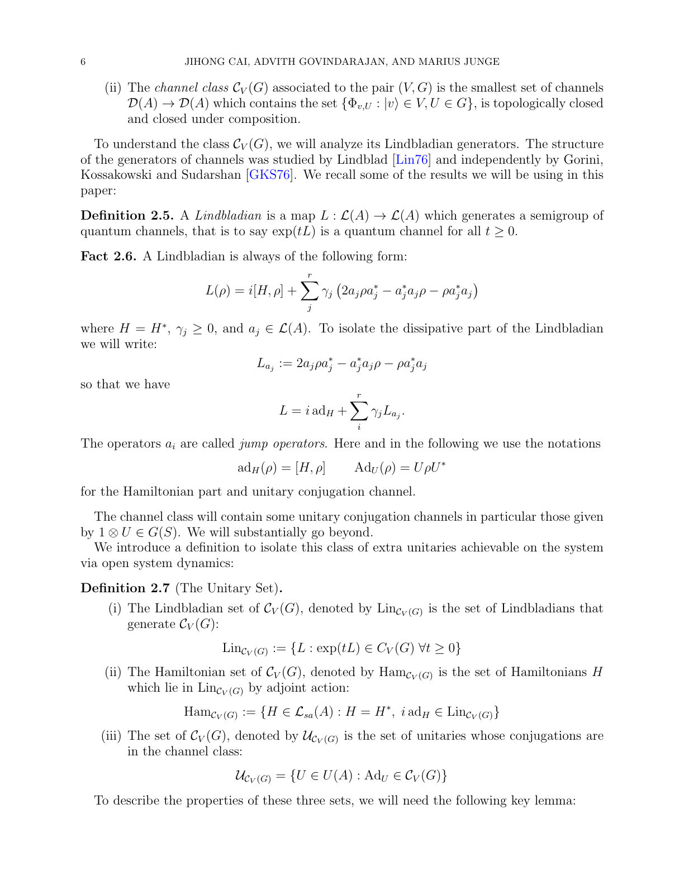
<figcaption class="paper-figure-caption"><b>Fig 5.</b> Low-resolution page preview, page 6</figcaption>
</figure>

**Summary.** This theoretical paper proposes a novel method to achieve universal state and channel control in open quantum systems by restricting the available operations to a small, polynomially-sized Lie group derived from local Pauli strings. By leveraging the environment and partial trace, the authors demonstrate that complex, global operations can be simulated efficiently, bypassing the need to control the entire unitary group.

**Why it may be interesting.** This work provides concrete, resource-efficient pathways for quantum control, showing that structured local interactions can simulate the power of global, complex gates, which is crucial for designing practical quantum hardware protocols.

Detailed structure

**Main problem.** The paper addresses the challenge of achieving universal state and channel preparation in open quantum systems without relying on the full, exponentially large unitary group.

**Main result.** They show that state and channel universality can be achieved by identifying small, polynomially-sized Lie groups derived from local Pauli strings, and by utilizing the environment to extend the available operations.

**Method.** The approach involves characterizing the achievable set of operations (channels) using the framework of open quantum systems, specifically by analyzing the Lie algebra generated by the available unitary and dissipative operations.

**Model / system.** The system consists of a primary system A (n qubits) coupled to an environment E, whose dynamics are governed by open quantum system master equations (Lindbladians). The operations are derived from combining group operations $G$ with environment interactions $V$.

**Key observables.** State density matrices $
ho$, quantum channels $\Phi$, and the approximation error $\varepsilon$ for state/channel preparation.

**Important parameters / regimes.** The dimension of the generated Lie algebra, which is shown to be polynomial in $n$ rather than exponential.

**Assumptions / limitations.** The analysis relies on the ability to approximate the required operations using a small, structured Lie group $G$ and an environment interaction $V$.

**Figures summary.** Figure 1 illustrates a trade-off comparison between three models for state preparation complexity: closed system (exponential), using a small group $G$ (polynomial), and using a single interaction Hamiltonian.

**Paper structure.** The paper develops the mathematical framework for open system operations, defines state and channel transitivity, and then proves theorems establishing that polynomial resources (small Lie groups) can achieve universality, contrasting this with the exponential complexity of the full unitary group.

Abstract

We propose a novel approach to state preparation by embracing the full power of open quantum systems. Instead of working with the whole unitary group in $n$ qubits, we identify a small Lie group $G$ in $(n+3)$ qubits. The dimension of its Lie algebra is $\text{poly}(n)$. Every state can be approximated starting from any fixed input state by repeatedly using partial trace and state preparation in the environment alongside group operations. Moreover, we also identify a single (open system magic) interaction Hamiltonian whose unitary group can be combined with open system quantum technology mentioned above to achieve transitivity on the space of all densities. Similarly, we show that all channels on $n$ qubits can be approximated by using a larger environment, achieving channel universality. The interesting small groups we identify are derived from Lie algebras of local Pauli strings and lead to a new landscape of cheap and expensive states, densities, and channels.

[↑ back to top](#top)

### [Dissipation-Sensitivity Trade-Off in Dissipative Bosonic Systems](http://arxiv.org/abs/2610.01112v1)

**Authors:** Kohei Yoshimura, Ryusuke Hamazaki  
**Type:** theory · **Category:** statistical mechanics · **PDF:** <https://arxiv.org/pdf/2610.01112v1>  
**Analysis basis:** full PDF text, analyzed in chunks
**Topic relevance:** `driven-dissipative phase transition` **3/5** · `methods for driven-dissipative` **3/5** · `non-equilibrium universality` **3/5** · `Keldysh / 2PI / non-Gaussian methods` **2/5** · `quantum measurements` **2/5** · `analog quantum simulation` **1/5** · `correlated / nonlocal dissipation` **1/5**

↔ Scroll figures horizontally

<figure class="paper-figure-card">
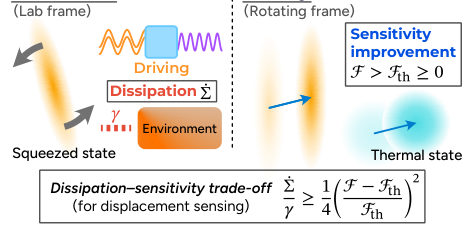
<figcaption class="paper-figure-caption"><b>Fig 1.</b> Figure 1. We consider a single-mode bosonic system kept out of equilibrium to possess higher estimation performance. We derive a trade-off between the dissipation required to maintain the sensi- tive state and the increase in its sensitivity over a thermal state. For displacement sensing, the entropy production rate is bounded quadrat- ically by the quantum Fisher information gain, while linear bounds are obtained for rotation and squeezing sensing.</figcaption>
</figure>
<figure class="paper-figure-card">
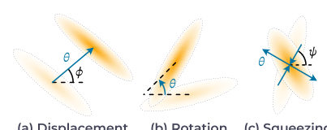
<figcaption class="paper-figure-caption"><b>Fig 2.</b> Figure 2. We focus on three sensing protocols in the phase space: (a) displacement in angle ϕ, (b) rotation about the origin, and (c) squeezing in angle ψ. Note that while θ is the estimated parameter, ϕ and ψ are fixed parameters that designate the operation.</figcaption>
</figure>
<figure class="paper-figure-card">
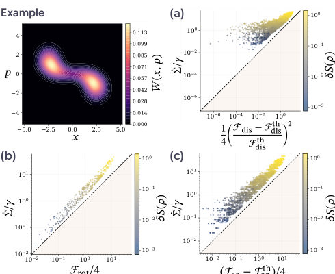
<figcaption class="paper-figure-caption"><b>Fig 3.</b> Figure 4. Numerical verification of the dissipation–sensitivity trade- offs for non-Gaussian states (details found in [61]). In the top left, the Wigner function of a typical steady state with two peaks is shown. Panels (a), (b), and (c) correspond to displacement, rotation, and squeezing bounds. No violation was observed. The dots are colored by the non-Gaussianity measured by the von Neumann entropy de- crease from the corresponding Gaussian state with the same mean and covariance as the steady state. Unlike the Gaussian simulation, we randomly sample Hamiltonian parameters G and K (in addition to ¯n) rather than r and V. In (a) and (c), we randomly choose eight angles for both ϕ and ψ,...</figcaption>
</figure>
<figure class="paper-figure-card">
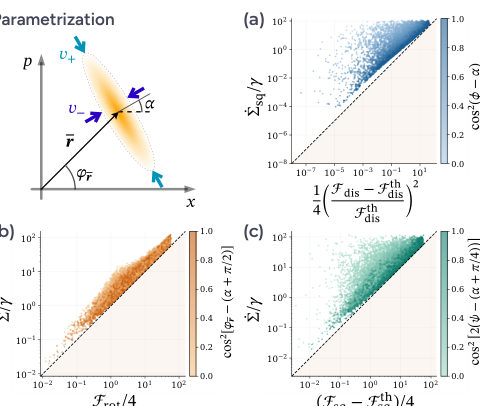
<figcaption class="paper-figure-caption"><b>Fig 4.</b> Figure 3. Numerical verification of inequalities (7). In the top left, we show the parametrization of steady states. We plot the EPR and the QFI bounds at randomly generated 8000 steady states for (a) displacement, (b) rotation, and (c) squeezing. No violation was observed. The dots are colored based on the similarity between (a) squeezed angle α and displacement angle ϕ, (b) anti-squeezed angle α + π/2 and r’s direction, and (c) a middle angle α + π/4 and squeezing angle ψ (up to a π/2 difference). When the two angles are close, the inequality becomes tight. For more details, including the choice of sampling parameters, see the SM [61].</figcaption>
</figure>

**Summary.** This paper establishes a universal thermodynamic trade-off principle for quantum sensing in bosonic systems. It rigorously derives a lower bound connecting the required steady-state entropy production rate to the achievable quantum sensitivity, quantified by the Quantum Fisher Information. This connects non-equilibrium thermodynamics directly to the limits of quantum measurement.

**Why it may be interesting.** This work provides a quantitative thermodynamic constraint on quantum metrology, linking the irreversible processes (dissipation) inherent in open quantum systems directly to their ultimate measurement precision limits.

Detailed structure

**Main problem.** The paper investigates the fundamental trade-off between the dissipation required to maintain a quantum state and the resulting sensitivity gain for quantum estimation in bosonic systems.

**Main result.** A universal trade-off inequality is rigorously derived, bounding the steady-state entropy production rate in terms of the achievable Quantum Fisher Information gain relative to the thermal state.

**Method.** The analysis involves deriving and solving the Lindblad equation for bosonic systems, calculating the steady-state entropy production rate, and applying the Quantum Fisher Information formalism for various sensing tasks.

**Model / system.** The system is a single-mode or N-mode bosonic system described by annihilation and creation operators, evolving under a Lindblad master equation. The analysis covers both quadratic (Gaussian) and non-Gaussian (Kerr nonlinearity) Hamiltonians.

**Key observables.** Entropy Production Rate ($\dot{\Sigma}$), Quantum Fisher Information (QFI) for displacement, rotation, and squeezing sensing ($F_{	ext{dis}}, F_{	ext{rot}}, F_{	ext{sq}}$).

**Important parameters / regimes.** Thermal environment temperature (implied by $eta$), dissipation rate ($\gamma$), and the degree of nonlinearity (Kerr coupling $K$).

**Assumptions / limitations.** The initial rigorous derivation is established for Gaussian steady states, although the bounds are shown to hold numerically beyond this regime.

**Figures summary.** Figures illustrate the trade-off relationship between dissipation and sensitivity for different sensing protocols (displacement, rotation, squeezing) in phase space, and numerically verify the derived inequalities for both Gaussian and non-Gaussian states.

**Paper structure.** The paper develops the theory by first establishing the dynamics and observables for bosonic systems, deriving the core trade-off relation connecting $\dot{\Sigma}$ and QFI, and then numerically verifying this bound across various sensing tasks and nonlinearity regimes.

Abstract

We discover a universal trade-off between the dissipation required to maintain a quantum state more sensitive than a thermal one and the sensitivity gain for a driven single-mode bosonic system under a thermal environment. Specifically, for Gaussian states, we rigorously derive a lower bound on the entropy production rate in the steady state in terms of the quantum Fisher information gain relative to a thermal reference state. Numerical investigations of Kerr nonlinearities further support that these bounds can hold beyond the Gaussian regime. Our results establish a new connection between steady-state thermodynamics and quantum metrological performance.

[↑ back to top](#top)

### [Late-Time Power Laws in Fluorescence Decays: Quantum Decay or Alternative Mechanisms?](http://arxiv.org/abs/2610.00603v1)

**Authors:** Francesco Giacosa, Anna Kolbus, Krzysztof Kyziol, Magdalena Plodowska, Milena Piotrowska, Karol Szary, Arthur Vereijken  
**Type:** both · **Category:** other · **PDF:** <https://arxiv.org/pdf/2610.00603v1>  
**Analysis basis:** full PDF text, analyzed in chunks
**Topic relevance:** `correlated / nonlocal dissipation` **3/5** · `quantum optics experiment` **3/5** · `driven-dissipative phase transition` **2/5** · `methods for driven-dissipative` **2/5** · `Keldysh / 2PI / non-Gaussian methods` **1/5** · `analog quantum simulation` **1/5** · `non-equilibrium universality` **1/5** · `quantum measurements` **1/5** · `scars & prethermalization` **1/5**

↔ Scroll figures horizontally

<figure class="paper-figure-card">
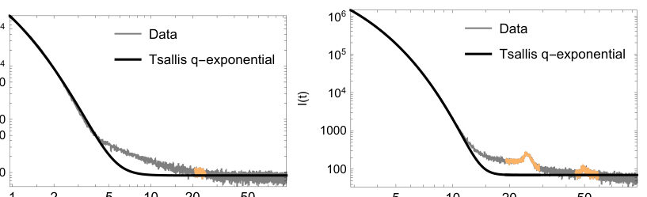
<figcaption class="paper-figure-caption"><b>Fig 1.</b> Figure 1: Results of the fits using the Tsallis-statistics model. Non-fitted data are marked in orange, see Ref. [17] – this is due to effects related to time-to-digital converter and its internal reference clock leading to periodic structures with the period of 25 ns.</figcaption>
</figure>
<figure class="paper-figure-card">
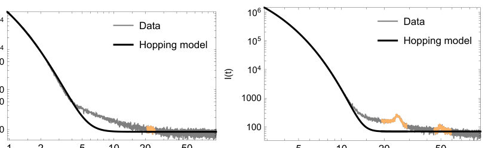
<figcaption class="paper-figure-caption"><b>Fig 2.</b> Figure 2: Results of the fits using the energy-migration model. Non-fitted data are marked in orange – this is due to effects related to time-to-digital converter and its internal reference clock leading to periodic structures with the period of 25 ns.</figcaption>
</figure>

**Summary.** This paper examines the origin of late-time power-law tails in fluorescence decay, comparing predictions from quantum mechanics against alternative models like nonextensive statistics and energy migration. Using time-resolved spectroscopy data, the authors argue that the experimental features do not align perfectly with the predictions of these alternative models, lending support to a specific interpretation of the quantum decay process.

**Why it may be interesting.** This work directly addresses the interpretation of non-exponential decay in open quantum systems, a core topic in AMO physics and quantum optics, by rigorously testing competing physical models against real experimental data.

Detailed structure

**Main problem.** The paper investigates the origin of late-time power-law decays observed in fluorescence decay curves, determining if they arise from fundamental quantum mechanical predictions or from alternative physical mechanisms.

**Main result.** The analysis suggests that the specific features expected from the quantum-mechanical description, such as a sharp transition from exponential to power-law decay, cannot be reproduced by the alternative statistical or energy-migration parametrizations fitted to the experimental data.

**Method.** The authors compare time-resolved fluorescence spectroscopy data from fluorophores (erythrosine B and eosine Y) against predictions from quantum decay theory, nonextensive Tsallis statistics, and energy-migration models.

**Model / system.** The study uses time-resolved fluorescence spectroscopy on molecular fluorophores. Theoretical models include standard quantum mechanical decay, Tsallis q-exponential relaxation, and energy-migration rate equations.

**Key observables.** The primary observables are the fluorescence intensity decay $I(t)$ and the power-law exponent ($eta$) observed at late times.

**Important parameters / regimes.** Key parameters include the Tsallis nonextensivity index ($q$), the energy-migration rate parameters ($\gamma, 	au_2$), and the decay time constants ($	au$).

**Assumptions / limitations.** The analysis assumes that the observed power-law decay must be explained by one of the tested theoretical frameworks, though the authors note that the ill-conditioned nature of the inverse problem limits uniqueness.

**Figures summary.** Figures illustrate the successful fitting of experimental data for Erythrosine B and Eosine Y using the Tsallis-statistics model and the energy-migration model, while contrasting these fits with predictions from the delayed fluorescence model.

**Paper structure.** The paper establishes the theoretical context of power-law decay in quantum systems, presents the experimental data from fluorescence spectroscopy, and then systematically confronts the QM predictions against alternative models (Tsallis, energy-migration) using fitting procedures.

Abstract

In quantum mechanics, the properties of an unstable system are closely related to its corresponding energy distribution. One of the predictions of the theory is the emergence of a late-time power law in the survival probability $P(t)$ of the unstable state. However, in complex systems, similar effects may emerge due to other phenomena. This is the case for nonextensive statistical models, for some continuous lifetime distribution models, and also for certain energy-migration models applied to fluorescence. In this work, these alternative interpretations are confronted with data from time-resolved fluorescence spectroscopy experiments with erythrosine B and eosine Y as fluorophores. It turns out that some of the features expected within the quantum-mechanical description, such as the sharp transition from the exponential to the power-law regime, cannot be reproduced by the specific statistical and energy-migration parametrizations fitted in the analysis.

[↑ back to top](#top)

### [Correlation Imaging via Hybrid Entanglement between Microwave Photons and Surface Acoustic Wave Phonons](http://arxiv.org/abs/2610.01252v1)

**Authors:** Yu-Yuan Chen, Ling-An Wu, Yu-xi Liu  
**Type:** both · **Category:** other · **PDF:** <https://arxiv.org/pdf/2610.01252v1>  
**Analysis basis:** full PDF text, analyzed in chunks
**Topic relevance:** `quantum optics experiment` **3/5** · `QC/QI experiment` **2/5** · `analog quantum simulation` **2/5** · `quantum measurements` **2/5** · `Full counting statistics` **1/5** · `correlated / nonlocal dissipation` **1/5** · `driven-dissipative phase transition` **1/5** · `interference shaping light` **1/5** · `methods for driven-dissipative` **1/5**

↔ Scroll figures horizontally

<figure class="paper-figure-card">
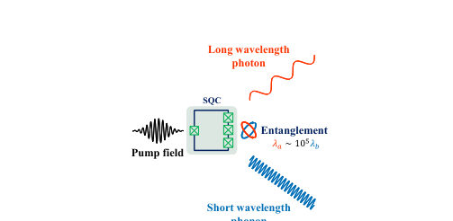
<figcaption class="paper-figure-caption"><b>Fig 1.</b> FIG. 1. Conceptual schematic of correlation imaging via hy- brid photon-phonon entanglement. A SQC, driven by a pump field, generates pairs of entangled photons and phonons at comparable frequencies with a wavelength disparity.</figcaption>
</figure>
<figure class="paper-figure-card">
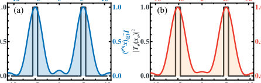
<figcaption class="paper-figure-caption"><b>Fig 2.</b> FIG. 2. Cross-scale correlation images for: (a) the de- magnification modality, and (b) the magnification modal- ity. Blue and orange curves denote the normalized correla- tions I(2) −(xb,d) and I(2) + (xa,d), respectively, while gray curves represent the object transmission |To(xo)|2.</figcaption>
</figure>
<figure class="paper-figure-card">
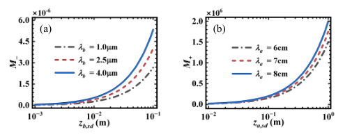
<figcaption class="paper-figure-caption"><b>Fig 3.</b> FIG. 3. (a) Demagnification factor vs. longitudinal propa- gation distance zb,sd for different phononic wavelengths λb. (b) Magnification factor vs. longitudinal propagation distance za,sd for different photonic wavelengths λa. Other parameters are the same as in Fig. 2.</figcaption>
</figure>
<figure class="paper-figure-card">
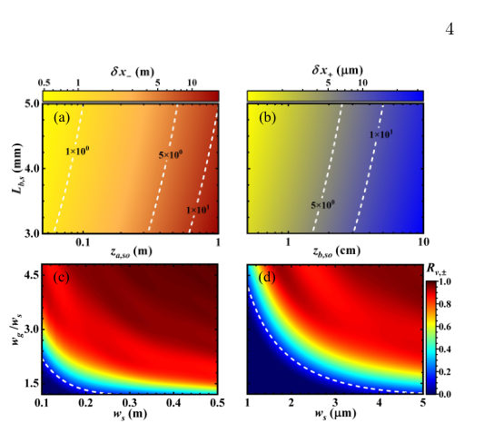
<figcaption class="paper-figure-caption"><b>Fig 4.</b> FIG. 4. (a) Resolution of demagnification modal- ity vs. phononic source aperture Lb,s and photonic propa- gation distance za,so. (b) Resolution of magnification modal- ity vs. phononic source aperture Lb,s and phononic propa- gation distance zb,so. (c) and (d): Imaging visibility vs. slit width ws and slit-distance wg, corresponding to demagnifica- tion and magnification modalities in (a) and (b), respectively. The white dashed line marks Rv,± ≃0.15, below which the correlation function signal becomes insufficient for reliable re- construction of the object’s spatial profile [49]. Other param- eters are the same as in Fig. 2.</figcaption>
</figure>

**Summary.** This paper presents a correlation imaging technique using hybrid entanglement between microwave photons and surface acoustic wave phonons. By exploiting the massive wavelength mismatch between these two fields, the method achieves unprecedented cross-scale sensing capabilities. This allows researchers to image macroscopic objects onto tiny chips, and vice versa, opening a general framework for multi-physics quantum sensing.

**Why it may be interesting.** This work is highly relevant to open quantum systems and quantum optics, demonstrating a novel method to engineer quantum correlations across vastly different physical platforms (microwave/acoustic/optical) for sensing applications.

Detailed structure

**Main problem.** The core problem is establishing effective spatial correlations between distinct quantum fields (photons and phonons) for multi-physics quantum sensing, overcoming the limitation where the optimal probing field differs from the readout field.

**Main result.** The authors propose a correlation imaging approach that enables two highly scalable modalities: demagnifying macroscopic object profiles onto microscopic phononic chips, and magnifying microscopic profiles onto macroscopic photonic readout devices.

**Method.** The imaging is achieved by measuring two-photon/two-phonon coincidence correlation functions, G^(2), derived from the hybrid entanglement between microwave photons and surface acoustic wave phonons.

**Model / system.** The system utilizes hybrid entanglement generated between microwave photons and surface acoustic wave (SAW) phonons via a superconducting quantum circuit. The unique resource stems from the five order-of-magnitude wavelength disparity between these two quantum fields.

**Key observables.** The correlation function G^(2)(x_a, d; x_b, d) is the key observable, used to reconstruct the object's spatial profile via integration.

**Important parameters / regimes.** The scaling factors are extreme: $10^{-8} - 10^{-6}$-fold demagnification and $10^4 - 10^6$-fold magnification. Performance depends on coupling constants, propagation distances, and source apertures.

**Assumptions / limitations.** Key assumptions include the weak pump approximation and the quasi-monochromatic approximation for the fields.

**Figures summary.** Figure 2 simulates cross-scale correlation images for both demagnification and magnification modalities, comparing normalized correlations to the object transmission profile. Other figures detail the dependence of scaling factors and resolution on physical parameters.

**Paper structure.** The paper introduces the problem, details the physical platform (photon-phonon entanglement), derives the correlation imaging formulas for both demagnification and magnification, and discusses the resulting cross-scale sensing capabilities.

Abstract

Establishing effective spatial correlations between distinct quantum fields is essential for multi-physics quantum sensing.~We here propose a correlation imaging approach based on the hybrid entanglement between microwave photons and microwave surface acoustic wave phonons generated via a superconducting quantum circuit.~At matched microwave frequencies, the five order-of-magnitude wavelength disparity between photons and phonons leads to a unique quantum entanglement resource, which allows the optimal field for probing an object to be distinct from that used for readout.~This resource enables two imaging modalities with giant spatial scaling: a $10^{-8}-10^{-6}$-fold demagnification of macroscopic object profiles onto microscopic phononic chips, and conversely, a $10^{4}-10^{6}$-fold magnification of microscopic object profiles into macroscopic photonic readout devices. By interfacing free-space long-wavelength microwaves with on-chip short-wavelength surface acoustic waves, our correlation imaging approach provides a general framework for cross-scale quantum sensing.

[↑ back to top](#top)

### [Quantum Krylov Learning](http://arxiv.org/abs/2610.00537v1)

**Authors:** Shunji Matsuura, Yoji Kawamura, Joseph Salfi, Satoshi Iso  
**Type:** theory · **Category:** other · **PDF:** <https://arxiv.org/pdf/2610.00537v1>  
**Analysis basis:** full PDF text, analyzed in chunks
**Topic relevance:** `methods for driven-dissipative` **3/5** · `quantum measurements` **3/5** · `Keldysh / 2PI / non-Gaussian methods` **2/5** · `analog quantum simulation` **2/5** · `driven-dissipative phase transition` **2/5** · `correlated / nonlocal dissipation` **1/5** · `non-equilibrium universality` **1/5**

↔ Scroll figures horizontally

<figure class="paper-figure-card">
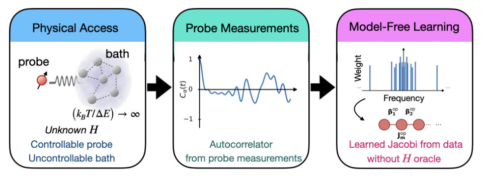
<figcaption class="paper-figure-caption"><b>Fig 1.</b> Figure 1: Overview of Quantum Krylov Learning (QKL). Physical access. A fully controlled probe is coupled to an uncontrolled and unmeasured bath. The probe-bath system evolves under an unknown total Hamiltonian H. The bath is assumed to be at effectively infinite temperature. More precisely it is in the regime kBT ≫∆E, where ∆E denotes the characteristic internal energy scale of the bath. Probe time trace. For a chosen probe operator σα, the autocorrelation Cα(t) is extracted from measurements of the probe after free time evolution. Appropriate initial probe states are chosen according to σα, so that only single-probe measurements are required. Model- free learning. The measured...</figcaption>
</figure>
<figure class="paper-figure-card">
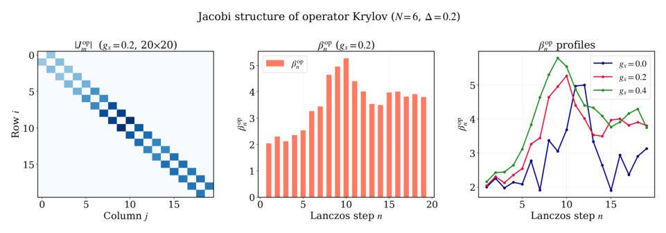
<figcaption class="paper-figure-caption"><b>Fig 2.</b> Figure 2: Oracle construction of the operator Krylov Jacobi structure (N = 6, ∆= 0.2). Left, heatmap of |Jop m | (20 × 20) for gx = 0.2. The exactly tridiagonal pattern confirms Theorem 1, with off-tridiagonal entries at machine precision (≲10−15). Center, subdiagonal coefficients βop n versus Lanczos step n for gx = 0.2 (the diagonal αop n is omitted since it is zero at machine precision). Right, βop n profiles for gx ∈{0, 0.2, 0.4}. Larger gx gives larger βop n for n ≲10, reflecting faster operator spreading under stronger symmetry breaking. Beyond the peak the ordering is no longer monotonic in gx. The peak near n ≈10 reflects operator spreading before finite-size saturation.</figcaption>
</figure>
<figure class="paper-figure-card">

<figcaption class="paper-figure-caption"><b>Fig 3.</b> Figure 5 verifies Theorem 3 numerically. For the model above (Eq. (24)), we construct the same op- erator Krylov Jacobi matrix Jop m in three ways and compare them. (A) The oracle is the ordinary op- erator Lanczos that applies the commutator L = [H, · ] directly to the seed σα p in the D2-dimensional Liouville space, assuming full knowledge of H. It cannot be used in a restricted-access experiment but gives the numerical ground truth. (B) Exact diagonalization of H builds the exact spectral measure µα from the true Bohr frequencies ωjk = Ej −Ek and weights |⟨Ej|σα p |Ek⟩|2/(D∥σα p ∥2 HS), and applies the Stieltjes/Lanczos procedure to it. (B) is not built from a time series and is...</figcaption>
</figure>
<figure class="paper-figure-card">
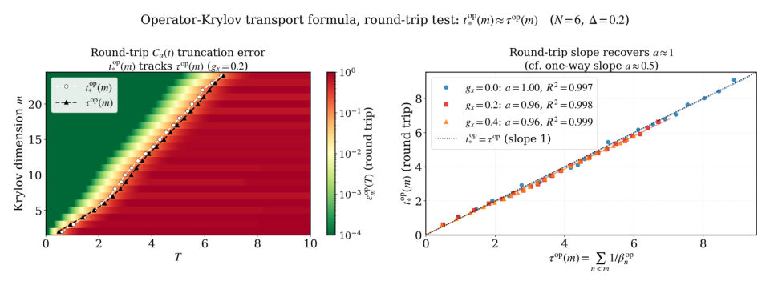
<figcaption class="paper-figure-caption"><b>Fig 4.</b> Figure 3: Direct round-trip verification of the operator transport formula (14) (N = 6, ∆= 0.2, ϵop m (T) = maxs≤T |Cα(s) −C(m) α (s)|, the truncation error of the operator autocorrelation Cα(t) = (Q0|eiJop m t|Q0) itself, i.e., the state-independent return element bounded by Eq. (33)). Left, heatmap of ϵop m (T) for gx = 0.2 with the break time top ∗(m) (white) at threshold 0.1, tracking τ op(m) (black) closely. Right, top ∗(m) versus τ op(m) with the affine fit top ∗= a τ op +b for gx ∈{0, 0.2, 0.4}, yielding (a, R2) = (1.00, 0.997), (0.96, 0.998), (0.96, 0.999), respectively, with the intercept b ≈0 in all cases. The round-trip slope recovers a ≈1, matching the state Krylov result of...</figcaption>
</figure>
<figure class="paper-figure-card">
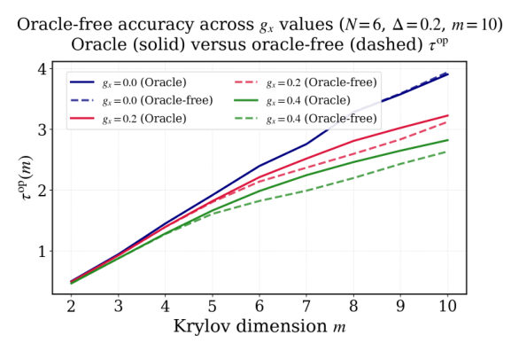
<figcaption class="paper-figure-caption"><b>Fig 5.</b> Figure 4: Accuracy of the oracle-free τ op across gx (N = 6, ∆= 0.2, m = 10, TC = 160). Oracle (solid) versus oracle-free (dashed) τ op(m) for gx ∈{0, 0.2, 0.4}. The curves closely track each other over the whole Krylov depth shown. Final relative errors at m = 10 are 0.9% (gx = 0), 3.2% (gx = 0.2), and 6.6% (gx = 0.4).</figcaption>
</figure>

**Summary.** This paper introduces Quantum Krylov Learning (QKL), a novel technique to deduce the spectral properties of an unknown quantum Hamiltonian using only measurements from a controlled probe coupled to the system. By analyzing the probe's autocorrelation function, QKL reconstructs the system's dynamical structure without requiring any assumptions about the Hamiltonian's form or symmetry. This makes it a highly general and powerful tool for quantum characterization in experimental settings.

**Why it may be interesting.** This work provides a powerful, general framework for quantum characterization that bypasses the need for specific symmetries or known model Hamiltonians, which is crucial for analyzing complex, unknown quantum materials or sensing environments.

Detailed structure

**Main problem.** To develop a model-independent method for extracting the spectral information of an unknown quantum Hamiltonian from limited measurements performed via a controllable probe.

**Main result.** Quantum Krylov Learning (QKL) reconstructs the operator Krylov Jacobi matrix representing the system's accessible dynamical modes directly from probe autocorrelators, requiring no prior knowledge of the Hamiltonian's symmetry or parametric form.

**Method.** The method uses the single-temperature probe autocorrelator and its operator Krylov structure, applying the Lanczos process to the Liouvillian superoperator to generate a tridiagonal Jacobi matrix.

**Model / system.** The system consists of an unknown total Hamiltonian H governing a quantum system, which is decomposed into a controllable probe coupled to an unmeasured bath. The analysis is performed in the Liouville space using the probe's time evolution.

**Key observables.** Probe autocorrelator C_alpha(t), the operator Krylov Jacobi matrix (J_op), and the spectral measure mu_alpha.

**Important parameters / regimes.** Spectral precision epsilon (achieving polynomial scaling in 1/epsilon), and the assumption of infinite temperature for the bath.

**Assumptions / limitations.** The unobserved bath is assumed to be at or near infinite temperature (k_B T >> Delta E), and the required operations are limited to probe state preparation, free evolution under H, and probe measurement.

**Figures summary.** Figure 1 illustrates the QKL pipeline, showing the flow from physical access (probe coupled to bath) to the time trace (C_alpha(t)) and finally to the model-free learning of the Jacobi matrix (J_op).

**Paper structure.** The paper introduces QKL, details the mathematical framework using the operator Krylov subspace and the Lanczos process, establishes the model-independent nature of the reconstruction, and concludes with theoretical bounds (Lieb-Robinson) and sample complexity guarantees.

Abstract

The Hamiltonian of a natural quantum system is usually determined indirectly, by proposing microscopic models and comparing their predicted observables with experiment. A more direct approach is to extract information about the Hamiltonian from measurements on the system itself. In many settings, however, direct access to the full system is unavailable and measurements can be performed only through controllable probes, as in quantum sensing and boundary spectroscopy. Existing Hamiltonian learning protocols under such restricted access typically require a special symmetry, a known parametric form, or controlled operations beyond free evolution. We introduce Quantum Krylov Learning (QKL), a restricted-access framework that avoids these requirements. QKL uses single temperature probe autocorrelators and their operator Krylov structure to extract model-independent spectral information about the unknown system. Rather than fitting a parametrized Hamiltonian, it reconstructs the operator Krylov Jacobi matrix representing the dynamical modes accessible to the probe. The method assumes that the unobserved system is at, or near, infinite temperature. Under this condition, the Jacobi matrix can be reconstructed directly from the autocorrelation of a probe observable, without oracle access to the Hamiltonian. The required operations are free evolution under the unknown $H$, together with probe state preparation and measurement. The learning core therefore requires no symmetry, no parametric model, and no controlled-unitary gates. We show a Lieb--Robinson bound for the operator Krylov chain and derive a data-driven criterion for the required observation window. We also establish an end-to-end sample complexity guarantee: under generic conditions on the spectral gaps and weights, the number of measurement shots required to achieve spectral precision $\varepsilon$ is polynomial in $1/\varepsilon$.

[↑ back to top](#top)

### [Coherent Release Fronts in Krylov Chains and Thermal AdS$_2$ Response](http://arxiv.org/abs/2610.01862v1)

**Authors:** Mohsen Alishahiha  
**Type:** theory · **Category:** statistical mechanics · **PDF:** <https://arxiv.org/pdf/2610.01862v1>  
**Analysis basis:** full PDF text, analyzed in chunks
**Topic relevance:** `non-equilibrium universality` **3/5** · `Keldysh / 2PI / non-Gaussian methods` **2/5** · `methods for driven-dissipative` **2/5** · `Frenkel-Kontorova` **1/5** · `analog quantum simulation` **1/5** · `correlated / nonlocal dissipation` **1/5** · `driven-dissipative phase transition` **1/5** · `quantum measurements` **1/5** · `scars & prethermalization` **1/5**

↔ Scroll figures horizontally

<figure class="paper-figure-card">
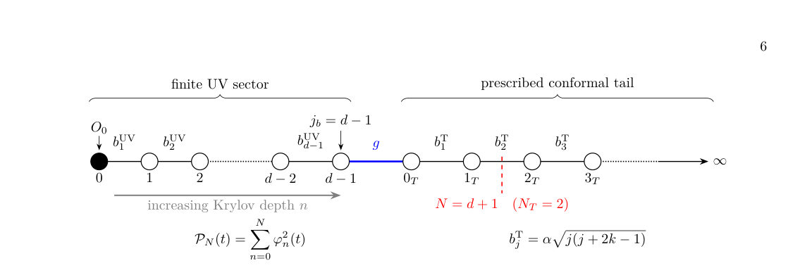
<figcaption class="paper-figure-caption"><b>Fig 1.</b> FIG. 1. A finite UV sector coupled through g (blue) to a prescribed conformal tail. The red observation boundary is drawn after 1T : the illustrated cut includes NT = 2 tail sites, so its last global index is N = d + 1. It is a projection boundary, not an absorbing wall. The chain remains discrete; a smooth-envelope description in logarithmic depth applies only at large index.</figcaption>
</figure>

**Summary.** This work analyzes how quantum information or spectral weight coherently leaks from a localized, finite quantum subsystem into an infinite, exactly solvable continuum tail. By deriving the moving-cut limit, the authors characterize the spectral dynamics, showing that the tail sets the long-distance scale while the finite structure governs the initial emission profile. This framework is applied to model physical systems related to thermal AdS2 geometry.

**Why it may be interesting.** The connection between spectral dynamics (Krylov chains) and holographic/CFT structures (AdS2) provides powerful tools for understanding non-equilibrium dynamics in complex quantum systems, relevant to open quantum systems.

Detailed structure

**Main problem.** The paper investigates the coherent release of spectral weight from a finite, structured quantum sector (Krylov chain) into an exactly solvable, continuous conformal tail.

**Main result.** The moving-cut limit of the occupation kernel is derived, showing that the tail dictates the logarithmic transit scale while the finite sector determines the initial release profile.

**Method.** The analysis uses techniques involving the exact finite-cut occupation kernel, moving-cut limits, and spectral analysis derived from the structure of the Krylov basis and associated determinants.

**Model / system.** The core model is an operator dynamics problem involving a finite serial Krylov sector coupled to an exact conformal tail, which is further realized in the context of thermal AdS2 geometry.

**Key observables.** Cumulative occupation probability ($P_N(t)$), coherent current ($J_{N+1}$), and the boundary-emission amplitude.

**Important parameters / regimes.** The coupling strength between the finite sector and the tail, and the weak-coupling limit ($\lambda 	o 0$) in the AdS2 realization.

**Assumptions / limitations.** The thermal AdS2 realization assumes a fixed scalar background, neglecting gravitational backreaction and Schwarzian fluctuations.

**Figures summary.** Figure 1 illustrates the coupling structure: a finite UV sector coupled via an interface bond to the conformal tail, with the observation cut defined by the total number of bonds.

**Paper structure.** The paper progresses by defining the system via Krylov dynamics, deriving the kernel and its moving-cut limit, analyzing the spectral density in the coupled system, and finally applying these results to the thermal AdS2 realization.

Abstract

We study coherent release from a finite serial Krylov sector into an exact conformal tail with asymptotically linear Lanczos coefficients. We derive an exact finite-cut occupation kernel and its locally uniform moving-cut limit, whose derivative is the squared modulus of a filtered boundary-emission amplitude. The tail sets the filtering kernel and logarithmic transit scale, while the release profile also depends on the finite sector. Its early edge records the number of serial steps before emission, whereas its late edge reflects slow resonances, interference, and logarithmic enhancements from merged poles. A one- and two-site family can share the same leading continued-fraction pole while exhibiting inequivalent profiles. We further consider a thermal AdS$_2$ realization in which, in the weak-coupling limit, the dressed oscillator measure approaches a two-site shallow sector followed by the conformal tail, with the leading complex pole reproduced through second order.

[↑ back to top](#top)

### [Collision models: Markovian and Non-Markovian impurity models](http://arxiv.org/abs/2610.01814v1)

**Authors:** Jacob Werner  
**Type:** theory · **Category:** other · **PDF:** <https://arxiv.org/pdf/2610.01814v1>  
**Analysis basis:** full PDF text, analyzed in chunks
**Topic relevance:** `correlated / nonlocal dissipation` **3/5** · `driven-dissipative phase transition` **3/5** · `methods for driven-dissipative` **3/5** · `non-equilibrium universality` **2/5** · `Keldysh / 2PI / non-Gaussian methods` **1/5** · `quantum measurements` **1/5**

↔ Scroll figures horizontally

<figure class="paper-figure-card">
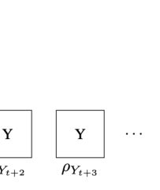
<figcaption class="paper-figure-caption"><b>Fig 1.</b> Figure 1: Markovian CM schematic</figcaption>
</figure>
<figure class="paper-figure-card">
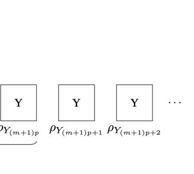
<figcaption class="paper-figure-caption"><b>Fig 2.</b> Figure 2: Markovian impurity model schematic</figcaption>
</figure>
<figure class="paper-figure-card">
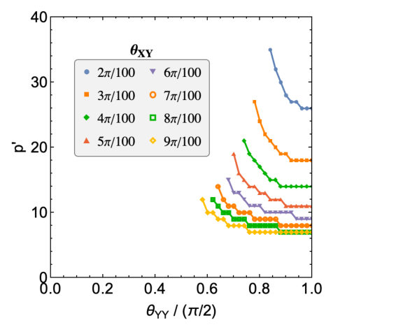
<figcaption class="paper-figure-caption"><b>Fig 3.</b> Figure 3: p′ is plotted against θY Y for different values of θXY , with ρY = ρth(0.3). The BLP measure NBLP was calculated using the σx eigenstates as the initial state pair. The curves approach an asymptote as θY Y is decreased.</figcaption>
</figure>
<figure class="paper-figure-card">
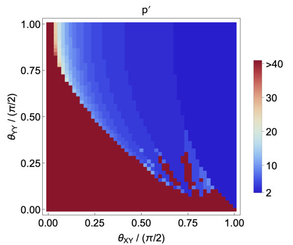
<figcaption class="paper-figure-caption"><b>Fig 4.</b> Figure 4: p′ is plotted as a function of θXY and θY Y , with ρY = ρth(0.3). Due to computational constraints, we only checked up to p = 40 for non-Markovianity. Therefore, p′ &gt; 40 could correspond to a genuine p′ &gt; 40 or that the process will remain Markovian even for p = ∞.</figcaption>
</figure>
<figure class="paper-figure-card">
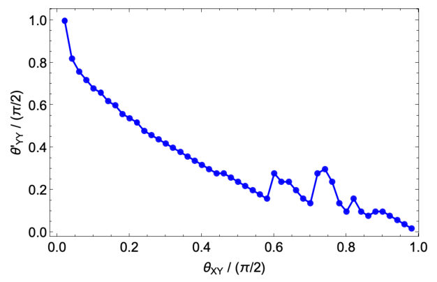
<figcaption class="paper-figure-caption"><b>Fig 5.</b> Figure 5: The maximum value of θY Y for which p = ∞still satisfies NBLP = 0 is plotted against θXY .</figcaption>
</figure>

**Summary.** This paper develops and analyzes a novel Markovian impurity model within the framework of collision models to study open quantum systems. Using the BLP measure, the authors establish a critical impurity parameter $p'$ that marks the transition point from Markovian to non-Markovian dynamics. The results show that interaction strengths can tune this critical point, offering deeper insight into the environmental memory effects in quantum dynamics.

**Why it may be interesting.** This work provides a rigorous theoretical tool (the critical $p$) to characterize when complex open quantum dynamics, modeled by sequential environmental coupling, transition from simple Markovian behavior to complex non-Markovian regimes, which is crucial for quantum memory and computation.

Detailed structure

**Main problem.** The paper investigates the non-Markovian nature of open quantum systems modeled by collision models, specifically focusing on a novel class called Markovian impurity models.

**Main result.** The authors prove that non-Markovianity propagates: if a $p$-impurity model is non-Markovian, the $(p+1)$-impurity model is also non-Markovian, establishing a critical impurity parameter $p'$ that dictates the transition from Markovian to non-Markovian dynamics.

**Method.** The non-Markovianity is quantified using the Breuer-Laine-Piilo (BLP) measure, and the analysis involves comparing the dynamics of $p$-impurity models against $(p+1)$-impurity models.

**Model / system.** The system uses Collision Models (CMs) where the environment interaction is modeled via sequential ancilla interactions. The focus is on the Markovian impurity model, defined by alternating evolution steps involving system-ancilla ($U_{XY}$) and ancilla-ancilla ($U_{YY}$) interactions.

**Key observables.** Non-Markovianity quantified by the BLP measure ($N_{BLP}$) and the change in trace distance ($\Delta D(t)$).

**Important parameters / regimes.** The impurity parameter ($p$), the critical $p'$ value, and the interaction strengths ($	heta_{XY}$ and $	heta_{YY}$).

**Assumptions / limitations.** The analysis assumes time-independent unitaries and uses the BLP measure to diagnose non-Markovianity. Numerical simulations are limited to $p \le 40$.

**Figures summary.** Figures illustrate the dependence of the critical $p'$ on interaction strengths ($	heta_{XY}$ and $	heta_{YY}$), showing how increasing these strengths generally lowers $p'$, and also plot the asymptotic value of $	heta_{YY}$ where the process remains Markovian.

**Paper structure.** The paper introduces the collision model framework and the Markovian impurity model. It then uses the BLP measure to establish the relationship between $p$ and non-Markovianity, culminating in numerical investigations of how interaction strengths tune the critical parameter $p'$.

Abstract

Collision models provide a flexible framework for studying open quantum systems and introducing non-Markovianity. We present a novel class of collision models, which we term Markovian impurity models, motivated by physical scenarios in which information backflow is periodically blocked. Using the Breuer-Laine-Piilo (BLP) measure of non-Markovianity, we show that if a $p$-impurity model is non-Markovian, then the corresponding $(p+1)$-impurity model is also non-Markovian, implying the existence of a critical $p$ at which the process transitions from Markovian to non-Markovian. Numerical simulations are used to investigate how this critical parameter depends on the system-ancilla and ancilla-ancilla interaction strengths. We find that, altough exceptions exist, increasing either interaction strength generally lowers the critical $p$, while sufficiently weak ancilla-ancilla interactions lead to a regime in which the dynamics remain Markovian even in the absence of impurities. Finally, we briefly introduce the complementary non-Markovian impurity model.

[↑ back to top](#top)

### [Enhanced Long-Wavelength Fluctuations and Interaction-Stress Correlations in Active Crystals](http://arxiv.org/abs/2610.00634v1)

**Authors:** Antik Bhattacharya, Smarajit Karmakar  
**Type:** theory · **Category:** statistical mechanics · **PDF:** <https://arxiv.org/pdf/2610.00634v1>  
**Analysis basis:** full PDF text, analyzed in chunks
**Topic relevance:** `non-equilibrium universality` **3/5** · `Keldysh / 2PI / non-Gaussian methods` **2/5** · `methods for driven-dissipative` **2/5** · `Frenkel-Kontorova` **1/5** · `analog quantum simulation` **1/5** · `correlated / nonlocal dissipation` **1/5** · `driven-dissipative phase transition` **1/5** · `quantum measurements` **1/5** · `scars & prethermalization` **1/5**

↔ Scroll figures horizontally

<figure class="paper-figure-card">
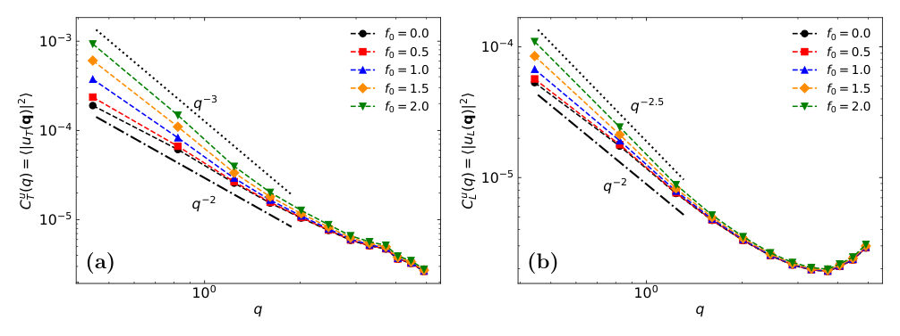
<figcaption class="paper-figure-caption"><b>Fig 1.</b> FIG. 1. Activity-enhanced displacement fluctuations in the two-dimensional crystal. (a) Transverse displacement covariance Cu T (q) = ⟨|uT (q)|2⟩and (b) longitudinal displacement covariance Cu L(q) = ⟨|uL(q)|2⟩for the indicated propulsion strengths f0. The passive spectra are consistent with the conventional elastic scaling Cu λ(q) ∼q−2. Increasing activity selectively enhances the long-wavelength modes. At low-q, the transverse spectrum approaches the q−3 guide, whereas the longitudinal spectrum displays a weaker effective dependence, approximately q−2.5.</figcaption>
</figure>
<figure class="paper-figure-card">
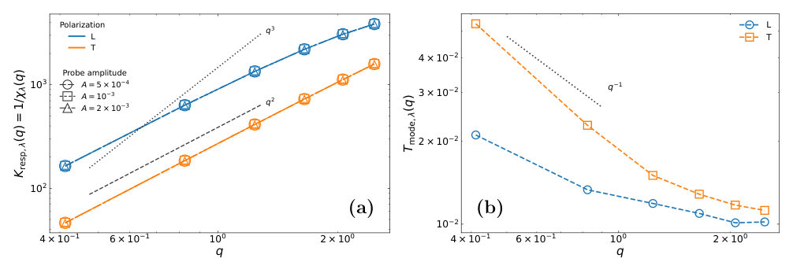
<figcaption class="paper-figure-caption"><b>Fig 2.</b> FIG. 2. (a) Static response stiffness Kresp,λ(q) = χ−1 λ (q) for the longitudinal and transverse polarizations. Different open symbols denote the probe amplitudes A = 5 × 10−4, 10−3, and 2 × 10−3 and f0 = 2.0. Their collapse demonstrates that the probe lies within the linear-response regime. Both polarizations exhibit the ordinary elastic scaling Kresp,λ(q) ∼q2, rather than the |q|3 behavior inferred from covariance inversion. The dashed and dotted lines indicate q2 and q3 guides, respectively. (b) Equal-time mode-dependent fluctuation–response ratio Tmode,λ(q) = Kresp,λ(q)Cu λ(q) for the longitudinal and transverse polarizations for f0 = 2.0. Both branches increase toward small q,...</figcaption>
</figure>
<figure class="paper-figure-card">
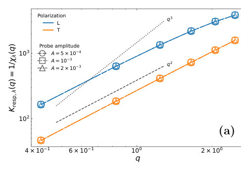
<figcaption class="paper-figure-caption"><b>Fig 3.</b> Figure 2(b) shows Tmode,λ(q) obtained by combining the measured response kernel with the displacement co- variance for f0 = 2.0. Both polarizations exhibit an en- hancement toward small q, with a substantially larger amplitude in the transverse sector. The transverse data are approximately compatible with a q−1 dependence over the low q regime. The longitudinal data show a weaker increase, and therefore do not establish a clean inverse-q scaling. At larger q, both polarizations ap- proach the thermal background scale, Tmode,λ ≃kBT, indicating that the nonequilibrium enhancement is con- centrated predominantly in the long-wavelength modes.</figcaption>
</figure>
<figure class="paper-figure-card">
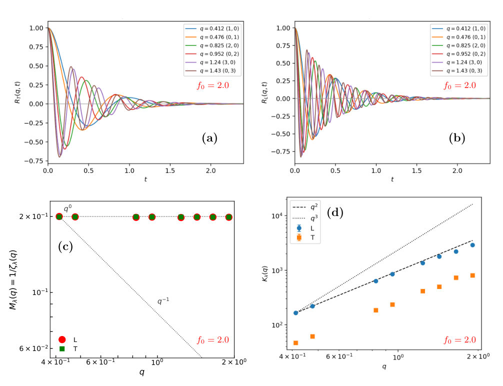
<figcaption class="paper-figure-caption"><b>Fig 4.</b> FIG. 3. Tests of nonlocal kinetic mechanisms. (a,b) Normalised response Rλ(q, t) for different low-q transverse and longitudinal modes, respectively, at activity strength f0 = 2.0. (c) Wave-vector-dependent mobility Mλ(q) = 1/ζλ(q) obtained from the dynamic response. Both longitudinal and transverse mobilities remain approximately constant, consistent with the q0 guide and inconsistent with the singular Mλ ∼q−1 behavior for f0 = 2.0. (d) Dynamic stiffness Kλ fitted from the response function.</figcaption>
</figure>
<figure class="paper-figure-card">
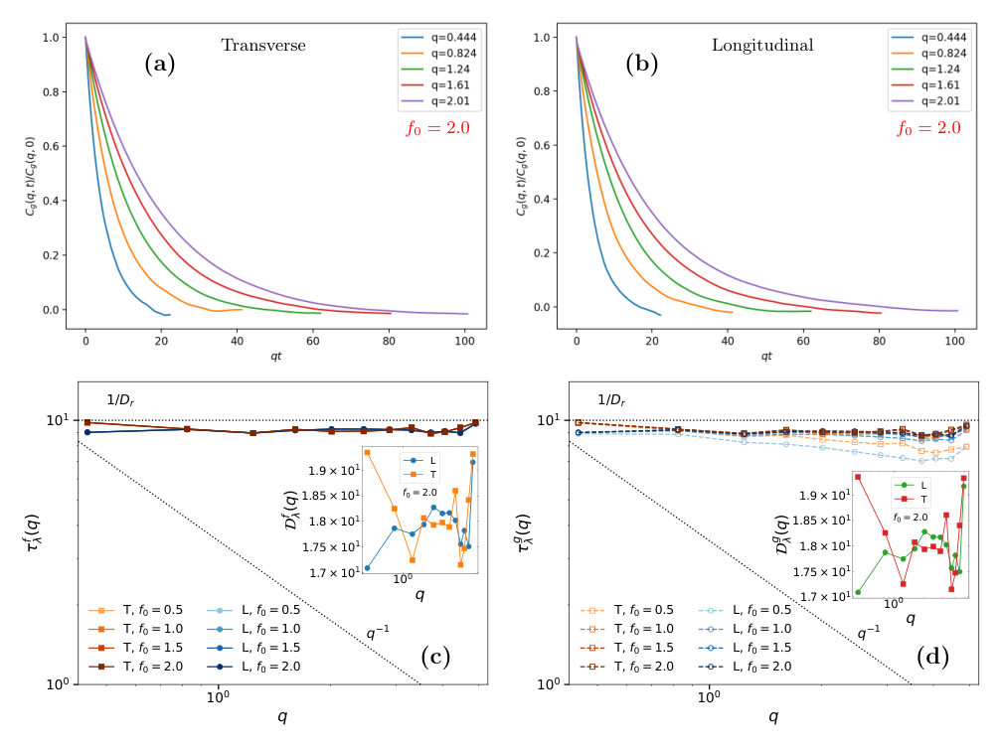
<figcaption class="paper-figure-caption"><b>Fig 5.</b> FIG. 4. Normalised gλ correlation for (a) transverse and (b) longitudinal modes as a function of time for different low-q values at activity strength f0 = 2.0. (c) Correlation time τ f λ (q) of the bare active-force modes for different propulsion strengths. The longitudinal and transverse results remain close to the single-particle persistence time D−1 r and do not follow the q−1 guide. (c) Correlation time τ g λ(q) of the effective residual force gλ = f a λ + (f int λ −f harm λ ). Insets: integrated autocorrelation intensities, Dλ(q), for active and residual force with activity strength f0 = 2.0 for longitudinal and transverse modes.</figcaption>
</figure>

**Summary.** This work analyzes how activity fundamentally alters the long-wavelength fluctuations in crystalline solids, showing that the enhancement scales as $q^{-3}$ rather than the expected $q^{-2}$. The authors demonstrate that this anomaly originates from long-range stress correlations induced by the active forces, providing a key theoretical insight into non-equilibrium solid physics.

**Why it may be interesting.** While focused on classical active matter, the methodology of analyzing non-equilibrium fluctuations and deviations from equilibrium theorems (like MWH) is highly relevant to understanding open quantum systems and dissipation in quantum many-body dynamics.

Detailed structure

**Main problem.** The paper investigates the microscopic origin of enhanced long-wavelength density fluctuations in active solids, which violate equilibrium predictions like the Mermin-Wagner-Hohenberg theorem.

**Main result.** Activity enhances long-wavelength fluctuations, causing the displacement covariance to scale anomalously as $q^{-3}$ (instead of $q^{-2}$), and this anomaly is traced to long-range stress correlations rather than mechanical softening.

**Method.** The study uses theoretical analysis of active Brownian motion, calculating displacement covariances, response stiffness, and interaction-stress spectra in Fourier space.

**Model / system.** The system modeled is a two-dimensional active Brownian crystal, governed by equations of motion incorporating conservative pair forces and active propulsion forces.

**Key observables.** Displacement covariance ($\langle |u_\lambda(q)|^2 
angle$), interaction-stress spectra ($S_{	ext{stress}}(q)$), and the resulting Mean Squared Displacement (MSD) scaling.

**Important parameters / regimes.** Propulsion strength ($f_0$), wavevector ($q$), and dimensionality (2D and 3D).

**Assumptions / limitations.** The analysis relies on decomposing the covariance and comparing it against predictions from linear elasticity and equilibrium fluctuation theories.

**Figures summary.** Figures illustrate the $q^{-3}$ enhancement of displacement and stress spectra in active crystals compared to passive ones, and show the scaling of the MSD with system size L.

**Paper structure.** The paper progresses by first establishing the anomalous scaling of the displacement covariance ($q^{-3}$ vs $q^{-2}$), then ruling out nonlocal elastic softening by comparing it to the measured response stiffness ($q^2$), and finally attributing the anomaly to the structure of non-equilibrium stress fluctuations.

Abstract

Activity can enhance the long-wavelength density fluctuations of a solid beyond the equilibrium fluctuations predicted by the Mermin-Wagner-Hohenberg theorem, but the microscopic origin of this enhancement remains unclear. We study a two-dimensional active Brownian crystal whose longitudinal and transverse displacement covariances scale as $C^u_λ(q)\sim q^{-3}$ as compared to the passive counterpart with $q^{-2}$ law. This spectrum predicts an MSD-plateau divergence proportional to $L$ in two dimensions, logarithmic in three dimensions, and finite in four dimensions, in close correspondence with recent results reported in Dey et al. [Nat. Commun. 16, 5498 (2025)]. Inverse of the Covariance gives $H^{\mathrm{cov}}_λ\sim |q|^3$ with the corresponding dispersion $ω_{\mathrm{cov},λ}\sim q^{3/2}$, whereas direct mechanical response gives $K_{\mathrm{resp},λ}\sim q^2$ and acoustic modes with $ω_{0,λ}\sim q$. The nonlinear dispersion is therefore covariance-defined rather than mechanical. The mobility and integrated active-force correlations remain non-singular, although a finite-persistence crossover cannot be ruled out completely with the existing data. Microscopically, the longitudinal and transverse Irving-Kirkwood interaction-stress spectra scale as $q^{-1}$. The transverse stress-stress correlation connects well with the anomalous displacement field, indicating that activity anomalously populates ordinary acoustic modes, while the conservative interaction network transmits the resulting fluctuations as long-ranged stress. A three-dimensional active FCC crystal exhibits the same paired low-$q$ trends.

[↑ back to top](#top)

### [Work fluctuation speed limit in boundary conformal field theories](http://arxiv.org/abs/2610.01248v1)

**Authors:** Shihao Xia, Ahsan Nazir, Harry J. D. Miller  
**Type:** theory · **Category:** statistical mechanics · **PDF:** <https://arxiv.org/pdf/2610.01248v1>  
**Analysis basis:** full PDF text, analyzed in chunks
**Topic relevance:** `analog quantum simulation` **3/5** · `non-equilibrium universality` **3/5** · `Keldysh / 2PI / non-Gaussian methods` **2/5** · `driven-dissipative phase transition` **2/5** · `quantum measurements` **2/5** · `methods for driven-dissipative` **1/5**

↔ Scroll figures horizontally

<figure class="paper-figure-card">
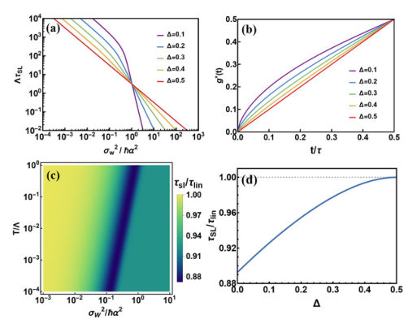
<figcaption class="paper-figure-caption"><b>Fig 1.</b> FIG. 1. Finite-temperature fluctuation speed limit and its saturating protocol. (a),(b) Speed limits and saturating pro- tocols for ∆= 0.1, 0.2, 0.3, 0.4, and 0.5 at Λβ = 100. (c) Ratio τSL/τlin as a function of temperature T/Λ and reduced work fluctuation σ2 W /ℏα2 for ∆= 0.1. (d) Analytical Kibble– Zurek-regime ratio τSL/τlin as a function of ∆.</figcaption>
</figure>
<figure class="paper-figure-card">
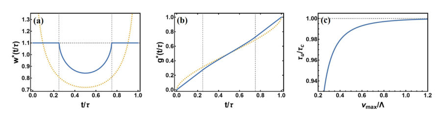
<figcaption class="paper-figure-caption"><b>Fig 2.</b> FIG. 2. Velocity-constrained optimal control in the Kibble–Zurek regime. (a) Optimal dimensionless velocity w∗(t/τ) = τv∗(t). (b) Corresponding optimal protocol g∗(t/τ). In (a) and (b), the yellow dashed curves represent the unconstrained solutions, while the blue solid curves represent the velocity-constrained solutions with wmax = 1.1. (c) Ratio τu/τc between the unconstrained and velocity-constrained speed-limit times as a function of vmax/Λ for ∆= 0.1.</figcaption>
</figure>
<figure class="paper-figure-card">
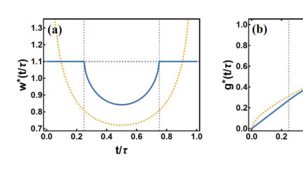
<figcaption class="paper-figure-caption"><b>Fig 3.</b> Fig. 1(d) shows this analytical result, where the ratio approaches unity as ∆→1/2, consistent with the disap- pearance of the optimization gain near the local-kernel threshold. Finally, we observe that the largest improve- ment of optimal protocols is found within the cross-over regime, as indicated by the blue region in Fig. 1(c). Velocity constraints.— Next we observe that for the optimal solution Eq. (15), the velocity of the coupling diverges at the endpoints of the protocol. For prac- tical implementations this motivates imposing a finite- bandwidth constraint on the protocol velocity,</figcaption>
</figure>

**Summary.** This paper establishes a universal, fluctuation-based speed limit for controlling quantum systems near a quantum critical point described by BCFT. By minimizing the work variance, the authors derive the minimum time required for driving, showing how this limit interpolates between different physical regimes. This provides a crucial theoretical benchmark for experimental quantum control in platforms like superconducting circuits and quantum impurities.

**Why it may be interesting.** This work establishes a fundamental, universal constraint on how fast quantum systems can be controlled near criticality, which has direct implications for experimental protocols in quantum simulation and quantum information.

Detailed structure

**Main problem.** The paper derives an exact, saturable fluctuation-based speed limit for performing finite-time driving in quantum critical systems.

**Main result.** The minimum driving time is bounded by a universal speed limit ($	au_{	ext{SL}}$) that provides a work precision–time tradeoff, applicable across various quantum platforms.

**Method.** The analysis uses generalized linear response theory, variational calculus, and conformal field theory techniques to minimize the work fluctuation cost.

**Model / system.** The study focuses on quantum critical systems described by Boundary Conformal Field Theory (BCFT), modeled by a time-dependent Hamiltonian $H_t = H_{	ext{BCFT}} + \lambda_t O_B(x=0)$.

**Key observables.** The fluctuation cost is quantified by the second cumulant of work, $\langle \sigma^2_W 
angle$, and the speed limit $	au_{	ext{SL}}$.

**Important parameters / regimes.** The scaling dimension ($\Delta$) is a key parameter, and the results interpolate between the Kibble-Zurek (KZ) and adiabatic regimes.

**Assumptions / limitations.** The analysis relies on the weak-driving approximation ($\vert\alpha\vert \ll 1$) and the applicability of BCFT descriptions.

**Figures summary.** Figures illustrate the speed limit ($	au_{	ext{SL}}$) and the optimal protocols for various scaling dimensions ($\Delta$), showing the crossover between different driving regimes.

**Paper structure.** The paper builds from deriving the general fluctuation cost functional using linear response theory, solving the constrained variational problem to find the speed limit, and then analyzing the resulting optimal protocol across different physical regimes (KZ, adiabatic).

Abstract

We explore the fundamental limits on finite-time driving in quantum critical systems described by boundary conformal field theory. We show that stochastic work fluctuations arising from external driving are a resource for speedy control, and derive an exact, saturable fluctuation-based speed limit in weakly driven boundary conformal field theories at finite temperature. The bound and saturating protocol can be expressed entirely in terms of the universal scaling dimension, and the result interpolates between the Kibble--Zurek regime,where temporal correlations are strongly nonlocal, and an adiabatic regime where linear driving becomes optimal. For small scaling dimension, the enhanced temporal correlations produce pronounced departures from linear protocols and a larger optimization advantage. These results establish a universal work precision--time tradeoff for boundary-critical control, applicable to quantum impurity, fractional quantum Hall, and superconducting-circuit platforms.

[↑ back to top](#top)

### [esQueranto: Differentiable Structured Quantum Light for Automated Scientific Discovery](http://arxiv.org/abs/2610.00750v1)

**Authors:** Marcello Armezzani, Tareq Jaouni, Pontus Lindgren, Sören Arlt, Mario Krenn, Xuemei Gu  
**Type:** theory · **Category:** quantum information and computing · **PDF:** <https://arxiv.org/pdf/2610.00750v1>  
**Analysis basis:** full PDF text, analyzed in chunks
**Topic relevance:** `analog quantum simulation` **3/5** · `interference shaping light` **3/5** · `methods for driven-dissipative` **3/5** · `correlated / nonlocal dissipation` **1/5** · `driven-dissipative phase transition` **1/5** · `quantum measurements` **1/5**

↔ Scroll figures horizontally

<figure class="paper-figure-card">
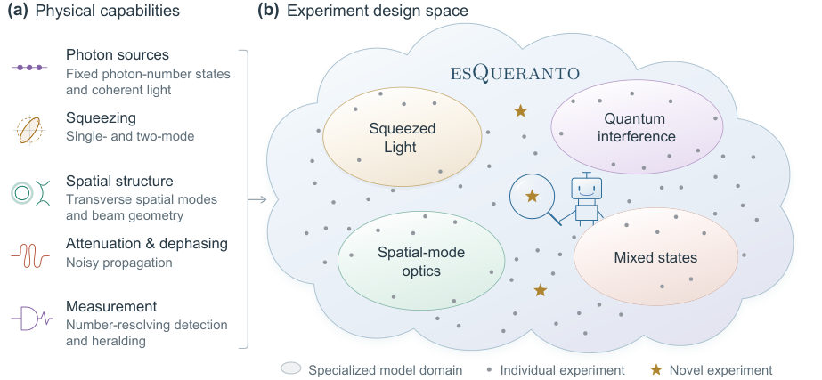
<figcaption class="paper-figure-caption"><b>Fig 1.</b> FIG. 1. esQueranto combines physical capabilities (a) in a shared experiment design space (b). Gray dots represent individual experiments, and shaded regions indicate domains of specialized models. Stars highlight possible new experiments that combine capabilities beyond these domains; the robot illustrates automated search.</figcaption>
</figure>
<figure class="paper-figure-card">
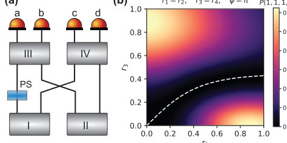
<figcaption class="paper-figure-caption"><b>Fig 2.</b> FIG. 2. Four-crystal setup and four-photon coincidence prob- ability. (a) Four two-mode squeezers act on modes a, b, c, d, with a phase shifter in path a between sources I and III. (b) Simulated four-photon coincidence probability P(1, 1, 1, 1) as a function of r1 and r3, with r1 = r2, r3 = r4, and ϕ = π. The dashed line marks the analytical destructive-interference condition in Ref. [30].</figcaption>
</figure>
<figure class="paper-figure-card">
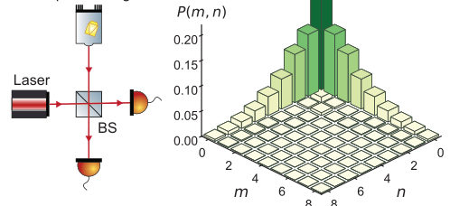
<figcaption class="paper-figure-caption"><b>Fig 3.</b> FIG. 3. Generation of NOON-like states from coherent and squeezed light [31]. (a) A coherent field is mixed at a bal- anced beam splitter with a squeezed-vacuum state generated by collinear SPDC. (b) Simulated joint photon-number distri- bution P(m, n) at the two outputs, where the bar height gives the probability of detecting m and n photons. The larger bars near the two axes show that the photons tend to emerge to- gether from either output port.</figcaption>
</figure>
<figure class="paper-figure-card">
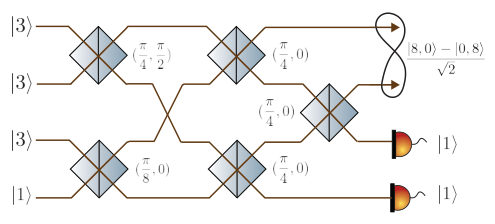
<figcaption class="paper-figure-caption"><b>Fig 4.</b> FIG. 4. Heralded eight-photon path entanglement from the input |3, 3, 3, 1⟩, following Ref. [24].</figcaption>
</figure>
<figure class="paper-figure-card">
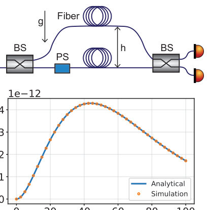
<figcaption class="paper-figure-caption"><b>Fig 5.</b> FIG. 5. Gravity-sensitive fiber interferometer. (a) A single photon propagates in a superposition of two equal-length fiber paths separated vertically by 2 m. (b) Fisher information for the gravitational acceleration g as a function of the common fiber length at a phase bias close to quadrature.</figcaption>
</figure>

**Summary.** This paper introduces esQueranto, a novel, differentiable software framework designed to simulate complex quantum-optical experiments. It unifies disparate physical descriptions, such as structured light propagation and photon-number quantum optics, into a single, optimizable simulator. This advancement significantly accelerates the process of automated scientific discovery in quantum physics.

**Why it may be interesting.** It provides a powerful, differentiable tool to explore the parameter space of quantum optical circuits, which is crucial for designing novel quantum information protocols and understanding open quantum systems.

Detailed structure

**Main problem.** The primary goal is to enable automated scientific discovery in quantum optics by creating a simulator capable of designing and simulating complex quantum-optical experiments.

**Main result.** The authors introduce esQueranto, a differentiable simulator that unifies photon-number quantum optics and structured-light propagation into a single framework.

**Method.** The framework uses JAX for automatic differentiation, allowing optimization and automated search over physical parameters by modeling the evolution of quantum states through defined optical circuits.

**Model / system.** The system models quantum-optical experiments involving photon-number states (Fock basis) and structured light (Laguerre-Gaussian modes). It incorporates elements like beam splitters, squeezing, photon loss, and dephasing.

**Key observables.** Fidelity, heralding probability, and the final quantum state $|\psi
angle$ or density matrix $
ho$.

**Important parameters / regimes.** Photon number cutoff ($N$), squeezing parameters ($r, \phi$), loss efficiency ($\eta$), and dephasing factor ($\xi$).

**Assumptions / limitations.** The framework assumes that complex quantum-optical processes can be described by a sequence of differentiable transformations acting on the quantum state.

**Figures summary.** Figure 1 illustrates the combination of physical capabilities into a shared design space; Figure 8 shows the CPU-GPU scaling for batched optimization; Figure 9 tracks the loss evolution during NOON8 optimization.

**Paper structure.** The paper introduces esQueranto, details its unified physical description (state representation, optical elements, noise), and demonstrates its utility across multiple complex quantum-optical applications, including interferometry and state heralding.

Abstract

Uncovering new phenomena in nature requires experiments. For centuries, their design has been exclusively a human endeavor. Today, a new paradigm is emerging in which artificial intelligence and computational methods can design experiments themselves. Realizing this form of automated scientific discovery requires simulators that are sufficiently expressive to represent the diverse physical processes and couplings from which new experiments can be constructed. In this direction, we introduce \textsc{esQueranto}, a differentiable software that brings photon-number quantum optics and structured-light propagation into a common description, allowing the spatial evolution of light to directly influence non-classical quantum states and their interference. \textsc{esQueranto} is implemented in JAX, providing automatic differentiation and hardware-accelerated evaluation for optimization and automated search. We demonstrate the framework across a broad range of quantum-optical applications that exercise complementary aspects of its physical description. By combining quantum and structured-light physics within a single differentiable simulator, \textsc{esQueranto} takes an important step towards the dream of a foundational simulator in physics.

[↑ back to top](#top)

### [Experimental quantification of quantum coherence for a set of quantum states](http://arxiv.org/abs/2610.01227v1)

**Authors:** Tianle Zheng, Liangsheng Li, Wenting Zhou, Chengjie Zhang  
**Type:** experiment · **Category:** quantum information and computing · **PDF:** <https://arxiv.org/pdf/2610.01227v1>  
**Analysis basis:** full PDF text, analyzed in chunks
**Topic relevance:** `QC/QI experiment` **3/5** · `interference shaping light` **3/5** · `quantum optics experiment` **3/5** · `quantum measurements` **2/5** · `analog quantum simulation` **1/5**

↔ Scroll figures horizontally

<figure class="paper-figure-card">
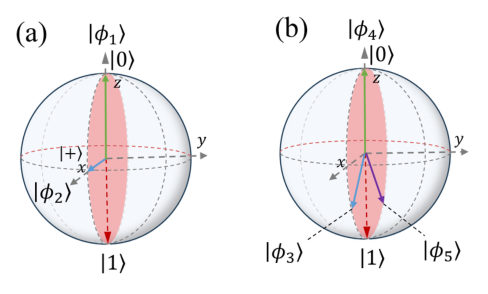
<figcaption class="paper-figure-caption"><b>Fig 1.</b> FIG. 1. (a) The Bloch sphere illustrates two pure states cor- responding to n = 2, which are mapped onto the X-axis and Z-axis of the Bloch sphere as |ϕ1⟩and |ϕ2⟩, respectively. (b) The Bloch sphere represents three pure states corresponding to n = 3, which are denoted by |ϕ3⟩, |ϕ4⟩, and |ϕ5⟩.</figcaption>
</figure>
<figure class="paper-figure-card">
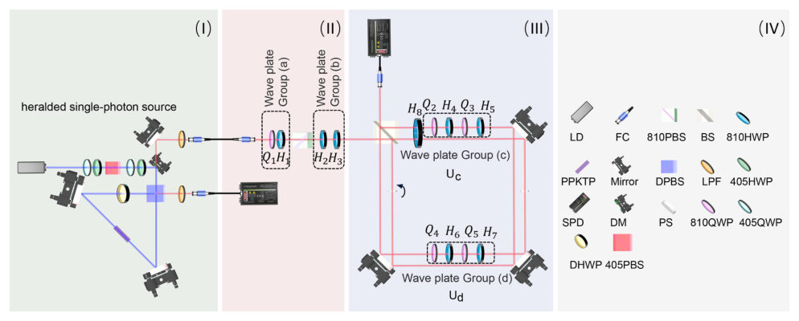
<figcaption class="paper-figure-caption"><b>Fig 2.</b> FIG. 2. The diagram of the experimental apparatus consists of four parts. (I) The first part is the heralded single-photon source, which utilizes the down-conversion effect of PPKTP crystal parameters to convert one high-energy photon into two lower-energy photons, thus generating entangled photons. By observing the change in the quantity of entangled photon pairs, interference visibility can be reflected. (II) The second part is about the preparation of the initial state. By using a wave plate group (a) and a PBS crystal, the intensity of photons in the third part can be adjusted to match the number of photon pairs. H2 can convert horizontally polarized photons into arbitrarily polarized...</figcaption>
</figure>
<figure class="paper-figure-card">
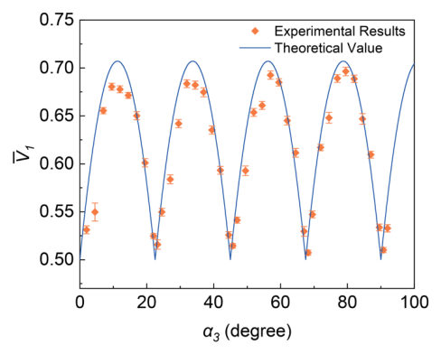
<figcaption class="paper-figure-caption"><b>Fig 3.</b> FIG. 3. The orange dots represent the average interference visibility V 1 := (V1 + V2)/2 obtained from the measurements of states |ϕ1⟩and |ϕ2⟩. The value range of α3 is from 2◦to 92◦with a step size of 2.5◦. In order to obtain the minimum point, we selected four additional angles of 23.25◦, 45.75◦, 68.25◦and 90.75◦. A total of 41 experimental data points were obtained. The blue line represents the theoretical curve obtained by averaging the theoretical values for states |ϕ1⟩ and |ϕ2⟩. The experimentally obtained minimum value is Rexp 1 ( ⃗ϱ1) = 0.507 ± 0.003, corresponding to α3 at 68.25◦.</figcaption>
</figure>
<figure class="paper-figure-card">
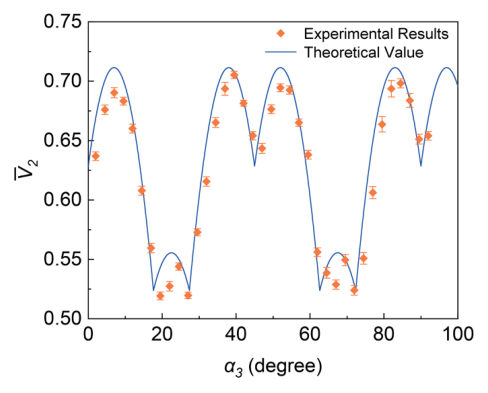
<figcaption class="paper-figure-caption"><b>Fig 4.</b> FIG. 4. The orange dots represent the average interference visibility V 2 := (V3 + V4 + V5)/3 obtained from the measure- ments of states |ϕ3⟩; |ϕ4⟩and |ϕ5⟩, the value range of α3 is from 2◦to 92◦with a step size of 2.5◦. A total of 37 exper- imental data points were obtained. The blue line represents the theoretical curve obtained by averaging the theoretical values for states |ϕ3⟩; |ϕ4⟩and |ϕ5⟩. The experimentally obtained minimum value is Rexp 1 ( ⃗ϱ2) = 0.519 ± 0.003, corre- sponding to α3 at 19.5◦.</figcaption>
</figure>
<figure class="paper-figure-card">
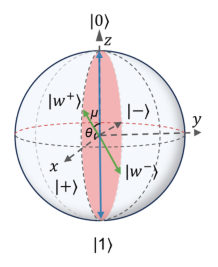
<figcaption class="paper-figure-caption"><b>Fig 5.</b> FIG. 5. In the non-standard BB84 protocol, Alice and Bob select the basis as either the Z basis {|0⟩, |1⟩} or the W basis {|w+⟩, |w−⟩}, where the W basis is derived by rotating the ideal X basis by an angle θ.</figcaption>
</figure>

**Summary.** This paper presents an experimental method to quantify quantum coherence for an entire set of quantum states without assuming a specific measurement basis. Using a Sagnac interferometer with single photons, the authors successfully measure this set coherence for multiple states. The results confirm the theoretical framework and show that this metric can be used to characterize and enhance quantum key distribution protocols.

**Why it may be interesting.** This work provides a robust, experimentally verifiable metric (set coherence) for quantifying quantum resources in photonic systems, directly linking fundamental quantum properties to practical quantum key distribution protocols.

Detailed structure

**Main problem.** The paper experimentally quantifies quantum coherence for a set of quantum states in a basis-independent manner, moving beyond single-state or basis-constrained measurements.

**Main result.** The experimental measurements of set coherence for multiple states show excellent agreement with theoretical predictions, demonstrating the utility of this metric for quantum communication protocols like BB84.

**Method.** The authors use a Sagnac interferometer setup to measure interference visibility, which is used to calculate the set coherence, defined as the minimum average coherence over all possible measurement bases.

**Model / system.** The experiment utilizes a photonic system employing a Sagnac interferometer, single-photon sources (via SPDC), and wave plates (HWPs/QWPs) to manipulate and measure the polarization states of photons.

**Key observables.** Interference visibility ($V_i$) and the set coherence ($R_1(\vec{
ho})$).

**Important parameters / regimes.** The number of states in the set ($n=2, 3$), and the measurement basis angles ($\alpha_3$, $	heta$).

**Assumptions / limitations.** The analysis for specific sets restricts the search for the optimal basis to the X-Z plane of the Bloch sphere, and some approximations were made for angle rotations in the $n=3$ case.

**Figures summary.** Figures illustrate the average interference visibility for $n=2$ and $n=3$ states as a function of rotation angles, and demonstrate how set coherence decreases from 0.5 to 0 when the measurement basis deviates from the optimal setting for the BB84 protocol.

**Paper structure.** The paper introduces the theoretical concept of basis-independent set coherence, details the Sagnac interferometer experimental setup for measuring coherence, presents quantitative measurements for $n=2$ and $n=3$ states, and finally applies the findings to demonstrate the set coherence of the BB84 protocol states.

Abstract

We present a direct experimental verification of quantum coherence for a set of quantum states in a basis-independent manner. We find that the theory of quantum coherence for a set of quantum states matches our experimental results perfectly and can be applied to protocols like BB84 and quantum secure direct communication. Using a Sagnac interferometer, we experimentally quantify the quantum coherence for two sets of experimental states. Moreover, we introduce a novel application of set coherence, illustrating that the states employed in the BB84 protocol exhibit maximal set coherence. Our results pave the way for wider applications of quantum coherence for a set of quantum states, including quantum key distribution protocols and probabilistic quantum cloning.

[↑ back to top](#top)

### [Robustness hierarchy of bipartite quantum correlations under noisy dynamics](http://arxiv.org/abs/2610.01163v1)

**Authors:** Shakib Daryanoosh  
**Type:** theory · **Category:** other · **PDF:** <https://arxiv.org/pdf/2610.01163v1>  
**Analysis basis:** full PDF text, analyzed in chunks
**Topic relevance:** `correlated / nonlocal dissipation` **3/5** · `methods for driven-dissipative` **3/5** · `driven-dissipative phase transition` **2/5** · `non-equilibrium universality` **2/5** · `Keldysh / 2PI / non-Gaussian methods` **1/5** · `quantum measurements` **1/5**

↔ Scroll figures horizontally

<figure class="paper-figure-card">
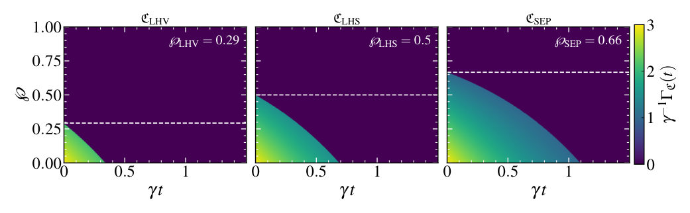
<figcaption class="paper-figure-caption"><b>Fig 1.</b> FIG. 1. (Color online). Dimensionless robustness decay rate γ−1ΓC(t) for Werner states evolving under exponential depolarizing noise, shown as a function of the initial parameter ℘and dimensionless time γt. The three panels correspond to the classical sets CLHV (left), CLHS (center), and CSEP (right). The colored regions indicate points along the evolution for which the corresponding robustness remains positive, while the dark regions indicate that the robustness has already reached zero. The curved boundary separating the two regions is the transition-time curve defined by Eq. (37). The horizontal dashed line marks the critical Werner parameter ℘C, above which the corresponding robustness...</figcaption>
</figure>

**Summary.** This paper introduces a comprehensive robustness framework to track how quantum correlations, such as entanglement and nonlocality, decay under environmental noise. By relating the resource's robustness to the functional derivative along the Lindblad evolution, it provides quantitative transition times for various quantum resources. This is crucial for understanding the practical limits of quantum information processing in noisy physical settings.

**Why it may be interesting.** This work provides a powerful, unified mathematical tool for characterizing resource depletion in open quantum systems, directly linking geometric measures of nonclassicality to the dynamics dictated by the environment.

Detailed structure

**Main problem.** The paper addresses the fundamental challenge of quantifying how various forms of bipartite quantum correlations (Bell nonlocality, EPR steering, entanglement) degrade when a quantum system interacts with an environment.

**Main result.** A general robustness framework is developed that successfully orders the degradation of these correlations, showing that the instantaneous decay rate can be determined by a directional derivative along the Lindblad dynamical trajectory.

**Method.** The authors employ geometric measures, specifically developing and applying 'robustness' functionals relative to various classical sets (LHV, LHS, Separable), and calculating the time evolution using functional derivatives along the Lindblad master equation.

**Model / system.** The study focuses on bipartite quantum states ($
ho_{AB}$) evolving under general noisy dynamics, modeled by Lindblad master equations. Specific examples include isotropic depolarizing noise and amplitude damping channels applied to Werner states.

**Key observables.** Robustness measures ($R_{	ext{LHV}}, R_{	ext{LHS}}, R_{	ext{SEP}}$), instantaneous decay rate ($\dot{R}_C$), and resource transition times ($t_C$).

**Important parameters / regimes.** Noise parameters ($\mathcal{P}$ or $\lambda(t)$), and the specific structure of the Lindblad generator $L(
ho)$.

**Assumptions / limitations.** The framework assumes differentiability of the robustness functional with respect to the dynamical flow, although limitations regarding non-smooth boundaries are noted.

**Figures summary.** The notes do not provide a summary of figures, but they detail the calculation of thresholds (e.g., $\eta_{	ext{Bell}} = 1/2$) for specific noise models.

**Paper structure.** The paper builds from defining the robustness framework based on classical set inclusions, extends this to continuous time evolution using the directional derivative along the Lindblad flow, and validates the method using specific physical examples like Werner states and amplitude damping.

Abstract

Quantum correlations are fragile under noise, motivating quantitative measures that track not only their presence but also their degradation during physical evolution. We develop a robustness framework for the hierarchy of Bell nonlocality, EPR steering, and entanglement, establishing an ordering of the corresponding robustness measures and relating robustness to noise-induced transition times. We further formulate the instantaneous robustness decay along Lindblad dynamics as a directional derivative determined by both the evolution and the robustness functional. Applications to isotropic depolarizing noise and amplitude damping illustrate, respectively, the resulting resource transition times and the directional dependence of steering robustness. The framework provides an approach to characterizing the degradation and lifetime of bipartite quantum correlations under noisy dynamics.

[↑ back to top](#top)

### [Landau-like formalism for the thermal-runaway and filamentation instabilities in switching Mott devices](http://arxiv.org/abs/2610.01055v1)

**Authors:** Aniket Bajaj, Anudeep Tullibilli, Arup Basak, Pavan Nukala, Bhavtosh Bansal  
**Type:** both · **Category:** statistical mechanics · **PDF:** <https://arxiv.org/pdf/2610.01055v1>  
**Analysis basis:** full PDF text, analyzed in chunks
**Topic relevance:** `driven-dissipative phase transition` **3/5** · `non-equilibrium universality` **3/5** · `Keldysh / 2PI / non-Gaussian methods` **2/5** · `methods for driven-dissipative` **2/5** · `Frenkel-Kontorova` **1/5**

↔ Scroll figures horizontally

<figure class="paper-figure-card">
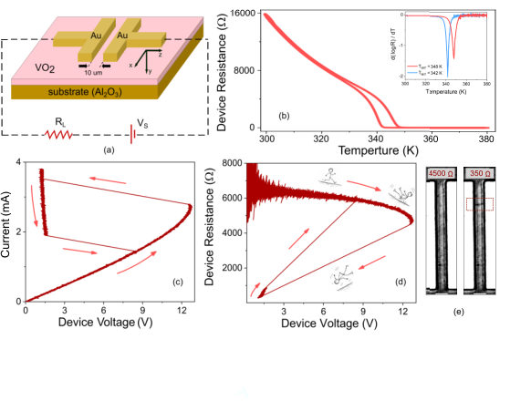
<figcaption class="paper-figure-caption"><b>Fig 1.</b> FIG. 1. Voltage-driven electric breakdown in VO2. (a) A two-probe VO2 thin film device (10x100 µm) connected</figcaption>
</figure>
<figure class="paper-figure-card">

<figcaption class="paper-figure-caption"><b>Fig 2.</b> Fig. 1(c) presents current–voltage I(V) characteristics measured at 330 K using a function generator as</figcaption>
</figure>
<figure class="paper-figure-card">
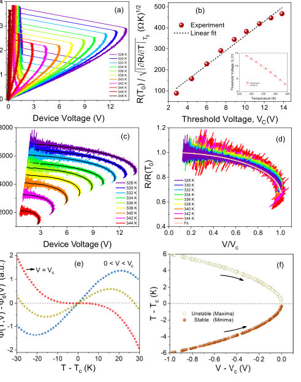
<figcaption class="paper-figure-caption"><b>Fig 3.</b> FIG. 2. Experimental evidence of thermal runaway instability. (a) Temperature variation of I(V) characteristics.</figcaption>
</figure>
<figure class="paper-figure-card">
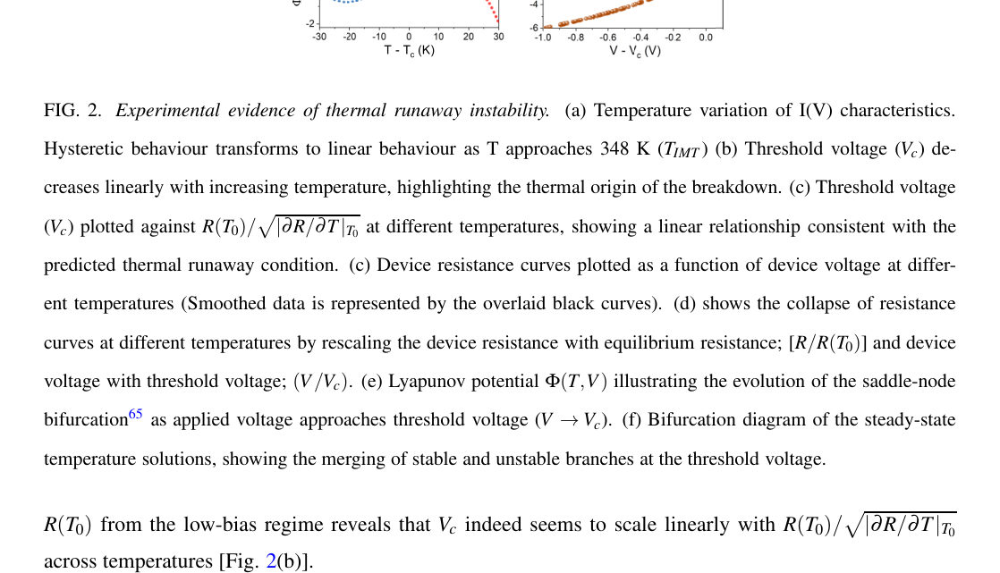
<figcaption class="paper-figure-caption"><b>Fig 4.</b> Fig. 2(c) presents the corresponding bias-dependent resistance from the data in Fig. 2(a) up to the</figcaption>
</figure>
<figure class="paper-figure-card">
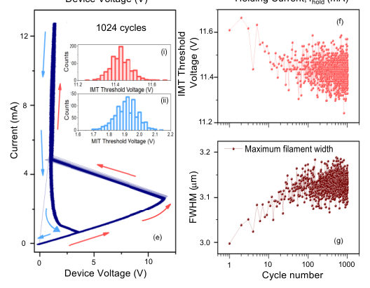
<figcaption class="paper-figure-caption"><b>Fig 5.</b> FIG. 3. Shrinking of the metallic filament up to the reset instability. (a, b) I(V) characteristics at 332 K alongside</figcaption>
</figure>

**Summary.** This work develops a comprehensive dynamical framework to model the thermal-runaway and filamentation instabilities responsible for switching in Mott-insulator devices like $	ext{VO}_2$. By employing Landau-like potentials and bifurcation theory, the authors theoretically describe the abrupt transitions as first-order phase changes. The model is rigorously validated against both electrical measurements and optical imaging of the physical device.

**Why it may be interesting.** The application of non-equilibrium phase transition concepts, such as Landau theory and bifurcation analysis, to classical thermal instabilities in solid-state devices provides a powerful, generalizable dynamical framework applicable to open quantum systems or thermalization processes.

Detailed structure

**Main problem.** The paper investigates the non-linear dynamics underlying bias-induced switching in Mott devices, specifically focusing on thermal-runaway and filamentation instabilities.

**Main result.** The switching transitions are successfully modeled using Landau free energy-like Lyapunov functions, predicting the instability as a saddle-node bifurcation for the set transition and an abrupt first-order phase transition for the reset.

**Method.** The authors combine theoretical non-linear dynamics (Lyapunov functions, bifurcation theory) with experimental characterization of $	ext{VO}_2$ thin films.

**Model / system.** The system is based on correlated oxides ($	ext{VO}_2$) exhibiting insulator-to-metal transitions. The dynamics are modeled starting from the heat transport reaction-diffusion equation, reduced to mean-field or order-parameter evolution equations.

**Key observables.** Critical voltage ($V_c$), filament width ($a(t)$), resistance ratio ($R(T)/R(T_0)$), and the Lyapunov potential $\Phi(T,V)$.

**Important parameters / regimes.** Volumetric heat capacity ($	ext{cv}$), thermal conductivity ($\kappa$), surface heat transfer coefficient ($h$), and film thickness ($d$).

**Assumptions / limitations.** The analysis relies on approximating the system dynamics using Landau-like potentials and assuming specific forms for the temperature-dependent resistance and heat loss mechanisms.

**Figures summary.** Figures illustrate experimental evidence of voltage-driven breakdown in $	ext{VO}_2$, showing $I-V$ curves, $V_c$ dependence, and the theoretical Lyapunov potential and bifurcation diagram.

**Paper structure.** The paper establishes the physical context (Mott switching), develops a theoretical framework using non-linear dynamics and Lyapunov potentials, derives scaling laws for the instability thresholds, and validates these models against detailed electrical and optical microscopy experiments.

Abstract

Correlated oxides can switch to a low-resistance state when exposed to a voltage, making these insulator-to-metal transition materials promising candidates for memristor technology. Switching in materials such as VO2 occurs because of a thermal-runaway instability that leads to the abrupt formation of a hot current-carrying metallic filament within the insulator. We study, theoretically and experimentally, this bias-induced switching as a non-linear dynamics stability problem. We construct Landau free energy-like Lyapunov functions to show that both the on-state ("set") and the off-state ("reset") transitions can be described as separate saddle-node bifurcations. Starting from the reaction-diffusion equation for the heat transport, the abrupt snap-back (reset) to the insulating state is systematically formulated as a mean field Landau-like dynamics with the filament width playing the role of the order parameter. The formulation predicts an abrupt first-order phase transition with a break-off of a finite width filament across the current-controlled reset transition. The formulation is quantitatively compared against our electrical and optical microscopy experiments on VO2 thin film devices. Multi-cycle switching dynamics experiments further reveal the emergence of a stable stochastic regime following an initial electro-spatial forming phase. Beyond establishing a cross-disciplinary dynamical framework that may be readily compared to instabilities in various reaction-diffusion scenarios, the work also provides a predictive foundation for the rational design and optimization of Mott-transition-based technologies.

[↑ back to top](#top)

### [Continuous-Process Randomized Compilation for Quantum Process Tensors](http://arxiv.org/abs/2610.01521v1)

**Authors:** He Wang  
**Type:** theory · **Category:** quantum information and computing · **PDF:** <https://arxiv.org/pdf/2610.01521v1>  
**Analysis basis:** full PDF text, analyzed in chunks
**Topic relevance:** `methods for driven-dissipative` **3/5** · `quantum measurements` **3/5** · `Keldysh / 2PI / non-Gaussian methods` **1/5** · `analog quantum simulation` **1/5** · `correlated / nonlocal dissipation` **1/5** · `driven-dissipative phase transition` **1/5**

↔ Scroll figures horizontally

<figure class="paper-figure-card">
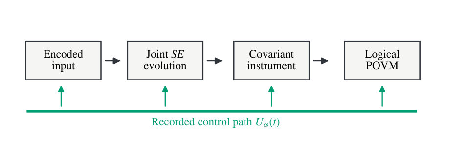
<figcaption class="paper-figure-caption"><b>Fig 1.</b> FIG. 1. Operational structure. The encoded input, joint system–environment evolution, finite-</figcaption>
</figure>
<figure class="paper-figure-card">
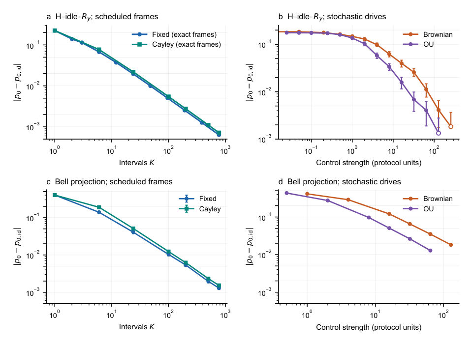
<figcaption class="paper-figure-caption"><b>Fig 2.</b> FIG. 2. Finite-duration logical recovery. Top: |p0 −p0,id| for the H–idle–Ry task. Bottom:</figcaption>
</figure>
<figure class="paper-figure-card">
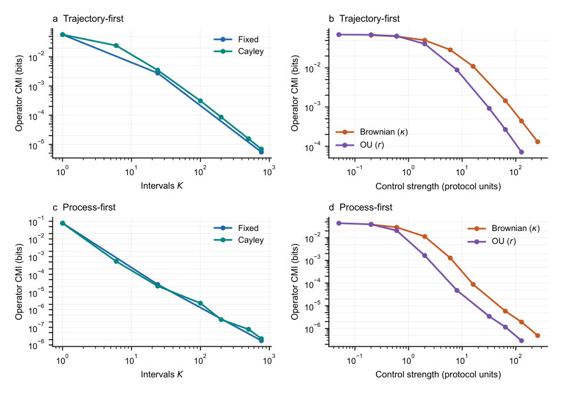
<figcaption class="paper-figure-caption"><b>Fig 3.</b> FIG. 3. Midpoint operator CMI under trajectory-first (top) and process-first (bottom) averaging.</figcaption>
</figure>
<figure class="paper-figure-card">
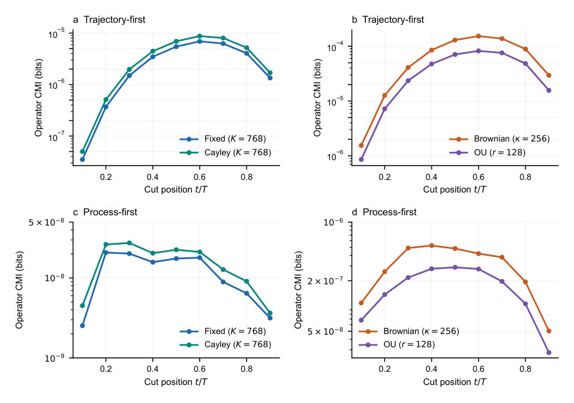
<figcaption class="paper-figure-caption"><b>Fig 4.</b> FIG. 4. Operator CMI across nine cut positions at fixed and Cayley K = 768, Brownian κ = 256,</figcaption>
</figure>
<figure class="paper-figure-card">
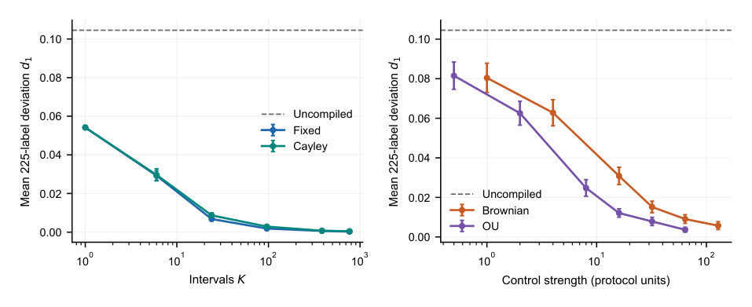
<figcaption class="paper-figure-caption"><b>Fig 5.</b> FIG. 5. Qubit-environment two-particle recovery. The ordinate is the mean of |EωC(2) ω −C(2) g=0|</figcaption>
</figure>

**Summary.** This paper introduces Continuous-Process Randomized Compilation (CPRC) to extend error correction techniques from discrete quantum gates to continuous-time processes. Using the continuous process tensor (cPT) framework, the authors derive rigorous error bounds and prove convergence for systems interacting with memory-bearing environments. This offers a unified, quantitative toolset for designing robust quantum controls in realistic, non-Markovian settings.

**Why it may be interesting.** This work provides a rigorous, unified theoretical framework for error mitigation in open quantum systems, moving beyond the limitations of discrete circuit models to address continuous-time memory effects crucial for realistic quantum hardware.

Detailed structure

**Main problem.** The paper addresses the challenge of extending Randomized Compiling (RC) from discrete gate operations to continuous-time quantum processes that interact with memory-bearing environments.

**Main result.** It derives a total-variation error bound for full adaptive output records and proves the convergence of trajectory-averaged continuous process tensor (cPT) coefficients for various bath types.

**Method.** The authors build the Continuous-Process Randomized Compilation (CPRC) framework within the cPT formalism, analyzing four specific random unitary control protocols.

**Model / system.** The system involves quantum processes described by the cPT, which unifies random unitary control trajectories, finite-duration instruments, and environmental dynamics. The analysis is tested using qubit models coupled to thermal Drude baths.

**Key observables.** Total-variation (TV) error bound, Operator Conditional Mutual Information (CMI), output probabilities, and two-particle coefficients.

**Important parameters / regimes.** The study examines various environmental characteristics, including Gaussian baths (like the Drude spectrum) and finite-dimensional non-Gaussian environments.

**Assumptions / limitations.** The analysis relies on the cPT framework, which is an operational description, and assumes bounded centered coupling and mixing conditions for deriving error bounds.

**Figures summary.** The notes mention a detailed resolution audit (TABLE III) comparing CMI values across different protocols (Fixed, Brownian, OU) and varying computational parameters (time blocks, field rank).

**Paper structure.** The paper develops the cPT framework, proves theoretical results regarding covariance and error bounds, and concludes with numerical validation using qubit models and various bath types.

Abstract

Traditional discrete randomized compiling (RC) tailors errors with random control frames at logical-gate boundaries, but fails to capture intra-instrument control evolution or persistent system-environment coupling. In memory-bearing environments, errors correlate across times, not just single gates. We build continuous-process randomized compilation (CPRC) in the continuous process tensor (cPT) framework, unifying random unitary control trajectories, pointwise-covariant finite-duration instruments, and environmental dynamics on one time axis. We study four protocols: fixed Pauli refresh, bounded Cayley paths, unitary Brownian motion, Ornstein-Uhlenbeck driving. We obtain three key results: (1) Pointwise covariance ensures each trajectory exactly reproduces the target logic without system-environment coupling; a closed-frame counterexample proves endpoint-only compensation causes first-order instrument errors. (2) Independent Pauli conjugations over full intervals diagonalize error histories at boundaries, but classical labels retain environment-induced correlations, confirmed by an exact static-bath solution. (3) We derive a total-variation error bound for full adaptive output records under bounded centered coupling and mixing conditions. We prove convergence of trajectory-averaged cPT coefficients in fixed particle sectors for finite non-Gaussian environments and Gaussian baths with time-integrable covariance, including the uncut Drude spectrum. We numerically validate the theory in a qubit model via output probabilities, operator conditional mutual information, and all two-particle coefficients for both qubit and thermal Drude baths. This work extends RC from discrete circuits to continuous-time memory-bearing quantum processes, offering a unified framework, quantitative tools, implementable schemes, and benchmarks for non-Markovian error tailoring.

[↑ back to top](#top)

### [Gate Control Improves Routing Efficiency for Periodic Traffic](http://arxiv.org/abs/2610.01534v1)

**Authors:** Hyunwook Song, Hoyun Choi, B. Kahng  
**Type:** theory · **Category:** statistical mechanics · **PDF:** <https://arxiv.org/pdf/2610.01534v1>  
**Analysis basis:** full PDF text, analyzed in chunks
**Topic relevance:** `driven-dissipative phase transition` **3/5** · `non-equilibrium universality` **3/5** · `Frenkel-Kontorova` **1/5** · `Keldysh / 2PI / non-Gaussian methods` **1/5** · `methods for driven-dissipative` **1/5** · `quantum measurements` **1/5**

↔ Scroll figures horizontally

<figure class="paper-figure-card">
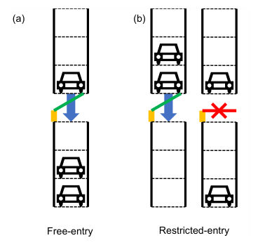
<figcaption class="paper-figure-caption"><b>Fig 1.</b> FIG. 1. Two gate control protocols. (a) In the free-entry (FE) protocol, the gate remains open regardless of the flow- ing queue state, enabling unrestricted entry from the waiting queue. (b) In contrast, the restricted-entry (RE) protocol per- mits entry to the flowing queue only when it is empty (fi = 0).</figcaption>
</figure>
<figure class="paper-figure-card">
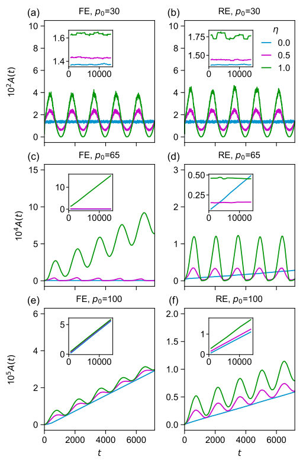
<figcaption class="paper-figure-caption"><b>Fig 2.</b> FIG. 2. Temporal evolution of the total number of vehicles in queues, A(t), as a function of time step t with a driving period of T = 1440. Results for the free-entry (FE) protocol are shown in left column and for the restricted-entry (RE) protocol in right column. Each color represents a different amplitude η (see legend in (b)). Insets show the time average of A(t) with window length T. At intermediate p0 ((c), (d)), FE and RE exhibit opposite trends with increasing η due to the asymmetric behavior in Fig. 3(e) and (f).</figcaption>
</figure>
<figure class="paper-figure-card">
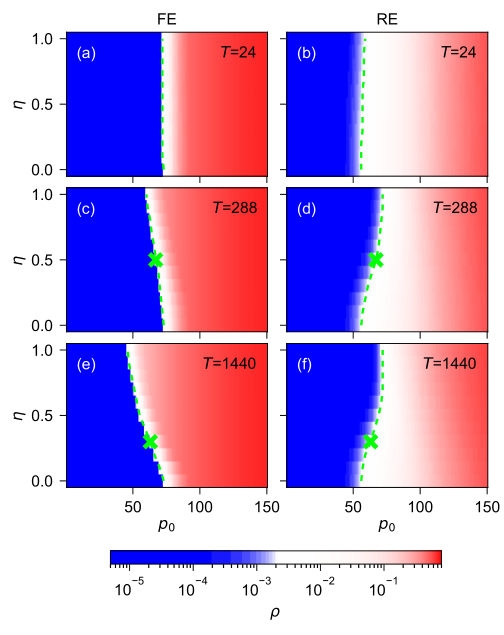
<figcaption class="paper-figure-caption"><b>Fig 3.</b> FIG. 3. Order parameter ρ vs. p0, η, and T. Green dashed curves represent the transition curves pc(η) for each T. For the FE, the order parameter increases drastically beyond pc as p0 increases. This indicates that the transition is discontinuous. On the other hand, for the RE, the order parameter increases gradually beyond pc as p0 increases, indicating a continuous transition. The green cross represents the point where pc of FE and RE are same.</figcaption>
</figure>
<figure class="paper-figure-card">
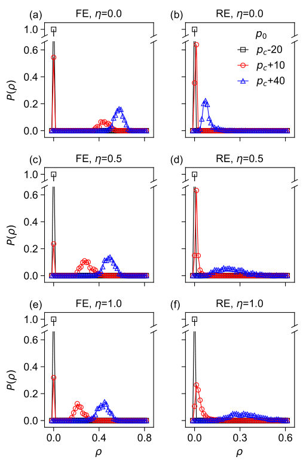
<figcaption class="paper-figure-caption"><b>Fig 4.</b> FIG. 4. The order parameter distribution P(ρ) at T = 1440 for the free-entry (FE, left column) and restricted-entry (RE, right column) protocols at different amplitude values η. The FE protocol displays two distinct peaks, whereas the RE pro- tocol exhibits a single peak.</figcaption>
</figure>
<figure class="paper-figure-card">
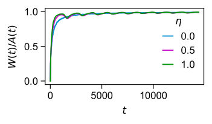
<figcaption class="paper-figure-caption"><b>Fig 5.</b> FIG. 6. Fraction of vehicles in waiting queues throughout the dynamics of a RE system in the jammed phase for different η. Most vehicles accumulate in the waiting queues, resulting in W/A ≈1.</figcaption>
</figure>

**Summary.** This paper models traffic flow on complex networks using a two-queue system and compares two control protocols: Free Entry (FE) and Restricted Entry (RE). It demonstrates that the RE protocol acts as a superior self-regulating buffer, mitigating the severity of congestion and changing the jamming transition from abrupt to gradual, especially when external demand fluctuates periodically.

**Why it may be interesting.** The study of non-equilibrium dynamics, phase transitions (jamming), and the effect of external periodic forcing on collective behavior is directly relevant to non-equilibrium statistical mechanics and open quantum systems.

Detailed structure

**Main problem.** The paper investigates how regulating entry into a main flow queue, using a two-queue gate control mechanism, improves routing efficiency in complex networks subjected to periodic traffic fluctuations.

**Main result.** The restricted entry (RE) protocol significantly outperforms the free-entry (FE) protocol, particularly under large periodic fluctuations, by replacing sudden jamming transitions with gradual, continuous ones.

**Method.** The analysis uses macroscopic and microscopic modeling of traffic flow, comparing the dynamics of FE and RE protocols using order parameters and time-averaged system occupancy.

**Model / system.** The model simulates traffic movement on complex networks (like ER or BA graphs) using a two-queue system (waiting and flowing queues) at each node, driven by a time-varying external demand.

**Key observables.** Total system vehicles A(t), order parameter $\rho$ (congestion rate), and the critical transition point $p_c$.

**Important parameters / regimes.** Periodic fluctuation amplitude $\eta$, driving period $T$, and the traffic-awareness parameter $h$.

**Assumptions / limitations.** The approach relies on a simple local rule using only local queue information, making it highly implementable.

**Figures summary.** Figures illustrate the temporal evolution of system occupancy $A(t)$ for both protocols under varying $\eta$, and phase diagrams showing the transition point $p_c$ dependence on $\eta$ for both FE and RE.

**Paper structure.** The paper progresses from defining the two-queue model and protocols (FE vs. RE) to performing macroscopic analysis of congestion transitions ($\rho$ vs. $p_0$), and finally analyzing the impact of periodic forcing ($\eta > 0$) on the stability and transition characteristics.

Abstract

Traffic movement on highways and data packet transmission across the Internet serve as prototypical examples of collective dynamical behavior in complex systems. Although enhancing traffic flow in complex networks has been extensively investigated, most existing studies focus on single-queue models. In this paper, we introduce a simple yet effective two-queue scheme with gate control that regulates vehicle entry and integrates it with the routing protocol. When vehicles arrive at a on-ramp gate, they first join a waiting queue and are permitted to enter the main flowing queue once it has emptied. This two-queue strategy is especially advantageous when highway inflow varies periodically with large fluctuations, as is commonly observed in real traffic. Moreover, it modifies the system's failure characteristics, replacing sudden, discontinuous jamming transitions with gradual, continuous ones. The approach is based on a simple rule using only local queue information, making it easy to implement and widely applicable. Beyond the specific setup studied here, it can be applied to other transportation networks under different conditions or extended to other queuing systems, such as Internet data packet routing.

[↑ back to top](#top)

### [Rapid mixing of quantum spin chains at any finite temperature](http://arxiv.org/abs/2610.01190v1)

**Authors:** Leeseok Kim  
**Type:** theory · **Category:** statistical mechanics · **PDF:** <https://arxiv.org/pdf/2610.01190v1>  
**Analysis basis:** full PDF text, analyzed in chunks
**Topic relevance:** `methods for driven-dissipative` **3/5** · `analog quantum simulation` **2/5** · `Keldysh / 2PI / non-Gaussian methods` **1/5** · `correlated / nonlocal dissipation` **1/5** · `driven-dissipative phase transition` **1/5** · `non-equilibrium universality` **1/5** · `scars & prethermalization` **1/5**

↔ Scroll figures horizontally

<figure class="paper-figure-card">
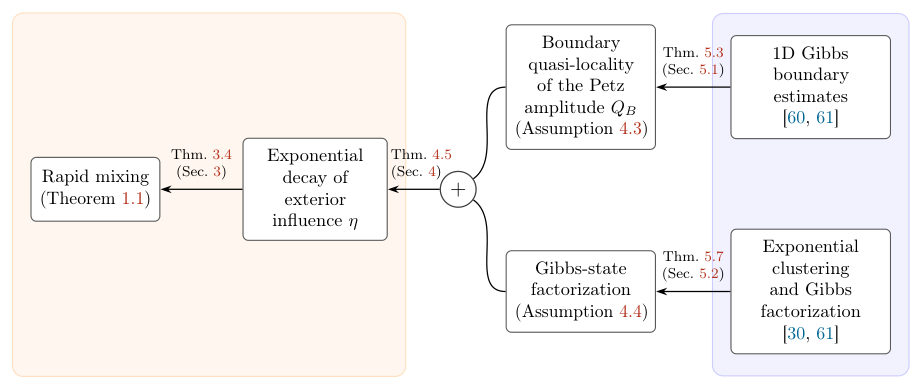
<figcaption class="paper-figure-caption"><b>Fig 1.</b> Figure 1: Proof outline of Theorem 1.1, read from right to left. The blue panel collects existing results on static properties of 1D Gibbs states [30, 61, 60], which prove Assumptions 4.3 and 4.4. Together, these imply the dynamical consequences shown in the orange panel: exponentially decaying exterior influence, exponential contraction in quantum W1 distance, and rapid mixing. The paper is intentionally organized in the reverse order.</figcaption>
</figure>
<figure class="paper-figure-card">
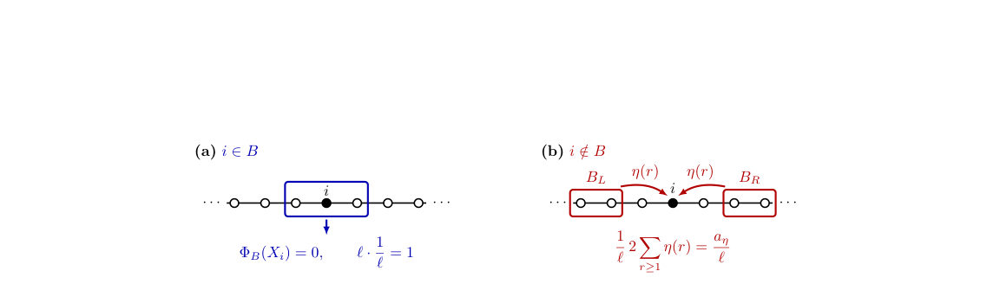
<figcaption class="paper-figure-caption"><b>Fig 2.</b> Figure 2: Erasure-versus-influence balance for an i-anchored discrepancy Xi. (a) The ℓblocks containing i erase Xi exactly, with total rate 1. (b) Blocks missing i contribute an additional influence rate at most aη/ℓ.</figcaption>
</figure>
<figure class="paper-figure-card">
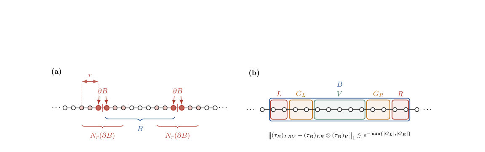
<figcaption class="paper-figure-caption"><b>Fig 3.</b> Figure 3: The two static inputs used to control the exterior influence of a block update. (a) Assumption 4.3: the conditional Petz amplitude QB admits exponentially accurate, uniformly bounded approximations supported in a growing neighborhood of ∂B (c0 = 0 in the schematic). (b) Assumption 4.4: for a decomposition B = LGLV GRR, the boundary region L ∪R and the central region V approximately factorize, with an error that decays exponentially in min{|GL|, |GR|}.</figcaption>
</figure>
<figure class="paper-figure-card">
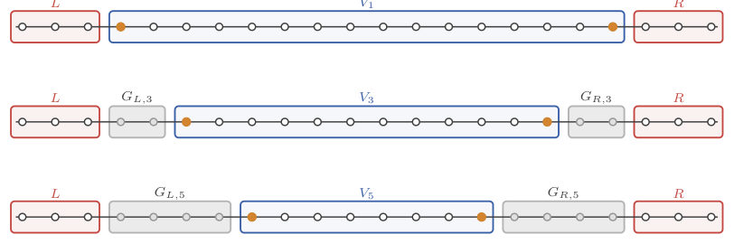
<figcaption class="paper-figure-caption"><b>Fig 4.</b> Figure 4: Layer decomposition for Lemma 4.10. Depolarized buffers GL,k and GR,k (gray) separate the fixed boundaries L, R (red) from the remaining interval Vk (blue). Orange sites form the next layer Γk. Although |Γk| ≤2, the B support of ∆kA may extend throughout Vk. Only B is shown.</figcaption>
</figure>
<figure class="paper-figure-card">
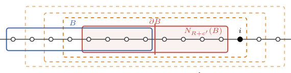
<figcaption class="paper-figure-caption"><b>Fig 5.</b> Figure 5: Shell decomposition used in the proof of Theorem 4.5. For a site i /∈B at distance d = dist(i, B), the radius R is chosen so that supp bQB,R does not reach i. The successive shell enlargements with r &gt; R form the tail in the telescoping expansion of Φ† B(A) in Eq. (91). Only the boundary of B closest to i is shown.</figcaption>
</figure>

**Summary.** This paper proves that quantum Gibbs samplers rapidly mix to the true thermal Gibbs state for 1D quantum spin chains at any temperature. The mixing time scales logarithmically with system size, $O(\log(n/\epsilon))$, and the required quantum circuit depth for state preparation is also polylogarithmic. This provides a powerful theoretical tool for simulating thermalization in quantum many-body physics.

**Why it may be interesting.** This work provides rigorous, resource-efficient theoretical guarantees for simulating thermalization dynamics in quantum many-body systems, which is crucial for understanding quantum thermalization and equilibrium states.

Detailed structure

**Main problem.** The paper aims to prove the rapid mixing time of quantum Gibbs samplers for 1D quantum spin chains at any finite temperature.

**Main result.** Rapid mixing is proven for the quantum block heat-bath dynamics in $O(\log(n/\epsilon))$ time, and the Gibbs state preparation can be done with $O(	ext{polylog}(n/\epsilon))$ quantum circuit depth.

**Method.** The analysis uses a path-coupling argument bounding the evolution in the quantum Wasserstein distance of order 1, combined with techniques for approximating quantum channels with efficient quantum circuits.

**Model / system.** The system is a 1D quantum spin chain on a periodic lattice ($\mathbb{Z}/n\mathbb{Z}$) governed by a nearest-neighbor Hamiltonian. The dynamics are simulated using a quantum block heat-bath process defined by a Lindbladian.

**Key observables.** Mixing Time ($t_{	ext{mix}}$), Quantum Wasserstein distance ($W_1$), and Quantum Circuit Depth.

**Important parameters / regimes.** Finite temperature ($eta$), system size ($n$), error tolerance ($\epsilon$), and constant block length ($\ell$).

**Assumptions / limitations.** The Hamiltonian is assumed to have bounded local interactions, and the proof relies on establishing specific boundary estimates and Lipschitz control conditions.

**Figures summary.** Figure 1 outlines the proof structure linking static properties to dynamical mixing. Table 1 compares the derived mixing time bound against other known results for spin systems.

**Paper structure.** The paper establishes the rapid mixing result using the quantum Wasserstein distance, followed by providing an explicit quantum circuit depth bound for state preparation. Later sections confirm the optimality of the logarithmic scaling for both periodic and open boundary conditions.

Abstract

We prove that a quasi-local quantum Gibbs sampler rapidly mixes to the Gibbs state of any 1D finite-range Hamiltonian at all finite temperatures in $\mathcal{O}\left(\log (n/\varepsilon)\right)$ time. Each update traces out a contiguous block of constant length and reconstructs it using the Petz recovery map, following early proposals for quantum heat-bath Gibbs samplers by Kastoryano and Brandão~\cite{kastoryano2016quantum}. Our proof directly bounds the distance between the updated state and the target Gibbs state using quantum Wasserstein distance of order $1$. We further provide $\mathcal{O}(\text{polylog}(n/\varepsilon))$ depth of quantum circuits to prepare these Gibbs states. We hope these techniques will facilitate the analysis and design of other Gibbs samplers.

[↑ back to top](#top)

### [Stationarity and angular momentum conservation in pulsar spin noise](http://arxiv.org/abs/2610.01929v1)

**Authors:** Reginald Christian Bernardo  
**Type:** theory · **Category:** statistical mechanics · **PDF:** <https://arxiv.org/pdf/2610.01929v1>  
**Analysis basis:** full PDF text, analyzed in chunks
**Topic relevance:** `Keldysh / 2PI / non-Gaussian methods` **3/5** · `methods for driven-dissipative` **3/5** · `quantum measurements` **3/5** · `correlated / nonlocal dissipation` **1/5**

↔ Scroll figures horizontally

<figure class="paper-figure-card">
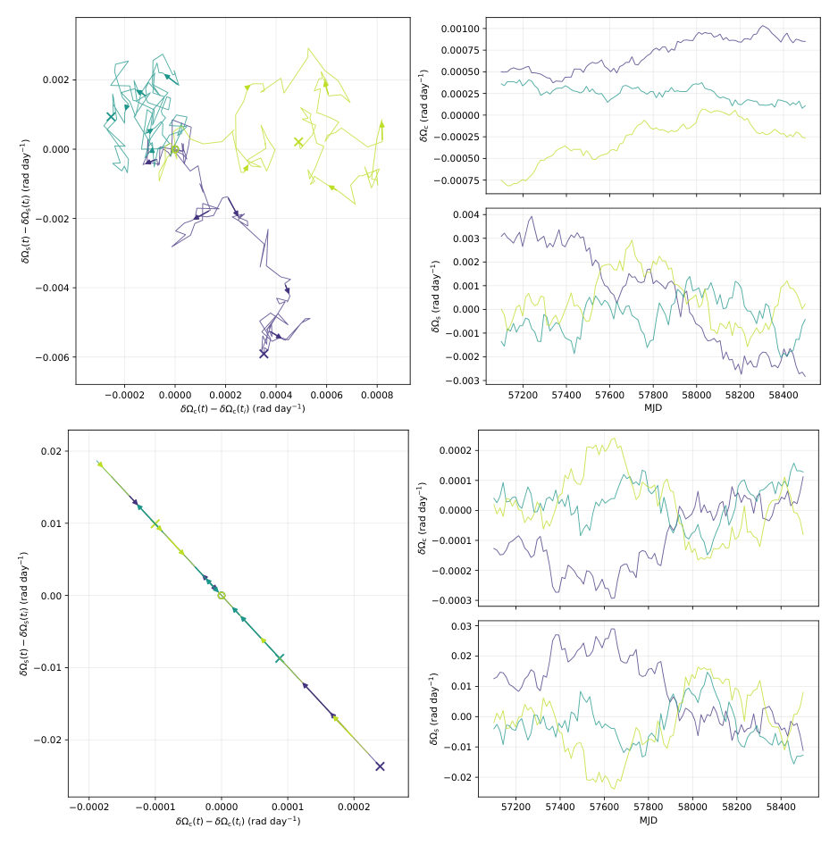
<figcaption class="paper-figure-caption"><b>Fig 1.</b> Figure 1. Sample realizations of the singular, nonstationary model (1–5) and the minimal, stationary model (19-21) with parameters in Tables 1 and 4.</figcaption>
</figure>
<figure class="paper-figure-card">
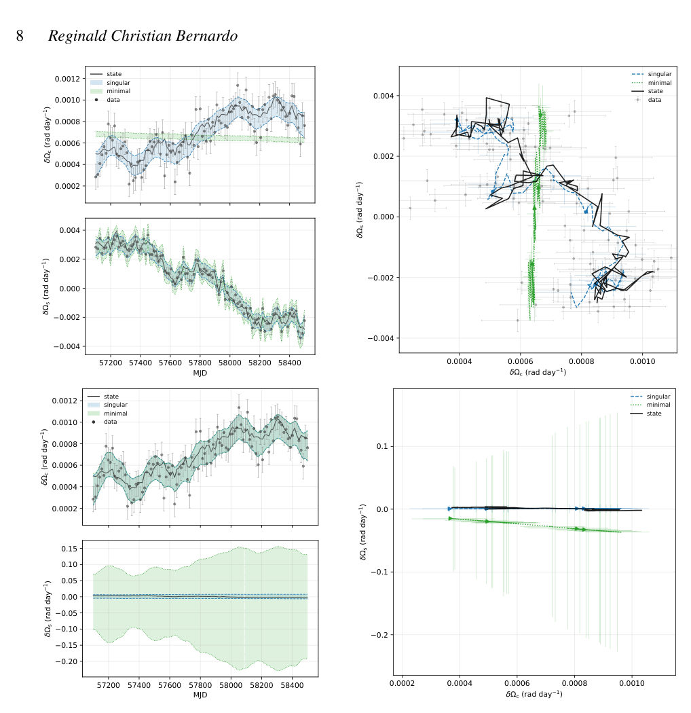
<figcaption class="paper-figure-caption"><b>Fig 2.</b> Figure 2. Reconstruction of a singular model realization using the singular and minimal models. The top figure uses full-state observations of the crust and superfluid. The lower figure uses crust-only observations. The left panels show the component time series and 95 percent reconstruction bands, while the right panels show the 2D trajectories. The black curve is the true state, the points with error bars are the mock data, and the blue and green curves denote the singular and minimal reconstructions, respectively.</figcaption>
</figure>
<figure class="paper-figure-card">
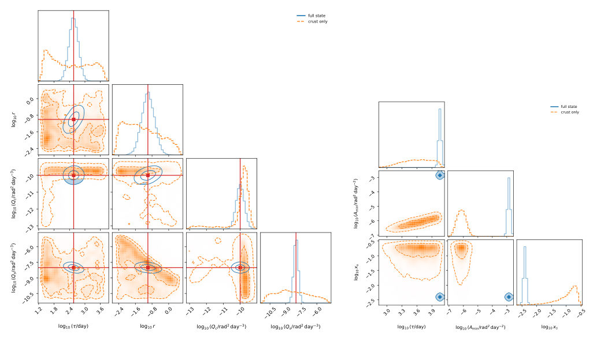
<figcaption class="paper-figure-caption"><b>Fig 3.</b> Figure 3. Parameter posteriors for the singular model realization (Table 1) analyzed with the singular model (left) and the minimal model (right). Blue solid distributions use full-state observations and orange dashed distributions use crust-only observations. Red lines mark the injected parameters only in the generating-model panel. Contours enclose 68 and 95 percent posterior probability.</figcaption>
</figure>
<figure class="paper-figure-card">
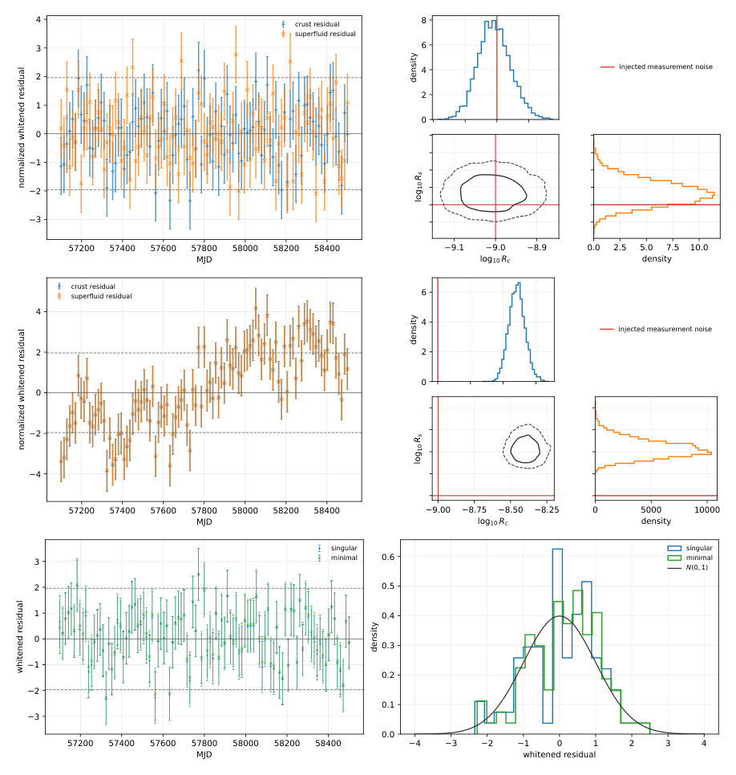
<figcaption class="paper-figure-caption"><b>Fig 4.</b> Figure 4. Noise diagnostics for the singular model realization. From top to bottom, the figures show the full-state singular fit, the full-state minimal fit, and the crust-only whitened residuals. In the full-state panels, + and × mark the normalized crust and superfluid residuals. The right panels show the residual-based estimates of 𝑅c and 𝑅s, with solid and dashed contours enclosing 68 and 95 percent probability. Red lines mark the measurement noise parameters.</figcaption>
</figure>
<figure class="paper-figure-card">
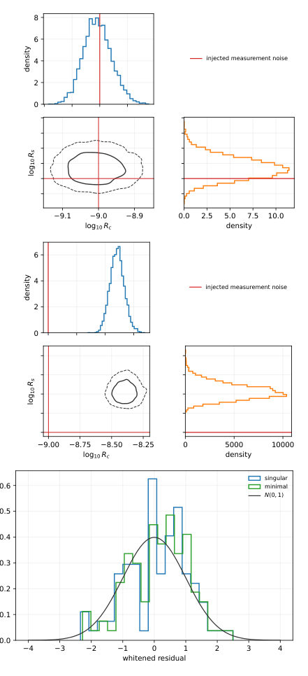
<figcaption class="paper-figure-caption"><b>Fig 5.</b> Figure 2 shows the reconstructions in a reference realization. We</figcaption>
</figure>

**Summary.** This paper analyzes pulsar spin noise using a two-component model for a neutron star's rotation, distinguishing between models where total angular momentum is conserved (stationary) versus those where it diffuses (nonstationary). By developing Gaussian process methods, the authors show that joint observations of both the crust and superfluid components are necessary to robustly test the fundamental question of angular momentum conservation in these extreme astrophysical objects.

**Why it may be interesting.** The rigorous application of Gaussian process methods to model complex, multi-component stochastic dynamics in a physical system like a neutron star provides a template for analyzing open quantum systems where multiple coupled degrees of freedom are involved.

Detailed structure

**Main problem.** The central problem is testing the stationarity of pulsar spin noise, which is equivalent to determining whether the total angular momentum of a neutron star is conserved.

**Main result.** The authors show that the two-component model can be analyzed for both nonstationary (diffusive) and stationary (conserved) dynamics, and these models are fully testable using joint observations.

**Method.** The analysis develops scalable Gaussian process methods to construct and analyze the likelihood function for observing both the crust and superfluid rotational states simultaneously.

**Model / system.** The system is a two-component dynamical model of a neutron star's rotation, involving a crust component and a superfluid component, whose dynamics are governed by stochastic torques.

**Key observables.** Pulsar timing data (measuring the crust's rotational state) and continuous gravitational wave observations (inferred superfluid interior dynamics).

**Important parameters / regimes.** Relaxation time scale ($	au$), ratio ($r$), and various steady-state averages ($\langle\langle\alpha_c
angle
angle, \langle\langle\Delta\Omega
angle
angle, Q_c, Q_s$).

**Assumptions / limitations.** Robust inference is difficult if only one component (e.g., crust) is observationally accessible, and the analysis relies on the assumption of Gaussian noise processes.

**Figures summary.** Figure C3 shows parameter posteriors for singular Brownian motion, comparing fixed noise vs. joint state+noise estimation, and includes noise diagnostics for residuals.

**Paper structure.** The paper develops the two-component model, derives the necessary Gaussian process methods, and then applies these methods to distinguish between the nonstationary (diffusive) and stationary (conserved) limits of the total angular momentum.

Abstract

We present an analysis of pulsar spin noise based on physically-motivated two-component models of spin wandering. We focus on two models, distinguished by their total angular momentum dynamics: a singular, nonstationary model with a diffusive total angular momentum, and a minimal, stationary model anchored on a conserved total angular momentum. We develop scalable Gaussian process methods and, using mock data, show that the two models are fully testable and distinguishable with full-state observations, i.e., simultaneous independent data on the crust and the superfluid rotational states. This paves a path to testing stationarity in pulsar spin noise, potentially achievable with joint continuous gravitational wave observations and radio timing of pulsars. However, robust inferences and predictions are harder to achieve, and depend on the priors and data quality, when only one component is observationally accessible.

[↑ back to top](#top)

### [Vector chiral order and dynamical quantum phase transitions in an Ising chain with dimerized anisotropic Gamma interaction](http://arxiv.org/abs/2610.01167v1)

**Authors:** Yu-Hong Yan, Shi-Qiao Wu, Kun-Liang Zhang  
**Type:** theory · **Category:** statistical mechanics · **PDF:** <https://arxiv.org/pdf/2610.01167v1>  
**Analysis basis:** full PDF text, analyzed in chunks
**Topic relevance:** `non-equilibrium universality` **3/5** · `Keldysh / 2PI / non-Gaussian methods` **2/5** · `analog quantum simulation` **2/5** · `methods for driven-dissipative` **2/5** · `driven-dissipative phase transition` **1/5**

↔ Scroll figures horizontally

<figure class="paper-figure-card">
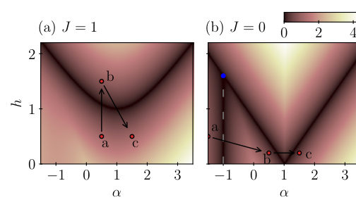
<figcaption class="paper-figure-caption"><b>Fig 1.</b> FIG. 1. The contour map of the energy gap ∆as a function of α and h for the cases of (a) nonzero Ising interaction J = 1 and (b) zero Ising interaction J = 0. The black lines are critical lines that indicate the closing of the energy gap ∆= 0, and there is an additional critical line (marked with dashed line) when J = 0. In both cases we take Γ = 0.8.</figcaption>
</figure>
<figure class="paper-figure-card">
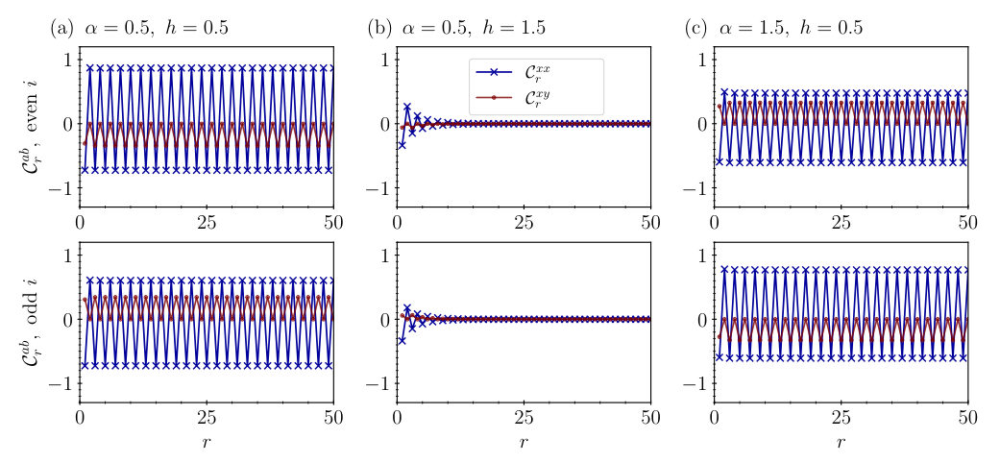
<figcaption class="paper-figure-caption"><b>Fig 2.</b> FIG. 2. The correlation functions Cxx r and Cxy r with respect to distance r for the case of J = 1 and for different α and h. The top and bottom panels show the correlation functions for even and odd i sites, respectively, with r = j −i. The values of α and h are marked in Fig. 1(a) for each panels: left panel (a) α = 0.5, h = 0.5; middle panel (b) α = 0.5, h = 1.5 and right panel (c) α = 1.5, h = 0.5. Other parameters are taken as Γ = 0.8 and N = 1000.</figcaption>
</figure>
<figure class="paper-figure-card">
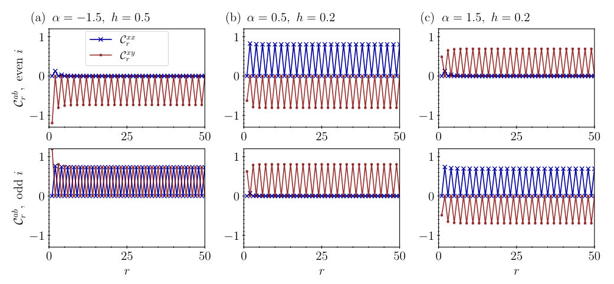
<figcaption class="paper-figure-caption"><b>Fig 3.</b> FIG. 3. The correlation functions Cxx r and Cxy r with respect to distance r for the case of J = 0 and for different α and h. The top and bottom panels show the correlation functions for even and odd i sites, respectively, with r = j −i. The values of α and h are marked in Fig. 1(b) for each panels: left panel (a) α = −1.5, h = 0.5; middle panel (b) α = 0.5, h = 0.2 and right panel (c) α = 1.5, h = 0.2. Other parameters are taken as Γ = 0.8 and N = 1000.</figcaption>
</figure>
<figure class="paper-figure-card">
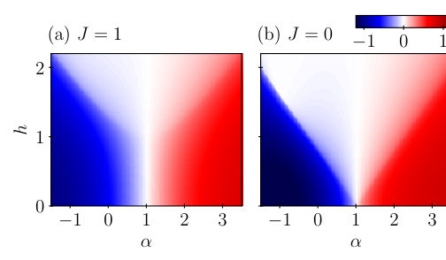
<figcaption class="paper-figure-caption"><b>Fig 4.</b> FIG. 4. The contour map of the staggered chiral order pa- rameter Oxy stag as a function of α and h. (a) J = 1. (b) J = 0. In both cases we take Γ = 0.8, i = 100 and N = 200.</figcaption>
</figure>
<figure class="paper-figure-card">
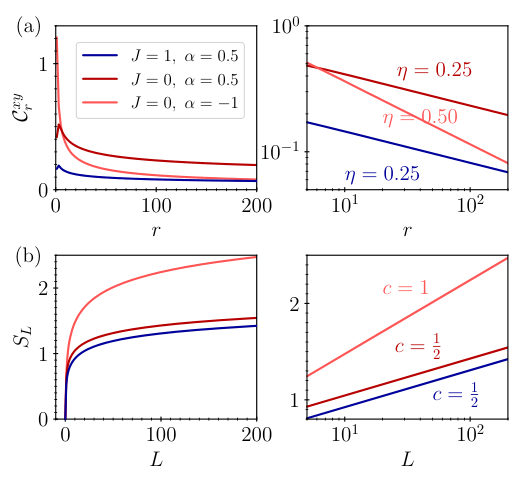
<figcaption class="paper-figure-caption"><b>Fig 5.</b> FIG. 5. (a) Correlation function Cxy r with respect to distance r; (b) Subsystem entanglement entropy SL with respect to subsystem size L for three representative critical points: (i) J = 1, α = 0.5, hc = p</figcaption>
</figure>

**Summary.** This work investigates a quantum Ising chain with complex anisotropic interactions to map out its phase diagram and dynamic critical points. By analyzing vector chiral order, entanglement entropy, and the Loschmidt amplitude, the authors demonstrate that the competition between different interactions leads to rich quantum phases and distinct dynamical critical behaviors. It highlights how off-diagonal exchange terms significantly enrich both the static and time-dependent physics of the quantum magnet.

**Why it may be interesting.** The paper provides a detailed study of how geometric frustration (dimerization) and anisotropic interactions enrich both the equilibrium phase diagram (chiral order) and the non-equilibrium dynamics (DQPTs), offering rich material for understanding quantum criticality beyond simple Ising models.

Detailed structure

**Main problem.** The study investigates the emergence of vector chiral order and the nature of dynamical quantum phase transitions (DQPTs) in a quantum Ising chain subjected to dimerized anisotropic Gamma interactions.

**Main result.** The competition between Gamma anisotropy and the transverse field dictates the phase diagram, revealing distinct critical behaviors, including a gapless critical line in the absence of Ising interactions and periodic/aperiodic sequences for critical times.

**Method.** The analysis employs theoretical techniques including Jordan-Wigner transformation, mapping the system to a fermionic Hamiltonian, and utilizing the Loschmidt amplitude to probe non-equilibrium dynamics.

**Model / system.** The system is a transverse-field Ising chain incorporating dimerized anisotropic Gamma interactions. The Hamiltonian is analyzed using a Bogoliubov quasiparticle formulation, which is then used to calculate correlation functions and the Loschmidt amplitude.

**Key observables.** Vector spin chirality, vector chiral order parameter, spin-spin correlation functions ($C_{xx}^r, C_{xy}^r$), subsystem entanglement entropy ($S_L$), and the Loschmidt amplitude/rate function ($G(t), g(t)$).

**Important parameters / regimes.** Transverse field ($h$), Ising coupling ($J$), and the anisotropic Gamma interaction ($\Gamma$), along with the dimerization parameter ($\alpha$).

**Assumptions / limitations.** The analysis assumes the system starts in the ground state for DQPT calculations, and the fermionic representation is used to diagonalize the Hamiltonian.

**Figures summary.** Figures illustrate the phase diagram based on chiral order, the closing of the energy gap ($\Delta=0$) defining critical lines, and the rate function $g(t)$ showing nonanalytic cusps marking DQPT critical times.

**Paper structure.** The paper systematically explores the equilibrium phase diagram using chiral order parameters, analyzes correlation functions and entanglement entropy to characterize critical points, and finally uses the Loschmidt amplitude to independently probe DQPTs, comparing the results from both equilibrium and non-equilibrium diagnostics.

Abstract

We investigate a transverse-field Ising chain with dimerized anisotropic Gamma interactions and demonstrate that, both in the absence and presence of Ising interactions, the competition between Gamma anisotropy and the transverse field gives rise to vector chiral order and dynamical quantum phase transitions. The phase diagram comprises positive and negative vector chiral phases and a paramagnetic phase, characterized by the vector spin chirality and the vector chiral order parameter. In the absence of Ising interactions, we identify a gapless critical line that exhibits no finite-size drift, along which the spin-spin correlations and subsystem entanglement entropy display behavior distinct from that of Ising criticality. Furthermore, we find that the critical times of dynamical quantum phase transitions form periodic or aperiodic sequences, depending on the quench path. Our findings highlight how dimerized off-diagonal exchange enriches both equilibrium ordering and dynamical critical behavior in a quantum Ising chain.

[↑ back to top](#top)

### [Evidence for an Obstruction to Perturbative Renormalization Group in Stochastic Turbulence](http://arxiv.org/abs/2610.01507v1)

**Authors:** L. Ts. Adzhemyan, D. A. Davletbaeva, D. A. Evdokimov, M. V. Kompaniets  
**Type:** theory · **Category:** statistical mechanics · **PDF:** <https://arxiv.org/pdf/2610.01507v1>  
**Analysis basis:** full PDF text, analyzed in chunks
**Topic relevance:** `non-equilibrium universality` **3/5** · `Keldysh / 2PI / non-Gaussian methods` **2/5** · `driven-dissipative phase transition` **2/5** · `analog quantum simulation` **1/5** · `methods for driven-dissipative` **1/5**

↔ Scroll figures horizontally

<figure class="paper-figure-card">
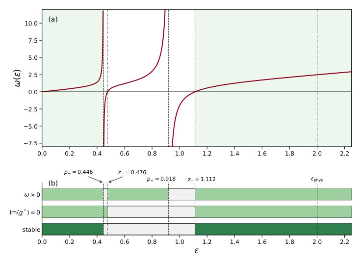
<figcaption class="paper-figure-caption"><b>Fig 1.</b> Figure 1. Correction exponent ω(ε) and the corresponding stability and reality domains of the RG fixed point. The upper panel shows the conjectured closed-form expression for ω(ε) from Eq. (13). The lower panel shows the intervals where ω &gt; 0, where the fixed point is real, Im(g∗) = 0, and where both conditions are simultaneously satisfied. Vertical lines indicate the corresponding domain boundaries and the physical value εphys = 2.</figcaption>
</figure>

**Summary.** This theoretical paper investigates the renormalization group flow of stochastic turbulence to determine if perturbative results can be reliably extrapolated to physical conditions. By calculating the exponent $\omega$ to high loop orders, the authors find evidence suggesting that the fixed point governing the system loses its real stability before reaching the physical forcing strength, implying a fundamental breakdown of the simple perturbative RG description.

**Why it may be interesting.** While focused on classical fluid dynamics, the methodology—using advanced RG techniques to probe the breakdown of perturbative expansions—is highly relevant to understanding non-equilibrium critical phenomena in quantum many-body systems.

Detailed structure

**Main problem.** The paper investigates whether the perturbative Renormalization Group (RG) description of stochastic turbulence can be smoothly extended from small forcing parameters ($\epsilon \approx 0$) to the physically relevant large-scale forcing ($\epsilon_{	ext{phys}} = 2$).

**Main result.** The analysis suggests that the RG fixed point loses its reality or stability in an intermediate range of $\epsilon$, indicating a possible obstruction to a simple, controlled perturbative extrapolation to the physical regime.

**Method.** The authors employed advanced RG techniques, calculating the correction-to-scaling exponent $\omega$ up to five-loop order in the large-$d$ limit, and using pattern recognition (OEIS) to conjecture a closed-form expression for $\omega(\epsilon)$.

**Model / system.** The system modeled is homogeneous isotropic stochastic turbulence, governed by the Navier-Stokes equation driven by a Gaussian random force. The analysis is performed in the large spatial dimension limit ($d 	o \infty$).

**Key observables.** The correction-to-scaling exponent $\omega(\epsilon)$, the stability and reality domains of the RG fixed point, and the renormalized parameters ($
u_Z, g_0, Z_g, D_0$).

**Important parameters / regimes.** The forcing parameter $\epsilon$, which varies from the perturbative limit ($\epsilon 	o 0$) to the physical limit ($\epsilon_{	ext{phys}} = 2$). The large dimension limit ($d 	o \infty$) is crucial for the calculations.

**Assumptions / limitations.** The primary assumptions include performing calculations in the large-$d$ limit and treating the derived closed-form expression for $\omega(\epsilon)$ as a conjecture based on observed coefficient patterns.

**Figures summary.** Figure 1 is noted to show the conjectured closed-form expression for $\omega(\epsilon)$ and plots the stability and reality domains of the RG fixed point, highlighting the physical value $\epsilon_{	ext{phys}} = 2$.

**Paper structure.** The paper progresses by setting up the stochastic turbulence model via field theory, performing multi-loop calculations of the RG flow equations (determining $\omega$), conjecturing a closed form for $\omega(\epsilon)$, and finally analyzing the stability and reality of the resulting fixed point solution across the parameter space $\epsilon \in [0, 2]$.

Abstract

We examine whether the perturbative renormalization group (RG) regime of stochastic turbulence can be continued from small $\varepsilon$ to the physical value $\varepsilon_{\mathrm{phys}}=2$, corresponding to large-scale forcing. Exploiting the simplifications of the large-$d$ limit, we calculate the correction exponent $ω$ to five-loop order and find a simple structure suggesting a closed analytic form. This form implies that the fixed point stable near $\varepsilon=0$ ceases to be simultaneously real and infrared stable before reaching $\varepsilon_{\mathrm{phys}}=2$, pointing to a possible change of infrared regime rather than a controlled perturbative RG extrapolation.

[↑ back to top](#top)

### [Negative quasiprobabilities redistribute (and complex ones reduce) the information in unabsorbed photons](http://arxiv.org/abs/2610.00740v1)

**Authors:** Jonte R. Hance  
**Type:** theory · **Category:** other · **PDF:** <https://arxiv.org/pdf/2610.00740v1>  
**Analysis basis:** full PDF text, analyzed in chunks
**Topic relevance:** `interference shaping light` **3/5** · `quantum measurements` **3/5** · `Keldysh / 2PI / non-Gaussian methods` **1/5** · `correlated / nonlocal dissipation` **1/5** · `methods for driven-dissipative` **1/5**

↔ Scroll figures horizontally

<figure class="paper-figure-card">
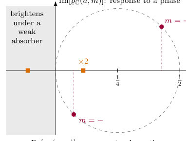
<figcaption class="paper-figure-caption"><b>Fig 1.</b> FIG. 2. The KD term ϱC(a, m) = ⟨m|a⟩⟨a| ˆρ |m⟩as the linear response of output m to a weak object in path a, Eq. (9). Its real part is the response to absorption, and a negative real part (shaded) marks an output that brightens under a weak absorber; its imaginary part is the response to a phase. Over all outputs the real parts sum to P(a) and the imaginary parts sum to zero, Eq. (5). Circles: the two outputs of Fig. 3(a)’s two-path interferometer, with input (|b⟩+eiφ |a⟩)/ √</figcaption>
</figure>
<figure class="paper-figure-card">
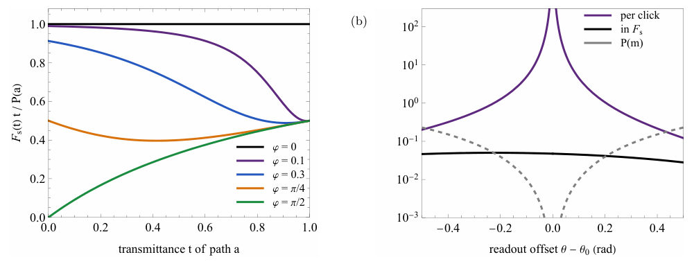
<figcaption class="paper-figure-caption"><b>Fig 2.</b> FIG. 3. (a) Fisher information from the unabsorbed photons, in units of the bound P(a)/t, against the transmittance t, for a two-path interferometer with input (|b⟩+ eiφ |a⟩)/ √</figcaption>
</figure>
<figure class="paper-figure-card">
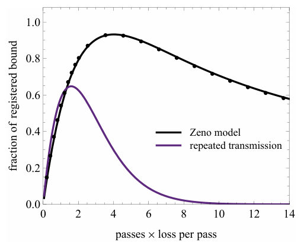
<figcaption class="paper-figure-caption"><b>Fig 3.</b> FIG. 4. Many passes with unregistered loss: Fisher informa- tion per absorbed photon delivered by the detected photons, as a fraction of the registered bound 1/[t(1 −t)2], against the number of passes times the intensity loss per pass, in the limit t →1. Black: Section IV B’s Zeno model, Appendix E’s G(ν) plotted against 2ν = 2n(1− √</figcaption>
</figure>
<figure class="paper-figure-card">
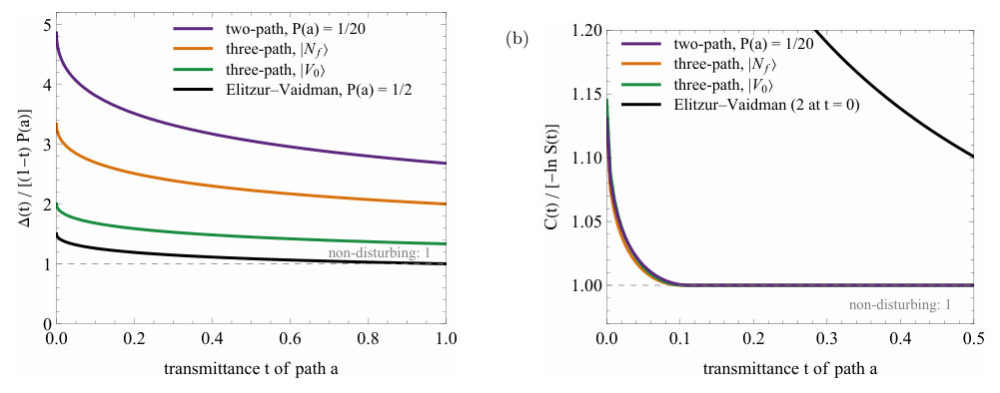
<figcaption class="paper-figure-caption"><b>Fig 4.</b> FIG. 5. Discrimination between object present (transmittance t) and absent, per absorbed photon, for four interferometers: two paths with P(a) = 1/20 and balanced readout (purple), the three-path interferometer with inputs |Nf⟩(orange) [16, 35] and |V0⟩(green) [35], and the balanced Elitzur–Vaidman interferometer (black). (a) Single-shot statistical distance R(t), Eq. (26), over t ∈[0, 1]; the t →1 limits are 1+N/P(a), with N the negativity of the KD distribution. (b) Error exponent of a repeated test, the Chernoff information C(t), relative to its value −ln S(t), where S(t) is the survival probability, for any non-disturbing definite-path scheme with the same absorption, over t ∈[0, 0.5]...</figcaption>
</figure>
<figure class="paper-figure-card">
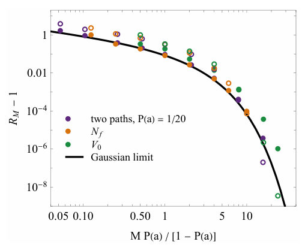
<figcaption class="paper-figure-caption"><b>Fig 5.</b> FIG. 6. Decay of the single-shot gain with the number M of heralded trials: RM −1 against x2 = MP(a)/[1 −P(a)] for the three interferometers of Fig. 5 that have negative KD terms, from sums over all click records at t = 0.99 (filled) and t = 0 (open), and the limit Eq. (G2) of a weak absorber and small P(a) (black).</figcaption>
</figure>

**Summary.** This theoretical paper analyzes the information content gained from measuring a weak absorber using single photons in an interferometer. It demonstrates that while negative quasiprobabilities are theoretically significant, they do not improve the information per absorbed photon in a single pass. True advantages are found either through phase accumulation over multiple passes or when the measurement setup is designed to exploit specific interference effects.

**Why it may be interesting.** This work provides rigorous theoretical bounds on quantum metrology, specifically quantifying when and how negative quasiprobabilities can enhance measurement sensitivity beyond classical limits in the context of photon loss.

Detailed structure

**Main problem.** The paper investigates the fundamental limits on the information gain per absorbed photon when performing interaction-free measurements on a weak sample.

**Main result.** For single-pass measurements, negativity does not improve the total information per absorbed photon; advantage only accumulates over multiple, uncounted passes or when the phase response is significant.

**Method.** The analysis uses the Fisher information derived from the linear response of output probabilities to weak absorption or phase shifts, utilizing negative Kirkwood-Dirac quasiprobabilities.

**Model / system.** The system models a single photon passing through a $d$-path interferometer containing a weak absorber with transmittance $t$. The analysis extends to multi-pass scenarios using ring resonators.

**Key observables.** Fisher information ($F_s(t)$), evidence per absorbed photon ($\eta$), and the complex Kirkwood-Dirac quasiprobabilities ($\varrho_C$).

**Important parameters / regimes.** Transmittance $t$, number of passes $\ell$, and the weak value $\langle\hat{\Pi}(a)
angle_w$.

**Assumptions / limitations.** The analysis often relies on approximations, such as the Gaussian regime or small probabilities of absorption ($P(a)$).

**Figures summary.** Figures illustrate the interferometer setup, showing how the single-shot gain ($R_M^{-1}$) decays for different measurement limits and how the gain is enhanced by negative weak values near null ports.

**Paper structure.** The paper progresses from establishing the single-pass bound using Fisher information (Theorem 1) to analyzing the role of negativity, and finally extends the analysis to multi-pass systems and the evidence gain ($\eta$) using advanced entropy measures.

Abstract

Negative Kirkwood--Dirac quasiprobabilities are credited with the quantum advantage of interaction-free measurement and postselected metrology. We test that claim on the task interaction-free measurement was designed for: learning about a sample letting it absorb as little light as possible. The Kirkwood--Dirac distribution of path and output gives the linear response to a weak sample: its real part responds to absorption, its imaginary part to a phase. For a pure single photon passing once through any interferometer, the Fisher information about transmittance per absorbed photon is the direct-transmission value minus a sum of squared imaginary parts: no interferometer or readout beats direct transmission. Negativity plays no role beyond concentrating information in weakly lit outputs. The imaginary parts of the Kirkwood-Dirac distribution depend on the output basis here, not on the sample, so a basis exists in which every term is real, which is optimal. A single photon gains information per absorbed photon only through a phase response, which for an optical line needs a thick or inhomogeneously broadened sample, or through many passes when absorptions go uncounted, as shown by a critically coupled resonator. For detecting a weak absorber, negativity gives a single-shot advantage that does not accumulate over multiple trials; advantage instead accumulates when there are outputs which are dark without the object, a case which needs no negativity.

[↑ back to top](#top)

### [Transport theory for a generic two-arm co-propagating Majorana interferometer with Majorana fermion and edge vortex tunneling](http://arxiv.org/abs/2610.01402v1)

**Authors:** Domenico Giuliano, Andrea Nava, Fabian Hassler, Reinhold Egger  
**Type:** theory · **Category:** other · **PDF:** <https://arxiv.org/pdf/2610.01402v1>  
**Analysis basis:** full PDF text, analyzed in chunks
**Topic relevance:** `Keldysh / 2PI / non-Gaussian methods` **3/5** · `methods for driven-dissipative` **2/5** · `analog quantum simulation` **1/5** · `correlated / nonlocal dissipation` **1/5** · `driven-dissipative phase transition` **1/5** · `interference shaping light` **1/5**

↔ Scroll figures horizontally

<figure class="paper-figure-card">
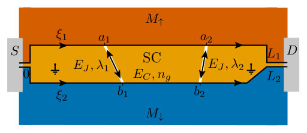
<figcaption class="paper-figure-caption"><b>Fig 1.</b> FIG. 1. Schematic setup for an asymmetric chiral Majorana interferometer formed on the surface of a TI. In the interfer- ometer region, the surface is proximitized by a conventional SC. Outer regions are proximitized by magnetic materials of opposite magnetization (M↑and M↓). At interfaces between magnetic materials, 1D chiral Dirac fermion channels (double lines) arise. Arrows denote the propagation direction. At in- terfaces between SCs and magnets, we have a pair of chiral 1D Majorana fermion modes ξ1,2(x) (black lines) with different length, 0 &lt; x &lt; L1,2. These modes are populated from the 1D Dirac channel emanating from the normal source electrode S. Similarly, outgoing particles are...</figcaption>
</figure>
<figure class="paper-figure-card">
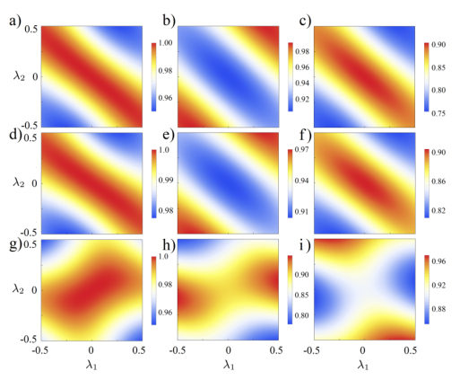
<figcaption class="paper-figure-caption"><b>Fig 2.</b> FIG. 2. 2D color-scale plots for the finite-temperature DC conductance G in units of G0 = e2/h at vanishing volt- age (V →0) in the (λ1, λ2)–plane for different asymmet- ric device configurations. The shown results are obtained from Eq. (7) and hold in the absence of EV tunneling. The interferometer arm lengths were chosen L1 = 0.5v/T and L2 = L1/2 for δL &gt; 0, and swapped for δL &lt; 0. The tun- neling locations {a1, b1, a2, b2} are permutations of the values {0.035, 0.08, 0.11, 0.175} v/T. Different panels correspond to either δL = 0 [panels (a),(d), and (g)], δL &lt; 0 [panels (b),(e), and (h)], or δL &gt; 0 [panels (c),(f), and (i)]. The tunneling points are ordered as a1 &lt; a2 &lt; b1 &lt; b2 in panels...</figcaption>
</figure>
<figure class="paper-figure-card">
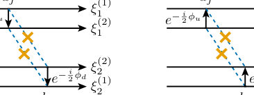
<figcaption class="paper-figure-caption"><b>Fig 3.</b> FIG. 3. EV tunneling processes within the doubled theory, where we show the Majorana fields ξ(a) j (x) with replica in- dex a = 1, 2. The tunneling points are located at x = aj on the upper edge (j = 1), and at x = bj on the lower edge (j = 2). Bosonization implements vortex tunneling (black arrows) within a single edge while coupling the two replicas. For independent isospin operators Su,d, all four processes are allowed in Eq. (26). However, not all of these correspond to physical processes within a single replica sector. While the pair of Hermitian-conjugate processes shown in the top row corresponds to physical vortex tunneling (blue dashed ar- rows), the bottom row does not represent...</figcaption>
</figure>
<figure class="paper-figure-card">
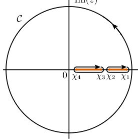
<figcaption class="paper-figure-caption"><b>Fig 4.</b> FIG. 4. Complex integration contour C and branch cuts for the evaluation of the complex integral in Eq. (31). On the positive real axis, two branch cuts with Im(z) = 0 and χ4 &lt; Re(z) &lt; χ3 and χ2 &lt; Re(z) &lt; χ1 exist, see Eq. (32). The positions of the branch points χj correspond (via the mapping x 7→exp(−2πTx/v)) to the location of the EVs (all four EVs are evaluated at teh same imaginary time). The branch cuts reflect the Ising anyon nature of the EV. In the symmetric case aj = bj, the branch cuts disappear and a bosonization within a single replica sector becomes possible.</figcaption>
</figure>
<figure class="paper-figure-card">
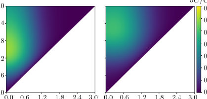
<figcaption class="paper-figure-caption"><b>Fig 5.</b> FIG. 5. 2D color-scale plot of the amplitude δC of the effec- tive capacitance Ceff [in units of C0 = Γe2(lcT/v)1/4/T 2] as a function of the edge-vortex positions b1 and b2 in the bottom edge mode, using a1 = 0.5 v/T and a2 = v/T. The interfer- ometer arm lengths are set to L1 = L2 = 3v/T (left panel) and L1 = 3v/T, L2 = 4v/T (right panel). Note that Ceff os- cillates as a function of the offset angle α as cos(πSz/4 + α). The phase offset πSz/4 = ±2πsσ corresponds to the topolog- ical spin of EVs [25].</figcaption>
</figure>

**Summary.** This work develops a transport theory for a Majorana interferometer incorporating edge vortex tunneling. It finds that while DC conductance is insensitive to topological effects, the low-frequency response reveals an effective capacitance sensitive to the non-Abelian statistics of the edge vortices. This provides a measurable diagnostic for topological physics in superconducting quantum devices.

**Why it may be interesting.** The focus on topological signatures (non-Abelian statistics) measurable via capacitance in a superconducting platform makes it highly relevant for understanding topological quantum computation pathways.

Detailed structure

**Main problem.** To develop a transport theory for a generic two-arm co-propagating Majorana interferometer that incorporates both Majorana fermion tunneling and the effects of edge vortex (EV) tunneling.

**Main result.** While the DC conductance does not show signatures of edge-vortex interference, the interference manifests as an effective capacitance at low frequencies, which is sensitive to the non-Abelian anyon statistics of the edge vortices.

**Method.** The theory employs a replicated bosonization field theory framework to analyze the linear-response conductance tensor, generalizing previous treatments to asymmetric configurations.

**Model / system.** The system is a Majorana interferometer realized on a Topological Insulator proximitized by a Superconductor, featuring two co-propagating chiral Majorana edge modes and coupling points for both Majorana fermions and EVs.

**Key observables.** Effective capacitance ($C_{	ext{eff}}$) at low frequencies, and the frequency-dependent conductance tensor $G(\omega)$.

**Important parameters / regimes.** Thermal length $\ell_T = \hbar v / (\pi k_B T)$, and the degree of asymmetry in the interferometer arms ($\delta L$).

**Assumptions / limitations.** The analysis assumes the EV size is negligible compared to the thermal length $\ell_T$, and the theory is generalized to handle arbitrary length mismatches.

**Figures summary.** Figures illustrate the schematic setup of the interferometer, showing the two chiral Majorana modes and tunneling processes involving EVs, and show color-scale plots of the finite-temperature DC conductance dependence on tunneling amplitudes.

**Paper structure.** The paper builds from the initial Hamiltonian formulation (including Majorana and EV tunneling) to the application of a replicated bosonization framework to calculate the frequency-dependent conductance, distinguishing between DC and AC responses.

Abstract

Co-propagating chiral Majorana edge modes are predicted to exist in proximity-coupled quantum anomalous Hall systems. They combine the exciting prospects of edge vortices as flying non-Abelian Ising anyons, with their fully electrical detection through anyon fusion processes. In this setup, electrical transport arises from the interference of a pair of Majorana edge states. By bosonizing the model with an additional replica sector, we generalize previous treatments to fully asymmetric configurations. We analyze a Mach-Zehnder interferometer and show that while the DC conductance does not exhibit signatures of edge-vortex interference, at low frequencies, this interference manifests as an effective capacitance. This quantity is sensitive to the non-Abelian anyon statistics of edge vortices and, in particular, carries signatures of their topological spin and nontrivial conformal dimension. We demonstrate that the thermal length $l_T = \hbar v/(πk_B T)$ is the relevant scale at low temperatures $T$, analogous to quasiparticle transport in conventional quantum Hall edge states with velocity $v$. As long as the interferometer arm lengths match within this length scale, transport signatures of the non-Abelian statistics of edge vortices remain visible.

[↑ back to top](#top)

### [Additive solid immersion lenses for enhanced collection efficiency of shallow NV centers by pulsed laser deposition and structurization of high-k amorphous oxides](http://arxiv.org/abs/2610.01183v1)

**Authors:** Michael S. Bar, Nicole Raatz, Max Kneiss, Andreas Koenig, Marius Grundmann, Holger von Wenckstern  
**Type:** both · **Category:** other · **PDF:** <https://arxiv.org/pdf/2610.01183v1>  
**Analysis basis:** full PDF text, analyzed in chunks
**Topic relevance:** `interference shaping light` **3/5** · `quantum optics experiment` **3/5** · `QC/QI experiment` **1/5** · `methods for driven-dissipative` **1/5**

↔ Scroll figures horizontally

<figure class="paper-figure-card">
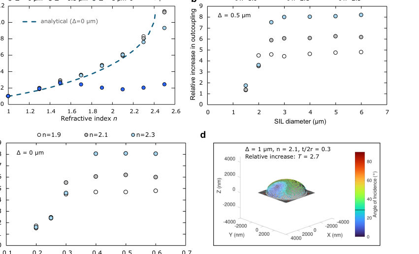
<figcaption class="paper-figure-caption"><b>Fig 1.</b> FIG. 1. a) Increase in light outcoupling from a solid medium as a function of the refractive index of a hemispherical SIL with a diameter of 2r = 5µm. The numerical solutions (circles) are calculated for different lateral offsets ∆of the point source from the center of the SIL. b) Numerical solution for the light extraction enhancement for a hemispherical SIL with constant offset ∆= 0.5µm and as a function of total SIL size. c) Numerical solution for the light extraction enhancement as a function of aspect ratio height/diameter. d) An example simulation for a flattened misplaced SIL, still resulting in a twofold increase in outcoupling. The points on the surface show the intersection of...</figcaption>
</figure>
<figure class="paper-figure-card">
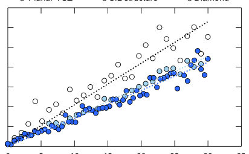
<figcaption class="paper-figure-caption"><b>Fig 2.</b> FIG. 2. Luminesence of the deposited YSZ layer as a function of excitation power with an electronic grade diamond as reference. The dashed line represents a linear fit.</figcaption>
</figure>
<figure class="paper-figure-card">
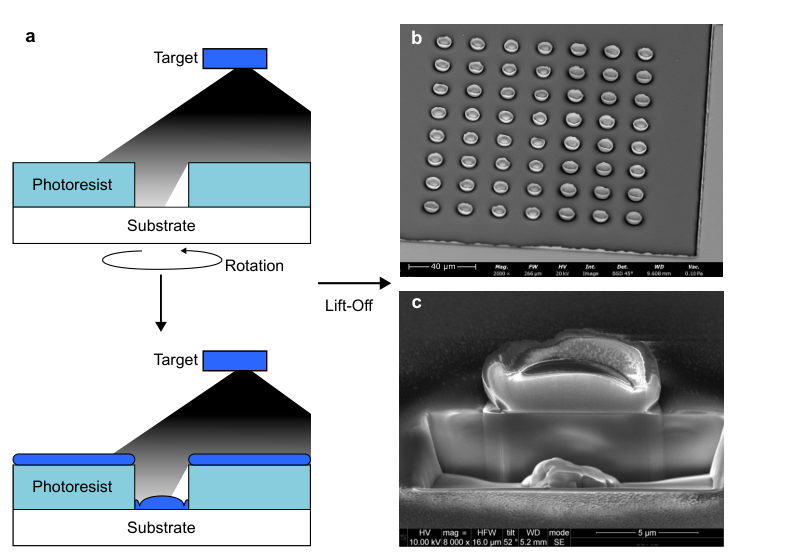
<figcaption class="paper-figure-caption"><b>Fig 3.</b> FIG. 3. a) Schematic illustration of the deposition process of AD-SILs. b) Array of YSZ AD-SIL fabricated simultaneously with PLD on glass. c) Cross-section of a YSZ AD-SIL on glass with “fencing”.</figcaption>
</figure>
<figure class="paper-figure-card">
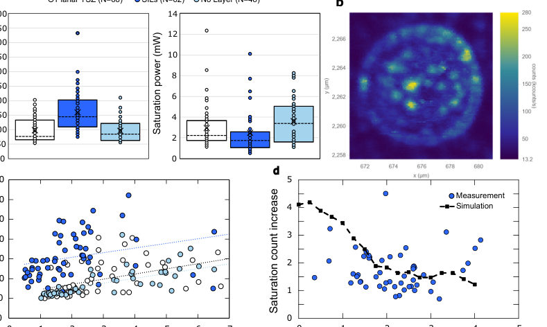
<figcaption class="paper-figure-caption"><b>Fig 4.</b> FIG. 4. a) Statistical evaluation of the saturation intensity and saturation power of NV centers under planar YSZ, AD-SILs and bare diamond surface. The circles denote individual measurements, the box the first and third quartile and the dashed line and cross the median and average respectively. b) Example confocal scan of an AD-SIL on diamond with visible NV center luminescence. c) Saturation counts as a function of respective power for the respective surface modification types. The dashed lines are linear fits meant as a guide to the eye. d) Measured and simulated saturation count increase of NV centers under AD-SILs compared to the average uncovered NV center.</figcaption>
</figure>

**Summary.** This paper reports on the use of Additive Solid Immersion Lenses (SILs), fabricated via Pulsed Laser Deposition of high-k oxides like YSZ, to boost the light collection efficiency from NV centers in diamond. By mitigating total internal reflection losses, the technique significantly increases the measurable saturation intensity of the quantum emitter, making it a viable platform for quantum information processing.

**Why it may be interesting.** This work directly addresses the practical quantum optics challenge of coupling single-photon emitters to external optical circuits by engineering the local photonic environment, which is crucial for quantum networking and quantum memory.

Detailed structure

**Main problem.** The primary challenge is the low photon extraction efficiency from shallow Nitrogen-Vacancy (NV−) centers in diamond due to total internal reflection losses caused by the refractive index mismatch with air.

**Main result.** The authors successfully demonstrated that using Additive Solid Immersion Lenses (SILs) made of high-k amorphous oxides significantly enhances light collection, achieving an average 63% increase in saturation intensity.

**Method.** The study combines numerical simulations (Monte-Carlo) to model photon extraction with experimental fabrication techniques like Pulsed Laser Deposition (PLD) and photolithography to create the SIL structures.

**Model / system.** The physical system is NV− centers embedded in diamond. The enhancement mechanism involves depositing high-k dielectric materials, such as Yttria-Stabilized Zirconia (YSZ), onto the surface to act as an immersion lens.

**Key observables.** Photon extraction efficiency ($\eta$), saturation intensity ($I_{sat}$), and the necessary laser intensity for saturation.

**Important parameters / regimes.** The refractive index ($n$) of the SIL material, the lateral offset ($\Delta$) of the light source, and the SIL geometry parameters (diameter $2r$, thickness $t$).

**Assumptions / limitations.** Initial simulations did not consider Fresnel reflections, and the performance is sensitive to fabrication imperfections like sidewall deposition ('fencing').

**Figures summary.** Figures illustrate the fabrication process, showing the array of curved SILs and cross-sections, and compare fluorescence measurements (saturation counts) under different surface conditions.

**Paper structure.** The paper progresses from identifying the optical loss problem to simulating the theoretical enhancement using SILs, and finally validating the concept through the scalable, bottom-up fabrication and measurement of the enhanced photon collection efficiency.

Abstract

The negatively charged nitrogen-vacancy ($\mathrm{NV}^-$) defect in diamond can be used for quantum information processing via the readout of the radiative decay of the excited state into the ground state. The large refractive index mismatch of diamond and air causes low photon extraction efficiency due to total internal reflection losses. Here, we investigate the photon extraction numerically and report additive solid immersion lenses (SILs) consisting of the high-k dielectric yttria-stabilized-zirconia (YSZ) for surface modification and enhanced light extraction of shallow implanted nitrogen-vacancy centers. We demonstrate an average increase of 63% in saturation intensity using a scalable bottum up room temperature pulsed laser deposition and photolithography structurization process. The average necessary laser intensity for saturation is reduced by 33% by the SILs.

[↑ back to top](#top)

### [Dissipation-Enabled Operator-Norm Locality Bounds for Bose-Hubbard Hamiltonians](http://arxiv.org/abs/2610.01669v1)

**Authors:** Marius Lemm, Tim Möbus  
**Type:** theory · **Category:** quantum information and computing · **PDF:** <https://arxiv.org/pdf/2610.01669v1>  
**Analysis basis:** full PDF text, analyzed in chunks
**Topic relevance:** `analog quantum simulation` **3/5** · `methods for driven-dissipative` **3/5** · `correlated / nonlocal dissipation` **1/5** · `driven-dissipative phase transition` **1/5**

↔ Scroll figures horizontally

<figure class="paper-figure-card">
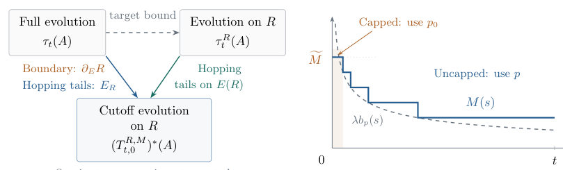
<figcaption class="paper-figure-caption"><b>Fig 1.</b> Figure 1: The adaptive locality proof. (a) Comparing both physical evolutions with the same cutoff evolution on R gives hopping tails controlled by moments and boundary terms controlled by a Lieb–Robinson bound. (b) Schematic cutoff M(s) = min{f M, ⌈λbp(s)⌉}. The capped interval uses 2 &lt; p0 &lt; 2(ℓ−1), and the remainder uses p &gt; 2. For ℓ&gt; 2, the integrated cutoff is bounded uniformly in f M.</figcaption>
</figure>
<figure class="paper-figure-card">
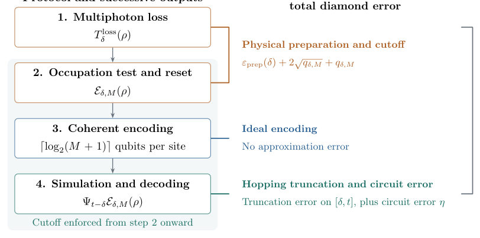
<figcaption class="paper-figure-caption"><b>Fig 2.</b> Figure 2: Hybrid bosonic–qubit simulation at time t. The four steps implement Ψt−δEδ,M. The right column summarizes the error contributions in Equation (36), whose sum bounds the diamond distance from Tt. Ideal encoding adds no error. Shading marks the stages after the occupation cutoff is enforced.</figcaption>
</figure>

**Summary.** This paper demonstrates that adding local dissipation to the Bose-Hubbard model restores a robust, state-independent Lieb-Robinson bound, overcoming a major hurdle in analyzing bosonic quantum dynamics. By regularizing the state via photon loss, the authors prove that local approximations are valid uniformly in the initial state. This has significant implications for digital quantum simulation and quantum error correction codes.

**Why it may be interesting.** This work provides a crucial theoretical tool—state-independent locality bounds—for bosonic systems, which is highly valuable for analyzing quantum simulation protocols and understanding information flow in complex quantum hardware.

Detailed structure

**Main problem.** The paper addresses the challenge of establishing operator-norm Lieb-Robinson bounds for bosonic lattice systems, which is difficult because information propagation velocity can depend on the local boson occupancy.

**Main result.** The authors prove that introducing local dissipation (on-site $\ell$-photon loss with $\ell>2$) restores an almost-ballistic Lieb-Robinson bound, allowing for uniform state-independent approximations.

**Method.** The core method involves using local dissipation to regularize the dynamics, allowing the use of Sobolev regularization techniques to bound the difference between the full and truncated evolution.

**Model / system.** The system is the Bose-Hubbard model on a lattice, described by a Lindbladian master equation incorporating on-site $\ell$-photon loss. Extensions cover cat-code dissipation and quartic bosonic models.

**Key observables.** Operator-norm local approximation estimates, Lieb-Robinson bounds, and the decay rate of the difference between full and restricted evolution.

**Important parameters / regimes.** The dissipation order $\ell > 2$, the hopping coefficients $J_{ij}$, and the rates $\gamma_j$ are crucial parameters determining the bound's validity.

**Assumptions / limitations.** The analysis relies on the existence of Sobolev-preserving and regularizing quantum Markov semigroups and the assumption of sufficiently strong local dissipation ($\ell>2$).

**Paper structure.** The paper builds from establishing the general difficulty of locality bounds in bosonic systems to introducing dissipation as a regularizing mechanism. It then proves the main Lieb-Robinson bound for the Bose-Hubbard model, extends this to cat-code dissipation, and concludes with applications like local adiabatic approximations.

Abstract

Closed bosonic lattice systems do not generally admit operator norm Lieb--Robinson bounds uniformly in the initial state. The reason is that the information propagation velocity can grow with the local boson occupancy, which can be macroscopically large. Here, we show that local dissipation restores an operator-norm Lieb--Robinson bound. We consider the dissipative Bose--Hubbard model described by a Lindbladian operator with on-site $\ell$-photon loss, $\ell>2$ and, for our main result, we establish an almost-ballistic Lieb-Robinson bound. Dissipation rapidly depletes highly occupied sites, thus regularizing the state on the Sobolev-type scale of local particle moments. The resulting moment bounds diverge as time approaches zero but remain integrable near zero at sufficiently low orders. We extend these ideas to treat cat-code dissipation and, for initial states in the code space, we prove a local adiabatic approximation uniform in the total volume. Further consequences include local channel approximation, a thermodynamic limit, and efficient digital quantum simulation. The point is that these applications are now available \textit{uniformly in the input state}, as for quantum spin systems, but in contrast to closed Bose--Hubbard systems.

[↑ back to top](#top)

### [DSSYK, open ASEP/TASEP and 2d dilaton gravity at strong coupling](http://arxiv.org/abs/2610.01790v1)

**Authors:** Alexander Gorsky, Elizaveta Kovalenko, Sergei Nechaev  
**Type:** theory · **Category:** statistical mechanics · **PDF:** <https://arxiv.org/pdf/2610.01790v1>  
**Analysis basis:** full PDF text, analyzed in chunks
**Topic relevance:** `non-equilibrium universality` **3/5** · `Keldysh / 2PI / non-Gaussian methods` **2/5** · `methods for driven-dissipative` **2/5** · `driven-dissipative phase transition` **1/5**

↔ Scroll figures horizontally

<figure class="paper-figure-card">
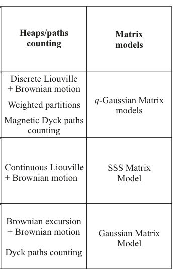
<figcaption class="paper-figure-caption"><b>Fig 1.</b> Figure 1. Schematic connection between different models discussed in the paper.</figcaption>
</figure>
<figure class="paper-figure-card">
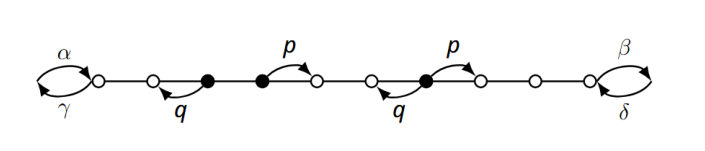
<figcaption class="paper-figure-caption"><b>Fig 2.</b> Figure 2. ASEP on a 1D lattice with open boundaries. Black dots denote occupied sites, empty circles correspond to holes; bulk hopping rates are p (to the right) and q (to the left); boundary rates are: injection/removal α, γ (left) and δ, β (right).</figcaption>
</figure>
<figure class="paper-figure-card">
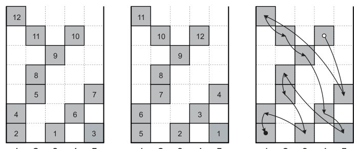
<figcaption class="paper-figure-caption"><b>Fig 3.</b> Figure 3. A particular heap. (a) Heap obtained by sequentially dropping bricks correspond- ing to the word Wa = g3g1g5g1g2g4g5g2g3g4g2g1; (b) same heap with a different sequence Wb = g5g3g4g5g1g1g2g2g3g2g1g4; (c) unique “Cartier-Foata ordering” of pieces.</figcaption>
</figure>
<figure class="paper-figure-card">
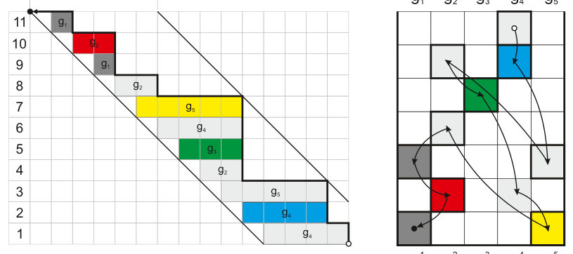
<figcaption class="paper-figure-caption"><b>Fig 4.</b> Figure 4. Left: Young tableau representation of a heap shown in the right panel; Right: particular configuration of a heap where arrows show Mikado enumeration.</figcaption>
</figure>
<figure class="paper-figure-card">
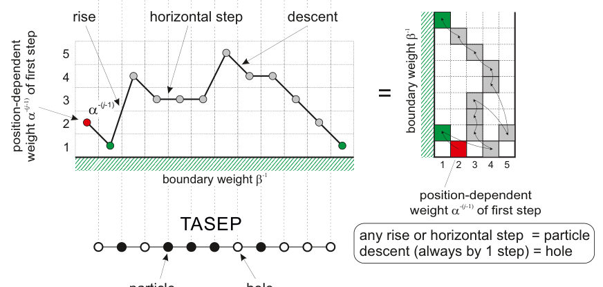
<figcaption class="paper-figure-caption"><b>Fig 5.</b> Figure 5. Example of two distinct Lukasiewicz paths (corresponding to two distinct pyra- mids) mapped to the single TASEP configuration. Particularly, the first step carries the weight α−(j+1) j=2 = α−1 and the steps 2 and 12 carry the boundary weight β−1.</figcaption>
</figure>

**Summary.** This paper explores a profound mathematical triality linking stochastic growth models like TASEP, the DSSYK quantum field theory, and low-dimensional dilaton gravity. By showing these systems are mathematically equivalent in certain limits, the authors provide a unified, powerful framework for studying strongly coupled quantum phenomena. This work is significant for bridging non-equilibrium statistical mechanics with quantum gravity.

**Why it may be interesting.** The deep connections drawn between non-equilibrium statistical mechanics (ASEP/TASEP) and quantum gravity provide powerful, non-perturbative tools for understanding strongly coupled quantum systems, which is relevant for open quantum systems dynamics.

Detailed structure

**Main problem.** The paper investigates the deep mathematical and physical connections, or 'triality,' between stochastic growth models, specific quantum field theories, and low-dimensional quantum gravity.

**Main result.** It establishes that the TASEP model is equivalent to the strong-coupling limit of 2D dilaton gravity, unifying these disparate fields under a single theoretical framework.

**Method.** The authors employ advanced techniques including deriving exact resolvent expressions, utilizing matrix integral representations, and establishing dualities between different physical models.

**Model / system.** The core models include the Totally Asymmetric Simple Exclusion Process (TASEP), the DSSYK model, and 2D dilaton gravity (related to JT gravity). These are connected via the KPZ universality class.

**Key observables.** Resolvent of the transfer matrix, cumulants, spectral densities, and partition functions.

**Important parameters / regimes.** Deformation parameter $q$, strong-coupling limit, and the coupling constant $\lambda$ governing the gravitational theories.

**Assumptions / limitations.** The analysis relies on identifying specific limits (e.g., strong coupling, $q 	o 0$) where the models simplify or become equivalent.

**Figures summary.** A flow chart is mentioned that schematically summarizes the connection between DSSYK, ASEP, TASEP, KPZ, Gravity, and Matrix models.

**Paper structure.** The paper progresses by first defining the scope of the triality, then detailing the mathematical connections (Hamiltonian/transfer matrix coincidence), deriving specific results (resolvent), and finally unifying the interpretation through random walks and dualities.

Abstract

We discuss the triality between stochastic growth models in the KPZ universality class, the DSSYK model, and low dimensional dilaton gravity. The TASEP model, which will be our primary focus, is identified with the strong-coupling limit of two-dimensional quantum gravity. The Hamiltonian of DSSYK and the transfer matrix of ASEP coincide up to an additive constant, and we derive the exact expression for the resolvent of the corresponding transfer matrix in ASEP on a finite interval. We also mention the relation of cumulants with the Tutte polynomial $T(1,q)$ of the crossing graph dual to the chord diagram, which implies the relationship of the models considered with the $Q=0$ Potts model coupled with gravity. We further exploit the realization of all these models in terms of different versions of discrete and continuous random walks on two-dimensional manifolds, which parameterize the Hilbert spaces of the respective theories. The representation of TASEP as the growth model of heaps provides new insight into strong-coupling gravity, suggesting its interpretation as an emerging phenomenon. The new dualities between ASEP and q-TASEP models and heap models providing a useful growth interpretation have been developed.

[↑ back to top](#top)

### [Fermionic Gaussian Scrooge Ensembles in Deep Thermalization](http://arxiv.org/abs/2610.01209v1)

**Authors:** Ning Sun, Pengfei Zhang  
**Type:** theory · **Category:** statistical mechanics · **PDF:** <https://arxiv.org/pdf/2610.01209v1>  
**Analysis basis:** full PDF text, analyzed in chunks
**Topic relevance:** `quantum measurements` **3/5** · `Keldysh / 2PI / non-Gaussian methods` **2/5** · `analog quantum simulation` **1/5** · `non-equilibrium universality` **1/5** · `scars & prethermalization` **1/5**

↔ Scroll figures horizontally

<figure class="paper-figure-card">
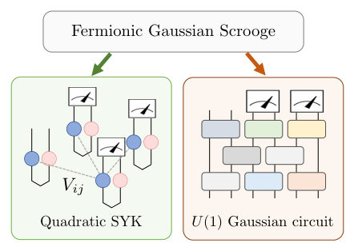
<figcaption class="paper-figure-caption"><b>Fig 1.</b> FIG. 1. Schematic illustration of fermionic Gaussian deep thermalization. We construct the fermionic Gaussian Scrooge ensemble by distorting the Gaussian Haar ensemble. We demonstrate its emergence in the projected ensembles of two systems: the SYK2 model at arbitrary evolution times and the random Gaussian circuits with charge conservation in the long-time limit.</figcaption>
</figure>
<figure class="paper-figure-card">
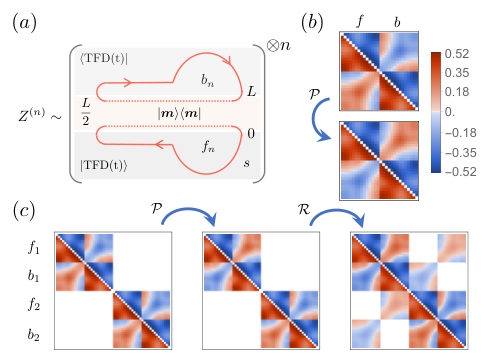
<figcaption class="paper-figure-caption"><b>Fig 2.</b> FIG. 2. (a) Illustration of the path integral for subsystem B with n replicas. (b) Two single-replica saddle-point solutions for GB+ related by the reflection symmetry P. (c) A con- tinuous branch of two-replica saddle-point solutions for GB+ generated by the replica rotation R and the reflection P act- ing on f1. In panels (b) and (c), the saddle-point solutions are obtained by iteratively solving Eq. (10) with V t = V β = 2 and λ = 0.8.</figcaption>
</figure>
<figure class="paper-figure-card">
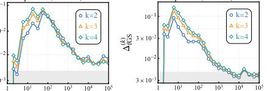
<figcaption class="paper-figure-caption"><b>Fig 3.</b> FIG. 3. Numerical results for random Gaussian circuits with U(1) symmetry. We consider four parameter combinations, with p ∈{0.2, 0.5} and θ ∈{π/4, π/10}. In all panels, we set NA = 4 and NB = 300 and sample Ns = 105 measurement outcomes. The result is obtained by a single disorder realiza- tion of both initial state and circuit realization. The shaded regions indicate the statistical uncertainty from the sampling of measurement outcomes.</figcaption>
</figure>
<figure class="paper-figure-card">
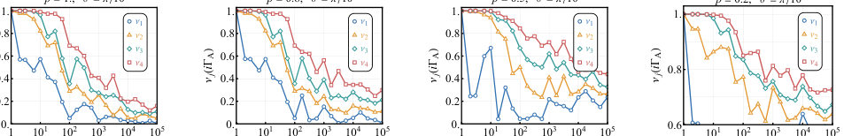
<figcaption class="paper-figure-caption"><b>Fig 4.</b> FIG. 1. Numerical results for random Gaussian circuits with U(1) symmetry. In all panels, we set NA = 4 and NB = 300 and sample Ns = 105 measurement outcomes. The results are obtained from a single realization of both the initial state and the random circuit. The shaded regions indicate the statistical uncertainty due to Monte Carlo sampling. The results clearly demonstrate convergence to the fGS ensemble with a nontrivial average density matrix for p &lt; 1.</figcaption>
</figure>

**Summary.** This work introduces the fermionic Gaussian Scrooge (fGS) ensemble to universally describe deep thermalization in free-fermion quantum systems. By analyzing the projected state after measurement, the authors prove that the ensemble converges to this specific Gaussian distortion, validating it for models like SYK2 and random Gaussian circuits. This provides a crucial theoretical tool for understanding quantum information scrambling in non-interacting fermionic settings.

**Why it may be interesting.** The concept of a universal ensemble describing thermalization in non-chaotic (free-fermion) systems provides a powerful, analytically tractable generalization of concepts from chaotic systems.

Detailed structure

**Main problem.** The paper addresses the theoretical description of deep thermalization in free-fermion systems following partial quantum measurements.

**Main result.** It establishes the fermionic Gaussian Scrooge (fGS) ensemble as the universal description for this process, proving its emergence for models like SYK2 and random Gaussian circuits.

**Method.** The authors use the replica trick and path integral methods, combined with a canonical purification technique, to calculate the moments of the projected quantum state ensemble.

**Model / system.** The study focuses on free-fermion systems, exemplified by the SYK2 model and random Gaussian circuits, where the evolution is governed by quadratic Hamiltonians.

**Key observables.** The projected ensemble moments ($
ho_{PE}^{(k)}$), the correlation matrix ($\Gamma$), and the deviation from the fGS ensemble ($\Delta f_{GS}(k)$).

**Important parameters / regimes.** Evolution time ($t$), system size ($N$), and parameters defining the initial state (e.g., $p$ and $	heta$ for Gaussian circuits).

**Assumptions / limitations.** The analysis relies on the system remaining Gaussian throughout evolution and utilizes the large-N expansion and saddle-point approximation for path integrals.

**Figures summary.** Figures illustrate the schematic construction of the fGS ensemble, the path integrals and saddle-point solutions for SYK2, and numerical convergence plots showing the measured ensemble approaching the fGS prediction.

**Paper structure.** The paper develops the fGS ensemble definition via purification, applies the replica trick to calculate projected moments for SYK2, and then confirms this universality numerically using random Gaussian circuits.

Abstract

Measuring part of a many-body wave function generates a projected ensemble of pure quantum states on the unmeasured subsystem. Recent advances in deep thermalization have shown that, in chaotic systems, this ensemble universally converges to the maximally random ensemble compatible with its average density matrix, known as the Scrooge ensemble. By contrast, free-fermion systems are nonchaotic, and their quantum states are constrained to remain Gaussian. Motivated by this distinction, we introduce the fermionic Gaussian Scrooge ensemble to describe deep thermalization in generic free-fermion systems. This ensemble is defined as a distortion of the Gaussian Haar ensemble by the average density matrix, and its moments reveal an enlarged symmetry of Gaussian states in the replicated Hilbert space. We demonstrate the emergence of the fermionic Gaussian Scrooge ensemble in two complementary settings: (1) we analytically prove that the projected ensemble of the SYK$_2$ model follows the fermionic Gaussian Scrooge ensemble at arbitrary evolution times; (2) we provide numerical evidence that it emerges at sufficiently long times in random Gaussian circuits with charge conservation. Our results establish the fermionic Gaussian Scrooge ensemble as a universal description of deep thermalization in free-fermion systems.

[↑ back to top](#top)

### [Vacuum entanglement in a time-dependent electric field](http://arxiv.org/abs/2610.01394v1)

**Authors:** Álvaro Álvarez-Domínguez, Luis J. Garay, Mercedes Martín-Benito, Iker Sanz-González  
**Type:** theory · **Category:** other · **PDF:** <https://arxiv.org/pdf/2610.01394v1>  
**Analysis basis:** full PDF text, analyzed in chunks
**Topic relevance:** `Keldysh / 2PI / non-Gaussian methods` **3/5** · `correlated / nonlocal dissipation` **1/5** · `driven-dissipative phase transition` **1/5** · `methods for driven-dissipative` **1/5** · `non-equilibrium universality` **1/5**

↔ Scroll figures horizontally

<figure class="paper-figure-card">
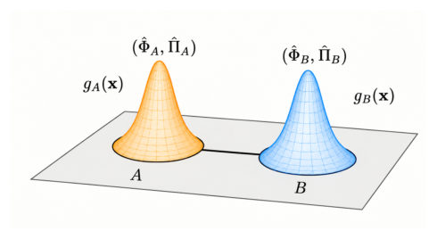
<figcaption class="paper-figure-caption"><b>Fig 1.</b> FIG. 1. Illustration of two spatially separated spherical re- gions, with gA,B(x) the smearing function defining the single modes (ˆΦA,B, ˆΠA,B).</figcaption>
</figure>
<figure class="paper-figure-card">
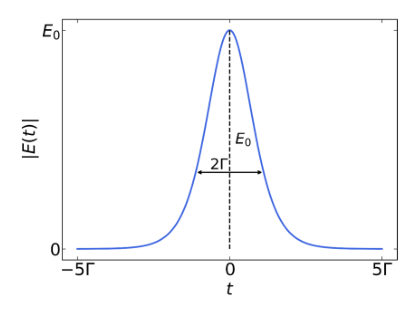
<figcaption class="paper-figure-caption"><b>Fig 2.</b> FIG. 2. Sauter-type electric pulse with amplitude E0 and a characteristic width parameter Γ, given by Eq. (28).</figcaption>
</figure>
<figure class="paper-figure-card">
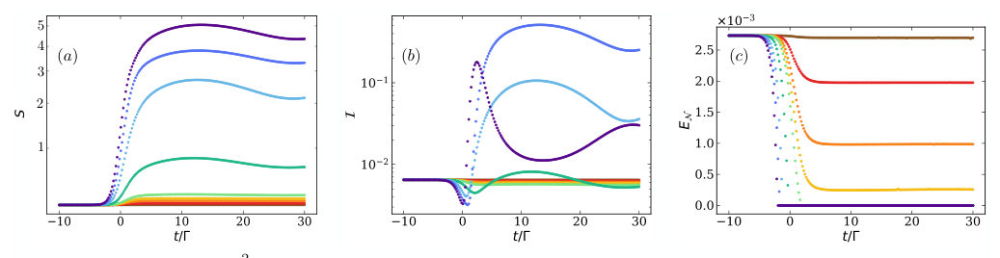
<figcaption class="paper-figure-caption"><b>Fig 3.</b> FIG. 3. Time evolution of the von Neumann entropy S (logarithmic scale), mutual information I (logarithmic scale), and logarithmic negativity EN (linear scale) for different values of qE0Γ2. Parameters: mΓ = 0.2, R = Γ, 3 × 3 bipartition.</figcaption>
</figure>
<figure class="paper-figure-card">
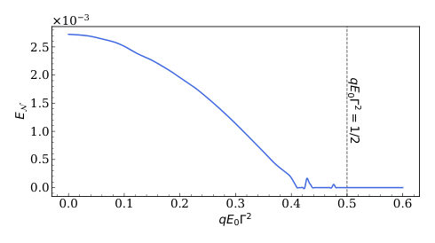
<figcaption class="paper-figure-caption"><b>Fig 4.</b> FIG. 4. Transition of the spontaneous entanglement at t/Γ = 25 ≫1. Parameters: mΓ = 0.2, R = Γ, 3 × 3 bipar- tition.</figcaption>
</figure>
<figure class="paper-figure-card">
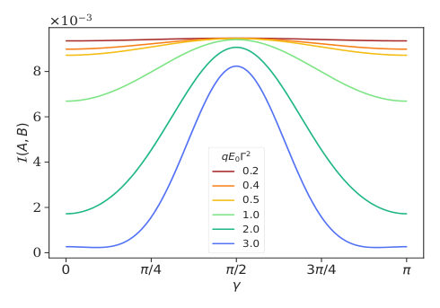
<figcaption class="paper-figure-caption"><b>Fig 5.</b> FIG. 5. Mutual information anisotropy at t = 0 for different values of qE0Γ2. Parameters: mΓ = 0.2, R = Γ, 3 × 3 bipar- tition.</figcaption>
</figure>

**Summary.** This work investigates the quantum correlations within the vacuum state of a charged scalar field exposed to a time-varying electric field. By analyzing entanglement measures, the authors show that while total correlations increase, the usable entanglement decays to zero in finite time. This study connects non-perturbative particle production effects (Schwinger mechanism) to the dynamics of quantum information in curved or time-dependent backgrounds.

**Why it may be interesting.** It provides a concrete, non-equilibrium QFT example where quantum information measures (entanglement) decay due to external driving fields, linking particle creation (Schwinger effect) directly to quantum correlations.

Detailed structure

**Main problem.** The paper analyzes how vacuum entanglement and quantum correlations evolve in a charged scalar field subjected to a time-dependent, homogeneous electric field.

**Main result.** The electric field increases state mixedness and total correlations, but the distillable entanglement decreases and vanishes at a finite time, demonstrating entanglement sudden death.

**Method.** The analysis employs canonical quantization, Gaussian state formalism, and the calculation of correlation measures like mutual information and logarithmic negativity.

**Model / system.** The system is a charged scalar field minimally coupled to an external, time-dependent electric field, studied in both (1+1) and (1+3) dimensional Minkowski spacetime.

**Key observables.** Mixedness of states, total correlations, distillable entanglement, mutual information, and logarithmic negativity.

**Important parameters / regimes.** Electric field strength ($E(t)$), pulse intensity, and the anisotropy angle ($\gamma$) relative to the field direction.

**Assumptions / limitations.** The analysis relies on the Gaussian states formalism and assumes a spatially homogeneous external background field.

**Figures summary.** Figure 5 illustrates the anisotropy of the mutual information at t=0, showing dependence on the angle $\gamma$ between the electric field and the separation vector.

**Paper structure.** The paper reviews the field dynamics, details QI techniques for Gaussian states, applies these tools to QFT in Minkowski spacetime using local observables, and finally studies the time evolution and anisotropy using specific pulse profiles.

Abstract

We analyze the correlations of the vacuum state of a charged scalar field by constructing localized observables in two disjoint regions. We consider a time-dependent homogeneous electric field and examine the time evolution of correlations by relating it with the particle-antiparticle creation through the Schwinger effect. Our results show that the electric field increases the mixedness of the states and enhances total correlations, while the distillable entanglement among the regions decreases, vanishing at a finite time for sufficiently intense pulses within the non-perturbative pair-production regime. We also discuss the effect of anisotropy induced by the external background, showing that the distribution of correlations acquires a nontrivial directional dependence.

[↑ back to top](#top)

### [Electromagnetic Side-Channel Vulnerability in QKD Equipment](http://arxiv.org/abs/2610.01609v1)

**Authors:** Mikio Fujiwara, Katsumi Fujii, Fumie Ono, Masakazu Ono, Akihisa Tomita  
**Type:** experiment · **Category:** quantum information and computing · **PDF:** <https://arxiv.org/pdf/2610.01609v1>  
**Analysis basis:** full PDF text, analyzed in chunks
**Topic relevance:** `QC/QI experiment` **3/5** · `quantum optics experiment` **2/5** · `quantum measurements` **1/5**

↔ Scroll figures horizontally

<figure class="paper-figure-card">
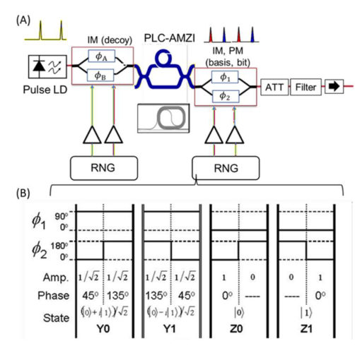
<figcaption class="paper-figure-caption"><b>Fig 1.</b> FIGURE 1. The QKD transmitter prototype used in the experiment. (A) Schematic diagram of quantum communication section. Two lithium niobate modulators are driven by control pulses. (B) Pulse sequence for the state generation. RNG is a random number generator.</figcaption>
</figure>
<figure class="paper-figure-card">
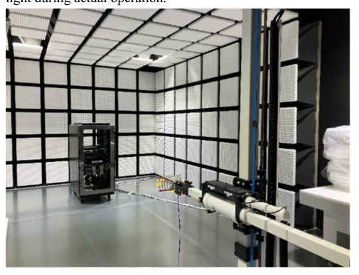
<figcaption class="paper-figure-caption"><b>Fig 2.</b> FIGURE 2. The QKD module (transmitter) placed in a shield room. Antennas were placed at 3 m from the QKD module. III. RESULTS AND DISCUSSION</figcaption>
</figure>
<figure class="paper-figure-card">
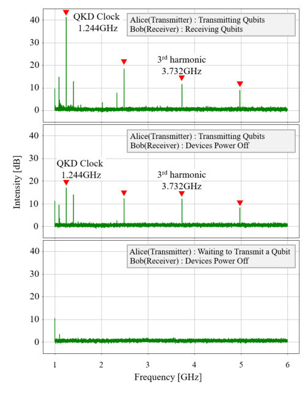
<figcaption class="paper-figure-caption"><b>Fig 3.</b> FIGURE 3. Electromagnetic wave spectra from the QKD transmitter (Alice) and the receiver (Bob). Triangles indicate clock (1241.6 MHz) and its harmonics. The traces were obtained through the utilization of a ten- point moving average. The intensity spectra were measured with reference to the spectrum when both Alice and Bob were powered OFF. Top: Both Alice and Bob were ON. Middle: Alice was ON, but Bob was OFF. Bottom: Power of Alice was ON but state modulation was stopped; Bob was OFF.</figcaption>
</figure>
<figure class="paper-figure-card">
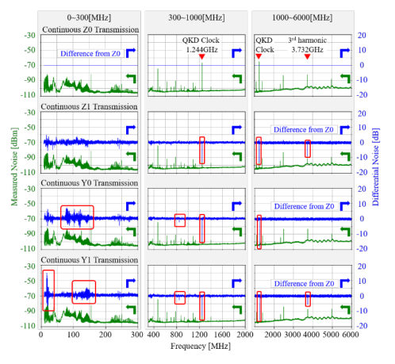
<figcaption class="paper-figure-caption"><b>Fig 4.</b> FIGURE 4. Measured EM spectrum from the QKD transmitter (Alice) at 3 m. The frequency ranges, from left to right, are 10–300 MHz, 300– 2000 MHz, and 1000–6000 MHz. The quantum states set in the transmitter are, from top to bottom, Z0, Z1, Y0, and Y1. Green represents the observed spectrum, while blue indicates the difference from the spectrum in the Z0 state. Areas showing significant differences are circled in red. The master clock (m-clock) frequency is indicated by a blue triangle, and the optical signal clock by a red triangle. No correction was made for background noise or antenna gain.</figcaption>
</figure>
<figure class="paper-figure-card">
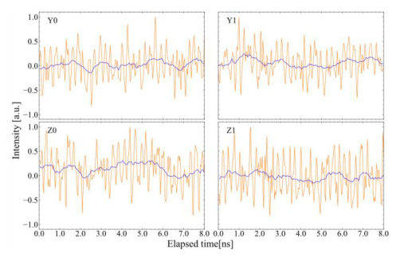
<figcaption class="paper-figure-caption"><b>Fig 5.</b> FIGURE 5. Observed waveforms of EM field for Y0, Y1, Z0, and Z1 states at 0 m. Orange lines: real time oscilloscope traces. Blue lines: moving averages over 25 samples (corresponding to 800 ps).</figcaption>
</figure>

**Summary.** This paper experimentally demonstrates that real-world QKD hardware leaks information about the transmitted quantum state via electromagnetic radiation. By measuring these emissions, the authors show that the transmitter is the main source of leakage, and the state-dependent signals allow for potential eavesdropping. The findings emphasize the critical need for robust physical shielding and hardware design to secure quantum communication networks.

**Why it may be interesting.** This work bridges the gap between the theoretical security of quantum protocols and the practical, physical layer vulnerabilities, which is crucial for designing robust quantum network hardware.

Detailed structure

**Main problem.** The physical implementation of Quantum Key Distribution (QKD) nodes is vulnerable to side-channel attacks, specifically through measurable electromagnetic (EM) leakage.

**Main result.** The QKD transmitter was identified as the primary source of EM leakage, and distinct, state-dependent spectral differences were observed, suggesting that quantum states can be inferred from the leaked EM radiation.

**Method.** The study involved measuring EM spectra and waveforms at 0 m and 3 m distances using specialized antennas in an anechoic chamber, comparing measurements with and without EM shielding.

**Model / system.** The experiment utilized a prototype QKD device implementing a time-bin decoy-state BB84 protocol with Y and Z bases.

**Key observables.** EM spectra and waveforms, state-dependent spectral differences (especially at the third harmonic of the 1241.6 MHz clock), and the attenuation factor provided by EM shielding.

**Important parameters / regimes.** Measurement distances (0 m, 3 m), frequency bands (10–6000 MHz), and the average attenuation achieved by shielding (21.2 dB).

**Assumptions / limitations.** The analysis assumes that the observed EM differences are due to the quantum state being transmitted, and that the threat can be mitigated by proper EM shielding.

**Figures summary.** Figures illustrate the QKD transmitter setup, the shielding effect by comparing emissions with and without the rack door closed, and the state-dependent EM spectra.

**Paper structure.** The paper progresses from identifying the theoretical vulnerability of QKD to presenting detailed experimental measurements of EM leakage from the transmitter, quantifying the state-dependent signals, and concluding with necessary physical countermeasures.

Abstract

Actual quantum key distribution network nodes may be vulnerable to side-channel attacks such as electromagnetic leakage. In this study, we measured electromagnetic emissions from a prototype quantum key distribution device implementing a time-bin decoy-state BB84 protocol with Y and Z bases. We measured the electromagnetic spectra and waveforms at distances of 0 m and 3 m from the transmitter and receiver inside an anechoic chamber. The results showed that the transmitter was the primary source of electromagnetic leakage, and distinct differences were observed between the quantum states generated at the third harmonic of the 1241.6 MHz clock.

[↑ back to top](#top)

### [The stationarity test: a framework for learning quantum many-body systems from their thermal states](http://arxiv.org/abs/2610.01074v1)

**Authors:** Thiago Bergamaschi  
**Type:** theory · **Category:** statistical mechanics · **PDF:** <https://arxiv.org/pdf/2610.01074v1>  
**Analysis basis:** full PDF text, analyzed in chunks
**Topic relevance:** `analog quantum simulation` **3/5** · `quantum measurements` **2/5** · `methods for driven-dissipative` **1/5**

↔ Scroll figures horizontally

<figure class="paper-figure-card">
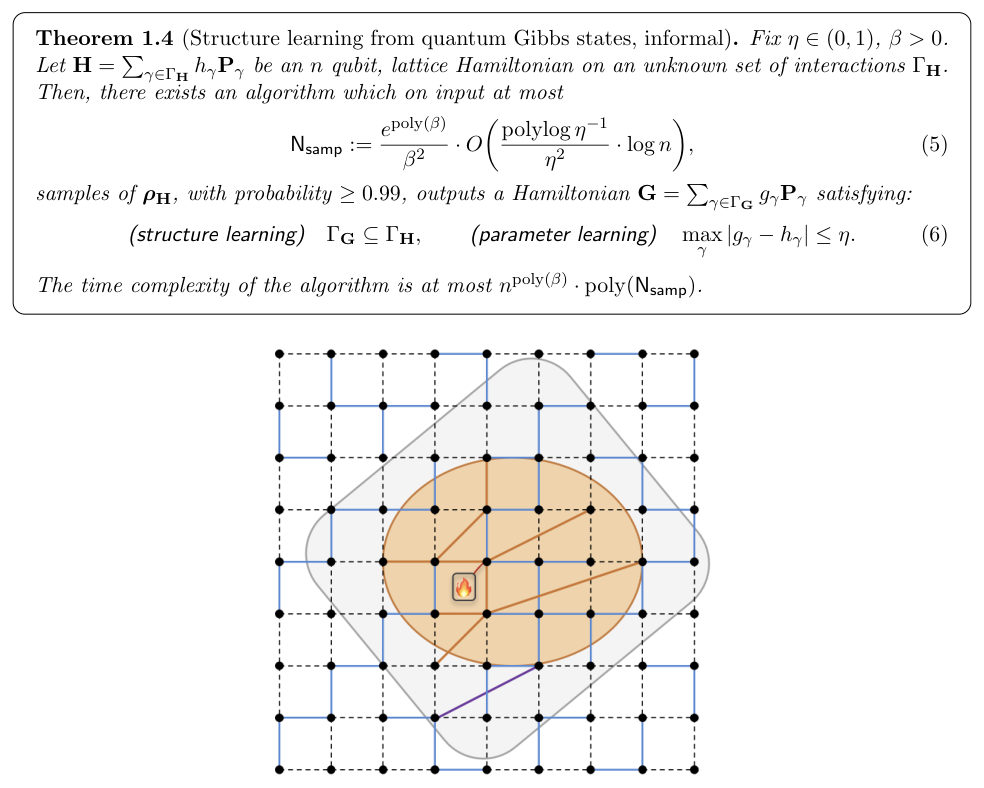
<figcaption class="paper-figure-caption"><b>Fig 1.</b> Figure 1: A cartoon of the “neighborhood guessing” structure learning algorithm. A ground truth 2- local Hamiltonian H lies on the edges of an unknown square lattice. The current guess Hamiltonian G (edges in blue) is a strict subgraph of H (missing edges in dashed black). In each iterative step, we “guess” the neighborhood of a qubit, by perturbing G+U with a small cluster U of 2-local terms (orange). The stationarity test then evaluates the rate of change of 2-local observables (purple), evolved under LG+U, truncated to a finite radius (gray) around the origin.</figcaption>
</figure>
<figure class="paper-figure-card">
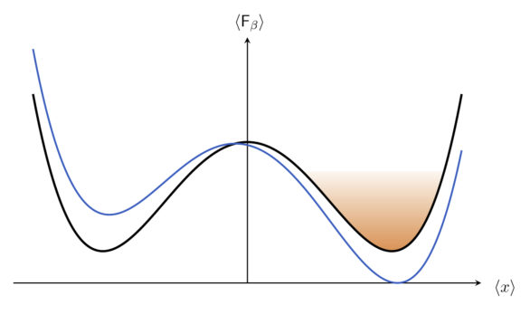
<figcaption class="paper-figure-caption"><b>Fig 2.</b> Figure 2: A cartoon of the Hamiltonian learning problem from metastable states. A metastable state (orange gradient) lies in a double well, depicting a toy model of the free energy landscape of low temperature, 2D Ising model configurations of average magnetization x (black curve). The learning algorithm guesses a Hamiltonian, and attempts to “fit” to the free-energy landscape (blue curve), by checking if the sampled state is also metastable w.r.t. the guess. See Question 1.9.</figcaption>
</figure>
<figure class="paper-figure-card">
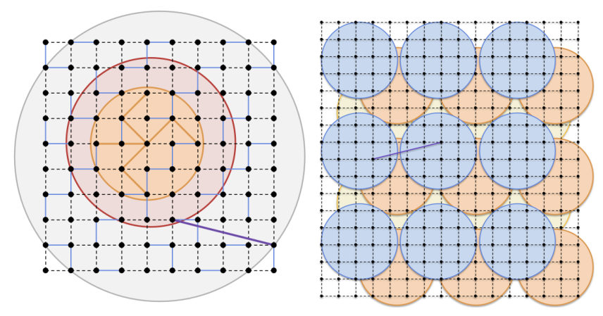
<figcaption class="paper-figure-caption"><b>Fig 3.</b> Figure 3: The sample-optimal neighborhood guessing algorithm. (a) The Test associated to a locally perturbed Hamiltonian G+ηU is computed by first estimating the test under the current Hamiltonian G, truncated to radius R ∼log η−1 (gray). This ‘baseline’ is refined by local measurements at radius L (red) around the perturbation (17). (b) The sites are partitioned into disjoint ‘colors’ (only 3 pictured), each with non-overlapping radius R balls, and performed in parallel. A randomization scheme is used to address observables (purple) crossing balls of the same color (see Algorithm 4).</figcaption>
</figure>

**Summary.** This paper introduces the 'stationarity test,' a novel theoretical framework to reconstruct the Hamiltonian of a quantum many-body system using only samples of its thermal Gibbs states. It provides rigorous algorithms for both determining the interaction structure and estimating the coupling coefficients. By connecting this test to the Quantum Fisher Information, it offers a powerful tool for quantum machine learning in condensed matter physics.

**Why it may be interesting.** This work provides a powerful, data-driven theoretical tool to characterize the underlying physics (Hamiltonian) of complex quantum systems using only measurements of their thermal equilibrium or near-equilibrium states, which is highly relevant for simulating and understanding open quantum systems.

Detailed structure

**Main problem.** The core problem is learning the unknown Hamiltonian interactions governing a quantum many-body system solely from samples of its thermal (Gibbs) states.

**Main result.** The authors introduce the 'stationarity test' as a rigorous framework to perform structure and parameter learning for lattice Hamiltonians, even when only metastable states are accessible.

**Method.** The method centers on the stationarity test, which measures the rate-of-change of local observables under the dynamics generated by a guessed Hamiltonian, linking this test to the Quantum Fisher Information.

**Model / system.** The system involves quantum many-body systems modeled by lattice Hamiltonians, $H = \sum h_\gamma P_\gamma$, whose thermal equilibrium states are the Gibbs states, $
ho_H = e^{-eta H} / 	ext{tr}[e^{-eta H}]$.

**Key observables.** Local observables ($O$), the rate-of-change measured by the stationarity test ($	ext{Test}_i$), and the Quantum Fisher Information (FIG).

**Important parameters / regimes.** Inverse temperature ($eta$), system size ($n$), approximation error ($\eta$), and the locality/distance parameter ($\ell$).

**Assumptions / limitations.** The framework assumes that the stationarity test yielding zero implies the guessed Hamiltonian is close to the true one, and it extends to using metastable states instead of true Gibbs states.

**Figures summary.** Not specified.

**Paper structure.** The paper establishes the stationarity test framework, details algorithms for structure learning from Gibbs states, and presents extensions for parameter learning using thermal metastable states, concluding with a refinement of the area law for these metastable states.

Abstract

The task of learning the Hamiltonian interactions governing a quantum system, given samples of its thermal (or 'Gibbs') states, is a foundational question at the intersection of quantum learning theory and many-body physics. In this paper, we draw connections to the quantum Gibbs sampling literature to introduce a natural learning algorithm we call the stationarity test: which simply "guesses" the Hamiltonian, and measures the rate-of-change of local observables, under the associated detailed-balanced quantum Markov chain [CKG23]. We leverage the stationarity test to address the following applications:   1. To give the first learning algorithm for the underlying interaction graph, i.e. structure learning, of lattice Hamiltonians at all temperatures, given copies of their Gibbs states.   2. To give the first learning algorithm for the coefficients of a lattice Hamiltonian, given only copies of its thermal metastable states, modeled as the "local minima" of the free energy.   3. In addition, we present a refinement to the recent area law for thermal metastable states [BCV25], which holds in the thermodynamic limit.   Our learning algorithms are rigorous, time-efficient, and nearly sample-optimal in system size and accuracy. At a technical level, our arguments are based on new approximate locality and convexity properties for the quantum Fisher information of these Gibbs sampling algorithms.

[↑ back to top](#top)

### [Floquet-Universal Hamiltonian Simulation](http://arxiv.org/abs/2610.01878v1)

**Authors:** Emilio Onorati, Harriet Apel, Michael M. Wolf, Toby Cubitt  
**Type:** theory · **Category:** other · **PDF:** <https://arxiv.org/pdf/2610.01878v1>  
**Analysis basis:** full PDF text, analyzed in chunks
**Topic relevance:** `analog quantum simulation` **3/5** · `Keldysh / 2PI / non-Gaussian methods` **1/5** · `methods for driven-dissipative` **1/5**

↔ Scroll figures horizontally

<figure class="paper-figure-card">
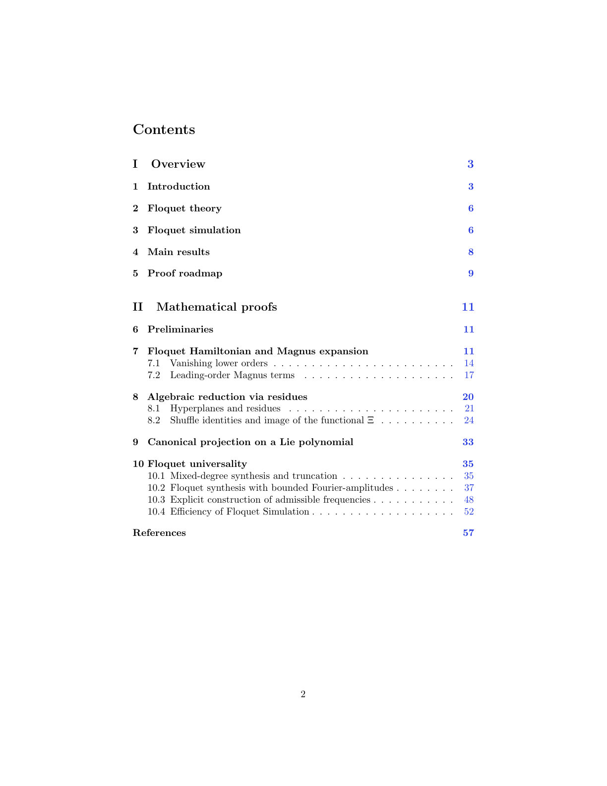
<figcaption class="paper-figure-caption"><b>Fig 1.</b> Low-resolution page preview, page 2</figcaption>
</figure>
<figure class="paper-figure-card">
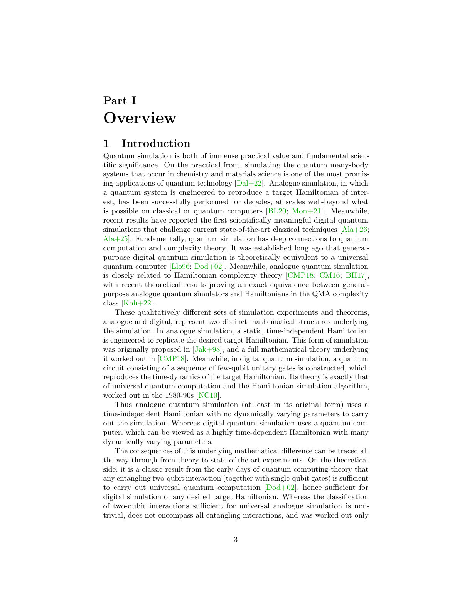
<figcaption class="paper-figure-caption"><b>Fig 2.</b> Low-resolution page preview, page 3</figcaption>
</figure>
<figure class="paper-figure-card">
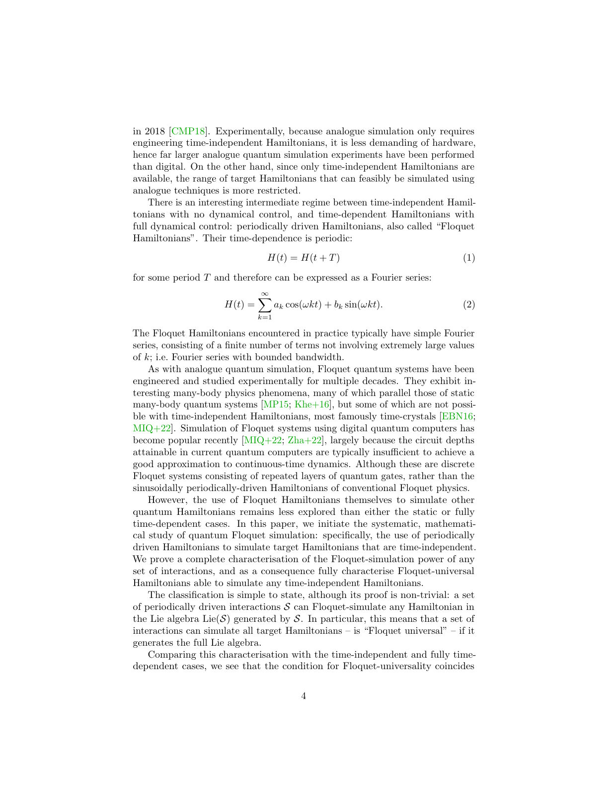
<figcaption class="paper-figure-caption"><b>Fig 3.</b> Low-resolution page preview, page 4</figcaption>
</figure>
<figure class="paper-figure-card">
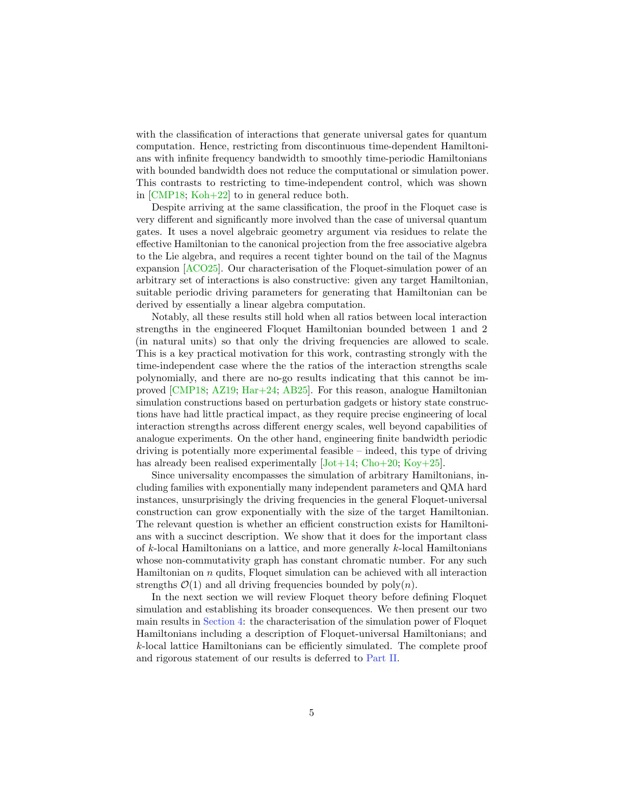
<figcaption class="paper-figure-caption"><b>Fig 4.</b> Low-resolution page preview, page 5</figcaption>
</figure>
<figure class="paper-figure-card">
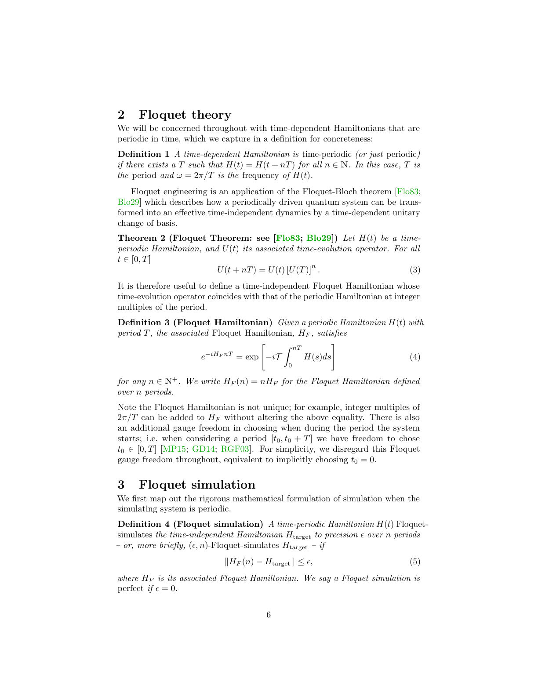
<figcaption class="paper-figure-caption"><b>Fig 5.</b> Low-resolution page preview, page 6</figcaption>
</figure>

**Summary.** This paper develops the theory of Floquet simulation, demonstrating how periodically driven quantum systems can efficiently mimic the dynamics of arbitrary time-independent Hamiltonians. It provides a constructive proof that for local lattice Hamiltonians, the required driving frequencies and interaction strengths scale polynomially with system size. This offers a theoretically superior and more experimentally feasible alternative to traditional analogue simulation methods.

**Why it may be interesting.** This work provides a rigorous theoretical framework for engineering quantum dynamics using time-periodic driving, which is highly relevant for designing experiments with trapped ions or superconducting circuits where smooth, periodic driving is feasible.

Detailed structure

**Main problem.** The paper establishes a comprehensive theory for Floquet simulation, aiming to synthesize arbitrary time-independent quantum Hamiltonians using periodically driven (Floquet) systems.

**Main result.** It provides a constructive characterization showing that Floquet-universal Hamiltonians can simulate any Hamiltonian in their generated Lie algebra, with efficient scaling for local lattice Hamiltonians.

**Method.** The work uses advanced algebraic techniques, including analysis of the Magnus expansion and Lie algebra theory, to relate the effective time-independent dynamics to the driving parameters.

**Model / system.** The study analyzes quantum systems governed by time-periodic Hamiltonians, $H(t)$, comparing this to time-independent (analogue) and fully time-dependent (digital) simulation regimes.

**Key observables.** Quasi-energies, Floquet states, and the fidelity of simulation ($\epsilon$).

**Important parameters / regimes.** The required local interaction strengths and the scaling of driving frequencies, which are shown to be polynomial in system size for local Hamiltonians.

**Assumptions / limitations.** The analysis relies on the target Hamiltonian admitting a structure that allows for decomposition into commuting families of Lie polynomials, and that the generated Lie algebra is perfect.

**Paper structure.** The paper progresses by first establishing the general theory of Floquet simulation power, then developing algebraic tools (like Lemma 55) to bound frequency coefficients, and finally applying these tools to prove efficient simulation theorems (Theorem 57) for $k$-local lattice Hamiltonians.

Abstract

Analogue and digital Hamiltonian simulation represent two distinct approaches to making one quantum system replicate the physical properties of another, with consequences ranging from practical applications to complexity theory and quantum gravity. They are rooted in two distinct regimes of quantum dynamics: time-independent Hamiltonians for the former; fully controllable time-dependent quantum circuits in the latter. Time-periodic Hamiltonians represent an intermediate regime. In this work, we establish a theory of Floquet simulation where we use periodically driven Hamiltonians to synthesise time-independent ones.   We show that a set of interactions $S$ can Floquet-simulate every Hamiltonian in the Lie algebra $\mathrm{Lie}(S)$, and consequently we give a complete and constructive characterisation of Floquet-universal Hamiltonians that are able to produce any target Hamiltonian. Notably, our construction uses only $O(1)$ local interaction strengths and ratios thereof, avoiding the impractical multi-scale local interaction strengths often required in analogue simulation via time-independent Hamiltonians. Instead, the construction requires a range of driving frequencies which scales polynomially with system size for important classes such as $k$-local lattice Hamiltonians. This has immediate complexity-theoretic implications, including numerous BQP-completeness and QMA-hardness results for natural physical properties and quantities studied in Floquet physics.

[↑ back to top](#top)

### [Generalized fluctuation-dissipation theorem and Einstein relation in rotating equilibrium](http://arxiv.org/abs/2610.01797v1)

**Authors:** Shuo Fang, Shi Pu  
**Type:** theory · **Category:** statistical mechanics · **PDF:** <https://arxiv.org/pdf/2610.01797v1>  
**Analysis basis:** full PDF text, analyzed in chunks
**Topic relevance:** `Keldysh / 2PI / non-Gaussian methods` **3/5** · `correlated / nonlocal dissipation` **1/5** · `non-equilibrium universality` **1/5**

↔ Scroll figures horizontally

<figure class="paper-figure-card">
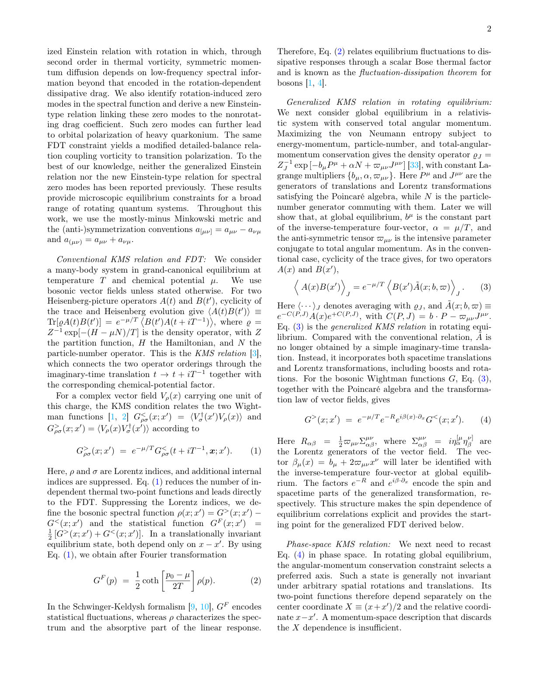
<figcaption class="paper-figure-caption"><b>Fig 1.</b> Low-resolution page preview, page 2</figcaption>
</figure>
<figure class="paper-figure-card">
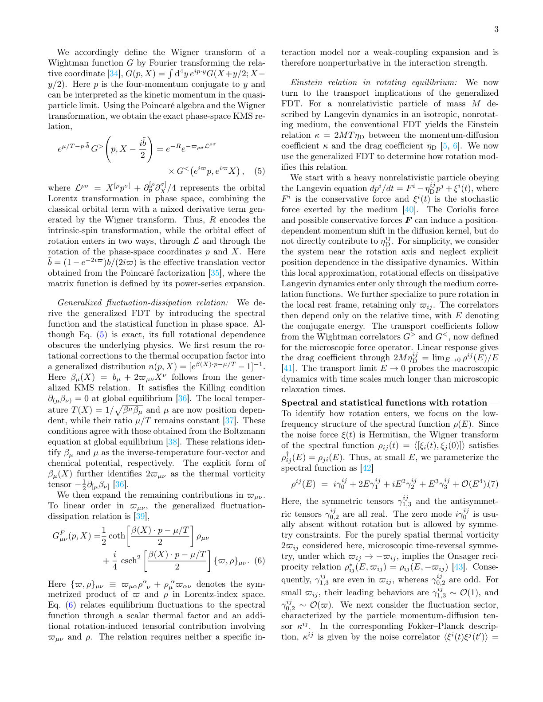
<figcaption class="paper-figure-caption"><b>Fig 2.</b> Low-resolution page preview, page 3</figcaption>
</figure>
<figure class="paper-figure-card">
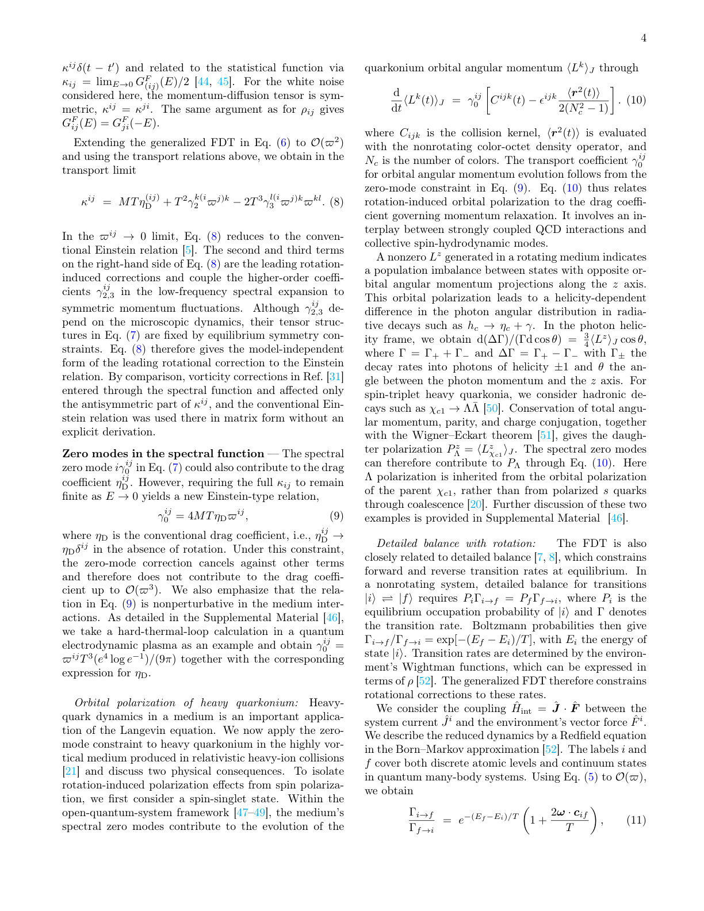
<figcaption class="paper-figure-caption"><b>Fig 3.</b> Low-resolution page preview, page 4</figcaption>
</figure>
<figure class="paper-figure-card">
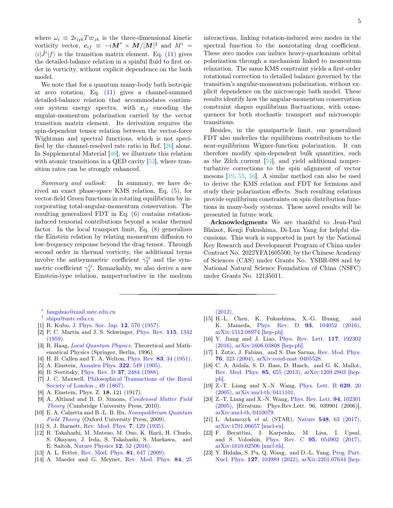
<figcaption class="paper-figure-caption"><b>Fig 4.</b> Low-resolution page preview, page 5</figcaption>
</figure>
<figure class="paper-figure-card">
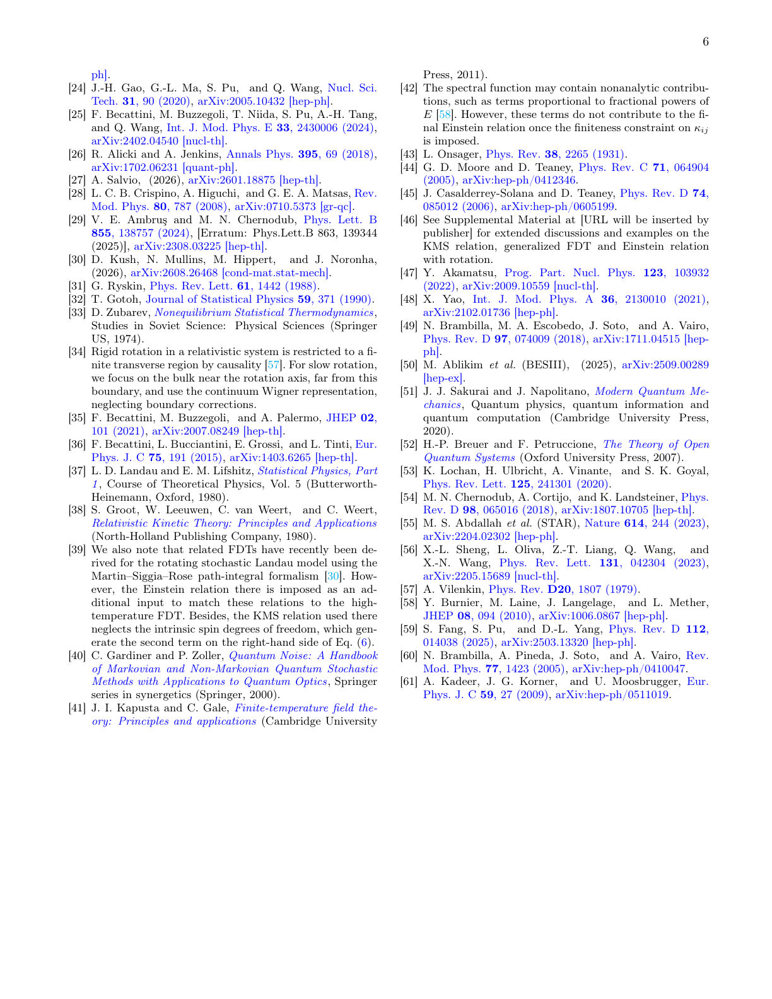
<figcaption class="paper-figure-caption"><b>Fig 5.</b> Low-resolution page preview, page 6</figcaption>
</figure>

**Summary.** This theoretical work generalizes the fluctuation-dissipation theorem and Einstein relations to systems in rotating thermal equilibrium. By starting from the phase-space KMS relation, the authors derive new tensorial contributions and establish a novel link between spectral zero modes and transport coefficients. This provides essential microscopic constraints for modeling quantum matter under rotation, such as in the quark-gluon plasma.

**Why it may be interesting.** The work provides fundamental, model-independent equilibrium constraints for studying non-equilibrium phenomena in rotating quantum matter, which is crucial for understanding heavy-ion collision signatures.

Detailed structure

**Main problem.** The paper derives generalized fluctuation-dissipation theorems (FDT) and Einstein relations for vector fields in a system undergoing rotating thermal equilibrium.

**Main result.** It establishes a model-independent generalized Einstein relation and discovers a new Einstein-type relation linking spectral zero modes to the nonrotating drag coefficient, applicable to studying rotating quantum matter.

**Method.** The derivation starts from the exact phase-space Kubo-Martin-Schwinger (KMS) relation, generalizing it to include total angular momentum conservation, and then applying linear response theory.

**Model / system.** The theory applies to general many-body quantum systems, with physical relevance highlighted in the context of the quark-gluon plasma and heavy quarkonium polarization in highly vortical media.

**Key observables.** Generalized FDT, generalized Einstein relation, spectral zero modes ($\gamma_{ij}^0$), and orbital polarization ($\langle L_z 
angle_J$).

**Important parameters / regimes.** Thermal vorticity ($\varpi_{\mu
u}$), low-frequency spectral information, and the nonrotating drag coefficient ($\eta^D$).

**Assumptions / limitations.** The derivation assumes global equilibrium constrained by energy-momentum and total-angular-momentum conservation, and utilizes local approximations in the transport analysis.

**Figures summary.** Not specified by the notes.

**Paper structure.** The paper progresses by deriving the generalized FDT from the KMS relation, then obtaining the generalized Einstein relation, and finally applying these constraints to specific physical phenomena like quarkonium polarization and detailed balance.

Abstract

We derive a generalized fluctuation-dissipation theorem (FDT) for vector fields in rotating thermal equilibrium from an exact phase-space Kubo-Martin-Schwinger (KMS) relation. The resulting FDT contains rotation-induced tensorial contributions beyond a scalar thermal factor. In the local transport limit, we obtain a model-independent generalized Einstein relation with rotation in which, through second order in thermal vorticity, symmetric momentum diffusion depends on low-frequency spectral information beyond that encoded in the rotation-dependent dissipative drag. Remarkably, we find a new Einstein-type relation linking zero modes in the spectral function to the nonrotating drag coefficient. These zero modes underlie a new mechanism for the orbital polarization of heavy quarkonium. The same FDT constraint yields a modified detailed-balance relation whose first-order vortical correction is governed by transition polarization, without explicit dependence on the bath model. Our findings establish microscopic equilibrium constraints for studying rotating quantum matter in various fields.

[↑ back to top](#top)

### [On the spectra of strong turbulence on water surfaces](http://arxiv.org/abs/2610.00777v1)

**Authors:** Gregory Falkovich  
**Type:** theory · **Category:** statistical mechanics · **PDF:** <https://arxiv.org/pdf/2610.00777v1>  
**Analysis basis:** full PDF text, analyzed in chunks
**Topic relevance:** `non-equilibrium universality` **3/5** · `Keldysh / 2PI / non-Gaussian methods` **2/5**

↔ Scroll figures horizontally

<figure class="paper-figure-card">
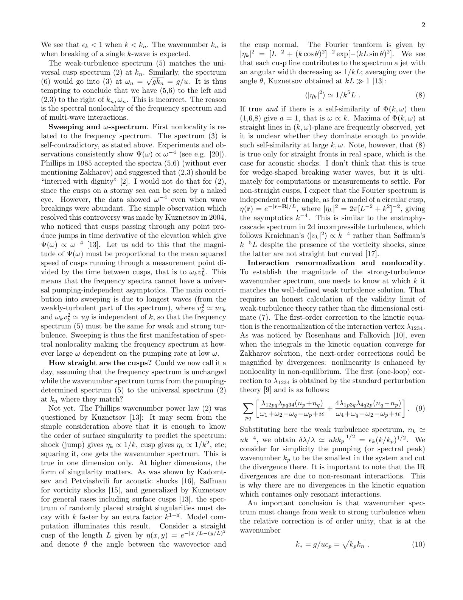
<figcaption class="paper-figure-caption"><b>Fig 1.</b> Low-resolution page preview, page 2</figcaption>
</figure>
<figure class="paper-figure-card">
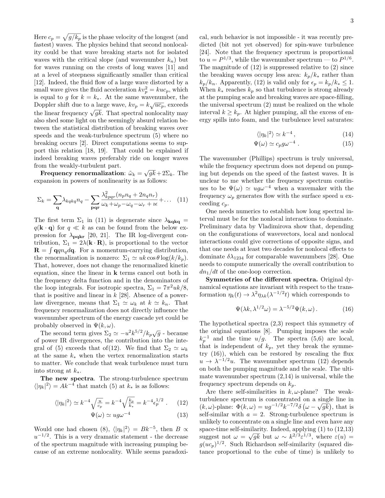
<figcaption class="paper-figure-caption"><b>Fig 2.</b> Low-resolution page preview, page 3</figcaption>
</figure>
<figure class="paper-figure-card">
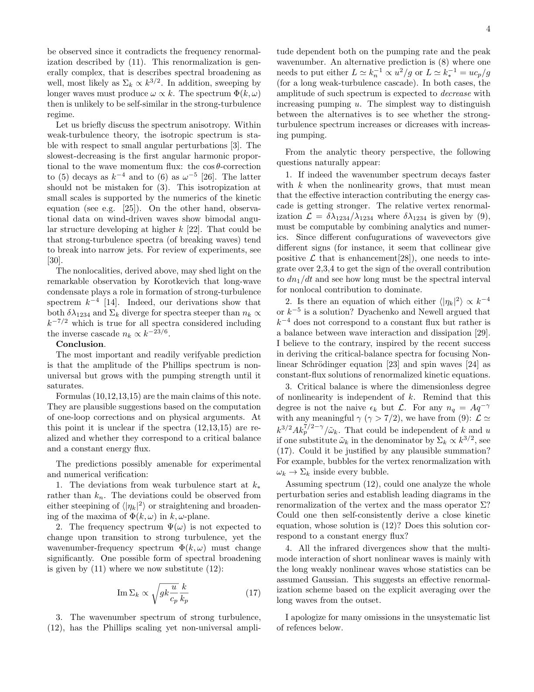
<figcaption class="paper-figure-caption"><b>Fig 3.</b> Low-resolution page preview, page 4</figcaption>
</figure>
<figure class="paper-figure-card">
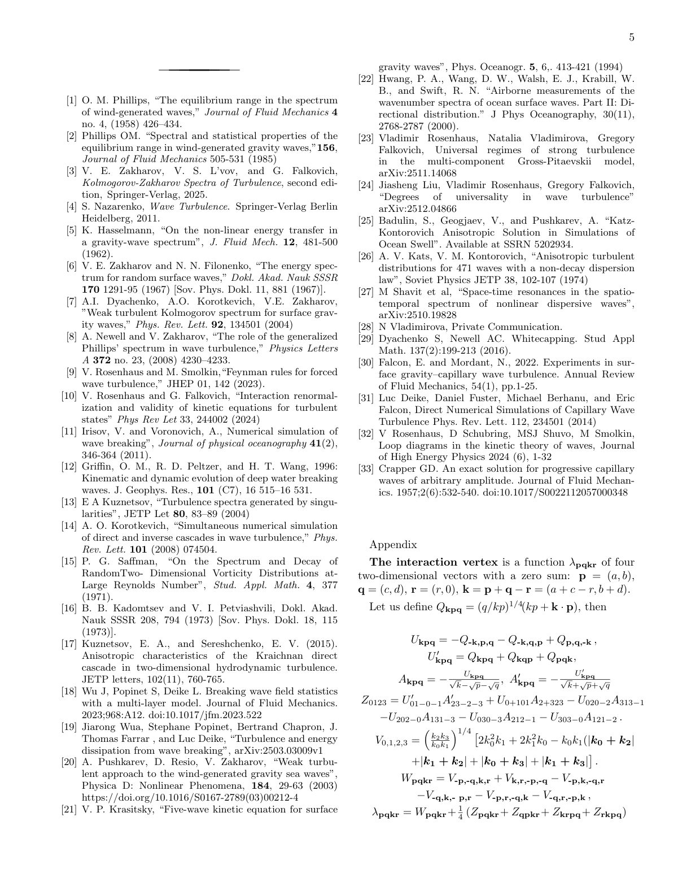
<figcaption class="paper-figure-caption"><b>Fig 4.</b> Low-resolution page preview, page 5</figcaption>
</figure>
<figure class="paper-figure-card">
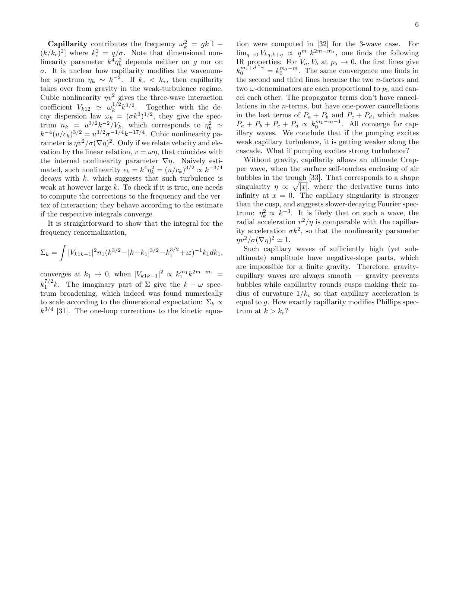
<figcaption class="paper-figure-caption"><b>Fig 5.</b> Low-resolution page preview, page 6</figcaption>
</figure>

**Summary.** This paper analyzes the spectral behavior of strong turbulence on water surfaces, moving beyond simple weak-turbulence approximations. It predicts that the energy cascade leads to a strong-turbulence spectrum characterized by $\omega^{-4}$ and $k^{-4}$ dependencies. The work highlights that the transition to strong turbulence is governed by non-local interactions, making the resulting spectrum dependent on the initial energy pumping.

**Why it may be interesting.** The study of non-equilibrium energy cascades and spectral transitions in wave systems provides theoretical tools applicable to understanding energy dissipation and non-linear dynamics in complex physical systems, which shares mathematical structure with certain many-body relaxation processes.

Detailed structure

**Main problem.** The paper investigates the spectral characteristics of strong turbulence on water surfaces, focusing on the direct energy cascade of gravity waves.

**Main result.** The strong-turbulence spectrum is predicted to be $\langle|\eta_k|^2
angle \propto k^{-4}$ and $\Psi(\omega) \propto \omega^{-4}$, suggesting the spectrum is not universal and depends on the pumping strength.

**Method.** The analysis combines weak-turbulence theory (Zakharov's approach) with renormalization group techniques to study the transition from weak to strong turbulence.

**Model / system.** The system is the surface of water undergoing strong turbulence, modeled using wave dynamics equations that account for gravity and wave interactions.

**Key observables.** Wavenumber spectrum $\langle|\eta_k|^2
angle$, frequency spectrum $\Psi(\omega)$, and the critical balance parameter $\epsilon_k$.

**Important parameters / regimes.** Pumping strength ($u$), peak wavenumber ($k_p$), and the transition scale $k^*$.

**Assumptions / limitations.** The analysis assumes the validity of weak-turbulence theory at low energy levels and examines the breakdown due to spectrally nonlocal interactions.

**Paper structure.** The paper progresses from reviewing the weak-turbulence theory for long waves to analyzing the transition to strong turbulence, deriving new spectral forms, and comparing the roles of gravity versus capillarity.

Abstract

Here, I give a brief history of the theory, with twists and turns, and list possible predictions for the spectra of the direct cascade of gravity waves on the water. The description of long waves is straightforward within the weak-turbulence theory developed by Zakharov and his school. As the energy cascade proceeds to shorter scales, the mean surface steepness grows, and wave-breaking events appear with increasing frequency. Considering surface cusps, Phillips suggested a wavenumber spectrum (with a wrong magnitude, as I argue here) and a frequency spectrum whose whole form is incorrect. The right form for the frequency spectral slope due to breaking waves was suggested by Kuznetsov. Here we estimate the magnitude and argue that the frequency spectrum is expected to continue unchanged through the whole cascade. The transition from weak to strong turbulence in the wavenumber and spatio-temporal spectra is due to spectrally nonlocal interactions and happens earlier (at larger scales) than the dimensional estimate suggests. As a result, the magnitude of the strong-turbulence spectrum is not universal but depends on the pumping for a sufficiently long weak-turbulence cascade. The reason for nonlocality is likely that breaking of shorter waves is determined by the magnitude of the longest wave on whose crest they are running.

[↑ back to top](#top)

### [Preservability of Measurement Incompatibility: Purification, Activation, and a No-Go Theorem](http://arxiv.org/abs/2610.01327v1)

**Authors:** Chao-Hsien Wu, Franco Nori, Huan-Yu Ku  
**Type:** theory · **Category:** quantum information and computing · **PDF:** <https://arxiv.org/pdf/2610.01327v1>  
**Analysis basis:** full PDF text, analyzed in chunks
**Topic relevance:** `quantum measurements` **3/5** · `correlated / nonlocal dissipation` **1/5** · `driven-dissipative phase transition` **1/5**

↔ Scroll figures horizontally

<figure class="paper-figure-card">
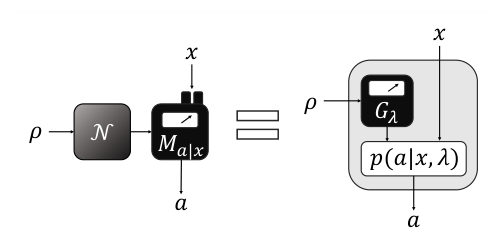
<figcaption class="paper-figure-caption"><b>Fig 1.</b> Figure 1. Scheme of IA channels. A channel N is incompati- bility annihilating if, after applying the channel, the measure- ment statistic Tr  ρN †(Ma|x)  can always reproduced by us- ing a jointly measurable measurements P</figcaption>
</figure>
<figure class="paper-figure-card">
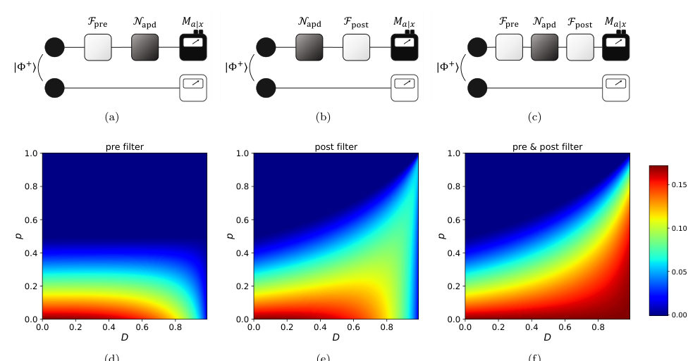
<figcaption class="paper-figure-caption"><b>Fig 2.</b> Figure 2. Schematic diagrams and numerical results for different filtering scenarios. (a)–(c) show the setups for the pre-filter only, post-filter only, and pre-post-filter cases, respectively. And (d)–(f) show the corresponding numerical results.</figcaption>
</figure>

**Summary.** This work develops a resource theory to quantify measurement incompatibility preservability under noise. The authors prove that while noise can destroy this resource, they establish a no-go theorem against pre-filtering recovery but show that post-filtering can successfully activate the resource. This provides a practical guide for exploiting incompatibility in quantum information protocols.

**Why it may be interesting.** It provides a rigorous, quantitative framework (resource theory) for understanding how fundamental quantum correlations, like measurement incompatibility, are degraded by noise and how they might be recovered or utilized.

Detailed structure

**Main problem.** The paper investigates the fundamental quantum resource of measurement incompatibility and how its preservation degrades under noisy quantum channels.

**Main result.** They establish a no-go theorem showing pre-filtering cannot activate incompatibility, but demonstrate that post-filtering can stochastically activate such channels.

**Method.** The authors develop a resource theory framework, introducing robustness-based monotones, and utilize semidefinite programming (SDP) and iterative algorithms (seesaw) to quantify these properties.

**Model / system.** The study focuses on quantum channels ($\mathcal{N}$) acting on quantum systems, characterized by measurement assemblages ($\{M_a\}_{a,x}$), and the concept of measurement incompatibility.

**Key observables.** Measurement Incompatibility, Resource Monotone $R_{	ext{JIMIP}}(\mathcal{N})$, Quantum Steerability.

**Important parameters / regimes.** Noise strength ($t$), channel parameters (e.g., amplitude damping parameter $p$).

**Assumptions / limitations.** The analysis relies on reformulating the resource measure using the Choi–Jamiolkowski isomorphism and assuming the equivalence between steering and measurement incompatibility.

**Figures summary.** Figures illustrate the schemes for IA channels and numerically compare the preservation/activation of incompatibility using pre-filter only, post-filter only, and combined pre-post-filter operations.

**Paper structure.** The paper introduces the resource theory, defines the monotone $R_{	ext{JIMIP}}$, proves its properties (Faithfulness, Monotonicity), establishes the no-go theorem for pre-filtering, and finally demonstrates activation via post-filtering.

Abstract

Measurement incompatibility is a fundamental quantum resource that enables advantages in many quantum information tasks, including cryptography and communication. However, unavoidable interactions between a system and its environment can degrade or even completely destroy measurement incompatibility; such a process is referred to as a measurement-incompatibility-annihilating channel. Recently, the capability of noisy quantum dynamics to preserve measurement incompatibility has been characterized within the resource theory of measurement incompatibility preservability. This motivates studying how to purify the preservation of measurement incompatibility and how to activate it from a measurement-incompatibility-annihilating channel. To this end, we first introduce our figures of merit as robustness-based resource monotones within this resource theory. We demonstrate that while pre-filtering operations can strengthen measurement incompatibility preservability, they cannot activate it from an incompatibility-annihilating channel, establishing a no-go theorem. Furthermore, we explicitly demonstrate that an incompatibility-annihilating channel can be stochastically activated via post-filtering operations. Our results provide a practical framework for exploiting measurement incompatibility in quantum information processing.

[↑ back to top](#top)

### [Quantum impurity models: easy at equilibrium, universal in motion](http://arxiv.org/abs/2610.02130v1)

**Authors:** Srinivasan Arunachalam, Sergey Bravyi, Anirban Chowdhury, Arkopal Dutt, Alexandru Gheorghiu, Zhi Li  
**Type:** theory · **Category:** quantum information and computing · **PDF:** <https://arxiv.org/pdf/2610.02130v1>  
**Analysis basis:** full PDF text, analyzed in chunks
**Topic relevance:** `analog quantum simulation` **3/5** · `Keldysh / 2PI / non-Gaussian methods` **1/5** · `methods for driven-dissipative` **1/5**

↔ Scroll figures horizontally

<figure class="paper-figure-card">
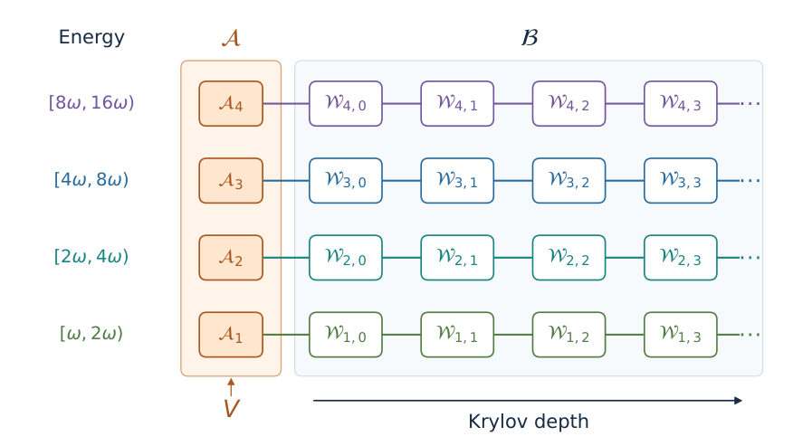
<figcaption class="paper-figure-caption"><b>Fig 1.</b> Figure 1: Shell Krylov representation of a quantum impurity model. The figure illustrates the energy shells and Krylov layers. After creating a small artificial gap ω &gt; 0 in the bath Hamiltonian and changing the one-particle basis, the Hamiltonian is represented as a network of fermionic blocks indicated by boxes. Each box contains at most m fermionic modes, where m = O(1) is the impurity size. Each horizontal chain of boxes corresponds to a dyadic energy shell spanned by bath modes with excitation energies in [2pω, 2p+1ω) for some integer p ≥0. Blue boxes in each horizontal chain are successive orthogonal Krylov layers. The quadratic bath Hamiltonian couples nearest-neighbor boxes in each...</figcaption>
</figure>
<figure class="paper-figure-card">
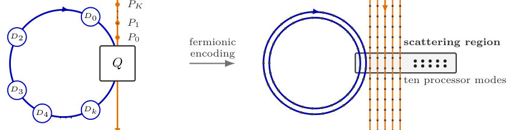
<figcaption class="paper-figure-caption"><b>Fig 2.</b> Figure 2: The two stages of the construction. We first rewrite the quantum circuit as a sequence of interactions with the same constant-size system. We then realize this computation using the time evolution of a quantum impurity model.</figcaption>
</figure>
<figure class="paper-figure-card">
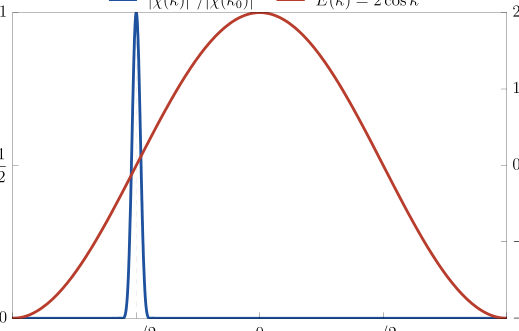
<figcaption class="paper-figure-caption"><b>Fig 3.</b> Figure 3: Blue: Momentum distribution (relative to the peak at κ0 = −π/2) of the wave packet, evaluated for σ = 80. Red: dispersion relation for nearest-neighbor hopping.</figcaption>
</figure>

**Summary.** This work analyzes quantum impurity models, showing that while calculating equilibrium properties like ground energy is classically tractable in polynomial time, simulating the system's time evolution is computationally hard (BQP-complete). The authors achieve this by developing specialized algorithms that exploit the structure of the fermionic bath excitations.

**Why it may be interesting.** The demonstration that a physical quantum system's dynamics can realize a universal quantum processor is highly relevant for understanding quantum simulation capabilities and computational complexity boundaries.

Detailed structure

**Main problem.** The paper investigates the computational complexity of calculating various properties (ground energy, thermal equilibrium, and dynamics) for quantum impurity models.

**Main result.** It establishes a sharp contrast: equilibrium properties can be efficiently approximated classically, while the time evolution simulation is proven to be BQP-complete.

**Method.** The authors develop specialized algorithms exploiting the exponential suppression of multi-particle bath excitations using energy-scale and Krylov depth basis organization.

**Model / system.** The system is a quantum impurity model, consisting of a small interacting subsystem (impurity) coupled to a large bath of free fermions, described by a Hamiltonian $H = H_0 + V$.

**Key observables.** Ground energy ($E_1(H)$), Helmholtz free energy ($F_eta$), and the time evolution operator ($e^{-iHt}$).

**Important parameters / regimes.** Accuracy parameters ($\epsilon$, $\delta$), inverse temperature ($eta$), and the size of the impurity ($m$, assumed constant).

**Assumptions / limitations.** The impurity size $m$ is assumed to be fixed and constant for the strongest complexity results.

**Paper structure.** The paper systematically analyzes the complexity for ground energy (Theorem 1.1), thermal equilibrium (Theorems 1.2-1.4), and finally proves the BQP-completeness of the time evolution simulation (Theorem 1.5).

Abstract

A quantum impurity model describes a small interacting subsystem embedded into a large bath of free fermions. Here we study the computational complexity of calculating the ground energy, thermal equilibrium, and dynamical properties of these models. Our work reveals a sharp contrast: equilibrium properties can be efficiently approximated by classical means, whereas time evolution can implement a universal quantum computation. More precisely, let $H$ be the Hamiltonian of an impurity model with $n$ fermionic modes and a constant-size impurity. We show that: (1) the ground energy of $H$ can be approximated to additive error $\varepsilon$ by a classical algorithm with runtime $\textsf{poly}(n,1/\varepsilon)$, improving on the quasi-polynomial runtime of the best previously known algorithm; (2) at inverse temperature $β$, the Helmholtz free energy and a classical description of the thermofield double state can be computed to precision $\varepsilon$ in time $\textsf{poly}(n,β,1/\varepsilon)$; (3) simulating the time evolution $e^{-iHt}$ is $\textsf{BQP}$-complete, for $H$ that is time-independent and has a fixed, constant impurity size. Our algorithms exploit exponential suppression of multi-particle bath excitations in a basis organized by energy scale and Krylov depth. Our universality construction realizes a stationary quantum processor whose program arrives in a stream of freely propagating fermions.

[↑ back to top](#top)

### [Single-Particle Spectral Estimation](http://arxiv.org/abs/2610.02183v1)

**Authors:** Adrian Chapman, Charles Derby, Steven T. Flammia, Yeongwoo Hwang, Joel Klassen, Calum McCartney  
**Type:** theory · **Category:** strongly correlated electrons · **PDF:** <https://arxiv.org/pdf/2610.02183v1>  
**Analysis basis:** full PDF text, analyzed in chunks
**Topic relevance:** `analog quantum simulation` **3/5** · `Keldysh / 2PI / non-Gaussian methods` **2/5**

↔ Scroll figures horizontally

<figure class="paper-figure-card">
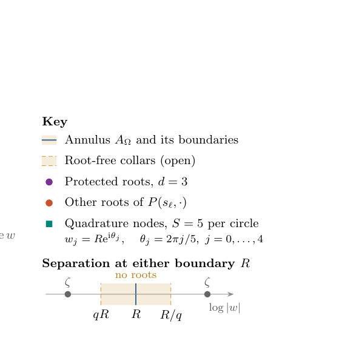
<figcaption class="paper-figure-caption"><b>Fig 1.</b> Figure 1: Contour geometry for Theorem 13. The annulus AΩ= {Rin &lt; |w| &lt; Rout}, where Rin = e−βΩmax and Rout = e−βΩmin, contains exactly the three protected roots e−sℓEa; other roots lie outside it. The radial separation condition (35) excludes every root ζ within the regions qR &lt; |w| &lt; R/q around both boundaries of the annulus; this is depicted at a logarithmic scale in the inset on the right. Squares mark five equally spaced quadrature endpoints on each circle, as used in (32). The choice S = 5 is for illustration only.</figcaption>
</figure>
<figure class="paper-figure-card">
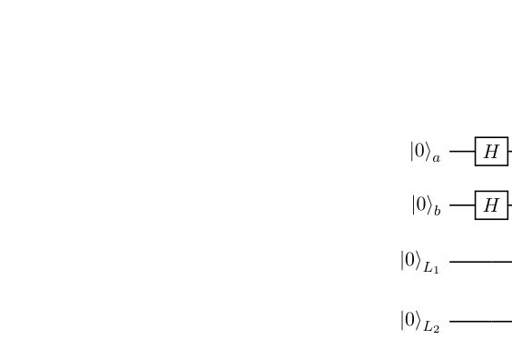
<figcaption class="paper-figure-caption"><b>Fig 2.</b> Figure 2: The circuit VU described in this section, where eU is as defined in Eq. (88).</figcaption>
</figure>

**Summary.** This work tackles the challenging problem of Single-Particle Spectral Estimation (SPSE) in quantum many-body systems. The authors introduce SPICES, an algorithm that uses contour integration and quantum state tomography to recover the non-interacting spectral energies $\{E_i\}$ despite the Hamiltonian being obscured by an unknown unitary transformation. This is highly relevant for quantum simulations in condensed matter physics.

**Why it may be interesting.** The ability to extract fundamental spectral information (like quasiparticle energies) from complex, interacting Hamiltonians, even when the underlying structure is obscured, is crucial for developing quantum simulation protocols for materials science.

Detailed structure

**Main problem.** The paper addresses the Single-Particle Spectral Estimation (SPSE) problem: recovering the non-interacting single-particle energies $\{E_i\}$ when the underlying Hamiltonian is obscured by an unknown global unitary transformation.

**Main result.** The proposed algorithm, SPICES, can efficiently and robustly recover the spectral distribution in Wasserstein distance, solving a problem proven to be DQC1-hard.

**Method.** SPICES combines a Hadamard test with a novel classical postprocessing procedure that exploits the correspondence between single-particle energies and the Fourier frequencies governing the zeros of the partition function at complex inverse temperature.

**Model / system.** The system is a many-body Hamiltonian $H$ structured such that $U H U^\dagger = \sum E_i n_i + H_O$, motivated by materials modeling techniques like mean-field theory and DFT, where the non-interacting structure is hidden by $U$.

**Key observables.** The target is the spectral distribution $
u_\Omega$ of the single-particle energies $\{E_i\}$, measured in Wasserstein-1 distance.

**Important parameters / regimes.** The estimation relies on the stability criteria (Definition 2), involving the annulus $A_\Omega$ defined by $\Omega_{\min}$ and $\Omega_{\max}$.

**Assumptions / limitations.** The method assumes the 'stability' of the SPSE instance, which requires radial separation of roots and a minimum signal strength at quadrature points.

**Figures summary.** Figure 1 illustrates the contour geometry used for estimation, showing the annulus $A_\Omega$ containing the protected roots.

**Paper structure.** The paper formalizes the SPSE problem, establishes its DQC1-hardness, and then introduces the SPICES protocol, detailing its mathematical basis using contour integrals and Hadamard tests to achieve spectral recovery.

Abstract

We study Hamiltonian learning in a novel setting, where we are promised a physical structure that is obfuscated by a global unitary. In particular, we consider the task of learning the weights $E_i$ of a Hamiltonian $H=U^{\dagger}(\sum_{i \in I} E_i n_i + H_O)U$ comprised of a set of non-interacting modes $I$ and an arbitrary ``spectator'' $H_O$ acting on a disjoint set of modes $O$. The non-interacting structure is hidden by an unknown global unitary $U$, and our goal is to recover the $E_i$ without reconstructing $U$. Such Hamiltonians are well-motivated in the setting of materials modeling, where they find application for classical methods such as mean-field theory, Green's functions, and density functional theory. We show that this problem is DQC1-hard, despite the apparent simplification given by the non-interacting structure. We then introduce SPICES (single-particle inference via contour estimators), which combines a Hadamard test with a novel classical postprocessing procedure to efficiently recover the spectral distribution in Wasserstein distance under certain natural assumptions. The method exploits the correspondence between single-particle energies of the individual quasiparticles and the Fourier frequencies governing zeros of the partition function at complex inverse temperature. As quasiparticle spectra feature ubiquitously in downstream materials calculations, and with SPICES being simple and practical to execute, we expect that SPICES is a promising route to quantum applications in materials simulation.

[↑ back to top](#top)

### [Telecom-Band Optical Transitions of Erbium Atoms in Rare-Gas Solids](http://arxiv.org/abs/2610.00918v1)

**Authors:** Evgenii Zaitsev, Alec Dinerstein, Shan Zou, Charles Peretti, Yutian Wen, Wei Guo, Gregory V. Hartland, Yizhong Huang, Dafei Jin  
**Type:** experiment · **Category:** other · **PDF:** <https://arxiv.org/pdf/2610.00918v1>  
**Analysis basis:** full PDF text, analyzed in chunks
**Topic relevance:** `quantum optics experiment` **3/5** · `QC/QI experiment` **1/5** · `analog quantum simulation` **1/5**

↔ Scroll figures horizontally

<figure class="paper-figure-card">
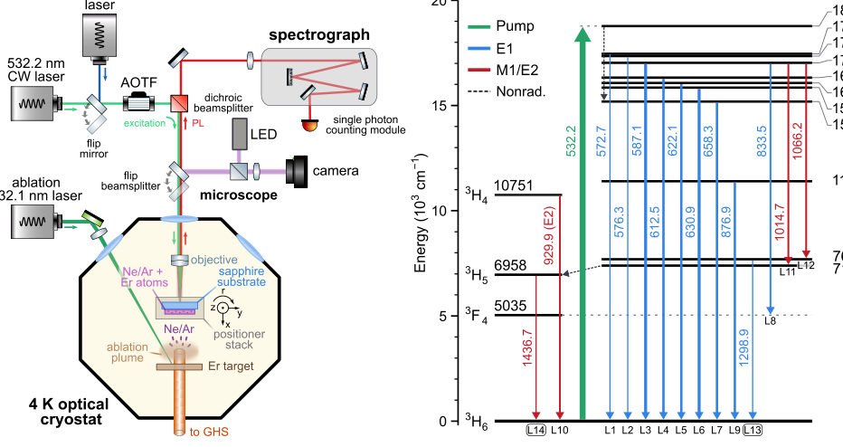
<figcaption class="paper-figure-caption"><b>Fig 1.</b> Fig. 1. (a) Experimental setup. Er atoms produced by laser ablation are co-deposited with Ne or Ar onto a cold sapphire substrate. PL is excited by a 532.2 nm CW laser or an AOTF-filtered supercontinuum source and detected with a spectrograph and single-photon detectors. (b) Simplified energy-level diagram of neutral Er 49, with even- and odd-parity levels in separate columns and energies in cm−1. The green arrow marks the 532.2 nm excitation. Blue and red arrows show the observed E1 and M1/E2 transitions L1–L14, respectively, labeled with their free-atom air wavelengths in nm; the boxed labels mark the telecom-band transitions L13 and L14. Arrow thickness indicates the relative PL...</figcaption>
</figure>
<figure class="paper-figure-card">
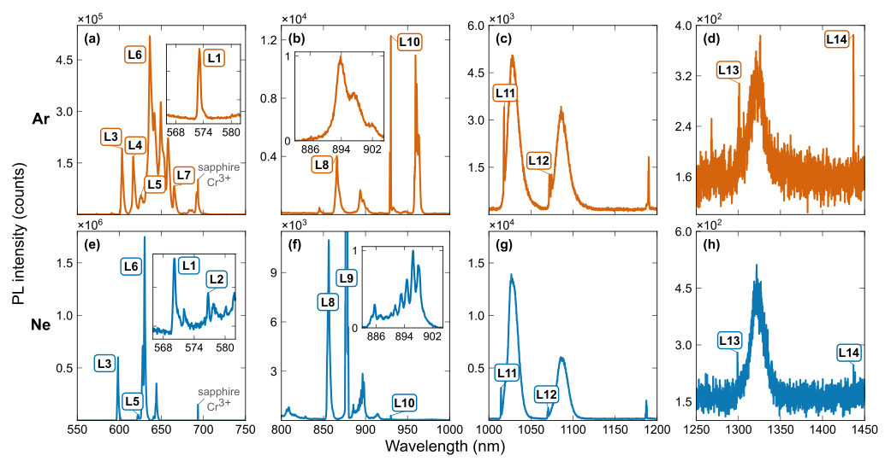
<figcaption class="paper-figure-caption"><b>Fig 2.</b> Fig. 2. PL spectra of Er in solid Ar (a–d) and Ne (e–h) at 6 K under 532.2 nm CW excitation, covering the 550–750 nm, 800–1000 nm, 1000–1200 nm, and 1250–1450 nm ranges. Labels L1–L14 mark the assigned transitions shown in Fig. 1(b); unlabeled features could not be reliably assigned to known free-atom transitions. Insets enlarge the weak features near 566–582 nm and compare the structure near 882–905 nm in the two hosts; the latter insets are baseline-subtracted and peak- normalized.</figcaption>
</figure>
<figure class="paper-figure-card">
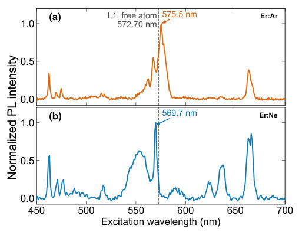
<figcaption class="paper-figure-caption"><b>Fig 3.</b> Fig. 3. PLE spectra of Er in solid (a) Ar and (b) Ne, monitoring the L14 emission at 1437 nm before annealing. Each trace is background-subtracted and peak-normalized, without correction for the wavelength dependence of the excitation power. The excitation bandwidth is about 2 nm. The dashed vertical line marks the free-atom wavelength of L1 (572.70 nm). Arrows mark the excitation wavelengths used for the PL decay measurements, 575.5 nm in Ar and 569.7 nm in Ne, near the maxima of the respective PLE spectra.</figcaption>
</figure>
<figure class="paper-figure-card">
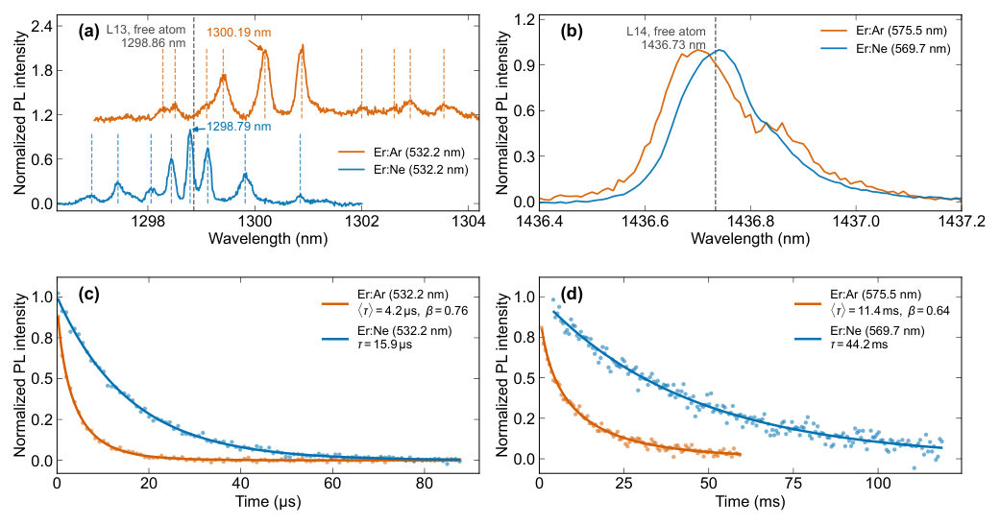
<figcaption class="paper-figure-caption"><b>Fig 4.</b> Fig. 4. Spectra and decay dynamics of the telecom transitions L13 and L14 in as-grown Er:Ar and Er:Ne samples. (a) PL spectra of L13 near 1299 nm in solid Ar and Ne under 532.2 nm excitation. The Ar trace is vertically offset for clarity. Colored dashed lines mark the features listed in Table I, and arrows indicate the detection wavelengths used in (c). (b) PL spectra of L14 near 1437 nm under excitation at 575.5 nm (Ar) and 569.7 nm (Ne). In (a) and (b), spectra are baseline-corrected and peak-normalized, and gray dashed lines mark the free-atom transition wavelengths in air. (c, d) PL decays of L13 and L14, respectively, with time referenced to the end of the excitation gate. Solid lines...</figcaption>
</figure>
<figure class="paper-figure-card">
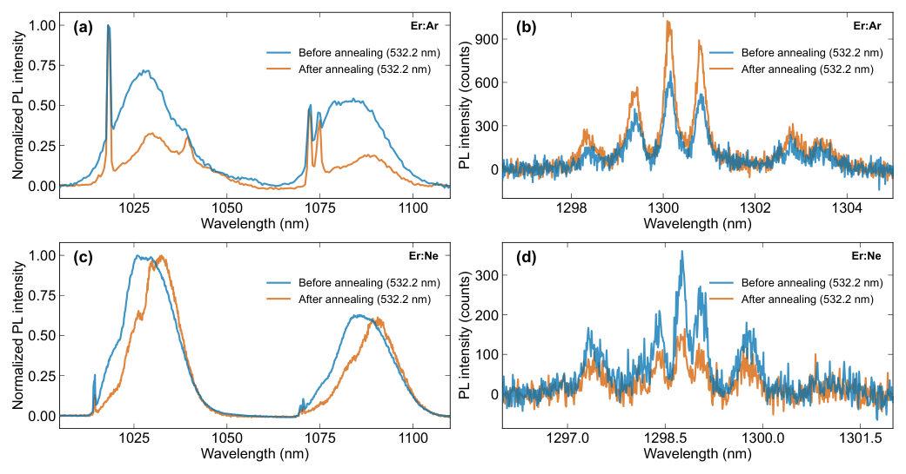
<figcaption class="paper-figure-caption"><b>Fig 5.</b> Fig. 5. Effect of annealing on the PL spectra of Er in solid Ar (a, b) and Ne (c, d) under 532.2 nm excitation. Blue and orange traces show measurements before and after annealing, respectively. (a, c) NIR spectra around L11 and L12, baseline-corrected and peak-normalized to compare the band shapes and the relative prominence of the narrow features. (b, d) Detailed spectra of L13, shown as baseline-subtracted counts without peak normalization. Within each panel, the traces before and after annealing were recorded under the same acquisition conditions, but count scales should not be compared between hosts. Wavelengths in parentheses in the legends give the excitation wavelength.</figcaption>
</figure>

**Summary.** The authors characterized the optical emission of Erbium atoms in solid Neon and Argon matrices using time-resolved PL spectroscopy. They found that the $4f 
ightarrow 4f$ transition in solid Ne exhibits extremely long lifetimes and narrow linewidths, indicating minimal environmental decoherence. This establishes rare-gas solids, particularly Ne, as excellent solid-state hosts for robust, telecom-band quantum emitters.

**Why it may be interesting.** This work is highly relevant to AMO physics and quantum optics as it experimentally validates a solid-state platform (RG solids) for achieving long coherence times in atomic emitters, crucial for quantum memory and quantum networking.

Detailed structure

**Main problem.** The study aims to characterize the near-infrared, telecom-band optical transitions of Erbium (Er) atoms embedded in rare-gas (RG) solids to determine if these solids are suitable hosts for long-lived quantum emitters.

**Main result.** The research demonstrates that Er atoms in solid Ne exhibit exceptionally long photoluminescence lifetimes (up to 79 ms) and narrow spectral features for the $4f 
ightarrow 4f$ transition, establishing RG solids, particularly Ne, as promising platforms for quantum applications.

**Method.** The work employed steady-state and time-resolved photoluminescence (PL) spectroscopy on samples of Er co-deposited with solid Ne and solid Ar, measured at cryogenic temperatures.

**Model / system.** The physical system involves neutral Er atoms isolated within crystalline matrices of solid Neon (Ne) or solid Argon (Ar). The analysis compares the spectral signatures of the $4f 
ightarrow 5d$ (L13) and $4f 
ightarrow 4f$ (L14) transitions in both hosts.

**Key observables.** Near-infrared emission transitions (1000–1500 nm), PL lifetime (up to 79 ms), inhomogeneous linewidth (< 22 GHz), and spectral shifts relative to free-atom values.

**Important parameters / regimes.** Cryogenic temperature ($\approx 6$ K); the difference in host perturbation between Ne and Ar; the radiative limit for the PL lifetime.

**Assumptions / limitations.** The observed spectral differences are attributed to the differential coupling strength between the $5d$ electron (strong coupling) and the shielded $4f$ electrons (weak coupling) to the host lattice.

**Figures summary.** Figure 1(a) shows the experimental setup, and Figure 1(b) provides an energy-level diagram for neutral Er. Figure 2 presents representative PL spectra of Er in solid Ar and Ne.

**Paper structure.** The paper proceeds by characterizing the optical transitions in both Ar and Ne, contrasting the highly coupled $5d$ transition (L13) with the weakly coupled, long-lived $4f$ transition (L14). The comparison highlights the superior environment provided by solid Ne.

Abstract

Rare-earth (RE) atoms, such as erbium (Er), have inner-shell optical transitions in the near-infrared, some of which are in the telecom bands. These transitions are largely insensitive to the host environment due to effective shielding by the filled outer shells. Cryogenic rare-gas (RG) solids, such as solid neon (Ne) and argon (Ar), combine high chemical purity with a nearly nuclear-spin-free environment, making them attractive solid hosts for preserving optical and spin coherence. In this work, we isolate neutral Er atoms in solid Ne and Ar at 6 K and characterize their emission by steady-state and time-resolved photoluminescence (PL) spectroscopy. In both hosts, we observe several near-infrared transitions between 1000--1500 nm, including inner-shell emission in the telecom O and E bands. The $4f \rightarrow 5d$ transition near 1299 nm forms a multiplet of narrow components, consistent with crystal-field splitting, and decays on a microsecond timescale. The $4f \rightarrow 4f$ transition near 1437 nm shows a matrix shift below 1 cm$^{-1}$ in both hosts. In solid Ne, its inhomogeneous linewidth is bounded by the spectrometer resolution to < 22 GHz, and its PL lifetime reaches up to 78.9 ms, close to the estimated radiative limit. Thermal annealing extends the 1437 nm lifetime in Ne and suppresses the phonon sidebands relative to the zero-phonon lines in Ar. These results identify RG solids as promising hosts for long-lived telecom-band Er emission and provide a foundation for future spin-photon interfaces and hybrid quantum architectures.

[↑ back to top](#top)

### [Walshness: an intrinsic neural-network representability metric for quantum states](http://arxiv.org/abs/2610.00505v1)

**Authors:** Nisarga Paul, Kehuang Chen, Jessica K. Jiang, Haimeng Zhao, Di Luo  
**Type:** theory · **Category:** disordered systems and neural networks · **PDF:** <https://arxiv.org/pdf/2610.00505v1>  
**Analysis basis:** full PDF text, analyzed in chunks
**Topic relevance:** `analog quantum simulation` **3/5** · `methods for driven-dissipative` **2/5**

↔ Scroll figures horizontally

<figure class="paper-figure-card">
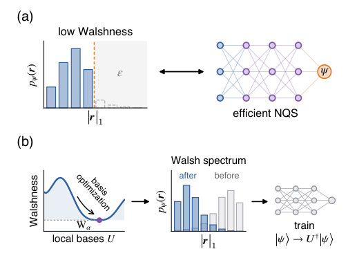
<figcaption class="paper-figure-caption"><b>Fig 1.</b> Figure 1. Walshness. (a) For a quantum state |ψ⟩on n qubits, low Walshness implies the existence of an efficient neural quantum state (NQS) representation in some basis. Conversely, a compact NQS has low Walshness. (b) We pro- vide an algorithm for finding Walshness-minimizing bases and numerically show that they ease NQS training.</figcaption>
</figure>
<figure class="paper-figure-card">
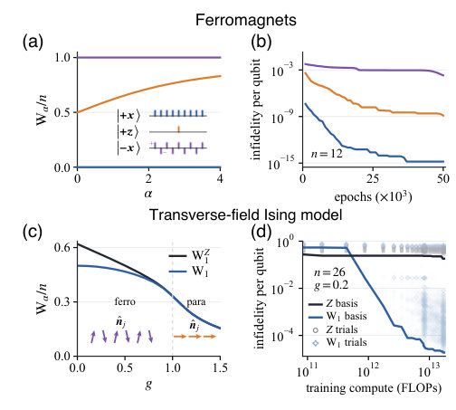
<figcaption class="paper-figure-caption"><b>Fig 2.</b> Figure 2. NQS learning. (a) Fixed-basis Walshness den- sity of |+x⟩, |+z⟩, and |−x⟩ferromagnets. All three have zero intrinsic Walshness. (b) Loss during a common training budget for MLP-NQS fits of these states, using infidelity as loss. Ordering of losses follows that of WZ α. (c) Fixed-basis Walshness density and intrinsic Walshness density at α = 1 for the TFIM ground state. Insets show Wα-minimizing bases (ˆnj,x, ˆnj,z) at g = 0.2 and 1.2. (d) Minimum infidelity per qubit for learning the g = 0.2 TFIM ground state over many trials (with varying MLP architectures, hyperparameters, and epochs [56]) for Walshness minimizing (blue) and computa- tional (black) bases. These data demonstrate...</figcaption>
</figure>
<figure class="paper-figure-card">
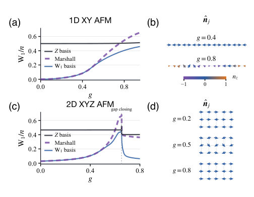
<figcaption class="paper-figure-caption"><b>Fig 3.</b> Figure 3. Walshness and the Marshall sign rule. (a,c) Walshness WZ 1 [U|ψ⟩] in the computational (black), Marshall (purple dashed), and numerically optimized (blue) bases. (a,b) Results for HXY [Eq. (11)], with varying anisotropy g, in the parity-even ground state. (c,d) Results for HXYZ [Eq. (12)], with varying frustration g. Within the exact ground state manifold, we select the state maximizing ⟨X⟩on a corner site of the finite lattice. (b,d) Optimized basis axes at the indicated couplings. Arrows show the xy projections of ˆnj, defined by U † j XjUj = ˆnj · σj.</figcaption>
</figure>
<figure class="paper-figure-card">
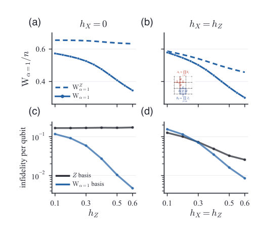
<figcaption class="paper-figure-caption"><b>Fig 4.</b> Figure 4. Mixed-field toric code. (a,b) Z-basis (dashed) and numerically minimized (solid) Walshness at α = 1, along hX = 0 and hX = hZ for the L = 3 torus [n = 18, inset in (b)]. (c,d) Median best infidelity per qubit during 2 · 104</figcaption>
</figure>
<figure class="paper-figure-card">
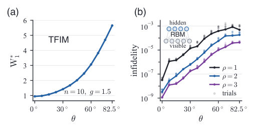
<figcaption class="paper-figure-caption"><b>Fig 5.</b> Figure 5. Multiplicative Walshness and RBM learning. (a) W∗ α for α = 1 and (b) infidelity versus global basis rotation angle θ in the TFIM. Curves show the lowest-energy retained trial after 1000 SR steps, with hidden-unit density ρ = M/n. Data in part reproduced from [45] (see [56]). Increase in W∗ 1 tracks increase in infidelity across θ.</figcaption>
</figure>

**Summary.** The paper introduces Walshness, a novel, intrinsic metric quantifying the complexity of a quantum state's structure relative to its potential representation by a neural network. It rigorously proves that low Walshness guarantees efficient representability by MLPs, providing a theoretical benchmark for quantum state learnability. This framework is successfully applied to analyze ground states of lattice models like the Toric Code, revealing deep connections between quantum phase transitions and information-theoretic complexity.

**Why it may be interesting.** This work provides a powerful, intrinsic complexity measure that bridges quantum information theory, condensed matter physics, and machine learning theory. For AMO physicists, it offers a quantitative diagnostic tool to predict the feasibility of simulating complex quantum phases using modern neural network architectures.

Detailed structure

**Main problem.** The paper addresses the fundamental question of when and how efficiently quantum many-body states can be represented by Neural Quantum States (NQS), given challenges from nonlinear parameterization and basis dependence.

**Main result.** It introduces Walshness, a complexity metric, and proves that a state has an efficient NQS representation if and only if it has bounded Walshness, providing a rigorous link between quantum state structure and machine learning capacity.

**Method.** The authors define Walshness using the Walsh-Hadamard transform and establish its intrinsic form by minimizing over local unitaries. They connect this metric to the learnability of MLPs and RBMs via theoretical bounds and variational minimization.

**Model / system.** The analysis focuses on general quantum many-body states on $n$ qubits, tested on models like the Transverse-Field Ising Model (TFIM) and the mixed-field Toric Code. The representation tool is the Neural Quantum State (NQS) parameterized by MLPs.

**Key observables.** Walshness ($W_\alpha$), Intrinsic Walshness ($W_\alpha$), Infidelity ($\epsilon$), and the energy of a corresponding classical spin model.

**Important parameters / regimes.** The system size $n$, the parameter $\alpha$ in Walshness, and the coupling strengths ($h_X, h_Z$) in the Hamiltonian.

**Assumptions / limitations.** The connection between low Walshness and efficient MLP representation is established for a truncated state $|	ext{e}\psi
angle$. The analysis often relies on asymptotic scaling arguments.

**Figures summary.** Figures illustrate that low Walshness correlates with low training infidelity across various bases (e.g., TFIM, Toric Code). Specific comparisons show that the intrinsic Walshness reveals underlying structural properties, such as divergences related to phase transitions in the 2D Ising model.

**Paper structure.** The paper first defines Walshness and proves its connection to NQS representability. It then applies this to specific models (TFIM, Toric Code), deriving closed-form expressions for Walshness related to known statistical physics models (like the 2D Ising model). Finally, it compares the performance of NQS trained using different bases (computational vs. Walshness-optimized) on complex systems.

Abstract

Neural quantum states (NQS) have emerged as powerful representations of quantum states with rapidly expanding applications across quantum many-body physics. Yet our understanding of when neural networks can efficiently represent physical quantum states remains limited, in part due to the nonlinear parameterization of NQS, the intricate sign structure of quantum states, and the sensitive dependence on basis choice. We introduce Walshness, a complexity metric of a quantum state which quantifies whether it admits a compact neural-network representation. We rigorously prove that a general quantum many-body state admits an efficient NQS representation if and only if it has bounded Walshness for various NQS architectures. We provide an algorithm for finding the optimal basis by minimizing the energy of a corresponding classical spin model. This allows us to empirically improve the learnability of various physical quantum states, including ground states of the transverse-field Ising model and mixed-field toric code, often reducing infidelity by orders of magnitude, and recovers and generalizes the basis choice given by the well-known Marshall sign rule in frustrated antiferromagnets. Our results provide an intrinsic complexity metric for quantum states with provable connections to their neural-network representability.

[↑ back to top](#top)

### [Fatigue failure in two-dimensional glasses under cyclic shear deformation](http://arxiv.org/abs/2610.00655v1)

**Authors:** Himangsu Bhaumik, Srikanth Sastry  
**Type:** both · **Category:** disordered systems and neural networks · **PDF:** <https://arxiv.org/pdf/2610.00655v1>  
**Analysis basis:** full PDF text, analyzed in chunks
**Topic relevance:** `non-equilibrium universality` **3/5** · `Frenkel-Kontorova` **1/5**

↔ Scroll figures horizontally

<figure class="paper-figure-card">
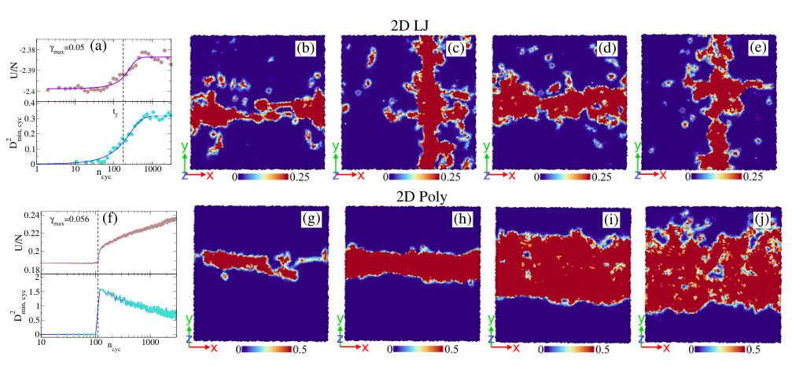
<figcaption class="paper-figure-caption"><b>Fig 1.</b> FIG. 1. Upper panels: 2D LJ model (WAL1), Lower panels: 2D Polydisperse Soft disk model. Evolution of energy (upper inset) and cycle-to-cycle non-affine displacement D2 min,cyc (lower inset) as a function of strain cycle for (a) 2D LJ model (WAL1) and (f) 2D POly model. For the 2D LJ model, both U/N and D2 min,cyc can be well described by a sigmoid function as shown by the solid lines. Inflection points are taken to be the failure times. For the 2D Poly model, there is a sharp change in both U/N and D2 min,cyc during failure. The snapshots of the system coloured by the D2 min,cyc of the particles are presented at different stages of evolution, (b,g) ncyc = tf + 10, (c,h) tf + 100, (d,i) tf...</figcaption>
</figure>
<figure class="paper-figure-card">
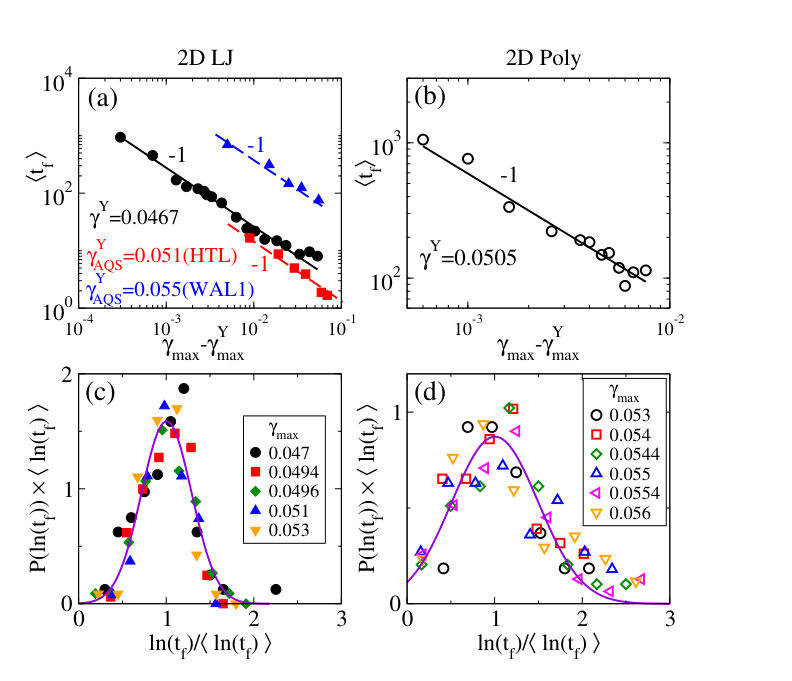
<figcaption class="paper-figure-caption"><b>Fig 2.</b> FIG. 2. Average failure times ⟨tf⟩against (γmax −γY max) for the (a) 2D LJ model and the (b) 2D Poly model. Solid lines are fits to a power-law which indicates that the exponent is −1, for both models. For comparison, results for the athermal quasistatic shear protocol are also shown for the 2D LJ model in (a), based on simulations reported in [29]. The distribution of failure times, for the (c) 2D LJ model and the (d) 2D Poly model, for several strain amplitudes. The distributions exhibit log-normal behaviour, with the width being proportional to the mean, as indicated by the data collapse when the axes are scaled by ⟨ln(tf)⟩.</figcaption>
</figure>
<figure class="paper-figure-card">
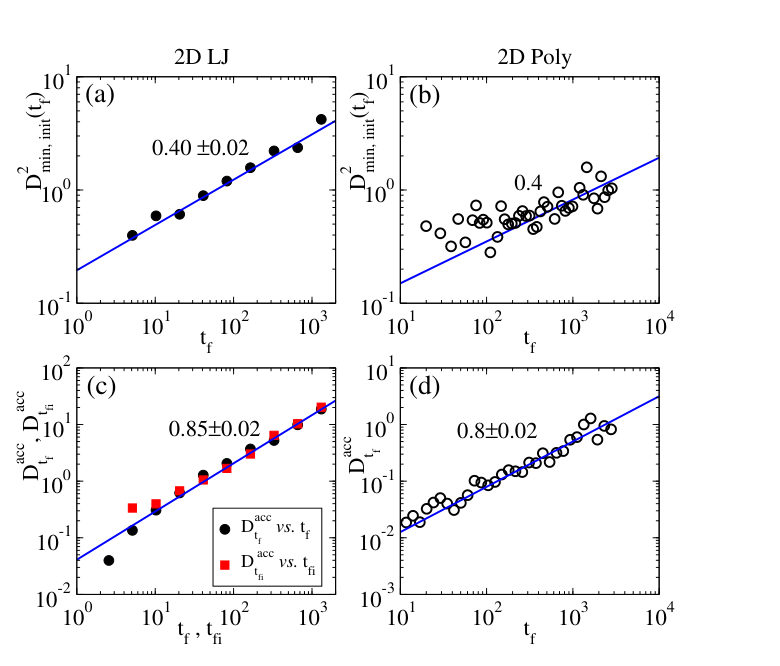
<figcaption class="paper-figure-caption"><b>Fig 3.</b> FIG. 3. Accumulated plasticity D2 min,init (measured in terms of non-affine displacement) as a function of failure time tf for (a) 2D LJ and (b) 2D Poly. Solid lines through data represent power-law scaling D2 min,init ∼t0.4 f for both models. Dissipated work Dacc tf accumulated till failure as a function of failure time tf for (c) 2D LJ and (d) 2D Poly. A power-law Dacc tf ∼t0.8 f is observed for both the models. In (a), (c), and (d), the error bars on the exponent values represent the variation obtained by fitting different portions of the data. In (b), the line is a guide to the eye with slope 0.4.</figcaption>
</figure>
<figure class="paper-figure-card">
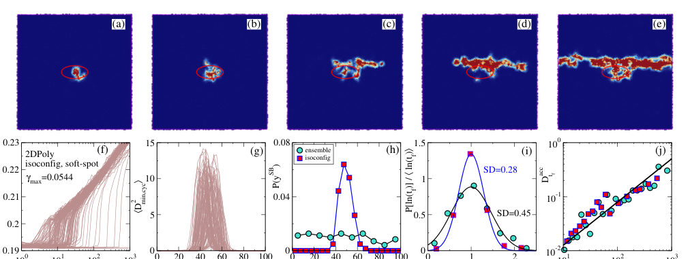
<figcaption class="paper-figure-caption"><b>Fig 4.</b> FIG. 4. Isoconfigurational simulations with a predefined soft spot (2D Poly). The upper panels (a)-(e) show the nucleation of the shear band from the seeded region and the subsequent evolution of plastic rearrangements up to failure. Lower panels: (f) Evolution of potential energy as a function of strain cycles for 200 independent runs with different initial velocities. (g) Cycle-to-cycle non-affine displacement profile at the failure time tf, demonstrating that the shear band formation is spatially localized near the seeded region. (h) Distribution of shear band positions: while unseeded simulations exhibit a broad (nearly uniform) distribution, the seeded isoconfigurational runs show a...</figcaption>
</figure>

**Summary.** This work uses atomistic simulations to study fatigue failure in 2D model glasses under cyclic shear. The key finding is a dimensionality-dependent power-law exponent for the failure time divergence (exponent $\approx -1$ in 2D vs. $-2$ in 3D). The research robustly links this failure time to the scaling of accumulated plastic damage, while also noting that failure timing remains inherently stochastic even when the failure location is controlled.

**Why it may be interesting.** The study provides insights into how dimensionality fundamentally alters the critical exponents governing failure in disordered materials, which has parallels in understanding phase transitions or failure mechanisms in complex quantum systems.

Detailed structure

**Main problem.** The study investigates the phenomenon of fatigue failure in two-dimensional (2D) model glasses subjected to cyclic shear deformation.

**Main result.** The divergence of the failure time as the strain amplitude approaches the limit follows a power law with an exponent of approximately -1 in 2D, which contrasts with the -2 exponent found in 3D systems.

**Method.** The research employs atomistic Molecular Dynamics (MD) simulations to model the mechanical response of the glasses under cyclic loading.

**Model / system.** The simulations use two specific models: the 2D Lennard-Jones (LJ) mixture potential and a 2D polydisperse soft-disk model. The system is subjected to controlled cyclic shear strain.

**Key observables.** Number of cycles to failure (fatigue time), accumulated dissipated work, and non-affine displacements.

**Important parameters / regimes.** Cyclic shear strain amplitude ($\gamma_{max}$), temperature ($T$), and the dimensionality (2D vs 3D).

**Assumptions / limitations.** The analysis assumes that the failure process is governed by the accumulation of plastic activity, and that the difference in failure exponents between 2D and 3D is due to spatial dimensionality.

**Figures summary.** Figures illustrate the power-law divergence of failure time with strain amplitude, the scaling of accumulated damage measures ($D^2_{	ext{min,init}}$ and $D_{	ext{acc}, t_f}$) with failure time, and the effect of seeding localized soft regions on failure location versus timing.

**Paper structure.** The paper first establishes the simulation setup for 2D glasses using two models. It then analyzes the power-law scaling of failure time with strain amplitude, highlighting the dimensional difference. Finally, it correlates this failure time with the scaling of accumulated plastic damage measures, while also examining the stochastic nature of failure time variability.

Abstract

We investigate fatigue failure in two-dimensional (2D) model glasses under cyclic shear deformation using atomistic simulations. We find that the number of cycles to failure diverges as a power law as the strain amplitude approaches the fatigue limit, with an exponent close to $-1$, in contrast to the exponent of $-2$ reported in three dimensions (3D). A failure exponent of $-1$ has also recently been observed in a 2D elastoplastic model, suggesting an interesting dependence on spatial dimensionality that needs to be rationalized. Measures of accumulated plastic activity, including dissipated work and non-affine displacements, exhibit scaling with the failure time that is consistent with results in 3D, and indicate a robust connection between damage accumulation and failure. To probe the origins of the variability of failure times, we perform isoconfigurational {\it seeded} simulations in which a localized soft region is introduced. While such seeding constrains the spatial location of failure, the distribution of failure times remains broad. These findings extend recent results in 3D concerning fatigue failure times to 2D glasses, including their relation to accumulated plasticity and apparent stochasticity, while also revealing a key difference, namely the exponent describing the divergence of the failure times.

[↑ back to top](#top)

### [Frustration-induced multiferroicity in hauerite MnS2](http://arxiv.org/abs/2610.01990v1)

**Authors:** Vilmos Kocsis, Harish K. Singh, Kranthi K. Bestha, Yaqian Guo, Maxim Mostovoy, Jeroen van den Brink, Oleg Janson  
**Type:** both · **Category:** strongly correlated electrons · **PDF:** <https://arxiv.org/pdf/2610.01990v1>  
**Analysis basis:** full PDF text, analyzed in chunks
**Topic relevance:** `analog quantum simulation` **3/5** · `Keldysh / 2PI / non-Gaussian methods` **1/5**

↔ Scroll figures horizontally

<figure class="paper-figure-card">
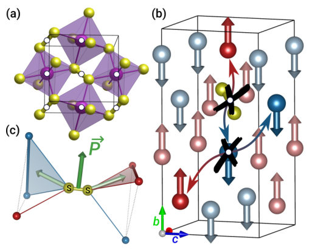
<figcaption class="paper-figure-caption"><b>Fig 1.</b> FIG. 1. Inversion symmetry breaking and emergence of dipole moments on S2 dimers. (a) MnS6 octahedra (violet) and S2 dimers (yellow dumbbells) in the pyrite-type cubic structure of paramagnetic MnS2. Inversion centers (open circles) are located at Mn atoms and midpoints of S2 dimers. (b) The antiferromagnetic order doubles the unit cell and breaks P as illustrated by curvilinear arrows connecting the loci of erst- while inversion centers (crossed-out open circles) with Mn atoms having antiparallel moments. (c) In the magnetically ordered state, both atoms of an S2 dimer have three Mn neigh- bors; two thereof have parallel moments, allowing for a dipole moment on S (green arrow). The...</figcaption>
</figure>
<figure class="paper-figure-card">
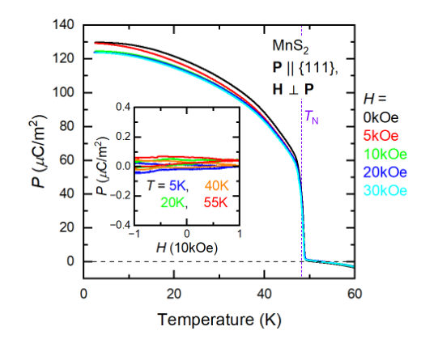
<figcaption class="paper-figure-caption"><b>Fig 2.</b> FIG. 3. Temperature dependence of the ferroelectric polar- ization P along [111] at selected fields. Note that polarization in MnS2 is confined to the c axis, and hence the intrinsic value of P is √</figcaption>
</figure>
<figure class="paper-figure-card">
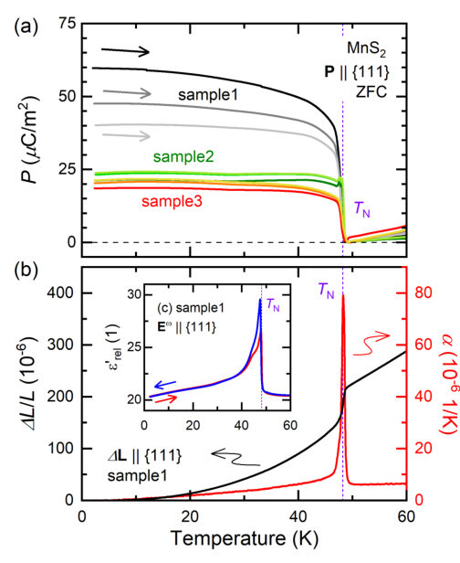
<figcaption class="paper-figure-caption"><b>Fig 3.</b> FIG. 2. Temperature dependence of the (a) zero-field-cooled ferroelectric polarization (P) and (b) the relative length change (∆L/L) and the thermal expansion coefficient (α). Inset (c): Real part of the dielectric constant (ϵ′) of MnS2.</figcaption>
</figure>
<figure class="paper-figure-card">
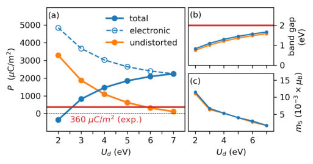
<figcaption class="paper-figure-caption"><b>Fig 4.</b> FIG. 4. Results of GGA+U calculations. (a) Total ferroelec- tric polarization P (blue solid) and its electronic contribution (blue dashed) as a function of the Coulomb repulsion param- eter Ud. For reference, we plot the polarization of the undis- torted structure (orange) which is fully of electronic origin. We further plot the Ud dependence of the band gap (b) and the average absolute magnetic moment on S atoms (c). Ex- perimental estimates are indicated with red lines.</figcaption>
</figure>
<figure class="paper-figure-card">
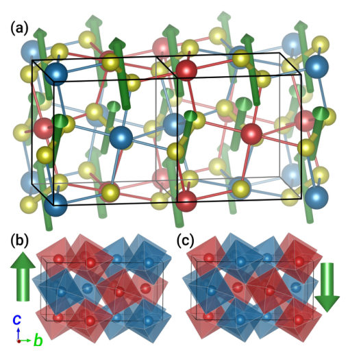
<figcaption class="paper-figure-caption"><b>Fig 5.</b> FIG. 5. Ferroelectricity of MnS2. (a) Spin-up (red) and spin- down (blue) Mn atoms in the magnetic structure of MnS2. Polarization of each S2 dimer is indicated by a green arrow; net electric polarization is along c. (b) and (c) Two magnetic domain structures with opposite polarization. Only magnetic MnS6 octahedra are shown. Slicing both domains in the ac plane (each panel depicts four such slices) reveals that each second slice has opposite orientation in the two magnetic do- mains.</figcaption>
</figure>

**Summary.** This work establishes hauerite MnS2 as a type-II multiferroic material where ferroelectricity emerges directly from its magnetic ordering. The mechanism is microscopically attributed to dipole moments induced on S2 dimers due to magnetic frustration. The study employs both experimental measurements and advanced DFT+U calculations to confirm this coupling and quantify the polarization.

**Why it may be interesting.** The strong coupling between magnetism and ferroelectricity in a solid-state material like MnS2 provides a platform for studying emergent quantum phenomena, particularly magnetoelectric coupling mechanisms relevant to correlated electron physics.

Detailed structure

**Main problem.** The study aims to demonstrate that hauerite MnS2 is a type-II multiferroic material by understanding the microscopic origin of the ferroelectric polarization coupled to its magnetic ordering.

**Main result.** The ferroelectricity arises from the acquisition of a dipole moment on S2 dimers, induced by the frustrated magnetic ordering of neighboring Mn sites, leading to a measurable polarization of up to 360 μC/m^2.

**Method.** The research combines experimental measurements (polarization, thermal expansion) with advanced computational techniques, primarily DFT+U calculations, to model the electronic structure and magnetoelectric coupling.

**Model / system.** The system is the pyrite-type mineral hauerite MnS2, which is treated as a magnetic insulator with localized S=5/2 moments, exhibiting complex magnetic ordering characterized by two Néel vectors.

**Key observables.** Ferroelectric polarization (P), dielectric constant (ε'), thermal expansion coefficient (α), and the total/electronic polarization calculated via DFT+U.

**Important parameters / regimes.** The Coulomb repulsion parameter U_d (varied from 2 to 7 eV in calculations) and the magnetic exchange energy scale (setting the domain switching barrier).

**Assumptions / limitations.** The analysis assumes that the multiferroicity is fundamentally linked to the symmetry breaking accompanying the magnetic ordering, and DFT+U is used to capture strong electronic correlations.

**Figures summary.** Figures illustrate the emergence of dipole moments on S2 dimers upon magnetic ordering, the temperature dependence of polarization and thermal expansion, and the dependence of polarization on the Hubbard U parameter.

**Paper structure.** The paper progresses from experimental characterization of the multiferroic state to detailed theoretical modeling using DFT+U, systematically varying parameters to pinpoint the electronic origin of the polarization via S2 dimer dipoles.

Abstract

Pyrite-type mineral hauerite MnS$_2$ is a magnetic insulator with localized $S=\frac52$ moments. Below 48 K, it develops a collinear antiferromagnetic order, accompanied by unit-cell doubling and breaking the inversion symmetry. We demonstrate that the latter gives rise to a ferroelectric polarization of up to 360 $μ$C/m$^2$ rendering MnS$_2$ a type-II multiferroic. Microscopically, the electronic polarization originates from S$_2$ dimers that acquire a dipole moment induced by the frustrated magnetic ordering of neighboring Mn sites. We show that time-reversal symmetry leaves ferroelectric domains intact, and that domain switching necessitates overcoming a high energy barrier set by the magnetic exchange energy scale.

[↑ back to top](#top)

### [Mechanism of Incommensurate Magnetic Order in $\mathrm{BaCo_2(AsO_4)_2}$: Interplay of Frustrated Further-Neighbor Exchanges and Bond-Directional Anisotropy](http://arxiv.org/abs/2610.00626v1)

**Authors:** Mohammad-Hossein Zare, Mehdi Biderang, Hamid Mosadeq  
**Type:** theory · **Category:** strongly correlated electrons · **PDF:** <https://arxiv.org/pdf/2610.00626v1>  
**Analysis basis:** full PDF text, analyzed in chunks
**Topic relevance:** `analog quantum simulation` **3/5** · `Frenkel-Kontorova` **1/5**

↔ Scroll figures horizontally

<figure class="paper-figure-card">
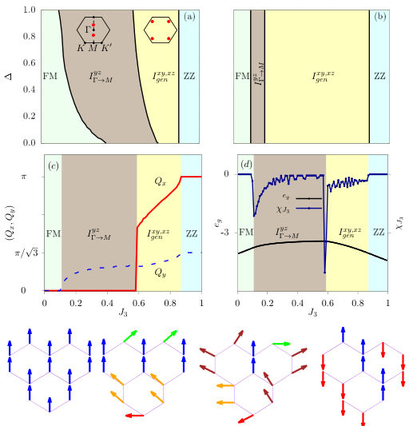
<figcaption class="paper-figure-caption"><b>Fig 1.</b> FIG. 1. Classical phase diagrams and magnetic instabili- ties of the extended honeycomb JKΓΓ′ model at J2 = 0. (a) Phase diagram in the J3–∆plane for the partial-XXZ J1KΓΓ′J∆ 3 model, with isotropic couplings fixed to the ab initio values of BCAO [Eq. (2)]. Inset: The FBZ with high- symmetry points and propagation paths for Q. (b) Sym- metrical phase diagrams for the J∆ 1 KΓΓ′J3 and full-XXZ J∆ 1 KΓΓ′J∆ 3 models. (c) Evolution of the ordering vector Q versus J3 for the J1KΓΓ′J∆ 3 model at anisotropy ∆= 0.1. (d) Ground-state energy per site eg and classical susceptibil- ity χJ3 = −∂2eg/∂J2 3 versus J3 at ∆= 0.1, highlighting sharp first-order anomalies and broad second-order transitions....</figcaption>
</figure>
<figure class="paper-figure-card">
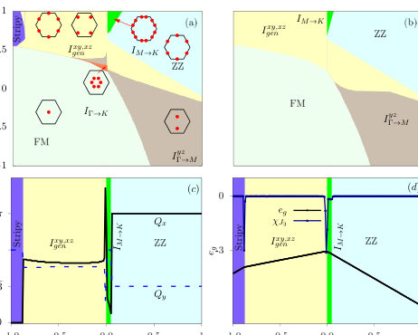
<figcaption class="paper-figure-caption"><b>Fig 2.</b> FIG. 2. (Color online) Classical magnetic phase diagrams and the evolution of modulated instabilities in the J3–J2 plane for the full-XXZ J∆ 1 KΓΓ′J∆ 3 model, derived from an ab ini- tio baseline of BCAO, are presented. The phase landscapes are resolved at fixed XXZ anisotropy limits: (a) the isotropic Heisenberg limit (∆= 1) and (b) the pure planar limit (∆= 0). Panels (c) and (d) depict the evolution of the mag- netic ordering wavevector Q and the classical ground-state en- ergy per site eg, alongside its susceptibility χJ3 = −∂2eg/∂J2 3 as a function of J3, respectively. These are evaluated at fixed J2 = 0.4 and ∆= 0.8 using the Luttinger-Tisza approach.</figcaption>
</figure>
<figure class="paper-figure-card">
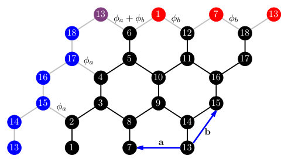
<figcaption class="paper-figure-caption"><b>Fig 3.</b> FIG. 3. (Color online) This schematic illustrates the N = 18 site honeycomb lattice cluster utilized in our finite-system ED calculations. The core physical cluster comprises sites labeled 1 through 18 (black nodes). To simulate an infinite continuum and mitigate finite-size momentum quantization artifacts, TBCs are implemented. Gray links denote bound- ary couplings, across which phase factors ϕa, ϕb, and ϕa + ϕb are accrued during single-particle or spin-multiplet hopping events. Primitive lattice translation vectors are indicated by blue arrows a and b. Blue, red, and purple nodes represent the boundary image sites, which are mapped via their respec- tive translational fluxes.</figcaption>
</figure>
<figure class="paper-figure-card">
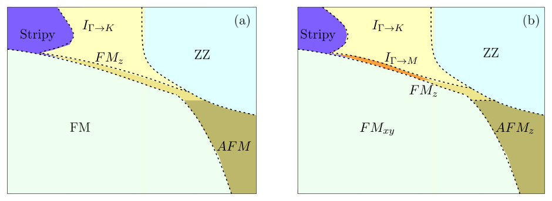
<figcaption class="paper-figure-caption"><b>Fig 4.</b> FIG. 4. (Color online) Quantum ground-state phase diagrams of the extended JKΓΓ′ model on the N = 18 site honeycomb cluster obtained via TBCs-ED calculations in the J3–J2 parameter space. (a) Phase diagram in the isotropic Heisenberg limit (∆= 1), showing broad domains of collinear phases (FM, ZZ, AFM, Stripy), the axially polarized FMz state, and the incommensurate spiral phase IΓ→K. (b) Phase diagram in the easy-plane XY limit (∆= 0), illustrating the planar FMxy and axial AFMz states, along with the quantum stabilization of the IΓ→M spiral phase alongside IΓ→K. Dashed black lines indicate quantum phase boundaries determined from energy derivative anomalies.</figcaption>
</figure>
<figure class="paper-figure-card">
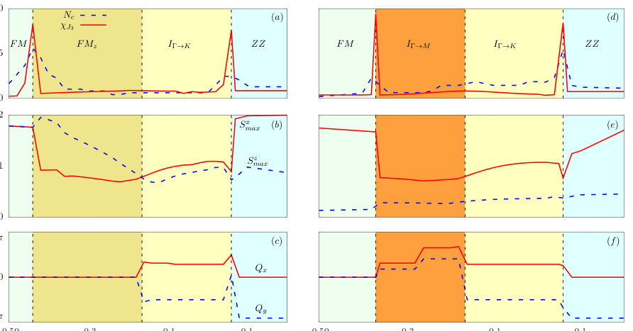
<figcaption class="paper-figure-caption"><b>Fig 5.</b> FIG. 5. (Color online) Diagnostic indicators of quantum phase transitions along representative J3 parameter cuts at a fixed J2 = 0.4. The left column displays results for the isotropic Heisenberg limit (∆= 1), whereas the right column corresponds to the easy-plane limit (∆= 0). (a), (d) Effective magnetic susceptibility χJ3 = −∂2e0/∂J2 3 (solid red curves) and the statistical fluctuation metric Nc (dashed blue curves), where sharp singular peaks unequivocally delineate phase boundaries among competing states (FM, FMz, IΓ→M, IΓ→K, and ZZ). (b), (e) Maxima of the static spin structure factor, Sx max (solid red curves) and Sz max (dashed blue curves), resolving the in-plane versus out-of-plane...</figcaption>
</figure>

**Summary.** This theoretical study investigates the magnetic ordering in $\mathrm{BaCo_2(AsO_4)_2}$ using an extended exchange Hamiltonian. The authors demonstrate that the observed incommensurate magnetic state arises naturally from the combined effects of exchange frustration and bond anisotropies, rather than requiring an overly dominant Kitaev interaction. The work establishes a microscopic foundation for the material's ground state by analyzing both classical and quantum phase boundaries.

**Why it may be interesting.** The detailed mapping of magnetic phase diagrams using advanced theoretical tools like the boundary-twist metric provides a rigorous framework for understanding quantum ground states in frustrated magnetic materials, which is relevant to many-body physics.

Detailed structure

**Main problem.** The study aims to resolve the microscopic mechanism responsible for the zero-field incommensurate magnetic order observed in the honeycomb cobaltate $\mathrm{BaCo_2(AsO_4)_2}$.

**Main result.** The incommensurate spiral phase is stabilized not by an anomalously dominant Kitaev coupling, but by the synergistic interplay between exchange frustration ($J_2, J_3$) and intermediate off-diagonal bond anisotropies ($\Gamma, \Gamma'$).

**Method.** The research employs a combination of the analytical Luttinger-Tisza approach for classical phase diagrams and Exact Diagonalization calculations under twisted boundary conditions for quantum analysis.

**Model / system.** The system is the honeycomb cobaltate $\mathrm{BaCo_2(AsO_4)_2}$, modeled using an extended $J_1	ext{--}K	ext{--}\Gamma	ext{--}\Gamma'	ext{--}J_2	ext{--}J_3$ Hamiltonian incorporating XXZ-type exchange anisotropies.

**Key observables.** Incommensurate spiral phase propagation along the $\Gamma 	o M$ direction; competition between the incommensurate manifold and an out-of-plane ferromagnetic ($\mathrm{FM}_z$) phase; the boundary-twist metric ($N_c$).

**Important parameters / regimes.** The relative strengths of the exchange couplings ($J_1, K, \Gamma, \Gamma', J_2, J_3$) and the XXZ anisotropy factor ($\Delta_n$).

**Assumptions / limitations.** The analysis assumes that the essential physics is governed by the interplay of specific exchange anisotropies and frustration, and that $ab$ initio calculations constrain the nearest-neighbor parameters.

**Figures summary.** The notes describe the mapping of classical and quantum phase diagrams across the $(J_2, J_3)$ parameter space, showing the evolution of the ordering wavevector $\mathbf{Q}$ with $J_3$.

**Paper structure.** The paper systematically analyzes the Hamiltonian using the Luttinger-Tisza method to map classical ground states, followed by quantum analysis using Exact Diagonalization and the boundary-twist metric to distinguish between different magnetic phases.

Abstract

The microscopic mechanism governing the zero-field incommensurate magnetic order in the honeycomb cobaltate $\mathrm{BaCo}_2(\mathrm{AsO}_4)_2$ remains a significant unresolved problem, particularly concerning the relative contributions of bond-directional Kitaev-type interactions and exchange frustration. This study investigates an extended $J_1\text{--}K\text{--}Γ\text{--}Γ'\text{--}J_2\text{--}J_3$ model, which incorporates XXZ-type exchange anisotropies on the honeycomb lattice. Nearest-neighbor parameters are constrained by ab initio electronic structure calculations. By integrating the analytical Luttinger-Tisza approach with exact diagonalization calculations under twisted boundary conditions, we delineate the classical and quantum phase diagrams across the $(J_2, J_3)$ parameter space. We demonstrate that the stabilization of the experimentally observed incommensurate spiral phase, propagating along the $Γ\to M$ direction, does not necessitate an anomalously dominant Kitaev coupling. Instead, this phase arises naturally from the synergistic interplay between exchange frustration, driven by further-neighbor couplings ($J_2, J_3$), and intermediate off-diagonal bond anisotropies ($Γ, Γ'$). In the quantum regime, we elucidate the competition between this incommensurate manifold and an out-of-plane ferromagnetic ($\mathrm{FM}_z$) phase, which is selectively stabilized via a quantum order-by-disorder mechanism. Our findings reconcile conflicting interpretations of the magnetic interactions in $\mathrm{BaCo}_2(\mathrm{AsO}_4)_2$ and establish the microscopic origin and stability range of its incommensurate ground state.

[↑ back to top](#top)

### [Remote state preparation of a single-spin state via hybrid spin-photon entanglement](http://arxiv.org/abs/2610.00832v1)

**Authors:** Yunge Jiang, Yehan Yu, Lili Song, Yan Mu, Chaoyun Peng, Mingfeng Wang  
**Type:** theory · **Category:** quantum information and computing · **PDF:** <https://arxiv.org/pdf/2610.00832v1>  
**Analysis basis:** full PDF text, analyzed in chunks
**Topic relevance:** `quantum measurements` **3/5** · `analog quantum simulation` **1/5**

↔ Scroll figures horizontally

<figure class="paper-figure-card">
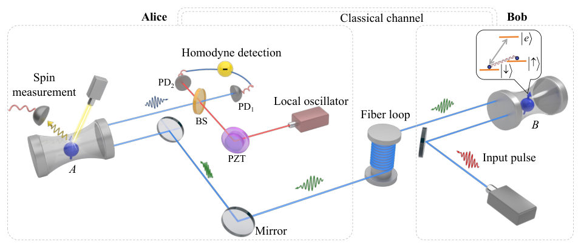
<figcaption class="paper-figure-caption"><b>Fig 1.</b> FIG. 1. Schematic illustration of spin RSP based on hybrid spin-photon entanglement. A single Λ-type spin B is confined in a high-finesse optical cavity at Bob’s site, which is resonant with the |↓⟩↔|e⟩transition and far detuned from the |↑⟩↔|e⟩ transition. An optical pulse initially prepared in a coherent state is reflected from the spin-cavity system, resulting in a hybrid spin-photon entangled state. The optical pulse carrying the quantum correlations is transmitted through an optical fiber to Alice—the receiving party, where it enters a second cavity with an auxiliary electron spin A and interacts via linear cavity quantum electrodynamics. Projective measurements are performed on the...</figcaption>
</figure>
<figure class="paper-figure-card">
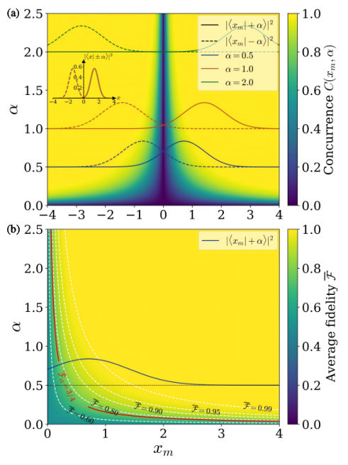
<figcaption class="paper-figure-caption"><b>Fig 2.</b> FIG. 2. (a) Concurrence as a function of the coherent-state amplitude α and the measurement outcome xm. The solid and dashed curves show the position-quadrature distributions of the coherent states |α⟩and |−α⟩, respectively. The inset shows the amplitudes of the states |±α⟩in the x basis for α = 1. Different values of α yield the same amplitude pro- files, differing only in the positions of the wave-packet centers. (b) Average fidelity of the RSP protocol as a function of the coherent-state amplitude |α| and the measurement outcome xm. The solid red contour marks the classical benchmark of 3/4, while the solid blue curve shows the position-quadrature distribution of the coherent state for α...</figcaption>
</figure>
<figure class="paper-figure-card">
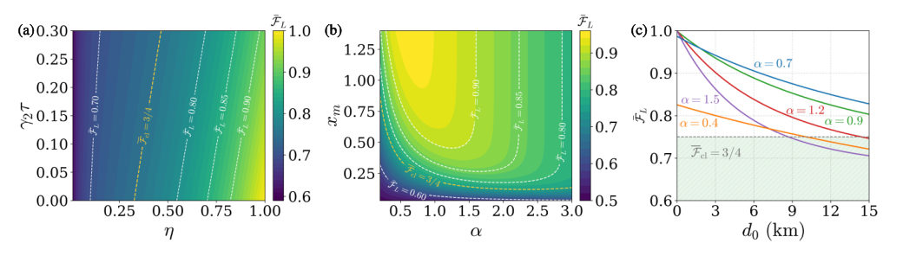
<figcaption class="paper-figure-caption"><b>Fig 3.</b> FIG. 3. (a) Average fidelity of the RSP protocol as a function of the transmittance η and the dephasing γ2τ for α = 1 and xm = √</figcaption>
</figure>
<figure class="paper-figure-card">
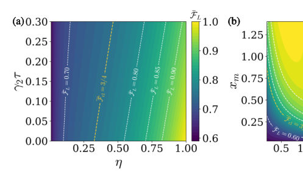
<figcaption class="paper-figure-caption"><b>Fig 4.</b> Figure 3(a) illustrates the effects of different noise sources on the performance of the protocol. It can be seen that fiber loss has a more pronounced effect than atomic de- phasing. In Fig. 3(b), we also show the protocol perfor- mance for different values of the coherent amplitude α. For a given dephasing rate, the protocol exhibits an op- timal value of α. This behavior originates from the com- petition between the effects of the coherent amplitude in the absence and presence of channel loss. In the absence of fiber loss, increasing α generally improves the proto- col performance, whereas in the presence of channel loss, smaller values of α are more favorable. As a result, an optimal...</figcaption>
</figure>

**Summary.** This work proposes a robust remote state preparation protocol for a single-spin qubit by leveraging hybrid entanglement between the spin and a coherent light pulse. By employing a novel measurement scheme involving homodyne detection on the light field and a spin measurement, the protocol avoids difficult direct measurements on non-orthogonal coherent states. The results show high fidelity achievable over long distances, making it a promising tool for quantum communication networks.

**Why it may be interesting.** It provides a concrete, loss-tolerant protocol for quantum state transfer that utilizes continuous variables (coherent states) in a solid-state platform, bridging quantum optics and quantum information theory.

Detailed structure

**Main problem.** The paper addresses the challenge of remotely preparing an unknown single-spin quantum state using hybrid entanglement between an electron spin and a coherent light pulse.

**Main result.** The proposed protocol achieves deterministic state preparation in the ideal limit using only one bit of classical communication, with the fidelity remaining above the classical benchmark over tens of kilometers for relevant parameters.

**Method.** The authors circumvent conventional measurement difficulties by coupling the transmitted pulse to an auxiliary spin, followed by homodyne detection and a spin projective measurement.

**Model / system.** The system involves a stationary electron-spin qubit coupled to a high-finesse optical cavity, generating hybrid entanglement with a propagating coherent-state light pulse.

**Key observables.** RSP fidelity ($F$), Concurrence ($C$), and the coherent-state overlap ($\langle \alpha | -\alpha 
angle$).

**Important parameters / regimes.** Coherent-state amplitude ($\alpha$), fiber loss, and spin dephasing rates.

**Assumptions / limitations.** The analysis considers the non-orthogonality of coherent states and models the process using a hybrid spin-photon entanglement scheme.

**Figures summary.** Figure 1 schematically illustrates the spin RSP process: entanglement generation via reflection at the spin-cavity system, followed by transmission and projective measurements at the receiving end.

**Paper structure.** The paper introduces the RSP protocol using hybrid entanglement, details the measurement scheme involving homodyne detection and an auxiliary spin, analyzes the fidelity dependence on system parameters, and concludes by comparing results to the classical benchmark.

Abstract

Remote state preparation is a fundamental quantum-information protocol that exploits prior knowledge of a target state to reduce the communication resources required for quantum-state distribution. Here, we propose a remote-state-preparation protocol for a stationary electron-spin qubit using hybrid entanglement between the electron spin and a coherent-state light pulse, generated by spin-dependent reflection from a spin-cavity system. Unlike single-photon encodings, the coherent-state encoding is naturally tolerant of photon loss: a loss channel attenuates the coherent-state amplitude, leading to a gradual reduction in preparation fidelity rather than probabilistic protocol failure. The central difficulty---implementing the projection onto superpositions of nonorthogonal coherent states required in the conventional protocol---is circumvented by coupling the transmitted pulse to an auxiliary spin, followed by homodyne detection and a spin projective measurement. The protocol therefore avoids direct coherent-state-superposition measurements and photon-number-resolving detection. In the ideal limit, deterministic preparation of a particular class of target states can be achieved using only one bit of classical communication. We analytically quantify the effects of coherent-state nonorthogonality, fiber loss, and spin dephasing on the preparation fidelity. Increasing the coherent-state amplitude improves state distinguishability and hence the preparation fidelity, but also enhances which-branch information leakage caused by photon loss, resulting in an optimal amplitude at each transmission distance. For experimentally relevant parameters, the optimized average fidelity remains well above the classical benchmark over distances of tens of kilometers. We also discuss a possible implementation using diamond nitrogen-vacancy centers.

[↑ back to top](#top)

### [Study of quantum turbulence by vortex-antivortex dynamics in dipolar BECs](http://arxiv.org/abs/2610.00857v1)

**Authors:** S. Sabari, Lauro Tomio  
**Type:** theory · **Category:** quantum gases · **PDF:** <https://arxiv.org/pdf/2610.00857v1>  
**Analysis basis:** full PDF text, analyzed in chunks
**Topic relevance:** `analog quantum simulation` **3/5** · `non-equilibrium universality` **1/5**

↔ Scroll figures horizontally

<figure class="paper-figure-card">
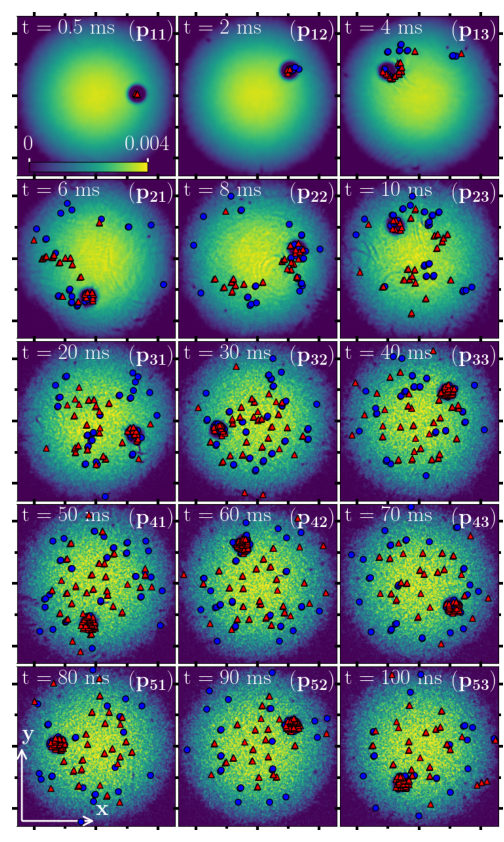
<figcaption class="paper-figure-caption"><b>Fig 1.</b> FIG. 1. (Color online) Column-density evolution for a dipo- lar BEC continuously stirred by a rotating Gaussian obsta- cle (Case 1). Parameters: N = 2.5 × 104, as = 100 a0, add = 131 a0, A0 = 300 ℏωρ, σ = 0.7 ℓρ, r0 = 6.5 ℓρ, ν0 = 1.0 rad/ms, and tacc = 3 ms. The 5×3 panels correspond to t = 0.5, 2, 4, 6, 8, 10, 20, 30, 40, 50, 60, 70, 80, 90, and 100 ms. Vortices appear as dark density holes. The first vortex pairs exit the obstacle at t ∼3 ms, becoming visible in the t = 4 ms panel. By t ∼50 ms, local triangular-like ordering develops in selected regions of the condensate, rather than a globally ordered lattice. Insets in the t = 40 ms and t = 50 ms pan- els show the vortex positions...</figcaption>
</figure>
<figure class="paper-figure-card">
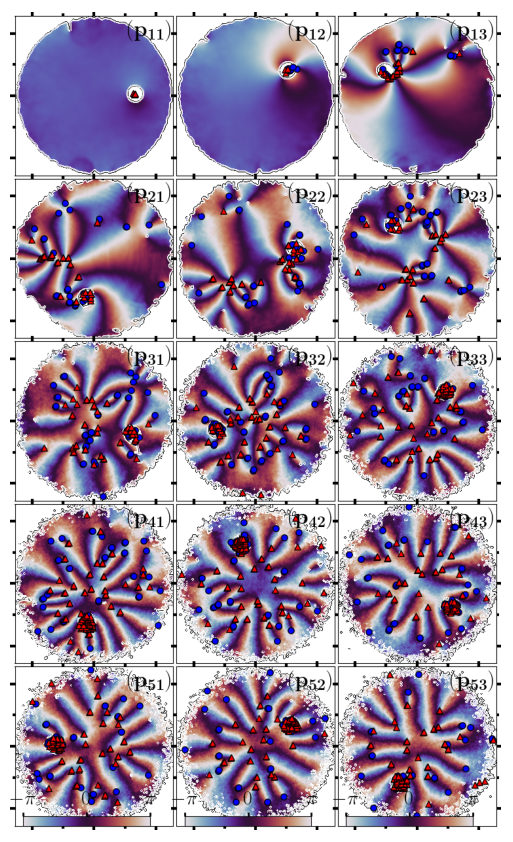
<figcaption class="paper-figure-caption"><b>Fig 2.</b> FIG. 2. (Color online) Phase evolution corresponding to Fig. 1 (Case 1). Vortices appear as 2π phase dislocations. The phase maps confirm nucleation at t ∼8-10 ms, a disordered phase at 20-40 ms, and gradual ordering into a triangular vortex lattice by t ∼50 ms.</figcaption>
</figure>
<figure class="paper-figure-card">
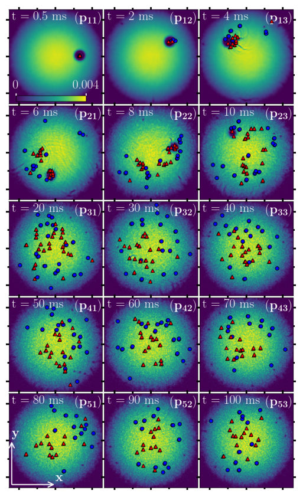
<figcaption class="paper-figure-caption"><b>Fig 3.</b> FIG. 3. (Color online) Column-density evolution for a dipolar BEC in which the rotating Gaussian obstacle is re- moved at t = 15 ms (Case 2). The amplitude ramps linearly, A(t) = A0(1 −t/15) for t ≤15 ms, and is zero thereafter; all other parameters are as in Fig. 1. The first vortex pairs exit the obstacle at t ∼3 ms and proliferate during the stir- ring phase (t ≲15 ms). After obstacle removal, the vortex array evolves freely. By t ∼50 ms, local triangular-like or- dering emerges in selected regions of the condensate, with- out the formation of a globally ordered lattice. No decay of the vortex population is observed up to 100 ms. Insets at t = 40 ms and t = 50 ms show the vortex...</figcaption>
</figure>
<figure class="paper-figure-card">
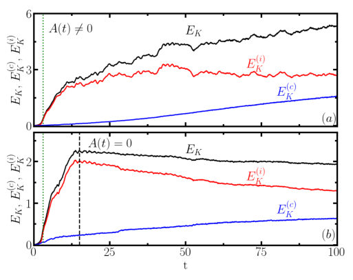
<figcaption class="paper-figure-caption"><b>Fig 4.</b> FIG. 5. (Color online) Time evolution of the kinetic en- ergy components for (a) Case 1 (continuous stirring) and (b) Case 2 (obstacle removal at t = 15 ms). Black solid curves: total kinetic energy (EK). Blue dashed curves: compress- ible kinetic energy (E(c) K ), associated with sound waves and phonons. Red dotted curves: incompressible kinetic energy (E(i) K ), associated with vortex motion. The vertical dashed line at t = 15 ms in panel (b) marks the obstacle removal time. The smooth angular velocity ramp (tacc = 3 ms) is ac- tive in both cases for t &lt; 3 ms.</figcaption>
</figure>
<figure class="paper-figure-card">
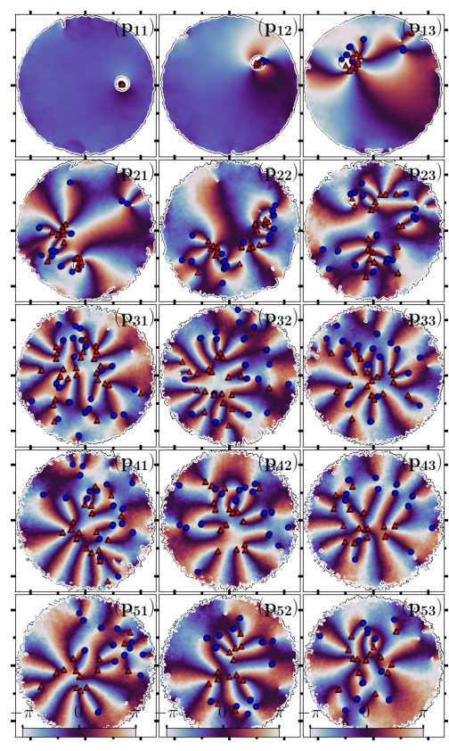
<figcaption class="paper-figure-caption"><b>Fig 5.</b> FIG. 4. (Color online) Phase evolution corresponding to Fig. 3 (Case 2). Phase singularities nucleate before t = 15 ms and persist after obstacle removal. The free evolution allows the vortex ensemble to rearrange into an ordered lattice by t ∼50 ms, as confirmed by the regular arrangement of 2π phase dislocations.</figcaption>
</figure>

**Summary.** This paper numerically investigates quantum turbulence in dipolar Bose-Einstein condensates by analyzing vortex dynamics under two different stirring protocols. The key findings demonstrate that dipolar interactions stabilize vortex pairs against annihilation and induce local crystalline ordering. The results establish a controlled theoretical benchmark for future experimental studies on anisotropic quantum fluids.

**Why it may be interesting.** This work provides a controlled, theoretically modeled platform to study quantum turbulence in systems with long-range anisotropic interactions, which is crucial for understanding superfluid dynamics in dipolar quantum gases.

Detailed structure

**Main problem.** The study investigates vortex nucleation, dynamics, and the resulting quantum turbulence in dipolar Bose-Einstein condensates (BECs).

**Main result.** The research shows that dipolar interactions strongly suppress vortex-antivortex annihilation, and both stirring protocols lead to local triangular ordering with clear dipolar signatures.

**Method.** Numerical simulations solving the time-dependent Gross-Pitaevskii equation using the split-step Crank-Nicolson method.

**Model / system.** The system is a dipolar BEC, modeled by the GP equation, and is subjected to controlled stirring via a rotating Gaussian obstacle potential. The study compares continuous stirring versus controlled obstacle removal.

**Key observables.** Vortex population dynamics, local triangular ordering, kinetic energy decomposition ($E_c$ vs $E_i$), and the energy spectrum $E_i(k)$ adherence to Kolmogorov scaling.

**Important parameters / regimes.** The study uses specific parameters for dipolar interactions ($a_{dd} = 131 a_0$) and compares two stirring protocols (constant amplitude vs. linear ramp-down).

**Assumptions / limitations.** The use of a smooth angular velocity ramp ($	ext{tacc} = 3$ ms) is employed to suppress spurious phonon excitations.

**Figures summary.** Figures illustrate column-density and phase evolution for both stirring cases, and show the time evolution of total, compressible, and incompressible kinetic energy components.

**Paper structure.** The paper compares two stirring protocols (Case 1: continuous stirring; Case 2: obstacle removal) to study vortex dynamics, analyzing energy spectra and vortex stability over time.

Abstract

We investigate vortex nucleation and dynamics in a dipolar Bose-Einstein condensate stirred by a rotating Gaussian obstacle. Two stirring protocols are compared: continuous stirring with constant amplitude (Case 1), and obstacle removal at $t = 15$ ms with linear amplitude ramp-down (Case 2). In both cases, a smooth angular velocity ramp ($t_{\text{acc}} = 3$ ms) suppresses spurious phonon excitations. The first vortex pairs exit the obstacle at $t \sim 3$ ms, and by $t \sim 8$ - $10$ ms the individual vortices and antivortices are fully resolved in the phase maps. Case 1 yields a vortex population that grows up to $t \sim 40$ ms and then roughly saturates, while Case 2 yields a population that peaks around $t \sim 15$ - $25$ ms and then decreases. Remarkably, both protocols lead to local triangular-like ordering in selected regions of the condensate by $t \sim 50$ ms, exhibiting clear dipolar signatures: elliptical distortion and elongated vortex cores along the polarization axis. The mixed vortex-antivortex population remains stable up to $100$ ms with no observable annihilation, indicating that dipolar interactions strongly suppress vortex decay. Kinetic energy decomposition confirms that incompressible (vortex) energy dominates at late times. These results establish a controlled platform for vortex studies in dipolar superfluids and provide benchmarks for future experiments on quantum turbulence with long-range anisotropic interactions.

[↑ back to top](#top)

### [A polynomial-time classical sampler for noisy quantum circuits from statistical mechanics](http://arxiv.org/abs/2610.00548v1)

**Authors:** Jon Nelson, Joel Rajakumar, Chao Yin, Yifan F. Zhang, Michael J. Gullans  
**Type:** theory · **Category:** numerical methods · **PDF:** <https://arxiv.org/pdf/2610.00548v1>  
**Analysis basis:** full PDF text, analyzed in chunks
**Topic relevance:** `methods for driven-dissipative` **3/5**

↔ Scroll figures horizontally

<figure class="paper-figure-card">
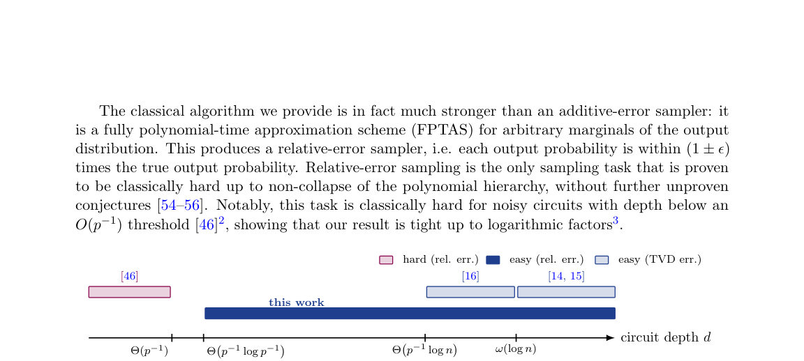
<figcaption class="paper-figure-caption"><b>Fig 1.</b> Figure 1: Known complexity regimes as a function of noisy circuit depth. Prior work appears in the top row and our result is in the lower row. Light red denotes relative-error hardness, light blue denotes total-variation-distance classical simulability, and solid blue denotes relative-error classical simulability.</figcaption>
</figure>
<figure class="paper-figure-card">
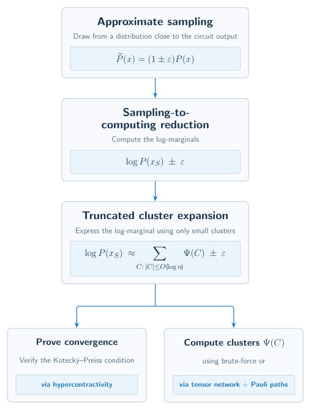
<figcaption class="paper-figure-caption"><b>Fig 2.</b> Figure 2: Overview of the proof strategy. The sampling problem reduces to computing log-marginals (section 2, section B), which are approximated by a truncated cluster expansion (section 4). Hypercontractivity proves convergence (section 5), while tensor-network and Pauli-path methods compute the individual cluster contributions (section A).</figcaption>
</figure>
<figure class="paper-figure-card">
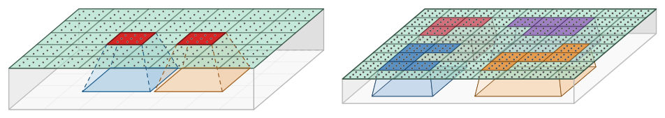
<figcaption class="paper-figure-caption"><b>Fig 3.</b> Figure 3: The coarse-grained geometry. (a) shows that the backward light-cones of any two non- adjacent blocks are disjoint. (b) depicts a collection of compatible polymers which are disjoint connected sets of blocks. The dots denote physical qubits within each coarse-grained block.</figcaption>
</figure>
<figure class="paper-figure-card">
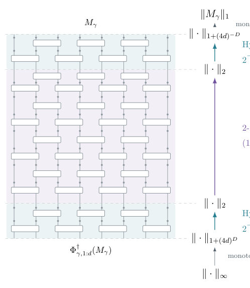
<figcaption class="paper-figure-caption"><b>Fig 4.</b> Figure 4: Illustration of norm conversions and applications of contractivity / hypercontractivity at different layers of the circuit.</figcaption>
</figure>

**Summary.** This paper develops a polynomial-time classical sampler for noisy quantum circuits by mapping the problem onto a polymer model in statistical mechanics. Using cluster expansion and hypercontractivity, the authors prove that noise accumulation at a specific depth threshold allows for efficient classical simulation. This result helps delineate the fundamental limits of quantum advantage by characterizing when noise renders quantum computation classically tractable.

**Why it may be interesting.** This work provides a concrete, mathematically rigorous boundary for when classical simulation can efficiently handle noise in quantum computation, directly impacting the understanding of quantum advantage.

Detailed structure

**Main problem.** Developing efficient classical simulation algorithms to sample the output state of noisy quantum circuits, thereby establishing the limits of quantum advantage.

**Main result.** The authors prove that geometrically local circuits with unital operations and single-qubit depolarizing noise can be sampled in polynomial time if the circuit depth exceeds a critical threshold of $\Omega(p^{-1} \log p^{-1})$.

**Method.** The approach maps the quantum state problem to a polymer model in statistical mechanics, utilizing a convergent cluster expansion combined with hypercontractivity bounds.

**Model / system.** The system is a noisy quantum circuit composed of geometrically local circuits, unital operations, and interspersed single-qubit depolarizing noise. The analysis is framed in terms of approximating marginal probabilities of the final state.

**Key observables.** The output state distribution and the marginal probabilities of the circuit's final state.

**Important parameters / regimes.** Noise strength $p$, circuit depth $d$, and the critical depth threshold $d_{crit} = \Omega(p^{-1} \log p^{-1})$.

**Assumptions / limitations.** The result is restricted to geometrically local circuits, and the analysis relies on mapping the problem to a polymer model suitable for cluster expansion techniques.

**Figures summary.** Figure 1 compares known complexity regimes for noisy circuit depth. Figure 2 illustrates the proof strategy: sampling $
ightarrow$ log-marginals $
ightarrow$ truncated cluster expansion $
ightarrow$ convergence proof $
ightarrow$ cluster computation.

**Paper structure.** The paper develops the theory by first establishing the connection to polymer models, then applying cluster expansion techniques, and finally deriving the polynomial-time approximation scheme (FPTAS) for the marginal probabilities.

Abstract

Developing classical simulation algorithms for noisy quantum circuits is essential to delineating the limits of quantum advantage. Existing classical sampling approaches for general circuits require circuit depths to grow logarithmically with system size, so that noise drives the global output state close to a trivial state. Here we show that local accumulation of noise at a depth independent of system size is already sufficient. Specifically, we prove that any geometrically local circuit composed of unital operations and interspersed with single-qubit depolarizing noise of strength $p$ after $Ω(p^{-1} \log p^{-1})$ depth can be approximately sampled from a polynomial-time classical computer. Our proof maps the output state of the circuit to a polymer model in statistical mechanics, and combines a convergent cluster expansion with hypercontractivity of the depolarizing channel.

[↑ back to top](#top)

### [Composite fermions in ideal Chern bands](http://arxiv.org/abs/2610.01217v1)

**Authors:** Songyang Pu, Liangtao Peng, Shaffique Adam  
**Type:** theory · **Category:** strongly correlated electrons · **PDF:** <https://arxiv.org/pdf/2610.01217v1>  
**Analysis basis:** full PDF text, analyzed in chunks
**Topic relevance:** `analog quantum simulation` **3/5**

↔ Scroll figures horizontally

<figure class="paper-figure-card">
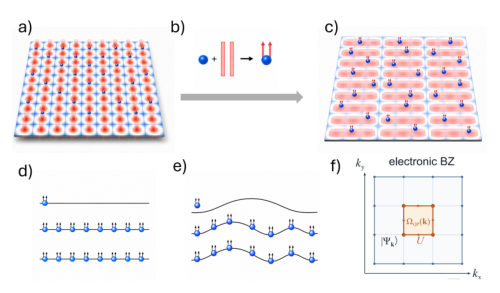
<figcaption class="paper-figure-caption"><b>Fig 1.</b> FIG. 1. Illustration of our model. (a) Model system in which each unit cell contains one unit of magnetic flux, distributed unevenly within the cell. (b) Each electron is combined with two magnetic vortices to form a composite fermion. (c) At one-third filling, this attachment leaves one unit of magnetic flux for every three original unit cells, so the effective lat- tice becomes three times larger in one direction. (d) In an ordinary magnetic field, the allowed states of these quasipar- ticles have the same energy, giving flat quasiparticle bands. (e) In a crystal that reproduces the same quantum behav- ior without an external magnetic field, these states instead acquire different energies...</figcaption>
</figure>
<figure class="paper-figure-card">
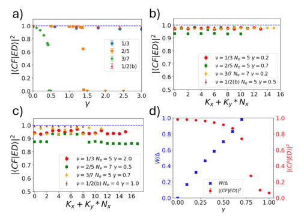
<figcaption class="paper-figure-caption"><b>Fig 2.</b> FIG. 2. (a) The squared overlaps between the exact ground states and composite fermion ground states. We choose Ne = 5 for ν = 1/3, 1/2 and Ne = 6 for ν = 2/5, 3/7 (We only choose one momentum sector for each filling.) The ν = 1/3, 2/5, 3/7 are fermionic Jain states and ν = 1/2 is a bosonic Laughlin (Jain) state. (b) Squared overlaps of the QP states for the full Brillouin zone (BZ). (c) Squared overlaps of the QH states for the full BZ. (d) Ratio W/∆for the ν = 1/3 QP band with Ne = 5 (blue crosses), where W = Emax QP −Emin QP and ∆= Emin bulk −Emin QP . Here Emin bulk is the lowest energy out- side the QP band. The global spectral separation above the band is ∆−W. Red dots show the...</figcaption>
</figure>
<figure class="paper-figure-card">
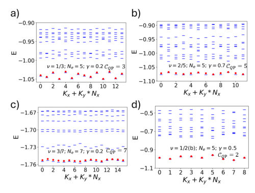
<figcaption class="paper-figure-caption"><b>Fig 3.</b> FIG. 3. (a-d) Quasiparticle energies for different fillings. The blue dashes are obtained from ED and red dots from CF. The filling factor, particle number, and values of γ are labeled on the plots. We choose the lattice (Nx, Ny) = (7, 2) (a), (4, 3) (b), (4, 4) (c) and (3, 3) (d). All energies are quoted in e2/ϵℓ0. We also label the QP band Chern number CQP in each panel, whose numerical results are shown in SM [32].</figcaption>
</figure>

**Summary.** This paper adapts the composite-fermion theory, used for fractional quantum Hall states, to model fractional Chern insulators in systems with spatially varying Berry curvature. By constructing specialized wave functions, the authors demonstrate that the resulting quasiparticle bands exhibit robust, dispersive behavior and possess a quantized Chern number distinct from simple Landau levels. This establishes a theoretical framework for understanding mobile anyons in these novel topological materials.

**Why it may be interesting.** The work provides a powerful, generalized theoretical tool (CF theory) to analyze topological phases in engineered lattice systems (Chern bands) that mimic magnetic field effects, which is highly relevant for understanding emergent quantum phenomena in solid-state materials.

Detailed structure

**Main problem.** The paper extends the composite-fermion framework, traditionally used for uniform magnetic fields, to fractional Chern insulators where the magnetic field is replaced by the nonuniform Berry curvature of a Chern band.

**Main result.** The composite-fermion description successfully captures the quasiparticle dispersion, showing that the isolated quasiparticle band carries a total Berry flux different from that of a conventional Landau level.

**Method.** The authors construct composite-fermion wave functions for Jain states and their excitations, employing a momentum projector to map these states onto the physical lattice structure.

**Model / system.** The study focuses on Fractional Chern Insulators (FCIs) modeled using ideal Chern bands, specifically utilizing the Aharonov–Casher Hamiltonian, which incorporates spatially modulated Berry curvature.

**Key observables.** Quasiparticle (QP) and quasihole (QH) band dispersion, total Berry flux ($\Omega_{QP}$), and the Chern number ($C_{QP}$) of the emergent bands.

**Important parameters / regimes.** Filling fractions $
u = 1/3, 2/5, 3/7$, and the strength of the magnetic field modulation ($\gamma$).

**Assumptions / limitations.** The analysis assumes the existence of an isolated quasiparticle band for the Chern number calculation and relies on the composite-fermion mapping being valid.

**Figures summary.** Figures illustrate the flux distribution, the comparison between flat bands in uniform fields versus dispersing bands in a crystal, and the definition of the Chern quasiparticle flux.

**Paper structure.** The paper systematically develops the CF construction for Jain states in AC bands, calculates the QP/QH wave functions, and then analyzes the resulting topological properties, such as the Berry flux and Chern number, comparing them to exact diagonalization results.

Abstract

The composite-fermion framework maps the strongly correlated fractional quantum Hall state onto a weakly interacting integer quantum Hall state in a reduced effective magnetic field. We ask how this framework is modified for fractional Chern insulators, where the role of a uniform magnetic field is replaced by the nonuniform Berry curvature of a Chern band. Specifically, we construct composite-fermion wave functions for Jain states and their quasiparticles and quasiholes in Aharonov-Casher bands, a widely used model for ideal Chern bands. We find that these states overlap closely with exact eigenstates over a broad range of field modulation. Using these wave functions, we demonstrate that the emergent composite-fermion band structure goes beyond the conventional picture of effective Landau levels, correctly capturing the quasiparticle dispersion. Remarkably, we find that an isolated quasiparticle band carries a total Berry flux that is different from a Landau level. These results establish a composite-fermion description for mobile fractional Chern insulator anyons and provide a framework to understand their stability.

[↑ back to top](#top)

### [Efficient quantum phase estimation with adaptive entanglement-assisted Hadamard test](http://arxiv.org/abs/2610.01772v1)

**Authors:** Hengzhun Chen, Benchi Zhao, Yingzhou Li  
**Type:** theory · **Category:** quantum information and computing · **PDF:** <https://arxiv.org/pdf/2610.01772v1>  
**Analysis basis:** full PDF text, analyzed in chunks
**Topic relevance:** `quantum measurements` **3/5**

↔ Scroll figures horizontally

<figure class="paper-figure-card">
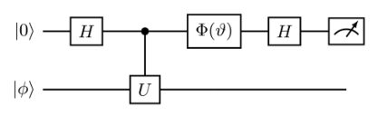
<figcaption class="paper-figure-caption"><b>Fig 1.</b> FIG. 1. Quantum circuit of standard Hadamard test with reference.</figcaption>
</figure>
<figure class="paper-figure-card">
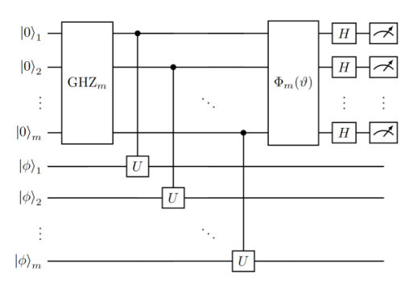
<figcaption class="paper-figure-caption"><b>Fig 2.</b> FIG. 2. Quantum circuit of entanglement-assisted Hadamard test with m-qubit GHZ state.</figcaption>
</figure>
<figure class="paper-figure-card">
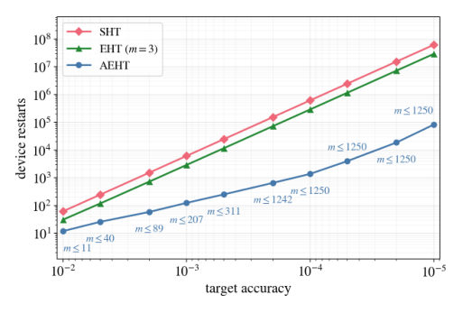
<figcaption class="paper-figure-caption"><b>Fig 3.</b> FIG. 3. Device-restart count for exact eigenstate preparation. The labels on the AEHT refer to the maximum amplification used.</figcaption>
</figure>
<figure class="paper-figure-card">
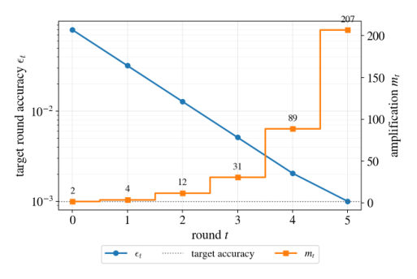
<figcaption class="paper-figure-caption"><b>Fig 4.</b> FIG. 4. The amplification mt and estimated phase error ϵt with re- spect to the increase of round t in the Algorithm 2. The dotted line refers to the target accuracy ϵ = 10−3.</figcaption>
</figure>
<figure class="paper-figure-card">
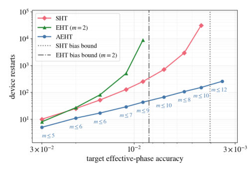
<figcaption class="paper-figure-caption"><b>Fig 5.</b> FIG. 5. Device-restart count for imperfect eigenstate preparation. The vertical dotted curve and dash-dot curve mark the bias bounds of SHT and Fixed-m EHT (m = 2), respectively.</figcaption>
</figure>

**Summary.** This paper introduces the Adaptive Entanglement-Assisted Hadamard Test (AEHT) to overcome the resource limitations of standard quantum phase estimation techniques. By iteratively refining the reference phase, AEHT achieves a superior scaling of $O(\log(1/\epsilon))$ in terms of device-restart count. This provides an efficient pathway for estimating high-precision quantum phases on current quantum processors.

**Why it may be interesting.** The focus on resource scaling (device-restart count) and the development of an adaptive protocol directly addresses the practical limitations of implementing quantum algorithms on noisy, near-term quantum hardware, which is highly relevant to AMO and quantum optics research.

Detailed structure

**Main problem.** The paper addresses the challenge of achieving high-precision quantum phase estimation (QPE) efficiently, especially in the high-precision regime where conventional methods fail or become resource-intensive.

**Main result.** The proposed Adaptive Entanglement-Assisted Hadamard Test (AEHT) achieves a significantly better resource scaling, achieving a shot count complexity of $O(\log(1/\epsilon))$, compared to $O(1/\epsilon^2)$ for standard methods.

**Method.** The method develops an iterative protocol (AEHT) that adaptively refines the reference phase used in the entanglement-assisted Hadamard test, allowing for progressive signal amplification while controlling resource costs.

**Model / system.** The core model is the estimation of a quantum phase $	heta$ associated with an eigenstate $|\phi
angle$ of a unitary operator $U$. The analysis compares the Standard Hadamard Test (SHT) and the Entanglement-Assisted Hadamard Test (EHT) using GHZ states.

**Key observables.** Phase estimate $\hat{	heta}$, measurement expectation value $\hat{S}$, and the resource cost metric, specifically the 'device-restart count' rather than shot count.

**Important parameters / regimes.** Target phase accuracy $\epsilon$, amplification factor $m$, and the contraction factor $\gamma$ used in the adaptive steps.

**Assumptions / limitations.** The analysis assumes that the cost metric should be the device-restart count to accurately reflect near-term hardware limitations, and it addresses the bias introduced by imperfect eigenstate preparation.

**Figures summary.** Figures illustrate the quantum circuits for the standard and entanglement-assisted Hadamard tests, while the text references algorithms detailing the iterative steps of the AEHT.

**Paper structure.** The paper first establishes the limitations of SHT and EHT, then introduces the AEHT protocol, derives the improved complexity bounds for both shot count and the more relevant device-restart count, and finally extends the analysis to handle systematic biases from imperfect state preparation.

Abstract

The entanglement-assisted Hadamard test (EHT) is a practical method for estimating a quantum phase by amplifying the phase signal. However, the feasible amplification is fundamentally limited by the accuracy of the reference phase, such that the method is inefficient in the high-precision regime. In this work, we propose an algorithm, called adaptive entanglement-assisted Hadamard test (AEHT), that iteratively refines the reference phase, enabling progressively stronger amplification as the iteration goes by. We further consider the imperfect eigenstate preparation scenario, where a systematic bias is unavoidable when estimating the quantum phase with the conventional EHT. Such a bias can be suppressed by the proposed AEHT. Moreover, taking physical implementation into consideration, we adopt device-restart count to measure the cost of quantum phase estimation, rather than shot count. The numerical experiments confirm the effectiveness of the proposed AEHT compared with conventional methods under this measure. By unlocking the full amplification power of large entangled states, this work offers an efficient method to estimate high-precision quantum phase on near-term quantum processors.

[↑ back to top](#top)

### [First-quantized quantum simulation with non-local potentials by matrix-product-state encoding](http://arxiv.org/abs/2610.00521v1)

**Authors:** Kazuki Tsuoka, Taichi Kosugi, Masari Watanabe, Hirofumi Nishi, Yu-ichiro Matsushita  
**Type:** theory · **Category:** quantum information and computing · **PDF:** <https://arxiv.org/pdf/2610.00521v1>  
**Analysis basis:** full PDF text, analyzed in chunks
**Topic relevance:** `methods for driven-dissipative` **3/5**

↔ Scroll figures horizontally

<figure class="paper-figure-card">
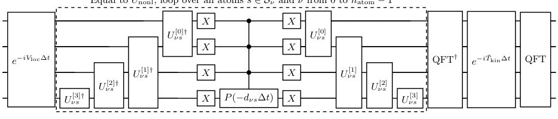
<figcaption class="paper-figure-caption"><b>Fig 1.</b> FIG. 1. An example 4-qubit quantum circuit diagram implementing a single Trotter step operator using a full-rank MPS representation of the non-local potential. We omit the translation operator T(Rν). P(ϕ) = |0⟩⟨0| + eiϕ |1⟩⟨1| is a phase gate, and “QFT” represents the quantum Fourier transform circuit, which implements the discrete Fourier transform F.</figcaption>
</figure>
<figure class="paper-figure-card">
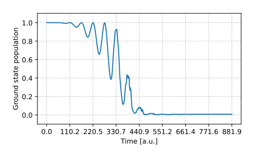
<figcaption class="paper-figure-caption"><b>Fig 2.</b> FIG. 2. The temporal evolution of the ground-state popula- tion |⟨ϕ0|ψ(t)⟩|2 of a one-dimensional hydrogen atom inter- acting with an 8-cycle ultrashort laser pulse with peak inten- sity of Ipeak = 4.0 × 1014 W/cm2 and angular frequency of ω = 0.057 a.u., simulated by the split-operator method with the single-separable potential given in Eq. (38).</figcaption>
</figure>
<figure class="paper-figure-card">
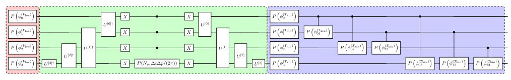
<figcaption class="paper-figure-caption"><b>Fig 3.</b> FIG. 3. An example 4-qubit quantum circuit diagram implementing a single Trotter step operator for a one-dimensional hydrogen atom interacting with an ultrashort laser pulse using a full-rank MPS representation of the single non-local separable potential. The first segment (filled with red) of the circuit implements e−iVloc(t)∆t as a tensor product of single-qubit phase gates, the second segment (filled with green) implements e−iVnonl∆t using a state-preparation unitary Uv0 and an (n −1)- controlled phase gate, and the third segment (filled with blue) implements e−i ˜ Tkin∆t as a tensor product of single-qubit phase gates followed by a series of controlled-phase gates. ϕ(Vloc) k = −2kτ1∆p...</figcaption>
</figure>
<figure class="paper-figure-card">
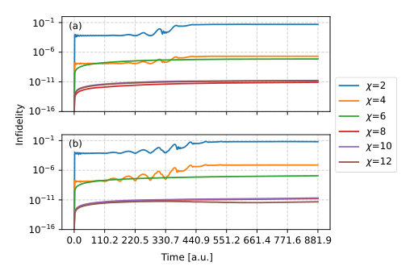
<figcaption class="paper-figure-caption"><b>Fig 4.</b> FIG. 6. The temporal evolution of infidelity when us- ing the MPS-encoded non-local potentials (a) V (p, p′) = −v0(p)v∗ 0(p′) and (b) V (p, p′) = −v1(p)v∗ 1(p′) −v2(p)v∗ 2(p′), compared with the split-operator method over the same 10,000 time steps for each bond dimension.</figcaption>
</figure>
<figure class="paper-figure-card">
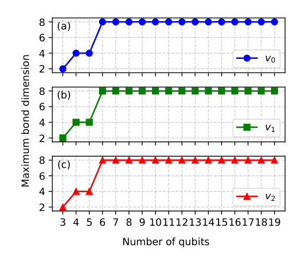
<figcaption class="paper-figure-caption"><b>Fig 5.</b> FIG. 4. Maximum bond dimension of the MPS representa- tions of (a) |v0⟩, (b) |v1⟩, and (c) |v2⟩for each number of qubits.</figcaption>
</figure>

**Summary.** This paper presents a novel method to efficiently encode and simulate non-local potentials within quantum circuits using Matrix Product State (MPS) encoding. By applying this to the ionization of a 1D hydrogen atom, the authors show that their approach drastically reduces the required circuit depth compared to standard unitary decompositions. This provides a practical pathway for performing complex first-quantized quantum simulations.

**Why it may be interesting.** This work directly addresses the computational bottleneck of simulating complex quantum dynamics (like those involving pseudopotentials) by mapping the physics onto an efficient quantum information structure (MPS), which is crucial for fault-tolerant quantum simulation.

Detailed structure

**Main problem.** The core challenge is developing an efficient quantum circuit implementation for simulating systems governed by non-local potentials, which are difficult to encode directly into quantum circuits.

**Main result.** The authors propose and demonstrate a method using Matrix Product State (MPS) encoding that significantly reduces the required circuit depth for implementing the non-local potential propagator during a Trotter step.

**Method.** The simulation uses first-quantized approaches, representing the state via MPS encoding to efficiently implement the time evolution operator, particularly the non-local potential term, $e^{-iV_{	ext{nonl}}\Delta t}$.

**Model / system.** The study models the ionization of a one-dimensional hydrogen atom driven by an ultrashort laser pulse. The Hamiltonian includes kinetic energy ($T_{kin}$) and potentials ($V$), where the non-local potential ($V_{	ext{nonl}}$) is decomposed into a sum of separable projectors.

**Key observables.** Circuit depth (a measure of computational resource cost) and the accuracy of the simulation relative to direct unitary decomposition.

**Important parameters / regimes.** The circuit depth scales with $	ext{deg}(V_{	ext{loc}})$, $L$ (max projector functions), $n_{	ext{atom}}$, and the MPS bond dimension $\chi$.

**Assumptions / limitations.** The time evolution is approximated using first-order Trotterization, and the state is efficiently represented by an MPS.

**Figures summary.** Figure 8 analyzes the Schmidt decomposition of state vectors, showing that the required bond dimension for MPS representation is governed by the Gaussian component of the state.

**Paper structure.** The paper details the necessity of simulating non-local potentials, derives the structure of the non-local propagator using separable projectors, and then introduces the MPS encoding technique to achieve an efficient circuit depth for the full Trotter step operator.

Abstract

Quantum simulations based on first-quantized approaches can offer lower space and gate complexities than second-quantized approaches. The gate requirements for these simulations can be further reduced by employing pseudopotentials, a technique widely used in classical quantum chemistry calculations to decrease the number of simulated electrons. However, implementing pseudopotentials in quantum circuits remains challenging due to their non-local nature. In this study, we proposed a method to efficiently implement non-local potentials using matrix product state (MPS) encoding. MPS encoding allows us to efficiently implement a Trotter step operator with a circuit depth of $O(\mathrm{deg}(V_{\mathrm{loc}}) n^{\mathrm{deg}(V_{\mathrm{loc}})} + 8Lnn_{\mathrm{atom}}χ^2 + 2n^2)$, where $\mathrm{deg}(V_{\mathrm{loc}})$ is the degree of the polynomial local potential, $n_{\mathrm{atom}}$ is the number of atoms in the system, $L$ is the maximum number of projector functions across all atoms, and $n$ is the number of qubits used to represent the binary-encoded wave function in one-dimensional space. We demonstrated the effectiveness of this approach by applying it to a model of the ionization of a one-dimensional hydrogen atom driven by an ultrashort laser pulse. Our results showed that MPS encoding significantly reduces the required circuit depth compared to a direct unitary decomposition, providing a pathway for practical first-quantized simulations.

[↑ back to top](#top)

### [Highly anisotropic collective modes of altermagnetic superconductors with Bogoliubov Fermi surfaces](http://arxiv.org/abs/2610.01011v1)

**Authors:** Huaisong Zhao, Peng Zou, Xia-Ji Liu, Hui Hu  
**Type:** theory · **Category:** quantum gases · **PDF:** <https://arxiv.org/pdf/2610.01011v1>  
**Analysis basis:** full PDF text, analyzed in chunks
**Topic relevance:** `Keldysh / 2PI / non-Gaussian methods` **3/5**

↔ Scroll figures horizontally

<figure class="paper-figure-card">
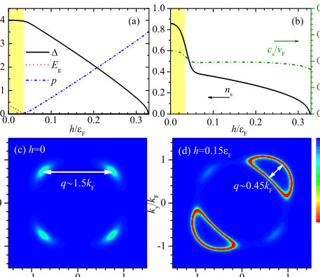
<figcaption class="paper-figure-caption"><b>Fig 1.</b> FIG. 1. (a) Pairing gap ∆, energy gap Eg, spin polarization δn/n, and (b) superfluid fraction ns/n and sound velocity cs, as functions of the external magnetic field h for an al- termagnetic coupling λ = 0.7. In each subplot, the yellow shaded region denotes the balanced BCS state. The subplots (c) and (d) show the spectral function A(k, ω = 0) in the BCS state (h = 0) and polarized BCS state (h = 0.15εF ), respec- tively. In the polarized BCS state, the two BFSs are clearly visible. Throughout the work, we take the binding energy εB = 0.08εF and a negligible temperature T = 0.01TF .</figcaption>
</figure>
<figure class="paper-figure-card">
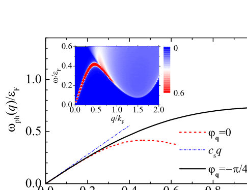
<figcaption class="paper-figure-caption"><b>Fig 2.</b> FIG. 3. Phonon dispersion relations in the fully gapped BCS phase with λ = 0.7 and h = 0 for two momentum directions, ϕq = −45◦(black solid line) and ϕq = 0 (red dashed line), compared with the low-momentum linear dispersion csq (blue dot-dashed line). The inset shows the contour plot of the charge DSF, Sc(q, ω), at ϕq = −45◦. Despite the anisotropy of the dispersion, the microscopic sound velocity, defined by limq→0[ωph(q)/q], is independent of the propagation direction ϕq and coincides with the thermodynamic sound velocity cs.</figcaption>
</figure>
<figure class="paper-figure-card">
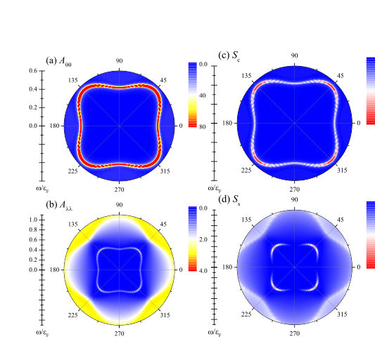
<figcaption class="paper-figure-caption"><b>Fig 3.</b> FIG. 2. Polar contour plots of the Cooper pair spectral functions Aθθ(q, ω) (a) and Aλλ(q, ω) (b), together with the charge DSF Sc(q, ω) (c) and the spin DSF Ss(q, ω) (d), for the fully gapped BCS phase with λ = 0.7 and h = 0. In each panel, the radial coordinate represents ω/εF , as indicated on the left, while the angular coordinate gives the direction of the momentum q, ϕq, in radians. The spectral-function col- ormaps are shown in arbitrary units, whereas the DSF col- ormaps are expressed in units of εF /n. The momentum mag- nitude is fixed at q = |q| = 0.5kF . Throughout the work, a small spectral broadening of 0.01εF is introduced to render the δ-function peaks visible in the plots.</figcaption>
</figure>
<figure class="paper-figure-card">
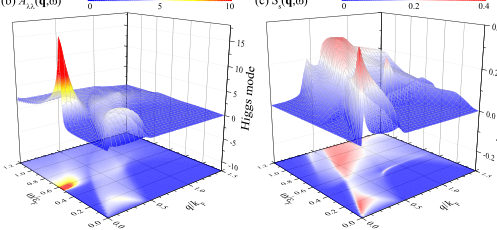
<figcaption class="paper-figure-caption"><b>Fig 4.</b> FIG. 5. (a) Phonon dispersion relations in the polarized BCS state with λ = 0.7 and h = 0.15εF for three momentum direc- tions: ϕq = −45◦(black dot-dashed line), ϕq = 0 (red dashed line) and ϕq = +45◦(green dashed line). The shaded bands denote the peak widths for each momentum direction, ex- tracted by fitting the phonon spectral function to a Lorentzian lineshape. (b), (c) Contour plots of the pair spectral function Aλλ(q, ω) and the spin DSF Ss(q, ω), respectively, along the diagonal momentum direction, ϕq = +45◦.</figcaption>
</figure>
<figure class="paper-figure-card">
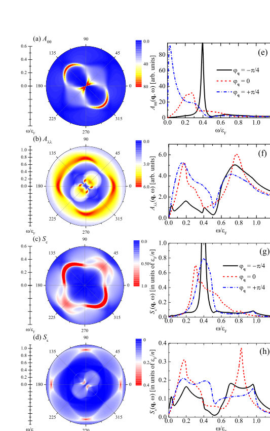
<figcaption class="paper-figure-caption"><b>Fig 5.</b> FIG. 4. Left column: Polar contour plots of Aθθ(q, ω) (a), Aλλ(q, ω) (b), Sc(q, ω) (c) and Ss(q, ω) (d) for a polarized BCS state with λ = 0.7 and h = 0.15εF . Right column: Cor- responding plots for three distinct angular directions of the momentum q, as indicated in panels (e)-(g). The momentum magnitude is fixed at q = |q| = 0.3kF .</figcaption>
</figure>

**Summary.** This theoretical work analyzes collective modes in altermagnetic superconductors, showing that the emergence of Bogoliubov Fermi surfaces drastically alters the dynamics. The key finding is that BFSs induce strong momentum-dependent damping on the phonon mode, which is accompanied by a measurable in-gap structure in the Higgs mode, detectable through the spin response.

**Why it may be interesting.** The explicit connection drawn between the geometry of the Fermi surface (BFSs) and the resulting anisotropic dynamics of collective excitations (phonon/Higgs) provides a powerful theoretical tool for interpreting spectroscopic measurements in unconventional superconductors.

Detailed structure

**Main problem.** The study investigates the collective excitation modes (phonon and Higgs) in altermagnetic superconductors, specifically focusing on how emergent Bogoliubov Fermi surfaces (BFSs) modify these dynamics.

**Main result.** BFSs generate highly anisotropic collective-mode dynamics, causing the phonon mode to be strongly damped or suppressed at small momenta, while simultaneously revealing an in-gap structure in the Higgs mode detectable via the spin response.

**Method.** The analysis employs a functional path-integral formalism within the Random Phase Approximation (RPA) to calculate charge and spin density response functions and diagonalize the pairing vertex function.

**Model / system.** The system is a charge-neutral altermagnetic superconductor with d-wave spin-split bands, modeled using BCS theory. The investigation compares the fully gapped BCS state to a gapless polarized BCS regime induced by an external magnetic field.

**Key observables.** Collective modes (Higgs and phonon), Charge and Spin Dynamical Structure Factors (DSFs), and the spectral function $A(\mathbf{k}, \omega=0)$.

**Important parameters / regimes.** Magnetic field strength ($h$), superconducting gap ($\Delta$), and momentum direction ($\phi_q$).

**Assumptions / limitations.** The analysis assumes a charge-neutral Fermi system and utilizes approximations like the Random Phase Approximation (RPA) and Gaussian-level expansions for the effective action.

**Figures summary.** Figures illustrate the evolution of superconducting parameters with $h$, show the emergence of BFSs in the spectral function, and present polar contour plots comparing the spectral weight of the phonon, Higgs, and spin responses across different momentum directions.

**Paper structure.** The paper progresses by first establishing the basic BCS state dynamics, then introducing the magnetic field to generate BFSs, and finally analyzing the resulting anisotropic damping and the coupling between the Higgs and spin response in the gapless regime.

Abstract

We investigate collective modes in charge-neutral altermagnetic superconductors with $d$-wave spin-split bands, focusing on the impact of emergent Bogoliubov Fermi surfaces. In the absence of a magnetic field, the BCS state supports collective modes that inherit the underlying $d$-wave symmetry, resulting in pronounced momentum-space anisotropy. The broken time-reversal symmetry further couples these modes to spin-density fluctuations, allowing their signatures to emerge in the spin dynamical structure factor. Upon applying a magnetic field, Bogoliubov Fermi surfaces emerge and qualitatively reshape the collective-mode dynamics through gapless particle-hole excitations and strongly anisotropic Landau damping. The damping is strongest along the momentum-space diagonal, where it can suppress the low-energy phonon mode at small momenta. Remarkably, the suppressed phonon is accompanied by the emergence of an in-gap structure in the Higgs mode and an associated pronounced enhancement of the spin response. These results establish Bogoliubov Fermi surfaces as a mechanism for generating highly anisotropic collective-mode dynamics and identify spin response as a sensitive probe of in-gap Higgs excitations in altermagnetic superconductors.

[↑ back to top](#top)

### [Inherent Turbulence Immunity of Vector Vortex Beams in Free Space Quantum Key Distribution](http://arxiv.org/abs/2610.01523v1)

**Authors:** Behnam Talari, Rouhollah Karimzadeh  
**Type:** theory · **Category:** quantum information and computing · **PDF:** <https://arxiv.org/pdf/2610.01523v1>  
**Analysis basis:** full PDF text, analyzed in chunks
**Topic relevance:** `interference shaping light` **3/5**

↔ Scroll figures horizontally

<figure class="paper-figure-card">
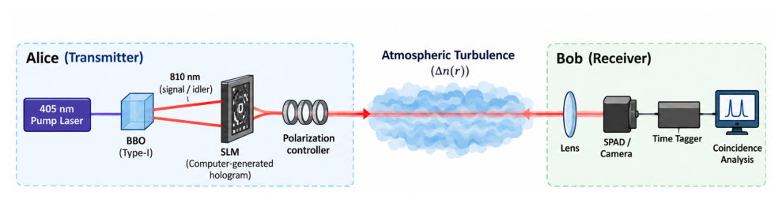
<figcaption class="paper-figure-caption"><b>Fig 1.</b> Figure 1: Schematic of the free-space quantum key distribution experimental transceiver architecture. The setup comprises three interconnected stages: (i) Alice (Transmitter): A continuous-wave pump laser operating at λp = 405 nm pumps a non-linear Type-I beta-barium borate (BBO) crystal to generate collinear, polarization-entangled degenerate photon pairs at λs = λi = 810 nm. The beam is directed onto a reflective spatial light modulator (SLM) programmed with computer-generated holograms (CGHs) for complex spatial mode synthesis, followed by polarization controllers to prepare the non-separable vector vortex Bell state |ΨVVB⟩. (ii) Atmospheric Turbulence Channel: The generated quantum...</figcaption>
</figure>
<figure class="paper-figure-card">
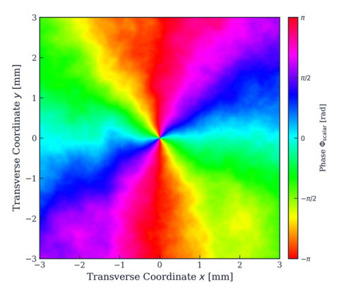
<figcaption class="paper-figure-caption"><b>Fig 2.</b> Figure 2: Transverse phase distribution Φscalar(x,y) of a pure scalar OAM state (ℓ= 2) after propagation through atmospheric turbulence (D/r0 = 1.2) across the 6 mm aperture. The continuous 4π azimuthal phase progression is scrambled, exhibiting branch-cut dislocations and multi-core splitting.</figcaption>
</figure>
<figure class="paper-figure-card">
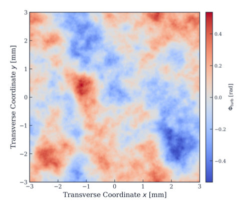
<figcaption class="paper-figure-caption"><b>Fig 3.</b> Figure 3: Synthesized optical turbulence phase screen Φturb(x,y) at mod- erate turbulence strength (D/r0 = 1.2) across the 6 mm receiver aperture, displaying continuous stochastic optical path variations spanning −0.5 to +0.5 rad.</figcaption>
</figure>
<figure class="paper-figure-card">

<figcaption class="paper-figure-caption"><b>Fig 4.</b> Figure 5: Hybrid vector vortex beam (VVB) after propagation through identical turbulence (D/r0 = 1.2). While the background scalar intensity exhibits mild scintillation, overlaid cyan polarization vectors remain az- imuthally ordered, demonstrating intrinsic common-mode protection.</figcaption>
</figure>
<figure class="paper-figure-card">
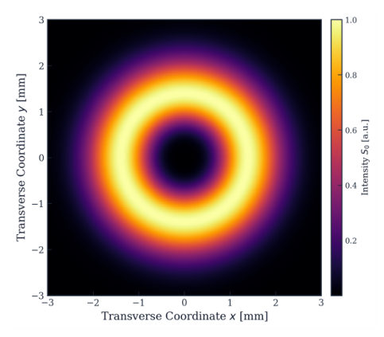
<figcaption class="paper-figure-caption"><b>Fig 5.</b> Figure 4: Unperturbed doughnut intensity profile S0(x,y) of the hybrid polarization–OAM Bell state |ΨVVB⟩prior to entering the turbulent atmo- spheric medium, exhibiting a well-defined dark central vortex singularity.</figcaption>
</figure>

**Summary.** This paper demonstrates that using Vector Vortex Beams (VVBs) for quantum key distribution provides inherent immunity to atmospheric turbulence, a major hurdle for free-space quantum links. By exploiting the symmetry of terrestrial air's refractive index fluctuations, the VVB encoding suppresses the error rate significantly without needing complex, active adaptive optics. This breakthrough suggests a pathway for robust, practical quantum communication over atmospheric channels.

**Why it may be interesting.** This work directly addresses the practical limitations of quantum communication in real-world environments by proposing a structural encoding (VVB) that leverages fundamental symmetries to achieve passive robustness against environmental noise, which is highly relevant to quantum networking.

Detailed structure

**Main problem.** High-capacity free-space Quantum Key Distribution (QKD) using Orbital Angular Momentum (OAM) multiplexing is severely degraded by atmospheric turbulence, causing decoherence and exceeding security thresholds.

**Main result.** Vector Vortex Beams (VVBs) provide intrinsic, hardware-free immunity against turbulent perturbations, suppressing the Quantum Bit Error Rate (QBER) from 42.0% down to 4.8%.

**Method.** The authors used numerical propagation simulations to model the evolution of VVB states through phase screens representing atmospheric turbulence.

**Model / system.** The system involves quantum optical links transmitting structured light (VVBs) through a turbulent atmosphere. The VVB state is a hybrid polarization-OAM entangled state, and the turbulence is modeled by refractive-index fluctuations.

**Key observables.** Quantum Bit Error Rate (QBER), VVB state survival probability, and Quantum State Fidelity (F).

**Important parameters / regimes.** Turbulence strength parameter $D/r_0$ (ranging from 0 to 3.0); the security threshold of 11% for QBER.

**Assumptions / limitations.** The analysis assumes the optical anisotropy of terrestrial air is very small ($\Delta n < 10^{-9}$), which allows the turbulent phase screen to act as an identical common-mode scalar phase screen that cancels in the relative polarization-phase degree of freedom.

**Figures summary.** Figures illustrate the spatial scrambling of pure scalar OAM beams versus the preserved polarization structure of VVBs after turbulence, and plot the QBER and Fidelity decay as a function of turbulence strength.

**Paper structure.** The paper first establishes the problem of turbulence degrading OAM-based QKD. It then introduces VVBs as a solution, detailing the physical mechanism (common-mode phase cancellation) and presenting numerical simulations comparing the performance of scalar beams versus VVBs across varying turbulence strengths.

Abstract

Orbital angular momentum (OAM) multiplexing provides an infinite-dimensional discrete Hilbert space ideally suited for high-capacity free-space quantum key distribution (QKD). Nevertheless, pure scalar spatial modes carrying topological charge ($|\ell| \ge 1$) undergo severe decoherence when transmitted through terrestrial atmospheric turbulence. Turbulent refractive-index eddies split high-order vortex singularities, induce catastrophic intermodal crosstalk across adjacent topological channels, and rapidly drive the quantum bit error rate (QBER) well above the unconditional 11% security threshold associated with individual cloning attacks. Here, we demonstrate that hybrid polarization-OAM entangled states, known as vector vortex beams (VVBs), provide intrinsic, hardware-free immunity against turbulent perturbations. Because the optical anisotropy of terrestrial air is exceedingly small ($Δn < 10^{-9}$), refractive-index fluctuations couple symmetrically to orthogonal circular polarization modes as an identical common-mode scalar phase screen that cancels in the relative polarization-phase degree of freedom. By numerically propagating modal fields through modified power-spectral phase screens over turbulence strengths ranging from $D/r_0 = 0$ to $3.0$, we show that the VVB encoding protocol suppresses the asymptotic QBER from 42.0% to 4.8%, yielding an error-suppression factor of approximately 11.6 without requiring active adaptive optics or deformable mirrors.

[↑ back to top](#top)

### [Mentor-Initiated Asymmetric Bidirectional Quantum Teleportation Protocol for Arbitrary Qubit States](http://arxiv.org/abs/2610.01684v1)

**Authors:** Sugata Adhya, Benchao Yang  
**Type:** theory · **Category:** quantum information and computing · **PDF:** <https://arxiv.org/pdf/2610.01684v1>  
**Analysis basis:** full PDF text, analyzed in chunks
**Topic relevance:** `quantum measurements` **3/5**

↔ Scroll figures horizontally

<figure class="paper-figure-card">
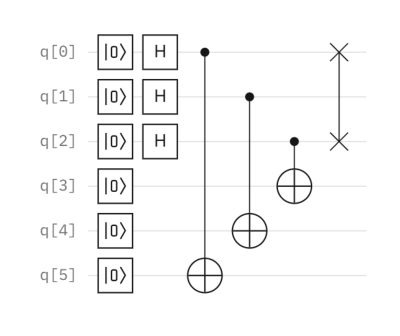
<figcaption class="paper-figure-caption"><b>Fig 1.</b> Figure 1: Quantum circuit for the preparation of entangled channels.</figcaption>
</figure>
<figure class="paper-figure-card">
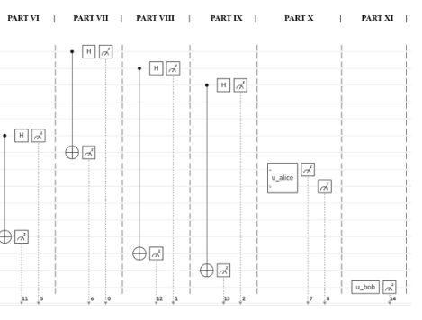
<figcaption class="paper-figure-caption"><b>Fig 2.</b> Figure 2: Circuit diagram for the proposed protocol</figcaption>
</figure>

**Summary.** This paper introduces a novel, mentor-initiated quantum teleportation protocol designed for bidirectional, asymmetric state transfer. Its key advancement is the ability to teleport an arbitrary two-qubit state, unlike previous restricted methods. The protocol is demonstrated using quantum circuits and analyzes its operational efficiency.

**Why it may be interesting.** This work directly addresses quantum communication protocols, which are foundational to quantum networking and quantum computation theory.

Detailed structure

**Main problem.** The paper proposes a mentor-initiated bidirectional asymmetric quantum teleportation protocol.

**Main result.** The protocol successfully allows the teleportation of an arbitrary two-qubit state from Bob to Alice, overcoming limitations of existing schemes.

**Method.** The protocol involves sequential measurements by a mentor, Alice, and Bob, utilizing pre-shared entangled resources and subsequent unitary recovery operations.

**Model / system.** The model is a quantum information protocol involving multiple qubits (up to 15) and relies on shared entangled states ($\vert\Omega_1
angle_{M-A}$ and $\vert\Omega_2
angle_{M-B}$) and classical communication.

**Key observables.** Efficiency ($\eta = q_t/q_c + b_t$), which was calculated to be 12.5%.

**Important parameters / regimes.** The protocol handles arbitrary single-qubit and two-qubit states, contrasting with restricted prior work.

**Assumptions / limitations.** The protocol assumes the existence of a mentor capable of establishing the necessary entangled resources.

**Figures summary.** Figure 1 illustrates the quantum circuits for preparing the two required entangled channels. Figure 2 shows the overall circuit diagram detailing the protocol's construction.

**Paper structure.** The paper establishes the general framework, details the specific protocol steps, constructs the necessary entangled resources, and concludes with a quantum-circuit implementation using Qiskit.

Abstract

In this paper, a mentor-initiated bidirectional asymmetric quantum teleportation protocol is proposed. Unlike existing schemes that restrict the two-qubit state transmitted from Bob to Alice to a Bell-like form $α|00\rangle+β|11\rangle$, our protocol allows an arbitrary two-qubit state to be teleported from Bob to Alice within the mentor-initiated framework. The required entangled resources are constructed using standard quantum gates, and the protocol is illustrated through its quantum-circuit implementation in Qiskit.

[↑ back to top](#top)

### [Na$_2$Ir$^\text{IV}$Cl$_6$: The Missing Member of the Perfectly Cubic Vacancy Ordered $A_2$IrCl$_6$ Family, Another Potential $J_{eff}$ = $\frac{1}{2}$ Ground State Candidate](http://arxiv.org/abs/2610.01371v1)

**Authors:** Siddhartha Sankar Soren, Aditya Patra, Rounak Das, Ritwik Das, Tanmay Chanda, Jens Buck, Indra Dasgupta, Sugata Ray  
**Type:** both · **Category:** strongly correlated electrons · **PDF:** <https://arxiv.org/pdf/2610.01371v1>  
**Analysis basis:** full PDF text, analyzed in chunks
**Topic relevance:** `analog quantum simulation` **3/5**

↔ Scroll figures horizontally

<figure class="paper-figure-card">
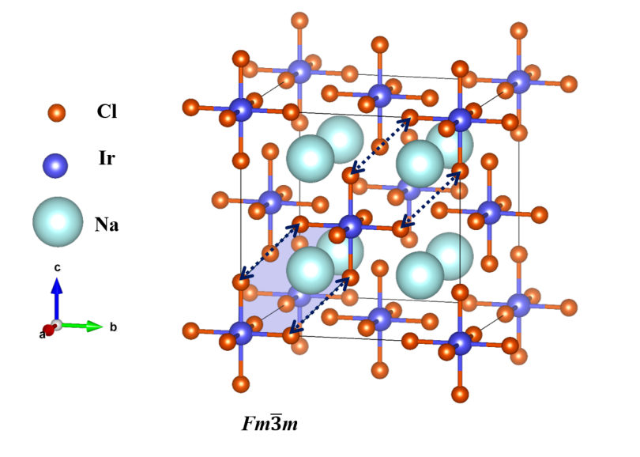
<figcaption class="paper-figure-caption"><b>Fig 1.</b> Figure 1: Schematic of Na2IrCl6 cubic crystal structure and super exchange pathway between nearest neighbour magnetic Ir4+ ions.</figcaption>
</figure>
<figure class="paper-figure-card">
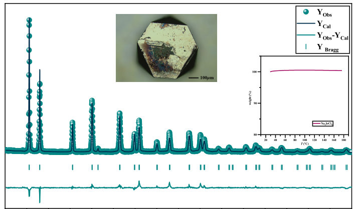
<figcaption class="paper-figure-caption"><b>Fig 2.</b> Figure 2: Experimental and refined Xray powder diffraction patterns with Bragg reflections. Inset: Thermogravimetric analysis of Na2IrCl6 heating from 30°-180°C at a rate of 10°C/min in dry nitrogen environment.</figcaption>
</figure>
<figure class="paper-figure-card">
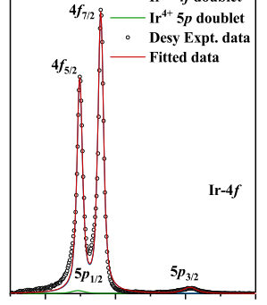
<figcaption class="paper-figure-caption"><b>Fig 3.</b> Figure 3: a) Ir 4f core level XPS spectrum (shaded black open circle) along with the fitting (red solid line). b) XPS valence band spectra of the Na2IrCl6 system</figcaption>
</figure>
<figure class="paper-figure-card">
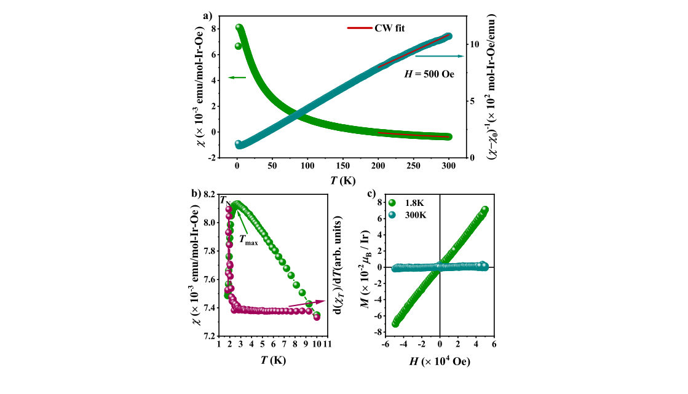
<figcaption class="paper-figure-caption"><b>Fig 4.</b> Figure 4: Magnetic properties of Na2IrCl6. a) χ vs T and (χ-χ0)−1 vs T plots from 1.8 K to 300 K. b) χ vs T and dχ(T)</figcaption>
</figure>
<figure class="paper-figure-card">
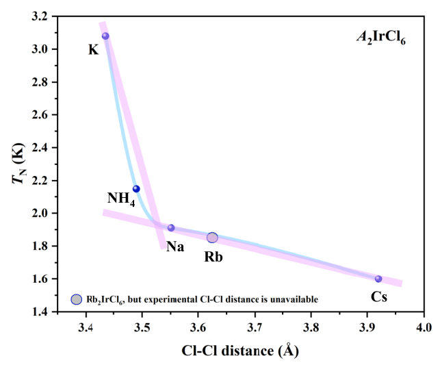
<figcaption class="paper-figure-caption"><b>Fig 5.</b> Figure 5: Transition temperatures of alkali iridium hexachlorides as function of nearest neigh- bour Cl-Cl distance</figcaption>
</figure>

**Summary.** This paper reports the synthesis and characterization of anhydrous $	ext{Na}_2	ext{IrCl}_6$, a material that realizes the perfectly cubic structure predicted for the $	ext{A}_2	ext{IrCl}_6$ family. By confirming its structure and observing antiferromagnetism, the authors provide a crucial platform to experimentally investigate the theoretical physics of $J_{eff} = rac{1}{2}$ ground states and Kitaev interactions in strongly correlated iridates.

**Why it may be interesting.** The strong correlation, spin-orbit coupling, and the explicit connection to the Kitaev model make this highly relevant for understanding exotic quantum magnetic states in solid-state materials.

Detailed structure

**Main problem.** The study investigates the structural and magnetic properties of vacancy ordered double perovskites (VODPs), specifically aiming to realize and characterize the potential $J_{eff} = rac{1}{2}$ ground state associated with Kitaev interactions.

**Main result.** The authors report the first synthesis and characterization of anhydrous $	ext{Na}_2	ext{IrCl}_6$ single crystals exhibiting a cubic structure and long-range antiferromagnetic order at $1.91 	ext{ K}$. This material serves as a key candidate for exploring the ideal $J_{eff} = rac{1}{2}$ physics.

**Method.** The work combines experimental techniques (synthesis, TGA, XRD, XPS, DC magnetization) with theoretical modeling (DFT calculations of exchange interactions).

**Model / system.** The system is the $	ext{A}_2	ext{IrCl}_6$ family of VODPs, where $	ext{Ir}^{4+}$ ions in an octahedral environment are modeled to exhibit strong spin-orbit coupling, leading to low-energy magnetic degrees of freedom described by $S=1/2$ pseudospins and the Kitaev-Heisenberg Hamiltonian.

**Key observables.** Antiferromagnetic transition temperature ($T_N = 1.91 	ext{ K}$), effective magnetic moment ($\mu_{	ext{eff}} = 1.71 \mu_{	ext{B}}$), and the confirmation of the cubic $Fmar{3}m$ structure.

**Important parameters / regimes.** The system is characterized by the competition between Heisenberg, Kitaev, and symmetric exchange interactions ($J, K, \Gamma$).

**Assumptions / limitations.** The primary assumption is that the ideal cubic structure allows for the realization of the perfect $J_{eff} = rac{1}{2}$ ground state, contrasting with previously observed monoclinic phases.

**Figures summary.** Figures illustrate the cubic crystal structure, the nearest-neighbor superexchange pathway, and the experimental X-ray powder diffraction patterns confirming the crystal structure.

**Paper structure.** The paper establishes the context of VODPs and the $J_{eff}$ physics, details the synthesis and structural characterization of the new cubic $	ext{Na}_2	ext{IrCl}_6$ phase, presents magnetic measurements confirming antiferromagnetism, and theoretically models the resulting magnetic interactions.

Abstract

Vacancy ordered double perovskites (VODPs) have been known for more than 100 years, but their exact crystal structures and magnetic ground state remained controversial till date. Anhydrous VODP iridates ($A_2$Ir$X_6$; $A$ = K$^+$, (NH$_4$)$^+$, Cs$^+$, Rb$^+$, and $X$ = F$^-$, Cl$^-$, Br$^-$), having $face-centered~cubic$ (fcc) antiferromagnetic ground state, offer a chemically well-defined platform to investigate the influence of on-site Coulomb repulsion, crystal field, spin-orbit coupling, and competing Heisenberg and Kitaev interactions. Interestingly, among these, the Na-based VODP iridates seem to possess an unusual hydration dependent structural and magnetic uncertainty. As a result, a cubic Na$_2$IrCl$_6$ system having fcc antiferromagnetism could not be stabilized ever. Here, for the first time, we report the synthesis and comprehensive characterization of anhydrous Na$_2$IrCl$_6$ single crystals having fcc structure with antiferromagnetic transition temperature of 1.91 K. Thermogravimetric analysis establishes the absence of lattice water and also demonstrates thermal stability of the crystals up to 453 K. The cubic phase reported here contrasts with previously described 'anhydrous' monoclinic Na$_2$IrCl$_6$ and highlights the strong structural and physical property relationship in Na-based VODP iridates. This new material offers an exciting playing ground for exploring another potential perfect $J_{eff}$ = $\frac{1}{2}$ octahedra and the consequent strong Kitaev interaction within the nearest-neighbor (nn) pairs of Ir ions.

[↑ back to top](#top)

### [Near-infrared magnetic linear and non-reciprocal directional dichroism in the chiral antiferromagnet SmFe3(BO3)4](http://arxiv.org/abs/2610.00534v1)

**Authors:** B. Beke, B. Szász, I. A. Gudim, D. Szaller, S. Bordács  
**Type:** experiment · **Category:** strongly correlated electrons · **PDF:** <https://arxiv.org/pdf/2610.00534v1>  
**Analysis basis:** full PDF text, analyzed in chunks
**Topic relevance:** `interference shaping light` **3/5**

↔ Scroll figures horizontally

<figure class="paper-figure-card">
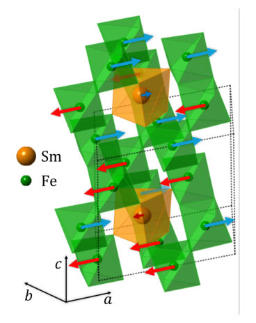
<figcaption class="paper-figure-caption"><b>Fig 1.</b> FIG. 1. Crystal structure and easy-plane antiferromagnetic order in SmFe3(BO3)4. The mustard and green spheres rep- resent the magnetic Sm3+ and Fe3+ ions, respectively. The surrounding trigonal-prismatic and octahedral oxygen coordi- nations are shown in the corresponding colors. The magnetic moments of the two antiferromagnetically aligned Fe sublat- tices are indicated by longer blue and red arrows, while the Sm magnetic moments are represented by shorter dark-blue and wine-colored arrows. All moments are shown pointing parallel and antiparallel to the two-fold rotational symmetry axis, a. The c axis is the trigonal axis, and the b axis is perpendicular to both a and c. The non-magnetic...</figcaption>
</figure>
<figure class="paper-figure-card">
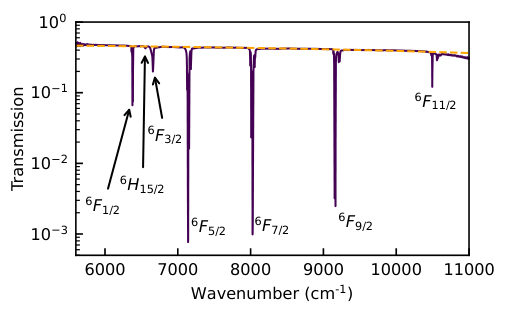
<figcaption class="paper-figure-caption"><b>Fig 2.</b> FIG. 2. Zero-field transmission spectrum of SmFe3(BO3)4 measured at 5 K. The orange dashed line marks the trans- mission baseline due to reflection losses. The symbols la- belling the transitions denote the final states of Sm3+ 4f- 4f excitations.</figcaption>
</figure>
<figure class="paper-figure-card">
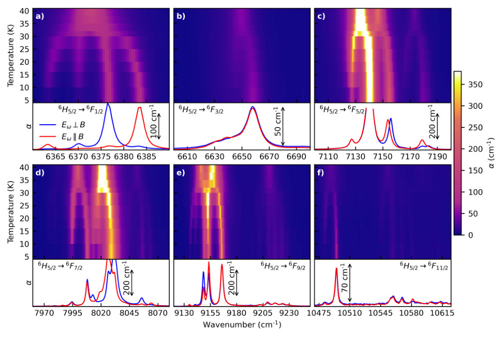
<figcaption class="paper-figure-caption"><b>Fig 3.</b> FIG. 3. Temperature dependence of the unpolarized absorption spectrum. Brighter colors in the intensity maps correspond to stronger absorption. The panels below the colormaps show linearly polarized spectra measured in the corresponding frequency ranges at 5 K in a magnetic field of B =2 T applied along B ∥a. The incident radiation was polarized either parallel (Eω ⊥B, blue curves) or perpendicular (Eω ∥B, red curves) to the magnetic field.</figcaption>
</figure>
<figure class="paper-figure-card">
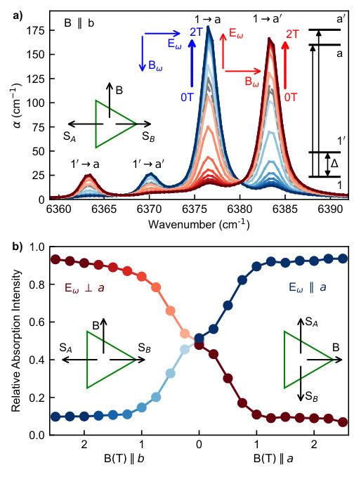
<figcaption class="paper-figure-caption"><b>Fig 4.</b> FIG. 4. Magnetic-field-dependent linearly polarized absorp- tion of the 6F1/2 resonances at 5 K. a) Absorption spectra for Eω ∥a (blue color gradient) and Eω ∥b (red color gradi- ent). The corresponding zero-field spectra are shown by solid and dashed gray lines, respectively. The magnetic field was aligned along B ∥b, and the temperature was 5 K. The level scheme of the 6F1/2 transition is shown on the right-hand side. b) Relative absorption intensity of the 1 →a′ (6384 cm−1 ) excitation in the two orthogonal polarizations. The data for Eω ∥a (Eω ∥b) are displayed on the right-hand side in navy (wine) for a magnetic field along a, whereas the corresponding data for B ∥b are shown on the...</figcaption>
</figure>
<figure class="paper-figure-card">
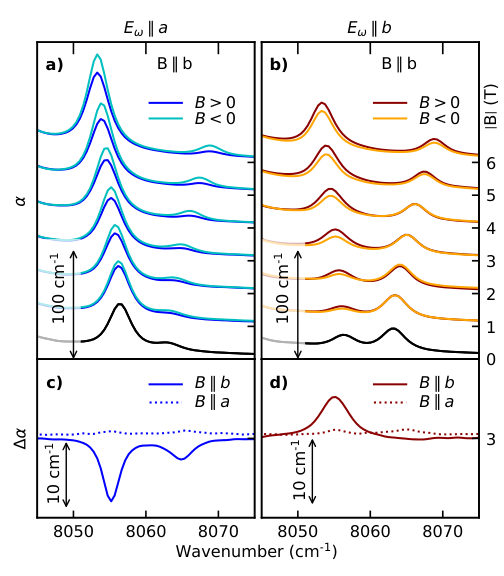
<figcaption class="paper-figure-caption"><b>Fig 5.</b> FIG. 5. Magnetic field dependence of the absorption spec- trum at the high energy side of the 6F7/2 resonances at 5 K. The two upper panels show absorption spectra with B ∥b sample orientation. Darker/lighter colors correspond to pos- itive/negative magnetic field direction. The bottom panels show the difference of the absorption spectra measured in ±3 T calculated as α(+B) −α(−B). a) and c) panels show the spectra for Eω ∥a, b) and d) panels contain spectra for Eω ∥b.</figcaption>
</figure>

**Summary.** This experimental study uses polarization-resolved infrared spectroscopy to probe the optical response of the antiferromagnet SmFe3(BO3)4. The researchers successfully measured magnetic linear and non-reciprocal directional dichroism, demonstrating that these optical anisotropies are highly sensitive to the orientation of the AFM order parameter. This work opens a pathway for optically imaging and studying the magnetic ordering in rare-earth borates.

**Why it may be interesting.** The detection of NDD in the infrared range provides a novel, optically accessible method to probe the orientation and dynamics of the AFM order parameter in rare-earth materials, linking magnetic structure to electronic excitations.

Detailed structure

**Main problem.** The study investigates how antiferromagnetic (AFM) order influences the near-infrared optical response of the chiral antiferromagnet SmFe3(BO3)4.

**Main result.** The researchers observed magnetic linear and non-reciprocal directional dichroism (NDD) in the 4f-4f transitions, confirming strong interference between electric- and magnetic-dipole excitations.

**Method.** Polarization-resolved, magneto-optical spectroscopy using infrared transmission measurements on single crystals.

**Model / system.** The physical system is the chiral antiferromagnet SmFe3(BO3)4, where the AFM order parameter is constrained to the easy-plane. The analysis relies on symmetry considerations linking the AFM order to optical responses.

**Key observables.** Magnetic linear dichroism, non-reciprocal directional dichroism (NDD), and the magnetoelectric tensor components.

**Important parameters / regimes.** Temperature relative to the Néel temperature ($T_N$), applied magnetic field strength and orientation ($\mathbf{B}$), and light polarization ($\mathbf{E}_\omega$).

**Assumptions / limitations.** The analysis assumes the AFM order parameter dictates the optical anisotropy and that the observed NDD is linked to the presence of a toroidal moment.

**Figures summary.** Figures illustrate the crystal structure and the magnetic field dependence of the absorption spectra, showing polarization-resolved measurements and difference spectra ($\alpha(+B) - \alpha(-B)$) that confirm NDD.

**Paper structure.** The paper progresses by first establishing the theoretical framework linking AFM order to optical responses, then presenting measurements of linear dichroism, and finally focusing on the detection and interpretation of non-reciprocal directional dichroism as a probe for the toroidal moment.

Abstract

We investigated the influence of antiferromagnetic (AFM) order on the near-infrared optical re- sponse of SmFe3(BO3)4 by polarization-resolved, magneto-optical spectroscopy. Below the Néel temperature, we observed pronounced magnetic linear dichroism at the 4f -4f transitions of Sm3+. By rotating the order parameter of the easy-plane AFM ground state using magnetic fields, we demonstrated the magnetic field control of linear dichroism, and deduced polarization selection rules. In addition, we detected non-reciprocal directional dichroism for several 4f -4f transitions. The non-reciprocal absorption appears in the symmetry-allowed toroidal geometry when the in- plane magnetic field is normal to one of the two-fold rotation axes. These results indicate a strong interference between electric- and magnetic-dipole excitations for transitions showing non-reciprocal absorption. The observed optical anisotropies provide a promising path to detect the in-plane orien- tation of the AFM order, enabling imaging and time-resolved studies of the AFM order parameter in rare-earth ferroborates.

[↑ back to top](#top)

### [Nonlocality without entanglement for multipartite quantum measurements](http://arxiv.org/abs/2610.02032v1)

**Authors:** Satyaki Manna, Debashis Saha  
**Type:** theory · **Category:** quantum information and computing · **PDF:** <https://arxiv.org/pdf/2610.02032v1>  
**Analysis basis:** full PDF text, analyzed in chunks
**Topic relevance:** `quantum measurements` **3/5**

↔ Scroll figures horizontally

<figure class="paper-figure-card">
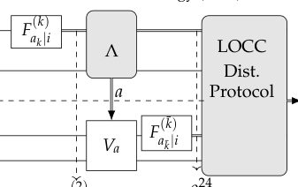
<figcaption class="paper-figure-caption"><b>Fig 1.</b> FIG. 1: Circuit diagrams illustrating different protocols for distinguishing a set of bipartite product</figcaption>
</figure>

**Summary.** This work explores nonlocality in quantum measurements, demonstrating a measurement analogue of NLWE that is simpler than its state-based counterpart. The authors prove that certain multipartite measurements are globally distinguishable but cannot be distinguished by local operations and classical communication (LOCC). This has implications for quantum data hiding and the fundamental limits of local quantum processing.

**Why it may be interesting.** The findings provide a fundamental resource theory perspective on quantum correlations, showing that nonlocality can be encoded in the measurement process itself, which has implications for quantum cryptography and device-independent protocols.

Detailed structure

**Main problem.** The paper investigates the concept of 'Nonlocality Without Entanglement' (NLWE) applied to quantum measurements, contrasting it with the well-known state-based phenomenon.

**Main result.** It establishes a measurement analogue of NLWE, showing that certain product measurements are globally distinguishable but cannot be perfectly distinguished using only Local Operations and Classical Communication (LOCC) across any bipartition.

**Method.** The analysis uses formal definitions of measurement distinguishability, comparing global distinguishability (GD) against LOCC distinguishability (LDR/LDA) using fidelity and reduced state analysis.

**Model / system.** The model involves multipartite quantum measurements, specifically pairs of two-qubit or general $n$-qubit product measurements, analyzed using quantum information theory tools.

**Key observables.** Success probability of distinguishing measurements, fidelity ($F$), and the distinguishability gap between GD and LOCC protocols.

**Important parameters / regimes.** The number of qubits ($n$), the type of measurement (product measurements), and the communication constraints (LOCC vs. joint operations).

**Assumptions / limitations.** The analysis assumes the ability to probe the measurements using specific entangled probe states and relies on the properties of fidelity (multiplicativity and monotonicity).

**Figures summary.** Figures illustrate circuit diagrams detailing protocols for distinguishing bipartite product measurements under GD, LDR, and LDA strategies.

**Paper structure.** The paper progresses by first establishing the measurement analogue of NLWE using simple product measurements, then developing a hierarchy of local discrimination strategies (LDR vs. LDA), and finally generalizing the result to arbitrary $n$-qubit measurements.

Abstract

We show that a pair of two-qubit product measurements can be perfectly distinguished when accessed jointly, yet cannot be perfectly distinguished when their local components are distributed between distant parties restricted to local quantum operations and classical communication (LOCC). This establishes a measurement analogue of nonlocality without entanglement that, unlike its state-based counterpart, emerges in a remarkably simple setting. We further uncover a hierarchy of LOCC discrimination strategies: adaptive protocols, in which the probe used at one site may depend on classical information obtained from another, can strictly outperform restricted non-adaptive protocols, as demonstrated by a set of six bipartite qutrit product measurements. We also show that LOCC distinguishability of bipartite measurements can be intrinsically directional, depending on which party initiates the protocol. More generally, we construct pairs of $n$-qubit product measurements that are globally perfectly distinguishable but cannot be perfectly distinguished across any bipartition, even when all parties on either side of the bipartition are allowed arbitrary joint quantum operations. Finally, we show how quantum data hiding based on quantum-process nonlocality without entanglement can be realized using elementary optical components.

[↑ back to top](#top)

### [On thermalization in random free fermions: Statistical origins and energy-dependent ETH structure](http://arxiv.org/abs/2610.01414v1)

**Authors:** Xiao-Kan Guo, Zhiqiang Huang  
**Type:** theory · **Category:** statistical mechanics · **PDF:** <https://arxiv.org/pdf/2610.01414v1>  
**Analysis basis:** full PDF text, analyzed in chunks
**Topic relevance:** `scars & prethermalization` **3/5**

↔ Scroll figures horizontally

<figure class="paper-figure-card">
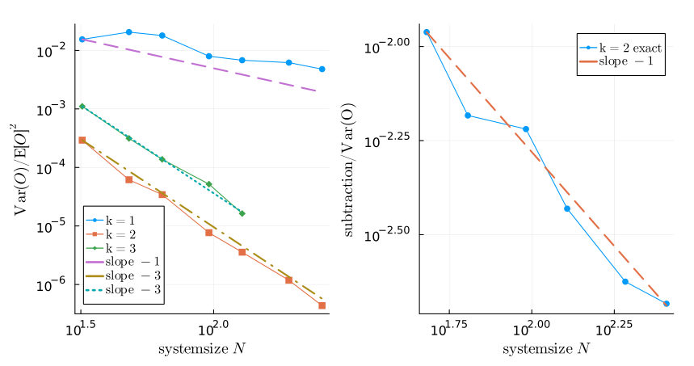
<figcaption class="paper-figure-caption"><b>Fig 1.</b> Figure 1: Left: squared coefficient of variation Var(O(k))/E[O(k)]2 versus N (log- log, Np = N/2) for the one-body two-site density (circles), the two-body nearest- neighbour observable ∑i nini+1 (squares) and the three-body observable ∑i nini+1ni+2 (diamonds); the dashed and dotted lines have slopes −1 and −3. The measured scalings (N−1 for k = 1 and N−3 for k = 2, 3) are specific to this class of nor- malized translation-invariant observables; the universal parametric statement is the exact finite-population formula (71). Right: the average covariance subtraction ⟨CovA[T, E]2/ VarA[E]⟩/⟨VarA[T]⟩of the two-body observable, computed from the ex- act formulas (80)–(81) and averaged over GOE...</figcaption>
</figure>
<figure class="paper-figure-card">
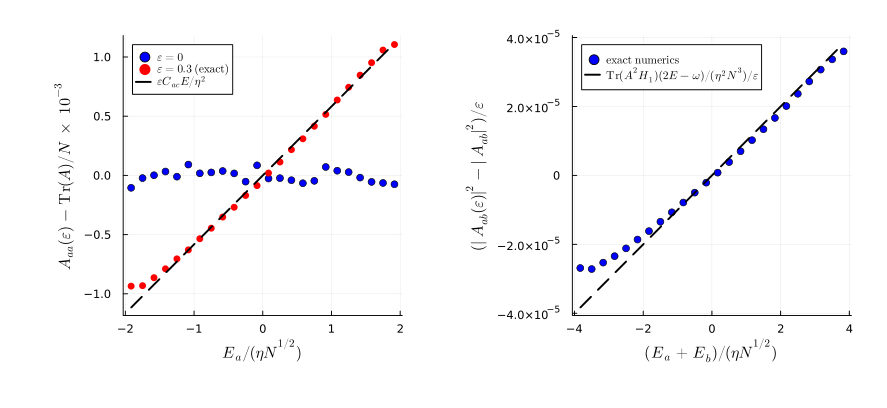
<figcaption class="paper-figure-caption"><b>Fig 2.</b> Figure 2: Emergence of energy-dependent ETH structure under the eigenvector– eigenvalue correlation deformation H(ε) = H0 + εH1 (N = 100, η = 1, 104 GOE realizations, A a two-site density, H1 = 2(|1⟩⟨1| + |2⟩⟨2|)). Left: binned E[Aaa(ε)|E] − Tr A/N versus E/(η √</figcaption>
</figure>
<figure class="paper-figure-card">
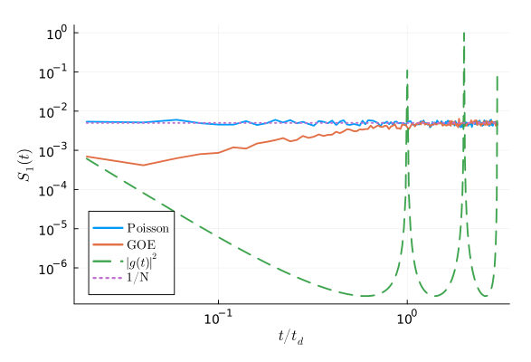
<figcaption class="paper-figure-caption"><b>Fig 3.</b> Figure 3: Single-particle spectral form factor ⟨S1(t)⟩for the GOE (solid) and its Pois- sonized partner (dashed), N = 200, averaged over 100 realizations, plotted against t/τd on log-log scales. Both ensembles share the leading decay |g(t)|2 (dash-dotted) and the smooth plateau 1/N; the GOE curve alone shows the oscillatory O(1/N) im- print F(t/τd) of the two-level correlations, visible as the excess structure around and beyond t ∼τd. This is the dynamical separation of eigenbasis chaos (common enve- lope) from spectral chaos (GOE-only oscillations) in its purest form.</figcaption>
</figure>

**Summary.** This work analyzes thermalization in the random free fermion model using advanced random-matrix techniques. It derives the decay law for observables and proves that the model serves as an analytically solvable testbed for the Eigenstate Thermalization Hypothesis. By comparing results to simpler ensembles, it precisely quantifies how spectral correlations contribute to the system's relaxation dynamics.

**Why it may be interesting.** It provides a highly controlled, analytically solvable setting to dissect the mechanisms of thermalization, allowing researchers to separate the contributions of eigenbasis chaos (ETH) from spectral chaos, which is crucial for understanding complex quantum dynamics.

Detailed structure

**Main problem.** The paper investigates the statistical origins and energy-dependent structure of thermalization in isolated quantum systems, specifically focusing on the random free fermion model.

**Main result.** The model is shown to be an analytically solvable realization of weak eigenstate thermalization hypothesis self-averaging, with the leading relaxation dynamics decaying as $|t|^{-3}$ and the variance vanishing as $O(1/N)$.

**Method.** The analysis employs detailed random-matrix theory, utilizing exact Haar measure calculus on the orthogonal group $O(N)$ to compute ensemble averages and fluctuations of single-particle observables.

**Model / system.** The system is the random free fermion model, governed by a quadratic Hamiltonian involving a random matrix from the Gaussian Orthogonal Ensemble (GOE). The dynamics are studied via time evolution operators and correlation functions.

**Key observables.** Thermalization function $g_2(t/	au_\lambda)$, variance of $	ext{Tr}(A
ho(t))$, single-particle spectral form factor $S_1(t)$, and correlation functions.

**Important parameters / regimes.** System size $N$, characteristic time scale $	au_\lambda = \hbar/(2\eta\sqrt{N})$, and the thermodynamic limit ($N 	o \infty$).

**Assumptions / limitations.** The analysis relies on the exact Haar measure moments for high accuracy, and it separates the contributions from eigenvector statistics (ETH) and eigenvalue statistics (RMT).

**Figures summary.** Figures compare the single-particle spectral form factor between the random matrix theory (RMT) and Poissonian ensembles, highlighting the $O(1/N)$ oscillatory signature unique to the RMT.

**Paper structure.** The paper progresses by calculating the leading average dynamics using Haar calculus, then analyzing the variance and correlation functions, and finally comparing the results against the Poissonian limit to isolate the role of spectral correlations.

Abstract

We study the thermalization in the random free fermion model by a detailed random-matrix analysis. By computing the ensemble average and fluctuations of $\operatorname{Tr}(Aρ(t))$ for a single-particle observable $A$, we derive the thermalization function $g^2(t/τ_λ)$ with $τ_λ= \hbar/(2η\sqrt{N})$, prove its $|t|^{-3}$ asymptotic decay, and show that the variance of the fluctuations vanishes as $O(1/N)$ in the thermodynamic limit.Particle number conservation is also incorporated into the model, by which we further study the energy-shell eigenstate statistics and prove a factorization theorem of the eigenstate statistics. We further show that under a controlled eigenvector-eigenvalue correlation deformation, the diagonal energy-resolved slope and the off-diagonal eigenstate thermalization hypothesis spectral function acquire an energy dependence.Finally, we compute the fluctuations of correlation functions and compare the fluctuation scales with those of a fully chaotic system, revealing quantitative differences rooted in the Gaussian nature of the eigenstates.Our work establishes the random free fermion model as an analytically solvable realization of weak eigenstate thermalization hypothesis type self-averaging, and as a controllable setting in which eigenbasis chaos can be separated from spectral chaos.

[↑ back to top](#top)

### [Sparse Hamiltonian simulation with optimal dependence on the maximum column Euclidean norm](http://arxiv.org/abs/2610.02030v1)

**Authors:** Zecheng Li, Chunhao Wang  
**Type:** theory · **Category:** quantum information and computing · **PDF:** <https://arxiv.org/pdf/2610.02030v1>  
**Analysis basis:** full PDF text, analyzed in chunks
**Topic relevance:** `analog quantum simulation` **3/5**

↔ Scroll figures horizontally

<figure class="paper-figure-card">
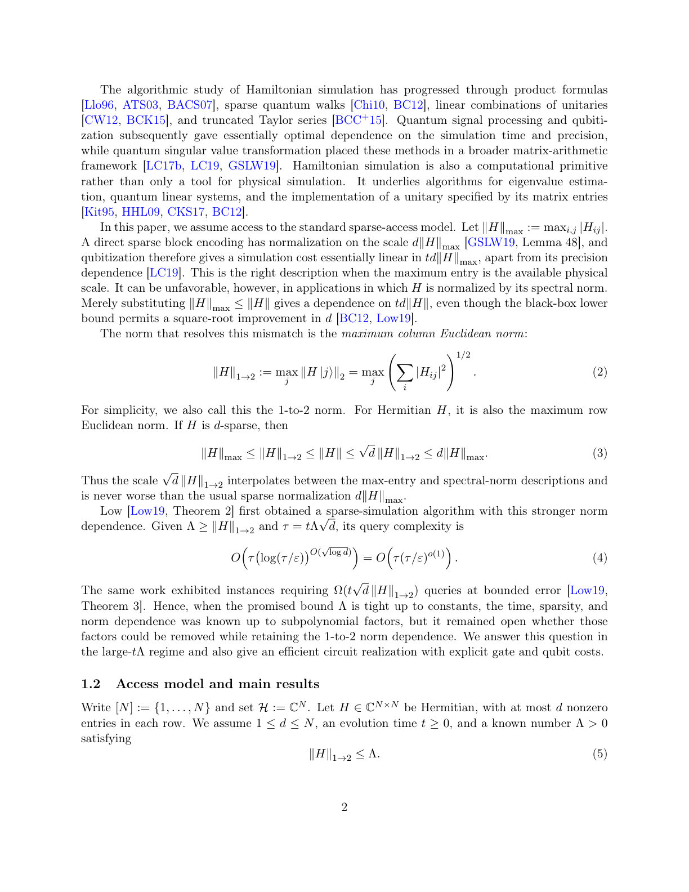
<figcaption class="paper-figure-caption"><b>Fig 1.</b> Low-resolution page preview, page 2</figcaption>
</figure>
<figure class="paper-figure-card">
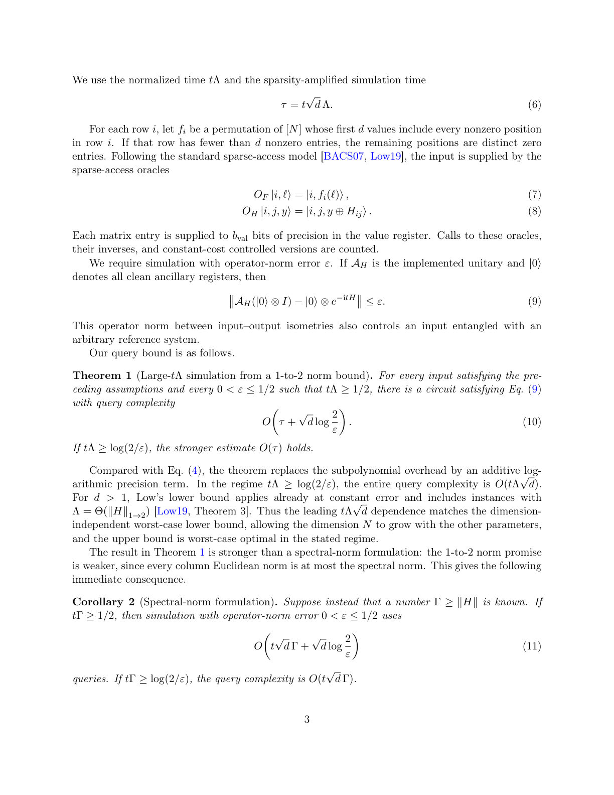
<figcaption class="paper-figure-caption"><b>Fig 2.</b> Low-resolution page preview, page 3</figcaption>
</figure>
<figure class="paper-figure-card">
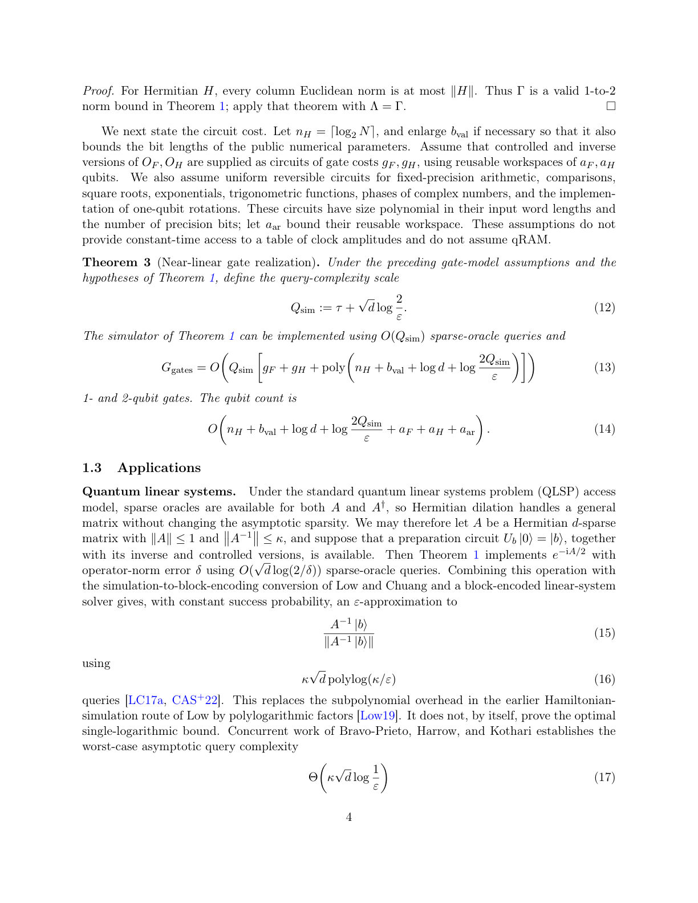
<figcaption class="paper-figure-caption"><b>Fig 3.</b> Low-resolution page preview, page 4</figcaption>
</figure>
<figure class="paper-figure-card">
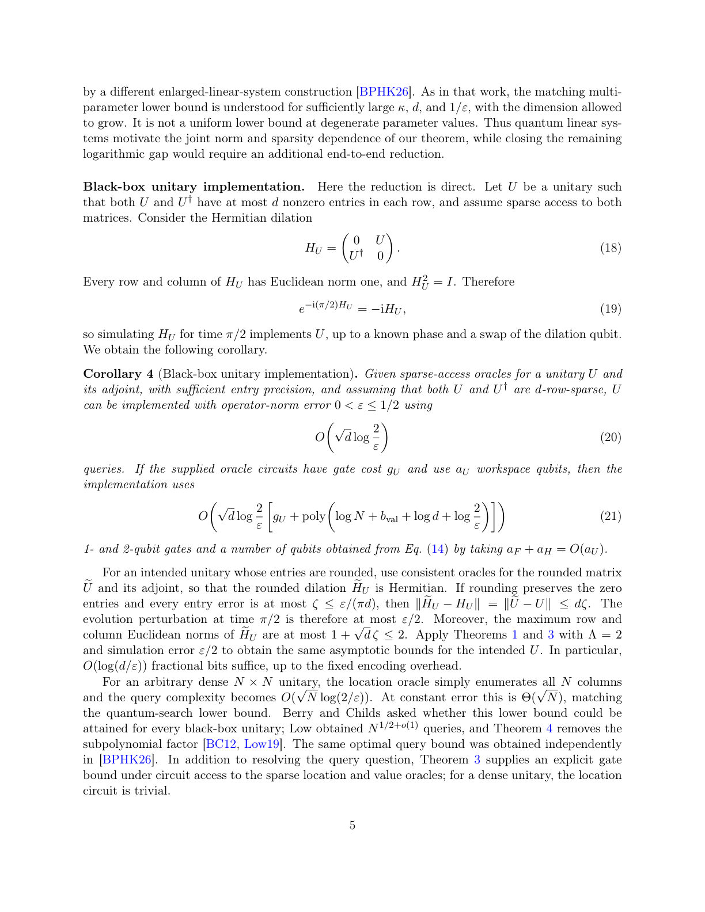
<figcaption class="paper-figure-caption"><b>Fig 4.</b> Low-resolution page preview, page 5</figcaption>
</figure>
<figure class="paper-figure-card">
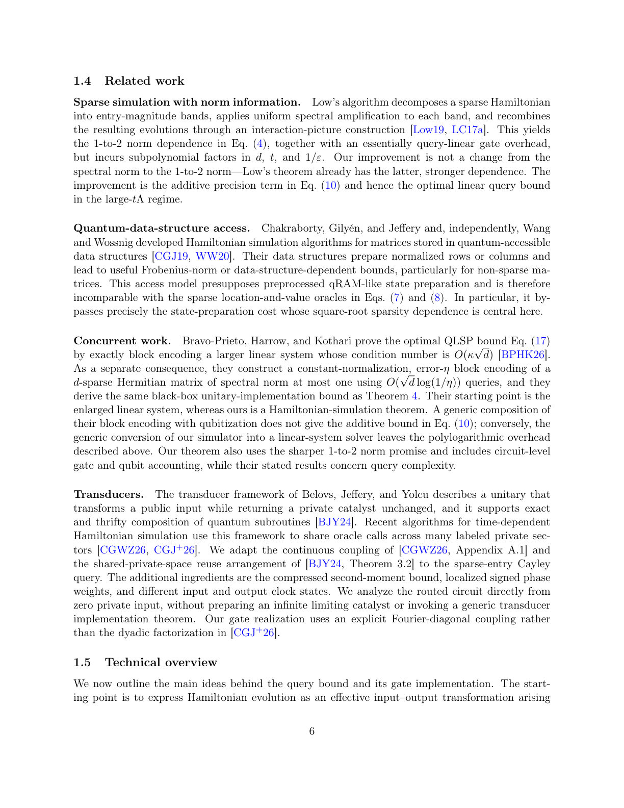
<figcaption class="paper-figure-caption"><b>Fig 5.</b> Low-resolution page preview, page 6</figcaption>
</figure>

**Summary.** This paper presents advanced quantum algorithms for simulating time evolution generated by sparse Hamiltonians and implementing sparse unitaries. By optimizing the dependence on the Hamiltonian's norm and sparsity, the authors achieve query complexities that match theoretical lower bounds. This work significantly advances the practical feasibility of quantum simulation for complex physical systems.

**Why it may be interesting.** The results provide concrete, near-optimal quantum computational resources for simulating physical Hamiltonians, which is crucial for designing quantum algorithms for quantum chemistry or condensed matter simulations.

Detailed structure

**Main problem.** Developing quantum algorithms to simulate sparse Hermitian Hamiltonians and implement general sparse unitaries with optimal query complexity.

**Main result.** The authors achieve query complexities for Hamiltonian simulation and unitary implementation that remove subpolynomial overheads, matching known lower bounds for certain tasks.

**Method.** The work employs sparse-access quantum oracles and sophisticated circuit constructions, including forward reuse techniques, to approximate time evolution and unitaries.

**Model / system.** The focus is on simulating quantum systems governed by a $d$-sparse Hermitian Hamiltonian $H$ (i.e., $e^{-itH}$), and implementing general $d$-row-sparse unitaries $U$.

**Key observables.** Operator-norm error ($\epsilon$), number of sparse-oracle queries, and gate counts.

**Important parameters / regimes.** Sparsity parameter ($d$), maximum column Euclidean norm bound ($\Lambda$), evolution time ($t$), and desired precision ($\epsilon$).

**Assumptions / limitations.** The analysis assumes access to sparse-access oracles for the Hamiltonian or unitary, and the complexity analysis relies on bounding error accumulation through structured circuit constructions.

**Paper structure.** The paper builds from the core simulation problem (Theorem 1) to specific applications like solving sparse linear systems and implementing unitaries. Subsequent analysis details the underlying circuit techniques (forward reuse, isometry construction) to prove the optimal query bounds.

Abstract

We give a quantum algorithm for simulating a $d$-sparse Hermitian Hamiltonian $H$, assuming a known upper bound $Λ$ on its maximum column Euclidean norm $\|H\|_{1\to2}$. For $tΛ\ge1/2$, simulation with operator-norm error $ε$ uses \[   O\!\left(tΛ\sqrt d+\sqrt d\log(2/ε)\right) \] sparse-oracle queries. This removes the subpolynomial overhead in Low's algorithm [STOC 2019], replacing it with an additive logarithmic precision term. For $d>1$ and $tΛ\ge\log(2/ε)$, the bound matches the worst-case lower bound. A known spectral-norm upper bound may also be used in place of $Λ$. The number of 1- and 2-qubit gates is linear in the query scale, up to oracle costs and polynomial overhead in the input bit lengths and logarithmic precision parameters.   As applications, we obtain $O(κ\sqrt d\,\mathrm{polylog}(κ/ε))$ queries for solving $d$-sparse quantum linear systems with $\|A\|\le1$ and $\|A^{-1}\|\leκ$, under standard sparse and state-preparation access. We also give a gate-efficient implementation of black-box unitaries with at most $d$ nonzero entries per row and column using $O(\sqrt d\log(2/ε))$ queries, given sparse access to the unitary and its adjoint. At constant error, the query bound is optimal and yields $Θ(\sqrt N)$ queries for arbitrary $N\times N$ unitaries, resolving the open question on black-box unitary implementation posed by Berry and Childs [QIC 2012].

[↑ back to top](#top)

### [Strong Simulation of 1D Quantum Circuits via Reduced Transition Matrices](http://arxiv.org/abs/2610.02082v1)

**Authors:** Matilde Grassi, Stefano Carignano, Luca Tagliacozzo, Jacopo De Nardis  
**Type:** theory · **Category:** numerical methods · **PDF:** <https://arxiv.org/pdf/2610.02082v1>  
**Analysis basis:** full PDF text, analyzed in chunks
**Topic relevance:** `methods for driven-dissipative` **3/5**

↔ Scroll figures horizontally

<figure class="paper-figure-card">
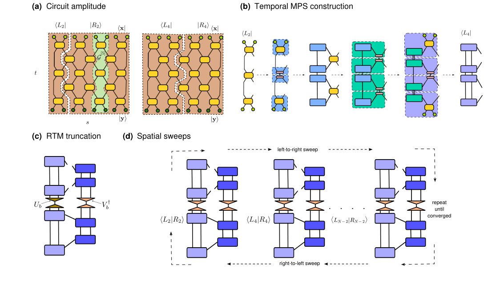
<figcaption class="paper-figure-caption"><b>Fig 1.</b> FIG. 1. Tensor-network representation of the amplitude Axy and its approximate contraction. (a) Axy is the matrix element of the brick-wall circuit generated by the yellow gates between the product states |y⟩and ⟨x| (green dots), with time running upward. At any spatial cut, the spatio-temporal TN can be viewed as the overlap ⟨Lj|Rj⟩of left and right temporal states. Two examples, for j = 2 and j = 4, are highlighted by the brown shaded regions. These temporal states can be represented as tMPS, whose exact bond dimension can grow exponentially with the distance from the spatial boundary as an increasing number of tensor columns G[j] (shaded in pale green) are absorbed, before reaching a...</figcaption>
</figure>
<figure class="paper-figure-card">
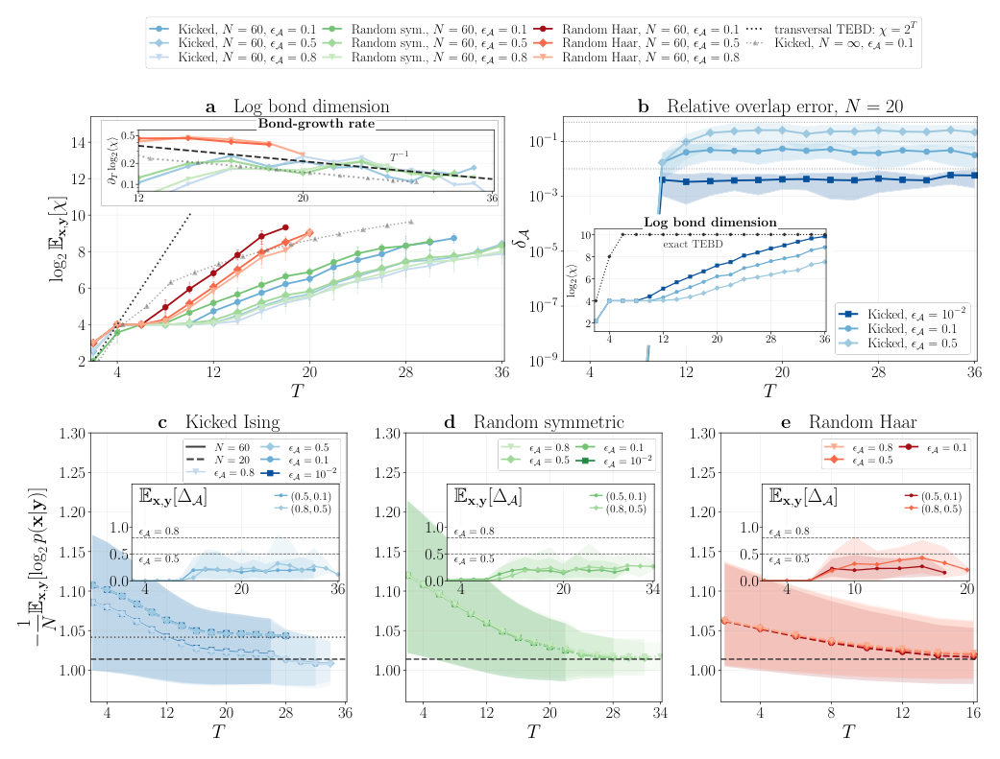
<figcaption class="paper-figure-caption"><b>Fig 2.</b> FIG. 2. Sweeping RTM algorithm: strong-simulation diagnostics. (a) Logarithm of the mean bond dimension at N = 60, ϵA = 0.8, 0.5, 0.1 averaged over different bitstrings. The trasversal TEBD corresponds to standard TEBD evolution of the left or the right temporal vectors. The inset shows the logarithmic bond-growth rate, with a T −1 visual guide (not a fit) which would correspond to a polynomial growth of χ. Gray triangles show the translationally invariant kicked-Ising N = ∞, for the configuration x = y = 0 calculation at ϵA = 0.1. (b) Kicked-Ising relative amplitude error at N = 20 against exact forward evolution, with the shading represeting the different bitstrings values. The inset...</figcaption>
</figure>
<figure class="paper-figure-card">
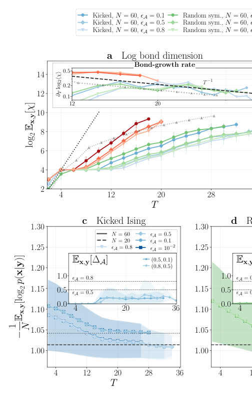
<figcaption class="paper-figure-caption"><b>Fig 3.</b> Figure 2 summarizes the strong-simulation diagnostics for the kicked-Ising, exchange-symmetric random, and random Haar circuits. We evaluate independently cho- sen, uniformly distributed computational-basis bitstring pairs (y, x), keeping the circuit realization and the sam- pled pairs fixed across times. We average over up to 40 bitstring pairs, with the number depending on time and circuit, using a single circuit realizations of each cir- cuit family. Panel (a) shows the growth of the averaged</figcaption>
</figure>
<figure class="paper-figure-card">
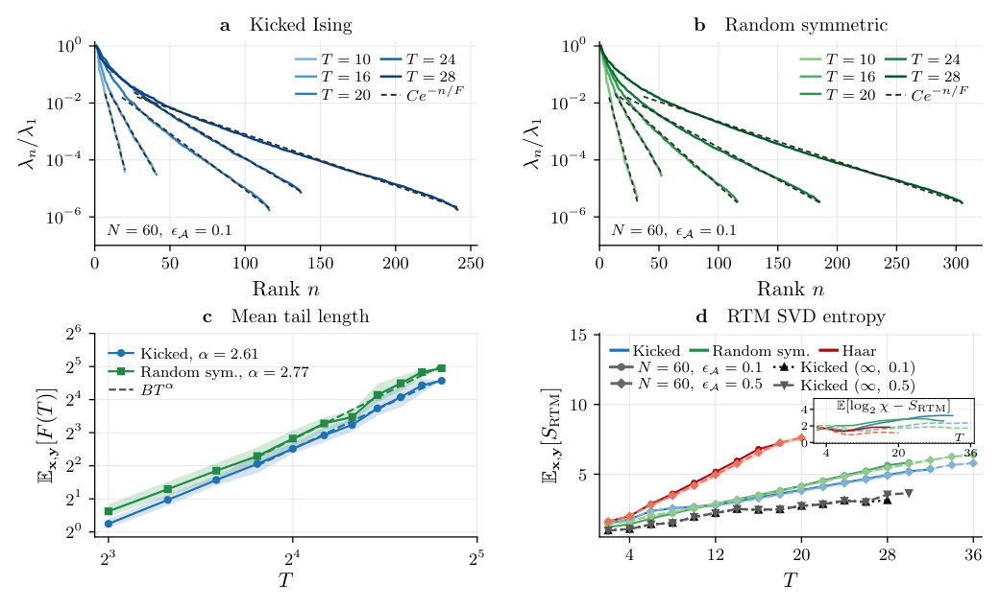
<figcaption class="paper-figure-caption"><b>Fig 4.</b> FIG. 3. RTM spectra and entropy. (a,b) Single-cut spectra λn/λ1 for kicked Ising and random symmetric circuits at N = 60, ϵA = 0.1, at different times. Darker shades indicate later times; dashed segments fit the resolved exponential tails. (c) Mean decay length in both models averaged over bitstring with the power-law fits. (d) Mean maximum local RTM SVD entropy for the three N = 60 circuit ensembles at ϵA = 0.1, 0.5. Black/gray triangles show translationally invariant kicked-Ising N = ∞, x = y = 0 results at ϵA = 0.1, 0.5. The inset shows the entropy saturation Ex,y[log2 χ −SRTM] for the finite-size data, with the same colors and line styles.</figcaption>
</figure>

**Summary.** This paper introduces the Sweeping RTM algorithm to approximate the output probability of 1D chaotic quantum circuits. By compressing temporal boundary states using Reduced Transition Matrices, the authors demonstrate that the required computational resources (bond dimension) scale subexponentially with time for fixed precision. This offers a novel, efficient classical route for performing probability queries on complex quantum hardware simulations.

**Why it may be interesting.** This work provides a powerful, resource-aware classical simulation technique for quantum circuits, offering a pathway to query specific probabilities without simulating the full, exponentially large state space, which is relevant for understanding quantum process tomography and benchmarking.

Detailed structure

**Main problem.** The paper addresses the challenge of simulating the output probability of 1D chaotic quantum circuits when direct state evolution is limited by entanglement growth.

**Main result.** They show that by using a Sweeping RTM algorithm, the required bond dimension to estimate the probability at finite precision grows subexponentially over time for chaotic circuits.

**Method.** The core method is the Sweeping RTM algorithm, which uses transverse tensor-network contraction based on Reduced Transition Matrices (RTMs) to jointly compress left and right temporal boundary states.

**Model / system.** The study focuses on 1D chaotic brick-wall circuits, benchmarked against other random ensembles, simulating the amplitude contraction $A_{xy}(T) = |\langle x|U(T)|y
angle|^2$.

**Key observables.** Output probability $p(x|y)$, RTM SVD entropy, and the required bond dimension $\chi$.

**Important parameters / regimes.** Finite relative target precision ($\epsilon$), circuit length $T$, and bond dimension $\chi$.

**Assumptions / limitations.** The subexponential growth is based on numerical evidence, and the method relies on approximating the overlap using tMPS truncated by the RTM.

**Figures summary.** Figures illustrate the tensor-network contraction process, showing the RTM truncation at spatial cuts and demonstrating the subexponential growth of the required bond dimension versus time.

**Paper structure.** The paper introduces the problem of simulating circuit amplitudes, details the Sweeping RTM algorithm for compression, presents numerical evidence of subexponential scaling for chaotic circuits, and discusses applications to benchmarking and fidelity estimation.

Abstract

Tensor networks are powerful tools for simulating quantum many-body systems, but the growth of spatial entanglement severely limits the direct evolution of pure states under chaotic unitary circuits. Here we consider a more targeted task: the approximate strong simulation of a specified output probability of a 1D chaotic brick-wall circuit at finite relative precision. Given input and output bit strings $\by$ and $\bx$, we evaluate $p(\bx|\by)=|\bra{\bx}U(T)\ket{\by}|^2$ using the Sweeping RTM algorithm, a transverse tensor-network contraction based on reduced transition matrices (RTMs). The algorithm compresses the left and right temporal boundary states jointly, seeking an output probability that converges across spatial cuts and as the bond dimension is increased. For chaotic one-dimensional brick-wall circuits at a fixed relative target precision, we find numerical evidence that the bond dimension required to obtain stable estimates grows subexponentially over the accessible time window. Our findings open a direct route to classical probability queries for chaotic quantum circuits, with potential applications to benchmarking and learning tasks.

[↑ back to top](#top)

### [The half-filled optical Su-Schrieffer-Heeger-Hubbard model with uniaxial strain](http://arxiv.org/abs/2610.00681v1)

**Authors:** Jonah Huang, James Neuhaus, Benjamin Cohen-Stead, Steven Johnston, Richard Scalettar  
**Type:** theory · **Category:** strongly correlated electrons · **PDF:** <https://arxiv.org/pdf/2610.00681v1>  
**Analysis basis:** full PDF text, analyzed in chunks
**Topic relevance:** `analog quantum simulation` **3/5**

↔ Scroll figures horizontally

<figure class="paper-figure-card">
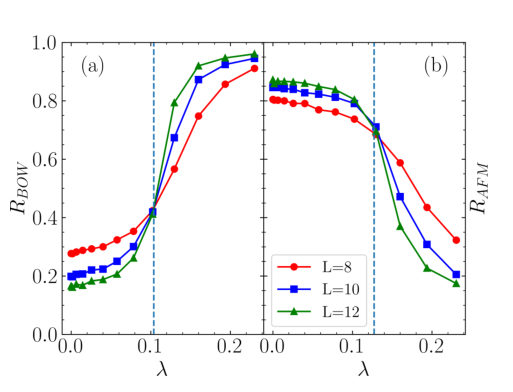
<figcaption class="paper-figure-caption"><b>Fig 1.</b> FIG. 1. Correlation ratios for the (a) BOW and (b) AFM phases for δ = 0.3t, U = 5t, and Ω0 = 0.5t. The critical value of the dimensionless coupling λc in the thermodynamic limit is obtained from the intersection of the interpolated curves for the different lattice sizes L = βt = 8, 10, 12, as indicated by the dashed lines.</figcaption>
</figure>
<figure class="paper-figure-card">
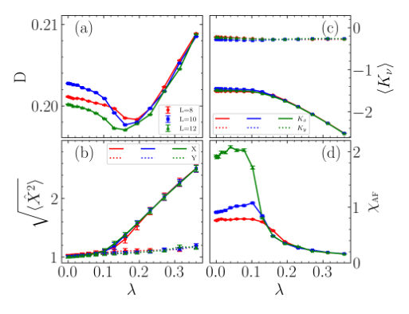
<figcaption class="paper-figure-caption"><b>Fig 2.</b> FIG. 3. Local observables as a function of the e-ph coupling strength for fixed δ = 0.3t, U = 2t, and Ω0 = 0.5t. Results are shown for the average values of (a) the double occupancy D; (b) the root mean square displacements Xrms and Yrms; (c) the direction-resolved kinetic energies Kx and Ky, and the AFM susceptibility χAFM. Results are also shown for different lattice sizes L as indicated by the legend in panel (a). Here, we find that the L dependence is weak, as is often the case for local observables. Panel (d) shows an additional global observable– the AFM susceptibility, χAFM.</figcaption>
</figure>
<figure class="paper-figure-card">
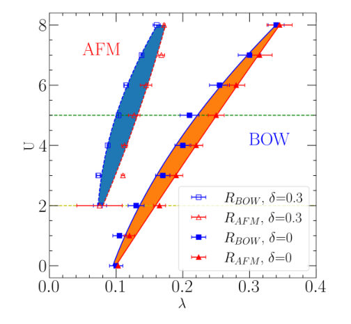
<figcaption class="paper-figure-caption"><b>Fig 3.</b> FIG. 2. Ground state phase diagram of the optical SSHH model at half-filling in the plane of e-ph coupling and on-site repulsion U. Here phonon frequency Ω0 = 0.5t and strain δ = 0.3t. Blue open triangles give the BOW phase boundaries and red open triangles give the AFM phase boundaries. We show results for the unstrained case, δ = 0, (from [58]) for comparison (filled symbols). The shaded regions indicate coexistence. Figures 1 and 3 were obtained using data from the line cuts at U = 5t (green dashed line) and U = 2t (yellow dashed line), respectively.</figcaption>
</figure>
<figure class="paper-figure-card">
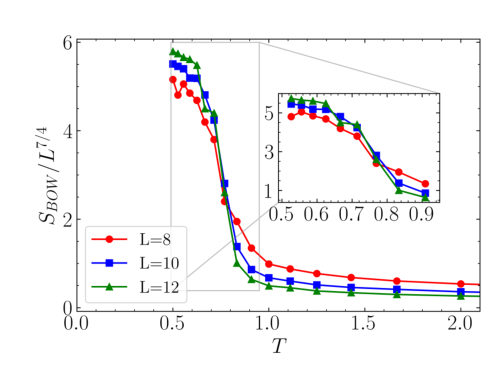
<figcaption class="paper-figure-caption"><b>Fig 4.</b> FIG. 4. Crossing of the rescaled structure factors for the BOW phases for U = 4t, Ω0 = t, and λ = 1 for the strained δ = 0.3t case. We use the exponent ratio γ/ν = 7/4, which is shared by the Ashkin-Teller, four-state-Potts, and Ising universality classes in 2D.</figcaption>
</figure>
<figure class="paper-figure-card">
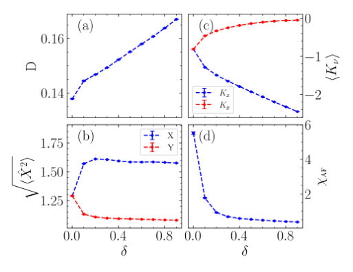
<figcaption class="paper-figure-caption"><b>Fig 5.</b> FIG. 6. D, Kν, p</figcaption>
</figure>

**Summary.** This work models the half-filled SSH-Hubbard system under uniaxial strain to study the competition between Bond-Order-Wave (BOW) and Antiferromagnetic (AFM) phases. Using advanced Quantum Monte Carlo simulations, the authors map the phase diagram and demonstrate that strain significantly influences the stability and characteristics of the resulting electronic order. This provides theoretical insight into strain-tunable correlated electronic phases.

**Why it may be interesting.** The combination of electron-phonon coupling, strong correlations (Hubbard $U$), and external tuning (strain) makes this highly relevant for understanding emergent electronic phases in correlated materials.

Detailed structure

**Main problem.** The study investigates the interplay between Bond-Order-Wave (BOW) correlations and Antiferromagnetic (AFM) correlations in the half-filled SSH-Hubbard model when subjected to uniaxial strain.

**Main result.** Uniaxial strain anisotropically modifies the phase diagram, shifting the competition toward the BOW phase and allowing for the quantification of the BOW transition temperature.

**Method.** The research employs Determinant Quantum Monte Carlo (DQMC) simulations combined with Hybrid Monte Carlo (HMC) updates for phonon fields, and uses analytic continuation to analyze spectral properties.

**Model / system.** The system is the optical Su-Schrieffer-Heeger-Hubbard (SSHH) model on a 2D square lattice, incorporating electron-phonon coupling ($\lambda$) and on-site Hubbard repulsion ($U$). Strain is modeled via anisotropic hopping, breaking rotational symmetry.

**Key observables.** Equilibrium phase diagram (BOW vs. AFM), spectral function showing directionally dependent gap formation, and correlation functions for both BOW and AFM order.

**Important parameters / regimes.** Half-filling ($
ho=1$), dimensionless e-ph coupling ($\lambda$), Hubbard coupling ($U$), and the strain parameter ($\delta$).

**Assumptions / limitations.** The analysis uses the leading-order expression for electron-phonon coupling and relies on the DQMC method being applicable due to particle-hole symmetry at half-filling.

**Figures summary.** The phase diagram maps the competition between AFM and BOW order in the $(\lambda, U)$ plane, showing how strain shifts the boundaries.

**Paper structure.** The paper establishes the SSH-Hubbard model with strain, details the DQMC/HMC simulation methodology, maps the phase diagram by varying $\lambda$ and $U$, and finally analyzes spectral properties in the ordered phases.

Abstract

Strain offers a direct route to control electronic phases by altering bond lengths, hopping amplitudes, and lattice symmetries. These aspects make electron-phonon (e-ph) coupled systems a natural setting to study strain-induced effects. The Su-Schrieffer-Heeger (SSH) Hamiltonian describes the coupling between itinerant electrons and lattice degrees of freedom that modulate hopping and is thus expected to be strongly affected by strain fields. At half-filling and on a bipartite lattice, the SSH interactions drive dominant bond-order-wave (BOW) correlations at low- temperature in which short bonds with high kinetic energy alternate with long bonds with low kinetic energy along four possible patterns. We model uniaxial strain through anisotropic hopping, which breaks the $90^\circ$ rotational symmetry and reduces the BOW phase degeneracy to two. We also include an on-site Hubbard U that promotes antiferromagnetic correlations that are also (weakly) driven by the SSH interaction itself. We map out the half-filled phase diagram in the plane of the e-ph and Hubbard couplings, and determine the critical temperature of BOW formation. Using analytic continuation, we also evaluate the spectral function and demonstrate directionally dependent gap formation in the BOW phase

[↑ back to top](#top)

### [Toward Optimal Circuit Depth for Geometrically Local Hamiltonian Simulation](http://arxiv.org/abs/2610.01839v1)

**Authors:** Zhenyu Shen, Yusen Wu, Penghui Yao, Xiao Yuan, Yukun Zhang  
**Type:** theory · **Category:** quantum information and computing · **PDF:** <https://arxiv.org/pdf/2610.01839v1>  
**Analysis basis:** full PDF text, analyzed in chunks
**Topic relevance:** `analog quantum simulation` **3/5**

↔ Scroll figures horizontally

<figure class="paper-figure-card">
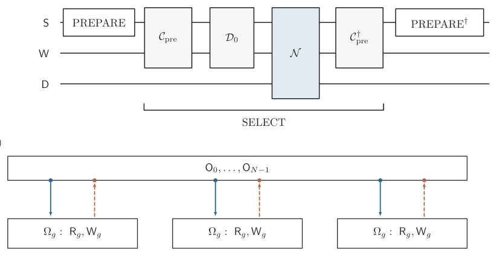
<figcaption class="paper-figure-caption"><b>Fig 1.</b> Figure 1: Block encoding and distribution of its controls. (a) Gates act from left to right. PREPARE creates the labels and phase qubits; Cpre computes prefix values, D0 applies source phases, and N applies local phases and ordered data gates. Temporary distribution work is cleared before the prefix computation and preparation are reversed. The work wire includes both source and geometric ancillas. (b) A basis record is distributed to the shared words Rg, used without changing its control values, and returned for uncomputation. Solid and dashed arrows distinguish forward and return paths on separate qubits. The omitted tree levels and their local connections are specified in Appendix A;...</figcaption>
</figure>
<figure class="paper-figure-card">
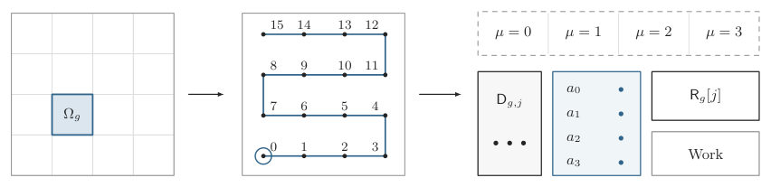
<figcaption class="paper-figure-caption"><b>Fig 2.</b> Figure 2: Addresses and local registers. (a) Each subblock Ωg contains v0 = Θ(w) data sites. (b) A nearest-neighbor snake orders the sites by j; the circled site has j = 0. (c) The dashed table indexes classical triples (cλ, ωλ, Pλ), whereas the dots and solid boxes denote quantum registers. Here qrec = 4, aµ abbreviates ag,qrecj+µ, and Rg[j] is the part of the shared word near data register Dg,j. The selectors and additional work bits together form Wg. The address is λ = gT0 + i, with i = qrecj + µ and T0 = qrecv0. Equation (165) places the distinct qubits at distinct physical sites.</figcaption>
</figure>
<figure class="paper-figure-card">
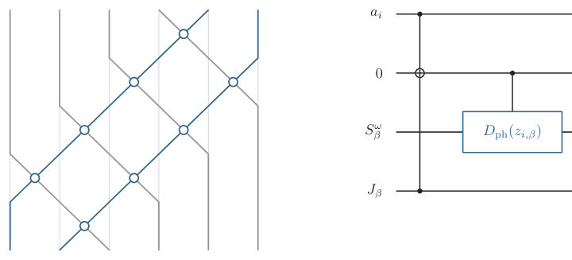
<figcaption class="paper-figure-caption"><b>Fig 3.</b> Figure 3: Local phase operations in a fixed pair-swap network; the subblock index g is suppressed. (a) Four selector pairs Ai = (ai, 0) cross the two phase-field pairs B0 = (Sχ, 0) and B1 = (Sω 0 , J0). Columns denote fixed pair positions and lines track their contents through five rounds. Each circle marks a phase operation immediately before a pair exchange. (b) At a frequency encounter, a Toffoli computes aiJβ into the clean bit; that bit controls Dph(zi,β), and a second Toffoli clears it. Reversing the pair exchanges restores every field while retaining the phases.</figcaption>
</figure>
<figure class="paper-figure-card">
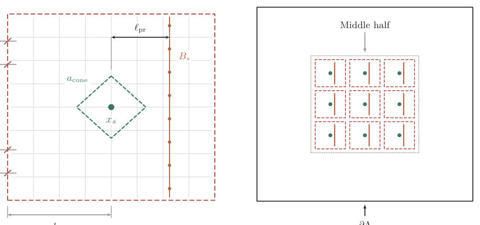
<figcaption class="paper-figure-caption"><b>Fig 4.</b> Figure 4: Propagation probes for the lower bound, illustrated in two dimensions. (a) A source xs is at the center of a cube of radius bpr. The receiver Bs is the transverse slice at displacement ℓpr; the dashed diamond is the circuit causal ball of radius acone &lt; ℓpr. The reference Hamiltonian deletes vxy on every edge crossing a probe boundary and retains the original one-body terms; the marked cuts are examples. (b) Disjoint probes lie in the middle half of the lattice, away from the physical boundary. Their centers form S and their receiver slices form B. The reference output factorizes across probes, and Eq. (144) bounds its difference from the interacting output. The buffer ratio...</figcaption>
</figure>
<figure class="paper-figure-card">
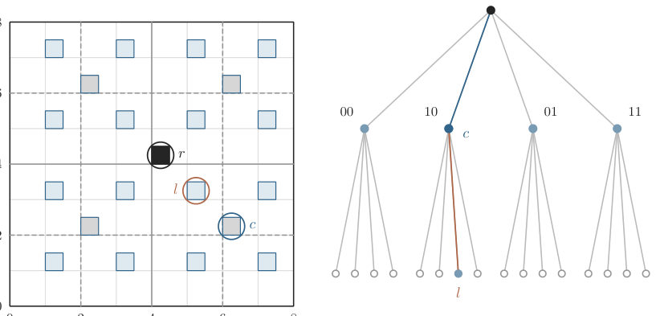
<figcaption class="paper-figure-caption"><b>Fig 5.</b> Figure 5: Dyadic regions and workspaces for D = 2 and K = 2. (a) Coordinates are in units of b after doubling the data coordinates. A level-k region has original side b2k, coarse side 2b2k, and workspace Bν = c(ν) + {0, . . . , b/2 −1}2. Dark, gray, and pale blue squares show levels 2, 1, 0; their workspaces are disjoint across levels. (b) The inclusion tree has child index (k −1, 2m + ϵ), where ϵ ∈{0, 1}2. The labels r, c, l mark the same root, child, and leaf in both panels, at coarse centers (4b, 4b), (6b, 2b), and (5b, 3b). Leaves are subblocks.</figcaption>
</figure>

**Summary.** This paper develops a method to simulate quantum dynamics for local Hamiltonians by decomposing the evolution into short-time steps on small spatial blocks. It achieves an upper bound on the circuit depth that is near-optimal, matching a proven lower bound for specific systems like the XXZ model. This work clarifies the role of spatial locality in determining the computational cost of quantum simulation.

**Why it may be interesting.** It provides concrete, near-optimal complexity bounds for simulating lattice Hamiltonians, which is crucial for designing efficient quantum algorithms for many-body physics simulations.

Detailed structure

**Main problem.** The paper aims to determine the optimal circuit depth required to simulate the time evolution of interacting quantum systems governed by geometrically local Hamiltonians.

**Main result.** The authors establish an upper bound of $O(T \log(nT/\epsilon))$ for circuit depth and prove a lower bound of $\Omega(\log n / \log \log n)$ for uniform XXZ Hamiltonians, showing near-optimality.

**Method.** The approach involves decomposing the simulation into short-time evolutions on small, overlapping spatial blocks using Lieb-Robinson bounds and applying advanced product formulas with error compensation.

**Model / system.** The system is an $n$-qubit, time-independent, finite-range Hamiltonian ($H$) defined on a fixed-dimensional lattice. The simulation targets the unitary evolution $e^{-iHT}$ to a specified accuracy $\epsilon$.

**Key observables.** Circuit depth, gate count, and simulation accuracy ($\epsilon$).

**Important parameters / regimes.** Evolution time $T$, number of qubits $n$, lattice dimension $D$, and local interaction strength $J$.

**Assumptions / limitations.** The analysis relies on the spatial locality of the Hamiltonian and the ability to decompose the evolution into blocks whose error can be controlled by the block diameter.

**Paper structure.** The paper first introduces the problem of simulating local dynamics, then details the construction of the circuit using spatial decomposition and error correction techniques, culminating in the proof of the near-optimal circuit depth bounds by matching upper and lower bounds.

Abstract

Understanding the dynamics of interacting quantum systems is a central goal of quantum simulation. For geometrically local Hamiltonians, locality suggests that digital simulation should retain much of the parallelism of the underlying dynamics. For a target accuracy $ε$, we construct a nearest-neighbor quantum circuit that simulates the dynamics of an $n$-qubit, time-independent, finite-range Hamiltonian with normalized local interaction strength on a fixed-dimensional lattice for time $T\ge1$, with circuit depth $O(T\log(nT/ε))$ and gate count $O(nT\log(nT/ε))$. This reduces the polylogarithmic overhead of Haah, Hastings, Kothari, and Low to a single logarithm. On logarithmic-scale blocks from the Lieb--Robinson decomposition, a shallow but highly accurate implementation is essential for reducing the circuit depth. Our key observation is that spatial localization also controls the cost of high precision. In each block, the error of a constant-order product formula is compensated for by a correction, yielding exponential accuracy. The correction can be implemented with depth proportional to the block diameter, introducing no additional asymptotic depth scale beyond that required by spatial localization.   Furthermore, we prove an unconditional circuit-depth lower bound for uniform XXZ Hamiltonians: at fixed evolution time $T$ in the stated regime and sufficiently small fixed error $ε$, any nearest-neighbor quantum circuit simulating these dynamics requires depth $Ω(\log n/\log\log n)$. This matches our $O(\log n)$ upper bound up to a doubly logarithmic factor, establishing near-optimal circuit depth for lattice Hamiltonian simulation in this regime. Together, these results clarify the role of locality and precision in determining the circuit complexity of quantum dynamics and suggest broader principles for spatially constrained quantum computation.

[↑ back to top](#top)

### [Unitary Schur Sampling of Qudits via Random SWAP Tests: Hunt for Antisymmetry](http://arxiv.org/abs/2610.02103v1)

**Authors:** Shrigyan Brahmachari, David Jakab, Henry D. Pfister, Iman Marvian  
**Type:** theory · **Category:** quantum information and computing · **PDF:** <https://arxiv.org/pdf/2610.02103v1>  
**Analysis basis:** full PDF text, analyzed in chunks
**Topic relevance:** `quantum measurements` **3/5**

↔ Scroll figures horizontally

<figure class="paper-figure-card">
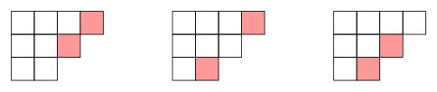
<figcaption class="paper-figure-caption"><b>Fig 1.</b> FIG. 1. The three admissible ways to remove two boxes from λ = (4, 3, 2). The highlighted boxes are removed; no two removed boxes lie in the same row.</figcaption>
</figure>
<figure class="paper-figure-card">
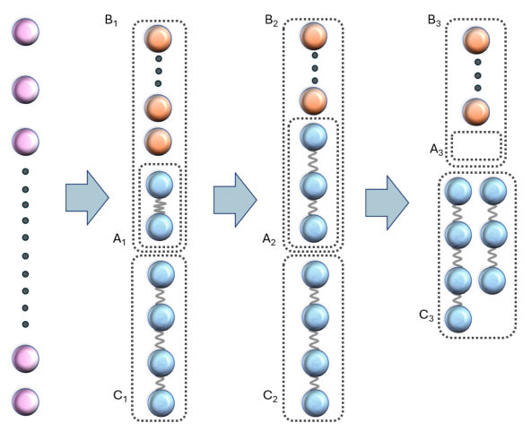
<figcaption class="paper-figure-caption"><b>Fig 2.</b> FIG. 3. Illustration of Algorithm 2. Throughout the protocol, the qudits are partitioned into three registers At, Bt, and Ct, where t denotes the number of measurement rounds performed so far. The register At contains the current candidate antisymmetric subsystem, Bt contains the remaining qudits that have not yet been assigned to an antisymmetric subsystem, and Ct stores the antisymmetric subsystems extracted during previous invocations of the growth subroutine. At each round, a qudit selected uniformly at random from Bt \ At is tested together with the qudits in At using an antisymmetric measurement. Upon a successful projection onto the antisymmetric subspace, the selected qudit is...</figcaption>
</figure>
<figure class="paper-figure-card">
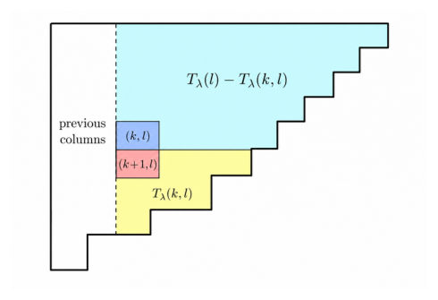
<figcaption class="paper-figure-caption"><b>Fig 3.</b> FIG. 5. Illustration of the Young-diagram traversal process. The white region corresponds to columns that have already been separated by previous invocations of the growth subroutine. The blue square denotes the current state (k, l), while the red square represents the candidate next state (k + 1, l). The yellow region (including (k + 1, l)) contains the Tλ(k, l) boxes contributing to the probability of extending the current antisymmetric subsystem, whereas the cyan region (including (k, l)) contains the remaining Tλ(l) −Tλ(k, l) boxes of the current Young diagram. A successful antisymmetric measurement corresponds to the transition (k, l) →(k + 1, l).</figcaption>
</figure>

**Summary.** This work presents a novel, resource-efficient method to perform Unitary Schur Sampling on multi-qudit systems using only pairwise SWAP tests. By framing the process as a search for antisymmetry, the authors achieve a polynomial scaling in the number of qudits. This provides a powerful, experimentally feasible primitive for accessing deep structural information encoded in quantum many-body states.

**Why it may be interesting.** The development of resource-efficient measurement protocols using only basic quantum gates (like SWAP tests) is crucial for building practical quantum information processing devices.

Detailed structure

**Main problem.** The paper addresses the challenge of implementing Unitary Schur Sampling (USS) for extracting permutation-invariant information from multi-qudit quantum states.

**Main result.** USS can be realized efficiently using only pairwise SWAP tests, framing the process as a stochastic search for antisymmetry within the system's state space.

**Method.** The core method involves exploiting Schur-Weyl duality and repeatedly identifying and extracting the largest antisymmetric subsystem using controlled SWAP tests.

**Model / system.** The system consists of $n$ qudits, each of dimension $d$, whose total Hilbert space decomposes according to Schur-Weyl duality into sectors labeled by Young diagrams $\lambda$.

**Key observables.** The primary observables are the Young-diagram label $\lambda$ and the corresponding reduced state on the $	ext{SU}(d)$ irrep subsystem $Q_d^\lambda$.

**Important parameters / regimes.** The complexity scales polynomially with $n$ and $d$, achieving error $\epsilon$ in diamond distance with $O(n\min\{n, d\}^3/\epsilon \log^2 n)$ tests.

**Assumptions / limitations.** The protocol relies on approximating the full antisymmetric measurement and assumes the existence of a canonical pure state structure within the multiplicity subsystem.

**Figures summary.** TABLE I compares the complexity of different USS implementations, highlighting the efficiency of the proposed SWAP-test method.

**Paper structure.** The paper first introduces USS, contrasting it with existing complex methods. It then details the SWAP-test based approach by exploiting antisymmetry, developing algorithms, and finally applying the technique to Quantum Purity Amplification (QPA).

Abstract

Schur sampling is a fundamental primitive for extracting permutation-invariant information from many-body quantum systems and has broad applications in quantum information science. Circuit-based implementations typically rely on coherent representation-theoretic operations such as Clebsch-Gordan transforms, generalized phase estimation, or quantum Fourier transforms over the symmetric group. We show that unitary Schur sampling of arbitrary permutation-invariant mixed states on $n$ $d$-dimensional qudits can instead be implemented using only pairwise SWAP tests, namely, two-qudit projective measurements onto the symmetric and antisymmetric subspaces. Our protocol achieves error $ε$ in diamond distance using $O(n\min\{n,d\}^{3}\log^2(n/ε))$ random SWAP tests. The central idea is to repeatedly identify and extract the largest antisymmetric subsystem. This turns unitary Schur sampling into a search for antisymmetry and gives the algorithm a natural interpretation as a stochastic traversal of a Young diagram. The protocol preserves the $\mathrm{SU}(d)$-irrep state while preparing a canonical pure state in the multiplicity subsystem. As an application, we consider quantum purity amplification (QPA), in which multiple noisy copies of a pure quantum state are combined to produce a state of higher purity. We show that the optimal purified state can be obtained by retaining a single designated output qudit and discarding the rest.

[↑ back to top](#top)

### [Mass-asymmetry-controlled exciton dressing and dissociation in a quantum lattice model](http://arxiv.org/abs/2610.01594v1)

**Authors:** Michael O. Atambo  
**Type:** theory · **Category:** strongly correlated electrons · **PDF:** <https://arxiv.org/pdf/2610.01594v1>  
**Analysis basis:** full PDF text, analyzed in chunks
**Topic relevance:** `analog quantum simulation` **2/5** · `Frenkel-Kontorova` **1/5** · `Keldysh / 2PI / non-Gaussian methods` **1/5** · `correlated / nonlocal dissipation` **1/5** · `driven-dissipative phase transition` **1/5** · `methods for driven-dissipative` **1/5**

↔ Scroll figures horizontally

<figure class="paper-figure-card">
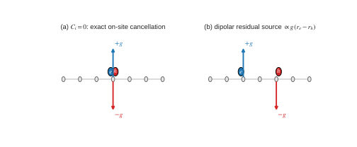
<figcaption class="paper-figure-caption"><b>Fig 1.</b> FIG. 1. Phonon source and exchange symmetry. (a) For a coincident electron-hole pair, the neutral source Ci = g(δi,re −δi,rh) vanishes site by site and is strictly odd under the electron-hole exchange operator Peh. (b) For separated carriers, a dipolar residual source remains. The odd parity of the neutral source, combined with the symmetric ground state at equal masses, enforces an exact exchange selection rule that suppresses phonon dressing.</figcaption>
</figure>
<figure class="paper-figure-card">
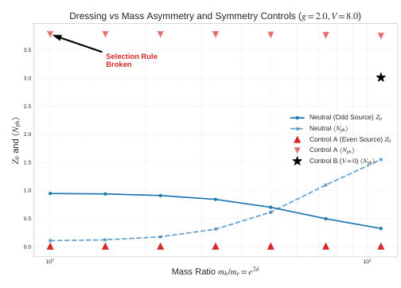
<figcaption class="paper-figure-caption"><b>Fig 2.</b> FIG. 2. Mass-asymmetry-controlled dressing and symmetry controls at g = 2.0, V = 8.0. Main curves: Evolution of the zero-phonon character Z0 and total phonon number ⟨Nph⟩as the mass ratio mh/me = e2δ increases. The δ- parameterization holds the geometric mean of hoppings con- stant, isolating the symmetry effect from the small-polaron atomic limit. The symmetric exciton (δ = 0) is protected by the exchange selection rule. Control A (Even Source): Reversing the hole coupling sign (gh = −g) renders the source even under Peh, explicitly breaking the selection rule and causing heavy local polaronic dressing (⟨Nph⟩≈3.8) even at perfect mass symmetry, consistent with the relative-sign physics...</figcaption>
</figure>
<figure class="paper-figure-card">
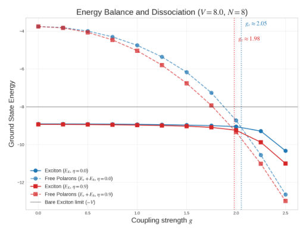
<figcaption class="paper-figure-caption"><b>Fig 3.</b> FIG. 3. Energy-balance construction for the dissociation boundary at V = 8. The exciton ground-state energy (solid) is compared to the sum of the independently converged free- polaron energies (dashed). The protected exciton remains remarkably flat, harvesting almost no polaronic stabilization, leading to a finite-size level crossing at gc ≈2.05 that is con- sistent with a dissociation transition in the thermodynamic limit. The crossing location is largely independent of the in- ternal dressing state.</figcaption>
</figure>
<figure class="paper-figure-card">
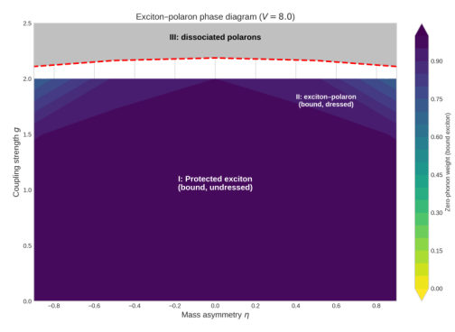
<figcaption class="paper-figure-caption"><b>Fig 4.</b> FIG. 4. Exciton-polaron regime map at V = 8: zero- phonon character Z0 in the bound region (color), the dis- sociated region (gray), and the Ebind = 0 boundary (red dashed). The map highlights the separation of energy scales: mass asymmetry η controls the internal dressing crossover (Regime I to II), while the global energetic competition be- tween Coulomb binding and polaronic stabilization sets the nearly η-independent dissociation boundary (Regime III).</figcaption>
</figure>
<figure class="paper-figure-card">
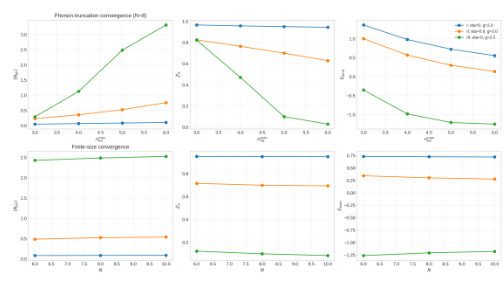
<figcaption class="paper-figure-caption"><b>Fig 5.</b> FIG. 5. Convergence analysis: phonon-truncation sweep at N = 8 (top) and finite-size sweep at ntot = 5 (bottom) for the three representative points. The two-tier reference protocol (converging free polarons to ntot = 10) ensures the binding energies and regime boundaries are robust; see Appendix A.</figcaption>
</figure>

**Summary.** This theoretical work analyzes how mass asymmetry controls the interaction between excitons and phonons in polar semiconductors. It reveals a paradox where the symmetry protecting the exciton from phonon dressing simultaneously removes the energy stabilization it needs, causing it to dissociate at strong coupling. The findings map out distinct regimes governed by internal dressing versus global energy balance.

**Why it may be interesting.** The interplay between symmetry protection (a quantum selection rule) and thermodynamic stability (energy balance) is a rich topic relevant to understanding charge transfer and localization in many correlated materials.

Detailed structure

**Main problem.** The paper investigates the non-perturbative fate of exciton-phonon coupling, specifically analyzing the interplay between internal exciton dressing and the thermodynamic stability (dissociation) of the exciton in a polar material.

**Main result.** Mass symmetry protects the exciton from phonon dressing via an exchange selection rule, but this same symmetry prevents polaronic stabilization, leading to dissociation at strong coupling. Increasing mass asymmetry breaks this protection, causing strong dressing.

**Method.** The study employs exact diagonalization of a Holstein-exciton model, utilizing parameterization of hopping terms to control mass asymmetry, and comparing the exciton energy to the sum of free-polaron energies.

**Model / system.** The system is a neutral exciton coupled to local Einstein phonons in a quantum lattice model (1D chain). The Hamiltonian includes kinetic, Coulomb attraction, and electron-phonon coupling terms.

**Key observables.** Zero-phonon weight ($Z_0$), total phonon number ($\langle N_{ph} 
angle$), exciton binding energy ($E_{bind}$), and the dissociation estimate ($g_c$).

**Important parameters / regimes.** Mass asymmetry ($\delta$ or $\eta$), phonon coupling strength ($g$), and Coulomb interaction strength ($V$).

**Assumptions / limitations.** The analysis assumes the source parity is key to the selection rule, and the dissociation boundary is determined by a global energy balance between Coulomb binding and polaronic stabilization.

**Figures summary.** Figures illustrate the crossover in $Z_0$ and $\langle N_{ph} 
angle$ as mass asymmetry increases, show the energy level crossing defining the dissociation boundary, and present a regime map separating internal dressing effects from global energy balance.

**Paper structure.** The paper establishes the model and the role of source parity in protecting the exciton at mass symmetry. It then maps the crossover regime controlled by mass asymmetry, and finally determines the dissociation boundary via an energy balance comparison.

Abstract

In a polar material, a neutral exciton couples to phonons through the sum of the electron and hole deformation potentials. Because the total source vanishes by charge neutrality, the elastic exciton-phonon vertex is regularized by electron-hole interference. Here we determine the non-perturbative fate of this interference by exact diagonalization of a Holstein-exciton model. By parameterizing the mass asymmetry to decouple it from the small-polaron atomic limit, we map a regime map comprising an internal dressing crossover and a dissociation boundary. We prove analytically and verify numerically that for equal masses, the symmetric exciton ground state is protected from phonon dressing by an exact exchange selection rule, provided the phonon source is odd under electron-hole exchange (the neutral case). As mass asymmetry increases, this selection rule is broken and the exciton acquires a strong local polaronic cloud. We show that the dissociation boundary, conversely, is set by a global energy balance between Coulomb binding and polaronic stabilization, and is nearly independent of the internal dressing. Paradoxically, the very symmetry that protects the exciton from dressing denies it polaronic stabilization, driving it toward dissociation at strong coupling. We discuss these results in the context of lattice exciton-polaron models and their implications for sharp versus broad excitonic lines in mass-symmetric versus mass-asymmetric polar semiconductors.

[↑ back to top](#top)

### [Complexity study of the Hartle-Hawking state in JT gravity](http://arxiv.org/abs/2610.00844v1)

**Authors:** Ritam Basu  
**Type:** theory · **Category:** other · **PDF:** <https://arxiv.org/pdf/2610.00844v1>  
**Analysis basis:** full PDF text, analyzed in chunks
**Topic relevance:** `Keldysh / 2PI / non-Gaussian methods` **2/5** · `methods for driven-dissipative` **2/5** · `quantum measurements` **2/5**

↔ Scroll figures horizontally

<figure class="paper-figure-card">
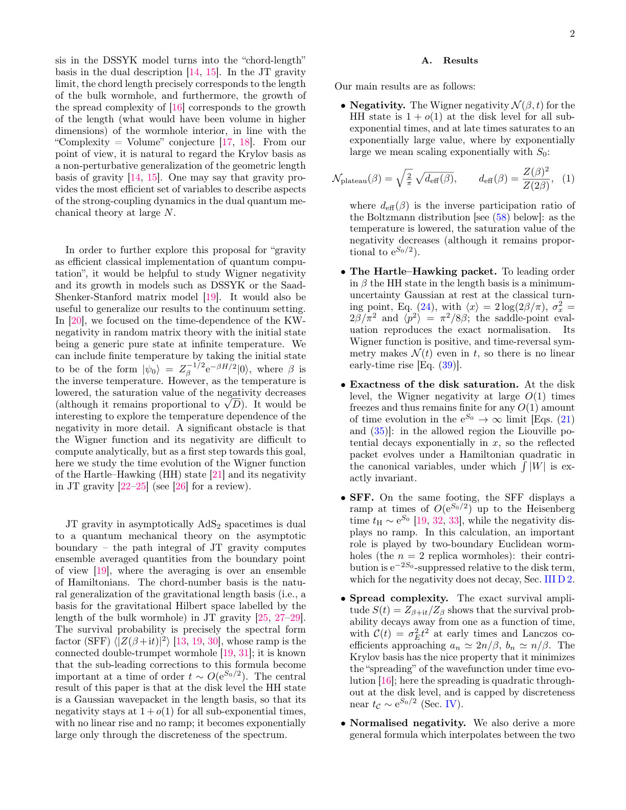
<figcaption class="paper-figure-caption"><b>Fig 1.</b> Low-resolution page preview, page 2</figcaption>
</figure>
<figure class="paper-figure-card">
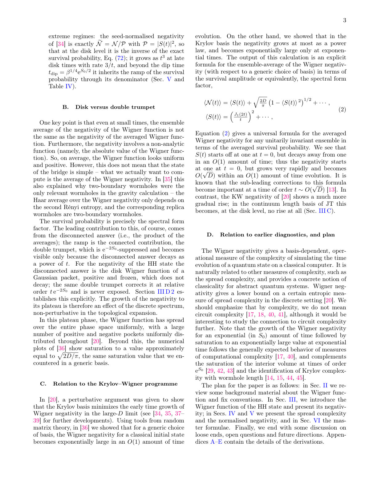
<figcaption class="paper-figure-caption"><b>Fig 2.</b> Low-resolution page preview, page 3</figcaption>
</figure>
<figure class="paper-figure-card">
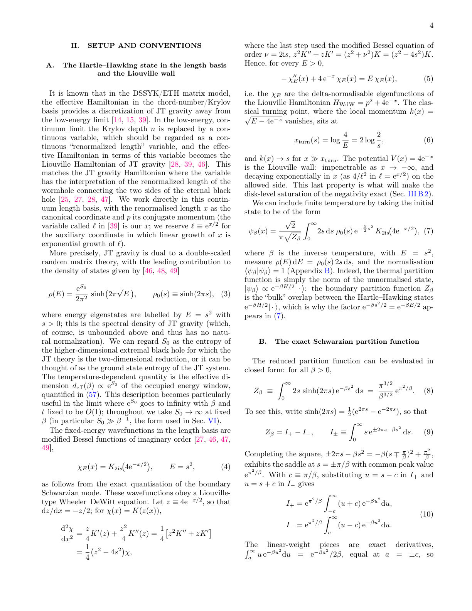
<figcaption class="paper-figure-caption"><b>Fig 3.</b> Low-resolution page preview, page 4</figcaption>
</figure>
<figure class="paper-figure-card">
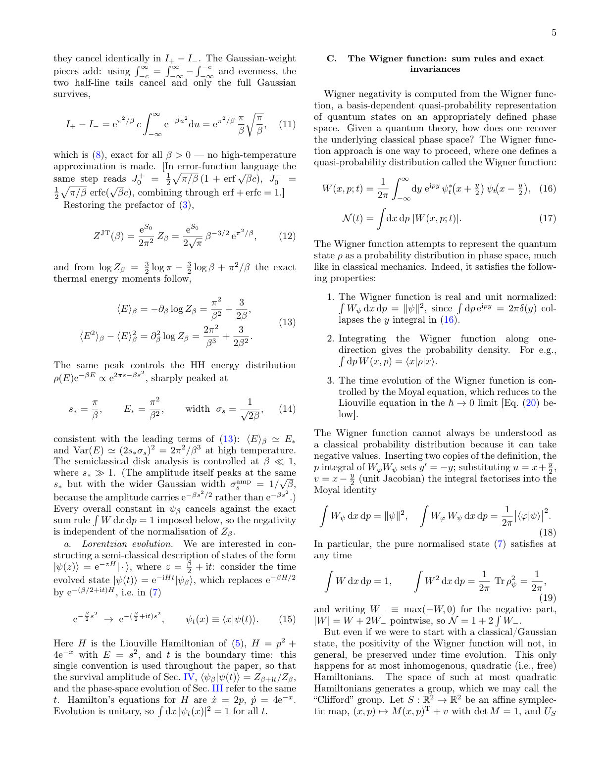
<figcaption class="paper-figure-caption"><b>Fig 4.</b> Low-resolution page preview, page 5</figcaption>
</figure>
<figure class="paper-figure-card">
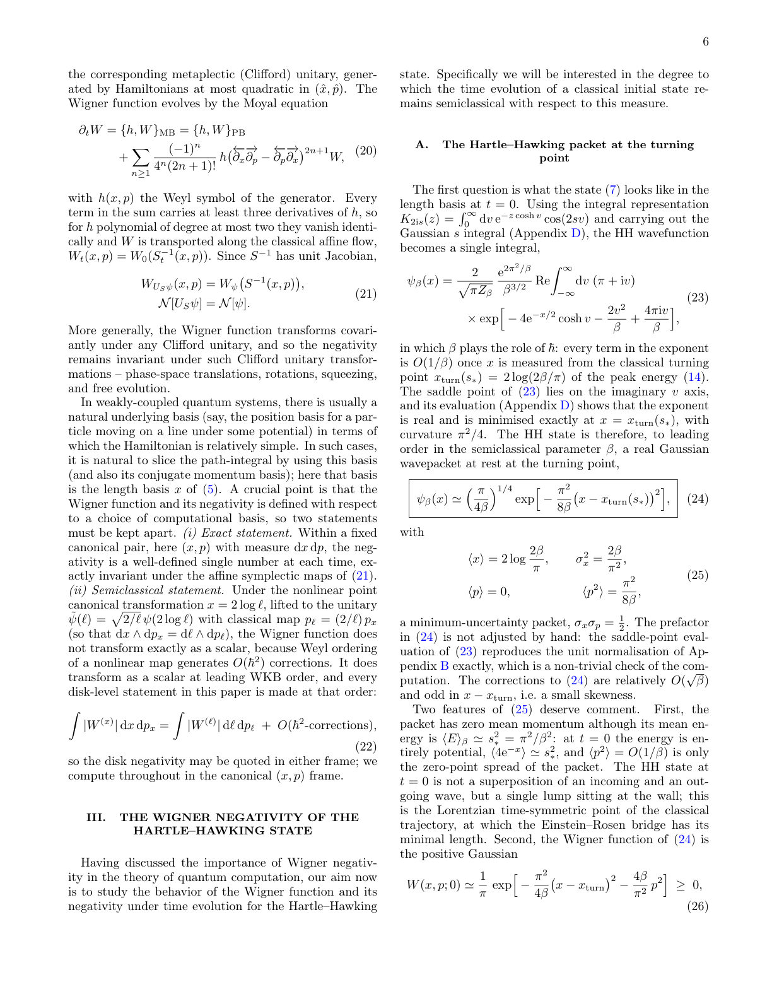
<figcaption class="paper-figure-caption"><b>Fig 5.</b> Low-resolution page preview, page 6</figcaption>
</figure>

**Summary.** This work investigates quantum complexity by tracking the negativity of the Wigner function for the Hartle-Hawking state evolving in JT gravity. The authors find that this negativity saturates at late times and demonstrate that the length basis provides a powerful, semi-classical tool for understanding chaotic quantum dynamics in this gravitational context.

**Why it may be interesting.** The connection between quantum complexity measures (like negativity) and gravitational physics (JT gravity) provides a deep link between quantum information theory and quantum gravity, which is highly relevant to open quantum systems dynamics.

Detailed structure

**Main problem.** The paper studies the growth of Wigner function negativity as an operational measure of quantum state complexity during time evolution in Jackiw-Teitelboim (JT) gravity.

**Main result.** The negativity saturates at late times to a value dependent on the effective dimension, and the length basis is shown to be ideally suited for describing chaotic quantum dynamics semi-classically.

**Method.** The analysis uses the Wigner function formalism in the length basis, comparing the growth of negativity to the Spectral Form Factor and employing semiclassical approximations.

**Model / system.** The system is the Hartle-Hawking (HH) state evolving under time evolution governed by the Liouville Hamiltonian in JT gravity. The analysis is performed in the continuum length basis.

**Key observables.** Wigner Negativity, Spread complexity, Exact survival amplitude, and the thermal partition function $Z_eta$.

**Important parameters / regimes.** The semiclassical parameter $\beta$, the action $S_0$, and time $t$ are key parameters governing the complexity growth.

**Assumptions / limitations.** The analysis relies on the length basis being suitable for a dual, semi-classical effective description, and involves approximations like saddle-point methods and leading-order expansions.

**Figures summary.** Not specified (The notes do not describe figures, only mathematical results and comparisons).

**Paper structure.** The paper progresses by defining the complexity measure (negativity), applying it to the HH state in JT gravity, deriving relationships between negativity and survival probability, and finally establishing the suitability of the length basis for semi-classical description.

Abstract

The negativity of the Wigner function gives an operationally meaningful measure of the complexity of simulating a quantum state on a classical computer. We study its growth for the Hartle-Hawking state under time evolution in Jackiw-Teitelboim gravity, in the length basis. At the disk level, and to leading order in the semiclassical parameter $β$, the Hartle-Hawking state is a minimum-uncertainty Gaussian wavepacket at rest at the turning point of the Liouville wall, centred at $x=2\log(2β/π)$ with $\langle p^2\rangle=π^2/8β$. Its Wigner function is positive, so its negativity is $1+o(1)$ for all sub-exponential times; it is even in $t$ by time-reversal symmetry, and exactly frozen once the reflected packet decouples from the wall, because free evolution is a Clifford shear. At late times the negativity saturates close to its upper bound, at $\sqrt{2/π}\sqrt{d_{\rm eff}(β)}$ with $d_{\rm eff}(β)=Z(β)^2/Z(2β)$, a value that requires the discrete spectrum. Unlike the spectral form factor, the negativity displays no ramp: the two-boundary wormhole contribution is suppressed by $e^{-2S_0}$ relative to a disk term that, unlike that of the spectral form factor, does not decay. The exact survival amplitude $Z(β+it)/Z(β)$ gives the spread complexity growing as $σ_E^2t^2$, and the seed-normalised negativity is, at the disk level, the inverse of the exact survival probability. We take this as evidence that the length basis is ideally suited for a dual, semi-classical effective description of chaotic quantum dynamics for large $e^{S_0}$ at sub-exponential times.

[↑ back to top](#top)

### [Convergence of stationary distributions for a class of zero-range processes and its application to a wealth distribution model with debt](http://arxiv.org/abs/2610.00901v1)

**Authors:** Hironobu Sakagawa  
**Type:** theory · **Category:** statistical mechanics · **PDF:** <https://arxiv.org/pdf/2610.00901v1>  
**Analysis basis:** full PDF text, analyzed in chunks
**Topic relevance:** `non-equilibrium universality` **2/5** · `Keldysh / 2PI / non-Gaussian methods` **1/5** · `analog quantum simulation` **1/5** · `driven-dissipative phase transition` **1/5** · `methods for driven-dissipative` **1/5**

↔ Scroll figures horizontally

<figure class="paper-figure-card">
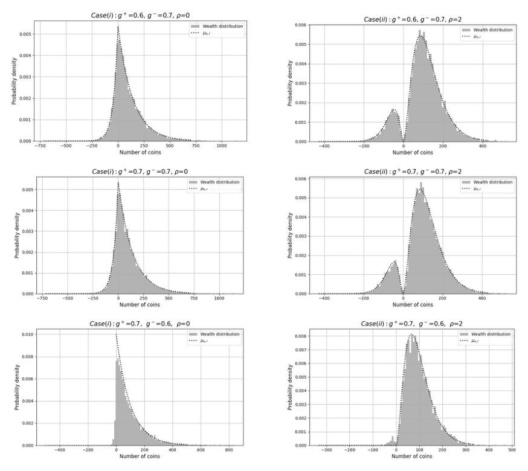
<figcaption class="paper-figure-caption"><b>Fig 1.</b> Figure 1: Simulation results for a single realization of the Markov chain {Xn}n≥0. The left and right columns show the simulation results for Case (i) and Case (ii), respectively. From top to bottom, the values of (g+, g−) are (0.6, 0.7), (0.7, 0.7), and (0.7, 0.6). The gray histograms represent the wealth distribution, i.e. the proportion of agents holding a specific number of coins or a specific amount of debt after n = 109</figcaption>
</figure>

**Summary.** This paper provides a rigorous mathematical framework for understanding wealth distribution in economies with debt by modeling it as a zero-range process. It proves that the stationary state converges to a predictable Gamma-type distribution, determined by the underlying transaction rules. This bridges statistical mechanics theory with complex economic modeling.

**Why it may be interesting.** While focused on econophysics, the mathematical machinery—analyzing convergence in the thermodynamic limit for interacting particle systems (zero-range processes)—is highly relevant to non-equilibrium statistical mechanics and the study of interacting quantum many-body systems.

Detailed structure

**Main problem.** The paper addresses how macroscopic wealth distributions and economic inequality emerge from microscopic, stochastic transaction rules, particularly when debt is allowed.

**Main result.** The stationary wealth distribution converges to either a two-sided Gamma distribution or a standard Gamma distribution, depending on the asymptotic behavior of the coin transfer function.

**Method.** The analysis uses techniques from the theory of zero-range processes, involving the study of stationary measures, local limit theorems, and convergence in the thermodynamic limit.

**Model / system.** The model is an agent-based system of wealth exchange formulated as a zero-range process on a lattice, generalized to allow negative site occupation numbers to represent debt, constrained by a central bank's total debt limit.

**Key observables.** The stationary wealth distribution $\mu_{K,L}^N(\xi)$, and its scaled limit $\mu_{\kappa,r}$.

**Important parameters / regimes.** Total wealth ($K$), total debt limit ($L$), the function governing coin transfers ($g(k)$), and the scaling parameters ($\kappa, r$).

**Assumptions / limitations.** The process is assumed to be irreducible and the transition probability must be symmetric; convergence relies on specific asymptotic conditions on $g(k)$.

**Figures summary.** Figure 1 numerically compares simulated wealth distributions to the derived theoretical density $\mu_{\kappa,r}$ for two distinct cases determined by the relationship between $g_+$ and $g_-$.

**Paper structure.** The paper first establishes the existence of the stationary distribution for the zero-range process with debt. It then proceeds to prove the convergence of this distribution in the thermodynamic limit ($N 	o \infty$) using advanced limit theorems, culminating in the identification of the limiting Gamma distributions.

Abstract

Understanding how macroscopic wealth distributions emerge from microscopic transaction rules among agents is a central problem in econophysics. While many traditional models restrict agents' wealth to non-negative values, debt is an essential feature of realistic economic systems. In this paper, we introduce a stochastic transaction mechanism into the agent-based model with a central-bank-mediated collective debt limit, as studied in [14]. In our model, each agent probabilistically determines whether to transfer a coin, depending on their current asset or debt level. From a probabilistic perspective, the resulting system can be formulated as a zero-range process with $\mathbb{Z}$-valued site occupation numbers, where negative values represent debt. We prove that, under an appropriate scaling, the wealth distribution in the stationary state converges to either a two-sided Gamma distribution or a Gamma distribution, depending on the asymptotic behavior of the function governing coin transfers. Our results rigorously identify these previously unconsidered limiting distributions and provide a mathematical framework for understanding how stochastic monetary exchanges give rise to macroscopic wealth distributions.

[↑ back to top](#top)

### [Ideal gas of active particles in a box](http://arxiv.org/abs/2610.01287v1)

**Authors:** Siran Li, Ralf Eichhorn, Lennart Dabelow  
**Type:** theory · **Category:** statistical mechanics · **PDF:** <https://arxiv.org/pdf/2610.01287v1>  
**Analysis basis:** full PDF text, analyzed in chunks
**Topic relevance:** `Keldysh / 2PI / non-Gaussian methods` **2/5** · `analog quantum simulation` **1/5** · `driven-dissipative phase transition` **1/5** · `methods for driven-dissipative` **1/5** · `non-equilibrium universality` **1/5**

↔ Scroll figures horizontally

<figure class="paper-figure-card">
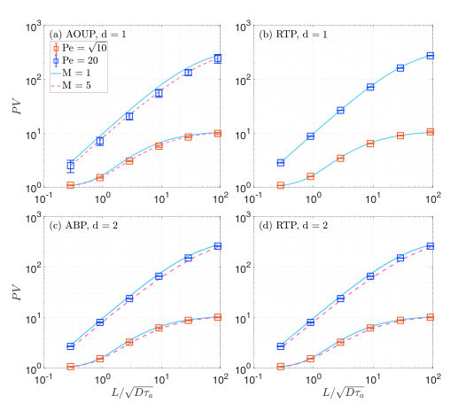
<figcaption class="paper-figure-caption"><b>Fig 1.</b> FIG. 2. Numerical verification of the ideal active gas law for different active particle models, system sizes, and activ- ities. Models and parameters in panels (a) to (d) are as in Fig. 1, see also legend. Symbols show the numerically evalu- ated product PV following Eq. (12), i.e., the correlator ⟨x·v⟩ was calculated from simulations. Solid lines correspond to the theoretical prediction from the right-hand side of Eq. (1), i.e., the exact result for RTPs in d = 1 and the M = 1 approx- imation for AOUPs. Dashed lines correspond to the M = 5 approximation.</figcaption>
</figure>
<figure class="paper-figure-card">
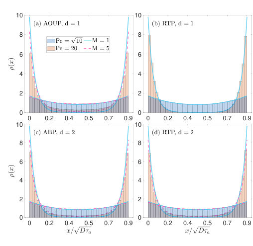
<figcaption class="paper-figure-caption"><b>Fig 2.</b> FIG. 1. Marginal position distributions of various active par- ticle models in a box of size L/√Dτa = 0.9 for different P´eclet numbers Pe as indicated in the legend. Histograms are ob- tained from numerical simulations using 5 × 105 steady-state position samples from 104 independent trajectories. Lines are theory curves ρ(x) = X0(x) [cf. Eq. (9)] for different trunca- tion orders M (see legend). (a) AOUP in d = 1. (b) RTP in d = 1, the theory curve for M = 1 [Eq. (11)] is exact. (c) ABP in d = 2. (d) RTP in d = 2. In (c) and (d), the marginal distributions of a single coordinate (x1) are shown.</figcaption>
</figure>
<figure class="paper-figure-card">
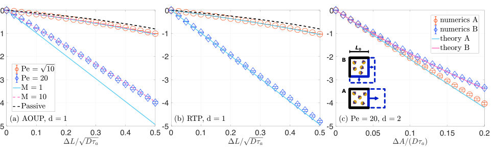
<figcaption class="paper-figure-caption"><b>Fig 3.</b> FIG. 3. Work generated during expansion processes of ideal active gases. (a) AOUPs in d = 1, linear expansion from Li = 0.4 to Lf = Li +∆L. The total expansion time for the largest shown volume change ∆L/√Dτa = 0.5 is τ = 70τa for Pe = √</figcaption>
</figure>

**Summary.** This work derives a generalized ideal gas law for active matter, extending classical thermodynamics to non-equilibrium systems. By analyzing various models like AOUPs and RTPs, the authors establish a relationship between pressure, volume, and activity parameters. This provides a powerful macroscopic tool for studying active systems without needing full microscopic trajectory simulations.

**Why it may be interesting.** While focused on classical active matter, the rigorous derivation of a generalized 'equation of state' (the active gas law) using non-equilibrium statistical mechanics techniques is highly relevant to understanding effective Hamiltonians or effective temperatures in open quantum systems.

Detailed structure

**Main problem.** The paper aims to extend fundamental thermodynamic concepts, specifically the ideal gas law, to the non-equilibrium regime of active matter.

**Main result.** They derive an exact ideal active gas law, $PV = Nk_BT \left( 1 + Pe^2 rac{\vartheta}{1 + Pe^2} 
ight)$, which applies to multiple models of active particles.

**Method.** The derivation involves solving the steady-state Fokker-Planck equation for active Ornstein-Uhlenbeck particles via Hermite function expansions and calculating the pressure using the virial theorem.

**Model / system.** The system is an ideal gas of noninteracting active particles (AOUPs, RTPs, ABPs) confined within a finite rectangular box. The dynamics are governed by overdamped Langevin equations.

**Key observables.** Pressure ($P$), Work ($W$), Marginal position distribution ($
ho(x)$), and the correlation function $\langle \mathbf{x} \cdot \mathbf{v} 
angle$.

**Important parameters / regimes.** Péclet Number ($Pe$), characteristic length scale ($\ell$), and system dimensions ($L_1, \dots, L_d$).

**Assumptions / limitations.** The analysis relies on the assumption of stationarity and is derived for non-interacting particles, neglecting complex interactions or hydrodynamic effects.

**Figures summary.** Figures illustrate the marginal position distributions for different particle types and compare theoretical predictions for the ideal active gas law and the work done during volume expansion protocols.

**Paper structure.** The paper systematically derives the ideal active gas law using analytical expansions for AOUPs, confirms its exactness for RTPs in 1D, and then applies this framework to analyze thermodynamic processes like work extraction during volume changes.

Abstract

Extending a fundamental concept of thermodynamics to the nonequilibrium realm of active matter, we derive an ideal gas law for a suspension of noninteracting active particles confined to a finite rectangular box. The law is exact for run-and-tumble particles (RTPs) in one dimension and established by a systematic analytical expansion of the steady-state probability density for active Ornstein-Uhlenbeck particles in any dimension. It also agrees well with numerical results for active Brownian particles and RTPs in higher dimensions and recovers previously known relations for the limit of large system sizes. Together, these results demonstrate the applicability of the ideal active gas law to the three most widely studied theoretical models of colloidal active matter. As an application, we analyze thermodynamic processes involving active matter on a macroscopic level, without recourse to microscopic particle trajectories or self-propulsion fluctuations.

[↑ back to top](#top)

### [Optimal initial states for quantum Fisher information in linearized cavity optomechanics](http://arxiv.org/abs/2610.01417v1)

**Authors:** Wangjun Lu, Qing Yu, Ying Li, Cuilu Zhai, Rui Zhang, Zhao-Hui Peng, Shiqing Tang  
**Type:** theory · **Category:** other · **PDF:** <https://arxiv.org/pdf/2610.01417v1>  
**Analysis basis:** full PDF text, analyzed in chunks
**Topic relevance:** `quantum measurements` **2/5** · `analog quantum simulation` **1/5** · `correlated / nonlocal dissipation` **1/5** · `driven-dissipative phase transition` **1/5**

↔ Scroll figures horizontally

<figure class="paper-figure-card">
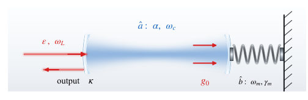
<figcaption class="paper-figure-caption"><b>Fig 1.</b> FIG. 1. Schematic of the model. A driven Fabry–P´erot cav- ity supports a single optical mode of resonance frequency ωc and energy-decay rate κ; its right mirror is a mechanical oscil- lator of frequency ωm and damping rate γm, whose displace- ment x is quantized through the phonon annihilation operator ˆb. Radiation pressure couples the intracavity photon number to this displacement with single-photon coupling g0 (red ar- rows). A coherent drive of frequency ωL and amplitude ε populates the cavity with a large classical amplitude α, and the output field leaking through the input mirror carries the information on g0. In the rotating frame of the drive the laser–cavity detuning is ∆= ωL −ωc;...</figcaption>
</figure>
<figure class="paper-figure-card">
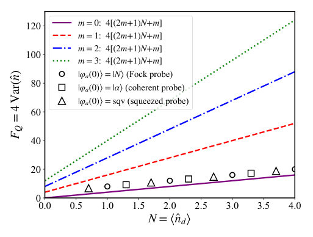
<figcaption class="paper-figure-caption"><b>Fig 2.</b> FIG. 2. Number-state reference (Theorem 1). F (θ) Q /4 = Var(ˆn) as a function of the probe mean photon number N for Fock references m = 0, 1, 2, 3: straight lines of slope 2m + 1. Markers show Fock, coherent, and squeezed-vacuum probes of equal mean photon number on the m = 1 line; all probe families of equal energy perform identically, so the optimum is degenerate.</figcaption>
</figure>
<figure class="paper-figure-card">
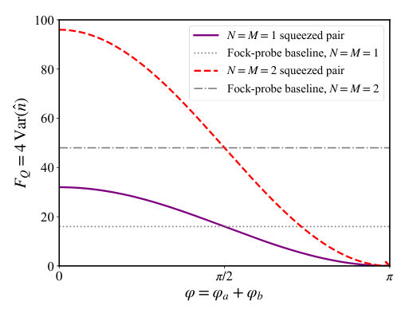
<figcaption class="paper-figure-caption"><b>Fig 3.</b> FIG. 3. Cost of squeezing-phase mismatch: F (θ) Q /4 versus the mismatch angle φ = φa + φb for phase-matched squeezed probe–reference pairs at N = M = 1 (blue) and N = M = 2 (red). φ = 0: optimum; φ = π/2: the pair-coherence term vanishes; φ = π: it flips sign and the QFI drops below the phase-insensitive Fock-probe baseline (dotted horizontal lines, Var = (2M+1)N+M). Crosses mark the φ = π values.</figcaption>
</figure>
<figure class="paper-figure-card">
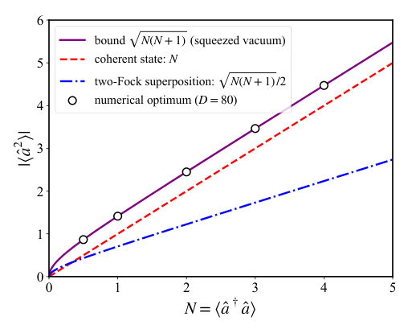
<figcaption class="paper-figure-caption"><b>Fig 4.</b> FIG. 4. The exact moment bound (16). Solid green: | ⟨ˆa2⟩| = p</figcaption>
</figure>
<figure class="paper-figure-card">
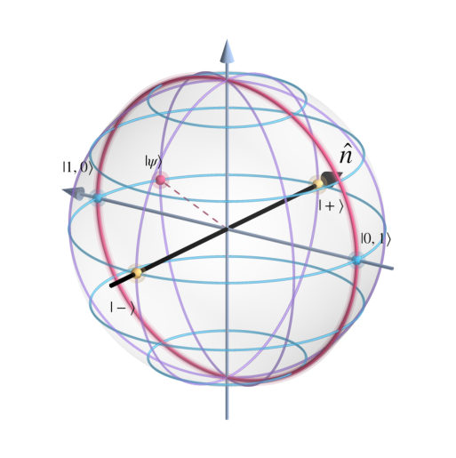
<figcaption class="paper-figure-caption"><b>Fig 5.</b> FIG. 5. Geometric picture of the definite-energy optimum. Each point of the translucent sphere represents a pure state in the fixed-E SU(2) manifold. The full-diameter black axis is the ˆn direction; its endpoints (gold markers |+⟩and |−⟩) are the extremal eigenstates, where Var(ˆn) = 0. Cyan paral- lels collect the states of fixed polar angle ϑ, i.e. fixed variance Var(ˆn) = E2 sin2 ϑ; purple meridians are the constant-phase paths that connect the two poles and parametrize the rela- tive phase φ within each parallel. The glowing pink equator (ϑ = π/2) is precisely the optimal family (28) of equal-weight superpositions of |±⟩, on which Var(ˆn) = E2 and F (θ) Q = 4E2</figcaption>
</figure>

**Summary.** This paper determines the optimal initial quantum states required to maximize the sensitivity (measured by QFI) when estimating the single-photon coupling in a cavity-optomechanical system. By analyzing the system in various regimes, the authors derive that optimal states range from squeezed vacua to NOON-like superpositions. The results are crucial for advancing quantum sensing technology, providing concrete predictions for achievable measurement precision in state-of-the-art experiments.

**Why it may be interesting.** This work provides a rigorous quantum metrology analysis for a highly relevant physical platform (optomechanics), showing how fundamental quantum resources like entanglement and squeezing can be optimized to surpass standard quantum limits for sensing weak couplings.

Detailed structure

**Main problem.** The paper aims to find the optimal initial quantum states that maximize the Quantum Fisher Information (QFI) for estimating the single-photon coupling strength ($g_0$) in a linearized cavity-optomechanical system.

**Main result.** The optimal states depend on the constraints; for fixed total excitation number, the QFI saturates a Heisenberg bound achieved by states equivalent to a two-mode NOON state. Under cavity loss, information accumulation becomes linear at an optimal renewal duration of about 2.5 cavity lifetimes.

**Method.** The analysis uses the Quantum Fisher Information (QFI) derived from the system's generator, which for pure inputs simplifies to four times the variance of the excitation-exchange operator. Optimization is performed by maximizing this variance under various physical constraints.

**Model / system.** The system is a linearized cavity-optomechanical setup coupling an optical cavity mode ($\hat{a}$) to a mechanical oscillator ($\hat{b}$). The dynamics are governed by an effective Hamiltonian derived in the resolved-sideband regime, leading to an interaction term proportional to $\hat{n} = \hat{d}\hat{b}^\dagger + \hat{d}^\dagger\hat{b}$.

**Key observables.** Quantum Fisher Information (QFI), per-hour relative precision, and the variance of the excitation-exchange operator ($	ext{Var}_{\psi_0}(\hat{n})$).

**Important parameters / regimes.** Single-photon coupling ($g_0$), cavity lifetime ($\kappa$), detuning ($\Delta$), and the total excitation number constraint.

**Assumptions / limitations.** The analysis often assumes the system is linearized or that the initial state is pure for initial derivations. Extensions consider cavity loss and different sideband regimes.

**Figures summary.** Figure 1 schematically illustrates the model: a driven Fabry–Pérot cavity coupled to a mechanical oscillator via radiation pressure, with the output field carrying information on $g_0$.

**Paper structure.** The paper first establishes the model and the QFI relationship in the red-detuned regime, deriving closed-form solutions for optimal states (e.g., squeezed vacuum, NOON states). It then extends the analysis to the blue sideband, open-system dynamics (cavity loss), and finally provides quantitative estimates for state-of-the-art experimental precision.

Abstract

We find the optimal initial states of a linearized cavity-optomechanical system for estimating the single-photon coupling by quantum Fisher information. In the red-detuned (beam-splitter) regime the interaction exchanges excitations between the two modes, and for pure inputs the Fisher information is four times the variance of the excitation-exchange operator, reducing the optimization to variance maximization with a closed-form solution. With the mechanical mode in a Fock state the probe is degenerate: any state saturating the photon-number constraint is optimal, and a Fock reference with many phonons enhances the per-photon sensitivity linearly. For an arbitrary fixed mechanical reference it becomes a phase-matched squeezed vacuum, from an exact bound on that coherence obtained by a Lagrange-dual argument. Jointly optimizing both modes at fixed total excitation number, the quantum Fisher information obeys a Heisenberg bound quadratic in the energy, saturated by equal superpositions of the two extremal eigenstates of the generator, equivalently a two-mode NOON state after a balanced beam splitter; balanced product Fock states reach only a linear enhancement. Exact diagonalization in truncated Fock spaces confirms all the results, the familiar single-photon input being the simplest saturating case. Three extensions are worked out: the blue sideband has an unbounded two-mode-squeezing spectrum, so the entangled optimum becomes impossible and the balanced product Fock state is exactly optimal at definite energy; under cavity loss the information accumulation turns linear on the cavity-lifetime timescale, at a renewal-optimal duration of about two and a half lifetimes; and for a state-of-the-art quantum-coherent coupling experiment the per-hour relative precision lies between one part in a million and ten parts in a million, number and thermal references being the most robust.

[↑ back to top](#top)

### [Polynomial-time classical and quantum simulation of quantum impurity models](http://arxiv.org/abs/2610.02167v1)

**Authors:** Jiaqing Jiang, Nathan Ju, Ojas Parekh, Chaithanya Rayudu, Andrew Zhao  
**Type:** theory · **Category:** strongly correlated electrons · **PDF:** <https://arxiv.org/pdf/2610.02167v1>  
**Analysis basis:** full PDF text, analyzed in chunks
**Topic relevance:** `Keldysh / 2PI / non-Gaussian methods` **2/5** · `methods for driven-dissipative` **2/5** · `analog quantum simulation` **1/5**

↔ Scroll figures horizontally

<figure class="paper-figure-card">
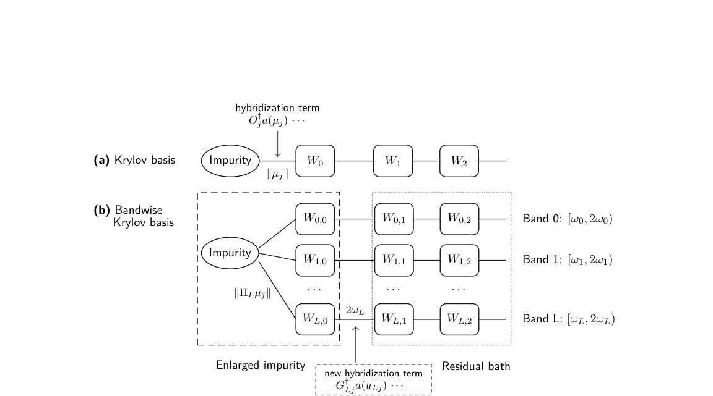
<figcaption class="paper-figure-caption"><b>Fig 1.</b> Figure 1: Illustration of the one-dimensional structure induced by a Krylov basis for the bath single-particle space. Each block represents a group of annihilation operators, and an edge indicates that the Hamiltonian contains coupling terms between the corresponding blocks. (a) Krylov basis. We choose a bath single-particle basis {gj}j consistent with the Krylov shells W0, W1, . . .. When H is expressed in terms of the annihilation operators {a(gj)}j, it has a one-dimensional block structure. Each block has at most 2m modes. The impurity couples only to the first block through the hybridization terms {O† ja(µj)}j, and each subsequent block couples only to its neighboring blocks. (b)...</figcaption>
</figure>

**Summary.** This paper comprehensively analyzes the computational complexity of simulating quantum impurity models. It proves that static properties, like ground-state energy, can be calculated efficiently on classical computers. However, it demonstrates that simulating non-equilibrium dynamics requires quantum computation, establishing a clear boundary for quantum advantage in this field.

**Why it may be interesting.** This work provides a rigorous computational benchmark for impurity physics, clarifying where quantum simulation offers a genuine advantage (dynamics) versus where classical methods suffice (statics).

Detailed structure

**Main problem.** The paper determines the computational complexity boundary between classical and quantum simulation for quantum impurity models.

**Main result.** Static properties of these models are classically computable in polynomial time, while simulating non-equilibrium dynamics requires the full power of quantum computation.

**Method.** The authors develop and analyze polynomial-time classical algorithms for static observables and use quantum complexity theory (BQP, DQC1) to characterize the difficulty of dynamic simulations.

**Model / system.** The system studied is the quantum impurity model, which describes a small, strongly interacting fermionic subsystem coupled to a large, noninteracting bath. The Hamiltonian involves bath terms (Majorana operators) and impurity interactions.

**Key observables.** Ground-state energy, partition function, and nonequilibrium Green's functions.

**Important parameters / regimes.** System size ($n$), precision parameters ($\delta, \epsilon$), inverse temperature ($eta$), and time scales ($t$).

**Assumptions / limitations.** The classical algorithms assume the impurity size is constant, and the quantum complexity analysis relies on specific encoding techniques (e.g., block encodings).

**Figures summary.** Not specified.

**Paper structure.** The paper progresses by first establishing classical tractability for static properties, then contrasting this with the quantum hardness for dynamics, and finally detailing the complexity bounds for preparing quantum Gibbs states.

Abstract

Quantum impurity models are paradigmatic models of interacting quantum matter, as well as key computational primitives for modern electronic-structure methods. They describe a small subsystem of interacting fermions coupled to a large, noninteracting bath. We perform a comprehensive study of the computational complexity of simulating impurity models, delineating the boundary between classical and quantum tractability for this class of problems. Our main finding is that static properties of quantum impurity models can be calculated efficiently on a classical computer. Specifically, we give classical algorithms that (1) estimate the ground-state energy to additive precision $δ$ in time $\mathrm{poly}(n,δ^{-1})$, and (2) estimate the partition function at inverse temperature $β$ to relative precision $δ$ in time $\mathrm{poly}(n,β,δ^{-1})$, where $n$ is the system size. These results improve the previous best-known complexity for ground-state energy estimation from quasipolynomial to polynomial time, while establishing for the first time rigorous polynomial-time guarantees for simulating impurity models in thermal equilibrium. On the other hand, we find that simulating dynamical properties of impurity models is hard for classical computers but easy on a quantum computer. As a canonical example, we show that computing their nonequilibrium Green's functions captures the full power of quantum computation, even at finite temperature. Taken together, our results rule out superpolynomial quantum speedups for computing static properties, but provide an avenue for quantum advantage in simulating impurity physics out of equilibrium.

[↑ back to top](#top)

### [Learning SYK Hamiltonians](http://arxiv.org/abs/2610.02178v1)

**Authors:** Anurag Anshu, Srinivasan Arunachalam, Sitan Chen, Yeongwoo Hwang  
**Type:** theory · **Category:** other · **PDF:** <https://arxiv.org/pdf/2610.02178v1>  
**Analysis basis:** full PDF text, analyzed in chunks
**Topic relevance:** `quantum measurements` **2/5** · `Keldysh / 2PI / non-Gaussian methods` **1/5** · `analog quantum simulation` **1/5**

↔ Scroll figures horizontally

<figure class="paper-figure-card">
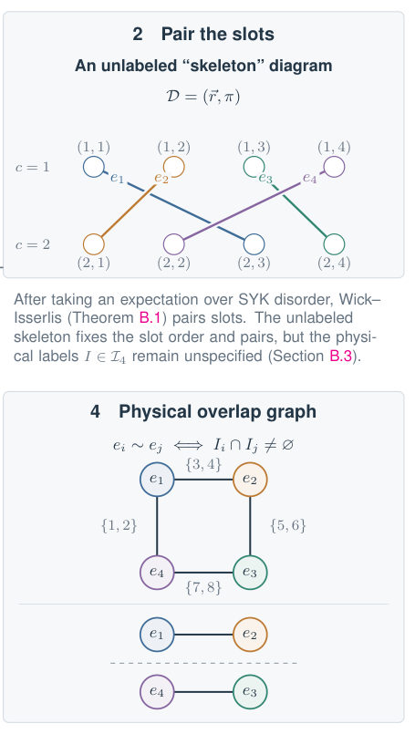
<figcaption class="paper-figure-caption"><b>Fig 1.</b> Figure 1: From Taylor slots to physical overlap graphs, for two replicas Zc = Z(β, ⃗g) sharing the same random disorder, with n ≥8 and normalized trace Tr. Every illustrated pair meets both replicas, so colored-support overlap is equivalent to Ii ∩Ij ̸= ∅; the upper graph labels display these intersections.</figcaption>
</figure>
<figure class="paper-figure-card">
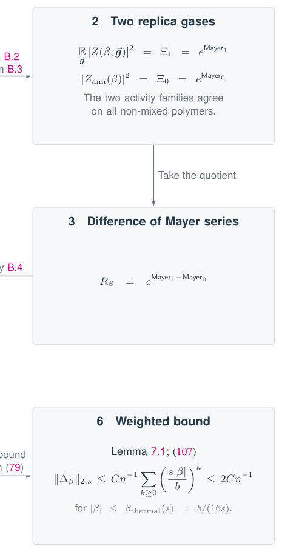
<figcaption class="paper-figure-caption"><b>Fig 2.</b> Figure 2: Proof of the ∆β bound in Lemma 7.1. Here s ≥1, b = 16βthermal. The subscripts 1 and 0 correspond to shared and independent disorder parameters. The Mayer series Mayer1 differs only from Mayer0 in cross-color Wick pairs; this corresponds to mixed polymers. The counting estimates also verify the Koteck´y–Preiss hypotheses on the disk |β| ≤b.</figcaption>
</figure>

**Summary.** This paper tackles the challenging problem of reconstructing the complex, dense Hamiltonian of the SYK model solely from measurements of its thermal Gibbs state. By exploiting the model's random mean-field nature, the authors derive sample complexity bounds showing that the Hamiltonian can be learned efficiently, even when traditional locality assumptions fail.

**Why it may be interesting.** This work directly addresses the challenge of characterizing complex, highly entangled quantum systems (like those modeled by SYK) using limited experimental measurements, which is a major goal in quantum simulation and quantum information.

Detailed structure

**Main problem.** The core problem is learning the dense Sachdev-Ye-Kitaev (SYK) Hamiltonian from measurements of the system's Gibbs state.

**Main result.** The authors prove that the SYK Hamiltonian can be learned to high accuracy using a sample complexity that is polynomial in system size, overcoming limitations faced by algorithms designed for local interactions.

**Method.** The approach exploits the random mean-field structure of the SYK model, utilizing techniques from statistical inference (like maximum entropy methods) adapted for quantum expectation values.

**Model / system.** The study focuses on the SYK model, a strongly interacting quantum many-body system characterized by all-to-all quartic interactions, leading to a dense Hamiltonian structure.

**Key observables.** The Gibbs state ($\gamma_{\vec{g}}$), quartic expectation values ($\mu_{eta,I}$), and the log-partition function ($\Phi(\vec{g})$) are central observables.

**Important parameters / regimes.** The inverse temperature ($eta$), the interaction order ($q$), and the desired accuracy ($\epsilon$) are key parameters governing the learning bounds.

**Assumptions / limitations.** The success of the sample-efficient learning relies fundamentally on the random mean-field structure of the SYK couplings.

**Paper structure.** The paper establishes the problem of Hamiltonian learning for dense systems, presents the sample-efficient recovery algorithm for fixed $eta$, and discusses a separate, time-efficient algorithm for small constant $eta$.

Abstract

We study the problem of learning the dense Sachdev--Ye--Kitaev (SYK) Hamiltonian from copies of its Gibbs state. Existing algorithms for Hamiltonian learning typically rely on geometric locality or bounded interaction degree and therefore do not apply to SYK, where each quartic interaction overlaps with $Θ(n^3)$ others. We show that this obstruction can be overcome by exploiting the random mean-field structure of the model. At any constant temperature, we prove that with high probability over the SYK couplings, the entire Hamiltonian can be learned to inverse-polynomial accuracy using polynomially many samples. Furthermore, when the inverse temperature is restricted to be a sufficiently small constant, we construct a quasipolynomial-time learning algorithm which is qualitatively different from the sample-efficient algorithm.

[↑ back to top](#top)

### [Learnt Attacks on Quantum Key Distribution under Channel Noise and Device Drift](http://arxiv.org/abs/2610.01792v1)

**Authors:** Marcel Mordarski, Benjamin Gras, Abdelrahman Shehata, Daniel Budina, Roberto Bondesan  
**Type:** theory · **Category:** quantum information and computing · **PDF:** <https://arxiv.org/pdf/2610.01792v1>  
**Analysis basis:** full PDF text, analyzed in chunks
**Topic relevance:** `methods for driven-dissipative` **2/5** · `quantum measurements` **2/5**

↔ Scroll figures horizontally

<figure class="paper-figure-card">
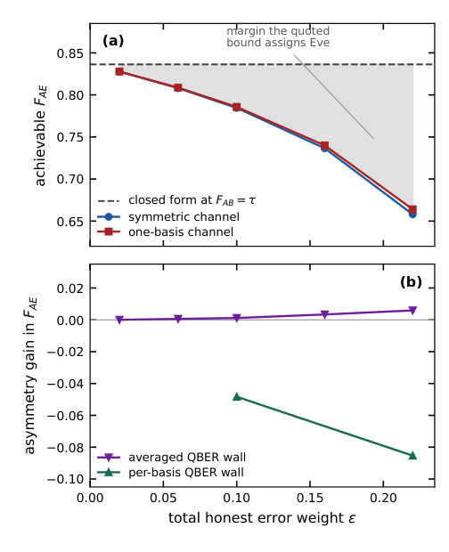
<figcaption class="paper-figure-caption"><b>Fig 1.</b> Figure 1. Attainable attacks under stationary channel noise at an abort threshold of FAB ⩾0.87. (a) The maximum at- tainable FAE under the trusted-noise convention as the chan- nel’s total honest error weight, ε, increases. This is plotted for two scenarios: a channel concentrating all its error in a single basis, and one splitting the error evenly. Because both channels produce the same observed disturbance, the noise- less closed-form solution (dashed line) assigns them identical values. The shaded region highlights the gap between this theoretical limit and the actual attainable FAE. Each data point represents the best outcome from three random seeds, with a cross-seed spread of...</figcaption>
</figure>
<figure class="paper-figure-card">
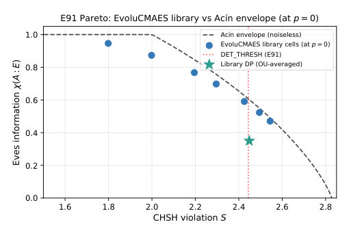
<figcaption class="paper-figure-caption"><b>Fig 2.</b> Figure 2. Disturbance versus information in the device- independent setting. At p = 0, the discovered attacks trace the noiseless Acín envelope [27, 28], demonstrating that the search successfully saturates the analytical frontier where one exists. However, when averaged over the drifting noise, the attainable value (marked by the star) drops to χ ≈0.35, fall- ing short of the 0.607 permitted by the theoretical envelope at the threshold. This gap occurs for two reasons: the the- oretical envelope assumes a strictly noiseless channel (p = 0) while the attainable value averages over active noise (p &gt; 0), and the constructed attacks are restricted to a fixed three- qubit preparation.</figcaption>
</figure>
<figure class="paper-figure-card">
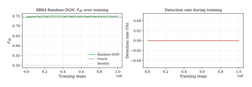
<figcaption class="paper-figure-caption"><b>Fig 3.</b> Figure 3. Adaptive attack on BB84 under a drifting device. Upper panel: attacker information FAE during evaluation, reaching the greedy oracle (dashed) at its best checkpoints and well above the passive baseline (dotted). Lower panel: detection rate, which stays at zero at those checkpoints.</figcaption>
</figure>
<figure class="paper-figure-card">
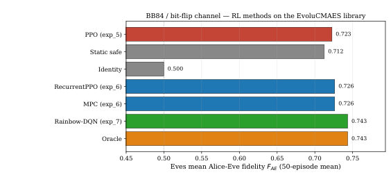
<figcaption class="paper-figure-caption"><b>Fig 4.</b> Figure 4. BB84 under a drifting bit-flip channel: final evalu- ation FAE across policies, strict-feasibility variants only. The value-based agent matches the greedy oracle at 0.7434, un- masked policy-gradient methods plateau around 0.02 below it, and the noise-indexed conservative lookup (“Static safe”) reaches 0.7197.</figcaption>
</figure>
<figure class="paper-figure-card">
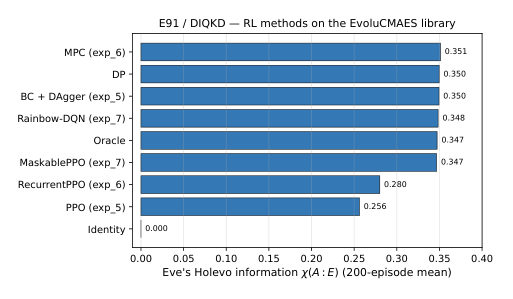
<figcaption class="paper-figure-caption"><b>Fig 5.</b> Figure 6. E91/DIQKD: final evaluation χ across policies. The masked value-based agent reaches 0.3484 against a greedy or- acle at 0.3507 and a coarse-grid dynamic-programming run at 0.3540 with 7% detection, whereas unmasked policy-gradient methods collapse to χ ≈0.26–0.28 by confining themselves to three or four distinct actions.</figcaption>
</figure>

**Summary.** This paper develops a framework to analyze eavesdropping attacks on QKD when the quantum channel noise drifts over time. By modeling the attack as a constrained Markov decision process and using reinforcement learning, the authors show that adaptive attackers can exploit channel drift to gain significantly more information than previously assumed. This work advances the security understanding of QKD in real-world, non-stationary environments.

**Why it may be interesting.** It provides a rigorous, computationally intensive framework for assessing the security margins of quantum communication links against sophisticated, time-varying adversaries, which is crucial for practical quantum network deployment.

Detailed structure

**Main problem.** The paper addresses the security of Quantum Key Distribution (QKD) links when the underlying quantum channel drifts over time, a scenario not adequately covered by standard security analyses that assume stationary channels.

**Main result.** Using reinforcement learning, the authors demonstrated that an adaptive eavesdropper can significantly increase their information gain (Holevo information) compared to the best fixed attack, reaching values close to the theoretical upper bound.

**Method.** The problem is modeled as a constrained Markov decision process, solved using reinforcement learning to train an adaptive eavesdropping strategy that optimizes circuit selection round-by-round.

**Model / system.** The system involves QKD protocols (BB84, E91) transmitted over channels whose noise follows an Ornstein–Uhlenbeck process, simulating channel drift between recalibrations.

**Key observables.** Holevo information ($\chi$), Fidelity ($F$), and the achievable Key Rate, which are used to quantify the eavesdropper's information gain.

**Important parameters / regimes.** The noise level ($	ext{pt}$), the rate of channel drift ($\kappa$), and the budget over the rounds of the attack.

**Assumptions / limitations.** The primary gap addressed is the lack of quantification regarding the attacker's gain specifically due to channel drift, moving beyond the assumption of stationary noise.

**Figures summary.** The notes mention comparing the separation between attainable FAE and the noiseless cloning envelope across various noise weights, and showing the evolution of the noise level over time in the drift analysis.

**Paper structure.** The work progresses by first framing the problem as an adaptive MDP, then applying RL to find optimal attack circuits, and finally demonstrating quantitative gains on specific protocols (E91 and BB84) under simulated channel drift.

Abstract

Quantum key distribution (QKD) links are provisioned from security analyses of stationary channels, whereas the devices that determine the channel drift between recalibrations. Whether an eavesdropper who cannot alter the channel's own noise gains by following that drift has not been quantified. Adaptive eavesdropping is posed here as a constrained Markov decision process in which the attacker selects one circuit per round while the noise level follows an Ornstein--Uhlenbeck process and the abort condition is a budget over each block of rounds. The value of adaptation is bounded by the best fixed circuit and a dynamic-programming upper bound. The actions are learnt attacks. Whereas Decker et al. trained a parametrised circuit on a fixed gate template against a fixed channel, here the gate structure and rotation angles are searched jointly. This yields circuits compact enough to form a discrete action set, extending the construction to noise models lacking a known template, including the amplitude damping channel. On device-independent E91 under bilateral depolarising noise, a reinforcement-learning attacker raises her Holevo information from $0.135$ for the best fixed circuit to $0.348$ at zero detection, $98\%$ of the upper bound. On BB84 under a drifting bit-flip channel, she exceeds a conservative noise-indexed rule by $0.024$ in fidelity, reaching $99\%$ of the upper bound. Under stationary noise, the attacker's gain from basis asymmetry changes sign between an averaged and a per-basis error-rate constraint. The search, started from random gate sequences, recovers the analytical cloners and the collective-attack key rate, and meets the lower bound of the Winick--Lütkenhaus--Coles objective from above.

[↑ back to top](#top)

### [TATVA: A Reinforcement Learning Framework for Quantum Circuit Synthesis](http://arxiv.org/abs/2610.00945v1)

**Authors:** Om Bhamare, Aryan Jadhav, Manas Shinde, Prithvi Shinde  
**Type:** theory · **Category:** quantum information and computing · **PDF:** <https://arxiv.org/pdf/2610.00945v1>  
**Analysis basis:** full PDF text, analyzed in chunks
**Topic relevance:** `methods for driven-dissipative` **2/5** · `quantum measurements` **2/5**

↔ Scroll figures horizontally

<figure class="paper-figure-card">
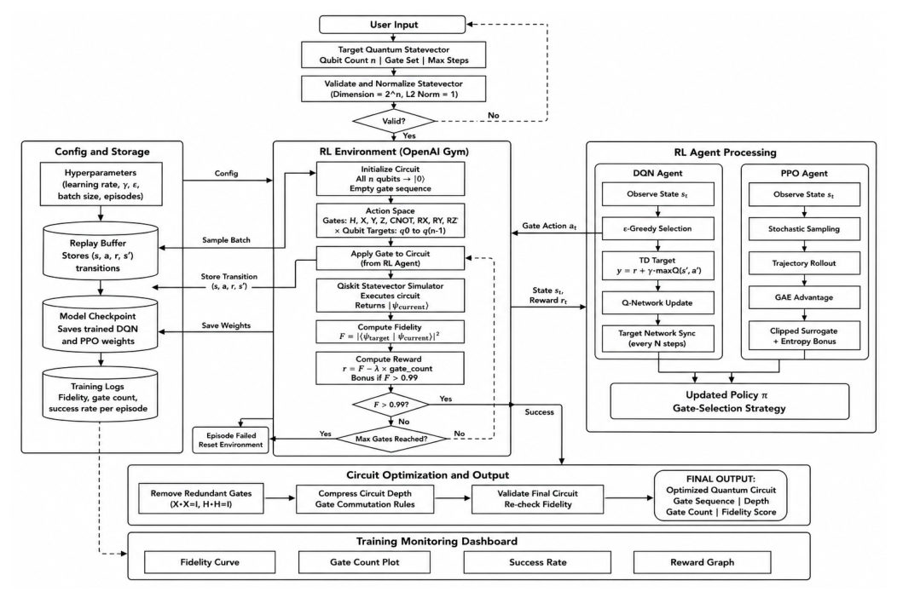
<figcaption class="paper-figure-caption"><b>Fig 1.</b> Figure 1. System architecture of TATVA, showing the interaction between the RL environment, the DQN/PPO agent-processing block, the configuration and storage layer, and the circuit-optimization stage that produces the final output.</figcaption>
</figure>
<figure class="paper-figure-card">
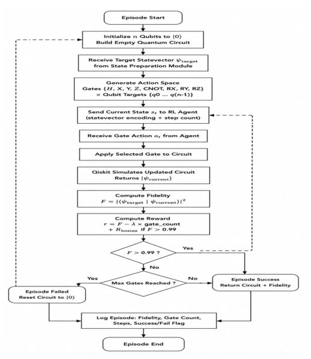
<figcaption class="paper-figure-caption"><b>Fig 2.</b> Figure 3. Reinforcement Learning environment workflow, from episode start through gate application, fidelity/reward computation, and episode logging.</figcaption>
</figure>
<figure class="paper-figure-card">
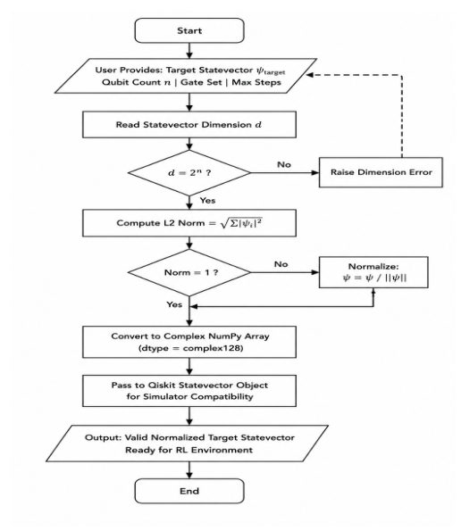
<figcaption class="paper-figure-caption"><b>Fig 3.</b> Figure 2. Input and target-state preparation layer: dimension validation, L2 normalization, and conversion to a Qiskit Statevector object.</figcaption>
</figure>
<figure class="paper-figure-card">
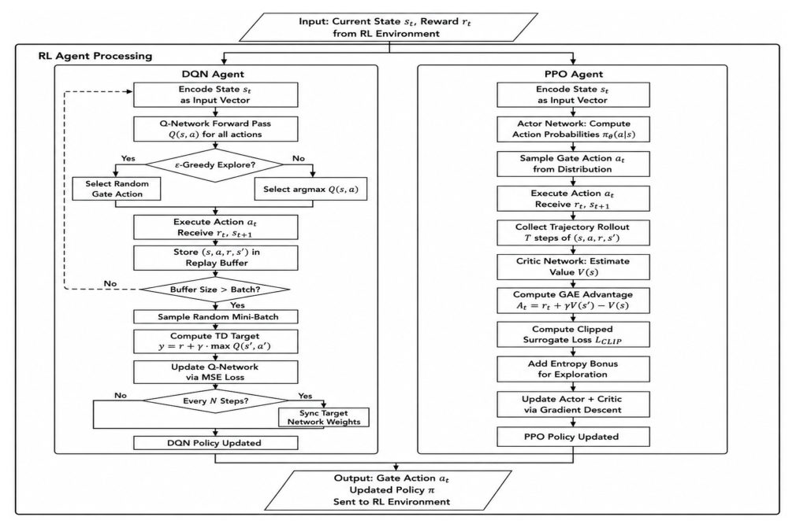
<figcaption class="paper-figure-caption"><b>Fig 4.</b> Figure 4. DQN and PPO agent workflow, run in parallel on the same environment state and reward signal, each producing an updated gate-selection policy.</figcaption>
</figure>
<figure class="paper-figure-card">
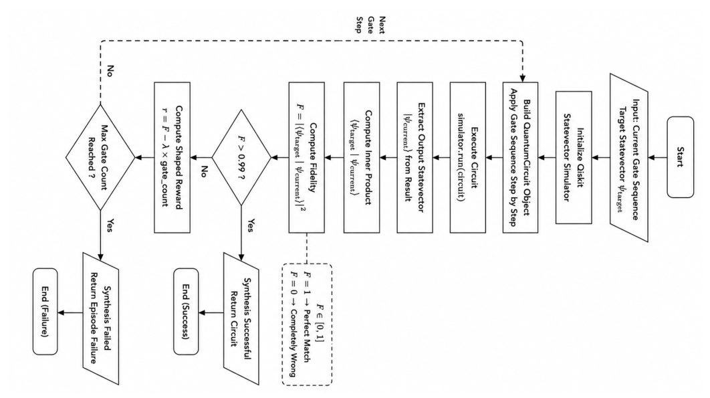
<figcaption class="paper-figure-caption"><b>Fig 5.</b> Figure 5. Quantum simulation and fidelity-evaluation flow: circuit execution, fidelity computation, and the success/continue decision at F &gt; 0.999999.</figcaption>
</figure>

**Summary.** This paper introduces TATVA, an RL framework that treats quantum circuit synthesis as a sequential decision problem to prepare target quantum states. By employing parallel DQN and PPO agents, the system selects gates to maximize fidelity, followed by an optimization step to ensure the resulting circuit is both accurate and compact. This advances the field by enabling automatic, high-fidelity quantum circuit design.

**Why it may be interesting.** While focused on circuit synthesis, the reliance on advanced RL techniques (DQN/PPO) for sequential decision-making in quantum systems provides a generalizable algorithmic framework relevant to optimizing quantum control pulses or state preparation in AMO experiments.

Detailed structure

**Main problem.** The core challenge is automatically synthesizing quantum circuits to prepare a desired target quantum state with the highest possible fidelity while minimizing the number of gates.

**Main result.** The proposed TATVA framework successfully synthesizes high-fidelity circuits (achieving $F \geq 0.999999$) for up to 5 qubits, significantly compacting the circuit depth and gate count compared to classical methods.

**Method.** It employs a Reinforcement Learning (RL) approach, utilizing parallel DQN and PPO agents to treat circuit synthesis as a sequential decision process, followed by a post-hoc optimization step.

**Model / system.** The system operates on $n$-qubit quantum circuits, simulated using Qiskit's statevector simulator. The process starts from the initial state $|0
angle^{\otimes n}$ and iteratively applies gates selected by the RL agents.

**Key observables.** Fidelity ($F$), Success Rate, Gate Count ($	ext{N}_g$), and Circuit Depth ($D$).

**Important parameters / regimes.** The fidelity threshold is set at $F > 0.999999$. The system is tested up to 5 qubits.

**Assumptions / limitations.** The initial design relies on predefined rules, which motivates the need for an RL approach to handle complex, hard-to-design target states.

**Figures summary.** Figures illustrate the end-to-end pipeline: system architecture (Fig 1), input/target state preparation (Fig 2), the RL environment workflow (Fig 3), parallel agent operation (Fig 4), fidelity evaluation (Fig 5), and final circuit optimization (Fig 6).

**Paper structure.** The paper details the TATVA pipeline: first, target state preparation; second, the RL-based gate selection using DQN/PPO; third, quantum simulation and fidelity checking; and finally, a post-hoc optimization stage to reduce circuit depth.

Abstract

One of the most important initial steps in quantum computing is high-fidelity quantum state preparation, because errors in it can affect the final computational result. Therefore, one of the major challenges is to design a quantum circuit that can achieve the desired target state accurately with a smaller number of gates. Traditionally, circuits are designed using predefined rules and mathematical decompositions, but this makes it difficult to design circuits for different and complex target states. This paper presents TATVA, a reinforcement learning (RL) system for synthesizing quantum circuits. TATVA views circuit synthesis as a sequential decision problem in which the agents select one gate at a time and calculate the fidelity after each applied gate, with the gate producing the highest fidelity selected for the circuit. The system introduces a parallel architecture that uses two RL agents, Deep Q-Network (DQN) and Proximal Policy Optimization (PPO), along with Qiskit's statevector simulator. The system can synthesize up to 5 qubits while achieving a fidelity of 0.999999 and producing compact circuits. After achieving the desired fidelity, it performs a post-hoc optimization step that reduces the circuit depth while preserving the achieved fidelity. The circuit is finalized using fidelity, success rate, gate count, and circuit depth. Target states that are not used during training are used to test whether the system has learned effectively and can generalize beyond the training states. This approach aims to enable automatic quantum circuit synthesis with high fidelity using reinforcement learning.

[↑ back to top](#top)

### [A Hilbert-Space Analogy for Sexual Orientation and Gender Identity](http://arxiv.org/abs/2610.00646v1)

**Authors:** Sofia Fatigoni  
**Type:** theory · **Category:** other · **PDF:** <https://arxiv.org/pdf/2610.00646v1>  
**Analysis basis:** full PDF text, analyzed in chunks
**Topic relevance:** `quantum measurements` **2/5** · `analog quantum simulation` **1/5**

↔ Scroll figures horizontally

<figure class="paper-figure-card">
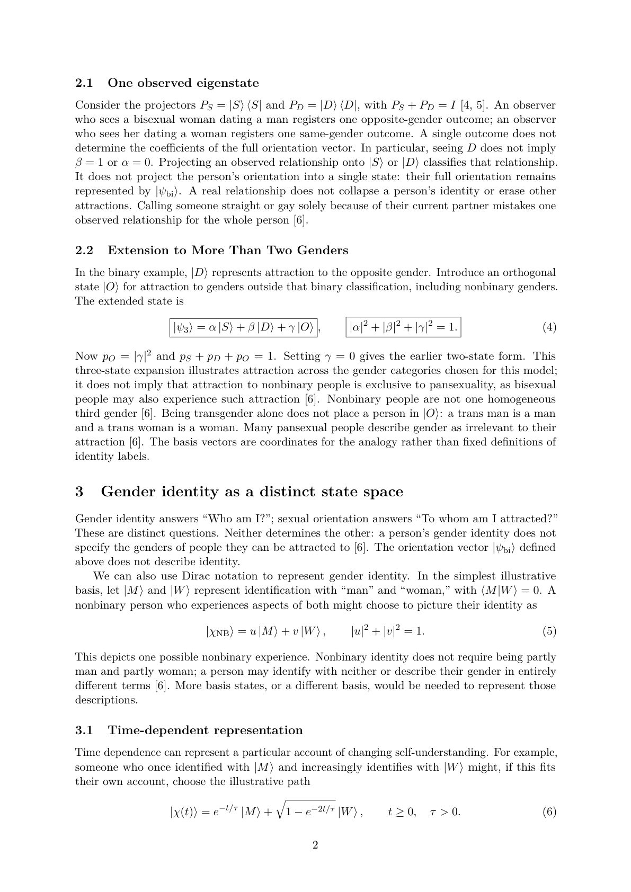
<figcaption class="paper-figure-caption"><b>Fig 1.</b> Low-resolution page preview, page 2</figcaption>
</figure>
<figure class="paper-figure-card">
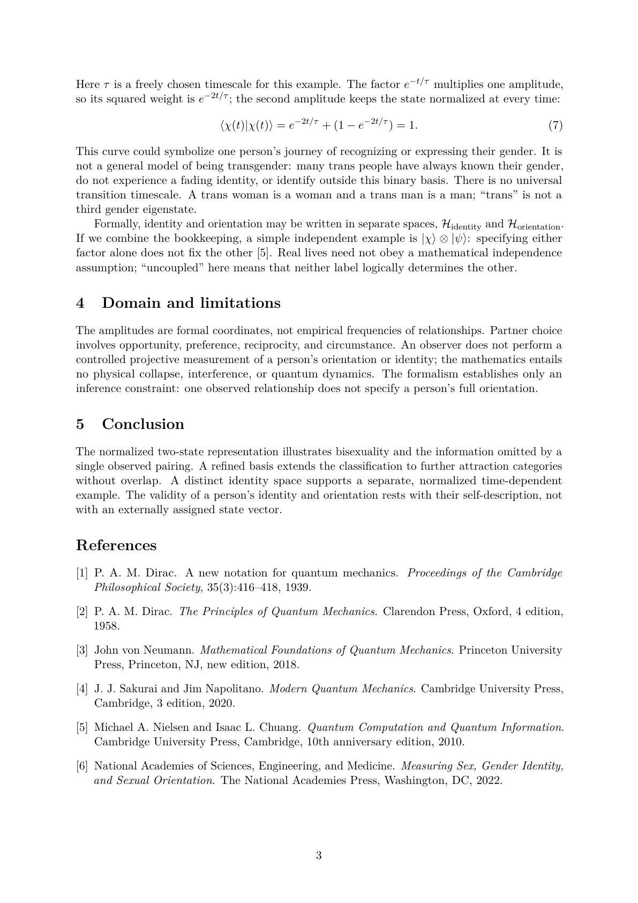
<figcaption class="paper-figure-caption"><b>Fig 2.</b> Low-resolution page preview, page 3</figcaption>
</figure>

**Summary.** This paper constructs a mathematical analogy using quantum mechanics formalism to model human sexual orientation and gender identity. It represents these concepts as state vectors within distinct, finite-dimensional Hilbert spaces. The core argument is that the quantum framework can formally describe the spectrum of human attraction and identity without implying physical collapse or measurement procedures.

**Why it may be interesting.** While not a physical theory, the rigorous application of quantum formalism (Hilbert spaces, state vectors) to abstract, non-physical concepts provides an interesting exercise in mathematical analogy for theoretical physicists.

Detailed structure

**Main problem.** The paper develops a formal mathematical analogy using quantum mechanics concepts to model human sexual orientation and gender identity.

**Main result.** It argues that sexual orientation and gender identity can be modeled in distinct, mathematically independent state spaces, and that a single observation does not fully determine the underlying state vector.

**Method.** The authors employ Dirac notation, defining state vectors and using concepts like normalization and basis expansion to represent sexual attraction and gender identity.

**Model / system.** Sexual orientation is modeled in a finite-dimensional state-space (e.g., $|S
angle, |D
angle$) with a state vector $|\psi_{bi}
angle = \alpha |S
angle + eta |D
angle$. Gender identity is treated in a separate space, with time-dependent trajectories illustrated for conceptual purposes.

**Key observables.** Amplitudes ($\alpha, eta, \gamma, u, v$), which determine the probability weights ($|\cdot|^2$) for different attractions or identities.

**Important parameters / regimes.** The normalization condition ($\sum |\cdot|^2 = 1$) and the timescale ($	au$) used for illustrative time evolution.

**Assumptions / limitations.** The model is explicitly stated to be an analogy, not a physical theory or measurement procedure for human sexuality; the validity rests with self-description, not the state vector.

**Figures summary.** Not specified by the notes.

**Paper structure.** The paper introduces the mathematical framework by defining the state-space for sexual orientation, extending it to multiple genders, and then defining a separate, analogous state space for gender identity, concluding with a discussion of the model's limitations.

Abstract

We introduce a finite-dimensional state-space representation of bisexuality in Dirac notation, specify normalized amplitude weights, and analyze the limits of inference from one single observation. We extend the basis for discussing attraction across genders, then define a distinct state space for gender identity with an illustrative normalized time-dependent trajectory. The model is an analogy, not a physical theory or a measurement procedure for human sexuality.

[↑ back to top](#top)

### [A provable quantum advantage for approximate optimization via decoded quantum interferometry](http://arxiv.org/abs/2610.02145v1)

**Authors:** Maximilian J. Kramer, Elies Gil-Fuster, Benjamin D. M. Jones, Jens Eisert, Franz J. Schreiber  
**Type:** theory · **Category:** quantum information and computing · **PDF:** <https://arxiv.org/pdf/2610.02145v1>  
**Analysis basis:** full PDF text, analyzed in chunks
**Topic relevance:** `quantum measurements` **2/5** · `interference shaping light` **1/5**

↔ Scroll figures horizontally

<figure class="paper-figure-card">
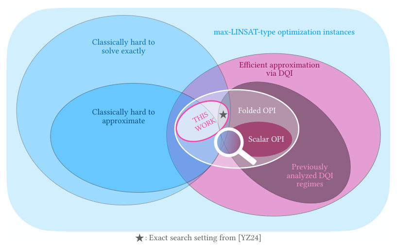
<figcaption class="paper-figure-caption"><b>Fig 1.</b> Figure 1: Schematic context for the present results. The magnifying-glass lens marks the unresolved sta- tus of quantum advantage for scalar OPI: existing DQI analyses outperform the best known classical algo- rithms, but do not establish a lower bound against arbitrary classical algorithms. The star marks Yamakawa and Zhandry’s exact-search oracle separation on folded Reed–Solomon instances. The present work estab- lishes an approximation separation for DQI on folded OPI. The regions are conceptual and do not denote literal set inclusions across computational models.</figcaption>
</figure>
<figure class="paper-figure-card">
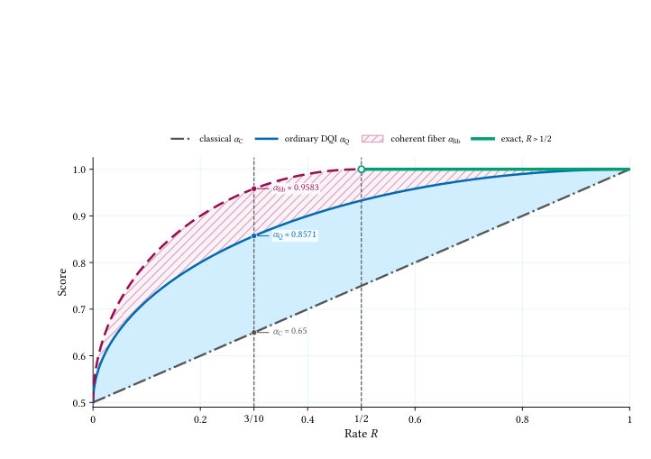
<figcaption class="paper-figure-caption"><b>Fig 2.</b> Figure 2: Provable score guarantees for our balanced folded OPI instances. DQI’s guarantee holds for every promised oracle, whereas the stronger guarantees from coherent fiber summation hold only on typical sampled oracles. The gray dash-dotted curve is the classical threshold 𝛼C attained by Prange’s algorithm under the distributional quantifiers of Informal Theorem 1. The solid blue curve marks 𝛼Q, and the light-blue region indicates the thresholds above 𝛼C and below 𝛼Q that DQI achieves on every promised oracle. The pale-pink hatched region marks the additional thresholds below 𝛼fib achieved by coherent fiber summation on typical sampled oracles. The solid green segment gives...</figcaption>
</figure>
<figure class="paper-figure-card">
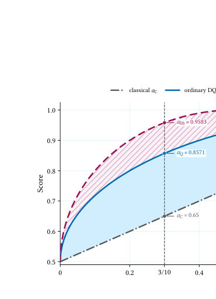
<figcaption class="paper-figure-caption"><b>Fig 3.</b> Figure 2 summarizes the resulting certified score regimes.</figcaption>
</figure>
<figure class="paper-figure-card">
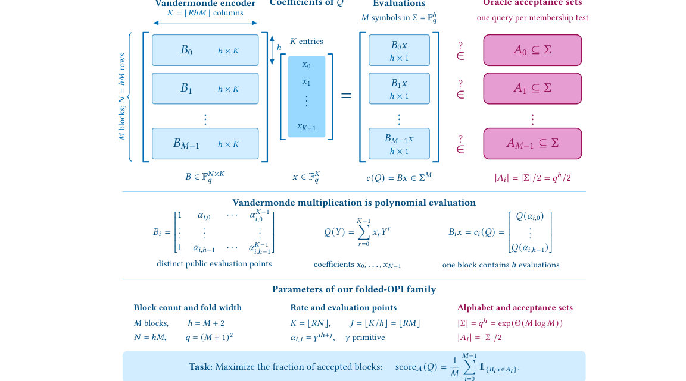
<figcaption class="paper-figure-caption"><b>Fig 4.</b> Figure 3: From block max-LINSAT to folded OPI. For a general linear encoder 𝐵, the objective counts the accepted blocks 𝐵𝑖𝑥∈𝐴𝑖. Choosing Vandermonde rows at distinct evaluation points identifies 𝑥with the coefficients of 𝑄(𝑌) = Í𝐾−1 𝑟=0 𝑥𝑟𝑌𝑟, so 𝐵𝑖𝑥= (𝑄(𝛼𝑖,𝑗))ℎ−1 𝑗=0 . This gives folded polynomial intersection: one membership query tests an entireℎ-vector of polynomial evaluations. The lower panel records our concrete family parameters for admissible 𝑀. Each acceptance set contains exactly half of the block symbols; the score is the fraction of blocks accepted by the chosen polynomial. The output is shown with its folded grouping, and dimensions are schematic.</figcaption>
</figure>

**Summary.** This work proves a quantum advantage for approximate optimization by analyzing the Decoded Quantum Interferometry (DQI) algorithm on a structured problem called folded OPI. The authors establish a strict gap between the quantum performance and the best classical performance, showing that achieving certain accuracy levels classically requires super-polynomial queries. This advances the understanding of quantum computational power in the context of structured search problems.

**Why it may be interesting.** While the primary focus is quantum computation theory, the techniques involving coherent summation and state-vector analysis are highly relevant to understanding quantum measurement limitations in complex physical systems.

Detailed structure

**Main problem.** The paper aims to establish a provable quantum advantage for solving approximate optimization problems using the Decoded Quantum Interferometry (DQI) framework.

**Main result.** A strict separation is proven between the approximation ratio achievable by DQI and the best possible performance of any polynomial-time classical algorithm for the folded optimal polynomial intersection (folded OPI) problem.

**Method.** The authors extend classical lower-bound methods to the approximation setting, utilizing DQI, which connects optimization to coding theory via Fourier transforms over finite fields.

**Model / system.** The analysis is set in an oracle model involving membership oracles for acceptance sets, specifically applied to the folded OPI problem, which is related to coding theory structures.

**Key observables.** Approximation Ratio/Score ($\alpha$), Quantum Score ($\alpha_Q$), and Classical Threshold ($\alpha_C$).

**Important parameters / regimes.** Code Rate ($R$), Query Complexity (number of blocks $M$).

**Assumptions / limitations.** The separation is established for an explicit family of balanced folded-OPI instances, and the stronger $\alpha_{fib}$ guarantee holds only on typical sampled instances.

**Figures summary.** Figure 1 schematically shows the approximation separation for DQI on folded OPI. Figure 2 illustrates the provable score guarantees ($\alpha_C$, $\alpha_Q$, $\alpha_{fib}$, exact search) across different rates $R$.

**Paper structure.** The paper builds upon Jordan et al.'s DQI framework, extends classical lower-bound methods to the approximation setting, and introduces a modified DQI algorithm achieving a stronger separation guarantee.

Abstract

Decoded quantum interferometry (DQI) is a novel paradigm for tackling approximate optimization problems on quantum computers. This framework comes with strong performance guarantees and exploits a well-established duality between optimization and coding theory. A central question, however, is whether DQI can actually provably outperform all polynomial-time classical algorithms. In this work, we establish such an advantage in an oracle setting: we consider an optimization task called folded optimal polynomial intersection (folded OPI), where the acceptance sets are chosen randomly and accessed through membership oracles. We establish a strict gap between the approximation ratio achievable by any polynomial-time classical algorithm and the approximation ratio achieved by the DQI algorithm. Our proof builds on Jordan et al.'s DQI framework for approximate optimization and extends the classical lower-bound method underlying Yamakawa and Zhandry's exact-search oracle separation to approximation. Building on recent developments by Sun and Wootters, Horinaga and Yamakawa, and Jo, we further show that a modified version of the DQI algorithm achieves a strictly larger gap on the folded OPI problem, yielding an even stronger quantum separation. As a concrete example, for code rate $0.3$, DQI and the modified algorithm achieve expected scores of approximately $0.85$ and $0.95$, respectively. In contrast, exceeding the classical threshold of $0.65$ by any fixed amount with constant probability on sampled instances requires super-polynomially many classical membership queries.

[↑ back to top](#top)

### [Context-Aware Error Mitigation Orchestration for Hybrid Quantum Reinforcement Learning on NISQ Systems](http://arxiv.org/abs/2610.01253v1)

**Authors:** Bisma Majid, Shabir Ahmed Sofi, Mir Mohammad Yousuf  
**Type:** both · **Category:** quantum information and computing · **PDF:** <https://arxiv.org/pdf/2610.01253v1>  
**Analysis basis:** full PDF text, analyzed in chunks
**Topic relevance:** `QC/QI experiment` **2/5** · `quantum measurements` **1/5**

↔ Scroll figures horizontally

<figure class="paper-figure-card">
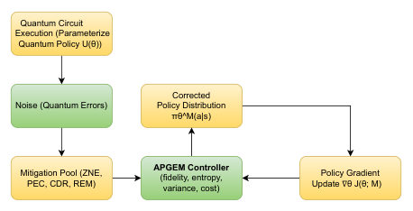
<figcaption class="paper-figure-caption"><b>Fig 1.</b> Figure 1: Block diagram of the Adaptive Policy-Guided Error Mitigation (APGEM) framework. Quantum circuits generate policies degraded by noise, which are corrected through an adaptive selection of mitigation strategies (ZNE, PEC, CDR, REM). The corrected policy guides QRL updates for solving the CVRP.</figcaption>
</figure>
<figure class="paper-figure-card">
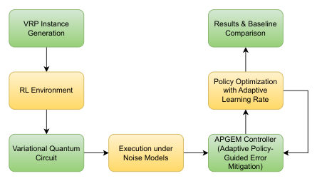
<figcaption class="paper-figure-caption"><b>Fig 2.</b> Figure 2: Block diagram of the proposed methodology. The workflow begins with VRP instance generation, followed by reinforcement learning environ- ment interaction through a variational quantum circuit. Execution under noise is adaptively corrected by the APGEM controller, with fidelity and entropy metrics guiding policy optimization. The training loop produces results compared against a classical baseline.</figcaption>
</figure>
<figure class="paper-figure-card">
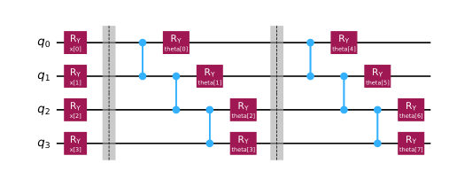
<figcaption class="paper-figure-caption"><b>Fig 3.</b> Figure 3: Quantum policy ansatz for the CVRP–QRL framework. The first layer applies Ry(θi) rotations to encode environment-state features into the quantum register. This is followed by a linear entanglement layer of controlled-Z gates to capture correlations across qubits. Two variational layers are then stacked, each consisting of trainable Ry(ϕ(k) i ) rotations and entangling operations, allowing expressive state transformations. The final measurement distribution guides action selection within the reinforcement learning loop.</figcaption>
</figure>
<figure class="paper-figure-card">
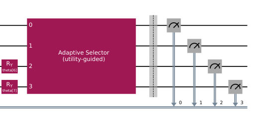
<figcaption class="paper-figure-caption"><b>Fig 4.</b> Figure 4: Circuit-level illustration of the adaptive error mitigation module integrated into the CVRP–QRL framework.</figcaption>
</figure>
<figure class="paper-figure-card">
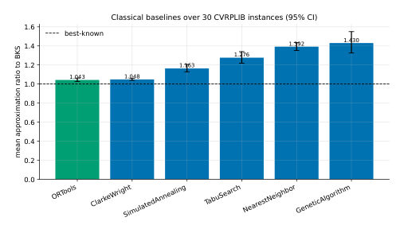
<figcaption class="paper-figure-caption"><b>Fig 5.</b> Figure 5: Mean approximation ratio to best-known with bootstrap 95% confidence intervals over 30 CVRPLIB instances. OR-Tools and Clarke– Wright are the strongest and statistically indistinguishable.</figcaption>
</figure>

**Summary.** This paper presents APGEM, a novel, context-aware layer designed to orchestrate error mitigation strategies within Quantum Reinforcement Learning (QRL). It allows the system to dynamically choose the best noise correction technique based on the current training state and noise level. This significantly enhances the reliability and performance of quantum algorithms for solving hard optimization problems on noisy NISQ hardware.

**Why it may be interesting.** The focus on adaptive error mitigation directly tackles the primary bottleneck for near-term quantum computation, providing a practical, machine-learning-guided approach to improving algorithm reliability.

Detailed structure

**Main problem.** The paper addresses the challenge of applying Quantum Reinforcement Learning (QRL) to solve complex combinatorial optimization problems, such as the Capacitated Vehicle Routing Problem (CVRP), on noisy quantum hardware.

**Main result.** The proposed Adaptive Policy-Guided Error Mitigation (APGEM) framework significantly improves QRL robustness, achieving performance close to ideal oracle utility while maintaining high quantum-state fidelity under increasing noise.

**Method.** It introduces APGEM, a context-aware orchestration layer that dynamically selects the best error mitigation technique (e.g., ZNE, PEC, CDR, REM) during the quantum-classical training loop based on policy performance indicators.

**Model / system.** The work is situated on Noisy Intermediate-Scale Quantum (NISQ) devices, using parameterized quantum circuits (VQCs) to encode the policy for solving the CVRP on a weighted graph.

**Key observables.** Quantum-state fidelity, policy entropy, cumulative reward, approximation ratio, and the selection of the optimal error mitigation strategy.

**Important parameters / regimes.** Noise levels, circuit depth, policy entropy, and the utility achieved relative to an oracle strategy.

**Assumptions / limitations.** Existing error mitigation techniques are applied statically, which fails to account for the dynamic nature of noise, a gap addressed by the adaptive framework.

**Figures summary.** Figures illustrate the block diagram of the APGEM framework, compare expected regret vs. noise floor, and show the evolution of reward and fidelity across training steps under varying noise conditions.

**Paper structure.** The paper defines the QRL problem for CVRP on NISQ devices, details the APGEM methodology using a contextual-bandit selection, presents performance metrics, and evaluates the framework across various noise models.

Abstract

Quantum Reinforcement Learning (QRL) integrates reinforcement learning with parameterized quantum circuits and is a promising approach to combinatorial optimization. On Noisy Intermediate-Scale Quantum (NISQ) devices, however, decoherence, gate imperfections, and measurement errors reduce policy quality and make learning less reliable. Existing error mitigation techniques are generally applied as fixed corrections that do not adapt to changing noise conditions or to the evolving state of training. This work presents Adaptive Policy-Guided Error Mitigation (APGEM) as a context-aware orchestration layer of the hybrid quantum-classical training loop that dynamically selects the most suitable mitigation strategy during QRL training. APGEM evaluates Zero-Noise Extrapolation (ZNE), Probabilistic Error Cancellation (PEC), Clifford Data Regression (CDR), and Readout Error Mitigation (REM) using policy-level indicators, including quantum-state fidelity, policy entropy, cumulative reward, and approximation ratio, and integrates the selected strategy directly into the reinforcement learning loop. The framework is evaluated on the Capacitated Vehicle Routing Problem (CVRP), a representative NP-hard problem in urban logistics, under a range of NISQ noise models and noise levels. APGEM consistently outperforms conventional static mitigation methods, reaches approximately 94% of the utility of an oracle strategy, maintains higher quantum-state fidelity as noise increases, and produces more stable learning behaviour throughout training. Ablation studies show that the framework learns context-aware mitigation policies that adapt to different noise environments and circuit execution conditions. These findings demonstrate that integrating adaptive error mitigation into the learning process substantially improves the robustness and reliability of QRL on NISQ hardware.

[↑ back to top](#top)

### [Fermionic Gaussianity can be tested with mode-independent sample-complexity](http://arxiv.org/abs/2610.02050v1)

**Authors:** Maxwell West, Martin Larocca  
**Type:** theory · **Category:** quantum information and computing · **PDF:** <https://arxiv.org/pdf/2610.02050v1>  
**Analysis basis:** full PDF text, analyzed in chunks
**Topic relevance:** `quantum measurements` **2/5** · `analog quantum simulation` **1/5**

↔ Scroll figures horizontally

<figure class="paper-figure-card">
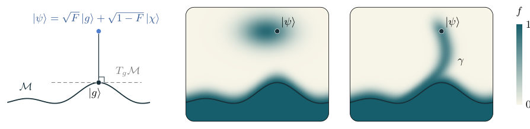
<figcaption class="paper-figure-caption"><b>Fig 1.</b> Figure 1. In general, we consider the sample-complexity of the task of deciding whether a state |ψ⟩belongs to a submanifold M of states, or is at least ε-far in trace distance from all states in M. It is helpful to decompose it into a nearest state |g⟩∈M, along with a component orthogonal to the tangent plane of M at |g⟩(left panel). We will work with property testers whose acceptance probability f(|ψ⟩) is always perfect for states within M, and are interested in deriving conditions under which we can prove that they do not also erroneously accept states far from M (middle panel). To that end, we investigate settings under which states can be proved to be deformable to the target manifold...</figcaption>
</figure>

**Summary.** This work develops a general method to bound the sample complexity required to test if a quantum state belongs to a specific family. By applying this method to fermionic Gaussian states, the authors prove that the test can be performed efficiently, requiring only a sample complexity scaling as $\epsilon^{-2}$. This establishes the optimality of existing testing procedures for these important physical states.

**Why it may be interesting.** The rigorous quantification of sample complexity for testing fundamental quantum states like Gaussian states provides deep insights into the distinguishability of quantum states, which is crucial for quantum communication and quantum computation protocols.

Detailed structure

**Main problem.** The paper addresses the quantum property testing problem: determining if an unknown quantum state belongs to a specific family of states or is far from it.

**Main result.** They establish that testing for fermionic Gaussianity, and for Slater determinant states, can be achieved with a mode-independent sample complexity scaling as $\Theta(\epsilon^{-2})$.

**Method.** The authors develop a general technique using two-copy measurements and leveraging geometric properties like the Path Property to derive lower bounds on the rejection probability.

**Model / system.** The focus is on pure fermionic Gaussian states, which are defined by Hamiltonians quadratic in fermionic operators, and the related family of Slater determinant states.

**Key observables.** Sample-complexity, trace distance ($\epsilon$), Fidelity ($F_M(\psi)$), and the rejection probability ($r(\psi)$) of the quantum test.

**Important parameters / regimes.** The required sample complexity scales as $\epsilon^{-2}$, where $\epsilon$ is the distance from the target family.

**Assumptions / limitations.** The target family $M$ is assumed to be a compact complex submanifold, and the analysis relies on the Path Property holding for the state space.

**Figures summary.** Figure 1 illustrates the geometric decomposition of a state relative to the nearest state in the target manifold and its tangent space, which is central to bounding the sample complexity.

**Paper structure.** The paper first introduces the general framework for bounding sample complexity using the Path Property and Lemma 1. It then applies this framework to fermionic Gaussianity testing, deriving specific lower bounds on the rejection probability using techniques related to Bell sampling and finally extending the result to Slater determinant states.

Abstract

Deciding whether an unknown quantum state either belongs to, or is far from, a given family of states is a natural question of quantum information theory. In many such cases, there is a natural 2-copy test which always accepts whenever the state indeed belongs to the target family; it is often much more difficult, however, to bound the probability of acceptance for states that are far from the family. Here we develop a simple new technique for upper bounding this probability for general families, and therefore upper bounding the sample-complexity of the decision problem itself. As a particularly striking example of this framework, we show that deciding whether an unknown pure $n$-mode state is fermionic Gaussian, or at least $\varepsilon$-far in trace distance from all Gaussian states, can be accomplished using the optimal number $Θ(\varepsilon^{-2})$ of copies. Remarkably, our analysis applies to the well-known Bell sampling procedure for testing fermionic Gaussianity, which we therefore show to be optimal, even compared to protocols making arbitrary collective and adaptive measurements. As a second example, we show that the analogous decision problem for the family of Slater determinant states can also be solved with mode-independent sample-complexity.

[↑ back to top](#top)

### [Near-Optimal Ground-State Preparation without Controlled Hamiltonian Evolutions](http://arxiv.org/abs/2610.00520v1)

**Authors:** Dhrumil Patel, Steven T. Flammia, Raul Garcia-Patron  
**Type:** theory · **Category:** quantum information and computing · **PDF:** <https://arxiv.org/pdf/2610.00520v1>  
**Analysis basis:** full PDF text, analyzed in chunks
**Topic relevance:** `analog quantum simulation` **2/5** · `quantum measurements` **1/5**

↔ Scroll figures horizontally

<figure class="paper-figure-card">
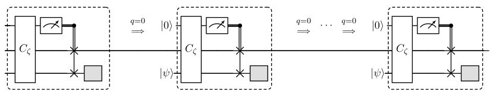
<figcaption class="paper-figure-caption"><b>Fig 1.</b> Figure 3: The t-th descent stage of SD. Each dashed box represents one comparison trial and contains the energy comparator, the measurement-controlled anchor update, and the subsequent discarding of the candidate register. If the measured outcome is q = 0, only the anchor register continues to the next trial, while a new witness qubit is initialized in |0⟩and a fresh candidate state |ψ⟩is prepared in B. If the outcome is q = 1, the candidate is swapped into A and the descent stage terminates. The stage contains at most M comparison trials.</figcaption>
</figure>
<figure class="paper-figure-card">
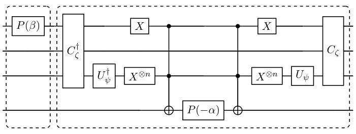
<figcaption class="paper-figure-caption"><b>Fig 2.</b> Figure 5: Circuit implementation of one generalized FPAA iterate G(α, β) = −Ssrc(α)Swit(β), up to an irrelevant global phase. The left dashed box implements the witness reflection Swit(β) by applying the single-qubit phase gate P(β) = |0⟩⟨0| + eiβ|1⟩⟨1| to the witness qubit q. The right dashed box implements the source reflection Ssrc(α). The control shown on register B is shorthand for controls on all n qubits of B, and X denotes the Pauli-X gate. Thus, one FPAA iterate uses one application each of Cζ, C† ζ, Uψ, and U† ψ, together with one ancilla qubit.</figcaption>
</figure>

**Summary.** This paper develops algorithms for ground-state preparation using only uncontrolled access to the Hamiltonian's time evolution. By employing the Spectral Descent Principle, the authors show that the required query complexity matches established lower bounds, proving that controlled Hamiltonian evolution is not necessary for achieving optimal scaling in this task.

**Why it may be interesting.** It provides concrete algorithmic results showing that resource limitations (avoiding controlled operations) do not degrade the fundamental scaling of quantum simulation tasks like GSP.

Detailed structure

**Main problem.** Determining if controlled Hamiltonian evolution is necessary for achieving near-optimal query complexity in ground-state preparation (GSP) compared to using only uncontrolled time-evolution access.

**Main result.** Two algorithms using only uncontrolled evolution achieve complexities matching known lower bounds (up to log factors), demonstrating that controlled evolution offers no asymptotic advantage for GSP.

**Method.** The core technique is the Spectral Descent Principle, which iteratively refines an estimate of the ground state by comparing candidate states to the current best estimate using an Energy Comparator.

**Model / system.** The model involves a quantum Hamiltonian H, and the access is restricted to uncontrolled time-evolution unitaries ($U_H = e^{-iH	au}$ and $U_H^\dagger$). The process is analyzed in terms of state overlaps ($\eta$) and spectral gaps ($\gamma$).

**Key observables.** Ground-state fidelity, energy populations, and the required number of queries to $U_H$ and $U_H^\dagger$.

**Important parameters / regimes.** Hamiltonian norm ($\alpha_H$), spectral gap ($\gamma$), initial state overlap ($\eta$), and the time step ($	au = \Theta(1/\alpha_H)$).

**Assumptions / limitations.** The algorithms assume promises on the spectral gap ($\gamma$) and the initial state overlap ($\eta$). The second algorithm assumes coherent access to the state preparation unitary ($U_\psi$).

**Paper structure.** The paper establishes the fundamental problem, presents two algorithms (Spectral Descent and Coherent Spectral Descent) based on the Spectral Descent Principle, and analyzes the complexity bounds achieved using only uncontrolled evolution.

Abstract

Ground-state preparation, energy estimation, and property estimation are fundamental tasks in quantum simulation. Existing ground-state preparation algorithms achieve near-optimal complexity using block encodings or controlled Hamiltonian evolution, raising a natural question: is controlled Hamiltonian evolution necessary, or can the same scaling be attained in the weaker access model that provides access to only uncontrolled Hamiltonian evolution? We resolve this question by giving two algorithms that access the input Hamiltonian $H$ only through queries to $U_H$ and its inverse $U_H^\dagger$, where $\|H\|\leα_H$ and $τ=Θ(1/α_H)$. Given an input state with ground-state weight at least $η$ and a spectral gap of $H$ of at least $γ$, our first algorithm uses fresh copies of the input state and requires $\widetilde O(α_H/(γη))$ queries to $U_H$ and $U_H^\dagger$, while our second algorithm uses coherent access to the input-state preparation unitary and its inverse to improve this complexity to $\widetilde O(α_H/(γ\sqrtη))$. The latter bound matches the known lower bound up to logarithmic factors, showing that algorithms with additional access to controlled Hamiltonian evolution cannot improve the query complexity for ground-state preparation beyond logarithmic factors. Both algorithms are based on a simple mechanism that we call the spectral descent principle, in which the algorithm starts from the input state $|ψ\rangle$ and progressively descends through the energy spectrum, moving closer to the ground state until the desired fidelity is reached. We also extend this framework to ground-state property and energy estimation and give explicit complexity guarantees for both tasks.

[↑ back to top](#top)

### [Optimal two-mode bosonic loss codes from finite group symmetry](http://arxiv.org/abs/2610.00561v1)

**Authors:** Argyris Giannisis Manes, Mahadevan Subramanian, Liang Jiang  
**Type:** theory · **Category:** quantum information and computing · **PDF:** <https://arxiv.org/pdf/2610.00561v1>  
**Analysis basis:** full PDF text, analyzed in chunks
**Topic relevance:** `analog quantum simulation` **2/5** · `correlated / nonlocal dissipation` **1/5**

↔ Scroll figures horizontally

<figure class="paper-figure-card">
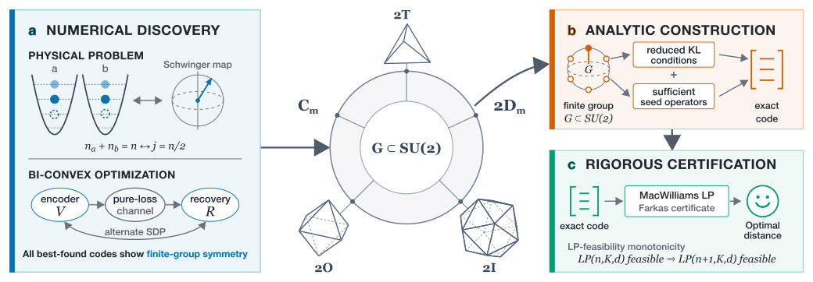
<figcaption class="paper-figure-caption"><b>Fig 1.</b> FIG. 1. Discovery, construction, and certification of fixed-excitation two-mode loss codes. (a) Symmetry-unconstrained bi-convex optimization of the encoder and recovery produces numerical codes with finite-group representation structure. (b) General representation-theoretic Knill–Laflamme reductions and sufficient loss-seed operators turn that structure into exact codes. (c) MacWilliams linear programs, exact Farkas certificates, and LP-feasibility monotonicity certify optimal code distances.</figcaption>
</figure>
<figure class="paper-figure-card">
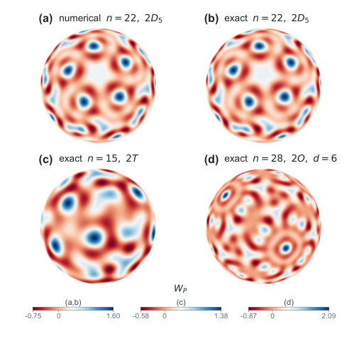
<figcaption class="paper-figure-caption"><b>Fig 2.</b> FIG. 2. Spherical spin-Wigner functions WP (θ, ϕ) for rank- two projectors: (a,b) aligned numerical and exact n = 22 2D5 codes; (c) exact n = 15 2T code; (d) exact n = 28 2O code with d = 6.</figcaption>
</figure>
<figure class="paper-figure-card">
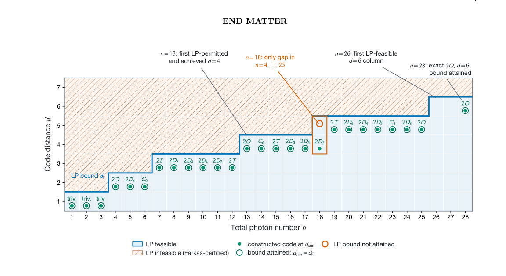
<figcaption class="paper-figure-caption"><b>Fig 3.</b> FIG. 3. Rank-two distance phase diagram. Each cell shows feasibility of the intrinsic SU(2) MacWilliams linear-programming bound for total photon number n and loss distance d: blue cells are LP feasible, whereas hatched orange cells are excluded by exact Farkas certificates. The dark blue line marks the boundary between feasible and infeasible regions. LP feasibility is necessary, but not sufficient, for an actual code. Green markers show constructed codes at dcon and are labeled by their construction group; an outer green ring indicates dcon = dF, where dF is the largest LP-feasible distance. At n = 18, the open orange circle marks the unattained LP bound. Constructed codes attain the LP...</figcaption>
</figure>

**Summary.** This paper develops a comprehensive theory for constructing optimal quantum error-correcting codes designed to combat photon loss in bosonic quantum hardware. By leveraging the mathematical framework of finite group symmetry and representation theory, the authors derive exact conditions for these codes. The results provide concrete, high-performance code constructions that advance the field toward achieving fault-tolerant quantum computation in photonic platforms.

**Why it may be interesting.** This work provides deep mathematical structure (group theory) to the physical problem of quantum noise correction in photonic systems, offering concrete, provable constructions for hardware implementation.

Detailed structure

**Main problem.** The paper addresses the challenge of designing optimal quantum error-correcting codes (QEC) for bosonic systems that suffer from photon loss.

**Main result.** The authors derive a rigorous, group-theoretic framework to construct these codes, achieving maximum possible loss distance in most tested sectors and suggesting an infinite family of optimal codes.

**Method.** The methodology combines representation theory (using finite subgroups of SU(2)) with advanced techniques like MacWilliams transforms and linear programming feasibility checks to constrain code construction.

**Model / system.** The system is bosonic quantum hardware, specifically modeled using two bosonic modes constrained to a fixed total photon number subspace, relevant for superconducting cavities.

**Key observables.** Entanglement fidelity ($F_e$), loss distance ($d$), and the structure of the code projector relative to finite group representations.

**Important parameters / regimes.** Total photon number ($n$), code distance ($d$), and the symmetry group $G$ (finite subgroups of SU(2)).

**Assumptions / limitations.** The initial optimization is biconvex, and the final conjecture regarding the infinite code family remains unproven.

**Figures summary.** Figures summarize the pipeline from numerical discovery of finite-group structure to representation-theoretic reduction and final certification via MacWilliams linear programs, comparing theoretical bounds to constructed code distances.

**Paper structure.** The paper progresses from numerical discovery of finite-group structure in optimal codes to deriving necessary-and-sufficient Knill-Laflamme conditions based on group invariance. It then develops the mathematical machinery using MacWilliams transforms and Farkas' Lemma to prove existence bounds and constructs explicit, optimal code families.

Abstract

Photon loss is a dominant noise process in bosonic quantum hardware, including superconducting cavities. Fixed-total-photon-number qubit encodings in two bosonic modes retain the loss-detection advantage of dual-rail qubits while supporting photon loss correction. Optimizing entanglement fidelity in this setting for $4\leq n\leq25$ over arbitrary encoders and decoders reveals finite-group structure in every best-found code: 11 correspond to two-dimensional irreducible representations and 11 to reducible ones. Motivated by this emergence, we derive the necessary-and-sufficient Knill-Laflamme conditions for arbitrary finite-group-invariant codes, reducing their construction to equations on representation multiplicity spaces. For every finite subgroup of $SU(2)$ and every tensor rank, we explicitly construct the minimum number of operators required to impose all corresponding loss-correction constraints. These results produce analytic counterparts to most numerical codes and predict constructions missed by the initial search. Exact MacWilliams-Farkas certificates show that our codes achieve the maximum possible loss distance in 21 of the 22 sectors, and we prove that the resulting distance bound is monotone in total photon number. Beyond the scan, we identify a binary-polyhedral sequence with photon number $n_d=\lceil(3d^2+1)/4\rceil$ and construct each corresponding code through distance $d=10$. To our knowledge, the constructed $(n,d)=(28,6),(49,8),(76,10)$ codes give the smallest reported $n$ for their respective distances; all members through $d=9$ attain the fixed-$n$ LP distance bound. Together, these constructions, certificates, and a symmetry-reduced constraint count provide evidence for an infinite code family conjectured to attain every distance at the minimum photon number.

[↑ back to top](#top)

### [A computational phase diagram for the transverse field Ising model](http://arxiv.org/abs/2610.02079v1)

**Authors:** Thuy-Duong Vuong  
**Type:** theory · **Category:** statistical mechanics · **PDF:** <https://arxiv.org/pdf/2610.02079v1>  
**Analysis basis:** full PDF text, analyzed in chunks
**Topic relevance:** `analog quantum simulation` **2/5**

↔ Scroll figures horizontally

<figure class="paper-figure-card">
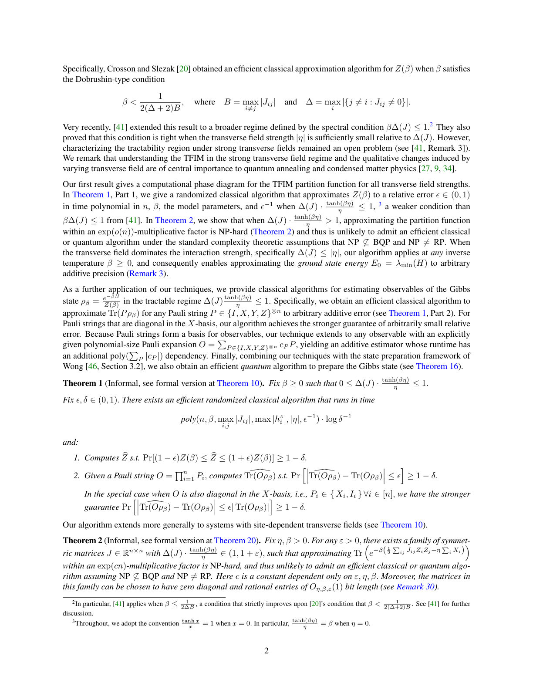
<figcaption class="paper-figure-caption"><b>Fig 1.</b> Low-resolution page preview, page 2</figcaption>
</figure>
<figure class="paper-figure-card">
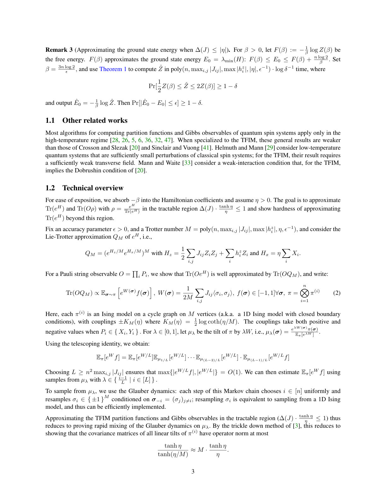
<figcaption class="paper-figure-caption"><b>Fig 2.</b> Low-resolution page preview, page 3</figcaption>
</figure>
<figure class="paper-figure-card">
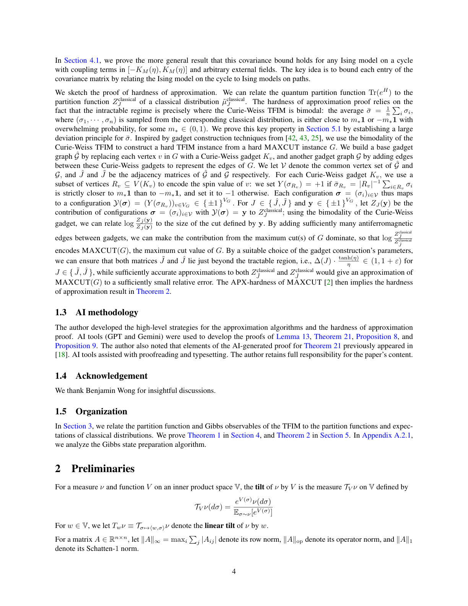
<figcaption class="paper-figure-caption"><b>Fig 3.</b> Low-resolution page preview, page 4</figcaption>
</figure>
<figure class="paper-figure-card">
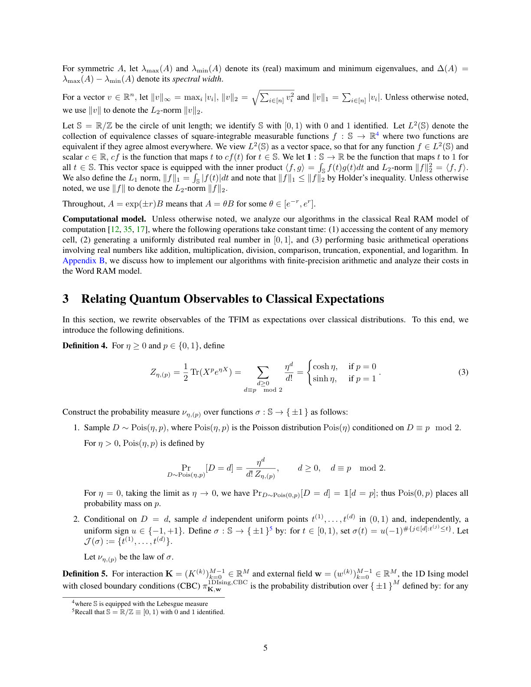
<figcaption class="paper-figure-caption"><b>Fig 4.</b> Low-resolution page preview, page 5</figcaption>
</figure>
<figure class="paper-figure-card">
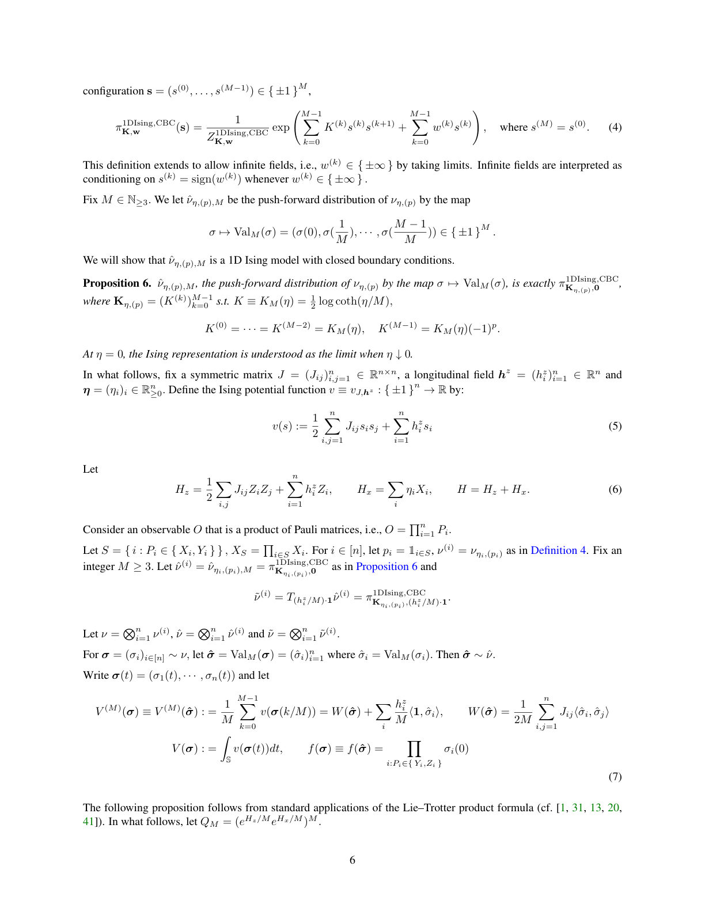
<figcaption class="paper-figure-caption"><b>Fig 5.</b> Low-resolution page preview, page 6</figcaption>
</figure>

**Summary.** This work provides a comprehensive analysis of the computational complexity for simulating the transverse field Ising model. It develops efficient randomized classical algorithms for calculating partition functions and observables when a specific condition involving the spectral width and transverse field strength is met. Crucially, it proves that when this condition is violated, the problem becomes NP-hard, thereby mapping out a computational phase diagram for the model.

**Why it may be interesting.** The clear delineation of computational regimes (tractable vs. NP-hard) based on physical parameters ($\Delta(J), \eta, eta$) provides a powerful theoretical tool for understanding the limits of quantum simulation for complex magnetic systems.

Detailed structure

**Main problem.** The paper aims to develop efficient computational algorithms for calculating the partition function and expectation values of quantum Gibbs states for the transverse field Ising model (TFIM).

**Main result.** It establishes a computational phase diagram: efficient classical algorithms exist when $\Delta(J) \cdot 	anh(eta\eta)/\eta \le 1$, while approximating the partition function is NP-hard in the complementary regime.

**Method.** The approach combines randomized classical algorithms (relying on rapid mixing/tilted measures) with complexity theory arguments to delineate the boundaries of tractability for quantum statistical mechanics calculations.

**Model / system.** The system studied is the Transverse Field Ising Model (TFIM) governed by the Hamiltonian $H = rac{1}{2}\sum J_{ij} Z_i Z_j + \sum h_i Z_i + \eta\sum X_i$. The analysis extends to the Curie-Weiss TFIM for hardness proofs.

**Key observables.** Partition function $Z(eta) = 	ext{Tr}(e^{-eta H})$ and Pauli string observables $	ext{Tr}(P
ho_eta)$.

**Important parameters / regimes.** Inverse temperature $eta$, spectral width $\Delta(J)$, and transverse field strength $\eta$.

**Assumptions / limitations.** The NP-hardness result assumes $	ext{NP} 
ot\subseteq 	ext{BQP}$ and $	ext{NP} 
eq 	ext{RP}$. The algorithms rely on specific conditions relating $\Delta(J)$ and $\eta$.

**Paper structure.** The paper develops by first establishing the efficient algorithm in the tractable regime, then proving the hardness of approximation in the complementary regime, and finally providing a specific method (using the Curie-Weiss TFIM and MAXCUT) to construct hard instances.

Abstract

We study the transverse field Ising model, defined by the Hamiltonian $H =\frac{1}{2}\sum_{i, j\in [n]} J_{ij} Z_i Z_j +\sum_{i=1}^n h_i^z Z_i + η\sum_{i} X_i$ where $J $ is the symmetric interaction matrix, and $η$ is the transverse field strength. Let $Δ(J)=λ_{\max}(J)-λ_{\min}(J)$ be the spectral width of $J.$ When the inverse temperature $β\geq0$ satisfies $Δ(J)\cdot\frac{\tanh(βη)}η\leq1$, we give a randomized classical algorithm that approximates the partition function $Z(β)=\operatorname{Tr}(e^{-βH})$ to a given relative error $ε\in(0,1)$ in time polynomial in $n$, $β$, the model parameters, and $ε^{-1}$. When $ Δ(J) \cdot \frac{\tanh(βη)}η > 1 ,$ we show that approximating $ Z(β)$ within an $\exp(o(n))$-multiplicative factor is $\textbf{NP}$-hard, and thus unlikely to admit an efficient classical or quantum algorithms under standard complexity theoretic assumptions. Furthermore, in the regime $Δ(J)\cdot \frac{\tanh(βη)}η\leq 1,$ we provide an efficient randomized classical algorithm that approximates Pauli string observables of the Gibbs state $ ρ_β= \frac{e^{-βH}}{\operatorname{Tr}(e^{-βH})}$ within an arbitrarily small additive error. In the special case when the observable is also diagonal in the $X$-basis, i.e. $P \in \{I, X\}^{\otimes n}$, the algorithm further achieves arbitrarily small relative error.

[↑ back to top](#top)

### [A Gate-Based Quantum Computing Framework for Codon Optimization](http://arxiv.org/abs/2610.00887v1)

**Authors:** Fatemeh Ghasemi, Kion Kim  
**Type:** both · **Category:** quantum information and computing · **PDF:** <https://arxiv.org/pdf/2610.00887v1>  
**Analysis basis:** full PDF text, analyzed in chunks
**Topic relevance:** `QC/QI experiment` **2/5**

↔ Scroll figures horizontally

<figure class="paper-figure-card">
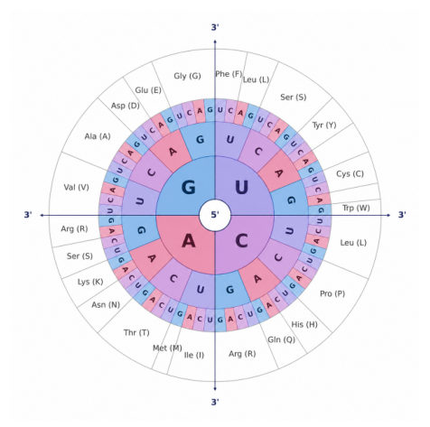
<figcaption class="paper-figure-caption"><b>Fig 1.</b> Fig. 1. The genetic code wheel illustrating the mapping between mRNA codons and amino acids [5]. Codons are read from the center 5′ outward 3′, corresponding to the first, second, and third nucleotide positions. The figure highlights the degeneracy of the genetic code, in which multiple synonymous codons encode the same amino acid.</figcaption>
</figure>

**Summary.** This paper develops a gate-based quantum computing framework to solve codon optimization, a key problem in synthetic biology. By mapping the optimization objective to an Ising Hamiltonian, the authors test VQE, SVQE, and QAOA algorithms on a small benchmark. The study successfully demonstrates the feasibility of this workflow, providing a reproducible foundation for tackling larger biological sequences on current quantum hardware.

**Why it may be interesting.** This work directly applies advanced quantum algorithms (VQE, QAOA) to a highly relevant, real-world problem in synthetic biology, providing a concrete, testable quantum computing framework for molecular design.

Detailed structure

**Main problem.** The paper addresses codon optimization, a complex combinatorial problem in synthetic biology, by formulating it as a quantum computation challenge.

**Main result.** The authors successfully established a reproducible, gate-based quantum workflow for codon optimization, demonstrating that VQE, SVQE, and QAOA can recover the complete set of degenerate ground-state solutions on a small benchmark.

**Method.** The optimization problem is mapped to an Ising Hamiltonian expressed in Pauli operators, which is then solved using variational quantum algorithms (VQE, SVQE, QAOA) and benchmarked against classical and quantum annealing methods.

**Model / system.** The system is the codon optimization problem, modeled by a Hamiltonian $H = H_f + H_{GC} + H_R + H_P$. The implementation is tested on IBM Quantum processors using a 10-qubit benchmark derived from a three-amino-acid sequence.

**Key observables.** The ground-state energy of the Hamiltonian, and the sampling probabilities corresponding to the degenerate ground-state manifold.

**Important parameters / regimes.** The benchmark uses a three-amino-acid sequence (Glu–Gly–Pro) resulting in a 10-qubit problem. Algorithm parameters include ansatz depth (reps) and optimization routines (e.g., COBYLA).

**Assumptions / limitations.** The work is presented as a framework for future scalability, acknowledging that the current benchmark is small and that hardware performance is sensitive to execution settings like measurement shots and error suppression techniques.

**Figures summary.** Figure 1 illustrates the genetic code wheel. Figure 2 shows the energy spectrum and interaction graph for the 10-qubit problem. Tables II and III summarize the performance of SVQE and QAOA on the IBM Quantum backend under various initialization and hardware settings.

**Paper structure.** The paper first formulates the biological problem into a constrained Ising Hamiltonian. It then details the mapping to Pauli operators suitable for gate-based quantum processors. The methodology involves benchmarking VQE, SVQE, and QAOA against classical and quantum annealing methods on a small benchmark, culminating in hardware demonstrations on the IBM Quantum backend.

Abstract

Codon optimization is a challenging combinatorial optimization problem with important applications in synthetic biology, protein expression, and biotechnology. While quantum annealing has previously been explored for this problem, the application of gate-based quantum algorithms remains largely unexplored. In this work, we present a gate-based quantum computing framework for codon optimization by formulating the optimization objective as an Ising Hamiltonian and expressing it in terms of Pauli operators suitable for gate-based quantum processors. The proposed framework is investigated using the Variational Quantum Eigensolver (VQE), Sampling Variational Quantum Eigensolver (SVQE), and the Quantum Approximate Optimization Algorithm (QAOA), with benchmarking against exact diagonalization, classical optimization, and quantum annealing. Using a three-amino-acid benchmark, the proposed implementations successfully reproduce the exact ground-state solutions while identifying optimized ansatz selections, optimization strategies, initialization schemes, and hardware execution settings that provide reproducible performance on current noisy quantum hardware. Hardware demonstrations are performed on IBM Quantum processors to evaluate the practical implementation of the proposed workflow. As a work in progress, this study establishes a reproducible computational framework for gate-based quantum codon optimization and provides the foundation for future investigations of larger protein sequences as quantum hardware and algorithms continue to advance.

[↑ back to top](#top)

### [Blind Unforgeability implies Plus-One Unforgeability](http://arxiv.org/abs/2610.00517v1)

**Authors:** Mehil Agarwal, Calliope S. Reimann, Fang Song  
**Type:** theory · **Category:** quantum information and computing · **PDF:** <https://arxiv.org/pdf/2610.00517v1>  
**Analysis basis:** full PDF text, analyzed in chunks
**Topic relevance:** `quantum measurements` **2/5**

↔ Scroll figures horizontally

<figure class="paper-figure-card">
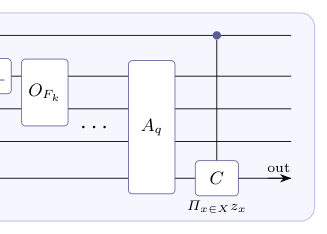
<figcaption class="paper-figure-caption"><b>Fig 1.</b> Fig. 1. Circuit implementation of Poisson phase smoothing. The random phase data z = (zx) is stored in the register Θ. Before each oracle call, Θ controls the address phase R−|x⟩= z∗ x|x⟩. After Aq has coherently produced the output address set X, the final controlled compensation contributes Πx∈Xzx. Thus a history with query-count vector ν acquires net phase ⟨z, 1X −ν⟩.</figcaption>
</figure>
<figure class="paper-figure-card">
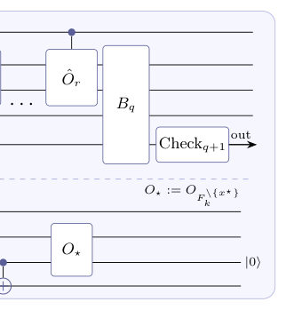
<figcaption class="paper-figure-caption"><b>Fig 2.</b> Fig. 2. Singleton zero-touch extraction by root-of-unity touch-count twirling. The unknown puncture is x⋆. Choose r ∈Zq+1 uniformly, let ω = e2πi/(q+1), and reuse the same r in all q simulated queries of B. Each ˆOr uses two calls to the singleton- punctured oracle O⋆= OF \{x⋆} k . The first call computes the response into the clean</figcaption>
</figure>
<figure class="paper-figure-card">
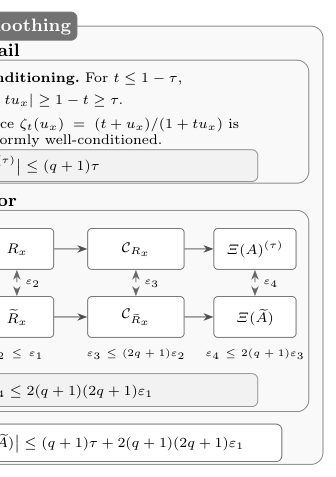
<figcaption class="paper-figure-caption"><b>Fig 3.</b> Fig. 3. Finite-precision implementation of Poisson smoothing. Top. Truncating the smoothing parameter to t ∈[0, 1 −τ] loses at most (q + 1)τ in expected singleton zero-touch mass and guarantees |1 + tux| ≥τ, making ζt(ux) = (t + ux)/(1 + tux) uni- form and computable. Bottom. After truncation, finite-precision error is propagated through sampling (t, ux), evaluation of the phase multipliers, implementation of the phase operators, and substitution into the smoothed q-query circuit. The term εt, εu is the additional numerical error incurred ζ(et, eux) at input discretization error. The re- maining arrows propagate this phase error through the implemented unitaries and the full smoothed...</figcaption>
</figure>

**Summary.** This theoretical paper proves that in the quantum setting, the security notion of Blind Unforgeability is strictly stronger than Plus-One Unforgeability. The authors achieve this by developing a new smoothing technique that allows them to transform any successful PO attack into a BU attack with minimal loss. This settles an open question regarding the relative strength of these two quantum security definitions.

**Why it may be interesting.** While the topic is cryptography, the core mathematical tools—coherently reshaping quantum query histories and analyzing polynomial dependence on blinding parameters—are highly relevant to understanding robustness in quantum information protocols.

Detailed structure

**Main problem.** The paper establishes the precise relationship between two security notions for quantum message authentication codes: Blind Unforgeability (BU) and Plus-One Unforgeability (PO).

**Main result.** It proves that quantum Blind Unforgeability implies quantum Plus-One Unforgeability (BU $\Rightarrow$ PO), demonstrating that BU is strictly stronger than PO in the quantum setting.

**Method.** The proof employs a novel smoothing technique that coherently rescales quantum query histories, transforming a successful PO attacker into a BU attacker with only inverse-polynomial loss.

**Model / system.** The analysis is set in the context of quantum-accessible keyed function families $F_k: X 	o Y$, modeling quantum message authentication codes (MACs) accessed via quantum oracles.

**Key observables.** The success probability of the adversary ($\delta$), the zero-touch forgery mass ($\Xi(A)$), and the singleton-puncture density ($
ho_F(A)$).

**Important parameters / regimes.** The number of queries ($q$), the blinding probability ($eta$), and the security parameter ($\lambda$).

**Assumptions / limitations.** The proof relies on a conceptual shift from simple history extraction to coherently reshaping quantum interference patterns, necessitating advanced smoothing techniques.

**Figures summary.** References are made to figures illustrating error propagation and the structure of the proof, though specific content is not detailed.

**Paper structure.** The paper progresses by first establishing the core implication (BU $\Rightarrow$ PO) using smoothing, then exploring related equivalences (BU $\iff \partial$BU), and finally detailing the mathematical machinery (polynomial analysis, derivatives at $eta=0$) required to quantify the security gap.

Abstract

We prove that quantum blind-unforgeability implies quantum plus-one unforgeability, settling an open question in the literature. Since plus-one unforgeability is known not to imply blind-unforgeability, our result establishes that blind-unforgeability is \emph{strictly stronger} than plus-one unforgeability in the quantum setting.   The implication is proven using a new \emph{smoothing} technique that coherently rescales the query histories of a quantum-query algorithm in a black-box manner. This enables us to transform any successful plus-one attacker into a blind-unforgeability attacker with only inverse-polynomial loss. Our proof represents a conceptual shift from merely extracting a useful query history as in earlier attempts, which we show inevitably fails in general, to first coherently reshaping how query histories interfere.

[↑ back to top](#top)

### [Complex magnetic phase diagrams in Tb$_2$IrAl$_4$Ge$_2$ and Er$_2$IrAl$_4$Ge$_2$](http://arxiv.org/abs/2610.01714v1)

**Authors:** Karolina Gornicka, Matthew S. Cook, Brenden R. Ortiz, Andrew D. Christianson, Andrew F. May  
**Type:** experiment · **Category:** strongly correlated electrons · **PDF:** <https://arxiv.org/pdf/2610.01714v1>  
**Analysis basis:** full PDF text, analyzed in chunks
**Topic relevance:** `analog quantum simulation` **2/5**

↔ Scroll figures horizontally

<figure class="paper-figure-card">
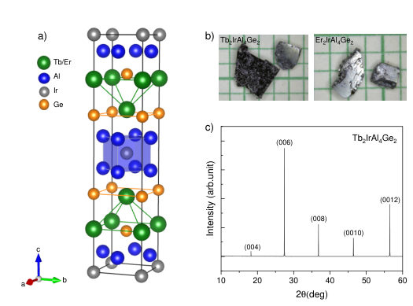
<figcaption class="paper-figure-caption"><b>Fig 1.</b> FIG. 1. (a) Crystal structure of Ln2IrAl4Ge2 highlight- ing the arrangement of Ln (green), Al (blue), Ir (grey), and Ge (orange) atoms. (b) Photographs of Er2IrAl4Ge2 and Tb2IrAl4Ge2 single crystals, showing their plate-like morphol- ogy. (c) X-ray diffraction pattern measured on a flat facet of a Tb2IrAl4Ge2 crystal, indicating that the crystal surface is parallel to the ab plane, with the c axis perpendicular to the surface.</figcaption>
</figure>
<figure class="paper-figure-card">
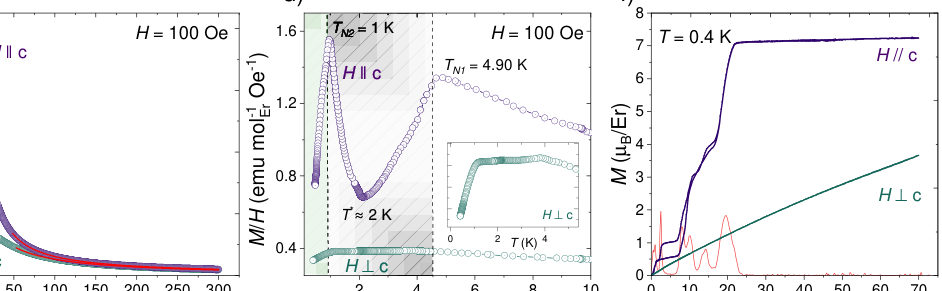
<figcaption class="paper-figure-caption"><b>Fig 2.</b> FIG. 2. (a,b) Field-cooled magnetization, M/H, for single-crystalline Tb2IrAl4Ge2 and Er2IrAl4Ge2 measured with magnetic field (H = 100 Oe) applied parallel and perpendicular to the crystallographic c axis. Data are shown over the temperature range 1.9 ≤T ≤300 K, together with the Curie-Weiss fits (red lines). (c,d) Enlarged low-temperature region highlighting the magnetic transitions. For Tb2IrAl4Ge2, a single antiferromagnetic transition is observed, while Er2IrAl4Ge2 exhibits three successive transitions at low temperatures. Insets in (c) and (d) highlights the magnetic behavior for H ⊥c. (e) Isothermal magnetization of the Tb-based compound at T = 2 K, showing two successive...</figcaption>
</figure>
<figure class="paper-figure-card">
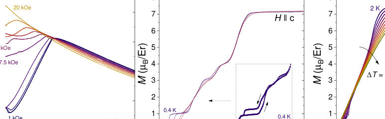
<figcaption class="paper-figure-caption"><b>Fig 3.</b> FIG. 3. Temperature- and field-dependent magnetization of Tb2IrAl4Ge2 and Er2IrAl4Ge2 measured with magnetic field applied parallel to the crystallographic c axis. (a) Magnetization for Tb-based compound, measured under selected magnetic fields up to 120 kOe. (b) Temperature evolution of the magnetization for H ∥c between 2 and 21 K. The inset highlights the high-field anomaly emerging near 8 K. (c) Selected M(H) curves measured at 7 and 9 K, illustrating additional field-induced phases. (d) M(T) data for Er2IrAl4Ge2 under magnetic fields ranging from 1 to 20 kOe. (e) Temperature evolution of the metamagnetic transitions measured between 0.4 and 1.2 K. The inset shows an enlarged view of...</figcaption>
</figure>
<figure class="paper-figure-card">
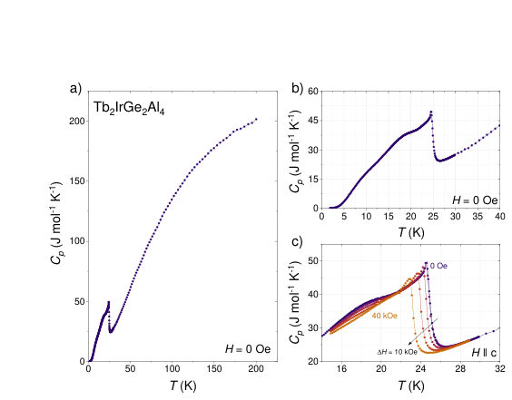
<figcaption class="paper-figure-caption"><b>Fig 4.</b> FIG. 4. Temperature dependence of the heat capacity Cp(T) of Tb2IrAl4Ge2. (a) Zero-field heat capacity measured between 1.9 and 200 K. (b) Enlarged view of the low-temperature region, showing a pronounced anomaly associated with the onset of long-range antiferromagnetic order. (c) Evolution of the low- temperature anomaly for magnetic fields up to 40 kOe applied along the crystallographic c axis.</figcaption>
</figure>
<figure class="paper-figure-card">
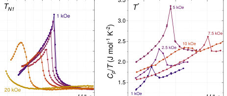
<figcaption class="paper-figure-caption"><b>Fig 5.</b> FIG. 5. Heat-capacity data for Er2IrAl4Ge2. (a) Temperature dependence of the zero-field heat capacity Cp(T). (b) Low- temperature Cp/T highlighting anomalies at TN1, T ∗, and TN2. (c) Field evolution of the anomaly at TN1 for H ∥c. (d) En- larged view of the T ∗region under applied magnetic field.</figcaption>
</figure>

**Summary.** This work reports on the synthesis and detailed magnetic characterization of $	ext{Tb}_2	ext{IrAl}_4	ext{Ge}_2$ and $	ext{Er}_2	ext{IrAl}_4	ext{Ge}_2$. The research reveals that the magnetic complexity increases substantially from the $	ext{Tb}$-based to the $	ext{Er}$-based compound, demonstrating a wide range of magnetic ground states within this structural family. This expands the known chemical space for studying correlated magnetism in $5d$-metal-based intermetallics.

**Why it may be interesting.** The study of complex magnetic phase diagrams in strongly correlated materials like these aluminogermanides provides a rich platform for understanding competing magnetic interactions, which is relevant to many-body physics and frustrated magnetism.

Detailed structure

**Main problem.** The study investigates the complex magnetic phase diagrams in the rare-earth intermetallic compounds $	ext{Tb}_2	ext{IrAl}_4	ext{Ge}_2$ and $	ext{Er}_2	ext{IrAl}_4	ext{Ge}_2$. The goal is to understand the magnetic behavior and expand the chemical space of the $	ext{Ln}_2	ext{MAl}_4	ext{Ge}_2$ family.

**Main result.** The compounds exhibit strong magnetic anisotropy with the $c$-axis as the easy direction. $	ext{Er}_2	ext{IrAl}_4	ext{Ge}_2$ shows a significantly richer and more complex low-temperature magnetic phase diagram with multiple competing field-induced phases compared to $	ext{Tb}_2	ext{IrAl}_4	ext{Ge}_2$.

**Method.** The research employed comprehensive experimental techniques including single-crystal X-ray diffraction, magnetization measurements ($	ext{M}(T), 	ext{M}(H)$), heat capacity ($	ext{C}_p$), and magnetotransport measurements ($
ho, 	ext{Hall}$ effect).

**Model / system.** The physical system consists of single-crystalline $	ext{Tb}_2	ext{IrAl}_4	ext{Ge}_2$ and $	ext{Er}_2	ext{IrAl}_4	ext{Ge}_2$, which crystallize in the tetragonal $	ext{Tb}_2	ext{NiAl}_4	ext{Ge}_2$-type structure. The magnetic behavior is governed by the interplay between RKKY exchange interactions and Crystal-Electric-Field (CEF) effects.

**Key observables.** Magnetization ($	ext{M}$), magnetic transition temperatures ($T_N, T^*$), nonlinear Hall response, electrical resistivity ($
ho$), and heat capacity ($	ext{C}_p$).

**Important parameters / regimes.** The magnetic anisotropy is strong, with the $c$-axis being the easy magnetization direction. The complexity increases significantly when moving from $	ext{Tb}$ to $	ext{Er}$ compounds.

**Assumptions / limitations.** The magnetic coupling is assumed to be influenced by the localized $4f$ moments of the rare-earth elements interacting via RKKY exchange within the crystal structure.

**Figures summary.** The figures summarize $	ext{M}(T)$ and $	ext{M}(H)$ curves, showing the distinct magnetic transitions for both compounds, and magnetotransport data illustrating the coupling between charge transport and magnetic order.

**Paper structure.** The paper details the synthesis and structural characterization of the single crystals, followed by a systematic presentation of magnetic measurements ($	ext{M}(T), 	ext{M}(H)$) revealing the distinct phase diagrams for $	ext{Tb}$ and $	ext{Er}$ compounds, and concluding with a discussion on the implications for the $	ext{Ln}_2	ext{MAl}_4	ext{Ge}_2$ family.

Abstract

We report the synthesis and comprehensive investigation of single-crystalline Tb$_2$IrAl$_4$Ge$_2$ and Er$_2$IrAl$_4$Ge$_2$, the first Ir-based members of the $Ln_2M$Al$_4$Ge$_2$ family. Both compounds crystallize in the tetragonal Tb$_2$NiAl$_4$Ge$_2$-type structure (space group $I4/mmm$) and exhibit easy-axis magnetic anisotropy with the crystallographic $c$ axis as the preferred magnetization direction. Tb$_2$IrAl$_4$Ge$_2$ undergoes antiferromagnetic ordering below $T_N = 25$ K and develops a sequence of field-induced metamagnetic transitions accompanied by pronounced magnetotransport anomalies, including a nonlinear Hall response. In contrast, Er$_2$IrAl$_4$Ge$_2$ exhibits three successive zero-field magnetic transitions and a substantially richer low-temperature magnetic phase diagram comprising multiple competing field-induced phases confined to relatively modest magnetic fields. The differences between the Tb- and Er-based compounds demonstrate the wide range of magnetic behavior that can be realized within the \ce{Tb2NiAl4Ge2}-type structure. More broadly, the successful realization of Ir-based $Ln_2M$Al$_4$Ge$_2$ compounds considerably expands the accessible chemical space of this family and opens a route toward the exploration of related $4d$- and $5d$-based aluminogermanides.

[↑ back to top](#top)

### [Efficient certification of time-reversal symmetry requires entanglement](http://arxiv.org/abs/2610.01555v1)

**Authors:** Zhenhuan Liu, Zhenyu Du, Yifan Tang, Zi-Wen Liu, Jens Eisert, Ingo Roth  
**Type:** theory · **Category:** quantum information and computing · **PDF:** <https://arxiv.org/pdf/2610.01555v1>  
**Analysis basis:** full PDF text, analyzed in chunks
**Topic relevance:** `quantum measurements` **2/5**

↔ Scroll figures horizontally

<figure class="paper-figure-card">
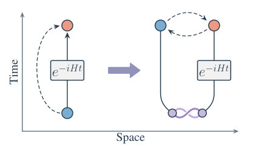
<figcaption class="paper-figure-caption"><b>Fig 1.</b> Figure 1. Quantum entanglement places the input and output of an evolution, which play asymmetric roles in time, on equal footing as two spatial subsystems. This translates dynamical time-reversal sym- metry into a spatial exchange constraint on the associated bipartite state, with symmetry breaking witnessed by an otherwise forbidden measurement outcome.</figcaption>
</figure>
<figure class="paper-figure-card">
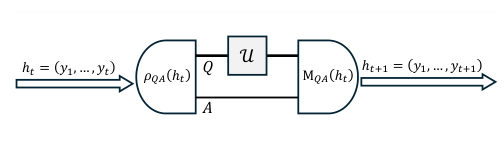
<figcaption class="paper-figure-caption"><b>Fig 2.</b> Figure 2. Adaptive protocol for certifying TRS with entangled input states and joint measurements.</figcaption>
</figure>
<figure class="paper-figure-card">
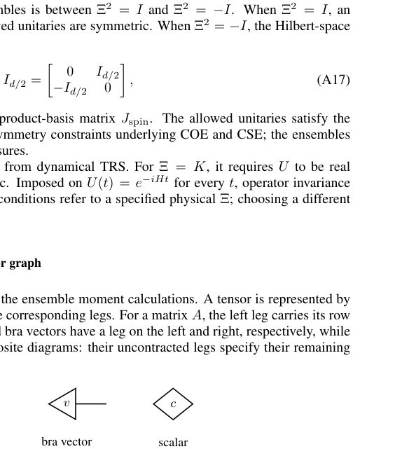
<figcaption class="paper-figure-caption"><b>Fig 3.</b> Figure 3. Basic graphical elements in the tensor-graph notation: a matrix, a ket vector, a bra vector, and a scalar.</figcaption>
</figure>
<figure class="paper-figure-card">
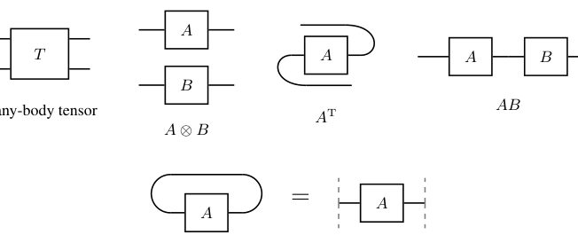
<figcaption class="paper-figure-caption"><b>Fig 4.</b> Figure 4. Elementary tensor-graph operations: a many-body tensor, tensor product, transpose, matrix multiplication, and two equivalent graphical representations of Tr(A), where the grey dashed lines represent the periodic boundary condition.</figcaption>
</figure>
<figure class="paper-figure-card">
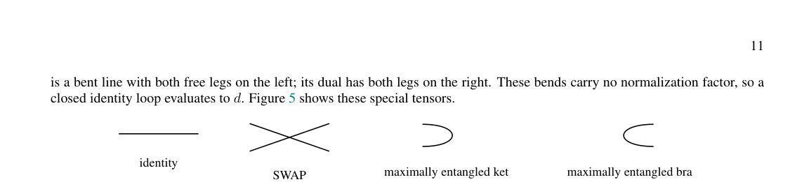
<figcaption class="paper-figure-caption"><b>Fig 5.</b> Figure 5. Special tensors in the tensor-graph notation: the identity, the SWAP operator, and the unnormalized maximally entangled state vector and its dual.</figcaption>
</figure>

**Summary.** This paper develops a quantum information-theoretic test to certify time-reversal symmetry (TRS) in unknown quantum dynamics. It proves that the efficiency of this test is fundamentally limited by the entanglement resources available in the quantum probes and measurements. By establishing a quantitative connection, it bridges fundamental physics principles with the resource theory of quantum information.

**Why it may be interesting.** This work provides a rigorous, resource-theoretic understanding of fundamental physical symmetries (like TRS) within the framework of quantum information theory, connecting concepts like entanglement to physical laws.

Detailed structure

**Main problem.** The paper addresses the fundamental question of how efficiently one can certify the presence of time-reversal symmetry (TRS) in an unknown quantum unitary evolution using only forward quantum queries.

**Main result.** It establishes a quantitative lower bound on the query complexity required for this certification, showing that entanglement resources dictate the scaling, and demonstrates protocols that achieve this optimal scaling.

**Method.** The authors formulate a Bell-inequality-like test for dynamical TRS, analyzing the required number of queries by relating it to the logarithmic negativities of the quantum probes and measurements.

**Model / system.** The system involves an unknown $n$-qubit unitary channel $U(t) = e^{-iHt}$ whose time-reversal symmetry is tested by comparing its dynamics against known time-reversal symmetric ensembles.

**Key observables.** Logarithmic negativity ($E_N$) of the probe and measurement, and the query complexity $T$ needed to distinguish TRS from Haar-random dynamics.

**Important parameters / regimes.** The query complexity scales as $\Theta(2n - e^*)$, where $e^*$ is the minimum logarithmic negativity of the probe or measurement.

**Assumptions / limitations.** The analysis assumes only forward access to the unitary channel and relies on the existence of specific entanglement resources (probes and measurements) to achieve the bounds.

**Figures summary.** Figures illustrate the protocol structure, showing how entanglement translates the temporal input-output relation into a measurable spatial exchange symmetry constraint.

**Paper structure.** The paper develops the test formulation, derives the lower bounds based on entanglement measures, and then presents protocols that match these bounds, including specialized versions for fixed resources and those without auxiliary systems.

Abstract

Time-reversal symmetry is a fundamental principle of physics describing the invariance of physical laws under reversal of the direction of time. We formulate a Bell-inequality-like test of this antiunitary symmetry using only forward access and trusted quantum operations: entanglement converts temporal input--output relations into measurable spatial exchange symmetry. For $n$-qubit unitary dynamics, we prove that reliably distinguishing the time-reversal-symmetric circular ensembles from Haar-random dynamics requires $Ω(\min\{2^{n/2},2^{n-e}\})$ queries for any classically adaptive protocol. Here, $e=\min\{e_{\mathrm s},e_{\mathrm m}\}$ with $e_{\mathrm s}$ and $e_{\mathrm m}$ representing the probe and measurement logarithmic entanglement negativities, respectively. Maximally entangled probes and SWAP measurements reduce this cost to a constant number of queries. Furthermore, we develop a time-reversal symmetry test for arbitrary fixed, compatible probes and measurements, relate its query complexity to their logarithmic negativities, and match the lower-bound scaling in the high-entanglement regime by optimizing the probe and measurement. Our results establish a quantitative connection between entanglement and time-reversal symmetry, bridging two central concepts in quantum information science and fundamental physics.

[↑ back to top](#top)

### [Electronic Symmetry and Femtosecond Coherence Dynamics of Renner-Teller-Mixed Neutral Vibronic States in Carbon Dioxide](http://arxiv.org/abs/2610.00565v1)

**Authors:** Eric Liu, Shashank Kumar, Siddhant Pandey, Tzu-Hsien Tan, Russell Zimmerman, Kousik Bera, Anthony Fiore, Paul Hockett, Varun Makhija, Niranjan Shivaram  
**Type:** experiment · **Category:** other · **PDF:** <https://arxiv.org/pdf/2610.00565v1>  
**Analysis basis:** full PDF text, analyzed in chunks
**Topic relevance:** `quantum measurements` **2/5**

↔ Scroll figures horizontally

<figure class="paper-figure-card">
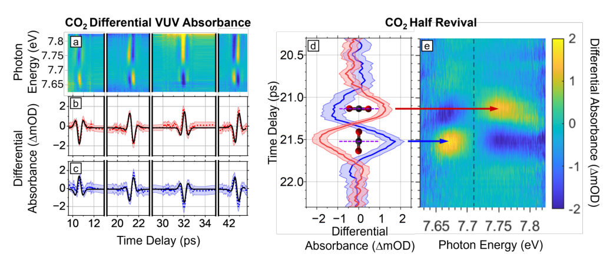
<figcaption class="paper-figure-caption"><b>Fig 1.</b> Figure 1. (a) Differential absorbance versus photon energy and delay τ; data between the fractional revivals are omitted. (b),(c) Lineouts at 7.75 and 7.67 eV (dotted, with standard-error bands) and the ORRCS fits (black). The revivals appear with opposite polarity. (d) Lineouts at 7.75 eV (red) and 7.67 eV (blue) across the half revival. The ensemble is aligned parallel to the VUV polarization (dashed purple) near 21.15 ps and perpendicular near 21.5 ps. (e) Differential absorbance spectrum at the half revival; arrows connect the lineouts in (d) to the spectral features, which change sign at 7.71 eV (dashed line).</figcaption>
</figure>
<figure class="paper-figure-card">
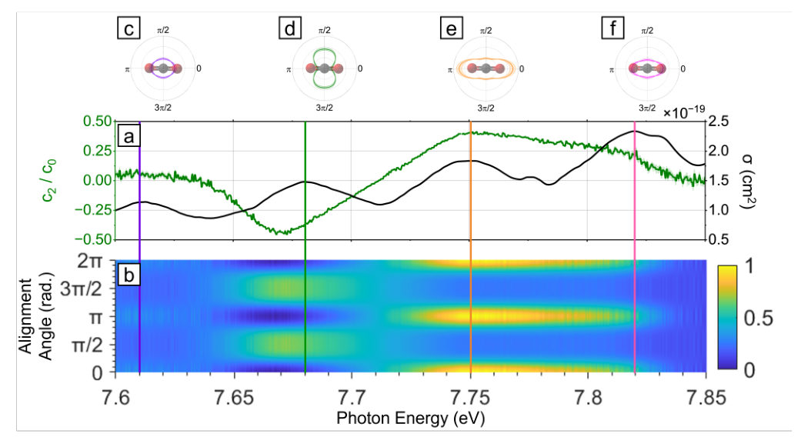
<figcaption class="paper-figure-caption"><b>Fig 2.</b> Figure 2. (a) Anisotropy ratio c2/c0 (green; &gt; 0 parallel, &lt; 0 perpendicular) with the calculated room temperature CO2 absorption cross- section of Ref. [11] (black). (b) Extracted ∆OD versus molecular alignment angle θ and photon energy. (c-f) Polar lineouts at 7.61 eV (purple), 7.68 eV (green), 7.75 eV (orange), and 7.82 eV (pink) as a function of the angle θ from the molecular axis, on a common radial scale.</figcaption>
</figure>
<figure class="paper-figure-card">
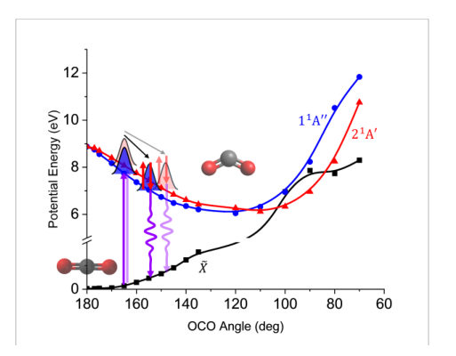
<figcaption class="paper-figure-caption"><b>Fig 3.</b> Figure 4. Cuts through the potential energy surfaces of the ground electronic state ˜X (black) and the excited 11A′′ (blue) and 21A′</figcaption>
</figure>
<figure class="paper-figure-card">
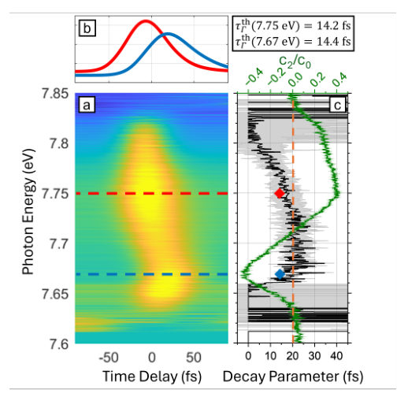
<figcaption class="paper-figure-caption"><b>Fig 4.</b> Figure 3. (a) Fitted exponentially modified Gaussian (EMG) traces near VUV–NIR overlap; positive delay denotes the VUV pulse arriv- ing first. The features at 7.65 eV and 7.75 eV are NIR-shifted relative to the field-free spectrum. (b) EMG lineouts at 7.75 eV (red) and 7.67 eV (blue) [dashed lines in (a)]. (c) Fitted EMG decay parameter τd (black) and c2/c0 (green) versus photon energy; the dashed orange line marks the fixed cross-correlation width σ = 20.2 fs. Diamonds: linewidth-limited dephasing times τth Γ from the calculated cross sec- tion of Ref. [11] (Supplemental Material [20]), listed in the inset.</figcaption>
</figure>
<figure class="paper-figure-card">
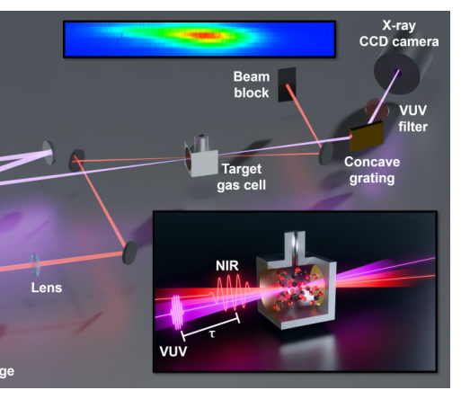
<figcaption class="paper-figure-caption"><b>Fig 5.</b> Figure 5. Schematic of the experimental setup.</figcaption>
</figure>

**Summary.** The researchers used VUV transient absorption on aligned $	ext{CO}_2$ to study vibronic states split by the Renner-Teller effect. By analyzing molecular-frame angular signatures, they separated states based on their electronic symmetry ($A'$ vs. $A''$). They found that the coherence lifetime differs between these symmetry classes, providing direct evidence that the excited-state potential energy surface topology dictates the rate of wavepacket dephasing.

**Why it may be interesting.** This work provides a direct, ultrafast spectroscopic method to map out the symmetry-resolved dynamics on coupled excited-state potential energy surfaces, which is crucial for understanding non-adiabatic processes in molecular physics.

Detailed structure

**Main problem.** To resolve and characterize the symmetry-dependent ultrafast dynamics of vibronic states in molecules where electronic states are mixed due to non-adiabatic coupling.

**Main result.** The parallel ($A'$) vibronic states dephase measurably faster than the perpendicular ($A''$) states, which is attributed to the distinct, anharmonic topology of the $A'$ excited-state potential energy surface.

**Method.** Vacuum-ultraviolet (VUV) transient absorption spectroscopy of aligned $	ext{CO}_2$ molecules, combined with molecular-frame angular signature analysis.

**Model / system.** The system is $	ext{CO}_2$ undergoing Renner-Teller splitting, leading to vibronic states ($A'$ and $A''$). Dynamics are probed by measuring coherence dephasing times ($	au_d$) across the vibronic manifold.

**Key observables.** Molecular-frame anisotropy ($c_2/c_0$), differential absorption spectrum ($\Delta	ext{OD}$), and symmetry-dependent coherence dephasing times ($	au_d$).

**Important parameters / regimes.** Femtosecond delay ($	au$) between VUV and NIR pulses; the energy difference between $A'$ and $A''$ states.

**Assumptions / limitations.** The analysis relies on reconstructing molecular-frame information from lab-frame measurements and modeling the coherence decay using an Exponentially Modified Gaussian (EMG) distribution.

**Figures summary.** Figures show $\Delta	ext{OD}$ vs. delay $	au$ revealing rotational dynamics, anisotropy plots confirming parallel/perpendicular character, and $	au_d$ vs. energy plots demonstrating the symmetry-dependent decay rates.

**Paper structure.** The paper systematically uses alignment-resolved VUV transient absorption to first map the symmetry landscape via anisotropy, and then uses time-resolved measurements to extract symmetry-specific coherence dephasing times, linking these lifetimes to the underlying potential energy surface topology.

Abstract

When non-adiabatic coupling mixes electronic states of a molecule, vibronic states of different electronic symmetry become interleaved across the same spectral region. The symmetry of these states cannot be accessed in conventional spectroscopy due to orientation averaging. We show that molecular-frame angular signatures, which are preserved even when states with different symmetry overlap in energy, can be used to resolve them. Using vacuum-ultraviolet transient absorption spectroscopy of aligned carbon dioxide molecules, we separate two electronically distinct classes of vibronic states ($A^{'}$ and $A^{''}$) that arise from Renner-Teller splitting of the $^1Δ_u$ state. We reconstruct molecular-frame anisotropy continuously across the vibronic manifold showing that the anisotropy crosses over from perpendicular to parallel transition character and maps the interleaved electronic symmetry landscape. By scanning the femtosecond delay between the VUV and a near-infrared pulse through temporal overlap, we measure symmetry-dependent coherence dephasing times of these states and find that the parallel ($A^{'}$) states dephase faster than the perpendicular ($A^{''}$) states. We attribute this to faster departure of the $A^{'}$ wavepacket from the Franck-Condon region due to the distinct topology of the $A^{'}$ excited-state surface. These measurements probe symmetry-resolved ultrafast wavepacket dynamics on the coupled excited-state potential energy surfaces.

[↑ back to top](#top)

### [Geometry of Knill-Laflamme Coefficients for Pauli Error Detection](http://arxiv.org/abs/2610.01992v1)

**Authors:** Baisong Sun, Ningping Cao, Yiu Tung Poon, Bei Zeng  
**Type:** theory · **Category:** quantum information and computing · **PDF:** <https://arxiv.org/pdf/2610.01992v1>  
**Analysis basis:** full PDF text, analyzed in chunks
**Topic relevance:** `quantum measurements` **2/5**

↔ Scroll figures horizontally

<figure class="paper-figure-card">
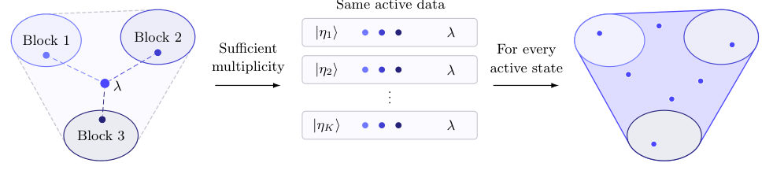
<figcaption class="paper-figure-caption"><b>Fig 1.</b> FIG. 1. Representation multiplicity as a mechanism for exact scalar compression. (a) Expectations from the active blocks combine to give a selected vector λ in the active state-space expectation body W(B). (b) Under the state-dependent sufficient condition of Theorem III.1, multiplicity permits a realization by K orthogonal code states with the same active data; every observable compresses to a scalar on their span. (c) Under the theorem’s uniform sufficient condition, this construction realizes every point of W(B). The compression range is then convex and connected, and its signature spectrum is a closed interval. The shapes are schematic; the colored marks in (b) represent the same active...</figcaption>
</figure>
<figure class="paper-figure-card">
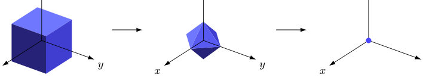
<figcaption class="paper-figure-caption"><b>Fig 2.</b> FIG. 2. Rank-sensitive joint compression ranges for EZ = (Z1, Z2, Z3), whose common eigensector multiplicity is M = 1. At K = M = 1 the range is the cube [−1, 1]3; once K &gt; M, it is the octahedron |x| + |y| + |z| ≤1 at rank two, collapses to the origin at ranks three and four, and is empty for K ≥5.</figcaption>
</figure>
<figure class="paper-figure-card">
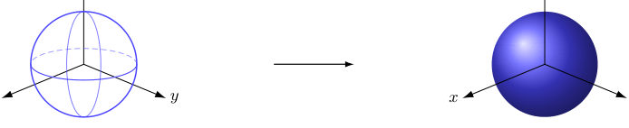
<figcaption class="paper-figure-caption"><b>Fig 3.</b> FIG. 3. Rank-2 sphere-to-ball transition for the full noncentral gauge triple of the [[4, 1; 1, 2]] subsystem block, with K = Dact = 2 and M = 23−q. (a) For q = 2, one has M = 2 = K &lt; KDact = 4, and the range is the Bloch sphere. (b) For q ∈{0, 1}, one has M ∈{4, 8} and hence M ≥KDact = 4, and the range is the filled Bloch ball.</figcaption>
</figure>
<figure class="paper-figure-card">
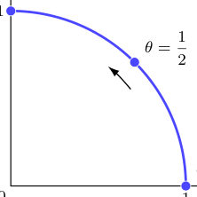
<figcaption class="paper-figure-caption"><b>Fig 4.</b> FIG. 4. Parent-Hamiltonian interpolation for the two-qubit example. The rank-two ground projector traces the first- quadrant unit-circle arc in the (λZZ, λXI) plane as θ varies from 0 to 1. The arrow indicates increasing θ.</figcaption>
</figure>
<figure class="paper-figure-card">
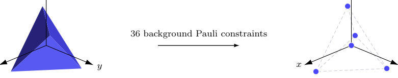
<figcaption class="paper-figure-caption"><b>Fig 5.</b> FIG. 5. Effect of the background constraints on the monitored tuple Etet = (Z1, Z2, Z1Z2). (a) Without additional background constraints, the rank-two range is the continuous tetrahedron T. (b) The 36 noncommuting Pauli constraints in Fbg reduce the monitored range to the tetrahedron barycenter and its four vertices.</figcaption>
</figure>

**Summary.** This work develops a structural framework for analyzing the geometry of Knill-Laflamme coefficients in quantum error detection. It establishes that the geometric properties of the achievable coefficient range—such as convexity and interval structure—are directly controlled by the representation multiplicity of the underlying Pauli observables. This provides sharp criteria for understanding when error detection is robust and well-behaved.

**Why it may be interesting.** It provides a rigorous mathematical framework for understanding the geometric constraints imposed by physical detectability requirements in quantum error correction, which is crucial for designing practical quantum hardware.

Detailed structure

**Main problem.** The paper characterizes the geometry of Knill-Laflamme coefficients, which are used to quantify the feasibility of exact quantum error detection using Pauli observables.

**Main result.** The attainability of coefficients is governed by the representation multiplicity; sufficient multiplicity ensures the coefficient range is convex and connected, leading to a simple interval for the signature spectrum.

**Method.** The analysis uses concepts from convex geometry, specifically studying the joint higher-rank numerical range ($\Lambda_K(A)$) and its Euclidean norm image (the signature spectrum $\Sigma_K(A)$).

**Model / system.** The model is quantum error correction applied to $n$-qubit systems, utilizing Pauli observables ($X, Y, Z$) and associated code spaces defined by projectors ($P$).

**Key observables.** Joint higher-rank numerical range ($\Lambda_K(A)$) and the Signature Spectrum ($\Sigma_K(A)$).

**Important parameters / regimes.** Code dimension ($K$), representation multiplicity, and the structure of the error constraints (e.g., commuting vs. noncommuting Pauli families).

**Assumptions / limitations.** The analysis often assumes sufficient multiplicity to realize all active states, which leads to the desirable convex/interval structure.

**Figures summary.** Figures illustrate how increasing multiplicity can expand the attainable range from a simple shape (like a Bloch sphere) to a filled ball, confirming the connection between multiplicity and geometric structure.

**Paper structure.** The paper develops the theory by first defining the geometric constraints, then proving the main theorem relating multiplicity to convexity, and finally examining special cases like commuting Pauli families and subsystem stabilizer codes.

Abstract

Knill-Laflamme coefficients characterize exact quantum error detection through scalar compressions of error operators to the code space. For prescribed Pauli observables and a fixed code dimension, attainable coefficient vectors form a joint higher-rank numerical range, whose Euclidean norm image is the signature spectrum. We study how operator representation, code dimension, and detection constraints govern this geometry. Our main theorem identifies representation multiplicity as sufficient to lift active expectation data to exact scalar compressions: a lift exists whenever each occupied block has multiplicity at least the code dimension times the rank of the corresponding active state. When multiplicity suffices to realize all active states, the coefficient range is the full active expectation body and is therefore convex and connected, with a closed interval as its signature spectrum. This framework unifies commuting Pauli families, where sufficient common-eigenspace degeneracy yields polytopes, and subsystem stabilizer codes, where protected logical subsystems supply multiplicity spaces for noncommuting gauge observables. Explicit examples show how increasing the code dimension can make a range shrink, collapse, or become empty, while increasing multiplicity can turn a Bloch sphere into a filled ball. In the subsystem setting, parent-Hamiltonian constructions realize exact detecting codes as degenerate ground spaces, selecting distinguished vectors and continuous paths within these ranges. A final three-qubit example shows additional noncommuting detection constraints reduce a tetrahedral range to its barycenter and four vertices, producing a disconnected signature spectrum. The results provide a structural framework for Knill-Laflamme coefficient geometry and motivate sharper criteria for connected coefficient ranges and interval signature spectra under structured error models.

[↑ back to top](#top)

### [Magnetic Phase Diagrams and Spin Hamiltonian of Monoclinic $α$-RuCl$_3$ from Angle-Dependent Torque Studies](http://arxiv.org/abs/2610.02006v1)

**Authors:** Daniel Antoniou, Danrui Ni, John S. Pearce, Robert J. Cava, Amalia I. Coldea, Radu Coldea  
**Type:** both · **Category:** strongly correlated electrons · **PDF:** <https://arxiv.org/pdf/2610.02006v1>  
**Analysis basis:** full PDF text, analyzed in chunks
**Topic relevance:** `analog quantum simulation` **2/5**

↔ Scroll figures horizontally

<figure class="paper-figure-card">
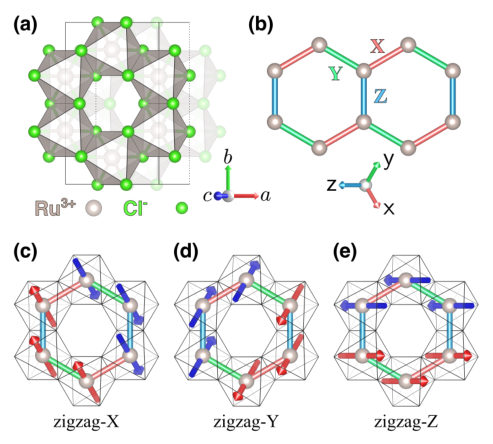
<figcaption class="paper-figure-caption"><b>Fig 1.</b> FIG. 1. (a) Monoclinic crystal structure of α-RuCl3 projected onto the ab plane, where the thin lines show the unit cell outline. (b) Schematic of the Ru honeycomb in the ab plane showing the X/Y/Z bonds (color-coded red/green/blue) with Kitaev exchange along the (cubic) x/y/z axes, respectively, shown in the lower triad. (c,d,e) Schematic of the zigzag-X, -Y and -Z antiferromagnetic order patterns discussed in the text.</figcaption>
</figure>
<figure class="paper-figure-card">
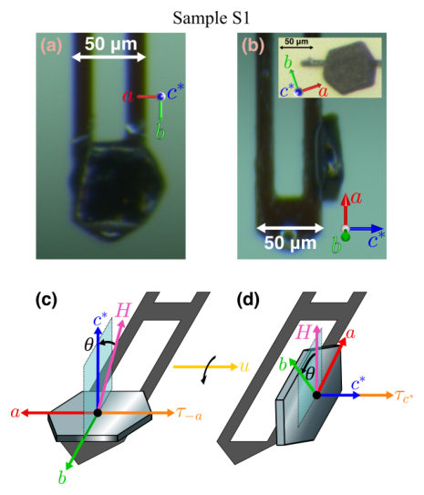
<figcaption class="paper-figure-caption"><b>Fig 2.</b> FIG. 2. (Top) Representative photographs of sample S1, mounted for torque measurements for field in the bc∗(left) and ab (right) planes, with the reference crystallographic a, b and c∗axes indicated by colored arrows. (Bottom) Corre- sponding schematic diagram of the piezocantilevers with the sample represented by a thin elongated hexagonal platelet, mounted on the top/side of the cantilever platform in the left/right panels. The transparent light-blue shaded vertical rectangle in the bottom panels indicates the plane of rotation, with the rotation angle θ defined (up to an offset) as the angle between a reference crystallographic axis in this plane and the (fixed) applied field H. The...</figcaption>
</figure>
<figure class="paper-figure-card">
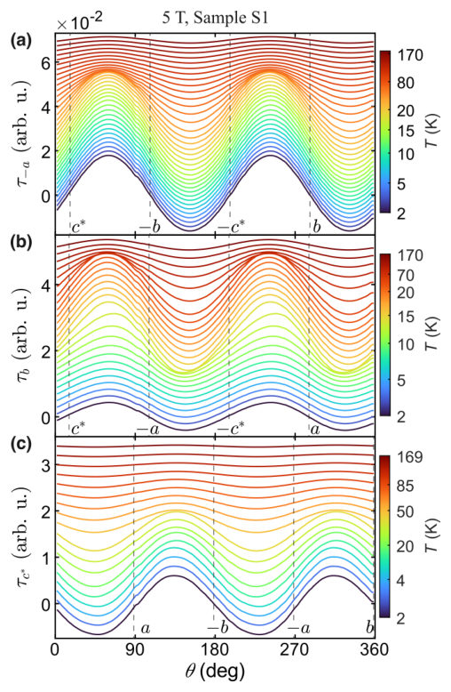
<figcaption class="paper-figure-caption"><b>Fig 3.</b> FIG. 3. Angular dependence of the torque for field in the bc∗, ac∗and ab planes, as a function of temperature (color- coded) at 5 T (sample S1). In each panel, curves are offset vertically by 0.002 for clarity. Dashed vertical lines and bot- tom labels indicate when the applied field is oriented along reference crystallographic axes. In (c), the four lowest tem- perature curves are scaled by ×0.5 for clarity.</figcaption>
</figure>
<figure class="paper-figure-card">
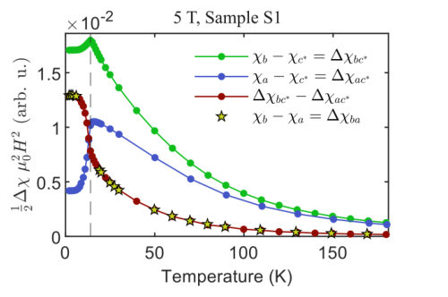
<figcaption class="paper-figure-caption"><b>Fig 4.</b> FIG. 4. Temperature dependence of the susceptibility anisotropy in the three crystallographic planes probed. Data points are the fitted amplitude A2 of the 2-fold Fourier compo- nent of the torque angular dependence as defined in Eqs. (1,2) and described in the text. The fitted raw torque data is from Fig. 3, collected in a field of 5 T. The vertical dashed line indicates TN.</figcaption>
</figure>
<figure class="paper-figure-card">
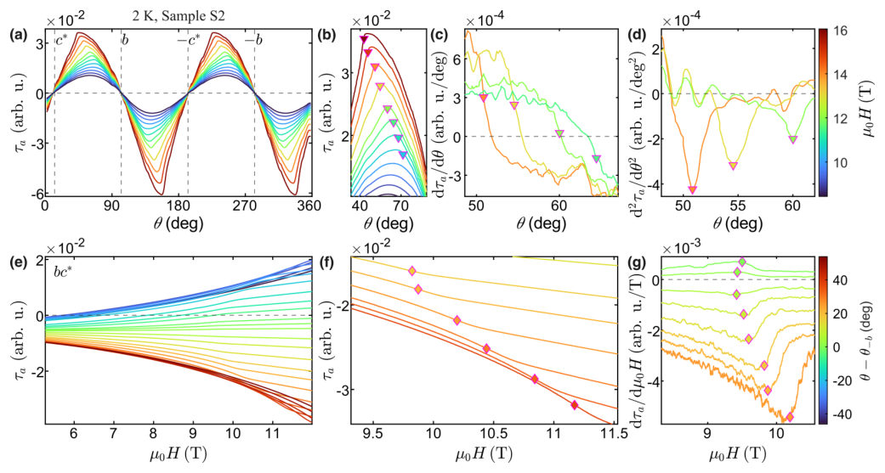
<figcaption class="paper-figure-caption"><b>Fig 5.</b> FIG. 5. Torque for field in the bc∗plane at 2 K (sample S2). (a) Angular dependence of the torque as a function of field magnitude (color coded). Top labels and dashed vertical lines indicate when the applied field is orientated along reference crystallographic axes. (b) Zoomed in section of (a), where kink anomalies are indicated by down triangles. These anomalies are clearly observed as points of steepest gradient in the first derivative in (c) and as local peaks in the second derivative in (d), where only a selection of the curves are plotted for clarity. (e) Torque as a function of field magnitude for a range of angles (color coded) on both sides of the −b axis. (f) Zoomed in section of...</figcaption>
</figure>

**Summary.** This work investigates the magnetic phase diagram of monoclinic $\alpha$-RuCl$_3$ using high-precision magnetic torque measurements. By analyzing the torque response in three orthogonal planes, the authors map out distinct magnetic phases and develop a minimal spin Hamiltonian tailored for the monoclinic symmetry. The findings highlight how structural details and sample morphology critically influence the observed magnetic ground state.

**Why it may be interesting.** The detailed study of magnetic anisotropy and phase transitions in a strongly correlated Mott insulator like $\alpha$-RuCl$_3$ provides critical insights into the interplay between crystal symmetry, electronic correlations, and emergent magnetic order, which is central to modern condensed matter theory.

Detailed structure

**Main problem.** To determine the magnetic phase diagrams and develop a spin Hamiltonian for the monoclinic phase of $\alpha$-RuCl$_3$ by analyzing magnetic anisotropy.

**Main result.** The magnetic phase diagrams derived from small, monoclinic crystals differ significantly from rhombohedral samples, showing reduced symmetry and requiring higher fields to suppress magnetic order.

**Method.** The study combines highly-sensitive piezo-cantilever magnetic torque measurements across three orthogonal planes with mean-field calculations based on a minimal monoclinic spin Hamiltonian.

**Model / system.** The system is layered honeycomb $\alpha$-RuCl$_3$ with $\text{Ru}^{3+}$ moments governed by anisotropic exchange interactions, including Kitaev terms. The analysis specifically adapts the model to account for the low-symmetry monoclinic lattice structure.

**Key observables.** Magnetic torque ($\tau$) as a function of field angle and magnitude; anomalies in torque and its derivatives used to locate phase transitions.

**Important parameters / regimes.** Magnetic field up to 16 T; temperature transitions at 14 K; the difference in magnetic susceptibilities ($\chi_b - \chi_{c^*}$).

**Assumptions / limitations.** The small sample size prevents the structural transition seen in bulk crystals, and the complex behavior of twinned samples is rationalized by superimposing the responses of the two constituent twins.

**Figures summary.** Figures illustrate the monoclinic structure, schematic magnetic orders (zigzag-X, -Y, -Z), and show the angular and field dependence of the measured torque, which are compared against theoretical predictions.

**Paper structure.** The paper progresses by first establishing the experimental setup and the unique nature of the monoclinic phase. It then uses torque measurements to map out the phase diagram, comparing results from single-crystal measurements to those from twinned samples, all guided by fitting to a minimal monoclinic spin Hamiltonian.

Abstract

The layered honeycomb $α$-RuCl$_3$ has been much explored as a candidate to display unconventional cooperative magnetism between spin-orbit entangled $j_{\rm eff}=1/2$ Ru$^{3+}$ magnetic moments stabilized by strongly-frustrated, Kitaev and other bond-dependent anisotropic interactions. Most studies so far have focused on relatively large single crystals that undergo a structural phase transition from monoclinic to rhombohedral upon cooling below 150 K and a magnetic transition to zigzag order around 7 K. Here we study the magnetism of high-quality, very small (sub 100 $μ$m diameter) single crystals, which remain monoclinic upon cooling to low temperatures and display a sharp magnetic transition at 14 K. Using highly-sensitive piezo-cantilever magnetic torque measurements in fields up to 16 T, we report a comprehensive study of the magnetic phase diagrams for magnetic field rotated in three orthogonal crystallographic planes. Our extensive torque data collected upon varying almost continuously the angular orientation of the field as well as the field magnitude, allows clear detection of phase transitions via anomalies in the raw torque data and its higher order derivatives with respect to both angle and field magnitude. The obtained magnetic phase diagrams show many differences compared to rhombohedral samples, displaying reduced rotational symmetry, substantially higher fields required to suppress the spontaneous magnetic order, and distinct field-induced phases. We provide a direct comparison of the torque data with mean-field calculations for magnetic Hamiltonians appropriate for $α$-RuCl$_3$ allowing for the monoclinic lattice symmetry and propose minimal magnetic structure models for all explored regions of the magnetic phase diagrams.

[↑ back to top](#top)

### [One-Shot any Code](http://arxiv.org/abs/2610.02137v1)

**Authors:** Andrew C. Yuan  
**Type:** theory · **Category:** quantum information and computing · **PDF:** <https://arxiv.org/pdf/2610.02137v1>  
**Analysis basis:** full PDF text, analyzed in chunks
**Topic relevance:** `quantum measurements` **2/5**

↔ Scroll figures horizontally

<figure class="paper-figure-card">
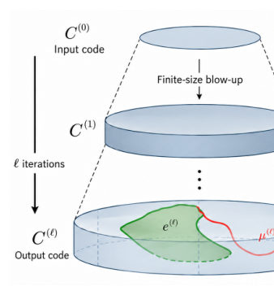
<figcaption class="paper-figure-caption"><b>Fig 1.</b> FIG. 1. Schematic of the RG construction. Physical and measurement errors only occur in the final output code C(ℓ).</figcaption>
</figure>
<figure class="paper-figure-card">
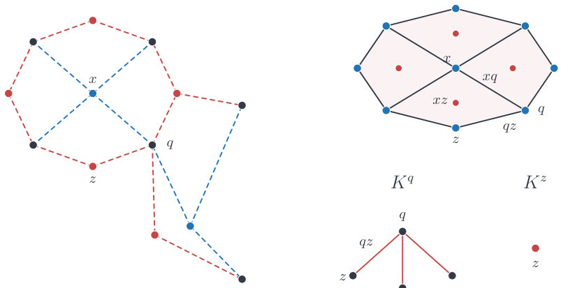
<figcaption class="paper-figure-caption"><b>Fig 2.</b> FIG. 2. Input Code and Local Cones. (a) A schematic portion of an input CSS code C: blue, black and red dots denote x-checks, qubits, and z-checks, respectively. Dashed lines denote check–qubit incidence; only selected cells and incidences are shown. (b) The local cones Kx, Kq, Kz in Definitions 104 and 106. In Kx, blue dots denote vertices x, q, z, black lines denote edges xq, qz, and red dots mark the shaded faces xz. In Kq, black dots denote vertices q, z and red lines denote edges qz; Kz consists of a single red vertex z. Only representative cell labels are shown. When glued together as in Remark 110, we obtain a CSS code with x-checks, qubits and z-checks, labeled as blue, black and...</figcaption>
</figure>
<figure class="paper-figure-card">
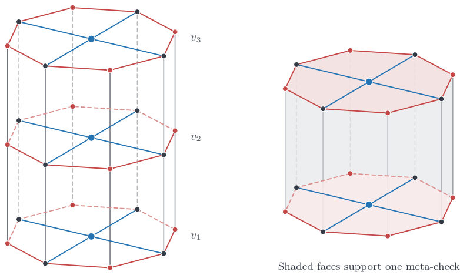
<figcaption class="paper-figure-caption"><b>Fig 3.</b> FIG. 3. Hollowed Tensor. (a) denotes Y x constructed from the local graph and cone of x as in Fig. 2. Note that the coloring of Y x</figcaption>
</figure>
<figure class="paper-figure-card">
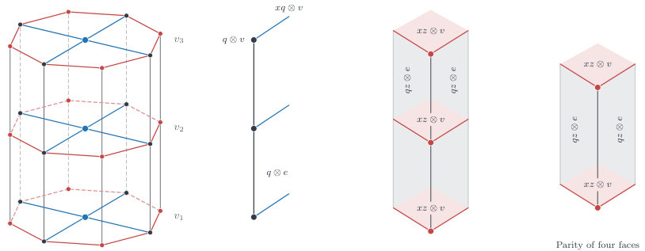
<figcaption class="paper-figure-caption"><b>Fig 4.</b> FIG. 4. Y x blocks. (a) An x-layer Y x as in Fig. 3a. (b) A q-block, with vertices q ⊗v and edges xq ⊗v, q ⊗e. (c) A z-block: red shaded faces denote xz ⊗v and gray shaded faces denote qz ⊗e. (d) A (z, e)-block for one repetition edge e; its parity is the F2 sum of the occupied faces among the two caps and two side faces. Open-ended edges in (b) meet x-vertices outside the block.</figcaption>
</figure>
<figure class="paper-figure-card">
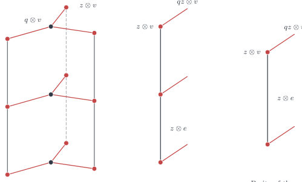
<figcaption class="paper-figure-caption"><b>Fig 5.</b> FIG. 5. Y q blocks. (a) A q-layer Y q. (b) A z-block, with vertices z ⊗v, spokes qz ⊗v, and rails z ⊗e. (c) A (z, e)-block for one repetition edge e; its parity is the F2 sum of the occupied edges among the two spokes and one rail. Open-ended spokes in (b), (c) meet q-vertices outside the block.</figcaption>
</figure>

**Summary.** This paper develops a method to upgrade any quantum error-correcting code to support single-shot (SS) syndrome measurements, a significant advance over traditional time-consuming syndrome extraction. By constructing an output code $	ext{[[nm, k]]}$ from an input code $	ext{[[n, k]]}$ using an efficient RG decoder, the authors demonstrate robust error suppression over many correction rounds. This breakthrough addresses the temporal bottleneck in fault-tolerant quantum computation.

**Why it may be interesting.** This work provides a powerful, general framework for achieving fault-tolerant quantum computation by upgrading existing quantum codes to support single-shot syndrome measurements, which is crucial for scaling quantum memory and computation.

Detailed structure

**Main problem.** The goal is to equip an arbitrary Quantum Low-Density Parity-Check (QLDPC) code with single-shot (SS) quantum error correction while maintaining bounded check weight and qubit degree.

**Main result.** The authors show that any single-shot stabilizer code is self-correcting and provide a method to transform any input code into an output code with SS QEC, achieving error suppression $\Omega(m^\alpha n^eta)$.

**Method.** The core method involves constructing an output code $	ext{[[nm, k]]}$ from an input $	ext{[[n, k]]}$ code using a renormalization-group (RG) decoder that runs efficiently in $O(\log m)$ parallel time.

**Model / system.** The work analyzes Quantum Error Correction (QEC) using CSS QLDPC codes. The focus is on moving from conventional syndrome extraction (which requires multiple time steps) to single-shot syndrome measurements, controlling both physical and measurement noise.

**Key observables.** Logical failure probability over $T$ rounds, error suppression $\Omega(m^\alpha)$, and the threshold $p_{	ext{RG}}$.

**Important parameters / regimes.** The noise threshold $p_{	ext{RG}} > 0$, the error suppression exponent $\alpha > 0$, and the input/output code parameters $(n, k)$ and $(nm, k)$.

**Assumptions / limitations.** The analysis assumes local stochastic (LS) rates for physical errors and measurement errors, and the construction does not require the code to have a three-dimensional geometric realization.

**Paper structure.** The paper establishes the self-correcting nature of single-shot codes, proves the general transformation from any QLDPC code to an SS-correcting code, and analyzes the resulting error suppression bounds over multiple correction rounds.

Abstract

We first provide a simple proof showing that any single-shot code is self-correcting. We then show that any $[[n,k]]$ CSS quantum low-density parity-check (QLDPC) code can be transformed into an $[[nm,k]]$ CSS QLDPC code with single-shot (SS) quantum error correction and an efficient local decoder which runs in $O(\log m)$ parallel time. Below a constant threshold $p_{\rm RG}>0$ for joint local stochastic physical and measurement noise, the logical failure probability over $T$ correction rounds is bounded by \begin{equation*}   O(T n)\exp[-Ω(m^α)] \end{equation*} for a constant $α>0$; we say that the \textit{threshold} is $p_{\rm RG}$ and \textit{error suppression} is $Ω(m^α)$. Moreover, if the input code is equipped with a single-shot decoder with threshold $p_c>0$ and error suppression $Ω(n^β)$, then the output code \textit{enhances} the error suppression to $Ω(m^α n^β)$, while maintaining the decoder-independent threshold $p_{\rm RG}$, and thus \textit{enhanced} if $p_c < p_{\rm RG}$.

[↑ back to top](#top)

### [Quantum Advantage for Two-Party Differential Privacy](http://arxiv.org/abs/2610.02113v1)

**Authors:** Daniel Alabi, Emil T. Khabiboulline  
**Type:** theory · **Category:** quantum information and computing · **PDF:** <https://arxiv.org/pdf/2610.02113v1>  
**Analysis basis:** full PDF text, analyzed in chunks
**Topic relevance:** `quantum measurements` **2/5**

↔ Scroll figures horizontally

<figure class="paper-figure-card">
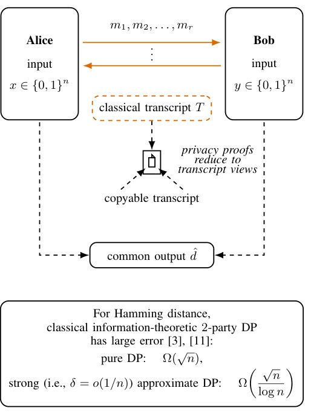
<figcaption class="paper-figure-caption"><b>Fig 1.</b> Fig. 1. Classical two-party differential privacy. Classical privacy proofs reduce to transcript views. The interaction transcript can be copied.</figcaption>
</figure>
<figure class="paper-figure-card">
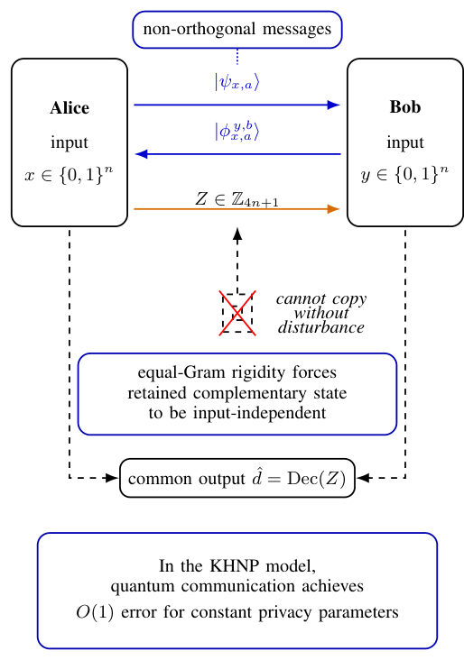
<figcaption class="paper-figure-caption"><b>Fig 2.</b> Fig. 2. Quantum two-party differential privacy in the KHNP model. Exact preservation of non-orthogonal messages prevents transcript copying and yields the quantum advantage.</figcaption>
</figure>

**Summary.** This work develops quantum protocols to compute the Hamming distance privately between two parties, achieving an $O(1)$ error rate under information-theoretic privacy guarantees. This significantly surpasses the classical lower bound of $\Omega(\sqrt{n})$ error required by classical protocols. The advantage stems from leveraging quantum mechanics in a specific honest-but-curious communication model.

**Why it may be interesting.** The core concept of using quantum information theory (like non-orthogonality) to break classical information-theoretic lower bounds in privacy-preserving computation is highly relevant to quantum cryptography and secure quantum computation.

Detailed structure

**Main problem.** The paper addresses achieving information-theoretically private quantum protocols for computing the two-party Hamming distance when both parties must output the same estimate.

**Main result.** The authors demonstrate that quantum communication can achieve an $O(1)$ information-theoretic error rate, matching the accuracy available classically only under computational assumptions, by exploiting quantum principles in the Klauck's honest, nonpreemptive model.

**Method.** The construction utilizes a 'guarded coherent round trip' and relies on the 'equal-Gram rigidity principle' to ensure privacy by preventing the observer from retaining input-dependent complementary information.

**Model / system.** The analysis is set within quantum communication protocols, comparing different security models: Prescribed-channel (PC), Klauck's honest nonpreemptive view (KHNP), and Retention-robust (RR).

**Key observables.** Expected error in estimating the Hamming distance, Quantum Differential Privacy (QDP) parameters ($\epsilon, \delta$), and communication complexity ($O(n)$ qubits/bits).

**Important parameters / regimes.** Input length $n$, privacy parameters $\epsilon$ and $\delta$, and the separation between classical $\Omega(\sqrt{n})$ and quantum $O(1)$ error bounds.

**Assumptions / limitations.** The quantum advantage is specific to the KHNP model and relies on the non-copyability of non-orthogonal quantum messages; it is not guaranteed against fully malicious retention-robust attacks.

**Figures summary.** Figure 1 compares classical DP protocols showing the $\Omega(\sqrt{n})$ gap; Figure 2 illustrates the quantum advantage in the KHNP model using non-orthogonal messages.

**Paper structure.** The paper establishes the problem gap classically, then introduces the quantum protocol using the guarded coherent round trip and rigidity principle. It details results for pure QDP and approximate QDP, concluding with a comparison to the fully retention-robust baseline.

Abstract

We introduce information-theoretically private quantum protocols for two-party Hamming distance when both parties must output the same estimate. Classically, for input length $n$, information-theoretic protocols require $Ω(\sqrt{n})$ error under pure differential privacy and $Ω(\sqrt{n}/\log n)$ error under strong approximate differential privacy, whereas computational security permits $O(1)$ error. In Klauck's honest, nonpreemptive, message-preserving model, we give an $O(n)$-communication quantum protocol with pure $\varepsilon$ quantum differential privacy (QDP) and expected error at most $\frac{2}{\sinh \varepsilon}+γ$, for every $γ>0$. For approximate $(\varepsilon, δ)$ QDP, an exact hockey-stick divergence calculation yields strictly smaller error, while preserving the $O(1)$-versus-$Ω(\sqrt{n}/\log n)$ separation for $δ=o(1/n)$. Thus, quantum communication achieves $O(1)$ information-theoretic error, matching the accuracy available classically only under computational assumptions.   The main construction uses a guarded coherent round trip and an equal-Gram rigidity principle that prevents an honest player from retaining input-dependent complementary information. We separate this model from weaker prescribed-channel privacy, which already admits an exact classical realization, and from fully retention-robust security, against which measurement-and-abort attacks remain possible. Therefore, we identify preservation of non-orthogonal quantum messages as a resource for privacy.

[↑ back to top](#top)

### [Quantum Information in High-Energy Physics: a top subject](http://arxiv.org/abs/2610.00467v1)

**Authors:** Yoav Afik, Juan Ramón Muñoz de Nova  
**Type:** both · **Category:** other · **PDF:** <https://arxiv.org/pdf/2610.00467v1>  
**Analysis basis:** full PDF text, analyzed in chunks
**Topic relevance:** `quantum measurements` **2/5**

↔ Scroll figures horizontally

<figure class="paper-figure-card">
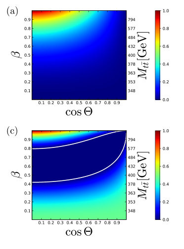
<figcaption class="paper-figure-caption"><b>Fig 1.</b> Figure 3: Concurrence as a function of (β, cos Θ). All plots are even functions of cos Θ. White lines indicate the boundaries between separability and entanglement. (a) C[ρq¯q]. (b) C[ρgg]. (c) C[ρ(√s)] for the COM energy of LHC Run 2, √s = 13 TeV. The PDF values used are proportioned by the NNPDF30LO PDF set [17]. (d) Relative cross section 1</figcaption>
</figure>

**Summary.** This work reviews the application of Quantum Information theory to High-Energy Physics, focusing on quantifying entanglement in $tar{t}$ quark pair production at the LHC. By proposing and detailing a quantum tomography protocol, the authors connect abstract quantum concepts to concrete, measurable observables like spin correlations. The research successfully established a framework that led to the experimental confirmation of entanglement in particle collisions.

**Why it may be interesting.** The methodology of using entanglement diagnostics (like witnesses and concurrence) developed in pure QI theory to predict and interpret measurable cross-section deviations in particle physics is highly relevant for understanding quantum correlations in complex, non-equilibrium quantum systems.

Detailed structure

**Main problem.** The paper aims to bridge the theoretical framework of Quantum Information (QI) with the experimental domain of High-Energy Physics (HEP) to study fundamental quantum features like entanglement.

**Main result.** The authors detail how entanglement can be predicted and experimentally observed in top-antitop quark pair ($tar{t}$) production at colliders like the LHC, leading to the highest-energy observations of entanglement to date.

**Method.** The study employs quantum tomography protocols and diagnostic tools like entanglement witnesses and concurrence to quantify non-separability in the density matrices describing the particle pair.

**Model / system.** The primary system is the $tar{t}$ pair produced in high-energy collisions (e.g., $qar{q}$ or $gg$ fusion) at the LHC. The quantum state is modeled using density matrices ($
ho$) for two-qubit systems.

**Key observables.** Entanglement (non-separability), spin correlations ($\langle \sigma_i \otimes \sigma_j 
angle$), and the entanglement witness parameter $D$.

**Important parameters / regimes.** Invariant mass ($M_{tar{t}}$), collision energy ($\sqrt{s}$), and kinematic angles ($\cos\Theta$).

**Assumptions / limitations.** The analysis relies on leading-order (LO) QCD calculations and assumes that the measured decay lepton angular distributions can reconstruct the initial quantum state.

**Figures summary.** Figures illustrate Feynman diagrams for $tar{t}$ production and show the dependence of entanglement criteria (e.g., $\Delta_{gg} > 0$) and the differential cross-section on kinematic variables.

**Paper structure.** The paper provides a comprehensive overview, first establishing the theoretical link between QI and HEP, then applying specific diagnostics (concurrence, witnesses) to the $tar{t}$ system across different production channels ($qar{q}$ vs $gg$), and concluding with the experimental realization and impact on the field.

Abstract

As a work selected for the Frontiers of Science Award, we present in the Proceedings of the ICBS an overview of how the techniques from the field of Quantum Information (QI) can be implemented in High-Energy Physics (HEP), including also some novel insights. We focus on the paradigmatic case of the top quark, a drosophila of a relativistic qubit. We study the presence of entanglement, perhaps the most genuine feature of Quantum Mechanics, in top-antitop quark production in high-energy colliders such as the LHC. We also analyze our experimental proposal of a quantum tomography protocol for the top-antitop quark pair, eventually leading to the entanglement observations by the ATLAS and CMS collaborations, which constituted the highest-energy observations of entanglement ever. We discuss how the concepts and techniques developed in our work have effectively spawned an already vast and rich field of QI in HEP.

[↑ back to top](#top)

### [Quantum key distribution using generalized contextuality against post-quantum eavesdroppers](http://arxiv.org/abs/2610.00595v1)

**Authors:** Daniel Centeno, Roberto D. Baldijão, Maria Ciudad Alañón, Yujie Zhang, Pedro Lauand, Elie Wolfe  
**Type:** theory · **Category:** quantum information and computing · **PDF:** <https://arxiv.org/pdf/2610.00595v1>  
**Analysis basis:** full PDF text, analyzed in chunks
**Topic relevance:** `quantum measurements` **2/5**

↔ Scroll figures horizontally

<figure class="paper-figure-card">
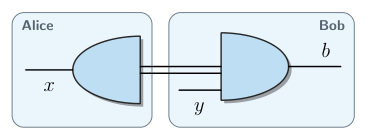
<figcaption class="paper-figure-caption"><b>Fig 1.</b> FIG. 1. Prepare-and-measure scenario. Alice chooses a prepa- ration Px in her laboratory and communicates the resulting physical system to Bob, who chooses a measurement My and obtains outcome b.</figcaption>
</figure>
<figure class="paper-figure-card">
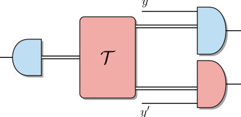
<figcaption class="paper-figure-caption"><b>Fig 2.</b> FIG. 3. Adversarial prepare-and-measure scenario in which Bob and Eve have independent settings y and y′ used in the optimization. The blue devices represent the trusted proce- dures and the red ones, the untrusted ones.</figcaption>
</figure>
<figure class="paper-figure-card">
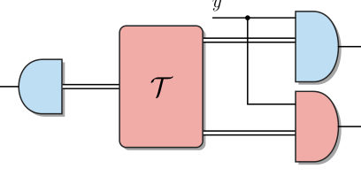
<figcaption class="paper-figure-caption"><b>Fig 3.</b> FIG. 2. Adversarial prepare-and-measure scenario allowing Eve to have access to y once the measurement of Bob is per- formed. The blue devices represent the trusted procedures and the red ones, the untrusted ones.</figcaption>
</figure>
<figure class="paper-figure-card">
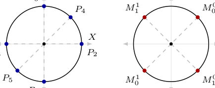
<figcaption class="paper-figure-caption"><b>Fig 4.</b> FIG. 4. Preparations and effects of the aligned-key protocol in the qubit realization, drawn in the X–Z plane: P0 = |0⟩, P1 = |1⟩, P2 = |+⟩, P3 = |−⟩, and P4, P5 the two antipodal states along (Z +X)/ √</figcaption>
</figure>
<figure class="paper-figure-card">
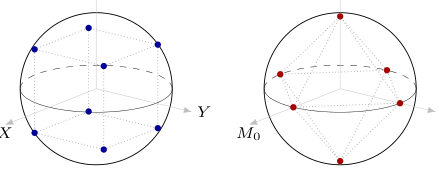
<figcaption class="paper-figure-caption"><b>Fig 5.</b> FIG. 5. The 3 →1 parity-oblivious random access code. The eight preparations Px0x1x2 sit at the vertices of a cube inscribed in the Bloch sphere, with Bloch vector  (−1)x0, (−1)x1, (−1)x2 / √</figcaption>
</figure>

**Summary.** This work analyzes QKD security by replacing the reliance on quantum theory with operational equivalences (OPEQs) derived from local measurements. It proves that generalized contextuality is necessary for a positive key rate against post-quantum eavesdroppers, but it is not sufficient. The study highlights that the operational structure itself, rather than just quantum mechanics, dictates the achievable security rate.

**Why it may be interesting.** It provides a rigorous, operational framework for device-independent security that extends beyond standard quantum assumptions, linking fundamental concepts of nonclassicality (contextuality) to practical cryptographic security.

Detailed structure

**Main problem.** The paper investigates whether generalized contextuality, a nonclassicality measure in prepare-and-measure settings, can provide a security guarantee for Quantum Key Distribution (QKD) against adversaries who are not restricted by quantum mechanics (post-quantum eavesdroppers).

**Main result.** Contextuality is proven to be a necessary condition for achieving a positive key rate against such adversaries, but it is not sufficient, as demonstrated by specific counterexamples.

**Method.** The analysis establishes operational equivalences (OPEQs) as theory-independent constraints and formulates the worst-case key rate as a finite linear program over extensions of observed statistics.

**Model / system.** The model is a prepare-and-measure QKD scenario where Alice prepares a state and sends it to Bob for measurement. The security analysis is performed against an adversary (Eve) whose intervention is only constrained by the established OPEQs, not by quantum theory.

**Key observables.** Worst-case asymptotic key rate, generalized contextuality, and operational equivalences.

**Important parameters / regimes.** The key rate is bounded by maximizing Eve's guessing probability over all admissible attacks satisfying the OPEQs.

**Assumptions / limitations.** The security analysis assumes that local operational equivalences established by Alice and Bob must be respected by any physical intervention on the channel, even by an adversary.

**Figures summary.** Figure 1 illustrates the basic prepare-and-measure QKD setup. Other figures and tables compare key rates for various protocols (like CHSH) under different adversarial constraints.

**Paper structure.** The paper first introduces the problem by comparing Bell nonlocality to generalized contextuality. It then develops the adversarial model using OPEQs, proving contextuality is necessary. Subsequently, it shows contextuality is not sufficient and concludes by comparing key rates achievable under quantum vs. post-quantum assumptions.

Abstract

Bell nonlocality allows secret key to be certified without trusting the internal operation of the devices, and even against eavesdroppers constrained only by the no-signaling principle. We ask whether generalized contextuality, a notion of nonclassicality available in prepare-and-measure experiments on a single system, can play an analogous role. In our approach, Alice and Bob first establish operational equivalences among their local preparation and measurement procedures, which are then treated as theory-independent constraints that any physical intervention on the communication channel, including that of an adversary, must respect. Eve is otherwise unrestricted, that is, her intervention on the transmitted system is not assumed to be described by quantum theory. Within this adversarial model, we show that Eve's optimal guessing probability against individual attacks is the solution of a finite linear program, and hence that a worst-case asymptotic key rate follows from the observed statistics and the operational equivalences alone. We prove that contextuality is necessary for a positive key rate. However, we also show that it is not sufficient. Concretely, the (3,2)-parity-oblivious random access code, known to yield secret key against a quantum eavesdropper, yields none certifiable key rate against a post-quantum one. Conversely, operational equivalences with no analogue among no-signaling constraints can strictly increase the asymptotic key rate. We illustrate this with the prepare-and-measure version of the standard CHSH protocol with an aligned key-generating setting.

[↑ back to top](#top)

### [QUFIG: GNN-Based Prediction of Quantum Fault Injection Vulnerabilities with Gate-Level Precision](http://arxiv.org/abs/2610.01777v1)

**Authors:** Shihan Zhao, Qiying Li, Ben Dong, Qian Wang, Yuntao Liu  
**Type:** both · **Category:** quantum information and computing · **PDF:** <https://arxiv.org/pdf/2610.01777v1>  
**Analysis basis:** full PDF text, analyzed in chunks
**Topic relevance:** `QC/QI experiment` **2/5**

↔ Scroll figures horizontally

<figure class="paper-figure-card">
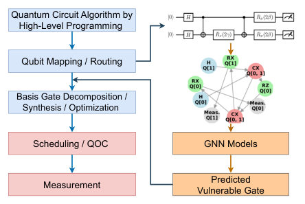
<figcaption class="paper-figure-caption"><b>Fig 1.</b> Fig. 1: An overview of the quantum-circuit vulnerability pre- diction framework, which uses a GNN to identify potentially vulnerable gates.</figcaption>
</figure>
<figure class="paper-figure-card">
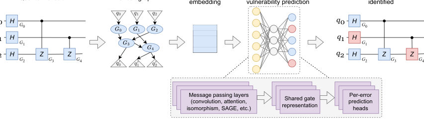
<figcaption class="paper-figure-caption"><b>Fig 2.</b> Fig. 2: Overview of the proposed learning-guided fault-site prioritization framework. A compiled quantum circuit is converted into a circuit DAG, where each gate node is encoded using gate-level structural features. A GNN backbone estimates per-fault impact scores through fault-specific prediction heads, and the top-ranked gate-fault pairs are selected under a fixed budget for detailed fault simulation, mitigation, or security auditing.</figcaption>
</figure>
<figure class="paper-figure-card">
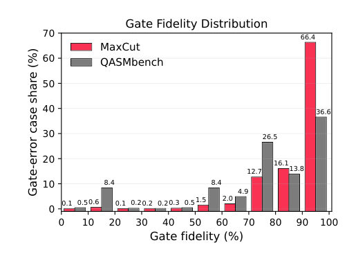
<figcaption class="paper-figure-caption"><b>Fig 3.</b> Fig. 3: Gate-level fidelity distribution under single-gate fault injection. The x-axis groups injected gate–error cases by the output fidelity between the faulty and ideal circuits, and the y- axis reports the percentage of cases in each bin. Lower fidelity indicates stronger output degradation. For example, only 0.1% and 0.5% cases reduce the output fidelity to lower than 10%, showing that severe faults are concentrated in a small subset.</figcaption>
</figure>
<figure class="paper-figure-card">
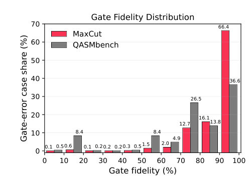
<figcaption class="paper-figure-caption"><b>Fig 4.</b> Fig. 3 shows the distribution of gate-level output fidelity under high-strength fault injection. The results reveal that fault sensitivity is highly non-uniform across both gates and datasets, rather than being evenly distributed throughout the circuit. As expected, only a small subset of gates causes substantial output degradation after noise injection, whereas most gates remain relatively stable and exhibit only minor fidelity fluctuations even under strong perturbations. The gates that can truly overturn the circuit outcome are rare, while the majority of gates are robust. To further examine whether vulnerable gates are associated with specific depth regions, we identify, for each...</figcaption>
</figure>
<figure class="paper-figure-card">
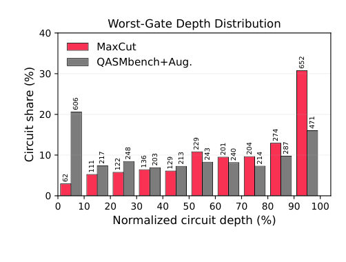
<figcaption class="paper-figure-caption"><b>Fig 5.</b> Fig. 4: Position distribution of the most vulnerable gates. For each circuit, The x-axis shows 10% position bins which compute most vulnerable gate normalized position as gate index/total gates. The y-axis reports the the percentage of circuits whose most vulnerable gate falls into each bin. Numbers above bars indicate circuit counts. The dataset- dependent distribution shows that simple position-based traver- sal is insufficient for reliable vulnerable-gate detection.</figcaption>
</figure>

**Summary.** QUFIG is a novel GNN-based framework designed to predict which specific gates in a quantum circuit are most vulnerable to fault injection attacks. By learning from circuit structure and fault impact, it allows quantum designers to prioritize fault simulation and auditing, drastically reducing the computational cost required to ensure quantum circuit reliability.

**Why it may be interesting.** This work directly tackles the practical security and reliability challenges of near-term quantum hardware, which is crucial for any theoretical physicist working on quantum algorithms or open quantum systems that must be implemented on noisy devices.

Detailed structure

**Main problem.** The paper addresses the critical challenge of identifying quantum fault injection vulnerabilities at gate-level precision in large-scale, cloud-based quantum computing workflows.

**Main result.** The proposed framework, QUFIG, significantly reduces the number of gates requiring manual inspection (by 2.9%–19.8%) while maintaining the ability to identify high-impact vulnerable gate-fault pairs compared to random or depth-based heuristics.

**Method.** It formulates the problem as a learning-guided prioritization task, using a Graph Neural Network (GNN) backbone trained to predict a vulnerability score for every potential gate-fault pair.

**Model / system.** The system analyzed is a quantum circuit, represented abstractly as a Directed Acyclic Graph (DAG) where nodes are quantum gates and edges represent qubit dependencies. Faults are modeled using realistic NISQ error mechanisms (decoherence, Pauli-type, etc.).

**Key observables.** Vulnerability Score (predicted impact on circuit fidelity), Fidelity Loss ($\Delta F$), and Application-level Output Deviation ($\Delta E$).

**Important parameters / regimes.** The inspection budget ($B$) and the target percentage ($q\%$) of the most vulnerable gates to recover.

**Assumptions / limitations.** The core assumption is that prioritizing inspection based on the predicted vulnerability score is sufficient to guide fault analysis, avoiding prohibitively expensive exhaustive simulation.

**Figures summary.** Figures compare the target-recovery cost (inspection cost vs. percentage of vulnerable gates identified) for QUFIG against random and depth-based baselines on QASMbench and MaxCut, showing superior performance for QUFIG.

**Paper structure.** The paper introduces the problem, details the formulation of fault impact using fidelity loss and application deviation, proposes the GNN-based QUFIG framework trained via a hybrid loss function, and validates its efficiency by comparing inspection costs against established heuristics on standard quantum benchmarks.

Abstract

The growing scale and accessibility of quantum hardware exposed new reliability and security challenges in the quantum computing workflow, such as the run-time fault injection attacks in cloud-based quantum computing platforms. However, existing works fail to identify vulnerabilities with gate-level precision or adapt to run-time environments. In this work, we formulate gate-level fault analysis as a learning-guided prioritization problem under restricted fidelity budgets. The framework uses a circuit-DAG-based GNN backbone to predict the vulnerability score of each gate to each type of injected fault, defined as the impact of the gate-fault pair on circuit fidelity. The gate-fault pairs are then ranked by their vulnerability score. Experiments on QASMbench and HamLib MaxCut show that QUFIG recovers high-impact vulnerable gate-fault pairs with fewer inspections than random and depth-based heuristics. Our results show that QUFIG can reduce the number of gates requiring inspection by 2.9--19.8% while maintaining effective fault identification, allowing quantum circuit designers to identify vulnerabilities and apply targeted defenses more efficiently.

[↑ back to top](#top)

### [Sequential Capacity of Quantum Processes with Finite Memory](http://arxiv.org/abs/2610.02068v1)

**Authors:** Yibin Wang  
**Type:** theory · **Category:** quantum information and computing · **PDF:** <https://arxiv.org/pdf/2610.02068v1>  
**Analysis basis:** full PDF text, analyzed in chunks
**Topic relevance:** `quantum measurements` **2/5**

↔ Scroll figures horizontally

<figure class="paper-figure-card">
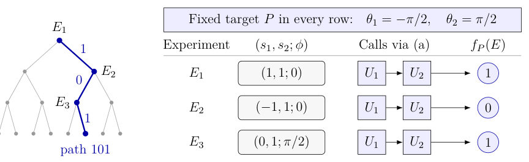
<figcaption class="paper-figure-caption"><b>Fig 1.</b> FIG. 1. A controlled query and a complete response path. In (a), known tester operations select the signed phase in Eq. (7) using one forward call to the process transition. The visible carrier starts and ends in |0⟩. The retained qubit C starts in |+⟩once per complete run and is measured after all transitions, with accepting projector onto (|0⟩+ eiϕ|1⟩)/ √</figcaption>
</figure>

**Summary.** This work develops a measure called 'sequential response capacity' to quantify how complex a quantum process can become given limited internal memory. It proves that quantum systems can achieve a logarithmic scaling in capacity with the number of steps, far surpassing classical limits. This establishes a fundamental benchmark for quantum advantage in sequential information processing tasks.

**Why it may be interesting.** The quantitative comparison between quantum and classical capacity bounds, especially the logarithmic enhancement, provides a concrete measure of quantum advantage in sequential information processing tasks.

Detailed structure

**Main problem.** The paper quantifies the 'sequential response capacity' of a quantum process that operates over multiple time steps while maintaining a fixed, finite internal memory.

**Main result.** For fixed memory, the quantum capacity scales logarithmically with the number of time steps ($K \log K$), significantly exceeding the linear capacity of classical stochastic processes.

**Method.** The analysis uses information-theoretic tools, relating capacity to the sequential fat-shattering dimension, and establishes lower bounds via specific constructions (e.g., time-dependent phase rotations).

**Model / system.** The model involves quantum processes defined by sequences of CPTP maps ($\Phi_t$) acting on a visible input/output space and an internal quantum memory register of dimension $r$.

**Key observables.** Sequential Response Capacity ($C_\gamma$), Response Probability ($f_P(E)$), and the operational distance between processes.

**Important parameters / regimes.** Number of time steps ($K$), memory dimension ($r$), required probability separation gap ($\gamma$), and residual phase-flip probability ($e$).

**Assumptions / limitations.** The main results assume ideal controls and weak residual phase noise after error correction to achieve the maximal logarithmic enhancement.

**Figures summary.** Figure 1 illustrates the mechanism of a controlled query using a retained control qubit to accumulate relative phase across multiple steps.

**Paper structure.** The paper progresses by defining the capacity, establishing the main theorem for fixed memory, comparing quantum vs. classical bounds, and finally analyzing the capacity degradation under known Pauli noise and dephasing.

Abstract

How complex can the responses of a quantum device become as it runs longer with a fixed internal memory? We quantify this complexity through sequential response capacity: how many adaptive testing stages, each using a fresh run, can continue to separate possible processes by a prescribed gap in response probabilities. For fixed system and memory sizes, we establish a tight law relating this capacity to run length and probability resolution. At fixed resolution, the capacity grows on the order of $K\log K$, where $K$ is the number of time steps in each run. Our construction attains this growth using time-dependent phase rotations on a single visible qubit with no additional internal memory; its tests give response probabilities exactly zero or one. Under the same tests, classical stochastic processes that measure in a fixed basis at every step have only linear capacity at fixed sizes and resolution. For phase sequences selected by a stored classical label, we then quantify how known independent Pauli noise changes this logarithmic enhancement. With ideal controls and weak residual phase noise after correction, we prove matching capacity bounds at a fixed small probability gap. These bounds identify the inverse residual phase-flip probability as the coherence timescale that limits the extra logarithmic growth.

[↑ back to top](#top)

### [Unbounded separation between definite and indefinite causal order in finite-dimensional quantum metrology](http://arxiv.org/abs/2610.01462v1)

**Authors:** Yanglin Hu, Zi-Shen Li, Giulio Chiribella, Yuxiang Yang  
**Type:** theory · **Category:** quantum information and computing · **PDF:** <https://arxiv.org/pdf/2610.01462v1>  
**Analysis basis:** full PDF text, analyzed in chunks
**Topic relevance:** `quantum measurements` **2/5**

↔ Scroll figures horizontally

<figure class="paper-figure-card">
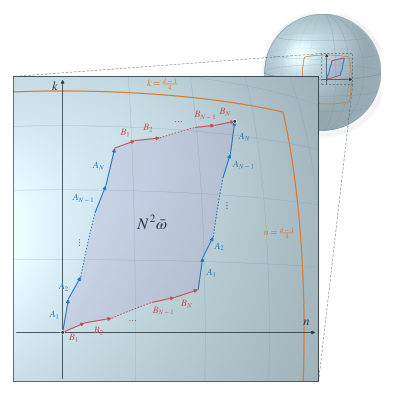
<figcaption class="paper-figure-caption"><b>Fig 1.</b> FIG. 1. The approximate accumulation of the geometric phase in a finite-dimensional phase space. Two trajectories are formed by applying two sets of N unknown phase-space vectors α1, . . . , αN corresponding to A1, . . . , AN (blue arrows) and β1, . . . , βN corresponding to B1, . . . , BN (red arrows) via Γ = p</figcaption>
</figure>
<figure class="paper-figure-card">
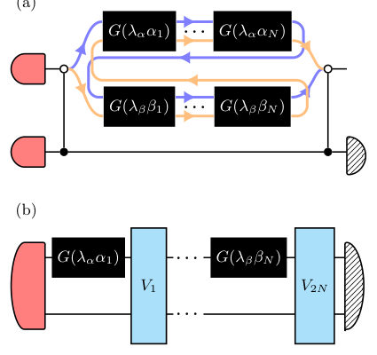
<figcaption class="paper-figure-caption"><b>Fig 2.</b> FIG. 2. Metrological strategies for phase-space displace- ments. (a) The strategy with indefinite causal order. A quantum switch routes the probe through two sets of displace- ments, G(λαα1), . . . , G(λααN) and G(λββ1), . . . , G(λββN), in a quantum superposition of two causal orders (blue and or- ange routines). The accumulated geometric phase is subse- quently extracted via a Ramsey measurement on the control qubit. (b) The strategy with definite causal order. The 2N displacements are applied in a fixed causal order, interleaved with arbitrary adaptive unitaries V1, . . . , V2N prior to the fi- nal measurement. The adaptive unitaries are not assumed to preserve energy.</figcaption>
</figure>
<figure class="paper-figure-card">
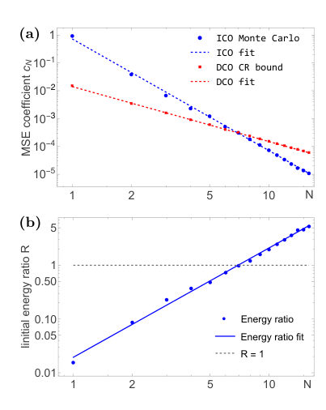
<figcaption class="paper-figure-caption"><b>Fig 3.</b> FIG. 3. (a) Scaling of the finite-sample MSE coefficient cN, defined by MSE ≃cN/ν, with respect to N for d ≃N 2. For each N, the blue circle represents the ICO coefficient, extracted by fitting the simulated MSE against ν−1 and av- eraging over randomly generated sets of displacements in the range [0.4, 0.6]. The red square represents the DCO coeffi- cient, obtained by computing the Cram´er–Rao lower bound at the same initial probe energy and averaging over the same sets of displacements as the ICO strategy. The dashed lines are log–log power-law fits. The fitted slopes are −4.0087 for ICO and −1.9724 for DCO, and the fitted Pearson correlation coefficients are −0.99928 for ICO and −0.99985...</figcaption>
</figure>

**Summary.** This paper proves that indefinite causal order (ICO) grants an unbounded energy advantage over definite causal order (DCO) when estimating a geometric phase in finite-dimensional quantum systems. By analyzing the scaling of the Mean Squared Error and required probe energy, the authors show that the advantage grows arbitrarily large with system parameters. This result extends the known benefits of ICO from infinite to finite quantum settings.

**Why it may be interesting.** This work directly addresses a fundamental question in quantum metrology concerning the resource scaling advantage of causal structure, providing a concrete, quantifiable example of where ICO surpasses DCO even in finite systems.

Detailed structure

**Main problem.** The paper investigates whether indefinite causal order (ICO) provides an unbounded advantage over definite causal order (DCO) in quantum metrology when restricted to finite-dimensional quantum systems.

**Main result.** The authors prove that an unbounded energy-efficiency advantage exists for ICO over DCO in finite dimensions, meaning the required initial probe energy for DCO can be arbitrarily large compared to ICO for a fixed precision.

**Method.** The analysis relies on establishing an approximate Weyl relation for discrete Gaussian wavepackets and comparing the scaling of the Mean Squared Error (MSE) for both causal orders.

**Model / system.** The system is a finite-dimensional quantum system modeled using discrete position and momentum operators on a $d$-dimensional space, applied to estimating a geometric phase.

**Key observables.** Geometric phase ($\omega$), Mean Squared Error (MSE), and initial probe energy required for estimation.

**Important parameters / regimes.** The advantage is shown to be unbounded in the pre-asymptotic regime where the number of measurement shots $
u$ is bounded by $\mathcal{O}(\exp(\pi d/16)/	ext{poly}(d))$.

**Assumptions / limitations.** The analysis requires the phase-space centers to remain in the bulk region to ensure the boundary error term is exponentially small.

**Figures summary.** Figure 1 illustrates the approximate accumulation of the geometric phase in a finite-dimensional phase space. Figure 2 compares the quantum switch implementation for ICO versus the fixed causal order for DCO.

**Paper structure.** The paper first establishes the necessary mathematical tools, including the approximate Weyl relation for discrete Gaussian wavepackets. It then applies this to the metrology problem, comparing the scaling of the MSE and the required initial energy for ICO versus DCO to prove the unbounded separation.

Abstract

Indefinite causal order is known to offer enhancements in quantum metrology, notably including an unbounded advantage in the measurement of a geometric phase of a harmonic oscillator. This advantage, however, is specific to the infinite dimensional setting, and its finite dimensional analogue remains elusive, with recent findings suggesting that advantages in finite dimensions may be fundamentally limited to bounded constant factors. Here we show that, in fact, arbitrarily large advantages arise for finite dimensional systems in the finite sample regime. Specifically, we establish an unbounded separation between definite and indefinite causal order in the estimation of a geometric phase associated to two sets of $N$ displacements generated by discrete position and momentum operators on a $d$-dimensional quantum system: for any given constant $R$, there exist values of $N$ and $d=Ω(N^2)$ such that a strategy with indefinite order uses an initial probe with $R$ times less energy than the probe required by every strategy with definite order achieving the same mean squared error, whenever the number of measurement shots $ν$ is bounded as $ν=\mathcal{O}(\exp(πd/16)/\mathrm{poly}(d))$. In other words, indefinite order offers an energy saving that grows arbitrarily large with the parameters of the problem. To prove this result, we establish an approximate Weyl relation for discrete Gaussian wavepackets, which is of independent technical interest.

[↑ back to top](#top)

### [Ballistic Speed and Potential-Theoretic Recurrence for Homogeneous Open Quantum Random Walks](http://arxiv.org/abs/2610.01844v1)

**Authors:** Ameur Dhahri, Chul Ki Ko, Farrukh Mukhamedov, Hyun Jae Yoo  
**Type:** theory · **Category:** other · **PDF:** <https://arxiv.org/pdf/2610.01844v1>  
**Analysis basis:** full PDF text, analyzed in chunks
**Topic relevance:** `Keldysh / 2PI / non-Gaussian methods` **1/5** · `correlated / nonlocal dissipation` **1/5** · `driven-dissipative phase transition` **1/5** · `methods for driven-dissipative` **1/5** · `non-equilibrium universality` **1/5**

↔ Scroll figures horizontally

<figure class="paper-figure-card">
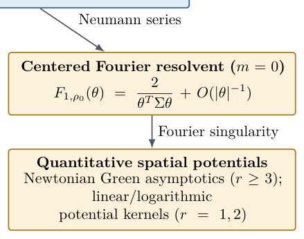
<figcaption class="paper-figure-caption"><b>Fig 1.</b> Figure 1. Local-to-global architecture of the main argument. The periodic local theorem controls time returns, while the centered resolvent singularity controls the spatial profile of Green functions and potential kernels.</figcaption>
</figure>
<figure class="paper-figure-card">
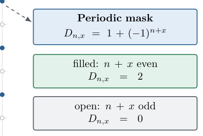
<figcaption class="paper-figure-caption"><b>Fig 2.</b> Figure 2. Parity mask for the one-dimensional simple symmetric walk. The periodic local theorem retains both peripheral Fourier points and produces the factor two on the admissible parity class, rather than imposing strong aperiodicity.</figcaption>
</figure>
<figure class="paper-figure-card">
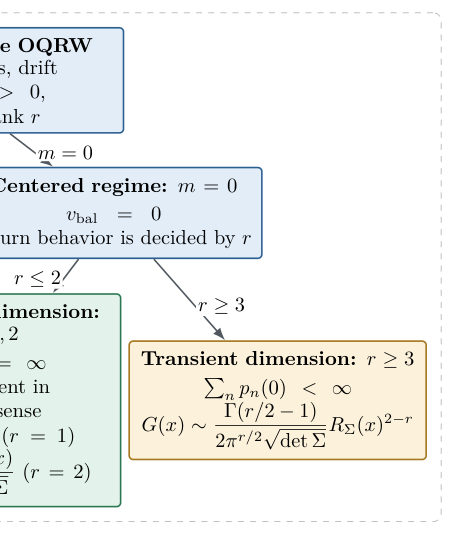
<figcaption class="paper-figure-caption"><b>Fig 3.</b> Figure 3. Drift–effective-dimension classification in the primitive one-component regime. RMS speed detects drift, whereas recurrence also depends on the rank of the effective lattice.</figcaption>
</figure>
<figure class="paper-figure-card">
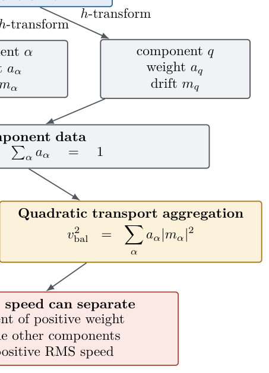
<figcaption class="paper-figure-caption"><b>Fig 4.</b> Figure 4. Two different aggregation laws in the reducible regime. Green occupa- tion potentials decompose linearly, whereas RMS transport averages the squared component drifts. A drift–dimension criterion for the component Green series additionally requires Assumption 5.3.</figcaption>
</figure>

**Summary.** This paper rigorously connects the macroscopic transport properties (ballistic speed) of Open Quantum Random Walks to their underlying potential-theoretic recurrence behavior. It establishes that the speed is determined by the drift norm, while recurrence depends on the effective dimension of the walk. The findings are vital for understanding how dissipation affects quantum transport in open systems.

**Why it may be interesting.** This work provides rigorous mathematical tools to analyze non-unitary, dissipative quantum dynamics, which is crucial for modeling open quantum systems interacting with an environment.

Detailed structure

**Main problem.** The study connects the root-mean-square (RMS) ballistic transport of Open Quantum Random Walks (OQRWs) to their potential-theoretic recurrence properties.

**Main result.** The ballistic speed equals the drift norm, and the recurrence behavior (transience vs. recurrence) is determined by the effective dimension of the walk, showing recurrence in effective dimensions one and two for centered walks.

**Method.** The analysis employs spectral theory, potential theory, and component decomposition to analyze the asymptotic behavior of the Green function and the walk's position moments.

**Model / system.** The model is the Open Quantum Random Walk (OQRW), which describes dissipative quantum dynamics using positive local channels, contrasting with unitary quantum walks.

**Key observables.** RMS ballistic speed ($v_{bal}$), recurrence (state-dependent vs. TOM sense), average drift, and Green function asymptotics.

**Important parameters / regimes.** Effective lattice dimension, drift norm, and the spectral properties of the local channels.

**Assumptions / limitations.** The analysis requires assumptions such as homogeneous walks, primitive local channels, and non-degenerate quadratic spectral terms.

**Figures summary.** Figures illustrate aggregation laws in the reducible regime, showing linear decomposition for Green occupation potentials and averaging of squared component drifts for RMS transport.

**Paper structure.** The paper develops the theory by first establishing local limit theorems and then using component decomposition to separately analyze the ballistic speed (related to drift) and the recurrence properties (related to potential theory).

Abstract

Our study connects root-mean-square ballistic transport to potential-theoretic recurrence for finite-range open quantum random walks. In homogeneous walks with primitive local channels, finitely many simple periodic Fourier peripheral eigenvalues, no nonzero stationary Fourier mode, and a nondegenerate quadratic spectral term, we prove a periodic uniform local limit theorem and recover exponential finite-set return bounds for nonzero drift. The centered case yields strong Green-function asymptotics in at least three dimensions, as well as potential-kernel asymptotics in one and two dimensions. According to these assumptions, the RMS ballistic speed equals the drift norm, nonzero drift indicates transience, and centered walks are recurring in effective dimensions one and two but transitory in higher dimensions. The low-dimensional finding shows a recurrence of the origin projection in TOM. For reducible walks, an explicit harmonic \(h\)-transform converts each absorption component to an OQRW, providing a detailed breakdown of Green occupation potentials. The squared RMS speed is the absorption-weighted mean of squared component drifts, but the reduced drift-dimension classification also needs specific component return estimations. A centered noncommuting family validates the fundamental spectral assumptions in all dimensions and provides explicit potential constants. Exact finite traps and sparse reflecting barriers provide a complementary nonhomogeneous method for zero speed and TOM recurrence.

[↑ back to top](#top)

### [EP-Flow: Disordered Crystal Structure Prediction without Site-Level Annotations](http://arxiv.org/abs/2610.01315v1)

**Authors:** Qiuliang Liu, Liming Wu, Qi Li, Zhonglong Peng, Chang Chen, Xiaolong Chen, Wenbing Huang, Shifeng Jin  
**Type:** theory · **Category:** disordered systems and neural networks · **PDF:** <https://arxiv.org/pdf/2610.01315v1>  
**Analysis basis:** full PDF text, analyzed in chunks
**Topic relevance:** `Keldysh / 2PI / non-Gaussian methods` **1/5** · `analog quantum simulation` **1/5** · `driven-dissipative phase transition` **1/5** · `methods for driven-dissipative` **1/5** · `non-equilibrium universality` **1/5**

↔ Scroll figures horizontally

<figure class="paper-figure-card">
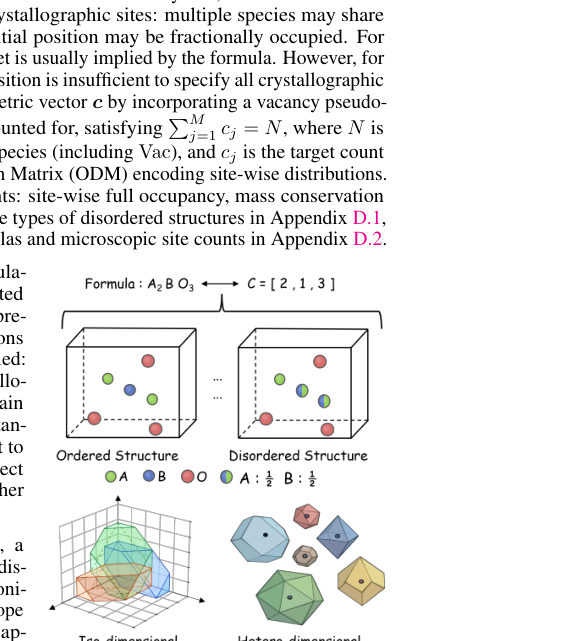
<figcaption class="paper-figure-caption"><b>Fig 1.</b> Figure 1: Formula transportation polytopes.</figcaption>
</figure>
<figure class="paper-figure-card">
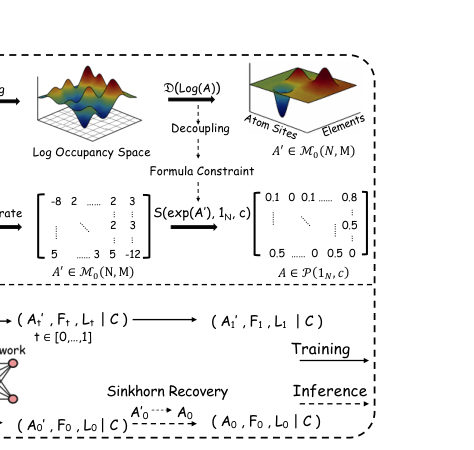
<figcaption class="paper-figure-caption"><b>Fig 2.</b> Figure 2: Overview of EP-Flow for disordered crystal generation. (a) Disordered crystal represented by (A, F , l). (b) Occupancy matrix canonicalized from formula polytope P(1N, c) to double-centered space M0(N, M) via log-domain double centering, which recovers back by Sinkhorn projection. (c) Joint flow matching over (A′, F , l) conditioned on c, with projection back to A for the final structure.</figcaption>
</figure>
<figure class="paper-figure-card">
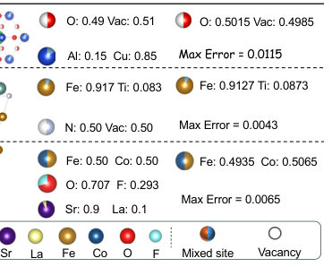
<figcaption class="paper-figure-caption"><b>Fig 3.</b> Figure 3: Reconstruction results for disordered functional materials. Each row compares predicted vs. ground-truth structures, with RMSD and OccMAE. Key-site occupancies are annotated; the rightmost column shows the site with largest occupancy error. Three disorder types are covered: oxygen-vacancy, interstitial/partial-occupancy, and mixed-cation/anion substitutional.</figcaption>
</figure>
<figure class="paper-figure-card">
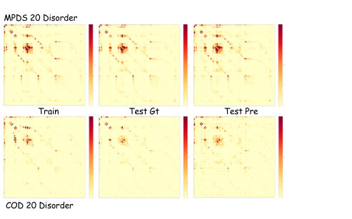
<figcaption class="paper-figure-caption"><b>Fig 4.</b> Figure 4: Site-wise occupancy-pattern analysis.</figcaption>
</figure>
<figure class="paper-figure-card">
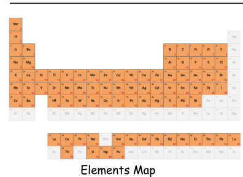
<figcaption class="paper-figure-caption"><b>Fig 5.</b> Figure 5: Element index map and MPDS Disorder-50 distribution. Left: the element-to-position index map used in this work. Right: the element-occurrence heatmap for the MPDS Disorder-50 subset.</figcaption>
</figure>

**Summary.** This paper introduces EP-Flow, a novel generative model for predicting disordered crystal structures directly from a chemical formula. It reformulates the problem using an Occupancy Distribution Matrix (ODM) constrained by a transportation polytope. By mapping this complex geometry into a shared latent space and using flow matching, EP-Flow accurately predicts both the site occupancies and the underlying crystal structure, outperforming existing methods.

**Why it may be interesting.** While focused on materials science, the use of flow matching to enforce complex, high-dimensional geometric and physical constraints (like mass conservation) within a generative model framework is highly relevant to modeling quantum many-body states or complex quantum field configurations.

Detailed structure

**Main problem.** The paper addresses the challenge of predicting crystal structures for intrinsically disordered materials without requiring explicit, site-level annotations of the disorder.

**Main result.** EP-Flow achieves state-of-the-art performance on disordered CSP benchmarks by learning a flow that respects the complex constraints of the chemical formula.

**Method.** It employs an Occupancy Distribution Matrix (ODM) formulation, canonicalizes the resulting polytope into a shared latent space, and uses a marginal-constrained flow matching framework.

**Model / system.** The system is a crystalline solid exhibiting disorder (substitutional mixing, vacancies), modeled by an ODM that must satisfy coupled site-wise occupancy and mass-conservation constraints, defining a transportation polytope.

**Key observables.** Match Rate, Root Mean Square Deviation (RMSD), Occupancy Mean Absolute Error (OccMAE), and the Occupancy Distribution Matrix (ODM).

**Important parameters / regimes.** The model jointly generates occupancies, fractional coordinates, and lattice parameters; the process relies on Sinkhorn projection for constraint enforcement.

**Assumptions / limitations.** The core assumption is that the problem can be mapped to a continuous flow matching framework by canonicalizing the heterogeneous polytope into a shared, double-centered space.

**Figures summary.** Figures illustrate the crystal representation $(A, F, l)$, the canonicalization of the polytope via log-domain double centering, and the joint flow generation process, alongside structural reconstruction trajectories.

**Paper structure.** The paper first defines the problem using the ODM and its associated transportation polytope. It then introduces EP-Flow, detailing the canonicalization to a shared latent space, the flow learning mechanism, and the final recovery via Sinkhorn projection for joint generation of occupancies, coordinates, and lattice parameters.

Abstract

Generative models have made rapid progress in ordered crystal structure prediction, yet many functional materials are intrinsically disordered, with substitutional mixing, vacancies, or interstitial species controlling their properties. Existing crystal generators either assume deterministic site occupations or require site-level disorder annotations, which are often unavailable when the chemical formula is the primary input. We formulate disordered crystal structure prediction through an Occupancy Distribution Matrix (ODM), a continuous site-by-species representation that unifies ordered crystals, solid solutions, vacancy disorder, and interstitial occupancy. A valid ODM must satisfy coupled site-wise occupancy, mass-conservation, and non-negativity constraints, placing each sample on a formula-dependent transportation polytope. We propose Entropic Polytope Flow (EP-Flow), a marginal-constrained flow matching framework that canonicalizes heterogeneous polytopes into a shared double-centered space, learns a marginal-preserving flow, and recovers feasible occupancies through a Sinkhorn inverse map. By jointly generating occupancies, fractional coordinates, and lattice parameters, EP-Flow achieves state-of-the-art performance on formula-conditioned disordered CSP benchmarks derived from COD and MPDS, substantially outperforming adapted ordered-crystal generators. Analyses further show that EP-Flow recovers sparse and chemically meaningful local disorder patterns rather than merely matching global composition statistics.

[↑ back to top](#top)

### [Anisotropic medium-range order uncovers dynamic crossovers in glass-forming liquids](http://arxiv.org/abs/2610.01051v1)

**Authors:** Kamlesh Mishra, Rajesh Ganapathy, Walter Kob  
**Type:** theory · **Category:** disordered systems and neural networks · **PDF:** <https://arxiv.org/pdf/2610.01051v1>  
**Analysis basis:** full PDF text, analyzed in chunks
**Topic relevance:** `analog quantum simulation` **1/5** · `scars & prethermalization` **1/5**

↔ Scroll figures horizontally

<figure class="paper-figure-card">
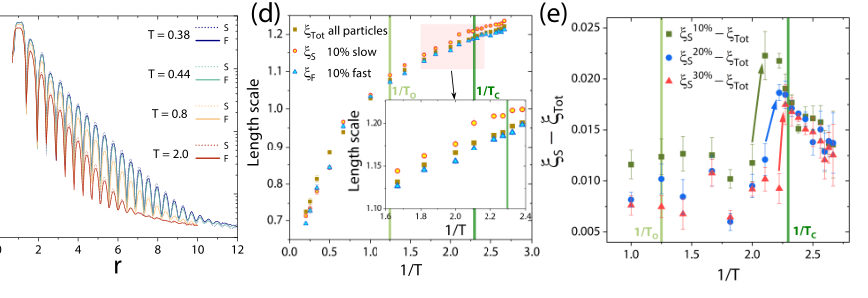
<figcaption class="paper-figure-caption"><b>Fig 1.</b> FIG. 1. Connection between particle mobility and structural length scales. (a) Schematic of the local</figcaption>
</figure>
<figure class="paper-figure-card">
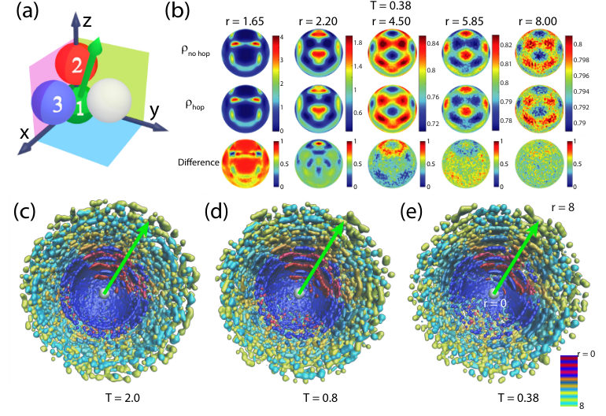
<figcaption class="paper-figure-caption"><b>Fig 2.</b> FIG. 2. Particle cage structure is anisotropic and extends to medium-range distances. (a) The local coordinate</figcaption>
</figure>
<figure class="paper-figure-card">
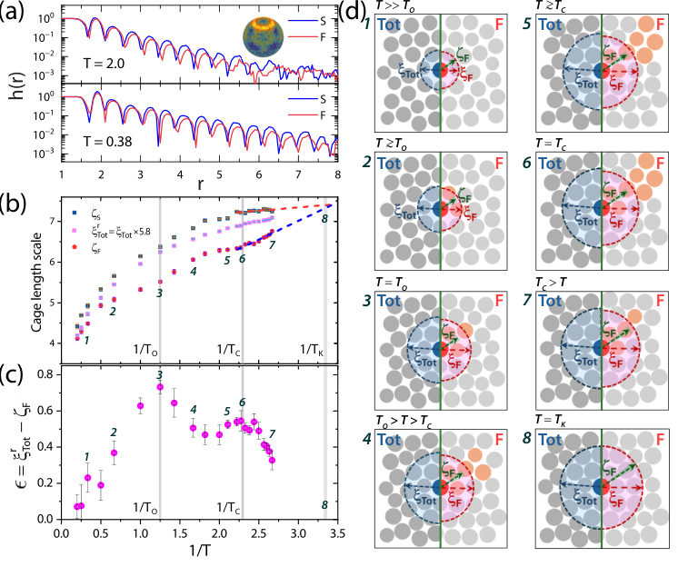
<figcaption class="paper-figure-caption"><b>Fig 3.</b> FIG. 3. Evolution of the asymmetric cage structure upon cooling. (a) Directional correlation function,</figcaption>
</figure>

**Summary.** This work analyzes glass-forming liquids to determine if structural changes underpin dynamic crossovers near the glass transition. By introducing a novel four-point correlation function, the authors find that the degree of cage anisotropy peaks precisely at the crossover temperatures. This establishes that medium-range structural order, extending beyond local cages, is essential for understanding the complex relaxation dynamics of supercooled liquids.

**Why it may be interesting.** The focus on structural signatures (medium-range order) dictating dynamic transitions in supercooled liquids is highly relevant to understanding complex many-body dynamics, which shares conceptual links with glassy dynamics studied in quantum many-body systems.

Detailed structure

**Main problem.** The paper investigates the structural basis for dynamic crossovers observed in glass-forming liquids at high-T and low-T crossover temperatures.

**Main result.** The authors show that the degree of cage anisotropy, quantified by a structural length scale difference, peaks at both crossover temperatures, linking the dynamics to anisotropic medium-range order.

**Method.** They introduce and utilize a novel four-point correlation function and analyze the angular power spectrum ($S_
ho(l, r)$) derived from molecular dynamics simulations.

**Model / system.** The study uses molecular dynamics simulations on a glass-forming liquid, specifically a binary Lennard-Jones mixture, to probe particle dynamics near the glass transition.

**Key observables.** Structural length scale characterizing cage anisotropy, angular power spectrum $S_
ho(l, r)$, and the difference between structural length scales of slow and fast particles.

**Important parameters / regimes.** High-T and low-T crossover temperatures ($T_o, T_X$), and the intermediate range structural length scale.

**Assumptions / limitations.** The analysis assumes that the structural information encoded in the four-point correlation function is sufficient to characterize the underlying physics of the dynamic crossovers.

**Figures summary.** Figures illustrate the LCS schematic, 3D density distributions for different particle groups, and the angular power spectra $S_
ho(l, r)$ showing anisotropic features at intermediate length scales.

**Paper structure.** The paper progresses by introducing the novel correlation function, applying it to molecular dynamics simulations to calculate density fields and power spectra, and finally interpreting the temperature dependence of the resulting structural length scales to link them to the observed dynamic crossovers.

Abstract

On cooling liquids towards their glass-transition temperature, the dramatic increase of their relaxation times is accompanied by changes in particle dynamics at two distinct temperatures: A high-T crossover, where particles become temporarily caged by their neighbors, and a low-T crossover, where the cage escape mechanism changes. While there is some evidence that the former is associated with a change in local particle arrangement, no structural modification has so far been detected across the low-T crossover, fueling scepticism about the relevance of structure for glassy dynamics. Here, we introduce a novel four-point correlation function which allows to determine a structural length scale characterizing cage anisotropy. Extensive molecular dynamics simulations reveal that this scale, as well as the mean structural length scale of the glass-former, extends into the medium range, i.e., significantly exceeds the particle size. Strikingly, the difference between these two scales - a measure of the degree of cage anisotropy - peaks at both crossover temperatures. We discuss how the presence of these peaks enables understanding the nature of the change in the microscopic transport mechanism at the two temperatures, thereby linking both dynamical crossovers to a single structural observable, the anisotropic medium-range order. This fundamental insight demonstrates that structure, extending well-beyond the local cage, is an essential ingredient for understanding the relaxation dynamics of deeply supercooled liquids.

[↑ back to top](#top)

### [Anyon Proliferation and Anyon Superconductivity in Higgsing Transitions via Conformal Embeddings](http://arxiv.org/abs/2610.00452v1)

**Authors:** Diego García-Sepúlveda, Da-Chuan Lu  
**Type:** theory · **Category:** strongly correlated electrons · **PDF:** <https://arxiv.org/pdf/2610.00452v1>  
**Analysis basis:** full PDF text, analyzed in chunks
**Topic relevance:** `Keldysh / 2PI / non-Gaussian methods` **1/5** · `analog quantum simulation` **1/5**

↔ Scroll figures horizontally

<figure class="paper-figure-card">
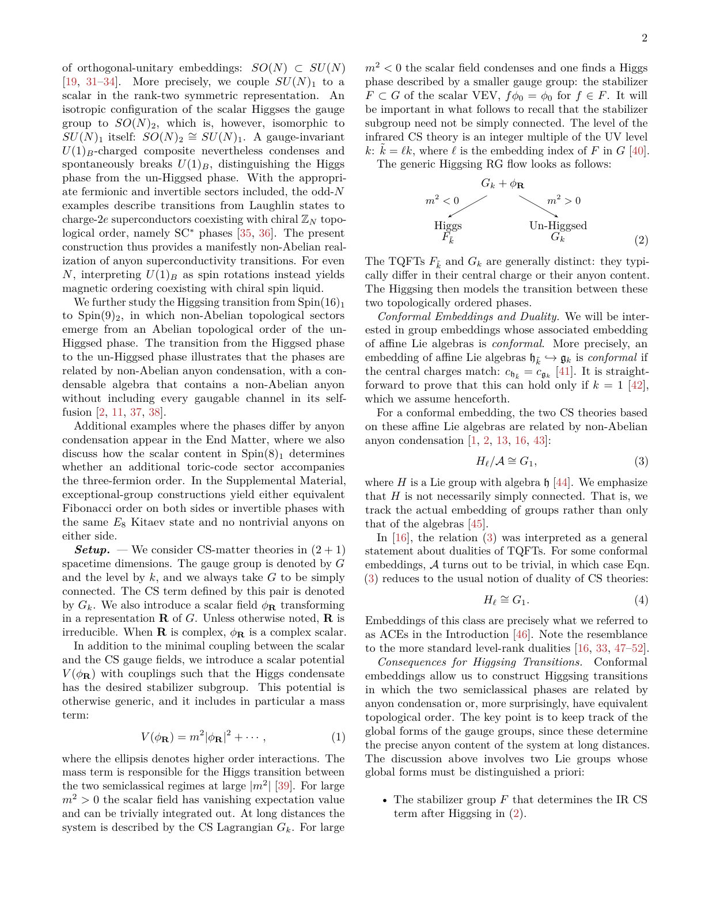
<figcaption class="paper-figure-caption"><b>Fig 1.</b> Low-resolution page preview, page 2</figcaption>
</figure>
<figure class="paper-figure-card">
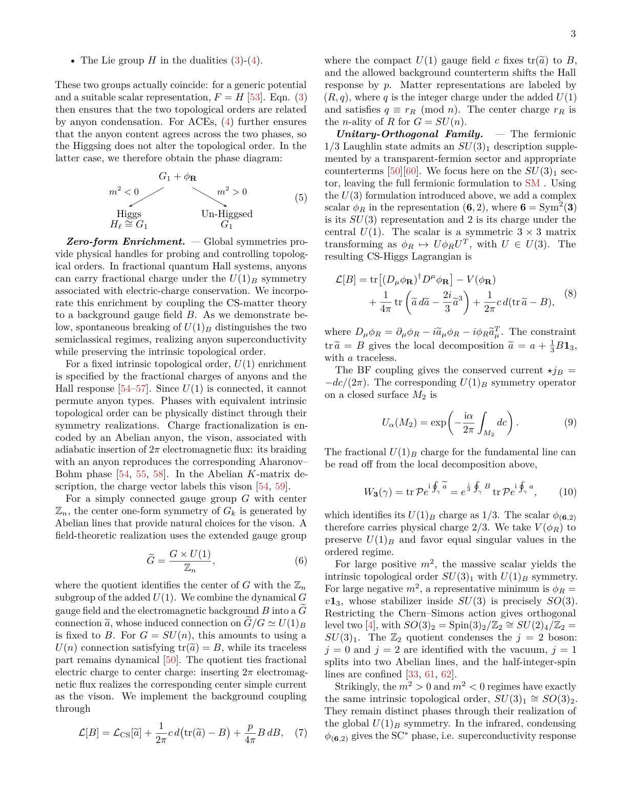
<figcaption class="paper-figure-caption"><b>Fig 2.</b> Low-resolution page preview, page 3</figcaption>
</figure>
<figure class="paper-figure-card">
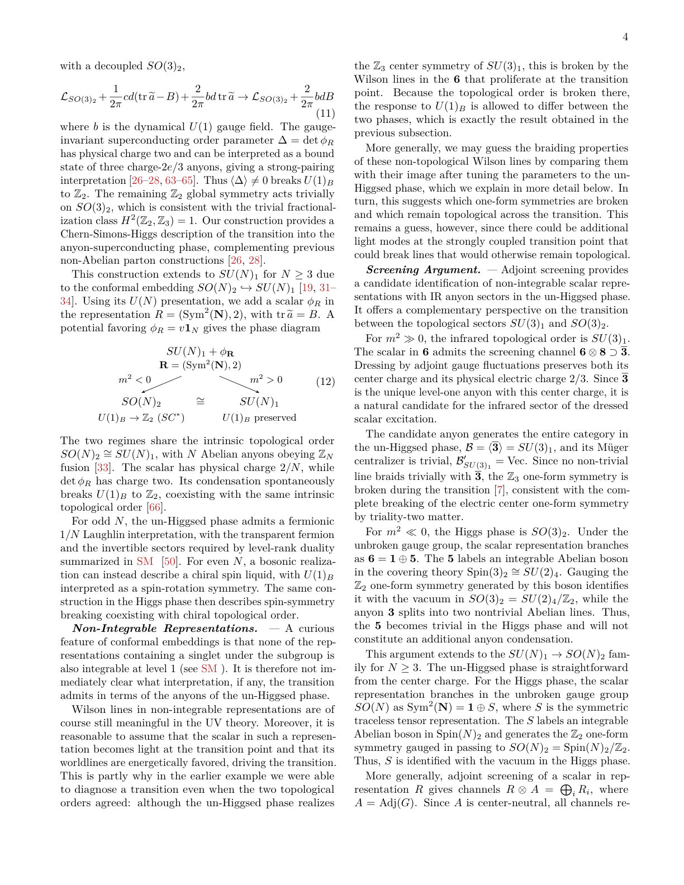
<figcaption class="paper-figure-caption"><b>Fig 3.</b> Low-resolution page preview, page 4</figcaption>
</figure>
<figure class="paper-figure-card">
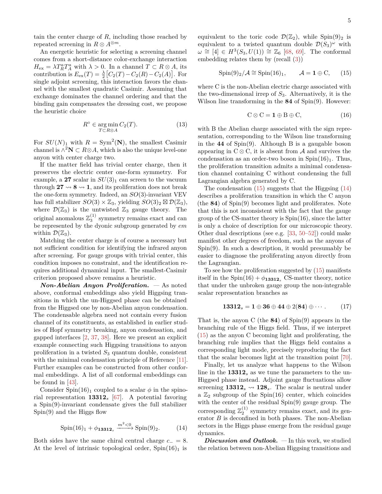
<figcaption class="paper-figure-caption"><b>Fig 4.</b> Low-resolution page preview, page 5</figcaption>
</figure>
<figure class="paper-figure-card">
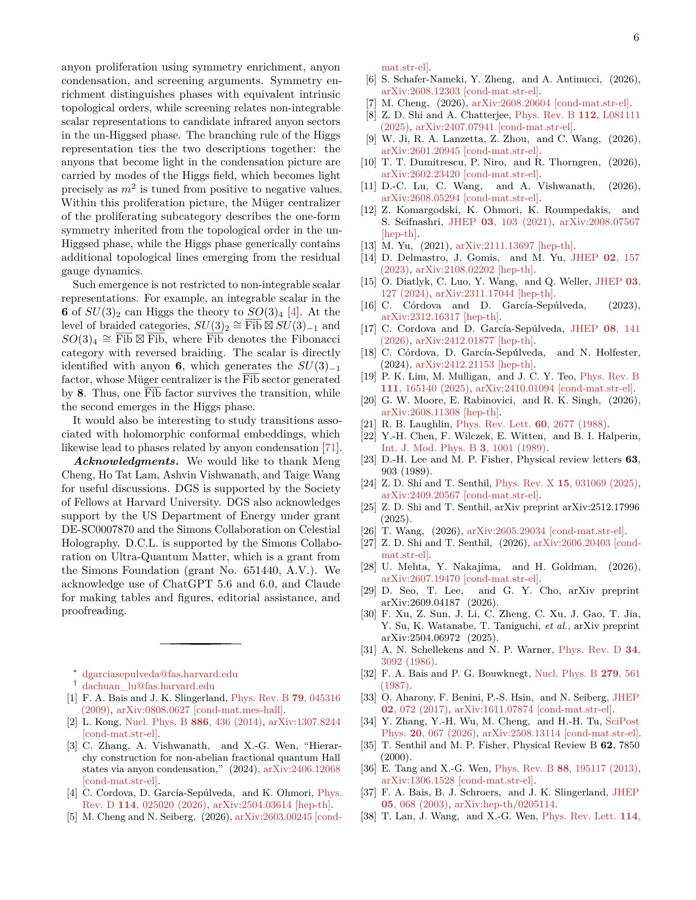
<figcaption class="paper-figure-caption"><b>Fig 5.</b> Low-resolution page preview, page 6</figcaption>
</figure>

**Summary.** This theoretical work analyzes topological phase transitions in (2+1)d systems described by Chern-Simons theories. It uses conformal embeddings and Higgsing mechanisms to study how the system's topological order changes, particularly focusing on the role of anyon proliferation. The findings provide detailed predictions about the emergence of anyon superconductivity in various quantum materials models.

**Why it may be interesting.** The deep connection between topological order, gauge theory dynamics (Higgsing), and fractionalized excitations (anyons) is central to understanding exotic states of matter like fractional quantum Hall liquids, which are key areas of condensed matter theory.

Detailed structure

**Main problem.** The paper investigates how anyon proliferation drives phase transitions, specifically within the context of Chern-Simons (CS) Higgsing transitions mediated by conformal embeddings.

**Main result.** The analysis shows that these transitions can relate phases with equivalent intrinsic topological order, leading to phenomena like anyon condensation and the realization of non-Abelian anyon superconductivity.

**Method.** The authors employ techniques from Conformal Field Theory (CFT), analyzing RG flow diagrams, and using screening arguments based on Casimir invariants to determine the infrared (IR) anyon content.

**Model / system.** The model involves (2+1)d CS-matter theories coupled to scalar fields, describing topological order characterized by Modular Tensor Categories. Examples include $SO(N)_2 	o SU(N)_1$ transitions.

**Key observables.** Topological order (MTCs), anyon content (fusion/braiding), global $U(1)_B$ symmetry realization, and the superconducting order parameter $\Delta$.

**Important parameters / regimes.** The CS level ($k$), the mass term sign ($m_2$), and the specific gauge groups involved (e.g., $SU(N)$, $SO(N)$).

**Assumptions / limitations.** The analysis often assumes $k=1$ for conformal embeddings, and the identification of the IR anyon via screening is treated as a heuristic candidate.

**Figures summary.** The notes mention RG flow diagrams illustrating phase transitions between Higgs and Un-Higgsed phases, and equations detailing tensor products and representations used in screening calculations.

**Paper structure.** The paper builds by first establishing the framework of CS Higgsing transitions via conformal embeddings, then analyzing specific group transitions ($SO(N) 	o SU(N)$), and finally applying screening arguments to identify candidate anyons in the resulting phases.

Abstract

We discuss (2+1)d Chern-Simons Higgsing transitions based on conformal embeddings and their relation to the proliferation of anyons. These transitions preserve or enlarge the intrinsic topological order despite reducing the gauge group. When the topological order is enlarged, the two phases differ by anyon condensation, and the transition takes an Abelian topological order to a non-Abelian one. In the $SO(N)_{2} \hookrightarrow SU(N)_{1}$ family with $N \geq 3$, the two semiclassical regimes have equivalent intrinsic topological orders but distinct realizations of a global $U(1)$ symmetry. For odd $N$, these are non-Abelian realizations of transitions from fermionic $1/N$ Laughlin states to charge-$2e$ anyon superconductivity coexisting with the same chiral $\mathbb{Z}_{N}$ topological order. The scalar representations are always non-integrable with respect to the UV Chern-Simons level and therefore do not directly label anyons of the un-Higgsed phase, despite defining Wilson lines in the UV. Using heuristic adjoint screening, we propose candidate anyons in the un-Higgsed phase, while branching under the Higgs subgroup reveals channels corresponding to condensable anyons of the Higgs phase. We further construct a $\mathrm{Spin}(16)_{1} \to \mathrm{Spin}(9)_{2}$ transition admitting a condensable algebra that contains a non-Abelian anyon but not all of the allowed gaugable channels in its self-fusion.

[↑ back to top](#top)

### [Approximation theorems for fermionic Gaussian states](http://arxiv.org/abs/2610.01860v1)

**Authors:** Amir-Reza Negari, Farzin Salek, Zoltán Zimborás, Aram Harrow, Patrick Hayden, Jens Eisert  
**Type:** theory · **Category:** statistical mechanics · **PDF:** <https://arxiv.org/pdf/2610.01860v1>  
**Analysis basis:** full PDF text, analyzed in chunks
**Topic relevance:** `Keldysh / 2PI / non-Gaussian methods` **1/5** · `analog quantum simulation` **1/5**

↔ Scroll figures horizontally

<figure class="paper-figure-card">
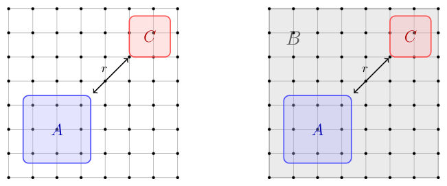
<figcaption class="paper-figure-caption"><b>Fig 1.</b> FIG. 1. A two-dimensional lattice illustrating mutual information and conditional mutual information. In panel (a), A and C are two separated regions. In panel (b), B denotes a finite buffer region between A and C, so that one considers the conditional mutual information Iρ(A : C | B).</figcaption>
</figure>

**Summary.** This work develops quantitative approximation theorems for fermionic Gaussian states by analyzing constraints on their covariance matrices. It shows that structural properties like high connectivity, exchangeability, or spatial separation force the state to be close to a product state. These results provide powerful, covariance-based tools for approximating complex many-body systems.

**Why it may be interesting.** The direct derivation of approximation bounds from covariance-level structure provides powerful, quantitative tools for understanding how local correlations dictate global thermodynamic properties in many-body systems.

Detailed structure

**Main problem.** To establish quantitative approximation theorems for fermionic Gaussian states, showing that structural constraints force the state to be close to a simpler, product-like state.

**Main result.** The paper derives product-state approximations for high-degree graphs, proves a finite fermionic Gaussian de Finetti theorem, and establishes $O(r^{-1/2})$ trace-norm recoverability estimates for spatially clustering states.

**Method.** The analysis is conducted directly at the level of the Majorana covariance matrix, leveraging a core 'covariance monogamy' constraint.

**Model / system.** The system is fermionic Gaussian states, which are characterized by their covariance matrix and arise from quadratic, noninteracting fermionic Hamiltonians.

**Key observables.** Covariance matrices, ground-state energy, finite-temperature free energy, conditional mutual information $I_
ho(A : C | B)$.

**Important parameters / regimes.** Graph degree $D$, copy number $k$, separation distance $r$, and the error scaling $O(D^{-1/2})$ or $O(r^{-1/2})$.

**Assumptions / limitations.** The analysis is restricted to the Gaussian class of states, and the high-degree results apply to quadratic Hamiltonians.

**Paper structure.** The paper builds its results by showing that the covariance-level structure imposes a monogamy constraint, which is then applied in three distinct physical contexts: high connectivity (energy approximation), exchangeability (de Finetti theorem), and spatial separation (recoverability estimates).

Abstract

A recurring principle in many-body physics is that sufficiently distributed interactions or correlations lead to an effectively mean-field description. For fermionic Gaussian states, we establish a quantitative version of this principle directly at the level of Majorana covariance matrices. The main observation is that the admissibility condition for fermionic covariance matrices imposes a quantitative monogamy constraint on two-point correlations: a fixed region has only a bounded covariance budget to distribute among many disjoint regions. We use this principle in three directions. First, for quadratic fermionic Hamiltonians on finite simple graphs of high degree, we obtain product-state approximations to both the ground-state energy and the finite-temperature free energy, with error of order \(D^{-1/2}\) for \(D\)-regular graphs. Second, we prove a finite fermionic Gaussian de Finetti theorem: a \(k\)-copy Gaussian state that is \(n\)-exchangeable under graded fermionic copy permutations is \(O(k/n)\)-close in trace norm to the product of its one-copy marginal. In particular, infinite exchangeability within the Gaussian class implies exact product structure. Third, for spatial fermionic Gaussian states with exponentially clustering mutual information, we prove that the conditional mutual information across a separating buffer decays as \(O(r^{-1})\), and hence, by recoverability, the state admits an \(O(r^{-1/2})\) trace-norm approximation by a recovered state. These results show that product and de Finetti approximations and recoverability estimates for fermionic Gaussian systems can all be derived directly from covariance-level structure.

[↑ back to top](#top)

### [Fractional anomalous determinants and the chiral phase transition](http://arxiv.org/abs/2610.00472v1)

**Authors:** Robert D. Pisarski  
**Type:** theory · **Category:** statistical mechanics · **PDF:** <https://arxiv.org/pdf/2610.00472v1>  
**Analysis basis:** full PDF text, analyzed in chunks
**Topic relevance:** `Keldysh / 2PI / non-Gaussian methods` **1/5** · `analog quantum simulation` **1/5**

↔ Scroll figures horizontally

<figure class="paper-figure-card">
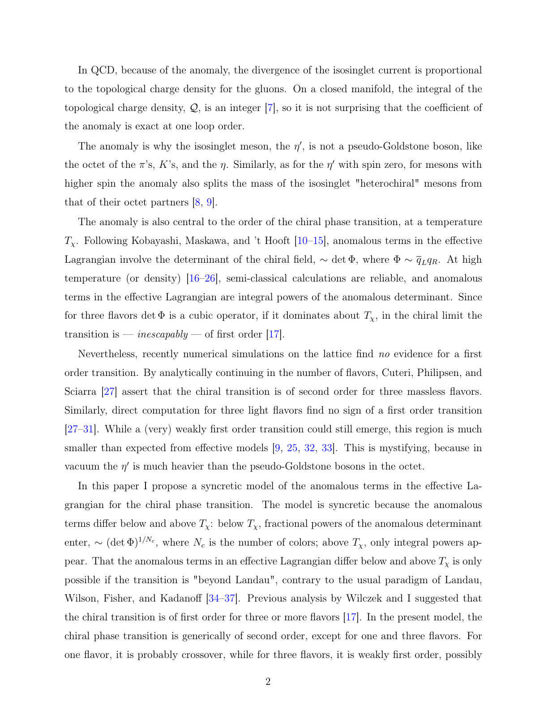
<figcaption class="paper-figure-caption"><b>Fig 1.</b> Low-resolution page preview, page 2</figcaption>
</figure>
<figure class="paper-figure-card">
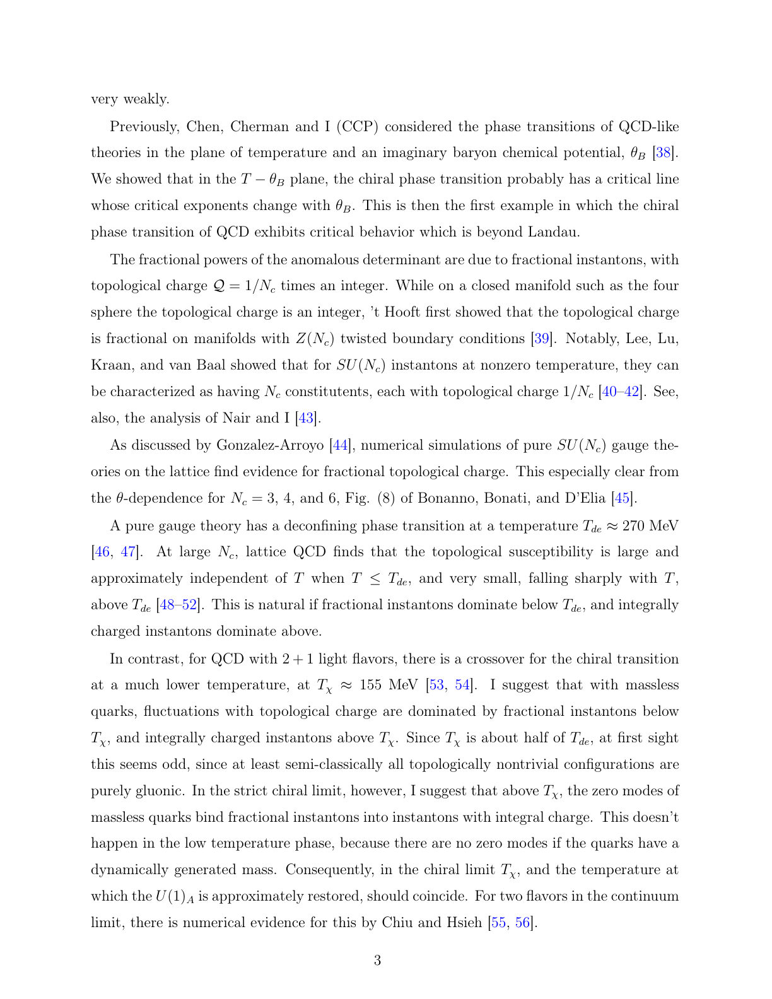
<figcaption class="paper-figure-caption"><b>Fig 2.</b> Low-resolution page preview, page 3</figcaption>
</figure>
<figure class="paper-figure-card">
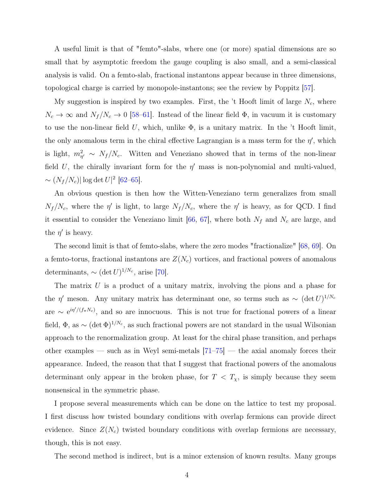
<figcaption class="paper-figure-caption"><b>Fig 3.</b> Low-resolution page preview, page 4</figcaption>
</figure>
<figure class="paper-figure-card">
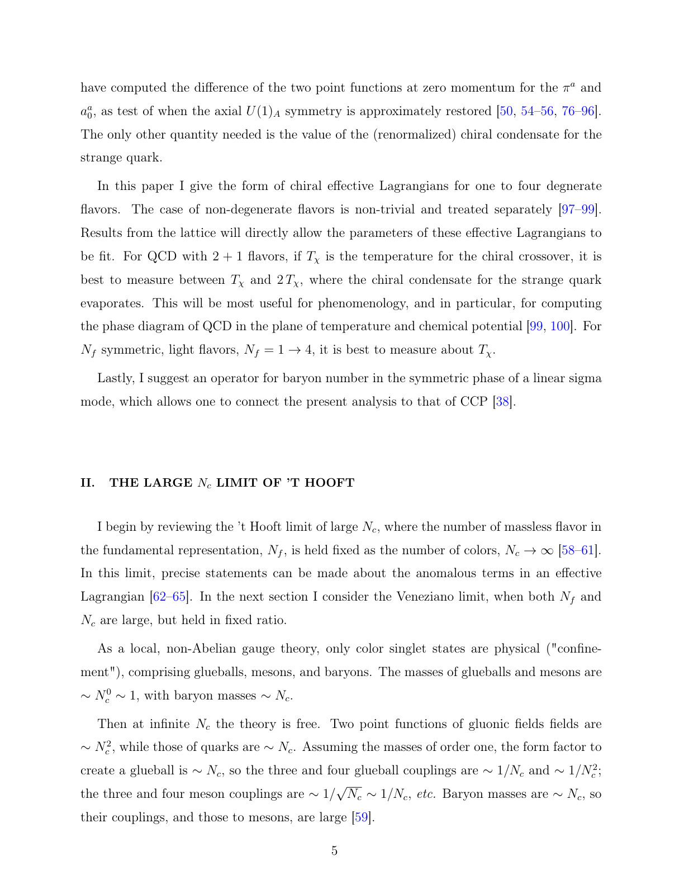
<figcaption class="paper-figure-caption"><b>Fig 4.</b> Low-resolution page preview, page 5</figcaption>
</figure>
<figure class="paper-figure-card">
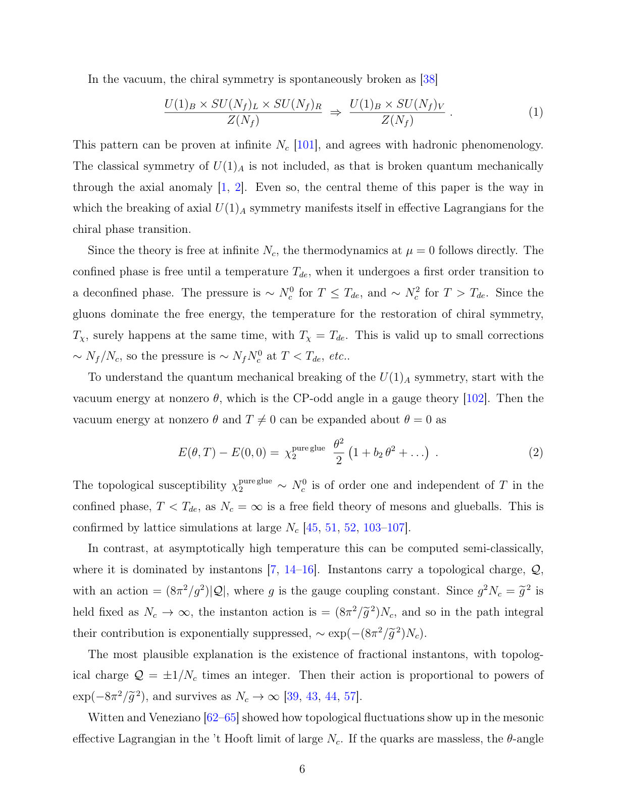
<figcaption class="paper-figure-caption"><b>Fig 5.</b> Low-resolution page preview, page 6</figcaption>
</figure>

**Summary.** This theoretical work analyzes the chiral phase transition in QCD-like theories by proposing that the anomalous U(1)A symmetry breaking involves fractional powers of the anomalous determinant below the critical temperature. The model predicts the transition is generally second order and suggests specific lattice QCD measurements to test the theory's predictions regarding the anomalous terms.

**Why it may be interesting.** While focused on QCD, the concept of a phase transition governed by a change in the functional form of the effective theory (from integer to fractional powers) is analogous to critical phenomena studied in many-body systems.

Detailed structure

**Main problem.** The paper investigates the anomalous terms governing the chiral phase transition in QCD-like theories, specifically focusing on the appearance of fractional powers of the anomalous determinant below the critical temperature.

**Main result.** The model predicts that the chiral phase transition is generically of second order, with specific exceptions for one and three flavors, and proposes a generalized framework for the anomalous determinant powers.

**Method.** The approach involves constructing a 'syncretic model' for the effective Lagrangian, extending concepts from the 't Hooft limit to arbitrary flavor ratios, and suggesting lattice QCD comparisons for verification.

**Model / system.** The system is QCD-like theories undergoing a chiral phase transition at temperature T_chi. The model incorporates the anomalous U(1)A symmetry breaking, which is governed by powers of the anomalous determinant, $\sim (\det \Phi)^Q$.

**Key observables.** Chiral condensate, $\pi_a$ and $a_0$ propagators, topological charge $Q$, and the order of the chiral phase transition.

**Important parameters / regimes.** Temperature T (relative to T_chi), number of colors $N_c$, number of flavors $N_f$, and the topological charge $Q$ (integer vs. fractional).

**Assumptions / limitations.** The primary assumption is that topological charge $Q$ becomes fractional ($Q = 	ext{integer} / N_c$) in the chirally broken phase ($T < T_\chi$), leading to fractional powers in the effective Lagrangian.

**Paper structure.** The paper develops the theoretical framework by contrasting the behavior of the anomalous determinant above (integral powers) and below (fractional powers) the chiral transition temperature T_chi, culminating in testable predictions for lattice QCD.

Abstract

At high temperature instantons form a dilute gas, so in QCD-like theories the breaking of the anomalous $U(1)_A$ symmetry is given by integral powers of the anomalous determinant, $\sim (\det Φ)^{Q}$, where $Φ\sim \overline{q}_L q_R$ is bilinear in the quark fields, and with untwisted boundary conditions, the topological charge, $Q$, is an integer. A syncretic model is constructed, which is manifestly "beyond Landau". In the chiral limit, at temperatures above the chiral phase transition, $T > T_χ$, only integral powers of the anomalous determinant appear. Below $T_χ$, following 't Hooft et al. I assume that the topological charge $Q$ is fractional, as an integer times $1/N_c$, where $N_c$ is the number of colors. I suggest that consequently, fractional powers of the anomalous determinant appear in the chiral effective Lagrangian. For $N_f$ degenerate flavors, this generalizes the Witten-Veneziano term, valid for small $N_f/N_c$, to arbitrary $N_f/N_c$. In this model the chiral phase transition is generically of second order. The two exceptions are for one flavor, where it is probably crossover, and three flavors, where it could well be weakly first order. This can be tested in lattice QCD with $2+1$ flavors by comparing the (known) temperature dependence of the difference of the $π^a$ and $a_0^a$ propagators, to the chiral condensate of the strange quark, between $T_χ$ and $\sim 2 \, T_χ$. Analogous measurements are possible for one to four degenerate flavors about $T_χ$. Lastly, I propose an operator for baryon number in the symmetric phase.

[↑ back to top](#top)

### [Local geometry of the Fermi surface and its effect on the electronic characteristics of normal metals](http://arxiv.org/abs/2610.00810v1)

**Authors:** N. A. Zimbovskaya  
**Type:** theory · **Category:** strongly correlated electrons · **PDF:** <https://arxiv.org/pdf/2610.00810v1>  
**Analysis basis:** full PDF text, analyzed in chunks
**Topic relevance:** `Keldysh / 2PI / non-Gaussian methods` **1/5** · `analog quantum simulation` **1/5**

↔ Scroll figures horizontally

<figure class="paper-figure-card">
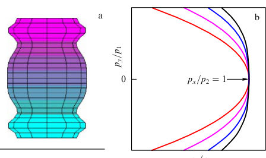
<figcaption class="paper-figure-caption"><b>Fig 1.</b> Figure 1. (a) Schematic plots of a FS with a complex profile including nearly cylindrical strips and kink lines and (b) profiles of the cross sections of an ellipsoid-like FS flattened at the points p2; 0; 0†.</figcaption>
</figure>
<figure class="paper-figure-card">
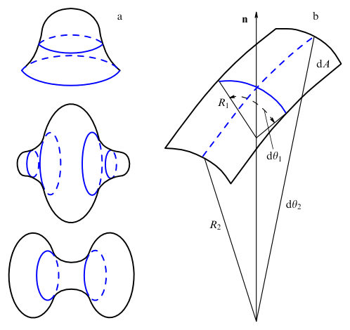
<figcaption class="paper-figure-caption"><b>Fig 2.</b> Figure 2. (a) Examples of zero-curvature lines on FSs of metals. (b) The surface element of a FS. The principal curvature radii of the shown element are R1 and R2; n is a normal vector to the surface.</figcaption>
</figure>
<figure class="paper-figure-card">
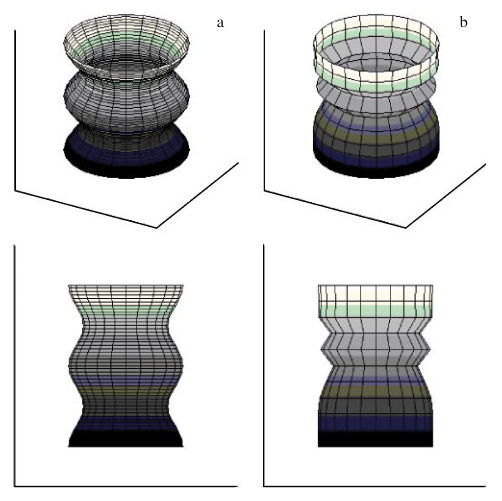
<figcaption class="paper-figure-caption"><b>Fig 3.</b> Figure 3. Schematic plots of FSs shaped as corrugated cylinders (a) with a cosine warping corresponding to energy±momentum relation (7) and (b) with complex profiles.</figcaption>
</figure>
<figure class="paper-figure-card">
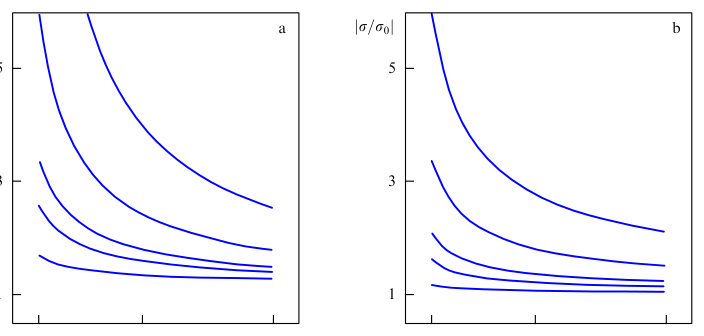
<figcaption class="paper-figure-caption"><b>Fig 4.</b> Figure 4. The conductivity component sxx o; q† including the contribution from a zero-curvature segment on the FS at large q o=qv 5 1†: (a) the curves are plotted at Z ˆ 0:2 and b ˆ ÿ0:8, ÿ0:7, ÿ0:6, ÿ0:4, and ÿ0:2 from top down. (b) The curves are plotted at b ˆ ÿ0:6 and Z ˆ 0:2, 0.1, 0.05, 0.03, 0.01 from top down.</figcaption>
</figure>
<figure class="paper-figure-card">
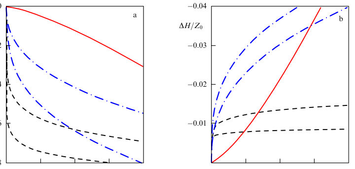
<figcaption class="paper-figure-caption"><b>Fig 5.</b> Figure 5. Frequency dependences of the real DR† and imaginary DH† parts of the first correction to the leading term in the surface impedance expansion in inverse powers of the anomaly parameter. The curves are plotted at Z ˆ 0:01, b ˆ ÿ0:9; Z ˆ 0:02, b ˆ ÿ0:8 (dashed lines) and Z ˆ 0:1, b ˆ ÿ0:5; Z ˆ 0:1, b ˆ ÿ0:4 (dashed-dotted lines). Solid lines represent the real and imaginary parts of the first correction to the leading approximation for the impedance of a metal whose FS does not include nearly cylindrical or flattened segments.</figcaption>
</figure>

**Summary.** This theoretical work examines how subtle, local geometric features on a material's Fermi surface can dramatically influence its electrical and magnetic response to high-frequency external stimuli. By analyzing the density of states enhancement near points of zero curvature, the authors predict observable anomalies in properties like surface impedance and magnetoacoustic oscillations. The paper highlights that the response is highly directional and sensitive to the specific local structure of the electron energy bands.

**Why it may be interesting.** While focused on metals, the concept of how local geometry dictates macroscopic response is relevant to understanding boundary effects or dimensionality crossovers in quantum systems, which can be analogous to engineered quantum structures.

Detailed structure

**Main problem.** The paper investigates how fine geometric features on the Fermi surface (FS) of normal metals significantly alter their electronic and galvanomagnetic responses to high-frequency external disturbances.

**Main result.** Local anomalies in FS geometry, such as points of zero curvature or near-cylindrical strips, can cause disproportionately large changes in observable properties because the response becomes dominated by carriers near these specific regions.

**Method.** The analysis employs theoretical modeling using phenomenological descriptions of local FS shapes, focusing on the density of states (DOS) enhancement near geometric singularities.

**Model / system.** The system under study is a conventional normal metal or a layered conductor, modeled using the geometry of its Fermi surface. The analysis considers the response of conduction electrons to external fields.

**Key observables.** Galvanomagnetic properties, sound wave attenuation/velocity shift, surface impedance, and magnetic quantum oscillations.

**Important parameters / regimes.** High frequency of external disturbances, direction of disturbance propagation, and external magnetic field direction.

**Assumptions / limitations.** The analysis relies on phenomenological models for local FS shapes, which are assumed to be sufficient for capturing the essential physics of the anomalies.

**Figures summary.** Figures schematically illustrate complex FS profiles, including nearly cylindrical strips and kink lines, and show the mathematical definition of the surface element using principal radii.

**Paper structure.** The paper proceeds by defining the problem—the sensitivity of electronic properties to FS geometry—and then developing the theoretical framework by analyzing how local curvature anomalies enhance the DOS, leading to predictions for observable effects in various transport phenomena.

Abstract

Fine features in the Fermi surface geometry, such as nearly cylindrical or nearly paraboloidal strips or local flattenings, are examined as regards their effect on the electronic, mainly galvanomagnetic, properties of metals. It is shown that under certain conditions, these features may significantly change the way a conventional normal metal or a layered structure with metallic conductivity responds to high- frequency external disturbances. All of the effects considered appear to be very sensitive to the disturbance propagation direction and/or to that of the external magnetic field. Experimental possibilities of observing the described effects are discussed.

[↑ back to top](#top)

### [Microscopic origin of the chiral pressure in a two-dimensional fluid](http://arxiv.org/abs/2610.02003v1)

**Authors:** Francisco Vega Reyes  
**Type:** theory · **Category:** statistical mechanics · **PDF:** <https://arxiv.org/pdf/2610.02003v1>  
**Analysis basis:** full PDF text, analyzed in chunks
**Topic relevance:** `analog quantum simulation` **1/5** · `non-equilibrium universality` **1/5**

↔ Scroll figures horizontally

<figure class="paper-figure-card">
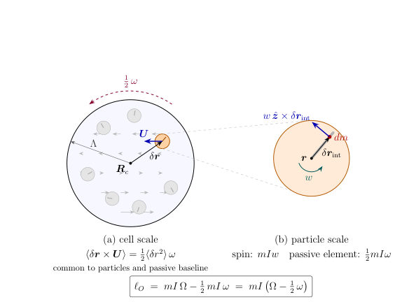
<figcaption class="paper-figure-caption"><b>Fig 1.</b> FIG. 1. Hydrodynamic derivation of the orbital moment. (a) Coarse-graining cell of radius Λ centred at Rc, with particles distributed isotropically in a background flow that contains both strain and rotation. The cell-scale orbital term, Eq. (5), is common to the particles and to the passive baseline and cancels. (b) Particle scale: a mass element dm at δrint from the particle centre contributes mIw through the spin, against 1 2mIω for a passive fluid element with the same mass distri- bution. The difference gives Eq. (9).</figcaption>
</figure>
<figure class="paper-figure-card">
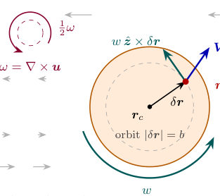
<figcaption class="paper-figure-caption"><b>Fig 2.</b> FIG. 2. Microscopic derivation of the orbital moment. The disk rotates rigidly with angular velocity w (teal), carrying the active point ra, at δr from its center rc, along the orbit |δr| = b. It is immersed in a local background flow u(r) (gray), whose vorticity ω = ∇× u is a local rotation of the fluid at ω/2 (purple). The peculiar velocity V (blue) is measured relative to the flow at ra. Averaged over orientations, the spin contributes b2Ωto δr × V , and the circulation of u around the orbit 1</figcaption>
</figure>
<figure class="paper-figure-card">
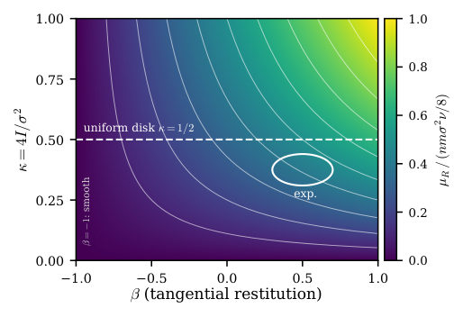
<figcaption class="paper-figure-caption"><b>Fig 3.</b> FIG. 3. Rotational viscosity of rough disks at Gaussian order, Eq. (20), normalized by nmσ2ν/8, in the plane of tangential restitution β and reduced moment of inertia κ. It does not depend on the normal restitution coefficient. Dashed line: uniform disk, κ = 1/2. Ellipse: approximate range of the experimental disks in a previous work [14].</figcaption>
</figure>

**Summary.** This work derives the microscopic origin of the chiral pressure in a 2D chiral fluid, showing it arises from an orbital moment related to the particle's spin mismatch with the local flow. The chiral pressure is found to be non-zero even in a steady, homogeneous state, demonstrating a fundamental, non-dissipative mechanical response to chirality.

**Why it may be interesting.** While focused on classical fluid dynamics, the concept of persistent, non-equilibrium stress (chiral pressure) arising from intrinsic particle asymmetry is analogous to emergent topological or chiral responses studied in quantum many-body systems.

Detailed structure

**Main problem.** The paper determines the microscopic origin and mathematical expression for the antisymmetric contribution to the pressure, known as the chiral pressure ($p_R$), in a two-dimensional chiral fluid.

**Main result.** The chiral pressure is proportional to the orbital moment ($\ell_O$), which quantifies the mismatch between the mean spin ($\Omega$) and half the local vorticity ($\omega/2$). This pressure persists even in a homogeneous, steady state (QCS).

**Method.** The derivation uses a combination of hydrodynamic comparisons (cell-scale vs. particle-scale) and microscopic kinematics, analyzing the spin balance equation to derive the constitutive relations.

**Model / system.** The system is a two-dimensional fluid composed of rough, actively rotating particles (disks). The analysis treats the fluid dynamics using concepts from micropolar hydrodynamics.

**Key observables.** Chiral pressure ($p_R$), Orbital moment ($\ell_O$), Rotational viscosity ($\mu_R$), Quiescent Chiral State (QCS).

**Important parameters / regimes.** The chiral pressure and viscosity are computed to Gaussian order in gradients, and the system depends on particle properties like moment of inertia ($mI$) and collision parameters ($eta, \kappa$).

**Assumptions / limitations.** The analysis assumes structural asymmetry causing parity breaking and is accurate to second order in gradients, neglecting higher-order translational-rotational correlations.

**Figures summary.** Figure 1 illustrates the hydrodynamic derivation of the orbital moment ($\ell_O$) at different scales. Figure 2 shows the microscopic derivation relating particle spin, flow, and peculiar velocity. Figure 3 details the dependence of rotational viscosity ($\mu_R$) on restitution and inertia.

**Paper structure.** The paper establishes the need for $p_R$ by analyzing the spin balance equation. It then derives $\ell_O$ using both coarse-graining and microscopic kinematics. Finally, it computes the constitutive relation for $p_R$ and $\mu_R$, showing their persistence in the QCS.

Abstract

We show that a two-dimensional chiral fluid supports an antisymmetric contribution to the pressure, and determine its microscopic expression. Its origin lies outside the standard kinetic and collisional channels of the normal pressure tensor, stemming instead from the average of a parity-breaking pseudo-scalar. This chiral pressure is set by the rotational (vortex) viscosity of micropolar hydrodynamics, whose kinetic value for rough disks we compute here, to Gaussian order. Crucially, both the chiral pressure and the rotational viscosity survive at zeroth order in the gradients, meaning they persist even in the fully homogeneous fluid -- which we show is not only well defined but steady (the Quiescent Chiral State, QCS). Since this averaged pseudo-scalar does not vanish in a chiral fluid, any expansion of its distribution function must contain terms in this pseudo-scalar variable.

[↑ back to top](#top)

### [Optimal sampling strategies in event-chain Monte Carlo](http://arxiv.org/abs/2610.01659v1)

**Authors:** James Gulliford, Gareth O. Roberts, Michael F. Faulkner  
**Type:** theory · **Category:** numerical methods · **PDF:** <https://arxiv.org/pdf/2610.01659v1>  
**Analysis basis:** full PDF text, analyzed in chunks
**Topic relevance:** `Frenkel-Kontorova` **1/5** · `methods for driven-dissipative` **1/5**

↔ Scroll figures horizontally

<figure class="paper-figure-card">
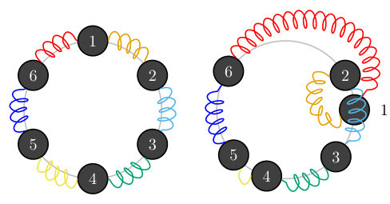
<figcaption class="paper-figure-caption"><b>Fig 1.</b> FIG. 1. Schematic for both the index space I (defined in Section II B) and generalised harmonic chain (defined in Sec- tion III B). The left/right subfigure is an example configu- ration at/perturbed from the mode. The particle ordering {1, . . . , N} within I is fixed based on the modal state-space configuration at the start of the simulation, i.e. assuming starting at the mode (e.g. left). The state-space ordering at a later time may not therefore correspond to the index-space ordering (e.g. right). In the generalised harmonic chain, par- ticle interactions are mediated by 1D spring vectors xij ∈R between neighbours (i, j) on I, subject to the constraint P</figcaption>
</figure>
<figure class="paper-figure-card">
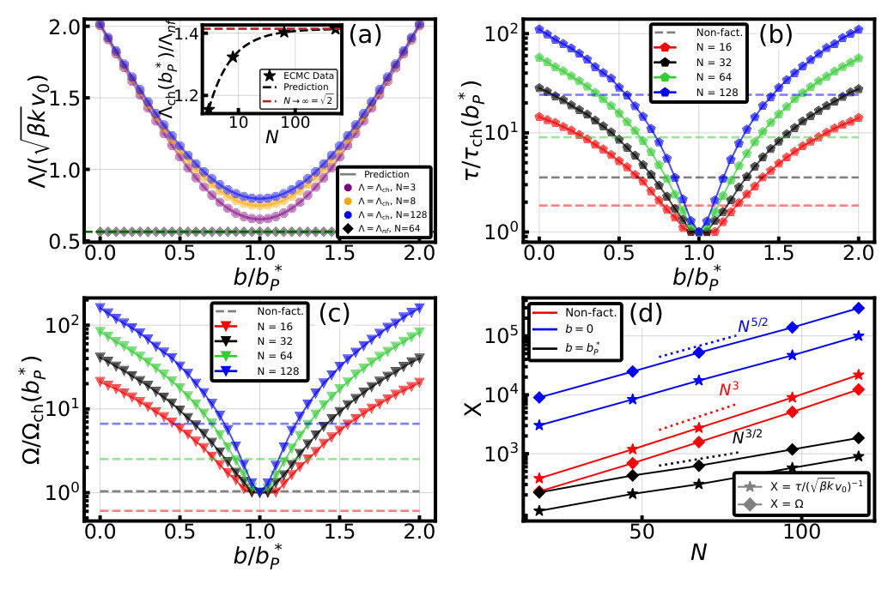
<figcaption class="paper-figure-caption"><b>Fig 2.</b> FIG. 2. Comparative performance of cell-horizon ECMC against both non-factorised and standard-factorised ECMC. Metrics are measured for the p = 2 generalised harmonic chain with mean particle density ρ = √βk/2 ((βk)−1/p sets a lower length scale). (a) MC estimates and analytic predictions of the mean event rate of cell-horizon ECMC (Λch) and non-factorised ECMC (Λnf) as functions of b and N (n.b. b does not modify non-factorised ECMC, as predicted). We observe excellent agreement between the estimates and predictions, with Λch minimised at b = b∗ P , as predicted. Inset: The ratio Λch(b = b∗ P )/Λnf emphasises that non-factorised ECMC outperforms cell-horizon ECMC for all N &gt; 2 by this...</figcaption>
</figure>
<figure class="paper-figure-card">
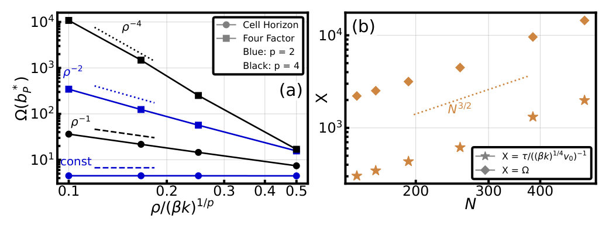
<figcaption class="paper-figure-caption"><b>Fig 3.</b> FIG. 3. Comparative performance of cell-horizon ECMC against four-factor ECMC. (a) MC estimates of the computational effort Ω(defined in Section III) of both methods as a function of ρ at fixed N = 16 and at optimal b = b∗ P for both the p = 2 and p = 4 generalised harmonic chain ((βk)−1/p sets a lower length scale). For p = 2, results are consistent with Ωbeing insensitive to ρ (cell-horizon ECMC) and O(ρ−2) (four-factor ECMC). For p = 4, results are consistent with Ωbeing O(ρ−1) (cell-horizon ECMC) and O(ρ−4) (four-factor ECMC). This reflects cell-horizon ECMC circumventing the impractically large Ω of four-factor ECMC at large b∗(at small ρ in this case). Lines are a guide to the eye....</figcaption>
</figure>
<figure class="paper-figure-card">
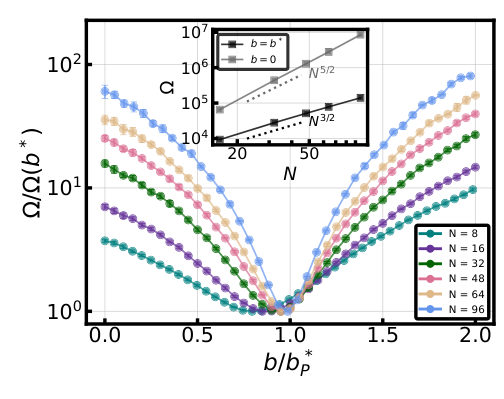
<figcaption class="paper-figure-caption"><b>Fig 4.</b> FIG. 4. MC estimates of the computational effort Ω(de- fined in Section III) of cell-horizon ECMC as a function of b and N for the κ = 2 1D soft-disk model with mean parti- cle density ρ = (3/4)/σ. Results are consistent with Ωbeing minimised at b = b∗ P in the large-N limit. Inset: Ωas a function of N at fixed ρ = (3/4)/σ at b = 0 and b = b∗. Re- sults are consistent with Ωbeing O(N 5/2) and O(N 3/2) for the standard-factorised and optimal cell-horizon approaches. This reflects cell-horizon ECMC hugely outperforming other methods by the key metric of sampling performance (Ω), even in the presence of positive singularities and long-range inter- actions. Lines are a guide to the eye. Results...</figcaption>
</figure>
<figure class="paper-figure-card">
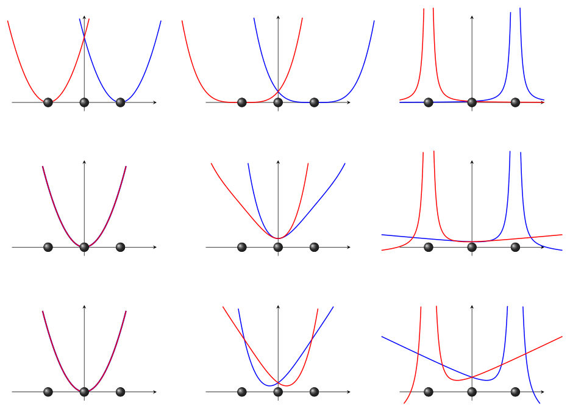
<figcaption class="paper-figure-caption"><b>Fig 5.</b> FIG. 5. Schematics illustrating the effect of key choices of b. For modal state-space configurations, the functions Ua,a−1−bxa,a−1 (red) and Ua+1,a −bxa+1,a (blue) are presented at b = 0, b = b∗ Λ and b = b∗ P for both the generalised harmonic chain (GHC; p = 2 and p = 4) and 1D soft-disk model. Green curves represent Ua,a−1 −bxa,a−1 and Ua+1,a −bxa+1,a functions that coincide and y-shifts have been applied for illustrative purposes. For the p = 2 GHC, b∗ Λ = b∗ P . For all other models, the value of b that minimises the mean event rate (b∗ Λ) does not coincide with that which induces optimal autocorrelation (b∗ P ).</figcaption>
</figure>

**Summary.** This paper presents a significant advancement in computational sampling by proposing the 'Cell-horizon ECMC' method for simulating interacting particles on a 1D torus. It rigorously compares this new strategy against existing methods, demonstrating superior computational efficiency and robustness across various particle densities. The work provides a powerful, general framework for simulating complex statistical mechanical systems.

**Why it may be interesting.** The development of highly efficient, general sampling algorithms like this is crucial for simulating complex many-body systems in statistical mechanics, providing computational tools applicable to quantum many-body physics simulations.

Detailed structure

**Main problem.** The paper aims to develop and compare optimal sampling strategies for Event-Chain Monte Carlo (ECMC) methods to surpass the computational efficiency of established algorithms like Molecular Dynamics (MD) and Hamiltonian Monte Carlo (HMC).

**Main result.** The authors introduce a universal framework, the 'Cell-horizon ECMC,' which achieves superior sampling efficiency, showing a better scaling and a higher mean event rate compared to non-factorised or standard-factorised ECMC methods.

**Method.** The work involves deriving and comparing the mean event rates ($\Lambda$) and autocorrelation times ($	au_{mix}$) for various ECMC formulations, including non-factorised and cell-horizon approaches, using mathematical analysis of continuous-time Markov processes.

**Model / system.** The primary model is $N$ pairwise-interacting particles confined to a 1D torus, governed by a potential $U$. Examples include the generalized harmonic chain (GHC) and the 1D soft-disk model (SD).

**Key observables.** Sampling efficiency, mean event rate ($\Lambda$), autocorrelation time ($	au_{mix}$), and the normalized pressure ($eta P$).

**Important parameters / regimes.** Number of particles ($N$), inverse temperature ($eta$), and the density ($
ho$) of the system.

**Assumptions / limitations.** The analysis assumes translational symmetry for the pairwise potentials and relies on approximations when deriving the optimal cell-horizon rate.

**Figures summary.** Figure 8 compares the mixing times ($	au_{mix}$) for standard-factorised and optimal cell-horizon ECMC, showing $O(N^{5/2})$ vs $O(N^2)$ scaling for the GHC. Figure 7 confirms thermodynamic consistency by equating the normalized pressure ($eta P$) with the ratio of index-space velocities ($v_{idx}/v_0$).

**Paper structure.** The paper progresses by first detailing existing ECMC strategies (non-factorised, standard-factorised), then introducing the novel cell-horizon framework, mathematically deriving its optimal rate, and finally comparing its performance and thermodynamic consistency against established methods.

Abstract

Event-chain Monte Carlo (ECMC) has revolutionised computational sampling over recent years, providing a powerful alternative to the molecular-dynamics (MD) and Hamiltonian Monte Carlo (HMC) algorithms. Each method outperforms the ubiquitous random-walk Metropolis algorithm by advancing particles along deterministic trajectories, but ECMC achieves this without being constrained by Newtonian dynamics. Recent advances exploited this dynamical freedom to induce a collective particle dynamics that relax local density variations on fast timescales. In a foundational model of $N$ pairwise-interacting particles on the 1D torus, this led to an $O(N^{3/4})$ improvement on the industry-leading computational efficiency of MD and HMC - but with an impractically small prefactor at low/high mean particle density for general attractive/repulsive interactions. Here we present a universal framework that generalises this high-efficiency sampling strategy to all translationally symmetric pairwise models on the torus - creating the potential to surpass MD and HMC as the state of the art. We also numerically elucidate the collective particle dynamics and discuss broad impact across the physical sciences and computational statistics.

[↑ back to top](#top)

### [Robust exponential lower bounds for fermionic and bosonic Gaussian ranks](http://arxiv.org/abs/2610.02172v1)

**Authors:** Fuchuan Wei, Kong-Wing Wu, Zhengwei Liu, Zi-Wen Liu  
**Type:** theory · **Category:** quantum information and computing · **PDF:** <https://arxiv.org/pdf/2610.02172v1>  
**Analysis basis:** full PDF text, analyzed in chunks
**Topic relevance:** `Keldysh / 2PI / non-Gaussian methods` **1/5** · `analog quantum simulation` **1/5**

↔ Scroll figures horizontally

<figure class="paper-figure-card">
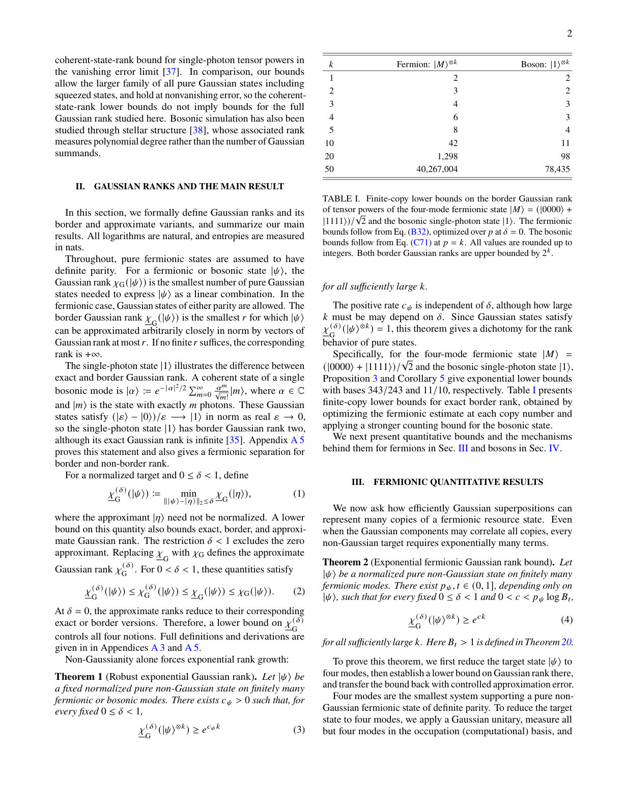
<figcaption class="paper-figure-caption"><b>Fig 1.</b> Low-resolution page preview, page 2</figcaption>
</figure>
<figure class="paper-figure-card">
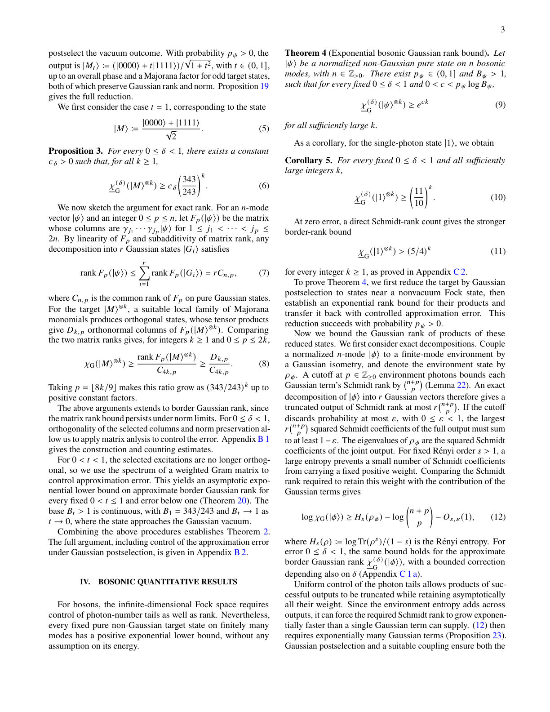
<figcaption class="paper-figure-caption"><b>Fig 2.</b> Low-resolution page preview, page 3</figcaption>
</figure>
<figure class="paper-figure-card">
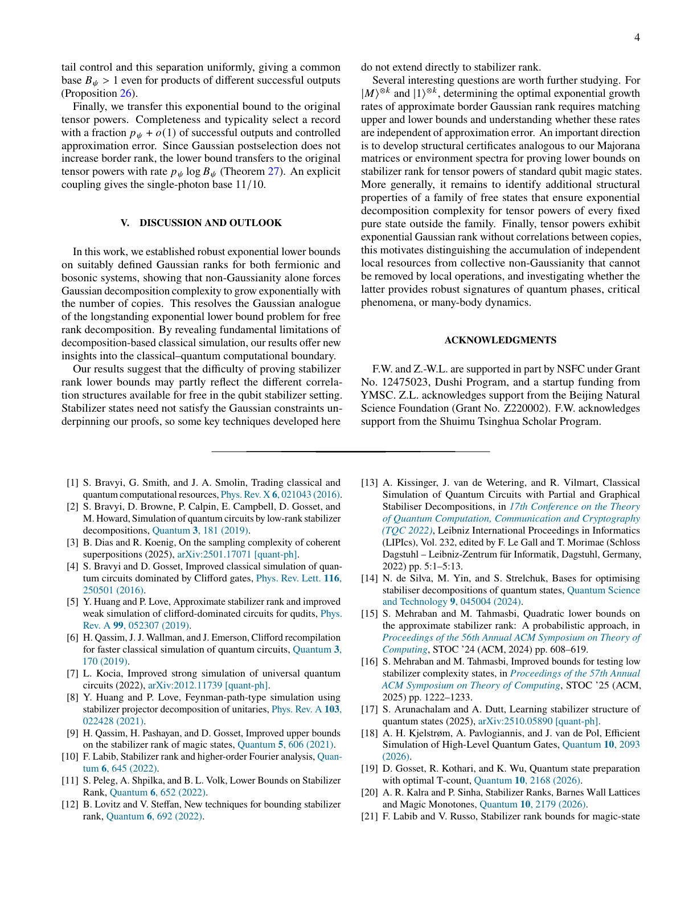
<figcaption class="paper-figure-caption"><b>Fig 3.</b> Low-resolution page preview, page 4</figcaption>
</figure>
<figure class="paper-figure-card">
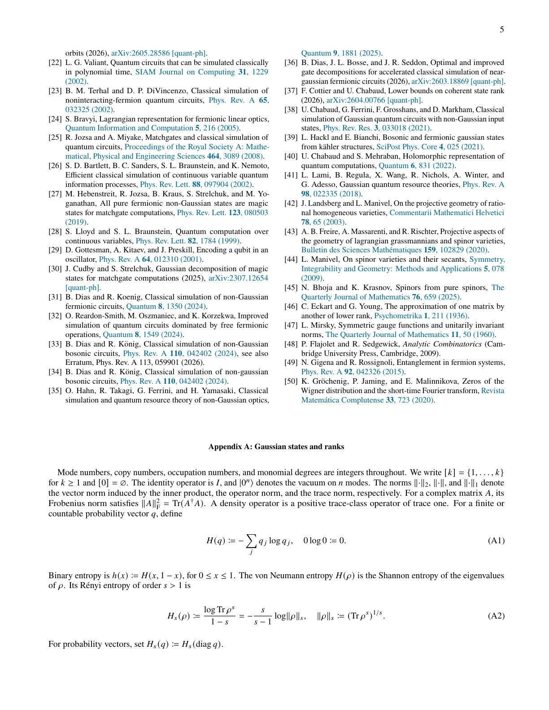
<figcaption class="paper-figure-caption"><b>Fig 4.</b> Low-resolution page preview, page 5</figcaption>
</figure>
<figure class="paper-figure-card">
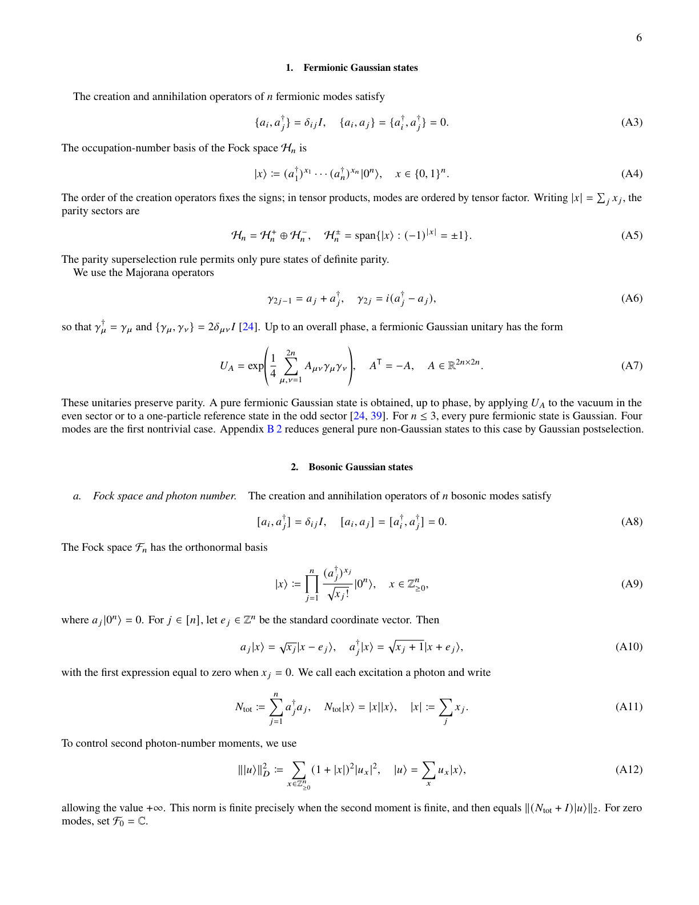
<figcaption class="paper-figure-caption"><b>Fig 5.</b> Low-resolution page preview, page 6</figcaption>
</figure>

**Summary.** This paper derives rigorous, exponential lower bounds for the Gaussian rank of tensor powers of non-Gaussian fermionic and bosonic states. By showing that this rank grows exponentially, the authors establish fundamental limitations on the ability of classical simulation techniques to efficiently model these quantum systems. This work is crucial for understanding the computational power gap between quantum and classical computation.

**Why it may be interesting.** This work directly addresses the resource theory of quantum computation by quantifying the non-classical resources (non-Gaussianity) required for quantum advantage over classical simulation methods.

Detailed structure

**Main problem.** The paper establishes robust exponential lower bounds for the Gaussian rank of fermionic and bosonic quantum states, which quantifies the difficulty of classically simulating quantum systems.

**Main result.** It proves that for pure non-Gaussian states, the approximate Gaussian rank of their tensor powers grows at least exponentially with the number of copies, setting fundamental limits on decomposition-based classical simulation.

**Method.** The authors combine techniques including reduction to four modes with Majorana spectral bounds (fermions) and entropy-based rank bounds via Gaussian postselection (bosons).

**Model / system.** The study focuses on pure non-Gaussian states in both fermionic and bosonic systems, analyzing the tensor powers of states like the fermionic GHZ state and the bosonic single-photon state.

**Key observables.** Gaussian Rank ($\chi_G$), Border Gaussian Rank, Approximate Gaussian Rank ($\chi^{(\delta)}_G$), and the exponential growth rate of these ranks.

**Important parameters / regimes.** The approximation error $\delta$ must be less than 1, and the analysis depends on the number of tensor copies, $k$.

**Assumptions / limitations.** The results are proven for pure non-Gaussian states, and the techniques rely on the existence of specific Gaussian isometries and positive entropy gaps.

**Figures summary.** TABLE I provides finite-copy lower bounds on the border Gaussian rank for the four-mode fermionic GHZ state and the bosonic single-photon state for small numbers of copies.

**Paper structure.** The paper develops from defining the problem via Gaussian rank, establishing bounds for specific states (GHZ, single-photon), and culminating in general theorems proving exponential growth rates using entropy and isometry arguments.

Abstract

The power and limitations of classical simulation are central to understanding quantum computational advantages. A leading simulation paradigm is based on coherent decomposition into classically tractable free states where the decomposition rank determines the simulation complexity. Proving strong lower bounds on this number is a notoriously difficult and mathematically rich problem, as exemplified by the qubit stabilizer rank problem. Here, we study the Gaussian version of this problem in both bosonic and fermionic systems and establish robust exponential lower bounds on Gaussian rank. In particular, we prove that for every pure non-Gaussian state on finitely many modes, with definite parity in the fermionic case, the approximate border Gaussian rank of its tensor powers grows at least exponentially at any fixed norm error below one. Our proofs combine reduction to four modes with Majorana spectral bounds for fermions, and Gaussian postselection with an entropy-based rank bound for bosons. As concrete examples, we derive explicit exponential lower bounds for the four-mode fermionic GHZ state and the bosonic single-photon state. The bosonic results require no assumption on the energy of the target state. Our results show that non-Gaussianity universally entails exponential Gaussian decomposition complexity, setting fundamental limitations on decomposition-based classical simulation of bosonic and fermionic systems.

[↑ back to top](#top)

### [Scalar field theory for (chiral) active Brownian particles: bottom-up derivation revisited](http://arxiv.org/abs/2610.01672v1)

**Authors:** Yuta Kuroda, Thomas Speck  
**Type:** theory · **Category:** statistical mechanics · **PDF:** <https://arxiv.org/pdf/2610.01672v1>  
**Analysis basis:** full PDF text, analyzed in chunks
**Topic relevance:** `Keldysh / 2PI / non-Gaussian methods` **1/5** · `non-equilibrium universality` **1/5**

↔ Scroll figures horizontally

<figure class="paper-figure-card">
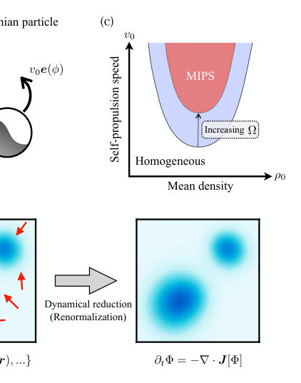
<figcaption class="paper-figure-caption"><b>Fig 1.</b> Figure 1. Schematic illustration of (a) the active Brownian particle model and (b) the chiral active Brownian particle model. (c) Schematic of the phase diagram of fluid states of interacting (chiral) ABPs. The blue and red areas represent the coexistence regions in ABPs and cABPs, respectively. (d) Coarse-graining procedure in this paper.</figcaption>
</figure>
<figure class="paper-figure-card">
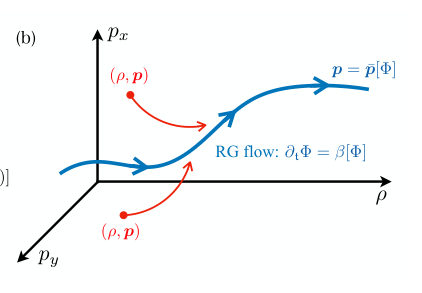
<figcaption class="paper-figure-caption"><b>Fig 2.</b> Figure 2. (a) Schematic illustration of the construction of the envelope (blue line) from the local solutions (gray lines) obtained using perturbation theory. (b) Schematic of the slow invariant manifold in (ρ, p)-space. The blue line represents the invariant manifold p = ¯p[Φ], which is parameterized by the density Φ. Fast relaxation is schematically depicted by the red arrows. The slow dynamics on the invariant manifold is governed by the RG equation.</figcaption>
</figure>

**Summary.** This paper provides a rigorous theoretical framework to derive continuum scalar field theories for active matter systems, starting from the microscopic dynamics of Active Brownian Particles (ABPs). By employing the Renormalization Group method, the authors successfully connect particle interactions to macroscopic field equations, notably identifying unique chiral terms in the resulting theory.

**Why it may be interesting.** While focused on classical active matter, the rigorous application of the Renormalization Group method to derive effective, long-wavelength continuum theories from microscopic particle dynamics is a powerful theoretical tool applicable to non-equilibrium many-body systems.

Detailed structure

**Main problem.** The primary goal is to establish a systematic, bottom-up derivation connecting microscopic particle-based models of active matter to continuum descriptions, specifically scalar field theories.

**Main result.** The authors successfully derived scalar field theories for both standard and chiral Active Brownian Particles (ABPs) using the Renormalization Group (RG) method. For the chiral variant, the resulting field theory contains two unique 'odd' non-equilibrium terms.

**Method.** The derivation employs a combination of the pressure expansion, the Renormalization Group (RG) method within singular perturbation theory, and closure approximations to systematically eliminate fast variables and derive flow equations for the slow dynamics.

**Model / system.** The study focuses on Active Brownian Particles (ABPs) and their chiral variant (cABPs), which are widely used models for scalar active fluids exhibiting phenomena like Motility-Induced Phase Separation (MIPS).

**Key observables.** Density field $
ho(\mathbf{r}, t)$, phase separation coexistence regions, and the coefficients of the derived scalar field theory up to $\mathcal{O}(
abla^4)$.

**Important parameters / regimes.** Self-propulsion speed ($v_0$), rotational diffusion coefficient ($	au_p$), and the strength of the chirality bias (torque).

**Assumptions / limitations.** The derivation relies on the pressure expansion and the RG method, while the closure approximation used for the pair distribution function is noted as the only non-systematic step.

**Figures summary.** The figures schematically illustrate the dynamics for ABP and cABP, and one figure shows the MIPS coexistence region, analogous to equilibrium liquid-vapor separation.

**Paper structure.** The paper progresses by first identifying the challenge of connecting microscopic ABPs to continuum field theories. It then details the methodology—using pressure expansion and RG—to derive the field theory, applying it first to ABPs, and finally extending the method to the chiral ABP (cABP) model.

Abstract

The active Brownian particle (ABP) model is one of the most widely used particle-based models in studies of scalar active fluids. A collection of interacting ABPs is known to exhibit intriguing phenomena that are absent in equilibrium counterparts. A prominent example is spontaneous phase separation, known as motility-induced phase separation (MIPS), which occurs even in the absence of explicit attractive interactions. In parallel, the large-scale behavior of scalar active fluids is often modeled using continuum descriptions, namely, scalar field theories. Such scalar active field theories are usually formulated in a top-down manner, and establishing their connections to particle-based models remains challenging, with these connections not yet fully understood. To advance the microscopic derivation of scalar active field theories, we revisit the connection between ABPs interacting via a two-body potential in two dimensions and scalar field theories that include all possible terms up to fourth order in spatial gradients. Our approach is based on a pressure expansion and the renormalization group (RG) method in the context of singular perturbation theory. The RG method provides a systematic way to eliminate fast variables and identify the dynamics on the slow invariant manifold. Within this framework, scalar field theories can be obtained as RG flow equations. We also apply this method to a chiral variant of the ABP model, the chiral ABP (cABP) model, in which a constant torque biases particle rotation to the left or right. We show that the scalar field theory corresponding to the cABP model contains two ``odd'' terms in addition to those present in the scalar field theory for ABPs. The method developed here may also be useful for deriving hydrodynamic descriptions of other types of active matter systems.

[↑ back to top](#top)

### [Why polar excitons stay sharp: parity protection of the center-of-mass recoil channel in exciton-phonon scattering](http://arxiv.org/abs/2610.01600v1)

**Authors:** Michael O. Atambo  
**Type:** theory · **Category:** other · **PDF:** <https://arxiv.org/pdf/2610.01600v1>  
**Analysis basis:** full PDF text, analyzed in chunks
**Topic relevance:** `Keldysh / 2PI / non-Gaussian methods` **1/5** · `correlated / nonlocal dissipation` **1/5**

↔ Scroll figures horizontally

<figure class="paper-figure-card">
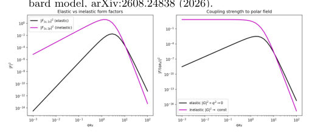
<figcaption class="paper-figure-caption"><b>Fig 1.</b> FIG. 1. (Color online) Internal-state-preserving (black) and internal-state-changing (magenta) excitonic form factors. Left: |F|2; right: coupling strength |F/(qaX)|2 to the po- lar field. The internal-state-preserving vertex vanishes as q2</figcaption>
</figure>
<figure class="paper-figure-card">
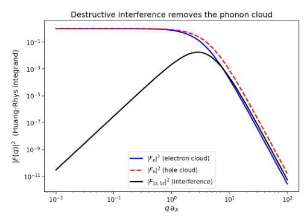
<figcaption class="paper-figure-caption"><b>Fig 2.</b> FIG. 2. (Color online) Huang–Rhys integrands. Destructive interference removes the small-q phonon cloud, confining the elastic dressing to intermediate q.</figcaption>
</figure>
<figure class="paper-figure-card">
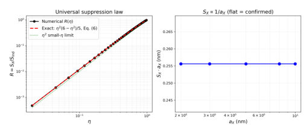
<figcaption class="paper-figure-caption"><b>Fig 3.</b> FIG. 3. (Color online) Universal suppression law. Left: R(η) = SX/Sind (points) against the exact law η2(6 −η2)/5, Eq. (6) (dashed). Right: exact 1/aX scaling of SX.</figcaption>
</figure>
<figure class="paper-figure-card">
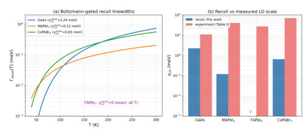
<figcaption class="paper-figure-caption"><b>Fig 4.</b> FIG. 4. (Color online) (a) Temperature dependence of the internal-state-preserving recoil linewidths Γrecoil(T) = γrecoil LO NLO(T) using the parameter-free baselines of Table I; for FAPbI3 the rate is exactly zero at all T by Eq. (3). (b) Re- coil coefficients (blue) against the measured LO-related scales (red, Table I). The recoil channel supplies the GaAs bound- state baseline but lies two to three orders of magnitude below the perovskite benchmarks, which therefore require internal- state-changing channels (not shown).</figcaption>
</figure>
<figure class="paper-figure-card">
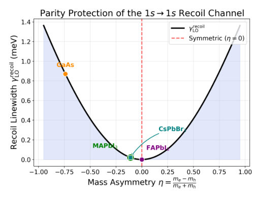
<figcaption class="paper-figure-caption"><b>Fig 5.</b> FIG. 5. (Color online) Parity protection of the 1s →1s COM recoil channel. The parameter-free recoil linewidth, Eq. (9), vanishes exactly at η = 0 (mass symmetry). Mass- symmetric perovskites sit at the protected minimum, forcing their linewidth onto the inelastic 1s →np channel; mass- asymmetric GaAs sits on the unprotected branch.</figcaption>
</figure>

**Summary.** This theoretical work explains the anomalous sharpness of excitons in polar semiconductors by rigorously including the center-of-mass recoil degree of freedom. It demonstrates that parity protection causes the primary recoil scattering channel to vanish in mass-symmetric materials. Consequently, the observed linewidths must instead be governed by internal-state-changing inelastic channels, establishing a clear hierarchy of controlling physical parameters.

**Why it may be interesting.** This work provides a detailed, quantitative understanding of how fundamental symmetries (parity) and kinematic constraints (COM recoil) dictate the coherence properties of excitons in solid-state materials, which is crucial for designing stable quantum emitters.

Detailed structure

**Main problem.** The paper addresses the theoretical puzzle of why excitonic resonances in polar semiconductors, despite strong electron-phonon coupling, remain anomalously sharp.

**Main result.** The sharpness is governed by a hierarchy of scattering channels, where the internal-state-preserving center-of-mass recoil channel is suppressed by parity protection in mass-symmetric materials, forcing the linewidth to be determined by inelastic transitions.

**Method.** The authors use a theoretical framework based on the Fröhlich interaction, incorporating the exact center-of-mass (COM) recoil degree of freedom into the exciton-phonon scattering rate calculations.

**Model / system.** The system is excitons coupled to polar optical phonons in polar semiconductors, modeled using the hydrogenic Fröhlich Hamiltonian. The analysis distinguishes between mass-asymmetric and mass-symmetric materials.

**Key observables.** Recoil linewidth ($\gamma_{	ext{recoil}}^{	ext{LO}}$), Huang-Rhys factor ratio ($S_X/S_{	ext{ind}}$), and the overall exciton linewidth ($\gamma_{	ext{exp}}^{	ext{LO}}$).

**Important parameters / regimes.** Mass asymmetry parameter ($\eta$), recoil momentum ($q_*$), and the Rydberg detuning ($\Delta E_{np} - \hbar\omega_{	ext{LO}}$).

**Assumptions / limitations.** The analysis relies on extending standard treatments by including the full COM recoil kinematics and assuming the validity of the hydrogenic envelope functions for the exciton.

**Figures summary.** Figures illustrate the form factors for internal-state-preserving and changing channels, showing the vanishing vertex due to parity protection, and present the universal suppression law for the Huang-Rhys factor ratio.

**Paper structure.** The paper progresses by first identifying the failure of standard treatments, then introducing the COM recoil to derive a parameter-free $1s 	o 1s$ channel, proving its suppression via parity rules for $\eta=0$, and finally establishing the hierarchy of controlling parameters ($\eta, q^*a_X, \Delta E_{np} - \hbar\omega_{	ext{LO}}$) that dictate the observed linewidths.

Abstract

In polar semiconductors the Fröhlich interaction is the dominant electron--phonon coupling, yet excitonic resonances in materials such as halide perovskites remain anomalously sharp. We show that standard frozen-center-of-mass treatments of the exciton--phonon problem miss the decisive kinematic degree of freedom: restoring the exact center-of-mass (COM) recoil reveals a universally open, parameter-free $1s\to1s$ absorption channel at recoil momentum $q_*=\sqrt{2M_{\rm ex}\hbarω_{\rm LO}}/\hbar$, whose rate scales as $N_{\rm LO}(T)$. We prove that this recoil channel is controlled by destructive electron--hole interference: the recoil linewidth vanishes with the mass asymmetry as $γ_{\rm LO}^{\rm recoil}\propto\mathcal{F}_{1s,1s}(q_*)^2$, and the elastic dressing obeys the exact suppression law $S_X/S_{\rm ind}=η^2(6-η^2)/5$ within the hydrogenic Fröhlich model. The theory establishes a hierarchy of scattering regimes. In mass-asymmetric materials (GaAs, $η=-0.74$) the recoil channel is active ($γ_{\rm LO}^{\rm recoil}=2.2$~meV); in mass-symmetric materials (FAPbI$_3$, $η=0$; MAPbI$_3$, $η=-0.11$) it is killed by interference (0.00 and 0.12 meV), showing that the observed 27--40 meV perovskite linewidths cannot be accounted for by COM recoil and therefore require internal-state-changing and other inelastic channels, of which the constructive, $η$-robust $1s\to np$ resonance is the leading candidate within the present model. The Fröhlich constant $α$ alone is therefore insufficient as a figure of merit: after projection onto the correlated exciton, the controlling parameters are $η$, $q_*a_X$, and the Rydberg detuning.

[↑ back to top](#top)

### [A Code-Agnostic Graph Neural Network Decoder from the Detection Error Model](http://arxiv.org/abs/2610.01683v1)

**Authors:** Federico Alberto Astolfi, Guido Pupillo  
**Type:** theory · **Category:** quantum information and computing · **PDF:** <https://arxiv.org/pdf/2610.01683v1>  
**Analysis basis:** full PDF text, analyzed in chunks
**Topic relevance:** `quantum measurements` **1/5**

↔ Scroll figures horizontally

<figure class="paper-figure-card">
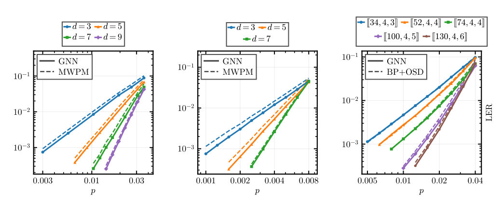
<figcaption class="paper-figure-caption"><b>Fig 1.</b> FIG. 1. Logical error rate of the GNN decoder (solid) against the classical decoder (dashed) as a function of the physical error rate p, on identical shots and with r=d syndrome rounds. The baseline is correlated minimum-weight perfect matching on the two surface-code panels and BP+OSD on the qLDPC panel.</figcaption>
</figure>
<figure class="paper-figure-card">
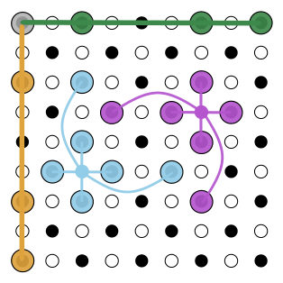
<figcaption class="paper-figure-caption"><b>Fig 2.</b> FIG. 2. The two code families studied in this work.</figcaption>
</figure>
<figure class="paper-figure-card">
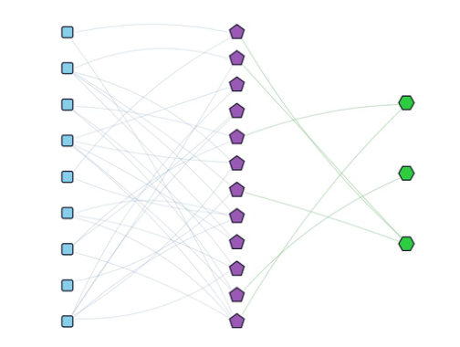
<figcaption class="paper-figure-caption"><b>Fig 3.</b> FIG. 3. Representation of an extended Tanner graph. From left to right, the nodes are the detectors (D), the error mech- anisms (EM), and the logical observable (L) of the detection error model of a surface code. Edges encode which detectors are triggered by each error mechanism and which mechanisms flip the logical observable. An even number of triggers has no effect in the noise regimes that we operate with.</figcaption>
</figure>
<figure class="paper-figure-card">
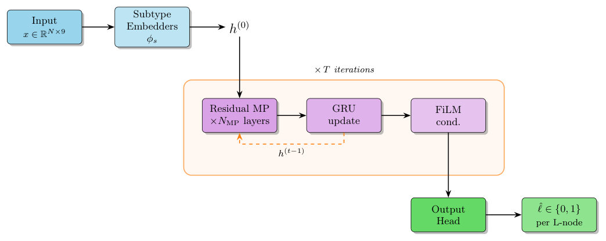
<figcaption class="paper-figure-caption"><b>Fig 4.</b> FIG. 4. Overview of the POLYMECHANON forward pass. The nine-dimensional node features are embedded via subtype- specific linear maps and non-linear activating functions. Over T iterations, representations are refined by NMP residual message- passing layers and updated by a GRU cell (Eq. 6). After, a FiLM conditioning is applied. The final output head maps the L-node representation to a logical error prediction.</figcaption>
</figure>
<figure class="paper-figure-card">
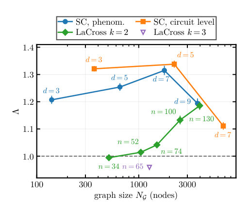
<figcaption class="paper-figure-caption"><b>Fig 5.</b> FIG. 5. Average advantage Λ of the GNN over the reference baseline (Table V) as a function of the size of the graph (Ta- ble II). The reference baseline is correlated MWPM for the surface code (SC) and BP+OSD for LaCross; values above the show the advantage the GNN. Labels give the distance d for the surface code and the number of physical qubits n for LaCross.</figcaption>
</figure>

**Summary.** This paper introduces POLYMECHANON, a Graph Neural Network decoder for quantum error correction that takes only the Detection Error Model (DEM) as input. It demonstrates that this single architecture can decode various stabilizer codes under different noise models, significantly outperforming existing methods in terms of error suppression and computational speed. This advances the field toward universal, hardware-independent quantum computation protocols.

**Why it may be interesting.** The focus on a code-agnostic decoder whose input is purely structural (the DEM) is highly relevant for building universal, hardware-agnostic quantum computation protocols.

Detailed structure

**Main problem.** To develop a quantum error correction (QEC) decoder that is code-agnostic, meaning it can decode any stabilizer code under any noise model expressible as a Detection Error Model (DEM) without requiring redesign.

**Main result.** The proposed GNN decoder, POLYMECHANON, outperforms existing decoders on both surface and qLDPC codes, showing superior scaling and computational efficiency, and enabling confidence-based post-selection.

**Method.** The authors use a Graph Neural Network (GNN) decoder whose input is the tripartite graph representation of the Detection Error Model (DEM) of the quantum code and noise structure.

**Model / system.** The system involves quantum error correction using stabilizer codes, tested on the rotated surface code and high-rate qLDPC codes. The decoder operates on the DEM, which models detectors, error mechanisms, and logical observables.

**Key observables.** Logical Error Rate (LER), decoding time/cost, and the fraction of accepted shots after post-selection.

**Important parameters / regimes.** Physical error rate ($p$), code distance ($d$), and the confidence threshold ($	au$).

**Assumptions / limitations.** The primary assumption is that the DEM alone contains sufficient information to characterize the decoding problem, allowing a single architecture to generalize across different codes and noise models.

**Figures summary.** Figures compare LER vs. physical error rate for different decoders (GNN vs. MWPM vs. BP+OSD) on surface and qLDPC codes, and show the effect of confidence-based post-selection on LER and shot acceptance.

**Paper structure.** The paper introduces the code-agnostic GNN decoder based on the DEM, validates its performance against state-of-the-art decoders on multiple code families and noise models, and details the benefits of probabilistic output for post-selection.

Abstract

We present POLYMECHANON, a graph neural network (GNN) decoder for quantum error correction whose only input is the detection error model (DEM) of a quantum code under a given noise model. We represent the DEM as a tripartite graph of detectors, error mechanisms and logical observables, where every input feature is computed by using the quantum code as data rather than design choice. In this way, the same architecture decodes in principle any stabiliser code, under any noise model that can be expressed as a detection error model, once trained on the DEM. We test this approach along four directions. Firstly, on the rotated surface code the decoder outperforms correlated MWPM under both phenomenological and circuit-level noise, with up to $25\%$ fewer logical failures. Secondly, on a family of high-rate qLDPC codes it matches BP+OSD on the smaller codes and surpasses it on the larger ones, with up to $16\%$ fewer logical failures on $[\![130,4,6]\!]$. Thirdly, its decoding time does not depend on the physical error rate, whereas that of BP+OSD grows with it: on $[\![130,4,6]\!]$ its effective cost per shot is of the order of a few ms on a single GPU against a few tens of milliseconds for BP+OSD on a single CPU core, and its fixed computational graph makes it a candidate for real-time decoding on neutral-atom processors. Finally, a single model trained across codes of different families outperforms uncorrelated MWPM on the graph-like codes seen during training and stays within $10\%$ of BP+OSD on the others, while it tends to fail to generalize to unseen codes, particularly larger ones. Its probabilistic output enables confidence-based post-selection, lowering the logical error rate by more than an order of magnitude on the surface code while keeping more than $90\%$ of the shots. Since only the DEM changes, new codes and noise models can be decoded without redesigning the decoder.

[↑ back to top](#top)

### [A No-Go Theorem for Order-Two Clifford Electric-Magnetic Duality](http://arxiv.org/abs/2610.02097v1)

**Authors:** Shunta Takahashi, Zhi Li, Beni Yoshida  
**Type:** theory · **Category:** quantum information and computing · **PDF:** <https://arxiv.org/pdf/2610.02097v1>  
**Analysis basis:** full PDF text, analyzed in chunks
**Topic relevance:** `analog quantum simulation` **1/5**

↔ Scroll figures horizontally

<figure class="paper-figure-card">
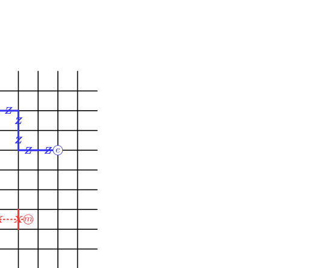
<figcaption class="paper-figure-caption"><b>Fig 1.</b> Figure 1: Anyon excitations in Z2 toric code</figcaption>
</figure>
<figure class="paper-figure-card">
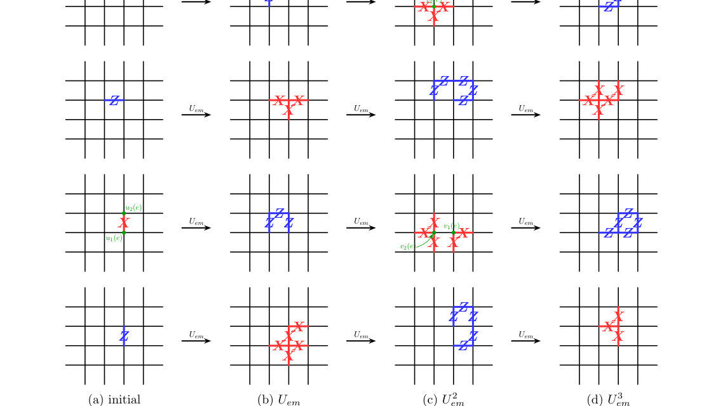
<figcaption class="paper-figure-caption"><b>Fig 2.</b> Figure 2: Conjugation rules for the explicit Z2 exchange Uem. (a)–(d) display the four successive images of single-edge Pauli operators under repeated conjugation by Uem. Red and blue labels denote X- and Z-type factors, respectively.</figcaption>
</figure>
<figure class="paper-figure-card">
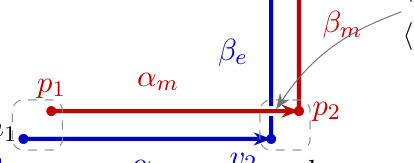
<figcaption class="paper-figure-caption"><b>Fig 3.</b> Figure 3: String geometry used in the proof of Theorem 2. Blue electric strings lie on the direct lattice and red magnetic strings lie on the dual lattice.</figcaption>
</figure>
<figure class="paper-figure-card">
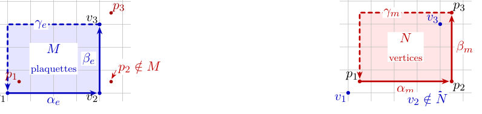
<figcaption class="paper-figure-caption"><b>Fig 4.</b> Figure 4: String geometry used in the proof of Theorem 2. Blue direct-lattice strings are Pauli-Z operators and red dual-lattice strings are Pauli-X operators; arrows give the orientations used for the ZN argument. (a) αm and βe cross once, while αe and βm are disjoint. Dashed closing strings form (b) an electric loop enclosing the plaquette set M with p2 /∈M, and (c) a magnetic loop enclosing the vertex set N with v2 /∈N.</figcaption>
</figure>
<figure class="paper-figure-card">
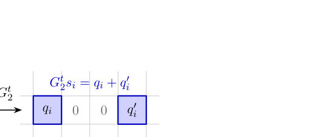
<figcaption class="paper-figure-caption"><b>Fig 5.</b> Figure 5: The edge vector si (left) and the resulting plaquette vector Gt 2si (right).</figcaption>
</figure>

**Summary.** This paper proves that the natural order-two electric-magnetic duality symmetry in the toric code cannot be realized by a simple, local Clifford unitary operation for the $\mathbb{Z}_2$ case. It generalizes this to $\mathbb{Z}_N$ codes, finding that the order-two realization fails for even $N$, demonstrating a deep link between the symmetry's algebraic structure and the underlying lattice topology.

**Why it may be interesting.** This work directly addresses the fundamental relationship between abstract topological symmetries (like e-m duality) and their physical realization within quantum error-correcting codes, which is central to quantum computation theory.

Detailed structure

**Main problem.** The paper investigates whether the electric-magnetic (e-m) exchange duality, which has order two in the anyon types of the toric code, can be realized microscopically as an order-two Clifford unitary operation.

**Main result.** For the $\mathbb{Z}_2$ toric code, no locality-preserving Clifford realization of the e-m exchange can have order two. Furthermore, for the $\mathbb{Z}_N$ code, an order-two realization is only possible for odd $N$.

**Method.** The proof uses geometric arguments involving string crossings, relating the unitary operator's action on stabilizers to topological features analogous to a cross-cap.

**Model / system.** The study focuses on the $\mathbb{Z}_N$ toric code on a lattice, characterized by vertex and plaquette stabilizers ($A_v$ and $B_p$). The core object of study is the unitary operator $U_{em}$ implementing the e-m exchange.

**Key observables.** The order of the unitary operator $U_{em}$ (or its dressed version $W$) acting on the physical Hilbert space, and the commutation relations between local Pauli operators under this transformation.

**Important parameters / regimes.** The integer $N$ defining the $\mathbb{Z}_N$ code, and the lattice structure (e.g., $L_x \times L_y$ periodic boundary conditions).

**Assumptions / limitations.** The primary theorem assumes locality-preserving realizations of the e-m exchange. The general proof avoids assumptions about translation symmetry or fixed stabilizer pairings.

**Figures summary.** Figures illustrate the anyon excitations, the conjugation rules for Pauli operators under $U_{em}$, and the string geometries used in the proof, relating the obstruction to topological crossings.

**Paper structure.** The paper first addresses the $\mathbb{Z}_2$ case, proving the order-two impossibility. It then generalizes to $\mathbb{Z}_N$, establishing the odd/even dependence. The methodology involves analyzing the action of the symmetry on stabilizers using Pauli symplectic formalism and geometric string arguments.

Abstract

Electromagnetic duality in the toric code has order two at the level of anyon types and acts as a Hadamard-type logical transformation on the encoded quantum information. Here, we ask whether it can likewise be realized microscopically as an order-two Clifford operation. For the $\mathbb{Z}_2$ toric code, we prove that any locality-preserving Clifford realization of electric-magnetic exchange cannot have order two. Our proof is fully general and requires neither translation symmetry with restricted families of system sizes nor a fixed pairing between vertex and plaquette stabilizers. Geometrically, the proof locally emulates the unavoidable crossing between electric and magnetic strings, similar to a cross-cap in a non-orientable manifold. Extending the problem to the $\mathbb{Z}_N$ toric code, we find that an order-two Clifford realization exists for odd $N$, whereas it is impossible for even $N$. Our results show that the group law of an emergent electromagnetic duality need not lift faithfully to its microscopic Clifford realization.

[↑ back to top](#top)

### [A Quantum Phase Neural Network with Multi-Inputs/Single-Output](http://arxiv.org/abs/2610.00868v1)

**Authors:** Shuang Cong, Jinmin Yang, Sajede Harraz  
**Type:** both · **Category:** quantum information and computing · **PDF:** <https://arxiv.org/pdf/2610.00868v1>  
**Analysis basis:** full PDF text, analyzed in chunks
**Topic relevance:** `quantum measurements` **1/5**

↔ Scroll figures horizontally

<figure class="paper-figure-card">
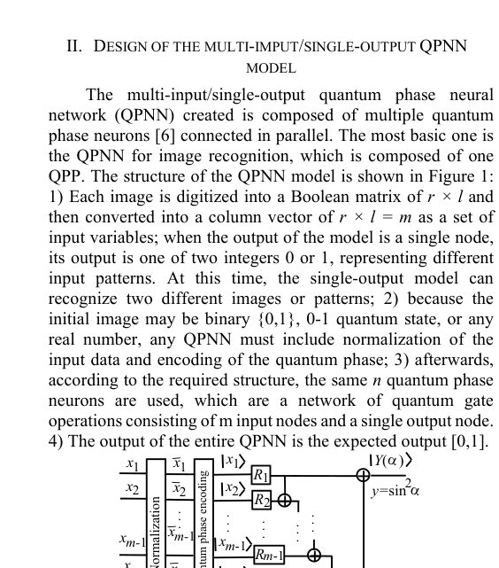
<figcaption class="paper-figure-caption"><b>Fig 1.</b> Fig. 1 Network structure diagram of m-input/single-output QPNN</figcaption>
</figure>
<figure class="paper-figure-card">
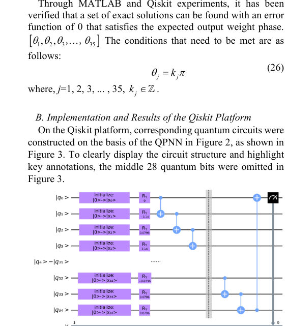
<figcaption class="paper-figure-caption"><b>Fig 2.</b> Fig. 4 Quantum circuit implemented on the Qiskit platform</figcaption>
</figure>

**Summary.** This paper introduces a Quantum Phase Neural Network (QPNN) designed to classify multi-input data, demonstrated using pixel recognition for letters 'A' and 'B'. It overcomes the 'exponential wall' by encoding inputs into quantum phases and deriving the output as a polynomial function of these phases. The methodology is implemented and verified using quantum circuits on the Qiskit platform.

**Why it may be interesting.** The work provides a concrete, mathematically derived quantum circuit implementation for a machine learning task, offering a pathway to utilize phase encoding to tackle high-dimensional input data in quantum computation.

Detailed structure

**Main problem.** The paper addresses the challenge of implementing multi-input recognition tasks using Quantum Phase Neural Networks (QPNNs) while circumventing the 'exponential wall' problem inherent in standard amplitude encoding.

**Main result.** A QPNN structure was successfully proposed and verified on the Qiskit platform to recognize letters 'A' and 'B' by encoding inputs into quantum phases, yielding polynomial output calculations.

**Method.** The method involves normalizing pixel inputs, encoding them into quantum phases, and then using a parameterized quantum circuit with controlled NOT gates to sum these phases before measuring the final output probability.

**Model / system.** The model is a Quantum Phase Neural Network (QPNN) designed for $m$-input/single-output tasks. It operates on quantum states initialized by the input data and manipulates phases using rotation and controlled gates.

**Key observables.** The primary observable is the real output $y \in [0, 1]$, which is derived from the final quantum phase measurement, and the training error function ($e_t^y$).

**Important parameters / regimes.** The number of inputs $m=35$ (from $7 	imes 5$ pixels), and the adjustable weight phases ($	heta_j$) within the quantum gates.

**Assumptions / limitations.** The core assumption is that the output measurement can be effectively modeled by calculating a polynomial function of the quantum state phase, thereby avoiding the exponential complexity of amplitude measurement.

**Figures summary.** Figure 1 shows the general QPNN structure; Figure 2 illustrates the quantum circuit steps (initialization, rotation, controlled gates); Figure 3 shows the specific quantum circuit implemented on Qiskit.

**Paper structure.** The paper first proposes the QPNN structure for multi-input encoding. It then derives the mathematical relationship between the input, the adjustable phases, and the output $y$. Subsequently, it derives the gradient-based training algorithm for the weight phases and verifies the entire process using both MATLAB and the Qiskit quantum computing platform.

Abstract

A 35 input/single output quantum phase neural network (QPNN) is proposed to recognize the English letters' A 'and' B 'composed 7*5 of pixels. Each node of the proposed QPNN has the input with 0 or 1. Through normalization and quantum phase encoding, each set of 35 with 0 or 1 digital inputs is encoded into a quantum superposition state described by 35 quantum phases. Then, a quantum rotation gate is used to introduce adjustable phase, and a controlled NOT gate is used to entangle the relative phase between the two inputs. The relationship between the input and output of the network is derived. This paper also derived the phase weight learning training algorithm with adaptive learning rate. The solutions with the recognition probability of 1 is designed, and the analytical expressions for all adjustable phase solutions with zero errors are not unique. The experimental performance is verified on the Qiskit platform. This paper uses phase drive to convert the probability calculation into an analytical polynomial function with adjustable rotation angles in the network, avoiding the bottleneck of generating all 2^35 complex exponential amplitudes and providing an effective way to solve the "exponential wall" problem, which provides a new implementation solution for the practical application of multi-input recognition problems.

[↑ back to top](#top)

### [Algebraic structure in holographic tensor networks](http://arxiv.org/abs/2610.00478v1)

**Authors:** Abhisek Sahu, Jeremy van der Heijden, Mark Van Raamsdonk, Rana Zibakhsh  
**Type:** theory · **Category:** numerical methods · **PDF:** <https://arxiv.org/pdf/2610.00478v1>  
**Analysis basis:** full PDF text, analyzed in chunks
**Topic relevance:** `methods for driven-dissipative` **1/5**

↔ Scroll figures horizontally

<figure class="paper-figure-card">
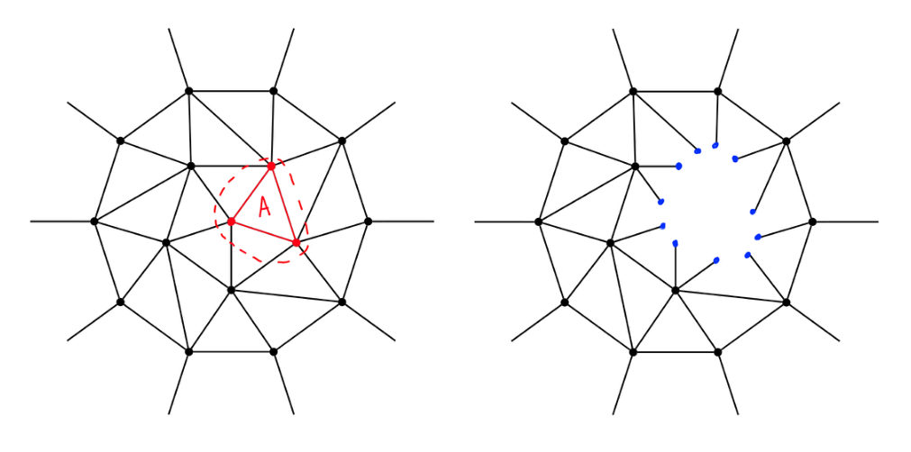
<figcaption class="paper-figure-caption"><b>Fig 1.</b> Figure 1: Left: A tensor network with 10 external legs and a region 𝐴consisting of three vertices and</figcaption>
</figure>
<figure class="paper-figure-card">
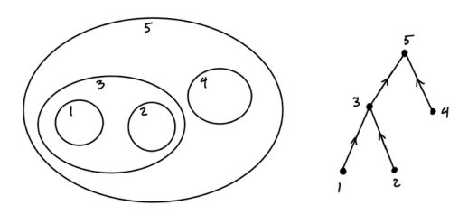
<figcaption class="paper-figure-caption"><b>Fig 2.</b> Figure 2: A collection of sets with a partial order by inclusion, and the corresponding Hasse diagram.</figcaption>
</figure>
<figure class="paper-figure-card">
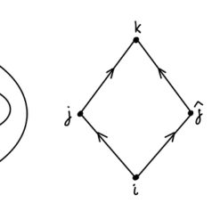
<figcaption class="paper-figure-caption"><b>Fig 3.</b> Figure 3: Sets 𝑗, ˆ𝑗, 𝑖= 𝑗∩ˆ𝑗and 𝑘⊃𝑗, ˆ𝑗with a diamond-shaped Hasse diagram.</figcaption>
</figure>
<figure class="paper-figure-card">
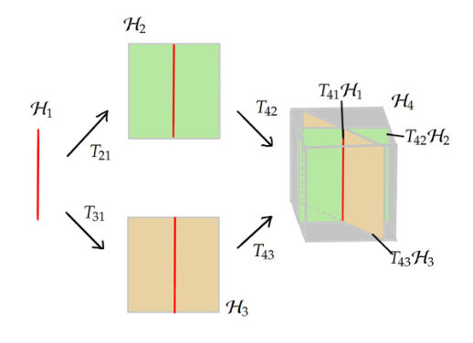
<figcaption class="paper-figure-caption"><b>Fig 4.</b> Figure 4: Hilbert spaces and isometries for a diamond-shaped Hasse diagram. The isometries can be</figcaption>
</figure>
<figure class="paper-figure-card">
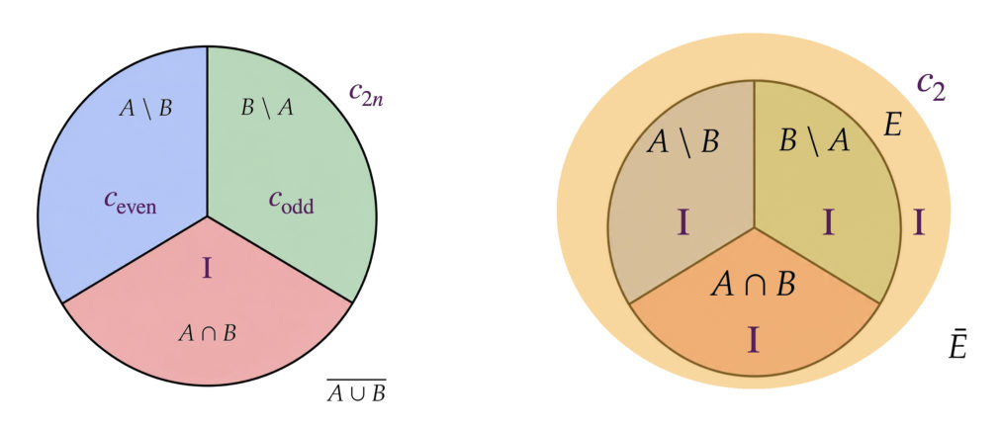
<figcaption class="paper-figure-caption"><b>Fig 5.</b> Figure 5: Dominant permutation configurations in calculating tr[(𝑃𝐴𝑃𝐵)𝑛] for extremal and non-extremal</figcaption>
</figure>

**Summary.** This work explores the deep connection between geometry and algebra in the context of quantum gravity holography using tensor network models. It shows that regions analogous to entanglement wedges correspond to specific subalgebras of observables. By analyzing how algebraic operations mirror geometric ones, the paper provides a concrete, computable test for fundamental principles like strong subadditivity in quantum gravity theories.

**Why it may be interesting.** The rigorous mathematical framework connecting geometric concepts from quantum gravity (entanglement wedges) to algebraic structures derived from tensor networks provides a powerful, computable tool for understanding holographic duality.

Detailed structure

**Main problem.** The paper investigates the algebraic structure associated with generalized entanglement wedges in quantum gravity, using tensor network models to test fundamental properties like monotonicity and strong subadditivity.

**Main result.** The authors establish a correspondence between extremal geometric regions in the tensor network model and canonically associated von Neumann factor subalgebras of the observable algebra in the semiclassical limit.

**Method.** The study employs tensor network toy models, analyzing algebraic operations (intersections, joins) on derived subalgebras and comparing the resulting algebraic entropy properties to geometric expectations.

**Model / system.** The system is holographic, modeled by random tensor networks whose boundary Hilbert space and observable algebra are analyzed. The core analogy is mapping generalized entanglement wedges (GWs) to specific subalgebras.

**Key observables.** Generalized entropy ($S_{	ext{gen}}$), algebraic entropy ($S_{	ext{alg}}$), and the structure of associated von Neumann factor subalgebras ($\mathcal{M}_A$).

**Important parameters / regimes.** Large bond dimension (semiclassical limit), bond dimension $D$, and the structure of the tensor network graph.

**Assumptions / limitations.** The analysis heavily relies on assuming isometric tensor networks and that the resulting subalgebras are von Neumann factors to simplify the algebraic investigation.

**Figures summary.** Not specified.

**Paper structure.** The paper proceeds by first establishing the correspondence between GWs and subalgebras, then detailing how algebraic operations map to geometric operations, and finally introducing alternative entropic quantities and methods to define the full Type II1 von Neumann algebra.

Abstract

In a previous work 2511.21852, we explored the hypothesis that in general theories of quantum gravity, spacetime regions known as generalized entanglement wedges (introduced by Bousso and Penington) have an associated subalgebra of observables in a semiclassical limit. We defined an entropy associated with these subalgebras that obeys the same monotonicity and strong subadditivity properties as the generalized gravitational entropy of generalized entanglement wedges. Here, we test aspects of these ideas making use of tensor network toy models for holography. In this context, the analog of a generalized entanglement wedge is a region for which no region containing it has a smaller number of boundary legs. In the limit of large bond dimension (analogous to the semiclassical limit), we argue that each such region has a canonically associated subalgebra of the full algebra of observables on the boundary Hilbert space, as well as a family of unitarily related von Neumann factor subalgebras. We investigate in detail how various algebraic operations on these subalgebras (e.g. their intersections, joins, and commutants) are related to corresponding geometrical operations on the tensor network regions. We study to what extent the monotonicity and strong subadditivity properties of generalized entropy for generalized entanglement wedges follow from properties of our algebraic entropy. We also introduce an alternative entropic quantity $S(ω|| ω\circ E_{\mathcal{A}'})$ associated with a subalgebra $\mathcal{A}$ that also obeys monotonicity and strong subadditivity properties with suitable conditions. Finally, we explain how to define a type $II_1$ von Neumann algebra based on an infinite family of random tensor networks with increasing bond dimension such that the regions corresponding to generalized entanglement wedges can be associated with exact subalgebras of this full algebra.

[↑ back to top](#top)

### [Beyond Light Cones: State Preparation Complexity in Quantum Spin Glasses](http://arxiv.org/abs/2610.02166v1)

**Authors:** Omar Al-Ghattas, David Gamarnik, Bobak T Kiani  
**Type:** theory · **Category:** disordered systems and neural networks · **PDF:** <https://arxiv.org/pdf/2610.02166v1>  
**Analysis basis:** full PDF text, analyzed in chunks
**Topic relevance:** `analog quantum simulation` **1/5**

↔ Scroll figures horizontally

<figure class="paper-figure-card">
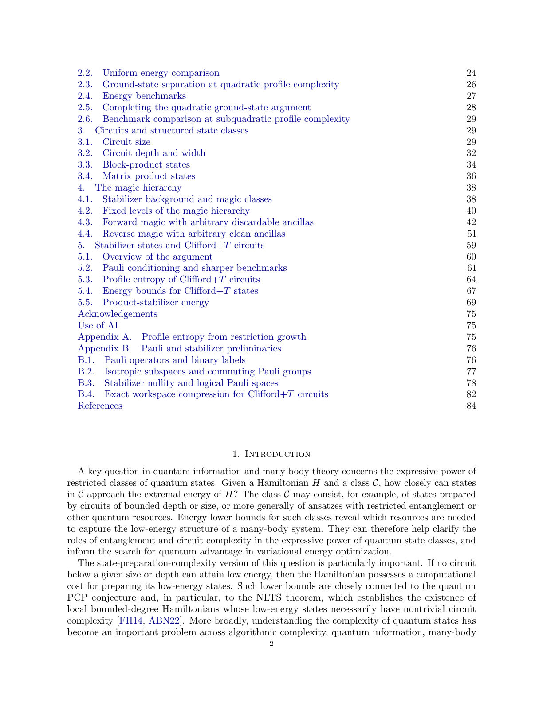
<figcaption class="paper-figure-caption"><b>Fig 1.</b> Low-resolution page preview, page 2</figcaption>
</figure>
<figure class="paper-figure-card">
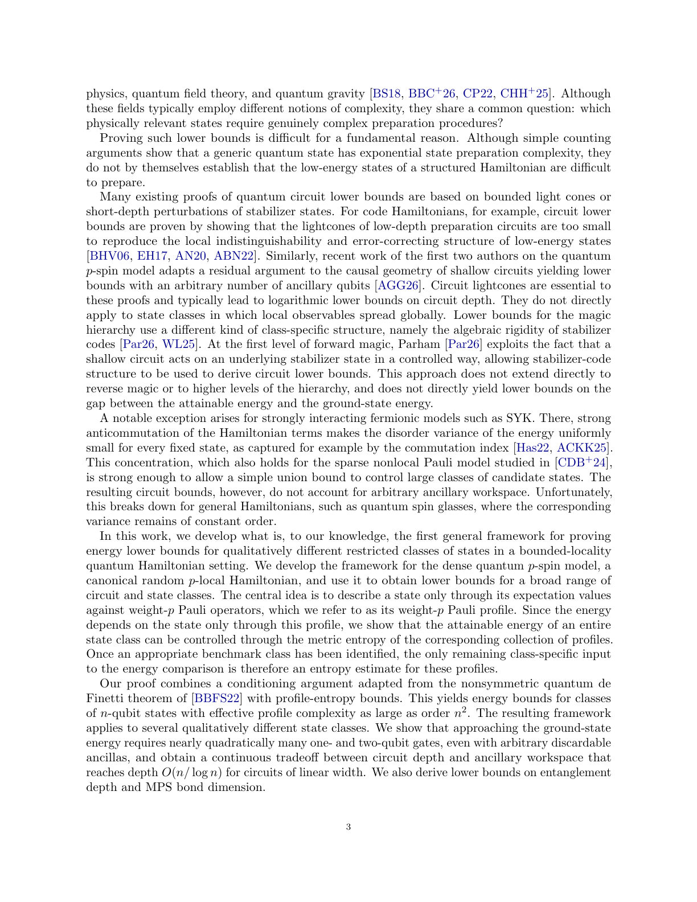
<figcaption class="paper-figure-caption"><b>Fig 2.</b> Low-resolution page preview, page 3</figcaption>
</figure>
<figure class="paper-figure-card">
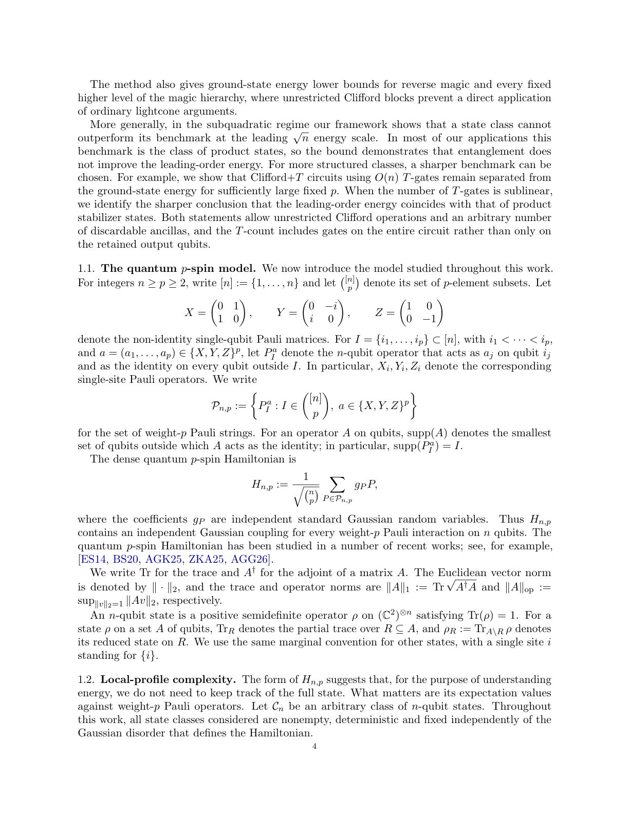
<figcaption class="paper-figure-caption"><b>Fig 3.</b> Low-resolution page preview, page 4</figcaption>
</figure>
<figure class="paper-figure-card">
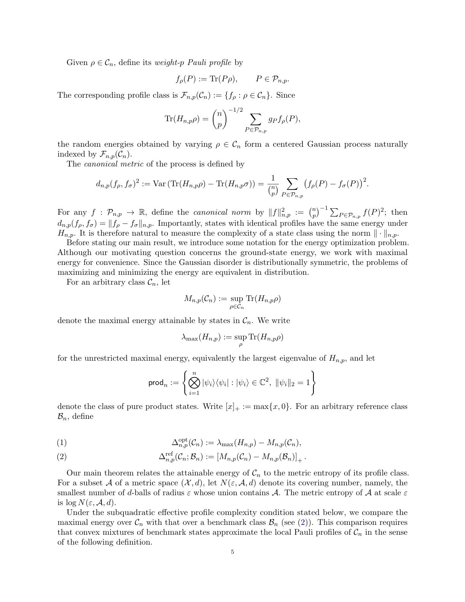
<figcaption class="paper-figure-caption"><b>Fig 4.</b> Low-resolution page preview, page 5</figcaption>
</figure>
<figure class="paper-figure-card">
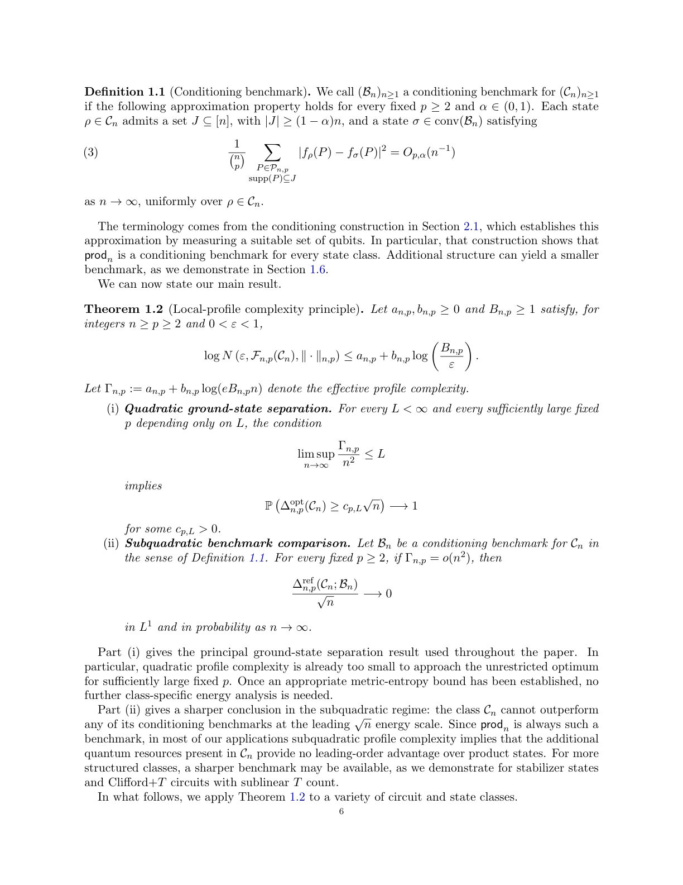
<figcaption class="paper-figure-caption"><b>Fig 5.</b> Low-resolution page preview, page 6</figcaption>
</figure>

**Summary.** This work develops a sophisticated framework to quantify how hard it is to prepare quantum states close to the ground state of quantum spin glasses. By analyzing the 'profile complexity' of the state class, the authors derive lower bounds on the required quantum circuit resources, showing that simple local constraints are insufficient to capture the true preparation difficulty.

**Why it may be interesting.** The techniques developed—using profile complexity and metric entropy to bound energy gaps—provide powerful, non-local tools for characterizing the computational difficulty of preparing ground states in complex, disordered quantum systems.

Detailed structure

**Main problem.** The paper studies the state preparation complexity of quantum states in dense quantum $p$-spin Hamiltonians, aiming to derive energy lower bounds that surpass those based solely on circuit lightcones.

**Main result.** It establishes that attaining near-ground-state energy requires $\Omega(n^2 / \log n)$ one- and two-qubit gates, and provides lower bounds for various circuit resource trade-offs.

**Method.** The core method involves using the effective profile complexity, derived from the metric entropy of Pauli profiles, combined with an adaptation of a nonsymmetric quantum de Finetti theorem.

**Model / system.** The focus is on dense quantum $p$-spin Hamiltonians acting on $n$ qubits, which model quantum spin glasses. The analysis compares the energy achievable by a restricted state class to a benchmark class.

**Key observables.** Profile complexity, ground-state energy separation ($\Delta$), circuit gate counts (one- and two-qubit gates), entanglement depth, and MPS bond dimension.

**Important parameters / regimes.** The fixed parameter $p$ (number of qubits involved in interactions), the system size $n$, and the profile complexity regime (e.g., subquadratic vs. quadratic).

**Assumptions / limitations.** The analysis assumes the existence of a suitable benchmark class $	ext{Bn}$ and relies on adapting advanced theorems like the nonsymmetric quantum de Finetti theorem.

**Paper structure.** The paper introduces the profile complexity principle, applies it to various structured state classes (including those related to the magic hierarchy), and derives quantitative bounds on resource requirements.

Abstract

We introduce a method for studying state preparation complexity in dense quantum $p$-spin Hamiltonians on $n$ qubits, going beyond bounds based only on circuit lightcones. The key input is the class's effective profile complexity, which is derived from the metric entropy of its Pauli profiles. These profiles record expectations of all Pauli operators supported on exactly $p$ qubits. Classes with uniformly bounded quadratic effective profile complexity remain separated from the ground-state energy by a positive multiple of $\sqrt n$ for sufficiently large fixed $p$. At subquadratic effective profile complexity, the class cannot outperform a suitable benchmark class at leading order, with product states providing a universal benchmark. The proof combines an adaptation of a nonsymmetric quantum de Finetti theorem of Berta et al. (arXiv:1810.12197) with Gaussian process entropy bounds.   Applying this framework, we show that attaining near-ground-state energy requires $Ω(n^2/\log n)$ one- and two-qubit gates, even with arbitrary discardable ancillas. We also obtain depth-width tradeoffs, entanglement-depth and matrix product state bond-dimension lower bounds, and obstructions for both orientations at every fixed level of Parham's magic hierarchy (arXiv:2504.19966), with total circuit width $O(n)$. In first-level reverse magic, a shallow circuit is followed by an unrestricted Clifford circuit. The latter can spread local observables across the system, preventing a direct application of small-lightcone bounds. For this first-level class, our bounds also allow arbitrarily many clean ancillas at fixed shallow-circuit depth. A sharper benchmark shows that Clifford+$T$ circuits with $o(n)$ $T$-gates have no leading-order energy advantage over product stabilizer states, even with unrestricted Clifford operations and arbitrary discardable ancillas.

[↑ back to top](#top)

### [Causal Trade-Offs in Superluminal Extensions of Relativity. A no-go theorem](http://arxiv.org/abs/2610.00494v1)

**Authors:** Amrapali Sen, Matthias Salzger, V. Vilasini  
**Type:** theory · **Category:** other · **PDF:** <https://arxiv.org/pdf/2610.00494v1>  
**Analysis basis:** full PDF text, analyzed in chunks
**Topic relevance:** `quantum measurements` **1/5**

↔ Scroll figures horizontally

<figure class="paper-figure-card">
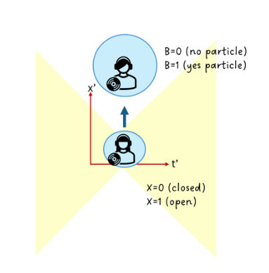
<figcaption class="paper-figure-caption"><b>Fig 1.</b> Figure 1: Communication protocol. The coordinates in black represent our frame, while the coordinates in red represent a superluminally boosted reference frame (of let’s say Charlie) with respect to us.</figcaption>
</figure>
<figure class="paper-figure-card">
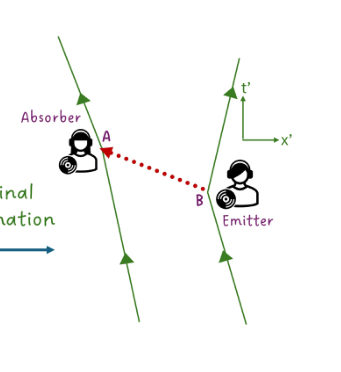
<figcaption class="paper-figure-caption"><b>Fig 2.</b> Figure 2: A tachyon is sent from Alice to Bob. Dragan and Ekert [1] argue that for this to be consistent with relativity, no local-deterministic model of the tachyon’s emission is available on the absorber’s, i.e., Bob’s side. Under a subluminal Lorentz boost, the roles of emitter and absorber change. Thus, by (relativistic) symmetry, they argue there can be no local-deterministic model on Alice’s side either.</figcaption>
</figure>
<figure class="paper-figure-card">

<figcaption class="paper-figure-caption"><b>Fig 3.</b> Figure 3: Claim A and claim B applied to our communication protocol. The coordinates in black represent our frame, while the coordinates in red represent a superluminally boosted reference frame (of let’s say Charlie) with respect to us.</figcaption>
</figure>

**Summary.** This paper develops a formal causal framework to study superluminal extensions of relativity, culminating in a no-go theorem. It demonstrates that maintaining causality and operational consistency in such theories forces a choice among several fundamental assumptions, showing that simple objective uncertainty is not enough to resolve the conflict. The work clarifies the deep causal trade-offs inherent in modifying the structure of spacetime causality.

**Why it may be interesting.** While focused on relativity, the rigorous framework for testing the consistency of fundamental assumptions (like locality or observer independence) is a powerful tool applicable to analyzing constraints in quantum field theories or quantum gravity models.

Detailed structure

**Main problem.** The paper investigates the causal implications of extending relativity to include superluminal reference frames (SpTs) and seeks to prove a no-go theorem regarding the avoidance of superluminal signaling.

**Main result.** The authors prove that avoiding superluminal signaling requires abandoning at least one of several fundamental assumptions regarding operational accessibility, frame-independence, or free choice, showing that objective uncertainty alone is insufficient.

**Method.** They develop a formal causal modelling framework, generalizing affects theory, to analyze the compatibility of operational assumptions (A0-A4) under superluminal transformations.

**Model / system.** The analysis uses abstract communication protocols involving particle emission and absorption between two parties, comparing results across standard and superluminal reference frames.

**Key observables.** Operational correlations between spacelike-separated regions, causal ordering of events, and the existence of free variables.

**Important parameters / regimes.** The nature of the superluminal boost, the size of the operational laboratory regions ($\Delta x, \Delta t$), and the degree of required uncertainty.

**Assumptions / limitations.** The core assumptions tested include operational correlation (A0), preservation of causal ordering (A1), prohibition of superluminal signaling (A2), invariance of probabilities (A3), and invariance of free variables (A4).

**Figures summary.** Figure 1 illustrates the communication protocol setup in different frames; Figure 2 compares local deterministic descriptions in different frames; Figure 3 applies the analysis to the communication protocol.

**Paper structure.** The paper systematically tests the mutual consistency of five key assumptions (A0-A4) within the causal modelling framework, leading to the identification of necessary trade-offs.

Abstract

Extensions of relativity that include superluminal reference frames have recently been proposed by Dragan and Ekert as a way to reconcile relativistic symmetry with quantum uncertainty. In this work, we develop a causal modelling framework to formally study this proposal and prove a no-go theorem demonstrating that a theory permitting superluminal reference frames can avoid superluminal signalling only if it severely constrains which spacetime regions are accessible to operational protocols, if the choice of reference frame has observable consequences or if free variables do not exist or their existence depends on the reference frame. Crucially, our result goes beyond the familiar intuition that superluminal transformations may lead to superluminal signalling; our no-go result shows that Dragan and Ekert's proposal of introducing objective uncertainty does not, by itself, eliminate this conflict. In fact, because superluminal signalling might instead be avoided by relaxing other fundamental assumptions in the presence of superluminal reference frames, the proposed objective uncertainty may not be necessary at all. Our results clarify the limitations of uncertainty-based resolutions and the causal trade-offs faced by superluminal extensions of relativity.

[↑ back to top](#top)

### [Characterizing unitaries via quasi-process functions](http://arxiv.org/abs/2610.00579v1)

**Authors:** Nasra Daher Ahmed, Ravi Kunjwal  
**Type:** theory · **Category:** quantum information and computing · **PDF:** <https://arxiv.org/pdf/2610.00579v1>  
**Analysis basis:** full PDF text, analyzed in chunks
**Topic relevance:** `quantum measurements` **1/5**

↔ Scroll figures horizontally

<figure class="paper-figure-card">
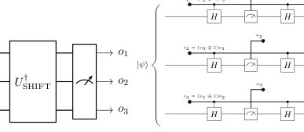
<figcaption class="paper-figure-caption"><b>Fig 1.</b> FIG. 2: Two protocols for the perfect discrimination of the states in the SHIFT basis. U † SHIFT is the unitary that rotates the SHIFT basis to the computational basis.</figcaption>
</figure>
<figure class="paper-figure-card">
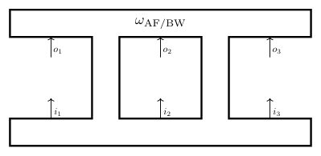
<figcaption class="paper-figure-caption"><b>Fig 2.</b> FIG. 1: AF/BW process function [3]: Each party k ∈{1, 2, 3} receives an input ik ∈{0, 1} and sends an output ok ∈{0, 1}. The process function wires the outputs to the inputs, allowing the parties to communicate according to Eq. (2).</figcaption>
</figure>
<figure class="paper-figure-card">
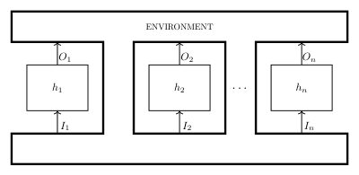
<figcaption class="paper-figure-caption"><b>Fig 3.</b> FIG. 5: General classical process composed with local interventions, e.g., as in Eq. (4).</figcaption>
</figure>
<figure class="paper-figure-card">
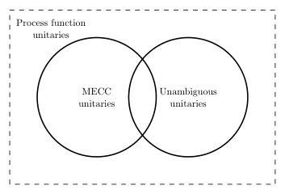
<figcaption class="paper-figure-caption"><b>Fig 4.</b> FIG. 4: Relationship between MECC, unambiguous, and process function unitaries.</figcaption>
</figure>
<figure class="paper-figure-card">
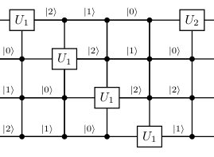
<figcaption class="paper-figure-caption"><b>Fig 5.</b> FIG. 8: 4-party genuinely multipartite MECC unitary circuit with 5 controlled unitaries.</figcaption>
</figure>

**Summary.** This paper develops a novel framework to characterize n-qubit unitaries using quasi-process functions (qPFUs), linking quantum computation structure to concepts from causal order. It establishes that while all unitaries fit this representation, specific criteria (MECC and Unambiguity) define special, physically significant subclasses of unitaries. This provides a versatile tool for analyzing quantum circuits based on causality constraints.

**Why it may be interesting.** The connection drawn between quantum causality (process functions/causal order) and the mathematical structure of quantum gates (unitaries) provides a powerful, general tool for analyzing quantum circuits beyond standard entanglement measures.

Detailed structure

**Main problem.** The paper aims to characterize general n-qubit unitaries using a novel representation based on quasi-process functions (qPFUs). It seeks to establish necessary and sufficient conditions for a unitary to be a Process Function Unitary (PFU).

**Main result.** All n-qubit unitaries can be represented as qPFUs. Two sufficient but not necessary criteria, Mutual Exclusivity of Control Conditions (MECC) and Unambiguity, were derived for a unitary to be a PFU.

**Method.** The authors utilize the decomposition of unitaries into controlled single-qubit unitaries, linking the control structure to quasi-process functions. They derive mathematical criteria (MECC, Unambiguity) and use algebraic techniques involving Choi-Jamiołkowski operators to prove purification theorems.

**Model / system.** The study focuses on n-qubit quantum systems and the structure of unitary operators ($U$). The mathematical framework involves quasi-process functions ($\omega$), process functions (modeling classical causal loops), and the analysis of Quantum Nonlocality Without Entanglement (QNLWE).

**Key observables.** The primary observables are the unitaries themselves, and diagnostics include the MECC property, the Unambiguity property, and the resulting unitary purification of the associated process function.

**Important parameters / regimes.** The number of qubits ($n$) is a key parameter, as the results scale with the complexity of the n-partite system.

**Assumptions / limitations.** The criteria MECC and Unambiguity are shown to be sufficient but not necessary for a unitary to be a PFU. The paper also conjectures that any process function can be purified to a unitary process.

**Figures summary.** Figures illustrate the conceptual link between QNLWE, Process functions, and Unitaries via the qPFU representation. Specific figures show the structure of process functions (like AF/BW) and the circuit diagrams for related unitaries (e.g., SHIFT, Domino).

**Paper structure.** The paper first establishes the qPFU representation for all unitaries. It then introduces the concepts of PFU, MECC, and Unambiguity, deriving criteria for a unitary to be a PFU. Subsequent sections prove that MECC unitaries admit a unitary purification of the associated process function, and finally, they analyze the circuit depth of MECC unitaries using graph theory.

Abstract

It is well-known that every n-qubit unitary can be decomposed into a product of controlled single-qubit unitaries. We show that the control conditions in such a decomposition naturally define a quasi-process function, an object that originally came up in the study of indefinite causal order. Here quasi-process functions yield a representation of every n-qubit unitary in a canonical form, namely, as a quasi-process function unitary (qPFU). We use this representation to show how quantum nonlocality without entanglement (QNLWE) can be understood in terms of unitaries that encode the trade-off between causal order and locality noted in R. Kunjwal and Ä. Baumeler, arXiv:2202.00440. Specifically, we obtain two sufficient (but not necessary) criteria---mutual exclusivity of control conditions (MECC) and Unambiguity---for a unitary to be a process function unitary (PFU), i.e., it admits a qPFU representation where the quasi-process function is a process function, an object that can model paradox-free classical causal loops. We also show the inequivalence of these criteria, neither implying the other. We then show that the circuit depth of MECC unitaries admits a characterization in terms of clique-partitioning problems on Hamming graphs and use this correspondence to provide bounds on the circuit depth of n-qubit MECC unitaries. Finally, we show how MECC unitaries provide a recipe for constructing a unitary purification of the associated process function, thereby providing a large class of unitary processes of interest in quantum causality. The generality of this causality-inspired representation of unitaries makes it a versatile tool for analyzing the structure of quantum circuits in other domains.

[↑ back to top](#top)

### [Dynamical Critical Properties of the Random-Bond three-state Potts Model](http://arxiv.org/abs/2610.01176v1)

**Authors:** Zeynep Demir Vatansever, Ulvi Kanbur, Mohammed Sadra Najafi, Muktish Acharyya, Erol Vatansever  
**Type:** both · **Category:** statistical mechanics · **PDF:** <https://arxiv.org/pdf/2610.01176v1>  
**Analysis basis:** full PDF text, analyzed in chunks
**Topic relevance:** `non-equilibrium universality` **1/5**

↔ Scroll figures horizontally

<figure class="paper-figure-card">
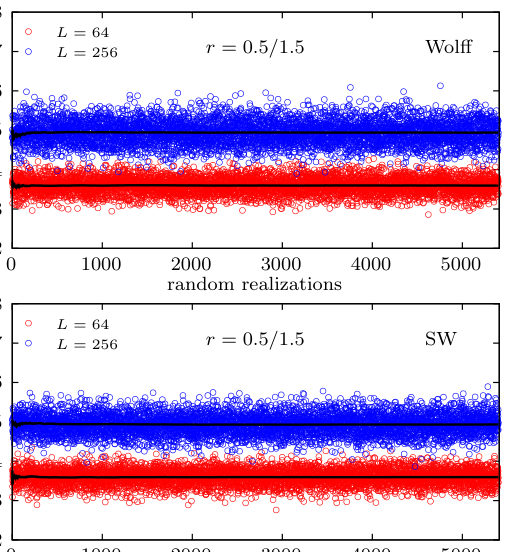
<figcaption class="paper-figure-caption"><b>Fig 1.</b> FIG. 1: Running averages of the specific heat C as a function of the number of random-bond</figcaption>
</figure>
<figure class="paper-figure-card">
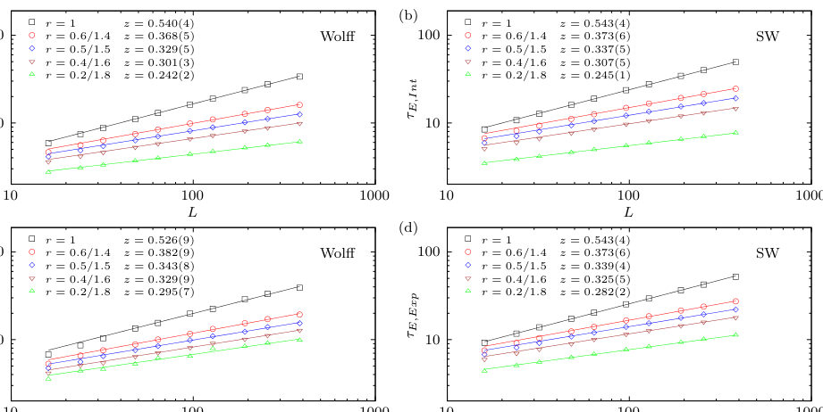
<figcaption class="paper-figure-caption"><b>Fig 2.</b> FIG. 2: Log-log plots of the integrated and exponential autocorrelation times of the energy, τE,int</figcaption>
</figure>
<figure class="paper-figure-card">
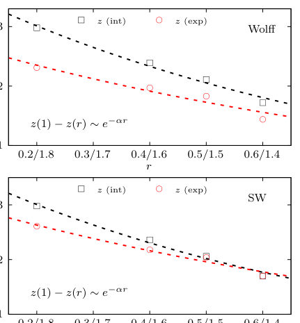
<figcaption class="paper-figure-caption"><b>Fig 3.</b> FIG. 3: The difference z(1)−z(r) as a function of the bond-randomness strength r for the (a) Wolff</figcaption>
</figure>
<figure class="paper-figure-card">
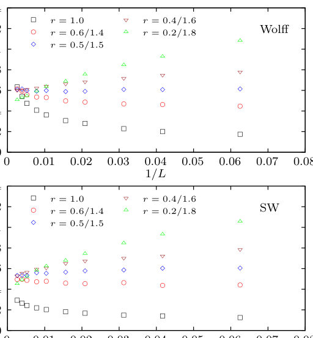
<figcaption class="paper-figure-caption"><b>Fig 4.</b> FIG. 4: Square root of the relative variance of the specific heat, shown as √RC, as a function of</figcaption>
</figure>
<figure class="paper-figure-card">
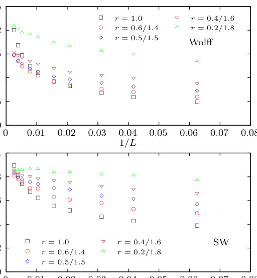
<figcaption class="paper-figure-caption"><b>Fig 5.</b> FIG. 5: Square root of the relative variance of the integrated energy autocorrelation time, pRτE,int,</figcaption>
</figure>

**Summary.** This work analyzes the critical dynamics of the random-bond three-state Potts model using advanced Monte Carlo simulations. The key finding is that bond randomness substantially weakens critical slowing down, changing the dynamic exponent. Crucially, this dynamic change occurs without altering the underlying static universality class of the model.

**Why it may be interesting.** The findings on how quenched disorder modifies dynamic scaling exponents while preserving static universality provide valuable insights into the interplay between disorder and critical phenomena, relevant for understanding complex many-body systems.

Detailed structure

**Main problem.** The study investigates the dynamic critical behavior and the influence of bond randomness on the critical slowing down of the two-dimensional three-state Potts model.

**Main result.** Bond randomness significantly weakens critical slowing down, decreasing the dynamic exponent from $z \approx 0.54$ (pure) to $z \approx 0.24$ (strong disorder), while preserving the static universality class ($\gamma/
u \approx 1.73$).

**Method.** Large-scale Monte Carlo simulations utilizing Wolff and Swendsen-Wang cluster algorithms were employed to calculate time autocorrelation functions and perform finite-size scaling analyses.

**Model / system.** The system is the two-dimensional random-bond three-state Potts model, described by a Hamiltonian with random ferromagnetic interactions $J_{ij}$ drawn from a bimodal distribution.

**Key observables.** Dynamic critical exponent ($z$), integrated and exponential autocorrelation times ($	au_{A,int}, 	au_{A,exp}$), and the ratio of static exponents ($\gamma/
u$).

**Important parameters / regimes.** Disorder strength ($r = J_2/J_1$), system size ($L$), and the critical temperature ($T_c$).

**Assumptions / limitations.** The analysis assumes the validity of the cluster algorithms and relies on finite-size scaling theory to extract critical exponents.

**Figures summary.** Figures illustrate the systematic decrease of autocorrelation times with increasing disorder, the non-vanishing variance of static observables (specific heat), and the consistency of the exponent ratio $\gamma/
u$ across different disorder strengths.

**Paper structure.** The paper systematically analyzes the dynamic critical slowing down by calculating autocorrelation times for various disorder strengths, confirming the weakening of dynamics while verifying the robustness of the static critical exponents.

Abstract

We study the dynamic critical behavior of the two-dimensional random-bond three-state Potts model using large-scale Monte Carlo simulations with the Wolff and Swendsen--Wang cluster algorithms. At the disorder-dependent critical temperature, we compute integrated and exponential autocorrelation times and extract the dynamic critical exponent $z$ via finite-size scaling. Critical slowing down is significantly weakened by bond randomness, with the dynamic exponent decreasing from $z \approx 0.54$ in the pure system to $z \approx 0.24$ at strong disorder. From the finite-size scaling of the Wolff cluster size, we obtain $γ/ν\approx 1.73$, where $γ$ and $ν$ are the susceptibility and correlation-length exponents, respectively, consistent with the universality class of the two-dimensional three-state Potts model. These results indicate that bond randomness strongly affects the critical dynamics but leaves the underlying static universality class unchanged. Furthermore, both static and dynamic observables, including the specific heat and the autocorrelation times, show a lack of self-averaging.

[↑ back to top](#top)

### [Fully tolerant product state testing and closest product state learning](http://arxiv.org/abs/2610.01979v1)

**Authors:** Zongbo Bao, Jonas Helsen, Tuyen Nguyen  
**Type:** theory · **Category:** quantum information and computing · **PDF:** <https://arxiv.org/pdf/2610.01979v1>  
**Analysis basis:** full PDF text, analyzed in chunks
**Topic relevance:** `quantum measurements` **1/5**

↔ Scroll figures horizontally

<figure class="paper-figure-card">
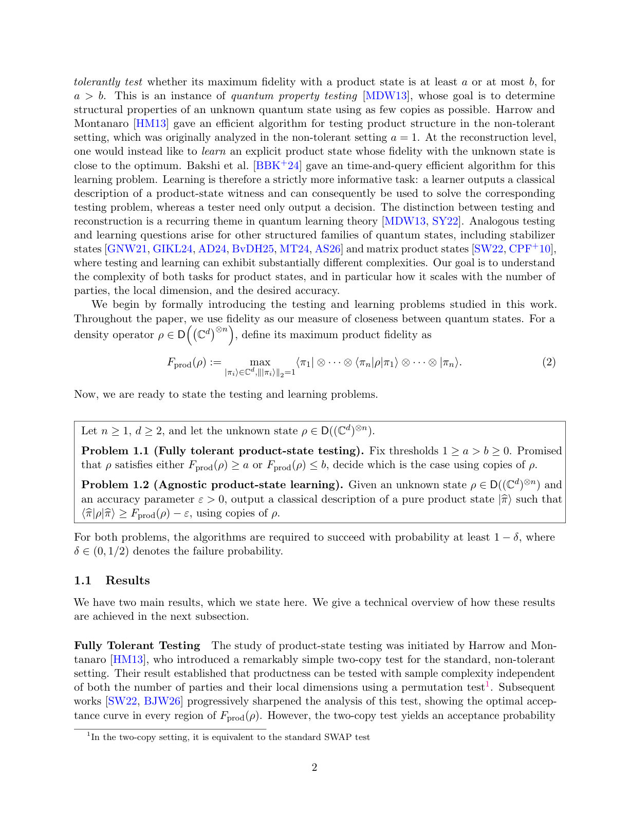
<figcaption class="paper-figure-caption"><b>Fig 1.</b> Low-resolution page preview, page 2</figcaption>
</figure>
<figure class="paper-figure-card">
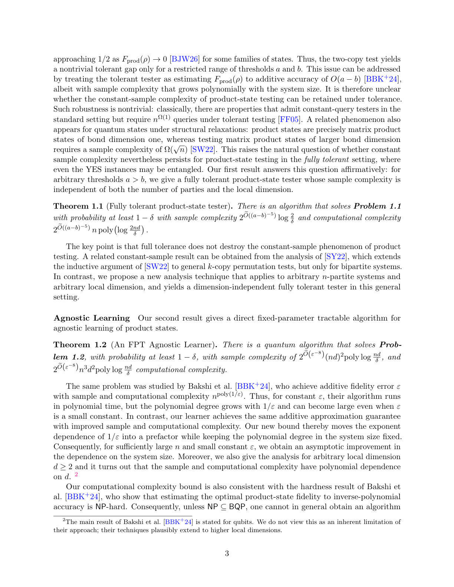
<figcaption class="paper-figure-caption"><b>Fig 2.</b> Low-resolution page preview, page 3</figcaption>
</figure>
<figure class="paper-figure-card">
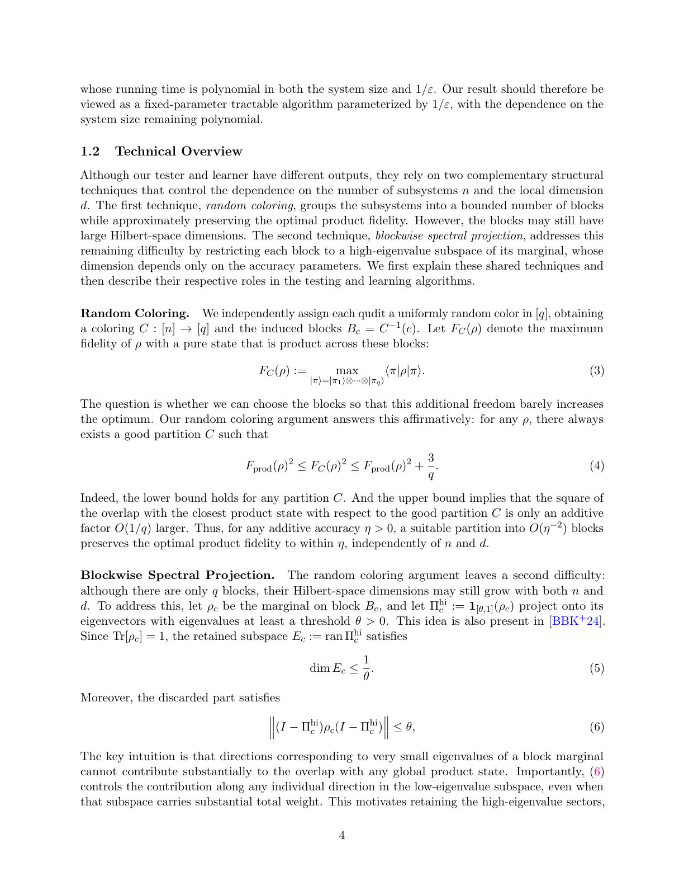
<figcaption class="paper-figure-caption"><b>Fig 3.</b> Low-resolution page preview, page 4</figcaption>
</figure>
<figure class="paper-figure-card">
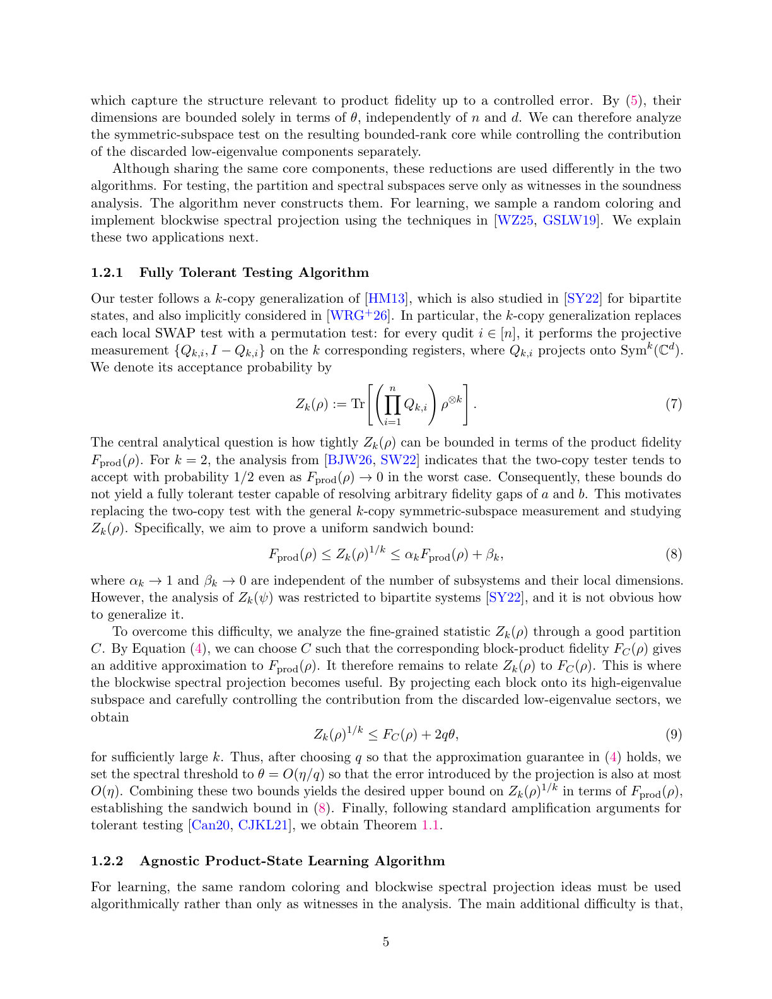
<figcaption class="paper-figure-caption"><b>Fig 4.</b> Low-resolution page preview, page 5</figcaption>
</figure>
<figure class="paper-figure-card">
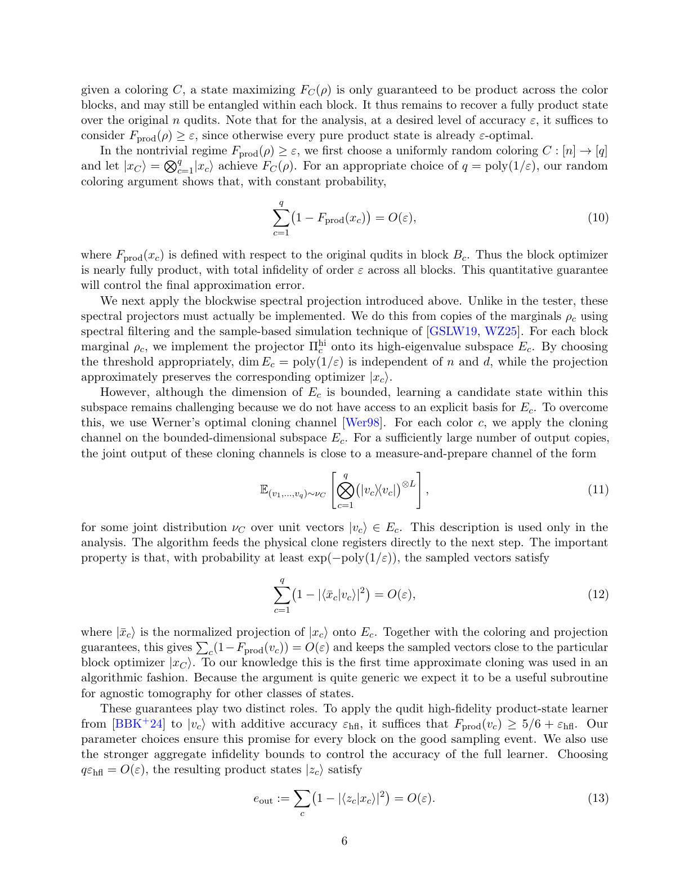
<figcaption class="paper-figure-caption"><b>Fig 5.</b> Low-resolution page preview, page 6</figcaption>
</figure>

**Summary.** This paper develops advanced, fully tolerant algorithms for both testing and learning the closest product state for an unknown quantum state on $n$ qudits. By combining random coloring with spectral projection, the authors achieve sample complexities that are highly efficient, particularly for the learning task. This work provides theoretical tools essential for verifying the product nature of quantum states in large, multi-partite systems.

**Why it may be interesting.** The development of robust, scalable quantum state certification and reconstruction tools is crucial for verifying quantum hardware and understanding entanglement structure in complex quantum systems.

Detailed structure

**Main problem.** The paper addresses the fundamental problem of determining if an unknown quantum state is close to a product state (testing) and, if not, learning the closest product state (learning).

**Main result.** They provide efficient, fully tolerant algorithms for both testing and learning, showing that the sample complexity for learning is $\widetilde{O}ig((nd)^2ig)\, 2^{\widetilde{O}(1/\varepsilon^8)}$.

**Method.** The techniques combine a random coloring argument with blockwise spectral projection to reduce the problem to testing/learning over smaller, manageable blocks. The learning component adapts high-fidelity product state learning algorithms for qudits.

**Model / system.** The system involves unknown quantum states $
ho$ acting on $n$ qudits, where $d$ is the local dimension. The focus is on characterizing the deviation of $
ho$ from a product state $|\psi_1
angle \otimes \cdots \otimes |\psi_n
angle$.

**Key observables.** Product Fidelity ($F_{	ext{prod}}(
ho)$), state overlap, and the acceptance probability of the $k$-copy test ($Z_k(
ho)$).

**Important parameters / regimes.** Number of parties ($n$), local dimension ($d$), testing thresholds ($a, b$), and learning accuracy ($\epsilon$).

**Assumptions / limitations.** The analysis relies heavily on the random coloring argument and the use of blockwise spectral projection to control error accumulation across partitions.

**Paper structure.** The paper first tackles the testing problem using random coloring and spectral projection to achieve a constant-sample test. It then extends these techniques to develop a fully tolerant, agnostic learning algorithm, adapting prior work for qudit systems.

Abstract

We address the problem of testing whether an unknown $n$-qudit state $ρ$ is $a$-close to a product state or $b$-far away from any product state, as measured in terms of state overlap. We provide a time-efficient algorithm to solve this problem that requires an $n$-independent number of copies of the unknown state. Our random coloring argument shows that for any unknown state there always exists a partition of $[n]$ into $q$ parts such that the square of the overlap with the closest product state with respect to this partition is only an additive factor $O(1/q)$ larger. This reduces the problem to tolerant testing of $q$ parties, with potentially growing local dimensions. Combining this insight with blockwise spectral projection arguments we can show that the natural $k$-copy generalization of Harrow & Montanaro's product state test provides an efficient tolerant tester.   We use the same random coloring and blockwise spectral projection techniques to obtain a substantially improved algorithm for closest product state learning. In particular we give an algorithm that takes in $\widetilde{O}\big((nd)^2\big)\, 2^{\widetilde{O}(1/\varepsilon^8)}$ copies of the unknown state and produces an $\varepsilon$-approximately optimal product state. The key technical components of this learner are a qudit variant of the Bakshi et al. high-fidelity product state learning algorithm and a sampling technique based on Werner's optimal cloning channel.

[↑ back to top](#top)

### [Graph Neural Post-selection for Quantum Error Correction](http://arxiv.org/abs/2610.00504v1)

**Authors:** Conor Carty, Tamas Noszko, Joschka Roffe, Roberto Bondesan  
**Type:** theory · **Category:** quantum information and computing · **PDF:** <https://arxiv.org/pdf/2610.00504v1>  
**Analysis basis:** full PDF text, analyzed in chunks
**Topic relevance:** `quantum measurements` **1/5**

↔ Scroll figures horizontally

<figure class="paper-figure-card">
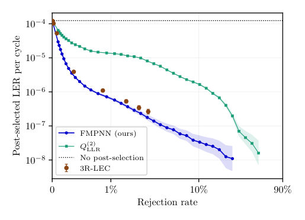
<figcaption class="paper-figure-caption"><b>Fig 1.</b> FIG. 1. Neural post-selection on the [[72, 12, 6]] bivariate bi- cycle code under uniform depolarising circuit-level noise at a physical error rate p = 0.001, contrasted with popular benchmarks for quantum low-density parity-check code post- selection: Q(2) LLR [11] and the three-round logical-error crite- rion (3R-LEC) [12]. LER per-cycle is defined as 1 −(1 − LER) 1 T , for T cycles.</figcaption>
</figure>
<figure class="paper-figure-card">
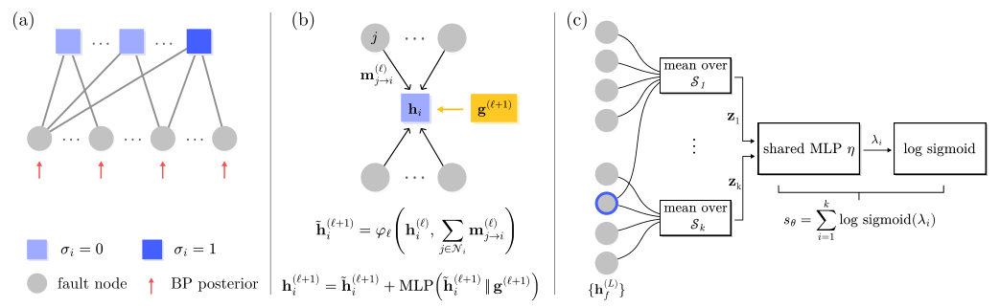
<figcaption class="paper-figure-caption"><b>Fig 2.</b> FIG. 2. Factor-graph MPNN (FMPNN). (a) Detector and fault nodes carry syndrome, circuit and belief-propagation features. (b) Message passing combines local and global context. (c) Fault embeddings are pooled over their logical supports; overlapping supports can share nodes (highlighted). A shared multilayer perceptron produces per-observable logits, which are used to produce the final confidence score.</figcaption>
</figure>
<figure class="paper-figure-card">
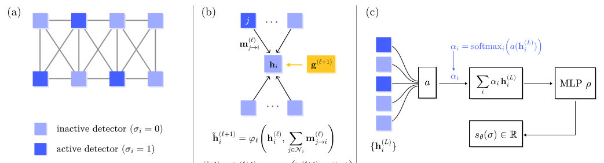
<figcaption class="paper-figure-caption"><b>Fig 3.</b> FIG. 3. Surface-code MPNN. (a) Detector graph labelled by the syndrome. (b) Message passing combines local and global context. (c) Attention pooling and a multilayer perceptron produce a confidence score from the final embeddings of the detectors.</figcaption>
</figure>
<figure class="paper-figure-card">
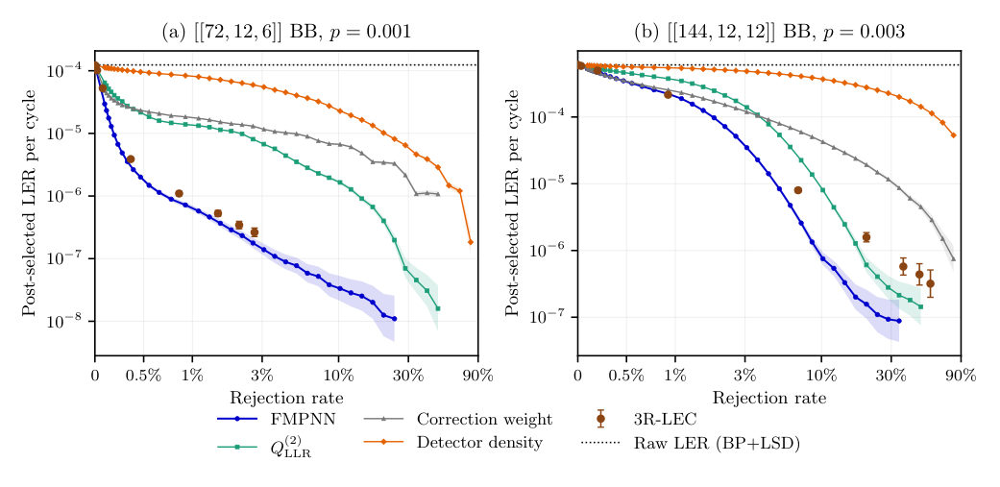
<figcaption class="paper-figure-caption"><b>Fig 4.</b> FIG. 4. Post-selected logical error rate against rejection rate for the (a) [[72, 12, 6]] and (b) [[144, 12, 12]] bivariate bicycle codes under uniform depolarising circuit-level noise at physical error rates p = 0.001 and p = 0.003 respectively.</figcaption>
</figure>
<figure class="paper-figure-card">
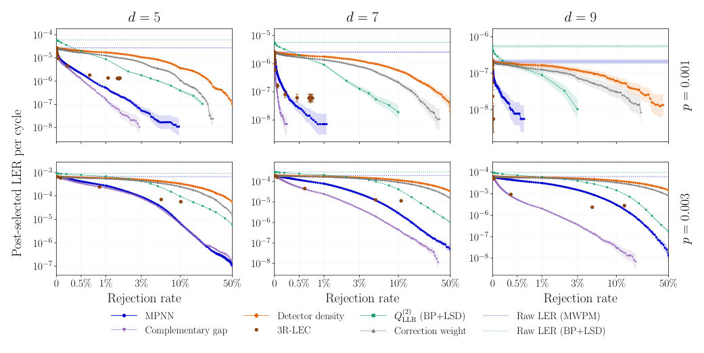
<figcaption class="paper-figure-caption"><b>Fig 5.</b> FIG. 5. Post-selected logical error rate against rejection rate for the rotated surface codes under uniform depolarising circuit- level noise at distances 5, 7, 9 and physical noise p = 0.001 and p = 0.003. Each (d, p) configuration uses a separately fine-tuned MPNN; see Appendix A 5 b.</figcaption>
</figure>

**Summary.** This paper introduces graph neural networks to enhance quantum error correction by implementing intelligent post-selection. The GNNs predict whether a quantum computation shot will fail based only on syndrome measurements, avoiding full decoding. This results in massive reductions in logical error rates for surface and qLDPC codes, significantly boosting the practical viability of fault-tolerant quantum computation.

**Why it may be interesting.** This work directly tackles the resource overhead problem in fault-tolerant quantum computing by proposing machine learning methods to filter out low-quality computations before expensive decoding steps.

Detailed structure

**Main problem.** The paper addresses the challenge of improving the logical reliability of quantum computation by implementing post-selection techniques to reject noisy computational shots.

**Main result.** The proposed graph neural network post-selectors achieve substantial logical error rate suppression (e.g., 3700x reduction for one code) while maintaining a reasonable yield compared to existing methods.

**Method.** The core method involves training Graph Neural Networks (GNNs)—specifically MPNN and FMPNN—to classify syndrome measurements as either successful or likely to fail, thereby guiding post-selection.

**Model / system.** The work analyzes Quantum Error Correction (QEC) codes, including rotated surface codes and high-rate qLDPC codes (like BB codes), operating under depolarizing circuit-level noise.

**Key observables.** Logical Error Rate (LER), Yield (fraction of accepted shots), and the syndrome vector ($\sigma$).

**Important parameters / regimes.** Physical error rates ($p$), code distances ($d$), and the rejection threshold ($	au$).

**Assumptions / limitations.** The models are trained on online circuit-noise samples, and the performance relies on the assumption that the GNN can accurately predict failure without full decoder execution.

**Figures summary.** Figures compare the performance of neural post-selection against established methods like $Q(2)$ LLR and 3R-LEC for various code types and noise levels.

**Paper structure.** The paper introduces the problem, details the two main GNN architectures (MPNN for surface codes, FMPNN for qLDPC), describes the training process using various loss functions and objectives, and concludes with performance comparisons across different code families.

Abstract

Post-selection improves the logical reliability of quantum computation by rejecting shots which are likely to result in logical failure. We introduce graph neural networks that predict decoder failure without additional decoder executions, using only syndromes, and for high-rate quantum low-density parity-check (qLDPC) codes, existing belief-propagation posteriors. We evaluate rotated surface and bivariate bicycle (BB) code memories under uniform depolarising circuit-level noise. Retaining 90% of shots gives approximately 3700x and 740x reductions in logical error rates for [[72,12,6]] and [[144,12,12]] BB codes at realistic physical error rates. For the distance 5 surface code at physical noise p=0.003, our neural post-selector achieves logical error suppression comparable to the leading complementary gap method without running the decoder.

[↑ back to top](#top)

### [Hardware-Efficient Ground-State Preparation using Variational Imaginary-Time Majorana Evolution](http://arxiv.org/abs/2610.01954v1)

**Authors:** Federico Santona, Manuel G. Algaba, Aeishah Ameera Anuar, Anna M. Wernbacher, Prachi Sharma, Fedor Šimkovic  
**Type:** theory · **Category:** strongly correlated electrons · **PDF:** <https://arxiv.org/pdf/2610.01954v1>  
**Analysis basis:** full PDF text, analyzed in chunks
**Topic relevance:** `Keldysh / 2PI / non-Gaussian methods` **1/5**

↔ Scroll figures horizontally

<figure class="paper-figure-card">
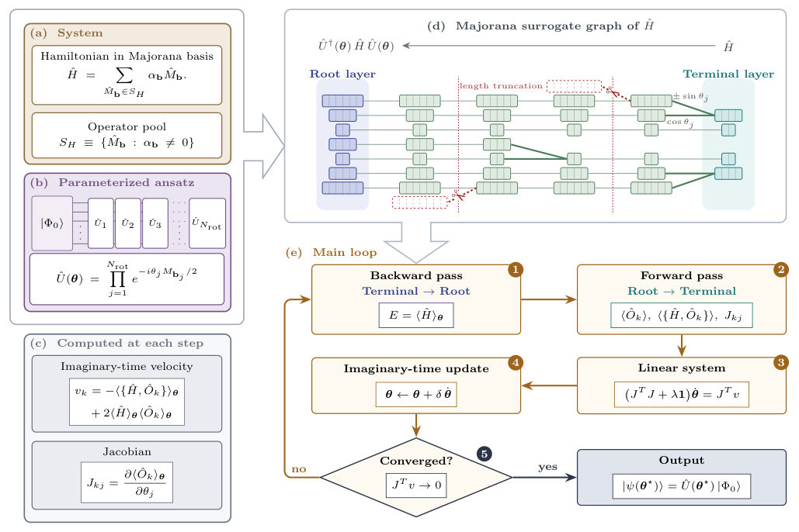
<figcaption class="paper-figure-caption"><b>Fig 1.</b> FIG. 1. Overview of VIME. (a) The active-space Hamiltonian is expressed in the Majorana basis, with its constituent monomials defining the operator pool Sτ = SH. (b) A chosen parameterised circuit and Fock reference define the variational ansatz. (c) The IT velocity v and Jacobian J are evaluated at each iteration. (d) A single Majorana surrogate graph is compiled for ˆU †(θ) ˆH ˆU(θ), with length truncation at fermionic-block boundaries. (e) Each iteration reuses this graph: a backward pass evaluates the energy (1), and a joint forward pass evaluates the pool expectation values, anticommutator expectation values, and Jacobian (2). These quantities define the regularized linear system,...</figcaption>
</figure>
<figure class="paper-figure-card">
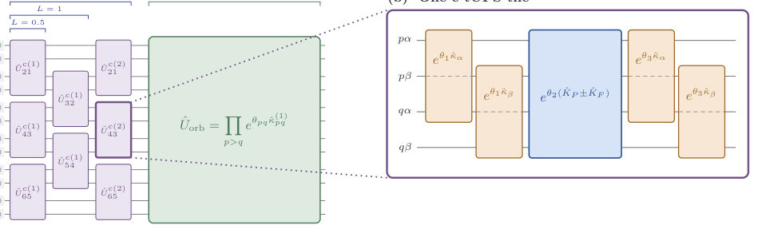
<figcaption class="paper-figure-caption"><b>Fig 2.</b> FIG. 2. The c-tUPS ansatz. (a) Circuit for six spatial orbitals, with alternating doubly occupied and empty reference orbitals and staggered half-layers of nearest-neighbor tiles. Blue brackets indicate circuit depths L = 0.5, 1, and 1.5. The green box denotes the active-space orbital rotation unitary ˆUorb, which can be absorbed into the Hamiltonian for quantum execution once its parameters have been classically determined. (b) Each tile combines outer one-body rotations with a central factor eθ2( ˆ KP ± ˆ KF ). The + and −signs define cp-tUPS and cm-tUPS, respectively.</figcaption>
</figure>
<figure class="paper-figure-card">
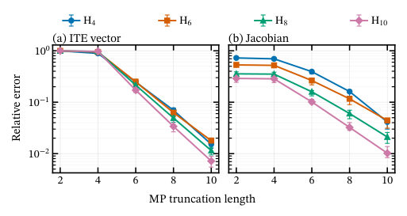
<figcaption class="paper-figure-caption"><b>Fig 3.</b> FIG. 3. Convergence of VIME update quantities with MP truncation length. Relative errors against statevector benchmarks for (a) the IT velocity vector v (Euclidean norm) and (b) the Jacobian J (Frobenius norm), for H4, H6, H8, and H10 hydrogen chains in the STO-6G basis. Circuits contain 100 random length-four Majorana rotations with independent angles drawn from U[0, 2π] and truncation after each rotation. Markers show medians over five random seeds, error bars span the minimum and maximum values, and lines connect the medians.</figcaption>
</figure>
<figure class="paper-figure-card">
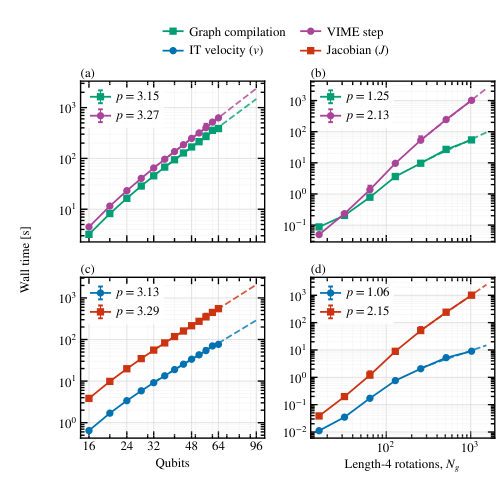
<figcaption class="paper-figure-caption"><b>Fig 4.</b> FIG. 4. Wall-time scaling of VIME at w⋆= 6. (a,c) System-size scaling for Hn/STO-6G (n = 8, 10, . . . , 32), with 100 length-2 and 100 length-4 Majorana rotations. (b,d) Circuit-size scaling for H8, with a fixed active-rotation prefix and Ng independently parameterised length-4 rotations. Top: graph-compilation and complete VIME-step times. Bottom: IT velocity (v) and Jacobian (J) evaluation times. Markers and error bars indicate medians and 10th–90th percentiles across circuit seeds. Dashed lines extrapolate power-law fits to the large-size regime: 32–64 qubits in (a,c) and Ng = 256, 512, 1024 in (b,d); legends report the fitted exponents p.</figcaption>
</figure>
<figure class="paper-figure-card">
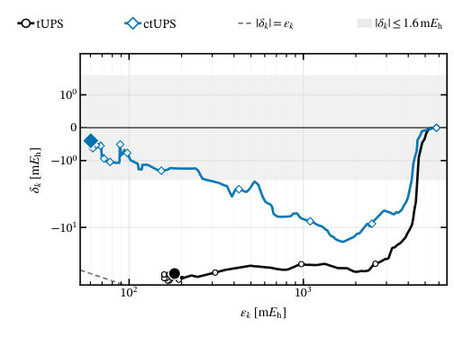
<figcaption class="paper-figure-caption"><b>Fig 5.</b> FIG. 5. MP energy accuracy during VIME convergence. VIME convergence curves for one-layer tUPS and c-tUPS circuits on H8/STO-6G, using w⋆= 6 and truncation at block boundaries. The MP-truncation error δk = EMP,k −ESV,k is plotted against the statevector energy error εk = ESV,k −Eref, where Eref is the exact active-space ground-state energy. Each point gives the median of each error over 20 runs at a successive optimization step, progressing generally from right to left; filled symbols mark the last step reached by all runs. The gray band marks |δk| ≤1.6 mEh. The dashed line marks δk = −εk, corresponding to EMP,k = Eref for an individual run.</figcaption>
</figure>

**Summary.** This paper introduces Variational Imaginary-time Majorana Evolution (VIME), a novel classical pre-training technique for quantum chemistry. VIME is used to prepare ground states for large, strongly correlated molecules, achieving high accuracy while drastically reducing the required quantum circuit depth and gate count compared to existing state-of-the-art methods.

**Why it may be interesting.** This work directly addresses the resource bottleneck in simulating strongly correlated electron systems on near-term quantum hardware by providing a classical pre-training mechanism to guide variational quantum algorithms.

Detailed structure

**Main problem.** The core problem is developing compact and resource-efficient quantum circuits for accurately preparing the ground state of molecular electronic structure, which is crucial for fault-tolerant quantum chemistry.

**Main result.** The proposed Variational Imaginary-time Majorana Evolution (VIME) combined with a compressed ansatz significantly reduces circuit resources (CNOTs, depth) while achieving chemical precision energy estimates for large, strongly correlated molecular systems compared to prior methods.

**Method.** The authors introduce VIME, a classical pre-training algorithm that extends OVQITE using Majorana Propagation (MP) as a surrogate for variational quantum imaginary-time evolution.

**Model / system.** The study applies these methods to molecular electronic structure, benchmarking against strongly correlated systems like the ruthenium complex TLD-1411 and the acene series (up to 60 qubits) using an active-space approach.

**Key observables.** Ground-state energy ($\langle \hat{H} 
angle$), CNOT count, two-qubit depth, and energy error relative to DMRG reference energies.

**Important parameters / regimes.** System size (up to 60 qubits), imaginary time ($	au$), and the Tikhonov regularization parameter ($\lambda$).

**Assumptions / limitations.** The methods rely on classical pre-training (VIME) to guide the variational ansatz, and the MP framework requires various truncations (length, sine-order, orbital) to manage exponential growth.

**Figures summary.** Figures compare energy error trajectories (VIME vs. VMPE) across various qubit counts, demonstrating resource scaling advantages for VIME. Tables list system parameters and reference energies.

**Paper structure.** The paper builds from the general framework of imaginary-time evolution (OVQITE/MP) to introduce VIME, followed by detailed benchmarking on specific molecular systems (TLD-1411, acenes) to quantify resource savings and accuracy improvements.

Abstract

Compact ground-state preparation circuits are essential for early fault-tolerant quantum chemistry. We introduce Variational Imaginary-time Majorana Evolution (VIME), a classical pre-training algorithm that extends operator-projected variational quantum imaginary-time evolution (OVQITE) to molecular electronic structure using a single compiled Majorana-propagation (MP) surrogate graph. We pair VIME with a compressed tiled Unitary Product State (c-tUPS) ansatz that we develop to reduce both classical simulation and quantum state-preparation costs. In the strongly correlated ruthenium complex TLD-1411, active-space calculations requiring up to 52 qubits achieve chemical precision against DMRG reference energies, with energy errors approximately $400\times$ smaller than those from ADAPT-VQE-based variational Majorana-propagation (ADAPT-VMPE). Across the strongly multireference acene series up to heptacene (60 qubits), VIME matches or improves on the MP-reported energy accuracy of the ADAPT-VMPE comparison points with up to $26\times$ fewer CNOTs and $167\times$ lower two-qubit depth. These results establish imaginary-time classical pre-training of compressed variational ansätze as a promising route to resource-efficient molecular ground-state preparation.

[↑ back to top](#top)

### [Hyperbolic lattices with mass disorder: Phases and phase transitions](http://arxiv.org/abs/2610.02192v1)

**Authors:** Sheersh Sen, Christopher A. Leong, Bitan Roy  
**Type:** theory · **Category:** disordered systems and neural networks · **PDF:** <https://arxiv.org/pdf/2610.02192v1>  
**Analysis basis:** full PDF text, analyzed in chunks
**Topic relevance:** `analog quantum simulation` **1/5**

↔ Scroll figures horizontally

<figure class="paper-figure-card">
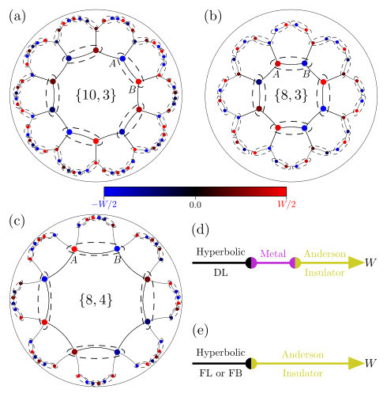
<figcaption class="paper-figure-caption"><b>Fig 1.</b> FIG. 1. Schematic demonstration of mass disorder, repre- sented by random on-site potential (W) of opposite signs (see color bar) on two sublattices (A and B) within each unit cell (dashed closed loops) on plaquette-centered (a) {10, 3}, (b) {8, 3}, and (c) {8, 4} hyperbolic lattices on the Poincar´e disk (black circle), respectively supporting a Dirac liquid (DL), a Fermi liquid (FL), and a flat band (FB) on a curved space with a constant negative curvature. The values of W in differ- ent unit cells are independent and random. Schematic global phase diagrams in (d) a DL and (e) a FL and a FB in the presence of mass disorder with circles showing the quantum critical points between the...</figcaption>
</figure>
<figure class="paper-figure-card">
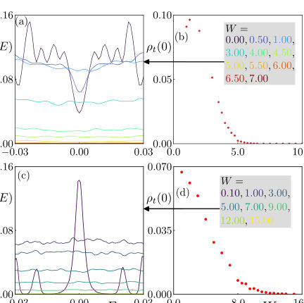
<figcaption class="paper-figure-caption"><b>Fig 2.</b> FIG. 3. (a) TDOS ρt(E) at energy E as a function of mass disorder (W) in a plaquette-centered {8, 3} HL with open boundary conditions hosting a FL [Fig. 1(b)]. (b) ρt(0) with varying W, showing an AMIT for which the critical disorder strength (Wc,2) depends on whether ρt(0) shows a power-law (yielding Wc,2 ≈6.00) or an essential (yielding Wc,2 ≈8.25) singularity. (c) and (d) are analogous to (a) and (b), respec- tively, but in a plaquette-centered {8, 4} HL with open bound- ary conditions hosting a FB [Fig. 1(c)]. In (d), Wc,2 ≈12.00 (Wc,2 ≈14.35) if ρt(0) shows a power-law (an essential) sin- gularity near the AMIT. Results are obtained using the KPM with 8192 (16384) Chebyshev moments on...</figcaption>
</figure>
<figure class="paper-figure-card">
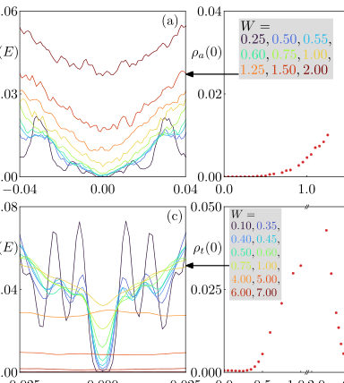
<figcaption class="paper-figure-caption"><b>Fig 3.</b> FIG. 2. (a) ADOS ρa(E) at energy E with varying mass disor- der (W) on a plaquette-centered {10, 3} HL with open bound- ary conditions hosting a DL [Fig. 1(a)]. (b) ρa(0) as a function of W, showing a semimetal-to-metal QPT at a critical disor- der strength of Wc,1 ≈0.55. (c) TDOS ρt(E) at energy E with varying W in the same system. (d) ρt(0) with varying W showing Wc,1 ≈0.40 and an AMIT at even stronger dis- order, for which the critical disorder strength (Wc,2) depends on whether ρt(0) shows a power-law (yielding Wc,2 ≈7.00) or an essential (yielding Wc,2 ≈10.45) singularity. ADOS and TDOS are computed using KPM after averaging over 10 and 60 independent disorder realizations,...</figcaption>
</figure>
<figure class="paper-figure-card">
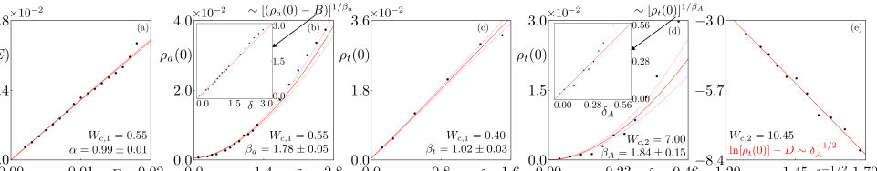
<figcaption class="paper-figure-caption"><b>Fig 4.</b> FIG. 4. Scaling analysis on {10, 3} HL subject to mass disorder. (a) ADOS exponent (α), obtained from ρ(E) ∼|E|α at the semimetal-to-metal quantum critical point, located at Wc,1 = 0.55, yielding α = 0.99 ± 0.01. Order parameter exponent associated with (b) ADOS (with Wc,1 = 0.55) and (c) TDOS (with Wc,1 = 0.40) at E = 0 in the metallic phase by comparing ρa(0)−B ∼|δ|βa with B = 5.65×10−4 as an offset and ρt(0)−C ∼|δ|βt with C = 4.84×10−4 as an offset, respectively, where δ = [W −Wc,1]/Wc,1, yielding βa = 1.78 ± 0.05 [also confirmed from the linear scaling of [ρa(0) −B]1/βa with δ for βa = 1.78 (inset)] and βt = 1.02 ± 0.03. (d) Order parameter exponent (βA) across the AMIT assuming a...</figcaption>
</figure>
<figure class="paper-figure-card">
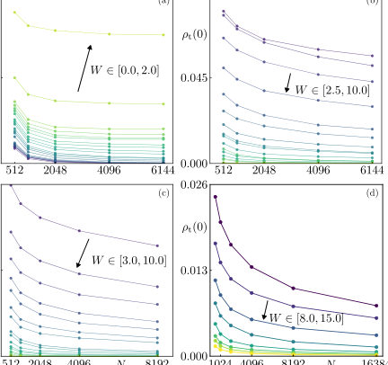
<figcaption class="paper-figure-caption"><b>Fig 5.</b> FIG. 6. (a) Convergence of ADOS at zero energy ρa(0) as a function of the number of moments (Nm) used in reconstruc- tion of the Chebyshev polynomial expansion for the {10, 3} HL, for various strengths of the mass disorder W (see colored curves). Analogous convergence plots for TDOS at zero en- ergy ρt(0) for (b) {10, 3}, (c) {8, 3}, and (d) {8, 4} HLs.</figcaption>
</figure>

**Summary.** This paper analyzes the electronic properties of tight-binding models on hyperbolic lattices subjected to mass disorder. Using numerical methods like the Kernel Polynomial Method, the authors map out distinct quantum phase transitions, including semimetal-to-metal and Anderson metal-to-insulator transitions. The findings are crucial for understanding disorder effects in geometrically constrained quantum materials.

**Why it may be interesting.** The study provides a concrete example of how geometric constraints (hyperbolic curvature) interact with disorder to dictate complex quantum phase transitions, relevant for engineered photonic or electronic metamaterials.

Detailed structure

**Main problem.** The study investigates how mass disorder affects the electronic states and Density of States (DOS) in hyperbolic lattices.

**Main result.** The hyperbolic Dirac liquid remains stable against weak disorder, undergoing a semimetal-to-metal QPT, followed by an AMIT at stronger disorder, while other systems only show the AMIT.

**Method.** The analysis employs the Kernel Polynomial Method (KPM) to compute both the average and typical Density of States (DOS) over multiple disorder realizations.

**Model / system.** The system is based on Nearest-neighbor (NN) tight-binding models on specific hyperbolic lattices ($\{10, 3\}$, $\{8, 3\}$, and $\{8, 4\}$) embedded on a Poincaré disk. Mass disorder is introduced by assigning random on-site potentials to complementary sublattices.

**Key observables.** Average and typical Density of States ($
ho_a(E), 
ho_t(E)$), and the critical exponents characterizing the phase transitions.

**Important parameters / regimes.** The disorder strength ($W$), which dictates the transition between semimetal, metal, and Anderson insulator phases.

**Assumptions / limitations.** The analysis assumes the applicability of the tight-binding model framework and uses disorder averaging techniques (KPM) to characterize the bulk properties.

**Figures summary.** Figures illustrate the DOS for the $\{10, 3\}$ lattice showing QPT and AMIT, and the DOS for $\{8, 3\}$ and $\{8, 4\}$ showing the AMIT. Scaling analyses are used to extract critical exponents.

**Paper structure.** The paper first establishes the clean limit behavior (Dirac liquid, Fermi liquid, flat band) and then systematically analyzes the impact of mass disorder, detailing the sequence of quantum phase transitions observed for each lattice type.

Abstract

Nearest-neighbor (NN) tight-binding models (TBMs) on plaquette-centered $\{ 10,3\}$ (Schläfli symbol), $\{ 8,3\}$, and $\{ 8,4\}$ hyperbolic lattices on a Poincaré disk with open boundary conditions display a vanishing, a finite, and a diverging density of states (DOS) near zero energy (band center), respectively, yielding a Dirac liquid, a Fermi liquid, and a flat band. Emergent bipartite nature of these lattices within the framework of NN-TBMs, allows us to scrutinize the impact of mass disorder on the electronic states and DOS therein. From extensive numerical calculations of the average and typical DOS using the kernel polynomial method, we show that hyperbolic Dirac liquid remains stable against weak mass disorder, undergoing a semimetal-to-metal quantum phase transition at moderate disorder, followed by an Anderson metal-to-insulator transition at even stronger disorder. The remaining two systems display only the latter transition. Critical exponents near all these transitions are found to be close to the ones mediated by on-site potential disorder.

[↑ back to top](#top)

### [Learning ab initio phase-field models](http://arxiv.org/abs/2610.01432v1)

**Authors:** Mengyi Chen, Peichen Zhong, Zihan Zhang, Qianxiao Li  
**Type:** theory · **Category:** statistical mechanics · **PDF:** <https://arxiv.org/pdf/2610.01432v1>  
**Analysis basis:** full PDF text, analyzed in chunks
**Topic relevance:** `methods for driven-dissipative` **1/5**

↔ Scroll figures horizontally

<figure class="paper-figure-card">
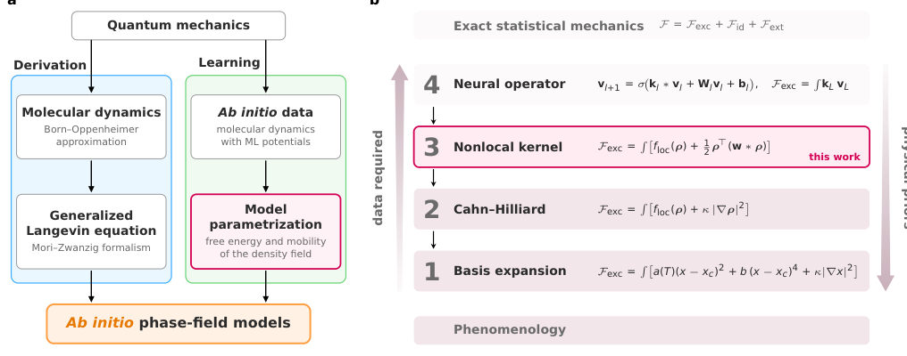
<figcaption class="paper-figure-caption"><b>Fig 1.</b> Figure 1. Ab initio phase-field models. a, The proposed ab initio phase-field (AIPF) model is ab initio in both its derivation and its learning, which start from quantum mechanics. The derivation proceeds from quantum mechanics to molecular dynamics under the Born–Oppenheimer approximation, then to a generalized Langevin equation through the Mori–Zwanzig formalism, and finally to the ab initio phase-field model under the stated assumptions. For the learning process, the AIPF model is trained on molecular dynamics trajectories generated with a machine-learning interatomic potential (MLIP) of ab initio accuracy. The free energy and mobility of the density field are parametrized by neural...</figcaption>
</figure>
<figure class="paper-figure-card">
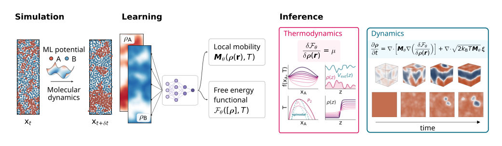
<figcaption class="paper-figure-caption"><b>Fig 2.</b> Figure 2. Framework for learning ab initio phase-field models. In the simulation stage, molecular dynamics with an MLIP propagates a configuration xt over a short interval δt. In the learning stage, each configuration is coarse-grained into species density fields ρ, from which neural networks with trainable parameters θ output the local mobility Mθ and the free-energy functional Fθ. At inference, the thermodynamics follows from minimizing the learned functional and the dynamics from integrating the mesoscopic equation.</figcaption>
</figure>
<figure class="paper-figure-card">
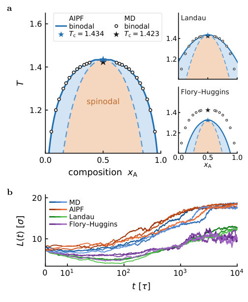
<figcaption class="paper-figure-caption"><b>Fig 3.</b> Figure 3. Binary Lennard-Jones mixture. a, Phase di- agrams from the AIPF model and the Landau (upper small panel) and Flory–Huggins (lower small panel) baselines, com- pared with MD [32]. All models are trained on the same data using the same loss function and mobility parametriza- tion, differing only in the form of the free-energy functional. b, Domain size L(t) at T = 1.20 (3 seeds each), compared between MD and the three models, with L(t) defined in Sup- plemental Material, Section S3 A. Fits to L ∝tβ give effective exponents βMD = 0.225 ± 0.022 and βAIPF = 0.217 ± 0.008.</figcaption>
</figure>
<figure class="paper-figure-card">
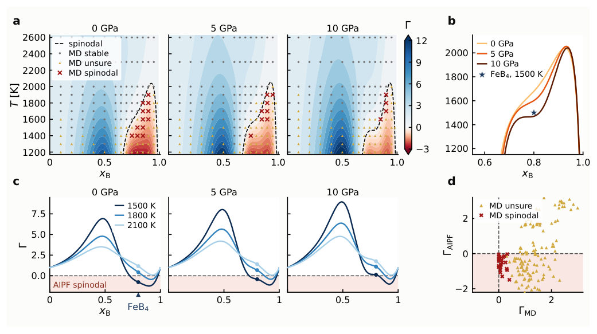
<figcaption class="paper-figure-caption"><b>Fig 4.</b> Figure 4. Iron–boron melt. a, The predicted thermodynamic factor Γ(xB, T) at 0, 5 and 10 GPa is shown with the MD classification of the sampled states. For each state, ΓMD is obtained from a 50–500 ps trajectory by extrapolating the concentration structure factor Scc(k) to k = 0 using the Ornstein–Zernike form. States are classified as stable when ΓMD ≥1, Scc(0) is converged to within 10 % and composition fluctuations show no growth, and as spinodal when ΓMD ≤0.35 and the melt coarsens. All remaining states are classified as unresolved. b, The spinodal regions predicted by the AIPF model at the three pressures. The star marks the FeB4 composition at 1500 K, inside the spinodal region at 0...</figcaption>
</figure>
<figure class="paper-figure-card">
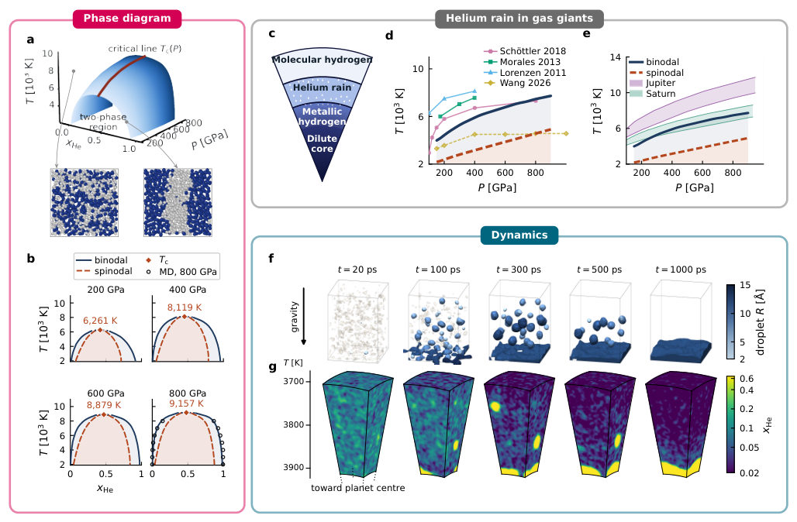
<figcaption class="paper-figure-caption"><b>Fig 5.</b> Figure 5. Hydrogen–helium mixture. The AIPF model is trained at 200, 400, 600 and 800 GPa, with predictions in d,e extending to 150–900 GPa. a, Binodal surface in (xHe, P, T) with the critical line Tc(P). b, Isobaric sections of a at 200, 400, 600 and 800 GPa, with the predicted critical temperatures. Circles denote binodal compositions measured from MD at 800 GPa. c, Schematic of helium demixing from metallic hydrogen and settling toward the center of a gas giant. d, Predicted binodal (solid) and spinodal (dashed) at the protosolar composition xHe = 0.089, compared with published binodals from Sch¨ottler and Redmer [33], Morales et al. [34] and Lorenzen et al. [35], and the spinodal from...</figcaption>
</figure>

**Summary.** This work introduces a novel framework to create *ab initio* phase-field models by learning the necessary free energy and mobility parameters directly from molecular dynamics simulations. By deriving the mesoscopic equation from quantum-informed projections, the method overcomes the limitations of both purely classical and purely atomistic simulations. This allows for the prediction of complex phase behavior and microstructure evolution under extreme conditions.

**Why it may be interesting.** The methodology bridges the gap between high-accuracy quantum simulations (MLIPs) and large-scale mesoscopic dynamics (Phase-Field), providing a powerful tool for studying non-equilibrium phase transitions relevant to condensed matter physics.

Detailed structure

**Main problem.** Simulating microstructure evolution requires combining quantum-mechanical accuracy with mesoscopic reach in length and time scales, a combination currently unachievable by existing methods.

**Main result.** The developed framework successfully predicts the spinodal instability of the FeB4 melt at ambient pressure but stabilization at 10 GPa, and captures droplet nucleation in H-He mixtures far beyond atomistic limits.

**Method.** The authors develop a framework to learn mesoscopic phase-field models by deriving the governing equation from a Mori-Zwanzig projection of molecular dynamics, parameterizing the free energy and mobility using neural networks trained on short MD trajectories.

**Model / system.** The model describes species-density field evolution ($
ho$) governed by a mesoscopic equation derived from the Generalized Langevin Equation (GLE). The free energy functional and mobility are learned via neural networks from MD simulations using MLIPs.

**Key observables.** Spinodal instability, immiscibility boundary, domain size evolution, thermodynamic factor ($\Gamma$), and apparent mobility.

**Important parameters / regimes.** High pressure (e.g., 10 GPa for FeB4), specific compositions (Fe-B, H-He), and simulation scales (mesoscopic reach).

**Assumptions / limitations.** The derivation relies on approximations such as Markovian dynamics, local mobility dependence, and Gaussian fluctuating forces, simplifying the full GLE.

**Figures summary.** Figures illustrate the hierarchy of free-energy functionals, the overall framework (MD $
ightarrow$ Coarse-graining $
ightarrow$ NN learning), and results for Fe-B and H-He systems.

**Paper structure.** The paper introduces the fundamental problem, details the derivation of the mesoscopic equation via Mori-Zwanzig projection, outlines the neural network learning procedure using MD data, and validates the framework on complex systems like Fe-B and H-He mixtures.

Abstract

Simulating microstructure evolution requires quantum-mechanical accuracy and mesoscopic reach in length and time scales, a combination that no current method achieves. Classical phase-field models provide this reach, but their accuracy is limited by phenomenological free energies and mobilities. Here we develop a framework for learning ab initio phase-field models, where the mesoscopic equation is not postulated but derived from a Mori-Zwanzig projection of molecular dynamics onto species-density fields under explicit assumptions. The nonlocal free energy and mobility left unspecified by this equation are parametrized by neural networks and learned from short molecular dynamics trajectories generated with machine-learning interatomic potentials of ab initio accuracy. We demonstrate the framework on an iron-boron melt and on hydrogen-helium mixtures under planetary conditions. For iron-boron, the model shows that the melt at the FeB$_4$ composition is spinodally unstable at ambient pressure but stabilized at 10 GPa, offering a thermodynamic rationale for why FeB$_4$ has been synthesized only under high pressure. For hydrogen-helium, the model predicts the immiscibility boundary and captures droplet nucleation and growth in helium-rain simulations of a column corresponding to 2.2 million atoms, far beyond the scale of atomistic modeling at comparable accuracy. Trained across compositions and conditions, such models could provide a mesoscopic counterpart to ab initio molecular dynamics.

[↑ back to top](#top)

### [Learning to Classify Threading in Melts of Rings](http://arxiv.org/abs/2610.01621v1)

**Authors:** Filippo Conforto, Roman Staňo, Jan Smrek, Davide Michieletto  
**Type:** theory · **Category:** disordered systems and neural networks · **PDF:** <https://arxiv.org/pdf/2610.01621v1>  
**Analysis basis:** full PDF text, analyzed in chunks
**Topic relevance:** `methods for driven-dissipative` **1/5**

↔ Scroll figures horizontally

<figure class="paper-figure-card">
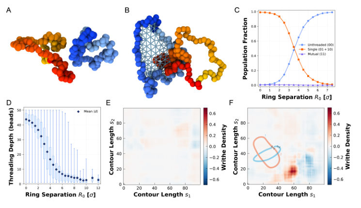
<figcaption class="paper-figure-caption"><b>Fig 1.</b> FIG. 1. Extracting local features of inter-ring threading from writhe density maps. (A-B) A pair of (A) non-threading and (B) threading rings from the dataset generated in Ref.48. Minimal surface (grey mesh) is shown spanning the passively threaded ring. (C) Fraction of non-, singly and mutually threaded configurations as a function of inter-ring separation. (D) Threading depth distribution as a function of inter-ring separation. The box limits represent the lower and upper quartile of the distribution, the whisker limits show the minimum and maximum, while the dark point is the mean of the distribution. (E) Writhe density map for the unthreaded configuration in (A). (F) Writhe density map...</figcaption>
</figure>
<figure class="paper-figure-card">
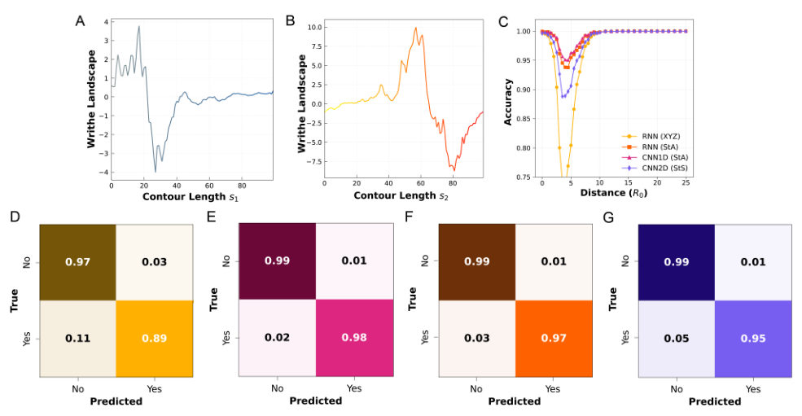
<figcaption class="paper-figure-caption"><b>Fig 2.</b> FIG. 2. Writhe-based threading classification outperforms XYZ. (A-B) Writhe landscapes w1(s) and w2(s) for the two threading rings shown in Fig. 1B. (C) Accuracy of classification compared across different model architectures and for different training features (XYZ vs writhe landscape “StA” and writhe density “StS”) as a function of separation between the rings in the held-out data. (D-G) From left to right: confusion matrices for the models RNN (XYZ), RNN (writhe landscape), CNN1D (writhe landscape) and CNN2D (writhe density).</figcaption>
</figure>
<figure class="paper-figure-card">
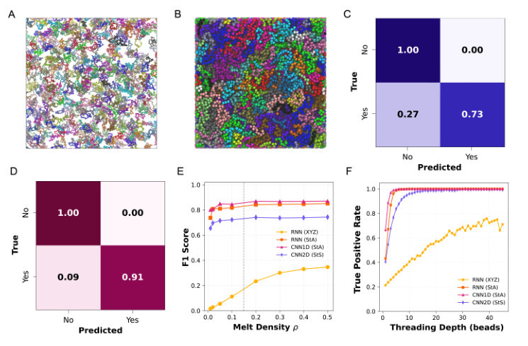
<figcaption class="paper-figure-caption"><b>Fig 3.</b> FIG. 3. ML models generalise to classify threadings in the dense solutions. (A-B) Snapshot of a solution of N = 100 rings at density (A) ρ = 0.05σ−3 and (B) ρ = 0.5σ−3 . (C-D) Confusion matrices for the classification of threadings between pairs of rings in the melt (ring length N = 100): (A) CNN2D model on writhe density, (B) CNN1D model on writhe landscape. (E) F1 score as a function of the monomer density across the ML models considered in this work. (F) Recall (True Positives) as a function of depth of threading.</figcaption>
</figure>
<figure class="paper-figure-card">
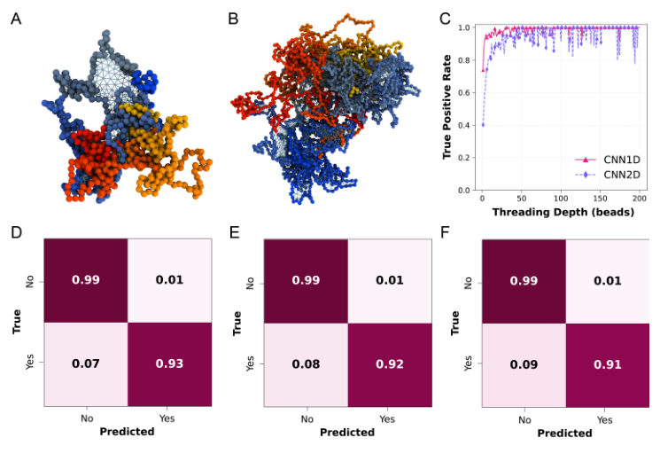
<figcaption class="paper-figure-caption"><b>Fig 4.</b> FIG. 4. Write-trained CNN models generalise to longer rings and melts. (A-B) Snapshots of selected subsets of rings from the melts, with (A) N = 400 and (B) N = 1600. (C) Recall (true positives) as a function of threading depth for N = 400 for CNN1D and CNN2D. (D-F) Confusion matrices reporting the threading classification of pairs of rings in the melt via the CNN1D model: (A) N = 400, (B) N = 800 (C) N = 1600.</figcaption>
</figure>

**Summary.** This work introduces a novel, scalable machine-learning approach to characterize topological entanglement (threading) in dense polymer melts. By training a 1D CNN on the writhe profile, the authors developed a method that accurately and rapidly classifies these complex interactions, significantly improving upon existing computationally intensive topological analysis techniques.

**Why it may be interesting.** While the system is classical polymer physics, the core methodology—using deep learning (CNNs) on derived geometric features (writhe) to solve a complex topological classification problem—is highly relevant to ML-physics applications in condensed matter.

Detailed structure

**Main problem.** The paper addresses the computationally demanding task of detecting and classifying inter-ring threading entanglement in dense melts of nonconcatenated ring polymers.

**Main result.** A CNN1D trained on the writhe profile achieves high accuracy (>98%) and generalizes robustly to dense melts, offering a 3-fold speed-up over state-of-the-art minimal-surface detection methods.

**Method.** A machine-learning framework utilizing a one-dimensional Convolutional Neural Network (CNN1D) is employed to classify threading states directly from the calculated writhe profile of ring conformations.

**Model / system.** The physical system is a dense melt of nonconcatenated ring polymers simulated using a coarse-grained bead-spring model with WCA and FENE potentials. The analysis focuses on topological constraints like inter-ring threading.

**Key observables.** Threading status (binary classification), writhe profile/density, separation length ($L_{sep}$), and classification accuracy/F1 score.

**Important parameters / regimes.** Chain lengths ($N=100$ to $1600$), melt densities ($
ho$), and the writhe profile itself.

**Assumptions / limitations.** The primary assumption is that the writhe captures the essential local interaction information required for topological classification, allowing the ML model to generalize from dilute training sets to dense melts.

**Figures summary.** Figures illustrate representative configurations of threaded/non-threaded rings using minimal surfaces, compare the performance of CNN2D vs. CNN1D on writhe features, and demonstrate the model's generalization across varying densities and chain lengths.

**Paper structure.** The paper introduces the problem, details the feature engineering (writhe profile calculation), compares ML architectures (RNN, CNN2D, CNN1D), presents results showing CNN1D's superior performance and generalization, and concludes with the computational and physical advantages of the writhe-based approach.

Abstract

Dense melts of nonconcatenated ring polymers exhibit anomalous dynamics and nonlinear rheology, in some cases linked to long-lived inter-ring threading entanglement. Detecting these geometric constraints remains computationally demanding, with different methods being based on different geometric features tuned to specific models. Here, we introduce a machine-learning framework that detects threading directly from the writhe of ring conformations and we demonstrate its broad generalisability. Trained on simulations of isolated, distance-constrained pairs of short rings, a one-dimensional convolutional neural network (CNN1D) operating on the writhe profile classifies threading states with over 98% accuracy on held-out ring pairs. Remarkably, this model generalises without retraining to equilibrium dense melts spanning a wide range of densities and chain lengths (N = 100 to 1600), maintaining true-positive rates above 91% with false-positive rates near zero. Misclassified conformations are limited to physically ambiguous, shallow threading events which are arguably not impacting the dynamics of the rings. Effectively, writhe captures the interaction between the two rings, allowing writhe-based classifiers to improve the topological analysis of large ring-polymer systems with a 3-fold speed-up over the state-of-the-art minimal-surface detection. These results establish the writhe-trained neural networks as an accurate, scalable tool for characterising entanglement in ring polymer melts.

[↑ back to top](#top)

### [Near-optimal quantum query lower bounds on bipartiteness and expansion testing in the bounded-degree graph model](http://arxiv.org/abs/2610.01752v1)

**Authors:** Chandrima Kayal, Sayantan Sen, Dániel Szabó  
**Type:** theory · **Category:** other · **PDF:** <https://arxiv.org/pdf/2610.01752v1>  
**Analysis basis:** full PDF text, analyzed in chunks
**Topic relevance:** `quantum measurements` **1/5**

↔ Scroll figures horizontally

<figure class="paper-figure-card">
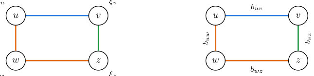
<figcaption class="paper-figure-caption"><b>Fig 1.</b> Fig. 1: On the left, we have a yes instance balanced graph, and on the right, the no instance graph illustrates independent random edge signs. Theorem 3.3 shows that the no instance is far from balanced with high probability.</figcaption>
</figure>
<figure class="paper-figure-card">
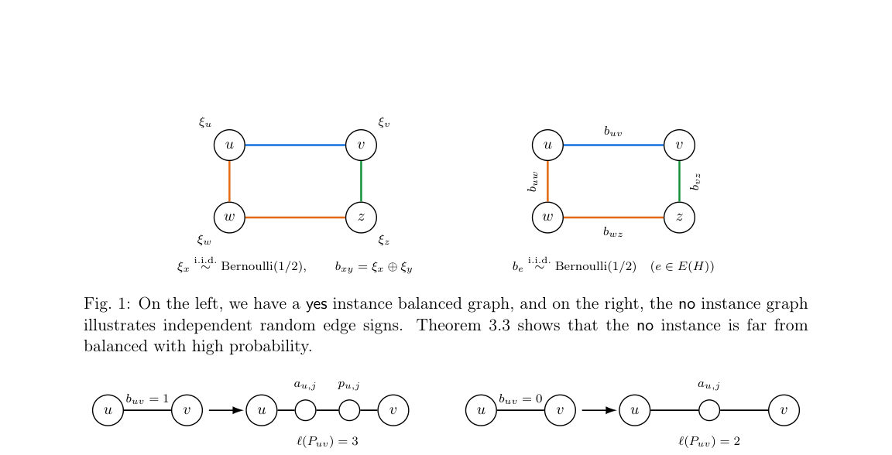
<figcaption class="paper-figure-caption"><b>Fig 2.</b> Fig. 2: We describe the reduction from balancedness testing to bipartiteness testing. On the left, the construction describes what happens when buv = 1 and on the right, it describes the reduction when buv = 0.</figcaption>
</figure>
<figure class="paper-figure-card">

<figcaption class="paper-figure-caption"><b>Fig 3.</b> Fig. 4: The replacement graph construction. Each vertex u of the intermediate graph is replaced by a copy of Jc, whose color-j vertex is denoted (u, j). A color-j edge {u, v} becomes the external edge {(u, j), (v, j)}. The color-k edge illustrates that differently colored parallel intermediate edges use different neighbors. Only a few neighbors and internal cloud edges are shown schematically.</figcaption>
</figure>
<figure class="paper-figure-card">
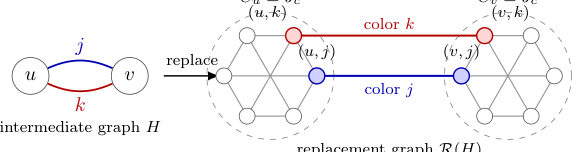
<figcaption class="paper-figure-caption"><b>Fig 4.</b> Figure 4 illustrates this standard replacement-graph construction. It has cN vertices and it is simple: different colors use different auxiliary vertices, even when two edges of different colors join the same pair of intermediate vertices. Every vertex has three internal neighbors and at most one external neighbor, so the maximum degree of this graph is four. Now we prove that if a graph H is an expander, then its corresponding replacement graph R(H) is an expander as well.</figcaption>
</figure>
<figure class="paper-figure-card">
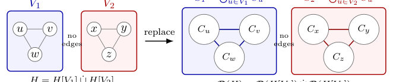
<figcaption class="paper-figure-caption"><b>Fig 5.</b> Fig. 5: A no instance before and after the replacement construction (in the non-overflow case). Only a few vertices, clouds, and edges are shown schematically; blue and red distinguish the two visible block classes, not matching colors.</figcaption>
</figure>

**Summary.** This work rigorously determines the quantum query complexity for testing bipartiteness and expansion in bounded-degree graphs. By proving $\Omega(N^{1/3})$ lower bounds for both problems, the authors resolve long-standing open questions regarding quantum speedups for these fundamental graph properties. The methodology involves sophisticated algebraic techniques applied to quantum query complexity theory.

**Why it may be interesting.** While the topic is graph theory, the core technique—deriving complexity lower bounds using advanced polynomial methods and quantum query complexity—is highly relevant to understanding the limits of quantum algorithms in general.

Detailed structure

**Main problem.** The paper aims to establish near-optimal quantum query lower bounds for testing graph properties, specifically bipartiteness and expansion, within the bounded-degree graph model.

**Main result.** The authors prove essentially tight quantum query lower bounds of $\Omega(N^{1/3})$ for both bipartiteness and expansion testing, fully characterizing the quantum query complexity up to polylogarithmic factors.

**Method.** The methodology employs the polynomial method, adapting techniques from previous work by relating the main problems to intermediate testing problems (like balancedness) via reductions and performing a precise analysis of the resulting polynomials.

**Model / system.** The study focuses on graph theory problems (bipartiteness and expansion testing) applied to bounded-degree graphs, sometimes involving signed graphs where edges carry bit labels.

**Key observables.** Quantum query complexity ($q$), acceptance gap ($\Delta$), and the number of vertices ($N$).

**Important parameters / regimes.** The maximum degree of the graph, the error tolerance ($\epsilon$), and the size parameter $N$.

**Assumptions / limitations.** The analysis relies on relating the true acceptance gap to a formal acceptance gap using polynomial approximations and bounding the error decay exponentially.

**Figures summary.** Figures illustrate the structure of 'yes' and 'no' instances for signed graphs, detail the reduction from balancedness testing to bipartiteness testing, and show the quantum circuit diagram for the testing oracle.

**Paper structure.** The paper builds from classical and quantum background results, develops the lower bound technique using the polynomial method on intermediate problems, proves the lower bounds for bipartiteness via reduction from balancedness, and establishes the bound for expansion testing.

Abstract

In this work, we study bipartiteness and expansion testing, two canonical problems in graph property testing in the bounded-degree model through the lens of quantum query complexity. In the classical setting, it is known that $\widetildeΘ(\sqrt{N})$ queries are necessary and sufficient for both these testing problems (Goldreich and Ron, 1999, 2000 & 2002), where $N$ denotes the number of vertices of the input graph. Due to their significance, (Ambainis, Childs, and Liu, 2011) initiated the study of these problems in the quantum setting and designed quantum algorithms for bipartiteness and expansion testing that perform $\widetilde{O}(N^{1/3})$ queries, showing a polynomial speedup. They also proved that $\widetildeΩ(N^{1/4})$ queries are necessary for expansion testing, but the possibility of an exponential quantum advantage for bipartiteness testing remained open. Despite significant effort, there has been no improvement in these results in the last decade and a half. In this work, we prove essentially tight $\widetildeΩ(N^{1/3})$ quantum query lower bounds for both bipartiteness and expansion testing, thereby completely characterizing the quantum query complexity of these problems up to polylogarithmic factors. While our proofs use the polynomial method similarly to Ambainis, Childs, and Liu, we use intermediate problems that we relate to the main problems via reductions, and perform a more precise analysis of the resulting polynomials, leading to the near-optimal lower bounds.

[↑ back to top](#top)

### [One-Way Quantum Symmetric Private Information Retrieval Protocol From A Single Database Server Using NISQ Devices](http://arxiv.org/abs/2610.02093v1)

**Authors:** Xiang Zou, H. F. Chau  
**Type:** theory · **Category:** quantum information and computing · **PDF:** <https://arxiv.org/pdf/2610.02093v1>  
**Analysis basis:** full PDF text, analyzed in chunks
**Topic relevance:** `quantum measurements` **1/5**

↔ Scroll figures horizontally

<figure class="paper-figure-card">
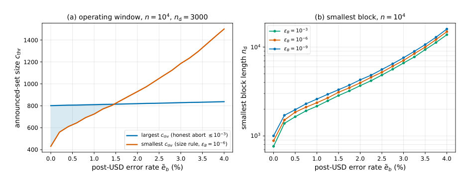
<figcaption class="paper-figure-caption"><b>Fig 1.</b> FIG. 2. Operating window of the announced set at n = 104, for a depolarizing channel with post-USD error rate ˜eb, known-rate pk = pUSD/(1 −˜eb), and ϵEC = ϵ⊥= 10−6 for the decoding-failure and ⊥probabilities. (a) At nd = 3000: the smallest cthr allowed by the size rule at ϵB = 10−6 (red) and the largest one for which an honest Bob aborts with probability at most 10−3 in Step 8 (blue); the protocol operates in the shaded region. (b) The smallest block length nd for which the window is open. Both panels use the exact binomial law of the overlap ojj′, the decoding radius t at the exact binomial quantile, and τ = ⌈log2 Vol(cthr, t) + log2(1/ϵEC)⌉.</figcaption>
</figure>
<figure class="paper-figure-card">
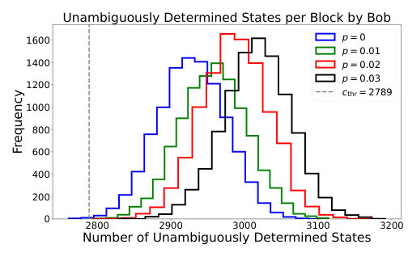
<figcaption class="paper-figure-caption"><b>Fig 2.</b> FIG. 3. Histogram of the number of conclusive positions per block in a typical run, for n = nd = 104 and depolarizing noise p ∈{0, 0.01, 0.02, 0.03}. The dashed line is the set size cthr = 2789, for which an honest Bob aborts with probability 10−3 over a noiseless channel; it obeys the size rule of Eq. (15) at ϵB = 10−6 for all four noise levels, with τ as in the exact evaluation of Table III.</figcaption>
</figure>
<figure class="paper-figure-card">
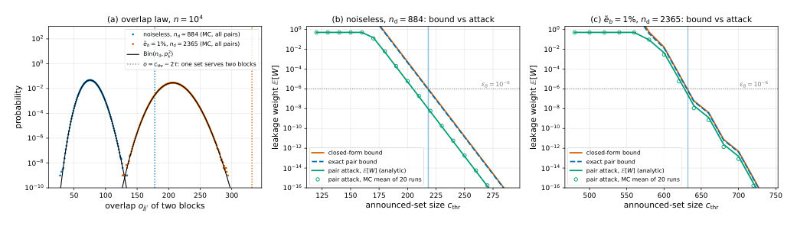
<figcaption class="paper-figure-caption"><b>Fig 3.</b> FIG. 4. Overlap law and tightness of Eq. (14) at n = 104. (a) Overlap of all pairs of blocks (dots) against Bin(nd, p2 k) (lines); dotted lines mark ojj′ = cthr −2τ, where one set would serve two blocks. (b), (c) Leakage weight of the pair attack (green: circles are means over the 20 databases, the line averages over the law of the largest overlap) against the bound (orange: Eq. (14); dashed: its exact form of Appendix D), over a noiseless channel and at ˜eb = 1%. The vertical line is the smallest cthr allowed by the size rule.</figcaption>
</figure>
<figure class="paper-figure-card">
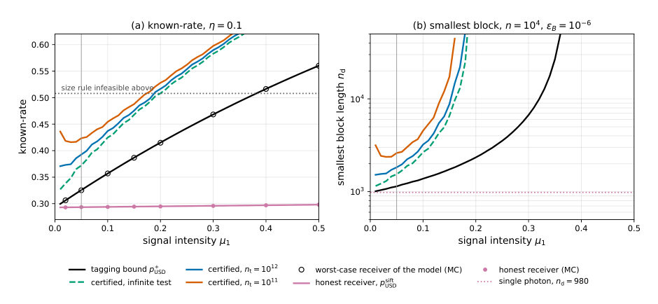
<figcaption class="paper-figure-caption"><b>Fig 4.</b> FIG. 5. The price of weak coherent pulses at transmittance η = 0.1 over a noiseless channel. (a) Known-rate against the signal intensity µ1: the tagging bound p+ USD of Lemma VII.2 (black line), attained by the worst-case receiver of the model, which collects every emitted photon and always knows the bit of a multi-photon pulse (circles, Monte-Carlo); the certified known-rate pWCP k of Proposition G.2 for an infinite test (dashed) and for tests of nt = 1012 and 1011 pulses, with µ2 = µ1/10, intensity probabilities (0.5, 0.4, 0.1), ϵPE = ϵcert = 10−6 and the test counts at their expected values; and the conclusive rate psift USD of the honest receiver [pink line, Eq. (23); dots, photon-level...</figcaption>
</figure>
<figure class="paper-figure-card">
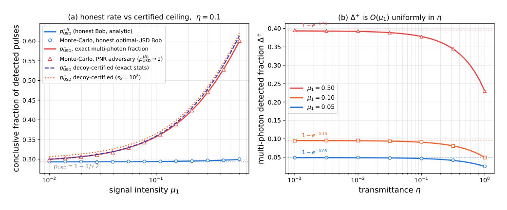
<figcaption class="paper-figure-caption"><b>Fig 5.</b> FIG. 6. Photon-level Monte-Carlo validation of the effective USD rates. (a) Conclusive fraction of detected data pulses vs signal intensity µ1 at η = 0.1: honest optimal-USD Bob (circles) against the closed form of Lemma VII.1 (solid blue), and the photon-number-resolving adversary of Lemma VII.2 (triangles), which saturates p+ USD computed from the exact multi-photon fraction (solid red). The decoy-certified p+ USD with exact statistics (dashed) and with sX = 108 X-sifted detections (dotted) lie slightly higher, showing the residual looseness of the three-intensity estimator. (b) Multi-photon detected fraction ∆+</figcaption>
</figure>

**Summary.** This paper presents a quantum protocol for Symmetric Private Information Retrieval (SPIR) that works even when the communicating parties are limited to noisy, memory-less NISQ devices. It achieves information-theoretic security by leveraging BB84 states and random permutations. This work is significant because it provides a practical, resource-constrained solution to a fundamental problem in quantum data access.

**Why it may be interesting.** The focus on NISQ constraints and the integration of quantum communication security with information retrieval makes it highly relevant for quantum optics and quantum information theorists designing practical quantum protocols.

Detailed structure

**Main problem.** The paper addresses the challenge of achieving Symmetric Private Information Retrieval (SPIR) from a single database server using quantum communication.

**Main result.** It demonstrates that provably secure QSPIR is possible under the strict constraint of NISQ devices, requiring only passive linear-optical measurements alongside standard QKD components.

**Method.** The protocol combines principles from Quantum Key Distribution (QKD) with cryptographic techniques like random permutations and hashing to ensure index privacy.

**Model / system.** The system utilizes single photons transmitting BB84 states over a one-way quantum channel. The security analysis is tailored for the NISQ regime, meaning no long-term quantum memory is assumed for the communicating parties.

**Key observables.** Secrecy against eavesdroppers, database privacy (quantified by an explicit size rule), and user privacy.

**Important parameters / regimes.** Database size ($10^4$-bit example), required database privacy ($10^{-6}$), and block size (around a thousand qubits).

**Assumptions / limitations.** The security proof assumes the eavesdropper is all-powerful, while the user and server are restricted to NISQ devices. The protocol is shown to work for single photons over a tolerated noise channel.

**Figures summary.** Figure 6 validates the effective Unambiguous State Discrimination (USD) rates against signal intensity ($\mu_1$) and transmittance ($\eta$), while Figure 7 compares measured conclusive counts for the honest receiver versus an adversary using Monte Carlo simulations.

**Paper structure.** The paper establishes the problem, details a multi-step protocol involving BB84 transmission, joint random permutation, and hashing. It then provides security proofs and validates the resource requirements using simulation and theoretical bounds.

Abstract

Symmetric private information retrieval (SPIR) lets an inquirer obtain one specific bit only, without leaking any information about its index to the database owner. With a single server, this is impossible for parties with unrestricted quantum power. We show that it becomes possible, with information-theoretic security, when the server and the user hold only noisy intermediate-scale quantum (NISQ) devices without long-term quantum memory and measure each qubit on arrival, while the eavesdropper remains all-powerful; this is a stricter form of the memory restriction of the bounded- and noisy-quantum-storage models. The server sends BB84 states one way; the user discriminates them unambiguously and so knows a random subset of the bits. After a joint random permutation into blocks, the user announces the conclusive locations of one privately chosen block, and the server hashes and takes a random parity of these locations in every block; the permutation makes it exponentially unlikely that one set of locations fits two blocks. We prove secrecy against the eavesdropper, database privacy through an explicit size rule for the announced set, and user privacy against a server who prepares the prescribed BB84 states and announces truthfully, exactly for single photons and up to a small multi-photon term over a tolerated noise channel. The only addition to BB84 equipment is a passive linear-optical measurement with one ancillary mode. For a $10^{4}$-bit database and database privacy $10^{-6}$, blocks of about a thousand qubits suffice over a tolerated noise channel for a user who applies the prescribed measurement; certifying an arbitrary memoryless user and committing to the permutation need larger auxiliary transmissions, which we quantify with finite keys. Database privacy extends to decoy-state weak coherent pulses, and simulations show that the bound is nearly tight.

[↑ back to top](#top)

### [Operational transformation rates of quantum states](http://arxiv.org/abs/2610.02025v1)

**Authors:** Giulia Mazzola, Renato Renner  
**Type:** theory · **Category:** quantum information and computing · **PDF:** <https://arxiv.org/pdf/2610.02025v1>  
**Analysis basis:** full PDF text, analyzed in chunks
**Topic relevance:** `quantum measurements` **1/5**

↔ Scroll figures horizontally

<figure class="paper-figure-card">
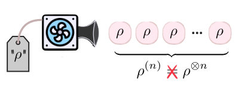
<figcaption class="paper-figure-caption"><b>Fig 1.</b> Figure 1: A ρ-source is expected to emit many copies of a state ρ. While tomography may consistently identify the individual outputs with ρ, it cannot in general certify that their joint state ρ(n) has the exact tensor power form ρ⊗n.</figcaption>
</figure>
<figure class="paper-figure-card">
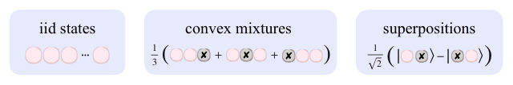
<figcaption class="paper-figure-caption"><b>Fig 2.</b> Figure 2: Illustration of almost-iid states. Each circle represents a single-copy system. The pink circles correspond to the iid components, represented by ρ, while the crossed circles indicate the defective and possibly correlated subsystems. A precise formulation is given in Definition 1.21.</figcaption>
</figure>
<figure class="paper-figure-card">
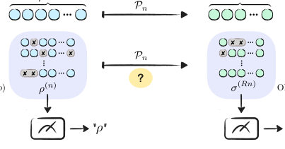
<figcaption class="paper-figure-caption"><b>Fig 3.</b> Figure 3: Asymptotic state transformation rates characterize the conversion of n copies of ρ into approximately Rn copies of σ via a protocol Pn consisting of free operations. Traditionally, such pro- tocols are designed for iid input resources ρ⊗n and produce outputs approximating the iid target state σ⊗Rn. In practice, however, multi-copy resources may contain correlated defects that are practically undetectable. States with such defects therefore belong to the operational set of multi-copy states. The question is whether Pn remains effective uniformly over this larger class of resource states.</figcaption>
</figure>

**Summary.** This work re-evaluates quantum resource theories by relaxing the strict assumption that multiple copies of a quantum state are independent and identically distributed. Using an operational viewpoint, the authors define resource sets based on what an experimentalist can measure. They introduce new asymptotic rates that quantify resource transformation capabilities under these realistic, imperfect conditions.

**Why it may be interesting.** It provides a rigorous, experimentally grounded framework for resource theories, moving beyond idealized mathematical assumptions to model real-world imperfections in quantum resource utilization.

Detailed structure

**Main problem.** The paper addresses the gap between assuming quantum states are independent and identically distributed (iid) when multiple copies are available, versus the operational reality where unknown defects or correlations might exist.

**Main result.** It develops operational analogues for asymptotic transformation rates (like entanglement cost) that account for the full, operationally defined class of resource states, rather than just the ideal iid case.

**Method.** The authors employ a de Finetti-type argument and define operational sets of states based on what an experimentalist can distinguish via tomography protocols.

**Model / system.** The system involves multiple copies of a quantum state $
ho$, leading to a joint $n$-system state $
ho(n)$. The focus is on characterizing the set of states $	ext{OP}(	ext{tom}(\cdot); 
ho)$ that are indistinguishable from a tensor power state.

**Key observables.** Operational asymptotic transformation rates, entanglement cost, and distillation rates.

**Important parameters / regimes.** The number of copies $n$, and the deviation from the iid assumption (defects/correlations).

**Assumptions / limitations.** The definition of the operational set relies on the existence of a 'sensible' tomography protocol $	ext{tom}(\cdot)$.

**Figures summary.** Figure 1 shows that tomography cannot certify the joint state is exactly $
ho^{\otimes n}$. Figure 2 illustrates 'almost-iid states' showing the tensor power structure corrupted by defects/correlations. Figure 3 compares iid vs. operational rates.

**Paper structure.** The paper moves from identifying the limitation of the iid assumption in practice, to developing the operational framework using de Finetti arguments, and finally applying this framework to define and compare operational asymptotic rates.

Abstract

Typically, multiple copies of a quantum state are described by a tensor power of that state. However, from an operational point of view, an experimentalist cannot, in general, rule out imperfections at unknown positions or correlations between copies, so assuming independent and identically distributed (iid) copies is not justified a priori. In the following, we relax the iid assumption by considering a whole set of resource states that are fundamentally indistinguishable from a tensor power state, and in that sense look like many copies of the quantum state to the experimentalist. Using a de Finetti-type argument, we show that this operational set of states can asymptotically be represented by almost-iid states. As an application, we introduce operational analogues of asymptotic transformation rates, such as entanglement cost and distillation. This raises the question of whether these rates coincide with their iid counterparts.

[↑ back to top](#top)

### [Polynomial-time additive-error estimation of output probabilities for shallow quantum circuits](http://arxiv.org/abs/2610.02146v1)

**Authors:** Matthew Coudron, Michael J. Gullans, Jon Nelson, Joel Rajakumar, Shi Jie Samuel Tan  
**Type:** theory · **Category:** quantum information and computing · **PDF:** <https://arxiv.org/pdf/2610.02146v1>  
**Analysis basis:** full PDF text, analyzed in chunks
**Topic relevance:** `quantum measurements` **1/5**

↔ Scroll figures horizontally

<figure class="paper-figure-card">
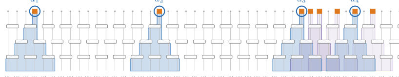
<figcaption class="paper-figure-caption"><b>Fig 1.</b> Figure 1: Depiction of ‘lightcones’ in a 1D quantum circuit. The bad bits of the output distribution agree with x with probability ≤1 −τ. The separation of the blue lightcones illustrates how the probability of a1, a2, a3, a4 all agreeing with x is ≤(1 −τ)4.</figcaption>
</figure>
<figure class="paper-figure-card">
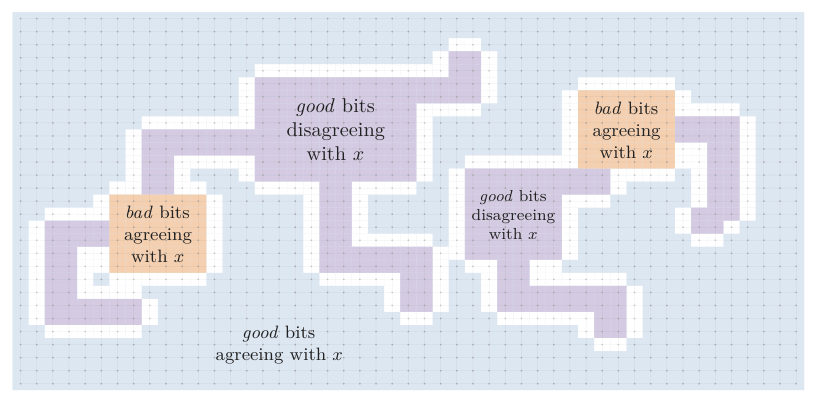
<figcaption class="paper-figure-caption"><b>Fig 2.</b> Figure 2: Depiction of one term in our inclusion-exclusion decomposition. The purple region corresponds to T, which is the source of the decay.</figcaption>
</figure>

**Summary.** This paper introduces a deterministic classical algorithm to estimate the output probability of shallow quantum circuits in polynomial time. It achieves this by employing a sophisticated combination of inclusion-exclusion principles and cluster expansion techniques. This result significantly advances the field by providing an efficient method to analyze quantum circuit outputs for arbitrary connectivity.

**Why it may be interesting.** This work provides a powerful classical tool to estimate quantum mechanical probabilities, which is crucial for simulating quantum circuits and understanding the complexity limits of quantum computation.

Detailed structure

**Main problem.** The paper develops a deterministic classical algorithm to estimate the output probability $P(x) = |\langle x|U|0^n
angle|^2$ of a shallow quantum circuit $U$ to an additive error $\epsilon$. The goal is to achieve this estimation in time polynomial in $n$ and $1/\epsilon$.

**Main result.** A deterministic classical algorithm is presented that achieves polynomial-time estimation of the output probability for constant-depth quantum circuits with arbitrary connectivity, significantly improving upon prior state-of-the-art time complexities.

**Method.** The core method combines an inclusion-exclusion decomposition with a cluster expansion technique to bound errors arising from non-peaked regions. This allows the problem to be reduced to efficiently estimating marginal probabilities of 'good' output bits.

**Model / system.** The model is an $n$-qubit unitary quantum circuit $U$ characterized by constant depth and gates with bounded fan-in and arbitrary connectivity. The initial state is $|0^n
angle$.

**Key observables.** The primary observable is the output probability $P(x) = |\langle x|U|0^n
angle|^2$. Secondary observables include marginal probabilities $P(xS)$ for subsets $S$ of qubits.

**Important parameters / regimes.** Key parameters include $n$ (number of qubits), $\epsilon$ (additive error tolerance), and the circuit depth/connectivity structure.

**Assumptions / limitations.** The analysis relies on the structure of shallow circuits leading to bounded degree in the connectivity graph and assumes the ability to perform specific calculations (like marginal estimations) within derived polynomial bounds.

**Figures summary.** Figure 1 illustrates 'lightcones' bounding the probability of agreement. Figure 2 depicts a term in the inclusion-exclusion decomposition, separating contributions from 'good' and 'bad' bits.

**Paper structure.** The paper builds upon prior work by introducing a cluster expansion technique and an inclusion-exclusion argument. It decomposes the probability calculation based on 'bad' and 'good' output bits, leading to a final theorem establishing the polynomial-time algorithm.

Abstract

We give a deterministic classical algorithm that estimates $|\langle x|U|0^n\rangle|^2$ to additive error $\varepsilon$ in $\mathrm{poly}(n, 1/\varepsilon)$ time, where $U$ is a constant-depth quantum circuit comprised of gates with bounded fan-in and arbitrary connectivity, and $x$ is an arbitrary $n$-bit output string. This improves over prior state-of-the-art algorithms that takes $n^{O(log(n))}$ time for the same task, $n^{O(log(log(n))}$ when $U$ is geometrically local, and $n^{O(1)}$ for 2D geometrically-local circuits.

[↑ back to top](#top)

### [Smooth perturbation theory and generic Cantor spectrum for multi-dimensional monotone quasiperiodic operators](http://arxiv.org/abs/2610.00733v1)

**Authors:** Ilya Kachkovskiy, Leonid Parnovski, Roman Shterenberg  
**Type:** theory · **Category:** disordered systems and neural networks · **PDF:** <https://arxiv.org/pdf/2610.00733v1>  
**Analysis basis:** full PDF text, analyzed in chunks
**Topic relevance:** `Frenkel-Kontorova` **1/5**

↔ Scroll figures horizontally

<figure class="paper-figure-card">
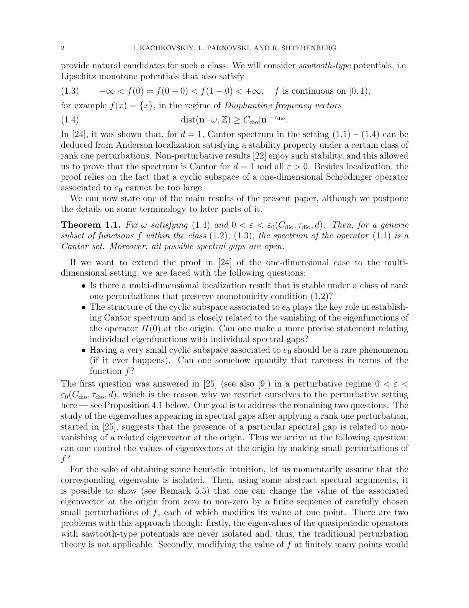
<figcaption class="paper-figure-caption"><b>Fig 1.</b> Low-resolution page preview, page 2</figcaption>
</figure>
<figure class="paper-figure-card">
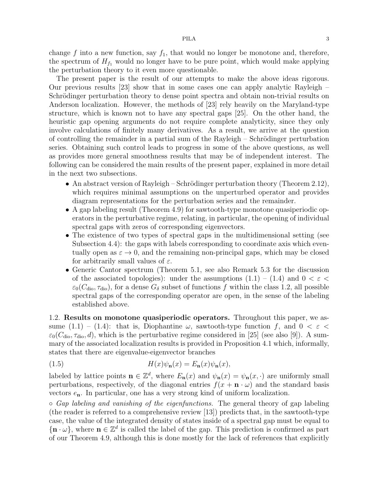
<figcaption class="paper-figure-caption"><b>Fig 2.</b> Low-resolution page preview, page 3</figcaption>
</figure>
<figure class="paper-figure-card">
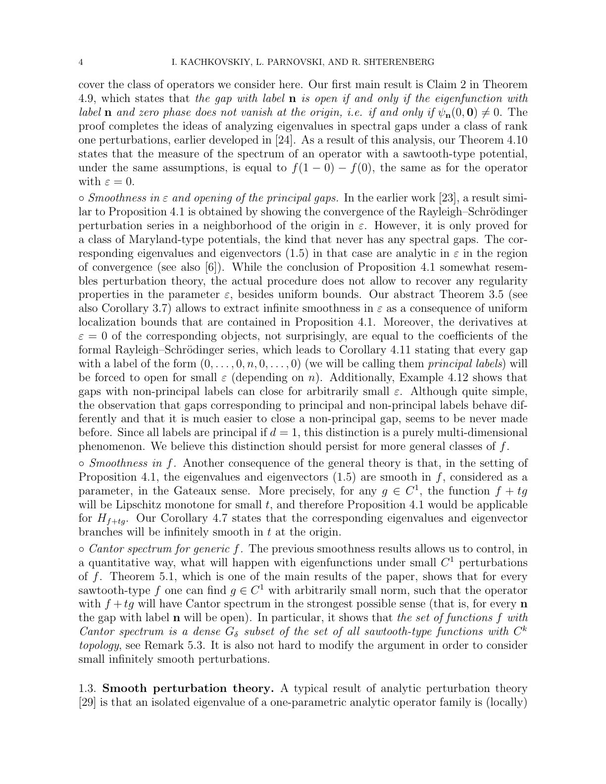
<figcaption class="paper-figure-caption"><b>Fig 3.</b> Low-resolution page preview, page 4</figcaption>
</figure>
<figure class="paper-figure-card">
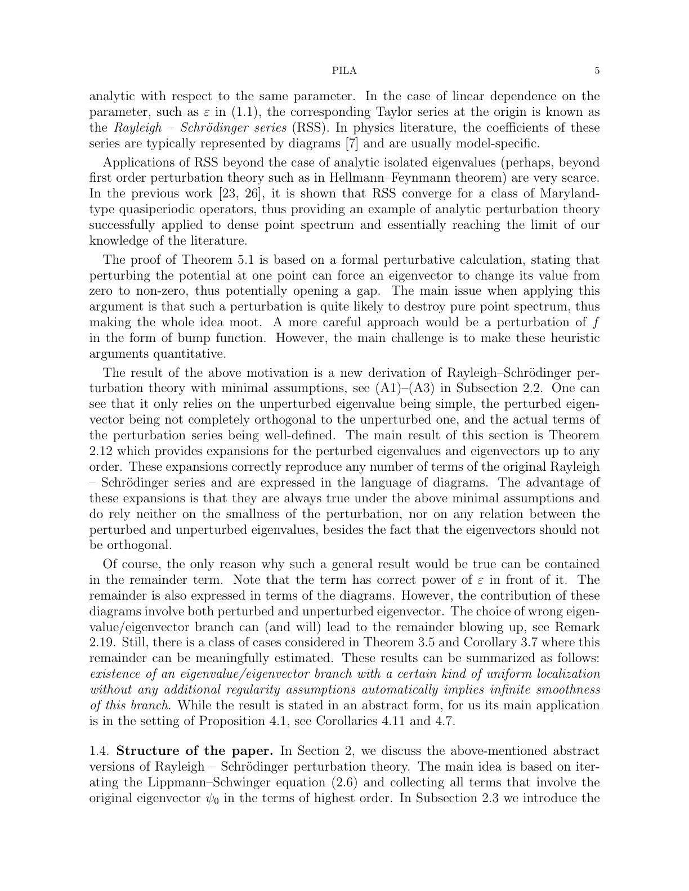
<figcaption class="paper-figure-caption"><b>Fig 4.</b> Low-resolution page preview, page 5</figcaption>
</figure>
<figure class="paper-figure-card">
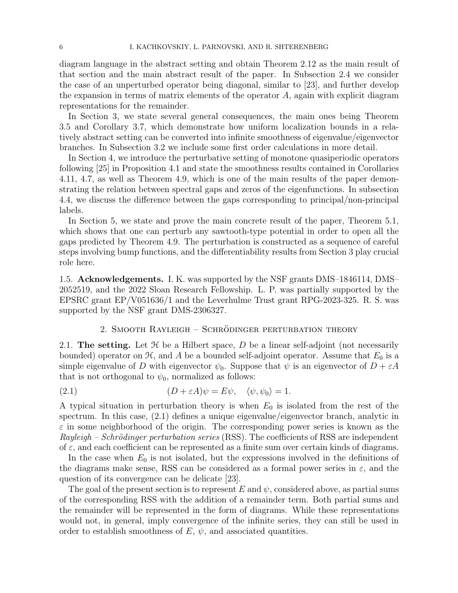
<figcaption class="paper-figure-caption"><b>Fig 5.</b> Low-resolution page preview, page 6</figcaption>
</figure>

**Summary.** This theoretical paper analyzes the spectrum of multi-dimensional quasiperiodic Schrödinger operators defined by sawtooth-type potentials. Using advanced perturbation theory, the authors prove that for generic potentials, the spectrum is a Cantor set with all gaps open. This work provides deep mathematical insight into spectral rigidity and localization in deterministic, quasiperiodic media.

**Why it may be interesting.** The rigorous mathematical analysis of spectral gaps in quasiperiodic systems is central to understanding localization phenomena, which is a key topic in condensed matter physics, particularly concerning the transition between extended and localized states.

Detailed structure

**Main problem.** The paper investigates the spectral structure of multi-dimensional quasiperiodic Schrödinger operators, specifically determining when their spectrum forms a Cantor set.

**Main result.** For generic choices of the sampling function, the spectrum is proven to be a Cantor set with all gaps open, and this set of functions is a dense G_delta subset.

**Method.** The authors employ smooth perturbation theory, utilizing Rayleigh-Schrödinger expansions and analyzing the vanishing of eigenfunctions at the origin to diagnose the opening or closing of spectral gaps.

**Model / system.** The model is a quasiperiodic Schrödinger operator $H(x) = \varepsilon(\Delta + V(x))$ acting on $\ell^2(\mathbb{Z}^d)$, where the potential $V(n)$ is defined by a monotone sawtooth-type function $f$ sampled along a quasiperiodic lattice defined by $\omega$.

**Key observables.** The spectrum $\sigma(H)$, the status of spectral gaps (open/closed), and the value of the eigenfunction at the origin, $\psi_n(0, 0)$.

**Important parameters / regimes.** The small perturbation parameter $\varepsilon$ (or $\epsilon$), and the properties of the frequency vector $\omega$ (rationally independent).

**Assumptions / limitations.** The analysis is primarily restricted to the perturbative localization regime ($0 < \varepsilon < \varepsilon_0$), and the results distinguish between principal and non-principal gap behaviors.

**Paper structure.** The paper builds from establishing the basic model and perturbation framework (Chunk 1), develops the quantitative perturbation theory for gap analysis (Chunk 2), proves the density of functions yielding open gaps via constructive perturbations (Chunk 3), and concludes with convergence arguments for the limiting operators (Chunk 4).

Abstract

We consider multi-dimensional quasiperiodic Schrödinger operators with monotone sawtooth-type potentials in the perturbative localization regime. We prove that a given gap is closed iff a corresponding (via a natural gap labeling) eigenfunction vanishes at the origin. Using this, we show that for a generic choice of the sampling function $f$, the spectrum of such an operator is a Cantor set, with all possible gaps being open. We also provide a class of functions $f$ for which some gaps are closed. Finally, we observe that certain gaps are more difficult to close than the others.

[↑ back to top](#top)

### [Stationarity as a One-Mode Constraint on Quantum Correlation](http://arxiv.org/abs/2610.02090v1)

**Authors:** Itai Panas  
**Type:** theory · **Category:** strongly correlated electrons · **PDF:** <https://arxiv.org/pdf/2610.02090v1>  
**Analysis basis:** full PDF text, analyzed in chunks
**Topic relevance:** `Keldysh / 2PI / non-Gaussian methods` **1/5**

↔ Scroll figures horizontally

<figure class="paper-figure-card">
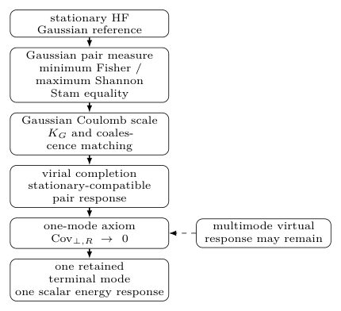
<figcaption class="paper-figure-caption"><b>Fig 1.</b> FIG. 1. Logical structure of the stationary one-mode construc- tion. The HF primitive-product Gaussian measure identifies a minimum-information relative-pair mode, the compatible Coulomb scale channel supplies the interaction response, and the virial supplies its stationary kinetic completion. Stationar- ity then motivates Eq. (11), which relinquishes response-space completeness for the terminal energy property. The dashed branch emphasizes that microscopic multimode structure is not claimed to disappear.</figcaption>
</figure>
<figure class="paper-figure-card">
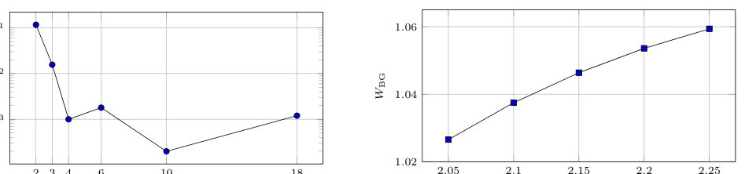
<figcaption class="paper-figure-caption"><b>Fig 2.</b> FIG. 2. Helium separates one-mode energetic sufficiency from microscopic spectral simplicity. Left: absolute error of the parameter-free one-mode He-like correlation energies over representative nuclear charges; the comparison uses high-accuracy numerical/Laguerre-based Hartree–Fock reference energies rather than a finite Gaussian orbital basis. Right: the BG spectral- width diagnostic WBG for an independent one-center spherical-Gaussian calculation (representative radial space 18s, 12p, 10d, 8f) remains near unity rather than zero, demonstrating a broad non-single-denominator return spectrum.</figcaption>
</figure>

**Summary.** This theoretical work argues that for quantum systems in stationary states, the terminal scalar correlation energy can be accurately described by a single, 'one-mode' constraint, even if the full microscopic excitation spectrum is complex. By testing this hypothesis on Helium using reg-HF methods against Bethe-Goldstone theory, the authors show that energetic sufficiency does not require spectral simplicity.

**Why it may be interesting.** It provides a rigorous theoretical tool to decouple the dimensionality required for calculating a specific, observable energy (the terminal state) from the complexity of the underlying quantum correlation structure, which is highly relevant for understanding correlation in strongly interacting systems.

Detailed structure

**Main problem.** The paper investigates whether the terminal scalar correlation-energy response of a quantum system, particularly in stationary states, must retain the full dimensionality of its microscopic response.

**Main result.** Stationarity imposes a 'one-mode constraint' on the terminal scalar correlation response, which is shown to be highly accurate even when the full microscopic excitation spectrum (as seen in Bethe-Goldstone calculations) is complex and multi-dimensional.

**Method.** The authors use a regularized Hartree-Fock (reg-HF) construction, employing Gaussian measures and virial completion, and contrast these results against exact calculations like Bethe-Goldstone (BG) theory.

**Model / system.** The primary test case is the Helium atom/ion system. The theoretical framework involves analyzing the correlation energy derived from the Hamiltonian under the constraint of a stationary state.

**Key observables.** Terminal scalar correlation response ($\Delta^{(1)}_0$), Bethe-Goldstone pair correlation energy ($E_{	ext{BG}}^c$), and the diagnostic quantity $W_{BG}$ which measures spectral complexity.

**Important parameters / regimes.** The residual dimensionless parameter $\delta$, the retained Coulomb carrier $\delta/e$, and the finite-$Z$ insertion ratio $8\delta/9$.

**Assumptions / limitations.** The core hypothesis is the 'one-mode exclusion axiom,' which assumes that covariance components orthogonal to the retained pair mode are excluded from the terminal energy property.

**Figures summary.** Figure 2 compares the absolute error of the one-mode He-like correlation energies against the BG spectral-width diagnostic $W_{BG}$, demonstrating a clear separation between energetic sufficiency and spectral simplicity.

**Paper structure.** The paper develops the argument by first establishing the reg-HF framework and the one-mode constraint imposed by stationarity. It then tests this constraint using Helium, comparing the resulting single-mode energy calculation against the full, complex spectrum derived from Bethe-Goldstone theory.

Abstract

A stationary quantum state has one dynamical phase factor and one scalar energy even when its internal response spans a large Hilbert space. Our argument concerns not the value or observability of an absolute phase, but the one-ness of stationary time evolution. In regularized Hartree--Fock (reg-HF), the connection to the stationary mean field is established before any one-mode reduction: the primitive-product relative-coordinate Gaussian measure induced by the Gaussian HF representation fixes a covariance and, at that covariance, is simultaneously the minimum-Fisher-information and maximum-Shannon-differential-entropy distribution and the equality case of the Stam bound. The Coulomb operator admits a compatible Gaussian scale resolution, and virial completion converts the resulting regularized pair displacement into a stationary-compatible response. Stationarity motivates a one-mode constraint on the terminal scalar correlation response. The decisive reg-HF hypothesis is a one-mode exclusion axiom: covariance carried by response components orthogonal to the retained pair mode is excluded from the terminal scalar energy property, without asserting that the unrestricted response is one dimensional. Helium provides the minimal nontrivial test. The parameter-free retained Coulomb carrier $-δ/e$ and finite-$Z$ insertion $8δ/9$ closely reproduce independent He-like coefficients and energies, while an explicit Bethe--Goldstone calculation displays a broad non-single-denominator return spectrum even though its scalar energy is exactly moment-compressible. The result separates microscopic spectral complexity from one-mode energetic sufficiency.

[↑ back to top](#top)

### [Zero- Versus Infinite-Temperature Damping in Variational Quantum Circuits: Feature Scale, Sampling Cost, and Frame Gauge](http://arxiv.org/abs/2610.01466v1)

**Authors:** Vu-Quoc-Minh Nguyen, Tuan-Vu Truong, Hoang-Long Nguyen, Trung-Khanh Le  
**Type:** theory · **Category:** quantum information and computing · **PDF:** <https://arxiv.org/pdf/2610.01466v1>  
**Analysis basis:** full PDF text, analyzed in chunks
**Topic relevance:** `correlated / nonlocal dissipation` **1/5**

↔ Scroll figures horizontally

<figure class="paper-figure-card">
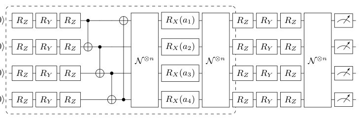
<figcaption class="paper-figure-caption"><b>Fig 1.</b> FIG. 1. The classifier at n = 4, drawn for one layer and the final block. Each RZRY RZ triple carries three trainable angles; the encoding column re-uploads the angle vector a in each of the L layers. The channel acts on every qubit after the entangler, after the encoding, and after the final block, giving 2L + 1 insertions per qubit. The features zj = ⟨Zj⟩enter a trainable linear readout.</figcaption>
</figure>
<figure class="paper-figure-card">
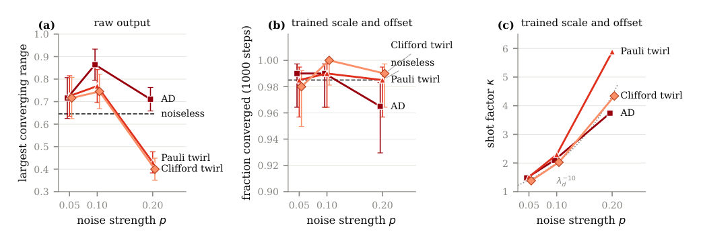
<figcaption class="paper-figure-caption"><b>Fig 2.</b> FIG. 2. Single-qubit re-uploading fits of Ref. [22] (200 targets). (a) Largest converging output range of the raw model f = ⟨Z⟩, with a free target offset as in Ref. [22]. (b) Fraction of targets of range R = 1 that converge within 1000 steps when an output scale s and offset b are trained. (c) Shot factor κ = (s/sNone)2 from the median fitted scale; the dotted line is the exact depolarizing value λ−10 d . Bars are 95% confidence intervals of the mean over targets in (a) and Wilson 95% intervals in (b).</figcaption>
</figure>
<figure class="paper-figure-card">
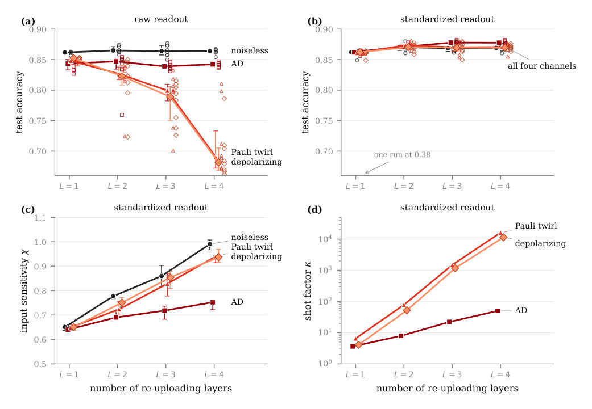
<figcaption class="paper-figure-caption"><b>Fig 3.</b> FIG. 3. Four-qubit classifier on MNIST against the number of re-uploading layers. (a) Test accuracy with the raw readout and (b) with the standardized readout, both after 100 steps. (c) Input sensitivity and (d) shot factor κ of Eq. (30) with the standardized readout. Panels (a)–(c) show the median and interquartile range over eight initializations, with each run as a hollow marker; one Pauli run at L = 1 in (b) diverged and lies below the axis.</figcaption>
</figure>
<figure class="paper-figure-card">
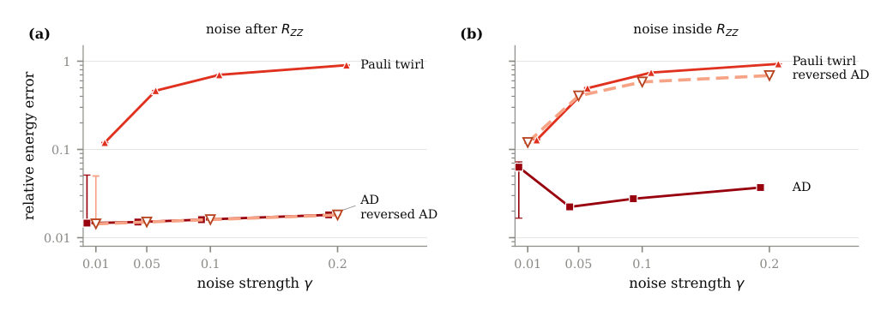
<figcaption class="paper-figure-caption"><b>Fig 4.</b> FIG. 4. Relative energy error of the three-qubit eigensolver against the noise strength, for AD, reversed AD (hollow markers), and the Pauli twirl (logarithmic vertical axis). Points are the median of 50 initializations and bars the interquartile range. (a) The channel acts after the complete RZZ; AD and reversed AD coincide. (b) The channel acts after each CNOT inside RZZ, as in Ref. [22].</figcaption>
</figure>
<figure class="paper-figure-card">
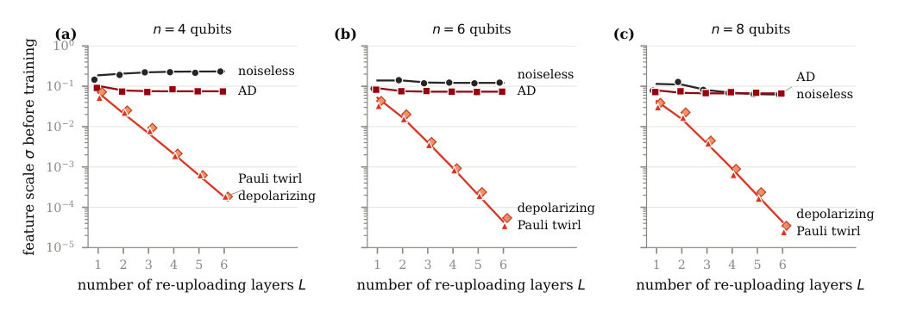
<figcaption class="paper-figure-caption"><b>Fig 5.</b> FIG. 5. Feature scale σ before training against the number of re-uploading layers for (a) four, (b) six, and (c) eight qubits, with n principal components as inputs. Markers are the root-mean-square scale over five parameter draws, the same at every depth, and 300 training images; lines are the exact average over parameters for the noiseless circuit, AD, and the Pauli twirl (Appendix D).</figcaption>
</figure>

**Summary.** This work rigorously compares amplitude damping (zero-temperature noise) against its Pauli twirl counterpart (infinite-temperature noise) in Variational Quantum Circuits. The study finds that while the noise models look similar in theory, the practical impact on measurement fidelity is vastly different, with AD maintaining significantly better performance in finite-shot simulations. This highlights the critical importance of understanding the precise thermal nature of noise in quantum computation.

**Why it may be interesting.** The explicit comparison between zero-temperature (AD) and infinite-temperature (Pauli twirl) noise provides deep insight into the physical origin of noise biases in quantum machine learning algorithms, which is crucial for designing robust quantum hardware.

Detailed structure

**Main problem.** The paper compares the effects of zero-temperature amplitude damping (AD) versus infinite-temperature Pauli twirl noise on the performance of Variational Quantum Circuits (VQC). It investigates how this noise affects feature scale, sampling cost, and the underlying gauge structure.

**Main result.** While a trainable output scale can mitigate accuracy differences in ideal simulations, the noise difference reappears as a significant cost in finite-shot measurements, with AD performing substantially better than its twirled counterpart. The damping direction is shown to be a gauge under specific circuit conditions.

**Method.** The authors use theoretical analysis and numerical simulations to compare noise channels (AD vs. Pauli twirl) applied to VQCs used for tasks like classification and eigensolving.

**Model / system.** The core model is the Variational Quantum Circuit (VQC), applied to tasks such as 4-qubit classification (on MNIST data) and quantum eigensolvers. Noise is modeled using Amplitude Damping (AD) and its infinite-temperature counterpart, the Pauli twirl.

**Key observables.** Test accuracy retention, operational shot cost ($\kappa(N)$), feature scale, and the relative error in eigensolver calculations.

**Important parameters / regimes.** Damping parameter ($p$), circuit depth ($L$), number of qubits ($n$), and the number of measurement shots ($N_s$).

**Assumptions / limitations.** The analysis compares AD to the Pauli twirl approximation, and some results rely on specific averaging assumptions for the final circuit block.

**Figures summary.** Figures compare performance metrics (like accuracy vs. depth) under different noise channels, demonstrating the quantitative difference in performance between AD and Pauli twirls, especially when considering measurement shot costs.

**Paper structure.** The paper systematically compares AD and Pauli twirl noise, first analyzing feature scale differences, then quantifying the performance gap in finite-shot simulations, and finally discussing the gauge nature of the damping direction in different circuit contexts.

Abstract

The Pauli twirl of amplitude damping (AD) is generalized amplitude damping at infinite temperature: it keeps the contraction of AD and removes its non-unital term, so comparing the two in variational circuits isolates the zero-temperature bias, which acts mainly through the scale of the features. For random parameters, features under AD settle on a floor, which at strong damping is set by the last layer, has a closed form, and at fixed $T_1$ falls with temperature as $\tanh(\hbarω/2k_BT)$; under the twirls they shrink by a constant factor per layer, up to eight qubits. A trainable output scale removes most of the resulting accuracy differences, leaving AD ahead of its twirls by at most about three percentage points in our simulations; what it removes reappears as a cost in measurement shots: trained and tested with $10^3$ shots per image, a four-qubit classifier under AD at $p=0.3$ stays within 1.5 points of noiseless accuracy, while the twirled classifiers lose up to 33. At weaker damping the separation depth grows roughly as $(np)^{-1}\ln(1/p)$. The damping direction is a gauge when the damping follows complete entangling layers and the circuit boundaries are trainable; in an eigensolver it becomes physical inside a decomposed two-qubit gate.

[↑ back to top](#top)

## Other papers (57)

*Papers from primary archives without highlighted authors or any topic match. Click to expand.*

Show other papers

### [(A Variant of) Clifford Circuit Synthesis is NP-Complete](http://arxiv.org/abs/2610.02029v1)

**Authors:** Luna Lima Keller, Richard Kueng  
**Type:** theory · **Category:** quantum information and computing · **PDF:** <https://arxiv.org/pdf/2610.02029v1>  
**Analysis basis:** full PDF text, analyzed in chunks

↔ Scroll figures horizontally

<figure class="paper-figure-card">
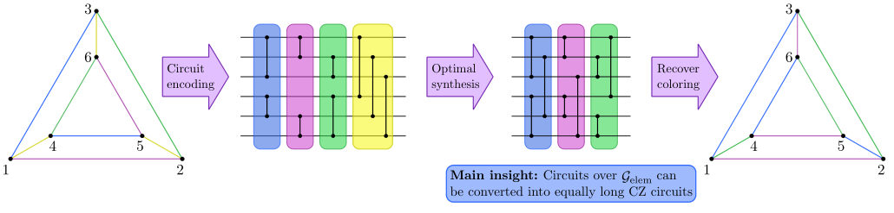
<figcaption class="paper-figure-caption"><b>Fig 1.</b> FIG. 1: Caricature of the Karp reduction from 3-regular graph edge coloring to depth-optimal Clifford circuit synthesis. A 4-coloring of the initial graph with n = 6 vertices is included for illustration.</figcaption>
</figure>

**Summary.** This paper establishes that finding the shortest quantum circuit representation for a given Clifford unitary is NP-hard. It achieves this by reducing the problem to graph edge coloring. Furthermore, it proves that for 3-regular graphs, the optimal circuit depth is determined solely by the number of CZ gates required, regardless of the inclusion of other Clifford gates like Hadamard or CNOT.

**Why it may be interesting.** This work provides deep complexity-theoretic bounds on quantum hardware design, showing that even for the relatively simple Clifford group, finding the shortest circuit is computationally hard.

Detailed structure

**Main problem.** The paper investigates the computational complexity of optimal quantum circuit synthesis, specifically for Clifford circuits.

**Main result.** It proves that optimal Clifford circuit synthesis is NP-hard, and furthermore, for 3-regular graphs, the optimal depth using general Clifford gates equals the depth achievable using only CZ gates.

**Method.** The hardness proof uses a reduction from 3-edge colorability on 3-regular graphs to the circuit synthesis problem. The equivalence proof relies on systematically eliminating Hadamard and CNOT gates from the optimal circuit structure.

**Model / system.** The model is the quantum circuit implementing a unitary $U_G$ derived from a graph $G$. The analysis focuses on the Clifford group operations using elementary gates like H, CNOT, and CZ.

**Key observables.** Optimal circuit depth ($	ext{Delem}(U_G)$), edge chromatic number ($\chi'(G)$), and the number of CZ gates ($NCZ$).

**Important parameters / regimes.** The graph $G$ is assumed to be 3-regular, constraining $\chi'(G)$ to $\{3, 4\}$. The analysis often considers circuits of depth $\le 3$.

**Assumptions / limitations.** The analysis assumes that gates on disjoint qubits can be executed in parallel in a single layer, and the final structural proofs are restricted to 3-regular graphs.

**Figures summary.** Figure 1 illustrates the reduction from 3-regular graph edge coloring to depth-optimal Clifford circuit synthesis, akin to a Karp reduction.

**Paper structure.** The paper first establishes the NP-hardness via reduction from graph coloring. It then proceeds to prove the structural equivalence ($	ext{Delem} = 	ext{DCZ}$) by sequentially simplifying the circuit structure, first eliminating Hadamard gates, then CNOT gates, leaving only CZ gates for 3-regular graphs.

Abstract

Optimal circuit synthesis is the problem of finding the shortest-depth circuit representation of a given functionality with respect to a pre-specified elementary gate set. This is a central problem in both quantum and classical hardware design. While the classical version is very well understood -- both in terms of heuristics and rigorous hardness assertions -- much less is known about optimal quantum circuit synthesis.   We focus on optimal Clifford circuit synthesis, for which various heuristics are known, e.g. via reduction to 3-SAT. Our main result supplies a matching hardness result: a variant of optimal Clifford synthesis is NP-hard. The proof proceeds in two parts: (i) reduce 3-edge colorability on 3-regular graphs to a circuit synthesis problem that only involves CZ gates, (ii) prove that the availability of additional elementary Clifford gates -- most notably: Hadamard, phase and CNOT -- cannot lead to further improvements of the optimal circuit depth. Our work sharpens the complexity-theoretic understanding of Clifford circuits: simulation and equivalence checking are in P, whereas deciding whether a Clifford unitary admits an implementation within a prescribed depth is NP-complete.

[↑ back to top](#top)

### [A Generalized quantum Stein lemma on von Neumann algebras](http://arxiv.org/abs/2610.02134v1)

**Authors:** Li Gao  
**Type:** theory · **Category:** quantum information and computing · **PDF:** <https://arxiv.org/pdf/2610.02134v1>  
**Analysis basis:** full PDF text, analyzed in chunks

↔ Scroll figures horizontally

<figure class="paper-figure-card">
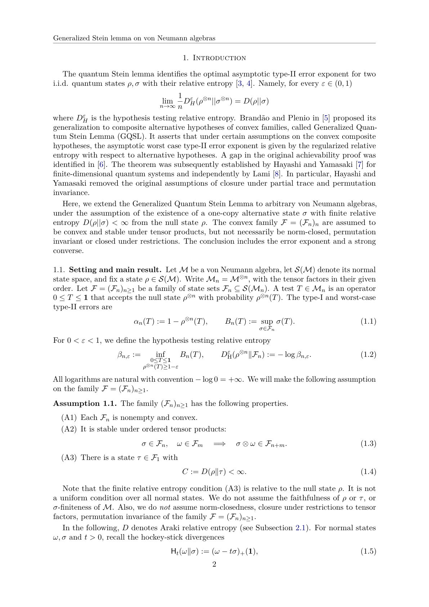
<figcaption class="paper-figure-caption"><b>Fig 1.</b> Low-resolution page preview, page 2</figcaption>
</figure>
<figure class="paper-figure-card">
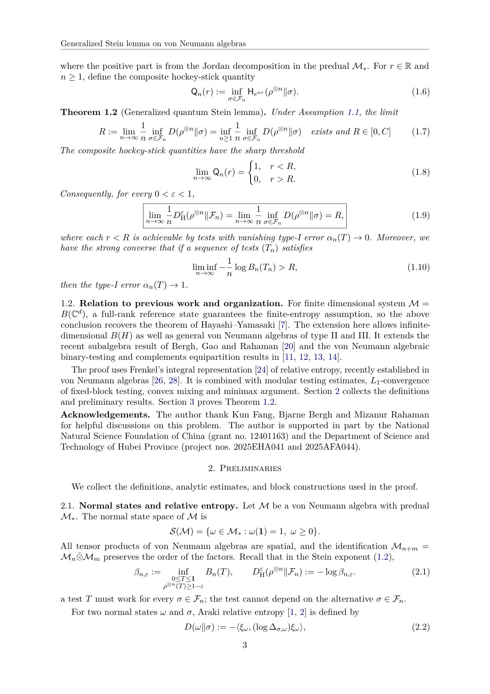
<figcaption class="paper-figure-caption"><b>Fig 2.</b> Low-resolution page preview, page 3</figcaption>
</figure>
<figure class="paper-figure-card">
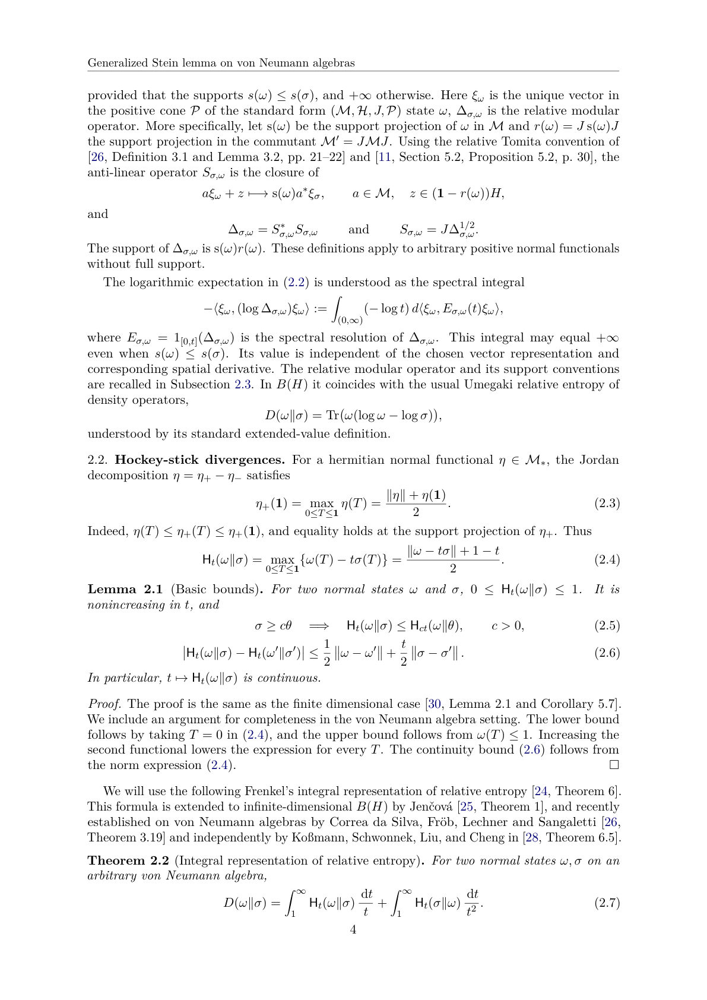
<figcaption class="paper-figure-caption"><b>Fig 3.</b> Low-resolution page preview, page 4</figcaption>
</figure>
<figure class="paper-figure-card">
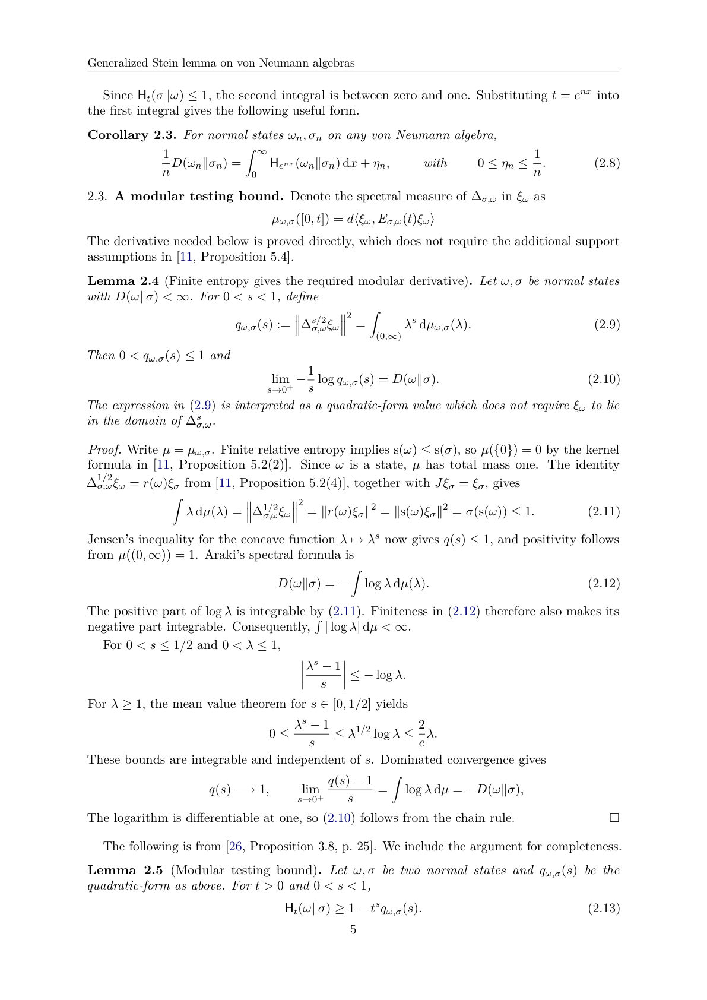
<figcaption class="paper-figure-caption"><b>Fig 4.</b> Low-resolution page preview, page 5</figcaption>
</figure>
<figure class="paper-figure-card">
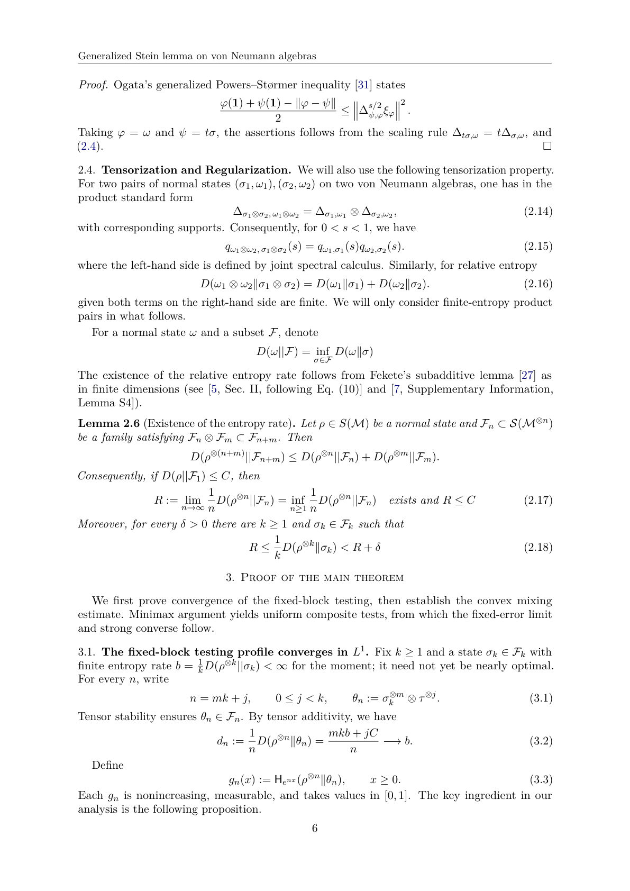
<figcaption class="paper-figure-caption"><b>Fig 5.</b> Low-resolution page preview, page 6</figcaption>
</figure>

**Summary.** This theoretical paper generalizes the quantum Stein lemma to arbitrary von Neumann algebras, providing rigorous bounds for distinguishing between quantum states. It proves that the rate of distinguishability is governed by the regularized relative entropy, establishing a sharp threshold for testing quantities. This extends fundamental results from finite quantum systems to the most general setting of operator algebras.

**Why it may be interesting.** While highly abstract, the techniques involving relative entropy rates and strong converse theorems are foundational to understanding the limits of quantum channel capacity and distinguishability, which are core concepts in quantum information theory.

Detailed structure

**Main problem.** The paper aims to prove a generalized quantum Stein lemma for hypothesis testing involving i.i.d. normal states against convex, tensor-stable families on arbitrary von Neumann algebras.

**Main result.** It establishes that the asymptotic worst-case type-II error exponent is achieved by the regularized relative entropy, providing a strong converse for the distinguishability rate.

**Method.** The proof combines integral representations of relative entropy (via hockey-stick divergences), a modular testing bound, and convex minimax arguments.

**Model / system.** The theory is developed for quantum states ($
ho, \sigma$) defined on arbitrary von Neumann algebras ($M$), generalizing results from finite-dimensional systems.

**Key observables.** The worst-case type-II error exponent, the regularized relative entropy ($R$), and the composite hockey-stick quantities ($Q_n(r)$).

**Important parameters / regimes.** The error tolerance $\epsilon \in (0, 1)$ and the number of tensor factors $n 	o \infty$.

**Assumptions / limitations.** The family of states $F$ must be convex and tensor-stable, and the existence of an alternative state with finite relative entropy from the null state is assumed.

**Figures summary.** Not specified.

**Paper structure.** The paper builds by defining key divergences and bounds (relative entropy, modular testing bound), proving convergence results for testing profiles (Proposition 3.1), establishing the sharp threshold for $Q_n(r)$, and finally deriving the strong converse and fixed-error rate upper bound (Theorem 1.2).

Abstract

We prove a generalized quantum Stein lemma for i.i.d. normal states against convex, tensor-stable families on arbitrary von Neumann algebras. Assuming the existence of an alternative state with finite relative entropy from the null state, we show that, at every type-I error tolerance $\varepsilon\in (0,1)$, the worst case type-II error exponent is achieved with the regularized relative entropy with a strong converse. The proof combines the integral representation of relative entropy by hockey-stick divergences, a modular testing bound, and convex minimax argument.

[↑ back to top](#top)

### [Adversarial Robustness in Fake Quantum Simulators](http://arxiv.org/abs/2610.01574v1)

**Authors:** Marc Maußner, Volker Reers  
**Type:** both · **Category:** quantum information and computing · **PDF:** <https://arxiv.org/pdf/2610.01574v1>  
**Analysis basis:** full PDF text, analyzed in chunks

↔ Scroll figures horizontally

<figure class="paper-figure-card">
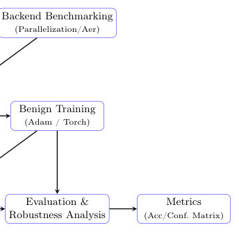
<figcaption class="paper-figure-caption"><b>Fig 1.</b> Fig. 1. Experimental workflow for noise-aware adversarial evaluation. The pipeline consists of: (1) Acquisition and reduction of the plus-minus dataset, (2) Backend benchmarking to optimize simulation threads and methods, (3) QNN construction using Strongly Entangling Layers, (4) Model training on benign data, (5) Adversarial example generation via Projected Gradient Descent (PGD), and (6) Robustness analysis using accuracy and confusion matrices.</figcaption>
</figure>
<figure class="paper-figure-card">
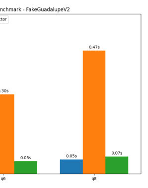
<figcaption class="paper-figure-caption"><b>Fig 2.</b> Fig. 2. Benchmarking of simulation methods in Qiskit Aer on the FakeGuadalupeV2 backend. The automatic method (blue) identifies the optimal solver for specific circuit configurations, significantly outperforming the matrix_product_state (MPS) approach as the qubit count scales from 4 to 8 qubits.</figcaption>
</figure>
<figure class="paper-figure-card">
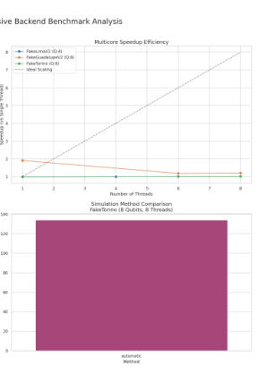
<figcaption class="paper-figure-caption"><b>Fig 3.</b> Fig. 3. Comprehensive comparison of simulation runtimes via the PennyLane interface across multiple noisy backends (FakeGuadalupeV2, FakeLimaV2, FakeJakartaV2). The plots illustrate the impact of parallelization configurations (max_parallel_threads) and highlight the communication overhead introduced by the PennyLane-Qiskit bridge.</figcaption>
</figure>
<figure class="paper-figure-card">
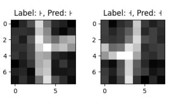
<figcaption class="paper-figure-caption"><b>Fig 4.</b> Fig. 4. Comparison of model performance on FakeGuadalupeV2 after balanced (50/50) adversarial retraining. This strategy results in a substantial recovery of robustness, increasing robust accuracy from 44% (sparse 10% ratio) to 84%, demonstrating that dataset balance is critical for security in hardware-mimicking environments.</figcaption>
</figure>

**Summary.** This work assesses the reliability of QML models running on noisy quantum simulators by testing their performance under adversarial attacks. The authors benchmark simulation efficiency and demonstrate that robust defense requires balancing adversarial training data with clean data (50/50 ratio). This highlights critical engineering requirements for deploying quantum machine learning in the NISQ era.

**Why it may be interesting.** It provides concrete, quantitative results on the practical limitations of current QML models when exposed to realistic noise and targeted attacks, which is crucial for designing fault-tolerant quantum algorithms.

Detailed structure

**Main problem.** The paper investigates how Quantum Machine Learning (QML) models perform in terms of scalability and robustness when run on simulated noisy quantum hardware.

**Main result.** Achieving practical robustness for 4-qubit classifiers requires a balanced adversarial-to-benign retraining ratio (50/50), significantly improving accuracy over sparse retraining.

**Method.** The study combines performance benchmarking of quantum simulators with adversarial attack simulations using Projected Gradient Descent (PGD) and subsequent adversarial retraining.

**Model / system.** The system uses a hybrid classical-quantum neural network (QNN) classifier trained on a 4-qubit circuit ansatz, simulated using Qiskit's fake backends mimicking NISQ devices.

**Key observables.** Benign Accuracy, Adversarial Accuracy, Robust Accuracy, and simulation runtime scaling factors.

**Important parameters / regimes.** The adversarial constraint is set by the $\ell_\infty$-norm ($\epsilon=0.1$), and the study scales up to 8 qubits.

**Assumptions / limitations.** The fidelity of the noise models is assumed to be accurate based on real system snapshots, and the threat model assumes white-box access for the adversary.

**Figures summary.** Figures illustrate the full workflow, performance benchmarking comparing automatic vs. MPS simulation methods, and the quantitative recovery of robust accuracy when using 50/50 adversarial retraining.

**Paper structure.** The paper follows a structure of benchmarking simulation performance (throughput/scaling) first, followed by a detailed adversarial robustness evaluation comparing various defense strategies (retraining ratios, regularization) against PGD attacks.

Abstract

This paper investigates the performance scalability and adversarial robustness of Quantum Machine Learning (QML) models deployed on noise-model-based fake simulators. We conduct a dual-phased study, first benchmarking the computational throughput of Qiskit's Aer simulation engine across varying hardware architectures, and second, evaluating the effectiveness of Projected Gradient Descent (PGD) attacks and adversarial retraining strategies under realistic noise conditions. Our results quantify the runtime tradeoffs and scaling behavior for medium-scale simulations (projected up to 8 qubits) and demonstrate that high adversarial-to-benign retraining ratios (50/50) are essential for achieving practical model robustness for 4-qubit classifiers under realistic noise conditions.

[↑ back to top](#top)

### [An exponential separation between entanglement-assisted and unassisted one-way quantum communication](http://arxiv.org/abs/2610.02099v1)

**Authors:** Ryan Anselm, Srijita Kundu, Olivier Lalonde, Ashwin Nayak  
**Type:** theory · **Category:** quantum information and computing · **PDF:** <https://arxiv.org/pdf/2610.02099v1>  
**Analysis basis:** full PDF text, analyzed in chunks

↔ Scroll figures horizontally

<figure class="paper-figure-card">
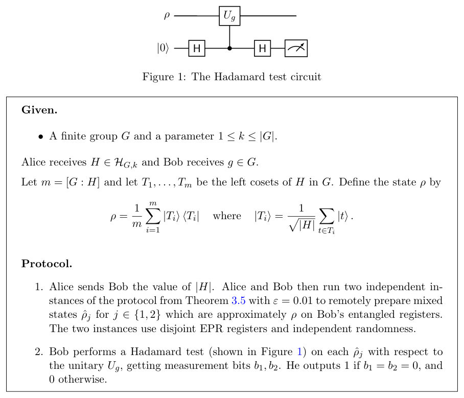
<figcaption class="paper-figure-caption"><b>Fig 1.</b> Figure 2: An efficient entanglement-assisted protocol for MembG,k using 2⌈log2 |G|⌉EPR pairs and O(log k) bits of communication.</figcaption>
</figure>
<figure class="paper-figure-card">
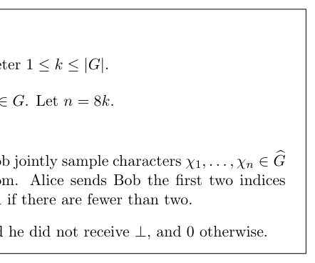
<figcaption class="paper-figure-caption"><b>Fig 2.</b> Figure 3: An efficient classical one-way protocol for MembG,k when G is abelian.</figcaption>
</figure>

**Summary.** This paper resolves a long-standing open problem by proving an exponential separation in the one-way quantum communication setting. They demonstrate that certain total Boolean functions can be computed using very few classical bits if entanglement is shared, but require significantly more quantum qubits if entanglement is unavailable. This result highlights the computational advantage of entanglement for total functions.

**Why it may be interesting.** It provides a concrete, quantifiable separation in quantum communication complexity, which is a fundamental theoretical tool used to understand the power of entanglement in computation, relevant to quantum networking and information theory.

Detailed structure

**Main problem.** The paper addresses the open question of whether an exponential separation exists between the communication complexity required for a total Boolean function when entanglement is available versus when it is not, specifically in the one-way communication setting.

**Main result.** The authors establish an exponential separation by constructing a family of total Boolean functions $f_n$ that require only $O(\log n)$ bits of one-way classical communication with prior entanglement, but $\Omega(n^{1/3})$ qubits without entanglement.

**Method.** The proof involves establishing upper and lower bounds on the communication complexity for the function, utilizing techniques from quantum communication complexity theory and relating the problem to the subgroup membership problem.

**Model / system.** The model is the one-way quantum communication setting for computing a total Boolean function $f_n: \{0, 1\}^n 	imes \{0, 1\}^n 	o \{0, 1\}$, comparing protocols that use shared entanglement versus those that do not.

**Key observables.** Communication cost (bits vs. qubits), success probability, and the separation gap (exponential vs. polynomial).

**Important parameters / regimes.** The function size $n$, the communication complexity bounds ($O(\log n)$ vs. $\Omega(n^{1/3})$), and the error tolerance ($\le 1/3$).

**Assumptions / limitations.** The result holds for a family of total Boolean functions, and the lower bound techniques rely on specific mathematical principles like Yao's min-max principle.

**Paper structure.** The paper first frames the open question regarding total Boolean functions. It then establishes the upper bound using entanglement-assisted protocols (related to subgroup membership) and derives the lower bound for the unassisted quantum setting, culminating in the proof of the exponential separation.

Abstract

A longstanding question in quantum communication complexity is whether some task can be accomplished with a small amount of communication in the presence of entanglement, yet require much more quantum communication in the absence of entanglement. Separations of this nature were previously known for relational problems and, in the simultaneous message passing model, for partial functions. But it has remained unresolved whether any such separation exists for a total Boolean function. We resolve this question with an exponential separation in the one-way setting: we exhibit a family of total Boolean functions $f_n\colon \{0,1\}^n \times \{0,1\}^n \to \{0,1\}$ that can be computed with $O(\log n)$ bits of one-way classical communication given prior entanglement, but that require $Ω(n^{1/3})$ qubits of one-way quantum communication without entanglement. Our function is a special case of the subgroup membership problem, first studied in the communication setting by Aaronson, Le Gall, Russell, and Tani.

[↑ back to top](#top)

### [Beyond Feasibility: Finite-Depth Accessibility in Constrained QAOA](http://arxiv.org/abs/2610.00736v1)

**Authors:** Rushikesh Ubale, Gregory T. Byrd, Yasar Mulani, Sangram Deshpande  
**Type:** theory · **Category:** quantum information and computing · **PDF:** <https://arxiv.org/pdf/2610.00736v1>  
**Analysis basis:** full PDF text, analyzed in chunks

↔ Scroll figures horizontally

<figure class="paper-figure-card">
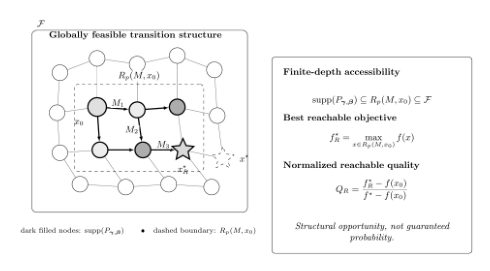
<figcaption class="paper-figure-caption"><b>Fig 1.</b> FIG. 1. Conceptual distinction between global feasible con- nectivity and finite-depth accessibility. Although the full constraint-preserving mixer structure may connect the feasi- ble manifold F, a circuit initialized at x0 and executing only a finite mixer schedule can structurally access only Rp(M, x0) ⊆ F. The accessible set contains the computational-basis sup- port of the ideal circuit and defines the best reachable objec- tive f ⋆ R and normalized reachable quality QR.</figcaption>
</figure>
<figure class="paper-figure-card">
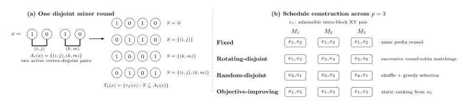
<figcaption class="paper-figure-caption"><b>Fig 2.</b> FIG. 2. Disjoint-round semantics and mixer-schedule construction. (a) A single round can contain several vertex-disjoint XY exchanges, so all compatible subsets of the active exchanges contribute to the structural accessible set. (b) The fixed, rotating- disjoint, random-disjoint, and objective-improving schedule constructions used in the experiments; their precise definitions are given in Sec. III C.</figcaption>
</figure>
<figure class="paper-figure-card">
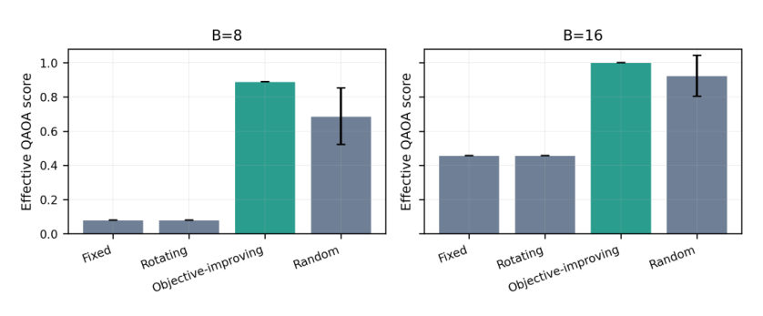
<figcaption class="paper-figure-caption"><b>Fig 3.</b> FIG. 3. Canonical resource-matched QAOA performance at requested XY-interaction budgets B = 8 and B = 16. Bars show the effective QAOA score for the deterministic mixer policies and the mean score across random-disjoint schedule seeds; error bars indicate the corresponding variability where applicable. Despite matching the requested interaction budget, the mixer allocations produce substantially different shallow-QAOA performance.</figcaption>
</figure>
<figure class="paper-figure-card">
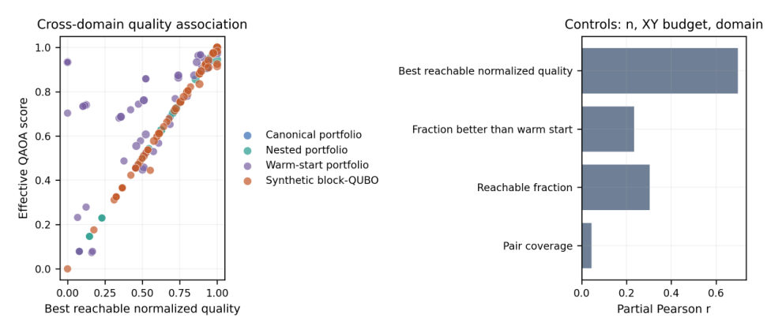
<figcaption class="paper-figure-caption"><b>Fig 4.</b> FIG. 4. Cross-domain relationship between finite-depth reachable quality and realized shallow-QAOA performance. Left: effective QAOA score Seff versus best reachable normalized quality QR across the 207 completed portfolio and synthetic QAOA configurations. Right: partial Pearson associations between Seff and the structural diagnostics after controlling for problem size n, executed XY-interaction budget, and problem domain. Among the tested diagnostics, QR shows the strongest controlled association with realized performance. The associations are observational rather than causal.</figcaption>
</figure>
<figure class="paper-figure-card">
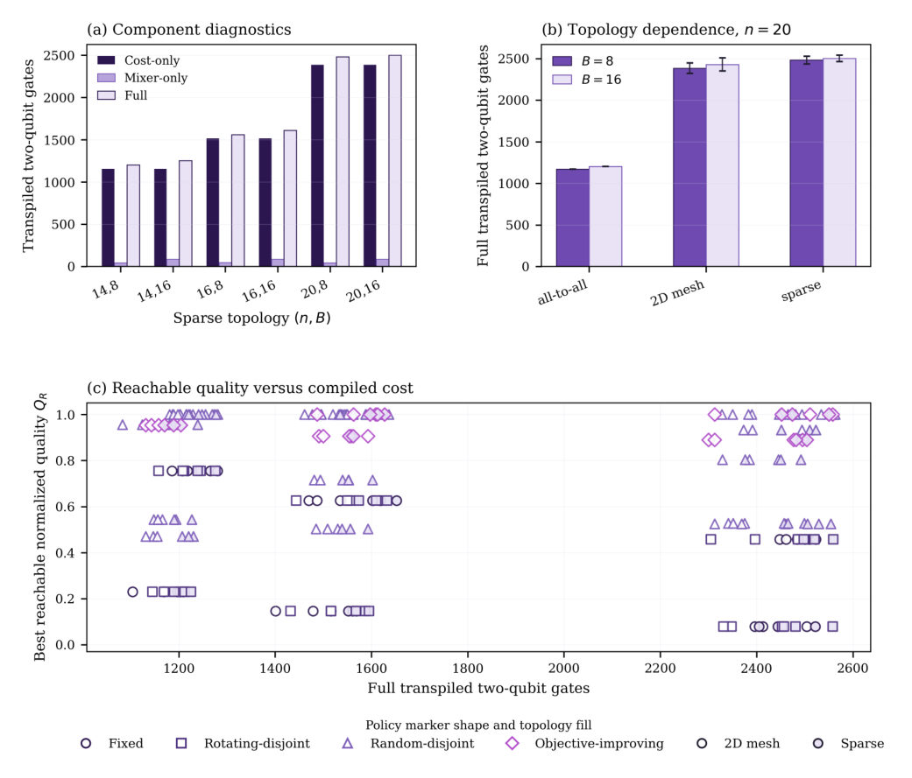
<figcaption class="paper-figure-caption"><b>Fig 5.</b> FIG. 5. Compilation diagnostics for the nested portfolio circuits. (a) Two-qubit gate counts for the separately transpiled cost, mixer, and full circuits on the sparse hardware-inspired topology. (b) Full-circuit two-qubit counts for n = 20 across the three connectivity models and the two logical XY budgets. Error bars show the sample standard deviation across the retained compiled rows in each topology–budget group. (c) Best reachable normalized quality QR versus full transpiled two-qubit gate count for the connectivity-constrained cases; marker shape identifies the mixer policy and marker fill distinguishes the two- dimensional mesh from the sparse hardware-inspired topology.</figcaption>
</figure>

**Summary.** This work develops a diagnostic framework to measure 'finite-depth accessibility' in constrained QAOA, focusing on which solutions are structurally available given a limited circuit depth. By defining the accessible set $R_p$ and the diagnostic $Q_R$, the authors show that this structural measure correlates strongly with actual performance, offering a vital tool for resource-bounded quantum algorithm design.

**Why it may be interesting.** It provides a rigorous, structural diagnostic ($Q_R$) that quantifies the *opportunity* for optimization based on the actual circuit structure, which is crucial for designing resource-constrained quantum algorithms.

Detailed structure

**Main problem.** The paper investigates the structural limitations of Constrained QAOA at finite circuit depth, moving beyond simple feasibility or global connectivity analyses.

**Main result.** A normalized reachable-quality diagnostic ($Q_R$) shows the strongest correlation with realized shallow-QAOA performance, suggesting objective-relevant accessibility is a key metric.

**Method.** The authors define the finite-depth accessible set $R_p(M, x_0)$ based on the executed mixer schedule and derive metrics like $Q_R$ to quantify the objective quality within this structurally accessible region.

**Model / system.** The model is the Constrained Quantum Approximate Optimization Algorithm (QAOA) applied to combinatorial optimization problems with hard constraints. The evolution is governed by a fixed initial state, a finite depth $p$, and a specific schedule of mixer interactions.

**Key observables.** Finite-depth accessible set $R_p(M, x_0)$, best structurally accessible objective $f^\star_R$, and the normalized reachable-quality diagnostic $Q_R$.

**Important parameters / regimes.** Circuit depth ($p$), initial state ($x_0$), and the specific mixer schedule ($M$).

**Assumptions / limitations.** The analysis assumes that the structural accessibility $R_p$ provides a parameter-independent ceiling on the best objective achievable by the fixed circuit structure.

**Figures summary.** Figure 1 conceptually distinguishes between global feasible connectivity and finite-depth accessibility, while the text describes the structure of the portfolio benchmark.

**Paper structure.** The paper progresses from establishing the need to study finite-depth accessibility beyond mere feasibility, to defining the set $R_p(M, x_0)$ and the diagnostic $Q_R$, and finally validating this framework using resource-matched schedules on portfolio optimization problems.

Abstract

Constraint-preserving mixers keep QAOA within a feasible subspace, but feasibility and global mixer connectivity do not determine which feasible configurations are available to a particular shallow circuit. We study constrained QAOA at the level of the circuit actually executed: a specified feasible initial state, finite depth, and finite schedule of mixer interactions. We define the finite-depth accessible set $R_p(M,x_0)$ and show that the computational-basis support of the ideal QAOA circuit is contained within it. This gives a parameter-independent objective ceiling $f_R^\star=\max_{x\in R_p}f(x)$ and a normalized reachable-quality diagnostic $Q_R$, separating accessible volume from the objective quality contained within it.   We evaluate this framework using resource-matched block-local XY mixer schedules for constrained portfolio optimization and synthetic block-constrained quadratic problems. Across 207 favorable-tail CVaR QAOA configurations, $Q_R$ shows the strongest association with realized shallow-QAOA performance among the structural diagnostics considered, with Pearson and Spearman correlations of $0.7003$ and $0.8057$; the relationship remains positive under controlled and dependence-aware analyses. The distinction persists across changes in feasible initialization, portfolio size, and objective family.   A compilation-only study further shows that, for the dense portfolio Hamiltonians considered here, phase-separator routing dominates the compiled two-qubit resource scale, while mixer schedules with comparable compiled two-qubit cost can exhibit markedly different finite-depth accessible quality. These results motivate objective-relevant finite-depth accessibility as a complementary diagnostic for resource-bounded constrained QAOA.

[↑ back to top](#top)

### [Beyond IP = PSPACE and QIP = PSPACE: Interactive Proofs in Arbitrary Physical Theories](http://arxiv.org/abs/2610.00847v1)

**Authors:** Kishor Bharti  
**Type:** theory · **Category:** quantum information and computing · **PDF:** <https://arxiv.org/pdf/2610.00847v1>  
**Analysis basis:** full PDF text, analyzed in chunks

↔ Scroll figures horizontally

<figure class="paper-figure-card">
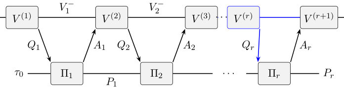
<figcaption class="paper-figure-caption"><b>Fig 1.</b> Figure 2: An r-round protocol. The verifier’s stages V (i) are adaptive circuits of G acting on its private register (top wire); the prover’s channels Πi act on its private system (bottom wire). The verifier and the prover start in independently prepared states ω0 and τ0 and interact only through the message systems Qi and Ai.</figcaption>
</figure>

**Summary.** This work generalizes interactive proof theory to arbitrary physical theories, questioning the physical origin of computational power. It shows that while classical and quantum communication channels restrict the power to $	ext{PSPACE}$, allowing arbitrary message systems can lead to computational classes strictly beyond $	ext{PSPACE}$. This has deep implications for the relationship between physics and computation theory.

**Why it may be interesting.** It directly addresses the foundational question of whether computational complexity classes are fundamentally limited by the laws of physics (quantum mechanics vs. classical physics) governing the communication channels.

Detailed structure

**Main problem.** The paper investigates how the power of interactive proof systems (IP/QIP) is constrained by the underlying physical theory used by the prover and verifier, moving beyond the established $	ext{IP} = 	ext{PSPACE}$ and $	ext{QIP} = 	ext{PSPACE}$ results.

**Main result.** While classical messages restrict the class to $	ext{PSPACE}$, allowing arbitrary quantum or non-physical messages can cause the interactive-proof class to strictly exceed $	ext{PSPACE}$.

**Method.** The analysis uses a general framework of interactive proofs within probabilistic theories, analyzing the acceptance probability based on the type of messages exchanged (classical, quantum, or arbitrary systems).

**Model / system.** The framework studies interactive proofs in general probabilistic theories ($G$), which are modeled using concepts from convex geometry, defining systems, states, and effects for both classical and quantum settings.

**Key observables.** The acceptance probability of the interactive proof protocol, which depends on the message type (classical, quantum, arbitrary systems).

**Important parameters / regimes.** The bias parameter $v \in (0, 1)$ used in constructing specific test theories ($	ext{GQ}_v$), and the complexity class $	ext{PSPACE}$.

**Assumptions / limitations.** The theories must satisfy standing assumptions, including local tomography and causality, and the verifier's gates must be efficiently computable.

**Figures summary.** Not specified in the notes, but Chunk 2 notes mention Figure 1 illustrates the state space of the triangular system $	ext{W}_v$.

**Paper structure.** The paper first establishes the general mathematical framework using convex geometry to model physical systems. It then analyzes the complexity class by restricting the message types exchanged (classical, quantum, arbitrary) to derive the main theorems regarding $	ext{PSPACE}$ containment.

Abstract

The equalities IP = PSPACE and QIP = PSPACE, the latter achievable with three messages, raise a basic question: how much of an interactive proof's power comes from the underlying physical theory? We study interactive proofs in general probabilistic theories, which include classical and quantum theory. The answer depends on what the prover and verifier exchange and how the theory specifies efficient operations. When they exchange only classical messages, protocols in every theory satisfying our standard assumptions decide exactly PSPACE. For protocols with a quantum verifier and quantum messages, allowing a prover to use any theory containing quantum theory does not increase the maximum acceptance probability. Thus, the three-message PSPACE result remains valid against such provers. When messages may be arbitrary systems, the interactive-proof class can strictly exceed PSPACE.

[↑ back to top](#top)

### [Classical Hardness of Learning Functions of Hamiltonians](http://arxiv.org/abs/2610.01141v1)

**Authors:** Sota Hashimoto, Akinori Kawachi  
**Type:** theory · **Category:** quantum information and computing · **PDF:** <https://arxiv.org/pdf/2610.01141v1>  
**Analysis basis:** full PDF text, analyzed in chunks

↔ Scroll figures horizontally

<figure class="paper-figure-card">
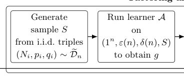
<figcaption class="paper-figure-caption"><b>Fig 1.</b> Figure 1: Reduction from an efficient learner A to a classical factoring algorithm B.</figcaption>
</figure>

**Summary.** This paper proves the average-case classical computational hardness for learning functions of Hamiltonians, a problem motivated by quantum physics. By constructing specific learning tasks related to $\cos(\pi H)$ and $e^{-eta H}$, the authors show that solving these problems efficiently would imply the existence of a classical algorithm to factor large RSA numbers. This sets a strong theoretical lower bound on the classical difficulty of quantum information processing tasks.

**Why it may be interesting.** This work is highly relevant as it establishes a fundamental computational barrier for quantum machine learning tasks, showing that solving certain physical prediction problems is as hard as breaking modern cryptography.

Detailed structure

**Main problem.** The paper establishes the average-case classical computational hardness for the problem of learning functions of Hamiltonians, $	ext{Tr}[f(H)
ho]$, from classical descriptions of $H$ and $
ho$.

**Main result.** It rigorously proves that if an efficient classical learner exists for two specific Hamiltonian function learning problems ($f_{\cos, \pi}$ and $f_{\exp, eta}$), then a classical randomized polynomial-time algorithm for factoring random RSA moduli must also exist.

**Method.** The proof employs a cryptographic reduction strategy, linking the learnability of the quantum function to the difficulty of factoring large composite numbers, relying on the structure of Shor's algorithm.

**Model / system.** The model involves quantum systems described by a Hamiltonian $H$ and a state $
ho$, where the target observable is $	ext{Tr}[f(H)
ho]$. The hardness proof utilizes specific Hamiltonians $H_{N,j,b}$ constructed from the acceptance projector of a factoring circuit.

**Key observables.** The key observables are the expectation values $	ext{Tr}[\cos(\pi H)
ho]$ and $	ext{Tr}[e^{-eta H}
ho]$, whose distinct values allow for the recovery of the factors of an RSA modulus.

**Important parameters / regimes.** The hardness relies on the average-case hardness of factoring random RSA moduli, and the analysis involves error parameters $\epsilon(n)$ and $\delta(n)$ related to the learning approximation.

**Assumptions / limitations.** The primary assumption is the average-case hardness of factoring random RSA moduli. It also assumes the existence of an efficient classical randomized learner under squared loss.

**Figures summary.** Figure 1 summarizes the reduction, showing how an efficient learner $A$ applied to i.i.d. triples $(N_i, p_i, q_i)$ yields a hypothesis $g$ used to recover the factor of $N$ by comparing $g(x_{N,j,0})$ and $g(x_{N,j,1})$.

**Paper structure.** The paper introduces the Hamiltonian function learning problem, details the construction of two specific hard instances ($L_{\cos, \pi}$ and $L_{\exp, eta}$), and then executes the cryptographic reduction, showing that learnability implies the ability to factor RSA moduli.

Abstract

Morohoshi, Nakayama, Manabe, and Mitarai proposed a physically motivated quantum machine learning problem in which the goal is to predict quantities of the form $\operatorname{Tr}[f(H)ρ]$ from classical descriptions of a Hamiltonian $H$ and a quantum state $ρ$, where $f$ is an unknown function. We call this problem Hamiltonian function learning in this paper. They constructed an efficient quantum learning algorithm under suitable conditions, while leaving a rigorous proof of average-case classical hardness open. In this paper, we rigorously prove the average-case classical hardness for two distribution-specific Hamiltonian function learning problems for $f_{\cos,π}(λ)=\cos(πλ)$ and $f_{\exp,β}(λ)=e^{-βλ}$ discussed in the paper of Morohoshi et al. under the assumption of the average-case hardness of factoring random RSA moduli. More specifically, we show that an efficient classical randomized learner under squared loss whose output hypotheses are evaluable in classical polynomial time for either problem would yield a classical randomized polynomial-time algorithm for factoring random RSA moduli.

[↑ back to top](#top)

### [Clifford-hierarchy stabilizer formalism with applications to twisted quantum doubles](http://arxiv.org/abs/2610.00464v1)

**Authors:** Christopher Fechisin, Kieran Cooney, Mathi Raja, Victor V. Albert, Dominic J. Williamson, Kyle Kawagoe, Seth Musser  
**Type:** theory · **Category:** quantum information and computing · **PDF:** <https://arxiv.org/pdf/2610.00464v1>  
**Analysis basis:** full PDF text, analyzed in chunks

↔ Scroll figures horizontally

<figure class="paper-figure-card">
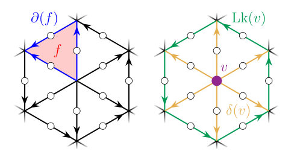
<figcaption class="paper-figure-caption"><b>Fig 1.</b> Figure 1. The geometry associated to the twisted quantum double stabilizers B(f) (left) and Aω g (v) (right) defined in Eqs. 4 and 6, for an example triangulation. All colored edges are in the support of the corresponding stabilizer.</figcaption>
</figure>
<figure class="paper-figure-card">
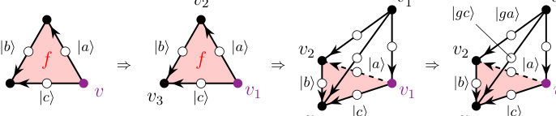
<figcaption class="paper-figure-caption"><b>Fig 2.</b> Figure 2. A depiction of the procedure used to evaluate the 3-cocycle on a triangle f. In order to evaluate the phase ω|f associated to the face f adjacent to the vertex v at which Aω g (v) is being applied, we perform the following algorithm [52]. Step 1. Label the vertices of the face f with labels vi, such that the branching structure gives the ordering v1 &lt; v2 &lt; v3. Step 2. Introduce a new vertex v′ i corresponding to the vertex vi at which Aω g (v) is being applied. (This is the purple vertex in the figure.) With four vertices, we now have a tetrahedron. The new edges should be oriented so that v′ i appears immediately before vi in the ordering. Step 3. Place the state |g⟩on the edge...</figcaption>
</figure>
<figure class="paper-figure-card">
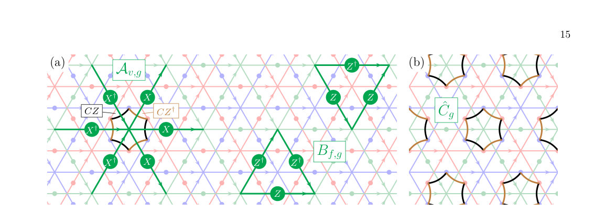
<figcaption class="paper-figure-caption"><b>Fig 3.</b> Figure 3. (a) One layer of stabilizer generators of the TQD DωIII(Z3 p). The stabilizer generators in the other layers are defined analogously. (b) The product of all TQD vertex generators in the green layer is ˆCg, a diagonal operator which is only supported on the red and blue layers. Given a pair of Zp toric codes in the red and blue layers, ˆCg acts as a nontrivial logical operator on this code.</figcaption>
</figure>
<figure class="paper-figure-card">
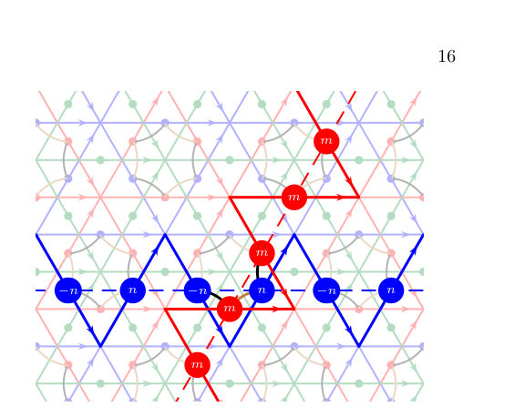
<figcaption class="paper-figure-caption"><b>Fig 4.</b> Figure 4. We take a representative state in the |m⟩rV |n⟩bH homology class, where all qudits not explicitly labeled are taken to be |0⟩. We draw the three local operators which contribute a nontrivial phase to ˆCg in full saturation. These phases multiply to ζ−mn, producing an effective logical action CZ † rV ,bH.</figcaption>
</figure>
<figure class="paper-figure-card">
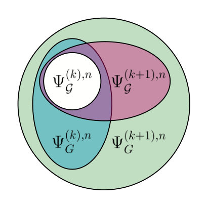
<figcaption class="paper-figure-caption"><b>Fig 5.</b> Figure 5. The structure of inclusions for the sets of stabilizer states defined in Def. B.1 for a generic k and n. We do not display k′ &lt; k or k′ &gt; k + 1 and consider only a fixed number of qudits n.</figcaption>
</figure>

**Summary.** This paper introduces the $X\mathcal{C}^{(k)}_d$ stabilizer formalism to analyze topological quantum codes beyond the standard Pauli model, specifically targeting Twisted Quantum Double (TQD) phases. The authors classify these states and determine the minimum stabilizer level required to realize complex topological orders. This provides a concrete, generalized framework for building and understanding topological quantum memory and gates.

**Why it may be interesting.** This work provides a deep mathematical link between abstract group theory (quantum doubles) and the physical realization of topological quantum error-correcting codes, which is central to fault-tolerant quantum computation.

Detailed structure

**Main problem.** The paper develops a generalized stabilizer formalism to analyze topological quantum codes beyond the standard Pauli stabilizer model, specifically addressing twisted quantum double (TQD) phases.

**Main result.** It establishes the $X\mathcal{C}^{(k)}_d$ stabilizer formalism, showing that many TQD phases can be realized using Clifford stabilizers, and providing a concrete framework for topological codes beyond Pauli stabilizers.

**Method.** The authors use group theory, Clifford hierarchy analysis, and stabilizer formalism to classify states and determine the minimal stabilizer level required to encode specific topological orders.

**Model / system.** The focus is on Clifford-hierarchy stabilizer models, which generalize Pauli stabilizers by incorporating diagonal operators from higher levels of the Clifford hierarchy on prime-dimensional qudits. These models are applied to study Twisted Quantum Double (TQD) phases, which host non-abelian anyons.

**Key observables.** The minimal level $k$ of the stabilizer code, the structure of the 3-cocycle $\omega$, and the resulting topological order (e.g., $2D$ TQD $D_{\omega}(\mathbb{Z}_n^p)$).

**Important parameters / regimes.** The prime dimension $p$ of the qudits, the level $k$ of the Clifford hierarchy, and the structure of the cocycle $\omega$ (Type-I, Type-II, Type-III).

**Assumptions / limitations.** The analysis relies on the equivalence between certain quantum doubles $D(G)$ and $D_{\omega}(A)$ when $G$ is nil-2, and conjectures regarding the required stabilizer level for specific cocycle types.

**Figures summary.** Figures illustrate the geometry of TQD stabilizers, the algorithm for computing the 3-cocycle $\omega|f$ on a face, and the action of logical operators on the codespace.

**Paper structure.** The paper progresses by first introducing the generalized $X\mathcal{C}^{(k)}_d$ formalism, then applying it to characterize TQD models by relating the required stabilizer level $k$ to the cocycle structure $\omega$, and finally drawing connections to the algebraic structure of the underlying quantum double groups $D(G)$.

Abstract

Recent work has shown that quantum double models can be used to circumvent the Bravyi-Koenig bound. In particular, this is achieved through code-switching protocols in which non-Pauli stabilizer phases appear as intermediate codes. We introduce the $X\mathcal C^{(k)}_d$ stabilizer formalism, which generalizes the Pauli stabilizer formalism by combining Pauli-$X$ operators with diagonal operators drawn from a fixed level $k$ of the Clifford hierarchy on prime-dimensional qudits. This yields a natural class of beyond-Pauli stabilizer models, including many twisted quantum double phases. We classify a large class of these $X\mathcal C^{(k)}_d$ stabilizer states, showing that they are uniform superpositions over affine-linear subspaces with diagonal phases. In particular, when the stabilizers of a state require operators from level $k$ of the Clifford hierarchy, we show that the diagonal gates required to produce the phases in the wavefunction sit one level higher. We further show that every 2D twisted quantum double ${\cal D}^ω(\mathbb{Z}_p^n)$ with $ω$ a product of type-III cocycles and $p$ an odd prime admits a realization using only Clifford ($k=2$) stabilizers, and we conjecture that phases where $ω$ contains a type-I or type-II cocycle require level-$p$ Clifford-hierarchy stabilizers for $p$-dimensional qudits. Finally, we demonstrate that a pair of qudit toric codes may be deterministically prepared in a logical magic state by measuring $X\mathcal C^{(k)}_d$ stabilizers. Together, these results provide a concrete stabilizer framework for topological codes beyond Pauli stabilizer models and their logical gates.

[↑ back to top](#top)

### [Complexity and Applications of Nearest Stabilizer Product State Problems](http://arxiv.org/abs/2610.02037v1)

**Authors:** Daniel Grier, Hakop Pashayan, Luke Schaeffer  
**Type:** theory · **Category:** quantum information and computing · **PDF:** <https://arxiv.org/pdf/2610.02037v1>  
**Analysis basis:** full PDF text, analyzed in chunks

↔ Scroll figures horizontally

<figure class="paper-figure-card">
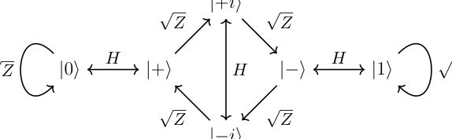
<figcaption class="paper-figure-caption"><b>Fig 1.</b> Figure 2: The six single-qubit stabilizer states. The arrows indicate the transitions under the Hadamard (H) and phase ( √</figcaption>
</figure>

**Summary.** This work tackles the Nearest Stabilizer Product State problem, which measures how close a complex stabilizer state is to a simple product state. By classifying the problem based on the allowed single-qubit components, the authors prove that most non-trivial instances are NP-complete. This has implications for understanding the computational difficulty of quantifying entanglement and simulating quantum systems.

**Why it may be interesting.** The rigorous complexity classification of an optimization problem related to quantum state decomposition provides fundamental theoretical bounds for simulating quantum circuits and understanding entanglement structure.

Detailed structure

**Main problem.** The paper analyzes the Nearest Stabilizer Product State (NSPS) problem, which involves maximizing the overlap between a given stabilizer state and a product state formed from a restricted set of single-qubit stabilizer states.

**Main result.** The complexity of the NSPS problem is classified, showing that most non-trivial choices of single-qubit stabilizer sets lead to NP-complete decision problems.

**Method.** The authors use complexity theory, group theory (Clifford group actions), and connections to graph theory (vertex cover number) to classify the problem's hardness.

**Model / system.** The system is defined over $n$-qubit stabilizer states $|\psi
angle$ and the optimization is performed over product states $\Pi_{S,k}$ constructed from a restricted set $S$ of single-qubit stabilizer states.

**Key observables.** The maximum overlap squared, $m(\psi, \Pi_{S,k})$, and related entanglement measures like $E_{sg}$ and $E_{ss}$.

**Important parameters / regimes.** The structure of the set $S$ (classified into 9 representatives) and the number of qubits $n$.

**Assumptions / limitations.** The analysis is restricted to the domain of stabilizer states, and the classification relies on symmetries under local Clifford unitaries.

**Figures summary.** Figures illustrate the connectivity of single-qubit stabilizer states under Clifford gates and list the elements belonging to specific orbits of subsets of Pauli operators.

**Paper structure.** The paper first defines the NSPS problem and its relation to entanglement measures. It then classifies the possible sets $S$ under local Clifford conjugation, leading to a complexity classification of the problem, and finally connects these results to known hard problems like vertex cover.

Abstract

Consider the following optimization problem over stabilizer product states: given an $n$-qubit stabilizer state $\left|ψ\right\rangle$ and a set of single-qubit stabilizer states $S$, maximize $\left|\langle ψ| φ_1, \ldots, φ_n \rangle\right|^2$ over single-qubit stabilizer states $\left|φ_i\right\rangle \in S$. By varying the set $S$, we show that solutions to this problem can be useful in a variety of settings: tighter runtime bounds for certain classical simulation algorithms; measures of entanglement; and the complexity of low-rank matrix completion. Moreover, we give a complete complexity classification of this nearest stabilizer product state problem. After accounting for the symmetries in the Clifford group, there are $9$ distinct possible sets $S$, and we show that all but the two simplest of these are $\NP$-complete.

[↑ back to top](#top)

### [Conditioning on Subalgebras - Entropy Duality and Generalized Quantum Stein's Lemma in von Neumann Algebras](http://arxiv.org/abs/2610.00772v1)

**Authors:** Bjarne Bergh, Li Gao, Mizanur Rahaman  
**Type:** theory · **Category:** quantum information and computing · **PDF:** <https://arxiv.org/pdf/2610.00772v1>  
**Analysis basis:** full PDF text, analyzed in chunks

↔ Scroll figures horizontally

<figure class="paper-figure-card">
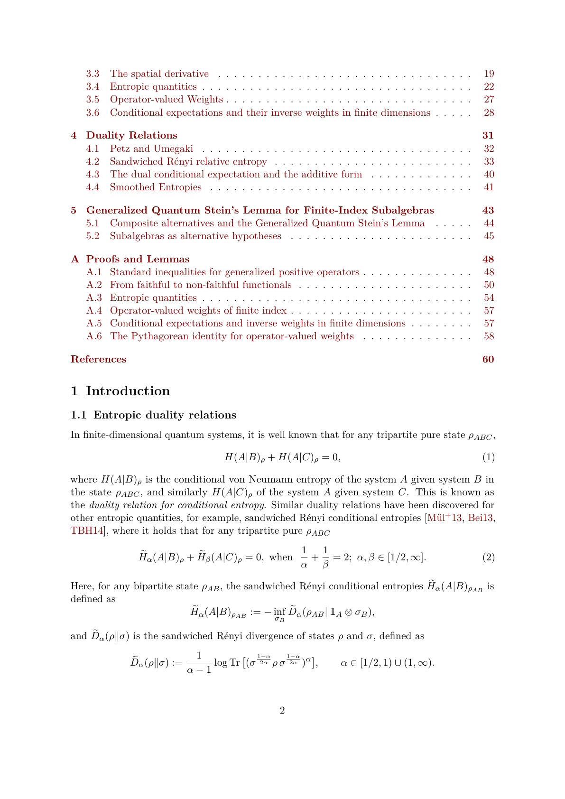
<figcaption class="paper-figure-caption"><b>Fig 1.</b> Low-resolution page preview, page 2</figcaption>
</figure>
<figure class="paper-figure-card">
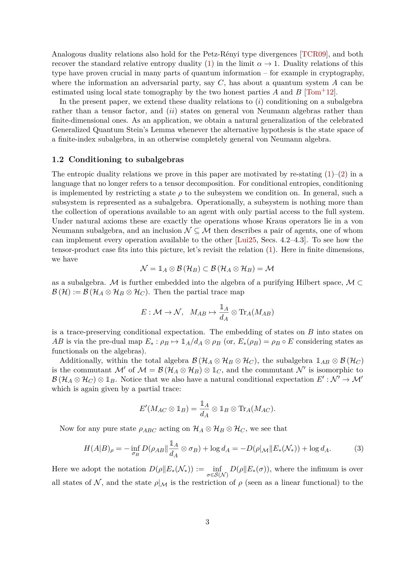
<figcaption class="paper-figure-caption"><b>Fig 2.</b> Low-resolution page preview, page 3</figcaption>
</figure>
<figure class="paper-figure-card">
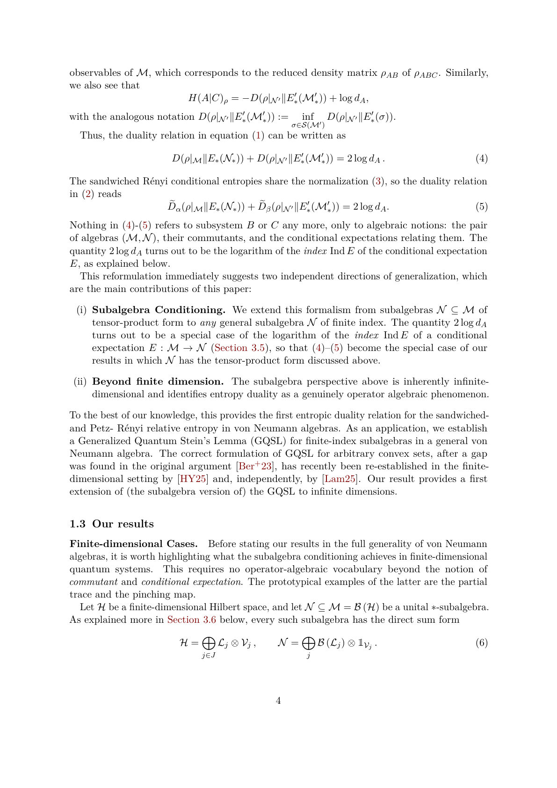
<figcaption class="paper-figure-caption"><b>Fig 3.</b> Low-resolution page preview, page 4</figcaption>
</figure>
<figure class="paper-figure-card">
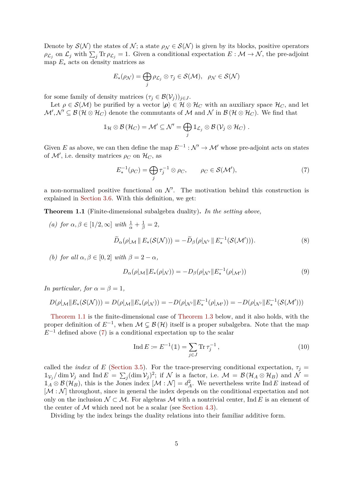
<figcaption class="paper-figure-caption"><b>Fig 4.</b> Low-resolution page preview, page 5</figcaption>
</figure>
<figure class="paper-figure-card">
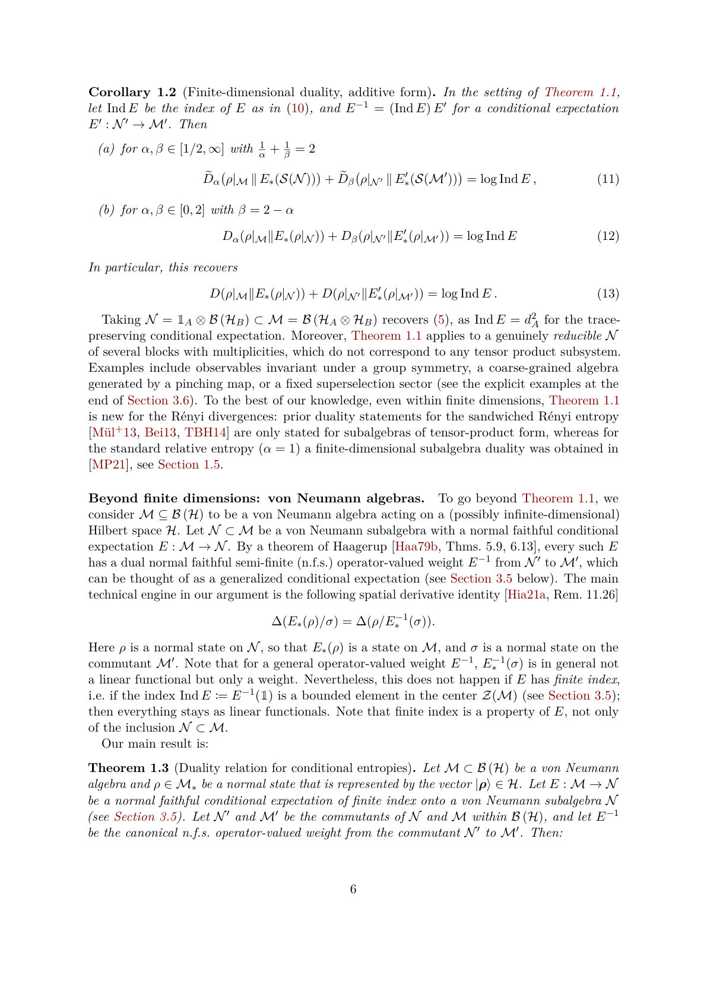
<figcaption class="paper-figure-caption"><b>Fig 5.</b> Low-resolution page preview, page 6</figcaption>
</figure>

**Summary.** This paper develops advanced mathematical duality relations for conditional entropies and divergences within the abstract framework of von Neumann algebras. By generalizing results from simple tensor products to arbitrary subalgebras, it extends the theory to infinite dimensions. The key application is establishing an infinite-dimensional Quantum Stein's Lemma, providing a rigorous measure for optimal error exponents in quantum hypothesis testing.

**Why it may be interesting.** This work provides deep mathematical tools for quantifying information loss and distinguishability in complex, non-factorizable quantum systems, which is foundational for understanding quantum error correction and quantum channel capacity.

Detailed structure

**Main problem.** The paper establishes duality relations for conditional entropies and divergences relative to arbitrary subalgebras within von Neumann algebras, generalizing results from simple tensor-product subsystems.

**Main result.** It extends these duality relations to the fully infinite-dimensional setting and establishes an infinite-dimensional extension of Quantum Stein's Lemma for finite-index subalgebras.

**Method.** The approach uses algebraic methods involving conditional expectations ($E: \mathcal{M} 	o \mathcal{N}$) and their dual maps ($E^*, E^{-1}$) to reformulate entropy relations, moving beyond simple tensor product structures.

**Model / system.** The mathematical framework is built upon von Neumann algebras ($\mathcal{M}$) and their subalgebras ($\mathcal{N}$), representing abstract quantum systems where conditioning is defined algebraically rather than geometrically.

**Key observables.** Conditional von Neumann entropy, Sandwiched- and Petz-Rényi divergences, and the optimal asymptotic error exponent in quantum hypothesis testing.

**Important parameters / regimes.** The index of the conditional expectation ($	ext{Ind } E$) and the parameters ($\alpha$) defining the Rényi divergences.

**Assumptions / limitations.** The results rely on the existence of a normal faithful conditional expectation of finite index, particularly for the generalization to infinite dimensions and the Quantum Stein's Lemma application.

**Figures summary.** No figures or captions were analyzed; the notes describe the mathematical development through theorems and corollaries.

**Paper structure.** The paper develops the argument by first reviewing known finite-dimensional tensor-product results, then reformulating them algebraically for general subalgebras, and finally generalizing the structure to infinite-dimensional von Neumann algebras, culminating in the Quantum Stein's Lemma extension.

Abstract

We establish duality relations for conditional entropies relative to subalgebras of arbitrary von Neumann algebras, including the Umegaki relative entropy as well as the sandwiched- and Petz-Rényi divergences. Even in finite dimensions, these results extend the familiar dualities for conditional entropies from tensor-product subsystems to general subalgebras, while also lifting the framework to the fully infinite-dimensional setting. As an application, we establish an infinite-dimensional extension of quantum Stein's lemma when the alternative hypothesis is the state space of a finite-index subalgebra, which gives an operational interpretation of the relative entropy to a subalgebra as the optimal asymptotic error exponent in composite quantum hypothesis testing-the first beyond finite dimensions.

[↑ back to top](#top)

### [Constant-Per-Layer-Depth MPS-Pretrained Ansatz for Noisy Distributed Quantum Processors](http://arxiv.org/abs/2610.01099v1)

**Authors:** Seongpyo Hong, Woodo Lee, Yong-Su Kim, Seung-Sup B. Lee, Junghyun Lee  
**Type:** theory · **Category:** quantum information and computing · **PDF:** <https://arxiv.org/pdf/2610.01099v1>  
**Analysis basis:** full PDF text, analyzed in chunks

↔ Scroll figures horizontally

<figure class="paper-figure-card">
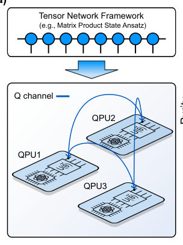
<figcaption class="paper-figure-caption"><b>Fig 1.</b> Fig. 1 Overview of tensor-network–assisted circuit design and the impact of depth-dependent deco- herence. (a) Schematic workflow: a classically optimized tensor-network state (illustrated here for an MPS) is mapped onto a gate-based parametrized circuit and deployed on a distributed quantum processor comprising multiple QPUs. (b) Illustration of a noisy quantum circuit, and representative trends showing purity decay with an increasing number of layers and the resulting degradation of variational optimization. The purity plot reports the mean over 10,000 random-circuit realizations, with error bars indicating one standard deviation, whereas the ideal and noisy optimization curves show...</figcaption>
</figure>
<figure class="paper-figure-card">
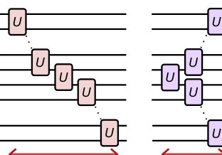
<figcaption class="paper-figure-caption"><b>Fig 2.</b> Fig. 2 Illustration of the three structured ansatzes considered in this work: ladder, mixed-canonical, and brick-wall. Each layer comprises N −1 two-qubit unitary blocks, but the parallelization strategy differs, resulting in distinct per-layer circuit depths: D = N −1 (ladder), D = ⌈N/2⌉(mixed- canonical), and D = 2 (brick-wall), where each brick-wall layer consists of one odd and one even sublayer.</figcaption>
</figure>
<figure class="paper-figure-card">
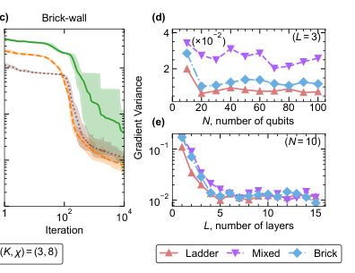
<figcaption class="paper-figure-caption"><b>Fig 3.</b> Fig. 3 Ideal-circuit benchmarks of energy convergence and gradient-variance diagnostics of the three structured ansatzes. Left: Noise-free VQE convergence of the relative energy error |(E −Eg)/Eg| for the (a) ladder, (b) mixed-canonical, (c) brick-wall ansatzes with a fixed total layer number L = 4. Results are shown for different combinations of the number of pretrained layers K and the MPS bond dimension χ (see legend). Solid lines denote the mean over 20 independent random initializations, and shaded regions indicate the corresponding min–max range (see Methods for initialization details). Right: Gradient-variance diagnostics, computed as the unbiased sample variance over 100 independent...</figcaption>
</figure>
<figure class="paper-figure-card">
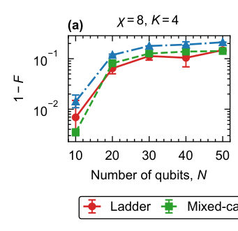
<figcaption class="paper-figure-caption"><b>Fig 4.</b> Fig. 4 Ideal MPS-to-circuit encoding infidelity for the twisted Heisenberg target MPS. (a) State infidelity, 1 −F, as a function of system size for fixed χ = 8 and K = 4. (b) State infidelity as a function of the number of encoding layers K for fixed χ = 8 and N = 50. The fidelity is computed between the target MPS and the corresponding circuit-prepared state for the three structured circuit layouts. Markers show the mean over six restarts of the encoding optimization and error bars the min–max range (Supplementary Information). Here, K denotes the number of circuit layers optimized to encode the target MPS; the same layers serve as the pretrained layers in the VQE calculations.</figcaption>
</figure>
<figure class="paper-figure-card">
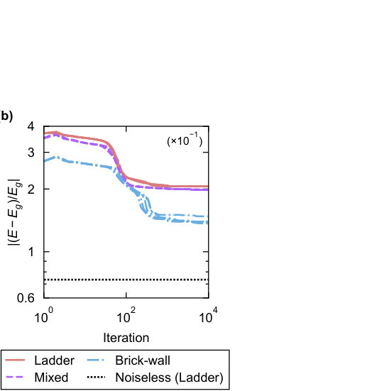
<figcaption class="paper-figure-caption"><b>Fig 5.</b> Fig. 5 Gate noise model and its impact on variational optimization. (a) Schematic of the noise model used in this work: after each decomposed gate G, the biased Pauli channel EP and the thermal- relaxation channel ET are applied, while idle intervals are modeled by ET alone. (b) Representative noisy VQE convergence of the relative energy error, |(E −Eg)/Eg|, for the three structured ansatzes. The dotted horizontal line indicates the mean endpoint relative energy error over 20 noiseless VQE runs of the ladder ansatz at the same (L, K, χ) = (3, 2, 8) setting, with each noiseless run optimized for 20,000 Adam iterations.</figcaption>
</figure>

**Summary.** This work establishes a framework for designing variational quantum circuits on modular quantum hardware by co-designing the ansatz, circuit scheduling, and communication topology. By comparing different MPS-based ansatzes, the authors show that depth-efficient architectures like the brick-wall are superior under noise. The results provide critical guidelines for scaling VQE to multi-QPU systems.

**Why it may be interesting.** It provides concrete, hardware-aware guidelines for designing variational quantum circuits, which is crucial for realizing algorithms on near-term, noisy quantum hardware.

Detailed structure

**Main problem.** The paper addresses the challenge of scaling variational quantum algorithms on noisy, distributed quantum processors by developing hardware-aware co-design principles.

**Main result.** The shallower brick-wall ansatz outperforms other circuit realizations under noise, and distributed circuits can match or exceed this performance if inter-QPU links realize relevant long-range interactions.

**Method.** The study compares different structured ansatzes (ladder, mixed-canonical, brick-wall) for encoding Matrix Product States (MPS) and extends this comparison to modular processors using VQE simulations.

**Model / system.** The system involves distributed quantum processors composed of multiple Quantum Processing Units (QPUs) connected by quantum links, simulating a target Hamiltonian like the twisted Heisenberg chain.

**Key observables.** Relative energy error, gradient variance, circuit depth, and state fidelity ($F$).

**Important parameters / regimes.** Noise strength, inter-QPU communication cost factor ($r$), and two-qubit gate duration ($t_{2q}$).

**Assumptions / limitations.** The advantage of distribution relies on the inter-QPU links realizing long-range interactions of the target Hamiltonian, and the comparison assumes matched per-layer two-qubit-block resources.

**Figures summary.** Figures illustrate the comparison of ansatzes (depths, convergence) and the performance of distributed architectures under varying communication costs and noise levels.

**Paper structure.** The paper first compares ansatzes on a single QPU, establishing the brick-wall's advantage; it then extends this to modular processors, analyzing the impact of nearest-neighbor scheduling and inter-QPU links on overall performance.

Abstract

Distributed quantum processors could scale variational algorithms beyond single devices, but circuit depth, communication overhead, and noise limit their performance. We compare ladder, mixed-canonical, and brick-wall realizations of matrix-product-state (MPS) pretraining with matched per-layer two-qubit-block resources. Despite comparable ideal variational quantum eigensolver performance and gradient scales, the shallower brick-wall architecture reduces circuit duration, idle-time decoherence, and zero-noise-extrapolation (ZNE) overhead, yielding superior noisy and ZNE-assisted performance. We then extend MPS-pretrained circuits to modular processors with one communication qubit per quantum processing unit (QPU); a nearest-neighbor QPU-path schedule keeps the per-layer depth constant as QPUs are added. Distributed circuits whose inter-QPU links realize long-range interactions of the target Hamiltonian match or outperform the single-processor brick-wall under noise when communication idle time is short compared with the coherence time. These results establish hardware-aware co-design of tensor-network pretraining, circuit scheduling, and communication topology as a principle for variational quantum computation on noisy modular hardware.

[↑ back to top](#top)

### [Device-Independent Conference Keys from Parity-Extended Games](http://arxiv.org/abs/2610.01025v1)

**Authors:** Suvradip Chakraborty, Ronak Ramachandran, Aniruddha Sen  
**Type:** theory · **Category:** quantum information and computing · **PDF:** <https://arxiv.org/pdf/2610.01025v1>  
**Analysis basis:** full PDF text, analyzed in chunks

↔ Scroll figures horizontally

<figure class="paper-figure-card">
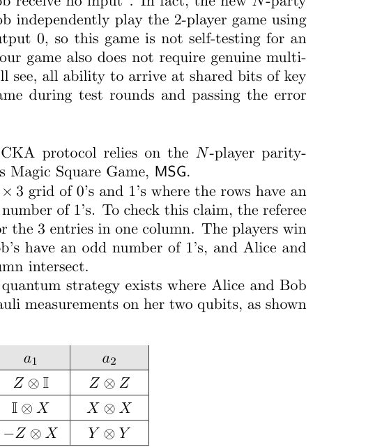
<figcaption class="paper-figure-caption"><b>Fig 1.</b> Figure 1: Alice’s Pauli measurements for outputs a0, a1, a2 ∈{0, 1} on input x ∈{0, 1, 2}.</figcaption>
</figure>
<figure class="paper-figure-card">
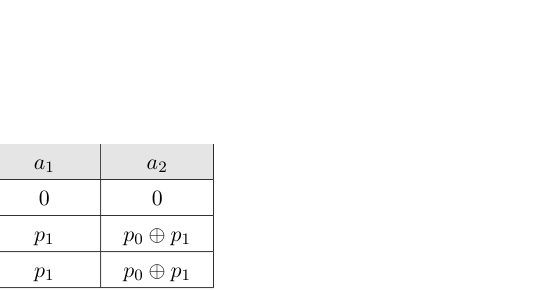
<figcaption class="paper-figure-caption"><b>Fig 2.</b> Figure 2: The referee’s corrections to Alice’s outputs for pMSGN.</figcaption>
</figure>
<figure class="paper-figure-card">
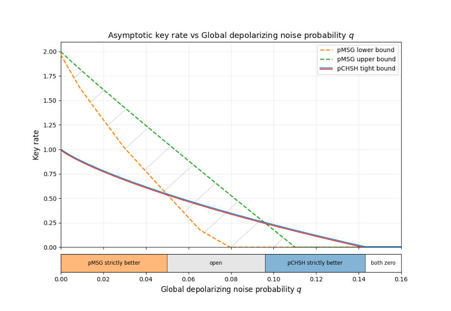
<figcaption class="paper-figure-caption"><b>Fig 3.</b> Figure 3: Key rate r = H(A|X = 0, T = 1, E) −h(q/2) as a function of the global depolarizing noise probability q. The per round entropy lower bound for pMSG is computed from Eq. (38) and the techniques of Lemma 6.7. We use a piecewise linear lower bound instead of just a single affine function since we just need a per round bound. The upper bound for pMSG is calculated from the strategy described in the paragraph below. We refer to prior work for a tight entropy upper and lower bound for pCHSH [GMKB23]. The true key rate for pMSG lies in the shaded region. The bars below the graph show which game achieves higher key rate in some noise regime; the middle section is open since our bounds for...</figcaption>
</figure>
<figure class="paper-figure-card">
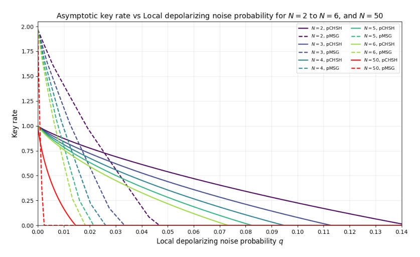
<figcaption class="paper-figure-caption"><b>Fig 4.</b> Figure 4: Key rate r = H(A|X = 0, T = 1, E) −h(q/2) as a function of the local, per qubit, depolarizing noise probability q, for various values of the number of parties N. The per round entropy lower bound for pMSG is computed from Eq. (44) and the techniques of Lemma 6.7. We use a piecewise linear lower bound instead of just a single affine function since we just need a per round bound. We refer to Eq. (47) and prior work for the (tight) lower bound for pCHSH [GMKB23].</figcaption>
</figure>

**Summary.** This paper introduces Parity-G games, a novel framework to generalize two-player non-local games to $N$ parties for Device-Independent Conference Key Agreement (DI-CKA). By applying this to the Magic Square Game, the authors construct a new DI-CKA protocol that is provably secure and demonstrates a superior key rate compared to existing protocols in the low-noise regime.

**Why it may be interesting.** The work provides a general, scalable framework for constructing multi-party quantum cryptographic protocols whose security is certified by non-locality, which is fundamental to quantum information theory.

Detailed structure

**Main problem.** Developing scalable and secure Device-Independent Conference Key Agreement (DI-CKA) protocols for $N$ parties, overcoming the limitation of relying on single, multi-party Bell inequalities.

**Main result.** The authors introduce Parity-G games, constructing the first DI-CKA protocol based on a pseudo-telepathy game (pMSGN) that achieves a key rate exceeding protocols based on Parity-CHSH in the low noise regime.

**Method.** The core method is the Parity-G framework, which generalizes any two-player Pauli game $G$ to $N$ players, allowing security analysis to reduce to the two-party game $G$.

**Model / system.** The protocol utilizes untrusted multipartite quantum states shared among $N$ parties, testing non-locality via generalized Pauli games like the Mermin–Peres Magic Square Game (pMSGN).

**Key observables.** Key rate ($r_\infty$), winning probability ($\omega$), and conditional von Neumann entropy $H(A|E)$.

**Important parameters / regimes.** Noise probability ($q$), number of parties ($N$), and the threshold for non-zero key bits ($\omega_{tol} > 8/9$).

**Assumptions / limitations.** The security proof relies on reducing the $N$-party security to the underlying two-party game $G$, and the analysis assumes the existence of an untrusted multipartite state $
ho$.

**Figures summary.** Figures illustrate Alice's Pauli measurements for the MSG game and the referee's correction bits for the $pMSGN$ protocol.

**Paper structure.** The paper introduces the Parity-G framework, applies it to the Mermin–Peres Magic Square Game to construct the pMSGN-based DI-CKA protocol, proves its security against coherent attacks, and compares its key rate to existing protocols.

Abstract

Device-independent conference key agreement (DI-CKA) lets a group of parties establish a shared secret key from untrusted quantum devices, with security certified by non-locality. Existing DI-CKA protocols are each built around a single Bell inequality, typically a multiparty variant of the CHSH game. DI-QKD protocols, in contrast, have been built from a much richer landscape of non-local games, and it has remained unclear how to carry this landscape over to the conference setting. We introduce $\textit{Parity-$G$ games}$, which extend any two-player game $G$ to $N$ players, for every $N$, provided $G$ has an optimal strategy in which one player measures Pauli observables. The extension preserves the quantum and classical values of $G$, and the security of the resulting $N$-party protocol follows from an analysis of the two-player game alone. Our framework recovers the Parity-CHSH game of Ribeiro, Murta and Wehner (Phys. Rev. A, 2018) as a special case. Applied to the Mermin--Peres Magic Square Game, it yields a new $N$-player pseudo-telepathy game, the $\textit{Parity Magic Square Game}$, which ideal devices win in every round. We use it to construct the $\textit{first}$ DI-CKA protocol based on a pseudo-telepathy game. We prove the protocol secure against coherent attacks. It produces up to two key bits per round, and at low noise its key rate exceeds that of the DI-CKA protocol based on the Parity-CHSH game.

[↑ back to top](#top)

### [Effects of on-site Gaussian disorder in the ferromagnetic Blume Capel model](http://arxiv.org/abs/2610.01090v1)

**Authors:** Kimberly J. Silverman, Daria Lhommedieu, Alykhan Rajan, Kathryn A. Cooper, Richard T. Scalettar, Eduardo Ibarra-García-Padilla  
**Type:** theory · **Category:** disordered systems and neural networks · **PDF:** <https://arxiv.org/pdf/2610.01090v1>  
**Analysis basis:** full PDF text, analyzed in chunks

↔ Scroll figures horizontally

<figure class="paper-figure-card">

<figcaption class="paper-figure-caption"><b>Fig 1.</b> FIG. 1. (a) Density n and (b) magnetization M as functions of T/J at ¯D/J = 1 for different σ/J.</figcaption>
</figure>
<figure class="paper-figure-card">
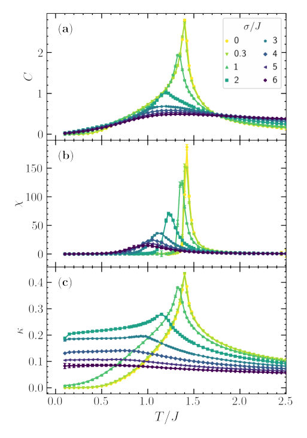
<figcaption class="paper-figure-caption"><b>Fig 2.</b> FIG. 2. (a) Specific heat C, (b) magnetic susceptibility χ, and (c) compressibility κ as functions of T/J at ¯D/J = 1 for different σ/J.</figcaption>
</figure>
<figure class="paper-figure-card">
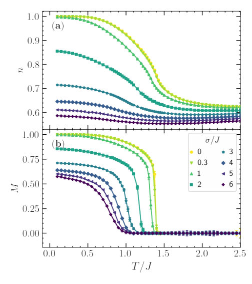
<figcaption class="paper-figure-caption"><b>Fig 3.</b> Fig. 1(a) shows the dependence of density n on the temperature for different amounts of disorder at fixed ¯D/J = 1. At high temperatures, where all spin states are equally probable, n = 2/3. As the temperature is lowered, in the absence of disorder (σ = 0), n increases monotonically to 1, indicating a fully occupied lattice. Increasing σ/J up to 0.3, there is no appreciable change in the density. As σ/J further increases past σ/J = 1,</figcaption>
</figure>
<figure class="paper-figure-card">
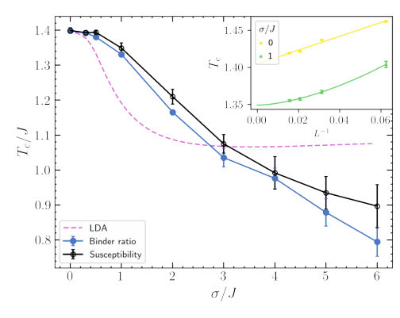
<figcaption class="paper-figure-caption"><b>Fig 4.</b> FIG. 3. Tc/J as a function of σ/J at ¯D/J = 1. Blue solid markers: Tc/J extracted from the crossings in the Binder ratio, where error bars are estimated as the difference between the predicted Tc/J from the crossings between L = 64, 48 and L = 64, 32 (see Fig. 9 for an example). Black open markers: Tc/J from the finite-size scaling of the peak locations in χ, with the error bars given from the fit parameters errors. The inset illustrates the finite-size scaling procedure for σ/J = 0, 1, where we fit to a power law Tc(L) = Tc(∞)+bL−ν. Pink dashed line: Tc/J from the LDA analysis given by Eq. (3).</figcaption>
</figure>
<figure class="paper-figure-card">
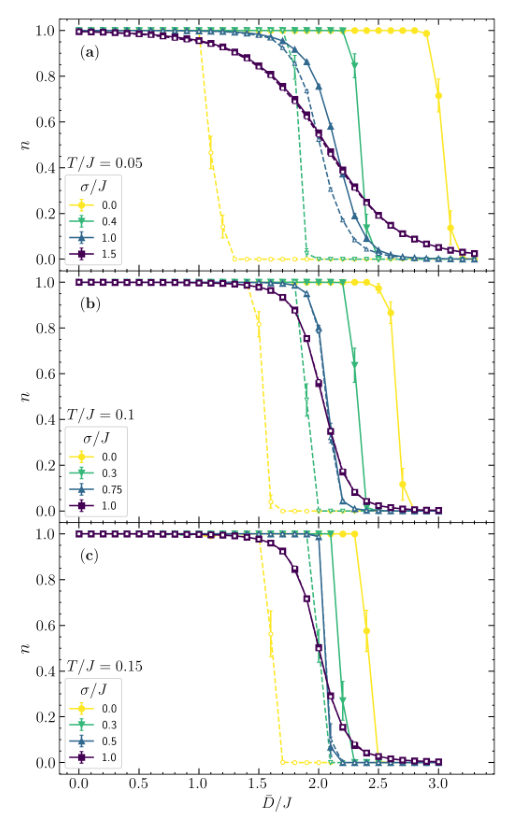
<figcaption class="paper-figure-caption"><b>Fig 5.</b> FIG. 4. Density n as a function of ¯D/J for selected values of σ/J at T/J = 0.05, 0.1, and 0.15. Filled markers with solid lines indicate forward runs, and open markers with dotted lines indicate backward runs. Backward runs employ a bias field h ≤σ/4 during warmup sweeps to perform annealing and ensure convergence.</figcaption>
</figure>

**Summary.** This paper numerically studies the effect of site-dependent Gaussian disorder on the phase transitions of the Blume-Capel model. Using MCMC simulations, the authors demonstrate that disorder suppresses the first-order transition while only reducing the second-order critical temperature, suggesting the transition remains robustly finite even for large disorder strengths.

**Why it may be interesting.** The study provides a detailed quantitative understanding of how quenched disorder fundamentally alters critical phenomena in lattice models, which has parallels in disordered quantum magnets and spin-glass physics.

Detailed structure

**Main problem.** The study investigates how introducing site-dependent Gaussian disorder in the crystal field modifies the phase transitions (second-order and first-order) of the ferromagnetic Blume-Capel model.

**Main result.** The disorder is shown to reduce the second-order transition temperature ($T_c$) but keeps it finite for large disorder, while it strongly suppresses and can entirely eliminate the first-order phase transition at large disorder strengths.

**Method.** The research employs numerical simulations using the Markov Chain Monte Carlo (MCMC) method on a 2D lattice, analyzing various thermodynamic observables and susceptibilities.

**Model / system.** The system is the Blume-Capel model, generalized to include site-dependent crystal fields $D_i$ drawn from a Gaussian distribution $P(D_i)$. The Hamiltonian involves nearest-neighbor interactions and local field terms.

**Key observables.** Magnetization ($M$), density ($n$), specific heat ($C$), magnetic susceptibility ($\chi$), compressibility ($\kappa$), and the Binder ratio ($U$).

**Important parameters / regimes.** Disorder width ($\sigma$), mean disorder ($ar{D}$), lattice size ($L$), and temperature ($T/J$).

**Assumptions / limitations.** The analysis relies on MCMC simulations and self-averaging over multiple disorder realizations, avoiding mean-field approximations.

**Figures summary.** Figures illustrate the dependence of density, magnetization, specific heat, and susceptibility on temperature and disorder strength, showing the suppression of phase transitions.

**Paper structure.** The paper systematically analyzes the effects of disorder on the second-order transition line, then addresses the suppression of the first-order transition, concluding with finite-size scaling and comparison to the Local Density Approximation (LDA).

Abstract

We conduct a numerical study of a generalization of the Blume-Capel model in which the crystal field $D_i$, which controls the local vacancy density, is site dependent rather than uniform. We employ Markov Chain Monte Carlo to compute the shifted phase transition line $T_c$ as a function of the width $σ$ of a gaussian distribution $P(D_i) \sim \exp( -(D_i - \bar{D})^2/2 σ^2)$ at fixed $\bar{D}$. We characterize how the presence of this on-site Gaussian disorder reduces $T_c$ across the second order transition line, and discuss how our results suggest that $T_c$ remains finite even at large values of $σ$. We also determine the effects of disorder on the tricritical point of the conventional, uniform, Blume-Capel model, finding that it significantly suppresses the first-order phase transition, eliminating it entirely at large values of $σ$.

[↑ back to top](#top)

### [Efficiently Optimizing the Quantum Value of Bell Inequalities using Batched Gradient Descent](http://arxiv.org/abs/2610.01699v1)

**Authors:** Xinyu Xu, Ping Zhu, Weikang Li, Pierre Pocreau, Dalu Ding, Dawei Ding  
**Type:** theory · **Category:** quantum information and computing · **PDF:** <https://arxiv.org/pdf/2610.01699v1>  
**Analysis basis:** full PDF text, analyzed in chunks

↔ Scroll figures horizontally

<figure class="paper-figure-card">
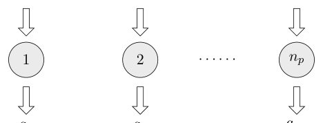
<figcaption class="paper-figure-caption"><b>Fig 1.</b> Figure 1: A nonlocal game with parties 1, . . . , np. Each party i receives input si and produces output ai.</figcaption>
</figure>
<figure class="paper-figure-card">
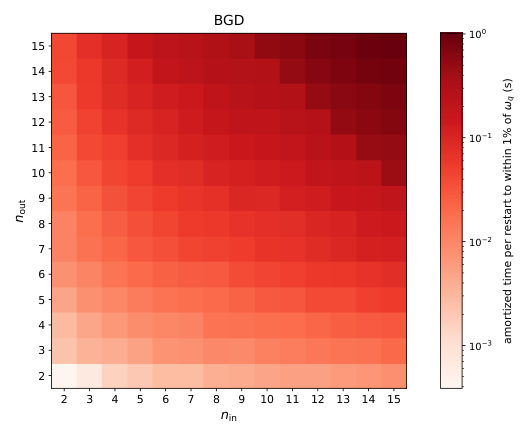
<figcaption class="paper-figure-caption"><b>Fig 2.</b> Figure 2: Amortized single-core BGD time to reach within 1% of ωq over the MaxEnt grid (nin, nout) ∈{2, . . . , 15}2. Each cell reports the wall-clock time for a batch of 100 independent restarts divided by 100; all cells reach the target. The color scale is logarithmic.</figcaption>
</figure>
<figure class="paper-figure-card">
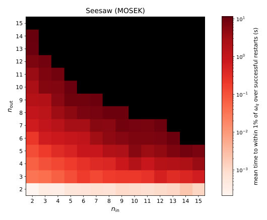
<figcaption class="paper-figure-caption"><b>Fig 3.</b> Figure 3: Mean single-core see-saw time to reach within 1% of ωq over the MaxEnt grid (nin, nout) ∈ {2, . . . , 15}2. Each cell reports the mean first-hit time over successful restarts from at most 10 attempts, each limited to 10 s. Black denotes either an instance for which no restart reached the target within the time limit or an instance left untested because a smaller instance along the corresponding parameter sweep had already failed. The color scale is logarithmic.</figcaption>
</figure>
<figure class="paper-figure-card">
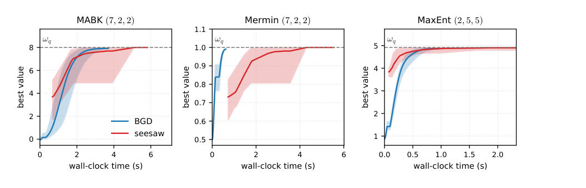
<figcaption class="paper-figure-caption"><b>Fig 4.</b> Figure 4: Best value against wall-clock time for BGD and see-saw on three solved-family instances under matched, dedicated single-core conditions. Each curve is the mean over 10 independent restarts, the shading spans the minimum and maximum, and the dashed line is the analytic quantum value ωq. Each panel gives the game shape (np, nin, nout).</figcaption>
</figure>
<figure class="paper-figure-card">
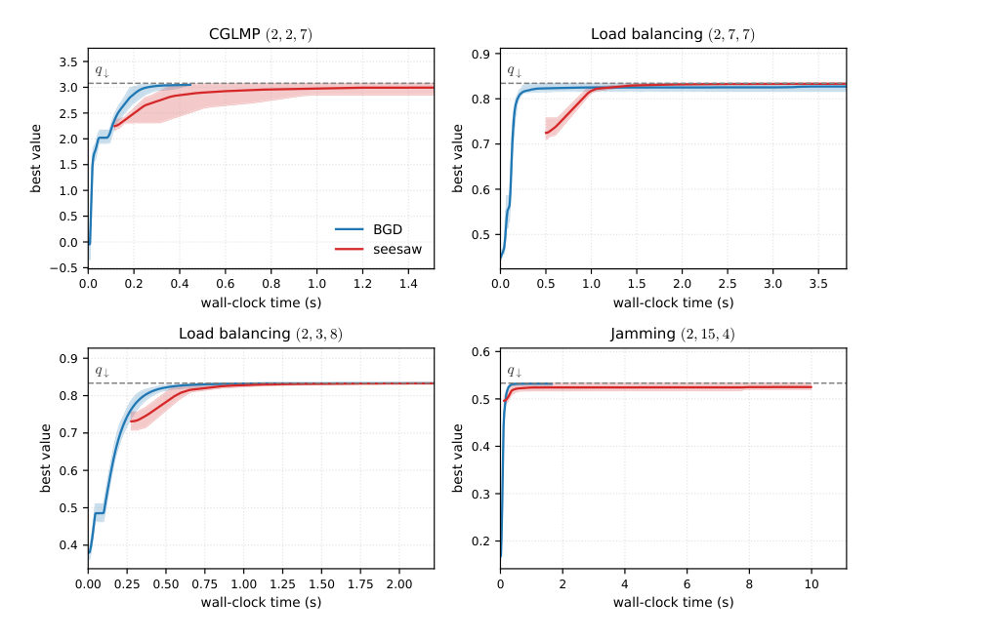
<figcaption class="paper-figure-caption"><b>Fig 5.</b> Figure 5: Best value against wall-clock time for BGD and see-saw on four unsolved-family instances. Each curve is the mean over 10 independent restarts, the shading spans the minimum and maximum, and the dashed line is the feasible numerical reference q↓. Each panel gives the game shape (np, nin, nout).</figcaption>
</figure>

**Summary.** This paper presents a novel Batched Gradient Descent (BGD) optimizer designed to efficiently calculate the quantum value of complex Bell inequalities. By using direct tensor contraction, BGD overcomes the scaling limitations of previous methods, allowing analysis of systems with thousands of inputs or outputs. This tool is vital for both fundamental quantum testing and practical applications like multi-agent coordination.

**Why it may be interesting.** The development of scalable optimization tools for Bell inequalities is crucial for testing fundamental principles of quantum mechanics and designing quantum communication protocols.

Detailed structure

**Main problem.** Developing scalable numerical methods to compute the quantum value of Bell inequalities, which are constraints on correlations in local hidden variable theories.

**Main result.** The authors introduce a Batched Gradient Descent (BGD) optimizer that efficiently computes the quantum value for large-scale Bell inequalities, achieving significant speedups over existing methods.

**Method.** The BGD optimizer is a differentiable search over feasible quantum strategies, evaluating the Bell expression via direct tensor contraction suitable for GPU implementation.

**Model / system.** The study focuses on Bell inequalities, which quantify the violation of local realism in nonlocal games involving multiple parties. The quantum value ($\omega_q$) is the maximum quantum violation of these inequalities.

**Key observables.** The quantum value ($\omega_q$) and the classical value ($\omega_c$) of the Bell inequality, representing the maximum expected utility of a nonlocal game.

**Important parameters / regimes.** The number of parties, inputs, and outputs ($n_p, n_{in}, n_{out}$); the learning rate and conditioning ratio used in BGD.

**Assumptions / limitations.** The BGD approach provides a lower bound on $\omega_q$, and the analysis sometimes assumes rank-one projective measurements for tractability.

**Figures summary.** The notes reference figures showing time vs. dimension sweeps and schematic representations of nonlocal games.

**Paper structure.** The paper progresses from defining the problem (Bell inequalities/nonlocal games) to detailing existing methods (See-saw), introducing the scalable BGD optimizer, and finally providing rigorous mathematical proofs for specific bounds (e.g., CHSH inequality).

Abstract

Exploring the world of Bell inequalities requires numerical methods that scale effectively with the number of parties, inputs, and outputs. Such methods can be used to study large-scale Bell inequalities beyond the reach of analytic methods, to design experiments for violating more complicated Bell inequalities, and to enable applications of Bell inequality violation. Such applications include randomness generation and multi-agent coordination with restricted communication. However, current general purpose optimizers such as the see-saw method struggle to handle Bell inequalities with only a dozen inputs and outputs. We introduce an optimizer for the quantum value of a Bell inequality based on batched gradient descent (BGD). More precisely, our BGD optimizer is a differentiable search over feasible quantum strategies in which states and projective measurements are generated from unconstrained variables. The Bell expression is evaluated by a direct tensor contraction without forming the prohibitively large Bell operator. This formulation makes parallel random restarts inexpensive and is thus naturally implemented by a GPU. We evaluate our optimizer against the see-saw method and find a significant speedup for a wide variety of Bell inequality families. Implemented on a GPU, our BGD optimizer can optimize Bell inequalities in our numerical experiments with more than a thousand inputs or outputs within minutes. For these large-scale Bell inequalities, we also efficiently compute the classical value by enumerating possible strategies using a GPU or expressing the optimization as a mixed-integer linear program. Our optimizers can serve as numerical evaluation tools for Bell experiments and multi-agent coordination problems modeled by Bell inequalities with many inputs and outputs, a common feature of real-world scenarios such as high frequency trading and distributed systems.

[↑ back to top](#top)

### [Exact $T$-counts of Toffoli layers from an isotropy bound](http://arxiv.org/abs/2610.01024v1)

**Authors:** Arul Rhik Mazumder  
**Type:** theory · **Category:** quantum information and computing · **PDF:** <https://arxiv.org/pdf/2610.01024v1>  
**Analysis basis:** full PDF text, analyzed in chunks

↔ Scroll figures horizontally

<figure class="paper-figure-card">
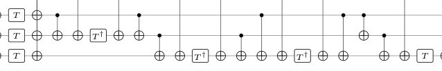
<figcaption class="paper-figure-caption"><b>Fig 1.</b> Figure 2: The 6m + 1 construction, drawn at m = 2: bracketing the second block onto a qubit of the first removes one gate, so the pair uses thirteen Ts where two independent blocks would use fourteen. The circuit restores its wires and implements CCZabcCCZdef (checked by simulation, Appendix L).</figcaption>
</figure>
<figure class="paper-figure-card">
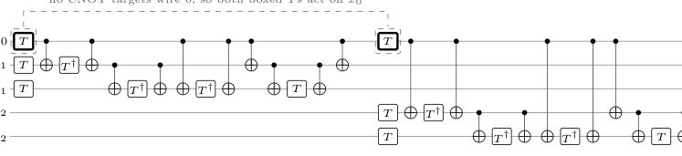
<figcaption class="paper-figure-caption"><b>Fig 2.</b> Figure 3: How sharing lowers the T-count. Two CCZ blocks both act on wire 0, and their circuits run one after the other. Each block places one of its Ts on wire 0 itself. Wire 0 is only ever a CNOT control, so it carries x0 throughout and the two boxed Ts act on the same parity. They combine into S, a Clifford gate, and the pair is removed.</figcaption>
</figure>
<figure class="paper-figure-card">
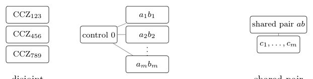
<figcaption class="paper-figure-caption"><b>Fig 3.</b> Figure 4: Sharing qubits interpolates the cost of a CCZ layer, and the radical dimension measures the position of a layer in that interpolation. Disjoint blocks give d = 0 on n = 3m qubits and cost 6m + 1 (Theorem 40). Fanning every block out of one shared control keeps d = 0 but drops n to 2m + 1, so the cost falls to exactly 4m + 3 (Theorem 43); each single-qubit merge saves two T-gates (Corollary 45). Sharing a full pair sends d to n −3, and the layer is Clifford-equivalent to a single gate, δ = 7, for every m (Remark 49).</figcaption>
</figure>
<figure class="paper-figure-card">
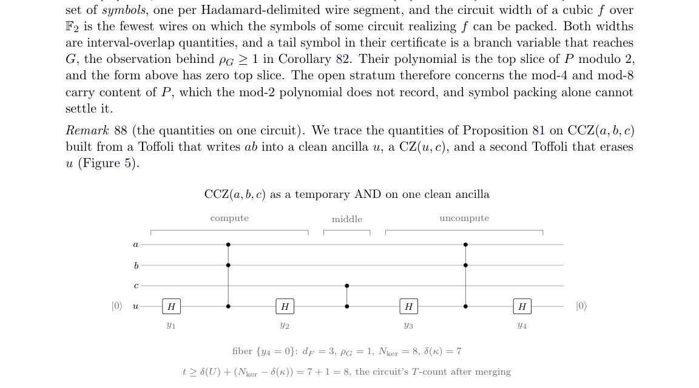
<figcaption class="paper-figure-caption"><b>Fig 4.</b> Figure 5: The standard ancilla-based CCZ circuit, built from a temporary AND on one clean ancilla, with the quantities of Remark 88.</figcaption>
</figure>
<figure class="paper-figure-card">
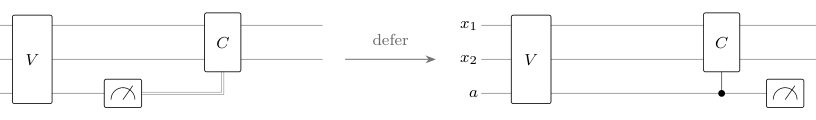
<figcaption class="paper-figure-caption"><b>Fig 5.</b> Figure 6: Dilation. Left, the outcome of measuring a selects a correction C. Right, the measurement is deferred and C becomes controlled-C, one Clifford level higher.</figcaption>
</figure>

**Summary.** This paper provides a rigorous proof establishing the exact minimum T-gate count required for implementing layers of CCZ gates in fault-tolerant quantum computation. It introduces and utilizes the 'isotropy floor' as a powerful mathematical tool to derive these lower bounds. The work is significant because it establishes optimality for general layer sizes, advancing the theoretical understanding of quantum circuit resource costs.

**Why it may be interesting.** While focused on gate complexity, the rigorous mathematical techniques used to derive resource bounds (like the isotropy floor) are highly relevant to understanding the resource scaling in complex quantum simulations or quantum error correction codes.

Detailed structure

**Main problem.** The paper aims to determine the minimum T-count, which is the dominant cost, for implementing fault-tolerant Clifford+T quantum computations.

**Main result.** It proves that a layer of $m$ disjoint CCZ gates requires exactly $6m+1$ T gates, establishing a new optimal lower bound for general $m$.

**Method.** The core method involves deriving a lower bound called the 'isotropy floor' ($\delta$) by analyzing the phase polynomial of diagonal gates using isotropy constraints.

**Model / system.** The study focuses on Hadamard-free Clifford+T quantum circuits utilizing clean ancillas, specifically analyzing the cost associated with parallel Toffoli layers (CCZ gates).

**Key observables.** T-count ($\delta$), Isotropy Floor ($\delta$), Stabilizer Nullity ($
u$), and the phase polynomial.

**Important parameters / regimes.** The bound depends on the order-$\le 3$ moments of the phase polynomial, and the results are parameterized by the number of qubits ($n$) and the layer size ($m$).

**Assumptions / limitations.** The primary model assumes Hadamard-free circuits with clean ancillas; the bound is derived from an isotropy constraint on the phase polynomial.

**Figures summary.** The notes mention figures summarizing the end-to-end argument for the isotropy floor, specifically showing the CCZ case yielding a T-count of 7.

**Paper structure.** The paper progresses from analyzing a single gate (CCZ) to establishing general lower bounds (Isotropy Floor) using moment tensors, and then extending these results to layers of gates.

Abstract

The $T$-count is the dominant cost of fault-tolerant Clifford+$T$ computation. We prove that a layer of $m$ disjoint CCZ gates, the diagonal core of a parallel Toffoli layer, needs exactly $6m+1$ $T$ gates in every Hadamard-free Clifford+$T$ circuit with clean ancillas. Campbell and Howard gave the matching construction. To our knowledge this is the first proof that it is optimal for general $m$ (for $m=1$ the value $7$ is classical, and Campbell and Howard state the value $13$ at $m=2$). On every controlled unitary the same floor comes within one of their exact count, and it recovers their $4m+3$ for a fan-out of $m$ Toffolis from one control. The proof rests on an isotropy constraint: for a pure-cubic phase, the vectors recording which $T$ gates touch each qubit span a totally isotropic subspace. In general the constraint gives the isotropy floor $δ\ge2(n-d^{\ast})-r$ for every diagonal level-three gate, computed from the phase polynomial in polynomial time. The floor is never below stabilizer nullity $ν$, which equals $n-d^{\ast}$ on this class, and a separate parity argument raises it to $2ν+1$ on non-Clifford pure-cubic gates. On the output of the TODD optimizer for the $24$ benchmark circuits it completes, the floor certifies $193$ of its $311$ merged phase-polynomial blocks optimal for their Hadamard layering ($186$ to $193$ across five optimizer seeds), against $113$ for nullity. The floor also holds, under stated conditions, for circuits whose only internal Hadamards form unitarily uncomputed temporary AND blocks, while under adaptive feedforward only $t\geν$ is proved.

[↑ back to top](#top)

### [Exponential quantum advantages for decoded quantum interferometry in the streaming setting](http://arxiv.org/abs/2610.01902v1)

**Authors:** Kewen Wu, Guangxu Yang  
**Type:** theory · **Category:** quantum information and computing · **PDF:** <https://arxiv.org/pdf/2610.01902v1>  
**Analysis basis:** full PDF text, analyzed in chunks

↔ Scroll figures horizontally

<figure class="paper-figure-card">
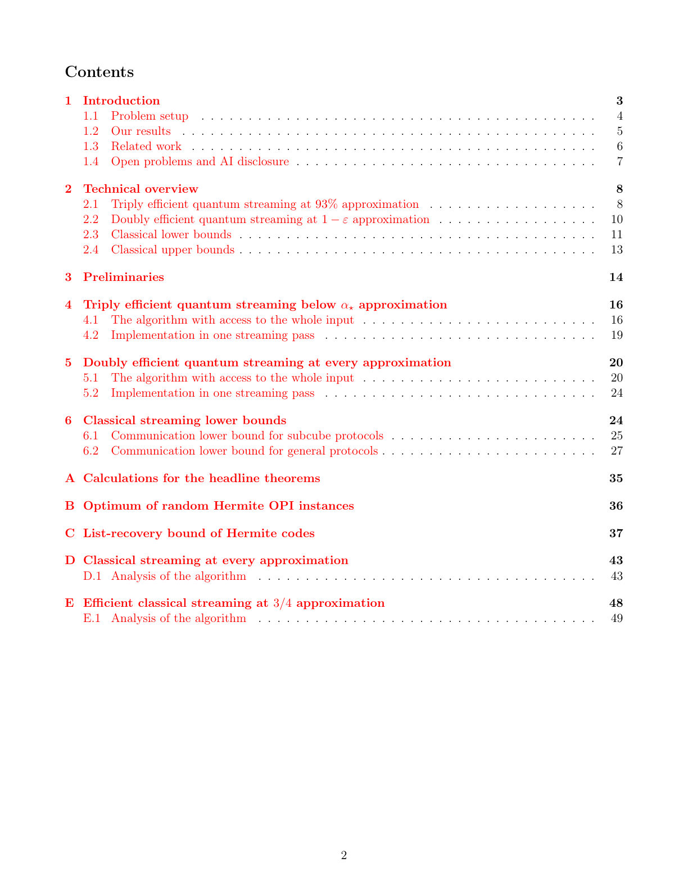
<figcaption class="paper-figure-caption"><b>Fig 1.</b> Low-resolution page preview, page 2</figcaption>
</figure>
<figure class="paper-figure-card">
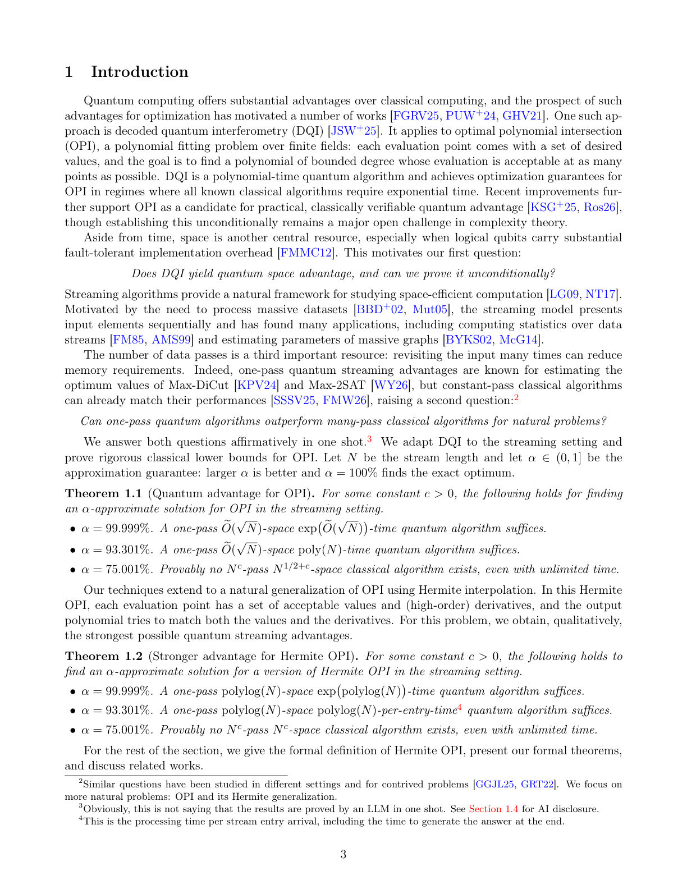
<figcaption class="paper-figure-caption"><b>Fig 2.</b> Low-resolution page preview, page 3</figcaption>
</figure>
<figure class="paper-figure-card">
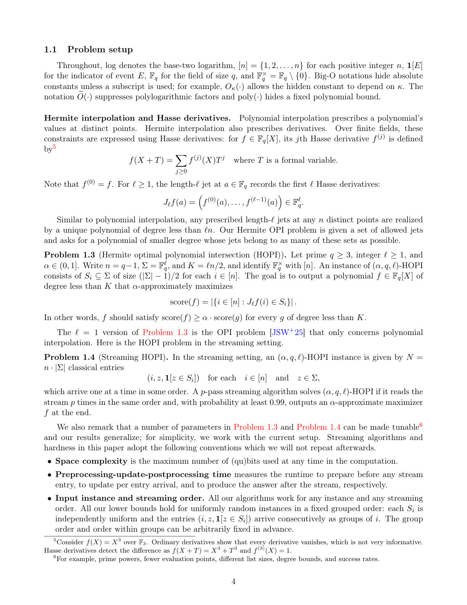
<figcaption class="paper-figure-caption"><b>Fig 3.</b> Low-resolution page preview, page 4</figcaption>
</figure>
<figure class="paper-figure-card">
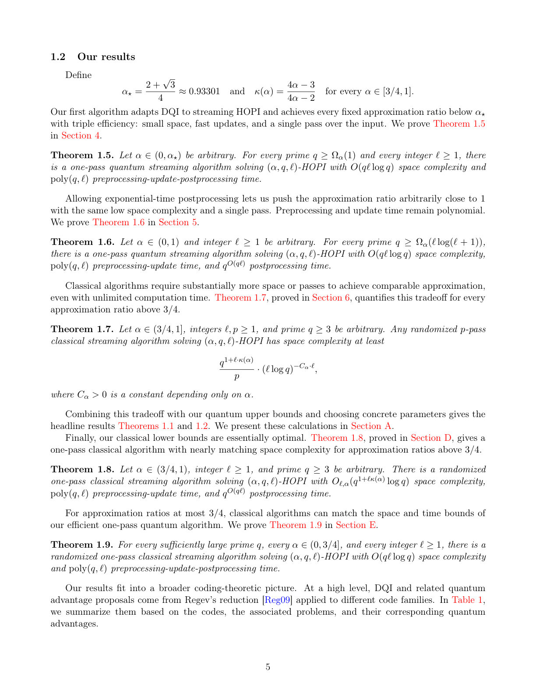
<figcaption class="paper-figure-caption"><b>Fig 4.</b> Low-resolution page preview, page 5</figcaption>
</figure>
<figure class="paper-figure-card">
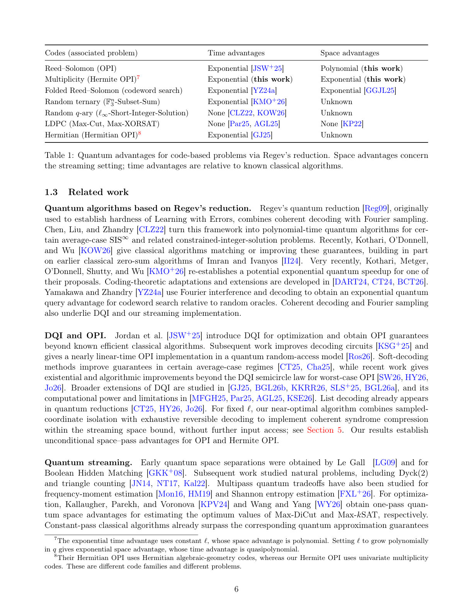
<figcaption class="paper-figure-caption"><b>Fig 5.</b> Low-resolution page preview, page 6</figcaption>
</figure>

**Summary.** This work demonstrates that Decoded Quantum Interferometry provides provable quantum advantages for solving polynomial intersection problems in the streaming setting. By analyzing the memory and time resources, the authors show that quantum algorithms can achieve high accuracy with polylogarithmic space, outperforming classical methods that require polynomial space even with unlimited time.

**Why it may be interesting.** The focus on quantum advantages in resource-constrained settings (streaming, memory) is highly relevant to developing practical quantum algorithms for complex data processing tasks.

Detailed structure

**Main problem.** The paper analyzes the quantum advantage of Decoded Quantum Interferometry (DQI) when applied to the Optimal Polynomial Intersection (OPI) problem in the memory-constrained streaming setting.

**Main result.** It proves that DQI yields provable quantum advantages in memory for this problem, showing that quantum algorithms can achieve high approximation guarantees with polylogarithmic space, while classical counterparts require significantly more resources.

**Method.** The authors establish quantum efficiency by designing one-pass quantum streaming algorithms and prove classical hardness by deriving lower bounds on the space required by classical algorithms.

**Model / system.** The problem is modeled as finding a low-degree polynomial satisfying constraints (values and Hasse derivatives/jets) over a finite field $\mathbb{F}_q$, analyzed within the streaming model.

**Key observables.** Approximation guarantee ($\alpha$), space complexity (qubits used), and time complexity (per stream entry).

**Important parameters / regimes.** Approximation ratio $\alpha$, stream length $N$, field size $q$, and polynomial degree $\ell$.

**Assumptions / limitations.** The classical lower bounds are shown to hold for uniformly random instances in a fixed grouped order.

**Figures summary.** The abstract summarizes a trade-off curve comparing quantum vs. classical performance across Memory, Data passes, and Time for different approximation levels.

**Paper structure.** The paper develops the theory by first establishing the quantum advantage using DQI, then deriving rigorous classical lower bounds, and finally providing a complete tradeoff curve for the tunable parameters.

Abstract

Decoded quantum interferometry (DQI) is a polynomial-time quantum algorithm introduced by Jordan et al. (Nature 2025). For a natural optimization problem, known as optimal polynomial intersection (OPI), it achieves approximation guarantees in regimes where all known classical algorithms require exponential time.   Besides time, space is another central resource: storing and manipulating a massive input can be very challenging, especially when logical qubits carry substantial fault-tolerant implementation overhead. This motivates the following question: does DQI yield quantum advantages in memory, and can we prove it unconditionally?   We give an affirmative answer to this question in the streaming setting. In particular, we consider a natural generalization of OPI using Hermite interpolation and Hasse derivatives, which asks for a low-degree polynomial satisfying as many constraints on its values and derivatives as possible. As a concrete example, we show   [Quantum efficiency.] An adaptation of the DQI algorithm produces a polynomial satisfying $93\%$ of the constraints; moreover, it only reads the input stream in one pass, uses polylogarithmic space, and has polylogarithmic computation time per stream entry.   [Classical hardness.] Any classical algorithm that produces an answer satisfying just $76\%$ of the constraints requires polynomial space, even if it can read the input stream with polynomially many passes and can use unlimited time.   Our result provides a complete tradeoff curve for the tunable parameters, and implies that DQI has provable quantum advantages for the original OPI problem.

[↑ back to top](#top)

### [Factor Code Networks](http://arxiv.org/abs/2610.00469v1)

**Authors:** Abhisek Sahu, Jeremy van der Heijden, Mark Van Raamsdonk, Rana Zibakhsh  
**Type:** theory · **Category:** quantum information and computing · **PDF:** <https://arxiv.org/pdf/2610.00469v1>  
**Analysis basis:** full PDF text, analyzed in chunks

↔ Scroll figures horizontally

<figure class="paper-figure-card">
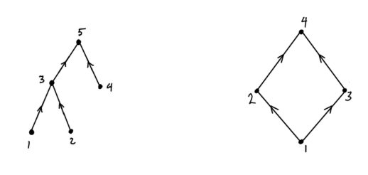
<figcaption class="paper-figure-caption"><b>Fig 1.</b> Figure 1: Hasse diagrams for code networks. Each vertex corresponds to a Hilbert space and each</figcaption>
</figure>
<figure class="paper-figure-card">
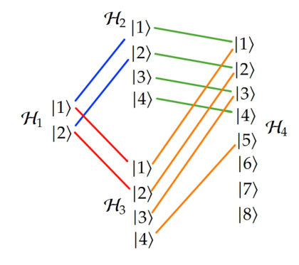
<figcaption class="paper-figure-caption"><b>Fig 2.</b> Figure 2: A set of isometries for Hilbert spaces of dimensions 2,4,4, and 8. These isometries cannot be</figcaption>
</figure>
<figure class="paper-figure-card">

<figcaption class="paper-figure-caption"><b>Fig 3.</b> Figure 3: Hilbert spaces and isometries for a diamond-shaped Hasse diagram. The isometries can be</figcaption>
</figure>

**Summary.** This paper develops the mathematical theory of 'factor code networks,' generalizing quantum error-correcting codes to structured networks. It determines the precise algebraic and geometric conditions—such as dimension divisibility or specific angle multiplicities—required for these networks to be consistently defined by compatible operator maps. This work is crucial for understanding the structure of quantum information encoded across complex, hierarchical physical systems.

**Why it may be interesting.** The rigorous mathematical framework developed for factor code networks provides powerful tools for analyzing tensor network structures arising in quantum gravity or quantum field theory, linking algebraic consistency to geometric constraints.

Detailed structure

**Main problem.** The paper characterizes the conditions under which a general quantum code network, defined by isometries on a partially ordered set, can be promoted to a consistent 'factor code network' via compatible unital operator maps.

**Main result.** Promotion is possible for tree structures if dimension divisibility holds, but for more complex geometries like diamond networks, it requires specific geometric conditions related to the multiplicities of principal angles between subspaces.

**Method.** The authors use abstract algebra, von Neumann algebras, and geometric analysis involving principal angles to establish necessary and sufficient conditions for the existence of the required commuting operator maps.

**Model / system.** The model is a quantum code network, which generalizes quantum error-correcting codes by indexing the structure over a partially ordered set. The core mathematical objects are isometries $T_{ji}$ and the associated operator maps $\varphi_{ji}$.

**Key observables.** Principal angles between subspaces ($T_{42}H_2$ and $T_{43}H_3$), and the algebraic structure of the generated von Neumann factor subalgebras ($\mathcal{M}$).

**Important parameters / regimes.** The ratio of Hilbert space dimensions ($\dim H_{	ext{phys}} / \dim H_{	ext{code}}$) must be an integer for a factor code.

**Assumptions / limitations.** The analysis assumes finite-dimensional Hilbert spaces, allowing the use of matrix algebra and von Neumann factor theory.

**Figures summary.** Figures illustrate Hasse diagrams for code networks, showing examples of structures that either satisfy or fail the promotion criteria, particularly for diamond-shaped networks.

**Paper structure.** The paper first defines factor codes and code networks, then develops characterizations for the maps ($\varphi$). It proceeds by analyzing specific network topologies: tree structures, diamond-shaped networks, and general conditions for commuting/intersecting subalgebras.

Abstract

For a quantum code defined by an isometry $T:H_{\rm code} \to H_{\rm phys}$, an operator map is a *-homomorphism $\varphi: B(H_{\rm code}) \to B(H_{\rm phys})$ from the space of operators on the logical Hilbert space to the space of operators on the physical Hilbert space satisfying $\varphi({\cal O}) T = T {\cal O}$ for every operator ${\cal O}$ on $H_{\rm code}$. This can additionally be taken to be unital $\varphi(I_{code}) = I_{phys}$ if and only if $\dim H_{\rm code}$ divides $\dim H_{\rm phys}$. In this case, $\varphi(B(H_{\rm code})$ is a von Neumann factor subalgebra of $B(H_{\rm phys})$ and we call the pair $(T,\varphi)$ a {\it factor code}.   A code network is a family of Hilbert spaces $\{{\cal H}_i\}$ indexed by a partially ordered set with isometries $T_{ji}:{\cal H}_i \to {\cal H}_j$ for $i < j$ satisfying $T_{kj} T_{ji} = T_{ki}$ for $i < j < k$. In this paper, we ask when this can be promoted to a {\it factor code network} by defining unital operator maps $\varphi_{ji}$ so that $(T_{ji}, \varphi_{ji})$ is a factor code and $\varphi_{kj} \varphi_{ji} = \varphi_{ki}$. We show that the divisibility conditions on Hilbert space dimensions are sufficient for any code network with a tree structure but not in general. For a diamond-shaped network, we show that promotion is possible if and only if the principle angles between $T_{42} H_2$ and $T_{43} H_3$ all have multiplicity divisible by $H_1$.   For incomparable $i_1,i_2 < j$, we characterize when $\varphi_{j i_1} (B(H_{i_1}))$ and $\varphi_{j i_2} (B(H_{i_2}))$ commute, when they generate all of $B(H_j)$, and when they intersect only on multiples of the identity. For $i < j_1,j_2 < k$, we characterize when $\varphi_{k j_1} (B(H_{j_1})) \cap \varphi_{k j_2} (B(H_{j_2})) = \varphi_{k i} (B(H_{i}))$ and when these algebras together with $B(H_k)$ form a nondegenerate commuting square.

[↑ back to top](#top)

### [Fourier Symmetrization for Geometric Quantum Machine Learning](http://arxiv.org/abs/2610.01874v1)

**Authors:** Letao Wang, Abdel Lisser, Sreejith Sreekumar, Zeno Toffano  
**Type:** both · **Category:** disordered systems and neural networks · **PDF:** <https://arxiv.org/pdf/2610.01874v1>  
**Analysis basis:** full PDF text, analyzed in chunks

↔ Scroll figures horizontally

<figure class="paper-figure-card">
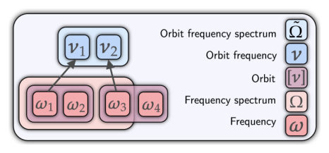
<figcaption class="paper-figure-caption"><b>Fig 1.</b> FIG. 1. Illustration of the orbit notation. The original fre- quency spectrum is Ω= {ω1, ω2, ω3}, and the average opera- tor completes the orbit by adding ω4 /∈Ω. The frequencies ω1 and ω2 belong to one orbit, while ω3 and ω4 belong to another orbit. We choose ν1 and ν2 as orbit frequencies representing ω1 and ω3, respectively, so the two orbits are denoted by [ν1] and [ν2]. The orbit frequencies ν1 and ν2 together form the orbit frequency spectrum ˜Ω.</figcaption>
</figure>
<figure class="paper-figure-card">
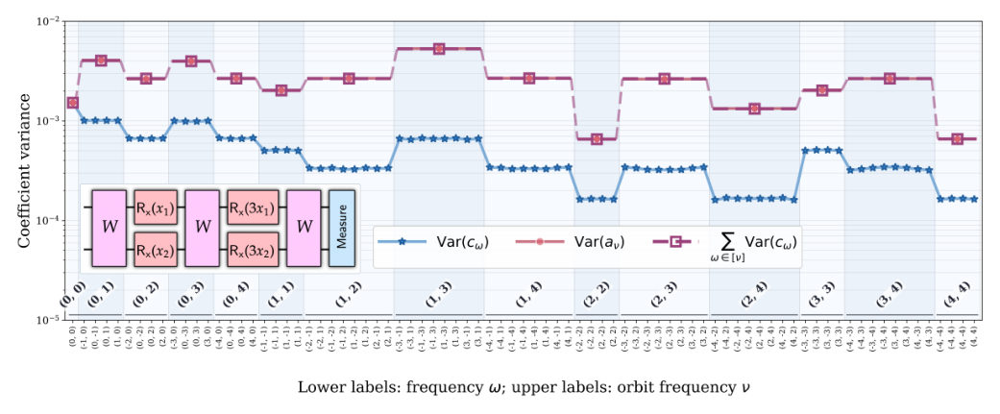
<figcaption class="paper-figure-caption"><b>Fig 2.</b> FIG. 2. Fourier coefficient variances reorganized into frequency orbits with respect to the hyperoctahedral group under the exact 2-design assumption. The circuit in the lower left is the QFM used in this numerical example, and its output is obtained by measuring the global observable ˆO = (|0⟩⟨0|)⊗2. The x-axis uses two rows of labels: the lower row lists the original frequencies ω, and the upper row labels each orbit by its orbit frequency ν. For example, under the coordinate permutations and independent sign flips in the hyperoctahedral group, the orbit frequency (0, 1) represents the orbit containing frequencies (−1, 0), (0, −1), (0, 1), and (1, 0). The blue curve shows the variance of...</figcaption>
</figure>
<figure class="paper-figure-card">
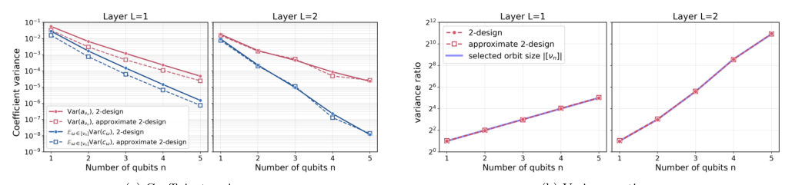
<figcaption class="paper-figure-caption"><b>Fig 3.</b> FIG. 3. Fourier coefficient variance analysis for exponential encoding QFMs. We consider an n-qubit, n-variable QFM under the hyperoctahedral group Bn, with L = 1 or L = 2. The l-th encoding layer is Nn j=1 RZ(3l−1xj), and the output is obtained by measuring the local observable ˆOL defined in Eq. (38). Each trainable layer uses five repetitions of the Strongly Entangling Ansatz for the exact 2-design reference and one repetition for the ε-approximate 2-design setting. The variances are estimated from 104 random parameter samples. For L = 1, we select νn = (1, . . . , 1). For L = 2, we select νn = (1, . . . , n) for n = 1, 2, 3, 4 and ν5 = (1, 1, 2, 3, 4). (a) Red curves show Var(aνn), and...</figcaption>
</figure>
<figure class="paper-figure-card">
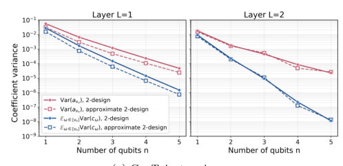
<figcaption class="paper-figure-caption"><b>Fig 4.</b> Figure 3b shows the corresponding variance ratio to- gether with the selected orbit size. For L = 1, the ratio in the exact 2-design setting nearly coincides with the se- lected orbit size, numerically confirming Eq. (27) in The- orem 8. The ratio in the ε-approximate 2-design setting also nearly coincides with the selected orbit size, indi- cating that the cross covariance terms are small for the ansatz considered. For L = 2, the ratios in both settings also remain close to the selected orbit size. Although Theorem 11 is restricted to L = 1, this observation sug- gests that the same variance gain may persist for practi- cal ansatzes with L &gt; 1 and continue to mitigate vanish- ing...</figcaption>
</figure>
<figure class="paper-figure-card">
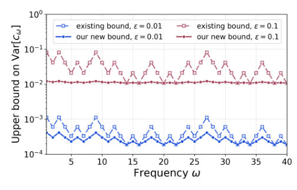
<figcaption class="paper-figure-caption"><b>Fig 5.</b> FIG. 4. Comparison between the existing ε-approximate 2- design bound in Eq. (40) and the bound in Corollary 12. Dashed curves show the existing bound, and solid curves show our bound.</figcaption>
</figure>

**Summary.** This work develops a rigorous framework for incorporating symmetry into Quantum Fourier Models (QFMs) for machine learning. By analyzing the Fourier spectrum, the authors derive tight bounds showing how symmetry constrains model expressivity. They validate this approach by demonstrating that symmetry-aware QPINNs achieve superior accuracy when solving complex physical PDEs.

**Why it may be interesting.** The explicit connection between group theory (symmetry), spectral analysis (Fourier decomposition), and physical modeling (PDEs) provides a powerful, structured inductive bias for quantum machine learning applied to physical systems.

Detailed structure

**Main problem.** The paper addresses how symmetry constrains and shapes the expressivity of Quantum Fourier Models (QFMs) used in Geometric Quantum Machine Learning (GQML). It seeks to provide rigorous theoretical bounds on the performance of symmetry-enforced models.

**Main result.** Randomized encoding, which avoids deep circuits, achieves the lowest mean errors when using QPINNs to solve 2D PDEs like the screened Poisson and Hamilton-Jacobi equations.

**Method.** The authors use Fourier analysis to decompose symmetry-invariant QFMs, deriving tight theoretical bounds on coefficient variances by analyzing the deviation from ideal 2-design assumptions.

**Model / system.** The model is a Quantum Fourier Model (QFM) used as a Quantum Physics-Informed Neural Network (QPINN) to solve continuous Partial Differential Equations (PDEs) in 2D space.

**Key observables.** Mean error in solving PDEs (Screened Poisson, Stationary Viscous Hamilton-Jacobi), and the variance of symmetrized Fourier coefficients.

**Important parameters / regimes.** The approximation parameter $\epsilon$, the size of the symmetry group, and the dimensionality of the PDEs (2D).

**Assumptions / limitations.** The analysis relies on the QFM viewpoint, the assumption of 2-design properties for trainable layers, and the use of randomized encoding to implement symmetry invariance without deep circuits.

**Figures summary.** Not specified, but the notes reference figures illustrating Fourier orbit decomposition and the comparison of various QPINN performance metrics.

**Paper structure.** The paper progresses from defining the symmetry problem in QFMs, developing the Fourier orbit decomposition theory, deriving tight mathematical bounds on coefficient variances, and finally validating the approach by applying it to solve specific 2D PDEs using randomized encoding.

Abstract

Geometric quantum machine learning incorporates symmetry into quantum models, but how symmetry shapes their expressivity and guides effective model design remains insufficiently understood. We address this question through the Fourier representation of quantum Fourier models (QFMs). Symmetry organizes the frequency spectrum into orbits and sums the Fourier coefficients within each orbit into a symmetrized coefficient. When QFM trainable layers form independent exact 2-designs, the variance of each symmetrized coefficient equals the sum of the coefficient variances in its orbit. For single-layer QFMs with $\varepsilon$-approximate 2-design trainable layers, we bound the deviation from this identity. The resulting bound for individual Fourier coefficients can be exponentially tighter than an existing bound. The hyperoctahedral group provides an example of orbit growth that can mitigate vanishing expressivity of the symmetrized coefficients. Symmetrization of QFMs over an elementary abelian 2-group also yields pure multivariate Chebyshev polynomial basis functions. We introduce randomized encoding, which implements invariant models without ancilla qubits or the additional circuit depth for quantum twirling. We evaluate the models as quantum physics-informed neural networks (QPINNs) on two-dimensional screened Poisson and stationary viscous Hamilton-Jacobi equations. Under hard boundary constraints, QPINNs using exact symmetrization and randomized encoding achieve the lowest mean errors in the two benchmarks, respectively.

[↑ back to top](#top)

### [From Permutation Symmetry to Communication Bounds and Additivity](http://arxiv.org/abs/2610.02176v1)

**Authors:** Zahra Baghali Khanian, Debbie Leung, Graeme Smith  
**Type:** theory · **Category:** quantum information and computing · **PDF:** <https://arxiv.org/pdf/2610.02176v1>  
**Analysis basis:** full PDF text, analyzed in chunks

↔ Scroll figures horizontally

<figure class="paper-figure-card">
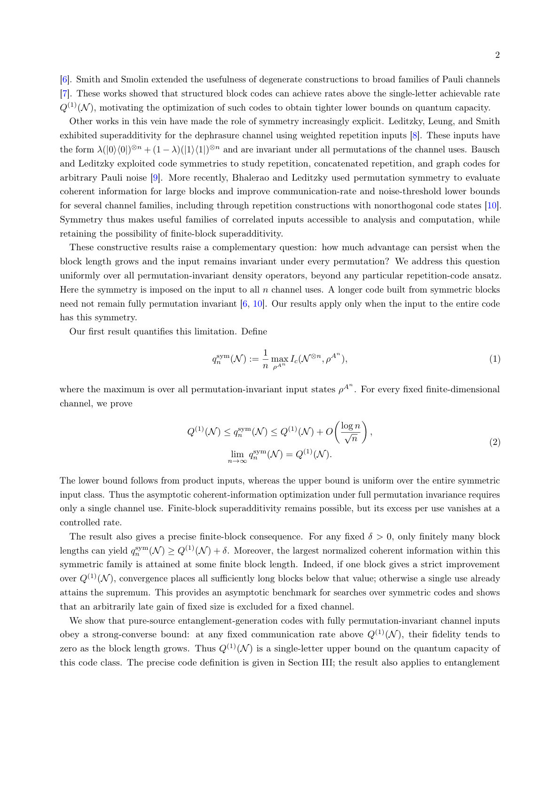
<figcaption class="paper-figure-caption"><b>Fig 1.</b> Low-resolution page preview, page 2</figcaption>
</figure>
<figure class="paper-figure-card">
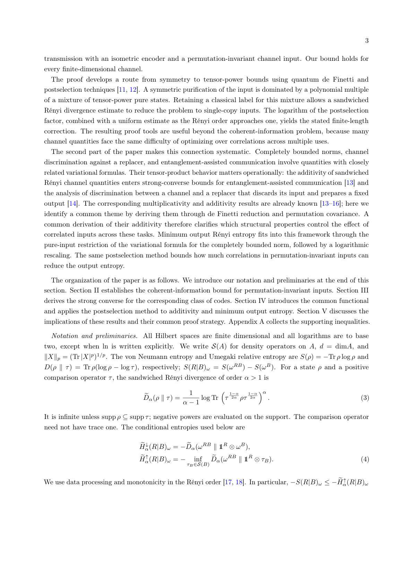
<figcaption class="paper-figure-caption"><b>Fig 2.</b> Low-resolution page preview, page 3</figcaption>
</figure>
<figure class="paper-figure-card">
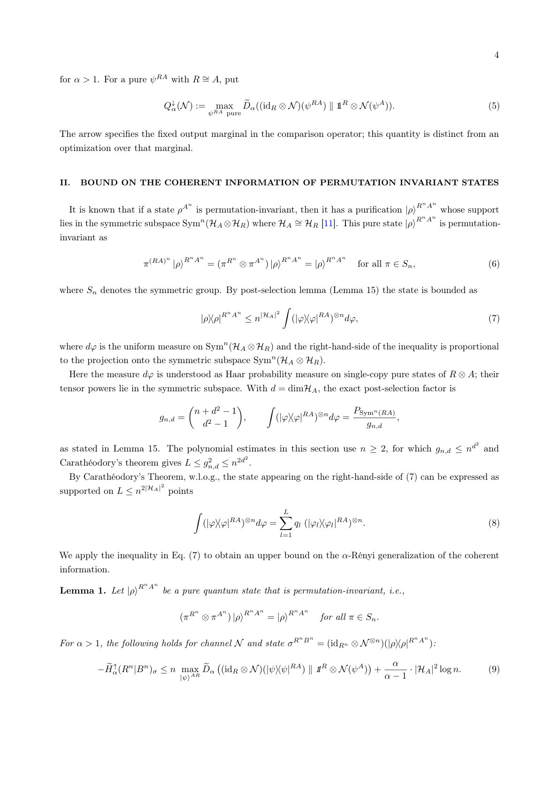
<figcaption class="paper-figure-caption"><b>Fig 3.</b> Low-resolution page preview, page 4</figcaption>
</figure>
<figure class="paper-figure-card">
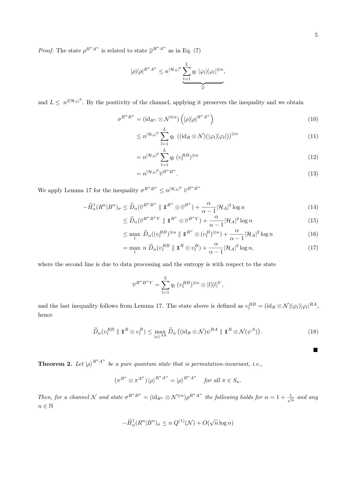
<figcaption class="paper-figure-caption"><b>Fig 4.</b> Low-resolution page preview, page 5</figcaption>
</figure>
<figure class="paper-figure-card">
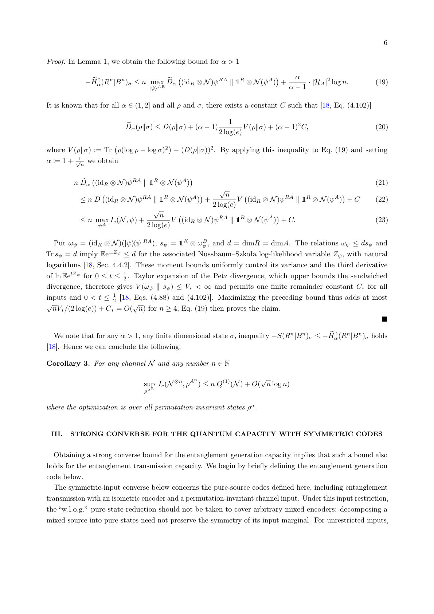
<figcaption class="paper-figure-caption"><b>Fig 5.</b> Low-resolution page preview, page 6</figcaption>
</figure>

**Summary.** This work analyzes the quantum capacity of quantum channels, focusing on the role of input symmetry. It proves that when inputs are permutation-invariant, the advantage gained from using many channel uses asymptotically vanishes, reducing the problem to the single-use capacity. The paper establishes deep structural links between additivity properties for various quantum information measures.

**Why it may be interesting.** It provides rigorous mathematical bounds on the fundamental limits of quantum communication, showing how symmetry constraints can simplify complex asymptotic problems, which is crucial for understanding resource theories in quantum optics and computation.

Detailed structure

**Main problem.** The paper investigates the quantum capacity of memoryless quantum channels, specifically determining whether correlations across multiple channel uses (superadditivity) provide an asymptotic advantage over single-use performance.

**Main result.** Under the constraint of full permutation invariance on the input state, the asymptotic quantum capacity per use converges to the single-use coherent information maximum, implying that finite-block superadditivity effects vanish in the limit.

**Method.** The authors employ advanced quantum information theory tools, including analyzing the convergence of normalized coherent information, utilizing de Finetti reduction, and establishing common variational frameworks for various channel divergences.

**Model / system.** The analysis is performed on finite-dimensional memoryless quantum channels ($N$) acting on quantum states, with a specific focus on inputs that are permutation-invariant across multiple uses.

**Key observables.** Quantum capacity ($Q(N)$), coherent information ($I_c$), sandwiched Rényi divergence ($eD_\alpha$), and minimum output Rényi entropy ($h_\alpha$).

**Important parameters / regimes.** The block length $n$, the Rényi order $\alpha > 1$, and the single-use channel capacity $Q_1(N)$.

**Assumptions / limitations.** The results are strongly conditioned on the input state being fully permutation-invariant across all $n$ channel uses.

**Paper structure.** The paper systematically analyzes the convergence of quantum information measures (like coherent information and channel divergences) from finite blocks ($n$) to the asymptotic limit ($n 	o \infty$), showing how permutation symmetry constrains the achievable rates and establishes structural connections between additivity results.

Abstract

Correlations across channel uses can improve quantum communication rates, making optimization over arbitrarily large blocks a central difficulty in determining quantum capacity. We show how full permutation invariance limits this advantage for every finite-dimensional memoryless channel. The optimized coherent information per use converges to the single-use maximum and consequently attains its supremum at a finite block length. Thus finite-block superadditivity remains possible, while the asymptotic optimization reduces to a single channel use. We also establish a strong converse for pure-source entanglement generation with permutation-invariant inputs: at any fixed rate above the single-use coherent-information maximum, the fidelity tends to zero. Beyond these communication bounds, we identify a common structure underlying completely bounded norms and the sandwiched Rényi channel quantities governing discrimination against a replacer and entanglement-assisted communication. De Finetti reduction and permutation covariance yield systematic alternative proofs of their known multiplicativity and additivity results within a shared variational framework. We further show that, for permutation-invariant inputs, correlations cannot sustain an asymptotic reduction in output entropy per use below the single-use minimum. This entropy limit holds for Rényi orders greater than one and for the von Neumann entropy, extending the role of symmetry from communication bounds to the control of output entropy.

[↑ back to top](#top)

### [From Steane to A7: Quantum Codes from Invariant States](http://arxiv.org/abs/2610.00865v1)

**Authors:** Ian Teixeira  
**Type:** theory · **Category:** quantum information and computing · **PDF:** <https://arxiv.org/pdf/2610.00865v1>  
**Analysis basis:** full PDF text, analyzed in chunks

↔ Scroll figures horizontally

<figure class="paper-figure-card">
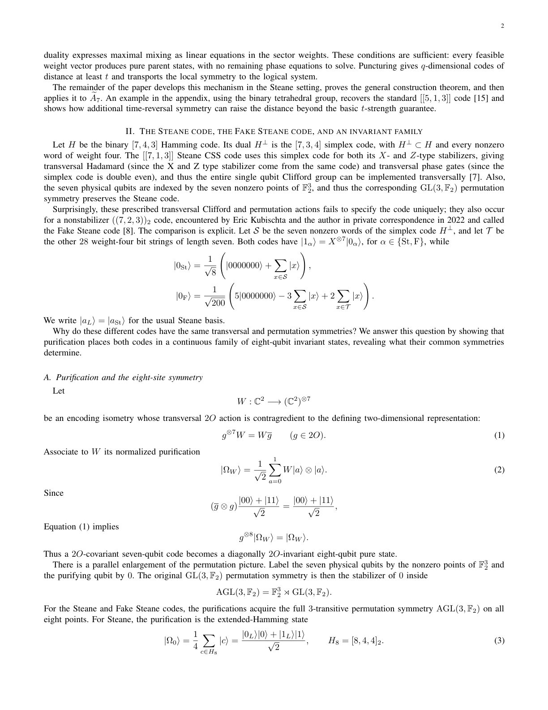
<figcaption class="paper-figure-caption"><b>Fig 1.</b> Low-resolution page preview, page 2</figcaption>
</figure>
<figure class="paper-figure-card">
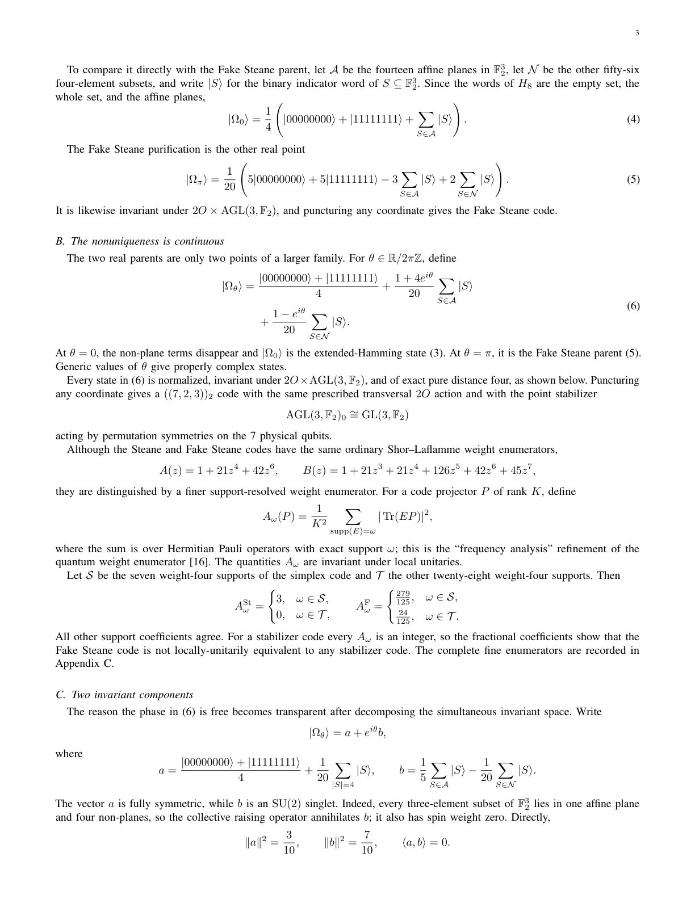
<figcaption class="paper-figure-caption"><b>Fig 2.</b> Low-resolution page preview, page 3</figcaption>
</figure>
<figure class="paper-figure-card">
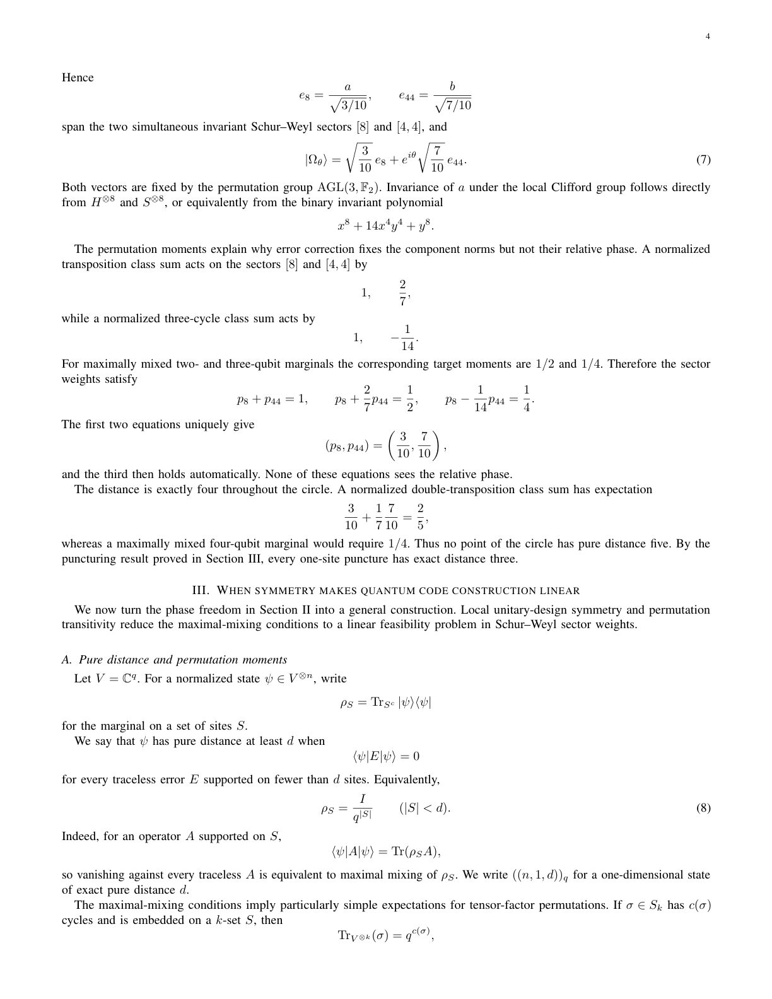
<figcaption class="paper-figure-caption"><b>Fig 3.</b> Low-resolution page preview, page 4</figcaption>
</figure>
<figure class="paper-figure-card">
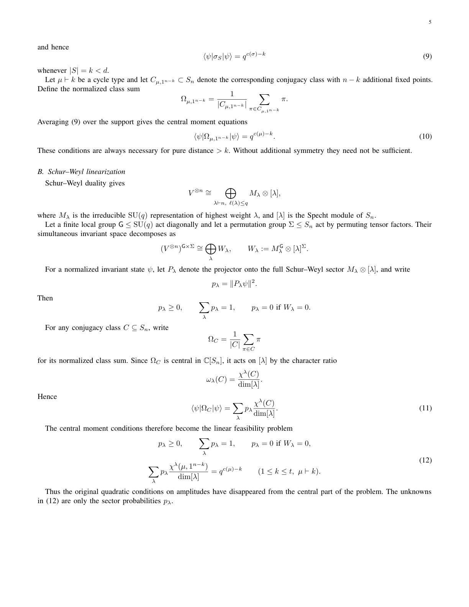
<figcaption class="paper-figure-caption"><b>Fig 4.</b> Low-resolution page preview, page 5</figcaption>
</figure>
<figure class="paper-figure-card">
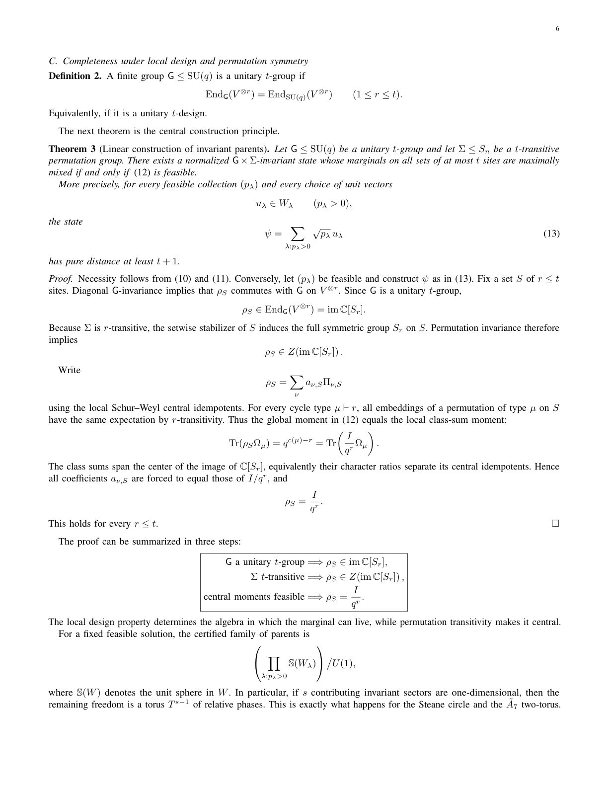
<figcaption class="paper-figure-caption"><b>Fig 5.</b> Low-resolution page preview, page 6</figcaption>
</figure>

**Summary.** This paper develops a powerful method to construct quantum error-correcting codes by analyzing invariant states derived from symmetry constraints. It successfully constructs a new two-parameter family of seven-ququart codes with $	ilde{A}_7$ symmetry, extending beyond previously known codes like the Steane code.

**Why it may be interesting.** The rigorous mathematical framework connecting symmetry constraints (like $	ilde{A}_7$) to the existence and parameters of quantum codes is highly relevant for designing fault-tolerant quantum computation protocols.

Detailed structure

**Main problem.** The paper aims to construct quantum error-correcting codes with specific transversal symmetries, particularly $	ilde{A}_7$, realizing the finite component of a two-qubit super-golden gate set.

**Main result.** A two-parameter family of single-error-correcting seven-ququart codes, $((7, 4, 3))_4$, is constructed, showing that the Steane and Fake Steane codes are specific points within this continuous family.

**Method.** The construction method involves building invariant parent states by solving linear equations derived from Schur-Weyl sector weights, rather than searching directly for the codespace.

**Model / system.** The system is a quantum error-correcting code defined on ququart systems, analyzed using invariant states in the tensor product space $V \otimes n$ under the combined action of local unitary-design symmetry ($G \le SU(q)$) and permutation symmetry ($\Sigma \le S_n$).

**Key observables.** Code parameters $((7, 4, 3))_4$, the continuous parameter $	heta$, and the sector weights $(p_8, p_{44})$ determined by moment equations.

**Important parameters / regimes.** The local dimension $q=4$, the number of sites $n=7$ (for the code), and the symmetry group $	ilde{A}_7 \le SU(4)$.

**Assumptions / limitations.** The method relies on the equivalence between maximal mixing of marginals on $\le t$ sites and the feasibility of a linear system in Schur-Weyl sector weights.

**Figures summary.** The notes mention TABLE I comparing the Steane and $	ilde{A}_7$ families, and Equation (15) providing the unique solution for the sector weights in the $	ilde{A}_7$ case.

**Paper structure.** The paper develops the general theory by relating code construction to linear feasibility problems in Schur-Weyl weights. It then applies this theory to the specific case of $	ilde{A}_7$ symmetry, showing how the resulting parent state yields the desired two-parameter family of codes.

Abstract

We construct a two-parameter family of single-error-correcting seven-ququart codes with transversal $\tilde{A_7}$ symmetry, realizing the finite component of a two-qubit super-golden gate set. These $((7,4,3))_4$ codes encode two logical qubits and support non-Clifford operations by applying the same gate to each physical ququart.   Our method constructs invariant parent states rather than searching directly for a codespace. For $n$ systems of local dimension $q$, suppose the local symmetry is a unitary $t$-group and the permutation symmetry is $t$-transitive. Maximal mixing of all marginals on at most $t$ sites is then equivalent to linear equations in Schur--Weyl sector weights. Every feasible solution yields parents of pure distance at least $t+1$; puncturing one site produces a $q$-dimensional code of distance at least $t$ with the prescribed local symmetry acting transversally.   Steane and the nonstabilizer Fake Steane code reveal why the construction leaves continuous freedom. They share the same prescribed transversal Clifford and permutation symmetries, and their eight-qubit purifications lie on a circle: error correction fixes two invariant-sector norms but leaves the relative phase free. Keeping the same permutation group and replacing Clifford symmetry by $\tilde{A_7}$ $\leq SU(4)$ gives three fixed sector norms and two free relative phases, producing the new ququart family.

[↑ back to top](#top)

### [Good Quantum Locally Testable Codes from Lossless Cubical Complexes](http://arxiv.org/abs/2610.00525v1)

**Authors:** Itay Cohen, Itai Leigh, Assaf Reiner, Amnon Ta-Shma, Elad Tzalik  
**Type:** theory · **Category:** quantum information and computing · **PDF:** <https://arxiv.org/pdf/2610.00525v1>  
**Analysis basis:** full PDF text, analyzed in chunks

↔ Scroll figures horizontally

<figure class="paper-figure-card">
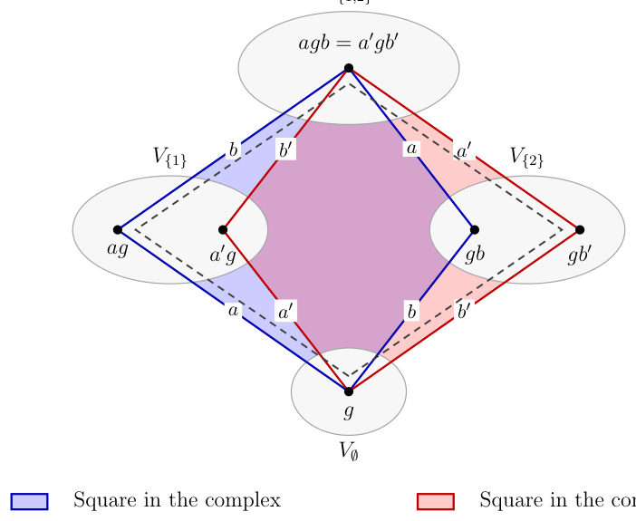
<figcaption class="paper-figure-caption"><b>Fig 1.</b> Figure 1: A left-right Cayley complex satisfying the weak completion property but not the strong one. The blue and red squares share the opposite vertices g and agb = a′gb′. The black dashed contour follows a four-cycle which is not a square in the complex.</figcaption>
</figure>
<figure class="paper-figure-card">
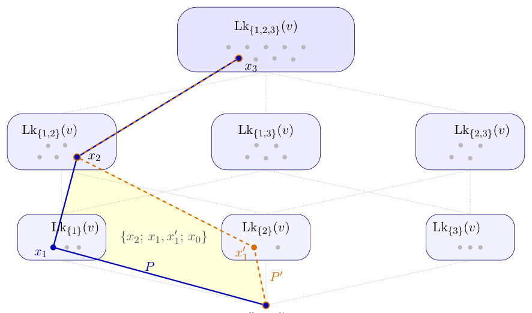
<figcaption class="paper-figure-caption"><b>Fig 2.</b> Figure 2: The link above v in a three-dimensional cubical complex. The solid path P has order (1, 2, 3), while the dashed path P ′ has order (2, 1, 3). The pale shaded quadrilateral marks the square 2-cell witnessing the adjacent switch.</figcaption>
</figure>
<figure class="paper-figure-card">
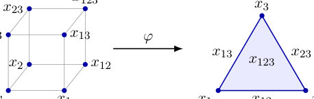
<figcaption class="paper-figure-caption"><b>Fig 3.</b> Figure 3: For a non-colliding vertex x123, the interval below it is a Boolean cube. The map φ identifies it with the face poset of the simplex on its three level-one vertices, with v corresponding to the empty face.</figcaption>
</figure>
<figure class="paper-figure-card">
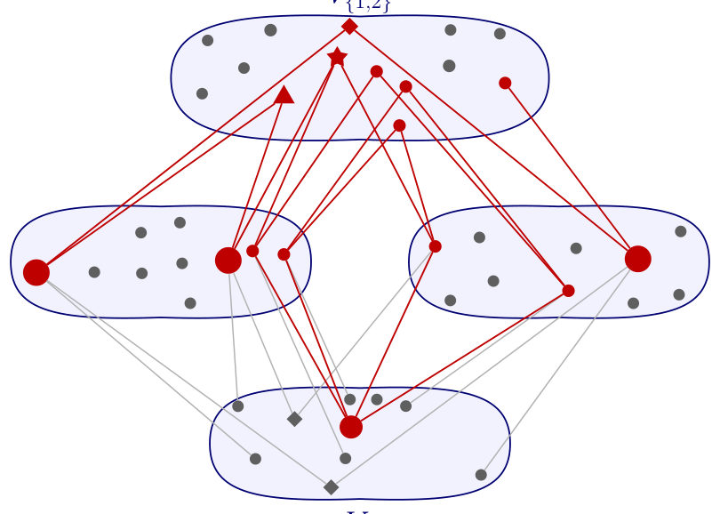
<figcaption class="paper-figure-caption"><b>Fig 4.</b> Figure 4: The four vertex sets of a two-dimensional square complex, arranged by level. An initial set of vertices H1 is marked heavy (red) on level 1. In the layer below, only vertices that have many heavy parents are heavy. In the layer above, all upward neighbors of the heavy vertices are marked heavy. Terminal vertices (heavy vertices without heavy children) are enlarged. Red vertices shaped like diamonds, stars, and triangles have excess. The excess of the triangular vertex is accounted for by Same2, whereas the excess of the diamond shaped vertex is accounted for by Light2. The excess of the star shaped vertex is accounted for by both functions.</figcaption>
</figure>
<figure class="paper-figure-card">
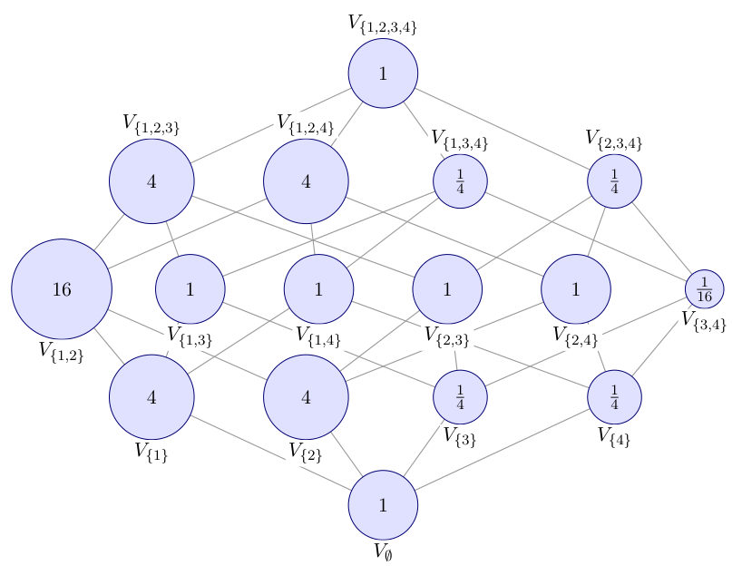
<figcaption class="paper-figure-caption"><b>Fig 5.</b> Figure 5: An illustration of the size of the blocks in the four-dimensional Boolean cube for µ1 = µ2 = 4 and µ3 = µ4 = 1</figcaption>
</figure>

**Summary.** This paper develops a theoretical framework to construct quantum locally testable codes by analyzing the properties of high-dimensional lossless cubical complexes. It establishes a local-to-global principle that links directional expansion within these complexes to the existence of good quantum codes. This advances the understanding of how combinatorial geometry can guarantee robust quantum error correction.

**Why it may be interesting.** The connection between high-dimensional combinatorial structures (lossless complexes) and the existence of robust quantum error-correcting codes provides a powerful, abstract tool for designing fault-tolerant quantum computation protocols.

Detailed structure

**Main problem.** Developing asymptotically good Quantum Locally Testable Codes (qLTCs) using a higher-dimensional combinatorial approach based on lossless cubical complexes.

**Main result.** The existence of sufficiently imbalanced, two-sided lossless four-dimensional cubical complexes guarantees the existence of asymptotically good quantum locally testable codes.

**Method.** The authors associate a high-dimensional cubical complex with a level chain complex and establish a local-to-global theorem linking directional lossless expansion to small-set coboundary expansion.

**Model / system.** The model is quantum error correction, specifically constructing qLTCs. The mathematical framework involves high-dimensional lossless cubical complexes and their associated level chain complexes.

**Key observables.** Code parameters such as rate, distance, and the ability to achieve local testability soundness.

**Important parameters / regimes.** The dimension of the cubical complex (e.g., four-dimensional), the degree of imbalance, and the expansion properties (lossless expansion).

**Assumptions / limitations.** The primary assumption is investigating the implications of the existence of the required high-dimensional lossless cubical complexes, as explicit construction is not provided.

**Figures summary.** Figures illustrate the structure of complexes (e.g., left-right Cayley complex) and the application of algorithms like the Greedy Flipping Algorithm for bounding parameters.

**Paper structure.** The paper builds from classical LTCs to qLTCs, formalizing the structure via level chain complexes. It develops a local-to-global principle and then analyzes the resulting code parameters, including bounding distance and presenting a linear-time decoder.

Abstract

Sipser and Spielman constructed LDPC codes from either bipartite \emph{spectral} expanders or one-sided \emph{lossless} expanders. In higher dimensions, \emph{spectral} expansion similarly played a central role in the constructions of asymptotically good classical LTCs and qLDPC codes by Dinur, Evra, Livne, Lubotzky, and Mozes and by Panteleev and Kalachev. Alternatively, Lin and Hsieh constructed classical LTCs and qLDPC codes from two-dimensional \emph{lossless} cubical complexes.   In this work we develop the higher-dimensional \emph{lossless} approach. We do not construct the required high-dimensional lossless cubical complexes; rather, we investigate what their existence would imply. We associate with a high-dimensional cubical complex a \emph{level chain complex}, whose chain groups are supported on the level sets of the Boolean cube rather than on its cells. Our main technical contribution is a clean local-to-global theorem for this structure: suitable one-dimensional lossless expansion in the directional graphs implies small-set coboundary expansion of the global level complex. As a consequence, sufficiently imbalanced, two-sided lossless four-dimensional cubical complexes give rise to asymptotically good quantum locally testable codes. We expect the local-to-global principle developed here to have further applications.

[↑ back to top](#top)

### [In-context Learning of Single-index Targets: Comparing Kernel and Feature Learners](http://arxiv.org/abs/2610.01712v1)

**Authors:** Haotian Gu, Yizhou Xu, Lenka Zdeborová  
**Type:** theory · **Category:** disordered systems and neural networks · **PDF:** <https://arxiv.org/pdf/2610.01712v1>  
**Analysis basis:** full PDF text, analyzed in chunks

↔ Scroll figures horizontally

<figure class="paper-figure-card">
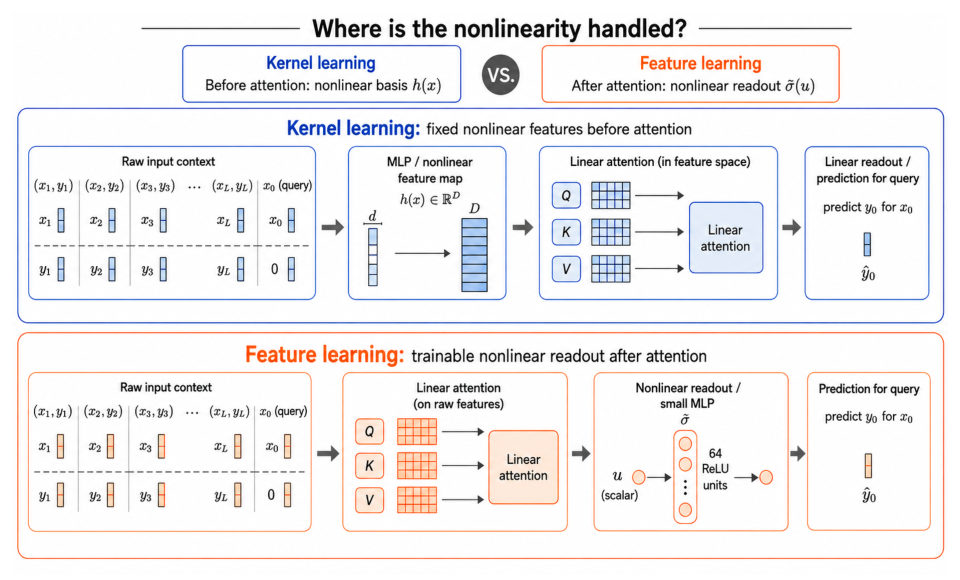
<figcaption class="paper-figure-caption"><b>Fig 1.</b> Figure 1: The kernel and feature learners. The kernel learner applies a fixed map h : Rd →RD before self-attention, whereas the feature learner applies a trainable readout bσ after self-attention.</figcaption>
</figure>
<figure class="paper-figure-card">
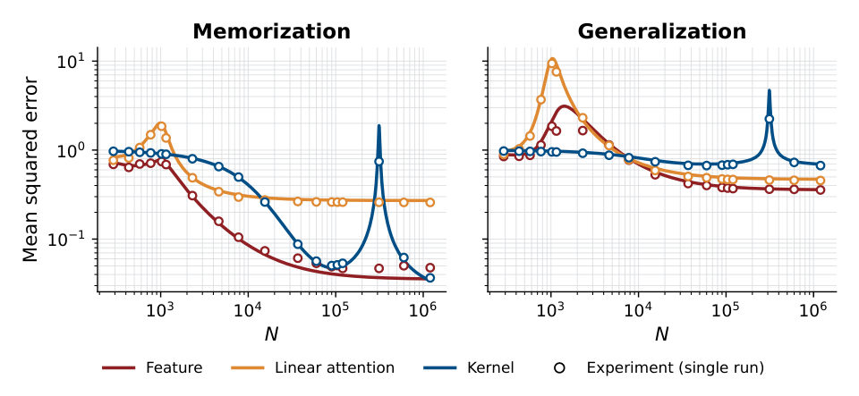
<figcaption class="paper-figure-caption"><b>Fig 2.</b> Figure 2: Memorization (left) and generalization (right) errors as a function of N. We fix N0 = 24 and L = eL = 1024. Red, orange, and blue denote the feature learner, linear attention, and the kernel learner, respectively. Solid lines show replica predictions, and circles show numerical results from a single training run. The three learners use the same training and inference prompts.</figcaption>
</figure>
<figure class="paper-figure-card">
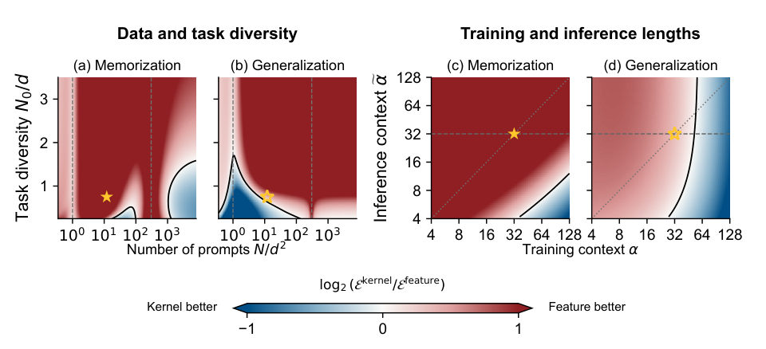
<figcaption class="paper-figure-caption"><b>Fig 3.</b> Figure 3: Replica predictions for the relative errors of the two learners. In all panels, the color shows log2(Ekernel/Efeature). (a,b) Memorization and generalization as N/d2 and N0/d vary, with α = eα = 32; vertical dashed lines mark N = d2 and N = D2. (c,d) Memorization and generalization as the training length α = L/d and inference length eα = eL/d vary, with N0 = 24 and N = 12288; the diagonal dotted line marks equal lengths, and the horizontal dashed line marks eα = 32. Gold stars mark the shared parameter setting (N = 12288, N0 = 24, α = eα = 32). Blue favors the kernel learner, red favors the feature learner, and black curves indicate equal errors.</figcaption>
</figure>
<figure class="paper-figure-card">
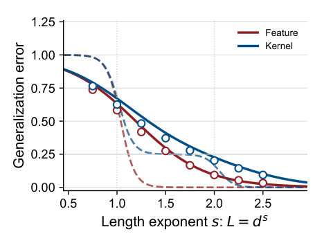
<figcaption class="paper-figure-caption"><b>Fig 4.</b> Figure 4: Learning different harmonic degrees. The horizontal coordinate is s = log L/ log d, with equal training and inference lengths L = eL = ds. The teacher is (24). Circles show experiments at d = 16, N0 = 8192, N = 1200000, ∆= 0, and λ = 0. Solid curves are Theorem 1 (Eqs. (20) and (21)) evaluated at d = 16. Dashed curves are the same formulas evaluated at d = 106 and display the separation be- tween the scales L ≍d and L ≍d2.</figcaption>
</figure>
<figure class="paper-figure-card">
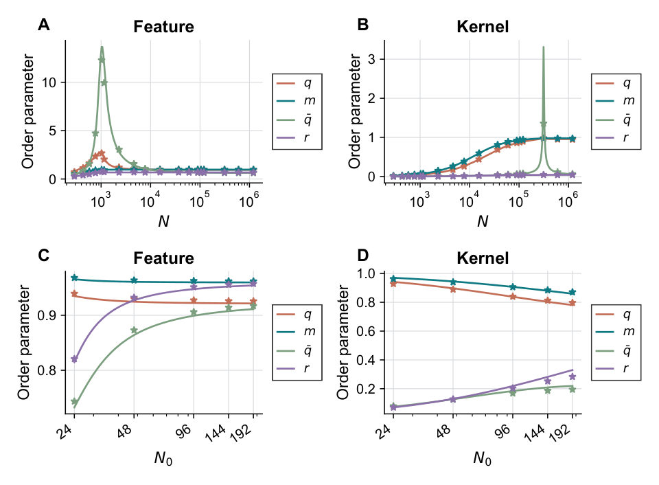
<figcaption class="paper-figure-caption"><b>Fig 5.</b> Figure 5: Consistency of the replica method with numerical experiments. Left: feature learner; right: kernel learner. The upper row varies N at d = 32, and the lower row varies N0 at d = 24, N = 1200000. Solid lines are replica predictions, and stars show the order parameters measured from the learned attention matrices in one run. Red, teal, green, and purple denote q, m, ¯q, r, respectively, for the learner in that column.</figcaption>
</figure>

**Summary.** This theoretical paper compares the performance of two attention-based architectures, the Kernel Learner and the Feature Learner, for performing nonlinear In-context Learning. Using advanced statistical physics techniques like the replica method, the authors derive phase diagrams that predict which architecture performs better based on system parameters. The work clarifies how architectural choices govern the ability of large models to learn tasks from limited demonstrations.

**Why it may be interesting.** The rigorous mathematical comparison of different learning architectures in the context of deep learning models (Transformers) provides theoretical insights into how model structure interacts with data statistics, which is highly relevant to understanding complex physical systems modeled by neural networks.

Detailed structure

**Main problem.** The paper compares two distinct one-layer attention architectures, the Kernel Learner and the Feature Learner, for performing In-context Learning (ICL) on nonlinear single-index target tasks.

**Main result.** The analysis yields phase diagrams showing that the optimal architecture depends critically on the interplay between pretraining data size, task diversity, and context lengths, with the Feature Learner showing advantages in certain regimes.

**Method.** The authors derive predictions for memorization and generalization errors using the replica method and establish asymptotic convergence results by analyzing the error bounds in the large-dimensional limits.

**Model / system.** The model is ICL using pretrained Transformers to predict a label $y_0$ from demonstrations $\{(x_\ell, y_\ell)\}$. The comparison is between a Kernel Learner (fixed nonlinear feature map followed by linear attention) and a Feature Learner (attention on original input followed by learned nonlinear readout).

**Key observables.** Memorization Error ($E_M$) and Generalization Error ($E_G$) for both architectures.

**Important parameters / regimes.** Input dimension ($d$), feature dimension ($D$), pretraining size ($N$), task-pool size ($N_0$), and context lengths ($L, e_L$).

**Assumptions / limitations.** The analysis relies on the replica method and assumes the task labels are generated by a noisy single-index model. Convergence proofs require specific moment bounds and continuity assumptions on the Gaussian channel.

**Figures summary.** Figure 1 schematically compares the two learners' architectures. Figure 2 compares Memorization and generalization errors vs. $N$ for the Feature, Linear attention, and Kernel learners.

**Paper structure.** The paper progresses from defining the problem and architectures, to deriving error predictions using the replica method, establishing asymptotic formulas for the errors, and finally proving the convergence of the feature-learner error to a limiting form.

Abstract

In-context learning (ICL) enables a pretrained model to infer a task from demonstrations without updating its parameters. While much of the existing theory focuses on linear target functions, in this paper we study nonlinear cases by comparing two one-layer attention architectures on the same family of single-index tasks. A kernel learner first maps inputs through a fixed nonlinear feature map and then applies linear attention, whereas a feature learner applies attention to the original input, followed by a learned nonlinear readout. We derive predictions for their memorization and generalization errors using the replica method, retaining the effects of pretraining size, task-pool diversity, and training and inference context lengths. The resulting predictions closely match numerical experiments across a broad range of regimes. Our analysis yields phase diagrams that characterize when each architecture is advantageous as the amount of pretraining data, task diversity, and context lengths vary. We further identify qualitatively different context-length scalings for the two learners. Together, these results clarify how architectural choices interact with the dataset and govern nonlinear in-context learning.

[↑ back to top](#top)

### [Learned Parallel Bit-Flipping Sequential Belief Propagation Decoding of Quantum LDPC Codes](http://arxiv.org/abs/2610.01068v1)

**Authors:** Mohsen Moradi, Taejoon Kim, Remi A. Chou  
**Type:** theory · **Category:** quantum information and computing · **PDF:** <https://arxiv.org/pdf/2610.01068v1>  
**Analysis basis:** full PDF text, analyzed in chunks

↔ Scroll figures horizontally

<figure class="paper-figure-card">
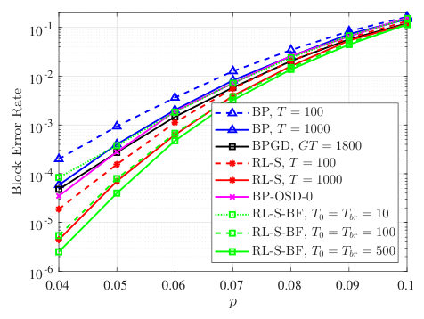
<figcaption class="paper-figure-caption"><b>Fig 1.</b> Fig. 1. Block error rate of the proposed RL-S-BF decoder for the [[180, 10, 15 ≤d ≤18]] A5 code over the depolarizing channel. The proposed decoder is compared with BP, BPGD, RL-S, and BP-OSD-0.</figcaption>
</figure>
<figure class="paper-figure-card">
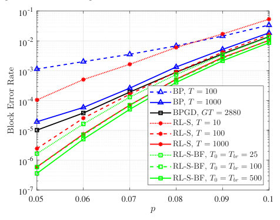
<figcaption class="paper-figure-caption"><b>Fig 2.</b> Fig. 2. Block error rate of our proposed RL-S-BF decoder for the [[288, 12, 18]] BB code over the depolarizing channel. The proposed decoder is compared with BP, BPGD, and RL-S.</figcaption>
</figure>
<figure class="paper-figure-card">
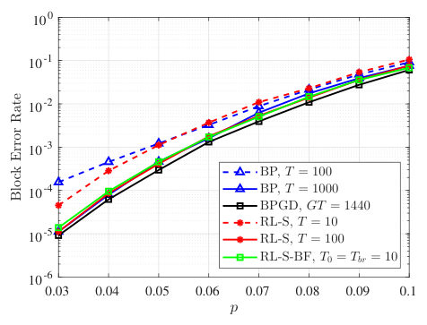
<figcaption class="paper-figure-caption"><b>Fig 3.</b> Fig. 3. Block error rate of our proposed RL-S-BF decoder for the [[144, 12, 12]] BB code over the depolarizing channel. The proposed decoder is compared with BP, BPGD, and RL-S.</figcaption>
</figure>

**Summary.** This paper introduces a learned parallel bit-flipping sequential BP decoder for QLDPC codes, designed to overcome the convergence limitations of standard belief propagation. By running an initial learned sequence followed by parallel testing of single-qubit Pauli-flip candidates, the decoder achieves high reliability with significantly reduced decoding depth compared to purely sequential methods.

**Why it may be interesting.** The combination of advanced decoding theory (BP/QLDPC) with machine learning (RL) and parallel hardware considerations makes it highly relevant for quantum computing hardware implementation.

Detailed structure

**Main problem.** Developing fast, low-complexity, and reliable decoders for Quantum Low-Density Parity-Check (QLDPC) codes to enable fault-tolerant quantum computation.

**Main result.** The proposed parallel bit-flipping decoder significantly improves the reliability of learned sequential BP compared to standard methods, achieving comparable performance to much deeper decoders with a much lower decoding depth.

**Method.** It combines an initial learned sequential BP run with a controlled search mechanism that evaluates multiple independent, parallel continuation branches initiated by single-qubit Pauli-flip candidates.

**Model / system.** The work focuses on quantum error correction using QLDPC codes, analyzed under the depolarizing channel, involving Pauli error estimation over the quaternary Pauli symbols {I, X, Y, Z}.

**Key observables.** Block Error Rate (BER), syndrome mismatch weight ($\|\delta_X\|_1 + \|\delta_Z\|_1$), and local Pauli log-likelihood scores.

**Important parameters / regimes.** Channel noise probability ($p$), initial RL-S iterations ($T_0$), continuation iterations ($T_{br}$), and the number of parallel candidates tested ($K$).

**Assumptions / limitations.** The core assumption is that independent continuation branches can be executed in parallel, allowing the search to increase hardware resources rather than sequential latency.

**Figures summary.** Figures compare the BER performance of the proposed RL-S-BF decoder against standard BP, BPGD, and RL-S across various QLDPC codes (e.g., $[[288, 12, 18]]$ BB code) at different noise levels.

**Paper structure.** The paper builds from standard BP to learned sequential BP (RL-S), identifying RL-S's weakness to local decisions. It then proposes the RL-S-BF decoder, which runs RL-S initially, followed by a parallel search over bit-flipping candidates, each initiating an independent RL-S continuation.

Abstract

Quantum low-density parity-check (QLDPC) codes are promising candidates for low-overhead fault-tolerant quantum computation, but their practical use requires fast, low-complexity, and reliable decoders. Belief propagation (BP) is attractive because of its local message-passing structure, yet standard flooding BP often suffers from convergence failures on QLDPC codes due to short cycles, degeneracy, and symmetric decoding trajectories. Learned sequential BP improves convergence by using a reinforcement-learning policy to choose variable-node update orders, but a single learned trajectory can still be sensitive to unfavorable local Pauli decisions. We propose a learned parallel bit-flipping sequential BP decoder with a new quaternary score combining syndrome gain, a quantized Pauli log-likelihood penalty, and Q-table lookahead at hypothetical post-flip states. Our decoder first runs learned sequential BP for a fixed number of iterations. If the syndrome is not satisfied, it constructs quaternary bit-flipping candidates, each corresponding to changing the current Pauli decision of one qubit. The selected candidates initialize independent learned sequential BP continuations from the same decoder state. Since these continuations are independent, they can be executed in parallel, so testing several candidates mainly increases parallel hardware resources rather than sequential decoding latency. Simulations on representative QLDPC codes over the depolarizing channel show that the proposed decoder improves the reliability of learned sequential BP while having a parallel low-latency structure.

[↑ back to top](#top)

### [Linear-Time Encodable Quantum Codes near the CSS GV Bound](http://arxiv.org/abs/2610.01277v1)

**Authors:** Rachel Yun Zhang  
**Type:** theory · **Category:** quantum information and computing · **PDF:** <https://arxiv.org/pdf/2610.01277v1>  
**Analysis basis:** full PDF text, analyzed in chunks

↔ Scroll figures horizontally

<figure class="paper-figure-card">
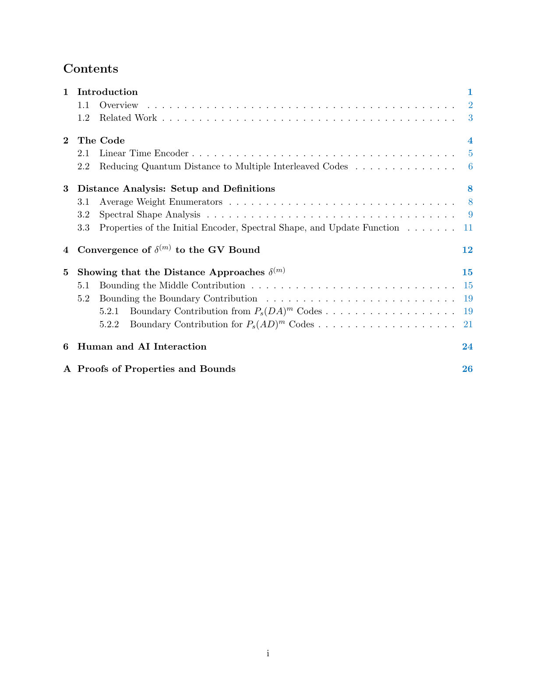
<figcaption class="paper-figure-caption"><b>Fig 1.</b> Low-resolution page preview, page 2</figcaption>
</figure>
<figure class="paper-figure-card">
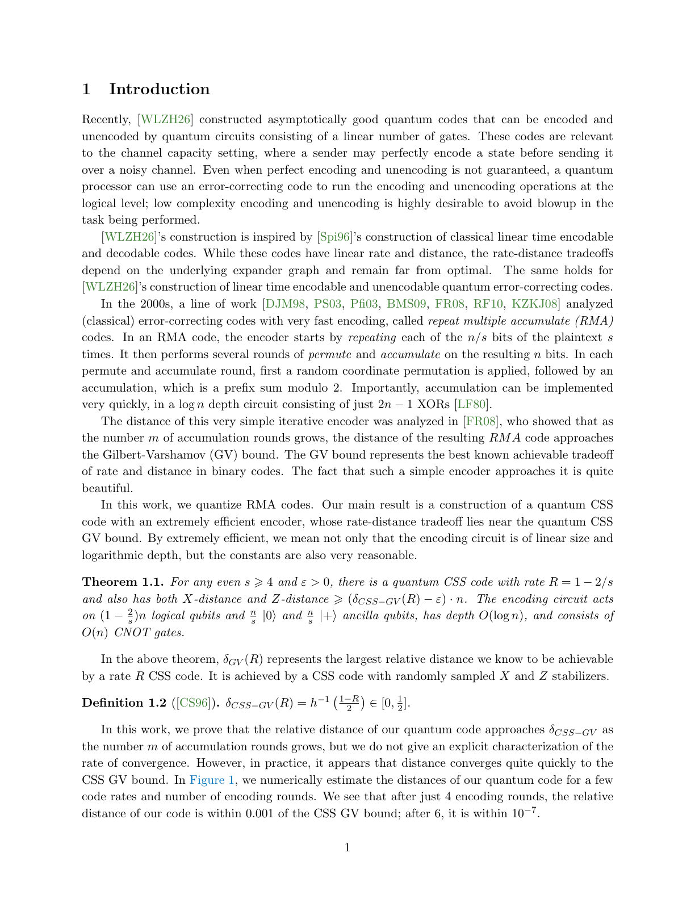
<figcaption class="paper-figure-caption"><b>Fig 2.</b> Low-resolution page preview, page 3</figcaption>
</figure>
<figure class="paper-figure-card">
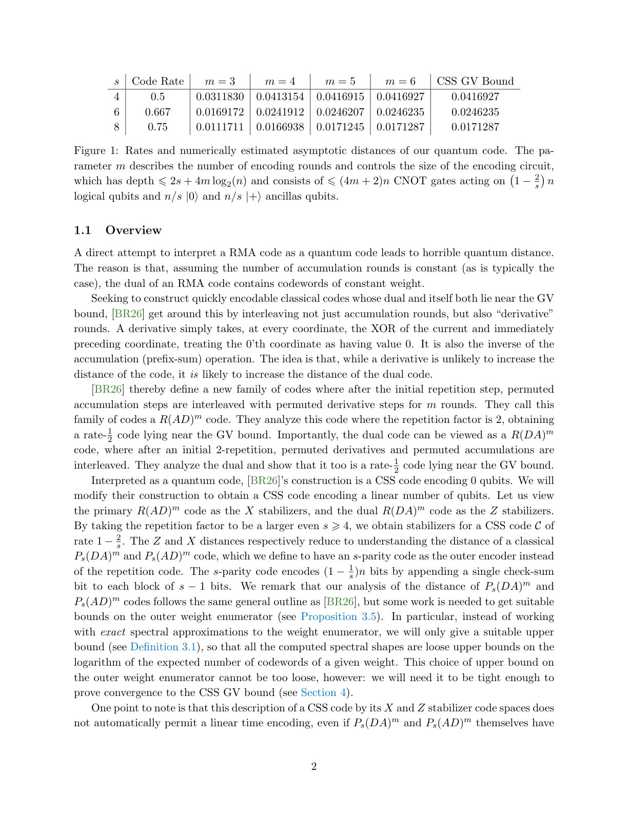
<figcaption class="paper-figure-caption"><b>Fig 3.</b> Low-resolution page preview, page 4</figcaption>
</figure>
<figure class="paper-figure-card">
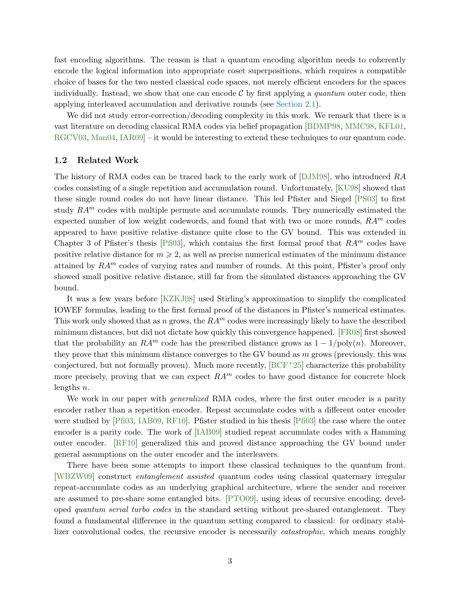
<figcaption class="paper-figure-caption"><b>Fig 4.</b> Low-resolution page preview, page 5</figcaption>
</figure>
<figure class="paper-figure-card">
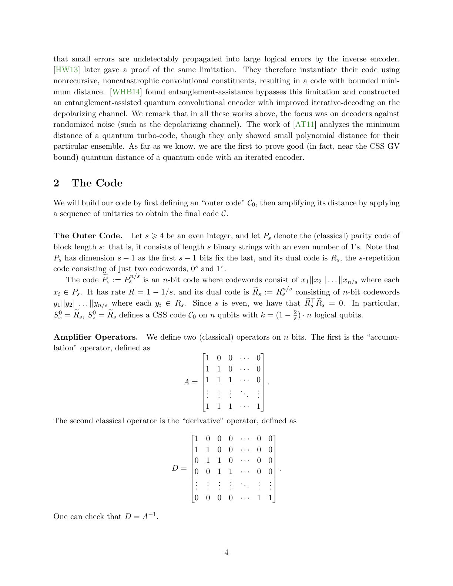
<figcaption class="paper-figure-caption"><b>Fig 5.</b> Low-resolution page preview, page 6</figcaption>
</figure>

**Summary.** This paper develops a method to construct quantum error-correcting codes whose performance approaches the theoretical Gilbert-Varshamov bound. It achieves this by quantum-analogizing classical Repeat Multiple Accumulate codes using interleaved accumulation and derivative operations. The result is significant because it provides a concrete, efficiently implementable construction for near-optimal quantum codes.

**Why it may be interesting.** This work provides concrete, constructive methods for approaching fundamental bounds in quantum error correction, which is a core theoretical topic in quantum information science.

Detailed structure

**Main problem.** The primary goal is to construct quantum CSS error-correcting codes whose rate-distance tradeoff approaches the theoretical Gilbert-Varshamov (GV) bound while maintaining an extremely efficient encoding circuit.

**Main result.** The authors prove the existence of such quantum CSS codes with a rate $R = 1 - 2/s$ and distances approaching the CSS GV bound, achievable with polynomial-time encoding circuits.

**Method.** The construction adapts classical Repeat Multiple Accumulate (RMA) codes into a quantum setting using interleaved accumulation and 'derivative' rounds, analyzed via weight enumerator bounding techniques.

**Model / system.** The system involves quantum CSS codes, specifically generalized RMA codes, which are constructed using an outer code $C_0$ and an amplification process involving accumulation ($A$) and derivative ($D$) operators.

**Key observables.** The relative distance of the code, which is shown to approach the theoretical CSS GV bound $\delta_{	ext{CSS-GV}}(R)$.

**Important parameters / regimes.** The rate $R = 1 - 2/s$, the number of accumulation rounds $m$, and the parameter $s$ defining the outer code.

**Assumptions / limitations.** The analysis assumes the quantum encoding can be achieved by sequentially applying the outer code and the interleaved rounds, and relies on bounding weight enumerators using specific propositions.

**Figures summary.** Figure 1 compares the rates and numerically estimated asymptotic distances for varying $m$ against the theoretical CSS GV Bound for specific values of $s$.

**Paper structure.** The paper builds upon previous work by defining the code structure via $L = D \circ \Pi_{2m} \circ A \circ \cdots$, analyzing the distance bounds using weight enumerators (Chunk 3), and establishing necessary functional inequalities (Chunk 4) to prove the convergence to the GV bound.

Abstract

We construct quantum CSS codes with rate-distance tradeoff approaching the CSS GV bound, which can be encoded by a quantum circuit of logarithmic depth and a linear number of gates. Our construction is heavily inspired by a work of Brehm and Resch and can be viewed as a quantum analogue of classical repeat multiple accumulate codes. The encoder has a particularly simple structure, consisting of a single constant depth outer quantum circuit followed by several classical accumulation and inverse-accumulation layers.

[↑ back to top](#top)

### [Local random quantum circuits converge to the Porter-Thomas distribution in polynomial depth](http://arxiv.org/abs/2610.02125v1)

**Authors:** Aniruddha Sen, Nicholas Hunter-Jones  
**Type:** theory · **Category:** statistical mechanics · **PDF:** <https://arxiv.org/pdf/2610.02125v1>  
**Analysis basis:** full PDF text, analyzed in chunks

↔ Scroll figures horizontally

<figure class="paper-figure-card">
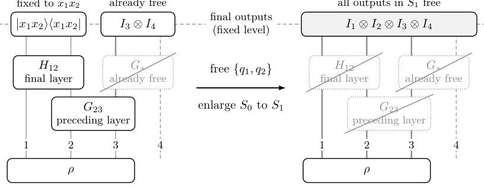
<figcaption class="paper-figure-caption"><b>Fig 1.</b> Figure 1: Bounding the probability mass over larger intervals. Initially S∗= S0 = {q3, q4} is free, so G∗contributes to both masses. The neighboring qubits q1, q2 are fixed until S0 is enlarged to S1 = {q1, q2, q3, q4}. This involves inverting the effect of applying H12 and G23 on the qubits, or freeing the fixed qubits. R0 and R1 are the probability masses on S0 and S1 respectively. We only analyze the effect of the gates in the last two layers of the circuit, freeing the qubits from right to left in this figure.</figcaption>
</figure>

**Summary.** This theoretical paper proves that the output statistics of random quantum circuits with polynomial depth converge to the Porter-Thomas distribution, a hallmark of chaotic quantum systems. The convergence rate is quantified in terms of the total variation distance, providing a rigorous bound based on the circuit depth. This result is fundamental for understanding the statistical behavior expected in near-term quantum computation experiments.

**Why it may be interesting.** This work provides a quantitative understanding of how quickly random quantum processes approach the statistical equilibrium predicted by random matrix theory (Porter-Thomas), which is crucial for understanding quantum advantage demonstrations.

Detailed structure

**Main problem.** The paper determines the convergence rate of the output probability distribution of local random quantum circuits to the Porter-Thomas distribution.

**Main result.** The output distribution of polynomial-depth brickwork random circuits converges to the Porter-Thomas distribution in total variation distance with a rate of $O(1/n^m)$ for depth $O(n^{2m+1}\log(n))$.

**Method.** The convergence is rigorously proven by bounding the Total Variation (TV) distance using characteristic functions, moment bounds from approximate designs, and analytic estimates.

**Model / system.** The system analyzed is a local random quantum circuit, specifically 'brickwork random circuits' constructed from nearest-neighbor Haar random gates acting on $n$ qubits.

**Key observables.** The output probability distribution over a fixed bitstring, $p_U(b) = |\langle b|U|0
angle|^2$, and its comparison to the Porter-Thomas distribution.

**Important parameters / regimes.** Circuit depth $l = \Theta(n^{2m+1} \log(n))$, and the total variation distance $d_{TV}(P, Q)$.

**Assumptions / limitations.** The analysis relies on the circuit ensemble forming an approximate $k$-design and uses techniques involving mollification and moment control.

**Paper structure.** The paper establishes the TV distance bound by relating it to the $L^2$ norm of the difference in characteristic functions, which is then bounded by combining results from different regions of the Fourier space.

Abstract

Porter-Thomas statistics are a characteristic feature of the output distribution of random quantum states and, more broadly, chaotic quantum many-body systems. Convergence to Porter-Thomas plays a central role in random circuit sampling and experimental demonstrations of quantum advantage, where the output statistics of low-depth random quantum circuits are expected to be approximately Porter-Thomas, despite the absence of a rigorous proof of convergence. We show that the output distribution of polynomial-depth brickwork random circuits converges inverse-polynomially in total variation distance to the Porter-Thomas distribution. Specifically, consider the output probability distribution over a fixed bitstring of a local random quantum circuit, constructed from nearest-neighbor Haar random gates. Then, for any $m \geq 0$, the distribution corresponding to circuits of depth $O(n^{2m+1}\log(n))$ is at most $O(1/n^m)$ far in total variation distance from the Porter-Thomas distribution. Our proof uses moment bounds from approximate designs, analytic estimates for characteristic functions, and a local anticoncentration property for inverse moments.

[↑ back to top](#top)

### [Loss-tolerant distributed lattice surgery using fusion networks](http://arxiv.org/abs/2610.01923v1)

**Authors:** Felix Burt, Richard Meister, Sheng-Ku Lin, Kuan-Cheng Chen, Michael Hanks, Roberto Bondesan, M. S. Kim, Kin K. Leung  
**Type:** theory · **Category:** quantum information and computing · **PDF:** <https://arxiv.org/pdf/2610.01923v1>  
**Analysis basis:** full PDF text, analyzed in chunks

↔ Scroll figures horizontally

<figure class="paper-figure-card">
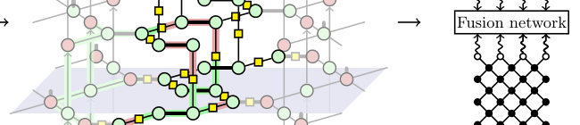
<figcaption class="paper-figure-caption"><b>Fig 1.</b> FIG. 1: Overview of the construction. A lattice surgery merge, carried from the logical level down to a hybrid protocol designed for heterogeneous hardware. At the logical level the merge implements a joint measurement, whose outcome carries the joint observable (red web). This maps to an abstract syndrome extraction diagram with Pauli webs corresponding to logical observables and detecting regions (Section III). Using web-preserving transformations (Section III B) the seam is split and transformed into a graph-like sub-diagram (Section IV C 1) which can be split into resource state components. Measurement and world-line annotations fix a hybrid realisation with fusion networks at the...</figcaption>
</figure>
<figure class="paper-figure-card">
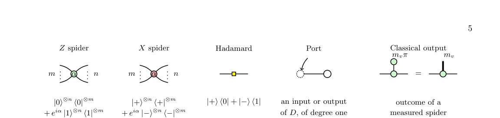
<figcaption class="paper-figure-caption"><b>Fig 2.</b> FIG. 2: Node types. The four values of the type map t, together with the bold leg of a classical output. Spiders are drawn green (Z) and red (X) and carry a phase α ∈{0, π}; Hadamard nodes have degree two, while ports and classical outputs degree one. For the standard ZX calculus and ZX-instrument conventions, see Refs. [64, 69].</figcaption>
</figure>
<figure class="paper-figure-card">
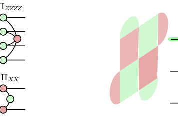
<figcaption class="paper-figure-caption"><b>Fig 3.</b> FIG. 4: Syndrome extraction diagrams and their Pauli webs. (a) Phase-free projector gadgets for a four-qubit Z-type generator and a two-qubit X-type generator, each with a generator spider joined to data spiders. Exchanging spider colours exchanges the generator type. (b) All consecutive measurements of the same Pauli type can be merged into a single layer, and composing layers gives a syndrome extraction diagram (SED), with detecting regions, stabilisers, and logical webs corresponding to the code. A Z-type detecting region is shown in red, an X-type stabiliser from a two-qubit boundary generator in green, and an X logical web along the top boundary in green.</figcaption>
</figure>
<figure class="paper-figure-card">
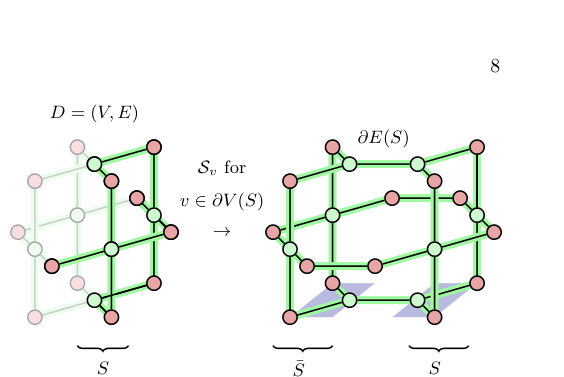
<figcaption class="paper-figure-caption"><b>Fig 4.</b> FIG. 5: Splitting a detecting region. (left) An SED with a selected region S and a highlighted detecting region. (right) Splitting the boundary generator spiders gives D[S] a matching boundary.</figcaption>
</figure>
<figure class="paper-figure-card">
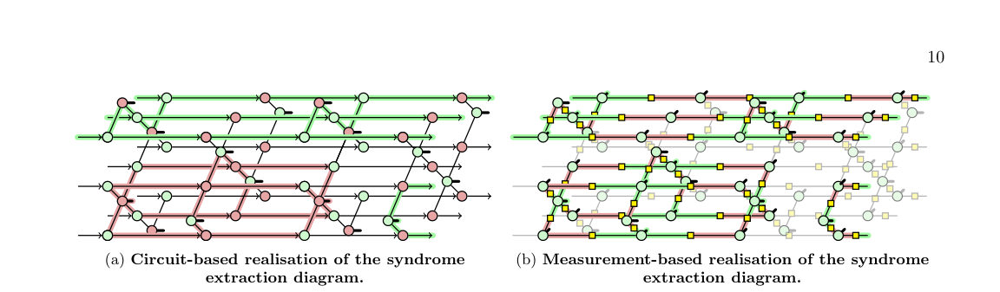
<figcaption class="paper-figure-caption"><b>Fig 5.</b> FIG. 6: Two realisations of the syndrome extraction diagram: circuit-based (a) and measurement-based (b). In the circuit-based realisation, directed edges represent data-qubit world-lines, while each generator spider lies on a distinct world-line and has a classical output recording its stabiliser measurement outcome. In the measurement-based realisation, each bulk spider lies on a distinct world-line and represents a qubit initialised in |+⟩, while edges represent CZ gates forming a cluster state and classical outputs record the measurement outcomes.</figcaption>
</figure>

**Summary.** This paper addresses the challenge of scaling quantum computers by analyzing error correction for distributed lattice surgery across noisy photonic links. The authors develop and test hybrid protocols that combine circuit-based and measurement-based techniques. They demonstrate that these hybrid approaches significantly enhance the error-correcting distance of the quantum interface, especially in low-noise regimes.

**Why it may be interesting.** It provides concrete, quantifiable improvements to the fault-tolerance thresholds for networking quantum processors, which is crucial for building large-scale quantum computers using photonic interconnects.

Detailed structure

**Main problem.** Scaling fault-tolerant quantum computation requires performing distributed logical operations across photonic links, which suffer from noise like photon loss, unlike local QPUs.

**Main result.** Hybrid protocols significantly improve the interface distance for distributed lattice surgery, achieving a 50% erasure threshold when local noise is negligible.

**Method.** The authors use ZX calculus transformations to construct and analyze hybrid syndrome extraction protocols applied to distributed rotated surface code lattice surgery.

**Model / system.** The work models matter-based Quantum Processing Units (QPUs) connected via photonic links, implementing lattice surgery for distributed operations and analyzing performance under a heterogeneous error model.

**Key observables.** Interface-erasure threshold, merge-observable interface distance, and perpendicular-observable interface distance.

**Important parameters / regimes.** Local error rates ($10^{-3}$ and $10^{-4}$), and the degree of resource state truncation.

**Assumptions / limitations.** The analysis assumes the ability to model the combination of circuit noise, resource-state errors, and photonic loss/fusion failures, treating losses as erasures.

**Figures summary.** Figure 1 illustrates the construction process from the logical level down to a hybrid realization involving fusion networks at the interface and circuit-based syndrome extraction elsewhere.

**Paper structure.** The paper builds from defining the problem of distributed noise, detailing the use of ZX calculus and Pauli webs, applying these tools to compare different interface geometries (fused Bell pairs vs. fusion networks), and finally analyzing performance under realistic, combined noise models.

Abstract

Networking matter-based quantum processing units (QPUs) offers a promising route to scaling fault-tolerant quantum computers. This requires distributed logical operations to be performed across photonic links, where noise is characteristically different from and stronger than in local QPUs owing to photon loss and probabilistic linear-optical operations. Measurement- and fusion-based quantum computing are designed to be robust against loss and probabilistic photonic operations, suggesting they could complement circuit-based error correction at the interface between networked QPUs. We use ZX calculus transformations to construct hybrid syndrome extraction protocols and apply them to distributed rotated surface code lattice surgery, demonstrating that several protocols attain a $50\%$ interface-erasure threshold when local noise is absent, including circuit-based lattice surgery using fused Bell pairs and hybrid protocols using linear cluster states. Relative to a straight Bell-pair interface geometry, the hybrid protocols increase the merge-observable interface distance from $d+1$ to $2d+1$ and restore the perpendicular-observable interface distance from $\lfloor(d+1)/2\rfloor$ to $d$. We calculate how the threshold decreases when using truncated resource states and map correctable regions under resource-state errors, local circuit noise, and fusion erasure. We then convert these erasure thresholds into photon-loss thresholds and probe subthreshold performance using fusion boosting. At circuit and resource-state error rates of $10^{-3}$, local errors largely mask the interface-distance advantage. As local noise is reduced to $10^{-4}$ and below, the linear-chain protocols improve more rapidly with decreasing erasure, suggesting that interface distance enhancements are effective in low local noise regimes.

[↑ back to top](#top)

### [Molecular Dynamics with Nuclear Effects on Quantum Computers](http://arxiv.org/abs/2610.01549v1)

**Authors:** Lukas Haßfurth, Juliane Heitkämper, Elias Walter, Birger Horstmann  
**Type:** theory · **Category:** other · **PDF:** <https://arxiv.org/pdf/2610.01549v1>  
**Analysis basis:** full PDF text, analyzed in chunks

↔ Scroll figures horizontally

<figure class="paper-figure-card">
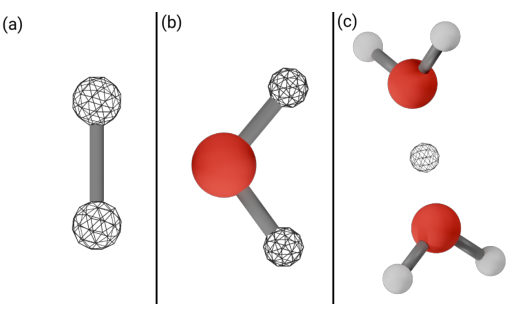
<figcaption class="paper-figure-caption"><b>Fig 1.</b> Figure 1 The investigated molecules. Nuclei that were treated with NEO are represented by the wireframes indicating isosurfaces of quantum nuclear probability density. (a) Hydrogen molecule. (b) Water. (c) Zundel ion.</figcaption>
</figure>
<figure class="paper-figure-card">
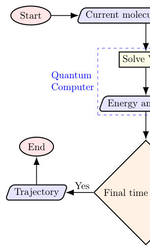
<figcaption class="paper-figure-caption"><b>Fig 2.</b> Figure 2 Schematic representation of the hybrid-classical MD algorithm.</figcaption>
</figure>
<figure class="paper-figure-card">
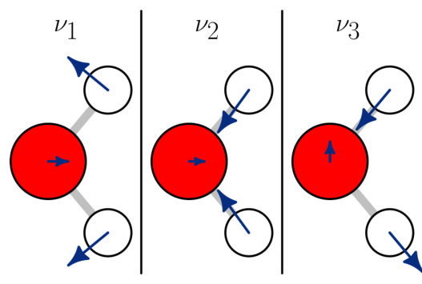
<figcaption class="paper-figure-caption"><b>Fig 3.</b> Figure 3 The normal modes of water. From left to right: Bending, symmetric stretching and antisymmetric stretching.</figcaption>
</figure>
<figure class="paper-figure-card">
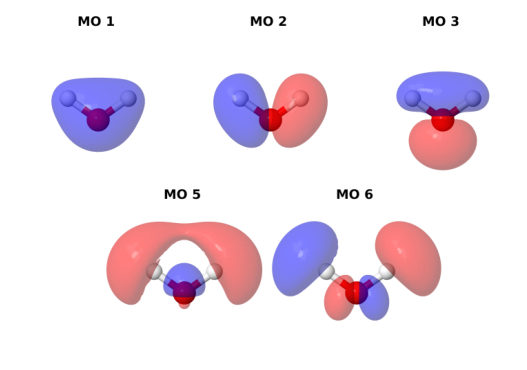
<figcaption class="paper-figure-caption"><b>Fig 4.</b> Figure 4 Active electronic orbitals for the water molecule.</figcaption>
</figure>
<figure class="paper-figure-card">
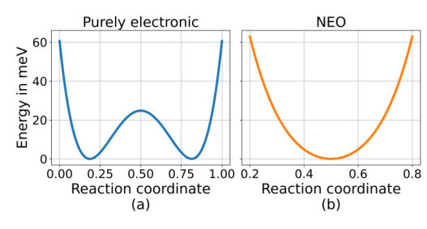
<figcaption class="paper-figure-caption"><b>Fig 5.</b> Figure 5 Potential energy along the proton transfer reaction coordi- nate, computed using the active space [5,8,14,23,25]. (a) Computed with ab-initio electronic structure methods. (b) Computed with the described ab-initio nuclear-electronic structure method.</figcaption>
</figure>

**Summary.** This paper presents a novel hybrid quantum-classical algorithm to perform ab-initio molecular dynamics that explicitly includes nuclear quantum effects using the NEO framework. By leveraging VQE on quantum hardware for energy and force calculations, the authors successfully simulate systems like the Zundel ion, demonstrating that quantum effects significantly alter molecular dynamics predictions.

**Why it may be interesting.** This work directly addresses the intersection of quantum computation and molecular dynamics, providing a pathway to simulate complex quantum phenomena like proton transfer that are intractable classically.

Detailed structure

**Main problem.** The primary challenge is incorporating computationally expensive nuclear quantum effects, such as proton tunneling, into ab-initio molecular dynamics simulations.

**Main result.** The proposed hybrid quantum-classical algorithm successfully simulates dynamics with nuclear quantum effects, showing that proton shuttling in the Zundel ion becomes effectively barrierless.

**Method.** A novel hybrid quantum-classical algorithm is introduced, using the Variational Quantum Eigensolver (VQE) on a quantum computer to calculate ground state energies and forces, while classical methods update the molecular geometries.

**Model / system.** The study focuses on molecular systems like H2, H2O, and the Zundel ion (H5O2+). The theoretical framework employs the Nuclear-Electronic Orbital (NEO) method to treat light nuclei quantum-mechanically alongside electrons.

**Key observables.** Vibrational spectra, ground state energies, forces, and nuclear quantum probability density.

**Important parameters / regimes.** The feasibility of using compact hardware-efficient ansatz circuits compared to more accurate UCCSD ansatzes on near-term quantum devices.

**Assumptions / limitations.** The algorithm assumes that the quantum nuclei are pinned to their classical expectation values, and the classical propagation uses the velocity Verlet algorithm.

**Figures summary.** Figures illustrate the molecules with quantum nuclear probability density isosurfaces, and flowcharts detail the hybrid quantum-classical molecular dynamics algorithm.

**Paper structure.** The paper develops the theoretical framework by first outlining the need for the hybrid algorithm, detailing the VQE implementation for energy/forces, and validating the approach through simulations of benchmark molecules.

Abstract

Nuclear quantum effects are critical for describing proton transfer and hydrogen bonding, but their incorporation into quantum chemistry calculations is often computationally prohibitive on classical hardware. A promising alternative are quantum computers due to their linear scaling in the space requirements with system size. We introduce a novel hybrid quantum-classical algorithm for ab-initio molecular dynamics that incorporates nuclear quantum effects via the nuclear-electronic orbital method. The proposed algorithm evaluates ground state energies and forces on the quantum computer using a variational quantum eigensolver, while the molecular geometries are updated classically. We validate our approach through simulations of $\text{H}_2$, $\text{H}_2\text{O}$ and the Zundel ion $\text{H}_5\text{O}_2^+$, comparing the simulated vibrational spectra with experimental data. Upon inclusion of nuclear quantum effects, the proton shuttling movement in the Zundel ion becomes effectively barrierless, and errors in the simulated frequencies improve significantly. Employing compact hardware-efficient ansatz circuits we achieve results comparable to the more accurate UCCSD ansatzes, which hints towards the feasibility of executing our algorithm on near-term quantum devices.

[↑ back to top](#top)

### [Monogamous quantum corrections to holographic mutual information](http://arxiv.org/abs/2610.00670v1)

**Authors:** César A. Agón, Javier Molina-Vilaplana, Javier Moreno  
**Type:** theory · **Category:** statistical mechanics · **PDF:** <https://arxiv.org/pdf/2610.00670v1>  
**Analysis basis:** full PDF text, analyzed in chunks

↔ Scroll figures horizontally

<figure class="paper-figure-card">
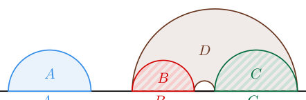
<figcaption class="paper-figure-caption"><b>Fig 1.</b> Figure 1: Schematic representation of the entanglement wedges associated with the boundary regions A∂, B∂, and C∂. We denote D ≡EW(B∂∪C∂).</figcaption>
</figure>
<figure class="paper-figure-card">
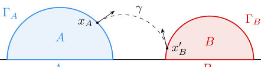
<figcaption class="paper-figure-caption"><b>Fig 2.</b> Figure 2: Two points xA and x′ B, expressed in Poincaré coordinates, lie on ∂A = ΓA ∪A∂and ∂B = ΓB ∪B∂, respectively. They are connected by the geodesic γ.</figcaption>
</figure>

**Summary.** This theoretical paper develops an extensive model for bulk Mutual Information in AdS spacetime using the correlator of a massive Dirac fermion. By demonstrating that the bulk MI's extensivity implies the satisfaction of holographic entropy inequalities on the boundary, the authors provide a rigorous framework for understanding quantum corrections to entanglement in holographic theories.

**Why it may be interesting.** The connection between geometric properties (extensivity) of bulk quantities and fundamental quantum information constraints (monogamy) provides a powerful, universal tool for testing quantum gravity models in condensed matter analogues.

Detailed structure

**Main problem.** The paper aims to construct an extensive model for bulk Mutual Information (MI) in Anti-de Sitter (AdS) spacetime to describe quantum corrections to holographic MI.

**Main result.** It is shown that the extensivity of the bulk MI is sufficient to guarantee that the quantum-corrected boundary entropy vector satisfies all holographic entropy cone inequalities, including monogamy of MI.

**Method.** The authors use the Faulkner–Lewkowycz–Maldacena prescription and model the bulk MI using a covariantly conserved current-current kernel derived from a free massive Dirac fermion.

**Model / system.** The physical context is holographic theories governed by the AdS/CFT correspondence. The model is realized explicitly using the current-current correlator of a free massive Dirac fermion in AdS spacetime.

**Key observables.** Mutual Information (MI), Von Neumann entropy (S), Holographic Entropy Cone (HEC) inequalities, and the current-current correlator $\langle J_\mu J'_
u 
angle$.

**Important parameters / regimes.** The mass $m$ of the fermion, the AdS radius $L$, and the renormalization group flow parameter $\ell$.

**Assumptions / limitations.** The primary assumption is that positive and exactly extensive bulk MI is sufficient for satisfying the HEC inequalities. The analysis also relies on the FLM prescription to capture subleading quantum corrections.

**Figures summary.** Figure 1 schematically illustrates the entanglement wedges for three disjoint boundary regions. Figure 2 details the geometry for calculating MI between two disjoint boundary regions in Poincaré coordinates.

**Paper structure.** The paper develops the MI functional using the current-current correlator, establishes the connection between bulk extensivity and boundary constraints, and explicitly calculates the MI in both long-distance and short-distance limits using the free fermion model.

Abstract

We construct an extensive model of bulk mutual information (MI) in anti-de Sitter spacetime and use it to describe the leading quantum corrections to the MI of certain holographic theories. The equivalence between bulk and boundary MI follows from the Faulkner--Lewkowycz--Maldacena prescription. We show that the extensivity of the bulk MI is sufficient for the quantum-corrected boundary entropy vector to satisfy monogamy of MI and all other holographic entropy cone inequalities. Our model is built from a covariantly conserved current-current kernel in AdS and is realized explicitly by a free massive Dirac fermion, whose boundary MI at long distances is that of a fermionic generalized free field (GFF). The construction also reproduces the expected short-distance divergence structure of a GFF, and the current-current correlator defines a positive and monotonically decreasing function along the renormalization-group flow. We illustrate this explicitly for disjoint half-disks at the conformal fixed point of the model in AdS$_3$, where we present the exact result.

[↑ back to top](#top)

### [Multivariate Quantum Signal Processing](http://arxiv.org/abs/2610.01125v1)

**Authors:** Guang Hao Low  
**Type:** theory · **Category:** quantum information and computing · **PDF:** <https://arxiv.org/pdf/2610.01125v1>  
**Analysis basis:** full PDF text, analyzed in chunks

↔ Scroll figures horizontally

<figure class="paper-figure-card">
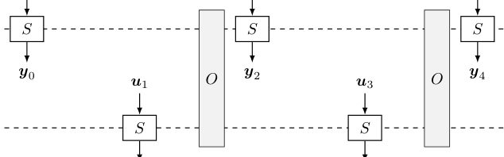
<figcaption class="paper-figure-caption"><b>Fig 1.</b> Figure 1: One oracle port with delay r = 2 and horizon N = 5. At each time, the system matrix couples the corresponding public clock subspace to one private position. These subspaces are |k⟩clk ⊗P and |k mod 2⟩j ⊗Lj. Each oracle rectangle denotes a controlled call on both private positions. The calls occur at times 2 and 4, before the corresponding system operation. An amplitude written at time k is read at k + 2 after one oracle call. The lines denote direct-sum subspaces represented by the binary address register. The input consists of the public amplitudes (u0, . . . , u4) and two initial private amplitudes. The output consists of (y0, . . . , y4) and both unmeasured private amplitudes....</figcaption>
</figure>
<figure class="paper-figure-card">
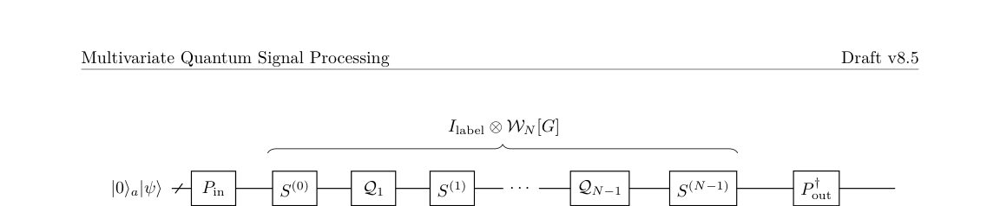
<figcaption class="paper-figure-caption"><b>Fig 2.</b> Figure 2: Circuit for quditization on the binary address register and clock label. The system operation S(k) acts through the embedding Jk in Equation (2.25), coupling the indicated public and private basis subspaces. Routing updates the address during these couplings. The operation Qk applies the scheduled oracles to all their private positions. A port is scheduled precisely when rj | k. Projecting the encoding register onto |0⟩a after input-clock preparation and output-clock unpreparation gives eGN/αclk, as defined in Equations (2.32) and (A.16).</figcaption>
</figure>
<figure class="paper-figure-card">
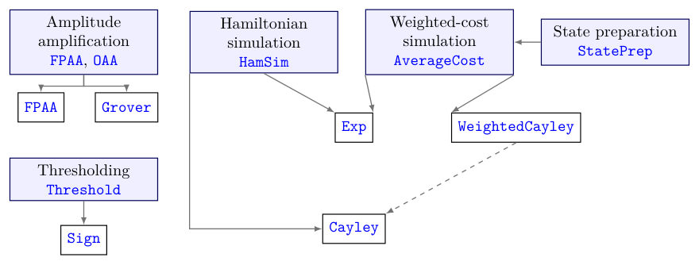
<figcaption class="paper-figure-caption"><b>Fig 3.</b> Figure 3: Examples of shared processing modules. An arrow points from a construction to a module it uses. Shaded boxes name the algorithms and their modules; all module names link to their definitions. The dashed edge denotes the weighted version of the same Cayley transformation. Elementary connections are shown in the later IIR diagrams.</figcaption>
</figure>
<figure class="paper-figure-card">
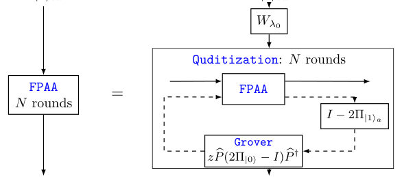
<figcaption class="paper-figure-caption"><b>Fig 4.</b> Figure 4: The same tap and preparation reflection define an IIR and a finite preparation algorithm. The lift receives the prepared state in its private subspace, initially empty public slots retain every transmitted amplitude, and the final success flag selects their direct sum.</figcaption>
</figure>
<figure class="paper-figure-card">
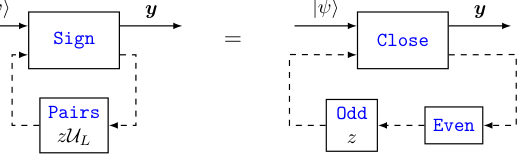
<figcaption class="paper-figure-caption"><b>Fig 5.</b> Figure 5: The sign lattice is a path of unitary sections. The two endpoints are public. A known boundary swap closes every internal coordinate, and the feedback connection applies the even and odd matchings. The marker z counts a whole two-query round.</figcaption>
</figure>

**Summary.** This work introduces Multivariate Quantum Signal Processing (MQSP), a powerful framework that models quantum query algorithms using the mathematical structure of multiport IIR filters. It achieves optimal resource bounds for complex tasks like Hamiltonian simulation and solving linear equations by providing a systematic design methodology. This advances quantum algorithm design by bridging classical signal processing theory with quantum computation theory.

**Why it may be interesting.** The connection between classical signal processing theory (IIR filters) and quantum query complexity provides a powerful, structured, and analytically rigorous toolset for designing quantum algorithms, particularly for open quantum systems dynamics.

Detailed structure

**Main problem.** The paper develops Multivariate Quantum Signal Processing (MQSP) to design efficient quantum algorithms for matrix-valued transformations involving multiple noncommuting, nonnormal matrices.

**Main result.** It provides a complete characterization of achievable quantum transfer functions and achieves optimal query complexity bounds for various problems, including Hamiltonian simulation and solving linear systems.

**Method.** The core method maps quantum query algorithms onto the analytic structure of multiport Infinite-Impulse-Response (IIR) filters, using a transfer-function methodology derived from feedback loops.

**Model / system.** The framework applies to quantum transducers implementing transformations defined by multiple noncommuting, nonnormal block-encoded matrices, generalizing concepts from standard Quantum Signal Processing (QSP).

**Key observables.** Weighted query cost, time-norm dependence, and error bounds ($\epsilon$).

**Important parameters / regimes.** The number of noncommuting matrices ($m$), the approximation depth ($N$), and the query cost structure ($\langle\vec\lambda,\vec C
angle_{1/2}$).

**Assumptions / limitations.** The method relies on the existence of analytic IIR representations for the required transformations and involves approximating continuous IIR functions with finite-impulse-response (FIR) circuits.

**Figures summary.** Not specified.

**Paper structure.** The paper builds upon the mathematical framework of IIR filters to characterize quantum query algorithms, providing specific, optimized bounds and constructions for Hamiltonian simulation, linear system solving, and generalized eigenvalue problems.

Abstract

We develop Multivariate Quantum Signal Processing for designing matrix-valued transformations of multiple noncommuting nonnormal block-encoded matrices. Our framework equips quantum transducers with the analytic structure of multiport Infinite-Impulse-Response (IIR) filters and establishes a transfer-function methodology for designing quantum query algorithms. Efficiently computable analytic bounds that hold uniformly across the oracle promise yield efficient quantum circuits with logarithmic error dependence and near-unity success probability, paralleling the approximation-theoretic guarantees of univariate QSP/QSVT. We provide a complete characterization of achievable transfer functions and a principled library of analytic IIR components. Our modular designs greatly improve or resolve the per-oracle query complexity of open multi-oracle problems: (1) Hamiltonian simulation under $H=\sum_j H_j$ with weighted quasinorm cost $\approx t\langle\vecλ,\vec C\rangle_{1/2}+\mathcal{O}(\|\vec C\|_1\log(1/ε))$ for block-encoding normalizations $\vecλ$ and costs $\vec C$; (2) sparse simulation with optimal time--norm $Θ(\sqrt{d}\|H\|_{\rm 1\to2}t)$ and additive error dependence; (3) solving linear systems and (4) differential equations under minimal matrix assumptions with optimal weighted state-preparation and multi-term cost; (5) ground-state preparation and energy estimation; (6) generalized eigenvalue problems. We apply these to exactly simulate downfolded Hamiltonians with leading cost $t\langle\vecλ_{\rm eff},\vec C_{\rm eff}\rangle_{1/2}$ further reduced by fractional dynamic correlation energy contributions from coarse-grained Hamiltonians, and show similar classical-data-input-reduction results for multiscale graph classification via Kron reduction. We also show the online generalization with anisotropic Kalman filtering of streaming quantum data.

[↑ back to top](#top)

### [Neural Fourier Surrogates for Data Reuploading Quantum Neural Networks](http://arxiv.org/abs/2610.00841v1)

**Authors:** Oliver Knitter, Jonathan Mei, Sang Hyub Kim, Chi Chen, Masako Yamada, Martin Roetteler  
**Type:** both · **Category:** numerical methods · **PDF:** <https://arxiv.org/pdf/2610.00841v1>  
**Analysis basis:** full PDF text, analyzed in chunks

↔ Scroll figures horizontally

<figure class="paper-figure-card">
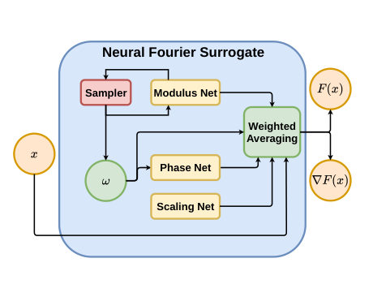
<figcaption class="paper-figure-caption"><b>Fig 1.</b> Figure 1. Basic architecture of an NFS. A sampler iteratively queries the modulus to generate a weighted set of frequencies. The modulus, phase, and scaling values are combined with the frequen- cies and model inputs to produce weighted averages approximating both the model output values and the corresponding gradients.</figcaption>
</figure>
<figure class="paper-figure-card">
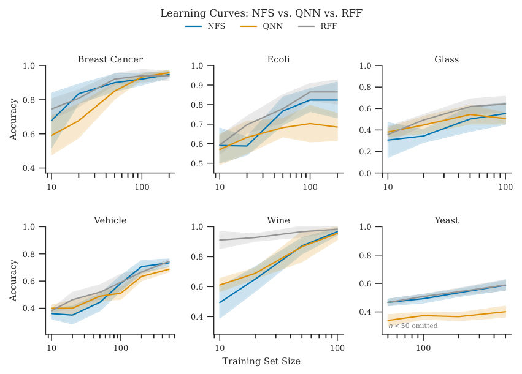
<figcaption class="paper-figure-caption"><b>Fig 2.</b> Figure 2. Test accuracy, as a function of training set size, for a Neural Fourier Surrogate with encoding depth L = 4, an equivalent QNN, and a Random Fourier Features (RFF) baseline on six benchmark datasets. Shaded regions show ±1 standard deviation across 5 seeds.</figcaption>
</figure>
<figure class="paper-figure-card">
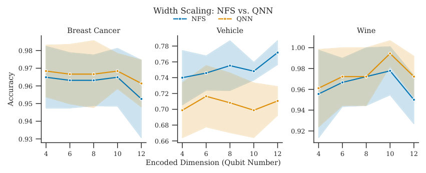
<figcaption class="paper-figure-caption"><b>Fig 3.</b> Figure 3. Test accuracy as a function of encoded dimension (qubit number) for an NFS and a QNN with encoding depth L = 1, trained on up to 500 samples across 3 datasets. Shaded regions show ±1 standard deviation across 5 seeds.</figcaption>
</figure>
<figure class="paper-figure-card">
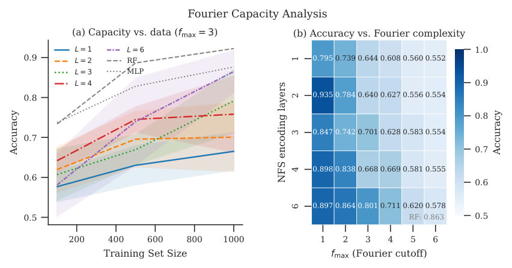
<figcaption class="paper-figure-caption"><b>Fig 4.</b> Figure 4. (a) NFS test accuracy as a function of training set size on a synthetic Fourier target function with cutoff fmax = 3. Curves shown for encoding depth choices between 1 and 6, alongside Random Forest and MLP baselines. (b) NFS test accuracy across all combinations of encoding depth and Fourier cutoff L, fmax ∈{1, . . . , 6}, averaged across 5 seeds. Higher choices of L provide diminishing returns beyond the target’s spectral complexity.</figcaption>
</figure>
<figure class="paper-figure-card">
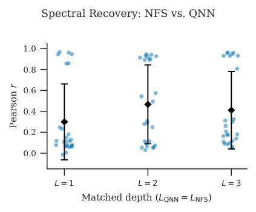
<figcaption class="paper-figure-caption"><b>Fig 5.</b> Figure 5. Pearson r between the learned frequency distribution of an NFS and the Fourier spectrum of a fixed random QNN, at matched encoding depths, averaged over 25 trials. Error bars show the mean ±1 standard deviation. NFS was trained to match randomly sampled QNN output. The bimodal distribution indicates NFS either recovers the QNN distribution or learns an altogether different one.</figcaption>
</figure>

**Summary.** This paper introduces Neural Fourier Surrogates (NFS), a classical neural network designed to mimic the Fourier structure of Quantum Neural Network (QNN) outputs. By achieving performance comparable to QNNs while representing a broader function class, NFS establishes itself as a powerful and theoretically grounded classical baseline for benchmarking quantum machine learning models.

**Why it may be interesting.** While the focus is on ML, the mathematical machinery—approximating quantum expectation values via Fourier series and comparing classical surrogates to quantum constraints—is highly relevant to understanding the limitations and expressivity of quantum simulation techniques.

Detailed structure

**Main problem.** The boundary between classical and quantum advantage in quantum machine learning is poorly understood due to the fundamental differences in function classes between QNNs and classical models.

**Main result.** The proposed Neural Fourier Surrogates (NFS) architecture is shown to be a highly effective classical baseline, achieving performance comparable to data-reuploading QNNs while representing a broader function class.

**Method.** NFS is a stochastic classical neural network that approximates the Fourier series coefficients of a QNN's expectation value by sampling random frequencies, bypassing the curse of dimensionality.

**Model / system.** The work focuses on Quantum Neural Networks (QNNs) that encode classical data via a unitary evolution $U(x) = \exp(ixH)$, resulting in an expectation value expressible as a finite Fourier series. NFS is designed to model this same Fourier structure using a transformer-based architecture.

**Key observables.** Test accuracy on 15 benchmark datasets, Pearson correlation ($r$) between learned and true Fourier spectra, and performance comparison against established classical baselines (MLP, RFF, etc.).

**Important parameters / regimes.** Encoding depth ($f_{	ext{max}}$), training set size, and hyperparameters for the NFS network (e.g., Gaussian prior coefficient).

**Assumptions / limitations.** The primary assumption is that NFS can serve as a natural classical baseline because its function class is broader than the constrained function class of the QNN measurement observable.

**Figures summary.** Figures compare NFS/QNN test accuracy vs. training set size and encoded dimension; Figure 5 shows the Pearson correlation between the learned frequency distribution of NFS and the true QNN spectrum.

**Paper structure.** The paper introduces NFS to approximate QNN outputs, details the stochastic approximation and architecture (using autoregressive sampling), compares its performance against various classical baselines and QNNs on benchmark datasets, and analyzes capacity scaling.

Abstract

For quantum machine learning, the exact boundary between classical and quantum advantage is still poorly understood. Direct comparison between quantum neural networks (QNNs) and existing classical models, which encompass fundamentally different function classes, often fails to provide broader insight into the difference between the two. Inspired by the techniques of Neural Quantum States and Random Fourier Features, this work introduces Neural Fourier Surrogates (NFS), a stochastic classical neural network architecture for efficiently learning coefficients over the same finite Fourier series support as quantum neural networks. Testing on a selection of tabular benchmark datasets, we find that NFS is an effective classifier architecture broadly competitive with established classical baselines, including a comparable Random Fourier Features model, and possessing comparable performance to data-reuploading QNNs; combined with additional analysis comparing the learned Fourier spectra of QNNs and NFS on synthetic data, these results establish NFS as a natural classical baseline for evaluating QNN performance.

[↑ back to top](#top)

### [Noisy Quantum Query Complexity via Fractional Block Sensitivity](http://arxiv.org/abs/2610.00506v1)

**Authors:** Mehil Agarwal, Shravas Rao, Fang Song  
**Type:** theory · **Category:** quantum information and computing · **PDF:** <https://arxiv.org/pdf/2610.00506v1>  
**Analysis basis:** full PDF text, analyzed in chunks

↔ Scroll figures horizontally

<figure class="paper-figure-card">
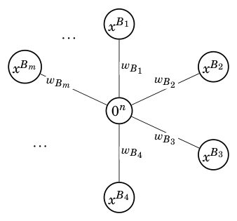
<figcaption class="paper-figure-caption"><b>Fig 1.</b> Figure 1: Weighted-star input structure induced by a fractional block-sensitivity packing at the center 0n. Sensitive blocks B1,...,Bm at 0n; P B∋i wB ≤1 (∀i ∈[n]); W = P B wB = fbs(f ,0n).</figcaption>
</figure>
<figure class="paper-figure-card">
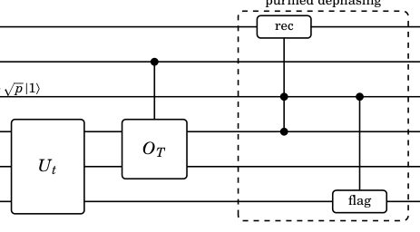
<figcaption class="paper-figure-caption"><b>Fig 2.</b> Figure 2: One step of the purified IID dephasing computation. The truth register is initialized in the weighted-star state |u〉= 1 p</figcaption>
</figure>
<figure class="paper-figure-card">

<figcaption class="paper-figure-caption"><b>Fig 3.</b> Figure 2 illustrates one step of computation in our analysis. We initialize a truth table register in</figcaption>
</figure>
<figure class="paper-figure-card">
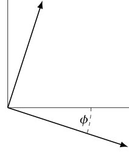
<figcaption class="paper-figure-caption"><b>Fig 4.</b> Figure 3: The active two-dimensional truth plane for record R and queried index i. The basis (|uR〉,|eR,i〉) is adapted to the old A/Q decomposition, while (|ℓR,i〉,|hR,i〉) is adapted to the no-hit/hit decomposition of the query.</figcaption>
</figure>

**Summary.** This paper develops a unified theoretical framework using fractional block sensitivity to determine the quantum query complexity of functions under various forms of noise. It derives specific lower bounds for negligent and dephasing noise models, culminating in a general 'Computational-Opportunity Theorem.' This work is significant for understanding the fundamental limits of quantum computation when faced with realistic imperfections.

**Why it may be interesting.** The development of the Computational-Opportunity Theorem provides a powerful, general tool to derive lower bounds for quantum algorithms operating in realistic, noisy physical environments, bridging theoretical complexity with physical noise models.

Detailed structure

**Main problem.** The paper investigates quantum query complexity for functions under various models of imperfect oracle access, including negligent and dephasing noise.

**Main result.** They establish lower bounds for quantum query complexity in terms of fractional block sensitivity (fbs) for multiple noise models, including a novel 'Computational-Opportunity Theorem' for time-varying dephasing.

**Method.** The core method involves developing a unified framework based on fractional block sensitivity (fbs) and applying it to analyze resource constraints imposed by different noise processes.

**Model / system.** The study analyzes abstract computational models involving oracle queries, specifically considering the impact of noise characterized by negligence probability (p) or time-dependent dephasing rates (p_t).

**Key observables.** Quantum query complexity ($Q_\epsilon(f)$), fractional block sensitivity ($	ext{fbs}(f)$), and the derived 'opportunity resource function' ($R(\mu)$).

**Important parameters / regimes.** Noise probabilities ($p, p_t$), error tolerance ($\epsilon$), and the structure of the function $f$.

**Assumptions / limitations.** The analysis relies on establishing lower bounds by relating quantum resources to the fbs, and in the extended dephasing model, it assumes the resource can be characterized by a convex optimization problem.

**Paper structure.** The paper progresses by introducing fbs, applying it sequentially to the negligent model, the hybrid query model, the IID dephasing model, and finally generalizing to a comprehensive 'Computational-Opportunity Theorem' for time-varying dephasing schedules.

Abstract

We study quantum query complexity under several models of imperfect oracle access, and develop lower bounds through a common framework based on fractional block sensitivity (\(\fbs\)).   For a negligent oracle that applies the correct query with probability \(1-p\), we prove a lower bound in terms of \(\fbs(f,0^n)\). We also show, perhaps surprisingly, that negligence need not destroy quantum speedups: any function \(f\) can be transformed into a partial function \(f'\) whose negligent query complexity essentially preserves the quantum query complexity of \(f\). This gives partial functions with exponential quantum speedups even under negligent queries, and in particular rules out a general lower bound in terms of \(\fbs(f)\) for partial functions in this model.   For two other models, we obtain general lower bounds in terms of \(\fbs(f)\) for all Boolean functions. For hybrid algorithms using \(Q\) coherent and \(C\) classical queries, we prove the tradeoff \(C+Q^2=Ω(\fbs(f))\). For an IID dephasing noisy model where each query dephases the query-index register at rate \(p\) independently, we prove \(Ω\!\left(p\,\fbs(f)\right)\) queries are necessary.   Finally, we introduce a broader family of time-varying dephasing models and identify a variational resource that is always lower bounded by \(\fbs(f)\). Computing this resource reduces to a convex optimization problem, providing a simple way to derive lower bounds for new noise schedules. As applications, we recover the hybrid and IID dephasing bounds and determine the query complexity of unstructured search when the dephasing rate grows over time.

[↑ back to top](#top)

### [On the pseudorandomness of simple quantum processes](http://arxiv.org/abs/2610.02100v1)

**Authors:** Jesko Dujmovic, Jonas Haferkamp, Alexander Poremba  
**Type:** theory · **Category:** quantum information and computing · **PDF:** <https://arxiv.org/pdf/2610.02100v1>  
**Analysis basis:** full PDF text, analyzed in chunks

↔ Scroll figures horizontally

<figure class="paper-figure-card">
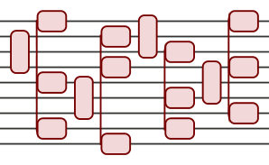
<figcaption class="paper-figure-caption"><b>Fig 1.</b> Figure 1: A classical random reversible circuit consisting of simple 3-bit scrambling operations.</figcaption>
</figure>
<figure class="paper-figure-card">
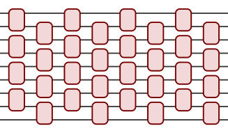
<figcaption class="paper-figure-caption"><b>Fig 2.</b> Figure 2: A simple nearest-neighbor random quantum circuit, where each box is a two-qubit quantum gate sampled independently from the Haar measure over the unitary group U(4).</figcaption>
</figure>

**Summary.** This paper explores the gap between statistical randomness and computational randomness in quantum circuits. The authors prove that even if a quantum process matches the statistical moments of a truly random unitary (a $t$-design), it can still be distinguished from random by a quantum computer. This suggests that achieving pseudorandomness requires more than just matching low-order moments.

**Why it may be interesting.** It provides a rigorous theoretical boundary, showing that simple structural properties (like moment matching) are insufficient guarantees for true quantum randomness, which is crucial for understanding quantum scrambling in physics.

Detailed structure

**Main problem.** The paper investigates the quantum analog of the Gowers conjecture: whether simple, local random quantum processes can generate unitaries indistinguishable from truly random ones.

**Main result.** The authors refute the unitary analog of the Hoory–Magen–Myers–Rackoff conjecture, showing that achieving strong statistical moment matching (unitary $t$-designs) does not guarantee computational pseudorandomness.

**Method.** The work involves constructing explicit counterexamples by comparing statistical measures (unitary $t$-designs) against computational indistinguishability using efficient quantum distinguishing algorithms.

**Model / system.** The model involves random quantum circuits formed by composing local quantum gates (e.g., two-qubit gates sampled from the Haar measure) acting on $n$ qubits.

**Key observables.** Unitary $t$-design properties (matching unitary moments) and the ability of an efficient quantum algorithm to distinguish the ensemble from the Haar measure.

**Important parameters / regimes.** The depth of the circuit ($T = O(n^2 \log^2 n)$) and the order of the moment ($t$).

**Assumptions / limitations.** The analysis compares the ensemble to the Haar measure and relies on the existence of efficient quantum distinguishing algorithms.

**Figures summary.** Figure 1 illustrates a classical random reversible circuit, and Figure 2 shows a simple nearest-neighbor random quantum circuit using two-qubit gates.

**Paper structure.** The paper proceeds by first showing a refutation of the unitary analog of the HMMR conjecture using simple local walks, followed by a stronger separation result requiring highly structured ensembles, and concluding with new conjectures for pseudorandomness.

Abstract

Can simple processes appear highly complex? Gowers (Comb. Prob. Comp. '96) conjectured that repeatedly composing local random reversible operations can yield global permutations that are indistinguishable from random. In this work, we study the unitary quantum analog of this question, in an attempt to make new progress on this longstanding conjecture.   Our first result shows that statistical moment matching in the form of unitary designs does not generically lead to pseudorandomness---even for the simplest quantum processes: for every fixed $t$, we give an efficiently samplable family $\{ν_n\}_n$ of distributions on one- and two-qubit gates such that, after $T=O_t(n^2\log^2 n)$ independent steps, the resulting $n$-qubit ensemble is an approximate unitary $t$-design with negligible error $\exp(-Ω(\log^2 n))$, yet an efficient quantum algorithm distinguishes it from random using only $O_t(\log^2 n)$ queries. This refutes the unitary analog of the Hoory--Magen--Myers--Rackoff conjecture (ICALP '04) for permutations.   Our second result is a stronger separation between unitary designs and pseudorandom unitaries at polynomially bounded moments; our counterexample, however, requires highly structured ensembles, in contrast with the simple local walks from before. This suggests caution when using unitary designs to model information scrambling in black-hole physics, as even maximally scrambled systems can exhibit structure which is accessible to efficient experiments. Motivated by these findings, we then propose new conjectures for how pseudorandomness can plausibly emerge within simple quantum processes, such as random quantum circuits.

[↑ back to top](#top)

### [On-shell renormalization of sine-Gordon by the quantum inverse scattering method](http://arxiv.org/abs/2610.01571v1)

**Authors:** Francesco Beccarini, Claudio Conti  
**Type:** theory · **Category:** other · **PDF:** <https://arxiv.org/pdf/2610.01571v1>  
**Analysis basis:** full PDF text, analyzed in chunks

↔ Scroll figures horizontally

<figure class="paper-figure-card">
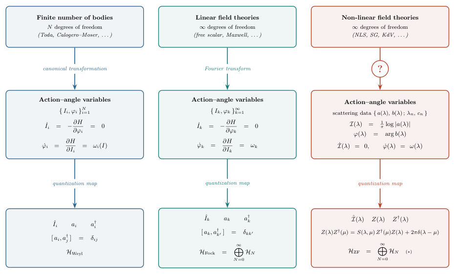
<figcaption class="paper-figure-caption"><b>Fig 1.</b> FIG. 1. Each column starts from a classical integrable theory (top level), passes through its action–angle description (middle level), and ends in the corresponding quantum theory (bottom level). The first arrow is the canonical transformation that trivializes the dynamics; the second is the quantization map, which is the same in all three columns. The diagram is detailed in the text; the asterisk is discussed in Sec. II B.</figcaption>
</figure>
<figure class="paper-figure-card">
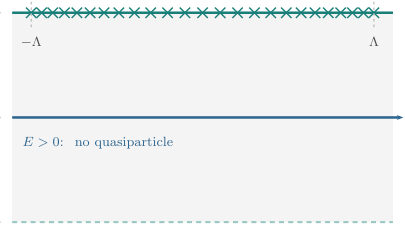
<figcaption class="paper-figure-caption"><b>Fig 2.</b> FIG. 2. Rapidity content of the physical vacuum |0⟩L,δ: the negative-energy line is completely filled (crosses) between the cut-off ±Λ of Eq. (16), with the density of Eq. (18), and the positive-energy line carries no quasiparticle.</figcaption>
</figure>
<figure class="paper-figure-card">
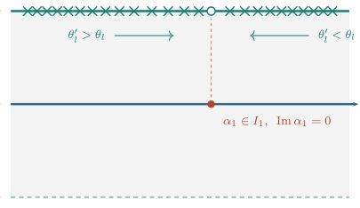
<figcaption class="paper-figure-caption"><b>Fig 3.</b> FIG. 3. Pole structure of the fundamental excitation |α1⟩L,δ of Eq. (21): a single rapidity on the positive-energy line, one hole in the vacuum beside it, and the shift of the remaining vacuum rapidities.</figcaption>
</figure>
<figure class="paper-figure-card">
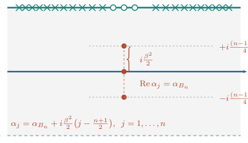
<figcaption class="paper-figure-caption"><b>Fig 4.</b> FIG. 4. Pole structure of the n-th breather |αBn⟩L,δ, drawn for n = 3 at β2 = 2π/5: a chain of n rapidities spaced by iβ2/2 and symmetric about the real axis, together with the n holes it opens in the vacuum.</figcaption>
</figure>
<figure class="paper-figure-card">
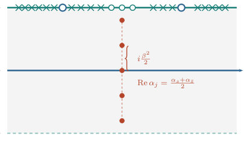
<figcaption class="paper-figure-caption"><b>Fig 5.</b> FIG. 5. Pole structure of the soliton–antisoliton state |αs, α¯s⟩L,δ, drawn for n = nmax + 2 = 5 at β2 = 2π/5: the longest string the theory admits, with only n −2 holes beside it and two independent holes at αs and α¯s.</figcaption>
</figure>

**Summary.** This paper introduces a novel renormalization scheme for the sine-Gordon model by utilizing the quantum inverse scattering method on a lattice. The scheme successfully absorbs all cut-off dependence into a single rescaling factor, demonstrating that the theory's fundamental parameters remain unrenormalized. This provides a powerful, integrable perspective on renormalization, comparing it favorably against established methods like normal ordering.

**Why it may be interesting.** While focused on a specific integrable model, the rigorous development of a non-perturbative renormalization scheme that bypasses standard RG flow techniques is highly relevant to understanding how scale invariance and quantum corrections interact in many-body quantum field theories.

Detailed structure

**Main problem.** The paper develops a consistent renormalization scheme for the sine-Gordon (SG) model using the quantum inverse scattering method (QISM). This scheme aims to handle the cut-off dependence inherent in lattice regularizations.

**Main result.** The renormalization scheme absorbs all cut-off dependence into a single rescaling factor $Z_L$, leaving the field and coupling constant unrenormalized. The mass parameter receives a finite renormalization fixed by matching the lightest breather mass to the linearized boson mass.

**Method.** The method employs lattice regularization of the SG model, followed by a rescaling of the box length and the imposition of an on-shell condition derived from the monodromy operator eigenvalues.

**Model / system.** The physical system is the Sine-Gordon (SG) model, a 2D integrable field theory. It is analyzed via its lattice regularization and its continuum/infinite-volume limits.

**Key observables.** Soliton and breather masses, the renormalization factor $Z_L$, and the vacuum energy density.

**Important parameters / regimes.** The coupling constant $eta$, the mass parameter $m$, and the lattice spacing $\delta$. The scheme is valid for $0 < eta^2 < \pi$.

**Assumptions / limitations.** The renormalization scheme is defined by the on-shell condition, and the authors argue it extends to ultralocal integrable theories with a massive spectrum.

**Figures summary.** Figure 1 summarizes the quantization process across different physical systems (finitely many bodies, linear, non-linear). Other figures illustrate the flow from classical to quantum descriptions.

**Paper structure.** The paper progresses by first establishing the lattice regularization and the need for rescaling. It then details the renormalization procedure using the on-shell condition, comparing the results with Coleman's normal ordering and Conformal Perturbation Theory. Finally, it discusses the implications for general integrable theories.

Abstract

In the quantum inverse scattering method, the sine-Gordon model is solved on a lattice, and its continuum and infinite-volume limits become uniform only after the length of the box is rescaled. We show that this rescaling, supplemented by an on-shell condition, defines a renormalization scheme. The whole dependence on the cut-off is absorbed into a factor $Z_L$ multiplying the length of the box, with an exponent fixed by the scaling dimension of the vertex operator; neither the field nor the coupling $β$ is renormalized, no subtraction scale is introduced, and the mass parameter receives a finite renormalization, fixed by requiring that the lightest breather has the mass of the boson in the linearized theory. The soliton and breather masses follow from the eigenvalues of the monodromy operator as functions of parameters that do not run, and reduce to the classical and semiclassical results as $β\rightarrow0$. In particular, the mass ratios are produced directly from the regularized construction, while the relation between the lattice parameters and the physical scale is absorbed into $Z_L$ and never needs to be computed. The scheme is a reparameterization of the theory which makes explicit the interplay between integrability and renormalization. We compare it with Coleman's normal ordering and with conformal perturbation theory, and we argue that it extends to ultralocal integrable theories with a massive spectrum, possibly including asymptotically free models that admit an ultralocal lattice regularization.

[↑ back to top](#top)

### [Optimal query complexity for fractional quantum evolution](http://arxiv.org/abs/2610.01940v1)

**Authors:** Anthony Yuezhang Liu, Adam Wesołowski, Jayne Thompson, Mile Gu, Lirandë Pira  
**Type:** theory · **Category:** quantum information and computing · **PDF:** <https://arxiv.org/pdf/2610.01940v1>  
**Analysis basis:** full PDF text, analyzed in chunks

↔ Scroll figures horizontally

<figure class="paper-figure-card">
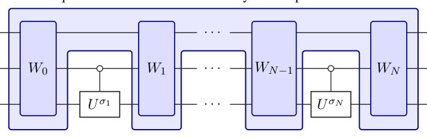
<figcaption class="paper-figure-caption"><b>Fig 1.</b> FIG. 1. An N-query unitary as a realization of a quantum comb, following Chiribella, D’Ariano and Perinotti [31]. The connected blue veil contains the arbitrary U-independent unitaries W0, . . . , WN and the memory wire B; the N slots are filled by the supplied controlled queries on C ⊗S.</figcaption>
</figure>
<figure class="paper-figure-card">
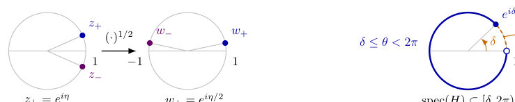
<figcaption class="paper-figure-caption"><b>Fig 2.</b> FIG. 2. Why a spectral gap is needed for uniform fractional power approximation. On the branch 0 ≤θ &lt; 2π, eigenvalues approaching 1 from opposite sides become arbitrarily close, while their square roots approach 1 and −1. More generally, for 0 &lt; t &lt; 1, the two limiting fractional powers differ by |1 −e2πit| = 2 sin(πt) &gt; 0. The promise spec(H) ⊂[δ, 2π) excludes 0 ≤θ &lt; δ, removing one of these approaches to the cut. The solid blue arc is allowed, θ = δ is included and θ = 2π is excluded.</figcaption>
</figure>
<figure class="paper-figure-card">
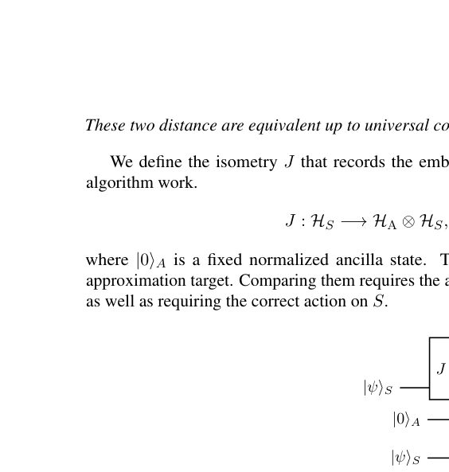
<figcaption class="paper-figure-caption"><b>Fig 3.</b> FIG. 3. Ancilla preparation as an isometry.</figcaption>
</figure>
<figure class="paper-figure-card">
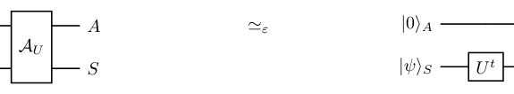
<figcaption class="paper-figure-caption"><b>Fig 4.</b> FIG. 4. Successful approximation. The symbol ≃ε denotes operator norm error at most ε after minimization over a global phase.</figcaption>
</figure>
<figure class="paper-figure-card">
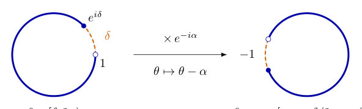
<figcaption class="paper-figure-caption"><b>Fig 5.</b> FIG. 5. The shift centers the allowed eigenphase interval at zero. Solid arcs indicate allowed eigenphases; dashed arcs indicate the excluded gap of width δ. The operators U ′ and U agree up to global phase and induce the same unconditioned channel. Their fractional targets also differ only by a common phase.</figcaption>
</figure>

**Summary.** This paper rigorously determines the optimal number of queries needed to approximate a fractional quantum evolution $U^t = e^{itH}$ given access only to the full unitary $U$. By matching the known upper bound from QSVT with a newly proven lower bound, the authors establish the exact scaling of the required resources, confirming the asymptotic optimality of current simulation techniques.

**Why it may be interesting.** This work provides a fundamental benchmark for quantum simulation algorithms, establishing the theoretical limits on how efficiently we can implement time evolution when only partial information (queries) about the underlying Hamiltonian is available.

Detailed structure

**Main problem.** The paper determines the optimal query complexity required to implement a noninteger power of an unknown unitary operator, $U^t = e^{itH}$, given oracle access to $U=e^{iH}$.

**Main result.** The optimal query complexity for this fractional quantum evolution problem is established to be $\Theta\left(rac{1}{\delta} \log rac{1}{\epsilon}
ight)$, proving that the Quantum Singular Value Transformation (QSVT) construction is asymptotically optimal.

**Method.** The proof establishes a matching lower bound to the known upper bound by reducing the quantum query problem to a scalar trigonometric polynomial approximation problem, utilizing the Remez inequality and functional analysis techniques.

**Model / system.** The system involves an unknown unitary $U=e^{iH}$ acting on a quantum state, where $H$ is the underlying Hamiltonian. The approximation is required for $U^t$ with $0 < t < 1$, assuming a spectral gap $\delta$ separates the spectrum from the branch cut.

**Key observables.** Query Complexity ($N$), Approximation Error ($\epsilon$), and the spectral gap ($\delta$).

**Important parameters / regimes.** The fractional power parameter $t$, the spectral gap $\delta$, and the desired precision $\epsilon$.

**Assumptions / limitations.** The analysis assumes the existence of a spectral gap $\delta$ to ensure the unique definition of the fractional power and relies heavily on the sharp trigonometric Remez inequality.

**Figures summary.** Figures illustrate the $N$-query unitary as a quantum comb and explain the necessity of the spectral gap $\delta$ for uniform fractional power approximation.

**Paper structure.** The paper progresses by defining the problem, establishing the known upper bound via QSVT, and then rigorously deriving a matching lower bound using polynomial approximation theory and functional analysis techniques, culminating in the $\Theta$ result.

Abstract

Given oracle access to an unknown unitary $U=e^{iH}$ , the fractional query problem asks how many queries are required to implement a noninteger power $U^t=e^{itH}$, $0<t<1$, when the spectrum is separated from the branch cut by a gap $δ$. Quantum singular value transformation gives an upper bound of $O\!\left(\frac{1}δ\log\frac{1}{\varepsilon}\right)$ queries for approximation error $\varepsilon$. We prove a matching lower bound for arbitrary query algorithms. Our argument reduces any $N$-query circuit to the approximation of $e^{itθ}$ by a trigonometric polynomial with degree bounded by $O(N)$, together with Remez inequality. This allows us to establish the lower bound of $Ω_τ\!\left(\frac{1}δ\log\frac{1}{\varepsilon}\right)$. Consequently, the optimal query complexity for fractional query problem is $Θ_τ\!\left(\frac{1}δ\log\frac{1}{\varepsilon}\right)$, showing that the known QSVT construction is asymptotically optimal. We also give an alternative lower bound proof based on constructing a linear functional that annihilates the approximant space, yielding a $Ω_τ\!\left(\log\frac{1}{\varepsilon}\right)$ bound uniform to $δ$.

[↑ back to top](#top)

### [Optimal transducers using symmetries](http://arxiv.org/abs/2610.02133v1)

**Authors:** Benoît Dubus, Julien Ladeuze, Jérémie Roland  
**Type:** theory · **Category:** quantum information and computing · **PDF:** <https://arxiv.org/pdf/2610.02133v1>  
**Analysis basis:** full PDF text, analyzed in chunks

↔ Scroll figures horizontally

<figure class="paper-figure-card">
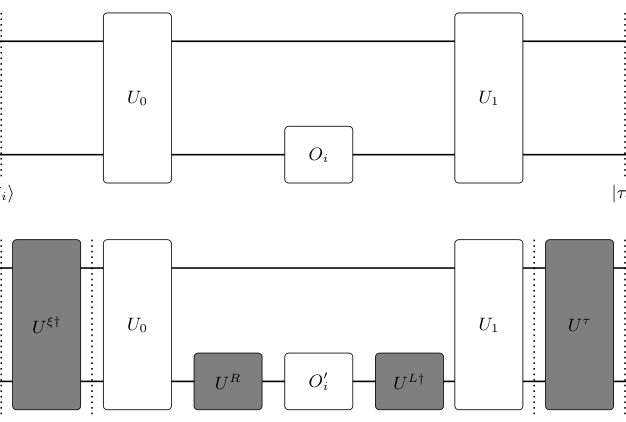
<figcaption class="paper-figure-caption"><b>Fig 1.</b> Figure 1. An example of two algorithms solving two problems that are unitarily equivalent. The algorithm A solves the problem |ξi⟩7→|τi⟩whereas the algorithm A′ solves the problem |ξ′ i⟩7→|τ ′ i⟩. This example shows that a single oracle call is needed with the application of two independent unitaries U0 and U1.</figcaption>
</figure>

**Summary.** This paper introduces a powerful technique using group symmetry to systematically construct optimal quantum transducers for state-conversion problems. By proving that the optimal catalyst can be chosen to be covariant under the problem's symmetry group, the authors derive optimal complexity bounds for fundamental algorithms like search and amplitude estimation. This advances quantum algorithm design by providing explicit, symmetry-derived constructions.

**Why it may be interesting.** The rigorous connection between abstract group symmetries and the explicit construction of optimal quantum algorithms provides powerful new tools for quantum complexity theory, potentially simplifying the design of quantum circuits.

Detailed structure

**Main problem.** The paper aims to develop systematic methods to construct optimal quantum transducers for state-conversion problems by leveraging the symmetry group of the underlying problem.

**Main result.** The authors derive optimal transducers for key quantum primitives (like unstructured search and amplitude estimation) and prove that using symmetry leads to a weakly covariant catalyst, which bounds the transduction complexity.

**Method.** The core method involves applying representation theory and symmetry arguments (symmetrization) to the state-conversion problem, showing the optimal unitary must be an intertwiner, allowing for block-diagonalization.

**Model / system.** The framework is the quantum transducer, a unitary operation converting an input state to a target state via an auxiliary catalyst. The problem is formalized as a state-conversion problem defined by indexed families of states and unitaries.

**Key observables.** Transduction complexity ($W$), quantum query complexity ($Q$), and the adversary bound ($	ext{Adv}$).

**Important parameters / regimes.** The structure of the symmetry group $G$, and the error parameter $\epsilon$ for bounded-error algorithms.

**Assumptions / limitations.** The analysis often assumes the existence of a symmetry group $G$ and relies on the ability to enlarge the Hilbert space to accommodate the symmetrization process.

**Figures summary.** Figures illustrate the transformation between unitarily equivalent problems and graphically represent the action of the transducer on a vector.

**Paper structure.** The paper progresses from defining the transducer model and its relation to query complexity, to introducing symmetry group actions, proving the existence of optimal covariant catalysts via symmetrization, and finally applying these techniques to derive optimal complexity bounds for specific algorithms.

Abstract

Transducers (Belovs, Jeffery and Yolcu, 2024) are a quantum computing framework describing a quantum algorithm as a unitary converting an input state into a target state using a catalyst, an auxiliary vector that is left unchanged. They are a powerful tool in quantum algorithm design, especially in the context of quantum query complexity: feasible points of the (dual) adversary semidefinite program directly translate into transducers and the optimal transduction complexity is equal to the adversary bound, i.e. the Las Vegas complexity, which is known to characterize bounded-error quantum query complexity. Moreover, contrary to bounded-error algorithms, transducers compose exactly, which limits overheads due to controlling errors in algorithms constructed by composition. Constructing efficient, let alone optimal, transducers in terms of quantum query complexity nevertheless remains a hard task since it still requires solving the adversary SDP and constructing the unitary to obtain an explicit algorithm. In this paper, we show how using the symmetry group of state-conversion problems simplifies both steps. First, using a symmetrization argument, we prove an optimal catalyst can always be chosen covariant under a representation of the symmetry group. Second, we prove that the transducer intertwines two different representations of the group and can thus be chosen block diagonal in the isotypic decomposition of the Hilbert space. Using those methods, we then derive optimal transducers, with optimal constants, for different widely used quantum algorithmic primitives, such as unstructured search, amplitude amplification and amplitude estimation. Our approach extends previous work on the use of representation theory to compute adversary lower bounds (Høyer, Lee, and {\v S}palek, 2007; Ambainis, Magnin, Roetteler and Roland, 2011) to the systematic construction of optimal algorithms.

[↑ back to top](#top)

### [Polynomial-time local-unitary equivalence of graph states](http://arxiv.org/abs/2610.00527v1)

**Authors:** Yuxuan Zhang  
**Type:** theory · **Category:** quantum information and computing · **PDF:** <https://arxiv.org/pdf/2610.00527v1>  
**Analysis basis:** full PDF text, analyzed in chunks

↔ Scroll figures horizontally

<figure class="paper-figure-card">
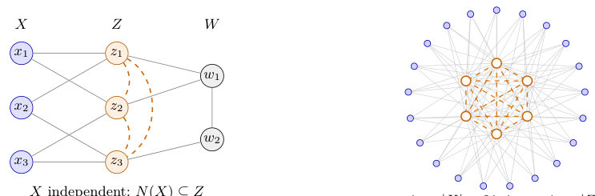
<figcaption class="paper-figure-caption"><b>Fig 1.</b> Figure 1: Generalized local complementation in standard form. (a) The schematic shows the permitted adjacencies; dashed edges mark the pairs that a generalized step on X may toggle. (b) In the Tsimakuridze–Gühne example [34], each outer vertex is adjacent to one four- or five-element subset of the six inner vertices. The first graph contains only the gray incidence edges; the second also contains the dashed clique. A level-two local unitary connects their graph states, although no local Clifford does.</figcaption>
</figure>

**Summary.** This paper presents a deterministic, polynomial-time algorithm to solve the local-unitary equivalence problem for graph states. By reformulating the problem using linear constraints over the binary field, the authors achieve a complexity of $\widetilde O(n^{6.38})$. This advances the understanding of quantum state classification and has implications for stabilizer codes and quantum computation.

**Why it may be interesting.** The work provides a concrete, efficient algorithmic solution to a fundamental classification problem in quantum information theory, which is crucial for understanding the limitations and structure of quantum error-correcting codes.

Detailed structure

**Main problem.** The paper addresses the long-standing open problem of determining whether two graph states are Local-Unitary (LU) equivalent, meaning they differ only by independent changes of basis on their qubits.

**Main result.** A deterministic, polynomial-time algorithm is presented that decides LU equivalence for graph states in $\widetilde O(n^{6.38})$ bit operations and constructs the necessary single-qubit unitaries if equivalence holds.

**Method.** The method builds upon prior quasipolynomial algorithms by replacing vertex subset enumeration with a compact system of linear constraints derived from pairs and triples, solved over the binary field.

**Model / system.** The study focuses on graph states, which are quantum states defined on $n$ labeled qubits by applying controlled-Z gates corresponding to the edges of a graph $G$. The equivalence is tested for the state $|	ext{H}
angle = e^{i\phi/n} igotimes_{v=1}^n U_v |G
angle$.

**Key observables.** LU equivalence, the number of local-Clifford (LC) classes within an LU class, and the explicit single-qubit unitaries $U_v$ realizing the transformation.

**Important parameters / regimes.** The size of the graph, $n$, which dictates the polynomial complexity bound $\widetilde O(n^{6.38})$.

**Assumptions / limitations.** The algorithm assumes the graph state is prepared via the standard CZ gate procedure, and the complexity analysis relies on solving linear equations over the binary field.

**Figures summary.** Not specified, but the notes mention Figure 1 illustrates the geometry of generalized local complementation in standard form.

**Paper structure.** The paper establishes the LU equivalence problem, contrasts it with simpler Clifford equivalence (LC), and then details the algorithmic steps: using a standard form, applying incidence closure, and solving the remaining graph transformation via affine linear systems.

Abstract

Local-unitary (LU) equivalence asks whether two quantum states differ only by independent changes of basis on their qubits. For graph states, whether this relation can be decided in polynomial time has remained open for over a decade. We give a deterministic algorithm that decides LU equivalence for graphs on $n$ labelled vertices in $\widetilde O(n^{6.38})$ bit operations and constructs exact single-qubit unitaries whenever the states are equivalent. Building on Claudet and Perdrix's quasipolynomial algorithm, we replace the enumeration of vertex subsets by a compact system of constraints generated from pairs and triples. The remaining graph transformation is found by solving linear equations over the binary field. These new steps cost $\widetilde O(n^5)$ bit operations; the inherited graph preprocessing sets the overall bound. We also count the local-Clifford (LC) classes of graph states within any LU class: their number is a power of two, computable within the same bound. For any given graph state, this decides whether single-qubit Clifford gates reach every graph state in its LU class, and supplies a counterexample when they do not. The method also decides LU equivalence of stabilizer codes encoding one logical qubit.

[↑ back to top](#top)

### [QPI-DeepONet-MAC: A Scalable and Stable Hybrid Classical-Quantum Architecture for Physics-Informed Deep Operator Networks](http://arxiv.org/abs/2610.01824v1)

**Authors:** Said Lantigua, José Valencia, Gilson Giraldi, Renato Portugal, Jonas Maziero  
**Type:** theory · **Category:** numerical methods · **PDF:** <https://arxiv.org/pdf/2610.01824v1>  
**Analysis basis:** full PDF text, analyzed in chunks

↔ Scroll figures horizontally

<figure class="paper-figure-card">
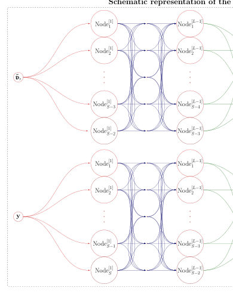
<figcaption class="paper-figure-caption"><b>Fig 1.</b> Fig. 1 Schematic representation of the unstacked Physics-Informed DeepONet (PI-DeepONet) archi- tecture. The diagram details the distinct input pathways for the branch (˜v♭) and trunk (y) variables, the hidden layers, the intermediate branch and trunk outputs (ˆβj and τ), and their final integration via the DeepONetj operator.</figcaption>
</figure>
<figure class="paper-figure-card">
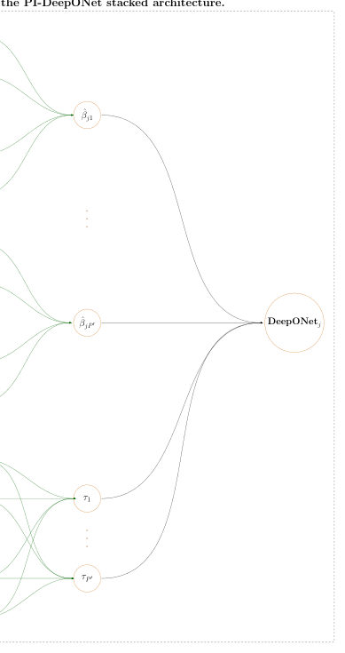
<figcaption class="paper-figure-caption"><b>Fig 2.</b> Fig. 2 Schematic representation of the stacked Physics-Informed DeepONet (PI-DeepONet) archi- tecture. This layout illustrates the multi-branch input configuration coupled with the trunk network, designed to process complex multi-field representations effectively.</figcaption>
</figure>
<figure class="paper-figure-card">
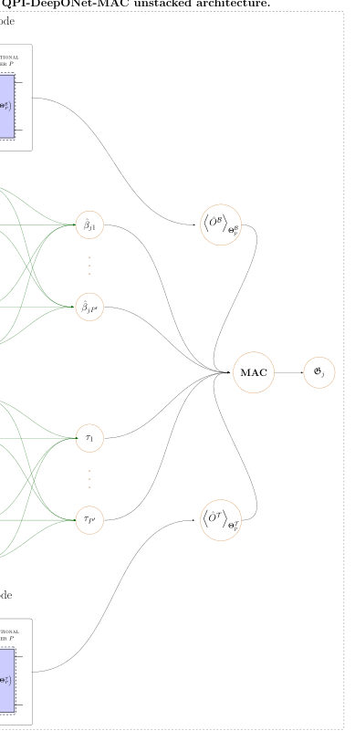
<figcaption class="paper-figure-caption"><b>Fig 3.</b> Fig. 3 Schematic representation of the unstacked Quantum Physics-Informed DeepONet with Multiplication-And-Concatenation (QPI-DeepONet-MAC) architecture. The schematic highlights the integration of Branch Quantum Nodes (BQNodes) and Trunk Quantum Nodes (TQNodes) containing</figcaption>
</figure>

**Summary.** This paper introduces QPI-DeepONet-MAC, a novel hybrid architecture that merges classical DeepONets with parameterized quantum circuits to solve parametric PDEs. It tackles the limitations of standard PI-DeepONets by providing theoretical guarantees on stability, trainability (avoiding barren plateaus), and approximation accuracy. This establishes a robust, quantum-enhanced framework for physics-informed operator learning.

**Why it may be interesting.** This work is highly relevant as it proposes a concrete, theoretically grounded framework for using quantum resources (PQCs) to enhance the solvability and stability of complex, high-dimensional PDEs, which is a major focus in quantum simulation and quantum machine learning for physics.

Detailed structure

**Main problem.** The paper addresses the fundamental challenge of general operator learning for parametric partial differential equations (PDEs) at the intersection of AI and physics-based modeling.

**Main result.** They propose QPI-DeepONet-MAC, a hybrid quantum-classical architecture, and provide theoretical guarantees including universal approximation capability, gradient bounds to avoid barren plateaus, and a lower bound on required sensor numbers.

**Method.** The method combines Physics-Informed Deep Operator Networks (PI-DeepONets) with parameterized quantum circuits (PQCs) via a multiplicative-and-additive coupling (MAC) mechanism.

**Model / system.** The model is designed to approximate an operator G that maps a solution function u satisfying a set of physical PDEs. It integrates classical neural network components (DeepONet) with quantum expectation values derived from PQCs.

**Key observables.** The loss function minimizes physical constraints including initial conditions (LIC), boundary conditions (LBC), the PDE itself (LPDE), and source/solution terms (LSOL).

**Important parameters / regimes.** Quantum parameters (global tensor Xi_nu), classical weights (W_B, W_T), and regularization weights (lambda_COE, lambda_FID).

**Assumptions / limitations.** The architecture retains universal operator approximation capabilities, and the stability is ensured by an informational regularization scheme based on quantum coherence and state fidelity.

**Figures summary.** Figure 1 and 2 show schematics of the unstacked and stacked PI-DeepONet architectures, respectively. Figure 3 details the unstacked QPI-DeepONet-MAC architecture, highlighting the MAC combination block.

**Paper structure.** The paper builds upon classical DeepONet structures by integrating quantum components. It details the mathematical formulation of the hybrid model, derives theoretical bounds on gradients and sampling requirements, and proposes a regularization scheme to maintain quantum structure during training.

Abstract

General operator learning for parametric partial differential equations (PDEs) is a fundamental challenge at the intersection of artificial intelligence and physics-based modeling. Physics-informed Deep Operator Networks (PI-DeepONets) incorporate governing equations into learning, but face optimization difficulties in high dimensions. Quantum extensions offer additional representational capacity, yet their trainability can be hindered by barren plateaus. Here, we introduce QPI-DeepONet-MAC, a hybrid quantum-classical architecture that integrates parameterized quantum circuits into PI-DeepONets through a multiplicative-and-additive coupling (MAC) of classical representations and quantum expectation values. We prove analytically that the proposed architecture retains universal operator approximation capabilities. Furthermore, we derive bounds on quantum parameter gradients, establishing explicit conditions to avoid barren plateaus alongside a scaling criterion for trainability. Additionally, we derive a lower bound on the number of sensors required for a target accuracy, directly linking sampling requirements to input function regularity, domain dimension, and PDE dynamical growth. Finally, we propose an informational regularization scheme based on quantum coherence and state fidelity dynamics to prevent coherence loss and preserve quantum structure during training. Together, these results establish a theoretical foundation for quantum-enhanced physics-informed operator learning and position QPI-DeepONet-MAC as a scalable, stable framework for solving parametric PDEs.

[↑ back to top](#top)

### [Quadratic symmetry algebras and Sturm algebraization of superintegrable systems with magnetic fields](http://arxiv.org/abs/2610.01869v1)

**Authors:** Shams Ara, Md Fazlul Hoque, Ian Marquette  
**Type:** theory · **Category:** other · **PDF:** <https://arxiv.org/pdf/2610.01869v1>  
**Analysis basis:** full PDF text, analyzed in chunks

↔ Scroll figures horizontally

<figure class="paper-figure-card">
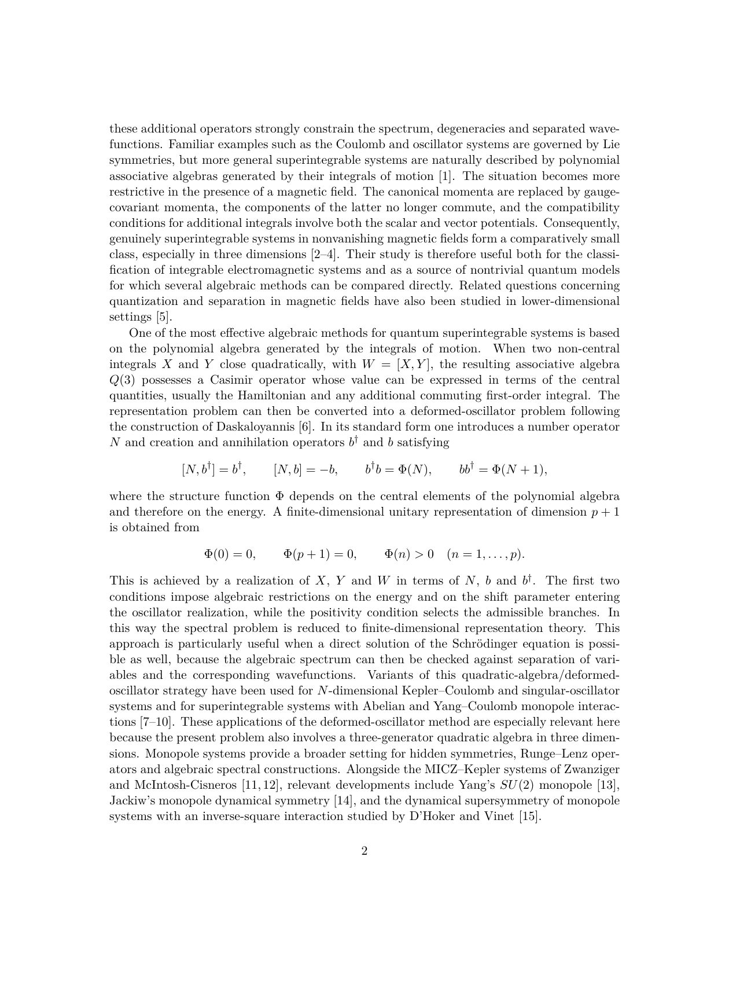
<figcaption class="paper-figure-caption"><b>Fig 1.</b> Low-resolution page preview, page 2</figcaption>
</figure>
<figure class="paper-figure-card">
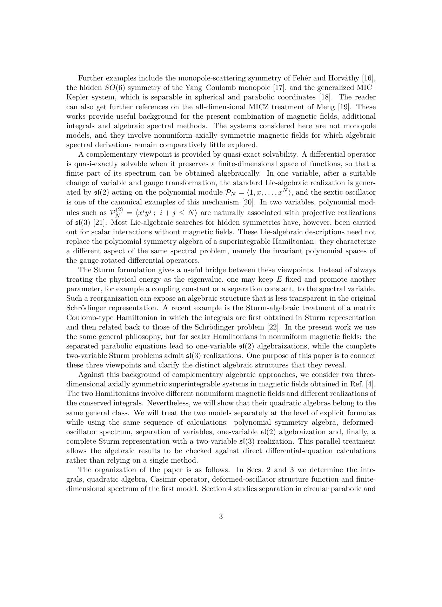
<figcaption class="paper-figure-caption"><b>Fig 2.</b> Low-resolution page preview, page 3</figcaption>
</figure>
<figure class="paper-figure-card">
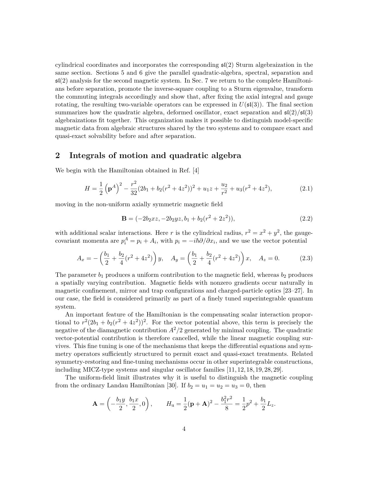
<figcaption class="paper-figure-caption"><b>Fig 3.</b> Low-resolution page preview, page 4</figcaption>
</figure>
<figure class="paper-figure-card">
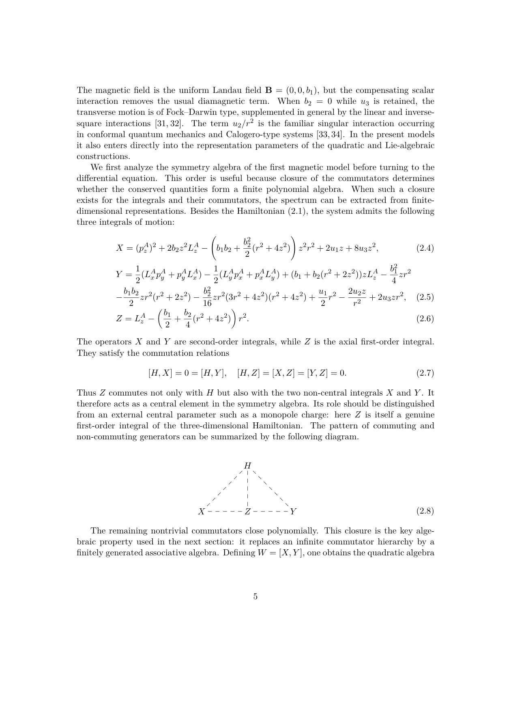
<figcaption class="paper-figure-caption"><b>Fig 4.</b> Low-resolution page preview, page 5</figcaption>
</figure>
<figure class="paper-figure-card">
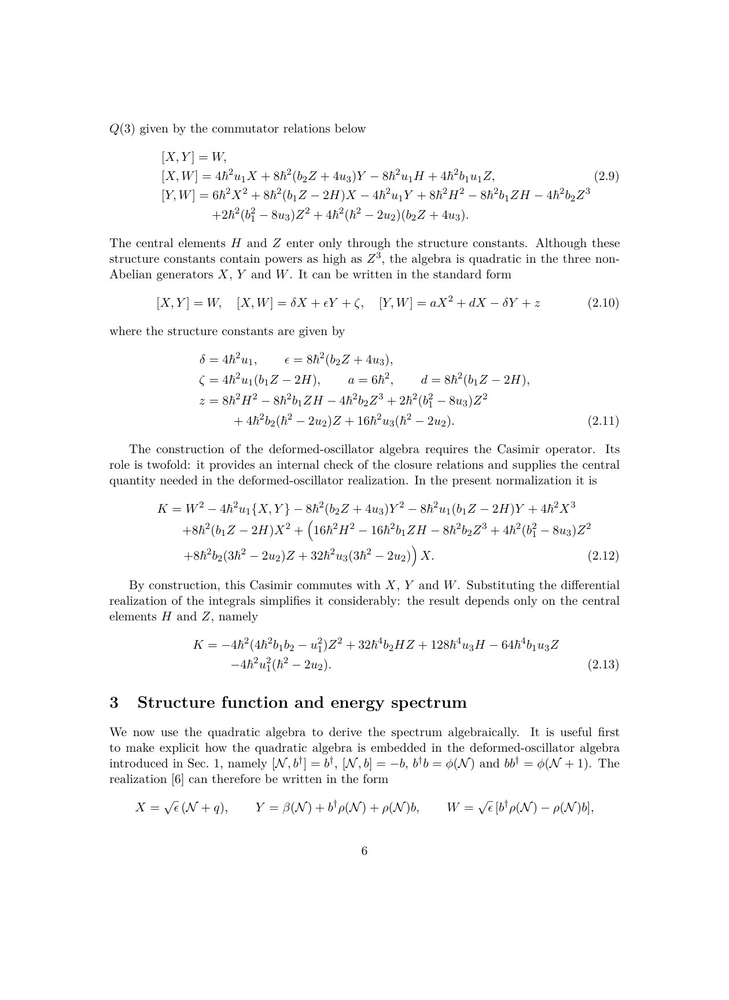
<figcaption class="paper-figure-caption"><b>Fig 5.</b> Low-resolution page preview, page 6</figcaption>
</figure>

**Summary.** This paper analyzes two quantum superintegrable systems in magnetic fields by revealing multiple underlying algebraic symmetries. The authors connect the original quadratic symmetry algebra to two subsequent structures, $	ext{sl}(3)$ and $	ext{sl}(2)$, through the process of separation of variables and Sturm eigenvalue problems. This demonstrates a deep, hierarchical algebraic organization governing the system's exact solvability.

**Why it may be interesting.** The systematic connection between multiple algebraic structures ($	ext{Q}(3) 	o 	ext{sl}(3) 	o 	ext{sl}(2)$) provides a powerful, multi-faceted framework for understanding exact solvability in complex quantum systems, which is highly relevant to finding hidden symmetries in quantum field theories or many-body Hamiltonians.

Detailed structure

**Main problem.** The study investigates the algebraic structure and solvability of three-dimensional quantum superintegrable systems subjected to nonvanishing, axially symmetric magnetic fields.

**Main result.** The analysis reveals three complementary algebraic descriptions ($	ext{Q}(3)$, $	ext{sl}(2)$, and $	ext{sl}(3)$) for the system's spectrum, demonstrating how distinct hidden symmetries emerge at different stages of the separation process.

**Method.** The authors employ a combination of algebraic methods, analyzing the quadratic algebra generated by integrals of motion, and differential equation techniques, specifically formulating the separated equations as Sturm eigenvalue problems.

**Model / system.** The system consists of two distinct three-dimensional quantum Hamiltonians defined in the presence of an axially symmetric magnetic field and scalar interactions. The Hamiltonian is analyzed through its conserved integrals of motion.

**Key observables.** The energy spectrum ($E$) and the separation constants are key observables, derived algebraically from the Casimir operator and the endpoint conditions of the structure function $\phi$.

**Important parameters / regimes.** The magnetic field parameters ($b_1, b_2$) and the coupling constants ($u_1, u_2, u_3$) define the specific physical realization of the Hamiltonians.

**Assumptions / limitations.** The analysis assumes the existence of a common singular 2:1 oscillator normal form after fixing the axial integral, which allows for the identification of a common $	ext{sl}(3)$ structure.

**Paper structure.** The paper systematically moves from identifying the quadratic symmetry algebra ($	ext{Q}(3)$) of the original Hamiltonian to deriving the spectrum via deformed-oscillator representations. It then analyzes separation of variables in parabolic coordinates, leading to $	ext{sl}(2)$ algebraization, and finally constructs a pre-separation Sturm representation that reveals a universal $	ext{sl}(3)$ structure.

Abstract

We study two three-dimensional quantum superintegrable systems in nonvanishing axially symmetric magnetic fields. For each model the integrals generate a quadratic algebra with a Casimir, and finite-dimensional deformed-oscillator representations yield algebraic spectra. The same spectra are recovered by separation of variables. In circular parabolic coordinates the separated equations are sextic biconfluent-Heun equations with finite polynomial sectors. We formulate them as Sturm eigenvalue problems with the physical energy as a parameter and the separation constant diagonalized. After gauge transformation, each equation admits an $sl(2)$ algebraization and reduces to a finite tridiagonal matrix. We also construct a pre-separation Sturm representation of each complete Hamiltonian, taking the inverse-square coupling as the Sturm eigenvalue. The transformed integrals remain commuting and, after fixing the axial integral, changing variables and gauge rotating, the two-variable Sturm Hamiltonian and its non-central integrals belong to the universal enveloping algebra $U(sl(3))$. We thus obtain three complementary algebraic descriptions: the quadratic-algebra/deformed-oscillator representation of the original Hamiltonian, the $sl(2)$ algebraization after parabolic separation, and the $sl(3)$ algebraization of the complete Sturm problem before separation. Although the two magnetic Hamiltonians are distinct in the original classification, fixing the axial integral reduces them to the same singular 2:1 oscillator normal form with different effective parameter embeddings. This explains the common $sl(3)$ structure without implying equivalence of the original magnetic systems. These results show how distinct hidden algebraic structures and exact or quasi-exact solvability can emerge at different stages of a multiseparable superintegrable system.

[↑ back to top](#top)

### [Quantum Algorithms for OPI Variants Beyond Locality and Classical Decodability](http://arxiv.org/abs/2610.00502v1)

**Authors:** Seyoon Ragavan, Noah Shutty  
**Type:** theory · **Category:** quantum information and computing · **PDF:** <https://arxiv.org/pdf/2610.00502v1>  
**Analysis basis:** full PDF text, analyzed in chunks

↔ Scroll figures horizontally

<figure class="paper-figure-card">
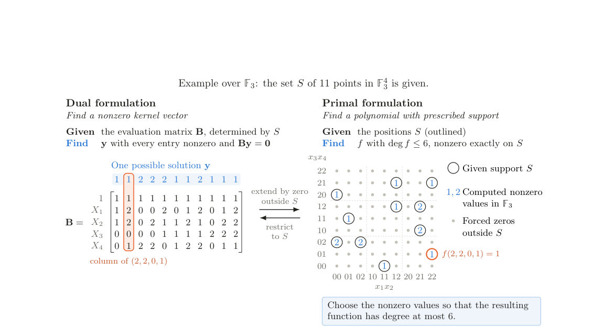
<figcaption class="paper-figure-caption"><b>Fig 1.</b> Figure 1: The selected set S is the input; the displayed nonzero values illustrate one valid output. In this example over F3 with v = 4 variables, S has m = 11 points, and B evaluates the n = 5 monomials 1, X1, . . . , X4 of degree at most one at these points. The dual formulation (left) asks for y with no zero entry and By = 0; each entry of y is drawn above its column. The primal formulation (right) asks for a polynomial f of degree at most 6 that is nonzero exactly on S. Extending y by zero outside S, or restricting f to S, converts one kind of solution into the other.</figcaption>
</figure>
<figure class="paper-figure-card">
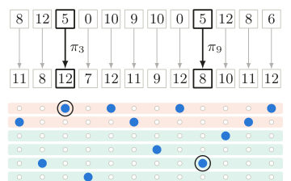
<figcaption class="paper-figure-caption"><b>Fig 2.</b> Figure 2: An example over F13 with twelve coordinates. The code constraint requires x ∈C, where C is a Reed–Solomon code with evaluation points 1, . . . , 12 and dimension at least 3; this holds since xi = i2 + i + 6 is quadratic in i. Each coordinate i then relabels its symbol by its own permutation πi of F13, giving yi = πi(xi) without moving any position; the two highlighted coordinates carry the same symbol 5 but receive different labels. The histogram constraints apply to y, which need not lie in C: the symbols 0, . . . , 6 must not occur, each of 7, . . . , 10 must occur once or twice, and each of 11 and 12 three or four times. In this finite example, the proportions 1/2, 1/3 and 1/6...</figcaption>
</figure>
<figure class="paper-figure-card">
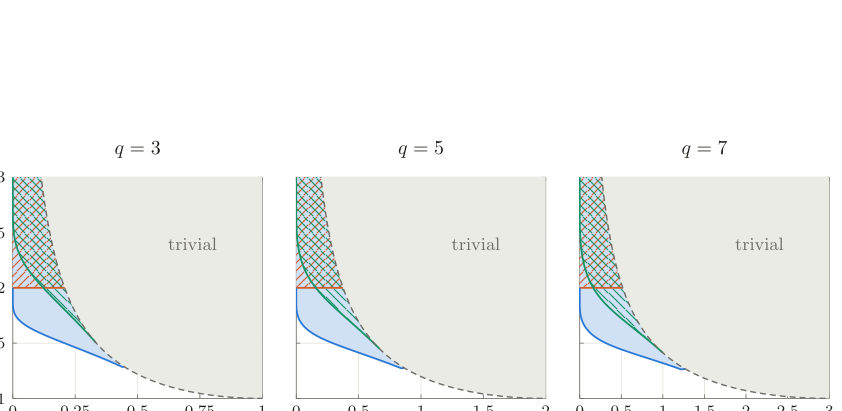
<figcaption class="paper-figure-caption"><b>Fig 3.</b> Figure 3: Asymptotic sufficient regimes for the Reed–Muller support problem, with n = Countq(v, ⌊ρv⌋) and m = min(⌊nc⌋, qv). The axes give the degree per variable ρ and the sam- pling exponent c. Blue shading marks our quantum algorithm using two-fold multiplication; green hatching marks our classical algorithm using three-fold multiplication, with thresholds from Equa- tion (4). Both guarantees give polynomial-time algorithms succeeding with high probability on a random S. Strictly above the dashed curve cCntExpq(ρ) = 1, the problem is eventually trivial: S = Fv q and the all-ones vector is a solution (gray). Orange hatching marks the nontrivial region with c &gt; 2. For uniformly random B,...</figcaption>
</figure>

**Summary.** This paper develops quantum algorithms for solving hard problems related to coding theory and polynomial intersection (OPI) variants. It achieves this by overcoming classical limitations by utilizing quantum decoders and incorporating global constraints like symbol frequency histograms. The work demonstrates potential quantum advantage in parameter regimes where classical methods fail.

**Why it may be interesting.** The focus on quantum algorithms for structured problems like coding theory and polynomial reconstruction directly relates to quantum complexity theory and the development of quantum computational primitives.

Detailed structure

**Main problem.** The paper addresses finding solutions to linear equations over finite fields, $By=0$, and variants of the Optimal Polynomial Intersection (OPI) problem, pushing beyond classical limitations in quantum algorithmic frameworks.

**Main result.** The authors present quantum algorithms that solve these problems in regimes where classical algorithms are insufficient, particularly by exploiting structural properties like the 'two-fold multiplication property' of the dual code.

**Method.** The work employs quantum decoding techniques and analyzes the required structural properties (e.g., dimensions of spaces spanned by products of codewords) to establish quantum advantage over classical methods.

**Model / system.** The problem is modeled using coding theory, specifically involving Reed-Muller codes punctured at random evaluation points over a finite field $\mathbb{F}_q$.

**Key observables.** The primary observables are the existence of solutions $y$ to $By=0$ and the probability of satisfying global constraints (histogram-local constraints).

**Important parameters / regimes.** Key parameters include the dimensions $n$ and $m$, the field size $q$, and structural invariants like $s_2$ and $s_3$ related to code products.

**Assumptions / limitations.** The quantum approach assumes the existence of a quantum decoder that bypasses the need for an efficient classical decoder, and the second contribution assumes the stability of random vectors under resampling.

**Figures summary.** Figure 1 illustrates the dual formulation ($By=0$) and primal formulation (polynomial support $S$) for an example over $\mathbb{F}_3$. Figure 2 illustrates the histogram-local constraint example over $\mathbb{F}_{13}$.

**Paper structure.** The paper is structured around two main contributions: the first tackles solving $By=0$ using a quantum decoder exploiting the 'two-fold multiplication property,' and the second addresses 'histogram-local' constraints, leading to a quantum-classical separation.

Abstract

Regev's reduction is a quantum algorithmic framework for finding codewords satisfying nonlinear constraints by decoding the dual code. To date, applications that have not been dequantized have relied on efficient classical decoders and coordinate-wise constraints specifying a set of allowed values for each coordinate. We push past these two restrictions separately via two separate contributions.   Our first contribution uses a quantum decoder to find solutions $\mathbf{y}\in(\mathbb{F}_q\setminus\{0\})^m$ to $\mathbf{B}\mathbf{y}=0$, where $\mathbf{B}\in\mathbb{F}_q^{n\times m}$. For fixed prime $q>2$, Chen, Liu, and Zhandry (Eurocrypt 2022) solve this problem for random matrices with $m=Ω(n^2)$, a regime now covered by classical algorithms. We adapt their template to codes (spanned by the rows of $\mathbf{B}$) with a ``two-fold multiplication property'': the coordinate-wise products of pairs of codewords span a space of dimension much smaller than $m$.   Our second contribution retains classical decoding but allows global constraints on symbol frequencies. We study ``histogram-local'' constraints, which specify the allowed numbers of occurrences of each symbol. For broad families of these constraints, we show that a uniformly random satisfying vector remains satisfying with constant probability after resampling a uniformly random coordinate. This stability provides sufficient Fourier mass at decodable Hamming weights, yielding efficient quantum algorithms for variants of optimal polynomial intersection (OPI).

[↑ back to top](#top)

### [Quantum Circuit Pruning: From NISQ Architectures to Fault-Tolerant Operations](http://arxiv.org/abs/2610.00669v1)

**Authors:** Pau Escofet, Carmen G. Almudéver, Sergi Abadal, Eduard Alarcón  
**Type:** theory · **Category:** quantum information and computing · **PDF:** <https://arxiv.org/pdf/2610.00669v1>  
**Analysis basis:** full PDF text, analyzed in chunks

↔ Scroll figures horizontally

<figure class="paper-figure-card">
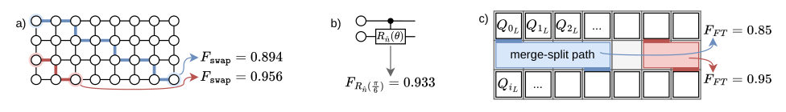
<figcaption class="paper-figure-caption"><b>Fig 1.</b> Fig. 1. Routing-aware pruning decision for a parametric controlled rotation gate (b) in both the NISQ and FT settings. (a) NISQ case: the compiler evaluates the physical distance between the two qubits. The blue path is too long and the gate is pruned; the red path is short enough and the gate is retained. (c) FT case: logical qubits occupy the top and bottom rows, while the middle row contains ancilla patches used to mediate the merge-split path. The blue path is too long and the gate is pruned; the red path is short enough and the gate is retained. In both cases, the pruning threshold is set by the same bound cos2 (θ/2).</figcaption>
</figure>
<figure class="paper-figure-card">
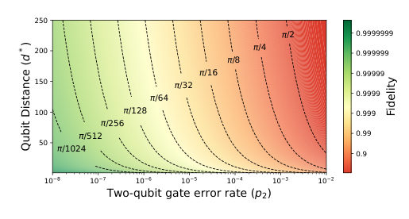
<figcaption class="paper-figure-caption"><b>Fig 2.</b> Fig. 2. Analytical characterisation of the pruning boundary in the NISQ setting. The color map shows Fswap as a function of the two-qubit gate error rate p2 and the qubit routing distance. Dashed lines indicate the critical distance d∗for parametric gates with angles from π/2 to π/1024. Gates whose interacting qubits are separated by a distance above the corresponding dashed line will be pruned, while those below will be maintained.</figcaption>
</figure>
<figure class="paper-figure-card">
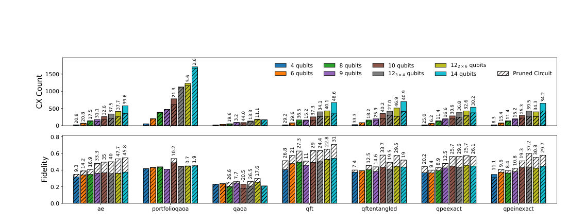
<figcaption class="paper-figure-caption"><b>Fig 3.</b> Fig. 3. Two-qubit gate count (top) and circuit fidelity (bottom) for the selected circuits containing between 4 and 14 qubits, when compiled with (hatched bars) and without (solid bars) the proposed pruning strategy. The percentage improvement in fidelity achieved by pruning is indicated above each bar.</figcaption>
</figure>
<figure class="paper-figure-card">
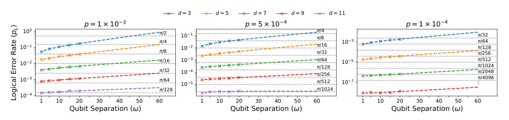
<figcaption class="paper-figure-caption"><b>Fig 4.</b> Fig. 4. LER of two logical CNOT gates implemented via lattice surgery as a function of patch separation, for three depolarizing noise regimes and surface code distances dcode ∈{3, 5, 7, 9, 11}. LER grows with patch separation as longer merge-split paths accumulate more errors. Horizontal dashed lines indicate the logical infidelity threshold 1 −cos2(θ/2) for parametric gates with rotation angles θ.</figcaption>
</figure>

**Summary.** This paper introduces a novel, routing-aware method to prune unnecessary two-qubit gates from quantum circuits by comparing the gate's computational benefit against the fidelity cost incurred during physical execution. The strategy is shown to be effective and unified, providing significant performance gains for both current NISQ devices and future fault-tolerant quantum computers.

**Why it may be interesting.** This work provides a practical, unified compilation strategy that directly addresses hardware constraints (routing overhead) when optimizing quantum circuits, which is crucial for implementing complex quantum algorithms on near-term and future hardware.

Detailed structure

**Main problem.** The paper addresses the need for a routing-aware strategy to selectively prune parametric two-qubit gates in quantum circuits.

**Main result.** The proposed pruning strategy achieves significant gate count reductions (up to 48.6%) and fidelity improvements (up to 47.7%) in the NISQ regime, and remains relevant for FTQC architectures.

**Method.** It compares an architecture-independent lower bound on the fidelity cost of omitting a gate against hardware-specific models for execution routing costs in both NISQ and FTQC settings.

**Model / system.** The analysis covers both Noisy Intermediate-Scale Quantum (NISQ) architectures and Fault-Tolerant Quantum Computing (FTQC) using surface codes and lattice surgery. The cost models involve SWAP chains for NISQ and Logical Error Rates (LER) for FTQC.

**Key observables.** Gate count reduction, final state fidelity improvement, and the critical distance ($d^*$) defining the pruning boundary.

**Important parameters / regimes.** Rotation angle ($	heta$), qubit distance ($d$), physical error rates ($p^2$), and code distances ($d_{	ext{code}}$).

**Assumptions / limitations.** The comparison relies on modeling the execution cost (e.g., SWAP chains or LER growth) and assumes the fidelity bound $\cos^2(	heta/2)$ is a valid measure of computational contribution.

**Figures summary.** Figures illustrate the pruning decision process for controlled rotations in both NISQ and FT settings, showing the threshold set by the fidelity bound, and characterizing the critical distance $d^*$ dependence on noise and angle.

**Paper structure.** The paper introduces the pruning concept, develops the unified criterion comparing omission benefit vs. execution cost, and then applies this framework to benchmark circuits in both NISQ and FT regimes, concluding with scalability analysis.

Abstract

We present a routing-aware pruning strategy for quantum circuits that selectively removes parametric two-qubit gates whose computational contribution is outweighed by the fidelity cost of their execution, and assess it across both Noisy Intermediate-Scale Quantum (NISQ) and fault-tolerant quantum computing (FTQC) architectures. Each two-qubit gate of a circuit is evaluated by comparing an architecture-independent lower bound on the fidelity cost of omitting the gate against a hardware-specific model for the routing execution cost in each setting. We additionally provide an analytical characterization of the pruning boundary as a function of rotation angle, qubit distance, and hardware noise. Simulations on benchmark circuits demonstrate gate count reductions of up to 48.6% and fidelity improvements of up to 47.7% in the NISQ regime, while a feasibility analysis on FT hardware indicates that pruning is expected to remain relevant across a range of code distances and physical error rates. These results establish routing-aware pruning as a practical and unified compilation strategy across the quantum computing stack.

[↑ back to top](#top)

### [Quantum Optimal Transport Barycenters: Existence, Duality, and Gaussian Rigidity](http://arxiv.org/abs/2610.01855v1)

**Authors:** Augusto Gerolin, Zhiyi Lin  
**Type:** theory · **Category:** other · **PDF:** <https://arxiv.org/pdf/2610.01855v1>  
**Analysis basis:** full PDF text, analyzed in chunks

↔ Scroll figures horizontally

<figure class="paper-figure-card">
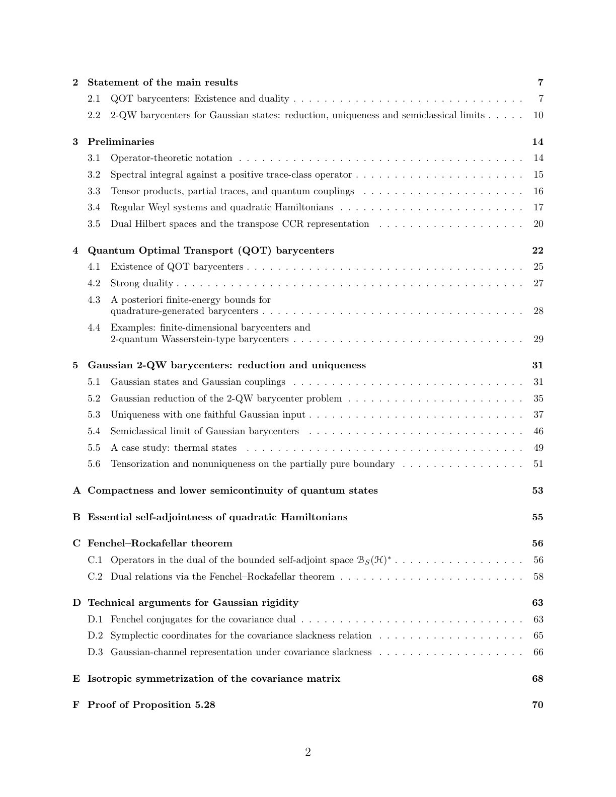
<figcaption class="paper-figure-caption"><b>Fig 1.</b> Low-resolution page preview, page 2</figcaption>
</figure>
<figure class="paper-figure-card">
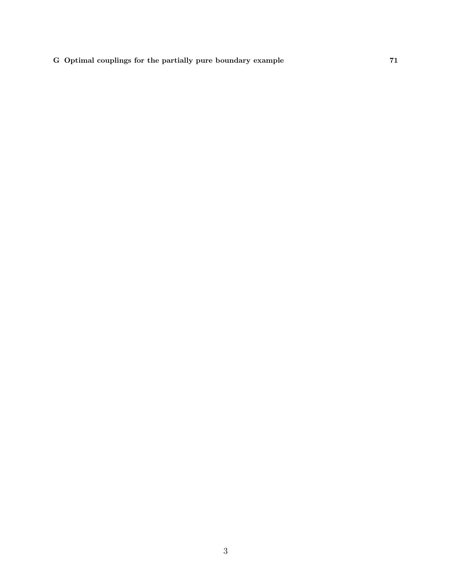
<figcaption class="paper-figure-caption"><b>Fig 2.</b> Low-resolution page preview, page 3</figcaption>
</figure>
<figure class="paper-figure-card">
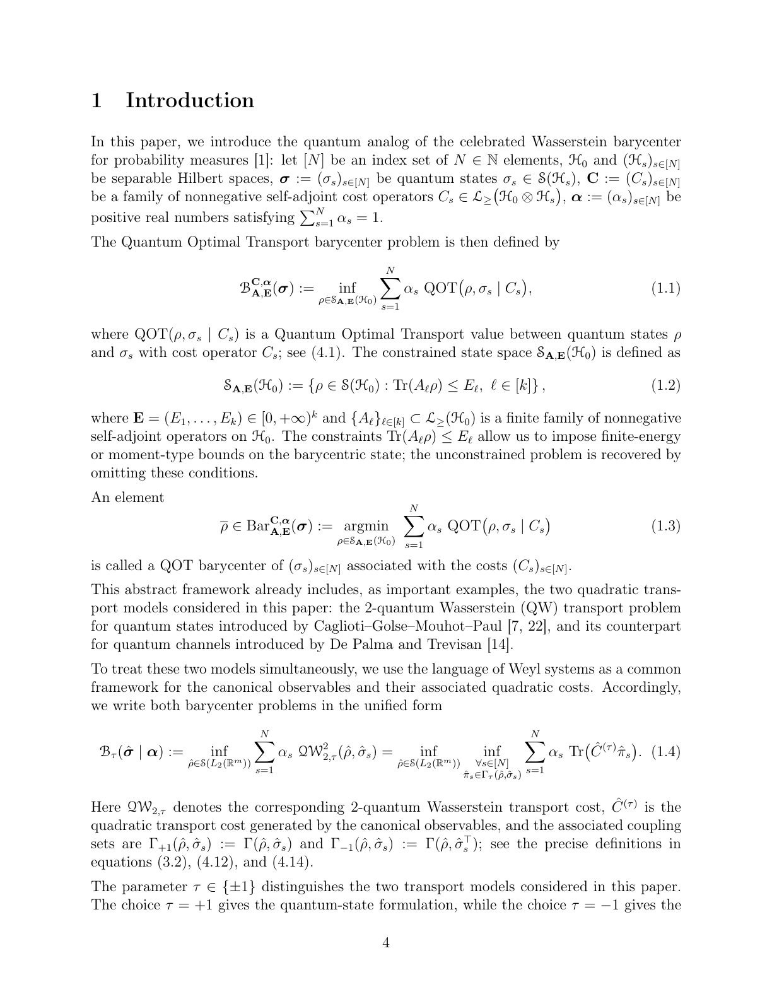
<figcaption class="paper-figure-caption"><b>Fig 3.</b> Low-resolution page preview, page 4</figcaption>
</figure>
<figure class="paper-figure-card">
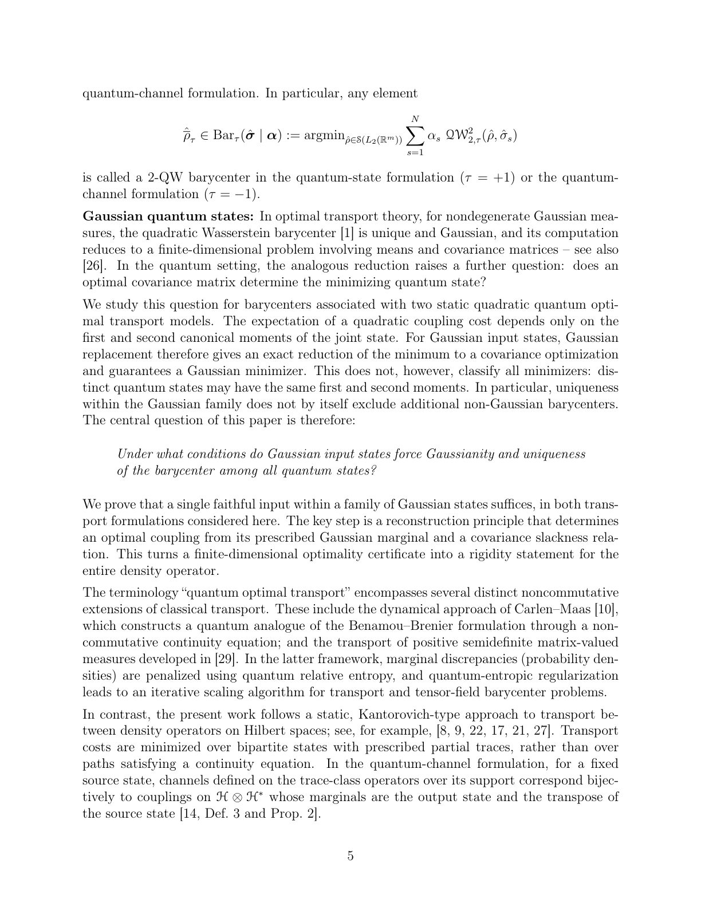
<figcaption class="paper-figure-caption"><b>Fig 4.</b> Low-resolution page preview, page 5</figcaption>
</figure>
<figure class="paper-figure-card">
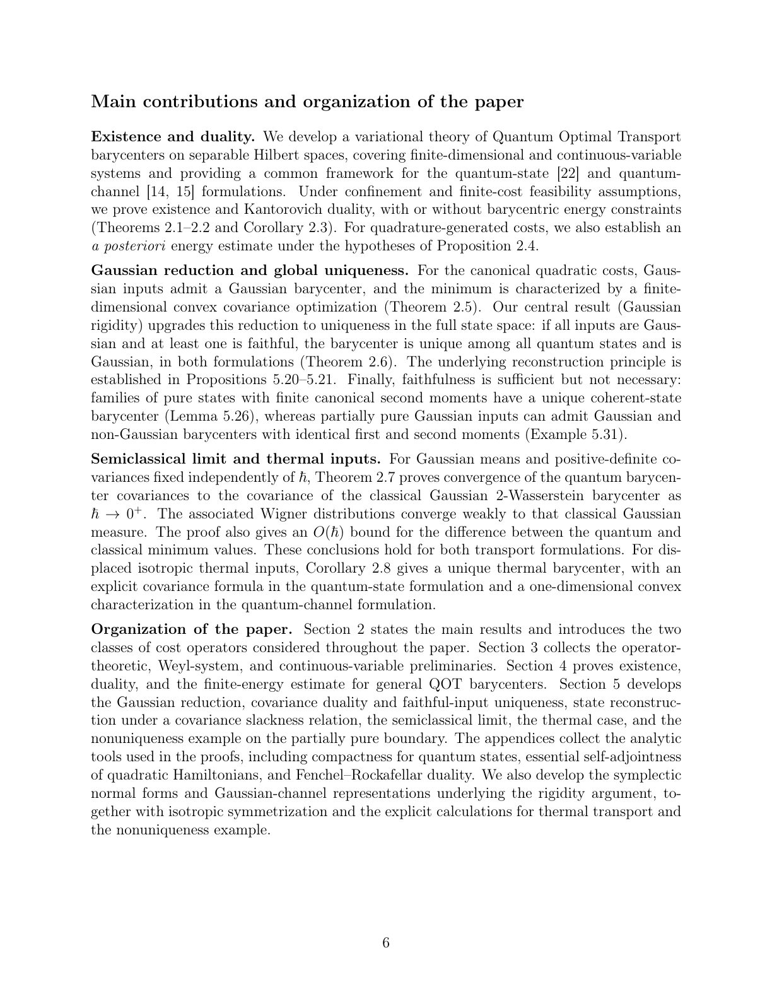
<figcaption class="paper-figure-caption"><b>Fig 5.</b> Low-resolution page preview, page 6</figcaption>
</figure>

**Summary.** This paper introduces a Quantum Optimal Transport (QOT) framework to define a barycenter for multiple quantum states. It proves that under suitable conditions, this barycenter exists and is unique, especially when the input states are Gaussian. This mathematical tool is vital for understanding how quantum states are averaged or mixed in a geometrically consistent manner.

**Why it may be interesting.** This work provides a powerful, mathematically rigorous tool for defining 'averages' or 'means' of quantum states that respects underlying physical geometry (like the Wasserstein metric), which is crucial for understanding quantum state mixing and estimation.

Detailed structure

**Main problem.** The paper develops a Quantum Optimal Transport (QOT) barycenter framework to find a representative quantum state that minimizes the weighted sum of quantum transport costs from several input states.

**Main result.** It establishes existence and duality for this barycenter, and crucially proves a Gaussian rigidity theorem: if enough input states are Gaussian and at least one is faithful, the barycenter is unique and necessarily Gaussian.

**Method.** The approach uses a static, Kantorovich-type formulation, which, for Gaussian inputs, reduces the problem to a finite-dimensional convex optimization over covariance matrices.

**Model / system.** The model involves finding the barycenter $
ho$ of a set of input quantum states $\{\sigma_s\}$ on separable Hilbert spaces, utilizing quantum channels and associated cost operators $C_s$. The framework unifies treatments for both quantum states and quantum channels.

**Key observables.** The barycenter state $
ho$, the input states $\sigma_s$, and the associated covariance matrices $\Sigma$.

**Important parameters / regimes.** The weights $\alpha_s$ summing to one, and the quantum cost operators $C_s$, particularly those derived from quadratic costs.

**Assumptions / limitations.** The general theory requires specific compactness conditions on the cost operators for existence; uniqueness is strongly established by specializing to Gaussian inputs and requiring at least one faithful Gaussian input.

**Paper structure.** The paper builds from establishing general existence and duality results for QOT barycenters, specializes to the Gaussian case where the problem reduces to covariance optimization, and culminates in proving the Gaussian rigidity theorem and the semiclassical limit.

Abstract

We develop a Quantum Optimal Transport (QOT) barycenter framework for quantum states, as an analog of Wasserstein barycenters~\cite{AguCar}, and establish existence and duality results for a broad class of possibly unbounded transport costs on separable Hilbert spaces. Our framework provides, in particular, a unified treatment of $2$-quantum Wasserstein (QW) barycenters in both the quantum-state and quantum-channel formulations by specializing to the canonical quadratic cost operators associated with the $2$-quantum Wasserstein distances of Caglioti--Golse--Mouhot--Paul~\cite{caglioti2021towards,Golse-Mouhot-Paul:2016} and De Palma--Trevisan~\cite{DPaTre19}.   The central results concern Gaussian input states and, in particular, Gaussian rigidity: whether Gaussian input states force the 2-QW barycenter itself to be Gaussian and uniquely determined when the minimization is taken over all quantum states. We first show that the barycenter problem admits a Gaussian minimizer and reduces to a finite-dimensional convex optimization problem over covariance matrices.   The main difficulty is that uniqueness of the optimal covariance does not, in general, imply uniqueness of the underlying quantum state. We bridge this gap through a state-reconstruction principle under covariance complementary slackness that upgrades uniqueness of the optimal covariance to uniqueness of the full quantum state, and thereby prove a global rigidity theorem: if at least one Gaussian input is faithful, then the barycenter is unique among all quantum states and is necessarily Gaussian. Faithfulness is sufficient but not necessary: families of pure inputs still determine a unique barycenter, whereas partially pure nonfaithful Gaussian inputs may admit multiple barycenters.

[↑ back to top](#top)

### [Quantum state preparation for weighted d-DNNF](http://arxiv.org/abs/2610.02094v1)

**Authors:** Steef Hegeman, Joon Hyung Lee, Alfons Laarman  
**Type:** theory · **Category:** quantum information and computing · **PDF:** <https://arxiv.org/pdf/2610.02094v1>  
**Analysis basis:** full PDF text, analyzed in chunks

↔ Scroll figures horizontally

<figure class="paper-figure-card">
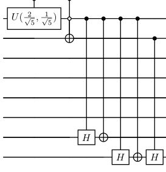
<figcaption class="paper-figure-caption"><b>Fig 1.</b> Figure 3. The quantum circuit Q(D) preparing S2(D) for the 2-d-DNNF D from Figure 2. The dashed lines show the boundaries between the certificate propagation, nonzero, and reset layers.</figcaption>
</figure>

**Summary.** This paper solves the Quantum State Preparation Problem for states defined by weighted d-DNNF circuits. It constructs an efficient quantum circuit $Q(D)$ using three distinct layers—certificate propagation, nonzero computation, and reset—to prepare the target state. The resulting circuit exhibits polynomial complexity bounds in terms of the size and depth of the input d-DNNF.

**Why it may be interesting.** This work provides concrete, efficient quantum circuit constructions for preparing states defined by classical computational structures (d-DNNF), which is fundamental knowledge for designing quantum algorithms and simulating quantum processes.

Detailed structure

**Main problem.** The paper addresses the Quantum State Preparation Problem (QSP): efficiently generating a quantum circuit that prepares a target quantum state given its description.

**Main result.** It provides explicit constructions showing that for states described by weighted d-DNNF, the required quantum circuit can be generated with polynomial complexity in the size of the description.

**Method.** The construction involves designing a quantum circuit $Q(D)$ structured in three layers—certificate propagation, nonzero computation, and reset—utilizing gates from $\{X, CX\} \cup SU(2)$.

**Model / system.** The quantum state is defined by the weighted d-DNNF (deterministic, decomposable pseudo-Boolean circuit) $D$. The target state is typically $S_2(D) = \sum_{x} D(x) |x
angle$.

**Key observables.** Circuit complexity metrics: Size ($|D|$), Depth ($	ext{depth}(D)$), and Width.

**Important parameters / regimes.** The complexity bounds are $O(|D|)$ gates, $O(	ext{depth}(D))$ depth (for 2-d-DNNF), and $O(|D|)$ width.

**Assumptions / limitations.** The analysis assumes a computational RAM model where complex arithmetic operations are constant time. It also relies on the structure of certificates within the d-DNNF.

**Figures summary.** Figure 1 illustrates a weighted 2-d-DNNF example. Figure 2 shows a normalized weighted 2-d-DNNF. Figure 3 displays the resulting quantum circuit $Q(D)$ composed of the three distinct functional layers.

**Paper structure.** The paper first establishes the problem and then details the construction of the circuit $Q(D)$ in three sequential layers: certificate propagation, nonzero layer, and reset layer. It proves correctness and analyzes the resulting complexity bounds.

Abstract

The quantum state preparation problem is to, given a description of a quantum state, efficiently generate a quantum circuit computing the state. We show that for quantum states described by weighted d-DNNF (deterministic, decomposable pseudo-Boolean circuits) a quantum circuit computing the state can be obtained in linear time up to complex arithmetic.

[↑ back to top](#top)

### [Random Quantum Circuits Beyond Moment Matching](http://arxiv.org/abs/2610.02135v1)

**Authors:** Shih-Han Hung  
**Type:** theory · **Category:** quantum information and computing · **PDF:** <https://arxiv.org/pdf/2610.02135v1>  
**Analysis basis:** full PDF text, analyzed in chunks

↔ Scroll figures horizontally

<figure class="paper-figure-card">
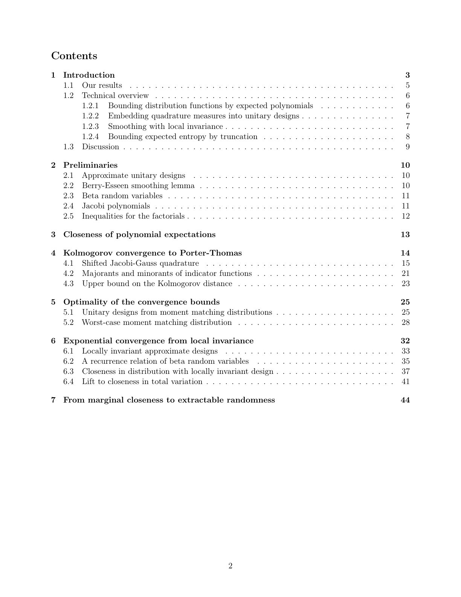
<figcaption class="paper-figure-caption"><b>Fig 1.</b> Low-resolution page preview, page 2</figcaption>
</figure>
<figure class="paper-figure-card">
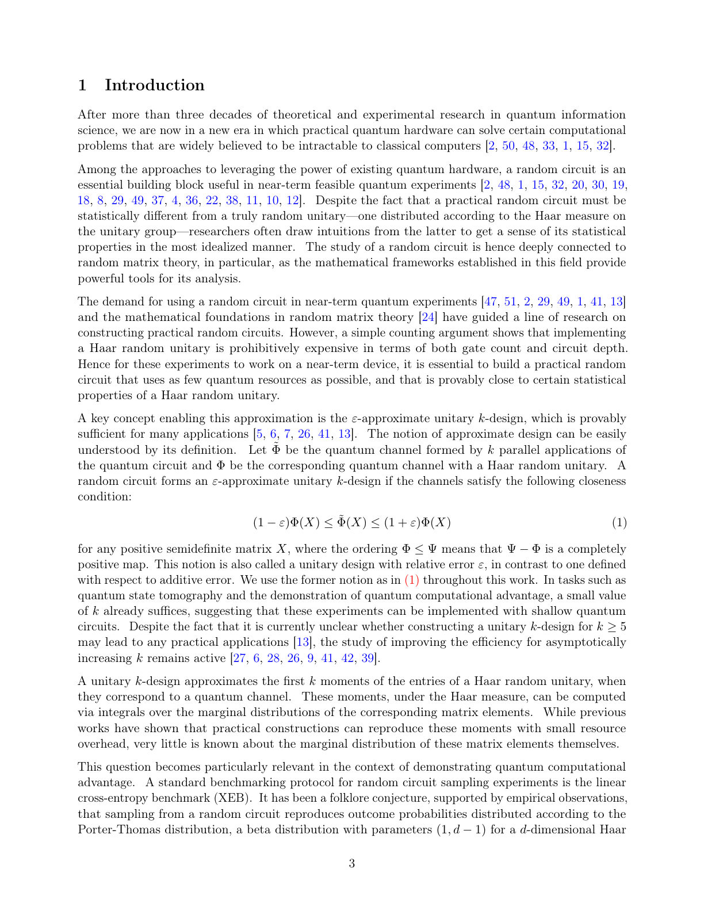
<figcaption class="paper-figure-caption"><b>Fig 2.</b> Low-resolution page preview, page 3</figcaption>
</figure>
<figure class="paper-figure-card">
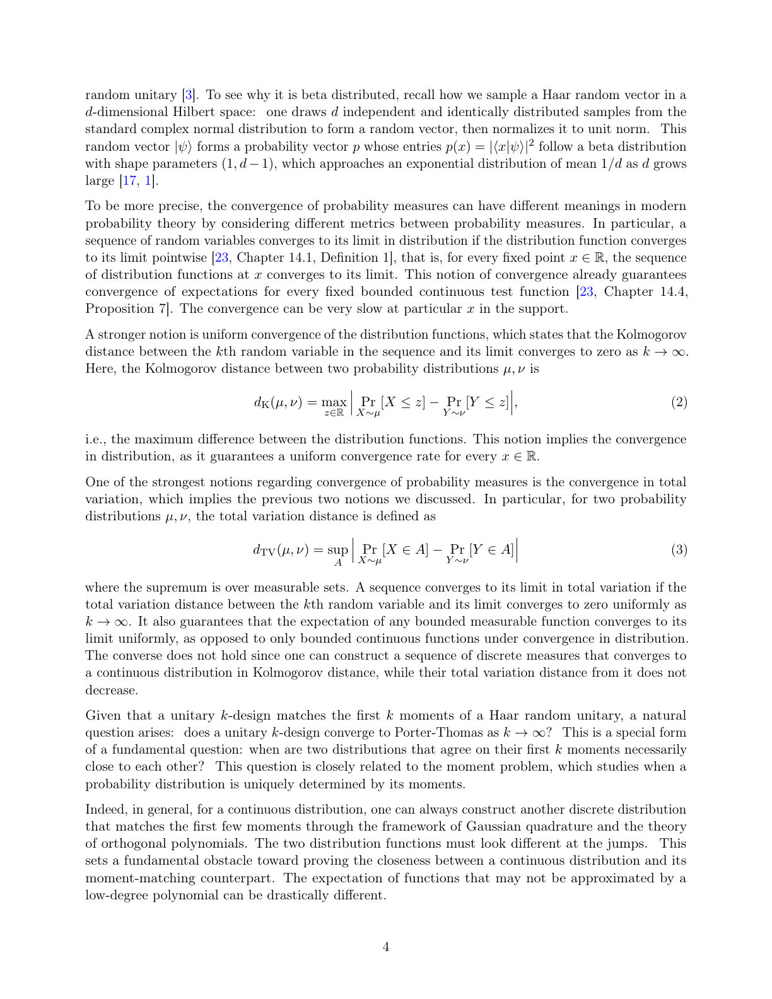
<figcaption class="paper-figure-caption"><b>Fig 3.</b> Low-resolution page preview, page 4</figcaption>
</figure>
<figure class="paper-figure-card">
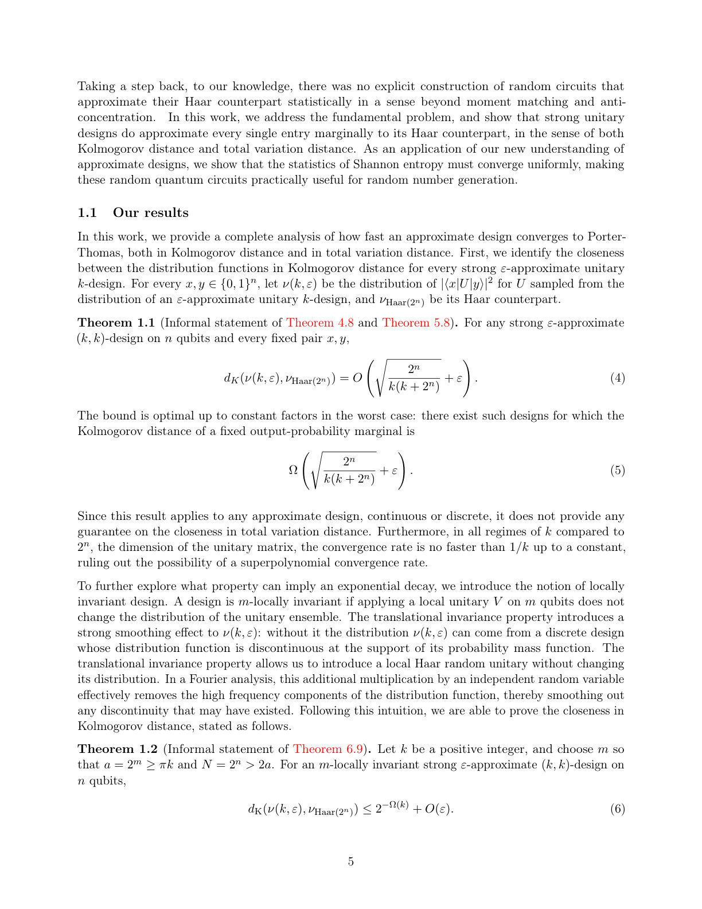
<figcaption class="paper-figure-caption"><b>Fig 4.</b> Low-resolution page preview, page 5</figcaption>
</figure>
<figure class="paper-figure-card">
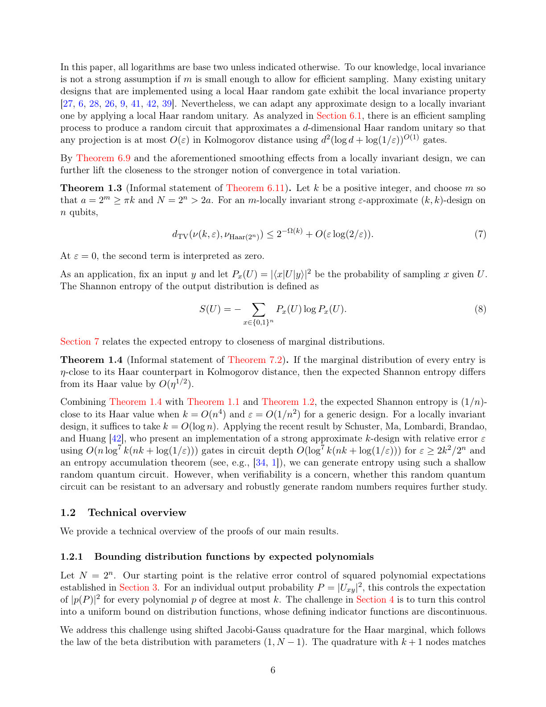
<figcaption class="paper-figure-caption"><b>Fig 5.</b> Low-resolution page preview, page 6</figcaption>
</figure>

**Summary.** This work rigorously analyzes the convergence of random quantum circuits to ideal Haar-random unitary evolution by analyzing the distribution of output probabilities. It shows that while moment matching provides some bounds, imposing additional structure, specifically local invariance, leads to an exponential improvement in the accuracy of the approximation. This is vital for understanding the fidelity of quantum simulators and random quantum processes.

**Why it may be interesting.** It provides rigorous mathematical tools to quantify how quickly complex quantum processes (like random scrambling) approach true randomness, which is crucial for understanding quantum simulation fidelity and information scrambling.

Detailed structure

**Main problem.** The paper quantifies the accuracy with which approximate unitary quantum circuits (k-designs) reproduce the full statistical distributions of individual output probabilities compared to ideal Haar-random unitaries.

**Main result.** It establishes error bounds in Kolmogorov and total variation distances, showing that local invariance provides an exponential improvement in convergence rate over simple moment matching.

**Method.** The analysis uses the framework of unitary k-designs, comparing the output probability distributions of approximate circuits to the Haar distribution using advanced metrics like Kolmogorov and total variation distances.

**Model / system.** The model involves random quantum circuits acting on $n$ qubits, designed to approximate the evolution generated by a Haar-random unitary matrix.

**Key observables.** Individual output probabilities (approximated by the Porter-Thomas distribution), expected Shannon entropy of the output distribution.

**Important parameters / regimes.** The design order $k$, the approximation error $\epsilon$, and the number of qubits $n$.

**Assumptions / limitations.** The primary assumption is the existence of a strong $\epsilon$-approximate unitary $k$-design, which matches moments up to a certain order.

**Paper structure.** The paper moves from establishing the general error bound based on moment matching to identifying the structural requirement (local invariance) that yields exponentially better convergence rates, concluding with an application to entropy estimation.

Abstract

Random quantum circuits aim to efficiently reproduce the statistical properties of ideal random quantum evolution. One approach is to construct approximate unitary designs, which match the moments of Haar-random unitaries up to a prescribed order with controlled error. In this work, we establish quantitative guarantees for how accurately these designs reproduce the full distributions of individual output probabilities. We show that, for every strong $\varepsilon$-approximate unitary $k$-design on $n$ qubits, the distribution of each individual output probability is within $O\left(\sqrt{\frac{2^n}{k(k+2^n)}}+\varepsilon\right)$ in Kolmogorov distance of the finite-dimensional Porter-Thomas distribution, a beta distribution with parameters $1$ and $2^n-1$. This bound is optimal up to constant factors, implying that a substantially better uniform bound requires additional structure. We further show that local invariance yields an exponential improvement in the dependence on $k$, with guarantees also in the stronger metric of total variation: every strong $\varepsilon$-approximate unitary $k$-design invariant under unitary translations acting on $\log k+O(1)$ qubits achieves error $2^{-Ω(k)}+O(\varepsilon)$ in Kolmogorov distance and $2^{-Ω(k)}+O(\varepsilon\log(2/\varepsilon))$ in total variation distance. These results identify both the distributional accuracy guaranteed by moment matching and the additional structure that substantially improves it. As an application, we show that if the marginal distribution of each output probability of a strong approximate design is within Kolmogorov distance $η$ of its Haar counterpart, then the expected Shannon entropy of the output distribution differs from its Haar value by $O(\sqrtη)$.

[↑ back to top](#top)

### [Robust and leakage-resilient device-independent oblivious transfer in MiniQCryp](http://arxiv.org/abs/2610.01421v1)

**Authors:** Zhili Chen, Rahul Jain, YaoNan Zhang  
**Type:** theory · **Category:** quantum information and computing · **PDF:** <https://arxiv.org/pdf/2610.01421v1>  
**Analysis basis:** full PDF text, analyzed in chunks

↔ Scroll figures horizontally

<figure class="paper-figure-card">
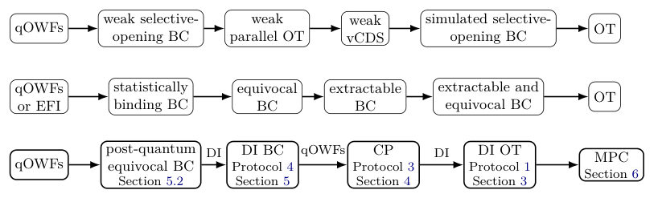
<figcaption class="paper-figure-caption"><b>Fig 1.</b> Figure 1: Reduction chains. The two earlier chains use trusted quantum communication and place no condition on devices; “weak” permits inefficient simulation, vCDS is verifiable conditional disclosure of secrets, and the chain of [BCKM21] also runs from EFI pairs [BCQ23], which need that quantum communication. Ours removes the trusted quantum operations; in exchange, its two DI arrows require fresh isolated batches with bounded leakage (fresh isolated batches, bounded leakage). Its boxes name the protocol and the section that proves each step; the middle arrow is classical outside its BC calls, OT completeness gives MPC, and the commitment also yields coin tossing (Section 5.5).</figcaption>
</figure>

**Summary.** This work presents device-independent protocols for oblivious transfer and bit commitment, ensuring security even when the quantum devices are untrusted and potentially faulty. It achieves robustness by explicitly accounting for information leakage and device faults in two distinct operational regimes. This advances the practical feasibility of quantum cryptography by providing concrete, resilient cryptographic primitives.

**Why it may be interesting.** While highly theoretical, the focus on device-independent security and fault tolerance is crucial for realizing quantum technologies in noisy, real-world physical systems.

Detailed structure

**Main problem.** The paper addresses the construction of robust and leakage-resilient device-independent (DI) oblivious transfer (OT) and bit commitment (BC) protocols.

**Main result.** It successfully constructs DI OT and BC protocols secure against quantum polynomial-time adversaries, which are robust to certain levels of device faults and information leakage.

**Method.** The construction relies on a chain of reductions involving a commit-and-prove functionality, utilizing techniques like selector-aware parallel-repetition bounds and classical equivocation.

**Model / system.** The security is based on observed correlations from the Magic Square game using untrusted quantum devices in two laboratories, rather than assuming perfect device behavior.

**Key observables.** Fault rates (constant or inverse-polylogarithmic), information leakage ($\ell$ qubits), and the security parameter ($\lambda$).

**Important parameters / regimes.** The protocols are analyzed in two regimes: isolated laboratories with coordinate-local measurements, or general settings allowing adaptive leakage.

**Assumptions / limitations.** The primary assumptions are the existence of post-quantum one-way functions (qOWFs) and the ability to use fresh, isolated batches of device coordinates.

**Figures summary.** Figure 1 illustrates the reduction chains, comparing the new work to prior protocols by highlighting the removal of trusted quantum operations and the requirement for bounded leakage.

**Paper structure.** The paper develops the security proof by building upon existing DI protocols, detailing the reduction from OT to general secure computation, and providing specific analyses for the commitment and coin tossing functionalities.

Abstract

Assuming post-quantum one-way functions, we construct device-independent (DI) oblivious transfer (OT) and bit commitment: honest parties use only trusted classical computation to operate untrusted quantum devices, which may share arbitrary entanglement and behave non-IID. Security is simulation-based against quantum polynomial-time adversaries and composes sequentially with efficient simulators. One protocol skeleton serves both, in two regimes. With isolated laboratories and coordinate-local measurements in the honest receiver's device, it tolerates a constant rate of honest-device faults. With polylogarithmically many qubits of adaptive leakage between the laboratories and arbitrary joint measurements, it tolerates an inverse-polylogarithmic rate. Each elementary DI call uses a fresh, isolated batch of polylogarithmically many device coordinates, and total device use in the compiled OT protocol is polynomial. The commitment has efficient simulators against both parties and yields DI coin tossing with abort.   Because OT is complete for secure computation, the construction yields a DI protocol, with abort, for every efficiently computable classical functionality on a fixed number of parties, secure against static corruption of any proper subset of them.   The commitment's extractor changes a public parity relation through classical equivocation and leaves the device execution, hence its leakage, unchanged. A commit-and-prove functionality, disjoint audits, and an affine consistency check link the certified correlations to ideal OT. Sender security rests on a selector-aware parallel-repetition bound for the Magic Square game, which we derive from the two-round threshold theorem of Kundu and Tan.

[↑ back to top](#top)

### [Robustness of the Verwey transition against remanent strain-induced defects in magnetite](http://arxiv.org/abs/2610.01337v1)

**Authors:** M. A. Gala, K. J. Grzywa, K. Komędera, R. Zalecki, A. Baczmański, Z. Kąkol, A. Pacanowska, C. M. N. Kumar, R. Rodriguez Lamas, C. Detlefs, C. Yildirim, C. Marin, J. Debray, G. Beutier, L. Ortega, A. Kozłowski, N. Barišić, J. E. Lorenzo, W. Tabiś  
**Type:** experiment · **Category:** strongly correlated electrons · **PDF:** <https://arxiv.org/pdf/2610.01337v1>  
**Analysis basis:** full PDF text, analyzed in chunks

↔ Scroll figures horizontally

<figure class="paper-figure-card">
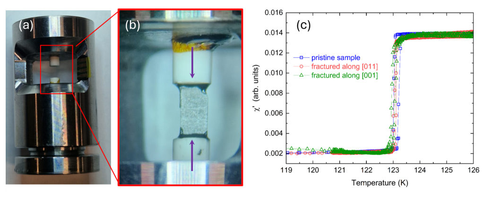
<figcaption class="paper-figure-caption"><b>Fig 1.</b> Figure 1. Uniaxial compression and magnetic characterization of magnetite. (a) Compression device consisting of a cylindrical steel housing and a central piston. (b) Magnetite sample mounted between ceramic posts with Stycast epoxy; purple arrows indicate the direction of applied uniaxial compression. (c) Real part of the ac susceptibility, χ′, for the pristine reference sample and for samples fractured by compression along [011] and [001] directions. Within experimental resolution, the Verwey transition temperature remains unchanged after compression and fracture.</figcaption>
</figure>
<figure class="paper-figure-card">
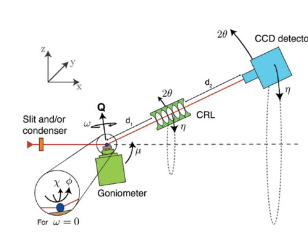
<figcaption class="paper-figure-caption"><b>Fig 2.</b> Figure 2. Schematic of the DFXM setup at the ESRF ID03 beamline. A monochromatic x-ray beam illuminates the sam- ple, which is mounted on a goniometer. A selected Bragg reflection from the cubic {400} family is magnified by com- pound refractive lenses and imaged on a two-dimensional de- tector. Rocking and rolling scans probe lattice misorientation, while scans of 2θ probe local changes in lattice spacing. The DFXM end station at ID03 was relocated and upgraded from the former ID06-HXM instrument [24]. Schematic adapted from Ref. [25].</figcaption>
</figure>
<figure class="paper-figure-card">
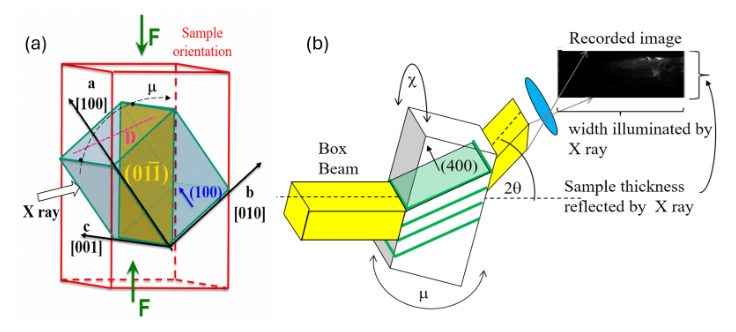
<figcaption class="paper-figure-caption"><b>Fig 3.</b> Figure 3. DFXM geometry used to image the compressed magnetite crystals. (a) Sample orientation relative to the incident x-ray beam. The sample was compressed along [011], with a (01¯1) surface exposed in the DFXM geometry. The cubic (400) reflection was selected for imaging. (b) Schematic of the DFXM optical layout in the box-beam geometry. The vertical direction of the recorded image corresponds to the sample thickness, and the x-ray objective inverts the image, reversing the front and rear sides of the sample.</figcaption>
</figure>
<figure class="paper-figure-card">
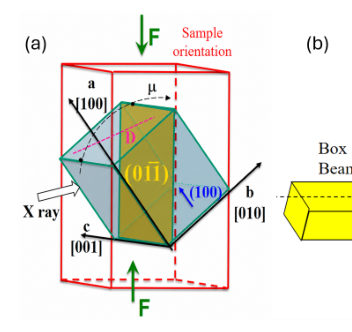
<figcaption class="paper-figure-caption"><b>Fig 4.</b> Figure 4 shows detector images recorded near the max- imum of the (400) Bragg reflection for the pristine ref- erence crystal, the moderately compressed crystal, and the fractured crystal compressed along [011]. These im- ages are not full orientation or strain maps. Instead, they show the spatial distribution of diffracted intensity at the angular setting for which the largest part of the illuminated region satisfies the Bragg condition. They therefore provide a direct visual comparison of the ho- mogeneity of the diffracting volume in the three samples. Quantitative separation of lattice misorientation and ax- ial strain is provided by the maps in Fig. 5. The pristine sample [Fig. 4(a)]...</figcaption>
</figure>
<figure class="paper-figure-card">
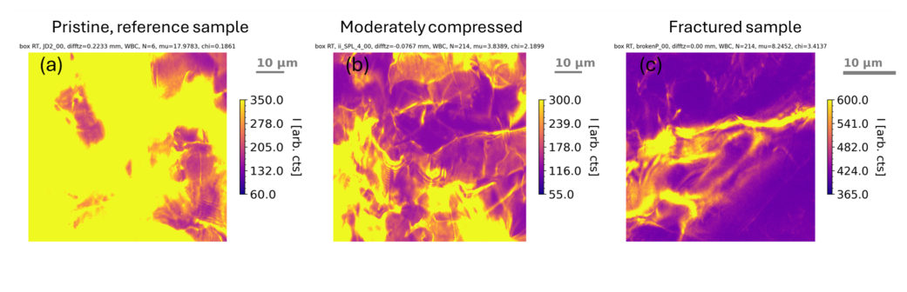
<figcaption class="paper-figure-caption"><b>Fig 5.</b> Figure 4. Recorded DFXM peak images obtained at the optimal µ and χ angles of the (400) reflection after different compression treatments. (a) Pristine reference sample. (b) Sample compressed to 200 MPa along [011] without fracture. (c) Sample compressed along [011] beyond the fracture threshold. The progressively stronger spatial inhomogeneity of the Bragg-peak intensity from (a) to (c) reflects increasing heterogeneity of the diffracting volume after uniaxial compression; the respective contributions of lattice orientation and residual strain are quantified in Fig. 5. The color scale is adjusted independently for each panel and therefore should be used to assess contrast within a given...</figcaption>
</figure>

**Summary.** This experimental study investigates the robustness of the Verwey transition in magnetite when subjected to mechanical stress. By comparing the electronic transition signature with high-resolution imaging of strain-induced defects, the authors conclude that extended slip-related defects do not significantly alter the transition temperature. This work helps distinguish the physical mechanism by which point defects suppress the transition from that caused by extended lattice strain.

**Why it may be interesting.** The work provides crucial experimental evidence distinguishing between the coupling mechanisms of different types of lattice disorder (point vs. extended) to the electronic ground state, which is fundamental to understanding correlated electron physics in transition metal oxides.

Detailed structure

**Main problem.** To determine how remanent strain fields and extended defect structures, generated by uniaxial stress, affect the Verwey transition in magnetite.

**Main result.** The study found that extended line-like defects and remanent strain fields from plastic deformation do not measurably perturb the Verwey transition temperature, distinguishing their effect from point defects.

**Method.** The researchers combined dark-field x-ray microscopy (DFXM) to map structural disorder and ac magnetic susceptibility measurements to track the electronic phase transition.

**Model / system.** The physical system is stoichiometric single-crystalline magnetite ($	ext{Fe}_3	ext{O}_4$), a material known for its electronically driven Verwey transition, which is sensitive to lattice imperfections.

**Key observables.** Verwey transition temperature ($T_V$), transition sharpness, remanent structural disorder (line-like defects, strain fields), and lattice misorientation/strain maps.

**Important parameters / regimes.** Uniaxial stress (up to 200 MPa), temperature ramp rate ($\le 0.1$ K/min), and the comparison between point defects vs. extended defects.

**Assumptions / limitations.** The study assumes that the observed structural disorder is primarily due to plastic deformation (slip-related) and that the electronic ordering responsible for $T_V$ is sensitive only to the type of disorder, not its density, if the disorder is extended.

**Figures summary.** Figures show DFXM contrast images comparing pristine, moderately compressed, and fractured samples, revealing substantial remanent structural disorder. Susceptibility curves confirm that $T_V$ remains unchanged across these mechanically altered samples.

**Paper structure.** The paper establishes the problem by noting the sensitivity of $T_V$ to point defects. It then details the experimental procedure involving uniaxial compression and subsequent DFXM/susceptibility measurements. The core of the paper presents the results showing structural disorder without corresponding changes in $T_V$, leading to the conclusion that extended defects are benign compared to point defects.

Abstract

The Verwey transition in magnetite is a benchmark electronically driven phase transition that is highly sensitive to lattice imperfections and external perturbations. Doping, deviations from oxygen stoichiometry, and irradiation-induced point defects are known to lower the Verwey transition temperature, $T_{\rm V}$. By contrast, the role of remanent strain fields and extended defect structures generated by uniaxial stress has remained largely unexplored. Here we combine dark-field x-ray microscopy (DFXM) and ac magnetic susceptibility to determine how strain-induced defects affect the Verwey transition in stoichiometric single-crystalline magnetite after uniaxial compression and unloading. The DFXM measurements were performed on two samples compressed along the same $[011]$ direction: loading to $200~\mathrm{MPa}$ generated stable line-like defects and remanent strain fields, whereas loading beyond the fracture threshold produced denser defect networks and mechanical fracture. To test the effect of a different loading geometry, we also measured the ac susceptibility of a sample fractured by compression along $[001]$. Real-space DFXM imaging, lattice-orientation mapping, and residual strain mapping show substantial remanent structural disorder after compression. Nevertheless, neither the transition temperature $T_{\rm V}$ nor the sharpness of the transition changes measurably in any of the compressed or fractured samples. This behavior contrasts with the strong suppression of $T_{\rm V}$ by point-like disorder. Our results show that extended line-like defects and remanent strain fields produced by plastic deformation do not measurably perturb the macroscopic electronic ordering responsible for the Verwey transition, thereby distinguishing the effects of point defects from those of extended slip-related defects in magnetite.

[↑ back to top](#top)

### [Room-temperature Magnetoelastic Coupling in UIr$_4$Al$_{15}$](http://arxiv.org/abs/2610.01551v1)

**Authors:** Mingyu Xu, Tomasz Klimczuk, M. Brian Maple, Weiwei Xie  
**Type:** experiment · **Category:** strongly correlated electrons · **PDF:** <https://arxiv.org/pdf/2610.01551v1>  
**Analysis basis:** full PDF text, analyzed in chunks

↔ Scroll figures horizontally

<figure class="paper-figure-card">
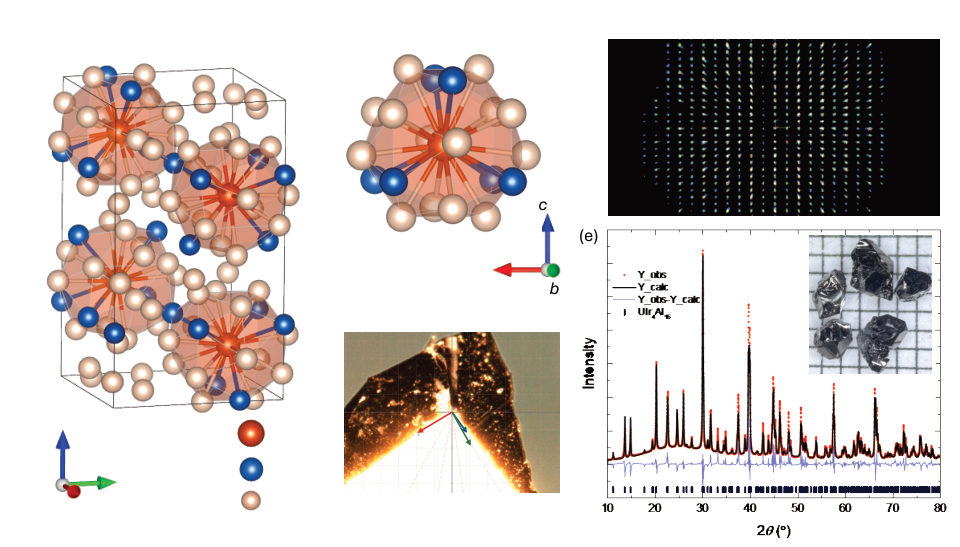
<figcaption class="paper-figure-caption"><b>Fig 1.</b> Figure 1. Crystal structure and structural characterization of UIr4Al15. (a) Crystal structure of UIr4Al15. (b) Local coordination environment of U within the Ir/Al polyhedral cage. (c) Orientation determination of a single crystal by single-crystal X-ray diffraction. The same crystal was subsequently used for magnetic susceptibility measurements. (d) Reconstructed 0kl reciprocal-space plane obtained from single-crystal X- ray diffraction at 300(2) K. (e) Rietveld refinement of powder X-ray diffraction data confirming phase purity. Insets show optical images of as-grown single crystals on millimeter-scale grid paper.</figcaption>
</figure>
<figure class="paper-figure-card">
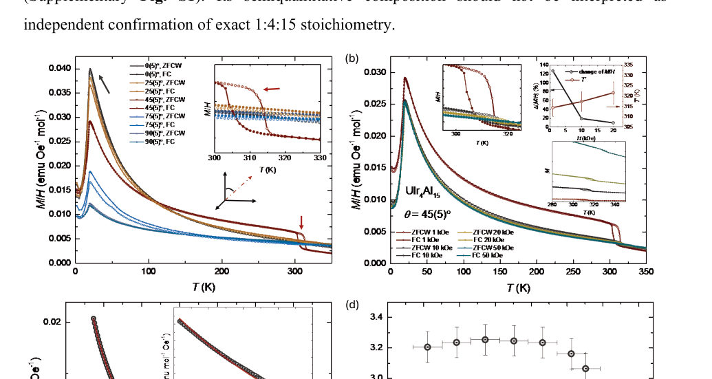
<figcaption class="paper-figure-caption"><b>Fig 2.</b> Figure 2. Magnetic properties of UIr4Al15. (a) Temperature-dependent magnetic susceptibility (M/H) measured under zero-field-cooled warming (ZFCW) and field-cooled (FC) conditions for different magnetic-field orientations within the crystallographic ac-plane. TN denotes the antiferromagnetic transition temperature, while T’ marks the higher-temperature anomaly near 310 K. The magnetic-field orientation angle θ, defined relative to the crystallographic c-axis, is illustrated in the lower inset. The upper-right inset highlights the anisotropic magnetic response between 300 and 320 K. (b) Temperature-dependent magnetic susceptibility measured under different magnetic fields, with the field...</figcaption>
</figure>
<figure class="paper-figure-card">
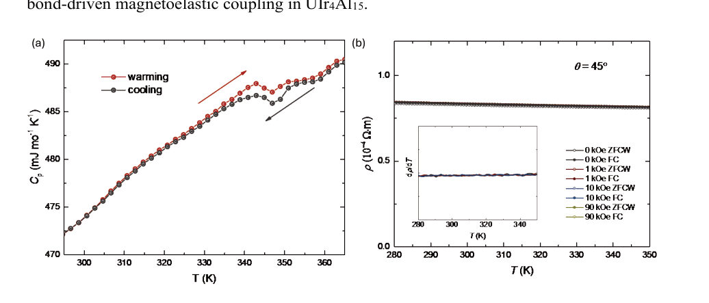
<figcaption class="paper-figure-caption"><b>Fig 3.</b> Figure 3. Specific heat and resistivity of UIr4Al15 in the temperature range above 300 K. (a) Temperature- dependent specific heat, Cp(T), measured under zero magnetic field. (b) Temperature-dependent electrical resistivity measured under magnetic fields of 0, 1, 10, and 90 kOe using zero-field-cooled warming (ZFCW) and field-cooled (FC) protocols. The inset shows the temperature derivative of the electrical resistivity, 𝑑𝑑𝑑𝑑/𝑑𝑑𝑑𝑑, under different magnetic fields.</figcaption>
</figure>
<figure class="paper-figure-card">
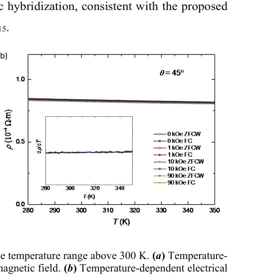
<figcaption class="paper-figure-caption"><b>Fig 4.</b> Fig. 3 presents the heat capacity and electrical transport of UIr4Al15 above room</figcaption>
</figure>
<figure class="paper-figure-card">
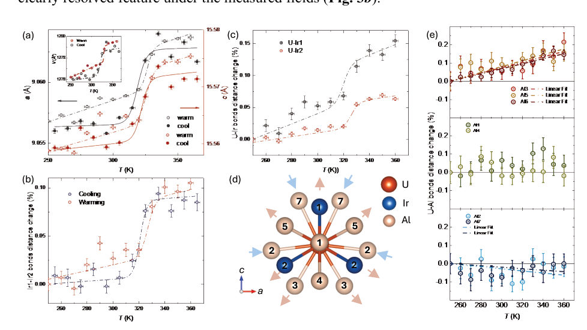
<figcaption class="paper-figure-caption"><b>Fig 5.</b> Figure 4. Temperature-dependent single-crystal X-ray diffraction analysis of UIr4Al15. (a) Temperature dependence of the lattice parameters 𝑎𝑎and 𝑐𝑐measured during warming and cooling between 250 and 370 K. Inset shows the corresponding relative change in unit-cell volume, V/V0, over the same temperature range. (b) Relative change in the Ir1-Ir2 bond distance as a function of temperature during warming and cooling. The abrupt increase near 320-330 K coincides with the magnetic anomaly at T’. (c) Temperature dependence of the relative changes in U-Ir1 and U-Ir2 bond distances. The two inequivalent U-Ir bonds exhibit distinct temperature responses across the transition region, indicating...</figcaption>
</figure>

**Summary.** This experimental work reports on giant magnetoelastic coupling in the uranium compound UIr4Al15, observed slightly above room temperature. By combining single-crystal X-ray diffraction with magnetic measurements, the authors show that the magnetic anomaly correlates precisely with abrupt, anisotropic changes in local atomic bond distances. This establishes the material as a key platform for studying bond-driven magnetoelastic effects in correlated quantum materials.

**Why it may be interesting.** The strong coupling between local atomic structure (bond lengths) and magnetism in a bulk metallic system provides a concrete platform for studying how electronic correlations dictate lattice stability, relevant to understanding emergent quantum phases.

Detailed structure

**Main problem.** Investigating the origin of a magnetic anomaly near room temperature in the metallic intermetallic compound UIr4Al15, specifically determining if it is driven by magnetoelastic coupling.

**Main result.** The magnetic anomaly strongly correlates with abrupt, anisotropic structural changes observed via X-ray diffraction, suggesting a bond-driven magnetoelastic coupling mechanism.

**Method.** The study combines temperature-dependent single-crystal X-ray diffraction with anisotropic magnetic susceptibility and specific heat measurements.

**Model / system.** The physical system is the uranium-based intermetallic compound UIr4Al15, which is characterized by its crystal structure (P42/nmc) and the interplay between its electronic, magnetic, and structural degrees of freedom.

**Key observables.** Lattice parameters, specific chemical bond distances (e.g., U-Ir bonds), magnetic susceptibility (M/H), and specific heat capacity (Cp).

**Important parameters / regimes.** The coupling is observed near room temperature (around 310 K), and the analysis focuses on the sensitivity of local bonding to magnetic alignment.

**Assumptions / limitations.** The coupling mechanism is attributed to local bonding rearrangements rather than conventional magnetostriction or macroscopic symmetry breaking.

**Figures summary.** Figures detail the temperature evolution of lattice parameters and specific bond lengths coinciding with the magnetic anomaly, alongside magnetic susceptibility measurements showing the field-dependent anomaly.

**Paper structure.** The paper details synthesis and characterization procedures, followed by measurements of magnetic, structural, and thermal properties across a temperature range spanning from cryogenic to above room temperature, culminating in the correlation between structural and magnetic anomalies.

Abstract

The interplay between electronic and structural degrees of freedom underpins many emergent phenomena in quantum materials, yet magnetoelastic coupling in metallic systems is typically weak and confined to low temperatures or microscopic length scales. Here, we report giant magnetoelastic coupling slightly above room temperature in the uranium-based intermetallic compound UIr$_4$Al$_{15}$. Using temperature-dependent single-crystal X-ray diffraction together with anisotropic magnetic susceptibility measurements, we directly resolve subtle but reproducible structural distortions coupled to magnetic alignment. Despite the absence of crystallographic symmetry breaking, pronounced anomalies emerge in lattice parameters and selected chemical bond distances near the magnetic transition region, revealing an unusual sensitivity of the crystal structure to magnetic orientation. The coupling enables direct probing of how atomic distances and local chemical bonding govern the electronic and magnetic states in a bulk intermetallic material. Our results establish UIr$_4$Al$_{15}$ as a rare platform in which magnetism and lattice distortions are strongly intertwined near room temperature, opening new opportunities for magnetically responsive quantum materials and functional magnetic sensing applications.

[↑ back to top](#top)

### [Stark effect of hydrogenic ions as a test of the indefinite-metric formalism of the eight-component relativistic wave equation for spin-$\frac{1}{2}$ particles](http://arxiv.org/abs/2610.02060v1)

**Authors:** Paulus C. Tjiang, Sylvia H. Sutanto, Vincentius E. W. Tjia  
**Type:** theory · **Category:** other · **PDF:** <https://arxiv.org/pdf/2610.02060v1>  
**Analysis basis:** full PDF text, analyzed in chunks

↔ Scroll figures horizontally

<figure class="paper-figure-card">
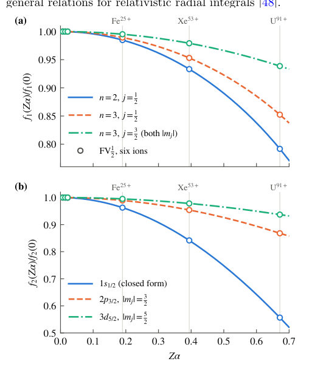
<figcaption class="paper-figure-caption"><b>Fig 1.</b> FIG. 1. Dependence on Zα of the relativistic shifts that remain finite as Zα →0. (a) First-order roots, normal- ized to their values at Zα = 0 ( √</figcaption>
</figure>
<figure class="paper-figure-card">
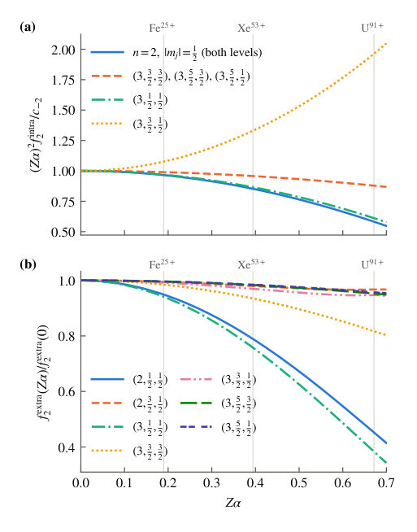
<figcaption class="paper-figure-caption"><b>Fig 2.</b> FIG. 2. The two parts (60) of the second-order shift of the levels with a fine-structure partner. (a) Intra-shell part, mul- tiplied by (Zα)2 and normalized to its singular coefficient c−2. Levels whose only intra-shell coupling is the same radial ma- trix element give the same curve: the two levels of n = 2, |mj| = 1</figcaption>
</figure>

**Summary.** This paper compares the calculation of the Stark effect for hydrogenic ions using three different theoretical frameworks: Schrödinger, Dirac, and the eight-component FV1/2 equation. The authors demonstrate that the FV1/2 formalism successfully reproduces the Dirac results to high precision, confirming its mathematical consistency despite its unusual indefinite metric structure. It serves as a rigorous theoretical check on advanced relativistic quantum mechanics.

**Why it may be interesting.** This work is highly relevant to theoretical physics as it rigorously tests the mathematical consistency of advanced relativistic wave equations (like those involving indefinite metrics) against established quantum electrodynamics results.

Detailed structure

**Main problem.** The paper tests the validity of the indefinite-metric formalism of the eight-component relativistic wave equation (FV1/2) by comparing its predictions for the Stark effect against the established Dirac theory.

**Main result.** The FV1/2 formalism reproduces the Dirac Stark shifts level by level up to second order, confirming its consistency, although the necessity of specific ingredients like spin-field coupling and negative-norm states is highlighted.

**Method.** The authors compute first- and second-order Stark shifts using the Dalgarno-Lewis method, comparing results derived from the Schrödinger, Dirac, and FV1/2 equations.

**Model / system.** The study focuses on hydrogenic ions (H to U91+), treating the interaction with a static, uniform electric field. The theoretical framework involves comparing three relativistic/nonrelativistic wave equations: Schrödinger, Dirac, and the eight-component FV1/2 equation.

**Key observables.** First- and second-order Stark shifts, and comparison of spectral sums across different theoretical formalisms.

**Important parameters / regimes.** The calculations cover ions from Hydrogen up to Uranium (U91+), and the results are analyzed in terms of the fine-structure constant (Z\alpha).

**Assumptions / limitations.** The primary assumption is that the FV1/2 theory, despite its indefinite metric, should yield results consistent with the Dirac theory when calculating physical observables like the Stark shift.

**Figures summary.** The notes reference tables (e.g., Table VIII) that compare the calculated Stark shifts for various intermediate states and whole levels between the Dirac and FV1/2 theories.

**Paper structure.** The paper systematically calculates the Stark shifts using perturbation theory, comparing the results obtained from the Schrödinger, Dirac, and FV1/2 equations, focusing on the mathematical consistency of the indefinite-metric approach.

Abstract

The eight-component relativistic wave equation for spin-$\frac{1}{2}$ particles of Robson and Staudte (FV$\frac{1}{2}$), a Feshbach--Villars linearization of the Feynman--Gell-Mann equation, reproduces the Dirac hydrogenic spectrum with a doubled solution space and an indefinite inner product. Its exact Stark shifts must equal the Dirac ones; whether its indefinite-metric perturbation theory delivers them is not guaranteed. We compute the first- and second-order Stark shifts of the $n=1$--3 levels of hydrogenic ions from H to U$^{91+}$ in the Schrödinger, Dirac and FV$\frac{1}{2}$ theories, evaluating all spectral sums, continuum included, by the Dalgarno--Lewis method. The FV$\frac{1}{2}$ and Dirac shifts coincide level by level, to working precision at first order (closed-form roots) and to 45 significant figures at second order. Both ingredients are needed: without the explicit spin--field coupling the first-order roots become complex, and without the negative-norm states the $(Zα)^2$ coefficient is wrong. Norm sign and parity are locked in the doubled space: a potential lifting the $2s_{1/2}$--$2p_{1/2}$ degeneracy needs its own spin--gradient term, and shifts placed by hand on the $κ$-labeled states give a spurious imaginary linear Stark shift. The relativistic linear Stark effect is smaller by finite factors, but a second-moment sum rule shows the non-relativistic linear Stark strength is conserved, the missing part reappearing in singular $(Zα)^{-2}$ second-order terms. For levels with a fine-structure partner, an exact intra-shell/regular split of the second-order shift gives the $(Zα)^0$ coefficients analytically and relates the $π^2$ terms of the $(Zα)^2$ coefficients to the singular ones. The Dirac weak/strong-field crossover for $n=2$ of hydrogen lies near 2.8~kV cm$^{-1}$, and the perturbative window set by the fine structure grows as $Z^5$.

[↑ back to top](#top)

### [Sublinear-depth Quantum Simulation of Electrons with Atomic Orbitals](http://arxiv.org/abs/2610.00950v1)

**Authors:** Jakob Günther, Aram W. Harrow  
**Type:** theory · **Category:** strongly correlated electrons · **PDF:** <https://arxiv.org/pdf/2610.00950v1>  
**Analysis basis:** full PDF text, analyzed in chunks

↔ Scroll figures horizontally

<figure class="paper-figure-card">
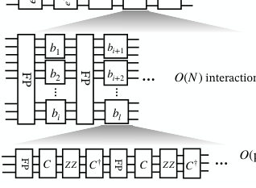
<figcaption class="paper-figure-caption"><b>Fig 1.</b> FIG. 1: Top: Hierarchical decomposition in 2D. Bottom: Structure of the simulation algorithm.</figcaption>
</figure>
<figure class="paper-figure-card">
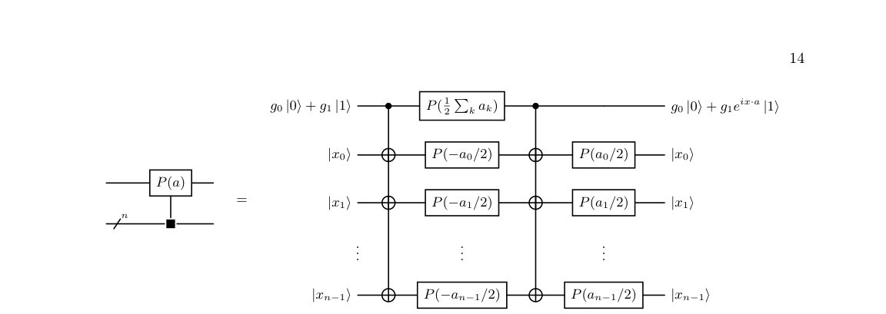
<figcaption class="paper-figure-caption"><b>Fig 2.</b> FIG. 2: An implementation of the multi-controlled phase gate in logarithmic depth. The fan-out gate can be implemented in logarithmic depth [59]. The single-qubit phase gate is defined as P(θ) = |0⟩⟨0| + eiθ |1⟩⟨1|.</figcaption>
</figure>
<figure class="paper-figure-card">
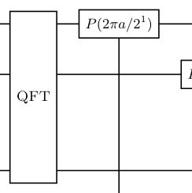
<figcaption class="paper-figure-caption"><b>Fig 3.</b> FIG. 3: Quantum circuit performing the addition |w⟩|x⟩→|w + x · a (mod 2na)⟩|x⟩based on Fourier-arithmetic.</figcaption>
</figure>

**Summary.** This paper presents a method to simulate electronic structure Hamiltonians defined by atomic orbitals on a quantum computer. By combining techniques like the Fast Multipole Method and specialized quantum arithmetic circuits, the authors achieve a sublinear simulation depth scaling. This result significantly improves the known resource estimates for simulating complex many-body quantum systems.

**Why it may be interesting.** This work provides a concrete, highly optimized quantum algorithm for simulating electronic structure, which is a cornerstone problem in condensed matter physics and quantum chemistry, directly addressing resource scaling.

Detailed structure

**Main problem.** The core problem is efficiently simulating the time evolution of electronic structure Hamiltonians defined on a basis of atomic orbitals on a quantum computer.

**Main result.** The authors demonstrate that the Trotter step for these Hamiltonians can be implemented in sublinear depth, achieving a total gate count scaling of $N^{5/3+o(1)}$, matching the best known scaling for any basis.

**Method.** The approach combines rigorous analysis of orbital localization, a hierarchical Hamiltonian decomposition inspired by the Fast Multipole Method (FMM), and the use of shallow quantum Fourier arithmetic circuits for efficient circuit depth.

**Model / system.** The system models electrons in molecules or materials, using an atomic orbital basis $\{\phi_p\}_{p=1}^N$. The Hamiltonian $H$ is derived from these orbitals and is analyzed in the thermodynamic limit.

**Key observables.** Simulation depth and total gate count required to achieve a target precision $\epsilon$ for the time evolution $e^{-iHt}$.

**Important parameters / regimes.** System size $N$ (number of orbitals), simulation time $t$, and accuracy $\epsilon$. The analysis relies on decay parameters $\zeta, eta, \delta$ characterizing the orbital basis.

**Assumptions / limitations.** The work assumes the existence of sufficiently localized orthonormal orbital bases and focuses on the thermodynamic limit ($\delta>0$, $L$ constant) to avoid continuum limit issues.

**Figures summary.** Figures illustrate the quantum circuits for modular addition and multi-controlled phase gates, detailing the logarithmic depth implementation of arithmetic operations.

**Paper structure.** The paper builds from establishing the necessary decay properties of the overlap matrix (using matrix function analysis) to implementing the time evolution via Trotterization. Key steps include Hamiltonian decomposition (FMM), proving the decay of inverse operators ($S^{-1/2}$), and finally constructing the low-depth quantum circuit for the Trotter step.

Abstract

Discretizing electronic degrees of freedom into atomic orbitals is the default choice to accurately model electrons in molecules in a compact and flexible way. We consider the task of simulating such electronic structure models on a quantum computer for $N$ orbitals, keeping the number of orbitals per atom constant. Atomic orbitals give rise to Hamiltonians with potentially up to $\mathcal{O}(N^4)$ terms and little structure, which made it challenging to match the complexity of methods based on plane waves and real-space grids. In this work, we show that a Trotter step for atomic orbitals can be implemented in depth $\mathcal{O}(\mathrm{polylog}(N))$ without ancillas by combining a rigorous treatment of orbital localization, a hierarchical Hamiltonian decomposition based on the Fast Multipole Method, and shallow quantum Fourier arithmetic circuits. By bounding the Trotter error, we obtain sublinear simulation depth, and our total gate count $N^{5/3 + o(1)}$ matches the best scaling known for any basis.

[↑ back to top](#top)

### [Superintegrability of a resonant ghostly tri-Hamiltonian model: polynomial first integrals and transcendental completion](http://arxiv.org/abs/2610.01901v1)

**Authors:** Andreas Fring, Ian Marquette  
**Type:** theory · **Category:** other · **PDF:** <https://arxiv.org/pdf/2610.01901v1>  
**Analysis basis:** full PDF text, analyzed in chunks

↔ Scroll figures horizontally

<figure class="paper-figure-card">
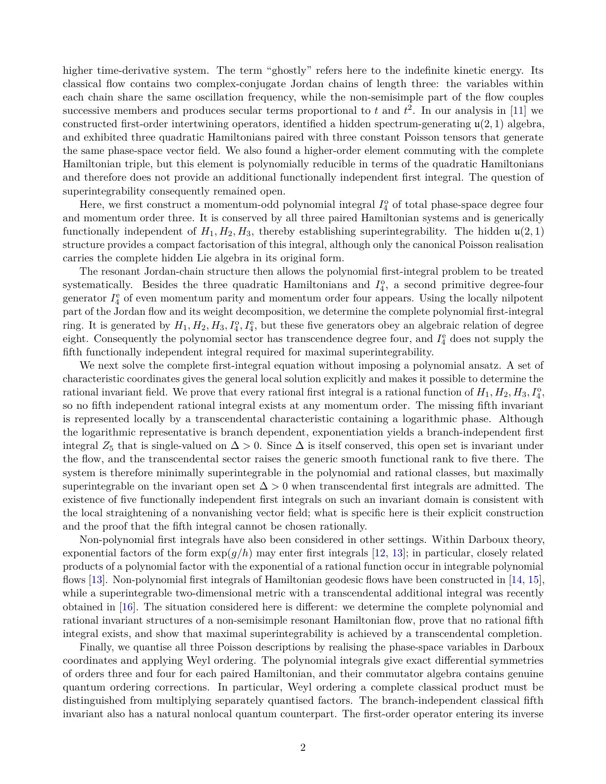
<figcaption class="paper-figure-caption"><b>Fig 1.</b> Low-resolution page preview, page 2</figcaption>
</figure>
<figure class="paper-figure-card">
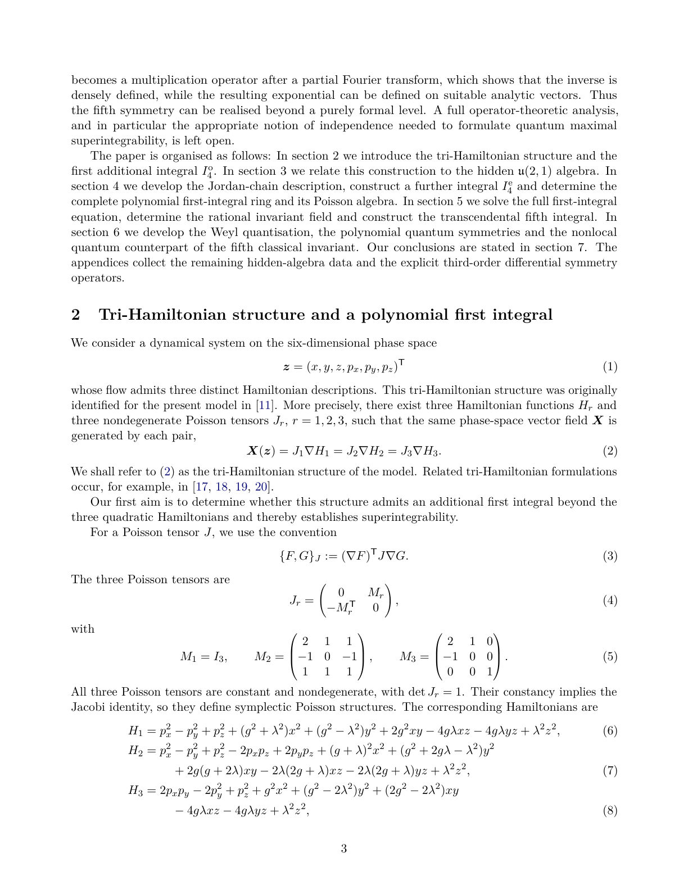
<figcaption class="paper-figure-caption"><b>Fig 2.</b> Low-resolution page preview, page 3</figcaption>
</figure>
<figure class="paper-figure-card">
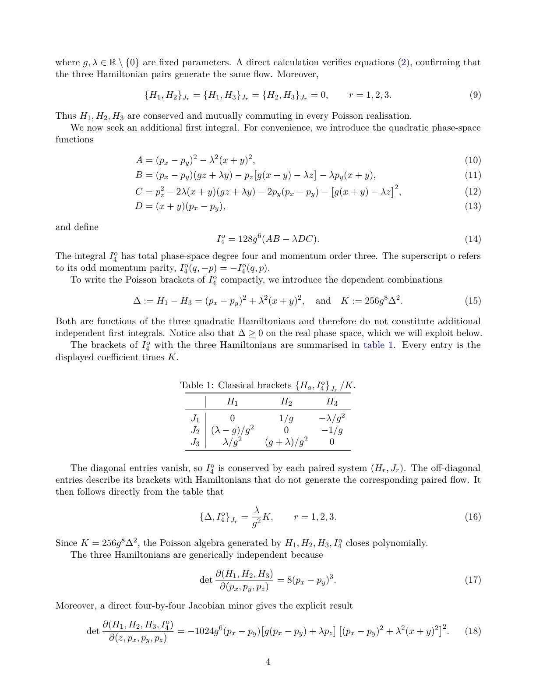
<figcaption class="paper-figure-caption"><b>Fig 3.</b> Low-resolution page preview, page 4</figcaption>
</figure>
<figure class="paper-figure-card">
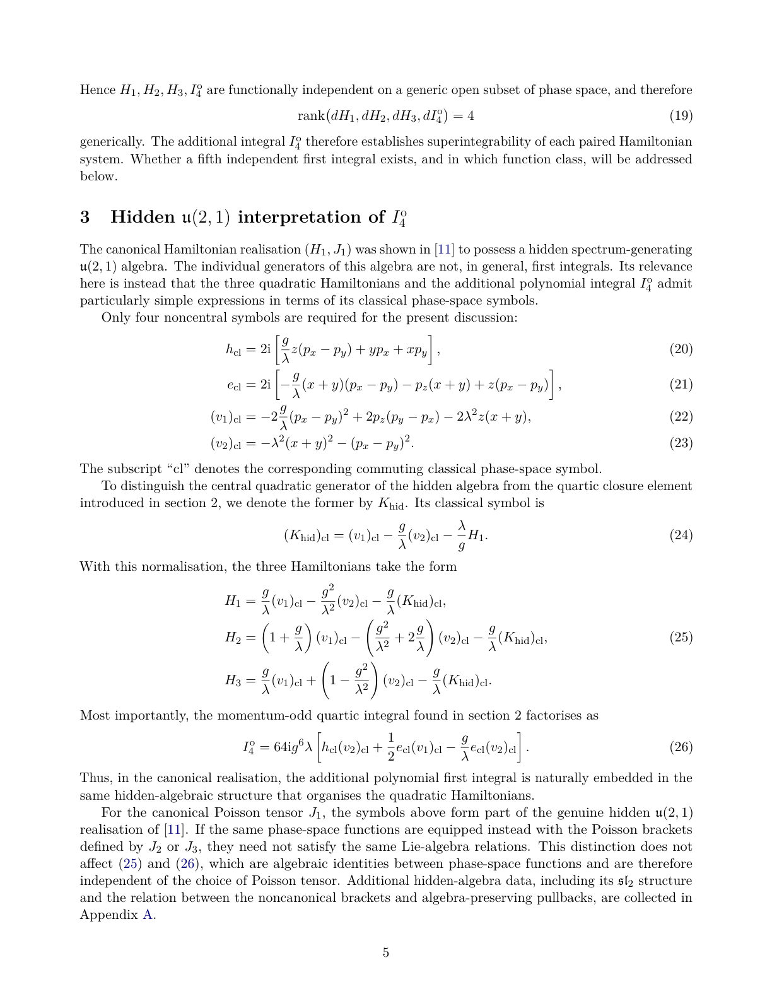
<figcaption class="paper-figure-caption"><b>Fig 4.</b> Low-resolution page preview, page 5</figcaption>
</figure>
<figure class="paper-figure-card">
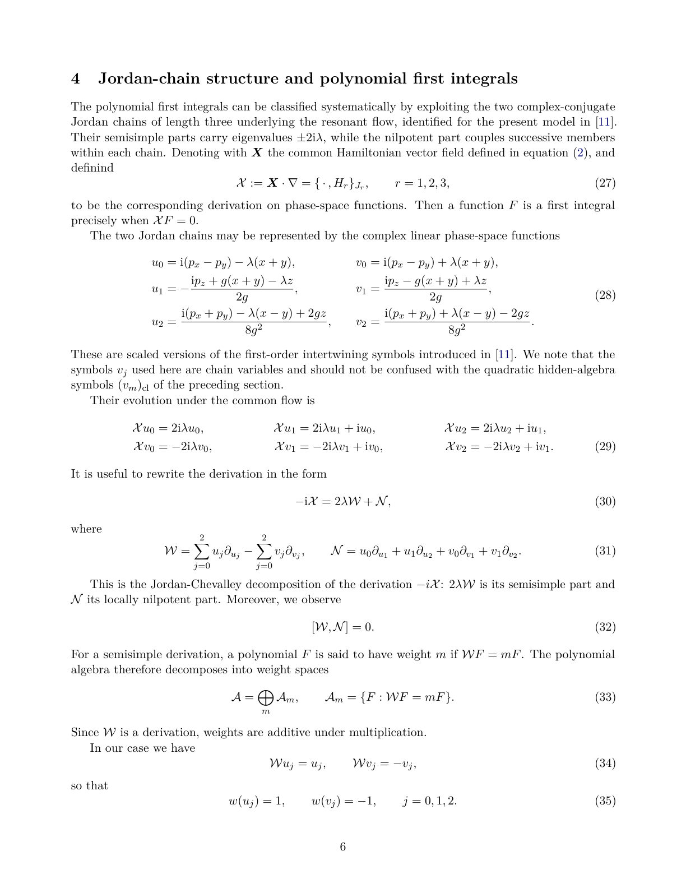
<figcaption class="paper-figure-caption"><b>Fig 5.</b> Low-resolution page preview, page 6</figcaption>
</figure>

**Summary.** This paper investigates the superintegrability of a complex, resonant three-dimensional Hamiltonian system possessing a tri-Hamiltonian structure. The authors prove that while the system has a finite number of polynomial and rational integrals, it achieves maximal superintegrability when considering transcendental invariants. This work provides a detailed mathematical characterization of integrability in such exotic physical models.

**Why it may be interesting.** The rigorous mathematical framework for establishing maximal superintegrability, especially the transition from polynomial to transcendental integrals, provides a powerful theoretical tool applicable to complex Hamiltonian systems in physics.

Detailed structure

**Main problem.** The study focuses on determining the classical and quantum superintegrability of a specific, resonant three-dimensional Hamiltonian system.

**Main result.** The system is found to be minimally superintegrable in the polynomial and rational classes, but achieves maximal superintegrability when transcendental first integrals are admitted.

**Method.** The authors employed techniques from classical mechanics, including finding polynomial first integrals via Poisson bracket analysis, and quantum mechanics using Weyl quantization.

**Model / system.** The model is a resonant ghostly tri-Hamiltonian system, characterized by three mutually commuting quadratic Hamiltonians ($H_1, H_2, H_3$) and an indefinite kinetic energy structure.

**Key observables.** Polynomial first integrals ($I_4^{
m o}, I_4^{
m e}$), the functional rank of the invariant field (4 for rational, 5 for transcendental), and higher-order differential symmetries.

**Important parameters / regimes.** The system depends on fixed parameters $g$ and $\lambda$, and the analysis is restricted to an invariant open set $\Delta > 0$.

**Assumptions / limitations.** The analysis assumes the existence of a hidden $u(2, 1)$ algebra structure underlying the Poisson relations, and the quantum completion relies on the existence of a nonlocal quantum counterpart for the transcendental invariant.

**Figures summary.** No specific figure summaries were extracted, but the notes detail the construction of integrals using specific polynomial forms (e.g., $I_{o4}$).

**Paper structure.** The paper systematically establishes the conservation laws by finding polynomial integrals ($I_{o4}, I_{e4}$), determines the transcendence degree of the rational invariant field, and then extends the analysis to transcendental invariants to prove maximal superintegrability, concluding with the quantum realization of these symmetries.

Abstract

We study classical and quantum superintegrability of a resonant three-dimensional Hamiltonian with indefinite kinetic energy and three Poisson descriptions of the same flow. Besides three commuting quadratic Hamiltonians, the polynomial first-integral ring contains two primitive degree-four generators, $I_4^{\rm o}$ and $I_4^{\rm e}$, of odd and even momentum parity. A single octic relation leaves the polynomial invariant ring with transcendence degree four. Solving the complete first-integral equation shows that every rational first integral is a rational function of $H_1,H_2,H_3,I_4^{\rm o}$, so that the rational invariant field likewise has generic functional rank four. A branch-free transcendental invariant raises the generic smooth functional rank to five on the invariant open set $Δ>0$. The system is therefore minimally superintegrable in the polynomial and rational classes and maximally superintegrable on this invariant domain when transcendental integrals are admitted. Weyl quantisation yields exact higher-order differential symmetries in all three Poisson realisations. The branch-free fifth classical invariant also admits a densely defined nonlocal quantum counterpart, providing a concrete quantum realisation of the transcendental completion.

[↑ back to top](#top)

### [Symmetry considerations in chirality-induced spin selectivity](http://arxiv.org/abs/2610.01880v1)

**Authors:** Dmitry Budker, Angela Wittmann  
**Type:** theory · **Category:** other · **PDF:** <https://arxiv.org/pdf/2610.01880v1>  
**Analysis basis:** full PDF text, analyzed in chunks

↔ Scroll figures horizontally

<figure class="paper-figure-card">
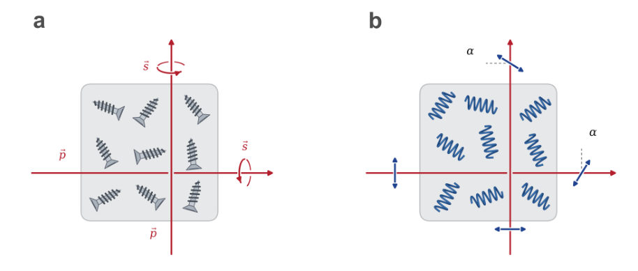
<figcaption class="paper-figure-caption"><b>Fig 1.</b> FIG. 1. Chirality as a pseudoscalar. (a) A medium of randomly oriented right-handed screws has</figcaption>
</figure>
<figure class="paper-figure-card">
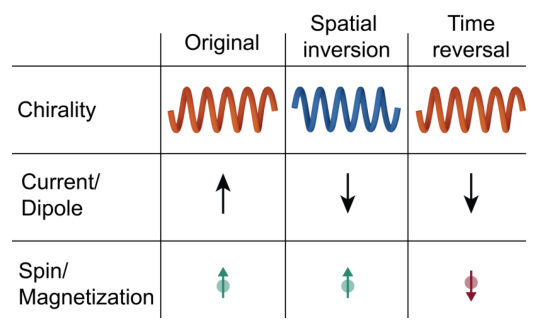
<figcaption class="paper-figure-caption"><b>Fig 2.</b> FIG. 2. Behavior of various quantities with respect to discrete transformations. With respect to</figcaption>
</figure>
<figure class="paper-figure-card">
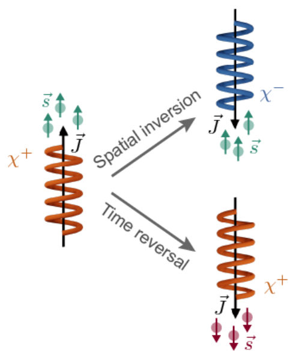
<figcaption class="paper-figure-caption"><b>Fig 3.</b> FIG. 3. Schematic illustration of the dynamic CISS effect: electron spins “pushed” through achiral</figcaption>
</figure>
<figure class="paper-figure-card">
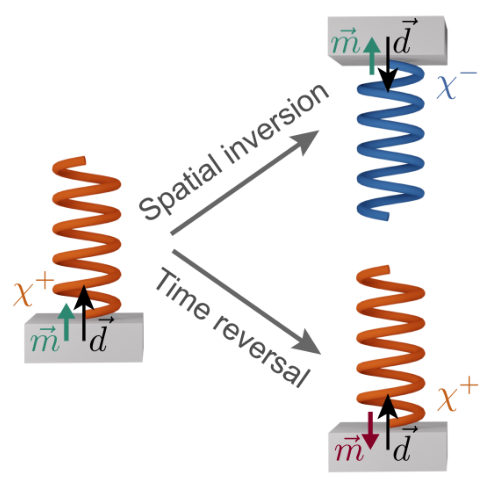
<figcaption class="paper-figure-caption"><b>Fig 4.</b> FIG. 4. Schematic illustration of the magneto-chiral effect: applying a chiral overlayer on top of a</figcaption>
</figure>

**Summary.** This theoretical work re-examines the CISS effect by imposing fundamental symmetry constraints, arguing that the effect's description must incorporate chirality ($\chi$) to remain consistent with symmetries like parity and time-reversal. By framing CISS within the language of symmetry invariants, the authors provide a powerful conceptual framework for interpreting related quantum transport experiments.

**Why it may be interesting.** While the core topic is condensed matter spintronics, the rigorous application of fundamental symmetry principles (P, T) to constrain a complex quantum transport phenomenon is highly relevant to theoretical physics.

Detailed structure

**Main problem.** The paper aims to establish a unified, fundamental understanding of the Chirality-Induced Spin Selectivity (CISS) effect by grounding its description in symmetry principles.

**Main result.** The authors demonstrate that the CISS effect, when properly formulated using rotational invariants, does not violate fundamental symmetries like parity (P) or time-reversal (T).

**Method.** The analysis relies on symmetry considerations (P, T) and the construction of rotational invariants to characterize the correlation between structural chirality ($\chi$) and spin/current polarization ($\vec{s} \cdot \vec{J}$).

**Model / system.** The study focuses on the CISS effect in both dynamic (current-driven) and quasi-static (overlayer interaction) scenarios involving chiral materials.

**Key observables.** Spin polarization ($\vec{s} \cdot \vec{J}$) and the chirality-dependent correlation $\chi\vec{s} \cdot \vec{J}$.

**Important parameters / regimes.** Structural chirality ($\chi$), Parity (P), and Time-Reversal (T) symmetry operations.

**Assumptions / limitations.** The primary assumption is that the underlying physics can be robustly described by symmetry constraints, although the invariants do not yield a quantitative prediction of the magnitude.

**Figures summary.** Figures illustrate chirality as a pseudoscalar (e.g., screws, optical rotation) and summarize how various physical quantities transform under discrete symmetries (P, T).

**Paper structure.** The paper progresses by first identifying the empirical correlation ($\vec{s} \cdot \vec{J}$), then showing its symmetry deficiencies, and finally proposing the symmetry-constrained invariant ($\chi\vec{s} \cdot \vec{J}$) to provide a robust conceptual foundation.

Abstract

The chirality-induced spin selectivity (CISS) effect, the coupling between structural chirality and electron spin polarization, has been experimentally observed across many diverse systems. However, despite extensive theoretical effort, a unified mechanistic understanding remains elusive. In this perspective, we demonstrate how some of the basic properties of the fascinating effects of CISS can be understood based on straightforward symmetry considerations commonly employed in fundamental particle physics. In particular, we show that CISS does not violate any fundamental symmetries including parity and time-reversal. By anchoring CISS within the universal language of symmetry, we offer a robust conceptual foundation for interpreting experiments and guiding future theoretical and experimental designs.

[↑ back to top](#top)

### [The Ericson Transition in Time-Reversal Invariant Systems: Symplectically Invariant Hamiltonians](http://arxiv.org/abs/2610.00624v1)

**Authors:** Simon Köhnes, Thomas Guhr  
**Type:** theory · **Category:** statistical mechanics · **PDF:** <https://arxiv.org/pdf/2610.00624v1>  
**Analysis basis:** full PDF text, analyzed in chunks

↔ Scroll figures horizontally

<figure class="paper-figure-card">
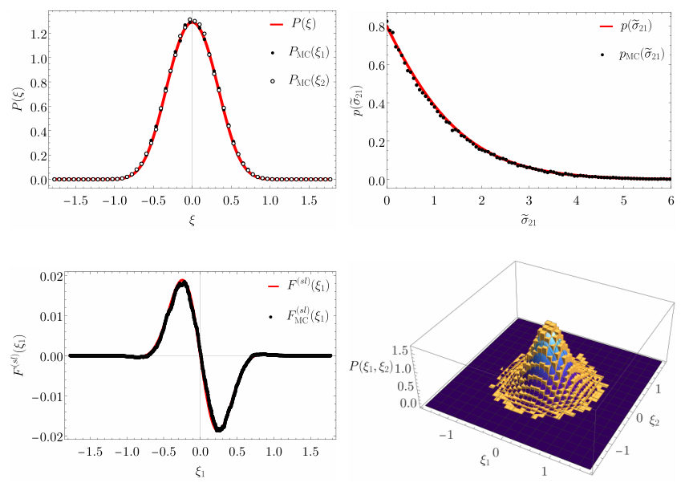
<figcaption class="paper-figure-caption"><b>Fig 1.</b> FIG. 1: Numerical simulation and the distributions of rescaled scattering matrix elements and cross sections (top) for Ξ = 1.57 and M = 30, T1 = T2 = 1. Numerical simulation and subleading order term F(sl)(ξ1) of the CDF and full joint distribution (bottom).</figcaption>
</figure>
<figure class="paper-figure-card">
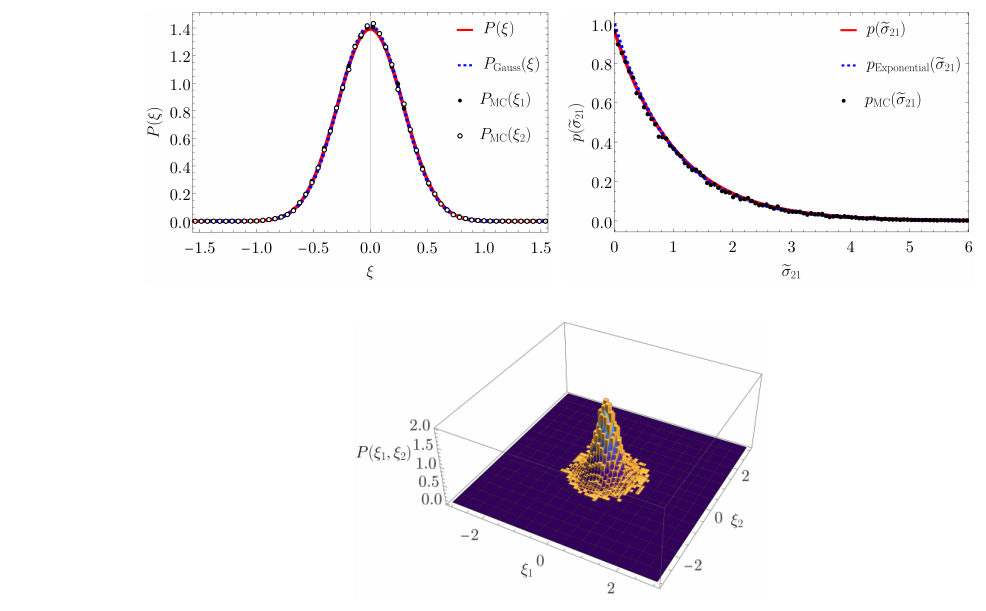
<figcaption class="paper-figure-caption"><b>Fig 2.</b> FIG. 2: Numerical simulation and the distributions of rescaled scattering matrix elements, cross sections and joint distribution for Ξ = 9.23 and M = 60, Tc = 1 for all channels.</figcaption>
</figure>

**Summary.** This theoretical work analyzes the statistical distribution of scattering matrix elements in the Ericson regime for time-reversal invariant systems. Using advanced asymptotic methods, the authors derive the leading Gaussian/exponential behavior and calculate the subleading corrections. This provides a quantitative understanding of how quantum transport properties behave near resonance overlap.

**Why it may be interesting.** The study of scattering resonances and the Ericson regime is crucial for understanding transport properties in disordered or complex quantum systems, linking random matrix theory to mesoscopic physics.

Detailed structure

**Main problem.** The paper investigates the asymptotic distribution of off-diagonal scattering matrix elements and cross-sections in the Ericson regime for time-reversal invariant quantum systems.

**Main result.** The leading-order behavior of these distributions is proven to be Gaussian or exponential, and the subleading-order correction is derived, showing the transition occurs rapidly.

**Method.** The analysis employs the universal Heidelberg approach, utilizing asymptotic expansions in powers of $1/\Xi$ and evaluating complex multi-dimensional integrals via Laplace transforms and Bessel function identities.

**Model / system.** The system models scattering phenomena described by a unitary scattering matrix $S$ for time-reversal invariant Hamiltonians drawn from Gaussian Ensembles, specifically focusing on the symplectic case ($eta=4$).

**Key observables.** Distributions $P_s(x_s)$ of real/imaginary parts of $S$-matrix elements and the cross-section $\sigma_{ab} = |S_{ab}|^2$.

**Important parameters / regimes.** The dimensionless parameter $\Xi = \Gamma/D$, which characterizes the Ericson transition regime.

**Assumptions / limitations.** The derivation relies on asymptotic expansions in $1/\Xi$ and involves approximations for small parameters ($p'$).

**Figures summary.** Figures compare numerical simulations of the distributions (for specific $\Xi$ values) against the derived analytical results, confirming agreement.

**Paper structure.** The paper builds mathematically by first establishing the characteristic function, deriving its asymptotic expansion, and then calculating the leading and subleading order corrections to the distribution functions using advanced integral techniques.

Abstract

We investigate the distributions of off-diagonal scattering matrix elements and cross-sections in the Ericson regime for time-reversal invariant systems with odd spin. Within the universal Heidelberg approach we prove that Gaussian and exponential behavior is found as the leading-order term of an asymptotic expansion of the aforementioned distributions. Furthermore, the subleading-order term is derived and compared with numerical simulations.

[↑ back to top](#top)

### [The hidden advantage of mask resampling: a theory of masked autoencoders](http://arxiv.org/abs/2610.01578v1)

**Authors:** Jorge Medina Moreira, Lorenzo Bardone, Lenka Zdeborová  
**Type:** theory · **Category:** disordered systems and neural networks · **PDF:** <https://arxiv.org/pdf/2610.01578v1>  
**Analysis basis:** full PDF text, analyzed in chunks

↔ Scroll figures horizontally

<figure class="paper-figure-card">
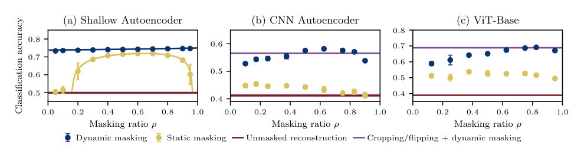
<figcaption class="paper-figure-caption"><b>Fig 1.</b> Figure 1: Isolating mask resampling reveals its contribution to representation learning. Downstream accuracy versus masking ratio ρ for dynamic masking (blue), static masking (yellow), and unmasked reconstruction (red). (a) Shallow autoencoder on spiked model (Sec. 2); curves are theory and markers are simulations. (b) CNN autoencoder on CIFAR-10 (test top-1). (c) ViT-Base on ImageNet-100 (validation top-5). In (b,c), blue and yellow curves use no stochastic cropping or flipping. The purple reference includes cropping and flipping with dynamic mask resampling at ρ = 0.625 (b) and ρ = 0.75 (c). At suitable masking ratios, resampling alone reaches comparable accuracy. Bars and shading show ±1...</figcaption>
</figure>
<figure class="paper-figure-card">
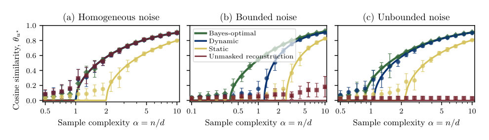
<figcaption class="paper-figure-caption"><b>Fig 2.</b> Figure 2: Masking recovers a feature that PCA misses. Cosine similarity versus sample complexity α = n/d, for (a) homogeneous noise, γ = 1; (b) bounded heterogeneous noise, γ = 1</figcaption>
</figure>
<figure class="paper-figure-card">

<figcaption class="paper-figure-caption"><b>Fig 3.</b> Figure 3: Replica predictions track learning across mask diversity. Cosine similarity (top) and downstream classification accuracy (bottom) versus sample complexity α = n/d under bounded heterogeneous noise (variance distribution of Fig. 2(b)), for linear, ReLU, ELU, and tanh activations. Colors distinguish K =1(static), 2, 4 and the dynamic masking limit. Solid curves are replica predictions and markers are finite-dimensional simulations. Green curves show the Bayes-optimal pretraining reference, evaluated with the same logistic probe for the lower row; green diamonds show AMP results (Apps. F.5 and H.14). Error bars show ±1 SD. See App. H for experimental details.</figcaption>
</figure>
<figure class="paper-figure-card">
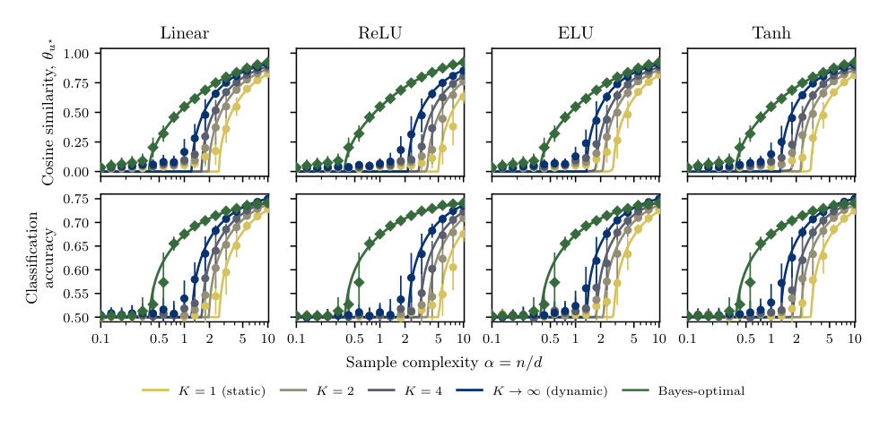
<figcaption class="paper-figure-caption"><b>Fig 4.</b> Fig. 3 compares these predictions with numerical training at finite dimension. Across the tested activations, increasing mask diversity K lowers the weak recovery threshold and improves alignment above the transition in the settings shown. The replica predictions capture not only these threshold shifts, but also the magnitude and α-dependence of the cosine similarity over the displayed range. The theory also captures training and test errors (Fig. 10). Thus the analysis quantifies how mask resampling changes the representation learned from a given number of examples.</figcaption>
</figure>
<figure class="paper-figure-card">
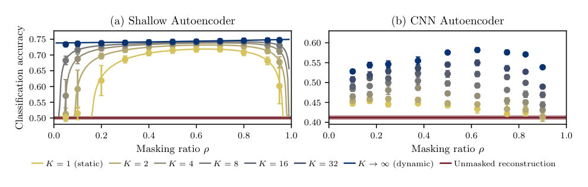
<figcaption class="paper-figure-caption"><b>Fig 5.</b> Figure 4: Finite mask diversity interpolates between static and dynamic training. Downstream accuracy versus masking ratio for (a) the solvable model, with theoretical curves and simulation markers, and (b) a CNN autoencoder on CIFAR-10. Increasing K improves accuracy in the settings shown, and the curves approach the dynamic masking reference. The number of training samples is held fixed. Bars and shading show ±1 SD across seeds; see App. H for details.</figcaption>
</figure>

**Summary.** This work provides a rigorous theoretical analysis demonstrating that masked prediction objectives are statistically superior to standard reconstruction methods for learning useful representations. It quantifies that increasing the diversity of masks used during training significantly improves feature recovery and reduces the required data sample size. The findings guide practitioners by separating the benefit of the prediction task itself from the benefit of mask diversity.

**Why it may be interesting.** While focused on ML, the rigorous theoretical framework for separating signal recovery from noise structure, especially in high dimensions, shares mathematical parallels with understanding order parameters and signal extraction in complex physical systems.

Detailed structure

**Main problem.** The paper theoretically investigates why masked prediction (MAE) learns superior representations compared to unmasked reconstruction, and quantifies the statistical advantage gained from using diverse masks (mask resampling).

**Main result.** Masked linear reconstruction can recover a shared latent feature at sample complexities where unmasked reconstruction (PCA) fails, and increasing mask diversity significantly lowers the required sample complexity.

**Method.** The authors develop a high-dimensional statistical theory, employing replica calculations to analyze feature recovery and downstream performance in a structured data model.

**Model / system.** The analysis uses a high-dimensional data model featuring a shared latent direction corrupted by heterogeneous, coordinate-wise nuisance noise, mimicking modern deep learning architectures like MAEs.

**Key observables.** Latent feature recovery (cosine similarity $	heta_{u^\star}$), sample complexity ($\alpha = n/d$), and downstream classification accuracy.

**Important parameters / regimes.** Masking ratio ($
ho$), mask diversity ($K$), and the ratio of samples to dimensions ($\alpha$).

**Assumptions / limitations.** The theory is developed for a specific high-dimensional model with a shared latent structure and heterogeneous noise, and comparisons are made in the proportional limit $n, d 	o \infty$.

**Figures summary.** Figures compare downstream accuracy vs. masking ratio, showing dynamic masking's advantage; other figures track MSE and accuracy across different masking protocols and training schedules.

**Paper structure.** The paper progresses from establishing the theoretical advantage of masked prediction over unmasked reconstruction, to quantifying the benefit of mask diversity, and finally to empirically testing these findings across various augmentation and training protocols.

Abstract

Why can masked prediction learn useful representations that unmasked reconstruction misses? We study this question in a high-dimensional model of a masked autoencoder (MAE) trained on data with shared latent structure and heterogeneous noise. We prove that masked linear reconstruction can recover the latent feature at linear sample complexity in regimes where unmasked linear reconstruction, equivalent to PCA, fails. The analysis also quantifies the statistical advantage of mask resampling, an established ingredient of masked pretraining. By introducing a fixed collection of $K$ masks per sample, we characterize its effect on feature recovery and downstream performance, identifying regimes where greater mask diversity lowers sample complexity. Guided by this prediction, we find that random cropping and flipping in standard image-training pipelines can obscure the advantage of mask resampling by renewing the prediction task even when the patch mask is fixed. Removing these transformations reveals a downstream advantage for dynamic over static masking in CNN autoencoders and vision transformers. A complementary BERT pilot finds benefits from greater mask diversity on downstream language tasks. Our results separate the benefit of the masked prediction objective from that of mask diversity, and show how a tractable theory can guide experiments that uncover advantages hidden by standard training practices.

[↑ back to top](#top)

### [The Robustness of QAC0](http://arxiv.org/abs/2610.02154v1)

**Authors:** Daniel Grier, Jackson Morris, Kewen Wu  
**Type:** theory · **Category:** quantum information and computing · **PDF:** <https://arxiv.org/pdf/2610.02154v1>  
**Analysis basis:** full PDF text, analyzed in chunks

↔ Scroll figures horizontally

<figure class="paper-figure-card">
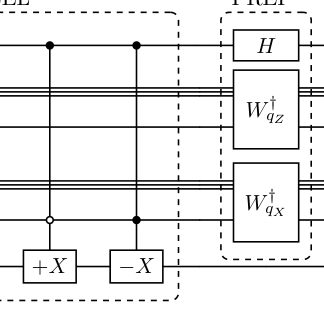
<figcaption class="paper-figure-caption"><b>Fig 1.</b> Figure 1: The LCU circuit L = (PREP† ⊗I) ◦SEL ◦(PREP ⊗I) for (1/2)Uθ.</figcaption>
</figure>
<figure class="paper-figure-card">
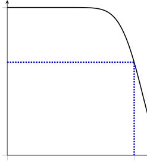
<figcaption class="paper-figure-caption"><b>Fig 2.</b> Figure 3: Hamming weight vs. acceptance probability of Ω(n2) parallel W-tests.</figcaption>
</figure>
<figure class="paper-figure-card">
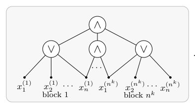
<figcaption class="paper-figure-caption"><b>Fig 3.</b> Figure 4: If C computes EX↑nk</figcaption>
</figure>

**Summary.** This paper rigorously analyzes the quantum complexity class QAC0, demonstrating its computational power by showing it can exactly simulate classical classes like $	ext{TC}^0$. Furthermore, it proves that QAC0 is robust to restrictions on its gate set, suggesting that its power is not dependent on having access to every possible single-qubit gate.

**Why it may be interesting.** The rigorous characterization of quantum complexity classes like QAC0 is fundamental to understanding the limits of quantum computation, which underpins the theoretical framework for quantum simulation in AMO physics.

Detailed structure

**Main problem.** The paper investigates the robustness of the quantum complexity class QAC0 concerning error tolerance and restrictions on the available single-qubit gates.

**Main result.** QAC0 can exactly simulate TC0 with polynomially many copies of the classical input, and it maintains quantum advantage even with zero error ($	ext{EQAC}^0 
ot\subset 	ext{AC}^0[p]$).

**Method.** The authors use novel applications of exact amplitude amplification to eliminate inherent errors in quantum tests and demonstrate gate synthesis by approximating arbitrary single-qubit gates with a restricted set.

**Model / system.** The model is quantum computation defined by QAC0 circuits, which utilize generalized Toffoli gates and arbitrary single-qubit gates, operating on quantum states.

**Key observables.** Computational power relative to classical classes ($	ext{AC}^0[p]$, $	ext{TC}^0$), error rates, and the ability to compute specific functions like the $	ext{EX}_{n/2}$ test and selectors.

**Important parameters / regimes.** Circuit depth ($d$), polynomial size ($s$), error tolerance ($\epsilon$), and the number of input copies ($m$).

**Assumptions / limitations.** The analysis relies on the ability to construct circuits with constant depth and polynomial size, and the use of coherent sampling for gate synthesis.

**Figures summary.** No specific figures are described, but the notes reference Theorems 1 through 4 summarizing the main results regarding simulation capabilities and gate set robustness.

**Paper structure.** The paper proceeds by first addressing error elimination in the W-test using exact amplitude amplification. It then analyzes the gate-set dependence, showing QAC0 is robust to restrictions on single-qubit gates. Finally, it establishes the computational power by showing simulations of $	ext{TC}^0$ and constructing complex primitives like selectors.

Abstract

In this work we study the robustness of $\mathsf{QAC}^0$ with respect to error tolerance and modifications to its gate-set. First, we investigate whether the non-zero error typically allowed for $\mathsf{QAC}^0$ circuits computing Boolean functions is truly necessary. We show that the error inherent in the parallel $W$-test of \cite{grier_morris_wu} can be eliminated entirely via a novel application of exact amplitude amplification in the many-copies context. Consequently, we find that $\mathsf{QAC}^0$ can \textit{exactly} simulate $\mathsf{TC}^0$ with polynomially many copies of the classical input and that for every fixed prime $p$ exact $\mathsf{QAC}^0$, $\mathsf{EQAC}^0$, can compute total Boolean functions outside of $\mathsf{AC}^0[p]$.   Second, we ask to what extent the computational power of $\mathsf{QAC}^0$ follows from the fact that arbitrary single-qubit gates may be used at any point in the circuit. We find that $\mathsf{QAC}^0$ is in fact robust to restrictions on which single-qubit gates are permitted: every $\mathsf{QAC}^0$ circuit can be approximately implemented by a $\mathsf{QAC}^0$ circuit consisting of just generalized Toffoli, $S$, and Hadamard gates. Moreover, this approximating circuit can be constructed efficiently from a classical description of the original circuit.

[↑ back to top](#top)

### [Time-space lower bounds for breaking quantum cryptography](http://arxiv.org/abs/2610.02101v1)

**Authors:** Fangqi Dong, Alex Lombardi  
**Type:** theory · **Category:** quantum information and computing · **PDF:** <https://arxiv.org/pdf/2610.02101v1>  
**Analysis basis:** full PDF text, analyzed in chunks

↔ Scroll figures horizontally

<figure class="paper-figure-card">
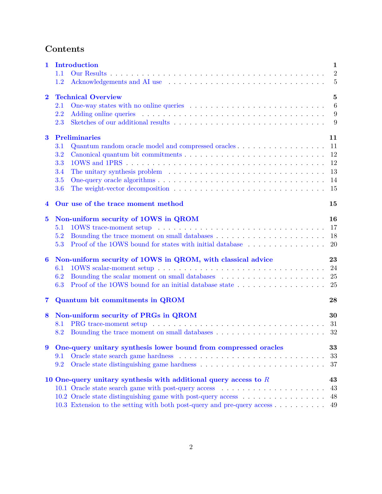
<figcaption class="paper-figure-caption"><b>Fig 1.</b> Low-resolution page preview, page 2</figcaption>
</figure>
<figure class="paper-figure-card">
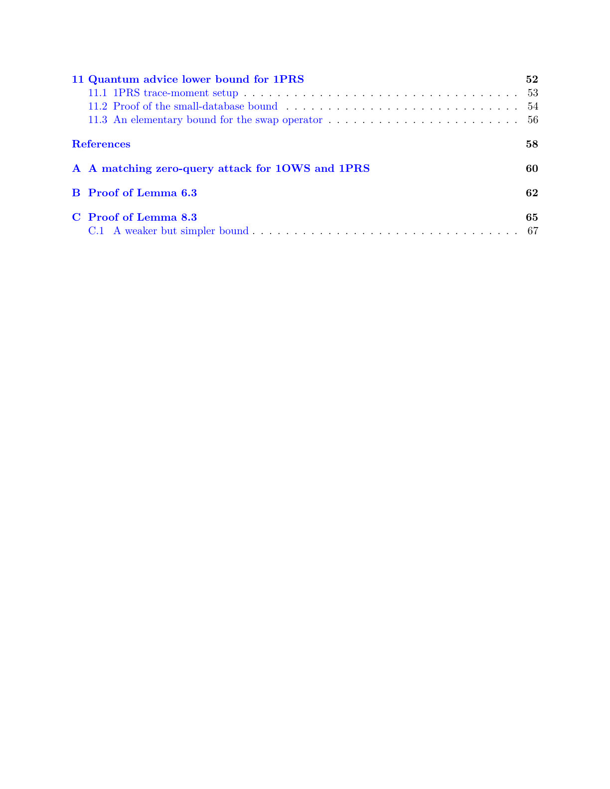
<figcaption class="paper-figure-caption"><b>Fig 2.</b> Low-resolution page preview, page 3</figcaption>
</figure>
<figure class="paper-figure-card">
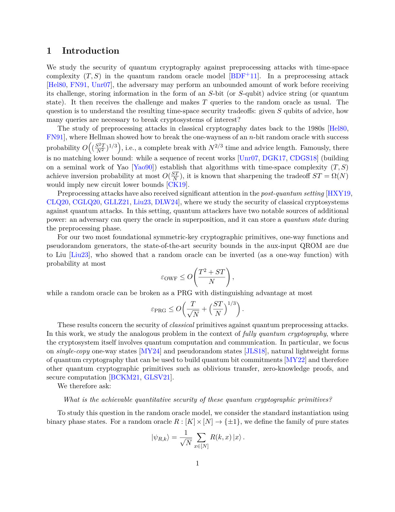
<figcaption class="paper-figure-caption"><b>Fig 3.</b> Low-resolution page preview, page 4</figcaption>
</figure>
<figure class="paper-figure-card">
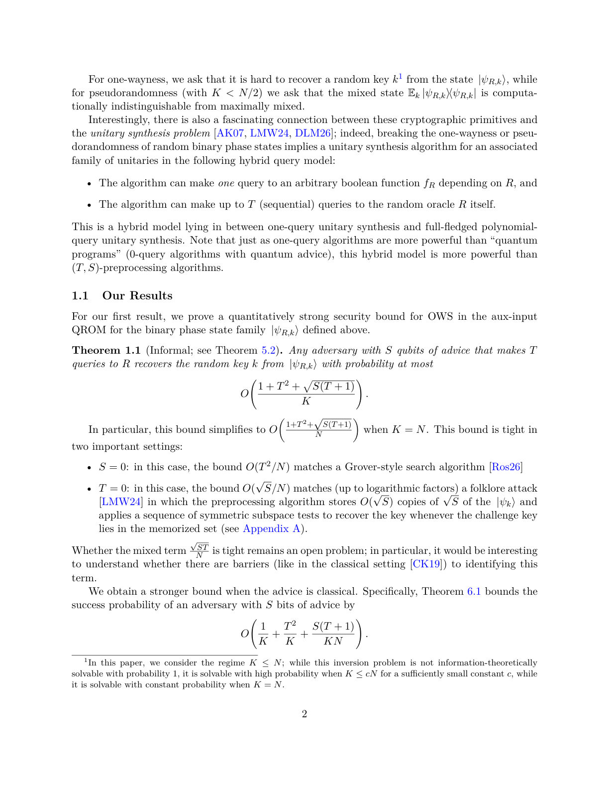
<figcaption class="paper-figure-caption"><b>Fig 4.</b> Low-resolution page preview, page 5</figcaption>
</figure>
<figure class="paper-figure-card">
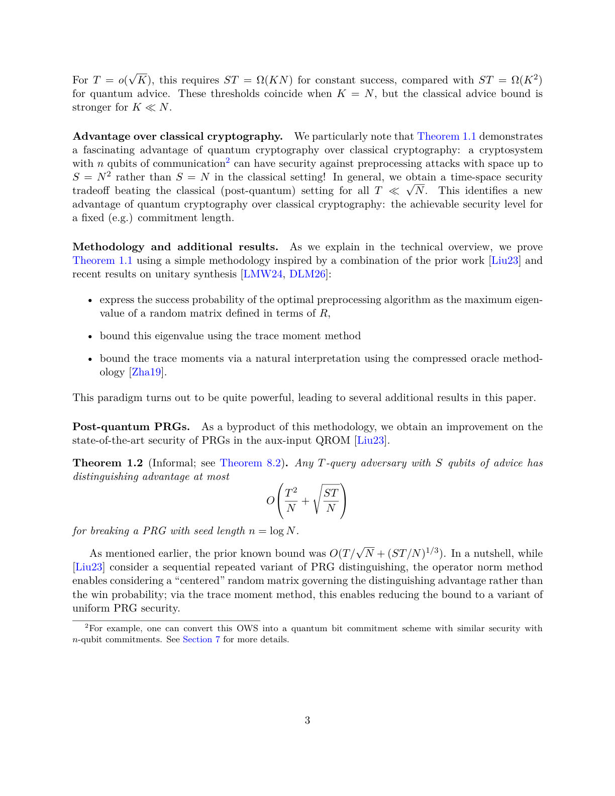
<figcaption class="paper-figure-caption"><b>Fig 5.</b> Low-resolution page preview, page 6</figcaption>
</figure>

**Summary.** This paper provides rigorous, near-optimal time-space lower bounds for breaking quantum cryptography in the random oracle model. Using the trace-moment method, the authors prove that quantum security offers a significant advantage over classical security bounds. This work advances the understanding of quantum cryptographic security by quantifying the trade-off between computational time and available quantum memory.

**Why it may be interesting.** While focused on cryptography, the techniques—bounding operator norms via trace moments and analyzing quantum query complexity—are fundamental tools in quantum information theory that have analogues in analyzing quantum channels or resource constraints in quantum computation.

Detailed structure

**Main problem.** The paper aims to derive near-optimal time-space lower bounds for breaking quantum cryptographic primitives, such as one-way functions and pseudorandom generators, within the random oracle model.

**Main result.** They establish a security bound for key recovery probability of $O(T^2 + \sqrt{ST/N})$, demonstrating a quantum advantage over classical bounds by allowing security against preprocessing attacks with much larger space complexity ($S=N^2$ vs $S=N$).

**Method.** The core methodology involves expressing the optimal attack as the operator norm of a random matrix and bounding this norm in expectation using the trace-moment method, often simplified via the compressed oracle framework.

**Model / system.** The analysis is conducted in the quantum random oracle model (QROM), focusing on quantum cryptographic primitives like random binary phase states $|\psi_k
angle$ used to instantiate one-way states (1OWS) and pseudorandom generators (PRGs).

**Key observables.** Key recovery probability, distinguishing advantage ($\epsilon$), and the relationship between time complexity ($T$) and space complexity ($S$).

**Important parameters / regimes.** The security parameter $N=2^n$, the number of queries $T$, and the size of the advice $S$.

**Assumptions / limitations.** The analysis relies heavily on the trace-moment method and the compressed oracle framework; some derived bounds are noted as potentially not tight.

**Figures summary.** Not specified in the notes, but the paper utilizes tables summarizing known time-space-probability tradeoffs for various cryptographic primitives.

**Paper structure.** The paper develops results by first establishing general bounds using the trace moment method, then applying this to specific primitives like PRGs and 1OWS, and finally presenting specialized results for zero-query attacks and extensions to hybrid query models.

Abstract

We prove near-optimal time-space lower bounds for breaking quantum cryptography in the random oracle model. Specifically, we show that a $T$-query adversary with $S$ qubits of non-uniform advice can recover a random key $k$ from the $n$-qubit binary phase state $|ψ_k\rangle \propto \sum_{x} R(k,x) |x\rangle$ with probability at most $O(\frac{T^2 + \sqrt{ST}}{N})$ for $N=2^n$. In contrast, the best known bound for post-quantum one-way functions is $O(\frac{T^2 + ST}{N})$, with a trivial attack at $S = N$. This demonstrates a new advantage of quantum cryptography over classical cryptography: $n$ qubits of communication suffice for security against preprocessing attacks with space up to $N^2$ rather than $N$. Our methodology is simple: express the optimal preprocessing attack as the operator norm of a random matrix, and bound this value in expectation over the random oracle via the trace-moment method. These trace moments have a natural interpretation using compressed oracles [Zhandry, Crypto 2019], which we then analyze. This can be viewed as a simplification and generalization of the approach of Liu [Eurocrypt 2023] for proving time-space tradeoffs for breaking post-quantum cryptography. We also prove the following results: (1) We tighten Liu's analysis of post-quantum PRGs in QROM, achieving a distinguishing advantage bound of $O(\frac{T^2}N + \sqrt{\frac{ST}N})$. (2) For unitary synthesis, we extend the one-query lower bound of Lombardi-Ma-Wright [STOC 2024] to hold against adversaries that can make one arbitrary function query along with polynomially many (adaptive) queries to the random oracle, either before or after the function query. This also interprets the original LMW24 result in terms of compressed oracles. (3) Finally, we prove a tight $O(\frac{\sqrt{S}}N)$ bound for the pseudorandomness of random binary phase states against space $S$ distinguishers.

[↑ back to top](#top)

### [Unflattening by Flattening -- How Input Distributions Shape Output Variance in Angle-Encoded Circuits](http://arxiv.org/abs/2610.01446v1)

**Authors:** Melvin Strobl, Gabriel Mejia, Eileen Kuehn, Achim Streit  
**Type:** theory · **Category:** quantum information and computing · **PDF:** <https://arxiv.org/pdf/2610.01446v1>  
**Analysis basis:** full PDF text, analyzed in chunks

↔ Scroll figures horizontally

<figure class="paper-figure-card">
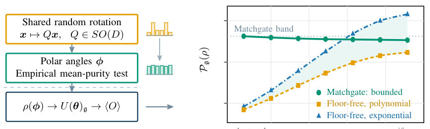
<figcaption class="paper-figure-caption"><b>Fig 1.</b> Fig. 1: Left: A shared random rotation and polar-angle extraction produce encoding angles. A classical acceptance test checks their empirical mean off-diagonal purity before the quantum circuit is run. Right: Schematic purity responses to the angle spread, without a numerical scale. The matchgate family (solid) stays in a narrow band while the floor-free examples (dashed and dash-dotted) approach zero at computational-basis inputs. Their output variances additionally depend on the simple-component dimensions and observable projections in Eq. 1.</figcaption>
</figure>
<figure class="paper-figure-card">
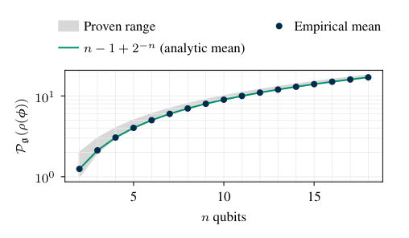
<figcaption class="paper-figure-caption"><b>Fig 2.</b> Fig. 2: Under the uniform prior, the empirical mean of Pg(ρ(ϕ)) matches n −1 + 2−n and stays within [n −1, n], for sizes up to n = 18 qubits.</figcaption>
</figure>
<figure class="paper-figure-card">
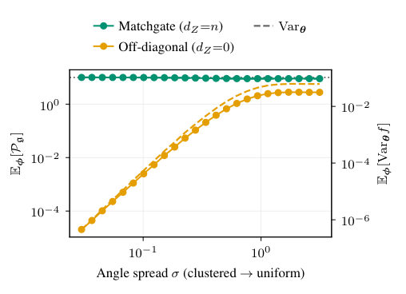
<figcaption class="paper-figure-caption"><b>Fig 3.</b> Fig. 3: Purity and output-variance response to angle clustering at n = 10 under the Ry encoding. As the angle spread σ shrinks toward the computational basis, the mean matchgate purity stays in [n −1, n], whereas the mean off-diagonal purity approaches zero. The right axis (dashed) traces the mean sample-wise output variance Eϕ[Varθ[fθ]] = 2Eϕ[Pg]/ dim g for the in- algebra observable XiXi+1 + YiYi+1 under the ensemble of Eq. 1. Accordingly, the matchgate variance changes little, while the off-diagonal variance approaches zero with its purity.</figcaption>
</figure>
<figure class="paper-figure-card">
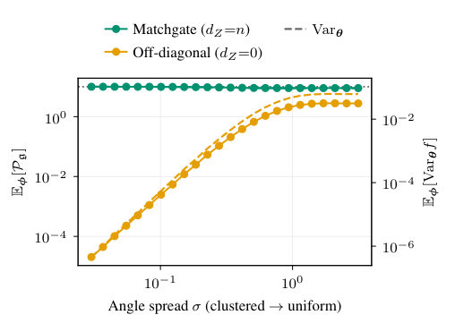
<figcaption class="paper-figure-caption"><b>Fig 4.</b> Fig. 3 contrasts the matchgate purity band with the collapse of the off-diagonal purity as angles approach the computational basis. c) Floor-Free Polynomial Regime: By contrast, the off- diagonal ansatz has polynomial dimension but no Z-diagonal string, so it satisfies dZ(god) = 0 under Ry encoding. Its Pauli basis contains XX and Y Y endpoints at odd separation and XY and Y X endpoints at even separation, joined by interior Z factors [29]. Since ⟨Yk⟩= 0 for the Ry product encoding, only the XX strings contribute, giving</figcaption>
</figure>
<figure class="paper-figure-card">
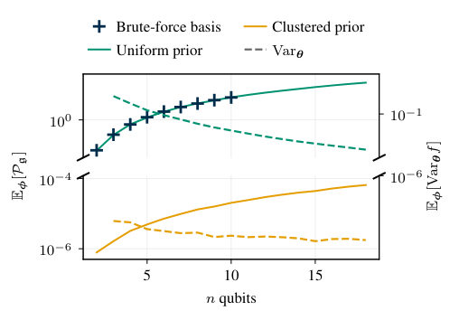
<figcaption class="paper-figure-caption"><b>Fig 5.</b> Fig. 4: Mean purity and sample-wise output variance for the off-diagonal algebra god ∼= so(n) ⊕so(n), which has dZ = 0. On the left axis, the closed form Eq. 3 agrees with brute-force values (markers) and gives linear growth under the uniform prior, whereas clustering near {0, π} suppresses the mean by about five orders of magnitude. The dashed curves on the right axis show the corresponding mean variance 2Eϕ[Pgod]/ dim god for n ≥3. At n = 2 the algebra is abelian, so its zero output variance is omitted from the logarithmic axis.</figcaption>
</figure>

**Summary.** This work investigates how the choice of input data distribution influences the output variance of parameterized quantum circuits, a key factor in training stability. By analyzing the overlap between the input state and the circuit's Lie algebra, the authors derive conditions under which the output variance remains polynomially small in the number of qubits. This provides a theoretical framework for mitigating barren plateau issues in quantum machine learning.

**Why it may be interesting.** The rigorous mathematical analysis connecting input statistics (purity) to the training landscape's gradient behavior (variance) provides deep theoretical insight into the limitations of variational quantum algorithms.

Detailed structure

**Main problem.** The paper addresses the challenge of 'Barren plateaus' in training parameterized quantum circuits (PQCs) by analyzing how the input data distribution affects the output variance.

**Main result.** The output variance can be shown to scale as $1/n$ for certain circuit ansätze (like matchgates) when averaged over inputs, provided the input distribution passes a computable purity threshold.

**Method.** The analysis uses algebraic tools, specifically relating output variance to the input's overlap with the circuit's dynamical Lie algebra (g-purity).

**Model / system.** The model involves angle-encoded product states $|\psi(\phi)
angle$ evolved by quantum circuits $U(	heta)$ on $n$ qubits. Comparisons are drawn between 'matchgate' and 'off-diagonal' circuit ansätze.

**Key observables.** Output variance ($	ext{Var}_	heta[f_	heta]$), algebraic input purity ($	ext{PHS}_g$), and the mean sample-wise output variance.

**Important parameters / regimes.** Number of qubits ($n$), circuit depth ($L$), and the nature of the input prior distribution (e.g., uniform vs. clustered).

**Assumptions / limitations.** The guarantee on variance holds only when averaged over inputs, and the analysis relies on the DLA being reductive.

**Figures summary.** Figures compare purity responses for matchgate vs. other examples, show the effect of shared random rotations on angle uniformity, and plot mean variance vs. re-uploading depth for different input priors.

**Paper structure.** The paper builds from establishing the variance formula based on g-purity, comparing the scaling behavior of different ansatzes (matchgate vs. off-diagonal), developing a classical preprocessing certificate based on input purity thresholds, and finally analyzing the effect of input clustering and circuit depth.

Abstract

Barren plateaus hinder training of parameterized quantum circuits by making loss gradients exponentially small in the number of qubits. For angle-encoded product states, we show how the input distribution affects output variation through algebraic input purity, i.e. the input's overlap with the circuit's dynamical Lie algebra. With the specified readouts and Haar or exact group 2-design sampling, matchgate circuits on $n$ qubits retain output variance of order $1/n$ for every pure product input. The off-diagonal family instead has zero output on computational-basis inputs at any depth and for every parameter choice. Independent uniform angles yield mean variance of the same order as matchgates. A count of diagonal Pauli strings identifies these zero-output endpoints. For any fixed dataset of nonzero inputs with at least $2n$ coordinates, we construct a classical preprocessing certificate. A shared random rotation is accepted only when the dataset's mean purity passes a computable threshold. This certifies mean output variance of order $1/n$ for the off-diagonal family before circuit execution, with a constant expected number of trials. Binary and ternary weighted encodings also recover the independent-angle mean purity from one uniform scalar input. Numerical experiments examine training behavior and extensions to larger algebras. The guarantee concerns output variance averaged over inputs, while successful learning also depends on the task and information preserved by the encoding.

[↑ back to top](#top)

### [Unifying and Extending Strong Simulation of Quantum Circuits](http://arxiv.org/abs/2610.00547v1)

**Authors:** Floris Geerts, Rihan Hai, Matthias Lanzinger, Reinhard Pichler, Emanuel Sallinger, Daniel Unterberger  
**Type:** theory · **Category:** quantum information and computing · **PDF:** <https://arxiv.org/pdf/2610.00547v1>  
**Analysis basis:** full PDF text, analyzed in chunks

↔ Scroll figures horizontally

<figure class="paper-figure-card">
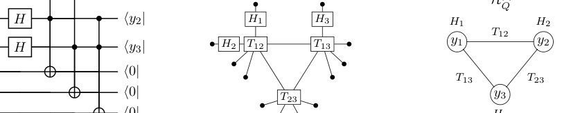
<figcaption class="paper-figure-caption"><b>Fig 1.</b> Figure 2: In GC, Tij denotes the Toffoli with control bits i, j. Black leaves denote input/output boundary nodes. In Hb Q, vertices are the free variables; circles are unary Hadamard scopes, and lines are binary scopes of the Tij factors; recall that constants are irrelevant.</figcaption>
</figure>
<figure class="paper-figure-card">
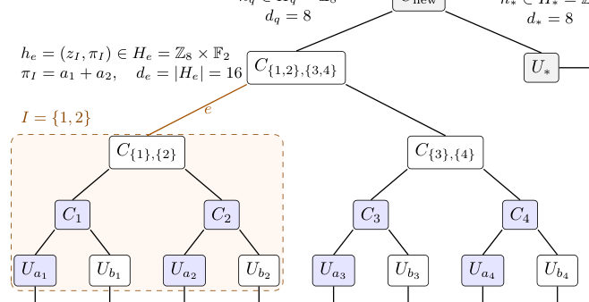
<figcaption class="paper-figure-caption"><b>Fig 2.</b> Figure 4: Exact coefficient TTN for the child bag A ∪B, with k = 4 (Example 6.6). Each proper pair subtree carries a phase residue and one parity bit. Summing the ai legs yields the separator message without increasing the maximum bond dimension 16.</figcaption>
</figure>
<figure class="paper-figure-card">
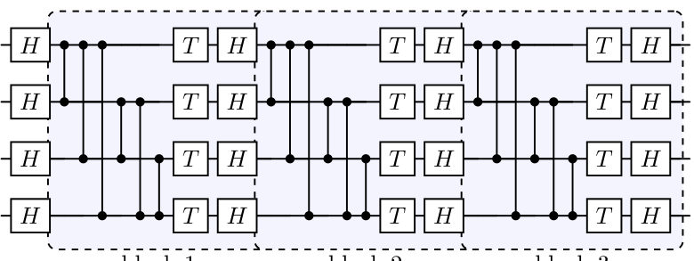
<figcaption class="paper-figure-caption"><b>Fig 3.</b> Figure 5: The circuit C′(4, 3) of (37). Each dashed box is one occurrence of B4 = Z4; T4; H4.</figcaption>
</figure>

**Summary.** This paper unifies the simulation complexity of quantum circuits by reformulating them as Functional Aggregate Queries (FAQs). By using a generalized evaluation scheme, it shows that classical simulation bounds like treewidth and rank-width are all instances of this single framework. This provides a systematic route to identifying new, potentially weaker, but more general criteria for quantum circuit tractability.

**Why it may be interesting.** This work provides a powerful, unified algorithmic foundation for analyzing the computational cost of quantum simulation, which is crucial for understanding the limits of classical simulation for quantum hardware.

Detailed structure

**Main problem.** The paper aims to establish a unifying mathematical language for determining the exact classical simulation complexity of general quantum circuits.

**Main result.** It introduces Functional Aggregate Queries (FAQs) as a unifying framework, demonstrating that various simulation tractability measures (like treewidth and rank-width) can be recovered within this single algorithmic structure.

**Method.** The core method involves modeling quantum circuits as sum-product queries (FAQs) and evaluating them using an 'InsideOut' evaluation scheme over various commutative semirings.

**Model / system.** The system under study is general quantum circuits, which are mathematically mapped onto the structure of Functional Aggregate Queries (FAQs) defined over a hypergraph.

**Key observables.** The primary observable is the exact probability amplitude $\langle b|U_C|a
angle$ computed by the evaluation scheme.

**Important parameters / regimes.** Key complexity parameters include treewidth, rank-width, and the newly introduced 'tensor layout symmetry width' ($	ext{tlsw}$).

**Assumptions / limitations.** The analysis relies on the existence and properties of the 'InsideOut' evaluation algorithm and the ability to map quantum evolution to FAQ evaluation.

**Figures summary.** Not specified in detail, but the notes mention figures illustrating circuit structures like $C'(4, 3)$ and the graph $G_n$ used for analyzing graph parameters.

**Paper structure.** The paper progresses by first defining FAQs as the unifying language, then showing how known simulation bounds (treewidth, rank-width) are recovered by choosing appropriate semirings, and finally introducing the novel $	ext{tlsw}$ parameter.

Abstract

We establish functional aggregate queries (FAQs) as a unifying language for exact classical simulation of quantum circuits. A circuit becomes a sum-product query: factors encode gates, internal wire variables are aggregated, and free boundary variables index transition amplitudes. The central insight is that distinct sources of simulation tractability can be exploited within the same InsideOut evaluation scheme. The query specifies what is computed; the evaluation plan, semiring, and representation of intermediate factors determine the cost.   This view unifies structural and algebraic simulation guarantees. With explicit factor representations, FAQ evaluation recovers the treewidth bound for tensor-network contraction and yields finer sparsity-sensitive bounds via fractional covers. Over a formal phase semiring, compressed intermediate factors recover rank-width-based simulation for compatible quadratic phase representations. For Clifford circuits, affine-quadratic factors are closed under multiplication and marginalization and remain polynomial in size, yielding polynomial-time exact amplitude computation without any bounded-width assumption.   Beyond these recoveries, the framework yields a new tractability criterion: tensor layout symmetry width. This parameter combines local cut-rank with separator symmetry through exact tree-tensor representations. We give a constructive evaluation bound and exhibit a circuit family with bounded tensor layout symmetry width but unbounded phase-graph rank-width and circuit line-graph treewidth. These results establish representation-aware FAQ evaluation as a common algorithmic foundation for classical simulation and a systematic route to new tractable regimes.

[↑ back to top](#top)

### [Universality Sacrifices Reliability in Classical-Quantum Channel Coding](http://arxiv.org/abs/2610.01941v1)

**Authors:** Kaito Watanabe, Masahito Hayashi, Takaya Matsuura, Hao-Chung Cheng  
**Type:** theory · **Category:** quantum information and computing · **PDF:** <https://arxiv.org/pdf/2610.01941v1>  
**Analysis basis:** full PDF text, analyzed in chunks

↔ Scroll figures horizontally

<figure class="paper-figure-card">
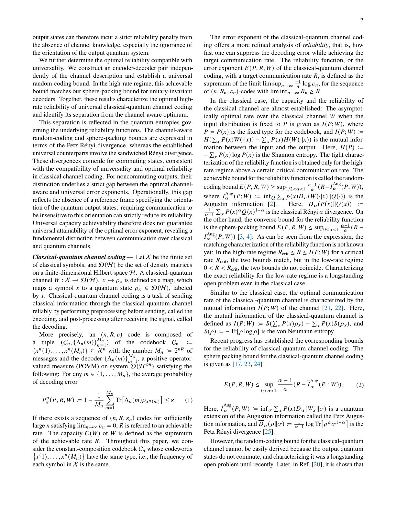
<figcaption class="paper-figure-caption"><b>Fig 1.</b> Low-resolution page preview, page 2</figcaption>
</figure>
<figure class="paper-figure-card">
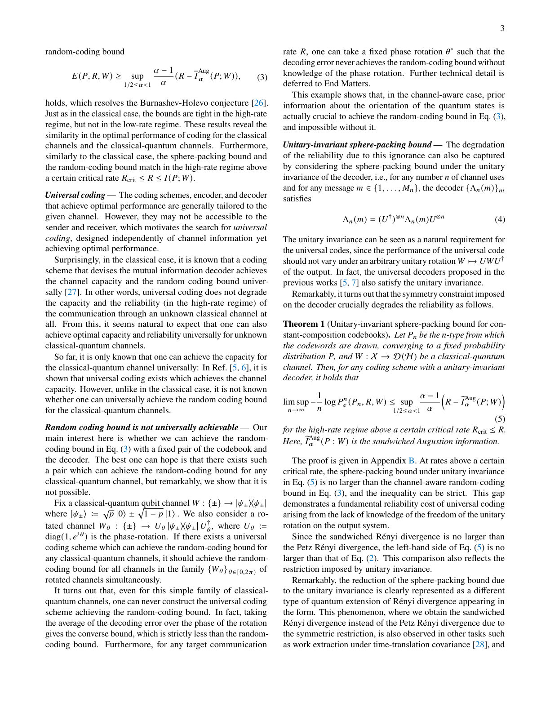
<figcaption class="paper-figure-caption"><b>Fig 2.</b> Low-resolution page preview, page 3</figcaption>
</figure>
<figure class="paper-figure-card">
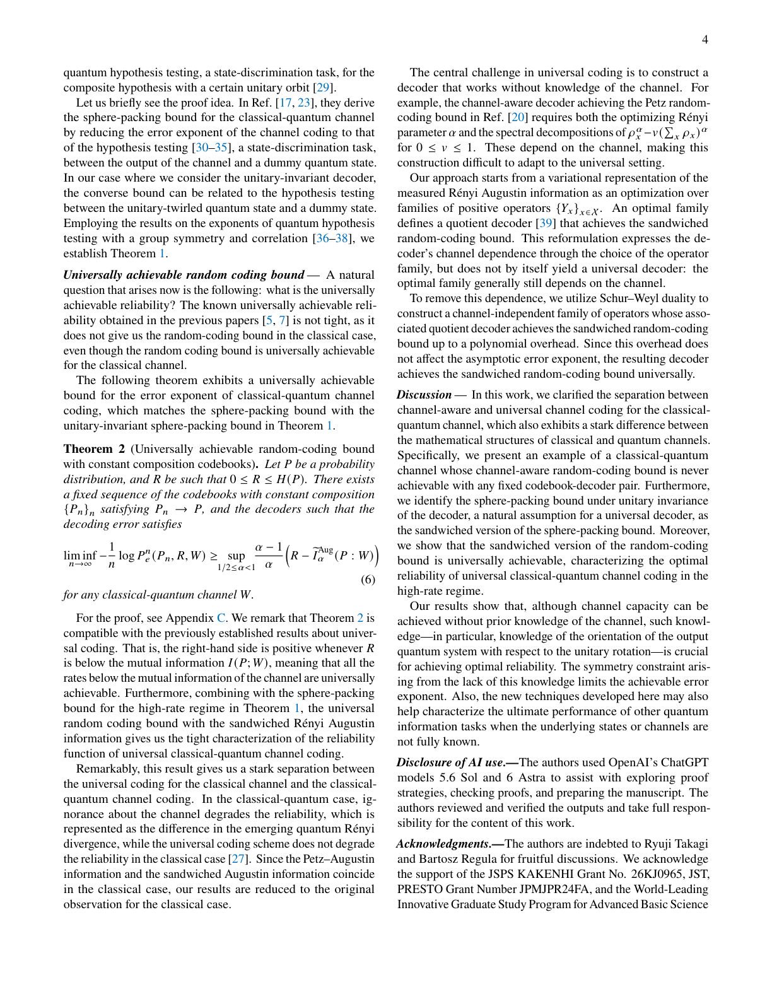
<figcaption class="paper-figure-caption"><b>Fig 3.</b> Low-resolution page preview, page 4</figcaption>
</figure>
<figure class="paper-figure-card">
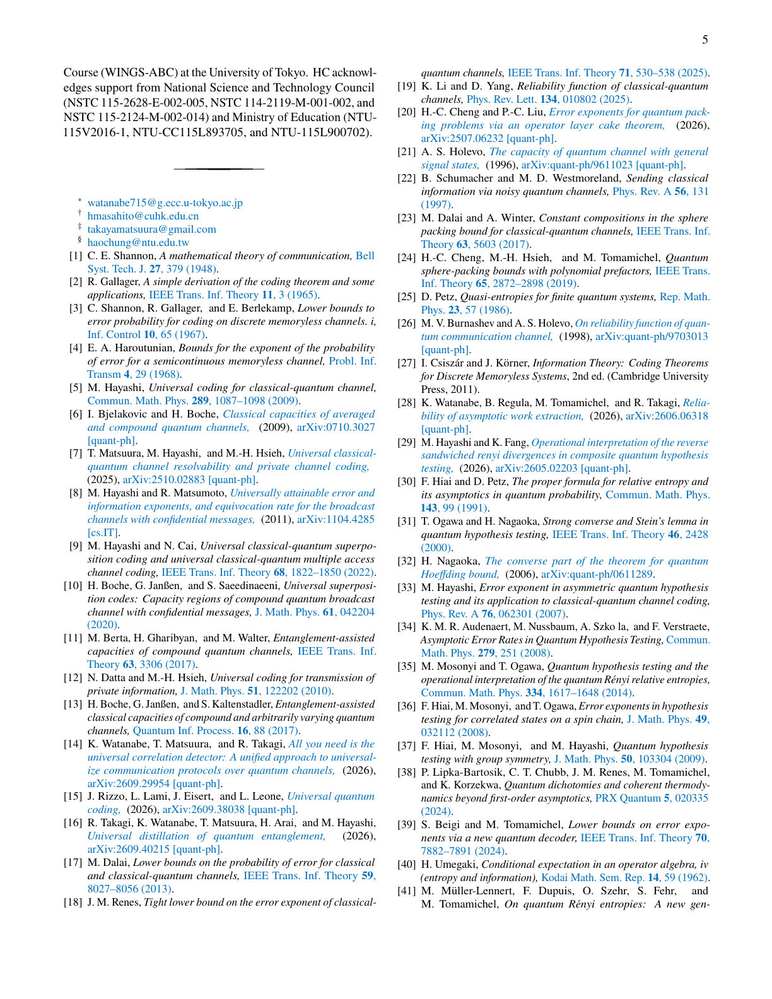
<figcaption class="paper-figure-caption"><b>Fig 4.</b> Low-resolution page preview, page 5</figcaption>
</figure>
<figure class="paper-figure-card">
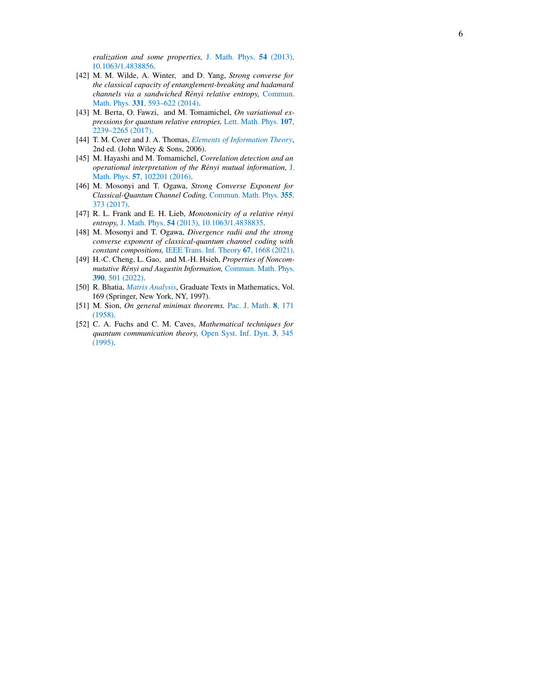
<figcaption class="paper-figure-caption"><b>Fig 5.</b> Low-resolution page preview, page 6</figcaption>
</figure>

**Summary.** This work analyzes the fundamental trade-off between optimal performance when a quantum channel is perfectly known versus when a fixed, universal coding scheme must be used. The authors prove that this trade-off results in a strict loss of reliability for classical-quantum channels due to the non-commutativity of output states. This gap is mathematically characterized by the difference between Petz and sandwiched Rényi divergences.

**Why it may be interesting.** The fundamental distinction between channel-aware and universal coding bounds provides a concrete measure of the information cost associated with making coding schemes robust against unknown channel parameters, which is a core topic in quantum communication theory.

Detailed structure

**Main problem.** The paper compares the achievable optimal reliability in classical-quantum channel coding when the channel is known (channel-aware) versus when it must be coded using a fixed scheme independent of the specific channel realization (universal coding).

**Main result.** For classical-quantum channels, universal coding sacrifices optimal reliability compared to the channel-aware optimum, a gap explained by the non-commutativity of output quantum states.

**Method.** The authors derive and compare error exponents using Petz and sandwiched Rényi divergences, establishing converse bounds and constructing achievable bounds for both scenarios.

**Model / system.** The system models a classical-quantum channel $W: X 	o D(H)$, mapping classical symbols to quantum states. The analysis focuses on the error probability and its asymptotic exponent (reliability) in the high-rate regime.

**Key observables.** Error exponent (reliability), Petz Rényi divergence, sandwiched Rényi divergence, and the achievable rate $R$.

**Important parameters / regimes.** The regularization parameter $\alpha \in [1/2, 1)$ and the rate $R$.

**Assumptions / limitations.** The analysis assumes constant-composition codebooks and relies on the natural assumption of unitary invariance for universal decoders.

**Paper structure.** The paper progresses by first establishing bounds for classical channels, then tackling the classical-quantum case. It derives the channel-aware bound using Petz divergences, contrasts this with the universal bound derived under unitary invariance, and finally characterizes the optimal universal reliability using sandwiched Rényi divergences.

Abstract

Universal channel coding enables communication without a complete description of the channel. For classical channels, universal codes can attain both capacity and the optimal high-rate reliability. We show that this compatibility fails for classical-quantum channels in general; that is, the optimal reliability in the channel-aware scenario is not always achievable with universal coding due to the ignorance of the unitary rotation of the output system. We exhibit a family of classical-quantum channels for which one cannot achieve the channel-aware optimal reliability by a fixed coding scheme. We further derive a converse bound on the reliability for unitary-invariant decoders, a natural assumption for the universal coding scheme, that can be strictly smaller than the optimal channel-aware error exponent. Conversely, we construct a channel-independent encoder-decoder pair and establish a universally achievable bound on the reliability that matches this converse bound in the high-rate regime, thereby characterizing the optimal universal reliability. Specifically, the channel-aware and universal exponents are governed by the Petz and sandwiched Rényi divergences, respectively. These divergences coincide for commuting outputs but differ for noncommuting ones, explaining why universality preserves optimal reliability classically but can reduce it quantumly. Our results showcase the fundamental reliability cost of performing the classical-quantum channel coding task universally.

[↑ back to top](#top)

## Secondary cond-mat archives

*Papers from cond-mat.mtrl-sci, mes-hall, other, soft, supr-con. These archives are de-prioritized — they appear at the end regardless of relevance score.*

### Relevant in secondary archives (19)

### [Strongly coupled ultracompressed self-cavity plasmon polaritons at millikelvin temperatures](http://arxiv.org/abs/2610.00473v1)

**Authors:** Luojia Zhang, Andrew T. Pierce, Xuepeng Wang, Simon Reinhardt, Kenji Watanabe, Takashi Taniguchi, Kin Fai Mak, Jie Shan, Debanjan Chowdhury, Valla Fatemi  
**Type:** experiment · **Category:** other · **PDF:** <https://arxiv.org/pdf/2610.00473v1>  
**Analysis basis:** full PDF text, analyzed in chunks
**Topic relevance:** 🔥 `quantum optics experiment` **4/5** · `analog quantum simulation` **3/5** · `driven-dissipative phase transition` **3/5** · `Tavis-Cummings & cavity-many-emitter` **2/5** · `quantum measurements` **2/5** · `QC/QI experiment` **1/5** · `correlated / nonlocal dissipation` **1/5** · `interference shaping light` **1/5** · `methods for driven-dissipative` **1/5** · `non-equilibrium universality` **1/5**

↔ Scroll figures horizontally

<figure class="paper-figure-card">
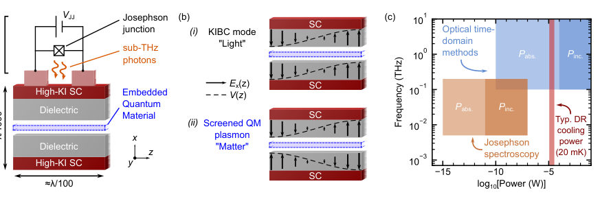
<figcaption class="paper-figure-caption"><b>Fig 1.</b> Fig. 1. Kinetic inductance broadside cavities (KIBCs) probed by Josephson spectroscopy. (a) Schematic side view of a KIBC coupled to a Josephson spectrometer. The KIBC is defined by high-KI superconductors separated by dielectric layers. Low-dimensional quantum materials can be sandwiched between the two layers. The cavity is connected to a Josephson junction that acts as an emitter and detector of sub-THz photons, allowing for measurement of the high-frequency electrodynamic response of the KIBC. (b) Structure of the plasmonic modes of a trilayer structure. Solid arrows label the orientation of the transverse electric field Ex. Dashed lines indicate the profile of the interlayer voltages....</figcaption>
</figure>
<figure class="paper-figure-card">
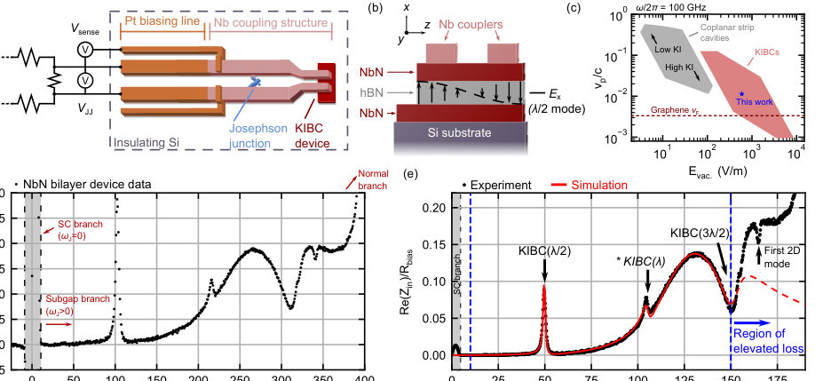
<figcaption class="paper-figure-caption"><b>Fig 2.</b> Fig. 2. Josephson spectroscopy of a superconductor/superconductor KIBC. (a) Simplified schematic of the Joseph- son spectroscopy circuit. An insulating Si substrate hosts an aluminum Josephson junction connected to Nb electrodes, which are in turn connected to a lossy Pt transmission line. The Pt transmission line is wire bonded to an on-chip voltage divider on a second, separate Si substrate (see Supplementary Information). The voltages Vsense and VJJ are probed by measuring across the Pt transmission line electrodes, and the DC junction current is given by Vsense/Rbias. (b) Side view of the NbN/hBN bilayer KIBC. (c) Normalized velocity vp/c versus vacuum electric field Evac. for KIBCs...</figcaption>
</figure>
<figure class="paper-figure-card">
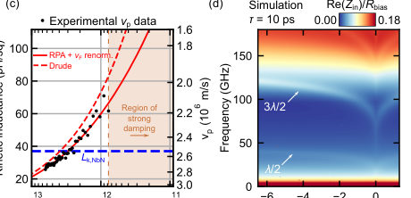
<figcaption class="paper-figure-caption"><b>Fig 3.</b> Fig. 3. Long-lived hybrid graphene/high-KI super- conductor plasmons. (a) Schematic of NbN-graphene bi- layer plasmonic cavity structure. (b) Experimental Joseph- son impedance spectra of an NbN/graphene bilayer device measured as a function of density. (c) RPA-corrected KI of graphene as a function of density compared with that of NbN. The corresponding mode velocity is shown on the right axis. The red curves are obtained from simulations using the effec- tive circuit model. The black markers correspond to velocities extracted from the data in panel b (see text). Lk,NbN = 37 pH/sq and εhBN = 3.5ε0 are found to give good agreement be- tween the RPA simulation and the experimental data...</figcaption>
</figure>
<figure class="paper-figure-card">
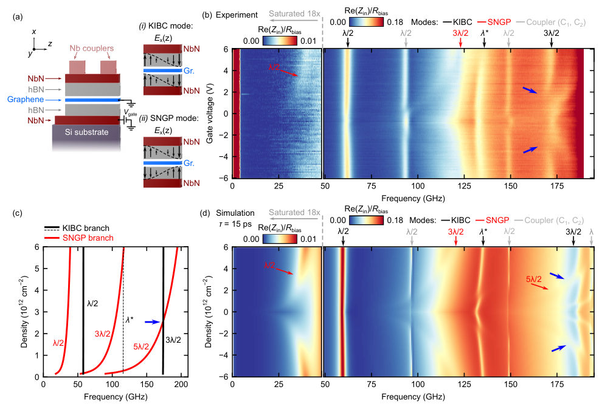
<figcaption class="paper-figure-caption"><b>Fig 4.</b> Fig. 4. Hybrid graphene-superconducting confined plasmons and strong cavity coupling. (a) Schematic of NbN- graphene-NbN plasmonic trilayer structure. (b) Experimental Josephson impedance spectra of an NbN/graphene/NbN trilayer device measured as a function of density. Frequencies below 50 GHz are saturated to highlight the weak SNGP(λ/2) mode. The blue arrows indicate avoided crossings (corresponding to the level crossing highlighted in Fig. 4c). (c) Dispersion of the KIBC(λ/2) and SNGP(λ/2) modes, along with several harmonics. The mode frequencies are calculated for an infinite NbN/graphene/NbN trilayer system with no Nb couplers. λ/2 is set to 34 µm. The starred KIBC(λ) mode is formally...</figcaption>
</figure>

**Summary.** The research introduces a novel, superconducting-based spectrometer to probe plasmonic cavities formed in Van der Waals heterostructures at millikelvin temperatures. By coupling a superconducting cavity mode with a graphene-derived plasmon mode, the authors successfully demonstrated strong light-matter coupling. This platform enables simultaneous spectroscopy and transport measurements crucial for advancing cavity quantum matter research.

**Why it may be interesting.** This work directly bridges cavity Quantum Electrodynamics (QED) principles with solid-state 2D materials physics, providing a highly controllable, low-loss platform for studying light-matter interaction in engineered quantum systems at cryogenic temperatures.

Detailed structure

**Main problem.** The challenge is realizing and spectroscopically probing cavity-modified phases of matter in Van der Waals heterostructures at extremely low temperatures and sub-THz frequencies.

**Main result.** The authors successfully demonstrated a platform using superconducting circuits and graphene to observe underdamped cavity plasmon polaritons and evidence of strong light-matter coupling via avoided crossings.

**Method.** The measurement relies on a novel, millikelvin-compatible sub-THz spectrometer based on Josephson junctions, which acts as both the emitter and detector of the sub-THz radiation.

**Model / system.** The physical system involves Van der Waals heterostructures, specifically superconducting layers forming a Kinetic Inductance Broadside Cavity (KIBC) coupled to an integrated graphene layer, forming a tunable hybrid plasmonic system.

**Key observables.** Underdamped cavity plasmon polariton frequencies, avoided crossings between cavity and matter modes, and the DC junction current ($I_{DC}$) measured via Josephson spectroscopy.

**Important parameters / regimes.** Millikelvin temperatures ($T \approx 10 	ext{ mK}$), sub-THz frequencies (down to 0.04 THz), and electromagnetic volume compression of order $10^7$.

**Assumptions / limitations.** The analysis relies on an effective circuit model and Random Phase Approximation (RPA) calculations for graphene's response.

**Figures summary.** Figures illustrate the schematic of the Josephson spectrometer coupled to the KIBC, the measured $I-V$ characteristics, and the impedance spectra showing mode resonances for both KIBC and graphene-coupled structures.

**Paper structure.** The paper introduces the need for the platform, details the superconducting circuit and graphene integration, presents the measurement methodology using Josephson spectroscopy, and finally reports the observation of coupled plasmon modes.

Abstract

Van der Waals heterostructures exhibit self-cavity resonances from sub-terahertz to terahertz frequencies and thus offer an attractive route toward realizing cavity-modified phases of matter. Spectroscopy of such systems calls for high frequency resolution at millikelvin temperatures, which is extremely challenging with existing methods. Here we demonstrate a new platform for realizing and probing such systems. Superconducting layers define self-cavity structures with electromagnetic volume compression of order $10^7$. With an integrated graphene layer, we observe underdamped cavity plasmon polaritons at frequencies as low as 0.04 THz and which exhibit avoided crossings with cavity modes. To measure such spectra, we deploy a millikelvin-compatible sub-THz spectrometer based on a superconducting circuit. This work paves the way for simultaneous spectroscopy and transport measurements of cavity-matter hybrid systems at millikelvin temperatures.

[↑ back to top](#top)

### [Gate Dispersive Charge Detection in Ge/SiGe Quantum Dots](http://arxiv.org/abs/2610.01100v1)

**Authors:** M. R. Tanvir, E. Sajadi, M. Veldhorst, G. Scappucci, J. Salfi  
**Type:** experiment · **Category:** quantum information and computing · **PDF:** <https://arxiv.org/pdf/2610.01100v1>  
**Analysis basis:** full PDF text, analyzed in chunks
**Topic relevance:** 🔥 `QC/QI experiment` **4/5** · `quantum measurements` **3/5**

↔ Scroll figures horizontally

<figure class="paper-figure-card">
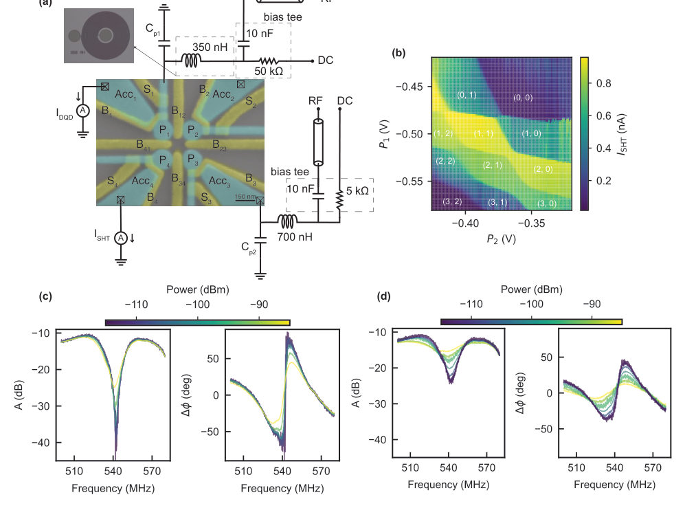
<figcaption class="paper-figure-caption"><b>Fig 1.</b> FIG. 1. Measurement circuit and characterization of the RF matching circuits. (a) Schematic of the measurement setup together with a false-colored SEM image of the Ge/SiGe QD device with lateral gates in a lower layer (yellow) and upper layer (teal) separated by gate dielectric. Superconducting NbTiN spiral inductors located on separate Si chips are connected via wirebonds to the QD chip: a 350 nH inductor is connected to plunger gate P1 for gate-dispersive readout (optical micrograph shown in the inset) and a 700 nH inductor is connected to an ohmic contact to implement a conventional RF single-hole transistor (RF-SHT). (b) SHT current as a function of plungers P1 and P2 with gate voltage...</figcaption>
</figure>
<figure class="paper-figure-card">
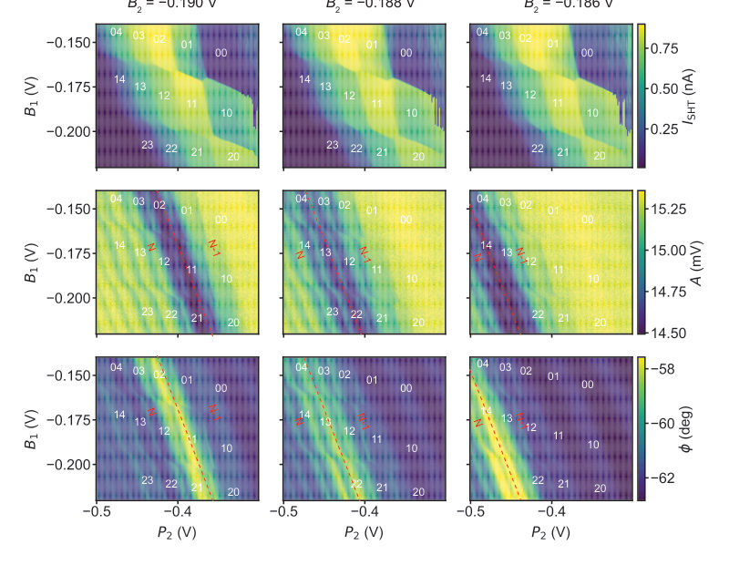
<figcaption class="paper-figure-caption"><b>Fig 2.</b> FIG. 2. Evolution of the DQD stability diagram as the SHB is tuned by gate B2. Each column corresponds to a different value of B2, while the rows show the SHT current (top), the amplitude (middle), and phase (bottom) of the gate-attached resonator. The SHT is compensated to stay tuned onto the shoulder of a Coulomb oscillation. Charge states are labelled with the notation nm, n holes in QD1 and m holes in QD2, using the SHT stability diagram. The SHB charge transition (diagonal red stripe) is shifted across the stability diagram by varying B2 and allow detection of the DQD charge. QD2 loading transitions are readily resolved in the RF-GD response, and interdot and loading transitions are...</figcaption>
</figure>
<figure class="paper-figure-card">
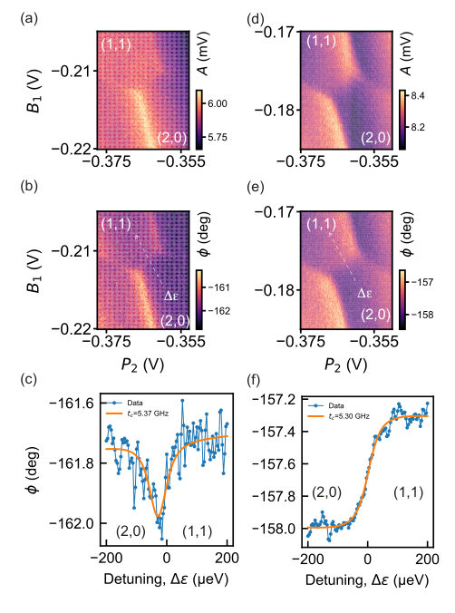
<figcaption class="paper-figure-caption"><b>Fig 3.</b> FIG. 3. Comparison of the RF-GD and RF-GD-SHB re- sponse. (a),(b) RF-GD amplitude and phase response near the (1, 1)–(2, 0) interdot charge transition with SHB off- resonance. (c) Phase response (average of 3 traces) along the detuning axis in (b), with the characteristic quantum- capacitance dip used to extract the interdot tunnel cou- pling. (d),(e) Same as (a),(b) but with the RF-GD-SHB on-resonance, and operating as a charge sensor (f) Phase re- sponse (average of 3 traces) along the detuning axis in (e), with the broadened step response for the SHB. The SHB im- proves the SNR by a factor of approximately 20, from 18.5 to 372. We verified the noise in panels (c) and (f) to be the...</figcaption>
</figure>
<figure class="paper-figure-card">
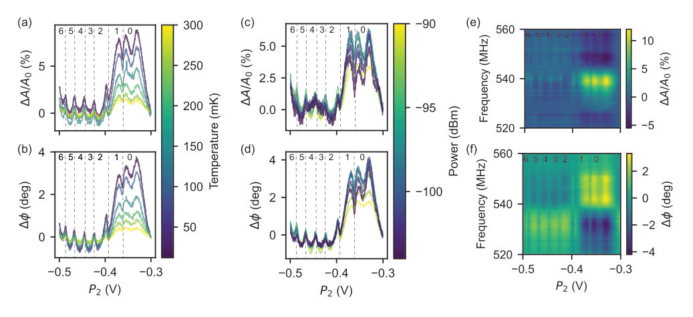
<figcaption class="paper-figure-caption"><b>Fig 4.</b> FIG. 4. Dependence of the gate-dispersive readout on temperature, RF excitation power, and probe frequency. All measure- ments are performed along a line cut through the charge stability diagram at B1 = −0.18 V (shown in Appendix Fig. 7), containing signatures of both the direct gate-dispersive readout of the reservoir-DQ2 charge transitions and the auxiliary-dot- assisted readout. The QD2 occupation number n2 is labeled. (a,b) Reflected amplitude and phase as a function of temperature at -95 dBm power. The signal amplitude decreases markedly with increasing temperature, indicating that increased temperature- dependent dissipative loss in the substrate and dielectric dominates over thermal...</figcaption>
</figure>
<figure class="paper-figure-card">
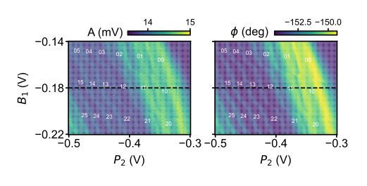
<figcaption class="paper-figure-caption"><b>Fig 5.</b> FIG. 7. Charge stability diagram indicating the line cut at B1 = −0.18 V used to investigate the dependence of the gate- tank response on temperature, excitation power, and probe frequency. The dot-occupation label nm represents n holes in QD1 and m holes in QD2. Compared with the stability diagram in the first column of Fig. 2, the measurements were performed at B12 = −0.125 V instead of −0.127 V, and at fprobe = 550 MHz instead of 541.8 MHz.</figcaption>
</figure>

**Summary.** This paper demonstrates a novel, compact method for reading out charge states in Ge/SiGe quantum dot qubits using RF gate-dispersive detection. By integrating an auxiliary localized quantum dot (SHB), the authors significantly boost the signal-to-noise ratio for detecting interdot charge transitions. This establishes a powerful, scalable readout approach for solid-state spin qubits.

**Why it may be interesting.** The work directly addresses scalable quantum hardware by presenting a robust, compact readout mechanism crucial for characterizing and controlling spin qubits, which is central to quantum computing.

Detailed structure

**Main problem.** The primary challenge is developing compact and high-fidelity readout methods for spin qubits implemented in Ge/SiGe quantum dots.

**Main result.** The incorporation of an auxiliary localized quantum dot (SHB) enhances the signal-to-noise ratio (SNR) for detecting interdot transitions by a factor of 20 compared to direct gate-dispersive readout.

**Method.** The authors employed RF gate-dispersive (GD) charge readout, comparing it against standard SHT measurements, and optimizing the readout using an auxiliary dot.

**Model / system.** The system is a laterally gated Double Quantum Dot (DQD) fabricated in Ge/SiGe heterostructures, augmented with a Single Hole Box (SHB) acting as an auxiliary localized QD state.

**Key observables.** Signal-to-Noise Ratio (SNR), RF amplitude/phase response, and charge transition lines on stability diagrams.

**Important parameters / regimes.** DQD coupling strength ($t_c \approx 5$ GHz), measurement time ($t_m$), and operating temperature (down to 10 mK).

**Assumptions / limitations.** The SNR is ultimately limited by dielectric loss, which compromises impedance matching at higher power levels.

**Figures summary.** Figures illustrate the measurement circuit schematic, stability diagrams showing DQD and SHB resonances, and plots detailing the temperature and RF power dependence of the RF-GD response.

**Paper structure.** The paper progresses from establishing the need for compact readout, demonstrating the RF-GD technique, quantifying the SNR enhancement provided by the SHB, and finally analyzing the dependence of the readout signal on temperature and RF power.

Abstract

Spin qubits are an attractive platform for scalable quantum information processing, and recently, laterally gated quantum dots (QDs) in Ge heterostructures have emerged as a leading implementation of spin qubits. To date, RF single-hole transistors (SHT) and integrated superconducting resonators have been used for spin and charge readout, but their size can pose challenges. Here we demonstrate compact RF gate-dispersive charge readout of a Ge double QD (DQD), and a single hole box (SHB)-DQD system. We resolve QD loading and interdot transitions with both techniques. We find that the SHB enhances the interdot signal-to-noise ratio (SNR) of our 540 MHz circuit by a factor of 20 for a DQD coupling $t_c \approx 5$ GHz, providing a unity-SNR at 135 microseconds, c.f. for 2.7 miliseconds for the direct detection. Power- and temperature-dependent measurements verify that SNR is limited by dielectric loss which compromises impedance matching. These results establish a compact readout approach based on gate-dispersive detection for Ge/SiGe heterostructure QDs.

[↑ back to top](#top)

### [Phonon interference induced by defect pairs](http://arxiv.org/abs/2610.01200v1)

**Authors:** Ran-Bo Yang, Ming-Hao Li, Chun-Yu Cai, Yue-Wen Wang, Zhi-Qing Li, Li-Xia Zhao, Zi-Wu Wang  
**Type:** theory · **Category:** other · **PDF:** <https://arxiv.org/pdf/2610.01200v1>  
**Analysis basis:** full PDF text, analyzed in chunks
**Topic relevance:** `interference shaping light` **3/5** · `Keldysh / 2PI / non-Gaussian methods` **2/5** · `analog quantum simulation` **2/5** · `methods for driven-dissipative` **2/5** · `correlated / nonlocal dissipation` **1/5** · `driven-dissipative phase transition` **1/5** · `non-equilibrium universality` **1/5**

↔ Scroll figures horizontally

<figure class="paper-figure-card">
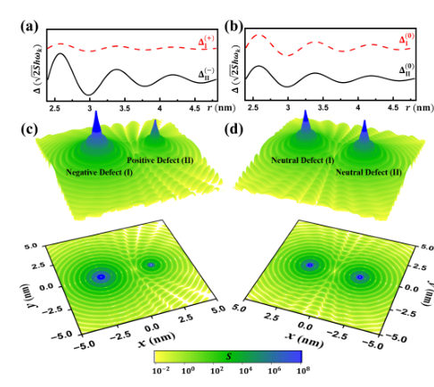
<figcaption class="paper-figure-caption"><b>Fig 1.</b> FIG. 1: The spatial evolution of the oscillation amplitudes of lattice waves induced by positive-negative defects pair (a) and neutral-neutral defect pair (b); The corresponding quantum interference patterns of lattice waves for two types of defect pairs are plotted in (c) and (d), where the selected phonon frequency ωk =76 THz and the wave vector k =7.8 nm−1</figcaption>
</figure>
<figure class="paper-figure-card">
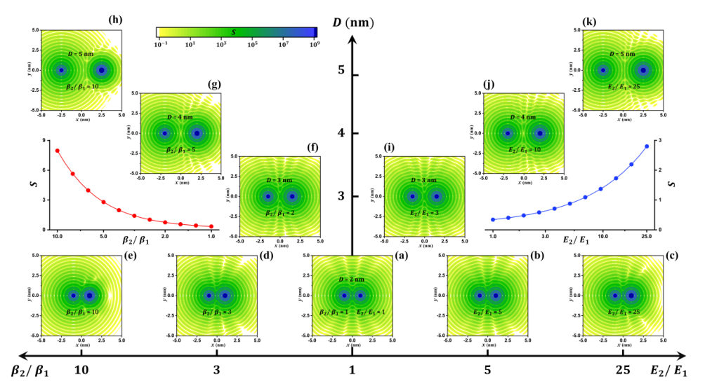
<figcaption class="paper-figure-caption"><b>Fig 2.</b> FIG. 2: The evolution of phonon coherent patterns induced by neutral defect pairs with the ratios of energy-level depth (E2/E1) and the localization strength parameter (β1/β2) for defect pairs and the spatial distance between two defects. Huang-Rhys factors that arising from the contribution of the selective phonon mode (ωk = 76 THz) via the spatial integral around defect pairs as function of the ratio of E2/E1 and β1/β2 in the right-hand and left-hand insets, respectively. The energy-level depth E1=0.1 eV among the bandgap for defect I is adopted.</figcaption>
</figure>
<figure class="paper-figure-card">
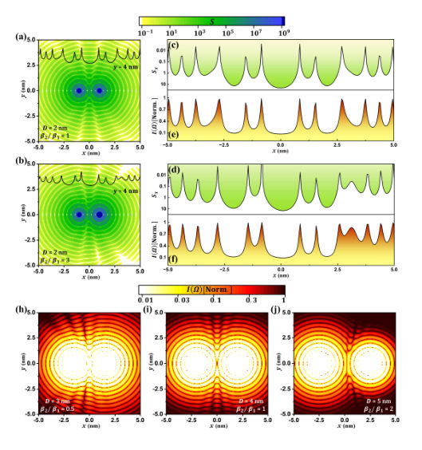
<figcaption class="paper-figure-caption"><b>Fig 3.</b> FIG. 3: The spatial evolution of interference intensities shown by green shadow lines in (c) and (d) along the x axis extracted from symmetry (a) and asymmetry (b) coherent patterns in- duced by neutral defect pairs with the localization ratio pa- rameter β1/β2 =1 and 3, respectively, at fixed energy-level depth, in which the corresponding simulated spanning spec- troscopies are given as shown by red shadow lines in (e) and (f). (h)-(j) show the simulated spanning spectroscopies for in- terference patterns induced by defect pairs with four different localization ratios parameters within their coherent duration scales.</figcaption>
</figure>

**Summary.** This paper develops a theoretical model to study phonon interference generated by pairs of defects in a solid lattice. By relating the interference fringe intensities to the measurable Huang-Rhys factor, the authors show that defect pair parameters can control the emergence of novel quantum states, such as Dirac-like topological phases. This suggests that ultrafast optical spectroscopy is a powerful tool to probe these fundamental quantum dynamics.

**Why it may be interesting.** This work bridges concepts from solid-state physics (defects, electron-phonon coupling) with quantum phenomena (topological states, coherent dynamics), making it relevant for open quantum systems and quantum optics.

Detailed structure

**Main problem.** The study investigates phonon interference induced by defect pairs to understand nonadiabatic electron-phonon coupling dynamics under non-equilibrium conditions.

**Main result.** The model predicts that defect pairs can exhibit novel quantum states, such as Dirac-like or nodal-line topological states, and that ultrafast optical spectroscopy can reveal these quantum signatures.

**Method.** The authors propose a theoretical model based on the Huang-Rhys theory to calculate the superposition and interference of lattice waves launched independently by two defects.

**Model / system.** The system involves lattice waves in a solid material driven by two localized defects. The model uses the Huang-Rhys factor to quantify the coupling and describes the interference intensity as a superposition of fields from the two defects.

**Key observables.** Phonon interference fringe intensities, which are directly related to the measurable Huang-Rhys factor, and spectroscopic fingerprints.

**Important parameters / regimes.** Defect pair internal parameters, including charge states, spatial distance (D), energy-level depth (E), and localization strength (beta).

**Assumptions / limitations.** The analysis assumes fixed frequency and fixed initial phase difference for the two lattice waves, and acknowledges the rapid decay of lattice waves away from the defect center.

**Figures summary.** Figures illustrate the spatial evolution of oscillation amplitudes and quantum interference patterns for different defect pair types, and show the matching between simulated interference fringes and spectroscopic intensities.

**Paper structure.** The paper develops a theoretical model for phonon interference, analyzes how internal defect parameters modify the interference geometry, and simulates the resulting ultrafast optical spectroscopy to connect theory to measurable quantities.

Abstract

The coherent dynamics of lattice waves is of significant importance for exploring the nonadiabatic phenomena of the electron-phonon coupling under nonequilibrium conditions. Here, we propose a theoretical model for phonon interference induced by a defect pair, in which lattice waves with the selective modes are launched independently by each of defects due to the strongly local electron-phonon coupling. We find that the intensities of phonon interference fringes could be directly evaluated by a measurable quantity in experiments--Huang-Rhys factor, and the geometry of interference patterns could be modified by the internal parameters of defect pair, including the charge states, spatial distance, energy-level depth and localization strength. In particular, several novel quantum states, such as the Dirac-like and nodal-line topological states are emerged for the appropriate internal parameters. Furthermore, using Huang-Rhys model, we simulate the ultrafast optical spectroscopy in the phonon interference duration when defect pairs are excited as the color centers, where interference fringes are perfectly matched by intensities of spectrum, similar to the $\textit{lock-key}$ pattern. These results show that defect pair, serving as the driven force for the coherent dynamical processes for multidegrees of freedom, offers an ideal platform to explore fundamental quantum phenomena in nonequilibrium and ultrafast physics.

[↑ back to top](#top)

### [Tunable Electron Quantum Optics in Graphene Slit Junctions](http://arxiv.org/abs/2610.00768v1)

**Authors:** Mohamed Amine Rhanbouri, Wojciech Julian Pasek, Abdelouahed El Fatimy  
**Type:** theory · **Category:** strongly correlated electrons · **PDF:** <https://arxiv.org/pdf/2610.00768v1>  
**Analysis basis:** full PDF text, analyzed in chunks
**Topic relevance:** `Keldysh / 2PI / non-Gaussian methods` **3/5** · `analog quantum simulation` **3/5** · `interference shaping light` **3/5** · `methods for driven-dissipative` **2/5** · `quantum measurements` **1/5**

↔ Scroll figures horizontally

<figure class="paper-figure-card">
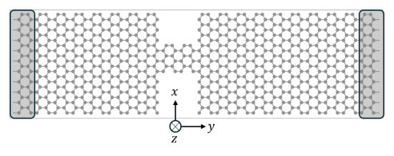
<figcaption class="paper-figure-caption"><b>Fig 1.</b> FIG. 1. Device geometry of the graphene slit junction. An armchair graphene nanoribbon with a narrow central slit is connected to two semi-infinite metallic electrodes on the left and right. The graphene sheet lies in the xy plane, with z normal to the plane; x and y are chosen perpendicular to the armchair and zigzag boundaries, respectively.</figcaption>
</figure>
<figure class="paper-figure-card">
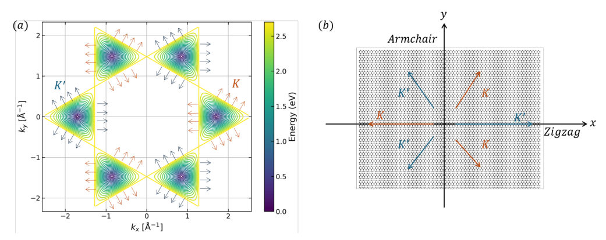
<figcaption class="paper-figure-caption"><b>Fig 2.</b> FIG. 2. Trigonal warping in monolayer graphene. (a) Isoenergy contours from E = 0 to E = 2.7 eV in the first Brillouin zone. The group velocities of the K and K′ valleys are represented by orange and blue arrows, respectively. (b) Anisotropic group-velocity directions in monolayer graphene at the K and K′ points.</figcaption>
</figure>
<figure class="paper-figure-card">
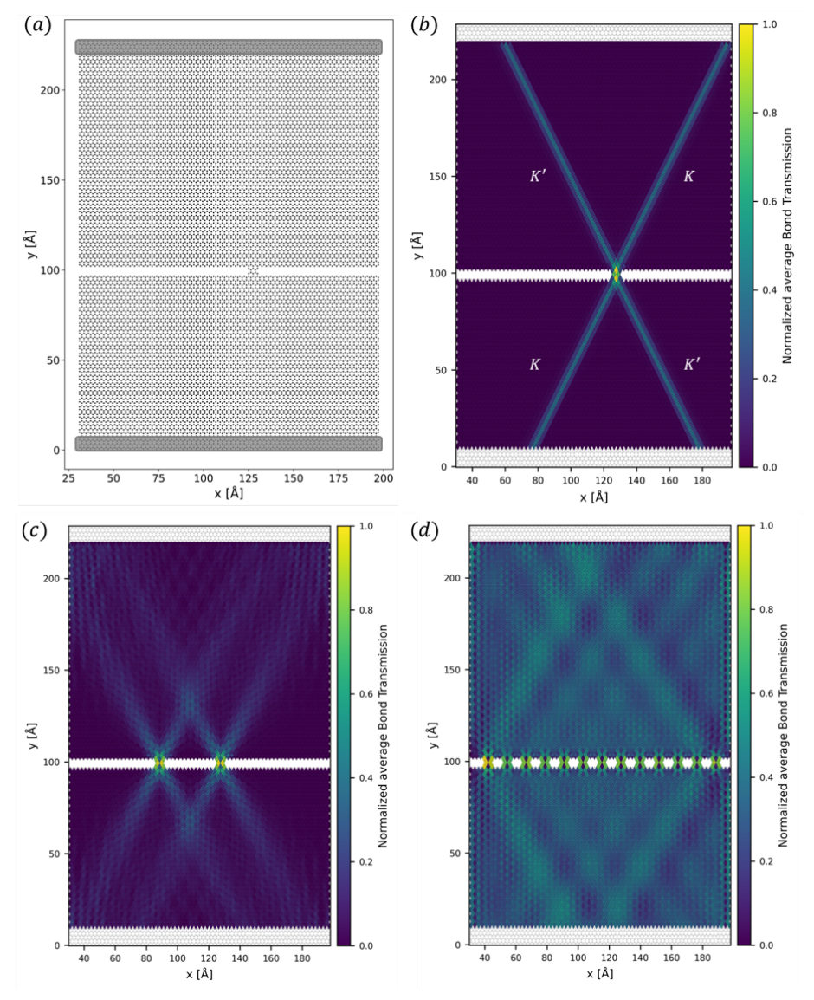
<figcaption class="paper-figure-caption"><b>Fig 3.</b> FIG. 3. Valley-polarized jets, interference, and diffraction in graphene slit junctions. (a) Geometry of the simulated device consisting of an armchair graphene nanoribbon with a small slit in the center; the electrodes are shown in grey. (b) Bond- transmission map at E = 2.7 eV, where trigonal warping is maximal. (c) Bond-transmission map at E = 2 eV for a double-slit geometry. (d) Bond-transmission map at E = 1 eV for a multiple-slit geometry, yielding a diffraction-grating-like pattern.</figcaption>
</figure>
<figure class="paper-figure-card">
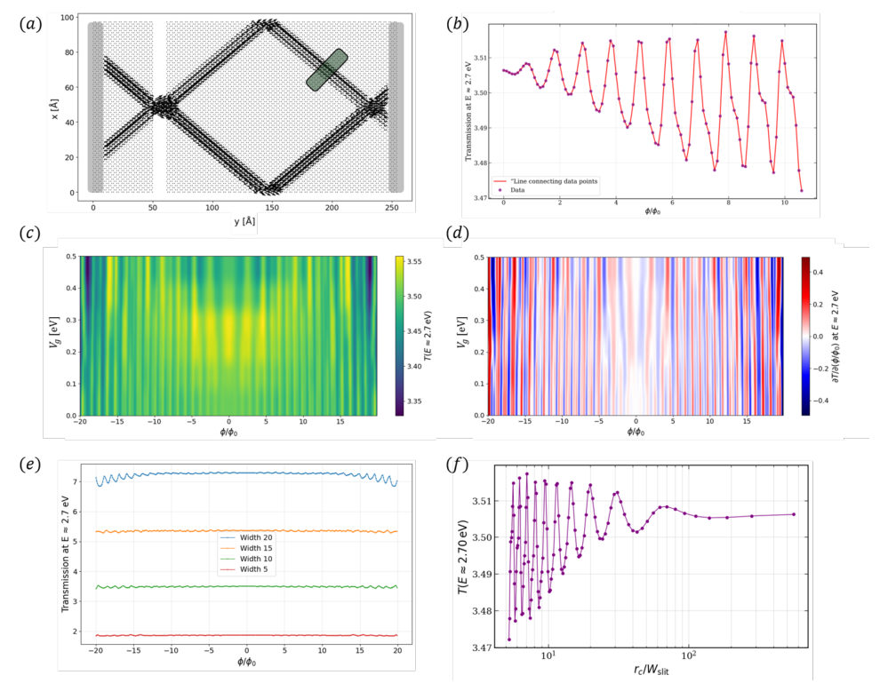
<figcaption class="paper-figure-caption"><b>Fig 4.</b> FIG. 4. Flux- and gate-controlled Aharonov–Bohm interference between valley-polarized electron jets. (a) Vector-transmission map at E = 2.7 eV for a slit width Wslit = 10 Å. The two jets leave the slit at an angle of 60◦, reflect from opposite device boundaries, and recombine at the drain. The grey regions denote the electrodes, and the green region on the upper arm denotes the area to which the phase-shifting onsite potential Vg is applied. (b) Transmission at E = 2.7 eV as a function of normalized magnetic flux Φ/Φ0. (c) Transmission at E = 2.7 eV as a joint function of Φ/Φ0 and Vg. (d) Flux derivative ∂T/∂(Φ/Φ0) of the map in (c), which highlights the interference fringes. (e)...</figcaption>
</figure>
<figure class="paper-figure-card">
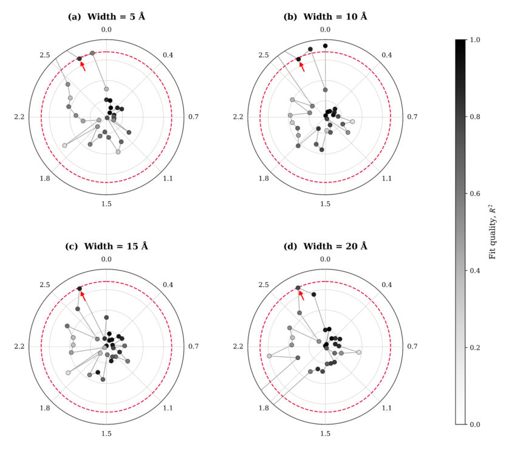
<figcaption class="paper-figure-caption"><b>Fig 5.</b> FIG. 5. Extracted AB oscillation frequency and fit quality as functions of energy given in eV. The angular coordinate represents the electron energy in eV, and the radial coordinate represents the fitted normalized frequency f. The grayscale encodes R2, ranging from white (R2 = 0) to black (R2 = 1). The red dashed circle marks the h/e expectation f = 1, while short red arrows identify the sampled points nearest E = 2.7 eV. Results are shown for slit widths (a) Wslit = 5 Å, (b) 10 Å, (c) 15 Å, and (d) 20 Å.</figcaption>
</figure>

**Summary.** This paper analyzes graphene slit junctions as a versatile quantum device capable of controlling electron beams, observing coherent quantum interference, and achieving spin filtering. By combining tight-binding methods with NEGF and Hubbard models, the authors demonstrate that the geometry allows for the simultaneous realization of these complex quantum phenomena. This suggests the slit junction is a promising platform for next-generation quantum electronic devices.

**Why it may be interesting.** The work bridges concepts from quantum optics (beam formation, interference) with condensed matter physics (graphene, spin filtering, correlated electron models), making it highly relevant for open quantum systems research.

Detailed structure

**Main problem.** The study investigates the combination of directional electron-beam formation, coherent interference, and symmetry-controlled spin filtering within a single, compact graphene slit junction geometry.

**Main result.** The slit junction is proposed as a novel platform that simultaneously enables valley-dependent beam formation, Aharonov-Bohm interference, and spin filtering through symmetry breaking.

**Method.** The research employs atomistic tight-binding calculations combined with the non-equilibrium Green's function (NEGF) formalism, supplemented by mean-field Hubbard calculations for spin physics.

**Model / system.** The system is a graphene slit junction, modeled using tight-binding Hamiltonians that incorporate magnetic flux via the Peierls substitution and electron-electron interactions via the Hubbard model.

**Key observables.** Magnetic-flux-dependent oscillations (Aharonov-Bohm effect), spin-polarized transmission, and valley-resolved electron current maps.

**Important parameters / regimes.** Electron energy (e.g., E~2.7eV, E = 50meV), magnetic flux ($\Phi/\Phi_0$), and electrostatic gate potentials ($V_g$).

**Assumptions / limitations.** The monolayer calculations are mechanism-level studies, and the model assumes zero onsite energy in the pristine device state.

**Figures summary.** Figures illustrate the device geometry, show trigonal warping leading to directional jets, demonstrate AB oscillations controlled by flux and gate voltage, and present valley-resolved current maps for bilayer graphene.

**Paper structure.** The paper progresses from establishing the geometry and basic transport (NEGF/tight-binding) to demonstrating quantum phenomena like AB interference and spin filtering using Hubbard models, and finally extending the analysis to bilayer graphene using continuum models.

Abstract

A graphene slit junction is investigated as a compact geometry for directional electron-beam formation, coherent interference, and symmetry-controlled spin filtering. Atomistic tight-binding calculations combined with the nonequilibrium Green's function formalism show that trigonal warping in monolayer graphene produces strongly directional electron beams near E~2.7eV. Boundary reflections redirect these beams toward a common drain, where the transmission exhibits magnetic flux-dependent oscillations consistent with an h/e Aharonov-Bohm period, whose modulation is characterized by Fourier analysis and harmonic fitting. A local electrostatic gate provides additional control of the interference phase. In separate self-consistent mean-field Hubbard calculations, the pristine antiferromagnetic ground state is shown to have spin-degenerate transmission, whereas structural or electrostatic breaking of the left-right symmetry enables spin filtering. Complementary valley-resolved calculations using a four-band continuum model demonstrate analogous beam formation in bilayer graphene at E = 50meV. The results identify the slit junction as a common geometry for electron-optical and spin-dependent transport and motivate further investigation of low-energy bilayer implementations.

[↑ back to top](#top)

### [Discrete PT-symmetric solitons on branched lattices: Vertex states, stability, and vortices](http://arxiv.org/abs/2610.00774v1)

**Authors:** M. Akramov, A. Fayzullaev, O. Tojakhmadova, T. Akhmadjanov  
**Type:** theory · **Category:** other · **PDF:** <https://arxiv.org/pdf/2610.00774v1>  
**Analysis basis:** full PDF text, analyzed in chunks
**Topic relevance:** `driven-dissipative phase transition` **3/5** · `non-equilibrium universality` **2/5** · `Keldysh / 2PI / non-Gaussian methods` **1/5** · `analog quantum simulation` **1/5** · `correlated / nonlocal dissipation` **1/5** · `methods for driven-dissipative` **1/5**

↔ Scroll figures horizontally

<figure class="paper-figure-card">
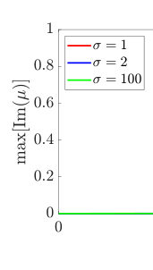
<figcaption class="paper-figure-caption"><b>Fig 1.</b> Figure 1: Maximal imaginary part of the eigenvalue µ of the Hamiltonian H in (12) versus γ0, for three values of the localization parameter σ, other parameters are chosen as κ0 = 1, κ1 = 0.6.</figcaption>
</figure>
<figure class="paper-figure-card">
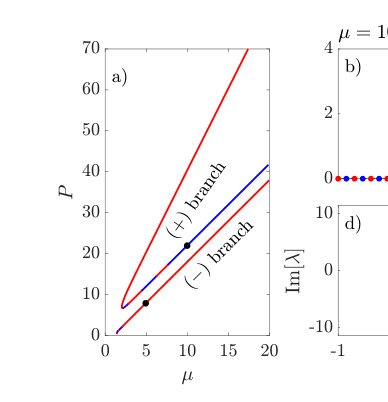
<figcaption class="paper-figure-caption"><b>Fig 2.</b> Figure 2: Numerical continuation of discrete PT -symmetric solitons bifurcating from the anticontinuum limit for the parameters κ0 = 1, κ1 = 0.4, γ0 = 0.1, σ = 2.5, g = 1. a) total power P = P n(|un|2 + |vn|2) versus µ for the two soliton branches, blue for the stable and red for the unstable solitons; black dots mark the representative points examined in the middle and right columns. b) and c) soliton amplitude profiles |ωn|2, with red and blue dots denoting the gain and loss sites, respectively, and d) and e) the corresponding linear stability spectrum Im[λ] versus Re[λ].</figcaption>
</figure>
<figure class="paper-figure-card">
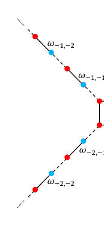
<figcaption class="paper-figure-caption"><b>Fig 3.</b> Figure 3: The star graph with four discrete edges. The central quadrimer denotes the vertex block Ω0; red and blue dots mark the gain and loss sites, respectively, on each of the four semi-infinite edges.</figcaption>
</figure>
<figure class="paper-figure-card">
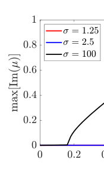
<figcaption class="paper-figure-caption"><b>Fig 4.</b> Figure 4: Maximal imaginary part of the eigenvalue µ of the linear vertex operator H in Eq. (25) versus γ0, for three values of the localization σ. Other parameters are chosen as follows: κ0 = 1, κ1 = 1.2. For each σ, max[Im(µ)] vanishes below a critical γ0, marking the onset of PT -symmetry breaking. This threshold increases as the gain-loss profile becomes more localized (smaller σ), consistent with the chain result of Fig. 1.</figcaption>
</figure>
<figure class="paper-figure-card">
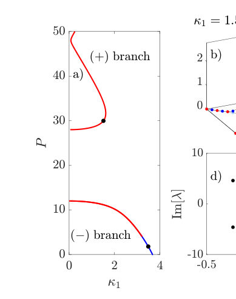
<figcaption class="paper-figure-caption"><b>Fig 5.</b> Figure 5: Continuation of the single-vertex solitons to κ1 &gt; 0. (a) Power P versus κ1 for the (+) and (−) branches, for κ0 = 1, µ = 5, γ0 = 0.1, σ = 10. Blue segments denote stable and red segments unstable solutions. Black dots mark the representative points examined in panels (b)–(e). (b),(c) Soliton amplitude profiles at κ1 = 1.5 for the (+) branch and κ1 = 3.5 for the (−) branch, respectively, with red dots corresponding to |u±j,n| and blue dots to |v±j,n|. (d),(e) Corresponding linear stability spectra λ in the complex plane for the (+) and (−) branches, respectively.</figcaption>
</figure>

**Summary.** This paper analyzes discrete nonlinear Schrödinger equations on a branched star graph under $\mathcal{PT}$-symmetry, revealing that the branching geometry supports a unique, stable vortex soliton. This vortex state possesses a fixed topological charge and exhibits stability regions inaccessible to standard linear or nonlinear soliton solutions on simple chains. The findings suggest new avenues for designing stable waveguiding structures in complex quantum networks.

**Why it may be interesting.** This work is highly relevant to quantum optics and open quantum systems as it explores how complex network topologies (branching) fundamentally alter the existence and stability of nonlinear localized excitations (solitons) under non-Hermitian (PT-symmetric) conditions.

Detailed structure

**Main problem.** The study investigates localized states (solitons) in Parity-Time ($\mathcal{PT}$)-symmetric systems when the underlying lattice structure is branched, moving beyond simple one-dimensional chains.

**Main result.** The authors identify a novel, stable vortex state characterized by a fixed topological charge and a non-zero vertex current, which exists in stability windows unavailable in conventional linear or nonlinear branches.

**Method.** The research employs analytical continuation from the anticontinuum limit, combined with linear stability analysis using perturbation theory to determine the stability of the found solutions.

**Model / system.** The system is modeled by the discrete nonlinear Schrödinger equation (NLDS) applied to a branched lattice, specifically a four-edge star graph, incorporating localized Gaussian gain and loss terms to enforce $\mathcal{PT}$-symmetry.

**Key observables.** Topological charge (winding number $\ell$), vertex current ($	ext{J}$), and the complex growth rate ($\lambda$) from the stability analysis.

**Important parameters / regimes.** Gain/loss coefficients ($\gamma_0$), coupling coefficients ($\kappa_0, \kappa_1$), and the spectral eigenvalue ($\mu$).

**Assumptions / limitations.** The analysis assumes the validity of $\mathcal{PT}$-symmetry reduction for continuation and relies on the invertibility of the Jacobian matrix for continuation methods.

**Figures summary.** Figures illustrate the shift of the $\mathcal{PT}$ phase transition threshold, the numerical continuation of soliton branches (power/amplitude profiles), and the stability regions in parameter space ($\kappa_1$ vs. $\gamma_0$).

**Paper structure.** The paper progresses by first establishing the general NLDS framework on the branched lattice, then using continuation methods to find soliton solutions, and finally characterizing the unique vortex branch via topological invariants and stability analysis.

Abstract

Branching fundamentally modifies nonlinear localization by introducing vertex degrees of freedom absent in one-dimensional lattices. We investigate localized states in a PT-symmetric four-edge star graph described by the discrete nonlinear Schrödinger equation. We identify a discrete vortex state with a fixed topological charge, supported by the branching geometry. Constructed by continuation from the anticontinuum limit, the vortex evolves into a current-carrying state in the presence of balanced gain and loss and exhibits stability windows absent for the conventional branches. A possible electric-circuit realization of the proposed model is discussed.

[↑ back to top](#top)

### [Structured-Light Control of Goniopolar Thermoelectricity in NaSn\texorpdfstring{$_2$}{2}As\texorpdfstring{$_2$}{2}](http://arxiv.org/abs/2610.01755v1)

**Authors:** Atoumane Ndiaye, Edwin Fohtung  
**Type:** theory · **Category:** other · **PDF:** <https://arxiv.org/pdf/2610.01755v1>  
**Analysis basis:** full PDF text, analyzed in chunks
**Topic relevance:** `interference shaping light` **3/5** · `analog quantum simulation` **2/5** · `quantum measurements` **2/5** · `Keldysh / 2PI / non-Gaussian methods` **1/5** · `methods for driven-dissipative` **1/5**

↔ Scroll figures horizontally

<figure class="paper-figure-card">
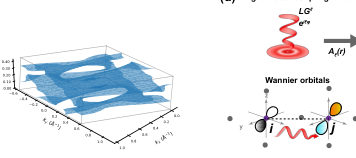
<figcaption class="paper-figure-caption"><b>Fig 1.</b> FIG. 1. Electronic origin and structured-light control of goniopolar thermoelectric transport in NaSn2As2. (a) Dark-state goniopolar geometry, with SabSc &lt; 0. (b) LG structured field displaced relative to the crystal. (c) Anisotropic Fermi surface underlying direction-dependent</figcaption>
</figure>
<figure class="paper-figure-card">
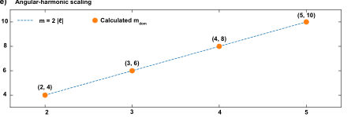
<figcaption class="paper-figure-caption"><b>Fig 2.</b> FIG. 2. Spatial imprint and angular scaling of the OAM-induced goniopolar response in NaSn2As2. (a,b) Spatial maps of the goniopolar-window width WGP as a func- tion of the LG-field displacement (x0 −xtarget, y0 −ytarget) for (a) ℓ= 3 and (b) ℓ= 5. The response forms an an- nular pattern whose characteristic radius closely follows the radial maximum of the p = 0 LG envelope, rmax = w0 p</figcaption>
</figure>
<figure class="paper-figure-card">
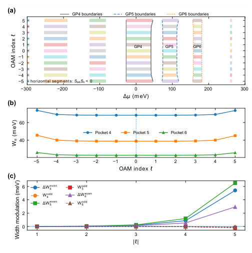
<figcaption class="paper-figure-caption"><b>Fig 3.</b> FIG. 3. OAM-dependent modulation of goniopolar windows. (a) Goniopolar (GP) intervals at T = 300 K as a function of chemical-potential shift ∆µ and OAM index ℓ. Horizontal segments identify regions satisfying SabSc &lt; 0; the boundaries of representative pockets GP4, GP5, and GP6 are highlighted. All three representative pockets persist through- out the calculated range ℓ= −5, . . . , +5, while their bound- aries shift with ℓ. (b) Corresponding widths Wn = µ+ n −µ− n of GP4, GP5, and GP6. The widths increase most strongly at large |ℓ|, with GP5 exhibiting an approximately 17% en- hancement at |ℓ| = 5 relative to the zero-OAM structured- field reference. (c) Even and odd components of the...</figcaption>
</figure>
<figure class="paper-figure-card">
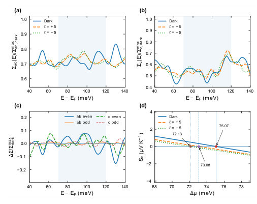
<figcaption class="paper-figure-caption"><b>Fig 4.</b> FIG. 4. Microscopic transport mechanism underlying structured-light control of goniopolarity. (a,b) Energy- resolved transport distributions for the dark state and ℓ= ±5, showing (a) the in-plane component Σab(E) and (b) the cross- plane component Σc(E), normalized by the corresponding maximum dark-state values. The shaded energy interval high- lights the region relevant to the analyzed goniopolar bound- ary. (c) Structured-field-induced changes in the transport dis- tributions, decomposed into even- and odd-in-ℓcontributions for the ab and c directions. The even component provides the dominant common response to |ℓ|, while the smaller odd component measures the difference between opposite...</figcaption>
</figure>

**Summary.** This work shows that applying structured light, specifically a Laguerre-Gaussian potential, can act as a programmable external control parameter for the thermoelectric properties of NaSn2As2. By tuning the orbital angular momentum (OAM) index $|\ell|$, researchers can systematically reconstruct and enhance the material's goniopolar phase space. This establishes a new paradigm for controlling electronic order using structured electromagnetic fields.

**Why it may be interesting.** The use of structured light to engineer electronic properties via orbital angular momentum coupling provides a direct analogy to controlling quantum states using structured electromagnetic fields, relevant to quantum optics and open quantum systems.

Detailed structure

**Main problem.** To demonstrate that a structured Laguerre-Gaussian vector potential can programmatically control the goniopolar phase space of the material NaSn2As2.

**Main result.** The structured light reconstructs the goniopolar phase space, enhancing specific thermoelectric windows and shifting the boundaries that define the goniopolar state.

**Method.** First-principles-derived Wannier transport calculations incorporating a bond-dependent Peierls coupling modulated by the structured light potential.

**Model / system.** The system is NaSn2As2, modeled using a Wannier Hamiltonian modified by a spatially varying Laguerre-Gaussian (LG) vector potential. This introduces a Peierls phase that modifies the hopping terms.

**Key observables.** Goniopolar window width (WGP), directional Seebeck coefficients ($S_{ab}, S_c$), and the dominant angular harmonic ($m_{	ext{dom}}$).

**Important parameters / regimes.** The LG field winding index $|\ell|$ and the beam center displacement $\mathbf{r}_0$ act as programmable control coordinates.

**Assumptions / limitations.** The analysis uses the constant-relaxation-time approximation for transport, and the coupling is implemented via a bond-dependent Peierls phase.

**Figures summary.** Figures illustrate the electronic origin of the coupling, spatial maps showing the reconstruction of goniopolar windows following $r_{	ext{max}} \propto 
ho/|\ell|$, and Fourier decompositions confirming $m_{	ext{dom}} = 2|\ell|$.

**Paper structure.** The paper establishes the theoretical framework using the LG potential to modify the Hamiltonian, calculates the resulting spatial and angular modulations of the goniopolar state, and finally analyzes the shift in the directional Seebeck-zero boundaries.

Abstract

Goniopolar metals exhibit opposite thermoelectric polarities along different crystallographic directions, enabling zero-field transverse thermoelectricity but offering few means for external control. Here we show that a spatially structured Laguerre--Gaussian vector potential can programmably reconstruct the goniopolar phase space of NaSn$_2$As$_2$. First-principles-derived Wannier transport with bond-dependent Peierls coupling reveals two OAM-dependent spatial scaling laws: the radial response follows the Laguerre--Gaussian radius $r_{\max}\propto\sqrt{|\ell|}$, while calculations for $|\ell|=2$--5 yield a dominant angular harmonic $m_{\mathrm{dom}}=2|\ell|$, encoding the optical winding in a frequency-doubled thermoelectric response. Increasing $|\ell|$ simultaneously reconstructs pre-existing goniopolar windows, enhancing a representative window by approximately 17\% at $|\ell|=5$. By contrast, reversing $\ell$ at fixed polarization produces only a small correction that approximately interchanges upon polarization reversal. Energy-resolved transport reveals that the structured field redistributes in-plane and cross-plane electronic velocities, shifting the directional Seebeck-zero boundaries that define the goniopolar state. These results establish vortex position and OAM magnitude as programmable control coordinates for goniopolar thermoelectricity.

[↑ back to top](#top)

### [Orbital angular momentum in crystalline solids: non-equilibrium theory](http://arxiv.org/abs/2610.00496v1)

**Authors:** Sangeeta Sharma, Peter Elliott, Samuel Shallcross  
**Type:** theory · **Category:** other · **PDF:** <https://arxiv.org/pdf/2610.00496v1>  
**Analysis basis:** full PDF text, analyzed in chunks
**Topic relevance:** `interference shaping light` **3/5** · `Keldysh / 2PI / non-Gaussian methods` **2/5** · `methods for driven-dissipative` **1/5**

↔ Scroll figures horizontally

<figure class="paper-figure-card">
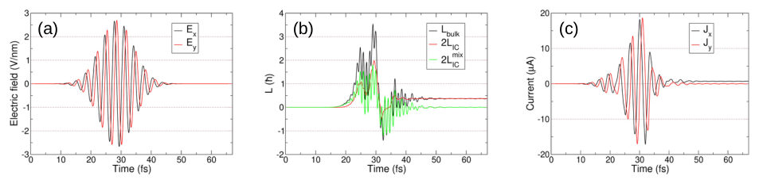
<figcaption class="paper-figure-caption"><b>Fig 1.</b> Fig. 1 Ultrafast generation of giant transient orbital angular momentum in gapped graphene: A circularly polarized driving field, (a), generates a dynamically changing bulk orbital angular momentum in gapped graphene, (b), where we show both the bulk orbital angular momentum (Lbulk) as well as its two components, the dynamical “itinerant circulation” (IC) (2LIC) and the “mixed” intra- and inter-band IC (2Lmix IC ). During the pulse-driven excitation a significant transient orbital angular momentum of nearly 4ℏis generated, corresponding in magnitude to an orbital magnetic moment of 4µB, which, post-pulse, drops to nearly zero (i.e. back to the ground state orbital angular momentum which is...</figcaption>
</figure>
<figure class="paper-figure-card">
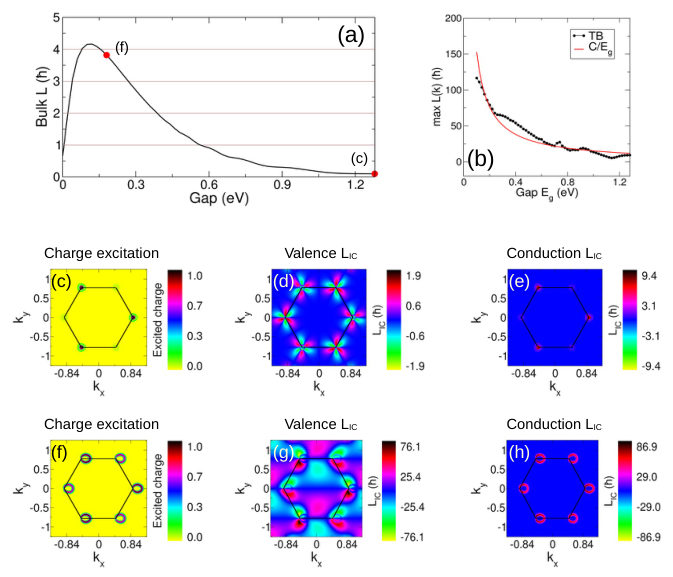
<figcaption class="paper-figure-caption"><b>Fig 2.</b> Fig. 2 Gap control over light-created post-pulse orbital angular momentum: Laser excitation generates a quasi- stationary post-pulse orbital angular momentum (OAM) that is strongly gap dependent, panel (a). Examination of the momentum resolved OAM texture reveals that the maximum post-pulse itinerant orbital angular momentum LIC scales approx- imately as C/Eg, a fact that has its origin in the pseudospin texture of the gapped Dirac point, as described in the text. (c-e) Momentum-resolved excited charge (c), and the corresponding valence- and conduction-band itinerant orbital angular momen- tum LIC (d,e), for the large gap case marked (c) in figure panel (a). Note that while the conduction...</figcaption>
</figure>
<figure class="paper-figure-card">
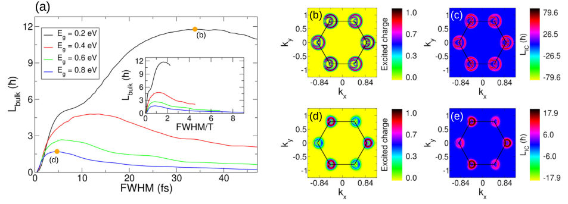
<figcaption class="paper-figure-caption"><b>Fig 3.</b> Fig. 3 Control of light created orbital angular momentum via laser pulse parameters. (a) Post-pulse bulk orbital angular momentum in gapped graphene Lres bulk as a function of pulse full width at half maximum (FWHM) for four representative gaps: Eg = 0.2, 0.4, 0.6, and 0.8 eV. In the long time multi-cycle limit the light induced OAM substantially decreases. Maximum OAM creation is associated with the few cycle limit, as is made clear by the inset plot, in which the same data is presented against FWHM measured in optical cycles, FWHM/T. As the pulse fluence is held fixed over the FWHM scan the few cycle limit implies larger vector potential amplitude, allowing intense valley OAM to be...</figcaption>
</figure>

**Summary.** This work establishes a unified operator theory for Orbital Angular Momentum (OAM) in crystalline solids, applicable across both steady-state and ultrafast non-equilibrium regimes. By decomposing OAM into local and itinerant components, the authors predict that external driving fields, such as intense lasers, can generate novel, quasi-stationary OAM signatures linked to momentum-space phase structures. This opens new avenues for controlling light-matter interactions using topological properties of band structures.

**Why it may be interesting.** The explicit connection drawn between light-induced momentum-space phase textures and measurable, quasi-stationary OAM provides a concrete, controllable mechanism for manipulating angular momentum in solid-state systems, relevant to quantum optics and light-matter interaction.

Detailed structure

**Main problem.** To develop a general operator theory for Orbital Angular Momentum (OAM) in periodic solids that remains valid for both equilibrium and non-equilibrium states.

**Main result.** The theory successfully decomposes OAM into local and itinerant circulation sectors, revealing new non-equilibrium contributions from momentum-space phase textures when driven by light.

**Method.** The authors employ the crystal momentum representation (CMR) of Adams and Blount to construct the OAM operator, decomposing it into covariant derivative and dipole matrix terms.

**Model / system.** The theory is applied to crystalline solids, with specific calculations performed for gapped graphene. The formalism relies on band structure analysis and the decomposition of position and velocity operators.

**Key observables.** Orbital Angular Momentum (OAM), Local Circulation (LC) and Itinerant Circulation (IC) sectors, Berry curvature, and quasi-stationary light-induced OAM.

**Important parameters / regimes.** Equilibrium vs. non-equilibrium driving conditions, laser-written momentum-space textures, and band manifold phase texture.

**Assumptions / limitations.** The use of the crystal momentum representation (CMR) is crucial to circumvent issues with the position operator in the standard Bloch representation.

**Paper structure.** The paper builds the OAM operator using CMR, separates it into LC and IC sectors, derives the equilibrium limit matching existing theory, and then extends the framework to analyze non-equilibrium dynamics using phase texture analysis.

Abstract

We develop a general operator theory of orbital angular momentum (OAM) in periodic solids that applies equally to equilibrium and coherently driven states. Employing the crystal momentum representation of Adams and Blount, we construct a periodic-solid OAM operator exactly corresponding to the symmetrized $\hat{\mathbf r}\times\hat{\mathbf v}$ observable, and show that it separates into local circulation (LC) and itinerant circulation (IC) sectors that are Hermitian and $U(1)$, and more generally $U(N)$, gauge covariant. In equilibrium, the LC and IC sectors reduce to the established modern theory of orbital magnetism; out of equilibrium, the same operator structure exposes new contributions generated by laser-written momentum-space textures and interband coherence. Applied to gapped graphene, we uncover a rich phenomenology of ultrafast non-equilibrium orbital angular momentum, including a quasi-stationary light-induced OAM. This latter finding, underpinned by a close connection between band-manifold phase texture and nonequilibrium OAM, points towards new possibilities for light control over OAM in solids as well as a potentially rich role for topological band structures in designed OAM materials.

[↑ back to top](#top)

### [Hydrogen plasma-assisted atomic layer epitaxy of superconducting titanium nitride](http://arxiv.org/abs/2610.00956v1)

**Authors:** Yi-Hsun Chen, Yin-Chun Huang, Zachary Degnan, David Sommers, Kaijian Xing, Manjith Bose, Eduardo Solano, David Cortie, Michael Fuhrer, Julian A. Steele, Peter Jacobson, Miin-Jang Chen, Arkady Fedorov  
**Type:** experiment · **Category:** other · **PDF:** <https://arxiv.org/pdf/2610.00956v1>  
**Analysis basis:** full PDF text, analyzed in chunks
**Topic relevance:** `QC/QI experiment` **3/5** · `analog quantum simulation` **1/5**

↔ Scroll figures horizontally

<figure class="paper-figure-card">
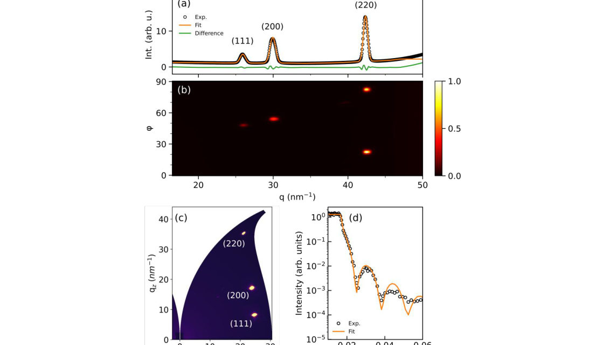
<figcaption class="paper-figure-caption"><b>Fig 1.</b> Figure 1. Structural characteristics of TiN thin films. (a) 1D profile as a function of total reciprocal lattice vector, q, integrated over GIWAXS 2D images. Bragg peaks were observed at q = 25.9, 29.9, 42.3 nm−1. The experimental data are fit using the Le Bail method to obtain the unit cell symmetry and lattice parameters. (b) Evolution of 1D integrated profiles as a function of the sample rotation angle, φ, recorded through a φ rotation around the film normal. Inset: a schematic of φ angle relative to the sample. (c) 2D GIWAXS pattern obtained at an incidence angle of 0.28°. The pattern is generated from multiple 2D images at different φ. (d) Neutron reflectivity as a function of q fitted...</figcaption>
</figure>
<figure class="paper-figure-card">
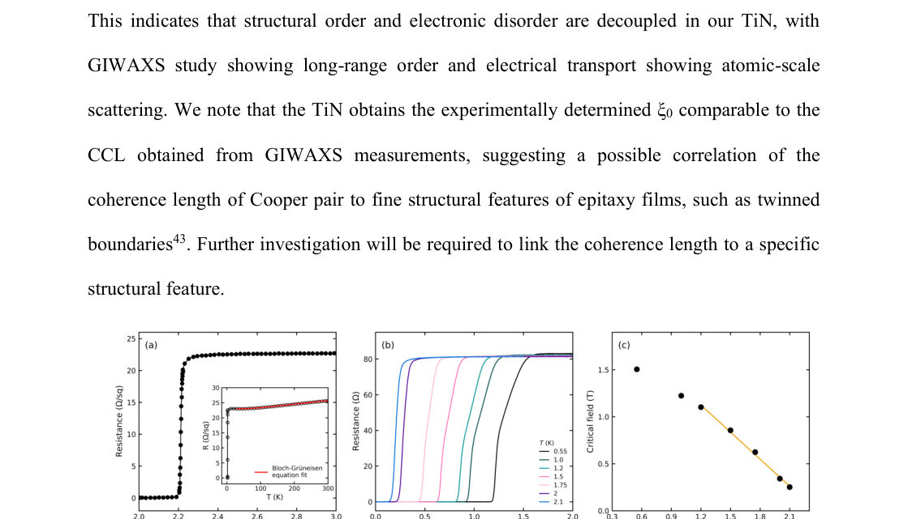
<figcaption class="paper-figure-caption"><b>Fig 2.</b> Figure 2. Superconducting properties of TiN films. (a) Temperature dependence of sheet resistance Rsq of a TiN Hall bar sample. We obtained a critical temperature Tc of superconductivity at 2.2 K. Inset: temperature-dependent Rsq. We obtained n = 4.8 and an estimated Debye temperature θD ~ 470 K using Bloch-Grüneisen formula. (b,c) Magnetotransport properties of evolution of resistance as a function of out-of-plane magnetic field with temperature ranging from 0.55 to 2.1 K (b), and extracted upper critical field Hc2 as a function of temperature (c).</figcaption>
</figure>
<figure class="paper-figure-card">
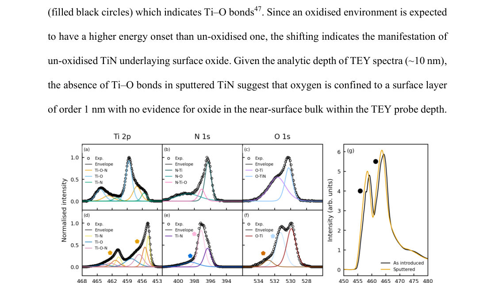
<figcaption class="paper-figure-caption"><b>Fig 3.</b> Figure 3. Compositional analysis of HPA-ALD grown TiN. (a–f) High-resolution XPS spectra of Ti 2p, N 1s, and O 1s core levels for the as-introduced (a–c) and sputtered sample (d–f). Black circles and solid lines represent the experimental data and the fitted envelopes respectively. All the spectra were obtained with a fixed kinetic energy of 70 eV. The fit</figcaption>
</figure>

**Summary.** This work establishes hydrogen plasma-assisted Atomic Layer Deposition (HPA-ALD) as a robust technique for growing high-quality, superconducting titanium nitride (TiN) thin films. By controlling surface chemistry during deposition, the researchers achieved films with excellent structural order and superconducting properties at 2.2 K. This demonstrates that ALD can be successfully scaled to create materials essential for advanced cryogenic quantum technologies.

**Why it may be interesting.** While the focus is on materials science, the development of highly controlled, superconducting thin films is crucial for building superconducting qubits and quantum circuits, making the material platform relevant to quantum information.

Detailed structure

**Main problem.** The goal was to develop a reliable method to epitaxially grow structurally ordered, superconducting titanium nitride (TiN) thin films suitable for use in cryogenic quantum technologies.

**Main result.** Hydrogen plasma-assisted Atomic Layer Deposition (HPA-ALD) successfully produced superconducting TiN films exhibiting semi-coherent epitaxy with minimal structural or chemical disorder, achieving a superconducting transition at 2.2 K.

**Method.** The study employed HPA-ALD, followed by extensive characterization using Synchrotron X-ray Scattering (GIWAXS), Neutron Reflectometry, and superconducting transport measurements.

**Model / system.** The physical system is the TiN thin film grown on c-plane sapphire. The process involves using a hydrogen plasma step during ALD to control surface chemistry and suppress impurities, aiming for high structural quality.

**Key observables.** Superconducting transition temperature ($T_c = 2.2 	ext{ K}$), kinetic inductance ($15 	ext{ pH/sq}$), superconducting coherence length ($\xi_0 = 14.6 	ext{ nm}$), and structural coherence derived from GIWAXS.

**Important parameters / regimes.** The method relies on controlling precursor impurities and achieving structural order at cryogenic temperatures, with coherence lengths comparable to the crystal structure.

**Assumptions / limitations.** The superconducting coherence length is assumed to be comparable to the crystal coherence length, and the method is presented as an extension of ALD control to superconducting materials.

**Figures summary.** Figures detail structural characteristics via 1D/2D GIWAXS and neutron reflectivity, and superconducting properties via temperature-dependent resistance and magnetic field dependence.

**Paper structure.** The paper details the HPA-ALD process, presents structural characterization (GIWAXS, neutron reflectometry) confirming order and purity, and concludes with superconducting transport measurements demonstrating device viability.

Abstract

Atomic layer deposition (ALD) offers precise, conformal control of thin-film growth and is a workhorse for semiconductor manufacturing, but its use in superconducting quantum circuits is constrained by the need to simultaneously control crystallinity, stoichiometry and interfacial disorder at cryogenic temperatures. Here we develop hydrogen plasma assisted ALD to epitaxially grow superconducting titanium nitride (TiN) thin films, using a hydrogen plasma step to modify the surface chemistry to suppress precursor-derived impurities during each deposition cycle. Synchrotron X-ray scattering reveals semi-coherent epitaxy of TiN on c-plane sapphire, with discrete crystallographic domains and minimal long-range structural disorder. Complementary X-ray spectroscopy and neutron reflectometry show negligible oxygen-related disorder throughout the film and no substantial hydrogen incorporation. The resulting TiN films exhibit a superconducting transition at 2.2 K, a kinetic inductance of 15 pH/sq and a superconducting coherence length of 14.6 nm, comparable to the measured crystal coherence length. These results establish hydrogen plasma assisted ALD as a route to structurally ordered superconducting TiN thin film epitaxy and demonstrate that the nanoscale control of ALD can be extended to materials suitable for cryogenic quantum technologies.

[↑ back to top](#top)

### [Sector-Resolved Winding Selection Rules for Structured-Light-Driven dc Currents](http://arxiv.org/abs/2610.01423v1)

**Authors:** Tomohiro Tamaya, Kenichi L. Ishikawa  
**Type:** theory · **Category:** other · **PDF:** <https://arxiv.org/pdf/2610.01423v1>  
**Analysis basis:** full PDF text, analyzed in chunks
**Topic relevance:** `interference shaping light` **3/5**

↔ Scroll figures horizontally

<figure class="paper-figure-card">
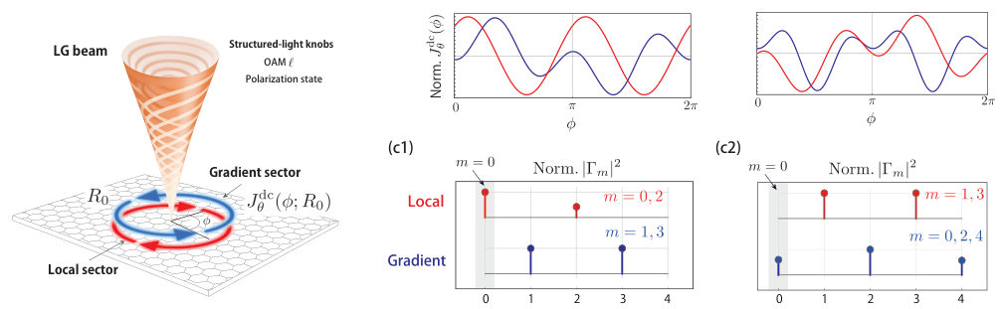
<figcaption class="paper-figure-caption"><b>Fig 1.</b> FIG. 1. Sector-resolved winding diagnostic and linear-polarization selection. (a) Schematic of the winding-spectrum diagnostic for the dc azimuthal current Jdc θ (ϕ; R0) on a graphene sheet, evaluated along an observation circle of radius R0. (b1,b2) Azimuthal dependence of Jdc θ (ϕ; R0) for linearly polarized scalar LG beams at R0 = Rmax ℓ , where Rmax ℓ is the radius of maximum LG intensity, for ℓ= 1 and ℓ= 2. For visualization in (b1,b2), the azimuthally uniform m = 0 component, i.e., the angular average of Jdc θ (ϕ; R0), has been subtracted. Red and blue curves denote local- and gradient-sector contributions, respectively. (c1,c2) Corresponding normalized winding spectra |Γm(R0)|2,...</figcaption>
</figure>
<figure class="paper-figure-card">
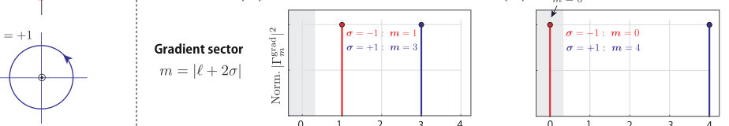
<figcaption class="paper-figure-caption"><b>Fig 2.</b> FIG. 2. Helicity-controlled branch selection for circularly polarized scalar LG beams. (a) Helicity convention and sector- dependent combinations selecting the m = 0 circulating-current branch. (b1,b2) Local-sector winding spectra and (c1,c2) gradient-sector winding spectra for ℓ= 1, 2. Red and blue sticks denote σ = −1 and σ = +1, respectively, and the gray region marks the m = 0 branch. Each panel is normalized independently to its maximum value.</figcaption>
</figure>
<figure class="paper-figure-card">
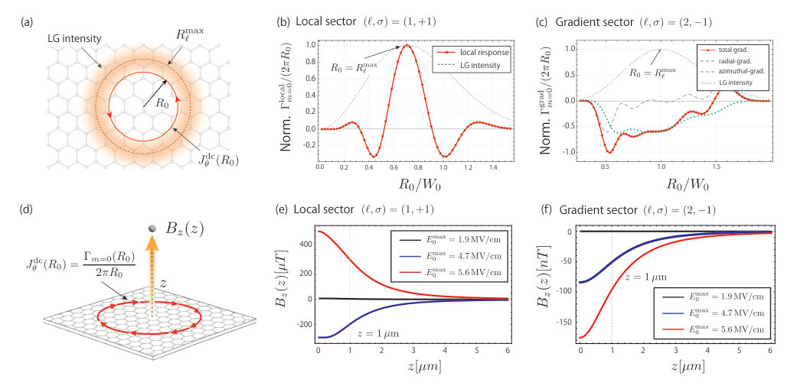
<figcaption class="paper-figure-caption"><b>Fig 3.</b> FIG. 3. Real-space profiles and magnetic readout of sector-selected m = 0 currents. (a) Schematic extraction of the radial profile of the azimuthal current Jdc θ (R0) = Γm=0(R0)/(2πR0) from the selected m = 0 component, overlaid on the radial intensity profile of the LG beam. (b,c) Radial profiles of the selected m = 0 current for the local branch (ℓ, σ) = (1, +1) and the gradient branch (ℓ, σ) = (2, −1), respectively. Dashed gray curves show the corresponding LG intensity profiles. In (c), the gradient response is decomposed into total, radial-gradient, and azimuthal-gradient contributions. (d) Schematic magnetic readout of the circulating sheet current. (e,f) Corresponding on-axis fields...</figcaption>
</figure>

**Summary.** This paper develops and verifies sector-resolved selection rules that dictate the azimuthal winding order ($m$) of dc currents generated in graphene by structured light. By decomposing the current response into local and gradient sectors, the authors show that $m$ depends systematically on the beam's polarization and orbital angular momentum ($\ell$). The resulting $m=0$ current component can be used to predict the measurable axial magnetic field $B_z(z)$ generated by the structured light interaction.

**Why it may be interesting.** This work provides a detailed, quantitative framework for controlling current topology using structured light, which is highly relevant to understanding non-linear optical responses and current generation in 2D materials.

Detailed structure

**Main problem.** The paper aims to establish systematic, sector-resolved selection rules governing the azimuthal winding order ($m$) of dc currents induced in graphene by structured light.

**Main result.** The winding order $m$ is determined by the angular structure of the current operators (local vs. gradient sectors) and is explicitly dependent on the polarization and optical orbital angular momentum ($\ell$).

**Method.** The analysis decomposes the induced dc current into local and gradient sectors, deriving selection rules by analyzing the Fourier coefficients of the azimuthal current component.

**Model / system.** The system is graphene, acting as a clean two-dimensional platform driven by scalar Laguerre-Gaussian (LG) beams. The analysis uses a multipole light-matter coupling framework.

**Key observables.** The dc azimuthal current component $J_{dc	heta}(\phi; R_0)$ and its winding order $m$, which is diagnosed via the spectrum $|\Gamma_m(R_0)|^2$.

**Important parameters / regimes.** Optical orbital angular momentum ($\ell$), beam helicity ($\sigma$), and the separation into local and gradient current sectors.

**Assumptions / limitations.** The analysis relies on the long-wavelength expansion and the separation of the current response into local and gradient sectors; the $q_{\parallel}=0$ approximation is validated as accurate.

**Figures summary.** Figures illustrate the diagnostic spectra for linear and circular polarization, verifying the derived selection rules for $m$. A subsequent figure shows the reconstruction of the axial magnetic field $B_z(z)$ solely from the $m=0$ winding component.

**Paper structure.** The paper first introduces the problem and decomposes the current response into local and gradient sectors. It then derives and verifies the specific selection rules for linear and circular polarization. Finally, it uses the $m=0$ component to calculate the resulting axial magnetic field $B_z(z)$ via the Biot-Savart law.

Abstract

Structured light can generate electronic dc currents with azimuthal winding, yet the rules governing their winding order $m$ remain unclear. Here we identify sector-resolved winding selection rules using graphene as a clean two-dimensional platform. By decomposing the current response into local and gradient sectors at the current-operator level, we show that the winding order is determined not by the optical orbital angular momentum $\ell$ alone, but by the angular structure of the corresponding current operators together with projection onto the azimuthal direction. For scalar Laguerre-Gaussian beams, linear polarization yields $m=|\ell\pm1|$ in the local sector and $m=|\ell|,|\ell\pm2|$ in the gradient sector, whereas circular polarization with helicity $σ=\pm1$ selects $m=|\ell-σ|$ in the local sector and $m=|\ell+2σ|$ in the gradient sector. Numerical time-evolution calculations verify these rules and further show that helicity can select an $m=0$ branch, producing an azimuthally uniform circulating current whose radial profile determines the axial magnetic field $B_z(z)$. Our results provide a sector-resolved organizing principle for classifying and controlling structured-light-driven dc currents with tailored winding structures.

[↑ back to top](#top)

### [Nutational Spin Pumping and Dissipation](http://arxiv.org/abs/2610.01164v1)

**Authors:** Hans Gløckner Giil, Arne Brataas  
**Type:** theory · **Category:** other · **PDF:** <https://arxiv.org/pdf/2610.01164v1>  
**Analysis basis:** full PDF text, analyzed in chunks
**Topic relevance:** `Keldysh / 2PI / non-Gaussian methods` **2/5** · `methods for driven-dissipative` **2/5**

↔ Scroll figures horizontally

<figure class="paper-figure-card">
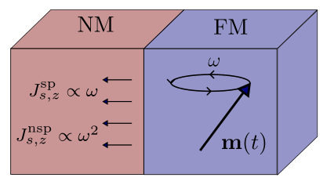
<figcaption class="paper-figure-caption"><b>Fig 1.</b> FIG. 1: The precessing magnetization pumps spin currents into the normal metal with two contributions, the conventional contribution Jsp s,z linear in the driving frequency ω and the nutational contribution Jnsp s,z quadratic in ω. Both contributions exhibit resonance peaks for right-handed driving fields at the FMR frequency, and for left-handed driving fields at the NR frequency.</figcaption>
</figure>
<figure class="paper-figure-card">
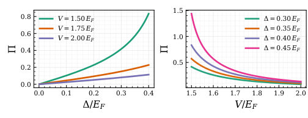
<figcaption class="paper-figure-caption"><b>Fig 2.</b> FIG. 2: The strength of the nutational damping Π as a function of (a) ∆and (b) V .</figcaption>
</figure>

**Summary.** This theoretical work extends magnetization dynamics theory to the THz regime by incorporating inertial effects into the LLG equation. It predicts a novel nutational spin pumping current that scales quadratically with the drive frequency. The findings offer a microscopic understanding of this effect, which can be detected via the inverse spin Hall effect, advancing spintronic device design.

**Why it may be interesting.** The inclusion of inertial terms and the resulting frequency-squared dependence of the spin current provides a rich, non-linear extension to standard spin-torque phenomena, relevant for understanding high-frequency spintronics.

Detailed structure

**Main problem.** The study addresses magnetization dynamics in the terahertz (THz) regime where standard Landau-Lifshitz-Gilbert (LLG) theory fails due to inertial effects.

**Main result.** The authors predict a novel nutational spin pumping effect, generating a DC spin current that scales quadratically with the drive frequency ($\omega^2$).

**Method.** The analysis combines extending the LLG equation to include inertial terms with scattering theory applied to FM/NM junctions.

**Model / system.** The system involves ferromagnets (FMs) coupled to adjacent metals (NMs), modeled using an inertial extension of the LLG equation and a microscopic Hamiltonian approach.

**Key observables.** Nutational spin pumping current ($J_{s,z}^{	ext{nsp}}$), resonance frequencies ($\omega_{	ext{prec}}$ and $\omega_{	ext{nut}}$), and the ratio of nutational to conventional spin currents.

**Important parameters / regimes.** Terahertz drive frequencies ($\omega$), Gilbert damping ($\alpha$), and the inertial damping parameter ($\alpha\eta$).

**Assumptions / limitations.** The analysis assumes the linearized regime for small driving fields and utilizes approximations derived from scattering theory expansions in powers of the frequency ($\omega$).

**Figures summary.** Figure 1 illustrates the conventional (linear in $\omega$) and nutational (quadratic in $\omega$) spin current contributions. Figure 2 plots the nutational damping strength dependence on material parameters.

**Paper structure.** The paper progresses from establishing the inertial LLG equation, deriving the nutational spin pumping current via macroscopic analysis, and finally calculating this current microscopically using scattering theory in the NM-FM junction.

Abstract

At terahertz drive frequencies, magnetization dynamics enter an inertial regime beyond the scope of standard Landau-Lifshitz-Gilbert (LLG) theory. We reveal a nutational damping torque comprising a bulk term and an interfacial contribution that describes spin emission into adjacent metals. The interfacial term generates nutational spin pumping: a dc spin current that scales quadratically with the drive frequency. Using a scattering approach, we relate this effect to microscopic material parameters and predict pronounced enhancements in ultrathin films and low-Fermi-energy conductors. Nutational spin pumping can be detected directly via the inverse spin Hall effect or indirectly via thickness-dependent renormalization of nutational damping.

[↑ back to top](#top)

### [Topological robustness of thermally disordered lattices: From average structures to ensemble electronic properties](http://arxiv.org/abs/2610.00963v1)

**Authors:** Oleg Rubel, Karekin Sadikian  
**Type:** theory · **Category:** statistical mechanics · **PDF:** <https://arxiv.org/pdf/2610.00963v1>  
**Analysis basis:** full PDF text, analyzed in chunks
**Topic relevance:** `methods for driven-dissipative` **2/5** · `analog quantum simulation` **1/5** · `non-equilibrium universality` **1/5**

↔ Scroll figures horizontally

<figure class="paper-figure-card">
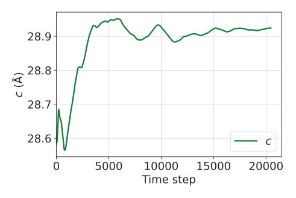
<figcaption class="paper-figure-caption"><b>Fig 1.</b> FIG. 1. Evolution of the forward cumulative average lattice parameter c during the NpT AIMD</figcaption>
</figure>
<figure class="paper-figure-card">

<figcaption class="paper-figure-caption"><b>Fig 2.</b> Figure 2 compares the temperature dependence of the lattice parameters obtained from</figcaption>
</figure>
<figure class="paper-figure-card">
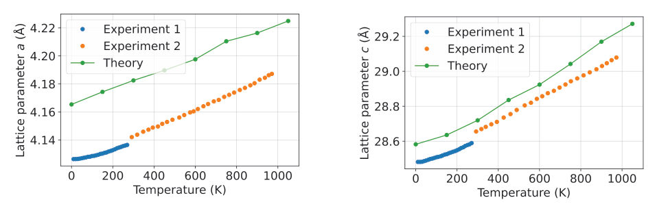
<figcaption class="paper-figure-caption"><b>Fig 3.</b> FIG. 2. Temperature-dependent lattice parameters evaluated from AIMD and compared with</figcaption>
</figure>
<figure class="paper-figure-card">
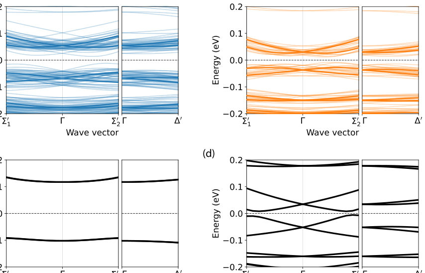
<figcaption class="paper-figure-caption"><b>Fig 4.</b> FIG. 4. Band structure in the vicinity of Γ at 600 K obtained using different structural sam-</figcaption>
</figure>
<figure class="paper-figure-card">
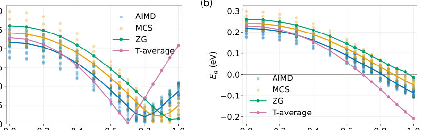
<figcaption class="paper-figure-caption"><b>Fig 5.</b> FIG. 5. Absolute (a) and signed (b) band gaps at 600 K as a function of the SOC scale. The min-</figcaption>
</figure>

**Summary.** This work examines how thermal disorder affects the topological properties of materials like $	ext{Bi}_2	ext{Se}_3$. The authors demonstrate that simply averaging the structure fails to capture crucial effects like instantaneous symmetry breaking. They conclude that true topological robustness at finite temperature depends on the statistical distribution of configurations, not the average structure itself.

**Why it may be interesting.** The concept of topological robustness being governed by the statistical distribution of configurations rather than a single mean structure is highly relevant to understanding open quantum systems and materials under non-equilibrium or fluctuating conditions.

Detailed structure

**Main problem.** The study investigates whether the electronic properties, particularly band topology, of a material at finite temperature are accurately represented by averaging over the entire ensemble of thermally disordered configurations.

**Main result.** Topological robustness at finite temperature is a property of the entire distribution over configurations, not of any single instantaneous structure or the simple thermal average.

**Method.** The authors employ ab initio molecular dynamics (AIMD) simulations and compare the results from the time-averaged structure against ensembles generated by Monte Carlo sampling.

**Model / system.** The physical system is $	ext{Bi}_2	ext{Se}_3$, a representative topological insulator. The model involves simulating the lattice structure under thermal disorder using DFT calculations.

**Key observables.** Band topology (band inversion), band gap renormalization, Rashba-like spin splitting, and band-inversion survival probability.

**Important parameters / regimes.** Temperature (up to 1050 K), Spin-Orbit Coupling (SOC) scaling parameter ($\lambda$), and the structural sampling method (AIMD vs. MCS).

**Assumptions / limitations.** The primary assumption challenged is that the time-averaged structure ($\langle R 
angle$) is a faithful proxy for the ensemble average of electronic properties.

**Figures summary.** Figures compare band structures and lattice parameters derived from AIMD snapshots, Monte Carlo sampling, and the time-averaged structure, illustrating discrepancies in symmetry breaking and gap values.

**Paper structure.** The paper establishes the problem of finite-temperature averaging, applies DFT/AIMD to $	ext{Bi}_2	ext{Se}_3$, compares the results from the time-average versus the ensemble, and concludes that the distribution governs the topological stability.

Abstract

Band topology is usually assigned to a single crystal structure, yet at finite temperature a crystal is an ensemble of thermally disordered configurations with a fluctuating band gap. We ask whether the thermally averaged structure is a faithful proxy for this ensemble, taking Bi$_2$Se$_3$ as a representative topological insulator and classifying band ordering in each ab initio molecular dynamics snapshot by scaling the spin-orbit coupling. The averaged structure fails in two ways: it misses the Rashba-like spin splitting that instantaneous symmetry breaking produces in individual configurations, and it substantially underestimates the band-gap renormalization, whereas a small ensemble of harmonic Monte Carlo configurations reproduces both the mean and the spread of the gap. Using a band-inversion survival probability, we find that the band inversion of Bi$_2$Se$_3$ holds in every sampled configuration up to 600 K, above which individual configurations cross into normal band ordering well before the average gap closes. Topological robustness at finite temperature is thus a property of the distribution over configurations rather than of any single structure.

[↑ back to top](#top)

### [Vector solitons in nonlinear lattices with competing SPM and XPM terms](http://arxiv.org/abs/2610.01212v1)

**Authors:** Liangwei Zeng, Boris A. Malomed, Dumitru Mihalache, Xing Zhu  
**Type:** theory · **Category:** other · **PDF:** <https://arxiv.org/pdf/2610.01212v1>  
**Analysis basis:** full PDF text, analyzed in chunks
**Topic relevance:** `analog quantum simulation` **2/5** · `interference shaping light` **1/5**

↔ Scroll figures horizontally

<figure class="paper-figure-card">
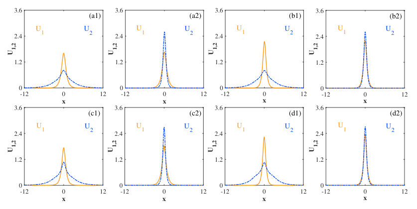
<figcaption class="paper-figure-caption"><b>Fig 1.</b> FIG. 1. Profiles of fundamental VSs in the first and second components (yellow and blue lines, respectively) for γ = 2/3: (a1) unstable one at b1 = 1, b2 = 0.1; (a2) stable one at b1 = 1, b2 = 3; (b1) unstable one at b1 = 2, b2 = 0.1; (b2) stable one at b1 = 2, b2 = 3. Panels (c1)–(d2): the same as in (a1)–(b2) but for γ = 2.</figcaption>
</figure>
<figure class="paper-figure-card">
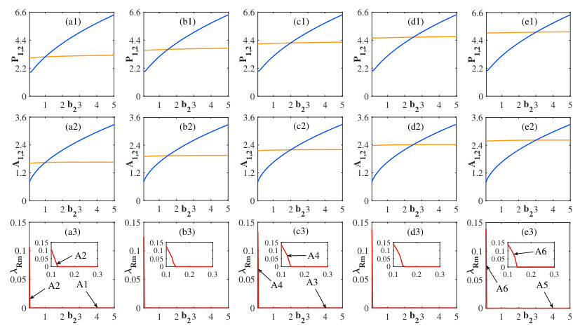
<figcaption class="paper-figure-caption"><b>Fig 2.</b> FIG. 2. Powers P1,2 (top row), amplitudes A1,2 (middle row) ,and maximum real parts of eigenvalues λRm (bottom row) of fundamental VSs versus the propagation constant of the second component, b2, for γ = 2/3: (a1)–(a3) with b1 = 1; (b1)–(b3) with b1 = 1.5; (c1)–(c3) with b1 = 2; (d1)–(d3) with b1 = 2.5; (e1)–(e3) with b1 = 3. The yellow and blue lines pertain to the first and second components, respectively.</figcaption>
</figure>
<figure class="paper-figure-card">
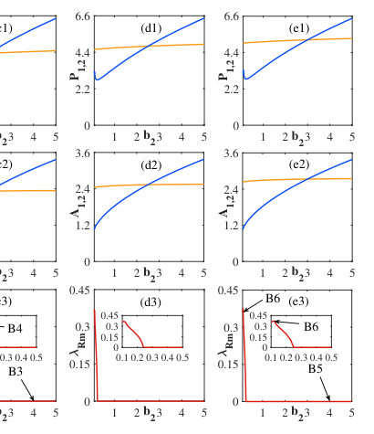
<figcaption class="paper-figure-caption"><b>Fig 3.</b> FIG. 3. The same as in Fig. 2, but with γ = 2.</figcaption>
</figure>
<figure class="paper-figure-card">
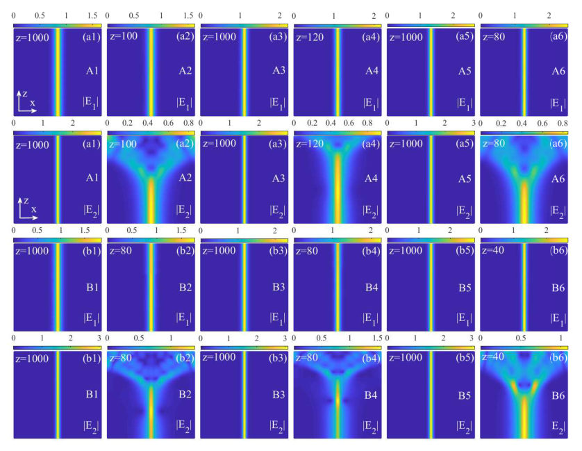
<figcaption class="paper-figure-caption"><b>Fig 4.</b> FIG. 4. Perturbed propagations of fundamental VSs at γ = 2/3: (a1) with b1 = 1, b2 = 4; (a2) with b1 = 1, b2 = 0.125; (a3) with b1 = 2, b2 = 4; (a4) with b1 = 2, b2 = 0.125; (a5) with b1 = 3, b2 = 4; (a6) with b1 = 3, b2 = 0.125. Panels (b1) - (b6) show the same for γ = 2. In all panels, the simulation domain is |x| ≤15.</figcaption>
</figure>
<figure class="paper-figure-card">
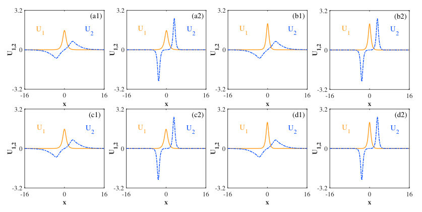
<figcaption class="paper-figure-caption"><b>Fig 5.</b> FIG. 5. Profiles of mixed VSs in the first and second components (yellow and blue lines, respectively) with the XPM parameter γ = 2/3: (a1) unstable one at b1 = 1, b2 = 0.1; (a2) stable one at b1 = 1, b2 = 3; (b1) unstable one at b1 = 2, b2 = 0.1; (b2) stable one at b1 = 2, b2 = 3. Panels (c1)–(d2): the same as (a1)–(b2), but for γ = 2.</figcaption>
</figure>

**Summary.** This paper theoretically investigates vector solitons in nonlinear photonic lattices where competing nonlinear effects (SPM and XPM) are present. Using coupled NLSEs, the authors demonstrate the existence of stable fundamental and mixed soliton types. The stability is rigorously analyzed using linear stability theory, mapping out the parameter space where these robust light structures can propagate.

**Why it may be interesting.** This work is highly relevant to quantum optics and nonlinear photonics, as vector solitons represent robust, localized energy packets whose stability is governed by complex nonlinear interactions, mirroring phenomena studied in quantum light-matter interactions.

Detailed structure

**Main problem.** The study investigates the existence and stability of two-component optical vector solitons (VSs) propagating in nonlinear photonic lattices characterized by competing Self-Phase Modulation (SPM) and Cross-Phase Modulation (XPM) terms.

**Main result.** The research confirms that stable fundamental and mixed vector solitons exist in these lattices, except for narrow ranges of the propagation constant. The stability analysis maps out the parameter space where these localized structures persist.

**Method.** The authors employed a combination of analytical techniques (solving stationary equations) and rigorous numerical methods, including linear stability analysis via eigenvalue problems and direct simulation of perturbed propagation.

**Model / system.** The system is modeled by coupled Nonlinear Schrödinger Equations (NLSEs) describing two-component light propagation in a nonlinear lattice defined by spatially-modulated coefficients. The competition between SPM and XPM terms is key to the physics.

**Key observables.** Profiles of the two components ($U_1, U_2$), total power ($P_1, P_2$), amplitudes ($A_1, A_2$), and the real part of the eigenvalues ($	ext{Re}(\lambda)$) used to determine stability.

**Important parameters / regimes.** The nonlinear coupling strength ($\gamma$), the propagation constants ($b_1, b_2$), and the spatial modulation parameters are crucial for defining the soliton types and stability regimes.

**Assumptions / limitations.** Stability analysis relies on linearizing the equations around the stationary solution, and some initial approximations treat the XPM term as a small perturbation.

**Figures summary.** Figures illustrate the profiles and stability regions for fundamental and mixed VSs, mapping out critical values ($b_{2cr}$) that determine the stability domain based on the propagation constants.

**Paper structure.** The paper first establishes the physical model and stationary solutions, followed by a detailed stability analysis using eigenvalue solvers. The results are then systematically presented by comparing the characteristics and stability of the two distinct soliton types (fundamental and mixed) across varying parameters.

Abstract

We demonstrate that two-component photonic nonlinear lattices with opposite signs of the out-of-phase spatially modulated SPM and XPM coefficients can support two types of optical vector solitons (VSs), the fundamental and mixed ones. The fundamental VSs are composed of two Gaussian-like components, while the mixed ones combine Gaussian-like and dipole components. The structures and stability of both types of the VSs are investigated. The VSs are stable, except for narrow intervals at small values of the propagation constant.

[↑ back to top](#top)

### [The role of root allometry and root overlap in vegetation pattern formation](http://arxiv.org/abs/2610.01730v1)

**Authors:** Jelle van der Voort, Ricardo Martinez-Garcia, Arjen Doelman  
**Type:** theory · **Category:** statistical mechanics · **PDF:** <https://arxiv.org/pdf/2610.01730v1>  
**Analysis basis:** full PDF text, analyzed in chunks
**Topic relevance:** `Frenkel-Kontorova` **1/5** · `Keldysh / 2PI / non-Gaussian methods` **1/5** · `analog quantum simulation` **1/5** · `correlated / nonlocal dissipation` **1/5** · `driven-dissipative phase transition` **1/5** · `methods for driven-dissipative` **1/5** · `non-equilibrium universality` **1/5**

↔ Scroll figures horizontally

<figure class="paper-figure-card">
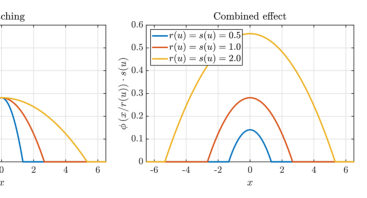
<figcaption class="paper-figure-caption"><b>Fig 1.</b> Figure 1: The distinct roles of s(u) and r(u) in shaping the spatial root distribution</figcaption>
</figure>
<figure class="paper-figure-card">
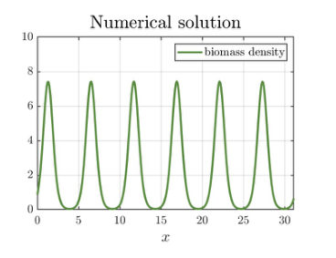
<figcaption class="paper-figure-caption"><b>Fig 2.</b> Figure 2: Pattern formation induced by root growth outpacing mortality. The left panel shows that the dispersion relation takes an excursion above zero, indicating a Turing instability. The right panel shows the corresponding vegetation pattern obtained from a numerical simulation.</figcaption>
</figure>
<figure class="paper-figure-card">
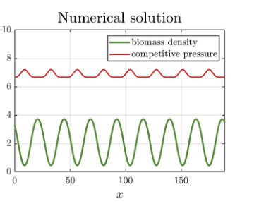
<figcaption class="paper-figure-caption"><b>Fig 3.</b> Figure 3: Pattern formation through competitive pressure zones induced by root allometry. The left panel shows that the dispersion relation is positive over a non- empty range of wavenumbers, indicating a Turing instability. The right panel shows the corresponding numerical solution together with the competitive pressure. The two quantities are out of phase, with the competitive pressure highest in between the high-biomass areas.</figcaption>
</figure>

**Summary.** This paper develops a mathematical model for vegetation pattern formation by coupling root growth to soil water competition. By analyzing the impact of root allometry and root overlap on the resulting non-local scalar model, the authors identify two distinct mechanisms driving pattern instabilities. The work demonstrates that both root scaling and the explicit accounting for root overlap are crucial for accurately describing ecological pattern dynamics.

**Why it may be interesting.** While the subject is ecology, the mathematical techniques—non-local interactions, pattern formation via instability analysis (Turing mechanisms), and the use of integral kernels—are highly relevant to theoretical physics studying pattern formation in reaction-diffusion systems, including those found in condensed matter or AMO physics.

Detailed structure

**Main problem.** The paper investigates how root allometry and root overlap affect the conditions necessary for pattern formation in non-local scalar models describing vegetation dynamics.

**Main result.** Root allometry promotes two distinct mechanisms for Turing instabilities, while root overlap fundamentally alters the model structure, inhibiting the emergence of competitive pressure zones.

**Method.** The authors use asymptotic reduction (eliminating the fast water variable) to derive a non-local scalar model, followed by linear stability analysis using Fourier transforms to determine the dispersion relation.

**Model / system.** The system models vegetation growth and water competition in a spatially explicit, two-component vegetation-water system. The analysis reduces this to a scalar model incorporating root allometry (variable root extent) and root overlap (double integral structure).

**Key observables.** The dispersion relation $\omega(k; ar{u})$, which determines the growth rate of spatial perturbations, and the stability of the homogeneous equilibrium $ar{u}$.

**Important parameters / regimes.** Root allometry function $r(u)$, root overlap structure (double integral), and the time scale separation parameter $\delta$.

**Assumptions / limitations.** The analysis assumes fast water dynamics ($\delta \ll 1$) and that the system possesses a positive homogeneous equilibrium $ar{u}$.

**Figures summary.** Figure 1 illustrates the distinct roles of the scaling functions $s(u)$ and $r(u)$ in shaping the spatial root distribution $\phi(x)^{r(u)} s(u)$.

**Paper structure.** The paper first establishes the full two-component system, then uses time scale separation to derive the reduced scalar model. Stability analysis is performed by linearizing around the equilibrium, leading to the dispersion relation, which is then analyzed to identify the conditions for pattern formation based on the structural terms (single vs. double integral).

Abstract

We investigate how root allometry and below-ground root competition due to root overlap affect the conditions for pattern formation in non-local scalar vegetation models. We start from a spatially explicit two-component vegetation-water system in which plants acquire soil water through their laterally extended root systems, with root allometry represented by an interaction kernel whose spatial extent increases with the above-ground biomass density. In the limit of fast water dynamics, we eliminate the water variable, resulting in a non-local scalar model for the vegetation dynamics. This reduction reveals that accounting for root overlap naturally leads to a double integral structure in the scalar model, in contrast to the single convolution term commonly used to model non-local competition for resources. For the resulting scalar model, we identify two distinct mechanisms that can drive Turing instabilities. The first instability mechanism requires root growth to outpace mortality, while the second mechanism relies on the development of competitive pressure zones, in which vegetation growth is impeded by the cumulative competitive pressure exerted by neighbouring areas with higher biomass density. Root allometry promotes the occurrence of both instability mechanisms, while root overlap inhibits the emergence of competitive pressure zones. Hence, our results show that both root allometry and root overlap are important features to consider when studying vegetation pattern formation.

[↑ back to top](#top)

### [Edge-cusped compactons from gradient-power nonlinear dispersion: exact transitions and singular spectral structure](http://arxiv.org/abs/2610.00552v1)

**Authors:** Francisco R. Villatoro  
**Type:** theory · **Category:** other · **PDF:** <https://arxiv.org/pdf/2610.00552v1>  
**Analysis basis:** full PDF text, analyzed in chunks
**Topic relevance:** `Keldysh / 2PI / non-Gaussian methods` **1/5** · `analog quantum simulation` **1/5** · `methods for driven-dissipative` **1/5**

↔ Scroll figures horizontally

<figure class="paper-figure-card">
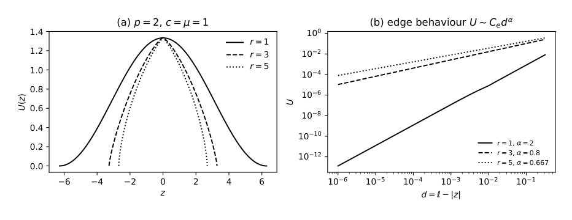
<figcaption class="paper-figure-caption"><b>Fig 1.</b> Figure 1: (a) Compacton profiles of (1) for p = 2, c = µ = 1 and r = 1, 3, 5, computed from (10). (b) Behaviour near the free boundary in logarithmic scale; the slopes are the exponents α = 2, 4/5 and 2/3 of (11). For r = 3 and r = 5 the slope is smaller than one and the derivative of the profile is unbounded at the boundary.</figcaption>
</figure>
<figure class="paper-figure-card">
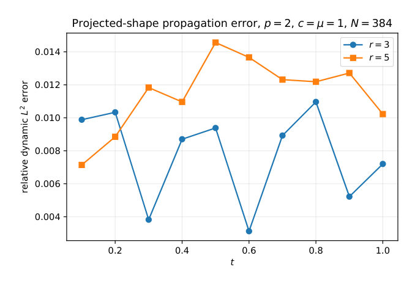
<figcaption class="paper-figure-caption"><b>Fig 2.</b> Figure 2: Relative dynamic L2 error Edyn for p = 2, c = µ = 1, N = 384 and the padded Fourier–Galerkin discretisation. The compactons remain coherent for 0 ≤t ≤1 at percent-level error.</figcaption>
</figure>
<figure class="paper-figure-card">
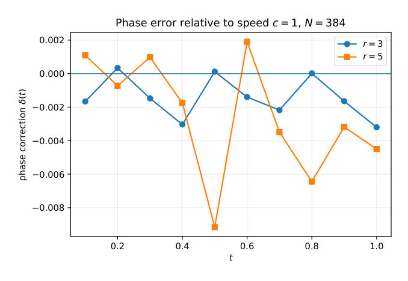
<figcaption class="paper-figure-caption"><b>Fig 3.</b> Figure 3: Phase correction δ(t) used in (40). Its magnitude remains below 3.2 × 10−3 for r = 3 and 9.2 × 10−3 for r = 5 over the unit-time calculation.</figcaption>
</figure>
<figure class="paper-figure-card">
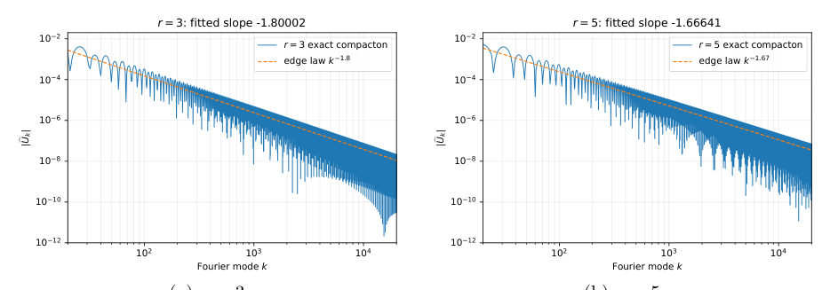
<figcaption class="paper-figure-caption"><b>Fig 4.</b> Figure 4: Fourier coefficients of the exact p = 2 compactons shown separately to make the algebraic tails visible. The fitted slopes are −1.80002 for r = 3 and −1.66641 for r = 5, in agreement with the endpoint asymptotic (41). The free-boundary singularity therefore controls the high-frequency tail in both cases.</figcaption>
</figure>
<figure class="paper-figure-card">
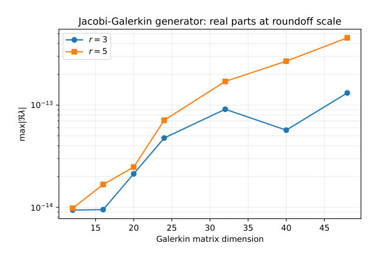
<figcaption class="paper-figure-caption"><b>Fig 5.</b> Figure 5: Maximum absolute real part of the eigenvalues of the structure-adapted Jacobi– Galerkin truncation of a∂zS. Values remain at the level of floating-point roundoff as the truncation is increased.</figcaption>
</figure>

**Summary.** This paper develops a generalized nonlinear dispersive model to study 'compactons'—solitary wave solutions with compact support. It achieves this by independently controlling parameters that govern the wave's support, its boundary regularity, and its associated spectral properties. The work is significant for providing a unified mathematical testbed to analyze complex phenomena like geometric singularities and spectral structure in nonlinear wave dynamics.

**Why it may be interesting.** While not directly about quantum systems, the rigorous mathematical framework developed for studying singular solutions, spectral theory (Jacobi-hypergeometric type), and weak admissibility in nonlinear PDEs provides powerful tools applicable to analyzing quantum field theories or non-equilibrium quantum dynamics where singular limits are encountered.

Detailed structure

**Main problem.** The study aims to independently analyze and separate the mechanisms governing compactification, free-boundary regularity, and linearized spectral structure within a single, degenerate nonlinear dispersive model.

**Main result.** The authors introduce a two-exponent family of equations that allows for the controlled study of geometric singularities, weak admissibility, and spectral properties in compacton solutions.

**Method.** The analysis combines analytical techniques (solving ODEs for travelling waves) with advanced numerical methods, including Fourier-Galerkin time integration and Jacobi-Galerkin spectral diagnostics.

**Model / system.** The system is governed by a nonlinear dispersive equation involving two exponents, $p$ (nonlinear-flux) and $r$ (gradient-dispersion), which yields 'edge-cusped compactons' solutions.

**Key observables.** Mass $M[u]$, conserved quantity $Q[u]$, spectral eigenvalues, and the decay rates of the high-frequency Fourier tail.

**Important parameters / regimes.** The critical parameters are the exponents $p>1$ and $r>0$, and the transition curves $pr=1$ and $r(p-1)=2$.

**Assumptions / limitations.** The analysis assumes the existence of a travelling-wave solution and treats the problem as a testbed for separating different types of mathematical singularities.

**Figures summary.** Figures illustrate the coherent propagation of cusped waves over time, the algebraic decay of Fourier coefficients controlled by the free boundary, and the convergence of computed eigenvalues towards exact spectral values.

**Paper structure.** The paper first introduces the general model and its conserved quantities, then derives the explicit form of the travelling-wave solution (compacton), followed by a detailed spectral analysis of the linearized operator, and finally, numerical verification of the solution's stability and regularity.

Abstract

We introduce a conservative two-exponent dispersive family, with $p>1$ the nonlinear-flux exponent and $r>0$ the gradient-dispersion exponent, that separates the mechanisms governing compactification, free-boundary regularity and linearised spectral structure while retaining an explicit travelling-wave theory. The family reduces to the absolute Rosenau-Hyman equation when $r=1$. The deformation leaves the amplitude-speed law unchanged, but makes the width amplitude dependent except at $r=1$. Two independent transition curves emerge: $pr=1$ separates infinite-tail solitary waves from compactons, whereas $r(p-1)=2$ separates compactons with a regular free boundary from edge-cusped compactons with divergent slope. The latter remain distributional solutions, with no singular measures at either the free boundary or the crest. For $r\ge1$, the linearisation factors through a singular Sturm-Liouville operator whose natural Friedrichs realisation is solvable: after a compacton-adapted change of variable, the eigenvalue equation is of Jacobi-hypergeometric type, with two explicit spectral sequences, exactly one negative eigenvalue and a one-dimensional translation kernel. Numerical experiments connect these exact structures to approximation and dynamics. Measured Fourier tails and projection errors agree with the rates predicted by the free-boundary exponent, while padded Fourier-Galerkin time integration propagates the cusped waves coherently with small phase drift. A structure-adapted Jacobi-Galerkin diagnostic of the full generator finds no detectable real part in the tested truncated point spectra. The family therefore provides an explicit testbed in which geometric singularity, weak admissibility, spectral structure and numerical regularity of compactons can be studied within a single degenerate dispersive model.

[↑ back to top](#top)

### [Flux- and tunnel-parity-controlled Josephson nonreciprocity from singlet-triplet competition in a parallel double quantum dot](http://arxiv.org/abs/2610.01830v1)

**Authors:** Debika Debnath, Fernando Dominguez, Patrik Recher  
**Type:** theory · **Category:** strongly correlated electrons · **PDF:** <https://arxiv.org/pdf/2610.01830v1>  
**Analysis basis:** full PDF text, analyzed in chunks
**Topic relevance:** `Keldysh / 2PI / non-Gaussian methods` **1/5** · `analog quantum simulation` **1/5** · `interference shaping light` **1/5**

↔ Scroll figures horizontally

<figure class="paper-figure-card">
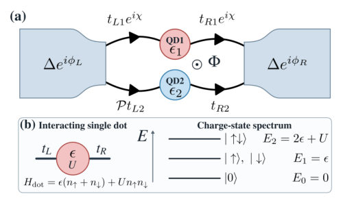
<figcaption class="paper-figure-caption"><b>Fig 1.</b> FIG. 1: Parallel double-quantum-dot Josephson junction and single-dot charge states. (a) Two quantum dots with level energies ϵi where i(= 1, 2) and charging en- ergies Ui are coupled in parallel between superconduct- ing reservoirs with phases ϕL and ϕR. The magnetic flux Φ threading the loop generates the single-electron Aharonov–Bohm phase Φ. The four lead-dot couplings tνi define the gauge-invariant tunnel parity P, introduced in Eq. (8) and χ = πΦ/2Φ0. (b) Interacting single-level quantum dot described by Hdot with empty, singly oc- cupied, and doubly occupied states of energies E0 = 0, E1 = ϵ, and E2 = 2ϵ + U, respectively.</figcaption>
</figure>
<figure class="paper-figure-card">
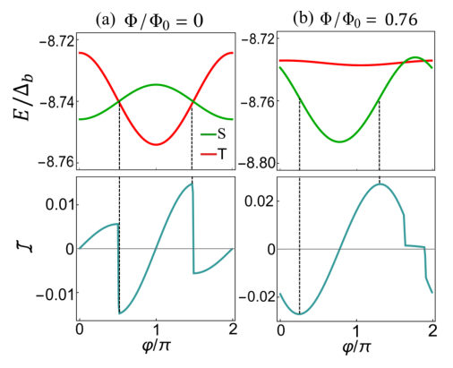
<figcaption class="paper-figure-caption"><b>Fig 2.</b> FIG. 2: Lowest singlet (green) and triplet (red) many- body energies (upper row) and the corresponding Joseph- son current (lower row), shown as functions of the gauge- invariant phase φ at even total tunnel parity (P = 1) for (a) Φ/Φ0 = 0 and (b) Φ/Φ0 = 0.76, respectively. The parameters are ϵ1 = −5∆b, ϵ2 = −1.5∆b, and U = 8∆b.</figcaption>
</figure>
<figure class="paper-figure-card">
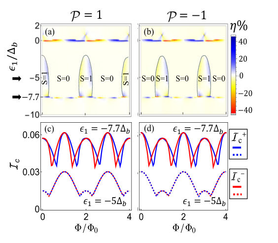
<figcaption class="paper-figure-caption"><b>Fig 3.</b> FIG. 3: Josephson-diode efficiency as a function of the first-dot energy ϵ1 and magnetic flux Φ/Φ0 for (a) even (P = 1) and (b) odd (P = −1) tunnel parity at U = 8∆b. Dashed curves mark boundaries between singlet- and triplet-dominated ground-state envelopes within the (1, 1) charge sector. Panels (c) and (d) show I+ c (blue) and I− c (red) for even and odd tunnel parity, respectively, along the line cuts shown by the arrows at ϵ1 = −5∆b (dashed) and ϵ1 = −7.7∆b (solid).</figcaption>
</figure>
<figure class="paper-figure-card">
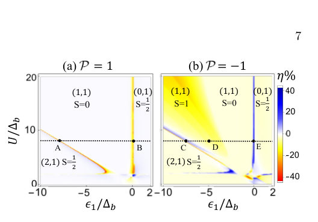
<figcaption class="paper-figure-caption"><b>Fig 4.</b> FIG. 4: Josephson-diode efficiency in the (ϵ1, U) plane for (a) even and (b) odd tunnel parity at fixed Φ/Φ0 = 0.76. Labels indicate the dominant charge and total-spin character of the ground-state segments associated with the critical-current extrema. The dashed horizontal line at U = 8∆b and points A–E specify the cuts analyzed in Fig. 5. We use ϵ2 = −1.5∆b and tL1 = |tL2| = tR1 = tR2 = 0.5∆b.</figcaption>
</figure>
<figure class="paper-figure-card">
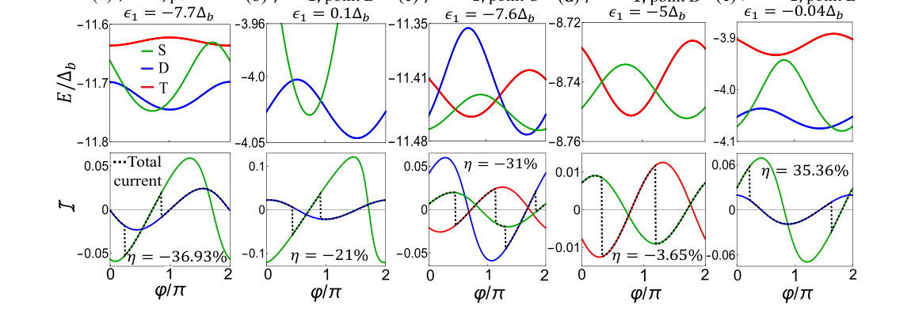
<figcaption class="paper-figure-caption"><b>Fig 5.</b> FIG. 5: Lowest phase-dependent many-body energies (upper row) as well as branch resolved and total Josephson current (lower row) at the five points marked in Fig. 4. Green, blue, and red curves denote branches with singlet, doublet, and triplet character, respectively. The black dashed curve presents the total Josephson current and show the explicit many body branch contributing to the critical currents. All panels use U = 8∆b and Φ/Φ0 = 0.76; the values of ϵ1 are indicated above the panels. Other parameters are the same as in Fig. 4.</figcaption>
</figure>

**Summary.** This theoretical study explores how Josephson nonreciprocity in a double quantum dot junction emerges from the competition between local and non-local superconducting processes. By controlling external parameters like magnetic flux and tunnel-sign parity, the authors demonstrate that the resulting diode efficiency can be tuned, establishing a mechanism based on phase-dependent many-body spectral competition.

**Why it may be interesting.** This work provides a detailed, microscopic understanding of how quantum interference and many-body correlations in nanoscale superconducting junctions can lead to macroscopic, tunable quantum effects like diode behavior.

Detailed structure

**Main problem.** The paper investigates the microscopic origin and control mechanisms of Josephson nonreciprocity (superconducting diode effect) in interacting quantum dot systems.

**Main result.** Nonreciprocal supercurrents are shown to arise from the competition between local Josephson processes and non-local exchange interactions, which is highly sensitive to orbital flux and tunnel-sign parity.

**Method.** The study employs exact diagonalization of a zero-bandwidth Hamiltonian, analyzing the phase-dependent many-body spectrum derived from superconducting orbitals.

**Model / system.** The system is a parallel double quantum dot (DQD) Josephson junction coupled to superconducting leads, modeled with intradot Coulomb repulsion and incorporating superconducting pairing effects.

**Key observables.** Nonreciprocal supercurrents ($I_c^+ 
eq I_c^-$), diode efficiency ($\eta$), and the energy splitting between singlet and triplet ground-state spectral branches.

**Important parameters / regimes.** Orbital flux ($\Phi$), tunnel-sign parity ($P$), intradot Coulomb repulsion ($U$), and temperature ($T$).

**Assumptions / limitations.** The analysis utilizes the Zero-Bandwidth Approximation (ZBA) and neglects interdot coupling terms beyond the scope of the primary Hamiltonian.

**Figures summary.** Figures illustrate the DQD setup, the dependence of singlet/triplet energies and Josephson current on phase and flux, and the variation of diode efficiency with parameters like tunnel asymmetry and temperature.

**Paper structure.** The paper builds the model Hamiltonian, derives the effective low-energy spectrum by considering the competition between local and non-local tunneling terms, and then calculates the supercurrent and diode efficiency based on the resulting many-body branch structure.

Abstract

Nonreciprocal supercurrents in interacting nanostructures can arise when the positive and negative critical currents probe inequivalent portions of a phase-dependent many-body spectrum. We study this mechanism in a parallel double-quantum-dot Josephson junction with strong intradot Coulomb repulsion, where local and non-local Cooper-pair transfer coexist. Using exact diagonalization of a zero-bandwidth Hamiltonian with explicit superconducting orbitals, we show that orbital flux and the gauge-invariant tunnel-sign parity control the interference between local Josephson processes and non-local exchange. For detuned dots, this produces flux-tunable singlet, triplet, and doublet ground-state spectral branches and two rectification regimes. Near the boundaries of the charge sector with singly occupied dots [(1,1) sector], doublet branches compete with singlet or triplet branches, yielding diode efficiencies approaching 40%. Within the triplet-dominated (1,1) sector, nearby singlet crossings asymmetrically reshape the ground-state envelope even when both critical-current extrema lie on the triplet-like branch, producing a broader response of order 10-15%. Finite temperature generally suppresses charge-crossover rectification, however, for intermediate temperatures we find an enhancement of both the normalized efficiency and the absolute critical-current asymmetry in the triplet regime. These results establish phase-dependent many-body branch competition as a gate-, flux-, and tunnel-parity-sensitive source of Josephson nonreciprocity.

[↑ back to top](#top)

### [Charge and spin dynamics in spintronic THz emitters from Time-Dependent Density Functional Theory](http://arxiv.org/abs/2610.01089v1)

**Authors:** Ali Kefayati  
**Type:** theory · **Category:** other · **PDF:** <https://arxiv.org/pdf/2610.01089v1>  
**Analysis basis:** full PDF text, analyzed in chunks
**Topic relevance:** `Keldysh / 2PI / non-Gaussian methods` **1/5** · `methods for driven-dissipative` **1/5**

↔ Scroll figures horizontally

<figure class="paper-figure-card">
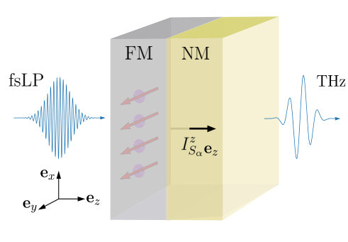
<figcaption class="paper-figure-caption"><b>Fig 1.</b> FIG. 1. Schematic view of the FM/NM bilayer used as a spintronic THz emitter. A femtosecond laser pulse (fsLP) excites the bilayer, producing ultrafast magnetization, charge, and spin dynamics. Co is used as the FM layer and Pt or W as the NM layer.</figcaption>
</figure>
<figure class="paper-figure-card">
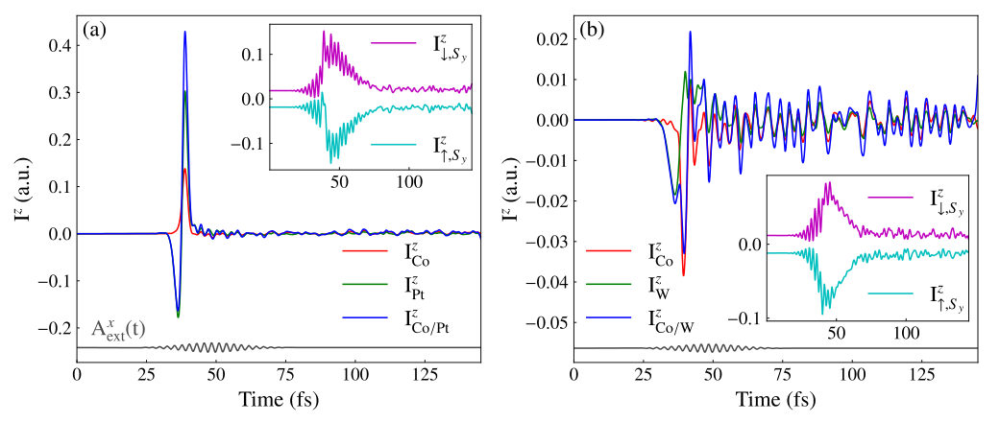
<figcaption class="paper-figure-caption"><b>Fig 2.</b> FIG. 2. The out-of-plane total and layer-resolved charge current for the (a) Co/Pt, and (b) Co/W bilayers. The inset shows the spin current in each spin channel. The total charge current is the sum of the FM and the NM layers. The vector potential of the laser pulse (Ax ext(t)) is shown in gray.</figcaption>
</figure>
<figure class="paper-figure-card">
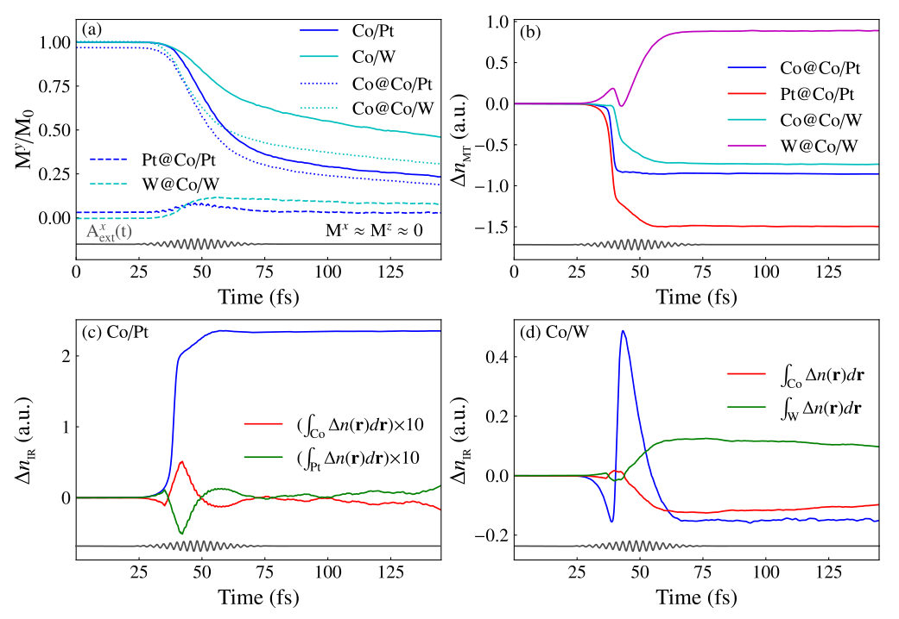
<figcaption class="paper-figure-caption"><b>Fig 3.</b> FIG. 3. (a) Total and layer-resolved magnetization dynamics of Co/Pt and Co/W. (b) Dynamics of the local electronic populations. (c,d) Nonlocal and layer-resolved excess charge densities of Co/Pt and Co/W, respectively. In Co/Pt the nonlocal density remains enhanced, whereas in Co/W it eventually falls below its initial value.</figcaption>
</figure>
<figure class="paper-figure-card">
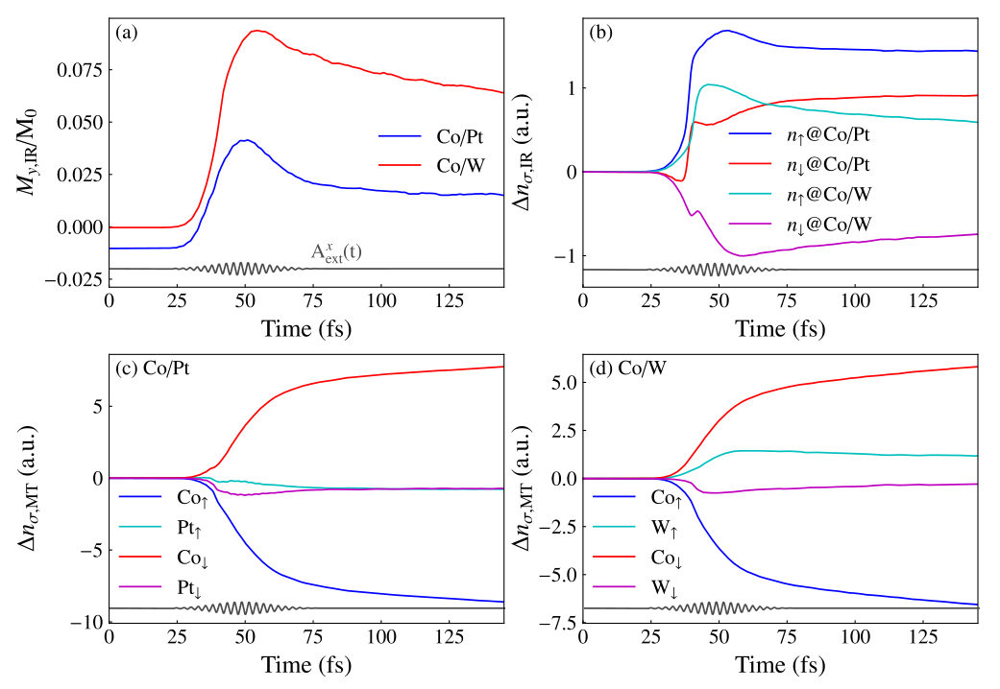
<figcaption class="paper-figure-caption"><b>Fig 4.</b> FIG. 4. (a) Magnetization associated with the nonlocal electronic population. (b) Spin-resolved nonlocal charge densities. The minority spin density reduction in W indicate a transition to the atom-central local electronic states resulting in a large magnetization of the nonlocal electronic population. (c,d) Spin-resolved local charge densities of Co/Pt and Co/W. The delayed reduction of the NM minority-spin local population, together with the increase of the Co minority-spin population, is consistent with a common NM↓→Co↓OISTR channel. Co/W additionally exhibits a pronounced majority-spin Co-to-W transfer channel.</figcaption>
</figure>
<figure class="paper-figure-card">
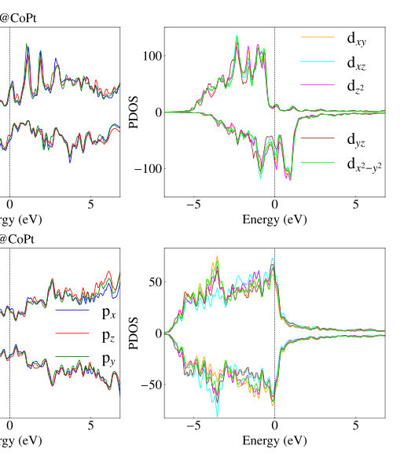
<figcaption class="paper-figure-caption"><b>Fig 5.</b> FIG. 5. Projected density of states of the Co/Pt bilayer resolved into atomic orbital and spin character.</figcaption>
</figure>

**Summary.** This theoretical study uses TDDFT to model ultrafast dynamics in spintronic THz emitters (Co/Pt and Co/W). It reveals that while spin transport occurs, the resulting charge redistribution is not uniquely determined by spin alone, but critically depends on the material's unique electronic phase space. This has implications for designing next-generation spintronic devices.

**Why it may be interesting.** The explicit coupling of spin, charge, and orbital angular momentum dynamics in ultrafast magnetic systems is highly relevant to understanding non-equilibrium quantum phenomena in condensed matter.

Detailed structure

**Main problem.** The paper aims to resolve the microscopic relationship between ultrafast spin transport and charge redistribution in spintronic terahertz (THz) emitters.

**Main result.** The interlayer charge transfer dynamics differ significantly between Co/Pt and Co/W, depending critically on the material-specific electronic phase space rather than solely on spin current.

**Method.** Time-Dependent Density Functional Theory (TDDFT) is employed to simulate the coupled charge, spin, and magnetization dynamics in real time and space.

**Model / system.** The study focuses on Co/Pt and Co/W ferromagnetic/heavy-metal bilayers, simulating photoexcitation using x-polarized Gaussian laser pulses.

**Key observables.** Charge density, magnetization density, microscopic and macroscopic charge/spin current densities, and orbital-resolved electronic populations.

**Important parameters / regimes.** Ultrafast timescales (femtoseconds), material-specific electronic structure, and the nature of the electronic phase space.

**Assumptions / limitations.** The analysis ignores lattice nuclear dynamics for the initial 100 fs, and the study moves beyond simple equilibrium transport coefficient interpretations.

**Figures summary.** Figures illustrate layer-resolved charge and spin current densities, magnetization dynamics, and orbital-resolved density of states (PDOS) for both heterostructures.

**Paper structure.** The paper analyzes the coupled dynamics using TDDFT, comparing the charge transfer in Co/Pt versus Co/W, and attributing the differences to the material-dependent electronic phase space.

Abstract

Spintronic terahertz (THz) emitters based on ferromagnet/heavy-metal heterostructures provide efficient broadband sources of THz radiation, yet the microscopic relation between ultrafast spin transport and charge redistribution remains incompletely understood. Here, we employ time-dependent density functional theory to resolve the coupled charge, spin, and magnetization dynamics of Co/Pt and Co/W bilayers in real time and space. Despite qualitatively similar interlayer spin-current dynamics, the two heterostructures exhibit markedly different interlayer charge transfer: Co/Pt shows a relatively small and partially reversed transfer from Pt to Co, whereas Co/W exhibits a larger and persistent transfer from Co to W. We trace these differences to the material-dependent ground-state electronic structure and the spin- and orbital-resolved phase space accessible to photoexcited carriers. Spin-resolved dynamics further reveal coexisting spin-orbit-mediated redistribution and optically induced intersite spin transfer, including a delayed minority-spin transfer from the heavy metal to Co common to both systems. While net electronic spin angular momentum is transferred between the layers, we find no corresponding net transfer of electronic orbital angular momentum. In Co/W, the persistent redistribution of electronic density from interstitial to atom-centered states additionally provides strong evidence for light-induced electronic localization. These results demonstrate that ultrafast spin transport does not uniquely determine charge or angular-momentum redistribution in spintronic THz emitters, which instead depends critically on the material-specific electronic phase space.

[↑ back to top](#top)

### [Complex Magnetic Phases and Unconventional Skyrmion Thermodynamics in Magnetically Intercalated Cr$_{1+x}$Te$_2$Compounds](http://arxiv.org/abs/2610.00877v1)

**Authors:** Clayton Conner, Santosh Karki Chhetri, Avinash Sah, Manoj Gadtoula, Dilan M. Gamachchi, Indeewari M. Karunarathne, Steven Kelley, Andrew C. Meng, Jacob Cook, Cheng Zhang, Jin Hu, Yue Li, Hoyeon Jeon, An-Ping Li, Zheng Gai, Guang Bian  
**Type:** experiment · **Category:** statistical mechanics · **PDF:** <https://arxiv.org/pdf/2610.00877v1>  
**Analysis basis:** full PDF text, analyzed in chunks
**Topic relevance:** `analog quantum simulation` **1/5** · `non-equilibrium universality` **1/5**

↔ Scroll figures horizontally

<figure class="paper-figure-card">
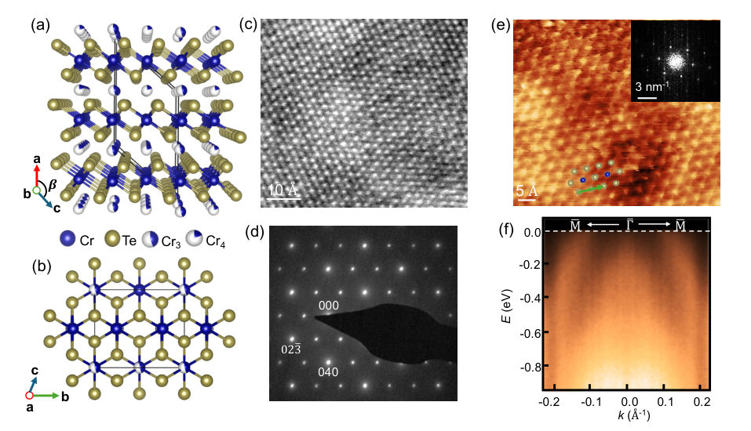
<figcaption class="paper-figure-caption"><b>Fig 1.</b> FIG. 1. Structural and Electronic Properties of Cr1+xTe2. (a) Side view along the in-plane (010)</figcaption>
</figure>
<figure class="paper-figure-card">
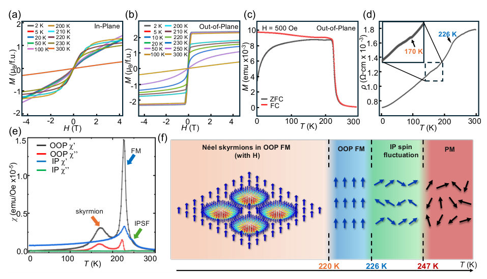
<figcaption class="paper-figure-caption"><b>Fig 2.</b> FIG. 2. Magnetic and Transport Measurements of Cr1+xTe2. (a,b) Field-dependent magnetization</figcaption>
</figure>
<figure class="paper-figure-card">
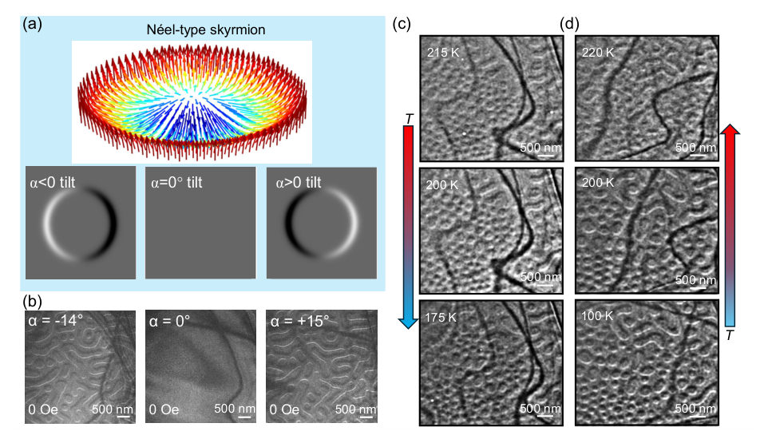
<figcaption class="paper-figure-caption"><b>Fig 3.</b> FIG. 3. N´eel-type skyrmion and Lorentz TEM results of Cr1+xTe2. (a) Schematic of the magnetic</figcaption>
</figure>
<figure class="paper-figure-card">
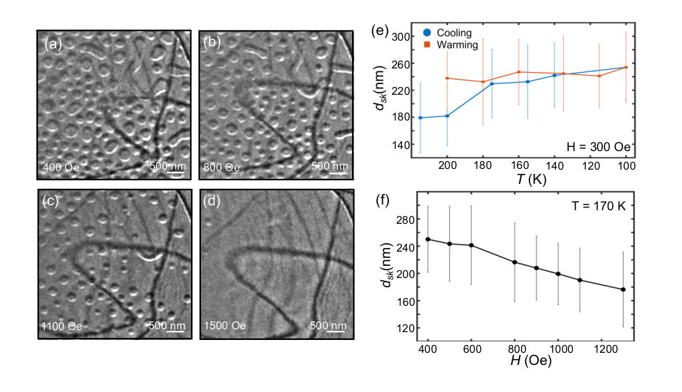
<figcaption class="paper-figure-caption"><b>Fig 4.</b> FIG. 4. Temperature and field dependence of skyrmion size. (a-d) LTEM images of Cr1+xTe2</figcaption>
</figure>

**Summary.** This work explores the tunable magnetism and skyrmion physics in intercalated $	ext{Cr}_{1+x}	ext{Te}_2$. By combining multiple advanced measurements, the researchers map out a complex magnetic phase diagram featuring Néel-type skyrmions. The findings demonstrate that chemical intercalation allows precise control over the magnetic interactions, making the material a versatile model for studying unconventional magnetic thermodynamics.

**Why it may be interesting.** The study provides a concrete, tunable platform for observing complex, non-equilibrium magnetic textures (skyrmions) whose thermodynamics are dictated by the competition between various long-range and local interactions, which is highly relevant to many-body physics and phase transitions.

Detailed structure

**Main problem.** The study investigates the complex magnetic phases and unconventional thermodynamics associated with skyrmion formation in magnetically intercalated $	ext{Cr}_{1+x}	ext{Te}_2$ compounds.

**Main result.** The material exhibits a rich magnetic phase diagram, transitioning through paramagnetic, spin-fluctuation, and field-induced Néel-type skyrmion phases, governed by competing magnetic interactions.

**Method.** The research employs a combination of advanced experimental techniques, including STM, ARPES, magnetization measurements, electrical transport, and crucially, Lorentz transmission electron microscopy (LTEM).

**Model / system.** The physical system is $	ext{Cr}_{1+x}	ext{Te}_2$, a transition metal dichalcogenide whose magnetic properties are tuned by chemical intercalation. The magnetism is governed by a complex energy landscape arising from the competition between perpendicular magnetic anisotropy, dipolar interactions, and disorder-induced chiral interactions.

**Key observables.** Magnetic phase diagram (Paramagnetic $
ightarrow$ IPSF $
ightarrow$ Skyrmion $
ightarrow$ FM), skyrmion size and density, magnetization ($M(H), M(T)$), and AC magnetic susceptibility ($\chi'$ and $\chi''$).

**Important parameters / regimes.** Temperature ($T$), applied magnetic field ($H$), and the degree of intercalation disorder ($x$).

**Assumptions / limitations.** The analysis assumes that local symmetry breaking due to $	ext{Cr}$-site disorder is the source of chiral interactions stabilizing the skyrmions, despite the average crystal structure being centrosymmetric.

**Figures summary.** Figures illustrate the crystal structure, electronic band structure (ARPES), magnetic transitions ($M(T)$), and directly image the temperature and field dependence of Néel-type skyrmion textures using LTEM.

**Paper structure.** The paper systematically characterizes the structure and electronic properties, maps out the magnetic phase diagram using bulk measurements, and finally uses LTEM to visualize and analyze the temperature and field evolution of the skyrmion phases.

Abstract

Chemical intercalation provides a powerful route for tuning the electronic and magnetic properties of transition metal dichalcogenides (TMDs), enabling the emergence of magnetic phases and phenomena that are otherwise inaccessible in their pristine forms. Here, we investigate the structural, electronic, and magnetic properties of magnetically intercalated Cr$_{1+x}$Te$_2$ through a combination of scanning tunneling microscopy, angle-resolved photoemission spectroscopy, magnetization, electrical transport, and Lorentz transmission electron microscopy measurements. We uncover a rich magnetic phase diagram comprising paramagnetic, in-plane spin-fluctuation, out-of-plane ferromagnetic, and field-induced Néel-type skyrmion phases. In particular, Lorentz transmission electron microscopy directly reveals the formation of Néel-type skyrmion textures slightly below the Curie temperature, with their configurations evolving strongly with temperature and magnetic field. The skyrmions exhibit pronounced thermal hysteresis and coexist with stripe domains, indicative of a complex magnetic energy landscape arising from the competition among disorder-induced local Dzyaloshinskii-Moriya interactions, perpendicular magnetic anisotropy, and dipolar interactions. Our results demonstrate that chemical intercalation can profoundly reshape the magnetic interactions and phase behavior of TMDs, establishing Cr$_{1+x}$Te$_2$ as a versatile platform for exploring tunable magnetism, skyrmion physics, and unconventional thermodynamic phenomena in low-dimensional quantum materials.

[↑ back to top](#top)

### [Parafermions in fractional Chern insulator-superconductor heterostructures: the role of spin polarization](http://arxiv.org/abs/2610.01486v1)

**Authors:** Aaron Amire  
**Type:** theory · **Category:** strongly correlated electrons · **PDF:** <https://arxiv.org/pdf/2610.01486v1>  
**Analysis basis:** full PDF text, analyzed in chunks
**Topic relevance:** `Keldysh / 2PI / non-Gaussian methods` **1/5** · `analog quantum simulation` **1/5**

↔ Scroll figures horizontally

<figure class="paper-figure-card">
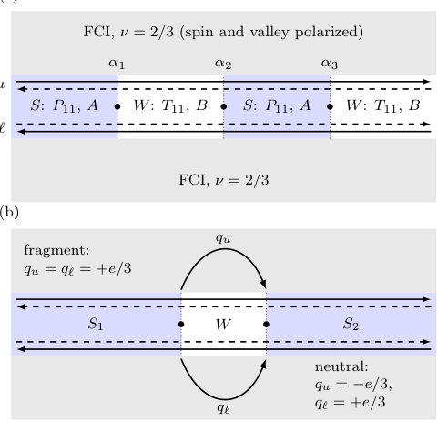
<figcaption class="paper-figure-caption"><b>Fig 1.</b> FIG. 1. (a) Trench between two spin- and valley-polarized ν = 2/3 FCI regions, with edges u and ℓ. Each edge carries a downstream charge mode (solid) and an upstream neutral mode (dashed). Superconducting regions S pin the pairing term P11 and the neutral channel A; tunneling regions W pin T11 and the neutral channel B (the region-by-region limit of Sec. IV D). The walls bind Z3 zero modes αj. (b) A short junc- tion S1|W|S2. Virtual tunneling of quasiparticles between the walls through the FCI bulk on each side of the trench, each returning to the edge it left, transfers, for example, a 2e/3 fragment (e/3 on each edge) or no net charge (an e/3 quasi- hole on u and an e/3 quasiparticle on...</figcaption>
</figure>

**Summary.** This theoretical work investigates parafermion physics in FQH-superconductor junctions, showing that spin polarization is crucial for stabilizing the topological $Z_3$ order. The theory predicts a robust $6\pi$-periodic Josephson effect and quantized conductance, contingent on the superconductor providing specific chiral pairing symmetries.

**Why it may be interesting.** The explicit derivation of fractional Josephson periodicity ($6\pi$) and the connection to specific superconducting pairing symmetries (chiral $p+ip$ states) provide concrete, testable predictions for novel superconducting junctions involving topological matter.

Detailed structure

**Main problem.** The paper analyzes the emergence and properties of $Z_3$ parafermions at domain walls in fractional Chern insulator-superconductor heterostructures, focusing on the critical role of spin polarization.

**Main result.** Spin polarization ensures the domain walls carry robust $Z_3$ parafermions, leading to a predicted $6\pi$-periodic Josephson current and quantized zero-bias conductance $G = 4e^2/3h$.

**Method.** The analysis employs conformal field theory techniques, scaling dimension analysis, and the study of zero-mode operators derived from edge theories.

**Model / system.** The system models a trench connecting two spin-polarized $
u=2/3$ Fractional Quantum Hall (FQH) edges, coupled to superconducting regions. The physics is governed by the interplay between pairing, tunneling, and the topological order of the FQH state.

**Key observables.** Zero-bias conductance ($G = 4e^2/3h$), Josephson current periodicity ($6\pi$), and the number of protected states (3 per pair).

**Important parameters / regimes.** Filling fraction $
u=2/3$, spin polarization, and the relative strength of inter-edge vs. intra-edge Coulomb coupling ($K_
ho$).

**Assumptions / limitations.** The analysis assumes the neutral sector gaps out first, and that the superconducting pairing must possess specific even-frequency, equal-spin, intravalley symmetry.

**Figures summary.** Figure 1 illustrates the geometry of the trench between two polarized $
u=2/3$ FCI regions, showing the roles of superconducting (S) and tunneling (W) regions in binding the $Z_3$ zero modes.

**Paper structure.** The paper progresses by first establishing the edge theory for $
u=2/3$, then analyzing how spin polarization modifies the coupling terms ($\Delta, t$), determining the conditions for the formation of the neutral gap, and finally calculating the resulting topological periodicity and quantized conductance.

Abstract

Most proposals for $Z_3$ parafermions in fractional quantum Hall-superconductor structures used the spin-unpolarized $ν= 2/3$ Halperin $(1,1,2)$ state. The fractional quantum anomalous Hall (FQAH) states of twisted MoTe$_2$ and rhombohedral graphene are believed to be spin- and valley-polarized Jain states, with the same topological order but a different spin structure. We analyze a trench between two polarized $ν= 2/3$ edges. Among the pairing and tunneling bilinears of the edge-mode electrons, exactly two of each have zero conformal spin. Pairing is compatible only with the neutral-mode superconductivity channel and tunneling only with neutral-mode backscattering, whereas in the unpolarized state singlet pairing and tunneling select the same channel. Since the two channels condense the same neutral anyon up to a local operator, the domain walls carry $Z_3$ parafermions, with 3 protected states per pair, whether or not the neutral channel changes between regions; fixing the fermion parity does not enlarge this count. Before the neutral gap forms, pairing is at best marginal for repulsive inter-edge coupling unless an attractive neutral coupling favors its channel; once the gap has formed, both charge terms are relevant for an inter-edge Coulomb coupling below 7/25 of the intra-edge one. The superconductor must supply even-frequency, equal-spin, intravalley pairing, which an s-wave singlet superconductor with only Ising spin-orbit coupling does not provide at leading order, whereas chiral $p+ip$ and $f+if$ states do. The $Z_3$ label is carried by a quasiparticle of the FQAH state, so no process confined to a junction whose tunneling segments are not FQAH can change it, and we expect a $6π$-periodic Josephson current with or without fixed fermion parity.

[↑ back to top](#top)

### [Single-Pulse Optical Switching combined with Current-Induced Motion of Skyrmionic Spin Textures](http://arxiv.org/abs/2610.01568v1)

**Authors:** Edoardo Mangini, Duc Minh Tran, Boonthum Kunyangyuen, Jun Xiao Lin, Raphael Gruber, Michel Hehn, Stéphane Mangin, Mathias Kläui  
**Type:** experiment · **Category:** other · **PDF:** <https://arxiv.org/pdf/2610.01568v1>  
**Analysis basis:** full PDF text, analyzed in chunks
**Topic relevance:** `quantum measurements` **1/5**

↔ Scroll figures horizontally

<figure class="paper-figure-card">
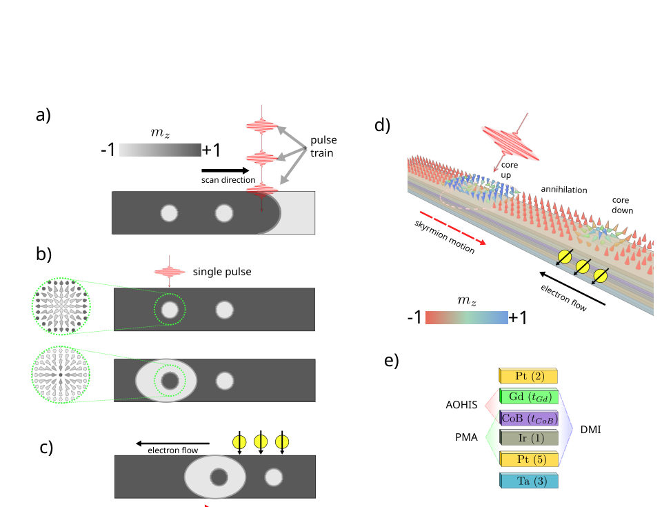
<figcaption class="paper-figure-caption"><b>Fig 1.</b> Figure 1: Concept and material platform. a-c) Schematic of the opto-electrical skyrmion manip- ulation sequence: pulse-train laser excitation writes skyrmions (a), a single femtosecond laser pulse reverses the skyrmion core polarity (b), and current-induced spin-orbit torques transport the skyrmion in a wire (c). d) Device concept illustrating that light pulses program the inter- nal core state while electrical current controls the skyrmion position. e) Multilayer structure Ta/Pt/Ir/CoB/Gd/Pt, where CoB and Gd thicknesses are tuned to combine interfacial DMI, perpendicular magnetic anisotropy and AO-HIS.</figcaption>
</figure>
<figure class="paper-figure-card">
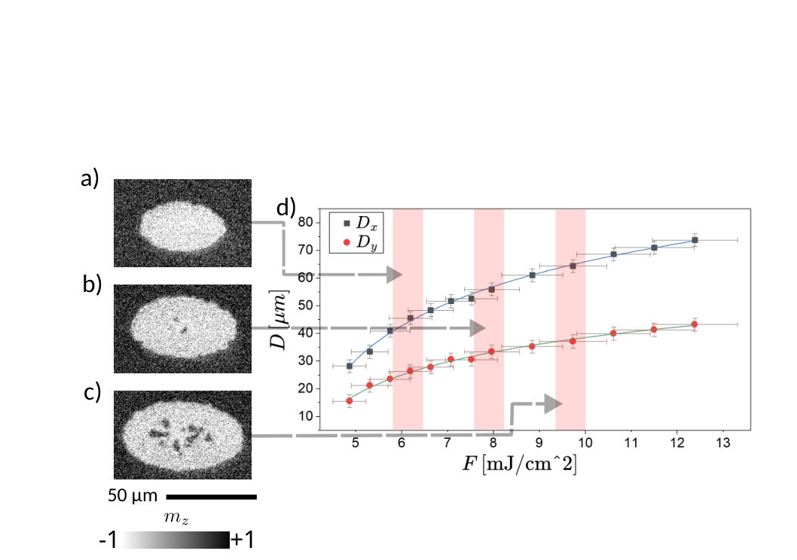
<figcaption class="paper-figure-caption"><b>Fig 2.</b> Figure 2: AO-HIS operating window in the CoB/Gd skyrmion platform. a–c) Kerr microscopy images of switched regions obtained at representative fluences, showing deterministic toggle switching below the multidomain threshold and multidomain formation above FMD = 7.96 ± 0.6 mJ cm−2. The images correspond to increasing fluence, as indicated by the arrows. d) Size of the single-pulse switched domains as a function of laser fluence for the continuous-film sample. The major and minor ellipse axes, Dx and Dy, are fitted using d = D[log(F/Fth)]1/2 [37], yielding an AO-HIS threshold of Fth = 3.98 mJ cm−2.</figcaption>
</figure>
<figure class="paper-figure-card">
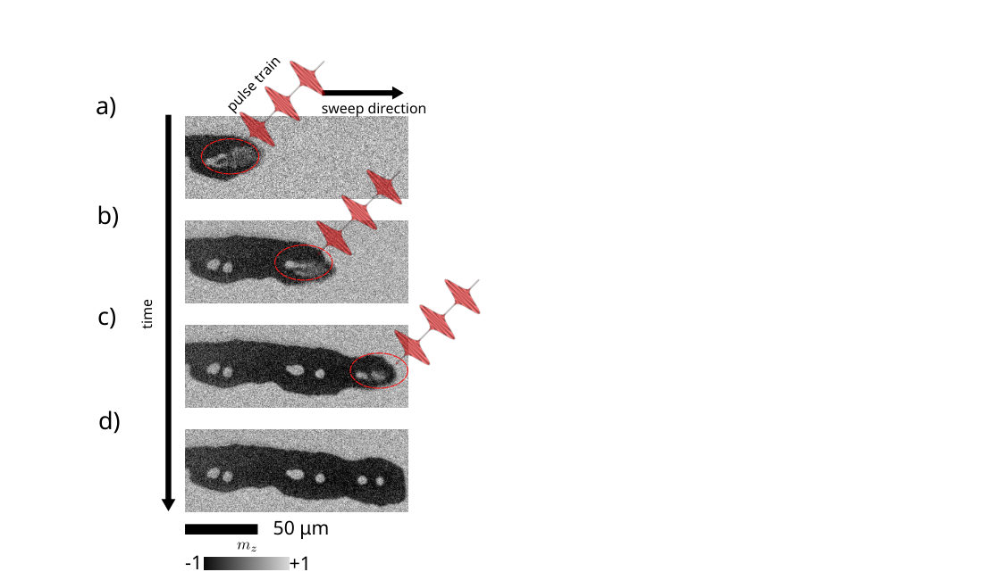
<figcaption class="paper-figure-caption"><b>Fig 3.</b> Figure 3: a)-c) Kerr microscopy snapshots of magnetic skyrmions nucleated by pulse-train laser scanning, showing the written skyrmionic textures. Snapshots are taken as the laser spot is swept from left to right, as illustrated by the positions of the dashed ellipses. d) Final state, after nucleation. Laser parameters: τ = 7.5 ps, F = 13.28 mJ cm−2, and f = 5 kHz. Scale bar: 50 µm.</figcaption>
</figure>
<figure class="paper-figure-card">
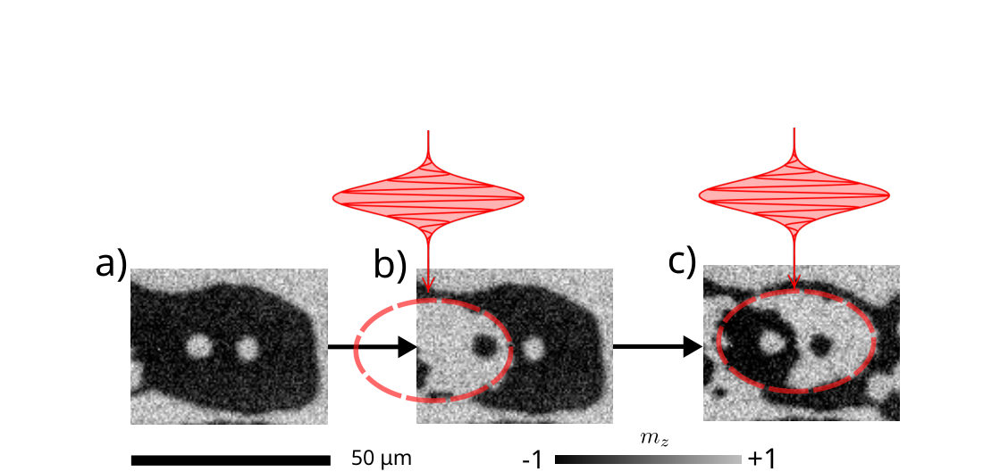
<figcaption class="paper-figure-caption"><b>Fig 4.</b> Figure 4: Single-pulse optical reversal of skyrmion core polarity. a) Initial Kerr microscopy image of laser-written skyrmions in the continuous-film sample. b) Image acquired after one 30 fs laser pulse applied to the dashed elliptical region, showing reversal of the selected skyrmion core. c) Image acquired after a second pulse applied to a central region, showing simultaneous reversal of two skyrmion cores. The dashed ellipses indicate the approximate optical switching footprint corresponding to the AO-HIS threshold. A more accurate evaluation of the irradiated areas can be found in Figure S3. Laser parameters used for the switching sequence are τ = 30 fs and F = 7.08 mJ cm−2. Scale...</figcaption>
</figure>
<figure class="paper-figure-card">
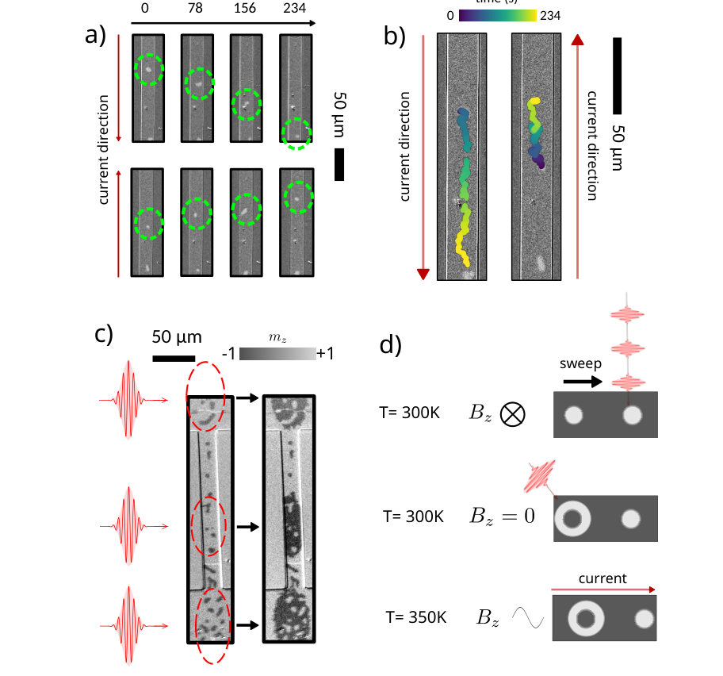
<figcaption class="paper-figure-caption"><b>Fig 5.</b> Figure 5: Current-driven transport in a device compatible with optical core switching. a) Kerr microscopy snapshots of skyrmion motion in a 20 µm wire at T = 350 K under JDC = 5.9 × 109 A m−2, BAC = 1.380 mT, fAC = 50 Hz, and BDC = 0.06 mT. The top and bottom image sequences correspond to opposite current polarities, showing reversal of the direction of motion. b) Skyrmion trajectories extracted from the experiments of (a). The red arrows indicate the direction of the current.c) Demonstration of AO-HIS in the same wire device at room temperature: skyrmions written by pulse-train scanning and selected textures switched by single 30 fs pulses. For the optical writing step, the laser...</figcaption>
</figure>

**Summary.** This research demonstrates a novel opto-spintronic device concept where magnetic skyrmions can be programmed by light and controlled by electricity. Using a multilayer film, the authors achieved deterministic switching of the skyrmion's internal core polarity with a single ultrafast laser pulse. This allows for light to set the internal state while current controls the physical movement, paving the way for advanced memory applications.

**Why it may be interesting.** This work represents a significant step toward integrating multiple control mechanisms (optical, electrical) into a single spintronic device, which is highly relevant for developing next-generation memory or logic elements.

Detailed structure

**Main problem.** The goal is to develop a deterministic, multi-state control mechanism for magnetic skyrmions by combining all-optical switching of their internal spin structure (polarity) with established current-induced motion.

**Main result.** The authors successfully demonstrated that a single, ultrafast laser pulse can deterministically toggle the core polarity of magnetic skyrmions in a patterned multilayer structure, which can then be combined with electrical currents to control the skyrmion's position.

**Method.** The study uses ultrafast laser pulses (30 fs) to induce All-Optical Helicity-Independent Switching (AO-HIS) in a patterned multilayer film, followed by applying DC currents to observe deterministic skyrmion motion.

**Model / system.** The physical system is a Pt/Ir/CoB/Gd/Pt multilayer stack, engineered to stabilize magnetic skyrmions and enable AO-HIS. The structure is patterned into wires to facilitate the combination of optical programming and electrical transport.

**Key observables.** Skyrmion core polarity (toggled by light), skyrmion position (controlled by current), switching thresholds (Fth, FMD), and the stability of the magnetic textures.

**Important parameters / regimes.** Ultrafast laser pulse fluence (e.g., 3.98 mJ cm^-2 for switching), DC current density (e.g., 5.9 x 10^9 A m^-2), and temperature (up to 350 K).

**Assumptions / limitations.** The ability to combine stabilization and AO-HIS depends sensitively on the material stack composition; furthermore, the measurements do not resolve the full reversal dynamics, only the before and after states.

**Figures summary.** Figures illustrate the concept sequence: (a) writing skyrmions via pulse-train scanning, (b) single-pulse reversal of core polarity, and (c) subsequent current-induced motion in a patterned wire. Other figures detail the AO-HIS operating window and thermal stability.

**Paper structure.** The paper progresses by first establishing the material platform and the AO-HIS mechanism using single pulses. It then demonstrates the writing of skyrmions optically, followed by combining this optical programming step with established current-driven motion in a patterned wire device.

Abstract

Magnetic skyrmions are promising nanoscale information carriers because their position can be manipulated by electrical currents. The additional ability of deterministic control of the spin structure would allow the use of magnetic skyrmions as multi-state bits, expanding the capabilities of skyrmion devices further. Such control could be realized by coupling all-optical helicity independent switching of magnetization (AO-HIS) to magnetic skyrmions. This is realized in a Pt/Ir/CoB/Gd/Pt multilayer that is engineered to stabilize magnetic skyrmions and, at the same time, enable AO-HIS by single ultrafast laser pulse. Laser excitation is used to write skyrmionic textures, whose polarity is selected by a small applied out-of-plane field. A single 30 fs laser pulse is then used to toggle the magnetization of an illuminated region containing skyrmionic textures, reversing their polarities without requiring any magnetic field or current pulses. This establishes deterministic optical switching of the skyrmion spin structure as a new manipulation channel, distinct from previously reported optical nucleation and annihilation. The material is then patterned into a wire, to combine the optical manipulation with current-induced skyrmion motion. These results establish a route toward opto-spintronic skyrmion devices in which light programs the internal state of a skyrmion and electrical currents control its position.

[↑ back to top](#top)

### Other secondary papers (4)

Show other secondary papers

### [Inertial Dynamics of a Skymeron](http://arxiv.org/abs/2610.01339v1)

**Authors:** Mona Bhukta, Duc Minh Tran, Kilian Leutner, Takaaki Dohi, Nikolai S. Kiselev, Filipp N. Rybakov, Olle Eriksson, Fabian Kammerbauer, Sebastian Wintz, Markus Weigand, Hendrik Ohldag, Maria-Andromachi Syskaki, Robin Tietgen, Edoardo Mangini, Sabrina Kerber, Thibaud Denneulin, Joseph Vimal Vas, Rafal E. Dunin-Borkowski, Bastian Pfau, Oleg A. Tretiakov, Robert Frömter, Mathias Kläui  
**Type:** both · **Category:** other · **PDF:** <https://arxiv.org/pdf/2610.01339v1>  
**Analysis basis:** full PDF text, analyzed in chunks

↔ Scroll figures horizontally

<figure class="paper-figure-card">
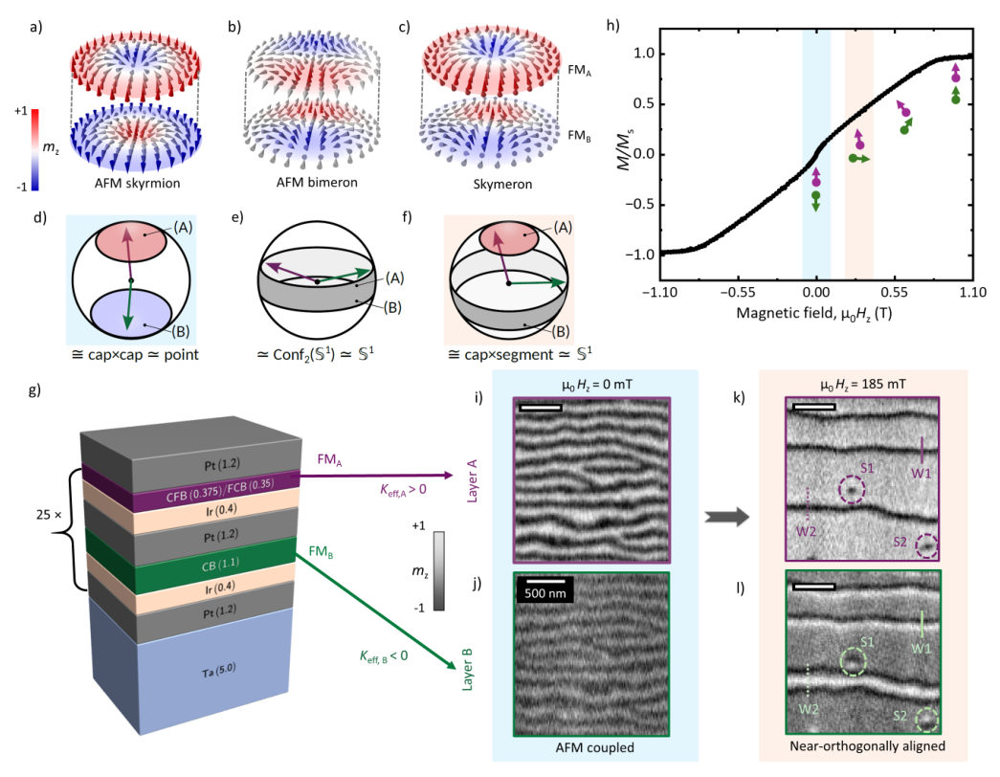
<figcaption class="paper-figure-caption"><b>Fig 1.</b> Figure 1. Experimental realization of skymerons in a synthetic antiferromagnet. (a-c) Schematics of an AFM skyrmion, an AFM bimeron, and a skymeron, respectively, in SyAFM. The skymeron consists of a skyrmion-like spin texture in layer A coupled to a bimeron in layer B. (d), (e), and (f) Schematics of the subspaces corresponding to the background configurations of the composite spin textures shown in (a), (b), and (c), respectively (see Table 1 for a description of terms). These sketches illustrate the subsets of the order-parameter space that minimize the energy density of the homogeneous state. (g) Schematic of the SyAFM stack with thicknesses in nm. (h) Normalized OOP magnetic hysteresis...</figcaption>
</figure>
<figure class="paper-figure-card">
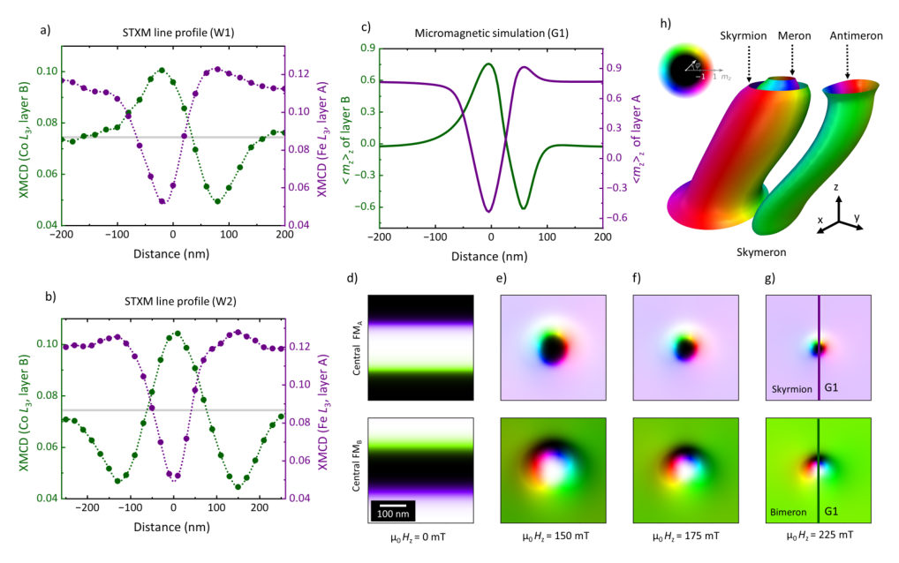
<figcaption class="paper-figure-caption"><b>Fig 2.</b> Figure 2. Field-driven evolution and three-dimensional spin texture of the skymeron. (a,b), XMCD–STXM line profiles measured along W1 and W2 across the 360° and 540° domain walls, respectively (see Fig. 1(k,l)). The magenta and green curves correspond to the signals from layers A (Fe edge) and B (Co edge), respectively. (c), Thickness-averaged micromagnetic line profiles of layers A and B of the skymeron shown in g). (d–g), Magnetization maps extracted from the two central ferromagnetic layers A and B, showing the simulated field evolution of the skymeron. At zero field (d), the system stabilizes antiferromagnetically aligned stripe domains. At µ0Hz = 150mT (e), isolated skymerons emerge....</figcaption>
</figure>
<figure class="paper-figure-card">
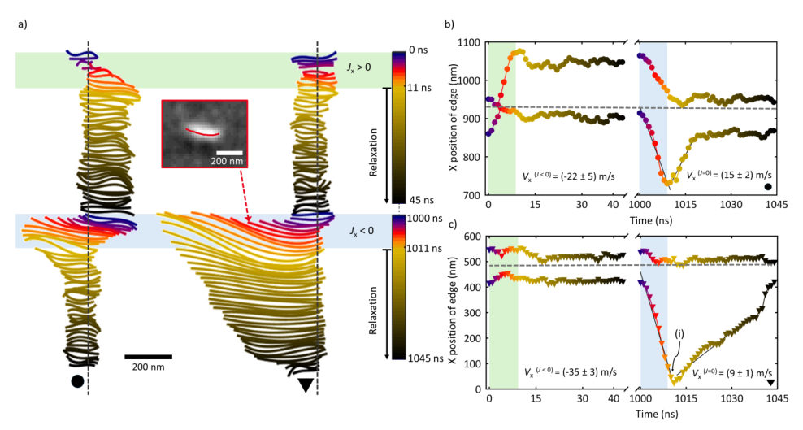
<figcaption class="paper-figure-caption"><b>Fig 3.</b> Figure 3. Spatiotemporal evolution of skymeron dynamics during a cycle of bipolar current pulses. (a) Time-resolved contour evolution of two representative skymerons under bipolar current excitation. The contours are extracted from XMCD–STXM images at the Fe L3 edge and vertically offset to visualize the temporal evolution during the excitation cycle. The color scale encodes time. Green (0–10 ns) and blue (1000–1010 ns) shaded regions denote intervals of positive and negative current polarity (Jx &gt; 0 and Jx &lt; 0), respectively. Black vertical dashed lines mark the pinning positions that anchor the skymerons during the motion. (b,c) Temporal evolution of the left and right x-edge positions...</figcaption>
</figure>
<figure class="paper-figure-card">
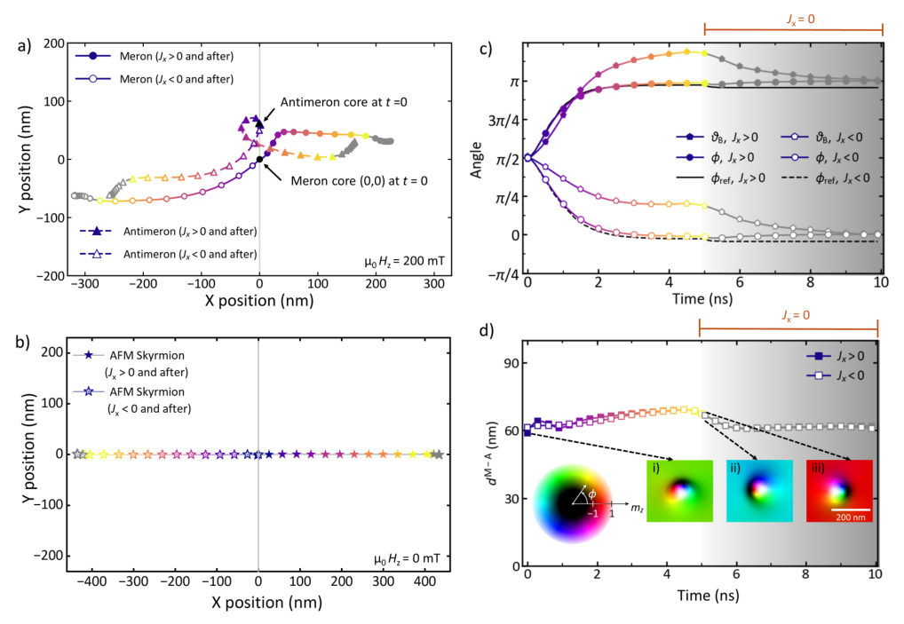
<figcaption class="paper-figure-caption"><b>Fig 4.</b> Figure 4. Micromagnetic simulations of non-rigid and inertia-like skymeron dynamics. (a) Simulated current-driven trajectories of a skymeron stabilized at µ0Hz = 200 mT for a 5 ns current pulse. Circles and triangles track the meron and antimeron cores, respectively. Filled symbols correspond to Jx &gt; 0, whereas open symbols correspond to Jx &lt; 0. The colours of the symbols show the evolution during the current pulse and grey symbols show the subsequent post-pulse relaxation. (b) Corresponding trajectories of a reference AFM skyrmion stabilized at µ0Hz = 0 under otherwise identical conditions. Filled and open stars denote Jx &gt; 0 and Jx &lt; 0, respectively; grey stars show the corresponding...</figcaption>
</figure>

**Summary.** This paper reports on the creation and characterization of a novel 3D topological spin texture called a skymeron within synthetic antiferromagnets. By combining advanced X-ray microscopy with micromagnetic simulations, the authors demonstrate that the skymeron's dynamics are non-rigid, exhibiting an inertia-like motion due to the finite-time relaxation of stored magnetic energy. This highlights layer-selective anisotropy engineering as a powerful tool for designing complex magnetic materials.

**Why it may be interesting.** The discovery of internal dynamical degrees of freedom in magnetic textures moves beyond simple rigid-body descriptions, suggesting new avenues for controlling spintronic devices using engineered material interfaces.

Detailed structure

**Main problem.** The study investigates the dynamics of complex, higher-dimensional topological spin textures, specifically the 'skymeron,' which exists in synthetic antiferromagnets (SyAFMs). The goal is to understand the internal degrees of freedom governing these textures beyond simple rigid-body approximations.

**Main result.** The research successfully realizes and images the skymeron and demonstrates that its dynamics exhibit an inertia-like post-pulse continuation, which is attributed to the finite-time relaxation of stored energy within the system.

**Method.** The work combines element-specific X-ray microscopy (STXM/XMCD) for imaging with time-resolved pump-probe measurements and advanced micromagnetic simulations.

**Model / system.** The physical system is a Synthetic Antiferromagnet (SyAFM) stack, allowing independent tuning of magnetic anisotropy in two coupled ferromagnetic layers. The complexity arises from the order parameter defined on a product space ($	ext{S}^2 	imes 	ext{S}^2$), enabling the formation of the skymeron texture.

**Key observables.** Layer-resolved spin textures (skyrmion coupled to a bimeron), polarity-dependent dynamics, and the time evolution of energy contributions during current pulses.

**Important parameters / regimes.** Layer-selective anisotropy engineering, current pulse magnitude ($\pm 4 	imes 10^{10} 	ext{ Am}^{-2}$), and the resulting topological charge pair/triplet.

**Assumptions / limitations.** Conventional dynamics models (like the Thiele equation) are insufficient as they fail to capture the internal dynamical degrees of freedom present in the skymeron.

**Figures summary.** Figures illustrate the structural realization of the skymeron via element-selective imaging, the field-driven evolution between topological regimes, and the time-dependent energy relaxation profiles following a current pulse.

**Paper structure.** The paper progresses from establishing the physical system (SyAFMs) and the novel texture (skymeron) via structural characterization, to demonstrating the dynamics using time-resolved measurements, and finally providing a microscopic explanation for the observed inertia via energy analysis in simulations.

Abstract

Topological spin textures in antiferromagnets inherit the compensated magnetic order of the host material, resulting for skyrmions in the suppression of the skyrmion Hall effect and enabling ultrafast dynamics that make them attractive for low-power spintronic devices. In intrinsic antiferromagnets, the two sublattices are identical, but synthetic antiferromagnets offer additional control mechanisms by enabling independent tuning of the properties of two ferromagnetic layers. Analogous to a ferrimagnet, the total magnetic moment can be adjusted by compensating the two-layer moments. Here, we demonstrate that tuning the effective magnetic anisotropy difference between the two layers drives a spin-flop transition where one layer reorients and thus stabilizes an orthogonal configuration with one layer oriented along the out-of-plane direction and the other in-plane. In this transition, an antiferromagnetic skyrmion undergoes a homotopic reconfiguration into a complex spin texture comprising a skyrmion coupled to an in-plane bimeron. Element-specific X-ray microscopy resolves this texture layer by layer: one hosts an out-of-plane skyrmion coupled to an in-plane bimeron in the other. We refer to this previously unexplored three-dimensional spin texture as a skymeron. By using time-resolved pump-probe X-ray microscopy, we discover unique polarity ,dependent dynamics during current pulses: a short post-pulse inertia-like continuation of the motion, and a slower return towards the pinned initial state. Micromagnetic simulations reveal that the inertia-like propagation originates from the finite-time relaxation of reorientation of the skymeron. Our results establish layer-selective anisotropy engineering as a route to uncharted composite spin textures with internal dynamical degrees of freedom, not possible in conventional antiferromagnets with identical sublattices.

[↑ back to top](#top)

### [Selective suppression of electronic orders via interlayer coupling in superconducting bilayer nickelate thin films](http://arxiv.org/abs/2610.01757v1)

**Authors:** Ziao Han, Lifen Xiang, Tianren Wang, Congcong Le, Jun Zhan, Siyi Lei, Sonia Francoual, Qisi Wang, Jiangping Hu, Tao Xiang, Ronny Sutarto, Xianxin Wu, X. J. Zhou, Zhihai Zhu  
**Type:** both · **Category:** strongly correlated electrons · **PDF:** <https://arxiv.org/pdf/2610.01757v1>  
**Analysis basis:** full PDF text, analyzed in chunks

↔ Scroll figures horizontally

<figure class="paper-figure-card">
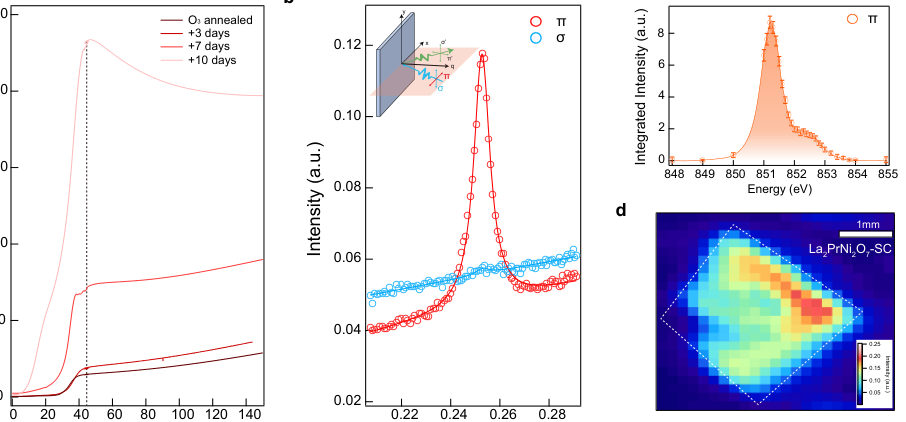
<figcaption class="paper-figure-caption"><b>Fig 1.</b> FIG. 1. SDW order and transport characterization of superconducting La2PrNi2O7−δ thin films on SrLaAlO4. (a) R(T) curves measured at 0, 3, 7, and 10 days after ozone annealing; the sample for the REXS measurements was cleaved from the same film and packaged under identical conditions. (b) Resonant elastic X-ray scattering (REXS) scans across the SDW wavevector Q = (0.25, 0.25, 1.9) measured at 20 K with both π- and σ-polarized incident X-rays tuned to the Ni L3 absorption edge (∼852.3 eV). The solid lines are Lorentzian fits. (c) Integrated SDW peak intensity versus incident photon energy, reaching a maximum near 851.3 eV, consistent with the Ni L3 resonance. (d) Real-space mesh scan of the...</figcaption>
</figure>
<figure class="paper-figure-card">
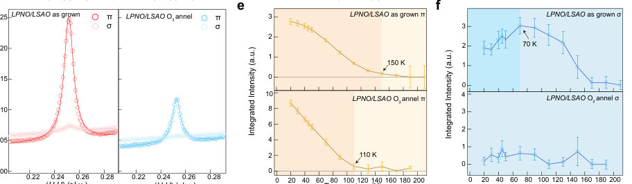
<figcaption class="paper-figure-caption"><b>Fig 2.</b> FIG. 2. SDW peak and temperature dependence under oxygen-content tuning in La2PrNi2O7−δ thin films. (a) REXS scans across the SDW wavevector Q = (0.25, 0.25, 1.9) measured at 20 K with both π- and σ-polarized incident X-rays at the Ni L3 edge. Left: as-grown LPNO thin film (∼26 nm) grown on LaAlO3 (LAO). Right: ozone-annealed LPNO thin film (∼28 nm) grown on LAO. The solid lines are Lorentzian fits to the SDW peak. (b) Temperature dependence of the integrated SDW peak intensity measured with π-polarization for the as-grown (top) and ozone-annealed (bottom) LPNO/LAO films. (c) Temperature dependence of the integrated SDW peak intensity measured with σ-polarization for the same LPNO/LAO...</figcaption>
</figure>
<figure class="paper-figure-card">
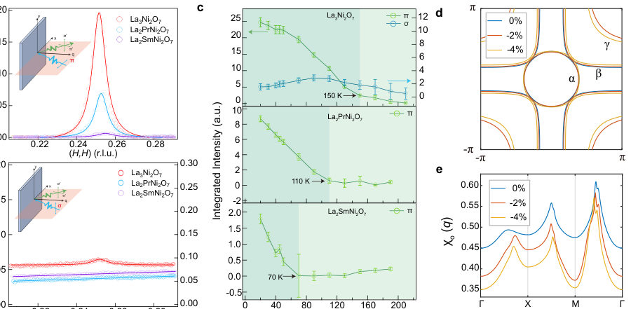
<figcaption class="paper-figure-caption"><b>Fig 3.</b> FIG. 3. Comparison of SDW order across La3Ni2O7, La2PrNi2O7, and La2SmNi2O7 thin films. (a) REXS scans across the SDW wavevector Q = (0.25, 0.25, 1.9) measured at 20 K with π-polarized incident X-rays at the Ni L3 edge for superconducting La3Ni2O7−δ, La2PrNi2O7−δ, and La2SmNi2O7−δ thin films. The solid lines are Lorentzian fits to the SDW peak. (b) Corresponding REXS scans measured with σ-polarization for the same three films. (c) Temperature dependence of the integrated SDW peak intensity for La3Ni2O7−δ (top), La2PrNi2O7−δ (middle), and La2SmNi2O7−δ (bottom). For La3Ni2O7−δ, both π-polarization (green) and σ-polarization (blue) data are shown. (d) Calculated Fermi surfaces in the kx– ky...</figcaption>
</figure>
<figure class="paper-figure-card">
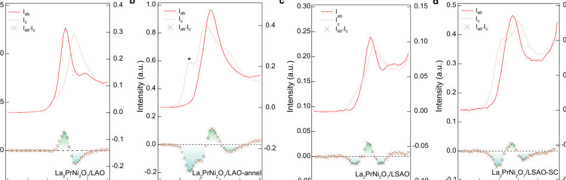
<figcaption class="paper-figure-caption"><b>Fig 4.</b> FIG. 4. O K-edge pre-edge XAS and XLD of LPNO thin films. (a)–(d) O K-edge X-ray absorption spectra (XAS) measured at 20 K showing the pre-edge region. In-plane (Iab, red) and out-of-plane (Ic, pink) polarized spectra together with the X-ray linear dichroism (XLD = Iab −Ic, crosses) are presented for: (a) as-grown La2PrNi2O7−δ (LPNO) thin film grown on LaAlO3 (LAO). (b) Ozone-annealed LPNO thin film grown on LAO; the star denotes a peak feature of unknown origin, likely associated with a phase introduced by ozone annealing. (c) As-grown LPNO thin film grown on SrLaAlO4 (SLAO). (d) Ozone-annealed superconducting LPNO thin film grown on SLAO.</figcaption>
</figure>
<figure class="paper-figure-card">
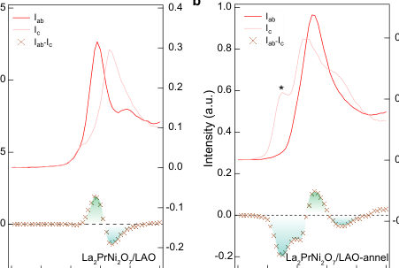
<figcaption class="paper-figure-caption"><b>Fig 5.</b> Figure 4(a,b) presents polarization-resolved XAS mea- surements of the non-superconducting LPNO/LAO film (∼30 nm). Our calculations for the stoichiometric com-</figcaption>
</figure>

**Summary.** This paper uses X-ray scattering and spectroscopy to study how tuning the interlayer coupling in superconducting nickelates selectively suppresses one electronic order (charge-like anisotropy) while weakening another (SDW). The findings suggest that these competing orders are governed by distinct energy scales, offering new insights into the mechanism of high-temperature superconductivity in these materials.

**Why it may be interesting.** The selective suppression of different competing orders by tuning structural parameters (interlayer coupling) provides a concrete model for understanding how competing instabilities govern the superconducting dome in strongly correlated nickelates.

Detailed structure

**Main problem.** The study investigates the complex interplay between superconductivity and competing electronic orders, specifically Spin-Density Wave (SDW) and charge-like anisotropy order, in bilayer nickelate thin films.

**Main result.** The research demonstrates that enhancing interlayer coupling, via oxygen annealing or A-site substitution, selectively suppresses the charge-like anisotropy order while weakening but retaining the SDW order.

**Method.** The work combines advanced experimental techniques, including polarization-resolved O K-edge X-ray absorption and Resonant Elastic X-ray Scattering (REXS), with theoretical electronic structure calculations.

**Model / system.** The physical system is superconducting bilayer nickelate thin films (e.g., $	ext{La}_{2-x}	ext{Pr}_x	ext{Ni}_2	ext{O}_{7-\delta}$), whose electronic properties are tuned by controlling oxygen stoichiometry and applying strain via rare-earth substitution.

**Key observables.** SDW transition temperature ($T_{	ext{SDW}}$), charge-like anisotropy order signal (via $\sigma$-polarization REXS), and interlayer hybridization strength (via O K-edge XAS).

**Important parameters / regimes.** Interlayer coupling strength, oxygen content ($\delta$), and applied uniaxial pressure (mimicked by A-site substitution).

**Assumptions / limitations.** The observed phenomena are consistent with a spin-spinless stripe ground state, and the tuning mechanisms (annealing/substitution) effectively control the interlayer coupling.

**Figures summary.** Figures illustrate the temperature dependence of SDW and charge-like order signals under varying oxygen content and substrate conditions, confirming the selective suppression mechanism.

**Paper structure.** The paper systematically presents measurements showing how tuning the interlayer coupling (via annealing or substitution) differentially affects the SDW and charge-like orders, linking these changes to Fermi surface reconstruction.

Abstract

The discovery of spin-density-wave (SDW) order in bilayer nickelates has intensified interest in its interplay with superconductivity. Unlike cuprates, where doping rapidly suppresses the Néel temperature, the SDW transition temperature ($T_{\mathrm{SDW}}$) in bilayer nickelates is robust against oxygen annealing and even increases under pressure. Here, we combine oxygen annealing with isovalent rare-earth ($A$-site) substitution to effectively apply $c$-axis uniaxial pressure, realizing superconducting bilayer nickelate films with $T_{\mathrm{SDW}}$ suppressed from 150 K to 70 K. Notably, while SDW order is weakened but remains, a second charge-like anisotropy order is completely eliminated in the superconducting state. Polarization-resolved O $K$-edge X-ray absorption and electronic structure calculations show that strengthened interlayer coupling reconstructs the Fermi surface and weakens the SDW. These findings, consistent with a spin-spinless stripe ground state, provide new insight into the mechanism of density wave formation and their interplay with superconductivity.

[↑ back to top](#top)

### [Stability and instability analysis of resonance-induced nonlinear bound states](http://arxiv.org/abs/2610.01875v1)

**Authors:** Jackson C. Turner, Michael I. Weinstein  
**Type:** theory · **Category:** other · **PDF:** <https://arxiv.org/pdf/2610.01875v1>  
**Analysis basis:** full PDF text, analyzed in chunks

↔ Scroll figures horizontally

<figure class="paper-figure-card">
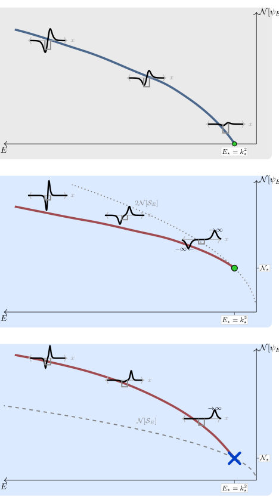
<figcaption class="paper-figure-caption"><b>Fig 1.</b> Figure 2.1. Schematic bifurcation diagrams for the three nonlinear bound-state bifurcation sce- narios. Left: the k-plane, with the bifurcating pole ( ) or zero ( ) highlighted. Right: the cor- responding (N, E) branches, with reference soliton curves and inset profiles. Panel (a) is the L2</figcaption>
</figure>
<figure class="paper-figure-card">
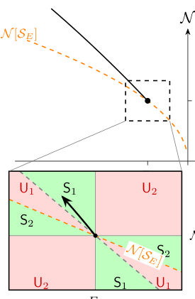
<figcaption class="paper-figure-caption"><b>Fig 2.</b> Figure 6.1. Stability regions near the bifurcation point (E⋆, N⋆); Corollaries 4.1 and 4.2. In each panel, the upper plot shows the free-soliton curve E 7→N[SE] (orange dashed) and a representative resonance-induced branch ε 7→(E(ε), N[ψε]) (solid black), emanating from the bifurcation point. The dashed box is magnified below, and the black arrow indicates the direction of increasing ε along the branch as it leaves the bifurcation point (E⋆, N⋆). In the zoom, the orange dashed line is the tangent to N[SE] at (E⋆, N⋆); in the TR panel, the gray dashed line is the Ω⋆= 0 separator. Stable sectors are shaded green and unstable sectors are shaded red; the labels S, U mark the regions of...</figcaption>
</figure>
<figure class="paper-figure-card">
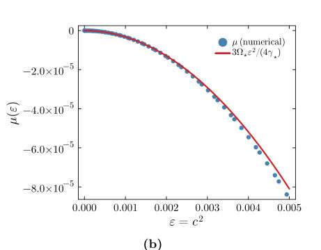
<figcaption class="paper-figure-caption"><b>Fig 3.</b> Figure 6.4. Validity of approximate expression for µ(ε), Proposition 4.6: direct numerical simula- tion of µ(ε) (dots) vs. asymptotic expression 3Ω⋆</figcaption>
</figure>
<figure class="paper-figure-card">
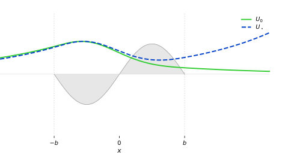
<figcaption class="paper-figure-caption"><b>Fig 4.</b> Figure 7.1. V (x) = 3 sin(πx) 1(−1,1)(x), b = 1. (a) Spectral line E = k2: = L2 bound state at k = iκ0 (E0); = TR zero at k = −iγ⋆(E⋆); shaded band = continuum E ≥0. (b) Potential V (gray, scaled), ground state U0 (solid), and resonance mode U⋆(dashed).</figcaption>
</figure>
<figure class="paper-figure-card">
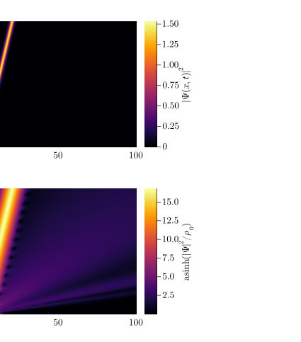
<figcaption class="paper-figure-caption"><b>Fig 5.</b> Figure 7.2. V = 3 sin(πx)1(−1,1) at T = 120; Nrad ≈4×10−4. Top: raw density |Ψ(x, t)|2. Bottom: rescaled asinh(|Ψ|2/ρ0) exposing low-amplitude radiation.</figcaption>
</figure>

**Summary.** This paper rigorously analyzes the orbital stability and instability of nonlinear bound states that emerge from linear scattering or transmission resonances in the nonlinear Schrödinger equation. By developing criteria based on resonance eigenproperties, it provides a powerful mathematical tool to predict the long-time behavior of such quantum systems. This is highly relevant for understanding nonlinear wave phenomena in physical systems like Bose-Einstein condensates or optical fibers.

**Why it may be interesting.** This work provides rigorous mathematical tools to characterize the stability of nonlinear structures (like solitons or breathers) whose existence is fundamentally linked to the spectral properties (resonances) of the underlying linear operator, which is crucial in quantum optics and nonlinear wave physics.

Detailed structure

**Main problem.** The paper establishes precise criteria for determining the nonlinear orbital stability and instability of bound states that are induced by linear scattering or transmission resonances.

**Main result.** The stability of these resonance-induced states is determined by the signs of two quantities, $\Omega^\star$ and $
u^\star$, requiring $\Omega^\star > 0$ and $
u^\star < 0$ for orbital stability near the bifurcation point.

**Method.** The analysis uses bifurcation theory applied to the nonlinear Schrödinger/Gross-Pitaevskii equation, analyzing the spectral properties of linearized operators associated with the resonance eigenpairs.

**Model / system.** The system is the focusing one-dimensional cubic nonlinear Schrödinger/Gross-Pitaevskii equation ($i\partial_t\Psi = -\partial_x^2\Psi + V(x)\Psi -|\Psi|^2\Psi$). The analysis focuses on nonlinear bound states bifurcating from linear scattering or transmission resonances associated with the underlying linear operator $H_V = -\partial_x^2 + V(x)$.

**Key observables.** The $L^2$ norm of the state, $N[\psi] = \|\psi\|^2_{L^2}$, and the stability indicators $\Omega^\star$ and $
u^\star$.

**Important parameters / regimes.** The resonance frequency ($\gamma_\star$), the bifurcation parameter ($\epsilon$), and the potential parameters defining the resonance (e.g., $	au$ in later sections).

**Assumptions / limitations.** The analysis assumes the non-degeneracy condition $B^\star 
eq 0$ and is valid for small bifurcation parameters $\epsilon$ or small perturbation parameters $	au$.

**Figures summary.** Figure 2.1 illustrates different bifurcation scenarios (point spectrum, SR, TR) in the $k$-plane and the $(N, E)$-plane. Later figures track the evolution of stability terms ($\Omega^\star, 
u^\star$) as a function of a perturbation parameter $	au$.

**Paper structure.** The paper first establishes the general framework for resonance-induced states, detailing the stability criteria based on $\Omega^\star$ and $
u^\star$. It then applies this framework to specific potentials, including those derived from Pöschl-Teller potentials, and extends the analysis to continuous families of potentials using perturbation theory.

Abstract

We study the focusing one-dimensional cubic nonlinear Schrödinger / Gross--Pitaevskii equation (NLS-GP), where the potential of the underlying linear Schrödinger operator, $H_V=-\partial_x^2+V(x)$, is compactly supported. In \cite{turner2026resonance} the authors proved that purely imaginary zeros (transmission resonances) or purely imaginary poles in the lower half plane (scattering resonances) of a reflection coefficient of $H_V$ seed branches of {\it resonance-induced nonlinear bound states}, and that these states bifurcate at a strictly positive $L^2(\mathbb R)$ excitation threshold. This is in contrast to nonlinear bound states which bifurcate at zero $L^2$-norm from point spectra of $H_V$ (corresponding to poles in the upper half plane). In this paper we establish precise criteria for the nonlinear orbital stability and instability of the resonance-induced states near the bifurcation point. A corollary is that resonance-induced nonlinear states are orbitally stable if i) the underlying linear (scattering or transmission) resonance frequency is sufficiently small, and ii) the corresponding linear resonance eigenmode is strictly positive. Numerical simulations are presented to explore regimes not accessible to our theory, and to explore the large time dynamics for initial conditions near stable and unstable resonance-induced nonlinear bound states.

[↑ back to top](#top)

### [Synthesis of Metal-Semiconductor Heterojunctions in Single Graphene Nanoribbons](http://arxiv.org/abs/2610.01194v1)

**Authors:** Ziyi Wang, Kaitlin Slicker, Weichen Tang, Boyu Qie, Rafal Zuzak, Haowen Pang, Yudi Huang, Xinheng Li, Peter H. Jacobse, Steven G. Louie, Felix R. Fischer, Michael F. Crommie  
**Type:** both · **Category:** other · **PDF:** <https://arxiv.org/pdf/2610.01194v1>  
**Analysis basis:** full PDF text, analyzed in chunks

↔ Scroll figures horizontally

<figure class="paper-figure-card">
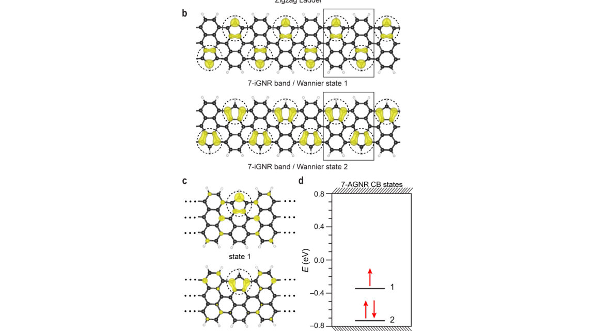
<figcaption class="paper-figure-caption"><b>Fig 1.</b> Figure 1 | Expanded SSH model on a zigzag ladder. a, Tight-binding (TB) model for electrons on a</figcaption>
</figure>
<figure class="paper-figure-card">
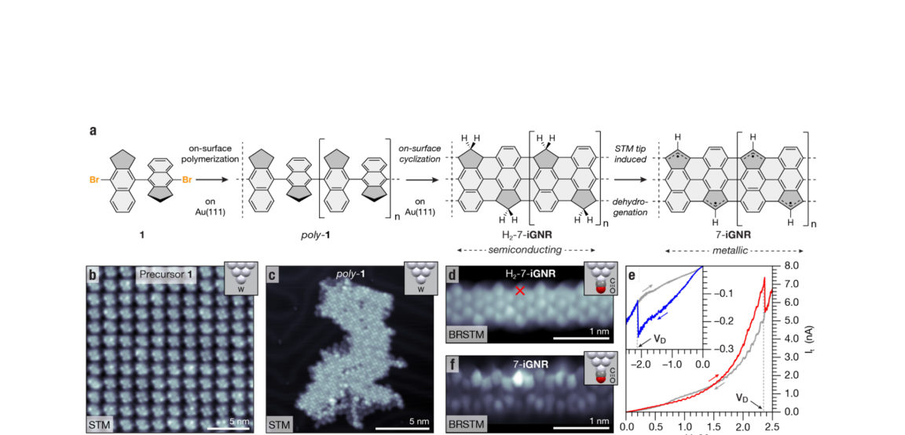
<figcaption class="paper-figure-caption"><b>Fig 2.</b> Figure 2 | On-surface synthesis of 7-iGNRs. a, Schematic representation of the stepwise on-surface</figcaption>
</figure>
<figure class="paper-figure-card">
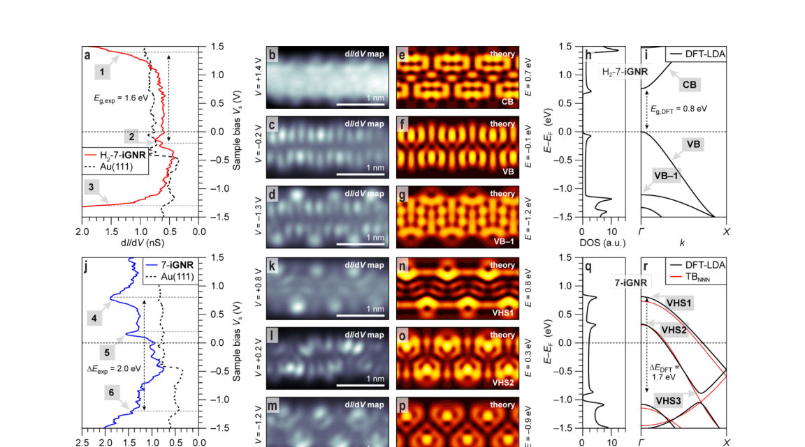
<figcaption class="paper-figure-caption"><b>Fig 3.</b> Figure 3 | Electronic structure of H2-7-iGNRs and 7-iGNRs. a, dI/dV point spectrum of an H2-7-iGNR</figcaption>
</figure>
<figure class="paper-figure-card">
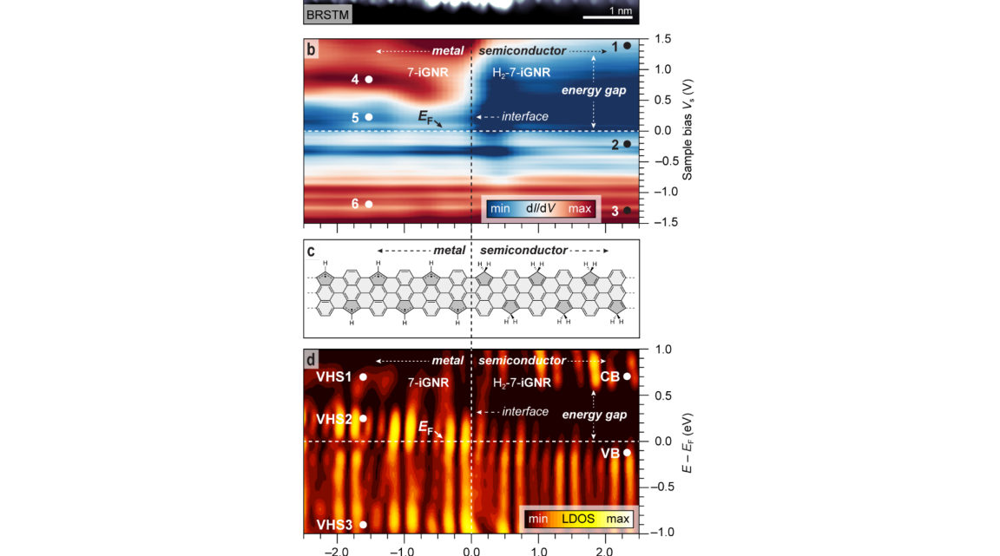
<figcaption class="paper-figure-caption"><b>Fig 4.</b> Figure 4 | STM tip-induced metal-semiconductor heterojunctions. a, Constant-height BRSTM image</figcaption>
</figure>

**Summary.** This work reports on the synthesis and characterization of metal-semiconductor heterojunctions in single Graphene Nanoribbons. By using STM-induced dehydrogenation, the authors create metallic segments within semiconducting GNRs. The resulting junction exhibits favorable electronic alignment, suggesting a viable pathway for building atomically precise, low-barrier p-type contacts for future nanoelectronics.

**Why it may be interesting.** The precise control over electronic interfaces in 1D quantum materials like GNRs is crucial for building nanoscale electronic components, offering insights into interface physics relevant to quantum device architectures.

Detailed structure

**Main problem.** The primary challenge addressed is the difficulty in creating high-quality, low-barrier electronic interfaces between semiconducting Graphene Nanoribbons (GNRs) and metallic contacts.

**Main result.** The authors successfully demonstrated a method to synthesize metallic segments within semiconducting GNRs, creating a metal-semiconductor heterojunction with a small energy barrier for hole injection.

**Method.** The study combines bottom-up on-surface synthesis techniques with advanced characterization using Scanning Tunneling Microscopy (STM) and Spectroscopy (STS), complemented by first-principles DFT calculations.

**Model / system.** The system involves GNRs (specifically 7-iGNRs) synthesized on Au(111). The electronic structure is modeled using the Su-Schrieffer-Heeger (SSH) Hamiltonian and analyzed via DFT-LDA, treating the junction as a metal-semiconductor interface.

**Key observables.** Zero-bias conductance (nonzero spectral weight at E_F), band edge alignment, and the absence of a discernible depletion region across the interface.

**Important parameters / regimes.** The energy barrier for hole injection, the GNR width, and the bias voltage used for STM tip-induced dehydrogenation.

**Assumptions / limitations.** The process relies on the ability to locally remove hydrogen atoms via STM tip manipulation, and STS measurements are assumed to recover bulk GNR properties near the interface.

**Figures summary.** Figures illustrate the synthesis progression (precursor to H2-7-iGNR), the quantum ladder model, and crucially, the dI/dV spectra and LDOS maps comparing the semiconducting and metallic states across the junction.

**Paper structure.** The paper details the synthesis process (precursor deposition, polymerization, dehydrogenation) followed by a detailed electronic structure analysis using STS and DFT to characterize the resulting metal-semiconductor junction.

Abstract

Graphene nanoribbons (GNRs) are a highly tunable class of one-dimensional (1D) quantum materials that can be fabricated through bottom-up synthesis. Precise control over GNR band gaps and band-edge alignments has established them as a promising nanoelectronics platform, but forming high-quality electronic interfaces remains challenging. Here we combine sequential on-surface synthesis and scanning tunneling microscopy (STM)-induced dehydrogenation to directly write metallic 7-iGNR segments into otherwise semiconducting H$_2$-7-iGNRs without changing the GNR width or carbon backbone connectivity. The resulting metallic segments exhibit nonzero spectral weight at the Fermi level ($E_\mathrm{F}$) and spatially extended electronic states, consistent with two dispersive bands crossing $E_\mathrm{F}$. The new metallic states are well described by an extended Su--Schrieffer--Heeger zigzag-ladder Hamiltonian. Scanning tunnelling spectroscopy (STS) and first-principles calculations show that the valence band edge of adjacent, connected semiconducting GNR segments lies close to $E_\mathrm{F}$ for the metallic segments. STS spectra recover bulk GNR properties within $\sim$1 nm on either side of the metal-semiconductor GNR interface, with no discernible depletion region. The observed GNR band edge alignment is consistent with a small energy barrier for hole injection, thus suggesting a possible route towards atomically precise, low-barrier p-type contacts for future GNR-based electronic devices.

[↑ back to top](#top)

