
# arxiv digest (quant-ph + cond-mat) — 2026-10-06

*170 papers · 18 relevant · 2 highlighted*

## 🔥 Most relevant (18)

*Every paper with at least one nonzero topic score, sorted by best-matching score. 🔥 marks scores ≥4/5. Click the title to jump to the full entry below; click [arXiv] to open the paper page. `(secondary)` marks papers from de-prioritized cond-mat archives.*

Show 18 relevant papers

- [Infrared Memory of a Majorana Shutter](#paper-2610.03133) [[arXiv]](http://arxiv.org/abs/2610.03133v1) — 🔥 `non-equilibrium universality` **4/5** · `Keldysh / 2PI / non-Gaussian methods` **3/5** · `analog quantum simulation` **3/5** · `correlated / nonlocal dissipation` **3/5** · `driven-dissipative phase transition` **3/5** · `methods for driven-dissipative` **3/5** · `scars & prethermalization` **3/5** · `quantum measurements` **2/5**
- [Interaction-induced period shift of the Kohn oscillation in a parity-time-symmetric harmonic trap](#paper-2610.02984) [[arXiv]](http://arxiv.org/abs/2610.02984v1) — 🔥 `driven-dissipative phase transition` **4/5** · `analog quantum simulation` **3/5** · `correlated / nonlocal dissipation` **3/5** · `methods for driven-dissipative` **3/5** · `non-equilibrium universality` **3/5** · `Keldysh / 2PI / non-Gaussian methods` **2/5** · `quantum measurements` **1/5**
- [Opportunistic full reconstruction of 100-dimensional frequency-bin quantum states](#paper-2610.03496) [[arXiv]](http://arxiv.org/abs/2610.03496v1) — 🔥 `quantum optics experiment` **4/5** · `QC/QI experiment` **3/5** · `interference shaping light` **3/5** · `quantum measurements` **3/5** · `analog quantum simulation` **2/5** · `methods for driven-dissipative` **2/5**
- [Optimal state detection without likelihood estimation](#paper-2610.02644) [[arXiv]](http://arxiv.org/abs/2610.02644v1) — 🔥 `quantum measurements` **4/5** · `QC/QI experiment` **3/5** · `quantum optics experiment` **3/5** · `Full counting statistics` **2/5** · `driven-dissipative phase transition` **2/5** · `methods for driven-dissipative` **2/5**
- [Mode-tunable inter-core coupling of photon-number-resolved quantum light in a telecom multicore fiber](#paper-2610.03493) [[arXiv]](http://arxiv.org/abs/2610.03493v1) — 🔥 `quantum optics experiment` **4/5** · `QC/QI experiment` **3/5** · `analog quantum simulation` **3/5** · `interference shaping light` **3/5** · `Full counting statistics` **1/5** · `quantum measurements` **1/5**
- [Thermalization in a repeated-interaction model with memory effects](#paper-2610.02854) [[arXiv]](http://arxiv.org/abs/2610.02854v1) — 🔥 `methods for driven-dissipative` **4/5** · `quantum measurements` **3/5** · `scars & prethermalization` **3/5** · `correlated / nonlocal dissipation` **1/5** · `driven-dissipative phase transition` **1/5** · `non-equilibrium universality` **1/5**
- [Gap-Protected Heisenberg-Limited Squeezing with Locally Interacting Multi-Level Spins](#paper-2610.02314) [[arXiv]](http://arxiv.org/abs/2610.02314v1) — 🔥 `analog quantum simulation` **4/5** · `Rydberg arrays` **3/5** · `Keldysh / 2PI / non-Gaussian methods` **2/5** · `methods for driven-dissipative` **2/5**
- [Pulse-resolved post-generation phase control of squeezed light at 93 MHz with a bulk lithium-niobate modulator](#paper-2610.03257) [[arXiv]](http://arxiv.org/abs/2610.03257v1) — 🔥 `quantum optics experiment` **4/5** · `QC/QI experiment` **3/5** · `interference shaping light` **1/5** · `quantum measurements` **1/5**
- [Quantum Key Distribution with Entanglement-Swapped Photons from a Quantum Emitter](#paper-2610.03351) [[arXiv]](http://arxiv.org/abs/2610.03351v1) — 🔥 `quantum optics experiment` **4/5** · `QC/QI experiment` **3/5** · `interference shaping light` **1/5** · `quantum measurements` **1/5**
- [Quantum simulation of field-tunable spin spectroscopy of the quantum magnet Cs2CoCl4 on a trapped-ion quantum computer](#paper-2610.03671) [[arXiv]](http://arxiv.org/abs/2610.03671v1) — 🔥 `QC/QI experiment` **4/5** · `analog quantum simulation` **3/5** · `methods for driven-dissipative` **2/5**
- [Probing fluctuating hydrodynamics through current fluctuations in hard rod gas](#paper-2610.03180) [[arXiv]](http://arxiv.org/abs/2610.03180v1) — 🔥 `Full counting statistics` **4/5** · `Keldysh / 2PI / non-Gaussian methods` **2/5** · `non-equilibrium universality` **2/5**
- [Stimulated Parametric Down-Conversion: From Foundational Coherence to Structured Light Applications](#paper-2610.03241) [[arXiv]](http://arxiv.org/abs/2610.03241v1) — 🔥 `interference shaping light` **4/5** · `Keldysh / 2PI / non-Gaussian methods` **2/5** · `driven-dissipative phase transition` **1/5** · `methods for driven-dissipative` **1/5**
- [A Polynomial-Scaling PDE Solver with Entanglement-Basis Tensor Networks](#paper-2610.02316) [[arXiv]](http://arxiv.org/abs/2610.02316v1) `(secondary)` — 🔥 `methods for driven-dissipative` **4/5** · `analog quantum simulation` **3/5**
- [The QICK Box: A Modular RF Front-End System for Quantum Control and Readout](#paper-2610.03609) [[arXiv]](http://arxiv.org/abs/2610.03609v1) — 🔥 `QC/QI experiment` **4/5** · `quantum measurements` **3/5**
- [Finite-momentum pairing and magnetic halos in a spin-imbalanced Holstein model](#paper-2610.03678) [[arXiv]](http://arxiv.org/abs/2610.03678v1) — 🔥 `analog quantum simulation` **4/5** · `Rydberg arrays` **2/5**
- [Self-organized Layered Structures of Nitrogen-Vacancy Centers with Preferential Orientation in Heteroepitaxial Diamond Films](#paper-2610.03150) [[arXiv]](http://arxiv.org/abs/2610.03150v1) — 🔥 `QC/QI experiment` **4/5** · `quantum measurements` **1/5** · `quantum optics experiment` **1/5**
- [Topological phase transition in a symmetric blockade structure](#paper-2610.03186) [[arXiv]](http://arxiv.org/abs/2610.03186v1) — 🔥 `analog quantum simulation` **4/5** · `methods for driven-dissipative` **2/5**
- [Self-testing ideal quantum measurements](#paper-2610.03168) [[arXiv]](http://arxiv.org/abs/2610.03168v1) — 🔥 `quantum measurements` **4/5**

## ⭐ Highlighted (2)

*Papers by authors on your watch list. Click the title to jump to the full entry below; click [arXiv] to open the paper page.*

Show 2 highlighted papers

- ⭐ [Efficient fidelity simulation of high-rate magic distillation circuits](#paper-2610.03605) [[arXiv]](http://arxiv.org/abs/2610.03605v1) — Mikhail D. Lukin
- ⭐ [Efficient Sampling for Many-Body Fermionic Non-Gaussianity](#paper-2610.03492) [[arXiv]](http://arxiv.org/abs/2610.03492v1) — Yuto Ashida

## All papers (120, sorted by relevance)

*Papers from quant-ph and your primary cond-mat archives (quant-gas, stat-mech, str-el, dis-nn). Highlighted papers (⭐) come first, then everything else sorted by topic-relevance score, highest first.*

### ⭐ [Efficient Sampling for Many-Body Fermionic Non-Gaussianity](http://arxiv.org/abs/2610.03492v1)

**Highlighted author(s):** Yuto Ashida  
**Authors:** Ryota Matsuda, Masahiro Hoshino, Yuto Ashida  
**Type:** theory · **Category:** numerical methods · **PDF:** <https://arxiv.org/pdf/2610.03492v1>  
**Analysis basis:** full PDF text, analyzed in chunks
**Topic relevance:** `Keldysh / 2PI / non-Gaussian methods` **1/5** · `analog quantum simulation` **1/5** · `methods for driven-dissipative` **1/5**

↔ Scroll figures horizontally

<figure class="paper-figure-card">
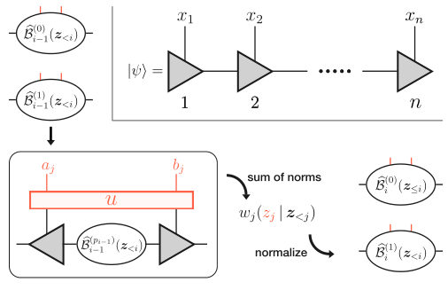
<figcaption class="paper-figure-caption"><b>Fig 1.</b> FIG. 1. Schematic illustration of the perfect-sampling sweep. The two parity-resolved boundary matrices encode the sampled prefix and are contracted with the local tensors of the input MPS and the beam splitter to obtain the conditional probabilities at each site. After the local output is sampled, the corresponding matrices are normalized and passed to the next site, yielding an exact Born sample without constructing the convolved MPS.</figcaption>
</figure>
<figure class="paper-figure-card">
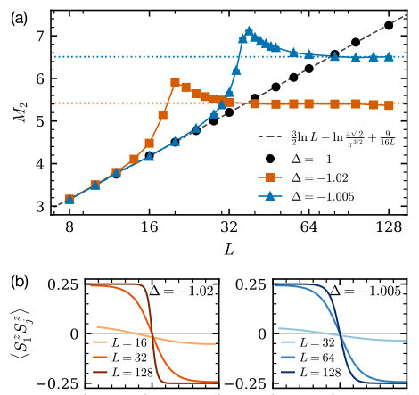
<figcaption class="paper-figure-caption"><b>Fig 2.</b> FIG. 2. (a) Second-order MRE of the ground state as a function of the number of sites L. At ∆= −1, the dashed black line is the large- L asymptotic form (18), and the circles are the perfect sampling from the exact MPS. The squares and triangles are the perfect sampling from the DMRG states at ∆= −1.02 and −1.005, connected by solid curves as guides, and the dotted horizontal lines are Eq. (19). The standard errors are smaller than 0.01 for all points. (b) shows the spin- spin correlation function Sz 1Sz j at ∆= −1.02 for L = 16, 32, 128 and ∆= −1.005 for L = 32, 64, 128.</figcaption>
</figure>

**Summary.** This paper introduces a novel, efficient perfect-sampling algorithm to calculate the Magic Rényi Entropy ($	ext{M}_2	ext{RE}$), a resource measure quantifying fermionic non-Gaussianity. By operating directly on Matrix Product States, the method achieves polynomial scaling ($\mathcal{O}(nD^3)$) with system size. This allows researchers to quantitatively probe higher-order quantum correlations in fermionic systems like the XXZ chain, which are inaccessible to standard covariance-based measures.

**Why it may be interesting.** The development of a polynomial-time sampling technique for higher-order correlation measures like $	ext{M}_2	ext{RE}$ is crucial for simulating complex quantum many-body physics that goes beyond simple quadratic Hamiltonians.

Detailed structure

**Main problem.** The primary challenge is developing an efficient computational method to calculate the second-order Magic Rényi Entropy ($	ext{M}_2	ext{RE}$) for fermionic non-Gaussianity, as exact evaluation scales exponentially with system size.

**Main result.** The authors developed a perfect-sampling method that calculates $	ext{M}_2	ext{RE}$ in polynomial time ($\mathcal{O}(nD^3)$), successfully demonstrating that this measure captures higher-order correlations inaccessible to simpler covariance-based metrics.

**Method.** The method employs a perfect-sampling technique using a bounded estimator and a recursive sweep to sample directly from Matrix Product States (MPSs), avoiding the explicit construction of replicated tensor networks.

**Model / system.** The study focuses on many-body fermionic systems, benchmarked on the XXZ chain of spinful fermions, which are represented using a right-canonical MPS formalism.

**Key observables.** Fermionic non-Gaussianity, quantified by the $	ext{M}_2	ext{RE} = -\ln 
u_2$, and the purity $
u_2$ of the convolved state.

**Important parameters / regimes.** System size ($L$), MPS bond dimension ($D$), and the anisotropy parameter ($\Delta$) of the XXZ chain.

**Assumptions / limitations.** The method assumes the input state is represented by a right-canonical MPS and utilizes a bounded estimator to control sampling fluctuations.

**Figures summary.** Figures illustrate the MRE scaling for the XXZ chain, showing agreement with known analytical results for $\Delta=-1$ and saturation behavior for $\Delta<-1$. Other figures detail the structure of the sampling sweep using boundary matrices.

**Paper structure.** The paper develops the perfect-sampling technique for $	ext{M}_2	ext{RE}$ calculation, benchmarks it on the XXZ chain to confirm polynomial scaling and physical accuracy, and analyzes the saturation of the non-Gaussianity measure in different regimes.

Abstract

Fermionic non-Gaussianity is a key resource for universal quantum computation, and its behavior in quantum many-body systems has attracted growing interest. Recently, a convolution-based measure, which we call the magic Rényi entropy (MRE), has been proposed as a resource measure of non-Gaussianity, but its evaluation is limited to small systems due to the computational cost growing exponentially with system size. In this work, we develop a perfect-sampling method to calculate the second-order MRE from matrix product states (MPSs). Our method uses a bounded estimator to control sampling fluctuations and a recursive sweep to draw the samples directly from the input MPS, which allows us to generate each sample with $\mathcal O(nD^3)$ time, where $n$ and $D$ denote the number of modes and MPS bond dimension, respectively. We benchmark our method on the XXZ chain with up to $128$ sites, demonstrating that the MRE captures intricate higher-order correlations at large scales, which are inaccessible to covariance-based measures. These results provide a computational tool that quantitatively evaluates many-body fermionic non-Gaussianity by accounting for higher-order correlations.

[↑ back to top](#top)

### ⭐ [Efficient fidelity simulation of high-rate magic distillation circuits](http://arxiv.org/abs/2610.03605v1)

**Highlighted author(s):** Mikhail D. Lukin  
**Authors:** Xiao Xiao, Dominik Hangleiter, J. Pablo Bonilla Ataides, Rohan Mehta, Varun Menon, Mikhail D. Lukin, Michael J. Gullans  
**Type:** theory · **Category:** quantum information and computing · **PDF:** <https://arxiv.org/pdf/2610.03605v1>  
**Analysis basis:** full PDF text, analyzed in chunks
**Topic relevance:** `methods for driven-dissipative` **1/5**

↔ Scroll figures horizontally

<figure class="paper-figure-card">
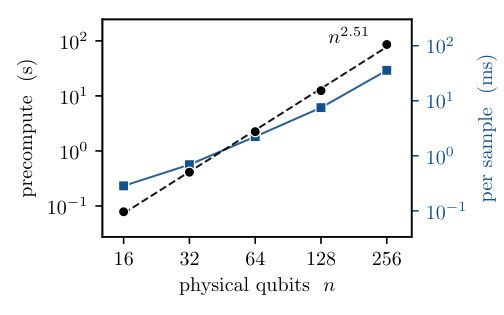
<figcaption class="paper-figure-caption"><b>Fig 1.</b> FIG. 1: Cost of the fidelity estimation pipeline on one CPU versus the number of physical qubits n, for the hypercube-IQP circuits using the [[8, 3, 2]] code [10]. Black circles: one-time precomputation (simulator con- struction, back-propagation of faults and measured sta- bilizers, and the fault–measurement commutator tables), with a fitted power law n2.51 (dashed). Blue squares: cost per Monte-Carlo sample, obtained by subtracting the precomputation from the total run time and divid- ing by the number of samples. No power law is quoted for the latter because its local slope still rises across this range (1.3 →2.3). See Section S4.3 for the scaling of the individual subroutines.</figcaption>
</figure>
<figure class="paper-figure-card">
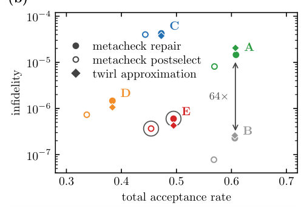
<figcaption class="paper-figure-caption"><b>Fig 2.</b> FIG. 2: (a) Protocol E: three [[27,3,3]] data blocks are prepared in |+⟩L, a depth-2 transversal CCZ circuit builds the encoded hypergraph state, and one shared an- cilla block Ash extracts the post-CCZ Z syndrome. (b) Infidelity of the 9-qubit hypergraph state versus total ac- ceptance rate for five treatments of the Z syndrome — A: none. B: noiseless (lower bound). C: bare ancillas. D: one Steane block per data block. E: one shared block, circled, as drawn in (a) — with the prep metachecks re- paired (filled circle) or postselected (hollow). The dia- mond data points correspond to results with the approx- imation using twirling [21]. The double arrow marks the A–B gap. Simulations were...</figcaption>
</figure>

**Summary.** This paper presents efficient classical simulation techniques to benchmark the fault-tolerant performance of quantum circuits involving non-Clifford gates. By focusing on syndrome sampling and observable expectation values rather than full simulation, the authors achieve polynomial scaling. This methodology is practically demonstrated by optimizing high-rate magic state distillation factories.

**Why it may be interesting.** The techniques developed for efficiently simulating fault-tolerant circuits are highly relevant for understanding the performance limits of quantum computation hardware.

Detailed structure

**Main problem.** Developing exact and efficient classical methods to benchmark the fault-tolerant performance of quantum circuits containing non-Clifford gates.

**Main result.** The developed algorithms scale polynomially in physical qubits and circuit depth, allowing for the optimization of high-rate magic state distillation factories.

**Method.** The approach uses Monte Carlo methods to sample syndrome statistics and estimate logical fidelity and Pauli observable expectation values, avoiding full circuit simulation.

**Model / system.** The study focuses on circuits composed of X, CNOT, and diagonal gates belonging to the Clifford hierarchy, particularly analyzing AD(3) and AD(4) circuits used in quantum error correction.

**Key observables.** Logical fidelity, expectation values of Pauli observables, and syndrome statistics.

**Important parameters / regimes.** Physical qubits (n), circuit depth (T), and the level of the diagonal gate ($\ell$).

**Assumptions / limitations.** The efficiency relies on the structure of error propagation following a hierarchy reduction, and certain fidelity calculations assume ideal mapping between reference subspaces.

**Figures summary.** Figures compare computational cost scaling for fidelity estimation on hypercube-IQP circuits and compare infidelity vs. acceptance rate for different Z syndrome extraction protocols.

**Paper structure.** The paper develops general algorithms for syndrome sampling and observable estimation for AD($\ell$) circuits, applies these to IQP sampling, and demonstrates utility by optimizing magic state distillation using a [[27,3,3]] code.

Abstract

Non-Clifford gates are essential for avoiding classical simulability under the Gottesman-Knill theorem. An error-corrected circuit with non-Clifford gates will therefore be an important element for realizing useful fault-tolerant quantum algorithms. However, accurately understanding the fault-tolerant performance of such circuits faces challenges due to the classical hardness of simulating these circuits. We avoid simulating logical measurements and develop exact and efficient classical methods for benchmarking circuits composed of X, CNOT, and diagonal gates in the Clifford hierarchy, including state and gate teleportation gadgets with feedforward. For circuits with third-level diagonal gates, our benchmarking algorithm efficiently samples syndrome statistics and estimates the output logical fidelity and expectation values of certain Clifford observables, including all Pauli observables. The evaluation of syndrome expectation values also extends to circuits with fourth-level diagonal gates. Our algorithm scales polynomially in the number of physical qubits n and circuit depth T, independent of the number of logical qubits. The benchmarking applications include IQP sampling and magic state preparation/cultivation. We demonstrate the practical utility of our simulation algorithms by using them to optimize high-rate magic state distillation factories based on three copies of a [[27,3,3]] tricycle code.

[↑ back to top](#top)

### [Infrared Memory of a Majorana Shutter](http://arxiv.org/abs/2610.03133v1)

**Authors:** Ali Vahedi  
**Type:** theory · **Category:** other · **PDF:** <https://arxiv.org/pdf/2610.03133v1>  
**Analysis basis:** full PDF text, analyzed in chunks
**Topic relevance:** 🔥 `non-equilibrium universality` **4/5** · `Keldysh / 2PI / non-Gaussian methods` **3/5** · `analog quantum simulation` **3/5** · `correlated / nonlocal dissipation` **3/5** · `driven-dissipative phase transition` **3/5** · `methods for driven-dissipative` **3/5** · `scars & prethermalization` **3/5** · `quantum measurements` **2/5**

↔ Scroll figures horizontally

<figure class="paper-figure-card">
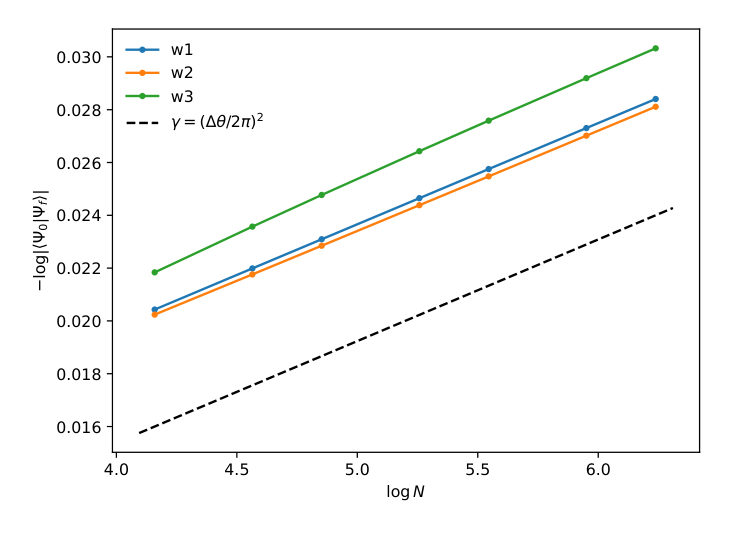
<figcaption class="paper-figure-caption"><b>Fig 1.</b> Figure 1: Ground-state overlap as a finite-size BCC/orthogonality diagnostic at λf = 0.4, a = 2. The lattice data for three smooth profiles follow a common power law. The dashed line uses the parameter-free infrared prediction γAO = (∆θ/2π)2. Profile dependence is visible only at the finite-size level and is substantially smaller than the leading power-law scaling signal.</figcaption>
</figure>
<figure class="paper-figure-card">
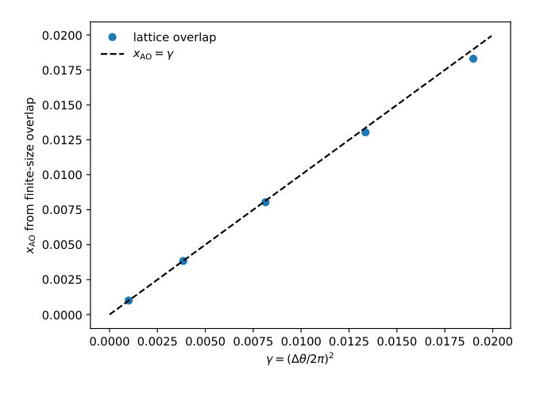
<figcaption class="paper-figure-caption"><b>Fig 2.</b> Figure 2: Extracted orthogonality exponent versus the scattering prediction γAO = (∆θ/2π)2. The numerical exponent is obtained from finite-size ground-state overlaps. The diagonal line is not a fit; it is the analytic scattering prediction.</figcaption>
</figure>
<figure class="paper-figure-card">
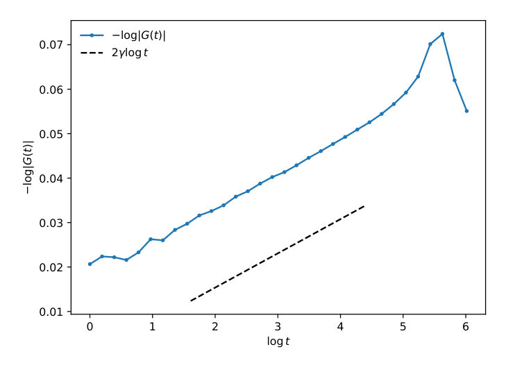
<figcaption class="paper-figure-caption"><b>Fig 3.</b> Figure 3: Loschmidt amplitude after a sudden switch for N = 512, a = 2, w1, and λf = 0.4. The pre-revival data give slopes in the range 0.00773–0.00804 for the fit windows listed in the text, compared with 2γAO = 0.007695. The late-time deviation is a finite-size recurrence effect, not an LCFT signature.</figcaption>
</figure>
<figure class="paper-figure-card">
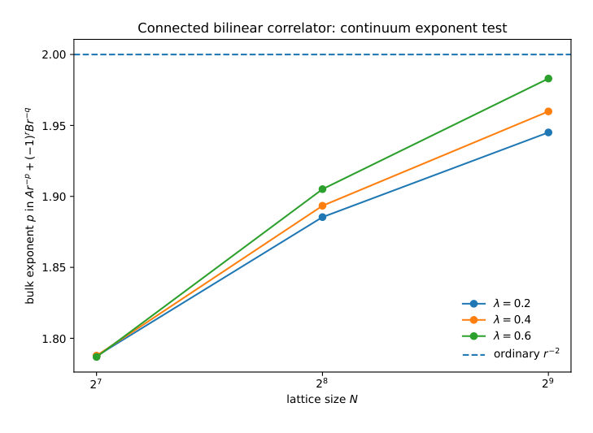
<figcaption class="paper-figure-caption"><b>Fig 4.</b> Figure 4: Vacuum control for the connected bulk bilinear exponent. The fits use the anchored two-component form Ar−p + (−1)rBr−q with j = N/2 and 5 ≤r ≤min(102, N/4). The finite-size drift toward p = 2 is already present at λf = 0; the shutter changes the fitted exponent only weakly.</figcaption>
</figure>
<figure class="paper-figure-card">
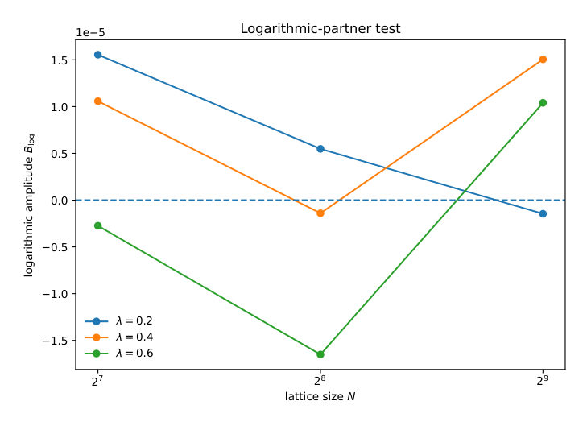
<figcaption class="paper-figure-caption"><b>Fig 5.</b> Figure 5: Direct logarithmic-partner diagnostic using the correct log(r/aUV) ansatz. At N = 512, Blog/A is −8 × 10−8 in the vacuum and 7 × 10−6 at λf = 0.4. The small, regulator-dependent amplitudes do not establish a logarithmic two-point function.</figcaption>
</figure>

**Summary.** This work analyzes the 'infrared memory' left in a fermionic system by a localized, time-varying defect (Majorana shutter). By examining multiple observables—including entanglement entropy and quasiparticle number—the authors demonstrate that the low-frequency physics is governed by distinct coefficients, proving that global and local measures of quantum memory are not mathematically equivalent.

**Why it may be interesting.** It provides a rigorous framework for distinguishing between different types of quantum memory effects—global vs. local—in strongly correlated, non-equilibrium fermionic systems, which is crucial for understanding quantum quenches.

Detailed structure

**Main problem.** The study investigates the 'infrared memory' imprinted on a quantum system by a local, time-dependent scattering defect modeled as a Majorana shutter.

**Main result.** The analysis establishes that global infrared divergences (like in quasiparticle number) and local spatial entropy divergences are controlled by distinct, though related, low-frequency scattering data, showing they are not interchangeable.

**Method.** The authors use analytical techniques involving the scattering matrix, Bogoliubov kernels, and lattice simulations to probe the system's response to time-dependent perturbations.

**Model / system.** The system is a 1D fermionic chain described by massless Majorana fields, perturbed by a smooth, finite-width coupling acting as the 'Majorana shutter' defect.

**Key observables.** Overlap of Gaussian vacua (Anderson orthogonality), post-quench quasiparticle number (logarithmic growth), and entanglement entropy (central-charge description).

**Important parameters / regimes.** The finite width ($a$) and the switching time ($	au$) define the memory parameter ($\epsilon_{	ext{mem}} = a/	au$), and the scattering angle ($	heta_\lambda$) controls the zero-frequency scattering matrix.

**Assumptions / limitations.** The analysis often relies on the zero-memory approximation ($\epsilon_{	ext{mem}} \ll 1$) and treats the system using continuum field theory methods.

**Figures summary.** The notes do not provide a summary of figures, but they detail the quantitative results for various observables like the overlap exponent, the logarithmic coefficient, and the entropy scaling.

**Paper structure.** The paper progresses by first establishing the universality of the zero-frequency scattering matrix, then analyzing the time-dependent Bogoliubov kernel, and finally comparing the resulting divergences across global (quasiparticle number) and local (entropy) observables.

Abstract

We study a finite-width Majorana shutter as a local, time-dependent scattering defect and determine which features of its infrared memory are insensitive to the microscopic spatial profile. For a smooth shutter, the zero-frequency scattering matrix is fixed by the integrated coupling, while finite-width corrections vanish in the long-wavelength limit. A time-dependent switch then produces an infrared Bogoliubov kernel whose singular part is controlled by the change in this scattering matrix.   We examine the many-body response through three observables. The overlap of the pre- and post-shutter Gaussian vacua exhibits Anderson orthogonality, with an exponent set by the scattering angle. A lattice calculation of the post-quench quasiparticle number resolves its logarithmic infrared growth, reaching the predicted coefficient in the slow-switch test and reproducing the expected dependence on the scattering-angle change. When the entanglement cut passes through the shutter, the entropy follows the effective-central-charge description of a conformal defect, with parameter-free agreement at the percent level, improving for the wider shutter. When the shutter lies inside the interval, its contribution remains a subleading finite-size correction. A local bilinear correlator approaches the expected Majorana power law and shows no stable logarithmic amplitude.   These results show that the same low-frequency scattering data control distinct global and spatial observables, while their infrared coefficients are not interchangeable. The remaining limits are also made explicit: the finite-memory correction to the continuum kernel and the controlled continuum limit of large-interval spatial entropy.

[↑ back to top](#top)

### [Interaction-induced period shift of the Kohn oscillation in a parity-time-symmetric harmonic trap](http://arxiv.org/abs/2610.02984v1)

**Authors:** Gaoqing Meng, Mingshu Zhao  
**Type:** theory · **Category:** quantum gases · **PDF:** <https://arxiv.org/pdf/2610.02984v1>  
**Analysis basis:** full PDF text, analyzed in chunks
**Topic relevance:** 🔥 `driven-dissipative phase transition` **4/5** · `analog quantum simulation` **3/5** · `correlated / nonlocal dissipation` **3/5** · `methods for driven-dissipative` **3/5** · `non-equilibrium universality` **3/5** · `Keldysh / 2PI / non-Gaussian methods` **2/5** · `quantum measurements` **1/5**

↔ Scroll figures horizontally

<figure class="paper-figure-card">
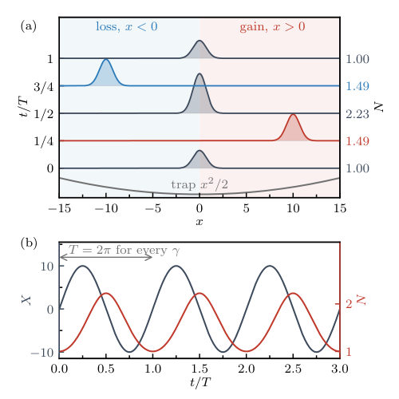
<figcaption class="paper-figure-caption"><b>Fig 1.</b> FIG. 1. The trap and its dynamics in the absence of interac- tions, from Eq. (4) with γ = 0.02 and A = 10 [18]. (a) The density |ψ|2 at five phases of one period, with N on the right. (b) X and N over three periods.</figcaption>
</figure>
<figure class="paper-figure-card">
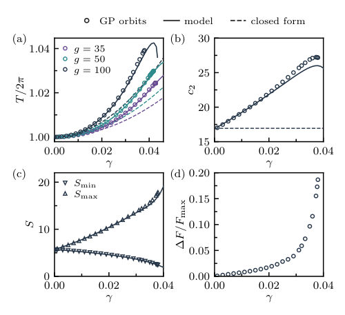
<figcaption class="paper-figure-caption"><b>Fig 2.</b> FIG. 2. The period and the squared width along the orbits for p0 = 10. (a) T for g = 35, 50 and 100. (b)–(d) The g = 100 family: (b) c2; (c) the smallest and largest S along the orbit; (d) the spread ∆F over one period of the density profile F rescaled to unit norm and unit squared width, relative to its peak.</figcaption>
</figure>
<figure class="paper-figure-card">
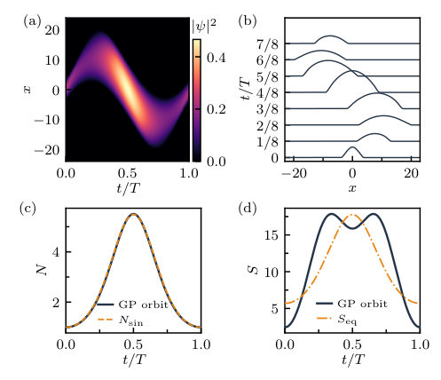
<figcaption class="paper-figure-caption"><b>Fig 3.</b> FIG. 3. The orbit at γ = 0.038 for g = 100, p0 = 10. (a) |ψ|2 over one period and (b) at eight phases, on a common scale. (c) N, with Nsin = exp[(γAT/π)(1 −cos 2πt/T)] for a sinusoidal COM. (d) S, with its equilibrium value Seq at the instantaneous N.</figcaption>
</figure>
<figure class="paper-figure-card">
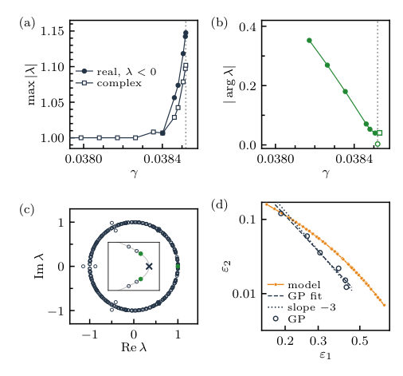
<figcaption class="paper-figure-caption"><b>Fig 4.</b> FIG. 4. The critical gain. (a)–(c) Floquet multipliers λ for g = 100, p0 = 10, with γc dotted in (a) and (b). (a) Largest |λ| among the real negative and among the complex multipliers; |λ| &gt; 1 signals an instability. (b) Phase of the pair that approaches +1, filled below the resonance and open within it, at γc (circle) and on a smaller computational domain, on which the family extends slightly beyond γc (square). (c) The multipliers at γc (open circles), with this pair in green; the inset enlarges |Im λ| &lt; 0.006 near +1, with Re λ stretched by a further factor 400, and a cross marks the four multipliers that stay at +1. (d) The folds of the model and the critical gains of the six GP...</figcaption>
</figure>
<figure class="paper-figure-card">
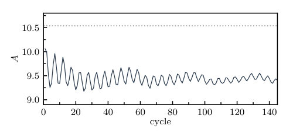
<figcaption class="paper-figure-caption"><b>Fig 5.</b> FIG. 5. Amplitude of successive cycles of the ground state kicked to ˙X(0) = 10 at γ = 0.035 for g = 100, a cycle running from one crossing of the center toward the gain side to the next; the dotted line marks A of the orbit at the same gain.</figcaption>
</figure>

**Summary.** This paper analyzes the period shift of the Kohn oscillation in a Bose-Einstein condensate trapped in a harmonic potential modified by gain and loss (PT-symmetry). The authors show that interactions cause the oscillation period to deviate from the non-interacting value, predicting the shift scales quadratically with gain at small strengths. They use advanced numerical methods to track these periodic orbits up to resonance points.

**Why it may be interesting.** This work directly addresses non-Hermitian physics in the context of ultracold atoms, showing how gain/loss terms fundamentally alter coherent dynamics like the Kohn oscillation, which is crucial for understanding open quantum systems in atomic traps.

Detailed structure

**Main problem.** The study investigates how interatomic interactions modify the period of the Kohn oscillation in a Bose-Einstein condensate confined in a harmonic trap subjected to a parity-time-symmetric gain-loss potential.

**Main result.** The period shift is found to be non-zero and proportional to the square of the gain strength ($\gamma^2$) at small gains, and the analysis determines scaling exponents for the critical gain where resonance occurs.

**Method.** The research employs the Gross-Pitaevskii equation, utilizing moment models, Ehrenfest theorems, and advanced numerical techniques like pseudo-arclength continuation to track periodic orbits.

**Model / system.** The system is a Bose-Einstein condensate (BEC) governed by a GP equation incorporating a harmonic trap, repulsive interactions ($g|\psi|^2$), and a gain-loss term ($\propto \gamma x$), making the potential PT-symmetric.

**Key observables.** Period of oscillation ($T$), cloud width, center of mass position ($X(t)$), and the critical gain ($\gamma_c$) where resonance occurs.

**Important parameters / regimes.** Interaction strength ($g$), gain strength ($\gamma$), trap frequency ($\omega$), and the initial ground-state width ($\sigma_0$).

**Assumptions / limitations.** The analysis relies on approximations such as fixed profile shape in the moment model, and the use of continuation methods near resonance points.

**Figures summary.** Figures illustrate the time evolution of density and COM position for $\gamma=0$, show the period $T$ vs. $\gamma$ confirming quadratic growth, and compare results from different numerical domains/tapering schemes.

**Paper structure.** The paper progresses from the linear (non-interacting) case to the interacting case, deriving analytical approximations for small gain, developing moment equations, and finally using advanced numerical continuation techniques to map out the periodic orbits up to critical resonance points.

Abstract

The center of mass of a Bose--Einstein condensate in a harmonic trap oscillates at the trap frequency independently of the interactions. Without interactions a parity-time-symmetric gain-loss gradient leaves this frequency unchanged, and a cloud of the ground-state width is translated rigidly while the atom number is periodically modulated. With interactions the protection is lost, because the gain and the loss change the number of atoms; the modulated atom number drives the width of the cloud, and the width acts back on the center of mass. At small gain the period grows quadratically with the gain strength, with a coefficient that in the Thomas--Fermi regime is set by the size of the cloud alone. The family of periodic orbits continued from the Kohn oscillation can be followed up to a critical gain, where it comes into resonance with highly excited states of the trap, and over the computed families this critical gain decreases with the amplitude of the oscillation and with the size of the cloud. A five-variable moment model reproduces the period and the width of the cloud along the orbits nearly up to the critical gain.

[↑ back to top](#top)

### [Opportunistic full reconstruction of 100-dimensional frequency-bin quantum states](http://arxiv.org/abs/2610.03496v1)

**Authors:** Hanson H. Nguyen, Zachary Goisman, Chen-You Su, Diego Maragnano, Marco Liscidini, Jason D. McKinney, Hsuan-Hao Lu, Joseph M. Lukens  
**Type:** experiment · **Category:** quantum information and computing · **PDF:** <https://arxiv.org/pdf/2610.03496v1>  
**Analysis basis:** full PDF text, analyzed in chunks
**Topic relevance:** 🔥 `quantum optics experiment` **4/5** · `QC/QI experiment` **3/5** · `interference shaping light` **3/5** · `quantum measurements` **3/5** · `analog quantum simulation` **2/5** · `methods for driven-dissipative` **2/5**

↔ Scroll figures horizontally

<figure class="paper-figure-card">
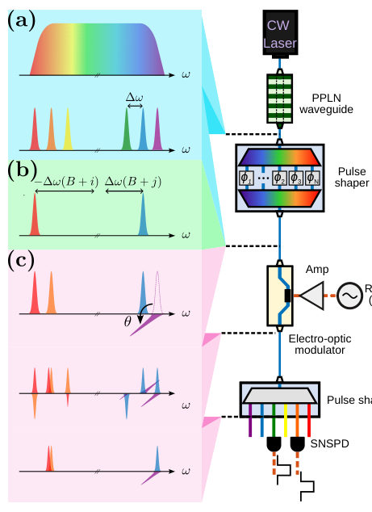
<figcaption class="paper-figure-caption"><b>Fig 1.</b> FIG. 1. Experimental setup illustrating the state-preparation and measurement stages. (a) Generation of a broadband frequency-entangled state via spontaneous parametric down- conversion in a periodically poled lithium niobate waveguide pumped by a 775 nm continuous-wave laser, followed by def- inition of the frequency bins with a Fourier-transform pulse shaper. (b) Measurement of computational-basis correlations to characterize the sparsity and determine the measurements used in threshold quantum state tomography. (c) Measure- ment of targeted off-diagonal coherences through selection of frequency bin pairs (with phase shift θ applied to one bin), frequency mixing using an electro-optic...</figcaption>
</figure>
<figure class="paper-figure-card">
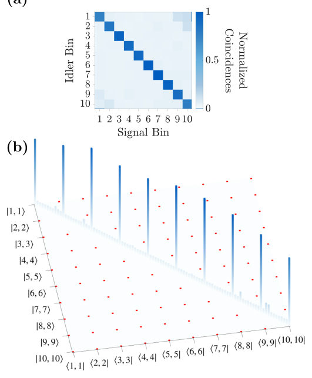
<figcaption class="paper-figure-caption"><b>Fig 2.</b> FIG. 2. Experimental computational-basis measurements. (a) Joint spectral intensity of d = 10 frequency bins per pho- ton, exhibiting a coincidence-to-accidental ratio of 31. (b) Corresponding diagonal density matrix values (blue) and off- diagonal elements identified by thresholding to be measured (red).</figcaption>
</figure>
<figure class="paper-figure-card">
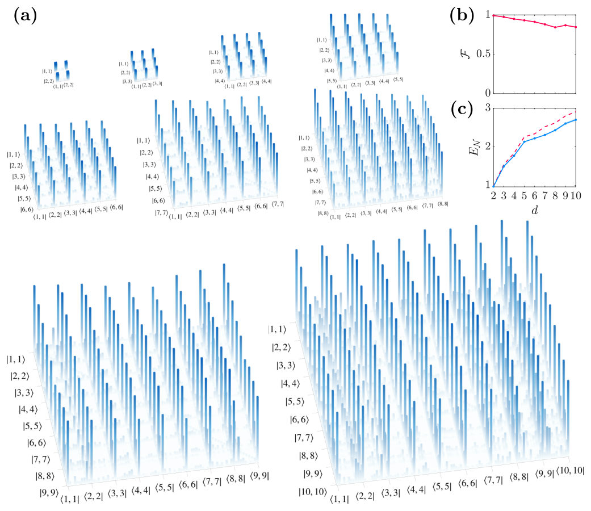
<figcaption class="paper-figure-caption"><b>Fig 3.</b> FIG. 3. Experimental results. (a) Magnitude of Bayesian-estimated two-qudit density matrices with single-qudit dimension d ∈ {2, 3, . . . , 10}. (b) Fidelity with respect to Werner states with λ ∈{0.982, 0.966, 0.883, 0.955, 0.836, 0.815, 0.764, 0.771, 0.747}. (c) Logarithmic negativity EN as a function of d (solid blue), with the dashed red line indicating the values for the hypothesized d-dimensional Werner states. In both (b) and (c), shaded regions included one standard deviation in each direction.</figcaption>
</figure>
<figure class="paper-figure-card">
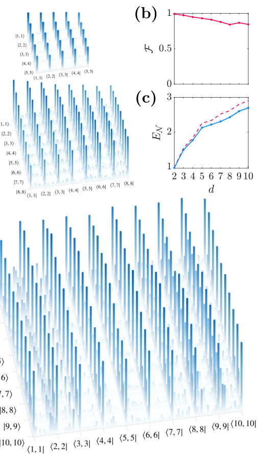
<figcaption class="paper-figure-caption"><b>Fig 4.</b> Figure 4 plots these optimal indices up to k = 49. βk scales linearly with k with near-unit slope, confirming the intuitive relationship βk ∼O(k) noted previously for efficient electro-optic-based frequency-bin tomogra- phy [30], while the stair steps can be attributed to avoid- ance of the zeros of J0(β), which suppress the product J2 0(β)J2 k(β) even when J2 k(β) is large. Plotted along- side these optimal indices are the corresponding max- ima J2 0(βk)J2 k(βk), which unsurprisingly trend downward</figcaption>
</figure>
<figure class="paper-figure-card">
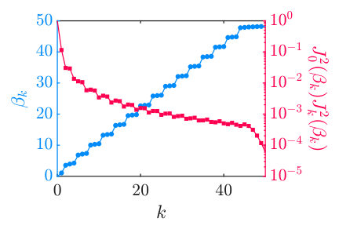
<figcaption class="paper-figure-caption"><b>Fig 5.</b> FIG. 4. Optimal modulation for frequency-bin mixing. The optimal modulation index βk (left axis) and corresponding maximum mixing efficiency J2 0 (βk)J2 k(βk) (right axis) are shown as a function of frequency-bin separation k.</figcaption>
</figure>

**Summary.** This paper introduces Threshold Quantum State Tomography (tQST) to overcome the exponential measurement scaling problem in characterizing high-dimensional quantum states. Using entangled frequency-bin photons, the authors experimentally demonstrated full state reconstruction for 100-dimensional systems while drastically reducing the required measurement overhead. This confirms the viability of measurement-aware techniques for practical, large-scale photonic quantum information processing.

**Why it may be interesting.** This work provides a crucial, hardware-efficient tool for characterizing complex, high-dimensional quantum states in photonic systems, which is vital for scaling up quantum communication and computation.

Detailed structure

**Main problem.** Characterizing high-dimensional quantum states, specifically frequency-bin encoded qudits, is extremely difficult because conventional Quantum State Tomography (QST) requires exponentially increasing measurement resources with dimensionality.

**Main result.** The authors successfully performed full state estimation of entangled biphoton frequency combs up to a 100-dimensional Hilbert space, requiring only 1.9% of the measurements needed by conventional methods.

**Method.** They employ Threshold Quantum State Tomography (tQST), an assumption-free measurement protocol combined with Bayesian inference, which selectively targets significant off-diagonal coherences in the density matrix.

**Model / system.** The system utilizes photonic quantum information processing via frequency-bin encoding, generating entangled biphoton frequency combs (BFCs) using PPLN waveguides and Fourier-transform pulse shapers.

**Key observables.** Fidelity ($F$), Logarithmic Negativity ($E_N$), Joint Spectral Intensity (JSI), and the density matrix elements ($
ho(ij)(k\ell)$).

**Important parameters / regimes.** Hilbert space dimension up to $d^2=100$; measurement scaling reduced to $2d^2 - d$ projections.

**Assumptions / limitations.** The approach is highlighted as being assumption-free, unlike other accelerated techniques that rely on structural assumptions like low rankness.

**Figures summary.** Figure 1 illustrates the full tQST experimental setup. Figure 2 shows the JSI and the resulting density matrix visualization after thresholding. Figure 3 plots the Bayesian-estimated mean fidelity ($\hat{F}$) convergence.

**Paper structure.** The paper introduces the challenge of high-dimensional state characterization, details the tQST methodology using adaptive measurements, presents the experimental implementation using photonic sources, and validates the results through fidelity and convergence checks.

Abstract

Frequency-bin encoding provides a scalable platform for photonic quantum information processing by enabling high-dimensional qudit states compatible with the telecommunications infrastructure. However, characterizing these systems remains challenging, as conventional quantum state tomography requires measurement resources that increase rapidly with dimensionality, compounded by the difficulty of implementing controllable measurements across many frequency modes at once. Here, we address these challenges and demonstrate threshold quantum state tomography of entangled frequency-bin qudits using adaptive measurements that exploit the sparsity of highly entangled biphoton frequency combs. Combined with Bayesian inference, we experimentally demonstrate full state estimation of biphoton frequency combs with Hilbert space dimensions up to $d^2=100$---a 56% increase over the previous record---all while performing a mere 1.9% of the measurements required by conventional tomographically complete approaches. This work confirms the promise of measurement-aware approaches for characterizing high-dimensional photonic quantum systems, unlocking new tools for full tomography that are hardware-efficient, state-aware, and free from a priori assumptions about state structure.

[↑ back to top](#top)

### [Optimal state detection without likelihood estimation](http://arxiv.org/abs/2610.02644v1)

**Authors:** M. D. K. Lee, Z. Chai, J. Z. F. Seng, K. J. Arnold, M. ~D. ~Barrett  
**Type:** both · **Category:** other · **PDF:** <https://arxiv.org/pdf/2610.02644v1>  
**Analysis basis:** full PDF text, analyzed in chunks
**Topic relevance:** 🔥 `quantum measurements` **4/5** · `QC/QI experiment` **3/5** · `quantum optics experiment` **3/5** · `Full counting statistics` **2/5** · `driven-dissipative phase transition` **2/5** · `methods for driven-dissipative` **2/5**

↔ Scroll figures horizontally

<figure class="paper-figure-card">
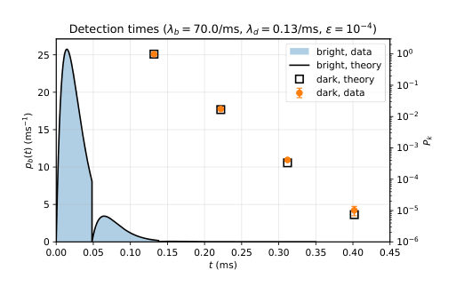
<figcaption class="paper-figure-caption"><b>Fig 1.</b> FIG. 1. Measured detection-time distributions for 138Ba+</figcaption>
</figure>
<figure class="paper-figure-card">
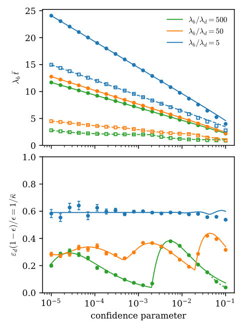
<figcaption class="paper-figure-caption"><b>Fig 2.</b> FIG. 2. Comparison with MC simulation of the full two- boundary algorithm for λb/λd = 5, 50, and 500. (Top) Mean detection times in photon units: circles and solid curves, dark ions; open squares and dashed curves, bright ions. (Bottom) Dark-error suppression εd(1 −ϵb)/ϵb = 1/¯κ: points with bi- nomial error bars, MC; solid curves, Eq. (8), whose arches follow the steps in n0; dotted, 1 −e−λdτ0,b where τ0,b &lt; τ/2 and only a single photon race remains. Agreement is within statistics for ϵ ≲10−2; the resolved deviations at larger ϵ are the second-order corrections neglected in the single-boundary approximation.</figcaption>
</figure>
<figure class="paper-figure-card">
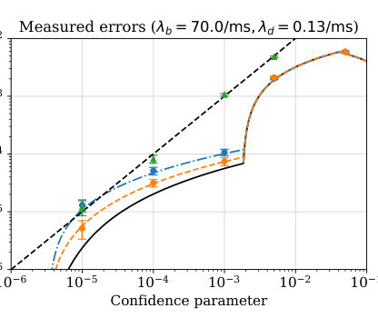
<figcaption class="paper-figure-caption"><b>Fig 3.</b> FIG. 3. Measured error rates versus confidence param- eter ϵ = ϵd = ϵb for 138Ba+ at λb = 70/ms and λd = 0.13/ms. Dark error with the native SPCM dead time (∆= 0, blue circles) and with counts blanked for ∆= 1 µs after each detection (orange squares); curves are Eq. (8) alone (solid; the single-race form 1 −e−λdτ0,d for ϵ &gt; 0.04, where τ0,d &lt; τ/2) and with the afterpulse correction Eq. (13) at the independently measured p = 0.43% (dash-dotted) and 0.17% (dashed). Bright error (green triangles) with Eq. (6), εb = ϵd/(1 −ϵd) (black dashed). Decay events are excluded as described in the text.</figcaption>
</figure>

**Summary.** This paper presents a provably optimal method for quantum state detection in trapped ions by reformulating the complex Bayesian estimation into a simple 'sequential deadline detection' rule. This rule avoids real-time likelihood computation, making it highly suitable for direct implementation on hardware like FPGAs. The method provides closed-form expressions for performance metrics while rigorously accounting for physical imperfections like decay and afterpulsing.

**Why it may be interesting.** This work provides a crucial, hardware-implementable optimization for quantum state readout, moving beyond complex likelihood calculations to a simple timing comparison, which is vital for scaling quantum experiments.

Detailed structure

**Main problem.** To achieve optimal state detection (distinguishing between two quantum states) without computationally intensive, real-time likelihood estimation.

**Main result.** The optimal detection strategy simplifies to a 'sequential deadline detection' rule, which only requires comparing elapsed time against two precomputed arithmetic time sequences.

**Method.** The authors derive the decision boundaries from the Bayesian framework, showing they collapse into simple time comparisons, which is implemented using low-level, hardware-friendly logic.

**Model / system.** The system involves fluorescence state detection in trapped ions (specifically using Ba+), modeled as a process governed by two Poissonian photon arrival rates (bright and dark).

**Key observables.** Mean detection times ($ar{t}_d, ar{t}_b$), error rates ($\epsilon'_b, \epsilon'_d$), and the detection-time distributions.

**Important parameters / regimes.** Bright and dark count rates ($\lambda_b, \lambda_d$), and confidence parameters ($\epsilon_d, \epsilon_b$).

**Assumptions / limitations.** The analysis relies on single-boundary approximations for error rate derivations, and the full two-boundary algorithm is assumed for optimality claims.

**Figures summary.** Figure 1 compares measured and theoretical detection-time distributions for Ba+; Figure 2 compares mean detection times and error suppression using the proposed method against simulations.

**Paper structure.** The paper first establishes the limitation of standard methods, derives the simplified sequential deadline detection rule from Bayesian theory, provides closed-form expressions for distributions and mean times, and finally validates the method through simulation and analysis of error corrections (decay, afterpulsing).

Abstract

We show that adaptive Bayesian estimation in fluorescence state detection reduces to a comparison of elapsed time with two arithmetic time sequences fixed by the bright and dark count rates and confidence parameters $ε_d$ and $ε_b$. No probabilities are computed in real time and the resulting implementation, which we term sequential deadline detection, is provably optimal in mean detection time. The analysis permits closed-form expressions for detection-time distributions, mean detection times, error rates of both channels accounting for miscalibrated rates, decay between the states during detection, and afterpulsing in single photon counting modules. The predictions are validated by Monte Carlo simulation and demonstrated by fluorescence detection with Ba$^+$

[↑ back to top](#top)

### [Mode-tunable inter-core coupling of photon-number-resolved quantum light in a telecom multicore fiber](http://arxiv.org/abs/2610.03493v1)

**Authors:** Chiran Wijesundara, Yasmin Sarhan, Henry Strong, Jeffrey Cai, Dan T. Nguyen, Tim Thomay  
**Type:** experiment · **Category:** quantum information and computing · **PDF:** <https://arxiv.org/pdf/2610.03493v1>  
**Analysis basis:** full PDF text, analyzed in chunks
**Topic relevance:** 🔥 `quantum optics experiment` **4/5** · `QC/QI experiment` **3/5** · `analog quantum simulation` **3/5** · `interference shaping light` **3/5** · `Full counting statistics` **1/5** · `quantum measurements` **1/5**

↔ Scroll figures horizontally

<figure class="paper-figure-card">
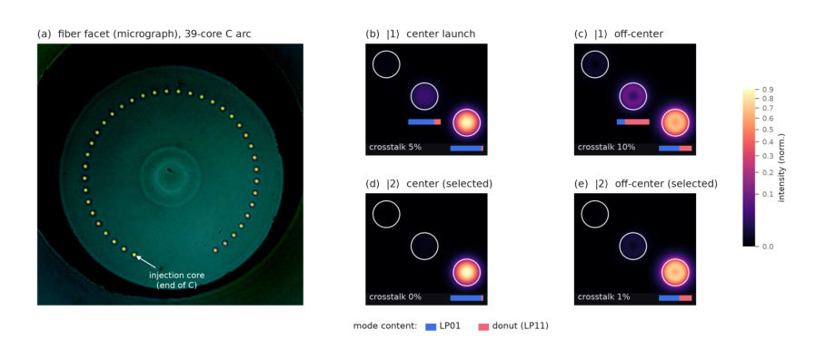
<figcaption class="paper-figure-caption"><b>Fig 1.</b> Fig. 1 | The multicore ring fiber and the coupled-mode model. (a) Micrograph of the facet of the 39-core ring fiber (image courtesy of Corning Incorporated): the gap of several core positions opens the ring into a C-shaped arc and makes the core chain a one-dimensional lattice; light is injected into the marked core at one end of the arc. (b,c) Calibrated coupled-mode model of the output intensity in the launch core and its two detected neighbors for heralded single photons with centered (b) and displaced (c) launch; bars give the modal content (LP01 vs LP11) and the per-photon crosstalk. (d,e) The same for heralded two-photon events when coincidence-based event selection is applied: the...</figcaption>
</figure>
<figure class="paper-figure-card">
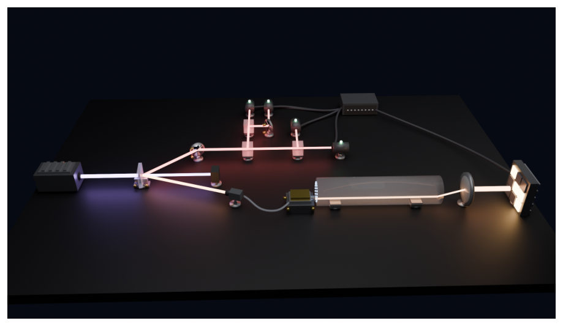
<figcaption class="paper-figure-caption"><b>Fig 2.</b> Fig. 2 | Experimental setup (3D render). A frequency-doubled Ti:Sapphire regenerative amplifier pumps type-II SPDC in BBO. Idler photons pass a monochromator and a fiber-beam- splitter cascade onto four APDs, which together form the photon-number-resolving herald; signal photons are launched by a piezo-positioned single-mode fiber into the end-of-arc core of the multicore fiber, whose output facet is imaged onto the APD array (four read-out pixels). All eight detector channels share one time base. In the core-resolved configuration the pixels SE, C and NW+W collect cores 1, 2 and 3.</figcaption>
</figure>
<figure class="paper-figure-card">
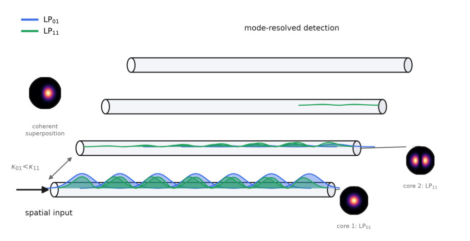
<figcaption class="paper-figure-caption"><b>Fig 3.</b> Fig. 3 | Spatial-mode coupling concept. LP01 (blue) and LP11 (green) amplitudes along neighboring cores of the array: the launched mode content sets the strength of the evanescent inter- core coupling (kappa01 &lt; kappa11), and both the input and the imaged output are mode-resolved. Bump heights follow the calibrated coupled-mode powers over the sample; circular insets show the</figcaption>
</figure>
<figure class="paper-figure-card">
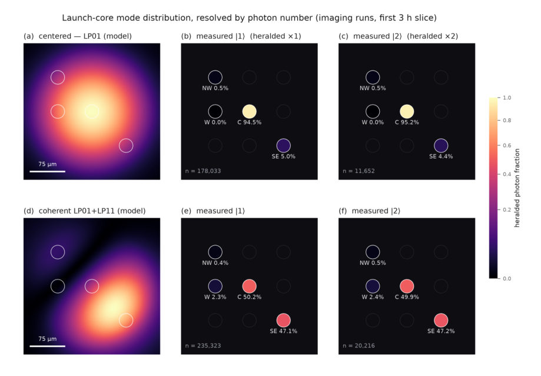
<figcaption class="paper-figure-caption"><b>Fig 4.</b> Fig. 4 | Measured heralded mode distributions. (a) Modelled LP01 intensity for the centered launch; (b,c) measured heralded pixel distributions for the centered launch with photon number</figcaption>
</figure>
<figure class="paper-figure-card">
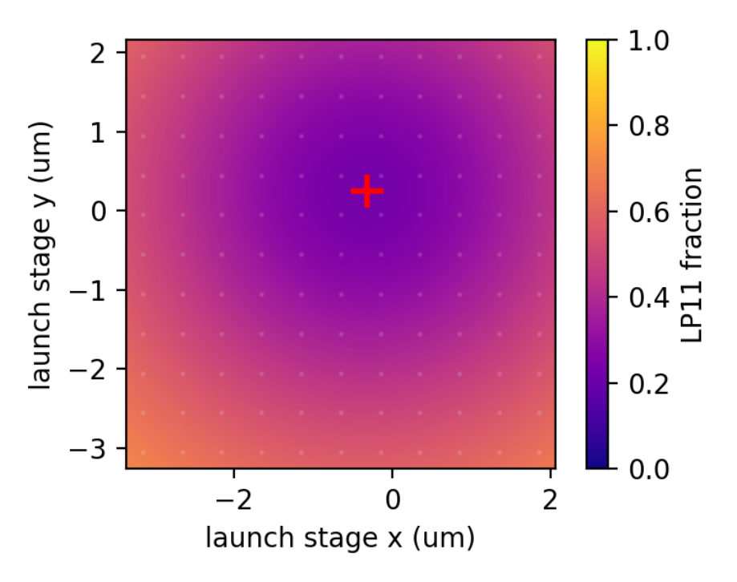
<figcaption class="paper-figure-caption"><b>Fig 5.</b> Fig. 7 | Classical calibration of the launch-state preparation. Fitted LP11 fraction versus launch-stage position for a CW 800 nm scan, decomposed from camera images of the output facet (dots: measurement grid; cross: optimum launch). The fraction is minimal at the optimum, grows radially outward as the launch-overlap model requires, and reaches about 0.4 at the 2.2 um displacement of the heralded runs, reproducing the w11 of the photon-level joint fit (Section 3).</figcaption>
</figure>

**Summary.** The research demonstrates a novel quantum platform using multicore optical fibers to manipulate quantum light by controlling inter-core coupling using the launched spatial mode content. By resolving photon number and spatial modes simultaneously, the authors show that the coupling strength can be tuned without external hardware reconfiguration, establishing a robust, scalable tool for quantum information processing.

**Why it may be interesting.** This work provides a highly controllable, solid-state quantum channel where multiple degrees of freedom (core, mode, photon number) can be addressed independently, which is crucial for building scalable quantum networks and quantum simulation architectures.

Detailed structure

**Main problem.** To utilize multicore optical fibers as a quantum platform capable of simultaneously encoding and resolving multiple degrees of freedom: core index, intra-core spatial mode, and photon number.

**Main result.** The experiment demonstrates that the inter-core coupling can be actively tuned by controlling the launched spatial mode superposition, while maintaining a photon-number independent linear-optics null.

**Method.** The authors use heralded photon-number states (|1> and |2>) generated via SPDC and measure the resulting spatial intensity patterns across the multicore fiber.

**Model / system.** The platform is a telecom-grade 39-core multicore fiber, where each core supports two LP mode groups ($	ext{LP}_{01}, 	ext{LP}_{11}$). The system is analyzed using coupled-mode theory to model the coupling between cores and modes.

**Key observables.** Intermodal phase preservation, effective inter-core coupling strength (tunable via launch), and the degree of photon-number independence (crosstalk comparison between |1> and |2>).

**Important parameters / regimes.** Inter-core coupling range (3.9-13.1%), photon number resolution ($|1
angle, |2
angle$), and the coherence visibility ($V \ge 0.95$).

**Assumptions / limitations.** The analysis relies on the assumption that the measured intensity patterns are governed by a coherent superposition of modes, which is validated against exact Fock-space simulations.

**Figures summary.** Figures illustrate the 39-core fiber structure, the experimental setup using SPDC and photon-number-resolving heralds, and the spatial-mode coupling concept showing how launch content dictates coupling strength.

**Paper structure.** The paper establishes the physical system (MCFs with multiple modes), details the advanced measurement techniques (heralded photon number resolution), and presents the results showing mode-tunable coupling and photon-number independence, culminating in a validation against theoretical simulations.

Abstract

Multicore optical fibers (MCFs), developed to scale classical telecommunications, are gaining traction as a quantum platform for high-dimensional key distribution, entanglement, and photonic quantum walks. So far, quantum light has occupied these fibers only as single-mode path channels; the spatial-mode structure within each core has remained untouched. Here we operate a telecom-grade 39-core fiber far from its design wavelength, where each core supports exactly two LP mode groups (LP01, LP11), and measure heralded photon-number states |1> and |2>, resolving the photon number simultaneously with the intra-core spatial mode or with the core index. Displacing the launch prepares a coherent LP01-LP11 superposition whose single-sided intensity pattern shows that the intermodal phase is preserved over the fiber: a drift-resolved joint fit gives a pixel asymmetry (0.4% vs 47%) incompatible with an incoherent mode mixture. Because the two modes couple to neighboring cores at different rates (kappa_LP11/kappa_LP01 = 2.4), the launched mode content acts as a state-selectable coupling knob: the effective inter-core coupling of the passive fiber is set by the launch alone (3.9-13.1%), a tunability that otherwise requires electro-optic, thermo-optic, or mechanical reconfiguration. The propagation is photon-number independent: the per-photon crosstalk of heralded |2> states equals that of |1>, bounding any Fock-state dependence to |dx/x| < 6.1% (95% CL), and the imaged mode distributions of |1> and |2> agree to better than 1%. This measured linear-optics null, validated against exact Fock-space simulation, is the baseline against which genuine multiphoton interference in fiber quantum walks must be certified; we also show how coincidence-based event selection produces spurious photon-number-dependent crosstalk if accidentals are not subtracted.

[↑ back to top](#top)

### [Thermalization in a repeated-interaction model with memory effects](http://arxiv.org/abs/2610.02854v1)

**Authors:** Kanji Nishii, Ryo Nagai, Yoshihiko Abe  
**Type:** theory · **Category:** statistical mechanics · **PDF:** <https://arxiv.org/pdf/2610.02854v1>  
**Analysis basis:** full PDF text, analyzed in chunks
**Topic relevance:** 🔥 `methods for driven-dissipative` **4/5** · `quantum measurements` **3/5** · `scars & prethermalization` **3/5** · `correlated / nonlocal dissipation` **1/5** · `driven-dissipative phase transition` **1/5** · `non-equilibrium universality` **1/5**

↔ Scroll figures horizontally

<figure class="paper-figure-card">
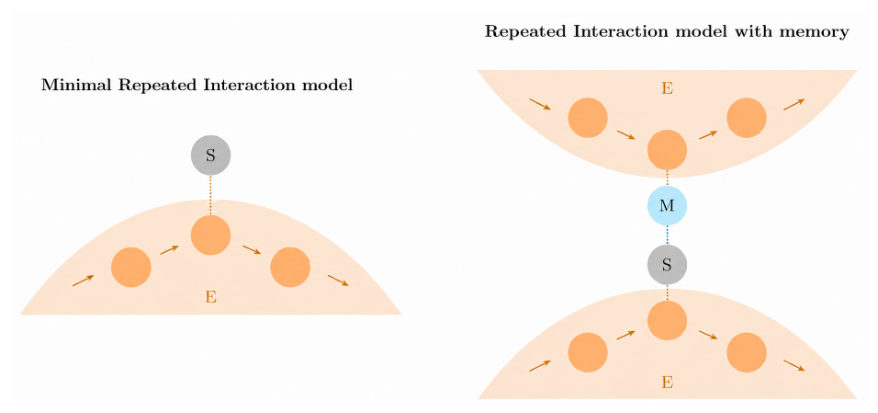
<figcaption class="paper-figure-caption"><b>Fig 1.</b> Figure 1: Left panel: the minimal RI model. The system (S) collides successively with fresh ancillas (E) supplied by a thermal bath, each of which is discarded after the collision. Right panel: the extended model studied in this paper. A memory (M), which collides with S at every step, and a thermal bath of ancillas that thermalizes M are added.</figcaption>
</figure>
<figure class="paper-figure-card">
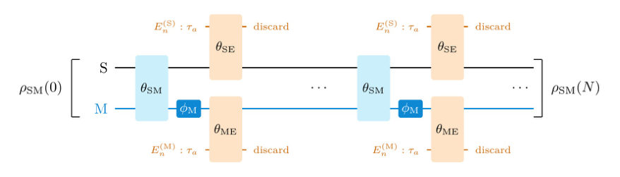
<figcaption class="paper-figure-caption"><b>Fig 2.</b> Figure 2: Schematic of the model. One step consists of a partial swap between S and M (angle θSM), a phase rotation R(M) Z (ϕM) on M, a partial swap between S and a fresh ancilla E(S) n (θSE), and a partial swap between M and a fresh ancilla E(M) n (θME); the ancillas are discarded after each step. N steps map the initial state ρSM(0) to ρSM(N).</figcaption>
</figure>
<figure class="paper-figure-card">
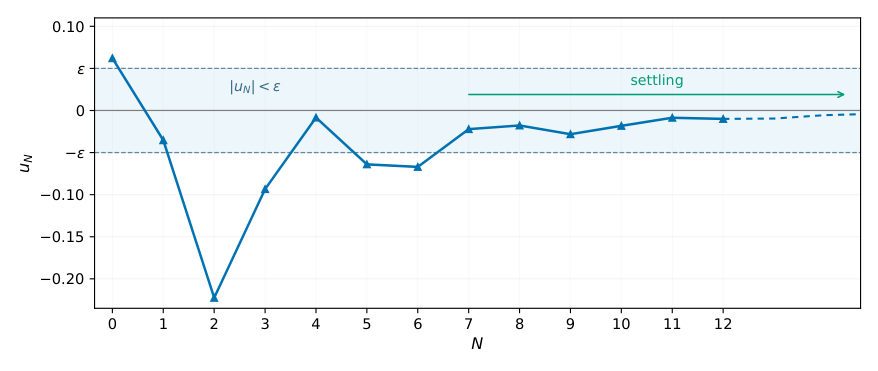
<figcaption class="paper-figure-caption"><b>Fig 3.</b> Figure 3: uN as a function of the number of collisions N for β∆= 0.25, pS(0) = 0.5, pM(0) = 0.3, real c0 = 0.8 √</figcaption>
</figure>
<figure class="paper-figure-card">
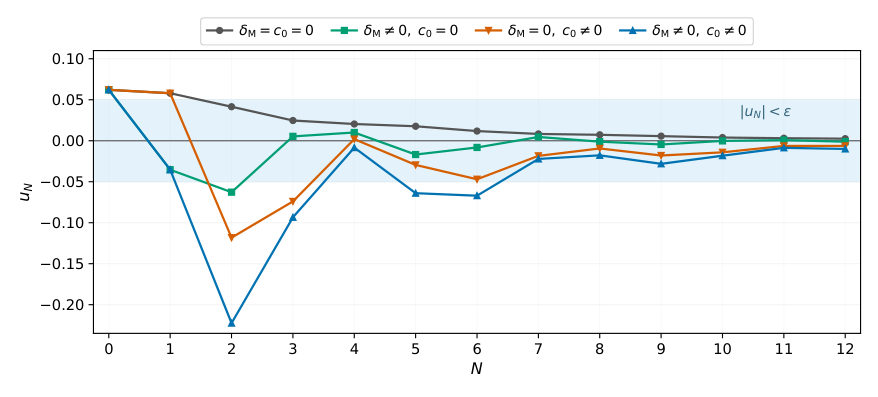
<figcaption class="paper-figure-caption"><b>Fig 4.</b> Figure 4: uN for the four initial conditions listed in the text: all combinations of pM(0) ∈ {0.5, 0.3} (δM = 0 or −0.2) and real c0 ∈{0, c∗} with c∗= 0.8 √</figcaption>
</figure>
<figure class="paper-figure-card">
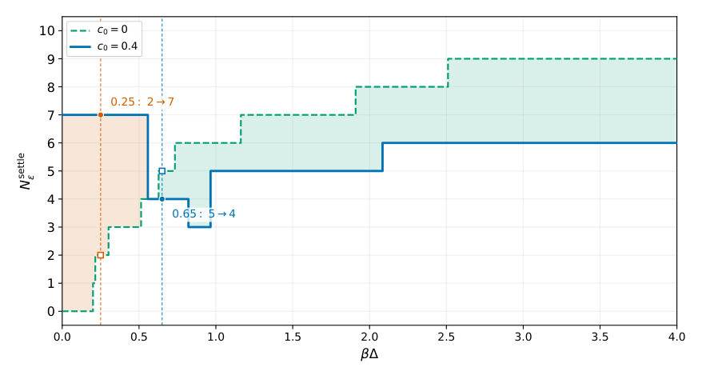
<figcaption class="paper-figure-caption"><b>Fig 5.</b> Figure 5: Number of collisions Nsettle ϵ required to reach the thermal state as a function of the inverse temperature β∆of the target, with and without initial coherence, for pS(0) = pM(0) = 1/2 (δM = 0) and the representative parameter set of Sec. 3.1. Dashed line: c0 = 0; solid line: real c0 = 0.4. The shading indicates where the solid line lies above or below the dashed line. At the marked targets β∆= 0.25 and 0.65, the coherence changes Nsettle ϵ from 2 to 7 and from 5 to 4, respectively. The range shown is 0 ≤β∆≤4.</figcaption>
</figure>

**Summary.** This paper analyzes thermalization in a qubit system using a repeated-interaction model extended with memory effects. The authors derive exact equations showing that memory introduces non-monotonic behavior, including a Mpemba-like reversal, where the time to reach equilibrium depends non-monotonically on the target temperature. This highlights the crucial role of initial correlations in non-equilibrium quantum dynamics.

**Why it may be interesting.** This work provides a concrete, analytically tractable model for studying non-equilibrium dynamics, showing how memory in repeated measurements can lead to complex, non-monotonic relaxation behaviors relevant to quantum thermalization.

Detailed structure

**Main problem.** The study investigates how memory effects influence the thermalization process of a qubit within a repeated-interaction model.

**Main result.** The paper demonstrates that memory effects can lead to non-monotonic thermalization and a Mpemba-like reversal, where the required number of collisions depends non-monotonically on the target temperature.

**Method.** The authors derived exact closed evolution equations for the system's populations and coherence, analyzing the time evolution using matrix product representations.

**Model / system.** The model involves a system qubit (S) and a memory qubit (M) interacting repeatedly with fresh thermal ancillas in a sequence of partial swaps and phase rotations.

**Key observables.** Deviations from the target thermal state ($u_N$), mutual coherence ($c_N$), and the number of collisions required for thermalization ($N_{	ext{settle}}^\epsilon$).

**Important parameters / regimes.** Interaction strengths ($	heta_{SE}, 	heta_{ME}, 	heta_{SM}$), initial coherence ($c_0$), and initial population imbalance ($\delta_M$).

**Assumptions / limitations.** The analysis assumes the coupling strengths satisfy $0 < 	heta_{SE}, 	heta_{ME} < \pi/2$, and the memory effect requires initial coherence or population imbalance.

**Figures summary.** Figures compare the minimal RI model (monotonic) to the extended model (non-monotonic), showing oscillations in $u_N$ (Fig. 3) and mapping the reversal effect across parameter space (Figs. 8, 9).

**Paper structure.** The paper first establishes the model and derives the evolution equations, then uses the causal-break operation to quantify memory effects, demonstrating non-monotonicity and the Mpemba-like reversal by analyzing the dependence of the settling time on temperature and initial conditions.

Abstract

We study how memory affects the thermalization of a qubit in a repeated-interaction model. In our model, a memory qubit interacts repeatedly with the system, while both qubits undergo collisions with fresh thermal ancillas. We derive exact closed evolution equations for their populations and mutual coherence, and demonstrate memory effects using a causal-break operation. Although the system converges to the target thermal state, the thermalization behavior shows non-monotonic approach. We also find a Mpemba-like reversal, in which the number of collisions required for thermalization depends non-monotonically on the temperature of the target state. Within the initial-state family considered, both phenomena require initial coherence between the system and memory or an imbalance in their excited-state populations.

[↑ back to top](#top)

### [Gap-Protected Heisenberg-Limited Squeezing with Locally Interacting Multi-Level Spins](http://arxiv.org/abs/2610.02314v1)

**Authors:** Sakshi Bahamnia, Sagar Chaudhary, Arman Duha, Thomas Bilitewski  
**Type:** theory · **Category:** other · **PDF:** <https://arxiv.org/pdf/2610.02314v1>  
**Analysis basis:** full PDF text, analyzed in chunks
**Topic relevance:** 🔥 `analog quantum simulation` **4/5** · `Rydberg arrays` **3/5** · `Keldysh / 2PI / non-Gaussian methods` **2/5** · `methods for driven-dissipative` **2/5**

↔ Scroll figures horizontally

<figure class="paper-figure-card">
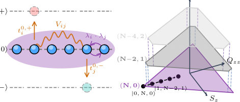
<figcaption class="paper-figure-caption"><b>Fig 1.</b> FIG. 1. Model and gap protection. (a) Power-law interacting spin-1 particles undergo pair creation |0, 0⟩→|+1, −1⟩, which generates entanglement; the local su(3) exchange Vij ˆλi · ˆλj protects the collective dynamics. (b) Hilbert-space sectors la- beled by SU(3) irreducible representations (p, q) and separated by gaps of the quadratic Casimir ˆΛ · ˆΛ. In the collective sec- tor (N, 0), states are labeled by occupations |N−1, N0, N+1⟩; arrows indicate the states coupled by pair creation.</figcaption>
</figure>
<figure class="paper-figure-card">
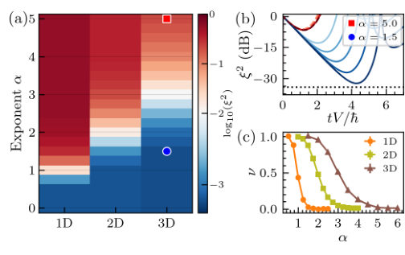
<figcaption class="paper-figure-caption"><b>Fig 2.</b> FIG. 2. Phases of squeezing dynamics without gap protection (χ = 0). (a) Minimal squeezing ξ2 min (color scale) as a function of dimension d and power-law exponent α, showing the collec- tive regime (blue, ξ2 opt ∼1/N) and the non-collective regime (ξ2 min ∼N −ν, ν &lt; 1), for L1D = 104, L2D = 100, L3D = 22. (b) Time evolution of ξ2 opt in 3D for a characteristic α in the collective regime (blue, α = 1.5) and in the non-collective regime (red, α = 5.0), for L3D = 5, 7, 10, 15, 22 from faint to dark. (c) Extracted scaling exponent ν of ξ2 min ∝N −ν versus α for 1D, 2D and 3D (error bars smaller than symbol size).</figcaption>
</figure>
<figure class="paper-figure-card">
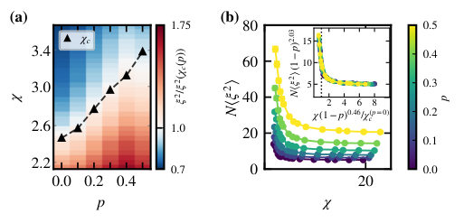
<figcaption class="paper-figure-caption"><b>Fig 3.</b> FIG. 4. Robustness to site-dilution disorder. (a) Minimal squeezing ξ2 min as a function of site dilution p and gap pro- tection strength χ in 3D for L = 10 (N = 1000) for dipolar interactions (α = 3). (b) Minimal squeezing Nξ2 min versus gap protection strength χ for different p (colorbar). Inset: Scaling collapse of minimal squeezing.</figcaption>
</figure>
<figure class="paper-figure-card">
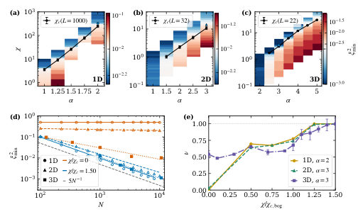
<figcaption class="paper-figure-caption"><b>Fig 4.</b> FIG. 3. Gap-protected squeezing phase diagrams. (a-c) Mini- mal squeezing as a function of α and gap protection strength χ in 1D (L = 1000) (a), 2D (L = 32) (b) and 3D (L = 10) (c). (d) Scaling of minimal squeezing versus system size N for parameters below and above the transition with markers as indicated in the panels (a)-(c). (e) Scaling exponent of minimal squeezing ξ2 min ∝N −ν versus gap protection strength χ normalised by the Bogoliubov prediction χc,bog. The collec- tive phase is defined by ν reaching 1.</figcaption>
</figure>

**Summary.** This work develops a general mechanism to achieve Heisenberg-limited spin squeezing in multi-level spin systems with local interactions. By introducing a specific local exchange interaction, the authors create an energy gap that suppresses detrimental non-collective excitations. This restores optimal entanglement scaling, offering a practical pathway for quantum sensing using arrays of multi-level atoms or molecules.

**Why it may be interesting.** It provides a concrete, tunable mechanism (the gap-protection term) to overcome fundamental limitations (loss of scaling due to locality) in generating high-quality entanglement in platforms like Rydberg or molecular arrays.

Detailed structure

**Main problem.** The paper addresses the challenge of generating scalable, metrologically useful entanglement (spin squeezing) in multi-level spin systems when interactions are short-ranged.

**Main result.** Introducing a local $\mathfrak{su}(D)$ exchange interaction establishes an energy gap that protects the collective manifold, thereby restoring Heisenberg scaling ($\xi^2 \propto 1/N$) for any power-law interaction range.

**Method.** The analysis combines analytical techniques, such as Bogoliubov theory applied to the excitation spectrum, with numerical simulations using the generalized discrete truncated Wigner approximation (GDTWA).

**Model / system.** The system is a $d$-dimensional array of $N$ multi-level (qudit) spins with power-law interactions, modeled by a Hamiltonian that includes a gap-protection term.

**Key observables.** Spin squeezing parameter ($\xi^2_{	ext{opt}}$), Heisenberg scaling exponent ($
u$), and the critical gap-protection strength ($\chi_c$).

**Important parameters / regimes.** Interaction exponent ($\alpha$), spatial dimension ($d$), system size ($N$), and the gap-protection strength ($\chi$).

**Assumptions / limitations.** The Bogoliubov analysis is assumed valid when excitation density is low; the GDTWA is an approximation method.

**Figures summary.** Figures illustrate the transition from non-scalable to Heisenberg-limited squeezing as gap protection is added, show time evolution of squeezing, and map out phase diagrams based on interaction range and disorder.

**Paper structure.** The paper first establishes the problem of squeezing loss with local interactions, then introduces the gap-protection mechanism, analyzes the scaling laws analytically via Bogoliubov theory, and finally validates these findings through extensive numerical simulations across various dimensions and disorder levels.

Abstract

We demonstrate a general mechanism to generate scalable, metrologically useful entanglement in the form of generalized spin squeezing in multi-level (qudit) spin systems with power-law interactions. We demonstrate this for spin-changing dynamics, extending the physics of spin-nematic squeezing known from spinor BECs to spatially extended lattice geometries. In the absence of all-to-all connectivity, the dynamics generally suffers from leakage into non-collective finite-momentum modes, destroying Heisenberg scaling. We show that introducing local $\mathfrak{su}(D)$ exchange interactions establishes an energy gap that protects the fully symmetric collective manifold, suppressing non-collective excitations, and achieving Heisenberg scaling $ξ^2\propto1/N$ in one to three dimensions for any power-law exponent. We provide an analytical understanding of the mechanism via the analysis of the Bogoliubov excitation spectrum, and demonstrate its effectiveness via numerical simulations of the quantum many-body dynamics. Our findings more broadly apply to other spin-squeezing Hamiltonians, and directly generalize to larger internal spin dimensions. Our results provide a practical pathway towards scalable Heisenberg-limited qudit entanglement generation in experimental platforms such as arrays of (polar) molecules, magnetic atoms, and Rydberg atoms realizing multi-level spin systems.

[↑ back to top](#top)

### [Pulse-resolved post-generation phase control of squeezed light at 93 MHz with a bulk lithium-niobate modulator](http://arxiv.org/abs/2610.03257v1)

**Authors:** Edoardo Suerra, Igor Vasiljevic, Sebastiano Corli, Enrico Prati, Simone Cialdi  
**Type:** experiment · **Category:** quantum information and computing · **PDF:** <https://arxiv.org/pdf/2610.03257v1>  
**Analysis basis:** full PDF text, analyzed in chunks
**Topic relevance:** 🔥 `quantum optics experiment` **4/5** · `QC/QI experiment` **3/5** · `interference shaping light` **1/5** · `quantum measurements` **1/5**

↔ Scroll figures horizontally

<figure class="paper-figure-card">
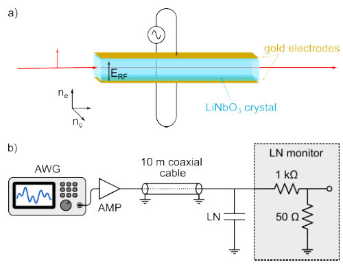
<figcaption class="paper-figure-caption"><b>Fig 1.</b> Figure 1. Electro-optic phase modulator and electrical driv- ing circuit. (a) Geometry of the bulk lithium-niobate crystal. Gold electrodes deposited on opposite surfaces generate an RF electric field, ERF, oriented along the extraordinary crys- tallographic axis. The optical field propagates orthogonally to ERF and is polarized along the extraordinary direction. (b) Electrical circuit used to drive and monitor the crystal. The waveform generated by the arbitrary waveform generator (AWG) is amplified and transmitted to the crystal through a 10 m coaxial cable. A resistive voltage divider connected at the crystal input provides a monitor of the applied electrical waveform.</figcaption>
</figure>
<figure class="paper-figure-card">
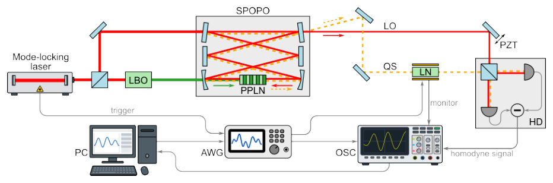
<figcaption class="paper-figure-caption"><b>Fig 2.</b> Figure 2. Experimental platform for pulse-resolved phase control of squeezed-vacuum states. A mode-locked laser operating at 1035 nm and 93 MHz provides the common optical and timing reference. A fraction of the laser output is frequency doubled in a lithium triborate (LBO) crystal and pumps the periodically poled lithium-niobate (PPLN) crystal inside the synchronously pumped optical parametric oscillator (SPOPO). The SPOPO generates a train of squeezed-vacuum pulses, denoted by QS. The state is transmitted through the bulk lithium-niobate phase modulator (LN) after its generation and is subsequently measured with a time-resolved balanced homodyne detector (HD). The local oscillator (LO) is...</figcaption>
</figure>
<figure class="paper-figure-card">
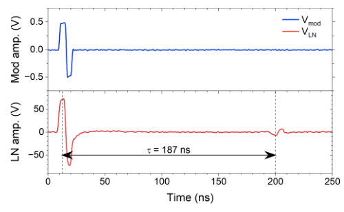
<figcaption class="paper-figure-caption"><b>Fig 3.</b> Figure 3. Electrical response of the bulk lithium-niobate phase modulator. The upper trace (blue) shows an example of a single modulation pulse generated by the AWG, while the lower trace (red) shows the corresponding voltage measured at the crystal input after RF amplification and propagation through the 10 m coaxial cable. A delayed reflected transient is observed at τ = 187 ns.</figcaption>
</figure>
<figure class="paper-figure-card">
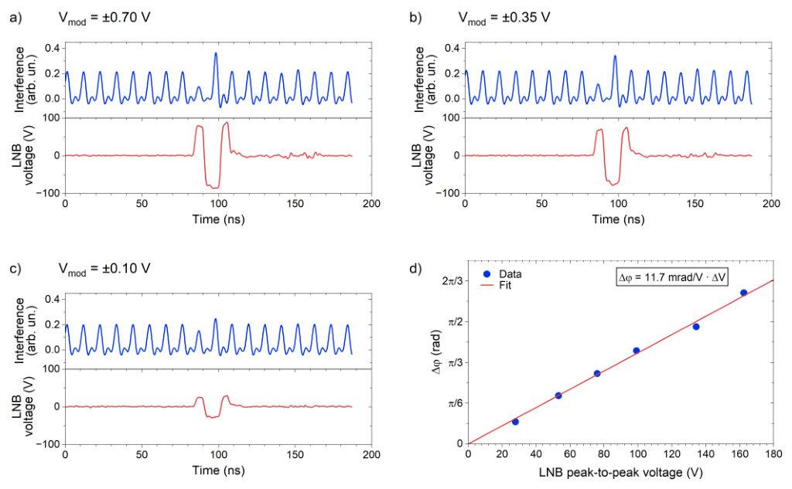
<figcaption class="paper-figure-caption"><b>Fig 4.</b> Figure 4. Interferometric calibration of the phase shift introduced by the lithium-niobate modulator. Panels (a)–(c) show representative electrical modulation pulses (red) and the corresponding optical interference signals (blue) for three different modulation amplitudes. The programmed AWG voltages are ±0.70 V, ±0.35 V, and ±0.10 V, respectively. Panel (d) reports the measured differential phase shift as a function of the voltage actually applied to the crystal. The solid line is a linear fit to the experimental data.</figcaption>
</figure>
<figure class="paper-figure-card">
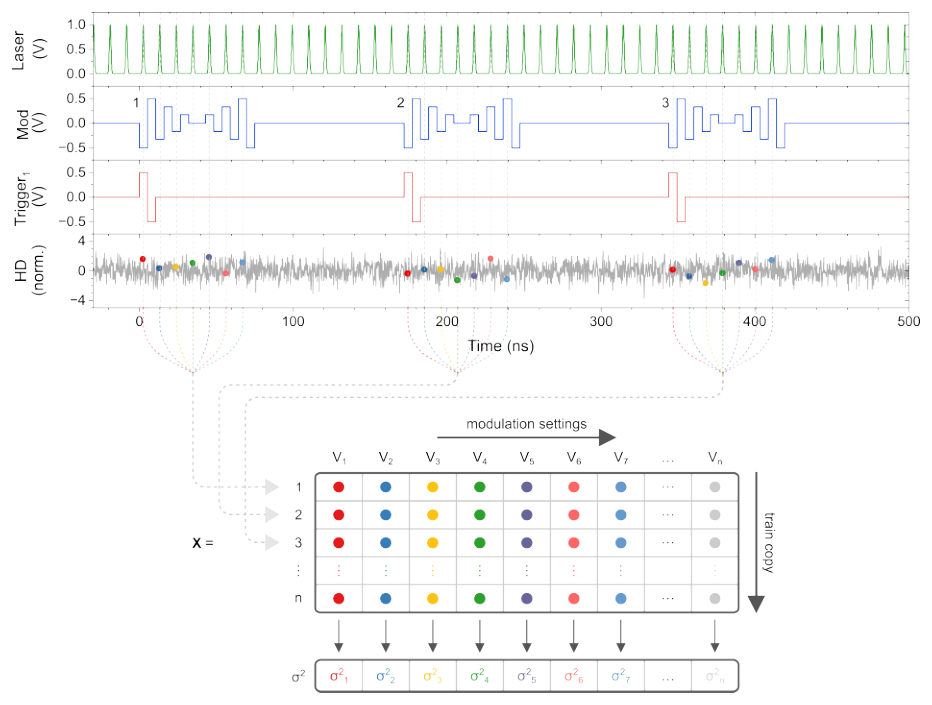
<figcaption class="paper-figure-caption"><b>Fig 5.</b> Figure 5. Pulse-resolved modulation and data-acquisition scheme. The optical pulse train, the electrical modulation waveform, and the synchronization signals are shown together with the corresponding organization of the acquired homodyne data. Each modulation pulse is associated with one temporal optical mode. The schematic example shows 7 phase settings for clarity, while the experimental sequence contains 15 consecutive temporal modes. The same sequence of phase settings is repeated N = 2000 times, allowing the homodyne samples corresponding to each phase setting to be collected over repeated measurements.</figcaption>
</figure>

**Summary.** This experiment demonstrates pulse-resolved phase control over squeezed-vacuum states using a bulk lithium-niobate electro-optic modulator operating at 93 MHz. By independently controlling the phase of successive optical pulses, the authors validate a key component for scalable, time-domain quantum information processing architectures. This technique allows for programmable manipulation of quantum resources in recirculating optical systems.

**Why it may be interesting.** This work provides a robust, high-repetition-rate electro-optic building block for programmable manipulation of time-multiplexed quantum states, directly advancing the hardware realization of continuous-variable quantum computation.

Detailed structure

**Main problem.** The paper aims to demonstrate the ability to perform phase control on individual temporal modes of squeezed light, which is crucial for scalable photonic quantum information processing.

**Main result.** The authors successfully demonstrated pulse-resolved phase control of squeezed-vacuum states at a high repetition rate of 93 MHz, confirming the feasibility of post-generation quantum state manipulation.

**Method.** They used a low-loss bulk lithium-niobate electro-optic modulator driven by a broadband RF amplifier to apply phase shifts pulse-by-pulse, followed by time-resolved balanced homodyne detection.

**Model / system.** The system involves a synchronously pumped optical parametric oscillator generating squeezed-vacuum states at 1035 nm, which are then passed through the electro-optic modulator. The modulator's phase shift is controlled by an external, programmable electrical waveform.

**Key observables.** The phase-dependent quadrature variance ($\sigma_j^2$) of the squeezed state, measured via time-resolved balanced homodyne detection.

**Important parameters / regimes.** Repetition rate of 93 MHz; maximum differential phase excursion of 1.93 rad; detection efficiency ($\eta$) of 40%.

**Assumptions / limitations.** The measurement relies on comparing the modulator-controlled scan against a reference scan achieved by varying the local-oscillator phase with a piezoelectric actuator.

**Figures summary.** Figures illustrate the electro-optic modulator geometry and driving circuit, the overall experimental setup, and comparisons between the programmed phase modulation results and the PZT-scanned reference quadrature variance.

**Paper structure.** The paper establishes the need for time-domain multiplexing in QIP, details the use of the LiNbO$_3$ modulator driven by RF electronics, describes the time-resolved measurement protocol, and concludes by comparing the results to a known reference measurement.

Abstract

Time-domain multiplexing of continuous-variable quantum states provides a scalable approach to photonic quantum information processing, in which individual temporal modes can be sequentially manipulated within a common optical path. Here we demonstrate pulse-resolved post-generation phase control of squeezed-vacuum states at a repetition rate of 93 MHz using a low-loss bulk lithium-niobate electro-optic modulator driven by a broadband RF power amplifier. The driving architecture exploits low-cost, commercially available RF components and the impedance mismatch between the RF chain and the capacitive crystal load, rather than relying on dedicated custom high-voltage electronics, to obtain large voltage excursions on the modulator while operating above the piezoelectric-resonance region of lithium niobate. The modulator is driven synchronously with the optical pulse train, enabling the phase of consecutive temporal modes to be individually controlled. An interferometric calibration yields a maximum differential phase excursion of 1.93 rad. We apply the modulator to a 1035 nm squeezed-vacuum field generated by a synchronously pumped optical parametric oscillator and characterize the output using time-resolved balanced homodyne detection. With the local-oscillator phase kept fixed, the phase of the squeezed state is varied from pulse to pulse, and the corresponding phase-dependent quadrature variance is reconstructed. The resulting quadrature scan agrees with an equivalent measurement obtained by varying the local-oscillator phase with a piezoelectric actuator. These results demonstrate post-generation quantum-state phase control at the individual-pulse level and provide an electro-optic building block for programmable manipulation of time-multiplexed quantum states in recirculating optical architectures.

[↑ back to top](#top)

### [Quantum Key Distribution with Entanglement-Swapped Photons from a Quantum Emitter](http://arxiv.org/abs/2610.03351v1)

**Authors:** Michele B. Rota, Francesco Basso Basset, Alessandro Laneve, Francesco Salusti, Nicolas Claro-Rodriguez, Giuseppe Ronco, Mattia Beccaceci, Tobias M. Krieger, Quirin Buchinger, Saimon F. Covre da Silva, Sandra Stroj, Mariia Gumberidze, Vladyslav Usenko, Sven Höfling, Tobias Huber-Loyola, Mario A. Usuga Castaneda, Armando Rastelli, Klaus D. Jöns, Rinaldo Trotta  
**Type:** experiment · **Category:** quantum information and computing · **PDF:** <https://arxiv.org/pdf/2610.03351v1>  
**Analysis basis:** full PDF text, analyzed in chunks
**Topic relevance:** 🔥 `quantum optics experiment` **4/5** · `QC/QI experiment` **3/5** · `interference shaping light` **1/5** · `quantum measurements` **1/5**

↔ Scroll figures horizontally

<figure class="paper-figure-card">
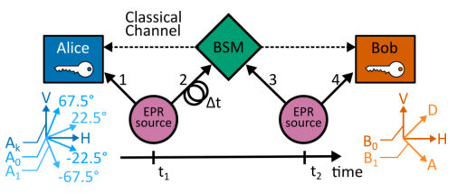
<figcaption class="paper-figure-caption"><b>Fig 1.</b> FIG. 1: Protocol scheme for quantum key distri- bution with swapped photons using a single en- tangled photon pair source. A single EPR source is excited at two consecutive times t1 and t2, emitting each time a pair of entangled photons, labeled (1,2) and (3,4). Two of these entangled photons (2 and 3) interfere in a 50% efficiency Bell state measurement (BSM) setup by delaying the earlier photon via a delay line. The result of the BSM is shared among Alice and Bob with the pair of now mutually entangled photons 1 and 4. Using the information of the BSM, Alice and Bob perform mea- surements using different sets of bases, Ak, A0, and A1 for Alice and B0 and B1 for Bob. Sharing the choice of...</figcaption>
</figure>
<figure class="paper-figure-card">
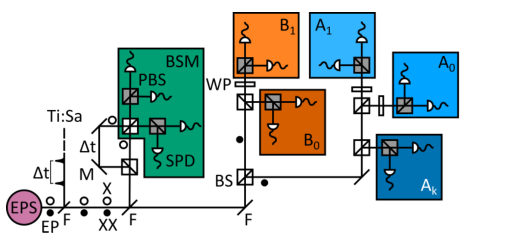
<figcaption class="paper-figure-caption"><b>Fig 2.</b> FIG. 3: Scheme of the QKD experimental setup. The entangled pair source (EPS) is excited by a pulsed Ti:Sapphire laser (Ti:Sa), doubled in repetition rate by an unbalanced Mach-Zehnder interferometer with a time delay ∆t. The emitted pairs of photons, hollow (X pho- tons) and full (XX photons) circles, are separated em- ploying spectral filters (F) and sent respectively to the Bell state measurement (BSM) setup and Alice and Bob. In the BSM, the state of the photons from subsequent pulses is projected into two possible Bell states by mak- ing them interfere in another unbalanced Mach-Zehnder interferometer with the same ∆t and measuring coinci- dence combinations at 4 single photon...</figcaption>
</figure>
<figure class="paper-figure-card">
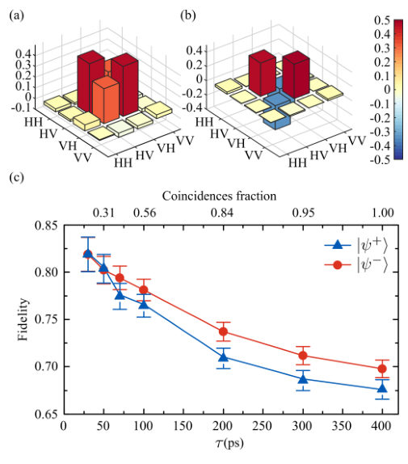
<figcaption class="paper-figure-caption"><b>Fig 3.</b> FIG. 2: Experimental entanglement swapping performance. (a) Real part of the density matrix of the biexciton photons given a |ψ+⟩BSM measured with a 30ps time window on the BSM. (b) Same as in (a) for a |ψ−⟩BSM. (c) Fidelity of the biexciton photons state to the expected state as a function of the coincidence time window applied to the BSM events. The retained frac- tion of coincidence counts for different time windows is reported on the top axis. The total 4-fold coincidences corresponding to the largest coincidence window, i.e., 400 ps, are 22 958 , corresponding to a coincidence rate of 6.4 s−1.</figcaption>
</figure>
<figure class="paper-figure-card">
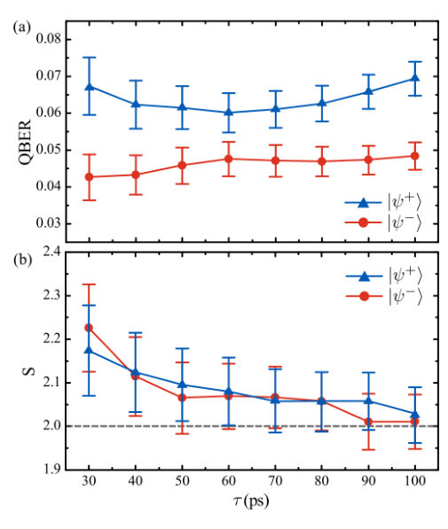
<figcaption class="paper-figure-caption"><b>Fig 4.</b> FIG. 4: QKD performance as a function of BSM coincidence time window. (a) QBER as a function of the BSM coincidence time window. (b) Bell parameter S as a function of the BSM coincidence time window. The threshold S = 2 for classical correlation is highlighted by a dashed grey line.</figcaption>
</figure>

**Summary.** This paper demonstrates a crucial step toward long-distance quantum communication by implementing a quantum repeater protocol using entanglement-swapped photons. They utilize a deterministic photon source based on a GaAs quantum dot embedded in a photonic cavity. The experiment successfully shows that secure key distribution can be achieved by carefully controlling the temporal post-selection during the entanglement swapping process.

**Why it may be interesting.** This work directly addresses the physical realization of quantum networks by integrating solid-state quantum emitters (QDs) into a functional quantum repeater architecture for QKD, which is highly relevant to quantum optics and open quantum systems research.

Detailed structure

**Main problem.** The primary goal is to extend the range of Quantum Key Distribution (QKD) by implementing an elementary quantum repeater scheme using entanglement-swapped photons.

**Main result.** The authors successfully demonstrated secure key exchange using entanglement-swapped photons generated from a quantum dot source, achieving a maximum positive asymptotic secure key fraction (SKF) of 9.8% under optimized temporal post-selection.

**Method.** The protocol involves generating two pairs of entangled photons, performing a Bell State Measurement (BSM) on the intermediate photons, and then using the remaining photons for an entanglement-based QKD protocol (asymmetrical Ekert variation).

**Model / system.** The system utilizes a state-of-the-art deterministic photon source: a strain-tuned GaAs quantum dot embedded in a photonic cavity and integrated on a piezoelectric substrate. This source generates strongly polarization-entangled photon pairs via the biexciton-exciton cascade.

**Key observables.** Fidelity of the emitted state (0.94(1)), HOM visibility (improved to 0.79(2)), Quantum Bit Error Rate (QBER), Bell parameter (S), and the Secure Key Fraction (SKF).

**Important parameters / regimes.** The performance is highly dependent on the BSM coincidence temporal window, with optimal results found at short time delays (e.g., 30 ps).

**Assumptions / limitations.** The security analysis assumes Alice and Bob control their measuring apparatuses, and the protocol relies on temporal post-selection rather than entanglement distillation.

**Figures summary.** Figures illustrate the protocol scheme involving entanglement swapping (Fig. 1), the entanglement swapping performance vs. BSM coincidence time window (Fig. 2), and the QKD setup detailing source, BSM, and measurement stations (Fig. 3).

**Paper structure.** The paper details the theoretical framework for quantum repeaters, describes the experimental setup using QD sources, presents measurements of entanglement swapping fidelity and QKD parameters (QBER, S) as a function of the BSM coincidence window, and concludes with the calculation of the secure key rate.

Abstract

Quantum key distribution (QKD) is a fundamental functionality of quantum networks. Extending its range requires quantum repeaters, a technology still under development and not yet demonstrated in combination with quantum cryptographic protocols. Here, we address the elementary operation of a viable quantum repeater scheme by evaluating whether correlated photons distributed via entanglement swapping can support secret key distribution. We employ a state-of-the-art deterministic photon source based on a strain-tuned GaAs quantum dot embedded in a photonic cavity and implement a source-independent QKD protocol between two nodes using entanglement-swapped photons. We benchmark the system and present how high-resolution temporal post-selection can enable secure key exchange, with further rate improvements expected through realistic device and protocol optimizations. Due to its compatibility with a wide range of quantum memory platforms, our approach represents a significant step towards long-distance quantum-safe communication.

[↑ back to top](#top)

### [Quantum simulation of field-tunable spin spectroscopy of the quantum magnet Cs2CoCl4 on a trapped-ion quantum computer](http://arxiv.org/abs/2610.03671v1)

**Authors:** Elias Kokkas, Nora Bauer, Justin Provazza, Mark E. Nowakowski, Kathleen Hamilton, Gilles Buchs, Andrew Sornborger, Travis S. Humble, Ananth Kaushik, Martin Roetteler  
**Type:** both · **Category:** strongly correlated electrons · **PDF:** <https://arxiv.org/pdf/2610.03671v1>  
**Analysis basis:** full PDF text, analyzed in chunks
**Topic relevance:** 🔥 `QC/QI experiment` **4/5** · `analog quantum simulation` **3/5** · `methods for driven-dissipative` **2/5**

↔ Scroll figures horizontally

<figure class="paper-figure-card">
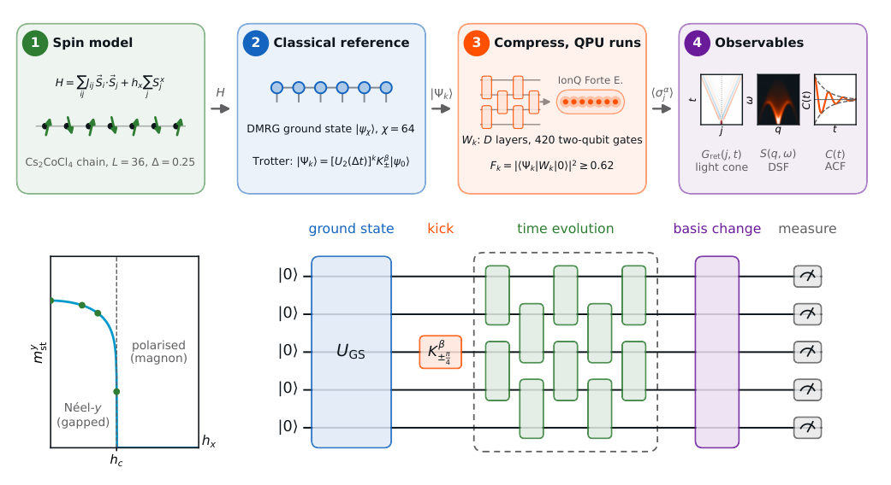
<figcaption class="paper-figure-caption"><b>Fig 1.</b> FIG. 1. Workflow for calculating the magnetic response. Top: the model of Cs2CoCl4 is a spin 1/2 XXZ chain with J = 0.23 meV, ∆= 0.25, and L = 36 sites. Classical DMRG and second order Trotter evolution supply reference states, which are approximated by circuits composed of D staircase layers of nearest neighbor two qubit blocks. The compressed circuits are executed on IonQ Forte Enterprise, and the measurements are used to reconstruct the retarded Green’s function, DSF, and local autocorrelations. Bottom left: reference phase diagram of the model. The staggered order parameter my st vanishes at the critical field separating the N´eel ordered regime from the phase polarized along x. Bottom...</figcaption>
</figure>
<figure class="paper-figure-card">
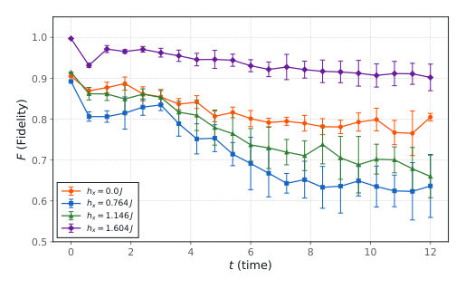
<figcaption class="paper-figure-caption"><b>Fig 2.</b> FIG. 2. Fidelity of the compressed state preparations rela- tive to their classical targets. At tk = 0, the plotted quan- tity is the ground state fidelity F0 in Eq. (6). At nonzero times tk = k∆t, with ∆t = 0.6/J, the curves show the fidelity Fk in Eq. (15), averaged with equal weights over the three spin channels (xx, yy, zz). The ground state cir- cuits use (252, 315, 232, 77) two qubit gates at hx/J = (0, 0.764, 1.146, 1.604), respectively. Every nonzero time point uses 420 two qubit gates. These fidelities quantify how closely the compressed circuits approximate their classical tar- get states before hardware execution.</figcaption>
</figure>
<figure class="paper-figure-card">
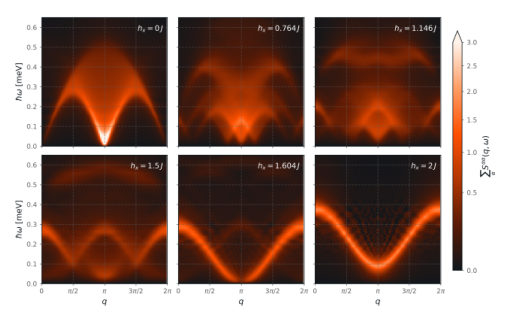
<figcaption class="paper-figure-caption"><b>Fig 3.</b> FIG. 3. Total DSF of the L = 100 site anisotropic (∆= 0.25) open chain at hx/J = (0, 0.764, 1.146, 1.5, 1.604, 2) ob- tained from DMRG-CV calculations with spectral broadening η = 0.1J. The spectrum evolves from a gapless two-spinon continuum at zero-field to a single gapped magnon beyond the critical point.</figcaption>
</figure>
<figure class="paper-figure-card">
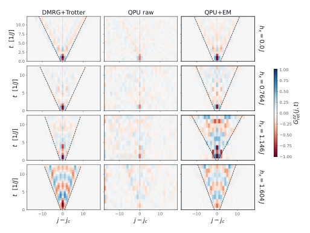
<figcaption class="paper-figure-caption"><b>Fig 4.</b> FIG. 4. Retarded Green’s function Gzz ret(j, t) for the L = 36 site anisotropic (∆= 0.25) open chain with a kick at jc = 17. Columns show DMRG+Trotter (L = 36), raw hardware, and error mitigated hardware results.</figcaption>
</figure>
<figure class="paper-figure-card">
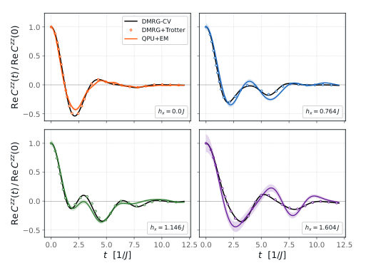
<figcaption class="paper-figure-caption"><b>Fig 5.</b> FIG. 5. Real part of the on-site spin-spin autocorrelation function ReCzz(t) ≡ReCz(jc, t) = Re ⟨σz jc(t)σz jc(0)⟩at site jc = 17. Each panel is normalized by the equal-time modulus |Czz(0)| = p</figcaption>
</figure>

**Summary.** This paper uses a trapped-ion quantum computer to simulate the magnetic excitation spectra of the quantum magnet Cs2CoCl4. By combining advanced quantum protocols with error mitigation, the authors successfully recovered the system's collective excitations and local correlations. The results validate the use of noisy quantum hardware for quantitative studies of strongly correlated matter, benchmarking against DMRG calculations.

**Why it may be interesting.** This work provides a concrete, quantitative benchmark demonstrating how near-term quantum processors can tackle complex, strongly correlated many-body physics problems relevant to condensed matter theory.

Detailed structure

**Main problem.** The study aims to test quantum computers' ability to simulate the collective excitation spectra and spin dynamics of strongly correlated quantum magnets, specifically addressing the impact of hardware noise on recoverable magnetic information.

**Main result.** The quantum simulation successfully reconstructed the evolution of the excitation spectrum, showing agreement with DMRG benchmarks and connecting results to inelastic neutron scattering measurements.

**Method.** The authors employed a quantum simulation protocol combining an ancilla-free local kick protocol with classical tensor network compression on a trapped-ion quantum computer.

**Model / system.** The system is the quantum magnet Cs2CoCl4, modeled by an effective spin 1/2 XXZ Heisenberg chain Hamiltonian, which is studied across varying transverse magnetic fields.

**Key observables.** Dynamical Spin Structure Factor (DSF), Retarded Green's Function (RGF), and local magnetic correlations (e.g., nearest neighbor spin correlations).

**Important parameters / regimes.** System size L=36 sites, varying transverse field $h_x/J$ (e.g., 0 to 1.604), and time evolution steps up to $Jt=12$.

**Assumptions / limitations.** The use of error mitigation techniques and classical circuit compression are necessary to overcome hardware noise limitations.

**Figures summary.** Figures compare the reconstructed Dynamical Structure Factor (DOS) from quantum hardware simulations against theoretical benchmarks like DMRG-CV and DMRG+Trotter, showing quantitative agreement.

**Paper structure.** The paper details the quantum protocol for measuring the retarded spin response, compares the results across different magnetic field regimes (Luttinger liquid to gapped/polarized phases), and validates the results using multiple quantitative metrics against established numerical methods.

Abstract

The collective excitation spectra of quantum magnets provide a direct test of quantum computers as tools for studying strongly correlated matter. Hardware noise limits the circuit depths available for these calculations, leaving the question of how much magnetic information can survive circuit compression. Using IonQ's 36 qubit Forte Enterprise processor, we simulate the magnetic excitation spectra and spin dynamics of a 36 site Heisenberg XXZ chain describing the quantum magnet Cs2CoCl4 in a transverse field using quantum circuits containing just 420 two qubit gates. The workflow combines an ancilla free local kick protocol with classical tensor network compression, encoding both ground state preparation and time evolution. The reconstructed dynamical structure factors capture the evolution from a broad two spinon continuum toward a dispersive branch with magnon character near the expected critical field. We observe an interesting field driven sign reversal of the nearest neighbor spin correlations which shows a complementary signature of this magnetic evolution. Our error mitigation methods bring the reconstructed total spectra into close agreement with density matrix renormalization group calculations, with Pearson correlation and structural similarity above 0.9 and normalized mean squared error below 0.15. We also perform comparisons with experimental inelastic neutron scattering measurements to connect the recovered excitations to the material's magnetic response. Our results demonstrate that circuit compression and error mitigation allow noisy quantum processors to recover both collective excitations and local magnetic correlations providing a quantitative benchmark for quantum spectroscopy and a basis for extending these methods to more complex magnetic systems.

[↑ back to top](#top)

### [Probing fluctuating hydrodynamics through current fluctuations in hard rod gas](http://arxiv.org/abs/2610.03180v1)

**Authors:** Tirthankar Mondal, Indranil Mukherjee, Anupam Kundu  
**Type:** theory · **Category:** statistical mechanics · **PDF:** <https://arxiv.org/pdf/2610.03180v1>  
**Analysis basis:** full PDF text, analyzed in chunks
**Topic relevance:** 🔥 `Full counting statistics` **4/5** · `Keldysh / 2PI / non-Gaussian methods` **2/5** · `non-equilibrium universality` **2/5**

↔ Scroll figures horizontally

<figure class="paper-figure-card">
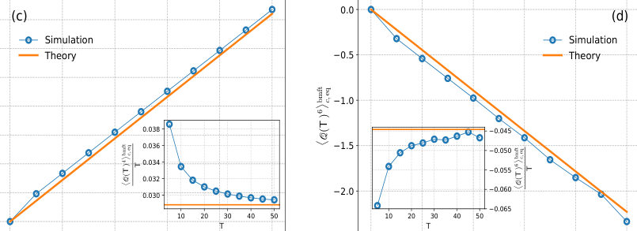
<figcaption class="paper-figure-caption"><b>Fig 1.</b> Figure 1: (a) Comparison of the rate function Hbmft(q) given in Eq. (43) (blue line) with the numerical simulation of the microscopic dynamics (circles) for an equilibrium gas of hard rods at times T = 10, 20, 40, and 80. The Gaussian rate function (orange dashed line) is constructed using the variance given in Eq. (50). While the typical fluctuations are well described by the Gaussian form, the atypical fluctuations in the tails exhibit clear deviations from Gaussian behavior. For the numerical simulation, the initial configurations are generated in the point- particle representation. For each T, we consider N = 5T particles uniformly distributed over the interval [−L/2, L/2], with L =...</figcaption>
</figure>
<figure class="paper-figure-card">
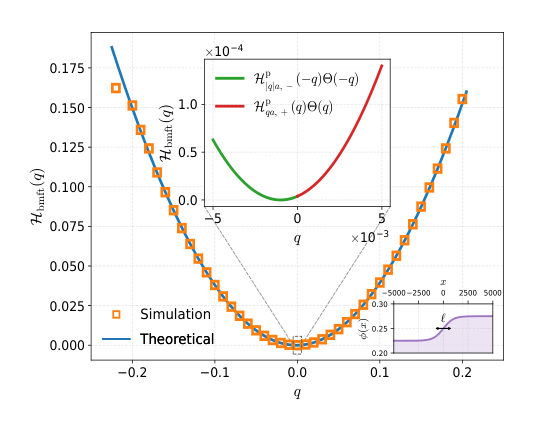
<figcaption class="paper-figure-caption"><b>Fig 2.</b> Figure 2: Plot comparing rate function Hbmft(q) given in Eq. (43) (blue line) with the numerical simulation of the microscopic dynamics (circles) for an inhomogeneous initial profile at time T = 100. For the numerical simulation, the initial configurations are generated in point-particle representation. In particular, N = 2500 point particles distributed on the interval [−L/2, L/2]. Their positions are sampled from the distribution p(x) = 4 L  0.225 + 0.05 1+exp(−x/ℓ)  , with L = 10000 and ℓ= 500. These positions are subsequently mapped onto the corresponding hard-rod configurations using Eq. (7). The velocity distribution is taken to be a zero-mean Maxwellian with temperature T0 = 1. The...</figcaption>
</figure>
<figure class="paper-figure-card">
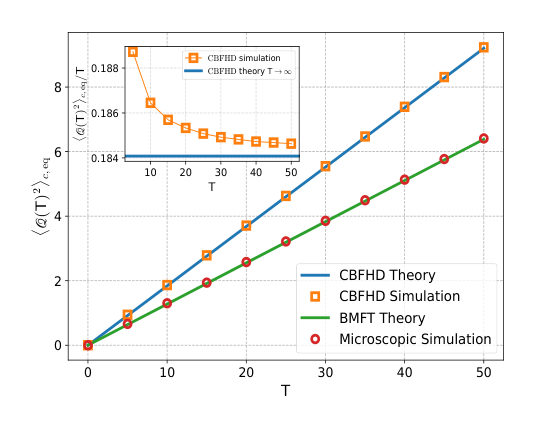
<figcaption class="paper-figure-caption"><b>Fig 3.</b> Figure 3: Comparison of the second cumulant ⟨Q(T)2⟩cb c,eq obtained from the CBFHD approach, as in Eq. (72) (blue line), with numerical simulations (squares). The simulations are performed for a homogeneous gas of hard rods with density ϱ0 = 0.2, rod length a = 1, and N = 1640 rods. The velocities are sampled from a zero-mean Maxwellian distribution with temperature T0 = 1. The rods evolve according to the effective Brownian dynamics in Eq. (10a), with an effective drift, but are driven by correlated noises as given in Eq. (10b). The inset shows the convergence of the cumulant to its asymptotic value. For comparison, the second cumulant obtained from the BMFT approach, following Eq. (50)...</figcaption>
</figure>
<figure class="paper-figure-card">
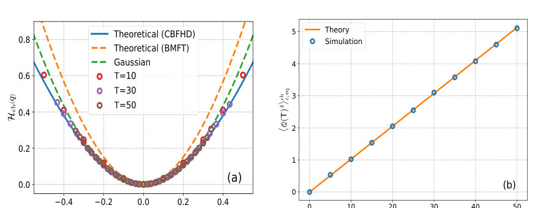
<figcaption class="paper-figure-caption"><b>Fig 4.</b> Figure 4: (a) Comparison of the rate function Hcb(q) (blue solid line), obtained by iteratively solving Eq. (65) with the numerical simulation for a homogeneous hard-rod gas of density ϱ0 = 0.2, rod length a = 1 at times T = 10, 30, 50 (circles).The simulations are performed for N = 1650, with velocities sampled from a zero-mean Maxwellian distribution at temperature T0 = 1. The numerical results are obtained by evolving the hard rods according to the effective Brownian dynamics in Eq. (10a), with an effective drift, but are driven by correlated noises as given in Eq. (10b). The Gaussian distribution, constructed using Eq. (72), is shown for comparison (green dashed line). While the typical...</figcaption>
</figure>
<figure class="paper-figure-card">
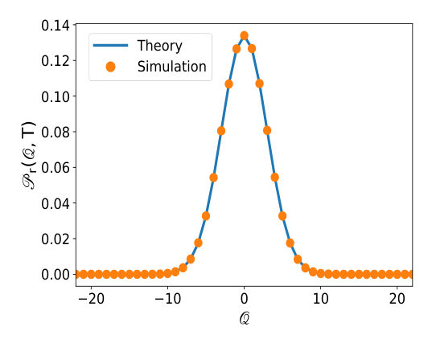
<figcaption class="paper-figure-caption"><b>Fig 5.</b> Figure 5: Plot comparing the probability distribution of integrated current Pr(Q, T) between the analytical exact expression (blue line) following Eqs. (5) and (86) and the numerical simulation (orange points) for an equilibrium gas of hard rods with density ϱ0 = 1/3 at time T = 50. For the numerical simulation, initial configurations are generated in the point-particle representation with point-particle density ϕ0 = 0.5. N = 200 particles sampled uniformly from the interval [−L, L] with L = 200 and subsequently mapped to the hard-rod configurations using Eq. (7). The velocity distribution is taken to be a zero-mean Maxwellian at temperature T0 = 1, and the rod length a = 1. The numerical...</figcaption>
</figure>

**Summary.** This paper investigates the current fluctuations in a 1D hard-rod gas by applying two fluctuating hydrodynamic theories: BMFT and CBFHD. The authors find that BMFT accurately predicts the large-deviation statistics of the integrated current, matching direct simulations. Conversely, the CBFHD approach fails to capture the correct large-scale current fluctuations, highlighting the importance of the underlying microscopic integrability.

**Why it may be interesting.** The comparison between two distinct hydrodynamic theories (BMFT vs. CBFHD) in an integrable system provides a rigorous test case for the applicability of continuum approximations in non-equilibrium statistical mechanics.

Detailed structure

**Main problem.** The study focuses on determining the full counting statistics (FCS) of the integrated current in a one-dimensional hard-rod gas at equilibrium, and comparing predictions from different theoretical frameworks.

**Main result.** The Ballistic Macroscopic Fluctuation Theory (BMFT) successfully predicts the large-deviation function for the current distribution, showing quantitative agreement with microscopic simulations, while the Diffusive fluctuating hydrodynamic theory (CBFHD) fails to capture these large-scale fluctuations.

**Method.** The authors employ advanced theoretical tools, including Ballistic Macroscopic Fluctuation Theory (BMFT) and Diffusive fluctuating hydrodynamic theory (CBFHD), to analyze the large-deviation behavior of the integrated current.

**Model / system.** The system studied is a one-dimensional hard-rod gas, which is a paradigmatic integrable many-body system. Its dynamics are related to hard-point particles and analyzed in the thermodynamic limit.

**Key observables.** Full counting statistics of the integrated current, current cumulants, and the large-deviation function.

**Important parameters / regimes.** Equilibrium state, ballistic scaling, and the initial state inhomogeneity factorized in point-particle coordinates.

**Assumptions / limitations.** The analysis relies on comparing predictions derived from BMFT and CBFHD against direct numerical simulations of the microscopic dynamics.

**Paper structure.** The paper introduces the hard-rod system and its mapping to point particles, then details the application of BMFT to derive the large-deviation function, followed by an analysis and comparison with the CBFHD framework against numerical results.

Abstract

We study the full counting statistics of the integrated current in a one-dimensional hard-rod gas in equilibrium, employing two recently proposed fluctuating hydrodynamic frameworks: (i) Ballistic Macroscopic Fluctuation Theory (BMFT) and (ii) diffusive fluctuating hydrodynamic theory based on correlated Brownian motion approximation of hard-rod quasiparticles (CBFHD). We investigate how the predictions of these two approaches compare with each other and with the underlying microscopic dynamics. We show within BMFT that the current distribution admits a large-deviation form under ballistic scaling, and we derive an explicit expression for the large-deviation function, valid for an arbitrary inhomogeneous initial state factorized in point-particle coordinates. The corresponding current cumulants are also obtained. We subsequently analyze the current statistics within the CBFHD framework, which explicitly incorporates stochastic noise and dissipative terms, and demonstrate that the current distribution likewise obeys a large-deviation principle in this approach. We find that, while BMFT predictions for the first few cumulants and the rate function are in excellent agreement with direct numerical simulations of the microscopic hard-rod dynamics, CBFHD prediction is not. We further verify the predictions of the CBFHD independently using a collection of correlated Brownian motions, which provides an approximate description of the dynamics of hard-rod quasiparticles. Our findings indicate that CBFHD does not accurately capture large-scale current fluctuations in the hard-rod gas, whereas BMFT yields predictions in quantitative agreement with the microscopic dynamics, at least in the context of full counting statistics.

[↑ back to top](#top)

### [Stimulated Parametric Down-Conversion: From Foundational Coherence to Structured Light Applications](http://arxiv.org/abs/2610.03241v1)

**Authors:** M. F. Z. Arruda, M. G. Damaceno, G. H. dos Santos, R. Medeiros de Araújo, N. Rubiano da Silva, S. P. Walborn, P. H. Souto Ribeiro  
**Type:** both · **Category:** other · **PDF:** <https://arxiv.org/pdf/2610.03241v1>  
**Analysis basis:** full PDF text, analyzed in chunks
**Topic relevance:** 🔥 `interference shaping light` **4/5** · `Keldysh / 2PI / non-Gaussian methods` **2/5** · `driven-dissipative phase transition` **1/5** · `methods for driven-dissipative` **1/5**

↔ Scroll figures horizontally

<figure class="paper-figure-card">
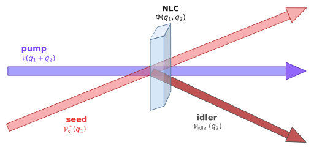
<figcaption class="paper-figure-caption"><b>Fig 1.</b> FIG. 1. Typical StimPDC experimental scheme. NLC is the nonlinear crystal, with Φ(q1, q2) being the function describing the conversion of the pump field v(q1 + q2) by the NLC. The functions v∗ s(q1) and vidler(q2) are the seed and idler fields, respectively. All functions relate to the corresponding angular spectra. See more details in the main text.</figcaption>
</figure>
<figure class="paper-figure-card">
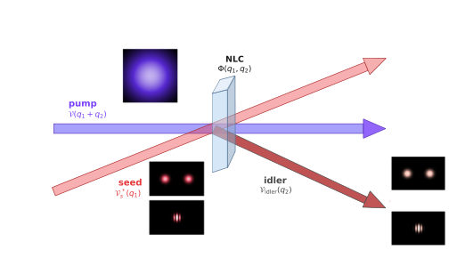
<figcaption class="paper-figure-caption"><b>Fig 2.</b> FIG. 2. Transfer of seed angular spectrum v∗ s(q2) via Stim- PDC. The insets illustrate pump intensity, seed and idler intensity (upper patterns) and corresponding Fourier Trans- forms (lower patterns) for seed and idler.</figcaption>
</figure>
<figure class="paper-figure-card">
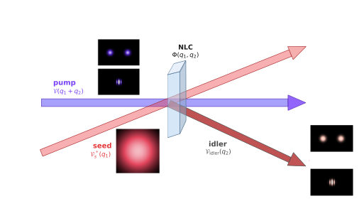
<figcaption class="paper-figure-caption"><b>Fig 3.</b> FIG. 3. Transfer of pump-phase-matching angular spectrum Φ(q1, q2) = v(q1 +q2) γ(q1 −q2) via StimPDC. The insets il- lustrate seed intensity, pump and idler intensities (upper pat- terns) and corresponding Fourier Transforms (lower patterns).</figcaption>
</figure>
<figure class="paper-figure-card">
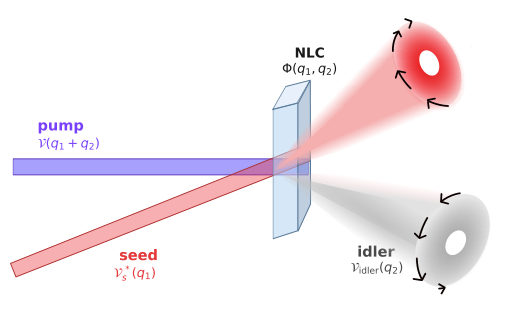
<figcaption class="paper-figure-caption"><b>Fig 4.</b> FIG. 4. Illustration of stimulated emission driven by struc- tured light. A Laguerre–Gauss mode is used to stimulate emission in a nonlinear crystal pumped with a Gaussian blue laser light. The generated idler beam acquires the same topo- logical charge as the seed with opposite sign.</figcaption>
</figure>
<figure class="paper-figure-card">
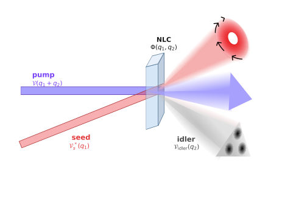
<figcaption class="paper-figure-caption"><b>Fig 5.</b> FIG. 5. Cross-modulation of light fields in stimulated down- conversion. A triangular-shaped beam pumps the nonlinear medium, while a Laguerre–Gauss beam stimulates the down- conversion process. The resulting idler beam carries the prod- uct of the two beams.</figcaption>
</figure>

**Summary.** This review comprehensively analyzes Stimulated Parametric Down-Conversion (StimPDC), showing how it acts as a powerful instrument for manipulating structured light. By deriving a key amplitude product relation, the authors unify disparate experimental observations, from image transfer to orbital angular momentum conservation. The work is crucial for understanding how to engineer quantum light sources for advanced applications.

**Why it may be interesting.** It provides a detailed, unified theoretical framework for controlling spatial modes and coherence in nonlinear optical processes, bridging classical beam shaping with quantum entanglement generation.

Detailed structure

**Main problem.** The paper reviews the transverse spatial physics of Stimulated Parametric Down-Conversion (StimPDC), treating the process as a controllable instrument rather than just a source of quantum light.

**Main result.** A single mathematical relation organizes diverse phenomena in StimPDC, showing that the idler amplitude is proportional to the pointwise product of the pump and the complex conjugate of the seed field in the thin-crystal limit.

**Method.** The analysis uses quantum field theory formalism, calculating expectation values for intensity and deriving amplitude relations in the low-gain, undepleted-pump regime.

**Model / system.** The system is StimPDC, the seeded version of SPDC, involving signal, idler, and pump fields. The formalism is adapted from SPDC to StimPDC, allowing for a continuous transition to the non-classical regime.

**Key observables.** Idler intensity $I(\vec{
ho}_2)$, coherence properties ($\mu_{12}$), and the spatial structure of the output beam (e.g., OAM, geometric patterns).

**Important parameters / regimes.** Low-gain regime, thin-crystal limit, seed photon rate ($N$), and the pump/seed field profiles ($E_p, E_s$).

**Assumptions / limitations.** The analysis is primarily limited to the low-gain, undepleted-pump regime, and the amplitude product relation is exact only in the thin-crystal limit.

**Figures summary.** Figure 1 illustrates a typical StimPDC experimental setup, defining the conversion function $\Phi(q_1, q_2)$ that governs the process.

**Paper structure.** The paper progresses by first establishing the general formalism, deriving the key amplitude product relation, demonstrating its applicability to various spatial phenomena (image transfer, OAM conservation), and finally discussing the transition to the high-gain and quantum regimes.

Abstract

Stimulated parametric down-conversion (StimPDC) is the seeded version of the process that underlies much of photonic quantum information. Replacing the vacuum at one input port with a coherent seed leaves the interaction Hamiltonian, the phase-matching function and the two-photon amplitude unchanged, while raising the output to levels accessible with ordinary classical detectors. This review treats the transverse spatial physics of that process. We show that a single relation, in which the idler amplitude is the pointwise product of the pump field with the complex conjugate of the seed, organizes results usually presented separately: the image and coherence transfer experiments of the 1990s; phase conjugation and its use for wavefront correction; the conservation and conjugation of orbital angular momentum, together with the generation of radial modes and geometric intensity patterns; and the processing of vector vortex beams carrying spatially varying polarization. We then consider StimPDC as an instrument rather than as an object of study, covering stimulated emission tomography, the experimental realization of Klyshko's advanced-wave picture, and the transfer of partial coherence, including the conservation of the twist phase of twisted Gaussian Schell-model beams. We close with the quantum regime, reached when the seed approaches the single-photon level or the idler is used as a herald, and with an assessment of open problems and prospective applications.

[↑ back to top](#top)

### [The QICK Box: A Modular RF Front-End System for Quantum Control and Readout](http://arxiv.org/abs/2610.03609v1)

**Authors:** L. Arnaldi, D. Martin, S. Sussman, S. Uemura, K. Treptow, N. Wilcer, A. Colón Cesaní, O. Seidel, K. Anyang, G. Bratrud, F. Abouzahr, J. Christiansen-Salameh, D. Baxter, G. Cancelo  
**Type:** experiment · **Category:** quantum information and computing · **PDF:** <https://arxiv.org/pdf/2610.03609v1>  
**Analysis basis:** full PDF text, analyzed in chunks
**Topic relevance:** 🔥 `QC/QI experiment` **4/5** · `quantum measurements` **3/5**

↔ Scroll figures horizontally

<figure class="paper-figure-card">
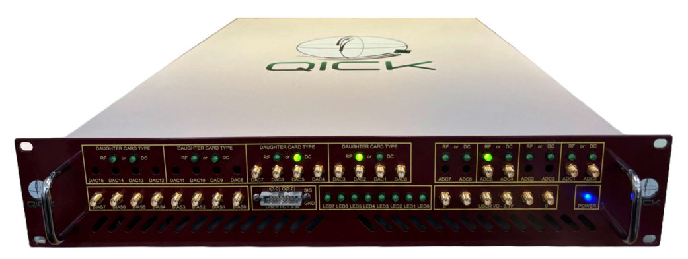
<figcaption class="paper-figure-caption"><b>Fig 1.</b> FIG. 1. QICK Box 2U front-panel assembly. The internal RF Main board hosts the modular daughter cards, which are connected to the front-panel SMA interfaces via high-performance coaxial cables. This 2U rack-mount configuration provides a shielded environment for the RFSoC and signal-conditioning electronics, ensuring robust connectivity for large-scale quantum experiments.</figcaption>
</figure>
<figure class="paper-figure-card">
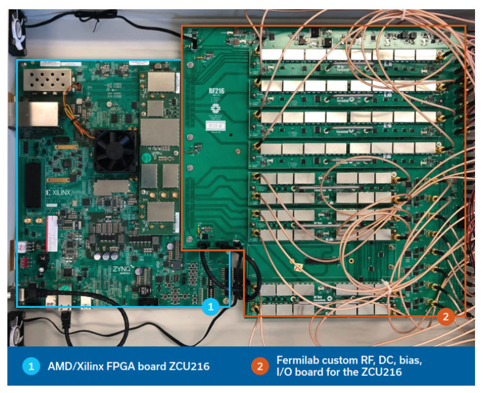
<figcaption class="paper-figure-caption"><b>Fig 2.</b> FIG. 2. System integration of the QICK Box. The architecture is split between the AMD ZCU216 RFSoC (left), which performs digital synthesis and high-speed data conversion, and the companion RF Main board (right). The RF Main board hosts the modular daughter cards responsible for analog signal conditioning, including low-noise amplification, programmable filtering, and power leveling across the 0.1–9GHz range.</figcaption>
</figure>
<figure class="paper-figure-card">
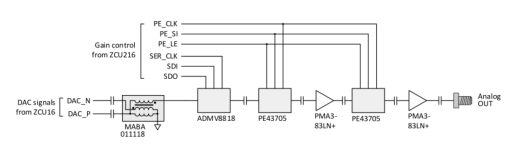
<figcaption class="paper-figure-caption"><b>Fig 3.</b> FIG. 3. RF output daughter card block diagram. The chain uti- lizes a 10 GHz balun for differential-to-single-ended conversion, fol- lowed by an ADMV8818 digitally programmable bandpass filter to suppress Nyquist images and out-of-band spurs across the 100 MHz to 9 GHz range. The final stage comprises two PMA3-83LN+ gain stages and two PE43705 digital step attenuators.</figcaption>
</figure>
<figure class="paper-figure-card">
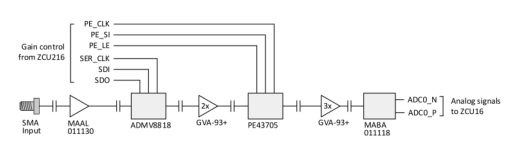
<figcaption class="paper-figure-caption"><b>Fig 4.</b> FIG. 4. RF input daughter card block diagram. The receiver chain is optimized for high sensitivity, featuring a MAAL-011130 LNA as the primary stage to achieve a 1.4dB noise figure. Signal condi- tioning is managed via pSemi digital step attenuators and an Analog Devices ADMV8818 tunable bandpass filter, providing up to 90dB of total gain and robust out-of-band rejection for quantum readout applications.</figcaption>
</figure>
<figure class="paper-figure-card">
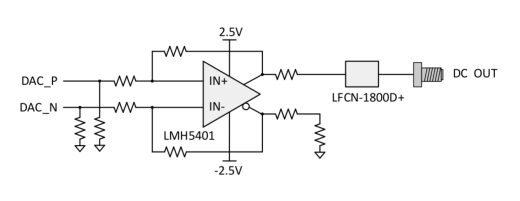
<figcaption class="paper-figure-caption"><b>Fig 5.</b> FIG. 5. DC-coupled output daughter card block diagram. The ar- chitecture features a Texas Instruments LMH5401 in a single-ended configuration with the negative output terminated to 50Ω. A 1.8GHz low-pass filter (LPF) ensures suppression of high-frequency images and clock feedthrough.</figcaption>
</figure>

**Summary.** This paper introduces and characterizes the QICK Box, a modular, high-speed RF front-end system for quantum control. By performing single-shot readout measurements on a transmon qubit, the authors demonstrated that the system achieves high fidelity and signal-to-noise ratios. This confirms the QICK Box as a robust, versatile platform essential for advancing quantum information science experiments.

**Why it may be interesting.** This work provides a critical, high-performance piece of infrastructure for quantum computing experiments, directly impacting the feasibility of implementing complex quantum algorithms by ensuring high-quality measurement data.

Detailed structure

**Main problem.** To detail the hardware specifications and measure the performance of the QICK Box, a modular RF front-end system designed for high-fidelity quantum control and readout.

**Main result.** The QICK Box successfully demonstrated high-fidelity single-shot readout of a transmon qubit, achieving 91.7% fidelity and an SNR of 4.4, confirming its suitability for advanced quantum experiments.

**Method.** The performance was validated through single-shot dispersive readout measurements on a transmon device, utilizing programmable filtering and signal conditioning chains.

**Model / system.** The system centers on the QICK Box, an open-source, modular RF front-end built around an RFSoC FPGA, capable of interfacing with superconducting qubits (like transmon devices) for control and measurement.

**Key observables.** Readout Fidelity (91.7% $\pm$ 0.4%), Single-Shot SNR (4.4 $\pm$ 0.1), Noise Temperature, and DC Bias Noise Floor.

**Important parameters / regimes.** RF bandwidth up to 10 GHz, 20-bit DC biasing, and the qubit relaxation time ($T_1$) which limits the fidelity.

**Assumptions / limitations.** The readout fidelity is primarily limited by the qubit's $T_1$ decay during the measurement window, rather than the electronic noise floor of the QICK Box.

**Figures summary.** Figures illustrate the comparison of Power Spectral Density (PSD) with and without Bandpass Filters (BPF), demonstrating noise floor reduction, and show I-Q scatter plots used to quantify state separation and readout fidelity.

**Paper structure.** The paper describes the hardware architecture (QICK Board, daughtercards), details the signal conditioning chains (RF/DC), presents the experimental methodology using single-shot readout, and concludes with performance metrics and limitations.

Abstract

The QICK (Quantum Instrumentation Control Kit), first introduced in 2022, is a standalone open source control system for quantum information science. Since then, QICK has been migrated to new hardware platforms, expanded its functionality for applications with different types of qubits (superconducting, atomic, ion-trapped, and spin defects), as well as quantum sensors, and quantum networks. QICK is a highly optimized control kit, with a library of functions that can be used for more than one application. In particular, the software and firmware are customized to minimize latency and maximize control performance and throughput. In this white paper, we describe hardware details and performance of the QICK Box. The QICK Box features up to 16 outputs, up to 8 inputs, and 8 20-bit DC biases. Modular output and input daughtercards give the choice of signal chains optimized for fast DC-coupled signals or RF signals up to 10 GHz. Power levels, step attenuation, and bandpass filtering are controlled by software. We demonstrate the system's performance through single-shot readout measurements of a six-transmon device at the Quantum Underground Instrumentation Experimental Testbed (QUIET) at Fermilab, achieving (91.7 +/- 0.4)% readout fidelity limited by T1 decay during the readout. The single shot readout signal-to-noise ratio (SNR) is 4.4 +/- 0.1 without a quantum amplifier, confirming that the QICK Box is suitable for high-fidelity quantum control and measurement applications. Advances in firmware and software will be described in a separate paper.

[↑ back to top](#top)

### [Finite-momentum pairing and magnetic halos in a spin-imbalanced Holstein model](http://arxiv.org/abs/2610.03678v1)

**Authors:** Chunhan Feng, George Batrouni, Richard Scalettar  
**Type:** theory · **Category:** strongly correlated electrons · **PDF:** <https://arxiv.org/pdf/2610.03678v1>  
**Analysis basis:** full PDF text, analyzed in chunks
**Topic relevance:** 🔥 `analog quantum simulation` **4/5** · `Rydberg arrays` **2/5**

↔ Scroll figures horizontally

<figure class="paper-figure-card">
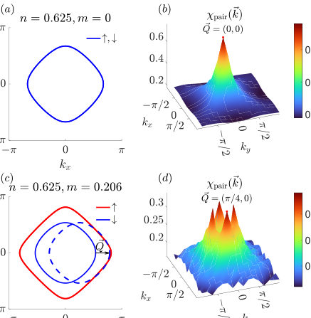
<figcaption class="paper-figure-caption"><b>Fig 1.</b> FIG. 1. Fermi-surface matching and finite-momentum pairing. Non-interacting Fermi surfaces at n = 0.625 for (a) zero magnetization, m = 0, and (c) finite magnetiza- tion, m = 0.206. Panels (b) and (d) show the correspond- ing momentum-dependent pair susceptibilities χpair(k). At m = 0.206 (d), χpair(⃗k) is maximum at ⃗Q = (π/4, 0) and its symmetry-equivalent momenta. In (c), dashed line denotes the spin-down Fermi surface shifted by ⃗Q = (π/4, 0). Calcu- lations are done on a 16 × 16 lattice at β = 16.</figcaption>
</figure>
<figure class="paper-figure-card">
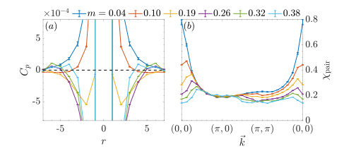
<figcaption class="paper-figure-caption"><b>Fig 2.</b> FIG. 2. Signatures of FFLO superconductivity. (a) Real space pairing correlation Cp(⃗r ) along the diagonal line cut ⃗r = (r, r) at different magnetizations m. (b) Pair suscep- tibility χpair along momentum line-cut ⃗k = (0, 0) →(π, 0) → (π, π) →(0, 0). Parameters are the same as in Fig. 3. Calcula- tions are performed on a 16×16 lattice with density n = 0.875 at β = 16. The large, positive r = 0 value is suppressed to enable the plot to focus on the smaller off-site correlations.</figcaption>
</figure>
<figure class="paper-figure-card">
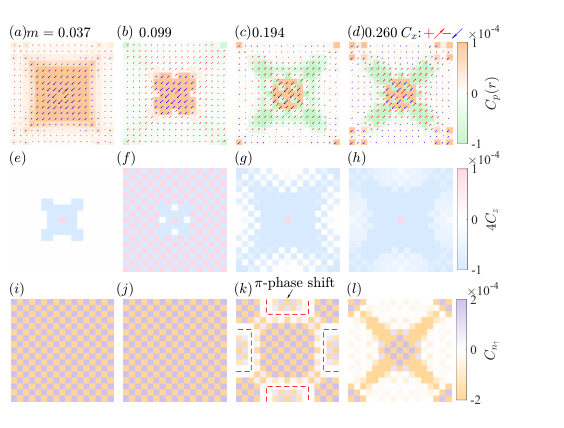
<figcaption class="paper-figure-caption"><b>Fig 3.</b> FIG. 3. Intertwined Orders. (a-d): Orange and green denote positive and negative pairing correlations Cp, respec- tively. Red and blue arrows denote positive and negative spin-X correlations Cx. (e-h): Pink and blue denote posi- tive and negative spin-Z correlations Cz. (i-l) purple and yel- low denote positive and negative spin-up density correlations Cn↑. Red dashed lines enclose regions where CDW exhibits a π phase shift. All correlations are measured relative to the central site, with arrow sizes scaling with the corresponding correlation strength. FFLO pairing and CDW order dominate the central region, while for m ∼1 −n, staggered magnetic correlations emerge in the pairing-suppressed...</figcaption>
</figure>
<figure class="paper-figure-card">
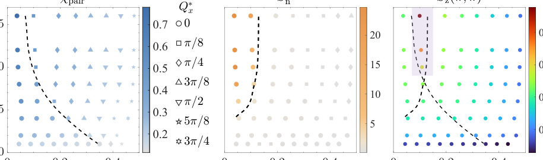
<figcaption class="paper-figure-caption"><b>Fig 4.</b> FIG. 4. Evolution of the FFLO halo in the magnetization m–inverse-temperature β plane. Maximum (a) pair susceptibility, (b) CDW structure factor, and (c) spin-Z correlation Sz(π, π) as functions of m and β. Symbols indicate the shift of the peak wave vector (∆Q∗ x, 0) away from (0, 0) in (a) and (π, π) in (b). Dashed lines are guides to the eye. The region to the right of the dashed line in (a) indicates finite-momentum pairing, while that to the left of the dashed line in (b) indicates strong CDW. The dashed lines in (c) reproduce those in (a) and (b). The purple-shaded intermediate regime denotes the region where a halo of staggered spin-Z correlations is observed. Parameters are the same...</figcaption>
</figure>
<figure class="paper-figure-card">
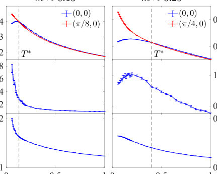
<figcaption class="paper-figure-caption"><b>Fig 5.</b> FIG. 5. Pair susceptibility and charge and spin-Z structure factors. As functions of temperature T for two magnetizations, m ≈0.13 and 0.25. The dashed line marks the temperature T ∗below which the finite-momentum pair susceptibility exceeds its zero-momentum value, indicating the onset of FFLO pairing. At m ≈0.13, where the FFLO with a magnetic halo is observed, both Sn and Sz exhibit a sharp increase just below T ∗. In contrast, at m = 0.25, where no FFLO halo is observed, both structure factors remain sub- stantially smaller and show no comparable increase.</figcaption>
</figure>

**Summary.** This work investigates finite-momentum pairing (FFLO superconductivity) in a spin-imbalanced system using the Holstein model. By employing DQMC, the authors overcome sign problem limitations to show that increasing spin imbalance drives the pairing into a finite-momentum state. The study reveals a rich interplay where FFLO pairing coexists spatially with charge-density-wave order and magnetic halo structures.

**Why it may be interesting.** The explicit connection drawn between the Holstein model, FFLO physics, and the potential for realization in cold-atom platforms (like Rydberg atoms) makes this highly relevant to AMO physics.

Detailed structure

**Main problem.** The study of Fulde-Ferrell-Larkin-Ovchinnikov (FFLO) superconductivity, which involves Cooper pairing at finite momentum driven by spin imbalance, is challenging due to the fermion sign problem.

**Main result.** The Holstein model allows for unbiased simulation of FFLO pairing, showing that increasing spin imbalance shifts pairing from zero to finite momentum ($\vec{Q} 
eq 0$) and coexisting with charge-density-wave order and magnetic halos.

**Method.** Determinant Quantum Monte Carlo (DQMC) simulations were employed to study the system's ground state properties.

**Model / system.** The research uses the spin-imbalanced two-dimensional Holstein model, which incorporates phonon-mediated attraction, allowing it to bypass the severe sign fluctuations encountered in the attractive Hubbard model.

**Key observables.** Pairing susceptibility ($\chi_{	ext{pair}}(\vec{Q})$), real-space pair correlations ($C_p(\vec{r})$), charge-density-wave order ($S_n(\vec{Q})$), and staggered longitudinal spin correlations ($C_z(\vec{r})$).

**Important parameters / regimes.** High density ($n \approx 0.875$) and varying magnetization ($m$), particularly near the regime $m \approx 1-n$.

**Assumptions / limitations.** The Holstein model is used as an effective description, and the DQMC method is assumed to provide accurate results despite the complexity of the correlated state.

**Figures summary.** Figures illustrate the shift of the pairing susceptibility peak to finite $\vec{Q}$ with increasing magnetization, and show spatial patterns of coexisting pairing, CDW, and magnetic halo correlations.

**Paper structure.** The paper progresses by first establishing the feasibility of simulating FFLO physics using the Holstein model, then quantifying the shift in pairing momentum, and finally detailing the complex spatial coexistence of pairing, CDW, and magnetic halo textures at high density.

Abstract

Fulde-Ferrell-Larkin-Ovchinnikov (FFLO) superconductivity, Cooper pairing at finite-momentum driven by spin imbalance, remains difficult to study numerically in two dimensions. The fermion sign problem in the spin-imbalanced attractive Hubbard model severely limits quantum Monte Carlo access to the low temperatures where pairing correlations are most pronounced. We show that the Holstein model, in which the effective attraction is retarded by phonon dynamics, strongly suppresses sign fluctuations under spin imbalance, enabling unbiased determinant quantum Monte Carlo simulations deep in this regime. With increasing magnetization, zero-momentum pairing evolves into finite-momentum FFLO pairing, evidenced by oscillating real-space pair correlations and a shift of the pairing susceptibility peak to finite $\vec{Q}$. The finite-momentum susceptibility substantially exceeds its zero-momentum value. At high density $n \sim 0.875$, near magnetization $m \approx 1-n$ where the majority-spin density approaches half filling, FFLO pairing coexists with checkerboard charge-density-wave order at short range, while staggered longitudinal spin correlations emerge as a magnetic halo at larger distances. These spatial textures provide experimentally accessible signatures of finite-momentum pairing and motivate cold-atom realizations of FFLO physics.

[↑ back to top](#top)

### [Self-organized Layered Structures of Nitrogen-Vacancy Centers with Preferential Orientation in Heteroepitaxial Diamond Films](http://arxiv.org/abs/2610.03150v1)

**Authors:** Vadim Lebedev, Alejandro Martínez-Méndez, Jesús Moreno-Meseguer, Jan Engels, Jürgen Weippert, Jan Kustermann, Felix Hoffmann, Javier Prior, Jan Jeske  
**Type:** experiment · **Category:** quantum information and computing · **PDF:** <https://arxiv.org/pdf/2610.03150v1>  
**Analysis basis:** full PDF text, analyzed in chunks
**Topic relevance:** 🔥 `QC/QI experiment` **4/5** · `quantum measurements` **1/5** · `quantum optics experiment` **1/5**

↔ Scroll figures horizontally

<figure class="paper-figure-card">
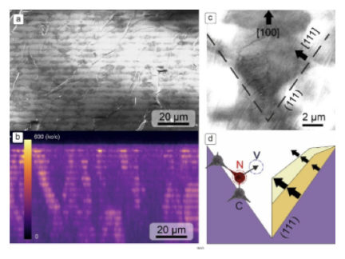
<figcaption class="paper-figure-caption"><b>Fig 1.</b> FIG. 2: Cross-sectional studies of the sample prepared by a cCVD process: cross-sectional a) SEM and b) cPL images demonstrate variations in a NV incorporation efficiency. c) High-resolution, cross-sectional SEM showing the structure of a {111}-bounded pit, d) schematic illustration of a (111) growth mode along with the dominant orientation of the NV pairs.</figcaption>
</figure>
<figure class="paper-figure-card">
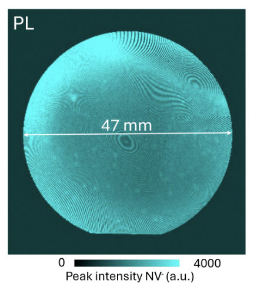
<figcaption class="paper-figure-caption"><b>Fig 2.</b> FIG. 1: Photoluminescence (PL) map of the full 47 mm- diameter diamond wafer. Shown is the peak intensity of the zero-phonon-line (ZPL) associated with the negatively charged (NV−) state of the NV center, corrected by the base- line from the phonon side bands.</figcaption>
</figure>
<figure class="paper-figure-card">
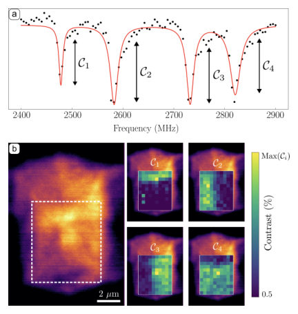
<figcaption class="paper-figure-caption"><b>Fig 3.</b> FIG. 3: ODMR study of NV−populated areas. a) An offset magnetic field is added to separate the electronic spin tran- sitions of each of the four crystallographic directions. b) the optical contrast Ci of each dip is obtained from a 10x12 pixel region (zone under white rectangle), revealing four comple- mentary regions of preferential NV alignment.</figcaption>
</figure>
<figure class="paper-figure-card">
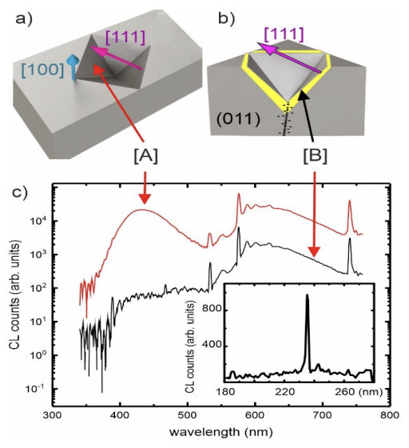
<figcaption class="paper-figure-caption"><b>Fig 4.</b> FIG. 5: Model of the proposed (111) overgrowth mechanism. (a) Isometric view of a 111-bounded pit after oxygen-plasma etching. (b) Cross-sectional schematic illustrating the forma- tion of (111)-oriented epilayers on the 111 sidewalls. (c) CL spectra acquired from the etched pit (position A) and from the overgrown surface (position B).</figcaption>
</figure>
<figure class="paper-figure-card">
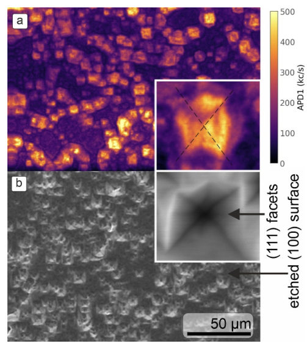
<figcaption class="paper-figure-caption"><b>Fig 5.</b> FIG. 4: Plan-view studies of the samples prepared by the cCVD process: a) PL map of the overgrown surface (in- sert: high-resolution PL map); and b) SEM image of the oxygen-plasma-etched (100) surface with the characteristic 111-bounded pits (inset: high-resolution SEM image).</figcaption>
</figure>

**Summary.** This work reports the fabrication of wafer-scale diamond films featuring highly ordered, layered structures of $	ext{NV}^-$ centers. By using a cyclic etching/growth process, the researchers achieved preferential alignment of these quantum emitters along specific crystal facets. This controlled patterning is crucial for developing integrated, addressable solid-state quantum devices.

**Why it may be interesting.** The precise, controlled engineering of solid-state quantum emitters ($	ext{NV}^-$) in a scalable, patterned manner is highly relevant to quantum information science, offering a platform for solid-state qubits and quantum memory.

Detailed structure

**Main problem.** The paper addresses the fabrication and characterization of diamond films containing highly ordered, three-dimensional layered structures of negatively charged nitrogen-vacancy color centers ($	ext{NV}^-$) on a wafer scale.

**Main result.** A cyclic CVD growth and etching process successfully creates $	ext{NV}^-$-rich micro-clusters with preferential, uniform alignment of $	ext{NV}$ pairs along the [111] direction, enabling scalable quantum architectures.

**Method.** The authors employed a cyclic process involving Chemical Vapor Deposition ($	ext{CVD}$) and oxygen-plasma etching, followed by advanced characterization using $	ext{ODMR}$, $	ext{cPL}$, and $	ext{CL}$ spectroscopy.

**Model / system.** The physical system is the diamond lattice hosting $	ext{NV}^-$ color centers. The methodology relies on controlling crystal growth anisotropy by etching to create $\{111\}$-bounded pits, which are then overgrown to enhance $	ext{NV}$ concentration and alignment.

**Key observables.** Photoluminescence ($	ext{PL}$) map showing $	ext{ZPL}$ at $637 	ext{ nm}$; Optically Detected Magnetic Resonance ($	ext{ODMR}$) confirming preferential alignment; Coherence time ($T_2$) measured at $34.6 \pm 2.5 \mu	ext{s}$.

**Important parameters / regimes.** Wafer scale (two-inch), $	ext{NV}^-$ state, $\{111\}$ facet orientation, and the cyclic $	ext{CVD}$ growth parameters.

**Assumptions / limitations.** The enhanced $	ext{NV}^-$ emission originates specifically from the inclined $\{111\}$ sidewalls formed during the etching/overgrowth cycle, which dictates the alignment.

**Figures summary.** Figures show $	ext{PL}$ maps indicating layered structures, cross-sections confirming $\{111\}$-bounded pits, and $	ext{ODMR}$ spectra demonstrating four complementary regions of $	ext{NV}$ alignment.

**Paper structure.** The paper details the fabrication process using cyclic $	ext{CVD}$ to create 3D layered structures. It then characterizes these structures using $	ext{SEM}$, $	ext{cPL}$, and $	ext{ODMR}$ to prove the preferential alignment of $	ext{NV}$ centers along the [111] direction, culminating in discussions of potential quantum device applications.

Abstract

Here, we report the fabrication and characterization of single crystal diamond films on a two-inch wafer-scale containing three-dimensional layered structures of negatively charged nitrogen-vacancy color centers (NV$^{-}$). The (100)-oriented layered diamond films were grown by chemical vapor deposition (CVD) to create spatially separated regions of enhanced emission associated with NV$^{-}$ centers. Such localized emission enhancement as well as 2D and 3D arrays of spins could enable close-packed architectures for emerging quantum devices, such as data processors, memory cells, and magnetic sensors. A cyclic sequence of CVD growth and oxygen-plasma etching is employed, resulting in the in-situ formation of layered inverted pyramidal structures with flat $\{$111$\}$ sidewalls. These pits are subsequently overgrown by nitrogen-doped diamond to achieve NV$^{-}$-rich facets with a uniform N-V bond arrangement and improved nitrogen incorporation efficiency.

[↑ back to top](#top)

### [Topological phase transition in a symmetric blockade structure](http://arxiv.org/abs/2610.03186v1)

**Authors:** Johannes Mögerle, Simon Fell, Tobias F. Maier, Ali Otaifi, Lode Pollet, Nicolai Lang, Hans Peter Büchler  
**Type:** theory · **Category:** other · **PDF:** <https://arxiv.org/pdf/2610.03186v1>  
**Analysis basis:** full PDF text, analyzed in chunks
**Topic relevance:** 🔥 `analog quantum simulation` **4/5** · `methods for driven-dissipative` **2/5**

↔ Scroll figures horizontally

<figure class="paper-figure-card">
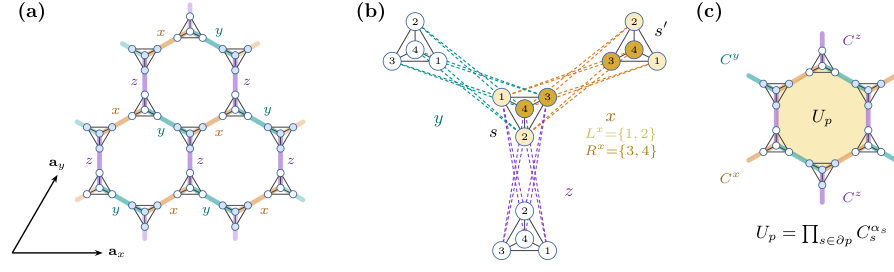
<figcaption class="paper-figure-caption"><b>Fig 1.</b> FIG. 1. Setup of the blockade Hamiltonian. (a) Honeycomb lattice with four two-level systems per site. On each site, the vertices describing the two-level systems are fully connected and account for the blockade interaction V amongst them. By contrast, the blockade interaction between adjacent sites depends on the link direction α ∈{x, y, z}. (b) Detailed view of the blockade interaction between adjacent sites. The dashed lines describe the graph for blockade interaction of strength U with the following construction: for each link α, the four two-level systems on a site s are partitioned into two classes Lα s and Rα s . Then, a vertex i on site s interacts with a vertex j on the neighboring...</figcaption>
</figure>
<figure class="paper-figure-card">
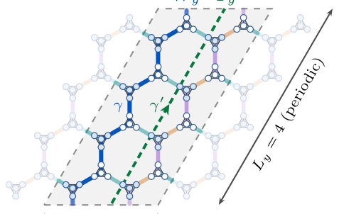
<figcaption class="paper-figure-caption"><b>Fig 2.</b> FIG. 2. Geometry for the iDMRG simulations and loop op- erators. Illustration of the infinite cylinder with the iMPS unit cell (dashed box) of size Lx = 2 and Ly = 4 combin- ing LxLy = 8 unit cells of the honeycomb lattice. We have periodic boundary conditions along the y-direction. The blue line along the y-direction denotes the loop operator Wy associ- ated with winding a flux around the cylinder, while the green dashed line denotes the Wilson loop operator Φy winding a charge around the cylinder. The latter acts with Qα s on the right site of the α-link crossed by the loop operator. The op- erator Wy commutes with the Hamiltonian and we select the topological sector with Wy = 1. By...</figcaption>
</figure>
<figure class="paper-figure-card">
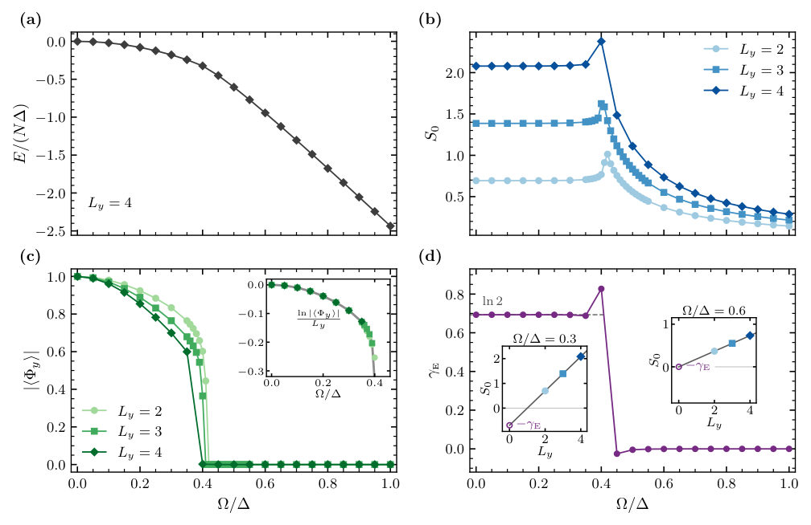
<figcaption class="paper-figure-caption"><b>Fig 3.</b> FIG. 3. Topological phase transition. (a) Ground-state energy E/N per unit cell of the honeycomb lattice for the blockade Hamiltonian in the limit V →∞and for parameters U = 2∆using iDMRG on a cylinder of size Lx = 2 and Ly = 4. The ground state energy behaves smoothly across the phase transition and no signature of hysteresis is observed. (b) Entanglement entropy S0 across the cylinder for different circumferences Ly = 2, 3, 4; one finds a clear signature of a phase transition at a critical value Ωc/∆≈0.40. The entanglement entropy for Ω≪Ωc is close to S0 = (Ly −1) ln 2, which is the entanglement entropy of the toric code state at the fixed point. (c) Expectation value of the Wilson loop...</figcaption>
</figure>
<figure class="paper-figure-card">
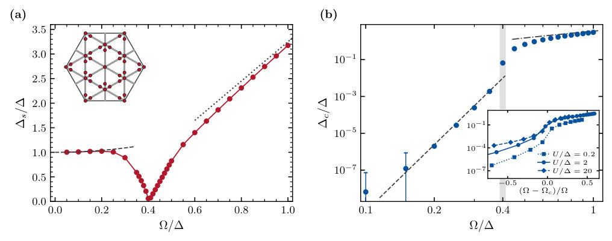
<figcaption class="paper-figure-caption"><b>Fig 4.</b> FIG. 4. Excitation gaps. (a) The gap ∆s of excitations in the symmetric sector with Up = +1 for all plaquettes for a cylinder of circumference Ly = 3. The gap is derived via iDMRG using the plane-wave ansatz implemented in TeNPy. We probe the momenta px = 0, π/2, 2π/3 along the x-direction. In combination with the finite-size quantization along the y-direction and the point group symmetry of the honeycomb lattice, this leads to the explored momentum points in the first Brillouin zone shown in the inset. The gap ∆s is the minimum over all excitation energies at the explored momenta. The dashed and dotted lines show the analytical predictions for the gap ∆s in the limit of small and large Ω,...</figcaption>
</figure>
<figure class="paper-figure-card">
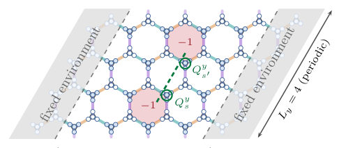
<figcaption class="paper-figure-caption"><b>Fig 5.</b> FIG. 5. Setting to probe the charge gap. We select a finite section of length Lx = 4 of the infinite cylinder with circum- ference Ly = 4 and construct the MPS from the iMPS ground state. The boundary conditions are fixed by the left and right environments of the infinite cylinder from the iMPS ground state. Then we perform two DMRG simulations on this finite section with fixed boundary conditions: one for the ground state in the symmetric sector, and one for the lowest energy state with a pair of charges at two plaquettes p′ and p′′, sepa- rated by a distance d = 2 along the y-direction. To create the two charges, we apply a ribbon operator R = Qy sQy s′ on two adjacent sites along the...</figcaption>
</figure>

**Summary.** This paper investigates the topological phase transition in a blockade Hamiltonian on a honeycomb lattice, which models systems like Rydberg arrays. Using iDMRG simulations, the authors map the full phase diagram, revealing a continuous transition between a topologically ordered state and a trivial phase. The findings confirm the robustness of the topological order across a wide range of driving parameters.

**Why it may be interesting.** This work directly addresses the stability and phase boundaries of topological order in engineered quantum simulators, which is highly relevant for understanding strongly correlated quantum materials and quantum computation architectures.

Detailed structure

**Main problem.** The study aims to map out the full phase diagram of a blockade Hamiltonian possessing a local Z2 symmetry, particularly in regimes beyond weak Rabi driving.

**Main result.** The authors found a single continuous phase transition separating a topologically ordered phase from a trivial paramagnetic phase, confirming the stability of the topological order up to significant Rabi drives.

**Method.** The research employs large-scale infinite-size density matrix renormalization group (iDMRG) simulations on a cylinder geometry, supplemented by perturbation theory for gap calculations.

**Model / system.** The system is a blockade Hamiltonian defined on a honeycomb lattice, involving four two-level systems per site. The Hamiltonian includes terms for Rabi coupling (H_Omega), detuning (H_Delta), and both intra-site (H_V) and inter-site blockade interactions (H_U).

**Key observables.** Charge gap (remains open across the transition), excitation gap in the symmetric sector (closes at the transition), and Wilson loop expectation values.

**Important parameters / regimes.** Rabi drive strength (Omega), detuning (Delta), and blockade interaction strengths (U, V). The analysis explores various limits, such as weak ($\Omega \ll \Delta$) and strong ($\Omega \gg \Delta$) coupling.

**Assumptions / limitations.** The analysis often assumes the limit of infinite on-site blockade ($V 	o \infty$) to simplify the Hilbert space to single excitations per site.

**Figures summary.** Figure 1 illustrates the honeycomb lattice setup and the local Z2 symmetry operator. Figure 2 details the iDMRG setup on a cylinder, defining flux and loop operators.

**Paper structure.** The paper first establishes the model and its symmetries, then analyzes the system in perturbative limits (weak and strong coupling) to calculate excitation and charge gaps. Finally, it presents the full phase diagram mapping using iDMRG simulations.

Abstract

We present a numerical study of a blockade Hamiltonian with a local $\mathbb{Z}_2$ symmetry. For such models, the existence of a topologically ordered ground state has been proven rigorously for weak Rabi driving [T. F. Maier et al., PRX Quantum 6, 030340 (2025)]. However, the phase diagram beyond weak driving is still an open question. We perform large-scale infinite-size density matrix renormalization group (iDMRG) simulations on a cylinder and map out the full phase diagram of the model. We find a single continuous phase transition between the topologically ordered phase and a trivial paramagnetic phase, and confirm numerically the stability of the topologically ordered phase up to Rabi drives comparable to the characteristic energy scale of the system. Furthermore, we compute the excitation gaps and show that the charge gap remains open across the phase transition and charges become confined in the trivial phase. On the other hand, the gap in the symmetric sector closes at the transition, consistent with the condensation of flux excitations.

[↑ back to top](#top)

### [Self-testing ideal quantum measurements](http://arxiv.org/abs/2610.03168v1)

**Authors:** Debashis Saha, Zhen-Peng Xu, Adán Cabello  
**Type:** theory · **Category:** other · **PDF:** <https://arxiv.org/pdf/2610.03168v1>  
**Analysis basis:** full PDF text, analyzed in chunks
**Topic relevance:** 🔥 `quantum measurements` **4/5**

↔ Scroll figures horizontally

<figure class="paper-figure-card">
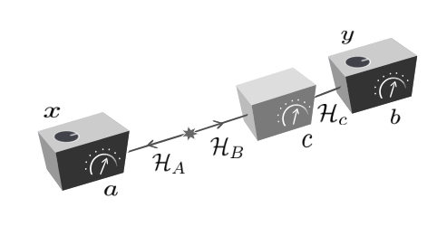
<figcaption class="paper-figure-caption"><b>Fig 1.</b> FIG. 1. Extended Bell experiment involving Alice, Bob, and Carol. Alice and Bob perform measurements with inputs x, y and outputs a, b, respectively. Carol randomly decides whether to place her black-box instrument, producing out- come c and an unknown post-measurement system, before Bob’s device. The experiment therefore produces correla- tions {p(a, b|x, y)} and {p(a, b, c|x, y)}, from which Carol’s instrument can be self-tested to be sharp in a fully device- independent manner.</figcaption>
</figure>
<figure class="paper-figure-card">
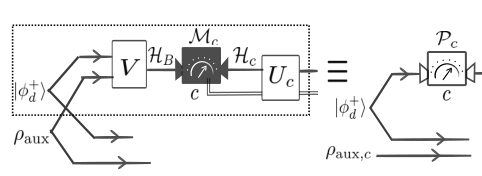
<figcaption class="paper-figure-caption"><b>Fig 2.</b> FIG. 2. Schematic representation of instrument self-testing via the Choi–Jamio lkowski isomorphism. The pre-processing transformation V identifies the physical input of the unknown operation Mc, while Uc extracts the ideal subsystem from its post-measurement output. In the device-independent realiza- tion, V is fixed by the initial state self-test as V = U † B.</figcaption>
</figure>

**Summary.** This paper develops a method to self-test whether a quantum measurement is ideal using only the statistical correlations measured in a Bell test setup. By leveraging the Choi–Jamiolkowski isomorphism and analyzing conditional probabilities, the authors certify the ideal nature of the measurement instrument in a device-independent manner, even for complex, high-rank outcomes.

**Why it may be interesting.** This work provides a rigorous, device-independent framework for verifying fundamental quantum mechanical assumptions (like the ideal nature of measurements) using only experimental statistics, which is crucial for quantum information security and verification.

Detailed structure

**Main problem.** The paper addresses the fundamental question of whether the ideal nature of a quantum measurement can be certified (self-tested) using only the statistical outcomes observed in a bipartite Bell test, potentially augmented by a non-demolition measurement.

**Main result.** It demonstrates that ideal Lüders measurement instruments can be certified in a device-independent manner by analyzing the output statistics, extending the self-testing capability to measurements with higher-rank outcomes.

**Method.** The authors utilize the Choi–Jamiolkowski isomorphism to compare the unknown physical measurement operation with the ideal reference operation, employing techniques from context-projector games and Bell inequalities.

**Model / system.** The system involves ideal quantum measurements, modeled by projective effects and the Lüders state-update rule, applied in the context of bipartite Bell tests involving three parties (Alice, Bob, and Carol).

**Key observables.** Output statistics (conditional probabilities) of the measurements, violation of Bell inequalities, and the robustness $R_c(M_c, P_c)$ of the instrument element.

**Important parameters / regimes.** The rank of the outcome projectors ($	ext{rank}(\Pi_c)$), and the dimension of the Hilbert space ($d$).

**Assumptions / limitations.** The method assumes the ability to relate the unknown operation to the ideal one via pre-processing ($V$) and post-processing ($U_c$) operations, and relies on specific self-testing results for lower-rank outcomes.

**Figures summary.** Figure 1 illustrates the extended Bell experiment involving three parties. Figure 2 schematically represents instrument self-testing using the Choi–Jamiolkowski isomorphism, detailing the roles of pre-processing and post-processing operations.

**Paper structure.** The paper builds from initial self-testing of the shared state using Bell tests, progresses to formulating the self-testing of the measurement instrument via the Choi representation, and finally extends the proof to cover outcomes with higher projector ranks ($d_c \ge 2$).

Abstract

A fundamental prediction of quantum mechanics is that observables can be measured through ideal measurements, that is, measurements that give the same outcome when repeated and do not disturb any observable that is jointly measurable. In terms of quantum instruments, such an ideal measurement is described by projective effects together with the associated Luders state-update rule. Here, we show that quantum mechanics allows for self-testing any ideal measurement. Using solely the output statistics of bipartite Bell tests in which a non-demolition measurement is sometimes added, it is possible to certify in a device-independent manner whether the added measurement is ideal.

[↑ back to top](#top)

### [Emergent Dissipation from Fluctuating Quantum-Network Topology](http://arxiv.org/abs/2610.03194v1)

**Authors:** Alireza Nourmandipour, Stefano Mancini  
**Type:** theory · **Category:** quantum information and computing · **PDF:** <https://arxiv.org/pdf/2610.03194v1>  
**Analysis basis:** full PDF text, analyzed in chunks
**Topic relevance:** `correlated / nonlocal dissipation` **3/5** · `driven-dissipative phase transition` **3/5** · `methods for driven-dissipative` **3/5** · `Keldysh / 2PI / non-Gaussian methods` **2/5** · `analog quantum simulation` **2/5** · `non-equilibrium universality` **2/5** · `quantum measurements` **1/5**

↔ Scroll figures horizontally

<figure class="paper-figure-card">
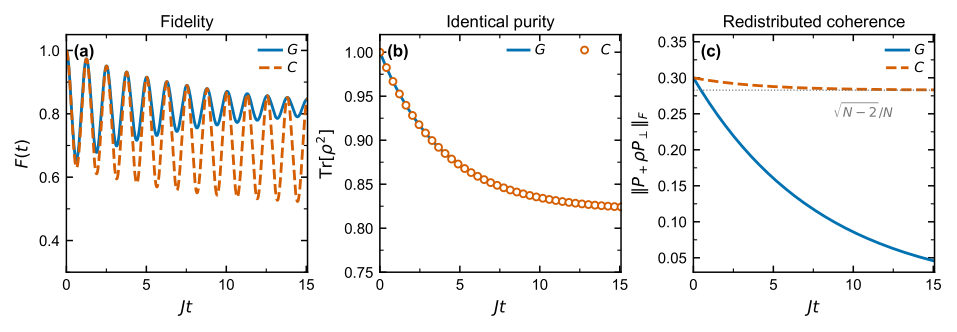
<figcaption class="paper-figure-caption"><b>Fig 1.</b> FIG. 1. Dynamics of two topology ensembles with identical mean adjacency and covariance spec-</figcaption>
</figure>
<figure class="paper-figure-card">
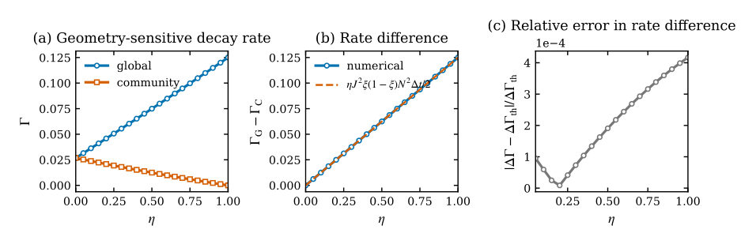
<figcaption class="paper-figure-caption"><b>Fig 2.</b> FIG. 2. Geometry-dependent dissipation under partial topology correlations. (a) Decay rates of</figcaption>
</figure>
<figure class="paper-figure-card">
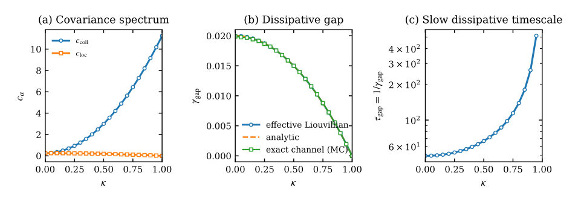
<figcaption class="paper-figure-caption"><b>Fig 3.</b> FIG. 3. Continuous emergence of quasi-protection in a physically realizable partially corre-</figcaption>
</figure>

**Summary.** This theoretical work analyzes how quantum dissipation arises in a network whose connections fluctuate randomly over time. It shows that the resulting dynamics are determined not just by the average connectivity, but critically by the specific structure (eigenvectors) of the connectivity fluctuations. This establishes fluctuating connectivity as a controllable resource for quantum engineering.

**Why it may be interesting.** This work provides a rigorous framework for understanding how environmental coupling, modeled by fluctuating connectivity, generates dissipation, offering tools to engineer dissipation or protect quantum information.

Detailed structure

**Main problem.** The paper investigates how quantum dissipation can emerge in a quantum network due to the temporal fluctuations of its interaction topology.

**Main result.** The dynamics are governed by both the mean topology (coherent part) and the covariance structure (dissipative part), showing that identical mean spectra do not guarantee identical dynamics.

**Method.** The analysis derives an effective Lindblad master equation using a rapid-switching expansion of the random-unitary channel, followed by spectral decomposition of the covariance matrix.

**Model / system.** The system is an N-site quantum network of two-level systems whose interaction edges fluctuate randomly over short time intervals. The dynamics are modeled via a topology-averaged master equation.

**Key observables.** Fidelity, Purity, Sector-resolved Coherence, and the Dissipative Gap ($\gamma_{	ext{gap}}$).

**Important parameters / regimes.** The time step ($\Delta t$), the correlation parameter ($\kappa$), and the structure of the covariance matrix eigenvalues/eigenvectors.

**Assumptions / limitations.** The analysis relies on the leading-order generator expansion for small time steps ($\Delta t$), and specific comparisons are made between global and community correlation ensembles.

**Figures summary.** The notes describe comparisons of coherence decay rates and purity calculations for different correlation ensembles, and the identification of a slow decay mode ($\gamma_{	ext{slow}}$) matching the gap.

**Paper structure.** The paper builds from deriving the effective generator via expansion, separating the roles of the mean Hamiltonian and the covariance matrix, and then comparing specific correlated ensembles (global vs. community) to demonstrate non-equivalence of dynamics.

Abstract

We investigate how dissipation can emerge in a quantum network from temporal fluctuations of the interaction   topology. For a network whose graph is redrawn at short time intervals, the averaged   dynamics yields a Markovian master equation: the mean network fixes the   coherent part and the covariance fixes the dissipative structure. The   covariance eigenvalues set the noise strengths, while its eigenvectors   determine the collective operators on which those strengths act. Two ensembles   with identical mean adjacency and covariance spectra but different   eigenvectors produce distinct dynamics despite identical purity. A physically   realizable model yields an analytically predicted dissipative gap, giving   quasi-protected dynamics. These results establish fluctuating connectivity as   a resource for engineering quantum dissipation and protection.

[↑ back to top](#top)

### [Pathway-resolved analysis of internal conversion enabled by Gaussian boson sampling](http://arxiv.org/abs/2610.03271v1)

**Authors:** Mikhail Roiz, Rashid Valiev, Jan-Lucas Eickmann, Theo Kurten, Benjamin Brecht, Michael Stefszky, Christine Silberhorn  
**Type:** theory · **Category:** other · **PDF:** <https://arxiv.org/pdf/2610.03271v1>  
**Analysis basis:** full PDF text, analyzed in chunks
**Topic relevance:** `Full counting statistics` **3/5** · `Keldysh / 2PI / non-Gaussian methods` **2/5** · `analog quantum simulation` **2/5** · `correlated / nonlocal dissipation` **2/5** · `methods for driven-dissipative` **2/5** · `driven-dissipative phase transition` **1/5** · `interference shaping light` **1/5** · `quantum measurements` **1/5**

↔ Scroll figures horizontally

<figure class="paper-figure-card">
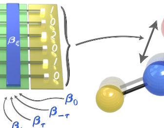
<figcaption class="paper-figure-caption"><b>Fig 1.</b> Figure 1: General schematic of the Gaussian boson sampling (GBS) based framework for kIC. The GBS experiment is performed four times with four different sets of input optical parameters for the squeezing ˆS(Σξ), rotation ˆR(Uξ) and displacement ˆD(βξ) operators. These sets correspond to the expansion coefficient values ξ = {iτ, τ, −τ, 0}. At the final stage of the GBS experiment, the photon-number-resolving detection is employed to reconstruct the photon pattern distributions. The statistics of the four sampling experiments are used to evaluate the non-adiabatic coupling matrix elements |Vi0,fm|2 according to equation (9). As schematically shown in the figure, each photon pattern generated...</figcaption>
</figure>
<figure class="paper-figure-card">
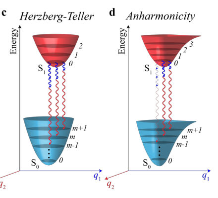
<figcaption class="paper-figure-caption"><b>Fig 2.</b> Figure 2: Schematic representation of internal conversion process in a two-mode system. (a) Internal conversion occurs from the lowest vibrational level of the S1 potential energy surface to highly excited vibrational states of S0 whose total vibrational energy matches the electronic gap ∆fi within a finite energy window of width 2∆E. Contributions from mode 1 and 2 are highlighted in blue and red colours, respectively. Arrow thickness indicates the relative strength of the transition, determined by the corresponding NACME values. (b) Duschinsky rotation mixes the normal modes and modifies the vibrational wavefunction overlaps. (c) Herzberg-Teller contribution introduces coordinate...</figcaption>
</figure>
<figure class="paper-figure-card">
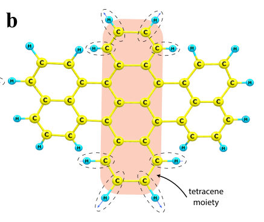
<figcaption class="paper-figure-caption"><b>Fig 3.</b> Figure 3: Graphical representation of the DBT molecule. (a) The C–H bonds involved in the vibrations of normal modes 149-152 are encircled. The corresponding modes are located on the naphthalene moiety of DBT, highlighted in the olive colour. (b) The C–H bonds corresponding to normal modes 158 and 159 are encircled. These modes are located on the tetracene moiety of DBT, highlighted in the pink colour. We note that the distinct C–H bonds contribute to vibrations of multiple normal modes, which are depicted as blue arrows near the Hydrogen atoms.</figcaption>
</figure>
<figure class="paper-figure-card">
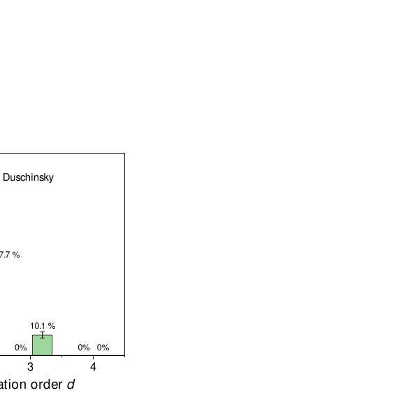
<figcaption class="paper-figure-caption"><b>Fig 4.</b> Figure 4: Exclusive correlated rate fraction R(d) corr(F) across all pathway fragments F with respect to the mode correlation order d for the HT model with and without Duschinsky rotations. Darkened regions on the bars of second order correspond to the highly-correlated rate fractions with g(2) occ(F) &gt; 2.</figcaption>
</figure>

**Summary.** This paper pioneers a method to analyze molecular internal conversion rates by mapping the underlying physics onto the output statistics of Gaussian Boson Sampling. By incorporating effects like Duschinsky rotations, the authors show that GBS can resolve individual vibrational pathways contributing to the decay. This provides a powerful, quantum-enhanced tool for guiding targeted molecular modifications.

**Why it may be interesting.** This work is highly relevant to AMO physics and quantum optics as it proposes a novel, quantum-computation-based methodology to solve a fundamental problem in molecular dynamics—non-radiative decay. It bridges quantum simulation techniques (GBS) with chemical physics (vibronic coupling).

Detailed structure

**Main problem.** The paper develops a method to perform a pathway-resolved analysis of the internal conversion (IC) rate constant using Gaussian Boson Sampling (GBS). This allows researchers to map the complex molecular dynamics problem onto the photon-number patterns measurable by GBS.

**Main result.** The analysis successfully reproduces known IC rates and demonstrates that Duschinsky rotations significantly increase the fraction of IC associated with correlated vibrational pathways from 46% to 86%.

**Method.** The core method involves deriving a GBS-compatible mapping for the rate constant, relating the Non-Adiabatic Coupling Matrix Elements (NACMEs) to the output statistics of GBS. This requires complex mathematical machinery involving solving coupled differential equations and applying Takagi factorization.

**Model / system.** The physical system is molecular internal conversion (IC) between electronic states, coupled to molecular vibrations. The theoretical framework utilizes Gaussian Boson Sampling (GBS) as the computational platform to probe the vibrational modes responsible for the non-radiative decay.

**Key observables.** The primary observable is the rate constant $k_{IC}$, which is reconstructed from the photon-number patterns. Other key observables include the fraction of $k_{IC}$ associated with correlated vibrational pathways and the identification of specific mode combinations.

**Important parameters / regimes.** Duschinsky rotations, Herzberg-Teller (HT) contribution, and the vibrational mode coordinates ($q, q'$).

**Assumptions / limitations.** The analysis relies on several approximations, including the zero-temperature approximation, the flat-window approximation for the rate equation, and approximating non-unitary parts of the coupling matrix element calculation using linear superpositions of unitary Gaussian operations.

**Figures summary.** The notes reference Figure 1, which schematically shows the GBS framework for $k_{IC}$ requiring four sampling runs. Other figures likely illustrate the mathematical derivations of the auxiliary state and the final observable structure.

**Paper structure.** The paper progresses from defining the physical problem (IC rate constant) to establishing the mathematical link with GBS (Doktorov operator, NACME). It then details the complex mathematical machinery required to map the non-unitary coupling terms onto Gaussian operations, culminating in the final calculation of the observable $f_m(\xi)$.

Abstract

Gaussian Boson Sampling (GBS) has provided strong evidence of quantum advantage, motivating the search for real-world applications. Such applications rely on mapping physical problems to the native GBS output: photon-number patterns sampled from a highly non-trivial probability distribution. Here we derive a GBS-compatible mapping for the rate constant $k_\mathrm{IC}$ of internal conversion (IC), incorporating two important physical effects -- Duschinsky rotations and Herzberg--Teller contribution. We validate this framework using sampling \textit{simulations} of dibenzoterrylene, reproducing reported values of $k_\mathrm{IC}$. Beyond $k_\mathrm{IC}$ reconstruction, we show that the photon-number patterns of GBS encode the vibrational mode combinations responsible for the IC process, which we refer to as non-radiative pathways. This pathway-resolved data can then be grouped in different ways to extract multiple physically motivated observables. In particular, it enables $k_\mathrm{IC}$ analysis at several levels, from individual modes and mode family contributions to recurring vibrational configurations shared by multiple pathways. We find that Duschinsky rotations increase the fraction of $k_\mathrm{IC}$ associated with correlated vibrational pathways from 46% to 86%, and identify the mode combinations with the largest rate contributions. These pathway-resolved insights can guide targeted molecular modifications, including selective deuteration and bond substitution, to control non-radiative decay.

[↑ back to top](#top)

### [Born rule in Schroedinger-Newton scenarios of semiclassical gravity](http://arxiv.org/abs/2610.03501v1)

**Authors:** Tanguy Fontana, Axelle Coulon, Giovanni Manfredi  
**Type:** theory · **Category:** other · **PDF:** <https://arxiv.org/pdf/2610.03501v1>  
**Analysis basis:** full PDF text, analyzed in chunks
**Topic relevance:** `Keldysh / 2PI / non-Gaussian methods` **3/5** · `methods for driven-dissipative` **2/5** · `quantum measurements` **2/5** · `analog quantum simulation` **1/5** · `correlated / nonlocal dissipation` **1/5** · `driven-dissipative phase transition` **1/5** · `non-equilibrium universality` **1/5** · `scars & prethermalization` **1/5**

↔ Scroll figures horizontally

<figure class="paper-figure-card">
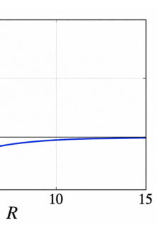
<figcaption class="paper-figure-caption"><b>Fig 1.</b> FIG. 1: Profile of the effective potential U(R) = 1/(2R2) −C/R.</figcaption>
</figure>
<figure class="paper-figure-card">
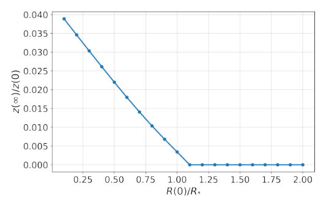
<figcaption class="paper-figure-caption"><b>Fig 2.</b> FIG. 2: Late-time values of z(t), normalized to z(0), as a function of the initial wave-packet width R(0), normalized to R∗. The results are obtained from the analytical solution of Eq. (22), for different evolutions of R(t) corresponding to bound or unbound states.</figcaption>
</figure>
<figure class="paper-figure-card">
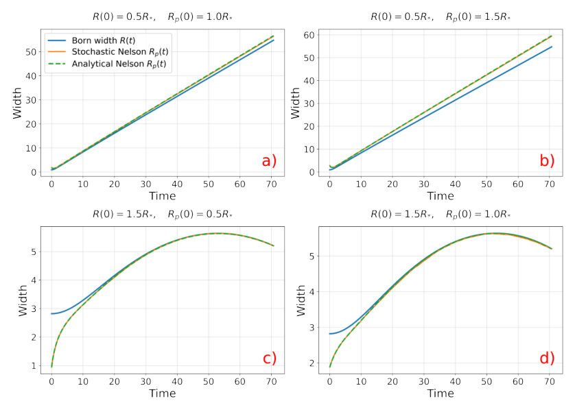
<figcaption class="paper-figure-caption"><b>Fig 3.</b> FIG. 3: Evolutions of R(t) from Eq. (11) (blue lines), Rp(t) from Eq. (20) (dashed green line), and Rp(t) computed from the stochastic Nelson equation (16) (orange lines). The top panels (a) and (b) correspond to unbound cases with R(0) = 0.5R∗, and two different intial values of Rp(0). The bottom panels (c) and (d) correspond to bound cases with R(0) = 1.5R∗, and two different initial values of Rp(0).</figcaption>
</figure>
<figure class="paper-figure-card">
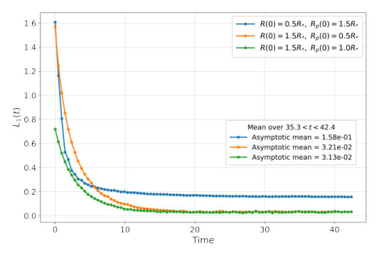
<figcaption class="paper-figure-caption"><b>Fig 4.</b> FIG. 4: L1 norm for one unbound evolution with R(0) = 0.5R∗(blue dots) and two bound evolutions with R(0) = 1.5R∗. The lines connect the dots, which were obtained by simulating the stochastic Nelson process. The lower inset shows the mean of the L1 norm computed between t = 35.3 and t = 42.4.</figcaption>
</figure>
<figure class="paper-figure-card">
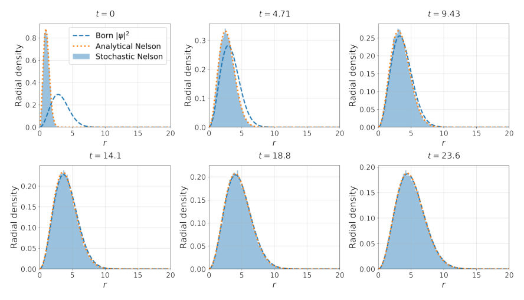
<figcaption class="paper-figure-caption"><b>Fig 5.</b> FIG. 5: Evolution of the probability distributions for a bound case with R(0) = 1.5R∗and Rp(0) = 0.5R∗. We show several snapshots, at different times, of the wavefunction density eρ(r, t) ≡4πr2|Ψ|2 (dashed blue line), particle density eP(r, t) from Nelson’s stochastic process (blue histograms), and Gaussian particle density (19), with Rp(t) computed from Eq. (20) (dot-dashed orange line).</figcaption>
</figure>

**Summary.** This work examines whether semiclassical self-gravity forces a quantum system to obey the Born rule. By modeling the system with the Schrödinger-Newton equations, the authors find that relaxation to the Born rule only happens if the wave packet remains spatially confined. Rapid expansion prevents this relaxation, suggesting that gravity itself can either enforce or violate fundamental quantum principles.

**Why it may be interesting.** While focused on gravity, the core mechanism—how the system's dynamics (binding vs. expansion) dictates whether a fundamental principle (the Born rule) is recovered—is highly relevant to open quantum systems and non-equilibrium dynamics.

Detailed structure

**Main problem.** The paper investigates the dynamical relaxation of quantum systems towards the Born rule within the framework of semiclassical gravity.

**Main result.** Relaxation to the Born rule (quantum equilibrium) occurs only when the wave packet remains bounded; rapid expansion causes persistent deviations from the Born rule.

**Method.** The authors used a Gaussian variational ansatz combined with Nelson's stochastic representation to track the evolution of particle ensembles.

**Model / system.** The system is governed by the nonlinear Schrödinger-Newton equations (SNEs), which couple quantum dynamics to Newtonian gravity. This model serves as a minimal framework for studying quantum non-equilibrium effects.

**Key observables.** The deviation parameter $z(t) = R_p^2/R^2 - 1$ and the $L_1$ norm comparing particle and quantum probability distributions.

**Important parameters / regimes.** The initial conditions of the wave packet width $R(0)$ relative to a critical value $R^*$, and the diffusion coefficient $D_Q = \hbar/2m$.

**Assumptions / limitations.** The analysis relies on the Gaussian variational approximation and assumes spherical symmetry for the self-gravitating wave packet.

**Figures summary.** Figures illustrate the comparison between the wavefunction width $R(t)$ and the particle distribution width $R_p(t)$ for both bound and unbound cases, showing convergence to equilibrium only in the bound regime.

**Paper structure.** The paper first introduces the SNEs and the concept of quantum equilibrium. It then uses a variational approach to derive equations of motion for the width parameter. Finally, it employs stochastic simulations (Nelson's approach) to analyze the asymptotic behavior of the deviation from the Born rule based on the wave packet's long-term dynamics.

Abstract

We investigate dynamical relaxation to the Born rule in a semiclassical gravity model described by the Schrödinger-Newton equations. Using a Gaussian variational solution for the self-gravitating wave packet, combined with Nelson's stochastic representation of quantum dynamics, we track the evolution of particle ensembles whose initial probability distribution differs from $|Ψ|^2$. Relaxation to the Born rule ("quantum equilibrium") occurs when the wave packet remains bounded, or grows sufficiently slowly in time; in contrast, for rapidly expanding solutions of the Schrödinger-Newton equations, deviations from the Born rule can persist indefinitely. Numerical simulations confirm this analytical picture. These results show that semiclassical self-gravity can either enable or inhibit relaxation towards the Born rule, providing a minimal model relevant to proposals of primordial quantum non-equilibrium, as suggested by Underwood and Valentini [Phys. Rev. D 92, 063531 (2015)].

[↑ back to top](#top)

### [Chiral Vacuum Engineering of Quantum Hall Matter](http://arxiv.org/abs/2610.02400v1)

**Authors:** Kiran M. Kulkarni, Andrey Baydin, Motoaki Bamba, Junichiro Kono, Ceren B. Dag, Vasil Rokaj  
**Type:** theory · **Category:** other · **PDF:** <https://arxiv.org/pdf/2610.02400v1>  
**Analysis basis:** full PDF text, analyzed in chunks
**Topic relevance:** `analog quantum simulation` **3/5** · `Keldysh / 2PI / non-Gaussian methods` **2/5** · `Tavis-Cummings & cavity-many-emitter` **2/5** · `methods for driven-dissipative` **2/5** · `correlated / nonlocal dissipation` **1/5** · `driven-dissipative phase transition` **1/5** · `interference shaping light` **1/5**

↔ Scroll figures horizontally

<figure class="paper-figure-card">
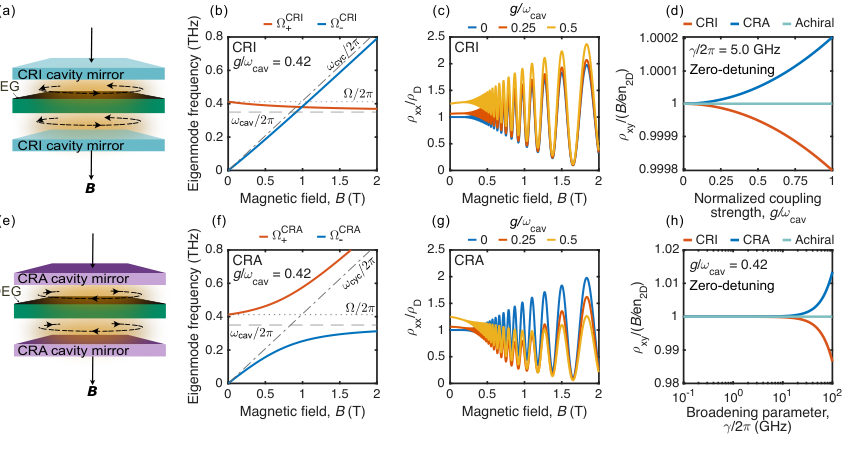
<figcaption class="paper-figure-caption"><b>Fig 1.</b> FIG. 1. (a),(e) A 2DEG in a chiral cavity confining right- and left-circularly polarized light, respectively. (b) Eigenspectrum of the CRI Hamiltonian: the two chiral-vacuum-dressed modes cross, with the cavity-like branch renormalized to Ω= ωcav + g2/ωcav by the diamagnetic term and the cyclotron-like branch by the vacuum Bloch–Siegert shift. (f) Eigenspectrum of the CRA Hamiltonian: two polariton branches with avoided crossing. (c), (g) Longitudinal resistivity vs. magnetic field B for various coupling strengths, for the CRI and CRA systems, respectively, normalized by the Drude resistivity ρD = m∗γ/(n2De2), where n2D = 2 × 1011 cm−2. We observe Shubnikov de Haas (SdH) oscillations as a...</figcaption>
</figure>
<figure class="paper-figure-card">
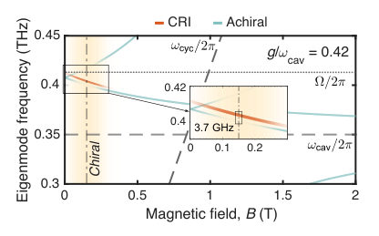
<figcaption class="paper-figure-caption"><b>Fig 2.</b> FIG. 3. Predicted THz eigenspectrum for the chiral cavity of Ref. [20]. The chiral cavity, designed for B = 0.15 T remains functional over B = 0.05–0.25 T (shaded region). Within this range, it follows the CRI Hamiltonian and exhibits a single chiral-vacuum-dressed cavity mode shifted by ∼3.7 GHz; out- side it, the achiral three-mode spectrum is recovered. The inset zooms in on the CRI mode at the operational field. The parameters are ωcav/2π = 0.35 THz with a normalized cou- pling strength of g/ωcav ∼0.42, and a 10-quantum-well GaAs heterostructure with an electron density of 5 ×1011 cm−2 per quantum well, and an effective electron mass m∗= 0.067 me (SM). The dashed, dotted, and...</figcaption>
</figure>
<figure class="paper-figure-card">
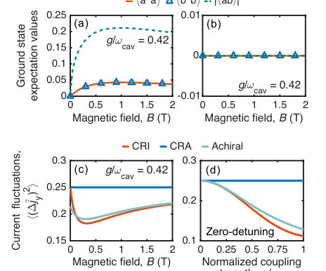
<figcaption class="paper-figure-caption"><b>Fig 3.</b> FIG. 2. (a), (b) Photon ⟨a†a⟩and matter ⟨b†b⟩ground state populations and squeezing correlation ⟨ˆaˆb⟩of the CRI and CRA systems, respectively, finite for the two-mode squeezed vacuum. CRA ground state populations vanish identically, consistent with the bare vacuum. (c) Current fluctuations versus magnetic field for g/ωcav = 0.42. The CRI current fluctuations fall below the bare vacuum limit (1/4), reflecting the two-mode squeezed ground state, while the CRA case remains at 1/4. (d) Current fluctuations at zero-detuning versus coupling, g/ωcav.</figcaption>
</figure>

**Summary.** This theoretical study examines the interaction between a 2DEG in a quantum Hall state and a chiral cavity field. By analyzing the Hamiltonian, the authors predict distinct spectroscopic and transport signatures for co-rotating versus counter-rotating light polarizations. The key findings include a handedness-dependent correction to the Hall resistivity and the detection of squeezed ground states via current fluctuations.

**Why it may be interesting.** This work directly bridges cavity QED concepts (chiral coupling, polaritons) with condensed matter phenomena (Quantum Hall effect, transport), providing a framework to observe fundamental symmetries (SU(2), SU(1,1)) in solid-state systems.

Detailed structure

**Main problem.** The paper investigates how coupling a two-dimensional electron gas (2DEG) in a quantum Hall regime to a chiral cavity vacuum modifies its electronic and transport properties.

**Main result.** Chiral coupling leads to distinct signatures for co-rotating and counter-rotating helicities, including vacuum Rabi splitting, mode crossing, and a handedness-dependent correction to the Hall resistivity.

**Method.** The analysis employs theoretical techniques, including diagonalizing the Pauli-Fierz Hamiltonian, using the Kubo formula for conductivity, and analyzing current-current correlators.

**Model / system.** The system models a 2DEG subjected to a strong magnetic field, coupled to a circularly polarized (chiral) cavity mode. The Hamiltonian is analyzed by separating center-of-mass and relative motion components.

**Key observables.** Hall resistivity ($
ho_{xy}$), longitudinal resistivity ($
ho_{xx}$), Shubnikov-de Haas (SdH) oscillations, and current quadrature variance ($\langle(\Delta j_y)^2
angle$).

**Important parameters / regimes.** Coupling strength ($ar{g}$), cavity detuning ($\omega_{cav}$), cyclotron frequency ($\omega_{cyc}$), and magnetic field ($B$).

**Assumptions / limitations.** The analysis relies on the Kubo formula and approximations such as the $\gamma$ expansion for small broadening, and the separation of CM motion.

**Figures summary.** Figures illustrate the eigenspectra for co-rotating (avoided crossing) and counter-rotating (mode crossing) helicities, and show the dependence of $
ho_{xx}$ and $
ho_{xy}$ on magnetic field and coupling strength.

**Paper structure.** The paper develops the Hamiltonian for chiral coupling, diagonalizes it to find polariton modes, and then calculates the DC conductivities and resistivities using the Kubo formula, comparing chiral vs. achiral cases.

Abstract

We reveal that a chiral cavity distinguishes the resonant and antiresonant interactions between a two-dimensional electron gas and the cavity vacuum. For co-rotating helicities, the modes anticross, exhibiting vacuum Rabi splitting, and retain a bare vacuum ground state. For counter-rotating helicities, the modes cross, acquiring vacuum-mediated energy shifts and a two-mode squeezed ground state. We trace the origin of these observations to the SU(2) and SU(1,1) symmetries of the respective Hamiltonians and present their spectroscopic signatures in chiral photonic crystal cavities. We further predict that cavity chirality produces a handedness-dependent correction to Hall resistivity at finite polariton broadening, while such a correction is not present in an achiral cavity. For the longitudinal resistivity, we find an asymmetric response of the Shubnikov--de Haas oscillations for the different helicities. Finally, we present an experimentally accessible route for detecting the squeezed ground state through current fluctuations. Parameters based on a recently demonstrated terahertz chiral cavity place these effects within experimental reach.

[↑ back to top](#top)

### [Analytical controls for dispersive multi-qubit interactions in mediator-coupled quantum registers](http://arxiv.org/abs/2610.03064v1)

**Authors:** Bora Baran, Tommaso Calarco, James O'Sullivan, Matthias M. Müller, Felix Motzoi  
**Type:** theory · **Category:** other · **PDF:** <https://arxiv.org/pdf/2610.03064v1>  
**Analysis basis:** full PDF text, analyzed in chunks
**Topic relevance:** `methods for driven-dissipative` **3/5** · `analog quantum simulation` **2/5** · `Keldysh / 2PI / non-Gaussian methods` **1/5** · `Tavis-Cummings & cavity-many-emitter` **1/5** · `correlated / nonlocal dissipation` **1/5** · `driven-dissipative phase transition` **1/5** · `quantum measurements` **1/5**

↔ Scroll figures horizontally

<figure class="paper-figure-card">
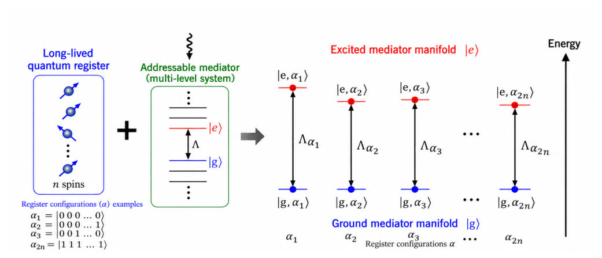
<figcaption class="paper-figure-caption"><b>Fig 1.</b> FIG. 1: Schematic of a register-dependent mediator transition. The register configurations α imprint themselves on the mediator transition, producing configuration-dependent transition frequencies Λα and thereby enabling conditional manipulation through the mediator spectrum.</figcaption>
</figure>
<figure class="paper-figure-card">
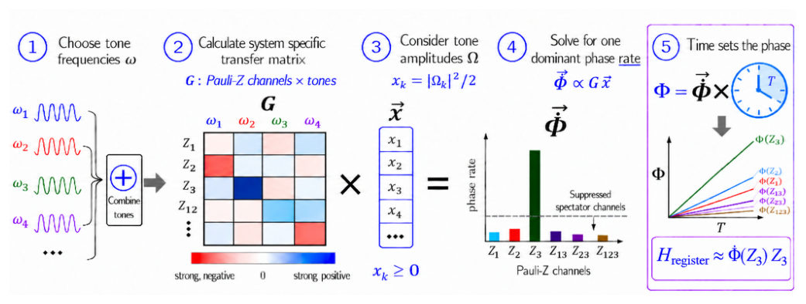
<figcaption class="paper-figure-caption"><b>Fig 2.</b> FIG. 2: Schematic of the desired DIAL control situation for a favorable combination of tone frequencies. (1) A suitably chosen set of off-resonant tone frequencies {ωk} defines the available controls. (2) Together with the register-resolved transition spectrum, this tone set determines the transfer matrix G, which encodes how the available controls contribute across the Pauli-Z interaction channels. (3) The non-negative drive-intensity vector x = (x1, . . . , xM)T weights the selected tones within the admissible intensity range. (4) For a favorable tone set, the available tone intensities can generate a phase-rate spectrum ˙Φ ∝Gx with a strong target channel and suppressed spectator...</figcaption>
</figure>
<figure class="paper-figure-card">
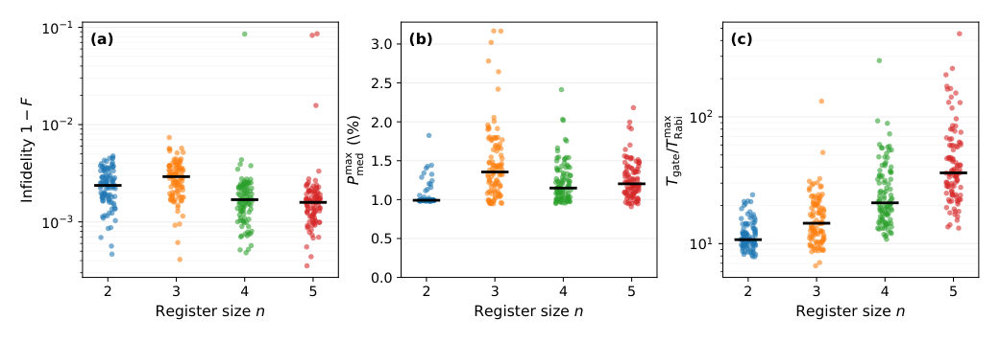
<figcaption class="paper-figure-caption"><b>Fig 3.</b> FIG. 3: Direct DIAL synthesis across random register spectra and different register sizes. (a) Full-dynamics infidelity 1 −F of the DIAL controls for n = 2, 3, 4, 5, shown on a logarithmic scale. Each point represents one sampled register spectrum and targets the highest-order interaction Z1 · · · Zn at |Φtar Z1···Zn| = π/4. The higher-infidelity outlier can be explained by an exceptionally crowded register spectrum. (b) Maximum transient mediator excitation P max med for the same controls, with the individual realizations retained. (c) Gate duration normalized by the Rabi period of the strongest applied tone, T max Rabi = 2π/Ωmax, with Ωmax = maxk |Ωk|. Horizontal bars indicate medians and...</figcaption>
</figure>
<figure class="paper-figure-card">
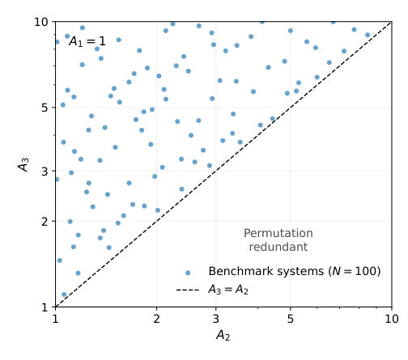
<figcaption class="paper-figure-caption"><b>Fig 4.</b> FIG. 4: Distribution of the n = 3 transition spectra used in the direct DIAL benchmark, shown as a two-dimensional example of the normalized n-spin benchmark ensemble. The relative spectral contributions are normalized by A1 = 1 and ordered as 1 = A1 ≤A2 ≤A3 ≤10. Both axes are logarithmic, matching the sampling of the relative spectral contributions. The region A3 &lt; A2 is permutation redundant: the ratios A2/A1 and A3/A1 specify the relative spectral contributions that determine the transition spectrum, so exchanging register-spin labels 2 ↔3 only swaps these ratios and does not produce a physically distinct system.</figcaption>
</figure>
<figure class="paper-figure-card">
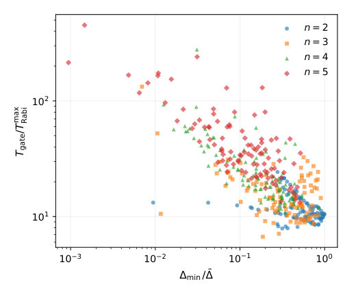
<figcaption class="paper-figure-caption"><b>Fig 5.</b> FIG. 5: Normalized gate duration Tgate/T max Rabi versus the relative minimum transition spacing ∆min/ ¯∆for the random n = 2, 3, 4, 5 realizations used in the direct DIAL benchmark. Both axes are logarithmic. Small relative minimum spacing identifies spectra containing an unusually close pair of register-resolved transition lines. Spectrally crowded realizations extend toward longer normalized gate durations, connecting the spectral resolution of the register transitions to the interaction rate achieved by the selective dispersive construction.</figcaption>
</figure>

**Summary.** This paper introduces the Dispersive Interaction via Analytical Linear Inversion (DIAL) technique to engineer controlled multi-qubit gates in quantum registers coupled to a mediator. By operating in the dispersive regime, the method achieves high gate fidelities while minimizing unwanted mediator excitation. The work is significant because it provides an analytical, non-iterative control design that is robust against practical imperfections like basis mismatch.

**Why it may be interesting.** This work provides a powerful, non-iterative analytical tool for designing quantum gates in complex, open quantum systems, directly addressing the practical limitations of decoherence and leakage in solid-state and atomic quantum hardware.

Detailed structure

**Main problem.** The challenge is to engineer fast, controlled multi-qubit interactions in quantum registers coupled to a mediator while simultaneously suppressing decoherence and leakage associated with exciting the mediator.

**Main result.** The proposed DIAL algorithm achieves high gate fidelities (>0.997) while keeping transient mediator excitation very low (<1%), demonstrating a robust, analytically derived control scheme.

**Method.** The authors introduce Analytical Linear Inversion (DIAL), which exploits the linear dependence of interaction rates on drive intensities in the dispersive regime to map control pulses directly to desired multi-qubit interactions.

**Model / system.** The system involves a quantum register coupled to an auxiliary mediator degree of freedom. The control is implemented via off-resonant driving, operating in the dispersive regime to induce state-dependent Pauli-Z interactions.

**Key observables.** Gate fidelities (target >0.997), maximum transient mediator excitation (target <1%), and the resulting multi-qubit interaction phase.

**Important parameters / regimes.** Dispersive regime condition ($\Omega \ll \Delta$), the mismatch parameter ($\eta$), and the target interaction order ($Z_1...Z_n$).

**Assumptions / limitations.** The primary assumptions are operating in the dispersive, configuration-preserving regime ($\eta=0$) and that the interaction rates exhibit a direct linear dependence on drive intensities.

**Figures summary.** Figures illustrate the performance of the controls under basis mismatch ($\eta 
eq 0$), showing a clear degradation of fidelity while mediator excitation remains low, and plot the trade-off between spectral crowding and required gate time.

**Paper structure.** The paper first introduces the DIAL method for achieving controlled interactions. It then benchmarks this method across multiple register sizes and targets. Subsequent sections analyze the robustness of the controls by testing performance under controlled basis mismatches ($\eta 
eq 0$) and spectral crowding.

Abstract

Fast control of long-lived quantum registers often relies on an auxiliary degree of freedom, a mediator, but real mediator excitation can introduce decoherence, leakage, or loss when the mediator is not the coherence-optimized component. We introduce dispersive interaction via analytical linear inversion (DIAL), an analytical control construction for excitation-suppressed interaction engineering in mediator-coupled quantum registers. In the dispersive regime, we show that off-resonant driving of an effective two-level mediator transition yields a diagonal Hamiltonian whose Pauli-\(Z\) interaction rates depend linearly on the drive intensities through a transfer matrix determined by the register-resolved transition spectrum. This establishes a direct linear map from experimentally accessible controls to induced multi-qubit interactions, enabling control design without iterative propagation of the full driven dynamics. We turn this structure into the target-aware DIAL algorithm, which selects favorable off-resonant tones and determines their drive intensities for a prescribed target interaction. We benchmark the resulting controls across 100 register realizations for each register size \(n=2,3,4,5\), targeting the highest-order interaction \(Z_1\cdots Z_n\) with an interaction phase of magnitude \(π/4\), which generates an \(n\)-qubit GHZ state up to local equivalence. Propagation under the full driven mediator-register dynamics yields typical gate fidelities above \(0.997\), while the maximum transient mediator excitation remains near \(1\%\) on average, far below what is typically possible with resonant Rabi drives. The manuscript is accompanied by an open-source Python package implementing the target-aware DIAL algorithm and the associated numerical validation workflow.

[↑ back to top](#top)

### [Einstein--Langevin source correlations in closed non-relativistic systems](http://arxiv.org/abs/2610.02980v1)

**Authors:** Peng Xu, Li-E Qiang  
**Type:** theory · **Category:** other · **PDF:** <https://arxiv.org/pdf/2610.02980v1>  
**Analysis basis:** full PDF text, analyzed in chunks
**Topic relevance:** `Keldysh / 2PI / non-Gaussian methods` **3/5** · `correlated / nonlocal dissipation` **3/5** · `methods for driven-dissipative` **2/5** · `quantum measurements` **2/5**

↔ Scroll figures horizontally

<figure class="paper-figure-card">
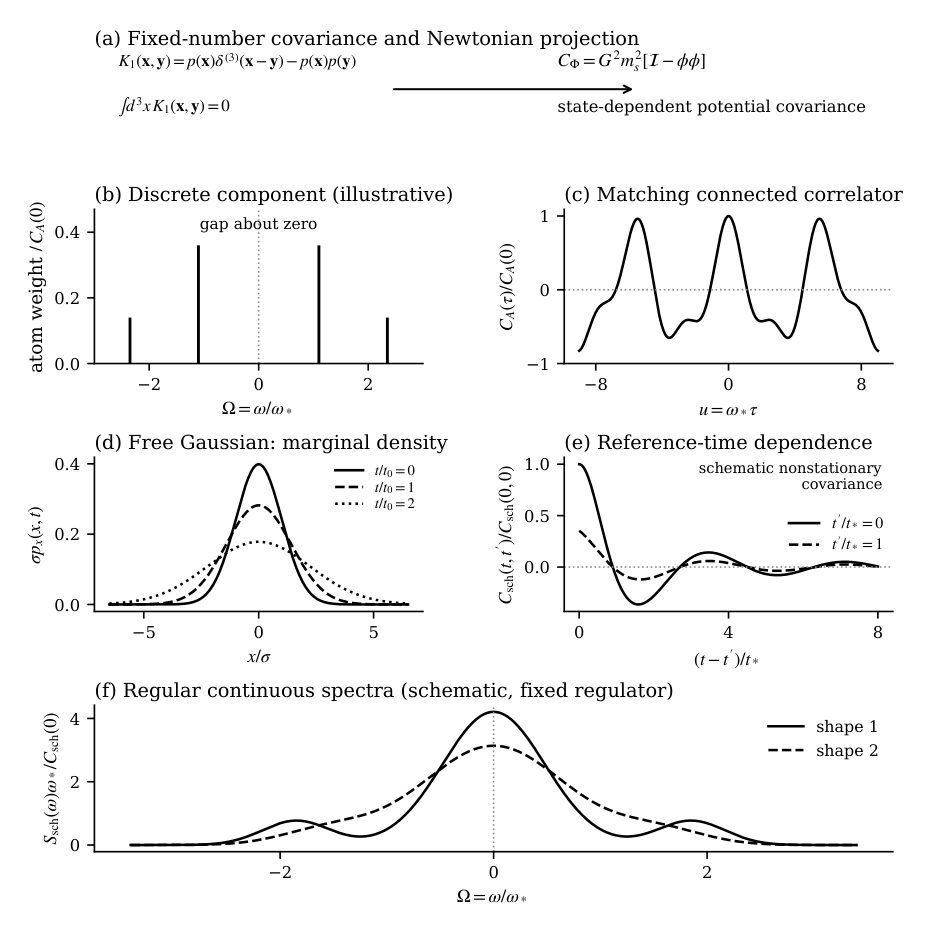
<figcaption class="paper-figure-caption"><b>Fig 1.</b> FIG. 1. Schematic spatial and temporal content of the source calculation. (a) The fixed-number density covariance and its Newtonian projection. (b,c) A matching discrete spectral component and even correlator; sticks denote atom weights. An isolated eigenstate can also have transitions to a continuum. (d) The Gaussian one-dimensional marginal at t/t0 = 0, 1, 2, where t0 = 2msσ2/ℏ. (e) The positive kernel Csch(t, t′)/Csch(0, 0) = a(v)a(v′) cos[1.75(v −v′)], with v = t/t∗, a(v) = (1+v2)−3/4, arbitrary t∗&gt; 0 and t′/t∗= 0, 1. (f) Positive even spectral shapes with equal integrated variance and different values at zero. Panels (e,f) are illustrative, not calculated source kernels or...</figcaption>
</figure>

**Summary.** This theoretical work analyzes source correlations in non-relativistic quantum systems coupled to gravity using the Einstein–Langevin formalism. The authors demonstrate that the resulting source covariance differs from the universal predictions of the Diósi–Penrose model. The findings establish stringent conditions on the source and probe dynamics required to relate source fluctuations to matter decoherence.

**Why it may be interesting.** It provides a rigorous theoretical framework for understanding how quantum gravity fluctuations (modeled via EL noise) manifest as decoherence, offering concrete, testable predictions that challenge universal assumptions found in simpler models like the DP model.

Detailed structure

**Main problem.** The paper investigates the relationship between source fluctuations in closed non-relativistic quantum systems and the resulting matter-decoherence model, specifically comparing derived source covariance to predictions from the Diósi–Penrose model.

**Main result.** The connected one-particle covariance is shown to be state-dependent and differs from the universal potential-noise law postulated in the Diósi–Penrose model, and the long-time dephasing slope vanishes for certain preparations.

**Method.** The authors use the Einstein–Langevin framework to calculate the source covariance, analyze spectral measures, and examine the decay of coherence using various source preparations (e.g., localized free sources, stationary doublets).

**Model / system.** The system involves closed, particle-number-conserving non-relativistic sources coupled to gravity, analyzed via the stochastic semiclassical gravity approach. The analysis compares the derived source spectrum to the predictions of the Diósi–Penrose model.

**Key observables.** Connected one-particle covariance, source spectral measure, probe dephasing exponent, and the long-time slope of the dephasing rate.

**Important parameters / regimes.** Finite-variance source operator, isolated non-degenerate eigenstate, and the specific noise law prescribed for the static probe.

**Assumptions / limitations.** The analysis requires specifying the source covariance, gravitational response, and probe dynamics separately; continuum results depend on preparation, normalization, and the order of limits.

**Figures summary.** Figure 1 provides a schematic summary of equal-time and unequal-time results, and Table I compares derived and unsmeared DP potential-noise kernels.

**Paper structure.** The paper develops the source covariance calculation, compares it to the DP model, analyzes the spectral properties for different source preparations (eigenstate, Gaussian), and concludes by establishing the necessary assumptions to link source fluctuations to matter-decoherence.

Abstract

Stochastic semiclassical gravity represents stress--energy fluctuations through the Einstein--Langevin noise kernel. We examine its Newtonian projection for specified closed, particle-number-conserving non-relativistic sources and distinguish the source covariance from a reduced matter channel. The connected one-particle covariance is state dependent and differs from the universal potential-noise law postulated in the Diósi--Penrose model. To relate the source spectrum to dephasing, we define a separate static probe subject to a prescribed Gaussian noise law. For a finite-variance source operator in an isolated non-degenerate eigenstate, the full connected spectral measure has a gap around zero. The probe dephasing exponent is then bounded and its long-time slope vanishes. Stationary doublets can instead carry static or low-frequency spectral lines, while a specified freely spreading Gaussian source gives a finite limiting exponent. Continuum results depend on preparation, normalisation, infrared regularisation and the order of limits. We also compare coherent and incoherent many-body preparations and establish no-signalling for fixed classical-noise channels. These results identify the spatial, temporal and dynamical assumptions needed to relate source fluctuations to a matter-decoherence model. They do not exclude Markovian limits in other number-conserving non-relativistic preparations.

[↑ back to top](#top)

### [How Quantum Is Bottomonium in the Quark-Gluon Plasma?](http://arxiv.org/abs/2610.02313v1)

**Authors:** Nora Brambilla, Tom Magorsch  
**Type:** theory · **Category:** statistical mechanics · **PDF:** <https://arxiv.org/pdf/2610.02313v1>  
**Analysis basis:** full PDF text, analyzed in chunks
**Topic relevance:** `methods for driven-dissipative` **3/5** · `Keldysh / 2PI / non-Gaussian methods` **2/5** · `correlated / nonlocal dissipation` **1/5** · `driven-dissipative phase transition` **1/5** · `non-equilibrium universality` **1/5** · `quantum measurements` **1/5** · `scars & prethermalization` **1/5**

↔ Scroll figures horizontally

<figure class="paper-figure-card">
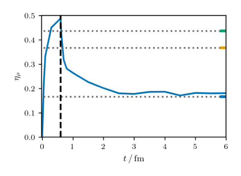
<figcaption class="paper-figure-caption"><b>Fig 1.</b> FIG. 1. The time evolution of the negativity ηρ for the con- ditional ℓ= 0 singlet state ρs|0 within a Bjorken medium. The state is initialized as a compact Gaussian and evolved with the vacuum Hamiltonian until 0.6 fm, where the thermal medium is switched on as indicated by the black dashed line. The dotted horizontal lines indicate the negativity of the 1S (blue), 2S (orange) and 3S (green) bound states.</figcaption>
</figure>
<figure class="paper-figure-card">
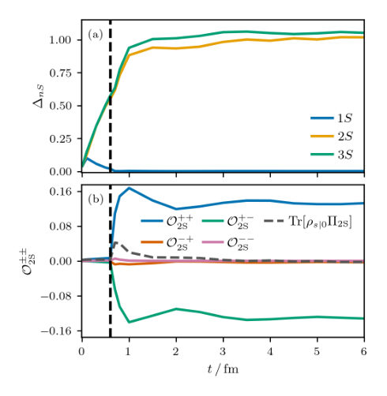
<figcaption class="paper-figure-caption"><b>Fig 2.</b> FIG. 2. (a) The time evolution of the sensitivity ∆nS of the bound-state overlaps Tr[ρs|0ΠnS] to the negative regions of the Wigner distribution. (b) The time evolution of the in- dividual terms in the overlap decomposition O±± 2S for the 2S state including their sum Tr[ρs|0Π2S].</figcaption>
</figure>
<figure class="paper-figure-card">
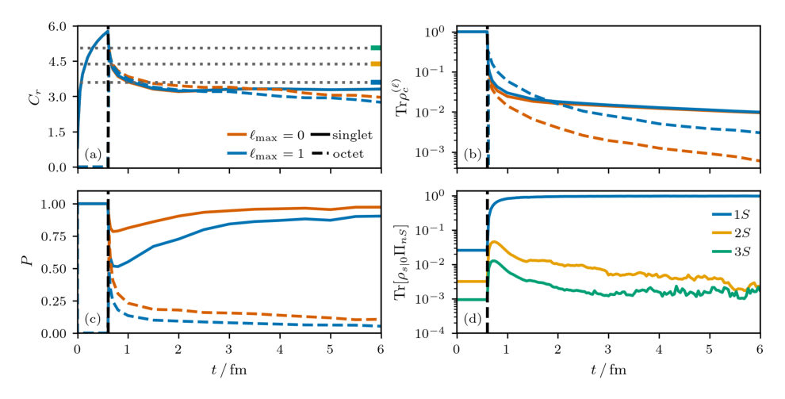
<figcaption class="paper-figure-caption"><b>Fig 3.</b> FIG. 3. The time evolution of (a) the position space coherence Cr, (b) the trace of the individual blocks Trρ(ℓ) c , (c) the purity P and (d) the overlaps of the conditional color singlet ℓ= 0 sector with the bound states Tr[ρs|0ΠnS]. Panels (a) and (c) involve the normalized conditional density matrix ρc|ℓmax for ℓmax = 0 and ℓmax = 1 for the singlet (solid) and octet (dashed). Panel (b) shows the populations of the unnormalized blocks ρ(ℓ) c , with the colors denoting ℓ= 0, 1. The dotted horizontal lines in (a) indicate the position space coherence Cr of the 1S, 2S, and 3S states.</figcaption>
</figure>

**Summary.** This paper models the quantum evolution of bottomonium in the Quark-Gluon Plasma using an open quantum system approach. By analyzing the Wigner transform and its negativity, the authors demonstrate that while the medium drives the system toward classical behavior, a residual quantum structure persists. This finding suggests that classicalization in such environments is partial and highly dependent on the specific observable measured.

**Why it may be interesting.** This work directly addresses the non-equilibrium dynamics of quantum systems in extreme matter, providing quantitative diagnostics (like Wigner negativity) to test the breakdown of classical descriptions in heavy-ion collisions.

Detailed structure

**Main problem.** The study investigates how much quantum structure bottomonium retains while evolving through the Quark-Gluon Plasma (QGP). This tests the limits of classical approximations in strongly coupled, non-equilibrium quantum systems.

**Main result.** The medium causes partial classicalization, suppressing quantum measures like Wigner negativity and coherence. However, a finite residual quantum structure remains, preferentially driving the system toward the tightly bound 1S state.

**Method.** The authors use the open quantum system framework, simulating the Lindblad equation derived from potential non-relativistic QCD (pNRQCD) in the quantum Brownian regime.

**Model / system.** The system is bottomonium ($	ext{b}ar{	ext{b}}$) evolving in the QGP, modeled via the pNRQCD Lindblad equation. The analysis focuses on the time evolution of the density matrix ($
ho_c$) and its Wigner transform.

**Key observables.** Wigner negativity ($\eta$) as a measure of nonclassicality, position-space coherence ($C_r$), and the survival probabilities/overlaps with $1S, 2S, 3S$ bound states.

**Important parameters / regimes.** Simulation parameters include a Bjorken medium, initial temperatures ($T_0 = 425 	ext{ MeV}$), and time evolution down to lower temperatures.

**Assumptions / limitations.** The analysis tests the validity of classical Langevin-type approximations by calculating Wigner negativity, which requires assuming the Wigner distribution is non-negative.

**Figures summary.** Figures illustrate the time evolution of negativity ($\eta$) for different states, showing suppression and plateaus. Other figures compare the Wigner transform to the exact density matrix diagonal and track coherence/purity over time.

**Paper structure.** The paper establishes the theoretical framework using the Lindblad equation and Wigner transform, analyzes the time evolution of quantum measures (negativity, coherence), and concludes by interpreting the residual structure via 'conditional purification' towards the ground state.

Abstract

We study how much quantum structure bottomonium retains during its evolution in the quark-gluon plasma. Within the open quantum system framework, we simulate the Lindblad equation obtained from potential nonrelativistic QCD in the quantum Brownian regime. From the resulting real-time evolution of the bottomonium density matrix, we compute the Wigner transform and study its negativity as a measure of nonclassicality and a test of a key condition underlying classical Langevin-type approximations. We find that the medium suppresses the negativity, which nevertheless approaches a finite plateau close to that of the $1\mathrm{S}$ state. The overlaps with the excited $2\mathrm{S}$ and $3\mathrm{S}$ states arise from near-canceling positive and negative phase-space contributions, driven by negative regions in the Wigner transforms of the bound-state projectors, while the $1\mathrm{S}$ overlap is insensitive to such contributions. We further show that the position-space coherence is similarly suppressed and plateaus close to the 1S value. We trace the finite residual quantum structure to conditional purification: the medium preferentially dissolves weakly bound and unbound modes with large $\langle r^2\rangle$, driving the surviving singlet $\mathrm{S}$-wave ensemble toward the $1\mathrm{S}$ state. More broadly, these results reveal that classicalization is partial and observable dependent, a feature that is relevant across applications of open quantum system methods in fundamental physics.

[↑ back to top](#top)

### [Maximum-Entropy Extension of Quantum Correlation Functions from Short Real-Time Dynamics](http://arxiv.org/abs/2610.03696v1)

**Authors:** Filippo Maria Gambetta, Sabrina Yue Wang, Raul A. Santos  
**Type:** theory · **Category:** statistical mechanics · **PDF:** <https://arxiv.org/pdf/2610.03696v1>  
**Analysis basis:** full PDF text, analyzed in chunks
**Topic relevance:** `Keldysh / 2PI / non-Gaussian methods` **3/5** · `methods for driven-dissipative` **3/5** · `analog quantum simulation` **1/5** · `correlated / nonlocal dissipation` **1/5** · `driven-dissipative phase transition` **1/5** · `non-equilibrium universality` **1/5**

↔ Scroll figures horizontally

<figure class="paper-figure-card">
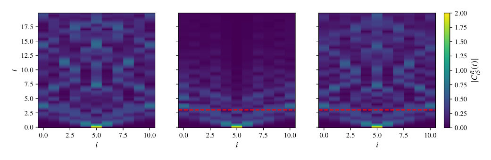
<figcaption class="paper-figure-caption"><b>Fig 1.</b> FIG. 1. Comparison between exact (left), pairwise meAR (middle), and meVAR (right) space-time dynamics of the absolute value of 𝐶𝑅 𝑖5(𝑡). meAR and meVAR signals have been extended from 𝑡= 3.0 (red dashed line). In meVAR we have included all the 11 sites of the chain, i.e., all the 121 correlators. Here, the sampling interval is Δ𝑡= 0.2. Note that the pairwise meAR reconstruction (middle) is able to faithfully reproduce the original signal only up to 𝑡≈5, with a relative 𝐿2 error ∥𝐶𝑅 exact −𝐶𝑅 meAR∥2/∥𝐶𝑅 exact∥2 = 0.84 over the space-time region shown in the plot. On the other hand, meVAR is able to accurately capture all the non-trivial features of the exact signal up to 𝑡= 20 (and even...</figcaption>
</figure>
<figure class="paper-figure-card">
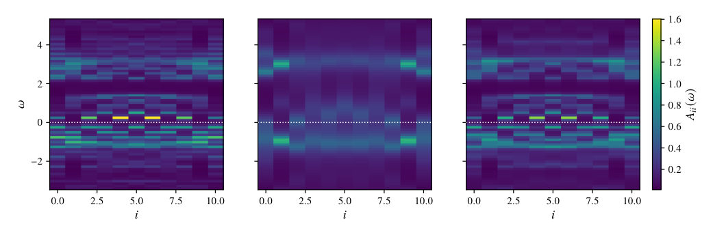
<figcaption class="paper-figure-caption"><b>Fig 2.</b> FIG. 2. Local density of states 𝐴𝑖𝑖(𝜔) obtained from the extension of 𝐶𝑅 𝑖𝑖(𝑡). Left: exact. Middle: pairwise meAR. Right: 11-site meVAR. The spectral function has been obtained from the Fourier transform of the exact and extended signals with 𝑡= 50. Both meAR and meVAR results have been obtained from extensions from 𝑡= 3.0. Pairwise meAR (middle) provides a smooth reconstruction of the exact LDoS, with a relative 𝐿2 error ∥𝐴exact −𝐴meAR∥2/∥𝐴exact∥2 = 0.53 over the space-frequency region shown in the plot. On the other hand, the LDoS obtained from meVAR accurately reproduces all the features of the exact LDoS, with a relative 𝐿2 error ∥𝐴exact −𝐴meVAR∥2/∥𝐴exact∥2 = 0.34 over the...</figcaption>
</figure>
<figure class="paper-figure-card">
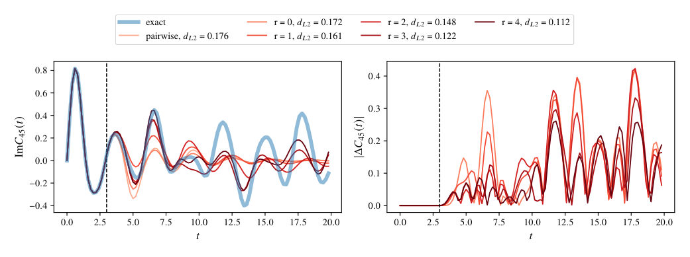
<figcaption class="paper-figure-caption"><b>Fig 3.</b> FIG. 3. Comparison between the extensions of 𝐶𝑅 45(𝑡) obtained via pairwise meAR and meVAR for 𝐶𝑅 45(𝑡). Note that 𝐶𝑅 45(𝑡) is purely imaginary. In both cases, the correlator has been extended from 𝑡= 3.0 (vertical dashed line). Left: plot of Im𝐶𝑅 45(𝑡); Right: absolute error of the extended correlator with respect to the exact one, Δ𝐶𝑅(𝑡) = |𝐶𝑅 ext(𝑡) −𝐶𝑅 exact(𝑡)|. Here, the exact dynamics is plotted in blue, while the red curves denote extensions obtained through pairwise meAR and meVAR including sites with an increasing distance 𝑟from the initial ones. That is, with 𝑟= 0, 𝑖, 𝑗∈{4, 5}, with 𝑟= 1, 𝑖, 𝑗∈{3, 4, 5, 6}, and so on. For 𝑟= 4, all the 11 sites (corresponding to 121 correlators)...</figcaption>
</figure>
<figure class="paper-figure-card">
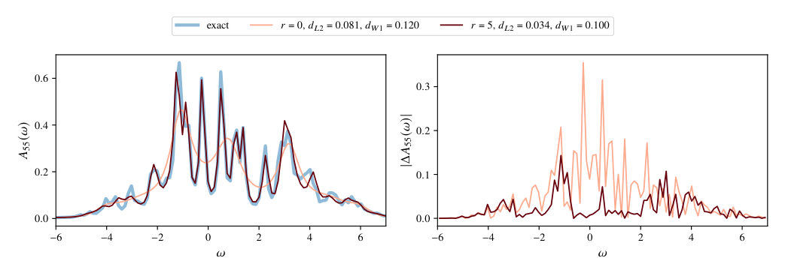
<figcaption class="paper-figure-caption"><b>Fig 4.</b> FIG. 4. Comparison between local density of states (LDoS) 𝐴55(𝜔) at the central site 𝑖= 5 obtained using meAR and meVAR. Left: The blue curve represents the exact LDoS, obtained by a Fourier transform of the exact correlator up to 𝑡= 50. The light (dark) red curve represents the LDoS obtained from a meAR (meVAR with all the sites) extension up to 𝑡= 50 of 𝐶𝑅 55(𝑡) from 𝑡= 3.0. Despite the presence of many sharp features in 𝐴55(𝜔) and the short training window, the meVAR reconstruction captures the majority of the peaks with exceptional accuracy while the meAR LDoS is a smoothed interpolation of the exact spectrum. Right: Error between the exact and reconstructed LDoS. In the legend, 𝑑𝐿2 and...</figcaption>
</figure>
<figure class="paper-figure-card">
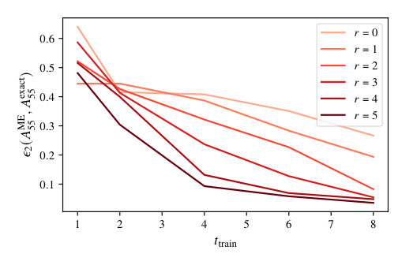
<figcaption class="paper-figure-caption"><b>Fig 5.</b> FIG. 5. Relative 𝐿2 error, 𝜀2(𝑥, 𝑦) = ∥𝑥−𝑦∥2/∥𝑦∥2, between the exact LDoS at the center of the chain, 𝐴exact 55 (𝜔), and the one obtained from extending the retarded correlation function 𝐶𝑅 55(𝑡) from 𝑡train using meAR (𝑟= 0) and meVAR including neighbors with distance 𝑟 from the central site, 𝐴ME 55 (𝜔). Including more neighbors in the VAR model allows one to achieve significantly lower reconstruction errors and from shorter training times.</figcaption>
</figure>

**Summary.** This paper introduces a maximum-entropy framework to reconstruct the spectral density of quantum correlation functions from limited real-time measurements. By modeling the correlation function as a stationary stochastic process, it applies Burg's principle to find the least-committal, positive semi-definite extension. This method offers a significant improvement over traditional techniques, enabling accurate spectral analysis even when data is noisy or the spectrum is continuous.

**Why it may be interesting.** This work provides a robust, mathematically principled tool for extracting spectral information from noisy, short-time quantum dynamics data, which is crucial for analyzing transport and excitation spectra in condensed matter systems.

Detailed structure

**Main problem.** The core problem is reconstructing the spectral density of quantum correlation functions from limited, short-time real-time dynamics data.

**Main result.** The authors propose a maximum-entropy extension method that guarantees a positive semi-definite spectrum and satisfies fundamental sum rules, significantly improving upon standard linear prediction techniques.

**Method.** The method treats the correlation function as a covariance sequence of a stationary stochastic process and applies Burg's maximum-entropy principle, modeling the extension via an all-pole autoregressive (AR) or Vector AR (VAR) model.

**Model / system.** The theory applies to general quantum many-body systems, using time-dependent correlation functions, such as those related to Green's functions or dynamical structure factors.

**Key observables.** Time-dependent correlation functions g(t), the spectral density S(omega), and the associated Gram matrix R(n).

**Important parameters / regimes.** The length of the measured time series (n), the order of the AR model (p), and the noise level.

**Assumptions / limitations.** The underlying process is assumed to be a Wide-Sense Stationary (WSS) stochastic process, and the method relies on the Gram matrix being positive semi-definite.

**Figures summary.** Not specified.

**Paper structure.** The paper progresses from defining the spectral reconstruction problem and limitations of existing methods (LP, Prony) to introducing the maximum-entropy approach for both scalar and matrix correlation functions, culminating in detailed mathematical derivations for the VAR model and denoising techniques.

Abstract

Correlation functions are central to understanding the behavior of quantum systems, with their spectra giving direct access to quasiparticle and collective excitations. However, the long-time evolution required for sufficient spectral resolution is challenging to reach for both classical and quantum simulations. In this work, we introduce a principled approach for extending time series of quantum correlation functions and reconstructing their spectral densities, based on their connection with covariance sequences of stationary stochastic processes. This connection enables us to apply Burg's maximum-entropy principle to find the least-committal extension compatible with the measured values of the correlation function, which corresponds to an all-pole autoregressive model whose coefficients solve a set of Yule--Walker equations. The resulting extension is positive semi-definite by construction, guaranteeing the positivity of the spectrum and the automatic satisfaction of its total spectral weight sum rule. The approach applies to both scalar and matrix-valued correlation functions, including those with highly structured or continuous spectra. The generalization to the matrix case makes it possible to trade simulation time for additional measured correlation functions, enabling accurate time-series extension and spectral reconstruction from short-time data, even in the presence of noise.

[↑ back to top](#top)

### [Correlated memory effect of environment in radical-pair magnetoreception](http://arxiv.org/abs/2610.02712v1)

**Authors:** Shixuan Chen, Yao Wang, Rui-Xue Xu, YiJing Yan  
**Type:** theory · **Category:** other · **PDF:** <https://arxiv.org/pdf/2610.02712v1>  
**Analysis basis:** full PDF text, analyzed in chunks
**Topic relevance:** `correlated / nonlocal dissipation` **3/5** · `methods for driven-dissipative` **3/5** · `Keldysh / 2PI / non-Gaussian methods` **1/5** · `driven-dissipative phase transition` **1/5** · `quantum measurements` **1/5**

↔ Scroll figures horizontally

<figure class="paper-figure-card">
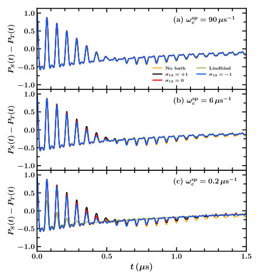
<figcaption class="paper-figure-caption"><b>Fig 1.</b> FIG. 1. Time evolution of the singlet–triplet population in term of PS(t) −PT (t) for the spin-bath cutoff frequencies ωsp c = 90, 6, and 0.2 µs−1 in three panels, respectively. In each panel the DEOM results are shown with thick lines for fully correlated (σ12 = +1), uncorrelated (σ12 = 0), and fully anticorrelated (σ12 = −1) spin-bath fluctuations. The no- bath result and the Markovian Lindblad result for σ12 = 0 are included (shown in thin lines) for comparison. The angle is fixed at θ = 68◦. The remaining parameters are given in Table I and main text.</figcaption>
</figure>
<figure class="paper-figure-card">
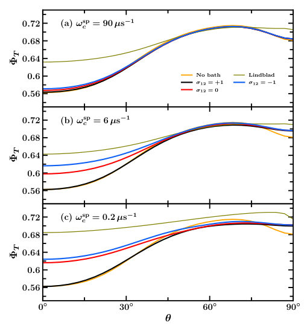
<figcaption class="paper-figure-caption"><b>Fig 2.</b> FIG. 2. Angular dependence of the triplet reaction yield ΦT in Eq. (10) for the spin-bath cutoff frequencies ωsp c = 90, 6, and 0.2 µs−1in three panels, respectively. In each panel the DEOM results are shown with thick lines for fully corre- lated (σ12 = +1), uncorrelated (σ12 = 0), and fully anticorre- lated (σ12 = −1) spin-bath fluctuations. The no-bath result and the Markovian Lindblad result for σ12 = 0 are included (shown in thin lines) for comparison. The remaining param- eters are given in Table I and main text.</figcaption>
</figure>

**Summary.** This theoretical study models radical-pair magnetoreception, treating the system as coupled to both a spin bath and a bosonic bath. By employing the non-Markovian HEOM/DEOM method, the authors demonstrate that the correlated memory effects from these environments are essential for correctly predicting the compass response. The findings highlight the limitations of simpler Markovian approximations in this context.

**Why it may be interesting.** This work provides a detailed, non-perturbative treatment of open quantum systems involving multiple correlated baths, which is highly relevant for understanding decoherence and quantum dynamics in complex physical systems like biological sensors.

Detailed structure

**Main problem.** The study investigates the role of the correlated memory effect from the environment in determining the efficiency of radical-pair magnetoreception.

**Main result.** The non-Markovian memory effect from both the spin bath and the bosonic bath is shown to be a crucial ingredient, as Markovian approximations fail to accurately predict the angular dependence of the reaction yield.

**Method.** The dynamics are propagated using the non-Markovian Hierarchical Equations of Motion (HEOM) or Dissipative Equations of Motion (DEOM) method, comparing results against the Markovian Lindblad master equation.

**Model / system.** The system is a light-generated, spin-correlated radical pair undergoing singlet-triplet interconversion, influenced by both a spin bath and a bosonic bath.

**Key observables.** Spin populations ($P_\alpha(t)$) and the orientation-dependent reaction yields ($\Phi_\alpha(B, 	heta)$).

**Important parameters / regimes.** Bath memory effect (controlled by spin-bath cutoff frequency $\omega_{sp}^c$) and the cross-correlation between bath components ($\sigma_{12}$).

**Assumptions / limitations.** The spin bath is treated as an effective Gaussian environment in the linear-response limit, allowing the use of HEOM/DEOM for simultaneous non-Markovian treatment of both baths.

**Figures summary.** Figures compare HEOM/DEOM results against Lindblad results, demonstrating that the angular dependence of the reaction yield is highly sensitive to the inclusion of bath memory effects.

**Paper structure.** The paper first establishes the full Hamiltonian including system, spin bath, and bosonic bath interactions. It then develops the non-Markovian HEOM/DEOM framework, compares it to the Markovian Lindblad limit, and finally presents numerical results showing the necessity of memory effects and spatial correlations for accurate magnetoreception modeling.

Abstract

In the photoreceptor compass model, a light-generated, spin-correlated radical pair undergoes singlet-triplet interconversion driven by Zeeman and anisotropic hyperfine interactions, leading to orientation-dependent reaction yields. In this study, we consider simultaneously the spin environment and the boson environment surrounding the radical-pair system and concentrate on the correlated memory effect of the spin bath. In the linear-response limit, the spin bath is mapped to an effective Gaussian environment. The system dynamics and yields under its influence together with the bosonic bath are propagated uniformly using the hierarchical equations of motion (HEOM) or equivalently the dissipaton equations of motion (DEOM) method. The HEOM/DEOM is non-Markovian and non-perturbative, exact for Gaussian environments. Corresponding results of the Markovian Lindblad master equation are also shown for comparison. Numerical demonstrations highlight the non-Markovian memory effect as a crucial ingredient for radical-pair magnetoreception.

[↑ back to top](#top)

### [Discriminating Lindbladian Dynamics](http://arxiv.org/abs/2610.03629v1)

**Authors:** Robert Salzmann, Ludovico Lami, Martin B. Plenio, Susana F. Huelga  
**Type:** theory · **Category:** quantum information and computing · **PDF:** <https://arxiv.org/pdf/2610.03629v1>  
**Analysis basis:** full PDF text, analyzed in chunks
**Topic relevance:** `methods for driven-dissipative` **3/5** · `quantum measurements` **3/5** · `correlated / nonlocal dissipation` **1/5** · `driven-dissipative phase transition` **1/5** · `non-equilibrium universality` **1/5**

↔ Scroll figures horizontally

<figure class="paper-figure-card">
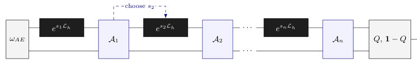
<figcaption class="paper-figure-caption"><b>Fig 1.</b> FIG. 1. An adaptive discrimination protocol for an unknown Lindblad generator Lh, with fixed h ∈{1, 2}. Starting from ωAE, evolutions on A alternate with control channels Ak on AE, followed by the binary POVM {Q, 1 −Q}. The outcome associated with Q gives a decision in favour of the null hypothesis h = 1. The number of calls n and their durations sk may depend on preceding outcomes, with P</figcaption>
</figure>
<figure class="paper-figure-card">
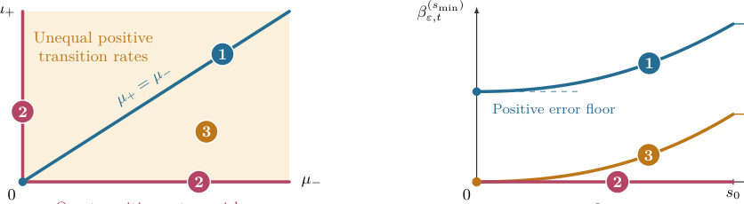
<figcaption class="paper-figure-caption"><b>Fig 2.</b> FIG. 2. Illustration of the three regimes in Table I, taking as null hypothesis the identity semigroup, i.e. L1 = 0, and as alternative hypothesis a member of the generalised amplitude damping family defined in Section VII.1, i.e. L2 = Lµ−,µ+. (a) The transition rates µ−and µ+ parametrise the plane. Equal transition rates, including the origin, give Regime 1 (blue), exactly one vanishing transition rate gives Regime 2 (red), and unequal positive transition rates give Regime 3 (orange). (b) Schematic optimal type-II error probabilities for one fixed generator from each regime, at fixed tolerance 0 &lt; ε &lt; 1 and a common sufficiently large total time t. The displayed range 0 &lt; smin ≤s0 is...</figcaption>
</figure>

**Summary.** This paper establishes the fundamental limits for distinguishing between two quantum dynamical processes described by Lindbladians. It introduces the Lindbladian Stein exponent, which quantifies the rate of distinguishability based on relative entropy. The results reveal that the required measurement protocol depends critically on the available resources, such as total time and the minimum temporal resolution.

**Why it may be interesting.** This work provides rigorous, quantitative tools (the Stein exponent) to measure how well one can distinguish between different physical processes (dissipative dynamics) using quantum measurements, which is fundamental for quantum process tomography and characterization.

Detailed structure

**Main problem.** The paper investigates the fundamental limits of distinguishing between two quantum Markovian dynamics, generated by Lindbladians, by analyzing the optimal type-II error probability.

**Main result.** The distinguishability is characterized by the Lindbladian Stein exponent, which relates the error decay rate to the largest instantaneous increase of the quantum relative entropy.

**Method.** The analysis uses adaptive quantum hypothesis testing protocols involving sequential evolution steps and intermediate quantum controls, drawing connections to quantum Stein lemmas.

**Model / system.** The system involves an auxiliary quantum system evolving under two competing Lindbladian generators, $L_1$ and $L_2$, modeling memoryless quantum dynamics.

**Key observables.** Type-I and Type-II error probabilities ($\alpha, eta$), the Lindbladian Stein exponent ($\gamma$), and the optimal error probability $eta_{\epsilon, t}$.

**Important parameters / regimes.** Total exposure time ($t$), minimum resolution time ($s_{\min}$), and the type-I tolerance ($\epsilon$).

**Assumptions / limitations.** The dynamics are assumed to be quantum Markovian and time-homogeneous; the analysis considers adaptive protocols with arbitrary instantaneous controls.

**Figures summary.** Figures illustrate the adaptive discrimination protocol, showing the sequence of evolution steps and control channels, and comparing error regimes based on transition rates.

**Paper structure.** The paper develops the characterization of the Stein exponent, establishes algebraic criteria for its finiteness, and analyzes three distinct regimes (finite exponent, zero error at positive resolution time, and vanishing error requiring $s_{\min} 	o 0$).

Abstract

The fundamental task of quantum hypothesis testing, which consists in discriminating quantum objects, has been extensively studied for quantum states and channels. Here, we investigate the fundamental limits of discriminating an arbitrary pair of quantum Markovian dynamics generated by Lindbladians, focusing on the roles of total exposure time and temporal resolution. We allow adaptive choices of evolution durations and arbitrary instantaneous controls between them. We characterise the optimal type-II error exponent (Stein exponent) as the largest instantaneous increase of quantum relative entropy, and give an algebraic criterion for its finiteness in terms of the Lindbladians. Remarkably, an infinite exponent is equivalent to a vanishing type-II error probability at sufficiently large finite total time, for every positive type-I tolerance. While some dynamics admit a finite protocol with zero type-II error, others require increasingly fine temporal control. For the latter, the error vanishes as the minimum allowed evolution duration, or resolution time, tends to zero at fixed sufficiently large total time, but remains bounded away from zero at every fixed positive resolution time. We achieve this using quantum Zeno protocols, establishing temporal resolution as a resource for discrimination. When the null hypothesis is the identity semigroup, an infinite asymptotic error exponent has a stronger consequence: at a fixed finite total exposure time, the type-II error can be made arbitrarily small while keeping the type-I error exactly zero. This is impossible in the corresponding classical setting. Discriminating the identity semigroup from generalised amplitude damping on a qubit provides examples of all three regimes: a finite asymptotic error exponent, zero type-II error attainable at positive resolution time, and vanishing type-II error requiring the resolution time to tend to zero.

[↑ back to top](#top)

### [How I Learned to Stop Worrying and Love the Redfield Equation: Completely-Positive Resummation of Non-Markovian Dynamics](http://arxiv.org/abs/2610.03676v1)

**Authors:** Greg Kaplanek, Jason Pollack  
**Type:** theory · **Category:** other · **PDF:** <https://arxiv.org/pdf/2610.03676v1>  
**Analysis basis:** full PDF text, analyzed in chunks
**Topic relevance:** `methods for driven-dissipative` **3/5** · `Keldysh / 2PI / non-Gaussian methods` **1/5** · `analog quantum simulation` **1/5** · `correlated / nonlocal dissipation` **1/5** · `driven-dissipative phase transition` **1/5** · `non-equilibrium universality` **1/5** · `quantum measurements` **1/5**

↔ Scroll figures horizontally

<figure class="paper-figure-card">
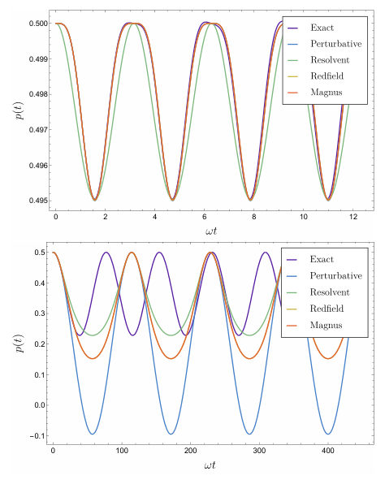
<figcaption class="paper-figure-caption"><b>Fig 1.</b> FIG. 1. Evolution of the excited-state population for an initially maximally-mixed system qubit (140). We compare the exact evolution with second-order perturbation theory and the resolvent, Redfield, and Magnus resummations. The top panel shows a detuned example with Ω/ω = 3 and λ/ω = 0.1. The bottom panel shows a near resonance case Ω≃ω with Ω/ω = 1.055 and λ/ω = 0.03, in which even perturbation theory does a poor job at approximating the exact dynamics. The Redfield and Magnus resummations are nearly indistinguishable at this scale; they are compared more directly in Figure 2. Notice that the resolvent resum- mation remains CP but does a poor job at approximating the exact dynamics.</figcaption>
</figure>
<figure class="paper-figure-card">
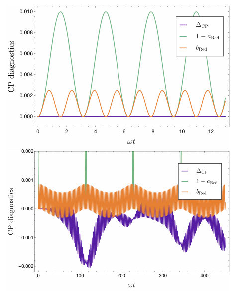
<figcaption class="paper-figure-caption"><b>Fig 2.</b> FIG. 2. Complete-positivity diagnostics for the Redfield map, evaluated for the same parameter choices as in Fig. 1. The top panel shows the detuned case, Ω/ω = 3 and λ/ω = 0.1, while the bottom panel shows the near-resonant case, Ω/ω = 1.055 and λ/ω = 0.03. The Redfield map re- mains CPTP only while all three quantities are non-negative. Small violations develop in the near-resonant example, even though the Redfield and Magnus population dynamics are nearly indistinguishable.</figcaption>
</figure>
<figure class="paper-figure-card">
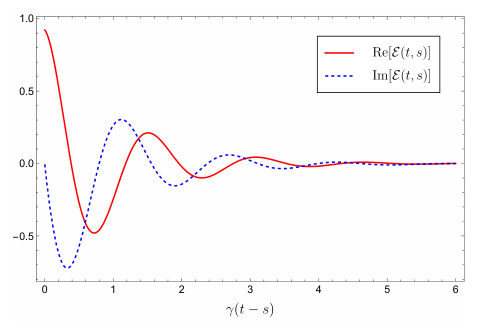
<figcaption class="paper-figure-caption"><b>Fig 3.</b> FIG. 3. Plot of the correlator E(t, s) from Eq. (172) for the choice Ω/γ = 4. Notice that the fall-off of the imaginary part is much slower than the real part, consistent with Eq. (174).</figcaption>
</figure>
<figure class="paper-figure-card">
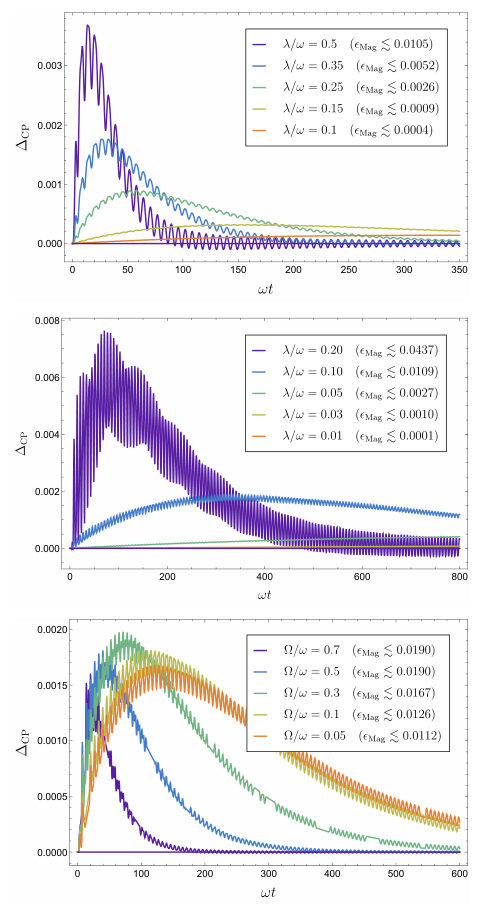
<figcaption class="paper-figure-caption"><b>Fig 4.</b> FIG. 4. Complete-positivity diagnostic ∆CP as a function of ωt for the Redfield map in three parameter regimes. The top panel varies λ/ω, with Ω/ω = 0 and γ/ω = 10 fixed. The middle panel varies λ/ω, with Ω= 0 and γ/ω = 0.1 fixed. The bottom panel varies Ω/ω, with λ/ω = 0.1 and γ/ω = 0.25 fixed. In each case, increasing the late-time value ϵMag is accompanied by increasing violations of complete positivity at late times.</figcaption>
</figure>

**Summary.** This paper rigorously compares different mathematical methods—Redfield, Magnus, and resolvent—used to approximate the dynamics of open quantum systems. It establishes a weak-coupling criterion to determine when the standard Redfield approximation remains physically valid by ensuring the resulting evolution map is completely positive. This clarifies the reliability of these approximations, especially in non-Markovian regimes.

**Why it may be interesting.** This is highly relevant for AMO and open quantum systems, as it provides rigorous mathematical tools to assess the physical validity (positivity) of common, yet approximate, master equation derivations.

Detailed structure

**Main problem.** The paper compares various mathematical resummations (Redfield, Magnus, resolvent) of the same second-order perturbative map describing open quantum system dynamics.

**Main result.** It derives a weak-coupling criterion that determines when the Redfield evolution remains close to a physically consistent, Completely Positive Trace-Preserving (CPTP) map, even when non-Markovian.

**Method.** The analysis involves comparing the formal structures of different perturbative expansions (Redfield vs. Magnus) and deriving necessary conditions for the resulting map to preserve complete positivity.

**Model / system.** The study focuses on open quantum systems, using finite-dimensional (qubit) systems coupled to an environment (bath) to analyze the reduced dynamics.

**Key observables.** Complete Positivity (CPTP) of the reduced quantum channel, and the comparison between the Redfield and Magnus evolution operators.

**Important parameters / regimes.** The system-environment coupling strength ($\lambda$) and the order of the perturbative expansion ($O(\lambda^2)$).

**Assumptions / limitations.** The analysis assumes the positivity property of the environmental correlator and that the dynamics can be approximated by a second-order perturbative map.

**Figures summary.** Not specified by the notes, but the comparison of different resummations (Redfield vs. Magnus) is central.

**Paper structure.** The paper systematically compares the Redfield, Magnus, and resolvent resummations, derives the weak-coupling criterion, and illustrates its application in finite-dimensional qubit systems.

Abstract

The Redfield equation with time-dependent coefficients (or TCL2 equation) gives one of the simplest perturbative descriptions of open quantum system dynamics derived from a microscopic theory. Its status as an approximation is nevertheless subtle: while perturbation theory fixes the reduced dynamics order-by-order in the system-environment coupling, solving the Redfield equation yields a particular resummation that need not preserve complete positivity. Here we compare Redfield evolution with an exponentiated (Magnus) resummation of the same second-order perturbative map, which is completely positive and trace preserving (CPTP) for a broad class of physical conditions. We also construct a simple CPTP resolvent resummation, illustrating the non-uniqueness of resummations of the same perturbative map. The Redfield and Magnus prescriptions agree to second order but differ through time-ordering corrections at higher orders. We exhibit a weak-coupling criterion which guarantees that Redfield evolution, even when non-Markovian, remains close to a CPTP map. We illustrate the criterion in two examples, focusing on finite-dimensional (qubit) systems. Our results clarify when, and why, Redfield evolution can remain reliable even when it is highly non-Lindbladian.

[↑ back to top](#top)

### [Direct estimation of $g^{(2)}(0)$ from click statistics of a multiplexed detector](http://arxiv.org/abs/2610.03040v1)

**Authors:** Jaromír Fiurášek  
**Type:** theory · **Category:** other · **PDF:** <https://arxiv.org/pdf/2610.03040v1>  
**Analysis basis:** full PDF text, analyzed in chunks
**Topic relevance:** `Full counting statistics` **3/5** · `quantum measurements` **3/5** · `quantum optics experiment` **2/5**

↔ Scroll figures horizontally

<figure class="paper-figure-card">
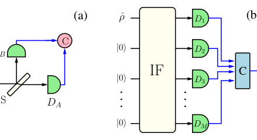
<figcaption class="paper-figure-caption"><b>Fig 1.</b> FIG. 1. (a) The Hanbury Brown and Twiss detection scheme. The input signal is split at a balanced beam splitter BS and measured with two click detectors DA and DB. Coincidences of detector clicks are counted, together with single clicks. (b) Multiplexed M-channel detector. The input signal is divided into M spatial or temporal channels using an M-port interfer- ometer. Each output mode is measured with a click detector that distinguishes the presence and absence of photons, and the number of clicks is counted.</figcaption>
</figure>
<figure class="paper-figure-card">
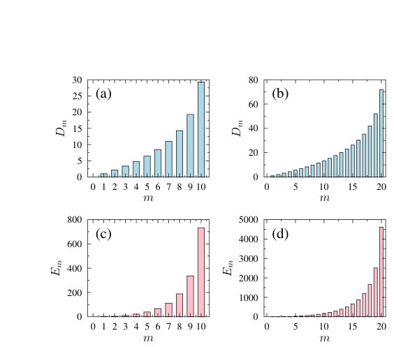
<figcaption class="paper-figure-caption"><b>Fig 2.</b> FIG. 2. The coefficients Dm (a,b) and Em (c,d) that specify the estimators µ1 and µ2 are plotted for two multiplexed de- tectors with different numbers of detection channels M = 10 (a,c) and M = 20 (b,d) [36]. The estimators are constructed for perfectly balanced detectors with η = 1 and RD = 0.</figcaption>
</figure>
<figure class="paper-figure-card">
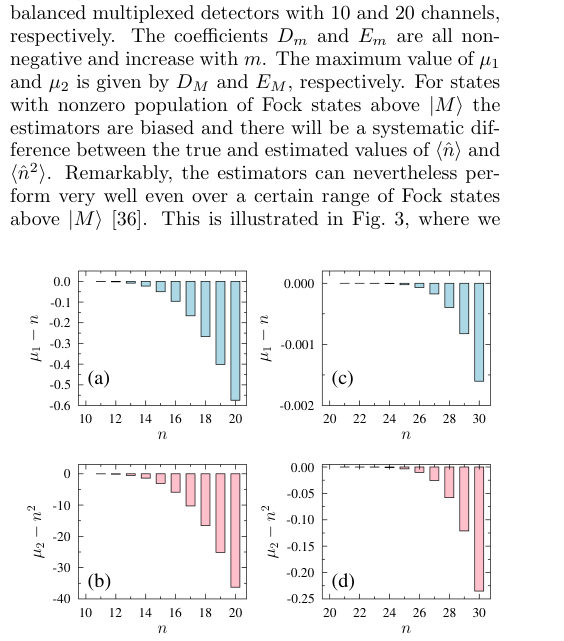
<figcaption class="paper-figure-caption"><b>Fig 3.</b> FIG. 3. Differences between the estimated and the true val- ues of the first and second moments of the photon number operator are plotted for input Fock states |n⟩and two differ- ent numbers of detection channels M = 10 (a,b) and M = 20 (c,d). The other parameters read η = 1 and RD = 0. Note the different scales on the horizontal axes for M = 10 and M = 20.</figcaption>
</figure>
<figure class="paper-figure-card">
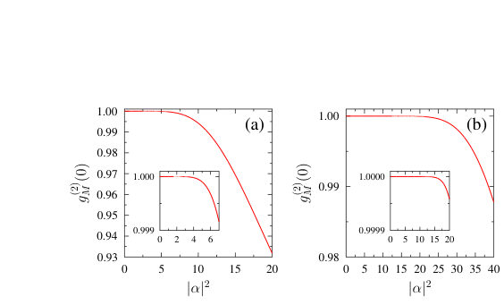
<figcaption class="paper-figure-caption"><b>Fig 4.</b> FIG. 4. Estimated second-order correlation function g(2) M (0) for input coherent state |α⟩is plotted as a function of the mean photon number |α|2 for two different numbers of detec- tion channels M = 10 (a) and M = 20 (b). The insets show the behavior of g(2) M (0) in the region |α|2 &lt; M.</figcaption>
</figure>
<figure class="paper-figure-card">
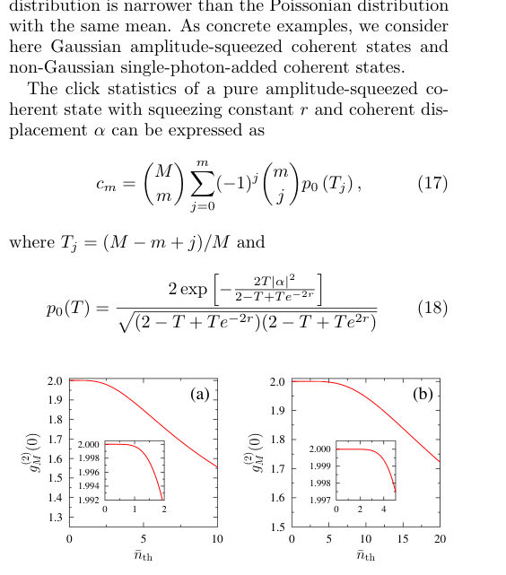
<figcaption class="paper-figure-caption"><b>Fig 5.</b> FIG. 5. Estimated second-order correlation function g(2) M (0) for input single-mode thermal state is plotted as a function of the mean photon number ¯nth for two different numbers of detection channels M = 10 (a) and M = 20 (b).</figcaption>
</figure>

**Summary.** This paper presents a novel, direct method to estimate the second-order correlation function, g^(2)(0), using only the click statistics from a multiplexed quantum detector. By employing linear estimators for the first and second moments of the photon number operator, the technique achieves high accuracy even for strong light fields and incorporates necessary corrections for detector losses. This establishes a powerful, versatile diagnostic tool for quantum light characterization.

**Why it may be interesting.** This work is highly relevant to quantum optics and open quantum systems, providing a practical, measurable diagnostic tool for characterizing quantum light states beyond simple intensity measurements.

Detailed structure

**Main problem.** The paper addresses the direct and accurate estimation of the second-order correlation function, g^(2)(0), from the click statistics recorded by a multiplexed quantum detector.

**Main result.** A simple, versatile, and theoretically rigorous method is established that allows for the quantitative characterization of quantum light, providing accurate results even for high mean photon numbers and compensating for detector losses.

**Method.** The method uses linear estimators derived from the first and second moments of the photon-number operator, constructed using the measured click probabilities from the multiplexed detector channels.

**Model / system.** The physical system is a multiplexed detector composed of M binary on-off detection channels. The analysis covers various input quantum states, including coherent, thermal, and amplitude-squeezed states.

**Key observables.** The primary observable is the second-order correlation function, g^(2)(0). Other key observables include the estimated first ($\mu_1$) and second ($\mu_2$) moments of the photon number operator.

**Important parameters / regimes.** Key parameters include the number of channels (M), the detection efficiency ($\eta$), and the mean photon number ($\langle n 
angle$ or $ar{n}$).

**Assumptions / limitations.** The analysis assumes the detector response can be modeled by click probabilities, and for unbalanced detectors, it assumes the effective transmittances can be calibrated.

**Figures summary.** Figures demonstrate the accuracy of the estimation for various states (coherent, thermal) across different channel numbers (M=10, M=20). Specific plots illustrate the dependence of g^(2)(0) on mean photon number and show the convexity of the $\mu_2$ vs $\mu_1$ curve for coherent states.

**Paper structure.** The paper first introduces the problem and the limitations of existing methods. It then develops the linear estimators for the first and second moments, deriving coefficients using detector response matrices. Key sections detail loss compensation, derive nonclassicality criteria based on the estimated moments, and extend the analysis to unbalanced detectors.

Abstract

We present and theoretically analyze a method for direct estimation of the second-order correlation function $g^{(2)}(0)$ from the click statistics of a multiplexed detector composed of M binary on-off detection channels. The method uses linear estimators of the first and second moments of the photon-number operator and can provide accurate results even for optical fields with substantial mean photon numbers. For a fixed number of channels, the detection range can be extended by introducing additional losses before the detector. We demonstrate the performance of the method for coherent, thermal, amplitude-squeezed, and photon-added coherent states. We also derive a nonclassicality criterion based on the estimated correlation function and show how the method can be adapted to unbalanced detectors. Our work establishes direct estimation of $g^{(2)}(0)$ as a simple and versatile method for quantitatively characterizing quantum light using multiplexed click detectors.

[↑ back to top](#top)

### [Efficiently and Reliably Measuring Information Processing Capacity in Dynamical Systems via Kernels](http://arxiv.org/abs/2610.03281v1)

**Authors:** Alessio Benavoli, Felix Binder, Cangxiong Chen  
**Type:** both · **Category:** disordered systems and neural networks · **PDF:** <https://arxiv.org/pdf/2610.03281v1>  
**Analysis basis:** full PDF text, analyzed in chunks
**Topic relevance:** `analog quantum simulation` **3/5** · `correlated / nonlocal dissipation` **1/5** · `driven-dissipative phase transition` **1/5** · `methods for driven-dissipative` **1/5** · `non-equilibrium universality` **1/5**

↔ Scroll figures horizontally

<figure class="paper-figure-card">
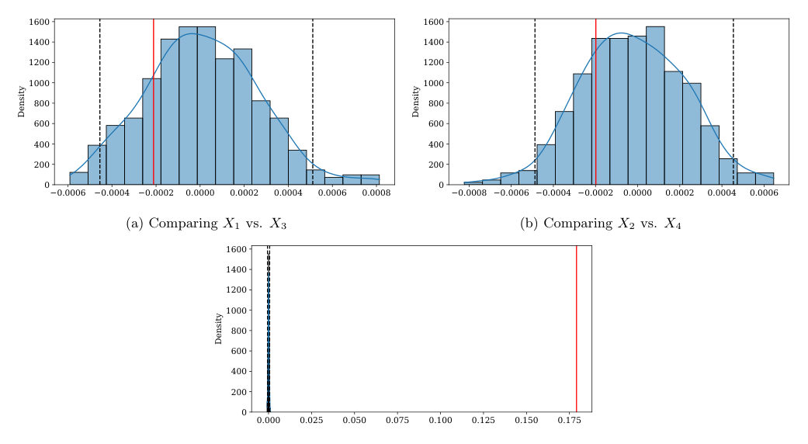
<figcaption class="paper-figure-caption"><b>Fig 1.</b> FIG. 1: Hypothesis Testing: the null-distribution is in blue; the difference between the KIPC for the two reservoirs being compared (∆) is indicated by the red-continuous vertical line; the α/2 and 1 −α/2 percentiles are indicated by the dashed black vertical lines. Notice that we cannot reject the null-hypothesis (with significance α) for the comparisons X1, X3 and X2, X4. However, we can reject the null for comparisons X1, X2 and X3, X4.</figcaption>
</figure>
<figure class="paper-figure-card">
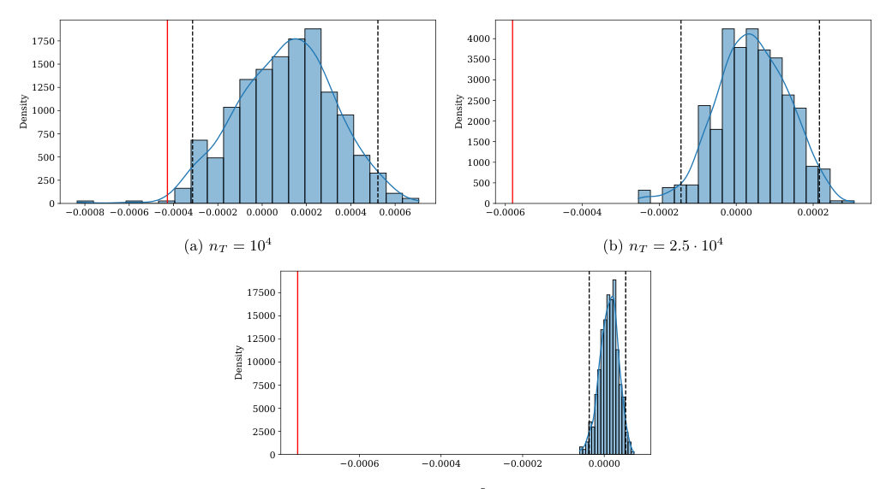
<figcaption class="paper-figure-caption"><b>Fig 2.</b> FIG. 2: Hypothesis Testing for X1 vs. X5: the null-distribution is in blue; the difference between the KIPC for the two reservoirs being compared (∆) is indicated by the red-continuous vertical line; the α/2 and 1 −α/2 percentiles are indicated by the dashed black vertical lines. Notice that we can reject the null-hypothesis in each of the comparisons between X1 and X5.</figcaption>
</figure>
<figure class="paper-figure-card">
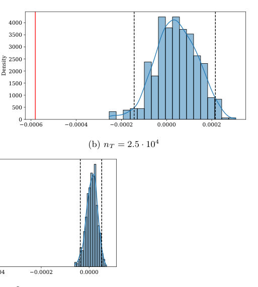
<figcaption class="paper-figure-caption"><b>Fig 3.</b> Figure 4 summarises the results. The left column of Figure 4 shows the results for p = 1. For the total- IPC, shown in Figures 4a and 4c, we report the usual breakdown of IPC contributions by nonlinearity order – we computed it using the Python ipc-module [40]. Each color represents the IPC term Cd(S, Ld, u) relative to the degree d = 1, . . . , 10. They are plotted one above the other, so that their upper envelope corresponds to the total-IPC.</figcaption>
</figure>
<figure class="paper-figure-card">
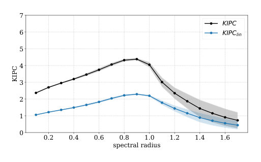
<figcaption class="paper-figure-caption"><b>Fig 4.</b> FIG. 3: p = 9: KIPC with τmax = 15. Notice that the capacity computed by KIPC starts to decrease at s = 0.9. Since KIPClin only marginally exhibits this decrease, the reduction of τmax primarily affects the nonlinear terms.</figcaption>
</figure>
<figure class="paper-figure-card">
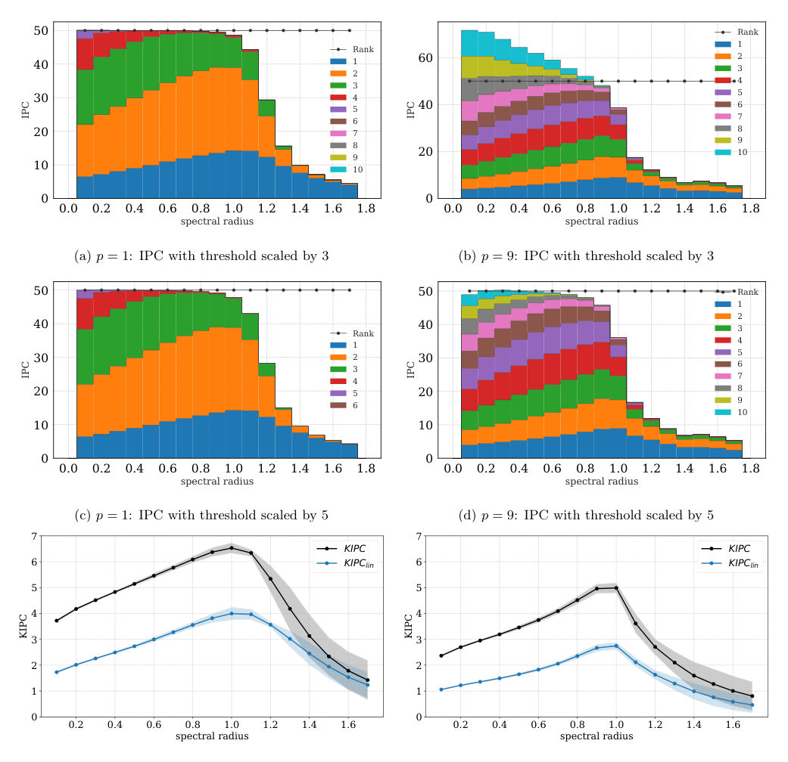
<figcaption class="paper-figure-caption"><b>Fig 5.</b> FIG. 4: Computation of total-IPC and KIPC for the ESN numerical experiment. The left-column plots are relative to the case p = 1, while the right-column plots to p = 9. Section IV A contains a detailed analysis of the plots. In the KIPC-plots, shaded regions represent 95% confidence intervals computed over the Monte Carlo runs.</figcaption>
</figure>

**Summary.** This paper presents Kernel-IPC (KIPC), a novel, computationally efficient method to measure the Information Processing Capacity of dynamical systems. By employing kernel methods, KIPC bypasses the combinatorial explosion associated with traditional IPC calculations, allowing for the assessment of the full, infinite-dimensional basis. The method is demonstrated on both artificial neural networks and a disordered quantum spin chain, proving its utility in characterizing complex quantum dynamics.

**Why it may be interesting.** The application to a disordered quantum spin chain reservoir directly connects the abstract concept of information processing capacity to a concrete, physically relevant model in condensed matter physics, providing a powerful diagnostic tool for understanding reservoir dynamics.

Detailed structure

**Main problem.** The paper addresses the computational bottleneck in quantifying the Information Processing Capacity (IPC) of dynamical systems, a metric used to assess computational capability.

**Main result.** It introduces Kernel-IPC (KIPC), a scalable framework that uses kernel methods to compute the total IPC without needing to explicitly enumerate the infinite basis functions, thereby avoiding combinatorial complexity.

**Method.** KIPC is computed by leveraging kernel methods and the trace of the kernel matrix evaluated on the delayed embedding, providing an unbiased estimator for the total capacity.

**Model / system.** The method is validated on an Echo State Network (ESN) and applied to a disordered quantum spin chain reservoir, which is governed by a specific Hamiltonian involving coupling constants and disorder terms.

**Key observables.** Information Processing Capacity (IPC) and the kernel-based variant (KIPC); the difference between KIPC and its linear component ($KIPC_{	ext{nonlin}}$).

**Important parameters / regimes.** The maximum polynomial degree and delay (which KIPC circumvents); disorder strength ($W$) and bias field ($h$) in the spin chain model.

**Assumptions / limitations.** The input signal $u$ is assumed to be zero-mean and i.i.d.; the derivation for the unbiased estimator involves neglecting the diagonal term for finite time steps.

**Figures summary.** Figures show KIPC results for ESN experiments under varying parameters (e.g., $p=1$ vs $p=9$) and for the QRC experiment across sweeps of disorder ($W$) and bias ($h$), demonstrating phase transitions.

**Paper structure.** The paper first establishes the theoretical limitations of standard IPC, then introduces the kernel-based KIPC framework with mathematical derivations (including kernel definitions for various polynomials), and finally validates this method through numerical experiments on both ESNs and disordered quantum spin chains.

Abstract

Information Processing Capacity (IPC) is a powerful system-agnostic metric for quantifying a dynamical system's computational capability and is widely used in quantum reservoir computing. However, standard IPC suffers from severe computational limitations. Computing IPC involves estimating how well the system can reconstruct, via linear regression, an (in principle) infinite family of orthogonal polynomial functions of delayed inputs. In practice, this evaluation must be made finite, so we need only to consider polynomials up to a chosen maximum degree. Moreover, the computational complexity for computing IPC grows combinatorially with the considered maximum degree and delay. Here, we introduce Kernel-IPC (KIPC), a scalable framework that uses kernel methods to compute the total IPC without explicitly enumerating basis functions. This allows us to account for the full (infinite) basis (without degree truncation). We also provide a null-hypothesis test for statistically comparing the KIPC of two dynamical systems. We validate KIPC on an echo state network and demonstrate its utility for quantum reservoir computing on a disordered spin chain.

[↑ back to top](#top)

### [From Static Lindblad Stabilizability to Robust Physical Control Sequences](http://arxiv.org/abs/2610.02362v1)

**Authors:** Yibin Wang, Ruifeng Liu  
**Type:** theory · **Category:** quantum information and computing · **PDF:** <https://arxiv.org/pdf/2610.02362v1>  
**Analysis basis:** full PDF text, analyzed in chunks
**Topic relevance:** `methods for driven-dissipative` **3/5** · `quantum measurements` **2/5** · `correlated / nonlocal dissipation` **1/5** · `driven-dissipative phase transition` **1/5**

↔ Scroll figures horizontally

<figure class="paper-figure-card">
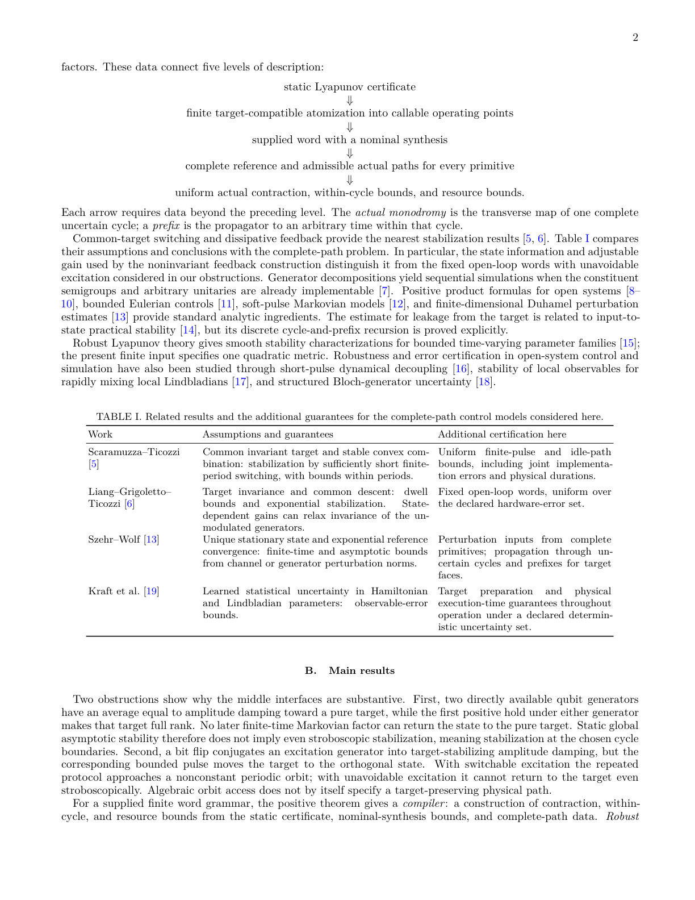
<figcaption class="paper-figure-caption"><b>Fig 1.</b> Low-resolution page preview, page 2</figcaption>
</figure>
<figure class="paper-figure-card">
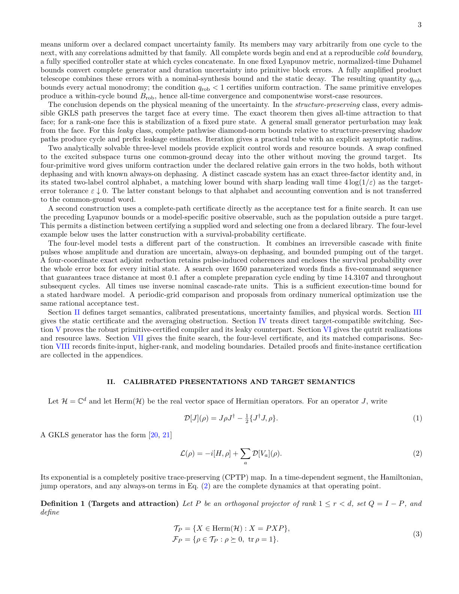
<figcaption class="paper-figure-caption"><b>Fig 2.</b> Low-resolution page preview, page 3</figcaption>
</figure>
<figure class="paper-figure-card">
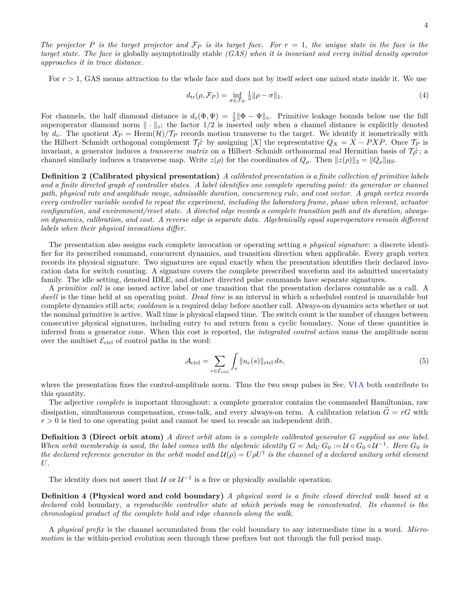
<figcaption class="paper-figure-caption"><b>Fig 3.</b> Low-resolution page preview, page 4</figcaption>
</figure>
<figure class="paper-figure-card">
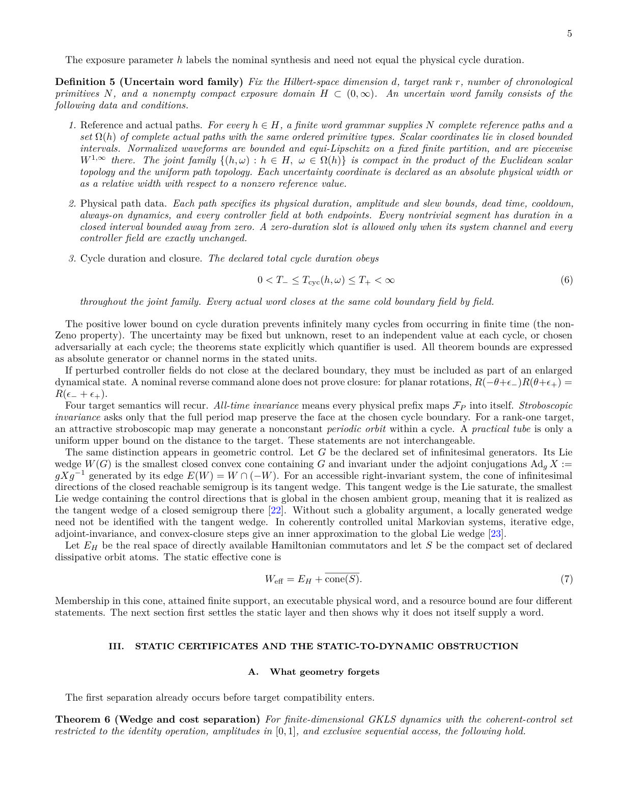
<figcaption class="paper-figure-caption"><b>Fig 4.</b> Low-resolution page preview, page 5</figcaption>
</figure>
<figure class="paper-figure-card">
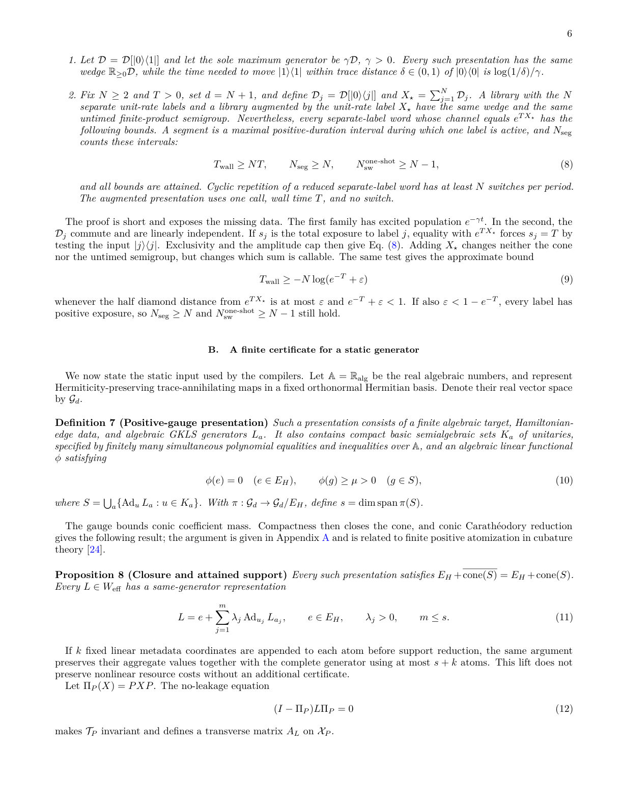
<figcaption class="paper-figure-caption"><b>Fig 5.</b> Low-resolution page preview, page 6</figcaption>
</figure>

**Summary.** This paper develops a rigorous framework to ensure that quantum systems can be robustly stabilized to a target state despite imperfect control pulses and environmental noise. By developing 'complete-path certificates,' the authors move beyond simple generator analysis to provide explicit, quantifiable guarantees on convergence time and final error bounds. This advances the field by bridging the gap between idealized mathematical stability and practical, executable quantum control protocols.

**Why it may be interesting.** This work is highly relevant for theoretical physicists working on open quantum systems, as it provides rigorous, physically grounded methods to quantify and guarantee performance under realistic experimental imperfections.

Detailed structure

**Main problem.** The paper addresses the gap between theoretically stable quantum control (Lindblad stabilizability) and the practical implementation of such control using imperfect, finite physical operations.

**Main result.** They derive checkable conditions based on Lyapunov measures that guarantee robust convergence to a target subspace, providing explicit preparation-time and long-time error bounds for complex physical models.

**Method.** The approach involves constructing a 'complete-path certificate' that verifies contraction bounds uniformly over the entire uncertainty set of physical operations, moving beyond simple generator-level analysis.

**Model / system.** The analysis is applied to general dissipative dynamics, including pulses, idle intervals, and background noise, exemplified by a four-level cascade model.

**Key observables.** Trace distance ($	ext{dtr}$), Lyapunov measure of deviation, contraction bounds ($q_{rob} < 1$), and explicit error bounds (e.g., $	ext{dtr} \le 0.1$).

**Important parameters / regimes.** Uncertainty set parameters (amplitude/timing errors), contraction rate, and the structure of the allowed control 'word grammar'.

**Assumptions / limitations.** The core assumption is that the physical process must maintain a contraction bound uniformly below one across all possible error realizations, which is a stronger requirement than static stability.

**Figures summary.** No specific figure summaries were provided, but the notes reference TABLE I comparing various control model guarantees.

**Paper structure.** The paper progresses from defining the physical problem (dissipative dynamics) to establishing static certificates, and finally developing a 'compiler' that constructs robust, finite-path bounds from these static guarantees.

Abstract

Dissipative dynamics can stabilize a quantum target without providing a reliable sequence of finite control operations. We derive checkable conditions for implementing such stabilization with imperfect controls, with bounds on convergence, errors during operations, and physical cost. The analysis includes pulses, idle intervals, and all simultaneously acting background dynamics. Using a common Lyapunov measure of deviation from the target, we require a contraction bound that remains uniformly below one over the prescribed uncertainty set after accounting for implementation errors. If all allowed paths preserve the target subspace throughout each operation, repeated cycles converge to that subspace from every initial state, even when errors vary between cycles. Comparison with these certified target-preserving paths gives an explicit long-time error bound under bounded leakage. Two single-qubit counterexamples show why a stabilizing average or a stabilizing generator obtained by unitary conjugation does not ensure these path conditions. The certification approach also supports a finite-library search. For a specified four-level cascade model with finite pulses, calibration and timing errors, dephasing, and bounded pumping, this search yields a sequence with an explicit preparation-time bound. For every initial state, it guarantees trace distance at most $0.1$ from the target at the end of preparation and throughout subsequent cycles.

[↑ back to top](#top)

### [Single-photon addition to multimode quantum fields at telecom wavelengths using lithium niobate and its doped variants](http://arxiv.org/abs/2610.02473v1)

**Authors:** Naveen V, Nicolas Treps, Raghavan G, Valentina Parigi, Srinivasan K  
**Type:** theory · **Category:** quantum information and computing · **PDF:** <https://arxiv.org/pdf/2610.02473v1>  
**Analysis basis:** full PDF text, analyzed in chunks
**Topic relevance:** `interference shaping light` **3/5** · `Keldysh / 2PI / non-Gaussian methods` **2/5** · `methods for driven-dissipative` **2/5**

↔ Scroll figures horizontally

<figure class="paper-figure-card">
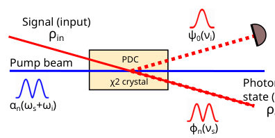
<figcaption class="paper-figure-caption"><b>Fig 1.</b> FIG. 1: Schematic illustration of mode-selective single- photon addition to a multimode quantum field ˆρ. The multimode quantum field ˆρ and a pump field in the HGn mode interact with a nonlinear crystal, generat- ing a single-photon-added multimode quantum field. The photon-addition process is heralded by the detec- tion of a photon in the idler mode.</figcaption>
</figure>
<figure class="paper-figure-card">
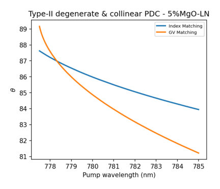
<figcaption class="paper-figure-caption"><b>Fig 2.</b> FIG. 2: Phase-matching and group-velocity-matching curves for degenerate collinear type-II PDC in 5% MgO:LN at a crystal temperature of 15◦C, as a func- tion of pump wavelength.</figcaption>
</figure>
<figure class="paper-figure-card">
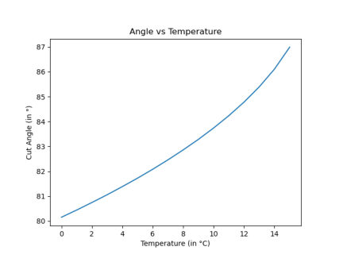
<figcaption class="paper-figure-caption"><b>Fig 3.</b> FIG. 4: GVM angle, θGVM, as a function of crystal temperature for the 5% MgO crystal. matching angles. We studied the tolerance of the pump wavelength and identified that the Schmidt number K is 1.009 at 776.17 nm and aproaches 1.09 at 786.3 nm. Consequently, the tolerence in the pump wavelength is approximately 10 nm to achieve MSSPA in 5% MgO:LN. The simulation results presented here extend the possi- bility of performing the mode-selective SPA process with MgO:LN at the telecom wavelength.</figcaption>
</figure>
<figure class="paper-figure-card">
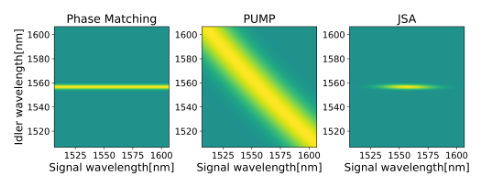
<figcaption class="paper-figure-caption"><b>Fig 4.</b> FIG. 5: Phasematching function (PMF) ϕ(ωs, ωi), pump envolope function (PEF) α(ωs, ωi), Joint Spec- tral Amplitude (JSA) for 5% MgO:LN crystal at 15◦C. The pump wavelength is set to λGV M = 778.318 nm with a zero order HG mode of pump FWHM is 10 nm and the crystal length is 10 mm. The Schmidt number obtained from SVD is K = 1.003.</figcaption>
</figure>
<figure class="paper-figure-card">
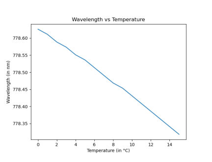
<figcaption class="paper-figure-caption"><b>Fig 5.</b> FIG. 3: The pump wavelength λGV M as a function of crystal temperatures for the 5% MgO:LN crystal.</figcaption>
</figure>

**Summary.** This paper presents a comprehensive theoretical analysis detailing how to generate single-photon-added, spectro-temporally multimode quantum states using nonlinear crystals like Lithium Niobate. By modeling the parametric down-conversion process, the authors identify optimal doping levels and operational conditions to achieve high-purity quantum states at crucial telecom wavelengths (1550 nm). This work establishes a viable platform for quantum state engineering in integrated photonics.

**Why it may be interesting.** This work is highly relevant to quantum optics and open quantum systems as it provides a detailed, materials-specific roadmap for engineering non-Gaussian quantum resources necessary for advanced quantum information protocols.

Detailed structure

**Main problem.** The paper addresses the generation of spectro-temporal non-Gaussian quantum states, specifically through single-photon addition (SPA), to multimode quantum fields at telecom wavelengths.

**Main result.** The authors established a theoretical framework demonstrating that SPA can be achieved using lithium niobate (LN) and its doped variants, identifying optimal conditions for high spectral purity at 1550 nm.

**Method.** The analysis involves detailed theoretical modeling and numerical simulations of the parametric down-conversion (PDC) process, utilizing the Joint Spectral Amplitude (JSA) and the Schmidt number ($K$) as key diagnostics.

**Model / system.** The physical platform is nonlinear bulk crystals, specifically Lithium Niobate (LN) and its MgO:LN and ZnO:LN doped variants. The process modeled is Spontaneous Parametric Down-Conversion (PDC), which generates the quantum states.

**Key observables.** Joint Spectral Amplitude (JSA), Schmidt number ($K$), signal and idler spectra, and the satisfaction of Phase-Matching and Group Velocity Matching (GVM) conditions.

**Important parameters / regimes.** Telecom wavelengths (especially 1550 nm), crystal doping concentrations (e.g., 5% MgO:LN), and temperature variations ($0^\circ	ext{C}$ to $15^\circ	ext{C}$).

**Assumptions / limitations.** The analysis relies on theoretical approximations, such as Taylor expansions, and distinguishes between two regimes: those satisfying GVM and those that bypass this strict requirement.

**Figures summary.** Figures illustrate the schematic of the quantum state generation, the phase-matching and GVM condition plots for different crystal cuts, and the resulting signal/idler spectra confirming the achievable purity ($K$).

**Paper structure.** The paper progresses by first analyzing the general requirements for mode-selective SPA (requiring both phase-matching and GVM), noting limitations in initial materials (congruent LN), and then developing advanced theoretical approaches (noncollinear PDC) to realize the process under optimal conditions for doped LN crystals.

Abstract

Multimode spectro-temporal non-Gaussian quantum states of light play a crucial role in continuous-variable quantum information processing. In particular, the non-Gaussian quantum states generated through a single-photon addition (SPA) to multimode quantum fields at telecommunication wavelengths constitute a useful resource for quantum technologies. We present a detailed theoretical analysis and numerical simulations of single-photon addition (SPA) and mode-selective single-photon addition (MSSPA) to a multimode quantum field at telecommunication wavelengths. The analysis is performed for congruently grown lithium niobate (LN), $5\%$ MgO-doped lithium niobate (MgO:LN) and various concentrations of ZnO-doped lithium niobate (ZnO:LN) bulk crystals. We investigate MSSPA using type-II parametric down-conversion (PDC) and SPA using the type-I PDC processes. We further present spectro-temporal mode-selective SPA at the telecom wavelength using $5\%$ MgO:LN for temperatures ranging from $0^\circ C$ to $15^\circ C$. In addition, we perform simulations to investigate SPA based on the noncollinear type-I PDC configuration. These theoretical results identify optimal experimental conditions and phase-matching parameters to achieve SPA and mode-selective SPA for LN-based crystals, providing a potential platform for non-Gaussian quantum state engineering at telecommunication wavelengths, mainly at $1550$ nm.

[↑ back to top](#top)

### [Universal energy barrier for plastic flow in a network glass](http://arxiv.org/abs/2610.02454v1)

**Authors:** Ibrahim Ghanem, Richard Jana, Wolfram G. Nöhring, Michael Moseler, Lars Pastewka  
**Type:** theory · **Category:** disordered systems and neural networks · **PDF:** <https://arxiv.org/pdf/2610.02454v1>  
**Analysis basis:** full PDF text, analyzed in chunks
**Topic relevance:** `non-equilibrium universality` **3/5** · `Frenkel-Kontorova` **1/5** · `analog quantum simulation` **1/5** · `methods for driven-dissipative` **1/5** · `scars & prethermalization` **1/5**

↔ Scroll figures horizontally

<figure class="paper-figure-card">
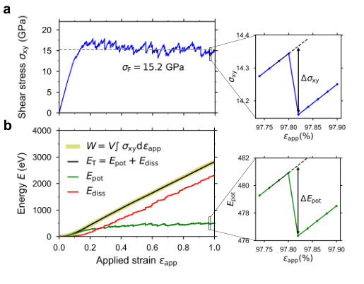
<figcaption class="paper-figure-caption"><b>Fig 1.</b> FIG. 1. Phenomenology of plastic flow. (a) Stress–strain response of an a-C network at 2.7 g cm−3. The dashed gray line marks the mean flow stress (15.2 GPa). (b) Potential, dissipated, and total input energies versus strain. Insets de- fine the plastic stress drop ∆σxy and potential energy drop ∆Epot, respectively.</figcaption>
</figure>
<figure class="paper-figure-card">
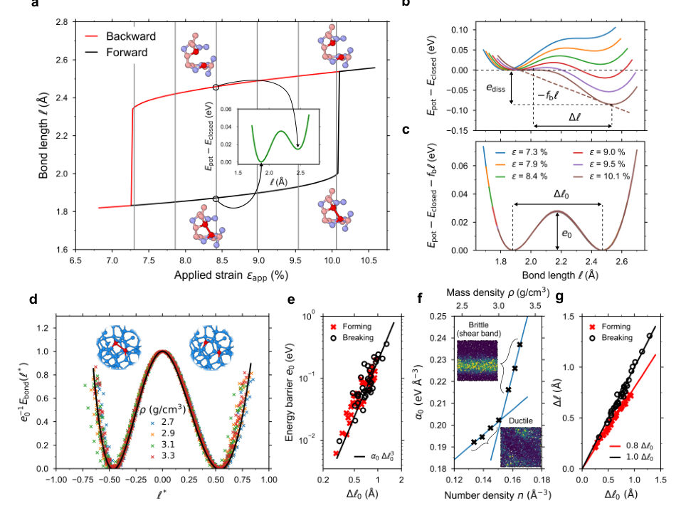
<figcaption class="paper-figure-caption"><b>Fig 2.</b> FIG. 2. The making and breaking of a single bond. (a) Hysteresis loop of a reversible bond. Inset shows the potential energy landscape at εapp = 8.4% as a function of bond length. (b) Energy landscapes at selected εapp (vertical gray lines in (a)). The dashed line −fbℓis the common tangent between the two minima of the brown curve at εapp = 10.1%. (c) Energy landscapes after subtraction of the tangent contribution, such that the two minima lie at the same energy. (d) Universal barrier shape function Euniv(ℓ∗) for a-C across all investigated densities. (e) e0 versus ∆ℓ0 for bonds sampled in the plastic flow regime of a-C at 2.7 g cm−3. The solid line indicates a cubic scaling with prefactor...</figcaption>
</figure>
<figure class="paper-figure-card">
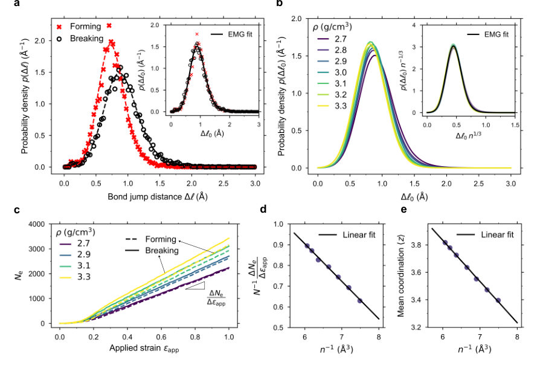
<figcaption class="paper-figure-caption"><b>Fig 3.</b> FIG. 3. Statistics of shear transformations in a-C. (a) p(∆ℓ) for bond-breaking (black circles; pb(∆ℓ)) and bond-forming (red crosses; pf(∆ℓ)) events in the plastic flow regime at 2.7 g cm−3. Dashed lines are guides to the eye. The coordinate transformation ∆ℓ→∆ℓ0 maps both distributions onto a single curve p(∆ℓ0), shown in the inset with an exponentially modified Gaussian (EMG) fit as a solid black line. (b) p(∆ℓ0) for all investigated densities. The further transformation ∆ℓ∗ 0 = ∆ℓ0 n1/3</figcaption>
</figure>
<figure class="paper-figure-card">
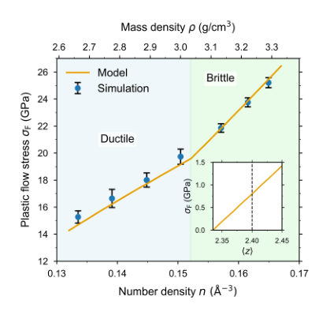
<figcaption class="paper-figure-caption"><b>Fig 4.</b> FIG. 4. Prediction of the plastic flow stress. Plastic flow stress σF versus density from the microscopic prediction, Eq. (6) (solid orange line) and macroscopic energy dissipation rates (filled blue circles, with error bars showing standard deviations across ten independent realizations per density). Shading marks the ductile (low-density) and brittle (high- density) deformation regimes identified in Fig. 2f. The inset shows σF vanishing at mean coordination ⟨z⟩≈2.33; the ver- tical dashed line marks the network-glass rigidity-percolation threshold at ⟨z⟩≈2.4.</figcaption>
</figure>

**Summary.** This work provides a microscopic theory for plastic flow in amorphous glasses by showing that plasticity is mediated by single covalent bond breaking/forming events. By analyzing the energy barriers of these events, the authors demonstrate that the energy landscape is universal, allowing them to predict the macroscopic plastic flow stress from simple, bond-level parameters.

**Why it may be interesting.** While focused on condensed matter plasticity, the use of machine-learned potentials and the concept of universal energy barriers in disordered systems connect to the study of complex energy landscapes found in quantum many-body systems.

Detailed structure

**Main problem.** The paper aims to establish the atomic origin and energetics of shear transformations (STs), the fundamental events governing plasticity in amorphous glasses, and link these microscopic rules to macroscopic flow stress.

**Main result.** The energy landscapes associated with STs collapse onto a universal shape, and the plastic flow stress can be quantitatively predicted from bond-level quantities using a cubic scaling law.

**Method.** The authors used machine-learned interatomic potentials to simulate shear deformation in amorphous carbon, analyzing the energy barriers of single-bond breaking/forming events.

**Model / system.** The system studied is amorphous carbon (a-C), modeled as a network glass. The analysis focuses on the energy landscape of a single covalent bond, which is assumed to govern the elementary plastic event.

**Key observables.** Plastic flow stress ($\sigma_F$), energy barrier ($E_b$), bond-jump distance ($\Delta\ell$), and the Gini coefficient ($G$) for shear localization.

**Important parameters / regimes.** Bond-jump distance ($\Delta\ell_0$), density ($
ho$), and the coordination number ($\langle z 
angle$).

**Assumptions / limitations.** Plasticity is governed solely by the breaking or formation of single covalent bonds, and the energy landscape of these events is universal and independent of local structure.

**Figures summary.** Figures illustrate the stress-strain response showing stress drops (STs), the collapse of energy landscapes onto a universal curve, and the cubic scaling of the intrinsic barrier with the bond-jump distance.

**Paper structure.** The work progresses from identifying STs in the macroscopic stress-strain response to analyzing the universal energy barrier shape, deriving scaling laws for the barrier height, and finally constructing a model that predicts the flow stress from these microscopic bond-level parameters.

Abstract

Shear transformations are the elementary events of plasticity in glasses and underpin many mesoscopic models of plastic flow, yet their atomic origin and energetics remain difficult to establish. Here we use a machine-learned interatomic potential to show that, in amorphous carbon as a representative network glass, a shear transformation corresponds to the breaking or formation of a single covalent bond. The simplicity of the associated reaction coordinate, the bond length, enables us to extract energy landscapes and barriers. Despite the intrinsic structural disorder, we find that all energy landscapes collapse onto a universal barrier shape. What remains bond-specific is a single scale, the bond-jump distance, which fixes the barrier height through a cubic law. Combined with the activation statistics of shear transformations, this yields a model that predicts the plastic flow stress from independently determined bond-level quantities. Our results provide microscopic support for phenomenological models of plastic flow in glasses and suggest a route towards a quantitative description of amorphous plasticity.

[↑ back to top](#top)

### [Homological Thresholds in Randomly Monitored Quantum Error-Correcting Codes](http://arxiv.org/abs/2610.02310v1)

**Authors:** Yoshito Watanabe, Daiki Sasamoto, Bo Han, Simon Trebst  
**Type:** theory · **Category:** statistical mechanics · **PDF:** <https://arxiv.org/pdf/2610.02310v1>  
**Analysis basis:** full PDF text, analyzed in chunks
**Topic relevance:** `quantum measurements` **3/5** · `analog quantum simulation` **1/5** · `driven-dissipative phase transition` **1/5** · `non-equilibrium universality` **1/5**

↔ Scroll figures horizontally

<figure class="paper-figure-card">
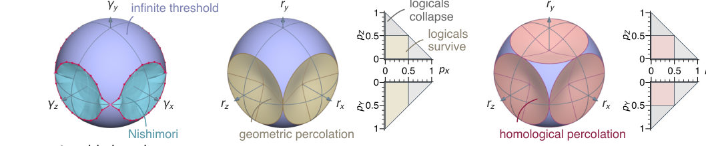
<figcaption class="paper-figure-caption"><b>Fig 1.</b> FIG. 1. Tunable-learning and random-measurement phase diagrams. (a) Toric-code tunable-learning phase diagram of Ref. [13], parameterized by the measurement strengths (γX, γY , γZ). The cyan boundary marks the Nishimori learning transition. (b,c) Semi-analytic phase diagrams for the random Pauli-measurement protocol studied here, for (b) the toric code and (c) the color code. The phase boundaries separate regimes in which encoded logical information survives from those in which it is collapsed by the measurements. The measurement probabilities are parameterized as pX = r sin2 θ sin2 ϕ, pY = r cos2 θ, and pZ = r sin2 θ cos2 ϕ, with r = pX +pY +pZ. The boundaries are approximate constructions...</figcaption>
</figure>
<figure class="paper-figure-card">
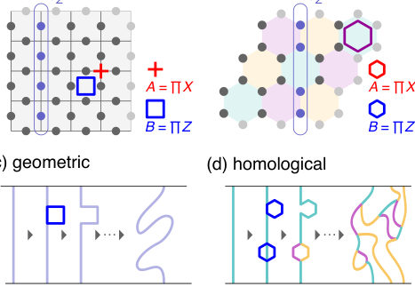
<figcaption class="paper-figure-caption"><b>Fig 2.</b> FIG. 2. Local structure of logical operators. (a,b) Square-lattice toric code and honeycomb-lattice (6, 6, 6) color code, with repre- sentative noncontractible logical Z operators. Red and blue sym- bols denote X- and Z-type stabilizers, respectively. (c,d) Multipli- cation by local Z stabilizers deforms these representatives without changing their logical action. Toric-code deformations preserve an unbranched-loop description, whereas color-code strings can split and recombine at three-string junctions, producing branched colored- string representations. This contrast underlies ordinary geometric connectivity in the toric code and non-geometric homological con- nectivity in the color code.</figcaption>
</figure>
<figure class="paper-figure-card">
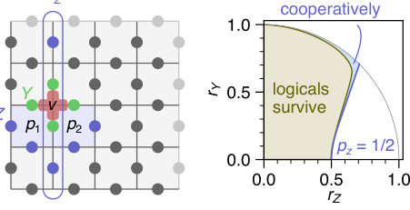
<figcaption class="paper-figure-caption"><b>Fig 3.</b> FIG. 4. Y -assisted logical Z measurement in the toric code. (a) Blue and green markers denote qubits measured in the Z and Y bases, respectively. Up to an irrelevant phase, the product of the cor- responding measured Pauli operators is AvBp1Bp2LZ, thereby im- plementing a logical Z measurement, even though the Z-measured edges alone support no noncontractible Z loop. (b) Schematic pX = 0 section of the logical-survival phase diagram. The blue sliver de- notes the additional logical-Z-measurement regime produced coop- eratively by Y and Z measurements below the Z-only percolation threshold pZ = 1/2, marked by the blue line. Its width is exagger- ated for visibility.</figcaption>
</figure>
<figure class="paper-figure-card">
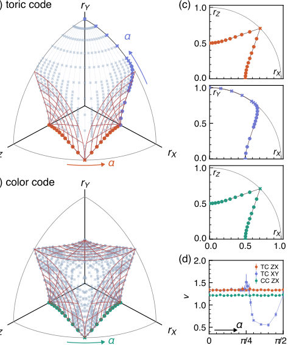
<figcaption class="paper-figure-caption"><b>Fig 4.</b> FIG. 3. Numerical logical-survival phase diagrams. Phase bound- aries for (a) the toric code and (b) the color code are shown in the positive octant. Red wireframes show the semi-analytic construction from the pure-axis thresholds, while colored symbols show numer- ical boundary estimates obtained from finite-size scaling of the co- herent information. Crosses mark estimates compatible with rc = 1 within uncertainty; the corresponding thermodynamic critical radii may lie slightly below unity (see text). (c) Representative planar cuts. (d) The fitted scaling exponent ν along the same cuts as a func- tion of the in-plane angle α, oriented as indicated in (a,b).</figcaption>
</figure>
<figure class="paper-figure-card">
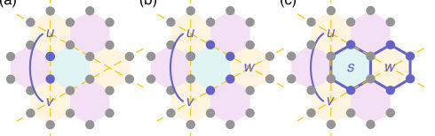
<figcaption class="paper-figure-caption"><b>Fig 5.</b> FIG. 5. Geometric versus homological connectivity in the color code. Z-measured qubits are shown in blue. (a) The two measured qubits directly connect the same-color plaquettes u and v, giving the direct link u ∼v. (b) The direct links u ∼w and w ∼v con- nect u and v through an ordinary geometric path on the same-color triangular sublattice. (c) No direct link is present among u, v, and w. Nevertheless, multiplying the measured Pauli product by the two outlined plaquette stabilizers BsBw deforms its support into the di- rect connection shown in (a). Thus u and v are homologically but not geometrically connected.</figcaption>
</figure>

**Summary.** This work analyzes how quantum error-correcting codes fail when subjected to random monitoring measurements. It establishes that the failure mechanism can be classified into two distinct types of percolation transitions: geometric and homological. This provides a powerful, unified theoretical framework for understanding the robustness of topological quantum computation.

**Why it may be interesting.** It connects the abstract concepts of topological order and quantum error correction thresholds directly to well-established concepts in statistical mechanics, such as percolation theory and critical phenomena.

Detailed structure

**Main problem.** The paper investigates the robustness of quantum error-correcting codes when subjected to random single-qubit Pauli measurements, mapping this process to critical phenomena.

**Main result.** The threshold behavior for code failure falls into two distinct categories: geometric and homological percolation transitions, exemplified by the toric and color codes, respectively.

**Method.** The analysis uses algebraic and homological methods, mapping logical information loss to the criteria for noncontractible loops, and employs numerical simulations to determine critical exponents.

**Model / system.** The system studied is stabilizer quantum error-correcting codes (e.g., toric code, color code) defined on lattices, whose stability is tested by random Pauli measurements.

**Key observables.** Threshold probability for logical subspace collapse, critical exponents, and the logical-support criteria.

**Important parameters / regimes.** Measurement probabilities ($p_X, p_Y, p_Z$), lattice structure (square vs. honeycomb), and system size (up to one million qubits).

**Assumptions / limitations.** The analysis relies on mapping the monitoring process to logical support criteria, and phase diagrams are based on analytically obtained pure-axis thresholds.

**Figures summary.** Figures illustrate tunable-learning and random-measurement phase diagrams for the toric and color codes, showing logical survival versus collapse regimes, and depict the algebraic structure of logical operators.

**Paper structure.** The paper systematically analyzes the failure mechanisms of different codes under measurement, distinguishing between geometric and homological failure modes, and extends the framework to various code types.

Abstract

Random projective measurements are an effective tool to model the interlinked phenomenology of monitoring, inferring, and decoding highly entangled states such as quantum error-correcting codes. At the same time, the study of such monitored dynamics has opened a new arena for critical phenomena, renewing longstanding questions in disordered statistical mechanics, including percolation, random-bond models, and Nishimori physics. Here we investigate the robustness of stabilizer quantum error-correcting codes under a single round of independently sampled single-qubit Pauli measurements and demonstrate that their threshold behavior falls into two broad categories - geometric and homological percolation transitions, with the toric code and color code being the principal examples for each class. We establish the distinct character of these two threshold theories by analyzing the logical-support criteria of these codes and by providing numerical estimates of their respective critical exponents obtained from optimized stabilizer simulations of large-scale systems with over one million qubits. Our framework extends to non-CSS, subsystem, higher-dimensional, and Floquet stabilizer codes and allows us to determine their respective threshold phase diagrams. We exemplify how the latter provide quantitative and qualitative guidance for the computationally more demanding problems of tunable learning and maximum-likelihood decoding. As a practical application of our framework, we discuss the robustness of the gross code.

[↑ back to top](#top)

### [Melting phase diagram of the two-dimensional electron solid in a perpendicular magnetic field](http://arxiv.org/abs/2610.03513v1)

**Authors:** M. Yu. Melnikov, D. G. Smirnov, A. A. Shashkin, S. -H. Huang, C. ~W. Liu, S. V. Kravchenko  
**Type:** experiment · **Category:** strongly correlated electrons · **PDF:** <https://arxiv.org/pdf/2610.03513v1>  
**Analysis basis:** full PDF text, analyzed in chunks
**Topic relevance:** `analog quantum simulation` **3/5** · `Frenkel-Kontorova` **2/5** · `scars & prethermalization` **1/5**

↔ Scroll figures horizontally

<figure class="paper-figure-card">
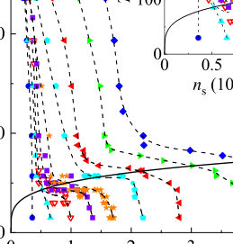
<figcaption class="paper-figure-caption"><b>Fig 1.</b> FIG. 2. The melting temperature as a function of electron density in different magnetic fields. The dashed lines are guides to the eye. The expected dependence of the tempera- ture on the plateau Tp(ns) ∝n1/4 s with a fitting parameter l is shown by the solid line. The inset shows the low-ns region on an expanded scale.</figcaption>
</figure>
<figure class="paper-figure-card">
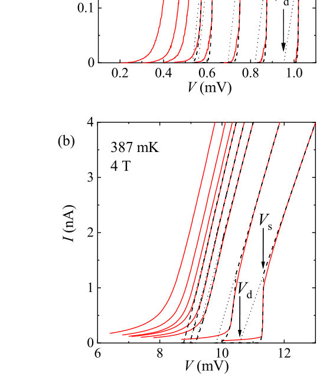
<figcaption class="paper-figure-caption"><b>Fig 2.</b> FIG. 1. (a) Voltage-current characteristics in a magnetic field of 4 T at a temperature of 30 mK at electron densities (in units of 1010 cm−2, left to right): 2.94, 2.85, 2.81, 2.78, 2.76, 2.67, 2.58, 2.49. (b) Voltage-current characteristics in a magnetic field of 4 T at a temperature of 387 mK at electron densities (in units of 1010 cm−2, left to right): 0.99, 0.94, 0.90, 0.88, 0.85, 0.81, 0.72, 0.63. Also shown are the dynamic threshold Vd obtained by the extrapolation (dotted line) of the linear part of the V -I curves to zero current and the static threshold Vs. The dashed lines are fits to the data, see text.</figcaption>
</figure>

**Summary.** This work experimentally maps the thermal melting phase diagram of a 2D electron solid in a perpendicular magnetic field. By analyzing voltage-current characteristics, the researchers confirm that the magnetic field stabilizes the solid phase. Most notably, they observe a plateau in the melting temperature versus density curve, which they interpret as evidence of resonance modes within the crystalline structure.

**Why it may be interesting.** The study of melting transitions and correlated states in 2D electron systems is fundamental to understanding strongly correlated electron physics, which shares conceptual links with many-body dynamics in AMO systems.

Detailed structure

**Main problem.** The study aims to determine the thermal melting phase diagram of a two-dimensional electron solid.

**Main result.** The magnetic field increases the melting temperature, and the melting temperature exhibits an unexpected plateau as a function of electron density, which is attributed to resonance modes in the crystallites.

**Method.** Measurements involve analyzing the onset density of double-threshold voltage-current (I-V) curves in the insulating state of a 2D electron system.

**Model / system.** The physical system is a two-dimensional electron system confined in SiGe/Si/SiGe quantum wells, which is studied under perpendicular magnetic fields. The theoretical framework involves modeling the electron solid, potentially as a Wigner crystal.

**Key observables.** Onset density of double-threshold V-I curves, melting temperature ($T_c$), and the dependence of $T_c$ on magnetic field and electron density.

**Important parameters / regimes.** Temperature (T), perpendicular magnetic field (B), and electron density ($n_s$).

**Assumptions / limitations.** The analysis adapts a phenomenological theory of the collective depinning of elastic structures, and the plateau is interpreted via resonance modes in the crystallites.

**Figures summary.** Figure 1 shows typical V-I characteristics at different temperatures and densities, illustrating the two-threshold behavior. Figure 2 shows the melting temperature ($T_c$) dependence on electron density, highlighting the plateau region.

**Paper structure.** The paper establishes the physical system and the diagnostic tool (double-threshold V-I curves). It presents results showing magnetic field dependence, confirming theoretical predictions, and then focuses on the unexpected plateau in $T_c$ vs. $n_s$, interpreting it via resonance modes.

Abstract

We determine the thermal melting phase diagram of the electron solid by measuring the onset density of the double-threshold voltage-current curves in the insulating state in the ultra-high mobility two-dimensional electron system in SiGe/Si/SiGe quantum wells at different temperatures in perpendicular magnetic fields. The introduction of a magnetic field leads to a considerable increase in the onset density, which is strongest at the lowest temperatures and decreases with increasing temperature, and the melting temperature increases with magnetic field. These data are in agreement with theoretical predictions. Unexpectedly, the melting temperature as a function of electron density in a fixed magnetic field reveals a plateau, which can be interpreted in terms of resonance modes in the crystallites.

[↑ back to top](#top)

### [Stochastic thermodynamics and predictability of Ornstein-Uhlenbeck processes: an application to the Madden-Julian Oscillation](http://arxiv.org/abs/2610.03355v1)

**Authors:** Roberta Benincasa, Danni Du, Gregory S. Duane, Jeffrey B. Weiss  
**Type:** theory · **Category:** statistical mechanics · **PDF:** <https://arxiv.org/pdf/2610.03355v1>  
**Analysis basis:** full PDF text, analyzed in chunks
**Topic relevance:** `non-equilibrium universality` **3/5** · `Keldysh / 2PI / non-Gaussian methods` **1/5** · `driven-dissipative phase transition` **1/5** · `methods for driven-dissipative` **1/5**

↔ Scroll figures horizontally

<figure class="paper-figure-card">
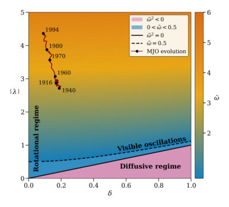
<figcaption class="paper-figure-caption"><b>Fig 1.</b> FIG. 1. Parameter space diagram. Regimes are clas- sified in terms of |λ| and δ. The colorbar shows ˜ω in the rotational regime (˜ω ∈R), corresponding to oscilla- tory solutions. The solid curve denotes ˜ω2 = 0, sepa- rating rotational and diffusive regimes, while the dashed curve marks the onset of visually discernible oscillations (˜ω = 0.5). The temporal evolution of MJO parameters over the 20th century is also shown.</figcaption>
</figure>
<figure class="paper-figure-card">
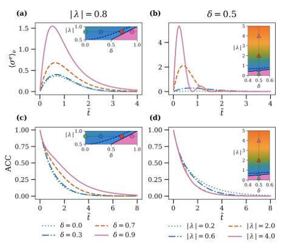
<figcaption class="paper-figure-caption"><b>Fig 2.</b> FIG. 2. Dependence of entropy production and ACC on λ and δ. Panels show the time evolution of ⟨σe t ⟩e (a–b) and the ACC (c–d). The first column varies δ at fixed λ, and the second varies λ at fixed δ. Time is scaled as ˜t = t/τ. Insets show the corresponding locations in parameter space across all regimes.</figcaption>
</figure>
<figure class="paper-figure-card">
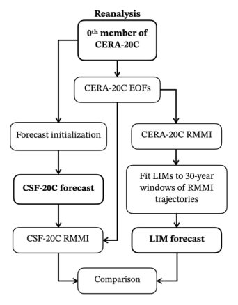
<figcaption class="paper-figure-caption"><b>Fig 3.</b> FIG. 3. Scheme of the comparison between the LIM, the CSF-20C, and the CERA-20C. The 0th</figcaption>
</figure>
<figure class="paper-figure-card">
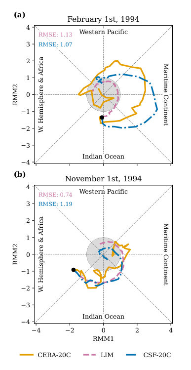
<figcaption class="paper-figure-caption"><b>Fig 4.</b> FIG. 4. MJO phase space trajectories. 46-day RMMI trajectories from CERA-20C, from the LIM fore- cast built on the 0th member of CERA-20C ensemble and CSF-20C. Panel (a) shows trajectories initialized on February 1st, 1994, while panel (b) those initialized on November 1st of the same year. MJO events are defined by amplitudes greater than one (gray circle).</figcaption>
</figure>
<figure class="paper-figure-card">
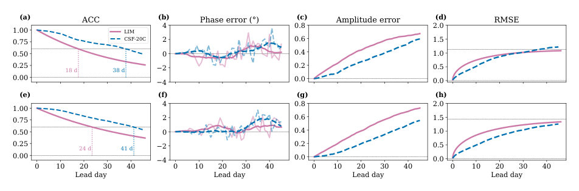
<figcaption class="paper-figure-caption"><b>Fig 5.</b> FIG. 5. Potential predictability according to the two forecasts. ACC (a,e), phase error (b,f), amplitude error (c,g), and RMSE (d,h) of the ensemble-mean forecast against each ensemble member taken alternatively as truth. Full pink line: LIM forecast from the 0th CERA-20C member; dashed blue line: CSF-20C. In the phase error plot, the full line is the smoothed version of the corresponding dashed line. The phase error is computed only when the starting amplitude of the reanalysis is larger than 1. The lead time after which the correlation score first goes below 0.6 is shown in both plots. Dashed lines in the RMSE plots refer to the maximum value for the LIM obtained as p</figcaption>
</figure>

**Summary.** This paper links climate predictability to nonequilibrium thermodynamics by developing a stochastic framework for OU processes. It shows that for systems like the MJO, predictability is governed by the path action, even when other thermodynamic measures like irreversibility increase. This suggests stochastic thermodynamics offers a powerful lens for analyzing complex, out-of-equilibrium geophysical phenomena.

**Why it may be interesting.** The application of fluctuation theorems and stochastic thermodynamics to macroscopic, non-equilibrium systems like climate dynamics provides a powerful theoretical tool for understanding predictability limits in complex physical systems.

Detailed structure

**Main problem.** The paper investigates the fundamental connection between the predictability of out-of-equilibrium climate oscillations and their underlying nonequilibrium thermodynamic properties.

**Main result.** The path action, rather than irreversibility or dynamical activity, is found to be the most direct predictor of forecast skill (ACC) for systems like the MJO. The MJO exhibits increased predictability alongside increased irreversibility and activity.

**Method.** The authors develop and apply a coarse-grained stochastic thermodynamic framework to Ornstein-Uhlenbeck (OU) processes, analyzing their dynamics using concepts like entropy production and path action.

**Model / system.** The model uses the multivariate OU stochastic differential equation, focusing on 2D dynamics with even variables, and applies this framework to analyze climate indices, specifically the Madden-Julian Oscillation (MJO).

**Key observables.** Predictability (Anomaly Correlation Coefficient, ACC), Entropy Production ($\sigma$), Dynamical Activity ($\phi$), and Path Action ($\alpha$).

**Important parameters / regimes.** Two diffusivities and a phase-space rotation characterize the coordinate-invariant dynamics of the 2D OU process.

**Assumptions / limitations.** The analysis is restricted to 2D OU dynamics with even variables, and the framework treats climate change as a succession of steady-states.

**Paper structure.** The paper first develops the stochastic thermodynamic framework for OU processes, then analyzes the reduced parameter space using coordinate-invariant properties, and finally applies the entire methodology to the Madden-Julian Oscillation (MJO).

Abstract

Climate oscillations are intrinsically out-of-equilibrium phenomena, yet the connection between their predictability and nonequilibrium thermodynamic properties remains unexplored. We develop a coarse-grained stochastic thermodynamic framework for Ornstein-Uhlenbeck (OU) processes and apply this framework to climate data via linear inverse models (LIMs), linking predictability, entropy production, dynamical activity, and path action. Climate oscillations are often studied in a 2d phase space of climate indices, which are even under time-reversal, motivating our focus on 2d OU dynamics with even variables. We find that coordinate-invariant properties of 2d OU processes can be reduced to a minimal three-parameter description: two diffusivities and a phase-space rotation. We show that these quantities fundamentally characterize distinct aspects of the dynamics. We find that higher irreversibility and dynamical activity do not necessarily imply reduced predictability. Rather, it is the path action which is most closely connected to a commonly used measure of predictability, the anomaly correlation coefficient (ACC). As an illustrative example, we apply this framework to the Madden-Julian Oscillation (MJO) over the twentieth century. We find that the MJO has become simultaneously more predictable, as seen previously, while at the same time becoming more irreversible and more active. Predictability is driven predominantly by the reduced mean diffusion. Entropy production reflects the combined evolution of all three parameters. These results suggest that stochastic thermodynamics provides a powerful lens for studying nonequilibrium climate phenomena.

[↑ back to top](#top)

### [Structural crossover of complex networks: bridging degree correlation and fractality](http://arxiv.org/abs/2610.02883v1)

**Authors:** Shogo Mizutaka, Jun Yamamoto, Kousuke Yakubo  
**Type:** theory · **Category:** statistical mechanics · **PDF:** <https://arxiv.org/pdf/2610.02883v1>  
**Analysis basis:** full PDF text, analyzed in chunks
**Topic relevance:** `non-equilibrium universality` **3/5** · `analog quantum simulation` **2/5** · `driven-dissipative phase transition` **1/5**

↔ Scroll figures horizontally

<figure class="paper-figure-card">
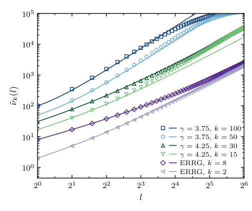
<figcaption class="paper-figure-caption"><b>Fig 1.</b> FIG. 1. Distance dependence of the ball volume ˜νk(l). The abscissa l represents the distance from a root node of degree k. Symbols show simulation results for critical scale-free random networks with γ = 3.75 and 4.25 and for Erd˝os-R´enyi random graphs. Lines represent the theoretical prediction ˜νk(l) = kl+c lDf −1(l−1) with Df = (γ −2)/(γ −3) for 3 &lt; γ &lt; 4 and Df = 2 for γ ≥4. In the numerical calculation, we generated 103 networks with 107 nodes. For scale-free networks with γ = 4.25 and Erd˝os-R´enyi random graphs, we sampled a node with degree k from each network. For γ = 3.75, we sampled a node with degree in [k −2, k + 2] from each network.</figcaption>
</figure>
<figure class="paper-figure-card">
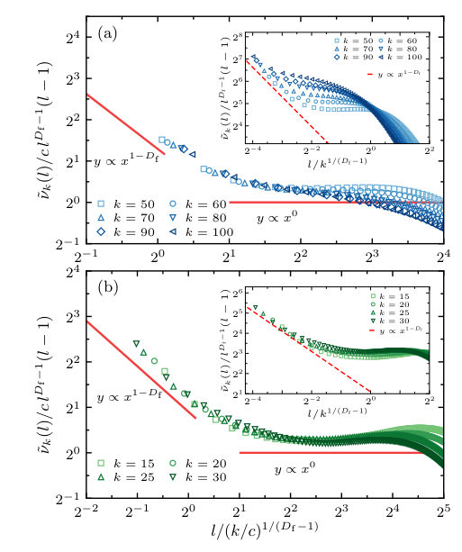
<figcaption class="paper-figure-caption"><b>Fig 2.</b> FIG. 2. Scaling collapse of the rescaled ball volume, demonstrating the degree-dependent crossover predicted by Eq. (17). Rescaled ball volume F(l) ≡˜νk(l)/[clDf −1(l −1)] is plotted as a function of the rescaled distance x ≡l/lco(k) with lco(k) = (k/c)1/(Df −1) for (a) scale-free networks with γ = 3.75 and (b) those with γ = 4.25. Symbols correspond to different root degrees k. Red dashed lines indicate the theo- retical behaviors F[l(x)] ∝x1−Df for x ≪1 and F[l(x)] ∝x0</figcaption>
</figure>
<figure class="paper-figure-card">
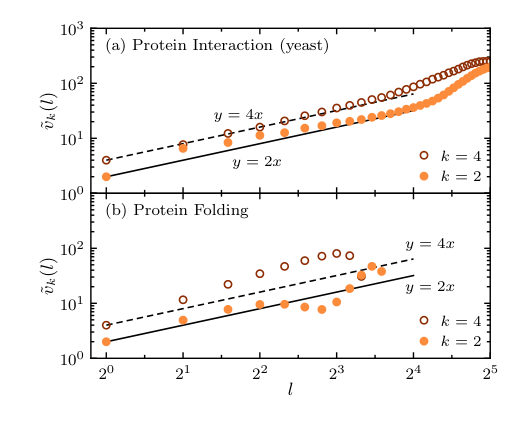
<figcaption class="paper-figure-caption"><b>Fig 3.</b> FIG. 3. Residual ball volume ˜vk(l) ≡˜νk(l)−clDf −1(l −1) as a function of distance l for the skeletons of (a) a protein in- teraction network of yeast and (b) a protein-folding network. Here, ˜νk(l) is the measured average volume from a root node of degree k, and Df and c are estimated from the data. In both panels, open and filled symbols correspond to k = 4 and k = 2, respectively. The dashed line is a visual guide.</figcaption>
</figure>
<figure class="paper-figure-card">
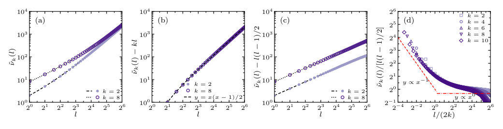
<figcaption class="paper-figure-caption"><b>Fig 4.</b> FIG. 4. Decomposition of the ball volume in critical Erd˝os–R´enyi random graphs with mean degree z1 = 1. (a) Ball volume ˜νk(l) as a function of distance l for root node degrees k = 2 (filled circles) and k = 8 (open circles). The dashed and dotted lines show the exact expression ˜νk(l) = kl + l(l −1)/2 for k = 2 and 8, respectively. (b) Fractal contribution obtained by subtracting the linear term, ˜νk(l) −kl. Data for both root degrees collapse onto the exact result l(l −1)/2 (dashed line). (c) Linear contribution obtained by subtracting the fractal term, ˜νk(l) −l(l −1)/2. The dashed and dotted lines represent kl for k = 2 and 8, respectively. (d) Scaling collapse of ˜νk(l)/[l(l −1)/2] as...</figcaption>
</figure>
<figure class="paper-figure-card">
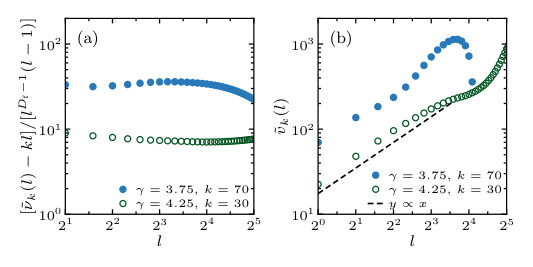
<figcaption class="paper-figure-caption"><b>Fig 5.</b> FIG. 5. Extraction of the linear contribution in the ball volumes of critical scale-free random networks. Filled and open circles represent the results for (γ, k) = (3.75, 70) and (4.25, 30), respectively. (a) Ratio [˜νk(l) −kl]/[lDf −1(l −1)] used to estimate the coefficient c, with Df = 2.33 and 2 for γ = 3.75 and 4.25, respectively. The approximate plateaus identify the values of c used in the scaling analysis. (b) Residual volume ˜vk(l) after subtracting the fractal contribution. The dashed guide demonstrates the remaining degree-dependent linear term kl.</figcaption>
</figure>

**Summary.** This paper analyzes the structural crossover in scale-free random networks, showing that the growth of the local volume exhibits a transition from a degree-dependent linear regime to a global fractal regime. This crossover is theoretically derived using critical branching processes and is successfully validated by applying the model to real-world biological networks.

**Why it may be interesting.** While focused on network theory, the concept of structural crossover governed by scaling laws and critical phenomena is highly relevant to understanding phase transitions and connectivity in complex quantum systems or disordered quantum materials.

Detailed structure

**Main problem.** The paper investigates the structural crossover in complex networks, specifically bridging the relationship between long-range degree correlations and network fractality.

**Main result.** The average ball volume exhibits a structural crossover: $\tilde{\nu}_k(l) \sim k l$ at short distances and $\tilde{\nu}_k(l) \sim l^{D_f}$ at large distances.

**Method.** The analysis involves deriving the ball volume $\tilde{\nu}_k(l)$ using the configuration model and relating it to critical branching processes.

**Model / system.** The study focuses on scale-free random networks near the percolation threshold, and extends the findings to empirical fractal networks like protein interaction networks.

**Key observables.** Ball volume $\tilde{\nu}_k(l)$, structural crossover length $l_{co}(k)$, and the fractal dimension $D_f$.

**Important parameters / regimes.** Degree exponent $\gamma$, distance $l$, and the crossover length $l_{co}(k) \sim k^{1/(D_f-1)}$.

**Assumptions / limitations.** The analysis relies on the critical limit near the percolation threshold and assumes the network structure can be decomposed into linear and fractal components.

**Figures summary.** Figures show numerical confirmation of the crossover in scale-free random networks and demonstrate the linear growth term in the residual ball volume for both theoretical and empirical protein networks.

**Paper structure.** The paper develops the theoretical framework by deriving the ball volume $\tilde{\nu}_k(l)$ and predicting the crossover. It then confirms this prediction using critical branching process interpretations, followed by numerical verification on both synthetic scale-free graphs and real-world biological networks.

Abstract

We investigate the relationship between long-range degree correlations and fractality in scale-free random networks. By analyzing degree correlations in scale-free random networks at the percolation threshold, at which a giant component emerges, we derive the ball volume $\tildeν_k(l)$, defined as the average number of nodes within distance $l$ from a root node with degree $k$. The resulting expression predicts a degree-dependent structural crossover. For $l\ll k^{1/(\df-1)}$, the ball volume grows as $\tildeν_k(l)\sim kl$, whereas for $l\gg k^{1/(\df-1)}$, it crosses over to the global fractal scaling $\tildeν_k(l)\sim l^{\df}$. Here, $\df$ is the fractal dimension of critical scale-free random networks. We further show that the structural crossover can be naturally understood in terms of critical branching processes and is also observed in empirical fractal networks.

[↑ back to top](#top)

### [Ab initio Green's function theory of superfluid neutron matter](http://arxiv.org/abs/2610.03507v1)

**Authors:** F. Marino, W. G. Jiang, C. Barbieri, G. Colò  
**Type:** theory · **Category:** quantum gases · **PDF:** <https://arxiv.org/pdf/2610.03507v1>  
**Analysis basis:** full PDF text, analyzed in chunks
**Topic relevance:** `Keldysh / 2PI / non-Gaussian methods` **3/5** · `analog quantum simulation` **1/5** · `methods for driven-dissipative` **1/5**

↔ Scroll figures horizontally

<figure class="paper-figure-card">
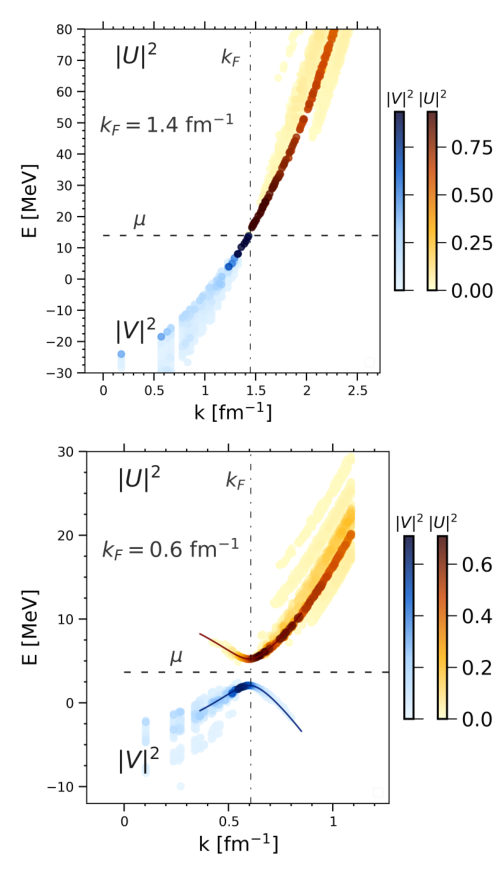
<figcaption class="paper-figure-caption"><b>Fig 1.</b> Figure 1. Two-dimensional representation of the spectral function (1) obtained by varying the momentum k and energy E = µ + ℏω. The top panel displays neutron matter in the normal-liquid regime (at Fermi momentum kF = 1.4 fm−1), while in the bottom panel (kF = 0.6 fm−1) the system is in the superfluid phase. The squared spectroscopic amplitudes |Uq k|2 and |Vq k|2 are shown for poles above and below the Fermi level E = µ, respectively. The corresponding color scales are displayed alongside each panel. The Fermi momentum kF and chemical potential µ are indicated by dot-dashed and dashed lines, respectively. For kF = 0.6 fm−1, continuous lines show fits of the spectral function obtained with...</figcaption>
</figure>
<figure class="paper-figure-card">
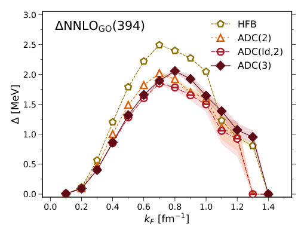
<figcaption class="paper-figure-caption"><b>Fig 2.</b> Figure 2. Pairing gaps as functions of the Fermi momentum predicted at different approximation levels. Fit errors are reported as shaded bands. The ∆NNLOGO(394) potential from Ref. [54] is used. See text.</figcaption>
</figure>
<figure class="paper-figure-card">
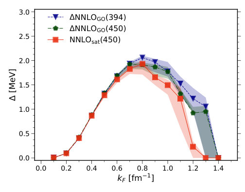
<figcaption class="paper-figure-caption"><b>Fig 3.</b> Figure 3. Pairing gaps as functions of the Fermi momen- tum. Calculations at the ADC(3) level are reported for the ∆NNLOGO(394) and ∆NNLOGO(450) potentials from Ref. [54] and the NNLOsat(450) interaction. The shaded bands account for the uncertainties stemming both from the many-body truncation, estimated as the deviation between ADC(3) and ADC(ld,2) predictions, and the fit errors. Lines are a guide to the eye.</figcaption>
</figure>
<figure class="paper-figure-card">
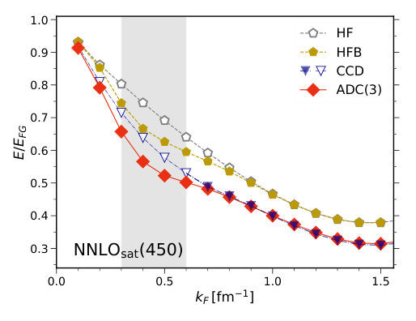
<figcaption class="paper-figure-caption"><b>Fig 4.</b> Figure 4. Energy per particle in units of the free Fermi gas energy EF G = 3/5EF , where EF = (ℏkF )2/(2m). Results are obtained with the NNLOsat(450) interaction [39]. Empty triangles denote extrapolations from the CCD energies (full triangles). The gray shaded area corresponds to the region where ADC(3) pairing gaps (shown in Fig. 3) satisfy ∆/EF &gt; 0.2.</figcaption>
</figure>

**Summary.** This work develops an ab initio Green's function theory to study superfluid neutron matter, crucial for understanding neutron stars. By employing the nonperturbative Gorkov-ADC method, the authors calculate the equation of state and pairing gaps across all relevant densities. The key finding is the quantitative renormalization of the pairing gap when moving beyond simple mean-field approximations.

**Why it may be interesting.** While focused on nuclear matter, the use of advanced diagrammatic techniques (like ADC) to calculate pairing gaps and spectral functions in a strongly interacting, superfluid system shares methodological parallels with BCS theory applied to ultracold Fermi gases.

Detailed structure

**Main problem.** To provide a precise, quantitative understanding of superfluid neutron matter, particularly the pairing gaps, which has been hindered by uncontrolled many-body approximations.

**Main result.** The Gorkov-ADC method successfully quantifies the pairing gap and equation of state across density regimes, showing that beyond-mean-field corrections renormalize the gap compared to simpler approximations.

**Method.** The study employs the nonperturbative Gorkov algebraic diagrammatic construction (ADC) method within the Green's function formalism to calculate self-energies and spectral functions.

**Model / system.** The system is homogeneous neutron matter, relevant to the inner crust of neutron stars, modeled using realistic chiral Hamiltonians and analyzed across varying densities (Fermi momentum $k_F$).

**Key observables.** Equation of state (EOS), single-particle spectral functions, and the pairing gap ($\Delta$).

**Important parameters / regimes.** Fermi momentum ($k_F$), density, and the comparison between different many-body approximation levels (HFB vs. ADC(3)).

**Assumptions / limitations.** The analysis relies on the Gorkov formalism and involves approximations like the third-order ADC ($	ext{ADC}(3)$) and renormalization techniques to handle dynamical and pairing correlations.

**Figures summary.** Figures illustrate the spectral function transition from normal to superfluid regimes, plot the pairing gap ($\Delta$) versus Fermi momentum for various approximations, and compare the energy per particle across different theoretical frameworks.

**Paper structure.** The paper develops the Gorkov equation framework, compares results from HFB theory to beyond-mean-field theories (ADC(3)), and demonstrates how the pairing gap is renormalized by dynamical correlations, providing a unified description from dilute to saturation density.

Abstract

At the low densities encountered in the inner crust of neutron stars, neutron matter becomes superfluid, directly influencing macroscopic phenomena such as star cooling. However, a precise quantitative understanding of this system has been hindered by uncontrolled many-body approximations. In this letter, we exploit the nonperturbative Gorkov algebraic diagrammatic construction method to provide a unified ab initio description of the equation of state and the single-particle spectral functions of homogeneous neutron matter, spanning from the dilute regime to saturation density. We identify clear microscopic signatures of superfluidity in the excitation spectrum and quantify the pairing gaps associated with realistic chiral Hamiltonians, estimating for the first time their sensitivity to the many-body truncation. Our robust handling of both dynamical and pairing correlations paves the way for exploring electroweak processes across the regimes relevant to neutron stars.

[↑ back to top](#top)

### [Symmetry-preserving quantum compilation](http://arxiv.org/abs/2610.03624v1)

**Authors:** Maryam Mudassar, Zhi-Yuan Wei, Alexander Schuckert, Michael J. Lawler, Michael J. Gullans, Daniel Gottesman  
**Type:** theory · **Category:** strongly correlated electrons · **PDF:** <https://arxiv.org/pdf/2610.03624v1>  
**Analysis basis:** full PDF text, analyzed in chunks
**Topic relevance:** `quantum measurements` **3/5** · `analog quantum simulation` **2/5**

↔ Scroll figures horizontally

<figure class="paper-figure-card">
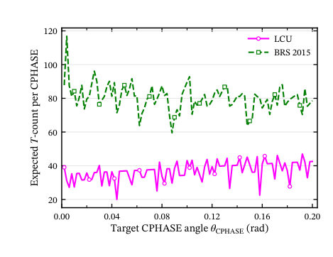
<figcaption class="paper-figure-caption"><b>Fig 1.</b> FIG. 2. Expected RUS T-count per CPHASE gate for the BRS 2015 and LCU methods at a common CPHASE- angle tolerance, |θ′ CPHASE −θCPHASE| ≤10−3. At each target angle, we select the candidate with the minimum expected T-count satisfying this tolerance. LCU has lower expected T-count at every sampled angle. Over the displayed range, the mean expected T-counts are 36.9 for LCU and 80.3 for BRS 2015, giving a ratio of 2.18. For this plot and the rest of paper, we fix L and C as 20.</figcaption>
</figure>
<figure class="paper-figure-card">
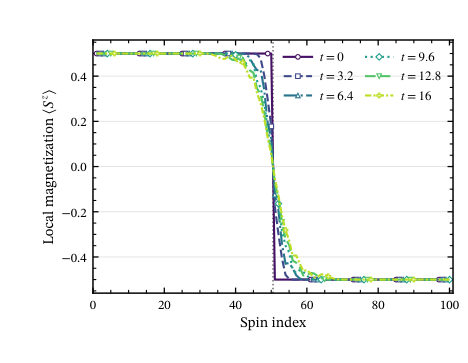
<figcaption class="paper-figure-caption"><b>Fig 2.</b> FIG. 3. Pure, fully polarized domain-wall state obtained in the limit µ →∞at t = 0, followed by its melt- ing under symmetric Heisenberg evolution. Profiles are shown every 40 time steps from t = 0 to t = 200 δt with δt = 0.08, corresponding to the physical snapshot times t = 0, 3.2, 6.4, 9.6, 12.8, and 16.</figcaption>
</figure>
<figure class="paper-figure-card">
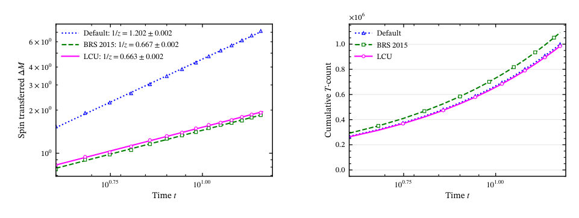
<figcaption class="paper-figure-caption"><b>Fig 3.</b> FIG. 4. Comparable T-count, different transport exponents. (a) We choose synthesis precisions ϵ = 2×10−2 for both the default and BRS 2015 methods, while the LCU cost uses ϵLCU = 4 × 10−5. At these values, the T-count is nearly the same, but the exponent is different for the symmetry breaking and symmetry preserving methods: 1.202 ± 0.002 for the default method, 0.667 ± 0.002 for BRS 2015, and 0.663 ± 0.002 for LCU, which is extracted as power law fit from the log-log plots (b) Synthesis precisions are chosen so that all three methods have similar T counts. The simulations use N = 100, δt = 0.08, and total evolution time T = 15. We plot time on a log scale.</figcaption>
</figure>
<figure class="paper-figure-card">
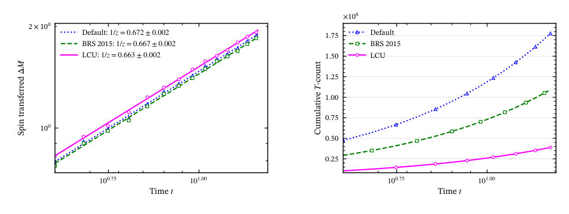
<figcaption class="paper-figure-caption"><b>Fig 4.</b> FIG. 5. Similar exponents, different T-count (a) Independent matched-accuracy simulations give 1/z = 0.672 ± 0.002 for the default method at ϵdef = 2 × 10−3, 0.667 ± 0.002 for BRS 2015 at ϵBRS = 2 × 10−2, and 0.663 ± 0.002 for LCU at requested ϵLCU = 2 × 10−2, where the exponent is plotted using a power law fit on the log-log plot. (b) At these precisions, BRS 2015 has roughly 60 percent T count compared to default, and LCU has 20 percent T count compared to the default method. Note that these numbers are obtained for the desired δt, and T cost may depend on the chosen step size. The simulations use N = 100, δt = 0.08, and total evolution time T = 15. We plot time on a log scale.</figcaption>
</figure>
<figure class="paper-figure-card">
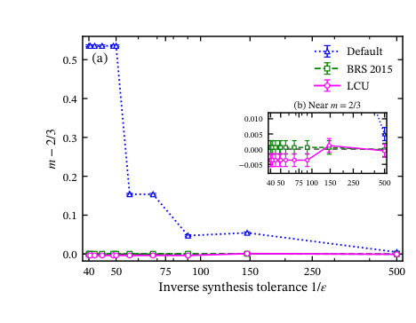
<figcaption class="paper-figure-caption"><b>Fig 5.</b> FIG. 6. Deviation of the fitted transport slope m = 1/z from 2/3 as a function of inverse synthesis tolerance. At lower 1/ϵ (lower precision), the default method deviates significantly from m, while both symmetry preserving methods have much smaller errors. At higher 1/ϵ, sym- metry preserving and violating methods converge.</figcaption>
</figure>

**Summary.** This paper introduces a novel, fault-tolerant compilation framework designed to simulate quantum dynamics while rigorously preserving continuous symmetries, such as SU(2). By circumventing theoretical obstructions using measurement and feed-forward, the method significantly reduces the required gate resources (T-count) compared to standard synthesis techniques. This has major implications for accurately simulating complex models like the Heisenberg chain and Fermi-Hubbard model.

**Why it may be interesting.** This work directly addresses the resource scaling and accuracy limitations of quantum simulation for strongly correlated systems by ensuring that the computational error does not corrupt fundamental physical symmetries like SU(2).

Detailed structure

**Main problem.** The core problem is developing fault-tolerant quantum compilation methods that can accurately simulate time evolutions while strictly preserving underlying continuous symmetries.

**Main result.** The proposed symmetry-preserving compilation framework successfully reproduces expected physical exponents (like the transport exponent) for the 1D Heisenberg model at lower gate counts compared to standard, symmetry-agnostic synthesis methods.

**Method.** The authors develop a framework that circumvents number-theoretic obstructions by using measurement and feed-forward techniques within a Linear-Combination-of-Unitaries (LCU) protocol to maintain exact symmetry preservation.

**Model / system.** The primary testbed is the one-dimensional isotropic Heisenberg model, whose Hamiltonian possesses a global SU(2) rotational symmetry. The framework is also extended to lattice gauge theories and fermionic models like the Fermi-Hubbard model.

**Key observables.** Transport exponent (KPZ exponent), T-count (gate resource cost), and final-state fidelity.

**Important parameters / regimes.** The required T-count, the simulation time $t$, and the error tolerance $\epsilon$.

**Assumptions / limitations.** The simulation relies on approximating the time evolution $U(t) = e^{-iHt}$ via Trotterization, which is then compiled into the discrete Clifford+T gate set.

**Figures summary.** Not specified, but the notes reference comparisons of gate costs and fidelity between different synthesis methods.

**Paper structure.** The paper progresses from establishing the need for symmetry preservation in Trotterization, characterizing the number-theoretic obstruction, developing the LCU construction, benchmarking the method on the Heisenberg model, and finally extending the results to gauge and fermionic symmetries.

Abstract

Fault-tolerant quantum simulation requires compiling symmetry-preserving time evolutions into discrete gate sets. Standard Clifford+T synthesis can break continuous symmetries even when the target evolution preserves them, causing compiled simulations to lose essential features of the original system. We develop a fault-tolerant compilation framework that preserves SU(2) symmetry exactly. We characterize the number-theoretic obstruction preventing symmetry-preserving unitary Clifford+T circuits from approximating arbitrary SU(2)-symmetric evolutions and circumvent it using measurement and feed-forward. The resulting synthesis confines compilation errors to the symmetry-preserving operator algebra rather than introducing symmetry-breaking perturbations.   We demonstrate the algorithm by simulating transport in the one-dimensional Heisenberg model. At a lower matched T-count, for instance, 54 T gates per two-site Trotter step, standard synthesis yields an incorrect transport exponent, whereas our symmetry-preserving compilation reproduces the expected exponent for the same expected T-count. If instead each approach is allocated whatever resources are necessary to estimate this exponent to the same accuracy, our construction reduces the T-count by approximately a factor of five. We further extend the framework to gauge symmetries in lattice gauge theories and to particle-number and spin symmetries in fermionic models relevant to quantum chemistry and the Fermi-Hubbard model.   These results show that symmetry-preserving fault-tolerant compilation can qualitatively change the effects of synthesis error while substantially reducing the resources required for quantum simulation.

[↑ back to top](#top)

### [Consistent perturbation expansions in screened interactions](http://arxiv.org/abs/2610.03569v1)

**Authors:** Abdallah Arthur El Sahili, Francesco Sottile, Lucia Reining  
**Type:** theory · **Category:** strongly correlated electrons · **PDF:** <https://arxiv.org/pdf/2610.03569v1>  
**Analysis basis:** full PDF text, analyzed in chunks
**Topic relevance:** `Keldysh / 2PI / non-Gaussian methods` **3/5** · `analog quantum simulation` **1/5**

↔ Scroll figures horizontally

<figure class="paper-figure-card">
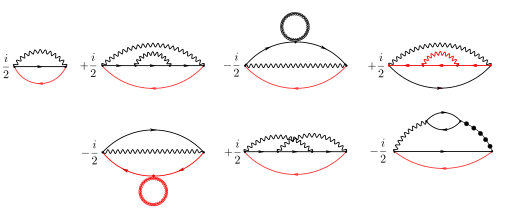
<figcaption class="paper-figure-caption"><b>Fig 1.</b> Figure 1. Second-order expansion of the self-energy and of the xc energy. Self-energy in black, without factors i/2. The xc energy includes also the factors i/2 and all red symbols. A straight arrow indicates G, the wiggly line is iW. The circle stands for ν(1) −v(1) cl , and the line with filled circles is i times its functional derivative with respect to the density. The first diagram contains the first-order contribution to the xc self- energy (29). The second-order contributions to the xc self- energy are the self-consistency diagrams (30) (contained in the next two diagrams), and (28) with G →G (contained in the last two diagrams). The two remaining second-order diagrams give an extra...</figcaption>
</figure>
<figure class="paper-figure-card">
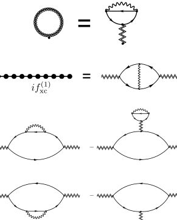
<figcaption class="paper-figure-caption"><b>Fig 2.</b> Figure 2. First-order expansion of the xc potential and kernel of TDDFT. A straight arrow indicates GKS, the wiggly line is i ˜ W. The double zig-zag line is i times the inverse of the KS independent-particle polarizability, iχ−1 0 . The circle stands for v(1) xc , given in the first line, and the line with filled circles is if (1) xc with the electron-hole contribution if mb xc (first diagram) and the gap correction contribution if g xc in the next two lines.</figcaption>
</figure>
<figure class="paper-figure-card">
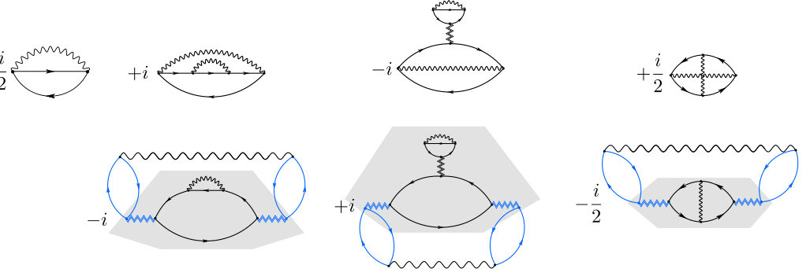
<figcaption class="paper-figure-caption"><b>Fig 3.</b> Figure 3. Second-order expansion of the xc energy in terms of KS ingredients. Definitions are the same as in Fig. 2. The v(1) xc and f (1) xc displayed in Fig. 2 and inserted into Fig. 1 lead to the second-order diagrams for Exc given here. The first diagram is the first-order, (29) with G →GKS and W →˜ W. Next come two self-consistency diagrams, and the ordinary second-order diagram. The second line contains diagrams stemming from f (1) xc , indicated by the grey shaded areas. Bubbles and double zig-zag lines in blue highlight the cancellation between iχ−1 0 contained in f (1) xc and a bubble built with GKS and contained in the rest of the respective contribution. Finally, each...</figcaption>
</figure>
<figure class="paper-figure-card">
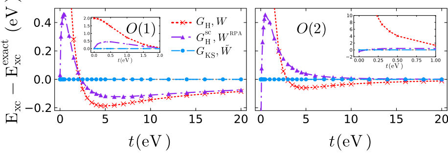
<figcaption class="paper-figure-caption"><b>Fig 4.</b> Figure 4. Error in the exchange-correlation contribution to the total energy as a function of t for U = 4 eV, for different expansions up to first (left) and second (right) orders. Red crosses and violet triangles are results of the expansion in the exact screened Coulomb interaction and the Hartree Green’s function with exact density following (59) (diagrams given in Fig. 1, excluding the second, fourth, and last second-order diagrams), and of the expansion in the RPA screened Coulomb interaction and in the Hartree Green’s function with self-consistent density (same equations with corresponding replacement of G and W), respectively. The results of an expansion in the KS Green’s function...</figcaption>
</figure>
<figure class="paper-figure-card">
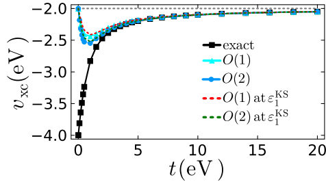
<figcaption class="paper-figure-caption"><b>Fig 5.</b> Figure 5. Kohn-Sham exchange-correlation potential vxc de- termined from (46) (exact, black curve with squares) and from (51) (first-order, light blue with triangles) and (52) (second- order, darker blue with dots). We also show the results when the self-energy in (51) and (52) is evaluated at the exact KS energy: this slightly different expansion of vxc also converges to the exact result, and it may be seen as a valid alternative. The difference is very small, as one can see by comparing the light blue to the red dashed, and the darker blue to the green dashed curve.</figcaption>
</figure>

**Summary.** This paper addresses the theoretical inconsistency plaguing many-body perturbation theory by developing systematic, order-by-order expansions for electronic structure calculations. By focusing on a consistent framework derived from screened interactions, the authors propose that using ingredients derived from the Kohn-Sham system offers a robust path toward accurate energy and spectral predictions.

**Why it may be interesting.** The focus on systematic, rigorous diagrammatic expansions and the need for consistent approximations in correlated electron systems directly relates to advanced many-body physics techniques used in AMO and quantum optics.

Detailed structure

**Main problem.** Many-body perturbation theory (MBPT) suffers from inconsistent results because different approximations lead to varying calculations for spectroscopic quantities and total energy.

**Main result.** The authors propose a consistent framework by deriving rigorous perturbation expansions, highlighting that the expansion based on exact Kohn-Sham ingredients is a promising route for accurate results.

**Method.** The work involves deriving systematic, order-by-order expansions of the Dyson equation using screened Coulomb interactions ($W$) up to the second order.

**Model / system.** The general many-body problem in condensed matter physics is studied, with the symmetric Hubbard dimer used as a specific model system for illustration.

**Key observables.** One-body Green's function ($G$), self-energy ($\Sigma$), total energy ($E_0$), and spectral functions ($A(\omega)$).

**Important parameters / regimes.** Correlation strength, the screened interaction $W$, and the order of the perturbation expansion (up to second order).

**Assumptions / limitations.** The authors focus on defining consistency by using a self-contained diagrammatic series, explicitly avoiding complex issues like self-consistency loops or Bethe-Salpeter equation approximations.

**Figures summary.** Not specified.

**Paper structure.** The paper establishes the Dyson equation, introduces screening via $W$, develops the perturbation theory for the self-energy ($\Sigma^{(1)}, \Sigma^{(2)}$), and discusses methods for calculating $G$ from $\Sigma$ to ensure theoretical consistency.

Abstract

Many-body perturbation theory is a powerful framework to calculate spectroscopic quantities, as well as the total energy. However, the field suffers from the fact that different flavors of approximations lead to a wide range of results. We present several in principle exact expansions and discuss how to use them consistently. We concentrate on the first two orders in the respective screened Coulomb interaction. Of special interest is a consistent expansion around the Kohn-Sham system. We illustrate the performance of the various choices using the symmetric Hubbard dimer over a wide range of correlation strength. In particular, the expansion based on exact Kohn-Sham ingredients stands out as a promising route towards good energies and good spectra.

[↑ back to top](#top)

### [Hamiltonian Eigenvalue Transformation by Tridiagonal Gadgets](http://arxiv.org/abs/2610.03295v1)

**Authors:** Arthur Braida, Joseph Cunningham, Jérémie Roland  
**Type:** theory · **Category:** quantum information and computing · **PDF:** <https://arxiv.org/pdf/2610.03295v1>  
**Analysis basis:** full PDF text, analyzed in chunks
**Topic relevance:** `analog quantum simulation` **3/5** · `quantum measurements` **1/5**

↔ Scroll figures horizontally

<figure class="paper-figure-card">
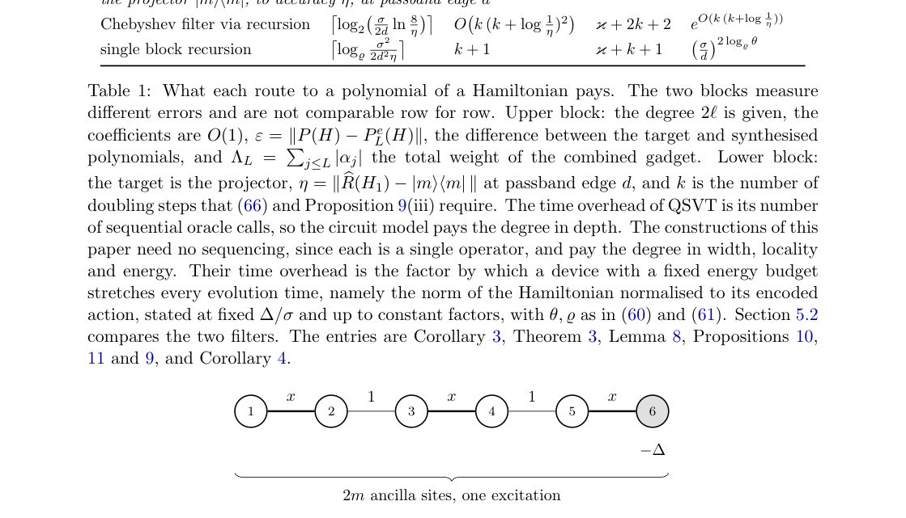
<figcaption class="paper-figure-caption"><b>Fig 1.</b> Figure 1: The even gadget E2m(x) for m = 3. Thick bonds carry the input x and become the operator H when the scalar is replaced by a Hamiltonian. Thin bonds are unit couplings, and the last site carries the detuning −∆. The quantity of interest is the eigenvalue branch λ(m) 0 (x) that vanishes at x = 0.</figcaption>
</figure>
<figure class="paper-figure-card">
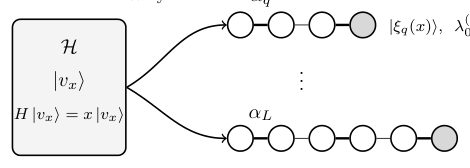
<figcaption class="paper-figure-caption"><b>Fig 2.</b> Figure 2: The construction of Theorem 3. Every chain is attached to the same system register through its x-bonds, so on an eigenvector |vx⟩it reduces to the matrix E2j(x) of Figure 1 and contributes λ(j) 0 (x). The chains occupy disjoint sets of ancillas, so the summands of Σ = P j αjE2j(H) commute, their branch eigenvalues add, and W intertwines Σ with P e L(H) exactly, which is (53). The image of W is invariant under Σ.</figcaption>
</figure>
<figure class="paper-figure-card">
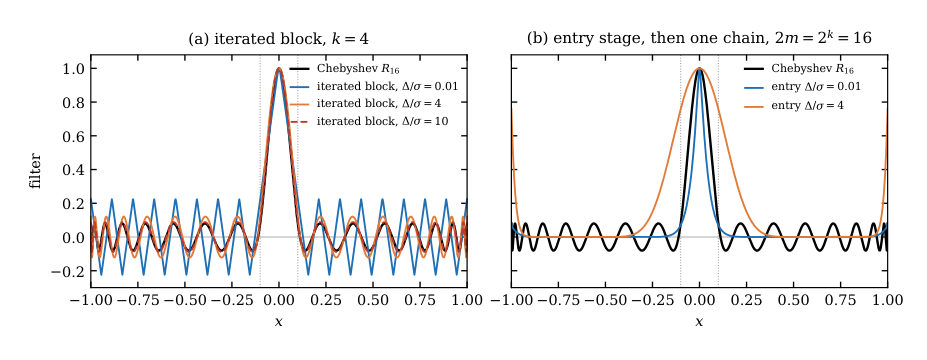
<figcaption class="paper-figure-caption"><b>Fig 3.</b> Figure 3: Filters at σ = 1 and d = 0.1 (dotted verticals), each normalised to 1 at the marked energy x = 0. In both panels the black curve is the Chebyshev filter R16 of Definition 1, which the synthesised square of Appendix A approximates. (a) The iterated block bR4 of Proposition 9, at depth k = 4, for the three detunings ∆/σ given in the legend. The smallest one is close to the tent map, and the block approaches R16 as ∆/σ grows. (b) The last option of this section, the entry stage Σ0 followed by one chain E2m with 2m = 2k = 16 sites. The legend gives the detuning ∆/σ of the entry stage. The chain has detuning ∆′ = 10, and its input is rescaled so that the marked point sits at r′ = 0.8....</figcaption>
</figure>
<figure class="paper-figure-card">
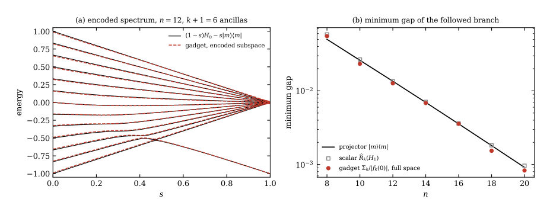
<figcaption class="paper-figure-caption"><b>Fig 4.</b> Figure 4: Analog search with the gadget Hamiltonian, H(s) = (1 −s)H0 ⊗I + s Σk/|fk(0)| as in (63), simulated with every ancilla qubit, at σ = 0.5, ∆= 10σ, d = δ = σ/n and stopband at most 5 · 10−2. (a) At n = 12 and k = 5, the spectrum of (63) compressed to the encoded subspace, an operator on the system register (dashed), against that of (1 −s)H0 −s |m⟩⟨m| (solid). (b) Gap at the anticrossing against n, for the projector, for the scalar filter bRk(H1) substituted on the system register, and for the encoded eigenvalue of the gadget Hamiltonian in the full space, whose gap also closes as s →0, where H(0) = H0 ⊗I is degenerate.</figcaption>
</figure>

**Summary.** This paper introduces a novel 'gadget' construction using ancilla qubits attached to a local Hamiltonian $H$ to simulate non-local operations like $P(H)$. By analyzing the unique, analytic eigenvalues of these gadgets, the authors show they can synthesize any polynomial or filter specific eigenstates with controlled error decay. This offers a significant resource advantage over existing circuit-based methods.

**Why it may be interesting.** This work provides a powerful, resource-efficient alternative to standard quantum signal processing techniques for implementing complex functions of local Hamiltonians, directly impacting the feasibility of quantum simulation and quantum computation.

Detailed structure

**Main problem.** The primary challenge is realizing a polynomial function $P(H)$ of a local Hamiltonian $H$ using a single, time-independent, local Hamiltonian operator, since $P(H)$ is generally non-local.

**Main result.** The authors demonstrate a gadget construction using ancilla qubits that synthesizes any polynomial $P(H)$ or filters a marked eigenstate with controlled error decay, achieving this with improved locality compared to standard circuit models.

**Method.** The method involves attaching short, structured chains of ancilla qubits (tridiagonal gadgets) to the input Hamiltonian $H$. The polynomial is synthesized by taking a weighted sum of the unique, analytic eigenvalues derived from these chains.

**Model / system.** The model is an analog quantum device implementing a local Hamiltonian $H$. The core computational element is the 'gadget,' which is a short chain of ancilla qubits whose isolated eigenvalue $\lambda_0(x)$ is an analytic function of the input $x$ (representing $H$).

**Key observables.** The isolated eigenvalue $\lambda_0(x)$ of the gadget, which is an analytic function of the input $H$. The fidelity of the state filter or the accuracy of the polynomial reproduction are key diagnostics.

**Important parameters / regimes.** The degree of the polynomial ($\ell$), the locality of the input Hamiltonian ($H$), the required accuracy ($\epsilon$), and the number of ancilla qubits ($O(\ell^2)$).

**Assumptions / limitations.** The construction relies on the existence of a unique, analytic eigenvalue branch $\lambda_0(x)$ for the gadget, and the ability to synthesize the polynomial via a weighted sum of these branches.

**Figures summary.** Figure 1 illustrates the structure of the even gadget $E_{2m}(x)$ for $m=3$. Table 1 compares the resource costs (ancillas vs. depth) of the gadget approach versus Quantum Singular Value Transformation (QSVT).

**Paper structure.** The paper establishes the problem of non-locality, introduces the gadget gadget based on eigenvalue analysis (Theorem A), proves the ability to synthesize any polynomial (Theorem B), and details a superior, iterative method for state filtering (Theorem C).

Abstract

An analog device implements a local Hamiltonian H, but a polynomial P (H) is in general not local, so the device cannot implement it. We carry P (H), to any prescribed accuracy, as the action of a single time-independent local Hamiltonian on an explicitly described invariant subspace. Short chains of ancilla qubits are attached to H. A chain of 2m sites has a unique isolated eigenvalue that is an analytic function of the input vanishing to order exactly 2m, because the input must cross the chain and come back before it can shift the energy at the far end. Chains of different lengths therefore form a triangular family, and a weighted sum of them reproduces a prescribed polynomial term by term. Even chains give the even part and odd chains the odd part, so any polynomial is reached. We prove uniqueness, analyticity and coefficient bounds uniform in the chain length for inputs H of norm below any r < 1. Where the circuit model pays degree 2l in 2l sequential oracle calls, the result here is one Hamiltonian of locality two more than that of H, which pays the degree in O(l^2 + log2^(1/eps)) ancillas and in energy scale. As an application we filter a marked eigenstate of a local Hamiltonian. Composing a synthesised square along the Chebyshev doubling identity works, but its energy scale grows quasi-polynomially with the degree. Iterating instead the exact eigenvalue branch of the two-site chain k times gives a filter on k + 1 ancilla qubits whose error decays geometrically in k, at an energy scale polynomial in the inverse passband width and independent of k, the locality growing by one per stage. In adiabatic optimisation with a rank-one driver, the construction replaces that non-local driver, by a Hamiltonian with O(log n) ancillas and O(log n)- body terms, at an energy scale polynomial in n. Simulations including every ancilla reproduce the spectrum of the ideal algorithm.

[↑ back to top](#top)

### [Quantum approaches for particle-in-cell codes](http://arxiv.org/abs/2610.03254v1)

**Authors:** Ryan J. J. Connor, Andrew J. Daley, Callum W. Duncan, Preetma Soin  
**Type:** theory · **Category:** numerical methods · **PDF:** <https://arxiv.org/pdf/2610.03254v1>  
**Analysis basis:** full PDF text, analyzed in chunks
**Topic relevance:** `methods for driven-dissipative` **3/5** · `Keldysh / 2PI / non-Gaussian methods` **1/5**

↔ Scroll figures horizontally

<figure class="paper-figure-card">
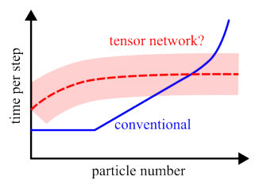
<figcaption class="paper-figure-caption"><b>Fig 1.</b> Fig. 1. Illustration of time complexity. Conventional PIC approaches (solid blue line) are informed by runs of real problems, and show the emergence of the linear scaling with particle number with initial offset set by the grid resolution. The desired scaling of tensor network approaches (dashed red line) is logarithmic with a larger initial offset. The shaded region is to indicate the uncertainty in the offset, which is problem and implementation dependent.</figcaption>
</figure>
<figure class="paper-figure-card">
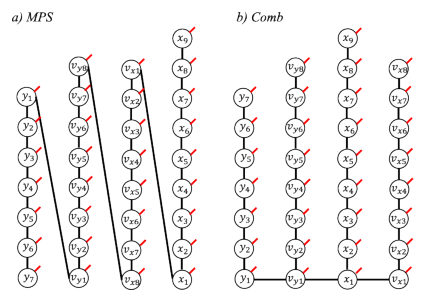
<figcaption class="paper-figure-caption"><b>Fig 2.</b> Fig. 2. Illustration of two tensor-network encodings of f(x, y, vx, vy) on an 29×27×28×28 phase space grid into an a) MPS and b) comb tensor-network geometry. We choose to label each tensor according to which dimension it belongs to, and the corresponding length scale of that dimension. E.g. x1 encodes the coarsest length scale of the x dimension, and vy8 encodes the finest length scale of the vy dimension. Bond indices are shown as black lines connecting two tensors, whilst the physical indices are shown in red emerging diagonally upwards from each tensor.</figcaption>
</figure>
<figure class="paper-figure-card">
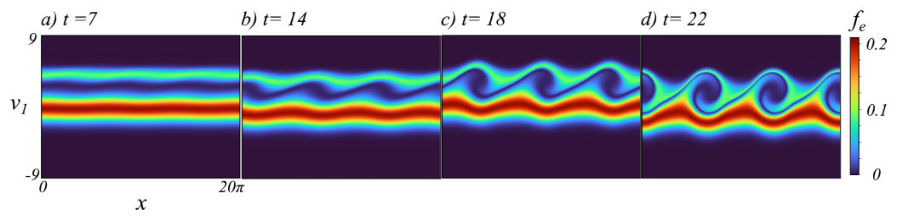
<figcaption class="paper-figure-caption"><b>Fig 3.</b> Fig. 3. Snapshots of a cut of the electron distribution fe(x, v1) through phase space for the bump-on-tail instability reproduced from [14]. We show a slice through the v2 = 0 plane, resulting in a 2D function in x and v1, at various simulation times of a)t = 7, b)t = 14, c)t = 18 and d)t = 22. These simulations where conducted on a 28 × 28 × 28 phase space grid, resulting in a 24 site MPS encoding, and evolved via a fixed time-step 4th order Runge-Kutta scheme with a time-step of dt = 0.0014. A truncation cutoff of 10−15 was used to adaptively control the bond dimension χ.</figcaption>
</figure>
<figure class="paper-figure-card">
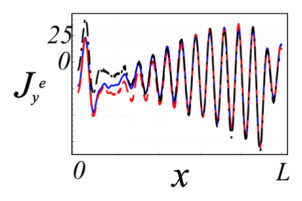
<figcaption class="paper-figure-caption"><b>Fig 4.</b> Fig. 4. Demonstration of convergence of MPS simulations of the beat wave problem reproduced from [14]. We plot a cut along the x-y plane at y = Lx/2 of the current density from the electrons, Je y(x, y) at a fixed simulation time of t = 0.14. We show convergence of the MPS simulations for bond dimensions of χ = 150 (dash dotted black), χ = 200 (dashed red) and χ = 512 (solid blue).</figcaption>
</figure>
<figure class="paper-figure-card">
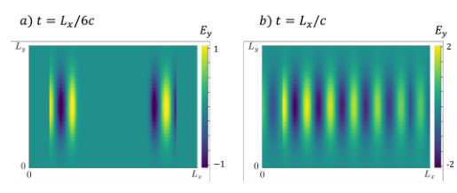
<figcaption class="paper-figure-caption"><b>Fig 5.</b> Fig. 6. Snapshot of the Ey electric field component from an injected laser field at times of a)t = Lx/6c and b)t = Lx/c making use of the TFSF approach. We choose the total field region as the central region, with the scattered field regions consisting of the 32 grid-points nearest the boundaries at x = 0 and x = Lx. The lasers by definition are injected at the boundaries between the total and scattered field regions. These simulations were conducted entirely within the MPS framework using the technique outlined in the text.</figcaption>
</figure>

**Summary.** This paper presents a novel approach to simulating complex plasma physics by replacing traditional Particle-in-Cell codes with tensor-network methods, specifically using Matrix Product States. This allows for solving the governing equations in high-dimensional phase space while mitigating issues like statistical noise and improving computational scaling. The framework is extended to model external drivers, such as injected laser fields, marking a significant step toward quantum-inspired plasma simulation.

**Why it may be interesting.** This work directly applies advanced tensor-network techniques, which are central to quantum information and many-body physics, to a classical, non-equilibrium field theory problem (plasma dynamics). The successful adaptation of MPS to handle complex field coupling is a significant methodological advance.

Detailed structure

**Main problem.** The primary challenge is solving the high-dimensional, nonlinear partial differential equations governing plasma physics, which is computationally intensive using standard methods.

**Main result.** The authors successfully demonstrated that tensor-network methods can model complex plasma phenomena, such as instabilities and laser-plasma interactions, while maintaining favorable computational scaling.

**Method.** They propose using tensor-network representations, specifically Matrix Product States (MPS), to discretize the full phase space grid, allowing for the simulation of the Vlasov equation.

**Model / system.** The model is plasma dynamics governed by the Vlasov-Maxwell kinetic equations. The simulation involves tracking particle distributions in phase space and coupling this to electromagnetic field evolution.

**Key observables.** Electron distribution snapshots in phase space, current density, and the propagation of electric field components ($E_y$).

**Important parameters / regimes.** The simulation involves parameters like Debye length constraints, time steps ($\Delta t = 0.0014$), and bond dimensions ($\chi$) required for MPS accuracy.

**Assumptions / limitations.** The key assumption is that the physics can be accurately captured by the tensor-network representation, and the method relies on careful boundary condition handling when injecting external fields (TFSF approach).

**Figures summary.** Figures illustrate the comparison of time complexity (PIC vs. Tensor Network), the MPS encoding structure, snapshots of electron distributions during instabilities, convergence tests for wave problems, and the setup for laser field injection.

**Paper structure.** The paper first establishes the computational bottleneck of plasma simulations using PIC codes. It then introduces tensor-networks as a solution, detailing the MPS encoding of the Vlasov equation. Finally, it extends this framework to incorporate external electromagnetic fields using the Total Field Scattered Field (TFSF) approach for advanced simulations.

Abstract

Solving the high-dimensional, nonlinear partial differential equations that govern the rich physics of plasmas remains a major computational challenge. In fluid dynamics, quantum-inspired methods based on tensor-network techniques have recently emerged as a promising new paradigm, offering large degrees of data compression on conventional hardware and a natural pathway towards solving exponentially large problems on quantum computers. Early studies suggest that tensor-network methods may also help overcome key bottlenecks in computational plasma dynamics, particularly for industry-relevant scenarios where conventional simulations remain costly. In this work, we present recent progress in developing tensor-network methods compared to standard particle-in-cell codes and discuss their capability to overcome the bottlenecks of conventional approaches. We further extend the tensor-network formulation to support the insertion of electromagnetic fields at arbitrary spatial locations. This capability is demonstrated through the injection of a laser field to accelerate a plasma, providing a key step towards tensor-network-based simulation of externally driven plasma systems.

[↑ back to top](#top)

### [The exact LCU sampling overhead of collective diagonal unitaries: resonances and a continued-fraction dichotomy](http://arxiv.org/abs/2610.03595v1)

**Authors:** Zhihui Wang, Sujit Roy, Manil Maskey, Rahul Ramachandran  
**Type:** theory · **Category:** quantum information and computing · **PDF:** <https://arxiv.org/pdf/2610.03595v1>  
**Analysis basis:** full PDF text, analyzed in chunks
**Topic relevance:** `analog quantum simulation` **3/5** · `Tavis-Cummings & cavity-many-emitter` **1/5**

↔ Scroll figures horizontally

<figure class="paper-figure-card">
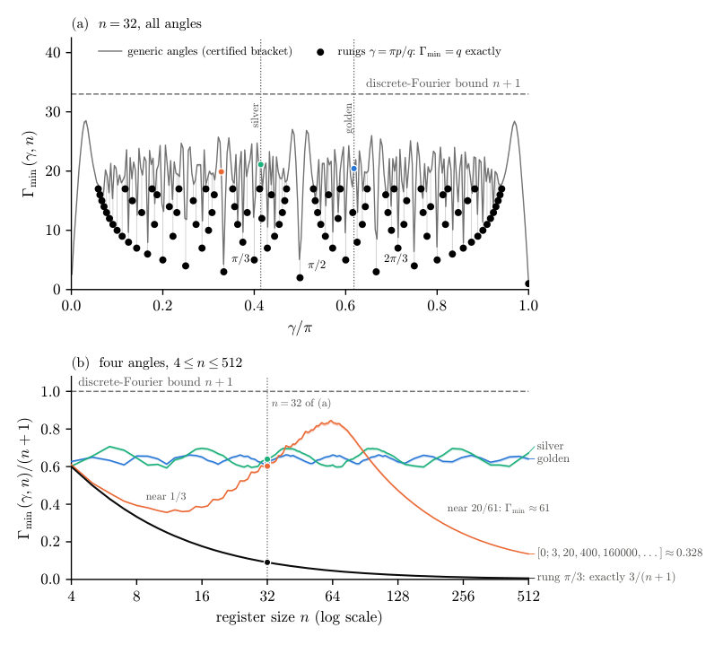
<figcaption class="paper-figure-caption"><b>Fig 1.</b> Figure 1: The cost landscape across angles at one register size (a), and across register sizes at four angles (b). Every value is a certified two-sided bracket: an explicit decomposition on a fine grid of rotation angles θ bounds it above (the grid primal), and a dual certificate, rescaled by Bernstein’s inequality so that its sup-norm is at most one on the whole circle and not only on the grid, bounds it below. The brackets are at most 1.6% wide relative; each line is a bracket’s upper end, and in (b) a band shades it down to the lower end. (a) n = 32, the brackets at 260 equally spaced angles. Dots are the rungs with q ≤17, where Theorem 4.6 gives Γmin = q exactly because n ≥2q −2; all 96...</figcaption>
</figure>
<figure class="paper-figure-card">
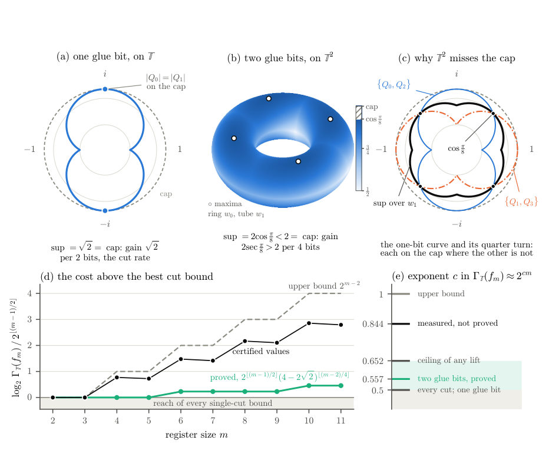
<figcaption class="paper-figure-caption"><b>Fig 2.</b> Figure 2: The register cost against every cut bound. A lift through j glue bits gains P k Qk(ζk) = 2j in the pairing and pays sup P k |Qk| in the sup-norm, per 2j register bits; the paraunitary identity caps that supremum at 2j/2 (dashed, normalized to 1; radial axes start at 1</figcaption>
</figure>

**Summary.** This work rigorously determines the minimum resource overhead required to simulate quadratic collective phase gates, such as those found in Kerr nonlinear optics or spin squeezing. The cost is found to be dictated by the arithmetic nature of the phase angle $\gamma/\pi$, yielding exact integer costs at rational angles and polynomial scaling otherwise. This establishes a fundamental link between quantum simulation complexity and number theory.

**Why it may be interesting.** It provides deep mathematical insights into the resource cost of simulating fundamental quantum dynamics (like Kerr nonlinearities) by connecting it to number theory (Diophantine approximation) and quantum resource theory.

Detailed structure

**Main problem.** The paper determines the minimal sampling overhead required to implement a specific quadratic collective phase unitary, $e^{-i\gamma K^2}$, using a Linear Combination of Unitaries (LCU) sampled from a restricted set of gates.

**Main result.** The minimal overhead depends critically on the ratio $\gamma/\pi$: it is exactly $q$ for rational angles $\pi p/q$ (resonances), $\Theta(n)$ if $\gamma/\pi$ is badly approximable, and can be exponential if symmetry is broken.

**Method.** The analysis uses techniques from harmonic analysis and number theory, framing the problem as an atomic-norm minimization problem dual to a sup-norm bound on trigonometric polynomials.

**Model / system.** The target unitary is the quadratic collective phase $e^{-i\gamma K^2}$, which models physical processes like the Kerr phase in bosonic modes, the one-axis-twisting gate in spin squeezing, and the penalty layer in quantum optimization.

**Key observables.** Sampling overhead ($\Gamma$), the angle parameter ($\gamma$), and the register size ($n$).

**Important parameters / regimes.** The ratio $\gamma/\pi$, which dictates the cost structure via continued fraction analysis (rational vs. badly approximable).

**Assumptions / limitations.** The analysis assumes the target unitary can be sampled as an LCU from a specific set of implementable single-qubit rotation layers.

**Figures summary.** The notes mention Figure 1 classifying $\Gamma_{\min}$ vs. $n$ and $\gamma$ into resonances, plateaus, and the discrete-Fourier bound.

**Paper structure.** The paper develops by establishing the cost as a norm (Theorem A), analyzing specific resonant cases (Theorem B), establishing the general scaling behavior (dichotomy in Theorem C), and finally providing a master formula for the deep-resonance regime (Theorem D).

Abstract

We consider the cost of implementing the quadratic collective phase $e^{-iγK^2}$, with $K$ a collective observable of evenly spaced spectrum, such as the permutation-symmetric Hamming weight. This gate is the cardinality-penalty layer of constrained quantum optimization, the one-axis-twisting gate of spin squeezing and the Kerr phase of a bosonic mode. Instead of two-qubit gates, it can be sampled as a linear combination of single-qubit rotation layers (an LCU) at an overhead $Γ$. We determine the minimal overhead. Ancilla-free sampling of the layers reproduces the target's outcome probabilities up to this factor, and no smaller factor works for every input; when $K$ is permutation symmetric, arbitrary single-qubit gates do no better. The minimal overhead's growth with the register size $n$ is set by the continued fraction of $γ/π$: rational angles $πp/q$ in lowest terms cost exactly $Γ=q$ for every $n\ge2q-2$; the cost is $Θ(n)$ if and only if $γ/π$ is badly approximable; and a master formula, proved two-sided near low-denominator rationals, reads it off the nearest one. Without the symmetry the cost over single-qubit gates can be exponential: for the binary-weighted $K=\sum_j2^jx_j$ the squaring phase of Fourier arithmetic on $m$ qubits costs at least $2^{0.557m-O(1)}$, beyond the $2^{m/2}$ ceiling of every cut bound, by a new certificate-lifting argument. The Fourier-based LCU of Carrera Vazquez, Egger and Woerner (2026), which guarantees $Γ\le n+1$, is optimal up to a constant factor at typical angles at fixed $n$; at rational angles the unique optimizer is the fractional-revival decomposition of Kerr optics, a recipe independent of $n$. In bosonic simulation, the Kerr-gate phase-shifter decomposition of Upreti, Quesada and Chabaud (2026) is the unique optimum over phase shifters, and a finite-cost one exists only at rational $γ/π$.

[↑ back to top](#top)

### [Topological insulators on complex networks](http://arxiv.org/abs/2610.02888v1)

**Authors:** Sunkyu Yu, Xianji Piao, Namkyoo Park  
**Type:** theory · **Category:** disordered systems and neural networks · **PDF:** <https://arxiv.org/pdf/2610.02888v1>  
**Analysis basis:** full PDF text, analyzed in chunks
**Topic relevance:** `analog quantum simulation` **3/5** · `methods for driven-dissipative` **1/5**

↔ Scroll figures horizontally

<figure class="paper-figure-card">
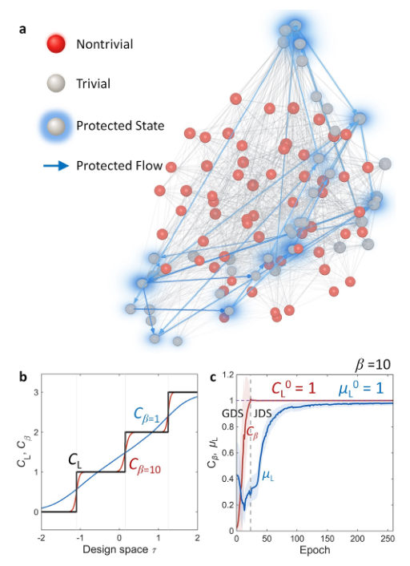
<figcaption class="paper-figure-caption"><b>Fig 1.</b> Fig. 1. Designing network TIs. a, Small-world TI supporting a protected directional state (blue</figcaption>
</figure>
<figure class="paper-figure-card">
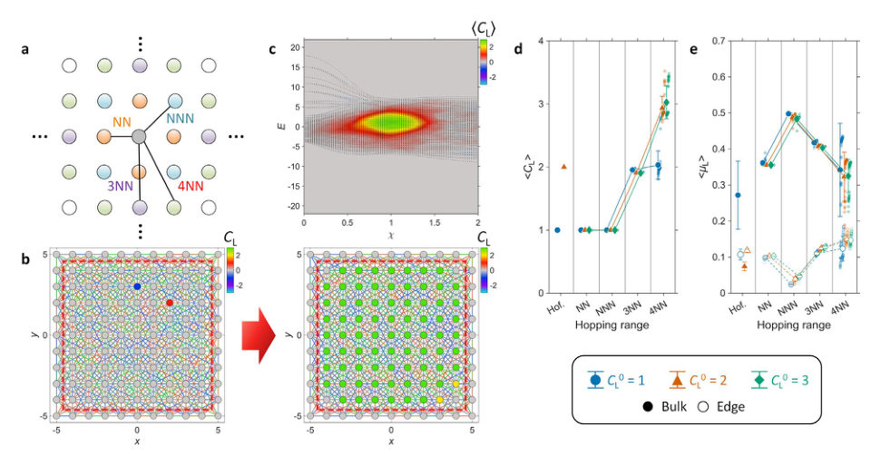
<figcaption class="paper-figure-caption"><b>Fig 2.</b> Fig. 2. High-degree Hofstadter lattices enhance information capacity. a, Hopping shells. b,</figcaption>
</figure>
<figure class="paper-figure-card">
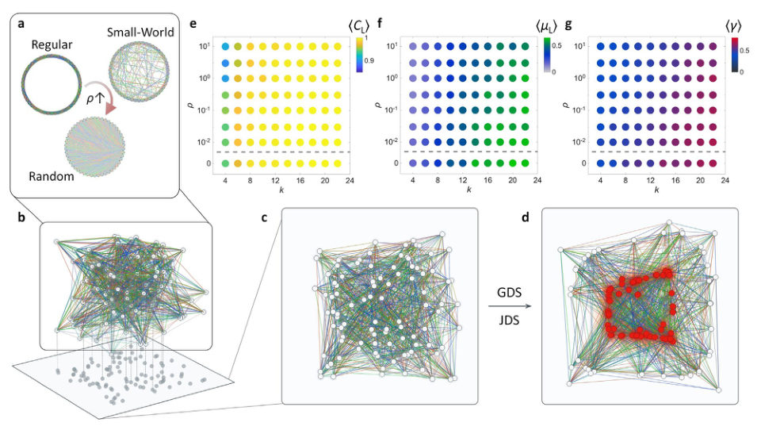
<figcaption class="paper-figure-caption"><b>Fig 3.</b> Fig. 3. Topological phases across complex networks. a, Degree-k networks evolve from regular</figcaption>
</figure>
<figure class="paper-figure-card">
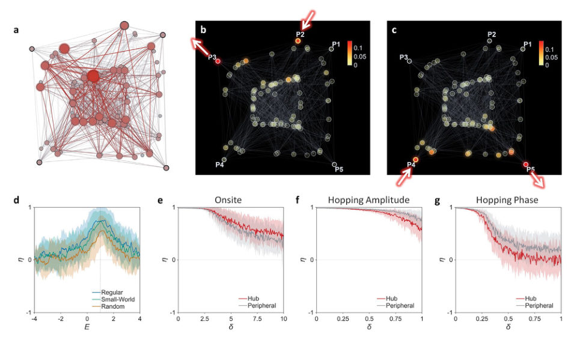
<figcaption class="paper-figure-caption"><b>Fig 4.</b> Fig. 4. Small world provides selective topological robustness. a, Betweenness-centrality</figcaption>
</figure>

**Summary.** This paper proves that topological insulating phases can be engineered on arbitrary complex networks, moving beyond simple periodic lattices. By developing a sophisticated design framework, the authors show that network structure, especially small-world characteristics, enhances topological robustness and directional transport. This establishes network complexity as a key resource for realizing advanced quantum electronic functionalities.

**Why it may be interesting.** The focus on network topology and disorder robustness connects directly to understanding complex quantum systems, which is relevant for designing quantum devices or modeling quantum information flow in structured media.

Detailed structure

**Main problem.** The research aims to generalize the concept of topological insulators beyond simple periodic lattices to complex, arbitrary network structures.

**Main result.** The study demonstrates that complex networks, particularly small-world architectures, can host robust topological insulating phases, with network complexity acting as a resource for high-capacity and reconfigurable transport.

**Method.** A gradient-based, conflict-free multi-objective inverse-design framework is developed to tailor hopping phases and node positions to achieve desired topological invariants.

**Model / system.** The system models topological insulators on complex graphs, including high-degree Hofstadter lattices, regular, small-world, and random networks, governed by a generalized magnetic graph Hamiltonian.

**Key observables.** Local Chern index ($C_L$), local gap ($\mu_L$), chirality ($\eta$), and port-to-port transmission matrices ($T_{pq}$).

**Important parameters / regimes.** Node degree ($k$), rewiring parameter ($
ho$), and energy ($E$).

**Assumptions / limitations.** The analysis relies on 2D embedding of abstract networks and uses spectral localizers and surrogate models for optimization.

**Figures summary.** Figures illustrate the design process, the evolution of topological phases across network topologies (regular to random), and the superior circulator behavior and robustness of small-world TIs.

**Paper structure.** The paper systematically develops a design framework, applies it to various network types (Hofstadter, small-world, random), and analyzes the resulting topological invariants, robustness against disorder, and directional transport properties.

Abstract

The landscape of topological insulators has expanded beyond its traditional domain of periodic lattices with short-range hopping. Related studies have explored topological phenomena under non-Euclidean geometries, disordered structures, and long-range hopping, progressively narrowing the gap between topological phases of matter and complex networks. Here we demonstrate that genuine complex networks, far beyond periodic lattices and their conventional variants, can themselves host topological insulating phases. By developing a nonconflicting design framework for multiple topological objectives, we realize topological insulators in high-degree Hofstadter lattices and across regular, small-world, and random networks. This generalization uncovers distinct network-specific features, including an expanded range of attainable topological characteristics, a degree-dependent transition from Hofstadter-type to Haldane-type Chern insulators, and, most notably, the superior robustness and reconfigurability of small-world topological insulators. Our graph-theoretic framework establishes network complexity as a resource for realizing high-capacity and reconfigurable topological insulators.

[↑ back to top](#top)

### [A Basis-Aware Approach to Quantum Sampling of the Fermi-Hubbard Ladder](http://arxiv.org/abs/2610.03654v1)

**Authors:** Adam Leicester, Zixu Wang, Jack Mandell, Yangyang Xu, Osama Muhammad Raisuddin, Haimeng Zhang, Jian Shi  
**Type:** theory · **Category:** strongly correlated electrons · **PDF:** <https://arxiv.org/pdf/2610.03654v1>  
**Analysis basis:** full PDF text, analyzed in chunks
**Topic relevance:** `analog quantum simulation` **3/5**

↔ Scroll figures horizontally

<figure class="paper-figure-card">
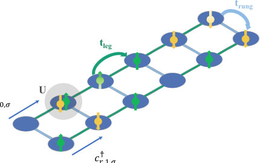
<figcaption class="paper-figure-caption"><b>Fig 1.</b> Figure 1: Two-leg Fermi-Hubbard ladder con- sidered in this work. Fermions hop along each leg with amplitude tleg and between legs along each rung with amplitude trung. Opposite-spin particles occupying the same site experience the onsite interaction U. The creation operators ˆc† r,0,σ and ˆc† r,1,σ label the two sites on rung r.</figcaption>
</figure>
<figure class="paper-figure-card">
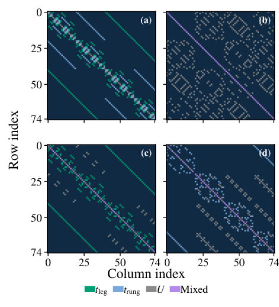
<figcaption class="paper-figure-caption"><b>Fig 2.</b> Figure 2: Matrix structure of the six-site Fermi-Hubbard Hamiltonian, showing the first 75×75 basis-state indices in the (a) site, (b) mo- mentum, (c) bonding/antibonding, and (d) leg- mode representations. Matrix elements are col- ored according to contributions from tleg, trung, U, or mixed terms.</figcaption>
</figure>
<figure class="paper-figure-card">
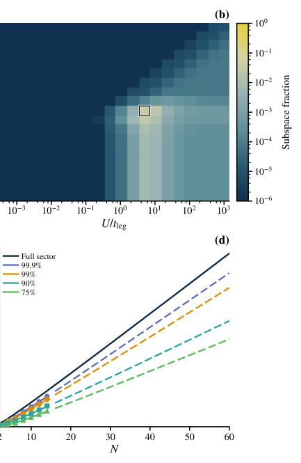
<figcaption class="paper-figure-caption"><b>Fig 3.</b> Figure 3: Basis-dependent compressibility fW and size scaling of the half-filled Fermi-Hubbard ladder. (a) Most compressible representation across the sampled parameter space for a 12-site ladder at W ≥0.99. (b) Minimum required subspace fraction, with the open square marking the representative least-compressible point. (c) Subspace fraction fW versus N at this point for the four considered bases; the dashed curve is the Stirling-motivated 99% fit. (d) Subspace-size scaling for several cumulative-weight thresholds from the momentum basis, with dashed curves denoting extrapolation beyond the computed system sizes.</figcaption>
</figure>
<figure class="paper-figure-card">
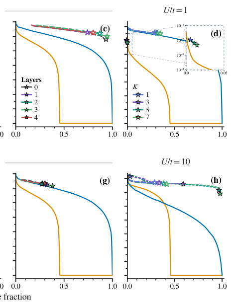
<figcaption class="paper-figure-caption"><b>Fig 4.</b> Figure 4: Statevector reconstruction performance as a function of retained subspace fraction for the half- filled 10-site Fermi-Hubbard ladder. Panels (a-c) and (e-g) show position- and momentum-basis sampling, respectively, while varying U/t (a,e), Trotter step size ∆t (b,f), and the number of initial particle-number- conserving XX + Y Y mixing layers (c,g). Panels (d,h) compare both sampling bases as a function of maximum Trotter-step count K at U/t = 1 and 10, respectively. Solid curves denote exact-diagonalization references and dashed curves denote statevector-sampled reconstructions; stars mark the terminal recon- structed subspaces. Unless varied, K = 7, ∆t = 0.025, and three XX + Y...</figcaption>
</figure>
<figure class="paper-figure-card">
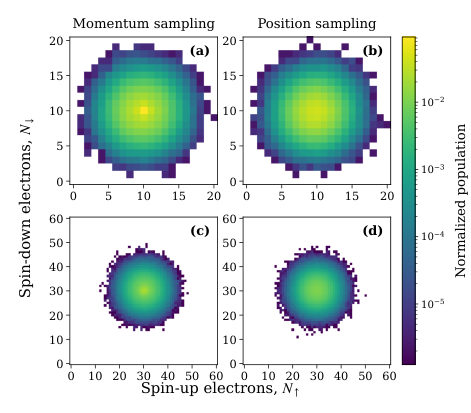
<figcaption class="paper-figure-caption"><b>Fig 5.</b> Figure 5: Particle-number sector distributions of hardware samples. The normalized sampled population is plotted as a function of spin-up electrons N↑and spin-down electrons N↓for the 20-site ladder using (a) momentum-basis and (b) position-basis sampling, and for the 60-site lad- der using (c) momentum-basis and (d) position- basis sampling. The distributions are centered near the half-filled sectors (N↑, N↓) = (10, 10) and (30, 30) for the 20- and 60-site systems, re- spectively.</figcaption>
</figure>

**Summary.** This work analyzes the efficiency of quantum sampling techniques for simulating the Fermi-Hubbard ladder, demonstrating that the choice of basis representation is crucial for success. By comparing momentum, position, and bonding bases, the authors show that the best basis changes systematically with interaction parameters. Ultimately, they argue that realizing scalable quantum simulation requires a holistic co-design approach involving the basis, the quantum circuit, and the classical reconstruction method.

**Why it may be interesting.** The findings directly address the resource scaling and feasibility of quantum simulation for strongly correlated materials, providing critical guidelines for designing quantum algorithms for condensed matter physics.

Detailed structure

**Main problem.** The paper investigates how the choice of basis representation affects the efficiency of sample-based quantum diagonalization (SQD) for simulating strongly correlated electron systems.

**Main result.** The optimal basis for sampling is highly dependent on the interaction strength and hopping anisotropy, suggesting that scalable quantum simulation requires co-designing the basis, quantum circuit, and classical reconstruction procedure.

**Method.** The authors compare various physically motivated one-body orbital rotations (e.g., momentum, bonding/antibonding) to determine which basis yields the most compressible representation of the ground-state wave function.

**Model / system.** The primary model studied is the Fermi-Hubbard Ladder, a minimal system relevant to cuprate superconductors, described by a Hamiltonian involving hopping ($t$) and onsite repulsion ($U$).

**Key observables.** Compressibility (minimum basis size to retain 99% ground-state weight), relative energy error in statevector SKQD calculations, and two-qubit gate count/depth for hardware mapping.

**Important parameters / regimes.** Interaction strength ($U/t$), hopping anisotropy ($t_{	ext{rung}}/t_{	ext{leg}}$), and the specific basis used for sampling (position, momentum, etc.).

**Assumptions / limitations.** The core assumption is that the target ground state is sufficiently compressible in the sampled basis; otherwise, the advantage of SQD is lost.

**Figures summary.** Figures compare Hamiltonian matrix structures in different bases, show the dependence of reconstruction error on the retained subspace fraction, and compare hardware overheads for different circuit mappings.

**Paper structure.** The paper systematically analyzes the basis dependence of SQD efficiency, comparing multiple physically motivated bases for the Fermi-Hubbard ladder, followed by detailed hardware overhead and reconstruction quality analyses.

Abstract

Sample-based quantum diagonalization can reduce the classical cost of many-body calculations by restricting diagonalization to configurations identified through quantum sampling, but its efficiency depends on how compactly the target state is represented in the sampled basis. We investigate this dependence for sample-based Krylov quantum diagonalization of the half-filled Fermi-Hubbard ladder using physically motivated one-body orbital rotations. Across position, momentum, bonding/antibonding, and leg-mode representations, the most compressible basis varies systematically with interaction strength and hopping anisotropy, with momentum sampling favored in the weakly interacting regime and geometry- or interaction-adapted representations becoming advantageous as the dominant energy scale changes. Near intermediate interaction and isotropic hopping, however, even the most favorable representation remains poorly compressible. Statevector SKQD calculations further show that basis choice strongly affects sampling efficiency. Hardware calculations on systems containing up to 120 qubits retain qualitative signatures of this basis dependence while revealing increasing particle-number leakage and reconstruction sensitivity with system size. These results show that scalable sample-based diagonalization requires co-design of the sampled representation, quantum circuit, and classical reconstruction procedure.

[↑ back to top](#top)

### [An operational characterization of finite-dimensional quantum theory](http://arxiv.org/abs/2610.03694v1)

**Authors:** Lionel J. Dmello, Xiangling Xu, Marc-Olivier Renou, David Gross  
**Type:** theory · **Category:** other · **PDF:** <https://arxiv.org/pdf/2610.03694v1>  
**Analysis basis:** full PDF text, analyzed in chunks
**Topic relevance:** `quantum measurements` **3/5**

↔ Scroll figures horizontally

<figure class="paper-figure-card">
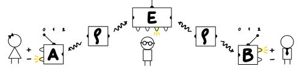
<figcaption class="paper-figure-caption"><b>Fig 1.</b> FIG. 1. The entanglement swapping experiment for the qubit.</figcaption>
</figure>
<figure class="paper-figure-card">
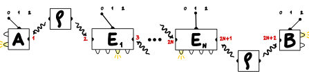
<figcaption class="paper-figure-caption"><b>Fig 2.</b> FIG. 2. The N th level of the teleportation hierarchy, TN.</figcaption>
</figure>
<figure class="paper-figure-card">
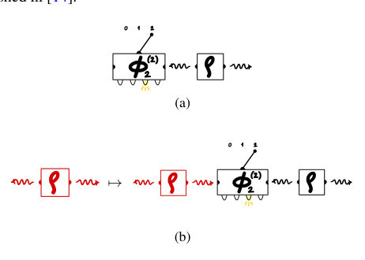
<figcaption class="paper-figure-caption"><b>Fig 3.</b> FIG. 3. (a) Teleportation maps of Erwin. (b) The action of this tele- portation map on bipartite states.</figcaption>
</figure>
<figure class="paper-figure-card">
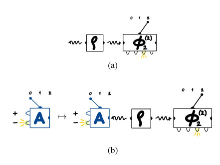
<figcaption class="paper-figure-caption"><b>Fig 4.</b> FIG. 4. (a) Equivalent definition of the teleportation maps of Erwin. (b) The action of these teleportation map on the effects of Alice.</figcaption>
</figure>
<figure class="paper-figure-card">
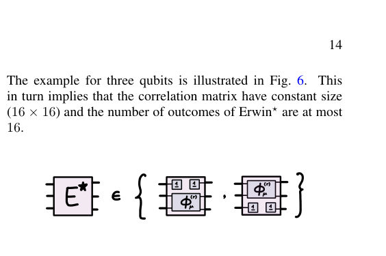
<figcaption class="paper-figure-caption"><b>Fig 5.</b> FIG. 6. The two, two-qubit experiments performed in the three qubit case.</figcaption>
</figure>

**Summary.** This paper develops a method to certify that a physical theory is quantum mechanical by analyzing correlations derived from multi-party entanglement swapping and iterated teleportation. By constructing a hierarchy of such tests, the authors demonstrate that satisfying these constraints forces the underlying probabilistic theory to match quantum theory for finite dimensions. This suggests a potential 'self-testing' capability for quantum theory.

**Why it may be interesting.** This work provides a rigorous, operational framework for testing the fundamental postulates of quantum mechanics using entanglement and teleportation, which is highly relevant for understanding the limits of quantum information processing.

Detailed structure

**Main problem.** The paper addresses the foundational question of whether quantum theory can be fully characterized by operational constraints, specifically by constructing a set of correlations that, if realized, force the underlying theory to be quantum mechanics.

**Main result.** The authors show that by analyzing correlations derived from a hierarchy of entanglement swapping and teleportation experiments, they can constrain the effective probabilistic theory to be quantum theory for finite dimensions.

**Method.** The methodology involves constructing and analyzing correlation matrices derived from multi-party entanglement swapping and iterated teleportation protocols, using the formalism of General Probabilistic Theories (GPTs).

**Model / system.** The focus is on characterizing finite-dimensional quantum theory, specifically for systems described by $(\mathbb{C}^d)^{\otimes n}$ (n-qudits). The analysis uses Pauli operators and generalized Pauli operators to define measurements and correlations.

**Key observables.** Correlation matrices $C^{(r)}_\mu$, joint outcome probabilities $p(\vec{\mu}|\vec{r})$, and the structure of teleportation maps $\Lambda(\vec{r})_\mu$.

**Important parameters / regimes.** The dimensionality $d$ and the number of parties $n$ are key parameters; the analysis involves testing stability across an increasing number of teleportation steps $N$.

**Assumptions / limitations.** The analysis assumes the existence of a General Probabilistic Theory (GPT) framework and, in some parts, relies on the assumption that the state space is compact or that the correlations are preserved under iteration.

**Figures summary.** Figures illustrate the experimental setups for entanglement swapping (e.g., three-party setups for qubits) and the structure of the teleportation hierarchy ($T_N$) used to test correlation stability.

**Paper structure.** The paper progresses by first defining the problem in terms of GPTs, then constructing the correlation tests via entanglement swapping and teleportation hierarchies, and finally deriving strong constraints on the underlying theory from the stability of these correlations.

Abstract

A key goal in the foundations of quantum mechanics is to identify operational constraints characterizing physical theories. Bell inequalities do so for classical probability theory, while Tsirelson's bound provides a first step for quantum mechanics. Here, we address the dual question: Can one certify that all correlations predicted by quantum theory are actually realizable? In this work, we construct a finite number of two-body correlations such that the only probabilistic theory that (1) realizes them, and (2) does so in a way that is stable under iterated teleportation, is quantum theory. For $(\mathbb{C}^d)^{\otimes n}$, Condition (1) can be verified using $\operatorname{poly}(d,n)$ measurement settings. Condition (2) may be understood as a hierarchy of tests, one for each number $N$ of teleportation steps. There is thus a sense in which finite-dimensional quantum theory can be self-tested. In particular, one can certify the existence of Bell inequality violations larger than any that have been directly observed.

[↑ back to top](#top)

### [Covertness as a resource constraint in quantum target sensing](http://arxiv.org/abs/2610.03233v1)

**Authors:** Yu Yang, Fengyu Guan, Shiping Guo, Ruifeng Liu, Pei Zhang, Fuli Li  
**Type:** theory · **Category:** other · **PDF:** <https://arxiv.org/pdf/2610.03233v1>  
**Analysis basis:** full PDF text, analyzed in chunks
**Topic relevance:** `quantum measurements` **3/5**

↔ Scroll figures horizontally

<figure class="paper-figure-card">
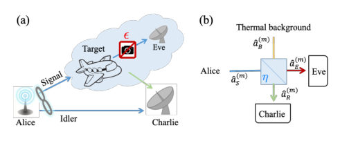
<figcaption class="paper-figure-caption"><b>Fig 1.</b> FIG. 1. (a) Schematic diagram of quantum covert target de- tection with the covertness ϵ. (b) Field-operator relations for a target modeled as a beam splitter with reflectivity η. Here a(m) S , a(m) B , a(m) R and a(m) E denote the annihilation operators of the m-th signal, thermal-background, return, and environ- mental modes with m = 1, 2, · · · M, respectively.</figcaption>
</figure>
<figure class="paper-figure-card">
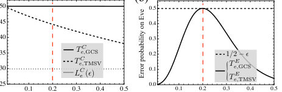
<figcaption class="paper-figure-caption"><b>Fig 2.</b> FIG. 2. (a) Error probability on Charlie, including the quantum Chernoff bounds T C e,GCS and T C e,TMSV for the GCS and TMSV probes, respectively, together with the covertness- induced lower bound LC e . (b) Error probability on Eve, where T E e,GCS = T E e,TMSV, together with the covertness threshold 1/2 −ϵ. The perfect-covertness point Ns = NB is always marked by the red dashed line. The parameters are η = 0.01, NB = 0.2, M = 100, and ϵ = 10−3.</figcaption>
</figure>
<figure class="paper-figure-card">
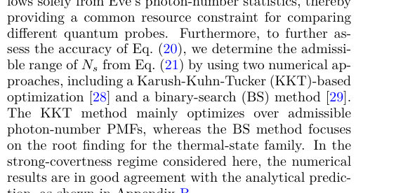
<figcaption class="paper-figure-caption"><b>Fig 3.</b> FIG. 3. Upper bound Ns,max(ϵ) and lower bound Ns,min(ϵ) on the mean probe photon number per mode, as functions of the covertness parameter ϵ and the number of modes M. The perfect-covertness value Ns = NB is shown for comparison. The parameters are η = 0.01 and NB = 0.2.</figcaption>
</figure>
<figure class="paper-figure-card">
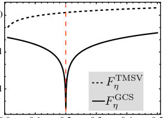
<figcaption class="paper-figure-caption"><b>Fig 4.</b> FIG. 4. Quantum Fisher informations (QFIs) F GCS η and F TMSV η for the GCS and TMSV probes, respectively, plotted on a logarithmic scale. The perfect-covertness point Ns = NB is marked by the red dashed line. The parameters are η = 0.01, NB = 0.2, and M = 100.</figcaption>
</figure>
<figure class="paper-figure-card">
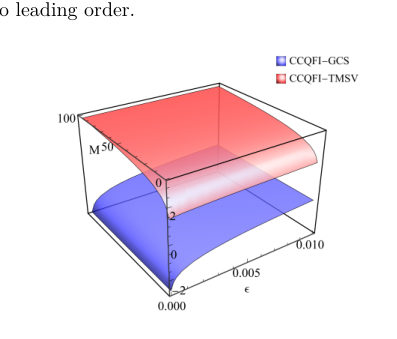
<figcaption class="paper-figure-caption"><b>Fig 5.</b> FIG. 5. Covertness-constrained quantum Fisher informa- tions (CCQFIs) F GCS η (ϵ) and F TMSV η (ϵ) for the GCS and TMSV probes, respectively, as functions of the covertness pa- rameter ϵ and the mode number M, plotted on a logarithmic scale. The parameters are η = 0.01 and NB = 0.2.</figcaption>
</figure>

**Summary.** This paper develops a theoretical framework connecting the requirement of remaining covert during quantum sensing with the ultimate achievable estimation precision. By introducing the covertness-constrained quantum Fisher information (CCQFI), the authors quantify how the need to evade detection limits the available probe energy. They show that different quantum states, like TMSV, can maintain superior metrological advantages even when severely constrained by the covertness requirement.

**Why it may be interesting.** This work directly bridges quantum estimation theory (metrology) with quantum security/detection theory (covertness), providing a resource-constrained view of quantum sensing that is highly relevant to quantum optics and quantum information.

Detailed structure

**Main problem.** The paper establishes a unified framework to quantify how the requirement of remaining covert (avoiding detection by an adversary) constrains the ultimate precision achievable in quantum target sensing.

**Main result.** The covertness constraint is identified as a quantitative resource that governs the metrological limits, showing that different quantum probes (GCS vs. TMSV) exhibit distinct scaling behaviors in the strong covertness regime.

**Method.** The authors use quantum information theory tools, including the covertness-constrained quantum Fisher information (CCQFI), to bound the estimation precision for target reflectivity.

**Model / system.** The system models quantum target sensing where a low-reflectivity target is probed. The analysis compares two Gaussian probes: Gaussian-distributed coherent-state (GCS) and Two-mode squeezed-vacuum (TMSV) states.

**Key observables.** Covertness-constrained Quantum Fisher Information (CCQFI) and Covertness-constrained Classical Fisher Information (CFI).

**Important parameters / regimes.** Covertness parameter ($\epsilon$), probe energy ($	ext{N}_s$), and the number of probe copies ($M$).

**Assumptions / limitations.** The analysis relies on perturbative bounds for small $\epsilon$ and assumes the validity of Gaussian state descriptions for the probes.

**Figures summary.** Figures illustrate the schematic setup of quantum covert target detection and show the numerical convergence of the CFI under different photon-number truncations.

**Paper structure.** The work progresses by first defining the covertness constraint via error bounds, then developing the CCQFI framework, and finally calculating and comparing the achievable precision limits for GCS and TMSV probes under this constraint.

Abstract

Quantum covert target sensing aims to detect low-reflectivity targets embedded in the thermal environment while avoiding discovery by an adversary. This covertness requirement constrains the admissible probe energy, thereby imposing a trade-off between covertness and sensing performance. However, how this resource constraint determines the ultimate estimation precision of the target parameter remains largely unexplored. To fill this gap, we establish a unified framework connecting covert target discrimination with quantum-enhanced parameter estimation. We first present perturbative $ε$-covertness-induced bounds on the probe energy, which yield an admissible energy window narrowing as $\mathcal{O}(\sqrt{ε/M})$. Moreover, we introduce the covertness-constrained quantum Fisher information (CCQFI) to quantify the ultimate precision of target-reflectivity estimation and assess its attainability with specific measurements. For Gaussian-distributed coherent-state (GCS) and two-mode squeezed vacuum (TMSV) probes, their CCQFIs scale as $\mathcal{O}(ε)$ and $\mathcal{O}(M)+\mathcal{O}(\sqrt{εM})+\mathcal{O}(ε)$, respectively. In particular, in the strong covertness regime $ε\to0$, the GCS CCQFI vanishes, whereas the TMSV retains a finite $\mathcal{O}(M)$ contribution exhibiting a pronounced metrological advantage. Besides, photon counting saturates the GCS CCQFI, whereas homodyne detection achieves a higher attainability for the TMSV probe. Our work identifies covertness as a quantitative resource constraint governing the metrological limits of quantum target sensing.

[↑ back to top](#top)

### [Degree-conditioned anneal offsets reshape certified-optimum sampling for minimum vertex cover](http://arxiv.org/abs/2610.03379v1)

**Authors:** Jiwan Kang, Namshik Han  
**Type:** experiment · **Category:** quantum information and computing · **PDF:** <https://arxiv.org/pdf/2610.03379v1>  
**Analysis basis:** full PDF text, analyzed in chunks
**Topic relevance:** `QC/QI experiment` **3/5**

↔ Scroll figures horizontally

<figure class="paper-figure-card">
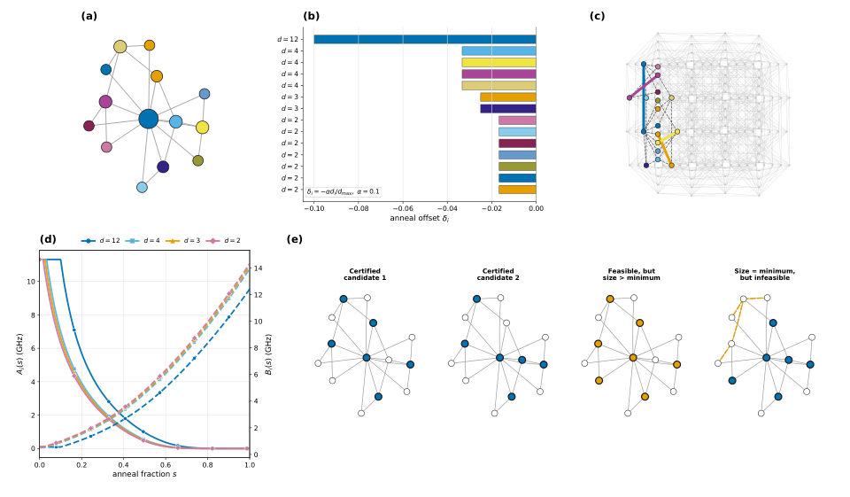
<figcaption class="paper-figure-caption"><b>Fig 1.</b> Figure 1: Workflow of degree-conditioned offset-scheduled quantum annealing (DC-OSQA). (a) Sparse Barab´asi–Albert m = 2 graph with heterogeneous vertex degrees; node size reflects degree, and unique node colors identify logical vertices across panels (a)–(c). (b) Per-vertex degree-conditioned offset assignment, δi = −αdi/dmax, with α = 0.1; each bar retains the color of its logical vertex. (c) Minor embedding of the logical graph into a Zephyr hardware graph, with each physical chain shown in the color of its logical vertex. (d) Offset-dependent schedules for the four degree classes; solid curves show Ai(s), dashed curves show Bi(s), and marker shapes distinguish degree classes...</figcaption>
</figure>
<figure class="paper-figure-card">
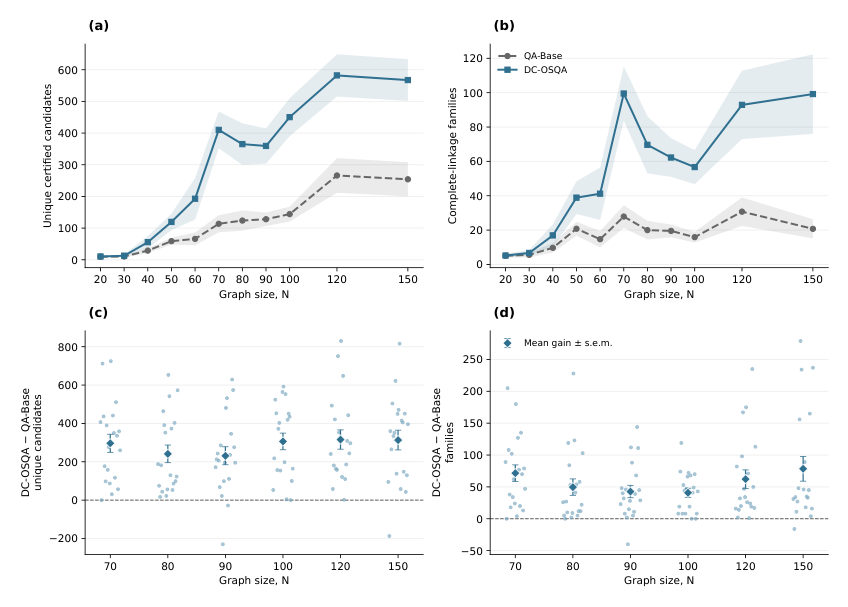
<figcaption class="paper-figure-caption"><b>Fig 2.</b> Figure 2: Degree-conditioned anneal offsets broaden the certified support in sparse Barab´asi–Albert MVC instances. (a) Mean number of unique certified candidates discovered by QA-Base and DC-OSQA. (b) Mean number of complete-linkage Hamming families with threshold τ = 0.1N. (c,d) Instance-paired DC-OSQA minus QA-Base gains for the same two metrics in the larger-size subset, N = 70–150. In (a,b), shaded bands show ± standard error of the mean (s.e.m.) across graph instances. In (c,d), small blue circles show individual paired gains and diamonds with error bars show the mean ± s.e.m. at each graph size. All counts use certified-candidate validation: candidates must both match Kexact and...</figcaption>
</figure>
<figure class="paper-figure-card">
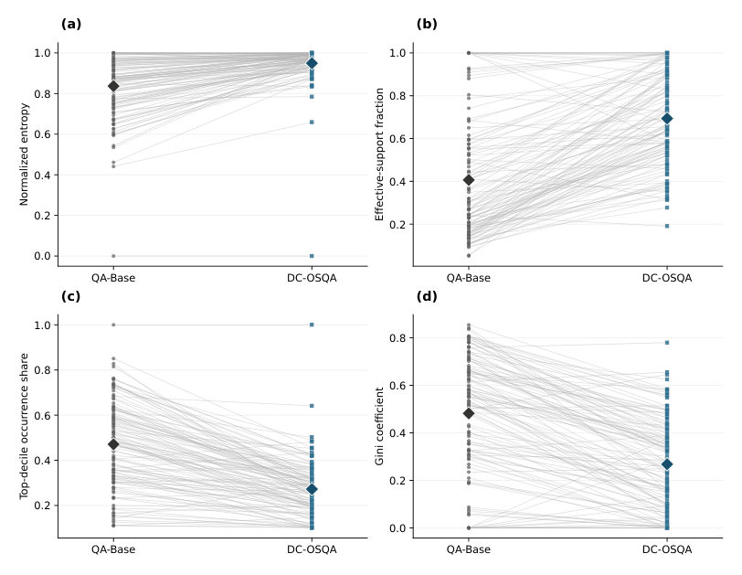
<figcaption class="paper-figure-caption"><b>Fig 3.</b> Figure 3: Observed certified-sample concentration diagnostics for BA m = 2, N = 70–150. Each line connects a matched graph instance for QA-Base and DC-OSQA. The panels show normalized entropy, Simpson effective-support fraction, top-decile occurrence share, and the Gini coefficient over the observed certified occurrences. Large diamonds mark protocol means across the 118 matched instances. Higher entropy and effective-support fraction, together with lower top-decile share and Gini coefficient, indicate lower concentration in the observed certified occurrences.</figcaption>
</figure>
<figure class="paper-figure-card">
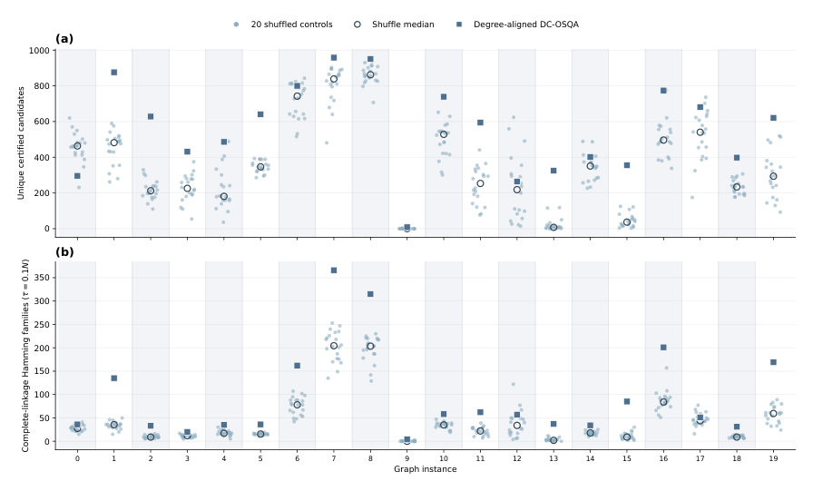
<figcaption class="paper-figure-caption"><b>Fig 4.</b> Figure 4: Degree-aligned offset placement compared with random reassignments of the same offset multiset at N = 150. For each of 20 BA m = 2 graph instances, light points show 20 hardware-valid shuffled assignments, open circles show the within-instance shuffle median, and dark squares show the original degree-aligned DC-OSQA assignment. The graph, QUBO, read budget, embedding, offset-value multiset, and certified-candidate rule are held fixed within each instance. (a) Unique certified candidates. (b) Complete-linkage Hamming families at threshold τ = 0.1N. The degree-aligned assignment generally lies above the within-instance shuffle median.</figcaption>
</figure>
<figure class="paper-figure-card">
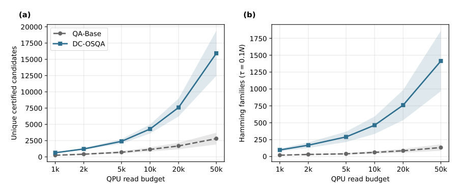
<figcaption class="paper-figure-caption"><b>Fig 5.</b> Figure 5: QPU read-budget extension at N = 150 on the same 20 BA m = 2 graph instances. (a) Unique certified candidates. (b) Complete-linkage Hamming families at threshold τ = 0.1N. Each point summarizes the cumulative acquisition-order prefix at the stated read budget. Lines show across-instance means, and shaded regions show the s.e.m. QA-Base is shown by gray dashed lines with circles, and DC-OSQA by blue solid lines with squares.</figcaption>
</figure>

**Summary.** This paper demonstrates that tailoring the quantum annealing schedule using vertex degrees—a structural property of the Minimum Vertex Cover problem—can significantly increase the diversity and count of certified optimal solutions found on a quantum annealer. By implementing degree-conditioned offsets, the authors show they can steer the sampling process to explore a richer set of degenerate optima within a fixed computational budget.

**Why it may be interesting.** The explicit manipulation of the quantum annealing schedule using problem structure (degree) to control the sampling distribution of degenerate ground states is highly relevant to understanding the limitations and potential enhancements of quantum optimization algorithms.

Detailed structure

**Main problem.** The study investigates how incorporating problem-specific structural information, derived from vertex degrees, can steer the composition of certified optimal solutions sampled by quantum annealers for the Minimum Vertex Cover (MVC) problem.

**Main result.** Degree-conditioned annealing offsets (DC-OSQA) significantly increased the mean number of distinct certified candidates and Hamming-distance families compared to a zero-offset baseline on sparse Barabási–Albert graphs.

**Method.** The authors implemented DC-OSQA by assigning anneal offsets proportional to the vertex degree, comparing its performance against a standard zero-offset quantum annealing baseline.

**Model / system.** The work uses quantum annealers, specifically the D-Wave Advantage2 QPU, to solve the MVC problem encoded as a QUBO. The core technique involves modifying the annealing Hamiltonian via degree-dependent offsets.

**Key observables.** Mean number of distinct certified candidates, mean number of complete-linkage Hamming-distance families, and the difference in effective support ($\Delta S_{	ext{eff}}$).

**Important parameters / regimes.** Graph size N (70-150), offset scale $\alpha$, and the fixed QPU read budget.

**Assumptions / limitations.** The analysis is restricted to sparse Barabási–Albert graphs and assumes a fixed, finite QPU read budget.

**Figures summary.** Figures summarize the gains of DC-OSQA over baselines in unique certified candidates and Hamming families, showing positive gains across tested sizes.

**Paper structure.** The paper develops the DC-OSQA protocol based on vertex degrees, compares its performance against a zero-offset baseline using quantitative metrics (certified support size), and concludes that the degree rule successfully alters the observed set of optimal solutions.

Abstract

Quantum annealers can sample degenerate optima unevenly, so the composition of finite-read output matters when multiple solutions are sought. We investigate whether problem structure can steer this output through node-dependent anneal offsets for Minimum Vertex Cover (MVC). In MVC, vertex degree equals the number of incident edge-cover constraints and therefore measures local constraint participation. We use this relation to define degree-conditioned offset-scheduled quantum annealing (DC-OSQA), a static rule assigning more negative offsets to vertices with larger max-normalized degree. Experiments used a D-Wave Advantage2 system1 quantum processing unit (QPU). For each graph, DC-OSQA was compared with a zero-offset baseline using the same MVC encoding, fixed physical embedding, majority-vote chain decoding, and 1000-read budget. A sampled bitstring was counted as a certified candidate only if it represented a feasible vertex cover and its cardinality matched the minimum independently certified by integer linear programming. Across 120 paired comparisons on sparse Barabasi-Albert graphs with two attachments per added vertex and graph sizes N = 70-150, DC-OSQA increased the mean number of distinct certified candidates from 171.7 to 455.8 and the mean number of complete-linkage Hamming-distance families from 22.5 to 80.0; paired gains were positive at every tested size. These shifts, together with lower empirical concentration, indicate a change in the composition of the observed certified support. At N = 150, the degree-aligned assignment exceeded the within-instance mean over 20 random reassignments of the same offset values in 19 of 20 graphs for certified-support size and all 20 graphs for Hamming families. Within the tested ensemble, these results show that an MVC-specific degree rule changes the certified optima observed within a fixed QPU read budget.

[↑ back to top](#top)

### [Efficient capacity-achieving entanglement generation with application to pure-loss Bosonic channels](http://arxiv.org/abs/2610.03674v1)

**Authors:** Avijit Mandal, Christophe Piveteau, Henry D. Pfister, Joseph M. Renes  
**Type:** theory · **Category:** quantum information and computing · **PDF:** <https://arxiv.org/pdf/2610.03674v1>  
**Analysis basis:** full PDF text, analyzed in chunks
**Topic relevance:** `quantum measurements` **3/5**

↔ Scroll figures horizontally

<figure class="paper-figure-card">
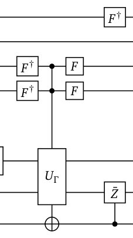
<figcaption class="paper-figure-caption"><b>Fig 1.</b> Figure 1: Entanglement distillation scheme for input σ⊗m AB using the EACSS code with syndrome ex- traction circuit V, coherent implementations of the POVMs Λ and Γ, and finally controlled-phase and inverse Fourier transform operations.</figcaption>
</figure>

**Summary.** This paper develops an efficient, capacity-achieving protocol for generating entanglement over noisy quantum channels, specifically targeting pure-loss Bosonic channels. It achieves this by adapting classical coding theory tools, like polar codes, to construct quantum error-correcting codes. The resulting protocol is explicitly decodable, marking a significant theoretical advance in quantum communication theory.

**Why it may be interesting.** This work provides concrete, implementable quantum coding techniques for bosonic systems, which is highly relevant for quantum optics and quantum information processing involving continuous variables or bosonic modes.

Detailed structure

**Main problem.** The paper addresses the challenge of constructing efficient coding schemes that achieve the ultimate quantum communication limits (quantum capacity) over noisy quantum channels.

**Main result.** They present an explicit and efficiently decodable entanglement generation protocol that achieves the coherent information for pure-loss Bosonic channels and related PDPC channels.

**Method.** The scheme utilizes polar codes to construct quantum error-correcting codes (EACSS) and employs specialized quantum decoders (POVMs) for both amplitude and phase information.

**Model / system.** The focus is on quantum communication over pure-loss Bosonic channels, which are modeled using finite fields and $d$-ary strings. The theoretical framework involves entanglement distillation and quantum capacity calculations.

**Key observables.** Fidelity of the output entangled state, coherent information, and the net rate of entanglement generation.

**Important parameters / regimes.** The channel loss parameter $\eta$, the code length $m$, and the alphabet size $d$.

**Assumptions / limitations.** The construction relies on the commutativity properties of certain operators in PDPC channels and the assumption that the error decay is exponential for the approximation to hold.

**Figures summary.** Figure 1 illustrates the entanglement distillation scheme, involving the EACSS code, syndrome extraction, and the application of POVMs $\Lambda$ and $\Gamma$.

**Paper structure.** The paper builds from general quantum communication theory to specific constructions for PDPC channels. It details the use of polar codes for two types of channels, deriving the necessary decoders (amplitude and phase) through techniques like Density Evolution and successive-cancellation decoding, culminating in the capacity-achieving protocol.

Abstract

While the ultimate limits on the rate of quantum communication over noisy channels are well-established, very few efficient coding schemes achieving these limits are known. This contrasts sharply with transmitting classical data over classical channels, where polar codes and low-density parity-check codes both efficiently achieve the classical capacity of any noisy channel. In this work we construct an efficient entanglement generation scheme which achieves the coherent information for a broad class of channels. For degradable channels in the class, which includes truncated versions of the pure loss Bosonic channel, the resulting scheme achieves the quantum capacity. The construction makes use of polar codes for two kinds of classical-input, quantum-output (CQ) channels: those with commuting outputs and those whose outputs are heralded mixtures of pure states. The former case is amenable to decoding by classical polar decoding algorithms, the latter by the belief propagation with quantum messages (BPQM) algorithm. To our knowledge, this construction is the first explicit and efficiently decodable protocol that achieves the energy-constrained quantum capacity of the pure-loss Bosonic channel.

[↑ back to top](#top)

### [Evaluating Chern Topology in Discretized Brillouin Zones Using Bargmann Invariants](http://arxiv.org/abs/2610.03104v1)

**Authors:** Swarup Sangiri, A Taraphder  
**Type:** theory · **Category:** other · **PDF:** <https://arxiv.org/pdf/2610.03104v1>  
**Analysis basis:** full PDF text, analyzed in chunks
**Topic relevance:** `analog quantum simulation` **3/5**

↔ Scroll figures horizontally

<figure class="paper-figure-card">
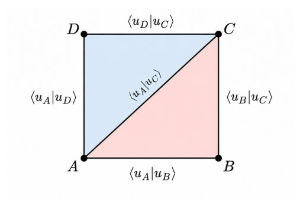
<figcaption class="paper-figure-caption"><b>Fig 1.</b> Figure 1: Finite Brillouin-zone cell constructed from the two oriented triangular third-order Bargmann invariants associated with ABC and ACD. Each vertex represents the Bloch state at the corresponding Brillouin-zone point, while the links denote their mutual quantum-state over- laps. The two triangular contributions combine to give the geometric phase associated with the finite cell.</figcaption>
</figure>
<figure class="paper-figure-card">
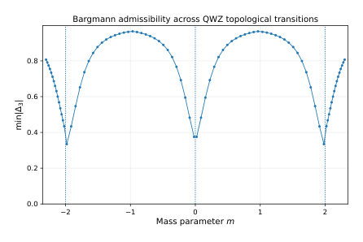
<figcaption class="paper-figure-caption"><b>Fig 2.</b> Figure 2: Minimum magnitude of the elementary third-order Bargmann invariant, ∆min(m) = min△|∆3|, across the QWZ parameter range. For the finite meshes considered, the suppression near the bulk critical parameters accompanies the increasing variation of the Bloch states as the band gap becomes small.</figcaption>
</figure>
<figure class="paper-figure-card">
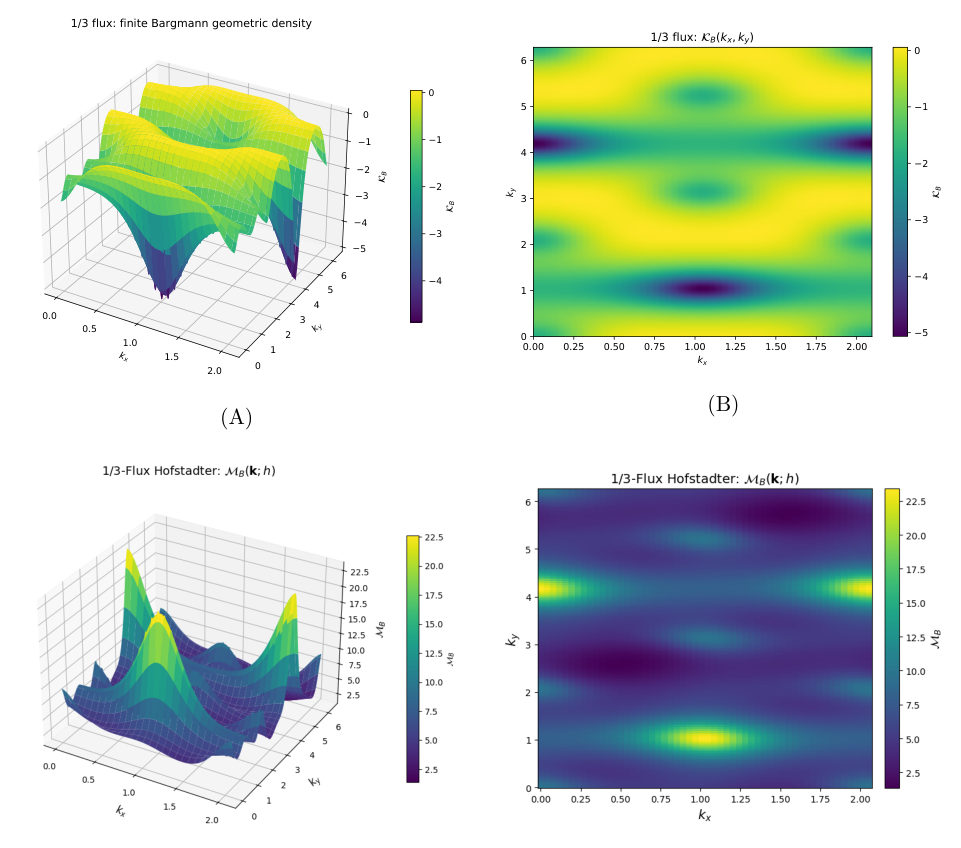
<figcaption class="paper-figure-caption"><b>Fig 3.</b> Figure 3: Finite-state Bargmann geometry of the middle band in the 1/3-flux Hofstadter model for NB = 54. Panel (A) shows the three-dimensional cell-resolved Bargmann geometric density KB(k; h), while panel (B) shows its distribution over the magnetic Brillouin zone. Panel (C) presents the three-dimensional cell-resolved amplitude density MB(k; h), and panel (D) shows its corresponding distribution over the magnetic Brillouin zone. The KB panels display the phase sector of the finite-state geometry, whereas the MB panels display the complementary amplitude sector obtained from the modulus of the same Bargmann construction. The pronounced extrema in the two sectors identify regions of strong...</figcaption>
</figure>
<figure class="paper-figure-card">
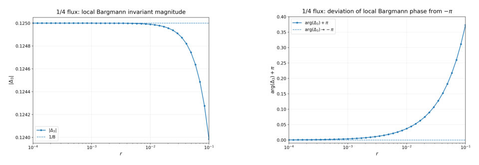
<figcaption class="paper-figure-caption"><b>Fig 4.</b> Figure 4: Local rank-one Bargmann characterization of the central-band touching in the 1/4- flux Hofstadter model. Panel (A) shows the magnitude of the third-order Bargmann invariant for the three-state construction on a small loop of radius r around k∗= (0, 0); as r decreases, |∆3| approaches the analytical limiting value 1/8. Panel (B) shows the corresponding finite-radius deviation of the Bargmann phase from its limiting value −π on the chosen continuous branch, plotted as arg(∆3) + π; the quantity approaches zero as r →0, consistent with arg ∆3 →−π on this branch and the limiting value ∆3 = −1/8. Together, the two panels show the magnitude and phase behavior of the same local rank-one...</figcaption>
</figure>
<figure class="paper-figure-card">
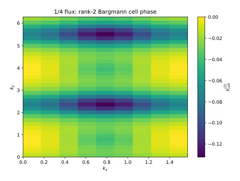
<figcaption class="paper-figure-caption"><b>Fig 5.</b> Figure 5: Local rank-2 Bargmann phase of the central composite subspace in the 1/4-flux Hofs- tadter model over the magnetic Brillouin zone. The rank-2 invariants remain nonzero on the mesh considered, so that the finite-cell phases are well defined, and their oriented accumulation gives C23 = −2.</figcaption>
</figure>

**Summary.** This work introduces a novel, finite-state geometric framework using third-order Bargmann invariants to calculate topological invariants like the Chern number. By analyzing quantum state overlaps on discretized parameter spaces, the authors derive both global topological numbers and local geometric densities. This method successfully reproduces established results for various lattice models, offering a powerful, purely numerical tool for characterizing band topology.

**Why it may be interesting.** The development of a purely finite-state, overlap-based method for calculating topological invariants is highly valuable as it provides robust diagnostics for numerical simulations where continuum approximations might fail or introduce artifacts.

Detailed structure

**Main problem.** The paper develops a finite-state geometric framework to evaluate topological invariants, such as the Chern number, and characterize local quantum-state geometry without relying on continuous derivatives or dynamical evolution.

**Main result.** The framework successfully reproduces known integer Chern numbers for various lattice models (e.g., QWZ, Hofstadter) and provides local geometric densities ($K_B, M_B$) that complement the global topological invariant.

**Method.** It utilizes third-order Bargmann invariants, $\Delta_3$, constructed from gauge-invariant overlaps between quantum states on a discretized parameter space (e.g., Brillouin zone triangulation).

**Model / system.** The method is applied to several lattice models, including the Qi–Wu–Zhang (QWZ), SSH, and Hofstadter models, demonstrating its applicability from 1D closed loops to 2D parameter spaces.

**Key observables.** Chern Number ($C_n$), Oriented Bargmann Phase ($\gamma_	riangle$), Finite-resolution geometric density ($K_B$), and Complementary amplitude density ($M_B$).

**Important parameters / regimes.** The discretization mesh size ($h$), the parameters defining the specific lattice model (e.g., mass term $m$ in QWZ), and the flux values (e.g., 1/3-flux).

**Assumptions / limitations.** The method requires a 'Bargmann-admissible triangulation' such that the third-order invariant is non-zero for all elementary triangles.

**Figures summary.** Figures illustrate the construction of a finite Brillouin-zone cell from two oriented triangular Bargmann invariants and show the minimum magnitude of the elementary third-order Bargmann invariant across parameter ranges.

**Paper structure.** The paper introduces the finite-state framework using Bargmann invariants, applies it to the QWZ model to calculate the Chern number, and then extends the methodology to 1D (SSH) and 2D (Rice-Mele) systems to calculate winding numbers and Chern numbers, respectively.

Abstract

We develop a finite-state geometric framework based on third-order Bargmann invariants for evaluating Chern numbers and characterizing local quantum-state geometry. Using gauge-invariant state overlaps, the framework evaluates the Chern number directly on discretized parameter spaces while retaining local geometric information through the phase-derived density and the complementary amplitude density, as well as signatures associated with changes in topological character. We apply the construction to the Qi--Wu--Zhang, $1/3$- and $1/4$-flux Hofstadter, SSH, and Rice--Mele models, including a rank-$2$ extension for isolated composite subspaces and applications to closed-loop and parameter-space topology. The resulting framework organizes Chern topology and local geometric information directly from finite-state data, providing a compact state-based description without relying on dynamical evolution.

[↑ back to top](#top)

### [Gaussian Fisher Information Is Superadditive](http://arxiv.org/abs/2610.02625v1)

**Authors:** Jiaxin Liu, Zuoxian Wang, Danyue Ma  
**Type:** theory · **Category:** other · **PDF:** <https://arxiv.org/pdf/2610.02625v1>  
**Analysis basis:** full PDF text, analyzed in chunks
**Topic relevance:** `quantum measurements` **3/5**

↔ Scroll figures horizontally

<figure class="paper-figure-card">
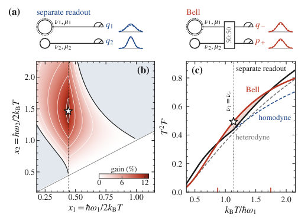
<figcaption class="paper-figure-caption"><b>Fig 1.</b> FIG. 1. (a) The two receivers at the cap pair. Discs are the two thermal modes drawn to their widths 𝜈𝑖[Eq. (1)], dashed at a higher temperature; each meter’s record is drawn as a histogram at 𝑇(solid) and 𝑇(1 + 𝛿) (dashed). Separate readout: one homodyne per mode reads 𝑞1 and 𝑞2, two widths and two responses. Bell: a balanced beam splitter feeds two homodynes reading 𝑞−= (𝑞1 −𝑞2)/ √</figcaption>
</figure>
<figure class="paper-figure-card">
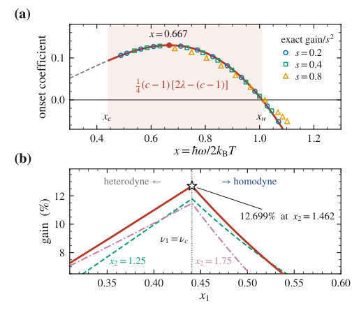
<figcaption class="paper-figure-caption"><b>Fig 2.</b> FIG. 2. (a) The onset coefficient of Eq. (5) against the common 𝑥, dashed below 𝑥𝑐, off the homodyne branch. It is positive on the window (𝑥𝑐, 𝑥𝑤) = (0.4407, 1.0096) and peaks at 𝑥= 0.66678. Symbols: the exact gain divided by 𝑠2 for 𝑠= 0.2, 0.4, 0.8; they collapse onto the law. (b) Gain against 𝑥1 at 𝑥2 = 1.462 (red), 1.25 and 1.75. All three kink at 𝑥𝑐, where the separate-readout optimum switches branch.</figcaption>
</figure>
<figure class="paper-figure-card">
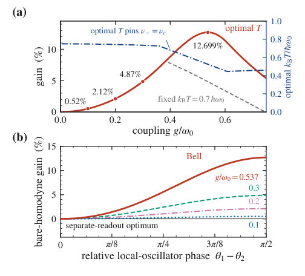
<figcaption class="paper-figure-caption"><b>Fig 3.</b> FIG. 3. (a) Bell gain over the best separate readout of the nor- mal modes for two identical resonators of frequency 𝜔0 and cou- pling 𝑔. Red: temperature re-optimized at each 𝑔; grey dashed: 𝑘B𝑇= 0.7 ℏ𝜔0. Marked points at 𝑔/𝜔0 = 0.1, 0.2, 0.3 and 0.5368. Right axis, dash-dot: the optimal 𝑘B𝑇/ℏ𝜔0, equal to (1 −𝑔/𝜔0)/2𝑥𝑐 for 0.360 ≤𝑔/𝜔0 ≤0.607, so the lower normal mode sits on the crossover. (b) Gain of two bare-resonator homodynes against their relative local-oscillator phase at those couplings, from the separate- readout optimum of the normal modes at 0 to the Bell value at 𝜋/2.</figcaption>
</figure>
<figure class="paper-figure-card">
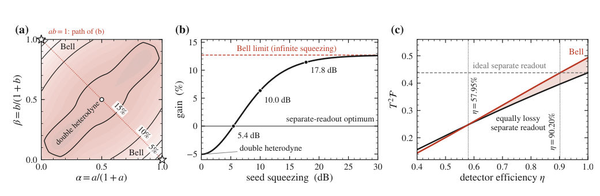
<figcaption class="paper-figure-caption"><b>Fig 4.</b> FIG. 4. All panels at the cap 𝑥1 = 𝑥𝑐, 𝑥2 = 1.462. (a) Shortfall 1 −F (𝑀)/FBell over pure seeds 𝑀, written as a beam splitter of angle 𝜃 acting on squeezed vacua of strengths 𝑎and 𝑏(End Matter D) and minimized over 𝜏= cos2 𝜃at each point. The axes 𝛼= 𝑎/(1 + 𝑎) and 𝛽= 𝑏/(1 + 𝑏) put the infinite-squeezing limits on the edges. The shortfall vanishes only at the two starred Bell corners; double heterodyne is at 15.7%, a stationary point of Eq. (2). The dotted anti-diagonal carries the balanced seeds 𝑎𝑏= 1 of (b). (b) Best finite-seed gain against squeezing: negative at 0 dB, zero at 5.4 dB, half the Bell gain at 10.0 dB, nine tenths at 17.8 dB. (c) 𝑇2F against the efficiency 𝜂shared by all...</figcaption>
</figure>

**Summary.** This paper proves that for estimating parameters in multi-mode quantum systems, the Fisher information is superadditive under Gaussian measurements. It shows that joint measurements, such as Bell homodyne detection, outperform the best possible separate readouts by a measurable gain. This has significant implications for designing optimal quantum sensors using optical or microwave cavities.

**Why it may be interesting.** This work provides a rigorous theoretical understanding of measurement optimization in quantum optics, showing that collective measurements can extract more information than the sum of individual measurements, which is crucial for designing high-precision quantum sensors.

Detailed structure

**Main problem.** The paper investigates whether Gaussian measurements can achieve a collective advantage over separate, independent measurements when estimating a parameter carried by the quadrature widths of multiple quantum modes.

**Main result.** Gaussian measurements can indeed beat the separate readout optimum, demonstrating that the Fisher information is superadditive for these specific measurements, with a maximum achievable gain bounded at approximately 12.7%.

**Method.** The analysis involves calculating the Quantum Fisher Information ($F$) for both joint (e.g., Bell homodyne) and separate measurements, quantifying the advantage via a 'gain' ratio.

**Model / system.** The system involves two or more independent quantum modes (optical or microwave), often modeled as thermal states, measured using Gaussian techniques like homodyne and Bell homodyne detection.

**Key observables.** Fisher Information ($F$), Measurement Gain (ratio of joint to separate $F$), Quadrature Widths ($
u_i$), and Response Functions ($\mu_i$).

**Important parameters / regimes.** Frequency ratios ($\omega_2/\omega_1$), Temperature ($T$), and the coupling strength or frequency splitting ($s$).

**Assumptions / limitations.** The analysis relies on the properties of Gaussian measurements and assumes the ability to perform ideal joint measurements like Bell homodyne detection.

**Figures summary.** Figures illustrate the comparison of Bell gain versus separate readout gain, showing the maximum gain achieved for thermal modes and the dependence on frequency ratios.

**Paper structure.** The paper develops the theoretical framework by comparing the Fisher information of joint measurements (Bell homodyne) against the sum of individual measurements, deriving bounds, and analyzing specific physical realizations like coupled resonators and thermal sources.

Abstract

Quantum Fisher information adds over independent probes, so a single parameter is best measured probe by probe. We show that Gaussian measurements, the linear optics and homodyne detection of optical and microwave experiments, break this rule: two independent modes are better measured together. The uncertainty principle leaves a linear detector half of phase space, and for two modes the choice of half is a resource. Bell homodyne, a balanced beam splitter followed by two homodyne detectors, beats the best separate readout when the modes differ in quadrature width and in how the width responds to the parameter. Heterodyne detection splits a mode on a beam splitter to read both quadratures and pays one unit of vacuum noise for the empty port. Bell homodyne fills that port with the second mode, so the noise turns into signal. We prove that the gain stays below $(\sqrt2-1)^2=17.157\%$ for every parameter carried by widths. For thermal modes at one temperature, the canonical case, a gain was conjectured impossible. We prove that any frequency difference opens a temperature window and that the gain peaks at $12.699\%$ at frequency ratio $3.318$, where Bell homodyne is the optimal Gaussian measurement. Standard hardware reaches the gain: two coupled resonators with two homodyne detectors, or a phase-preserving amplifier whose idler band is fed by the same thermal source.

[↑ back to top](#top)

### [Investigating entanglement dynamics with dynamical decoupling together with initial qubit-reservoir correlations](http://arxiv.org/abs/2610.02453v1)

**Authors:** Rifzah Shahid, Amna Qadeer, Ali Raza Mirza  
**Type:** theory · **Category:** quantum information and computing · **PDF:** <https://arxiv.org/pdf/2610.02453v1>  
**Analysis basis:** full PDF text, analyzed in chunks
**Topic relevance:** `correlated / nonlocal dissipation` **3/5**

↔ Scroll figures horizontally

<figure class="paper-figure-card">
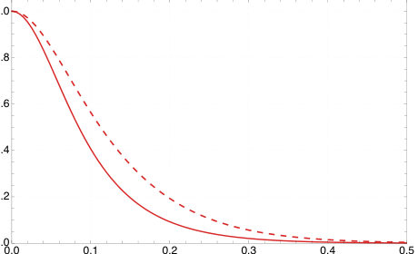
<figcaption class="paper-figure-caption"><b>Fig 1.</b> FIG. 1. (Color Online) Temporal evolution of the Concur- rence C(t), quantifying two-qubit entanglement dynamics in an exactly solvable two-qubit spin-boson model interacting with a common Ohmic bath for the factorized (dashed) and correlated (solid) Bell-state preparations. Chosen set of pa- rameters are ω0 = 1, ωc = 10, g = 0.25, T = 5.</figcaption>
</figure>
<figure class="paper-figure-card">
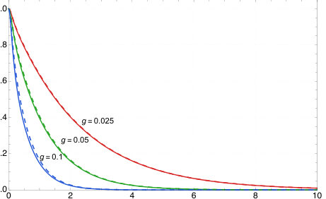
<figcaption class="paper-figure-caption"><b>Fig 2.</b> FIG. 3. (Color Online) Concurrence C(t) for the factor- ized (dashed) and correlated (solid) Bell-state preparations at three qubit-reservoir coupling strengths, g = 0.1 (red), 0.05 (green), 0.025(blue), with T = 1.5, ω0 = 1.0, ωc = 10.0. Stronger coupling accelerates the decay of Γ(t) and hence of the entanglement envelope; the correlated curves again track the factorized ones very closely at these moderate couplings.</figcaption>
</figure>
<figure class="paper-figure-card">
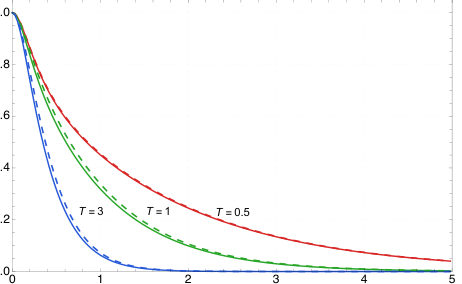
<figcaption class="paper-figure-caption"><b>Fig 3.</b> FIG. 2. (Color Online) Concurrence C(t) for the factor- ized (dashed) and correlated (solid) Bell-state preparations at three temperatures, T = 0.5 (red), 1.0 (green), 3.0(blue), with g = 0.1, ω0 = 1.0, ωc = 10.0. Higher temperature accel- erates the loss of entanglement through coth(βω/2) in Γ(t); at this coupling the correlated and factorized curves are barely distinguishable, consistent with the bound Ccorr(t) ≤Cunc(t).</figcaption>
</figure>
<figure class="paper-figure-card">
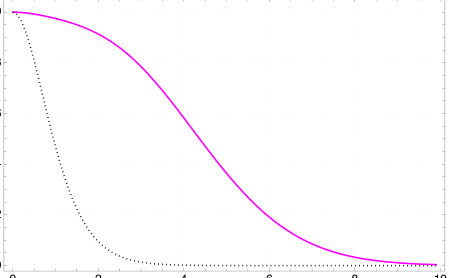
<figcaption class="paper-figure-caption"><b>Fig 4.</b> FIG. 4. (Color Online) Concurrence C(t) without pulses (N = 0, dotted) and under periodic π-pulse control (solid), for the correlated Bell-state preparations with g = 0.1, ω0 = 1, ωc = 10, T = 2.0. Free evolution loses all entanglement by t ≈2–4, while the pulse-protected concurrence survives out to t ≈9–10: an extension of the entanglement lifetime by roughly a factor of four over this window.</figcaption>
</figure>
<figure class="paper-figure-card">
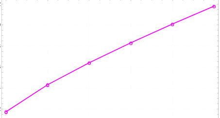
<figcaption class="paper-figure-caption"><b>Fig 5.</b> FIG. 5. (Color Online) Entanglement death time tdeath, de- fined as the first time the concurrence falls below the numeri- cal threshold C(t) &lt; 10−3, as a function of the (even) number of pulses N ∈{0, 2, 4, 6, 8, 10}, for the factorized and corre- lated preparations (overlapping), at g = 0.15, ω0 = ωc = 1.0, T = 5.0. tdeath grows monotonically with N, from tdeath ≈1.7 at N = 0 to tdeath ≈11.9 at N = 10, delivering close to a seven-fold extension of the entanglement lifetime over the range of pulse numbers studied.</figcaption>
</figure>

**Summary.** This paper theoretically analyzes the entanglement decay of two qubits coupled to a common bath, focusing on the impact of initial correlations. It demonstrates that these correlations hasten entanglement sudden death, while applying periodic $\pi$ pulses can significantly extend the entanglement lifetime. The findings are important for understanding decoherence mitigation in open quantum systems.

**Why it may be interesting.** This work provides quantitative insights into how non-Markovian effects and initial system-bath correlations modify fundamental quantum measures like entanglement, which is crucial for designing robust quantum protocols.

Detailed structure

**Main problem.** The study investigates how initial correlations between qubits and a common bosonic reservoir affect the entanglement dynamics of two qubits subjected to pure dephasing.

**Main result.** Initial correlations are shown to always accelerate entanglement sudden death compared to the factorized case, and periodic $\pi$ pulses can extend the entanglement lifetime by a factor of up to seven.

**Method.** The dynamics are calculated exactly for the reduced density matrix using the Ohmic spectral density, comparing factorized and correlated initial states.

**Model / system.** The system consists of two qubits coupled symmetrically to a common bosonic reservoir via a pure dephasing interaction. The Hamiltonian structure allows for exact solvability.

**Key observables.** Wootters concurrence, Entanglement Sudden Death (ESD) time, and the time evolution of the reduced two-qubit density matrix.

**Important parameters / regimes.** Coupling strength ($g$), reservoir spectral density (Ohmic), and the number of applied $\pi$ pulses ($N$).

**Assumptions / limitations.** The analysis assumes an Ohmic spectral density and utilizes approximations for the gap growth and bath averaging.

**Figures summary.** Figures compare concurrence decay curves for factorized vs. correlated states, and demonstrate the extension of entanglement lifetime by applying periodic $\pi$ pulses.

**Paper structure.** The paper systematically analyzes the dynamics by first establishing the factorized case, then incorporating initial correlations, and finally applying periodic dynamical decoupling pulses to extend coherence.

Abstract

We study the exact entanglement dynamics of two qubits coupled to a common bosonic reservoir through a pure dephasing interaction. We ask how this dynamics changes when the qubits and the reservoir already share correlations before the qubit state is prepared. In that case the system and reservoir first interact for a long time and settle into a joint equilibrium state. Only afterward is the qubit pair projected onto the desired state by a local measurement. For an Ohmic spectral density we obtain the exact reduced two qubit dynamics. Using the Wootters concurrence we show that initial correlations always speed up entanglement sudden death relative to the factorized case, and that this gap grows quadratically with the coupling strength in the weak-to-moderate coupling regime. Finally we show that a symmetric sequence of periodic π pulses applied to both qubits extends the entanglement lifetime close to a factor of seven over the range of pulse numbers studied.

[↑ back to top](#top)

### [Learning Noise-Robust Stabilizer Structure via Bell Sampling](http://arxiv.org/abs/2610.03307v1)

**Authors:** Letian Tang, Thomas Steckmann  
**Type:** theory · **Category:** quantum information and computing · **PDF:** <https://arxiv.org/pdf/2610.03307v1>  
**Analysis basis:** full PDF text, analyzed in chunks
**Topic relevance:** `quantum measurements` **3/5**

↔ Scroll figures horizontally

<figure class="paper-figure-card">
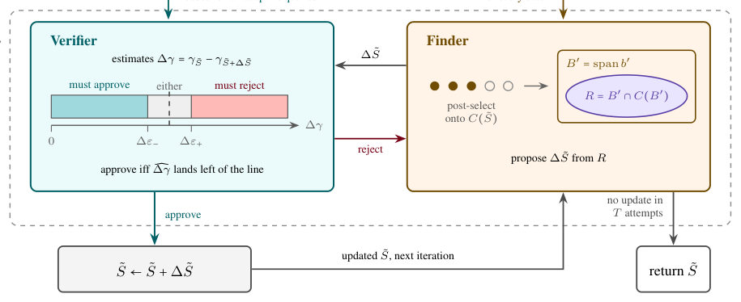
<figcaption class="paper-figure-caption"><b>Fig 1.</b> FIG. 1. The two subroutines and the loop they form. The verifier draws Mver Bell samples once at initialization and reuses them for every query, so its sample cost is fixed before the finder starts; the finder draws a fresh batch of M Bell difference samples each time. Each batch is post-selected onto C( ˜S), spanned, and reduced to its radical R, from which an increment ∆˜S is proposed. The verifier must approve when the true purity drop falls below ∆ε−and must reject when it exceeds ∆ε+; between the two thresholds, which bracket the accuracy spent on a single update, either answer is allowed, and the algorithm decides by comparing its estimate ̂ ∆γ with the midpoint. An approved increment...</figcaption>
</figure>
<figure class="paper-figure-card">
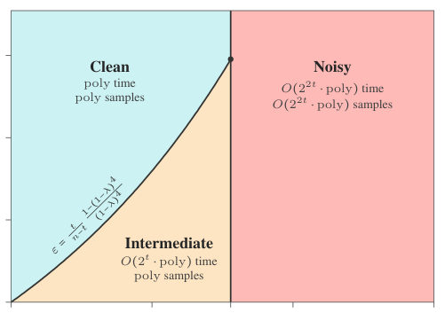
<figcaption class="paper-figure-caption"><b>Fig 2.</b> FIG. 2. Leading-order illustration of the three regimes under global depolarizing noise, as a function of noise strength λ and accuracy ε, for n = 2000 and t = 30. In the clean regime both time and samples are polynomial; in the intermediate regime samples stay polynomial but time carries a 2t factor. The boundary between the two depends on ε, λ, t and n, and to leading order in 1 ≪t ≪n and weak noise λ ≪1 lies at λ ≈nε/4t. Beyond the plotted boundary λ⋆= 1 −( n+t</figcaption>
</figure>
<figure class="paper-figure-card">
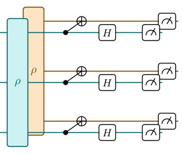
<figcaption class="paper-figure-caption"><b>Fig 3.</b> FIG. 3. The Bell sampling protocol. Two copies of ρ are measured jointly in the transversal n-qubit Bell basis: a CNOT and a Hadamard act on each pair of corresponding qubits, followed by a computational-basis measurement. The 2n measured bits form the Bell-sample label i.</figcaption>
</figure>
<figure class="paper-figure-card">
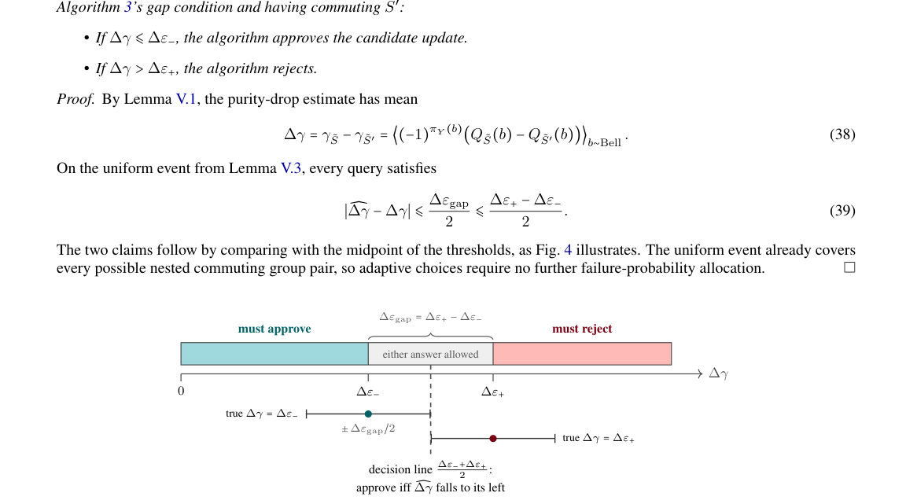
<figcaption class="paper-figure-caption"><b>Fig 4.</b> FIG. 4. The decision requirements of Algorithm 3, on the axis of the true purity drop ∆γ. Below ∆ε−the verifier must approve, above ∆ε+ it must reject, and in the gap between them either answer is allowed. The algorithm decides by comparing its estimate ̂ ∆γ with the midpoint of the two thresholds, and on the uniform event of Lemma V.3 that estimate is accurate to ∆εgap/2. The two ranges shown are therefore the worst cases: a true ∆γ sitting on either threshold can only move as far as the decision line, never across it, which is exactly Theorem V.4.</figcaption>
</figure>
<figure class="paper-figure-card">
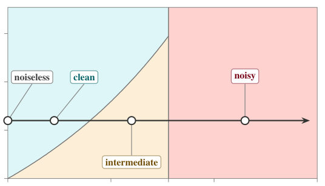
<figcaption class="paper-figure-caption"><b>Fig 5.</b> FIG. 5. We consider fixing ε ≪1 and increasing λ starting from λ = 0. Inside the diagram of Fig. 2, this corresponds to traversing a horizontal line from left to right: starting from no noise at λ = 0, we pass through the clean regime, the intermediate regime, and finally the noisy regime. In each regime, the behavior of Bell difference samples changes qualitatively, requiring a different propose strategy if applicable.</figcaption>
</figure>

**Summary.** This paper addresses the challenge of determining the stabilizer structure of a quantum state when measurements are corrupted by noise. The authors introduce a finder-verifier algorithm that leverages Bell sampling to estimate this structure accurately. The result shows that under weak noise, the required samples and computational time scale polynomially with system size and inverse accuracy, closing a gap between theoretical and practical quantum characterization methods.

**Why it may be interesting.** This work provides a concrete, resource-efficient quantum algorithm for characterizing the underlying symmetries of a quantum state, which is crucial for quantum error correction and quantum tomography protocols.

Detailed structure

**Main problem.** The core problem is learning the stabilizer structure of a pure quantum state when the state is corrupted by noise modeled as a Pauli channel.

**Main result.** The authors develop Bell-sampling algorithms that can learn the stabilizer group to accuracy $\epsilon$ for states of low nullity, achieving polynomial sample and runtime complexity under weak noise conditions.

**Method.** They propose a finder-verifier scheme that iteratively extracts the stabilizer structure from partially corrupted Bell difference samples while certifying the purity loss.

**Model / system.** The system involves an $n$-qubit pure state $|\psi
angle$ whose noisy realization $
ho$ is modeled by a Pauli channel. The structure is characterized by the stabilizer group $	ext{Stab}(\psi)$ and its nullity.

**Key observables.** Stabilizer Group ($	ext{Stab}(\psi)$), Stabilizer Nullity ($
u(\psi)$), Weak Stabilizer ($S$), Purity Loss ($\Delta\gamma(	ilde{S})$).

**Important parameters / regimes.** Nullity $t$, accuracy $\epsilon$, total error probability $\lambda$, and the noise strength relative to $n$ and $t$.

**Assumptions / limitations.** The analysis assumes the noise is sufficiently weak (e.g., global depolarizing noise) to allow the weak stabilizer structure to remain encoded in the noisy state.

**Figures summary.** Figure 1 illustrates the iterative loop involving the Verifier (using reusable samples) and the Finder (using fresh batches) to reconstruct the stabilizer structure.

**Paper structure.** The paper progresses from defining the problem (learning structure from noisy states) to proposing the finder-verifier scheme. It then provides detailed mathematical derivations concerning the probability of Bell difference samples belonging to specific Pauli subgroups, culminating in complexity bounds for the different operational regimes (clean, intermediate, noisy).

Abstract

Bell sampling efficiently learns the stabilizer group, and hence the stabilizer nullity, of pure states with little magic, a primitive underlying tomography and certification of low-magic states. Real devices, however, only prepare noisy images of the target, which we model as a Pauli channel acting on the ideal state; the resulting noisy state generically has no exact Pauli stabilizers. Existing structure learners for mixed states rely on such exact stabilizers. Agnostic tomography does not, but its guarantees scale exponentially in the nullity $t$. We show that the ideal stabilizer group remains encoded in the noisy state as the set of Pauli operators under which it is invariant. We give Bell-sampling algorithms that learn the group to accuracy $\varepsilon$ for states of nullity at most $t$. The difficulty is that noisy samples break the group structure pure-state learners rely on, so more samples can erase structure rather than reveal it. We resolve this with a finder-verifier scheme that extracts stabilizer structure from partially corrupted sample batches while certifying proposed updates. For sufficiently weak global depolarizing noise, both samples and runtime are $\mathrm{poly}(n,t,1/\varepsilon)$ when the channel's total error probability is at most of order $\varepsilon n/t$. Up to a constant total error probability ($\approx 0.16$), samples remain polynomial while classical processing costs $2^t$, and for any error probability below one a $4^t$ overhead suffices. Arbitrary Pauli channels exhibit the same three regimes, with more restrictive thresholds. For weak Pauli noise, this closes much of the gap between agnostic learners such as stabilizer bootstrapping and polynomial pure-state algorithms.

[↑ back to top](#top)

### [Ordering-Aware Theory of Trotter Error](http://arxiv.org/abs/2610.03672v1)

**Authors:** Zhenning Liu, Zhi-Yuan Wei, Michael Foss-Feig, Alexey V. Gorshkov, Andrew M. Childs  
**Type:** theory · **Category:** quantum information and computing · **PDF:** <https://arxiv.org/pdf/2610.03672v1>  
**Analysis basis:** full PDF text, analyzed in chunks
**Topic relevance:** `analog quantum simulation` **3/5**

↔ Scroll figures horizontally

<figure class="paper-figure-card">
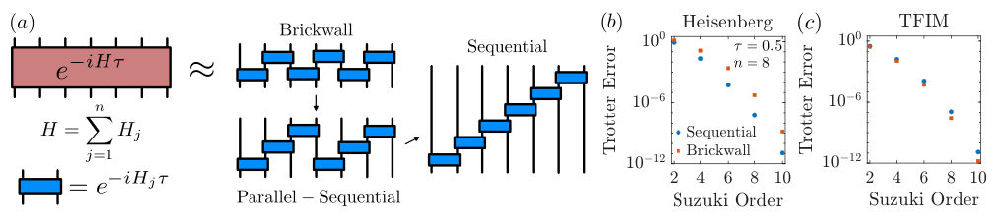
<figcaption class="paper-figure-caption"><b>Fig 1.</b> FIG. 1. Term ordering and Trotter error. (a) Illustration of different term orderings within a first-order product formula. The same local evolutions e−iHjτ can be arranged into different circuit geometries. Shown are representative examples, including brickwall and sequential circuits, together with an intermediate circuit from the parallel-sequential family [11]. (b,c) Trotter errors for the Heisenberg and the transverse-field Ising model, respectively, with n = 8 and τ = 0.5. The relative accuracy of brickwall and sequential orderings depends on both the Hamiltonian and the Suzuki order.</figcaption>
</figure>
<figure class="paper-figure-card">
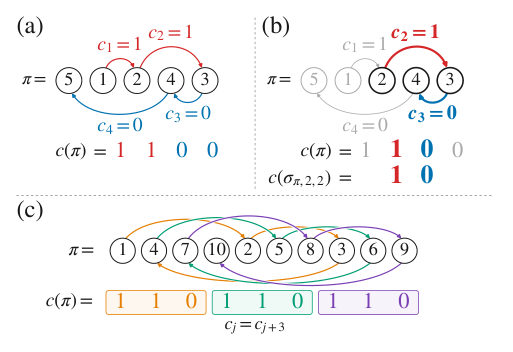
<figcaption class="paper-figure-caption"><b>Fig 2.</b> FIG. 2. Illustration of the consecutive-label ordering pattern and its properties. Plot (a) shows how to compute c(π), according to Definition 1; plot (b) shows how to read out the relative ordering between 2, 3, 4 from c(π), according to Definition 2 and Lemma 1; plot (c) shows a typical translation- invariant permutation with m = 3, according to Definition 3.</figcaption>
</figure>
<figure class="paper-figure-card">
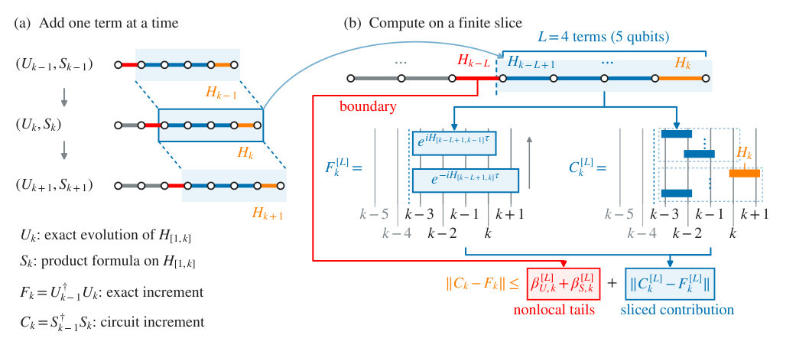
<figcaption class="paper-figure-caption"><b>Fig 3.</b> FIG. 3. Construction of the ordering-aware Trotter error bound by adding one Hamiltonian term at a time. (a) Circles represent qubits and bonds represent nearest-neighbor Hamiltonian terms. The operators Uk = e−iH[1,k]τ and Sk are the exact and product-formula evolutions of the first k terms. The orange bond is the newly added term. Blue shading marks the last L terms (the slice) used to approximate the increment. The red bond, corresponding to Hk−L in the middle row, connects this slice to the rest of the chain. The dashed blue lines show the slice shifting by one term. The exact and circuit increments, Fk = U † k−1Uk and Ck = S† k−1Sk, give ∥Uk −Sk∥≤∥Uk−1 −Sk−1∥+ ∥Ck −Fk∥. (b) Each...</figcaption>
</figure>
<figure class="paper-figure-card">
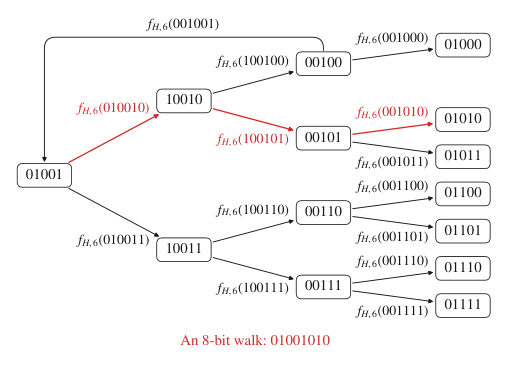
<figcaption class="paper-figure-caption"><b>Fig 4.</b> FIG. 4. Part of the de Bruijn graph corresponding to p = 6. Every vertex is a (p −1)-bit string, every edge corresponds to a p-bit string c′ with weight fH,6(c′), and every longer bit string corresponds to a unique walk in the graph. The example presented in the graph is a walk of 8 bits (i.e., a walk corresponding to an 8-bit ordering pattern) with corresponding edges shown in red.</figcaption>
</figure>
<figure class="paper-figure-card">
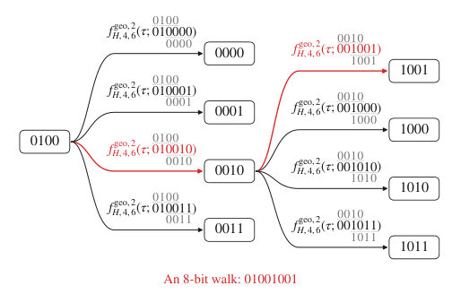
<figcaption class="paper-figure-caption"><b>Fig 5.</b> FIG. 5. Part of the de Bruijn graph corresponding to p = 4 based on the q = 2 Trotter-error bound. Every vertex is a p-bit string, every edge is a (p + q)-bit string c′ with weight determined by f geo,q H,p,L(τ; c′), and every longer bit string corresponds to a unique walk in the graph. The example presented in the graph is an 8-bit walk with corresponding edges shown in red.</figcaption>
</figure>

**Summary.** This paper introduces an ordering-aware theory to analyze and improve the accuracy of Trotterization for simulating quantum many-body dynamics. By quantifying how the sequence of Hamiltonian terms affects the error bound, the authors show that specific orderings, like sequential or wave-like, yield significantly more accurate simulations than standard methods. This establishes term ordering as a critical, exploitable degree of freedom in quantum simulation.

**Why it may be interesting.** This work provides crucial theoretical tools for improving the efficiency and accuracy of quantum simulation algorithms, directly impacting how quantum dynamics are modeled in quantum computing and AMO physics.

Detailed structure

**Main problem.** The paper systematically studies the impact of the ordering of Hamiltonian terms on the accuracy of product-formula simulations (Trotterization) for quantum many-body dynamics.

**Main result.** The authors developed an ordering-sensitive bound on the Trotter error that is nearly optimal, showing that sequential or wave-like orderings significantly outperform standard brickwall circuits.

**Method.** They develop an efficiently computable, ordering-sensitive bound on the finite-step-size Trotter error by organizing error contributions by spatial support and employing graph-theoretic algorithms to optimize the term ordering.

**Model / system.** The study focuses on simulating the time evolution of quantum many-body systems governed by geometrically local, translation-invariant Hamiltonians, initially on 1D nearest-neighbor chains.

**Key observables.** Trotter Error, Optimality Ratio, Mean Optimality Ratios.

**Important parameters / regimes.** Product formula order ($p=2, 4, 6$), step size ($	au$), chain length ($n$).

**Assumptions / limitations.** The analysis focuses on 1D translation-invariant nearest-neighbor Hamiltonians, and the error bound is derived from the nondegenerate part of the leading-order error.

**Figures summary.** Figures illustrate different term orderings (e.g., brickwall vs. sequential) and compare Trotter errors for various models, while later figures compare performance metrics like the optimality ratio across different optimization strategies.

**Paper structure.** The paper progresses from establishing the core problem—the role of ordering—to developing the error bound based on spatial support, optimizing the ordering using de Bruijn graphs, and finally validating the findings by comparing sequential, wave-like, and brickwall orderings on random chains.

Abstract

Product formulas are a basic tool for simulating quantum many-body dynamics, but a fundamental degree of freedom in their application---the ordering of Hamiltonian terms---has remained largely unexplored. Here we systematically study such ordering effects, quantifying their impact on simulation accuracy and exploiting them to design more accurate product-formula simulations. We develop an efficiently computable, ordering-sensitive bound on the finite-step-size Trotter error for geometrically local Hamiltonians for arbitrarily high-order product formulas. For translation-invariant one-dimensional chains, our bounds are close to exact second-, fourth-, and sixth-order Trotter errors in small-system tests, while on large-scale systems they improve on previous higher-order analytical bounds by orders of magnitude. We further use the local structure of the error bounds and estimates to optimize ordering efficiently, reducing the long-chain problem to a minimum-mean-weight-cycle problem on a weighted de Bruijn graph. For random translation-invariant chains, sequential (staircase-like) orderings consistently outperform standard brickwall circuits; when circuit depth is restricted, the optimizer instead favors wave-like parallel-sequential orderings, which preserve much of the accuracy advantage over brickwall circuits. These results establish ordering as a useful degree of freedom for both understanding and improving product-formula simulation.

[↑ back to top](#top)

### [Quantum Codeword Sensing](http://arxiv.org/abs/2610.03659v1)

**Authors:** John Blue, Zachary E. Chin, Vlad S. Oros, Isaac L. Chuang  
**Type:** theory · **Category:** quantum information and computing · **PDF:** <https://arxiv.org/pdf/2610.03659v1>  
**Analysis basis:** full PDF text, analyzed in chunks
**Topic relevance:** `quantum measurements` **3/5**

↔ Scroll figures horizontally

<figure class="paper-figure-card">
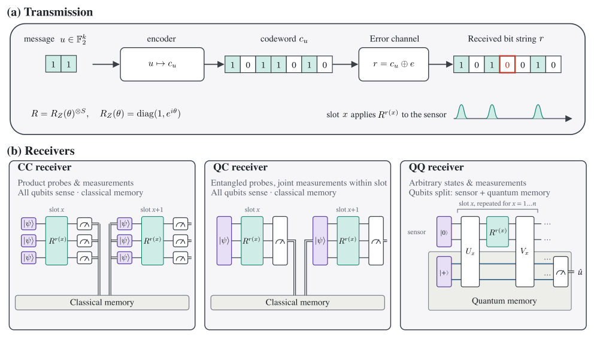
<figcaption class="paper-figure-caption"><b>Fig 1.</b> FIG. 1. Quantum codeword sensing and receiver classes. (a) A message u is encoded as a classical codeword cu, which is corrupted by transmission errors e. The received bits r = cu ⊕e arrive sequentially: in time slot x, the bit r(x) applies Rr(x)</figcaption>
</figure>
<figure class="paper-figure-card">
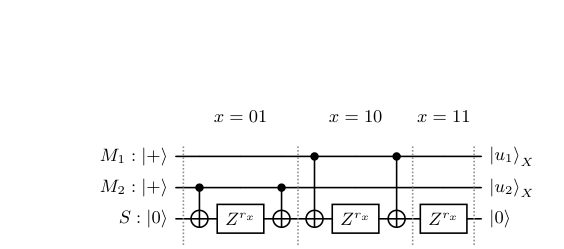
<figcaption class="paper-figure-caption"><b>Fig 2.</b> FIG. 2. A QQ decoder for the [3, 2] simplex code at θ = π. Here r(x) = cu(x) is the received bit at time step x. In slot x = ei, two CNOTs couple memory qubit i to the sensor before and after the signal. The final memory state is |u⟩X; a final X-basis measurement reads out u.</figcaption>
</figure>
<figure class="paper-figure-card">
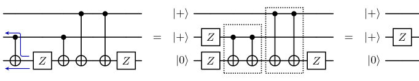
<figcaption class="paper-figure-caption"><b>Fig 3.</b> FIG. 4. Reduction of the toy circuit for u = 01. The signal supplies Z in slots 01 and 11. The arrows show the first Z being pushed left through the preceding CNOT, creating a Z on memory qubit 2. Each dotted CNOT pair then cancels, and the two remaining sensor Z operators cancel. Only Z on memory qubit 2 remains, giving |+−⟩= |01⟩X, the desired message string.</figcaption>
</figure>
<figure class="paper-figure-card">
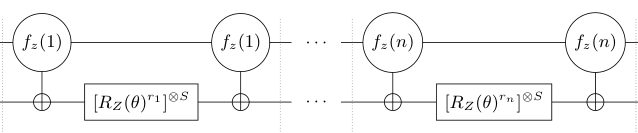
<figcaption class="paper-figure-caption"><b>Fig 4.</b> FIG. 5. General simplex QQ decoder with k memory qubits and S sensor qubits. Each circle denotes a Boolean control: on memory basis state |z⟩, it flips every sensor qubit if fz(x) = 1. The signal applies RZ(θ)r(x) to each sensor qubit, where r(x) is the received bit. Repeating the control restores the sensor to |0⟩⊗S and retains the phase eiSθr(x)fz(x) on the memory state |z⟩.</figcaption>
</figure>
<figure class="paper-figure-card">
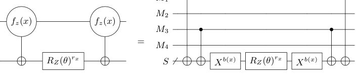
<figcaption class="paper-figure-caption"><b>Fig 5.</b> FIG. 6. Implementation of one time step of the decoder in Fig. 5, shown for k = 4 and x = 1010, so that fz(x) = z1 ⊕z3 ⊕b(x). On the right, each CNOT into the sensor register represents one CNOT to each of its S qubits.</figcaption>
</figure>

**Summary.** This work analyzes quantum codeword sensing, determining how reliably a classical message can be recovered from weak, noisy quantum signals. The core finding is that maintaining quantum coherence via a persistent quantum memory provides a substantial advantage over any receiver limited to classical memory between measurements. This establishes a fundamental resource advantage of quantum memory in quantum information processing.

**Why it may be interesting.** It provides a concrete, information-theoretic demonstration of the advantage of quantum coherence and memory over classical processing when gathering weak, sequential quantum signals, which is fundamental to quantum sensing protocols.

Detailed structure

**Main problem.** The paper addresses quantum codeword sensing: reliably identifying an unknown classical codeword transmitted sequentially to a quantum sensor, even when the transmitted bits are corrupted by noise.

**Main result.** A receiver utilizing a persistent quantum memory (QQ protocol) can achieve significantly higher reliability in decoding the original codeword compared to any receiver restricted to classical memory between time steps (CC or QC protocols).

**Method.** The analysis employs information-theoretic bounds, comparing the accessible information of different receiver classes (CC, QC, QQ) under weak signal regimes and noisy channels.

**Model / system.** The model involves a quantum sensor register subjected to sequential, weak phase interactions ($Z$-rotations) corresponding to the bits of a classical codeword. The comparison is drawn between receivers with persistent quantum memory versus those limited to classical memory storage.

**Key observables.** Decoding error probability, success probability ($p_{	ext{succ}}$), and the accessible mutual information $I(C_j; Y_j)$ in single time slots.

**Important parameters / regimes.** Total qubit budget ($Q$), rotation angle ($	heta$), total signal strength ($\Phi = Q	heta$), and the error probability ($p$) of bit flips.

**Assumptions / limitations.** The comparison is rigorously made under the assumption of weak total signal strength ($\Phi 	o 0$) and the ability to use persistent quantum memory coherently across time steps.

**Figures summary.** Figures compare the success probability of the quantum memory receiver (QQ) against the theoretical upper bounds derived for classical memory receivers (QC upper bound), showing the quantum advantage.

**Paper structure.** The paper establishes the physical model and the three receiver classes (CC, QC, QQ). It then derives information-theoretic bounds for the classical and quantum memory receivers, culminating in explicit calculations showing the superior performance of the persistent quantum memory approach.

Abstract

Consider the task of identifying an unknown classical codeword delivered to a register of quantum sensor qubits through a sequence of weak phase interactions that each encode one bit. Suppose that each received bit controls an identical $Z$-rotation of angle $θ$ applied to every sensor qubit; receivers may also use auxiliary qubits within a total qubit budget $Q$, with arbitrary control unitaries and entanglement among all qubits allowed during each reception step. When the total collected signal is weak ($Qθ\rightarrow 0$), we establish that a sensor coupled to a persistent quantum memory can identify the original codeword more reliably than any receiver with the same $Q$ and $θ$ but only classical memory between received bits, even when bit flips occur during transmission. In particular, for a family of $[n,k]$ binary simplex codes with even $k$ and $n=2^k-1$, we achieve exact correction of up to $t\leq(k-2)/4$ transmission errors by coupling the sensor register to a persistent quantum memory of the same size, using $Q = Θ((t+1)\log n)$ and $θ=\frac{2π}{k\sqrt{n+1}}$; for $t=o(\sqrt k)$, every comparable receiver with only classical memory instead has average success probability (over uniformly chosen codewords) tending to zero. Furthermore, under independent bit flips of any fixed probability $p<1/16$, our receiver with persistent quantum memory achieves decoding error tending to zero as $n\to\infty$ using $Q=O(\log n\log\log n)$ total qubits and the same $θ$. In contrast, every otherwise equivalent receiver with only classical memory has vanishing average success probability under the same stochastic error model.

[↑ back to top](#top)

### [Quantum Error-Corrected Memories Keep Proper Time](http://arxiv.org/abs/2610.02786v1)

**Authors:** Sebastian P. Kish, Simon J. Devitt  
**Type:** theory · **Category:** quantum information and computing · **PDF:** <https://arxiv.org/pdf/2610.02786v1>  
**Analysis basis:** full PDF text, analyzed in chunks
**Topic relevance:** `quantum measurements` **3/5**

↔ Scroll figures horizontally

<figure class="paper-figure-card">
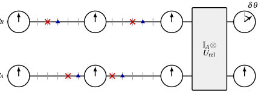
<figcaption class="paper-figure-caption"><b>Fig 1.</b> FIG. 1. (a) Locally corrected memories at heights differing by ∆h accumulate only the relative phase δθ(t) = ω0∆τ(t). Ticks are syndrome rounds; crosses and triangles are local errors and corrections. (b) Theorem 1: the same local circuit, rotation-free, followed by IA ⊗Urel.</figcaption>
</figure>
<figure class="paper-figure-card">
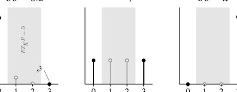
<figcaption class="paper-figure-caption"><b>Fig 2.</b> FIG. 2. Code-space filtering for the phase-flip [[3, 1, 3]] code. Detectable weights one and two vanish under PUrelP; only the identity and logical- ¯ X terms survive. At δθ = π the excursion is exactly i ¯ X.</figcaption>
</figure>

**Summary.** This theoretical work analyzes the interplay between quantum error correction and relativistic time dilation by examining how the relative phase accumulated between two separated quantum memories is preserved. The authors show that QEC does not eliminate the time difference, instead encoding it as a measurable relational phase rotation. This establishes protected quantum memories as a novel platform for testing quantum evolution involving relativistic time.

**Why it may be interesting.** It provides a concrete, physical realization where fundamental concepts of general relativity (time dilation) are mapped onto the abstract framework of fault-tolerant quantum computation, suggesting protected quantum memories are viable for relativistic metrology.

Detailed structure

**Main problem.** The paper investigates how quantum error correction (QEC) affects the measurement of relativistic proper time differences ($\Delta	au$) between two quantum memories following distinct worldlines.

**Main result.** Error correction does not erase time dilation; the accumulated time difference manifests as a measurable relational phase rotation, which can be converted into a deterministic logical gate at specific time intervals.

**Method.** The analysis uses theoretical derivations involving the evolution of joint quantum states under local operations, projecting the evolution onto the code space defined by stabilizer codes.

**Model / system.** The system involves quantum memories whose local evolution is governed by a clock transition frequency ($\omega_0$). The comparison is modeled by analyzing the relative evolution operator $U_{	ext{rel}}$ between two memories separated in spacetime.

**Key observables.** Relative phase rotation ($\delta	heta$), code-space survival probability ($	ext{psurv}$), and conditional process fidelity ($	ext{Fcond}$).

**Important parameters / regimes.** The proper time difference ($\Delta	au$), the code structure (e.g., phase-flip code), and the amplification factor ($A$).

**Assumptions / limitations.** The analysis assumes the code satisfies its normaliser condition and treats the relative phase as a coherent systematic offset rather than a decay mechanism.

**Figures summary.** Figures illustrate that locally corrected memories accumulate only the relative phase $\delta	heta(t) = \omega_0\Delta	au(t)$, and show code-space filtering for the phase-flip code at specific phase excursions.

**Paper structure.** The paper progresses by first establishing the relative phase accumulation (Theorem 1), then analyzing how QEC preserves this phase (Corollary 1), and finally detailing the conversion of this continuous phase into discrete logical gates (Corollary 2).

Abstract

What does quantum error correction do to relativistic proper time? We show that when two error-corrected quantum memories follow distinct worldlines and are controlled by local references, their local correction histories factor exactly from the proper-time difference between them. Error correction therefore does not erase time dilation: when the memories are compared, the accumulated difference appears as a relational phase rotation. During locally referenced operation this rotation is invisible to every local error syndrome; at discrete phases admitted by a code, the final relational evolution instead returns exactly as a deterministic logical gate, including an $S$-type Clifford gate at a $π/2$ excursion. These results connect fault-tolerant quantum information with relativistic clocks and establish protected quantum memories as a platform for preserving proper-time information and for long-coherence tests of quantum evolution involving relativistic proper time.

[↑ back to top](#top)

### [Robustness of quantum spectrum estimation: weak Schur sampling under noisy inputs](http://arxiv.org/abs/2610.03582v1)

**Authors:** Vladyslav Visnevskyi, Laura Mančinska  
**Type:** theory · **Category:** quantum information and computing · **PDF:** <https://arxiv.org/pdf/2610.03582v1>  
**Analysis basis:** full PDF text, analyzed in chunks
**Topic relevance:** `quantum measurements` **3/5**

↔ Scroll figures horizontally

<figure class="paper-figure-card">
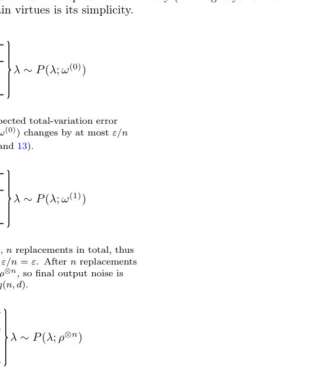
<figcaption class="paper-figure-caption"><b>Fig 1.</b> Figure 1. The proof technique behind Result 1, WSS is weak Schur sampling. Starting from the noisy product input ω(0) = σ1 ⊗· · · ⊗σn (red), the noisy registers are replaced by the ideal copy ρ (blue) one at a time, through intermediate states ω(k) = ρ⊗k ⊗σk+1 ⊗· · · ⊗σn, until the noiseless input ρ⊗n is reached, on which WSS has error η(n, d). We show that each replacement changes the expected total variation error by at most ε/n, so the n replacements cost ε in total. The second main ingredient is that it does not matter in which order the registers are replaced, nor which register is replaced at a given step: WSS commutes with all permutations of the registers (Lemma 2), so every step is...</figcaption>
</figure>

**Summary.** This paper rigorously analyzes the noise robustness of Weak Schur Sampling, a core measurement for quantum state estimation. It proves that the estimation error scales optimally with the noise level ($\epsilon$) and the system size ($n$), showing that the error does not accumulate naively. This establishes a crucial theoretical foundation for implementing quantum algorithms in noisy, real-world quantum hardware.

**Why it may be interesting.** This work is highly relevant to quantum information theory as it provides rigorous, quantitative guarantees on the practical feasibility of quantum algorithms (like QSE) when subjected to realistic noise channels.

Detailed structure

**Main problem.** The paper addresses the critical issue of noise robustness in Weak Schur Sampling (WSS), a measurement fundamental to optimal quantum learning tasks like Quantum Spectrum Estimation (QSE). It investigates how the estimation accuracy degrades when the input quantum states are noisy rather than perfectly identical.

**Main result.** The authors prove that the expected output error in total variation is bounded by the sum of the inherent noiseless error ($\eta(n,d)=O(d/\sqrt{n})$) and an additive noise term ($\epsilon$), demonstrating that the error does not accumulate linearly with the system size $n$.

**Method.** The analysis employs advanced quantum information techniques, including bounding the error using the quantum Wasserstein distance ($W_1$) for general noise, and utilizing iterative replacement arguments for product noise models.

**Model / system.** The system involves estimating the spectrum of a target quantum state $
ho$ using $n$ copies. The noise is modeled either as independent, trace-distance-bounded product states or more generally using the quantum Wasserstein distance.

**Key observables.** The primary observable is the estimated spectrum $\hat{p} = \lambda/n$, and the diagnostic is the expected error in total variation, $\mathbb{E}[\|\hat{p} - p\|_1]$.

**Important parameters / regimes.** Key parameters include the noise level $\epsilon$ (trace distance) and the system size $n$, with the error scaling being $\epsilon + O(d/\sqrt{n})$.

**Assumptions / limitations.** The analysis makes strong claims about robustness, showing that weaker assumptions (like only bounding single-copy marginals) are insufficient to guarantee the desired error bounds.

**Figures summary.** Figure 1 illustrates the proof technique involving the sequential replacement of noisy registers with ideal copies to bound the total error accumulation.

**Paper structure.** The paper builds from establishing robustness under a simple product noise model (Theorem 15) to generalizing the result for arbitrary inputs using the quantum Wasserstein distance ($W_1$). It concludes by detailing the failure modes of weaker noise assumptions.

Abstract

We initiate the study of weak Schur sampling (WSS) under noisy input. Many optimal quantum learning algorithms rely on this measurement, for instance in such fundamental tasks as quantum spectrum estimation (QSE) and quantum state tomography (QST). The standard analysis of WSS, QSE and QST assumes that the $n$ input copies of the target state $ρ$ are identical. We study what happens when they are not, a more realistic noisy scenario that breaks the very permutation symmetry on which WSS is built. In the simplest noise model, the copies are independent but not necessarily identical, i.e. they form a product state, and each is $ε$-close in trace distance to the $d$-dimensional target state $ρ$. A naive data-processing argument lets the per-copy errors accumulate to $nε$ on measurement output, growing with the input size. We prove that they do not accumulate: the expected output error in total variation is at most $ε+η(n,d)$, where $η(n,d)=O(d/\sqrt n)$ is the noiseless error, and the additive noise term $ε$ is optimal. Beyond noisy product states, for arbitrary inputs $ω$ we show that the outcome observables of WSS are $1/n$-Lipschitz with respect to the quantum Wasserstein distance $W_1$ of De Palma et al., so the error is at most $η(n,d)+\frac{1}{n}\|ω-ρ^{\otimes n}\|_{W_1}$. In particular, our results imply, for the first time, noise-robustness of Keyl and Werner's seminal algorithm for QSE, more than two decades after its introduction. Within our model of robustness, the promise cannot be weakened to closeness of single-copy marginals or to a global trace-distance budget alone, since in both cases some noisy inputs defeat every measurement and estimator. Our results are a necessary step towards optimal quantum learning in practice, and help make progress towards robustness of many other problems in quantum information theory.

[↑ back to top](#top)

### [Subdimensional linear-optical quantum computation: from qudit resource states to qubit quantum computation](http://arxiv.org/abs/2610.03408v1)

**Authors:** Tomohiro Yamazaki  
**Type:** theory · **Category:** quantum information and computing · **PDF:** <https://arxiv.org/pdf/2610.03408v1>  
**Analysis basis:** full PDF text, analyzed in chunks
**Topic relevance:** `quantum measurements` **3/5**

↔ Scroll figures horizontally

<figure class="paper-figure-card">
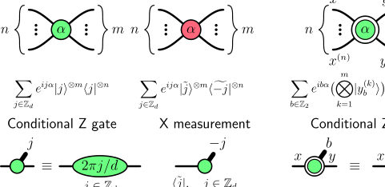
<figcaption class="paper-figure-caption"><b>Fig 1.</b> FIG. 1: ZX-diagrammatic notations for (a) qudits and (b) two-dimensional subspaces, where ˜j = √</figcaption>
</figure>
<figure class="paper-figure-card">
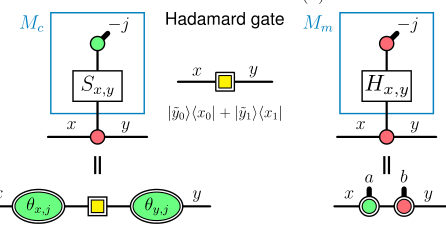
<figcaption class="paper-figure-caption"><b>Fig 2.</b> FIG. 2: Definitions and corresponding diagrammatic transformations of (a) connecting measurement Mc and (b) merging measurement Mm. Here, θv,j = π/2 + 2πj∆v/d for v = x, y, and j = −(xa + ya+b) with a = 0 for the case of x0 + y0+b = x1 + y1+b.</figcaption>
</figure>
<figure class="paper-figure-card">
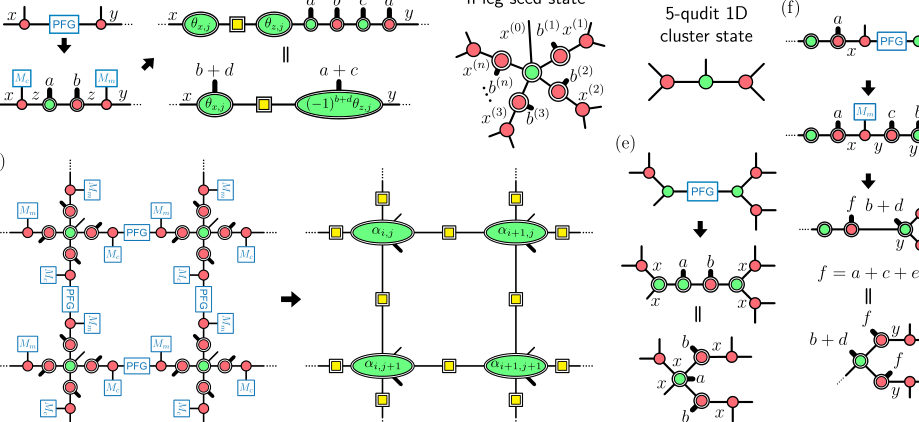
<figcaption class="paper-figure-caption"><b>Fig 3.</b> FIG. 3: (a) Boosted fusion gate on a pair of X spiders. (b) Diagrammatic representation of an n-leg seed state. (c) Generation of a 2D cluster state from 4-leg seed states. (d) Diagrammatic representation of a 5-qudit 1D cluster state. (e) Generation of a 3-leg seed state. (f) Extension from an n-leg seed state to an (n + 1)-leg seed state.</figcaption>
</figure>
<figure class="paper-figure-card">
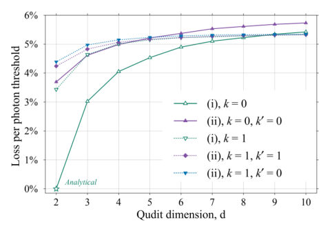
<figcaption class="paper-figure-caption"><b>Fig 4.</b> FIG. 4: Loss tolerance of the percolation-based scheme on square lattices, where k and k′ are parameters representing the use of ancilla photons in the PFG and subspace fusion gate, respectively. The numerical estimates are obtained from crossings of the percolation probabilities for different lattice sizes.</figcaption>
</figure>

**Summary.** This paper presents a quantum computation scheme for linear optics that utilizes high-dimensional qudits to enhance the success probability of fusion gates beyond the standard 50% limit. By employing pairwise fusion gates and adaptive measurements, the authors demonstrate a method to deterministically generate 2D cluster states from 1D states. This significantly improves the loss tolerance and scalability of measurement-based quantum computation in photonic systems.

**Why it may be interesting.** This work directly addresses resource efficiency and scalability in photonic quantum computation by leveraging higher-dimensional entanglement (qudits) to overcome inherent probabilistic limitations of linear optics.

Detailed structure

**Main problem.** To develop a linear-optical quantum computation scheme that efficiently performs qubit computation using high-dimensionally entangled qudits.

**Main result.** The authors propose a method using pairwise fusion gates that boosts the success probability of linear-optical fusions from 50% to $1-1/d$, enabling the generation of 2D cluster states from 1D states.

**Method.** The scheme employs a novel pairwise fusion gate (PFG) acting on qudits, combined with adaptive single-qudit measurements within a measurement-based quantum computation framework.

**Model / system.** The physical platform is photonic quantum computation using linear-optical fusion gates. The theoretical framework extends the ZX calculus to qudit systems, utilizing qudits of dimension $d>2$.

**Key observables.** Fusion success probability, loss tolerance threshold, and the successful generation of 2D cluster states.

**Important parameters / regimes.** Qudit dimension ($d$), the success probability $1-1/d$, and the bond-percolation threshold (50%).

**Assumptions / limitations.** The protocol assumes the ability to generate initial 1D cluster states deterministically and that the boosted fusion gates maintain their improved success probability.

**Figures summary.** Figure 1 illustrates ZX-diagrammatic notations for qudits and subspaces. Figure 2 details the transformations achieved by adaptive measurements $	ext{Mc}$ and $	ext{Mm}$. Figure 3 shows the step-by-step process of generating 2D cluster states from 1D states using boosted fusion gates. Figure 4 presents the numerical results on the loss threshold for the percolation-based scheme.

**Paper structure.** The paper introduces the problem of probabilistic fusion gates, proposes the PFG approach using qudits, details the use of adaptive measurements ($	ext{Mc}, 	ext{Mm}$) to generate 2D cluster states from 1D states, and finally analyzes the loss tolerance using a percolation-based scheme.

Abstract

In this paper, we propose a linear-optical quantum computation scheme that starts from high-dimensionally entangled qudits but performs quantum computation on qubits defined in their subspaces. This approach enables us to increase the success probability of linear-optical fusions from $50\%$ to $1-1/d$ for qudits of dimension $d$ without relying on existing approaches using ancilla photons and quantum codes. In particular, we show that a 2D cluster state of qubits can be generated from 5-qudit 1D cluster states using pairwise fusion gates while preserving their boosted success probability. We numerically demonstrate that this approach can improve the loss tolerance of a percolation-based scheme while keeping the photon number per resource state constant.

[↑ back to top](#top)

### [Minimax entropy production for arbitrary processes](http://arxiv.org/abs/2610.03478v1)

**Authors:** Mahran Yousef, Ben Ansbacher, David H. Wolpert  
**Type:** theory · **Category:** statistical mechanics · **PDF:** <https://arxiv.org/pdf/2610.03478v1>  
**Analysis basis:** full PDF text, analyzed in chunks
**Topic relevance:** `Keldysh / 2PI / non-Gaussian methods` **2/5** · `methods for driven-dissipative` **2/5** · `non-equilibrium universality` **2/5** · `analog quantum simulation` **1/5** · `correlated / nonlocal dissipation` **1/5** · `driven-dissipative phase transition` **1/5** · `quantum measurements` **1/5**

↔ Scroll figures horizontally

<figure class="paper-figure-card">
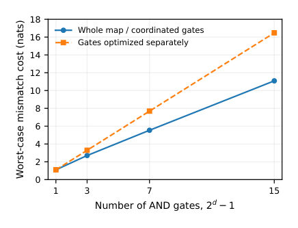
<figcaption class="paper-figure-caption"><b>Fig 1.</b> FIG. 1. Minimax mismatch cost of a depth-d AND tree (d = 1, . . . , 4), computed as one Boolean map using Eq. (13) and gate by gate using Eq. (14). Both grow linearly with the number of gates, with different coefficients because they de- scribe different physical implementations. The gate-by-gate curve is the sum of local gate mismatch costs and is a lower bound when correlations with the rest of the circuit are in- cluded [16].</figcaption>
</figure>
<figure class="paper-figure-card">
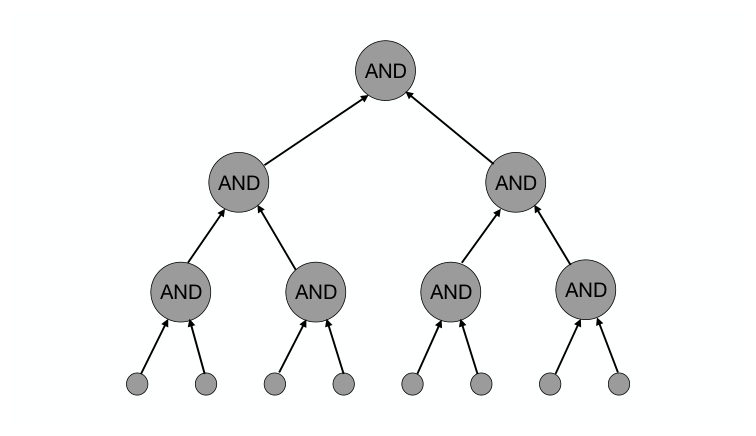
<figcaption class="paper-figure-caption"><b>Fig 2.</b> FIG. 2. A depth-3 binary tree of two-input AND gates. The eight bottom nodes represent the external input bits, and each higher node computes the AND of its two inputs. This figure first appeared in our previous work, Ref. [16].</figcaption>
</figure>
<figure class="paper-figure-card">
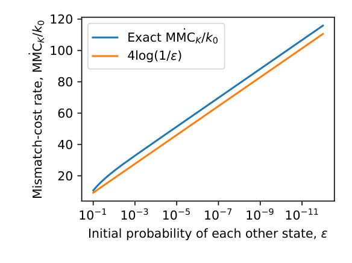
<figcaption class="paper-figure-caption"><b>Fig 3.</b> FIG. 3. Instantaneous mismatch-cost rate for the three-state nonequilibrium steady state in Eq. (S119), with q = πss and p(ϵ)</figcaption>
</figure>
<figure class="paper-figure-card">

<figcaption class="paper-figure-caption"><b>Fig 4.</b> Figure 3 compares the exact rate with 4 log(1/ϵ). The exact rate has the same logarithmic growth and continues to increase as ϵ decreases, making the divergence visible. To understand how this singular instantaneous behavior emerges from finite times, we now study the minimax mis- match cost as the process duration approaches zero. For this short-time analysis we specialize to a time-homogeneous CTMC with Pt = etK. Assume K is irreducible, meaning that every state can be reached from every other state through a sequence of transitions with positive rates. For a finite irreducible continuous-time process, Pt(y|x) &gt; 0 for every x, y and every t &gt; 0. Therefore Pt has one stochastic island....</figcaption>
</figure>

**Summary.** This work develops a framework to calculate the minimax entropy production cost for physical processes, ranging from discrete maps to continuous-time dynamics. It shows that the optimal prior minimizes the worst-case cost, which is governed by the maximum uncertainty remaining after the process. The results provide universal scaling laws for the short-time behavior of this cost in Markovian systems.

**Why it may be interesting.** The framework provides a rigorous information-theoretic measure (minimax cost) for quantifying the inherent thermodynamic uncertainty or irreversibility associated with implementing a physical transformation, which has implications for non-equilibrium thermodynamics.

Detailed structure

**Main problem.** The paper determines the optimal prior distribution ($q$) for a physical system implementing a given map ($G$) that minimizes the expected thermodynamic cost (Mismatch Cost) in the worst-case scenario over all possible actual input distributions ($p$).

**Main result.** For deterministic maps, the minimax cost is determined by the maximum size of the input preimages (islands). For continuous-time dynamics, the instantaneous cost diverges, but the finite-time cost scales universally with the largest escape rate ($\lambda_{\max}$).

**Method.** The analysis uses variational principles and bounds on the Mismatch Cost, decomposing the problem across equivalence classes (islands) for discrete maps and employing small-time expansions for continuous-time Markov chains.

**Model / system.** The study considers general physical processes modeled by discrete stochastic maps, continuous-time Markov chains (CTMC), and abstract computational circuits (like Boolean gates). The cost function relates to entropy production and mismatch divergence.

**Key observables.** Minimax Mismatch Cost ($	ext{F}^*$), Shannon Entropy ($S$), Instantaneous Mismatch Cost Rate ($\dot{MMCA}$), and the maximum escape rate ($\lambda_{\max}$).

**Important parameters / regimes.** Time $t$, the maximum escape rate $\lambda_{\max}$, and the size of the largest preimage set $|I_y|$.

**Assumptions / limitations.** For continuous time, the analysis assumes the map family $P_t$ is differentiable and the CTMC is irreducible. For discrete maps, the worst-case input is shown to be a point mass.

**Figures summary.** Figures illustrate the comparison of minimax costs for different circuit decompositions (AND gates) and show the predicted divergence of the instantaneous mismatch-cost rate for a three-state CTMC.

**Paper structure.** The paper progresses from analyzing deterministic maps to stochastic maps, then extends the framework to continuous-time dynamics. It establishes the minimax cost for discrete cases, derives the divergence of the instantaneous rate, and finally solves the short-time limit for CTMCs.

Abstract

For any physical process, varying the initial distribution over its states will change the resulting expected entropy production (EP). An initial distribution that minimizes the EP of a particular process is called the prior of that process. Varying the microphysical details of the process will change its prior.We consider the following question: if an engineer wants to design a system to implement a given map, what prior should they design into the system to minimize the EP for the worst-case actual distribution? We derive the closed-form solution to this problem when the map is deterministic. We also show that for stochastic maps, a worst-case actual distribution can always be chosen to be a point mass on a single state, and that the associated minimax prior resembles a Boltzmann-Gibbs equation, and can be found by a globally convergent numerical algorithm. We also show that the associated minimax mismatch cost is the maximum uncertainty about the input that remains after observing the output. Finally, we extend the analysis to the continuous-time regime, showing that the minimax instantaneous mismatch-cost diverges, while the corresponding finite-time minimax mismatch cost has a universal short-time scaling set by the largest escape rate of the dynamics.

[↑ back to top](#top)

### [Optimal kernel functions for linear combination of Hamiltonian simulation](http://arxiv.org/abs/2610.03669v1)

**Authors:** Harriet Apel, Bjorn K. Berntson  
**Type:** theory · **Category:** quantum information and computing · **PDF:** <https://arxiv.org/pdf/2610.03669v1>  
**Analysis basis:** full PDF text, analyzed in chunks
**Topic relevance:** `Keldysh / 2PI / non-Gaussian methods` **2/5** · `methods for driven-dissipative` **2/5** · `analog quantum simulation` **1/5** · `correlated / nonlocal dissipation` **1/5** · `driven-dissipative phase transition` **1/5** · `non-equilibrium universality` **1/5** · `quantum measurements` **1/5**

↔ Scroll figures horizontally

<figure class="paper-figure-card">
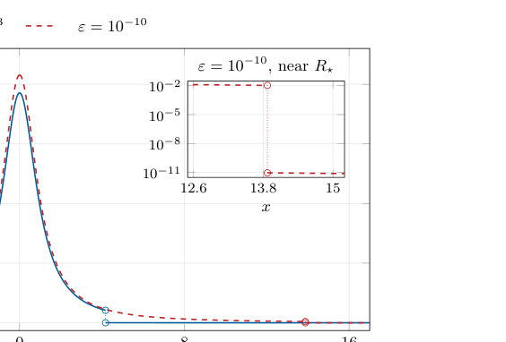
<figcaption class="paper-figure-caption"><b>Fig 1.</b> Figure 1: Moduli of the optimal kernel function boundary values (25) with error parameters ε = 10−3 and 10−10. The main plot has a linear vertical scale; the insets use logarithmic vertical scales to resolve the jumps at R⋆(ε) ≈4.172 and 13.872, respectively. The negative endpoints follow from the fact that |f⋆,0(x)| is even. Open circles denote one-sided modulus limits, and dotted segments are guides to the eye. The insets display the nonzero exterior tails.</figcaption>
</figure>

**Summary.** This paper develops a mathematically rigorous theory for optimizing the kernel function used in Linear Combination of Hamiltonian Simulation (LCHS). By applying Hardy space theory and complex analysis, the authors determine the minimum achievable query cost for simulating non-unitary quantum dynamics. This establishes a provably optimal resource scaling for quantum simulation protocols.

**Why it may be interesting.** This work provides rigorous, mathematically optimal bounds for simulating open quantum systems or non-unitary dynamics, which is crucial for designing resource-efficient quantum algorithms and quantum control protocols.

Detailed structure

**Main problem.** The paper aims to characterize the optimal kernel function required for the Linear Combination of Hamiltonian Simulation (LCHS) method to achieve asymptotically optimal quantum simulation of linear non-unitary dynamics.

**Main result.** They establish an LCHS approximation theorem and derive the asymptotic cost scaling for the minimum query-cost functional, showing an improvement factor of $\approx 2.1$ over previous empirical bounds.

**Method.** The work employs advanced mathematical tools, including Hardy space theory, convex analysis, and complex contour integration, to solve an infinite-dimensional optimization problem.

**Model / system.** The model involves simulating quantum dynamics governed by linear, time-dependent, potentially non-Hermitian matrices, $A(t)$, whose evolution is described by the Peano–Baker propagator. The simulation is approximated via the LCHS framework.

**Key observables.** The primary observable is the minimum value of the query-cost functional, which scales asymptotically as $\log(1/\epsilon) - \log\log(1/\epsilon)$.

**Important parameters / regimes.** The target error ($\epsilon$) is the key parameter driving the asymptotic analysis, as well as the time-dependent matrices $L(t)$ and $H(t)$.

**Assumptions / limitations.** The analysis relies heavily on the properties of Hardy spaces ($H^1$) and the assumption that the error bound $E_{R,y_0}[f]$ is finite.

**Paper structure.** The paper progresses by first defining the LCHS framework and the optimization problem (Problem 5), then proving the existence and uniqueness of the optimal kernel function (Theorem 6), followed by rigorous analysis of the resulting cost scaling and the construction of a spectrally convergent quadrature rule (Theorem 8).

Abstract

Linear combination of Hamiltonian simulation (LCHS) provides an asymptotically optimal framework for the quantum simulation of linear non-unitary dynamics. The LCHS approach approximately implements the Peano--Baker propagator through an integral representation determined by a kernel function. We establish an LCHS approximation theorem for a broadened class of admissible kernel functions, defined by natural complex-analytic conditions. In the standard time-independent block-encoding access model, we explicitly construct, for each target error $\varepsilon$, the unique kernel function in this class minimizing the query-cost functional and show that the minimum of this functional has the asymptotic expansion $\tfrac{2\mathrm{e}}π\big(\log\frac{1}{\varepsilon}-\log\log\frac{1}{\varepsilon}+o(1)\big)$ as ${\varepsilon\downarrow0}$. The provably optimal leading coefficient $2\mathrm{e}/π$ improves by a factor of approximately 2.1 on the coefficient obtained empirically by Low and Somma through numerical minimization over their family of optimally scaling kernel functions. We construct a spectrally convergent quadrature with explicit bounds on operator error and linear combination of unitaries (LCU) subnormalization, proving that this asymptotic improvement persists after discretization into a finite linear combination of unitaries suitable for implementation. Our results are based on Hardy space theory and convex analysis.

[↑ back to top](#top)

### [Beyond Pure Dephasing: Quantum Error Correction in Single Molecules Requires Multiple Spins](http://arxiv.org/abs/2610.03318v1)

**Authors:** Matteo Mezzadri, Silvia Macedonio, Luca Lepori, Emilio Macaluso, Francesco Albarelli, Richard E. P. Winpenny, Alessandro Chiesa, Stefano Carretta1  
**Type:** theory · **Category:** quantum information and computing · **PDF:** <https://arxiv.org/pdf/2610.03318v1>  
**Analysis basis:** full PDF text, analyzed in chunks
**Topic relevance:** `correlated / nonlocal dissipation` **2/5** · `analog quantum simulation` **1/5** · `driven-dissipative phase transition` **1/5** · `methods for driven-dissipative` **1/5** · `quantum measurements` **1/5**

↔ Scroll figures horizontally

<figure class="paper-figure-card">
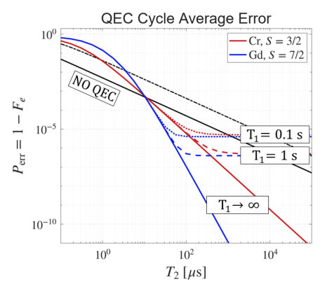
<figcaption class="paper-figure-caption"><b>Fig 1.</b> Figure 1. Average error of a logical rotation followed by syn- drome extraction and recovery, as a function of the dephasing time T2. The error is quantified by the entanglement infidelity Perr = 1 −Fe of the logical channel with respect to the target unitary and is averaged over the universal set of planar logi- cal rotations Rp L(θ, ϕ) = exp[−i(cos ϕ YL−sin ϕ XL)θ/2], with (θ, ϕ) = (π/4, π), (π/2, π), (π/2, −π/2), (π/2, −π/4), and (π/2, −π/8). Red and blue curves correspond to the S = 3/2 Cr complex [31] and to the S = 7/2 Gd complex [32], re- spectively. Solid, dashed, and dotted curves correspond to T1 →∞, T1 = 1 s, and T1 = 100 ms, respectively. For each qudit, the duration of each...</figcaption>
</figure>
<figure class="paper-figure-card">
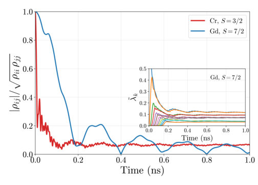
<figcaption class="paper-figure-caption"><b>Fig 2.</b> Figure 2. Relaxation dynamics of electronic spins according to the full Redfield equation. Main panel: time evolution of the normalised transferred coherence |ρij|/√ρiiρjj on the ini- tially empty states, for the two systems of Fig. 1: the red curve corresponds to Cr, D/h = −24.3 GHz, and the blue one to Gd, D/h = 1.28 GHz, illustrating the dependence of the decay on anharmonicity. The transferred coherence is lost within a fraction of a nanosecond, much shorter than the pulse durations reported in Fig. 1. Inset: normalised weights of the Kraus operators, ˜λk = λk/ P</figcaption>
</figure>
<figure class="paper-figure-card">
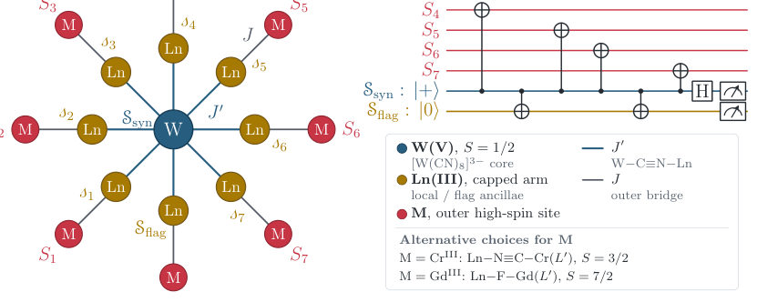
<figcaption class="paper-figure-caption"><b>Fig 3.</b> Figure 3. (a) Scheme of the proposed heptadecanuclear star-shaped molecule [WV(CN)8{LnIII(L)}8{M(L′)}8] implementing the code presented in the paper. Correction against pure dephasing is embedded at the level of each spin Si with ancillary electronic spin si (i=1,...,7) while relaxation is addressed by concatenating these units to implement the 7-qubit Steane code into the reported octagonal structure. An octacyanidotungstate(V) core supplies eight cyanido bridges (blue, exchange coupling J′) to eight capped lanthanide ions, each of which carries one outer high-spin unit M (red, with coupling J). Ln is either GdIII</figcaption>
</figure>
<figure class="paper-figure-card">
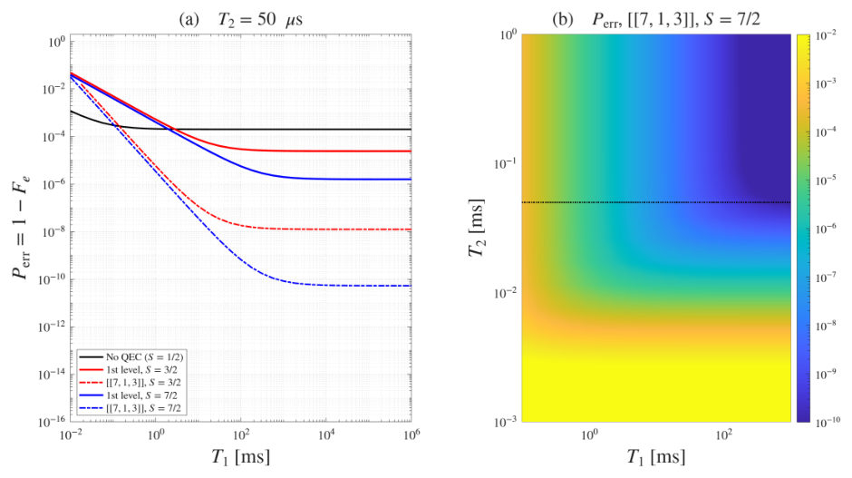
<figcaption class="paper-figure-caption"><b>Fig 4.</b> Figure 4. Ideal performance of the embedded multi-spin code, with Perr = 1 −Fe the entanglement infidelity of the logical Hadamard gate. (a) Perr at fixed T2 = 50 µs, as a function of T1. The black curve is an uncorrected two-level system (no QEC); solid and dashed curves correspond to first-level dephasing correction only and second-level [[7, 1, 3]] concatenation, with red curves for the S = 3/2 CrIII and blue curves for the S = 7/2 GdIII. (b) Perr for the [[7, 1, 3]] code on S = 7/2 as a function of the relaxation time T1 and the dephasing time T2; the dotted black line marks the cut shown in panel (a).</figcaption>
</figure>

**Summary.** This paper proposes a novel, multi-layered quantum error correction protocol for molecular spin systems to achieve fault tolerance. It addresses the limitation of single-spin encoding by combining dephasing-suppressing units with a multi-qubit code to handle residual relaxation errors. The work demonstrates that this hybrid architecture significantly enhances logical error suppression in molecular quantum processors.

**Why it may be interesting.** This work directly tackles the physical implementation challenge of QEC in solid-state or molecular platforms, providing a concrete, multi-layered theoretical blueprint for fault tolerance beyond simple decoherence mitigation.

Detailed structure

**Main problem.** The primary challenge is achieving fault-tolerant quantum error correction (QEC) in single molecules, specifically addressing residual off-diagonal errors (relaxation) after initial dephasing correction.

**Main result.** The authors propose a hybrid encoding scheme using multi-spin molecules, which successfully addresses residual relaxation errors by concatenating dephasing-tolerant units with a second-level multi-qubit code.

**Method.** The approach involves a two-stage error correction protocol: first, using embedded codes to suppress pure dephasing, and second, applying a multi-qubit code to handle the remaining off-diagonal relaxation errors.

**Model / system.** The system utilizes molecular spin complexes (MNMs) whose spin dynamics are modeled using Hamiltonians and master equations. The error analysis distinguishes between pure dephasing (diagonal) and relaxation (off-diagonal) errors.

**Key observables.** Logical error quantified by entanglement infidelity (Perr) and average fidelity (F), and the decay of normalized transferred coherence.

**Important parameters / regimes.** The ratio between $T_2$ (dephasing time) and $T_1$ (relaxation time) is critical; the performance is shown to be limited by finite $T_1$.

**Assumptions / limitations.** The analysis relies on the secular approximation in the Redfield theory and the assumption that the residual noise channel can be effectively analyzed using Pauli twirling approximations.

**Figures summary.** Figures illustrate the error decay as a function of $T_2$, showing saturation to a plateau set by residual relaxation for finite $T_1$. Other figures detail the structure of error channels (Kraus operators) for relaxation-driven errors.

**Paper structure.** The paper first establishes the need to move beyond pure dephasing correction. It then details the hybrid encoding strategy, combining dephasing-tolerant units with a multi-qubit code. Finally, it numerically demonstrates the error suppression potential of this multi-spin architecture.

Abstract

We propose multi-spin molecules as a viable architecture for fault-tolerant quantum computing. To this aim, we introduce a correction protocol handling both diagonal and off-diagonal errors, typically associated with dephasing and relaxation. The scheme is based on a hybrid encoding which combines dephasing-tolerant units suppressing the leading pure dephasing error into a multi-spin molecule implementing a multi-qubit code for residual off-diagonal errors. Our proposal leverages peculiar properties of molecular spins, i.e. the strong hierarchy between different errors and the possibility to engineer multi-spin molecules at the synthetic level. Moreover, it addresses the important issue of the loss of coherences in anharmonic systems subject to off-diagonal errors, which hampers their correction at the single spin level. Thanks to the huge suppression of dephasing by the first-level code, we numerically demonstrate the potential performance of this strategy even with a limited number of spins per logical unit.

[↑ back to top](#top)

### [Correlated Metals, Metamagnetism, and Orbital Nematic Order in moiré Materials with Neural Quantum States](http://arxiv.org/abs/2610.03145v1)

**Authors:** Wei Zhang, Ataç İmamoğlu, Tao Shi, Eugene A. Demler, Ivan Morera  
**Type:** theory · **Category:** strongly correlated electrons · **PDF:** <https://arxiv.org/pdf/2610.03145v1>  
**Analysis basis:** full PDF text, analyzed in chunks
**Topic relevance:** `analog quantum simulation` **2/5** · `Frenkel-Kontorova` **1/5** · `methods for driven-dissipative` **1/5**

↔ Scroll figures horizontally

<figure class="paper-figure-card">
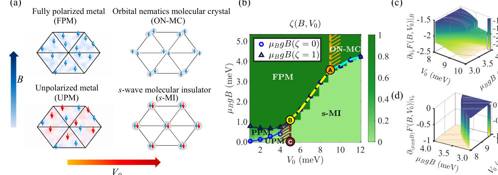
<figcaption class="paper-figure-caption"><b>Fig 1.</b> FIG. 1. Many-body phase diagram and thermodynamic properties obtained for the long-range Coulomb interaction. (a) Schematic illustration of the many-body phases encountered in this work. Upon increasing the moir´e potential strength V0, the system undergoes a metal–insulator transition. The metallic state exhibits a metamagnetic transition at finite magnetic field B, whereas the insulator exhibits a critical magnetic field at which it transitions to an insulator with a reduced symmetry pattern. (b) Phase diagram of the spin polarization ζ in the B–V0 plane. Here, UPM, PPM, and FPM denote the unpolarized (ζ = 0), partially polarized (0 &lt; ζ &lt; 1), and fully polarized (ζ = 1) metallic phases,...</figcaption>
</figure>
<figure class="paper-figure-card">
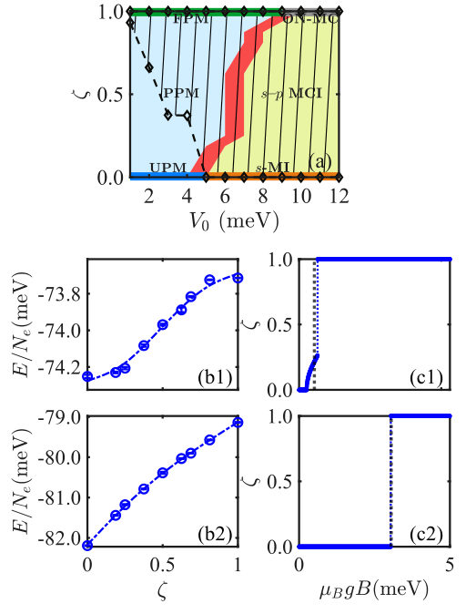
<figcaption class="paper-figure-caption"><b>Fig 2.</b> FIG. 2. (a) Phase diagram in the ζ–V0 plane showing the metal- insulator transition. The hatched area enclosed by black dashed lines denotes the partially polarized region (0 &lt; ζ &lt; 1), which is inaccessible upon increasing the magnetic field B. The red region marks the phase boundary between the metallic and insulating phases. Here, UPM, s-MI, PPM, s–p MCI, FPM, and ON-MC denote the unpolarized metal (blue), s-wave molecular insulator (orange), partially polarized metal (light blue), s–p molecular coexistence insulator (light yellow), fully polarized metal (green), and orbital nematic molecular crystal (gray), respectively. (b1–b2), (c1–c2): The first column shows the energy per particle...</figcaption>
</figure>
<figure class="paper-figure-card">
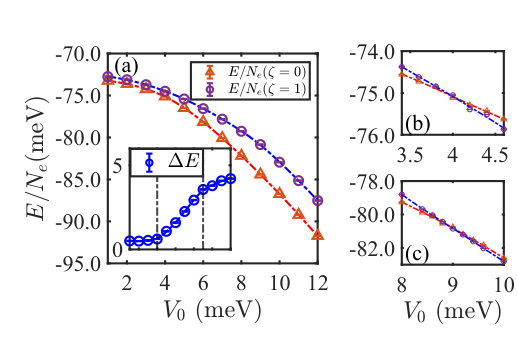
<figcaption class="paper-figure-caption"><b>Fig 3.</b> FIG. 3. (a) Energy per particle E/Ne in the ζ = 0 and ζ = 1 sectors as a function of V0. In the inset, we show the energy difference ∆E = [E(ζ = 1) −E(ζ = 0)]/Ne. The dot-dashed lines in the inset represent the metal–insulator transition points in the ζ = 0 and ζ = 1 sectors, respectively. (b,c) Lowest energies obtained from two-sided annealing for (b) ζ = 0 and (c) ζ = 1. Red (blue) lines denote the insulating (metallic) variational branches. The results shown here are obtained for the Coulomb interaction.</figcaption>
</figure>
<figure class="paper-figure-card">
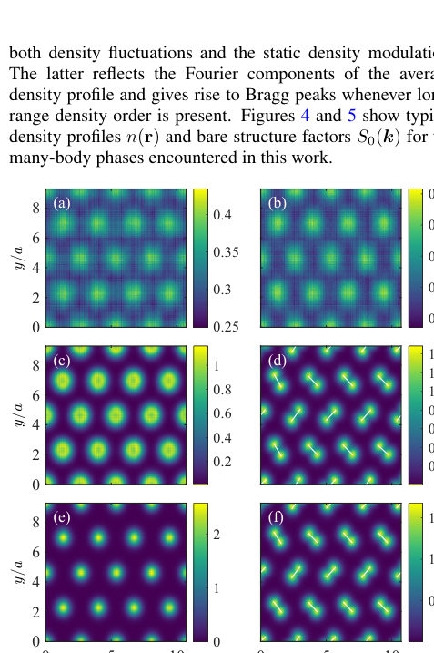
<figcaption class="paper-figure-caption"><b>Fig 4.</b> FIG. 4. Real-space density profiles in the ζ = 0 and ζ = 1 sectors. Panels (a)–(d) show the results for the Coulomb interaction: (a) ζ = 0, V0 = 1 meV; (b) ζ = 1, V0 = 1 meV; (c) ζ = 0, V0 = 11 meV; (d) ζ = 1, V0 = 11 meV. Panels (e) and (f) show the corresponding results for the P¨oschl–Teller (PT) potential with VPT = 5 and κ−1 = a: (e) ζ = 0, V0 = 11 meV; (f) ζ = 1, V0 = 11 meV. For V0 = 1 meV, the density profiles obtained with the PT potential are similar to those obtained with the Coulomb interaction and are therefore not shown. In panels (d) and (f), the quadrupole distribution is also indicated by short white line segments.</figcaption>
</figure>
<figure class="paper-figure-card">
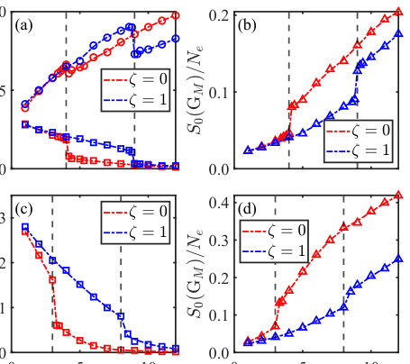
<figcaption class="paper-figure-caption"><b>Fig 5.</b> FIG. 6. Density modulation as a function of the moir´e potential strength V0. (a) Density at the center of a moir´e-potential minimum and the minimum density in the ζ = 0 and ζ = 1 sectors for the Coulomb interaction. (b) The bare structure factor at the moir´e reciprocal lattice vector GM for the Coulomb interaction. (c) Minimum density nmin in the ζ = 0 and ζ = 1 sectors for the P¨oschl–Teller interaction with VPT = 5 and κ−1 = a. In this case, the reduction of the central density nc across the transition is less pronounced, since the p-wave molecular character is not as clearly resolved. Moreover, nc remains much larger than nmin, and is therefore not shown in panel (c). (d) The bare...</figcaption>
</figure>

**Summary.** This work uses advanced quantum simulation techniques (NQS/VMC) to map the phase diagram of interacting electrons in moiré lattices. It reveals that strong correlations fundamentally alter the insulating state, leading to spin-dependent transitions between metallic and molecularly insulating/nematic phases. This highlights the crucial role of spin polarization in determining the ground state of correlated 2D materials.

**Why it may be interesting.** The explicit inclusion of spin-dependent transitions and the emergence of orbital nematic order in a correlated electron context provides rich physics relevant to moiré heterostructures and strongly correlated materials.

Detailed structure

**Main problem.** The study investigates the interplay between strong electron correlations, external periodic potentials, and spin polarization in two-dimensional electron systems.

**Main result.** Strong correlations can suppress the conventional band insulator, leading to a correlated metallic phase, with the transition being highly dependent on spin polarization, resulting in distinct molecular insulating and nematic crystalline states.

**Method.** The authors employed Neural Quantum States (NQS) optimized via Variational Monte Carlo to map out the ground-state phase diagram.

**Model / system.** The model is a continuum description of 2D electrons interacting via long-range Coulomb forces, subjected to a triangular periodic potential at filling factor $\nu=2$. The analysis is extended to include short-range interactions.

**Key observables.** Ground-state phase diagram, magnetization curves, metamagnetic transitions, density profiles, and structure factors.

**Important parameters / regimes.** Periodic potential strength ($V_0$), Zeeman field, and spin polarization ($\zeta$).

**Assumptions / limitations.** The analysis focuses on the Zeeman effect and uses a continuum model approach to handle strong correlations.

**Figures summary.** Not specified.

**Paper structure.** The paper develops the phase diagram by analyzing the system's response to varying potential strengths and magnetic fields, contrasting the behavior of unpolarized versus fully polarized states.

Abstract

In this work, we investigate a continuum model of two-dimensional electrons interacting via long-range Coulomb forces and subject to a triangular periodic potential at filling factor $ν=2$. Using neural quantum states based on message-passing neural networks optimized with variational Monte Carlo, we determine the ground-state phase diagram as a function of periodic potential strength and Zeeman field. Although the noninteracting system is expected to form a conventional band insulator, we show that strong correlations can qualitatively reshape the insulating state and, in part of the phase diagram, suppress the band insulator in favor of a correlated metallic phase, with a first-order transition separating the two regimes. Moreover, the metal--insulator transition exhibits a strong dependence on spin polarization: the unpolarized system becomes insulating at substantially weaker periodic potentials through the formation of an $s$-wave molecular insulator, where opposite-spin electrons bind near each potential minimum, whereas the fully polarized system requires a significantly deeper potential and instead forms a symmetry-broken orbital nematic molecular crystal. This spin-dependent molecular transition gives rise to discontinuous magnetization curves, metamagnetic transitions, and several multicritical points in the phase diagram, together with clear signatures in the density profiles, real-space correlation functions, and structure factors. To further elucidate the role of the long-range character of the Coulomb interaction, we also study short-range repulsive interactions, which can be realized with ultracold-atom platforms. We find that the qualitative structure of the many-body phase diagram remains unchanged, demonstrating the robustness of our results across different interaction models.

[↑ back to top](#top)

### [Fluctuation-induced magnetoresistance in graphene Hall bars at charge neutrality](http://arxiv.org/abs/2610.02326v1)

**Authors:** Anna Grigoreva, Alex Levchenko, Eleftherios Kirkinis, Anton Andreev  
**Type:** theory · **Category:** other · **PDF:** <https://arxiv.org/pdf/2610.02326v1>  
**Analysis basis:** full PDF text, analyzed in chunks
**Topic relevance:** `Keldysh / 2PI / non-Gaussian methods` **2/5** · `methods for driven-dissipative` **2/5**

↔ Scroll figures horizontally

<figure class="paper-figure-card">
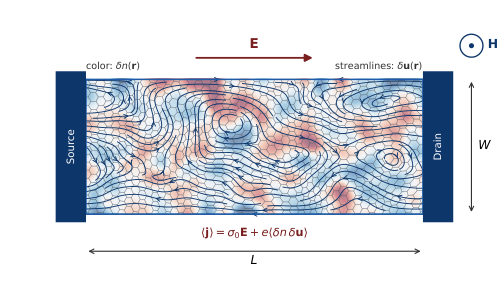
<figcaption class="paper-figure-caption"><b>Fig 1.</b> FIG. 1. Illustration of the fluctuation enhancement of the macro- scopic conductivity of a graphene Hall bar of length L and width W in a perpendicular magnetic field H. The color shows a snapshot of the thermal charge-density fluctuation δn(r) generated by the John- son–Nyquist current noise. The streamlines show the hydrodynamic flow δu(r) induced by the charge density fluctuations in the pres- ence of a bias field E. The correlated advection e⟨δnδu⟩increases the transport current through the device.</figcaption>
</figure>
<figure class="paper-figure-card">
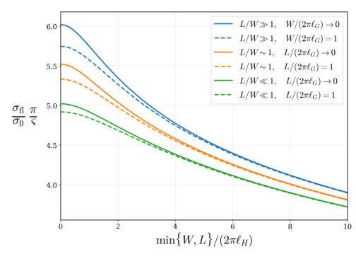
<figcaption class="paper-figure-caption"><b>Fig 2.</b> FIG. 2. Fluctuation conductivity of long (blue), square (orange), and wide (green) samples, given by Eqs. (23), (24), and (25) is plotted as a function of H/Hsize = min{W, L}/(2πℓH). The solid lines corre- spond to pristine samples, min{W, L}/2πℓG →0, and the dashed lines correspond to weakly disordered samples, min{W, L}/2πℓG = 1. In the plots we set W</figcaption>
</figure>

**Summary.** This work provides a comprehensive theoretical framework for fluctuation-induced magnetoresistance in graphene at charge neutrality. By treating the electron liquid hydrodynamically, the authors derive analytic expressions showing that MR results from the coupling between charge transport and thermal hydrodynamic fluctuations. The results highlight the strong dependence of this effect on the physical geometry of the graphene sample.

**Why it may be interesting.** The detailed treatment of non-equilibrium, fluctuation-driven transport phenomena in a 2D Dirac material provides advanced insights into mesoscopic transport physics, relevant for understanding quantum noise effects in solid-state systems.

Detailed structure

**Main problem.** The paper develops a quantitative theory to explain the fluctuation-induced magnetoresistance (MR) observed at the charge neutrality point in graphene Hall bars.

**Main result.** The MR is shown to arise from the coupling between charge transport and hydrodynamic flow fluctuations, yielding functional dependencies sensitive to the Hall bar geometry and magnetic field strength.

**Method.** The analysis employs the hydrodynamic approximation, solving coupled Langevin-Navier-Stokes equations for density and velocity fluctuations in Fourier space.

**Model / system.** The system is graphene, modeled as an electron liquid exhibiting hydrodynamic behavior when electron-electron collision rates exceed momentum relaxation rates. The geometry is a Hall bar of width W and length L.

**Key observables.** Magnetoresistance (MR), fluctuation conductivity ($\sigma_{fl}$), and the dependence of MR on the magnetic field $H$ and geometry.

**Important parameters / regimes.** The ratio of collision rates ($	au_{ee}^{-1} > \gamma_p$), the magnetic length ($\ell_H$), the aspect ratio ($W/L$), and the disorder strength ($\ell_G$).

**Assumptions / limitations.** The theory relies on the hydrodynamic regime ($	au_{ee}^{-1} > \gamma_p$) and linear response theory applied to fluctuation sources (Johnson-Nyquist noise).

**Figures summary.** Figures illustrate the charge-density fluctuations and induced hydrodynamic flow in the Hall bar setup, showing $\sigma_{fl}(H)$ dependence on geometry and disorder.

**Paper structure.** The paper progresses from establishing the hydrodynamic framework and the origin of the advection term in the current, to solving the linearized fluctuation equations in Fourier space, and finally deriving asymptotic forms for $\sigma_{fl}$ in finite geometries.

Abstract

In the temperature interval $T\sim 50 - 100 K$, the rate of electron-electron collisions in graphene devices may exceed the momentum relaxation rate due to disorder and electron-phonon scattering. In this regime, the motion of the electron liquid may be described by the hydrodynamic equations. In the hydrodynamic approximation, at the charge neutrality point the electric current is decoupled from the hydrodynamic flow, and the conductivity of the system is equal to the intrinsic conductivity of the electron liquid, $σ_0$. It was recently shown that the coupling of charge transport and hydrodynamic flow induced by the thermal fluctuations enhances the macroscopic conductivity of the system and results in very strong positive magnetoresistance (MR) at relatively weak fields. Here we develop a quantitative theory of the fluctuation mechanism of MR at charge neutrality and obtain analytic expressions for MR in graphene Hall bars. The functional dependence of MR on the magnetic field $H$ is sensitive to the Hall bar geometry and orientation relative to the current. We also account for the effect of momentum relaxation on MR.

[↑ back to top](#top)

### [Optimizing quantum error correction through error attribution](http://arxiv.org/abs/2610.03399v1)

**Authors:** Yuguo Shao, Zi-Wen Liu  
**Type:** theory · **Category:** quantum information and computing · **PDF:** <https://arxiv.org/pdf/2610.03399v1>  
**Analysis basis:** full PDF text, analyzed in chunks
**Topic relevance:** `QC/QI experiment` **2/5** · `methods for driven-dissipative` **1/5** · `quantum measurements` **1/5**

↔ Scroll figures horizontally

<figure class="paper-figure-card">
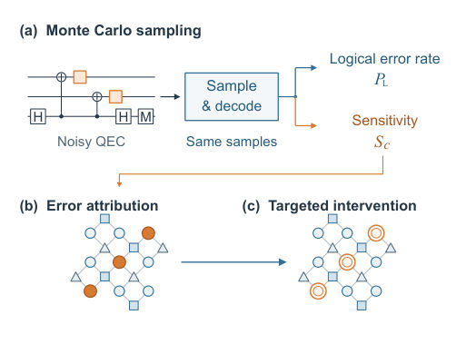
<figcaption class="paper-figure-caption"><b>Fig 1.</b> Figure 1. Error attribution framework for optimizing quantum er- ror correction. (a) The logical error rate PL and its sensitivities Sc to component noise strengths are estimated jointly from the same Monte Carlo samples. (b) The resulting sensitivity map identifies hotspots (orange), highlighting physical components with large sen- sitivity magnitudes and thus a strong influence on the logical error rate. (c) These hotspots guide targeted noise reduction to improve logical performance under a limited intervention budget.</figcaption>
</figure>
<figure class="paper-figure-card">
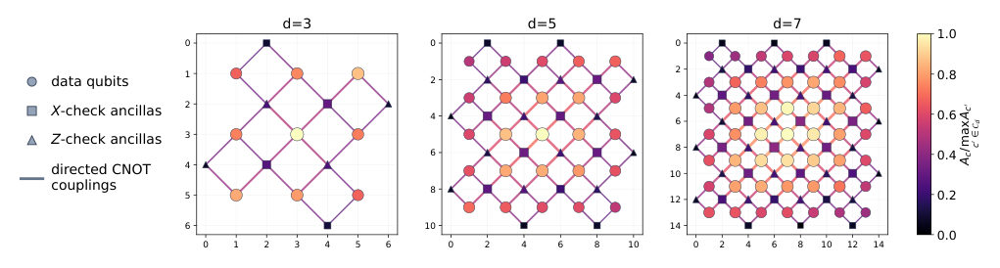
<figcaption class="paper-figure-caption"><b>Fig 2.</b> Figure 2. Physical component hotspot maps for rotated surface code memories at p = 0.001 and d syndrome rounds. The color of each component encodes its within-distance relative sensitivity e A(d) c = Ac/ maxc′∈Cd Ac′, where Ac = (SX c + SZ c )/2 is the sensitivity magnitudes averaged over the X- and Z-memory, and Cd is the component set of the distance-d circuit. The color bar is therefore shared across all panels and spans [0, 1]. Circles denote data qubits, squares X-check ancillas, triangles Z-check ancillas, and links denote directed CNOT couplings.</figcaption>
</figure>
<figure class="paper-figure-card">
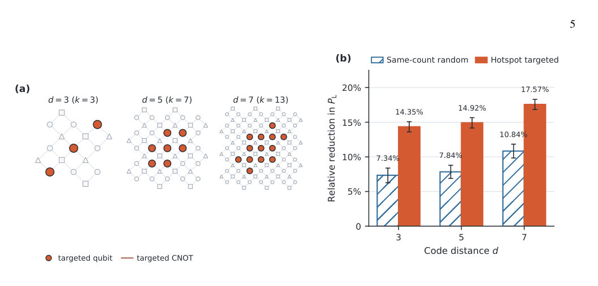
<figcaption class="paper-figure-caption"><b>Fig 3.</b> Figure 3. Hotspot-guided targeted intervention at p = 0.001. (a) The k components with the highest sensitivities on physical layouts. Gray marks and links show the qubits and nearest-neighbor coupling graph; marker shapes follow Fig. 2. Orange filled marks denote the components with the highest sensitivities. The sets contain k = 3 (7.32%), 7 (5.43%), and 13 (4.91%) components at d = 3, 5, and 7, respectively. (b) Relative logical error rate reduction with respect to the circuit without intervention. Orange bars show the reduction from hotspot-guided intervention, while blue hatched bars show the mean reduction from random intervention over 40 sets of k components chosen uniformly at...</figcaption>
</figure>
<figure class="paper-figure-card">
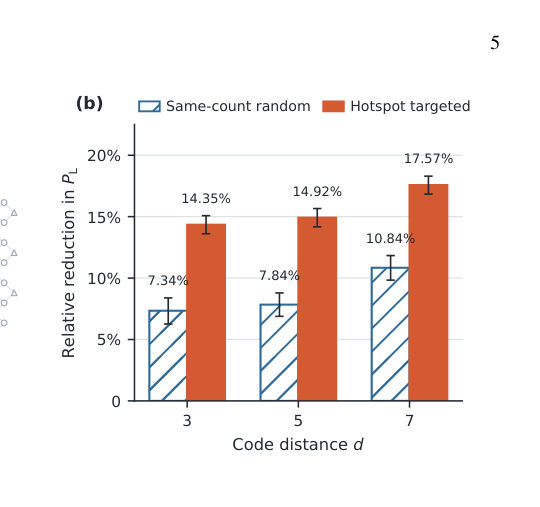
<figcaption class="paper-figure-caption"><b>Fig 4.</b> Fig. 3 shows the comparison results. Relative to the circuit without intervention, the hotspot-guided intervention reduces the logical error rates by 14.35%, 14.92%, and 17.57% for d = 3, 5, 7, respectively. For comparison, applying the same intervention to the same number of physical components se- lected uniformly at random reduces the logical error rates by 7.34%, 7.84%, and 10.84% on average for d = 3, 5, 7, respec- tively. The corresponding improvement ratio is I = ∆t/∆r, where ∆t and ∆r denote the targeted and mean random reduc- tions, respectively. The estimated ratios are 1.95 [95% confi- dence interval (CI), 1.72–2.26] at d = 3, 1.90 [1.71–2.14] at d = 5, and 1.62 [1.49–1.77] at d...</figcaption>
</figure>
<figure class="paper-figure-card">
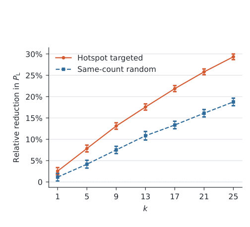
<figcaption class="paper-figure-caption"><b>Fig 5.</b> Figure 4. Relative logical error rate reduction versus intervention budget. The d = 7 rotated surface code circuit contains 265 physical components and uses seven syndrome rounds at p = 0.001. Orange circles show the reduction from hotspot-guided intervention, while blue squares show the mean reduction from random intervention over 40 sets of k components chosen uniformly at random. The local error rate of each selected component is reduced by a fraction α = 0.5. Error bars indicate 95% bootstrap confidence intervals.</figcaption>
</figure>

**Summary.** This paper introduces an error attribution scheme to diagnose which physical noise sources most critically impact the logical error rate in quantum error correction codes. By quantifying the sensitivity of the logical failure rate to individual noise components, the authors identify 'hotspots' in the error circuit. Targeting noise reduction efforts on these few critical components yields substantial, non-trivial improvements in QEC performance compared to random efforts.

**Why it may be interesting.** This work provides a practical, data-driven optimization tool for QEC hardware design, moving beyond simple benchmarking to guide resource allocation for maximum performance gain.

Detailed structure

**Main problem.** The paper addresses the limitation of using the aggregate logical error rate in Quantum Error Correction (QEC) by developing a method to pinpoint which specific physical noise components contribute most significantly to overall failure.

**Main result.** Targeted noise reduction on the top 5%-7% of most sensitive physical components can reduce the logical error rate by 14%-25%, significantly outperforming interventions on the same number of randomly selected components.

**Method.** An error attribution scheme is introduced to calculate the sensitivity of the logical error rate to individual noise strengths, using joint estimation from Monte Carlo samples to identify 'hotspots' in the error circuit.

**Model / system.** The study applies this framework to simulate QEC circuits, specifically using rotated surface codes and high-rate lifted product codes, which are modeled under a stochastic error framework.

**Key observables.** Logical error rate (P_L), component sensitivities (S_alpha), and linearized marginal risk (R_alpha).

**Important parameters / regimes.** Noise strengths (lambda), code distances (d=3, 5, 7), and the fraction of components targeted for intervention (e.g., 5%-7%).

**Assumptions / limitations.** The method assumes mutual independence of elementary noise components and relies on a linearized approximation of the marginal risk.

**Figures summary.** Figures illustrate the error attribution framework, showing sensitivity maps that highlight 'hotspots' (critical components) and comparing the reduction in P_L achieved by targeting these hotspots versus random selection.

**Paper structure.** The paper first introduces the error attribution framework and its estimators. It then applies this to surface codes, demonstrating that hotspots are pronounced. Finally, it quantifies the performance gains by comparing targeted intervention against random intervention across various code sizes.

Abstract

Logical error rate is a standard benchmark for quantum error correction, providing an aggregate measure of the overall effect of physical noise. In actual QEC architectures, errors at different circuit locations can have markedly different effects on logical failure even when their probabilities are equal. Here we introduce an error attribution scheme to quantitatively characterize the influence of individual circuit components on the logical error rate and use this refined information to guide targeted intervention and design for improved QEC performance. Our attribution estimator computes all component sensitivities jointly from the same Monte Carlo samples used to estimate the logical error rate. The resulting sensitivity maps identify hotspots where targeted noise reduction can most effectively improve logical performance. We test the scheme in circuit simulations of rotated surface code memories and high-rate lifted product codes: halving the noise strength on about 5\%-7\% of physical components selected by sensitivity reduces logical error rates by approximately 15\%-25\%, roughly twice the mean reduction from the same intervention on an equal number of randomly selected components. By connecting performance benchmarking to targeted optimization, our scheme provides a practical strategy for improving quantum error correction with limited resources.

[↑ back to top](#top)

### [Robust constrained optimization of nonequilibrium Casimir repulsion in a biased-semiconductor cavity](http://arxiv.org/abs/2610.02471v1)

**Authors:** Mohamed R. Khodja, Belkacem E. Khodja  
**Type:** theory · **Category:** statistical mechanics · **PDF:** <https://arxiv.org/pdf/2610.02471v1>  
**Analysis basis:** full PDF text, analyzed in chunks
**Topic relevance:** `Keldysh / 2PI / non-Gaussian methods` **2/5** · `methods for driven-dissipative` **2/5**

↔ Scroll figures horizontally

<figure class="paper-figure-card">
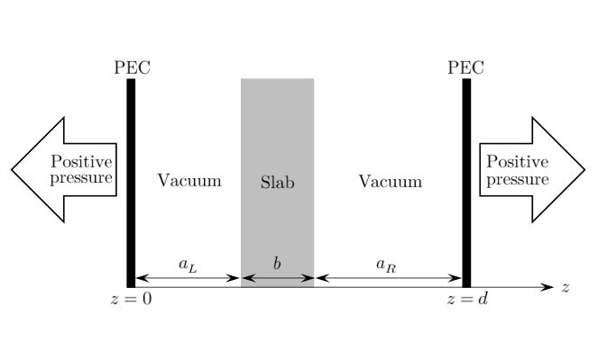
<figcaption class="paper-figure-caption"><b>Fig 1.</b> FIG. 1. PEC–vacuum–biased-semiconductor–vacuum–PEC geometry and sign convention. PL &gt; 0</figcaption>
</figure>
<figure class="paper-figure-card">
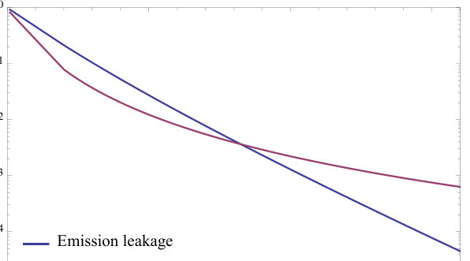
<figcaption class="paper-figure-caption"><b>Fig 2.</b> FIG. 2. Finite-thickness reduction indicators. The adopted b = 13.5 µm is the smallest thickness</figcaption>
</figure>
<figure class="paper-figure-card">
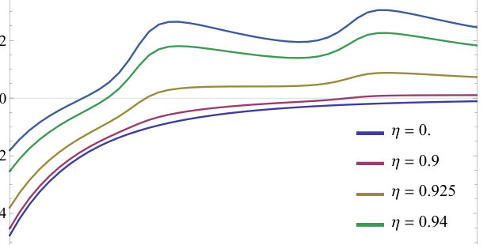
<figcaption class="paper-figure-caption"><b>Fig 3.</b> FIG. 3. Outward pressure on one PEC versus vacuum gap for several drive values η = µγ/Eg.</figcaption>
</figure>
<figure class="paper-figure-card">
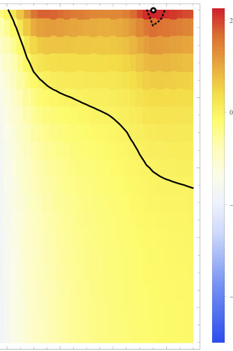
<figcaption class="paper-figure-caption"><b>Fig 4.</b> FIG. 4. Four-corner screening bound for the robust bilateral pressure over the complete (a0, η0)</figcaption>
</figure>
<figure class="paper-figure-card">
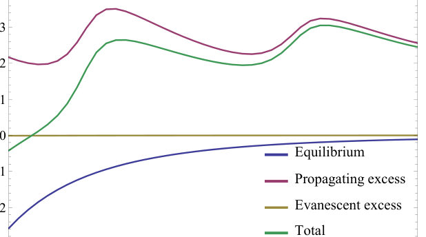
<figcaption class="paper-figure-caption"><b>Fig 5.</b> FIG. 5. Pressure decomposition at η = 0.945. The optimized repulsion is dominated by the</figcaption>
</figure>

**Summary.** This work develops a robust optimization framework to maximize the repulsive Casimir-Lifshitz force generated in a biased semiconductor cavity. By treating the problem as a constrained optimization under fabrication and drive uncertainties, the authors determine optimal cavity parameters. The results establish a design bound for cavity-enhanced repulsion, demonstrating its superiority over simple far-field predictions.

**Why it may be interesting.** It provides a quantitative, robust design methodology for generating non-equilibrium forces, bridging quantum electrodynamics (Casimir effect) with semiconductor device physics and optimization theory.

Detailed structure

**Main problem.** The paper addresses the challenge of designing a semiconductor cavity to generate a robust, repulsive Casimir-Lifshitz force that remains strong despite uncertainties in fabrication gaps and external drive parameters.

**Main result.** The optimized design sustains a worst-case outward pressure of $2.257 	ext{ mPa}$ at $300 	ext{ K}$, which exceeds the corresponding far-field radiation-pressure plateau by a measurable amount.

**Method.** The core method is formulating the problem as a robust constrained optimization, maximizing the minimum outward pressure across a defined uncertainty set.

**Model / system.** The system is a planar structure consisting of two Perfect Electric Conductors (PECs) flanking a central, biased Gallium Arsenide (GaAs) semiconductor slab, creating a cavity.

**Key observables.** Outward outward pressure ($P_L, P_R$), which is decomposed into equilibrium and excess nonequilibrium contributions.

**Important parameters / regimes.** Gap uncertainties ($\pm 10 	ext{ nm}$), drive uncertainty ($\pm 0.005$), and the operating temperature ($300 	ext{ K}$).

**Assumptions / limitations.** The model assumes the semiconductor response is passive and that the photon chemical potential ($\mu_\gamma$) is spatially uniform over the active regions.

**Figures summary.** Figures illustrate the geometry (PEC-vacuum-semiconductor-vacuum-PEC) and show energy-resolved pressure components, while captions detail the selection of slab thickness based on reduction-validity indicators.

**Paper structure.** The paper builds the theory by decomposing the total pressure into equilibrium and nonequilibrium parts, develops the robust optimization framework, applies the optimization to find optimal gap sizes, and validates the reduced model against full finite-slab scattering calculations.

Abstract

Nonequilibrium electromagnetic fluctuations offer a route to repulsive Casimir--Lifshitz forces. However, designs optimized only at nominal conditions may be fragile. We formulate repulsion in a planar PEC--vacuum--biased-GaAs--vacuum--PEC stack as a robust constrained optimization problem. The smaller of the outward pressures on the two conductors is maximized under fabrication and drive uncertainties. In the optically thick-slab limit, we prove that identical boundaries admit a symmetric optimizer, so equality of the optimal gaps emerges from the model rather than being imposed. At $300~\mathrm{K}$, with gap uncertainty of $\pm10~\mathrm{nm}$ and drive uncertainty of $\pm0.005$, the optimized design sustains a worst-case outward pressure of $2.257~\mathrm{mPa}$ and exceeds the corresponding far-field radiation-pressure plateau by $0.1812~\mathrm{mPa}$. At the nominal and active worst-case points, a full finite-slab scattering calculation agrees with the reduced model to within $1.60\times10^{-3}\%$. These results provide a design bound for cavity-enhanced nonequilibrium Casimir--Lifshitz repulsion and show how robust optimization can distinguish cavity enhancement from ordinary far-field radiation pressure.

[↑ back to top](#top)

### [SMP: A General Hyperedge-Based Framework for Circuit-Level Quantum Error Correction](http://arxiv.org/abs/2610.02734v1)

**Authors:** Siying Wang, Yue Yan, Zhixin Xia, Canwei Shi, Hannuo Yuan, Xiang-Bin Wang  
**Type:** theory · **Category:** quantum information and computing · **PDF:** <https://arxiv.org/pdf/2610.02734v1>  
**Analysis basis:** full PDF text, analyzed in chunks
**Topic relevance:** `QC/QI experiment` **2/5** · `quantum measurements` **2/5**

↔ Scroll figures horizontally

<figure class="paper-figure-card">
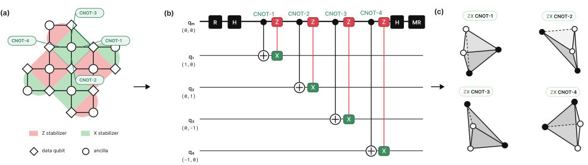
<figcaption class="paper-figure-caption"><b>Fig 1.</b> FIG. 1. Four-detector hyperedges induced by circuit-level faults. (a) Rotated surface code patch. Green and red plaquettes denote X- and Z-type stabilizers, respectively; diamonds denote data qubits and circles denote measurement qubits. The four CNOT gates used to measure the highlighted X-type stabilizer are labeled CNOT-1 through CNOT-4. (b) Circuit for one syndrome extraction round (round 0). The measurement qubit qm at spatial coordinate (0, 0) interacts sequentially with data qubits q1, q2, q3, and q4 at (1, 0), (0, 1), (0, −1), and (−1, 0), respectively. The four ZX markers are alternative single-fault locations: after CNOT-i, a Z error acts on qm and an X error acts on qi, while the...</figcaption>
</figure>
<figure class="paper-figure-card">
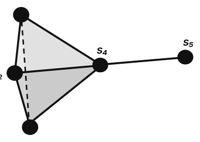
<figcaption class="paper-figure-caption"><b>Fig 2.</b> FIG. 2. Local motif evidence does not determine a complete correction. The labels s1, . . . , s5 denote detector locations with observed detection events. The shaded region highlights a candidate syndrome motif on s1, . . . , s4. Committing those four events to one local correction leaves s5 to be explained by other events or a boundary, neither of which is shown. The connection between s4 and s5 illustrates a competing use of a detector inside the motif. The drawing is schematic and assigns no numerical edge costs.</figcaption>
</figure>
<figure class="paper-figure-card">
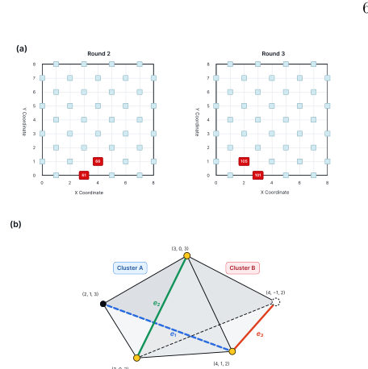
<figcaption class="paper-figure-caption"><b>Fig 3.</b> FIG. 3. Overlapping clusters generated by a single correlated circuit fault. (a) Detector outcomes from a distance-5 sur- face code circuit with r = 5 syndrome extraction rounds. The panels show rounds 2 and 3 under zero-based index- ing. A correlated Z3X12 fault is inserted after the second CX layer of round 2. It triggers D61, D66, D101, and D105. These events form a complete four-detector syndrome motif. (b) The matching graph edge sets defining the two clusters identified by SMP. Their detector graph coordinates (2, 1, 3), (3, 0, 2), (3, 0, 3), and (4, 1, 2) correspond to D105, D61, D101, and D66, respectively. Cluster A has the four-detector sup- port SA = {(2, 1, 3), (3, 0, 2), (3, 0,...</figcaption>
</figure>
<figure class="paper-figure-card">
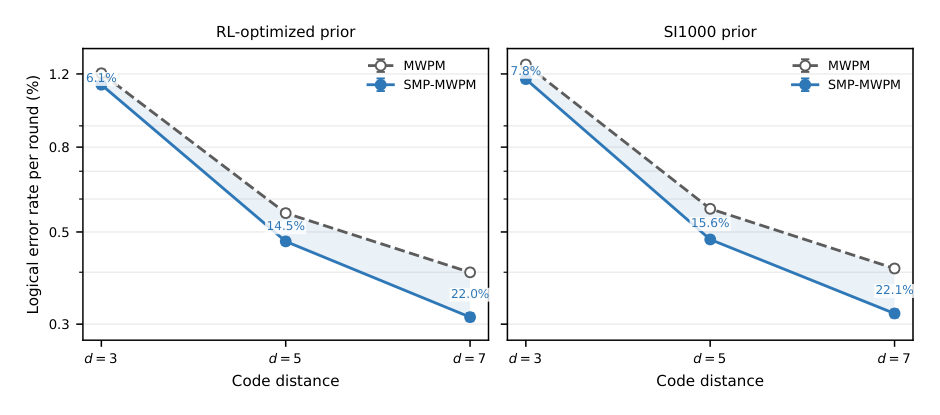
<figcaption class="paper-figure-caption"><b>Fig 4.</b> FIG. 4. Logical error rates per round for MWPM and SMP-MWPM on the Willow data. The panels use the reinforcement- learning-optimized (RL) prior and the SI1000 noise model prior. At each distance, the logical failure probability per memory experiment PL(r) is measured after r = 10, 13, 30, 50 extraction rounds, and the per-round rate ϵ is extracted from Eq. (21). Logical-X and logical-Z data are fitted separately and the resulting rates are averaged. Error bars show 95% intervals obtained from 5,000 parametric bootstrap resamples. Shading marks the gap between the two curves, and labels give the relative reduction R = 1 −ϵSMP/ϵbase, expressed as a percentage. Each input round count contains...</figcaption>
</figure>
<figure class="paper-figure-card">
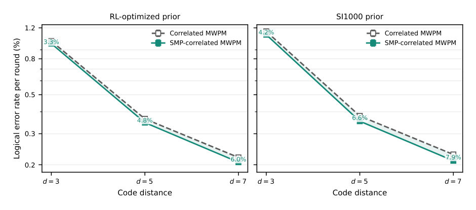
<figcaption class="paper-figure-caption"><b>Fig 5.</b> FIG. 5. Logical error rates per round for correlated MWPM and SMP-correlated MWPM on the Willow data. The panels use the reinforcement-learning-optimized (RL) prior and the SI1000 noise model prior with input round counts r = 10, 13, 30, 50. The per-round rate ϵ is extracted independently for each distance, prior, logical basis, and decoder using Eq. (21). Logical- X and logical-Z rates are averaged after fitting. Error bars show 95% intervals obtained from 5,000 parametric bootstrap resamples. Shading marks the gap between the two curves, and labels give the relative reduction R = 1−ϵSMP/ϵbase, expressed as a percentage. Each input round count contains 50,000 shots per logical basis.</figcaption>
</figure>

**Summary.** This paper introduces Syndrome Motif Projection (SMP), a novel, lightweight framework designed to incorporate complex hyperedge fault information into existing, scalable matching-based quantum error correction decoders. By extracting local syndrome motifs, SMP enhances the ability to detect and correct correlated errors in surface and color codes. The results demonstrate that SMP provides a highly transferable method to boost fault tolerance in real-time quantum computation architectures.

**Why it may be interesting.** While focused on QEC, the development of lightweight, information-theoretic preprocessing steps (like motif extraction) that bridge complex physical phenomena (hyperedge faults) into computationally tractable graph structures is relevant to designing efficient control protocols for open quantum systems.

Detailed structure

**Main problem.** The primary challenge addressed is accurately decoding hyperedge faults in circuit-level quantum error correction (QEC), as existing fast decoders are limited by pairwise representations.

**Main result.** The proposed Syndrome Motif Projection (SMP) framework significantly improves error correction performance across surface and color codes, achieving reductions in logical failure probabilities up to 77.8% and 35.5% compared to baselines.

**Method.** SMP is a lightweight front-end that extracts characteristic local syndrome motifs directly from measured syndromes, allowing this higher-order fault information to be incorporated into existing, scalable matching-based decoding algorithms.

**Model / system.** The work focuses on circuit-level QEC using stabilizer measurements on physical systems modeled by surface codes and color codes, aiming for fault-tolerant quantum computation.

**Key observables.** Logical failure probabilities ($P_L$), performance improvement over belief matching, and the detection of specific syndrome motifs.

**Important parameters / regimes.** Physical error probability ($p$), code distance ($d$), and the structure of the fault (edge vs. hyperedge).

**Assumptions / limitations.** The core assumption is that the local syndrome motif provides sufficient evidence to effectively update the weights in the matching backend, allowing for a linear-complexity preprocessing step.

**Figures summary.** Figure 1 illustrates the structure of hyperedges and the resulting syndrome motifs from circuit-level faults in a surface code patch. Other figures compare the logical failure probabilities of various decoding methods.

**Paper structure.** The paper introduces the SMP framework by defining the problem of hyperedge faults, details the mechanism of motif extraction and weight interpolation ($\eta_h$), and validates the approach by demonstrating performance improvements across surface codes, color codes, and logical gate circuits.

Abstract

Hyperedge faults remain a major challenge in circuit-level quantum error correction. Accurately exploiting hyperedge correlations often requires substantial computational resources, which complicates real-time decoding. Matching-based decoders are fast and scalable, but their pairwise graph representation limits the use of higher-order fault information. Here, we introduce Syndrome Motif Projection (SMP), a general framework for incorporating hyperedge information into matching-based decoding. The key idea is that a hyperedge fault produces a characteristic local syndrome motif. Observing such a motif provides evidence for the corresponding fault. SMP extracts this information directly from the measured syndrome with linear-complexity preprocessing while preserving the matching backend. It can therefore serve as a lightweight front end to existing scalable and real-time matching decoders. We demonstrate SMP across surface code memories, color code memories, and logical gate circuits. On Google's Willow experimental surface code data, SMP improves both standard and correlated matching and outperforms the tested belief matching baseline. For color code memories, SMP combined with Chromobius reduces logical failure probabilities by up to 77.8\%. For logical gate circuits, SMP reduces the failure probability of a six-CNOT circuit by 35.5\% relative to logical observable matching while achieving performance comparable to iterative belief matching. These results demonstrate that SMP provides a lightweight and transferable approach to hyperedge decoding, with a clear path toward integration into scalable real-time decoding architectures for fault-tolerant quantum computation.

[↑ back to top](#top)

### [Bogoliubov self-consistent $GW$ and second-order Green's function methods for attractive fermionic interactions](http://arxiv.org/abs/2610.03357v1)

**Authors:** Mauricio Rodr{í}guez-Mayorga, Johannes Tölle, Pierre-François Loos  
**Type:** theory · **Category:** strongly correlated electrons · **PDF:** <https://arxiv.org/pdf/2610.03357v1>  
**Analysis basis:** full PDF text, analyzed in chunks
**Topic relevance:** `Keldysh / 2PI / non-Gaussian methods` **2/5** · `analog quantum simulation` **1/5**

↔ Scroll figures horizontally

<figure class="paper-figure-card">
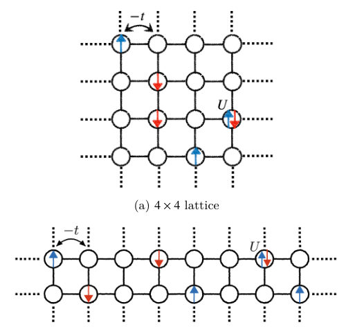
<figcaption class="paper-figure-caption"><b>Fig 1.</b> FIG. 1: Schematic representation of the (a) 4 × 4 and (b) 2 × 8 Hubbard lattices with periodic boundary conditions (dotted lines). The parameter t denotes the nearest-neighbor hopping amplitude between lattice sites, while U represents the on-site interaction between fermions of opposite spin (attractive in the present work). Blue and red arrows depict spin-up and spin-down fermions, respectively.</figcaption>
</figure>
<figure class="paper-figure-card">
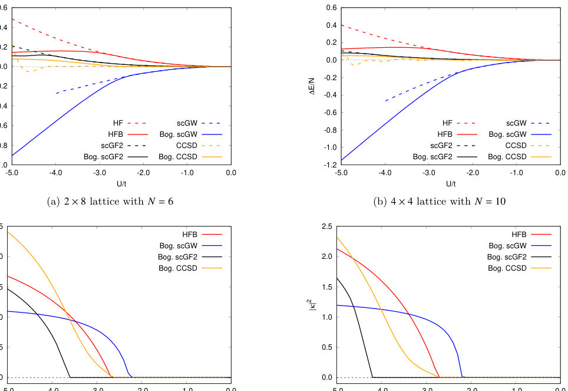
<figcaption class="paper-figure-caption"><b>Fig 2.</b> FIG. 2: Error in the total energy per electron with respect to FCI, ∆E/N = (E −EFCI)/N [(a) and (b)], and magnitude of the anomalous density, ∥κ∥2 [(c) and (d)], versus U/t for the 2 × 8 lattice with N = 6 [(a) and (c)] and the 4 × 4 lattice with N = 10 [(b) and (d)]. The horizontal line in (a) and (b) marks the FCI reference (∆E/N = 0).</figcaption>
</figure>

**Summary.** This work investigates advanced many-body techniques, specifically Bogoliubov self-consistent GW and second-order Green's function methods, to treat attractive fermionic interactions. By benchmarking these methods against the exact Full Configuration Interaction result using the attractive Hubbard model, the authors demonstrate that the GF2 approach is superior to GW, particularly as the attractive interaction strength increases.

**Why it may be interesting.** The comparison between GW and GF2 methods for strongly correlated systems provides valuable insight into the relative accuracy of different many-body perturbation theories when dealing with pairing mechanisms relevant to superconductivity.

Detailed structure

**Main problem.** The central challenge is accurately describing fermionic systems with attractive interactions, such as superconductors and atomic nuclei, beyond the mean-field level.

**Main result.** The second-order Green's function method (Bog. scGF2) was found to provide a more accurate description of correlation energy than the fully self-consistent GW approach (Bog. scGW).

**Method.** The authors compare Bogoliubov fully self-consistent GW (Bog. scGW) and second-order Green's function (Bog. scGF2) methods, implemented in a unified imaginary-time and imaginary-frequency framework.

**Model / system.** The study uses the attractive Hubbard model as a benchmark system to test the theoretical methods. The formalism builds upon the Hartree–Fock–Bogoliubov (HFB) approach, which is extended to include dynamical correlation effects.

**Key observables.** Total energies, anomalous density ($\kappa$), and the generalized (Gorkov) density matrix ($\mathbf{R}$).

**Important parameters / regimes.** The strength of the attractive interaction, which is varied to test the stability and accuracy of the methods.

**Assumptions / limitations.** The HFB formalism is used as the starting point, which neglects dynamical correlation effects. The GW and GF2 methods are approximations used to recover these missing correlation terms.

**Paper structure.** The paper develops the theoretical framework by first establishing the HFB ground state, then introducing the GW and GF2 corrections, and finally comparing their quantitative results against the benchmark FCI calculation.

Abstract

Describing fermionic systems with attractive interactions, such as superconductors and atomic nuclei, beyond the mean-field level remains a central challenge. In this work, we investigate the performance of Bogoliubov fully self-consistent $GW$ (Bog.~sc$GW$) and second-order Green's function (Bog.~scGF2) methods, implemented within a unified imaginary-time and imaginary-frequency framework. Using the attractive Hubbard model as a benchmark against full configuration interaction (FCI), we find that Bog. scGF2 provides a more accurate description than Bog.~sc$GW$. In particular, Bog.~sc$GW$ systematically overestimates the correlation energy, with errors increasing rapidly as the attractive interaction strength grows. These results highlight the importance of exchange contributions in strongly correlated fermionic systems, even when exchange effects are included only at low order in perturbation theory.

[↑ back to top](#top)

### [Breaking the chain: geometry-native state preparation with ASPIRE](http://arxiv.org/abs/2610.03528v1)

**Authors:** Fredrik Hasselgren, Matthew L. Sims-Goh  
**Type:** theory · **Category:** quantum information and computing · **PDF:** <https://arxiv.org/pdf/2610.03528v1>  
**Analysis basis:** full PDF text, analyzed in chunks
**Topic relevance:** `analog quantum simulation` **2/5** · `methods for driven-dissipative` **1/5**

↔ Scroll figures horizontally

<figure class="paper-figure-card">
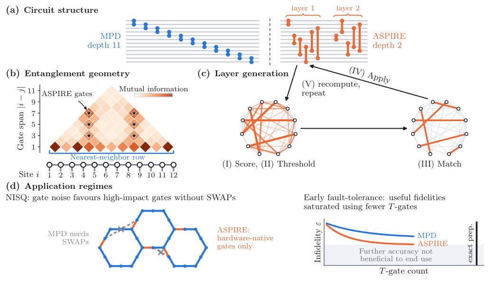
<figcaption class="paper-figure-caption"><b>Fig 1.</b> FIG. 1. Overview of the ASPIRE protocol. (a) Comparison of circuit structure for the MPD [16] (blue) and ASPIRE (orange) at identical budget. The MPD produces sequential ‘staircase’ layers, whereas ASPIRE selects pairs optimised to reduce long-ranged entanglement, parallelised at shallower depth. (b) Pairwise quantum mutual information Equation 8 for the ground state of a 4 × 3 Heisenberg model Equation 26, snake-mapped to an MPS and used to select pairs. Each pair scored is a cell at its MPS site (horizontal) and gate range (vertical); only the bottom row is accessible by standard MPD methods, while the six starred cells are connections only targetable by ASPIRE at ranges 3, 5 and 7 in...</figcaption>
</figure>
<figure class="paper-figure-card">
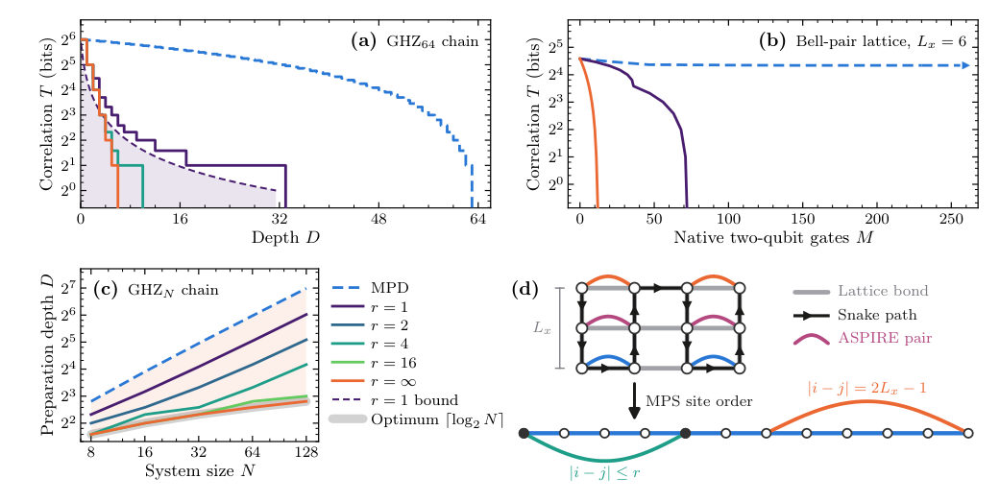
<figcaption class="paper-figure-caption"><b>Fig 2.</b> FIG. 2. A toy model for the impact of better connectivity. Top row: the remaining correlation T is shown as a function of (a) circuit depth for a GHZ64 system and of (b) native gate count for an Lx ×Ly = 6×6 lattice carrying a Bell pair on each vertical bond. For (a) the shaded region is unreachable by nearest-neighbour circuits, with the MPD’s performance shown in dashed blue and ASPIRE at different connectivity radii shown as solid coloured lines. For (b) the Bell pair lattice’s entanglement becomes long-ranged when snake mapped to an MPS, seeing all the Bell pairs only when the connectivity radius reaches 2Lx −1. (c) Depth to exact preparation of the GHZ64, requiring ⌈log2 N⌉layers at...</figcaption>
</figure>
<figure class="paper-figure-card">
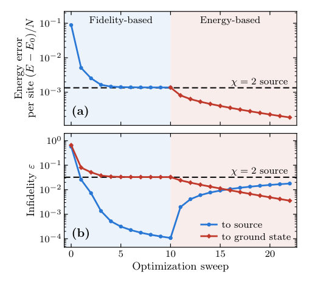
<figcaption class="paper-figure-caption"><b>Fig 3.</b> FIG. 3. Toy model of the energy refinement. A N = 8 critical TFIM ground state is prepared with 21 two-qubit gates via the unitary disentangler protocol from a deliberately crude χ = 2 single-sweep DMRG state. Comparing against E0 from exact diagonalisation (a) Energy error per site, rel- ative to E0 from exact diagonalisation, against optimisation sweep; at sweep 10 the protocol switches from Algorithm 3 to energy refinement. (b) shows the infidelity with respect to the true ground state (red) and the DMRG state (blue), with the same optimisation switch halfway.</figcaption>
</figure>
<figure class="paper-figure-card">
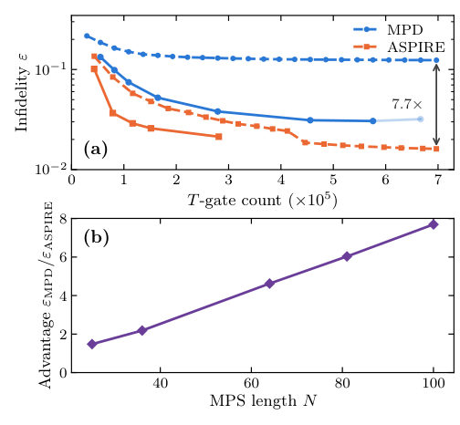
<figcaption class="paper-figure-caption"><b>Fig 4.</b> FIG. 4. 2D TFIM lattice ground-state preparation with MPD and ASPIRE. (a) The MPD (blue) versus AS- PIRE (orange) preparing the 10 × 10 2D TFIM ground state (N = 100 sites, h = 2), both gate-matched at 2376 two-qubit gates and cast onto a fault-tolerant T-gate count with the TRASYN synthesis model [118], the specialised U3 synthesis of Ref. [111], total synthesis error 10−3. Dashed lines are the un- optimised constructions. Solid lines refine the circuit at each marked gate count with Algorithm 3, each point separately and with the same budget of 5 × 1012 bond-resolved χ3 op- erations for both protocols. ASPIRE’s solid line ends at 999 two-qubit gates, beyond which the budget buys less than...</figcaption>
</figure>
<figure class="paper-figure-card">
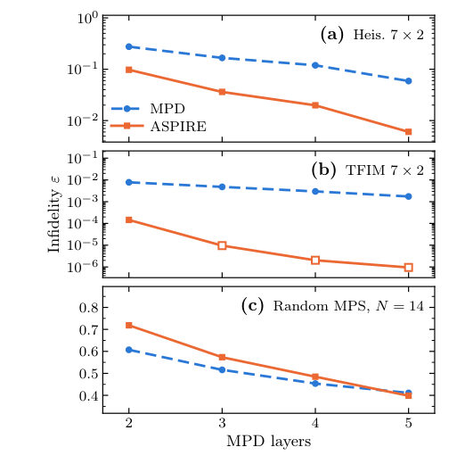
<figcaption class="paper-figure-caption"><b>Fig 5.</b> FIG. 5. Optimisation effectiveness of MPD and AS- PIRE. The infidelity of the protocols optimised to conver- gence at a gate budget of 2 to 5 MPD layers is compared for the 7 × 2 Heisenberg (a) and TFIM (b) ground states, and the N = 14 random MPS with χ = 64 (c), the last a geo- metric mean over three seeds. Hollow markers stopped at the optimiser’s cap of 3 × 104 sweeps and bound the converged infidelity from above.</figcaption>
</figure>

**Summary.** This paper introduces ASPIRE, a novel algorithm for preparing complex quantum states by intelligently selecting gates based on the state's entanglement geometry. It overcomes the limitations of sequential gate application by enabling parallel, long-ranged gate operations. This makes it a resource-frugal protocol highly relevant for near-term quantum hardware simulations.

**Why it may be interesting.** The focus on geometry-native state preparation directly addresses practical hardware limitations (connectivity and depth) that are crucial when simulating complex quantum systems relevant to AMO physics.

Detailed structure

**Main problem.** Loading quantum states into quantum computers efficiently remains a major bottleneck threatening end-to-end quantum advantage.

**Main result.** The proposed ASPIRE protocol achieves higher fidelities and shallower circuits than existing methods for preparing states with long-ranged entanglement, while accounting for hardware connectivity.

**Method.** ASPIRE is a greedy classical algorithm that iteratively selects gates by scoring candidate qubit pairs based on the state's underlying entanglement geometry, aiming to remove entanglement in parallel layers.

**Model / system.** The focus is on preparing structured quantum states, particularly Matrix Product States (MPS), which are relevant for quantum chemistry and many-body simulation.

**Key observables.** Fidelity (ft), circuit depth, entanglement geometry (measured via Quantum Mutual Information, QMI), and gate count.

**Important parameters / regimes.** Bond dimension ($\chi$), hardware connectivity, and noise models (NISQ/fault-tolerant).

**Assumptions / limitations.** The protocol assumes that minimizing entanglement measures (like QMI) guides the construction of the state-preparation circuit, and it is designed to handle non-1D hardware connectivity.

**Figures summary.** Figure 1 compares ASPIRE's circuit structure to existing methods (like MPD), showing ASPIRE's ability to generate parallel layers that target long-ranged entanglement more efficiently.

**Paper structure.** The paper introduces ASPIRE as an improvement over sequential nearest-neighbor gate application (like MPD), detailing the use of QMI to guide gate placement and demonstrating its resource-frugal nature across various hardware constraints.

Abstract

Loading data into quantum computers is a key bottleneck that threatens end-to-end quantum advantage. Quantum-circuit compilers for structured states like matrix product states (MPS) are a critical enabler to manage this in quantum chemistry, finance, and many-body quantum simulation. Approximate preparation of MPS typically relies on layered sequential staircases of nearest-neighbour gates. We present Adaptive State Preparation by Iterative Removal of Entanglement (ASPIRE), an algorithm that approximately compiles state-preparation circuits by selecting gates based on the state's underlying entanglement geometry and the available connectivity of the target quantum processor. Our protocol scores candidate qubit pairs on the removability of their entanglement and identifies layers of parallelised long-ranged gates that remove the most entanglement. We demonstrate our protocol empirically across a range of settings, illustrating its success for preparing Hamiltonian ground states and multivariate amplitude-encoded functions, and accounting for qubit connectivity, hardware noise, and both NISQ and early fault-tolerant settings. Throughout, ASPIRE typically achieves higher fidelities and shallower circuits than existing methods for states with long-ranged entanglement, even when classical optimisation is accounted for. Our investigation positions ASPIRE as a competitive, resource-frugal state-preparation protocol, with particular promise for applications tolerant to imperfect fidelity such as preparation of guide states for quantum phase estimation.

[↑ back to top](#top)

### [Design Automation for Gray-Code Quantum Read-Only Memory](http://arxiv.org/abs/2610.02757v1)

**Authors:** Hao-Yu Lu, Yu-Ting Kao, Yeong-Jar Chang, Chao-Hung Wang, Darsen D. Lu  
**Type:** both · **Category:** quantum information and computing · **PDF:** <https://arxiv.org/pdf/2610.02757v1>  
**Analysis basis:** full PDF text, analyzed in chunks
**Topic relevance:** `QC/QI experiment` **2/5** · `quantum measurements` **1/5**

↔ Scroll figures horizontally

<figure class="paper-figure-card">
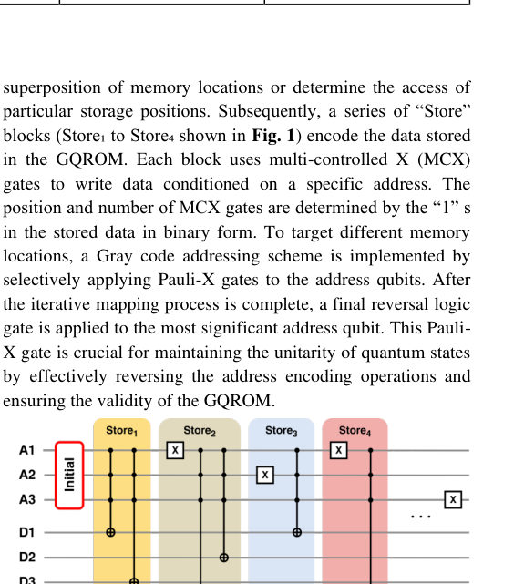
<figcaption class="paper-figure-caption"><b>Fig 1.</b> Fig. 1. Core GQROM circuit block design</figcaption>
</figure>
<figure class="paper-figure-card">
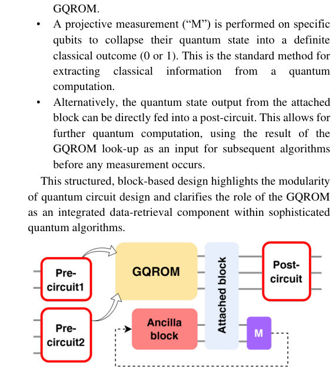
<figcaption class="paper-figure-caption"><b>Fig 2.</b> Fig. 2. System diagram of GQROM with peripheries</figcaption>
</figure>
<figure class="paper-figure-card">
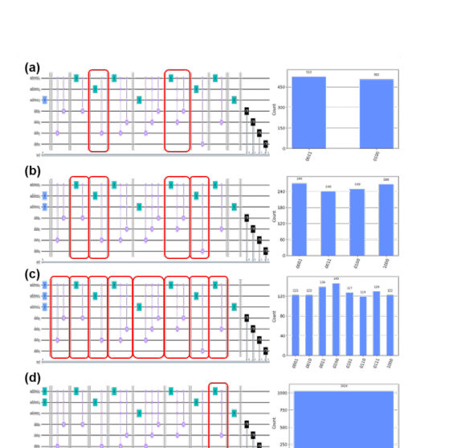
<figcaption class="paper-figure-caption"><b>Fig 3.</b> Fig. 4. GQROM with different “Initial”. (a)(b)(c) 1 or 2 or 3 Hadamard gates are added, respectively. (d) two Pauli-X gate is added. The histograms prove that we can access specified data with different initial setting and create different superposition depending on the applications.</figcaption>
</figure>
<figure class="paper-figure-card">
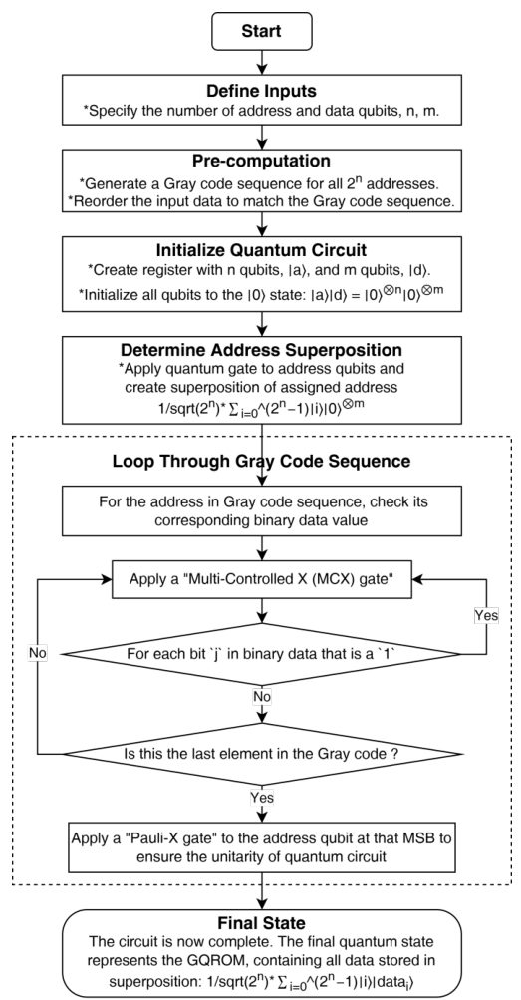
<figcaption class="paper-figure-caption"><b>Fig 4.</b> Fig. 3. Design Flow chart for GQROM</figcaption>
</figure>

**Summary.** This paper introduces GQROM, a novel Quantum Read-Only Memory designed to efficiently load classical data into quantum circuits by employing Gray code encoding. This approach minimizes state transition complexity and reduces gate overhead, addressing key bottlenecks in near-term quantum computing. The design is systematically implemented and validated on the Qiskit platform, proving its practical feasibility for scalable state preparation.

**Why it may be interesting.** While focused on digital quantum computation, the principles of efficient state preparation and minimizing gate count through structured addressing (like Gray codes) are crucial for any physical realization of quantum algorithms, including those involving quantum memories.

Detailed structure

**Main problem.** The paper addresses bottlenecks in near-term quantum computing caused by inefficient quantum-classical data transfers and initialization overhead.

**Main result.** The proposed GQROM architecture successfully demonstrates a resource-optimized, hardware-friendly method for state preparation, significantly reducing required quantum gates.

**Method.** The core method involves designing a Quantum Read-Only Memory (QROM) that utilizes Gray code encoding to minimize state transition complexity during data retrieval.

**Model / system.** The system is the GQROM, a programmable quantum read-only memory implemented using standard quantum logic gates, including multi-controlled X (MCX) gates, and validated on the Qiskit platform.

**Key observables.** Superposition of stored data values, circuit depth, and total required quantum gate count.

**Important parameters / regimes.** The use of Gray code encoding, which ensures consecutive addresses differ by only a single bit.

**Assumptions / limitations.** The QROM is inherently read-only and is designed to function as a modular component within a larger quantum circuit.

**Figures summary.** Figures illustrate the core GQROM circuit block, the overall system diagram with its peripherals, the systematic EDA design flow, and experimental results showing data retrieval under superposition.

**Paper structure.** The paper introduces the problem, details the GQROM architecture using Gray code addressing, presents a systematic EDA flow for its construction, and validates its feasibility through simulation results on Qiskit.

Abstract

We propose a programmable quantum read-only memory based on Gray code encoding, termed GQROM, designed to efficiently load classical data into quantum circuits. This architecture mitigates critical bottlenecks in near-term quantum computing by reducing initialization overhead and gate-induced errors. By utilizing Gray code, in which consecutive addresses differ by only a single bit, GQROM minimizes state transition complexity. We demonstrate the architecture's flexibility in accessing targeted data through initial-state modification. The entire design, including a systematic EDA flow, was implemented and validated on the Qiskit platform, confirming its practical feasibility. These results underscore GQROM's potential as a scalable and hardware-friendly solution for efficient state preparation in quantum circuits.

[↑ back to top](#top)

### [Generalization of Transformer-Based Neural Quantum States via In-Context Learning](http://arxiv.org/abs/2610.03463v1)

**Authors:** Zhen Qin, Qing Qu, Alfred O. Hero  
**Type:** theory · **Category:** numerical methods · **PDF:** <https://arxiv.org/pdf/2610.03463v1>  
**Analysis basis:** full PDF text, analyzed in chunks
**Topic relevance:** `methods for driven-dissipative` **2/5** · `analog quantum simulation` **1/5**

↔ Scroll figures horizontally

<figure class="paper-figure-card">
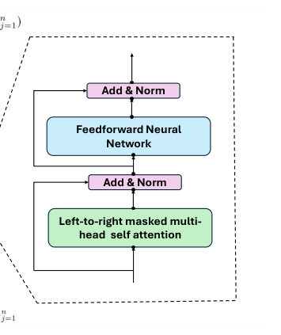
<figcaption class="paper-figure-caption"><b>Fig 1.</b> Figure 1: In-Context Learning Framework for Transformer-Based Neural Quantum States.</figcaption>
</figure>
<figure class="paper-figure-card">
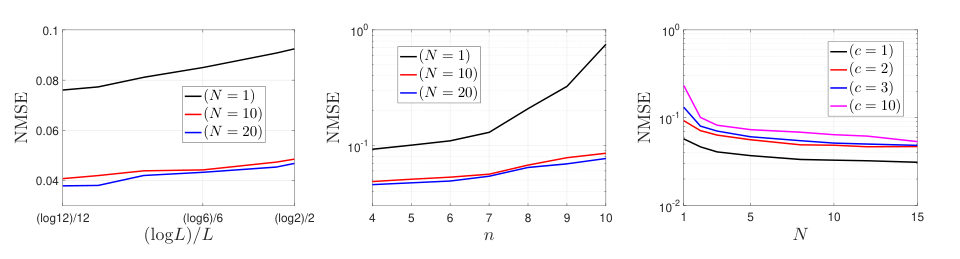
<figcaption class="paper-figure-caption"><b>Fig 2.</b> Figure 2: Comparison of generalization errors of Transformer-based neural quantum states in the continuous case over 500 training epochs with Transformer width 64: (a) varying L and N with n = 4 and c = 2, (b) varying n and N with c = 2 and L = 2, (c) varying c and N with n = 4 and L = 2. These results empirically validate the theoretical scaling law in (19): the generalization error decreases with the number of in-context samples N and increases with the problem dimension n and energy constraint B, while exhibiting an approximately linear dependence on (log L)/L.</figcaption>
</figure>
<figure class="paper-figure-card">
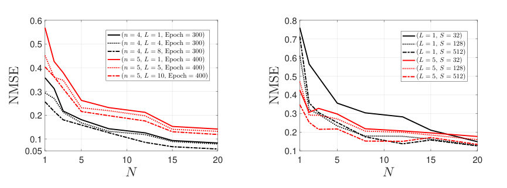
<figcaption class="paper-figure-caption"><b>Fig 3.</b> Figure 3: Comparison of generalization errors of Transformer-based neural quantum states in the discrete case with Transformer width 32: (a) varying n and L with S = 128, (b) varying L and S with n = 5 and 500 training epochs. These results demonstrate that the generalization error decreases with increasing model depth and the number of in- context samples, while increasing with system size n, consistent with the scaling behavior predicted by the theoretical analysis.</figcaption>
</figure>
<figure class="paper-figure-card">
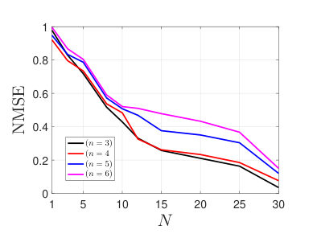
<figcaption class="paper-figure-caption"><b>Fig 4.</b> Figure 4: Comparison of the generalization error for predicting unknown linear observables as the number of qubits n varies. The Transformer width is fixed at 64 and the number of layers is fixed at L = 4. Results are obtained after 300 training epochs (32 batches per epoch) and evaluated on 100 testing tasks. These results demonstrate the predicted benefit of increasing the number of in-context samples N and the increasing difficulty of the prediction task with system size n, consistent with the theoretical bounds in (29) and (30).</figcaption>
</figure>

**Summary.** This paper provides a theoretical framework to analyze the generalization capability of Transformer-based Neural Quantum States (NQS) under in-context learning. It derives rigorous error bounds showing that prediction accuracy improves predictably with more context examples and deeper networks. This advances the field by providing mathematical guarantees for using advanced deep learning architectures to model complex quantum many-body physics.

**Why it may be interesting.** This work provides crucial theoretical guarantees for using deep learning models like Transformers to simulate complex quantum many-body systems, addressing a major bottleneck in applying modern AI techniques to quantum physics.

Detailed structure

**Main problem.** The paper aims to develop a theoretical understanding of how well Transformer-based neural quantum states generalize when trained using in-context learning (ICL).

**Main result.** It establishes rigorous generalization error bounds for the pointwise prediction error and extends this to full quantum states, showing the required Transformer depth scales only linearly with system size.

**Method.** The authors develop a theoretical framework using Mean Squared Error (MSE) bounds, adapting the established ICL analysis from language models to the quantum state representation.

**Model / system.** The model uses Neural Quantum States (NQS) parameterized by a Transformer architecture to represent quantum many-body wavefunctions. These states can describe both continuous systems (e.g., $\psi(\mathbf{x})$ on $(\mathbb{R}^D)^n$) and discrete systems (e.g., spin systems).

**Key observables.** Pointwise prediction error and MSE-based generalization error bounds for the quantum state.

**Important parameters / regimes.** The number of in-context examples ($N$) and the depth of the Transformer are key parameters governing the error bounds.

**Assumptions / limitations.** The analysis assumes the quantum state can be effectively represented by a Transformer and that the generalization error can be bounded using MSE metrics derived from ICL principles.

**Figures summary.** Figure 1 illustrates the entire ICL framework, detailing the flow from input embedding through masked multi-head self-attention and feed-forward layers to the final output prediction.

**Paper structure.** The paper first analyzes the pointwise prediction error, deriving bounds based on ICL. It then extends this analysis to full quantum states formulated as rank-one density operators, deriving MSE bounds for both continuous and discrete domains, and concludes with numerical simulations.

Abstract

Neural quantum states based on modern deep learning architectures have emerged as powerful representations for quantum many-body systems. In particular, Transformer-based neural quantum states provide expressive models capable of capturing long-range correlations, and their empirical generalization performance has recently been demonstrated. However, a theoretical understanding of their generalization behavior remains largely unexplored. In this paper, we develop a theoretical framework to analyze the generalization properties of Transformer-based neural quantum states under in-context learning. We establish a rigorous inference-time generalization error bound in terms of mean squared error (MSE), showing that the pointwise prediction error decreases inversely with both the number of in-context examples and the depth of the Transformer. We further show that the Transformer depth required to achieve this guarantee scales only linearly with the system size--namely, the number of particles in continuous systems or the number of qudits in discrete systems. Building on this result, we extend our analysis to full quantum states formulated as rank-one density operators, and derive MSE-based generalization bounds over both continuous and discrete domains under physical constraints. Finally, numerical simulations corroborate our theoretical analysis.

[↑ back to top](#top)

### [Gibbs state preparation through quantum decoding](http://arxiv.org/abs/2610.03566v1)

**Authors:** Christophe Piveteau, Yihui Quek, M. Isabel Franco Garrido  
**Type:** theory · **Category:** quantum information and computing · **PDF:** <https://arxiv.org/pdf/2610.03566v1>  
**Analysis basis:** full PDF text, analyzed in chunks
**Topic relevance:** `analog quantum simulation` **2/5** · `quantum measurements` **1/5**

↔ Scroll figures horizontally

<figure class="paper-figure-card">
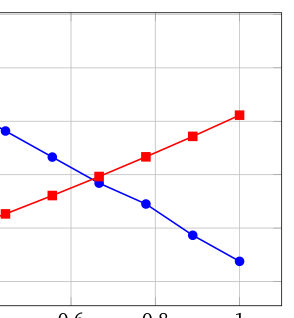
<figcaption class="paper-figure-caption"><b>Fig 1.</b> Figure 1: Numerical evaluation of pDE(q) and pcl(q) for the (3,6)-regular LDPC ensemble. Clearly, for low enough q, pDE(q) is strictly larger than pcl(q). This implies that QD-HDQI to- gether with BPQM can achieve lower temperature for Gibbs sampling than QD-HDQI with any classical decoders for these values of q.</figcaption>
</figure>

**Summary.** This work introduces QD-HDQI, a quantum algorithm that prepares Gibbs states by mapping the problem onto quantum error-correcting codes. By replacing classical decoding with quantum decoding, the authors establish a quantum advantage, showing that quantum methods can reach lower temperatures and overcome classical information-theoretic limits in simulating quantum thermalization.

**Why it may be interesting.** The quantum advantage demonstrated in decoding thresholds directly impacts the achievable thermalization temperatures in quantum many-body systems, which is crucial for understanding quantum thermalization dynamics.

Detailed structure

**Main problem.** The paper addresses the challenge of efficiently preparing a Gibbs state associated with a Pauli Hamiltonian by reframing the problem as a quantum decoding task.

**Main result.** The proposed quantum decoding algorithm (QD-HDQI) demonstrates that quantum decoders can achieve lower temperature limits and surpass classical decoding thresholds, particularly in the noncommuting regime.

**Method.** It extends Hamiltonian Decoded Quantum Interferometry (HDQI) by replacing the classical decoder with a quantum decoder that exploits quantum interference between potential errors.

**Model / system.** The system involves preparing the Gibbs state $
ho_f$ for a general Pauli Hamiltonian $H$. The methodology maps this state preparation to a quantum decoding problem over associated error-correcting codes.

**Key observables.** Achievable inverse temperature ($eta$), decoding threshold ($p^*$), and the error-correcting rate ($R$).

**Important parameters / regimes.** The noise model defined by the function $F$, the error fraction, and the Hamiltonian structure (commuting vs. noncommuting).

**Assumptions / limitations.** The efficiency of the quantum decoder (e.g., BPQM) and the ability to relate the noise model directly to the decoding problem, bypassing polynomial approximations.

**Figures summary.** Not specified.

**Paper structure.** The paper introduces the problem, details the QD-HDQI algorithm by replacing classical decoding with quantum decoding, and applies this framework to analyze both commuting and noncommuting Hamiltonian regimes.

Abstract

We propose a Gibbs state preparation algorithm that exploits algebraic structure in the Hamiltonian. Our starting point is Hamiltonian Decoded Quantum Interferometry (HDQI), a recent algorithm that reduces Gibbs state preparation for Pauli Hamiltonians to decoding error-correcting codes. We introduce quantum decoding HDQI (QD-HDQI), replacing HDQI's coherent classical decoder by a quantum decoder that can exploit interference between different errors.   For commuting Pauli Hamiltonians, our reduction is efficient and the associated quantum decoding problem corresponds to transmitting the associated symplectic code over i.i.d. pure-state classical-quantum channels. For uniformly random Hamiltonian signs, the vanishing-error threshold of an efficient decoder directly determines the lowest temperature that our algorithm can reach. Even using only classical decoders, this improves upon HDQI's achievable inverse temperature from linear to square-root in the correctable error fraction; quantum decoders can improve further by tolerating still stronger noise. A similar picture extends to the noncommuting regime previously handled by HDQI, where now the noise is correlated within small, independent blocks.   We study two such quantum decoders in our QD-HDQI Gibbs sampling framework. The first, based on unambiguous state discrimination, works efficiently for arbitrary binary linear codes. However, we "dequantize" this strategy for commuting Hamiltonians, contributing a classical rejection sampler that matches its temperature threshold. The second is belief propagation with quantum messages (BPQM), a quantum generalization of classical belief propagation. We show that for certain dilute spin glasses, BPQM's decoding threshold exceeds the Shannon limit for classical decoding, reaching temperatures inaccessible to any classical decoder within our framework.

[↑ back to top](#top)

### [Rapid mixing of Gibbs samplers via quantum Dobrushin--Shlosman conditions](http://arxiv.org/abs/2610.03578v1)

**Authors:** Cambyse Rouzé, Daniel Stilck França  
**Type:** theory · **Category:** statistical mechanics · **PDF:** <https://arxiv.org/pdf/2610.03578v1>  
**Analysis basis:** full PDF text, analyzed in chunks
**Topic relevance:** `analog quantum simulation` **2/5** · `methods for driven-dissipative` **1/5**

↔ Scroll figures horizontally

<figure class="paper-figure-card">
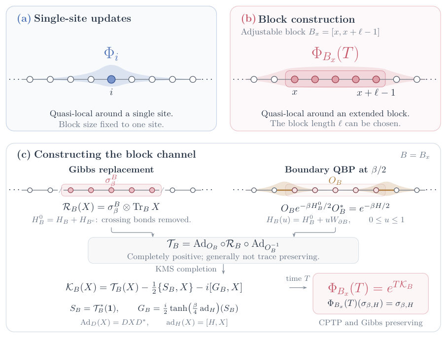
<figcaption class="paper-figure-caption"><b>Fig 1.</b> Figure 1: Single-site and block updates. (a) The channels analyzed in [9, 10] are centered on individual sites. (b) Our channels act around intervals Bx = [x, x + ℓ−1] of adjustable length. The shaded regions indicate decaying spatial tails; neither channel is strictly supported on the highlighted sites. (c) The block construction starts from the Gibbs replacement RB. Writing W∂B = H −H0 B, QBP along HB(u) = H0 B + uW∂B gives the operator OB in (1.1). Dressing RB gives the completely positive map TB. KMS completion then yields the generator KB and the Gibbs-preserving channel ΦB(T). The arrows describe this algebraic construction.</figcaption>
</figure>
<figure class="paper-figure-card">
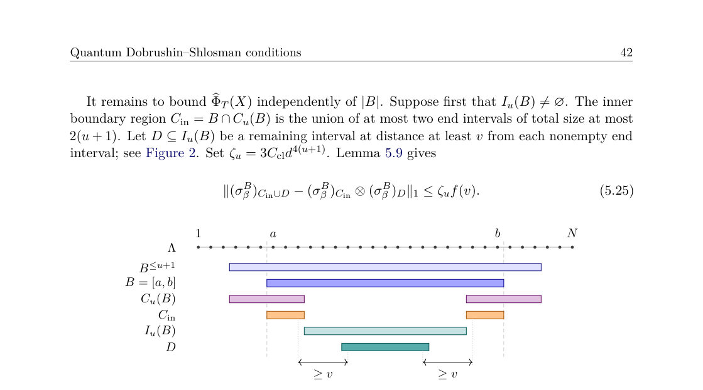
<figcaption class="paper-figure-caption"><b>Fig 2.</b> Figure 2: Regions in the proof of Lemma 5.10, shown for a block away from the ends of the chain. All rows refer to the same sites. The dashed lines mark the boundary bonds of B; Cin = B ∩Cu(B), Iu(B) = B \ Cu(B), and B≤u+1 = B ∪Cu(B). The interval D ⊆Iu(B) is at distance at least v from each component of Cin.</figcaption>
</figure>

**Summary.** This paper extends classical mixing theory to quantum lattice systems by defining a 'quantum Dobrushin–Shlosman condition' for finite-block dynamics. It proves that quantum Gibbs samplers can rapidly mix to the true thermal state using controlled block updates. This has significant implications for designing efficient quantum algorithms to simulate thermal equilibrium in quantum matter.

**Why it may be interesting.** This work provides rigorous, quantifiable methods to simulate thermalization processes in quantum many-body systems, which is crucial for understanding quantum thermalization and quantum simulation algorithms.

Detailed structure

**Main problem.** The paper aims to extend classical Dobrushin–Shlosman theory to establish rapid mixing guarantees for Gibbs samplers in noncommuting quantum lattice systems.

**Main result.** Logarithmic trace-norm mixing is proven for quantum spin chains at fixed finite temperatures, and the quantum Dobrushin–Shlosman condition is shown to be stable under small local perturbations.

**Method.** The authors construct 'smoothed heat-bath dynamics' using a combination of local Gibbs resets and quantum belief propagation to define block updates that preserve the Gibbs state.

**Model / system.** The focus is on quantum lattice systems, such as quantum spin chains, governed by finite-range Hamiltonians. The target state is the Gibbs state $\sigma_{eta,H} = e^{-eta H} / 	ext{Tr}(e^{-eta H})$.

**Key observables.** Trace-norm error ($\varepsilon$), covariance of observables ($	ext{Cov}_{\sigma_eta}(A, B)$), and the contraction constant $\kappa$ derived from the quantum Dobrushin–Shlosman condition.

**Important parameters / regimes.** Inverse temperature ($eta$), block size ($\ell$), evolution time ($T$), and perturbation strength ($\delta$).

**Assumptions / limitations.** The analysis relies on the existence of positive-exponent Gibbs operators and the ability to decompose the system into localized neighborhoods (cuts) for bounding correlations.

**Figures summary.** Figure 1 illustrates the construction of single-site and block updates, detailing the algebraic steps from Gibbs replacement to the final KMS-reversible channel $\Phi_{B_x}(T)$.

**Paper structure.** The paper builds by first establishing bounds on correlations using inclusion-exclusion principles for multiple cuts, then constructing the block update via quantum belief propagation, and finally proving the mixing bounds and stability under perturbations.

Abstract

Classical Dobrushin--Shlosman theory uses heat-bath block updates to identify sharp temperature thresholds for establishing the rapid mixing of Gibbs samplers. In particular, these mixing guarantees often hold even when stricter single-site conditions fail. We extend this approach to noncommuting quantum lattice systems through a quantum Dobrushin--Shlosman condition for finite-block dynamics, which we call smoothed heat-bath dynamics. We establish this condition in two regimes. For finite-range quantum spin chains at every fixed finite temperature, we prove logarithmic trace-norm mixing in system size, with normalized bounds uniform in on-site fields and single exponential in inverse temperature. We also prove stability under small local perturbations of interacting, possibly noncommuting reference Hamiltonians on graphs of polynomial volume growth. For classical references with bounded local interactions, uniform strong spatial mixing implies our quantum condition. With bounded local terms and fixed physical, geometric and block parameters, the resulting samplers prepare Gibbs states to trace-norm error $\varepsilon$ using $N\operatorname{polylog}(N/\varepsilon)$ gates and classical operations.   Our block updates combine a local Gibbs reset with quantum belief propagation to incorporate interactions across the block boundary, yielding exactly Gibbs-preserving, KMS-reversible channels. Two independently tunable parameters control contraction: an internal evolution time suppresses the influence of sites inside a block, while the block size allows interior contraction to dominate boundary influence. This finite-time relaxation has no counterpart in a classical heat-bath block update.

[↑ back to top](#top)

### [A Semiclassical Entanglement Wedge in Double-Scaled SYK](http://arxiv.org/abs/2610.02307v1)

**Authors:** Xi Dong, Jiuci Xu  
**Type:** theory · **Category:** statistical mechanics · **PDF:** <https://arxiv.org/pdf/2610.02307v1>  
**Analysis basis:** full PDF text, analyzed in chunks
**Topic relevance:** `Keldysh / 2PI / non-Gaussian methods` **2/5**

↔ Scroll figures horizontally

<figure class="paper-figure-card">

<figcaption class="paper-figure-caption"><b>Fig 1.</b> Low-resolution page preview, page 2</figcaption>
</figure>
<figure class="paper-figure-card">
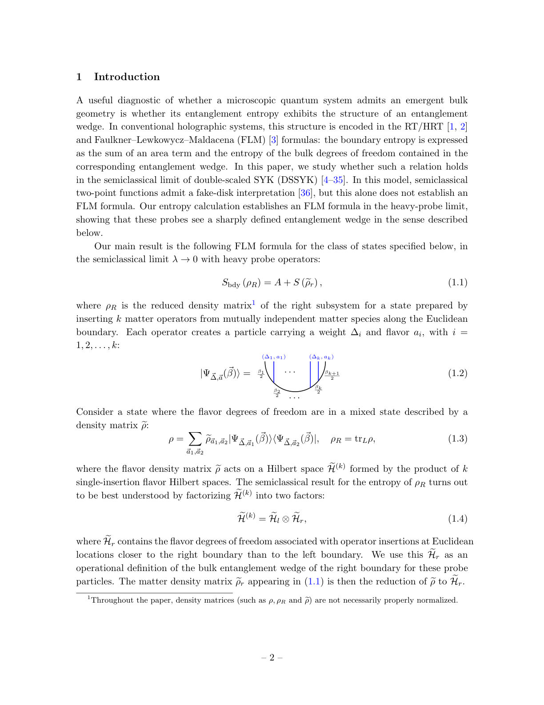
<figcaption class="paper-figure-caption"><b>Fig 2.</b> Low-resolution page preview, page 3</figcaption>
</figure>
<figure class="paper-figure-card">
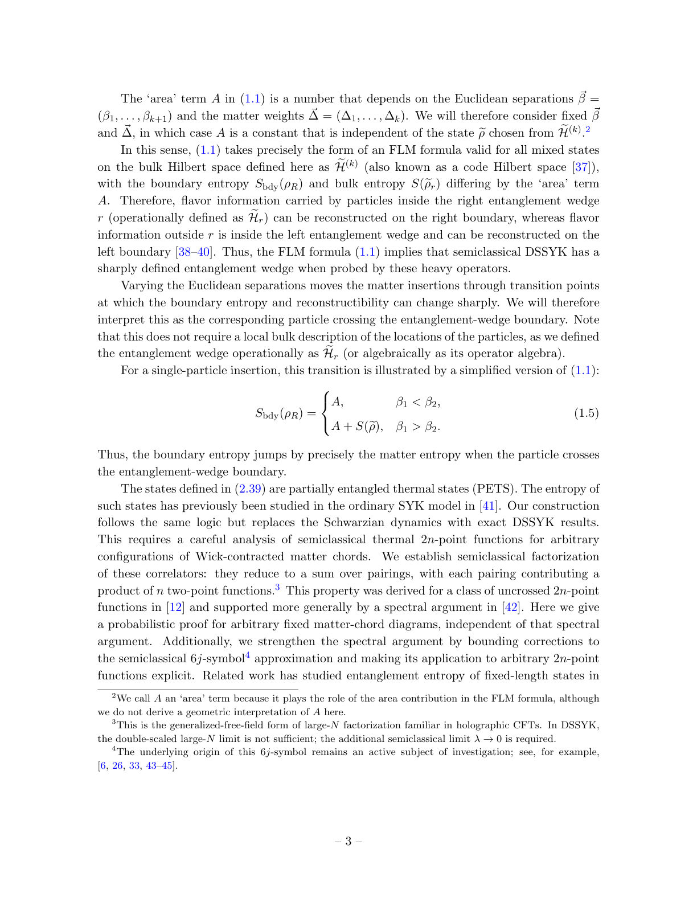
<figcaption class="paper-figure-caption"><b>Fig 3.</b> Low-resolution page preview, page 4</figcaption>
</figure>
<figure class="paper-figure-card">
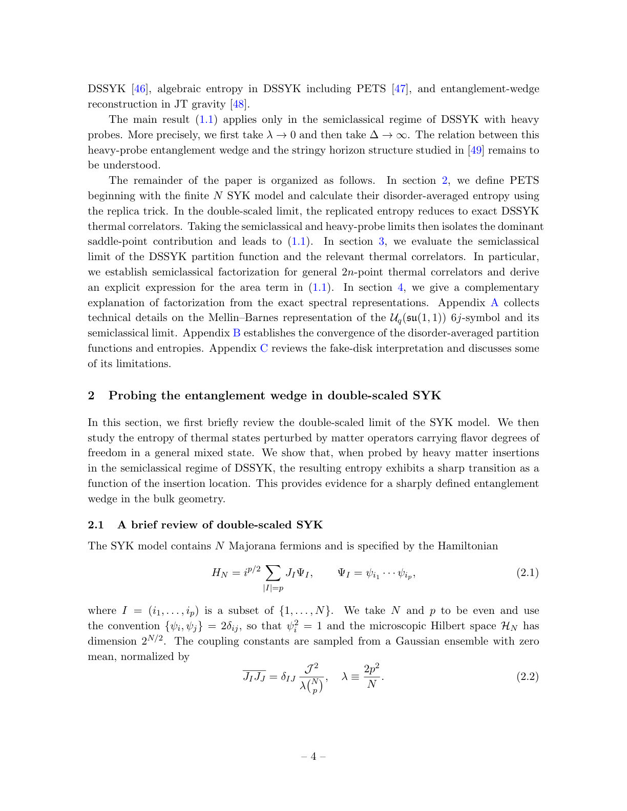
<figcaption class="paper-figure-caption"><b>Fig 4.</b> Low-resolution page preview, page 5</figcaption>
</figure>
<figure class="paper-figure-card">
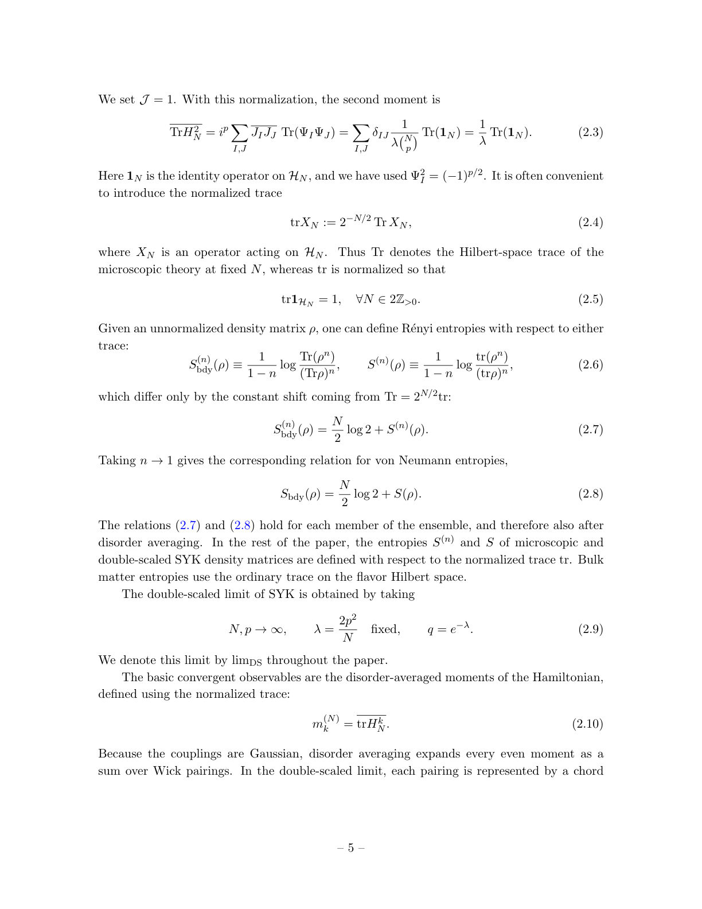
<figcaption class="paper-figure-caption"><b>Fig 5.</b> Low-resolution page preview, page 6</figcaption>
</figure>

**Summary.** This paper investigates the entanglement structure of the double-scaled SYK model, aiming to confirm the existence of an entanglement wedge. By calculating the boundary entropy, the authors derive a formula analogous to the FLM relation, demonstrating that the model exhibits a sharply defined entanglement wedge in the semiclassical limit. This provides theoretical evidence linking entanglement properties to geometric structures in a quantum chaotic system.

**Why it may be interesting.** The connection between entanglement structure (entropy) and geometric concepts like the entanglement wedge is a central theme in modern quantum gravity and condensed matter theory, providing a concrete, solvable model (SYK) to test these ideas.

Detailed structure

**Main problem.** The study aims to determine if the entanglement structure of partially entangled thermal states in the double-scaled SYK model exhibits the structure of an entanglement wedge, analogous to holographic systems.

**Main result.** The authors establish a Faulkner–Lewkowycz–Maldacena (FLM) formula, $S_{bdy}(
ho_R) = A + S(
ho_r)$, implying that the semiclassical DSSYK model possesses a sharply defined entanglement wedge.

**Method.** The analysis employs replica calculations and examines the semiclassical behavior of general Euclidean $2n$-point functions, leading to a probabilistic proof of correlator factorization.

**Model / system.** The system is the Double-scaled SYK (DSSYK) model, involving $N$ Majorana fermions. The study analyzes the entanglement entropy of partially entangled thermal states defined by matter insertions.

**Key observables.** Boundary entropy ($S_{bdy}$), bulk matter entropy ($S(
ho_r)$), and the general $2n$-point correlation functions.

**Important parameters / regimes.** The analysis is performed in the semiclassical limit ($\lambda 	o 0$) and the heavy-probe limit ($\Delta 	o \infty$).

**Assumptions / limitations.** The main result is restricted to the semiclassical regime of DSSYK with heavy probes, and the geometric interpretation of the 'area' term $A$ is not derived.

**Paper structure.** The paper develops the calculation by first establishing the FLM formula using replica methods, then analyzing the semiclassical factorization of correlators, and finally interpreting the sharp transitions in entropy as evidence for the entanglement wedge boundary.

Abstract

We study the entanglement structure of partially entangled thermal states in double-scaled SYK , allowing flavor degrees of freedom carried by matter insertions to be in an arbitrary mixed state. In the semiclassical limit, followed by the heavy-probe limit, our replica calculation gives a Faulkner--Lewkowycz--Maldacena formula: the boundary entropy decomposes into an `area' term (independent of the flavor state) and the bulk matter entropy in a corresponding entanglement wedge. Varying the Euclidean locations of the operator insertions produces sharp transitions in the boundary entropy, which we interpret as individual matter excitations crossing the boundary of the wedge and hence as evidence for a sharply defined entanglement wedge. To derive this result, we analyze the semiclassical behavior of general Euclidean $2n$-point functions and give a probabilistic proof of their factorization into sums over products of two-point functions. We also give a complementary derivation from exact spectral representations, using the semiclassical behavior of the quantum $6j$-symbol.

[↑ back to top](#top)

### [An exact semidefinite characterization of the stoquasticity cone of permutationally invariant Bell operators](http://arxiv.org/abs/2610.03438v1)

**Authors:** Jan Li, Owidiusz Makuta, Evert van Nieuwenburg, Jordi Tura  
**Type:** theory · **Category:** quantum information and computing · **PDF:** <https://arxiv.org/pdf/2610.03438v1>  
**Analysis basis:** full PDF text, analyzed in chunks
**Topic relevance:** `quantum measurements` **2/5**

↔ Scroll figures horizontally

<figure class="paper-figure-card">
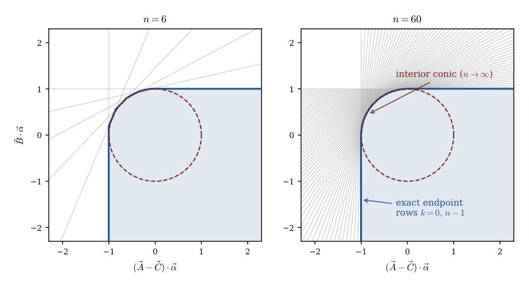
<figcaption class="paper-figure-caption"><b>Fig 1.</b> FIG. 1. Geometry of the three-body interior stoquasticity condition. The first off-diagonal is the quadratic h1(x) = ax2 + bx + c, with a = ⃗A · ⃗α, b = ⃗B · ⃗α, c = ⃗C · ⃗α. We plot the slice a + c = −1 in the axes s = a −c and b. Each row k contributes one stoquasticity constraint drawn as a grey line tangent to the interior conic b2 ≤4ac, which on this slice is the circle s2 + b2 = 1 (dashed). Off this arc the supremum is attained at an endpoint, where the exact rows s = −1 (k=0) and b = 1 (k=n−1) take over. The shaded feasible set is bounded by these two edges together with the conic arc. As n grows from 6 to 60 the rows fill in, and the boundary collapses uniformly onto the conic arc,...</figcaption>
</figure>

**Summary.** This paper develops a rigorous mathematical characterization of the stoquasticity cone for Bell operators used in quantum correlation tests. By showing that the constraints simplify to a single semidefinite feasibility problem in the thermodynamic limit, it provides a powerful, general tool for analyzing quantum measurement constraints. This advances the theoretical understanding of Bell inequalities beyond simple polynomial bounds.

**Why it may be interesting.** This work provides a powerful mathematical tool (semidefinite programming) to characterize physical constraints (stoquasticity) arising from quantum measurements, which is crucial for understanding the limits of quantum correlations.

Detailed structure

**Main problem.** The paper aims to provide an exact characterization of the stoquasticity cone for permutationally invariant (PI) Bell operators.

**Main result.** In the thermodynamic limit, the stoquasticity cone admits an exact semidefinite characterization, reducing the problem to a single semidefinite feasibility problem per off-diagonal element.

**Method.** The authors exploit the observation that off-diagonal matrix elements are governed by a single univariate polynomial, which allows the reduction of numerous inequalities to a single Linear Matrix Inequality (LMI).

**Model / system.** The study concerns Bell correlations measured in atomic ensembles, modeled by PI Bell operators acting on $n$ qubits, analyzed in the symmetric subspace.

**Key observables.** The coefficients ($\vec{\alpha}$) of the PI Bell operators, and the resulting stoquasticity condition ($\langle i| H |j
angle \le 0$ for $i 
eq j$).

**Important parameters / regimes.** The system size $n$ (analyzed in the thermodynamic limit), and the operator order (e.g., two-body vs. three-body).

**Assumptions / limitations.** The characterization is shown to be exact only in the thermodynamic limit ($n 	o \infty$), and the analysis relies on the polynomial structure of the matrix elements.

**Figures summary.** Not specified.

**Paper structure.** The paper establishes the stoquasticity condition, derives the polynomial structure of off-diagonal elements, and then uses this structure to collapse the constraints into a single semidefinite feasibility problem.

Abstract

Bell correlations have been detected in atomic ensembles ranging from hundreds to hundreds of thousands of particles, witnessed by the permutationally invariant (PI) Bell operators. For all the operators realized so far, the maximally violating state can be brought, in a suitable basis, into a nonnegative-amplitude form. In that basis, the Bell operator is stoquastic. The coefficients parametrising these operators that at the same time lead to stoquasticity form a convex cone, the so-called stoquasticity cone. Its characterization had remained open beyond two-body operators, as for many-body operators the number of inequalities grows with the system size $n$. In this work we show that, in the thermodynamic limit, the stoquasticity cone admits an exact semidefinite characterization, valid at any operator order. The key observation is that, along each off-diagonal, the matrix elements are the values of a single univariate polynomial. Being univariate, this condition is equivalent to a linear matrix inequality, with no relaxation hierarchy. Therefore, deciding stoquasticity becomes a single semidefinite feasibility problem. As its lowest-degree instances, this description recovers the known three-hyperplane characterization for two-body operators and yields, for three-body operators, a curved boundary.

[↑ back to top](#top)

### [Certification of high-dimensional entanglement in continuous-variable systems](http://arxiv.org/abs/2610.03113v1)

**Authors:** Ida Mishra, Simon Morelli, Klára Baksová, Phila Rembold, Nicolai Friis  
**Type:** theory · **Category:** quantum information and computing · **PDF:** <https://arxiv.org/pdf/2610.03113v1>  
**Analysis basis:** full PDF text, analyzed in chunks
**Topic relevance:** `quantum measurements` **2/5**

↔ Scroll figures horizontally

<figure class="paper-figure-card">
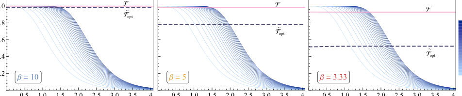
<figcaption class="paper-figure-caption"><b>Fig 1.</b> FIG. 1. Fidelities and SN thresholds for two-mode squeezed thermal states. The exact fidelity F (pink, solid) between TMST states ρTMST(r, β) and the optimal target state ∣TMSV(s = sopt)⟩from Eq. (49), the lower bound ˜Fopt (black, dashed) from Eq. (51), and the corresponding SN thresholds Bk (blue) from Eq. (53) are shown as functions of r for different values of β with initial-state mixedness increasing left to right: (a) β = 10, (b) β = 5, and (c) β = 3.33 in units of kB/(̵hω). Although both F and ˜Fopt depend on β and r, the former only via sopt = sopt(r, β), the changes with varying r but fixed β are difficult to resolve for the high-purity regime we are interested in here. For...</figcaption>
</figure>
<figure class="paper-figure-card">
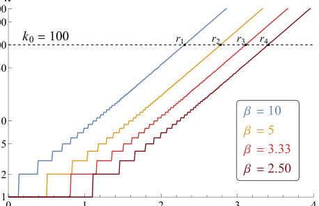
<figcaption class="paper-figure-caption"><b>Fig 2.</b> FIG. 2. Detected Schmidt number for TMST states: The SNs, k, certified using the fidelity lower bound for TMST states in Eq. (51) are shown (using a logarithmic scale on the vertical axis) as a function of r for different β values. The SN k0 = 100, indicated by a dashed line, is certified at minimum squeezing r1 = 2.31, r2 = 2.78, r3 = 3.11, and r4 = 3.41 for β = 10, 5, 3.33, and 2.5 (left to right, top to bottom), respectively.</figcaption>
</figure>
<figure class="paper-figure-card">
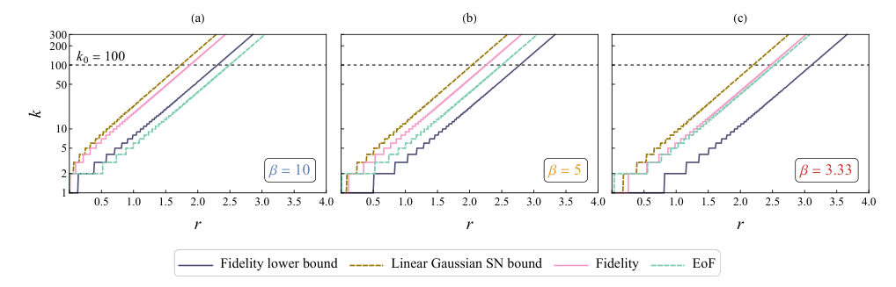
<figcaption class="paper-figure-caption"><b>Fig 3.</b> FIG. 3. Comparisons for TMST states: The curves show the detected SN k for TMST states based on different certification methods: linear Gaussian SN witnesses explained in Sec. III.C (dashed dark mustard curves), EoF-based SN witnesses as discussed in Sec. III.B (dashed mint curves), SN witnesses based on the exact fidelity (pink solid curves) between the states and corresponding optimal target state from Eq. (49), and on the fidelity lower bound (solid dark-blue curves) from Eq. (51). The individual panels compare the behaviour of these certification methods at different β values: (a) β = 10; (b) β = 5; and (c) β = 0.33. The vertical axes indicating the certified SN k use a logarithmic...</figcaption>
</figure>
<figure class="paper-figure-card">
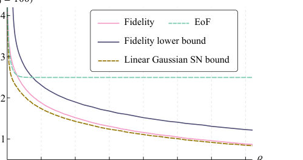
<figcaption class="paper-figure-caption"><b>Fig 4.</b> FIG. 4. Critical squeezing for certifying k0 for TMST states: The graph shows the required squeezing r, needed for different bounds to detect SN k0 = 100 for a range of β.</figcaption>
</figure>
<figure class="paper-figure-card">
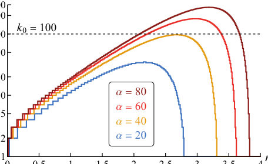
<figcaption class="paper-figure-caption"><b>Fig 5.</b> FIG. 5. Detected Schmidt numbers for PAD TMSV states: The plot shows the detected SN for the family of non-Gaussian states ∣Φ(α, r)⟩in Eq. (55) as a function of the squeezing parameter r for selected values of the displace- ment α = 20, 40, 60, and 80 (bottom to top). The vertical axis shows the SN up to k = 300 on a logarithmic scale. The dashed horizontal line indicates the detection of SN k0 = 100.</figcaption>
</figure>

**Summary.** This paper develops novel, experimentally accessible methods to certify high-dimensional entanglement in continuous-variable quantum systems. By basing entanglement witnesses on measurable first and second statistical moments, it overcomes the limitations of requiring full state tomography. The results provide quantitative comparisons of these new bounds against established methods using specific squeezed and thermal state examples.

**Why it may be interesting.** This work provides a practical, measurement-efficient theoretical tool for quantifying entanglement in CV systems, which is highly relevant for quantum optics and quantum information processing.

Detailed structure

**Main problem.** The paper addresses the challenge of certifying high-dimensional entanglement in continuous-variable (CV) quantum systems, where direct measurements are often impractical.

**Main result.** The authors introduce and assess new fidelity bounds for detecting the Schmidt number based only on the first and second statistical moments of the quadrature operators.

**Method.** They derive entanglement witnesses by bounding the trace distance between the unknown state and pure Gaussian states, utilizing the measured first and second moments (characterized by the Covariance Matrix).

**Model / system.** The focus is on CV quantum systems, particularly mode-entangled pairs of harmonic oscillator degrees of freedom. The analysis tests the method on Gaussian states like two-mode squeezed thermal states and non-Gaussian states like photon-added displaced squeezed vacuum states.

**Key observables.** Schmidt number (SN), Fidelity ($F$), First and second statistical moments, Covariance Matrix ($\gamma$), and entanglement witnesses.

**Important parameters / regimes.** Squeezing parameters ($r, s$), inverse temperature ($eta$), and the dimensionality of the system ($M$).

**Assumptions / limitations.** The method relies on bounding the trace distance using inequalities derived from the first and second moments, which is advantageous as it avoids full state tomography.

**Figures summary.** The notes detail calculations for the fidelity between specific state families (TMST and TMSV) and the determination of optimal test parameters ($
u_1$) for the entanglement witnesses.

**Paper structure.** The paper establishes the CV framework using the CM, details the new fidelity-based SN bounds by comparing them to existing methods (EoF, linear witnesses), and finally applies these techniques to calculate and compare results for specific Gaussian and non-Gaussian state families.

Abstract

The dimensionality of entanglement in high-dimensional quantum systems is quantified by the Schmidt number, whose large value signals potential advantages for quantum communication and quantum computation. A commonly used approach to practical Schmidt-number detection in finite-dimensional systems is based on the estimation of fidelities to pure states with large entanglement dimensionality or lower bounds to these fidelities. However, for mode-entangled continuous-variable systems, the corresponding measurements are typically difficult to realize. Here, we introduce and assess fidelity bounds for Schmidt-number detection based on practically more accessible measurements of the first and second statistical moments of arbitrary continuous-variable quantum states. We provide analytical formulas that allow evaluating these bounds and test them for families of Gaussian and non-Gaussian states, including two-mode squeezed thermal states and photon-added displaced two-mode squeezed vacuum states. We compare our bounds to other methods for the certification of high-dimensional entanglement based on the same measurements.

[↑ back to top](#top)

### [Circuit growth and subspace read-out in quantum-selected configuration interaction: Separating the Hartree-Fock determinant](http://arxiv.org/abs/2610.03114v1)

**Authors:** Ayaka Fujimoto, Norifumi Matsumoto, Shota Kanasugi, Kazunori Maruyama, Hirotaka Oshima  
**Type:** theory · **Category:** strongly correlated electrons · **PDF:** <https://arxiv.org/pdf/2610.03114v1>  
**Analysis basis:** full PDF text, analyzed in chunks
**Topic relevance:** `quantum measurements` **2/5**

↔ Scroll figures horizontally

<figure class="paper-figure-card">
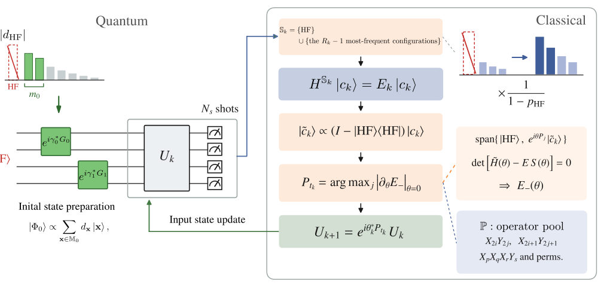
<figcaption class="paper-figure-caption"><b>Fig 1.</b> FIG. 1. Schematic of one iteration of the scheme. Orange boxes mark the parts that differ from ADAPT-QSCI, blue boxes the parts it inherits unchanged, and green boxes the two operations that append gates to the quantum circuit, namely the preparation of the initial state and the update of the circuit in the loop. Here dx is the first-order perturbation coefficient of configuration x and M0 the set of the m0 configurations with the largest |dx| excluding the Hartree–Fock determinant, Gl and γ∗ l are the generator and angle of the lth preparation rotation, and Uk is the circuit that prepares |Φk⟩.</figcaption>
</figure>
<figure class="paper-figure-card">
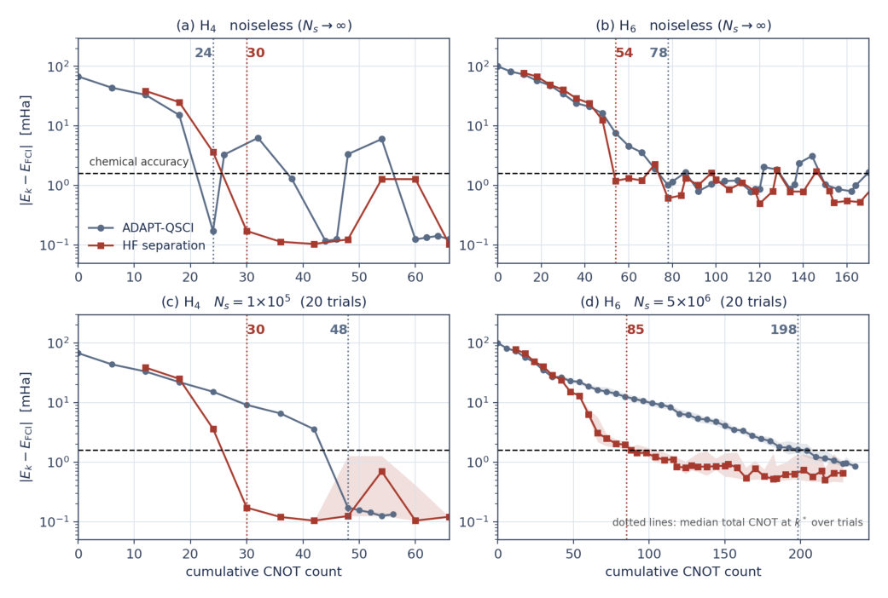
<figcaption class="paper-figure-caption"><b>Fig 2.</b> FIG. 2. Energy error against the cumulative CNOT count. Top row: noiseless sampler, a single deterministic trajectory per method. Bottom row: the budgets of Ref. [12], Ns = 105 for H4 and 5 × 106 for H6, median over 20 trials with the interquartile range shaded, each trial run to a fixed number of iterations, 12 on H4 and 40 on H6, chosen to cover the point at which the baseline reaches chemical accuracy; every trial reached it. Dashed horizontal lines: chemical accuracy, 1.6 mHa. Dotted vertical lines and labels: the total CNOT count at k∗. The curves of the present scheme begin at 12 CNOTs, the cost of preparing the m0 = 2 initial state.</figcaption>
</figure>
<figure class="paper-figure-card">
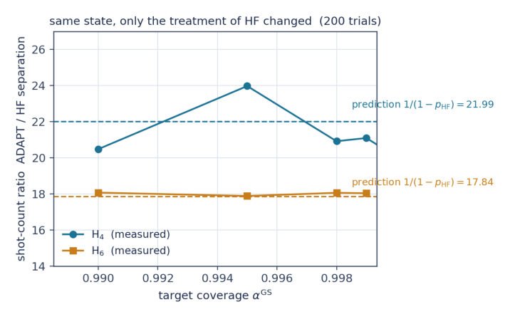
<figcaption class="paper-figure-caption"><b>Fig 3.</b> FIG. 3. Shot counts required to reach a target coverage αGS, for the state produced by ADAPT-QSCI at k∗and for the same state with the Hartree–Fock outcome removed from the sampler and supplied classically. The targets lie below αGS(TR), which is 0.999920 for H4 and 0.999904 for H6. Dashed lines: the prediction rpred of Eq. (25). 200 trials.</figcaption>
</figure>
<figure class="paper-figure-card">
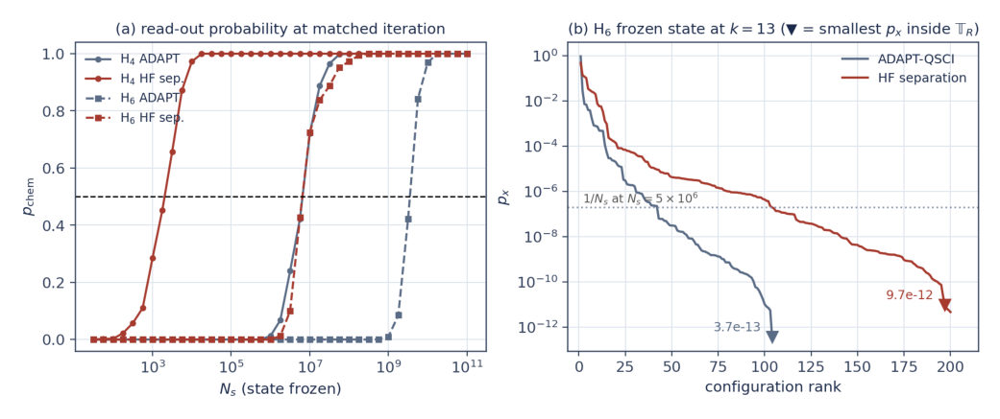
<figcaption class="paper-figure-caption"><b>Fig 4.</b> FIG. 4. (a) Probability pchem that a single run achieves chemical accuracy, for the four frozen states compared at a matched iteration, against the number of shots drawn from each. 400 trials. (b) Post-selected probabilities of the two H6 states at k = 13, ordered by decreasing probability. Triangles: the smallest probability carried by TR. Dotted line: 1/Ns at the budget of Ref. [12].</figcaption>
</figure>
<figure class="paper-figure-card">
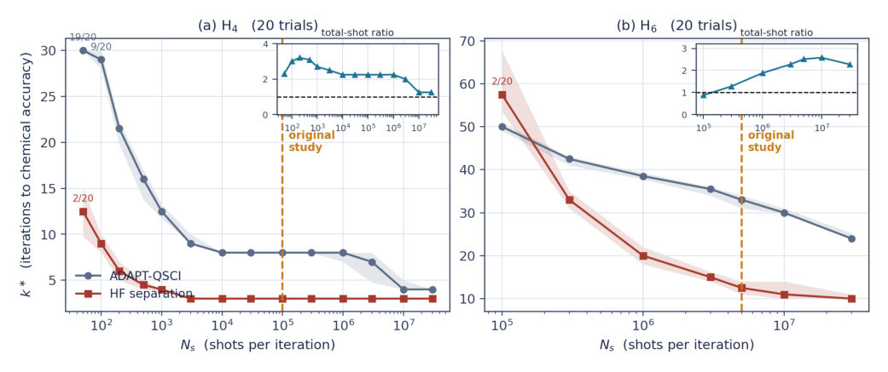
<figcaption class="paper-figure-caption"><b>Fig 5.</b> FIG. 5. Iterations k∗to chemical accuracy against the number of shots per iteration, median over 20 trials with the interquartile range shaded. Annotations give the number of trials that failed to converge, those trials being entered at the iteration limit. Insets: the ratio of total shot counts Ntot, with unity marked. Dashed vertical lines: the budgets of Ref. [12].</figcaption>
</figure>

**Summary.** This paper improves the Quantum-selected Configuration Interaction (QSCI) algorithm by recognizing and removing measurement redundancy caused by the dominant Hartree-Fock configuration. By classically supplying the HF determinant, the authors derive a more efficient selection criterion. The results show significant resource savings in terms of quantum circuit depth and measurement shots compared to existing adaptive methods for calculating molecular ground-state energies.

**Why it may be interesting.** This work directly addresses resource scaling and algorithmic efficiency for simulating strongly correlated electronic systems, which is a major bottleneck in quantum chemistry.

Detailed structure

**Main problem.** Predicting accurate ground-state energies of molecular Hamiltonians, which is central to electronic structure theory.

**Main result.** The proposed scheme achieves chemical accuracy with significantly fewer CNOT gates and fewer measurement shots compared to ADAPT-QSCI at comparable shot budgets.

**Method.** The authors modify the Quantum-selected Configuration Interaction (QSCI) approach by classically incorporating the Hartree-Fock determinant into the diagonalization subspace, thereby reducing measurement redundancy.

**Model / system.** The study focuses on molecular Hamiltonians, specifically applied to small hydrogen molecules ($\mathrm{H}_4$ and $\mathrm{H}_6$), using electronic structure theory concepts.

**Key observables.** Ground-state energy, CNOT gate count, total measurement shots, and the required number of iterations ($k^*$) to reach chemical accuracy.

**Important parameters / regimes.** The per-iteration shot budget ($N_s$) is identified as a key design variable governing resource savings; the comparison's advantage depends on this budget.

**Assumptions / limitations.** The advantage of the new scheme is contingent on the per-iteration shot budget, and the comparison is made assuming no device noise.

**Figures summary.** Figure 1 schematically compares the circuit structure of the proposed scheme against ADAPT-QSCI, highlighting added and inherited gates.

**Paper structure.** The paper first identifies the redundancy in standard QSCI/ADAPT-QSCI methods due to the HF determinant. It then proposes the classical separation of the HF determinant and derives a new, consistent selection criterion. Finally, it compares the resource costs (gates/shots) against ADAPT-QSCI for $\mathrm{H}_4$ and $\mathrm{H}_6$.

Abstract

Predicting many molecular properties requires accurate ground-state energies of molecular Hamiltonians. Quantum-selected configuration interaction (QSCI) obtains such energies by measuring an input state to select important electronic configurations and classically diagonalizing the Hamiltonian in the subspace they span. ADAPT-QSCI, an adaptive extension of QSCI, improves the input state through iterative circuit growth. For single-reference molecules, the sampling distribution is dominated by the Hartree-Fock (HF) configuration, so most measurements reproduce a configuration already known. We reduce this redundancy by placing the HF configuration in the diagonalization subspace classically, before any measurement. This invalidates the operator-selection criterion of ADAPT-QSCI, and we derive a consistent replacement with energy and gradient in closed form, adding no query to the quantum device. At the per-iteration shot budgets previously used for ADAPT-QSCI, the proposed scheme reaches chemical accuracy with approximately $63\%$ and $43\%$ of the CNOT gates for $\mathrm{H}_4$ and $\mathrm{H}_6$, and $44\%$ and $40\%$ of the total shots. The advantage depends on the budget, however: in the infinite-shot limit the $\mathrm{H}_4$ CNOT count increases to $125\%$ of that of ADAPT-QSCI. These results identify the per-iteration shot budget as a key design variable governing resource savings in QSCI-based algorithms.

[↑ back to top](#top)

### [Clarifications on the Experimental Status of Real Quantum Theory](http://arxiv.org/abs/2610.03644v1)

**Authors:** Timothée Hoffreumon, Mischa P. Woods  
**Type:** theory · **Category:** other · **PDF:** <https://arxiv.org/pdf/2610.03644v1>  
**Analysis basis:** full PDF text, analyzed in chunks
**Topic relevance:** `quantum measurements` **2/5**

↔ Scroll figures horizontally

<figure class="paper-figure-card">
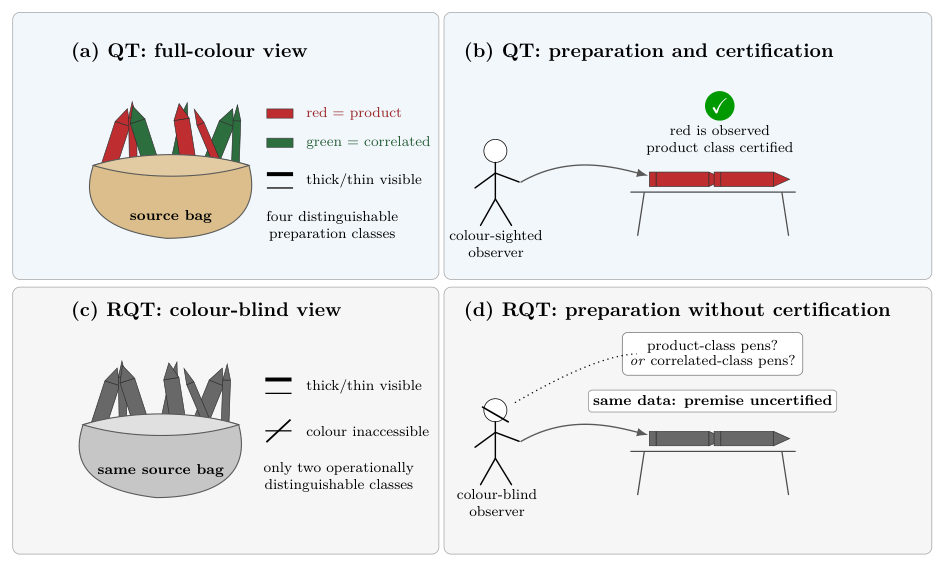
<figcaption class="paper-figure-caption"><b>Fig 1.</b> Figure 1: Pen analogy for the distinction between preparation and certification. In both toy worlds [toy world 1: (a)–(b); toy world 2: (c)–(d)] the same analogue of Postulate 4 applies: a preparation known to be independent is assigned to the red, product-state class. Green represents non-product but operationally independent, i.e., correlated, preparations. Thickness represents an operational degree of freedom visible in both theories. In the full-colour QT analogy, panels (a) and (b), the observer can distinguish all four combinations of colour and thickness. Two red pens can therefore be prepared and verified as red, allowing the postulate to identify the preparation with the product,...</figcaption>
</figure>
<figure class="paper-figure-card">
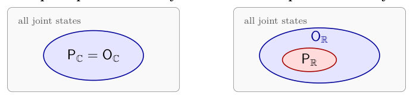
<figcaption class="paper-figure-caption"><b>Fig 2.</b> Figure 2: Operational independence is an observational classification, not a postulate. The set OK consists of states locally indistinguishable from the product of their marginals. Local tomography makes PC = OC in QT. In RQT, PR ⊊OR; the additional real states are non- product states with the same locally accessible statistics as product states.</figcaption>
</figure>

**Summary.** This paper argues that an experiment claiming to falsify Real Quantum Theory (RQT) by violating a specific bound is flawed because it relies on an uncertified assumption: that physically independent preparations must be mathematically product states. The authors demonstrate that RQT can accommodate non-product, operationally independent states that yield the same statistics as QT, thus preserving RQT's viability.

**Why it may be interesting.** This work is highly relevant to foundational quantum physics, particularly concerning the interpretation of experimental results in multipartite entanglement tests and the limits of local realism when moving beyond standard quantum mechanics.

Detailed structure

**Main problem.** The paper addresses the claim that a specific bilocal network experiment can experimentally falsify Real Quantum Theory (RQT) without falsifying standard Quantum Theory (QT). It focuses on the fundamental distinction between theoretically assumed product-state independence and experimentally verifiable operational independence.

**Main result.** The experiment fails to falsify RQT because the observed quantum statistics can be reproduced by RQT using non-product, operationally independent source states. This shows that the required product-source premise is uncertified by the experimental data.

**Method.** The authors compare theoretical bounds (e.g., swapped-CHSH functional) derived under different assumptions (product vs. operational independence) and use analogies (like the pen analogy) to distinguish between formal postulates and physical observability.

**Model / system.** The analysis compares predictions from standard Quantum Theory (QT) against a proposed Real Quantum Theory (RQT) in the context of bilocal network experiments involving three measuring parties (A, B, C). The core focus is on the assumptions made regarding the preparation of the initial entangled state.

**Key observables.** Swapped-CHSH functional (T), Bell-like bounds, and the comparison between the maximum achievable values under QT vs. RQT.

**Important parameters / regimes.** The distinction between 'product-state independence' (a formal postulate) and 'operational independence' (an observable condition).

**Assumptions / limitations.** The primary assumption challenged is that 'independent physical preparations' must mathematically correspond to a product state ($\omega_{AB_1B_2C} = 
ho_{AB_1} \otimes \sigma_{B_2C}$).

**Figures summary.** Figure 1 uses a pen analogy to illustrate the difference between product-state preparations (red pens) and non-product, operationally independent preparations (green pens) in the context of QT vs. RQT. Figure 2 compares the sets of product and operationally independent states in QT vs. RQT.

**Paper structure.** The paper systematically refutes the premise of the conflicting Nature paper by first clarifying the distinction between product-state and operational independence, showing that the experimental test only rules out RQT *plus* the product-state assumption, not RQT itself.

Abstract

In our previous paper on the matter, we proved that real quantum theory (RQT) cannot be experimentally falsified without the experiment falsifying quantum theory (QT) as well. Our result is in direct contradiction to the central claim of an article by Renou et al., published in Nature [600, 625--629 (2021)], reporting a bilocal network experiment that could falsify real quantum theory without falsifying quantum theory.   The purpose of this note is to address several seemingly natural attempts to recover the experimental conclusion of Renou et al. We first explain how these results, although based on nonlocality experiments, are far from a Bell-like level of proof. Then we explain why the proposed experiment requires an experimentally untestable premise about independent preparations necessarily being represented as product states. Finally, we discuss some concerns that lie outside the scope of both results.

[↑ back to top](#top)

### [Efficient Block Encoding of Structured Hamiltonians by Separating Where and What](http://arxiv.org/abs/2610.03686v1)

**Authors:** Alessandro Summer, François Jamet  
**Type:** theory · **Category:** strongly correlated electrons · **PDF:** <https://arxiv.org/pdf/2610.03686v1>  
**Analysis basis:** full PDF text, analyzed in chunks
**Topic relevance:** `analog quantum simulation` **2/5**

↔ Scroll figures horizontally

<figure class="paper-figure-card">
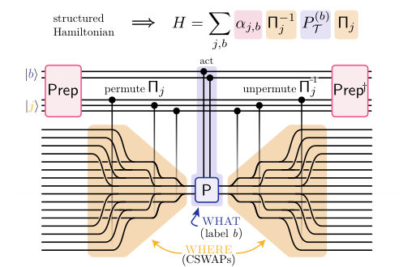
<figcaption class="paper-figure-caption"><b>Fig 1.</b> FIG. 1. Permute–act–unpermute block encoding of a structured Hamiltonian. Prepare encodes the support address j and operator label b. The address-controlled per- mutation Πj brings the selected support to the fixed target register T , where the shared target action P applies the oper- ator labelled by b. Finally Π−1 j restores the system register. Thus, the permutation selects where the term acts, while the target action selects what is applied.</figcaption>
</figure>
<figure class="paper-figure-card">
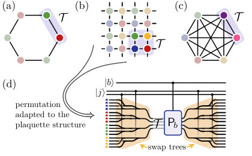
<figcaption class="paper-figure-caption"><b>Fig 2.</b> FIG. 2. Site groups that fix the permutation. Sites of one group share a colour, and one selected support is highlighted as the target register T . (a) Nearest-neighbour ring, χ = 2 and nT = 2. (b) Square-lattice plaquettes, χ = 4 and nT = 4. (c) All-to-all pairs, χ = N and nT = 2, drawn for N = 6. (d) One swap tree per group gathers the selected site of that group at its root. For the four groups of (b), the roots form T itself, where P applies P (b) T . When χ exceeds the support size, a second network moves the roots that hold the selected support onto T .</figcaption>
</figure>
<figure class="paper-figure-card">
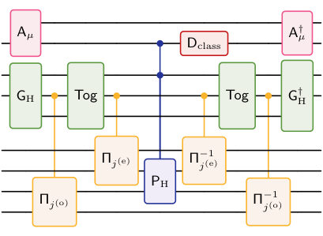
<figcaption class="paper-figure-caption"><b>Fig 3.</b> FIG. 4. Permute–act–unpermute block encoding of the Heisenberg ring for even N. The alias sampler Aµ prepares the operator label (f, ξ, ζ), while the control generator GH prepares the position j and the auxiliary controls consumed by the permutation. The odd and even swap trees, connected by the address toggle Tog, bring the selected nearest-neighbour pair to the fixed target register T = (q0, q1). The target action PH applies the operator specified by the label, after which the permutation is reversed. The Clifford diagonal Dclass supplies the remaining Pauli phases and coefficient signs. Figs. 12, 13 and 16 to 19 give the circuit decompositions of the corresponding blocks. All circuits...</figcaption>
</figure>
<figure class="paper-figure-card">
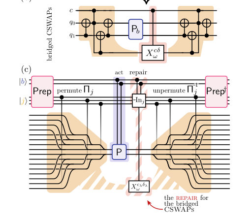
<figcaption class="paper-figure-caption"><b>Fig 4.</b> FIG. 3. Closed and bridged CSWAP pairs. (a) In a closed pair, the temporary work bit is erased after the forward CSWAP and recomputed for the inverse one, requiring two 4 T openings. (b) In a bridged pair, the work bit is retained across the target action and updated by the repair Xcδ ω before being reused by the inverse CSWAP. The pair therefore requires only one opening when the repair is Clifford. (c) Permute– act–unpermute Select with bridged CSWAPs. The forward permutation leaves its work bits live across the target action. The repair predicates, derived from the prepared address and label, update them before the inverse permutation consumes them.</figcaption>
</figure>
<figure class="paper-figure-card">
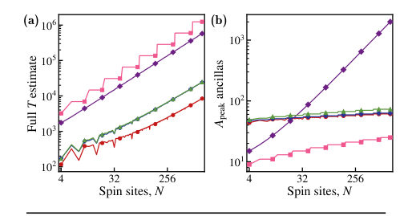
<figcaption class="paper-figure-caption"><b>Fig 5.</b> FIG. 5. Resources for one uncontrolled block-encoding query of the Heisenberg ring at even N. (a) Total T count, with the Nrot arbitrary rotations synthesised at εsynth = 10−3 and alias precision µ = 10. (b) Peak ancilla count Apeak, excluding the N system qubits, with µ = 10. (c) Leading resource expressions, up to O(log N) corrections in T and O(1) corrections in Apeak; the key beside each row identifies its curves in (a) and (b). Curves in (a) and (b) evaluate the corresponding resource expressions at every even N; markers show compiled counts for this work, the flat walk, and the product-wise walk at the sizes indicated, while the remaining constructions use the gate inventories of...</figcaption>
</figure>

**Summary.** This paper details a method to efficiently encode structured Hamiltonians for quantum simulation by separating the spatial support of an interaction from the local operation applied. This 'permute-act-unpermute' circuit structure significantly reduces the required non-Clifford gate count (T gates) by changing the cost scaling from multiplicative to additive. The results show substantial cost reductions for models like the Heisenberg ring, advancing the practical simulation of complex quantum materials.

**Why it may be interesting.** This work provides concrete, resource-aware quantum circuit techniques for simulating complex Hamiltonians relevant to strongly correlated materials, directly impacting the feasibility of quantum simulation algorithms.

Detailed structure

**Main problem.** The primary goal is to reduce the non-Clifford gate cost associated with fault-tolerant block encodings of structured Hamiltonians.

**Main result.** By separating the action ('what') from the support geometry ('where') using permute-act-unpermute circuits, the T-gate count scales additively with system size rather than multiplicatively with the number of terms.

**Method.** The authors construct specialized quantum circuits utilizing permute-act-unpermute sequences and introduce a 'bridged CSWAP' gate to optimize the gate count, especially for Pauli terms.

**Model / system.** The work applies to simulating quantum many-body systems described by structured Hamiltonians, exemplified by nearest-neighbour interactions (Heisenberg ring) and all-to-all couplings (Anderson impurity model).

**Key observables.** T count (non-Clifford cost), CSWAP count, and the scaling factor of the cost relative to system size N.

**Important parameters / regimes.** Support geometry (determining the CSWAP density S), system size N, and the number of impurities/orbitals ($n_{	ext{imp}}$).

**Assumptions / limitations.** The approach assumes that the coefficients of the Hamiltonian terms do not require translational symmetry or factorized coefficients, and comparisons use the lowest-cost compiled baselines.

**Figures summary.** Figures illustrate the permute–act–unpermute block encoding structure, the use of swap trees for different support geometries (nearest-neighbor, all-to-all), and cost comparisons between various comparator constructions.

**Paper structure.** The paper develops the theory by first establishing the permute-act-unpermute framework, then optimizing the permutation cost based on support geometry, and finally applying this to specific models like the Heisenberg ring and Anderson impurity model to quantify the cost reduction.

Abstract

Fault-tolerant block encodings of structured Hamiltonians can reduce their non-Clifford cost in SELECT by selecting where an operator acts separately from what is applied. We construct permute-act-unpermute circuits whose CSWAP networks exploit the support geometry: a selected support is brought to a fixed target register, a shared local circuit acts there, and the permutation is undone. For supports of fixed size, the $T$ count of SELECT then grows with the system size rather than with the number of terms, without requiring translational symmetry or factorised coefficients. For two-site supports, we establish and attain the minimum CSWAP count within address-controlled networks of site transpositions. Compiled for Pauli terms, these circuits use $8SN+O(\log N)$ $T$ gates with $O(\log N)$ permutation work qubits, where $N$ is the number of system qubits and $S$ is determined by the support geometry, with $S=1$ for nearest-neighbour interactions and $S=3/2$ for all-to-all pairs. We also introduce a bridged CSWAP that retains and repairs a temporary AND across the target action. When the repair is Clifford, it halves the $T$ count of a matched forward-inverse CSWAP pair at the cost of one retained work qubit. For a Heisenberg ring, the complete block-encoding query reduces the $T$ count by a factor approaching 3 as the system size grows. For a five-orbital Anderson impurity model, which combines nearest-neighbour and all-to-all support geometries, the reduction is about 1.7 at large bath sizes. Both comparisons use the lowest-cost compiled baselines considered, at unchanged block-encoding normalisation and comparable peak ancilla counts.

[↑ back to top](#top)

### [High-Rate Quantum Codes with Proven Distance and Low-Weight Measurements](http://arxiv.org/abs/2610.02621v1)

**Authors:** Kishor Bharti, Tobias Haug, Runzhou Tao, Kevin Ye  
**Type:** theory · **Category:** quantum information and computing · **PDF:** <https://arxiv.org/pdf/2610.02621v1>  
**Analysis basis:** full PDF text, analyzed in chunks
**Topic relevance:** `quantum measurements` **2/5**

↔ Scroll figures horizontally

<figure class="paper-figure-card">
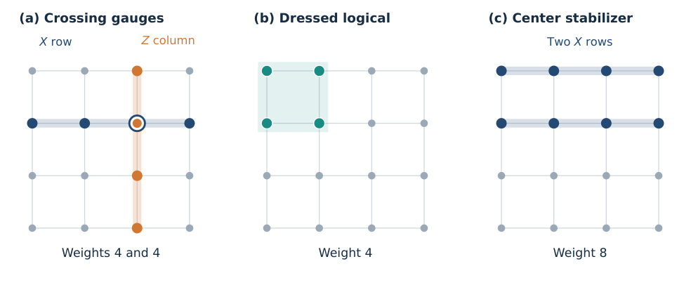
<figcaption class="paper-figure-caption"><b>Fig 1.</b> Figure 1: Three supports in the 4 × 4 code. (a) A row and a column meet once, so the indicated opposite-Pauli gauge operators anticommute. Each has weight four. (b) The four highlighted sites support a minimum logical operator. (c) Two parallel rows support a weight-eight stabilizer. The colors specify supports; panels (b) and (c) can be used in either pure Pauli sector.</figcaption>
</figure>
<figure class="paper-figure-card">
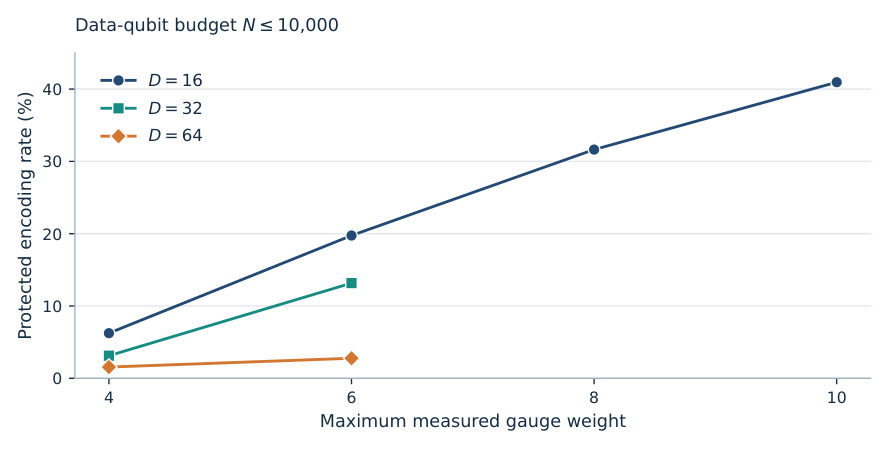
<figcaption class="paper-figure-caption"><b>Fig 2.</b> Figure 2: Exact rate–weight frontiers at fixed distance under 10,000 data qubits. The points are the discrete choices in Table 1; line segments guide the eye and do not represent intermediate codes. Increasing the number of axes raises distance and reduces the maximum achievable rate under this budget.</figcaption>
</figure>

**Summary.** This paper develops a rigorous theory for a specific family of quantum error-correcting codes defined on rectangular grids. It mathematically proves the exact distance of these codes and, crucially, maps out the achievable trade-off between the encoding rate and the required measurement weight. This provides concrete, constructive blueprints for building resource-efficient quantum memory.

**Why it may be interesting.** This work provides concrete, mathematically verifiable constructions for QEC codes, which is foundational for building fault-tolerant quantum computation architectures, linking abstract algebraic structures to physical resource constraints.

Detailed structure

**Main problem.** To find a useful finite construction for quantum error correction that explicitly relates the protected capacity (encoding rate), the minimum support of an undetectable logical Pauli error (distance), and the weight of the measured operators (measurement weight).

**Main result.** The authors derive explicit formulas for a family of subsystem codes on rectangular grids, proving the dressed distance is exactly $2L$ (twice the number of dimensions) and establishing a concrete, constructive tradeoff between encoding rate and measurement weight.

**Method.** The analysis uses algebraic techniques involving quotient spaces over F2, formal verification via Lean code snippets, and finite-rate optimization to map out the rate-weight frontier.

**Model / system.** The study focuses on a family of quantum subsystem codes defined on rectangular coordinate grids of any dimension, with even side lengths of at least four. These codes are of the Calderbank–Shor–Steane (CSS) type.

**Key observables.** Encoding Rate ($K/N$), Dressed Distance ($D$), Measurement Weight ($w$), and the number of protected logical qubits ($K$).

**Important parameters / regimes.** The side lengths $q_1, \dots, q_L$ (must be even and $\ge 4$), the total data qubits $N$, and the budget constraint (e.g., $N \le 10,000$).

**Assumptions / limitations.** The derived parameters are for a specific family of codes, and the analysis relies on formal proofs regarding the full-center equality and the structure of the gauge group.

**Figures summary.** Figures illustrate the supports of gauge operators and logical operators in small examples (e.g., $4 	imes 4$ code), and the main results are summarized in tables showing the rate-weight frontiers for fixed distances (D=16, 32, 64).

**Paper structure.** The paper proceeds by defining the code structure on rectangular grids, deriving the exact distance using quotient space arguments, and finally performing a finite, explicit enumeration to map the optimal rate-weight trade-off for fixed distances.

Abstract

We study a family of quantum subsystem codes defined on rectangular coordinate grids of any dimension, with even side lengths of at least four. The directly measured operators act along coordinate lines. For every member of the family, we derive the number of protected logical qubits and prove its dressed distance without a numerical search. To illustrate the resulting design choices, we impose a budget of at most 10,000 data qubits and determine the complete tradeoff between encoding rate and measurement weight within this family at distances 16, 32, and 64. At distance 16, one code protects 4,096 logical qubits among 10,000 data qubits using weight-ten measurements. At distances 32 and 64, codes with 7,776 and 9,216 data qubits protect 1,024 and 256 logical qubits, respectively, using weight-six measurements. We include and explain Lean code snippets throughout the paper to guide readers through the formal verification of our subsystem-code construction and its dressed and bare distances.

[↑ back to top](#top)

### [Lie Algebraic Uncertainty Relations](http://arxiv.org/abs/2610.03661v1)

**Authors:** Xiaoli Hu, Naihuan Jing, Jian Zhang, Yunlong Xiao  
**Type:** theory · **Category:** other · **PDF:** <https://arxiv.org/pdf/2610.03661v1>  
**Analysis basis:** full PDF text, analyzed in chunks
**Topic relevance:** `quantum measurements` **2/5**

↔ Scroll figures horizontally

<figure class="paper-figure-card">
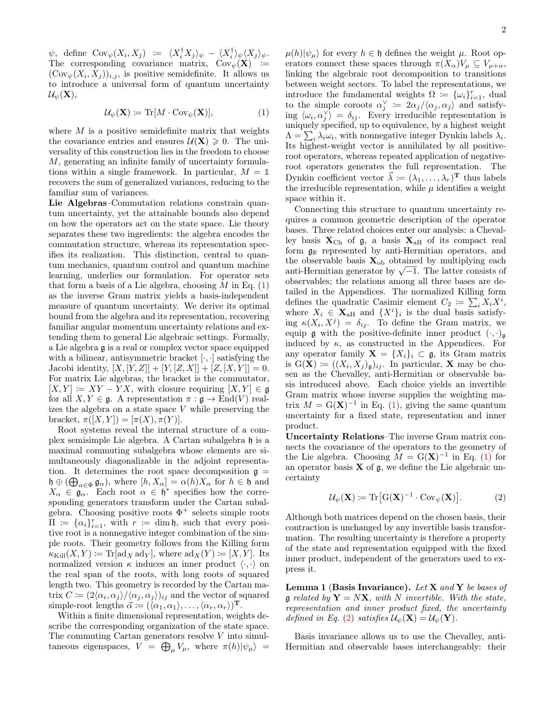
<figcaption class="paper-figure-caption"><b>Fig 1.</b> Low-resolution page preview, page 2</figcaption>
</figure>
<figure class="paper-figure-card">
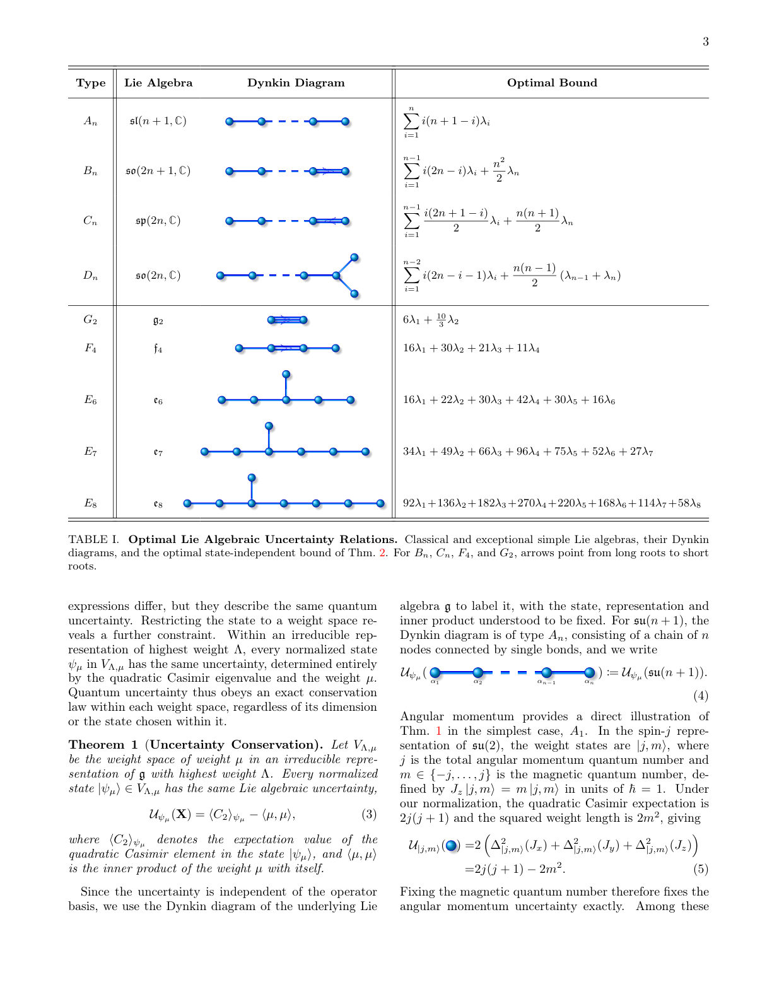
<figcaption class="paper-figure-caption"><b>Fig 2.</b> Low-resolution page preview, page 3</figcaption>
</figure>
<figure class="paper-figure-card">
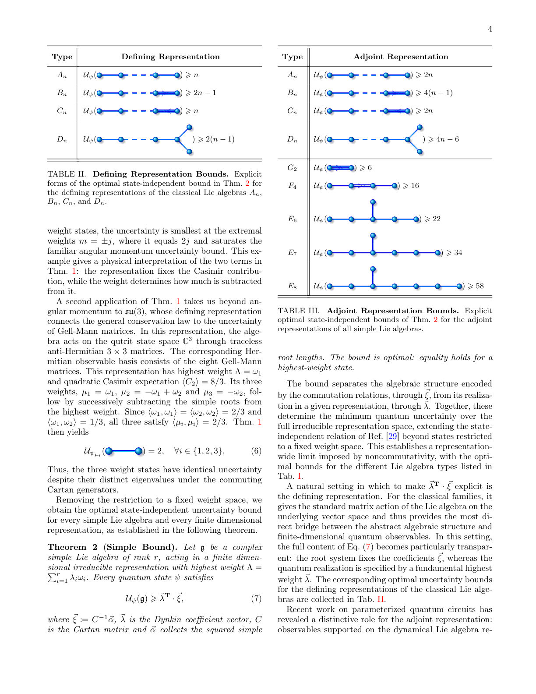
<figcaption class="paper-figure-caption"><b>Fig 3.</b> Low-resolution page preview, page 4</figcaption>
</figure>
<figure class="paper-figure-card">
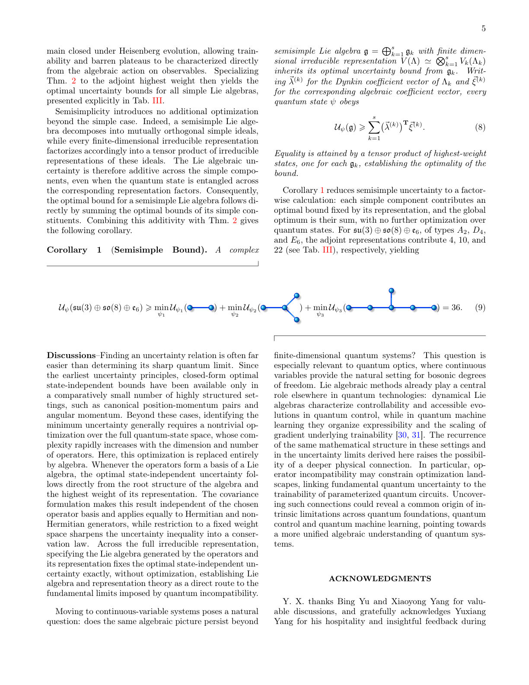
<figcaption class="paper-figure-caption"><b>Fig 4.</b> Low-resolution page preview, page 5</figcaption>
</figure>
<figure class="paper-figure-card">
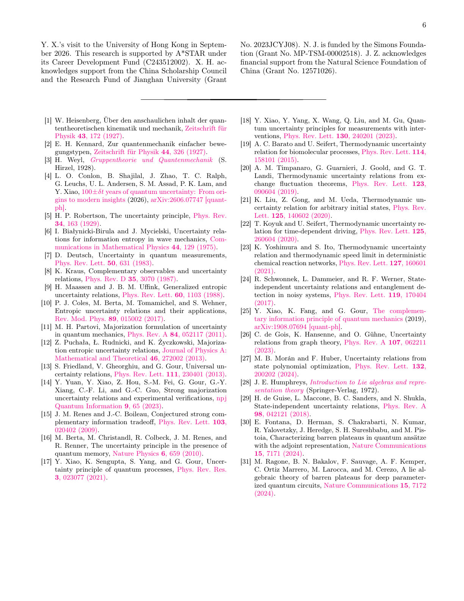
<figcaption class="paper-figure-caption"><b>Fig 5.</b> Low-resolution page preview, page 6</figcaption>
</figure>

**Summary.** This work develops a novel, algebraic method to determine the minimum quantum uncertainty for sets of incompatible observables that generate a Lie algebra. By reformulating uncertainty using covariance matrices and the Lie algebra structure, the authors derive optimal bounds independent of the specific quantum state. This connects fundamental quantum limitations directly to representation theory, offering insights into quantum information processing limits.

**Why it may be interesting.** By connecting fundamental quantum uncertainty to the deep mathematical structure of Lie algebras, it provides a powerful, general framework for understanding intrinsic limits on quantum information processing.

Detailed structure

**Main problem.** The paper aims to find optimal, state-independent bounds for quantum uncertainty relations, particularly for observables whose generators form a Lie algebra.

**Main result.** The optimal uncertainty bound is determined entirely by the algebraic structure of the Lie algebra and the representation it acts upon, replacing state optimization with direct algebraic calculation.

**Method.** It introduces a covariance-based formulation of uncertainty and leverages the structure theory of Lie algebras (e.g., Gram matrices, root systems) to derive these bounds.

**Model / system.** The analysis is performed on quantum observables whose commutation relations define a Lie algebra ($\mathfrak{g}$), applicable to both Hermitian and non-Hermitian operators.

**Key observables.** Lie algebraic uncertainty ($U_\psi(X)$), Casimir eigenvalues ($\langle C_2 
angle$), and weight space values.

**Important parameters / regimes.** The structure constants of the Lie algebra, the representation labels ($\vec{\lambda}$), and the Killing form inner product.

**Assumptions / limitations.** The operators under consideration must form a basis of a Lie algebra, and the analysis relies heavily on the structure theory of semisimple Lie algebras.

**Figures summary.** The paper provides tables listing the optimal Lie algebraic uncertainty relations for various classical and exceptional simple Lie algebras in different representations.

**Paper structure.** The paper progresses from introducing the covariance-based uncertainty measure to deriving the optimal bound using the inverse Gram matrix. It then proves basis invariance and establishes the constant uncertainty within weight spaces, culminating in general theorems for the full irreducible representation and semisimple algebras.

Abstract

Uncertainty relations express the fundamental incompatibility of quantum observables, yet optimal state-independent bounds are known analytically in only a few cases. Here we introduce a covariance-based formulation of quantum uncertainty that yields an infinite family of relations for both Hermitian observables and non-Hermitian operators. For operators forming a basis of a Lie algebra, we derive the optimal bound in closed form from the algebra and its representation, replacing optimization over quantum states with a direct algebraic calculation. Within each weight space, uncertainty takes a fixed value, turning the inequality into a conservation law. These results show how commutation relations and their realization on a quantum state jointly determine the minimum quantum uncertainty associated with incompatible operators. By connecting uncertainty to symmetry and representation theory, the framework offers a route to uncovering intrinsic limits on quantum information processing through its underlying Lie algebra.

[↑ back to top](#top)

### [Nonlocal, nonlinear electrostatics: like-charge attraction and asymmetric solvation](http://arxiv.org/abs/2610.02849v1)

**Authors:** V. Stepanyan, Y. Sh. Mamasakhlisov, A. E. Allahverdyan  
**Type:** theory · **Category:** statistical mechanics · **PDF:** <https://arxiv.org/pdf/2610.02849v1>  
**Analysis basis:** full PDF text, analyzed in chunks
**Topic relevance:** `Keldysh / 2PI / non-Gaussian methods` **2/5**

↔ Scroll figures horizontally

<figure class="paper-figure-card">
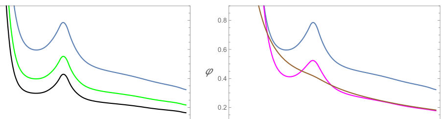
<figcaption class="paper-figure-caption"><b>Fig 1.</b> FIG. 1: (a) Iterative solutions φ(r) of (22) for dimers with rmax = 5 [cf. (31)], b = 9, c = 50 and various values of d: d = 5 (blue), d = 7.5 (green), d = 11 (black). There is a partially visible maximum of φ(r) at ≃1/b. (b) The same as in Fig. 1(a), but for c = 50, d = 5, and various values of b: b = 9 (blue), b = 5 (magenta), b = 1 (brown).</figcaption>
</figure>
<figure class="paper-figure-card">
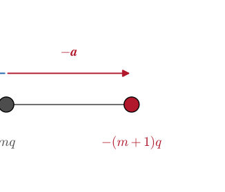
<figcaption class="paper-figure-caption"><b>Fig 2.</b> FIG. 2: Schematic representation of a linear molecule with charges q, mq, and −(m + 1)q; see (34).</figcaption>
</figure>
<figure class="paper-figure-card">
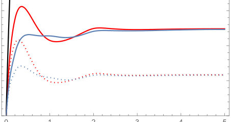
<figcaption class="paper-figure-caption"><b>Fig 3.</b> FIG. 3: For the linear molecule (34) with m = −1/2, we plot the solution χ = χ+ of dimensionless (35, 29) under c = 5, d = 1 and b = 5 and rmax = 5. This is the red curve, where rmax is defined in (31). We also plot the solution −χ = −χ−of (35, 29) under c = −5, d = 1 and b = 5 and rmax = 5 (blue curve); c = 5, d = 2.5 and b = 5 (red dotted); c = −5, d = 2.5 and b = 5 (blue dotted). The black curve denotes χext(r) = c(1 −e−br) for c = 5 and b = 5; cf. (29). Note that for small r the black curve nearly coincides with red and blue curves, which indicates that (naturally) the screening is absent at small distances.</figcaption>
</figure>
<figure class="paper-figure-card">
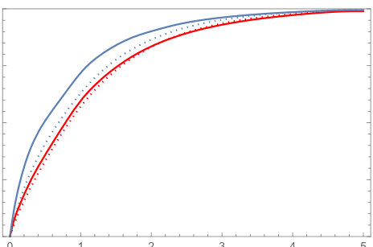
<figcaption class="paper-figure-caption"><b>Fig 4.</b> FIG. 4: For the linear molecule (34) with m = 1, we plot the solution χ = χ+ of dimensionless (35, 29) under c = 4, d = 1 and b = 4 and rmax = 5. This is the red curve, where rmax is defined in (31). We also plot the solution −χ = −χ−of (35, 29) under c = −4, d = 1 and b = 4 and rmax = 5 (blue curve). Dotted curves denote χ+ and −χ−for c = ±4, d = 1 and b = 2 and rmax = 5; i.e., for a smaller value of b, where χ+ −|χ−| is smaller.</figcaption>
</figure>
<figure class="paper-figure-card">

<figcaption class="paper-figure-caption"><b>Fig 5.</b> Fig. 3 studied a linear molecular structure (q, −0.5q, −0.5q) [cf. (34)], which is similar to a dimer with one of its ends having a lower charge density. A linear structure with zero dipole momentum that is possibly far from the dimer refers to m = 1 in (34); i.e., it refers to the linear molecule (q, −2q, q) (q &gt; 0). Notable examples of such molecules are carbon dioxide O−0.3|qe| = C0.6|qe| = O−0.3|qe|, and carbon disulfide S−0.18|qe| = C0.36|qe| = S−0.18|qe|. Consider now the situation where the external field is given by (29). We pose the same question as above: which external charge Q &gt; 0 (c &gt; 0) or Q &lt; 0 (c &lt; 0) is screened better. The intuition drawn from the previous example (see...</figcaption>
</figure>

**Summary.** This paper develops a theory for nonlinear electrostatics to explain anomalous interactions in molecular systems. It shows that nonlocal effects can cause like-charge attraction and break the expected symmetry of solvation based on charge sign. The work uses mean-field theory to analyze these complex, non-local interactions.

**Why it may be interesting.** The focus on nonlinear, nonlocal electrostatics and symmetry breaking in solvation provides a rich theoretical framework applicable to complex molecular interactions, relevant for understanding environmental effects on quantum systems.

Detailed structure

**Main problem.** The study investigates nonlinear electrostatics to understand phenomena like like-charge attraction and solvation structure asymmetry, which are missed by standard local theories.

**Main result.** The research demonstrates that like charges can attract due to nonlocal polarization effects, and that the solvation structure can violate effective C-symmetry depending on the external charge sign.

**Method.** The authors employ a mean-field approach, solving self-consistent equations derived from the Coulomb coupling, and comparing results with nonlinear Poisson-Boltzmann frameworks.

**Model / system.** The system models an equilibrium ensemble of linear molecules with rigid charge distributions interacting via a mean-field Coulomb potential. The analysis extends to comparing results with asymmetric electrolytes.

**Key observables.** Mean-field potential $\phi(x)$, free energy ($F$), entropy differences, and the average dipole moment ($ar{P}$).

**Important parameters / regimes.** The nonlocality scale ($\ell \sim \ell_{	ext{mol}}$), the dielectric permittivity ($\epsilon$), and the charge sign.

**Assumptions / limitations.** The theory relies on the mean-field approximation, which is an upper bound, and assumes the rigid-charge distribution model (neglecting induced dipoles).

**Paper structure.** The paper details the mean-field approach, discusses the violation of effective C-symmetry, and compares the findings with established nonlinear Poisson-Boltzmann equations.

Abstract

We study an equilibrium system, where linear molecules with a rigid charge distribution interact via the mean-field generated by the Coulomb coupling. We focus on the nonlinear regime, which is valid close to external charges immersed in the system. The finite molecular size in this regime leads to a nonlocal response at short distances. First, we show that the mean-field potential is non-monotonic, i.e., like charges can attract each other. Second, we show that the polarization induced by an external charge (and hence its solvation structure) depends on the sign of this charge, violating the effective C-symmetry of the macroscopic electrodynamics. We identify several scenarios of this effect, characterize it with the free energy and entropy differences, and compare it with analogous effects in asymmetric electrolytes described by nonlinear Poisson-Boltzmann equations.

[↑ back to top](#top)

### [On The Complexity of Redundancy-Free Quantum Hamiltonians](http://arxiv.org/abs/2610.03697v1)

**Authors:** Matthew B. Hastings, Alexander Schmidhuber  
**Type:** theory · **Category:** quantum information and computing · **PDF:** <https://arxiv.org/pdf/2610.03697v1>  
**Analysis basis:** full PDF text, analyzed in chunks
**Topic relevance:** `analog quantum simulation` **2/5**

↔ Scroll figures horizontally

<figure class="paper-figure-card">
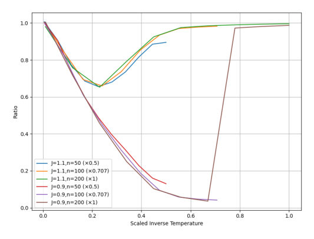
<figcaption class="paper-figure-caption"><b>Fig 1.</b> FIG. 1: Plot of ratio against inverse temperature for J = 0.9, 1.1, and n = 50, 100, 200. Inverse temperature is multiplied by a scale factor, given in parenthesis in the legend. The scale factor is proportional to 1/√n.</figcaption>
</figure>
<figure class="paper-figure-card">
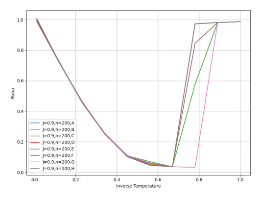
<figcaption class="paper-figure-caption"><b>Fig 2.</b> FIG. 2: Plot of ratio against inverse temperature for J = 0.9, n = 200. Multiple Monte Carlo runs with the same random realization.</figcaption>
</figure>
<figure class="paper-figure-card">
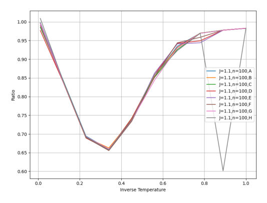
<figcaption class="paper-figure-caption"><b>Fig 3.</b> FIG. 3: Plot of ratio against inverse temperature for J = 1.1, n = 100. Multiple Monte Carlo runs with the same random realization.</figcaption>
</figure>

**Summary.** This work analyzes the computational difficulty associated with preparing quantum states governed by 'redundancy-free Hamiltonians.' It establishes that while the problem is tractable for low inverse temperatures ($eta$), it becomes NP-hard for large $eta$. The research provides theoretical tools to understand the complexity boundaries in quantum simulation and quantum information processing.

**Why it may be interesting.** It provides a rigorous framework for understanding the computational limits of quantum simulation protocols (like HDQI) by linking Hamiltonian structure directly to complexity classes (NP-hard, QMA-complete).

Detailed structure

**Main problem.** The paper characterizes the computational hardness of preparing quantum states, specifically the thermofield double state, associated with a specialized class of Hamiltonians called 'redundancy-free Hamiltonians.'

**Main result.** The complexity of state preparation is shown to be easy at quadratically lower temperatures than for general Hamiltonians, while estimating the ground state energy is proven to be QMA-complete.

**Method.** The analysis employs techniques from statistical mechanics (polymer expansion) and quantum complexity theory, establishing bounds and hardness results based on the structure of the Hamiltonian's anticommutation graph.

**Model / system.** The focus is on 'redundancy-free Hamiltonians,' which are sums of products of Paulis. The complexity is analyzed using the structure defined by the Hamiltonian's anticommutation graph, leading to the concept of an 'anticommutation glass.'

**Key observables.** The partition function $	ext{Tr}(e^{-eta H})$ and the fidelity of state preparation are key observables.

**Important parameters / regimes.** The complexity is governed by the parameter $\kappa = eta^2 d$, where $d$ is the degree of the anticommutation graph, defining regimes of 'easy' vs. 'hard' computation.

**Assumptions / limitations.** The analysis often simplifies by focusing on the Pauli case and relies on convergence conditions for the polymer expansion to hold for small $\kappa$.

**Paper structure.** The paper progresses by defining the redundancy-free Hamiltonians, analyzing the partition function via polymer expansions, establishing the complexity regimes ($\kappa$), and concluding with hardness results for state preparation and ground state energy estimation.

Abstract

We consider a class of redudancy-free Hamiltonians, which are those where the trace vanishes for any product of Hamiltonian terms in which at least one term appears an odd number of times. This includes Hamiltonians which are sums of products of Paulis with no relations between them. These Hamiltonians arise naturally in Hamiltonian Decoded Quantum Interferometry, which separates the hardness of preparing quantum states into two steps: a classical decoding step, and a step preparing the thermofield double state of such a redundancy-free Hamiltonian.   We focus on the hardness of these Hamiltonians, both for intrinsic interest and to understand the complexity of the state preparation step in Hamiltonian DQI. We present several results showing that the problem becomes easy at quadratically lower temperature than for a general Hamiltonian, with the complexity at given inverse temperature $β$ depending on $β^2 d$, where $d$ is the degree of the anticommutation graph. We give an efficient classical algorithm for small $β^2 d$ to approximate the partition function, while for large $β^2 d$ we show that approximating the partition function is NP-hard. To this end, we introduce what we call an anticommutation glass, where frustration arises purely from anticommutation relations. We give a subexponential time quantum algorithm to prepare the thermofield state for small $β^2 d$, and present some results toward a polynomial time algorithm based on the Feiguin-Klich Hamiltonian. As a result of possible independent interest, we show that this Hamiltonian leads to a polynomial time algorithm for preparing thermofield double states of general Hamiltonians on an interaction graph of degree $d$ for $β\lesssim 1/d$. Finally, we show that estimating the ground state energy of redundancy-free Hamiltonians is QMA-complete.

[↑ back to top](#top)

### [Projective symmetry group classification of fermionic $Z_2$ spin liquids on the dipolar-octupolar pyrochlore magnets](http://arxiv.org/abs/2610.02409v1)

**Authors:** Rohit Deb, Sambuddha Sanyal  
**Type:** theory · **Category:** strongly correlated electrons · **PDF:** <https://arxiv.org/pdf/2610.02409v1>  
**Analysis basis:** full PDF text, analyzed in chunks
**Topic relevance:** `analog quantum simulation` **2/5**

↔ Scroll figures horizontally

<figure class="paper-figure-card">
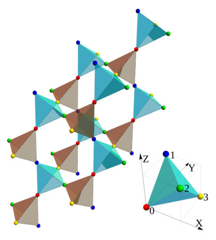
<figcaption class="paper-figure-caption"><b>Fig 1.</b> FIG. 1: (Top) The pyrochlore lattice. (Inset) The unit cell consists of four sites labeled 0, 1, 2, and 3. The X, Y, and Z represent the global cartesian directions.</figcaption>
</figure>
<figure class="paper-figure-card">
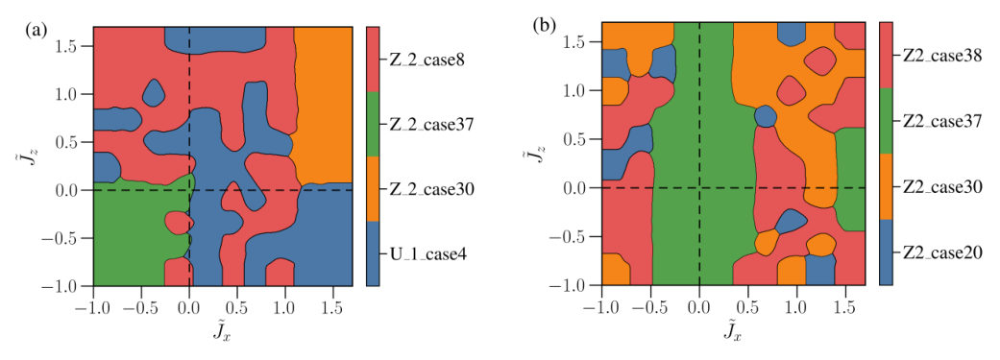
<figcaption class="paper-figure-caption"><b>Fig 2.</b> FIG. 2: (a)Mean-field phase diagram in the anisotropic-exchange parameter space, restricted to the singlet and triplet hopping channels, with ˜Jy = 1. At each point ( ˜Jx, ˜Jy, ˜Jz), the ground-state energies of all 32 mean-field ansatze are compared, and the color denotes the ansatz with the lowest energy. (b) Mean-field phase diagram obtained by including all allowed mean-field channels, again fixing ˜Jy = 1. The ground-state energies of all 48 ansatze are compared at each point in parameter space, with the color indicating the lowest-energy ansatz. The black dashed line denotes the region excluded from the phase diagram, where the exchange couplings cancel the relative weights of the...</figcaption>
</figure>
<figure class="paper-figure-card">
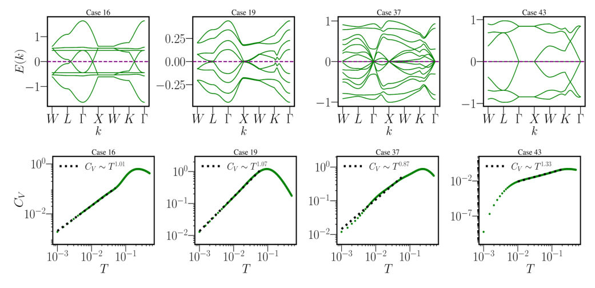
<figcaption class="paper-figure-caption"><b>Fig 3.</b> FIG. 3: Spinon band structures (top) and temperature dependence of the specific heat, CV (bottom), for different PSG cases 16, 19, 37, and 43 in the isotropic Hamiltonian( ˜Jx = ˜Jy = ˜Jz = ˜J). The purple dashed line in the band-structure plots denotes the Fermi energy at half-filling. The black dashed lines in the specific heat plots show the corresponding linear fits used to determine the power-law exponent.</figcaption>
</figure>
<figure class="paper-figure-card">
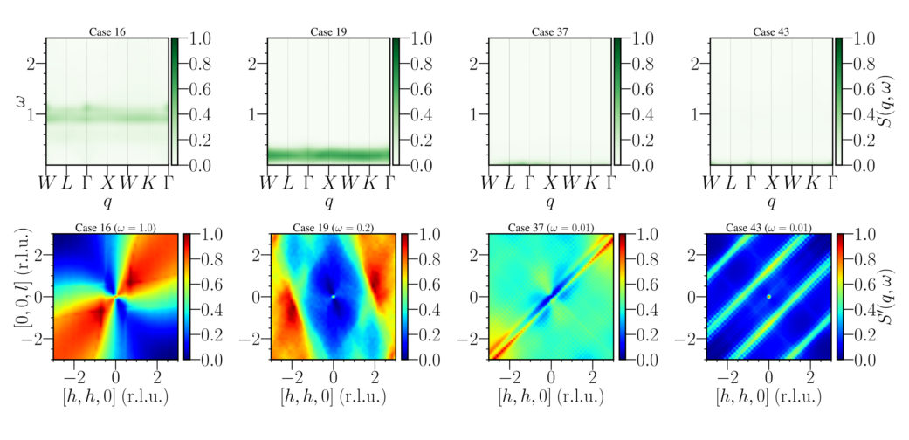
<figcaption class="paper-figure-caption"><b>Fig 4.</b> FIG. 4: Dynamical (top) and static (bottom) structure factors, shown in color scale, along high-symmetry momentum paths and within the high-symmetry [h, h, l] plane for PSG cases 16, 19, 37, and 43 in the isotropic Hamiltonian ( ˜Jx = ˜Jy = ˜Jz = ˜J).</figcaption>
</figure>
<figure class="paper-figure-card">
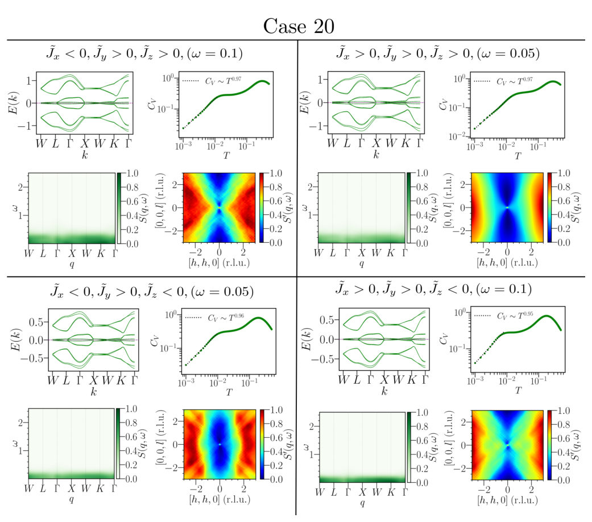
<figcaption class="paper-figure-caption"><b>Fig 5.</b> FIG. 5: PSG case 20. A flat band at the Fermi energy coexists with other dispersive bands across all four exchange coupling regimes. The low energy CV (T) is nearly linear (γ ∼0.95 −0.97) and shows a plateau before its maximum. The S(q, ω) weight is confined to ω ≤0.3 ˜J. The S′(q, ω) cut shows a prominent low-intensity channel along [0, 0, l] independent of the exchange coupling regime and a bow-tie-like feature at ω = 0.1 in regimes II and IV.</figcaption>
</figure>

**Summary.** This work classifies $Z_2$ quantum spin liquids on pyrochlore magnets by treating the magnetic moments as fermionic partons. By incorporating the specific dipolar-octupolar symmetry, the authors find that the resulting gapless spinon spectra correctly account for the fractionalized thermodynamics observed in real materials. This provides a detailed, symmetry-enforced theoretical framework for understanding frustrated magnetism.

**Why it may be interesting.** The rigorous application of symmetry constraints (PSG) to classify exotic quantum ground states, and the explicit derivation of fermionic excitations, provides a powerful theoretical tool for understanding strongly correlated magnetic materials.

Detailed structure

**Main problem.** To systematically construct and classify all symmetry-preserving $Z_2$ quantum spin liquid (QSL) states on the dipolar-octupolar (DO) pyrochlore lattice.

**Main result.** The distinct DO symmetry action selects a physically different set of symmetry-allowed mean-field channels, leading to a fermionic-parton account for gapless, fractionalized thermodynamics observed in materials like Nd2ScNbO7.

**Method.** The classification uses the Projective Symmetry Group (PSG) formalism applied to fermionic parton representations, followed by self-consistent mean-field energy minimization.

**Model / system.** The system is the pyrochlore lattice, modeled by an effective pseudospin-1/2 DO Hamiltonian that reduces to an anisotropic XYZ model. The analysis maps the spin-spin interaction into quadratic fermionic mean-field terms.

**Key observables.** Spinon band structures, low-temperature specific heat (power-law exponent), and the dynamical spin structure factor.

**Important parameters / regimes.** The anisotropic exchange couplings ($	ilde{J}_x, 	ilde{J}_z$) defining the phase diagram, and the chemical potential ($\chi_1$) governing unit cell periodicity.

**Assumptions / limitations.** The analysis relies on mean-field approximations, and the distinct DO symmetry action is crucial, differentiating the results from simpler spin-1/2 or bosonic models.

**Figures summary.** Figures illustrate the pyrochlore lattice structure, sublattices, and the extended unit cell used for mean-field calculations.

**Paper structure.** The paper systematically covers the Hamiltonian definition, the PSG/symmetry classification framework, the derivation of the fermionic mean-field ansatz, and finally, the calculation of key observables and phase diagrams.

Abstract

We construct and classify $Z_2$ quantum spin liquids (QSLs) of fermionic partons on the dipolar-octupolar (DO) pyrochlore lattice. The DO pseudospin shares the space-group and time-reversal algebra of the effective spin-1/2 Kramers doublet, its projective symmetry group (PSG) yields the same 48 symmetric $Z_2$ classes as the generic fermionic classification. We show, the distinct DO symmetry action, encoded in a set of sublattice-independent operators, selects a physically different set of symmetry-allowed mean-field channels, so that the resulting ansatze, spinon spectra, and observables differ from both the effective spin-1/2 case and the bosonic DO classification. Decomposing the anisotropic XYZ exchange model into all symmetric singlet and triplet hopping and pairing channels and minimizing the mean-field energy self-consistently, we obtain phase diagrams in the ($\tilde{J_x}, \tilde{J_z}$) plane in which only a few $Z_2$ states, several supporting gapless or flat-band spinon spectra, are stabilized. For these states we compute the spinon band structures, the low-temperature specific heat, and the dynamical spin structure factor, and we argue that the power-law specific-heat exponent is a diagnostic of the spinon nodal structure. A near-linear-in-temperature specific heat together with broad continua in the structure factor gives a fermionic-parton account of the gapless, fractionalized thermodynamics reported in DO materials such as $Nd_2ScNbO_7$, complementing the bosonic quantum-spin-ice picture of the Ce-based compounds. The work extends the fermionic-parton classification of DO pyrochlore QSLs beyond the $U(1)$ sector, where $Z_2$ topological order is realized equally naturally by fermionic and bosonic spinons.

[↑ back to top](#top)

### [Quantum estimation, channel orders, and private capacity](http://arxiv.org/abs/2610.03706v1)

**Authors:** Christoph Hirche  
**Type:** theory · **Category:** quantum information and computing · **PDF:** <https://arxiv.org/pdf/2610.03706v1>  
**Analysis basis:** full PDF text, analyzed in chunks
**Topic relevance:** `quantum measurements` **2/5**

↔ Scroll figures horizontally

<figure class="paper-figure-card">
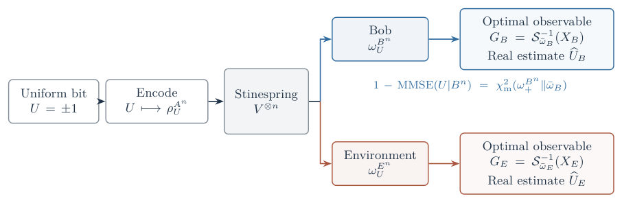
<figcaption class="paper-figure-caption"><b>Fig 1.</b> Figure 1. Binary estimation at the receiver and the environment of a single Stinespring dilation. Each output admits a real-valued score whose optimal mean-square error is given by measured χ2. The averages ¯ωB, ¯ωE and differences XB, XE are formed from the two output states; the SLD map and its quadratic form are defined in (2.4).</figcaption>
</figure>
<figure class="paper-figure-card">

<figcaption class="paper-figure-caption"><b>Fig 2.</b> Figure 2. Channel classes defined by comparing N c with N. Nesting denotes inclusion and does not assert strictness of every intermediate inclusion. Panel (a) displays reference-complete criteria. Panel (b) displays criteria imposed at every tensor power without an external reference; its inner region is regularized measured-χ2 domination, whereas regularized anti-less-noisiness coincides with the outer zero-private-capacity class. The cross-panel arrows are the tensorization implications in (3.12). The Pauli channel F and the coherent-ladder channels Ns, s ≥3, satisfy regularized measured domination but not complete anti-less-noisiness.</figcaption>
</figure>
<figure class="paper-figure-card">
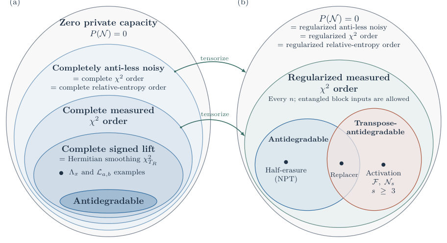
<figcaption class="paper-figure-caption"><b>Fig 3.</b> Figure 2 displays the resulting inclusions between complete and regularized channel classes.</figcaption>
</figure>
<figure class="paper-figure-card">
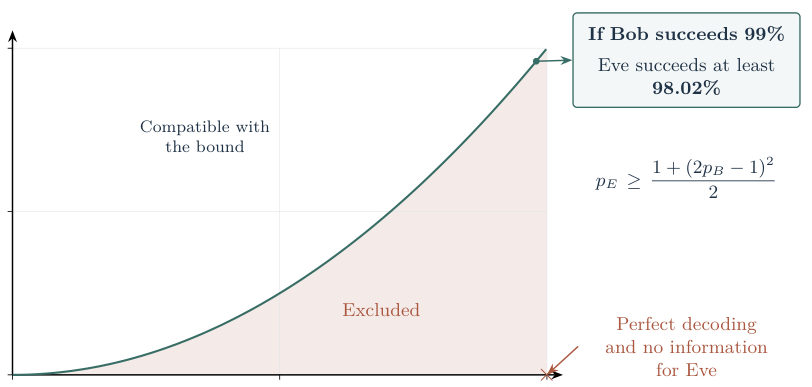
<figcaption class="paper-figure-caption"><b>Fig 4.</b> Figure 3. Reliable decoding forces information leakage under Theorem 4.1. The plot uses an equiprobable binary code: pB = 1 −η is Bob’s decoding success and pE = 1</figcaption>
</figure>
<figure class="paper-figure-card">
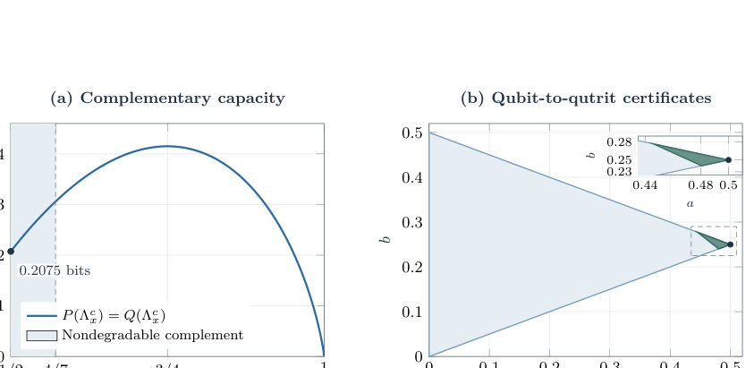
<figcaption class="paper-figure-caption"><b>Fig 5.</b> Figure 4. Explicit capacity and parameter conclusions. (a) The exact complementary capacity in (5.5); the shaded interval 1/2 ≤x &lt; 4/7 consists of nondegradable complements. The original channel has zero private capacity throughout the plotted interval. (b) Throughout the region (5.7), La,b has a complete signed lift and zero private and quantum capacity; it is NPT except at the origin. The darker corner also satisfies 3 √</figcaption>
</figure>

**Summary.** This paper develops a comprehensive framework to analyze the private capacity of quantum channels by connecting it to the measured $\chi^2$ divergence derived from binary estimation. It establishes a rigorous hierarchy of channel orderings and provides sharp, quantitative bounds for capacity and antidegradability, explaining when and why these information measures are equivalent or distinct.

**Why it may be interesting.** This work provides deep structural insights into quantum channel capacity, linking concrete estimation tasks (like MMSE) to abstract concepts like antidegradability, which is crucial for understanding information leakage in quantum communication protocols.

Detailed structure

**Main problem.** The paper aims to characterize the private capacity of quantum channels and establish structural conditions for when zero private capacity occurs, especially when this condition does not imply antidegradability.

**Main result.** The authors establish a hierarchy connecting complete measured-$\chi^2$ ordering to quantum $\chi^2$ ordering, providing sharp thresholds for private capacity and antidegradability for various noisy channels.

**Method.** The work heavily utilizes measured $\chi^2$ divergence derived from binary estimation tasks, connecting these measurements to fundamental quantum information measures like private capacity and relative entropy.

**Model / system.** The analysis focuses on general quantum channels ($\Lambda$) acting on qubits and qutrits, involving an input, a receiver, and an environment. Specific models include Werner-Holevo channels and Pauli half-erasure channels.

**Key observables.** Private Capacity $P(N)$, Minimum Mean-Square Error (MMSE), measured $\chi^2$ divergence ($\chi^2_m$), and various channel orderings ($\preceq$).

**Important parameters / regimes.** Blocklength ($n$), the degree of the channel (e.g., qutrit extension), and the error parameters ($p$ in erasure channels).

**Assumptions / limitations.** The analysis relies on connecting operational tasks (like binary estimation) to theoretical channel properties, and in some parts, assumes specific structural forms for the channels (e.g., for the simulator construction).

**Figures summary.** Figure 1 illustrates the use of measured $\chi^2$ divergence in binary estimation at both the receiver and the environment.

**Paper structure.** The paper progresses by first connecting private capacity to channel orders using measured $\chi^2$ (Chunk 1). It then develops the mathematical framework by relating $\chi^2_m$ to MMSE and establishing the hierarchy of orderings (Chunk 2). Finally, it applies these tools to analyze specific channel properties like antidegradability and capacity bounds using qutrit and general channel constructions (Chunks 3 & 4).

Abstract

Recent examples have shown that zero private capacity need not imply antidegradability and that two channels with zero private capacity can nevertheless transmit private information together. Existing entropic channel orders compare what a receiver and its environment can learn and thereby bound capacities. We connect these orders to the recent constructions through binary estimation, whose minimum mean-square error is governed by measured $χ^2$ divergence. A new integral representation shows how measured $χ^2$ on a qubit extension recovers quantum $χ^2$. It lets us pass from complete measured-$χ^2$ ordering to complete quantum-$χ^2$, relative-entropy, and less-noisy ordering. Zhu and Wang used a signed lift to show that their qutrit channel has zero private capacity. We show that Hermitian-smoothed measured-$χ^2$ ordering characterizes when such lifts exist, even with a quantum reference. Environmental dominance in binary estimation at every blocklength yields a finite-code reliability--secrecy bound. These results explain why complete comparison prevents activation with antidegradable helpers whereas regularized comparison alone does not. Building on that qutrit example, we establish this stability for a range of noisy Werner--Holevo channels, determine sharp private-capacity and antidegradability thresholds, and compute exact complementary capacities in a nondegradable range. By contrast, we extend Pauli half-erasure activation to all $1/2\le p<1$ and establish the same range for a new four-level family. Reference-assisted measured-$χ^2$ witnesses show why these activating constructions lack complete comparison.

[↑ back to top](#top)

### [Quantum Fire with Delegated Cloning](http://arxiv.org/abs/2610.03593v1)

**Authors:** Rohit Chatterjee, Ananta Mukherjee, Vir Pathak, Supartha Podder  
**Type:** theory · **Category:** quantum information and computing · **PDF:** <https://arxiv.org/pdf/2610.03593v1>  
**Analysis basis:** full PDF text, analyzed in chunks
**Topic relevance:** `quantum measurements` **2/5**

↔ Scroll figures horizontally

<figure class="paper-figure-card">
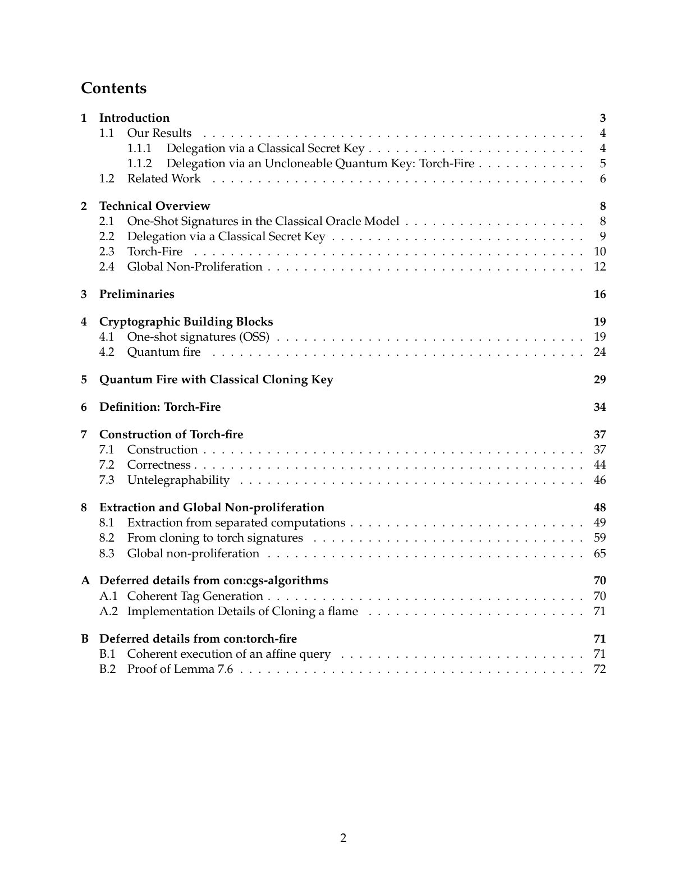
<figcaption class="paper-figure-caption"><b>Fig 1.</b> Low-resolution page preview, page 2</figcaption>
</figure>
<figure class="paper-figure-card">
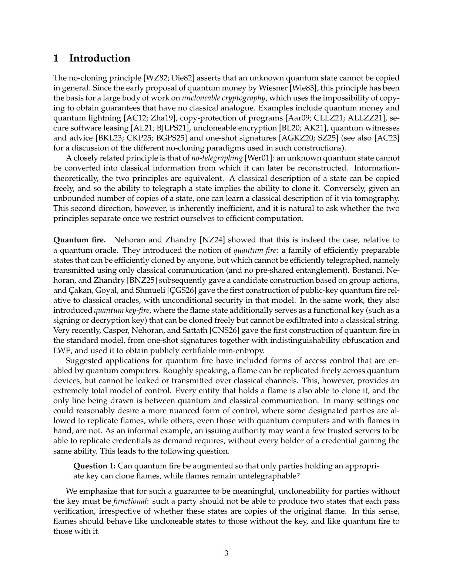
<figcaption class="paper-figure-caption"><b>Fig 2.</b> Low-resolution page preview, page 3</figcaption>
</figure>
<figure class="paper-figure-card">
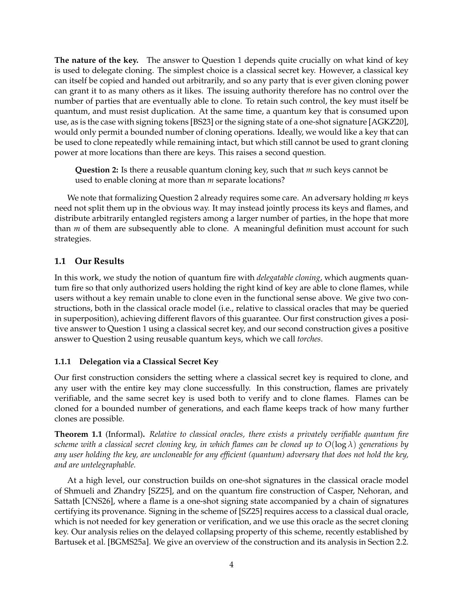
<figcaption class="paper-figure-caption"><b>Fig 3.</b> Low-resolution page preview, page 4</figcaption>
</figure>
<figure class="paper-figure-card">
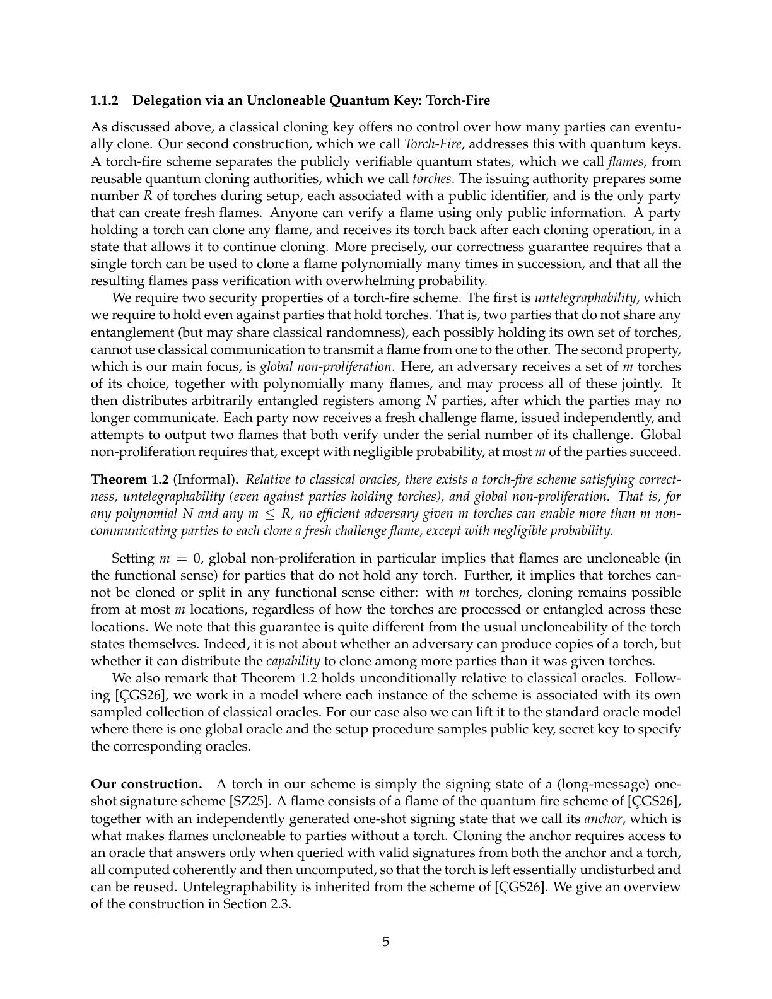
<figcaption class="paper-figure-caption"><b>Fig 4.</b> Low-resolution page preview, page 5</figcaption>
</figure>
<figure class="paper-figure-card">
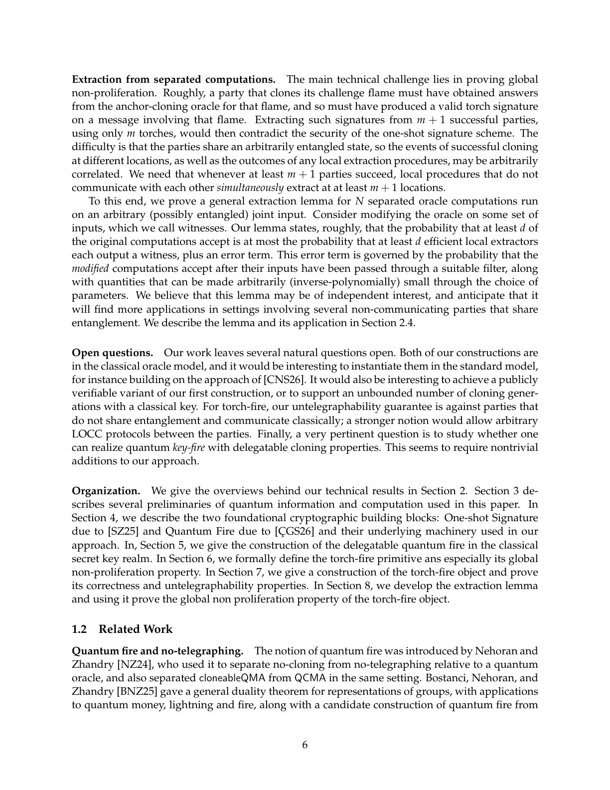
<figcaption class="paper-figure-caption"><b>Fig 5.</b> Low-resolution page preview, page 6</figcaption>
</figure>

**Summary.** This paper develops 'delegatable quantum fire,' a cryptographic primitive that restricts the ability to clone quantum states to only those possessing a specific key. It provides two constructions, one using a classical key and another using reusable quantum keys called 'torches.' The work advances quantum cryptography by ensuring that cloning power can be precisely controlled and limited.

**Why it may be interesting.** While highly theoretical, the concepts of controlled quantum state manipulation and key-based access control are fundamental to quantum cryptography, which underpins future quantum networking and secure computation.

Detailed structure

**Main problem.** The paper addresses the need to restrict the ability to clone quantum states (quantum fire) to only authorized parties by introducing key-based delegation mechanisms.

**Main result.** Two constructions are presented: one using a classical secret key and another, 'torch-fire,' using reusable quantum keys ('torches') that limit cloning to the number of available keys.

**Method.** The work is developed in the classical-oracle model, building upon existing quantum cryptographic primitives like one-shot signatures and quantum fire.

**Model / system.** The model is based on quantum information theory, involving quantum states called 'flames' and 'torches,' and relies on the framework of quantum oracles.

**Key observables.** The ability to clone a flame state, the number of cloning generations allowed, and the global non-proliferation of cloning capability.

**Important parameters / regimes.** The number of available torches ($m$), the number of cloning generations ($O(\log \lambda)$), and the error bound in circuit approximations ($\leq 2\sqrt{d}$).

**Assumptions / limitations.** The constructions are relative to classical oracles, and the analysis relies on the 'delayed collapsing property' of the underlying schemes.

**Figures summary.** Not specified.

**Paper structure.** The paper first establishes the problem of delegating quantum fire, then presents two constructions (classical key and torch-fire) addressing key-controlled cloning. Later sections detail the circuit implementation of these concepts, including the 'Fire.TagO' circuit and the approximation of general quantum queries.

Abstract

Quantum fire is a recently introduced cryptographic primitive consisting of efficiently preparable quantum states, called \emph{flames}, that admit efficient cloning but resist efficient telegraphing, namely reconstruction via classical communication without preshared entanglement. In all prior constructions of quantum fire, cloning is a public operation that requires no separate key and every holder of a flame state can clone it. For applications to access control, however, an issuer may wish to delegate cloning to designated quantum servers while withholding this capability from other flame holders. To address this, we introduce \emph{delegatable quantum fire}, in which cloning requires a separate key.   We give two constructions in the classical-oracle model. Our first construction uses a classical secret key which enables cloning, and any user with the entire key may clone successfully. Our second construction, which we call \emph{torch-fire}, uses quantum cloning keys, called \emph{torches}, which enable cloning while remaining unaffected in the process but cannot otherwise be split or delegated to enable additional cloning. An efficient adversary given $m$ torches cannot, except with negligible probability, enable more than $m$ noncommunicating parties to each clone a fresh, independently issued challenge flame. The adversary may jointly process its resources before separating the parties and distribute arbitrarily entangled registers among them. Both constructions are in the oracle model, relying on public classical oracles that allow queries in quantum superposition.

[↑ back to top](#top)

### [Quantum transmission in 1D disordered stealthy hyperuniform Kronig--Penney-like models](http://arxiv.org/abs/2610.02501v1)

**Authors:** Shaobing Yuan, Carlo Vanoni, Salvatore Torquato  
**Type:** theory · **Category:** disordered systems and neural networks · **PDF:** <https://arxiv.org/pdf/2610.02501v1>  
**Analysis basis:** full PDF text, analyzed in chunks
**Topic relevance:** `Keldysh / 2PI / non-Gaussian methods` **2/5**

↔ Scroll figures horizontally

<figure class="paper-figure-card">
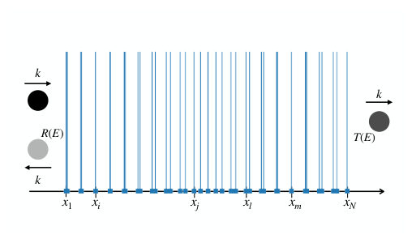
<figcaption class="paper-figure-caption"><b>Fig 1.</b> FIG. 1. Schematic of the quantum particle transmission through the disordered potentials V (x) in Eq. (1). A par- ticle coming from x = −∞with momentum k and energy E = k2 (black) scatters against N δ-functions, and is trans- mitted with probability T(E), while it is reflected with prob- ability R(E).</figcaption>
</figure>
<figure class="paper-figure-card">
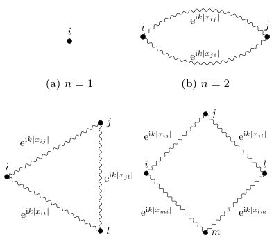
<figcaption class="paper-figure-caption"><b>Fig 2.</b> FIG. 2. Feynman diagrams of the first 4 orders under free boundary conditions. Each vertex (e.g., i) contributes a fac- tor of i 2k, and each edge between two vertices, e.g., i, j, contributes a factor of ei|xij| ≡ei|xij|, where we denote xij ≡xi −xj. When evaluated by the summation over each vertex, e.g., i, from i = 1 to i = N, the n-th-order diagram gives Tr[Gn].</figcaption>
</figure>
<figure class="paper-figure-card">
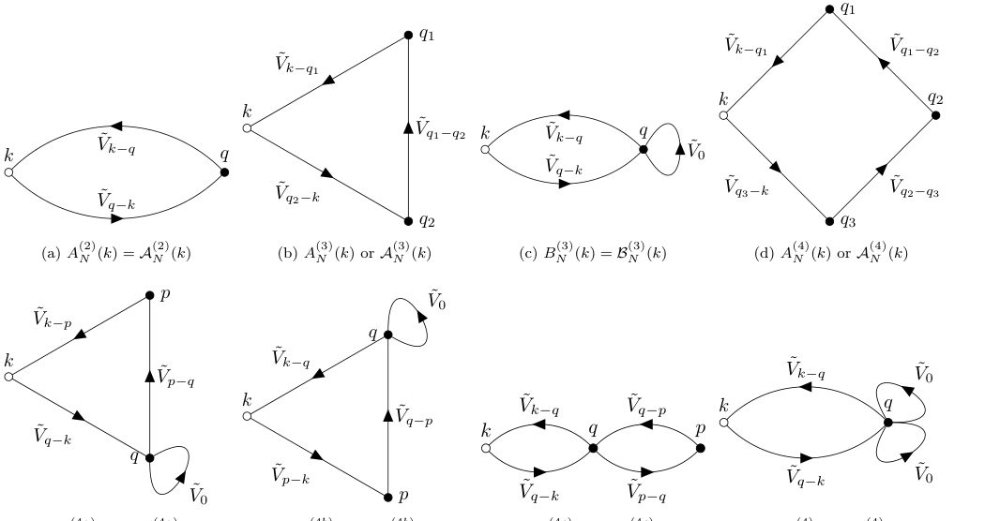
<figcaption class="paper-figure-caption"><b>Fig 3.</b> FIG. 3. Feynman diagrams of the first 4 orders under periodic boundary conditions. AN and AN denote 1-loop diagrams, BN and BN denote 2-loop diagrams, and so on. For a fixed k, AN, BN, . . . are given by evaluating the diagrams under the self-avoiding summation P</figcaption>
</figure>

**Summary.** This theoretical work analyzes quantum transport in 1D disordered systems exhibiting stealthy hyperuniformity. By developing a high-order perturbation theory, the authors show that the SHU condition causes the leading localization effects to vanish up to the third order. This demonstrates that structural order can parametrically enhance quantum transmission, leading to a much weaker, fourth-order dependence on disorder strength.

**Why it may be interesting.** The systematic, high-order perturbative calculation provides deep insight into how specific geometric constraints (hyperuniformity) can fundamentally alter the scaling of quantum localization, which is a core topic in condensed matter theory.

Detailed structure

**Main problem.** The paper investigates quantum transmission and localization in one-dimensional disordered systems characterized by 'stealthy hyperuniform (SHU)' disorder.

**Main result.** The SHU condition causes the leading attenuation of the Lyapunov exponent to vanish up to the third order in the scattering strength, shifting the leading localization dependence to the fourth order ($O(W^4)$).

**Method.** The authors employ advanced perturbative quantum field theory techniques, utilizing Feynman diagrams to calculate the Lyapunov exponent and inverse lifetime in the thermodynamic limit.

**Model / system.** The model is a Kronig-Penney-like system describing quantum particle propagation through a continuum of identical point scatterers in 1D, governed by a delta-function potential.

**Key observables.** Lyapunov exponent ($\lambda(k)$), transmission $T(E)$, inverse lifetime ($1/	au(k)$), and the structure factor $S(k)$.

**Important parameters / regimes.** The scattering strength ($W$), the wave vector ($k$), and the hyperuniformity cutoff ($K$).

**Assumptions / limitations.** The analysis relies on taking the thermodynamic limit ($N 	o \infty$) and making specific approximations for summing over momenta in the perturbative expansion.

**Figures summary.** Figure 3 illustrates Feynman diagrams for calculating scattering coefficients up to the fourth order, distinguishing between different types of loop summations (e.g., 1-loop, 2-loop).

**Paper structure.** The paper systematically develops the perturbative calculation of the Lyapunov exponent and inverse lifetime, first for free boundary conditions, and then adapts the formalism for periodic boundary conditions, culminating in the analysis of the SHU regime.

Abstract

Disordered stealthy hyperuniform (SHU) systems are emerging as platforms for controlling classical and quantum transport due to vanishing single-scattering contributions in the stealthy regime. Here, to our knowledge, we present the first perturbation theory of one-dimensional quantum transport through a continuum of identical point scatterers with SHU positional disorder. Our perturbation theory indicates the exact cancellation of all the lower-order terms due to the Fourier-space stealthy condition $S(q)=0$, and the further suppression of the lowest non-vanishing fourth order in the Lyapunov exponent $λ(k)$ due to the real-space hyperuniform constraint $\lim\limits_{D\to\infty}σ_D^2=c<\infty$. Our findings presents universal implications of the general wave-propagation phenomena in disordered SHU systems.

[↑ back to top](#top)

### [Rate-Optimal Quantum Discrete Simulation Optimization](http://arxiv.org/abs/2610.03360v1)

**Authors:** Mingjie Hu, Jian-Qiang Hu  
**Type:** both · **Category:** quantum information and computing · **PDF:** <https://arxiv.org/pdf/2610.03360v1>  
**Analysis basis:** full PDF text, analyzed in chunks
**Topic relevance:** `quantum measurements` **2/5**

↔ Scroll figures horizontally

<figure class="paper-figure-card">
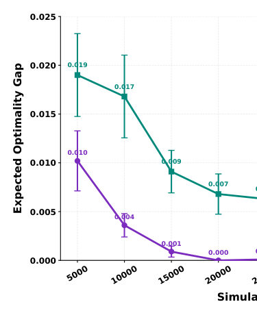
<figcaption class="paper-figure-caption"><b>Fig 1.</b> Figure 1 Expected Optimality Gap under Bernoulli Distribution</figcaption>
</figure>
<figure class="paper-figure-card">
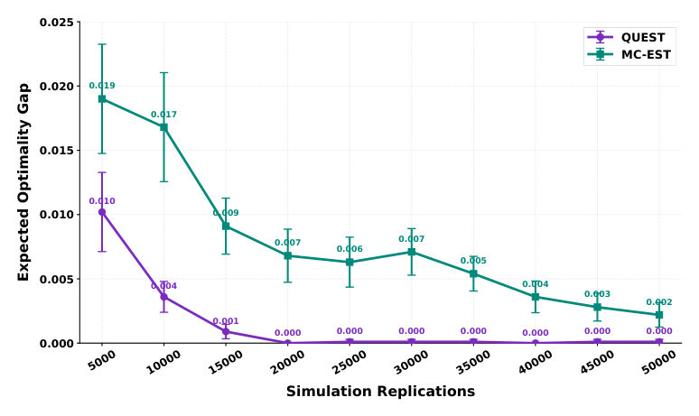
<figcaption class="paper-figure-caption"><b>Fig 2.</b> Figure 2 compares the final expected optimality gaps of QUEST and MC-EST under different</figcaption>
</figure>
<figure class="paper-figure-card">
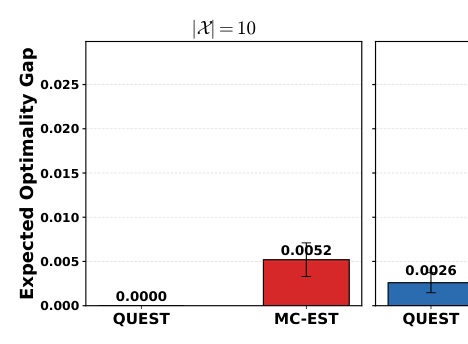
<figcaption class="paper-figure-caption"><b>Fig 3.</b> Figure 2 Expected Optimality Gap under Different Problem Sizes (𝑇= 10000)</figcaption>
</figure>
<figure class="paper-figure-card">
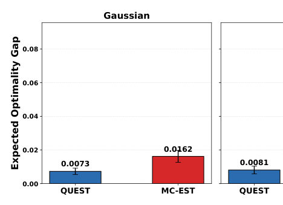
<figcaption class="paper-figure-caption"><b>Fig 4.</b> Figure 3 Expected Optimality Gap under Different Performance Distributions (𝑇= 10000)</figcaption>
</figure>
<figure class="paper-figure-card">
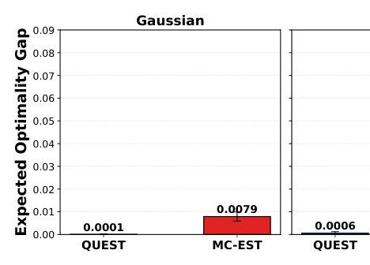
<figcaption class="paper-figure-caption"><b>Fig 5.</b> Figure 4 Expected Optimality Gap under Different Performance Distributions (𝑇= 20000)</figcaption>
</figure>

**Summary.** This paper develops a theoretical framework to determine the quantum advantage in discrete simulation optimization under a fixed budget. By establishing a minimax lower bound, the authors propose the QUEST algorithm, which is proven to achieve this optimal rate. The work provides strong theoretical and empirical evidence for quantum speedup in complex simulation estimation tasks.

**Why it may be interesting.** While focused on optimization, the development of the quantum simulation oracle and the analysis of fundamental quantum lower bounds for estimation tasks are highly relevant to understanding resource scaling in quantum information processing.

Detailed structure

**Main problem.** The paper investigates whether quantum computing can accelerate the convergence rate of discrete simulation optimization problems under a fixed simulation budget.

**Main result.** The proposed algorithm, QUEST, achieves an expected optimality gap of order O((|X| log T)/T), matching the established quantum minimax lower bound up to logarithmic factors.

**Method.** The authors establish a minimax lower bound by reducing the problem to a sequential quantum phase-testing problem, and then propose an adaptive quantum algorithm combining quantum Monte Carlo with sequential elimination.

**Model / system.** The problem is modeled using a quantum simulation oracle, which acts as the quantum analogue for estimating the expected performance of a discrete decision variable $x$ in a stochastic system.

**Key observables.** Expected optimality gap, which measures the difference between the optimal decision's mean performance and the algorithm's recommended decision's mean performance.

**Important parameters / regimes.** Fixed simulation budget ($T$), the number of decisions ($|X|$), and the convergence rate of the expected optimality gap.

**Assumptions / limitations.** The analysis assumes that the centered simulation output is $\sigma$-sub-Gaussian, and the performance is measured under a fixed-budget setting.

**Figures summary.** Numerical experiments show that QUEST significantly reduces the expected optimality gap compared to classical Monte Carlo estimation (MC-EST) across varying problem sizes and distributions.

**Paper structure.** The paper first formulates the problem and defines the quantum oracle, then establishes the minimax lower bounds, proposes the QUEST algorithm, proves its rate optimality, and concludes with numerical validation.

Abstract

Quantum computing has developed rapidly in recent years and has shown potential advantages over classical computing in various domains. In this paper, we study whether quantum computing can accelerate the convergence rate of discrete simulation optimization in the fixed-budget setting. We first formulate the quantum discrete simulation optimization problem by defining the quantum simulation oracle, the algorithmic performance measure, and the corresponding optimality guarantee. Based on this formulation, we establish a minimax lower bound on the expected optimality gap for any quantum algorithm. The lower bound analysis reduces the discrete simulation optimization problem to a sequential quantum phase-testing problem, and the resulting lower-bound argument may be of independent interest. By comparing the quantum lower bound with its classical counterpart, we show that the optimal convergence rate in the quantum setting exhibits a quadratic improvement in its dependence on the simulation budget, at the cost of a worse dependence on the number of decisions. We then propose the first fixed-budget quantum algorithm, called \textsc{QUEST}, for discrete simulation optimization. The algorithm combines a quantum Monte Carlo subroutine with a sequential elimination framework and uses a slow-measurement mechanism to help preserve quantum superposition during the optimization process. We prove that \textsc{QUEST} achieves the optimal convergence rate up to logarithmic factors. Numerical experiments further show that \textsc{QUEST} outperforms its classical counterpart, which provides empirical evidence for the quantum advantage in improving the convergence rate of discrete simulation optimization algorithms.

[↑ back to top](#top)

### [Scalable Passive QRAM](http://arxiv.org/abs/2610.03700v1)

**Authors:** Siddhartha Jain, Alexander M. Dalzell, Connor T. Hann  
**Type:** theory · **Category:** quantum information and computing · **PDF:** <https://arxiv.org/pdf/2610.03700v1>  
**Analysis basis:** full PDF text, analyzed in chunks
**Topic relevance:** `analog quantum simulation` **2/5**

↔ Scroll figures horizontally

<figure class="paper-figure-card">
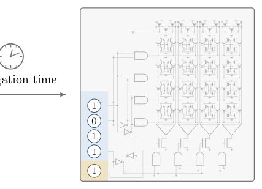
<figcaption class="paper-figure-caption"><b>Fig 1.</b> Figure 1: Illustration of passive RAM query</figcaption>
</figure>
<figure class="paper-figure-card">
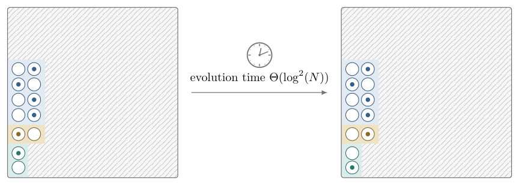
<figcaption class="paper-figure-caption"><b>Fig 2.</b> Figure 2: Illustration of passive QRAM query accomplished by our construction. To match the notation we adopt in Section 3, we depict activated qubits in |1⟩as • and |0⟩as empty. The Hamiltonian is hard-coded into the device at time of fabrication (here indicated by the hatching), and is always on. We show that our construction has robustness to imperfections in the manufacture of the chip and to thermal noise in the initial state of the O(N) auxiliary qubits.</figcaption>
</figure>
<figure class="paper-figure-card">
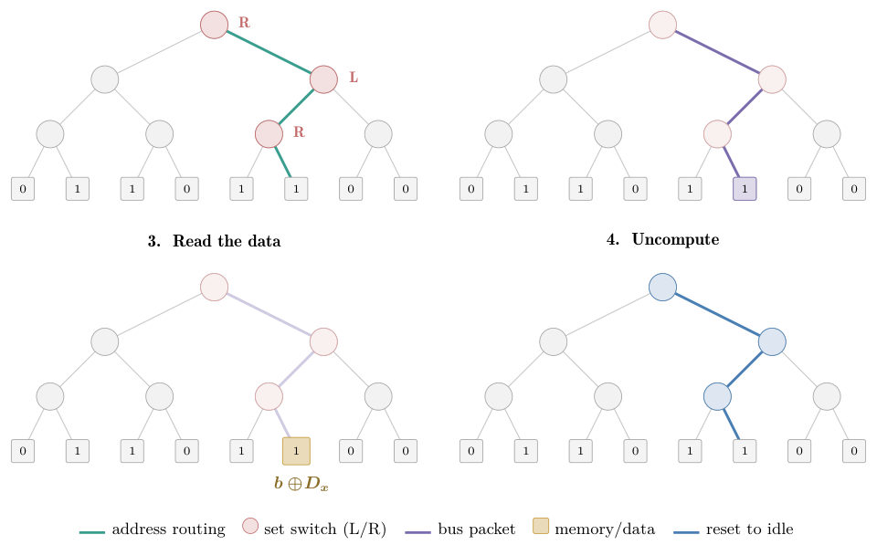
<figcaption class="paper-figure-caption"><b>Fig 3.</b> Figure 3: The bucket-brigade query on a height-3 tree for address x = 101. (1) A carrier routes the address down the tree, setting each node’s switch; (2) the bus packet descends the routed path; (3) the target memory is read into the bus at the leaf; (4) the bus ascends and the path is uncomputed back to idle.</figcaption>
</figure>
<figure class="paper-figure-card">
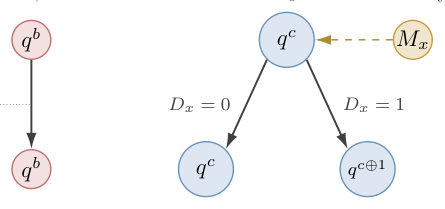
<figcaption class="paper-figure-caption"><b>Fig 4.</b> Figure 4: The three kinds of Hamiltonian terms.</figcaption>
</figure>
<figure class="paper-figure-card">
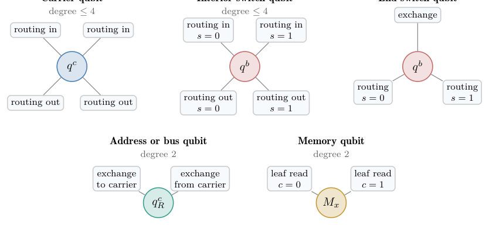
<figcaption class="paper-figure-caption"><b>Fig 5.</b> Figure 5: Number of Hamiltonian terms incident on each qubit type. A carrier or interior switch qubit can participate in four routing terms. An end switch qubit participates in one exchange term and at most two routing terms. Each address or bus qubit participates in two exchange terms, and each memory qubit in two leaf-read terms.</figcaption>
</figure>

**Summary.** This paper presents a theoretical blueprint for building a scalable Quantum Random Access Memory (QRAM) that operates passively, meaning its energy consumption scales sublinearly with the memory size. By evolving a fixed, local Hamiltonian, the authors achieve a significantly reduced energy cost ($O(\log N)$) and runtime ($O(\log^2 N)$) compared to conventional active QRAM implementations. This work advances the feasibility of building large-scale quantum processors by addressing a major resource bottleneck.

**Why it may be interesting.** The focus on Hamiltonian engineering to achieve sublinear energy scaling ($O(\log N)$) for a fundamental quantum primitive like QRAM is highly relevant to open quantum systems and quantum hardware design.

Detailed structure

**Main problem.** The paper addresses the fundamental challenge of quantum data loading by proposing a method to implement Quantum Random Access Memory (QRAM) in a scalable, passive manner.

**Main result.** It proves the principle of a scalable, passive QRAM by evolving a time-independent, 4-local Hamiltonian, achieving an energy cost of $O(\log N)$ and a runtime of $O(\log^2 N)$.

**Method.** The approach utilizes the time evolution governed by a pre-manufactured, time-independent Hamiltonian, bypassing the need for active, gate-based operations that typically incur linear energy costs.

**Model / system.** The model is a quantum circuit implemented via Hamiltonian evolution on an auxiliary register, requiring only 4-local interactions. The system is designed to be hardware agnostic but is noted as suitable for superconducting qubits.

**Key observables.** Energy cost per query ($O(\log N)$), Runtime ($O(\log^2 N)$), and the successful mapping of the QRAM operation via unitary evolution.

**Important parameters / regimes.** The memory size $N=2^n$, the number of qubits $n$, and the required Hamiltonian locality (4-local).

**Assumptions / limitations.** The construction assumes the existence of a time-independent Hamiltonian and relies on the ability to engineer fixed, low-degree local couplings.

**Figures summary.** Figure 1 illustrates the passive RAM query depth, while Figure 2 shows the QRAM query process initiated by exciting a 'start' auxiliary qubit, completing after $\Theta(\log^2 N)$ evolution time.

**Paper structure.** The paper establishes the problem (active vs. passive QRAM), presents the blueprint using a specific Hamiltonian construction, derives the complexity bounds ($O(\log N)$ energy, $O(\log^2 N)$ time), and compares this passive approach against conventional active methods.

Abstract

We present a blueprint for implementing the physical QRAM operation in a scalable, passive manner, proving its feasibility in principle. Our construction is passive because for an $n$-qubit address over $N = 2^n$ memory bits the energy cost per QRAM query is $O(\log N)$, and to our knowledge it is the first construction to use $\operatorname{polylog} N$ energy. The runtime for each query is $O(\log^2 N)$. It is achieved by evolving a pre-manufactured time-independent 4-local Hamiltonian with $O(N)$ terms where every qubit participates in at most 4 terms.

[↑ back to top](#top)

### [Two-qutrit Werner state is always local](http://arxiv.org/abs/2610.02997v1)

**Authors:** Paweł Caban, Muhammad Mohsin  
**Type:** theory · **Category:** quantum information and computing · **PDF:** <https://arxiv.org/pdf/2610.02997v1>  
**Analysis basis:** full PDF text, analyzed in chunks
**Topic relevance:** `quantum measurements` **2/5**

↔ Scroll figures horizontally

<figure class="paper-figure-card">
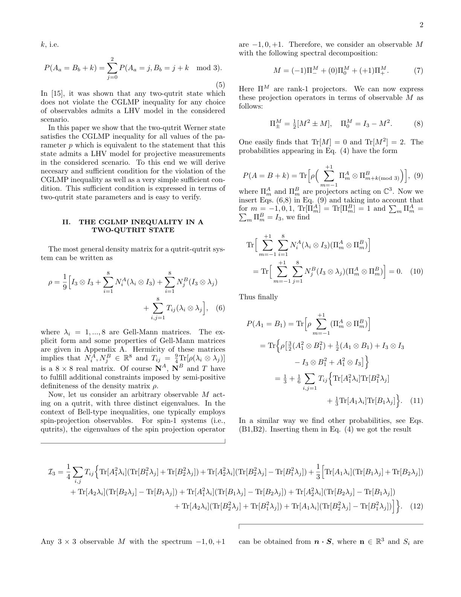
<figcaption class="paper-figure-caption"><b>Fig 1.</b> Low-resolution page preview, page 2</figcaption>
</figure>
<figure class="paper-figure-card">
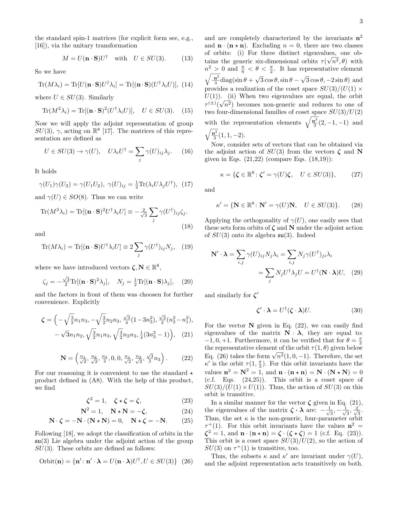
<figcaption class="paper-figure-caption"><b>Fig 2.</b> Low-resolution page preview, page 3</figcaption>
</figure>
<figure class="paper-figure-card">
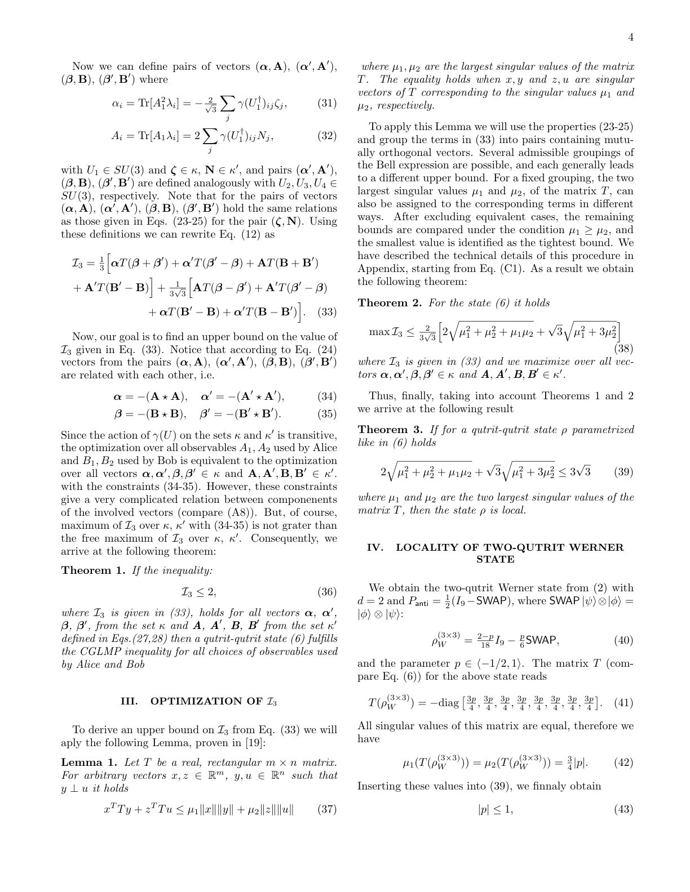
<figcaption class="paper-figure-caption"><b>Fig 3.</b> Low-resolution page preview, page 4</figcaption>
</figure>
<figure class="paper-figure-card">
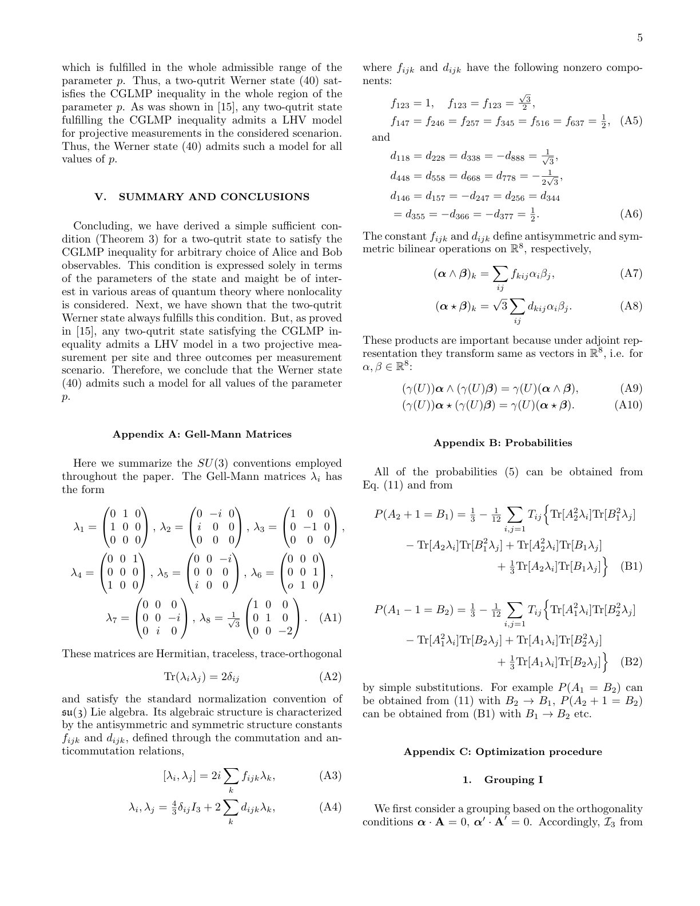
<figcaption class="paper-figure-caption"><b>Fig 4.</b> Low-resolution page preview, page 5</figcaption>
</figure>
<figure class="paper-figure-card">
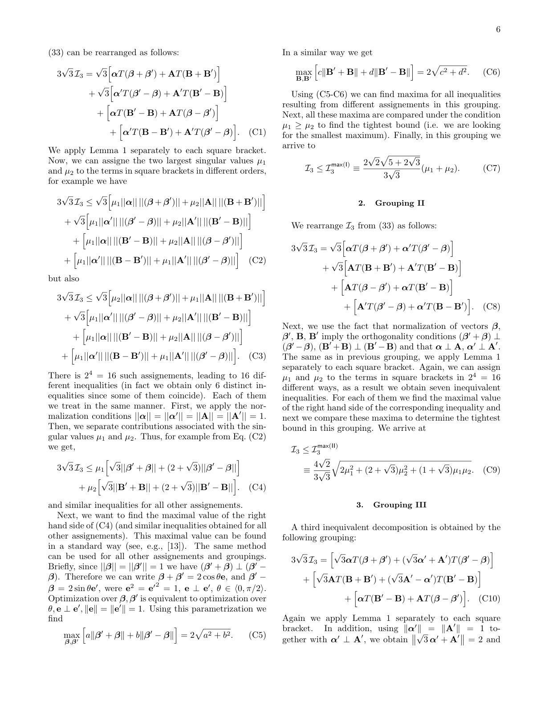
<figcaption class="paper-figure-caption"><b>Fig 5.</b> Low-resolution page preview, page 6</figcaption>
</figure>

**Summary.** This paper proves that the two-qutrit Werner state is always local by showing it satisfies the Collins-Gisin-Linden-Massar-Popescu (CGLMP) inequality. The authors achieve this by deriving a necessary and sufficient condition for locality and then rigorously bounding the relevant correlation function ($I_3$) for the Werner state. The result confirms that this specific entangled state cannot violate local realism under the tested measurement settings.

**Why it may be interesting.** This work provides a rigorous demonstration of local realism for a specific class of entangled states (Werner states) in a multipartite setting, which is fundamental to understanding the boundary between quantum correlations and classical physics.

Detailed structure

**Main problem.** To prove that the two-qutrit Werner state is always local, meaning it can be described by a local hidden-variable model for specific projective measurements.

**Main result.** The Werner state satisfies the Collins-Gisin-Linden-Massar-Popescu (CGLMP) inequality for all parameter values, confirming its local realism.

**Method.** The authors derived a sufficient condition for satisfying the CGLMP inequality and then used algebraic techniques involving the adjoint representation of SU(3) to find the tightest upper bound for the relevant correlation quantity ($I_3$).

**Model / system.** The system under consideration is the two-qutrit Werner state, $
ho_{W}$, analyzed in a scenario involving two projective measurements per site, each with three outcomes.

**Key observables.** The CGLMP inequality, quantified by the quantity $I_3$, and the singular values ($\mu_1, \mu_2$) of a related matrix $T$.

**Important parameters / regimes.** The parameter $p$ characterizing the Werner state, which is shown to be admissible for all values in its defined range.

**Assumptions / limitations.** The analysis assumes that satisfying the CGLMP inequality for arbitrary observables is equivalent to admitting a local hidden-variable model for this specific measurement setting.

**Figures summary.** Not specified.

**Paper structure.** The paper first establishes the CGLMP inequality for the two-qutrit system. It then derives a sufficient condition for satisfying this inequality by relating it to vector properties in the $su(3)$ Lie algebra. Finally, it optimizes the bound $I_3$ by comparing bounds derived from three different groupings of the Bell expression.

Abstract

In our paper, we show that a two-qutrit Werner state admits a local hidden-variable model for all values of the parameter in a scenario involving two projective measurements per site, with three outcomes per measurement. To this end, we derive a simple sufficient condition under which a two-qutrit state satisfies the Collins-Gisin-Linden-Massar-Popescu inequality for arbitrary choices of Alice's and Bob's observables, and show that the Werner state always satisfies this condition. Next, we use the fact that any two-qutrit state satisfying the Collins-Gisin-Linden-Massar-Popescu inequality for arbitrary choices of Alice's and Bob's observables admits a local hidden variable model.

[↑ back to top](#top)

### [Decohering Kitaev's Sixteenfold Way: A Holographic Approach](http://arxiv.org/abs/2610.03610v1)

**Authors:** Shuyu Zhang, Linhao Li, Zhen Bi, Tzu-Chieh Wei, Zijian Song  
**Type:** theory · **Category:** other · **PDF:** <https://arxiv.org/pdf/2610.03610v1>  
**Analysis basis:** full PDF text, analyzed in chunks
**Topic relevance:** `Keldysh / 2PI / non-Gaussian methods` **1/5** · `analog quantum simulation` **1/5** · `correlated / nonlocal dissipation` **1/5** · `driven-dissipative phase transition` **1/5** · `methods for driven-dissipative` **1/5** · `quantum measurements` **1/5**

↔ Scroll figures horizontally

<figure class="paper-figure-card">
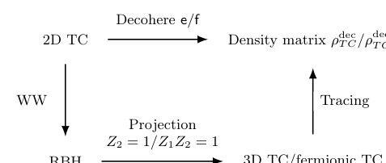
<figcaption class="paper-figure-caption"><b>Fig 1.</b> FIG. 2. The commutative diagram of toric code decoherence. Decoherence can be carried out by first lifting to the RBH cluster state, making measurements, then trace out the bot- tom half.</figcaption>
</figure>
<figure class="paper-figure-card">
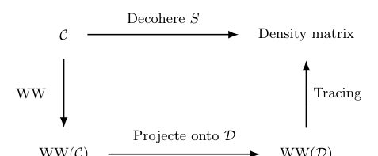
<figcaption class="paper-figure-caption"><b>Fig 2.</b> FIG. 3. Commutative diagram corresponding to decohering S in the topological order C. We first lift to the 3D WW model of C, keeping only string-nets labeled by D, then trace out the bottom half.</figcaption>
</figure>
<figure class="paper-figure-card">
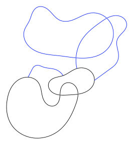
<figcaption class="paper-figure-caption"><b>Fig 3.</b> FIG. 4. A generic string-net state of the Ising Walker-Wang model. The black lines are labeled by σ, which must form loops. The blue lines are labeled by f, which can either form loops or end on σ-loops.</figcaption>
</figure>
<figure class="paper-figure-card">
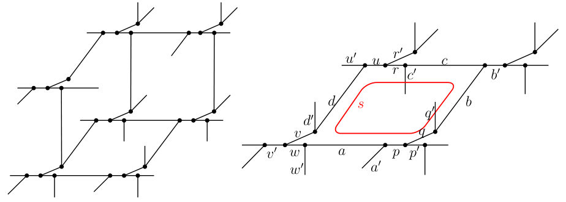
<figcaption class="paper-figure-caption"><b>Fig 4.</b> FIG. 5. (Left) The lattice structure of the Walker-Wang model. Each vertex is trivalent, and a local Hilbert space spanned by the simple objects of the input category is associated with each edge. Each plaquette has 10 boundary edges, together with 10 outgoing edges attached to its 10 vertices. (Right) Inserting an s loop on the plaquette.</figcaption>
</figure>
<figure class="paper-figure-card">
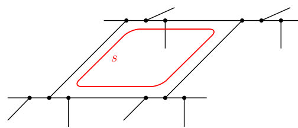
<figcaption class="paper-figure-caption"><b>Fig 5.</b> FIG. 6. The smooth boundary of the WW model. The boundary terminates in the vertical direction, hence all edges pointing up from the boundary are removed. The fusion of the anyon loop s into the lattice defines the boundary plaquette operators.</figcaption>
</figure>

**Summary.** This paper develops a holographic approach to study how topological order decoheres, using the challenging Kitaev's sixteenfold way as a key example. It conjectures that decoherence can be understood by mapping the process to a pure state phase transition in the system's higher-dimensional bulk counterpart. This offers a systematic tool for analyzing mixed-state quantum matter in topological phases.

**Why it may be interesting.** This work provides a powerful, systematic theoretical framework (holography) to analyze decoherence in highly constrained quantum systems, linking boundary physics (2D) to bulk dynamics (3D) via phase transitions.

Detailed structure

**Main problem.** The paper addresses the complex issue of anyon decoherence in 2D topological order, specifically tackling Kitaev's sixteenfold way which involves chiral phases lacking simple commuting projector Hamiltonians.

**Main result.** They establish a holographic connection showing that the decoherence process can be mapped to a pure state phase transition in the system's 3D counterpart, yielding intrinsically mixed-state topological order.

**Method.** The core method involves a three-step holographic construction: lifting the 2D order to a Walker-Wang model, transitioning to another model, and finally tracing out the bulk degrees of freedom.

**Model / system.** The study focuses on 2D topological orders, exemplified by the 2D toric code and Kitaev's sixteenfold way. The holographic mapping utilizes 3D systems like the Raussendorf-Bravyi-Harrington (RBH) cluster state and the 3D fermionic toric code (fTC).

**Key observables.** Density matrix ($
ho$), topological order, 1-form symmetries, Quantum Markov length ($\xi$), and the resulting state being intrinsically mixed.

**Important parameters / regimes.** The decoherence parameter $p$ (in local channels), and the large parameter $\Lambda$ used in the holographic projection limit.

**Assumptions / limitations.** The primary conjecture is that the decoherence-induced density matrix can be obtained via the specific three-step holographic procedure. It also assumes the existence of a systematic method using commuting projector Hamiltonians.

**Figures summary.** Figures illustrate the structure of entanglers (U) for various models (fermionic toric code, RBH state, semionic WW model) and show the mathematical decomposition of the resulting Hamiltonians using various Clifford Hierarchy gates.

**Paper structure.** The paper reviews 2D toric code decoherence (Sec. II), builds the general 3D holographic framework (Sec. III), provides detailed examples focusing on Kitaev's sixteenfold way (Sec. IV), and concludes with general implications (Sec. V).

Abstract

We study anyon decoherence in 2D topological order, with the fermion decoherence in Kitaev's sixteenfold way as explicit examples. The sixteenfold way includes chiral topological phases, which are believed to admit no commuting projector Hamiltonian, making it challenging to study their decoherence directly. We further conjecture the density matrix produced by this decoherence induced phase transition can be obtained by a three-step procedure: first lift the topological order to its Walker-Wang model, followed by a transition to another Walker-Wang model, and finally trace over the bulk degrees of freedom. This establishes a connection between the decoherence of a topological order and a pure state phase transition in its 3D counterpart. Many examples are given. In particular, we show that decohering the fermion in each of the sixteen states always yields an intrinsically mixed-state topological order, a consequence of the fact the corresponding 3D bulk always transits into the 3D fermionic toric code (fTC). Our result suggests a systematic method for studying anyon decoherence in chiral topological orders at the level of commuting projector Hamiltonians.

[↑ back to top](#top)

### [Modified logarithmic Sobolev inequality for 1D non-commuting Hamiltonians](http://arxiv.org/abs/2610.03683v1)

**Authors:** Ángela Capel, David Pérez-García, Matteo Scandi  
**Type:** theory · **Category:** statistical mechanics · **PDF:** <https://arxiv.org/pdf/2610.03683v1>  
**Analysis basis:** full PDF text, analyzed in chunks
**Topic relevance:** `analog quantum simulation` **1/5** · `correlated / nonlocal dissipation` **1/5** · `driven-dissipative phase transition` **1/5** · `methods for driven-dissipative` **1/5** · `non-equilibrium universality` **1/5** · `scars & prethermalization` **1/5**

↔ Scroll figures horizontally

<figure class="paper-figure-card">
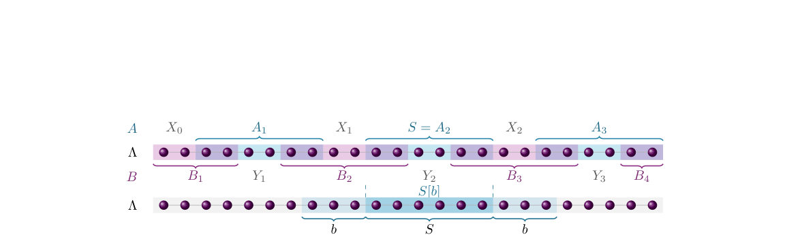
<figcaption class="paper-figure-caption"><b>Fig 1.</b> Figure 1: Overlapping blocks A = S i Ai, B = S j Bj and a buffered core. The gaps Xi, Yj form Λ \ A, Λ \ B. Each site lies in at most Cβ enlarged intervals S[b], independently of n. The intervals specify update centres; the maps have decaying tails.</figcaption>
</figure>
<figure class="paper-figure-card">
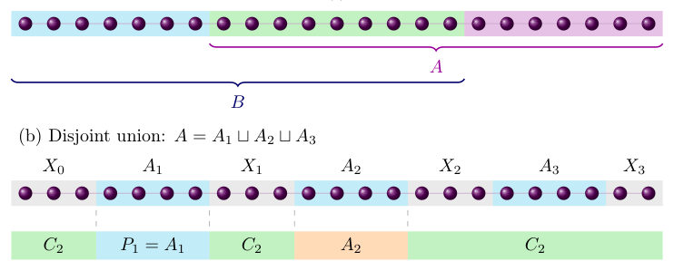
<figcaption class="paper-figure-caption"><b>Fig 2.</b> Figure 2: The two decompositions in Lemma 3.2. (a) The complements are X = B\A and Y = A\B; tracing out the overlap A ∩B leaves the marginal on XY in (3.3). (b) For m = 3 and the merger j = 2 in (3.6), the systems are P1 = A1, A2, and C2 = X ∪A3. The green pieces form the generally disconnected conditioning set C2. The interval arrangements are illustrative: the lemma holds for arbitrary sets.</figcaption>
</figure>
<figure class="paper-figure-card">
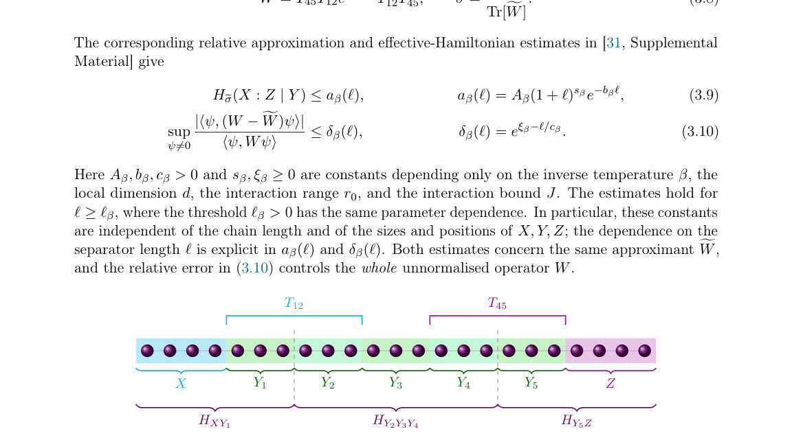
<figcaption class="paper-figure-caption"><b>Fig 3.</b> Figure 3: The five-piece approximation on the spin chain. Each ball is a site; the coloured bands and braces specify X, Y1, . . . , Y5, Z. The two dashed cuts split H0 into the three Hamiltonians shown below. The local operators T12 and T45 act on the indicated pairs of separator pieces. Both estimates (3.9) and (3.10) concern this construction.</figcaption>
</figure>
<figure class="paper-figure-card">
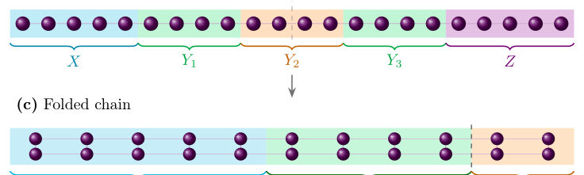
<figcaption class="paper-figure-caption"><b>Fig 4.</b> Figure 4: The two geometries in the proof of Lemma 3.5. In (a), we compare the marginals on U before and after removing W from the Hamiltonian. The buffer V = V1V2 separates U from W; we localise the boundary operators to UV1 and use local indistinguishability across V2. Panels (b) and (c) show the original chain and its folding. Each vertical pair of balls in (c) is one folded site, pairing original sites at equal distance from the midpoint. The collars Y1, Y3 have equal lengths. The labels U, V, W in (c) identify the regions to which we apply the comparison from (a). In the folded geometry, removing Y2 is a boundary-removal operation; in the original geometry, it leaves independent left...</figcaption>
</figure>
<figure class="paper-figure-card">
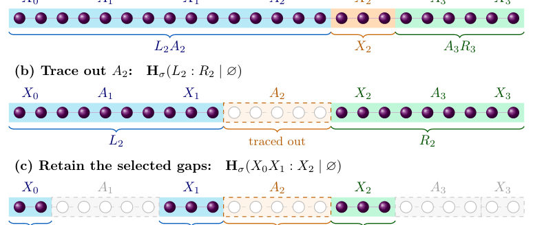
<figcaption class="paper-figure-caption"><b>Fig 5.</b> Figure 5: The three contributions to the defect on the same chain X0A1X1A2X2A3X3. Purple balls are retained sites; hollow grey balls are traced-out sites. In (a), the orange interval X2 is retained as the conditioning system, so the connected conditional MCMI estimate applies. In (b), the orange interval A2 is traced out, leaving the two tails L2 and R2. In (c), further partial traces retain only X0 ∪X1 and X2, giving one merger in the gap marginal. The multiplicative estimate across A2 controls both (b) and (c).</figcaption>
</figure>

**Summary.** This paper proves a Modified Logarithmic Sobolev Inequality (MLSI) for quantum systems with non-commuting Hamiltonians on a 1D chain. By establishing this inequality for heat-bath dynamics, the authors demonstrate that the system rapidly approaches its thermal Gibbs state. This result is crucial for understanding the mixing times of quantum Markov processes in complex, interacting many-body systems.

**Why it may be interesting.** The rigorous proof of MLSI in the non-commuting regime is a significant theoretical advance for understanding the convergence rates of quantum thermalization processes.

Detailed structure

**Main problem.** The paper aims to prove a Modified Logarithmic Sobolev Inequality (MLSI) for the relative entropy decay in quantum systems governed by non-commuting Hamiltonians.

**Main result.** They establish the MLSI with a constant of $\Omega(1/\log n)$ for both the heat-bath and regularised heat-bath dynamics, implying rapid mixing times of order $\mathcal{O}(\log n \cdot \log(n/\epsilon))$ towards the Gibbs state.

**Method.** The proof combines advanced techniques including weak quasi-factorisation of relative entropy, decay-of-correlation estimates, and comparisons between conditional entropy and quadratic energy.

**Model / system.** The system is a 1D chain of $n$ spins described by a finite-range, non-commuting Hamiltonian. The dynamics are analyzed using quantum Markov semigroups corresponding to heat-bath sampling.

**Key observables.** Relative entropy $D(
ho\|\sigma)$, Entropy Production $E_{Pa}(
ho)$, and Quadratic Energy $Q_T(
ho)$.

**Important parameters / regimes.** The mixing time depends on $\epsilon$ and $n$, and the MLSI constant depends on the temperature $eta$ and system size $n$.

**Assumptions / limitations.** The interactions are assumed to be finite-range, non-commuting, and uniformly bounded, allowing for the use of local gap estimates.

**Paper structure.** The structure builds from establishing local estimates (like the conditional gap) to deriving the MLSI for the regularised heat-bath sampler, culminating in the proof of the rapid mixing time bounds.

Abstract

Given a finite-range, non-commuting Hamiltonian on a 1D chain of finite spins, we prove a modified logarithmic Sobolev inequality with constant $Ω(1/\log n)$ for the heat-bath dynamics, a quasi-local Gibbs sampler, and for the regularised heat-bath dynamics. This implies rapid mixing of both samplers towards the Gibbs state in relative entropy and trace norm, with mixing times of order $\mathcal{O}(\log n\cdot \log(n/ε))$. The interactions may be spatially inhomogeneous. The proof combines weak quasi-factorisation of relative entropy, decay-of-correlation estimates, a uniform conditional local gap, and a buffered comparison between conditional entropy and quadratic energy. The resulting bounded entropy defect is removed using the global gap. To the best of our knowledge, this is the first proof of MLSI in the non-commuting regime.

[↑ back to top](#top)

### [From Heat to Homology: Spectral Gap Transfer for Exact Quantum Gibbs Sampling at All Temperatures](http://arxiv.org/abs/2610.02859v1)

**Authors:** Caesnan M. G. Leditto, Kuo-Chin Chen, Min-Hsiu Hsieh  
**Type:** theory · **Category:** statistical mechanics · **PDF:** <https://arxiv.org/pdf/2610.02859v1>  
**Analysis basis:** full PDF text, analyzed in chunks
**Topic relevance:** `correlated / nonlocal dissipation` **1/5** · `driven-dissipative phase transition` **1/5** · `methods for driven-dissipative` **1/5** · `non-equilibrium universality` **1/5** · `scars & prethermalization` **1/5**

↔ Scroll figures horizontally

<figure class="paper-figure-card">
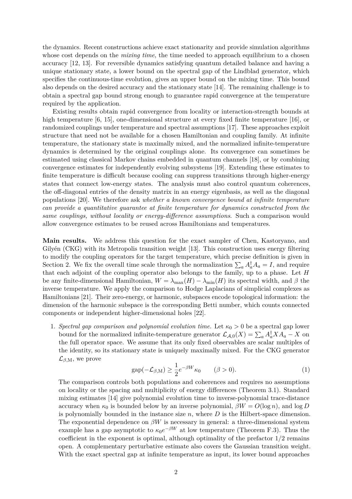
<figcaption class="paper-figure-caption"><b>Fig 1.</b> Low-resolution page preview, page 2</figcaption>
</figure>
<figure class="paper-figure-card">
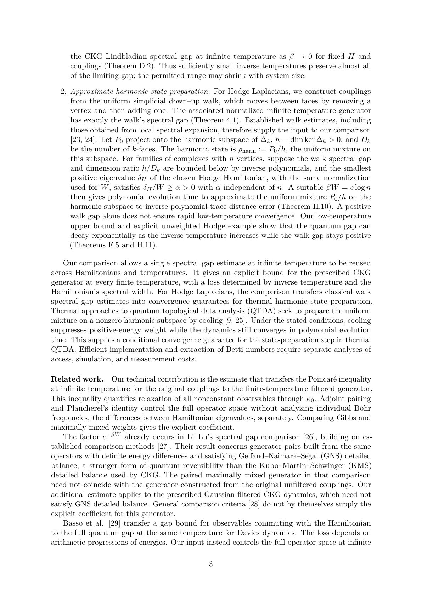
<figcaption class="paper-figure-caption"><b>Fig 2.</b> Low-resolution page preview, page 3</figcaption>
</figure>
<figure class="paper-figure-card">
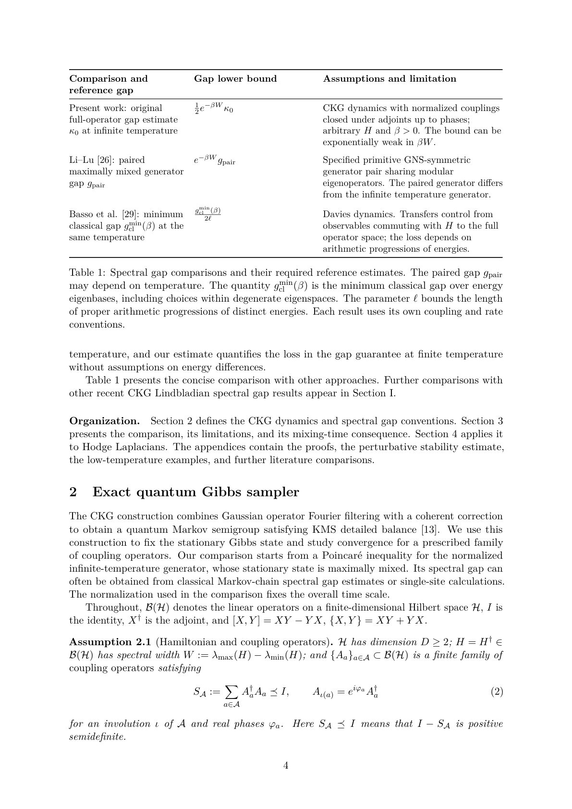
<figcaption class="paper-figure-caption"><b>Fig 3.</b> Low-resolution page preview, page 4</figcaption>
</figure>
<figure class="paper-figure-card">
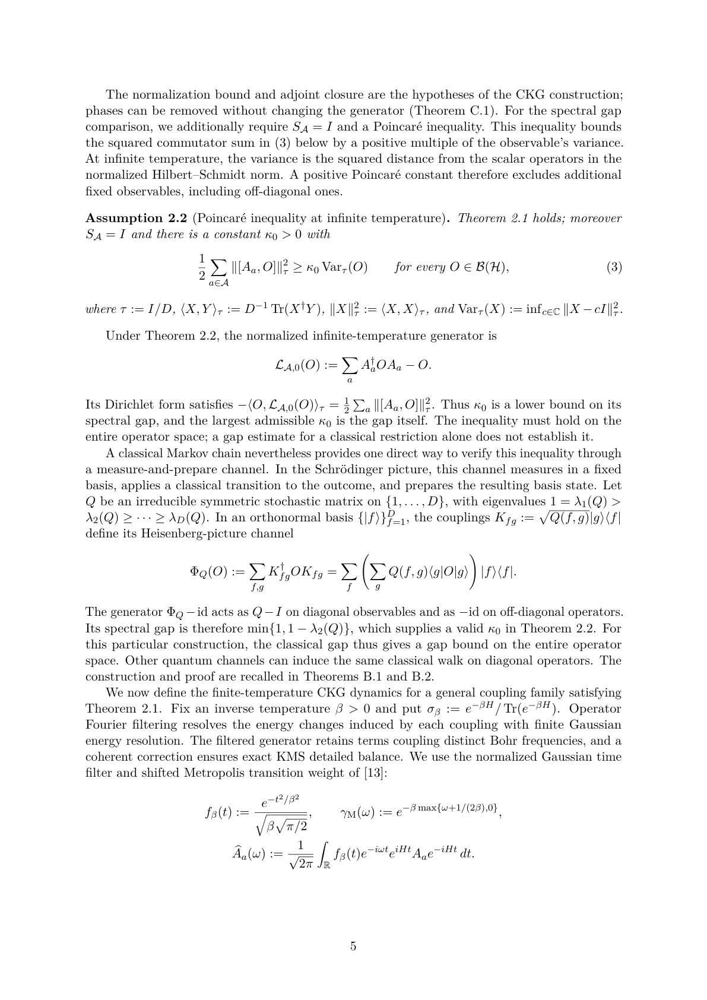
<figcaption class="paper-figure-caption"><b>Fig 4.</b> Low-resolution page preview, page 5</figcaption>
</figure>
<figure class="paper-figure-card">
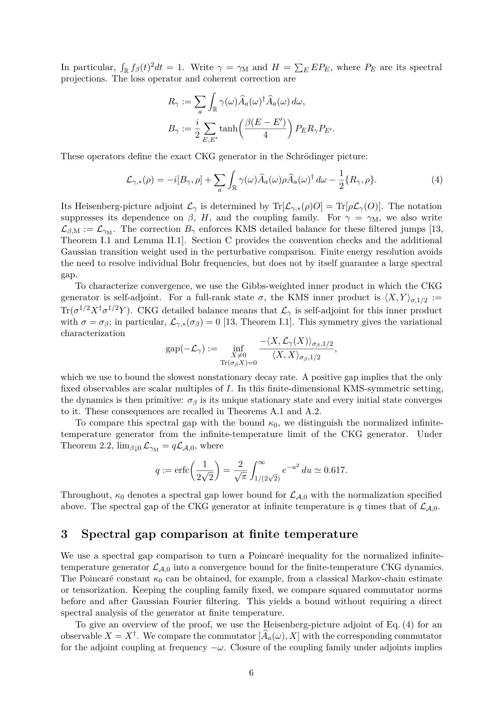
<figcaption class="paper-figure-caption"><b>Fig 5.</b> Low-resolution page preview, page 6</figcaption>
</figure>

**Summary.** This paper develops a rigorous mathematical framework to guarantee the convergence rate of quantum Gibbs samplers across all temperatures. By relating the spectral gap at finite temperature to the gap at infinite temperature, it provides a powerful, unified condition for state preparation. This is particularly relevant for applications in quantum topological data analysis.

**Why it may be interesting.** This work provides crucial theoretical tools for analyzing thermalization dynamics in quantum systems, which is central to understanding open quantum systems and quantum statistical mechanics.

Detailed structure

**Main problem.** The core problem is establishing rigorous convergence guarantees for exact quantum Gibbs sampling at all finite temperatures ($eta$) by relating the spectral gap of the infinite-temperature dynamics to that of the finite-temperature dynamics.

**Main result.** The authors prove an explicit comparison showing that the spectral gap of the CKG quantum Gibbs sampler at finite temperature is bounded below by a factor involving the infinite-temperature spectral gap and the spectral width of the Hamiltonian.

**Method.** The primary method involves deriving a spectral gap lower bound by comparing the generator at finite temperature to the generator at infinite temperature, utilizing techniques like Poincaré inequalities and structural assumptions on the Hamiltonian.

**Model / system.** The study concerns quantum systems undergoing thermalization, modeled using the Chen–Kastoryano–Gilyén (CKG) construction for Gibbs state preparation. Hamiltonians are often related to Hodge Laplacians of simplicial complexes, which encode topological information.

**Key observables.** Spectral gap ($	ext{gap}(-L_{eta, M})$), Spectral width ($W$), and the Poincaré constant ($\kappa_0$).

**Important parameters / regimes.** Inverse temperature ($eta$), Spectral width ($W = \lambda_{\max}(H) - \lambda_{\min}(H)$), and the initial spectral gap estimate ($\kappa_0$).

**Assumptions / limitations.** The analysis relies on the Poincaré inequality for the infinite-temperature generator and the structural properties of the CKG construction to maintain KMS detailed balance.

**Figures summary.** Not specified in the provided notes.

**Paper structure.** The paper develops the theory by first establishing the necessary spectral gap comparison (Theorem 3.1) relating $	ext{gap}(-L_{\gamma_M})$ to $\kappa_0$. It then applies this framework to specific physical systems, such as those involving Hodge Laplacians for topological data analysis.

Abstract

Preparing Gibbs states through dissipative dynamics requires controlling convergence for the chosen Hamiltonian $H$ and coupling operators. However, efficient implementation requires convergence guarantees from the spectral gap of the generator of the dynamics, which remains a crucial challenge. Recent results address the challenge by restricting the dynamics with structural assumptions about the Hamiltonian and its interactions. For the Chen-Kastoryano-Gilyen (CKG) construction and arbitrary finite-dimensional Hamiltonians, we prove an explicit comparison that converts a spectral gap estimate for the infinite-temperature generator into a lower bound on the spectral gap of the CKG quantum Gibbs sampler at every finite positive inverse temperature $β$. It allows a single spectral gap estimate at infinite temperature to certify convergence across Hamiltonians and temperatures. Such an estimate is often known from a classical spectral gap estimate, such as the classical random walk spectral gap. For Hodge Laplacians of simplicial complexes as Hamiltonians, we construct coupling operators whose generator at infinite temperature has the same spectral gap as a classical simplicial down-up walk. A positive spectral gap of the walk and bounded spectral width $W=λ_{\max}(H)-λ_{\min}(H)$ give a generator spectral gap independent of the number of simplices at every fixed temperature. We then establish conditions under which the sampler approximately prepares zero-energy (harmonic) states in polynomial evolution time. This provides a conditional convergence guarantee for the state preparation in the thermal approach to quantum topological data analysis.

[↑ back to top](#top)

### [When Normalization Selects the Sign: Auditing Robustness Ablations in Quantum Attention](http://arxiv.org/abs/2610.02641v1)

**Authors:** Owen Friedewald, Srikar Alla, Ali Shiri Sichani, Chi-Ren Shyu  
**Type:** both · **Category:** disordered systems and neural networks · **PDF:** <https://arxiv.org/pdf/2610.02641v1>  
**Analysis basis:** full PDF text, analyzed in chunks
**Topic relevance:** `analog quantum simulation` **1/5** · `driven-dissipative phase transition` **1/5** · `non-equilibrium universality` **1/5** · `quantum measurements` **1/5**

↔ Scroll figures horizontally

<figure class="paper-figure-card">
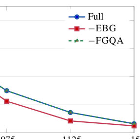
<figcaption class="paper-figure-caption"><b>Fig 1.</b> Figure 1: Mean stress-test accuracy over ten paired seeds. Full and −FGQA coincide at recorded precision. Curves take the worst loss over implemented PGD/SPSA candidates and all previously evaluated smaller-budget candidates. Standard deviations are in Appendix C.</figcaption>
</figure>
<figure class="paper-figure-card">
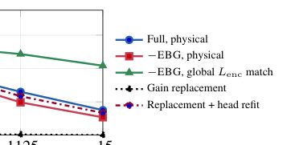
<figcaption class="paper-figure-caption"><b>Fig 2.</b> Figure 2: Controls on all 30 attacked test examples. Matched −EBG uses physical budget 0.39187472ϵ; other curves use ϵ. Gain replacement disrupts detection; refitting restores the un- perturbed detection rate but changes both gain and classification head.</figcaption>
</figure>

**Summary.** This paper investigates the robustness of a quantum attention network used for power-grid anomaly detection against adversarial attacks. The core finding is that the perceived benefit of removing specific network modules depends entirely on the mathematical comparison rule used for auditing. The authors caution that these results are descriptive, not causal, highlighting the need for careful experimental design in quantum machine learning security analysis.

**Why it may be interesting.** While focused on ML, the rigorous auditing of robustness and the explicit dependence on comparison rules mirrors challenges in characterizing stability in complex, non-equilibrium quantum systems.

Detailed structure

**Main problem.** The study audits the robustness of quantum attention mechanisms against adversarial attacks, focusing on how the choice of normalization or comparison rule dictates the perceived benefit of ablating specific modules.

**Main result.** The observed robustness benefits from module ablation are found to be dependent on the comparison rule used, suggesting the comparison is descriptive rather than establishing a true causal benefit.

**Method.** The authors employ module ablation studies (e.g., removing EBG, FGQA) on a quantum attention detector, comparing performance metrics under various normalization and comparison schemes.

**Model / system.** The model is a quantum self-attention classifier (SEQFORMER) applied to detect false-data-injection attacks on power-grid trajectories using a four-qubit quantum attention block.

**Key observables.** AURA (Area Under Robust Accuracy), clean prediction accuracy, detection rates under paired knockouts, and the ordering of performance metrics across different ablation conditions.

**Important parameters / regimes.** Attack budget ($\epsilon$), number of seeds (10), number of qubits (4), and specific regularization parameters ($\lambda_{in}, \lambda_{out}$).

**Assumptions / limitations.** The evidence is limited to synthetic data, exact simulation, and a restricted set of attacks; the comparison is shown to be descriptive, not causal.

**Figures summary.** The notes reference multiple tables comparing paired contrasts (Table 3, 7) and showing accuracy decay vs. attack budget (Table 4, 5, 6) across various module knockouts.

**Paper structure.** The paper structure involves defining the QML model and attack setup, followed by systematic ablation studies of components (EBG, FGQA, NACH), rigorous comparison of results based on normalization rules, and concluding with diagnostic checks on the limitations of the observed benefits.

Abstract

Removing an input-scaling module changes both a classifier and the perturbations reaching its encoder. A robustness difference can therefore reflect the comparison rule as well as the module. We demonstrate this problem in a four-qubit quantum-attention detector on generated power-grid trajectories. A learned scaling module appears beneficial at a fixed physical attack budget, but matching an upper bound on perturbations at the encoder reverses the ordering. Neither comparison alone establishes a robustness benefit caused by the module. The initial test also perturbs clean examples into attacked examples while retaining their original labels; tests restricted to already attacked examples do not establish a benefit. Replacing a trained model's input scales disrupts detection. Retraining its linear classification layer restores the detection rate, but changes individual predictions, leaving the comparison descriptive rather than causal. Two further design checks explain why the input quantum Fisher information regularizer cannot train this model's query parameters, and why removing confidence bounds does not establish a larger certified radius. The evidence is limited to ten seeds, exact simulation, synthetic data, and a restricted set of attacks; classical baselines achieve better clean prediction. The practical lesson is to specify which perturbation budget is fixed, check that attacks preserve labels and interventions preserve predictions, and distinguish exploratory controls from confirmatory evidence.

[↑ back to top](#top)

### [Traveling waves, phase separation and pattern formation in the active stepping stone model](http://arxiv.org/abs/2610.02346v1)

**Authors:** Rashmiranjan Bhutia, Prasad Perlekar, Kabir Ramola  
**Type:** theory · **Category:** statistical mechanics · **PDF:** <https://arxiv.org/pdf/2610.02346v1>  
**Analysis basis:** full PDF text, analyzed in chunks
**Topic relevance:** `Frenkel-Kontorova` **1/5** · `driven-dissipative phase transition` **1/5** · `non-equilibrium universality` **1/5**

↔ Scroll figures horizontally

<figure class="paper-figure-card">
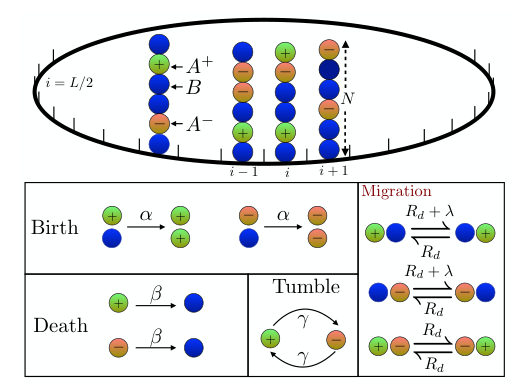
<figcaption class="paper-figure-caption"><b>Fig 1.</b> FIG. 1: Schematic of the active stepping-stone model in one dimension. Lattice sites i contain active individuals A (red/green) with a flippable directional spin σ = ±1 (right/left) and passive individuals B (blue). The dynam- ics of the system include random neighbor exchanges across sites i and i + 1 and local on-site reactions.</figcaption>
</figure>
<figure class="paper-figure-card">
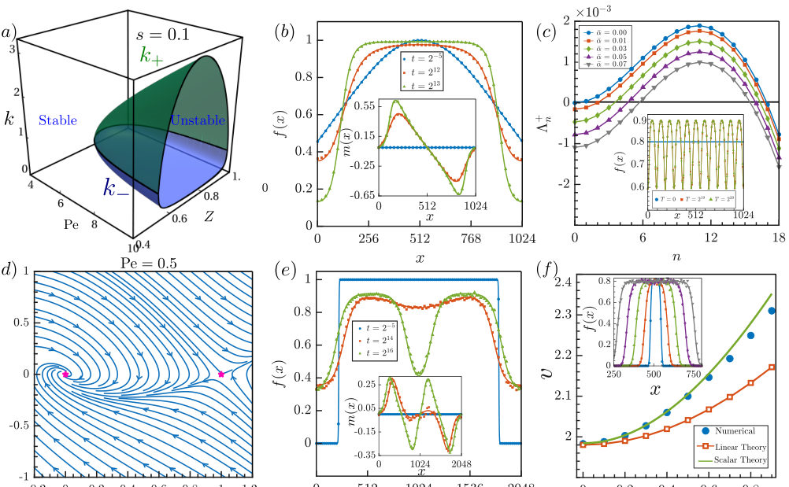
<figcaption class="paper-figure-caption"><b>Fig 2.</b> FIG. 2: Numerical verification of the hydrodynamic theory, Eq. (1). Distinct dynamical regimes are identified: (a) A band of unstable modes is shown in the parameter space of Pe and Z with k−and k+ shown in different colors keeping s = 0.1; (b) activity-driven motility-induced phase separation (MIPS), characterized by macroscopic phase separation and spontaneous magnetization; (c) a finite-k instability characterized by an unstable band of Fourier modes, leading to a microphase-separated state, shown in the inset; (d) phase portrait obtained from Eq. (7) at Pe = 0.5, showing the stable fixed point (0, 0) and the unstable fixed point (1, 0). (e) a weak-reaction regime exhibiting finite-sized...</figcaption>
</figure>
<figure class="paper-figure-card">
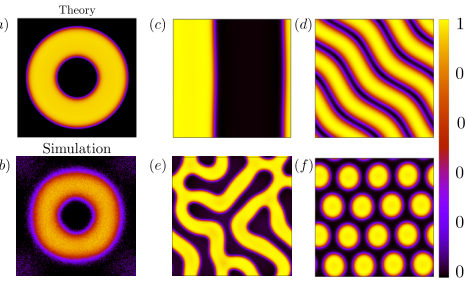
<figcaption class="paper-figure-caption"><b>Fig 3.</b> FIG. 3: (a), (b) Evolution of the two-dimensional density field at t = 211 starting from a non-uniform initial state, comparing hydrodynamic solutions (a) with particle-level Monte Carlo simulations (b). Parameters: L = 200, Z = 0.7, Rd = 1, α = 0.001, γ = 0.01, and λ = 0.8. (c)–(f) MIPS, banded, ring-like, and hexagonal patterns obtained from numerical solution of Eq. (1). Here L = 256, with (c) Z = 0.75, Pe = 7, ¯α = 0.01; (d) Z = 0.75, Pe = 7, ¯α = 1; (e) Z = 0.8, Pe = 7, ¯α = 0.1 with a non uniform initial condition; and (f) Z = 0.7, Pe = 9, ¯α = 1. Here ¯α = α/γ and γ = 0.01 for all the figures.</figcaption>
</figure>
<figure class="paper-figure-card">
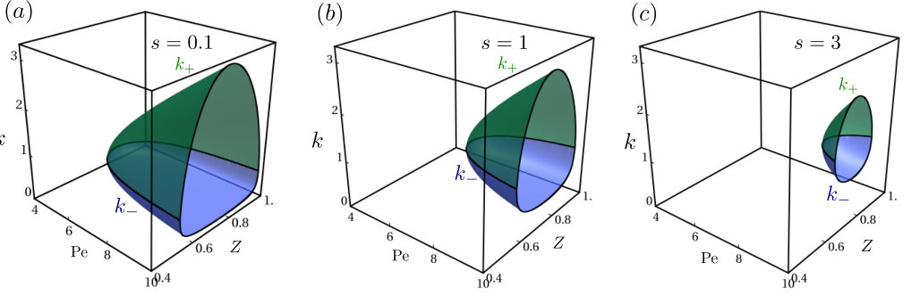
<figcaption class="paper-figure-caption"><b>Fig 4.</b> FIG. 4: The unstable band progressively narrows and shifts toward larger Pe as the reaction rate increases. k+ and k−</figcaption>
</figure>
<figure class="paper-figure-card">
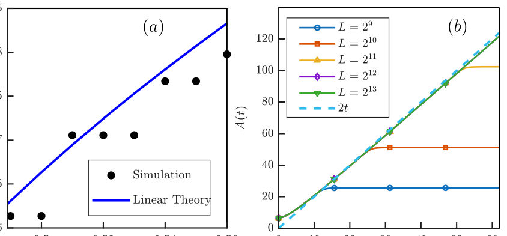
<figcaption class="paper-figure-caption"><b>Fig 5.</b> FIG. 5: (a) The dependence of Kmax on λ for γ = 0.01, Z = 0.8, and ¯α = 0.09 is plotted. The system size is chosen as L = 210. The theoretical curve is obtained from the linear stability analysis based on Eq. (41). The simulation data are obtained by numerically integrating the full non-linear hydrodynamic equations, Eq. (1) in the main text, and measuring the steady-state properties after evolving the system up to t = 220. (b) The area under the curve vs. time for different system sizes is plotted by solving the non-linear hydrodynamic equations Eq. (1) in the main text using a pseudo-spectral method. A first-order Euler time integration scheme is used with δt = 2−5. The system parameters...</figcaption>
</figure>

**Summary.** This work develops a minimal model for active populations combining self-propulsion and growth/decay processes. By deriving and simulating corresponding hydrodynamic equations, the authors demonstrate that activity fundamentally alters pattern formation, leading to regimes like MIPS and stable traveling waves. This provides a theoretical framework for understanding collective behavior in active matter systems.

**Why it may be interesting.** The study of active matter systems, pattern formation, and non-equilibrium phase transitions is highly relevant to understanding complex dynamics in many-body physics, bridging concepts from statistical mechanics and soft matter.

Detailed structure

**Main problem.** The paper analyzes the complex interplay between selective advantage (proliferation) and self-propulsion (activity) in an active, proliferating population.

**Main result.** Activity leads to the emergence of novel morphological patterns, including Motility-Induced Phase Separation (MIPS) and stable propagating traveling-wave profiles, which are sensitive to the activity strength.

**Method.** The authors derive macroscopic hydrodynamic equations from a microscopic lattice model and validate these equations using both numerical simulations and linear stability analysis.

**Model / system.** The system is modeled by the active stepping-stone model, combining run-and-tumble migration with a stochastic birth-death process on a lattice. The dynamics are captured by coupled hydrodynamic equations for density and magnetization.

**Key observables.** Local fraction of active alleles ($f$), local magnetization ($m$), wave propagation speed, and the formation of micro-phase-separated structures.

**Important parameters / regimes.** Péclet number ($Pe$), carrying capacity ($Z$), and reaction strength ($s$), which control the transition between different dynamical regimes.

**Assumptions / limitations.** The derivation relies on coarse-graining techniques to obtain continuum hydrodynamic equations, which are assumed valid except at very strong activity levels.

**Figures summary.** Figures illustrate distinct dynamical regimes (MIPS, micro-phase separation, traveling waves) in 1D and 2D, comparing pseudo-spectral solutions to particle-level Monte Carlo simulations.

**Paper structure.** The paper proceeds by establishing the microscopic model, deriving the continuum hydrodynamic equations, and then analyzing the system's behavior across various parameter regimes (low activity, intermediate activity, high activity) using stability analysis and numerical solutions.

Abstract

Selective advantage leads to the proliferation of a species into an ecosystem. On the other hand, self-propulsion can lead to dynamic clustering of individuals. To analyze the intricate effects produced by such competing processes, we introduce a minimal model for a proliferating active population, where run-and-tumble migration is combined with a stochastic birth-death process. Beginning with the microscopic dynamics of the particles, we derive the corresponding hydrodynamic equations and validate them through numerical simulations. We demonstrate that the inclusion of activity leads to the emergence of novel morphological patterns, which are sensitive to the specific rules governing migration. Furthermore, we show that activity significantly alters the characteristics of invasion waves, increasing their propagation speed. However, beyond a threshold, excessive activity disrupts the wave-like nature of the invasion process. We also extend our study to two dimensions and analyze the instabilities that lead to pattern formation in such systems.

[↑ back to top](#top)

### [Breakdown of material-time scaling in the microscopic dynamics of metallic glasses](http://arxiv.org/abs/2610.02426v1)

**Authors:** Till Böhmer, Jie Shen, Jan Philipp Gabriel, Rolf Zeißler, Federico Zontone, Fan Yang, Eloi Pineda, Beatrice Ruta, Thomas Blochowicz  
**Type:** experiment · **Category:** disordered systems and neural networks · **PDF:** <https://arxiv.org/pdf/2610.02426v1>  
**Analysis basis:** full PDF text, analyzed in chunks
**Topic relevance:** `non-equilibrium universality` **1/5** · `scars & prethermalization` **1/5**

↔ Scroll figures horizontally

<figure class="paper-figure-card">
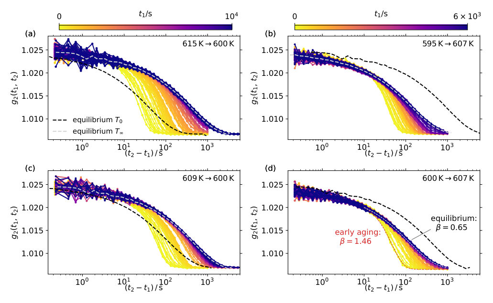
<figcaption class="paper-figure-caption"><b>Fig 1.</b> FIG. 1. Time-resolved intensity autocorrelation functions g2(q, t1, t2) during aging measured at q = 2.61 ˚A −1 plotted as a function of the lag time t2 −t1 following different temperature jumps. Down-jumps are shown in panels (a) and (c), and up-jumps in panels (b) and (d). The color indicates the waiting time t1, with t1 = 0 defined as the time at which the sample reaches T∞. Equilibrium autocorrelation functions at the initial temperature T0 and final temperature T∞are shown as black and gray dashed lines, respectively. Panel (d) shows two representative fits of the autocorrelation functions using Eq. (8), illustrating the evolution of the stretching exponent from β &gt; 1 at early waiting...</figcaption>
</figure>
<figure class="paper-figure-card">
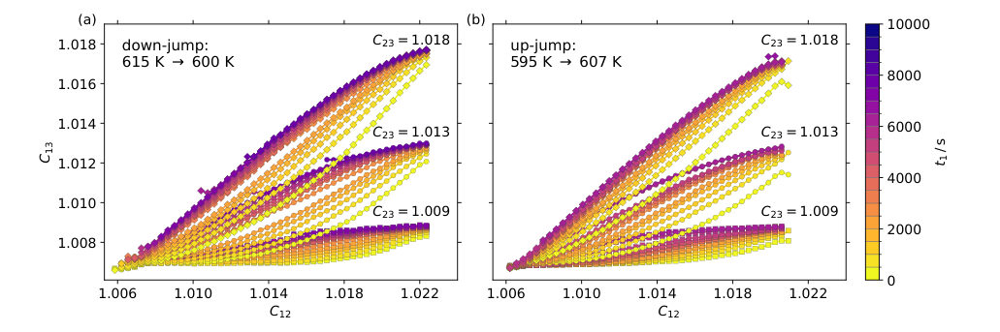
<figcaption class="paper-figure-caption"><b>Fig 2.</b> FIG. 2. Test of the triangular relation for two-time autocorrelation functions during aging after (a) a temperature down-jump from 615 K to 600 K and (b) an up-jump from 595 K to 607 K. The correlation C13 is plotted as a function of C12 for three fixed values of C23 = 1.009, 1.013, and 1.018. Colors indicate the waiting time t1 after the temperature jump. For a valid material-time description, C13 should be uniquely determined by C12 and C23 and therefore independent of t1. The systematic dependence on t1 observed for both temperature jumps demonstrates a violation of the triangular relation.</figcaption>
</figure>
<figure class="paper-figure-card">
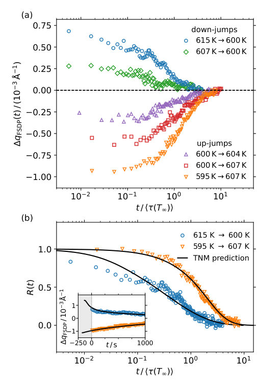
<figcaption class="paper-figure-caption"><b>Fig 3.</b> FIG. 3. Aging of the average structure following temperature up- and down-jumps. (a) Evolution of the FSDP position qFSDP relative to its equilibrium value at the final temper- ature, plotted as a function of time normalized by the av- erage equilibrium relaxation time ⟨τ(T∞)⟩. (b) Normalized structural relaxation R(t) for the largest down- and up-jumps. Solid black lines show the corresponding TNM predictions us- ing a common parameter set. The inset shows the evolution of ∆qFSDP(t) around t = 0, including the TNM prediction dur- ing the finite-duration temperature jump before T∞is reached (t &lt; 0).</figcaption>
</figure>
<figure class="paper-figure-card">
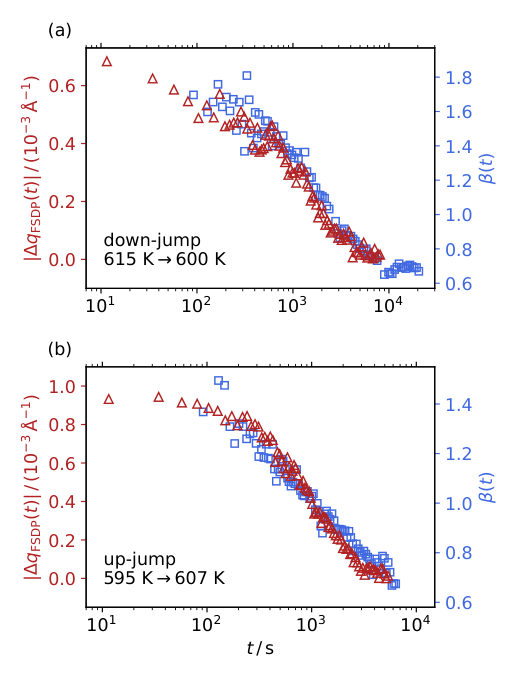
<figcaption class="paper-figure-caption"><b>Fig 4.</b> FIG. 4. Evolution of the deviation from equilibrium of the FSDP maximum, |qFSDP(t)−qeq FSDP(T∞)| (red, left axes), and the KWW stretching exponent β(t) (blue, right axes) during aging after (a) a temperature down-jump from 615 K to 600 K and (b) an up-jump from 595 K to 607 K. In both cases, β approaches its equilibrium value on approximately the same timescale on which qFSDP reaches equilibrium.</figcaption>
</figure>

**Summary.** This experimental study uses X-ray scattering to probe aging in metallic glasses, comparing macroscopic structural changes to microscopic dynamics. While the average structure follows predictions based on 'material time,' the underlying microscopic correlations violate this scaling. The findings suggest that material time is an effective description for average structure but fails to capture the full complexity of the microscopic relaxation processes.

**Why it may be interesting.** The decoupling of macroscopic structural relaxation from microscopic dynamics provides a nuanced view of aging, suggesting that simple time reparameterizations may only capture average structural changes, not the full quantum mechanical relaxation pathways.

Detailed structure

**Main problem.** The paper investigates whether the concept of 'material time,' used to describe physical aging in glasses, accurately captures the underlying microscopic dynamics of metallic glasses.

**Main result.** The average structural properties follow material-time scaling, but the microscopic density-density correlations strongly violate this scaling, suggesting the two descriptions are decoupled.

**Method.** The study uses simultaneous time-resolved X-ray diffraction (XRD) and X-ray photon-correlation spectroscopy (XPCS) following small temperature jumps.

**Model / system.** The system studied is a metallic glass (MG), specifically $	ext{Zr}_{46.8}	ext{Ti}_{8.2}	ext{Cu}_{7.5}	ext{Ni}_{10}	ext{Be}_{27.5}$. The analysis compares macroscopic structural evolution (modeled by TNM) against microscopic dynamics.

**Key observables.** First sharp diffraction peak position ($q_{	ext{FSDP}}$), two-time intensity autocorrelation function ($g_2(t_1, t_2)$), and the violation of the triangular relation.

**Important parameters / regimes.** Temperature jump magnitude ($\Delta T$), relaxation exponents ($eta$), and the material time parameter ($\xi$).

**Assumptions / limitations.** The TNM model assumes a specific form for the relaxation kernel, and the analysis tests the validity of the material-time scaling hypothesis.

**Figures summary.** Figures illustrate the evolution of the autocorrelation function shape (from compressed-exponential to stretched-exponential) and test the triangular relation, showing systematic violations during aging.

**Paper structure.** The paper first establishes the structural evolution consistent with material-time aging (TNM model) using XRD. It then probes the microscopic dynamics using XPCS, demonstrating that these correlations violate the material-time scaling criteria, leading to the conclusion that the two descriptions are distinct.

Abstract

Physical aging in glasses is often described using the concept of material time, which assumes the underlying relaxation mechanism to remain the same as in equilibrium, but with a rate that changes during aging. Whether material time also captures the microscopic dynamics of metallic glasses, which differ qualitatively between the glass and the equilibrium supercooled liquid, is unclear. Using simultaneous time-resolved X-ray diffraction and X-ray photon-correlation spectroscopy, we follow the full equilibration of a metallic glass after small temperature jumps starting from equilibrium. The time evolution of the first sharp diffraction peak position exhibits the asymmetry between temperature up- and down-jumps characteristic of material-time aging and is quantitatively described by the Tool-Narayanaswamy-Moynihan model, which is based on this concept. By contrast, the microscopic density-density autocorrelation functions strongly violate material-time scaling. Compressed-exponential relaxation emerges even after temperature changes as small as 4K, irrespective of the direction of the temperature jump, and continuously evolves into a stretched-exponential relaxation shape following the equilibration of the average structure. This behavior is consistent with a transient stress-mediated contribution associated with volumetric frustration that disappears upon equilibration. Our results show that a material time can describe the evolution of average structural properties even when the corresponding microscopic dynamics do not obey material-time scaling.

[↑ back to top](#top)

### [Chaotic Griffiths phase in neuron map networks](http://arxiv.org/abs/2610.03344v1)

**Authors:** Juan Velez-Rojas, M. G. Cosenza  
**Type:** theory · **Category:** disordered systems and neural networks · **PDF:** <https://arxiv.org/pdf/2610.03344v1>  
**Analysis basis:** full PDF text, analyzed in chunks
**Topic relevance:** `driven-dissipative phase transition` **1/5** · `non-equilibrium universality` **1/5**

↔ Scroll figures horizontally

<figure class="paper-figure-card">
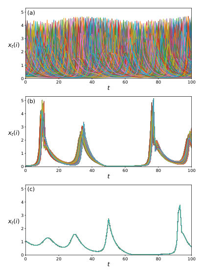
<figcaption class="paper-figure-caption"><b>Fig 1.</b> FIG. 1. Typical time series xt(i) of N = 103 maps in the globally coupled neuron system Eqs. (3)-(5) for different coupling strengths ε, after discarding 5×104 transients. Fixed map parameters are a = 0.89, b = 0.18, and c = 0.28. Each map i is assigned a heterogeneous parameter k(i) ∈[0.026,0.03]. (a) ε = 0.028, desynchronization. (b) ε = 0.14, chaotic Griffiths phase. (c) ε = 0.7, chaotic coherence.</figcaption>
</figure>
<figure class="paper-figure-card">

<figcaption class="paper-figure-caption"><b>Fig 2.</b> FIG. 3. Dispersion of the clustered fraction σ(p) vs coupling ε for the system Eqs. (3)–(5) and different system sizes N = 200, 1000, 5000, and 16000. Only values σ(p) &gt; 0.12 are plotted. For each N, clusters are identified using the appropriate threshold δN, defined in the text. Fixed parameters are a = 0.89, b = 0.18, c = 0.28, and k(i) ∈[0.026, 0.03]. For each value of ε, σ(p) is averaged over 20 independent realizations with different random initial conditions and quenched heterogeneity, after discarding 2×104 transient iterations. Labels indicate D: desynchronization, G: chaotic Griffiths phase, and S: coherence.</figcaption>
</figure>
<figure class="paper-figure-card">

<figcaption class="paper-figure-caption"><b>Fig 3.</b> FIG. 2. Fraction of clustered neurons pt as a function of time us- ing a threshold δ16000 = 1.41×10−6 for the system Eqs. (3)-(5), for different values of ε. A total of 5.0 × 104 transient iterations have been discarded. Fixed parameters are a = 0.89, b = 0.18, c = 0.28, size N = 16000, and k(i) ∈[0.026, 0.03]. Black line: ε = 0.028, D (desynchronization). Red line: ε = 0.14, G (chaotic Griffiths phase). Blue line: ε = 0.8, S (coherence).</figcaption>
</figure>
<figure class="paper-figure-card">
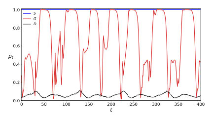
<figcaption class="paper-figure-caption"><b>Fig 4.</b> Figure 2 shows the time evolution of the fraction of clus- tered neurons, pt, in the system Eqs. (3)-(5) for the different</figcaption>
</figure>
<figure class="paper-figure-card">
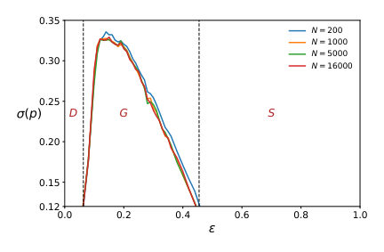
<figcaption class="paper-figure-caption"><b>Fig 5.</b> Figure 3 shows the dispersion of the clustered fraction σ(p) as a function of the coupling strength ε for the system</figcaption>
</figure>

**Summary.** This work analyzes chaotic Griffiths phases in coupled neuron networks, demonstrating that local parameter disorder alone can induce extended critical dynamics. The authors show that this intrinsic disorder, when combined with structural disorder like small-world connectivity, significantly broadens the critical regime. The study uses cluster analysis and Lyapunov exponents to confirm that dynamical heterogeneity is a key mechanism for extended criticality.

**Why it may be interesting.** The findings provide a theoretical framework for understanding extended criticality in complex dynamical systems, showing that intrinsic dynamical disorder can mimic or enhance the effects typically associated with structural disorder in network science.

Detailed structure

**Main problem.** The paper investigates how chaotic Griffiths phases can emerge and be sustained in coupled neuronal networks, specifically differentiating the roles of intrinsic parameter disorder versus structural disorder.

**Main result.** Intrinsic dynamical heterogeneity alone is sufficient to generate a chaotic Griffiths phase, and combining it with structural disorder (small-world connectivity) significantly extends this critical regime.

**Method.** The study uses time-series analysis, clustering diagnostics (tracking the fraction of clustered neurons, $p_t$), and calculating the dispersion $\sigma(p)$ to characterize the transition between different dynamical regimes.

**Model / system.** The model is a network of neurons governed by the Chialvo map, which is coupled either globally or on a Watts-Strogatz small-world topology. Disorder is introduced via quenched randomness in the local neuronal parameters.

**Key observables.** Fraction of clustered neurons ($p_t$), cluster size distribution exponents ($\alpha$), dispersion of $p_t$ ($\sigma(p)$), and the number of positive Lyapunov exponents ($N_+$).

**Important parameters / regimes.** Coupling strength ($\epsilon$), degree of local parameter heterogeneity ($A$), and the structural disorder parameter (small-world rewiring probability).

**Assumptions / limitations.** The analysis assumes that the system dynamics can be characterized by the emergence of power-law distributions and anomalous scaling of Lyapunov exponents in the critical regime.

**Figures summary.** Figures illustrate the time evolution of the clustered fraction ($p_t$) across different regimes (desynchronized, Griffiths, coherent), show power-law scaling of cluster sizes in the Griffiths phase, and demonstrate anomalous scaling of positive Lyapunov exponents ($N_+$) with system size $N$.

**Paper structure.** The paper first establishes the model using globally coupled neurons with intrinsic disorder, identifying the chaotic Griffiths phase. It then extends the analysis to include small-world connectivity, showing that the combination of both types of disorder broadens the critical regime. Finally, it analyzes the scaling of Lyapunov exponents to confirm the robustness of the critical signatures.

Abstract

Griffiths phases provide a mechanism for sustaining critical dynamics over extended parameter regions without fine-tuning to an isolated transition point. This behavior has been mainly associated with structural heterogeneity in complex networks. Here we show that quenched heterogeneity in local parameters can generate a chaotic Griffiths phase in a network of map-based neurons. We study globally coupled Chialvo maps with quenched disorder in a local neuronal parameter, thereby isolating intrinsic parameter disorder from topological disorder. As the coupling strength is varied, a chaotic Griffiths phase emerges between desynchronized and coherent chaotic dynamics, characterized by intermittent formation and breakup of neuronal clusters and large fluctuations in the fraction of clustered neurons. Within this regime, cluster sizes exhibit power-law distributions with coupling-dependent exponents, providing evidence of critical behavior over a finite parameter interval. The chaotic Griffiths phase is absent in the homogeneous limit and broadens progressively as the degree of parameter heterogeneity increases. We further introduce topological disorder through small-world connectivity and find that its combined action with local parameter heterogeneity substantially extends the chaotic Griffiths phase. In both globally coupled and small-world networks, the number of positive Lyapunov exponents displays anomalous scaling with system size. These results demonstrate that intrinsic dynamical heterogeneity constitutes an independent mechanism for generating chaotic Griffiths phases and that its interplay with structural disorder enhances extended criticality in neuronal networks.

[↑ back to top](#top)

### [Counterdiabatic Quantum Circuits](http://arxiv.org/abs/2610.02312v1)

**Authors:** Ankit Wenju Shrestha, Budhaditya Bhattacharjee, Adolfo del Campo  
**Type:** theory · **Category:** quantum information and computing · **PDF:** <https://arxiv.org/pdf/2610.02312v1>  
**Analysis basis:** full PDF text, analyzed in chunks
**Topic relevance:** `analog quantum simulation` **1/5** · `quantum measurements` **1/5**

↔ Scroll figures horizontally

<figure class="paper-figure-card">
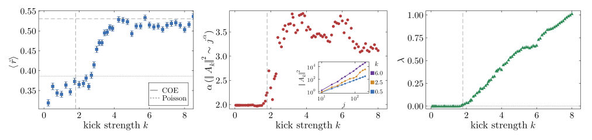
<figcaption class="paper-figure-caption"><b>Fig 1.</b> FIG. 1. Mean level spacing ratio (left), AGP norm scaling exponent with system size (middle), and Lyapunov exponent (right) capturing the integrable to chaos transition in quantum and classical regimes of the kicked top. Vertical lines mark the onset of classical chaos and the inset (middle) shows how AGP norm scales with the system size.</figcaption>
</figure>
<figure class="paper-figure-card">
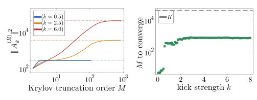
<figcaption class="paper-figure-caption"><b>Fig 2.</b> FIG. 2. Monotonic convergence of AGP norm towards the true value as more terms are added in the series expansion (left). Note that the AGP norm converges to the true value (with relative error ≲10−4) much earlier than the full Krylov space dimension (right).</figcaption>
</figure>
<figure class="paper-figure-card">
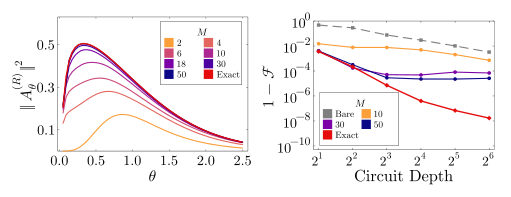
<figcaption class="paper-figure-caption"><b>Fig 3.</b> FIG. 3. (Left) Regularized AGP norm for the brickwork cir- cuit with ˇR matrices as unitary gates (L = 12, γ = 1.0), for several truncation orders M of the Krylov space. (Right) In- fidelity of a state driven from θ = 1.5 →0.2 across different circuit depths with and without the counterdiabatic gates.</figcaption>
</figure>

**Summary.** This paper introduces a novel, Hamiltonian-free framework to calculate the Adiabatic Gauge Potential (AGP) for quantum systems evolving via unitary gates. By utilizing the Krylov space method, the authors provide an efficient way to calculate this potential for complex quantum circuits and Floquet systems. This allows for robust diagnostics of quantum chaos and the design of faster, more robust quantum control protocols.

**Why it may be interesting.** This work provides a powerful, general diagnostic tool (AGP) for characterizing quantum chaos and optimizing quantum gates in circuit models, which is highly relevant for quantum computation.

Detailed structure

**Main problem.** The paper develops a Hamiltonian-free theory for the Adiabatic Gauge Potential (AGP) to enable fast quantum control in systems governed by unitary operators.

**Main result.** The AGP can be calculated directly from the unitary operator and its derivative, bypassing the need for an explicit Hamiltonian, and this method is applicable to quantum circuits and Floquet systems.

**Method.** The authors use a superoperator formulation and the Krylov space method to derive and approximate the AGP, avoiding computationally intensive steps like diagonalization or matrix logarithms.

**Model / system.** The theory is applied to general unitary operators $U_\lambda$, specifically demonstrated on the quantum kicked top and the brickwork circuit, which models dynamics via local unitary gates.

**Key observables.** Adiabatic Gauge Potential (AGP), AGP Norm ($\|A_\lambda\|$), and infidelity ($1-F$).

**Important parameters / regimes.** The parameter $\lambda$ governing the unitary evolution, and the regularization parameter $\eta$ used for numerical stability.

**Assumptions / limitations.** The standard AGP formulation is extended to unitary systems, and the Krylov approximation is used to truncate the infinite series expansion.

**Figures summary.** Figures compare the AGP norm scaling to chaos indicators (like mean level spacing ratio) for the kicked top, and show the monotonic convergence of the approximate AGP norm to the true value.

**Paper structure.** The paper first establishes the Hamiltonian-free AGP theory, then applies it to specific unitary models like the kicked top and brickwork circuit, detailing the mathematical machinery (Krylov/CMV basis) at each step.

Abstract

Counterdiabatic driving provides a universal route to fast quantum control, but its standard formulation presupposes a Hamiltonian generator. We develop a Hamiltonian-free theory of the adiabatic gauge potential (AGP) for parameter-dependent unitary operators $U_λ$. Exact and regularized versions of the AGP follow from a Hermitian, banded linear system at a cost comparable to the Lanczos construction in the Hermitian case, requiring neither diagonalization nor a matrix logarithm. We demonstrate rapid convergence of the truncated Krylov approximation for the kicked top and for an integrable brickwork circuit built from unitary $\check{R}$ matrices, a setting in which no local effective Hamiltonian is available. Our results extend shortcuts to adiabaticity, and AGP-based diagnostics of chaos, to Floquet systems and quantum circuits.

[↑ back to top](#top)

### [Hamiltonian locality testing and certification do not achieve the Heisenberg limit](http://arxiv.org/abs/2610.03205v1)

**Authors:** Francisco Escudero Gutiérrez, Junseo Lee, Sebastian Zur  
**Type:** theory · **Category:** quantum information and computing · **PDF:** <https://arxiv.org/pdf/2610.03205v1>  
**Analysis basis:** full PDF text, analyzed in chunks
**Topic relevance:** `analog quantum simulation` **1/5** · `quantum measurements` **1/5**

↔ Scroll figures horizontally

<figure class="paper-figure-card">
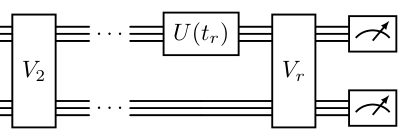
<figcaption class="paper-figure-caption"><b>Fig 1.</b> Figure 1: Experiment to access the Hamiltonian.</figcaption>
</figure>

**Summary.** This paper establishes lower bounds for quantum tasks involving Hamiltonian characterization, proving that locality testing and certification do not reach the Heisenberg limit. Using the continuous-time adversary method, the authors show that these tasks require $\Omega(1/\epsilon^2)$ total evolution time. This result sets a fundamental benchmark for the efficiency of quantum algorithms accessing Hamiltonian dynamics.

**Why it may be interesting.** This work directly impacts the theoretical understanding of quantum resource estimation, showing that even fundamental tasks like learning the Hamiltonian are fundamentally limited by quadratic scaling in precision, which is crucial for designing efficient quantum protocols.

Detailed structure

**Main problem.** The paper investigates the fundamental limits on the time required to test properties of a quantum Hamiltonian, specifically whether it is local or close to a known target Hamiltonian.

**Main result.** The authors prove that Hamiltonian locality testing, Hamiltonian certification, and amplitude estimation all require $\Omega(1/\epsilon^2)$ total evolution time, demonstrating they do not achieve the Heisenberg limit scaling of $1/\epsilon$.

**Method.** The lower bounds are established by adapting the continuous-time adversary method from quantum query complexity to the forward time-evolution access model.

**Model / system.** The system involves $n$-qubit Hamiltonians $H$ acting on a quantum state, where access is restricted to the time-evolution operator $U_H(t) = e^{-iHt}$ for positive times $t>0$. The distance is measured using the normalized Frobenius norm.

**Key observables.** The primary observables are the total evolution time $T$, the distance between Hamiltonians ($	ext{dist}(H, H')$), and the progress function $P(t)$ derived from the evolution.

**Important parameters / regimes.** The key parameters are the precision $\epsilon$ (related to the distance $\varepsilon$) and the number of qubits $n$. The scaling is shown to be $\Omega(1/\epsilon^2)$.

**Assumptions / limitations.** The analysis assumes access only to forward time evolution ($t>0$) and relies on establishing hardness by distinguishing a random ensemble from the zero Hamiltonian.

**Figures summary.** Figure 1 illustrates the general experiment setup for accessing the Hamiltonian via sequential time evolution queries, outlining results for locality testing, certification, and amplitude estimation.

**Paper structure.** The paper first establishes the general framework and then applies the adversary method to three specific problems: 1) Locality Testing, 2) Hamiltonian Certification, and 3) Amplitude Estimation, showing the $\Omega(1/\epsilon^2)$ lower bound for each.

Abstract

We establish lower bounds for Hamiltonian property testing with access to the time-evolution operator but not its inverse. Each experiment may query the time-evolution operator multiple times, and distances between Hamiltonians are measured in the normalized Frobenius norm.   In this model, we show that testing whether a Hamiltonian is $k$-local or $\varepsilon$-far from every $k$-local Hamiltonian requires $Ω(1/\varepsilon^2)$ total evolution time, matching the upper bound of Kallaugher and Liang (TQC'25). We also prove that testing whether an unknown Hamiltonian equals a target Hamiltonian or is $\varepsilon$-far from it requires $Ω(1/\varepsilon^2)$ total evolution time, matching the upper bound of Sinha and Tong (2025). These are the first lower bounds for natural problems in Hamiltonian learning and testing that rule out Heisenberg-limited scaling of $1/\varepsilon$.   As a third result, we show that amplitude estimation to precision $\varepsilon$ requires $Ω(1/\varepsilon^2)$ total time evolution, recovering the result of Tang and Wright (QIP'26) in the continuous-time query model. All three results follow from the hardness of distinguishing the zero Hamiltonian from a suitably chosen ensemble of random Hamiltonians. We establish this hardness by adapting the continuous-time adversary method to forward Hamiltonian evolution.

[↑ back to top](#top)

### [Landscape-Dependent Performance of Photonic Quantum Solvers in QUBO Feature Selection for Financial Risk Detection](http://arxiv.org/abs/2610.03161v1)

**Authors:** Nirvik Sahoo, Paul Robert Griffin  
**Type:** both · **Category:** quantum information and computing · **PDF:** <https://arxiv.org/pdf/2610.03161v1>  
**Analysis basis:** full PDF text, analyzed in chunks
**Topic relevance:** `QC/QI experiment` **1/5** · `quantum optics experiment` **1/5**

↔ Scroll figures horizontally

<figure class="paper-figure-card">
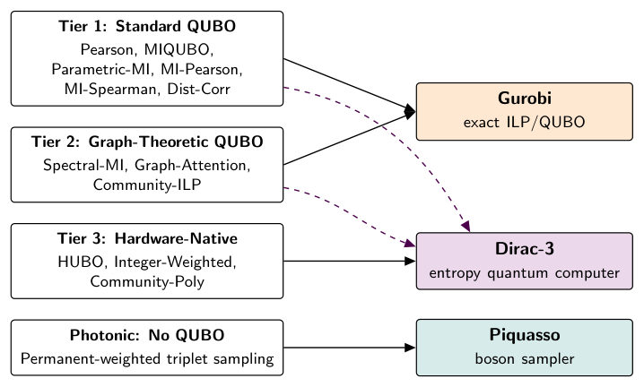
<figcaption class="paper-figure-caption"><b>Fig 1.</b> Figure 1: Solver-aware method routing: each tier is assigned to the solver that handles its mathematical structure exactly (solid arrows). Tier 1 and Tier 2 QUBO methods are also run on Dirac-3 for a direct, method-matched comparison (dashed arrows).</figcaption>
</figure>
<figure class="paper-figure-card">
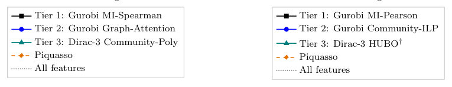
<figcaption class="paper-figure-caption"><b>Fig 2.</b> Figure 2: F1 versus feature budget k for the best solver and method in each tier, together with Piquasso. For each tier, the line shows the solver–method pair with the highest F1 at any budget (Table 4; ties broken by the smaller k, then by the higher mean F1 across budgets), plotted at every budget. Dirac-3 values are five-run means with 95% CI error bars; Gurobi values are deterministic and Piquasso values were identical across repeated runs. The dotted line is the all-features model. †AmEx Tier 3 uses the 135-feature pre- filtered pool, so its largest budget is k=130.</figcaption>
</figure>
<figure class="paper-figure-card">
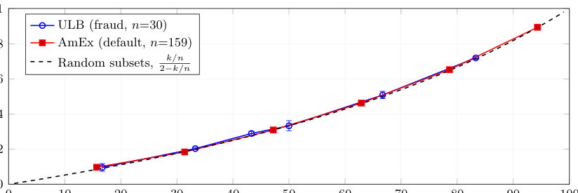
<figcaption class="paper-figure-caption"><b>Fig 3.</b> Figure 3: Mean off-diagonal Jaccard similarity among QUBO/Graph feature-selection methods as a func- tion of relative feature budget k/n, for ULB and AmEx. Error bars show 95% CI across five independent Dirac-3 runs (Tables 15 and 16). The dashed line is the expected similarity between two random subsets of the same size (Eq. 9). Both datasets lie on this curve at every tested budget, so cross-method overlap does not separate them.</figcaption>
</figure>

**Summary.** This paper compares classical and photonic quantum solvers for feature selection in financial risk detection using two large datasets. It demonstrates that the choice of solver and method is critical, showing that quantum approaches can outperform classical methods when the underlying feature signal is highly concentrated. This highlights the potential role of quantum computation in solving complex, structured optimization problems in finance.

**Why it may be interesting.** The work directly tests the practical utility of quantum computation (photonic solvers) for solving complex, real-world optimization problems arising in data science, providing empirical benchmarks for quantum advantage in optimization.

Detailed structure

**Main problem.** The paper addresses feature selection for imbalanced financial classification tasks by comparing classical optimization methods against photonic quantum solvers.

**Main result.** Photonic solvers (Dirac-3) showed superior performance over classical solvers (Gurobi) in certain scenarios, particularly when the predictive signal is highly concentrated in a small feature subset (ULB dataset).

**Method.** The authors benchmarked three computing paradigms—classical branch-and-bound, photonic entropic computing, and photonic boson sampling—across various QUBO and graph-theoretic feature selection methods.

**Model / system.** The model involves formulating feature selection as a combinatorial optimization problem, utilizing two financial datasets: ULB Credit Card Fraud and AmEx Consumer Default. The computational platforms include classical solvers and photonic quantum devices.

**Key observables.** F1 score (primary metric), Gini Coefficient, and Jaccard similarity, used to quantify classification performance and feature redundancy.

**Important parameters / regimes.** Feature budget ($k$), dataset size (30 vs. 159 features), and the specific mathematical structure of the objective function (QUBO, higher-order terms).

**Assumptions / limitations.** The comparison assumes that the mathematical structure of the feature selection method dictates the appropriate quantum or classical solver, and that the performance gap between solvers is measurable.

**Figures summary.** The notes reference tables and matrices showing F1 and Gini scores across various methods and feature budgets for both datasets, and similarity matrices illustrating feature overlap.

**Paper structure.** The paper establishes the problem (feature selection for imbalanced data), details the datasets and the three computational paradigms (Gurobi, Dirac-3, Piquasso), systematically compares performance across multiple methods (Tier 1, 2, 3), and analyzes the dependence of performance on dataset structure and feature budget.

Abstract

Feature selection for imbalanced classification tasks such as credit card fraud and consumer default detection requires balancing predictive relevance, inter-feature redundancy, and computational feasibility. We benchmark three computing paradigms, classical branch-and-bound optimization (Gurobi), photonic entropy computing (QCI Dirac-3), and simulated photonic boson sampling (Piquasso), across thirteen feature-selection methods on two datasets: ULB Credit Card Fraud (30 features) and AmEx consumer default (159 features). Each method is routed to the solver matched to its mathematical structure. On ULB, Dirac-3 MI-Spearman matches the all-features model using 13 of 30 features (mean F1 0.873 +/- 0.023 over five runs, best run 0.896), and Piquasso is the best method at k=5. On AmEx, performance rises steadily with the feature budget and every paradigm approaches F1 = 0.80 only near the full feature set. Most differences between Gurobi and Dirac-3 on identical methods fall within run-to-run variation; the large gaps occur where the certified optimum generalizes poorly, most sharply for distance correlation on AmEx at k=25 (Gurobi F1 = 0.422 vs. a Dirac-3 mean of 0.746). At matched budgets, F1 varies about ten times more across methods on ULB than on AmEx, which we trace to how concentrated the predictive signal is in each feature space.

[↑ back to top](#top)

### [Spatiotemporal quantum advantages for rare-event sampling](http://arxiv.org/abs/2610.03026v1)

**Authors:** Akshat Gupta, Jianjun Chen, Chengran Yang, Mile Gu, Caterina Doglioni, Jayne Thompson, Thomas J. Elliott  
**Type:** theory · **Category:** statistical mechanics · **PDF:** <https://arxiv.org/pdf/2610.03026v1>  
**Analysis basis:** full PDF text, analyzed in chunks
**Topic relevance:** `methods for driven-dissipative` **1/5** · `quantum measurements` **1/5**

↔ Scroll figures horizontally

<figure class="paper-figure-card">
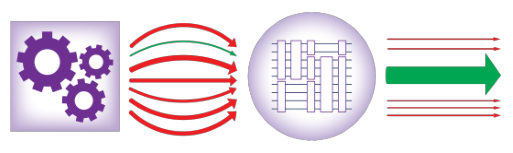
<figcaption class="paper-figure-caption"><b>Fig 1.</b> FIG. 1. Conceptual schema of our approach. A quan- tum model is used to generate a weighted superposition over all trajectories of a stochastic process, including target rare event(s). This is then fed into an algorithm that amplifies the weighting for the target rare event(s) and suppresses the rest.</figcaption>
</figure>
<figure class="paper-figure-card">
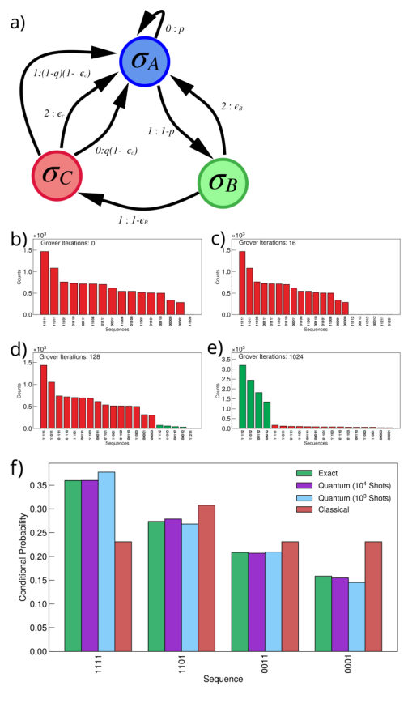
<figcaption class="paper-figure-caption"><b>Fig 2.</b> FIG. 2. (a) Hidden Markov model representation of the Nemo process with error symbols; notation x : p denotes the proba- bility p of the indicated transition occurring, accompanied by output symbol x. Progression of reweighting of rare events for (b) 0, (c) 16, (d) 128, and (e) 1024 Grover iterations; green denotes target rare events, red the remaining trajecto- ries. (f) Comparison of reconstructed conditional probabil- ities for preceding symbols to a rare event for classical and quantum approaches; sequences with multiple errors omitted due to vanishingly-small probabilities of occurrence.</figcaption>
</figure>
<figure class="paper-figure-card">
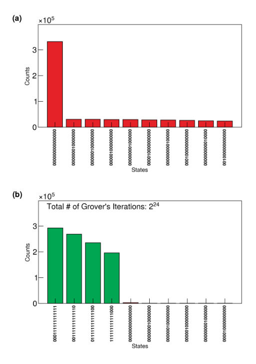
<figcaption class="paper-figure-caption"><b>Fig 3.</b> FIG. 3. Sampled trajectories for the PMD process (a) without amplification, and (b) with 224 Grover iterations; green de- notes target rare events, red the remaining trajectories. Cir- cuits evaluated with 106 shots. Plots limited to 10 highest- probability sequences. Plots of the progression of amplifica- tion are given in the Supplementary Material.</figcaption>
</figure>

**Summary.** This paper introduces a quantum algorithm to efficiently sample rare events in stochastic processes modeled by Quantum Hidden Markov Models (QHMMs). By combining quantum state preparation with Quantum Amplitude Amplification, it achieves quadratic speed-ups in time complexity and polynomial speed-ups in memory complexity over classical Monte Carlo methods. This is vital for simulating rare, high-impact phenomena in statistical physics.

**Why it may be interesting.** This work provides a quantum computational tool to analyze rare, high-consequence events in stochastic physical systems, which is crucial for understanding extreme states in non-equilibrium statistical mechanics.

Detailed structure

**Main problem.** The paper addresses the challenge of rare-event sampling—studying outcomes of high consequence but low probability—which is computationally prohibitive using classical methods.

**Main result.** The authors propose a quantum approach that achieves simultaneous quadratic speed-ups in temporal complexity (via Quantum Amplitude Amplification) and polynomial speed-ups in spatial complexity compared to classical Monte Carlo methods.

**Method.** The method integrates Quantum Hidden Markov Models (QHMMs) to prepare a quantum sample state, which is then fed into Quantum Amplitude Amplification (QAA) to boost the probability amplitude of the rare target event.

**Model / system.** The framework is built upon Quantum Hidden Markov Models (QHMMs), which generalize classical HMMs using completely-positive maps. The dynamics are modeled by sequential application of unitary operators over $L$ timesteps.

**Key observables.** The primary observable is the probability of the rare event, $p$, and the resulting computational complexity (time/depth and space).

**Important parameters / regimes.** The rare event probability $p$, the number of timesteps $L$, the memory dimension $d$, and the size of the ancilla subspace $|X|$ are key parameters.

**Assumptions / limitations.** The analysis assumes the ability to construct the quantum sample state preparation unitary $U_L$ with a depth scaling linearly with $L$, overcoming the exponential scaling of unstructured methods.

**Figures summary.** Figure 1 conceptually illustrates the quantum model generating a weighted superposition of trajectories, which is then amplified by an algorithm targeting the rare event. Figure 2 shows the Nemo process, illustrating the reweighting of rare events across Grover iterations.

**Paper structure.** The paper first establishes the limitations of classical rare-event sampling. It then introduces the QHMM formalism to efficiently prepare the quantum state. Finally, it combines this state preparation with QAA to demonstrate the combined spatiotemporal quantum advantage.

Abstract

In a world fraught with uncertainty, it behooves us to consider the most disastrous possible outcomes, in order that we can best mitigate against them. Often these are extreme risk events -- of high consequence, but low probability. Yet, the rarity of such events limits our ability to study them; there is a paucity of past occurrences to draw upon, and sampling such rare events from models is typically costly in time. Here, we introduce an approach for rare-event sampling based on quantum stochastic models. This integrates the memory advantages of quantum stochastic modelling -- and its associated efficient means of preparing quantum sample states -- with the `speed-ups' of quantum amplitude amplification, to yield simultaneous reductions in spatial and temporal computational complexity compared to classical Monte Carlo-based approaches.

[↑ back to top](#top)

### [Super-Exponential Advantage of Squeezed Light in Phase Estimation under Discrete Phase Randomisation](http://arxiv.org/abs/2610.03657v1)

**Authors:** Lorcan O. Conlon, V Vijendran, Aritra Das, Yu-Xin Wang, Erfan Abbasgholinejad, Anthony J. Brady, Jacob Bringewatt, Sean R. Muleady, Syed M. Assad, Alexey V. Gorshkov  
**Type:** theory · **Category:** other · **PDF:** <https://arxiv.org/pdf/2610.03657v1>  
**Analysis basis:** full PDF text, analyzed in chunks
**Topic relevance:** `quantum measurements` **1/5** · `quantum optics experiment` **1/5**

↔ Scroll figures horizontally

<figure class="paper-figure-card">
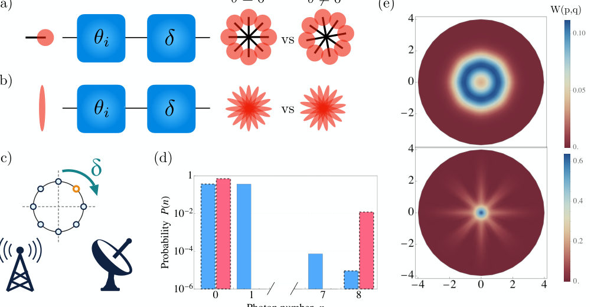
<figcaption class="paper-figure-caption"><b>Fig 1.</b> FIG. 1: Phase estimation in a ZM phase twirling channel. (a), (b) Estimation with coherent states and squeezed vacuum states respectively. The task is to determine δ in the presence of a randomised rotation θi. (c) One possible applica- tion of this work is the calibration of quantum communication networks. (d) Photon number distribution of coherent states (yellow) and squeezed vacuum states (purple) for mean photon number of 1. (e) Wigner functions of a coherent state and squeezed vacuum state after passing through a channel with M = 8 rotations. Both states have a mean photon number of √</figcaption>
</figure>
<figure class="paper-figure-card">
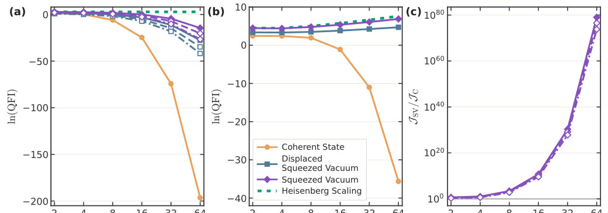
<figcaption class="paper-figure-caption"><b>Fig 2.</b> FIG. 2: Quantum Fisher information for phase estimation under phase twirling. (a) Fixed mean photon number of 1. For the coherent state α = 1, and for the displaced squeezed state α = 1/ √</figcaption>
</figure>
<figure class="paper-figure-card">
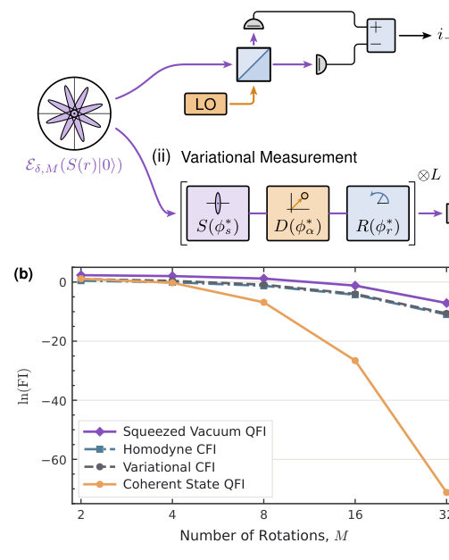
<figcaption class="paper-figure-caption"><b>Fig 3.</b> FIG. 3: Feasible measurement implementation. (a i) Schematic showing homodyne detection. The input state is mixed on a 50:50 beamsplitter with a bright local oscillator (LO). (a ii) The photonic circuit used to implement a close to optimal measurement. L is the number of layers (num- ber of times the circuit is repeated), S, D and R denoting a squeezing, displacement and rotation operation respectively, and ϕ∗denotes the numerically optimised angles. (b) CFI of the measurement strategies shown in (a i) and (a ii), plotted alongside the QFI of a squeezed vacuum state and coherent state. We assume ¯nth = 0.1, η = 0.9, α = 1 for the coherent state, and for the squeezed vacuum state r =...</figcaption>
</figure>

**Summary.** This paper proves a super-exponential advantage of using squeezed vacuum states over coherent states for phase estimation when the measurement process involves discrete phase randomization. By analyzing the Quantum Fisher Information and required sample complexity, the authors show that squeezed light can achieve significantly higher precision with fewer measurements, even in the presence of noise. This highlights the profound resource advantage of non-classical quantum states in advanced quantum sensing.

**Why it may be interesting.** This work pushes beyond the standard quadratic scaling limits in quantum metrology, providing concrete evidence for super-exponential advantages achievable with non-classical states like squeezed light in specific sensing tasks.

Detailed structure

**Main problem.** The paper investigates the ultimate precision limits in quantum phase estimation when the measurement channel involves discrete phase randomization (twirling). It aims to demonstrate a super-exponential advantage of using squeezed light over classical coherent states for this task.

**Main result.** A super-exponential separation in the Quantum Fisher Information (QFI) and required sample complexity is shown between squeezed vacuum states and coherent states, even when considering noise and loss.

**Method.** The analysis involves comparing the QFI bounds derived from squeezed vacuum states versus coherent states, utilizing both asymptotic scaling arguments and non-asymptotic sample complexity bounds.

**Model / system.** The system is a bosonic mode undergoing phase estimation under a channel that implements a phase shift by $2\pi k/M$ (discrete randomization) plus a small unknown phase shift $\delta$. The comparison is drawn between squeezed vacuum states and coherent states.

**Key observables.** Quantum Fisher Information (QFI), Mean Squared Error (MSE), and required number of samples ($
u$).

**Important parameters / regimes.** Mean photon number per channel use ($ar{n}$), the randomization parameter $M$, and the achievable accuracy $\epsilon$.

**Assumptions / limitations.** The analysis is constrained by the mean photon number per channel use ($ar{n}$) and considers the effect of optical loss and thermal noise.

**Figures summary.** Not specified, but the notes detail comparisons of QFI scaling and sample complexity bounds for different noise regimes.

**Paper structure.** The paper builds from general QFI analysis to specific comparisons of scaling laws for squeezed vs. coherent states, culminating in non-asymptotic results considering noise and loss.

Abstract

A paradigmatic task in quantum metrology is that of phase estimation. For this task it is commonly believed, under reasonable assumptions about prior information, that a quadratic advantage in sensitivity is the maximum possible advantage offered by the use of quantum resources. In this work, we consider a channel that implements a phase shift by an angle $2πk/M$, where $k$ is a uniformly random unknown integer, in addition to a small unknown phase shift of interest. We show that, subject to a constraint on the mean photon number per channel use, there is a super-exponential separation between the quantum Fisher information (QFI) attainable using a squeezed vacuum state and that attainable using coherent states. This advantage holds over any state obtained from a coherent state via phase covariant channels. Specifically, when the mean photon number per channel use is 1, the ratio of their QFI grows as $Ω[(M/\sqrt{2}e)^M]$. For a mean photon number per channel use of $M/\log(M)$, the squeezed vacuum QFI is $Ω(M^{3/2}/\sqrt{\log(M)})$, whereas for a coherent state it is at most $\exp[-M\log\log(M)+O(M)]$. We complement this QFI analysis with non-asymptotic estimation results. For a mean photon number per channel use of $M/\log M$, an explicit squeezed-vacuum protocol estimates the phase to accuracy $O(1/M)$ using $O(\sqrt{M\log M})$ channel uses, whereas every coherent state protocol requires at least $\exp[M\log\log M-O(M)]$ channel uses. We consider the effects of noise and show that the ratio of their QFIs can still grow super-exponentially in $M$. Finally, under fixed optical loss and thermal noise, choosing $\bar n=M^2/(\log M)^{3/2}$ allows squeezed vacuum with heterodyne detection to achieve accuracy $O(1/M)$ using sub-polynomially many channel uses, whereas every protocol in the specified classical family requires super-polynomially many.

[↑ back to top](#top)

### [Two-body control of noiseless subsystems with mixed $SU(3)$ representations lifts teleportation above the classical fidelity limit](http://arxiv.org/abs/2610.03235v1)

**Authors:** Otavio A. D. Molitor, Sergii Strelchuk, Michał Studziński  
**Type:** theory · **Category:** quantum information and computing · **PDF:** <https://arxiv.org/pdf/2610.03235v1>  
**Analysis basis:** full PDF text, analyzed in chunks
**Topic relevance:** `correlated / nonlocal dissipation` **1/5** · `quantum measurements` **1/5**

↔ Scroll figures horizontally

<figure class="paper-figure-card">
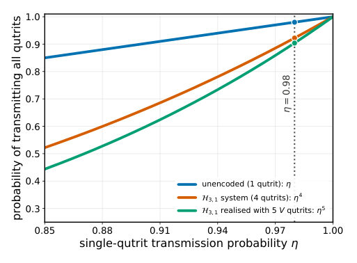
<figcaption class="paper-figure-caption"><b>Fig 1.</b> FIG. 2. Probability that every required qutrit arrives when each transmitted qutrit arrives independently with probability η. The unencoded protocol uses one physical qutrit. The encoded protocol uses four with direct access to both transfor- mation rules, or five when an antisymmetric pair represents a dual qutrit. At η = 0.98, the probabilities are 0.98, 0.922368, and 0.903921, respectively. Preparation, detection, and pro- cessing failures are excluded. These transmission probabilities are separate from the fidelities in Fig. 1.</figcaption>
</figure>
<figure class="paper-figure-card">
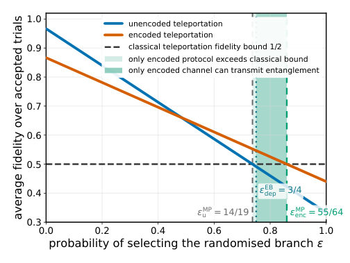
<figcaption class="paper-figure-caption"><b>Fig 2.</b> FIG. 1. Recovery of entanglement transmission through en- coding. In the darker interval [3/4, 55/64), the unencoded tele- portation channel is entanglement breaking, while the encoded channel exceeds the classical fidelity bound and can preserve entanglement. The curves use F (0) u = 29/30, F (0) enc = 13/15, and µ = 0.20. The lighter shading begins at 14/19, where the unencoded fidelity reaches 1/2. Fidelities are averaged over accepted trials under the assumptions of Sec. IV C.</figcaption>
</figure>
<figure class="paper-figure-card">

<figcaption class="paper-figure-caption"><b>Fig 3.</b> Figure 2 shows the cost of using additional qutrits. Re- lated transmission costs and ways of reducing them have been studied in photonic DFS experiments [8, 9].</figcaption>
</figure>

**Summary.** This paper proves that by utilizing two-body interactions on qutrits encoded in noiseless subsystems, one can achieve full logical control over the encoded quantum information. This capability is then applied to quantum teleportation, showing that the encoded protocol can maintain a fidelity above the classical limit, even when the unencoded channel fails to transmit entanglement.

**Why it may be interesting.** It provides a concrete, mathematically rigorous demonstration of how structured noise environments and specific physical interactions (two-body gates) can be harnessed to protect and enhance quantum communication protocols beyond classical limits.

Detailed structure

**Main problem.** To demonstrate that two-body control over noiseless subsystems encoded in mixed SU(3) representations can enable quantum teleportation fidelity to surpass the classical limit.

**Main result.** The system achieves semi-universality in logical gate control, and under specific noise conditions, the encoded teleportation fidelity exceeds the classical bound of 1/2 while the unencoded channel is entanglement breaking.

**Method.** The analysis uses Lie-algebra arguments and the structure of the walled Brauer algebra to prove the existence of finite pulse sequences implementing arbitrary logical gates.

**Model / system.** The system involves $r$ fundamental qutrits transforming under $U \in SU(3)$ and $s$ dual qutrits under $\overline{U}$. Information is encoded in noiseless subsystems derived from the global Hilbert space $H_{r,s}$.

**Key observables.** Teleportation fidelity ($F$), entanglement status, and the deviation measure $\varepsilon_\diamond$ from the identity channel.

**Important parameters / regimes.** The number of fundamental ($r$) and dual ($s$) qutrits, and the specific noise parameters defining the Weyl mixture.

**Assumptions / limitations.** The analysis relies on explicit assumptions regarding channel composition, which trials are retained, and accounts for baseline implementation errors.

**Figures summary.** Not specified, but the analysis compares resources and fidelity bounds for unencoded versus encoded protocols.

**Paper structure.** The paper progresses from establishing the physical model and the semi-universality of logical gate control using two-body interactions, to applying this framework to analyze and bound the fidelity of quantum teleportation under correlated Weyl noise.

Abstract

Collective noise can leave degrees of freedom unaffected, allowing them to store quantum information. Processing this information also requires physically available logical gates. We consider $r$ fundamental qutrits transforming under $U\in SU(3)$ and $s$ dual qutrits transforming under its complex conjugate $\overline U$, with collective action $R_{r,s}(U)=U^{\otimes r}\otimes\overline U^{\otimes s}$. Using the image of the walled Brauer algebra and Lie-algebra arguments, we show that adjacent exchanges within each qutrit type and one singlet-projector interaction between the two types generate any independently chosen family of special unitary gates on the noiseless subsystems by a finite pulse sequence, for every $r,s\geq1$. This establishes semi-universality of this system. We illustrate the result with a numerically optimised sequence of 24 pulses for three fundamental qutrits and one dual qutrit. We then use the encoding and available logical corrections for qutrit teleportation under correlated Weyl noise. Under explicit assumptions on channel composition and which trials are retained, and allowing for baseline implementation errors, we identify noise ranges in which encoded teleportation exceeds the classical fidelity bound of $1/2$, while the unencoded teleportation channel is entanglement breaking. We analyse fidelity on accepted trials separately from the transmission costs of the additional physical qutrits.

[↑ back to top](#top)

### [What Must a Quantum-Memory Decoder Know About Temporally Correlated Noise?](http://arxiv.org/abs/2610.03545v1)

**Authors:** Danesh Morales-Hashemi, Graeme Smith, Ningping Cao  
**Type:** theory · **Category:** quantum information and computing · **PDF:** <https://arxiv.org/pdf/2610.03545v1>  
**Analysis basis:** full PDF text, analyzed in chunks
**Topic relevance:** `correlated / nonlocal dissipation` **1/5** · `quantum measurements` **1/5**

↔ Scroll figures horizontally

<figure class="paper-figure-card">
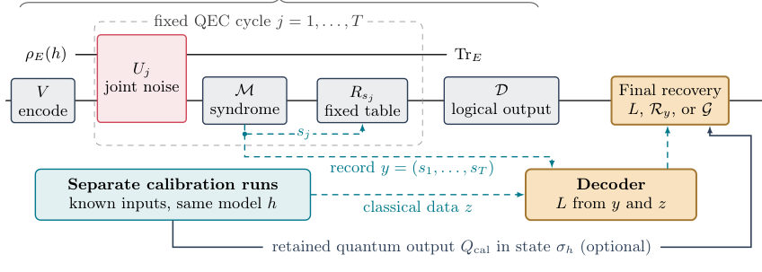
<figcaption class="paper-figure-caption"><b>Fig 1.</b> FIG. 1. Memory experiment with prescribed cycle corrections Rsj and a final recovery chosen from the full syndrome record y and calibration transcript z. Yellow marks the decoder and its final recovery, the subject of this paper. Known interactions Uj couple the encoded system to an unobserved environment initially in ρE(h), M extracts the syndrome sj in cycle j = 1, . . . , T, and D returns the residual logical output before final recovery. The logical input and recovered output are ρL and ρ′ L. The brace marks the recorded logical instrument Φh [Eq. (1)]. The decoder applies a Pauli correction L with probability d(L | y), or more generally a CPTP recovery Ry. Calibration runs share the...</figcaption>
</figure>
<figure class="paper-figure-card">
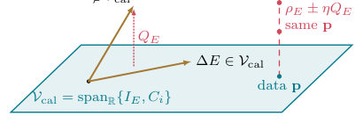
<figcaption class="paper-figure-caption"><b>Fig 2.</b> FIG. 2. Geometry of Proposition 1 in Herm(HE) with the Hilbert–Schmidt inner product. Since every calibration proba- bility has the form Tr(ρECi), the data p fix only the orthogo- nal projection of ρE onto the calibration span Vcal [Eq. (8)], marked p, and all states on the dashed line give the same data. If ∆E = ∆Ey;L,L′ [Eq. (7)] lies in Vcal, the score difference Tr(ρE∆E) is constant along this line, so the data determine it. Otherwise ∆E has a nonzero orthogonal component QE, and for full-rank ρE and small η the states ρE ± ηQE give the same data but different score differences.</figcaption>
</figure>
<figure class="paper-figure-card">
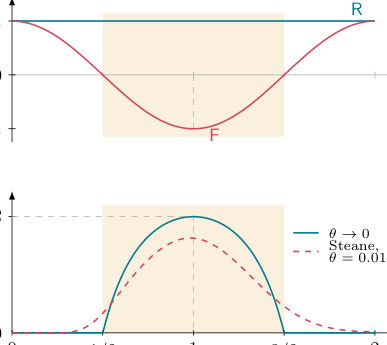
<figcaption class="paper-figure-caption"><b>Fig 3.</b> FIG. 3. Mean logical readout and minimax fidelity loss versus storage time, where Tπ [Eq. (26)] is the time at which the fixed sign accumulates a logical π rotation. (a) Mean readout of a ¯Z = +1 input before final recovery, in the fixed-code weak- noise limit at fixed T/Tπ. It approaches cos(πT/Tπ) under F and one under R, although the syndrome statistics and SPPs coincide. (b) Full-record minimax fidelity loss in the same limit (solid) and for the Steane code at θ = 0.01 (dashed). In the shaded interval, the F readout is negative and the limiting optimal corrections differ. At T/Tπ = 3/4 the finite-angle loss is 0.3146, against the limit 0.4142. At T/Tπ = 1/2 it is about 56% of the...</figcaption>
</figure>
<figure class="paper-figure-card">
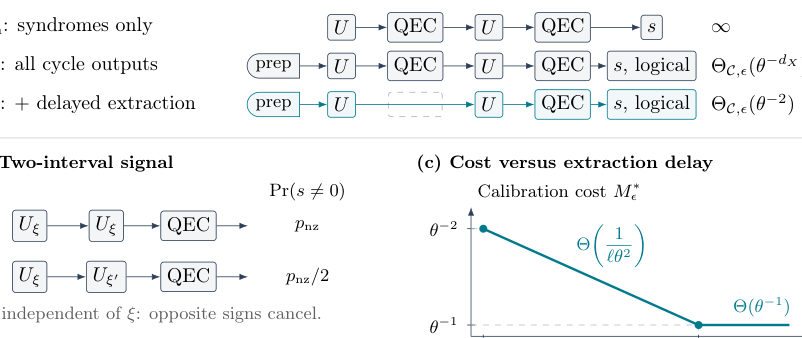
<figcaption class="paper-figure-caption"><b>Fig 4.</b> FIG. 4. Calibration for the fixed data circuit at storage time Tπ, with fixed code and target loss 0 &lt; ϵ &lt; 1/2, as θ →0. (a) Each U costs one noise interval, and QEC is one syndrome extraction followed by the fixed lookup-table correction. A delayed-extraction query omits the intermediate QEC step (dashed). Outputs are the syndrome s and, where shown, the logical output, which may be measured or retained. The known-state preparations (prep) are those used by the protocols attaining the upper bounds. Sec. V A specifies the more general operations, retained outputs, and source resets that the classes permit. All classes receive the same SPP. (b) Under R, independent signs cancel in half of...</figcaption>
</figure>

**Summary.** This paper analyzes the theoretical requirements for quantum error-correcting decoders operating under temporally correlated noise. It compares two noise models—one with a fixed global sign and one with independently resampled signs—showing that while their syndrome statistics match, their optimal recovery strategies differ. The work establishes scaling laws for the required experimental resources (calibration) to maintain high fidelity.

**Why it may be interesting.** It provides rigorous theoretical bounds on the information required to mitigate complex, time-dependent noise in quantum memory, which is crucial for scaling up quantum computation.

Detailed structure

**Main problem.** The paper investigates what information about temporally correlated noise a quantum error-correction (QEC) decoder must possess to achieve optimal recovery, and quantifies the cost of learning this information.

**Main result.** The optimal cost for complete QEC cycles scales inversely with the rotation angle raised to the code's X distance, and the authors prove matching calibration bounds for two different noise models (fixed vs. resampled signs).

**Method.** The analysis uses a statistical decision theory framework, formulating calibration in terms of fidelity differences and employing process tensors to model the full quantum evolution.

**Model / system.** The study uses fixed stabilizer memory experiments with CSS codes (e.g., Shor, Steane, surface codes) subjected to weak coherent X rotations, comparing two noise models: one where all qubits share a fixed sign, and one where the sign is redrawn independently each interval.

**Key observables.** Entanglement fidelity ($F$), fidelity loss ($\Delta F$), syndrome record ($y$), and the logical rotation accumulated over time.

**Important parameters / regimes.** The noise correlation structure (fixed vs. resampled signs), the code's X distance ($d_X$), and the rotation angle ($	heta$).

**Assumptions / limitations.** The analysis assumes the ability to characterize the noise process via syndrome measurements and uses the Spatiotemporal Pauli Process (SPP) as a complete description for randomized errors.

**Figures summary.** Figure 1 illustrates the memory experiment flow, detailing the sequence from encoding, noise intervals, syndrome measurement, correction, and final recovery, alongside calibration runs.

**Paper structure.** The paper develops a general framework using process tensors to describe the logical instrument, then focuses on comparing the performance and required calibration data for different noise models (F vs. R) to determine the minimum information needed for optimal decoding.

Abstract

What must a quantum error-correction decoder know about temporally correlated noise, and what does it cost to learn? We study this question for fixed stabilizer memory experiments with known system-environment interactions. We formulate calibration in terms of the fidelity differences that select a Pauli recovery and relate missing information to the resulting fidelity loss. Our main example uses weak coherent $X$ rotations in a class of CSS codes including Shor, Steane, and odd-distance rotated surface codes. All physical qubits share a sign either fixed throughout a run or independently redrawn each interval. The two models have identical syndrome statistics and the same spatiotemporal Pauli process (SPP), obtained by Pauli-twirling every noise interval. Yet at suitable storage times, they require different logical corrections. In the weak-noise limit, each model is almost perfectly correctable when known. Without model information, even the best final recovery has a worst-case fidelity loss approaching $1/2$ relative to the noise-aware optimum, despite access to the full syndrome record. For this pair of models, at fixed code and fixed positive target loss below $1/2$, we prove matching calibration bounds. With logical preparation and final readout, complete QEC cycles require a number of noise intervals scaling as the inverse rotation angle raised to the code's $X$ distance. Allowing two uninterrupted intervals before one extraction reduces the optimal cost to inverse-square scaling. Physical Pauli twirling of every noise interval changes both recovery performance and its information requirements. Discarding the record of applied random Pauli operations makes the SPP sufficient for optimal recovery. Keeping this record can improve the attainable fidelity, but reaching that optimum may require additional noise information.

[↑ back to top](#top)

### [A Complete Proof of $\mathsf{QMA}_1$-Hardness for Weighted Gapped Clique Homology](http://arxiv.org/abs/2610.03584v1)

**Authors:** Tal Barak  
**Type:** theory · **Category:** quantum information and computing · **PDF:** <https://arxiv.org/pdf/2610.03584v1>  
**Analysis basis:** full PDF text, analyzed in chunks
**Topic relevance:** `analog quantum simulation` **1/5**

↔ Scroll figures horizontally

<figure class="paper-figure-card">
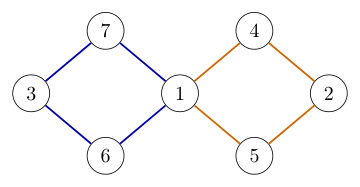
<figcaption class="paper-figure-caption"><b>Fig 1.</b> Figure 3: The single-qubit bow-tie graph. The left four-cycle represents z0 and the right four-cycle represents z1. The cycles share the vertex 1 but have no edge in common.</figcaption>
</figure>
<figure class="paper-figure-card">
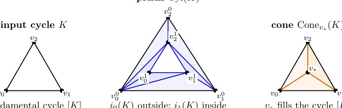
<figcaption class="paper-figure-caption"><b>Fig 2.</b> Figure 4. Prism and cone over the triangle boundary, used here as a simplicial example with source order v0 &lt; v1 &lt; v2. The planar annulus displays the prism’s six triangles and two boundary copies. The cone is the filled triangle with apex at its centre.</figcaption>
</figure>
<figure class="paper-figure-card">
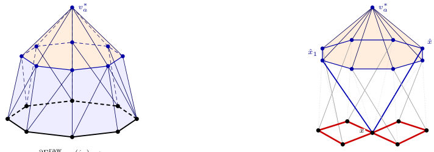
<figcaption class="paper-figure-caption"><b>Fig 3.</b> Figure 5: An illustration of the single-qubit example in [KK24, Section 8.3.2], drawn in four stages of the prism-cone-fold construction for the target line C(|0⟩−|1⟩). In the first panel, the two distinct source vertices ˆx and ˆx1 are both sent to the shared bow-tie vertex x. The image of the oriented source cycle is therefore z0 −z1 = ja. The second panel joins a bottom and a top copy of Ka by a simplicial prism. In the third panel, the cone fills the top copy, leaving the bottom copy as the only boundary. The fourth panel attaches that bottom boundary to X1 by fa. Consequently, the resulting chain satisfies ∂Γa = ja. Black vertices belong to the bow-tie base, blue vertices are private,...</figcaption>
</figure>

**Summary.** This paper provides a complete and rigorous proof that determining the homology of weighted, spectrally gapped clique complexes is $\mathsf{QMA}_1$-hard. It achieves this by meticulously re-analyzing the local topological structures and spectral properties involved in the reduction from a known hard problem. The result establishes a strong computational barrier for simulating quantum systems based on topological features.

**Why it may be interesting.** This work connects deep topological invariants (homology) directly to the computational hardness of quantum physics problems, providing a rigorous complexity measure for quantum simulation feasibility.

Detailed structure

**Main problem.** The paper aims to establish the computational complexity of determining non-trivial homology in weighted, spectrally gapped clique complexes.

**Main result.** Weighted gapped clique homology is proven to be $\mathsf{QMA}_1(\mathcal G)$-hard, providing a complete proof that resolves a gap in previous hardness results.

**Method.** The proof uses exact finite certificates and relative homology to analyze the local topology of gadgets, culminating in a quantitative global estimate that links the source-Hamiltonian gap to the weighted Hodge Laplacian.

**Model / system.** The model involves clique complexes derived from graphs, where the existence of a topological hole (non-trivial homology) is mapped to the existence of a zero-energy state in the Hodge Laplacian ($\Delta_k$).

**Key observables.** The existence of a zero eigenvalue in the Hodge Laplacian ($\Delta_k$) corresponding to a topological hole, and the quantitative spectral gap ($\gamma(n)$) for 'NO' instances.

**Important parameters / regimes.** The hardness holds for fixed efficiently computable $k(n)$ and inverse-polynomial $\gamma(n)$.

**Assumptions / limitations.** The argument requires a new, detailed analysis of the local topology and filtered cochain complexes to correct an analytical gap in prior work.

**Figures summary.** Not specified, but the notes detail the structure of matrices, rank checks, and specific identities required for the local gadget constructions.

**Paper structure.** The paper progresses from defining the problem (homology complexity) to detailing the reduction structure, using exact finite certificates for local data, proving a finite-dimensional filtered-Hodge statement, and finally deriving the global spectral estimate and the main $\mathsf{QMA}_1$-hardness theorem.

Abstract

The computational complexity of simplicial homology has been studied since the question was raised by Kaibel and Pfetsch, and clique homology was later shown to be $\mathsf{QMA}_1$-hard by Crichigno and Kohler. King and Kohler subsequently introduced the weighted, spectrally gapped version considered here and developed a reduction intended to establish the same hardness result in this setting.   We give a complete proof of the hard direction. The earlier King-Kohler argument contains a gap in the analysis of the nontrivially folded local gadgets, so the required topological and spectral properties have to be re-established on the clique complexes actually produced by the reduction. This is not a local repair of the published proof: the argument requires a new analysis of the local topology, the filtered cochain complexes, and the interaction of many overlapping gadgets.   Our proof uses exact finite certificates for the local combinatorial data and relative homology to determine the effect of each gadget on the encoded qubit space. We then prove the finite-dimensional filtered-Hodge statement needed to recover the corresponding rank-one low-energy penalty and derive a quantitative global estimate that transfers the source-Hamiltonian promise gap to the final weighted Hodge Laplacian. Consequently, for fixed efficiently computable $k(n)$ and inverse-polynomial $γ(n)$, weighted gapped clique homology is $\mathsf{QMA}_1(\mathcal G)$-hard. The previously known $\mathsf{QMA}$-containment argument is logically independent of the gap and remains unaffected.

[↑ back to top](#top)

### [A note on tomography of states with low stabilizer rank](http://arxiv.org/abs/2610.03658v1)

**Authors:** Arkopal Dutt  
**Type:** theory · **Category:** quantum information and computing · **PDF:** <https://arxiv.org/pdf/2610.03658v1>  
**Analysis basis:** full PDF text, analyzed in chunks
**Topic relevance:** `quantum measurements` **1/5**

↔ Scroll figures horizontally

<figure class="paper-figure-card">
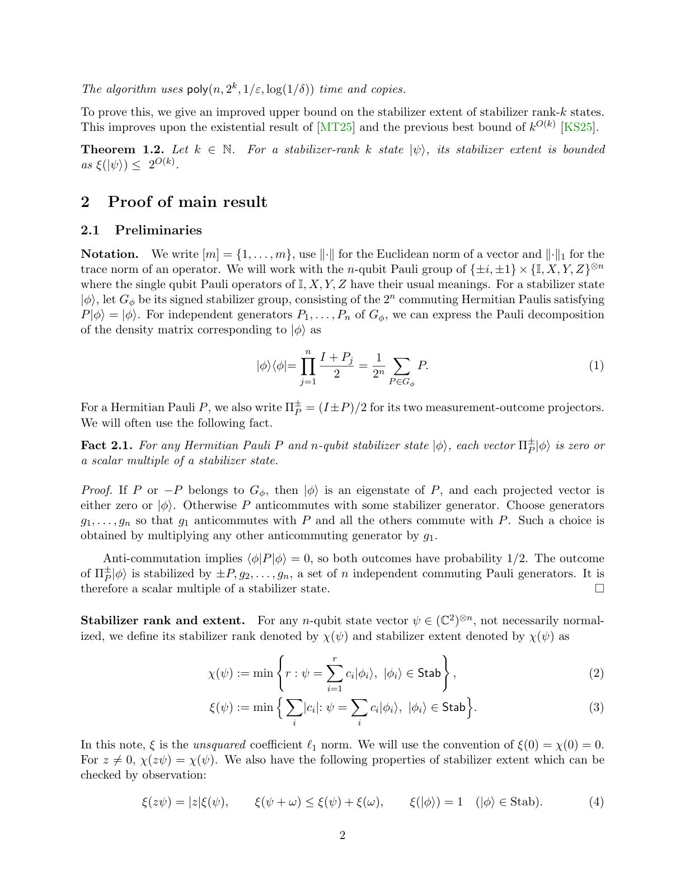
<figcaption class="paper-figure-caption"><b>Fig 1.</b> Low-resolution page preview, page 2</figcaption>
</figure>
<figure class="paper-figure-card">
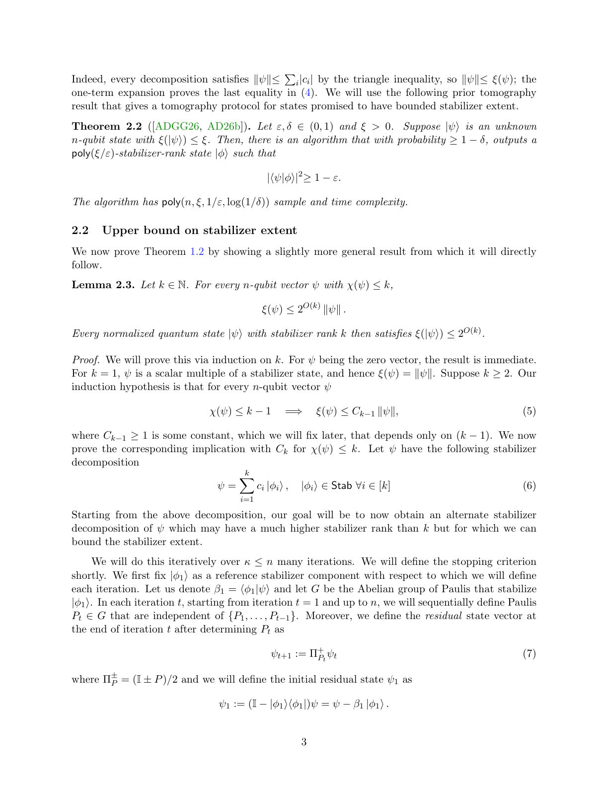
<figcaption class="paper-figure-caption"><b>Fig 2.</b> Low-resolution page preview, page 3</figcaption>
</figure>
<figure class="paper-figure-card">
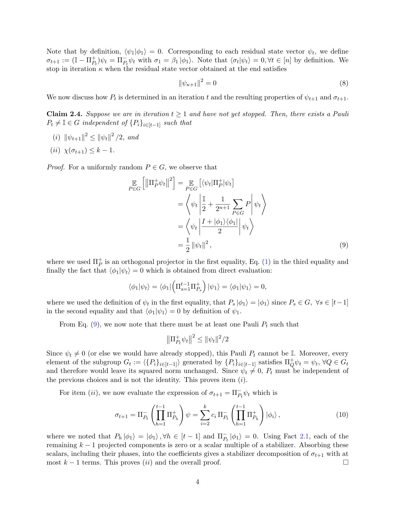
<figcaption class="paper-figure-caption"><b>Fig 3.</b> Low-resolution page preview, page 4</figcaption>
</figure>
<figure class="paper-figure-card">
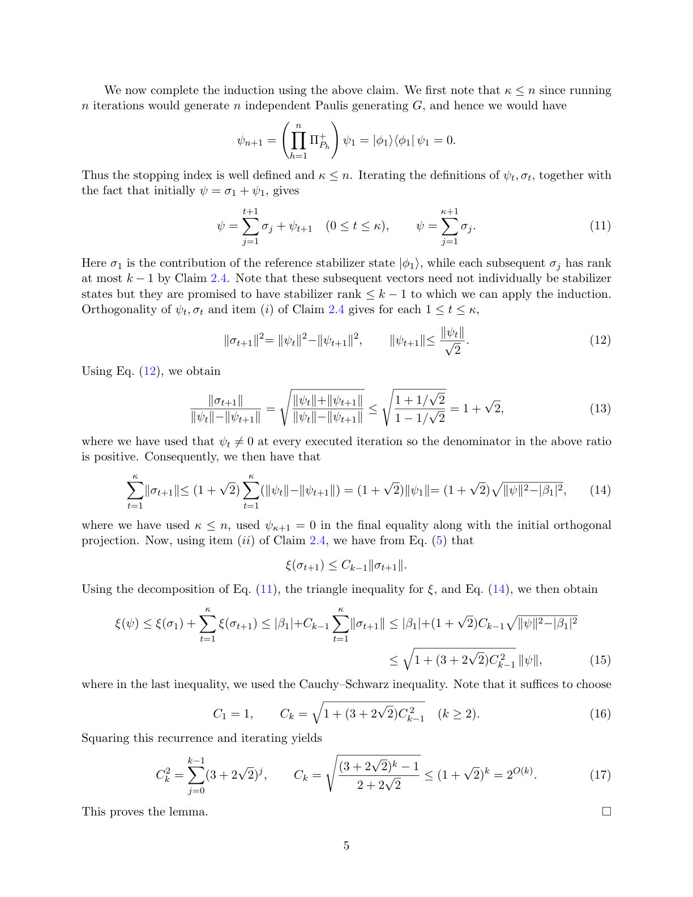
<figcaption class="paper-figure-caption"><b>Fig 4.</b> Low-resolution page preview, page 5</figcaption>
</figure>
<figure class="paper-figure-card">
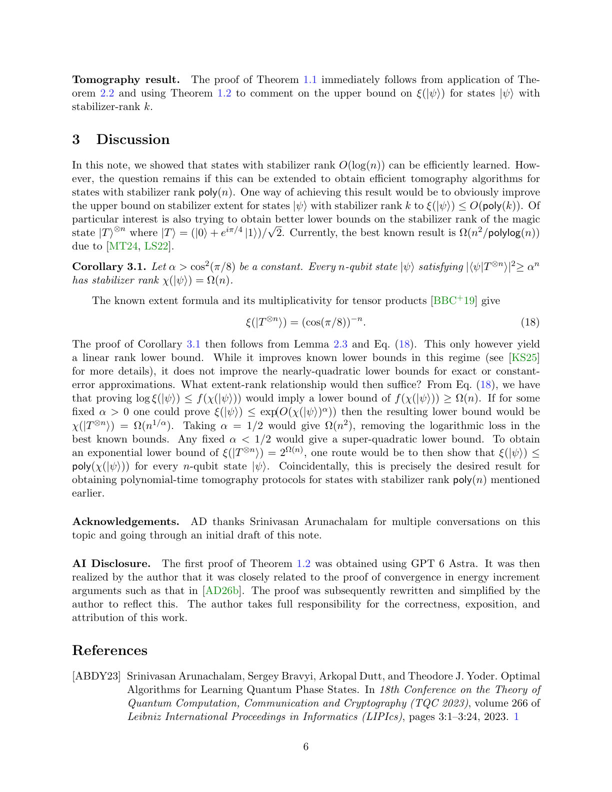
<figcaption class="paper-figure-caption"><b>Fig 5.</b> Low-resolution page preview, page 6</figcaption>
</figure>

**Summary.** This paper develops an efficient quantum state tomography protocol for $n$-qubit states whose structure is limited by a low stabilizer rank $k$. The authors achieve this by first proving a tight upper bound on the state's 'stabilizer extent' ($\xi(|\psi
angle) \leq 2^{O(k)}$). This result allows for polynomial-time reconstruction of the state, provided the rank $k$ scales slowly with the number of qubits, such as $k=O(\log n)$.

**Why it may be interesting.** This work provides concrete algorithmic tools for characterizing and reconstructing quantum states whose structure is constrained by low-rank properties, which is relevant for understanding resource estimation in quantum computation.

Detailed structure

**Main problem.** The paper addresses the development of an efficient quantum state tomography protocol for $n$-qubit states $|\psi
angle$ that are known to possess a low stabilizer rank $k$.

**Main result.** It establishes that for such states, the stabilizer extent $\xi(|\psi
angle)$ is bounded by $2^{O(k)}$, leading to a polynomial-time tomography protocol for states where $k=O(\log n)$.

**Method.** The approach involves bounding the stabilizer extent $\xi(|\psi
angle)$ using induction and Pauli operator projections, which then allows the application of an existing tomography protocol for states with bounded extent.

**Model / system.** The system under study is general $n$-qubit quantum states $|\psi
angle$ that are restricted to having a stabilizer decomposition involving at most $k$ stabilizer states.

**Key observables.** Stabilizer rank ($k$), Stabilizer extent ($\xi(|\psi
angle)$), and the fidelity of the reconstructed state.

**Important parameters / regimes.** The time complexity depends polynomially on $n$, $k$, and $1/\epsilon$. The efficiency is highlighted for $k=O(\log n)$.

**Assumptions / limitations.** The protocol assumes the input state $|\psi
angle$ is promised to have a stabilizer rank $k$, and it relies on a pre-existing tomography protocol for states with bounded stabilizer extent.

**Paper structure.** The paper first proves a key bound on the stabilizer extent $\xi(|\psi
angle) \leq 2^{O(k)}$ for a rank $k$ state. It then utilizes this bound to construct a full tomography protocol, showing efficiency for low-rank states.

Abstract

In this note, we consider tomography of $n$-qubit quantum states $|ψ\rangle$ that are promised to have stabilizer rank $k$ i.e., admit a stabilizer decomposition of $|ψ\rangle = \sum_{i=1}^k c_i |φ_i\rangle$ where each $|φ_i\rangle$ is a stabilizer state. We give a tomography protocol for such states up to trace distance $\varepsilon > 0$ running in $\textsf{poly}(n,2^k,1/\varepsilon)$ time and thus can handle $k=O(\log n)$ efficiently. This follows from first showing that the stabilizer extent $ξ(|ψ\rangle)$, which is the minimal $\ell_1$ norm over the coefficients $\{c_i\}$ of any stabilizer decomposition of $|ψ\rangle$, can be bounded as $ξ(|ψ\rangle) \leq 2^{O(k)}$ and improving upon the previous best bound of $k^{O(k)}$. The protocol is then obtained by utilizing a tomography protocol for states with bounded stabilizer extent.

[↑ back to top](#top)

### [Classical Algorithms for Bipartite Quantum Max-Cut on Dense Expanders](http://arxiv.org/abs/2610.03670v1)

**Authors:** Stuart Wayland, Zackary Jorquera, Alexandra Kolla  
**Type:** theory · **Category:** statistical mechanics · **PDF:** <https://arxiv.org/pdf/2610.03670v1>  
**Analysis basis:** full PDF text, analyzed in chunks
**Topic relevance:** `analog quantum simulation` **1/5**

↔ Scroll figures horizontally

<figure class="paper-figure-card">
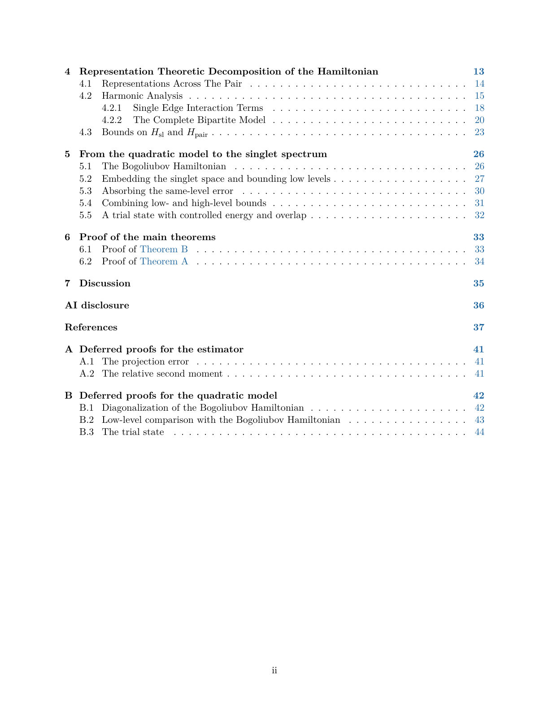
<figcaption class="paper-figure-caption"><b>Fig 1.</b> Low-resolution page preview, page 2</figcaption>
</figure>
<figure class="paper-figure-card">
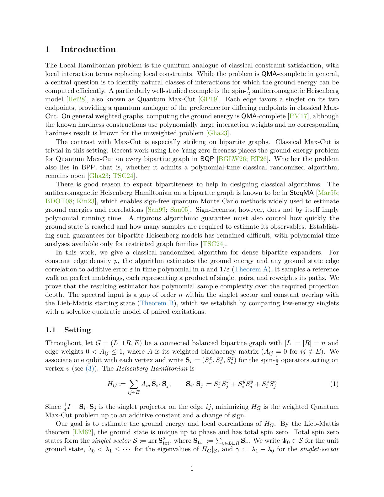
<figcaption class="paper-figure-caption"><b>Fig 2.</b> Low-resolution page preview, page 3</figcaption>
</figure>
<figure class="paper-figure-card">
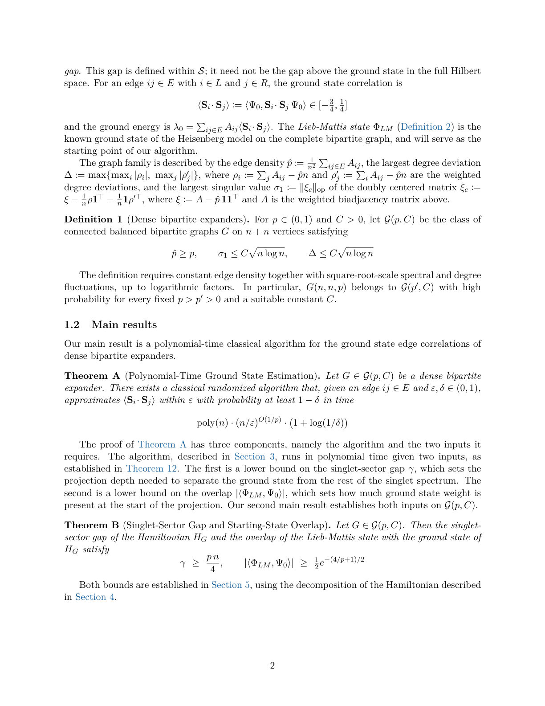
<figcaption class="paper-figure-caption"><b>Fig 3.</b> Low-resolution page preview, page 4</figcaption>
</figure>
<figure class="paper-figure-card">
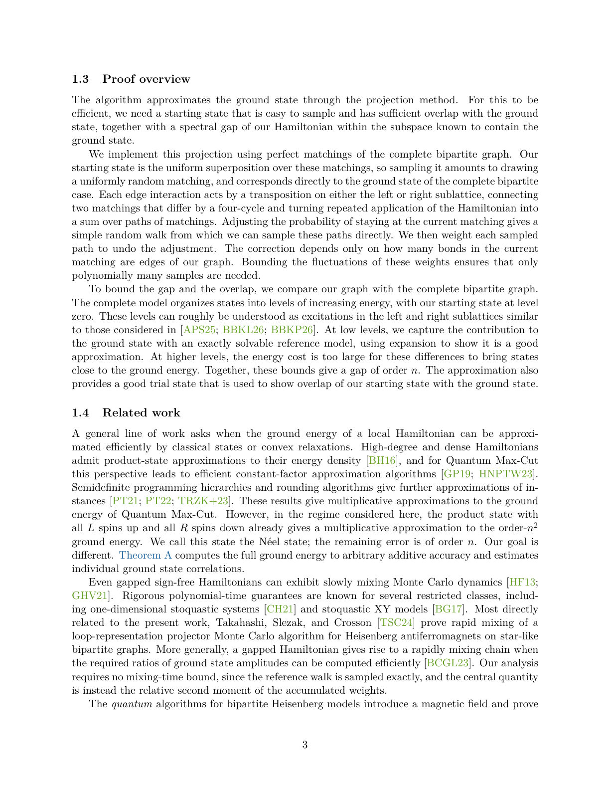
<figcaption class="paper-figure-caption"><b>Fig 4.</b> Low-resolution page preview, page 5</figcaption>
</figure>
<figure class="paper-figure-card">
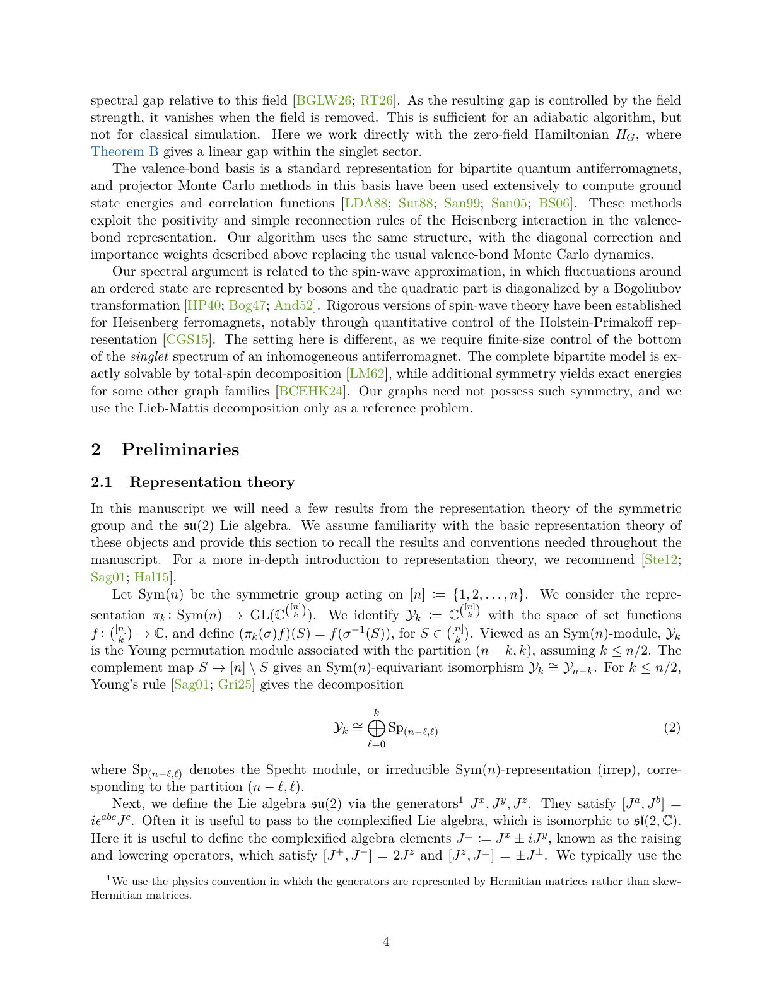
<figcaption class="paper-figure-caption"><b>Fig 5.</b> Low-resolution page preview, page 6</figcaption>
</figure>

**Summary.** This paper presents a classical randomized algorithm to estimate the ground energy and correlations for the Quantum Max-Cut problem on specific types of bipartite graphs called dense expanders. By constructing a Markov chain on perfect matchings, the authors show that the problem can be solved in polynomial time, providing a significant result for understanding the classical complexity of quantum optimization problems.

**Why it may be interesting.** The connection between quantum optimization problems (like Max-Cut) and classical polynomial-time solvability is central to quantum computation and statistical physics, making this highly relevant.

Detailed structure

**Main problem.** The paper addresses the classical computational complexity of finding the ground energy and local correlations for the Quantum Max-Cut problem on bipartite graphs.

**Main result.** It provides a polynomial-time classical randomized algorithm to estimate ground state correlations for the spin-1/2 antiferromagnetic Heisenberg model on dense balanced bipartite expanders.

**Method.** The algorithm uses a Markov chain approach on perfect matchings, leveraging graph expansion properties to ensure convergence in polynomial time.

**Model / system.** The system is the spin-1/2 antiferromagnetic Heisenberg model, which is equivalent to the Quantum Max-Cut problem, studied on dense balanced bipartite expanders.

**Key observables.** Ground energy ($\lambda_0$) and ground state edge correlation ($\langle \mathbf{S}_i \cdot \mathbf{S}_j 
angle$).

**Important parameters / regimes.** Edge density ($\hat{p}$), graph expansion parameters ($\sigma_1, \Delta$), and the desired additive error ($\epsilon$).

**Assumptions / limitations.** The analysis relies on the graph being a dense balanced bipartite expander, and the algorithm's complexity depends on the graph structure.

**Paper structure.** The paper establishes the context of the open problem, defines the model using singlet matchings, details the randomized algorithm, and proves the main theorems regarding ground state estimation and gap bounds.

Abstract

Quantum Max-Cut is a well-studied local Hamiltonian problem for which the classical complexity of the bipartite case remains open. We give a polynomial-time classical randomized algorithm for the spin-$\tfrac12$ antiferromagnetic Heisenberg model, equivalently Quantum Max-Cut, on dense balanced bipartite expanders. This class includes $G(n,n,p)$ with high probability for every fixed $p>0$. The algorithm estimates the ground energy and any ground state edge correlation to additive error $\varepsilon$ in time polynomial in $n$ and $1/\varepsilon$. We construct a Markov chain on perfect matchings of the complete bipartite graph, each matching representing a product of singlets, that converges to the ground state, and use the expansion of the graph to show that polynomially many steps and samples of this chain suffice.

[↑ back to top](#top)

### [Constant-Rate Certified Deletion](http://arxiv.org/abs/2610.03590v1)

**Authors:** Kai-Min Chung, Tzu-Hsiang Huang, Wei-Hsiang Hung, Shota Yamada  
**Type:** theory · **Category:** quantum information and computing · **PDF:** <https://arxiv.org/pdf/2610.03590v1>  
**Analysis basis:** full PDF text, analyzed in chunks
**Topic relevance:** `quantum measurements` **1/5**

↔ Scroll figures horizontally

<figure class="paper-figure-card">
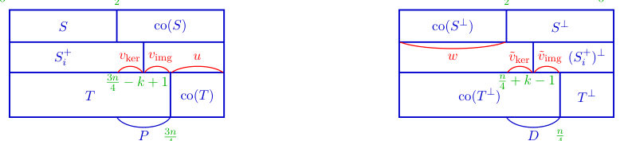
<figcaption class="paper-figure-caption"><b>Fig 1.</b> Figure 1: Coset basis decomposition. Each blue rectangle represents a vector space. An overlap between the sides of two rectangles indicates that they share a subset of basis vectors, with the size of the overlap corresponding to the dimension of the shared subspace.</figcaption>
</figure>

**Summary.** This paper introduces a breakthrough framework for achieving constant-rate certified deletion in quantum cryptography, solving a long-standing problem in the plain model. It provides efficient quantum protocols for primitives like PKE and FHE that guarantee data erasure proof without excessive resource overhead. This advances the practical feasibility of privacy-preserving quantum computation.

**Why it may be interesting.** While the focus is on quantum cryptography, the techniques developed for achieving constant-rate quantum information processing are highly relevant to understanding resource constraints in quantum computation protocols.

Detailed structure

**Main problem.** The paper addresses the challenge of constructing constant-rate certified deletion (CD) for quantum cryptographic primitives in the plain model, overcoming previous limitations that required a linear qubit overhead.

**Main result.** The authors present a unified framework achieving the first constant-rate CD constructions for a wide range of primitives, including PKE, ABE, and FHE, and extending this to publicly verifiable schemes under the hardness of SIS.

**Method.** The methodology involves adapting advanced quantum information techniques, such as using high-rate extractors and position-wise guessing, to maintain constant rate while proving the deletion property.

**Model / system.** The work operates within the framework of quantum cryptography, utilizing quantum states derived from BB84-style encodings and subspace coset states to secure various primitives.

**Key observables.** The primary observable is the rate of deletion, aiming for a constant rate (small qubit overhead relative to the classical plaintext size).

**Important parameters / regimes.** The security parameter $\lambda$ governs the required computational security, and the rate is the key efficiency metric.

**Assumptions / limitations.** The constructions rely on the underlying security assumptions of the primitives, and the final public verifiability result assumes the hardness of the Syndrome Decoding Problem (SIS).

**Paper structure.** The paper builds from establishing the general constant-rate CD framework for BB84-type and coset-state primitives, then extends this to incorporate public verifiability using the SIS assumption, and finally shows how this applies to specific cryptographic constructions.

Abstract

We present a unified framework for upgrading a broad class of cryptographic primitives to support constant-rate certified deletion. Previous constructions require a linear number of qubits per encrypted bit of certified-deletable plaintext. In contrast, we obtain the first constant-rate constructions in the plain model that achieve certified deletion while preserving everlasting security.   Our approach applies to a wide range of "all-or-nothing"-type primitives based on BB84-style encodings, including commitment schemes, public-key encryption, attribute-based encryption, and fully homomorphic encryption. Beyond this class, we also obtain constant-rate certified deletion for primitives built from subspace coset states, such as blind delegation, secure software leasing, functional encryption, and differing-inputs iO, and CCA-PKE. Importantly, our framework does not introduce any additional assumptions beyond those required by the underlying certified deletion primitives.   Finally, under the hardness of SIS, we show that public verifiability can be incorporated into BB84- and coset-based certified deletion. In combination with our constant-rate constructions, this yields publicly verifiable certified deletion schemes with constant rate.

[↑ back to top](#top)

### [Critical coupling and $Δ\langleφ^2\rangle$ in three-dimensional $φ^4$ theory](http://arxiv.org/abs/2610.03028v1)

**Authors:** Stephan Durr, Tolga S. H. Kiel  
**Type:** theory · **Category:** statistical mechanics · **PDF:** <https://arxiv.org/pdf/2610.03028v1>  
**Analysis basis:** full PDF text, analyzed in chunks
**Topic relevance:** `analog quantum simulation` **1/5**

↔ Scroll figures horizontally

<figure class="paper-figure-card">
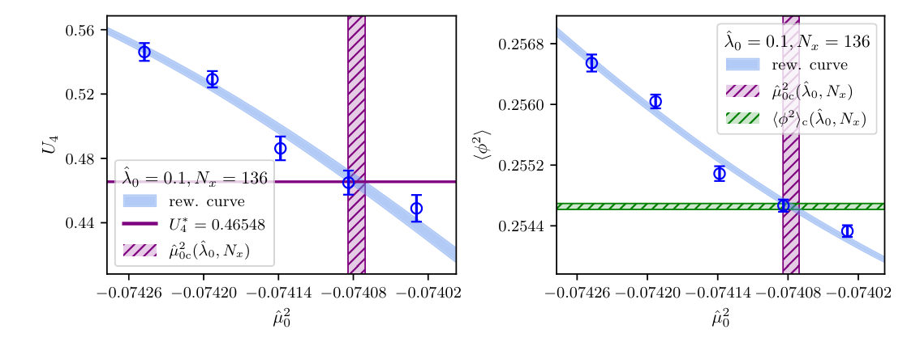
<figcaption class="paper-figure-caption"><b>Fig 1.</b> Figure 1: Left: The Binder cumulant U4 versus ˆµ2 0 at ˆλ0 = 0.1 for five independent simulations on Nx = 136 lattices. The light blue band shows the combined (reweighted) curve with its 1σ-uncertainty. The purple horizontal line reflects the universal value U∗ 4 = 0.46548 from Ref. [11]. The purple vertical band indicates ˆµ2 0c(ˆλ0, Nx), i.e., the value of ˆµ2 0 at which the reweighted curve equals U∗ 4 ; this defines the finite-volume transition. Right: The observable ⟨ϕ2⟩versus ˆµ2 0, based on the same runs and reweighting procedure, with the same purple vertical band to indicate ˆµ2 0c(ˆλ0, Nx). The green horizontal band shows the resulting ⟨ϕ2⟩c(ˆλ0, Nx), i.e., the reweighted curve...</figcaption>
</figure>
<figure class="paper-figure-card">
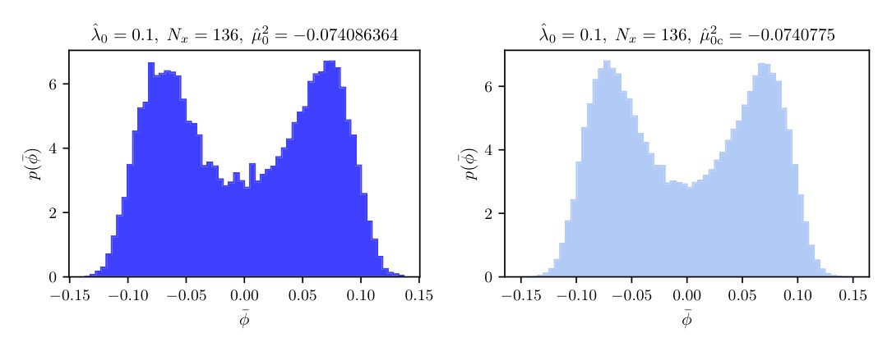
<figcaption class="paper-figure-caption"><b>Fig 2.</b> Figure 2: Probability distribution of the volume-averaged field ¯ϕ “at the transition point” for ˆλ0 = 0.1 and Nx = 136. Left: distribution for the simulated ensemble at ˆµ2 0 = −0.074086364, which is the one closest to ˆµ2 0c(0.1, 136). Right: combined distribution at the critical value ˆµ2 0c(0.1, 136) = −0.0740775, i.e., each ensemble shown in Fig. 1 is reweighted to ˆµ2 0c, every histogram bin is jackknifed separately, and the ensemble estimates in each bin are combined using inverse-variance weights.</figcaption>
</figure>
<figure class="paper-figure-card">
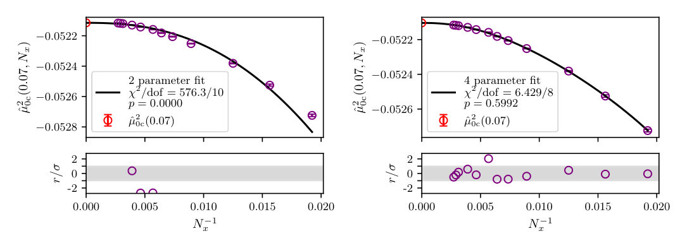
<figcaption class="paper-figure-caption"><b>Fig 3.</b> Figure 3: Two examples of the infinite-volume extrapolation of ˆµ2 0c(0.07, Nx), i.e., at our smallest bare coupling ˆλ0. In both cases all available Nx are included. Left: leading-order ansatz (npar = 2 in Eq. 14), resulting in p = 0.0000 at the displayed precision. Right: ansatz with two subleading terms (npar = 4 in Eq. 16), giving p = 0.5992. The sub-panels show the fit residuals (data-fit) in units of the statistical uncertainties of the data.</figcaption>
</figure>
<figure class="paper-figure-card">
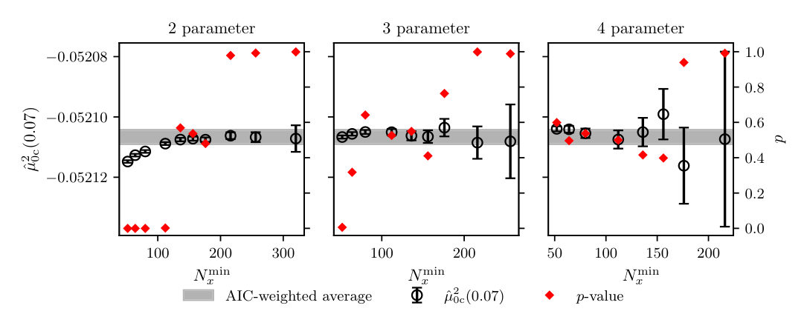
<figcaption class="paper-figure-caption"><b>Fig 4.</b> Figure 4: Extracted ˆµ2 0c(0.07) values in infinite volume (black circles, left axis) and the p-value of the respective fit (red diamonds, right axis) as a function of Nmin x . The three panels refer to npar = 2 (left), 3 (center), and 4 (right) in Eq. 16. The horizontal band indicates the final AIC-weighted combination over all fits with p &gt; 0.05.</figcaption>
</figure>
<figure class="paper-figure-card">
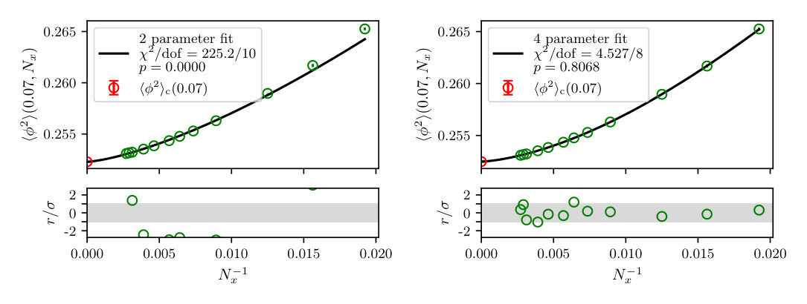
<figcaption class="paper-figure-caption"><b>Fig 5.</b> Figure 5: Two examples of the infinite-volume extrapolation of ⟨ϕ2⟩c(0.07, Nx) at our smallest bare coupling ˆλ0. In both cases all available Nx are included. Left: Leading-order ansatz (npar = 2 in Eq. 18); the p-value is zero at the displayed precision. Right: Ansatz with two subleading correction terms (npar = 4 in Eq. 18), giving p = 0.8068. The lower panels show the pulls (data-fit) in units of the statistical uncertainties.</figcaption>
</figure>

**Summary.** This work calculates critical parameters for the 3D $\phi^4$ theory by performing extensive lattice simulations. Using the fixed-point method and Finite-Size Scaling, the authors determine the critical coupling $f_c$ and the deviation $\Delta\langle\phi^2
angle_c/\lambda$ in the continuum, infinite-volume limit. The results provide precise numerical benchmarks for critical behavior in this fundamental quantum field theory model.

**Why it may be interesting.** While the focus is on lattice field theory, the rigorous application of critical exponents and scaling laws in the $\phi^4$ model provides a strong theoretical framework for understanding phase transitions in many-body quantum systems.

Detailed structure

**Main problem.** The paper aims to determine the critical coupling ($f_c$) and the difference in the expectation value of $\phi^2$ ($\Delta\langle\phi^2
angle_c/\lambda$) for the three-dimensional $\phi^4$ theory.

**Main result.** The calculated critical coupling is $f_c = 18.808(78)_{	ext{tot}}$, and the difference in expectation value is $\Delta\langle\phi^2
angle_c/\lambda = -0.00303(17)_{	ext{tot}}$.

**Method.** The study employs lattice field theory techniques, utilizing the fixed-point method and Finite-Size Scaling (FSS) to extrapolate results from finite lattice volumes to the infinite-volume continuum limit.

**Model / system.** The system is the $\phi^4$ theory in three Euclidean dimensions, described by the action $S[\phi] = \int d^d x \left( rac{1}{2}(\partial\phi)^2 + \mu_0^2 \phi^2 + \lambda_0 \phi^4 
ight)$. The analysis focuses on the phase transition between the symmetric and broken phases.

**Key observables.** Critical coupling ($f_c$), $\Delta\langle\phi^2
angle_c/\lambda$, Binder cumulant ($U_4$), and the pseudo-critical mass ($\hat{\mu}_{0c}$).

**Important parameters / regimes.** The dimensionality $d=3$, the universal value for the Binder cumulant ($U^*_4 = 0.46548(5)$), and the bare coupling constants ($\hat{\lambda}_0$).

**Assumptions / limitations.** The analysis assumes the system belongs to the 3D Ising universality class and relies on extrapolating scaling functions using various ansatzes (e.g., four-parameter fits).

**Figures summary.** The notes describe figures illustrating the infinite-volume extrapolation of the pseudo-critical mass ($\hat{\mu}_{2c}^0$) and $\langle\phi^2
angle_c$ using different functional forms (ansatze) and the stability of the results.

**Paper structure.** The paper systematically develops the methodology for lattice regularization, determining the critical point using the Binder cumulant, and then performing continuum and infinite-volume extrapolations for key observables like $f_c$ and $\Delta\langle\phi^2
angle_c/\lambda$.

Abstract

We consider the $φ^4$ theory with $φ(x)\in\mathbb{R}$ in three Euclidean dimensions. For a variety of self-couplings $\hatλ$, the critical (bare) parameter $\hatμ_{0\mathrm{c}}^2(\hatλ)$ is determined where the lattice-regulated system changes from the symmetric phase to the broken phase. Next, we send the box volume to infinity and switch to a universal scheme; this yields $\hatμ_\mathrm{c}^2(\hatλ)$ for each simulated $\hatλ$. Finally, a continuum extrapolation gives $f_\mathrm{c}=\lim_{\hatλ\to0} \hatλ^2/\hatμ_\mathrm{c}^2(\hatλ)$, and we find $f_\mathrm{c} = 18.808(64)_{\mathrm{stat}}(45)_{\mathrm{sys}} = 18.808(78)_{\mathrm{tot}}$. In addition, $Δ\langleφ^2\rangle_\mathrm{c}/λ= -0.00303(12)_{\mathrm{stat}}(12)_{\mathrm{sys}} = -0.00303(17)_{\mathrm{tot}}$ is determined in the combined continuum and infinite-volume limit.

[↑ back to top](#top)

### [Cup and Cap Topological Neural Network](http://arxiv.org/abs/2610.03169v1)

**Authors:** Marta Niedostatek, Ferran Hernandez Caralt, Runyue Wang, Federica Baccini, Lorenzo Giambagli, Pietro Lió, Ginestra Bianconi  
**Type:** theory · **Category:** disordered systems and neural networks · **PDF:** <https://arxiv.org/pdf/2610.03169v1>  
**Analysis basis:** full PDF text, analyzed in chunks
**Topic relevance:** `analog quantum simulation` **1/5**

↔ Scroll figures horizontally

<figure class="paper-figure-card">
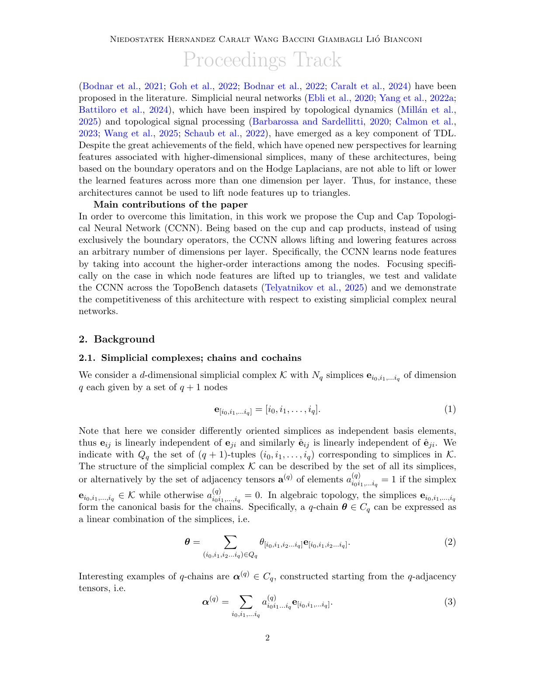
<figcaption class="paper-figure-caption"><b>Fig 1.</b> Low-resolution page preview, page 2</figcaption>
</figure>
<figure class="paper-figure-card">
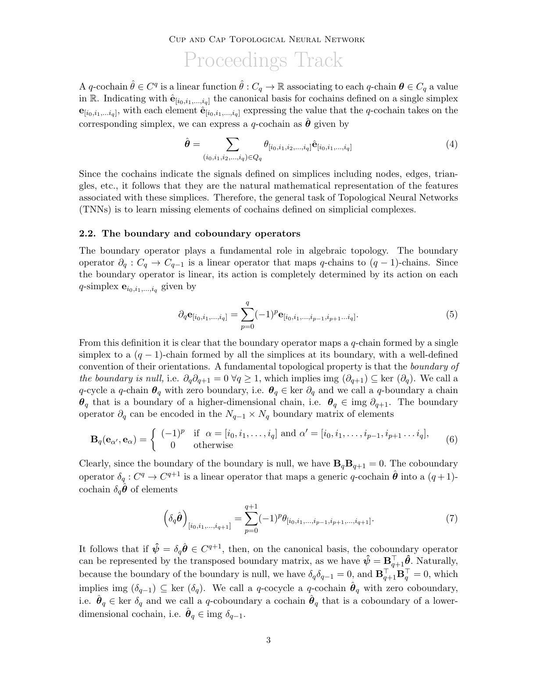
<figcaption class="paper-figure-caption"><b>Fig 2.</b> Low-resolution page preview, page 3</figcaption>
</figure>
<figure class="paper-figure-card">
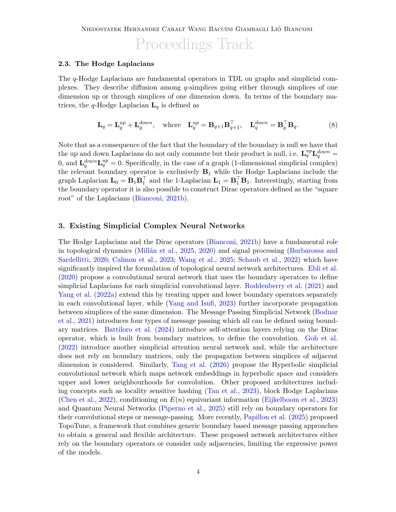
<figcaption class="paper-figure-caption"><b>Fig 3.</b> Low-resolution page preview, page 4</figcaption>
</figure>
<figure class="paper-figure-card">
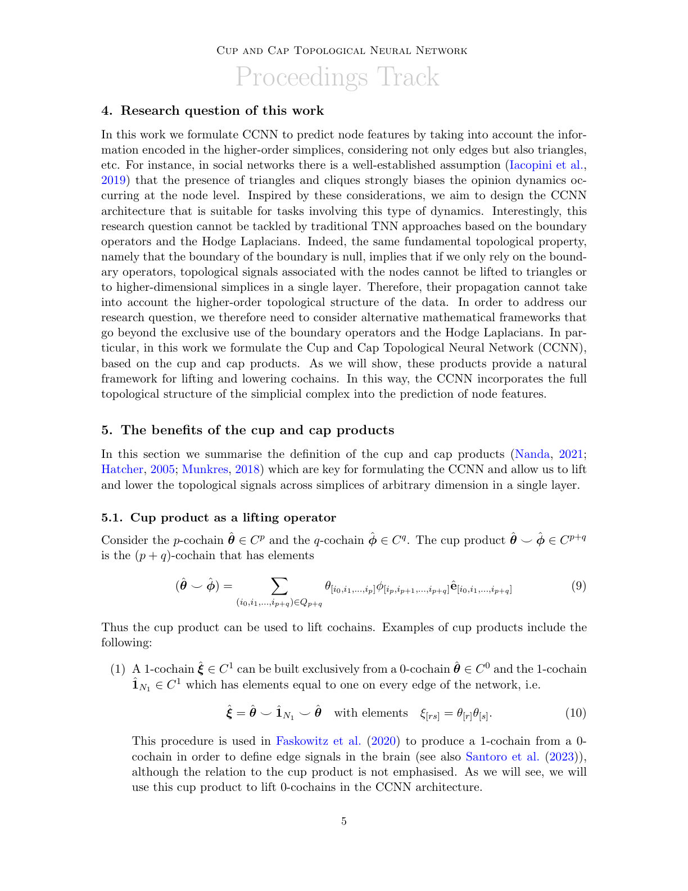
<figcaption class="paper-figure-caption"><b>Fig 4.</b> Low-resolution page preview, page 5</figcaption>
</figure>
<figure class="paper-figure-card">
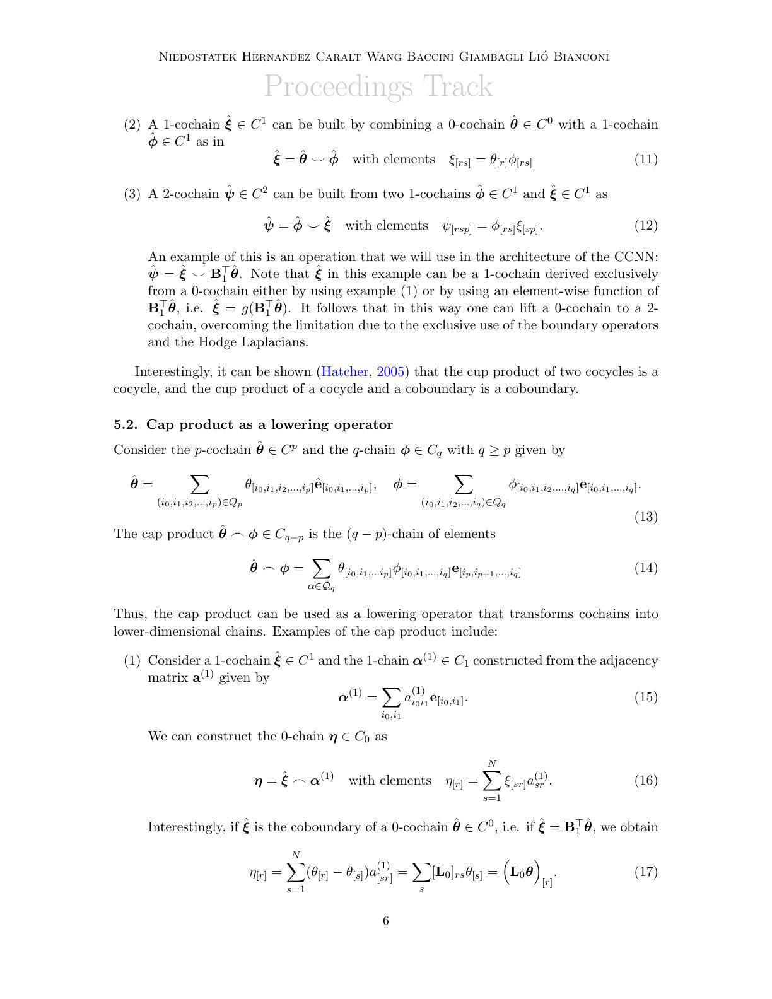
<figcaption class="paper-figure-caption"><b>Fig 5.</b> Low-resolution page preview, page 6</figcaption>
</figure>

**Summary.** This paper introduces the Cup and Cap Topological Neural Network (CCNN), an advanced TDL architecture designed to overcome the dimensional limitations of prior methods. By employing cup and cap products, CCNN can effectively incorporate high-order topological information (like triangles) to learn node features. It demonstrates superior or competitive performance against existing state-of-the-art models on standard benchmark datasets.

**Why it may be interesting.** While the focus is on machine learning, the underlying mathematical machinery (simplicial complexes, cohomology, cup/cap products) is deeply rooted in algebraic topology, which has connections to quantum field theory and topological quantum computation.

Detailed structure

**Main problem.** Existing Topological Deep Learning (TDL) methods are limited in their ability to propagate features across more than one dimension per layer using standard boundary operators.

**Main result.** The proposed Cup and Cap Topological Neural Network (CCNN) successfully learns node-based variables by incorporating many-body interactions (like triangles), achieving state-of-the-art or highly competitive performance on TopoBench datasets.

**Method.** The CCNN utilizes the mathematical framework of cup and cap products, which act as lifting and lowering operators, respectively, allowing feature propagation across an arbitrary number of dimensions per layer.

**Model / system.** The model is a Topological Neural Network (TNN) designed to process information encoded in simplicial complexes (nodes, edges, triangles). It processes 0-cochains ($\hat{	heta}_0$) through multiple layers using recursive equations involving the cup and cap products.

**Key observables.** Performance metrics (e.g., accuracy) on node-level tasks tested across various TopoBench datasets (Cora, Citeseer, Pubmed, etc.).

**Important parameters / regimes.** The structure of the simplicial complex (up to triangles, $M=2$), the choice of auxiliary cochain formulation ($\eta$ or $\omega$), and hyperparameters like learning rates and hidden dimensions.

**Assumptions / limitations.** The core assumption is that cup and cap products provide the necessary mathematical machinery to overcome the dimensional limitations inherent in boundary/Hodge Laplacian approaches.

**Figures summary.** The notes reference Table 1, Table 2, Table 3, and Table 4, which summarize performance comparisons, architectural components (A, B, C terms), and ablation study results across different datasets.

**Paper structure.** The paper first identifies the limitation of prior TDL methods. It then introduces the CCNN using cup and cap products. The methodology details the recursive construction of the network layers. Finally, the performance is validated through extensive benchmarking on the TopoBench library and ablation studies on specific datasets.

Abstract

Topological Deep Learning (TDL) is designed to learn features associated with higher-dimensional simplices including not only nodes but also edges, triangles and so on. However, most TDL approaches, being based on boundary operators and Hodge Laplacians, have the limitation that features and signals cannot be lifted or lowered across more than one dimension per layer. To overcome this limitation, in this work, we propose the adoption of the cup and cap products. Specifically, we formulate the Cup and Cap Topological Neural Network (CCNN), a topological deep learning architecture designed to learn node-based variables (or 0-cochains) by taking into account their many-body interactions (e.g. triangles) present in the data. We validate CCNN by assessing its performance on the TopoBench datasets, revealing its competitiveness with respect to other simplicial complex neural networks.

[↑ back to top](#top)

### [Determining the Number of Symmetry Sectors in Composite Quantum Spectra](http://arxiv.org/abs/2610.03108v1)

**Authors:** Nisarg Vyas, S. Harshini Tekur, M. S. Santhanam  
**Type:** theory · **Category:** disordered systems and neural networks · **PDF:** <https://arxiv.org/pdf/2610.03108v1>  
**Analysis basis:** full PDF text, analyzed in chunks
**Topic relevance:** `analog quantum simulation` **1/5**

↔ Scroll figures horizontally

<figure class="paper-figure-card">
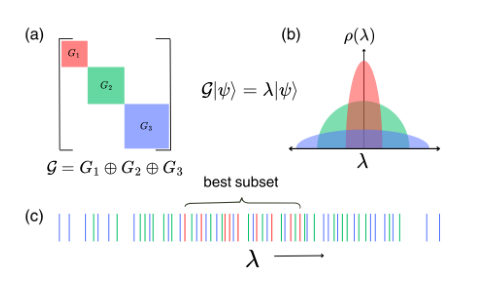
<figcaption class="paper-figure-caption"><b>Fig 1.</b> FIG. 1. (a) Schematic for a general block diagonal matrix G3 = G1(N1)⊕G2(N2)⊕G3(N3) with GOE matrices as sym- metry sectors. (b) Corresponding symmetry-resolved density of states ρ(λ) – Wigner semicircles of different radii. (c) Com- posite spectra with colors denoting symmetry sectors. The overlap motivates a technique to deduce the number of blocks.</figcaption>
</figure>
<figure class="paper-figure-card">
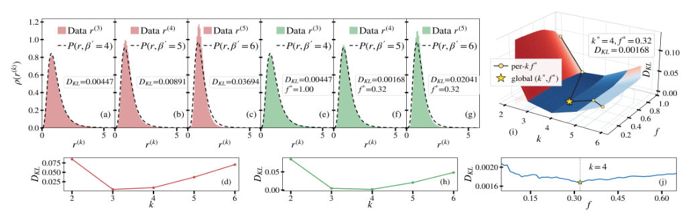
<figcaption class="paper-figure-caption"><b>Fig 2.</b> FIG. 2. HOSRs for k = 2 to 6 calculated on composite spectrum of four GUE matrices of sizes N ∈{5000, 10000, 15000, 20000}. In (a-c) we plot the k-SRDs with k = 3, 4, 5 calculated on the entire spectrum. The dashed line shows Eq. 2 with β′ = k + 1 = m + 1. (d) DKL minima incorrectly corresponds to k = 3. (e-g) k-SRDs with k = 3, 4, 5 with BST applied. (h) Correct deduction of m = k∗= 4. (i) DKL(k, f) surface as a function of the two parameters of BST, k and f. Here the circles show local minima in f for each k, and the star locates the global minima in the k −f space. (j) A slice of DKL(k, f) at k = 4.</figcaption>
</figure>
<figure class="paper-figure-card">
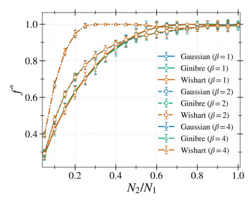
<figcaption class="paper-figure-caption"><b>Fig 3.</b> FIG. 3. The best fraction f ∗for composite spectra from two random matrices of orders N1 (fixed at 20000) and N2 (vary- ing). All the β = 1 ensembles fall onto one curve (circles). Similarly, all β = 2 and β = 4 ensembles follow the curves denoted by squares and triangles respectively.</figcaption>
</figure>
<figure class="paper-figure-card">
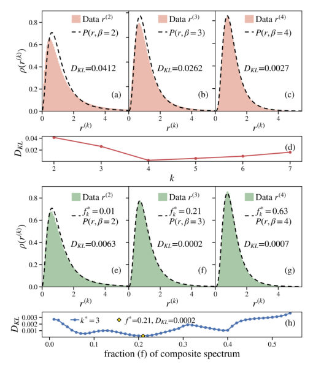
<figcaption class="paper-figure-caption"><b>Fig 4.</b> FIG. 4. HOSRs calculated on composite Hamiltonian spec- trum from three TFIMs with 14, 15 and 16 quantum spins. (a-c) HOSRs for k = 2, 3, 4 obtained from the composite spec- trum. (d) Incorrect deduction that m = 4. (e-g) HOSRs with BST applied. (h) shows the minima in f when k = 3.</figcaption>
</figure>
<figure class="paper-figure-card">
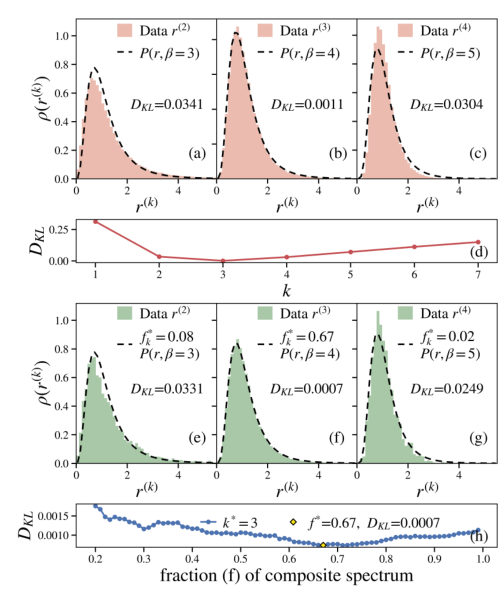
<figcaption class="paper-figure-caption"><b>Fig 5.</b> FIG. 5. HOSRs calculated on the composite spectrum from three hard-core boson models with 16, 17 and 18 bosons. (a- d) The KL divergence between P(r, β′ = k) and P (k)(r, β, m) reveals m = 3. (e-h) Application of BST confirms m = 3.</figcaption>
</figure>

**Summary.** This paper introduces the Best Subset Technique (BST) to solve the difficult problem of counting symmetry sectors in composite quantum spectra. By analyzing Higher-Order Spacing Ratios on an optimal subset of eigenvalues, the BST can accurately determine the number of contributing symmetry blocks, even when those blocks have unequal dimensions. This method is robustly tested across various random matrix ensembles and physical models.

**Why it may be interesting.** This work provides a powerful, general diagnostic tool for analyzing complex quantum spectra, which is crucial for understanding spectral rigidity and symmetry breaking in disordered or interacting quantum systems.

Detailed structure

**Main problem.** The primary goal is to determine the number of symmetry sectors ($m$) within a composite quantum spectrum when the individual symmetry sectors have unequal dimensions and the underlying symmetries are unknown or only partially known.

**Main result.** A Best Subset Technique (BST) successfully determines $m$ by analyzing spectral fluctuations, outperforming traditional methods that fail when sector dimensions are unequal.

**Method.** The BST uses Higher-Order Spacing Ratios (HOSRs) and minimizes the Kullback–Leibler (KL) divergence between the empirical HOSR distribution and expected random matrix ensemble distributions.

**Model / system.** The analysis applies to composite spectra derived from Hermitian and non-Hermitian systems, tested using random matrix ensembles like Gaussian, Wishart, and Ginibre matrices, as well as many-body models like the Transverse Field Ising Model (TFIM).

**Key observables.** Higher-Order Spacing Ratios (HOSRs) and the resulting best-fit parameters ($k^*, f^*$) used in the BST.

**Important parameters / regimes.** The number of symmetry sectors ($m$), the fraction of the spectrum analyzed ($f$), and the order of the ratio ($k$).

**Assumptions / limitations.** The core assumption is that the HOSRs calculated on a specific, optimal subset (the 'best subset') of the spectrum can reliably proxy the underlying spectral statistics, even when the full spectrum is complex.

**Figures summary.** Figures illustrate the failure of standard HOSR analysis on composite spectra (e.g., four GUE matrices) and demonstrate the success of the BST in correctly deducing the number of blocks ($m=4$ or $m=3$) by analyzing specific spectral fractions.

**Paper structure.** The paper introduces the problem of composite spectra, details the HOSR formalism, proposes the BST using KL divergence minimization, and validates the technique by applying it successfully to multiple random matrix ensembles (Gaussian, Wishart, Ginibre) and physical models (TFIM).

Abstract

The spectral fluctuations in complex quantum systems are modeled in terms of spectra from random matrices. Quantitative agreement with random matrices holds only when the quantum spectrum is a pure sequence, and not a composite spectrum that mixes levels from different symmetry sectors. It was shown earlier that discrete symmetries in composite spectra can be detected using higher-order spacing ratio statistics provided the symmetry sectors are of equal dimensions. The general case is when the symmetry sectors have unequal dimensions, and the symmetries of the Hamiltonian system are unknown or only partially known. In this work, we address how the number of symmetry sectors can be determined from a composite spectrum arising in Hermitian and non-Hermitian settings. A Best Subset Technique is proposed for determining the number of the symmetry sectors by comparing the spectral fluctuations to that of an appropriate random matrix ensemble without requiring de-symmetrization. It is demonstrated using spectra from Gaussian, Wishart and Ginibre ensembles, and also for spectra drawn from many-body quantum systems.

[↑ back to top](#top)

### [Fractionalization-Induced Time-Reversal Symmetry Breaking at Continuous Superconducting Transitions in Low-Symmetry Kondo Lattices](http://arxiv.org/abs/2610.02635v1)

**Authors:** Wonjune Choi, Shi-Zeng Lin  
**Type:** theory · **Category:** strongly correlated electrons · **PDF:** <https://arxiv.org/pdf/2610.02635v1>  
**Analysis basis:** full PDF text, analyzed in chunks
**Topic relevance:** `Keldysh / 2PI / non-Gaussian methods` **1/5**

↔ Scroll figures horizontally

<figure class="paper-figure-card">
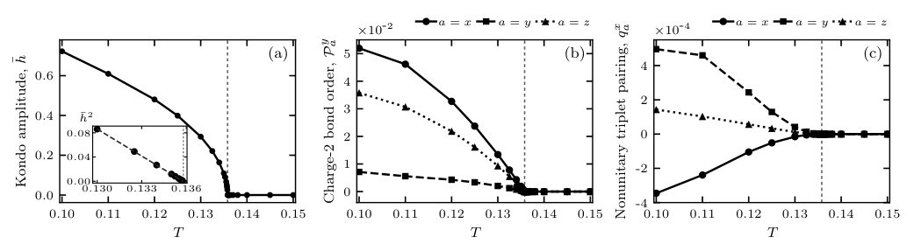
<figcaption class="paper-figure-caption"><b>Fig 1.</b> FIG. 1. The panels show mean-field results for the Kondo–Kitaev model on 20 × 20 unit cells with periodic boundary conditions, Kx = Ky = 1, Kz = 0.95, tx = ty = 0.2, tz = 0.19, JK = 1.9, and conduction electron filling nc = 0.9 per site. (a) The mean-field scaling ¯h2 ∝Tc −T below Tc (inset) supports continuous onset of the Kondo amplitude ¯h. (b) Charge-two bond order Py a indicates Kondo-induced superconductivity. (c) Nonunitary triplet pairing qx a extracted from the anomalous c fermion correlators diagnoses broken TRS. Within numerical resolution, all three order parameters become nonzero continuously at the same critical temperature Tc ≃0.1358.</figcaption>
</figure>

**Summary.** This theoretical work shows that in Kondo lattices coupled to $\mathbb{Z}_2$ spin liquids, symmetry fractionalization can force superconductivity and time-reversal symmetry breaking to occur together at one continuous transition. Using the Kondo-Kitaev model, the authors demonstrate this by analyzing the projective symmetry algebra and calculating multiple order parameters self-consistently.

**Why it may be interesting.** The mechanism of symmetry fractionalization provides a powerful, non-standard theoretical tool for understanding emergent symmetries in strongly correlated materials, which is relevant to understanding exotic superconducting states.

Detailed structure

**Main problem.** The paper addresses how superconductivity and the breaking of an additional symmetry, such as Time-Reversal Symmetry (TRS), can emerge simultaneously at a single continuous quantum phase transition.

**Main result.** Symmetry fractionalization provides a mechanism that forces the simultaneous onset of superconductivity and TRS breaking, even when conventional Landau theory predicts otherwise for low-symmetry systems.

**Method.** The analysis employs theoretical derivations using projective symmetry algebra and mean-field theory applied to the Kondo lattice model.

**Model / system.** The system is a Kondo lattice coupled to a $\mathbb{Z}_2$ spin liquid, modeled concretely using an anisotropic Kondo-Kitaev model on a honeycomb lattice.

**Key observables.** Superconducting order parameter ($P^{\mu}_{jk}$), Kondo amplitude ($\bar{h}$), and nonunitary triplet pairing vector ($\mathbf{q}_a$).

**Important parameters / regimes.** The condition $\Theta^2 = -I$ for the projective time-reversal action, and the critical temperature $T_c$.

**Assumptions / limitations.** The analysis relies on the mean-field approximation and assumes the Kondo transition is approached from a deconfined $\mathbb{Z}_2$ spin liquid state.

**Figures summary.** Figure 1 shows mean-field results demonstrating that the Kondo amplitude, charge-two bond order, and nonunitary triplet pairing all become non-zero continuously at the same critical temperature $T_c$.

**Paper structure.** The paper develops the theory by first establishing the symmetry constraints via projective algebra, then applying mean-field theory to the Kondo-Kitaev model, and finally calculating the self-consistent order parameters to confirm the simultaneous transition.

Abstract

In conventional Landau theory, simultaneous continuous onset of superconductivity and the breaking of additional symmetries generally requires a multidimensional order parameter or fine tuning. We show that symmetry fractionalization provides a different route. In a Kondo lattice with a $\mathbb Z_2$ spin liquid, the Kondo fields inherit the projective symmetry action of the spinons. When the projective time-reversal action on these fields squares to $-1$, the projective symmetry algebra forbids a condensate that preserves time-reversal symmetry and enforces twofold degeneracy of the critical modes. Because Kondo condensation in a $\mathbb Z_2$ spin liquid also breaks electromagnetic $U(1)$ symmetry, superconductivity and time-reversal symmetry breaking can emerge at a single continuous transition, even if crystal symmetry admits only one-dimensional irreducible representations. We demonstrate this mechanism in an anisotropic Kondo-Kitaev model, where superconductivity and the breaking of time-reversal and mirror symmetries emerge simultaneously.

[↑ back to top](#top)

### [Lifting Multiplicity in Randomized Benchmarking](http://arxiv.org/abs/2610.03586v1)

**Authors:** Yale Fan, J. P. Marceaux  
**Type:** theory · **Category:** quantum information and computing · **PDF:** <https://arxiv.org/pdf/2610.03586v1>  
**Analysis basis:** full PDF text, analyzed in chunks
**Topic relevance:** `quantum measurements` **1/5**

↔ Scroll figures horizontally

<figure class="paper-figure-card">
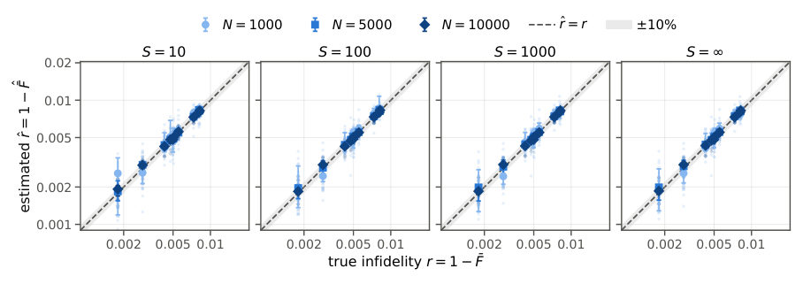
<figcaption class="paper-figure-caption"><b>Fig 1.</b> Figure 1: Performance of lifted randomized benchmarking with gate-independent noise over varying noise channel infidelities, circuits per depth, and shots per circuit. These fits were constructed over the geometric interval 2k with maximum depth 64, N circuits per depth, and S shots per circuit. Each point represents the median of 20 trials of the lifting benchmarking protocol for a given noise channel, and the error bars represent the central 68% intervals. Each element of the lifting group and benchmarking group has the same noise channel. We find that for N = 1000, some of the fits fail and produce estimates with infidelity less than 0, and for the others with greater circuits per depth,...</figcaption>
</figure>
<figure class="paper-figure-card">
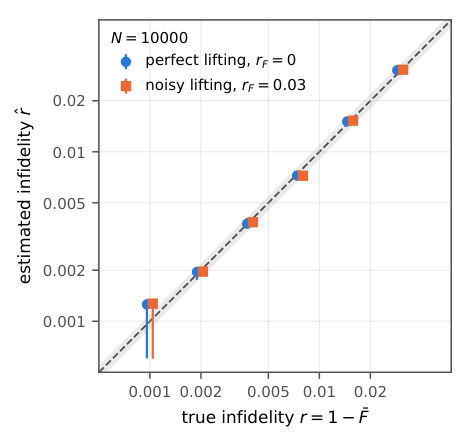
<figcaption class="paper-figure-caption"><b>Fig 2.</b> Figure 2: Estimated fidelity with noisy lifting vs. perfect lifting. We apply our procedure for the ZZ gate with 10,000 circuits per depth and 100 shots per circuit. Each point represents the median of 20 trials of the lifting benchmarking protocol for a given noise channel, and the error bars represent the central 68% intervals. In the case of perfect lifting, perfect lifting operators are applied (which means that only the last lifting operator that was not compiled into the benchmarking sequence is perfect). In the case of noisy lifting, both the first compiled and the last lifting operators contain a separate noise channel of infidelity equal to 0.03, which is larger than the...</figcaption>
</figure>
<figure class="paper-figure-card">
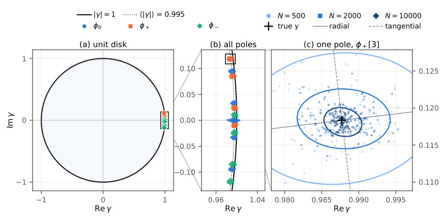
<figcaption class="paper-figure-caption"><b>Fig 3.</b> Figure 3: Estimated poles of the ZZ gate error channel in the complex plane. A single noise channel was fixed at the beginning of the experiment, and each point represents an experimental implementation with that fixed noise channel. The ZZ gate benchmarking group projects a general CPTP noise process onto the irrep decomposition, and our procedure robustly measures the eigenvalues of the isotypic components. These fits were constructed over the geometric interval 2k with maximum depth 64, N circuits per depth, and 1000 shots per circuit.</figcaption>
</figure>
<figure class="paper-figure-card">
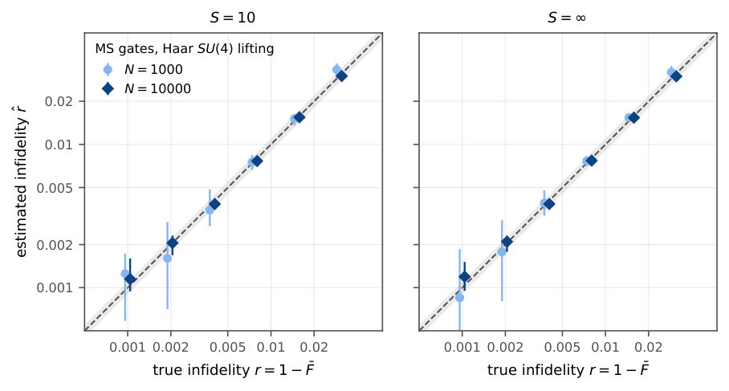
<figcaption class="paper-figure-caption"><b>Fig 4.</b> Figure 4: MS gate benchmarking results for gate-independent noise. Each point represents the median of 20 trials of the lifting benchmarking protocol over a given noise channel, and the error bars represent the central 68% intervals. The error channels consist of equal parts Pauli stochastic and coherent noise.</figcaption>
</figure>
<figure class="paper-figure-card">
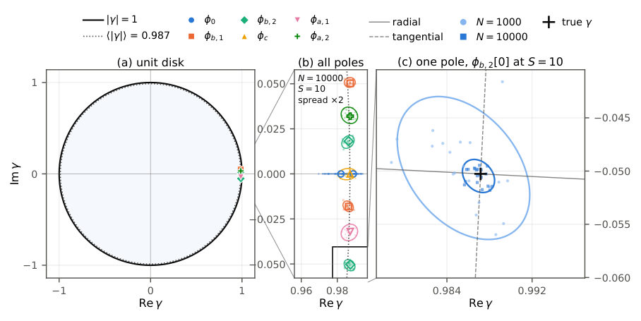
<figcaption class="paper-figure-caption"><b>Fig 5.</b> Figure 5: Estimated poles of the MS gate error channel in the complex plane. A single noise channel was fixed at the beginning of the experiment, and each point represents an experimental implementation with that fixed noise channel. The MS gate benchmarking group projects a general CPTP noise process onto the irrep decomposition, and our procedure robustly measures the eigenvalues of the isotypic components. These fits were constructed over the geometric interval 2k with maximum depth 64, N circuits per depth, and 1000 shots per circuit.</figcaption>
</figure>

**Summary.** This paper introduces Lifted Randomized Benchmarking, a theoretical advancement for assessing quantum gate fidelity. It solves the problem where native gate groups have multiplicity, which complicates data analysis by requiring multi-exponential fits. By enlarging the benchmarking group to a multiplicity-free structure, the method allows for robust fidelity estimation using only single exponential fits.

**Why it may be interesting.** It provides a powerful, general theoretical tool for characterizing quantum hardware performance that circumvents known mathematical bottlenecks (multiplicity) in standard benchmarking protocols.

Detailed structure

**Main problem.** Standard Randomized Benchmarking fails when the group of native quantum gates has multiplicity, leading to complex data requiring multi-exponential fits.

**Main result.** The authors introduce 'Lifted Randomized Benchmarking,' a method that estimates gate fidelity by fitting only single exponential decays, thereby bypassing the need to handle multiplicity.

**Method.** The technique generalizes character and synthetic RB by enlarging the benchmarking group to a larger, multiplicity-free group, allowing the estimation of decay rates via single exponential fits.

**Model / system.** The theory applies to assessing the operational fidelity of quantum processors, specifically illustrated using two-qubit gates relevant to trapped-ion systems.

**Key observables.** Average weighted survival probabilities (e.g., p_Lambda^m) and the eigenvalues of the noise-related matrix M_lambda(E).

**Important parameters / regimes.** The choice of the auxiliary lifting group F, which must contain the isotypic component of the target representation.

**Assumptions / limitations.** The method assumes the existence of a suitable lifting group F and is robust to errors in state preparation and measurement (SPAM).

**Paper structure.** The paper develops the theory by first identifying the failure mode (multiplicity in RB), then proposing the lifting procedure by enlarging the group, and finally demonstrating its application to estimate fidelity for specific physical gate sets.

Abstract

Randomized benchmarking comprises a suite of standard techniques for assessing the operational fidelity of quantum processors. These techniques can be reliably applied to groups with process matrix representations that are free of multiplicity. However, many groups that are naturally formed from native gates do have multiplicity, and it is difficult to draw robust conclusions from the resulting data. In this work, we present a new and intrinsic solution to the problem of multiplicity that completely eliminates the need to fit multi-exponential decays while still remaining robust to errors in state preparation and measurement. Our procedure, which we call lifted randomized benchmarking, generalizes key elements of both character and synthetic randomized benchmarking to benchmark a target group of quantum gates with respect to an enlarged group. We illustrate in numerical examples that our method can efficiently and reliably estimate the fidelity of two-qubit gates relevant to experimental trapped-ion systems. These techniques may find applications beyond randomized benchmarking to quantum tomography and learning, as well as the characterization of error-correcting codes.

[↑ back to top](#top)

### [Pricing of graph-based quantum portfolios from first principles](http://arxiv.org/abs/2610.03279v1)

**Authors:** Daniel J. Spencer, Bin Cheng, Dinh-Long Vu, Kishor Bharti, Alexey V. Gorshkov, Patrick Rebentrost  
**Type:** theory · **Category:** other · **PDF:** <https://arxiv.org/pdf/2610.03279v1>  
**Analysis basis:** full PDF text, analyzed in chunks
**Topic relevance:** `quantum measurements` **1/5**

↔ Scroll figures horizontally

<figure class="paper-figure-card">
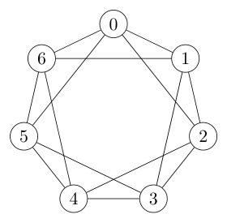
<figcaption class="paper-figure-caption"><b>Fig 1.</b> Figure 1: Two simple circulant graphs for graphs with n = 7 vertices, Ci7(1) and Ci7(1, 2). In Ci7(1), each vertex i is connected to vertices i + 1 (mod 7), while in Ci7(1, 2), each vertex i is connected to both vertices i + 1 mod 7 and i + 2 (mod 7).</figcaption>
</figure>
<figure class="paper-figure-card">
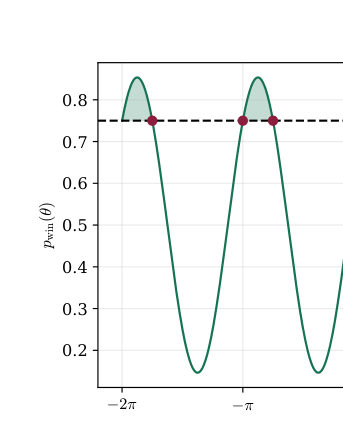
<figcaption class="paper-figure-caption"><b>Fig 2.</b> Figure 2: Success probability as a function of θ ∈(−2π, 2π) for the parameterized projective measurement (i.e., quantum) strategy (green curve) and the classical strategy (black, dashed line), with crossover points indicated in dark red. The areas where the quantum strategy outperforms the classical strategy are shaded in green.</figcaption>
</figure>
<figure class="paper-figure-card">
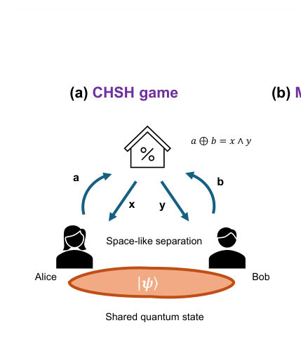
<figcaption class="paper-figure-caption"><b>Fig 3.</b> Figure 5: (a) Sketch of the standard CHSH game. Two parties, Alice and Bob, share a quantum state. They receive classical bits x and y and are tasked with returning the classical bits a and b such that a predicate a ⊕b = x ∧y is satisfied. (b) Sketch of the interpretation of the CHSH game as a market microstructure. The trader Alice shares an entangled state with the exchange, which has subsumed the party we normally call Bob. The actions of Bob are therefore part of the market microstructure and are taken as those in the standard CHSH game. Also depicted is the exchange-mediated trade of outcome-contingent claims between Alice and Charlie, together with the associated cash transfers.</figcaption>
</figure>

**Summary.** This work develops a novel framework for quantum finance by treating assets as non-commuting quantum operators. It models a 'quantum market' using nonlocal games like the CHSH game, showing it has definable financial structures. The authors derive rigorous upper bounds for asset pricing using advanced graph-theoretic measures.

**Why it may be interesting.** While the primary focus is finance, the mathematical tools—contextuality, nonlocality, and the use of graph invariants to bound physical quantities—are highly relevant to understanding correlations and constraints in quantum information theory.

Detailed structure

**Main problem.** The paper addresses the challenge of valuing assets in a quantum financial setting where assets are non-commuting operators, extending classical finance into quantum mechanics.

**Main result.** It demonstrates that a 'quantum market' based on nonlocal games, such as the CHSH game, can possess well-defined financial structures, providing first-principles pricing bounds for quantum assets.

**Method.** The methodology combines quantum finance concepts with graph theory and contextuality, using graph-theoretic quantities like the independence number and Lovász theta number to derive upper bounds on fair prices.

**Model / system.** The core model is a 'quantum market' instantiated using nonlocal games (e.g., CHSH game) involving entangled quantum states. The mathematical structure is formalized using graph theory concepts applied to asset compatibility.

**Key observables.** Quantum vs. classical portfolio performance, total correlation $S$, conditional correlation $E(x, y)$, and graph-theoretic quantities ($\alpha(G)$, $\vartheta(G)$).

**Important parameters / regimes.** The optimal quantum strategy yields a higher winning probability than the classical limit (e.g., $\approx 0.854$ vs $3/4$).

**Assumptions / limitations.** The analysis is built upon extending classical financial notions to quantum contexts and is initially instantiated using the CHSH game structure.

**Paper structure.** The paper first establishes the need to extend finance to quantum assets, then develops the framework using graph theory and nonlocal games (like CHSH), deriving pricing bounds using graph invariants, and finally discussing extensions to other quantum primitives like quantum money.

Abstract

A central topic in economics and finance is the valuation of strategic games and bets, of investments providing uncertain future cashflows, and of other asset-like structures and contracts. Often, such valuation involves a probabilistic model, random variables, and computing expectation values of complex payoffs. Extending beyond this classical framework, a scenario emerges where assets are non-commuting operators and the inherent uncertainty is described by quantum states. In this work, we combine such notions of quantum finance with a graph-theoretic framework and ideas from contextuality. We discuss exclusive quantum assets and introduce scenarios when holding such assets can provide advantages over holding classical assets. In particular, we consider a "quantum market" based on nonlocal games such as the CHSH game and demonstrate that this setting can function as a market with well-defined financial structures. We provide upper bounds on the fair prices of the quantum assets based on graph-theoretic quantities like the independence number and the Lovász theta number. Our insights into markets of non-commuting assets help to elucidate what a financial system in a world filled with quantum technology could look like.

[↑ back to top](#top)

### [Quasiparticle quantum simulation of materials with the Bethe-Salpeter equation](http://arxiv.org/abs/2610.02916v1)

**Authors:** Jielun Chen, Jiace Sun, Garnet Kin-Lic Chan  
**Type:** theory · **Category:** quantum information and computing · **PDF:** <https://arxiv.org/pdf/2610.02916v1>  
**Analysis basis:** full PDF text, analyzed in chunks
**Topic relevance:** `analog quantum simulation` **1/5**

↔ Scroll figures horizontally

<figure class="paper-figure-card">
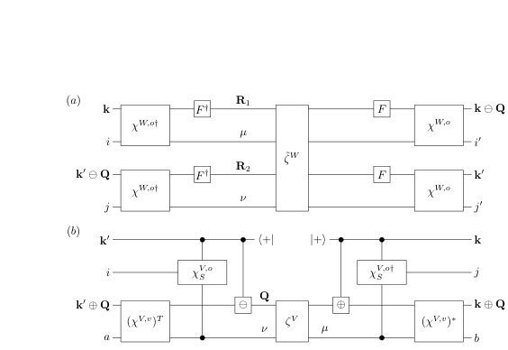
<figcaption class="paper-figure-caption"><b>Fig 1.</b> Figure 1. Block encodings of the direct and exchange term. (a) The direct oo circuit, where F is the Fourier trans- form on the momentum registers, χW,o is the block isometry of Eq. (33), and ˜ζW is the diagonal operator of Eq. (36). The vv and direct ov circuits use the same structure. (b) The exchange ov circuit, where χV,o S is the state preparation of Eq. (46), controlled by k and the auxiliary index.</figcaption>
</figure>
<figure class="paper-figure-card">
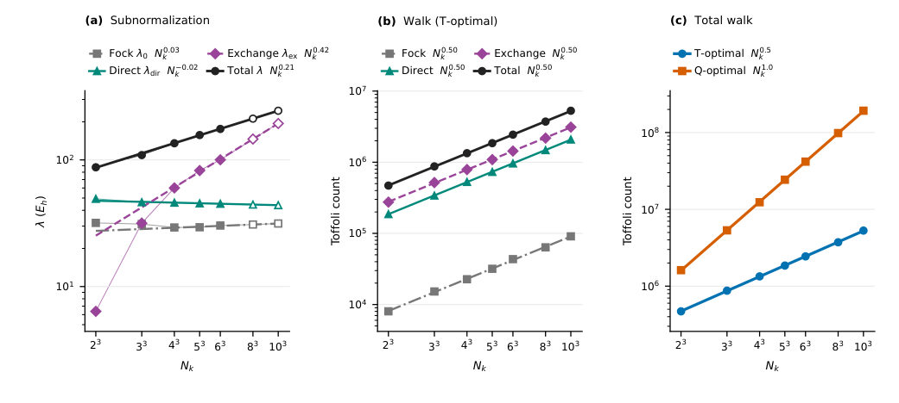
<figcaption class="paper-figure-caption"><b>Fig 2.</b> Figure 2. Subnormalizations and walk costs for triexcitonic BSE eigenvalue estimation in diamond without using space-group adaptation, using a THC fitting criterion of approximately 0.1 mEh MP2 energy error per unit cell. (a) Fock, direct, exchange, and total subnormalizations, including the m = 3 excitation-order factors defined in Eqs. (30) and (31). Thin lines connect successive points, scaling fits are obtained from the last three data points, and open markers denote extrapolated data. (b) Toffoli-optimized walk components and their sum. (c) Total walk costs for both T-optimal and Q-optimal compilation; the legend gives the theoretical leading powers N 0.5 k and N 1.0 k .</figcaption>
</figure>
<figure class="paper-figure-card">
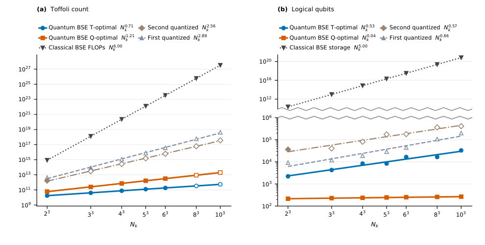
<figcaption class="paper-figure-caption"><b>Fig 3.</b> Figure 3. Quantum and classical resource estimates for diamond. The BSE calculations use m = 3, a THC fitting tolerance of 0.1 mEh MP2 error per unit cell, and no space-group adaptation. All quantum methods target 0.1 eV QPE error per eigenvalue estimate: an excitation energy for BSE and a total supercell energy for the full-Hamiltonian methods. Constant overheads for combining ground- and excited-state estimates are omitted. (a) Quantum Toffoli counts and classical BSE FLOPs. (b) Logical qubits and classical BSE storage, counted in floating-point values. Open markers denote extrapolated data.</figcaption>
</figure>
<figure class="paper-figure-card">
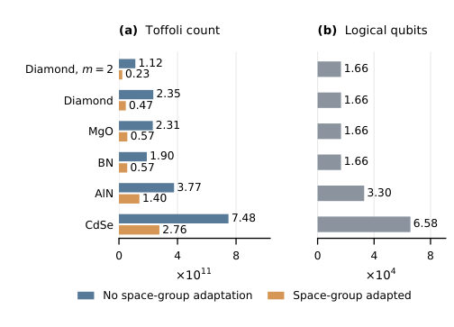
<figcaption class="paper-figure-caption"><b>Fig 4.</b> Figure 4. Toffoli-optimized multi-exciton BSE resources at Nk = 1000, with a target QPE error of 0.1 eV in the excita- tion energy and a THC fitting tolerance below 0.005 eV MP2 error per active electron. All cases use m = 3 unless oth- erwise labelled. (a) Toffoli counts without (blue) and with (orange) space-group adaptation. Diamond uses subnormal- izations from space-group-adapted fits; the other materials retain those from fits without space-group adaptation. (b) Logical-qubit counts, which agree between the two settings at the displayed precision. Input estimates and subnormal- ization extrapolations are detailed in Appendix G.</figcaption>
</figure>
<figure class="paper-figure-card">
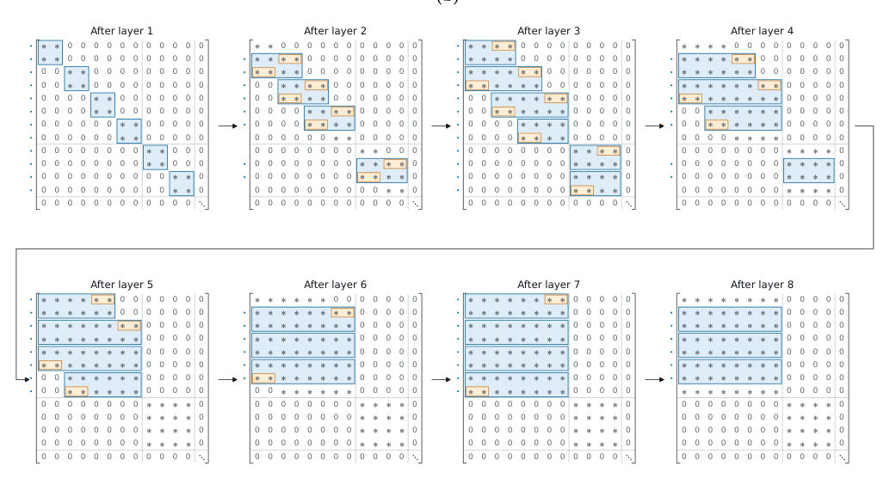
<figcaption class="paper-figure-caption"><b>Fig 5.</b> Figure 5. Block-unitary synthesis. (a) The circuit that synthesizes the block-unitary, composed of alternating layers followed by a diagonal phase layer ∆. White squares indicate multiplexed rotations; ±1 denotes increment/decrement. (b) Growth of the synthesized blocks under the applications of each layer (final phase layer omitted). Blue boxes mark entries updated by each layer, and orange boxes mark entries that were previously zero and become non-zero.</figcaption>
</figure>

**Summary.** This paper details a method for quantum simulation of multi-excitonic states using the Bethe-Salpeter equation (BSE) within a quasiparticle framework. By encoding the BSE Hamiltonian into a qubit circuit, the authors demonstrate significant resource savings—up to an exponential reduction in qubits—compared to simulating the full electronic Hamiltonian. This confirms that classical heuristic approximations are crucial for designing feasible future quantum algorithms for materials science.

**Why it may be interesting.** The work directly addresses the resource scaling for simulating complex many-body quantum systems (excitons) using quantum computation primitives, which is highly relevant to quantum algorithms for condensed matter physics.

Detailed structure

**Main problem.** Developing resource-efficient quantum algorithms to simulate multi-excitonic states governed by the Bethe-Salpeter equation (BSE) in materials.

**Main result.** The quasiparticle approach offers exponential reductions in quantum resources (Toffoli gates and qubits) compared to simulating the full electronic Hamiltonian.

**Method.** The authors developed an explicit first-quantized, orbital-based block encoding of the multi-exciton BSE Hamiltonian for qubitization, employing integral factorization and crystal symmetries for optimization.

**Model / system.** The simulation targets multi-excitonic states in materials, modeled using first-principles approaches and governed by the BSE, which is derived from the full electronic Hamiltonian.

**Key observables.** Excitation energies, Toffoli gate count, and logical qubit count.

**Important parameters / regimes.** System size N (up to $10^3$ atoms), number of quasiparticles, and k-point mesh size ($N_k$).

**Assumptions / limitations.** The use of heuristic quasiparticle approximations (GW/BSE) and the assumption of exponential localization of orbitals for convergence proofs.

**Figures summary.** Table V provides detailed resource estimates (Toffoli counts, logical qubits) for various materials across different k-point meshes, showing scaling behavior.

**Paper structure.** The paper progresses from establishing the difficulty of full Hamiltonian simulation to detailing the BSE formulation, developing the qubit encoding, optimizing the resource scaling, and finally presenting resource estimates for specific materials.

Abstract

The first-principles quantum simulation of the full electronic Hamiltonian of a material model of realistic size appears daunting even in a future era of fully fault-tolerant quantum computers. In contrast, classical simulations of material excited states rely on heuristic quasiparticle frameworks, such as the GW approximation and Bethe-Salpeter equation, where only a few quasiparticles are explicitly considered. Here we give a detailed description of quasiparticle quantum simulation for multi-excitonic states within the BSE. We develop an explicit first-quantized, orbital-based block encoding of the multi-exciton BSE Hamiltonian for qubitization, and reduce its cost using integral factorization and crystal symmetries. For a materials model of size $N$, and a fixed number of quasiparticles, the resulting algorithms require $\widetilde{O}(N)$ Toffoli gates and $O(\log N)$ logical qubits, or, using space-time tradeoffs, $\widetilde{O}(\sqrt{N})$ Toffoli gates and $\widetilde{O}(\sqrt{N})$ logical qubits, achieving up to a sixth power reduction in Toffoli count, or up to exponential reduction in qubit count, versus standard full Hamiltonian simulation techniques that have been explored in materials simulation. Resource estimates for the classically challenging problem of triexcitonic eigenvalue estimation across a range of semiconductor models of a realistic physical size of $O(10^3)$ atoms, show that our Toffoli-optimized implementation reduces the Toffoli count by $10^6-10^7$ relative to full Hamiltonian simulation estimates, while a qubit-optimized implementation requires only a few hundred logical qubits. More broadly, these results show that classical heuristic frameworks will be essential in the design of future fault-tolerant quantum algorithms for materials.

[↑ back to top](#top)

### [Root-sparsity scaling for Hamiltonian simulation, differential equations and linear-system solvers](http://arxiv.org/abs/2610.02939v1)

**Authors:** Dominic W. Berry, Abhishek Rawat, Sophia Simon, Guang Hao Low  
**Type:** theory · **Category:** quantum information and computing · **PDF:** <https://arxiv.org/pdf/2610.02939v1>  
**Analysis basis:** full PDF text, analyzed in chunks
**Topic relevance:** `analog quantum simulation` **1/5**

↔ Scroll figures horizontally

<figure class="paper-figure-card">
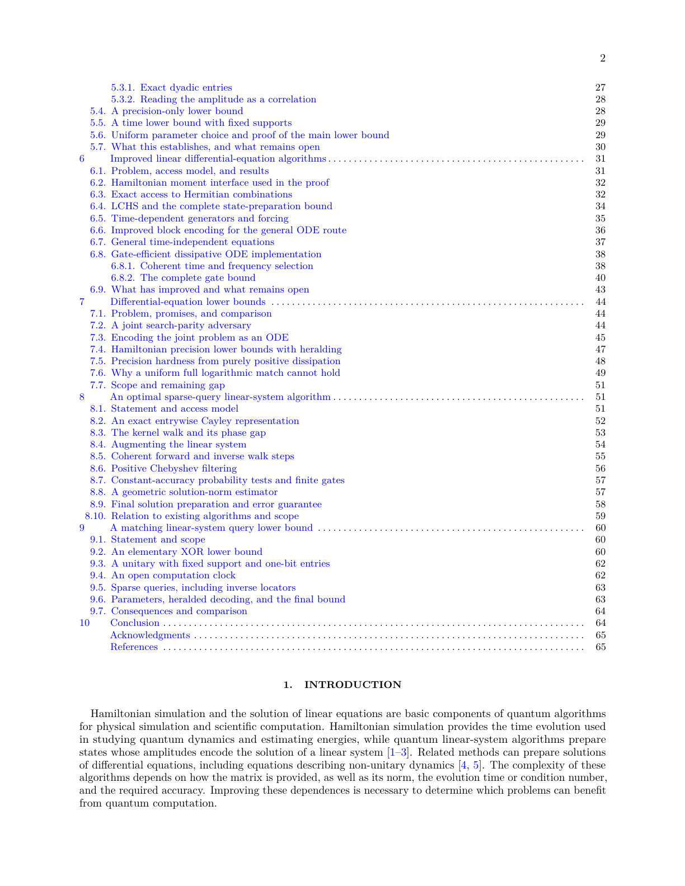
<figcaption class="paper-figure-caption"><b>Fig 1.</b> Low-resolution page preview, page 2</figcaption>
</figure>
<figure class="paper-figure-card">
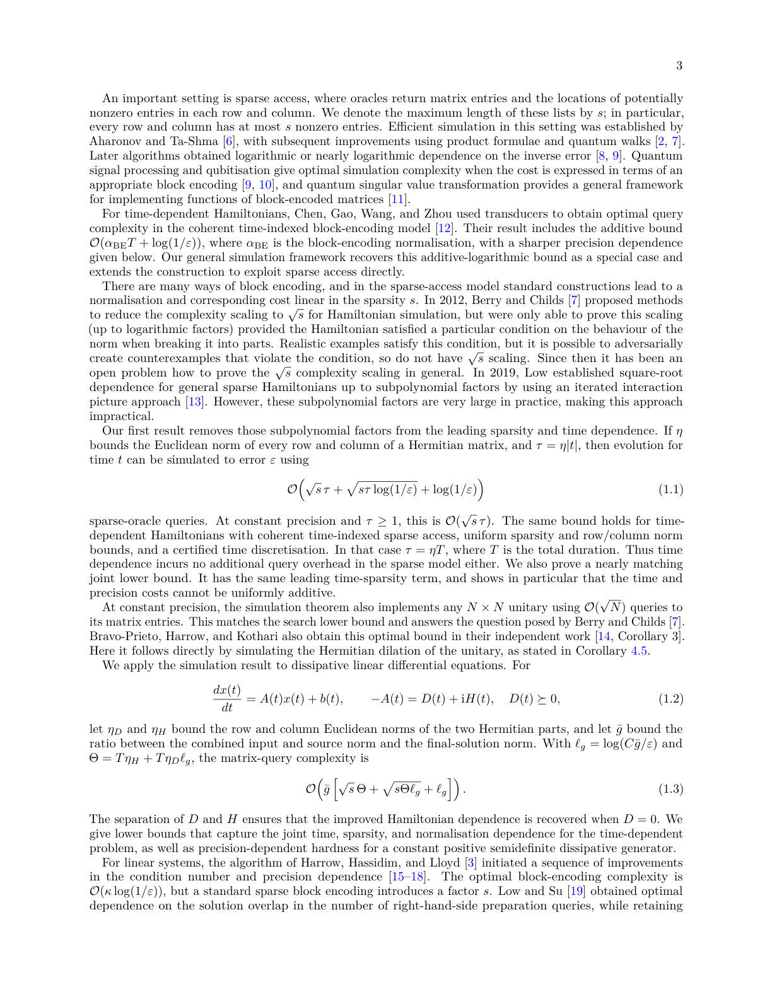
<figcaption class="paper-figure-caption"><b>Fig 2.</b> Low-resolution page preview, page 3</figcaption>
</figure>
<figure class="paper-figure-card">
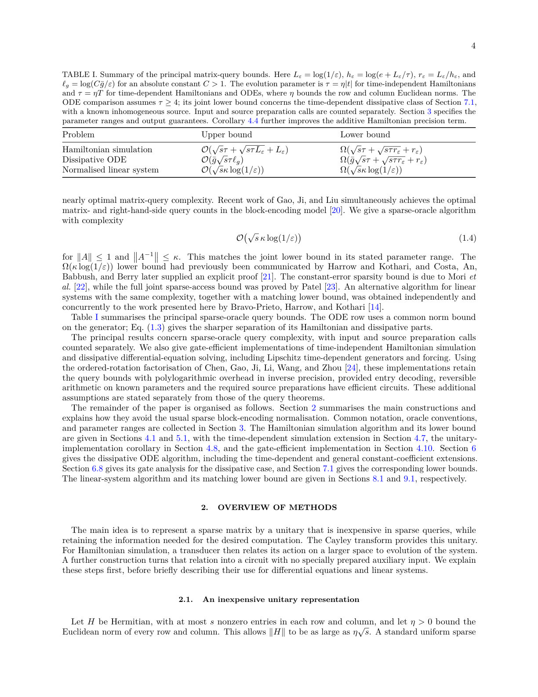
<figcaption class="paper-figure-caption"><b>Fig 3.</b> Low-resolution page preview, page 4</figcaption>
</figure>
<figure class="paper-figure-card">
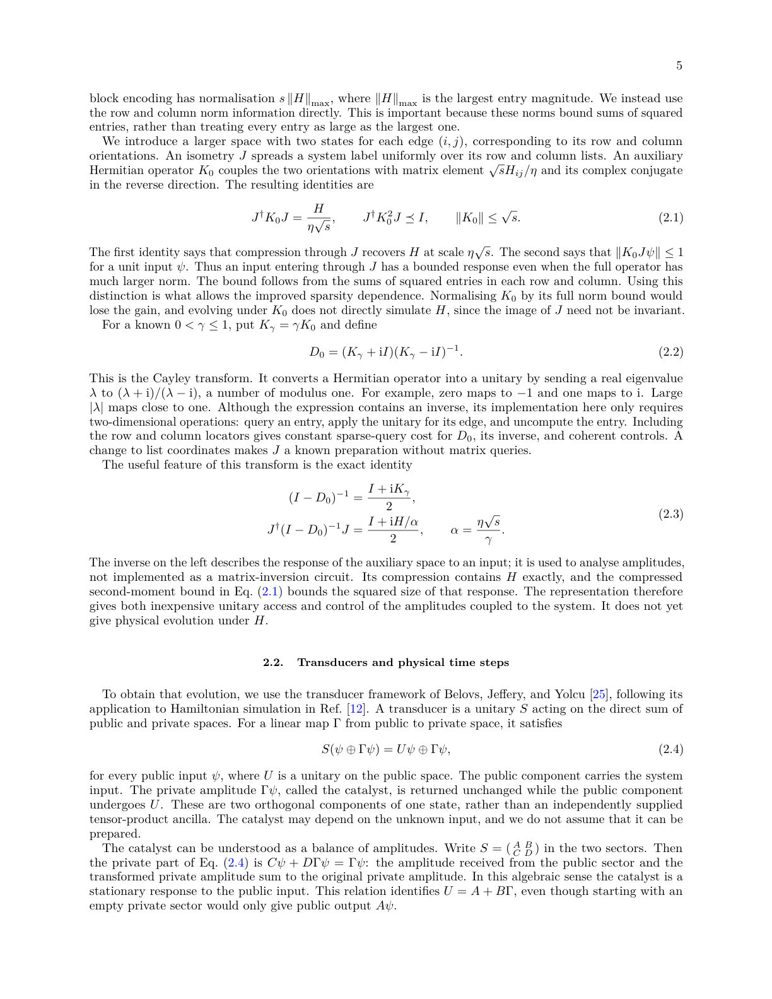
<figcaption class="paper-figure-caption"><b>Fig 4.</b> Low-resolution page preview, page 5</figcaption>
</figure>
<figure class="paper-figure-card">
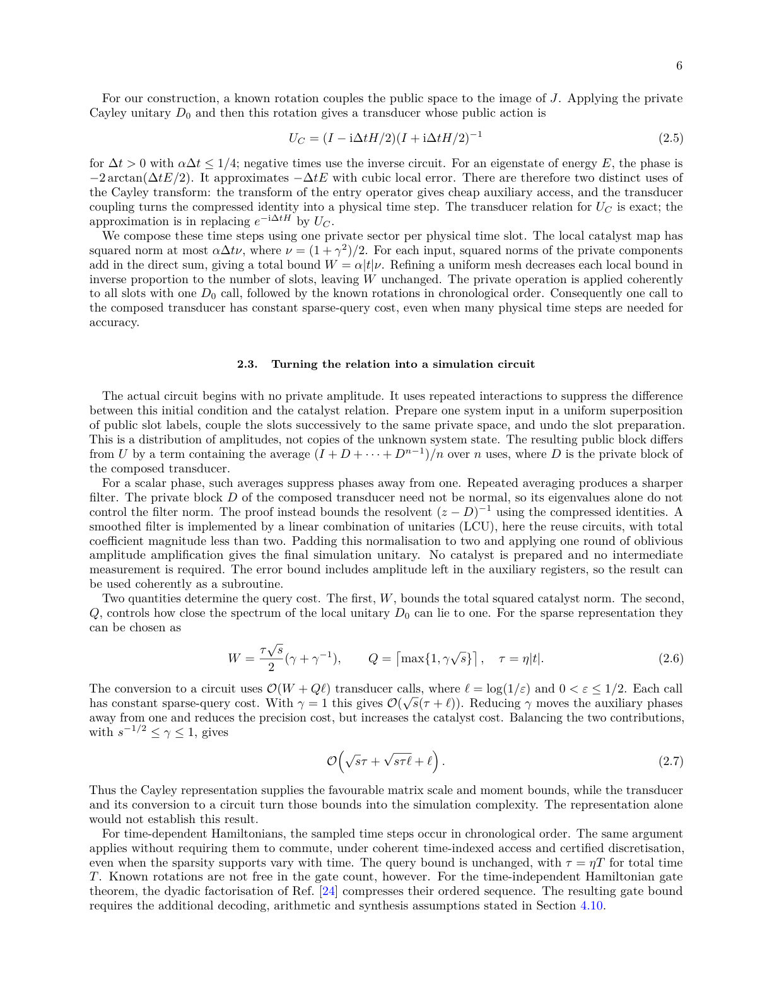
<figcaption class="paper-figure-caption"><b>Fig 5.</b> Low-resolution page preview, page 6</figcaption>
</figure>

**Summary.** This paper presents quantum algorithms achieving optimal query complexity for Hamiltonian simulation, solving linear differential equations, and inverting linear systems. The key breakthrough is demonstrating a square-root dependence on matrix sparsity ($s$) for all three problems. These results are significant for quantum simulation theory as they establish tight resource bounds for simulating complex physical dynamics.

**Why it may be interesting.** This work provides state-of-the-art theoretical bounds on the resource cost (query complexity) for simulating fundamental physical processes (dynamics and linear algebra) using quantum computation.

Detailed structure

**Main problem.** Developing quantum algorithms to efficiently simulate quantum dynamics, solve linear differential equations, and invert linear systems.

**Main result.** The authors establish quantum query complexity bounds showing a square-root dependence on sparsity ($\sqrt{s}$) for these tasks, matching established lower bounds.

**Method.** The work employs quantum algorithms leveraging sparse oracle access, utilizing constructions based on Cayley transducers and specialized circuit decompositions.

**Model / system.** The algorithms target three distinct computational problems: time evolution governed by a sparse Hermitian Hamiltonian (Hamiltonian simulation), time evolution governed by a general linear ODE (dissipative dynamics), and solving $Ax=b$ (linear systems).

**Key observables.** Query complexity (number of oracle calls), evolution time ($t$), and required accuracy ($\epsilon$).

**Important parameters / regimes.** Sparsity ($s$), norm bounds ($\eta$), condition number ($\kappa$), and the source/solution norm ratio ($ar{g}$).

**Assumptions / limitations.** The analysis relies on the sparse-access model, where only non-zero entries of the matrices are accessible via oracles.

**Figures summary.** TABLE I summarizes the principal matrix-query bounds for Hamiltonian simulation, Dissipative ODE, and Normalised linear system, comparing upper and lower bounds.

**Paper structure.** The paper systematically derives and compares query complexity bounds for Hamiltonian simulation, dissipative ODEs, and linear systems, establishing optimal scaling with sparsity and precision.

Abstract

We give quantum algorithms for Hamiltonian simulation, linear differential equations, and linear systems with square-root dependence on sparsity. For an $s$-sparse Hermitian matrix with row and column Euclidean norms bounded by $η$, evolution for time $t$ to error $ε$ uses $\mathcal{O}(\sqrt{s}τ+\sqrt{sτ\log(1/ε)}+\log(1/ε))$ queries, where $τ=η|t|$. The same bound holds for time-dependent Hamiltonians with coherent time-indexed sparse access and certified time discretisation. Our construction combines an exact entrywise representation with Cayley transducers. A joint lower bound nearly matches the time, sparsity, and precision dependence, ruling out a uniformly additive bound in $\sqrt{s}τ$ and $\log(1/ε)$. For dissipative linear differential equations we obtain $\mathcal{O}(\bar g[\sqrt{s}(τ+\sqrtτ)+1]\log(C\bar g/ε))$ queries, where $τ$ is the evolution time multiplied by a norm bound, $\bar g$ bounds the ratio of combined input and source norms to the final-solution norm, and $C$ is an absolute constant. We sharpen this bound by separating Hamiltonian and dissipative components, and treat general constant generators. Lower bounds capture joint parameter dependence for time-dependent equations and precision hardness for constant positive semidefinite dissipation. For linear systems, a Cayley walk and Chebyshev filter give $\mathcal{O}(κ\sqrt{s}\log(1/ε))$ queries when $\|A\|\le1$ and $\|A^{-1}\|\leκ$, and we give an alternative proof of a matching joint lower bound. We also give gate-efficient implementations of time-independent Hamiltonian simulation and the dissipative ODE solver, including Lipschitz time dependence, retaining the query bounds with polylogarithmic overhead in inverse precision given efficient entry decoding, arithmetic, and required source preparations.

[↑ back to top](#top)

### [Single-Shot Error Correction at Optimal Spacetime Cost](http://arxiv.org/abs/2610.03684v1)

**Authors:** Kishor Bharti, Tobias Haug, Derek Khu, Andrew Tanggara  
**Type:** theory · **Category:** quantum information and computing · **PDF:** <https://arxiv.org/pdf/2610.03684v1>  
**Analysis basis:** full PDF text, analyzed in chunks
**Topic relevance:** `quantum measurements` **1/5**

↔ Scroll figures horizontally

<figure class="paper-figure-card">
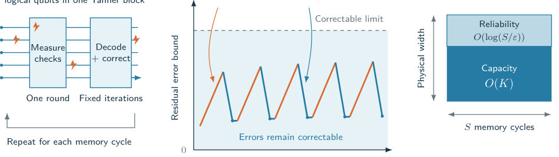
<figcaption class="paper-figure-caption"><b>Fig 1.</b> Figure 1: Optimal quantum memory through repeated partial recovery. a) Each cycle measures every stabilizer check once, runs a fixed number of parallel decoder iterations, and applies a Pauli correction or updates the Pauli frame. Orange symbols indicate faults in the quantum circuit; we assume that classical processing is reliable. b) New faults increase the error bound, while recovery reduces it without removing every error. The curve is schematic and assumes that every cycle stays within the allowed fault count. Exceeding that count in one cycle is exponentially unlikely in the block length. c) The bar’s height represents the physical width and its horizontal extent represents the...</figcaption>
</figure>

**Summary.** This paper establishes a concrete, resource-efficient method for fault-tolerant quantum memory, proving that the optimal spacetime cost for storing logical qubits can be achieved even when accounting for noise in the error correction process. By employing quantum Tanner codes and efficient decoding, the authors show that reliability adds only a logarithmic overhead, making the storage scalable for practical quantum computation.

**Why it may be interesting.** While focused on quantum computation, the rigorous analysis of error accumulation and resource scaling provides deep insights into the overhead associated with fault tolerance, which is critical for any physical quantum hardware realization.

Detailed structure

**Main problem.** The paper addresses determining the minimum spacetime cost required to store multiple logical qubits over many time steps while maintaining a specified error rate, even when the error correction process itself is noisy.

**Main result.** The authors demonstrate that the optimal scaling of $\Omega(S(K + \log(S/\epsilon)))$ can be achieved using an explicit noisy error-correction circuit, matching the best known lower bound up to constant factors.

**Method.** The method involves constructing a memory circuit using quantum Tanner codes, where each time step consists of syndrome extraction followed by parallel classical decoding to manage error accumulation.

**Model / system.** The system is a quantum memory storing $K$ logical qubits over $S$ time steps, utilizing CSS quantum LDPC codes implemented via a Tanner construction. The process is analyzed using the logical diamond-norm error bound.

**Key observables.** Spacetime Cost ($C$), Logical diamond-norm error ($\epsilon$), Physical width ($N$), and Total cost scaling $O(SN)$.

**Important parameters / regimes.** Number of logical qubits ($K$), Storage time steps ($S$), Error tolerance ($\epsilon$), and Code block length ($N$).

**Assumptions / limitations.** The hardware must support long-range qubit connectivity and fast, reliable classical processing. The analysis also assumes the existence of sparse representatives for logical pairs in the Tanner code family.

**Figures summary.** Figure 1 summarizes the method, showing one noisy recovery cycle (Measure checks $
ightarrow$ Decode + correct) and illustrating how the optimal cost scaling is achieved by balancing capacity and reliability contributions.

**Paper structure.** The paper builds upon existing results by providing a full circuit analysis for repeated recovery, showing how the error bound is controlled cycle-by-cycle using Tanner codes, and extending this analysis to constant-depth logical Clifford operations.

Abstract

Recent work established that, for independent erasures, storing $K$ logical qubits for $S$ time steps with error at most $\varepsilon$ requires a spacetime cost of $Ω(S(K+\log(S/\varepsilon)))$. A matching construction was also given, but assumes ideal error correction. Here we show that the same scaling can be achieved with an explicit noisy error-correction circuit and efficient decoding, counting all state-preparation, gate, measurement, and wait locations, provided that the hardware supports long-range qubit connectivity and fast, reliable classical processing. Thus, reliability adds only a logarithmic overhead shared by all stored qubits. The construction works for sufficiently weak but otherwise general circuit noise, including faults during syndrome extraction and correlated faults, and for independent erasures it matches the best known lower bound up to constant factors. We attain this scaling using quantum Tanner codes, with each memory step consisting of one round of syndrome extraction followed by a fixed number of parallel classical decoder steps that reduce the residual error enough to keep later faults correctable, regardless of memory size, storage time, or target accuracy. Together, this gives exponentially small failure probability per step while keeping the cost of each memory step linear in the code size. The same analysis also extends to certain constant-depth logical Clifford operations.

[↑ back to top](#top)

### [Two-center Dirac equation in a Gaussian basis set](http://arxiv.org/abs/2610.03217v1)

**Authors:** Dávid Ferenc  
**Type:** theory · **Category:** other · **PDF:** <https://arxiv.org/pdf/2610.03217v1>  
**Analysis basis:** full PDF text, analyzed in chunks
**Topic relevance:** `Keldysh / 2PI / non-Gaussian methods` **1/5**

↔ Scroll figures horizontally

<figure class="paper-figure-card">
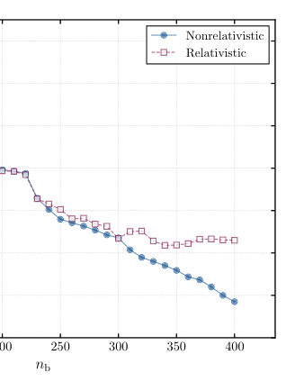
<figcaption class="paper-figure-caption"><b>Fig 1.</b> Figure 1. Convergence with the size of the basis set of the relativistic and nonrelativistic energies on a log scale, with respect to reference values, Enr ref = −1.102 634 214 494 946 461 508 98 and Erel ref = −1.102 641 581 032 577 164 118 14 of Ref. [10].</figcaption>
</figure>

**Summary.** This paper presents a novel, highly accurate method for solving the two-center Dirac equation using Gaussian-product basis sets. It applies this framework to calculate the zero-potential contribution to the one-loop self-energy for the H2+ molecular ion. The results demonstrate the method's high precision and its ability to recover known physical limits, advancing the field of relativistic molecular quantum electrodynamics.

**Why it may be interesting.** This work pushes the boundaries of relativistic quantum chemistry by applying advanced basis set techniques to calculate high-order QED corrections for molecular systems, which is crucial for understanding fundamental interactions in matter.

Detailed structure

**Main problem.** Developing a numerically robust method to solve the two-center Dirac equation for high-precision calculations, specifically evaluating the zero-potential contribution to the one-loop self-energy for molecular ions.

**Main result.** The authors successfully calculated the zero-potential self-energy contribution for H2+ in both Feynman and Coulomb gauges, demonstrating convergence and recovering known limits (like the hydrogen atom limit) with high precision.

**Method.** The method employs a Gaussian-product basis set tailored to the axial symmetry of diatomic systems, allowing for the analytic Fourier transform of the wave function in momentum space.

**Model / system.** The study focuses on the two-center Dirac equation, modeling diatomic molecular ions like H2+. The Hamiltonian is the Dirac-Coulomb Hamiltonian, and the solution involves expanding the wave function using Gaussian-product basis functions.

**Key observables.** Relativistic energy of H2+ (precision $10^{-18}$), and the zero-potential contribution ($\Delta E^{(0)}$) to the one-loop self-energy in Feynman and Coulomb gauges.

**Important parameters / regimes.** Internuclear distance $R=2.0~a_0$, and the convergence is studied by varying the basis set size ($n_b$) and extrapolating to $R 	o \infty$.

**Assumptions / limitations.** The calculation only includes the zero-potential term ($\Delta E^{(0)}$) of the self-energy, and the method imposes the Restricted Kinetic Balance (RKB) condition.

**Figures summary.** Tables show the convergence of the self-energy term in both gauges with basis set size, and the large-$R$ asymptotic behavior is compared to the exact hydrogen atom limit.

**Paper structure.** The paper first establishes the method using Gaussian-product basis sets to solve the Dirac equation. It then applies this framework to calculate the zero-potential self-energy contribution, performing convergence checks in both real and momentum space, and finally comparing results to known limits.

Abstract

A method for solving the two-center Dirac equation using a Gaussian-product basis set tailored to the axial symmetry of diatomic systems is presented. For the ground state of H$_2^+$ at an internuclear distance $R=2.0~a_0$, we obtain a relativistic energy with relative precision at the $10^{-18}$ level. The properties of the basis set allow for an analytic Fourier transform of the wave function. As a first application we evaluate, for the first time, the zero-potential contribution to the one-loop self-energy for H$_2^+$ in Feynman and Coulomb gauges. Although this contribution is not separately gauge invariant, its calculation provides a proof of principle for the use of the present framework in prospective QED calculations.

[↑ back to top](#top)

### [Where Quantum Fourier Sampling Stops Short: A Three-Gate Audit Protocol for Delay-PUF Security Models](http://arxiv.org/abs/2610.02636v1)

**Authors:** Owen Friedewald, Ali Shiri Sichani, Chi-Ren Shyu  
**Type:** theory · **Category:** quantum information and computing · **PDF:** <https://arxiv.org/pdf/2610.02636v1>  
**Analysis basis:** full PDF text, analyzed in chunks
**Topic relevance:** `quantum measurements` **1/5**

↔ Scroll figures horizontally

<figure class="paper-figure-card">
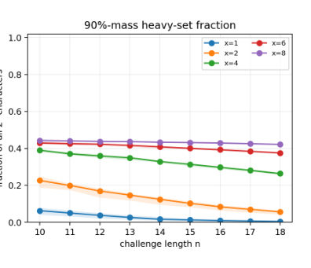
<figcaption class="paper-figure-caption"><b>Fig 1.</b> Figure 1: Finite-n concentration sweep with 30 deterministic seeded PUF instances per cell. Lines are medians and shaded bands are interquartile ranges across instances. Left: the fraction of all 2n characters admitted by degree ≤df(0.1). Right: the fraction needed to accumulate 90% Fourier mass. For higher XOR counts, both denominators remain large rather than shrinking toward a sparse audit target.</figcaption>
</figure>
<figure class="paper-figure-card">
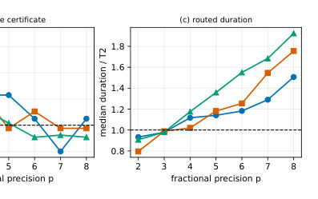
<figcaption class="paper-figure-caption"><b>Fig 2.</b> Figure 2: Precision and resource tradeoffs over three PUF instances and three transpiler seeds per point; accuracy is worst-instance and routed cost is the median. “Frozen gate” denotes a criterion fixed before the sweep. Dashed lines show these thresholds. Signal-preserving precision arrives only after median circuit duration reaches or exceeds mapped median T2. Transpilation only; no backend execution.</figcaption>
</figure>

**Summary.** This paper develops a 'Three-Gate Quantum Audit Protocol' to test if Quantum Fourier Sampling offers a genuine security advantage when auditing delay-based PUFs. By analyzing structural, algorithmic, and implementation constraints, the authors conclude that no end-to-end quantum advantage was found in their simulated, evaluated regime. This work establishes a rigorous diagnostic tool for assessing the feasibility of quantum machine learning in physical security applications.

**Why it may be interesting.** It provides a rigorous, multi-faceted framework for determining the boundary between theoretical quantum advantage and practical, implementable security guarantees in quantum-enhanced cryptography.

Detailed structure

**Main problem.** The paper audits the theoretical promise of using Quantum Fourier Sampling (QFS) to assess the spectral learnability of delay-based Physical Unclonable Functions (PUFs). It determines the practical limits where this quantum advantage breaks down against strong classical comparators and hardware constraints.

**Main result.** The Three-Gate Quantum Audit Protocol finds no end-to-end advantage for QFS in the evaluated regime, suggesting that ideal quantum query advantages do not translate into realizable security benefits for these PUF models.

**Method.** The authors employ a structured 'Three-Gate' protocol (Structural, Algorithmic, Implementation) comparing QFS against classical membership access (Kushilevitz–Mansour) and analyzing resource costs using simulated quantum circuits (QFT).

**Model / system.** The study models delay-based PUFs (Additive-delay APUF and XOR-APUF) and analyzes their spectral properties using quantum Fourier transforms and associated quantum kernels.

**Key observables.** Asymmetric geometric difference between classical and quantum Gram matrices ($g(\mathbf{K}_C\|\mathbf{K}_Q)$), spectral mass recovery percentage, and estimated circuit depth/duration relative to the qubit coherence time ($T_2$).

**Important parameters / regimes.** Challenge length ($n$), concentration threshold ($\epsilon$), and the degree of the polynomial structure ($d$).

**Assumptions / limitations.** The analysis is restricted to a design-time model audit using a simulated, fixed-point phase oracle, not a claim about deployed silicon.

**Figures summary.** Figures illustrate resource tradeoffs (e.g., depth vs. precision) and show quantitative comparisons of performance metrics (mass/recall) between classical and quantum sampling methods across different PUF types.

**Paper structure.** The paper is structured around the Three-Gate Audit Protocol: first, establishing structural bounds; second, comparing QFS against classical algorithms using kernel diagnostics; and third, evaluating resource feasibility using simulated quantum circuits.

Abstract

Quantum Fourier sampling may help audit the spectral learnability of delay-based physical unclonable functions (PUFs). We ask whether that promise survives access matching, a strong classical comparator, and oracle synthesis. Three gates structure the evaluation. Structure: low degree is not small support at reachable challenge lengths; for 4-XOR at $n=14$, degree $\le d_f(0.1)$ admits $91\%$ of all $2^n$ characters and the median $90\%$-mass set spans a third of the spectrum. Algorithmics: constructing the phase oracle logically implies classical membership access, making Kushilevitz--Mansour the correct baseline; across 45 tasks it exhausts each finite domain, and no 4-XOR ideal-sampling case reaches $90\%$ mass within $2^n$ calls. A quantum-kernel diagnostic appears more favorable, with geometric difference rising to $2.151$ at $N=512$ challenges, but it correlates $0.991$ with $1/\sqrt{λ_{\min}(K_C)}$ for the classical Gram matrix $K_C$, and the 4-XOR label-complexity ratio does not exceed a balance-preserving permutation null ($p=0.930$). Trace-normalized geometric difference can therefore grow through classical ill-conditioning alone, without task-label alignment. Implementation: a simulator-validated fixed-point phase oracle based on the quantum Fourier transform admits an $18.9\%$ routed-depth reduction, yet the least certified precisions have estimated durations of $1.18$--$1.55\times$ the median dephasing time $T_2$ of the mapped qubits on a static backend snapshot, without hardware execution. We find no end-to-end advantage in the evaluated regime, although ideal sampling does use fewer coherent calls on the thresholded task. The contribution is the Three-Gate Quantum Audit Protocol: a reproducible procedure separating an ideal query advantage from a realizable security benefit. This is not a claim about deployed silicon and not an impossibility result.

[↑ back to top](#top)

## Other papers (34)

*Papers from primary archives without highlighted authors or any topic match. Click to expand.*

Show other papers

### [A graph-theoretic analysis of non-generic free-fermion solvability by Krylov decompositions](http://arxiv.org/abs/2610.03557v1)

**Authors:** Jannis Ruh, Samuel J. Elman, Adrian Chapman  
**Type:** theory · **Category:** strongly correlated electrons · **PDF:** <https://arxiv.org/pdf/2610.03557v1>  
**Analysis basis:** full PDF text, analyzed in chunks

↔ Scroll figures horizontally

<figure class="paper-figure-card">
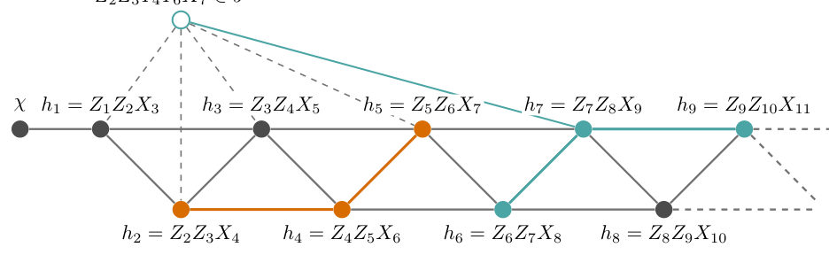
<figcaption class="paper-figure-caption"><b>Fig 1.</b> FIG. 1. The zigzag-ladder frustration graph of the FFD Hamiltonian in Eq. (1), together with the simplicial mode χ, which neighbors only h1. The term Z2Z3Y4Y6X7 ∈J(5), obtained as the product h2h4h5 along the induced path highlighted in orange, is also shown. This path is the symmetric difference of the anchored induced paths χ–h1 and χ–h1–h2–h4–h5, of lengths 1 and 4 (summing to 5), so the new term occurs in the Krylov current J(5). Including this term introduces a claw with center at h7, shown in teal together with its pairwise non-adjacent neighbors.</figcaption>
</figure>
<figure class="paper-figure-card">
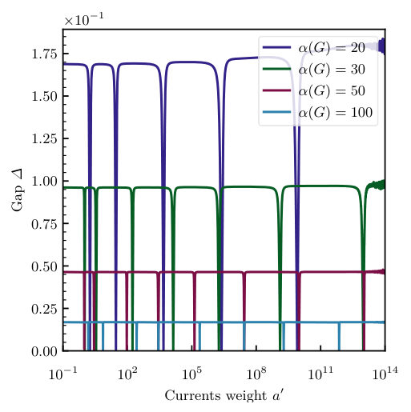
<figcaption class="paper-figure-caption"><b>Fig 2.</b> FIG. 3. The energy gap, ∆, of the model in Eqs. (C17) and (15) at the isotropic point α = β = γ = 1 with aℓ= a for all ℓand different model sizes α(G). The minima are contin- uous and genuine zeros, resolved as the sampling resolution is increased. For high a &gt; 1013 the skew-diagonalisation nu- merics become noisy.</figcaption>
</figure>
<figure class="paper-figure-card">
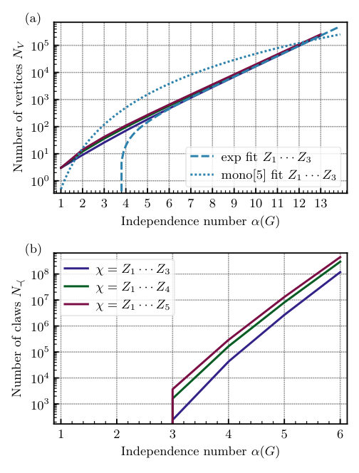
<figcaption class="paper-figure-caption"><b>Fig 3.</b> FIG. 2. (a) The number of vertices NV in the frustration graph of the model in Eq. (7) depending on the independence number α(G), for (the) three different choices of simplicial modes. The case χ = Z1Z2Z3 is fitted with an exponential function, exp, and a monomial, mono[5], defined in Eqs. (13) and (14) respectively. (b) The number of claws N−⟨in the frustration graph of the model in Eq. (7) depending on the independence number α(G), for (the) three different choices of simplicial modes.</figcaption>
</figure>
<figure class="paper-figure-card">
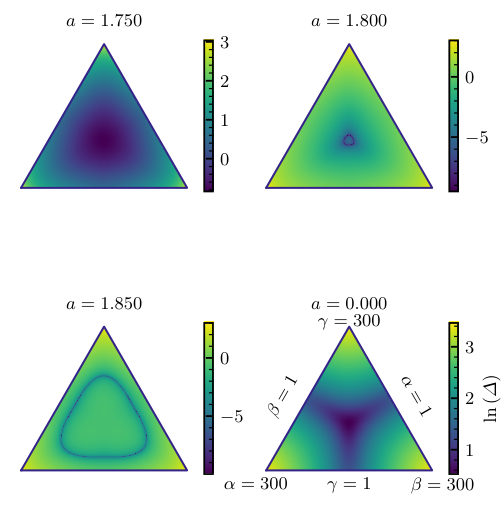
<figcaption class="paper-figure-caption"><b>Fig 4.</b> FIG. 4. The phase diagram of the model in Eqs. (C17) and (15) for α(G) = 20 and aℓ= a chosen around the first minimum that we see in Fig. 3, for all ℓ. The bottom-right diagram shows the axes labels. It holds α + β + γ = 302 (note that this absolute value can be renormalised; more in- teresting are the relative values of α, β and γ to each other; also note that we do not allow these parameters to be zero, e.g., we never have α = 0, in the numerical calculations as this causes instabilities, however, as we choose the maximal value fairly high, the relative values approximate this case, i.e., 1/300 ≈0). Figure 6 shows the same phase diagrams, however, with more aℓ= a sample values, and Fig. 7...</figcaption>
</figure>
<figure class="paper-figure-card">
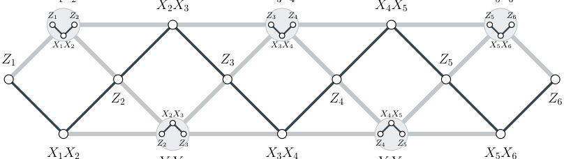
<figcaption class="paper-figure-caption"><b>Fig 5.</b> FIG. 5. The transverse-field Ising model as a seed: from paths in the TFIM, we can construct all other models which admit an exact solution via a linear mapping to free fermions. Here we depict the construction of the XY model from paths in the frustration graph of the TFIM. The TFIM runs zigzag through the XY model as a black line, with the other terms formed from products of paths in this model.</figcaption>
</figure>

**Summary.** This work develops a graph-theoretic framework to classify quantum spin models that are exactly solvable via free-fermion mappings. By constructing 'Krylov currents' based on the frustration graph, the authors systematically generate a family of non-generically solvable Hamiltonians. This provides a powerful, systematic route for finding and characterizing complex, exactly solvable many-body systems.

**Why it may be interesting.** The rigorous graph-theoretic approach to classifying exactly solvable models provides powerful tools for understanding quantum many-body physics, especially in regimes where simple mean-field or generic approximations fail.

Detailed structure

**Main problem.** The paper characterizes the structural conditions under which quantum spin models, particularly those related to the FFD chain, admit free-fermion solutions, distinguishing between generic and non-generic solvability.

**Main result.** The authors identify 'path support' as a signature of non-generic solvability and provide a systematic method using 'Krylov currents' to generate an entire family of non-generically solvable, exactly solvable Hamiltonians.

**Method.** The analysis combines graph theory (using the frustration graph) with advanced algebraic techniques, including the construction of Krylov currents and the use of path-product expansions.

**Model / system.** The primary model is the Free-fermion-in-disguise (FFD) chain, a 1D spin-chain Hamiltonian involving Pauli operators. The study extends this to non-generic solvable extensions $H_{NG}[a, b]$ by adding terms derived from Krylov currents.

**Key observables.** Path support, energy gap ($\Delta$), and the structure of the generated Lie algebra ($\mathfrak{so}(d)$).

**Important parameters / regimes.** Coupling strengths (which determine generic vs. non-generic solvability), and the graph structure parameters like $\alpha(G)$ (number of consecutive disjunct triangles).

**Assumptions / limitations.** The necessity of the path-product representation for free-fermion solvability is conjectured, and the analysis relies on specific anticommutation relations derived from the graph structure.

**Figures summary.** Figures illustrate the frustration graph of the FFD chain, the construction of Krylov currents from induced paths, and numerical results showing the dependence of the energy gap on the current strength.

**Paper structure.** The paper proceeds by defining the FFD model and its graph structure, introducing Krylov currents as the mechanism for non-generic extensions, proving the path-product expansion for these currents, and finally establishing the algebraic structure generated by these currents.

Abstract

Exactly solvable models are often identified from structural features of their interactions. For quantum spin Hamiltonians, these are captured by the frustration graph of anticommuting Pauli terms. The frustration graph characterizes broad families of spin models that map to free fermions for arbitrary, or generic, values of their coupling strengths. Nevertheless, there exist non-generically solvable models that admit free-fermion solutions only at finely tuned couplings. In this work, we characterize a family of such models in terms of graph structures. Given an arbitrary instance of Fendley's free-fermions-in-disguise (FFD) chain, we construct a set of operators, called Krylov currents, that are exactly quadratic in its effective fermionic modes and thus extend it to a linear family of free-fermion solvable Hamiltonians. As the Krylov currents are nonlinear in the FFD Hamiltonian terms, the elements of this generated family are non-generically solvable, and they accordingly fail the known conditions for generic solvability. We prove that every Krylov current admits an expansion in terms of induced paths of the frustration graph and that they generate the full special-orthogonal algebra of Gaussian transformations. Our results identify path support as a signature of non-generic solvability, and they provide a systematic route to finding exactly solvable many-body Hamiltonians.

[↑ back to top](#top)

### [BARC codes: general polynomial framework for coherent-state superposition codes](http://arxiv.org/abs/2610.03663v1)

**Authors:** Praneel Gore, Davit Aghamalyan, Varun Narasimhachar, Andrew Tanggara  
**Type:** theory · **Category:** quantum information and computing · **PDF:** <https://arxiv.org/pdf/2610.03663v1>  
**Analysis basis:** full PDF text, analyzed in chunks

↔ Scroll figures horizontally

<figure class="paper-figure-card">
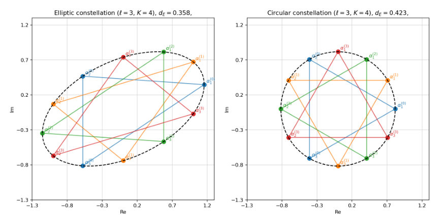
<figcaption class="paper-figure-caption"><b>Fig 1.</b> FIG. 1: Ellipsoid constellations C(0), C(1), C(2), C(3) spanning a 4-dimensional BARC code encoded in a single mode, with minimum separation ∆= √dE, where each constellation state is a uniform superposition of 3 coherent states. The plots show the two real phase-space coordinates of that mode. The left panel has (τx, τy, τxy) = (2, 1, 0.6), minimum separation ∆= √dE ≈0.358, and C(k) a†a C(k) ≈0.451. The right panel has (τx, τy, τxy) = (1, 1, 0), ∆≈0.423, and energy C(k) a†a C(k) ≈0.142 per constellation state. The distance labels in the panels report ∆, whereas dE denotes squared Euclidean resolution; (τx, τy, τxy) are as defined in 117.</figcaption>
</figure>
<figure class="paper-figure-card">
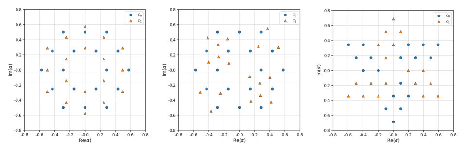
<figcaption class="paper-figure-caption"><b>Fig 2.</b> FIG. 2: Constellations for single-mode Hex1-18, Hex2-18, and Hex3-18 BARC codes from Sec- tion VIII A. Each construction gives two normalized constellation states, each a uniform superpo- sition of 18 coherent states. The panels illustrate their geometries at a fixed reference scale, where (τx, τy, τxy) = (2, 2, 0); the actual operating scale is varied and optimized in our numerical results reported in section IX. Left: Hex1-18 uses the origin-excluded radius-two patch and relative rotation π/2 (VIII A 0 a). Center: Hex2-18 uses balanced opposite shifts followed by rewhitening (VIII A 0 b). Right: Hex3-18 uses six chosen sixfold orbits with alternating triangle colors.(VIII A 0 c)</figcaption>
</figure>
<figure class="paper-figure-card">
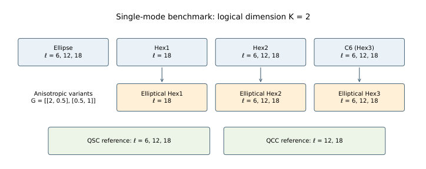
<figcaption class="paper-figure-caption"><b>Fig 3.</b> FIG. 3: Benchmarked families and available constellation sizes. Arrows indicate the anisotropic hexagonal variants; references are the specific QSC and QCC constructions used here.</figcaption>
</figure>
<figure class="paper-figure-card">
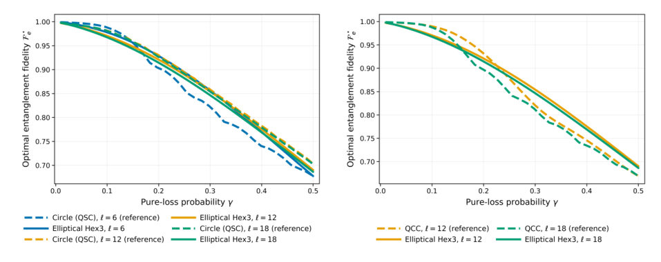
<figcaption class="paper-figure-caption"><b>Fig 4.</b> FIG. 4: Fixed-amplitude loss sweeps for Elliptical Hex3. The candidate is compared with QSC (left) and QCC (right). Each code uses its own sampled optimum at γ0 = 0.095, held fixed across the loss sweep, while recovery is reoptimized at each loss probability. The Elliptical Hex2 and Elliptical Hex1 loss sweeps are provided in Section F 1.</figcaption>
</figure>
<figure class="paper-figure-card">
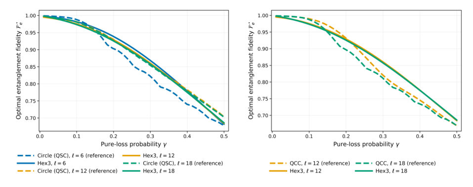
<figcaption class="paper-figure-caption"><b>Fig 5.</b> FIG. 5: Fixed-amplitude loss sweeps for Hex3. The candidate is compared with the equal-size QSC (left) and QCC (right). Candidate and reference amplitudes are selected independently at γ0 = 0.095 and held fixed across the loss scan, while recovery is reoptimized at each loss probability. The Hex2 and Hex1 loss sweeps are provided in Section F 1.</figcaption>
</figure>

**Summary.** This paper introduces BARC codes, a new class of quantum error-correcting codes for bosonic systems, by framing the error-correcting constraints within an algebraic geometry framework. The authors use polynomial systems to systematically construct these codes, providing explicit examples like ellipsoidal and hexagonal codes. This offers a powerful, general method for designing robust quantum codes against realistic photon loss errors.

**Why it may be interesting.** This work provides a powerful, abstract algebraic toolset to systematically discover and analyze quantum error-correcting codes for bosonic systems, which is highly relevant to quantum optics and quantum information theory.

Detailed structure

**Main problem.** The paper aims to develop a systematic, general algebraic framework for constructing novel bosonic quantum error-correcting codes.

**Main result.** They introduce Bosonic Algebraically-Restricted Constellation (BARC) codes, defined by polynomial constraints derived from treating the Knill-Laflamme conditions as algebraic equations.

**Method.** The methodology combines tools from algebraic geometry and commutative algebra (polynomial systems, ideals) to solve moment equations that characterize the code states.

**Model / system.** The system involves bosonic quantum states represented by superpositions of coherent states in an infinite-dimensional Hilbert space, designed to correct for photon-gain and photon-loss errors.

**Key observables.** Minimum geometric separation between constellation points, and entanglement fidelity when benchmarking against established codes.

**Important parameters / regimes.** The degree of the polynomial constraints, the noise type (e.g., pure-loss noise), and the constellation weight.

**Assumptions / limitations.** The initial explicit constructions are limited to the single-mode, uniform-weight case, and the derivation involves approximating exact matrix elements by discarding certain overlap terms.

**Figures summary.** The notes reference tables detailing specific parameters ($\alpha^\star_{C}$, $ar{n}^\star_{C}$, $\Delta^\star_{C}$, $s^\star_{C}$) for various benchmarked code families (Hex3, Ellipse, QSC, QCC).

**Paper structure.** The paper establishes the general algebraic framework (BARC codes) by relating error correction to polynomial constraints, derives necessary moment equations, and then benchmarks the constructed codes against known families using fidelity metrics.

Abstract

We introduce an algebraic framework for constructing a new class of quantum error-correcting codes, bosonic algebraically-restricted constellation (BARC) codes. The code states are finite superpositions of coherent-state constellations constrained by symmetries of solution sets to multivariate complex polynomial systems. The constraints are associated with photon-gain and photon-loss errors, thereby imposing approximate Knill--Laflamme conditions for such errors. For equally-weighted constellation points, we derive upper bounds on the minimum geometric separation between points, indicating how noise-resilient the code is. In the single-mode case, we characterize degree-two polynomial solution sets using an orthogonal group symmetry to obtain explicit ellipsoidal and hexagonal BARC codes. We benchmark representative instances of these families against spherical and cubature codes using the entanglement fidelity with optimal recovery under pure-loss noise.

[↑ back to top](#top)

### [Breaking the cubic barrier for the inverse-free Solovay-Kitaev algorithm](http://arxiv.org/abs/2610.03655v1)

**Authors:** Adam Bouland, Victor Shyaka, Chenyi Zhang  
**Type:** theory · **Category:** quantum information and computing · **PDF:** <https://arxiv.org/pdf/2610.03655v1>  
**Analysis basis:** full PDF text, analyzed in chunks

↔ Scroll figures horizontally

<figure class="paper-figure-card">
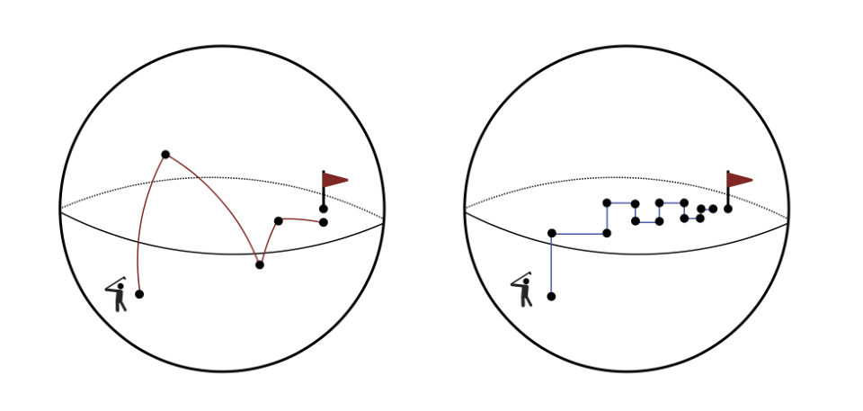
<figcaption class="paper-figure-caption"><b>Fig 1.</b> Figure 1: Illustration of (Left) doubly-exponential convergence of Kuperberg’s algorithm [Kup23] vs. (Right) singly-exponential convergence of our Pauli Golf method.</figcaption>
</figure>
<figure class="paper-figure-card">
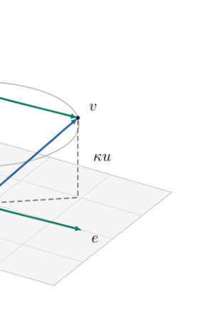
<figcaption class="paper-figure-caption"><b>Fig 2.</b> Figure 2: The geometric intuition of Lemma 4.4</figcaption>
</figure>

**Summary.** This paper presents significant theoretical improvements to the Solovay-Kitaev algorithm for quantum computation when the available gate set lacks inverses. By developing sophisticated recursive approximation techniques and analyzing directed unitaries, the authors demonstrate an IFSK exponent below the established cubic barrier of 3. This work shows that current compilation methods can be significantly more efficient than previously thought, advancing the field of quantum circuit synthesis.

**Why it may be interesting.** This work directly advances the theoretical understanding of quantum computation complexity, providing concrete algorithmic improvements that challenge established information-theoretic limits for gate compilation.

Detailed structure

**Main problem.** The paper aims to improve the exponent of the inverse-free Solovay-Kitaev (IFSK) algorithm, which compiles quantum unitaries using gate sets that lack inverses.

**Main result.** The authors achieve an IFSK exponent for a qubit of at most $\approx 2.988$, surpassing the known information-theoretic bound of 3, and also show an exponent of $\le 2.138$ for a specific Pauli-supplemented gate set.

**Method.** The methods involve constructing highly accurate directed unitaries and employing recursive approximation schemes, building upon techniques like 'Pauli golf' and fixed-point iteration analysis.

**Model / system.** The system is a single qubit ($	ext{SU}(2)$), and the problem is compiling an arbitrary target unitary $U$ to a specified accuracy $\epsilon$ using a given, potentially non-inverse-closed, universal gate set $G$.

**Key observables.** The primary observable is the exponent $b$ in the complexity $O(\log_b(1/\epsilon))$ of the compilation algorithm.

**Important parameters / regimes.** The key parameters are the target accuracy $\epsilon$, and the exponent itself, which is compared against the information-theoretic bound of 3.

**Assumptions / limitations.** The analysis relies on the existence and computability of fixed points derived from error-bounding functions, and the applicability of recursive bounds for sufficiently small $\epsilon$.

**Figures summary.** The notes mention Figure 1 illustrating convergence rates, comparing doubly-exponential convergence (Kuperberg's algorithm) to the single-exponential scaling achieved by the new algorithms.

**Paper structure.** The paper develops algorithms (FullCompile and DirectedUnitary) that recursively approximate the target unitary. The core mathematical machinery involves establishing error bounds using lemmas (e.g., Lemma 4.7, Lemma 4.8) derived from analyzing the structure of the approximation sequence $P_{24}$ and solving for necessary parameters via fixed-point iteration.

Abstract

The Solovay-Kitaev algorithm states that it is possible to efficiently compile unitaries to accuracy $ε$ in $\text{polylog}(1/ε)$ time using any universal gate set. While Solovay and Kitaev's initial work addressed inverse-closed gate sets, recently Bouland and Giurgicǎ-Tiron showed it is possible to efficiently compile arbitrary gate sets without inverses. However, the exponent of their compilation algorithm is high. For example the inverse-free exponent for a qubit is over $8.62$, while information theoretically it is known that an inverse-free exponent of $3$ is possible in any dimension by a result of Oszmaniec, Sawicki, and Horodecki. This leads to a natural question: can one improve the exponent in Bouland and Giurgicǎ-Tiron's algorithm? And are there any cases where the inverse-free exponent is below 3, thus surpassing existing information-theoretic arguments?   To answer this question, we first show that a special case of the inverse-free compiling problem -- namely Pauli gates supplemented by an irrational rotation of a qubit - admits a highly efficient compilation algorithm with an exponent at most $\approx 2.138$.   Our algorithm fuses ideas from prior algorithms of Kuperberg and Sardharwalla, Cubitt, Harrow and Linden to construct an efficient ``Pauli golf'' compilation routine. We then extend these ideas to the general inverse-free case for a qubit, where we give a compiling algorithm with exponent at most $2.988$. This result uses a novel form of approximate ``aiming'' of unitary corrections to improve the compilation efficiency. Our results give two examples of quantum compiling algorithms surpassing information-theoretic arguments, and demonstrate that there are many efficiency gains possible for inverse-free compilation.

[↑ back to top](#top)

### [Compiling Together: High-Throughput Distributed Quantum Computing via Multi-Compilation](http://arxiv.org/abs/2610.03260v1)

**Authors:** Yipei Liu, Sen Zhang, Zebo Yang, Lei Yang  
**Type:** both · **Category:** quantum information and computing · **PDF:** <https://arxiv.org/pdf/2610.03260v1>  
**Analysis basis:** full PDF text, analyzed in chunks

↔ Scroll figures horizontally

<figure class="paper-figure-card">
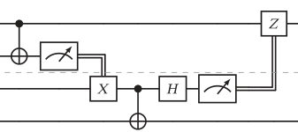
<figcaption class="paper-figure-caption"><b>Fig 1.</b> Figure 1. Remote 2-qubit gate (telegate) between data qubits on two QPUs using a Bell pair and classical commu- nication.</figcaption>
</figure>
<figure class="paper-figure-card">
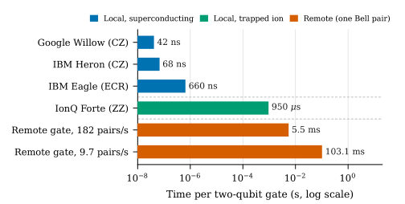
<figcaption class="paper-figure-caption"><b>Fig 2.</b> Figure 2. Comparison of local two-qubit gate latency and Bell-pair generation time for remote quantum operations.</figcaption>
</figure>
<figure class="paper-figure-card">
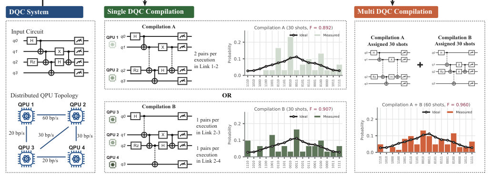
<figcaption class="paper-figure-caption"><b>Fig 3.</b> Figure 3. A four-QPU example illustrating complementary compilations and the fidelity improvement obtained by merging their measurement results. Under the same Bell-pair capacities, a single compilation exploits only part of the DQC resources and executes 30 shots, whereas multiple compilations achieve 60 shots with higher fidelity.</figcaption>
</figure>
<figure class="paper-figure-card">
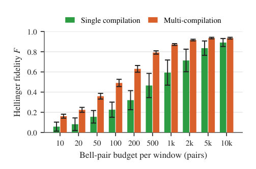
<figcaption class="paper-figure-caption"><b>Fig 4.</b> Figure 4. Fidelity under different Bell-pair budgets for single- and multi-compilation execution. Bars show mean ± standard deviation over 20 independent replicates.</figcaption>
</figure>
<figure class="paper-figure-card">
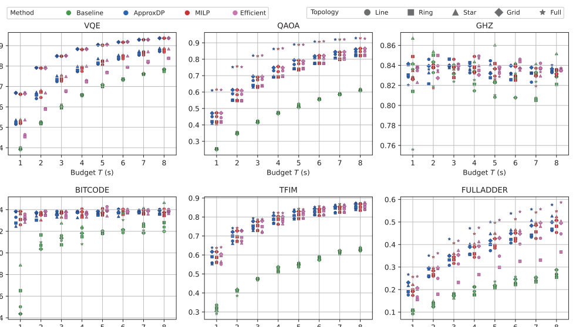
<figcaption class="paper-figure-caption"><b>Fig 5.</b> Figure 6. Simulation fidelity versus time budget for six 10-qubit circuit workloads. Colors denote allocation methods, markers denote six-QPU topologies.</figcaption>
</figure>

**Summary.** This paper tackles the throughput bottleneck in Distributed Quantum Computing by proposing 'multi-compilation,' which runs several logically equivalent circuit compilations simultaneously. By optimizing the joint selection and allocation of these candidates under limited entanglement resources, the authors significantly boost computational throughput and improve result fidelity. The solution is formulated as an NP-hard optimization problem solved using advanced techniques like MILP.

**Why it may be interesting.** The work directly addresses resource management and scaling limitations in distributed quantum architectures, which is crucial for realizing fault-tolerant quantum computation across modular hardware platforms.

Detailed structure

**Main problem.** The primary challenge is maximizing the throughput of quantum computation on a Distributed Quantum Computing (DQC) network limited by the finite, rate-constrained generation of entanglement (Bell pairs) across communication links.

**Main result.** By employing multi-compilation—running logically equivalent circuits concurrently—the method significantly boosts throughput (up to 4.5x in simulation) and improves output fidelity compared to using a single compilation.

**Method.** The problem is formulated as Candidate-Constrained Max-Shot Allocation (CMA), an NP-hard optimization problem, solved using dynamic programming, MILP, and a greedy heuristic.

**Model / system.** The model is a DQC network connecting multiple Quantum Processing Units (QPUs) via communication links, where the resource bottleneck is the rate at which Bell pairs can be generated on these links.

**Key observables.** Throughput (shots/s), output fidelity, and Bell-pair utilization across inter-QPU links.

**Important parameters / regimes.** Bell-pair generation rate ($R_e$) per link, number of QPUs (up to 36), and circuit size (up to 144 qubits).

**Assumptions / limitations.** The model assumes a per-link communication constraint, and the allocation is modeled using a discretized rate model (integer units of shots/s).

**Figures summary.** Figures demonstrate that multi-compilation increases fidelity significantly (e.g., 93.3% improvement for TFIM-20) and reduces the time needed to reach a target fidelity by up to 10x compared to single-compilation baselines.

**Paper structure.** The paper introduces the DQC throughput bottleneck, formulates the CMA optimization problem, details the NP-hardness proof, and then presents and compares solutions using dynamic programming, MILP, and greedy heuristics, validating results on simulations and hardware.

Abstract

Quantum computing is a promising paradigm for problems that are challenging for classical machines, but realizing that promise requires far more qubits than a single processor can offer. Distributed quantum computing (DQC) scales out by connecting multiple quantum processing units (QPUs), at the cost of making entanglement the scarce resource: every remote gate consumes a Bell pair, and inter-QPU links generate Bell pairs at finite rates orders of magnitude slower than local gates. Since quantum programs are executed repeatedly, this rate bounds how fast shots complete and thus how fast results are obtained. Existing DQC compilers emit a single implementation per circuit, so throughput is capped by its busiest link while other links stay idle. We observe that alternative compilations of the same circuit are logically equivalent yet stress different links; executing them concurrently and pooling their samples converts idle Bell pairs into additional shots. We formulate the joint selection of compilations and allocation of shots under per-link Bell-pair capacities as Candidate-Constrained Max-Shot Allocation (CMA), prove it NP-hard, and solve it with a dynamic program and its approximate variant AppDP, a compact MILP, and a greedy heuristic Effi. In simulation on six-QPU networks, multi-compilation raises throughput by 2-4.5* over the single compilation and correspondingly improves output fidelity under equal Bell-pair budgets. On hardware, it increases measured fidelity by up to 93% and reaches the single-compilation fidelity in up to 10* less time. Scaling to 36 QPUs and 144-qubit circuits, MILP improves throughput over the single compilation by 76.8% on average across 48 configurations while Effi allocates in milliseconds.

[↑ back to top](#top)

### [Distance-Independent Universality of Clifford+T](http://arxiv.org/abs/2610.03364v1)

**Authors:** Jens Palsberg, Keli Huang, Abdullah Almanei  
**Type:** theory · **Category:** quantum information and computing · **PDF:** <https://arxiv.org/pdf/2610.03364v1>  
**Analysis basis:** full PDF text, analyzed in chunks

↔ Scroll figures horizontally

<figure class="paper-figure-card">
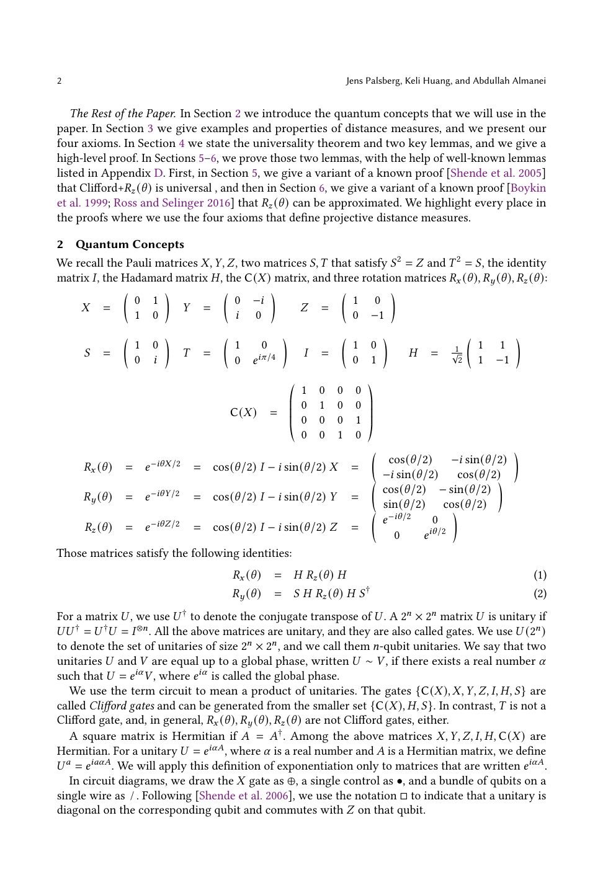
<figcaption class="paper-figure-caption"><b>Fig 1.</b> Low-resolution page preview, page 2</figcaption>
</figure>
<figure class="paper-figure-card">
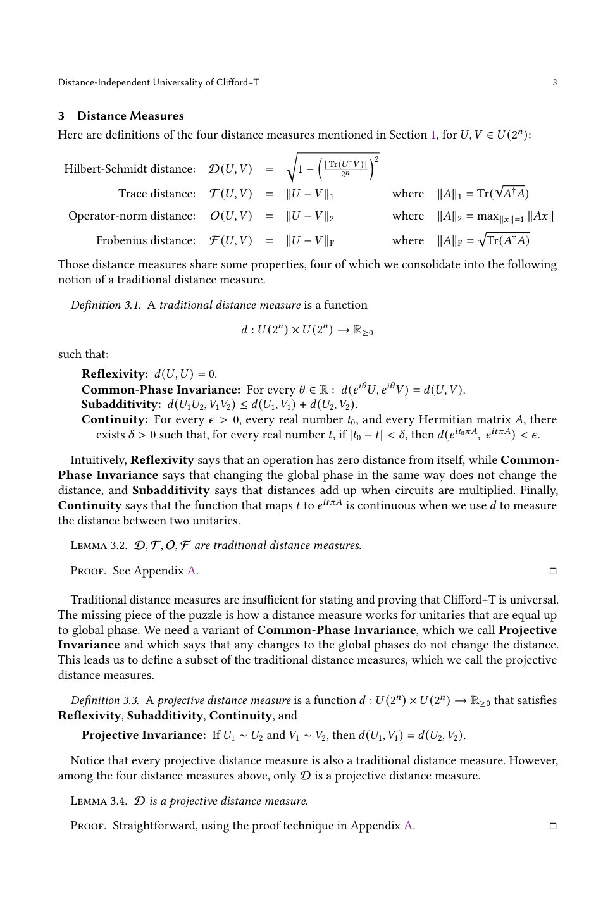
<figcaption class="paper-figure-caption"><b>Fig 2.</b> Low-resolution page preview, page 3</figcaption>
</figure>
<figure class="paper-figure-card">
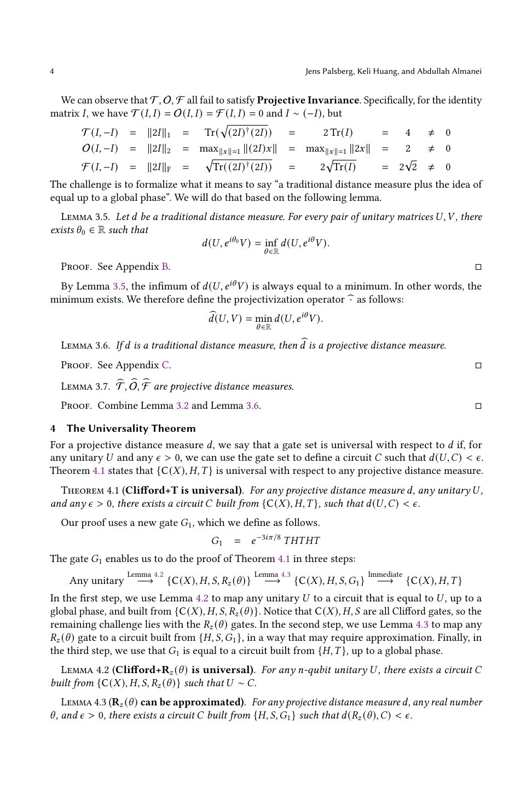
<figcaption class="paper-figure-caption"><b>Fig 3.</b> Low-resolution page preview, page 4</figcaption>
</figure>
<figure class="paper-figure-card">
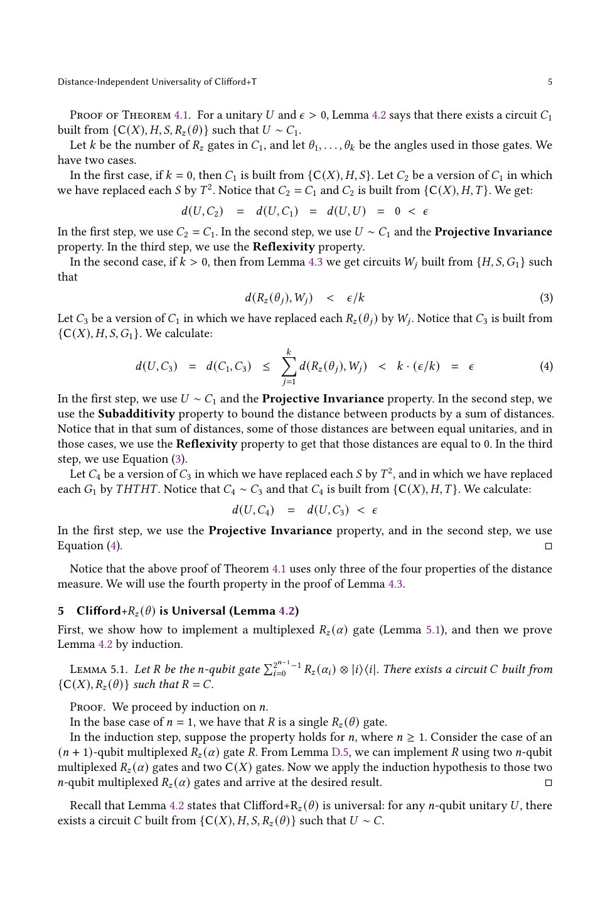
<figcaption class="paper-figure-caption"><b>Fig 4.</b> Low-resolution page preview, page 5</figcaption>
</figure>
<figure class="paper-figure-card">
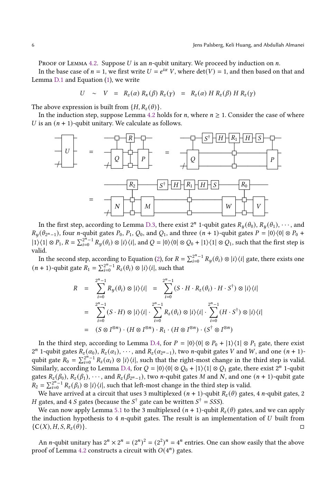
<figcaption class="paper-figure-caption"><b>Fig 5.</b> Low-resolution page preview, page 6</figcaption>
</figure>

**Summary.** This paper establishes a rigorous, distance-independent criterion for the universality of the Clifford+T gate set in quantum computing. By defining 'projective distance measures' based on four axioms, the authors prove that the gate set can approximate any unitary operation for any distance metric satisfying these properties. This provides a fundamental theoretical underpinning for quantum circuit synthesis.

**Why it may be interesting.** It provides a rigorous, abstract mathematical framework for understanding when a small set of quantum gates is sufficient to simulate any quantum operation, independent of the specific metric used to measure error.

Detailed structure

**Main problem.** To determine the necessary and sufficient properties of a distance measure required to prove the distance-independent universality of the Clifford+T gate set for quantum computation.

**Main result.** The universality theorem holds for any distance measure satisfying the axioms of a 'projective distance measure,' formalizing the proof in Lean.

**Method.** The authors define projective distance measures using four axioms and prove that the gate set $\{C(X), H, T\}$ is universal with respect to any such measure by decomposing the approximation into sequential steps.

**Model / system.** The system is quantum computation, focusing on approximating any arbitrary unitary matrix $U \in U(2^n)$ using the Clifford+T gate set.

**Key observables.** Distance measures (Hilbert-Schmidt, Trace, Operator-norm, Frobenius) and the approximation error $\epsilon$.

**Important parameters / regimes.** The structure of the distance measure (e.g., satisfying Projective Invariance) and the gate set $\{C(X), H, T\}$.

**Assumptions / limitations.** The necessary structure for universality is captured entirely by the definition of a projective distance measure.

**Paper structure.** The paper first defines projective distance measures via four axioms. It then proves that the universality theorem holds for any such measure, relying on decomposing the approximation into steps involving $R_z(	heta)$ gates, which are subsequently shown to be approximable by circuits built from $\{H, S, G_1\}$.

Abstract

A well-known theorem states that the Clifford+T gate set is universal for quantum computing. The theorem combines approximation using a distance measure on unitary matrices with equality up to global phase. Previous proofs combine these two notions for specific distance measures, but do not identify the properties that govern how they work together. Which properties are sufficient to state and prove the theorem?   We answer this question by defining projective distance measures using four axioms. We prove that the universality theorem holds for every distance measure satisfying these axioms. Thus, our formulation of the theorem is independent of any particular choice of distance measure. We show that the Hilbert-Schmidt distance is already a projective distance measure. We also develop a general construction that transforms a large class of distance measures into projective distance measures and apply it to obtain projective versions of the operator-norm distance, the Frobenius distance, and the trace distance. Finally, we formalize the proof of the universality theorem in Lean.

[↑ back to top](#top)

### [Entanglement of purification for Werner states: canonical purification and nonadditivity](http://arxiv.org/abs/2610.03630v1)

**Authors:** Zahra Baghali Khanian, Amir-Reza Negari  
**Type:** theory · **Category:** quantum information and computing · **PDF:** <https://arxiv.org/pdf/2610.03630v1>  
**Analysis basis:** full PDF text, analyzed in chunks

↔ Scroll figures horizontally

<figure class="paper-figure-card">
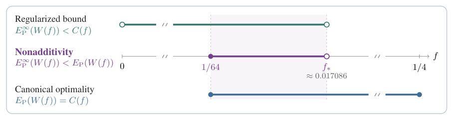
<figcaption class="paper-figure-caption"><b>Fig 1.</b> FIG. 1. Canonical optimality and nonadditivity for two-qubit Werner states. The green interval gives E∞ P (W(f)) &lt; C(f) for 0 &lt; f &lt; f∗(Proposition III.1), where C(f) denotes the entanglement entropy of the canonical purification of W(f) across the bipartition AA′ : BB′, equivalently the reflected entropy of W(f). The blue interval gives EP(W(f)) = C(f) for 1/64 ≤f ≤1/4 (Proposition IV.3). Their intersection, shown in purple, proves nonadditivity on [1/64, f∗). Filled endpoints are included and open endpoints excluded. The axis is broken on both sides to enlarge the overlap; unmarked intervals are not classified by these results.</figcaption>
</figure>
<figure class="paper-figure-card">
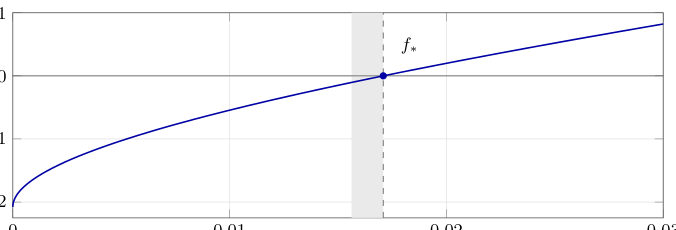
<figcaption class="paper-figure-caption"><b>Fig 2.</b> FIG. 2. The initial derivative (10) is negative for 0 &lt; f &lt; f∗, so a small positive mixing probability lowers the achievable rate below C(f). The value at f = 0 is the continuous limit. In the shaded interval [1/64, f∗), canonical purification is also optimal for one copy, establishing nonadditivity.</figcaption>
</figure>

**Summary.** This paper rigorously proves the nonadditivity of the entanglement of purification for Werner states in a specific parameter regime. It establishes that the canonical purification entanglement provides the exact single-copy entanglement, while the regularized entanglement falls strictly below it. This resolves the additivity question for $\alpha=1$ using only separable states.

**Why it may be interesting.** The resolution of the additivity question for $\alpha=1$ using separable states provides a deep theoretical result about entanglement quantification that has implications for understanding resource theories in quantum information.

Detailed structure

**Main problem.** The paper investigates the additivity property of the entanglement of purification ($	ext{EP}(
ho)$) for two-qubit Werner states, comparing it to canonical and regularized entanglement measures.

**Main result.** It proves that the entanglement of purification is nonadditive for a specific range of Werner states ($1/64 \le f < f^*$), while simultaneously showing that the canonical purification entanglement is globally optimal in this regime.

**Method.** The analysis employs rigorous mathematical techniques, including establishing lower bounds via projection onto symmetric subspaces, analyzing ensemble decompositions, and minimizing natural-log entropy subject to constraints.

**Model / system.** The study focuses on two-qubit Werner states, $W(f)$, parameterized by the singlet weight $f$. The theoretical framework involves comparing various entanglement measures derived from quantum state purification.

**Key observables.** Entanglement of purification ($	ext{EP}(
ho)$), canonical purification entanglement ($	ext{SR}(A:B)
ho$), and regularized entanglement of purification ($	ext{E}_\infty^P(
ho)$).

**Important parameters / regimes.** The singlet weight $f$, and a critical threshold $f^* \approx 0.017$.

**Assumptions / limitations.** The analysis generalizes proofs from classical two-qubit states and relies on establishing bounds through entropy minimization techniques.

**Figures summary.** Figure 1 illustrates the relationship between the three entanglement bounds ($	ext{E}_\infty^P$, $	ext{EP}$, $C(f)$) across the parameter $f$, visually confirming the nonadditivity region on $[1/64, f^*)$.

**Paper structure.** The paper proceeds by defining the entanglement measures, proving canonical optimality for the single-copy entanglement, and then using ensemble decomposition and entropy minimization techniques to establish the strict inequality $	ext{E}_\infty^P(W(f)) < C(f)$ for small $f$.

Abstract

We prove that the von Neumann entanglement of purification is nonadditive. For two-qubit Werner states $W(f)$ with singlet weight $1/64\le f\le1/4$, we show that canonical purification is globally optimal: its entanglement, also known as reflected entropy, gives the exact entanglement of purification. In contrast, the regularized entanglement of purification lies strictly below the reflected entropy for $0<f<f_\ast$, where $f_\ast\approx0.017$. Together, these results establish nonadditivity throughout $1/64\le f<f_\ast$. Our canonical-optimality proof generalizes the proof in [1], which established Rényi nonadditivity for $0\leα<1$ using classical two-qubit states. We thus resolve the additivity question at $α=1$. Remarkably, nonadditivity is again witnessed by separable states and no entanglement in the underlying states is required.

[↑ back to top](#top)

### [Entanglement Requires Fluctuations at Conformal Interfaces](http://arxiv.org/abs/2610.02309v1)

**Authors:** Yuya Kusuki, Kosei Suzuyama, Yin Tang  
**Type:** theory · **Category:** statistical mechanics · **PDF:** <https://arxiv.org/pdf/2610.02309v1>  
**Analysis basis:** full PDF text, analyzed in chunks

↔ Scroll figures horizontally

<figure class="paper-figure-card">
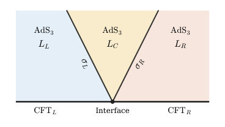
<figcaption class="paper-figure-caption"><b>Fig 1.</b> FIG. 2. Schematic constant-time slice of the double-brane geometry. The branes of tensions σL, σR separate AdS3 regions of radii LL, LC, LR and end on the same interface between the two boundary CFTs.</figcaption>
</figure>
<figure class="paper-figure-card">
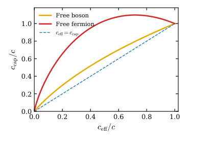
<figcaption class="paper-figure-caption"><b>Fig 2.</b> FIG. 1. The exact free-boson and free-fermion interface co- efficients satisfy ceff ≤ccap and follow distinct curves. The fermionic capacity can exceed its transparent value ccap/c = 1, whereas ceff/c ≤1.</figcaption>
</figure>
<figure class="paper-figure-card">
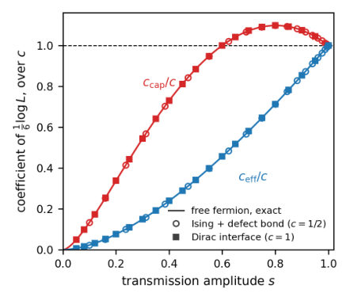
<figcaption class="paper-figure-caption"><b>Fig 3.</b> FIG. 3. Lattice coefficients (symbols), divided by the bulk central charge, for the critical Ising chain with a defect bond of strength λ (open circles, s = 2λ/(1 + λ2)) and for the Dirac fermion chain with an exactly conformal interface (filled squares, s = t). Solid lines are the exact free-fermion coef- ficients of Fig. 1. Both lattice models follow the fermionic curves.</figcaption>
</figure>
<figure class="paper-figure-card">
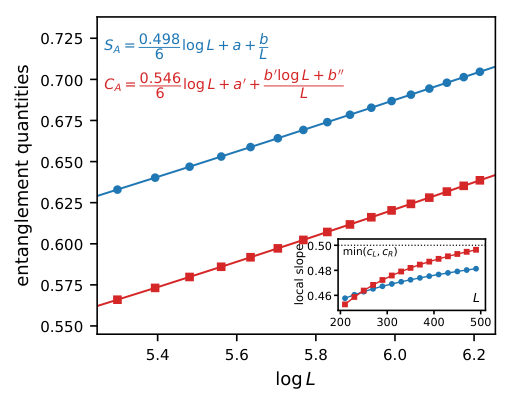
<figcaption class="paper-figure-caption"><b>Fig 4.</b> FIG. 4. Entropy (circles) and capacity (squares) across the W3 interface between the TCI and Ising CFTs, for 200 ≤L ≤500. Solid lines show the reference fit with the forms given, where b/L and (b′ log L+b′′)/L are the leading finite-size corrections. Inset: local slopes 6 dSA/d log L (circles) and 6 dCA/d log L (squares). The capacity slope overtakes the entropy slope at L ≃240, and both are still increasing at the largest sizes; the dotted line marks min(cL, cR) = 1/2.</figcaption>
</figure>

**Summary.** This work establishes a theoretical bound relating the universal logarithmic coefficient of entanglement capacity ($c_{cap}$) to that of entanglement entropy ($c_{eff}$) at conformal interfaces. By proving this bound in several physical contexts, including free CFTs and holographic models, the authors demonstrate that capacity provides a distinct, measurable diagnostic tool for characterizing quantum correlations across boundaries.

**Why it may be interesting.** The connection between entanglement measures like entropy and capacity is fundamental to understanding quantum correlations across boundaries, which has implications for quantum information flow and boundary physics in condensed matter systems.

Detailed structure

**Main problem.** The paper investigates the relationship between entanglement entropy ($S_A$) and the capacity of entanglement ($C_A$) at quantum interfaces, specifically testing the conjecture that $c_{eff} \le c_{cap}$.

**Main result.** The conjectured bound $c_{eff} \le c_{cap}$ is proven in free CFTs and holographic models, and numerical calculations confirm that capacity provides independent data distinct from entropy.

**Method.** The authors employ theoretical proofs using defect perturbation theory, replica trick calculations, and analyzing scaling laws derived from DMRG simulations on lattice models.

**Model / system.** The study focuses on 2D Conformal Field Theories (CFTs) connected by various interfaces, including free boson/fermion CFTs, holographic interface branes, and interacting systems like the tricritical Ising/Ising interface.

**Key observables.** Entanglement Entropy ($S_A$) and Capacity of Entanglement ($C_A$), characterized by their universal logarithmic coefficients ($c_{eff}$ and $c_{cap}$).

**Important parameters / regimes.** The interface coupling strengths, the size of the system ($L$), and the central charges of the constituent CFTs.

**Assumptions / limitations.** The analysis relies on the applicability of CFT techniques, the use of replica geometry, and the validity of the holographic correspondence in certain limits.

**Figures summary.** Figures compare lattice coefficients ($c_{eff}/c$ and $c_{cap}/c$) against exact free-fermion curves, and show how capacity slopes can overtake entropy slopes at interfaces.

**Paper structure.** The paper progresses from establishing the conjecture in free field theories and holography, to providing rigorous proofs using defect perturbation theory, and finally validating the results through extensive numerical calculations on complex interacting lattice models.

Abstract

We conjecture that the universal logarithmic coefficient for capacity of entanglement $c_{\mathrm{cap}}$ is bounded below by the corresponding entropy coefficient $c_{\mathrm{eff}}$ at conformal interfaces. We prove the bound in free boson and fermion CFTs and in holographic models with interface branes, and establish it using defect perturbation theory. Numerical calculations at interacting interfaces between the tricritical Ising and Ising CFTs further support the bound. Despite this constraint, capacity provides independent interface data. We construct interfaces with identical entropy and energy transmission coefficients but different capacity coefficients, and show that capacity can even increase as entropy decreases.

[↑ back to top](#top)

### [Evolving Hybrid Quantum-Classical Architectures for Image Classification](http://arxiv.org/abs/2610.03220v1)

**Authors:** Devroop Kar, Daniel Krutz, Travis Desell  
**Type:** theory · **Category:** quantum information and computing · **PDF:** <https://arxiv.org/pdf/2610.03220v1>  
**Analysis basis:** full PDF text, analyzed in chunks

↔ Scroll figures horizontally

<figure class="paper-figure-card">
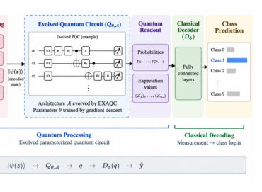
<figcaption class="paper-figure-caption"><b>Fig 1.</b> Figure 1: Overview of the proposed EXAQC hybrid quantum classical architecture. A CNN encoder compresses the input image into a lower-dimensional representation that is encoded and processed by an evolved PQC. Quantum measurements are subsequently mapped to class predictions by a classical decoder.</figcaption>
</figure>
<figure class="paper-figure-card">

<figcaption class="paper-figure-caption"><b>Fig 2.</b> Fig. 2 demonstrates how evolution modifies the architecture A while gradient-based learning op- timizes the continuous model parameters. Structural mutation can add, enable, disable, or reorder</figcaption>
</figure>
<figure class="paper-figure-card">
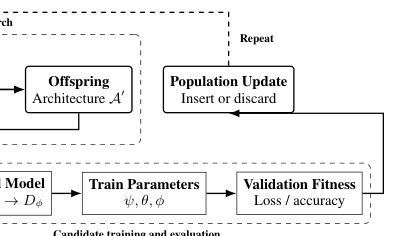
<figcaption class="paper-figure-caption"><b>Fig 3.</b> Figure 2: EXAQC evolutionary search workflow for hybrid image classification. Parent circuit genomes are selected and modified through mutation or crossover to create offspring architectures. Each offspring is instantiated within the hybrid model and its classical and quantum parameters are optimized using gradient-based training. Validation performance determines whether the offspring is inserted into the steady-state population.</figcaption>
</figure>
<figure class="paper-figure-card">
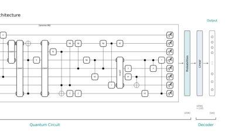
<figcaption class="paper-figure-caption"><b>Fig 4.</b> Figure 3: Evolved EXAQC hybrid architecture for CIFAR-10. A three-block CNN encoder com- presses each image to 8 features, which are RY-encoded onto 8 qubits.</figcaption>
</figure>
<figure class="paper-figure-card">
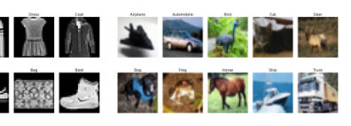
<figcaption class="paper-figure-caption"><b>Fig 5.</b> Figure 4: Representative samples from the three image-classification benchmarks considered in this work. Each panel contains one example from each of the ten classes. MNIST and Fashion-MNIST consist of 28 × 28 grayscale images, whereas CIFAR-10 consists of 32 × 32 RGB images.</figcaption>
</figure>

**Summary.** This paper introduces EXAQC, an evolutionary framework designed to automatically discover optimal quantum circuit architectures for image classification. By treating the quantum circuit structure as an evolving genome, the method creates compact quantum modules that integrate into classical deep learning pipelines. The results show these evolved hybrid models achieve high accuracy while using significantly fewer parameters than traditional classical networks.

**Why it may be interesting.** The work directly addresses the practical implementation challenge of quantum machine learning by automating the circuit design process, which is crucial for realizing quantum advantage in complex tasks like image recognition.

Detailed structure

**Main problem.** The primary challenge is developing effective hybrid quantum-classical neural networks for image classification, overcoming the limitation of relying on manually designed, fixed quantum circuit architectures.

**Main result.** The proposed evolutionary framework (EXAQC) successfully discovers compact quantum modules that maintain competitive accuracy while drastically reducing the number of trainable parameters compared to large classical counterparts.

**Method.** The authors extend an evolutionary framework to automatically search for optimal Parameterized Quantum Circuits (PQCs) that act as intermediate processing modules within a hybrid quantum-classical pipeline.

**Model / system.** The model is a hybrid quantum-classical architecture: $E_\psi 
ightarrow Q_{	heta,A} 
ightarrow D_\phi$. It uses a classical encoder ($E$) to map images to quantum features, an evolved PQC ($Q$) to process these features, and a classical decoder ($D$) for final classification.

**Key observables.** Test accuracy on MNIST, Fashion-MNIST, and CIFAR-10; trainable parameter count; gate count; and parameter reduction ratio compared to classical CNNs.

**Important parameters / regimes.** The quantum circuit parameters ($	heta$) and the structure/architecture ($A$) are the primary variables optimized via evolutionary search and gradient descent.

**Assumptions / limitations.** The performance comparison assumes that the evolved quantum module can effectively replace larger classical components while maintaining accuracy, and that rotation-based encodings outperform amplitude encoding for these tasks.

**Figures summary.** Figures illustrate the overall EXAQC hybrid architecture, the detailed workflow of the evolutionary search process, and specific evolved circuit diagrams for MNIST and Fashion-MNIST.

**Paper structure.** The paper details the hybrid model formulation, introduces the EXAQC evolutionary search mechanism (including mutation and crossover operators), analyzes the parameter budgets and readout strategies, and presents empirical results comparing performance and parameter efficiency across multiple datasets.

Abstract

Hybrid quantum classical neural networks integrate parameterized quantum circuits (PQCs) with established deep learning architectures, but their performance depends strongly on the choice of quantum circuit architecture, a choice that remains largely manual. Most existing approaches rely on hand-designed or fixed circuit ansätze, requiring circuit structure, gate composition, and qubit connectivity to be specified in advance with no guarantee that they suit the task. This limitation is especially acute in image classification, where quantum circuits must transform features extracted by classical networks while remaining compact enough for practical training, requirements that generic, task-agnostic ansätze are unlikely to satisfy simultaneously. We extend EXAQC, an evolutionary framework for automated quantum circuit discovery, to image classification. EXAQC evolves PQCs as intermediate processing modules while retaining classical feature-extraction and prediction layers. On MNIST, Fashion-MNIST, and CIFAR-10, EXAQC achieves 98.42%, 90.62%, and 85.47% accuracy, respectively, while using comparable gate counts to other quantum architecture-search methods. Against classical networks, evolved hybrid models maintain comparable accuracy with substantially fewer trainable parameters, reaching 85.68% on CIFAR-10 with over 25$\times$ fewer parameters than a 10-layer CNN. Encoding choice also matters: rotation-based encodings (RX, RY, U3) outperform amplitude encoding by 22-25 points on CIFAR-10. These results demonstrate that automated circuit discovery yields compact quantum modules that can replace larger classical components in vision architectures while retaining competitive accuracy.

[↑ back to top](#top)

### [Exact Recovery for Non-Abelian Surface Codes](http://arxiv.org/abs/2610.03677v1)

**Authors:** Alison Warman, Nathanan Tantivasadakarn, Sakura Schafer-Nameki  
**Type:** theory · **Category:** quantum information and computing · **PDF:** <https://arxiv.org/pdf/2610.03677v1>  
**Analysis basis:** full PDF text, analyzed in chunks

↔ Scroll figures horizontally

<figure class="paper-figure-card">
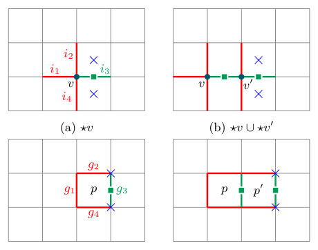
<figcaption class="paper-figure-caption"><b>Fig 1.</b> Figure 1. Errors are shown in red, gauge-fixed edges are shown in green and the single-error checks are shown in blue. We gauge-fix the right edge of each vertex star to have h3 = id and the right edge of each plaquette to have µ3 = 1.</figcaption>
</figure>
<figure class="paper-figure-card">
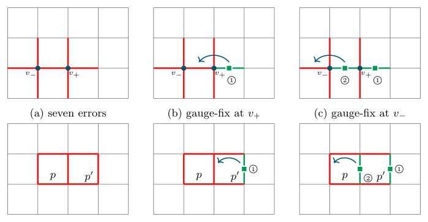
<figcaption class="paper-figure-caption"><b>Fig 2.</b> Figure 2. The gauge-fixing protocol, with the conventions of Fig. 1. Errors are shown in red, gauge-fixed edges are green and the numbers give the order in which their gauge-fixed labels are set, proceeding along each row from right to left. Top row: (a) errors on the seven edges of ⋆v−∪⋆v+. (b) The stabilizer Ah−1 v+ sets the multiplication label of the right edge of v+ to id, and</figcaption>
</figure>
<figure class="paper-figure-card">
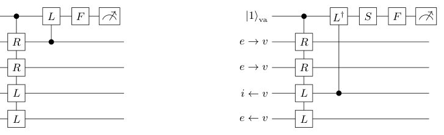
<figcaption class="paper-figure-caption"><b>Fig 3.</b> Figure 3. The circuit (3.14) for the charge transfer at a vertex v of the square lattice, with the irrep error Eµ i for an edge i entering v (left) and for an edge i exiting v (right). A dot on a control qudit in the group basis state |x⟩, connected to boxes L or R, applies Lx or Rx to the target qudits, as in (3.4). The first gate is the controlled vertex operator Uv of (3.3), with the ancilla as control, and the second is CLi,va or CL† i,va (depending on the orientation of i), with i as control. Afterwards the data qudits are in |ψ⟩and the ancilla is in |Γab⟩, which the Fourier transform F maps to the group basis state |Γ, a, b⟩before the measurement in the group basis.</figcaption>
</figure>
<figure class="paper-figure-card">
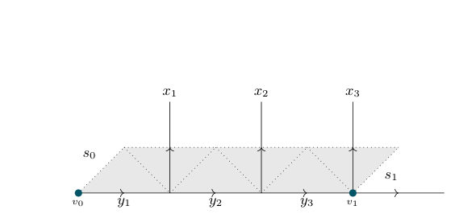
<figcaption class="paper-figure-caption"><b>Fig 4.</b> Figure 5. Rbbon operators: the figure shows an open ribbon ξ with n = 3 stretching from s0 = (v0, p0) to s1 = (v1, p1). Its dual path crosses the upward edges x1, . . . , xn and its direct path γ follows the rightward edges y1, . . . , yn. These 2n edges form supp ξ. The end vertices are v0 and v1 and every check away from them commutes with the ribbon algebra.</figcaption>
</figure>

**Summary.** This paper provides a comprehensive, deterministic quantum error correction protocol for non-Abelian topological surface codes defined by the quantum double D(G). It constructs a complete error basis and details a systematic recovery mechanism using charge and flux transfer circuits. This work is significant because it moves beyond merely proving the existence of such a code to providing the explicit, implementable circuit for fault tolerance in complex quantum systems.

**Why it may be interesting.** The explicit construction of a deterministic recovery circuit for non-Abelian codes is a major theoretical advance, providing concrete tools for fault-tolerant quantum computation beyond simple Pauli noise models.

Detailed structure

**Main problem.** The paper addresses the challenge of developing an exact and deterministic quantum error correction (QEC) protocol for non-Abelian topological surface codes.

**Main result.** They construct a complete and orthogonal error basis and detail a deterministic recovery protocol involving charge and flux transfer circuits applicable to any finite group G.

**Method.** The methodology involves generalizing the Pauli error basis using group multiplication and irreducible representation operators, followed by introducing a gauge-fixing procedure to ensure orthogonality and completeness.

**Model / system.** The system is a non-Abelian topological surface code based on the quantum double D(G) of a finite group G. The Hamiltonian is defined by vertex and plaquette operators, and the code space is the $+1$ eigenspace of this Hamiltonian.

**Key observables.** Error detection is diagnosed via plaquette violations (flux) and vertex violations (charge), which are measured using generalized operators.

**Important parameters / regimes.** The protocol is applicable for any finite group G, including non-Abelian groups.

**Assumptions / limitations.** The protocol assumes the input errors are predetermined, neutral, and correctable clusters, leaving the optimal syndrome extraction/decoder construction for future work.

**Figures summary.** Figure 5 illustrates the structure of a ribbon ($\xi$) with $n=3$, detailing its support edges and end vertices, which is central to the error analysis.

**Paper structure.** The paper builds from establishing the error basis for D(G) (including irrep operators) to analyzing local error detection (flux/charge checks) and culminates in a detailed, systematic protocol for recovering errors supported on extended structures called 'ribbons.'

Abstract

We study exact recovery for non-Abelian topological surface codes based on the quantum double $D(G)$ of any finite group $G$. We determine an orthogonal error basis, that is comprised of group multiplication and irreducible representation operators. Whenever the errors are supported on closed loops on the lattice or dual lattice, there is a redundancy in the basis, due to stabilizers. To remedy this, we introduce a gauge-fixing that results in a complete and orthogonal error basis on the code space. Assuming as input predetermined, neutral correctable error clusters, we construct charge and flux transfer circuits that move the errors onto ancillas that then get projected out. This is an exact and deterministic recovery protocol, applicable to surface codes for any finite, in particular non-Abelian, group $G$.

[↑ back to top](#top)

### [Exponential lower bounds on the fermionic Gaussian rank of magic states and the bosonic coherent state rank of Fock states](http://arxiv.org/abs/2610.03699v1)

**Authors:** Oliver Reardon-Smith  
**Type:** theory · **Category:** quantum information and computing · **PDF:** <https://arxiv.org/pdf/2610.03699v1>  
**Analysis basis:** full PDF text, analyzed in chunks

↔ Scroll figures horizontally

<figure class="paper-figure-card">
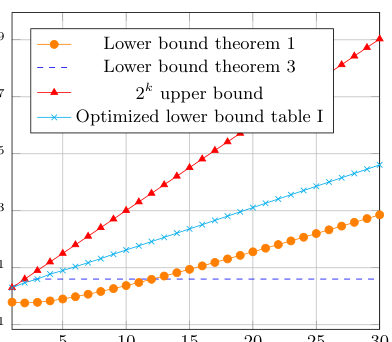
<figcaption class="paper-figure-caption"><b>Fig 1.</b> FIG. 1. A summary of our results and the now known bounds on the exact fermionic Gaussian rank of the state |M⟩⊗k. The trivial upper bound and the lower bound from theorem 1 apply to and are plotted from k = 1, whereas the bound from theorem 3 applies only to k ≥2. We improve on the prior state of the art knowledge for every k &gt; 1, since the rank for k = 1 is trivially 2. The “optimized” lower bound corresponds to directly evaluating the matrix ranks on the right hand side of equation (34). The script producing the data is available at Ref. [26] and the exact numbers are in table I.</figcaption>
</figure>
<figure class="paper-figure-card">
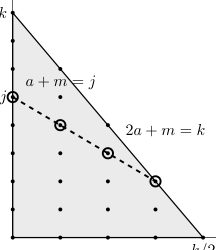
<figcaption class="paper-figure-caption"><b>Fig 2.</b> FIG. 2. Intuition behind the relabelling showing the equiv- alence of equations (50) and (51). We switch from summing over m and a to summing over lines of points parallel to the dashed line, and points within those lines.</figcaption>
</figure>

**Summary.** This paper derives exponential lower bounds on the fermionic Gaussian rank of magic states and provides an exact formula for the coherent state border rank of bosonic Fock states. By quantifying the minimum number of terms needed for state decompositions, the work establishes fundamental limitations on classical simulation algorithms for quantum systems. These results are highly relevant to quantum information theory and complexity theory.

**Why it may be interesting.** The results provide concrete, exponentially growing lower bounds on the resources needed for classical simulation, directly impacting the complexity theory of quantum computation and resource theories.

Detailed structure

**Main problem.** The paper addresses the difficulty of classically simulating quantum mechanics by determining the minimum 'rank' required to decompose large tensor products of specific quantum states.

**Main result.** It establishes an exponential lower bound, $\Omega(1.4^k)$, for the fermionic Gaussian rank of magic states and provides an exact formula for the coherent state border rank of bosonic Fock states.

**Method.** The authors use techniques involving matrix rank analysis, subadditivity arguments, and analyzing the decomposition of states into superpositions of 'free' states (Gaussian or coherent).

**Model / system.** The work analyzes two primary systems: fermionic systems using 'magic states' and fermionic Gaussian decompositions, and bosonic systems involving $n$-mode Fock states and coherent states.

**Key observables.** The primary observable is the 'rank' ($r$), which quantifies the minimum number of terms needed for a state decomposition. Other key observables include the $\delta$-approximate rank and the bosonic coherent state border rank.

**Important parameters / regimes.** The key parameters are $k$, the number of tensor factors; $\delta$, the approximation tolerance; and $m_j$, the number of bosons in mode $j$.

**Assumptions / limitations.** The analysis relies on the structure of Gaussian states and the ability to relate the rank to the rank of associated matrices derived from the state's representation.

**Figures summary.** Figure 1 summarizes the derived lower bounds for the exact fermionic Gaussian rank of $|M
angle^{\otimes k}$ compared to known upper bounds. Table I provides quantitative data for small $k$ comparing different rank bounds.

**Paper structure.** The paper first tackles the fermionic Gaussian rank, proving a strong lower bound for $|M
angle^{\otimes k}$. It then addresses the $\delta$-approximate rank for the same state. Finally, it analyzes the bosonic case, deriving an exact formula for the coherent state border rank of Fock states and providing robust bounds for the approximate rank.

Abstract

Recent algorithms for classical simulation of quantum mechanics have runtime whose superpolynomial component is given by a linear dependence on the number of terms required to write large tensor products of certain "magic" states as superpositions of "free" states (which may be stabilizer states, fermionic Gaussian states or others). Surprisingly little is known about the number of terms in such decompositions, called ranks (e.g. the stabilizer rank, fermionic-Gaussian rank etc.). For complexity theoretic reasons they are expected to grow exponentially in the number of tensor factors but, while exponential upper bounds are known for both the stabilizer and fermionic-Gaussian rank of magic states; the best known lower bounds on the stabiliser rank are quadratic, and no bounds on the fermionic-Gaussian rank are known beyond fixed constants. In this work we prove that any fermionic Gaussian decomposition of $\lvert M\rangle^{\otimes k}$ consists of $Ω(1.4^k)$ terms. Here $\lvert M\rangle$ is the most standard magic state for fermionic linear optics: the $4$ qubit state that may be consumed to implement a swap gate. We also prove essentially matching bounds on the $δ$-approximate rank of the same state, lower bounding it by the same quantity that bounds the exact rank, multiplied by a factor of $1-δ^2$. Our results on exact fermionic Gaussian rank apply directly to any product of $k$ fixed parity non-Gaussian states, although the same is not true of the approximate rank. Finally, we prove that the coherent state border rank of an $n$-mode bosonic Fock state with $m_j$ bosons in mode $j$ is exactly $\prod_{j}(1+m_j)$, answering a conjecture of Ref. [1] and obtain lower bounds on the approximate coherent state rank given by the same quantity multiplied by a function of the fidelity of the approximation, emphasizing the broad applicability of the method we employ.

[↑ back to top](#top)

### [Exponential quantum space advantage in random data streams](http://arxiv.org/abs/2610.03645v1)

**Authors:** Adam Bouland, Matthew Ding, Siddhartha Jain  
**Type:** theory · **Category:** quantum information and computing · **PDF:** <https://arxiv.org/pdf/2610.03645v1>  
**Analysis basis:** full PDF text, analyzed in chunks

↔ Scroll figures horizontally

<figure class="paper-figure-card">
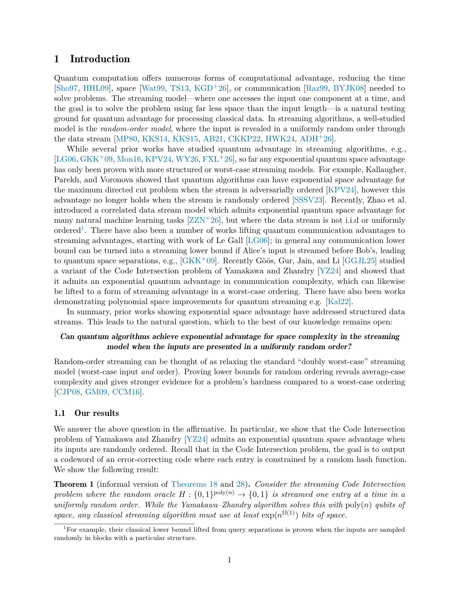
<figcaption class="paper-figure-caption"><b>Fig 1.</b> Low-resolution page preview, page 2</figcaption>
</figure>
<figure class="paper-figure-card">
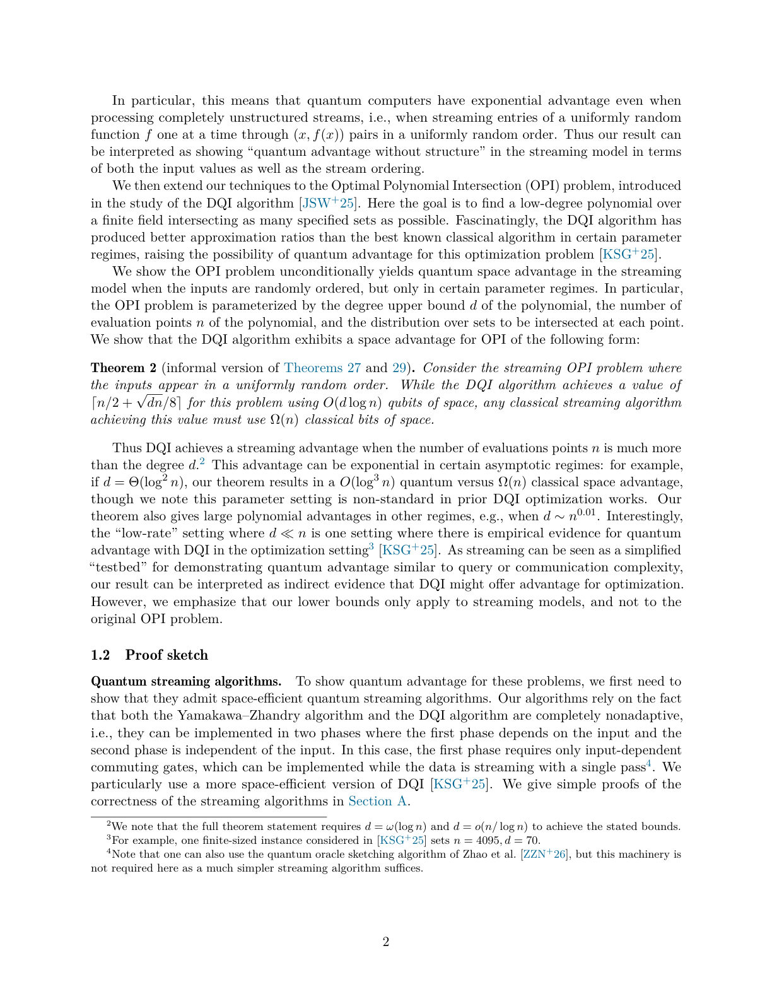
<figcaption class="paper-figure-caption"><b>Fig 2.</b> Low-resolution page preview, page 3</figcaption>
</figure>
<figure class="paper-figure-card">
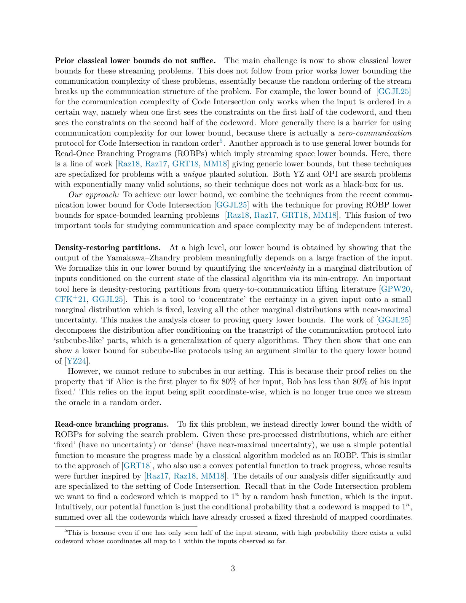
<figcaption class="paper-figure-caption"><b>Fig 3.</b> Low-resolution page preview, page 4</figcaption>
</figure>
<figure class="paper-figure-card">
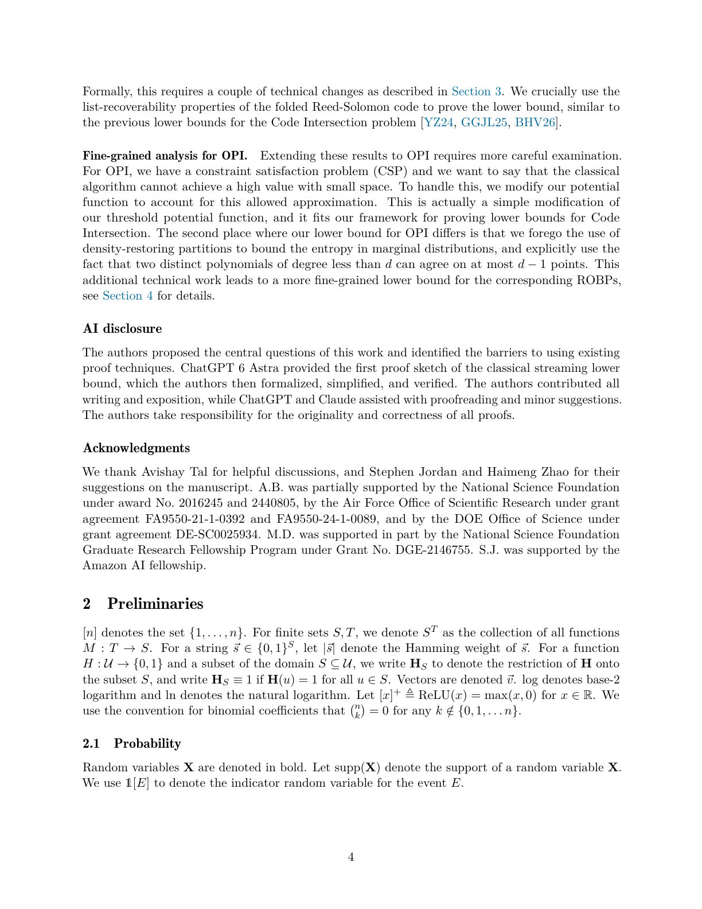
<figcaption class="paper-figure-caption"><b>Fig 4.</b> Low-resolution page preview, page 5</figcaption>
</figure>
<figure class="paper-figure-card">
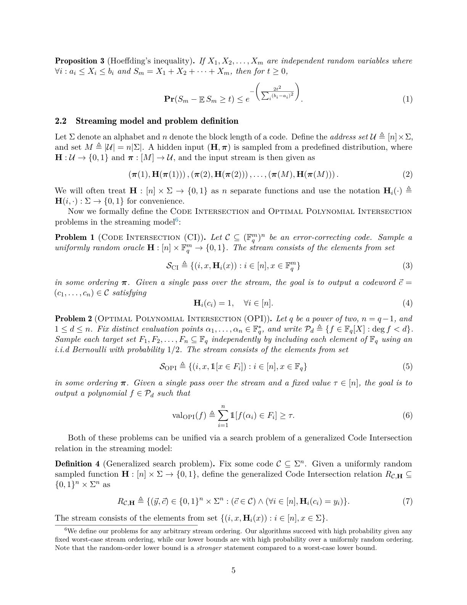
<figcaption class="paper-figure-caption"><b>Fig 5.</b> Low-resolution page preview, page 6</figcaption>
</figure>

**Summary.** This paper rigorously proves that quantum computers possess an exponential space advantage over classical computers when solving specific problems like Code Intersection and Optimal Polynomial Intersection in a random-order streaming setting. It achieves this by developing sophisticated lower bounds using information-theoretic tools and constructing highly efficient, one-pass quantum streaming algorithms.

**Why it may be interesting.** While focused on complexity theory, the techniques used—such as analyzing information flow under random permutations and achieving exponential separation between classical and quantum memory requirements—are fundamental to understanding the limits of quantum computation in data processing tasks.

Detailed structure

**Main problem.** The paper establishes unconditional quantum space advantages for solving specific computational problems, namely Code Intersection and Optimal Polynomial Intersection, when the input data is streamed in a uniformly random order.

**Main result.** It proves an exponential quantum space advantage for the Code Intersection problem and a provable advantage for the OPI problem, showing quantum memory requirements scale polynomially with parameters while classical requirements scale linearly with the number of samples.

**Method.** The authors combine advanced techniques from communication complexity lower bounds (using density-restoring partitions and potential functions) with quantum algorithm design (like streaming DQI) to establish these bounds and construct the quantum protocols.

**Model / system.** The core model is the random-order streaming model, where input data is revealed sequentially in a uniformly random permutation. The problems analyzed are Code Intersection (Yamakawa–Zhandry) and Optimal Polynomial Intersection (OPI).

**Key observables.** Space complexity (qubits vs. classical bits), success probability of the quantum algorithms, and the required memory size for classical streaming algorithms.

**Important parameters / regimes.** Degree $d$, number of evaluation points $n$, and the streaming order (random vs. worst-case). The advantage is highlighted in the 'low-rate' regime where $n \gg d$.

**Assumptions / limitations.** The lower bounds are derived under the assumption of a uniformly random streaming order, which is a stronger condition than worst-case analysis. The quantum algorithms are shown to work for all stream orderings.

**Paper structure.** The paper first establishes the quantum advantage for Code Intersection using density-restoring partitions and potential functions. It then extends this framework to the OPI problem, deriving a specific lower bound using polynomial properties, and finally presents the one-pass quantum streaming algorithms (YZ and DQI) that achieve the required low space complexity.

Abstract

We show two unconditional quantum space advantages in the random-order streaming model. First, we show the Yamakawa--Zhandry Code Intersection problem admits exponential quantum advantage in the streaming model when its inputs are streamed in random order. This means quantum computers exhibit exponential space advantage even when simply receiving $(x,f(x))$ pairs for a uniformly random function $f$ in a uniformly random order. Our lower bound is shown using density-restoring partitions as in the work of Göös, Gur, Jain, and Li (STOC 2025) combined with a convex potential, similar to the work of Raz (J.ACM 2018) on parity learning and its generalization by Garg, Raz, and Tal (STOC 2018).   Second, we use our framework to show quantum space advantage for the Optimal Polynomial Intersection (OPI) problem in certain regimes via a streaming version of the Decoded Quantum Interferometry algorithm (Nature 2025; arXiv:2510.10967). In particular, we show that for degree $d$ and $n$ evaluation points, attaining $1/2 + Ω(\sqrt{d/n})$ fraction of satisfied OPI constraints via streaming requires $Ω(n)$ classical bits of memory but only $O(d\log n)$ qubits. This yields provable quantum advantage in a "low-rate" regime when the number of evaluation points is much larger than the degree, with a space advantage that can be as large as exponential in certain parameter settings.

[↑ back to top](#top)

### [Fault tolerance of quantum circuits with tensor networks and symplectic geometry](http://arxiv.org/abs/2610.03429v1)

**Authors:** Soham Ghosh, Holger Boche, Andrew Tanggara  
**Type:** theory · **Category:** quantum information and computing · **PDF:** <https://arxiv.org/pdf/2610.03429v1>  
**Analysis basis:** full PDF text, analyzed in chunks

↔ Scroll figures horizontally

<figure class="paper-figure-card">
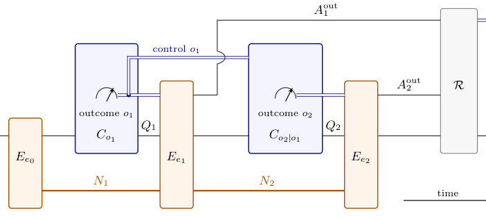
<figcaption class="paper-figure-caption"><b>Fig 1.</b> FIG. 1. An adaptive circuit interacting with temporally correlated noise, shown for two rounds. The circuit implements the quantum instruments {Co1}o1 and {Co2∣o1}o2 where the instrument at round 2 depends on the observed outcome o1. Double blue lines carry classical information. A copy of o1 selects the second instrument before noise acts on its retained record. The orange maps Eer act on the displayed data, record, and memory ports; N1, N2 carry information between noise interactions. Summing over the circuit outcomes and noise Kraus operator indices gives the physical channel. This representation is a generalization of the strategic code scenario [19], where the goal is only to protect...</figcaption>
</figure>
<figure class="paper-figure-card">
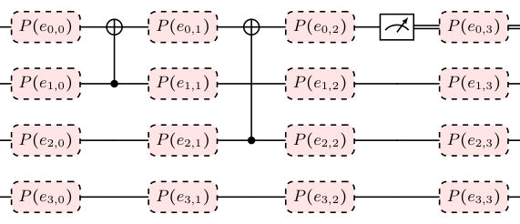
<figcaption class="paper-figure-caption"><b>Fig 2.</b> FIG. 2. A fixed Pauli fault pattern for the Z1Z2 measurement circuit indicating the Kraus operator in Equation (27). Each {P(es,t)}3 s,t=0 is a single qubit Pauli fault.</figcaption>
</figure>
<figure class="paper-figure-card">
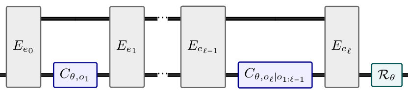
<figcaption class="paper-figure-caption"><b>Fig 3.</b> FIG. 3. Fault-tolerant circuit synthesis with fixed depth ℓ, register dimensions, target operation and noise comb E. The circuit Cθ and its recovery Rθ are chosen jointly subject to the displayed ideal-target and exact-recovery conditions. The local boxes show a fixed noise-Kraus index sequence e = (e0, . . . , eℓ) and circuit outcome sequence o = (o1, . . . , oℓ); summing over e and o gives the noisy channel before recovery. The upper wire carries the noise memory; record registers and classical control are suppressed. Noise acts on the ports specified by the model. For adaptive circuits, the outcome history selects the components as in Theorem III.6.</figcaption>
</figure>
<figure class="paper-figure-card">
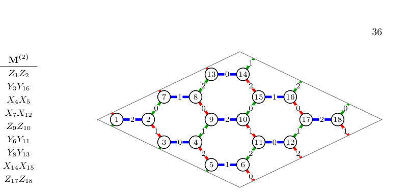
<figcaption class="paper-figure-caption"><b>Fig 4.</b> FIG. 4. Complete measurement schedule. Left: Pauli checks specifying rows of the three binary blocks of M. Right: Honeycomb lattice with opposite sides identified. Circles denote qubit numbers. Edge numbers give the round type 0, 1, 2, repeated as 0, 1, 2, 0, 1, 2, 0. Red, green, and blue edges denote XX, Y Y , and ZZ, respectively.</figcaption>
</figure>
<figure class="paper-figure-card">
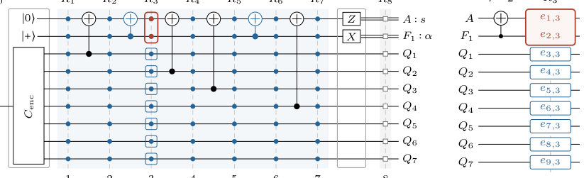
<figcaption class="paper-figure-caption"><b>Fig 5.</b> FIG. 5. Chao–Reichardt one-flag circuit and operation partition. (a) Steane-code (i.e., the µ = 3 specialization of the CSS Hamming code) example [29], with measured support relabeled Q1, . . . , Q4 and ordering π∗= (1, 5, 2, 3, 6, 4). Vertical guides mark the registers Rt. Each marked location carries an arbitrary Pauli label in E(0) π∗. In V(0) π∗, gray labels vanish and all other labels remain unrestricted, including both data boundaries. (b) The red block groups the two outputs of the second CNOT; each blue block is a separate idle-qubit operation location. A nonzero block label counts as one faulty operation. Applying this grouping at every step, with singleton blocks at t = 1,...</figcaption>
</figure>

**Summary.** This paper presents an advanced, mathematically rigorous framework for determining the fault tolerance of quantum circuits. It uses tools from symplectic geometry and linear programming to derive necessary and sufficient conditions and upper bounds on circuit distance. This work is crucial for designing reliable quantum computation protocols by quantifying resilience against noise.

**Why it may be interesting.** The deep mathematical machinery connecting symplectic geometry, algebraic coding theory (MacWilliams identities), and fault tolerance provides powerful, general tools for assessing the robustness of quantum computation protocols.

Detailed structure

**Main problem.** The paper develops a rigorous framework to analyze the fault tolerance of quantum circuits under various noise models to ensure reliable quantum computation.

**Main result.** It establishes necessary and sufficient conditions for fault tolerance and derives linear-programming (LP) bounds on circuit distance using algebraic tools like weight enumerators and symplectic geometry.

**Method.** The methodology combines operator-algebraic frameworks, semidefinite programming (SDP) tests, and the use of symplectic geometry to characterize stabilizer symmetries.

**Model / system.** The focus is on abstract quantum circuits, specifically non-adaptive stabilizer circuits, analyzed using circuit-noise models and quantum error-correcting codes.

**Key observables.** Circuit distance ($d_{	ext{circ}, \zeta}$), detection syndrome, logical-effect matrices, and failure probabilities.

**Important parameters / regimes.** Noise models (e.g., depolarizing noise, Pauli noise), circuit structure (e.g., Hastings--Haah honeycomb Floquet-code), and the level of abstraction ($\zeta$).

**Assumptions / limitations.** The analysis often assumes specific noise characteristics (e.g., i.i.d. depolarizing noise) or relies on the feasibility of LP relaxations.

**Figures summary.** Figure 1 illustrates an adaptive circuit interacting with temporally correlated noise, detailing components like quantum instruments and noise maps.

**Paper structure.** The paper progresses from establishing general recovery conditions via SDP tests to specializing the analysis using symplectic geometry for non-adaptive stabilizer circuits, culminating in the derivation of weight enumerators and LP distance bounds.

Abstract

We develop an operator-algebraic framework for analyzing fault tolerance in quantum circuits and establish necessary and sufficient conditions for fault tolerance under any given noise model. For prescribed circuit families and noise models, we derive a semidefinite program (SDP) based test whose infeasibility certifies that there does not exist any recovery map restoring its intended operation. For non-adaptive stabilizer circuits, analyzing the stabilizer symmetries of its components with symplectic geometry, we obtain closed-form detection and logical-effect matrices that characterize circuit distance algebraically. Applied to a finite Hastings--Haah honeycomb Floquet-code circuit, these matrices certify the dynamical encoding of two logical qubits and distance four under Pauli noise including measurement errors. Using these matrices, we then derive MacWilliams identities for circuit weight enumerators and obtain linear-programming (LP) upper bounds on circuit distance. Output-code constraints give additional Singleton-like bounds. Under independent and identically distributed (i.i.d.) depolarizing noise, the weight enumerators determine decoder failure probabilities and yield upper bounds on finite-circuit pseudothresholds. Finally, we derive LP distance bounds for families of flag syndrome-extraction circuits specified by their CNOT orderings, by incorporating the $t$-flag criterion as additional linear constraints to the distance-bounding LP. An analytical CSS Hamming-code benchmark yields a tight distance-three bound attained by the Chao--Reichardt one-flag construction.

[↑ back to top](#top)

### [Fault-tolerant and fully addressable unitary logical gates via round-robin sparsification](http://arxiv.org/abs/2610.03594v1)

**Authors:** Kaavya Sahay, Cody Jones  
**Type:** theory · **Category:** quantum information and computing · **PDF:** <https://arxiv.org/pdf/2610.03594v1>  
**Analysis basis:** full PDF text, analyzed in chunks

↔ Scroll figures horizontally

<figure class="paper-figure-card">
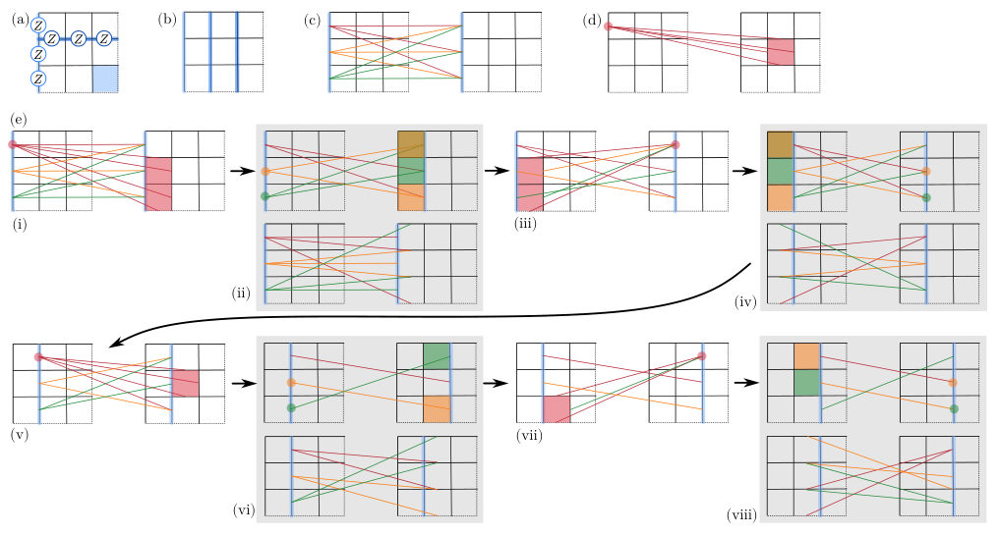
<figcaption class="paper-figure-caption"><b>Fig 1.</b> FIG. 1. A fault-tolerant addressable CZ between two toric codes via round-robin sparsification. (a) The vertical and horizontal Z-logical operators of the two logical qubits of a distance d = 3 toric code with qubits on edges (dashed lines are identified with the opposite edges). On the lower right, we show a Z-stabilizer. (b) Multiple representatives of the vertical Z-logical operator. (c) An RR logical CZ circuit, with individual CZ gates shown by colored lines. (d) A stabilizer deformation, with the stabilizer highlighted, equivalent to a logical identity. (e) The sparsification procedure, consisting of conjugation of the circuit in (c) with various highlighted stabilizer deformations....</figcaption>
</figure>
<figure class="paper-figure-card">
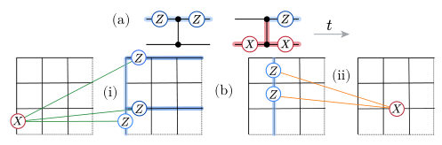
<figcaption class="paper-figure-caption"><b>Fig 2.</b> FIG. 2. Propagation of faults through a toric tCZ. (a) Error propagation rules through a CZ gate. (b) X errors propagate to Zs in two distinct ways: (i) Weight 3 but anti- aligned with least-weight logicals, which natively preserves the distance, or (ii) Weight-2 along a logical. The original X error creates additional detection events which can identify this mechanism without reducing distance.</figcaption>
</figure>
<figure class="paper-figure-card">
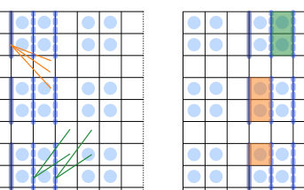
<figcaption class="paper-figure-caption"><b>Fig 3.</b> FIG. 3. Using the cylinder trick to extract disjoint logical representatives for RR sparsification on 2DTI codes. (a) Defining lattice elements: (i) edges support h and v qubits (purple); X (red) and Z (blue) ancillae are on vertices • and plaquettes □respectively. (ii) Monomials denote cardinal translations across the lattice. (iii) Stabilizers can be defined via polynomials, shown for cHGP2. (b) Z-Symmetries of 2DTI codes are sets of checks that always product to identity: Any X error leaves an even parity of syndromes in the support of the cHGP2 symmetry. (c) (i) Using the cylinder trick on a cHGP2 symmetry enables the extraction of a Z-logical operator. (ii) Sliding this selection...</figcaption>
</figure>
<figure class="paper-figure-card">
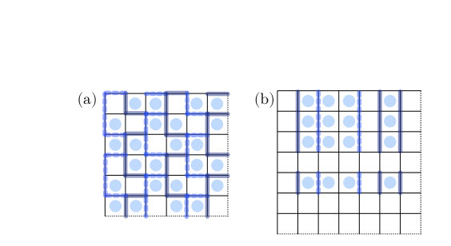
<figcaption class="paper-figure-caption"><b>Fig 4.</b> FIG. 4. L for more 2DTI codes. We show the maximum disjoint logical representative set L of size |J| obtained from the sliding cylinder trick for the (a) d = 6 color and (b) d = 4 cHGP3 codes. Similar to Fig. 3, adjacent disjoint logical representatives are shown via bright and dark blue highlights on the symmetry that supports them. For cHGP3, |J| &lt; d.</figcaption>
</figure>
<figure class="paper-figure-card">
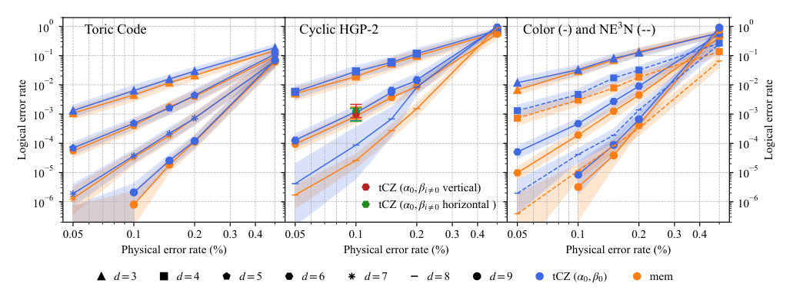
<figcaption class="paper-figure-caption"><b>Fig 5.</b> FIG. 5. Inter-code addressable tCZs with Cα = Cβ. We show logical error rate scaling with physical error rate for a transversal Cα0Zβ0 (blue) compared to memory (orange) across code distances. Across panels, Cα is respectively defined to be toric (left), cyclic HGP-2 (center), or color and NE3N directional (right) codes. In all plots, tCZ scaling matches that of memory. In the center panel, we further change the logical operator targeted in Cβ via the tCZ to other vertical (red) and horizontal (red) Z logical operators, showing unchanged logical performance.</figcaption>
</figure>

**Summary.** This paper develops a novel technique to create fault-tolerant and fully addressable two-qubit gates for various qLDPC quantum error-correcting codes. By applying a structured sparsification procedure to initial round-robin circuits, the authors significantly reduce gate depth while maintaining fault tolerance. This work is vital for realizing scalable quantum computation using lattice-based error correction.

**Why it may be interesting.** While focused on abstract QEC codes, the techniques for achieving low-depth, fault-tolerant gates are crucial for scaling up any quantum computation platform, including those based on AMO systems.

Detailed structure

**Main problem.** The paper addresses the challenge of creating fault-tolerant and fully addressable unitary logical gates for quantum low-density parity check (qLDPC) codes.

**Main result.** The authors introduce a sparsification procedure applied to round-robin circuits that successfully realizes low-depth, fault-tolerant, and addressable two-qubit Clifford gates for a wide class of 2DTI qLDPC codes.

**Method.** The core method involves applying a geometrically structured sparsification procedure, utilizing stabilizer deformations and the cylinder trick, to reduce the depth of initial round-robin logical circuits.

**Model / system.** The study focuses on quantum error correction (QEC) codes, specifically two-dimensional translationally invariant (2DTI) qLDPC codes, including the toric, color, and various hypergraph-product codes.

**Key observables.** Logical error rate (LER), gate depth (aiming for constant depth like 3), and fault-tolerance scaling with physical error rate.

**Important parameters / regimes.** The fault distance ($d$) of the code, the physical error rate ($p$), and the code structure (e.g., lattice type, boundary conditions).

**Assumptions / limitations.** The initial round-robin circuits are not naturally fault-tolerant, necessitating the sparsification procedure; the generalization to CX gates is stated as trivial for CSS codes.

**Figures summary.** Figures illustrate the sparsification process on the toric code, showing logical operators and circuit steps. Other figures benchmark LER scaling for various codes and compare tCZ gates against code surgery operations.

**Paper structure.** The paper introduces the problem, details the sparsification technique using stabilizer deformations and the cylinder trick, verifies the protocol on several 2DTI codes, and concludes with numerical simulations comparing the resulting gate performance against alternative methods like code surgery.

Abstract

For quantum low-density parity check (qLDPC) codes, the ability to manipulate individual logical units of information, i.e. the use of addressable gates, enables maximal utility of their efficient encoding. We introduce explicit low-depth unitary circuits that realize fully addressable and fault-tolerant two-qubit Clifford gates for a subset of two-dimensional translationally invariant qLDPC codes. Our transversal unitaries are created by applying a geometrically structured sparsification procedure to round-robin circuits. We verify the general applicability of our protocol by proposing and numerically simulating a range of addressable CZs between toric, cyclic hypergraph-product, color, gross, and directional codes, demonstrating fault-tolerant memory-like logical error rate scaling.

[↑ back to top](#top)

### [Free fermionic black holes as polarised mirrors](http://arxiv.org/abs/2610.03304v1)

**Authors:** Maureen Krumtünger, Maxwell West  
**Type:** theory · **Category:** quantum information and computing · **PDF:** <https://arxiv.org/pdf/2610.03304v1>  
**Analysis basis:** full PDF text, analyzed in chunks

↔ Scroll figures horizontally

<figure class="paper-figure-card">
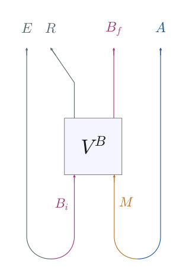
<figcaption class="paper-figure-caption"><b>Fig 1.</b> Figure 1. A graphical depiction of the setup of the Hayden– Preskill protocol [1]. The old black hole Bi is assumed to be past the Page time, so that it is modelled as maximally entan- gled with previously emitted radiation E [8]. Alice possesses a Bell state across the system MA, and throws the “message” half of it into the black hole. The internal scrambling dy- namics of the black hole are modelled by a unitary V B acting on the combined system B = MBi. Finally, further modes of radiation constituting a system R are emitted, leaving the final black hole Bf.</figcaption>
</figure>
<figure class="paper-figure-card">
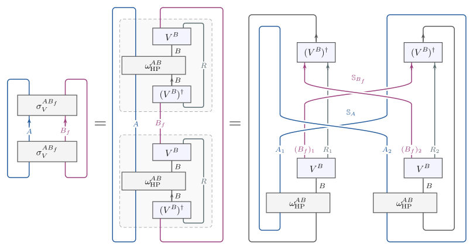
<figcaption class="paper-figure-caption"><b>Fig 2.</b> Figure 2. A tensor network diagram depicting the reduction, via the swap trick [22], of the purity tr h (σ ABf V )2i to a form</figcaption>
</figure>

**Summary.** This work analyzes information scrambling in black hole analogues, moving beyond the idealized Haar-random model to use a random free fermionic model. It finds that these 'polarised mirrors' retain information inefficiently, but shows that adding a small, fixed unitary can restore fast information release, even achieving better performance than the fully random case.

**Why it may be interesting.** The comparison between idealized random unitaries and structured, physically motivated random circuits (like free fermionic models) provides concrete, calculable insights into the limits of quantum information scrambling.

Detailed structure

**Main problem.** The paper investigates how information scrambling occurs in black hole dynamics, specifically comparing the idealized Haar-random model to a more realistic random free fermionic model.

**Main result.** Free fermionic black holes act as 'polarised mirrors,' retaining low-degree information, but augmenting the dynamics with a fixed Clifford unitary can restore fast information release, even outperforming the Haar-random case.

**Method.** The analysis uses quantum information theory tools, calculating optimal recovery fidelity and decoupling errors by analyzing the reduced density matrix $\sigma_{AB_f}^V$ after the black hole interaction.

**Model / system.** The model is based on the Hayden-Preskill black hole thought experiment, using a random free fermionic evolution (matchgate circuit) to simulate black hole dynamics.

**Key observables.** Optimal recovery fidelity ($F_{	ext{rec}}$), decoupling error ($\Delta$), and the rate of information release.

**Important parameters / regimes.** Fermionic degree, system dimensions ($d_A, d_{B_f}$), and the deviation from the Haar measure.

**Assumptions / limitations.** The analysis builds upon the Hayden-Preskill protocol and compares the free fermionic dynamics to the ideal Haar-random unitary evolution.

**Figures summary.** Figure 1 illustrates the setup of the Hayden–Preskill protocol, showing the partitioning of the total system into $E$, $B_i$, $M$, $A$, $R$, and $B_f$.

**Paper structure.** The paper progresses from establishing the general framework of information scrambling to deriving rigorous mathematical bounds on the recovery fidelity for both Haar-random and free fermionic dynamics, culminating in the analysis of augmentation strategies.

Abstract

Understanding the speed with which various classes of quantum systems can scramble information is a key goal of quantum information theory, with relevance to both fundamental physics and the study of the efficiency of quantum algorithms. Famously, such understanding enabled Hayden and Preskill to show that, under the assumption that black hole dynamics may be modelled by a Haar-random unitary, old black holes act as ''mirrors'', reflecting infalling quantum information back out again effectively instantaneously. In this work, we investigate which aspects of this mirror behaviour survive beyond the Haar-random setting by considering a random free fermionic model of black hole dynamics. We find that the rate of information release is governed by the underlying representation-theoretic structure; such a black hole acts as a ''polarised mirror'', retaining information encoded in low fermionic-degree irreps while reflecting information encoded in high fermionic-degree irreps much more rapidly. As a result of the retention of low-degree information, we show that faithful recovery of the infalling quantum information is impossible until all but a vanishing fraction of the black hole has evaporated. However, augmenting the dynamics with a fixed Clifford unitary can restore their reflective behaviour, even though the ensemble's frame potential remains unchanged and far above its Haar value. Remarkably, we find that such black holes can outperform their fully Haar-random counterparts: in the high-fidelity limit, recovering a single-qubit message requires asymptotically approximately $37\%$ fewer emitted qubits.

[↑ back to top](#top)

### [From Symmetry to Secrecy: Covariant Classical--Quantum Wiretap Channels](http://arxiv.org/abs/2610.03580v1)

**Authors:** Masahito Hayashi, Farzin Salek  
**Type:** theory · **Category:** quantum information and computing · **PDF:** <https://arxiv.org/pdf/2610.03580v1>  
**Analysis basis:** full PDF text, analyzed in chunks

↔ Scroll figures horizontally

<figure class="paper-figure-card">
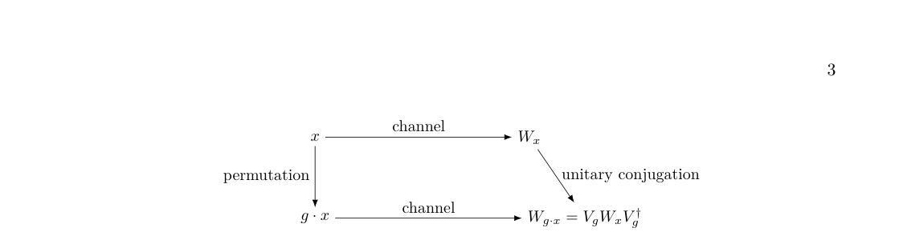
<figcaption class="paper-figure-caption"><b>Fig 1.</b> FIG. 1. Covariance: permuting the classical input labels and conjugating the output states give the same channel outputs.</figcaption>
</figure>
<figure class="paper-figure-card">
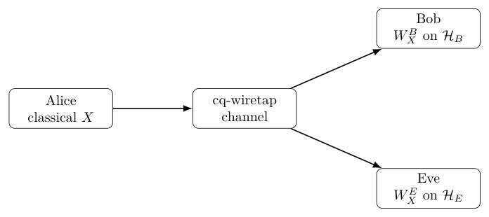
<figcaption class="paper-figure-caption"><b>Fig 2.</b> FIG. 2. A cq wiretap channel has one classical input and two quantum outputs. The coding problem compares the information available to Bob with the information leaked to Eve.</figcaption>
</figure>
<figure class="paper-figure-card">
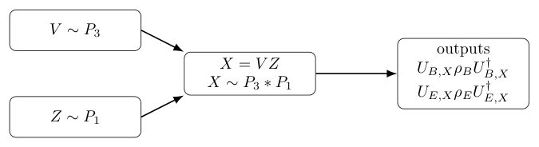
<figcaption class="paper-figure-caption"><b>Fig 3.</b> FIG. 3. The covariant preprocessing. Conditioned on V = v the input is the translate LvP1, whose entropies do not depend on v; the input marginal is the convolution P3 ∗P1.</figcaption>
</figure>
<figure class="paper-figure-card">
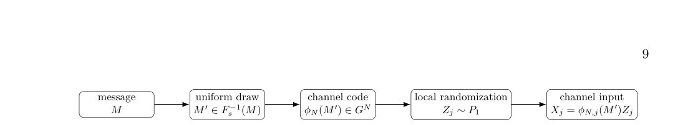
<figcaption class="paper-figure-caption"><b>Fig 4.</b> FIG. 4. Encoding for the covariant bound. The hash seed determines the fiber from which the randomized index is drawn, and P1 supplies the sender-side group randomization.</figcaption>
</figure>
<figure class="paper-figure-card">
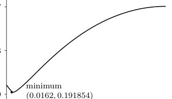
<figcaption class="paper-figure-caption"><b>Fig 5.</b> FIG. 5. The single-use entropy difference f1(x, 0.05) −f2(x, 0.15) of the hybrid binary channel as a function of the input probability x. The minimum sits at a nonzero x, so the optimal sender noise is not a point mass: noisy preprocessing already pays off at a single channel use.</figcaption>
</figure>

**Summary.** This paper develops theoretical bounds for the private information capacity of classical-quantum wiretap channels that possess specific symmetry properties (covariance). By leveraging group theory, the authors derive capacity formulas based on entropy differences calculated via group convolution. The work provides explicit examples of nonadditivity and compares achievable rates against standard benchmarks, advancing the understanding of secure quantum communication limits.

**Why it may be interesting.** While focused on information theory, the use of group theory to constrain quantum channel behavior (covariance) provides powerful mathematical tools applicable to characterizing symmetries in open quantum systems or quantum communication protocols.

Detailed structure

**Main problem.** The paper analyzes the private communication capacity of classical-quantum wiretap channels, focusing on how this capacity scales with multiple channel uses.

**Main result.** For covariant channels, the private information capacity is bounded below by expressions involving the convolution of an entropy difference functional derived from group theory.

**Method.** The authors utilize group theory to characterize the channel structure via covariant actions, leading to bounds based on entropy differences calculated over group convolutions.

**Model / system.** The model is a classical-quantum (cq) wiretap channel, where Alice transmits a classical message, and Bob and Eve receive quantum states. The analysis is specialized for channels exhibiting transitive covariance.

**Key observables.** Private information, quantified as $I(V; B) - I(V; E)$, and the entropy difference $\Delta(P) = H(
ho_B(P)) - H(
ho_E(P))$.

**Important parameters / regimes.** The number of channel uses ($n$), the channel parameter $p$ (in the hybrid binary case), and the structure of the underlying group $G$.

**Assumptions / limitations.** The analysis heavily relies on the assumption that the input action is transitive and covariant, allowing the channel to be described by unitary group orbits.

**Figures summary.** Figure 1 illustrates the covariance property of the channel. Figure 7 compares the achieved rate ($	ext{Rach}_n$) against the repetition benchmark ($	ext{Rrep}_{\log n}$) for $n=2, 3, 4$ uses.

**Paper structure.** The paper first establishes the group-theoretic structure of covariant channels, deriving bounds using preprocessing schemes based on entropy differences. It then applies these tools to specific models, including a hybrid binary channel, to demonstrate nonadditivity and compare achievable rates against theoretical benchmarks.

Abstract

For classical--quantum wiretap channels with a transitive covariant input action, both output ensembles admit a description as unitary group orbits of fixed seed states. We use this structure to construct finite-block preprocessing schemes whose private information is an entropy difference evaluated at two distributions related by group convolution. Applying the construction to product groups allows correlations across any fixed number of channel uses. We give a sufficient condition for the associated uniform-input bound to equal the single-use private information. Constant-composition channel codes and universal$_2$ hashing achieve the resulting rates, with trace-distance leakage controlled by sandwiched Rényi information. For uniform outer randomization, the representation structure reduces the comparison-state optimization to Eve's invariant states. For the hybrid binary channel considered by Tikku, Berta and Renes, numerical optimization at three and four uses gives rates above our numerical estimate of the optimized noisy-repetition benchmark wherever that estimate is positive on the tested grid. The improvement comes from noise distributions beyond the family of independent physical flips and a symmetric logical flip. We also prove nonadditivity at an explicit channel parameter using a two-use encoder, an analytic single-use converse, and certified entropy bounds. Finally, we relate the hybrid model to binary phase-shift keying with a fixed receiver measurement.

[↑ back to top](#top)

### [Geometric Aspects of Entanglement](http://arxiv.org/abs/2610.03446v1)

**Authors:** Lucio De Simone, Lorenzo Capra, Arthur Vesperini, Leonardo Rossi, Loris Di Cairano, Roberto Franzosi  
**Type:** theory · **Category:** quantum information and computing · **PDF:** <https://arxiv.org/pdf/2610.03446v1>  
**Analysis basis:** full PDF text, analyzed in chunks

↔ Scroll figures horizontally

<figure class="paper-figure-card">
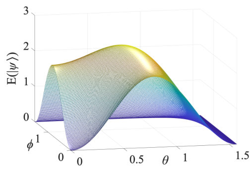
<figcaption class="paper-figure-caption"><b>Fig 1.</b> FIG. 1. This figure reports the three-dimensional plot of the ED E(|ψ⟩) as a function of θ and φ for the states (42).</figcaption>
</figure>

**Summary.** This work introduces the Entanglement Distance (ED), a novel geometric measure derived from the Fubini-Study metric on the projective Hilbert space to quantify quantum entanglement. By exploiting the geometry of local operations, the ED provides a rigorous, intrinsic measure that successfully reproduces known entanglement monotones for two-qubit systems. It offers a deep geometric interpretation of quantum correlations for multipartite systems.

**Why it may be interesting.** The geometric approach offers a powerful, intrinsic mathematical tool to quantify entanglement, potentially providing a unified framework applicable to complex, high-dimensional quantum systems beyond simple bipartite settings.

Detailed structure

**Main problem.** The paper aims to provide a geometric characterization and quantification of quantum entanglement, particularly in complex multipartite systems.

**Main result.** The derived Entanglement Distance (ED) is shown to be a geometric measure that quantifies entanglement as an obstruction to local minimization, reproducing established measures like concurrence for two qubits.

**Method.** The methodology involves analyzing the Riemannian structure induced by the Fubini-Study metric on the projective Hilbert space of multi-qubit states.

**Model / system.** The system under study consists of multi-qubit quantum states, treated mathematically on the projective Hilbert space PH. The analysis focuses on the geometry induced by local unitary transformations.

**Key observables.** Entanglement Distance (ED), Concurrence, Entropy of Entanglement, Fubini-Study metric tensor.

**Important parameters / regimes.** The number of qubits (M), the specific local unitary transformations applied.

**Assumptions / limitations.** The derivation relies on exploiting the local-unitary invariance of the Fubini-Study metric, though the correspondence with standard measures is noted to be limited beyond the two-qubit case.

**Figures summary.** Figure 1 shows a three-dimensional plot of the ED as a function of angular parameters ($	heta, \phi$) for specific multi-qubit states.

**Paper structure.** The paper first establishes the geometric framework using the Fubini-Study metric on PH. It then derives the entanglement measure (ED) based on local-unitary invariance. Finally, it analyzes the properties of ED, showing its equivalence to known measures in the bipartite two-qubit case.

Abstract

Quantum entanglement is a fundamental resource in quantum information theory, yet its general characterization and quantification remain challenging, especially in multipartite systems. In this work we investigate entanglement from a geometric perspective, focusing on the Riemannian structure induced by the Fubini--Study metric on the projective Hilbert space of multi-qubit quantum states. By exploiting the local-unitary invariance of this metric, we derive the entanglement distance (ED), a geometric measure that quantifies entanglement as an obstruction to locally minimizing the sum of squared Fubini--Study distances generated by local operations.   We analyze the properties of ED for pure multi-qubit states and discuss its behavior under local operations and classical communication. In particular, we show that ED reproduces established entanglement measures in well-defined and restricted settings. For pure states of two qubits, ED reduces to an exact monotone function of the concurrence and, independently, to an explicit monotone function of the entropy of entanglement. These results provide a clear geometric interpretation of standard bipartite entanglement measures within the present framework, while highlighting the limitations of such correspondences beyond the two-qubit case.

[↑ back to top](#top)

### [How to Build Pseudorandom Unitaries in Microcrypt](http://arxiv.org/abs/2610.03711v1)

**Authors:** Aditya Gulati, Dakshita Khurana, Kabir Tomer  
**Type:** theory · **Category:** quantum information and computing · **PDF:** <https://arxiv.org/pdf/2610.03711v1>  
**Analysis basis:** full PDF text, analyzed in chunks

↔ Scroll figures horizontally

<figure class="paper-figure-card">
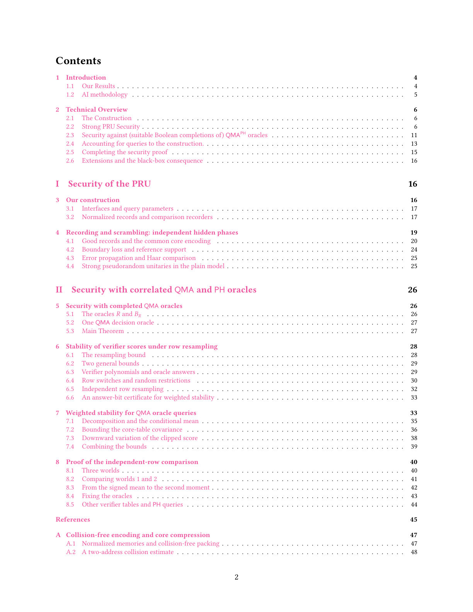
<figcaption class="paper-figure-caption"><b>Fig 1.</b> Low-resolution page preview, page 2</figcaption>
</figure>
<figure class="paper-figure-card">
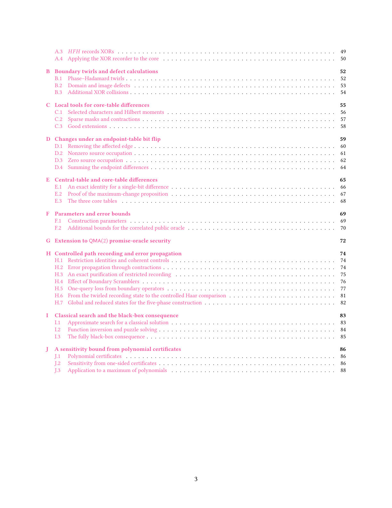
<figcaption class="paper-figure-caption"><b>Fig 2.</b> Low-resolution page preview, page 3</figcaption>
</figure>
<figure class="paper-figure-card">
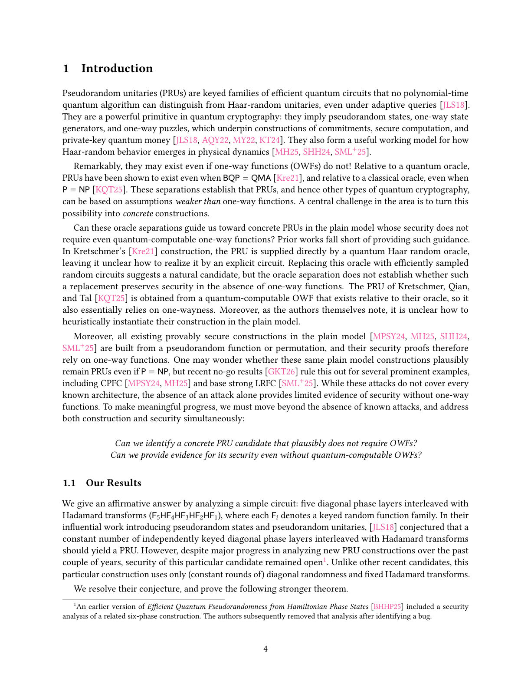
<figcaption class="paper-figure-caption"><b>Fig 3.</b> Low-resolution page preview, page 4</figcaption>
</figure>
<figure class="paper-figure-card">
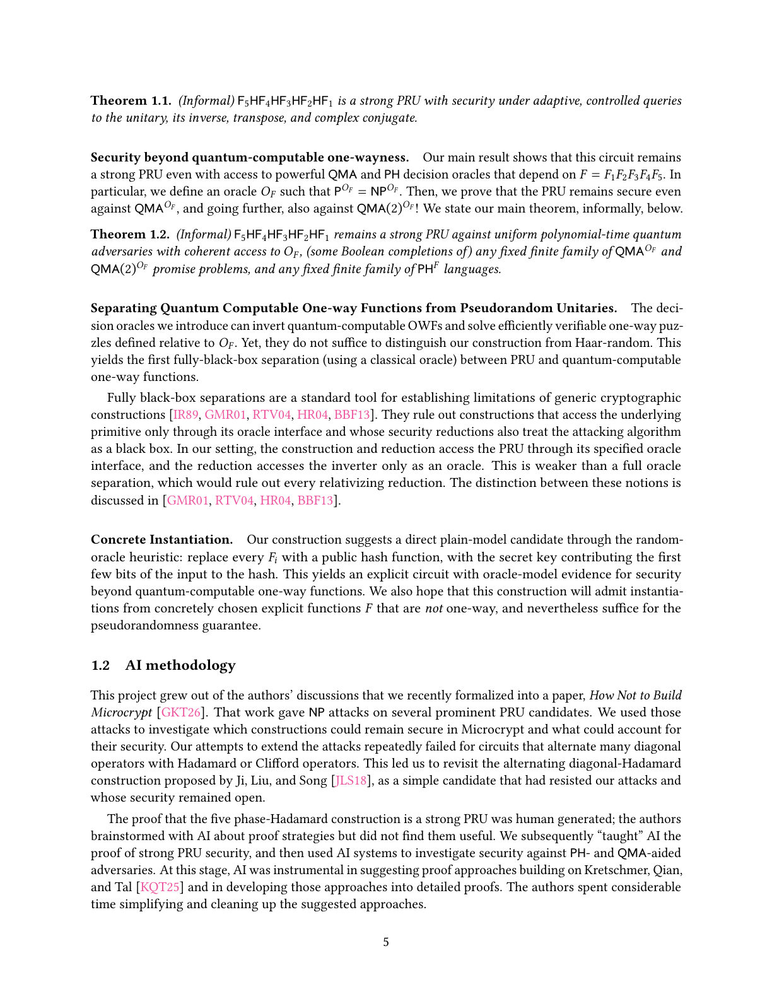
<figcaption class="paper-figure-caption"><b>Fig 4.</b> Low-resolution page preview, page 5</figcaption>
</figure>
<figure class="paper-figure-card">
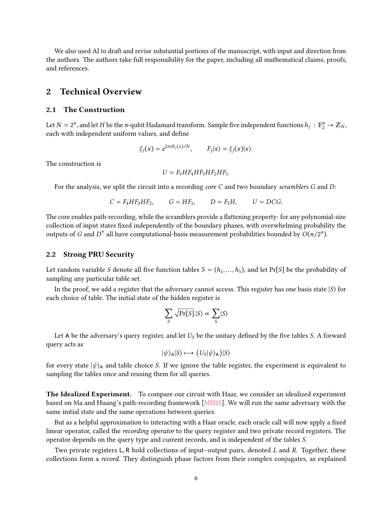
<figcaption class="paper-figure-caption"><b>Fig 5.</b> Low-resolution page preview, page 6</figcaption>
</figure>

**Summary.** This paper constructs a specific type of quantum circuit, a Pseudorandom Unitary (PRU), that is provably secure even when one-way functions are not assumed to exist. By showing this separation using a classical random oracle, the authors provide strong theoretical evidence that PRUs do not necessarily imply the existence of quantum-computable one-way functions.

**Why it may be interesting.** While the focus is on complexity theory, the concept of PRUs is fundamental to quantum cryptography and quantum information protocols, which are key areas for theoretical quantum physicists.

Detailed structure

**Main problem.** The paper aims to provide evidence that Pseudorandom Unitaries (PRUs) can exist without relying on the existence of quantum-computable one-way functions (OWFs).

**Main result.** They construct a PRU using a specific circuit structure that is proven secure against uniform BQP adversaries, establishing a black-box separation between PRUs and quantum-computable OWFs.

**Method.** The security proof involves analyzing the circuit's behavior against adaptive queries to the unitary and its related operations, utilizing complex mathematical tools like normalized records and comparison recorders.

**Model / system.** The model is a quantum circuit realizing the PRU: U = F_5 H F_4 H F_3 H F_2 H F_1, where F_i are random diagonal phase layers and H are Hadamard transforms. The security proof is framed in terms of classical oracles and QMA/PH decision problems.

**Key observables.** Acceptance probabilities ($	ext{acc}_y(w)$), the structure of the PRU itself, and the separation between PRU security and OWF existence.

**Important parameters / regimes.** The security relies on the existence of a classical random oracle O, and the analysis involves parameters like $\epsilon, c, \delta$, and $C$ from the underlying complexity theory proofs.

**Assumptions / limitations.** The result is conditional on the existence of a classical random oracle O, and the security proof relies on access to suitable Boolean completions of classical-input QMA/PH decision problems.

**Paper structure.** The paper develops through multiple stages, first establishing the PRU construction and its security under controlled access, then strengthening the result against QMA-aided adversaries, and finally using complex mathematical machinery (like encoding methods and bounds) to formalize the separation.

Abstract

We provide the first evidence relative to a classical oracle that pseudorandom unitaries (PRUs) can exist without quantum-computable one-way functions.   To obtain this result, we first prove that five independent random diagonal phase layers interleaved with Hadamard transforms \[ U=F_5HF_4HF_3HF_2HF_1 \] form a strong PRU with security under adaptive, controlled access to the unitary, its inverse, transpose, and complex conjugate.   Our main result is that, when the phase layers are implemented using a classical random oracle O, the construction remains secure against uniform BQP adversaries with coherent access to suitable Boolean completions of classical-input $QMA^{PH}^{O}}$ decision problems. Such an adversary can invert (even quantum-computable) one-way functions and solve efficiently verifiable one-way puzzles defined relative to O. Our result therefore provides classical-oracle evidence that PRUs do not imply quantum-computable one-way functions, in the form of a black-box separation.   We substantially strengthen the classical-oracle result of Kretschmer, Qian, and Tal (STOC 2025) by obtaining PRUs secure against these QMA-aided adversaries. Our construction also consists of a simple, efficient circuit that queries a random function, suggesting a route to concrete implementation via the random-oracle heuristic.

[↑ back to top](#top)

### [Low-Overhead Quantum Error Correction with Boundary-Connected Planar Modules](http://arxiv.org/abs/2610.03682v1)

**Authors:** Oscar Higgott, Hasan Sayginel, Francisco J. H. Heras, Zhiyang He, Tomas Jochym-O'Connor, Andrew W. Senior, Lei M. Zhang, Thomas Edlich, James S. Spencer, Matt McEwen, Craig Gidney, Johannes Bausch, Pushmeet Kohli, Hartmut Neven  
**Type:** theory · **Category:** quantum information and computing · **PDF:** <https://arxiv.org/pdf/2610.03682v1>  
**Analysis basis:** full PDF text, analyzed in chunks

↔ Scroll figures horizontally

<figure class="paper-figure-card">
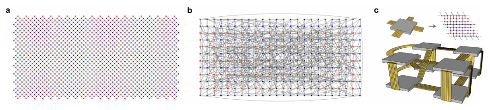
<figcaption class="paper-figure-caption"><b>Fig 1.</b> FIG. 1. Hardware models. In all panels, black circles represent data qubits and red (blue) squares represent measure qubits for X (Z) stabilizers. a, A monolithic grid architecture, in which qubits are placed on a plane with 2D nearest-neighbor grid connectivity. This geometry supports the Euclidean surface code, shown here. b, A general QLDPC architecture, in which each qubit is coupled to a constant number of other qubits, without additional constraints on geometric locality. Couplers may cross and may be long-range, as shown here for the Gross code [11]. Each edge represents a coupler between qubits. c, A boundary-connected modular architecture. Planar modules are connected by flexible...</figcaption>
</figure>
<figure class="paper-figure-card">
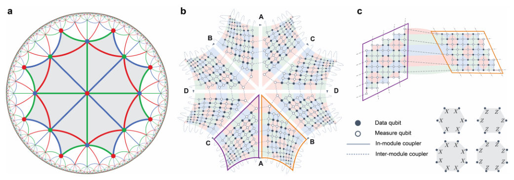
<figcaption class="paper-figure-caption"><b>Fig 2.</b> FIG. 2. Construction of a modular hyperbolic color code, using the [[256, 8, 12]] Bolza color code as an example. a, The base infinite hyperbolic tiling, shown in the Poincar´e disk model, has triangular faces with 8 meeting at each vertex (face configuration V8.8.8). Its vertices are three-colorable (red, green, blue), with one vertex of each color per triangle. Each edge is assigned the third color, absent from its two vertices. The fundamental polygon of the genus-2 Bolza surface is shaded, and contains 16 triangles. b, The semi-hyperbolic color code obtained by replacing each triangular face with a Euclidean hexagonal tiling of side length L = 4, giving a tiling of the surface by...</figcaption>
</figure>
<figure class="paper-figure-card">
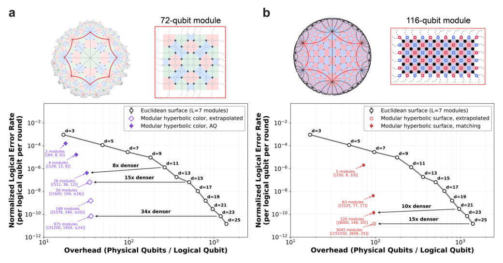
<figcaption class="paper-figure-caption"><b>Fig 3.</b> FIG. 3. Simulation data for modular hyperbolic codes using an SI1000 noise model with p = 0.1% and inter-module CZ gates adjusted to have a noise strength of pseam = 1% (see Methods for details). a, Modular hyperbolic color codes derived from V8.8.8 hyperbolic tilings using L = 2 and an octagon module partition. b, Modular hyperbolic surface codes derived from {4, 10} regular hyperbolic tilings with L = 5 and a rectangle module partition. In both panels we compare with Euclidean surface codes partitioned into modules of a comparable size (with additional measure qubits on the boundaries).</figcaption>
</figure>
<figure class="paper-figure-card">
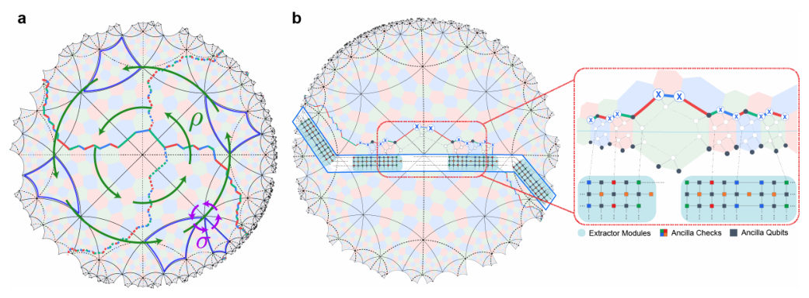
<figcaption class="paper-figure-caption"><b>Fig 4.</b> FIG. 4. Logical control architecture: code automorphisms and a ribbon extractor. a, A symplectic pair of homologically non- trivial cycles on the semi-hyperbolic tiling of the [[6400, 104, 30]] color code, drawn as solid and dashed lines. The two cycles are related by ρ, a global rigid rotation of the tiling by π/2 (green arrows). Together with a second rotation σ (purple arrows), these generate all rotations of the tiling, each of which permutes the modules while preserving the codespace (a code automorphism). Logical Pauli operators are supported on the monochromatic substrings of a cycle, obtained by restricting it to edges of a single color. Two of the three colors (e.g. blue and red)...</figcaption>
</figure>

**Summary.** This work addresses the high resource cost of quantum error correction by proposing a modular architecture based on hyperbolic surface codes. By partitioning the quantum processor into smaller, connected planar modules, the authors significantly reduce the physical qubit overhead compared to traditional surface codes. This method enables the realization of high-rate, fault-tolerant quantum memory using nearest-neighbor gates within modules.

**Why it may be interesting.** The focus on modularity and hyperbolic geometry provides a novel pathway to scaling QEC beyond the limitations of planar architectures, which is crucial for building large-scale quantum computers.

Detailed structure

**Main problem.** The primary challenge is reducing the substantial physical qubit overhead associated with implementing quantum error correction (QEC) using standard codes like the planar surface code.

**Main result.** The authors propose a modular architecture using boundary-connected planar modules, achieving an overhead reduction of over $30	imes$ compared to surface codes while maintaining high encoding rates and distances.

**Method.** They construct modular hyperbolic surface and color codes by partitioning processors into flat modules connected by sparse, static boundary links, and utilize efficient neural network and matching decoders.

**Model / system.** The model involves partitioning quantum processors into Euclidean planar modules that are connected to form hyperbolic surfaces. The codes derived are semi-hyperbolic, combining hyperbolic geometry with local planar lattice structures.

**Key observables.** Encoding rate ($k/n=1/16$), distance ($d\geq 22$), and physical qubit overhead (projected to $36$ physical qubits per logical qubit for $d=20-24$).

**Important parameters / regimes.** Inter-module seam error rates (tolerated up to 1%), and the genus ($g$) of the underlying hyperbolic surface.

**Assumptions / limitations.** The approach assumes that local planar gates operate below the surface code threshold and that inter-module link resonators can achieve error rates approaching 1%.

**Figures summary.** Figure 1 compares three hardware models (monolithic, general QLDPC, modular hyperbolic). Figure 2 illustrates the construction of the modular hyperbolic color code via tiling and fine-graining. Figure 3 compares performance metrics across different code types.

**Paper structure.** The paper introduces the modular concept, details the construction of hyperbolic color and surface codes via tiling, describes the syndrome extraction and decoding circuits, and concludes by demonstrating the resulting low-overhead, fault-tolerant memory design.

Abstract

Realizing practical quantum computers requires quantum error correction, but the most widely implemented approach, the planar surface code, demands a substantial physical qubit overhead. Here, we demonstrate that partitioning quantum processors into manageable, flat modules with non-local inter-module connections provides a natural solution. By wiring sparse, static boundary connections between Euclidean planar modules, we construct modular hyperbolic surface and color codes, based on new families of semi-hyperbolic codes. Using modular syndrome extraction circuits and efficient neural network and matching decoders, our circuit-level simulations show that this modular memory design can reduce the physical qubit overhead by tenfold or more compared to the surface code, even under elevated inter-module seam error rates. Projecting to larger system sizes, we find modular codes with encoding rate $k/n=1/16$ and distance $d\geq 22$, exceeding both the rate and distance of the $[[288,12,18]]$ two-gross bivariate bicycle code while using mostly nearest-neighbor gates within planar modules, and implying an over $30\times$ overhead reduction relative to surface codes. We develop fault-tolerant walking circuits for implementing logic via code automorphisms, which we co-design with low-weight, highly symmetrical logical bases and a modular extractor system that is $\approx 4.5\times$ smaller than the code itself. Combining these methods, our modular memory can be used as dense storage in a universal fault-tolerant architecture, unlocking the efficiency of high-rate codes without sacrificing the fabrication advantages of planar modules.

[↑ back to top](#top)

### [Multivariate quantum signal processing with optimal query complexity](http://arxiv.org/abs/2610.03393v1)

**Authors:** Mingrui Jing, Xin Wang, Zhan Yu, Lei Zhang  
**Type:** theory · **Category:** quantum information and computing · **PDF:** <https://arxiv.org/pdf/2610.03393v1>  
**Analysis basis:** full PDF text, analyzed in chunks

↔ Scroll figures horizontally

<figure class="paper-figure-card">
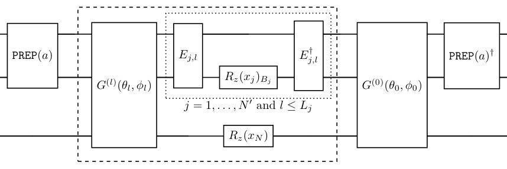
<figcaption class="paper-figure-caption"><b>Fig 1.</b> FIG. 1. The circuit W(x; a, θ, ϕ) in Equation (17) that simulates P(x) for P ∈PL, where a, θ, ϕ are parameters that depend on P. Here N ′ = N −1 and LN is the largest entry of L.</figcaption>
</figure>
<figure class="paper-figure-card">
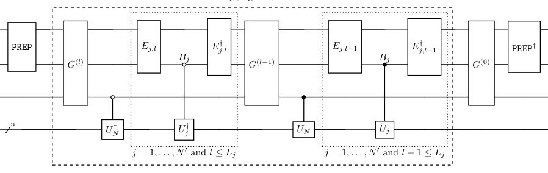
<figcaption class="paper-figure-caption"><b>Fig 2.</b> FIG. 2. The circuit V (U; a, θ, ϕ) in Equation (33), where the parameters a, θ, ϕ of PREP and G(l) are the same as in Figure 1 and are omitted. Here all entries of L are even, N ′ = N −1, and LN is the largest entry of L; the layers with even l query C0(Uj) and those with odd l query C1(Uj).</figcaption>
</figure>

**Summary.** This paper develops advanced techniques for simulating multivariate polynomial transformations in quantum circuits, achieving optimal query complexity for both continuous variables and discrete unitaries. It also provides a deep theoretical framework using SDP duality to precisely quantify the minimum resources needed to realize such operations within a fixed quantum hardware workspace.

**Why it may be interesting.** The work provides fundamental tools for designing efficient quantum algorithms by providing tight bounds on resource costs (queries) and characterizing the limits of quantum computation in constrained physical settings.

Detailed structure

**Main problem.** The paper addresses the challenge of efficiently implementing general multivariate polynomial transformations of quantum signals or unitaries while minimizing the required number of quantum queries.

**Main result.** It presents quantum circuits that achieve optimal query complexity for realizing multivariate trigonometric polynomials and extends this to commuting unitaries. Furthermore, it establishes rigorous mathematical criteria (via SDP duality) for determining the minimum required normalization for such operations in fixed-workspace quantum signal processing.

**Method.** The methods involve constructing specialized quantum circuits using frequency component sharing for polynomial simulation, and employing Semidefinite Programming (SDP) duality theory to characterize the achievable quantum signal processing norm.

**Model / system.** The model involves quantum signals defined by multivariate trigonometric polynomials $P(\mathbf{x})$ or transformations of commuting unitaries $P(\mathbf{U})$. The analysis is framed within quantum circuit complexity and quantum learning models.

**Key observables.** Query complexity (minimum number of times each input operation is used), gradient variance, and the quantum signal processing measure $\Gamma_\chi(P)$.

**Important parameters / regimes.** The degree of the polynomial, the number of variables ($N$), the depth of the circuit, and the fixed workspace dimension ($D$).

**Assumptions / limitations.** For learning analysis, independent uniform initialization is assumed for gradient variance bounds. For signal processing, the analysis relies on strong duality theorems for SDPs and the existence of specific rank constraints for exact realization.

**Figures summary.** Figure 1 illustrates the quantum circuit structure $W(\mathbf{x}; \mathbf{a}, 	heta, \phi)$ used to simulate the polynomial $P(\mathbf{x})$.

**Paper structure.** The paper progresses from constructing circuits for polynomial simulation with optimal query complexity to analyzing gradient variance in quantum learning. It then delves into the rigorous mathematical characterization of quantum signal processing capability using SDP duality and deriving exact, non-convex feasibility criteria for fixed-workspace realization.

Abstract

Polynomial transformations of data encoded in quantum operations are a building block of quantum algorithms, and their query complexity measures how often those operations are used. For multiple variables, existing methods either realize restricted polynomial families or implement monomials separately at a query cost exponential in the number of variables. We present a quantum circuit that implements every multivariate trigonometric polynomial up to an explicit normalization. The circuit processes one variable coherently over the frequency components of the remaining variables, allowing all components to share the same signal queries. Each variable is queried exactly as many times as its degree in the polynomial, and we prove that this query complexity is optimal. We further extend the construction to commuting unitaries. The resulting circuit applies the multivariate polynomial simultaneously across their shared eigenbasis, using the minimum numbers of forward and inverse queries to each unitary. We also study trainable rotations with fixed preparation and a local readout of the last input. At query depth at least two, independent uniform initialization gives every active readout gradient a variance lower bound set by its squared branch weight and the inverse square root of the depth, uniformly over data states and dimensions. For supervised squared loss, retaining sample correlations gives an initialization gradient-variance bound in terms of targets and input spectra. This also bounds the expected loss decrease after the first exact gradient step with a specified step size. These results provide a scalable and practical solution for developing multivariate quantum algorithms and quantum learning models.

[↑ back to top](#top)

### [No Size-Preserving Amplification with Quantum Advice](http://arxiv.org/abs/2610.03377v1)

**Authors:** Shih-Han Hung, Han-Hsuan Lin  
**Type:** theory · **Category:** quantum information and computing · **PDF:** <https://arxiv.org/pdf/2610.03377v1>  
**Analysis basis:** full PDF text, analyzed in chunks

↔ Scroll figures horizontally

<figure class="paper-figure-card">
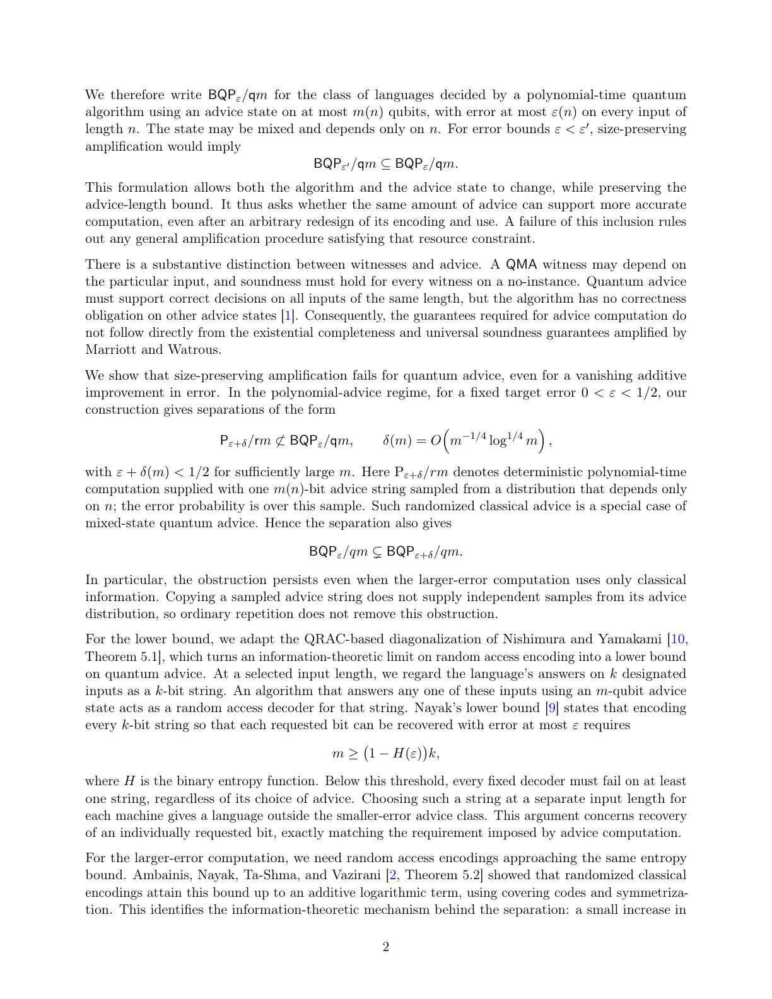
<figcaption class="paper-figure-caption"><b>Fig 1.</b> Low-resolution page preview, page 2</figcaption>
</figure>
<figure class="paper-figure-card">
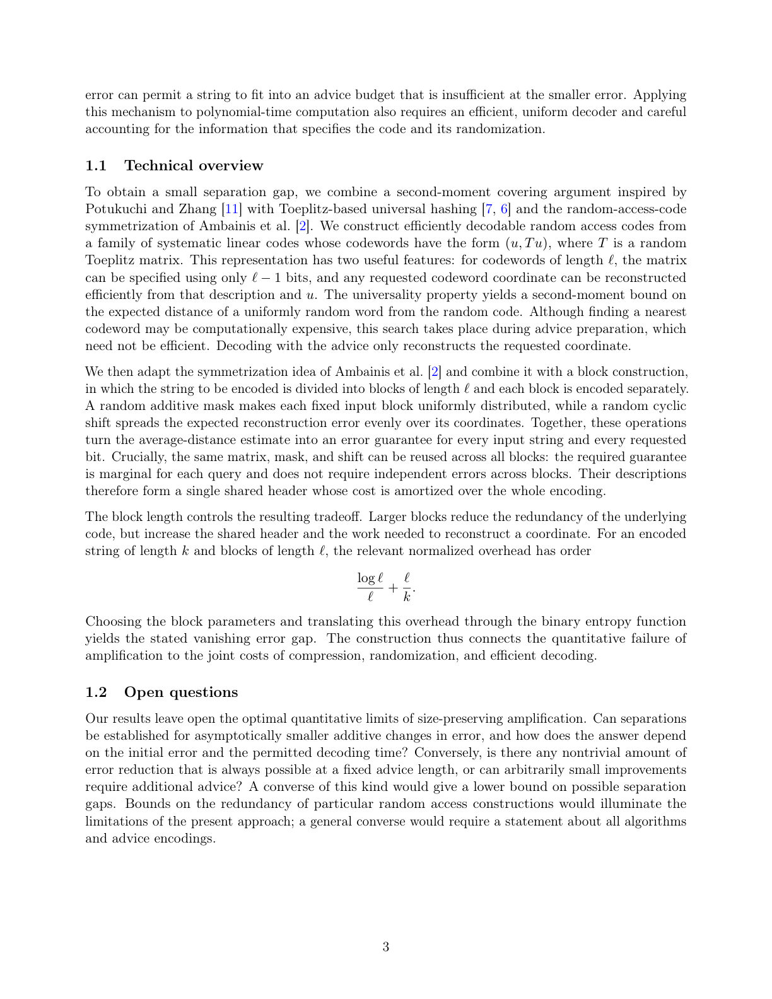
<figcaption class="paper-figure-caption"><b>Fig 2.</b> Low-resolution page preview, page 3</figcaption>
</figure>
<figure class="paper-figure-card">
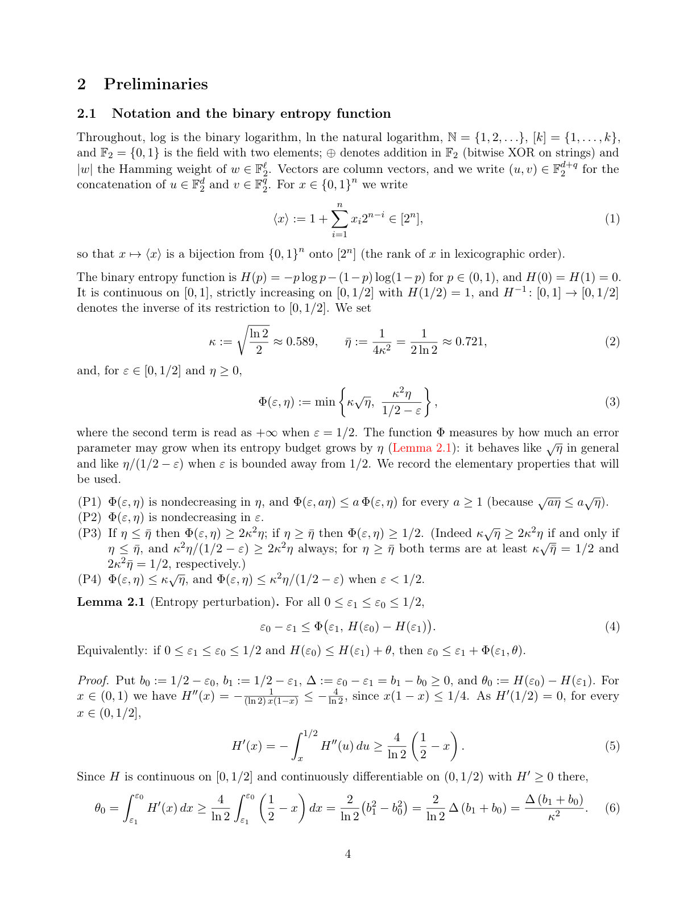
<figcaption class="paper-figure-caption"><b>Fig 3.</b> Low-resolution page preview, page 4</figcaption>
</figure>
<figure class="paper-figure-card">
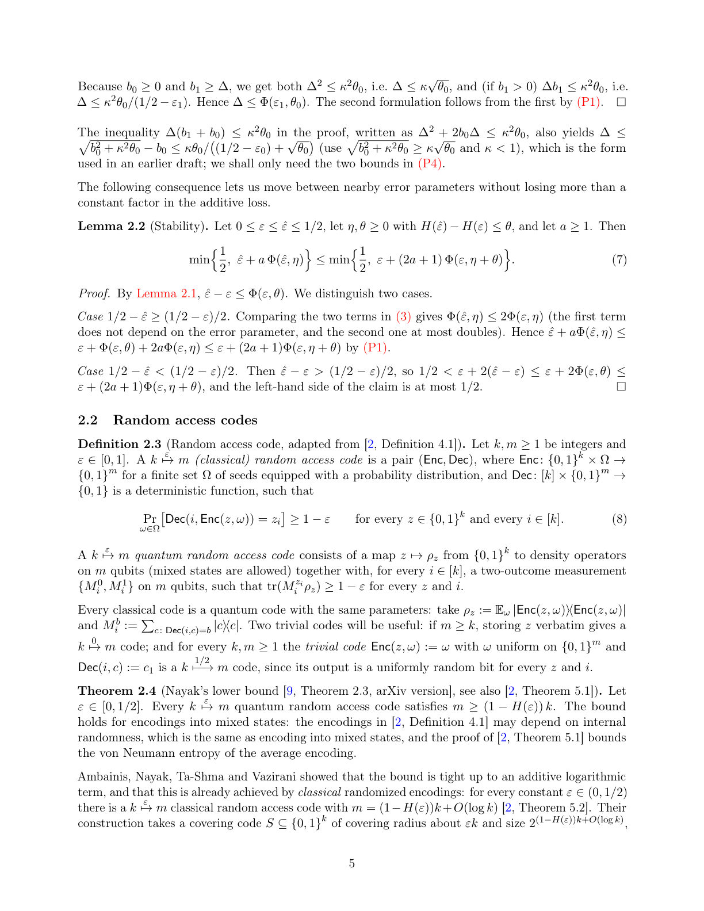
<figcaption class="paper-figure-caption"><b>Fig 4.</b> Low-resolution page preview, page 5</figcaption>
</figure>
<figure class="paper-figure-card">
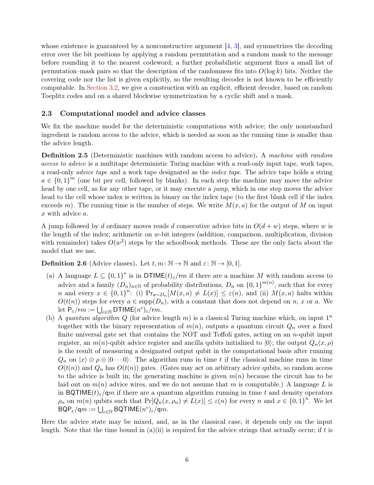
<figcaption class="paper-figure-caption"><b>Fig 5.</b> Low-resolution page preview, page 6</figcaption>
</figure>

**Summary.** This paper proves a significant limitation in quantum computation theory by showing that error reduction in quantum algorithms with fixed-size quantum advice cannot be arbitrarily small. It establishes a quantitative separation between complexity classes $	ext{BQP}_{\epsilon}/	ext{q}^m$ and $	ext{BQP}_{\epsilon+\delta}/	ext{q}^m$, using sophisticated tools from coding theory and information theory.

**Why it may be interesting.** This work establishes fundamental limitations on how much error reduction can be achieved in quantum computation when the advice state size is fixed, which has implications for the theoretical limits of quantum computation models.

Detailed structure

**Main problem.** The paper investigates whether the size-preserving amplification property, known for quantum Merlin-Arthur games, holds for quantum computation utilizing quantum advice.

**Main result.** It proves that this size-preserving amplification fails for quantum advice, demonstrating a strict separation between complexity classes $	ext{BQP}_{\epsilon}/	ext{q}^m$ and $	ext{BQP}_{\epsilon+\delta}/	ext{q}^m$.

**Method.** The proof uses advanced techniques combining diagonalization arguments, random access coding theory (Toeplitz codes), and entropy analysis derived from information theory bounds.

**Model / system.** The model involves computational complexity classes defined by polynomial-time quantum algorithms ($	ext{BQP}$) that receive an advice state ($	ext{q}^m$) of fixed size $m(n)$ depending only on the input length $n$.

**Key observables.** The separation gap $\delta(n)$ quantifying the required increase in error tolerance to establish the inclusion failure.

**Important parameters / regimes.** Advice length $m(n) \geq n^4$, error bounds $\epsilon(n)$ staying below $1/2$ by an inverse polynomial, and the separation gap $\delta(n) = O(\min\{(\log m/m)^{1/4}, \sqrt{\log m/m/(1/2-\epsilon(n))}\})$.

**Assumptions / limitations.** The analysis assumes the existence of polynomially bounded advice length $m(n)$ and that the error bound $\epsilon(n)$ is sufficiently far from $1/2$.

**Paper structure.** The paper builds from fundamental entropy bounds ($\Phi(\epsilon, \eta)$) and random access code theorems (Nayak's bound) to construct specific languages $L(k)_R$. It then uses these constructions to prove lower and upper bounds, culminating in the separation results between $	ext{P}_{\epsilon+\delta}/	ext{r}^m$ and $	ext{BQP}_{\epsilon}/	ext{q}^m$.

Abstract

Marriott and Watrous showed that quantum Merlin--Arthur games admit generic error reduction without increasing witness size [Computational Complexity, 2005]. In this work, we show that this state-size-preserving amplification property does not hold for polynomial-time quantum computation with quantum advice. In particular, we present decision problems for which even a vanishing additive error reduction requires longer advice. More precisely, for every polynomially bounded advice length $m(n)\geq n^4$ and every error bound $\varepsilon(n)$ that stays below $1/2$ by at least an inverse polynomial, there is a positive function $δ$ with $δ(n)=O\bigl(\min\{(\log m/m)^{1/4},\ \sqrt{\log m/m}\,/(1/2-\varepsilon(n))\}\bigr)$ such that $\mathsf{BQP}_{\varepsilon}/\mathsf{q}m \subsetneq \mathsf{BQP}_{\varepsilon + δ}/\mathsf{q}m$; for constant $\varepsilon$ the gap is $O(\sqrt{\log m/m})$. Here, $\mathsf{BQP}_\varepsilon/\mathsf{q}m$ is the class of languages recognizable with error at most $\varepsilon(n)$ by a polynomial-time quantum algorithm with an $m(n)$-qubit advice state that only depends on the input length $n$. We show this by proving a stronger separation $\mathsf{P}_{\varepsilon+δ}/\mathsf{r} m \not\subset \mathsf{BQP}_{\varepsilon}/\mathsf{q} m$, where $\mathsf{P}_{\varepsilon}/\mathsf{r}m$ is the class of languages recognizable with error at most $\varepsilon(n)$ by a deterministic polynomial-time algorithm with an $m(n)$-bit advice string sampled from a distribution that depends only on $n$.

[↑ back to top](#top)

### [Orbital-Rotation Shadow Tomography Reduces the Classical Cost of Quantum-Classical Auxiliary-Field Quantum Monte Carlo](http://arxiv.org/abs/2610.03103v1)

**Authors:** Luning Zhao, Joshua Goings, Evgeny Epifanovsky, Martin Roetteler  
**Type:** theory · **Category:** strongly correlated electrons · **PDF:** <https://arxiv.org/pdf/2610.03103v1>  
**Analysis basis:** full PDF text, analyzed in chunks

↔ Scroll figures horizontally

<figure class="paper-figure-card">
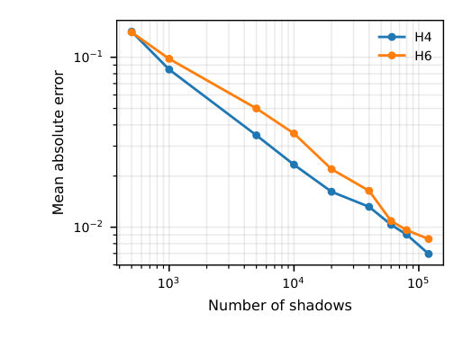
<figcaption class="paper-figure-caption"><b>Fig 1.</b> FIG. 1. Mean absolute overlap error from orbital-rotation shadows for hydrogen chains with 4 and 6 atoms at a spacing of 1Å. The trial state is the UpCCD state with MP2 parame- ters. The overlaps are computed with respect to 100 randomly sampled Slater determinants.</figcaption>
</figure>
<figure class="paper-figure-card">
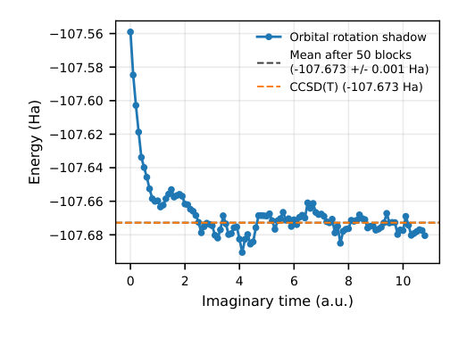
<figcaption class="paper-figure-caption"><b>Fig 2.</b> FIG. 2. QC-AFQMC energy trajectory for N2 using orbital- rotation shadows with an UpCCD trial state initialized from MP2 parameters. The dashed horizontal line indicates the reference CCSD(T) energy.</figcaption>
</figure>
<figure class="paper-figure-card">
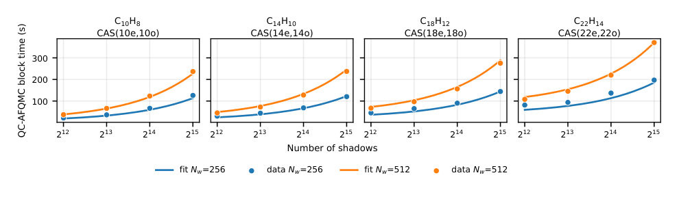
<figcaption class="paper-figure-caption"><b>Fig 3.</b> FIG. 3. Measured and fitted QC-AFQMC times for 1 block with 10 steps for orbital-rotation shadows across the π-conjugated benchmark series. Points show measured timings and solid lines show the fitted physical scaling model as a function of the number of shadows for different walker counts.</figcaption>
</figure>
<figure class="paper-figure-card">
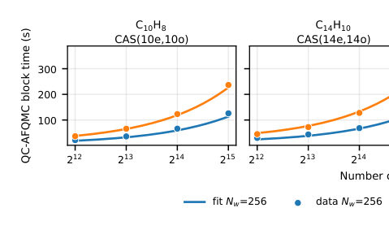
<figcaption class="paper-figure-caption"><b>Fig 4.</b> Figure 3 shows the measured timings and fitted curves used to calibrate the performance model and Table II shows the corresponding predicted QC-AFQMC run- times for the four larger π-conjugated systems using 65,536 orbital-rotation shadows, 1024 walkers and 150 blocks with 10 steps per block. We assume perfect strong scaling with the number of GPUs and that an NVIDIA H200 is 1.4× faster than an NVIDIA A100. Under these assumptions, pentacene with a (22e, 22o) active space is predicted to require slightly more than two days on 8 NVIDIA A100 GPUs and less than an hour on 320 NVIDIA H200 GPUs. To illustrate the significance of performance improve- ments, we turn to a comparison of runtime...</figcaption>
</figure>

**Summary.** This paper introduces orbital-rotation shadows to drastically reduce the classical computational cost associated with Quantum-Classical Auxiliary-Field Quantum Monte Carlo (QC-AFQMC). By developing efficient estimators for key observables like overlaps, the authors make the simulation of strongly correlated electronic structure problems, such as those in $\pi$-conjugated molecules, significantly more feasible on classical hardware coupled with quantum measurements.

**Why it may be interesting.** This work provides a concrete, scalable computational pathway to simulate complex quantum many-body systems that are otherwise intractable due to classical overhead, directly impacting the feasibility of quantum simulation in chemistry and materials science.

Detailed structure

**Main problem.** The paper addresses the classical post-processing bottleneck in Quantum-Classical Auxiliary-Field Quantum Monte Carlo (QC-AFQMC) simulations for strongly correlated electronic structure problems.

**Main result.** They demonstrate that using orbital-rotation shadows significantly reduces the computational cost of calculating necessary overlaps and energy estimators, achieving polynomial scaling ($O(N^3)$ to $O(N^4)$) compared to previous exponential costs.

**Method.** The core method involves deriving efficient estimators for quantum overlaps and local energies by implementing particle-number-preserving fermionic shadows (orbital-rotation shadows) and combining them with advanced trace evaluation techniques.

**Model / system.** The work applies to strongly correlated electronic structure problems in molecules and materials, specifically using the framework of QC-AFQMC to evaluate properties of the quantum trial state $|\Psi_T
angle$ relative to a target determinant $|\phi
angle$.

**Key observables.** Overlaps ($\langle\Psi_T|\phi
angle$), force biases, and local energies, which are crucial for the AFQMC propagation.

**Important parameters / regimes.** The scaling analysis depends on system size ($N$), the number of ancillary modes ($\eta$), and the desired error tolerance ($\epsilon$).

**Assumptions / limitations.** The analysis relies on the properties of fermionic shadows, the ability to efficiently evaluate traces using Grassmann integration, and the assumption that the orbital-rotation shadow technique correctly captures the necessary quantum information.

**Figures summary.** Not specified in the notes, but the analysis involves deriving complex mathematical expressions for expectation values and variances related to Gaussian random matrices.

**Paper structure.** The paper builds from identifying the QC-AFQMC bottleneck, introducing orbital-rotation shadows as a solution, deriving specific unbiased estimators for overlaps and derivatives, and finally demonstrating the feasibility and performance projections for large molecules.

Abstract

Quantum-classical auxiliary-field quantum Monte Carlo (QC-AFQMC) is a promising route to using quantum computers for strongly correlated electronic structure problems, but its scalability is limited by a classical post-processing bottleneck: the measured quantum trial state must be used to evaluate overlaps, force biases, and local energies for many walkers throughout the AFQMC propagation. Existing matchgate-shadow approaches avoid the exponential cost of generic classical shadows, but their post-processing remains expensive for large systems. In this work, we show that particle-number-preserving fermionic shadows, implemented as orbital-rotation shadows, are able to drastically reduce QC-AFQMC post-processing costs. We derive efficient estimators for overlaps and their derivatives, giving $O(N^3)$ scaling for overlaps and force biases and $O(N^4)$ scaling for local energies per shadow and walker and with $O(N)$ Cholesky vector. For fixed normalized target determinants, we also prove that the overlap estimator is unbiased with variance upper bounded by $O(η)$, where $η$ is the particle number, yielding a sufficient budget of $O(η/ε^2)$ ideal independent measurements for additive overlap error $ε$. We combine these estimators with a novel virtual-correlation-energy treatment and a GPU implementation and demonstrate QC-AFQMC using orbital-rotation shadows. Performance projections for $π$-conjugated molecules up to pentacene with a (22e, 22o) active space and 356 total orbitals show that the full classical post-processing workflow can be completed in slightly more than two days on 8$\times$A100 graphics processing units (GPUs). These results significantly reduce classical post-processing costs for QC-AFQMC and motivate further improvements in preparation and measurement of the trial state on quantum hardware.

[↑ back to top](#top)

### [Parity-Time Symmetry of Plasma Waves](http://arxiv.org/abs/2610.03433v1)

**Authors:** Hong Qin  
**Type:** theory · **Category:** other · **PDF:** <https://arxiv.org/pdf/2610.03433v1>  
**Analysis basis:** full PDF text, analyzed in chunks

↔ Scroll figures horizontally

<figure class="paper-figure-card">
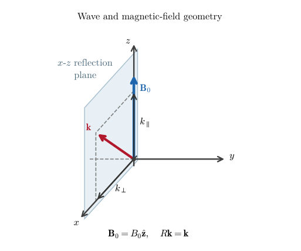
<figcaption class="paper-figure-caption"><b>Fig 1.</b> FIG. 1. Geometry of electromagnetic waves in a magnetized plasma and the reflection R = diag(1, −1, 1). The equilibrium magnetic field lies along z, and k = k⊥ˆx + k∥ˆz lies in the shaded x–z reflection plane. R reverses the y component while preserving the x and z components.</figcaption>
</figure>
<figure class="paper-figure-card">
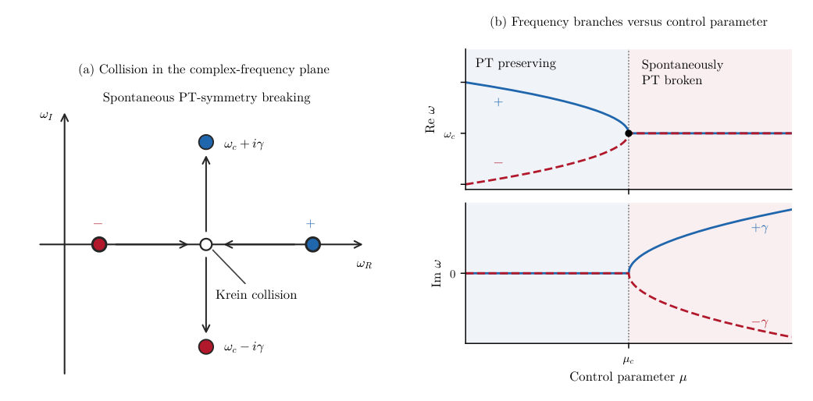
<figcaption class="paper-figure-caption"><b>Fig 2.</b> FIG. 2. Schematic Krein collision and spontaneous PT-symmetry breaking. (a) Trajectories in the complex-frequency plane. Real modes with opposite action signatures, indicated by + and −, approach the collision at ωc and emerge as a growing and decaying conjugate pair. Arrows indicate the direction of increasing control parameter, and the open circle marks the collision. (b) The corresponding frequency branches versus µ. Two real branches meet at µc; beyond the collision their real parts coincide and their imaginary parts are +γ and −γ. The curves illustrate the local square-root form in Eq. (85); all axes have arbitrary scales.</figcaption>
</figure>
<figure class="paper-figure-card">
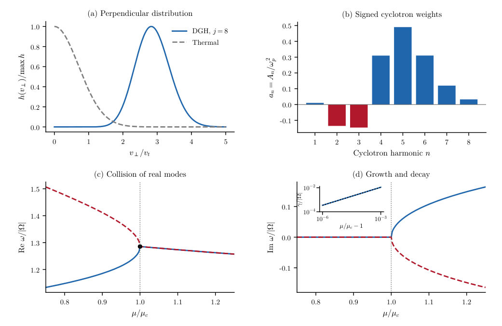
<figcaption class="paper-figure-caption"><b>Fig 3.</b> FIG. 3. Spontaneous PT breaking for the smooth DGH equilibrium in Eq. (88), with j = 8, k⊥vt/|Ω| = 4.5/ √</figcaption>
</figure>
<figure class="paper-figure-card">
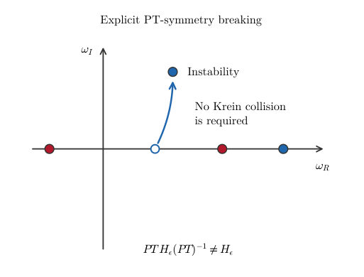
<figcaption class="paper-figure-caption"><b>Fig 4.</b> FIG. 4. Schematic destabilization by explicit PT-symmetry breaking, following the concept illustrated in Refs. 16 and 17. The open circle marks the initial real eigenfrequency of the mode that becomes unstable. The arrow shows its motion into the upper half-plane as an explicit PT symmetry break- ing perturbation of strength ϵ increases. Filled circles mark the frequencies of the perturbed operator Hϵ; the other three modes remain on the real axis. No Krein collision is required, and the frequencies need not form complex-conjugate pairs. Colors identify branches, and the axes have arbitrary scales.</figcaption>
</figure>

**Summary.** This work establishes PT symmetry as a fundamental structural principle governing plasma waves in magnetized, collisionless plasmas. By proving that the underlying kinetic Hamiltonian is PT-symmetric, the authors link spontaneous symmetry breaking to the onset of kinetic instabilities. This framework offers new tools for predicting plasma instabilities and understanding spectral topology.

**Why it may be interesting.** The application of PT-symmetry concepts, typically from quantum mechanics, to classical plasma wave dynamics provides a powerful structural principle for understanding stability and spectral topology in complex, non-Hermitian physical systems.

Detailed structure

**Main problem.** The paper investigates the parity-time (PT) symmetry of the susceptibility tensor and the underlying kinetic system in a homogeneous, collisionless, magnetized plasma.

**Main result.** The susceptibility exhibits PT symmetry, which is shown to be a reduced-response-space manifestation of the full Vlasov–Maxwell Hamiltonian being PT-symmetric. Spontaneous PT-symmetry breaking is fundamentally linked to kinetic instabilities occurring via Krein collisions.

**Method.** The analysis involves identifying parity (P) and time reversal (T) operators on the electromagnetic kinetic eigenmode space and applying the framework of PT-symmetric quantum mechanics to plasma response functions.

**Model / system.** The system is a homogeneous collisionless magnetized plasma with a stationary gyrotropic equilibrium. The theory is built upon the linearized Vlasov–Maxwell and Vlasov–Poisson systems.

**Key observables.** Susceptibility tensor $\chi(\omega, \mathbf{k})$, eigenfrequencies ($\omega$), and the Hamiltonian operator $\mathcal{H}_{\mathrm{VM}}$.

**Important parameters / regimes.** Plasma frequency ($\omega_{ps}$), cyclotron frequency ($\Omega_s$), and the wave vector $\mathbf{k}$.

**Assumptions / limitations.** The plasma is assumed to be collisionless, and the equilibrium is stationary and gyrotropic.

**Figures summary.** Figure 1 illustrates the geometry of the wave vector and the reflection operator $R$. Other figures schematically show the movement of eigenfrequencies across the real axis during explicit PT-symmetry breaking.

**Paper structure.** The paper first establishes the PT symmetry of the susceptibility tensor $\chi$ (Section III), and then extends this analysis to prove the PT symmetry of the full Hamiltonian operator $\mathcal{H}_{\mathrm{VM}}$ of the Vlasov–Maxwell system (Section IV).

Abstract

The susceptibility tensor of a homogeneous collisionless magnetized plasma possesses parity-time (PT) symmetry. For a stationary gyrotropic equilibrium, with the wave vector $\mathbf{k}$ and the equilibrium magnetic field $\mathbf{B}_0$ in the $x$--$z$ plane, the kinetic response satisfies $χ(ω^*,\mathbf{k})=Rχ(ω,\mathbf{k})^*R$, where $R=\operatorname{diag}(1,-1,1)$. We show that the susceptibility PT-symmetry is a reduced-response-space manifestation of PT symmetry of the underpinning kinetic system. We identify parity $P$ and time reversal $T$ on the electromagnetic kinetic eigenmode space and show that the Hamiltonian operator $\mathcal{H}_{\mathrm{VM}}$ of the linearized Vlasov--Maxwell system is PT-symmetric, satisfying $PT\mathcal{H}_{\mathrm{VM}}(PT)^{-1}=\mathcal{H}_{\mathrm{VM}}$. The PT symmetry of the homogeneous magnetized Vlasov--Poisson eigenproblem is also established. Many kinetic instabilities associated with nonmonotonic distributions, rings, loss cones, and resonant energetic-particle populations are fundamentally spontaneous PT-symmetry breaking, which is achieved through and only through Krein collisions. Three examples demonstrate distinct utilities of this analysis. Definite-sign cyclotron residues protect thermal Bernstein modes from spontaneous PT-symmetry breaking. The nonmonotonic Dory--Guest--Harris distribution permits sign-indefinite residues and Krein collisions, for which we derive an analytical instability threshold and growth rate. The recently discovered mode-pole resonance instability provides a distinct realization of spontaneous PT-symmetry breaking and illustrates how PT symmetry can guide the discovery of kinetic instabilities with applications to fusion energy. These results establish PT symmetry as a structural principle of plasma waves and instabilities and open new directions for studying spectral topology in kinetic plasmas.

[↑ back to top](#top)

### [Polynomial-Time Algorithms for Nuclear Tensor Norms and Multipartite Separability](http://arxiv.org/abs/2610.03637v1)

**Authors:** Martino Bernasconi, Giulio Malavolta  
**Type:** theory · **Category:** quantum information and computing · **PDF:** <https://arxiv.org/pdf/2610.03637v1>  
**Analysis basis:** full PDF text, analyzed in chunks

↔ Scroll figures horizontally

<figure class="paper-figure-card">
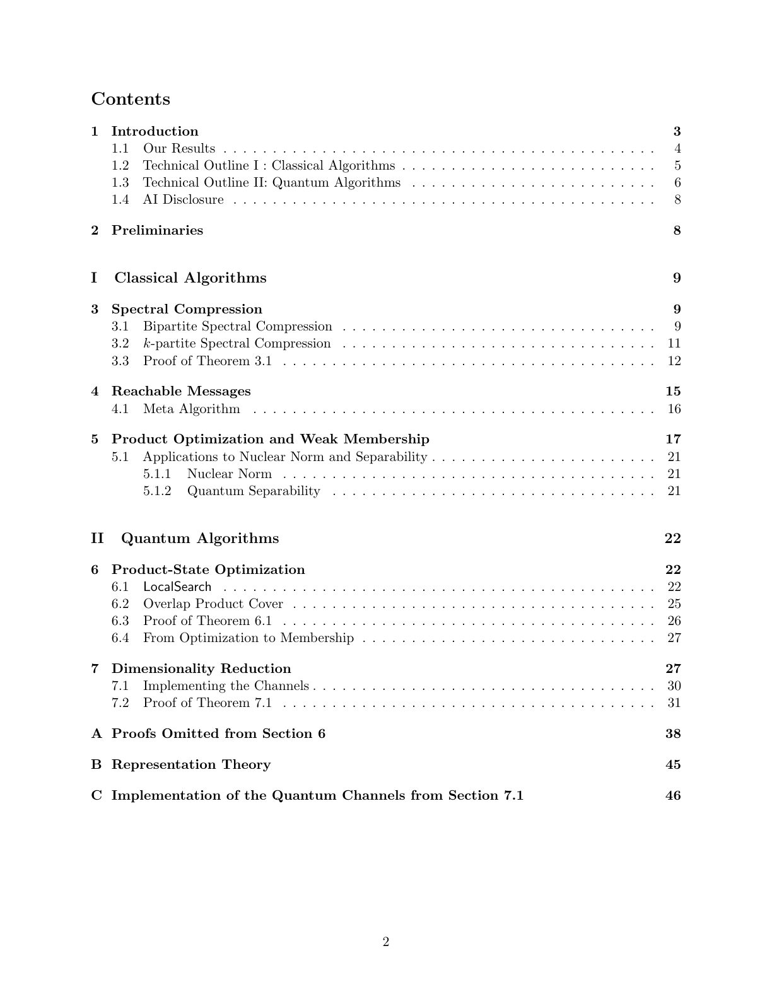
<figcaption class="paper-figure-caption"><b>Fig 1.</b> Low-resolution page preview, page 2</figcaption>
</figure>
<figure class="paper-figure-card">
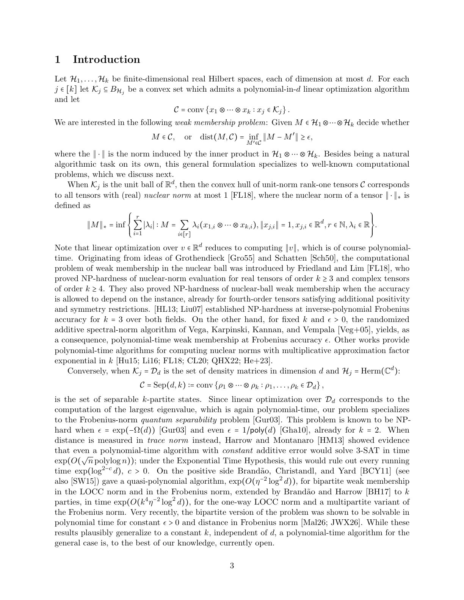
<figcaption class="paper-figure-caption"><b>Fig 2.</b> Low-resolution page preview, page 3</figcaption>
</figure>
<figure class="paper-figure-card">
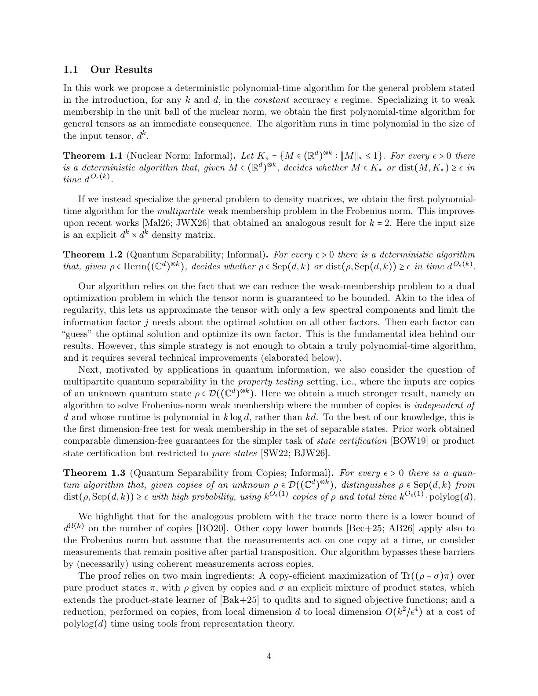
<figcaption class="paper-figure-caption"><b>Fig 3.</b> Low-resolution page preview, page 4</figcaption>
</figure>
<figure class="paper-figure-card">
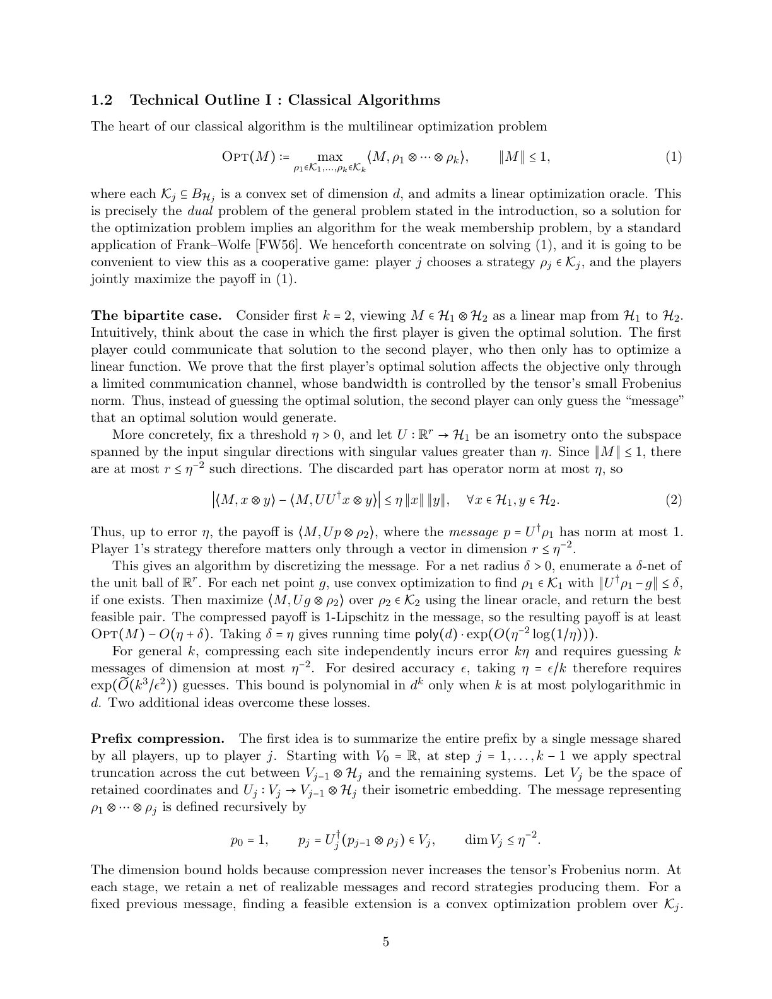
<figcaption class="paper-figure-caption"><b>Fig 4.</b> Low-resolution page preview, page 5</figcaption>
</figure>
<figure class="paper-figure-card">
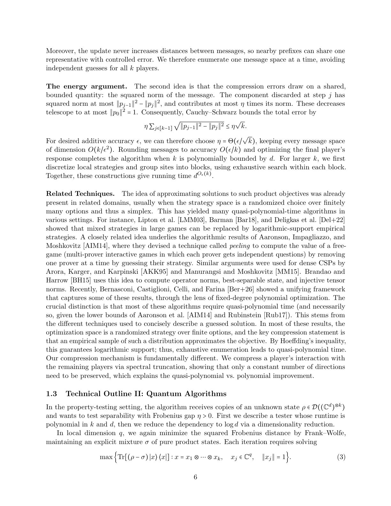
<figcaption class="paper-figure-caption"><b>Fig 5.</b> Low-resolution page preview, page 6</figcaption>
</figure>

**Summary.** This paper presents polynomial-time algorithms for determining if a high-order tensor belongs to the convex set defining quantum separability or the nuclear norm ball. It achieves this by framing the problem as a multiprover game and developing sophisticated classical and quantum techniques involving spectral compression. The results provide significant algorithmic advances for quantum information theory.

**Why it may be interesting.** The development of polynomial-time quantum algorithms for fundamental tasks like separability testing is crucial for advancing quantum characterization and resource theories in quantum information.

Detailed structure

**Main problem.** The paper develops efficient algorithms to solve multilinear optimization problems related to weak membership in the nuclear norm unit ball and multipartite quantum separability.

**Main result.** It achieves polynomial-time classical algorithms and a quantum algorithm requiring only polylogarithmic copies to test quantum separability in the Frobenius norm.

**Method.** The approach combines viewing tensor optimization as a cooperative multiprover game with recursive spectral compression techniques, leading to both classical and quantum algorithmic implementations.

**Model / system.** The focus is on high-order tensors $M$ whose factors are constrained by convex sets $K_j$, specifically relating to quantum states $
ho$ in the context of multipartite quantum separability.

**Key observables.** The primary observables are the distance to the separable set, $	ext{dist}(M, C)$, and the maximum value of the multilinear expectation $	ext{Opt}(M)$.

**Important parameters / regimes.** Key parameters include the number of subsystems $k$, the local dimension $d$, the approximation accuracy $\epsilon$, and the number of copies used in the quantum protocol.

**Assumptions / limitations.** The quantum algorithm relies on the ability to implement specific filtering channels and utilizes the concept of coherent measurements across multiple copies of the state.

**Figures summary.** Not specified in the provided notes.

**Paper structure.** The paper is structured by first outlining the general multilinear optimization problem, then detailing the classical algorithm using spectral compression, and finally presenting the quantum algorithm leveraging copies and dimensionality reduction techniques.

Abstract

We study a multilinear optimization problem for tensors with bounded Frobenius norm, where each of the $k$ local factors of dimension $d$ is chosen from a convex set. We give a deterministic algorithm running in time $d^{O(k)}$ for constant additive approximations. As applications, we obtain the first polynomial-time algorithms at constant accuracy for weak membership in the nuclear-norm unit ball of high-order tensors and for multipartite quantum separability in Frobenius norm. Our approach views tensor optimization as a cooperative multiprover game and combines this perspective with a recursive spectral compression procedure. We then show that related ideas admit a quantum implementation when the input state is given through copies, rather than an explicit classical description. In these settings we obtain an algorithm to solve Frobenius-norm separability testing using $\text{poly}(k)$ copies and $\text{poly}(k\log d)$ time.

[↑ back to top](#top)

### [Quantum algorithms for orthogonal polynomial transforms](http://arxiv.org/abs/2610.03581v1)

**Authors:** Anupam Prakash, Shree Hari Sureshbabu, Dylan Herman, Shouvanik Chakrabarti  
**Type:** theory · **Category:** quantum information and computing · **PDF:** <https://arxiv.org/pdf/2610.03581v1>  
**Analysis basis:** full PDF text, analyzed in chunks

↔ Scroll figures horizontally

<figure class="paper-figure-card">
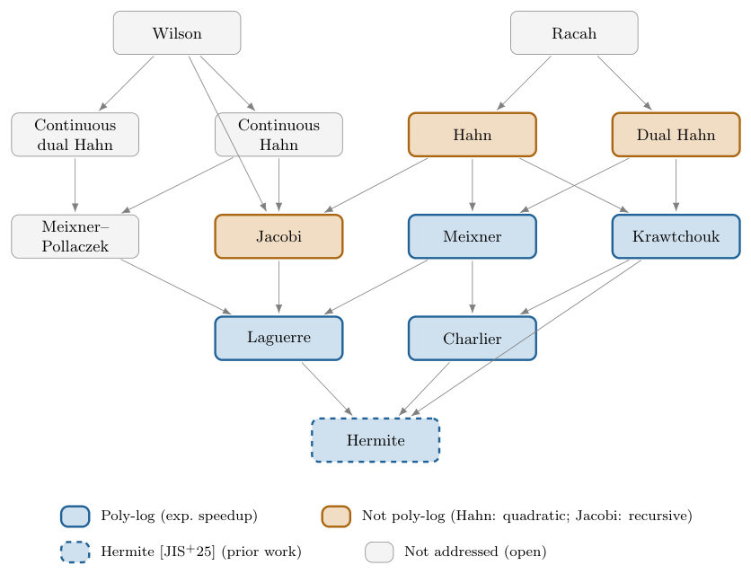
<figcaption class="paper-figure-caption"><b>Fig 1.</b> Figure 1: The Askey scheme of hypergeometric orthogonal polynomials, organized top-to-bottom by decreasing level; arrows denote limit transitions between families. Blue families admit poly- logarithmic QOPTs with exponential speedups (Charlier, Krawtchouk, Meixner, Laguerre). Orange families are realized here but are not poly-logarithmic: the Hahn transform attains a quadratic speedup over the naive O(N2) implementation, and the Jacobi transform can be implemented using the Hahn in a restricted setting. The Hermite transform at the base is the foundational QOPT of [JIS+25] on which the digital implementations are built.</figcaption>
</figure>

**Summary.** This paper develops quantum algorithms for orthogonal polynomial transforms (QOPTs) by exploiting deep connections between these transforms and the structure of Gaussian quantum optical gates. It achieves polylogarithmic time complexity for several key polynomial families, offering significant computational speedups over classical or naive quantum implementations.

**Why it may be interesting.** This work directly addresses the computational complexity of fundamental mathematical transforms, providing quantum circuit blueprints that could accelerate quantum simulations or quantum signal processing tasks.

Detailed structure

**Main problem.** The paper focuses on developing highly efficient quantum algorithms for performing orthogonal polynomial transforms (QOPTs). These transforms are fundamental mathematical tools in quantum signal processing and quantum information theory.

**Main result.** The authors provide new QOPTs for several families in the Askey scheme, achieving time complexities that are polylogarithmic in the system size, representing significant speedups over naive implementations.

**Method.** The efficiency is achieved by mapping the polynomial transforms to the action of Gaussian quantum optical gates (like those generated by $SU(2)$ and $SU(1,1)$ groups) and utilizing advanced quantum circuit compilation techniques.

**Model / system.** The underlying model involves mapping a superposition of basis states to a superposition of orthonormal polynomial states. The analysis connects these transforms to the structure of the Askey scheme, which organizes various orthogonal polynomial families.

**Key observables.** The primary observables are the transformation coefficients and the time complexity of the quantum circuit required to execute the transform.

**Important parameters / regimes.** The key parameters include the grid size $N$, the error tolerance $\epsilon$, and the specific parameters ($\alpha, eta, 
u$) defining the polynomial family (e.g., Charlier, Laguerre).

**Assumptions / limitations.** The efficiency relies on the existence of a second-order differential or difference operator governing the polynomials and the ability to decompose the required evolution into a product of elementary Gaussian gates.

**Figures summary.** Figure 1 illustrates the Askey scheme, showing that polynomial families admitting poly-logarithmic QOPTs are those associated with certain group structures.

**Paper structure.** The paper progresses by defining the QOPT, establishing the connection to Gaussian quantum optics via the Askey scheme, deriving specific fast algorithms for several families (Charlier, Meixner, Krawtchouk, Laguerre), and finally providing detailed mathematical derivations confirming the speedups.

Abstract

A quantum orthogonal polynomial transform (QOPT) is an algorithmic primitive that maps a superposition of standard basis states $\sum_k α_{k} \ket{k}$ coherently to a basis of normalized univariate polynomials orthogonal with respect to a probability measure $μ(x)$. We provide new discrete and continuous QOPTs for polynomial families in the Askey scheme extending the results for the quantum Hermite transform (Jain et al., STOC'26). Our efficient QOPT algorithms require time $O(\text{polylog}(N, 1/ε))$, where $N$ is the grid size and $ε$ is the error, for the discrete Charlier, Meixner and Krawtchouk transforms and for the integer-order Laguerre transform in the continuous setting. The efficient QOPTs are obtained by uncovering the links between Askey scheme polynomials and Gaussian quantum optical gates and developing a compilation framework for $SU(2)$ and $SU(1,1)$ optical gates on Cartesian grids extending the framework developed by Iyer et al. (arXiv:2602.15180). Further, we reduce the continuous Jacobi transform to the discrete Hahn transform and provide an $O\!\left(N\operatorname{polylog}((N+α+β+1)/ε)\right)$-time Hahn transform, a quadratic speedup over the naive implementation. This is based on a more efficient compilation of the Clebsch--Gordan transform for coupling $\mathrm{SU}(2)$ representations with spins $(j_{1}, j_{2})$. Finally, we develop a new framework for Laguerre transforms for all orders $ν>0$ by fast-forwarding the corresponding radial oscillator using a 3-term chirp decomposition and an efficient algorithm for the Quantum Hankel Transform on a logarithmic grid.

[↑ back to top](#top)

### [Quantum code parameters, checkable by a certificate of provable size](http://arxiv.org/abs/2610.03214v1)

**Authors:** Shuoming An, Fusheng Yang  
**Type:** theory · **Category:** quantum information and computing · **PDF:** <https://arxiv.org/pdf/2610.03214v1>  
**Analysis basis:** full PDF text, analyzed in chunks

↔ Scroll figures horizontally

<figure class="paper-figure-card">
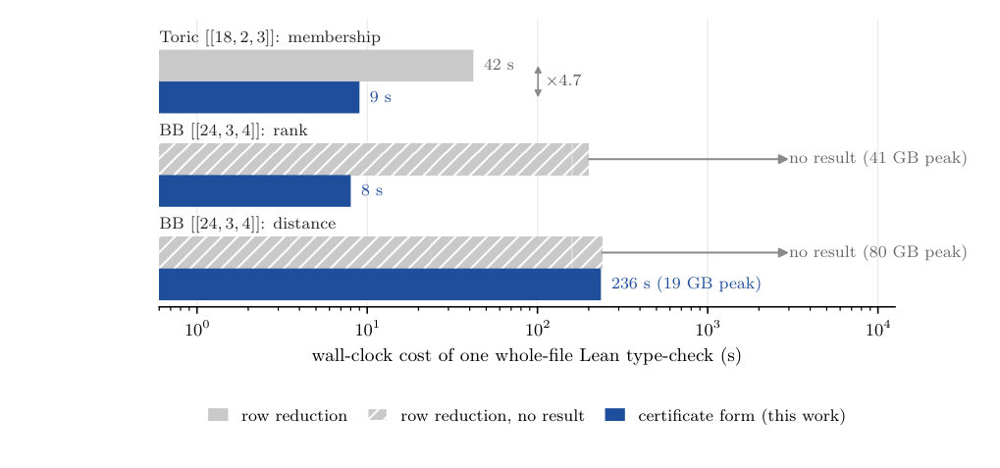
<figcaption class="paper-figure-caption"><b>Fig 1.</b> FIG. 1. The device decides the cost. Row 1 changes the certificate form; rows 2 and 3 hold it fixed and change the elimination that computes it. Each row is one whole-file Lean type-check of the module that carries the assertion, done two ways: the device tried first, and the device this work supplies. The horizontal axis is that time in seconds on a logarithmic scale, so bar length is not proportional to time. Row 1 decides whether a light logical operator in a toric code escapes its checks: by row reduction, or by a dual witness, a second vector that pairs to one with the candidate. Rows 2 and 3 read the rank and the distance lower bound of the gauged code [[24, 3, 4]], a bicycle code...</figcaption>
</figure>
<figure class="paper-figure-card">
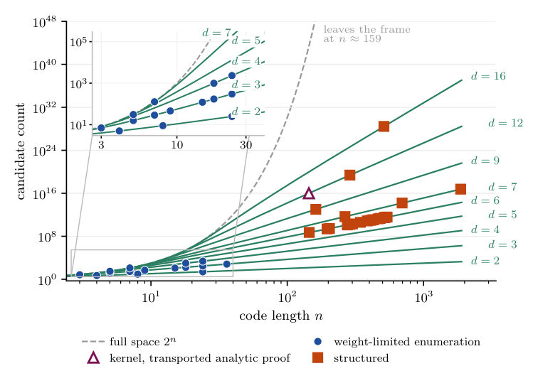
<figcaption class="paper-figure-caption"><b>Fig 2.</b> FIG. 2. The certificate stays polynomial while the space searched is exponential. Solid curves: the weight-limited certificate P</figcaption>
</figure>

**Summary.** This paper introduces a novel method to formally verify the parameters of quantum error-correcting codes by replacing computationally intractable checks with small, verifiable 'certificates'. By leveraging proof assistants, the authors show that the distance and other parameters can be proven correct with a certificate whose size is polynomial in the code length, making the concept of 'checkable' a reality rather than just a belief.

**Why it may be interesting.** This work provides a powerful, formal mathematical tool for verifying fundamental parameters of quantum codes, which is crucial for building and analyzing fault-tolerant quantum computation architectures.

Detailed structure

**Main problem.** The core problem is determining if the parameters of quantum error-correcting codes, $[[n, k, d]]$, can be checked uniformly across all codes using a certificate of provable, polynomial size.

**Main result.** The authors demonstrate that checking code parameters can be made uniform by moving the computational burden from the code structure itself to a short, verifiable 'certificate' object.

**Method.** They utilize formal proof assistants (Lean) to verify the correctness of these certificates, reducing complex checks (like membership in a row space) to simple, verifiable operations like matrix-vector products and inner products.

**Model / system.** The work focuses on quantum error-correcting codes, defined by physical qubits ($n$), logical qubits ($k$), and distance ($d$). These codes are mathematically analyzed using parity-check matrices over GF(2).

**Key observables.** Code parameters $[[n, k, d]]$, the distance $d$ (minimum weight of a logical operator), and the size of the required certificate.

**Important parameters / regimes.** The certificate size is shown to be polynomial in $n$ for a fixed distance $d$. Specific examples include the 18-qubit toric code.

**Assumptions / limitations.** The proof relies entirely on the foundational axioms of the Lean proof assistant, and the method is presented as a general principle applicable wherever a computation currently ends in an external solver.

**Figures summary.** Figures compare the time cost of different checking methods (e.g., row reduction vs. certificate form) for code properties, and plots show the growth rate of the required certificate size.

**Paper structure.** The paper establishes the open problem, proposes the certificate-based verification method, details the reduction of complex checks to simple algebraic operations, and provides concrete computational speedups and parameter sets as evidence.

Abstract

A code is described by three numbers: its physical qubits, its logical qubits, and the smallest error it cannot detect, counted in qubits. The first two are linear algebra. The third, the distance, is an optimum over an exponentially large set, read off a solver whose answer carries no certificate. Whether a code's parameters can be checked uniformly across codes, with a certificate of proved size, is open. Here we show that they can, by moving the unit of work from the code to a \emph{certificate}, a short object, either a list, a pairing or a symbolic instance, whose correctness the kernel of the \Lean\ proof assistant decides by computation. The kernel is the small core that checks each step. The certificate's size is itself a theorem: its enumeration form lists the vectors of weight below the distance $d$, $\sum_{j<d}\binom{n}{j}$ of them, a polynomial in the code's length $n$ at fixed distance $d$. No bound uniform over codes in both $n$ and $d$ is smaller. For product families the certificate is smaller still, the bound being proved once, symbolically. Deciding that a vector lies outside the row space of the check matrix, the set of sums of its rows, becomes one matrix-vector product and one inner product. On an eighteen-qubit toric code, a surface code closed into a torus, the whole-file check of that decision falls from 42\,s to 9\,s. Eleven code families and thirty-nine parameter sets follow, the widest at 1872 qubits. Nothing beyond the three standard axioms of \Lean's logic is trusted, though the generator that writes a code's checks stops at twenty qubits, and the lower bound for the 144-qubit code is imported rather than proved here. A distance becomes checkable rather than believed, and the same move applies wherever else a computation ends in a solver.

[↑ back to top](#top)

### [Quantum Simulation on Riemannian Manifolds](http://arxiv.org/abs/2610.03673v1)

**Authors:** Dylan Herman, Jacob Watkins, Guneykan Ozgul, Jiayu Shen, Brandon Augustino, Junhyung Lyle Kim, Shouvanik Chakrabarti  
**Type:** theory · **Category:** quantum information and computing · **PDF:** <https://arxiv.org/pdf/2610.03673v1>  
**Analysis basis:** full PDF text, analyzed in chunks

↔ Scroll figures horizontally

<figure class="paper-figure-card">
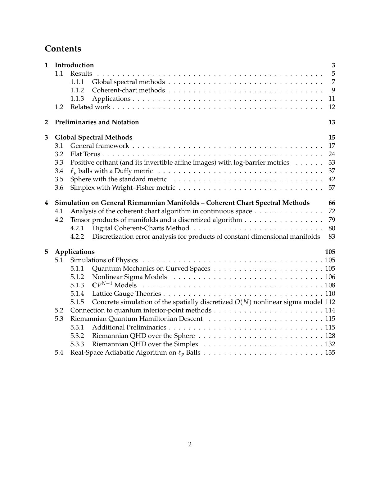
<figcaption class="paper-figure-caption"><b>Fig 1.</b> Low-resolution page preview, page 2</figcaption>
</figure>
<figure class="paper-figure-card">
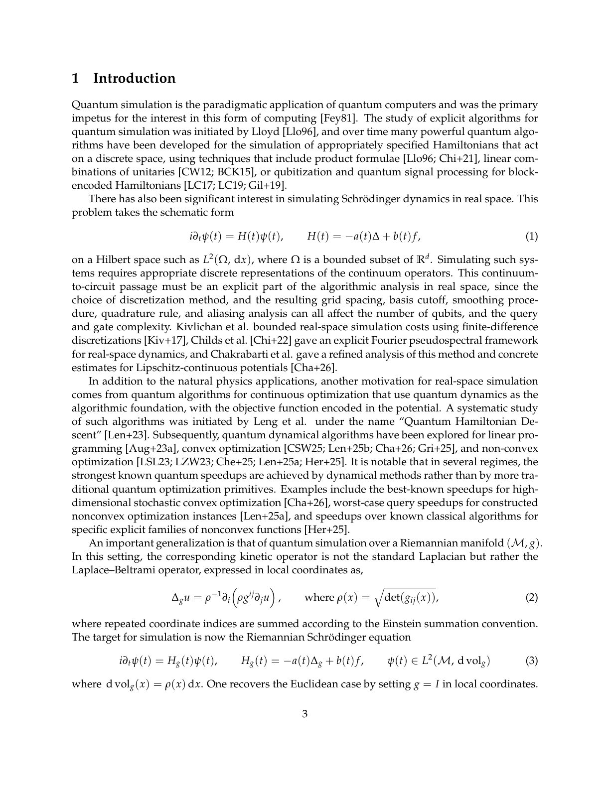
<figcaption class="paper-figure-caption"><b>Fig 2.</b> Low-resolution page preview, page 3</figcaption>
</figure>
<figure class="paper-figure-card">
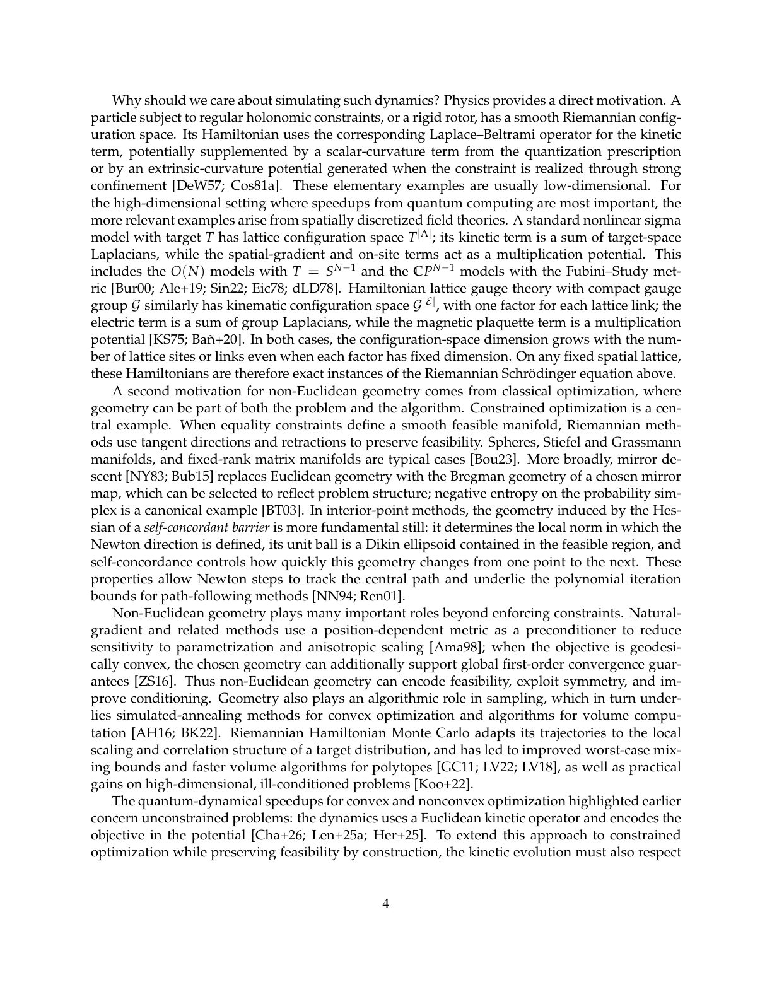
<figcaption class="paper-figure-caption"><b>Fig 3.</b> Low-resolution page preview, page 4</figcaption>
</figure>
<figure class="paper-figure-card">
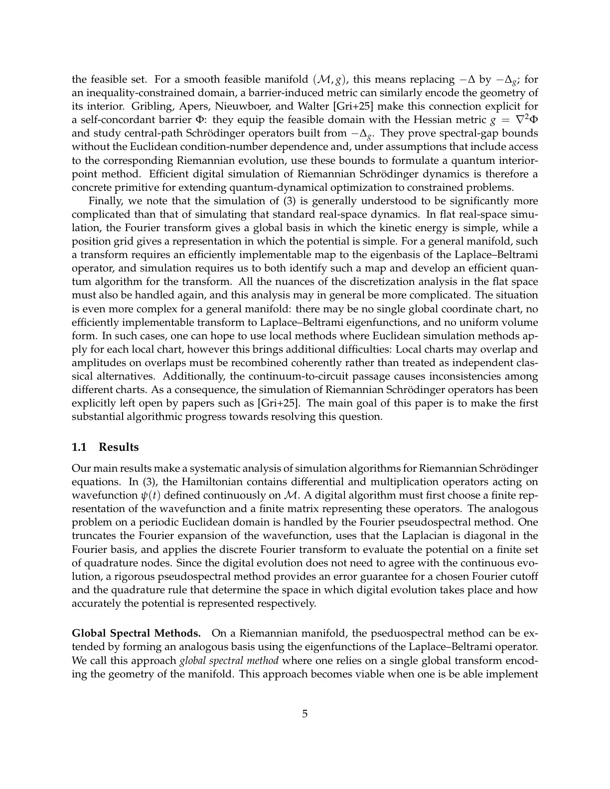
<figcaption class="paper-figure-caption"><b>Fig 4.</b> Low-resolution page preview, page 5</figcaption>
</figure>
<figure class="paper-figure-card">
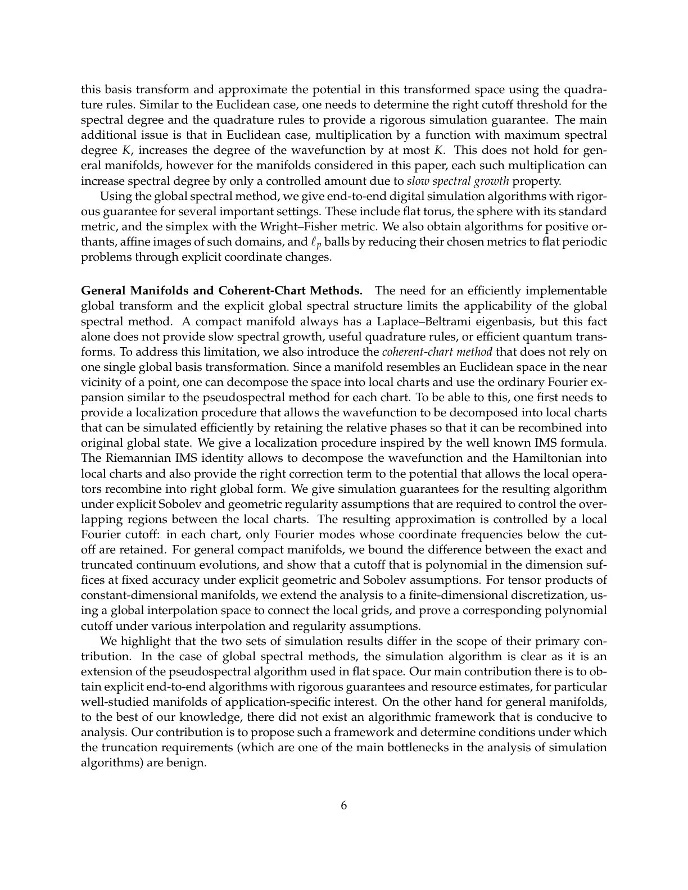
<figcaption class="paper-figure-caption"><b>Fig 5.</b> Low-resolution page preview, page 6</figcaption>
</figure>

**Summary.** This paper develops quantum algorithms to simulate quantum dynamics governed by the Schrödinger equation on Riemannian manifolds. It introduces two primary techniques—a global spectral method and a local, chart-based coherent simulation—to handle the complex geometry. The work demonstrates the feasibility of these methods for simulating physical models ranging from constrained optimization problems to nonlinear field theories.

**Why it may be interesting.** This work directly addresses the computational challenge of simulating quantum dynamics on curved spaces, which is crucial for modeling physical systems whose configuration space is inherently Riemannian (e.g., particle motion on curved surfaces or field theories on curved backgrounds).

Detailed structure

**Main problem.** Developing efficient quantum algorithms to simulate the time evolution governed by the Schrödinger equation on a Riemannian manifold.

**Main result.** The authors present two main algorithmic approaches: a global spectral method for specific manifolds and a coherent simulation of local spectral methods applicable to any compact manifold.

**Method.** The methods involve spectral decomposition using the Laplace-Beltrami operator's eigenbasis (global method) or decomposing the manifold into overlapping local charts and coherently recombining local simulations (coherent-chart method).

**Model / system.** The system is described by the Riemannian Schrödinger equation, $i\partial_t\psi = H_g\psi$, where the Hamiltonian includes the Laplace-Beltrami operator ($\Delta_g$) derived from the manifold metric $g$. Applications include optimization on curved spaces and simulating field theories like the nonlinear sigma model.

**Key observables.** The time evolution of the quantum state $\psi(t)$, and convergence/error guarantees related to the spectral cutoff used in the simulation.

**Important parameters / regimes.** The choice of manifold (e.g., sphere, torus, simplex), the metric tensor $g$, and the spectral cutoff parameter.

**Assumptions / limitations.** The global method requires an efficient transform to the eigenbasis, while the coherent-chart method relies on deriving conditions for polynomial spectral cutoffs in the continuum limit.

**Paper structure.** The paper is structured around presenting and analyzing two distinct quantum simulation algorithms: the global spectral method and the coherent-chart method. It then applies these methods to specific physical problems, namely quantum optimization (e.g., Quantum Hamiltonian Descent) and physical field theory simulations.

Abstract

We investigate algorithms for the quantum simulation of the Schrödinger equation on a Riemannian manifold, where the kinetic operator is defined by the Laplace--Beltrami operator corresponding to the metric. Our first algorithms are based on a global spectral method based on the identification of an efficient transform to the eigenbasis of the Laplace--Beltrami operator. We use this method to provide explicit, efficient, quantum simulation algorithms for the Riemannian Schrödinger equation on tori and spheres with their standard metrics, simplices with the Wright--Fisher metric, truncated positive orthants and their invertible affine images with the log-barrier Hessian metric, and $\ell_p$ balls with a metric induced by the Duffy map. Our second algorithm is based on a coherent simulation of local spectral methods on multiple charts, and is in principle applicable to any compact manifold. We first analyze this algorithm in the continuum and derive conditions under which a polynomial spectral cutoff suffices. We also provide a discretization analysis of a polynomial spectral cutoff for tensor-products of constant-dimensional manifolds. Finally, we consider applications of these methods to optimization and physical simulation. For optimization, we provide results including a generalization and convergence analysis of Quantum Hamiltonian Descent for geodesically convex functions that leads to explicit algorithms on the sphere and simplex, and a Riemannian generalization of the Real-Space Adiabatic Algorithm. For physical simulation, we show that our algorithms can simulate certain spatially discretized field theories, including a variant of the nonlinear sigma model.

[↑ back to top](#top)

### [Quantum utility routing in continuous-variable QKD networks with trusted and untrusted relays](http://arxiv.org/abs/2610.03382v1)

**Authors:** Farsad Ahmad, Aeysha Khalique  
**Type:** theory · **Category:** quantum information and computing · **PDF:** <https://arxiv.org/pdf/2610.03382v1>  
**Analysis basis:** full PDF text, analyzed in chunks

↔ Scroll figures horizontally

<figure class="paper-figure-card">
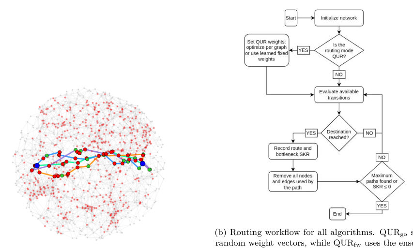
<figcaption class="paper-figure-caption"><b>Fig 1.</b> Figure 1: Simulated network and routing procedure. (a) Example Waxman network at degree threshold D = 8, when almost 53% of the nodes are untrusted. (b) Workflow used by all routing methods.</figcaption>
</figure>
<figure class="paper-figure-card">
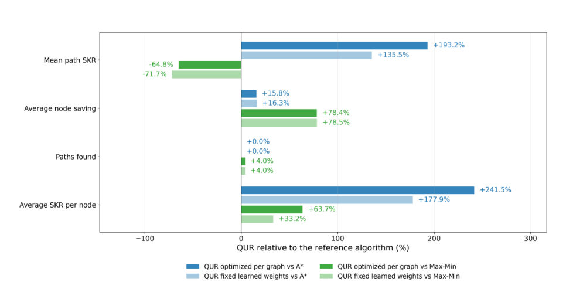
<figcaption class="paper-figure-caption"><b>Fig 2.</b> Figure 2: Overall comparison at the default network setting. Bars report QURgo and QURfw relative to A* or Max–Min. Average node saving is the mean of internal and unique node saving. Average SKR per node is the mean of relative changes in the two efficiency measures defined in Eqs. 4 and 5. Positive values favor the corresponding QUR mode.</figcaption>
</figure>
<figure class="paper-figure-card">

<figcaption class="paper-figure-caption"><b>Fig 3.</b> Figure 2 reveals three distinct routing regimes. A* preferentially selects geometrically short routes, but these routes can contain weak quantum transitions and therefore provide relatively low bottleneck SKR. Max–Min takes the opposite approach, it maximizes the weakest transition along the route, but does this at the cost of substantially larger node use. QUR occupies the intermediate operating regime, improving the bottleneck SKR of the short routes favored by A* while avoiding the large resource requirement associated with Max–Min.</figcaption>
</figure>
<figure class="paper-figure-card">
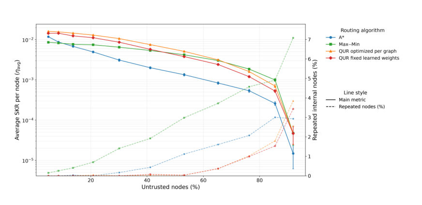
<figcaption class="paper-figure-caption"><b>Fig 4.</b> Figure 3: Average SKR efficiency and node reuse as functions of the untrusted node percentage. Solid curves show ηavg from Eq. 6. Dashed curves show repeated nodes as a percentage of all nodes.</figcaption>
</figure>
<figure class="paper-figure-card">
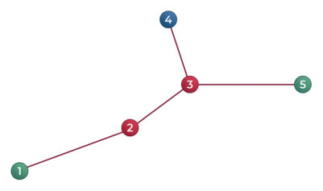
<figcaption class="paper-figure-caption"><b>Fig 5.</b> Figure 4: Example of within-route node reuse. Green nodes are trusted and red nodes are untrusted. The path constructed from the route is 1→2→3→4→3→5, in which node 3 appears in two separate transitions i.e. 1→2→3 →4 and 4→3→5.</figcaption>
</figure>

**Summary.** This paper introduces Quantum Utility Routing (QUR), a novel weighted framework designed to optimize path selection in CV-QKD networks. QUR balances the need for high secret key rates against the cost of network resources, accounting for both trusted and untrusted relays. The results show that QUR provides a superior trade-off compared to existing routing methods, demonstrating a practical approach to designing robust quantum communication infrastructure.

**Why it may be interesting.** This work is highly relevant as it applies advanced graph theory and optimization techniques to the practical engineering challenges of quantum network deployment, specifically optimizing resource allocation alongside quantum security guarantees.

Detailed structure

**Main problem.** The paper addresses the challenge of developing an optimal routing strategy for Continuous-Variable Quantum Key Distribution (CV-QKD) networks that must balance cryptographic key generation rates, network resource usage, and the varying trust levels of intermediate relays.

**Main result.** The proposed Quantum Utility Routing (QUR) framework significantly improves the mean path Secret Key Rate (SKR) compared to geometric routing (A*) while consuming fewer network resources than bottleneck-focused methods (Max-Min).

**Method.** QUR is a weighted routing framework that minimizes a composite cost function incorporating SKR, distance, relay usage, and hop count. It compares its performance against A* and Max-Min benchmarks.

**Model / system.** The system models CV-QKD networks built on a Waxman random graph, featuring a mix of trusted point-to-point links and untrusted relays that perform CV Bell measurements.

**Key observables.** Secret Key Rate (SKR), which is the primary cryptographic metric; and network resource consumption metrics like distance and hop count.

**Important parameters / regimes.** The weight vector (w) controlling the trade-off between cryptographic performance and resource cost; the degree threshold (D) defining the fraction of untrusted nodes.

**Assumptions / limitations.** The analysis relies on a composable finite-size security framework for Gaussian quantum networks, assuming the network topology and link parameters are known.

**Figures summary.** Figure 1 illustrates the network setup (Waxman graph) showing source, destination, and untrusted nodes, and a workflow comparing the pathfinding mechanisms of A*, Max-Min, QURgo, and QURfw.

**Paper structure.** The paper first establishes the physical model and key rate calculation using Gaussian quantum information theory. It then introduces the multi-objective QUR framework, defining the cost function and variants ($	ext{QUR}_{go}, 	ext{QUR}_{fw}$). Finally, it benchmarks QUR against established routing algorithms using network simulations.

Abstract

Continuous-variable quantum key distribution (CV-QKD) networks require routing strategies that account simultaneously for secret key generation, relay trust and finite network resources. We introduce Quantum Utility Routing (QUR), a weighted routing framework for networks combining trusted point-to-point links with untrusted CV Bell measurement relays. Transition level composable finite size secret key rates (SKRs) are incorporated directly into the route search, allowing QUR to balance bottleneck SKR against route geometry and resource use. We consider graph optimized QUR (QUR$_{\mathrm{go}}$) and a fixed weight implementation (QUR$_{\mathrm{fw}}$) that uses machine learning to avoid repeated graph specific weight optimization, and benchmark both against A* and Max--Min routing. At the default network configuration, QUR$_{\mathrm{go}}$ and QUR$_{\mathrm{fw}}$ improve the mean path SKR relative to A* while requiring substantially fewer network resources than Max--Min. The framework also maintains secure connectivity over a broad range of trusted node availability by exploiting untrusted infrastructure as measurement relays. These results demonstrate that routing in CV-QKD networks can be treated as a configurable trade off between cryptographic performance and network resource consumption.

[↑ back to top](#top)

### [Random Quantum LDPC Codes Approaching the Gilbert-Varshamov Bound](http://arxiv.org/abs/2610.02648v1)

**Authors:** Tushant Mittal, Shashank Srivastava, Madhur Tulsiani, Mary Wootters  
**Type:** theory · **Category:** quantum information and computing · **PDF:** <https://arxiv.org/pdf/2610.02648v1>  
**Analysis basis:** full PDF text, analyzed in chunks

↔ Scroll figures horizontally

<figure class="paper-figure-card">
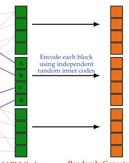
<figcaption class="paper-figure-caption"><b>Fig 1.</b> Figure 1: A schema of our random model.</figcaption>
</figure>

**Summary.** This paper constructs an infinite family of Quantum Low-Density Parity-Check (QLDPC) codes that provably approach the quantum Gilbert-Varshamov bound. By addressing the challenge of code degeneracy, the authors show that these codes can match the performance of random stabilizer codes across various quantum channels. This advances the practical design of high-rate, good-distance quantum error-correcting codes.

**Why it may be interesting.** This work provides concrete, constructive methods for designing quantum error-correcting codes (QEC) that approach fundamental theoretical limits (like the GV bound), which is central to fault-tolerant quantum computation.

Detailed structure

**Main problem.** To prove that Quantum Low-Density Parity-Check (QLDPC) codes can achieve the quantum Gilbert-Varshamov (GV) bound, and to show that random QLDPC ensembles match the performance of random stabilizer codes on various quantum channels.

**Main result.** The authors construct an ensemble of QLDPC codes such that a random code approaches the quantum GV bound with high probability, matching the performance of random stabilizer codes for channels like the erasure and depolarizing channels.

**Method.** The construction involves combining low-degeneracy QLDPC codes (obtained via the Alon, Edmonds, and Luby distance amplification procedure) with random inner codes via concatenation, viewed as a quantum analogue of Thommesen's construction.

**Model / system.** The work focuses on quantum stabilizer codes, specifically QLDPC codes defined by row-sparse parity-check matrices. The analysis is conducted using the linear-algebraic formulation of stabilizer spaces.

**Key observables.** Rate ($R$), relative distance ($\delta$), and the quantum Gilbert-Varshamov (GV) bound ($\delta_{GV}(p, R)$).

**Important parameters / regimes.** The alphabet size $p$, the degeneracy parameter $\eta$, and the error tolerance $\epsilon$.

**Assumptions / limitations.** The construction relies on the ability to control the degeneracy of the QLDPC codes using the AEL procedure, which is necessary because QLDPC codes are inherently degenerate.

**Figures summary.** Figure 1 illustrates the random model schema: Base Code $
ightarrow$ "AEL" Code $
ightarrow$ Randomly Concatenated Code.

**Paper structure.** The paper develops by first establishing the need to control degeneracy, then detailing the AEL construction to achieve low-degeneracy outer codes approaching the quantum Singleton bound, and finally combining this with random inner codes to prove the overall approach to the GV bound.

Abstract

We show that for any $R,ε>0$ and any prime $p\geq 2$, there exists an infinite family of $p$-ary quantum low-density parity-check (QLDPC) codes, rate $R$, checks of weight $O_ε(1)$, and normalized distance at least $δ_{\mathrm{GV}}(p,R)-ε$. Here, $δ_{\mathrm{GV}}(p,R)$ denotes the quantum Gilbert-Varshamov (GV) bound for $p$-ary stabilizer codes.   In fact, we construct an ensemble of such QLDPC codes, such that a random code from this ensemble is close to the GV bound with high probability. Moreover, this ensemble matches the performance of random stabilizer codes on several quantum channels. Specifically, it approaches the quantum capacity of the erasure channel and the hashing bound for memoryless Pauli channels, including the depolarizing channel.   A significant challenge in working with QLDPC codes is that they are necessarily \emph{degenerate}, i.e., contain many low-weight stabilizers. A key contribution of our work is a construction of QLDPC codes with quantitative control on their degeneracy. These codes are obtained by combining known constructions of asymptotically good QLDPC codes with the expander-based distance amplification procedure of Alon, Edmonds, and Luby [FOCS'95].   Our random ensemble is constructed by starting with these low-degeneracy QLDPC codes near the quantum Singleton bound and concatenating each coordinate with a random inner code. This can be viewed as a quantum analogue of Thommesen's construction, and as an LDPC version of a result of Ouyang, with an appropriately designed outer code.

[↑ back to top](#top)

### [Resource Theory of Aquaternionicity: Every Pure State Is a Replicable Resource for Exact Simulation of Arbitrary Quantum Operations](http://arxiv.org/abs/2610.02942v1)

**Authors:** Hayato Arai, Yasuaki Nakayama  
**Type:** theory · **Category:** quantum information and computing · **PDF:** <https://arxiv.org/pdf/2610.02942v1>  
**Analysis basis:** full PDF text, analyzed in chunks

↔ Scroll figures horizontally

<figure class="paper-figure-card">
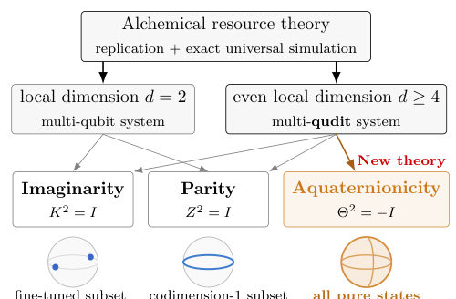
<figcaption class="paper-figure-caption"><b>Fig 1.</b> FIG. 1. Selected landscape for alchemical resource theories. For multi-qubit systems, the inverse problem yields imaginar- ity and parity asymmetry. For even local dimension d ≥4, aquaternionicity emerges as an additional quaternionic solu- tion, for which every pure state is alchemical.</figcaption>
</figure>

**Summary.** This paper introduces 'aquaternionicity' as a novel, highly robust resource theory for quantum qudits. It proves that this theory is extremal because every pure state is a resource and it maximizes the dimension of the mixing set. This robustness allows for recalibration-free exact quantum simulation, significantly outperforming existing theories under structured noise.

**Why it may be interesting.** This work provides a rigorous, algebraic framework for quantifying resource robustness, showing how specific symmetries (like the quaternionic structure) lead to superior performance in quantum information tasks like simulation under noise.

Detailed structure

**Main problem.** To characterize 'alchemical resource theories'—resource theories where a nonfree state is exactly replicable by free operations and enables the exact simulation of arbitrary quantum operations.

**Main result.** Aquaternionicity, based on a quaternionic structure, is shown to be extremal, saturating a universal bound ($\dim M_g = 2d-4$) and enabling recalibration-free exact simulation under structured noise.

**Method.** The authors define and compare resource theories (Imaginarity, Parity asymmetry, Aquaternionicity) using algebraic constraints ($\Theta^2=-I$) and analyze the dimension of the admissible pure-mixing set and noise-invariant supports.

**Model / system.** The study uses quantum qudits of even dimension $d \geq 4$ and compares three resource theories defined by different symmetries (Imaginarity, Parity asymmetry, Aquaternionicity). The analysis is applied to structured noise models like basis dephasing and amplitude damping.

**Key observables.** Dimension of the admissible pure-mixing set ($\dim M_g$), and the dimension of the noise-invariant alchemical support ($r_
u$).

**Important parameters / regimes.** Even dimension $d=2n \geq 4$; the antiunitary operator $\Theta$ satisfying $\Theta^2=-I$.

**Assumptions / limitations.** The advantage demonstrated is specific to structured noise classes and does not imply universal dominance over all arbitrary CPTP noise.

**Figures summary.** Table I compares the three theories across several properties, showing aquaternionicity saturates the dimension bound. Table III compares the noise-invariant support dimensions ($r_{	ext{Im}}, r_{	ext{Par}}, r_{	ext{Aq}}$) for two specific noise models.

**Paper structure.** The paper first establishes the concept of alchemical resource theories. It then introduces aquaternionicity for $d \geq 4$, proving its extremal properties. Finally, it demonstrates the practical advantage of aquaternionicity by analyzing its robustness against specific structured noise channels compared to other theories.

Abstract

An alchemical resource theory admits a nonfree state that can be exactly replicated by free operations and whose finitely many copies enable exact simulation of arbitrary quantum instruments. The only known nontrivial examples, imaginarity and parity asymmetry, exhaust the qubit case (arXiv:2609.12988) and exhibit an all-or-nothing property: any nonmaximal resource exactly simulates only free unitaries. We introduce aquaternionicity for even-dimensional qudits $d\ge4$, based on a quaternionic structure represented by an antiunitary $Θ$ with $Θ^2=-I$. It is extremal in two senses: every pure state is alchemical, and alchemicality is maximally abundant under mixing. Within this framework, for any nontrivial $d$-dimensional resource theory and pure alchemical state $g$, the admissible pure-mixing set satisfies $\dim\mathcal M_g\le 2d-4,$ which aquaternionicity saturates for every pure state. Conversely, these two extremal properties characterize the quaternionic structure. Because every pure state is alchemical, the initial resource can be chosen to match the known noise structure. Moreover, when the noisy resource states remain within a common isotropic subspace, the same free processor works exactly for all of them while returning the resource unchanged. This enables recalibration-free exact simulation, including universal quantum computation, and is realized for standard dephasing and dissipative noise, where aquaternionicity substantially outperforms imaginarity and parity asymmetry.

[↑ back to top](#top)

### [Singer-Difference-Set Qudit Stabilizer Codes from Non-Degenerate Quadrics in PG(d,q)PG(d,q): Construction, Structural Theorems, and Monte-Carlo Performance](http://arxiv.org/abs/2610.02392v1)

**Authors:** Michel Kulhandjian, Lajos Hanzo  
**Type:** theory · **Category:** quantum information and computing · **PDF:** <https://arxiv.org/pdf/2610.02392v1>  
**Analysis basis:** full PDF text, analyzed in chunks

↔ Scroll figures horizontally

<figure class="paper-figure-card">
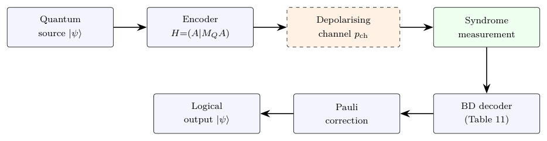
<figcaption class="paper-figure-caption"><b>Fig 1.</b> FIGURE 1. System architecture for Q(q, d) on a quantum channel. A quantum source emits a state |ψ⟩on k logical qudits; the encoder applies the Clifford circuit induced by H = (A|MQA), mapping to n physical qudits which propagate through a depolarising channel (single-photon or single-atom physical layer). Stabilizer syndromes are extracted by non-destructive Pauli measurement, the bounded-distance decoder suggests a Pauli correction, and the corrected state is the logical output. By Theorem 19, the encoder factors into a Hadamard layer and a CZ(M) phase circuit with M a symmetric circulant determined by the formal-quadric indicator τ Q.</figcaption>
</figure>
<figure class="paper-figure-card">
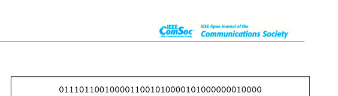
<figcaption class="paper-figure-caption"><b>Fig 2.</b> FIGURE 2. Singer first column τ H ∈F40 2 for PG(3, 3) in the chosen indexing. Reading positions j = 0, 1, . . . , 39 left to right, (τ H)j = 1 iff position j corresponds to a point of PG(3, 3) lying on the canonical Singer hyperplane. Hamming weight is 13 = θ2(3), matching the number of points on a hyperplane of PG(3, 3). The vector τ H generates the full 40 × 40 Singer-circulant incidence matrix A (Eq. (33) below), and is the foundational classical-design object that the quantum construction inherits.</figcaption>
</figure>
<figure class="paper-figure-card">
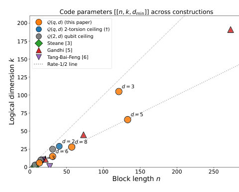
<figcaption class="paper-figure-caption"><b>Fig 3.</b> FIGURE 3. Code-parameter scatter plot from Tables 7 and 8: logical dimension k versus block length n for the Q(q, d) family (this paper) alongside the closest prior-art constructions. Annotations show dmin where the entry exceeds the 2-torsion / q=2 ceilings. The dotted line marks the rate- 1</figcaption>
</figure>
<figure class="paper-figure-card">
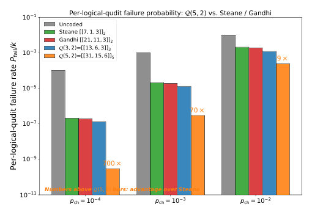
<figcaption class="paper-figure-caption"><b>Fig 4.</b> FIGURE 4. Visual rendering of Table 10: per-logical-qudit failure rate Pfail/k for the headline codes at three representative depolarising channel rates pch ∈{10−4, 10−3, 10−2}. The Q(5, 2) bar is consistently the lowest, with the advantage factor over Steane [[7, 1, 3]]2 annotated above each bar. The advantage grows with smaller pch because the double-error correcting Q(5, 2) (dmin = 6) scales as Pfail ∼p3 ch, whereas Steane and Gandhi scale as p2 ch.</figcaption>
</figure>
<figure class="paper-figure-card">
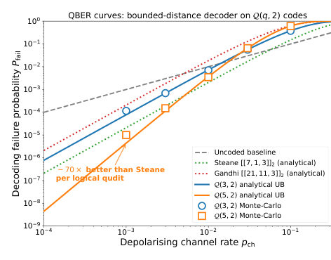
<figcaption class="paper-figure-caption"><b>Fig 5.</b> FIGURE 5. Decoding failure probability Pfail versus depolarising channel rate pch. Solid curves are analytical upper bounds from (44); markers are Monte-Carlo measurements with the bounded-distance decoder. The dashed grey line is the uncoded single-qudit baseline Pfail = pch. Q(5, 2) achieves ∼70× improvement over Steane’s [[7, 1, 3]]2 on a per-logical-qudit basis at pch = 10−3.</figcaption>
</figure>

**Summary.** This paper introduces Q(q, d), a new family of qudit stabilizer codes built using Singer difference sets and non-degenerate quadrics in projective geometry. The authors establish several structural theorems and demonstrate that these codes offer superior error correction performance compared to existing qubit codes. This work advances the theoretical understanding of high-dimensional quantum error correction.

**Why it may be interesting.** The focus on qudits and the combination of algebraic geometry (quadrics in PG(d,q)) with coding theory provides a powerful, mathematically rigorous framework for designing next-generation quantum error correction codes.

Detailed structure

**Main problem.** The paper proposes a novel family of qudit stabilizer codes, Q(q, d), designed to protect quantum information against noise.

**Main result.** The construction yields codes with proven structural theorems and demonstrates that Q(5, 2) achieves a significant improvement in error correction performance over established codes like the Steane code.

**Method.** The codes are constructed by coupling a Singer difference set incidence matrix (A) with a quadric circulant matrix (M_Q) within the parity-check matrix H.

**Model / system.** The model is a qudit stabilizer code, applicable to quantum communication channels (fibre-optic/free-space) or quantum memory, where the physical system supports qudits (q > 2).

**Key observables.** Code parameters such as $[[n, k, d]]_q$, decoding failure probability ($P_{fail}$), and the logical dimension $k(p, d)$.

**Important parameters / regimes.** The code is parameterized by prime power $q$ and dimension $d \geq 2$; the flagship family is $Q(p, 2)$.

**Assumptions / limitations.** The analysis relies on five novel structural theorems, including a cross-correlation modular-constancy identity and a paired column-rigidity equality.

**Figures summary.** Figures illustrate the system architecture for Q(q, d) on a quantum channel and plot the decoding failure probability ($P_{fail}$) versus the depolarizing channel rate ($p_{ch}$).

**Paper structure.** The paper introduces the construction, proves five structural theorems, derives closed-form code dimensions, presents specific examples (e.g., Q(3, 2), Q(5, 2)), and validates performance via Monte-Carlo simulations.

Abstract

We propose Q(q,d), a family of q-ary non-CSS qudit stabilizer codes with prime power q and dimension d >= 2, constructed from Singer difference sets and non-degenerate quadrics in PG(d,q). The parity check H = (A | M_Q A) couples the Singer-circulant incidence matrix A with the quadric circulant M_Q, and a Cancellation Lemma uses the identity (k - lambda) = q^{d-1} = 0 mod p to make H symplectic-isotropic over F_q.   Five structural theorems carry the novelty: a cross-correlation modular-constancy identity nu = 1 mod q at q odd, d >= 3, with a two-value pattern that proves a 2-torsion distance ceiling; a CRT zero-count identity; an explicit Clifford bridge identifying Q(q,2) as a graph-state encoding of the trivial Singer CSS code, with the 2021 low-density-spreading (LDS) sign-flip pattern realised by a symmetric circulant; a paired column-rigidity equality d_min = R_P + 1; and a lower bound d_min(Q(7,2)) >= 8 from an exhaustive Singer-Frobenius search.   A Hamada-Smith specialisation yields the closed-form logical dimension k(p,d) = theta_d(p) - C(p+d-1, d) - 1, and the flagship Q(p,2) = [[p^2 + p + 1, p(p+1)/2, d_min]]_p attains asymptotic rate one-half. We conjecture d_min(Q(p,2)) = p + 1 for odd primes, proven at p = 5 and lower-bounded to >= 8 at p = 7. Instances include Q(3,2) = [[13,6,3]]_3, Q(5,2) = [[31,15,6]]_5, Q(7,2) = [[57,28, d>=8]]_7, and Q(3,4) = [[121,105,3]]_3. Monte-Carlo over 1.5 x 10^6 trials shows Q(5,2) achieves a 70-fold per-logical-qudit improvement over Steane [[7,1,3]]_2 at depolarising rate 10^-3 with zero silent logical errors. A textbook bounded-distance decoder is used; Berlekamp-Massey-style cyclic decoding is left as the natural sequel.

[↑ back to top](#top)

### [SpiderCSS: Scalable Fault-Tolerant CSS State Preparation](http://arxiv.org/abs/2610.03714v1)

**Authors:** Boldizsár Poór, Andrey Boris Khesin, Sarah Meng Li, Benjamin Rodatz, John van de Wetering, Richie Yeung  
**Type:** theory · **Category:** quantum information and computing · **PDF:** <https://arxiv.org/pdf/2610.03714v1>  
**Analysis basis:** full PDF text, analyzed in chunks

↔ Scroll figures horizontally

<figure class="paper-figure-card">
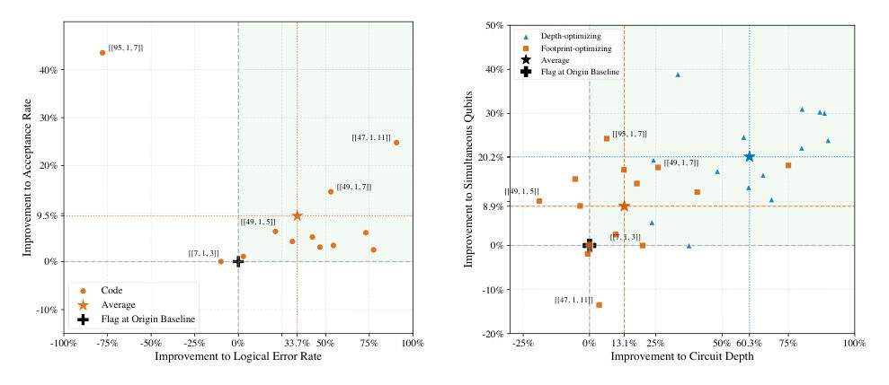
<figcaption class="paper-figure-caption"><b>Fig 1.</b> FIG. 1: Percentage improvements of SpiderCSS over Flag at Origin (FaO) across the benchmarked CSS states. Each point represents a CSS state, and the cross at the origin is the FaO baseline. Positive values mean SpiderCSS outperforms FaO (lower logical error rate, depth or qubit count; higher acceptance rate), so points in the shaded top-right quadrant improve on both metrics. Stars mark the mean improvements, with their values indicated on the axes.</figcaption>
</figure>
<figure class="paper-figure-card">
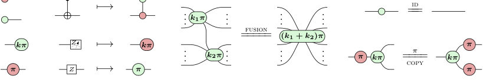
<figcaption class="paper-figure-caption"><b>Fig 2.</b> FIG. 2: ZX overview. (a) Translation between quantum circuits and ZX-diagrams. The k parameter in the representation of Z- and X-measurements corresponds to the measurement outcome. Note that a Z-spider is used to represent an X-type measurement and state preparation, and vice versa for an X-spider. (b) A selection of ZX-rewrites. k, k1, k2 ∈{0, 1}.</figcaption>
</figure>
<figure class="paper-figure-card">
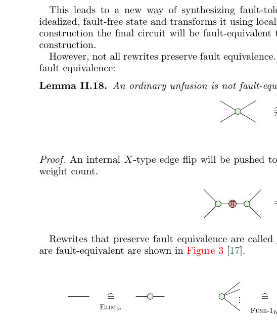
<figcaption class="paper-figure-caption"><b>Fig 3.</b> FIG. 3: The rewrites together with their colour duals are fault-equivalent [17].</figcaption>
</figure>
<figure class="paper-figure-card">
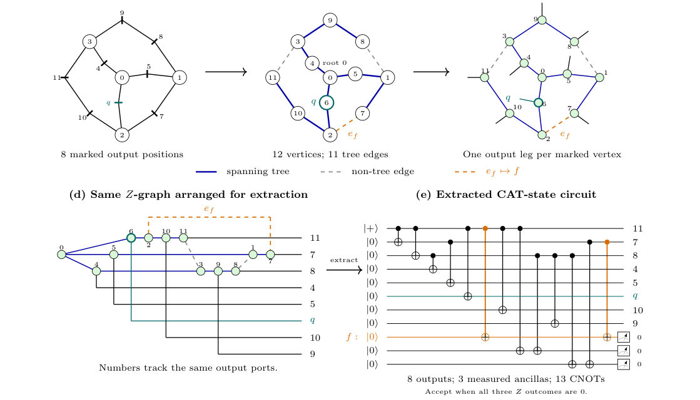
<figcaption class="paper-figure-caption"><b>Fig 4.</b> FIG. 4: Circuit extraction from a fault-tolerant Z-spider expansion. (a) A graph with eight marked output positions. (b) Its expanded graph with a spanning tree rooted at vertex 0. (c) The trivalent Z-graph obtained by attaching an output leg to each marked vertex. (d) The same Z-graph arranged for extraction. (e) The extracted CAT-state preparation circuit, with three verification ancillas. The mark q (vertex 6, teal) becomes output qubit q, while the non-tree edge ef = (2, 7) (orange) is implemented by the two CNOTs involving ancilla f. Numbers identify corresponding vertices and output ports, not spider phases. All three measurement outcomes are post-selected to 0.</figcaption>
</figure>
<figure class="paper-figure-card">
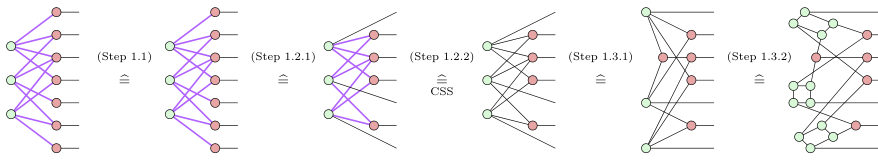
<figcaption class="paper-figure-caption"><b>Fig 5.</b> FIG. 5: Transformation steps towards an extractable ZX-diagram for fault-tolerant state preparation. Step 1.1 brings the diagram into a row-reduced normal form, then, Step 1.2 unidealizes the internal edges, and Step 1.3 unfuses the spiders along safe hook errors (Step 1.3.1) and using SpiderCat [16] (Step 1.3.2).</figcaption>
</figure>

**Summary.** This paper introduces SpiderCSS, a novel, scalable compilation pipeline for generating fault-tolerant circuits to prepare logical states in CSS quantum codes. By leveraging the ZX-calculus and fault-equivalent rewrites, it constructs highly optimized circuits that significantly reduce resource overhead compared to previous state-of-the-art methods. This advancement is crucial for realizing large-scale, reliable quantum computation.

**Why it may be interesting.** While focused on abstract quantum computation, the rigorous resource optimization techniques (minimizing CNOTs, depth) are highly relevant to designing physical quantum hardware implementations, such as those using trapped ions or superconducting qubits.

Detailed structure

**Main problem.** The paper addresses the critical need for a scalable and provably fault-tolerant method to prepare logical quantum states encoded within Calderbank-Shor-Steane (CSS) codes.

**Main result.** The proposed SpiderCSS pipeline significantly outperforms existing methods by achieving substantial reductions in circuit depth and logical error rates while maintaining polynomial scaling with code size.

**Method.** It utilizes the ZX-calculus and fault-equivalent rewrites to transform an idealized state specification into a highly optimized, fault-tolerant circuit construction.

**Model / system.** The focus is on fault-tolerant quantum computation using CSS stabilizer codes. The analysis is formalized using the ZX-calculus, which maps quantum circuits to graph structures (ZX-diagrams).

**Key observables.** Logical error rate, acceptance rate, CNOT count, circuit depth, and qubit footprint.

**Important parameters / regimes.** Code distance (up to 15), Pauli noise model, and the efficiency of the compilation pipeline.

**Assumptions / limitations.** The method relies on the stabilizer formalism and assumes that fault tolerance can be maintained by using fault-equivalent rewrites, simplifying the verification process.

**Figures summary.** Figure 1 compares SpiderCSS and Flag at Origin performance across various metrics (error rate, acceptance rate, depth, qubit count); Figure 2 illustrates the ZX-calculus translation between circuits and diagrams.

**Paper structure.** The paper builds from foundational definitions of fault tolerance and the ZX-calculus for CSS states, details the novel SpiderCSS compilation pipeline, and concludes with quantitative comparisons against state-of-the-art methods.

Abstract

Fault-tolerant preparation of logical states is a critical primitive for the realization of large-scale fault-tolerant quantum computing. This paper introduces SpiderCSS, a scalable compilation pipeline that generates highly-optimized, fault-tolerant state preparation circuits for arbitrary Calderbank-Shor-Steane (CSS) codes. Starting from an idealized specification of a CSS state, we use the ZX-calculus and fault-equivalent rewrites to construct a diagram that prepares the given state while preserving the fault tolerance of the initial ideal ZX-diagram. From this diagram, SpiderCSS constructs a fault-tolerant CSS-state preparation circuit using a modular construction that is CNOT-minimal both within each component and also in the way these components are connected together. By only using fault-equivalent rewrites, the final circuit is provably fault-tolerant without needing expensive verification. Monte Carlo simulations across a variety of CSS codes up to distance 15 show that SpiderCSS scales efficiently and constructs circuits with substantially reduced depth and qubit footprint compared to existing scalable and heuristic methods, while simultaneously achieving an average decrease of 33.7% in logical error rate and an increase of 9.5% in acceptance rate.

[↑ back to top](#top)

### [The complexity of entangled graph colouring via polymorphisms](http://arxiv.org/abs/2610.02565v1)

**Authors:** Eric Culf  
**Type:** theory · **Category:** quantum information and computing · **PDF:** <https://arxiv.org/pdf/2610.02565v1>  
**Analysis basis:** full PDF text, analyzed in chunks

↔ Scroll figures horizontally

<figure class="paper-figure-card">
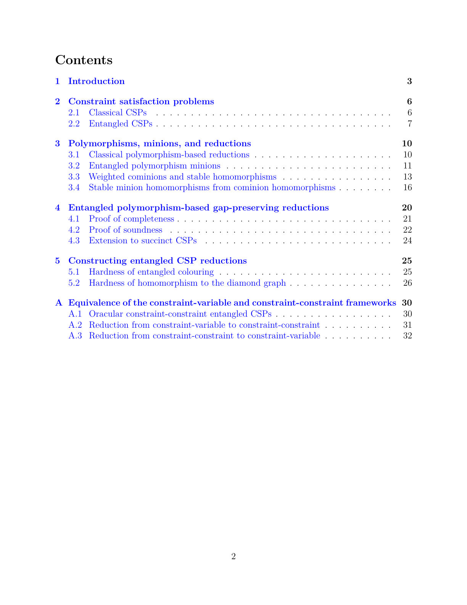
<figcaption class="paper-figure-caption"><b>Fig 1.</b> Low-resolution page preview, page 2</figcaption>
</figure>
<figure class="paper-figure-card">
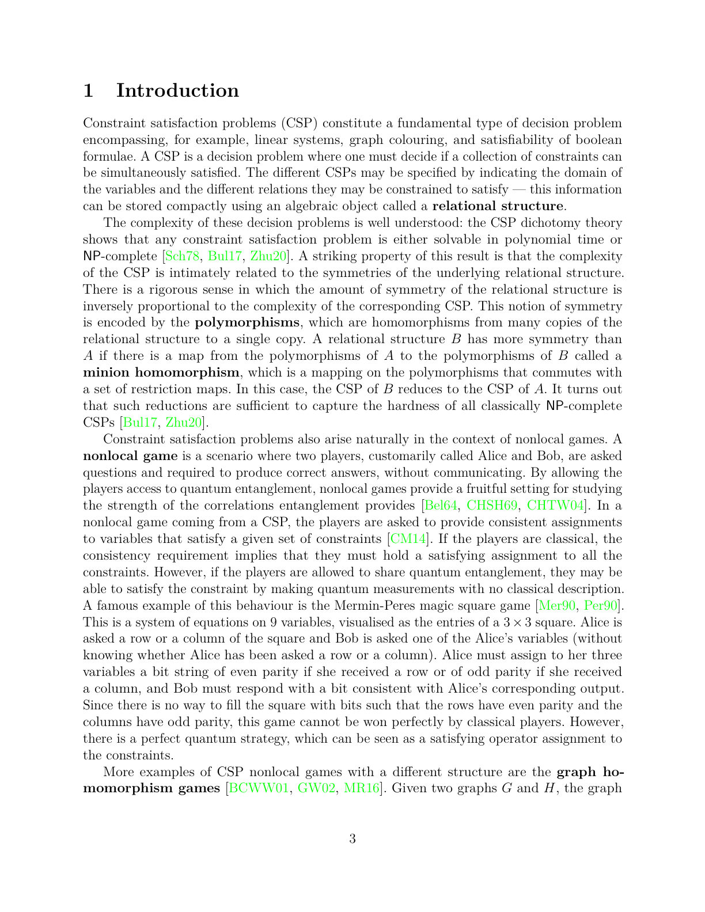
<figcaption class="paper-figure-caption"><b>Fig 2.</b> Low-resolution page preview, page 3</figcaption>
</figure>
<figure class="paper-figure-card">
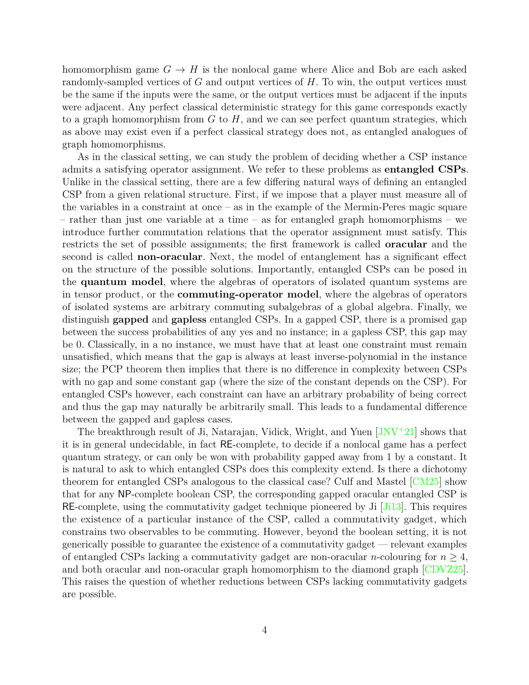
<figcaption class="paper-figure-caption"><b>Fig 3.</b> Low-resolution page preview, page 4</figcaption>
</figure>
<figure class="paper-figure-card">
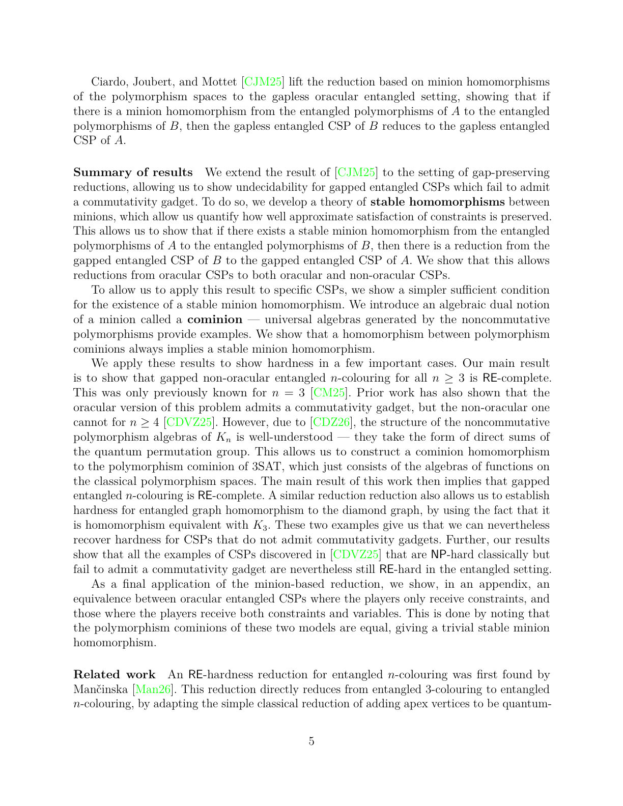
<figcaption class="paper-figure-caption"><b>Fig 4.</b> Low-resolution page preview, page 5</figcaption>
</figure>
<figure class="paper-figure-card">
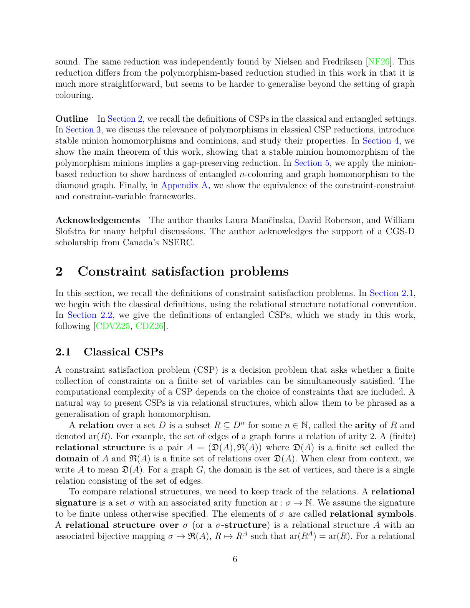
<figcaption class="paper-figure-caption"><b>Fig 5.</b> Low-resolution page preview, page 6</figcaption>
</figure>

**Summary.** This theoretical paper develops advanced algebraic techniques to analyze the computational complexity of quantum constraint satisfaction problems, particularly entangled graph colouring. By generalizing polymorphism-based reductions, the authors prove that this problem is RE-complete for n >= 3. This work advances the understanding of quantum complexity by providing tools for hardness proofs in settings lacking simple classical gadgets.

**Why it may be interesting.** It provides a powerful, general algebraic framework to establish computational hardness results for quantum constraint satisfaction problems, which is crucial for understanding the limits of quantum correlation in computation.

Detailed structure

**Main problem.** The paper studies the decision complexity of entangled value classes of nonlocal games, specifically focusing on entangled graph colouring.

**Main result.** It proves that gapped non-oracular entangled n-colouring for all n >= 3 is RE-complete, extending hardness results beyond those relying on commutativity gadgets.

**Method.** The authors generalize polymorphism-based reductions from classical CSPs to 'gap-preserving reductions' for entangled CSPs using an 'entangled analogue of the polymorphisms.'

**Model / system.** The model involves nonlocal games derived from Constraint Satisfaction Problems (CSPs) analyzed using $C^*$-algebras to describe quantum operator assignments (tensor product or commuting-operator model).

**Key observables.** The gap between success probabilities for yes/no instances (gapped vs. gapless CSPs) and the complexity class (RE-complete).

**Important parameters / regimes.** The number of colors (n), the distinction between oracular and non-oracular settings, and the structure of the underlying relational algebra.

**Assumptions / limitations.** The analysis relies on developing algebraic structures like 'minions' and their duals, 'cominions,' to establish the necessary reduction machinery.

**Paper structure.** The paper builds from classical CSP complexity theory (Schaefer's dichotomy) to introduce entangled CSPs using $C^*$-algebras. It develops the machinery of cominion homomorphisms to generalize reductions, culminating in the proof of RE-completeness for entangled graph colouring.

Abstract

Constraint satisfaction problems (CSPs) with operator assignments to the variables provide a well-structured setting to study the decision complexity of the entangled value of classes of nonlocal games. Due to the CSP dichotomy theorem, the complexity of constraint satisfaction problems with classical assignments can be fully understood by studying the symmetries of the CSP, in terms of the polymorphisms of the underlying relational structure. In this work, we show that the polymorphism-based reductions between CSPs can be generalised to gap-preserving reductions between entangled CSPs based on an entangled analogue of the polymorphisms. This reduction allows us to show undecidability of entangled graph colouring with more than three colours, a problem that has proved resistant to prior hardness reductions based on commutativity gadgets.

[↑ back to top](#top)

### [Unitary complexity in polynomial space](http://arxiv.org/abs/2610.03705v1)

**Authors:** William Kretschmer, Ewin Tang  
**Type:** theory · **Category:** quantum information and computing · **PDF:** <https://arxiv.org/pdf/2610.03705v1>  
**Analysis basis:** full PDF text, analyzed in chunks

↔ Scroll figures horizontally

<figure class="paper-figure-card">

<figcaption class="paper-figure-caption"><b>Fig 1.</b> Low-resolution page preview, page 2</figcaption>
</figure>
<figure class="paper-figure-card">
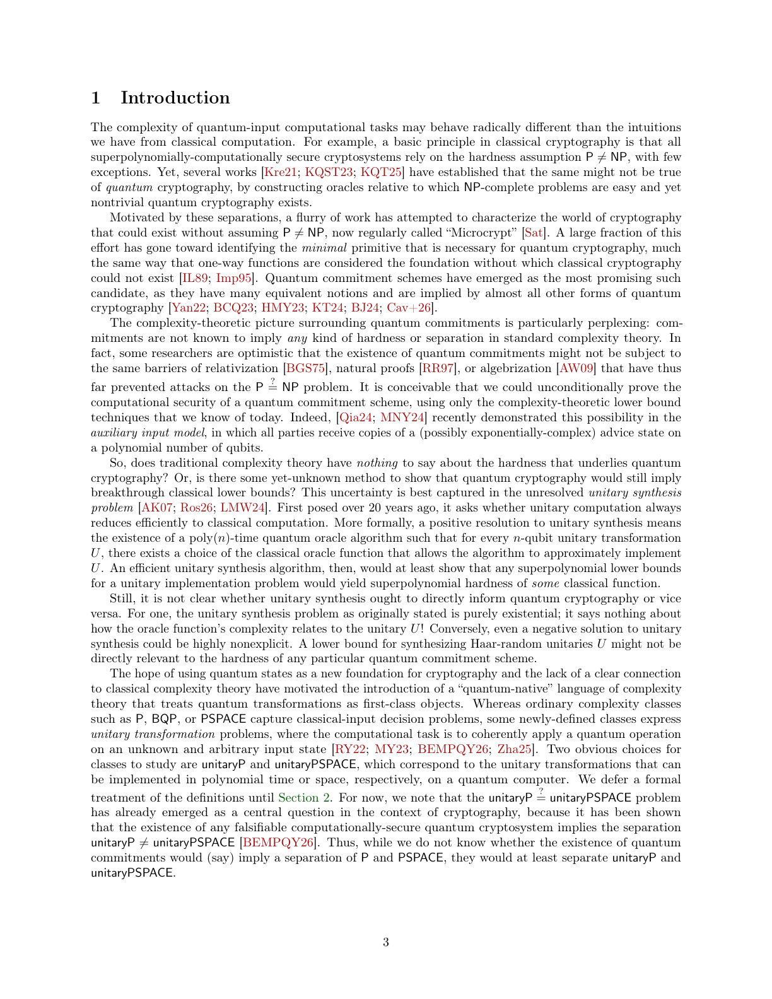
<figcaption class="paper-figure-caption"><b>Fig 2.</b> Low-resolution page preview, page 3</figcaption>
</figure>
<figure class="paper-figure-card">
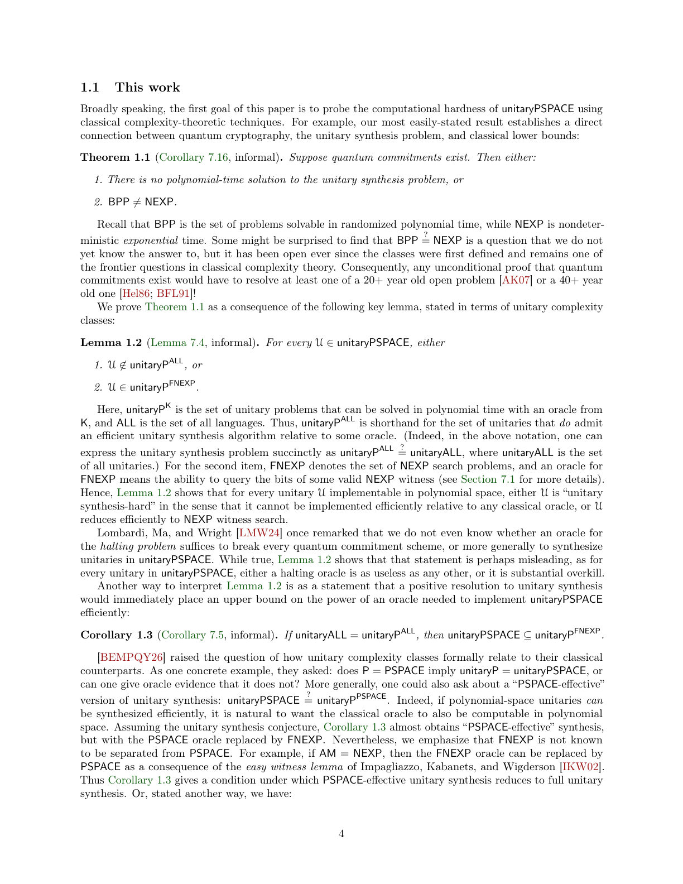
<figcaption class="paper-figure-caption"><b>Fig 3.</b> Low-resolution page preview, page 4</figcaption>
</figure>
<figure class="paper-figure-card">
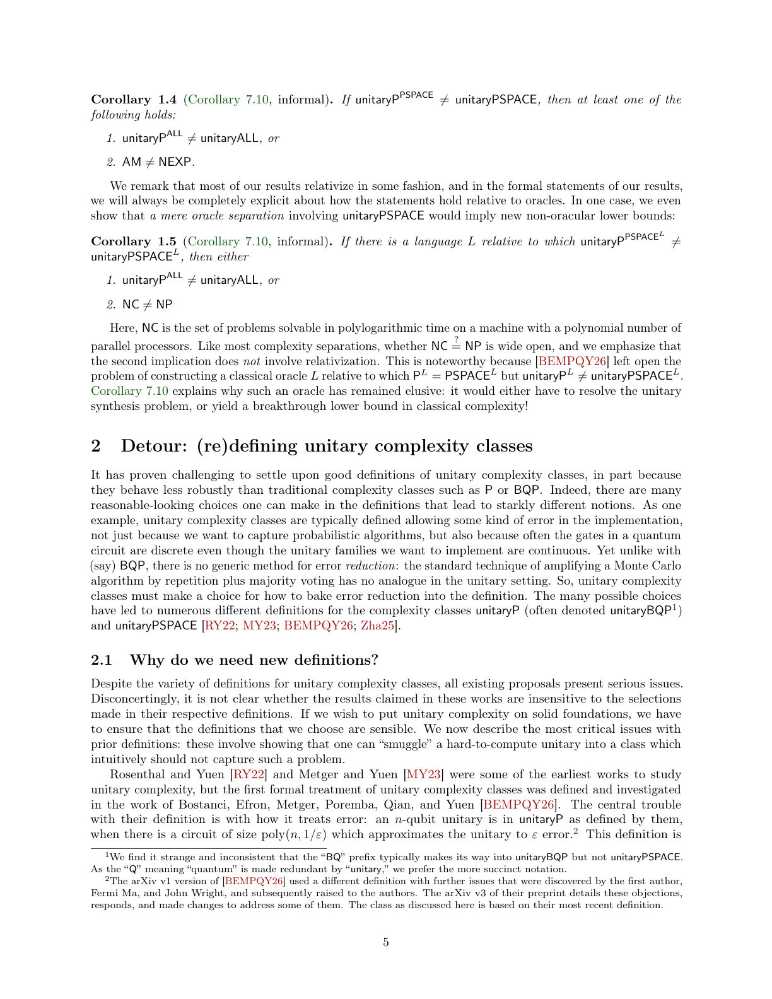
<figcaption class="paper-figure-caption"><b>Fig 4.</b> Low-resolution page preview, page 5</figcaption>
</figure>
<figure class="paper-figure-card">
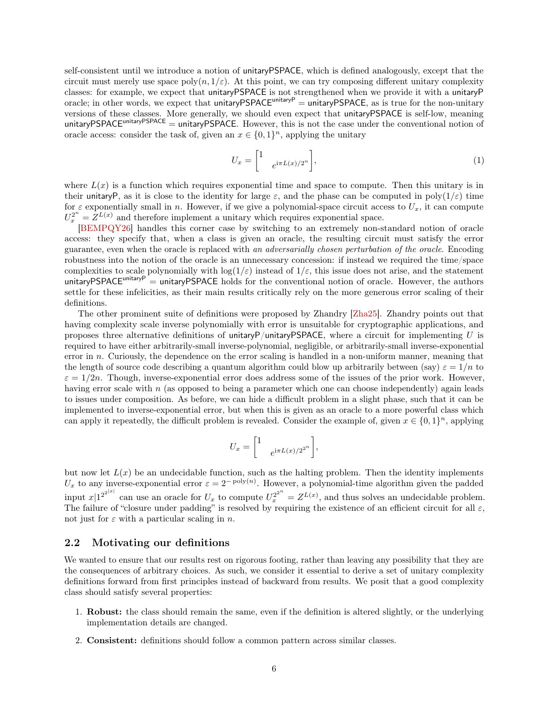
<figcaption class="paper-figure-caption"><b>Fig 5.</b> Low-resolution page preview, page 6</figcaption>
</figure>

**Summary.** This paper explores the computational limits of quantum computation by analyzing the complexity class associated with unitary transformations. It establishes a strong link between the existence of quantum commitments and major open problems in complexity theory, such as whether $	ext{BPP} = 	ext{NEXP}$. The findings refine the understanding of unitary complexity classes and their relationship to classical computational power.

**Why it may be interesting.** This work provides deep theoretical constraints on what can be computed unitarily, linking fundamental questions in quantum computation (like commitment schemes) directly to the hierarchy of classical complexity classes.

Detailed structure

**Main problem.** The paper investigates the computational hardness of the unitary synthesis problem and relates the existence of quantum commitments to fundamental separations in classical complexity theory.

**Main result.** The authors prove that if quantum commitments exist, then either the unitary synthesis problem has no polynomial-time solution, or the complexity classes BPP and NEXP are unequal.

**Method.** The work employs advanced complexity theory, defining new unitary complexity classes (unitaryP, unitaryPSPACE) and using general lemmas to connect the computational power of these classes to known classical separations.

**Model / system.** The theoretical model centers on unitary transformations ($U$) and the associated complexity classes ($	ext{unitaryP}$, $	ext{unitaryPSPACE}$), abstracting away from specific physical hardware.

**Key observables.** The primary observables are the relationships between complexity classes ($	ext{unitaryP}$ vs $	ext{unitaryPSPACE}$) and the existence of quantum commitments (EFI pairs).

**Important parameters / regimes.** The key parameters are the computational resources: polynomial time, polynomial space, and the separation between $	ext{BPP}$ and $	ext{NEXP}$.

**Assumptions / limitations.** The main assumption is the hypothetical existence of quantum commitments, which serves as the trigger for the complexity implications.

**Paper structure.** The paper introduces refined definitions for unitary complexity classes, proves a main theorem linking quantum commitments to complexity separations, and develops supporting lemmas relating $	ext{unitaryPSPACE}$ to efficient synthesis or $	ext{NEXP}$ search problems.

Abstract

We show that if quantum commitments exist, then either there is no polynomial-time solution to the unitary synthesis problem, or $\mathsf{BPP} \neq \mathsf{NEXP}$. Thus, showing unconditionally that quantum commitments exist would require answering at least one of two longstanding open questions in complexity theory. We prove our main result as a consequence of a more general lemma, which shows that every unitary in $\mathsf{unitaryPSPACE}$ either cannot be synthesized efficiently relative to any classical oracle, or can be synthesized efficiently with an oracle for $\mathsf{NEXP}$ search problems. Our lemma has other noteworthy consequences, including that certain oracle separations involving $\mathsf{unitaryPSPACE}$ would imply breakthrough classical lower bounds such as $\mathsf{NC} \neq \mathsf{NP}$.   Along the way, we propose new definitions for the unitary complexity classes $\mathsf{unitaryP}$ and $\mathsf{unitaryPSPACE}$. Our changes address the biggest conceptual issues with definitions suggested in prior work, and lead to elegant proofs. We study both implementations that erase garbage and implementations that allow it, because we cannot rule out the possibility that the two definitions differ. Nevertheless, we show that both definitions can be viewed as special cases of each other. We also showcase many other ways in which our definitions are robust. For example, we show that $\mathsf{unitaryPSPACE}$ has an equivalent characterization as the set of unitary transformations whose entries can be computed to arbitrary precision in polynomial space. Consequently, we deduce that $\mathsf{unitaryPSPACE}$ can generically erase garbage, a result that provably fails relative to unitary oracles.

[↑ back to top](#top)

### [Universal Bounds for Out-of-Distribution Unitary Learning](http://arxiv.org/abs/2610.03690v1)

**Authors:** Joachim Favre, Armando Angrisani, Zoë Holmes  
**Type:** theory · **Category:** quantum information and computing · **PDF:** <https://arxiv.org/pdf/2610.03690v1>  
**Analysis basis:** full PDF text, analyzed in chunks

↔ Scroll figures horizontally

<figure class="paper-figure-card">
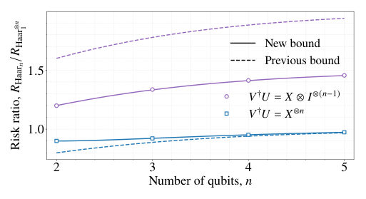
<figcaption class="paper-figure-caption"><b>Fig 1.</b> FIG. 1. Tight product-to-entangled generalization bounds. Given some unitaries U, V , this shows the ratio between RHaarn and RHaar⊗n 1 , computed numerically using 100 000 samples. The theoretical lower bound and upper bound are given by Eq. 54. The blue and purple mark- ers are unitaries U, V that saturate the bound (concretely, V †U = X⊗n and V †U = X ⊗I⊗n−1 respectively).</figcaption>
</figure>

**Summary.** This work establishes theoretical bounds for out-of-distribution learning in quantum dynamics, quantifying generalization using 'bias' and 'expressivity' derived from input state moments. The authors show that the inherent structure of unitary evolution allows for better generalization than general quantum channels. This provides fundamental limits on what can be learned about an unknown quantum process from limited training data.

**Why it may be interesting.** It provides rigorous, information-theoretic bounds on generalization in quantum machine learning, which is crucial for designing robust quantum algorithms and understanding the limits of quantum state tomography.

Detailed structure

**Main problem.** The paper develops a general framework to quantify how well knowledge of a quantum unitary's action on one set of input states (training distribution) can predict its action on a different set of states (testing distribution), especially when the distributions differ (out-of-distribution learning).

**Main result.** The generalization capability is controlled by two quantities, 'bias' and 'expressivity,' and the analysis reveals that unitarity enables robust out-of-distribution generalization, unlike general quantum channels.

**Method.** The methodology involves analyzing the expected risk using moment matrices derived from the first and second moments of the input state ensemble, leading to explicit bounds relating training and testing risks.

**Model / system.** The study focuses on unknown unitary dynamics ($E(
ho) = U
ho U^\dagger$) acting on quantum states, comparing performance when trained on pure-state ensembles versus testing on different ensembles.

**Key observables.** Generalization Error ($	ext{gen}$), Bias ($
u$), Expressivity ($\eta$), and the expected risk $R_P$.

**Important parameters / regimes.** The structure of the input ensemble (e.g., random real vs. random complex states) and the dimensionality of the system ($n$).

**Assumptions / limitations.** The initial analysis is specialized for pure-state inputs, although extensions to mixed states are discussed; the core comparison is between unitary dynamics and general quantum channels.

**Paper structure.** The paper builds from defining the general risk framework using moment matrices to deriving specific bounds for unitary learning, contrasting these robust bounds with the failure of generalization for general quantum channels.

Abstract

How much can the action of an unknown unitary dynamics on one family of states reveal about its action elsewhere? We develop a general framework for out-of-distribution quantum dynamics learning based on the first and second moments of the input distribution. These define a notion of the bias and expressivity of an ensemble, which together control generalization between arbitrary pure-state training and testing distributions. Our framework shows that only studying the action of a unitary on random real states can learn its action on random complex states, that tensor products of unbiased pure-state ensembles preserve expressivity, and that single-qubit risks are independent of bias. It also recovers earlier locally scrambling results as loose special cases and yields tight product-to-Haar bounds. We conclude with a series of no-go results and limited generalization bounds for learning certain channels, which further serve to underscore the distinctive role of unitarity in enabling out-of-distribution generalization.

[↑ back to top](#top)

## Secondary cond-mat archives

*Papers from cond-mat.mtrl-sci, mes-hall, other, soft, supr-con. These archives are de-prioritized — they appear at the end regardless of relevance score.*

### Relevant in secondary archives (15)

### [A Polynomial-Scaling PDE Solver with Entanglement-Basis Tensor Networks](http://arxiv.org/abs/2610.02316v1)

**Authors:** Abhijatmedhi Chotrattanapituk, Michael J. Landry, Chu-Liang Fu, Mingda Li  
**Type:** theory · **Category:** numerical methods · **PDF:** <https://arxiv.org/pdf/2610.02316v1>  
**Analysis basis:** full PDF text, analyzed in chunks
**Topic relevance:** 🔥 `methods for driven-dissipative` **4/5** · `analog quantum simulation` **3/5**

↔ Scroll figures horizontally

<figure class="paper-figure-card">
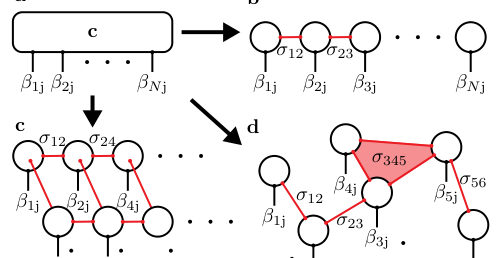
<figcaption class="paper-figure-caption"><b>Fig 1.</b> FIG. 2. TN with locality ansatzes of coefficient tensor under different geometric restriction. Here, σ’s indicate tensor in- dices responsible for each local correlation. (a) No locality assumption: same coefficient tensor as in Fig. 1. (b) Matrix product state (MPS): elements align in one-dimensional chain with correlation only between neighbors. (c) Projected en- tangled pair state (PEPS):elements align in two-dimensional grid with correlation between adjacent nodes along the grid lines. (d) Higher-order TN assumption where shaded regions represent index hyper-contraction. (Adapted from [24])</figcaption>
</figure>
<figure class="paper-figure-card">
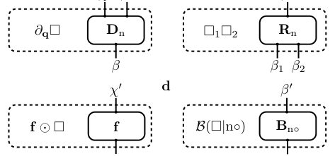
<figcaption class="paper-figure-caption"><b>Fig 2.</b> FIG. 3. TN representation of building block operations: (a) spatial derivative, (b) multiplication, (c) constant factor, and (d) projection of element n to boundary with ◦. Here, β’s are basis and χ’s are non-basis indices. (a and b are adapted from [24])</figcaption>
</figure>
<figure class="paper-figure-card">

<figcaption class="paper-figure-caption"><b>Fig 3.</b> FIG. 4. Summation of TNs with the same structure. (a) Diagram representing summation of two TNs with the same structure which can be replace with a single TN with the same structure with each node be the tensor block direct sum of each original node at the same position in the structure, i.e., Ci = Ai ⊞σ Bi. (b) Simple example of a where each node represent a vector. (c) Slightly more complicated example of a where each node represent a matrix and there are two bonding indices completely contract matrices to scalar, i.e., Ci = Ai ⊞στ Bi.</figcaption>
</figure>
<figure class="paper-figure-card">
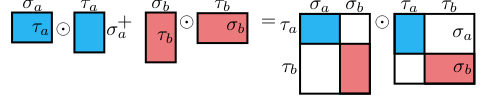
<figcaption class="paper-figure-caption"><b>Fig 4.</b> Figure 4b also demonstrates this for the case when all nodes are vectors. It might seems like using space di- rect sum works here as well, but block version is needed when the bonding has more than one index such as in the case of Fig. 4c where all nodes are matrices that got completely contracted to a scalar. Note that, this anal- ysis also applies when the bond under consideration is connecting two indices of the same tensor.</figcaption>
</figure>
<figure class="paper-figure-card">
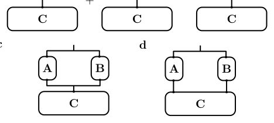
<figcaption class="paper-figure-caption"><b>Fig 5.</b> FIG. 6. TN representation of summation building block. (a) Summation of two TNs that has a common part C and the different parts A and B. (b) Building block representation of a. As shown in Eq. (37), the common part can be factor out reducing the task to be the summation of the different parts. Here, F represents filter contracting to A and B. The block direct sum augmentation is implicitly assumed for cleanliness. (c) Specialization for the cases where A and B contract to the same indices of C where the filter is assumed in the branching and merging of contracting edges. (d) Specialization for the cases where A and B contract to the different indices of C.</figcaption>
</figure>

**Summary.** This paper introduces a novel Tensor Network Finite Element (TN-FE) method to solve PDEs with polynomial scaling. It reformulates the PDE residual minimization into a tensor network structure, allowing the use of efficient algorithms like DMRG sweeps. This makes solving large, complex PDEs tractable by exploiting the assumed locality of correlations in the underlying physics.

**Why it may be interesting.** This work provides a powerful, scalable numerical tool for simulating complex quantum or condensed matter dynamics described by PDEs, directly bridging quantum many-body simulation techniques (TNs) with continuum physics (PDEs).

Detailed structure

**Main problem.** The paper aims to develop a computationally efficient solver for Partial Differential Equations (PDEs) that overcomes the exponential scaling inherent in traditional methods.

**Main result.** They achieve polynomial scaling in the number of finite elements by representing the PDE residual minimization problem within a Tensor Network (TN) framework.

**Method.** The core method combines the Finite Element Method (FEM) with Tensor Networks (TNs), mapping the PDE residual into a TN structure and using DMRG sweeps for efficient, element-by-element optimization.

**Model / system.** The framework is general, applicable to analytic operator equations (OEs) and demonstrated on a 1D diffusion equation. It handles general PDEs by reducing them to OEs.

**Key observables.** The weighted residual norm J(c), the solution u(x, t), and the convergence of the solution with respect to basis order and element count.

**Important parameters / regimes.** The computational cost scales polynomially with the number of elements, controlled by the bond dimension (S) and correlation order.

**Assumptions / limitations.** The primary assumption is that the underlying physics admits a compact Tensor Network representation, implying a locality of correlation.

**Figures summary.** Figures illustrate the TN representation of the residual term, the choice of TN ansatzes (MPS, PEPS), and the convergence of the solver for the diffusion equation compared to standard methods.

**Paper structure.** The paper builds from the general mathematical formulation of PDEs as OEs, introduces the TN-FE framework for residual minimization, details the implementation of building block operators (derivatives, multiplication), and finally demonstrates convergence using a time-dependent diffusion equation example.

Abstract

We develop a finite element method (FEM) for partial differential equation (PDE) solver based on the entanglement-basis representation introduced in our companion work. By lifting non-linear finite-element equations into an augmented coefficient space, the governing PDE together with boundary, initial, and inter-element constraints can be expressed through a unified quadratic residual minimization. Although this augmented space grows exponentially with the number of elements, its tensor-product structure allows it to be represented efficiently using tensor networks. Using the matrix product state (MPS) as a concrete example, we show that density matrix renormalization group (DMRG) sweeps enable element-by-element optimization without explicitly constructing the full augmented space. For bounded bond dimension, the resulting computational cost scales polynomially with the number of finite elements. We extend the framework to time-dependent problems through implicit temporal discretization and demonstrate convergence under both mesh and polynomial refinement using diffusion equations.

[↑ back to top](#top)

### [Highly Tunable Photon-Magnon Coupling Governed by Collective-Mode Profiles in Reconfigurable Dielectric-Resonator Arrays](http://arxiv.org/abs/2610.02422v1)

**Authors:** Shihao Zhou, Edward Kwao, Junming Wu, Abhijit Shinde, Yin Lyu, Rene Lopez, Wencan Jin, Yi Li, Binbin Yang, Wei Zhang  
**Type:** both · **Category:** other · **PDF:** <https://arxiv.org/pdf/2610.02422v1>  
**Analysis basis:** full PDF text, analyzed in chunks
**Topic relevance:** `analog quantum simulation` **3/5** · `interference shaping light` **3/5** · `Tavis-Cummings & cavity-many-emitter` **2/5** · `methods for driven-dissipative` **2/5** · `correlated / nonlocal dissipation` **1/5** · `driven-dissipative phase transition` **1/5** · `quantum optics experiment` **1/5**

↔ Scroll figures horizontally

<figure class="paper-figure-card">
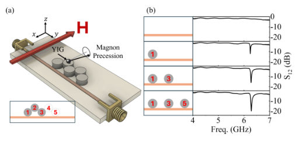
<figcaption class="paper-figure-caption"><b>Fig 1.</b> FIG. 1. (a) Schematic of the zigzag DR array mounted along a copper microstrip line. A YIG sphere is placed directly above the selected DR. The DC bias field, Hext, is in the plane of the board. The inset defines the resonator indices D1 to D5: the filled resonators form the 3-DR array, whereas the dashed positions indicate the additional resonators reserved for constructing the 4-DR and 5-DR arrays. (b) S12 spec- tra of multiple DRs separated by 6 mm. The absence of a resolvable normal-mode splitting indicates that any coupling- induced frequency separation at this distance remains smaller than the experimental linewidth.</figcaption>
</figure>
<figure class="paper-figure-card">
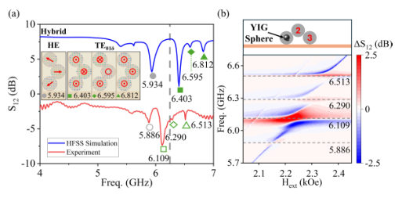
<figcaption class="paper-figure-caption"><b>Fig 2.</b> FIG. 2. (a) Measured zero-field transmission S12 of the 3- DR array (red) and the corresponding HFSS spectrum (blue, shifted vertically by +8.5 dB for clarity). The vertical dashed line marks the single-DR resonance, while solid and hollow symbols identify the simulated and experimental resonances, respectively, with matching shapes indicating the proposed mode correspondence. The insets show the HFSS microwave magnetic-field profiles at 5.934, 6.403, 6.595, and 6.812 GHz, evaluated at a common RF phase. The laboratory coordinate system is defined in Fig. 1(a). (b) Differential transmission magnitude ∆S12 as a function of external magnetic field and frequency, measured with the YIG sphere...</figcaption>
</figure>
<figure class="paper-figure-card">
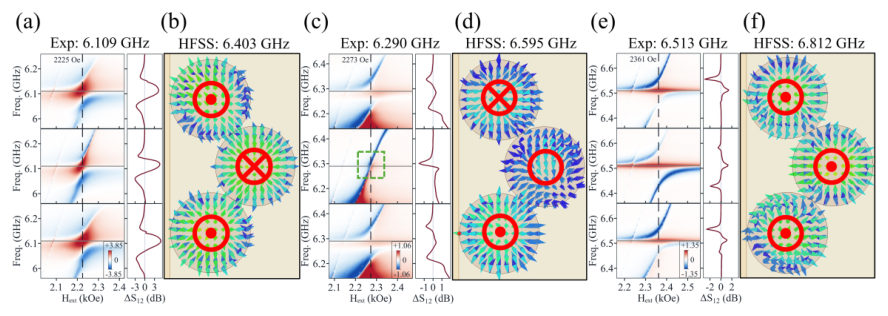
<figcaption class="paper-figure-caption"><b>Fig 3.</b> FIG. 3. Local-node selection rule in the 3-DR array. The experimental differential transmission-magnitude maps ∆S12 at (a) 6.109, (c) 6.290, and (e) 6.513 GHz are compared with the corresponding HFSS microwave magnetic-field profiles at (b) 6.403, (d) 6.595, and (f) 6.812 GHz, respectively. Within each experimental panel, the top, middle, and bottom rows correspond to the YIG sphere positioned directly above D1, D2, and D3, as indicated by the accompanying schematics. The spectra extracted at the magnetic fields marked by the vertical dashed lines are displayed beside the corresponding maps. The green dashed box in (c) marks the site–mode combination for which no resolvable avoided crossing...</figcaption>
</figure>
<figure class="paper-figure-card">
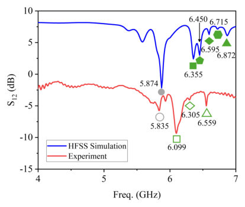
<figcaption class="paper-figure-caption"><b>Fig 4.</b> FIG. 4. Measured zero-field transmission S12 of the com- pact 5-DR array (red), compared with the corresponding HFSS driven-response spectrum (blue). The measurement is performed without the YIG sphere and without an applied bias field, and the simulated spectrum is shifted vertically by +8.5 dB for clarity. Solid and hollow symbols identify the simulated and experimental collective photon resonances, respectively, with matching shapes indicating the proposed mode correspondence.</figcaption>
</figure>
<figure class="paper-figure-card">
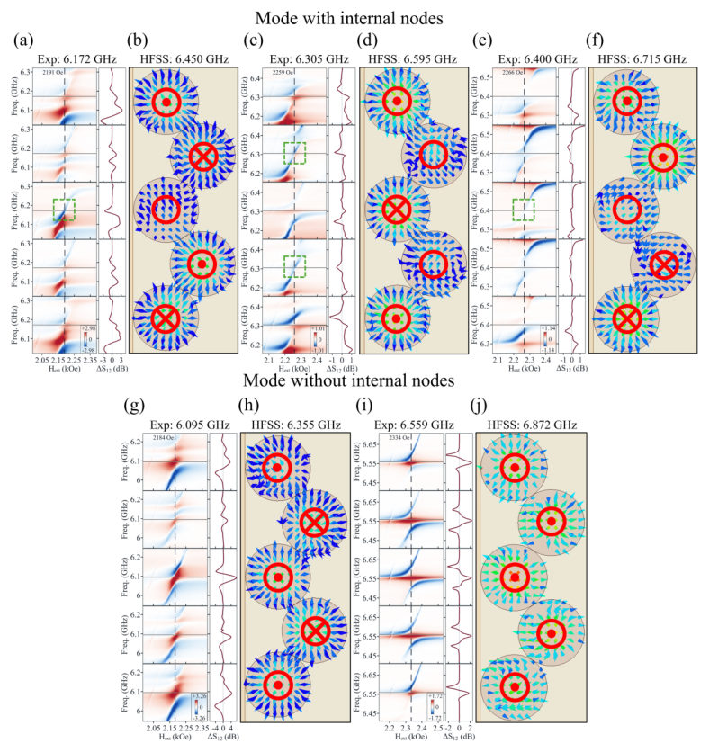
<figcaption class="paper-figure-caption"><b>Fig 5.</b> FIG. 5. Local-node selection rule in the 5-DR array. The upper group shows modes with internal nodes, comparing the experimental ∆S12 maps at (a) 6.172, (c) 6.305, and (e) 6.400 GHz with the corresponding HFSS microwave magnetic-field profiles at (b) 6.450, (d) 6.595, and (f) 6.715 GHz, respectively. The lower group shows modes without internal nodes, comparing the experimental maps at (g) 6.095 and (i) 6.559 GHz with the corresponding HFSS profiles at (h) 6.355 and (j) 6.872 GHz, respectively. Within each experimental panel, the five rows from top to bottom correspond to the YIG sphere positioned directly above D1 through D5. The solid horizontal lines mark the collective photon-mode...</figcaption>
</figure>

**Summary.** This research demonstrates site-selective control over magnon-photon coupling in reconfigurable microwave circuits by exploiting the spatial profile of the collective photon mode. By physically reconfiguring dielectric resonators, the coupling strength can be tuned based on where the local magnetic field of the photon mode is non-zero. This establishes a powerful, programmable route for building hybrid quantum microwave devices.

**Why it may be interesting.** This work provides a concrete, experimentally verifiable platform for engineering quantum light-matter interactions, moving beyond simple spectral matching to utilize the spatial wave function structure for control.

Detailed structure

**Main problem.** The paper addresses controlling the interaction between localized magnetic excitations (magnons) and microwave photons by exploiting the spatial structure of the photon mode.

**Main result.** The magnon-photon coupling is governed by the local amplitude of the collective photon mode at the magnon position, leading to a site-selective coupling rule that can be demonstrated and predicted in reconfigurable arrays.

**Method.** The study combines full-wave electromagnetic simulations (HFSS) with coupled-mode modeling to analyze transmission spectra as a function of external magnetic field and resonator geometry.

**Model / system.** The system uses modular arrays of dielectric resonators on a PCB to create tunable collective photon modes. The interaction is modeled by coupling the YIG magnon mode to these photon modes, whose collective behavior is described by nearest-neighbor Hamiltonian approximations.

**Key observables.** Site-selective magnon-photon coupling (observed as avoided crossings in transmission spectra), collective mode frequencies, and local microwave magnetic field profiles.

**Important parameters / regimes.** External magnetic field ($H_{ext}$), resonator separation ($d$), and the local amplitude of the collective photon mode.

**Assumptions / limitations.** Initially, the ideal model assumes uniform nearest-neighbor coupling, but the authors note that real-world geometric asymmetry breaks this symmetry, requiring a more complex vector field treatment.

**Figures summary.** Figures illustrate the schematic setup, $S_{12}$ spectra for various resonator configurations (2-DR, 3-DR, 4-DR), and position-resolved coupling patterns demonstrating site-dependent hybridization.

**Paper structure.** The paper progresses from demonstrating site-selectivity in small arrays (3-DR) to establishing the general principle of local-node selection, and finally discussing the limitations of idealized models by analyzing larger, asymmetric arrays (4-DR).

Abstract

The spatial structure of a microwave photon mode provides a degree of freedom for controlling its interaction with a localized magnetic excitation. We demonstrate site-selective magnon-photon coupling in modular arrays of discrete dielectric resonators mounted on a common microstrip line. The resonators can be added, removed, or rearranged on the same completed PCB, enabling post-fabrication geometrical reconfiguration of the collective photon modes and their nodal structure. A YIG sphere is positioned successively above individual resonators, while an in-plane magnetic field tunes its Kittel mode through the collective photon resonances. In a three-resonator array, modes with finite local microwave magnetic fields hybridize with the magnon at every measured site, whereas a mode containing a central field node exhibits no resolvable splitting when the sphere is positioned at that node. Full-wave simulations and a coupled-mode model show that the interaction is governed by the local amplitude of the collective photon mode rather than by spectral resonance alone. Extending this local-node selection rule to a five-resonator array successfully predicts the measured position-dependent coupling patterns. These results establish post-fabrication control of spatial magnon-photon hybridization and provide a route toward reconfigurable magnonic interfaces in future hybrid quantum microwave architectures.

[↑ back to top](#top)

### [Complete Magnetic Hierarchy in Bichromatically Driven Unconventional Magnets](http://arxiv.org/abs/2610.03461v1)

**Authors:** Pei-Hao Fu, Sayed Ali Akbar Ghorash  
**Type:** theory · **Category:** other · **PDF:** <https://arxiv.org/pdf/2610.03461v1>  
**Analysis basis:** full PDF text, analyzed in chunks
**Topic relevance:** `analog quantum simulation` **3/5** · `Keldysh / 2PI / non-Gaussian methods` **2/5** · `driven-dissipative phase transition` **2/5** · `methods for driven-dissipative` **2/5** · `interference shaping light` **1/5** · `non-equilibrium universality` **1/5** · `quantum measurements` **1/5**

↔ Scroll figures horizontally

<figure class="paper-figure-card">
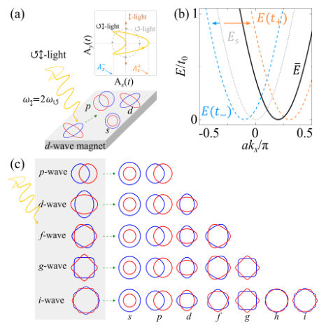
<figcaption class="paper-figure-caption"><b>Fig 1.</b> FIG. 1. (a) Schematic of a d-wave magnet illuminated by a two-frequency driving field composed of circularly (⟲) and linearly (↕) polarized light, with the corresponding vector- potential trajectory in the Ax(t)-Ay(t) plane of individual and combined lights. (b) Schematic band dispersions of static state, Es, instantaneous band dispersions at t±, E(t±), and ¯E after time averaging. (c) Summary of results: Light- induced hierarchy of spin-splitting components generated by the bichromatic drive from parent p-, d-, f-, g-, and i-wave magnets.</figcaption>
</figure>
<figure class="paper-figure-card">
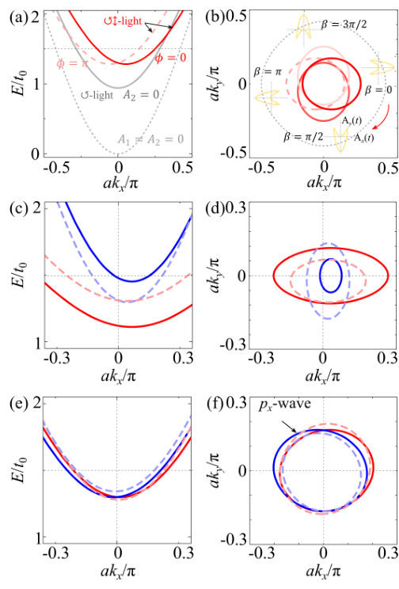
<figcaption class="paper-figure-caption"><b>Fig 2.</b> FIG. 2. (a) Dispersion of Eq. (6) for tJ = 0, ky = 0, and β = 0. (b) Equal-energy contours at E/t0 = 1.5 for different β with ϕ = 0. (c) Two-frequency-light-dressed dispersion of the dx2−y2 magnet (θJ = 0) for β = π/4 (dashed lines) and β = 0 (solid lines). The spin-up (spin-down) states are denoted in red (blue). (d) Corresponding equal-energy contours at E/t0 = 1.5. (e,f) Same as (c,d), but for the dxy magnet (θJ = π/4) and ϕ = π/2. Parameters: t0 = 1, ω = 1, η = 1, µ = 0, aeA1/ℏ= aeA2/ℏ= 1, and tJ = 0 for (a,b) and tJ = 0.5 for (c-f).</figcaption>
</figure>

**Summary.** This work develops a general theory showing how bichromatic light driving can systematically engineer unconventional magnetism in materials. By analyzing the effective Hamiltonian, the authors demonstrate that the drive completes the magnetic spin-splitting hierarchy up to a specific order $q$. This mechanism is powerful because it allows for the dynamic generation of mixed-parity magnetic components, which is crucial for advanced spintronic applications.

**Why it may be interesting.** The use of Floquet engineering to dynamically control and engineer specific symmetries (like parity) in magnetic order parameters is highly relevant to open quantum systems and quantum optics applications.

Detailed structure

**Main problem.** The paper establishes a general framework for engineering unconventional magnetism by using bichromatic light driving to induce a complete magnetic hierarchy of spin-splitting components.

**Main result.** The bichromatic drive can complete the magnetic hierarchy up to order $q$ by combining the leading continuum theory results with contributions from higher-gradient lattice terms, enabling magnetic-parity conversion.

**Method.** The analysis employs Floquet engineering theory to derive the effective time-averaged Hamiltonian, comparing continuum approximations with full lattice treatments.

**Model / system.** The system models unconventional magnets (altermagnets) characterized by specific magnetic parities, driven by a bichromatic field composed of circularly and linearly polarized light.

**Key observables.** Magnetic spin-splitting components classified by angular harmonics ($s, p, d, f, g, \dots$), and the resulting momentum-asymmetric electronic structure.

**Important parameters / regimes.** The frequency ratio of the bichromatic drive (especially generic even commensurate ratios) and the lattice structure details.

**Assumptions / limitations.** The analysis relies on the assumption of a generic even commensurate frequency ratio for hierarchy completion, and approximations are made when comparing continuum vs. lattice results.

**Figures summary.** Figures illustrate the schematic of $d$-wave magnets under driving, showing band dispersions and confirming the completion of the $s$-$p$-$d$ hierarchy.

**Paper structure.** The paper progresses by first establishing the general framework for hierarchy completion using $d$-wave magnets, then detailing the mechanism of parity conversion, and finally extending the analysis to higher-order magnets ($f$-wave, $g$-wave) to show the general $s-p-d-f-g$ hierarchy.

Abstract

We establish a general framework for engineering unconventional magnetism using bichromatic driving. We identify a sharp hierarchy: for a bichromatic drive with a generic even commensurate frequency ratio, the leading continuum $q$-wave magnet generates components only up to order $q-2$, whereas lattice higher-gradient terms supply the missing $q-1$ and $q$ parities and complete the hierarchy through order $q$. We explicitly illustrate this new revised hierarchy on a $d$-wave altermagnet irradiated by a circularly-linearly polarized light, and show that the asymmetry of the driving field is transferred to the light-dressed electronic structure, producing momentum-asymmetric dispersions beyond the static and single-frequency limits. We further show that this band asymmetry is absent in the leading continuum expansion and originates from higher-gradient lattice terms that are converted by the bichromatic drive into odd-in-momentum contributions. Extending the analysis to higher-order unconventional magnets, we further obtain complete magnetic hierarchies for all $q$-parity unconventional magnets. Our results establish bichromatic Floquet driving as a general route for generating mixed-parity magnetic hierarchies and dynamically engineering unconventional magnetism.

[↑ back to top](#top)

### [Quantum materials QED with van der Waals crystals](http://arxiv.org/abs/2610.02514v1)

**Authors:** Suheng Xu, Brian Vermilyea, Ran Jing, Lukas Wehmeier, Jihoon Park, Rafael A. Mayer, Xinzhong Chen, Samuel L. Moore, Fuyang Tay, Boyi Zhou, Wenjun Zheng, Dihao Sun, Birui Yang, Cory R. Dean, Daniel Cazorla, Xu Du, Milan Delor, Andrew J. Millis, Angel Rubio, Michael M. Fogler, Mengkun Liu, D. N. Basov  
**Type:** theory · **Category:** other · **PDF:** <https://arxiv.org/pdf/2610.02514v1>  
**Analysis basis:** full PDF text, analyzed in chunks
**Topic relevance:** `Tavis-Cummings & cavity-many-emitter` **3/5** · `analog quantum simulation` **3/5** · `driven-dissipative phase transition` **2/5** · `Keldysh / 2PI / non-Gaussian methods` **1/5** · `correlated / nonlocal dissipation` **1/5** · `interference shaping light` **1/5** · `methods for driven-dissipative` **1/5**

↔ Scroll figures horizontally

<figure class="paper-figure-card">
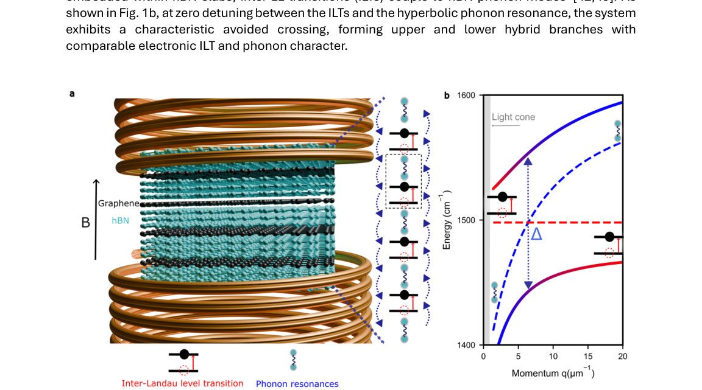
<figcaption class="paper-figure-caption"><b>Fig 1.</b> Figure 1. Quantum-material QED in a graphene/hBN multilayer cavity. (a) Schematics of a graphene/hBN multilayer cavity composed of four unit cells under a perpendicular magnetic field. The black and blue atomic layers represent graphene and hBN, supporting inter-Landau-level transitions (ILTs) and hyperbolic phonon resonances, respectively. The hyperbolic phonon resonances in hBN couple strongly to graphene ILTs through long-range Coulomb interactions across adjacent layers. The dashed rectangle in the right inset marks one graphene/hBN repeat. (b) Mode hybridization and avoided crossing in a 70- nm-thick MC with four unit cells. The red and blue dashed curves show the dispersions of the...</figcaption>
</figure>
<figure class="paper-figure-card">
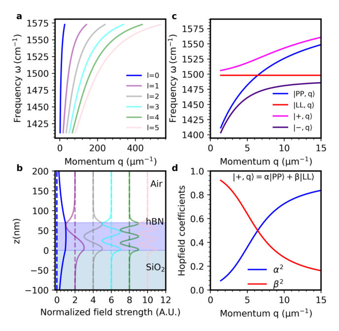
<figcaption class="paper-figure-caption"><b>Fig 2.</b> Figure 2. Quantum electrodynamic modeling for mode coupling between a Landau level resonance and hBN phonon cavity modes. (a) Theoretically calculated cavity mode dispersions in the type-II branches in a 70-nm-thick hBN slab (without graphene). The index l denotes the order of the cavity mode. (b) Normalized in-plane electric field of hBN cavity modes in the vertical direction as a function of height at 1500 𝑐𝑚/,. (c) QED-calculated dispersion relationship in a (𝑑= 71 𝑛𝑚, 𝑁= 1) MC. The blue curve corresponds to the zeroth-order cavity mode in hBN. The red curve corresponds to the Landau level resonance. The magenta and the purple curves correspond to the upper and lower branches of the...</figcaption>
</figure>
<figure class="paper-figure-card">
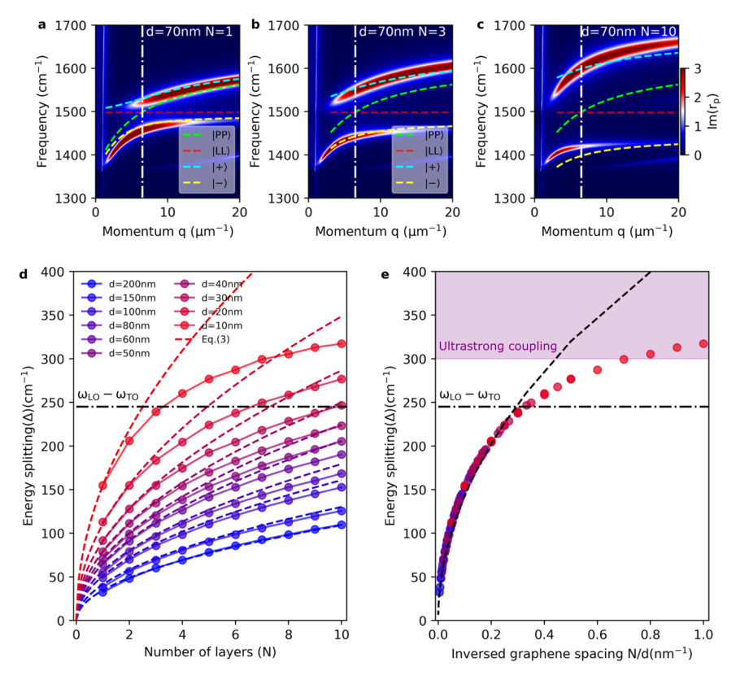
<figcaption class="paper-figure-caption"><b>Fig 3.</b> Figure 3. Layer-density-dependent mode hybridization and coupling in graphene/hBN MCs. (a–c)</figcaption>
</figure>
<figure class="paper-figure-card">
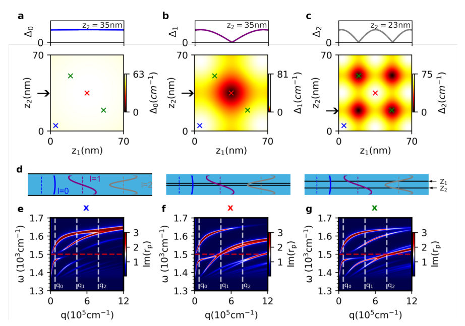
<figcaption class="paper-figure-caption"><b>Fig 4.</b> Figure 4. Depth-engineered selective coupling of cavity modes in a two-unit-cell graphene/hBN heterostructure. (a–c) Bottom panels: Calculated mode-splitting magnitude for cavity modes with indices 𝑙= 0, 1, 2 respectively, in an MC (d = 70 nm, N = 2). The mode-splitting magnitudes are functions of 𝑧, and 𝑧*, which denote positions of the two graphene layers relative to hBN. Blue, red, and green crosses mark three representative layer arrangements illustrated in (d). Top panels: Mode-splitting magnitude versus the position of one graphene layer (𝑧,) with 𝑧* fixed; the selected 𝑧* is marked by black arrows in the corresponding bottom panels. (d) Illustration of the arrangements of two graphene...</figcaption>
</figure>

**Summary.** This paper proposes using van der Waals multilayer cavities of graphene and hBN to engineer strong light-matter interactions for quantum electrodynamics. By magnetically tuning graphene's electronic transitions into resonance with hBN phonons, the authors predict broadband, mode-selective coupling. This establishes the multilayer structure as a highly tunable and scalable platform for realizing ultrastrong coupling regimes.

**Why it may be interesting.** This work directly addresses cavity QED in solid-state systems, providing a detailed theoretical roadmap for engineering strong light-matter coupling using tunable quantum materials, which is highly relevant to AMO physics.

Detailed structure

**Main problem.** The central goal is to develop a scalable platform for tunable multimode Quantum Electrodynamics (QED) by engineering light-matter interactions using subwavelength confinement.

**Main result.** The study demonstrates that van der Waals multilayer cavities composed of graphene and hBN can achieve broadband, mode-selective strong coupling, potentially reaching the ultrastrong coupling regime.

**Method.** The authors developed a quantum material QED framework involving the quantization of confined electromagnetic fields and deriving the system Hamiltonian.

**Model / system.** The physical system is a van der Waals multilayer cavity made of stacked graphene and hexagonal boron nitride (hBN). The model incorporates magnetically tunable Inter-Landau-Level Transitions (ILTs) in graphene coupled to hyperbolic phonon resonances in hBN.

**Key observables.** Mode splitting ($\Delta$), coupling strength, and mode hybridization between ILTs and phonons.

**Important parameters / regimes.** Magnetic field strength (tuning ILTs), cavity geometry (layer placement, number of layers $N$), and the ratio $\Delta/\omega_0$ (for ultrastrong coupling).

**Assumptions / limitations.** The analysis assumes a spatially local continuum model for hBN and neglects direct electrostatic coupling between different graphene layers.

**Figures summary.** Figures illustrate the schematic of the multilayer cavity, showing mode hybridization via avoided crossings in the dispersion relation, and comparing uncoupled versus coupled mode dispersions.

**Paper structure.** The paper builds the QED Hamiltonian by incorporating graphene ILTs and hBN phonon modes, analyzes the resulting mode hybridization, and establishes the multilayer structure as a tunable platform for strong coupling.

Abstract

A central goal of the emerging field of materials QED is to harness subwavelength electromagnetic confinement in engineered cavities to tailor light-matter interactions. Here, we demonstrate that van der Waals multilayer cavities composed of stacked graphene and hexagonal boron nitride (hBN) provide unprecedented control over hybridization between their electromagnetic resonances. By magnetically tuning graphene inter-Landau-level transitions (ILTs) into resonance with hBN phonons, we witness broadband, mode-selective strong coupling in the mid-infrared. Our quantum-material QED framework shows that cavity geometry and layer placement jointly control both coupling strength and modal selectivity. For experimentally realistic cavity parameters, the predicted mode splitting exceeds the width of the hBN Reststrahlen band, providing a direct route to the ultrastrong coupling regime. Together, these results establish van der Waals multilayer cavities as a scalable platform for tunable multimode QED and broaden the design space for reconfigurable quantum materials.

[↑ back to top](#top)

### [Extracting the anyon charge from shot noise in complex fractional quantum Hall edges](http://arxiv.org/abs/2610.02818v1)

**Authors:** Jinhong Park, Christian Sp{\ra}nsl{ä}tt  
**Type:** theory · **Category:** strongly correlated electrons · **PDF:** <https://arxiv.org/pdf/2610.02818v1>  
**Analysis basis:** full PDF text, analyzed in chunks
**Topic relevance:** `Full counting statistics` **3/5** · `Keldysh / 2PI / non-Gaussian methods` **2/5** · `correlated / nonlocal dissipation` **2/5** · `methods for driven-dissipative` **2/5** · `quantum measurements` **2/5**

↔ Scroll figures horizontally

<figure class="paper-figure-card">
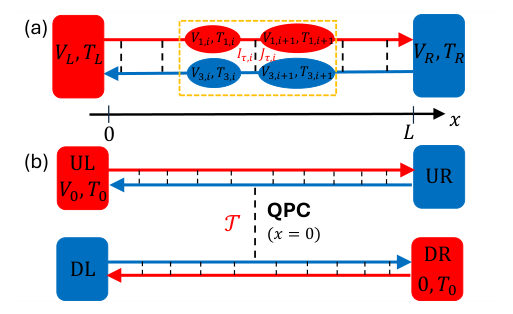
<figcaption class="paper-figure-caption"><b>Fig 1.</b> Figure 1. (a) Model of an equilibrating ν = 2/3 line junction of length L. The red and blue lines represent the downstream ν = 1 integer channel and the upstream ν = 1/3 fractional channel, respectively. The line junction is divided into small cells, where the two counter-propagating channels exchange charge and energy through weak equilibration links. The highlighted yellow box illustrates the ith cell and the local voltages and temperatures on its two sides, with the corre- sponding tunneling charge and energy currents Iτ,i and Jτ,i. The left and right boundary contacts are characterized by (VL, TL) and (VR, TR), respectively. (b) Four-terminal QPC geometry. Each of the four arms is...</figcaption>
</figure>
<figure class="paper-figure-card">
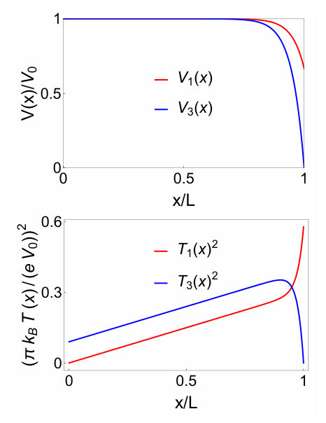
<figcaption class="paper-figure-caption"><b>Fig 2.</b> Figure 2. Voltage and temperature profiles of an equilibrat- ing ν = 2/3 line junction for VL = V0, VR = 0, and T0 = 0. (a) Local voltage profiles V1(x) and V3(x), normalized by V0. The voltage difference between the two channels is strongly suppressed over most of the line junction and remains appre- ciable only near x = L, where the upstream fractional channel is injected. (b) Corresponding temperature profiles, normal- ized as (πkBT1,3(x)/eV0)2. The Joule heating generated near x = L is transported toward the opposite end, x = 0, through thermal equilibration between the counter-propagating chan- nels, resulting in approximately linear profiles of T 2 1,3 away from the heating region....</figcaption>
</figure>
<figure class="paper-figure-card">
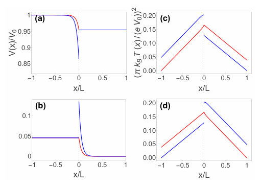
<figcaption class="paper-figure-caption"><b>Fig 3.</b> Figure 3. Voltage and temperature profiles along the upper and lower edges of the four-terminal QPC geometry. We use L/ℓch = 10, ℓth/ℓch = 3, T0 = 0, and T = 0.1. (a) Volt- age profiles along the upper edge, from the UL contact at x = −L to the UR contact at x = L. (b) Corresponding volt- age profiles along the lower edge, from the DL contact to the DR contact. (c) Temperature profiles along the upper edge. (d) Corresponding temperature profiles along the lower edge. The red and blue curves represent the integer and fractional channels, respectively. The voltages are normalized by V0, while the temperatures are shown as (πkBT/eV0)2. The ver- tical dashed line at x = 0 indicates the position...</figcaption>
</figure>
<figure class="paper-figure-card">
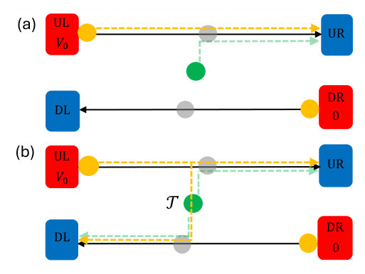
<figcaption class="paper-figure-caption"><b>Fig 4.</b> Figure 4. Schematic illustrations of how noise generated at different locations contributes to the drain-current correla- tions. The black solid lines represent the edges, with the arrows indicating the dominating, downstream propagation directions. The yellow, gray, and green spots represent the outer-arm, inner-arm, and QPC noise-generating spots, re- spectively, while the colored dashed arrows indicate the prop- agation of the corresponding current fluctuations. (a) For the auto-correlation, noise generated in an outer arm can propa- gate directly to the corresponding drain. (b) For the cross- correlation, the same outer-arm fluctuation contributes to the opposite drain only after...</figcaption>
</figure>
<figure class="paper-figure-card">
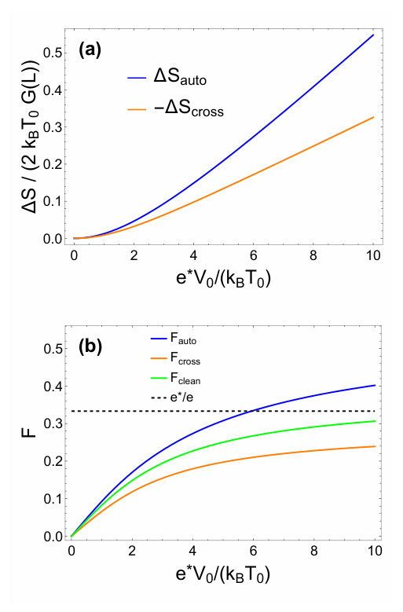
<figcaption class="paper-figure-caption"><b>Fig 5.</b> Figure 5. Bias dependence of the excess current noises and the corresponding Fano factors, calculated from the full expressions without expanding in T . The calculations are performed in the strong charge-equilibration regime, ℓch ≪ L. (a) Excess auto-correlation ∆Sauto and negative cross- correlation −∆Scross, normalized by the equilibrium Johnson– Nyquist noise 2kBT0G(L), as functions of the dimensionless bias e∗V0/(kBT0), where G(L) ≡2G0/3 is the two termi- nal conductance of the fully equilibrated ν = 2/3 edge. (b) Fano factors Fauto, Fcross, and Fclean as functions of the same dimensionless bias as in (a). The horizontal dashed line in- dicates the quasiparticle charge e∗/e = 1/3. This...</figcaption>
</figure>

**Summary.** This paper presents a systematic theoretical framework to interpret shot noise in complex Fractional Quantum Hall edges. It addresses the major hurdle of separating intrinsic quasiparticle tunneling noise from noise generated by thermal equilibration and heating. By combining auto- and cross-correlations in a specific way, the authors successfully isolate the true quasiparticle charge, providing a powerful diagnostic tool for topological physics.

**Why it may be interesting.** This work provides a sophisticated theoretical tool for interpreting transport measurements in topological materials, directly addressing the complex interplay between charge transport and thermalization in strongly correlated edge states.

Detailed structure

**Main problem.** The primary challenge is accurately extracting the intrinsic quasiparticle charge from shot noise measurements in complex Fractional Quantum Hall (FQH) edges, as these measurements are contaminated by noise generated through intermode equilibration and Joule heating.

**Main result.** The authors derive a specific combination of auto- and cross-correlations that strongly suppresses the heating contribution, allowing for the clean recovery of the tunneling quasiparticle charge.

**Method.** The work develops a general theoretical framework by modeling the edge junction using continuum equations derived from local charge and energy conservation laws, analyzing noise correlations in a four-terminal QPC geometry.

**Model / system.** The system is an FQH edge, specifically modeled using a junction connecting two counter-propagating channels ($
u=1$ and $
u=1/3$) within a four-terminal Quantum Point Contact (QPC) geometry.

**Key observables.** Auto- and cross-correlations in the drain contacts ($	ext{S}_{UR,UR}$, $	ext{S}_{DL,DL}$, $	ext{S}_{UR,DL}$), and the resulting Fano factors ($F_{	ext{auto}}$, $F_{	ext{cross}}$, $F_{	ext{clean}}$).

**Important parameters / regimes.** Charge equilibration length scale ($\ell_{ch}$) and thermal equilibration length scale ($\ell_{th}$); the analysis focuses on the regime where $\ell_{ch} \ll L$.

**Assumptions / limitations.** The analysis assumes that at low frequencies, charge accumulation within a cell can be neglected, allowing for local conservation of average current and fluctuations.

**Figures summary.** Figures illustrate the discrete model of the edge junction and the overall four-terminal QPC geometry. Table I compares the scaling of heating corrections for different noise combinations, and Figure 5 shows the bias dependence of the calculated Fano factors.

**Paper structure.** The paper first establishes the physical model of the edge junction and the four-terminal setup. It then derives continuum equations for voltage and temperature profiles. The core of the work involves analyzing the noise correlations, leading to the construction of a specialized Fano factor ($F_{	ext{clean}}$) that systematically removes the heating contamination.

Abstract

Shot-noise measurements with a quantum point contact provide a direct probe of the quasiparticle charge in Laughlin fractional quantum Hall (FQH) states. However, the interpretation of such measurements becomes more subtle for multichannel edges, where the point-contact tunneling noise coexists with noise generated by intermode equilibration and heating. We develop a general framework that incorporates both these contributions and apply it to the paradigmatic $ν=2/3$ FQH edge. We derive expressions for the drain auto- and cross-correlations in a four-terminal QPC geometry and show that equilibration-induced heating affects the auto- and cross-correlations in parametrically different way than the intrinsic partition noise. This distinction permits us to propose a specific combination of the two correlations which strongly suppresses the heating contribution and fully recovers the tunneling quasiparticle charge. Our results thereby provide a systematic framework for interpreting shot-noise measurements in complex FQH edges and can be further extended to more general counterpropagating edge structures.

[↑ back to top](#top)

### [Sideband fingerprint of the Leggett mode in terahertz two-dimensional coherent spectroscopy of multiband superconductors](http://arxiv.org/abs/2610.02978v1)

**Authors:** Silvia Neri, Ryo Shimano, Dirk Manske, Naoto Tsuji  
**Type:** theory · **Category:** other · **PDF:** <https://arxiv.org/pdf/2610.02978v1>  
**Analysis basis:** full PDF text, analyzed in chunks
**Topic relevance:** `Keldysh / 2PI / non-Gaussian methods` **3/5** · `methods for driven-dissipative` **2/5** · `analog quantum simulation` **1/5** · `correlated / nonlocal dissipation` **1/5** · `driven-dissipative phase transition` **1/5** · `interference shaping light` **1/5** · `non-equilibrium universality` **1/5** · `quantum measurements` **1/5**

↔ Scroll figures horizontally

<figure class="paper-figure-card">
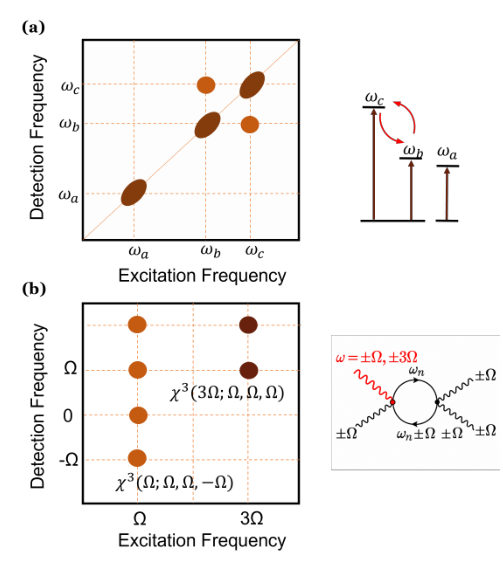
<figcaption class="paper-figure-caption"><b>Fig 1.</b> FIG. 1. Schematic comparison of (a) conventional 2D spec- troscopy originally developed in the field of chemical and molecular physics and (b) 2DCS for quantum materials. (a) Representative 2D spectrum of a mixture of two compounds. Diagonal peaks correspond to conventional 1D spectral fea- tures, while off-diagonal peaks reveal coupling between differ- ent transitions; peaks B and C belong to the same species and are coupled, as illustrated by the level scheme. (b) Represen- tative 2DCS spectrum generated by two time-delayed pulses, A(t) and A(t + ∆t), centered at ±Ω. Third-order frequency mixing produces four fundamental-harmonic spots and two third-harmonic spots. For a clean...</figcaption>
</figure>
<figure class="paper-figure-card">
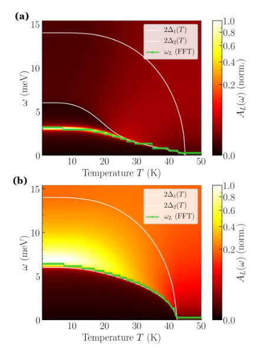
<figcaption class="paper-figure-caption"><b>Fig 2.</b> FIG. 2. Temperature dependence of the superconducting gaps 2∆1 and 2∆2 and the Leggett-mode frequency ωL for the model in Eq. (1) with the interband coupling parameter (a) ν = 0.02 (in-gap Leggett mode) and (b) ν = 0.32 (between- gap Leggett mode). The Leggett-mode frequency extracted from the pseudospin dynamics (green lines) is overlaid on the spectral function (color map) obtained from Eq. (12). The other parameters are ∆1 = 3 meV, ∆2 = 7 meV, ϵF,1 = 1.6 eV, ϵF,2 = 0.7 eV, m1 = 0.85me, m2 = 1.38me, ϵD = 50 meV, s1 = 1, and s2 = −1, chosen to be representative of MgB2.</figcaption>
</figure>
<figure class="paper-figure-card">
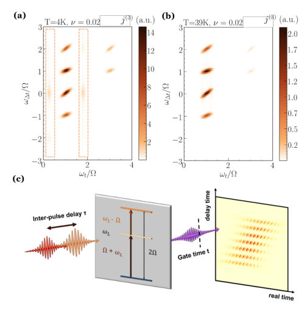
<figcaption class="paper-figure-caption"><b>Fig 3.</b> FIG. 3. Third-order nonlinear current j(3) of a two-band su- perconductor calculated within the pseudospin model. (a,b) Two-dimensional spectra in the (ωt, ω∆t) frequency plane ob- tained from the model Hamiltonian in Eq. (1) for ν = 0.02, corresponding to an in-gap Leggett mode, at (a) T = 4 K and (b) T = 39 K. In (a), characteristic sidebands associated with the Leggett-mode resonance appear at ωt = ±ωL ∓Ω, as highlighted by the orange boxes. These sidebands are strongly suppressed upon approaching the critical tempera- ture Tc = 44 K, as shown in (b). (c) Schematic illustration of the nonlinear process responsible for the sidebands. Non- linear excitation of a collective mode at ωL...</figcaption>
</figure>
<figure class="paper-figure-card">
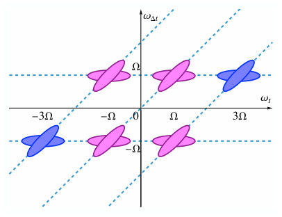
<figcaption class="paper-figure-caption"><b>Fig 4.</b> FIG. 4. Schematic illustration of the spectral features in jA2 1A2(ωt, ω∆t) for narrow-band pulses. Extended spectral weight appears along the horizontal lines ω∆t = ±Ωand the diagonal lines ωt −ω∆t = 0, ±2Ω, as indicated by the dashed lines. Their intersections produce the characteristic peaks of the 2D spectrum. The elongated shapes schematically illus- trate the finite spectral width arising from the principal-value components of the pulse spectrum.</figcaption>
</figure>
<figure class="paper-figure-card">
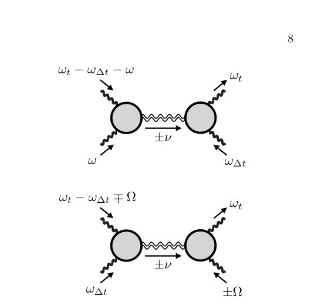
<figcaption class="paper-figure-caption"><b>Fig 5.</b> FIG. 5. Diagrammatic representation of the collective-mode resonance in the third-order nonlinear response. The inter- nal wavy line represents a collective-mode excitation with frequency ±ν. In the upper panel, the three incoming fre- quencies are ω, ωt −ω∆t −ω, and ω∆t, leading to the reso- nance condition ωt −ω∆t = ±ν, which is independent of the integration frequency ω. The lower panel illustrates the cor- responding process when one of the incoming frequencies is fixed to ±Ωby the δ-function component of the narrow-band pulse spectrum.</figcaption>
</figure>

**Summary.** This work theoretically establishes that terahertz two-dimensional coherent spectroscopy (2DCS) can directly fingerprint the elusive Leggett mode in multiband superconductors. The key insight is that the finite duration of the THz pulses enables the nonlinear excitation of this mode, which appears as distinct sidebands in the 2D spectrum. This method offers a powerful, non-invasive diagnostic tool for studying superconducting pairing interactions.

**Why it may be interesting.** The use of nonlinear spectroscopy (2DCS) to probe a collective, non-linear excitation like the Leggett mode is highly relevant to open quantum systems and quantum optics, as it requires understanding how coherent driving fields couple to intrinsic many-body dynamics.

Detailed structure

**Main problem.** The primary challenge is the direct experimental detection of collective superconducting modes, specifically the Leggett mode, which are difficult to observe in multiband superconductors.

**Main result.** The authors theoretically demonstrate that terahertz two-dimensional coherent spectroscopy (2DCS) provides a unique and robust fingerprint of the Leggett mode through characteristic sideband emission in the nonlinear 2D spectrum.

**Method.** The theoretical framework involves calculating the nonlinear dynamics of the superconducting order parameters using the Anderson pseudospin language and analyzing the resulting third-order nonlinear current to predict the 2D spectrum.

**Model / system.** The system is a multiband superconductor, modeled using a minimal two-band BCS framework, whose dynamics are mapped onto pseudospin equations. The Leggett mode represents the coherent oscillation of the relative phase between the two superconducting condensates.

**Key observables.** The Leggett mode frequency ($\omega_L$), which manifests as sidebands in the 2D spectrum at $\omega_t = \omega_L \pm \Omega$.

**Important parameters / regimes.** The interband coupling parameter ($
u$), the central frequency of the incident pulses ($\Omega$), and the temperature ($T$).

**Assumptions / limitations.** The analysis relies on the Random Phase Approximation (RPA) and assumes the finite duration of the THz pulses provides the necessary nonlinear frequency mixing to excite the mode.

**Figures summary.** Figures illustrate the comparison between conventional 2D spectroscopy and the predicted 2DCS spectrum, showing the characteristic side peaks associated with the Leggett mode.

**Paper structure.** The paper progresses from establishing the physical difficulty of measuring the mode to deriving the theoretical signature using 2DCS, demonstrating its robustness against dissipation, and finally showing unambiguous identification by sweeping the central frequency $\Omega$.

Abstract

Collective modes of the superconducting condensate encode fundamental information on the pairing interaction, yet their direct detection remains experimentally challenging. In multiband superconductors, the Leggett mode, i.e., a coherent oscillation of the relative phase between two condensates, is Raman-active and couples to light only nonlinearly in ordinary situations. Here we show theoretically that terahertz two-dimensional coherent spectroscopy (2DCS) provides a direct fingerprint of the Leggett mode (with frequency $ω_L$) through sideband emission at the detection frequency $ω_t = ω_L\pmΩ$ ($Ω$ is the central frequency of the incident pulses) in the nonlinear 2D spectrum. The key insight is that the finite duration of the THz pulses is the physical mechanism that makes the mode accessible: the broad spectral content of a finite pulse provides the nonlinear frequency combinations needed to resonantly excite the mode at ωL without any prior knowledge of its value or tuning of external parameters. We demonstrate robustness of this signature against temperature and quasiparticle relaxation, and show that sweeping $Ω$ allows unambiguous identification of the Leggett mode.

[↑ back to top](#top)

### [Persistence of kinks in the NLS equation with competing nonlinearities](http://arxiv.org/abs/2610.02541v1)

**Authors:** P. G. Kevrekidis, D. E. Pelinovsky  
**Type:** theory · **Category:** other · **PDF:** <https://arxiv.org/pdf/2610.02541v1>  
**Analysis basis:** full PDF text, analyzed in chunks
**Topic relevance:** `Frenkel-Kontorova` **3/5** · `Keldysh / 2PI / non-Gaussian methods` **1/5** · `analog quantum simulation` **1/5** · `driven-dissipative phase transition` **1/5** · `methods for driven-dissipative` **1/5** · `non-equilibrium universality` **1/5**

↔ Scroll figures horizontally

<figure class="paper-figure-card">
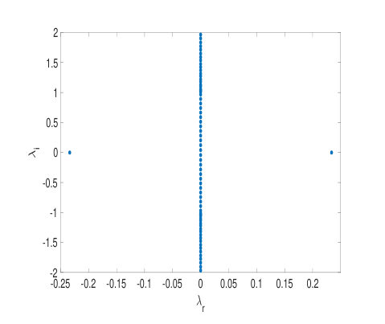
<figcaption class="paper-figure-caption"><b>Fig 1.</b> Figure 1. Numerical results for the potential V (x) = xe−x2. Left: the per- turbed kink profile φ (thick solid line), the potential V (red dashed line), and the unperturbed kink φ0 for comparison. Right: the complex plane (λr, λi) of eigenvalues λ = λr + iλi of the spectral stability problem (23).</figcaption>
</figure>
<figure class="paper-figure-card">
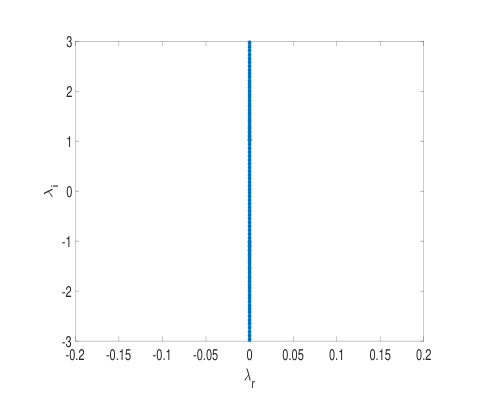
<figcaption class="paper-figure-caption"><b>Fig 2.</b> Figure 2. The same as Figure 1 but for the potential V (x) = −xe−x2.</figcaption>
</figure>
<figure class="paper-figure-card">
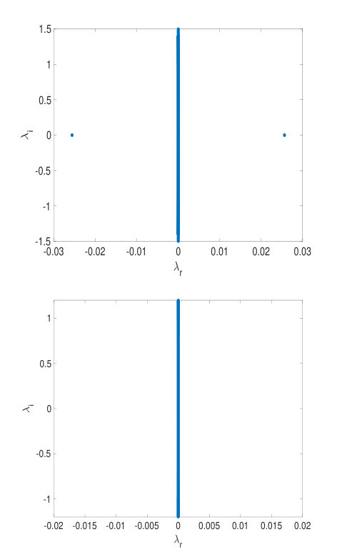
<figcaption class="paper-figure-caption"><b>Fig 3.</b> Figure 3. The same as Figure 1 but for the potential V (x) = (1−x2)sech2(x) with ε = 0.1. Top row: the negative root of Veff. Bottom row: the positive root of Veff.</figcaption>
</figure>
<figure class="paper-figure-card">
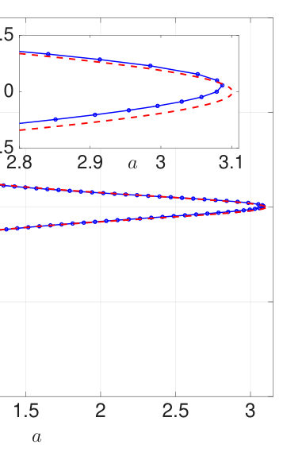
<figcaption class="paper-figure-caption"><b>Fig 4.</b> Figure 4. Bifurcation diagram for the potential V (x) = (1 −ax2)sech2(x) for ε = 0.1, showing the numerically computed kink-center location s from pseudo-arclength continuation together with the roots of Veffgiven by (43). The diagram captures the positive and negative branches and their merger near the fold bifurcation at acrit given by (44).</figcaption>
</figure>
<figure class="paper-figure-card">
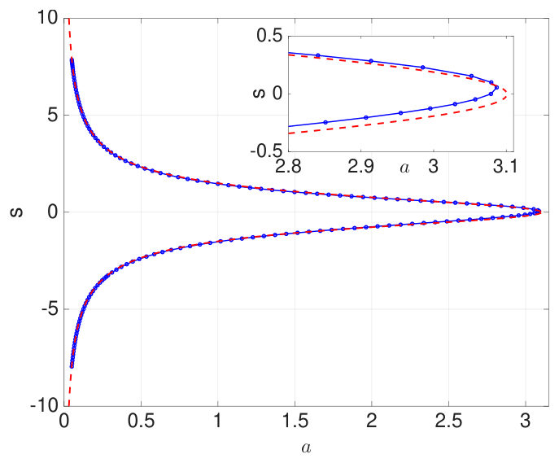
<figcaption class="paper-figure-caption"><b>Fig 5.</b> Figure 5 compares the numerically computed eigenvalues µ+(ε) of L+(ε) (left) and λ(ε) of the spectral stability problem (23) (right) with the leading-order asymptotic approximations (41) and (42) for the same value of ε = 0.1 and varying values of a. The eigenvalue µ+(ε) is negative for the negative root s0 of Veffand positive for the positive root s0. The agreement is very good and consistent with the approximation in Figure 5. The discrepancy between the two curves is visible for a &gt; 1.5 since the value of ε is fixed. The eigenvalue µ+(ε) vanishes as a →acrit due to the fold bifurcation. The eigenvalue λ(ε) is positive only for the negative root s0 of Veff. To obtain an accurate numerical...</figcaption>
</figure>

**Summary.** This work analyzes the persistence and stability of kink solutions in a cubic-quintic NLS equation subjected to an external potential. Using advanced mathematical techniques like Lyapunov–Schmidt reduction, the authors establish criteria based on an effective potential to predict if a kink will be stable or unstable. The results confirm that the pinning mechanism is robust and provides detailed insights into the spectral properties of the perturbed system.

**Why it may be interesting.** The study of nonlinear wave dynamics, particularly the stability and pinning of topological defects like kinks, is highly relevant to nonlinear optics, Bose-Einstein condensates (BECs), and nonlinear wave propagation in various physical systems.

Detailed structure

**Main problem.** The paper investigates how kinks (solitary wave solutions) in the Nonlinear Schrödinger (NLS) equation persist when translational invariance is broken by an external potential.

**Main result.** The persistence of kinks is governed by the roots of an effective potential, and the stability of the pinned state is determined by the sign of the derivative of this effective potential at the root.

**Method.** The analysis employs the Lyapunov–Schmidt reduction method, perturbation theory to analyze eigenvalue splitting, and comparison with numerical continuation and direct dynamical simulations.

**Model / system.** The model is the NLS equation with competing focusing cubic and defocusing quintic nonlinearities, perturbed by an external potential V(x). Stationary solutions are sought in the form of kinks.

**Key observables.** Effective potential V_eff(s), the sign of V'_eff(s_0), and the eigenvalues mu_+ and lambda characterizing the stability.

**Important parameters / regimes.** The small perturbation parameter epsilon (ε) controlling the strength of the external potential V(x).

**Assumptions / limitations.** The analysis relies on the validity of the Lyapunov–Schmidt reduction and asymptotic expansions for the eigenvalues, though some long-term stability aspects remain open.

**Figures summary.** Figure 6 illustrates the dynamical evolution of an unstable kink, showing it emitting radiation and subsequently settling near a stable pinned state.

**Paper structure.** The paper follows a structure moving from the analytical derivation of the pinning mechanism via V_eff, to the spectral stability analysis determining unstable eigenvalues, and concluding with numerical corroboration of these analytical predictions.

Abstract

External potentials break the translational invariance of nonlinear Schrödinger (NLS) equations and generally convert a continuous family of standing wave solutions into isolated pinned states. We study this mechanism for the prototypical case of a kink in the NLS equation with competing focusing cubic and defocusing quintic nonlinearities. The Lyapunov--Schmidt reduction method is used to prove that the location $s_0$ of the pinned kinks is selected near roots of an effective potential $V_{\rm eff}(s)$. We then determine how the translational zero eigenvalue of the Jacobian operator splits under the perturbation and prove that the sign of $V_{\rm eff}'(s_0)$ distinguishes eigendirections of positive and negative energy. We further show that if the Jacobian operator admits a negative eigenvalue, then the stability problem contains a real unstable eigenvalue. The derivation of the asymptotic expansion for the unstable eigenvalue is nonstandard because the zero eigenvalue is embedded in the continuous spectrum of the linearized operator. Finally, we show that the persistence of kinks lacks parity symmetry even if the external potential is odd. Numerical continuation, spectral computations with domains adapted to the slowly decaying eigenfunctions, and direct dynamical simulations of the time evolution corroborate the analytical predictions for different representative examples.

[↑ back to top](#top)

### [Bacterial aggregation in the presence of directed motion](http://arxiv.org/abs/2610.02441v1)

**Authors:** Timothy Power, Hildur Knutsdottir, Leah Edelstein-Keshet, Theodore Kolokolnikov  
**Type:** theory · **Category:** statistical mechanics · **PDF:** <https://arxiv.org/pdf/2610.02441v1>  
**Analysis basis:** full PDF text, analyzed in chunks
**Topic relevance:** `non-equilibrium universality` **3/5** · `Frenkel-Kontorova` **1/5** · `Keldysh / 2PI / non-Gaussian methods` **1/5** · `driven-dissipative phase transition` **1/5** · `methods for driven-dissipative` **1/5**

↔ Scroll figures horizontally

<figure class="paper-figure-card">
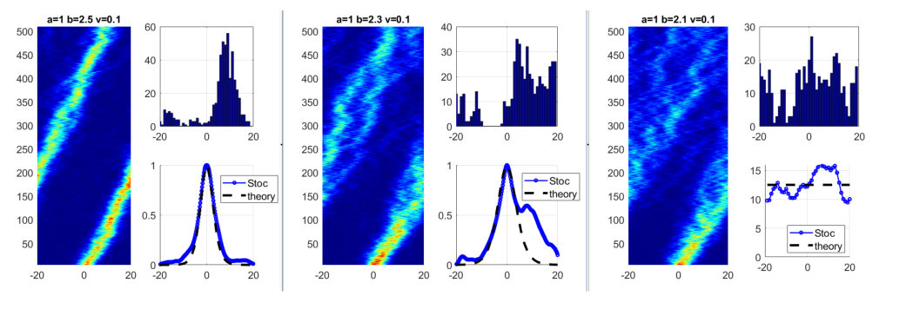
<figcaption class="paper-figure-caption"><b>Fig 1.</b> FIG. 1. Three distinct simulations of the stochastic ABM version of Model I on a periodic domain with n = 1000 particles. and for parameters as given. For each of three panels, left is a time-space plot (kymograph) of the particle density. Top right is a histogram of particle locations at t = 500. Bottom right shows the average profile of the moving cluster (histogram averaged over t = 300 . . . 500), normalized to center the distribution at x = 0. Overlaid is the theoretical prediction given in (2.17). In all simulations we took d = 1. For the third simulation, the aggregation parameter b is exactly at the threshold bc = 2a + v and the cluster dissipates.</figcaption>
</figure>
<figure class="paper-figure-card">
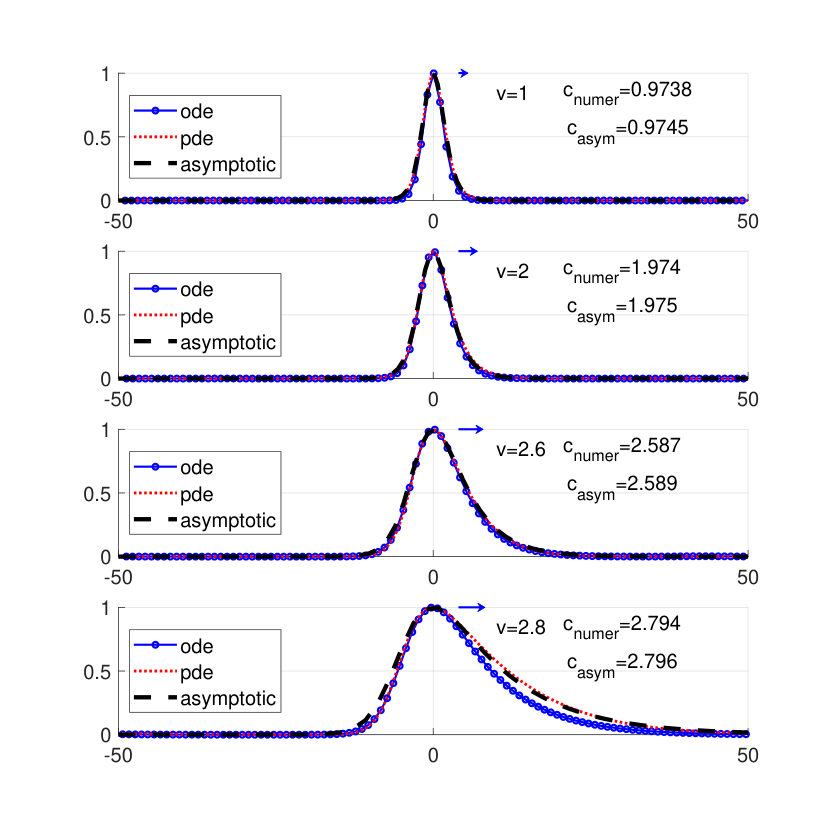
<figcaption class="paper-figure-caption"><b>Fig 2.</b> FIG. 3. Model I: Comparison between the discrete ODE model (2.1), the PDE approximation (2.8) and the asymptotic solution (2.17). For the ODE model the parameters were taken to be: a = 1, b = 5, N = 100 bins on the domain of size L = 100 so that h = 1, and v as indicated; For the PDE model, we used implicit-explicit Euler scheme (implicit on diffusion and biharmonic terms, explicit on all other terms) with n = 150 meshpoints on the domain of size [0, 100]. All profiles are recentered on the pulse maximum, and the height is normalized to unity (since the equations are invariant under scaling of u, scaling it does not change the speed or profile). Periodic boundary conditions were used for...</figcaption>
</figure>
<figure class="paper-figure-card">
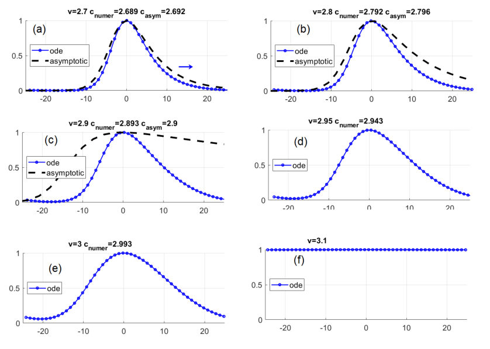
<figcaption class="paper-figure-caption"><b>Fig 3.</b> FIG. 4. Model I: Transition from a localized cluster (when v &lt; v∗) to a more broad non-homogeneous state when v∗&lt; v &lt; vc and finally to a homogeneous constant state for v &gt; vc. Here, a = h = d = 1, b = 5 and v is as indicated. All profiles have been rescaled to have a height of unity, and shifted to have the peak at the origin. Blue line (“ode”) is the numerical solution to (2.1), at time t = 10000. Black dashed line is the asymptotic solution (2.17), where relevant. For these parameter values, v∗= 2.9099 (given by (2.22)) and vc = 3. In (a)-(c), v &lt; v∗and the localized cluster of the form (2.17) exists, although the approximation breaks down as v →v− ∗. In (d)-(e), the localized state...</figcaption>
</figure>
<figure class="paper-figure-card">
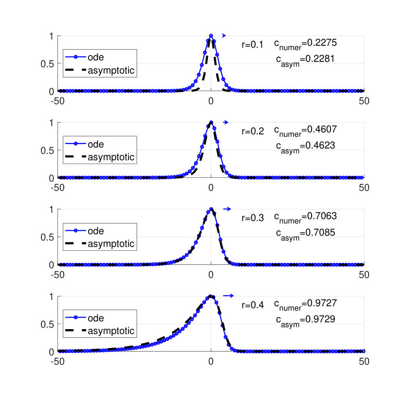
<figcaption class="paper-figure-caption"><b>Fig 4.</b> FIG. 5. Model II: Comparison between the discrete ODE model (3.23) and the asymptotic solution (3.29-3.31, 2.16, 2.17). For the ODE model, the parameters were taken to be: a = 1, b = 2.5, N = 100, L = 100, h = 1, with periodic boundary conditions and r as indicated. For each frame, cnumer is the speed of the pulse propagation, computed from the direct numerical simulations by tracking pulse location, whereas casym is the asymptotic prediction as given by the formula (3.31). The last frame (r = 0.4) corresponds to a bistable region (see also Figure 6).</figcaption>
</figure>
<figure class="paper-figure-card">
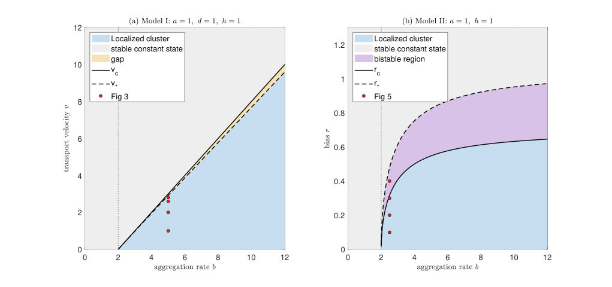
<figcaption class="paper-figure-caption"><b>Fig 5.</b> FIG. 6. (a) Bifurcation diagram for Model I, in the (b, v) plane, with a = h = d = 1. Constant steady state is stabe in the grey region v &gt; vc. Localized solutions exist in the blue region v &lt; v∗. Since v∗&lt; vc, there is a “gap” region where the constant state is unstable but fully localized clusters do not exist (see also Figure 4). Red dots denote the simulation parameters from Figure 3. (b) Bifurcation diagram for Model II, in the (b, r) plane with a = h = d = 1. Constant steady state is stable in the grey region r &gt; rc. Localized solutions exist in the blue region r &lt; r∗. Since r∗&gt; rc, there is a bistable region where constant stable state coexists with a localized cluster state. Red...</figcaption>
</figure>

**Summary.** This work develops a continuum PDE model to describe how bacterial clusters form and move under directed forces like chemotaxis. By generalizing previous models, the authors provide analytical solutions for the cluster's speed and map out stability regimes, showing excellent agreement between discrete simulations and the derived PDE theory.

**Why it may be interesting.** While focused on biology, the mathematical framework—deriving complex nonlinear PDEs from discrete stochastic processes and analyzing traveling wave solutions—is highly relevant to non-equilibrium statistical mechanics and pattern formation in complex systems.

Detailed structure

**Main problem.** The paper models the aggregation of bacteria into clusters when subjected to directed motion, such as chemotaxis or fluid transport.

**Main result.** The authors derived a fourth-order nonlinear PDE that accurately describes the cluster density profile and group velocity, identifying distinct regimes for cluster existence and speed.

**Method.** The continuum limit was derived from stochastic Agent-Based Models (ABMs) using Taylor expansion, leading to a generalized nonlinear PDE solved via a traveling pulse ansatz.

**Model / system.** The system models bacterial aggregation using two variants: Model I (intrinsic directed motion $v$) and Model II (implicit directional bias $r$). The dynamics are captured by a fourth-order PDE.

**Key observables.** Cluster density profile, group velocity (speed of the travelling cluster), and stability regimes (e.g., bistability or 'gap' regions).

**Important parameters / regimes.** Directed motion parameters ($v$ or $r$), aggregation strength ($b$), and diffusion coefficients ($\alpha, eta, \gamma$ in the PDE).

**Assumptions / limitations.** The derivation relies on the assumption of a small bin spacing ($h 	o 0$) for the PDE limit, and the analysis uses traveling wave ansatz solutions.

**Figures summary.** Figures illustrate the transition of the cluster state as velocity increases (localized $	o$ homogeneous) and show bifurcation diagrams revealing 'gap' and bistability windows for the two models.

**Paper structure.** The paper progresses by establishing the ABM foundation, deriving the continuum PDE limit, and then analyzing the resulting PDE using traveling wave solutions to determine the cluster speed and stability boundaries for both motion models.

Abstract

We model directed motion of cells that aggregate into a cluster in the presence of chemotaxis or fluid transport. Starting from a stochastic agent-based model (ABM) of Galante \& Levy (2013), Chavy-Waddy \& Kolokolnikov (2016), we consider two model variants, with (I) directed motion of individuals, or (II) implicit individual bias in one direction. In both cases, we derive fourth order nonlinear PDEs representing the continuum limits of the models as a generalization of Chavy-Waddy \& Kolokolnikov (2016). An exact analytic solution then describes cluster density profile as well as the group velocity, and we identify the regimes where the travelling cluster exists. Excellent agreement is observed between the discrete models and the exact solutions of the PDEs in both models, including the existence and speed of the travelling cluster.

[↑ back to top](#top)

### [Electrostatic Doping of Moiré Superlattices Controls the Optical Fingerprint of a WSe_2 /Twisted Bilayer Graphene heterostructure](http://arxiv.org/abs/2610.03532v1)

**Authors:** Houssem Eddine Hannachi, Sihem Jaziri  
**Type:** theory · **Category:** strongly correlated electrons · **PDF:** <https://arxiv.org/pdf/2610.03532v1>  
**Analysis basis:** full PDF text, analyzed in chunks
**Topic relevance:** `analog quantum simulation` **3/5** · `Keldysh / 2PI / non-Gaussian methods` **1/5** · `interference shaping light` **1/5**

↔ Scroll figures horizontally

<figure class="paper-figure-card">
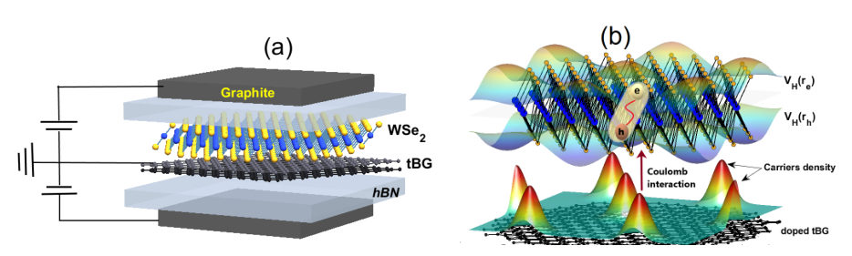
<figcaption class="paper-figure-caption"><b>Fig 1.</b> FIG. 1. (a) Schematic illustration of the studied hBN/WSe2/tBG/hBN heterostructure. The WSe2 monolayer is positioned adjacent to twisted bilayer graphene, which is electrostatically doped to control the carrier density in the moir´e superlattice. (b) Cartoon illustrative of the mechanism by which the carrier density in the doped moir´e tBG generates a spatially periodic electrostatic potential in the WSe2 monolayer. This potential acts on the electron and hole constituents of the exciton through the respective potentials VH(re) and VH(rh).</figcaption>
</figure>
<figure class="paper-figure-card">
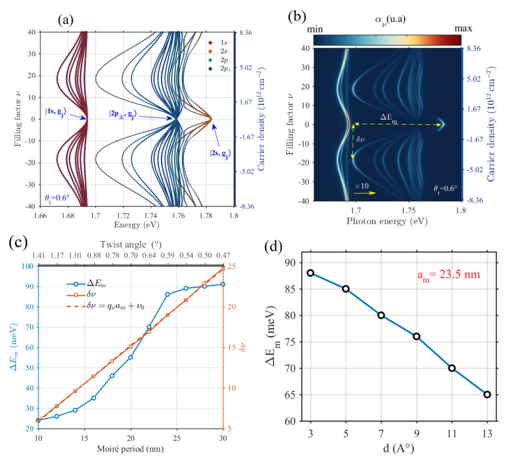
<figcaption class="paper-figure-caption"><b>Fig 2.</b> FIG. 2. (a) Filling factor dependence of the bright moir´e-exciton states in the WSe2/tBG heterostructure at a twist angle of θt = 0.6◦(am = 23.5 nm), showing the states |1s, gj⟩, |2p±, gj⟩, and |2s, gj⟩, with the corresponding projected Rydberg-state weights indicated by the marker size and color. (b) Corresponding absorption map as a function of filling factor (carrier- density). Here, the carrier-density axis is calculated as ν ×ρm. The dashed yellow vertical and horizontal double arrow indicate the characteristic filling factor νm and energy scale ∆Em, respectively. (c) Dependence of the quantities ∆Em and δν on the moir´e period (twist angle). (d) Dependence of ∆Em on the interlayer...</figcaption>
</figure>
<figure class="paper-figure-card">
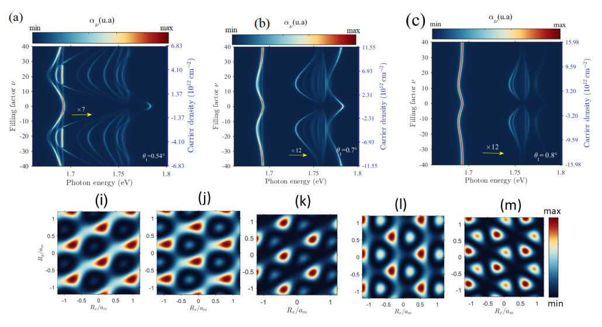
<figcaption class="paper-figure-caption"><b>Fig 3.</b> FIG. 3. (a–c) Filling-factor dependence of the absorption maps for twist angles of θt = 0.54◦, 0.7◦, and 0.8◦, respectively. (i–m) Corresponding real-space COM density distributions R Ψ(r = 0, R)d2R 2 Q=0, for the 8th–12th bright states at a fixed twist angle of θt = 0.45◦and filling factor ν = 10.</figcaption>
</figure>

**Summary.** This theoretical study analyzes how doping the moiré superlattice of twisted bilayer graphene (tBG) modifies the optical fingerprint of a coupled WSe2 monolayer. The research shows that doping generates a periodic potential that strongly influences the exciton's energy levels, leading to observable satellite resonances. This establishes the doped tBG as a powerful tool for optically engineering excitonic states in adjacent 2D semiconductors.

**Why it may be interesting.** The work directly addresses how external tuning (electrostatic doping) can engineer the optical properties of strongly correlated excitonic states in a moiré heterostructure, which is a key area in correlated materials physics.

Detailed structure

**Main problem.** The study investigates how electrostatic doping within the moiré superlattice of twisted bilayer graphene (tBG) controls the optical absorption spectrum of a coupled WSe2 monolayer.

**Main result.** Electrostatic doping induces pronounced modifications in the excitonic absorption spectrum, notably causing the emergence of multiple satellite resonances due to the interplay between exciton degrees of freedom and doping-induced hybridization.

**Method.** The authors employed a detailed theoretical model solving the exciton Hamiltonian, incorporating the spatially modulated electrostatic potential derived from the doped moiré superlattice.

**Model / system.** The system is a WSe2 monolayer stacked on tBG, forming a moiré superlattice. The exciton is governed by a Hamiltonian that includes terms for kinetic energy, Coulomb interaction, and the periodic potential induced by the doped tBG.

**Key observables.** Excitonic absorption spectrum, multiple satellite resonances, energy shift ($\Delta E_m$), and characteristic filling factor ($\delta
u$).

**Important parameters / regimes.** Twist angles below the magic angle ($	heta_t < 1.1^\circ$), moiré filling factor ($
u$), and carrier density ($\approx 4 	imes 10^{12} 	ext{ cm}^{-2}$).

**Assumptions / limitations.** The model uses the screened Coulomb interaction and treats the moiré potential as an effective mean-field periodic potential, neglecting fine-structure effects like Berry curvature contributions.

**Figures summary.** Figures illustrate the schematic of the heterostructure, the mechanism of potential generation via doping, and the resulting spectral features and energy shifts as a function of doping/filling factor.

**Paper structure.** The paper establishes the physical system and the Hamiltonian, details the theoretical methodology for calculating the exciton response to the moiré potential, presents the key results regarding spectral modifications, and concludes by establishing the tunability of excitonic states.

Abstract

We theoretically investigate the optical response of the WSe2 monolayer vertically stacked on twisted bilayer graphene (tBG) under electrostatic doping. In this heterostructure, the doped moiré superlattice of tBG generates a spatially modulated electrostatic potential that couples to the electron and hole constituents of the WSe2 exciton through the screened Coulomb interaction, thereby providing a microscopic mechanism for exciton coupling to the charge-density landscape of the moiré Fermi sea. Focusing on twist angles below the magic angle (1.1°), where electronic correlations are strongly enhanced, we demonstrate that electrostatic doping induces pronounced modifications of the excitonic absorption spectrum, including the emergence of multiple satellite resonances. We show that these spectral features originate from the interplay between the exciton center-of-mass and internal degrees of freedom, together with doping-induced hybridization between Rydberg exciton states of different orbital symmetry. The calculated spectra are in good agreement with previously reported experimental observations and theoretical predictions. Our results establish electrostatic doping in tBG as an effective means of engineering excitonic states in adjacent semiconducting monolayers and provide a pathway toward novel optical sensor devices.

[↑ back to top](#top)

### [Quantum critical superconductivity in a dense fermi dilute bose mixture close to mechanical instability](http://arxiv.org/abs/2610.03094v1)

**Authors:** Vibhu Mishra  
**Type:** theory · **Category:** other · **PDF:** <https://arxiv.org/pdf/2610.03094v1>  
**Analysis basis:** full PDF text, analyzed in chunks
**Topic relevance:** `Keldysh / 2PI / non-Gaussian methods` **3/5** · `analog quantum simulation` **1/5** · `methods for driven-dissipative` **1/5**

↔ Scroll figures horizontally

<figure class="paper-figure-card">
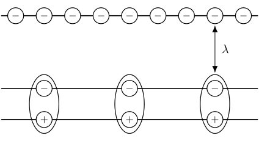
<figcaption class="paper-figure-caption"><b>Fig 1.</b> FIG. 1. The model system of dense electrons in top layer in- teracting with dilute excitons below that motivate the field theory under study. Both λ and u are repulsive due to the orientation of the excitonic dipole. The fermion boson in- teraction is repulsive as opposed to the cases looked at in [5, 6] which circumvents electron-exciton bound states. The drawback of this specific physical setup for our purposes is discussed in Sec.[VII].</figcaption>
</figure>

**Summary.** This theoretical work explores enhancing superconductivity in a Fermi-Bose mixture by coupling electrons to a dilute Bose gas. By analyzing density fluctuations using RPA, the authors demonstrate that the resulting attraction can lead to an algebraic enhancement of $T_c$ rather than the typical exponential BCS dependence. This suggests a powerful mechanism for designing novel superconducting materials.

**Why it may be interesting.** It provides a concrete theoretical pathway to engineer high-$T_c$ superconductors by leveraging quantum critical fluctuations from bosonic baths, which is highly relevant to modern condensed matter research.

Detailed structure

**Main problem.** The paper investigates mechanisms to enhance superconducting transition temperatures ($T_c$) by coupling fermions (electrons) to a bosonic gas (e.g., excitons or dilute bosons).

**Main result.** The coupling can lead to an effective attraction that results in an algebraic dependence for $T_c$ ($T_c \propto g$), significantly surpassing the exponential dependence found in standard BCS theory.

**Method.** The analysis employs the Random Phase Approximation (RPA) and utilizes renormalization group (RG) techniques to analyze the flow of pairing channels and calculate the fermion self-energy.

**Model / system.** The model is a two-dimensional system consisting of a metal (fermions) coupled to an uncondensed Bose gas with repulsive Bose-Fermi interactions. The analysis covers both deeply degenerate and non-degenerate temperature regimes.

**Key observables.** Superconducting transition temperature ($T_c$), fermion self-energy ($\Sigma(i\omega)$), and the effective pairing strength ($g$).

**Important parameters / regimes.** Boson density (acts as a bottleneck), interaction coupling constant ($\lambda$), and the ratio of energy scales ($\Lambda$ vs $\Lambda'$).

**Assumptions / limitations.** The use of RPA, the validity of the T-matrix approximation for the boson self-energy, and the assumption that long-range density fluctuations drive the pairing enhancement.

**Figures summary.** Figure 1 illustrates the model system: dense electrons interacting with dilute excitons.

**Paper structure.** The paper builds from establishing the general model Hamiltonian and the standard BCS comparison, moves through detailed calculations of the boson polarization function ($\Pi_b$) in different temperature regimes, and culminates in deriving the enhanced $T_c$ via the self-energy calculation.

Abstract

We couple a metal to an uncondensed bose gas with repulsive bose-fermi interactions in two dimensions. Within the random phase approximation, we show that the density fluctuations of the bosons, which mediate the effective fermion-fermion attraction, become long ranged on appropriate tuning of interactions. This leads to parametrically enhanced superconducting temperatures $T_c \propto g$ as opposed to $T_c \propto \exp(-1/g)$ for the BCS case. The dilute bose gas density acts as the primary bottleneck to the enhancement. We discuss the conceptual difficulties of implementing this idea in electron-exciton mixtures.

[↑ back to top](#top)

### [Inferring constitutive forces from noisy Allen-Cahn movies with moment equations](http://arxiv.org/abs/2610.02672v1)

**Authors:** Soobeen Jung, Hyunju Kim  
**Type:** both · **Category:** statistical mechanics · **PDF:** <https://arxiv.org/pdf/2610.02672v1>  
**Analysis basis:** full PDF text, analyzed in chunks
**Topic relevance:** `Keldysh / 2PI / non-Gaussian methods` **2/5** · `analog quantum simulation` **2/5** · `driven-dissipative phase transition` **2/5** · `methods for driven-dissipative` **2/5** · `non-equilibrium universality` **2/5** · `quantum measurements` **2/5** · `correlated / nonlocal dissipation` **1/5**

↔ Scroll figures horizontally

<figure class="paper-figure-card">
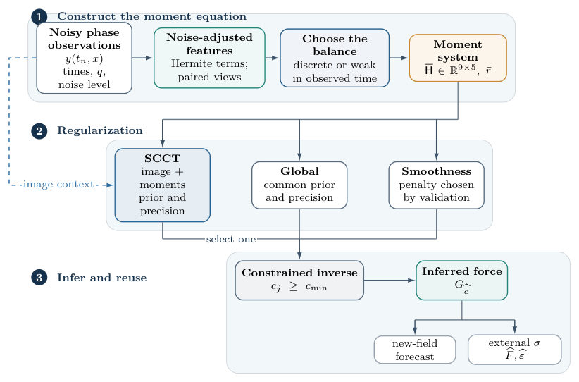
<figcaption class="paper-figure-caption"><b>Fig 1.</b> Figure 1: Method hierarchy. Hermite polynomials and paired views address distinct noise effects. The observation source determines the discrete or weak balance. Each regularizer uses the same moment system and positive constrained inverse; the dashed path supplies image context only to SCCT. External surface tension sets the energy scale after force inference and does not alter forecasts.</figcaption>
</figure>
<figure class="paper-figure-card">
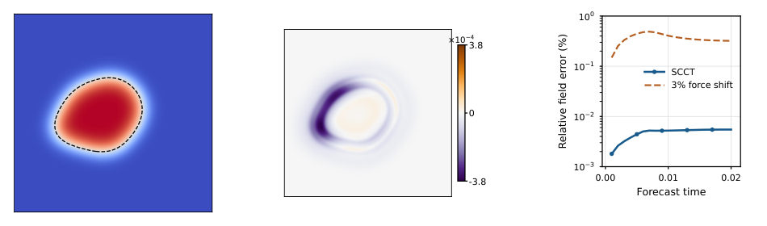
<figcaption class="paper-figure-caption"><b>Fig 2.</b> Figure 2: Transfer to an unseen topology-rich geometry. Blue and red in (a)–(d) denote the negative and positive phase. The dashed black line in (d) is the exact-law zero contour. All fields use the same exact initial condition on a 5122 grid and Fourier Crank–Nicolson/second-order Adams–Bashforth (CNAB2) solver [37]; only the force differs. The previously inferred SCCT force comes from the separate noisy wobble trajectory and has 100eG = 0.096% on the phase grid. Panel (f) compares 100eu(t) = 100∥umodel(t) −u⋆(t)∥2/∥u⋆(t)∥2 with the 3% force-rescaling control on a logarithmic error axis. The signed difference in (e) uses units of 10−4.</figcaption>
</figure>
<figure class="paper-figure-card">

<figcaption class="paper-figure-caption"><b>Fig 3.</b> Figure 3: Three-dimensional transfer and a force-sensitivity control. Panels (a)–(c) render the SCCT u = 0 isosurface at t = 0.004 for one law of each degree on a different geometry. The same three laws are reused on the seven-handle ring cage, not counted as additional independent laws: (d) and (f) compare the exact and SCCT isosurfaces at the same time, t = 0.008, for the degree-four law. Both have six positive components. Panel (e) compares the SCCT and global inverses with a 3% rescaling of the exact force on that same ring cage at t = 0.008; its horizontal error axis is logarithmic. Each comparison starts from the same exact initial field: the 1283 grid is used in (a)–(c), and the 1923</figcaption>
</figure>
<figure class="paper-figure-card">
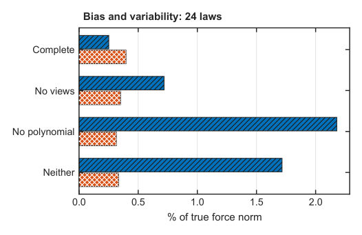
<figcaption class="paper-figure-caption"><b>Fig 4.</b> Figure 4: Bias and realization spread after retraining on a separate 24-law set with five realizations at η = 0.03; spread uses divisor five. Diagonal and cross hatching distinguish bias and realization spread in grayscale.</figcaption>
</figure>
<figure class="paper-figure-card">
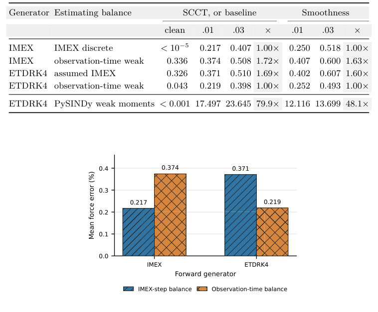
<figcaption class="paper-figure-caption"><b>Fig 5.</b> Figure 5: Generator-by-balance crossover for SCCT at η = 0.01 on 24 laws. Each pair of hatched bars uses the same observations; lower mean force error is better. The preferred balance reverses between IMEX- and ETDRK4-generated trajectories. The smoothness inverse follows the same ordering (Table 2).</figcaption>
</figure>

**Summary.** This work tackles the difficult inverse problem of determining the constitutive force driving phase transitions from noisy Allen-Cahn simulation movies. It introduces noise-adjusted moment equations and a specialized transformer (SCCT) to correct for various sources of measurement bias. The results demonstrate that the method accurately recovers the underlying physics, even distinguishing forces based on fine-scale interface details.

**Why it may be interesting.** While focused on classical phase transitions, the rigorous treatment of noise, bias correction, and inverse problem solving using moment methods and advanced regularization techniques is highly relevant to reconstructing quantum dynamics from noisy measurements.

Detailed structure

**Main problem.** The paper addresses the challenging inverse problem of inferring the unknown constitutive force governing a phase-field evolution from noisy, time-series image data.

**Main result.** The developed noise-adjusted moment equations and the SCCT successfully infer the force, showing that accurate estimation of the underlying equation structure is more critical than increasing regularization flexibility.

**Method.** The methodology involves developing observation-aware moment equations to correct for nonlinear observation noise, instrument coupling, and temporal biases, which are then used in a constrained Bernstein inverse for force reconstruction.

**Model / system.** The system is governed by the Allen-Cahn dynamics, which describes the evolution of an order parameter $u$ as an $L^2$ gradient flow of an energy functional. The force $G(u)$ is parameterized within an admissible family.

**Key observables.** Noisy phase observations ($y_{n,i}$), topological invariants ($b_0, b_1, b_2$), and the inferred constitutive force $G(u)$.

**Important parameters / regimes.** The surface tension ($\sigma$) sets the energy scale, and the force $G(u)$ is parameterized by five coefficients ($c_j$).

**Assumptions / limitations.** The noise is assumed to be i.i.d. Gaussian for bias correction, and the method requires separating the force inference from the external energy scale.

**Figures summary.** Figure 1 illustrates the method hierarchy, detailing how Hermite polynomials and paired views correct distinct noise effects, while the observation source dictates the temporal balance choice.

**Paper structure.** The paper builds logically: Section 2 establishes the identifiability of the force; Section 3 develops the noise-adjusted moment equations and the constrained inverse; and Section 4 validates the entire pipeline using synthetic and physical test cases.

Abstract

Inferring an Allen-Cahn constitutive force from images requires more than an accurate optimizer: nonlinear observation noise alters the mean of force features, shared noise couples instruments to the response, and a temporal balance borrowed from another solver can remain biased even on clean data. We develop observation-aware, noise-adjusted moment equations that address these effects before inversion. The surface-tension-calibrated constitutive transformer (SCCT) couples the resulting moments to a positive Bernstein inverse and can adapt its prior and precision from images and moments. A conditional stability bound separates moment residuals from prior error. Synthetic tests show that correcting the estimating equation matters more than increasing regularizer flexibility; the benefit of learned adaptation is smaller and depends on the training comparison. Forces inferred from planar movies predict unseen planar and three-dimensional evolutions. A ring-cage breakup shows why diffuse-interface accuracy distinguishes forces even when their topological predictions agree, while external surface tension sets the energy scale separately.

[↑ back to top](#top)

### [Magnetic-field response of generalized Wigner crystals in twisted MoTe$_2$](http://arxiv.org/abs/2610.02493v1)

**Authors:** F. K. Wolff, S. Jiao, H. Park, J. Cai, E. Anderson, X. Liu, C. Wang, T. Taniguchi, K. Watanabe, X. Xu, D. Xiao, S. Vaitiekėnas  
**Type:** both · **Category:** strongly correlated electrons · **PDF:** <https://arxiv.org/pdf/2610.02493v1>  
**Analysis basis:** full PDF text, analyzed in chunks
**Topic relevance:** `analog quantum simulation` **2/5**

↔ Scroll figures horizontally

<figure class="paper-figure-card">
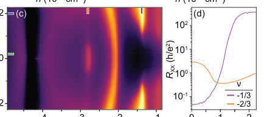
<figcaption class="paper-figure-caption"><b>Fig 1.</b> Fig. 2. (a) Longitudinal resistance, RXX, as a function of carrier density, n, and displacement field, D, measured at µ0H = 0.2 T. (b) Same as (a) but taken at µ0H = 2 T, (c) RXX as a function of n and out-of-plane magnetic field, µ0H, measured at fixed D/ε0 = 0.12 V/nm, showing the evolution of charge-ordered states at commensurate fillings. (d) Line cuts of RXX at ν = −2/3 and −1/3, showing the opposite evolution of the two states relative to h/e2.</figcaption>
</figure>
<figure class="paper-figure-card">
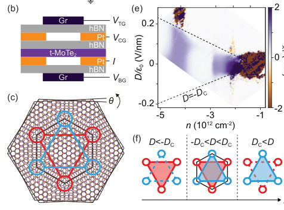
<figcaption class="paper-figure-caption"><b>Fig 2.</b> Fig. 1. (a) Atomic-force micrograph of the device over- laid with the measurement setup. (b) Schematic cross sec- tion showing the twisted MoTe2 bilayer, Pt contacts, and the three-gate geometry. The top and bottom gates at volt- ages VTG and VBG are used to tune the charge-carrier density and the perpendicular displacement field, whereas the contact gate at VCG improves the contact transparency. (c) Schematic illustration of the moir´e superlattice formed in twisted bi- layer MoTe2, highlighting the two moir´e sublattices. (d) and (e) Longitudinal and transverse resistance, RXX and RXY, measured as a function of carrier density, n, and displace- ment field, D at |µ0H| = 0.2 T. The dashed...</figcaption>
</figure>
<figure class="paper-figure-card">
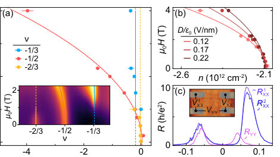
<figcaption class="paper-figure-caption"><b>Fig 3.</b> Fig. 3. (a) Magnetic-field dependence of the extracted rel- ative density shift, δn, of the resistance peaks at ν = −2/3, −1/2, and −1/3. The ν = −1/2 data are best described by a shifted quadratic function, whereas the ν = −2/3 and −1/3 data are consistent with constants. Inset: High-resolution ν– µ0H map with the fitted peak positions overlaid. (b) Peak carrier density of the ν = −1/2 state versus H at three dis- placement fields, showing that the curvature decreases with increasing D. (c) Symmetrized longitudinal resistance, R, as a function of D, measured near ν = −1/2 in a van der Pauw configuration for three probe configurations shown in the in- set. RYY shows a quantitatively...</figcaption>
</figure>

**Summary.** This work reports on magnetotransport measurements in twisted MoTe2, revealing that fractional hole-filling states behave as generalized Wigner crystals. The key finding is the stark contrast in how the resistance responds to a perpendicular magnetic field at different fillings, suggesting that the underlying charge configuration dictates the magnetic lattice and transport properties.

**Why it may be interesting.** The work provides experimental evidence of distinct correlated insulating/charge-ordered states whose magnetic response is highly sensitive to the specific fractional filling, offering a playground for studying magnetic control in correlated electronic systems.

Detailed structure

**Main problem.** The study investigates the magnetotransport response of fractional hole-filling states in a twisted MoTe2 homobilayer, focusing on the interplay between magnetism and charge order.

**Main result.** The system exhibits distinct, contrasting magnetic responses at different fractional fillings ($
u = -2/3$ vs. $
u = -1/3$), which are interpreted as signatures of generalized Wigner crystals with different underlying magnetic lattices.

**Method.** The research combines low-temperature magnetotransport measurements (measuring $R_{XX}$ and $R_{XY}$) with theoretical modeling using Hartree-Fock and exact-diagonalization techniques.

**Model / system.** The physical platform is a twisted MoTe2 homobilayer, which forms a moiré superlattice. The low-energy physics is modeled by carriers on an effective triangular lattice, exhibiting correlated electron behavior at fractional fillings.

**Key observables.** Longitudinal and transverse resistance ($R_{XX}, R_{XY}$), resistance peaks at fractional fillings ($
u = -2/3, -1/3, -1/2$), and the shift of these peaks with perpendicular magnetic field ($H$).

**Important parameters / regimes.** Fractional filling factors ($
u$), perpendicular magnetic field ($H$), and perpendicular displacement field ($D$).

**Assumptions / limitations.** The analysis assumes the system is in the layer-polarized regime ($|D| > D_C$) and interprets the observed phenomena through the lens of generalized Wigner crystal formation.

**Figures summary.** Figures show the evolution of resistance peaks with $H$ at different fillings, demonstrating opposite magnetic responses at $
u = -2/3$ and $
u = -1/3$, and quadratic shifts/anisotropy at $
u = -1/2$.

**Paper structure.** The paper progresses by presenting experimental magnetotransport data across various fillings, contrasting the magnetic field responses, and then using theoretical calculations (Hartree-Fock/exact diagonalization) to explain the observed differences based on the underlying charge configuration and magnetic lattice structure.

Abstract

We report a magnetotransport study of fractional hole-filling states in the layer-polarized regime of a twisted MoTe$_2$ homobilayer. A perpendicular magnetic field suppresses the resistance peak at the two-thirds filling while enhancing the one-third peak by several orders of magnitude. Both remain near their commensurate densities. We argue that these commensurate states are generalized Wigner crystals whose distinct charge configurations define different magnetic lattices, leading to contrasting responses to spin polarization. Near half filling, we observe a qualitatively different state whose resistance maximum shifts approximately quadratically with field and exhibits pronounced transport anisotropy consistent with a stripe phase. These results reveal a strong dependence of magnetotransport on fractional filling and open a route to magnetic control of transport in moiré charge-ordered states.

[↑ back to top](#top)

### [Binary kagome superconducting candidates hosting topological electronic states](http://arxiv.org/abs/2610.03003v1)

**Authors:** Xin-Wei Yi, Jing-Yang You, Gang Su  
**Type:** theory · **Category:** strongly correlated electrons · **PDF:** <https://arxiv.org/pdf/2610.03003v1>  
**Analysis basis:** full PDF text, analyzed in chunks
**Topic relevance:** `analog quantum simulation` **1/5**

↔ Scroll figures horizontally

<figure class="paper-figure-card">
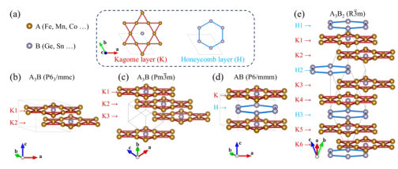
<figcaption class="paper-figure-caption"><b>Fig 1.</b> FIG. 1. Binary kagome structural families. (a) Two common layer motifs used to construct the binary kagome prototypes. The A atoms (gold) form kagome layers (K), while the B atoms (grey) form hon- eycomb layers (H). (b–e) Crystal structures of four prototype fami- lies: (b) A3B (P63/mmc), (c) A3B (Pm¯3m), (d) AB (P6/mmm), and (e) A3B2 (R¯3m). These structures can be generated by stacking kagome and honeycomb layers in different sequences and registries. The drawings highlight the in-plane shifts between adjacent layers.</figcaption>
</figure>
<figure class="paper-figure-card">
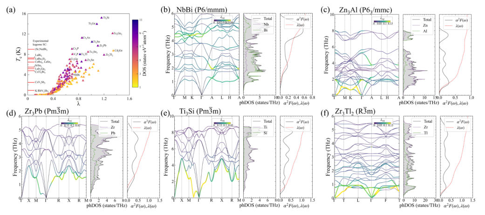
<figcaption class="paper-figure-caption"><b>Fig 2.</b> FIG. 2. Predicted kagome superconducting candidates. (a) Estimated Tc versus electron-phonon-coupling constant λ, with the N(EF) used as the color scale; representative ambient-pressure kagome materials are shown as references [40, 43, 48–56]. (b–f) Phonon dispersions projected by the mode-resolved EPC λνq, together with phonon density of states, Eliashberg spectral function α2F(ω), and accumulated λ(ω) for representative systems: (b) NbBi (P6/mmm), (c) Zn3Al (P63/mmc), (d) Zr3Pb (Pm¯3m), (e) Ti3Si (Pm¯3m), and (f) Zr3Tl2 (R¯3m). λνq denotes the contribution to EPC λ of phonon branch ν at wave vector q.</figcaption>
</figure>
<figure class="paper-figure-card">
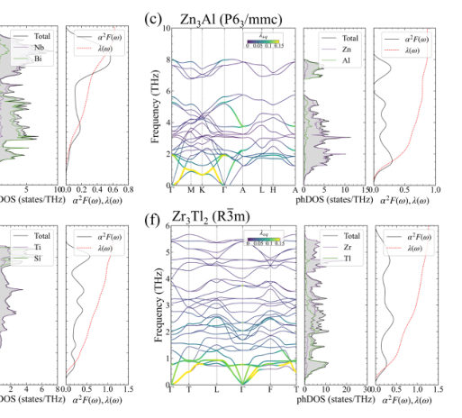
<figcaption class="paper-figure-caption"><b>Fig 3.</b> Fig. 2(a) summarizes the superconducting landscape by plotting the estimated Tc against λ, with N(EF) used as the color scale. The data show the expected broad tendency for Tc to increase with both EPC strength and the Fermi-level den- sity of states, but the spread at fixed λ indicates that phonon- energy scales and mode selectivity are also important. Rep- resentative experimental ambient-pressure kagome supercon- ductors are included in Fig. 2(a) for comparison. The layered reference compounds span different superconducting scales: AV3Sb5 has Tc ≈0.9-2.5 K, CsTi3Bi5 has a reported onset near 4.8 K, and LaRu3Si2 has Tc ≈7 K. The cubic (A3B)- type compound (Sr,Na)Bi3, whose face-centered...</figcaption>
</figure>
<figure class="paper-figure-card">
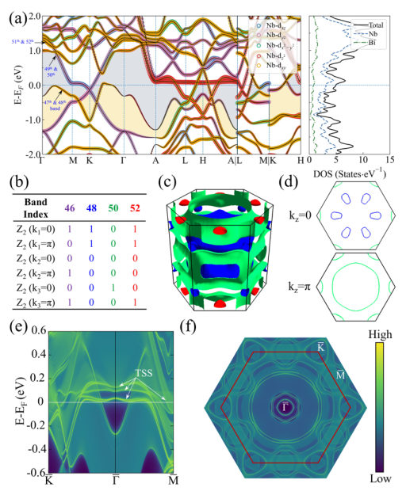
<figcaption class="paper-figure-caption"><b>Fig 4.</b> FIG. 3. Electronic topology of NbBi. (a) Spin-orbit-coupled bulk band structure with Nb d-orbital projections and electronic density of states (DOS). The continuous direct gaps between the 45/46 and 47/48 Kramers pairs and between the 47/48 and 49/50 Kramers pairs are highlighted by light-yellow and light-gray shading, respectively. (b) Plane-resolved Z2 indices for the direct gaps labeled by the upper band index of each Kramers pair, where k1, k2, and k3 denote re- ciprocal primitive coordinates. (c) Three-dimensional Fermi surface and (d) two-dimensional Fermi-surface cuts at kz = 0 and kz = π. (e) Surface spectral function along the ¯K–¯Γ– ¯ M path on the (001) surface. Topological...</figcaption>
</figure>
<figure class="paper-figure-card">
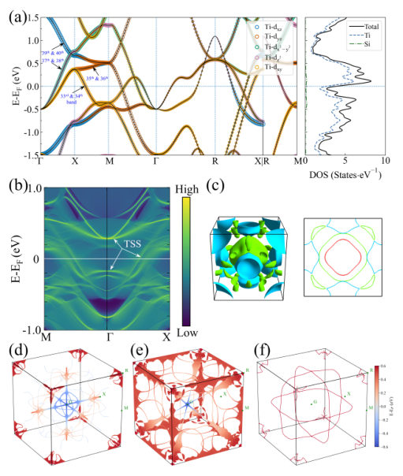
<figcaption class="paper-figure-caption"><b>Fig 5.</b> FIG. 4. Electronic topology of Ti3Si. (a) Spin-orbit-coupled bulk band structure with Ti d-orbital projections and electronic DOS. (b) Surface spectral function along the ¯ M–¯Γ– ¯ X path on the (001) sur- face with SOC. (c) Three-dimensional Fermi surface with SOC and its kz = 0 two-dimensional cut. Panels (d–f) show representative nodal manifolds obtained without SOC, arising from crossings be- tween the spin-degenerate band pairs 33/34 and 35/36 in (d), 35/36 and 37/38 in (e), and 37/38 and 39/40 in (f). The common color scale denotes the crossing energy relative to EF.</figcaption>
</figure>

**Summary.** This work presents a comprehensive computational search for novel binary kagome superconductors that possess intrinsic topological electronic states. By combining stability filtering, electron-phonon coupling calculations, and topological analysis, the authors predict several high-$T_c$ candidates, notably $	ext{Ti}_3	ext{Si}$, making these materials promising platforms for topological superconductivity.

**Why it may be interesting.** The combination of superconductivity (a many-body phenomenon) with intrinsic topological order in a highly structured lattice like kagome is central to realizing exotic quantum states, which is a key area of condensed matter theory.

Detailed structure

**Main problem.** The paper systematically searches for binary kagome superconducting candidates that simultaneously host topological electronic states, aiming for materials exhibiting topological superconductivity.

**Main result.** They identified 286 stable candidates, with seven exceeding the ambient-pressure reference $T_c$ of $\sim 9$ K. Specifically, $	ext{Ti}_3	ext{Si}$ was found with the highest estimated $T_c$ of $15.2$ K.

**Method.** The study employs a high-throughput first-principles workflow combining phonon stability checks, magnetic ground-state searches, electron-phonon coupling (EPC) calculations, and topological electronic structure analysis.

**Model / system.** The focus is on binary compounds forming kagome lattices within structural prototypes $A_mB_n$ ($m:n=3:1$, $3:2$, $1:1$). The theoretical framework models superconductivity via EPC and topological properties using $\mathbb{Z}_2$ indices.

**Key observables.** Estimated superconducting transition temperature ($T_c$), electron-phonon coupling constant ($\lambda$), topological indices ($\mathbb{Z}_2$), and surface state characteristics (e.g., Dirac cones).

**Important parameters / regimes.** The search filters include formation energy and phonon stability. High $T_c$ candidates are those with strong EPC and topological features.

**Assumptions / limitations.** The analysis relies on first-principles calculations and approximations such as the McMillan/Allen–Dynes formulas for $T_c$ estimation and the isotropic EPC approximation.

**Figures summary.** Figure 1 shows prototype crystal structures. Figure 2 plots $T_c$ vs. $\lambda$ and details phonon dispersions/EPC spectral functions for representative systems. Figure 3 details the electronic topology of $	ext{NbBi}$.

**Paper structure.** The paper follows a systematic search methodology: first, filtering for stable candidates; second, calculating EPC and estimating $T_c$; and finally, analyzing the topological electronic structure of the promising superconducting materials.

Abstract

Topological superconductivity has attracted broad interest because of its connection to Majorana fermions and quantum computation. Kagome materials provide a natural setting in which interesting electronic structures, topological surface states, and superconductivity may occur in nearby energy windows. Here we carry out a systematic first-principles search for binary kagome superconducting candidates with topological electronic states across several structural families $A_mB_n$ ($m$:$n$=3:1; 3:2; 1:1). The screening combines formation-energy and phonon-stability filtering, magnetic-ground-state searches, electron-phonon-coupling calculations, and topological electronic-structure analysis. We identify 286 nonmagnetic dynamically stable candidates for electron-phonon-coupling analysis, among which 84 have estimated transition temperatures above 3 K and seven exceed the $\sim 9$ K reference scale of existing ambient-pressure kagome superconductors. In addition, several systems are predicted to host abundant topological surface states near the Fermi level. NbBi is identified as a $\mathbb{Z}_2$ topological metal with clear Dirac-cone topological surface states and a kagome-derived flat band near $E_F$. Ti$_3$Si, with the largest estimated $T_\text{c}=15.2$ K in this dataset, shows nodal-line-derived drumhead surface states and selected nodes that survive spin-orbit coupling near $E_F$. Combining superconductivity with nontrivial topological electronic structures, the binary kagome compounds predicted here represent compact and chemically tunable candidate platforms for topological superconductivity and for exploring kagome-related quantum phenomena.

[↑ back to top](#top)

### [Layer-Asymmetry-Induced Topological Superconductivity in High-T$_c$ Bilayer Nickelates](http://arxiv.org/abs/2610.03601v1)

**Authors:** Zhongyi Zhang, Congcong Le, Hoi Chun Po, Jiangping Hu, Xianxin Wu, Shengshan Qin  
**Type:** theory · **Category:** strongly correlated electrons · **PDF:** <https://arxiv.org/pdf/2610.03601v1>  
**Analysis basis:** full PDF text, analyzed in chunks
**Topic relevance:** `analog quantum simulation` **1/5**

↔ Scroll figures horizontally

<figure class="paper-figure-card">
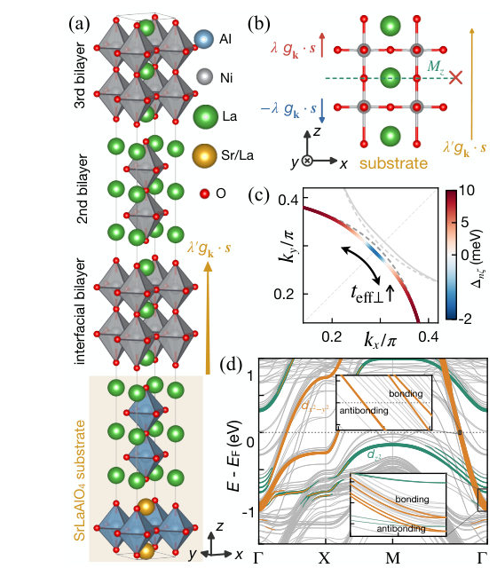
<figcaption class="paper-figure-caption"><b>Fig 1.</b> FIG. 1. (a) Schematic of a La3Ni2O7 film grown on SrLaAlO4 with a LaAlO3 layer (shaded), showing the interfacial bilayer and the two bilayers above it. The gold arrow marks the interface electric field, which sets the layer-uniform Rashba coupling and weakens away from the interface. (b) Side view of the interfacial bilayer. The red and blue arrows mark the opposite polarities of the layer-staggered Rashba coupling (±λ) on the top and bottom layers, and the gold arrow marks the layer-uniform Rashba coupling (λ′) shared by both layers. The dashed line is the mirror plane Mz, broken by the sub- strate. (c) Bonding χ = + Fermi surface of the α pocket colored by the intraband pairing. On the...</figcaption>
</figure>
<figure class="paper-figure-card">
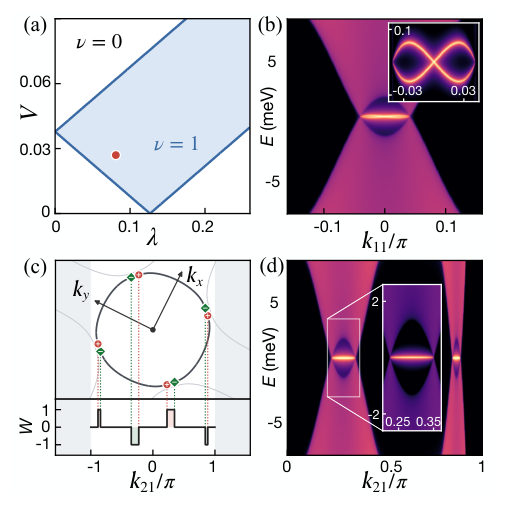
<figcaption class="paper-figure-caption"><b>Fig 2.</b> FIG. 2. (a) Topologically nontrivial region of Eq. (5). The horizontal scale is aλ in eV ˚A and the vertical scale is V in eV. The red dot marks the representative parameters used in this work, V = 27 meV and λ = 21.6 meV (aλ = 81 meV ˚A). (b) Superconducting edge modes on the [11] edge, with the conserved momentum k11 = kx − ky. (c) Brillouin zone in the frame of a [21] edge (top) and winding number W at fixed k21 = kx −2ky (bottom). Circles and diamonds are the nodes with chiral charges Q = +1 and −1 on the bonding χ = + Fermi surface (dark curve). (d) Same as (b) for [21] edge, where flat band exists at k21 with nonzero winding number in (c).</figcaption>
</figure>
<figure class="paper-figure-card">
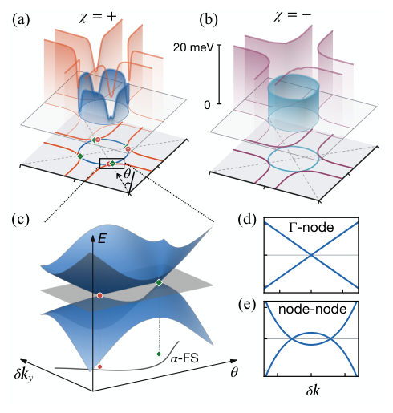
<figcaption class="paper-figure-caption"><b>Fig 3.</b> FIG. 3. (a),(b) BdG gap on the normal-state Fermi surfaces of he- licity χ = + and χ = −. The lower planes show the Fermi surfaces, and in (a) the nodes with chiral charges Q = +1 (red circles) and −1 (green diamonds), the angle θ at M counted clockwise from M- Γ. (c) The energy dispersion near the node pair, versus θ and the radial offset from the nodes. The base plane shows the χ = + α Fermi surface and the node projections. (d),(e) BdG bands along the line from Γ through a node and along the line through both nodes.</figcaption>
</figure>
<figure class="paper-figure-card">
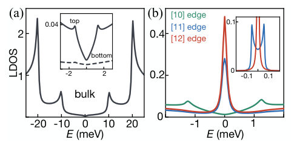
<figcaption class="paper-figure-caption"><b>Fig 4.</b> FIG. 4. Electron local density of states (LDOS) summed over the two layers. (a) Bulk, with a broadening of 0.3 meV. The inset shows the top (solid) and bottom (dashed) layers separately. (b) Surface LDOS at the [10], [11], and [21] edges, with a broadening of 0.08 meV. The inset shows the [11] and [21] edges with a broadening of 0.005 meV.</figcaption>
</figure>

**Summary.** This work demonstrates that high-T$_c$ bilayer nickelates can host a topological superconducting phase due to the interplay between layer-asymmetry and spin-orbit coupling. By modeling the system with a two-orbital Hamiltonian, the authors predict the existence of topological invariants and Majorana boundary modes. This establishes nickelates as a promising platform for realizing and tuning topological superconductivity.

**Why it may be interesting.** The explicit connection between structural asymmetry (substrate interaction) and the emergence of topological superconductivity in a strongly correlated material like nickelates is highly relevant for understanding unconventional pairing mechanisms.

Detailed structure

**Main problem.** The study investigates whether the interlayer pairing mechanism in high-T$_c$ bilayer nickelates can support an intrinsic time-reversal-invariant topological superconducting phase.

**Main result.** The combination of a modest layer-asymmetric potential and layer-staggered Rashba SOC drives the system into a topological superconducting phase characterized by a nonzero mirror winding number and Majorana boundary modes.

**Method.** The analysis uses a two-orbital tight-binding model derived from first-principles calculations, analyzing the Bogoliubov-de Gennes Hamiltonian structure.

**Model / system.** The system is modeled as substrate-supported bilayer nickelate thin films, incorporating layer-asymmetric potentials and layer-staggered Rashba spin-orbit coupling into an effective two-orbital Hamiltonian.

**Key observables.** Topological superconducting phase (Class DIII), nonzero mirror winding number, Majorana Kramers pair at the [11] edge, and bulk gap nodes.

**Important parameters / regimes.** Layer-asymmetric potential strength (V) and Rashba SOC strength (lambda).

**Assumptions / limitations.** The model neglects the orbital dependence of the substrate-induced terms, and the substrate breaks the mirror symmetry via an interface electric dipole.

**Figures summary.** Figures illustrate the physical setup on the substrate, the pairing structure on the Fermi surface, and the band structure showing the effect of SOC.

**Paper structure.** The paper establishes the physical model using first-principles derived parameters, analyzes the resulting Hamiltonian structure, calculates the topological invariants (winding number), and concludes by discussing experimental realization.

Abstract

The recent discovery of high-T$_c$ superconductivity in bilayer nickelates has highlighted the crucial role of interlayer coupling and motivated proposals for dominant interlayer pairing. Whether such pairing can support topological superconductivity, however, remains unexplored. Here, we demonstrate that substrate-supported bilayer nickelate thin films can host an intrinsic time-reversal-invariant topological superconducting phase protected by diagonal mirror symmetry. Using a two-orbital model derived from first-principles calculations, we show that a modest layer-asymmetric potential and layer-staggered Rashba spin-orbit coupling drive the system into this topological phase over a broad parameter range with a dominant interlayer pairing. The nontrivial topology arises from a reversal of the pairing sign on one of the spin-split bonding Fermi surfaces and is characterized by a nonzero mirror winding number along the diagonal direction, as well as a Majorana Kramers pair at the [11] edge. The phase also features bulk gap nodes located slightly away from the diagonal directions, featuring chiral charge and zero-energy flat bands. We discuss experimental routes for realizing and tuning this phase. Our results establish high-T$_c$ bilayer nickelates as a promising platform for topological superconductivity, where tunable topological transitions and Majorana boundary modes can provide probes of unconventional pairing.

[↑ back to top](#top)

### [Plasmon modes in tilted three-dimensional nodal-ring semimetals. II. Vortex nodal ring](http://arxiv.org/abs/2610.03188v1)

**Authors:** Ipsita Mandal  
**Type:** theory · **Category:** other · **PDF:** <https://arxiv.org/pdf/2610.03188v1>  
**Analysis basis:** full PDF text, analyzed in chunks
**Topic relevance:** `Keldysh / 2PI / non-Gaussian methods` **1/5**

↔ Scroll figures horizontally

<figure class="paper-figure-card">
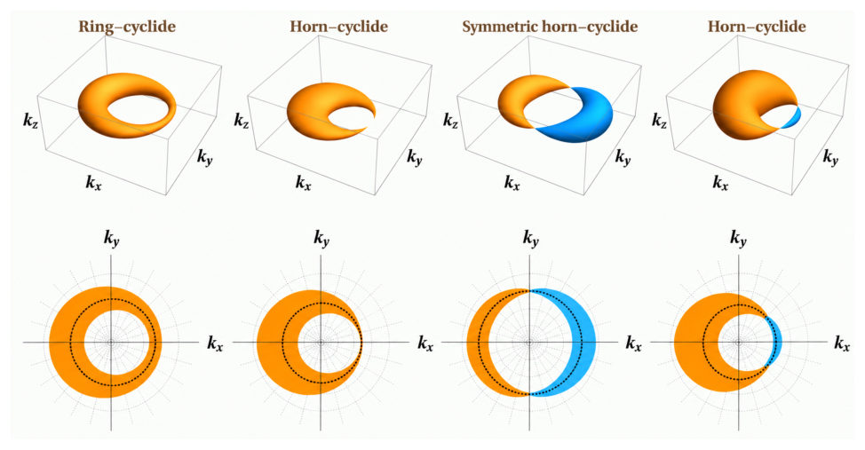
<figcaption class="paper-figure-caption"><b>Fig 1.</b> FIG. 1. Evolution of the FS of the VNR under an in-plane tilt with respect to the kx-axis [27, 33]. The upper row shows the 3d view and the lower row shows the projection onto the kxky-plane. The panels show, from left to right, the ring-cyclide regime, the horn-cyclide regime at µ = ˜η, where the hole-pocket has shrunk to a point, the symmetric horn-cyclide regime (µ = 0), and the horn-cyclide regime with 0 &lt; µ &lt; ˜η. The orange and blue colours depict the s = 2 (electron) and s = 1 (hole) pockets, respectively. The dotted black circle marks the original nodal ring at µ = ηx = 0. The FS is identical to that of the PTNR.</figcaption>
</figure>
<figure class="paper-figure-card">
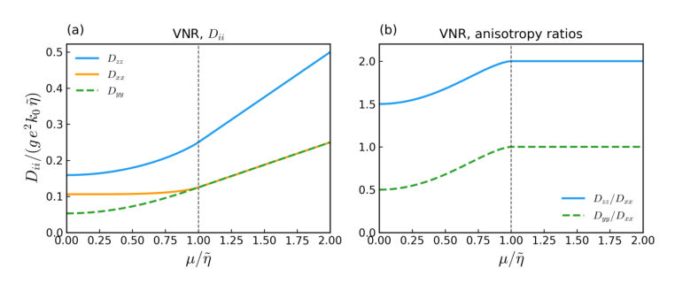
<figcaption class="paper-figure-caption"><b>Fig 2.</b> FIG. 2. Drude weights of the VNR under an in-plane tilt, at leading order in ηx and at fixed ˜η. Panel (a) shows Dzz, Dxx, and Dyy in units of g e2 k0 ˜η as functions of µ/˜η. Panel (b) shows the ratios Dzz/Dxx and Dyy/Dxx. The dashed vertical lines mark µ = ˜η, which separates the horn-cyclide and ring-cyclide regimes. All curves coincide with those of the PTNR.</figcaption>
</figure>
<figure class="paper-figure-card">
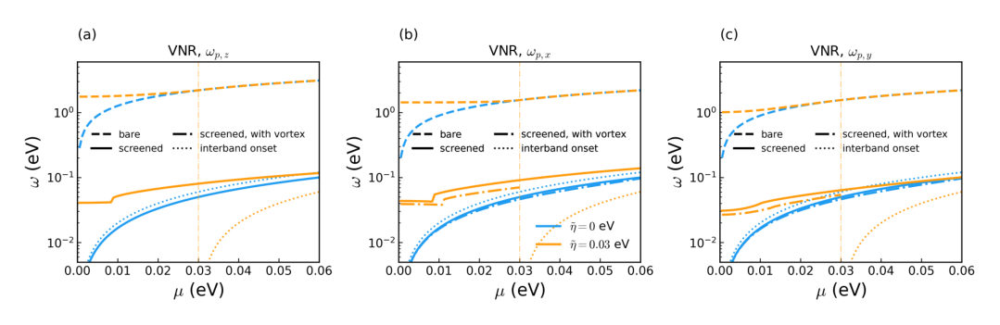
<figcaption class="paper-figure-caption"><b>Fig 3.</b> FIG. 3. Bare and screened plasma frequencies of the VNR under an in-plane tilt as functions of µ. Panels (a), (b), and (c) show ωp,z, ωp,x, and ωp,y, respectively. The dashed and solid lines are the bare frequencies and the screened frequencies from the zero of Re εRPA of the terms that do not involve Λ. The dotted lines mark the interband onset, which is absent in the horn-cyclide regime. The blue and orange colours correspond to ˜η = 0 and 0.03 eV, and the thin vertical line marks µ = ˜η. The dash-dotted lines in (b) and (c) are the zeros of Re εRPA including the second term of the overlap factor with the cut-off Λ = k0. They are shown only where κF &lt; Λ. The parameters are those of Sec....</figcaption>
</figure>
<figure class="paper-figure-card">
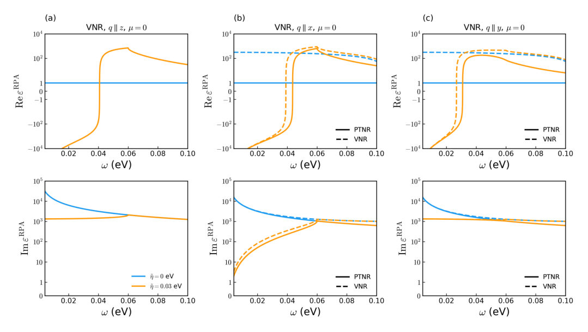
<figcaption class="paper-figure-caption"><b>Fig 4.</b> FIG. 4. RPA dielectric function of the VNR under an in-plane tilt at µ = 0. Panels (a), (b), and (c) show the ˆz, ˆx, and ˆy channels. The upper and lower rows show Re εRPA and Im εRPA on symmetric logarithmic scales. The blue and orange colours correspond to ˜η = 0 and 0.03 eV. The solid lines are the terms that do not involve Λ, and the ˆz channel is the full VNR result. The dashed lines in (b) and (c) include the second term of the overlap factor with the cut-off Λ = k0, and they stop where ω approaches 2 v0 Λ. The parameters are those of Sec. II C.</figcaption>
</figure>
<figure class="paper-figure-card">
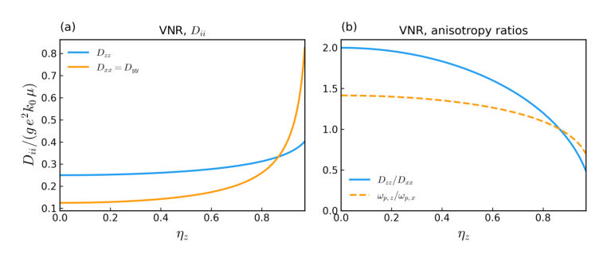
<figcaption class="paper-figure-caption"><b>Fig 5.</b> FIG. 5. Drude weights of the VNR under an axial tilt. Panel (a) shows Dzz and Dxx = Dyy in units of g e2 k0 µ as functions of ηz. Panel (b) shows the anisotropy ratios Dzz/Dxx and ωp,z/ωp,x. All curves coincide with those of the PTNR.</figcaption>
</figure>

**Summary.** This theoretical work analyzes plasmon modes in Vortex Nodal-Ring Semimetals (VNRs) by comparing them to known systems. The authors show that although the basic energy spectrum might match other models, the VNR's unique pseudospin texture alters the charge response through modifications to the band-overlap factor and quantum metric. This highlights that topological texture, beyond just band structure, dictates collective electronic behavior.

**Why it may be interesting.** The detailed study of how geometric properties like pseudospin texture and Berry curvature influence collective excitations (plasmons) provides a rich theoretical framework applicable to understanding charge dynamics in novel topological materials.

Detailed structure

**Main problem.** The paper investigates how the unique pseudospin texture of a Vortex Nodal-Ring Semimetal (VNR) modifies its collective charge response, specifically plasmon modes, compared to conventional nodal-ring semimetals like the PT-symmetric case.

**Main result.** While the VNR and PTNR share identical linearised energy dispersions and DOS, the VNR's vortex texture introduces a toroidal-angle dependence in the band-overlap factor and quantum metric, which modifies the charge response, particularly for in-plane wavevectors.

**Method.** The analysis employs a low-energy two-band description and utilizes the Random-Phase Approximation (RPA) to calculate the density response, dielectric function, and plasmon modes.

**Model / system.** The system is a three-dimensional VNR, modeled by a linearized Hamiltonian incorporating a tilt term. The geometry is characterized by toroidal and poloidal angles, and the pseudospin texture is central to the investigation.

**Key observables.** Plasmon modes, dielectric function, density response, Drude weights, overlap factor, and quantum metric.

**Important parameters / regimes.** Low doping limit ($\mu \ll v_0 k_0$), in-plane and axial band-tilts, and the wavevector orientation ($\mathbf{q}$).

**Assumptions / limitations.** The analysis relies on a low-energy two-band description and the Random-Phase Approximation (RPA).

**Figures summary.** Not specified.

**Paper structure.** The paper systematically compares the charge response of VNRs to PTNRs, first establishing the commonalities (coincident spectra) and then highlighting the unique, texture-dependent modifications introduced by the vortex structure in the overlap factor and quantum metric.

Abstract

We investigate collective charge excitations in three-dimensional vortex nodal-ring semimetals (VNRs), whose pseudospin texture winds around the nodal ring and differs qualitatively from that of the conventional $\mathcal{PT}$-symmetric nodal-ring semimetal (PTNR). While plasmon modes in PTNRs have been studied in a companion work, arXiv:2609.35373. Here, we focus on how a VNR's pseudospin texture changes the response compared with the former. Within a low-energy two-band description and the random-phase approximation, we analyse the density response, density-of-states, Drude weights, dielectric function, and plasmon modes at low doping. We consider the untilted system together with in-plane and axial band-tilts. Although the VNR and PTNR have distinct Hamiltonians, pseudospin textures, and Berry-curvature distributions, their linearised energy dispersions coincide. The vortex texture, however, introduces a toroidal-angle dependence in the band-overlap factor and quantum metric, thereby modifying the charge response. We examine how these effects enter the dielectric screening and collective modes for different wavevector orientations. Our results clarify how pseudospin texture, beyond the band dispersion alone, influences collective charge dynamics in three-dimensional nodal-ring semimetals.

[↑ back to top](#top)

### Other secondary papers (1)

Show other secondary papers

### [Fracture under body forces: An accessible test and analysis](http://arxiv.org/abs/2610.03404v1)

**Authors:** Farhad Kamarei, Sarah Bueno De Castro, Jeffery R. Roesler, Oscar Lopez-Pamies  
**Type:** both · **Category:** other · **PDF:** <https://arxiv.org/pdf/2610.03404v1>  
**Analysis basis:** full PDF text, analyzed in chunks

↔ Scroll figures horizontally

<figure class="paper-figure-card">
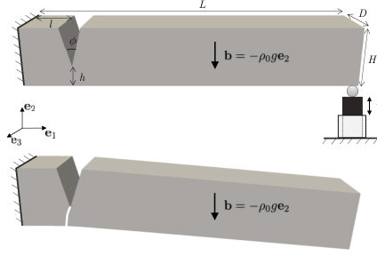
<figcaption class="paper-figure-caption"><b>Fig 1.</b> Figure 1: Schematic of the proposed test: (top) initial unde- formed configuration showing the applied gravitational body force and the retractable lower support; (bottom) fractured state following crack nucleation at the notch tip and subse- quent propagation.</figcaption>
</figure>
<figure class="paper-figure-card">
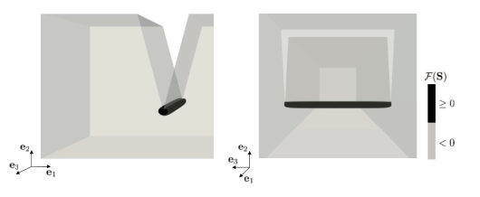
<figcaption class="paper-figure-caption"><b>Fig 2.</b> Figure 2: Contour plots from two perspectives showing the region around the notch where the stress field exceeds the strength surface of the material (F(S) ≥0). These results correspond to a mortar beam, with dimensions L = 1.7 m, H = D = 0.3 m, l = 0.2 m, h = 0.1 m, φ = 30◦, properties listed in Table 1, subjected to self-weight (g = 9.81 m/s2).</figcaption>
</figure>
<figure class="paper-figure-card">
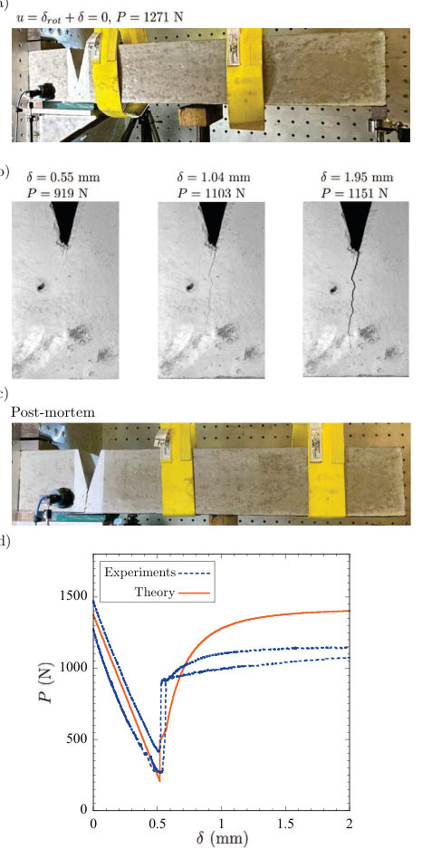
<figcaption class="paper-figure-caption"><b>Fig 3.</b> Figure 3: (a) Initial configuration and (b) front views of the notch-tip region at three intermediate stages of support retrac- tion, annotated with the corresponding deflection δ and sup- port force P for one of the specimens. (c) Post-mortem con- figuration of the same specimen. (d) Measured (dashed lines) and predicted (solid line) P vs. δ responses for the two tests.</figcaption>
</figure>
<figure class="paper-figure-card">
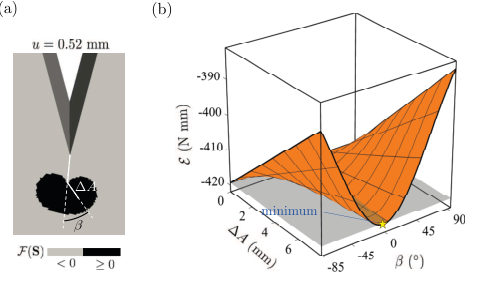
<figcaption class="paper-figure-caption"><b>Fig 4.</b> Figure 5: Elastic simulations of the test, at the support displace- ment u = 0.52 mm, on mortar containing the initial minimizing crack, (A = 7.2 mm, α = −5◦), with test add-cracks of lengths ∆A oriented at angles β with respect to the initial crack orien- tation. (a) Contour plot of a magnified region of the specimen where the stress field exceeds (F(S) ≥0) the strength surface of the material, depicting the test add-cracks considered within. (b) The energy E of the specimen plotted as a function of the test add-crack length ∆A and angle β.</figcaption>
</figure>
<figure class="paper-figure-card">
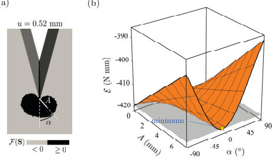
<figcaption class="paper-figure-caption"><b>Fig 5.</b> Figure 4: Elastic simulations of the test, at the support displace- ment u = 0.52 mm, on mortar containing test cracks of length A, thickness D = 0.3 m, oriented at angles α with respect to the direction of the gravitational body force. (a) Contour plot of a magnified region of the specimen where the stress field exceeds (F(S) ≥0) the strength surface of the material, de- picting the test cracks considered within. (b) The energy E of the specimen plotted as a function of the test crack length A and angle α.</figcaption>
</figure>

**Summary.** This paper introduces a novel, accessible benchtop test to study fracture mechanics in large structures under self-weight loading, bypassing the need for centrifuges. By combining this experiment with continuum fracture theory, the authors successfully validate the theory's prediction of crack nucleation and propagation based on local strength violation. This provides a significant advancement for modeling structural failure driven by gravity.

**Why it may be interesting.** not directly relevant

Detailed structure

**Main problem.** Studying fracture in large-scale structures dominated by self-weight is unfeasible due to immense scale, necessitating a benchtop test that bypasses specialized centrifuge facilities.

**Main result.** The proposed self-weight test successfully validates a continuum fracture theory by showing that crack nucleation and propagation occur precisely where the material strength criterion is violated under actual gravity loading.

**Method.** The study combines a simple benchtop experiment on a cantilever beam with advanced Finite Element Analysis (FEA) based on minimizing total energy, $E = P + G_c H^2$.

**Model / system.** The physical system is a cantilever beam with a V-notch, loaded only by its self-weight. The analysis uses a macroscopic continuum fracture theory that accounts for potential energy and surface energy.

**Key observables.** Crack nucleation and propagation location, support force vs. displacement load-displacement curves, and the region where the strength criterion $F(S) \geq 0$ is violated.

**Important parameters / regimes.** Length scale hierarchy ($\ell \ll h < l < H = D < L$), material properties (density, elasticity, fracture toughness $G_c$), and the gravitational body force $b = -
ho_0 g e_2$.

**Assumptions / limitations.** The material is assumed to be macroscopically homogeneous, isotropic, and linear elastic brittle. The analysis relies on the validity of the continuum fracture energy minimization framework.

**Figures summary.** Figures illustrate the schematic of the test setup, stress field violation contours showing where fracture initiates, and load-displacement curves comparing experimental measurements to theoretical predictions.

**Paper structure.** The paper introduces the problem, details the novel self-weight benchtop test, applies the theory to 3D-printable mortar and ice specimens, and validates the theory by comparing FEA results with experimental load-displacement measurements.

Abstract

Fracture in large-scale structures --- from failing concrete dams to calving glaciers --- is dominated by self-weight. Yet, owing to their immense scale, directly studying when and where cracks nucleate and propagate in these systems under gravity is unfeasible. To date, experimental investigations have largely relied on mimicking self-weight in scaled-down specimens via centrifugal forces, necessitating specialized centrifuge facilities. In this Letter, we introduce a simple benchtop test that bypasses the need for this infrastructure. The method utilizes a cantilever beam containing a downward-pointing V-notch, loaded solely by its self-weight. Through appropriate selection of the notch geometry and placement and the beam dimensions, the setup forces a crack to nucleate at the notch tip and propagate through the specimen in a measurable manner. We demonstrate the utility of this self-weight fracture test on a 3D-printable mortar and analyze the results using the fracture theory recently introduced in (\citeauthor{LPKFG2026}, 2026). \emph{Inter alia}, the findings provide a first validation of the theory for fracture driven by body forces.

[↑ back to top](#top)

