
# arxiv digest (quant-ph + cond-mat) — 2026-10-08

*131 papers · 20 relevant · 0 highlighted*

## 🔥 Most relevant (20)

*Every paper with at least one nonzero topic score, sorted by best-matching score. 🔥 marks scores ≥4/5. Click the title to jump to the full entry below; click [arXiv] to open the paper page. `(secondary)` marks papers from de-prioritized cond-mat archives.*

Show 20 relevant papers

- [Symmetry protected quantum many body scars through half-gauging](#paper-2610.08304) [[arXiv]](http://arxiv.org/abs/2610.08304v1) — 🔥 `scars & prethermalization` **5/5** · `analog quantum simulation` **1/5**
- [Excitation of subradiant states in atom chains by surface plasmon waves](#paper-2610.07651) [[arXiv]](http://arxiv.org/abs/2610.07651v1) — 🔥 `correlated / nonlocal dissipation` **4/5** · `Dicke superradiance` **3/5** · `Tavis-Cummings & cavity-many-emitter` **2/5** · `analog quantum simulation` **2/5** · `driven-dissipative phase transition` **2/5** · `free-space correlated emission` **2/5** · `interference shaping light` **2/5** · `methods for driven-dissipative` **2/5** · `Keldysh / 2PI / non-Gaussian methods` **1/5** · `non-equilibrium universality` **1/5** · `quantum measurements` **1/5** · `superradiant laser` **1/5**
- [Charging Dicke and Tavis--Cummings quantum batteries with a $\mathcal{PT}$-symmetric lossy--gain cavity pair](#paper-2610.07921) [[arXiv]](http://arxiv.org/abs/2610.07921v1) — 🔥 `Tavis-Cummings & cavity-many-emitter` **4/5** · 🔥 `methods for driven-dissipative` **4/5** · `Dicke superradiance` **3/5** · `correlated / nonlocal dissipation` **3/5** · `driven-dissipative phase transition` **3/5** · `non-equilibrium universality` **2/5** · `Keldysh / 2PI / non-Gaussian methods` **1/5** · `analog quantum simulation` **1/5** · `quantum measurements` **1/5**
- [Open-System Probe Selection and Optimal Measurements for Dispersive Coupling Metrology](#paper-2610.07221) [[arXiv]](http://arxiv.org/abs/2610.07221v1) — 🔥 `quantum measurements` **4/5** · `Tavis-Cummings & cavity-many-emitter` **3/5** · `methods for driven-dissipative` **3/5** · `analog quantum simulation` **2/5** · `correlated / nonlocal dissipation` **2/5** · `driven-dissipative phase transition` **2/5** · `Keldysh / 2PI / non-Gaussian methods` **1/5** · `non-equilibrium universality` **1/5**
- [Fault-tolerant resource estimation for ground-state preparation via Lindblad simulation](#paper-2610.08667) [[arXiv]](http://arxiv.org/abs/2610.08667v1) — 🔥 `methods for driven-dissipative` **4/5** · `analog quantum simulation` **3/5** · `correlated / nonlocal dissipation` **3/5** · `Keldysh / 2PI / non-Gaussian methods` **2/5** · `driven-dissipative phase transition` **2/5** · `quantum measurements` **2/5** · `non-equilibrium universality` **1/5**
- [Chiral Parafermions in Floquet $\mathbb{Z}_N$ Topological Order](#paper-2610.07156) [[arXiv]](http://arxiv.org/abs/2610.07156v1) — 🔥 `driven-dissipative phase transition` **4/5** · `analog quantum simulation` **3/5** · `methods for driven-dissipative` **3/5** · `non-equilibrium universality` **3/5** · `Keldysh / 2PI / non-Gaussian methods` **2/5**
- [Kardar-Parisi-Zhang superdiffusion in chaotic quantum circuits](#paper-2610.07143) [[arXiv]](http://arxiv.org/abs/2610.07143v1) — 🔥 `non-equilibrium universality` **4/5** · `analog quantum simulation` **3/5** · `methods for driven-dissipative` **3/5** · `driven-dissipative phase transition` **2/5** · `Keldysh / 2PI / non-Gaussian methods` **1/5**
- [A 3D-Printed GHz Microwave-Resonator Paul Trap for Electron Confinement and Millisecond Spin-Qubit Coherence](#paper-2610.08411) [[arXiv]](http://arxiv.org/abs/2610.08411v1) — 🔥 `QC/QI experiment` **4/5** · `analog quantum simulation` **2/5** · `quantum measurements` **2/5** · `Keldysh / 2PI / non-Gaussian methods` **1/5** · `driven-dissipative phase transition` **1/5** · `methods for driven-dissipative` **1/5** · `quantum optics experiment` **1/5**
- [Boosting the photon bunching of classical light via a modified Fabry-Pérot cavity](#paper-2610.08269) [[arXiv]](http://arxiv.org/abs/2610.08269v1) — 🔥 `quantum optics experiment` **4/5** · `interference shaping light` **3/5** · `Full counting statistics` **2/5** · `analog quantum simulation` **1/5** · `methods for driven-dissipative` **1/5**
- [Broadband Telecom Entanglement from an All-Fiber Type-0 Sagnac Source](#paper-2610.08025) [[arXiv]](http://arxiv.org/abs/2610.08025v1) — 🔥 `quantum optics experiment` **4/5** · `QC/QI experiment` **3/5** · `interference shaping light` **2/5** · `quantum measurements` **2/5**
- [A Single Conformal Coordinate Decodes Outcome-Resolved Measurement-Induced Entanglement](#paper-2610.07995) [[arXiv]](http://arxiv.org/abs/2610.07995v1) — 🔥 `quantum measurements` **4/5** · `Full counting statistics` **2/5** · `methods for driven-dissipative` **2/5** · `analog quantum simulation` **1/5** · `non-equilibrium universality` **1/5**
- [Spontaneous Hawking Radiation from Dynamical Black-Hole Formation in Quantum Spin Systems](#paper-2610.07794) [[arXiv]](http://arxiv.org/abs/2610.07794v1) — 🔥 `analog quantum simulation` **4/5** · `Keldysh / 2PI / non-Gaussian methods` **3/5** · `methods for driven-dissipative` **2/5**
- [Benchmarking exchange-only control of a 48-spin singlet manifold](#paper-2610.07393) [[arXiv]](http://arxiv.org/abs/2610.07393v1) — 🔥 `QC/QI experiment` **4/5** · `analog quantum simulation` **3/5** · `quantum measurements` **1/5**
- [Harnessing Post-selected von Neumann Measurements to Strengthen Entanglement and Quantum Signatures in Coherent States](#paper-2610.08438) [[arXiv]](http://arxiv.org/abs/2610.08438v1) — 🔥 `quantum measurements` **4/5** · `Full counting statistics` **1/5** · `correlated / nonlocal dissipation` **1/5**
- [Quantum Darwinism through apparatus-mediated environmental recording](#paper-2610.07568) [[arXiv]](http://arxiv.org/abs/2610.07568v1) — 🔥 `quantum measurements` **4/5** · `correlated / nonlocal dissipation` **1/5** · `driven-dissipative phase transition` **1/5**
- [Sparse qubit operation in a 6$\times$6 quantum dot array](#paper-2610.07683) [[arXiv]](http://arxiv.org/abs/2610.07683v1) — 🔥 `QC/QI experiment` **4/5** · `quantum measurements` **1/5**
- [Advantage of Entangled Learning Rules in Quantum Measurement Class Learning](#paper-2610.07328) [[arXiv]](http://arxiv.org/abs/2610.07328v1) — 🔥 `quantum measurements` **4/5**
- [Demonstration of Parallel Multi-QPU Execution for Fragment-Based Quantum Chemistry Using On-Premises Hardware](#paper-2610.07702) [[arXiv]](http://arxiv.org/abs/2610.07702v1) — 🔥 `QC/QI experiment` **4/5**
- [Direct synthesis of moiré graphene with twist-tuned hybridization](#paper-2610.07429) [[arXiv]](http://arxiv.org/abs/2610.07429v1) `(secondary)` — 🔥 `analog quantum simulation` **4/5**
- [The parliament of observers - Against the observable axiom of quantum mechanics](#paper-2610.07254) [[arXiv]](http://arxiv.org/abs/2610.07254v1) — 🔥 `quantum measurements` **4/5**

## All papers (92, sorted by relevance)

*Papers from quant-ph and your primary cond-mat archives (quant-gas, stat-mech, str-el, dis-nn). Highlighted papers (⭐) come first, then everything else sorted by topic-relevance score, highest first.*

### [Symmetry protected quantum many body scars through half-gauging](http://arxiv.org/abs/2610.08304v1)

**Authors:** Weslei B. Fontana, Fabrizio G. Oliviero, Yi-Ping Huang  
**Type:** theory · **Category:** other · **PDF:** <https://arxiv.org/pdf/2610.08304v1>  
**Analysis basis:** full PDF text, analyzed in chunks
**Topic relevance:** 🔥 `scars & prethermalization` **5/5** · `analog quantum simulation` **1/5**

📷 Fig 1

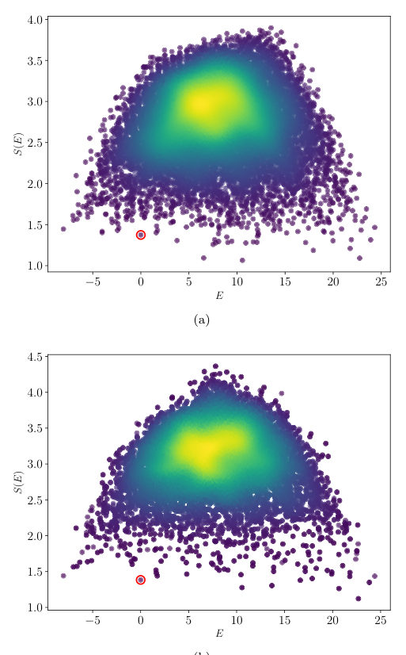 
FIG. 1: Entanglement entropy profile in the correspond- ing sectors with Z2 defect insertion. (a) The profile cor- responding to the sector with a single defect at site j = 7 and (b) the sector with the insertion of two defects (sites, j = 7, 10) on each of the corresponding sub-lattices. In both situations, the scarring is preserved and we are able to identify the single QMBS state at zero-energy, as de- picted in the figure by the red circle. These were ob- tained from the exact diagonalization of the correspond- ing model over a periodic chain of size L = 14 sites. The other parameters of the model were fixed as β = 0.5 and α = 0.3.

📷 Fig 2

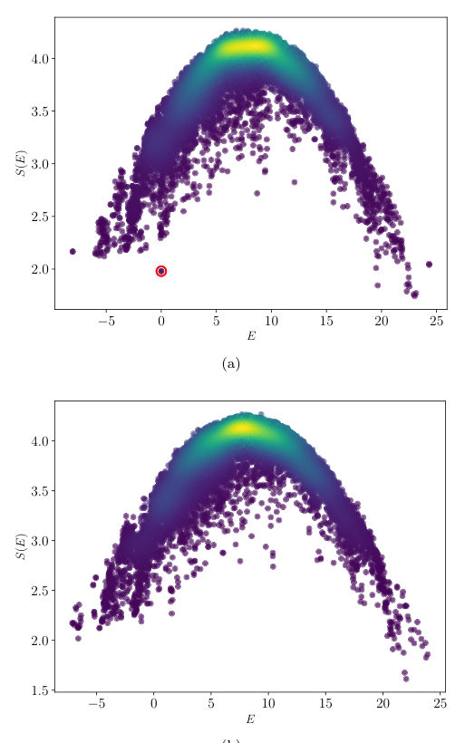 
FIG. 2: Entanglement entropy profile for the scarred 3- chain. (a) The profile corresponding to the sector with zero defects. (b) The profile corresponding to the sec- tor with a single defect at j = 7. Unlike the previous case, inserting a defect for this chain, completely destroy the scarring of the model, as predicted by our analytical analysis. These were obtained from exact diagonaliza- tion of the corresponding model for a periodic chain of size L = 14 sites. The other parameters of the model were fixed as β = 0.5 and α = 0.3.

📷 Fig 3

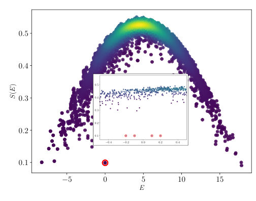 
FIG. 3: Entanglement profile of the 1-chain containing a single duality interface. Due to the anomaly, the QMBS subspace increases from a 2-fold degeneracy to a 4-fold degeneracy, which is now protected by the underlying symmetries. In the inset, we split the states in energy by hand, simply to make explicitly the presence of the four states. These were obtained by means of exact diagonal- ization of an open chain of L = 14 sites. The parameters were fixed as β = 0.5 and α = 0.3.

📷 Fig 4

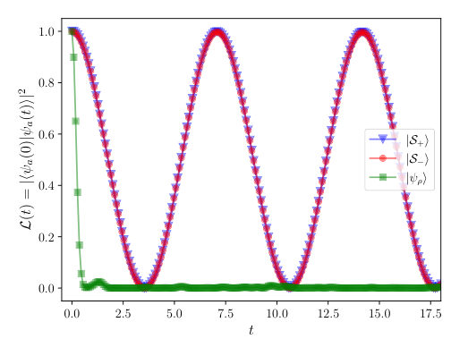 
FIG. 4: Loschmidt echo of the scar states compared with a generic high-energy volume-law state. The strong re- vivals of |S±⟩originate from coherent oscillations within an almost isolated two-level subspace, while a random state in the full Hilbert space state (in green) rapidly loses memory of its initial condition. Exact diagonaliza- tion of a chain with L = 10, α = 0.3, β = 0.3, hz = 0.05.

**Summary.** This paper analyzes how Quantum Many-Body Scars persist in structured quantum chains when subjected to symmetry defects or boundary conditions via half-gauging. The core finding is that the underlying symmetries dictate the survival and structure of these non-thermal states, leading to an enlarged, protected subspace. This provides general guidelines for engineering robust quantum phases in higher dimensions.

**Why it may be interesting.** The work directly addresses the robustness of topologically or symmetry-protected quantum states against local perturbations (defects) and engineered boundaries (interfaces), which is central to understanding fault-tolerant quantum computation and exotic quantum phases.

Detailed structure

**Main problem.** The study investigates the persistence of Quantum Many-Body Scars (QMBS) states when symmetry defects or gauging operations are introduced into the system.

**Main result.** The analysis shows that the protected nature of the scars can be maintained, leading to an 'anomalous QMBS subspace' protected by the underlying symmetries, even after complex perturbations.

**Method.** The authors employ techniques including defect insertion analysis, duality transformations, and the specialized 'half-gauging' procedure to probe the robustness of the scarred subspace.

**Model / system.** The system is modeled by a class of $\alpha$-chains, specifically $k$-chains, governed by a Hamiltonian $H^{(k)}_s$ derived from an embedding mechanism. The analysis compares scars protected by SPT anchors versus symmetry-breaking anchors.

**Key observables.** QMBS states (non-thermal eigenstates), protected degeneracies, and the structure of the symmetry algebra generated by the gauging procedure.

**Important parameters / regimes.** The chain length $k$, the defect strength $\beta$, and the gauging parameterization.

**Assumptions / limitations.** The analysis assumes that the half-gauging procedure successfully recovers a protected, structured subspace, and that the system's behavior can be characterized by its symmetry structure.

**Figures summary.** Figure 1 shows the entanglement entropy profile for the $k=2$ chain, illustrating the persistence of scarring under defect introduction.

**Paper structure.** The paper progresses by first establishing the scarred model, then analyzing the effect of defect insertion distinguishing between SPT and symmetry-breaking anchors, and finally detailing the core result using half-gauging to reveal interface-protected degeneracies.

Abstract

We study the interplay between symmetry defects insertion and the phenomena of quantum many body scarring. We exploit a class of models obtained from an embedding mechanism that defines a stochastic matrix form hamiltonian, hosting zero energy many body scarred states. Such models display an interesting playground to explore the consequences of dualities, half-gauging operations and so on. We first show that inside this class of models, what are the conditions to still have scared states after defect insertion. The main result of our work is a detailed analysis of half-gauging in such chains, which introduces a non-trivial interface in our system, leading to scarred states protected by the underlying symmetries. The conclusions for half-gauged scarred systems are general and may lead to fruitful directions for higher dimension scarred physics and their robustness.

[↑ back to top](#top)

### [Excitation of subradiant states in atom chains by surface plasmon waves](http://arxiv.org/abs/2610.07651v1)

**Authors:** Giorgio Vimercati, Nicola Piovella  
**Type:** theory · **Category:** other · **PDF:** <https://arxiv.org/pdf/2610.07651v1>  
**Analysis basis:** full PDF text, analyzed in chunks
**Topic relevance:** 🔥 `correlated / nonlocal dissipation` **4/5** · `Dicke superradiance` **3/5** · `Tavis-Cummings & cavity-many-emitter` **2/5** · `analog quantum simulation` **2/5** · `driven-dissipative phase transition` **2/5** · `free-space correlated emission` **2/5** · `interference shaping light` **2/5** · `methods for driven-dissipative` **2/5** · `Keldysh / 2PI / non-Gaussian methods` **1/5** · `non-equilibrium universality` **1/5** · `quantum measurements` **1/5** · `superradiant laser` **1/5**

📷 Fig 1

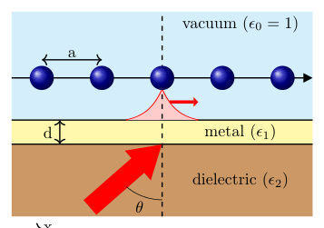 
FIG. 1. Setup: The setup consists of a three-layered struc- ture in Kretschmann configuration and an atom chain placed in the vacuum near the metallic surface. At a specific angle, an incidence laser on the dielectric can resonantly excite a SP wave propagating in the x−direction and confined at the interface between the metal and the vacuum.

📷 Fig 2

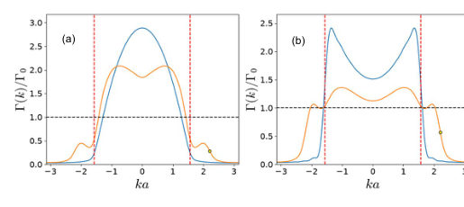 
FIG. 2. Γ(k)/Γ0 vs. ka for a chain of N = 20 atoms in free- space (blue line) and at a distance h = λ0/π from the surface (yellow line). (a): dipoles parallel to the surface. (b): dipoles orthogonal to the surface. The horizontal dashed black line corresponds to the single-atom decay rate in free-space, while the two vertical dashed red lines are the states with k = ±k0.

📷 Fig 3

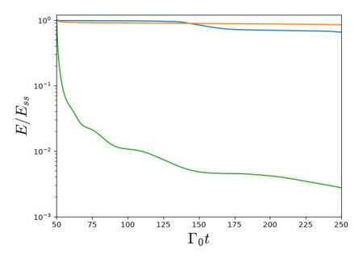 
FIG. 4. Free evolution of the normalized mean excitation probability E/Ess for the three cases of Fig.9, after that the laser is switched off at Γ0t = 50.

📷 Fig 4

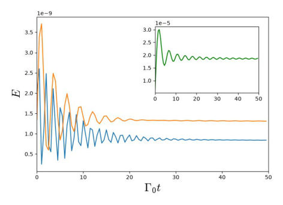 
FIG. 3. Evolution of the mean excitation probability E under SP driving for N = 100 atoms for parallel (blue line) and perpendicular (yellow line) dipole orientations to the surface. The SP wave is generated by a weak (Ω0 = dE0/ℏ= 0.1Γ0) and far-detuned (∆= 10Γ0) laser. The metal has ϵ1 = −2 + 0.1 i and thickness d = 100 nm, and the atom chain is at a distance h = λ0/π from the surface. The inset shows the results for the chain driven in free space by a laser with the same Ω0.

📷 Fig 5

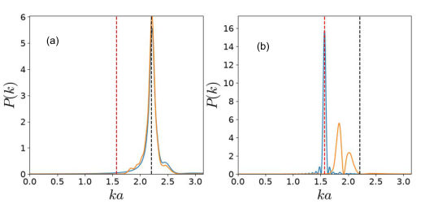 
FIG. 5. Distribution of the excitation in the momentum space at Γ0t = 50 (blue line) and at Γ0t = 100 (yellow line) for SP driving (a) and for direct laser driving (b). The red dashed line represents the mode with k = k0 and in black the one with k = kx.

**Summary.** This paper proposes using surface plasmon waves to overcome the experimental difficulty of exciting specific subradiant states in atomic chains. By coupling the atoms to the SP field, the authors demonstrate a method to efficiently load and store quantum excitations into these long-lived modes. This makes the atomic chain a viable platform for future quantum memory applications.

**Why it may be interesting.** This work directly addresses quantum memory and light-matter interaction in structured environments, which is central to quantum optics and open quantum systems research. The use of plasmonics to engineer collective atomic states is a key modern topic.

Detailed structure

**Main problem.** The paper addresses the challenge of selectively exciting and controlling subradiant states in finite atomic chains, which is difficult to achieve using free-space excitation methods.

**Main result.** Coupling the atomic chain to a surface plasmon (SP) wave allows for the controlled loading, storage, and release of excitations into specific subradiant modes, making the system a promising quantum memory.

**Method.** The authors model the system using a coupled-dipole approach, incorporating the interaction with the SP wave via modified Green's functions derived from electromagnetic theory.

**Model / system.** The physical system is a 1D chain of two-level atoms placed near a metallic film surface (Kretschmann configuration). The dynamics are governed by a coupled-dipole model that includes both free-space and surface-mediated interactions.

**Key observables.** Cooperative decay rate spectrum $\Gamma(k)$, steady-state excitation probability $E$, and the coherence time of the stored subradiant state.

**Important parameters / regimes.** Chain size ($N$), atomic spacing ($a$), surface/chain distance ($h$), and the properties of the metal (e.g., plasma frequency $\omega_p$, damping $\gamma$).

**Assumptions / limitations.** The analysis assumes the system is in the single-excitation manifold and neglects higher-order correlations in the dipole expectation values.

**Figures summary.** Figures illustrate the setup (Kretschmann configuration) and compare the decay rate spectrum $\Gamma(k)$ for free space versus near the surface, showing the modification of the mode structure.

**Paper structure.** The paper builds from establishing the free-space Hamiltonian and then incorporates the surface interaction via the Green's tensor. It details the SP wave generation using multilayer optics, derives the modified dynamics, and finally analyzes the excitation and decay characteristics.

Abstract

Subradiant states of a finite subwavelength atomic chain in free space offer a powerful resource for photon storage. Yet their preparation and control remain challenging experimentally. A standard technique is to drive the atoms by a laser and observe the florescence light of the long-lived subradiant modes of excitation after the laser is switched off. However, these modes are highly degenerate and form an almost continuous band in the subradiant manifold. Here we propose a new method of exciting a given subradiant state by coupling atoms to a surface plasmon wave propagating along the interface with a metallic film. By controlling the chain/surface distance we may load, store and release photons in the atoms, making them a promising tool for future quantum memories.

[↑ back to top](#top)

### [Charging Dicke and Tavis--Cummings quantum batteries with a $\mathcal{PT}$-symmetric lossy--gain cavity pair](http://arxiv.org/abs/2610.07921v1)

**Authors:** Shiqing Tang, Qing Yu, Ying Li, Cuilu Zhai, Zhao-Hui Peng, Wangjun Lu  
**Type:** theory · **Category:** other · **PDF:** <https://arxiv.org/pdf/2610.07921v1>  
**Analysis basis:** full PDF text, analyzed in chunks
**Topic relevance:** 🔥 `Tavis-Cummings & cavity-many-emitter` **4/5** · 🔥 `methods for driven-dissipative` **4/5** · `Dicke superradiance` **3/5** · `correlated / nonlocal dissipation` **3/5** · `driven-dissipative phase transition` **3/5** · `non-equilibrium universality` **2/5** · `Keldysh / 2PI / non-Gaussian methods` **1/5** · `analog quantum simulation` **1/5** · `quantum measurements` **1/5**

📷 Fig 1

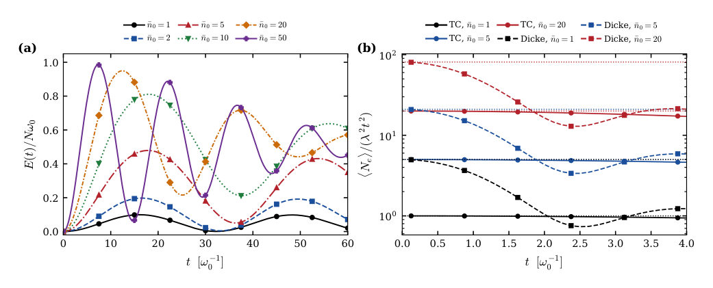 
FIG. 1. (Color online) Isolated batteries, N = 10 atoms, λ = 0.1 ω0, all atoms initially in |j, −j⟩. (a) Stored energy E(t)/Nω0 of the TC model for six coherent reservoirs. Linestyles and markers (identical in all figures): ¯n0 = 1 black solid circles, ¯n0 = 2 blue dashed squares, ¯n0 = 5 red dash-dotted up-triangles, ¯n0 = 10 green dotted down-triangles, ¯n0 = 20 orange short-dash diamonds, ¯n0 = 50 purple solid squares. The peak increases monotonically with ¯n0 and saturates at full inversion. (b) Short-

📷 Fig 2

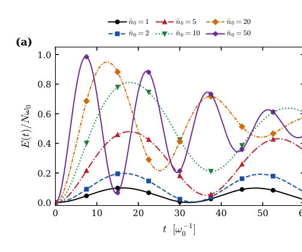 
Figure 1 shows the exact dynamics obtained by diag- onalising ˆH in the truncated Fock basis (nmax = 110, N = 10, λ = 0.1 ω0, T = 120). Panel (a) displays E(t)/(Nω0) for ¯n0 = 1, 2, 5, 10, 20, 50. The envelope of the curves grows monotonically with ¯n0, the peak value saturates at the full-inversion value Nω0, and the time to reach it decreases monotonically from 16.1 ω−1 0 at ¯n0 = 1 to 7.4 ω−1 0 at ¯n0 = 50, in agreement with Eq. (7) (7.0 ω−1 0 at ¯n0 = 50, i.e. within 5%). Panel (b) of Fig. 1 is a direct test of Eqs. (4) and (5):

📷 Fig 3

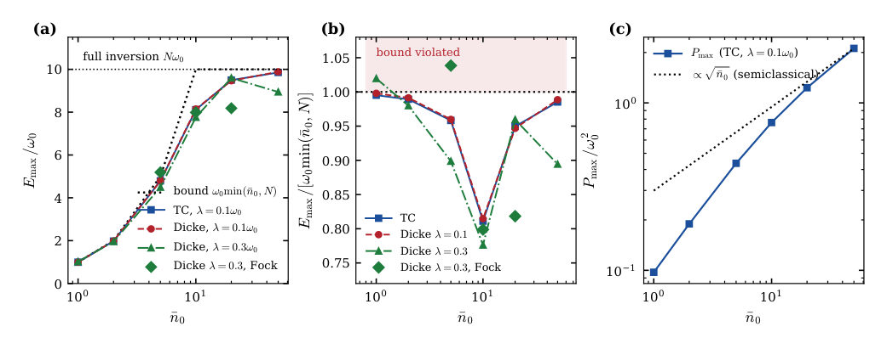 
FIG. 2. (Color online) Summary of Sec. II, same parameters as Fig. 1. (a) Peak stored energy Emax/ω0 versus the initial mean photon number ¯n0 (log axis). Dotted black: the exact TC bound ω0 min(¯n0, N) of Eq. (6). Solid blue squares: TC, λ = 0.1 ω0. Dashed red circles: Dicke, λ = 0.1 ω0. Dash-dotted green up-triangles: Dicke, λ = 0.3 ω0. Green diamonds: Dicke, λ = 0.3 ω0, Fock reservoirs (n = 5, 10, 20). (b) The same data normalised by the bound. The blue and red curves stay at or below 1; the green dash-dotted curve and the green diamond at n = 5 exceed it, showing that the counter-rotating terms break the TC bound at ultrastrong coupling. (c) Peak power Pmax of the TC model (solid blue...

📷 Fig 4

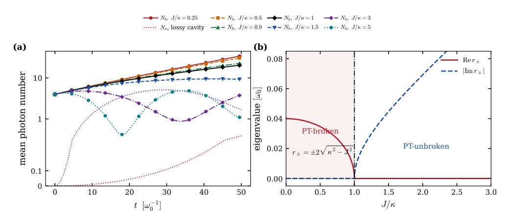 
FIG. 3. (Color online) The PT -symmetric pair alone, γ = 0.04 ω0 (κ = 0.02 ω0), no battery, t ≤50. (a) Mean photon numbers from the exact moment solution. Solid, dashed and dash-dotted lines with markers are the gain cavity Nb for J/κ = 0.25 (red, circles), 0.5 (orange, squares), 0.9 (green, up-triangles), 1 (black, diamonds), 1.5 (purple, down-triangles), 3 (purple, plus) and 5 (teal, circles); the two thin dotted lines are the lossy cavity Na for J/κ = 0.25 and 3. Broken-phase curves grow exponentially; unbroken-phase curves are bounded and oscillatory, and their lossy cavity carries a large population. (b) Nonzero eigenvalues r± of the moment generator, Eq. (12): real part (solid red),...

📷 Fig 5

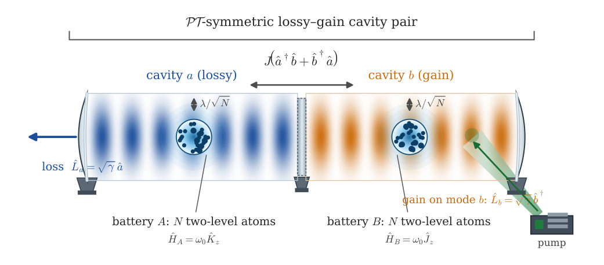 
FIG. 4. (Color online) Model. Two identical cavities are coupled by the beam-splitter interaction of strength J; the left cavity ˆa is lossy with rate γ, the right cavity ˆb is amplifying with the same rate, and together they form a PT -symmetric pair whose exceptional point lies at J = κ = γ/2. An identical battery of N two-level atoms sits in each cavity and couples to its mode with strength λ/ √

**Summary.** This paper analyzes how coupling quantum batteries, modeled by Dicke and Tavis-Cummings Hamiltonians, to a $\mathcal{PT}$-symmetric lossy-gain cavity pair affects energy charging. Using advanced numerical techniques, the authors map out distinct charging regimes around the exceptional point, finding that the optimal energy extraction occurs in the broken phase. The results highlight the strong control offered by engineered non-Hermitian environments over quantum energy storage.

**Why it may be interesting.** This work directly addresses open quantum systems, cavity QED, and quantum energy storage, providing quantitative insights into how engineered non-Hermitian environments can control energy transfer and extraction efficiency in quantum devices.

Detailed structure

**Main problem.** The study investigates how coupling a quantum battery (Dicke or Tavis-Cummings model) to a parity-time ($\mathcal{PT}$)-symmetric lossy-gain photonic environment alters its charging dynamics.

**Main result.** The charging dynamics are highly dependent on the spectral regime relative to the exceptional point (EP); the optimal charging point is found in the broken phase, and the counter-rotating terms introduce a reactive oscillation without net work.

**Method.** The dynamics are solved by numerically solving the full Lindblad equation using batched Monte-Carlo wave functions, alongside analytical derivations for short-time scaling laws.

**Model / system.** The system comprises quantum batteries (Dicke and Tavis-Cummings) coupled to a $\mathcal{PT}$-symmetric cavity pair, which acts as the environment. The dynamics are governed by the Lindblad master equation.

**Key observables.** Stored energy, power, and ergotropy gained/lost in the gain-side versus lossy-side battery; excitation number growth; and the location of the exceptional point.

**Important parameters / regimes.** The loss rate ($\gamma$), the coupling strength ($J$), and the proximity to the exceptional point (EP) are critical parameters defining the system's behavior.

**Assumptions / limitations.** The analysis assumes the batteries are identical to maintain $\mathcal{PT}$ symmetry, and the Tavis-Cummings treatment is deemed sufficient despite the presence of Dicke terms.

**Figures summary.** The notes reference figures showing short-time scaling of excitation number, energy bounds for TC and Dicke models, and the dependence of observables on the loss rate relative to the EP.

**Paper structure.** The paper is structured by first analyzing isolated batteries (Dicke/TC) charged by a reservoir, then analyzing the cavity pair dynamics to find the EP, and finally coupling the battery to the pair to study charging in both the broken and unbroken phases.

Abstract

We study how a parity--time-symmetric photonic environment changes the charging of Dicke and Tavis--Cummings quantum batteries. For atoms prepared in the collective ground state the excitation number grows as the square of the charging time, with a coefficient set by the initial mean photon number; the counter-rotating terms of the Dicke model add one to four times that number. Conservation of the total excitation number turns this into an exact ceiling on the stored Tavis--Cummings energy, the transition energy times the smaller of the photon and atom numbers, met numerically to within two per cent, which the Dicke terms overshoot by a few per cent at ultrastrong coupling. We then couple a battery to a lossy--gain pair, keeping the parity--time symmetry intact by putting an identical battery in each cavity; the closed moment system puts the exceptional point at the loss rate. Below it the gain cavity fills and the gain-side battery charges while the lossy-side one stays empty; above it photons are shuttled away and dissipated. Solving the full Lindblad equation with batched Monte--Carlo wave functions, we find that the gain-side battery gains thirty-nine, twenty-six and twenty-eight per cent in stored energy, power and ergotropy in the broken phase and loses sixty-five, thirty-five and sixty-five per cent deep in the unbroken phase, where the lossy-side battery overtakes it. Restoring the counter-rotating terms leaves all of this unchanged within the statistical error; what they add is a reactive oscillation at twice the transition frequency that does no net work but nearly doubles the peak of the instantaneous power. The extra energy is of lower quality, the recoverable fraction dropping from about ninety-eight to ninety per cent. The optimum sits on the broken side, close to but not at the exceptional point.

[↑ back to top](#top)

### [Open-System Probe Selection and Optimal Measurements for Dispersive Coupling Metrology](http://arxiv.org/abs/2610.07221v1)

**Authors:** Achal Vinod, Da-Wei Luo, Ting Yu  
**Type:** theory · **Category:** other · **PDF:** <https://arxiv.org/pdf/2610.07221v1>  
**Analysis basis:** full PDF text, analyzed in chunks
**Topic relevance:** 🔥 `quantum measurements` **4/5** · `Tavis-Cummings & cavity-many-emitter` **3/5** · `methods for driven-dissipative` **3/5** · `analog quantum simulation` **2/5** · `correlated / nonlocal dissipation` **2/5** · `driven-dissipative phase transition` **2/5** · `Keldysh / 2PI / non-Gaussian methods` **1/5** · `non-equilibrium universality` **1/5**

📷 Fig 1

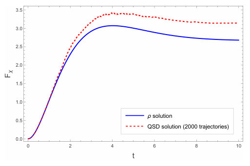 
FIG. 1: Time evolution of the unconditional density- matrix QFI (blue solid curve) and the ensemble-averaged SQFI obtained from QSD simulations with Ntraj = 2000 trajectories (red dashed curve). The density-matrix result is obtained by solving the Markovian Lindblad master equation, and the trajectory simulations use an integration time step ∆t = 0.01. Both curves correspond to the initial state |+, +⟩, with ωc = ωq = 1, Γ = 1, and χ = 0.2.

📷 Fig 2

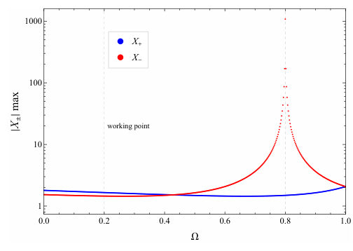 
FIG. 2: Maximum magnitude of the non-Markovian response functions X+(t) and X−(t) over the evolution interval as a function of Ω/Γ, for ωc/Γ = 1, γ/Γ = 0.6, and χ/Γ = 0.2. The X−branch exhibits a sharp pole-like enhancement near Ω/Γ ≃0.8, while X+ remains bounded over the displayed range. The dashed vertical line marks the working point Ω/Γ = 0.2 used in the subsequent numerical calculations.

📷 Fig 3

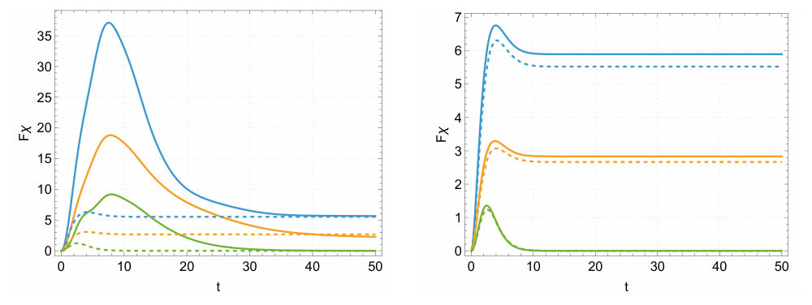 
FIG. 3: Open-system QFI for representative probes. Panel (a) shows the QFI evolution for |1, +⟩(blue), |+, +⟩ (orange), and the entangled state |ψ(7π/20)⟩= cos(7π/20) |0, e⟩+sin(7π/20) |1, g⟩(green), using ωc/Γ = ωq/Γ = 1, γ/Γ = 0.6, Ω/Γ = 0.2, and χ/Γ = 0.2. Solid curves denote non-Markovian evolution and dashed curves denote Markovian evolution. Panel (b) shows the corresponding evolution for the shorter-memory case γ/Γ = 10, with all other parameters unchanged. As γ increases, the non-Markovian curves approach their Markovian counterparts, consistent with the short-memory limit derived in Sec. II C.

📷 Fig 4

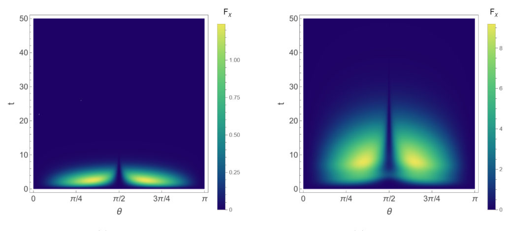 
FIG. 4: QFI for the family |ψ(θ)⟩= cos θ |0, e⟩+sin θ |1, g⟩as a function of θ and evolution time t, for (a) Markovian and (b) non-Markovian dynamics. The reference parameters are ωc/Γ = ωq/Γ = 1, χ/Γ = 0.2, and, in panel (b), γ/Γ = 0.6 and Ω/Γ = 0.2. Both panels span 0 ≤θ ≤π and 0 ≤t ≤50. Markovian sensitivity is concentrated at early times, whereas finite memory substantially extends its persistence. The high-QFI regions lie away from the maximally entangled states at θ = π/4 and 3π/4. Color represents Fχ, with a separate numerical color scale for each panel.

📷 Fig 5

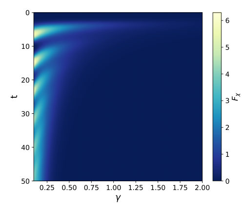 
FIG. 5: Non-Markovian QFI for the initial state |1, g⟩ as a function of inverse bath memory time γ and evo- lution time t; color represents Fχ. Although the closed and Markovian evolutions of this state yield zero QFI, finite environmental memory can activate sensitivity to χ. The scan exhibits appreciable sensitivity and tempo- ral structure for smaller γ, with suppression toward the short-memory side of the displayed range. No monotonic dependence on γ is implied.

**Summary.** This paper rigorously analyzes quantum metrology in open cavity-qubit systems to estimate the coupling strength $\chi$. It demonstrates that environmental memory effects are critical, capable of boosting sensitivity beyond what is predicted by the simpler Markovian model. The findings guide the selection of optimal quantum probes and measurement protocols for noisy quantum devices.

**Why it may be interesting.** This work provides a detailed theoretical framework for designing quantum sensors in realistic, noisy environments, which is crucial for advancing quantum networking and quantum computation applications utilizing cavity QED systems.

Detailed structure

**Main problem.** The paper investigates how photon loss and environmental memory affect the optimal selection of quantum probes and measurement strategies for estimating the dispersive coupling strength in a cavity-qubit system.

**Main result.** Finite environmental memory can significantly enhance and prolong the metrological sensitivity, allowing for non-zero Quantum Fisher Information (QFI) even when the Markovian QFI vanishes. Furthermore, separable probes can outperform entangled ones in certain single-photon regimes.

**Method.** The analysis employs quantum metrology tools, primarily calculating the Quantum Fisher Information (QFI) using both density-operator and stochastic (trajectory-based) approaches, comparing Markovian and non-Markovian dynamics.

**Model / system.** The system is a single bosonic cavity mode dispersively coupled to a two-level qubit, governed by an effective Hamiltonian. The dynamics are analyzed under open-system conditions, ranging from Markovian (Lindblad) to non-Markovian (exponentially correlated bath).

**Key observables.** Quantum Fisher Information (QFI), Stochastic QFI (SQFI), and the error propagation uncertainty relative to the Quantum Cramér-Rao Bound (QCRB).

**Important parameters / regimes.** Dispersive coupling strength ($\chi$), environmental correlation time ($	au_B$), cavity-qubit detuning ($\Delta$), and mean photon number ($\langle \hat{N} 
angle$).

**Assumptions / limitations.** The closed-system analysis provides a benchmark, and the non-Markovian dynamics are modeled using an exponentially correlated Gaussian environment.

**Figures summary.** Figures illustrate the time evolution of QFI for different initial states and regimes, showing the comparison between density-matrix QFI and ensemble-averaged SQFI, and mapping out parameter regions where sensitivity is enhanced.

**Paper structure.** The paper first establishes the closed-system benchmark using the generator variance. It then transitions to open systems, comparing Markovian and non-Markovian dynamics using QFI diagnostics. The core of the work involves analyzing how environmental memory and probe preparation affect the achievable precision bound.

Abstract

We investigate how photon loss and environmental memory affect probe selection and measurement sensitivity for estimating the dispersive coupling strength in a cavity qubit system. Using density operator and quantum state diffusion approaches, we examine the quantum Fisher information for representative separable and entangled initial states in Markovian and non Markovian regimes. The results show that closed system generator variance alone does not determine open system performance. The survival of parameter sensitive coherences and the influence of environmental memory also play important roles. Within the single photon preparations examined, a separable probe can outperform the entangled family considered. Comparisons of selected coherent and squeezed vacuum preparations at equal mean photon number further illustrate how photon number statistics and qubit preparation affect sensitivity. For the parameters studied, finite environmental memory can enhance and prolong sensitivity and yield nonzero QFI for a probe whose Markovian QFI vanishes. We also numerically identify a fixed Hermitian observable whose error propagation uncertainty remains close to the quantum Cramer Rao bound over a prescribed coupling interval in the Markovian regime. These findings clarify the interplay between probe preparation, environmental dynamics, and measurement choice in dispersive quantum metrology.

[↑ back to top](#top)

### [Fault-tolerant resource estimation for ground-state preparation via Lindblad simulation](http://arxiv.org/abs/2610.08667v1)

**Authors:** Marius Bothe, Patrick Schoepf, Nick S. Blunt  
**Type:** theory · **Category:** strongly correlated electrons · **PDF:** <https://arxiv.org/pdf/2610.08667v1>  
**Analysis basis:** full PDF text, analyzed in chunks
**Topic relevance:** 🔥 `methods for driven-dissipative` **4/5** · `analog quantum simulation` **3/5** · `correlated / nonlocal dissipation` **3/5** · `Keldysh / 2PI / non-Gaussian methods` **2/5** · `driven-dissipative phase transition` **2/5** · `quantum measurements` **2/5** · `non-equilibrium universality` **1/5**

📷 Fig 1

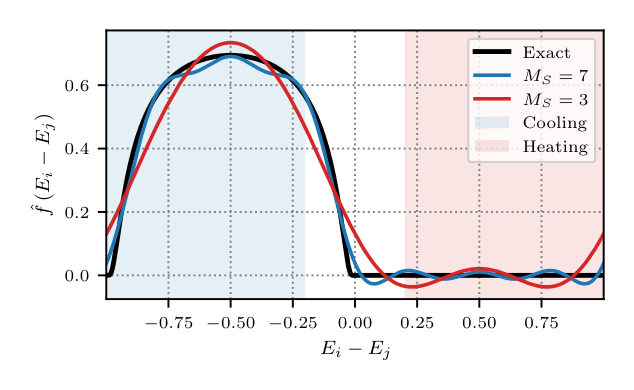 
Figure 1. The energy-domain filter function ˆf as well as its Dirichlet kernel approximations for different numbers of sample points MS. The colored areas begin at the smallest possible energy transitions to and from the ground state, ∆. The blue area indicates transitions that dissipate energy (cooling) and the red area indicates transitions that increase the energy (heating).

📷 Fig 2

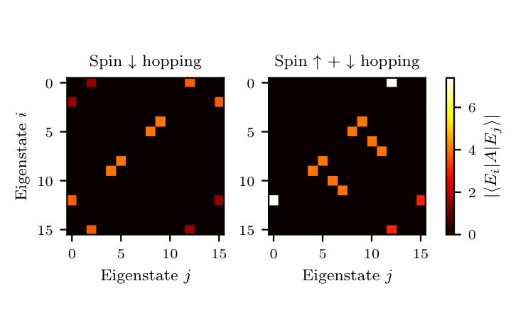 
Figure 2. Comparison of jump operators, A, in the eigenbasis of the 2-site Hubbard Hamiltonian with U = 4 and open boundary conditions. The left operator acts only on the spin-down section, whereas the right operator acts on a linear combination of both. The axis labels indicate the eigenstates in order from lowest to highest energy, such that the top-right triangular matrix contains the desired energy transitions. Note that the two-spin mixer on the right is no longer ergodic in the Sz = 0, 2-particle sector since it is missing the top-left transition.

📷 Fig 3

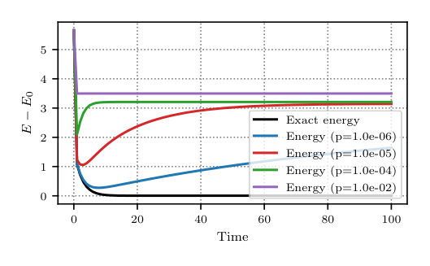 
Figure 3. Energy error relative to the ground-state energy as a function of time, for the 2-site Hubbard model with U = 4, with different levels of amplitude damping noise applied. The system is initialized in a Sz = 0, two-particle state, but drifts into other particle sectors due to the noise, resulting in a different fixed point.

📷 Fig 4

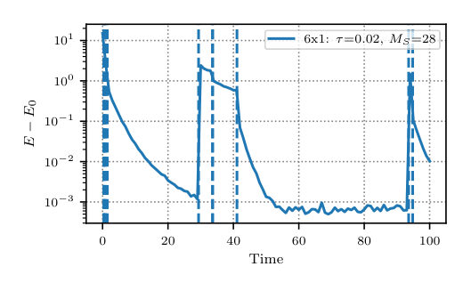 
Figure 4. Example energy trajectory in a state vector simulation for a 6-site one-dimensional Hubbard model with U = 4 and open boundary conditions. Vertical dashed lines indicate jumps, i.e. when the ancilla state was measured in the |1⟩-state.

📷 Fig 5

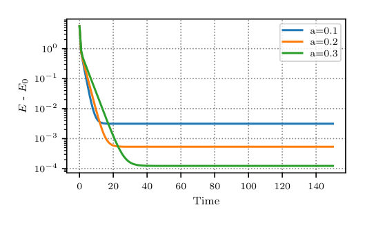 
Figure 5. Energy convergence in the density matrix simulation of the 2-site Hubbard model with U = 4 for different values of the steepness parameter a. Smaller values of a speed up the evolution as they enable more dissipation, but they also increase leakage into higher-energy states.

**Summary.** This paper analyzes the resource cost of preparing the ground state of the fermionic Hubbard model using Lindblad simulation techniques. It derives rigorous error bounds by analyzing the approximations involved in simulating the energy-filtering process. The results provide a concrete, albeit large, gate count estimate, highlighting energy transition filtering as the main computational hurdle.

**Why it may be interesting.** This work directly addresses the computational bottleneck of simulating complex quantum dynamics (like those in Hubbard models) on near-term quantum hardware by providing quantitative resource estimates for fault-tolerant state preparation.

Detailed structure

**Main problem.** The paper investigates the practical resource cost and feasibility of using Lindblad simulation techniques for preparing the ground state of quantum many-body systems in the early fault-tolerant quantum computing regime.

**Main result.** The resource estimation for a 36-site fermionic Hubbard model is calculated to be $7.7 	imes 10^8$ T gates for one unit of time evolution, with the primary cost source identified as accurately filtering energy transitions.

**Method.** The authors employ a dilation-based simulation approach, deriving rigorous error bounds for the approximation of the Lindblad evolution via quadrature and Trotterization techniques.

**Model / system.** The study focuses on the fermionic Hubbard model, a canonical model for strongly correlated electrons, whose dynamics are governed by a Lindblad master equation. The simulation targets preparing the ground state $|\psi_0
angle$ by suppressing energy transitions.

**Key observables.** T gate count (resource cost), trace distance error ($\|	ilde{
ho}_{1,s} - ar{
ho}_1\|_1$), spectral gap ($\Delta$), and spectral norm ($\|H\|$).

**Important parameters / regimes.** The system size (e.g., 36 sites), the coupling constants ($t_{	ext{hop}}=1, U=4$), and the required time step ($	au$) are key parameters.

**Assumptions / limitations.** The analysis relies on approximating the energy-domain filter function integral using finite quadrature and bounding the resulting error terms from both quadrature and Trotterization.

**Figures summary.** Figures illustrate the energy-domain filter function $\hat{f}$ and its approximations, and show the scaling of the spectral gap, spectral norm, and required time step ($	au$) with system size.

**Paper structure.** The paper progresses by first establishing the theoretical framework for ground-state preparation via Lindblad dynamics, deriving rigorous error bounds for the necessary approximations (quadrature and Trotterization), and finally applying these bounds to estimate the resource cost for the fermionic Hubbard model.

Abstract

Recent advances in algorithms for simulating Lindblad dynamics have clarified their theoretical potential for state preparation, but their practicality in the early fault-tolerant regime and beyond remains uncertain. In this work, we address this by investigating the cost of preparing ground states of the fermionic Hubbard model, following the single-ancilla approach of [Phys. Rev. Research 6, 033147 (2024)]. We derive rigorous error bounds including constant prefactors, and compare to empirical error behavior and practical convergence parameters obtained from circuit-level simulations. We find that empirically chosen parameters can reduce the required resources by orders of magnitude, resulting in an estimated $7.7 \times 10^8$ T gates to perform one unit of time evolution targeting the low-energy subspace of a 36-site fermionic Hubbard model. We identify the accurate filtering of energy transitions as the main source of this cost.

[↑ back to top](#top)

### [Chiral Parafermions in Floquet $\mathbb{Z}_N$ Topological Order](http://arxiv.org/abs/2610.07156v1)

**Authors:** Melissa Will, Harald Schmid, Jan Egger, Adam Gammon-Smith, Michael Knap, Frank Pollmann  
**Type:** theory · **Category:** strongly correlated electrons · **PDF:** <https://arxiv.org/pdf/2610.07156v1>  
**Analysis basis:** full PDF text, analyzed in chunks
**Topic relevance:** 🔥 `driven-dissipative phase transition` **4/5** · `analog quantum simulation` **3/5** · `methods for driven-dissipative` **3/5** · `non-equilibrium universality` **3/5** · `Keldysh / 2PI / non-Gaussian methods` **2/5**

📷 Fig 1

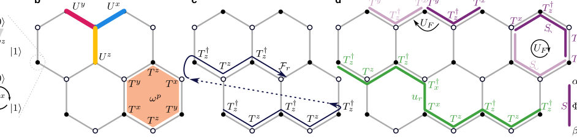 
Figure 1. ZN Floquet Kitaev honeycomb model. a Actions of the clock operators on the local qudit state (illustrated for the Z3 qutrit case). T z is diagonal in the local qudit basis, while T x shifts between the basis states. b The Floquet operator UF = U zU yU x conserves the plaquette fluxes Wp = ωp, p ∈ZN, see Eq. (3). c Schematic Fradkin-Kadanoff-type contour which maps clock operators to constrained operators with parafermionic exchange statistics on distinct sites. d Conserved ZN gauge link ur (green) is associated with z-bonds. Strings of clock operators can be mapped to parafermions (αr, βr′) at the endpoints, connected by a conserved string (Φ). At the edge, strings evolve along...

📷 Fig 2

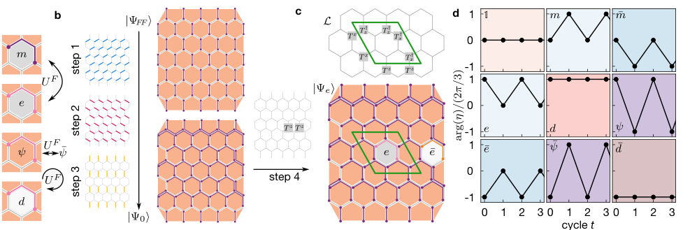 
Figure 2. Z3 Floquet anyon transmutation. a Anyons are labeled by the eigenvalues of the plaquette operator Wp and the half-plaquette string S↷, corresponding to the magnetic flux m and the parafermion ψ, respectively. The Floquet drive exchanges the electric and magnetic anyons, ψ and its antiparticle, and leaves the dyon d invariant. Representative Z3 anyons are shown; antiparticles are omitted. b Protocol for preparing an anyon excitation and probing its Floquet dynamics. The flux-free state (|ΨFF⟩) is transformed into plaquette-diagonal parafermion pairings (|Ψ0⟩). A string of T z operators creates an e-e pair. c Loop operator L encircling the e anyon. The green path indicates the...

📷 Fig 3

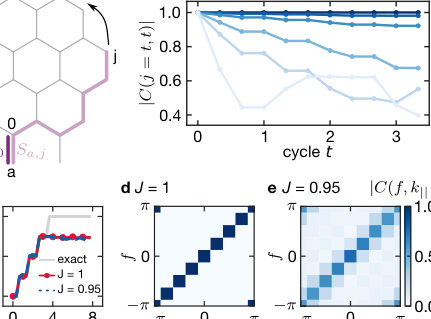 
Figure 3. Chiral parafermionic edge dynamics. a Setup for measuring the edge correlation function using an auxil- iary qudit as a fixed endpoint of the string. b Real space edge correlation function obtained from MPS simulations. At J = 1 the signal remains one, whereas for J &lt; 1 it decays over time. c Maximal entanglement entropy over all biparti- tions along the MPS ordering (Fig. S3c) for J = 1 (red) and J = 0.95 (blue), starting from the stabilizer state shown in Fig. S3d. Gray: exact J = 1 result from the stabilizer simu- lation. d Momentum-frequency space correlation function at J = 1 shows the linearly dispersing chiral edge mode and its winding across the Floquet quasienergy...

📷 Fig 4

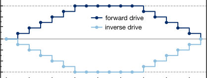 
Figure 4. Chiral mutual information. a Static auxiliary qutrits (square markers) are attached to every second site along the bottom boundary, each initially prepared with the adjacent edge system qutrit in a T zT z pair (lightblue shad- ing). After one Floquet drive the dimer evolves into the blue dashed configuration. The black dashed line partitions the boundary into a left region sL (blue circles) and a right region sR (red circles). b Chiral mutual information I vs. Floquet cycles. The growth of ln √

📷 Fig 5

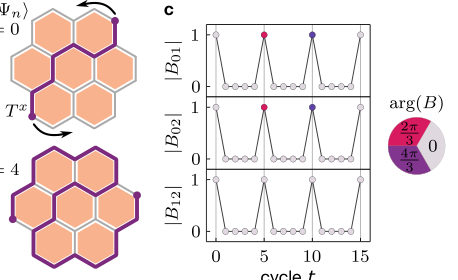 
Figure 5. Edge mode interferometry. a The initial state |Ψn⟩contains a stretched string across the system, whose ends carry a pair of parafermions. Application of a local clock T x

**Summary.** This work investigates $\mathbb{Z}_N$ Floquet Topological Order using a driven Kitaev model on qudits. The authors show that the drive generates robust chiral parafermionic edge modes and induces anyonic time crystal behavior in the bulk. This establishes the model as a promising platform for studying non-equilibrium topological physics on quantum processors.

**Why it may be interesting.** The focus on Floquet engineering of topological order, particularly using qudits and parafermions, provides a concrete theoretical framework for designing quantum simulators for exotic non-equilibrium phases.

Detailed structure

**Main problem.** The paper explores realizing and characterizing $\mathbb{Z}_N$ Floquet Topological Order (FTO) in a non-equilibrium setting, extending beyond the well-studied $\mathbb{Z}_2$ case.

**Main result.** They demonstrate that the driven Kitaev model generates chiral parafermionic edge modes and exhibits bulk dynamics characterized by anyonic time crystal behavior.

**Method.** The study combines theoretical mapping (Fradkin-Kadanoff-type) with advanced numerical simulations, including Matrix-Product States (MPS) and stabilizer formalisms.

**Model / system.** The system is a generalized Kitaev honeycomb model incorporating clock degrees of freedom (qudits), driven periodically by a three-step Floquet drive.

**Key observables.** Chiral parafermionic edge modes, dynamical anyon transmutation (tracked by a non-equilibrium loop order parameter), and the radical chiral unitary index quantifying information flow.

**Important parameters / regimes.** The system exhibits distinct regimes, notably the 'Clifford point' where the drive simplifies, and the general non-equilibrium dynamics away from this point.

**Assumptions / limitations.** The analysis relies on mapping the system to constrained parafermions and uses MPS simulations, which are limited by rapid entanglement growth away from the Clifford point.

**Figures summary.** Figures illustrate the action of clock operators, the honeycomb lattice structure, the mapping contour, and the evolution of conserved $\mathbb{Z}_N$ gauge links.

**Paper structure.** The paper proceeds by defining the $\mathbb{Z}_N$ FTO model, mapping it to parafermions, analyzing the dynamics of string operators and anyons, and finally simulating the edge and bulk properties in different parameter regimes.

Abstract

Floquet topological order (FTO) extends topology beyond equilibrium, giving rise to phenomena, such as the dynamical transmutation of anyons. Here, we realize $\mathbb{Z}_N$ FTO in a generalized Kitaev honeycomb model with clock degrees of freedom using a three-step periodic drive. The driven system admits an emergent description in terms of constrained parafermions coupled to conserved $\mathbb{Z}_N$ gauge fields. At the boundary, the drive generates chiral parafermionic Floquet edge modes. We resolve their propagation through correlation functions, characterize their fractional quantum-information transport through the radical chiral unitary index, and use their dynamics to probe exchange statistics. In the bulk, we explore the dynamical anyon transmutation with a non-equilibrium loop order parameter. At a Floquet sweet spot, where the drive becomes Clifford, these phenomena can be accessed using stabilizer simulations. Short-time matrix-product-state simulations away from this point show that the chiral edge response persists at accessible times. Our results establish $\mathbb{Z}_N$ Kitaev models as a setting for exploring intrinsically non-equilibrium topological phenomena on qudit-based quantum processors.

[↑ back to top](#top)

### [Kardar-Parisi-Zhang superdiffusion in chaotic quantum circuits](http://arxiv.org/abs/2610.07143v1)

**Authors:** Rustem Sharipov, Urban Duh, Sun Woo P. Kim, Friedrich Hübner  
**Type:** both · **Category:** statistical mechanics · **PDF:** <https://arxiv.org/pdf/2610.07143v1>  
**Analysis basis:** full PDF text, analyzed in chunks
**Topic relevance:** 🔥 `non-equilibrium universality` **4/5** · `analog quantum simulation` **3/5** · `methods for driven-dissipative` **3/5** · `driven-dissipative phase transition` **2/5** · `Keldysh / 2PI / non-Gaussian methods` **1/5**

📷 Fig 1

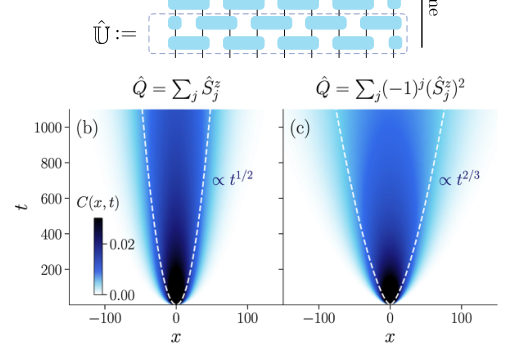 
FIG. 1. Diffusive and superdiffisive spreading of a conserved charge. (a) Setup: Time-evolution ˆU consists of two layers of two- qutrit gates arranged in a brick-wall geometry. The circuit conserves a single conserved quantity satisfying [ ˆQ, ˆU] = 0. (b) For a homo- geneous charge, the charge density correlator C(x, t) spreads diffu- sively as ∼t1/2. (c) For a staggered charge, C(x, t) exhibits KPZ superdiffusion ∼t2/3. The white dashed curves show the location of the half-maximum of C(x, t).

📷 Fig 2

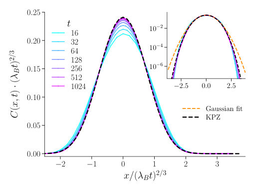 
FIG. 2. KPZ scaling collapse for the staggered conserved charge in the chaotic spin-1 circuit. TEBD results for the connected correlation function C(x, t) = ⟨ˆq(x, t)ˆq(0, 0)⟩c are plotted as (λBt)2/3C(x, t) versus x/(λBt)2/3, with color indicating the evo- lution time. As t increases, the numerical profiles collapse onto the exact stationary KPZ scaling function shown in black dashed line. The normalization c0 = 4/9 and superdiffusion scale λB = 1/ √

📷 Fig 3

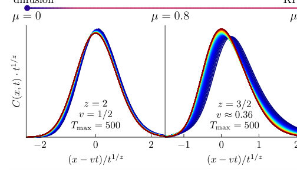 
FIG. 3. Scaling of the charge-correlation profile in the three-site spin- 1

📷 Fig 4

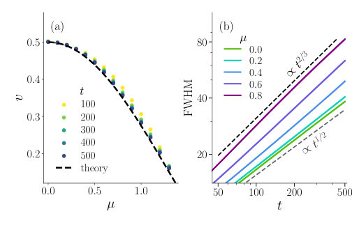 
FIG. 4. Propagation and broadening of the charge-correlation in the three-site qubit circuit. (a) Propagation velocity v as a func- tion of the chemical potential µ, obtained from TEBD simulations with bond dimension χ = 300. Velocities are extracted from linear fits to the peak position over time windows [t −10, t + 10], with color indicating the central time t. The black dashed curve shows the hydrodynamic prediction v(µ) = ȷ′(q(µ)). (b) Log-log scaled plot of broadening of the propagating peak as a function of time for different values of µ estimated with the full width at half maximum (FWHM). Lighter-to-darker curves correspond to increasing bond di- mension χ = 100, 200, and 300. The...

📷 Fig 5

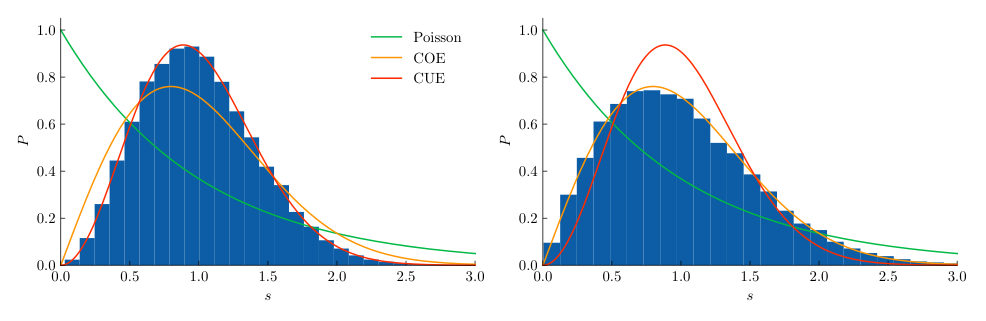 
FIG. 5. Momentum, charge and space-time symmetry resolved level spacing distribution in the spin-1 (S2) case with L = 10 sites (left) and in the spin- 1

**Summary.** This work demonstrates that KPZ superdiffusion, a universal non-equilibrium phenomenon, can occur in chaotic quantum circuits without requiring fine-tuning to integrable models. By combining nonlinear hydrodynamics with tensor-network simulations, the authors confirm the predicted $z=3/2$ scaling for charge transport in these artificial quantum systems.

**Why it may be interesting.** It provides a concrete, non-integrable quantum platform to observe universal non-equilibrium scaling laws (KPZ), which is highly relevant for understanding energy/charge transport in complex quantum materials.

Detailed structure

**Main problem.** The paper investigates the emergence of Kardar-Parisi-Zhang (KPZ) superdiffusion in chaotic quantum circuits, challenging the assumption that such phenomena are limited to integrable models.

**Main result.** KPZ superdiffusion with a dynamical exponent $z=3/2$ is demonstrated in chaotic quantum spin chains using discrete time evolution, confirmed by tensor-network simulations.

**Method.** The study combines theoretical derivations using Nonlinear Fluctuating Hydrodynamics (NLFHD) with numerical validation via Tensor-Network simulations (TEBD) on quantum circuits.

**Model / system.** The system consists of chaotic brickwork quantum circuits, initially modeled with spin-1 (qutrit) and later extended to spin-1/2 (qubit) chains, designed to conserve a staggered charge $\hat{Q}$.

**Key observables.** Charge correlation function $C(x, t)$, dynamical exponent $z$, propagation velocity $v$, and the universal scaling form predicted by the KPZ equation.

**Important parameters / regimes.** The chemical potential $\mu$ controls the transport regime, and the system dynamics are analyzed in the context of the conserved charge $\hat{Q}$.

**Assumptions / limitations.** The analysis relies on the coarse-grained description using local equilibrium approximations and the application of NLFHD to derive scaling laws.

**Figures summary.** Figures illustrate the comparison between different spreading regimes (diffusive vs. KPZ) and show the numerical collapse of the charge correlation function onto the predicted stationary KPZ scaling function.

**Paper structure.** The paper progresses from establishing the theoretical framework using NLFHD for correlation functions, to applying this framework to specific chaotic quantum circuits (spin-1 and spin-1/2), and finally validating the predictions using advanced tensor-network simulations.

Abstract

We construct a family of chaotic brickwork quantum circuits exhibiting superdiffusive transport with dynamical exponent $z=3/2$ in the full Kardar--Parisi--Zhang (KPZ) universality class. This is enabled by the equilibrium current associated with a inhomogeneous conserved density having a nontrivial dependence on the chemical potential. Using nonlinear fluctuating hydrodynamics, we derive the propagation velocity, broadening scale, and universal scaling form of the charge correlation function from microscopic equilibrium properties. Tensor-network simulations of a two-site spin-$1$ (qutrit) circuit reproduce these parameter-free predictions, including the full stationary KPZ profile. We further construct a three-site spin-$\frac12$ (qubit) circuit, where transport varies from diffusive to superdiffusive with the chemical potential, while long-lived coherent quasiparticles delay the convergence of the profile to the KPZ scaling form. Our results establish that KPZ superdiffusion in quantum systems is not restricted to fine-tuned integrable models.

[↑ back to top](#top)

### [A 3D-Printed GHz Microwave-Resonator Paul Trap for Electron Confinement and Millisecond Spin-Qubit Coherence](http://arxiv.org/abs/2610.08411v1)

**Authors:** Niklas V. Lausti, Vineet Kumar, Ivan Hudák, Jiří Hajnyš, Peter Kúš, Radek Plašil, Michal Hejduk  
**Type:** both · **Category:** other · **PDF:** <https://arxiv.org/pdf/2610.08411v1>  
**Analysis basis:** full PDF text, analyzed in chunks
**Topic relevance:** 🔥 `QC/QI experiment` **4/5** · `analog quantum simulation` **2/5** · `quantum measurements` **2/5** · `Keldysh / 2PI / non-Gaussian methods` **1/5** · `driven-dissipative phase transition` **1/5** · `methods for driven-dissipative` **1/5** · `quantum optics experiment` **1/5**

📷 Fig 1

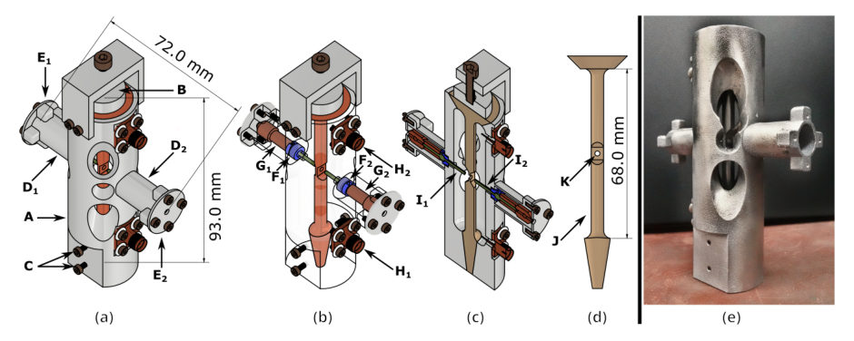 
FIG. 1. Illustration of the EiTEx 3D-printed resonator. a) The complete assembled design shows the cavity (A) housing the resonator rod, which is press-fitted using (B) and can be mounted to the chamber blank flange with screws (C). Perpendicular extensions (D1,2) hold the endcaps, with cover plates (E1,2). b) Internal view showing the resonator rod and opposing endcaps aligned with the rod hole. Ion trapping RF signal is supplied via inline connectors (G1,2), while electron-trapping signals are delivered through connectors (H1,2). c) Ion trapping signal is delivered to endcaps (I1,2). d) Electron trapping signal is coupled to a resonating rod (J), which includes a hole (K) for trapping. e)...

📷 Fig 2

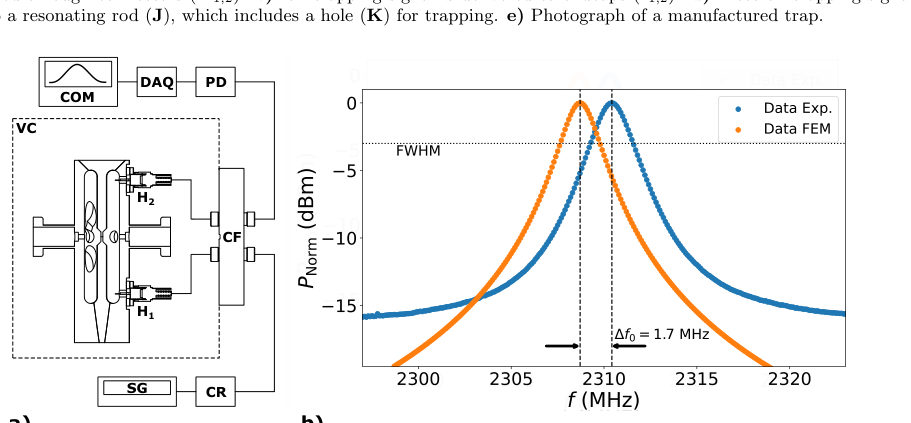 
FIG. 2. a) Experimental scheme for measuring resonance behaviour. The signal generated by programmable signal generator (SG) is fed through a circulator-based isolator (CR) and vacuum feedhthrough on a conflat flange (CF) to a pin of connector H1 situated inside the vacuum chamber (VC) near the node of the oscillating field. The signal in the cavity is measured through the mirrored connector H2 by a power detector (PD) and digitized by a data acquisition board (DAQ). The data are then processed by a computer (COM) running a signal analysis program, which controls the signal generator SG. The models of devices are described in the work by Kumar et al. [16]. b) Comparison of FEM simulated and...

📷 Fig 3

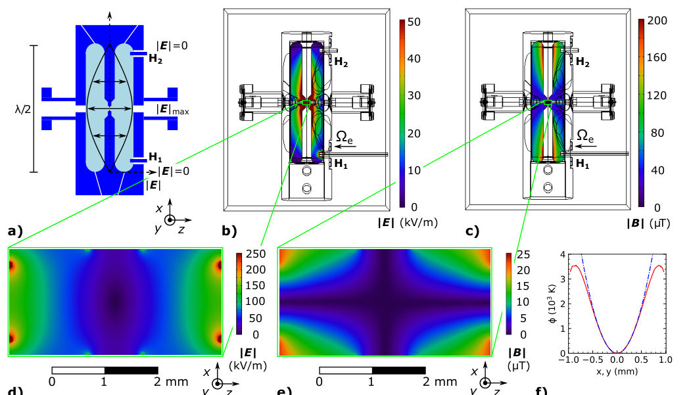 
FIG. 3. Simulated field distribution of the resonator. a) Illustration of resonance mechanism. The endcap electrodes are not depicted for clarity. The fundamental TEM mode (at 2.21 GHz in the case of final assembly) forms a strong, well-confined field along the central axis, excited from the bottom SMA jack. b) The COMSOL simulation result for electric field amplitude confirms the field shape shown in the schematic. c) Simulated distribution for the magnetic field amplitude. Unlike the electric field, its amplitude along the central axis has a minimum in the middle of the resonator. d) and e) are showing details of the distributions in b) and c), respectively. The field ranges are different...

📷 Fig 4

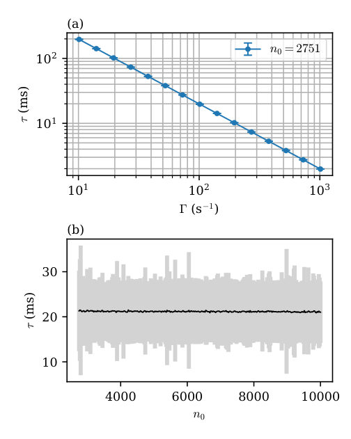 
FIG. 4. Dependence of coherence time τ on heating rate Γ (a) and initial motional excitation n0 (b). The dependence on Γ was evaluated for n0 being 10 times larger than the critical quantum number nc. The size of error bars is smaller than the point size. The dependence on n0 is burdened by large errors caused by the uncertainty of Γ.

📷 Fig 5

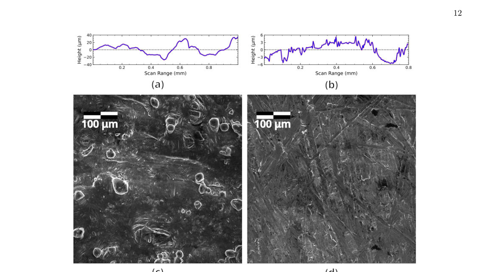 
FIG. 5. Surface characterization of the trap sample. (a) and (b): Surface profilometry profiles over a 1 mm scan length of a sample before and after polishing, respectively. The measured rms surface roughness was Rqu = 14(10) µm for the unpolished surface and Rqp = 2.5(7) µm for the polished one. (c) and (d): SEM image of the samples before and after polishing, respectively. Large structures of the size of tens of µm are effectively removed by polishing.

**Summary.** The paper presents a novel, 3D-printed microwave-resonator Paul trap designed for confining electrons at GHz frequencies while preserving optical access. By characterizing the trap's electromagnetic fields and modeling decoherence, the authors predict that the device can achieve electron spin-qubit coherence times of about 10 ms, advancing the feasibility of quantum information processing using trapped electrons.

**Why it may be interesting.** This work is highly relevant as it tackles the engineering challenge of integrating high-performance microwave confinement with optical access, a critical bottleneck for scaling up quantum memories based on trapped particles.

Detailed structure

**Main problem.** The authors address the challenge of creating a trapping platform that can simultaneously confine electrons using high-frequency microwaves while maintaining an open geometry necessary for optical access and imaging.

**Main result.** They report a 3D-printed microwave-resonator Paul trap capable of operating at GHz frequencies, predicting electron spin-qubit coherence times on the order of 10 ms.

**Method.** The study combines experimental characterization of the trap's electromagnetic properties (using resonance measurements) with theoretical modeling (FEM and decoherence analysis) to predict qubit performance.

**Model / system.** The system is a 3D-printed microwave-resonator Paul trap, which functions as a dual-frequency trap for confining both electrons and ions. The dynamics are modeled using the electron spin Hamiltonian coupled to the motional degrees of freedom, and decoherence is analyzed using master equations.

**Key observables.** Resonance frequency (2.3 GHz), Quality Factor ($Q \approx 10^3$ measured), Electron Spin-Qubit Coherence Time ($\sim 10 	ext{ ms}$), Trapping Frequencies ($\omega_x, \omega_y, \omega_z$).

**Important parameters / regimes.** GHz operating frequencies, moderate $Q$ factor, surface roughness ($	ext{R}_{qp} \approx 2.5 \mu	ext{m}$), and the assumption that motional heating is dominated by Johnson noise.

**Assumptions / limitations.** The coherence time prediction assumes motional heating is dominated by Johnson noise, and the analysis relies on the accuracy of the 3D-printed structure's electromagnetic response.

**Figures summary.** Figures illustrate the trap design (outer cavity body and central resonator rod) and show surface profilometry/SEM images comparing polished vs. unpolished samples, confirming surface quality.

**Paper structure.** The paper details the design and fabrication of the 3D-printed trap, characterizes its electromagnetic response via resonance measurements, models the trapping potential and nonlinear dynamics (Kerr parameter), and finally uses these results to estimate the electron spin-qubit coherence time.

Abstract

We report a 3D-printed microwave-resonator Paul trap that operates at the GHz frequencies required for electron confinement while preserving an open geometry suitable for laser access and imaging ion Coulomb crystals. The resonator exhibits moderate quality factors of approximately 1000, enabling large confining electric-field amplitudes at low input power, and is in good agreement with finite-element-method (FEM) predictions despite manufacturing imperfections, which we experimentally characterize. The validated FEM model is then used to calculate the electromagnetic fields in the trapping region. These field distributions, together with surface-roughness measurements, are incorporated into a model of electron spin-qubit decoherence to estimate the coherence time. Our analysis predicts that electron spin-qubit coherence times on the order of 10 ms should be achievable under the assumption that motional heating is dominated by Johnson noise, making such systems relevant for quantum information processing. The method of obtaining the coherence time is applicable to any electron Paul trap.

[↑ back to top](#top)

### [Boosting the photon bunching of classical light via a modified Fabry-Pérot cavity](http://arxiv.org/abs/2610.08269v1)

**Authors:** Lu Zhang, Dongxu Zhou, Hongzhi Zhang, Guoquan Zhang  
**Type:** experiment · **Category:** other · **PDF:** <https://arxiv.org/pdf/2610.08269v1>  
**Analysis basis:** full PDF text, analyzed in chunks
**Topic relevance:** 🔥 `quantum optics experiment` **4/5** · `interference shaping light` **3/5** · `Full counting statistics` **2/5** · `analog quantum simulation` **1/5** · `methods for driven-dissipative` **1/5**

📷 Fig 1

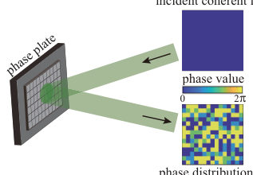 
FIG. 1. A schematic diagram to encode the spatially corre- lated phase structure on the wave front of the light field.

📷 Fig 2

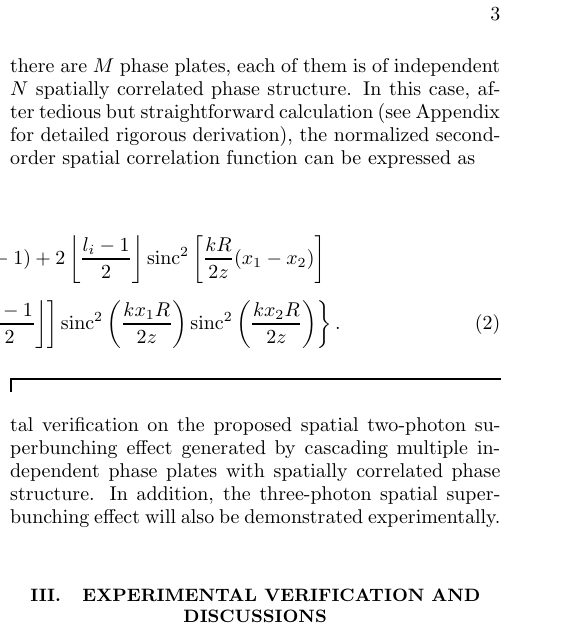 
Figure 3 shows the schematic diagram of the exper- imental setup to modulate the wave front of the light field by a series of independent phase plates cascading in sequence in the longitudinal propagation dimension. Here, a single-mode continuous-wave laser light operat-

📷 Fig 3

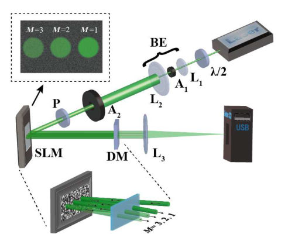 
FIG. 3. Schematic diagram of the experimental setup. λ/2: half-wave plate; L1, L2 and L3: lens with focal length 10 mm, 120 mm and 800 mm, respectively; A1 and A2: iris; BE: beam expender; P: polarizer; SLM: spatial light modulator; DM: dielectric mirror; CCD: charge coupled device. The inset on the up-left corner shows the light spots on the CCD. The bottom inset shows the detail of the cascading phase plates in the modified F-P cavity.

📷 Fig 4

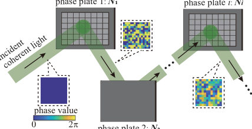 
FIG. 2. Schematic diagram to modulate the wave front of the light field through a series of independent phase plates cascading in the longitudinal propagation direction. The ith phase plate will encode Ni spatially correlated phases on the wave front of the light fields.

📷 Fig 5

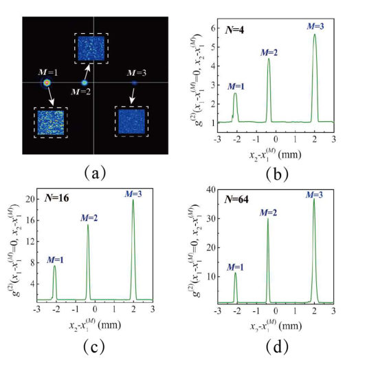 
FIG. 4. (a) The beam spots and the intensity distribution within the beam spots recorded by the CCD camera. (b), (c) and (d) show the normalized second-order spatial correlation functions of the light fields (M = 1, 2, 3) output from the modified F-P cavity with N = 4, 16, 64, respectively. Note that the transverse coordinates are spatially shifted by x(M) 1 .

**Summary.** This paper reports on a method to significantly boost the photon bunching of classical light by implementing multiple, spatially correlated phase modulations within a modified Fabry-Pérot cavity. By cascading these modulations, the authors achieved superbunching, demonstrating enhancements in two- and three-photon correlations far exceeding those of standard thermal light. This technique has implications for correlated imaging and nonlinear optics.

**Why it may be interesting.** This work provides a novel, controllable method using classical optics (SLMs in an F-P cavity) to engineer super-bunching effects, which is highly relevant for understanding and manipulating photon statistics in quantum optics and quantum information applications.

Detailed structure

**Main problem.** The paper aims to boost the photon bunching effect of classical light beyond what is achievable with standard thermal light sources.

**Main result.** The authors experimentally demonstrated superbunching, achieving two-photon bunching peaks improved by one order and three-photon peaks improved by three orders of magnitude compared to thermal light.

**Method.** The technique involves using a modified Fabry-Pérot cavity where one mirror is replaced by a Spatial Light Modulator (SLM) to cascade multiple independent, spatially correlated phase modulations onto the light wavefront.

**Model / system.** The physical system is a modified Fabry-Pérot cavity. The theoretical model describes the normalized second-order and third-order spatial correlation functions, $g^{(2)}$ and $g^{(3)}$, which are shown to accumulate enhancement when multiple phase plates are cascaded.

**Key observables.** Two-photon bunching peak ($g^{(2)}$), three-photon bunching peak ($g^{(3)}$), and ghost image visibility.

**Important parameters / regimes.** The number of cascaded phase plates ($M$) and the number of independent transverse modulations ($N$) are key parameters determining the enhancement.

**Assumptions / limitations.** The analysis relies on the paraxial approximation and the ability to encode multiple indistinguishable two-photon paths via the SLM setup.

**Figures summary.** Figures illustrate the schematic setup using the modified F-P cavity (Fig. 2, Fig. 3), show the measured intensity distributions and $g^{(2)}$ for varying $M$ and $N$ (Fig. 4), and plot the measured bunching peaks confirming linear scaling with $M$ (Fig. 5).

**Paper structure.** The paper progresses from reviewing the concept of superbunching beyond the HBT effect, deriving the theoretical product structure for $g^{(2)}$ for $M$ plates, and finally presenting experimental measurements of $g^{(2)}$ and $g^{(3)}$ to confirm the enhancement.

Abstract

We proposed to boost the photon bunching effect of classical light via a modified Fabry-Pérot cavity with one of the cavity mirrors being replaced by a spatial light modulator, through which multiple independent transverse modulations, each was to encode independently spatially correlated phase on the wave front of the light field, was cascaded in sequence in the longitudinal propagation direction in the cavity. The two-photon bunching peak and the three-photon bunching peak of the generated superbunching light field were measured to be $36.9\pm2.0$ and $\rm (2.46\pm0.12)\times10^{3}$, respectively, which, as compared to those of thermal light, were improved by one-order and three-order of magnitude, respectively. Correspondingly, the ghost image visibility reconstructed with the superbunching light was demonstrated experimentally to be improved by $\sim 40$ times as compared to that with the pseudo-thermal light. Such classical superbunching light field is of essential importance not only for fundamental physics but also for potential applications such as correlated imaging, ghost interference and nonlinear optics.

[↑ back to top](#top)

### [Broadband Telecom Entanglement from an All-Fiber Type-0 Sagnac Source](http://arxiv.org/abs/2610.08025v1)

**Authors:** Alessandro Cestelli, Spyridon Grountas, Scott Mc Haffie, Jun Gao, Val Zwiller, Ali Elshaari  
**Type:** experiment · **Category:** quantum information and computing · **PDF:** <https://arxiv.org/pdf/2610.08025v1>  
**Analysis basis:** full PDF text, analyzed in chunks
**Topic relevance:** 🔥 `quantum optics experiment` **4/5** · `QC/QI experiment` **3/5** · `interference shaping light` **2/5** · `quantum measurements` **2/5**

📷 Fig 1

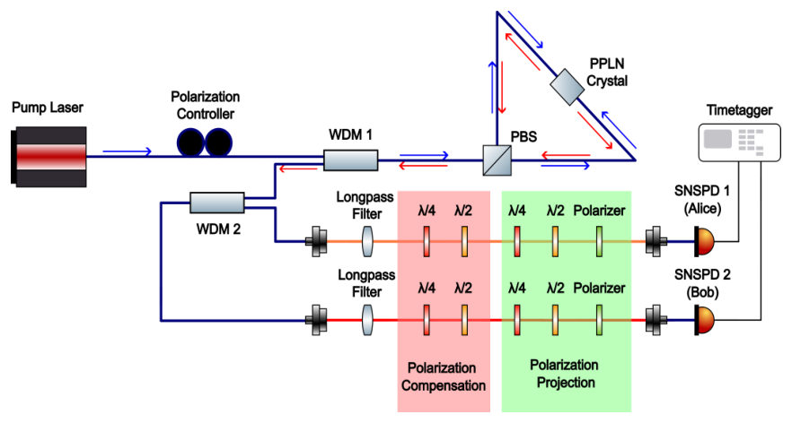 
Figure 1: Schematic of the all-fiber type-0 Sagnac source and polarization-analysis setup. The fiber PBS launches the two pump polarization components in opposite directions through the PPLN waveguide. After recombination, the non-degenerate signal and idler photons are sepa- rated by wavelength-division multiplexing, analyzed independently, and detected by SNSPDs.

📷 Fig 2

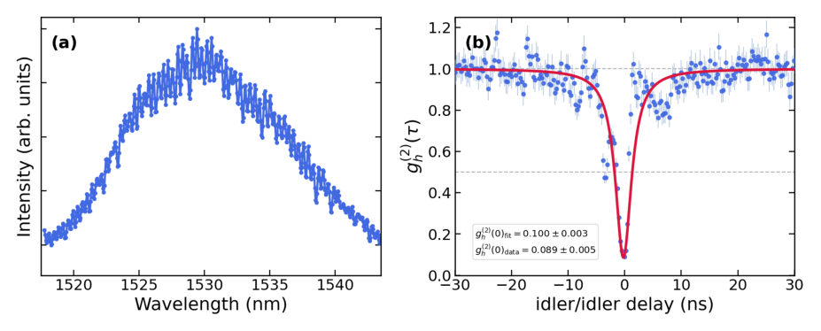 
Figure 2: Basic source characterization. (a) Measured lower-wavelength SPDC sideband; the conjugate long-wavelength band lies outside the available spectrometer range. (b) Heralded second-order correlation versus delay, sampled in 256 ps steps. Error bars show propagated counting uncertainties; the dashed line marks unity. No fit or additional far-delay renormaliza- tion is applied.

📷 Fig 3

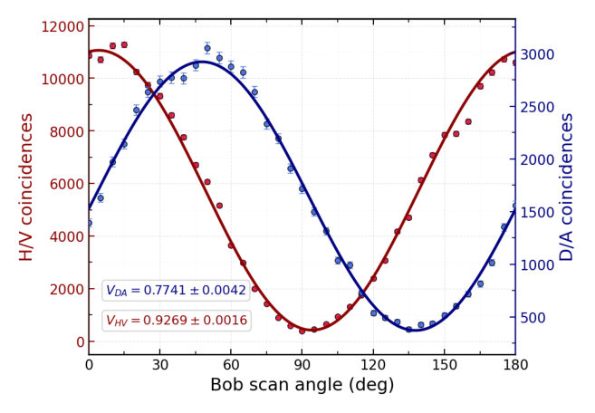 
Figure 3: Measured polarization-correlation fringes in the H/V (red, left axis) and D/A (blue, right axis) bases. Error bars show central Poisson confidence intervals at a nominal 68.27% con- fidence level. Solid lines are sinusoidal fits obtained by Poisson maximum likelihood. Visibilities are calculated from the fitted amplitude-to-offset ratio; the quoted uncertainties represent one standard deviation estimated from 2,000 parametric Poisson-bootstrap resamples and refits. Each point contains 5 s of acquisition. The fit has a 180◦period in the recorded scan coordi- nate; this coordinate is not identified with a calibrated physical half-wave-plate angle.

📷 Fig 4

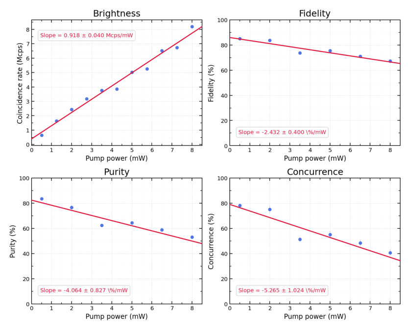 
Figure 4: Pump-power dependence of (a) the corrected pair rate, (b) Bell-state fidelity, (c) purity, and (d) concurrence. The pair rate increases approximately linearly with pump power, while the state quality decreases overall. Error bars in (b)–(d) represent one standard deviation of the reconstructed metrics. Solid lines are linear fits. State-metric slopes are expressed in percentage points per milliwatt.

**Summary.** The authors report on an all-fiber, compact source for generating polarization-entangled photon pairs using a Sagnac interferometer and PPLN waveguide. They measured high entanglement quality metrics, confirming the state is suitable for quantum teleportation. The fiber-integrated design makes this source highly practical for real-world quantum network applications.

**Why it may be interesting.** This work provides a highly practical, fiber-integrated platform for generating entangled photons, which is a critical resource for quantum communication protocols like teleportation and quantum key distribution.

Detailed structure

**Main problem.** The goal was to demonstrate a compact, practical, and affordable source for generating non-degenerate, polarization-entangled photon pairs suitable for quantum communication.

**Main result.** The source achieved a Bell-state fidelity of 0.850 and a CHSH value of 2.3301, confirming entanglement sufficient for qubit teleportation above the classical limit.

**Method.** The experiment utilized quantum-state tomography and CHSH measurements to characterize the generated entangled state.

**Model / system.** The system is an all-fiber Type-0 Sagnac interferometer embedding a periodically poled lithium-niobate (PPLN) waveguide, which generates entangled photon pairs via spontaneous parametric down-conversion (SPDC).

**Key observables.** Bell-state fidelity ($F_{\Phi^-}=0.850$), Purity ($P=0.836$), Concurrence ($C=0.782$), and CHSH value ($S=2.3301 \pm 0.0075$).

**Important parameters / regimes.** The source operates at 0.5 mW pump power and exhibits a corrected pair-rate slope of $(0.918 \pm 0.040) 	ext{ Mcps } 	ext{mW}^{-1}$.

**Assumptions / limitations.** The fidelity is limited by a residual relative-phase offset, suggesting local phase compensation could improve performance to $\approx 0.8865$.

**Figures summary.** Figures illustrate the source schematic, the measured broadband SPDC sideband, and polarization correlation fringes measured in H/V and D/A bases.

**Paper structure.** The paper details the experimental setup, presents measurements of state metrics (fidelity, concurrence) as a function of pump power, confirms entanglement via CHSH violation, and discusses the practical implications for quantum networking.

Abstract

We demonstrate a compact, practical all-fiber source of non-degenerate telecom-band polarization-entangled photon pairs assembled from off-the-shelf components. The compact fiber-integrated architecture is designed to be affordable, straightforward to assemble and align, and compatible with existing optical-fiber infrastructure. Photon pairs are generated through type-0 spontaneous parametric down-conversion in a pigtailed periodically poled lithium-niobate waveguide embedded in a Sagnac interferometer. At 0.5 mW pump power, quantum-state tomography yields a Bell-state fidelity $F_{Φ^-}=0.850$, purity $P=0.836$, and concurrence $C=0.782$. A separate CHSH measurement gives $S=2.3301\pm0.0075$. The measured Bell-state fidelity is sufficient for the reconstructed polarization state to support qubit teleportation above the classical fidelity limit under ideal protocol operations. Analysis of the density matrix shows that approximately 96.7% of the population remains in the desired $|HH\rangle$-$|VV\rangle$ subspace, with a normalized coherence of approximately 0.86. A residual relative-phase offset indicates that local phase compensation could increase the Bell-state fidelity to approximately 0.8865. We further characterize the brightness--quality trade-off and obtain a corrected pair-rate slope of $(0.918\pm0.040)$ Mcps mW$^{-1}$. The broadband emission and fiber interfaces offer a route to multiuser entanglement distribution through off-the-shelf multichannel wavelength-division multiplexers with passbands matched to the signal and idler wavelengths.

[↑ back to top](#top)

### [A Single Conformal Coordinate Decodes Outcome-Resolved Measurement-Induced Entanglement](http://arxiv.org/abs/2610.07995v1)

**Authors:** Reyhaneh Khasseh, M. A. Rajabpour  
**Type:** theory · **Category:** statistical mechanics · **PDF:** <https://arxiv.org/pdf/2610.07995v1>  
**Analysis basis:** full PDF text, analyzed in chunks
**Topic relevance:** 🔥 `quantum measurements` **4/5** · `Full counting statistics` **2/5** · `methods for driven-dissipative` **2/5** · `analog quantum simulation` **1/5** · `non-equilibrium universality` **1/5**

📷 Fig 1

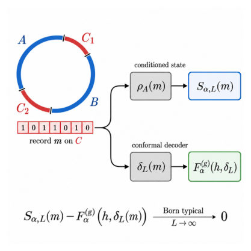 
FIG. 1. Outcome-resolved conformal decoder. A single measurement record m defines two independent routes. Condi- tioning the many-body state gives the outcome-resolved Rényi entropy Sα,L(m), while the measured bits independently de- termine the compact conformal coordinate δL(m) and hence the continuum prediction F (g) α (h, δL). The central result is that these two quantities agree for Born-typical outcomes in the scaling limit.

📷 Fig 2

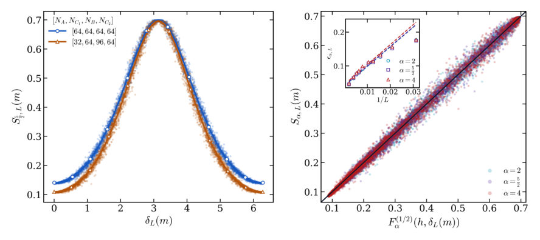 
FIG. 2. Exact XX benchmark of the outcome-resolved decoder. (a) Outcome-resolved entropies at L = 256 and α = 5/2 for two distinct interval geometries. Points are exact lattice results and solid curves are the parameter-free compact-boson predictions. (b) Exact entropy versus continuum prediction for the strongly asymmetric geometry at α = 2, 5/2, 4; the diagonal is equality, not a fit. The inset shows the finite-size convergence of ϵα,L for the same Rényi indices, with dashed lines as large-L fit guides. All numerical data use 5000 exact Born samples per geometry generated by projection-DPP sampling.

📷 Fig 3

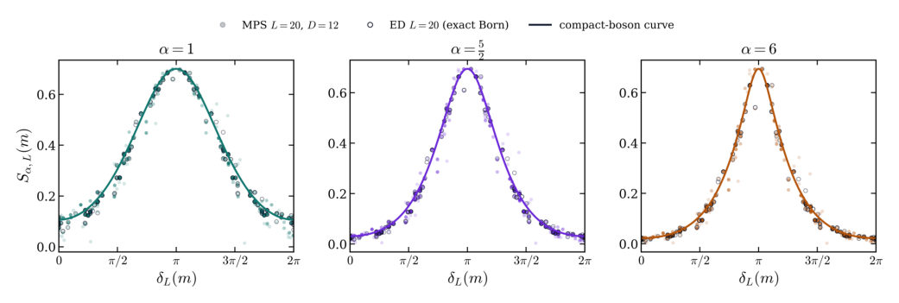 
FIG. 3. ED–MPS comparison for the interacting XXZ chain at L = 20 and ∆= 1/2, for α = 1, 5/2, and 6 (left to right). Open circles show exact ED results, while colored points show MPS results with bond dimension D = 12. Solid curves are the parameter-free compact-boson predictions F (g) α (h, δL) with g = 2/3.

📷 Fig 4

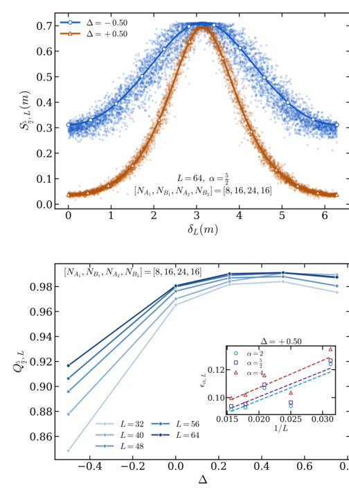 
FIG. 4. Outcome-resolved decoder in the critical XXZ chain. (a) At L = 64 and α = 5/2, results are shown for ∆= −0.50 and +0.50. Solid curves are the corresponding parameter-free compact-boson predictions obtained from the same δL(m). (b) Qα,L versus anisotropy for several system sizes at α = 5/2. The inset shows ϵα,L versus 1/L at ∆= +0.50 for α = 2, 5/2, 4; dashed lines are finite-size fit guides. All data are obtained from periodic-MPS Born sampling with bond dimension D = 32.

📷 Fig 5

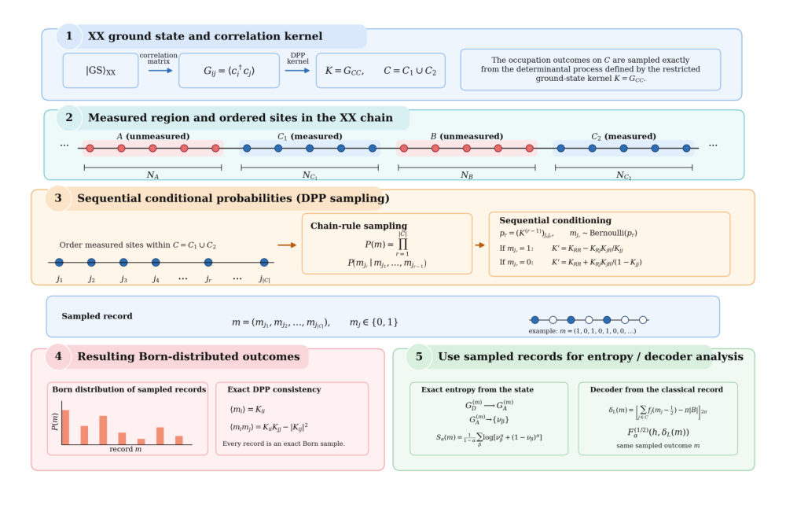 
FIG. 5. Exact Born sampling at the XX point. Starting from the ground-state correlation matrix, the measured region C = C1 ∪C2 carries the determinantal-point-process (DPP) kernel K = GCC. The measured sites are visited sequentially. At step r, the occupation of the current site jr is drawn from the conditional Bernoulli probability pr = (K(r−1))jrjr, after which the kernel on the retained sites is updated according to Eqs. (I7) and (I8). Here R denotes the sites retained after the current draw: the as-yet-unsampled measured sites together with the unmeasured subsystem D = A ∪B. Thus only one diagonal element of the current kernel is needed to draw the next occupation, while the entire...

**Summary.** This work investigates how entanglement in critical quantum chains is affected by local measurements, finding that the resulting entropy is surprisingly simple. The complexity of the measurement outcome space collapses onto a single, universal compact conformal coordinate. This reveals a fundamental Luttinger-liquid mechanism governing post-measurement entanglement.

**Why it may be interesting.** It provides a deep, universal connection between local measurement outcomes and global entanglement structure in critical systems, suggesting a powerful, low-dimensional description (a single coordinate) for complex quantum information.

Detailed structure

**Main problem.** The paper addresses how much information from a single, outcome-resolved measurement record is necessary to predict the entanglement remaining between two unmeasured regions in a critical many-body state.

**Main result.** The universal outcome-resolved Rényi entropy is shown to be asymptotically determined by a single compact conformal coordinate extracted directly from the measurement record, revealing an emergent Luttinger-liquid mechanism.

**Method.** The analysis combines theoretical frameworks like compact-boson theory with exact lattice identities (for free-fermion models) and numerical techniques like Matrix Product States (MPS) for interacting chains.

**Model / system.** The study focuses on critical quantum chains, specifically the free-fermion XX model and the interacting XXZ model, analyzed using entanglement entropy calculations.

**Key observables.** Outcome-resolved Rényi entanglement entropy ($S_{\alpha,L}(m)$), the single compact conformal coordinate ($\delta_L(m)$), and the conditional kernel $G(m)_D$.

**Important parameters / regimes.** Rényi index ($\alpha$), system size ($L$), and anisotropy ($\Delta$ for XXZ).

**Assumptions / limitations.** The result is shown to hold for Born-typical records in the scaling limit, and some numerical calculations rely on approximations like finite bond dimension in MPS.

**Figures summary.** Figures illustrate the 'Outcome-resolved conformal decoder,' comparing exact lattice results to compact-boson predictions for the XX benchmark, and showing the decoder's robustness across different geometries and interaction strengths in the XXZ chain.

**Paper structure.** The paper develops the problem by first establishing the connection between the entropy and the conformal coordinate using the XX model (free-fermion), then extends this framework to the interacting XXZ model using MPS, and finally compares these results against continuum predictions derived from compact-boson theory.

Abstract

A local measurement of a critical many-body state produces exponentially many microscopic outcomes, each defining a different conditioned quantum state. We ask how much information from one such outcome is actually needed to predict the entanglement that remains between two unmeasured regions. We show that, in critical quantum chains, the universal outcome-resolved Rényi entropy is asymptotically determined by a single compact conformal coordinate extracted directly from the measurement record. Compact-boson theory explains this compression: the universal entropy is insensitive to all spatially varying components of the boundary profile, retaining only a single relative compact zero mode. At the free-fermion XX point, exact lattice identities expose the microscopic structure underlying the decoder, while large-scale outcome-by-outcome calculations confirm its scaling prediction across different subsystem geometries and Rényi indices. Numerical calculations in interacting XXZ chains further show that the same microscopic coordinate continues to decode the conditional entropy without interaction-dependent retuning. Thus an exponentially large space of measurement outcomes is reduced, for this universal observable, to a single conformal degree of freedom, revealing an emergent Luttinger-liquid mechanism for outcome-resolved postmeasurement entanglement.

[↑ back to top](#top)

### [Spontaneous Hawking Radiation from Dynamical Black-Hole Formation in Quantum Spin Systems](http://arxiv.org/abs/2610.07794v1)

**Authors:** Shunichiro Kinoshita, Keiju Murata, Daisuke Yamamoto, Ryosuke Yoshii  
**Type:** theory · **Category:** statistical mechanics · **PDF:** <https://arxiv.org/pdf/2610.07794v1>  
**Analysis basis:** full PDF text, analyzed in chunks
**Topic relevance:** 🔥 `analog quantum simulation` **4/5** · `Keldysh / 2PI / non-Gaussian methods` **3/5** · `methods for driven-dissipative` **2/5**

📷 Fig 1

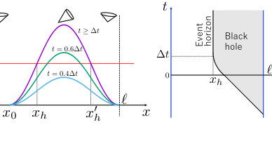 
FIG. 1. (Left) Profile of v(t, x) for ℓ= π, x0 = π/4, and κ = 8/3. (Right) Causal structure of the spacetime describing black hole formation. The shaded region represents a black hole, from which the left boundary (x = 0) cannot be reached.

📷 Fig 2

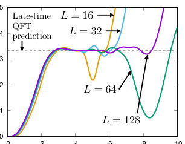 
FIG. 2. (Top) Energy density computed in the spin system. Only the flat region x &lt; x0 −ε is shown. The black dashed line indicates the QFT prediction (11). (Bottom) Spatially averaged energy density over the flat region as a function of time for various numbers of sites L; the black dashed line indicates the QFT prediction. The parameters are ℓ= π, x0 = π/4, κ = 2, and ∆t = 2. The number of sites is L = 64 in the top panel and L = 16, 32, 64, and 128 in the bottom panel.

📷 Fig 3

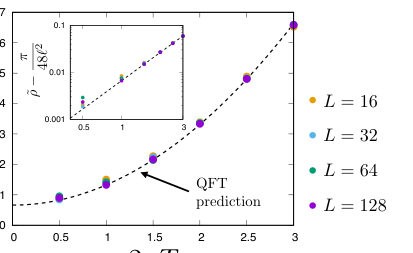 
FIG. 3. Plateau height of the spatially averaged energy den- sity as a function of κ = 2πTH. The dots show the results for the discrete spin system, while the black dashed line in- dicates the QFT prediction (11). The parameters are ℓ= π, x0 = π/4, and ∆t = 2, with the number of sites L = 16, 32, 64, and 128. The inset shows the same data on a log-log scale after subtracting the constant term π/(48ℓ2) from the QFT prediction.

📷 Fig 4

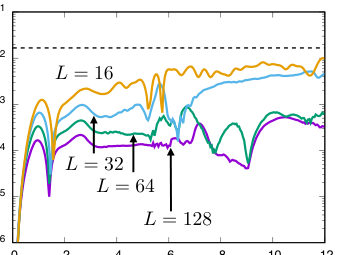 
FIG. 2. Energy densities of (a) right-moving modes, (b) left-moving modes, and (c) the total energy density. The horizontal axis represents the spatial coordinate, and only the flat region x &lt; x0 is shown. The black dashed lines indicate the QFT predictions: Eq. (51) for panels (a) and (b), and Eq. (52) for panel (c). Panel (d) shows the norm of ρint j . For reference, Eq. (51) is also shown as a black dashed line. The parameters are set to ℓ= π, x0 = π/4, κ = 2, and ∆t = 2. The system size is fixed at L = 64 in panels (a)–(c), while in panel (d) it is varied as L = 16, 32, 64, 128.

📷 Fig 5

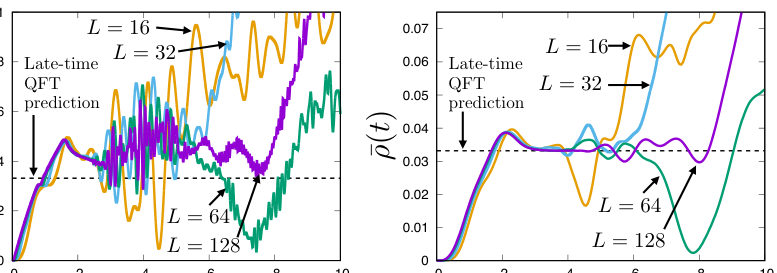 
FIG. 3. Panels (a)–(d) show the time dependence of the spatially averaged energy density, with (κ, ∆t) = (1, 2), (3, 2), (2, 0), and (2, 1), respectively. Each panel shows curves for system sizes L = 16, 32, 64, 128. Other parameters are set to ℓ= π and x0 = π/4.

**Summary.** This work shows that spontaneous Hawking radiation, typically associated with curved spacetime, can be modeled using a local quantum spin system. By calculating the local energy density using spin observables, the authors successfully reproduce the continuum QFT prediction for Hawking radiation. This establishes a powerful, microscopic route for quantum simulation of quantum field theory in curved spacetime.

**Why it may be interesting.** It provides a concrete, experimentally accessible many-body observable (local spin expectation value) that directly simulates a fundamental process in quantum gravity (Hawking radiation), bridging condensed matter physics with high-energy theory.

Detailed structure

**Main problem.** To demonstrate a microscopic realization of spontaneous Hawking radiation generated by dynamical black-hole formation within a local quantum spin model.

**Main result.** The expectation value of a local spin observable quantitatively reproduces the continuum Quantum Field Theory prediction for the energy density associated with Hawking radiation.

**Method.** The authors map the QFT problem onto a quantum spin system, calculating the renormalized local energy density using spin observables and comparing it to continuum predictions derived from Bogoliubov mixing.

**Model / system.** The system is a local quantum spin model (e.g., related to Majorana fermions) simulating a 2D spacetime geometry evolving from flat to black-hole geometry. The dynamics are governed by a complex spin Hamiltonian.

**Key observables.** Renormalized local energy density ($
ho_j(t)$), spatially averaged energy density ($ar{
ho}(t)$), and mode functions ($\phi^-_n,j$).

**Important parameters / regimes.** Surface gravity ($\kappa$), system size ($L$), and time window duration (which grows logarithmically with $L$).

**Assumptions / limitations.** The agreement between the spin observable and the continuum prediction is limited to a finite time window, signaling the crossover to lattice-cutoff dynamics.

**Figures summary.** Figures show the time evolution of the spatially averaged energy density ($ar{
ho}(t)$) plateauing at the QFT prediction, and mode functions exhibiting exponential decay consistent with QFT predictions in the intermediate time regime.

**Paper structure.** The paper establishes the theoretical link between Hawking radiation and spin systems, calculates the energy density using local spin observables, and then numerically verifies the agreement with continuum QFT predictions while also analyzing the breakdown of the model at late times.

Abstract

We show that Hawking radiation spontaneously generated by dynamical black-hole formation can be realized in a local quantum spin model. Starting from the ground state corresponding to the early-time vacuum, with no initially prepared excitations, we follow the dynamics induced by the evolving geometry. In the corresponding continuum quantum field theory, Hawking particle creation is associated with nontrivial Bogoliubov mixing between the in- and out-mode decompositions. We derive the resulting renormalized local energy density in the continuum quantum field theory, which corresponds to an energy-weighted integral of the Hawking spectrum, and identify its counterpart as a local spin observable whose expectation value quantitatively reproduces the continuum prediction, including its dependence on the surface gravity. The agreement persists over a finite time window whose duration grows logarithmically with system size, revealing the crossover from universal continuum Hawking physics to lattice-cutoff dynamics. These results establish a microscopic route to quantum simulation of quantum field theory in curved spacetime, connecting field-theoretic particle creation directly to experimentally accessible many-body observables.

[↑ back to top](#top)

### [Benchmarking exchange-only control of a 48-spin singlet manifold](http://arxiv.org/abs/2610.07393v1)

**Authors:** HRL Quantum Team, Microsoft Collaborators, :, Stephen Carr, Matt Abbitt, Michael Abraham, Edwin Acuna, I. Alverado, Carter Andrews, Hussein Anton, Katherine M. Beech, Aaron J. Bluestone, Jacob Z. Blumoff, Matthew G. Borselli, Brydon Boyd, Jacob T. Boyer, Peter Brewer, Steven L. Brown, Joseph D. Broz, Tyler A. Cain, John B. Carpenter, Faustin W. Carter, Brittany Carter, Matthew D. Chambers, James M. Chappell, Kevin C. Chen, Edward H. Chen, Maxwell D. Choi, Matthew N. H. Chow, Justin E. Christensen, Aaron M. Chronister, Andrew M. Clapper, Michael D. Cornelius, Gregory M. Crosswhite, Stanislav Culaclii, Erik S. Daniel, Dominic Daprano, John K. David, Charles R. Elliott, Kevin Eng, Colin P. Feeney, David J. Fialkow, Dylan H. Finestone, Bryan H. Fong, Richie Fu, Zachary A. Geiger, Bradley W. Greene, Rafael Guerra-Fuentes, Hrayr K. Gurgenian, Alex Hamill, Brooke M. Hardesty, Jim W. Harrington, Alex Hirman, Donald A. Hitko, Silas Hoffman, Dominic Holloman, Daniel R. Hulbert, Jake Hundley, Clayton A. C. Jackson, Paul C. Jerger, B. Johnson, Aaron M. Jones, Michael P. Jura, Adour V. Kabakian, Tyler Keating, Joseph Kerckhoff, Andrey A. Kiselev, Patrick W. Krantz, Thaddeus D. Ladd, Sanaaya Lakdawala, Elias Lawson-Fox, Alwina R. Liu, Dwight Luhman, Manny Macias, Theodore K. Macioce, Ryan M. Martin, Daniel S. Matic, Gavin C. Mazur, Ryan McGeehan, Olivia Means, Austin Meyer, Samuel Mumford, Tina Niknejad, Riley P. O'Neil, Andrew Pan, Winston Pouse, Eric M. Prophet, Matthew D. Reed, Marcus Rentie, Alec Roberson, Zechariah Rogers, Golam Sabbir, Spencer Sager, Christopher D. Sanborn, Jonathan Sanchez, Rachel H. Sarmiento, Christian J. Schnaible, Cole Scott, Aaron Smith, Daniel E. Smith, James Soash, Kevin C. Staley, Andrea Su, Bo Sun, Christopher M. Swank, Noah Swimmer, Charles Tahan, Bryan J. Thomas, Yessica Torres, Alan Tran, Ivan Tran, James R. van Meter, Franklin Vartanian, John Samuel Venker, Daniel Volya, Annette L. Wagner, Daniel R. Ward, Aaron J. Weinstein, Abigail L. Wessels, Thomas V. Westrick, Evan T. White, Randall M. White, Parker Williams, Catrina E. Wilson, Courtney P. Wilt, Matthew Wingert, Clifford S. YoungSciortino, Andrew Ziegler  
**Type:** experiment · **Category:** quantum information and computing · **PDF:** <https://arxiv.org/pdf/2610.07393v1>  
**Analysis basis:** full PDF text, analyzed in chunks
**Topic relevance:** 🔥 `QC/QI experiment` **4/5** · `analog quantum simulation` **3/5** · `quantum measurements` **1/5**

📷 Fig 1

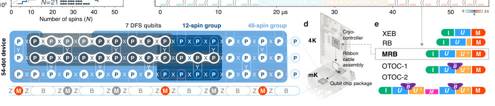 
FIG. 1. a Scaling of the quantum Hilbert space size with the number of spins for single-spin qubits, three-spin DFS qubits, and the S = 0 operation mode studied in this work. b Flexibility of exchange-only operation on the qubit chip, with device subgraphs representing 7-qubit DFS, 12-spin S = 0, and 48-spin S = 0 highlighted in various shades of blue. The three measurement sites used in this work are highlighted in red. Particular unused spins and measurement dots were judged more challenging to calibrate due to disorder present in this system. c Example of an exchange program for mirror randomized benchmarking (MRB) executed in the S = 0 operation mode. Exchange angle magnitudes are given...

📷 Fig 2

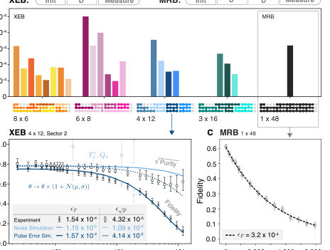 
FIG. 2. a Loss in fidelity per exchange, ϵF , for 48-spin benchmarks in the S = 0 operation mode. Parallel XEB experiments, of varying spin counts (color) and subgraphs (shade), are shown alongside a 48-spin MRB experiment, with the spin subgraph used for each data point drawn underneath with a matching color. Uncertainties in the fitted ϵF are all less than 10−5 and have been omitted. b XEB fidelity versus exchange pulse count for a 12-spin XEB experiment, given by the black crosses. The open circles represent the square root of purity, which measures the loss in coherence, such as from averaging over stochastic control errors or environmen- tal decoherence. A simulation that includes the...

📷 Fig 3

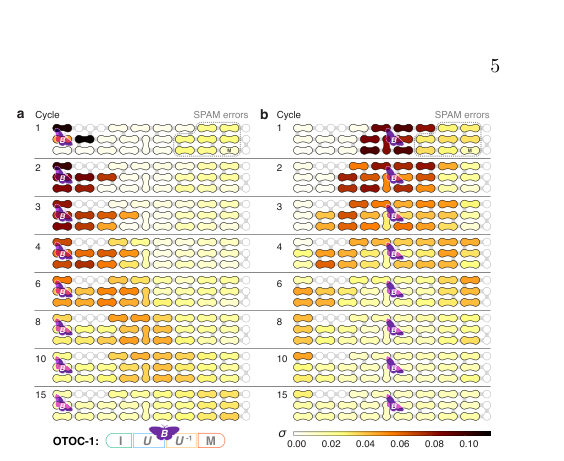 
FIG. 3. a Standard deviation in singlet-return probabilities (σ) across 100 different OTOC-1 sequences on 48 spins, with a π/2 butterfly exchange applied on the left side of the device, as a function of cycle count (1 to 15). b Same as (a) but with a butterfly exchange in the middle of the device.

📷 Fig 4

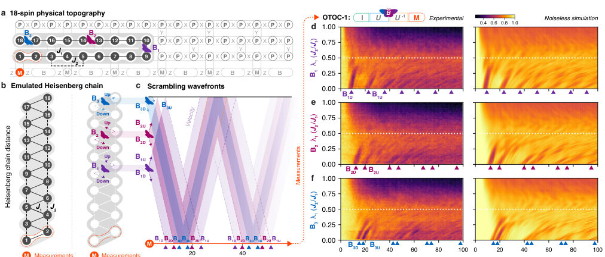 
FIG. 4. a Physical locations of the 18 spins used in the OTOC-1 calculation of a Trotterized J1-J2 isotropic 1D Heisenberg spin- chain Hamiltonian. Three different butterfly locations, B1, B2, and B3, are indicated at various distances from the measurement spin pair, which is outlined in red. b Virtual locations of the 18 spins, as well as a depiction of the two spin-coupling terms J1 and J2. Neighboring sites are staggered such that the J1 interaction forms a diagonal truss between neighboring spins, while the J2 interaction forms a vertical connection between next-nearest neighbors. The three butterfly locations now indicate their position on the virtual spin chain. c Diagram of the...

📷 Fig 5

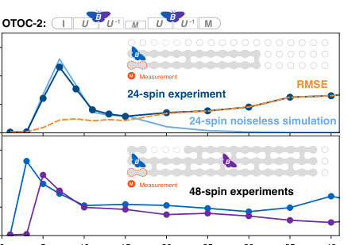 
FIG. 5. a Standard deviation in singlet-return probability across different random sequences (σ) for 24-spin OTOC-2 as a function of cycle depth in the random unitary U. Experi- ment is shown in dark blue and noiseless simulation in light blue. The root-mean-square error (RMSE) between the mea- sured singlet-return probabilities and those predicted by the simulation can be evaluated in the same units as σ and is shown in orange. The inset shows the 54-spin device with the active 24-spin region in gray, the butterfly location in blue, and the measurement site outlined in red. b Same as (a), but now for 48-spin random OTOC-2 at two different but- terfly sites (blue and purple). In this case,...

**Summary.** This work benchmarks quantum computation performance using only exchange interactions on large arrays of electron spins. By measuring performance across the entire accessible Hilbert space, the authors report a very low system-level error rate. This demonstrates a scalable and high-fidelity method for controlling complex quantum many-body systems using solid-state spin qubits.

**Why it may be interesting.** It provides a concrete, high-fidelity benchmark for scaling quantum computation using only native, local interactions (exchange), which is highly relevant for solid-state quantum computing architectures.

Detailed structure

**Main problem.** The paper benchmarks quantum control using only exchange interactions on a large spin system, aiming to utilize the entire available Hilbert space rather than restricting to smaller, conventionally treated subspaces.

**Main result.** The authors achieved an effective system-level error of $3 	imes 10^{-4}$ per exchange, which is reported to be up to an order of magnitude lower than comparable benchmarks on other platforms.

**Method.** Performance is assessed using Out-of-Time-Order Correlators (OTOCs) to study scrambling dynamics, and generalized forms of cross-entropy and mirror randomized benchmarking (MRB) to quantify aggregate error.

**Model / system.** The system consists of arrays of up to 48 electron spins (quantum dots) whose evolution is governed solely by voltage-controlled spin-spin exchange interactions, operating within the total-spin-zero Hilbert space.

**Key observables.** Effective system-level error ($\epsilon_F$), scrambling dynamics (via OTOCs), fidelity, and purity.

**Important parameters / regimes.** System size up to 48 spins; total-spin-zero Hilbert space dimension exceeding $2^{40}$; error rate of $3 	imes 10^{-4}$ per exchange.

**Assumptions / limitations.** The control relies on $S$-conserving exchange operations, and the approach assumes the ability to measure performance across the full Hilbert space, treating previously 'leakage' states as usable.

**Figures summary.** Figures illustrate the scaling of the accessible Hilbert space, schematics of the QPU chip, and benchmarking procedures (XEB, RB, MRB) used to measure error rates.

**Paper structure.** The paper introduces the concept of full Hilbert space benchmarking for exchange-only control, details the application to large spin arrays, presents measurements using OTOCs and randomized benchmarking techniques, and concludes with the reported low error rates.

Abstract

Exchange-only quantum computing benefits from high fidelity and straightforward control afforded by the exchange interaction. However, independently controllable qubits must be encoded into subsystems of at least three electron spins, restricting computation to only a fraction of the available spin Hilbert space. The remaining states are treated as leakage and used only transiently in gate sequences. By contrast, a quantitative, system-wide measure of exchange-only performance can exploit the full available Hilbert space, including states conventionally treated as leakage. Here, we apply this approach to arrays of up to 48 electron spins, accessing a total-spin-zero Hilbert space with dimension exceeding $2^{40}$. Measurements of out-of-time-order correlators (OTOCs) reveal rich scrambling dynamics and demonstrate access to regimes relevant to quantum computational advantage. Using generalized forms of cross-entropy and mirror randomized benchmarking, we also assess the aggregate performance of the full exchange-only system per fundamental two-body interaction: the two-spin exchange. We obtain an effective system-level error of $3 \times 10^{-4}$ per exchange, incorporating the complete experimental control sequence and all associated noise sources. This value is up to an order of magnitude lower than those reported from comparable benchmarks on other platforms at the time of writing.

[↑ back to top](#top)

### [Harnessing Post-selected von Neumann Measurements to Strengthen Entanglement and Quantum Signatures in Coherent States](http://arxiv.org/abs/2610.08438v1)

**Authors:** Janarbek Yuanbek, Zelalem Abebe Bekele, Zhi-qiang Liu  
**Type:** theory · **Category:** other · **PDF:** <https://arxiv.org/pdf/2610.08438v1>  
**Analysis basis:** full PDF text, analyzed in chunks
**Topic relevance:** 🔥 `quantum measurements` **4/5** · `Full counting statistics` **1/5** · `correlated / nonlocal dissipation` **1/5**

📷 Fig 1

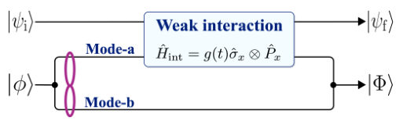 
FIG. 1. Schematic of the PVNMs protocol for preparing the conditional pointer state |Φ⟩in mode-a. The system and pointer are initially prepared in the states |ψi⟩and |ϕ⟩, re- spectively, coupled through a weak interaction, and subse- quently post-selected by projecting the system onto the final state |ψf⟩.

📷 Fig 2

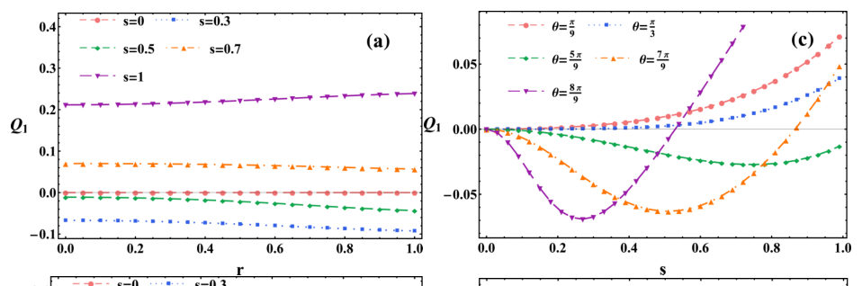 
FIG. 2. Quadrature squeezing parameters Q1 and Q2. (a) and (b) Q1 and Q2 as functions of r for different coupling strengths s, with the WV fixed at θ = 8π/9, (c) and (d) Q1 and Q2 as functions of the coupling strength s for different WVs, with r = 0.1 fixed. Here, δ = µ = 0.

📷 Fig 3

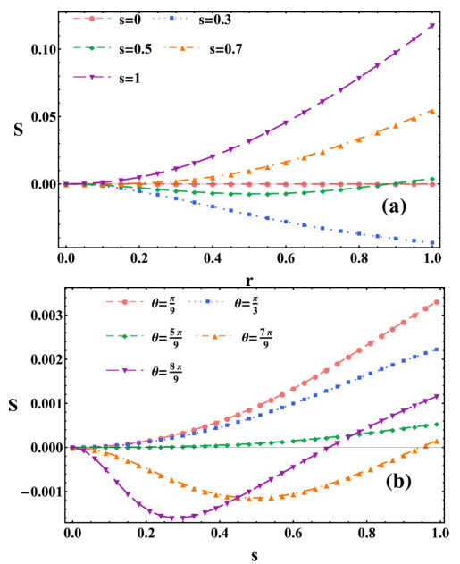 
FIG. 3. (a) S as functions of r for different coupling strengths s, with the WV fixed at θ = 8π/9, (b) S as functions of the coupling strength s for different WVs, with fixed r = 0.1 . Here, δ = Θ = µ = 0.

📷 Fig 4

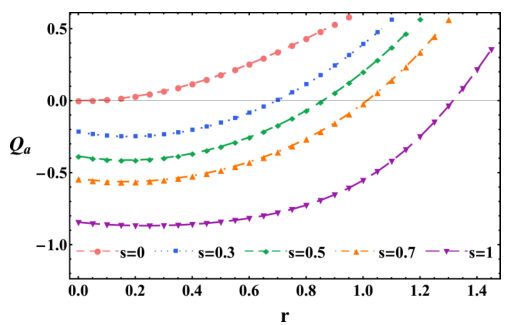 
FIG. 5. Mandel Q factor as functions of r for different cou- pling strengths s, with the WV fixed at θ = 8π/9. Here, δ = µ = 0.

📷 Fig 5

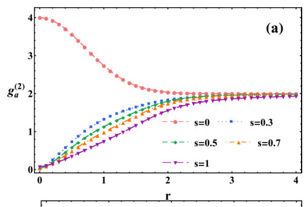 
FIG. 4. (a) and (b) as g(2) a (0) and g(2) b (0) functions of r for different coupling strengths s, with the WV fixed at θ = 8π/9. Here, δ = µ = 0.

**Summary.** This theoretical paper examines how performing post-selected von Neumann measurements alters the quantum characteristics of two-mode entangled coherent states. By analyzing observables like squeezing and photon statistics, the authors demonstrate that this measurement process acts as a tunable mechanism to enhance nonclassicality, confirming post-selection's utility in quantum state engineering.

**Why it may be interesting.** This work is highly relevant to quantum optics and open quantum systems, as it explores how measurement back-action (specifically post-selection) can be used as a precise tool to enhance or engineer nonclassical features in continuous-variable quantum states.

Detailed structure

**Main problem.** The paper investigates how post-selected von Neumann measurements (PVNMs) modify the nonclassical properties of two-mode entangled coherent states (ECSs). It aims to show that post-selection can be a tunable method for engineering these quantum states.

**Main result.** Anomalous weak values, particularly under moderate coupling, enhance key nonclassical features such as squeezing, antibunching, sub-Poissonian statistics, and bipartite entanglement in ECSs.

**Method.** The analysis involves calculating the conditional pointer state resulting from PVNMs and characterizing various quantum diagnostics on this state.

**Model / system.** The system under study is two-mode entangled coherent states (ECSs), which are non-Gaussian continuous-variable states. The theoretical framework utilizes a measurement interaction Hamiltonian and analyzes the resulting conditional pointer state.

**Key observables.** Squeezing ($\Delta^2 F_i$), photon statistics (Mandel Q parameter, $g^{(2)}$), intermode correlations, entanglement (Hillery-Zubairy correlation $E$), and fidelity.

**Important parameters / regimes.** Measurement strength parameter $s = g t / \sigma$, and the coupling strength $g$ and time $t$. The analysis covers weak ($s \ll 1$) and strong ($s \gg 1$) coupling regimes.

**Assumptions / limitations.** The analysis assumes an ideal von Neumann measurement context where the measurement interaction Hamiltonian dominates the evolution.

**Figures summary.** Figure 1 provides a schematic illustrating the protocol for preparing the conditional pointer state $|\Phi
angle$ via PVNMs on one mode.

**Paper structure.** The paper systematically builds upon the weak measurement framework, first defining the physical system (ECSs) and the measurement protocol. It then calculates and analyzes multiple nonclassical observables (squeezing, statistics, entanglement) as functions of the measurement strength parameter, culminating in the demonstration of post-selection's engineering capability.

Abstract

We investigate how post-selected von Neumann measurements modify the nonclassical properties of two-mode entangled coherent states (ECSs). From the conditional pointer state, we characterize squeezing, photon statistics, intermode correlations, entanglement, fidelity, and post-selection probability. Anomalous weak values with moderate coupling enhance squeezing, antibunching, sub-Poissonian statistics, intermode correlations, and bipartite entanglement, while fidelity captures the crossover from weak perturbation to strong distinguishability. These results demonstrate post-selection as a tunable approach to engineering ECSs.

[↑ back to top](#top)

### [Quantum Darwinism through apparatus-mediated environmental recording](http://arxiv.org/abs/2610.07568v1)

**Authors:** Tran P. H Don, Lan Nguyen Tran, Le Bin Ho  
**Type:** theory · **Category:** quantum information and computing · **PDF:** <https://arxiv.org/pdf/2610.07568v1>  
**Analysis basis:** full PDF text, analyzed in chunks
**Topic relevance:** 🔥 `quantum measurements` **4/5** · `correlated / nonlocal dissipation` **1/5** · `driven-dissipative phase transition` **1/5**

📷 Fig 1

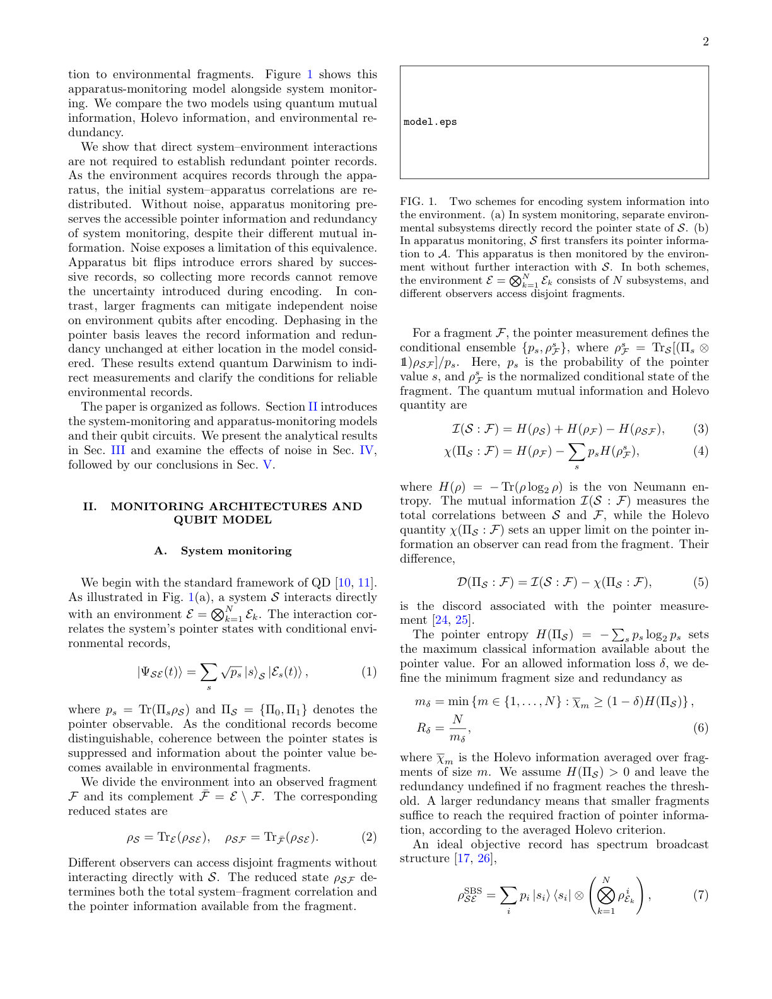 
Low-resolution page preview, page 2

📷 Fig 2

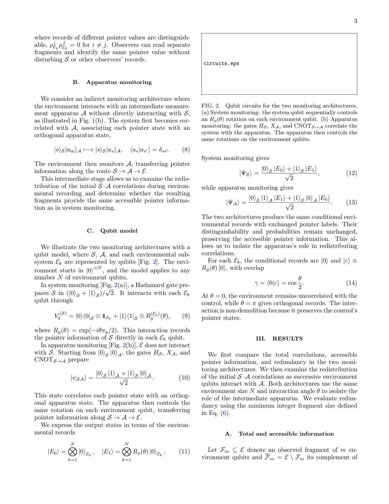 
Low-resolution page preview, page 3

📷 Fig 3

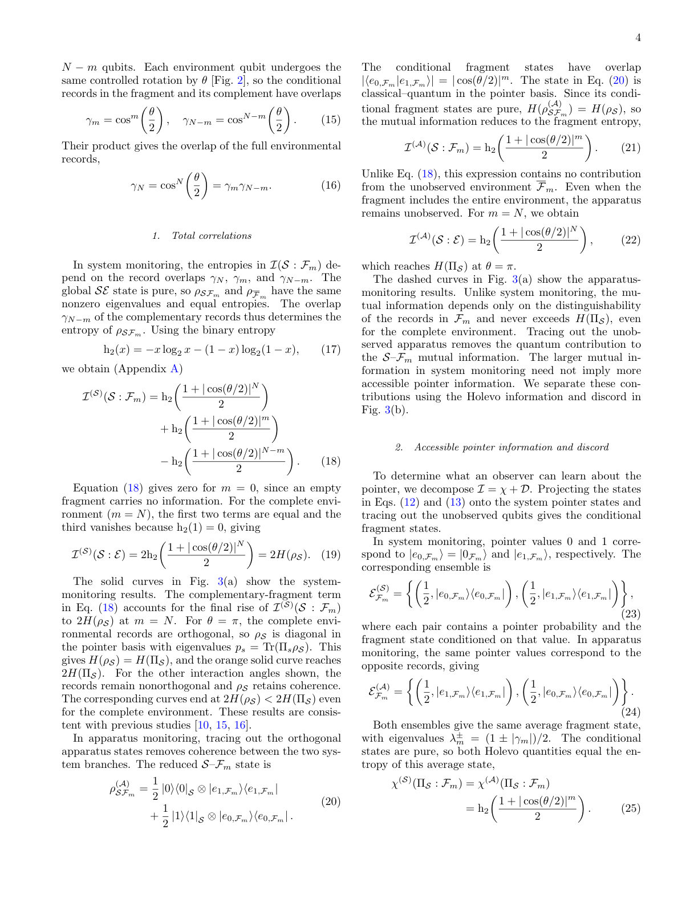 
Low-resolution page preview, page 4

📷 Fig 4

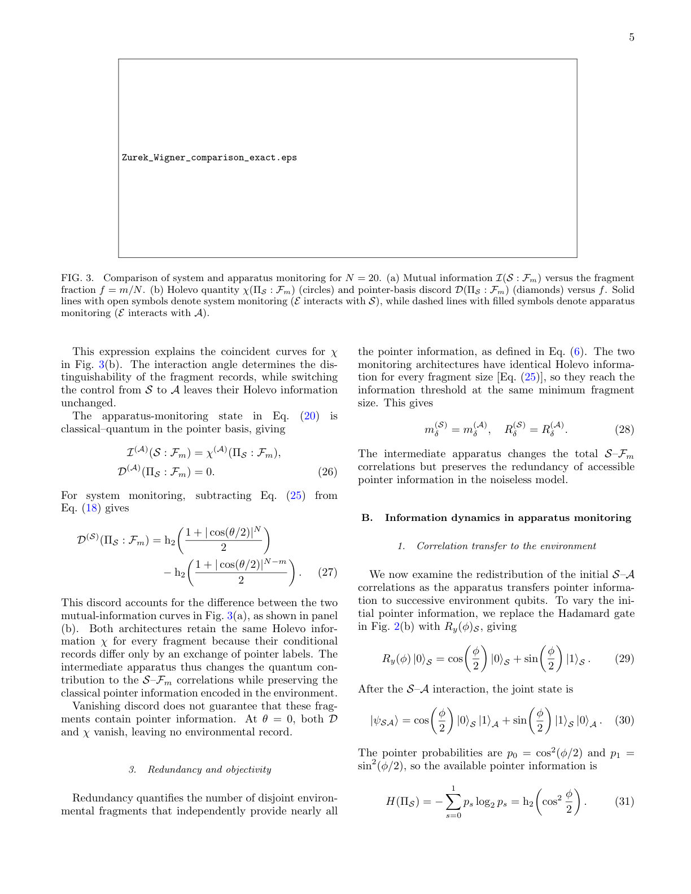 
Low-resolution page preview, page 5

📷 Fig 5

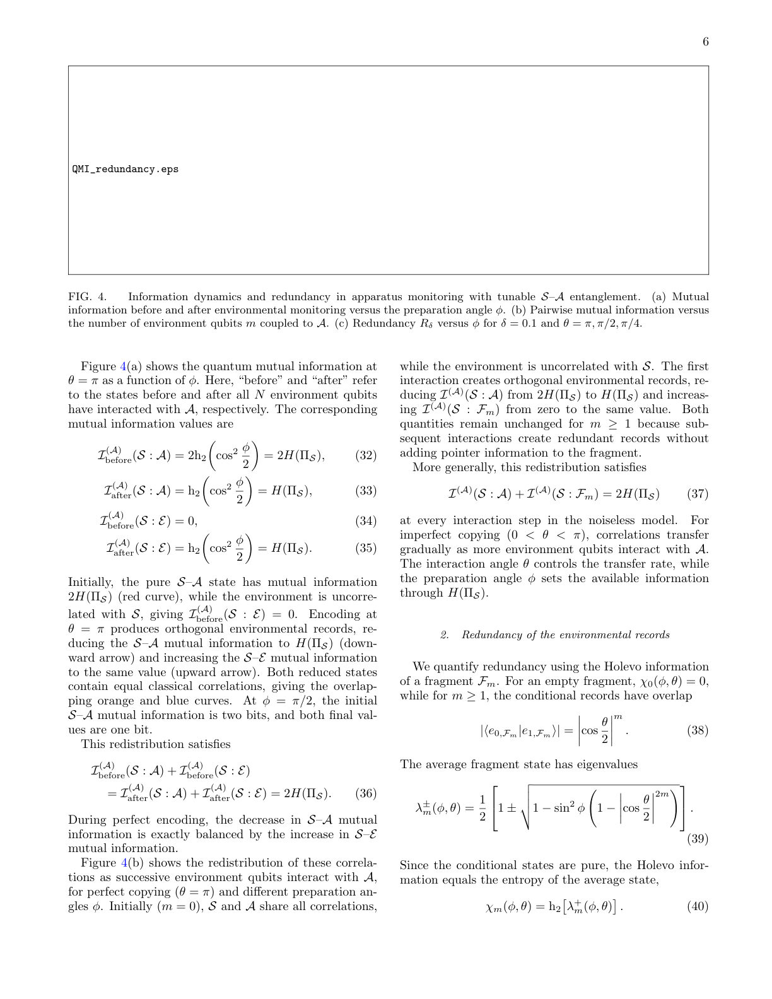 
Low-resolution page preview, page 6

**Summary.** This paper extends Quantum Darwinism by showing that the establishment of redundant environmental records—the basis for classical objectivity—does not require direct system-environment coupling. By modeling an intermediate apparatus, the authors prove that the accessible pointer information remains robust even when the environment interacts only with the apparatus. This clarifies the conditions under which indirect measurements can reliably encode quantum information.

**Why it may be interesting.** This work is highly relevant for AMO and open quantum systems as it provides a rigorous, information-theoretic framework for understanding how environmental coupling (or lack thereof) dictates the emergence of classical reality, which is central to decoherence studies.

Detailed structure

**Main problem.** The paper investigates how the classical objectivity of quantum systems, described by Quantum Darwinism, can be established through an intermediate measurement apparatus rather than direct system-environment coupling.

**Main result.** Theoretically, the apparatus monitoring scheme yields the same accessible pointer information and redundancy as direct system monitoring in the noiseless limit, extending QD to indirect measurements.

**Method.** The authors use exact analytical solutions of quantum circuit models and employ quantum information measures like mutual information, Holevo quantity, and quantum discord to compare the two monitoring architectures.

**Model / system.** The model compares two architectures: direct system-environment interaction ($S 	o E$) versus indirect apparatus-mediated interaction ($S 	o A 	o E$), using a qubit model for the system, apparatus, and environment.

**Key observables.** Mutual Information $I(S:F)$, Holevo quantity $\chi(\Pi_S:F)$, and Quantum Discord $D(\Pi_S:F)$ are key diagnostics for information accessibility and correlation.

**Important parameters / regimes.** The analysis depends on the interaction angles ($	heta$) and the noise type (bit-flip, dephasing) and location (apparatus vs. environment).

**Assumptions / limitations.** The analysis assumes the system has non-zero entropy ($H(\Pi_S) > 0$) and models the environment interaction using quantum circuit formalism.

**Figures summary.** Figures illustrate the two monitoring schemes (direct vs. apparatus-mediated) and compare the impact of different noise channels (bit-flips, dephasing) on the recoverable pointer information and redundancy.

**Paper structure.** The paper first establishes the theoretical framework by comparing the two monitoring schemes, then quantifies the information transfer and redundancy using information theory, and finally analyzes the robustness of the recorded information under various noise models.

Abstract

Quantum Darwinism explains classical objectivity through redundant environmental records of a system's pointer states. We show that these records can be established through an intermediate measurement apparatus without direct system--environment interactions. Using exact analytical solutions of quantum circuit models, we compare system monitoring with apparatus monitoring, where the environment interacts only with the apparatus. During encoding, system--apparatus correlations decrease as system--environment correlations grow. Without noise, both models yield identical accessible pointer information and redundancy, while the discord accounts for their different mutual information. The reliability of these records depends on where noise acts. Apparatus bit flips introduce errors shared by successive records, limiting the information recoverable even from the complete environment. In contrast, larger fragments can mitigate independent noise on environment qubits after encoding. Dephasing in the pointer basis leaves the record information unchanged in the model considered. These results extend the description of quantum Darwinism to indirect measurements and clarify the conditions for reliable environmental records.

[↑ back to top](#top)

### [Sparse qubit operation in a 6$\times$6 quantum dot array](http://arxiv.org/abs/2610.07683v1)

**Authors:** Alexader S. Ivlev, Harold L. Co, Damien R. Crielaard, Alice Petrillo, Setareh Kazemzadeh, Giordano Scappucci, Menno Veldhorst  
**Type:** experiment · **Category:** quantum information and computing · **PDF:** <https://arxiv.org/pdf/2610.07683v1>  
**Analysis basis:** full PDF text, analyzed in chunks
**Topic relevance:** 🔥 `QC/QI experiment` **4/5** · `quantum measurements` **1/5**

📷 Fig 1

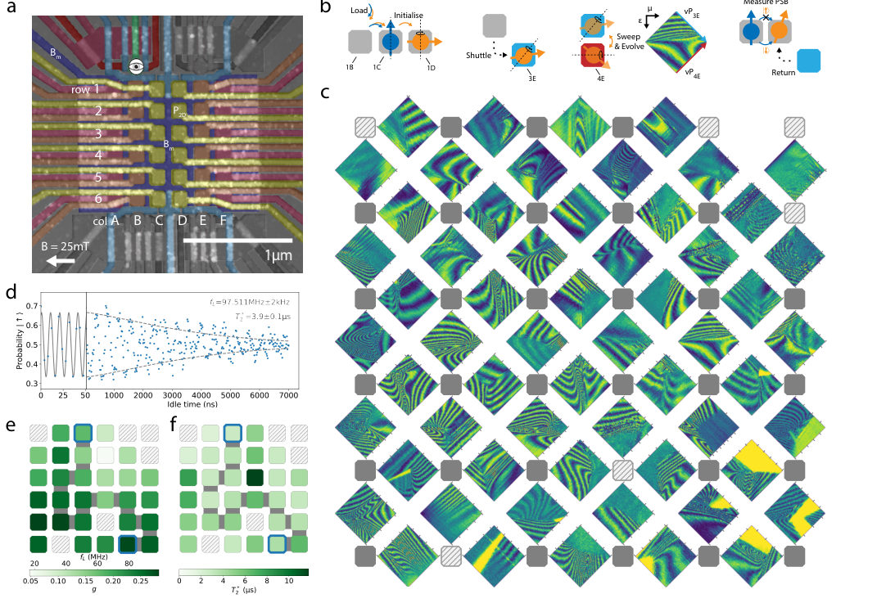 
Figure 1. A 6×6 quantum dot array. a, A false-colour Atomic Force Microscope image of the studied device. Plunger gates and quantum dots are labelled, e.g. P2D. The merged barrier gate Bm is indicated between the plunger gates and at its fanout (see Supplementary Material I for further details on the device). The direction of the nominally in-plane magnetic field B = 25 mT is indicated. b, Schematic of a Spin Evolution Diagram (SED) measurement. A spin is loaded, prepared in a superposition state, and shuttled through the array to probe spatial variations in the g-factor. The accumulated phase is measured using PSB, yielding the example SED as a function of the voltages vP3E-vP4E. c, An...

📷 Fig 2

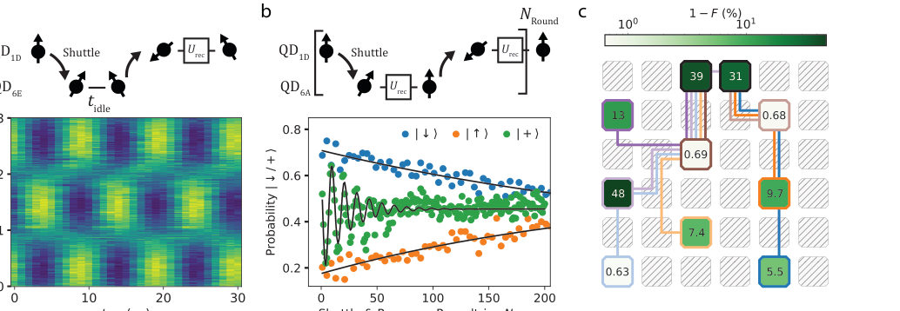 
Figure 2. Shuttling-based initialisation at sparse occupation. a, Calibration of tdrive for the return recovery gate Urec,6E-1D at a given microwave phase. tdrive ≈0.9 µs is chosen as it minimises the spin dynamics as a function of the idle time tidle. For further details on the exact calibration, see Supplementary Materials VII. c, For shuttling path QD1C-QD6A a basis-state round-trip fidelity of FRound|↓⟩= 99.4 ± 0.1% is observed. For the superposition state an oscillatory signal as a function of the round trips NRound is observed, as no single-qubit phase corrections are calibrated. Its round-trip fidelity is fitted to FRound|+⟩= 95.7 ± 0.5%. In addition to two recovery gates, this...

📷 Fig 3

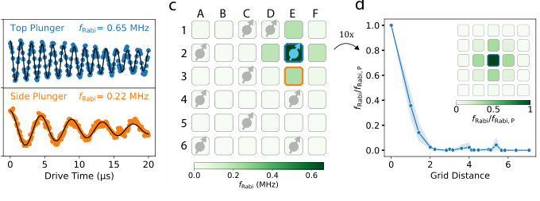 
Figure 3. Sparse single qubit operation. a, Chevron plots of all ten qubits. The microwave driving is performed simul- taneously per row. b, Qubit q2E is more efficiently driven with the top-plunger P2E (blue) than a side-plunger P3E (orange). These plungers are also highlighted in c, where an overview of the Rabi frequencies of q2E (cyan) is given when driving with any plunger. Remaining qubits are greyed out. d, Measuring the relative driving efficiencies of each plunger for the ten qubits, an average driving efficiency is calculated as a function of plunger-qubit distance. The shaded areas give the 95% confidence interval. This average is normalised to the Rabi frequency of each...

📷 Fig 4

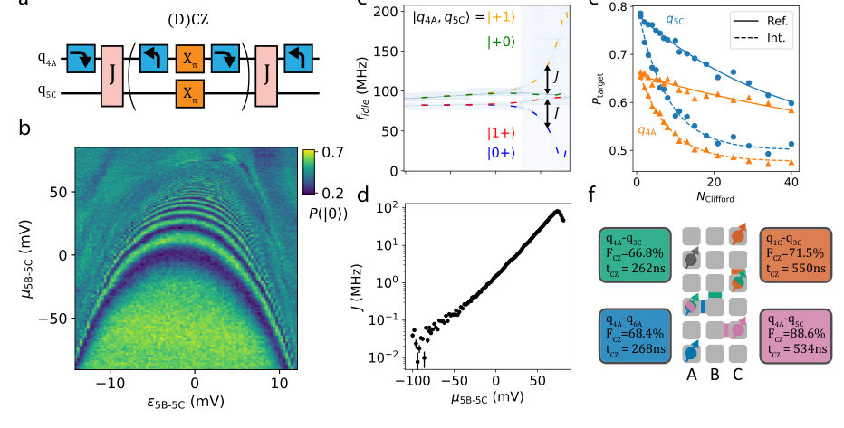 
Figure 4. Two Qubit Operation. a, Schematic of a (decoupled) CZ operation between q4A and q5C. The qubits are shuttled towards each other, at which point the exchange interaction J is controlled and the qubits are separated. To decoupling single qubit dynamics the qubits can be shuttled back halfway for a decoupling pulse. b, Two-qubit exchange interaction is modulated through plunger gate voltages, resulting in the fingerprint plot like this one between the qubits at QD5B and QD5C. A decoupling sequence makes this fingerprint insensitive to g-factor variation. c, Fourier transforms of a superposition state evolution give the qubit spectrum, as a function of symmetric plunger gate voltage µ...

📷 Fig 5

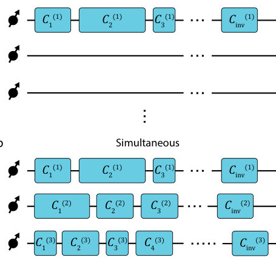 
Figure 5. RB experiment schematics. a, Schematic of the individual RB experiment, in which only one qubit is subject to the randomised Clifford gates. b, Schematic of the simul- taneous RB sequence in which multiple qubits are simultane- ously subject to their own random Clifford sequence. Even though the native Xπ/2 time is the same for all qubits, each Clifford of the used GX,Y decomposition consists of a varying amount of native gates (see Table I)

**Summary.** This paper reports on the realization and characterization of a large, $6 	imes 6$ quantum dot array for quantum computation. By employing coherent spin shuttling, the researchers overcome connectivity limitations, achieving high-fidelity single-qubit control and two-qubit gates between distant qubits. The work demonstrates a promising path toward scalable, solid-state quantum processors.

**Why it may be interesting.** This work provides a concrete, scalable solid-state platform for quantum computation, directly addressing the engineering challenge of scaling connectivity beyond simple linear chains, which is a major focus in quantum information theory.

Detailed structure

**Main problem.** The primary challenge is achieving scalable, high-connectivity quantum computation using semiconductor spin qubits while overcoming physical limitations like wiring bottlenecks and poor 2D connectivity.

**Main result.** The authors successfully demonstrated a $6 	imes 6$ quantum dot array capable of high-fidelity single-qubit control and two-qubit gates via coherent spin shuttling, significantly reducing crosstalk in the process.

**Method.** The research employs coherent spin shuttling techniques to position qubits sparsely within a large array, enabling high-fidelity gate operations and state transfer between distant sites.

**Model / system.** The platform is a $6 	imes 6$ quantum dot array realized in a semiconductor heterostructure, controlled by shared barrier and individual plunger gates. Qubit operations rely on manipulating electron/hole spins via electric fields and controlled exchange interactions.

**Key observables.** Single-qubit Clifford fidelities ($>99\%$), round-trip transfer fidelity ($99.4\%$), crosstalk reduction ($42	imes$), and two-qubit CZ gate fidelities ($\sim 88.6\%$).

**Important parameters / regimes.** Shuttling distances up to $5.2 \mu	ext{m}$; exchange interaction ($J$) tunable over orders of magnitude; gate times and detunings are critical parameters.

**Assumptions / limitations.** The fidelity is highly sensitive to imperfections in the necessary 'recovery gates' used to compensate for shuttling-induced rotations, which is a major source of error.

**Figures summary.** Figures illustrate the $6 	imes 6$ array structure, SED measurements for charge mapping, time-resolved spin paths, and characterization plots for single-qubit and two-qubit gate fidelities.

**Paper structure.** The paper progresses from demonstrating basic state preparation and single-qubit control via shuttling, to implementing two-qubit gates (CZ) by bringing qubits into proximity, and finally detailing the complex calibration of the shuttling process itself.

Abstract

Fault-tolerant quantum computation requires increasing the qubit count while maintaining high performance and connectivity. Semiconductor qubits have demonstrated high-fidelity operation, but growing the system size at sufficient connectivity remains challenging, such that scaling mainly occurred in one spatial direction to preserve access for control lines in the other. Here, we realise an approach that relaxes the requirements on fabrication and demonstrate a 6$\times$6 quantum dot array, defined by a shared barrier gate and individual plunger gates. The quantum dots are tuned through coherent spin shuttling over distances up to 5.2um into a sparse configuration of 10 simultaneously operated qubits, leaving space for shuttling connections. We reduce crosstalk by 42$\times$ in this separated regime, enabling high-fidelity simultaneous single-qubit control, while control-Z operations can be implemented through shuttling and plunger-only control. These results promise high-connectivity quantum circuits, enabled by scaling to two-dimensional geometries and exploiting shuttling.

[↑ back to top](#top)

### [Advantage of Entangled Learning Rules in Quantum Measurement Class Learning](http://arxiv.org/abs/2610.07328v1)

**Authors:** Arka Prabha Das, Abram Magner  
**Type:** theory · **Category:** quantum information and computing · **PDF:** <https://arxiv.org/pdf/2610.07328v1>  
**Analysis basis:** full PDF text, analyzed in chunks
**Topic relevance:** 🔥 `quantum measurements` **4/5**

📷 Fig 1

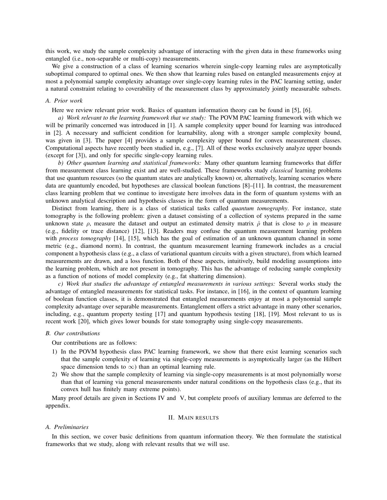 
Low-resolution page preview, page 2

📷 Fig 2

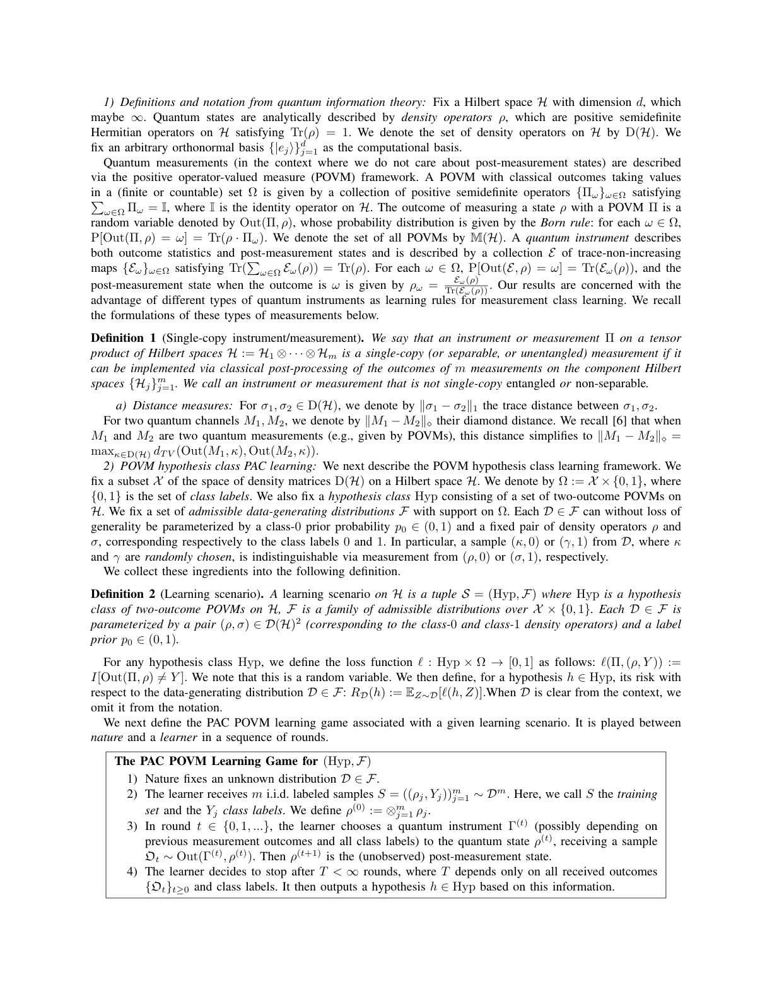 
Low-resolution page preview, page 3

📷 Fig 3

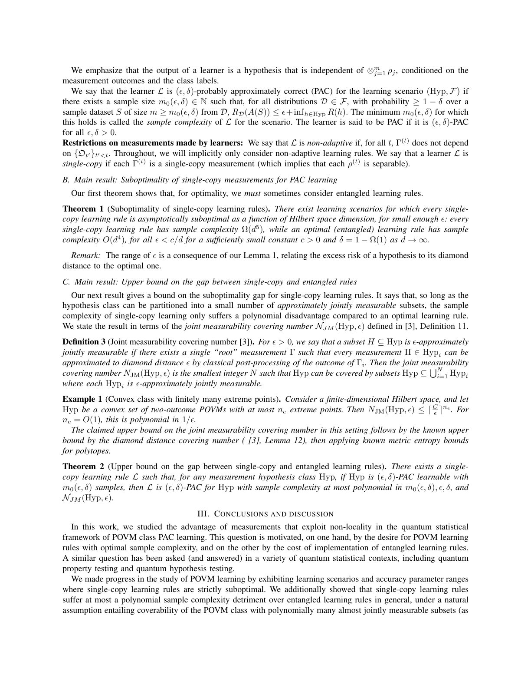 
Low-resolution page preview, page 4

📷 Fig 4

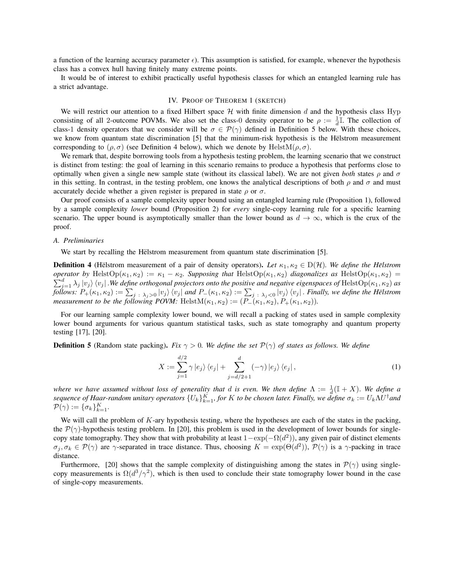 
Low-resolution page preview, page 5

📷 Fig 5

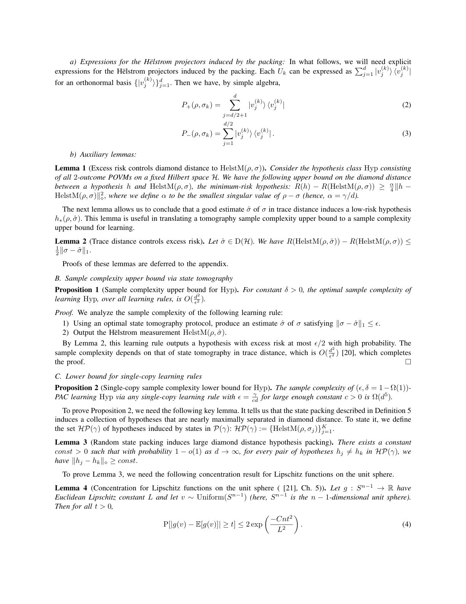 
Low-resolution page preview, page 6

**Summary.** This paper theoretically analyzes the efficiency of learning quantum measurements by comparing single-copy (separable) measurement rules against optimal entangled rules in a PAC learning setting. It demonstrates that while single-copy rules can fail asymptotically, they are guaranteed to be only polynomially worse than the optimal entangled rules under certain structural assumptions. This sets fundamental complexity bounds for quantum data processing in machine learning.

**Why it may be interesting.** This work provides fundamental theoretical limits on how much quantum resources (entanglement) are required in the measurement process to achieve efficient learning, which has implications for quantum machine learning protocols.

Detailed structure

**Main problem.** The paper investigates the advantage of using entangled (non-separable) quantum measurements compared to single-copy (separable) measurements in the context of Quantum Measurement PAC learning.

**Main result.** It proves that while single-copy learning rules can be asymptotically suboptimal compared to optimal entangled rules, the advantage is bounded by a polynomial factor in the sample complexity setting.

**Method.** The analysis uses the Positive Operator-Valued Measure (POVM) framework and compares sample complexities derived from lower bounds (using specific constructions) against upper bounds (using PAC learning theory).

**Model / system.** The model involves learning a measurement (POVM) from a hypothesis class $	ext{Hyp}$ acting on quantum states $
ho$ on a Hilbert space $H$. The comparison is between measurements implementable via local operations and classical communication (LOCC) versus general entangled measurements.

**Key observables.** Sample complexity ($m_0$), trace distance, diamond distance, and the excess risk ($\Delta R$).

**Important parameters / regimes.** The dimension $d$ of the Hilbert space, the error tolerance $\epsilon$, and the failure probability $\delta$.

**Assumptions / limitations.** The polynomial advantage bound relies on a natural assumption regarding the coverability of the measurement class by approximately jointly measurable subsets.

**Paper structure.** The paper establishes necessary lemmas relating excess risk to distance measures, derives lower bounds on sample complexity for single-copy rules, and finally proves the upper bound showing the polynomial gap between single-copy and optimal learning rules.

Abstract

Learning with data in the form of quantum states is of current interest and has led to a variety of problems that boil down to interaction with the available data via quantum measurement and classical post-processing of observed classical outcomes. In quantum measurement PAC learning, one is given a sequence of unknown, prepared quantum states and classical labels, along with a hypothesis class of candidate measurements. The task is to select a measurement from the hypothesis class that minimizes a fixed notion of error in prediction of the classical labels via measurement of a new state by the selected hypothesis. In this work, we consider the advantage of interacting with the given data in the measurement learning framework using learning rules given by measurements that cannot be implemented using local operations and classical communication (LOCC), as opposed to single-copy learning rules. We provide a construction showing that there exist learning scenarios wherein single-copy learning rules are asymptotically suboptimal compared to optimal ones. We then show that learning rules based on entangled measurements enjoy at most a polynomial sample complexity advantage over single-copy learning rules in the PAC learning setting (under a natural joint measurability covering assumption).

[↑ back to top](#top)

### [Demonstration of Parallel Multi-QPU Execution for Fragment-Based Quantum Chemistry Using On-Premises Hardware](http://arxiv.org/abs/2610.07702v1)

**Authors:** Nils Herrmann, Mariam Akhtar, Luke W. Bertels, Leigh Cameron, Raymond Chan, Lei Cheng, Daniel Claudino, Mark de Burgh, Simon Gemmell, Rugang Geng, Geoff Gillett, Travis Humble, Stephan Irle, John P. McMahon, Christian Ortiz, Florian Preis, Andreas Sawadsky, Bianca Sawyer, Reuben Singer, Sai Meghana Tunikipati, Cameron Walters, Lachlan Whichello, Adam Zegelin, Marcus W. Doherty  
**Type:** experiment · **Category:** quantum information and computing · **PDF:** <https://arxiv.org/pdf/2610.07702v1>  
**Analysis basis:** full PDF text, analyzed in chunks
**Topic relevance:** 🔥 `QC/QI experiment` **4/5**

📷 Fig 1

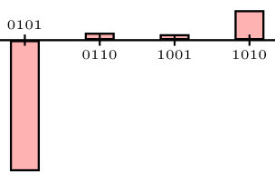 
FIG. 1. Schematic overview of the QWFS workflow for an example problem size of four qubits.

📷 Fig 2

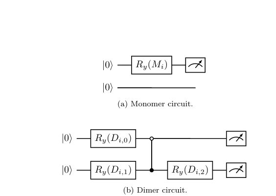 
FIG. 2. Parameterized QWFS ansatz circuits for monomers (cf. subfigure 2(a)) and dimers (cf. subfigure 2(b)) used in this work. The parameter labels Mi and Di,0, Di,1, Di,2 indicate device-specific optimized parameters, with i denoting the device index.

📷 Fig 3

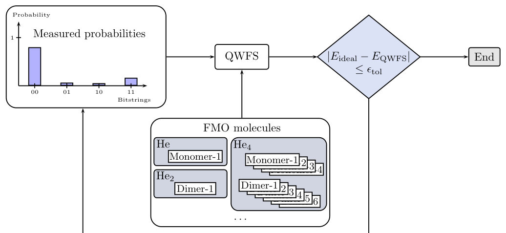 
FIG. 3. Schematic overview of the FMO–QWFS workflow used in this work. Following quantum circuit measurements yielding SPAM-corrected probability distributions, single point energy calculations using the QWFS method are performed. A fragment calculation is accepted if its deviation from the classical ideal energy is below the tolerance ϵtol; otherwise, the fragment remains in the set of fragments to be recomputed in a subsequent round of quantum circuit sampling.

📷 Fig 4

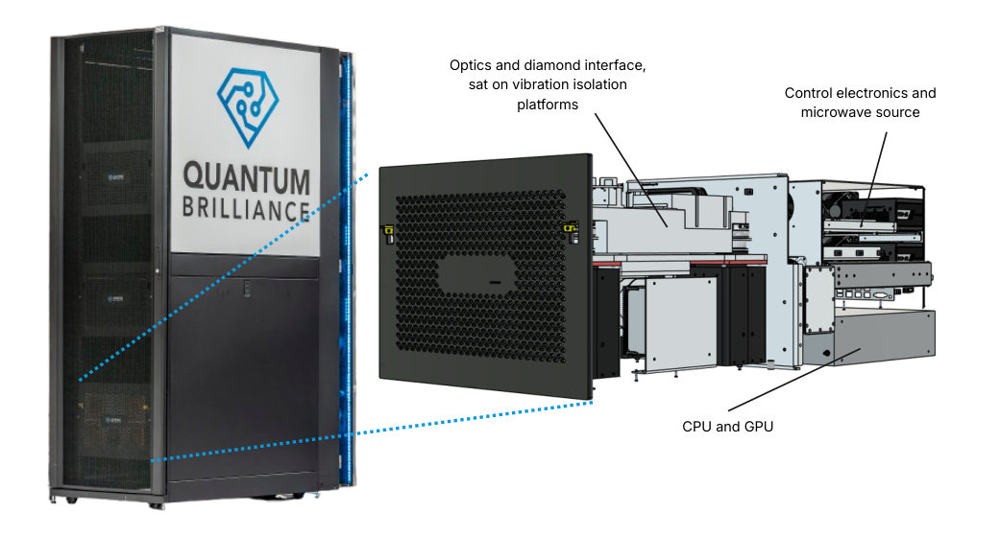 
FIG. 4. Installed Quoll quantum-computing cluster and internal hardware layout. Left: the fully assembled rack housing Quoll-1, Quoll-2, and Quoll-3 in a vertical configuration. Right: rendered mechanical layout of an individual Quoll system, highlighting the optics and diamond interface mounted on vibration-isolation platforms, the control electronics and microwave source, and the CPU/GPU classical compute subsystem.

📷 Fig 5

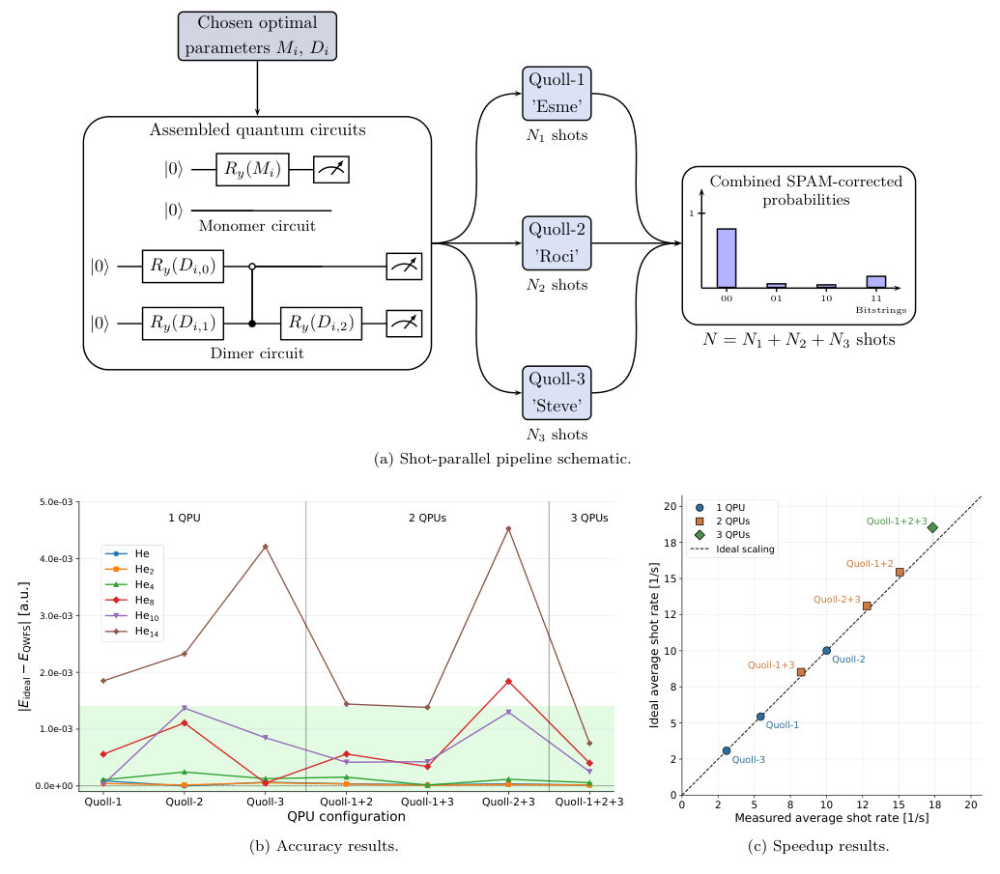 
FIG. 5. Shot-parallel execution workflow and resulting performance. (a) Schematic of the synchronous shot-parallel pipeline. Monomer and dimer QWFS circuits are distributed across multiple Quoll processors, and the resulting SPAM-corrected counts are combined into a single probability distribution. (b) Absolute errors of the assembled FMO–QWFS energies for helium clusters from He to He14. The shaded region indicates chemical accuracy (1.4 · 10−3 a.u.). (c) Measured average shot rate compared to ideal parallel average shot rate.

**Summary.** This work demonstrates a proof-of-concept for accelerating quantum chemistry calculations by running Fragment Molecular Orbital (FMO) methods in parallel across multiple physical quantum processors. By comparing synchronous and asynchronous execution modes on diamond-based QPUs, the authors achieved high parallel efficiencies while maintaining chemical accuracy. This validates the use of distributed quantum resources for molecular simulation workflows.

**Why it may be interesting.** It provides a concrete, hardware-level demonstration of how quantum chemistry algorithms can be mapped onto distributed, multi-QPU architectures, which is highly relevant for scaling quantum simulations.

Detailed structure

**Main problem.** Demonstrating a practical method to leverage parallel quantum computation resources for large-scale molecular calculations in quantum chemistry.

**Main result.** The authors achieved high parallel efficiencies (up to 93.60%) in executing fragment-based quantum chemistry workflows on multiple physical quantum processors, confirming the concept's feasibility.

**Method.** The study compares synchronous shot-parallel execution versus asynchronous fragment-parallel execution using the Quantum Wave Function Sampler (QWFS) approach within the Fragment Molecular Orbital (FMO) framework.

**Model / system.** The testbed utilized Helium clusters (He$_n$) for total energy calculations. The methodology relies on decomposing the large molecular problem into smaller, concurrently solvable fragments (FMO approach).

**Key observables.** Quantum sampling throughput, parallel efficiency (e.g., 93.60% for shot-parallel), and the chemical accuracy of the calculated total energy.

**Important parameters / regimes.** The number of quantum processors (three QPU), the size of the helium cluster ($n=2, 4, 8, 10, 14$), and the efficiency metrics.

**Assumptions / limitations.** The primary assumption is that decomposing the problem via FMO allows for a practical speedup on current hardware, and that the QWFS method accurately estimates the ground state energy.

**Figures summary.** Not specified.

**Paper structure.** The paper introduces FMO quantum chemistry as a natural parallelization route, details the QWFS method, and then experimentally compares two parallel execution modes (synchronous vs. asynchronous) on physical hardware using helium clusters.

Abstract

Fragment molecular orbital (FMO) quantum chemistry offers a natural route to parallel quantum computing: large molecular calculations can be decomposed into smaller quantum subproblems that can, in principle, run concurrently. Their practical benefit on real quantum hardware, however, has remained unclear. We demonstrate parallel FMO calculations on three room-temperature diamond-based 'Quoll' quantum computers installed on-site at the Oak Ridge Leadership Computing Facility. Helium clusters (He$_{n}$, $n=2,4,8,10,14$) served as a testbed for total energy calculations using the Quantum Wave Function Sampler (QWFS), a selected configuration interaction (SCI) approach. We compare two execution modes: synchronous shot-parallel execution, in which quantum processors jointly sample QWFS circuits and combine their SPAM-corrected counts into a single probability distribution; and asynchronous fragment-parallel execution, in which processors independently evaluate FMO fragments using device-specific optimized circuits. Both modes increase quantum sampling throughput without systematic loss of accuracy. The three-QPU shot-parallel workflow reaches a parallel efficiency of $93.60\%$, while the fragment-parallel workflow achieves a measured efficiency of $75.01\%$, increasing to $95.17\%$ when excluding the non-useful idle time associated with non-interruptible submitted jobs. In both cases, the assembled FMO-QWFS energies remain chemically accurate compared to the classical ideal. These results provide a proof-of-concept demonstration that parallel quantum execution can improve the practical throughput of quantum chemistry workflows on prototype hardware, motivating the development of future HPC environments with many fault-tolerant quantum processors operating as a distributed resource for molecular and materials simulation.

[↑ back to top](#top)

### [The parliament of observers - Against the observable axiom of quantum mechanics](http://arxiv.org/abs/2610.07254v1)

**Authors:** Markus Frembs, Andreas Döring  
**Type:** theory · **Category:** other · **PDF:** <https://arxiv.org/pdf/2610.07254v1>  
**Analysis basis:** full PDF text, analyzed in chunks
**Topic relevance:** 🔥 `quantum measurements` **4/5**

📷 Fig 1

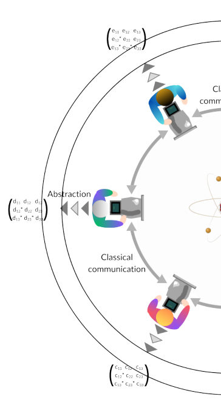 
Figure 1: Deconstructing the quantum-mechanical correspondence rule (†), ‘observables

**Summary.** This paper critically re-examines the foundational axiom linking physical observables to self-adjoint operators in quantum mechanics. By developing a minimal formal definition of an observable based on experimental contexts, the authors demonstrate that this fundamental correspondence breaks down under rigorous scrutiny. It prompts a re-evaluation of the mathematical structure underpinning quantum theory itself.

**Why it may be interesting.** This work directly challenges the foundational axioms of quantum theory, which is crucial for any theoretical physicist working on open quantum systems or interpreting measurement processes.

Detailed structure

**Main problem.** The paper fundamentally challenges the core axiom of quantum mechanics stating that every observable corresponds to a self-adjoint operator, arguing this premise fails when considering all observables simultaneously.

**Main result.** The authors argue that a basic consistency requirement derived from the concept of 'observables' (as measurement procedures) is mathematically incompatible with the structure of the algebra of self-adjoint operators.

**Method.** The approach involves developing a minimal, context-independent formal definition of an observable based on experimental contexts and then deriving necessary algebraic consistency conditions.

**Model / system.** The analysis is general, focusing on the formal structure of quantum systems ($S$) and the abstract concept of an 'observable' defined by its measurement context, rather than a specific Hamiltonian or physical realization.

**Key observables.** Observables are defined conceptually as 'equivalence classes of measurement procedures' or bounded, measurable functions on outcome spaces.

**Important parameters / regimes.** The analysis considers the transition from Projection-Valued Measures (PVMs) to general Positive Operator-Valued Measures (POVMs).

**Assumptions / limitations.** The initial framework assumes that observables can be characterized by an underlying, consistent set of experimental contexts, and the analysis proceeds by identifying redundancies via 'operational indistinguishability'.

**Figures summary.** Figure 1 is noted to deconstruct the quantum-mechanical correspondence rule, illustrating the relationship between physical measurements and the mathematical abstraction to self-adjoint operators.

**Paper structure.** The paper progresses by first identifying the problematic axiom, then developing a minimal formalization of observables based on experimental contexts, and finally showing that the consistency requirements of this minimal model conflict with the structure of the standard operator algebra.

Abstract

The 'unreasonable effectiveness of mathematics in the natural sciences' may at times give the impression that natural science, especially modern theoretical physics, is all but a formal apparatus. However, a key challenge of physics remains to align everyday notions of experience -- be it directly or mediated through instruments of arbitrary sophistication -- with their mathematical formalisation. This applies in particular to quantum theory, arguably the most successful theory of physics ever invented. One of its core assumptions postulates: $Observables\ correspond\ with\ self-adjoint\ operators.$ Here, we argue that already this most basic premise about the quantum formalism falls apart under careful scrutiny, at least when understood for all observables at once. In other words, we challenge the role of the noncommutative algebra of bounded operators as an adequate formalisation of the 'algebra of observables', understood as (equivalence classes of) measurement procedures that admit a coherent empirical interpretation.

[↑ back to top](#top)

### [Observing the magic Mpemba effect in localized dynamics on a digital quantum computer](http://arxiv.org/abs/2610.08769v1)

**Authors:** Han-Ze Li, Xianquan Yan, Yi-Rui Zhang, Jian-Xin Zhong, Shuo Liu, Ching Hua Lee  
**Type:** both · **Category:** disordered systems and neural networks · **PDF:** <https://arxiv.org/pdf/2610.08769v1>  
**Analysis basis:** full PDF text, analyzed in chunks
**Topic relevance:** `QC/QI experiment` **3/5** · `correlated / nonlocal dissipation` **3/5** · `driven-dissipative phase transition` **3/5** · `methods for driven-dissipative` **3/5** · `non-equilibrium universality` **3/5** · `scars & prethermalization` **2/5** · `analog quantum simulation` **1/5** · `quantum measurements` **1/5**

📷 Fig 1

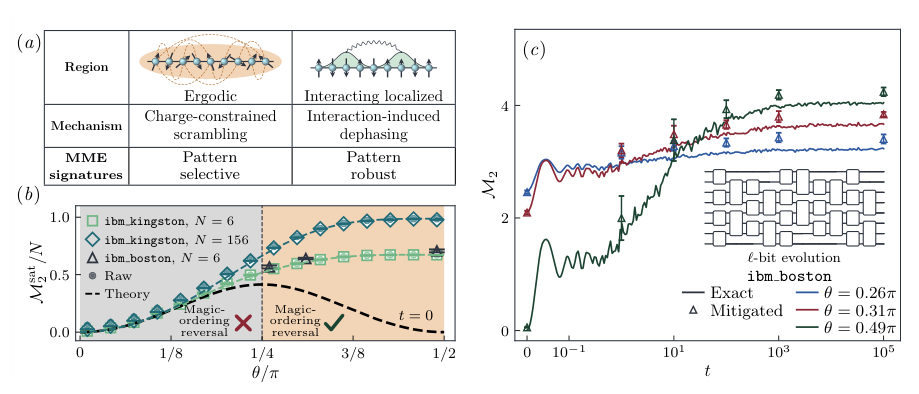 
FIG. 1. Interaction-induced dephasing and magic-ordering reversal. (a) Comparison of the mechanisms and initial-pattern dependence of the MME in the ergodic and interacting localized regimes. The localized regime is governed by interaction-induced dephasing and exhibits pattern-robust reversal, whereas the ergodic regime is pattern selective. (b,c) Directly encoded interacting ℓ-bit model [Eq. (1)], retaining terms through three-body order. (b) Saturated magic density versus tilt θ. The black dashed curve is the initial magic density, colored dashed curves are finite-size random-phase predictions, and symbols are hardware estimates on ibm boston and ibm kingston. For θ &gt; π/4, the initial...

📷 Fig 2

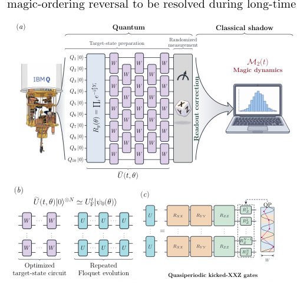 
FIG. 2. Short-circuit realization of the kicked XXZ chain [Eq. (6)] on ibm boston. (a) Tilted ferromagnetic, N´eel, or domain-wall states are prepared, evolved, and measured using randomized local Pauli bases to obtain M2(t) with readout correction. (b) For each sampled time, an optimized circuit eU(t, θ) prepares an approximation to U t F |ψ0(θ)⟩from |0⟩⊗N, avoiding repeated Floquet evolution. (c) Elementary exchange and longitudinal gates of the quasiperiodically kicked XXZ drive. W denotes optimized two-qubit blocks and QP the quasiperiodic field.

📷 Fig 3

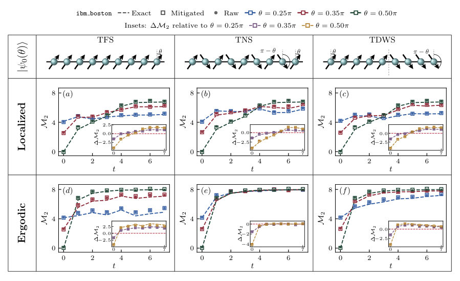 
FIG. 3. Magic Mpemba signatures in localized microscopic dynamics. Ten-qubit kicked-XXZ dynamics [Eq. (6)] on ibm boston. All three studied initial-state families exhibit magic-ordering reversals in the localized regime, whereas the ergodic control reverses only for TFS and TDWS under the same U(1) symmetry, supporting the dephasing picture beyond the effective ℓ-bit model. M2 versus the number of Floquet periods t: (a–c) localized, (K1, K2) = (0.201, 0.250); (d–f) ergodic, (K1, K2) = (0.511, 0.637). Remaining parameters and spectral diagnostics are given in SI Sec. S1 and Table S1. Columns show TFS, TNS, and TDWS; colors denote θ/π = 0.25, 0.35, 0.50. Dashed curves are noiseless circuit...

📷 Fig 4

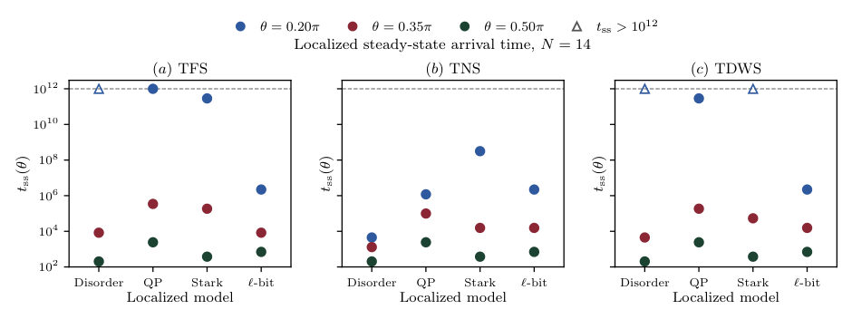 
FIG. 4. Numerical saturation-time inversion across localized models. Saturation times tss at N = 14 for (a) TFS, (b) TNS, and (c) TDWS. Colors denote θ/π = 0.20, 0.35, 0.50. The localized models are random-disorder and quasiperiodic XXZ (W = 10), Stark XXZ (F = 6), and the interacting three-body ℓ-bit model (ξ = 0.5). The saturation criterion uses relative tolerance ϵ = 0.1. Open triangles indicate lower bounds tss &gt; 1012; the dashed line marks the observation limit tmax = 1012.

📷 Fig 5

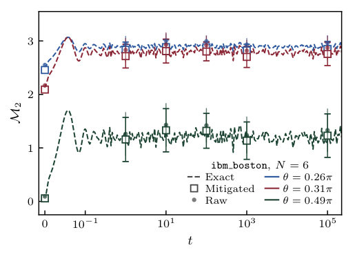 
FIG. 5. Magic dynamics without interactions on ibm boston. Six-qubit Bell estimates in the Anderson limit, Jij = Kijk = 0, using the same initial states and field distribution as Fig. 1(c). Dashed curves are exact trajectories, filled circles are raw estimates, and open squares are readout-corrected estimates. Magic is generated, but no magic-ordering reversal occurs over the measured window. Error bars denote one standard deviation over 15 field realizations. The first tick denotes t = 0; the remaining time axis is logarithmic.

**Summary.** This paper explores a 'magic Mpemba effect' in quantum systems, showing that quantum resources like 'magic' can exhibit counter-intuitive relaxation dynamics. The effect is attributed to interaction-induced dephasing, a mechanism distinct from standard thermalization. The findings are supported by theoretical analysis, simulations across multiple models, and direct measurements on quantum hardware.

**Why it may be interesting.** This work provides a novel mechanism (interaction-induced dephasing) for anomalous relaxation of quantum resources, extending the concept of the Mpemba effect beyond classical thermodynamics into the realm of quantum information theory.

Detailed structure

**Main problem.** The paper investigates an anomalous 'magic Mpemba effect' (MME) in quantum resource generation, specifically determining if a reversal in the rate of nonstabilizerness (magic) can occur without relying on conventional transport or thermalization mechanisms.

**Main result.** The MME was confirmed, showing that states with less initial quantum magic can reach a higher saturated magic value and saturate earlier than expected, attributing this to interaction-induced dephasing.

**Method.** The study combines theoretical random-phase analysis with exact numerical simulations and direct measurements on superconducting quantum processors to quantify the resource dynamics.

**Model / system.** The research utilizes several models, including the phenomenological $\ell$-bit model for Many-Body Localization (MBL) and microscopic spin chains (TFS, TNS, TDWS). Experiments are conducted on IBM superconducting quantum processors.

**Key observables.** Magic density ($M_2$), saturation time ($t_{ss}$), and level spacing statistics ($\langle r 
angle$).

**Important parameters / regimes.** Tilt angle ($	heta$), system size ($N$), and the distinction between localized vs. ergodic dynamical regimes.

**Assumptions / limitations.** The analysis assumes that the observed effect is due to interaction-induced dephasing, which is confirmed by the absence of the effect in the non-interacting (Anderson) limit.

**Figures summary.** Figures illustrate the MME signatures ($M_2$ vs. time $t$) showing reversals, and also display level spacing statistics confirming the transition between ergodic (GOE) and localized (Poisson) regimes.

**Paper structure.** The paper progresses from theoretical modeling ($\ell$-bit model) to detailed simulation across various microscopic spin chains, culminating in experimental verification on superconducting hardware, while consistently contrasting the findings between localized and ergodic dynamics.

Abstract

The Mpemba effect challenges the intuition that states closer to equilibrium must relax faster. We ask whether an analogous magic-ordering reversal can occur in the generation of quantum magic (nonstabilizerness), a key resource for universal quantum computation: can a state with less initial magic overtake one with more and reach its asymptotic value sooner? Here, we uncover interaction-induced dephasing as a distinct mechanism for this magic Mpemba effect, requiring neither transport nor conventional thermalization. For tilted product states in an interacting $\ell$-bit model, a random-phase analysis predicts a reversal of the magic ordering: states with less initial magic attain higher saturated magic, independent of their spatial pattern. Exact simulations of the $\ell$-bit model and localized spin chains further show that these states also saturate earlier. We observe both features on IBM superconducting quantum processors. An effective $\ell$-bit implementation accesses long dephasing times at fixed circuit depth by encoding time in gate angles, while a microscopic spin model exhibits the reversal universally across initial patterns in the localized regime but only selectively in the ergodic regime. These results establish interaction-induced dephasing as a route to anomalous quantum-resource relaxation beyond transport-driven thermalizing dynamics.

[↑ back to top](#top)

### [Polaronic Response of a Supersonic Impurity Strongly Coupled to a Bose Condensate](http://arxiv.org/abs/2610.07944v1)

**Authors:** Sooshin Kim, Yoonsoo Kim, Seokmin Jang, Jee Woo Park  
**Type:** both · **Category:** quantum gases · **PDF:** <https://arxiv.org/pdf/2610.07944v1>  
**Analysis basis:** full PDF text, analyzed in chunks
**Topic relevance:** `Keldysh / 2PI / non-Gaussian methods` **3/5** · `analog quantum simulation` **3/5** · `non-equilibrium universality` **3/5** · `methods for driven-dissipative` **2/5** · `scars & prethermalization` **2/5** · `Frenkel-Kontorova` **1/5** · `correlated / nonlocal dissipation` **1/5** · `driven-dissipative phase transition` **1/5** · `quantum measurements` **1/5**

📷 Fig 1

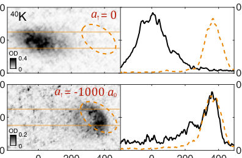 
FIG. 1. Interaction-tunable cold-atom collider. (a) Fermionic 40K impurities (red) immersed in a highly oblate 23Na BEC initially prepared in |↓⟩(blue). A Raman π pulse transfers the condensate to |↑⟩(orange), imparting a lab-frame veloc- ity v0ˆx by the two-photon recoil and quenching the Na–K scattering length from a↓to a↑. The right inset shows the magnetic-field dependence of a↓and a↑; gray dashed lines mark the positions of two neighboring interspecies Feshbach resonances. (b) During the interaction time t1, the moving Na bath transfers momentum to the K impurities, which ac- quire the lab-frame velocity vI(t1)ˆx. The magnified schematic depicts the drag force Fdrag on an impurity and...

📷 Fig 2

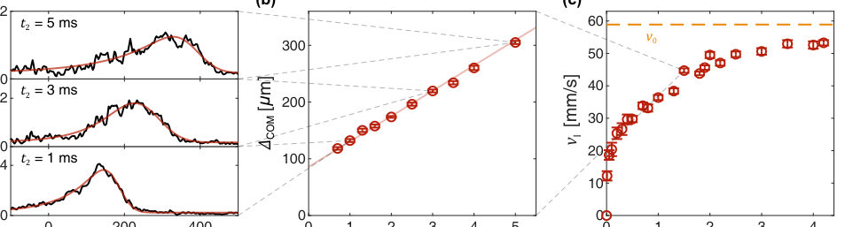 
FIG. 2. Reconstruction of the impurity velocity. (a) One-dimensional impurity-density profiles at t2 = 1, 3, 5 ms (bottom to top) for t1 = 1.5 ms and a↑/a0 = −1000. Each profile is obtained from a single experimental realization; solid red curves show the fits [25]. (b) Impurity-COM displacement ∆COM as a function of t2. Each point is the mean of five realizations, with error bars denoting the 1σ standard error of the mean. The solid line is a linear fit whose slope yields the laboratory-frame impurity speed vI(t1). Note that the nonzero y-intercept reflects the impurity position at the end of t1. (c) Reconstructed vI(t1) for different interaction times t1. The yellow dashed line marks the...

📷 Fig 3

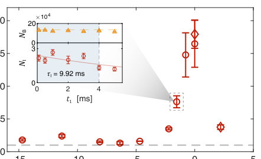 
FIG. 4. Interaction dependence of the dynamical inertia. The inverse slope 1

📷 Fig 4

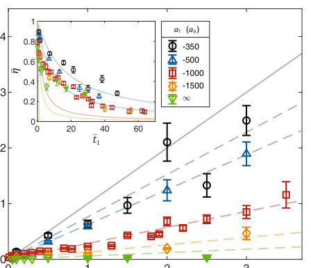 
FIG. 3. Response of impurities to the drag force for various interaction strengths. In the inset, we plot the normalized relative speed ¯η(¯t1) as a function of the dimensionless time ¯t1 ≡4πℏ2nB

📷 Fig 5

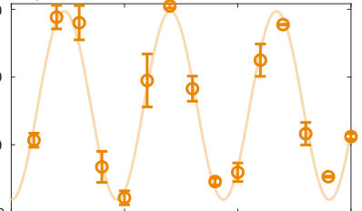 
FIG. 5. Rabi oscillation between the |↓⟩|p = 0⟩and |↑⟩|p = 2ℏkRˆx⟩states of Na, driven by a pair of counterpropagating Raman beams, as a function of pulse duration. Here, p is the momentum of a Na atom. The solid line is a sinusoidal fit to the measured number of transferred atoms, from which we obtain the π-pulse duration quoted in the text. The mea- surement is performed on a Na-only sample, with no K atoms loaded. Error bars denote 1σ statistical uncertainties.

**Summary.** This research explores the complex momentum and energy exchange between a rapidly moving impurity and a Bose-Einstein condensate. By tuning interactions near Feshbach resonances, the authors observed that the impurity's response deviates significantly from simple two-body predictions. This deviation signals a polaronic enhancement of the impurity's effective mass in the strongly coupled, supersonic regime.

**Why it may be interesting.** This work directly addresses non-equilibrium dynamics in quantum gases, specifically the crossover between simple collision dynamics and strongly correlated, dressed quasiparticle behavior (polarons) in a supersonic regime.

Detailed structure

**Main problem.** The study investigates how a mobile impurity exchanges momentum and energy with a many-body environment, especially when moving rapidly (supersonically) and strongly coupled to the bath.

**Main result.** Near resonance, the impurity exhibits a marked enhancement of its apparent dynamical inertia, providing evidence for a polaronic response in the strongly coupled, supersonic regime.

**Method.** The study combines experimental measurements of impurity velocity evolution with theoretical modeling based on two-body collision approximations and Bogoliubov theory.

**Model / system.** The system is a cold-atom collider consisting of fermionic $^{40}	ext{K}$ impurities immersed in a $^{23}	ext{Na}$ Bose-Einstein condensate (BEC). The interactions are tuned using Feshbach resonances to explore varying coupling strengths.

**Key observables.** Impurity velocity $v_I(t_1)$, apparent dynamical inertia ($1/s$), and momentum transfer signatures.

**Important parameters / regimes.** Supersonic relative speed ($\approx 36$ times the speed of sound), interaction strength ($a_\uparrow$), and proximity to Feshbach resonances.

**Assumptions / limitations.** The weak coupling regime is modeled by a finite-energy two-body collision model, and the strong coupling regime is analyzed by interpreting deviations from this model.

**Figures summary.** Figures illustrate the experimental sequence, the reconstruction of impurity velocity vs. time, and plots comparing the measured drag response to the theoretical two-body collision model, showing the divergence near resonance.

**Paper structure.** The paper establishes the physical problem, details the experimental setup using cold atoms, develops theoretical models for drag force in different coupling regimes, presents measurements showing agreement with simple models at weak coupling, and finally highlights the deviation near resonance as evidence for polaronic dressing.

Abstract

How a mobile impurity exchanges momentum and energy with a many-body environment is a central question in nonequilibrium quantum physics. This exchange becomes particularly complex when the impurity moves rapidly and is strongly coupled to its bath. Here, we realize an interaction-tunable cold-atom collider with fermionic $^{40}$K impurities immersed in a $^{23}$Na Bose--Einstein condensate. A species-selective Raman pulse simultaneously launches the condensate and quenches the interspecies scattering length, producing an initial relative speed 36 times the condensate speed of sound. We track the ensuing relative motion as the interspecies interaction is tuned from weak coupling to resonance. At weak and intermediate coupling, the impurity dynamics are well described by a finite-energy two-body collision model. Near resonance, however, the early-time impurity acceleration is markedly suppressed relative to the two-body prediction, corresponding to a strong enhancement of the apparent dynamical inertia. The enhancement is observed near two distinct Feshbach resonances. These observations provide evidence for a polaronic response in the strongly coupled, supersonic regime of a degenerate Bose--Fermi mixture.

[↑ back to top](#top)

### [The polarization behavior of a system of two interacting identical spins 1/2 in adiabatically varying magnetic field](http://arxiv.org/abs/2610.08147v1)

**Authors:** Yury Belousov, Dim Safin  
**Type:** theory · **Category:** quantum information and computing · **PDF:** <https://arxiv.org/pdf/2610.08147v1>  
**Analysis basis:** full PDF text, analyzed in chunks
**Topic relevance:** `Keldysh / 2PI / non-Gaussian methods` **3/5** · `analog quantum simulation` **3/5** · `methods for driven-dissipative` **3/5** · `driven-dissipative phase transition` **2/5** · `non-equilibrium universality` **2/5** · `quantum measurements` **2/5** · `correlated / nonlocal dissipation` **1/5**

📷 Fig 1

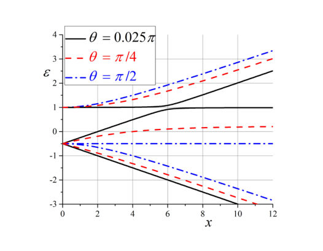 
FIG. 1. Scheme of energy levels. Dependence on the external magnetic field for three different

📷 Fig 2

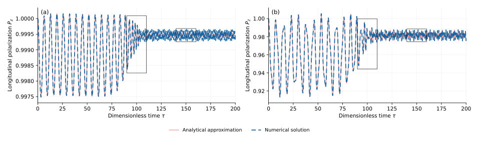 
FIG. 2. Longitudinal polarization for (a) θ = 0.05π and (b) θ = π/8. Thin red solid curves show

📷 Fig 3

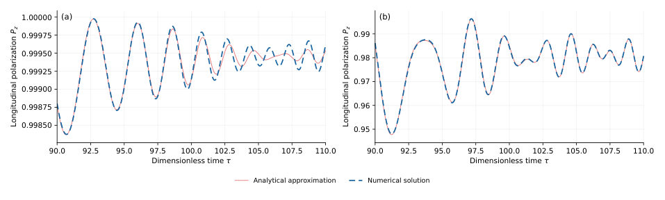 
FIG. 3. Central interval 90 ≤τ ≤110 of the longitudinal polarization for (a) θ = 0.05π and (b)

📷 Fig 4

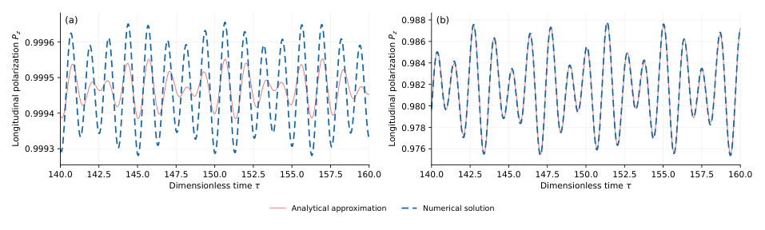 
FIG. 4. Late interval 140 ≤τ ≤160 of the longitudinal polarization for (a) θ = 0.05π and (b)

**Summary.** This theoretical work develops a specialized adiabatic representation for describing the time evolution of two interacting spin-1/2 particles in a changing magnetic field. By analyzing the density matrix in this representation, the authors show that entanglement fundamentally alters the observable polarization dynamics. This methodology is crucial for accurately modeling quantum systems where standard time-evolution techniques break down.

**Why it may be interesting.** The rigorous application of the adiabatic representation to open quantum systems, especially when entanglement is involved, is highly relevant for controlling quantum states in solid-state or atomic platforms.

Detailed structure

**Main problem.** The paper analyzes the polarization behavior of two interacting spin-1/2 particles subjected to an adiabatically varying external magnetic field.

**Main result.** The study demonstrates that entangled states significantly modify the time evolution of physical observables like spin polarization, providing new avenues for quantum control.

**Method.** The core method involves deriving and solving the Liouville equation in the adiabatic representation of the density matrix, which is necessary when standard interaction representations fail.

**Model / system.** The system consists of two identical, spatially separated spin-1/2 particles coupled by a magnetic dipole-dipole interaction, whose dynamics are mapped onto pseudo-qutrit states.

**Key observables.** Spin polarization of the pseudo-qutrit states, and the time evolution of density matrix components ($	ilde{
ho}_{ij}$).

**Important parameters / regimes.** The time-varying magnetic field parameters ($\omega(t), \Omega(t)$), and the regime of entanglement.

**Assumptions / limitations.** The analysis relies on the adiabatic approximation and often employs weak-coupling (Markovian) treatments for environmental relaxation effects.

**Figures summary.** Figure 4 illustrates the longitudinal polarization ($P_z$) for different initial conditions, while appendices detail the transformed density matrix elements for thermal and laboratory preparation.

**Paper structure.** The paper first introduces the adiabatic representation and the governing Liouville equation. It then develops the mathematical machinery to solve the time evolution, incorporating approximations for integrals and correlation functions, before presenting results on polarization dynamics.

Abstract

We derive the density matrix of a nonstationary system in the adiabatic representation and obtain the corresponding Liouville equation. This representation is particularly suitable when the standard interaction representation is inapplicable. We illustrate the approach with two identical, spatially separated spin-1/2 particles coupled by a magnetic dipole-dipole interaction in a slowly varying external magnetic field. Specifically, we analyze the spin polarization of pseudo-qutrit states in regimes where the states become entangled. The application of the adiabatic representation to calculate the dependence of observed physical quantities on time for quantum systems is illustrated. Our results show that entangled states can significantly modify the behavior of these observables and provide additional opportunities for their control.

[↑ back to top](#top)

### [Fluctuating chemically active droplets](http://arxiv.org/abs/2610.08154v1)

**Authors:** Guido L. A. Kusters, Noah Ziethen, Michael E. Cates, David Zwicker  
**Type:** theory · **Category:** statistical mechanics · **PDF:** <https://arxiv.org/pdf/2610.08154v1>  
**Analysis basis:** full PDF text, analyzed in chunks
**Topic relevance:** `Keldysh / 2PI / non-Gaussian methods` **3/5** · `driven-dissipative phase transition` **3/5** · `methods for driven-dissipative` **3/5** · `non-equilibrium universality` **3/5** · `analog quantum simulation` **1/5** · `correlated / nonlocal dissipation` **1/5** · `quantum measurements` **1/5**

📷 Fig 1

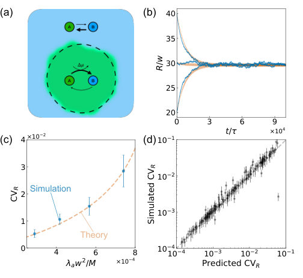 
FIG. 1. Chemically active droplets with fluctuations. (a) Schematic of components A and B phase separating and converting into each other with external energy input ∆µ. (b) Droplet radius R as a function of time t from numerical simulations (blue lines) and our theoretical prediction (or- ange shade, one standard deviation confidence interval) for three initial sizes, where τ = κ/Mb2. (c) Steady-state coeffi- cient of variation CVR = p

📷 Fig 2

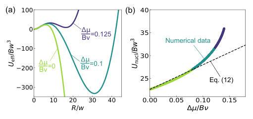 
FIG. 2. Active reactions suppress nucleation. (a) Effec- tive non-equilibrium potential Ueff as a function of droplet radius R for various drives ∆µ. Ueff either has a single maximum (green line), a maximum and a stable minimum (teal line), or a maximum and a metastable minimum (pur- ple line). (b) Nucleation barrier Unucl as a function of ∆µ compared to Eq. (12) (black dashed line). Model parameters are εout = −0.05 bν, εin = −0.05 bν + ∆µ∆φ, γ = 0.15 bw, lin = 11 w, lout = 18 w, and ∆φ = 1.

**Summary.** This paper theoretically investigates how chemical reactions affect the size fluctuations and stability of phase-separated droplets. By coupling deterministic growth models with stochastic noise derived from fluctuation-dissipation theorems, the authors derive an effective potential. They demonstrate that active chemical reactions can stabilize the system by suppressing the nucleation rate.

**Why it may be interesting.** The methodology of deriving an effective non-equilibrium potential from underlying field dynamics and noise statistics is highly relevant to open quantum systems and non-equilibrium statistical mechanics.

Detailed structure

**Main problem.** The study focuses on understanding the size fluctuations and nucleation dynamics of chemically active droplets operating in the regime of weak reactions and strong phase separation.

**Main result.** The authors derive an effective non-equilibrium potential governing droplet growth and show that active reactions can suppress nucleation by increasing the nucleation barrier.

**Method.** The analysis combines a thin-interface model for deterministic growth with stochastic noise derived from fluctuation-dissipation arguments, leading to a Langevin equation for the droplet radius.

**Model / system.** The system is an incompressible, binary fluid undergoing phase separation and chemical reactions, modeled by continuity and flux equations. The dynamics are reduced to a Langevin equation for the droplet radius R.

**Key observables.** Droplet radius fluctuations R(t), Coefficient of Variation (CVR), and the effective non-equilibrium potential U_eff(R).

**Important parameters / regimes.** Reaction rates (lambda_p, lambda_a), chemical potential differences (Delta_mu), and the degree of activity (Delta_mu).

**Assumptions / limitations.** The analysis assumes weak reactions and strong phase separation, and that the interface moves slowly compared to the relaxation of the order parameter.

**Figures summary.** Figures illustrate the comparison between theoretical and simulated droplet size fluctuations, the dependence of CVR on reaction rates, and the effective potential U_eff(R) and nucleation barrier U_nucl for different driving conditions.

**Paper structure.** The paper progresses by establishing the governing equations, deriving the Langevin equation for fluctuations, calculating the effective potential U_eff(R) using fluctuation-dissipation theorems, and finally applying this potential to calculate the nucleation barrier under active reaction conditions.

Abstract

We study size fluctuations of chemically active droplets in the regime of weak reactions and strong phase separation. By combining a thin-interface model for the deterministic droplet growth with stochastic noise based on fluctuation-dissipation arguments, we report excellent quantitative agreement between our theory and numerical field simulations. Finally, we use our model to infer the effective non-equilibrium potential that governs droplet growth, and show that active reactions that enable size control suppress nucleation.

[↑ back to top](#top)

### [Hamiltonian curl-forces in systems coupled to multiple thermal reservoirs](http://arxiv.org/abs/2610.08423v1)

**Authors:** Omer Chor, Aljaž Godec, Oren Raz  
**Type:** theory · **Category:** statistical mechanics · **PDF:** <https://arxiv.org/pdf/2610.08423v1>  
**Analysis basis:** full PDF text, analyzed in chunks
**Topic relevance:** `Keldysh / 2PI / non-Gaussian methods` **3/5** · `driven-dissipative phase transition` **3/5** · `methods for driven-dissipative` **3/5** · `non-equilibrium universality` **3/5** · `correlated / nonlocal dissipation` **2/5** · `quantum measurements` **1/5**

📷 Fig 1

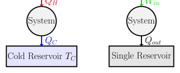 
FIG. 1: Schematic comparison of the original and transformed systems. (a) The original, multi-reservoir system (illustrated for two, but the formalism is general and applies to any number of reservoirs), with heat flowing between the reservoirs through the system. (b) The transformed, single reservoir system, is driven out of equilibrium by a non-conservative curl-force that performs work on it. The work is dissipated into the single reservoir as heat.

📷 Fig 2

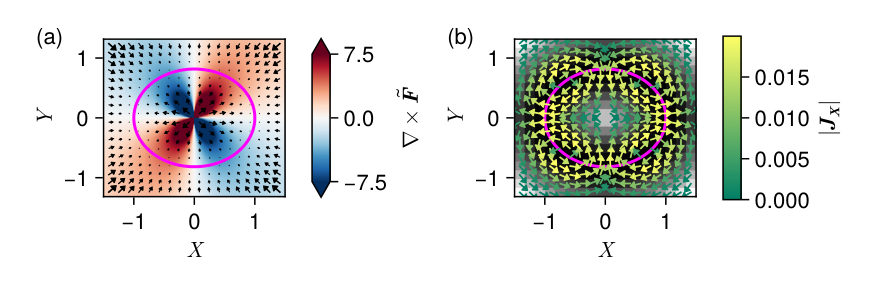 
FIG. 2: (a) The force field ˜F = m ¨X of the single-bath system dual to the ring gyrator (arrows), and the value of its curl ∇× ˜F (color), for k = 20, r0 = 1, Tx = 1, Ty = 3/2. Unlike the case of the harmonically confined Brownian gyrator, here ∇× ˜F is not constant, and has a quadrupolar structure instead. (b) Simulation results for the probability density and currents averaged over 25,000 Langevin trajectories of the same system coupled to a bath with temperature kB ˜T = 1 and drag coefficient ξ = 1. The steady state probability density function is shown in the background (white - low density, black - high density). The arrows indicate the empirical spatial probability current JX =...

**Summary.** This paper analyzes the statistical mechanics of systems coupled to multiple heat baths at different temperatures, showing that this coupling generates non-equilibrium steady states. The authors map this complex system onto an effective single-bath description driven by a deterministic curl-force. This framework provides a mechanical understanding of non-equilibrium currents and quantifies the system's departure from equilibrium via the entropy production rate.

**Why it may be interesting.** This work provides a powerful mechanical interpretation of non-equilibrium thermodynamics, showing how multi-temperature baths manifest as deterministic, non-conservative forces, which is highly relevant for understanding energy flow in open quantum systems.

Detailed structure

**Main problem.** Investigating the statistical mechanics of systems coupled to multiple heat reservoirs at different temperatures, a setting that typically sustains non-trivial circulation and drives the system out of equilibrium.

**Main result.** The multi-reservoir dynamics can be mapped onto an effective single-bath system driven by a deterministic curl-force, leading to non-equilibrium steady states (NESS) characterized by non-zero entropy production.

**Method.** The authors employ a canonical transformation to map the complex multi-reservoir coupling onto a simpler, effective Hamiltonian structure featuring an anisotropic kinetic energy and a curl-force.

**Model / system.** The model is a classical open system (e.g., underdamped Brownian particle) whose dynamics are governed by a generalized Klein-Kramers equation describing coupling to multiple baths at different temperatures ($T_i$).

**Key observables.** Entropy Production Rate (EPR), steady-state distribution, and the curl of the effective force field ($
abla 	imes 	ilde{F}$).

**Important parameters / regimes.** Multiple reservoir temperatures ($T_i$), damping coefficient ($\xi$), and the mass ($m$).

**Assumptions / limitations.** The analysis relies on mapping the system dynamics and assumes the validity of the canonical transformation, though the resulting steady state is generally not the simple Boltzmann distribution.

**Figures summary.** Not specified by the notes.

**Paper structure.** The paper first establishes the non-equilibrium nature of multi-reservoir coupling, then applies a canonical transformation to derive an effective single-bath description driven by a curl-force. Finally, explicit derivations for the steady-state distribution and EPR are provided for solvable cases.

Abstract

We investigate the statistical mechanics of a system coupled to multiple heat reservoirs at different temperatures, a setting which typically sustains nontrivial circulation. By applying a canonical transformation, we map the system onto that of a particle coupled to a single reservoir yet driven by a deterministic curl-force---a reversible, velocity-independent non-conservative force with non-vanishing curl---that can be described by a Hamiltonian with an anisotropic kinetic energy term. Despite the Hamiltonian structure, the system does not relax to the corresponding Boltzmann distribution, and is genuinely out of equilibrium. The mapping provides a mechanical interpretation of the currents in multi-temperature systems, as we demonstrate by means of two examples. In particular, the direction of circulation is qualitatively predictable from the deterministic force field. For the exactly solvable case of an $N$-dimensional underdamped Ornstein-Uhlenbeck process, we derive explicit expressions for the steady-state distribution and the entropy production rate, highlighting the role of the (generalized) curl of the force field in driving the system out of thermal equilibrium. Finally, we show how a non-conservative force can be used to exactly equilibrate any system coupled to multiple reservoirs, and obtain the corresponding equilibrium distribution.

[↑ back to top](#top)

### [Heterogeneous diffusion with recruitment and mortality](http://arxiv.org/abs/2610.08022v1)

**Authors:** Esther D. Gutiérrez, Alexander López, R. K. Singh, Sébastien Fumeron, Malte Henkel, Trifce Sandev  
**Type:** theory · **Category:** statistical mechanics · **PDF:** <https://arxiv.org/pdf/2610.08022v1>  
**Analysis basis:** full PDF text, analyzed in chunks
**Topic relevance:** `driven-dissipative phase transition` **3/5** · `non-equilibrium universality` **3/5** · `Keldysh / 2PI / non-Gaussian methods` **2/5** · `methods for driven-dissipative` **2/5** · `analog quantum simulation` **1/5** · `correlated / nonlocal dissipation` **1/5** · `quantum measurements` **1/5**

📷 Fig 1

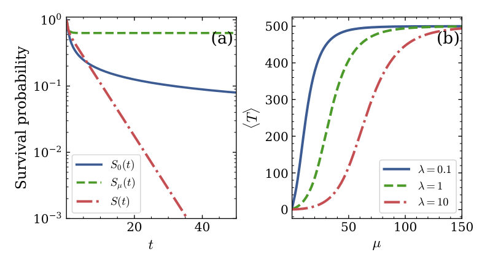 
Figure 1: Numerical evaluation of the first-passage properties of the heterogeneous diffusion process with mortality and recruitment, in dimensionless units. (a) Survival probability of the underlying HDP, S0(t); of a single mortal trajectory without recruitment, Sµ(t) [Eq. (21)]; and of the full recruitment–mortality process, S(t) [Eq. (18)], for fixed mortality and recruitment rates. (b) Numerical mean first-passage time ⟨T⟩as a function of the mortality rate µ, for three fixed values of the recruitment rate λ. The three curves represent the regimes µ &gt; λ, µ = λ, and µ &lt; λ when compared with the reference value µ = 1.0 used in panel (a). The mean first-passage time in panel (b) was...

📷 Fig 2

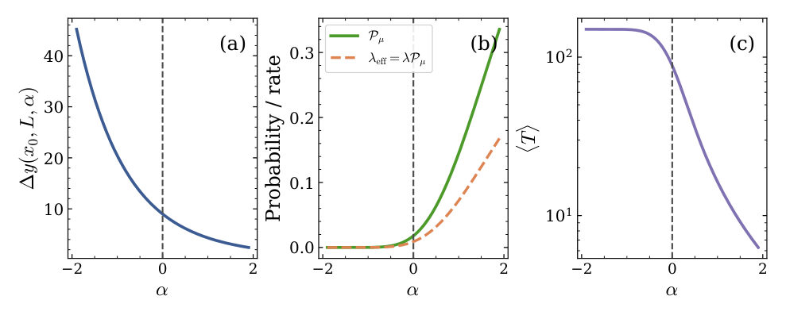 
Figure 2: Effect of the heterogeneity exponent α on the first-passage properties, in dimension- less units. The physical initial position and target position are fixed at x0 = 1 and L = 10, so that the α-dependence enters entirely through the effective distance ∆y(x0, L, α) [Eq.(22)]. (a) ∆y decreases monotonically with α, reflecting how larger heterogeneity makes the target dynamically closer to the starting point. (b) Single-trajectory success probability Pµ [Eq.(23)] and the corresponding effective long-time decay rate λeff = λPµ [Eq. (26)], both increasing with α as the effective distance to the target shrinks. (c) Mean first-passage time ⟨T⟩which shows a crossover from an almost...

📷 Fig 3

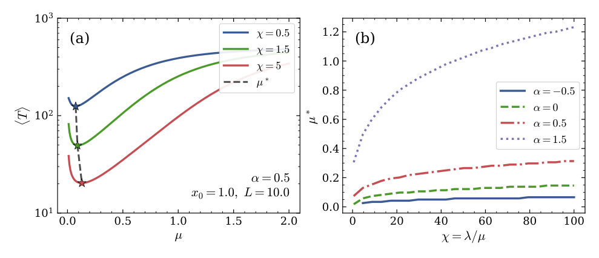 
Figure 3: Optimal mortality rate in the first-passage time properties of the heterogeneous diffusion process with recruitment and mortality, in dimensionless units, for fixed initial and target positions x0 = 1, L = 10. (a) Mean first-passage time ⟨T⟩as a function of the mortality rate µ, for different values of the recruitment–mortality ratio χ = λ/µ, at fixed heterogeneity exponent α = 0.5. For each curve, the recruitment rate is set as λ = χµ. Every curve shows a well-defined minimum, confirming the existence of an optimal mortality rate µ∗that minimizes the mean first-passage time; star markers indicate the numerically obtained minima, and the dashed curve traces the locus of µ∗as χ is...

📷 Fig 4

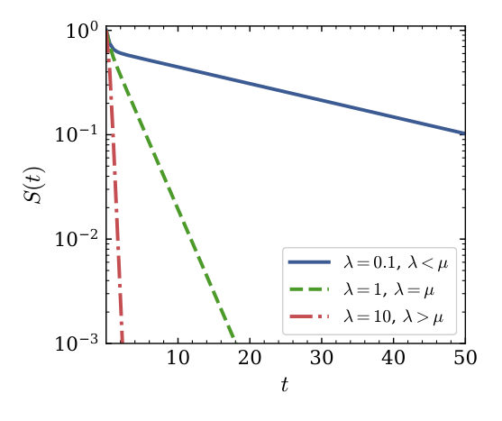 
Figure 4: Effect of the recruitment rate λ on the full recruitment–mortality survival probability S(t), for fixed mortality rate µ = 1.0, in dimensionless units. The three curves correspond to representative regimes with λ &lt; µ, λ = µ, and λ &gt; µ. Increasing λ accelerates the decay of Sλ,µ(t) because each recruited trajectory provides an additional independent attempt to reach the target. Parameters: ∆y = 1 and Dα = 1.

📷 Fig 5

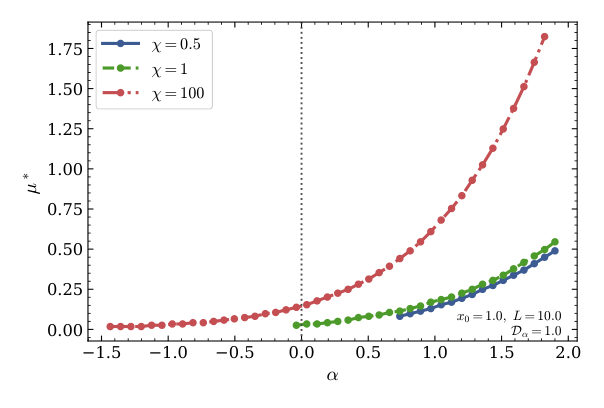 
Figure 5: Optimal mortality rate µ∗as a function of the heterogeneity exponent α, for selected values of the recruitment-to-mortality ratio χ, in dimensionless units. For each value of α, the effective distance ∆y(x0, L, α) is computed for fixed x0 = 1 and L = 10, and Dα = 1. The optimal mortality rate is obtained by minimizing the numerical mean first-passage time over the mortality parameter µ.

**Summary.** This work models diffusion in an open environment subject to particle creation (recruitment) and decay (mortality). It establishes that the system reaches a stable, non-equilibrium state characterized by a saturated Mean Squared Displacement. Crucially, it reveals a 'mortality-assisted search' effect, showing that intermediate decay rates can optimize the speed of reaching a target region.

**Why it may be interesting.** The framework of open systems with particle creation/destruction and anomalous diffusion is highly relevant to modeling non-equilibrium dynamics in complex physical systems, which shares mathematical structures with open quantum systems.

Detailed structure

**Main problem.** The paper investigates heterogeneous diffusion in open systems characterized by continuous particle creation (recruitment) and destruction (mortality). It analyzes how these processes affect transport properties and search times.

**Main result.** The system reaches a non-equilibrium stationary state where the Mean Squared Displacement saturates to a value independent of the recruitment rate. Furthermore, a moderate mortality rate can counter-intuitively accelerate the arrival of an infection at a new spatial region.

**Method.** The analysis involves deriving the probability density function and survival probabilities using modified Fokker-Planck equations and the dynamic redundancy framework. Long-time asymptotic behavior is analyzed using Laplace approximations.

**Model / system.** The model is a Heterogeneous Diffusion Process (HDP) with a position-dependent diffusion coefficient $D(x) \propto |x|^\alpha$. The process is open, incorporating independent recruitment ($\lambda$) and mortality ($\mu$) rates.

**Key observables.** Mean Squared Displacement ($\langle x^2(t) 
angle$), survival probability $S(t)$, and mean first-passage time $\langle T 
angle$.

**Important parameters / regimes.** Heterogeneity exponent ($\alpha$), recruitment rate ($\lambda$), and mortality rate ($\mu$).

**Assumptions / limitations.** The analysis assumes a specific power-law form for the diffusion coefficient $D(x)$ and relies on approximations like the Laplace method for long-time limits.

**Figures summary.** Figures illustrate the saturation of survival probabilities ($S(t)$) and the non-monotonic dependence of the mean first-passage time ($\langle T 
angle$) on the mortality rate ($\mu$), showing an optimal rate exists.

**Paper structure.** The paper progresses from deriving the governing equations for the open HDP, calculating the long-time saturation of the MSD, analyzing the first-passage time using survival probabilities, and finally applying the framework to physical examples like epidemiology.

Abstract

We study a heterogeneous diffusion process with a position-dependent diffusion coefficient in the presence of independent recruitment and mortality. This framework generalises heterogeneous diffusion under stochastic resetting, which is recovered as the special case of equal recruitment and mortality rates. At long times, the system approaches a non-equilibrium stationary state with a mean squared displacement that saturates to a value independent of the recruitment rate. Crucially, this saturation limit directly encodes the underlying transport regime via an effective exponent applied to the diffusion coefficient, and we characterise the non-trivial transition to this stationary regime. We further derive the mean first-passage time to a target and show that, for a fixed recruitment-to-mortality ratio, an optimal mortality rate minimises the search time. This "mortality-assisted search" effect is confirmed by numerical evaluation. Reinterpreting recruitment and mortality as infection and removal processes, we apply the model to epidemic spreading and show that a moderate removal rate can counter-intuitively accelerate, rather than delay, the arrival of infection at a new spatial region. Beyond epidemiology, our framework offers broad relevance to systems featuring concurrent particle creation and destruction, such as bacterial growth, tracer diffusion in reactive fluids, or cellular population dynamics in crowded environments.

[↑ back to top](#top)

### [Entanglement Sudden Death: Eberly's Work and the Limits of Local Dynamics](http://arxiv.org/abs/2610.08710v1)

**Authors:** Abhaya S. Hegde, Songbo Xie  
**Type:** theory · **Category:** quantum information and computing · **PDF:** <https://arxiv.org/pdf/2610.08710v1>  
**Analysis basis:** full PDF text, analyzed in chunks
**Topic relevance:** `correlated / nonlocal dissipation` **3/5** · `analog quantum simulation` **2/5** · `driven-dissipative phase transition` **2/5** · `methods for driven-dissipative` **2/5** · `non-equilibrium universality` **2/5** · `Keldysh / 2PI / non-Gaussian methods` **1/5**

📷 Fig 1

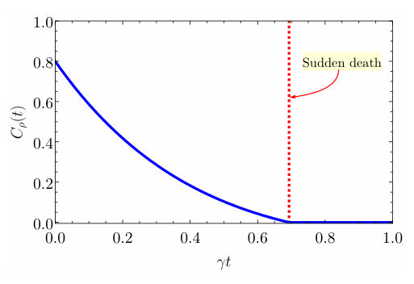 
FIG. 1. Concurrence from Eq. (11). The dashed red vertical line marks the time at which entanglement vanishes abruptly and completely.

📷 Fig 2

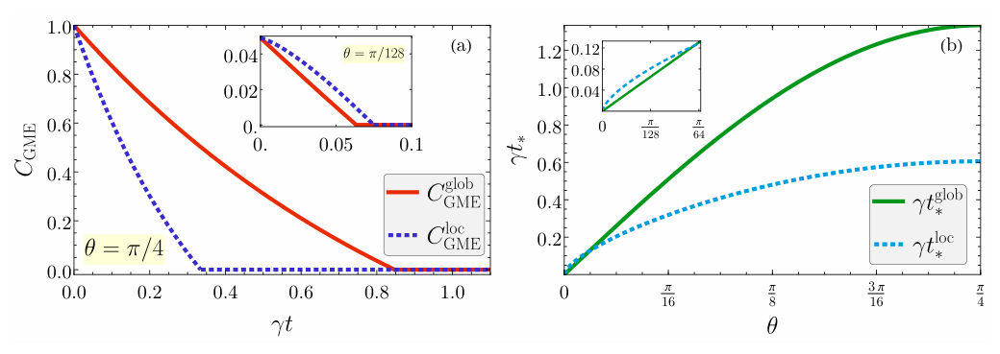 
FIG. 2. (a) Concurrence as a function of time for GHZ state initialized in maximally entangled state. The solid red line refers to dynamics under global depolarization and the dotted blue represents qubits subjected to independent depolarization. While independently depolarized states lose tripartite genuine entanglement faster than global white noise for this initial state, for sufficiently weakly entangled states, such as θ = π/128, have opposite order in which dynamics retains genuine correlations longer, as shown inset. (b) Entanglement sudden death time as a function amount of initial entanglement parametrized by the superposition angle θ in the initial GHZ state.

**Summary.** This paper explores Entanglement Sudden Death (ESD), demonstrating that the abrupt loss of entanglement in multipartite systems is highly sensitive to the noise model applied. By comparing global versus local depolarization on GHZ states, the authors prove that the entanglement lifetime depends on the joint evolution, not just the local dynamics. This highlights that understanding entanglement requires analyzing the entire composite system state.

**Why it may be interesting.** This work is highly relevant to AMO physics and open quantum systems as it provides a rigorous, quantitative comparison of how different noise assumptions affect the fundamental persistence of quantum correlations in multi-particle systems.

Detailed structure

**Main problem.** The paper investigates Entanglement Sudden Death (ESD), the phenomenon where entanglement vanishes abruptly at a finite time despite the underlying system dynamics remaining smooth.

**Main result.** The lifetime of genuine multipartite entanglement depends critically on the nature of the noise (global vs. local), showing that local dynamics alone do not determine the ESD time or its scaling with system size.

**Method.** The authors analyze entanglement decay using measures like concurrence for both bipartite and multipartite systems, comparing dynamics under different noise models.

**Model / system.** The study models open quantum systems, specifically using N-qubit GHZ states subjected to different types of environmental noise, such as independent local depolarization versus global depolarization.

**Key observables.** Concurrence, genuine multipartite entanglement, and the ESD time scale.

**Important parameters / regimes.** System size N, and the relative strength of local versus global noise coupling.

**Assumptions / limitations.** The 'suddenness' refers only to the finite time of entanglement vanishing, not a sudden change in the density matrix evolution itself.

**Figures summary.** The notes reference figures comparing the ESD times for global versus independent local depolarization for N=3 qubits.

**Paper structure.** The paper revisits the concept of ESD from bipartite systems to genuine multipartite entanglement, first illustrating the mechanism with two qubits, and then comparing the ESD times for N-qubit GHZ states under global versus local depolarization.

Abstract

Entanglement sudden death (ESD), explored through a series of works by Yu and Eberly, supports the notion of entanglement vanishing abruptly and completely at a finite time, even when the underlying open-system dynamics remain smooth. In this article, we revisit the development of ESD from bipartite origins to genuine multipartite entanglement. We first illustrate the canonical mechanism of ESD with two independently damped qubits, for which the concurrence vanishes at a finite time while populations and coherences remain nonzero. We next present our results on multipartite entanglement for generalized GHZ states under depolarization. Global and independent local depolarizing dynamics can be chosen to produce identical reduced evolution for every individual qubit, yet they yield different genuine-multipartite-entanglement sudden death times, whose ordering can reverse with the initial state. For N-qubit GHZ states, this distinction becomes asymptotically stronger since the ESD time scales as 1/N under independent local depolarization, whereas under global depolarization it approaches a finite value in the thermodynamic limit. Echoing a central lesson of Prof. Eberly's work, we report the lifetime of multipartite entanglement is not fixed by the local dynamics, but rather depends on the evolution of the joint quantum state.

[↑ back to top](#top)

### [Spectroscopy using dipole-phonon quantum logic](http://arxiv.org/abs/2610.07680v1)

**Authors:** Lu Qi, Evan C. Reed, Duanyang Wang, Boyan Yu, Kenneth R. Brown  
**Type:** experiment · **Category:** other · **PDF:** <https://arxiv.org/pdf/2610.07680v1>  
**Analysis basis:** full PDF text, analyzed in chunks
**Topic relevance:** `QC/QI experiment` **3/5** · `quantum measurements` **3/5** · `quantum optics experiment` **3/5** · `Tavis-Cummings & cavity-many-emitter` **2/5** · `analog quantum simulation` **1/5**

📷 Fig 1

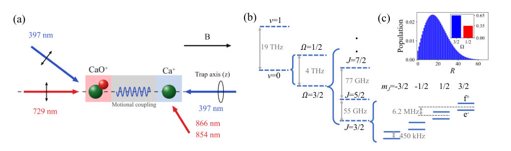 
FIG. 1. Experimental schematic and the energy structure and population distribution of CaO+ at room temperature. (a) A schematic of the experimental setup for the demonstration of dipole-phonon quantum logic. A single CaO+ and Ca+ are trapped along the trap axis. The schematic is not to scale; the ions are enlarged for clarity. A magnetic field of 6.2 G is aligned to the trap axis (z) to provide the quantization axis and break state degeneracies. The ion chain is shown in a top view, together with the laser wavelengths and orientations. The linearly polarized 397 nm beam and the 866 nm beam are used for Doppler cooling. EIT cooling uses both the linearly polarized and the σ-polarized 397 nm...

📷 Fig 2

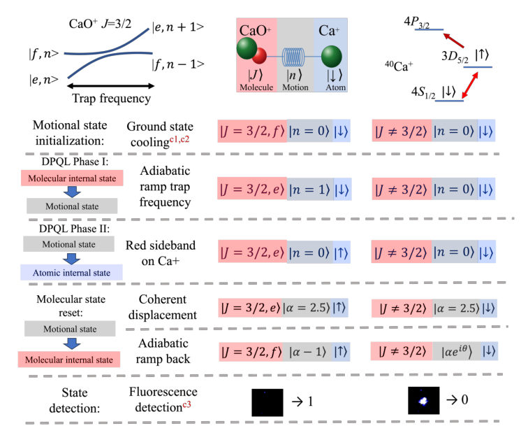 
FIG. 2. Experimental sequence for DPQL. The avoided crossing on the top left shows the state trajectories in the adiabatic passage operation. The energy structure of Ca+ on the top right illustrates the atomic qubit states used in the experiment. Shown here is every step of the experiment as well as the corresponding state changes of the molecular ion (both J = 3/2 and J ̸= 3/2), motion, and atomic ion. The results of single shot measurements of the Ca+ ion are assigned the values of 1 for dark and 0 for bright. c1: Dark ion mass check. c2: Prior selection check of Ca+ fluorescence. c3: Posterior selection check operation. See text for details.

📷 Fig 3

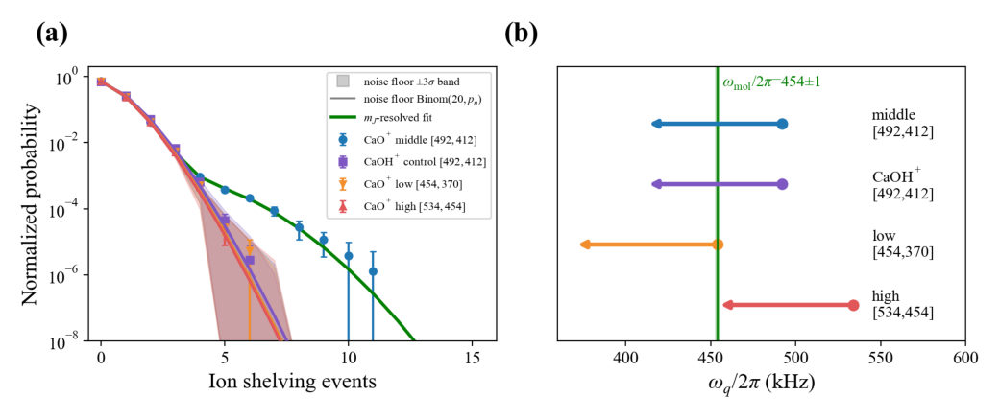 
FIG. 3. Dipole-phonon signal and the frequency-scan geometry. (a) Normalized probability of observing a given number of ion-shelving events in 20-experiment windows, for all four datasets: the CaO+ middle range (blue circles), the CaOH+ control molecule over the same range (purple squares), and the CaO+ low (orange down triangles) and high (red up triangles) ranges. Each is shown with its own noise floor (gray line, binomial at that dataset’s false-positive rate pn) and the ±3σ spread obtained from scrambled detection records (gray band). The green curve is the mJ-resolved fit to the CaO+ middle-range data, with a total ground-rotational-state population of 0.60+0.14 −0.11% and a per-event...

📷 Fig 4

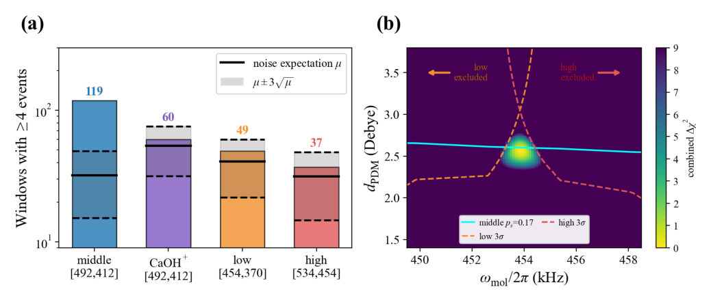 
FIG. 4. Statistical significance and the joint frequency–coupling constraint. (a) Number of 20-experiment windows containing ≥4 ion-shelving events for each dataset. Experimental values are denoted by the height of the colored bars and the number. The solid black line is the average count, µ, expected from that dataset’s noise floor and the shaded band is µ ± 3√µ. The noise floor is evaluated run by run and then combined over all runs of the dataset to calculate µ (Appendix C 1). (b) Joint constraint on the effective dipole-phonon coupling dPDM and the doublet frequency ωmol. The color is the combined ∆χ2 of Appendix C 3, which compares the simulated per-event signal of each range with the...

📷 Fig 5

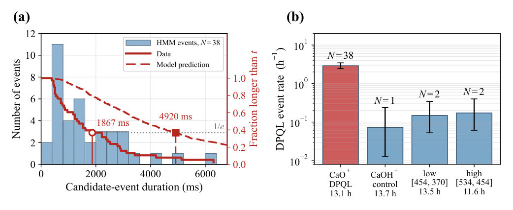 
FIG. 5. Signals identified by the parameter-free HMM. (a) Durations of the 38 candidate events found in the CaO+ DPQL search data. Left axis: histogram, bin width 400 ms. Right axis: the survival function of the data (solid) and of the model prediction (dashed), the latter obtained by decoding the Monte-Carlo simulation with the same HMM and the same dual- threshold criterion. Markers give the 1/e crossing of each, 1867 ms and 4920 ms. (b) Event rate of each dataset under the same dual-threshold criterion (boundaries at posterior 0.5, selection at peak posterior ≥0.9), with 68% Poisson intervals. The two off-resonant ranges supply the background reference.

**Summary.** This paper reports the first experimental use of Dipole-Phonon Quantum Logic (DPQL) spectroscopy on $	ext{CaO}^+$ ions to measure the frequency splitting of its ground state. By analyzing signal patterns across multiple motional frequency ramps, the authors determined the splitting to be $2\pi 	imes 454 \pm 1$ kHz. The methodology combines advanced trapped-ion cooling techniques with sophisticated statistical analysis to achieve high-precision quantum characterization.

**Why it may be interesting.** This work is highly interesting as it pushes the boundaries of quantum sensing by applying a sophisticated quantum logic protocol (DPQL) to measure fundamental molecular properties ($\omega_{	ext{mol}}$) in a trapped-ion platform, bridging quantum optics, molecular physics, and quantum information.

Detailed structure

**Main problem.** The primary goal was to demonstrate Dipole-Phonon Quantum Logic (DPQL) as a novel spectroscopic tool to precisely measure the frequency splitting ($\omega_{	ext{mol}}$) of the ground $\Omega$-doublet of the $	ext{CaO}^+$ molecular ion.

**Main result.** The experiment successfully measured the molecular splitting frequency to be $\omega_{	ext{mol}} = 2\pi 	imes 454 \pm 1$ kHz, and also determined the effective dipole-phonon coupling strength ($d_{	ext{PDM}}$).

**Method.** The measurement relied on adiabatically ramping the motional trap frequency ($\omega_q$) while monitoring the resulting signal/null pattern across three overlapping frequency ranges, analyzed using advanced statistical methods like Hidden Markov Models (HMM).

**Model / system.** The physical system is an ion chain ($	ext{CaO}^+$-$	ext{Ca}^+$) trapped in a linear trap. The underlying physics is modeled by an interaction Hamiltonian resembling the Jaynes-Cummings model, describing the coupling between the molecular dipole and the quantized motional phonon mode.

**Key observables.** The key observables are the signal/null pattern across three frequency ramps, the measured shelving probability ($p_s$), and the derived molecular splitting frequency ($\omega_{	ext{mol}}$).

**Important parameters / regimes.** The measured splitting is $\omega_{	ext{mol}} = 2\pi 	imes 454 \pm 1$ kHz, and the coupling strength was determined to be $d_{	ext{PDM}} = 2.56 \pm 0.07$ Debye.

**Assumptions / limitations.** The analysis assumes the validity of the Jaynes-Cummings Hamiltonian and relies on statistical modeling (HMM, Poisson likelihood) to distinguish true quantum signals from noise, while acknowledging limitations in coverage calibration.

**Figures summary.** Figure 1 illustrates the experimental setup, the energy level structure of $	ext{CaO}^+$, and the thermal population distribution of rotational states. Figure 2 details the procedure for the spectroscopic measurements.

**Paper structure.** The paper details the experimental setup and theoretical model, describes the complex measurement protocol involving three frequency ramps and multiple diagnostic checks, presents the statistical analysis using HMMs to fit signal rates, and finally reports the derived spectroscopic constants.

Abstract

Dipole-phonon quantum logic (DPQL) offers novel approaches for state preparation, measurement, and control of quantum information in molecular ion qubits. Here we report the first experimental demonstration of DPQL as a spectroscopic tool using the shared motional mode of a CaO$^+$-Ca$^+$ ion chain to measure the frequency splitting of the ground $Ω$-doublet of CaO$^+$. By comparing the dipole-phonon signal across three trap-frequency ramp ranges, we determine the splitting to be $ω_{mol}=2π\times454\pm1$ kHz and place a lower bound on the effective dipole-phonon coupling. The rate of observation is limited by the low thermal population in the molecular ground rotational state.

[↑ back to top](#top)

### [Threat Evasion and Information Propagation in Cognitive Flocks](http://arxiv.org/abs/2610.07297v1)

**Authors:** Priyanka Iyer, Cecilia Soroco, Gerhard Gompper  
**Type:** theory · **Category:** statistical mechanics · **PDF:** <https://arxiv.org/pdf/2610.07297v1>  
**Analysis basis:** full PDF text, analyzed in chunks
**Topic relevance:** `non-equilibrium universality` **3/5** · `analog quantum simulation` **2/5** · `driven-dissipative phase transition` **2/5** · `Frenkel-Kontorova` **1/5** · `Keldysh / 2PI / non-Gaussian methods` **1/5** · `correlated / nonlocal dissipation` **1/5** · `methods for driven-dissipative` **1/5** · `scars & prethermalization` **1/5**

📷 Fig 1

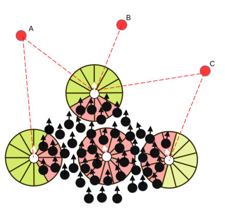 
Figure 1: Local vision occlusion. Schematic of the local vision occlusion for selected particles (shown in white). Each vision cone (in two spatial dimensions) is divided into 12 segments, and if a segment contains another particle (shown in black), it is considered blocked (red shading). As a result, the threats (A, B, and C, red) are visible to only a few particles (connected via dashed-lines). The particle at the center of the flock has its entire field of view obstructed and cannot perceive any of the threats. The agents are modeled as point particles; the circles are shown for illustration only.

📷 Fig 2

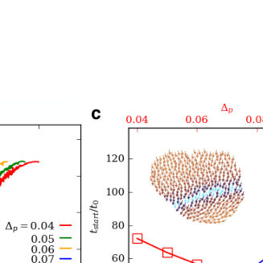 
Figure 2: Information propagation in the flock. (a) Rank curves for varying damping coefficients η. For small η, the information propagates linearly (black solid line) whereas for large η = 2, a diffusive propagation develops (black dashed line). Here the curve for the linear limit is shifted by the intercept at the start-time as cst −cststart(η = 0.1), whereas the diffusive limit (black dashed line) is shifted by √

📷 Fig 3

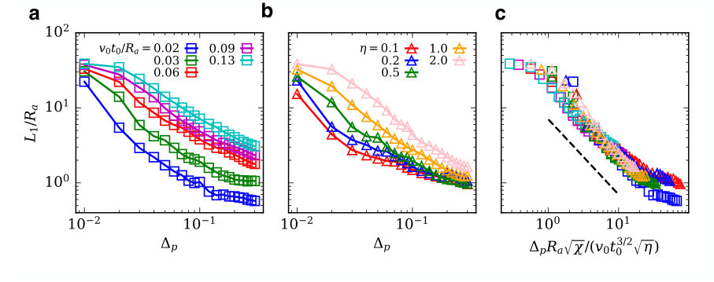 
Figure 3: Turning distance of the flock after perception of a predator. The turning distance L1/Ra as a function of the predator-response strength ∆p, for (a) different flock velocities v0 (η = 0.5) and (b) different η (Here v0/cs = 0.03). (c) A universal scaling curve is obtained when data for L1 from (a) and (b) is plotted against the scaling variable ∆pRa√χ/(v0t3/2 0 √η). The dashed line indicates the decay L1/Ra ∼(v0t3/2 0 √η)/(∆pRa√χ).

📷 Fig 4

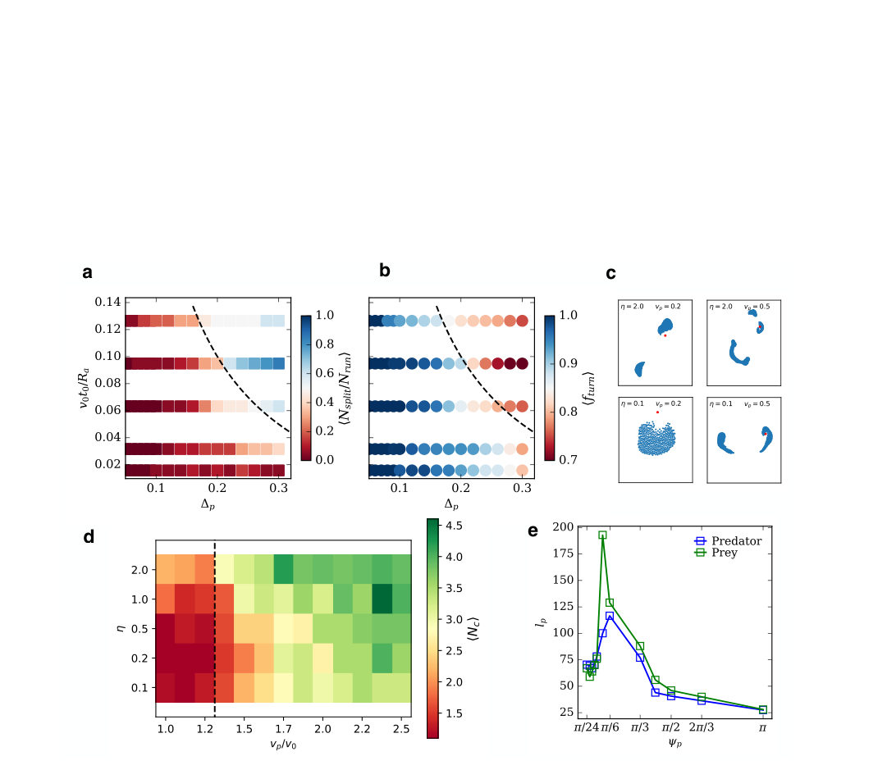 
Figure 4: Flock fracturing under predator attack. (a) Probability of flock splitting (measured from the fraction of simulations Nsplit/Nrun where the flock splits) as a function of scaled flock velocity v0t0/Ra = v0/cs and predator response strength ∆p. (b) The fraction of agents fturn within each flock that initiate the turn in the same relative direction, i.e. left or right from the initial heading vector, as a function of v0 and ∆p. The data is averaged over all simulation runs (Nrun = 20). Lines indicating phase boundaries are guides to the eye. (c) Snapshots of the flock at time t = 2tL (tL = √

📷 Fig 5

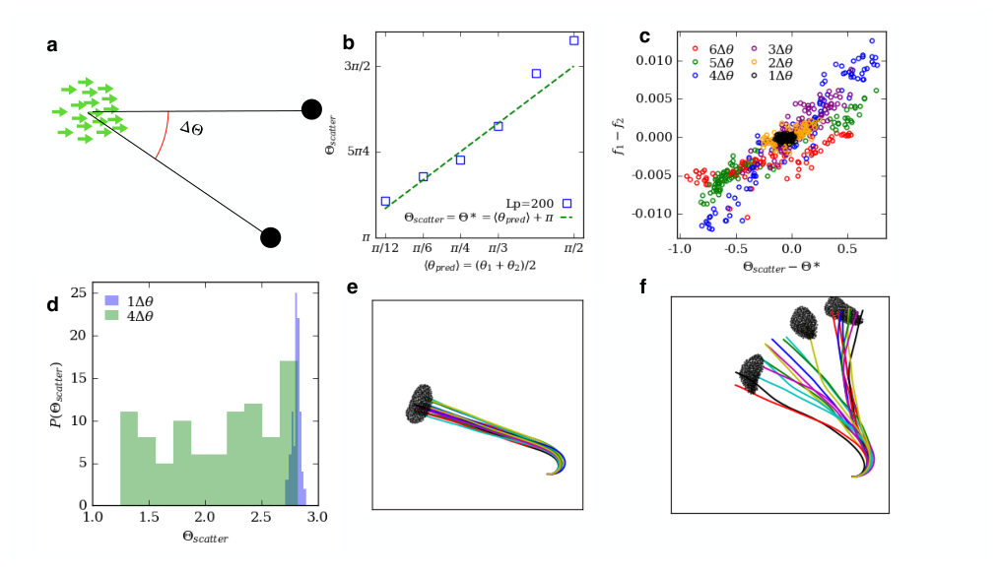 
Figure 5: Variability of flock escape from two predators. (a) Schematic of the two-predator scattering simulation. (b) Exit angle Θscatter of the flock for two stationary predators at positions (radial coordinates) (Lp, θ1), (Lp, θ2), with θ1 = 0, i.e. on the x-axis. The dashed line indicates the exit angle equal to the fixed point solution for the average polarization direction Θ∗= (θ1 + θ2)/2 + π. (c) The difference f1 −f2 between the fraction of boundary particles that only detect predator ‘1’ (f1) and predator ‘2’ (f2) as a function of the deviation Θscatter −Θ∗. In all simulations Rthreat = 2Lp so that the threat is detected for the duration of the run. (d) Probability distribution of...

**Summary.** This paper models collective escape in cognitive flocks using an augmented inertial spin model that includes realistic interactions like collision avoidance. It shows that information propagates efficiently, allowing the flock to maintain cohesion while evading a predator. The findings provide general principles linking information dynamics, geometry, and collective survival.

**Why it may be interesting.** While focused on classical active matter, the concepts of non-equilibrium dynamics, collective synchronization, and information flow in complex systems are highly relevant to understanding quantum many-body dynamics and open quantum systems.

Detailed structure

**Main problem.** The study investigates how information (specifically threat perception) propagates and shapes collective escape behavior in cognitive flocks under realistic physical constraints.

**Main result.** The model demonstrates that fast information propagation can synchronize responses to maintain flock cohesion during pursuit, and the turning distance scales according to a balance between response strength, flock speed, and damping.

**Method.** The research uses numerical simulations of the augmented inertial spin model, incorporating multiple interaction forces like alignment, collision avoidance, and cohesion.

**Model / system.** The system models cognitive agents as active Brownian particles whose dynamics are governed by an augmented inertial spin model, including terms for alignment, local collision avoidance, and cohesion forces.

**Key observables.** Information propagation speed, turning distance scaling, consensus fraction, and flock splitting probability.

**Important parameters / regimes.** Response strength (Delta_p), flock speed (v_0), damping coefficient (eta), and interaction strengths (K, Omega_a, Omega_f).

**Assumptions / limitations.** The model assumes point particles and restricts initial threat perception to agents with an unobstructed line of sight to the predator.

**Figures summary.** Figures illustrate rank curves showing information propagation speed under varying damping coefficients, and turning distance scaling laws derived from varying response strengths and speeds.

**Paper structure.** The paper builds from defining the governing equations (ISM with multiple forces) to analyzing information propagation speed, characterizing the scaling of turning distance, and finally contrasting flock vs. single-particle escape dynamics.

Abstract

Information sharing, threat perception, and collective evasion highlight the advantages of swarm intelligence. Here, we study the behavior of flocks of cognitive agents, based on numerical simulations of the augmented inertial spin model, with an explicit predator. Each agent on the predator-facing side of the flock perceives the threat, triggering collective turns through local interactions. We show that the augmented inertial spin model sustains nearly linear information propagation in the under-damped regime, even with realistic flocking interactions such as local collision avoidance and swarm cohesion in addition to alignment. The turning distance of the flock to a stationary predator scales with the ratio $Δ_p/(v_0\sqrtη)$, identifying an optimal balance between response strength $Δ_p$, flock speed $v_0$, and damping $η$ of information propagation. Fragmentation arises when different parts of the flock turn in different directions, however, fast information propagation can synchronize these responses and maintain flock cohesion while under pursuit. For two predators, a combination of stability analysis and simulations reveals a stark contrast between flock and single-particle reactions, with scattering angle shaped by flock geometry, predator position, and the heterogeneous responses of the detecting front. Together, these results show how information propagation, flock geometry, and dynamics together shapes collective escape, providing general principles relevant to both biological flocks and robotic swarms.

[↑ back to top](#top)

### [A New Model for the Income Distribution](http://arxiv.org/abs/2610.08143v1)

**Authors:** Ekrem Aydiner  
**Type:** theory · **Category:** statistical mechanics · **PDF:** <https://arxiv.org/pdf/2610.08143v1>  
**Analysis basis:** full PDF text, analyzed in chunks
**Topic relevance:** `methods for driven-dissipative` **3/5** · `non-equilibrium universality` **3/5** · `Frenkel-Kontorova` **1/5** · `driven-dissipative phase transition` **1/5** · `scars & prethermalization` **1/5**

📷 Fig 1

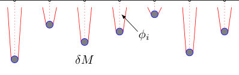 
FIG. 1. Schematic representation of the one-dimensional model, where the potential wells are randomly distributed along the lattice.

📷 Fig 2

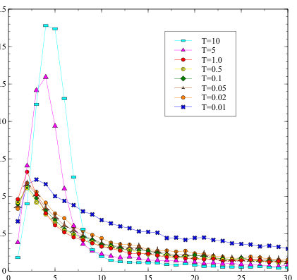 
FIG. 2. Pareto exponent for different temperatures and the corre- sponding money distribution profiles as a function of x. The results show that the money distributions follow an inverse power-law be- havior, and the Pareto exponent ν(T) varies systematically with tem- perature.

📷 Fig 3

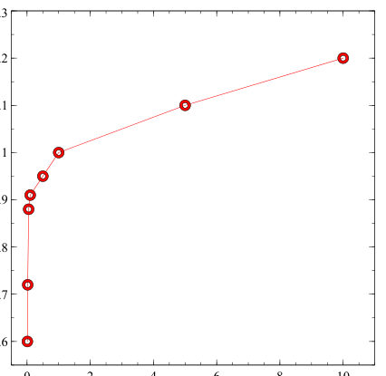 
FIG. 4. Values of the Pareto exponent ν(T) obtained for different temperature values. The exponent varies approximately within the range 0.5 &lt; ν(T) &lt; 1.5, clearly showing its dependence on temper- ature.

📷 Fig 4

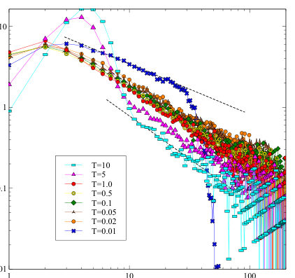 
FIG. 3. The money distribution P(x) plotted on a log–log scale for different temperature values. The tail of the distribution follows an inverse power-law behavior, clearly indicating a Pareto-type scaling. The fitted slopes (dashed lines) correspond to the Pareto exponents obtained for each temperature.

📷 Fig 5

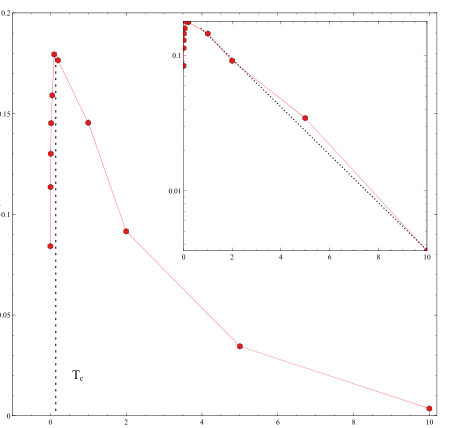 
FIG. 5. Vacancy fraction f0(T) as a function of temperature T. The dashed line indicates the critical temperature Tc ≃0.05.

**Summary.** This paper proposes a kinetic trap-diffusion model to simulate money exchange, treating the effective temperature ($T$) as a control parameter. By simulating the system, the authors demonstrate that $T$ dictates the resulting wealth distribution, causing the Pareto exponent to vary continuously between different regimes. This provides a unified, physically motivated framework for understanding the variation of economic inequality.

**Why it may be interesting.** The use of a temperature parameter to control the transition between different statistical regimes (exponential to power-law) is a general concept applicable to non-equilibrium dynamics in complex physical systems, such as energy relaxation or particle transport in disordered media.

Detailed structure

**Main problem.** The study addresses the dynamical origin and empirical variation of Pareto distributions in money-exchange systems, aiming to explain why the Pareto exponent varies across different economies.

**Main result.** The proposed kinetic trap-diffusion model successfully generates a range of Pareto exponents ($
u$) as a function of an effective temperature ($T$), unifying exponential and power-law regimes.

**Method.** The research employs kinetic Monte Carlo simulations to model money exchange governed by thermally activated diffusion on a disordered potential landscape.

**Model / system.** The system is a one-dimensional lattice where money moves between sites with random potential wells ($\phi_i$). The dynamics follow a Metropolis rule, controlled by an effective temperature $T$, conserving total money.

**Key observables.** Pareto exponent ($
u(T)$), Gini index ($G(T)$), and the fraction of zero-wealth agents ($f_0(T)$).

**Important parameters / regimes.** Effective temperature ($T$), which acts as the primary control parameter regulating mobility and exchange dynamics.

**Assumptions / limitations.** The total amount of money in the system is conserved, and the dynamics are governed by a temperature-dependent Metropolis acceptance rule.

**Figures summary.** Figures illustrate the transition of the wealth distribution $P(x)$ from an exponential form at high $T$ to a power-law (Pareto) tail at low $T$, confirming the systematic dependence of the exponent on $T$.

**Paper structure.** The paper introduces the kinetic trap-diffusion model, details the simulation methodology using Monte Carlo techniques, presents results showing the temperature-dependent exponent $
u(T)$, and discusses the implications for inequality dynamics.

Abstract

In this study, we propose a kinetic trap--diffusion model to describe the emergence of Pareto distributions in money-exchange systems. Using kinetic Monte Carlo simulations, we show that the Pareto exponent depends explicitly on temperature and takes values in the range $0.5 \leq ν(T) \leq 1.5$. In the present framework, the temperature $T$ acts as a control parameter that regulates the exchange dynamics through thermally activated diffusion. Unlike conventional kinetic exchange models, where the Pareto exponent is fixed by microscopic rules, the proposed model generates a range of Pareto exponents as a function of $T$. The temperature-dependent Pareto exponent constitutes the central novelty of the proposed kinetic trap--diffusion framework. This feature provides a natural explanation for the empirically observed variations in Pareto exponents across different countries and economic conditions. In addition, the fraction of zero-wealth agents and the Gini index exhibit a non-monotonic dependence on temperature, revealing distinct dynamical regimes arising from the competition between trapping and money mobility. The persistence of the Pareto-like stationary distribution under strongly nonuniform initial conditions further supports the robustness of the proposed mechanism. These results show that different Pareto-tail and inequality regimes can emerge from the same trap--diffusion dynamics through changes in a single control parameter

[↑ back to top](#top)

### [Dynamical vertex approximation for retarded interactions: Application to the Hubbard-Holstein model](http://arxiv.org/abs/2610.08512v1)

**Authors:** Emin Moghadas, Samuele Giuli, Massimo Capone, Alessandro Toschi  
**Type:** theory · **Category:** strongly correlated electrons · **PDF:** <https://arxiv.org/pdf/2610.08512v1>  
**Analysis basis:** full PDF text, analyzed in chunks
**Topic relevance:** `Keldysh / 2PI / non-Gaussian methods` **3/5** · `analog quantum simulation` **2/5** · `methods for driven-dissipative` **2/5** · `correlated / nonlocal dissipation` **1/5** · `driven-dissipative phase transition` **1/5**

📷 Fig 1

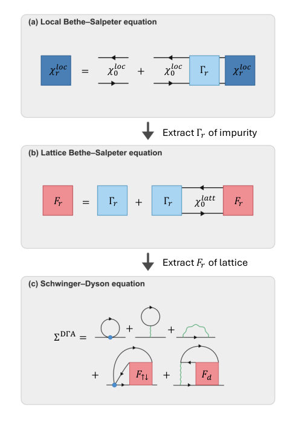 
FIG. 1. Schematic illustration of the dynamical-U ladder- DΓA algorithm flow. The impurity vertex Γ, obtained by inverting a local BSE (upper panel), serves as the input for the lattice ladder equation (middle panel) for the full vertex Fq. This object inherits its momentum-dependence from the lattice bubble-diagrams that propagate the transfer momen- tum q. In the final step the non-local correction to the DMFT self-energy is computed via the SDE (lower panel) with the DMFT ladder vertices Fq as main building blocks.

📷 Fig 2

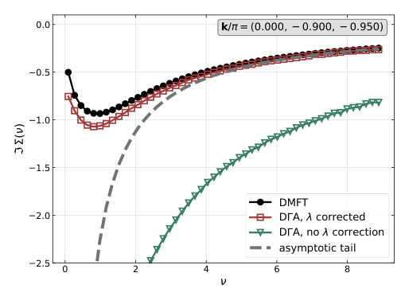 
FIG. 2. Comparison of λ-corrected (red) and uncorrected DΓA (green) self-energies on the Fermi-surface with the local DMFT self-energy (black) along with the exact self-energy 1/ν tail (gray dashed line). The data are obtained for the 3D Hubbard-Holstein model at U = 3, λ = 1, ω0 = 0.1, n = 0.9 and β = 100.

📷 Fig 3

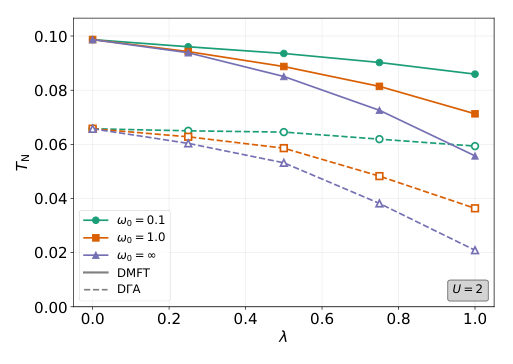 
FIG. 3. DMFT and ladder-DΓA results for the N´eel temper- ature TN of the HHM on the cubic lattice as a function of λ and the three phonon frequencies ω0 = {0.1, 1, ∞}. The Hubbard interaction is fixed to U = 2.

📷 Fig 4

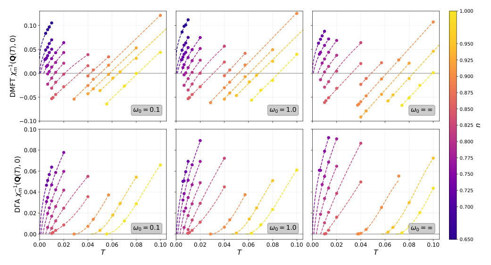 
FIG. 4. Temperature dependence of the DMFT (upper row) and ladder-DΓA (lower row) spin susceptibilities at the ordering vector Q for various fillings and the three phonon frequencies ω0 = {0.1, 1, ∞}. For all calculations considered here the Hubbard interaction is set to U = 3 with the el-ph coupling being λ = 1

📷 Fig 5

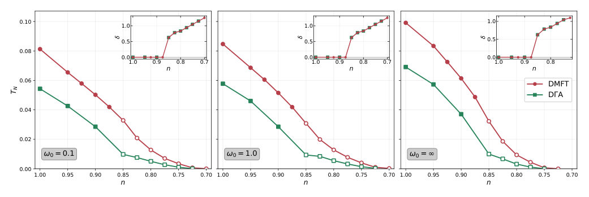 
FIG. 5. Doping dependence of the DMFT (red) and ladder-DΓA (green) N´eel temperature TN for ω0 = 0.1 (left panel), ω0 = 1 (middle panel) and ω0 = ∞(right panel), with U = 3 and λ = 1. Empty markers indicate incommensurate ordering vectors for the spin response, Q = (π, π, π −δ). The incommensurability δ as a function of filling n for each case is shown in the respective insets.

**Summary.** This work develops an advanced theoretical tool, the "dynamical-U DΓA," to handle electron-boson coupling in strongly correlated systems. By applying it to the Hubbard-Holstein model, the authors investigate how phonon-mediated interactions compete with electronic correlations to determine magnetic and superconducting ground states.

**Why it may be interesting.** While focused on condensed matter, the treatment of retarded interactions and the systematic inclusion of bosonic coupling into a many-body self-energy framework (DΓA) shares conceptual parallels with open quantum systems where environmental coupling (bath) dynamics are crucial.

Detailed structure

**Main problem.** The paper aims to extend the Dynamical Vertex Approximation (DΓA) to accurately treat strongly interacting electrons coupled to bosons, specifically addressing the frequency dependence of the interactions.

**Main result.** The developed "dynamical-U DΓA" scheme successfully applies to the Hubbard-Holstein model, allowing the study of how electron-phonon coupling modifies competing electronic instabilities like antiferromagnetism and d-wave superconductivity.

**Method.** The core method is the "dynamical-U DΓA," which extends the ladder-DΓA formalism by incorporating the frequency dependence of the bare interaction into the Bethe-Salpeter equation and self-energy calculations.

**Model / system.** The primary model is the Hubbard-Holstein model, which describes strongly correlated electrons (Hubbard repulsion $U$) coupled to bosonic excitations (phonons, $\Omega_\alpha$). This setup allows studying the competition between electronic correlations and electron-phonon coupling.

**Key observables.** Antiferromagnetic phase diagram (3D), d-wave superconducting instability (2D), magnetic fluctuations, and nonlocal electronic self-energy.

**Important parameters / regimes.** Hubbard interaction strength ($U$), electron-phonon coupling strength ($g$), and the characteristic phonon frequency ($\omega_0$).

**Assumptions / limitations.** The method builds upon DMFT by systematically including non-local correlations via the vertex corrections, extending previous DΓA applications that assumed instantaneous interactions.

**Figures summary.** Figure 1 schematically illustrates the dynamical-U ladder-DΓA approach, showing the inclusion of frequency dependence in the vertex corrections.

**Paper structure.** The paper introduces the need to extend DΓA for retarded interactions, details the "dynamical-U DΓA" formalism by incorporating frequency dependence into the BSE and SDE, and then applies this framework to analyze the Hubbard-Holstein model's phase diagram and superconducting properties.

Abstract

We extend the dynamical vertex approximation (D$Γ$A), in its most commonly used ladder-version, to systems with retarded electronic interactions. Such an extended scheme, which we name "dynamical-$U$ D$Γ$A", allows us to study strongly interacting electrons coupled to bosons including non-local spatial correlations on all length scales on top of the purely local ones captured by dynamical mean-field theory. We demonstrate the applicability of the method in the specific case of the coupling to a single dispersionless phononic mode, by studying the Hubbard-Holstein model on the square and cubic lattices, focusing on regimes of sizable Hubbard interactions where strong electronic correlations compete with phonon-mediated interactions. As illustrative examples, we consider the antiferromagnetic phase in the three-dimensional model and the d-wave superconductor in two dimensions, analyzing the effect of the electron-phonon coupling, including its frequency dependence, on both instabilities.

[↑ back to top](#top)

### [Efficient Learning of Structured Fermionic States under General Quadratic Evolution](http://arxiv.org/abs/2610.08723v1)

**Authors:** Erfan Amidi, Ali Asadian, Ali Hamed Moosavian  
**Type:** theory · **Category:** quantum information and computing · **PDF:** <https://arxiv.org/pdf/2610.08723v1>  
**Analysis basis:** full PDF text, analyzed in chunks
**Topic relevance:** `analog quantum simulation` **3/5** · `quantum measurements` **3/5** · `Full counting statistics` **1/5** · `Keldysh / 2PI / non-Gaussian methods` **1/5** · `methods for driven-dissipative` **1/5**

📷 Fig 1

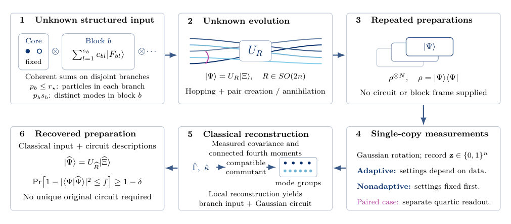 
Figure 1: Setting and reconstruction routes. Fixed core occupations and disjoint input blocks form a tensor product. Each block coherently sums sb disjoint branches with pb ≤r⋆particles each and uses pbsb modes. Filled/open core dots denote occupied/vacant modes. Unknown even Gaussian evolution allows pair creation and annihilation. Independent output copies are measured individually, with settings chosen adaptively or fixed beforehand. Classical processing returns a valid branch input and Gaussian circuit preparing approximately the same state, rather than a unique original preparation. Here |Ξ⟩includes the core and z is an occupation string. Theorem 1 gives the fidelity guarantee; the...

📷 Fig 2

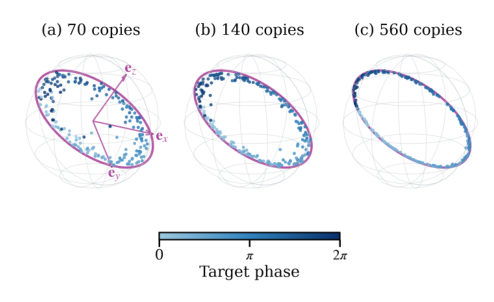 
Figure 2: Quartic reconstruction of singlet-phase states. Magenta marks the target circle; blue points are inde- pendent reconstructions, colored by target phase. Panel (a) marks the orthonormal directions ex, ey, ez of the logical Pauli coordinates. The projection retains leakage; Appendix D gives its geometry, setting and full-state errors.

📷 Fig 3

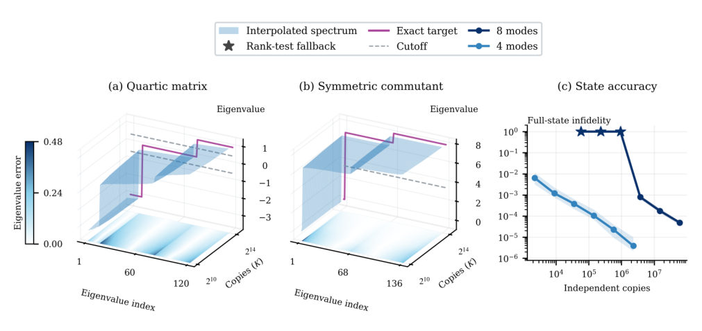 
Figure 3: Measured structure and full-state reconstruction. (a,b) Transparent surfaces interpolate eight-mode quartic and commutant spectra at four measured budgets, with K copies per quartic observable. Magenta gives the exact spectra; gray dashes mark decoder cutoffs on the same back plane. Base-plane colors interpolate absolute eigenvalue errors, from white (zero) to dark blue on a shared scale. (c) Four- and eight-mode full-state infidelity: medians of 24 runs, with shaded 10–90% ranges. Stars mark budgets where every run returned a rank-test fallback; failures remain in the statistics. Larger K improves the observed accuracy overall. Interpolation adds no measurements. Appendix D gives...

📷 Fig 4

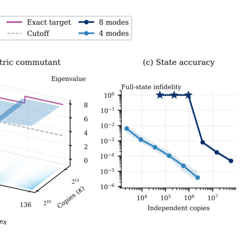 
Figure 2 varies the input phase. Each dot is an indepen- dent reconstruction, expressed in a fixed logical Bloch frame; the evaluator alone undoes the quench to define these coordinates. The exact targets form the magenta great circle. Increasing the copy budget concentrates the learned points near that circle, without renormalizing away leakage from the two-branch subspace. Full-state errors are reported in Appendix D.

📷 Fig 5

 
Figure 3 fixes the input phase at zero. Panels (a,b) use two dimers coupled by the quench. In panel (a), quartic measurement data are assembled into a matrix. Its separated eigenvalue groups show that the structural separation survives the sampled noise; the associated eigenspaces approximate the within-block pair subspace. Panel (b) forms a second matrix from that subspace. Its two low modes approximate the span of the hidden block projectors; diagonalizing their combinations separates the mode groups. The eigenvalues diagnose this sepa- ration, while the eigenvectors carry the reconstruction information. The surfaces interpolate the first acquisition at each measured budget K, the number...

**Summary.** This paper develops theoretical protocols to reconstruct unknown pure fermionic states that evolve under general quadratic Hamiltonians. By utilizing single-copy Gaussian measurements and analyzing higher-order correlations, the authors achieve high-fidelity reconstruction guarantees. This advances the field by providing scalable, resource-bounded methods for characterizing complex quantum states in fermionic systems.

**Why it may be interesting.** This work provides rigorous, resource-bounded protocols for quantum state tomography/characterization in fermionic systems, which is crucial for validating quantum simulation hardware or understanding quantum memory readout.

Detailed structure

**Main problem.** The paper addresses the theoretical problem of reconstructing an unknown pure fermionic state that has undergone a general quadratic evolution, starting from structured, disjoint input blocks.

**Main result.** The authors prove that the state preparation can be reconstructed with high fidelity using polynomial resources in system size and inverse infidelity, even when the evolution involves pair creation/annihilation.

**Method.** The reconstruction relies on adaptive or nonadaptive single-copy Gaussian measurements, analyzing measured covariance and connected quartic correlations to identify the hidden block structure and the governing Gaussian circuit.

**Model / system.** The system involves fermionic states in $n$ modes, structured as a tensor product of disjoint input blocks acted upon by a general quadratic Hamiltonian, which can be passive (number-conserving) or active.

**Key observables.** Covariance ($\hat{\Gamma}$), connected fourth moments ($\hat{\kappa}$), and quartic observables ($B_I$) for the paired-magic orbit.

**Important parameters / regimes.** Fidelity ($f$), failure probability ($\delta$), system size ($n$), and particle cap ($r^\star$).

**Assumptions / limitations.** The state must be preparable in the specific structured form involving disjoint input blocks and a quadratic evolution. The resource bounds are derived for worst-case scenarios.

**Figures summary.** Figure 1 illustrates the state structure and reconstruction routes. Figure 2 shows quartic reconstruction for paired-magic states. Figure 3 compares measured structure and full-state accuracy across different copy budgets.

**Paper structure.** The paper develops general theorems for reconstruction (Theorem 1) and a specialized procedure for the paired-magic orbit (Theorem 2). It details iterative algorithms (Adaptive/Nonadaptive) using spectral analysis of measured observables to recover the preparation circuit.

Abstract

We prove that unknown pure fermionic states prepared from disjoint-branch fixed-particle-number blocks can be reconstructed after general quadratic evolution, including pair creation and annihilation. For a fixed particle cap per block, adaptive or nonadaptive single-copy Gaussian measurements yield classical input and circuit descriptions with prescribed fidelity and confidence, using polynomial resources in system size and inverse infidelity. The adaptive procedure has the sharper copy guarantee. Connected quartic correlations and a covariance-compatible commutant identify the hidden blocks; local states are recovered from fresh measurements or a predetermined bounded-degree moment table. Stable branch recovery gives valid preparation descriptions. Neither particle-number conservation nor block homogeneity is required; no lower bound on branch weights or covariance gaps is assumed. A certified variant returns a passive preparation whenever one exists within the promised family, without advance membership information. On the full Gaussian orbit of paired magic states, quartic measurements alone suffice, with an explicit bound converting observable error into state error.

[↑ back to top](#top)

### [Two-exciton bound states in the Merrifield exciton model](http://arxiv.org/abs/2610.07915v1)

**Authors:** Ning Wu, Runtian Li, Dazhi Xu  
**Type:** theory · **Category:** strongly correlated electrons · **PDF:** <https://arxiv.org/pdf/2610.07915v1>  
**Analysis basis:** full PDF text, analyzed in chunks
**Topic relevance:** `analog quantum simulation` **3/5** · `Frenkel-Kontorova` **1/5** · `Keldysh / 2PI / non-Gaussian methods` **1/5** · `driven-dissipative phase transition` **1/5** · `methods for driven-dissipative` **1/5** · `non-equilibrium universality` **1/5** · `scars & prethermalization` **1/5**

📷 Fig 1

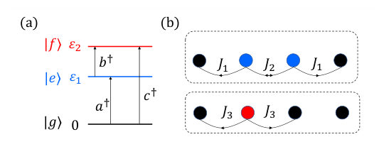 
FIG. 1: (a) Level structure of an individual molecule in the Merrifield exciton model. (b) The three exciton hopping chan- nels measured by J1, J2, and J3. The black, blue, and red solid circles indicate a molecule in the ground state |g⟩, the first excited state |e⟩, and the second excited state |f⟩, re- spectively.

📷 Fig 2

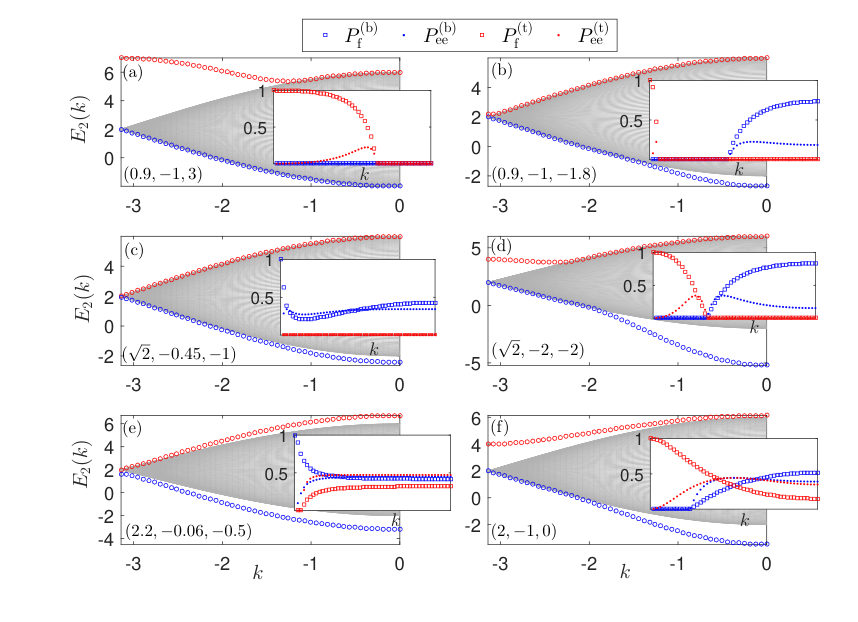 
FIG. 2: Full energy spectra E2(k) in the two-exciton subspace of the Merrifield exciton model calculated through numerical diagonalization of the Bloch Hamiltonian H2(k) (12) for N = 200, ε1 = 1, and k ∈K1. The remaining three parameters (J2, J3, ˜ε) are shown in the left bottom corner of each panel. The lowest and highest two levels E(1) 2 (k) and E(N/2+1) 2 (k) are indicated by blue and red circles, respectively. The middle gray region shows the two-exciton continuum. The insets show the evolution of the weights of the two Bloch states |ξ0(k)⟩and |ξ1(k)⟩in the two states: P (b) f (k) = |V (1) 0 (k)|2 (blue box), P (b) ee (k) = |V (1) 1 (k)|2 (blue dot), P (t) f (k) = |V (N/2+1) 0 (k)|2...

📷 Fig 3

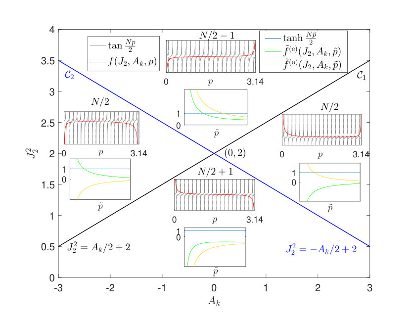 
FIG. 3: The two straight lines defined by J2 2 = Ak/2 + 2 (C1, black) and J2 2 = −Ak/2 + 2 (C2, blue) divide the Ak-J2 2 plane into four regions. Equation (23) has N/2 + 1, N/2, N/2, and N/2 −1 real solutions in the four regions (see the upper insets in each region). Correspondingly, Eq. (26) has one (no) solution above (below) C1; while Eq. (27) has one (no) solution above (below) C2 (see the lower insets in each region).

📷 Fig 4

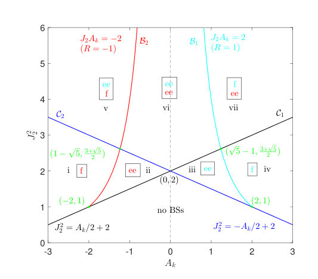 
FIG. 4: The two curves B1,2 : J2Ak = ±2 with R = ±1 divide the three regions in Fig. 3 into seven subregions i-vii, in which the occurrence of the two types of two-exciton bound states are indicated (also summarized in Table I). The intersections of the curves are also shown.

📷 Fig 5

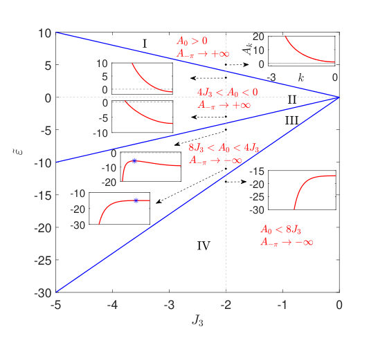 
FIG. 5: The left half of the J3-˜ε plane (with J3 &lt; 0) is di- vided by the three half-lines ˜ε = −2J3, ˜ε = 2J3, and ˜ε = 6J3 into four regions. The insets in each region show the quantity Ak(J3, ˜ε, k) as a function of k on [−π, 0] for several represen- tative points with fixed J3 = −2 and varying ˜ε. The limiting behaviors of Ak as k →0+ and k →(−π)+ are also listed.

**Summary.** This paper rigorously solves the two-exciton problem within the Merrifield exciton model for a 1D chain. By constructing exact Bloch states, the authors prove the existence of at most two types of bound states and analytically map the parameter regimes where these states appear. This work offers crucial benchmarks for understanding multi-exciton dynamics in organic semiconductors.

**Why it may be interesting.** The rigorous analytical solution and mapping of the parameter space provide deep insights into many-body localization and correlation effects in low-dimensional quantum materials, which is highly relevant to AMO physics and open quantum systems.

Detailed structure

**Main problem.** The study aims to understand the formation and dynamics of two-exciton bound states (BSs) in organic semiconductors, which is crucial for designing next-generation materials.

**Main result.** The authors provide a rigorous solution proving that at most two distinct types of two-exciton bound states (f-type and ee-type) can exist in the Merrifield chain, and they map the parameter regions supporting these states.

**Method.** The research involves constructing exact two-exciton Bloch states and applying a plane-wave ansatz to solve the resulting inhomogeneous tridiagonal matrices derived from the two-exciton Hamiltonian.

**Model / system.** The system is modeled by the Merrifield exciton model applied to a finite-size one-dimensional molecular crystal. The Hamiltonian describes the interaction between single-site doubly-excited states and the two-particle scattering continuum.

**Key observables.** Two-exciton bound state eigenenergies and wave functions, characterized by their spatial distribution (f-type vs. ee-type).

**Important parameters / regimes.** Coupling strengths ($J_1, J_2, J_3$), site energies ($\varepsilon_1, \varepsilon_2$), and the total wave number ($k$) across the Brillouin zone.

**Assumptions / limitations.** The analysis assumes periodic boundary conditions and utilizes a plane-wave ansatz for the solution; the model is idealized by neglecting exciton-phonon coupling.

**Figures summary.** Figures illustrate the level structure of the model, the phase diagram showing BS occurrence based on coupling parameters ($J_2, J_3, 	ilde{\epsilon}$), and trajectories showing how BS properties evolve as the wave number $k$ changes.

**Paper structure.** The paper establishes the physical problem, develops the mathematical framework using Bloch states and plane-wave ansatz, analyzes the phase diagram to determine existence conditions for BSs, and finally maps the evolution of these BSs across the entire Brillouin zone.

Abstract

Understanding the formation and dynamics of two-exciton bound states (BSs) is crucial for harnessing multi-exciton phenomena and designing next-generation organic semiconductor materials. While various mechanisms such as intermolecular exciton-exciton interactions or multi-level intramolecular configurations can generate these BSs, a fundamental understanding of their underlying lattice dynamics remains a key challenge. Within this context, the Merrifield exciton model stands out as a premier framework for capturing the intricate quantum mixing between single-site doubly-excited states and two-particle scattering continuum. In this work, by constructing a set of exact two-exciton Bloch states and applying a plane-wave ansatz to treat the resulting inhomogeneous tridiagonal matrices, we provide a complete, rigorous solution to the two-exciton problem in a finite-size Merrifield chain. We analytically map the parameter regions that support two-exciton BSs, proving that at most two distinct types of BSs can emerge, located either above or below the scattering continuum. Furthermore, we provide a quantitative interpretation of how these two types of BSs evolve as a function of the total wave number within the whole Brillouin zone. The obtained closed-form expressions for the eigenenergies and wave functions offer valuable benchmarks for exploring exciton dynamics and optical responses in related molecular aggregates.

[↑ back to top](#top)

### [Long-Range Nonequilibrium Correlations as a Thermodynamic Speedometer](http://arxiv.org/abs/2610.07964v1)

**Authors:** Vinesh Vijayan, Rishma Thilakaraj, Gokila V, Yogeshvari V A  
**Type:** theory · **Category:** statistical mechanics · **PDF:** <https://arxiv.org/pdf/2610.07964v1>  
**Analysis basis:** full PDF text, analyzed in chunks
**Topic relevance:** `non-equilibrium universality` **3/5** · `Keldysh / 2PI / non-Gaussian methods` **1/5** · `correlated / nonlocal dissipation` **1/5** · `driven-dissipative phase transition` **1/5** · `methods for driven-dissipative` **1/5**

📷 Fig 1

 
FIG. 1. This algebraic spectrum originated from the nonlocal curvature of the DLS large-deviation functional and is the static starting point for the dynamical analysis that follows.

📷 Fig 2

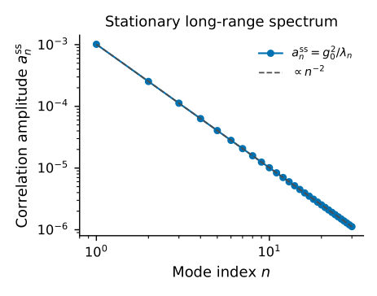 
Fig. 1 demonstrates that, for the boundary-driven SSEP, the long-range correlation spectrum exhibits a de- cay of the mode amplitudes (blue dots) as n−2, in agree- ment with the dashed lines. The dominant correlation

📷 Fig 3

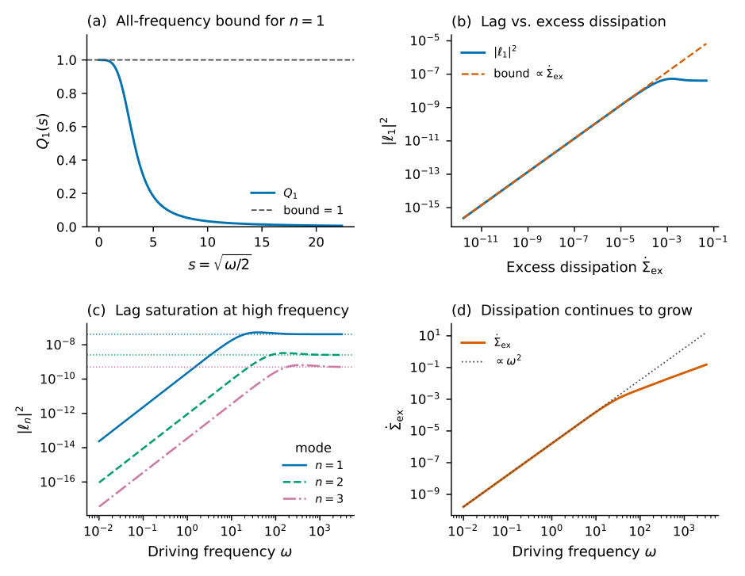 
FIG. 2. Thermodynamic control of the softest correlation mode. (a) The dimensionless ratio Q1(s) remains ≤1 for all driving frequencies and approaches unity in the quasistatic limit s →0. (b) Squared lag of the n = 1 mode as a function of excess entropy production; the dashed line denotes the analytic bound. (c) At high driving frequencies, the lag of each mode saturates to its instantaneous NESS value, while only the n = 1 mode satisfies the all-frequency bound. (d) Excess dissipation continues to increase with frequency, whereas the lag saturates, causing the bound to become progressively looser.

📷 Fig 4

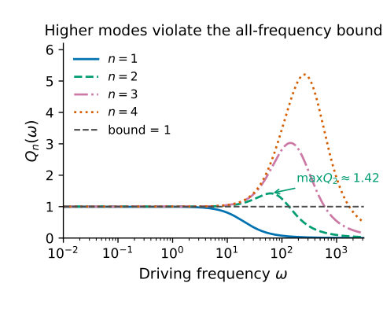 
FIG. 3. Mode-resolved ratio Qn(ω). The horizontal dashed line marks the value 1. While Q1(ω) ≤1 for all frequen- cies, the curves for n = 2, 3, 4 rise above the bound once ω becomes comparable to the corresponding mode relaxation rates, confirming that the all-frequency inequality is special to the softest hydrodynamic mode. The peak of the n = 2 curve reaches max Q2 ≈1.42.

**Summary.** This theoretical work investigates how long-range correlations develop in a driven particle system (SSEP) and connects this behavior to thermodynamic irreversibility. It proves that only the longest-wavelength mode obeys a universal, all-frequency speed limit dictated by the excess entropy production, establishing a deep link between correlation dynamics and non-equilibrium thermodynamics.

**Why it may be interesting.** It provides a rigorous, quantitative connection between macroscopic thermodynamic quantities (dissipation) and microscopic correlation dynamics (long-range correlations) in driven many-body systems, which is highly relevant to non-equilibrium statistical mechanics.

Detailed structure

**Main problem.** The paper aims to establish a quantitative link between the curvature of the large-deviation functional, the long-range correlations in a non-equilibrium steady state (NESS), and the finite-time thermodynamic dissipation.

**Main result.** The longest-wavelength (softest) hydrodynamic mode exhibits a universal, all-frequency bound relating its relaxation lag to the excess entropy production rate, a property not shared by higher spatial modes.

**Method.** The analysis involves linearizing the large-deviation functional and studying the system's response to weak, time-dependent harmonic driving, comparing the resulting correlation lag to bounds derived from excess dissipation.

**Model / system.** The study uses the boundary-driven Symmetric Simple Exclusion Process (SSEP) on a finite interval, which serves as the physical model exhibiting non-equilibrium steady states.

**Key observables.** Long-range correlation amplitude ($a_{ss,n}$), frequency-dependent correlation lag ($\ell_n(\omega)$), and excess entropy production rate ($\dot{\Sigma}_{	ext{ex}}$).

**Important parameters / regimes.** Weak driving regime ($\epsilon \ll 1$), frequency ($\omega$), and spatial mode index ($n$).

**Assumptions / limitations.** The analysis is restricted to the linear-response regime and assumes weak harmonic driving.

**Figures summary.** Figure 1 shows the static correlation spectrum decaying as $n^{-2}$. Figure 2 confirms the softest mode ($n=1$) obeys a bound approaching unity in the quasistatic limit. Figure 3 compares the ratio $Q_n(\omega)$ for different modes, showing $n=1$ is unique in satisfying the bound.

**Paper structure.** The paper develops the framework by relating the large-deviation functional to dissipation, analyzes the response to harmonic driving by mode decomposition, and culminates in proving the unique, all-frequency bound for the $n=1$ mode.

Abstract

Despite purely local microscopic dynamics, nonequilibrium steady states can develop long-range correlations. We investigate this phenomenon in the boundary-driven symmetric simple exclusion process by relating its exact nonlocal large-deviation functional to finite-time thermodynamic irreversibility under weak time-dependent driving. Decomposing the long-range correlations into hydrodynamic modes, we find that the lag associated with the slowest mode satisfies an upper bound determined by the excess entropy production rate at each driving frequency. This bound is approached in the quasistatic limit, whereas progressively shorter-wavelength modes do not generally satisfy the corresponding bound. These results provide a quantitative connection between the curvature of the large-deviation functional, long-range correlations in the nonequilibrium steady state, and finite-time dissipation. Within the linear-response regime considered here, they indicate that the longest-wavelength hydrodynamic mode has a distinct relation between slow relaxation and thermodynamic irreversibility.

[↑ back to top](#top)

### [Multi-time advantage for certifying quantum coherence](http://arxiv.org/abs/2610.08241v1)

**Authors:** Karol Sajnok, Fabio Costa  
**Type:** both · **Category:** quantum information and computing · **PDF:** <https://arxiv.org/pdf/2610.08241v1>  
**Analysis basis:** full PDF text, analyzed in chunks
**Topic relevance:** `QC/QI experiment` **3/5** · `correlated / nonlocal dissipation` **1/5** · `driven-dissipative phase transition` **1/5** · `methods for driven-dissipative` **1/5** · `quantum measurements` **1/5**

📷 Fig 1

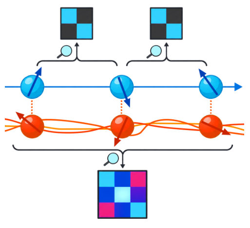 
Figure 1. Schematic illustration of multi-time coherence. A persis- tent memory correlates the system evolution across successive time intervals, so that coherence can be present in the full multi-time pro- cess even when the corresponding pairwise channels are incoherent.

📷 Fig 2

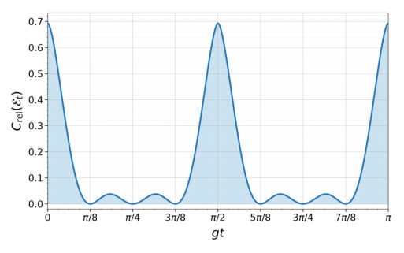 
Figure 2. Relative entropy of coherence Crel(Et) of the reduced channel as a function of the dimensionless interaction time gt. The coherence vanishes whenever γ(t) = cos(4gt) cos(2gt) = 0, corre- sponding to a completely dephasing reduced channel.

📷 Fig 3

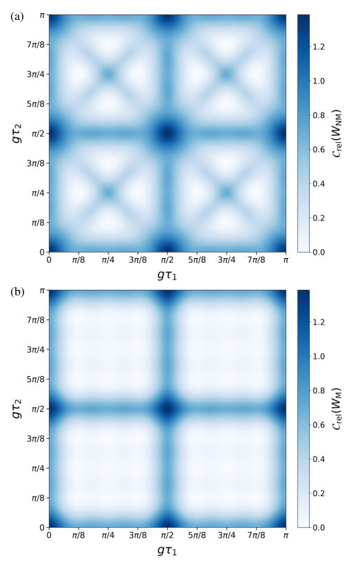 
Figure 3. Relative entropy of coherence (a) for the non-Markovian multi-time process and (b) for the corresponding Markovian process as functions of τ1 and τ2. The Markovian coherence vanishes when both reduced channels are incoherent, whereas the non-Markovian process retains nonzero coherence.

📷 Fig 4

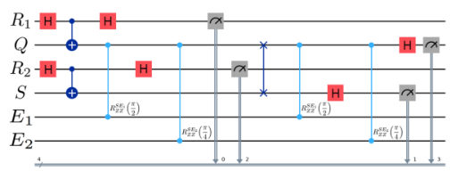 
Figure 4. Ancilla-assisted measurement of the three-time process. Two Bell pairs retain the input and output Choi legs of the two con- secutive intervals, while the same environmental qubits E1, E2 in- teract with the system in both intervals. A SWAP at the intermediate time stores the first output and injects the second Choi probe. The four visible process legs are measured in the X basis by applying Hadamard gates followed by computational-basis measurements to evaluate the witness expectation value.

📷 Fig 5

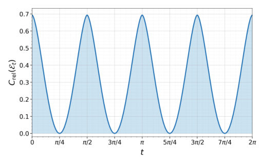 
Figure 5. Relative entropy of coherence of the reduced fixed-origin channel Et. The channel is completely dephasing at t = π

**Summary.** This paper introduces a concept of multi-time quantum coherence, showing that the full process history can retain quantum coherence even if all individual time steps or pairwise channels are classically mixed. By using an Ising model and superconducting QPU simulations, the authors demonstrate that memory effects across intermediate times are necessary to certify this coherence, surpassing the limitations of standard Markovian descriptions.

**Why it may be interesting.** This work directly tackles the limitations of standard open quantum system descriptions by introducing a rigorous measure for coherence that captures memory effects across sequential operations, which is crucial for understanding realistic quantum computation.

Detailed structure

**Main problem.** The paper addresses how to certify quantum coherence in multi-time quantum processes when standard state- or channel-based tests fail to detect it.

**Main result.** Multi-time access to intermediate times can reveal coherence in the full process even when all corresponding pairwise channels are individually incoherent.

**Method.** The authors define process coherence using the relative entropy of coherence and compare the full process operator to its reduced, pairwise channels.

**Model / system.** The study uses an Ising model as a proof of principle and demonstrates the concept on a superconducting quantum processor (QPU) using full process tomography.

**Key observables.** Relative entropy of coherence ($C_{rel}$), process operators ($W$), and pairwise channel coherence.

**Important parameters / regimes.** The coherence is shown to persist even when individual channels are fully dephasing, contrasting with Markovian expectations.

**Assumptions / limitations.** The standard description of open-system dynamics (fixed initial to later times) is insufficient, necessitating the multi-time framework.

**Figures summary.** Figures schematically illustrate multi-time coherence, showing how persistent memory correlates evolution across successive time intervals, leading to coherence in the full process even if pairwise channels are incoherent.

**Paper structure.** The paper develops the concept of multi-time processes, defines process coherence, and then uses the Ising model (and superconducting QPU simulation) to demonstrate that non-Markovian, multi-time correlations preserve coherence when pairwise channels lose it.

Abstract

Non-classical dynamics in open quantum systems can be hidden in temporal correlations that are invisible to standard state- and channel-based tests. We define coherence for multi-time quantum processes and show that access to intermediate times can reveal coherence absent from all corresponding pairwise channels. Incoherent processes are fixed points of dephasing on all input and output spaces, and their coherence is quantified by relative entropy. As a proof of principle, we use an Ising model in which all three pairwise channels are incoherent while the full three-time process remains coherent. We observe this multi-time coherence on a superconducting quantum processor using a coherence witness and full process tomography.

[↑ back to top](#top)

### [Quantum Data Ruler](http://arxiv.org/abs/2610.07827v1)

**Authors:** Wangjun Lu  
**Type:** theory · **Category:** other · **PDF:** <https://arxiv.org/pdf/2610.07827v1>  
**Analysis basis:** full PDF text, analyzed in chunks
**Topic relevance:** `quantum measurements` **3/5** · `analog quantum simulation` **1/5** · `correlated / nonlocal dissipation` **1/5** · `driven-dissipative phase transition` **1/5** · `methods for driven-dissipative` **1/5**

📷 Fig 1

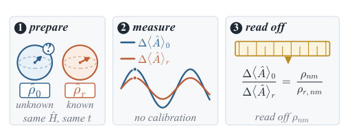 
FIG. 1. Quantum data ruler. An unknown state ˆρ0 and a known reference ˆρr evolve under the same ˆH; the ratio of the measured changes ∆⟨ˆA⟩(t) equals the ratio of the initial matrix elements, so the unknown is read off against the known scale.

📷 Fig 2

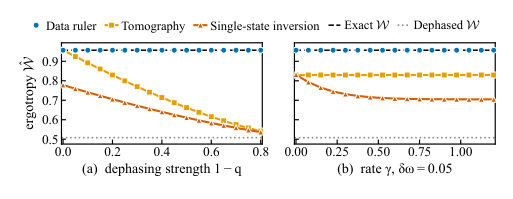 
FIG. 2. Ergotropy from the ruler (circles), direct tomography at t = 0 (squares), and single-state inversion with level error δω = 0.05 (triangles), vs. (a) the common-mode dephasing strength 1−q (q is the retained coherence) and (b) the evolu- tion dephasing γ. Dashed: exact W; dotted: W( ˆDˆρ0). Three levels, ˆH = diag(0, 1.37, 3.04).

**Summary.** The paper introduces the Quantum Data Ruler, a novel measurement technique that determines unknown quantum state parameters by taking a ratio of signal changes between the unknown state and a known reference state. This ratio measurement is shown to be exact regardless of the system's Hamiltonian or evolution time, and crucially, it remains unbiased even when the system suffers from dephasing or amplitude damping. It offers a robust alternative to standard quantum tomography for characterizing coherence.

**Why it may be interesting.** This work provides a powerful, general measurement tool for quantum states that is highly resilient to common sources of decoherence (dephasing, amplitude damping), making it theoretically significant for characterizing quantum memories or quantum computation components.

Detailed structure

**Main problem.** To develop a robust measurement technique, the 'Quantum Data Ruler,' capable of accurately characterizing unknown quantum states by comparing their evolution ratio against a known reference, thereby overcoming limitations imposed by noise and standard tomography.

**Main result.** The ratio measurement is exact for arbitrary time and Hamiltonian, is unbiased under specific noise models (dephasing/amplitude damping), and successfully recovers coherence lost in standard two-point measurements.

**Method.** The core method involves calculating the ratio of changes in expectation values ($\Delta\langle\hat{A}
angle$) for the unknown state ($\hat{
ho}_0$) versus the reference state ($\hat{
ho}_r$) over time $t$. This ratio cancels time-dependent Hamiltonian evolution factors.

**Model / system.** The analysis considers general quantum systems evolving under an arbitrary Hamiltonian $\hat{H}$ and subjected to dissipation modeled by a Lindbladian. The system is analyzed using energy eigenbases $\{|E_n
angle\}$ and involves concepts like ergotropy and coherence.

**Key observables.** Matrix elements of the density matrix ($
ho_{nm}$), Coherent Ergotropy ($\hat{W}$), Eigen-operator residual, and the ratio of expectation value changes.

**Important parameters / regimes.** Time $t$, Hamiltonian $\hat{H}$, Dephasing strength ($1-q$), and the structure of the Lindblad jump operators ($\hat{L}_\alpha$).

**Assumptions / limitations.** The method assumes the ratio structure holds, which requires the observable to be an eigen-operator under the Lindbladian evolution. The analysis also considers specific noise models (e.g., amplitude damping being immune).

**Figures summary.** Figure 2 compares Ergotropy measurements using the ruler versus direct tomography and single-state inversion under varying dephasing strengths, showing the ruler's superior robustness. Other figures detail eigen-operator residuals and population dynamics in dark sectors.

**Paper structure.** The paper first introduces the Quantum Data Ruler identity, proving its time and Hamiltonian independence. It then analyzes its robustness against noise (Theorem 3) and compares it to standard methods like Two-Point Measurement. Finally, it delves into the necessary and sufficient conditions for the method's validity under dissipation, requiring specific structural properties of the Lindblad jump operators.

Abstract

A ruler reads an unknown length against a calibrated scale. The quantum data ruler reads a matrix element of an unknown state against the signal of a known reference, from their ratio. It is exact for any Hamiltonian and any time, since transition operators change by a state-dependent constant times one function of time, removing the vanishing-signal limit. The readout is unbiased under dephasing and amplitude damping, and recovers the coherent ergotropy of a quantum battery that two-point measurement erases. The structure survives the classical limit as action--angle Fourier modes.

[↑ back to top](#top)

### [Quantum telescopy with realistic anti-correlated optical fields as references](http://arxiv.org/abs/2610.07806v1)

**Authors:** Xuan Tang, Z. Y. Ou  
**Type:** theory · **Category:** other · **PDF:** <https://arxiv.org/pdf/2610.07806v1>  
**Analysis basis:** full PDF text, analyzed in chunks
**Topic relevance:** `interference shaping light` **3/5** · `quantum measurements` **3/5**

📷 Fig 1

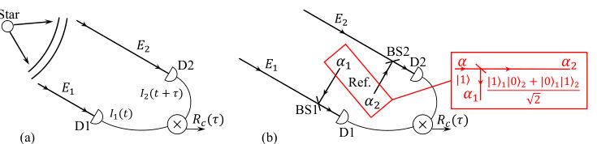 
FIG. 1. (a) Traditional HBT intensity interferometer; (b) Phase sensitive HBT scheme with coherent reference fields. Red inset: Creation of coherence between reference fields by beam splitter and use of a spatially entangled single-photon state as the reference fields as proposed by Grottesman et al [6].

📷 Fig 2

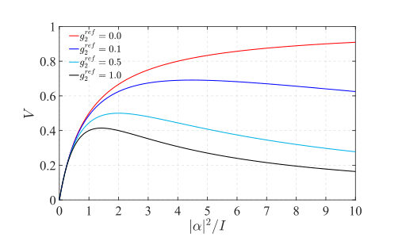 
FIG. 2. Visibility of phase-dependent HBT effect as a function of |α|2/I for reference sources with gref 2 = 0 (red), 0.1 (blue), 0.5 (sky blue), 1.0 (black).

📷 Fig 3

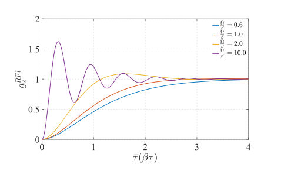 
FIG. 3. Normalized intensity correlation function gRF l 2 of resonance fluorescence verses ¯τ ≡βτ for Ω/β =10, 2, 1, 0.5.

📷 Fig 4

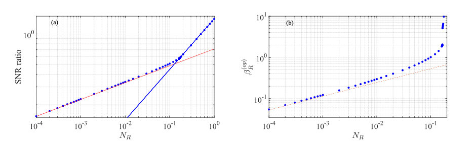 
FIG. 4. (a) The optimized SNR ratio and (b) β(op) R versus the photon number NR of the incoming field. Circles are from numerical simulation. The red line in (a) is from Eq.(12) for the scheme with resonance fluorescence and the blue line in (a) is from Eq.(9) for the coherent state scheme. The dashed red line in (b) is from Eq.(12) for β(op) R .

📷 Fig 5

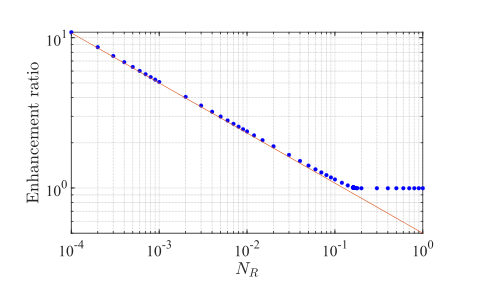 
FIG. 5. Enhancement ratio as a function of input photon number NR in log scale. The solid line is from Eq.(13).

**Summary.** This paper analyzes quantum telescopy, a technique for enhancing astronomical resolution using entangled photons. It compares the achievable Signal-to-Noise Ratio (SNR) when using realistic anti-bunched sources versus idealized or coherent state references. The key finding is that even with imperfections, the anti-bunched source method maintains a significant advantage over coherent state references in the weak light regime.

**Why it may be interesting.** It provides a detailed theoretical framework for optimizing quantum measurements in quantum optics, specifically addressing the practical limitations of using non-ideal quantum sources for high-precision sensing.

Detailed structure

**Main problem.** The paper aims to improve the angular resolution in optical astronomy beyond the diffraction limit by utilizing quantum telescopy techniques.

**Main result.** The Signal-to-Noise Ratio (SNR) using a realistic anti-bunched source can still outperform the coherent state scheme in the weak incoming field limit, guiding future experimental optimization.

**Method.** The analysis involves deriving and optimizing the SNR for quantum interferometry by considering realistic imperfections like finite bandwidth and detector efficiency.

**Model / system.** The system models quantum telescopy using spatially entangled single-photon states generated from practical anti-bunched sources (like resonance fluorescence) as references for stellar interferometry.

**Key observables.** Signal-to-Noise Ratio (SNR), Visibility (V), and Coincidence count rate (Rc).

**Important parameters / regimes.** Weak incoming field limit ($N_R \ll 1$), detector efficiency ($\eta$), and source correlation parameters ($eta, \Omega$).

**Assumptions / limitations.** Assumes incoming fields and reference fields are uncorrelated, and makes approximations regarding the asymptotic behavior of correlation functions for weak fields.

**Figures summary.** Figures illustrate the comparison between traditional HBT, phase-sensitive HBT with coherent references, and the use of entangled single-photon states as references.

**Paper structure.** The paper progresses by detailing the phase-dependent HBT effect, incorporating practical constraints, analyzing anti-bunched sources from resonance fluorescence, deriving the SNR formula, and finally optimizing parameters.

Abstract

Quantum telescopy, proposed by Grottesman et al., uses spatially entangled single-photon states to modify HBT stellar interferometry, potentially surpassing Michelson interferometry in resolution without baseline limits. However, finite source bandwidth, non-unit efficiency, detector response times, and celestial light bandwidth all affect its effectiveness. In this work, we consider a spatially entangled singe-photon state generated by beam-splitting a practical anti-bunched photon source from resonance fluorescence, which is a common method of generating single-photon states, and evaluate the signal level in quantum telescopy with inclusion of imperfection of detection system and finite bandwidth of celestial light. Here, given the incoming light, we optimize the parameters of the anti-bunched photon source and the detector system for the best signal-to-noise ratio (SNR), which can match that of the Michelson method in the ideal case but is always smaller in the realistic case. Alternatively, weak coherent states from heavily attenuated lasers can replace the entangled single-photon state but suffer low signal level, similar to HBT method. We find that the SNR with a realistic anti-bunched source for producing the reference fields can still beat the SNR of the coherent state scheme in the weak incoming field limit. The optimized parameters for the anti-bunched source and detection system will be a guide for future experimental endeavor.

[↑ back to top](#top)

### [Quasiparticle-resolved variational theory of Andreev spin qubits](http://arxiv.org/abs/2610.08557v1)

**Authors:** Teodor Iličin, Rok Žitko  
**Type:** theory · **Category:** strongly correlated electrons · **PDF:** <https://arxiv.org/pdf/2610.08557v1>  
**Analysis basis:** full PDF text, analyzed in chunks
**Topic relevance:** `Keldysh / 2PI / non-Gaussian methods` **3/5** · `methods for driven-dissipative` **3/5**

📷 Fig 1

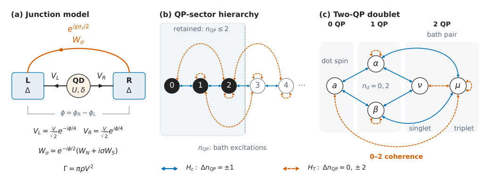 
FIG. 1. Microscopic two-path model and QP-sector couplings of an Andreev spin qubit. (a) A single interacting quantum-dot orbital (QD), with Coulomb repulsion U and detuning δ, couples to two superconducting leads with gap ∆via spin-independent amplitudes VL, VR. The curved path represents effective tunneling through inactive orbitals, with spin-dependent amplitude Wσ. The factor eiχσz/2 denotes its spin-dependent phase. Arrows in (a) specify the coefficients of c† lkσdσ and c† LkσcRk′σ, whereas the conjugate pairs are implicit. (b) Bath-QP sectors relative to the isolated BCS leads. Dot–lead hopping Hc connects adjacent sectors (blue solid links), while HT scatters within sectors or...

📷 Fig 2

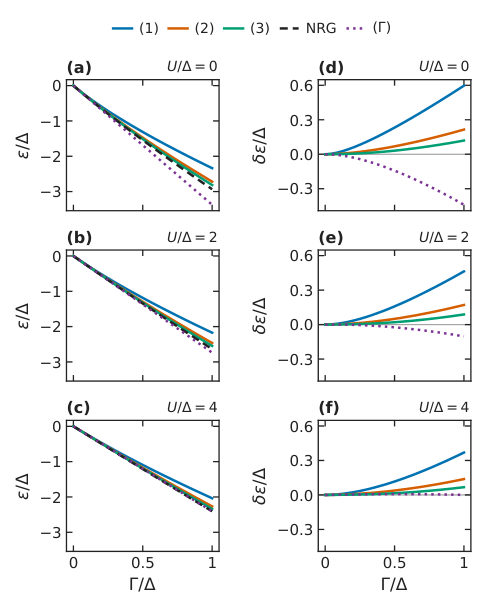 
FIG. 2. Energy benchmarks. (a)–(c) Doublet energy ϵ ver- sus hybridization Γ at ϕ = 0 for U/∆= 0, 2, 4, respectively. Solid: variational solutions at different approximation levels; dashed: NRG; dotted: linear expansion ϵ(Γ). (d)–(f) Discrep- ancies δϵ(i) = ϵ(i) −ϵ(NRG) of the three approximation levels and the linear expansion relative to NRG at the correspond- ing U.

📷 Fig 3

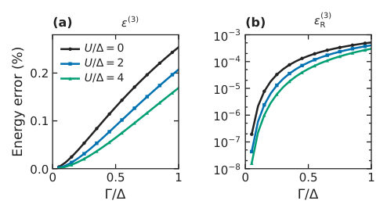 
FIG. 3. Accuracy of the level-3 approximation within the two-quasiparticle variational space at ϕ = 0, D/∆= 100, and W = 0. (a) Relative total-energy error 100[ϵ(3) −ϵ2QP]/|ϵ2QP| of the scalar kernel closure. (b) Relative error 100[ϵ(3) R − ϵ2QP]/|ϵ2QP| of the Rayleigh quotient evaluated with the nor- malized level-3 wavefunction constructed at ϵ(3). Here ϵ2QP is the lowest energy of the full projected 2-QP Hamiltonian. Both errors are expressed in percentages, with a linear verti- cal scale in (a) and a logarithmic vertical scale in (b).

📷 Fig 4

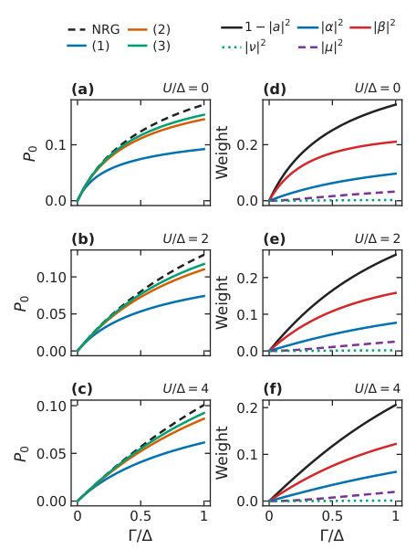 
FIG. 4. Wavefunction benchmarks at ϕ = 0. (a)–(c) Empty- dot probability P0 versus Γ for U/∆= 0, 2, 4, respectively: NRG results and estimates from the normalized variational wavefunctions at approximation levels 1–3. (d)–(f) Weight outside the 0-QP sector, 1 −|a|2, and individual 1-QP and 2- QP component weights, calculated from the normalized level- 3 wavefunction.

📷 Fig 5

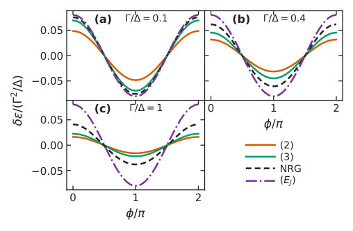 
FIG. 6. Shifted and rescaled doublet energy ϵ versus su- perconducting phase difference ϕ at U = 2∆for (a)–(c) Γ/∆= 0.1, 0.4, 1. Solid: level-2 and level-3 approximations; dash-dotted: the leading low-Γ result of Eqs. (51)–(53), eval- uated with the finite-band coefficient JD(U/∆) defined in Eq. (S20); dashed: NRG. Each curve is shifted by its phase average ¯ϵ = (2π)−1 R 2π 0 ϵ(ϕ) dϕ, evaluated by trapezoidal in- tegration with periodic closure on the supplied grids for the numerical curves, and rescaled by Γ2/∆(δϵ = ϵ(ϕ) −¯ϵ).

**Summary.** This work presents a quasiparticle-resolved variational theory for Andreev spin qubits, treating the system as a quantum dot coupled to superconducting leads. By retaining up to two Bogoliubov quasiparticles, the authors derive analytical expressions for Josephson couplings, demonstrating the crucial role of virtual excitations in determining qubit behavior. This connects complex strongly correlated physics to practical circuit modeling.

**Why it may be interesting.** It provides a highly detailed, analytically tractable framework for understanding superconducting quantum circuits by explicitly resolving the role of virtual quasiparticle excitations in determining macroscopic couplings.

Detailed structure

**Main problem.** The paper develops a quasiparticle-resolved variational theory to accurately model the energy splittings and Josephson couplings in Andreev spin qubits (ASQs).

**Main result.** The theory shows that two-quasiparticle configurations significantly contribute to the spin-dependent Josephson coupling, and it provides closed-form expressions connecting correlated dot models to effective circuit Hamiltonians.

**Method.** A continuum variational approach is employed, retaining configurations up to two Bogoliubov quasiparticles, and results are benchmarked against NRG/DMRG calculations.

**Model / system.** The system is an Andreev spin qubit realized in a quantum-dot Josephson junction, modeled by coupling an Anderson Impurity Model (AIM) to superconducting leads described by the BCS Hamiltonian.

**Key observables.** Josephson energies ($E_J, E_S$), quasiparticle composition, and site-resolved density matrices ($\varrho_s$).

**Important parameters / regimes.** Coulomb interaction ($U$), superconducting gap ($\Delta$), detuning ($\delta$), and superconducting phase difference ($\phi$).

**Assumptions / limitations.** The theory focuses on the odd-parity sector and utilizes variational approximations by truncating the QP configuration space to two quasiparticles.

**Figures summary.** Figures illustrate the microscopic model, the QP-sector hierarchy, and show convergence checks for observables like empty-dot probability and linear spin response against DMRG/NRG results.

**Paper structure.** The paper moves from defining the microscopic Hamiltonian (AIM coupled to BCS leads) to developing the variational ansatz, solving the resulting coupled integral equations in the continuum limit, and finally calculating specific observables like energy splittings and density matrices.

Abstract

An Andreev spin qubit stores a single unpaired spin, yet its coupling to the superconducting phase can be dominated by coherent virtual quasiparticle pairs. We develop a continuum variational description of the odd-parity doublet in a quantum-dot Josephson junction with Coulomb interaction and spin-dependent background tunneling. Retaining configurations with up to two Bogoliubov quasiparticles provides compact analytical expressions for energies and wavefunctions. We benchmark the results against numerical renormalization group calculations and identify sources of error. We obtain closed-form expressions for the conventional and spin-dependent Josephson couplings. Despite their small probability, two-quasiparticle configurations, through coherence with the zero-quasiparticle component, supply exactly half of the leading spin-dependent Josephson coupling even without Coulomb repulsion and dominate it as the repulsion grows. Spin-orbit-induced spin transfer between the dot and the leads produces a Josephson-current contribution that is common to both qubit states and finite at zero phase bias when the dot and lead Zeeman energies differ. We also map the localization of the virtual quasiparticles and the spin density in the leads. The results connect strongly correlated quantum-dot models to effective Hamiltonians used for Andreev-spin-qubit circuits and clarify how the wavefunction structure determines their couplings.

[↑ back to top](#top)

### [Quantifying the fidelity of a quantum memory](http://arxiv.org/abs/2610.08445v1)

**Authors:** Victor Barizien, Sophie Egelhaaf, Angelo Gelmini Rodriguez, Louis Nicolas, Théo Sanchez Mejia, Mikael Afzelius, Pavel Sekatski, Nicolas Brunner  
**Type:** both · **Category:** quantum information and computing · **PDF:** <https://arxiv.org/pdf/2610.08445v1>  
**Analysis basis:** full PDF text, analyzed in chunks
**Topic relevance:** `QC/QI experiment` **3/5** · `quantum measurements` **2/5**

📷 Fig 1

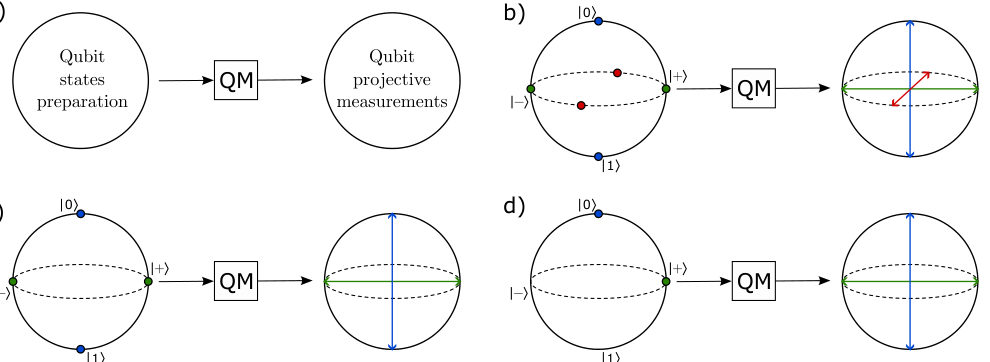 
FIG. 1. Estimating the average channel fidelity Favg of a qubit memory in a prepare-and-measure setup. The general idea is presented in (a): a set of qubit states is prepared, stored in a quantum memory, and then measured via a set of projective measurements. This is illustrated with the representation of a 6 states (b), 4 states (c) and 2 states (d) strategies that can be used to characterize the fidelity of the memory via the quantity Favg. For each case, the coloured dots on the left hand side are the states (on the Bloch sphere) that need to be prepared, and the coloured arrows on the right hand side are the directions to measure on after the memory. When preparing a state of a given...

📷 Fig 2

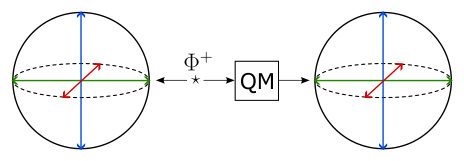 
FIG. 2. The average channel fidelity can also be estimated in an entanglement-based setup. A source prepares a max- imally entanglement state Φ+ = Φ+ Φ+ with Φ+ = (|00⟩+ |11⟩)/ √

📷 Fig 3

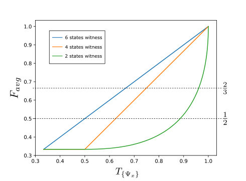 
FIG. 3. Lower bound on the average channel fidelity Favg(M, id) of a qubit memory M as a function of the witness value T{Ψx} using 2, 4 and 6 states (respectively in green, or- ange and blue). For the 6-state witness, the quantity T{Ψx} corresponds to Favg. The 4- and 2-state protocols provide lower bounds on Favg, which are computed via an SDP opti- miasation, as described in Appendix B. Certifying a fidelity Favg &gt; 2/3 ensures that the channel is not entanglement- breaking, while Favg &gt; 1/2 guarantees the channel is not correlation-breaking.

📷 Fig 4

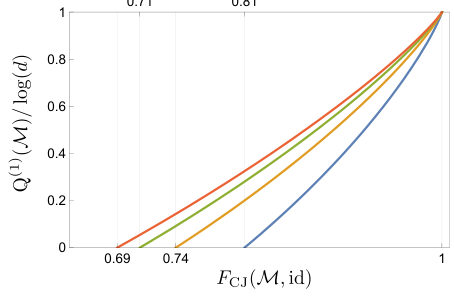 
FIG. 4. A lower bound on the single-letter quantum channel capacity Q(1)(M) normalized by the ideal value log(d), as a function of the Choi-Jamio lkowski fidelity of the channel FCJ(M, id), in dimension d = 2, 3, 4, 5 (from bottom to top). The numerical values give the threshold fidelity below which no positive quantum capacity is guaranteed.

📷 Fig 5

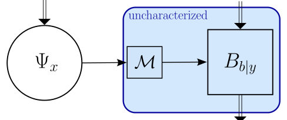 
FIG. 5. Semi-device-independent scenario for certifying the quantum memory. The preparation device is assumed to be trusted, i.e. upon receiving the classical input x, the de- vice produces the state Ψx which is then stored in the quan- tum memory M. The output state of the memory is then measured through a device which is a priori uncharacterized, where y denotes the measurement choice and b its outcome. From the observed statistics, p(b|ψx, y), one can lower bound the average channel fidelity of the quantum memory.

**Summary.** This work establishes a comprehensive framework to certify the performance of quantum memories by quantifying their average channel fidelity. The authors utilize methods based on 2-designs and entanglement testing, which allow for precise estimation from limited experimental measurements. The framework is successfully applied to solid-state quantum memory, achieving a high fidelity certification of 98.6%.

**Why it may be interesting.** The rigorous quantification of memory fidelity using established quantum information tools (like 2-designs and Choi fidelity) provides a direct, measurable benchmark for quantum hardware development.

Detailed structure

**Main problem.** The paper develops a general, operational, and efficient framework for certifying the performance and quantifying the fidelity of quantum memories.

**Main result.** The authors successfully certified an average channel fidelity of 98.6% for a solid-state quantum memory experiment, demonstrating the framework's practical utility.

**Method.** They quantify fidelity using the average channel fidelity, estimated via a 2-design formed by a finite set of probe states, and also using entanglement-based and semi-device-independent techniques.

**Model / system.** The system modeled is a quantum memory, treated mathematically as a quantum channel $M$ mapping input states to output states. The ideal memory is the identity channel.

**Key observables.** Average channel fidelity ($F_{	ext{avg}}$), Choi fidelity ($F_{	ext{CJ}}$), and average efficiency ($\eta(M)$).

**Important parameters / regimes.** Storage time (e.g., $10 \mu	ext{s}$ or $125 \mu	ext{s}$), dimensionality ($d$), and the number of probe states used in the 2-design.

**Assumptions / limitations.** The primary approximation is replacing the integral over all pure states (Haar measure) with an estimate derived from a finite set of probe states forming a 2-design.

**Figures summary.** Figure 1 illustrates estimating $F_{	ext{avg}}$ for a qubit memory using prepare-and-measure setups with varying numbers of probe states (2, 4, or 6).

**Paper structure.** The paper introduces the framework, details the 2-design estimation for prepare-and-measure scenarios, discusses entanglement-based and semi-device-independent testing, and concludes with applications to solid-state memory experiments.

Abstract

Quantum memories are key ingredients for future quantum networks. Developing methods for their certification is therefore an important, yet challenging, problem. In this work, we present a general framework for certifying quantum memories and quantifying their performance in an operational and efficient manner, taking advantage of developments in the theory of quantum channels. We start by giving a pedagogical introduction to these concepts and tools and illustrate their natural application to quantum memories. Specifically, we quantify the fidelity of a quantum memory via the notion of average channel fidelity, which can be estimated precisely in an experiment via a finite set of probe states forming a so-called $2$-design. We then present a number of witnessing techniques for certifying this quantity, and show that it gives access to other important properties of the channel, such as its dimensionality and its capacity to transmit quantum information. We consider mostly a simple prepare-and-measure scenario, but discuss also the case of an entanglement-based setup, as well as a semi-device-independent approach. Finally, we apply these methods to a solid-state quantum memory experiment, certifying an average channel fidelity of 98.6%. Our certification methods can be readily applied to other quantum devices, such as fibers, transducers and gates.

[↑ back to top](#top)

### [Heavy-fermion hybridization waves from Dirac spinons near a Kondo-breakdown quantum phase transition](http://arxiv.org/abs/2610.07146v1)

**Authors:** Pedro M. Cônsoli, Matthias Vojta, Onur Erten  
**Type:** theory · **Category:** strongly correlated electrons · **PDF:** <https://arxiv.org/pdf/2610.07146v1>  
**Analysis basis:** full PDF text, analyzed in chunks
**Topic relevance:** `Keldysh / 2PI / non-Gaussian methods` **3/5** · `analog quantum simulation` **1/5**

📷 Fig 1

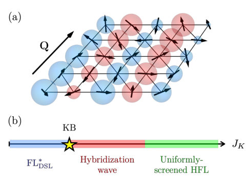 
Figure 1. (a) Kondo hybridization wave (HW) with a two- sublattice unit cell and ordering wavevector Q on the triangu- lar lattice. The spatial profile of Kondo screening is encoded in the radii of the spheres surrounding the local magnetic moments. Blue and red spheres mark the different sublat- tices. (b) Schematic zero-temperature phase diagram of a Kondo lattice as a function of the Kondo coupling JK. The HW emerges at intermediate couplings, between a fractional- ized Fermi liquid with a Dirac spin-liquid component (FL∗ DSL) and a uniformly-screened heavy Fermi liquid. The yellow star marks the Kondo-breakdown (KB) transition.

📷 Fig 2

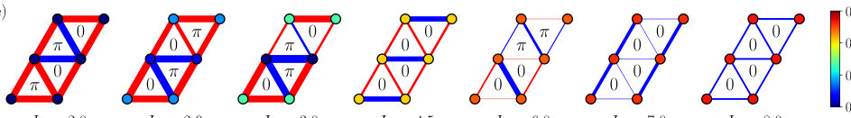 
Figure 2. (a) Triangular lattice with sublattices A and B. The unit cell of our mean-field calculations is illustrated in the center, where we have labeled the four independent fluxes, Φ1, . . . , Φ4, and represented the six χ fields as directed bonds of different colors. (b) Mean-field phase diagram for L = 150, JH = 0.2, κ = 1, and kBT = 10−3. The hatched portions correspond to hybridization waves (HW), which arise in the proximity of a fractionalized Fermi liquid (FL∗ 0π0π). The dashed lines separate regions with spatially uniform (right) and nematic (left) absolute values of the χ fields. Different flux sectors are distinguished by the colors in the background. (c,d) Numerical results...

📷 Fig 3

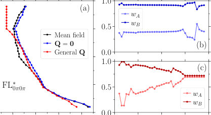 
Figure 3. Perturbation-theory results for the same parame- ters used in Fig. 2(b). (a) Comparison between the mean- field FL∗ 0π0π phase boundary (black) and the critical cou- plings Jc K(nc) obtained for the restricted Q = 0 (blue) and the general-Q (red) theories. (b,c) Sublattice weights wµ = ⟨bµ(Q)⟩/ ⟨b−(Q)⟩for the onset of screening in (b) Q = 0 and (c) general-Q instabilities.

📷 Fig 4

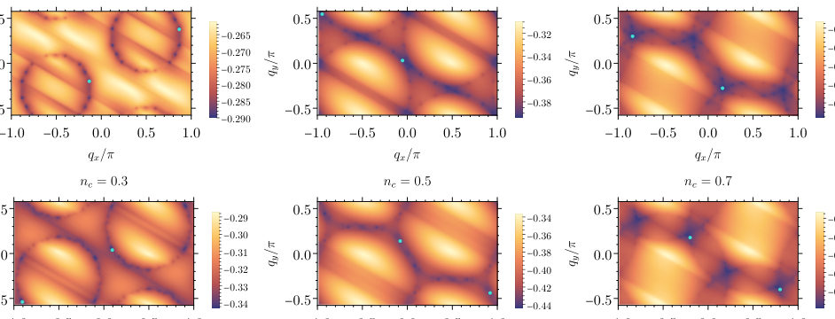 
Figure 4. Density plot of p−(q, 0) for different fillings. The turquoise dots indicate the position of the minima, which determine the critical Kondo coupling, Jc K = −[minq p−(q, 0)]−1. The data were generated for a finite system with L = 150 and parameters kBT = 10−3, JH = 0.2, and κ = 1.

**Summary.** This theoretical work investigates how hybridization waves can emerge in heavy-fermion materials near a quantum phase transition where Kondo screening breaks down. Using mean-field theory on a Kondo-Heisenberg lattice, the authors predict that the wave's periodicity is determined by the geometry connecting Dirac spinon nodes to the conduction electron band structure. It provides a detailed theoretical framework for understanding modulated electronic states in strongly correlated quantum magnets.

**Why it may be interesting.** The detailed theoretical mapping of a quantum phase transition in a strongly correlated system, linking itinerant electron behavior (Fermi liquid) to localized moment physics (spin liquid) via a modulated state, is highly relevant to understanding exotic quantum materials.

Detailed structure

**Main problem.** The paper proposes a theoretical mechanism for the emergence of spatially modulated hybridization waves (HWs) in frustrated Kondo lattices that remain paramagnetic and exhibit no magnetic order.

**Main result.** HWs are predicted to arise when a heavy Fermi liquid approaches a Kondo-breakdown quantum phase transition into a state featuring a Dirac spin liquid (DSL). The wave's periodicity is set by a momentum connecting nodes in the Dirac spinon dispersion to the electronic band structure.

**Method.** The analysis employs a combination of parton mean-field theory, Hubbard-Stratonovich transformations, and perturbative calculations applied to a minimal Kondo-Heisenberg lattice model.

**Model / system.** The system is modeled by a Kondo-Heisenberg lattice Hamiltonian coupling conduction electrons ($H_t$) to local moments ($H_K, H_H$). The study analyzes the competition between Kondo screening and inter-moment interactions.

**Key observables.** Kondo screening strength ($|b_a|$), bond variables ($\chi_{jb,ia}$), and four fluxes ($\Phi_1, \dots, \Phi_4$) characterizing the spinon state.

**Important parameters / regimes.** Kondo temperature ($T_K$), intermoment exchange ($J_H$), and the coupling strength $J_K$, which dictate the proximity to the Kondo-breakdown transition.

**Assumptions / limitations.** The analysis relies on large-N mean-field theory approximations, and some calculations assume invariance under two-site unit cell translations or restrict variables (e.g., real $\chi$ for DSL).

**Figures summary.** Figures illustrate the Kondo HW state relative to the heavy Fermi liquid phase in a phase diagram, and show the lattice structure and mean-field results for various variational states (VBS, CSL, DSL) as a function of coupling parameters.

**Paper structure.** The paper develops the mean-field theory for the Kondo-Heisenberg model, analyzes the pure f-sector variational states (VBS, CSL, DSL) by minimizing the free energy, and finally connects the emergence of HWs to the intersection of the $c$-electron Fermi surface with the Dirac spinon nodes near the quantum critical point.

Abstract

Motivated by the recent observation of spatially modulated screening in different paramagnetic heavy-fermion materials, we propose a theoretical mechanism for the emergence of such hybridization waves in frustrated Kondo lattices with no magnetic order. By applying a parton mean-field theory and a perturbative calculation to a minimal Kondo-Heisenberg lattice model, we demonstrate that a heavy Fermi liquid can naturally develop hybridization waves when it approaches a quantum phase transition where Kondo screening breaks down and the local magnetic moments form a Dirac spin liquid. We relate the strength of this mechanism to a kinematic condition on the electronic and spinon band structures and show that the spatial periodicity of the hybridization wave is set by a momentum $\vec{Q}$ connecting the nodes in the dispersion of the Dirac spinons to low-energy portions of the electronic band structure.

[↑ back to top](#top)

### [Protecting bosonic codes from ancilla-induced errors with continuous-variable flags](http://arxiv.org/abs/2610.07139v1)

**Authors:** Thomas Décultot, Ronan Gautier, Mazyar Mirrahimi  
**Type:** theory · **Category:** quantum information and computing · **PDF:** <https://arxiv.org/pdf/2610.07139v1>  
**Analysis basis:** full PDF text, analyzed in chunks
**Topic relevance:** `quantum measurements` **3/5** · `correlated / nonlocal dissipation` **1/5**

📷 Fig 1

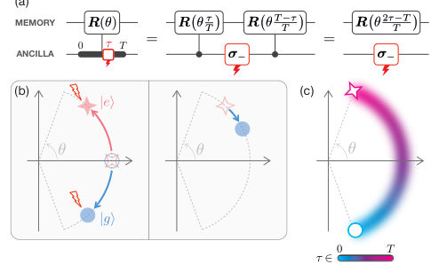 
Figure 1. Ancilla-induced continuous error channel for the conditional rotation. (a) Representation of a condi- tional gate interrupted by an ancilla decay σ−(red symbol) at time τ ∈[0, T], with T the gate duration. The decay leaves the memory rotated by θ 2τ−T

📷 Fig 2

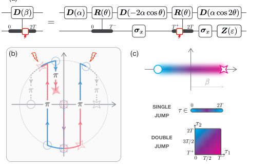 
Figure 2. Ancilla-induced continuous error channel for the conditional displacement. (a) ECD implementation of CD(β), with CR(θ) gates of duration T separated by a qubit echo σx and interleaved with instantaneous memory displacements. For readability, the λ subscripts are dropped in this and the following circuit diagrams, with α, θ, ε standing for αλ, θλ, ελ of Eqs. (7) and (8). In this example, the qubit decays at τ ∈(T, 2T]. (b) Memory trajectories for an initial vacuum state under the ECD sequence of panel (a), with the qubit decay at τ (solid lines) and without error (grey dashed lines). Here, π labels the echo that interchanges the two com- ponents. (c) Final memory positions in the...

📷 Fig 3

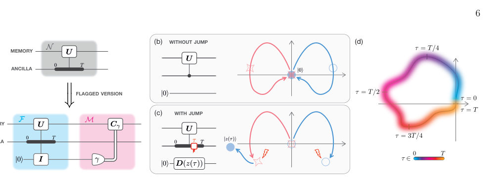 
Figure 3. Continuous-variable flag. (a) General protocol, replacing the noise channel N by the effective channel ˜ N ≡M◦F. The flagging protocol F implements FCU(ζ), in which the flag, initialized in vacuum, undergoes the identity I in the absence of ancilla decay. The measure-and-feedback protocol M reads out the flag by heterodyne detection and applies the correction Cγ to the memory, with γ the measurement outcome. (b) Flag trajectories without a jump: the |g⟩and |e⟩components recombine in vacuum, as required by Eq. (14). (c) With a decay at τ, the flag ends in the coherent state |z(τ)⟩. (d) Position distribution of z(τ) for single jumps, with the colorscale indicating τ ∈[0, T]. Under...

📷 Fig 4

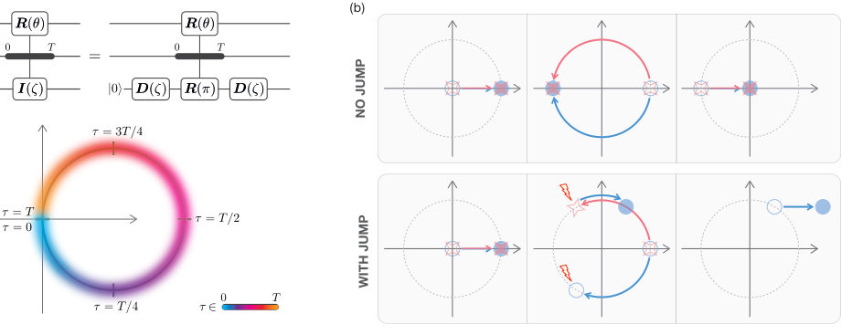 
Figure 4. Flagging sequence for the CR(θ) gate under χ-matching. (a) Flagging sequence of Eq. (20), with χf = πχm/θ. The joint conditional rotation CRmf(θ, π) rotates the memory by ±θ and the flag by ±π, and is framed by two flag displacements Df(ζ). (b) Flag trajectories, with the symbols of Fig. 1. Top, without a jump, the two components recombine at |−ζ⟩and the flag returns to vacuum. Bottom, with a decay at τ, the |g⟩component vanishes and the |e⟩component relaxes to |g⟩, reversing its rotation and leaving the flag away from vacuum. (c) Final flag positions z(τ) of Eq. (21) for single jumps, with the colorscale indicating τ ∈[0, T]. They lie on the circle of radius |ζ| centered at ζ,...

📷 Fig 5

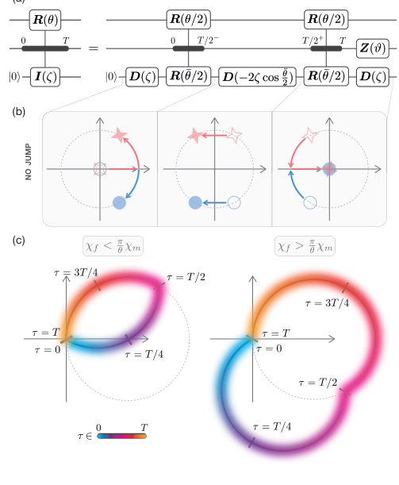 
Figure 5. Flagging sequence for the CR(θ) gate with- out χ-matching. (a) Flagging sequence of Eq. (24), for an arbitrary flag rotation ¯θ = θχf/χm. The two halves CRmf(θ/2, ¯θ/2) are separated by the flag displacement Df(−2ζ cos ¯θ 2), and the final ancilla rotation compensates the residual phase ϑ = 2|ζ|2 sin ¯θ. (b) Flag trajectories without a jump, for ¯θ &lt; π. The two components recombine after the second half, and the final displacement returns the flag to vac- uum. (c) Final flag positions z(τ) of Eq. (25) for single jumps, with the colorscale indicating τ ∈[0, T]. Left, χf &lt; πχm/θ. Right, χf &gt; πχm/θ. The circle of the matched case becomes a closed curve of two circular arcs, which...

**Summary.** This paper proposes using a continuous-variable flag—an auxiliary oscillator—to protect bosonic quantum error correction codes from continuous errors caused by ancillary qubit decay. By measuring this flag, the continuous noise channel is effectively discretized, allowing for robust error correction. This technique is crucial for advancing fault-tolerant quantum computation in hybrid oscillator-qubit processors.

**Why it may be interesting.** This work provides a concrete, hardware-agnostic protocol for mitigating a major source of decoherence in bosonic quantum computing architectures, directly impacting fault-tolerance thresholds.

Detailed structure

**Main problem.** The paper addresses the challenge of protecting bosonic quantum error correction codes from continuous errors induced by the decay of ancillary qubits during quantum gate operations.

**Main result.** The authors introduce a continuous-variable flag mechanism, which successfully transforms continuous noise channels into discrete, correctable error channels, achieving high levels of error suppression.

**Method.** The core method involves coupling an auxiliary oscillator (the 'flag') to the ancilla to measure and subsequently counteract the continuous error accumulated on the primary bosonic mode.

**Model / system.** The system involves bosonic quantum harmonic oscillators used for quantum information storage, implemented in platforms like superconducting circuits or trapped ions, utilizing dispersive coupling for gate operations.

**Key observables.** Logical error rates (e.g., for cat codes), GKP logical lifetime, and the state of the continuous-variable flag.

**Important parameters / regimes.** Ancilla decay rates, coupling strengths ($\chi$), and the number of flags used (one or two).

**Assumptions / limitations.** The analysis relies on modeling the noise channel via Kraus maps and making approximations regarding the timing of gate components (e.g., instantaneous operations).

**Figures summary.** Figures illustrate the continuous error mechanism for conditional rotations and displacements, showing phase-space trajectories and the final memory positions influenced by ancilla decay.

**Paper structure.** The paper progresses by first identifying the continuous error problem, then introducing the flag concept to discretize the error channel, and finally comparing the efficacy of single-flag versus two-flag protocols for different gate sequences ($\chi$-matched vs. ECD).

Abstract

Bosonic quantum error correction represents a route towards significant hardware overhead reduction for fault-tolerant quantum computation. However, controlling quantum harmonic oscillators that encode the quantum information comes with its own challenges. In many platforms such as superconducting circuits and trapped ions, the bosonic degree of freedom is controlled by an ancillary qubit whose decay during a qubit-oscillator gate propagates to the oscillator as a continuous error. Such errors generally lie beyond the scope of errors that the bosonic code is capable of correcting. We introduce the continuous-variable flag: an auxiliary oscillator coupled to the ancilla whose phase-space position encodes the continuous error corrupting the storage mode. After the gate, a heterodyne measurement of the flag estimates this continuous-variable error and a subsequent feedback control undoes it up to a bosonic code stabilizer. The scheme requires no new ingredients, as the flag is driven by the same dispersive coupling, displacements and rotations that implement the gates it is supposed to protect. We construct sequences protecting conditional rotations to all orders in ancilla decay with one flag, and conditional displacements to first order with one flag and to all orders with two. Simulations with realistic circuit-QED parameters predict more than three orders of magnitude fewer logical errors for the parity measurement of a four-component cat code, and a finite-energy GKP logical lifetime near its noiseless-ancilla bound. By discretizing continuous-variable errors, the flags introduced in this work are a useful tool for any hybrid oscillator-qubit processor, and open the route towards fault-tolerant simulation and computation with bosonic modes.

[↑ back to top](#top)

### [Quantum dynamics of spin systems using quantum-like resources](http://arxiv.org/abs/2610.07308v1)

**Authors:** Debadrita Saha, Ethan Dickey, William Horvat, Sabre Kais, Gregory D. Scholes  
**Type:** theory · **Category:** quantum information and computing · **PDF:** <https://arxiv.org/pdf/2610.07308v1>  
**Analysis basis:** full PDF text, analyzed in chunks
**Topic relevance:** `analog quantum simulation` **3/5** · `methods for driven-dissipative` **1/5**

📷 Fig 1

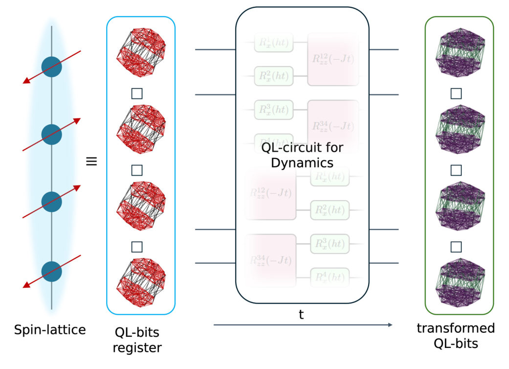 
FIG. 1. Schematic overview of the QL-bit representation of spin dynamics. A one-dimensional spin lattice (left) is represented as a network of QL-bits. The initial state of the spin system is encoded in the emergent state of the Cartesian product of QL-bits. Time evolution of the spin system is implemented as a QL-circuit acting on these QL-bits, transforming their graph structure over time t and producing the evolved QL-bit representation (right).

📷 Fig 2

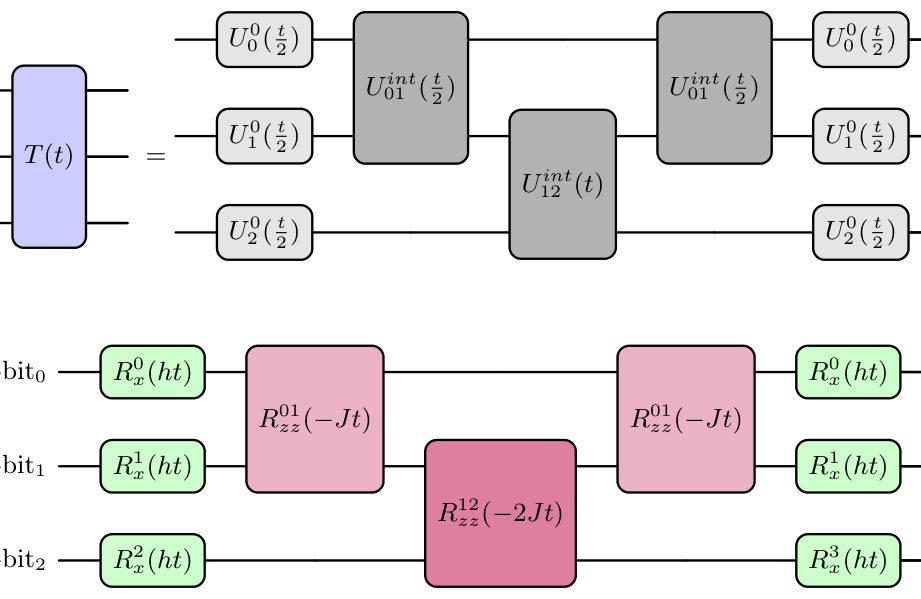 
FIG. 2. (a) The second-order Trotter-Suzuki decomposition for a single step (N = 1), T(t), for a general interacting Hamiltonian. (b) Gate based implementation of the circuit for the transverse field Ising model for a one-dimensional lattice with three spin sites.

📷 Fig 3

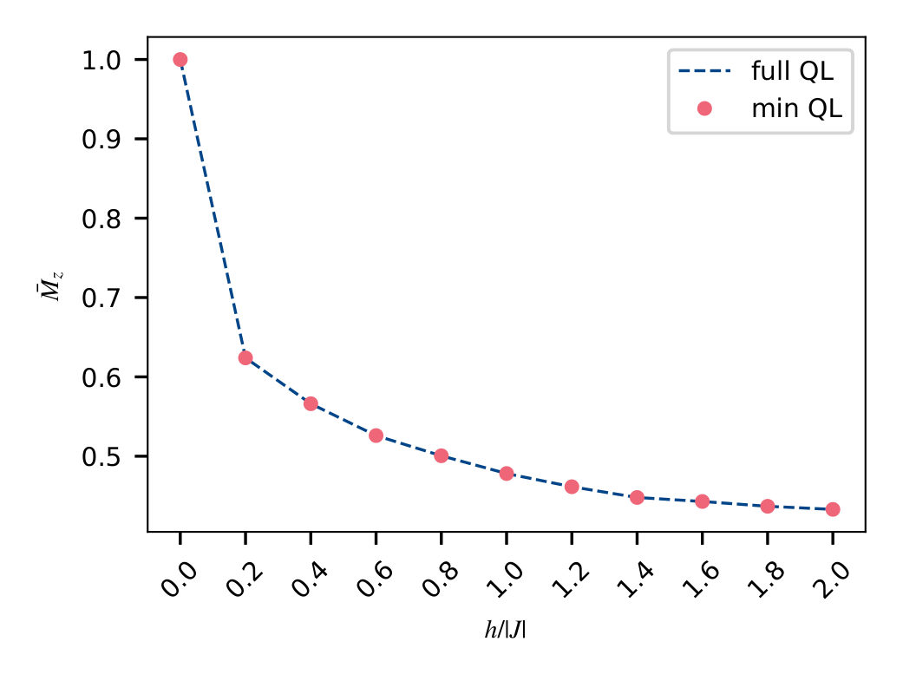 
FIG. 3. Comparing the time averaged magnetization as a function of transverse and coupling field ratio as simulated using the full graph Cartesian product and the minimal representation of the Cartesian product of two QL-bits. The minimal QL-bit quotient representation faithfully reproduces the full graph dynamics for ¯ Mz.

📷 Fig 4

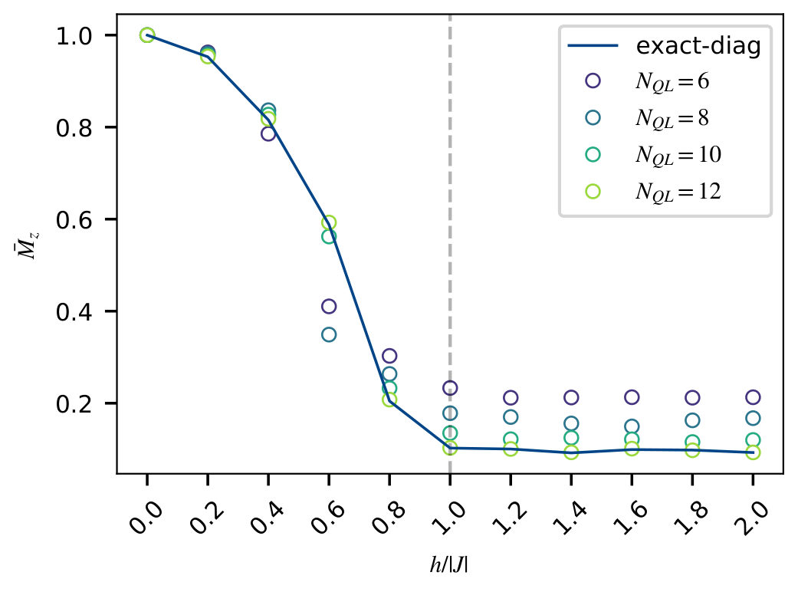 
FIG. 4. As the number of QL-bits NQL increases, the long-time average magnetization ¯ Mz converges to the exact curve. Exact diagonalization is computed for NQL = 12 using eigenbasis propagation for the quench Hamiltonian, δt = 0.1, T = 100au.

📷 Fig 5

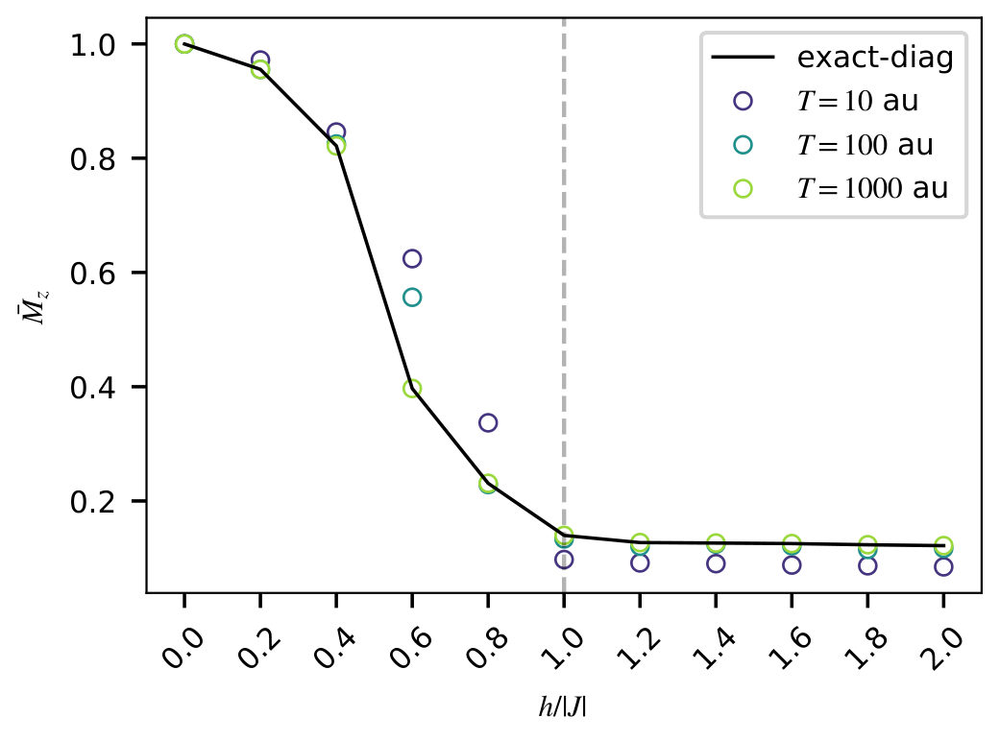 
FIG. 5. As the time averaging window increases, ¯ Mz converges to the exact curve. Exact diagonalization computed for NQL = 10 using eigenbasis propagation for the quench Hamiltonian.

**Summary.** This paper proposes simulating quantum spin dynamics, specifically using the TFI model, by employing 'quantum-like' (QL) resources derived from complex synchronized networks. The authors show how QL-circuits can mimic quantum time evolution, and they introduce graph-level metrics to guide the engineering of physical hardware required for such simulations. This offers a pathway to harness classical network dynamics for quantum simulation.

**Why it may be interesting.** It provides a novel, potentially resource-efficient, theoretical framework for quantum simulation that bypasses direct quantum hardware requirements by mapping quantum dynamics onto classical network evolution rules.

Detailed structure

**Main problem.** The paper addresses simulating quantum dynamics in spin systems by utilizing quantum-like (QL) resources derived from complex synchronized networks.

**Main result.** It demonstrates that classical resources, structured as QL-circuits, can simulate quantum time evolution for models like the transverse field Ising model, while also providing graph-level metrics to guide physical implementation.

**Method.** The simulation employs QL-bits, constructed from graphs, and models time evolution using QL-circuits built from QL-gate analogues, often involving Trotterization.

**Model / system.** The primary model is the transverse field Ising (TFI) model applied to a spin chain. The computational resource is the QL-bit, which is represented by a graph structure derived from synchronized network dynamics.

**Key observables.** Magnetization, microscopic coupling, phase coherence, and effective inter-block coupling (graph-level quantities).

**Important parameters / regimes.** The quench parameter $h$ in the TFI Hamiltonian, and the number of QL-bits ($N_{QL}$) which dictates resource scaling.

**Assumptions / limitations.** The approach assumes that the dynamics can be mapped onto QL-circuits, and it uses approximations like Trotterization for time evolution. It explicitly notes the exponential cost of the Cartesian product construction.

**Figures summary.** Figure 1 schematically illustrates the mapping from a physical spin lattice to a QL-bit network, through time evolution via a QL-circuit, to the final evolved state representation.

**Paper structure.** The work builds from the concept of QL-bits derived from synchronized networks, applies this framework to simulate the TFI model dynamics, and then analyzes the resulting graph structure using specialized metrics to guide hardware design.

Abstract

Recent publications have introduced the concept of quantum-like (QL) bits, along with their associated QL-states and QL-gate operations, emerging from the dynamics of complex synchronized networks. The present work builds on this framework to present a simulation of quantum dynamics in spin systems. We focus on the transverse field Ising model, a widely studied Hamiltonian for interacting spin systems. We show how circuits, built using the QL analog of quantum gates, can be used to prepare an arbitrary initial wavepacket and simulate the time evolution of the resulting state for extracting physical observables such as magnetization. Beyond the statevector dynamics, we introduce a set of metrics that characterize how QL-circuit operations transform the underlying graph connections. These metrics quantify the microscopic coupling, phase coherence, and effective inter-block coupling generated by the circuit. These graph-level quantities provide constraints and design targets for potential physical implementations, indicating where interconnection resources, phase control, and effective coupling strength must be engineered in a hardware realization. Overall, this study demonstrates how classical resources can be harnessed to simulate quantum systems and we discuss the advantages and limitations.

[↑ back to top](#top)

### [Quantum Entangled Multimodal Fusion Networks (QEMFN): Resource-Aware Hybrid Vision-Language Fusion via Trainable Entanglement](http://arxiv.org/abs/2610.08216v1)

**Authors:** Srikar Alla, Ali Shiri Sichani, Chi-Ren Shyu  
**Type:** both · **Category:** quantum information and computing · **PDF:** <https://arxiv.org/pdf/2610.08216v1>  
**Analysis basis:** full PDF text, analyzed in chunks
**Topic relevance:** `QC/QI experiment` **3/5** · `quantum measurements` **1/5**

📷 Fig 1

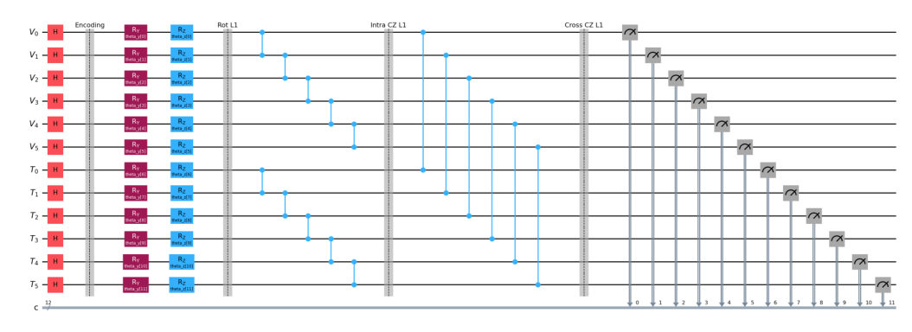 
Fig. 1: QEMFN quantum fusion circuit with paired cross-modal entanglement. Visual qubits V0–V5 and textual qubits T0–T5 are prepared from projected modality embeddings, followed by trainable single-qubit rotations, intra-modal entangling layers, and paired cross-modal couplings Vi ↔Ti. Final measurements generate the fused representation used for retrieval.

📷 Fig 2

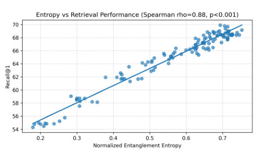 
Fig. 2: Correlation between normalized entanglement entropy and Recall@1 across 12 epochs and 10 random seeds. Each point corresponds to one seed- epoch observation.

**Summary.** This paper introduces QEMFN, a hybrid quantum-classical network that uses parameterized quantum entanglement to fuse vision and language embeddings. It demonstrates that this quantum structure improves retrieval performance over classical methods on standard benchmarks. The work provides a detailed, resource-aware evaluation, confirming the framework's utility without claiming quantum advantage.

**Why it may be interesting.** The rigorous testing of entanglement dynamics (entropy correlation, intervention studies) and the direct comparison of performance across ideal, simulated, and real superconducting hardware provide a detailed resource characterization of quantum machine learning circuits.

Detailed structure

**Main problem.** The paper addresses the challenge of multimodal vision-language fusion, proposing to replace classical fusion operators with a structured, trainable quantum entanglement mechanism.

**Main result.** The proposed QEMFN outperforms classical fusion baselines on image-text retrieval benchmarks (COCO-5k, Flickr30k) under parameter-matched conditions, demonstrating the utility of trainable entanglement as a fusion bias.

**Method.** It employs a hybrid quantum-classical framework where embeddings are encoded into quantum states, processed through parameterized entangling circuits, and measured to yield a fused representation.

**Model / system.** The model uses a quantum circuit structure involving visual and textual qubits, connected by trainable single-qubit rotations and paired cross-modal entangling gates. The computation is evaluated across ideal simulation, shot-based estimation, and real superconducting hardware.

**Key observables.** Image-text retrieval performance (Recall@1, MRR), von Neumann entropy ($S_{norm}$), Meyer-Wallach entangling capability, and gradient variance.

**Important parameters / regimes.** Matched parameter budgets, number of qubits ($n_q=6$), circuit depth ($L=4$), and noise levels ($p$ for depolarizing channel).

**Assumptions / limitations.** The work explicitly does not claim quantum computational advantage, as the circuit remains classically simulable at the studied scales.

**Figures summary.** Figure 1 illustrates the QEMFN quantum fusion circuit. Tables compare performance across various classical and quantum fusion methods, and Table XIII details hardware performance across different noise models.

**Paper structure.** The paper introduces QEMFN, details the quantum encoding and entangling evolution, presents ablation studies isolating the quantum module's contribution, analyzes the correlation between entanglement entropy and performance, and concludes with hardware benchmarking.

Abstract

Multimodal vision-language systems typically fuse image and text embeddings through classical operators such as concatenation, attention, bilinear pooling, or tensor interactions. We propose Quantum Entangled Multimodal Fusion Networks (QEMFN), a hybrid quantum-classical framework that introduces parameterized entanglement as a structured inductive bias for multimodal fusion. Pretrained visual and textual features are projected into compact latent spaces, encoded as angle-parameterized quantum states, processed through intra-modal and paired cross-modal entangling circuits, and measured to produce fused representations for retrieval. Under matched parameter budgets and identical frozen CLIP backbones, QEMFN outperforms classical fusion baselines on COCO-5k and Flickr30k, including multilayer perceptron, tensor fusion, FiLM, cross-attention, compact transformer, and a dequantized paired-topology analogue. An ablation suite isolates the quantum module's contribution from the surrounding classical projections, and quantum-centric analyses report Meyer-Wallach entangling capability, expressibility, gradient variance against barren-plateau bounds, and entropy-performance correlation under controls for training progress alongside an intervention study on the entangling component. QEMFN is executed under shot-based estimation, a noise-modeled fake backend, and a real superconducting device with zero-noise extrapolation. This work does not claim quantum computational advantage; the contribution is the framework together with a controlled empirical and quantum-centric evaluation that positions trainable entanglement as an interpretable, hardware-executable fusion mechanism at scales accessible on contemporary devices.

[↑ back to top](#top)

### [Quantum Machine Learning for Few-Shot Impersonation Detection in Digital Account Opening](http://arxiv.org/abs/2610.07242v1)

**Authors:** Javiera Canales, Jose Ortega, Maximiliano Araya  
**Type:** both · **Category:** quantum information and computing · **PDF:** <https://arxiv.org/pdf/2610.07242v1>  
**Analysis basis:** full PDF text, analyzed in chunks
**Topic relevance:** `QC/QI experiment` **3/5** · `quantum measurements` **1/5**

📷 Fig 1

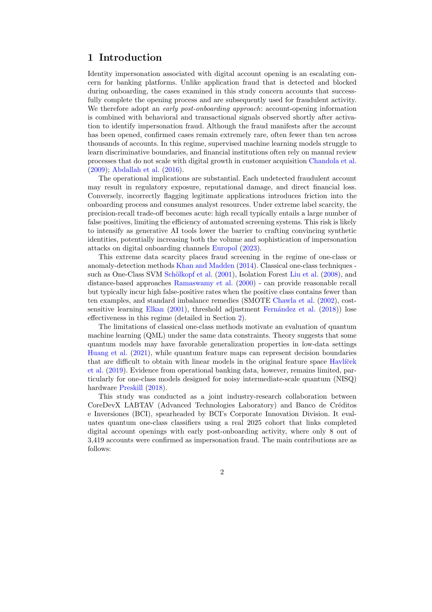 
Low-resolution page preview, page 2

📷 Fig 2

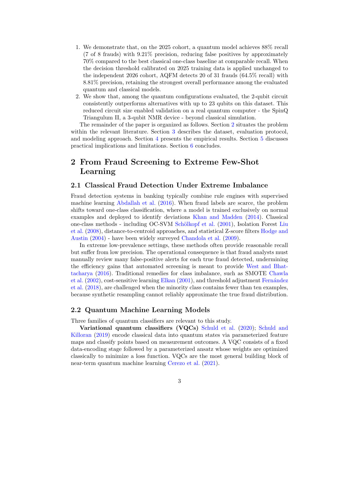 
Low-resolution page preview, page 3

📷 Fig 3

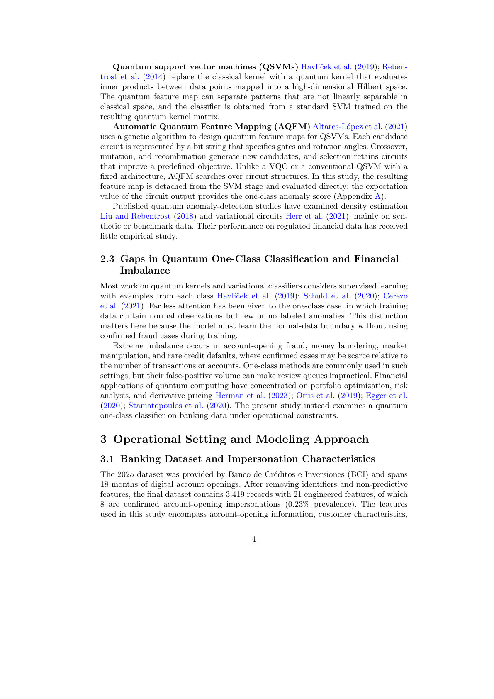 
Low-resolution page preview, page 4

📷 Fig 4

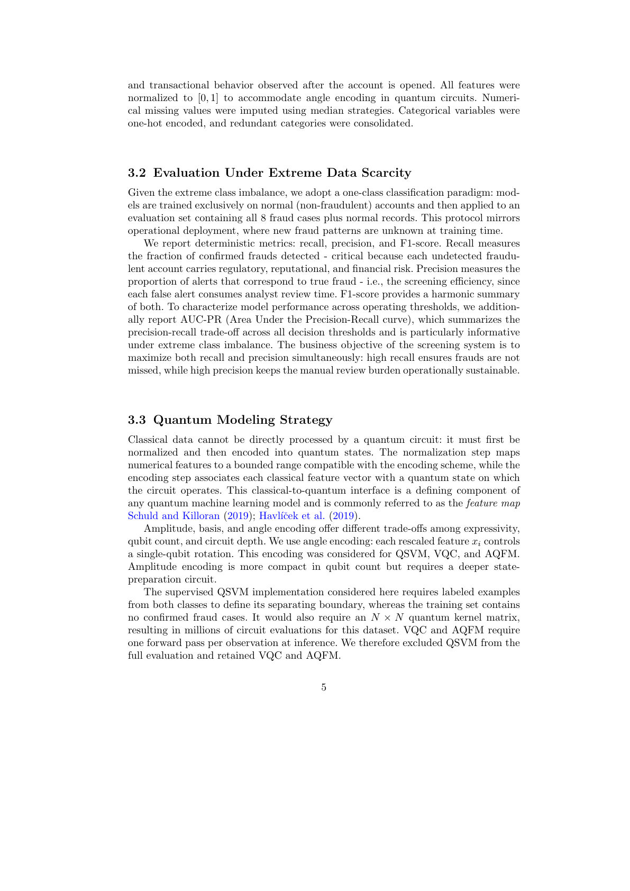 
Low-resolution page preview, page 5

📷 Fig 5

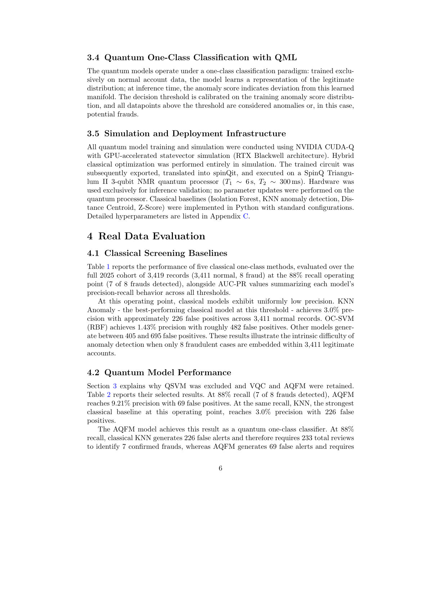 
Low-resolution page preview, page 6

**Summary.** This paper applies Quantum Machine Learning (QML) to detect rare identity impersonation fraud in banking data using a one-class classification approach. The authors demonstrate that their quantum model, AQFM, significantly outperforms classical methods in terms of reducing false positives while maintaining high fraud detection recall. The work validates the approach on real hardware (NMR) and shows promise for generalizing to future data cohorts.

**Why it may be interesting.** The direct application of quantum algorithms (AQFM) to a real-world, highly imbalanced, and time-sensitive industrial problem (fraud detection) provides an empirical test case for quantum advantage in machine learning.

Detailed structure

**Main problem.** The paper addresses the challenge of detecting rare, post-onboarding identity impersonation fraud in digital banking accounts, which presents an extreme few-shot, one-class learning problem.

**Main result.** The Quantum Machine Learning classifier (AQFM) demonstrated superior performance over classical baselines, achieving high recall and significantly fewer false positives, even when tested on an independent future dataset.

**Method.** The study evaluates quantum one-class classifiers using Automatic Quantum Feature Mapping (AQFM) against classical methods like Isolation Forest, focusing on performance metrics like recall and precision.

**Model / system.** The quantum model uses a quantum feature map implemented on a 3-qubit Nuclear Magnetic Resonance (NMR) device (SpinQ Triangulum II) for hardware validation, alongside GPU-accelerated simulation.

**Key observables.** Recall, Precision, F1-score, and the anomaly score $s(\mathbf{x})$ derived from the expectation value of the quantum circuit output.

**Important parameters / regimes.** The best performance was achieved using a small 2-qubit circuit configuration, suggesting performance is not monotonically related to qubit count.

**Assumptions / limitations.** The core assumption is that the legitimate data manifold can be effectively separated from anomalies using quantum feature mapping, and that the one-class paradigm is appropriate for this fraud detection task.

**Figures summary.** The notes reference comparisons of performance metrics (Recall, Precision, F1) across different qubit counts and between simulation and hardware results.

**Paper structure.** The paper establishes the problem context (few-shot fraud detection), proposes the QML approach (AQFM), details the methodology (training on normal data, using quantum feature maps), presents comparative results against classical methods on both 2025 and 2026 cohorts, and discusses hardware limitations.

Abstract

Identity impersonation fraud may emerge only after digital account opening, requiring an early post-onboarding approach based on behavioral and transactional signals observed shortly after activation. Confirmed cases remain rare, creating extreme class imbalance and material operational risk for digital banks. We evaluate quantum machine learning (QML) against classical one-class methods in this setting using a real 2025 cohort of 3,419 digital account openings from Banco de Creditos e Inversiones (BCI), Chile, including 8 confirmed impersonation-fraud cases (0.23% prevalence). The data were provided through an industry-research collaboration between BCI and CoreDevX LABTAV under operational constraints. The best-performing configuration used only 2 qubits and was executed on CoreDevX's SpinQ Triangulum II, a 3-qubit nuclear magnetic resonance (NMR) device, enabling hardware validation beyond classical simulation. The quantum one-class classifier based on Automatic Quantum Feature Mapping (AQFM) achieves 88% recall (7 of 8 frauds detected) and 9.21% precision, corresponding to approximately 70% fewer false positives than the best-performing classical baseline at comparable recall. When its 2025-calibrated decision threshold is applied unchanged to the independent 2026 cohort, AQFM detects 20 of 31 frauds (64.5% recall) with 8.81% precision and remains the best-performing model among those evaluated.

[↑ back to top](#top)

### [Quantum twisting microscopy as a momentum-resolved probe of quantum geometry and sublattice symmetries](http://arxiv.org/abs/2610.08783v1)

**Authors:** Lucas V. Pupim, Mathias S. Scheurer  
**Type:** both · **Category:** strongly correlated electrons · **PDF:** <https://arxiv.org/pdf/2610.08783v1>  
**Analysis basis:** full PDF text, analyzed in chunks
**Topic relevance:** `quantum measurements` **3/5** · `analog quantum simulation` **1/5**

📷 Fig 1

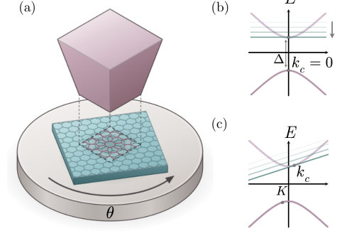 
FIG. 1: (a) Schematic of the quantum twisting microscope. The tip has a flat contact area with a 2D material compatible with the sample’s lattice. A given twist angle θ defines the allowed tunneling momenta and through this mechanism the junction works as a momentum-resolved probe. We propose to use a non-zero sublattice polarization ∆in the tip to re- trieve the quantum metric and probe symmetries. (b) and (c) represent the energetic condition ϕλ c to have momentum resolution of the sample. If the sample’s band is flat (b), the momentum probed corresponds to the tip’s (rotated) Dirac point K, otherwise the probed momentum by the tip’s con- ductance band is shifted by kc (or −kc for the...

📷 Fig 2

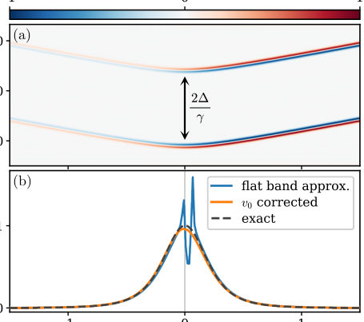 
FIG. 2: (a) Conductance derivative d2I/dV 2 as a function of the twisting angle. (b) Exact (dashed line) and reconstructed (solid lines) quantum metric component gθθ along the scanned line. The blue curve shows the metric reconstruction within the flat band approximation β →0 (for a quasi-flat band), while the orange line takes into account the finite v0 effects. Here, the two roots (and therefore gθθ solutions) coming from taking the finite v0 into account are visually indistinguishable. Parameters used: v0/vD = 0.045, m = 3 meV, w0/w1 = 1.25, ∆= 15 meV, χ = π/4, µS = 0 and µT = 50 meV.

📷 Fig 3

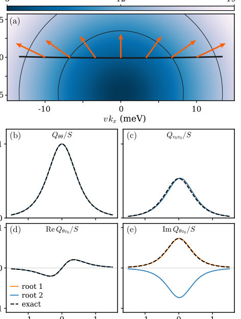 
FIG. 3: (a) Dispersion of the sample band we probe. The black line represents the scanned path, while the orange ar- rows show the local v0. Here we see that the velocity and the path are not parallel, which is a requirement to extract the whole quantum geometric tensor. (b)-(d) show the extracted components of the quantum metric and the respective ex- act values. For the Berry curvature, shown in (e), the two possible roots have opposite signs. The quantum geomet- ric tensor components are normalized by the biggest value S = max |Qij|. Parameters used: χ = 0, ∆= [25, 35, 50] meV, v/vD = 0.045, k0 = −5 , m = 5 meV, µT = 60meV.

📷 Fig 4

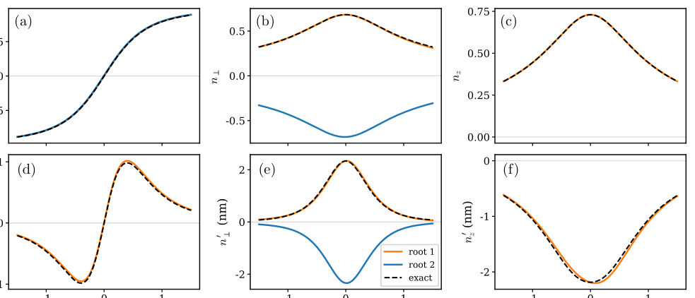 
FIG. 4: (a)-(c) Bloch components as a function of θ for the same model used in Fig. 3. (d)-(f) are the derivatives of the Bloch components in the direction of v0. Note that nχ and n⊥in (a) and (b) have a root ambiguity, while n′ ⊥in (e) only has a sign ambiguity.

📷 Fig 5

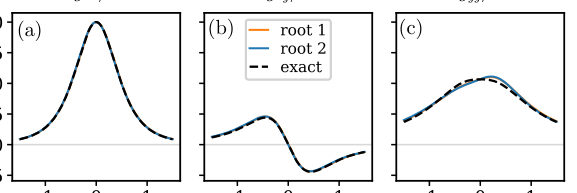 
FIG. 5: (a)-(c) Quantum metric components in an orthogonal base. The values components are normalized by the biggest value S = max gij. All the parameters are the same as in Fig. 3.

**Summary.** This work introduces the Quantum Twisting Microscope (QTM) as a novel tool to probe the quantum geometry and sublattice symmetries in 2D flat-band materials like twisted bilayer graphene. By using a sublattice-polarized tip, the technique allows for the direct measurement of Pauli matrix expectation values. This capability enables researchers to reconstruct the full quantum geometric tensor, providing deep insights into correlated electronic phases.

**Why it may be interesting.** The technique provides unprecedented, symmetry-sensitive access to the underlying quantum geometry of correlated phases in moiré materials, which is crucial for understanding correlated electron physics.

Detailed structure

**Main problem.** The primary challenge is developing a technique to measure the momentum dependence of the quantum geometric tensor and sublattice symmetries in 2D flat-band systems.

**Main result.** The authors propose and demonstrate that a Quantum Twisting Microscope (QTM) with a sublattice-polarized tip can directly measure sublattice Pauli matrix expectation values, allowing for the reconstruction of the full quantum geometric tensor.

**Method.** The method relies on calculating the tunneling current ($I$) using Fermi's golden rule, which is then analyzed by measuring linear combinations of tunneling terms derived from the sublattice-polarized tip Hamiltonian.

**Model / system.** The study focuses on 2D flat-band systems, particularly graphene-based moiré superlattices like twisted bilayer graphene (TBG). The physics is modeled using Bloch states ($\xi_S(\mathbf{k})$) and analyzed via tunneling between the sample and the tip.

**Key observables.** Sublattice Pauli matrix expectation values ($\langle \sigma_i 
angle$), components of the quantum geometric tensor ($Q_{ij}(k)$), and the layer weight ($p_S(k)$).

**Important parameters / regimes.** Twist angle ($	heta$), bias voltage ($eV$), and the gap induced by the tip polarization ($\Delta$).

**Assumptions / limitations.** The analysis assumes the sample and tip have graphene-like symmetries, and approximations are made regarding the integration of momentum sums into integrals.

**Figures summary.** Figures illustrate the QTM setup, the energetic conditions for momentum resolution, and show the near-constant weight of the top layer component ($p_S(k)$) along the scanned path for TBG.

**Paper structure.** The paper progresses from defining the measurement challenge in 2D flat-band systems to detailing the QTM setup, deriving the current measurement formula, and finally showing how linear combinations of measurements allow for the extraction of sublattice symmetries and the full quantum metric tensor.

Abstract

In two-dimensional (2D) flat-band systems, as engineered, for instance, by stacking and twisting van der Waals materials, the momentum dependence of the Bloch states is a key factor in determining the interaction-induced emergence of different phases. Hence, methods of probing this form of ''quantum geometry'' are crucial to understanding these systems. Yet, extracting the momentum dependence of the underlying quantum geometric tensor from measurements is challenging in 2D. Here, we propose employing a quantum twisting microscope (QTM) with a sublattice-polarized tip to fill this gap. We show how expectation values of sublattice Pauli matrices can be probed across the scanned momentum path. This allows for the direct measurement of crucial symmetries characterizing the different candidate instabilities in graphene-based moiré systems. We furthermore show that the quantum metric component along the scan direction can also be extracted; the full quantum geometric tensor is also accessible, given that more than one sublattice polarization can be used. Our work illustrates the potential and extends the versatility of the QTM approach. If implemented in future experiments, this would provide unprecedented access to the symmetry signatures of the correlated phases and to the underlying quantum geometry in twisted bilayer graphene and related systems.

[↑ back to top](#top)

### [Analytic construction of dimension-dependent steering witnesses from generalized equiangular measurements](http://arxiv.org/abs/2610.07314v1)

**Authors:** Adam Rutkowski, Katarzyna Siudzińska  
**Type:** theory · **Category:** quantum information and computing · **PDF:** <https://arxiv.org/pdf/2610.07314v1>  
**Analysis basis:** full PDF text, analyzed in chunks
**Topic relevance:** `quantum measurements` **3/5**

📷 Fig 1

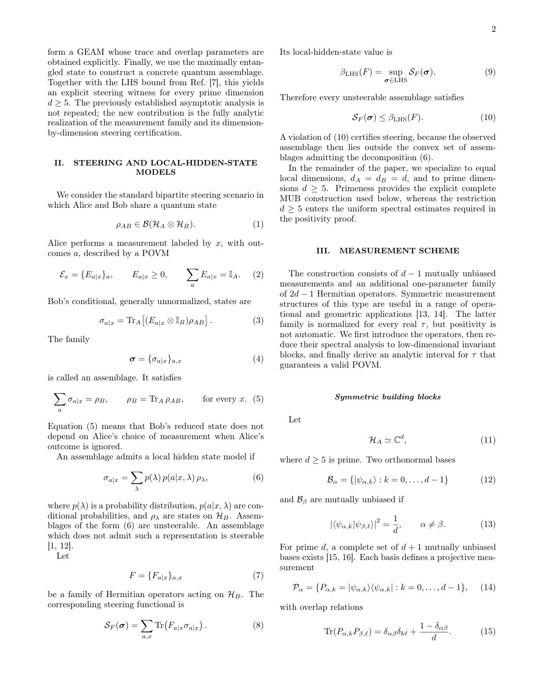 
Low-resolution page preview, page 2

📷 Fig 2

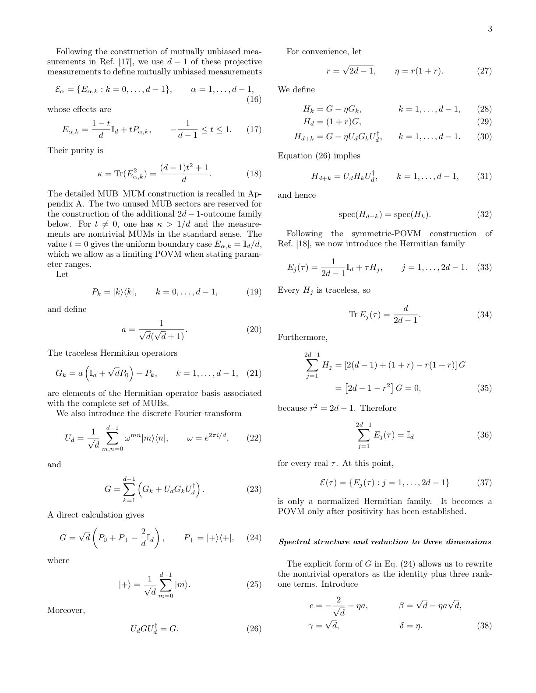 
Low-resolution page preview, page 3

📷 Fig 3

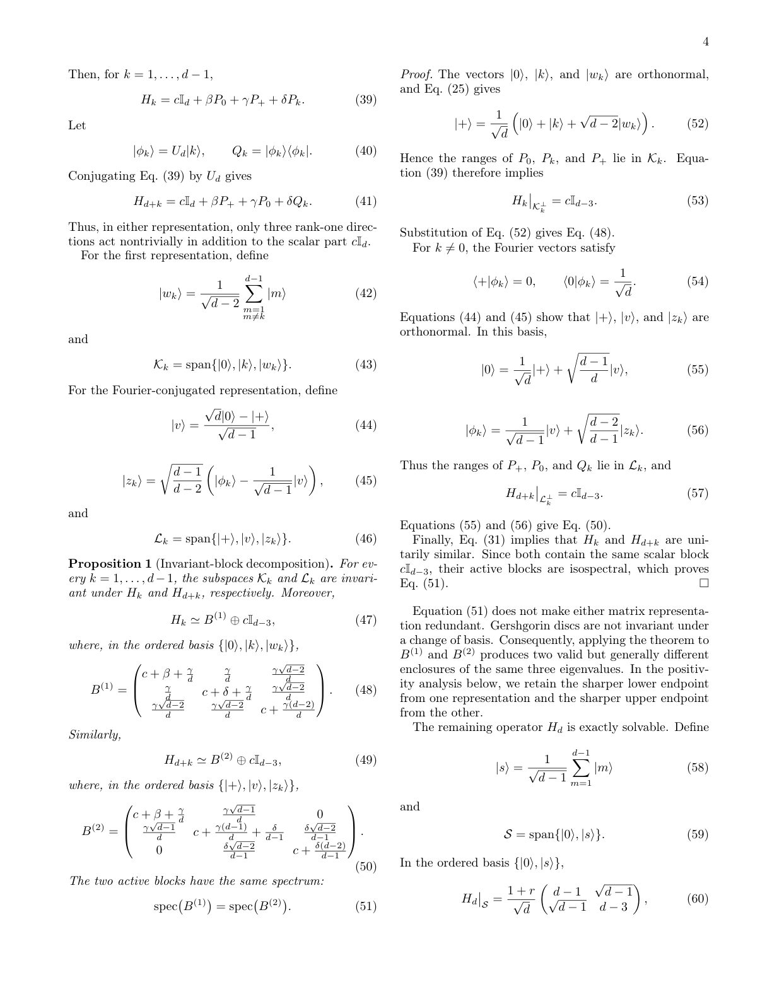 
Low-resolution page preview, page 4

📷 Fig 4

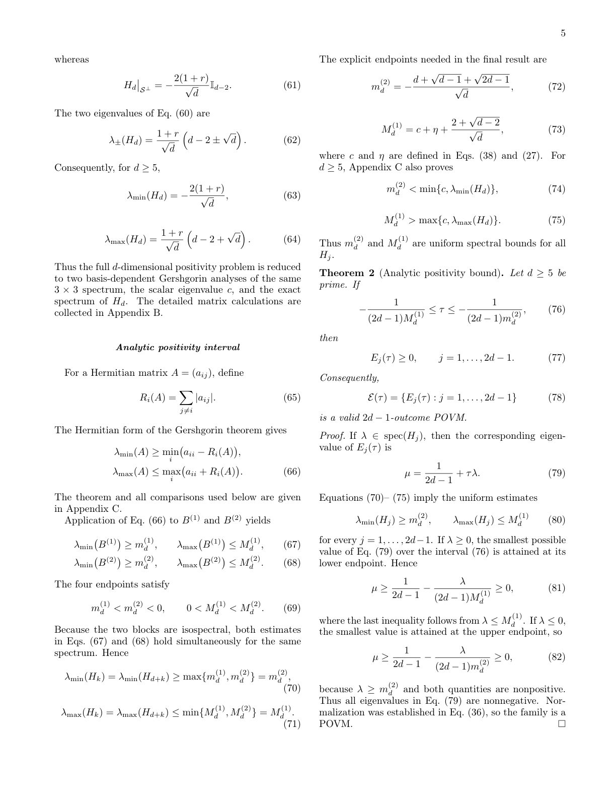 
Low-resolution page preview, page 5

📷 Fig 5

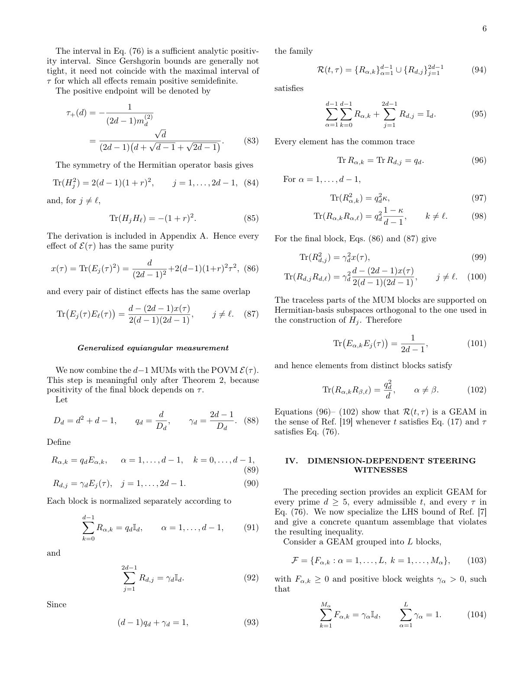 
Low-resolution page preview, page 6

**Summary.** This paper provides a detailed theoretical construction of a steering witness for quantum steering in high-dimensional quantum systems. By analyzing Generalized Equiangular Measurements (GEAMs) and solving complex spectral problems related to operator positivity, the authors derive an explicit inequality that guarantees quantum violation for all prime dimensions $d \geq 5$. This advances the understanding of non-local correlations in quantum information theory.

**Why it may be interesting.** The rigorous mathematical construction of quantum witnesses for steering, particularly for high-dimensional systems, provides fundamental tools for certifying non-local correlations beyond simple entanglement measures.

Detailed structure

**Main problem.** The paper aims to construct an explicit, dimension-dependent steering witness for quantum steering in every prime dimension $d \geq 5$. This is achieved by analyzing the structure of Generalized Equiangular Measurements (GEAMs).

**Main result.** The authors successfully construct an explicit steering inequality and a sufficient criterion guaranteeing quantum violation for all prime dimensions $d \geq 5$.

**Method.** The methodology involves complex spectral analysis of operators associated with the measurements, utilizing the Gershgorin theorem to derive analytic bounds on the measurement parameters. These bounds are then combined to form a valid Positive Operator-Valued Measure (POVM).

**Model / system.** The physical scenario is bipartite quantum steering ($
ho_{AB}$), analyzed using Generalized Equiangular Measurements (GEAMs) composed of $d-1$ Mutually Unbiased Measurements (MUMs) and a parameter-dependent family of Hermitian operators $\{E_j(	au)\}$.

**Key observables.** The steering witness violation criterion, $Z(d, t, 	au) > 1$, and the quantum value $Q(d, t, 	au)$.

**Important parameters / regimes.** The prime dimension $d \geq 5$ and the continuous parameter $	au$, which must lie within a derived asymmetric interval to ensure POVM positivity.

**Assumptions / limitations.** The derivation relies on the assumption that the non-central operators reduce to three-dimensional invariant blocks and that the spectral bounds derived from two different basis representations are complementary and accurate.

**Paper structure.** The paper progresses by first defining the problem (steering witness construction), then tackling the technical hurdle of ensuring the measurement operators form a valid POVM via spectral analysis (using Gershgorin bounds), and finally combining these results to yield the explicit, dimension-dependent steering inequality.

Abstract

We construct a dimension-dependent family of generalized equiangular measurements that gives explicit steering witnesses in every prime dimension $d\geq5$. The construction consists of $d-1$ mutually unbiased measurements and an additional normalized family of $2d-1$ Hermitian operators depending on a parameter $τ$. Positivity of the latter family is the main technical problem. We show that the noncentral operators reduce to three-dimensional invariant blocks, while the remaining central operator is exactly solvable in a two-dimensional subspace. Two unitarily equivalent $3\times3$ matrix representations describe the same active spectrum, but yield different Gershgorin enclosures because Gershgorin bounds are basis dependent. Combining the stronger endpoint from each representation gives a fully analytic asymmetric interval for $τ$ that guarantees a valid POVM. Combining this POVM with the $d-1$ MUMs yields an explicit GEAM. Finally, using a maximally entangled realization and the local-hidden-state bound previously derived for generalized equiangular measurements, we obtain an explicit steering inequality and a sufficient criterion guaranteeing quantum violation in every prime dimension $d\geq5$.

[↑ back to top](#top)

### [Complexity of self-consistent entanglement certification](http://arxiv.org/abs/2610.08757v1)

**Authors:** Yujie Zhang  
**Type:** theory · **Category:** quantum information and computing · **PDF:** <https://arxiv.org/pdf/2610.08757v1>  
**Analysis basis:** full PDF text, analyzed in chunks
**Topic relevance:** `quantum measurements` **3/5**

📷 Fig 1

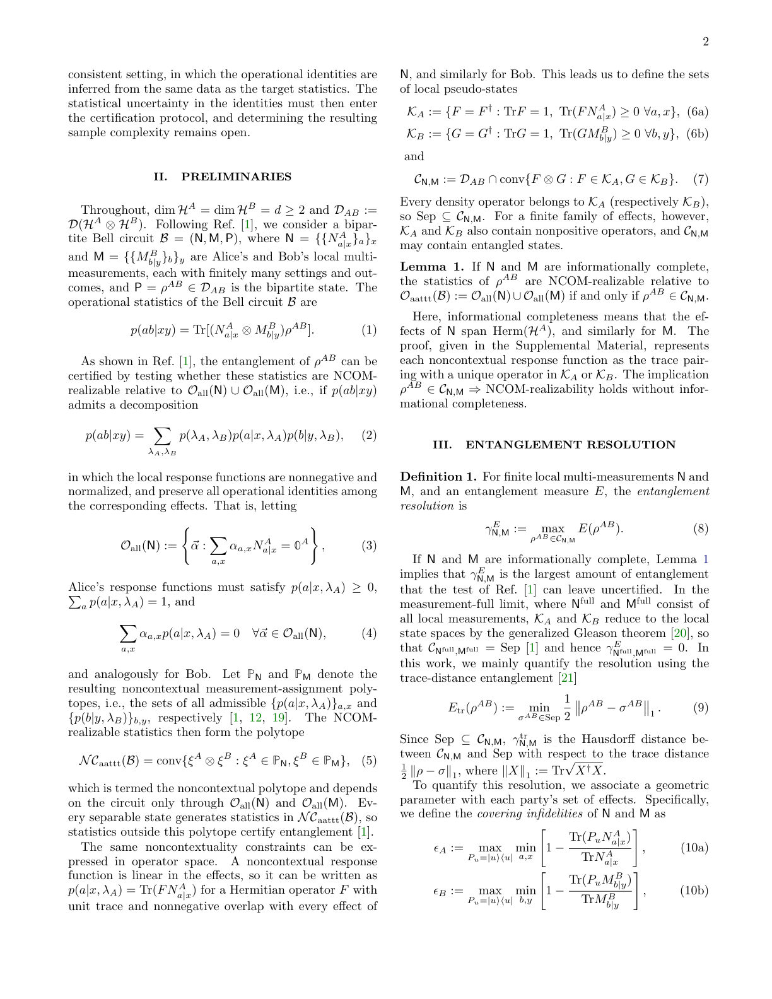 
Low-resolution page preview, page 2

📷 Fig 2

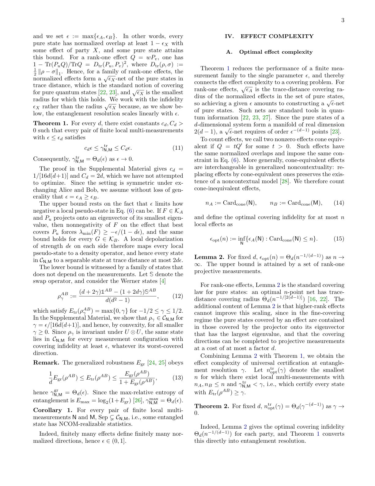 
Low-resolution page preview, page 3

📷 Fig 3

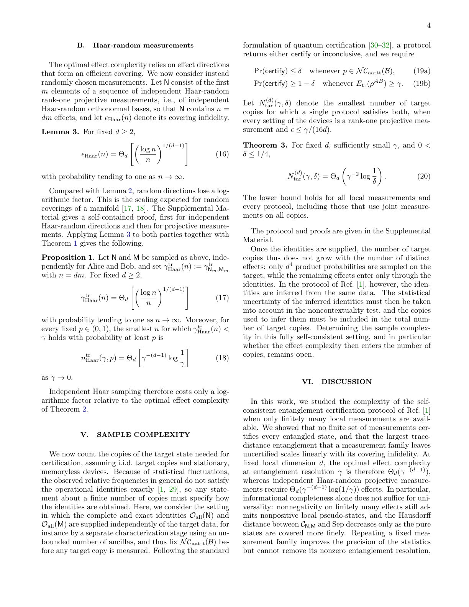 
Low-resolution page preview, page 4

📷 Fig 4

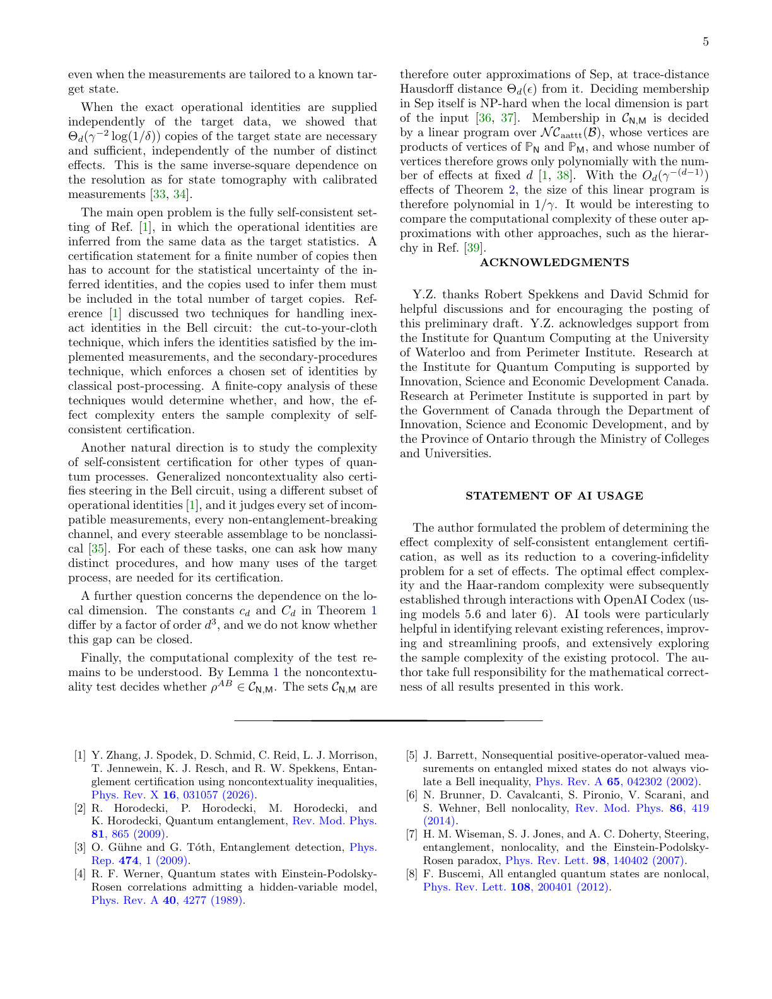 
Low-resolution page preview, page 5

📷 Fig 5

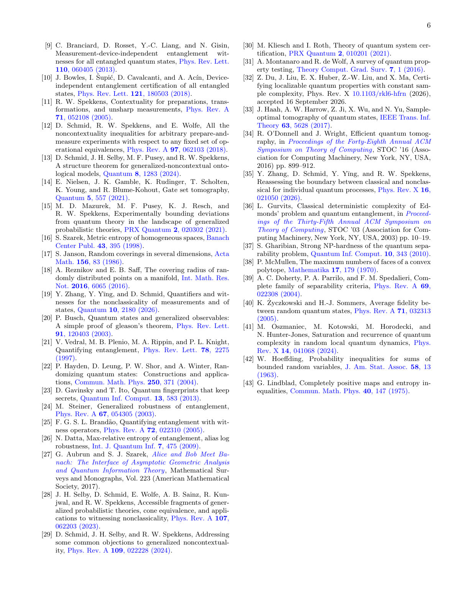 
Low-resolution page preview, page 6

**Summary.** This theoretical work determines the resource scaling required to certify entanglement in finite quantum experiments. It establishes that the necessary number of local measurements scales polynomially with the inverse of the entanglement resolution, $\gamma^{-(d-1)}$. Furthermore, it quantifies the sample complexity needed, showing a dependence on $\gamma^{-2}$, highlighting the resource cost of verifying quantum correlations.

**Why it may be interesting.** It provides rigorous, quantitative bounds on the experimental resources needed to verify fundamental quantum properties like entanglement, which is crucial for quantum device characterization and certification protocols.

Detailed structure

**Main problem.** The paper quantifies the complexity (in terms of required local measurements or sample size) needed to certify that an experimentally prepared bipartite quantum state is genuinely entangled.

**Main result.** The optimal effect complexity scales as $\Theta_d(\gamma^{-(d-1)})$, while the required sample complexity for certification with error $\delta$ scales as $\Theta_d(\gamma^{-2} \log(1/\delta))$ when operational identities are known.

**Method.** The analysis uses polytope theory, relating entanglement certification to the distinguishability between the set of separable states and the set of states consistent with local measurements (NCOM-realizable statistics).

**Model / system.** The study focuses on bipartite quantum states $
ho_{AB}$ in a Bell circuit setting, analyzed using local multi-measurements performed by Alice and Bob.

**Key observables.** Entanglement resolution ($\gamma$), effect complexity (number of local effects), and trace-distance entanglement ($E_{tr}(
ho_{AB})$).

**Important parameters / regimes.** Local dimension $d$, entanglement resolution $\gamma$, and error probability $\delta$.

**Assumptions / limitations.** The analysis distinguishes between the case where operational identities are known versus the fully self-consistent case where they must be inferred from the same data.

**Figures summary.** Not specified.

**Paper structure.** The paper develops by establishing bounds on the entanglement resolution ($\gamma$) using covering arguments, relating it to the covering infidelity ($\epsilon$), and then deriving the scaling laws for both the required number of measurements (effect complexity) and the number of samples (sample complexity).

Abstract

In recent work Phys. Rev. X 16, 031057 (2026), we proposed a self-consistent approach to entanglement certification based on generalized noncontextuality. It requires no prior characterization of the measurement devices and, given access to all local measurements, can certify every entangled state in a Bell circuit. Here, we study the complexity of this protocol in a finite experiment. At fixed local dimension $d$, we show that the optimal number of distinct local effects needed to reach a trace-distance \textit{entanglement resolution} $γ$ is $Θ_d(γ^{-(d-1)})$. This scaling is necessary even when the measurements are tailored to the target state. Independent Haar-random projective measurements instead require $Θ_d(γ^{-(d-1)}\log(1/γ))$ effects. Finally, we show that, once the exact operational identities are known, $Θ_d(γ^{-2}\log(1/δ))$ copies of the target state are necessary and sufficient for certification with error probability at most $δ$. Determining the optimal sample complexity when those identities must instead be inferred from the same finite target-state data remains open.

[↑ back to top](#top)

### [Connectivity Controls Variational Accessibility in Symmetry-Preserving Quantum Circuits](http://arxiv.org/abs/2610.07173v1)

**Authors:** Sahinur Reja  
**Type:** theory · **Category:** strongly correlated electrons · **PDF:** <https://arxiv.org/pdf/2610.07173v1>  
**Analysis basis:** full PDF text, analyzed in chunks
**Topic relevance:** `analog quantum simulation` **3/5**

📷 Fig 1

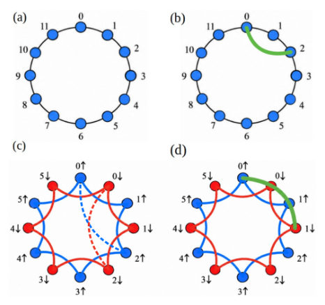 
FIG. 1. Twelve-qubit schematics of various ansätze: (a) AXXZ NN :–XXZ ring with two-qubit single-excitation (SE) con- nections on NN sites only. (b) AXXZ NN+1:– AXXZ NN plus only one SE connection (green bond) on next-to-NN site. (c)AHub NN rep- resents Hubbard ring with NN site hopping excitations (solid blue and red bonds for ↑and ↓-spins respectively) whereas addition of one next-to-NN connection (blue and red dashed lines for ↑, ↓-spins) gives AHub NN+1 (d) AHub NN+d:–AHub NN plus only one NN sites four-qubit double-excitation connection (green bond).

📷 Fig 2

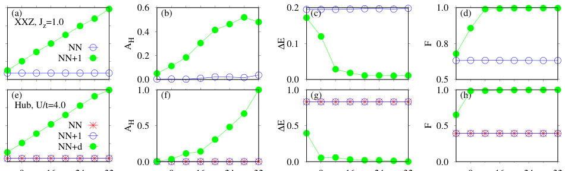 
FIG. 2. Circuit depth (NL) dependence of variational accessibility and VQE performance of various ansätze. For the XXZ ring (top row) with N = 12, Stot z = 0 and Jz = 1: (a) Tangent-space rank (rT ), (b) Hamiltonian alignment AH, (c) energy error ∆E = |EVQE −E0|, and (d) ground-state fidelity F = |⟨ψ0|ψ(θ)⟩|2 are shown against NL for ansätze AXXZ NN and AXXZ NN+1, indicated by empty (blue) and filled (red) circles, respectively. The corresponding results for 12−qubit Hubbard ring with N = 6, N↑= N↓= 3 and U/t = 4 are shown in (e)–(h) for ansätze AHub NN , AHub NN+1 and AHub NN+d by empty (blue) circle, star (red) point and filled (green) circles, respectively.

📷 Fig 3

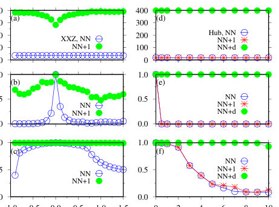 
FIG. 3. VQE results with NL = 32: (a)-(c) depict tangent space rank rT , Hamiltonian alignment AH and ground-state fidelity F respectively against Jz for spin-1/2 XXZ ring with N = 12, Stot z = 0. Empty (blue) and filled (green) circles are for ansätze AXXZ NN and AXXZ NN+1. (d)-(f) show the corresponding results against U/t for N = 6, N↑= N↓= 3 Hubbard ring obtained for anzatz AHub NN (empty circle, blue), AHub NN+1 (star point, red) and AHub NN+d (filled circle, green) respectively.

📷 Fig 4

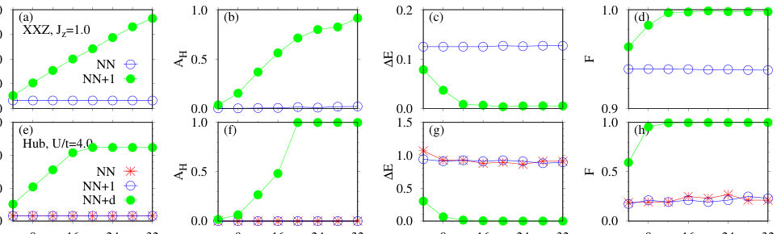 
FIG. 4. Circuit depth (NL) dependence of variational accessibility and VQE performance of various ansätze. For the XXZ ring (top row) with N = 12, Stot z = 2 and Jz = 1: (a) Tangent-space rank (rT ), (b) Hamiltonian alignment AH, (c) energy error ∆E = |EVQE −E0|, and (d) ground-state fidelity F = |⟨ψ0|ψ(θ)⟩|2 are shown against NL for ansätze AXXZ NN and AXXZ NN+1, indicated by empty (blue) and filled (red) circles, respectively. The corresponding results for 12−qubit Hubbard ring with N = 6, N↑= 4, N↓= 2 and U/t = 4 are shown in (e)–(h) for ansätze AHub NN , AHub NN+1 and AHub NN+d by empty (blue) circle, star (red) point and filled (green) circles, respectively.

📷 Fig 5

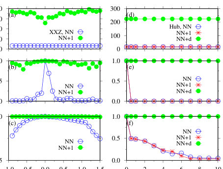 
FIG. 5. VQE results with NL = 32: (a)-(c) depict tangent space rank rT , Hamiltonian alignment AH and ground-state fidelity F respectively against Jz for spin-1/2 XXZ ring with N = 12, Stot z = 2. Empty (blue) and filled (green) circles are for ansätze AXXZ NN and AXXZ NN+1. (d)-(f) show the corresponding results against U/t for N = 6, N↑= 4, N↓= 2 Hubbard ring obtained for anzatz AHub NN (empty circle, blue), AHub NN+1 (star point, red) and AHub NN+d (filled circle, green) respectively.

**Summary.** This work investigates how the connectivity of quantum circuit generators limits the variational space available to VQE algorithms for models like the Hubbard and XXZ Hamiltonians. The authors prove that simply increasing circuit depth is insufficient; instead, adding specific, minimal long-range or correlated gates is necessary to reconstruct the full symmetry-preserving Lie algebra. This establishes generator connectivity as the key determinant of variational accessibility in quantum simulation.

**Why it may be interesting.** It provides a concrete, actionable principle for designing quantum circuits for condensed matter simulations, suggesting that algebraic structure (connectivity) is a more fundamental resource than simple circuit depth.

Detailed structure

**Main problem.** The paper addresses the challenge of designing expressive quantum circuits for the Variational Quantum Eigensolver (VQE) when simulating interacting many-body systems.

**Main result.** The variational accessibility of the circuit is fundamentally controlled by the generator connectivity, not just the circuit depth; minimal additions of specific symmetry-preserving generators can reconstruct the full dynamical Lie algebra, leading to high VQE fidelity.

**Method.** The authors analyze the Dynamical Lie Algebra (DLA) generated by ansatz operators and correlate its dimension and the resulting tangent-space rank ($r_T$) with VQE performance metrics like ground-state fidelity and energy error.

**Model / system.** The study focuses on spin-1/2 XXZ and Hubbard models, which are canonical models for strongly correlated electrons, studied within fixed symmetry sectors.

**Key observables.** Variational accessibility (measured by $r_T$ and Hamiltonian alignment $A_H$), ground-state fidelity ($F$), and energy error ($\Delta E$).

**Important parameters / regimes.** Interaction strengths ($J_z$ for XXZ, $U/t$ for Hubbard), and the type of generator connectivity (Nearest-Neighbor vs. Next-to-Nearest-Neighbor or correlated double-excitation).

**Assumptions / limitations.** The analysis is performed within fixed, conserved symmetry sectors of the Hamiltonians.

**Figures summary.** Figures compare VQE performance metrics ($r_T$, $A_H$, $\Delta E$, $F$) as a function of circuit depth and system parameters, demonstrating the dramatic improvement upon adding specific long-range or correlated gates.

**Paper structure.** The paper establishes a link between connectivity and accessibility by comparing NN-only circuits to minimally augmented circuits (NN+1 or NN+d) for both the XXZ and Hubbard models, showing algebraic reconstruction leads to physical performance gains.

Abstract

Designing expressive quantum circuits for the variational quantum eigensolver (VQE) is a central challenge in simulating interacting many-body systems. Even symmetry-preserving (SP) circuits need not access the full many-body symmetry sector. We demonstrate this explicitly for the spin-$1/2$ XXZ and Hubbard models, where Hamiltonian-inspired nearest-neighbor (NN) SP circuits generate restricted dynamical Lie algebras (DLAs). While these restricted manifolds can accurately represent the ground state near the free-fermion limits, $J_z=0$ for XXZ and $U=0$ for Hubbard, interactions expose inaccessible many-body directions and severely limit VQE performance even at large circuit depth. Remarkably, a minimal modification of the generator connectivity can reconstruct the full orthogonal DLA within all relevant symmetry sectors studied in this work. For XXZ model, the addition of {\it only} one SP next-to-NN single-excitation connection triggers this dramatic reconstruction, whereas the Hubbard case requires a SP correlated double-excitation;--showing that the relevant connectivity can extend from the spatial lattice to many-body configuration space. This reconstruction enlarges the tangent space and accessibility of the energy-lowering Hamiltonian direction, leading to near-unit ground-state fidelity in VQE simulations. Our results establish a direct link between generator connectivity and variational accessibility and suggest a broader circuit-design principle: identify minimal symmetry-preserving generators that enlarge the accessible many-body space rather than increasing circuit depth alone. This perspective may have broader relevance for quantum many-body simulation at the interface of condensed-matter physics and quantum computing.

[↑ back to top](#top)

### [Emergent Dimensionality in Diluted Power-Law Quantum Walks](http://arxiv.org/abs/2610.07856v1)

**Authors:** G. A. Domínguez-Castro, L. Santos  
**Type:** theory · **Category:** disordered systems and neural networks · **PDF:** <https://arxiv.org/pdf/2610.07856v1>  
**Analysis basis:** full PDF text, analyzed in chunks
**Topic relevance:** `analog quantum simulation` **3/5**

📷 Fig 1

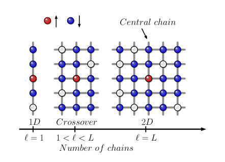 
FIG. 1. Dimensional crossover controlled by the number ℓof coupled chains. The limits ℓ= 1 and ℓ= L correspond to a one-dimensional chain and a two-dimensional square lattice, respectively, while 1 &lt; ℓ&lt; L realizes intermediate quasi- one-dimensional geometries. Red and blue spheres denote particles in the ↑and ↓states, respectively, and white spheres denote vacant sites.

📷 Fig 2

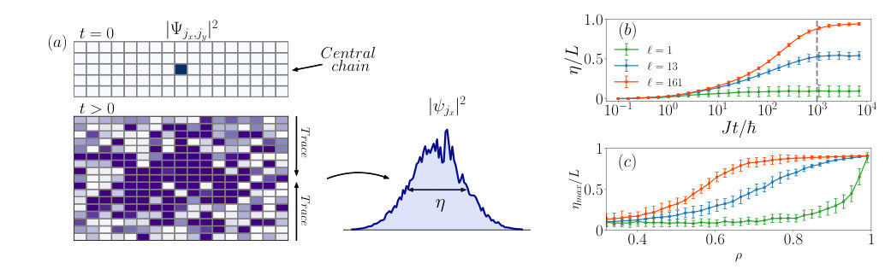 
FIG. 2. (a) Schematic of the reduction to the longitudinal probability distribution. At each time t, the excitation probability |Ψjx,jy(t)|2 is summed over the chain index jy, yielding |ψjx(t)|2. The longitudinal expansion width η(t) is defined as the minimum number of contiguous sites containing 90% of the excitation probability. (b) Time evolution of η(t) for dipolar hopping (α = 3) at filling ρ = 0.75 for three transverse widths ℓ. (c) Maximum expansion width ηmax versus filling ρ for the same values of ℓas in panel (b). Error bars indicate the standard deviation over disorder realizations.

📷 Fig 3

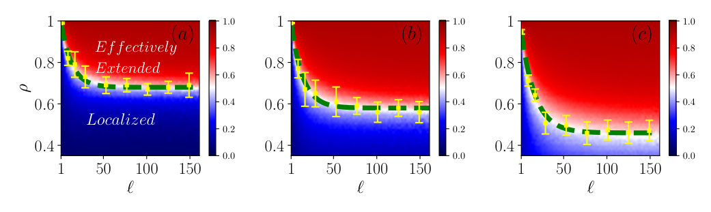 
FIG. 3. (a)–(c) Maximum longitudinal expansion ηmax/L versus transverse width ℓand filling ρ for α = 6, 3, and 2, respectively. Yellow markers denote the finite-size localization crossover filling ρc, extracted from the inflection-point criterion. Green dashed lines show the exponential fit of Eq. (2). Error bars indicate the standard deviation over disorder realizations.

📷 Fig 4

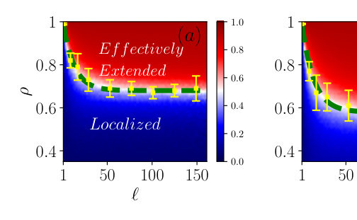 
Figure 2(c) shows ηmax versus filling ρ for α = 3. In one dimension, ηmax decreases rapidly upon dilution, whereas in the two-dimensional limit it remains close to L over a broad high-filling regime. Upon decreasing ρ, ηmax de- velops an inflection point at ρ2D c ≃0.58, followed by a rapid suppression of transport. We identify this inflection point with the finite-size localization crossover filling ρc, following Refs. [7, 14]. For intermediate ℓ, ρc lies between the one- and two-dimensional limits, providing the dy- namical signature of the dimensional crossover analyzed below. Characteristic transverse scale.– Figures 3(a)–3(c) show ηmax as a function of transverse width ℓand fill- ing ρ...

📷 Fig 5

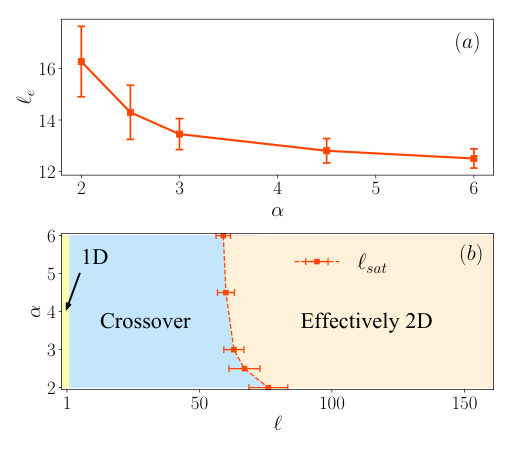 
FIG. 4. (a) Dimensional-crossover scale ℓe versus hopping exponent α. (b) Operational effective-dimensionality map in the (ℓ, α) plane, distinguishing the strictly one-dimensional limit (ℓ= 1), the dimensional-crossover regime (1 &lt; ℓ≲ℓsat), and the effectively two-dimensional regime (ℓ&gt; ℓsat). Error bars indicate the uncertainty obtained from the fit of ℓe and its propagation to ℓsat.

**Summary.** This work analyzes quantum walks on disordered lattices with long-range hopping to understand the dimensional crossover from 1D to 2D. The key finding is that this crossover is not arbitrary but is dictated by an intrinsic transverse eigenstate scale ($\ell_e$). This establishes a fundamental link between the transport dynamics and the underlying quantum structure of the disordered system.

**Why it may be interesting.** The direct connection found between the transport-derived scale ($\ell_e$) and the intrinsic eigenstate structure ($ar{\xi}$) provides a powerful, non-perturbative understanding of how dimensionality emerges in complex, disordered quantum systems, which is highly relevant to quantum simulators.

Detailed structure

**Main problem.** The paper investigates how the dimensionality of quantum transport emerges in systems with long-range, power-law hopping interactions when disorder is present.

**Main result.** The crossover from 1D to effective 2D behavior is governed by a characteristic transverse scale ($\ell_e$), which is microscopically determined by the transverse extent of the system's eigenstates.

**Method.** The study uses numerical analysis of the finite-size localization crossover filling ($
ho_c$) via exponential fitting, complemented by independent spectral analysis of eigenstate spatial extents.

**Model / system.** The model consists of single-excitation quantum walks on arrays of $\ell$ coupled chains of length $L$, featuring hopping governed by a power-law decay $J_{ij} \propto |r-r'|^{-\alpha}$ and incorporating dilution-induced disorder.

**Key observables.** Longitudinal spreading width ($\eta(t)$), finite-size localization crossover filling ($
ho_c$), and the characteristic transverse scale ($\ell_e$).

**Important parameters / regimes.** Hopping exponent ($\alpha$), transverse width ($\ell$), system length ($L$), and disorder filling ($
ho$).

**Assumptions / limitations.** The analysis assumes open boundary conditions and averages over many disorder realizations; approximations are used to relate the crossover filling to the eigenstate structure.

**Figures summary.** Figures illustrate the time evolution of spreading ($\eta(t)$) across different $\ell$ and $\alpha$, and compare the derived crossover scale ($\ell_e$) against the calculated transverse eigenstate extent ($ar{\xi}$).

**Paper structure.** The paper first analyzes the longitudinal spreading and identifies the crossover filling ($
ho_c$) using finite-size scaling. It then derives the characteristic scale $\ell_e$ from this fit and independently verifies this scale by comparing it to the transverse extent of the relevant eigenstates, establishing the microscopic link.

Abstract

We investigate single-excitation quantum walks across the one-to-two-dimensional crossover in diluted power-law hopping models. Using arrays of $\ell$ coupled chains of length $L$, we identify the finite-size localization crossover from the longitudinal spreading of an initially localized excitation. The crossover filling is well described by an exponential approach to its two-dimensional value with increasing $\ell$, defining a characteristic transverse scale $\ell_e$, and effectively two-dimensional behavior emerges already for $\ell\ll L$. An independent spectral analysis shows that $\ell_e$ is set by the transverse extent of the eigenstates participating in the dynamics, providing a microscopic interpretation of the dimensional crossover. Our results reveal an intrinsic eigenstate scale governing emergent dimensionality in diluted systems with power-law hopping, a regime directly relevant to recently developed arrays of polar molecules, Rydberg atoms, and other quantum simulators with long-range interactions.

[↑ back to top](#top)

### [Local-moment magnets on all close-packed lattices are equivalent](http://arxiv.org/abs/2610.07158v1)

**Authors:** Sam Studdy, Alwyn Jose Raja, R. Ganesh  
**Type:** theory · **Category:** strongly correlated electrons · **PDF:** <https://arxiv.org/pdf/2610.07158v1>  
**Analysis basis:** full PDF text, analyzed in chunks
**Topic relevance:** `analog quantum simulation` **3/5**

📷 Fig 1

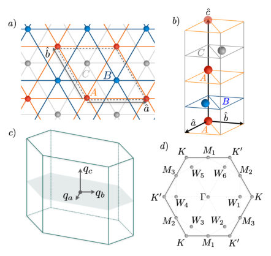 
FIG. 1. a) A close-packed structure viewed along the stacking axis. Generically, the unit cell forms a rhombus, with primi- tive translations ˆa and ˆb as shown. b) As an example, the unit cell of the ABAC structure is shown. The primitive transla- tion vector ˆc is parallel to the stacking axis. c) The Brillouin zone of an M-layer structure forms a hexagonal prism or (d) a hexagon when projected onto the stacking plane. Momenta of interest are labeled.

📷 Fig 2

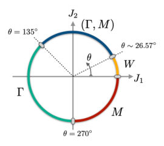 
FIG. 2. Unified phase diagram for the J1 −J2 model on any close-packed lattice. Phases are labeled by the location(s) of LT minimum (or minima) within the projected Brillouin zone. The table shows the classical ground state energy, Eg.s., on a per-spin basis with the spin length S set to unity.

📷 Fig 3

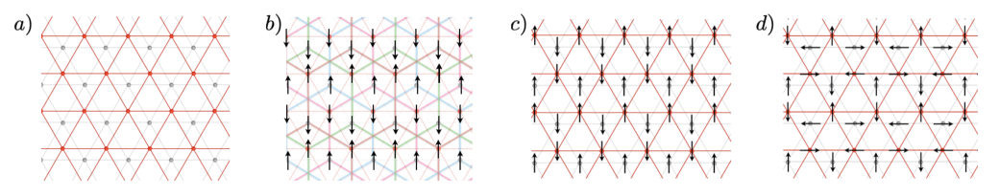 
FIG. 3. a) Two adjacent layers in a close-packed structure. b) Four sublattices spanned by J2 bonds. The four-sublattice structure persists for any number of layers. c) A single-Q ground state in the M phase. Spin orientations are shown in two layers. In subsequent layers, spins are fixed such that each J2-sublattice is ferromagnetically ordered. A single-Q ground state in the (Γ, M) phase is similar, with each J2-sublattice ordered antiferromagnetically. d) A single-Q ground state in the W phase. Spins in other layers are oriented to satisfy the tetrahedron rule – see text.

📷 Fig 4

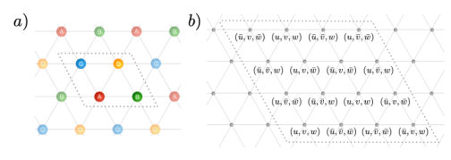 
FIG. 4. Multi-Q ground states. a) A generic ground state in the X phase with a four-site motif in one layer. Spins in other layers are fixed such that each J2 sublattice is ferromagneti- cally ordered. b) A generic ground state in the W phase, with a sixteen-site motif within a layer. Spins in other layers are fixed by the tetrahedron rule.

📷 Fig 5

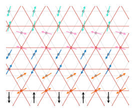 
FIG. 6. Extensive degeneracy in the purely-J1 antiferromag- net at θ = 0◦. To construct a ground state, we start with a layer. Each line of this layer orders antiferromagnetically, with an independent N´eel vector. On the next layer, we choose lines that run in the same direction and order them antiferromagnetically. N´eel vectors are chosen such that each spin is anti-aligned with one spin of the previous layer. This construction can be extended to any number of layers with any stacking sequence. The degeneracy amounts to choosing an independent N´eel vector for each line within any one layer.

**Summary.** This work demonstrates a hidden symmetry proving that the classical ground state energy and degeneracy are identical for local-moment magnets on all close-packed lattices. However, the authors show that while the classical physics is equivalent, quantum fluctuations, such as zero-point energy, are structure-dependent, suggesting that the true low-temperature order can distinguish between these seemingly equivalent lattices.

**Why it may be interesting.** The finding that classical symmetries break down when considering quantum fluctuations (zero-point energy) is a key concept in understanding order-by-disorder selection in frustrated quantum magnets, which is highly relevant to AMO physics and quantum magnetism.

Detailed structure

**Main problem.** The paper investigates whether local-moment magnets on different close-packed lattices are physically equivalent regarding their classical ground state.

**Main result.** The classical ground state energy and degeneracy are identical across all close-packed lattices, but fluctuations (zero-point energy and free energy) are structure-dependent, indicating a breakdown of symmetry beyond the classical limit.

**Method.** The analysis uses the Luttinger-Tisza approach to determine classical ground states and compares the resulting energy landscapes and degeneracy spaces across different lattice geometries.

**Model / system.** The system is a local-moment magnet described by a Heisenberg antiferromagnet Hamiltonian restricted to nearest ($J_1$) and next-nearest ($J_2$) neighbor couplings on any close-packed lattice (e.g., fcc, hcp).

**Key observables.** Ground state energy ($E_{g.s.}$), ground state degeneracy, zero-point energy ($O(S)$ correction), and free energy minimum.

**Important parameters / regimes.** Coupling ratios ($J_1/J_2$), lattice geometry (fcc, hcp, etc.), and the spin magnitude $S$.

**Assumptions / limitations.** The equivalence is proven for the classical limit (Heisenberg model) and extends to XY and Ising models, but fluctuations are not related by the symmetry.

**Figures summary.** Figures illustrate the geometry of close-packing, construct a unified phase diagram based on $J_1$ and $J_2$, and compare the location of LT minima and the calculated zero-point energy across different structures.

**Paper structure.** The paper first establishes the hidden symmetry relating classical ground states via the Luttinger-Tisza method, constructing a unified phase diagram. It then analyzes the degeneracy and structure of the ground states in different phases, concluding by contrasting the robust classical equivalence with the structure-dependent nature of quantum fluctuations.

Abstract

The Heisenberg antiferromagnet on the fcc lattice is a canonical example of frustration. The fcc lattice is but one of an infinite number of close-packed structures, all of which have the same frustration-inducing local geometry. In this letter, we demonstrate a hidden symmetry that relates classical magnets on all close-packed lattices. This symmetry derives from a similar property in tight binding models that may explain the disordered low-temperature structures of lithium and sodium metals. In magnets, the symmetry holds when couplings are restricted to nearest ($J_1$) and next-nearest neighbours ($J_2$). It guarantees that all close-packed lattices are equivalent at the Luttinger-Tisza level. For any given values of $J_1$ and $J_2$, they have the same ground-state energy. Their ground state momenta are identical when projected onto the stacking plane. We construct a unified phase diagram as a function of $J_1$ and $J_2$ couplings for Heisenberg, XY and Ising magnets on any close-packed lattice. In each phase, the ground-state degeneracy is the same on all close-packed lattices, even after accounting for multi-Q spirals. This phase diagram can be easily adapted to any magnet composed of stacked triangular layers with similar couplings. Fluctuations above the classical ground state(s) are not related by any symmetry. This suggests that close-packed structures can show interesting differences in order-by-disorder selection.

[↑ back to top](#top)

### [Measurement Complexity of Quantum Compressed Sensing](http://arxiv.org/abs/2610.08234v1)

**Authors:** Jianyong Hu, Wei Li  
**Type:** theory · **Category:** quantum information and computing · **PDF:** <https://arxiv.org/pdf/2610.08234v1>  
**Analysis basis:** full PDF text, analyzed in chunks
**Topic relevance:** `quantum measurements` **3/5**

📷 Fig 1

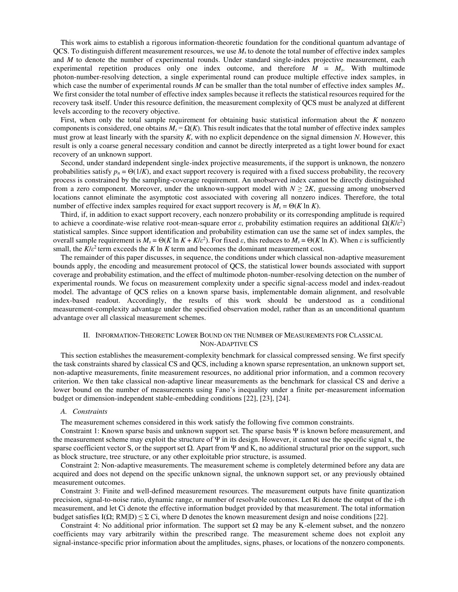 
Low-resolution page preview, page 2

📷 Fig 2

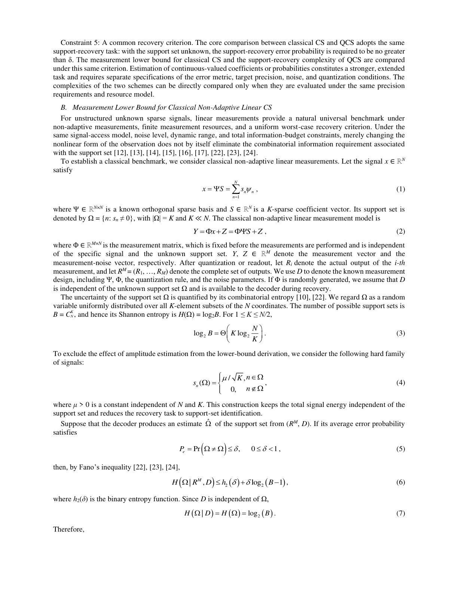 
Low-resolution page preview, page 3

📷 Fig 3

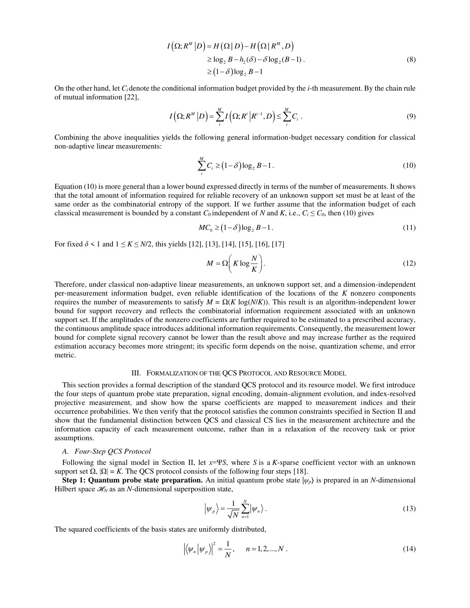 
Low-resolution page preview, page 4

📷 Fig 4

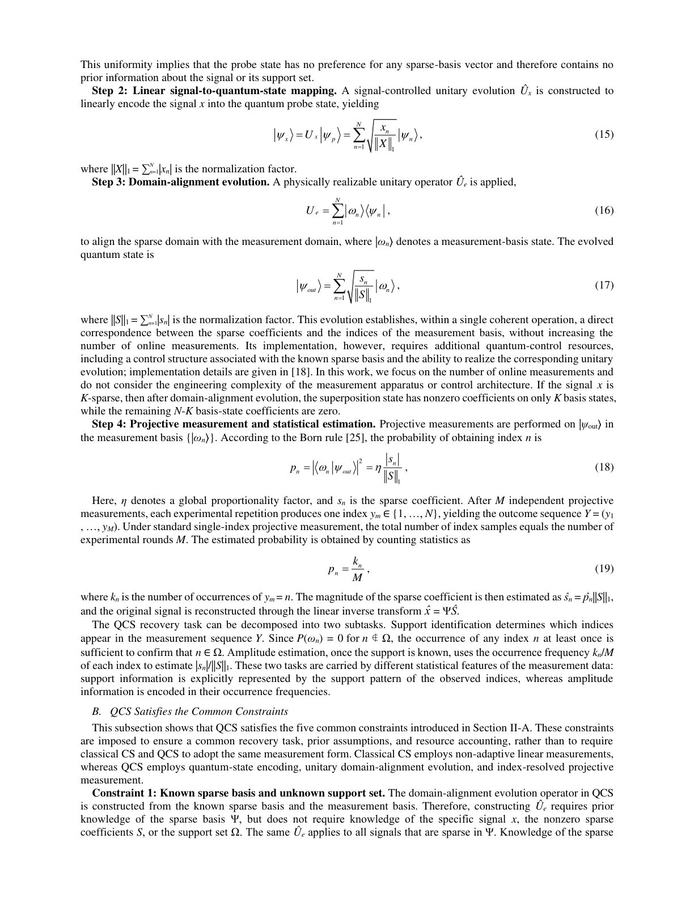 
Low-resolution page preview, page 5

📷 Fig 5

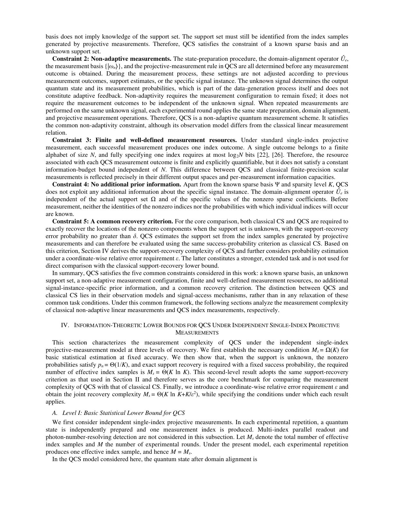 
Low-resolution page preview, page 6

**Summary.** This work theoretically analyzes the measurement complexity of Quantum Compressed Sensing (QCS) compared to classical methods. It shows that QCS leverages quantum parallelism to map sparse signals onto measurement indices, establishing lower bounds for the required effective index samples ($M_s$). The findings clarify the quantum resource advantage in measurement science for sparse signal recovery tasks.

**Why it may be interesting.** It provides a rigorous theoretical framework for quantifying the information-theoretic advantage of quantum measurement techniques over classical ones in the context of sparse signal recovery.

Detailed structure

**Main problem.** The paper compares the measurement complexity of Quantum Compressed Sensing (QCS) against classical Compressed Sensing (CS) to determine the quantum advantage in signal recovery.

**Main result.** QCS establishes lower bounds on measurement complexity, showing that while it can surpass classical bounds in some regimes, the required effective index sample complexity ($M_s$) scales as $\Theta(K \ln K)$ for exact support recovery.

**Method.** The authors establish lower bounds using information-theoretic and quantum-physical perspectives, analyzing the required effective index samples ($M_s$) under various recovery objectives.

**Model / system.** The model compares classical CS (non-adaptive linear measurements) with QCS, which utilizes quantum parallelism via a unitary domain-alignment evolution acting on a superposition of $N$ basis states.

**Key observables.** Effective index samples ($M_s$), number of experimental rounds ($M$), and the required signal dimension ($N$) and sparsity ($K$).

**Important parameters / regimes.** Sparsity ($K$), signal dimension ($N$), error tolerance ($\epsilon$), and the classical lower bound $\Omega(K \log(N/K))$.

**Assumptions / limitations.** The analysis assumes a known sparse basis, unknown support set, and relies on specific measurement models (e.g., independent single-index projective measurements).

**Paper structure.** The paper first establishes the classical CS lower bound, then details the QCS protocol involving unitary evolution and index-resolved measurements, and finally derives the scaling laws for $M_s$ based on the required recovery task (statistics, support, amplitude).

Abstract

Conventional compressed sensing (CS) has a measurement lower bound of M = Ω(K log(N/K)) under non-adaptive measurements. Recent experiments on quantum compressed sensing (QCS) have reported numbers of measurements below this classical lower bound. In this work, we establish lower bounds on the measurement complexity of QCS from an information-theoretic and quantum-physical perspective. QCS exploits quantum parallelism, enabling a unitary domain-alignment evolution to act on a superposition of all N basis states and map the sparse basis onto the measurement basis in a one-to-one manner. Consequently, the locations of nonzero components are explicitly carried by measurement-index labels. If only basic statistical information about the K nonzero components is required, the total number of effective index samples satisfies the coarse necessary condition Ms = Ω(K). Under independent single-index projective measurements, when the support is unknown, the nonzero probabilities satisfy pn = Θ(1/K), and exact support recovery is required with a fixed success probability, the sampling-coverage requirement leads to Ms = Θ(K ln K). If each nonzero amplitude coefficient is further required to achieve a coordinate-wise relative root-mean-square error ε, the optimal effective index sample complexity is Ms = Θ(K ln K + K/ε2), which reduces to Θ(K ln K) for fixed ε. Multimode photon-number-resolving detection can reduce the number of experimental rounds but not the total effective index sample complexity. These results show that quantum parallelism is not only a core resource for quantum computing but can also play a transformative role in measurement science.

[↑ back to top](#top)

### [Operational quasiprobability formulation of non-signaling in time for macrorealism violations](http://arxiv.org/abs/2610.08146v1)

**Authors:** Stefano Gherardini, Paolo Solinas  
**Type:** theory · **Category:** other · **PDF:** <https://arxiv.org/pdf/2610.08146v1>  
**Analysis basis:** full PDF text, analyzed in chunks
**Topic relevance:** `quantum measurements` **3/5**

📷 Fig 1

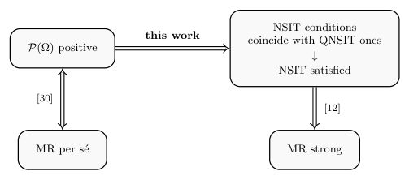 
FIG. 1: Illustration of the relation between MRqp and MRstr. The positivity of P(Ω), achieved if and only if MRps is obeyed, entails that the NSIT conditions of Eq. (1) are satisfied, thus certifying the MRstr. The reverse is not generally true.

**Summary.** This paper introduces Quasi non-signaling in time (QNSIT) and a corresponding quasiprobabilistic criterion for macrorealism ($	ext{MR}_{	ext{qp}}$). It demonstrates that $	ext{MR}_{	ext{qp}}$ is a stricter test than standard Non-Signaling in Time (NSIT), offering a more sensitive tool to detect violations of macrorealism, particularly through quantum non-demolition measurements.

**Why it may be interesting.** This work provides a rigorous, operational framework using quasiprobabilities to test fundamental assumptions about physical reality (macrorealism) in time, which is crucial for understanding the limits of classical descriptions of quantum measurements.

Detailed structure

**Main problem.** To develop a more sensitive operational test for macrorealism violations than the standard Non-Signaling in Time (NSIT) conditions.

**Main result.** The proposed criterion, $	ext{MR}_{	ext{qp}}$, is strictly stronger than NSIT, although for two-level systems, it becomes equivalent to the standard macrorealism condition ($	ext{MR}_{	ext{str}}$).

**Method.** The authors introduce a quasiprobabilistic characterization of macrorealism ($	ext{MR}_{	ext{qp}}$) based on a real multi-time quasiprobability density function $P(\Omega)$.

**Model / system.** The analysis considers a general quantum system undergoing sequential measurements at distinct times ($t_0, t_1, t_2$), involving system and detector degrees of freedom.

**Key observables.** The quasiprobability distribution $P(\Omega)$ and its positivity, which serves as the diagnostic tool for $	ext{MR}_{	ext{qp}}$.

**Important parameters / regimes.** The system Hamiltonian, measurement projectors $\{\hat{\Pi}(X)\}$, and the time evolution operators $\hat{U}$.

**Assumptions / limitations.** The derivation relies on extending the concept to quasiprobabilities and assuming the validity of the QNSIT conditions, which are shown to be always satisfied.

**Paper structure.** The paper introduces QNSIT and $	ext{MR}_{	ext{qp}}$, proves $	ext{MR}_{	ext{qp}} \implies 	ext{NSIT}$, and then analyzes the conditions under which the equivalence holds, showing the strictness of $	ext{MR}_{	ext{qp}}$ in general dimensions.

Abstract

In this paper, we introduce the concept of quasi non-signaling in time (QNSIT), which extends non-signaling in time (NSIT) to quasiprobability distributions. QNSIT requires that the marginals of the quasiprobability distribution under consideration at intermediate times remain unperturbed by the measurement back-action induced by a sequence of quantum measurements. Associated with QNSIT, we propose a quasiprobabilistic characterization of macrorealism, ${\rm MR}_{\rm qp}$, which requires that both the QNSIT conditions are satisfied and the quasiprobability distribution constructed from the measurement outcomes is positive. We prove that ${\rm MR}_{\rm qp}$ implies NSIT, whereas the converse does not hold because of hidden superposition paths generated or preserved by the system dynamics. We also prove that, for a two-level system, the ${\rm MR}_{\rm qp}$ and NSIT conditions coincide. ${\rm MR}_{\rm qp}$ therefore provides a more sensitive tool for testing macrorealism and can be implemented experimentally through a quantum non-demolition measurement scheme.

[↑ back to top](#top)

### [Physical Design Automation for Planar Superconducting Quantum Chips](http://arxiv.org/abs/2610.08580v1)

**Authors:** Michael Feldmeier, Marcel Walter, Gerhard B. P. Huber, Anirban Bhattacharjee, Stefan Filipp, Robert Wille  
**Type:** theory · **Category:** quantum information and computing · **PDF:** <https://arxiv.org/pdf/2610.08580v1>  
**Analysis basis:** full PDF text, analyzed in chunks
**Topic relevance:** `QC/QI experiment` **3/5**

📷 Fig 1

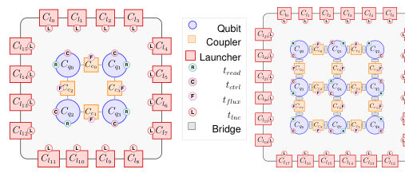 
Fig. 2. Abstracted representations of the 4-qubit and 9-qubit layouts, derived from their physical chip designs.

📷 Fig 2

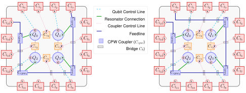 
Fig. 4. Comparison between (a) the primary port assignment and (b) an alternative assignment.

📷 Fig 3

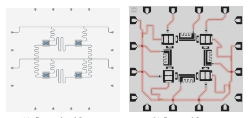 
Fig. 5. Comparison of assignment and routing complexity between (a) conventional layout generation and (b) a layout generated by the proposed method. Existing approaches consider point-to-point assignments for q + 2r wires Wp distributed across r rows. The flow proposed in this work solves assignments for q + c control wires Wp as well as q resonator wires Wr and feedline connections for approximately ⌈q/rutil⌉qubits. As a result, the problem involves ordered port assignments rather than point-to-point mappings alone. Assignment optimization further incorporates wirelength and bridge minimization objectives. For this 4-qubit layout, the assignment complexity increases from a total of 8 in...

📷 Fig 4

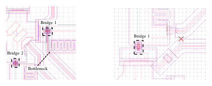 
Fig. 6. Illustrations of layout cavities and bottlenecks: (a) clearance violation within a cavity, and (b) spatially infeasible bridge assignment.

📷 Fig 5

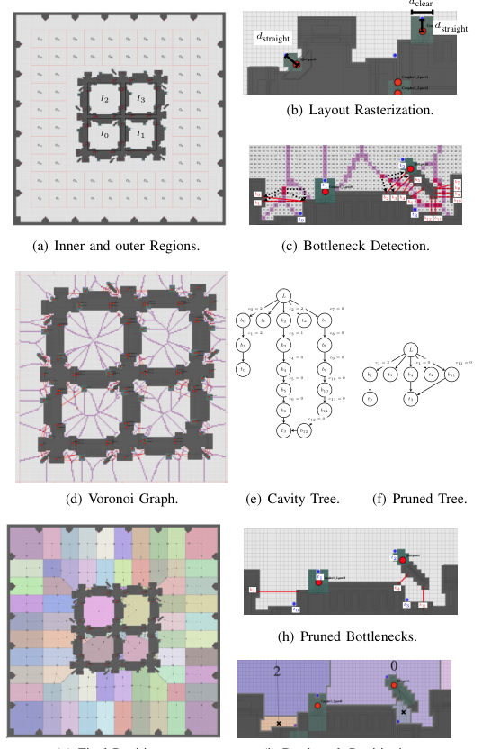 
Fig. 7. Geometry-aware global partitioning: the layout is rasterized and its Voronoi graph analyzed to detect narrow passages, whose topology is captured and pruned in a cavity tree, inducing the final partition boundaries.

**Summary.** This paper tackles the critical engineering bottleneck of manually designing superconducting quantum chips. The authors introduce a novel, formal geometric abstraction and a three-stage automated design flow to solve this. The resulting open-source tool generates complete, manufacturable chip layouts rapidly, enabling the scaling of quantum processors.

**Why it may be interesting.** This work directly addresses the engineering challenge of scaling quantum hardware, which is crucial for realizing complex quantum algorithms and large-scale quantum computation architectures.

Detailed structure

**Main problem.** The manual layout of superconducting quantum chips is a major bottleneck, making scaling difficult and time-consuming.

**Main result.** The authors propose and demonstrate an end-to-end, fully automatic design flow that generates manufacturing-ready layouts for superconducting quantum chips up to 69 qubits, achieving speedups up to 25x over state-of-the-art methods.

**Method.** The approach involves creating a formal geometric abstraction that translates physical device characteristics into a rigorous problem formulation, followed by a three-stage automated flow: global partitioning, ILP-based port assignment, and hierarchical routing.

**Model / system.** The system is planar superconducting quantum chips (SCQC) containing qubits, couplers, and launchers, which are patterned lithographically. The design is modeled as a geometric composition of components, governed by physical constraints like minimum bending radii and crosstalk separation.

**Key observables.** Manufacturing-ready layouts, execution times (seconds to minutes), minimum wire clearance (e.g., 185 µm), and successful routing of complex connectivity.

**Important parameters / regimes.** Operating frequencies (4 GHz to 8 GHz), cryogenic temperatures (10 mK to 20 mK), and impedance (50 Ω for CPWs).

**Assumptions / limitations.** The primary focus is on the geometric abstraction and automated flow, assuming that the initial placement of components is valid; the flow is designed for planar architectures, though the abstraction is extensible.

**Figures summary.** Figures illustrate the SCQC layout architecture, detailing component types (qubits, couplers, launchers) and showing the abstracted representations of small and medium-sized quantum chip layouts.

**Paper structure.** The paper identifies the manual layout bottleneck, introduces a formal geometric abstraction bridging physics and automation, details the three-stage design flow (partitioning, port assignment, routing), and validates the flow with performance comparisons against prior art.

Abstract

Superconducting circuits have emerged as one of the most promising and scalable platforms for quantum com- puting, with substantial industrial adoption driving qubit counts steadily upward. Yet the layout of the corresponding chips is still primarily performed manually, consuming multiple days or weeks of expert effort, even for moderately sized designs. Existing automation approaches sidestep this bottleneck by simplifying the underlying problem and relaxing physical constraints. Therefore, they fall short of fabrication-ready results. To overcome this scalability wall without such compromises, we first introduce a formal abstraction that translates physical device characteristics into a rigorous geometric problem formulation. This abstraction bridges physical realization and design automation. Building upon this abstraction, we then propose a three-stage design automation flow comprising geometry-aware global partitioning, ILP-based port assignment, and a hierarchical routing pipeline. Evaluations conducted by our interdisciplinary team of design au- tomation researchers and superconducting hardware experts con- firm that the resulting flow produces complete, manufacturing- ready layouts that comply with the physical design rules at the push of a button. That is, it operates fully automatically within seconds to a few minutes, and solves complex instances up to 25x faster than the state of the art. All methods are released as the fully open-source tool mqt-scpd as part of the Munich Quantum Toolkit, providing the first readily usable, end- to-end design flow for planar superconducting quantum chips that explicitly addresses the underlying physical characteristics and requirements.

[↑ back to top](#top)

### [Divisibility of Non-Invertible Quantum Dynamics in the Heisenberg Picture](http://arxiv.org/abs/2610.07986v1)

**Authors:** Federico Settimo, Dariusz Chruściński  
**Type:** theory · **Category:** other · **PDF:** <https://arxiv.org/pdf/2610.07986v1>  
**Analysis basis:** full PDF text, analyzed in chunks
**Topic relevance:** `correlated / nonlocal dissipation` **2/5** · `driven-dissipative phase transition` **2/5** · `methods for driven-dissipative` **2/5** · `Keldysh / 2PI / non-Gaussian methods` **1/5** · `non-equilibrium universality` **1/5** · `quantum measurements` **1/5**

📷 Fig 1

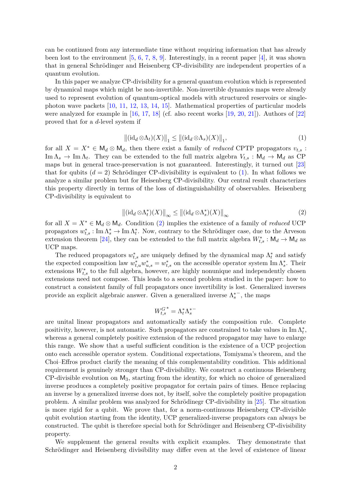 
Low-resolution page preview, page 2

📷 Fig 2

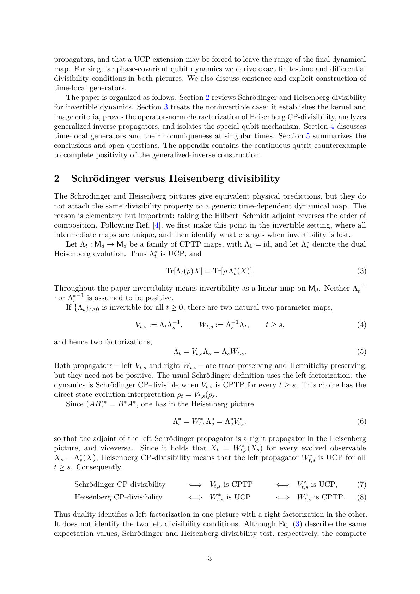 
Low-resolution page preview, page 3

📷 Fig 3

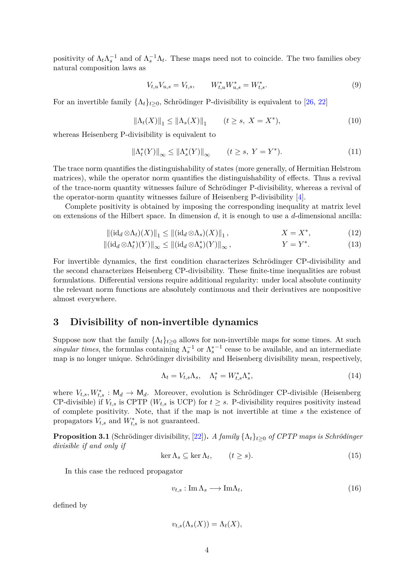 
Low-resolution page preview, page 4

📷 Fig 4

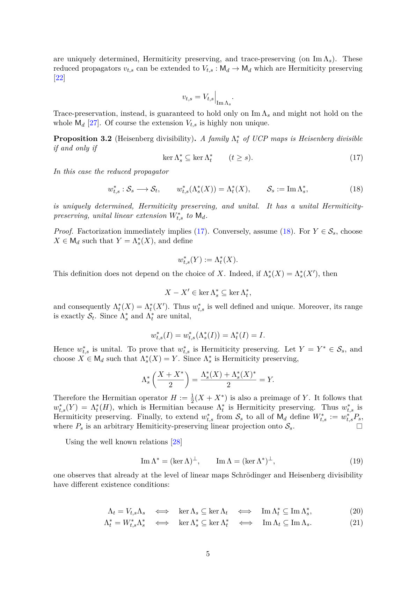 
Low-resolution page preview, page 5

📷 Fig 5

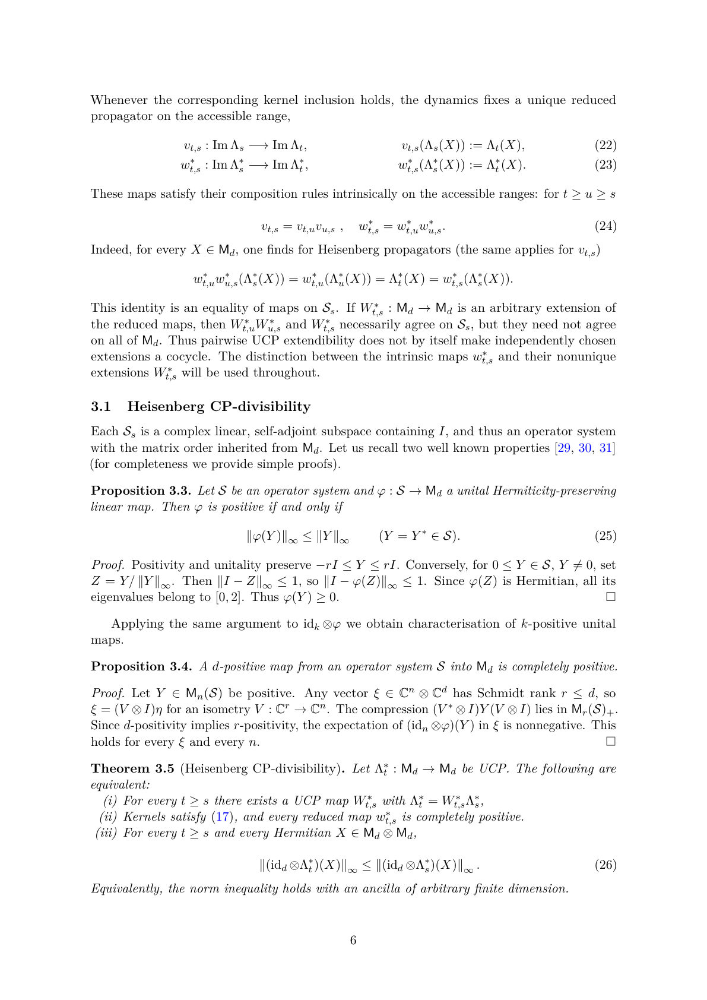 
Low-resolution page preview, page 6

**Summary.** This theoretical paper rigorously analyzes the concept of quantum dynamical divisibility, especially when the evolution maps are not invertible. It establishes that Heisenberg CP-divisibility is equivalent to an operator-norm monotonicity condition, providing necessary and sufficient mathematical criteria for consistent time evolution. The findings are important for understanding the mathematical structure of open quantum systems beyond the standard unitary or trace-preserving assumptions.

**Why it may be interesting.** This work provides rigorous mathematical tools to analyze the consistency of quantum evolution when the system dynamics are non-unitary or non-invertible, which is crucial for modeling open quantum systems.

Detailed structure

**Main problem.** The paper investigates the mathematical conditions for the divisibility of quantum dynamics, particularly when the underlying dynamical maps are non-invertible in the Heisenberg picture.

**Main result.** Heisenberg CP-divisibility is characterized by an operator-norm monotonicity condition, and for qubit dynamics, this guarantees a completely positive generalized-inverse propagator.

**Method.** The authors use functional analysis, comparing standard divisibility definitions with necessary kernel inclusion conditions for non-invertible maps, and employing generalized inverse constructions.

**Model / system.** The study concerns general finite-dimensional quantum dynamics on matrix algebras ($M_d$), represented by dynamical maps ($\Lambda_t$ in Schrödinger picture, $\Lambda_t^*$ in Heisenberg picture).

**Key observables.** Divisibility (existence of intermediate maps), CP-divisibility, operator-norm monotonicity, and the structure of reduced propagators on accessible operator systems.

**Important parameters / regimes.** The dimension of the system ($d$), and the time evolution parameter $t$.

**Assumptions / limitations.** The analysis often proceeds by assuming the existence of reduced propagators or by analyzing the failure of these assumptions when maps are non-invertible.

**Paper structure.** The paper progresses by first establishing the failure of standard divisibility definitions for non-invertible maps, then characterizing Heisenberg CP-divisibility via norm inequalities and kernel inclusions, and finally developing gauge-invariant formulations to handle singular time generators.

Abstract

We study divisibility of finite-dimensional quantum dynamics in the Heisenberg picture when the dynamical maps need not be invertible. Heisenberg divisible dynamics determines unique reduced propagators on the accessible operator systems, and Heisenberg CP-divisibility is shown to be equivalent to an operator-norm monotonicity. Although each reduced propagator admits a unital completely positive extension, independently chosen extensions need not satisfy a composition law. Generalized inverses restore this law algebraically, but do not, in general, preserve complete positivity. We characterize the resulting obstruction and give a sufficient construction based on unital completely positive projections onto the accessible operator systems. It is shown that for qubit dynamics Heisenberg CP-divisibility always guarantees a completely positive generalized-inverse propagator. Finally, we analyze time-local generators at singular times and identify the associated gauge freedom on dynamically inaccessible directions.

[↑ back to top](#top)

### [Relative-Entropy Flow Across the Page Transition](http://arxiv.org/abs/2610.08397v1)

**Authors:** Minghui Yu, Xian-Hui Ge  
**Type:** theory · **Category:** statistical mechanics · **PDF:** <https://arxiv.org/pdf/2610.08397v1>  
**Analysis basis:** full PDF text, analyzed in chunks
**Topic relevance:** `Keldysh / 2PI / non-Gaussian methods` **2/5** · `driven-dissipative phase transition` **2/5** · `methods for driven-dissipative` **2/5** · `non-equilibrium universality` **2/5** · `quantum measurements` **1/5**

📷 Fig 1

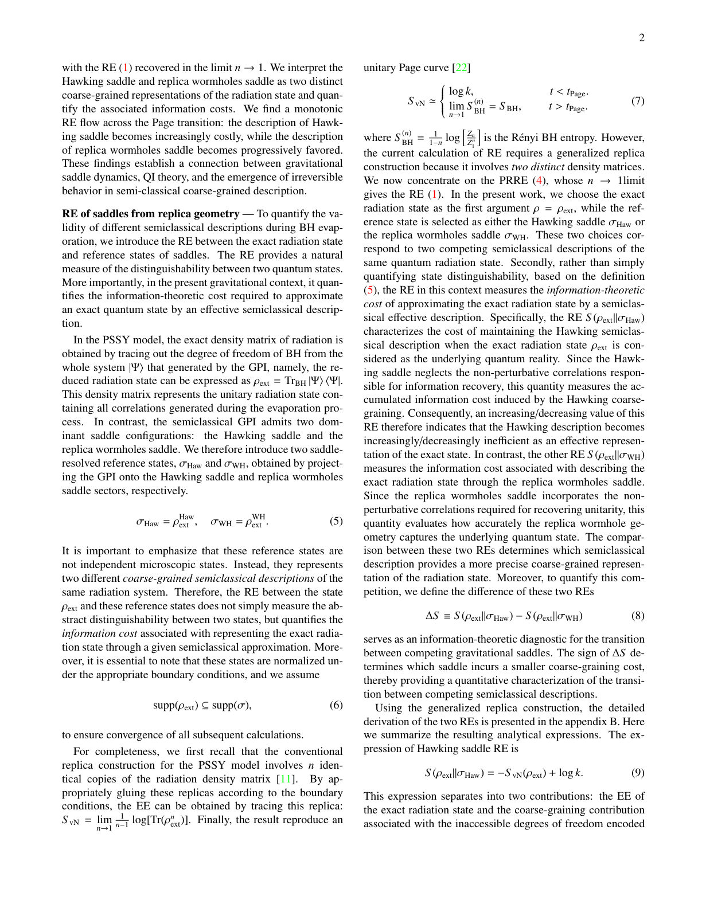 
Low-resolution page preview, page 2

📷 Fig 2

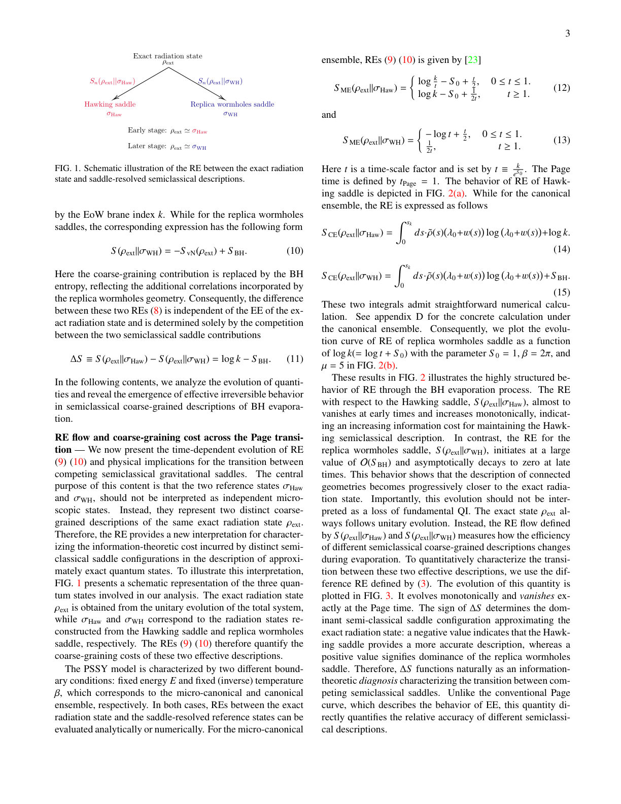 
Low-resolution page preview, page 3

📷 Fig 3

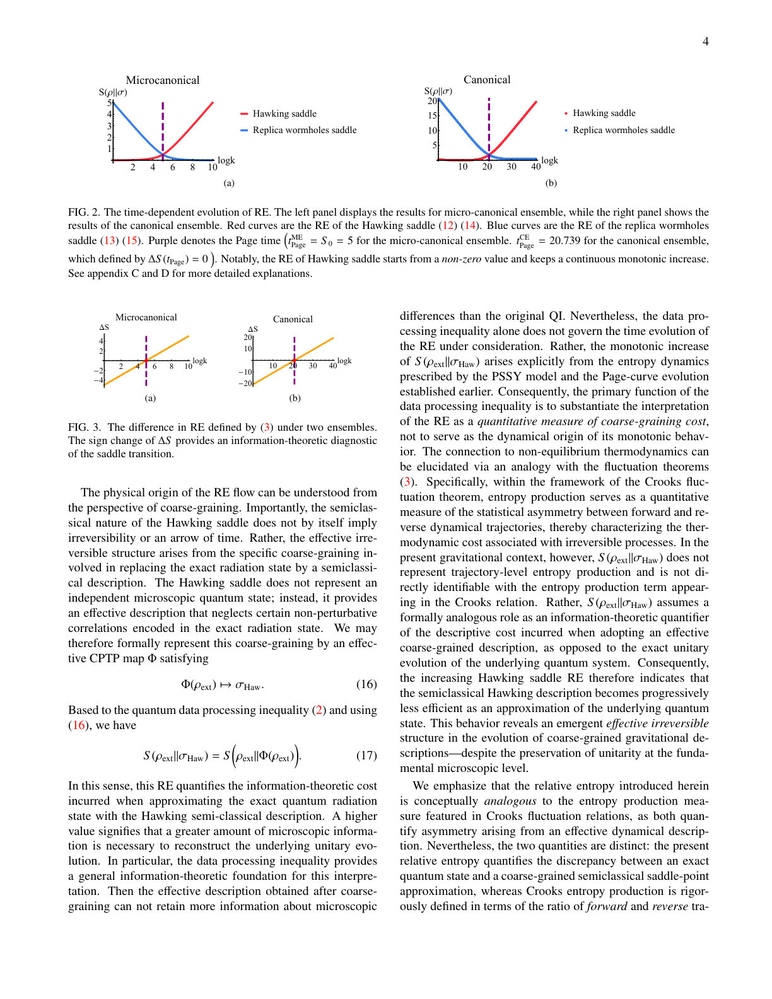 
Low-resolution page preview, page 4

📷 Fig 4

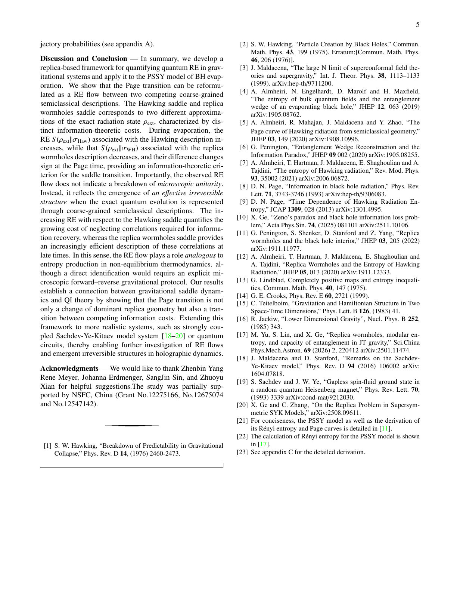 
Low-resolution page preview, page 5

📷 Fig 5

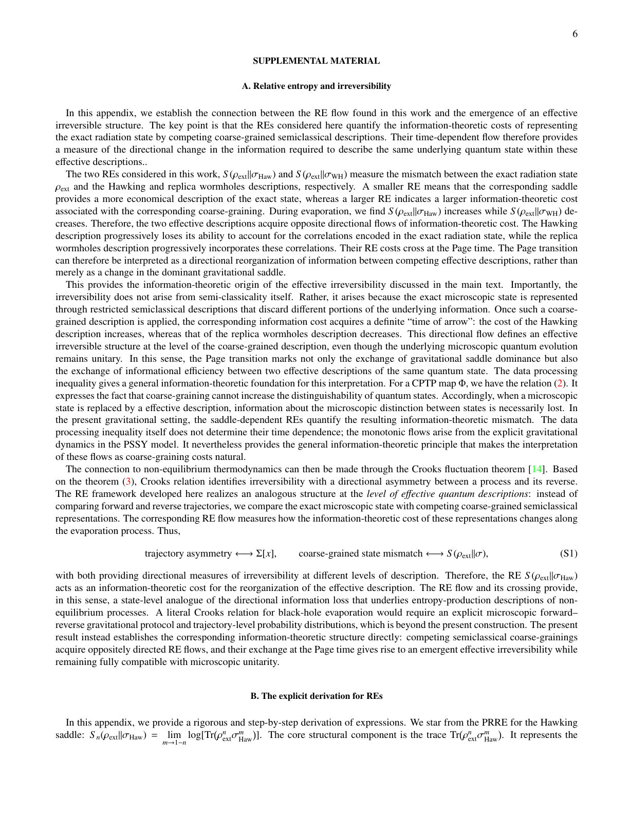 
Low-resolution page preview, page 6

**Summary.** This work reinterprets the black hole Page transition using quantum relative entropy, treating it as a flow of information-theoretic costs between two competing semi-classical gravitational descriptions. By analyzing how the relative entropy changes over time, the authors establish an information-theoretic criterion that precisely diagnoses the transition point where the description shifts from the Hawking saddle to the replica wormholes saddle.

**Why it may be interesting.** While focused on gravity, the use of relative entropy flow to diagnose a transition point based on the relative efficiency of two competing descriptions is a powerful, generalizable tool for analyzing non-equilibrium processes in complex quantum systems.

Detailed structure

**Main problem.** The paper analyzes the information-theoretic structure underlying the Page transition during black hole evaporation by comparing competing semi-classical gravitational descriptions.

**Main result.** The Page transition is recast as a flow of relative entropy costs between the Hawking saddle and the replica wormholes saddle, with the sign change of the difference in relative entropy diagnosing the transition.

**Method.** The authors develop a computational framework using the quantum relative entropy, calculated via the replica trick, to quantify the information-theoretic cost associated with approximating the exact quantum state.

**Model / system.** The analysis is performed on Jackiw-Teitelboim (JT) gravity applied to an End-of-the-World (EoW) brane (PSSY model), modeling black hole evaporation.

**Key observables.** Relative Entropy (RE) between the exact radiation state and the two saddle states, and the difference in these relative entropies ($\Delta S$).

**Important parameters / regimes.** The Page time, which marks the sign reversal of $\Delta S$; the replica index $n$ and the large $k$ limit.

**Assumptions / limitations.** The analysis assumes the support of the exact state is contained within the support of the saddle states, and the effective irreversibility is not taken to imply a breakdown of fundamental unitarity.

**Figures summary.** Figures illustrate the time evolution of the relative entropies for both the Hawking and wormhole saddles, showing the monotonic increase of the Hawking cost and the decay of the wormhole cost, culminating in a sign change for $\Delta S$ at the Page time.

**Paper structure.** The paper builds the framework by defining the RE using the replica trick, applies it to the two competing semiclassical saddles ($\sigma_{	ext{Haw}}$ and $\sigma_{	ext{WH}}$), derives explicit time-dependent expressions for the REs, and finally interprets the flow of these costs across the Page transition.

Abstract

We develop a computational framework for the quantum relative entropy based on the replica trick and apply it to analyze the evaporation process method of Jackiw-Teitelboim black holes. We show that the relative entropies between the exact radiation state and the Hawking saddle state and the replica wormholes saddle state quantify information-theoretic costs inherent to coarse-grained semiclassical descriptions. During evaporation, the relative entropy for the Hawking saddle increases monotonically, reflecting a progressively higher thermodynamic cost of sustaining the Hawking description. Conversely, the relative entropy associated with the replica wormholes saddle decreases, which indicates that the description of connected geometries becomes progressively more accurate. Moreover, the sign of the difference between the two quantities reverses precisely at the Page time, providing an information-theoretic diagnosis for the transition between competing gravitational saddles. Our results recast the Page transition as a flow of relative entropy costs between competing semi-classical descriptions, revealing an information-theoretic structure underlying the emergence of effective irreversibility in coarse-grained black hole evaporation.

[↑ back to top](#top)

### [Inertial Counterdiabatic Driving](http://arxiv.org/abs/2610.08235v1)

**Authors:** Julián Ferreiro-Vélez, F. A. Cárdenas-López, F. Motzoi, Xi Chen  
**Type:** theory · **Category:** other · **PDF:** <https://arxiv.org/pdf/2610.08235v1>  
**Analysis basis:** full PDF text, analyzed in chunks
**Topic relevance:** `Keldysh / 2PI / non-Gaussian methods` **2/5** · `analog quantum simulation` **2/5** · `methods for driven-dissipative` **2/5** · `quantum measurements` **1/5**

📷 Fig 1

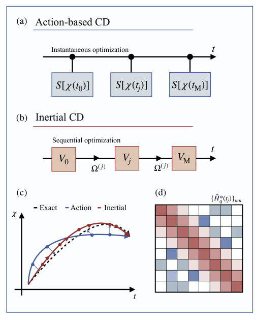 
FIG. 1. Schematic comparison between action-based and inertial CD. (a) Action-based variational CD optimization scheme, where the structure of the approximate AGP is determined independently at each time tj by minimizing the action S[χ(tj)] [see Eq. (9)]. (b) Inertial CD optimization scheme, where the moving frame is con- structed sequentially through the Magnus exponent Ω(j) over the jth time interval, so that each optimization step acts on the frame ac- cumulated during the preceding evolution. The controls are cho- sen to minimize the off-diagonal part of the rotated Hamiltonian [see Eq. (11)], so that the constructed frame approximates the adi- abatic moving frame. (c) Schematic time...

📷 Fig 2

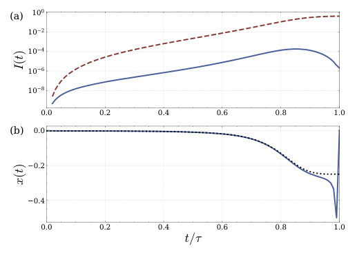 
FIG. 2. Two-qubit benchmark of the inertial CD protocol. (a) Instan- taneous GS infidelity as a function of the normalized evolution time for adiabatic (red dashed) and inertial CD dynamics (blue solid). (b) Exact action-based (black dotted) and inertial CD (blue solid) control coefficients. Parameters: τ = 0.1, hz = 5, J = −1, µ = 10−3, and M = 100.

📷 Fig 3

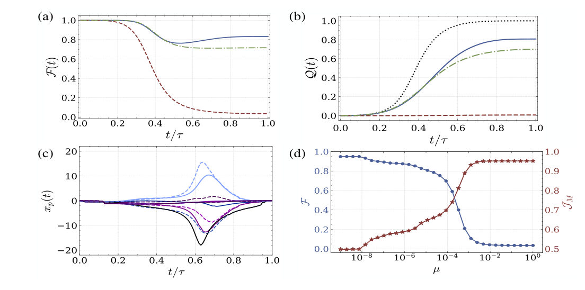 
FIG. 3. Quench dynamics of the longitudinal-field Ising model for hx = hz = J = 1/2, N = 5, M = 100, µ = 5 · 10−6, and τ = 0.1 · 2π. Results are shown for the unassisted adiabatic evolution (red dashed), the action-based variational AGP protocol (green dot-dashed), and the inertial CD protocol (blue solid). The control operators are obtained from the algebra spanned by the first-order Krylov expansion (ℓ= 1). (a) Instantaneous GS fidelity during the evolution. (b) Normalized ferromagnetic correlation density Q, compared with its instantaneous-GS value (black dotted). (c) Optimized variational coefficients of the inertial CD protocol for hz = 5 · 10−2. (d) Final diagonalization cost and...

📷 Fig 4

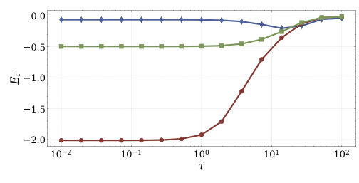 
FIG. 4. Final residual energy as a function of the total quench time τ. Results are shown for the inertial CD protocol (blue diamonds), the action-based CD protocol (green squares), and unassisted adiabatic evolution (red circles). The inertial protocol yields lower residual energies throughout the nonadiabatic regime considered. Parameters: hx = 1/2, J = 1/2, hz = 2 · 10−3, M = 100 and µ = 10−6.

📷 Fig 5

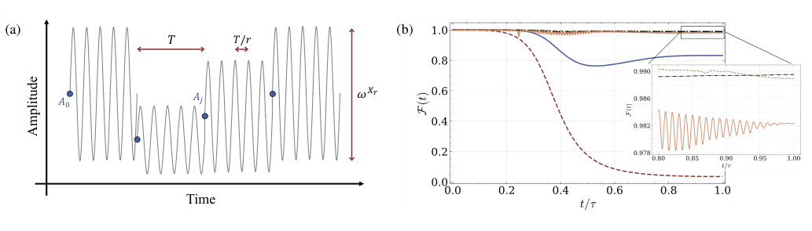 
FIG. 5. Second-order Magnus engineering in the longitudinal-field Ising model. (a) Schematic representation of the Fourier modulation used to enhance the effective second-order commutator contributions. (b) Instantaneous GS fidelity for the unassisted evolution (red dashed), the first-order inertial CD protocol with the ℓ= 1 control pool (blue solid), and the Fourier-enhanced second-order inertial CD protocol with the same ℓ= 1 control pool (orange solid). For comparison, results obtained with two explicitly enlarged operator spaces are also shown: the ℓ= 2 Krylov ansatz (dashed green) and the commutator-augmented DLA ansatz (dashed-dotted black), both optimized using first-order ME....

**Summary.** This paper introduces an Inertial Counterdiabatic (CD) driving protocol that improves quantum control by treating the control problem as a moving-frame diagonalization task. It uses the Magnus expansion to account for accumulated errors across time steps, surpassing standard methods. The technique is shown to be particularly effective for fast driving near quantum phase transitions in spin chain models.

**Why it may be interesting.** This work provides a sophisticated, non-local theoretical tool for designing quantum control pulses, which is highly relevant for controlling complex quantum systems like superconducting qubits or trapped ions.

Detailed structure

**Main problem.** The paper addresses the challenge of achieving high-fidelity quantum state preparation faster than the adiabatic limit using coherent control techniques.

**Main result.** The novel Inertial Counterdiabatic (CD) protocol consistently outperforms standard action-minimization variational CD protocols, especially near quantum gap-closing regions.

**Method.** It reformulates the control problem as a moving-frame diagonalization problem, utilizing the Magnus expansion to construct a variational propagator that accounts for accumulated diabatic errors.

**Model / system.** The method is benchmarked on a general two-qubit system and the one-dimensional quantum Ising chain, allowing for the study of controlled dynamics in interacting quantum spin systems.

**Key observables.** Infidelity ($1 - F(t)$), suppression of off-diagonal Hamiltonian terms, and the final ground state fidelity.

**Important parameters / regimes.** The optimization hyperparameters, such as the penalty coefficient ($\mu$) and the number of time discretization steps ($M$), are crucial for performance.

**Assumptions / limitations.** The primary approximation involves using the Magnus expansion to approximate the time evolution operator, and the standard CD approach relies on local, instantaneous optimization.

**Figures summary.** Figures compare the performance of different CD schemes (Action-based vs. Inertial) and show the dependence of fidelity and control amplitude on the number of time steps ($M$) and regularization strength ($\mu$).

**Paper structure.** The paper introduces the general CD framework, contrasts it with standard variational methods, details the Inertial CD approach using the Magnus expansion, benchmarks it on two-qubit and Ising models, and analyzes the role of nonlocality near critical points.

Abstract

We introduce an inertial counterdiabatic (CD) protocol that reformulates shortcut-to-adiabaticity design as a moving-frame diagonalization problem. The method employs the Magnus expansion to construct a variational propagator generated by an accessible CD ansatz. In the new rotating frame, the controls are optimized to suppress the off-diagonal Hamiltonian terms, and the CD terms are defined to counteract the corresponding inertial contribution. The propagator generated with the Magnus expansion naturally exploits additional control directions generated through its nested commutator, while the sequential design of the propagator introduces temporal nonlocality into the optimization. We benchmark the method on a two-qubit system and on the one-dimensional quantum Ising chain, where it consistently outperforms variational CD protocols based on action minimization. The largest improvements are observed near gap-closing regions, demonstrating the advantage of combining temporal and algebraic nonlocality for suppressing diabatic excitations.

[↑ back to top](#top)

### [Shape theorem for excited random walks on the integer lattice](http://arxiv.org/abs/2610.07724v1)

**Authors:** Tuan-Minh Nguyen  
**Type:** theory · **Category:** statistical mechanics · **PDF:** <https://arxiv.org/pdf/2610.07724v1>  
**Analysis basis:** full PDF text, analyzed in chunks
**Topic relevance:** `analog quantum simulation` **2/5** · `non-equilibrium universality` **2/5** · `Keldysh / 2PI / non-Gaussian methods` **1/5** · `methods for driven-dissipative` **1/5**

📷 Fig 1

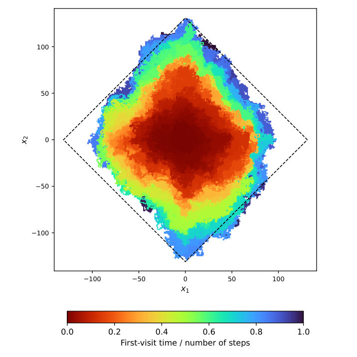 
FIGURE 1. Simulation of the random walk excited to the center on Z2 with θ = 0.5 after n = 1,500,000 steps. Colors indicate the first-visit time divided by n. The dashed curve is the boundary of the predicted ℓ1 ball of radius (3n/(4θ))1/3.

**Summary.** This paper derives the precise limit shape for the spatial extent (range) of a specialized random walk on the integer lattice. The walk incorporates a memory effect via 'cookies' that bias movement toward the origin upon first visit. The key result shows this range converges to a specific $\ell^1$ ball, using advanced tools from potential theory and probability theory.

**Why it may be interesting.** While focused on classical random walks, the techniques involving scaling limits, local time analysis, and shape theorems are highly relevant to understanding the spatial extent and collective behavior of excitations in many-body quantum systems or non-equilibrium quantum dynamics.

Detailed structure

**Main problem.** The paper aims to determine the limit shape of the range of a specific type of random walk on the integer lattice $\mathbb{Z}^d$.

**Main result.** The rescaled range of the walk converges in probability in Hausdorff distance to an explicit $\ell^1$ ball, providing an answer to a question posed by Kozma (2007).

**Method.** The proof involves bounding expected range sizes using martingale decomposition and studying the local times of the walk via potential theory and integral equations.

**Model / system.** The model is the "random walk excited to the center" on $\mathbb{Z}^d$ ($d\ge 2$). The walk's transition rules depend on whether a cookie is available (first visit to a non-zero site, causing a bias toward the origin) or if the walker is at the origin or has visited the site before (simple symmetric random walk).

**Key observables.** The range of the walk up to time $n$, $R_n$, and its rescaled limit shape.

**Important parameters / regimes.** The dimension $d \ge 2$, the bias parameter $\theta$, and the time scaling factor $n^{-1/(d+1)}$.

**Assumptions / limitations.** The analysis relies on establishing convergence in probability using Hausdorff distance and involves complex control over local times and martingale inequalities.

**Figures summary.** Figure 1 simulates the random walk on $\mathbb{Z}^2$ and compares the observed range boundary to the theoretically predicted $\ell^1$ ball boundary.

**Paper structure.** The paper proceeds by first establishing bounds on expected range size using martingale methods, then analyzing the rescaled range using the Poisson equation, and finally proving the main shape theorem by controlling the Hausdorff distance.

Abstract

We study the limit shape of the range of the random walk excited to the center on $\mathbb Z^d$, with $d\geq2$. A cookie is placed at each nonzero vertex. On its first visit to such a vertex, the walker consumes the cookie and takes its next nearest-neighbor step with a bias toward the origin. On a visit to the origin, or on later visits to a nonzero vertex, no cookie is available and the walker moves to a neighbor uniformly at random. We prove that the set of vertices visited up to time $n$, rescaled by $n^{-1/(d+1)}$, converges in probability in Hausdorff distance to an explicit $\ell^1$ ball. This answers a question raised by Kozma (2007).

[↑ back to top](#top)

### [Horizon-Scale Corrections to Black Hole Geometry from a Conserved Quantum Atmosphere](http://arxiv.org/abs/2610.07934v1)

**Authors:** Kashif Ammar Yasir  
**Type:** theory · **Category:** other · **PDF:** <https://arxiv.org/pdf/2610.07934v1>  
**Analysis basis:** full PDF text, analyzed in chunks
**Topic relevance:** `Keldysh / 2PI / non-Gaussian methods` **2/5** · `correlated / nonlocal dissipation` **1/5** · `methods for driven-dissipative` **1/5** · `quantum measurements` **1/5**

📷 Fig 1

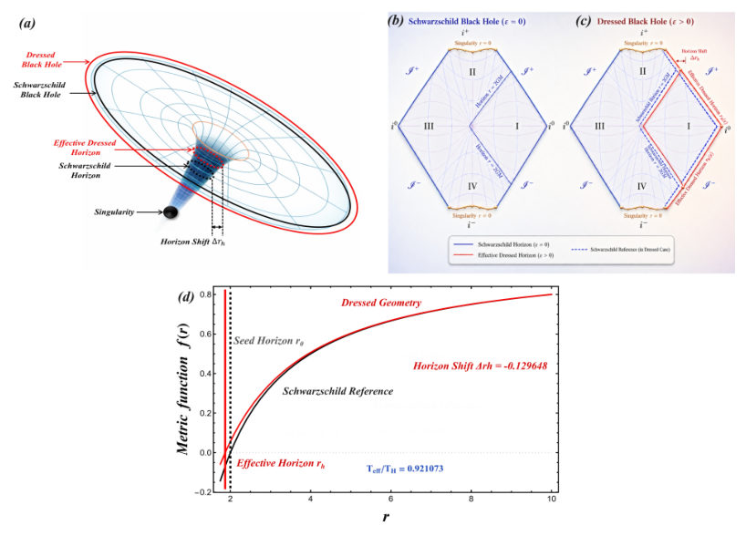 
FIG. 1. Mean-field dressing of the Schwarzschild geometry by a Hawking-scale effective atmosphere. (a) Embedding comparison between the Schwarzschild reference geometry and the dressed mean geometry obtained from the conserved effective source. The red surface denotes the dressed solution and the black surface denotes the Schwarzschild reference with the same ADM mass. The displacement of the zero of the lapse defines the horizon shift ∆rh = rh −r0, where r0 = 2M. (b) Schematic horizon-scale diagram of the Schwarzschild reference spacetime. (c) Schematic horizon-scale diagram of the dressed mean geometry. The red boundary denotes the effective horizon rh(ε), while the dashed blue line marks the...

📷 Fig 2

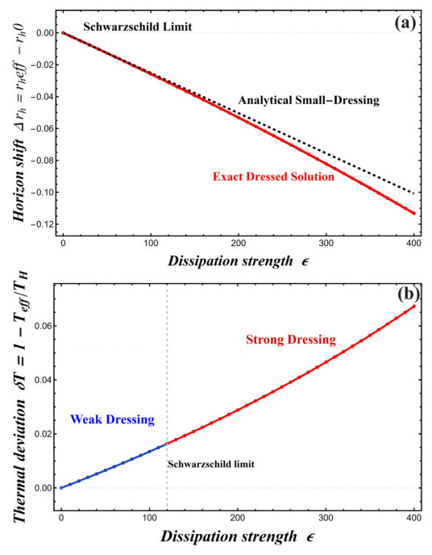 
FIG. 2. Geometric and thermal response of the dressed mean black hole. (a) Horizon shift ∆rh = rh −r0 as a function of the dissipation/dressing strength ε. The red curve gives the numerical root of the corrected lapse, while the black dotted curve shows the weak-dressing expansion. Agreement at small ε verifies the perturbative limit; the departure at larger ε signals nonlinear response of the lapse. (b) Thermal deviation δT = 1 −Teff/TH over the same range. The monotonic growth of δT shows that the effective temperature is suppressed as the horizon-localized dressing becomes stronger. The two branches indicate the weak- and strong-dressing regimes used to guide the eye.

📷 Fig 3

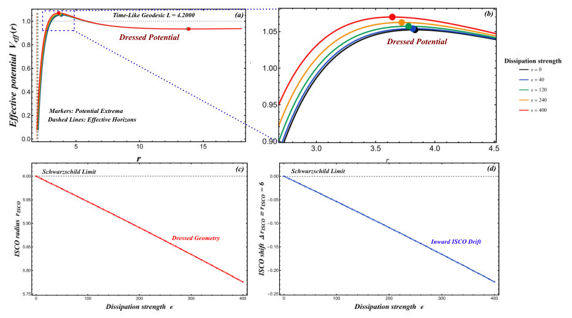 
FIG. 3. Orbital restructuring in the dressed mean geometry. (a) Effective potential Vgeo(r) = f(r)(1 + L2/r2) for a timelike geodesic with L = 4.2. Dashed vertical lines denote the corresponding horizon locations, and markers identify extrema of the potential. (b) Enlarged view of the potential barrier for ε = 0, 40, 120, 240, and 400. Increasing dressing strength changes both the height and the position of the barrier. (c) ISCO radius rISCO as a function of ε, obtained from the marginal- stability condition for circular timelike orbits. (d) ISCO displacement ∆rISCO = rISCO −6M. The inward drift shows that the same lapse renormalization that shifts the horizon also changes the conservative...

📷 Fig 4

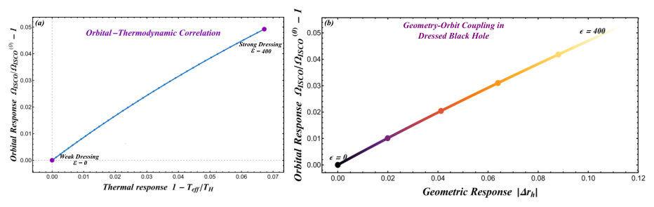 
FIG. 4. Correlated thermal, geometric and orbital response. (a) Normalized orbital response Rorb = |rISCO(ε) − 6M|/(6M) plotted against the thermal deviation 1 −Teff/TH. The monotonic trend indicates that the change in orbital structure tracks the suppression of the effective temperature. (b) Normalized orbital response plotted against the magnitude of the horizon shift |∆rh|. The near-linear behavior over the displayed range shows that the orbital response is controlled by the same geometric deformation that moves the horizon.

📷 Fig 5

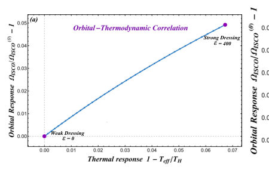 
Figure 2 resolves how the geometry changes as the dressing strength is increased. In the Schwarzschild limit the effective source vanishes, and the reference horizon and Hawking temperature are recovered. Moving away from this limit, the numerical root of the corrected lapse shifts monotonically inward. At weak dressing the nu- merical curve follows the perturbative result already de- rived in the theory section and appendix. This agreement is a useful check: it shows that the numerical root is on

**Summary.** This work proposes a method to incorporate the quantum effects of a black hole horizon into the classical geometry by treating the environment as a conserved, deterministic source. This 'dressing' modifies key geometric features, such as the horizon location and particle orbits, establishing a necessary mean-field background for future stochastic quantum gravity calculations.

**Why it may be interesting.** While focused on general relativity, the methodology of deriving a deterministic mean-field background from an environmental source, which is then used as the starting point for a subsequent stochastic treatment (Einstein-Langevin), mirrors techniques used in open quantum systems theory.

Detailed structure

**Main problem.** The paper addresses whether the inherent quantum openness of a black hole horizon, suggested by Hawking radiation, can be incorporated deterministically into the gravitational background geometry before resorting to full stochastic quantum gravity treatments.

**Main result.** The authors construct a deterministic, dressed mean-field geometry by introducing a conserved, anisotropic source representing the near-horizon quantum atmosphere, which modifies the horizon location and orbital dynamics in a correlated manner.

**Method.** They solve the Einstein equations for a static black hole by adding an effective, conserved stress-energy tensor derived from the quantum atmosphere, thereby defining a mean-field background geometry.

**Model / system.** The system is a black hole geometry, initially Schwarzschild, which is modified by the inclusion of a conserved, Hawking-scale anisotropic source ($T_{\mu
u}$) representing the coarse-grained quantum environment.

**Key observables.** Renormalized mass function, self-consistently shifted horizon ($\Delta r_h$), modified surface gravity, and changes in the Innermost Stable Circular Orbit (ISCO) radius.

**Important parameters / regimes.** ADM mass ($M$), the strength of the environmental coupling ($\epsilon$), and the exponent $n$ characterizing the source decay.

**Assumptions / limitations.** The analysis focuses only on the deterministic mean-field sector, treating the environmental effect as a conserved source rather than a stochastic noise term; the source is assumed to be localized near the Schwarzschild radius.

**Figures summary.** Figures illustrate the mean-field dressing by comparing the Schwarzschild and dressed geometries, showing the shift in the horizon ($\Delta r_h$), and demonstrating the inward drift of the ISCO radius correlated with the thermal response.

**Paper structure.** The paper progresses by first defining the problem of horizon openness, then solving the Einstein equations with the conserved source to find the mean geometry, and finally analyzing the consequences for thermodynamics (horizon shift) and dynamics (ISCO drift) before outlining the necessary next step into the Einstein-Langevin framework.

Abstract

Black holes are usually described either as classical geometries on which quantum fields propagate or as objects whose complete quantum description lies beyond semiclassical gravity. Hawking radiation already shows, however, that a black hole is not an exactly isolated system: the horizon carries a thermal scale and, after coarse graining, may be associated with fluctuations, dissipation and environmental correlations. Whether this horizon-scale openness can be encoded directly in the gravitational background, before any stochastic treatment of the metric, remains an open question. Here we answer it by introducing, for the first time, a conserved Hawking-scale anisotropic source representing the coarse-grained near-horizon atmosphere and solving the Einstein equations for a static black hole at fixed ADM mass. The dressed geometry has a renormalized mass function, a self-consistently shifted horizon and a modified surface gravity. Because the same lapse governs the horizon and timelike geodesics, the thermal response is accompanied by a correlated orbital restructuring: the effective potential is renormalized, the ISCO moves inward and the near-horizon residence time increases. The construction adds no Langevin force to a fixed Schwarzschild background; rather, it defines a deterministic dressed mean geometry, providing a controlled background on which stochastic metric fluctuations may subsequently be treated in the Einstein-Langevin framework. This establishes the deterministic mean-field sector as the necessary first step for future stochastic gravity programs addressing horizon-scale openness.

[↑ back to top](#top)

### [Incoherent Spectral Weight Emerging from a Van Hove Singularity in a Kagome Metal](http://arxiv.org/abs/2610.08356v1)

**Authors:** C. -y. Lim, J. Deng, A. Korshunov, A. Kar, D. Subires, H. Li, Y. Jiang, H. Hu, E. Modin, P. Törmä, A. Kumar-Sharma, C. Shekhar, A. Louat, T. K. Kim, C. Felser, B. Andrei Bernevig, S. Blanco-Canosa  
**Type:** both · **Category:** strongly correlated electrons · **PDF:** <https://arxiv.org/pdf/2610.08356v1>  
**Analysis basis:** full PDF text, analyzed in chunks
**Topic relevance:** `Keldysh / 2PI / non-Gaussian methods` **2/5** · `correlated / nonlocal dissipation` **1/5** · `methods for driven-dissipative` **1/5** · `quantum measurements` **1/5**

📷 Fig 1

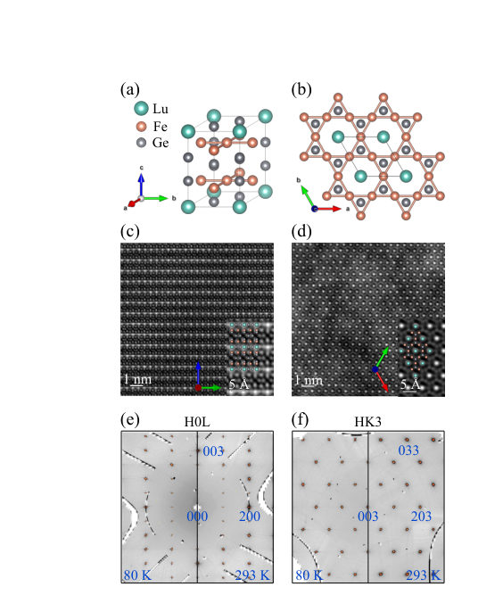 
FIG. 1. (a) Unit cell and (b) In-plane lattice structure of the kagome metal LuFe6Ge6. (c,d) Scanning transmission elec- tron microscopy (STEM) images projected onto the (c) bc- plane and (d) ab-plne, respectively. The inset images in the bottom-right corners show magnified views overlaid with the atomic structure. (e,f) Comparison of the diffuse scattering results of LuFe6Ge6 in the (e) H0L and (f) HK3 planes, re- spectively, at 293 and 80 K.

📷 Fig 2

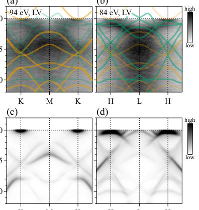 
FIG. 3. Waterfall feature observed in ARPES. (a,b) ARPES intensity maps measured with LV polarization along K-M- K and H-L-H, respectively. Yellow and green curves overlay the bulk DFT-calculated dispersions along K-M-K (kz = 0) and H-L-H (kz = π/c), respectively. Bands smeared from the other kz plane due to the kz broadening effect are shown with increased transparency. (c,d) Calculated ARPES spec- tral function along K-M-K and H-L-H for LuFe6Ge6 with lin- ear vertical polarized light.

📷 Fig 3

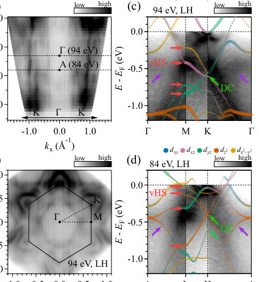 
FIG. 2. Electronic structure of LuFe6Ge6 measured by ARPES. (a) Photon-energy-dependent measurement results. Black dashed lines at 94 and 84 eV correspond to the Γ and A planes, respectively. (b) Fermi surfaces at the Γ plane. Solid lines and dashed lines are the first BZ boundary and high-symmetry directions. (c,d) Band dispersions along (c) Γ-M-K-Γ and (d) A-L-H-A measured with linear horizontal (LH) polarization, respectively. Overlaid markers correspond to the bulk DFT-calculated band structures, with different colors representing different Fe d orbitals.

📷 Fig 4

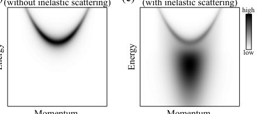 
FIG. 4. Schematic illustration of inelastic scattering in the photoemission process. (a-c) Energy and photoemission in- tensity diagrams illustrating the ARPES photoemission pro- cess and subsequent inelastic scattering. Evac and EF denote the vacuum and Fermi levels, respectively. hν is the inci- dent photon energy, and Φ is the work function. White and black circles represent holes and photoexcited electrons, re- spectively. (d,e) Schematic ARPES intensity maps showing (d) a pristine parabolic band with enhanced spectral weight at the band bottom due to the vHS and (e) additional spec- tral weight extending toward higher binding energy due to inelastic energy loss of the photoelectrons....

**Summary.** This work analyzes anomalous 'waterfall-like' spectral features in a kagome metal using ARPES and DMFT. The authors argue that these features, which appear near a Van Hove Singularity, are likely caused by inelastic scattering of photoelectrons rather than requiring strong electronic correlations. This suggests that photoelectron energy-loss processes must be considered when interpreting spectral features in correlated materials.

**Why it may be interesting.** While focused on condensed matter, the analysis of spectral function broadening and the distinction between intrinsic (self-energy) and extrinsic (photoelectron scattering) effects is highly relevant to understanding spectral signatures in quantum materials.

Detailed structure

**Main problem.** The paper investigates the origin of anomalous 'waterfall-like' spectral features observed in ARPES spectra of a kagome metal, determining if they stem from strong electronic correlations or from other physical mechanisms.

**Main result.** The authors propose that the spectral weight enhancement is likely due to inelastic scattering of outgoing photoelectrons near a Van Hove Singularity, rather than solely requiring strong electronic correlations.

**Method.** The study combines experimental measurements (ARPES, DFT) with advanced theoretical calculations (DMFT) and modeling of photoemission energy-loss processes.

**Model / system.** The system studied is the kagome metal LuFe6Ge6, a member of the FeGe-derived family, whose electronic structure is analyzed using DFT and DMFT frameworks.

**Key observables.** Pronounced vertical spectral feature (waterfall) at the L point, coincidence of feature onset with a Van Hove Singularity (vHs), and quasiparticle weights (Z).

**Important parameters / regimes.** The energy scale of the vHs ($\approx 0.3 	ext{ eV}$ below $E_F$), and the degree of electronic correlation quantified by DMFT parameters.

**Assumptions / limitations.** The primary assumption tested is whether the spectral weight can be explained by inelastic scattering processes involving the high density of states near the vHs, rather than solely by intrinsic self-energy renormalization.

**Figures summary.** Figures summarize ARPES band dispersions along high-symmetry lines, showing the anomalous feature, and theoretical models illustrate how self-energies can generate waterfall features.

**Paper structure.** The paper progresses by first presenting experimental observations (ARPES/DFT) of the waterfall feature, then applying DMFT to check for correlation signatures, and finally proposing and modeling the inelastic scattering mechanism as the source of the spectral weight.

Abstract

Waterfall-like spectral features observed by angle-resolved photoemission spectroscopy (ARPES) are commonly associated with strong electronic correlations or electron-boson coupling. Here, we investigate this connection in the kagome metal LuFe6Ge6, a structurally simple member of the FeGe-derived family, using polarization-dependent ARPES, density functional theory and dynamical mean-field theory. We observe a pronounced vertical spectral feature at the L point extending over several hundred meV in binding energy. Its orbital character is identified as predominantly Fe dyz, and its energy onset coincides with a van Hove singularity located approximately 0.3 eV below EF . Despite the waterfall-like spectral response, dynamical mean-field theory (DMFT) reveals only weak electronic correlations, while the calculated electronic structure closely reproduces the experimental bulk bands. We propose that the anomalous spectral weight may arise from inelastic scattering of the outgoing photoelectrons, potentially associated with the large density of states near the van Hove singularity. Our results suggest that waterfall-like features can emerge without strong electronic correlations and highlight the possible role of the underlying band structure and photoelectron energy-loss processes in their interpretation.

[↑ back to top](#top)

### [Memory Separations from a Collective-Spin Quantum Register](http://arxiv.org/abs/2610.08038v1)

**Authors:** Jamal Slim  
**Type:** theory · **Category:** quantum information and computing · **PDF:** <https://arxiv.org/pdf/2610.08038v1>  
**Analysis basis:** full PDF text, analyzed in chunks
**Topic relevance:** `analog quantum simulation` **2/5** · `correlated / nonlocal dissipation` **1/5** · `driven-dissipative phase transition` **1/5** · `quantum measurements` **1/5**

📷 Fig 1

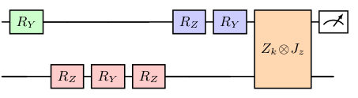 
FIG. 1. One block. The work register (top) is prepared blank, rotated (green, blue), coupled to the memory (orange) and measured, and the outcome is the emitted symbol. The memory (bottom) is never measured and its rotations (red) are collective, one angle each however many qubits they turn. The layer repeats L times per block. The operators of Eq. (1) are the blocks Ax = ⟨x| U |0⟩of this circuit.

📷 Fig 2

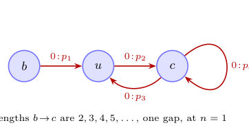 
FIG. 2. Why a forbidden interevent time is expensive clas- sically, in the edge-emitting convention of Ref. [4], in which each transition carries an emitted symbol and a weight. Every edge shown belongs to the no-event block A, an event ending the interval. Since dn = cTAnb with all factors nonnegative, dn∗= 0 holds exactly when no walk of length n∗joins supp b to supp c, and because the zero pattern of An is periodic from an index at most (D−1)2 +1 onward, retaining walks of every other length forces n∗≤(D−1)2.

📷 Fig 3

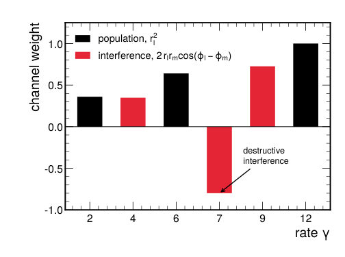 
FIG. 3. Channels generated by K = 3 amplitudes with base rates (12, 6, 2) and phases (0, 1.1, 2.3). Bars are equally spaced and the tick labels give the true rates. Dark bars at γ = 12, 6, 2 are populations, weights 1.000, 0.640, 0.360. Light bars at the pairwise averages γ = 9, 7, 4 are inter- ference, weights +0.726, −0.800, +0.348. The channel at γ = 7, the average of 12 and 2, has negative weight because cos(ϕ1 −ϕ3) &lt; 0, so it exists only as destructive interference.

**Summary.** This paper proves a separation between the resources needed by quantum versus classical models to simulate certain stochastic processes. Using a spin-one-half quantum memory, the authors show that enforcing a forbidden event time or generating specific decay patterns requires exponentially more states classically than quantum mechanically. This highlights the computational advantage of quantum memory in describing complex physical dynamics.

**Why it may be interesting.** This work provides a concrete, physical realization (collective spin register) to demonstrate a resource separation, which is a core theme in quantum information theory, particularly concerning simulation complexity.

Detailed structure

**Main problem.** The paper addresses the fundamental separation between the resources required by quantum memory versus classical memory to generate specific stochastic processes.

**Main result.** It demonstrates that generating a process with a forbidden interevent time requires an unbounded number of states in any classical Hidden Markov Model, while the quantum resource only requires a single relative phase shift.

**Method.** The analysis uses the framework of Hidden Markov Models (HMMs) and compares the Hankel rank of the process matrix (quantum side) against the required state count (classical side).

**Model / system.** The system is a quantum memory implemented in a spin-one-half register driven only by total-spin operators, analogous to an atomic ensemble or spin-squeezed sample.

**Key observables.** Interevent time distribution $d_n$, the number of required classical HMM states, and the number of decay channels generated by $K$ amplitudes.

**Important parameters / regimes.** The forbidden time $n^*$, the number of amplitudes $K$, and the relative phase $\pi$.

**Assumptions / limitations.** The classical cost comparison is restricted to finite-dimensional HMMs, and the quantum memory is driven only by collective operations.

**Figures summary.** Figure 1 illustrates the structure of the quantum block; Figure 2 shows the classical expense of a forbidden interevent time; Figure 3 visualizes the decay channels generated by $K=3$ amplitudes.

**Paper structure.** The paper first analyzes the constraint imposed by a forbidden interevent time, establishing a lower bound on classical states. It then examines the decay channels generated by $K$ amplitudes, proving a separation between the quantum cost (related to $K$) and the classical cost ($K(K+1)/2$).

Abstract

A spin one-half driven only by total-spin operators generates a renewal process in which one interevent time $n^\ast$ is forbidden while all others occur. No classical hidden Markov model reproduces it with fewer than $1+\sqrt{n^\ast}$ states, an unbounded separation whose only resource is one relative phase of $π$. With $K$ amplitudes the same interference yields $K(K{+}1)/2$ decay channels, and for positive weights and generic rates the classical cost is exactly $K(K{+}1)/2$ states. Both are realized by a depth-three circuit whose parameter count does not grow with the register.

[↑ back to top](#top)

### [Ghost rotationally invariant slave-boson approach to response functions](http://arxiv.org/abs/2610.08575v1)

**Authors:** Lee Tsung-Han, Melnick Corey, Lanatà Nicola, Kotliar Gabriel  
**Type:** theory · **Category:** strongly correlated electrons · **PDF:** <https://arxiv.org/pdf/2610.08575v1>  
**Analysis basis:** full PDF text, analyzed in chunks
**Topic relevance:** `Keldysh / 2PI / non-Gaussian methods` **2/5** · `analog quantum simulation` **1/5** · `methods for driven-dissipative` **1/5**

📷 Fig 1

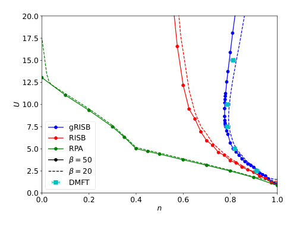 
FIG. 1. Magnetic phase boundary of the two-dimensional Hubbard model with nearest-neighbor hopping as a function of electron filling n and Coulomb interaction U from the gRISB, standard RISB, and RPA approaches at β = 50 and 20, and from DMFT at β = 50.

📷 Fig 2

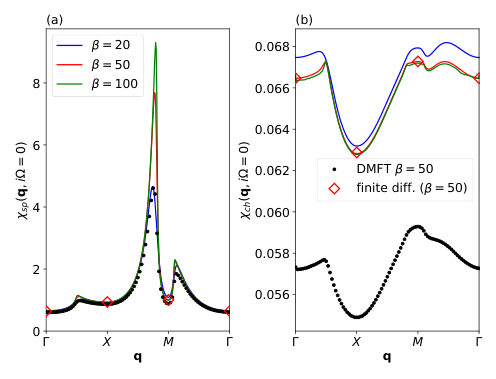 
FIG. 2. (a) The static spin susceptibility Reχsp(q, iΩn=0) for gRISB with β = 20, 50, 100 compared with DMFT at β = 50. (b) The static charge susceptibility Reχch(q, iΩn=0) for gRISB with β = 20, 50, 100 compared with DMFT at β = 50. Here U = 10 and n = 0.75. The static susceptibilities computed from the finite-difference calculations at the commensurate momenta (red diamonds) are shown at β = 50 for comparison.

📷 Fig 3

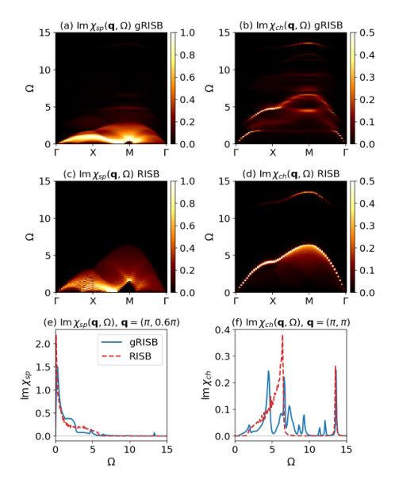 
FIG. 3. (a) The dynamical spin susceptibility on the real- frequency axis Imχsp(q, Ω) for gRISB with β = 50. (b) The dynamical charge susceptibility Imχch(q, Ω) for gRISB with β = 50. (c) The dynamical spin susceptibility Imχsp(q, Ω) for RISB with β = 50. (d) The dynamical charge susceptibility Imχch(q, Ω) for RISB with β = 50. (e) The gRISB and RISB dynamical spin susceptibility at q = (π, 0.6π). (f) The gRISB and RISB charge susceptibility at q = (π, π). Here U = 10, and the filling is n = 0.75 and n = 0.6 for gRISB and RISB, respectively.

📷 Fig 4

 
Figure 3(a) shows the real-frequency gRISB dynamical spin susceptibility Imχsp(q, Ω) at n = 0.75, U = 10, and β = 50. It exhibits a low-energy dispersive mode between Ω= 0 and Ω= 2.5, the paramagnon excitation,

📷 Fig 5

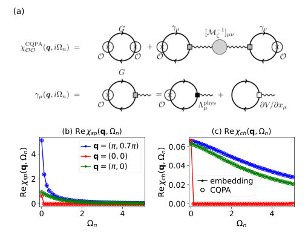 
FIG. 4. (a) Diagrammatic representation of the susceptibility within the conserving quasiparticle approximation (CQPA). See main text for details. (b) The CQPA dynamical spin susceptibility on the Matsubara axis Reχsp(q, iΩn) for gRISB and selected momenta q compared with the embedding formalism [Eq. (11)]. (c) The CQPA dynamical charge susceptibility on the Matsubara axis Reχch(q, iΩn) for gRISB and selected momenta q compared with the embedding formalism. Here U = 10, n = 0.75, and β = 50.

**Summary.** This work develops and applies a ghost rotationally invariant slave-boson (gRISB) theory to study the two-dimensional Hubbard model. By using a Gaussian-fluctuation formalism, the authors calculate response functions directly on the real-frequency axis, significantly improving upon existing approximations. The results successfully capture key physical excitations and track the magnetic phase boundary in agreement with advanced methods like DMFT.

**Why it may be interesting.** While focused on condensed matter, the rigorous development of a conserving approximation (CQPA) and the ability to calculate dynamics directly on the real-frequency axis are highly valuable theoretical tools applicable to open quantum systems and many-body dynamics simulations.

Detailed structure

**Main problem.** The paper addresses the challenge of accurately computing response functions (spin and charge susceptibilities) in strongly correlated electron systems, particularly capturing the real-frequency spectral structure relevant to inelastic scattering experiments.

**Main result.** The proposed ghost rotationally invariant slave-boson (gRISB) formalism significantly improves upon standard approximations (RISB, RPA) by tracking the magnetic phase boundary and resolving key excitations like paramagnons and sound modes.

**Method.** It employs a finite-temperature Gaussian-fluctuation formalism applied to the slave-boson theory, allowing direct calculation of susceptibilities on the real-frequency axis, thus bypassing problematic numerical continuation techniques.

**Model / system.** The study focuses on the two-dimensional Hubbard model on a square lattice, described by the standard Hubbard Hamiltonian, and utilizes slave-boson decomposition techniques.

**Key observables.** Static and dynamical spin and charge susceptibilities ($\chi_{sp}, \chi_{ch}$), magnetic phase boundary, paramagnon excitations, and low-energy sound modes.

**Important parameters / regimes.** Hubbard interaction strength ($U$), electron filling ($n$), and temperature ($eta$).

**Assumptions / limitations.** The method assumes the validity of the gRISB theory and introduces a Conserving Quasiparticle Approximation (CQPA) to enforce physical constraints, though discrepancies with DMFT are noted due to finite auxiliary-bath truncation.

**Figures summary.** Figures compare the magnetic phase boundary across various theories (gRISB vs. DMFT); other figures show real-frequency spectra of spin and charge susceptibilities, comparing gRISB results against RISB and embedding formalisms.

**Paper structure.** The paper develops the gRISB formalism using Gaussian fluctuations, introduces the CQPA to enforce conservation laws, and validates the results by comparing static and dynamic susceptibilities against established methods like DMFT and field-derivative calculations.

Abstract

We propose a finite-temperature Gaussian-fluctuation formalism for response functions within ghost rotationally invariant slave-boson (gRISB) theory and apply it to the two-dimensional Hubbard model. The gRISB magnetic phase boundary and static spin and charge susceptibilities capture the trends of dynamical mean-field theory (DMFT), significantly improving upon standard RISB and the random phase approximation (RPA). At the RISB level, our formalism recovers the Kotliar-Ruckenstein response. The dynamical susceptibilities resolve paramagnons, low-energy sound modes, and high-energy Hubbard excitations. Because they are evaluated directly on the real-frequency axis, the results avoid Matsubara truncation, stochastic sampling, and numerical analytic continuation. We also introduce a conserving quasiparticle approximation that expresses the response in terms of dressed Green's functions and vertex corrections.

[↑ back to top](#top)

### [Bichargon Hall Effect](http://arxiv.org/abs/2610.07719v1)

**Authors:** Ping Tang  
**Type:** theory · **Category:** strongly correlated electrons · **PDF:** <https://arxiv.org/pdf/2610.07719v1>  
**Analysis basis:** full PDF text, analyzed in chunks
**Topic relevance:** `analog quantum simulation` **2/5** · `Keldysh / 2PI / non-Gaussian methods` **1/5**

📷 Fig 1

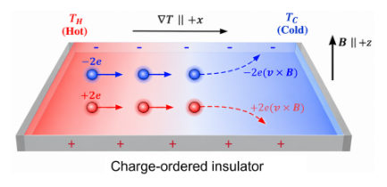 
FIG. 1. Schematic of the bichargon Hall effect in a charge- ordered insulator. Two branches of bichargons carrying oppo- site electric charges ±2e diffuse in the same direction without generating a net longitudinal charge current under an applied temperature gradient, while an out-of-plane magnetic field de- flects them in opposite transverse directions via the Lorentz force, leading to a finite Hall charge current and thereby op- posite charge accumulations at the two lateral edges.

📷 Fig 2

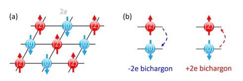 
FIG. 2. (a) Checkerboard charge order in the half-filled ex- tended Hubbard model on a two-dimensional square lattice, where the alternating empty |0⟩and doubly occupied |2⟩sites can be mapped onto staggered pseudospin-1/2 order. (b) Two branches of oppositely charged (±2e) bichargons associated with pseudospin-flip excitations, analogous to the two magnon branches in a bipartite antiferromagnet carrying opposite spin angular momenta ±ℏ. The two branches of bichargon exci- tations are energetically degenerate and equally populated in equilibrium, thereby leaving the total electric charge of the system unchanged.

**Summary.** This work predicts a novel bosonic charge Hall effect in charge-ordered insulators, mediated by collective excitations called bichargons. Unlike conventional conductors, the system remains insulating because the DC current vanishes, but a temperature gradient combined with a magnetic field generates a measurable transverse Hall charge current. This broadens the understanding of charge transport by utilizing charged bosonic quasiparticles.

**Why it may be interesting.** The mechanism relies on bosonic quasiparticles (bichargons) in an insulating state, providing a novel platform for studying charge transport phenomena that bypasses the need for mobile electronic carriers, which is relevant to strongly correlated materials.

Detailed structure

**Main problem.** The paper predicts a bosonic charge Hall effect in charge-ordered insulators, extending the concept of charge Hall transport beyond conventional electronic conductors.

**Main result.** A finite transverse Hall charge current and edge charge accumulation can be generated by a temperature gradient and an out-of-plane magnetic field, even though the system remains electrically insulating.

**Method.** The analysis uses the semi-classical Boltzmann equation applied to the bosonic excitations (bichargons) and calculates the resulting thermoelectric Hall coefficient.

**Model / system.** The system is a charge-ordered insulator modeled using the extended Hubbard model on a 2D square lattice. The key excitations are bichargons, bosonic quasiparticles carrying quantized charges of $\pm 2e$.

**Key observables.** Finite Hall charge current, opposite charge accumulations at sample edges, and the Hall thermoelectric coefficient ($L_{bH}$).

**Important parameters / regimes.** Temperature gradient ($
abla T$), out-of-plane magnetic field ($B$), and the temperature regime $\Delta_b \lesssim k_B T \ll E_g$.

**Assumptions / limitations.** The analysis employs the relaxation-time approximation for the Boltzmann equation and assumes the bichargon gap ($\Delta_b$) is significantly smaller than the electronic gap ($E_g$).

**Figures summary.** Figure 1 schematically illustrates the effect: $
abla T$ drives diffusion, and $B$ causes opposite transverse deflection of $\pm 2e$ bichargons, leading to a finite Hall current. Figure 2 shows the checkerboard charge order and the two degenerate bichargon branches.

**Paper structure.** The paper first establishes the physical model using the extended Hubbard Hamiltonian, derives the effective low-energy Hamiltonian for bichargons, and then applies the semi-classical Boltzmann equation to calculate the current response under combined thermal and magnetic fields.

Abstract

The conventional Hall effect arises from the transverse deflection of mobile electronic charge carriers in conductors. Here, we predict a bosonic charge Hall effect in charge-ordered insulators mediated by bichargons, collective bosonic excitations of charge order carrying quantized electric charges $\pm 2e$. In contrast to conventional electronic carriers, a thermally excited bichargon gas does not support dc electrical conduction in response to an external electric field despite its constituents carrying finite electric charges. We show that a temperature gradient can instead drive a diffusive flow of thermal bichargons, while an out-of-plane magnetic field deflects the oppositely charged bichargons in opposite transverse directions via the Lorentz force, leading to a finite Hall charge current and opposite charge accumulations at the sample edges. Our results broaden the paradigm of charge Hall transport beyond conventional electronic conductors, establishing that a charge Hall response can emerge in an electrically \emph{insulating} system through charged bosonic quasiparticles.

[↑ back to top](#top)

### [Chiral Central Charge from Real-Space Twist Operator Correlator](http://arxiv.org/abs/2610.08788v1)

**Authors:** Yunlong Zang  
**Type:** theory · **Category:** strongly correlated electrons · **PDF:** <https://arxiv.org/pdf/2610.08788v1>  
**Analysis basis:** full PDF text, analyzed in chunks
**Topic relevance:** `Keldysh / 2PI / non-Gaussian methods` **2/5** · `analog quantum simulation` **1/5**

📷 Fig 1

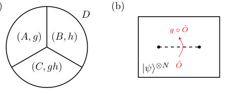 
FIG. 1. Twist-operator construction. (a) A large disk A∪B∪ C is divided into three regions, and D denotes its complement. The labels specify the permutations acting in each region. (b) A twist operator supported on a closed region can be deformed to its boundary and then cut open into a twist-defect line. The endpoints (black dots) are twist defects, and the dashed line is the associated branch cut. Depending on the orientation convention, one endpoint is a g twist defect and the other is a g−1 twist defect. Crossing the cut permutes the replicas by g.

📷 Fig 2

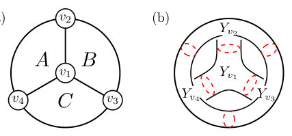 
FIG. 2. (a) Tripartite region ABC with the four triple points v1, v2, v3, v4. The black lines are the entanglement cuts of this tripartite geometry. (b) The genus-three entangling surface Y is further cut into four three-punctured spheres Yv (v = v1, v2, v3, v4).

📷 Fig 3

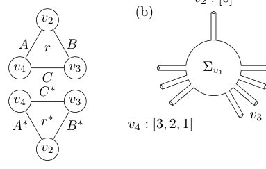 
FIG. 3. (a) The replica Y (r) v1 is cut into bra and ket sheets, where the replica index is r = 1, 2, . . . , N. (b) For the example permutations in Eq. (9), Σv1 is an eight-punctured sphere. The eight punctures are divided into three groups given by the preimages of v2, v3, and v4, which are connected to Σv2, Σv3, and Σv4 by long cylinders. The ramification indices are specified by the cycle types of the relative permutations [gAB], [gBC], and [gAC].

📷 Fig 4

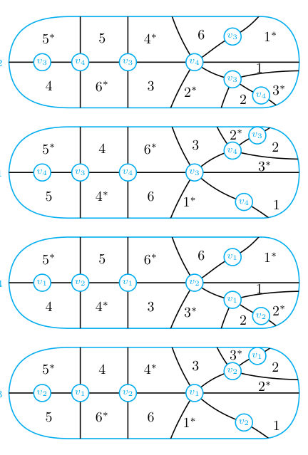 
FIG. 4. The four surfaces Σv for gA = (23)(46), gB = (136)(45), and gC = (123456), with cycle counts 4, 3, and 1, respectively. The relative permutations determine the ram- ification indices and have cycle types [gAB] = [gCD] = [6], [gBC] = [gAD] = [2, 2, 1, 1], and [gAC] = [gBD] = [3, 2, 1].

📷 Fig 5

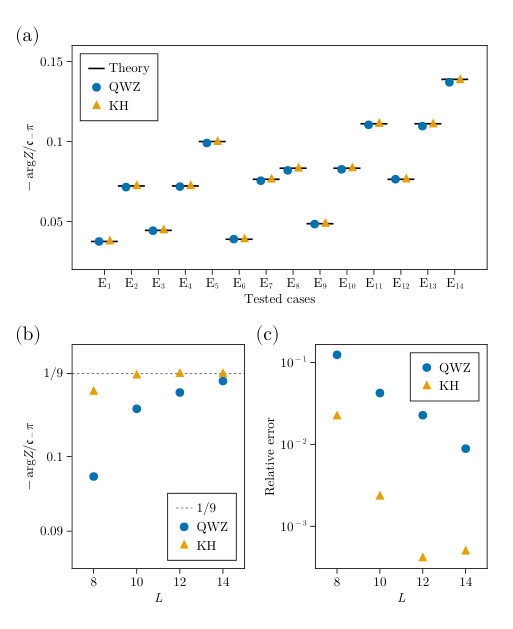 
FIG. 5. Numerical test of Eq. (2). (a) −arg Zg,h/(c−π) for 14 spherical pairs (g, h) = (gA, gB), five in S5 (E1–E5) and nine in S6 (E6–E14), computed in the QWZ (circles) and KH (triangles) models; solid lines mark the theoretical prediction. The explicit permutations (gA, gB, gC) of each case are listed in the Supplemental Material [32]. (b) Finite-size behavior of −arg Zg,h/(c−π) for the S6 example of Eq. (9), obtained on 2L2 lattice sites with L = 8, 10, 12, 14; the dashed line marks the predicted value 1/9. (c) Relative error of the data in (b) with respect to 1/9.

**Summary.** This work establishes a universal, real-space formula connecting the chiral central charge ($c_{-}$) of 2D gapped quantum systems to the phase of a twist-operator correlator. By analyzing the correlator on lattice models like the QWZ and Kitaev honeycomb systems, the authors provide a systematic, measurable diagnostic tool for characterizing chiral topological phases directly on a lattice.

**Why it may be interesting.** It provides a concrete, lattice-based diagnostic tool to measure a fundamental topological invariant ($c_{-}$) using entanglement structures, which is highly relevant for characterizing topological phases in condensed matter systems.

Detailed structure

**Main problem.** To derive a universal, real-space formula for the chiral central charge ($c_{-}$) in two-dimensional gapped quantum systems.

**Main result.** The phase of the twist-operator correlator, $Z_{g,h}$, is shown to be determined by the chiral central charge via the relation $rac{Z_{g,h}}{|Z_{g,h}|} = \left(rac{	heta_g 	heta_h}{	heta_{gh}}
ight)^{c_{-}}$.

**Method.** The derivation uses a field-theoretic framework applied to the twist-operator correlator, which is interpreted as a partition function on a constructed surface $\Sigma$.

**Model / system.** The theory applies to 2D gapped quantum systems, tested using microscopic lattice models such as the free-fermion Qi-Wu-Zhang (QWZ) model and the Kitaev honeycomb (KH) model.

**Key observables.** Chiral central charge ($c_{-}$), twist-operator correlator phase ($\arg Z_{g,h}$), and topological spin ($	heta_g$).

**Important parameters / regimes.** The spherical condition on permutations $(g, h)$, and the system size $N$ (number of replicas).

**Assumptions / limitations.** The derivation relies on suitable assumptions within the field-theoretic framework, and the formula is noted to be conjectural for interacting systems.

**Figures summary.** Figures illustrate the twist-operator construction on surfaces (A, B, C) and the construction of the associated genus-three entangling surface $\Sigma$. Numerical results show convergence to predicted values for specific lattice models.

**Paper structure.** The paper first introduces the problem and the correlator. It then develops the field-theoretic machinery, analyzes the topological constraints via the spherical condition, and finally applies the derived formula to calculate $c_{-}$ for specific free-fermion and Majorana lattice models.

Abstract

Recent years have witnessed substantial progress in the entanglement-based characterization of quantum phases of matter, with growing interest in real-space formulas due to their theoretical and experimental relevance. For two-dimensional gapped quantum systems, we propose a universal real-space formula for the chiral central charge based on the twist-operator correlator $Z_{g,h}=\langleψ^{(N)}\rvert\mathcal{T}_A(g)\mathcal{T}_B(h)\mathcal{T}_C(g)\mathcal{T}_C(h)\lvertψ^{(N)}\rangle$, where $\lvertψ^{(N)}\rangle=\lvertψ\rangle^{\otimes N}$ is the $N$-copy state and $g,h\in S_N$ are permutations. The twist operator $\mathcal{T}_R(g)$ permutes the $N$ replicas within region $R$ according to $g$. For pairs $(g,h)$ satisfying the spherical condition, we show that the phase of the correlator is determined by the chiral central charge $\mathfrak{c}_{-}$ through $Z_{g,h}/\left\lvert Z_{g,h}\right\rvert=(θ_gθ_h/θ_{gh})^{\mathfrak{c}_{-}}$, where $θ_g^{\mathfrak{c}_{-}}$ is the topological spin of the twist defect labeled by $g\in S_N$. The construction applies to both bosonic and fermionic systems. We derive the formula within a field-theoretic framework under suitable assumptions and further test it numerically in microscopic lattice models. Our results establish a universal connection between real-space entanglement structures and the chiral central charge, providing a systematic framework for characterizing chiral topological phases directly on the lattice.

[↑ back to top](#top)

### [Luttinger Liquid Behavior in a Single-Layer Nickelate La1.4Sr0.6NiO4](http://arxiv.org/abs/2610.07656v1)

**Authors:** Yinqi Hu, Yidian Li, Xian Du, Wenxuan Zhao, Kaiyi Zhai, Senyao Zhang, Jiawei Shao, Mingxin Mao, Houke Chen, Jieyi Liu, Donghui Lu, Makoto Hashimoto, Fangyuan Zhu, Zhengtai Liu, Dawei Shen, Yaobo Huang, Zhongkai Liu, D. Prabhakaran, Yanpeng Qi, Yilin Wang, Yulin Chen, Lexian Yang  
**Type:** both · **Category:** strongly correlated electrons · **PDF:** <https://arxiv.org/pdf/2610.07656v1>  
**Analysis basis:** full PDF text, analyzed in chunks
**Topic relevance:** `analog quantum simulation` **2/5** · `Keldysh / 2PI / non-Gaussian methods` **1/5**

📷 Fig 1

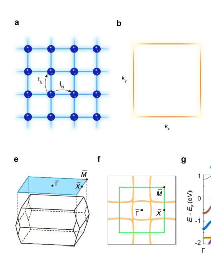 
Figure 1. Basic properties of La1.4Sr0.6NiO4. a, Schematic illustration of a square lattice

📷 Fig 2

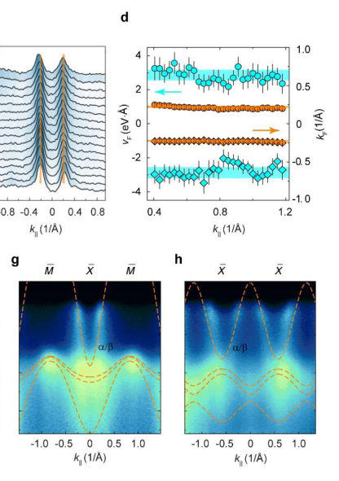 
Figure 2. Basic electronic structure of La1.4Sr0.6NiO4. a, Stacking plot of constant-energy

📷 Fig 3

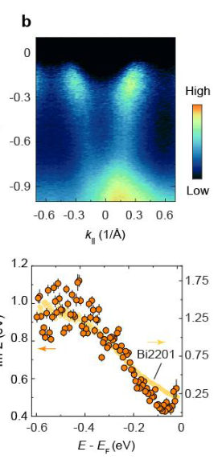 
Figure 3. Electron correlation effect of La1.4Sr0.6NiO4. a, b, Band dispersions along 𝑋̅𝑀̅ and

📷 Fig 4

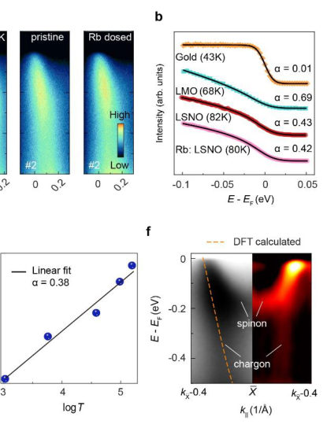 
Figure 4. Non-Fermi liquid behavior of La1.4Sr0.6NiO4. a, ARPES measurements of the band

**Summary.** This work investigates the single-layer nickelate $	ext{La}_{1.4}	ext{Sr}_{0.6}	ext{NiO}_4$ to probe its intrinsic electronic properties. Using ARPES and advanced theory, the authors reveal that the material exhibits quasi-1D electronic behavior, leading to Luttinger liquid physics. This finding offers a crucial, simplified model for understanding the complex correlation physics in higher-dimensional superconducting nickelates.

**Why it may be interesting.** The observation of Luttinger liquid physics in a quasi-2D cuprate/nickelate platform provides a strong analogy to 1D quantum systems, which is highly relevant for understanding emergent quantum phases in strongly correlated materials.

Detailed structure

**Main problem.** To isolate and understand the intrinsic electronic physics of the single-layer $	ext{NiO}_2$ layer in nickelates, separating it from complications arising from interlayer coupling in multi-layer superconductors.

**Main result.** The single-layer nickelate exhibits quasi-one-dimensional electronic structure leading to non-Fermi liquid behavior consistent with the Luttinger liquid model, evidenced by power-law spectral functions and spin-charge separation.

**Method.** The study combines high-resolution Angle-Resolved Photoemission Spectroscopy (ARPES) measurements with advanced theoretical calculations like DFT+DMFT.

**Model / system.** The physical system is the single-layer nickelate $	ext{La}_{1.4}	ext{Sr}_{0.6}	ext{NiO}_4$. The theoretical framework involves modeling strong electron correlations using Hubbard-type Hamiltonians and calculating the electron self-energy.

**Key observables.** Band dispersions, Fermi surface topology (straight segments), power-law spectral function, spin-charge separation signatures, and the Luttinger liquid anomalous exponent ($\alpha$).

**Important parameters / regimes.** Doping level ($x=0.6$), temperature range (21 K to 185 K), and the correlation strength parameterized by $U$ and $J_H$.

**Assumptions / limitations.** The analysis assumes that the quasi-1D nature of the Fermi surface dictates the low-energy physics, allowing for a Luttinger liquid description.

**Figures summary.** Figures detail ARPES results showing parallel line segments for the Fermi surface, band dispersions exhibiting kinks, and plots demonstrating the temperature dependence consistent with LL scaling.

**Paper structure.** The paper systematically presents ARPES data to establish the quasi-1D nature of the electronic structure, uses theoretical calculations (DFT+DMFT) to model correlation effects, and finally analyzes the temperature and doping dependence to confirm Luttinger liquid behavior.

Abstract

The discovery of high-temperature superconductivity in bilayer and trilayer nickelates has spurred intense interest in the Ruddlesden-Popper nickelates; yet the fundamental properties of the NiO2 layer remain obscured by interlayer coupling. It is therefore imperative to investigate the electronic properties of their single-layer counterpart to isolate the intrinsic physics of the NiO layer. In this work, we present a systematic study of the single-layer nickelate La1.4Sr0.6NiO4 using high-resolution angle-resolved photoemission spectroscopy (ARPES) and theoretical calculations. We reveal strong electron correlation effects, manifested by high-energy kinks in band dispersions and a pronounced orbital-dependent band renormalization. Interestingly, we observe a quasi-one-dimensional electronic structure characterized by straight Fermi surface sheets along the diagonal momentum directions. Such square Fermi surface topology facilitates non-Fermi liquid behavior consistent with the Luttinger liquid model, as evidenced by the power-law spectral function, robust temperature scaling, and the observation of spin-charge separation. Our results therefore not only unveil an exotic Luttinger liquid behavior emerging from the unexpected dimensional reduction in an intrinsically quasi-two-dimensional nickelate but also provide a new perspective for understanding the intriguing physics in multilayer nickelates.

[↑ back to top](#top)

### [Quantum geometry of collective pairing fluctuations in the superfluid weight of multiband superconductors](http://arxiv.org/abs/2610.08336v1)

**Authors:** R. N. Kalkan, M. Iskin  
**Type:** theory · **Category:** other · **PDF:** <https://arxiv.org/pdf/2610.08336v1>  
**Analysis basis:** full PDF text, analyzed in chunks
**Topic relevance:** `Keldysh / 2PI / non-Gaussian methods` **2/5** · `analog quantum simulation` **1/5**

📷 Fig 1

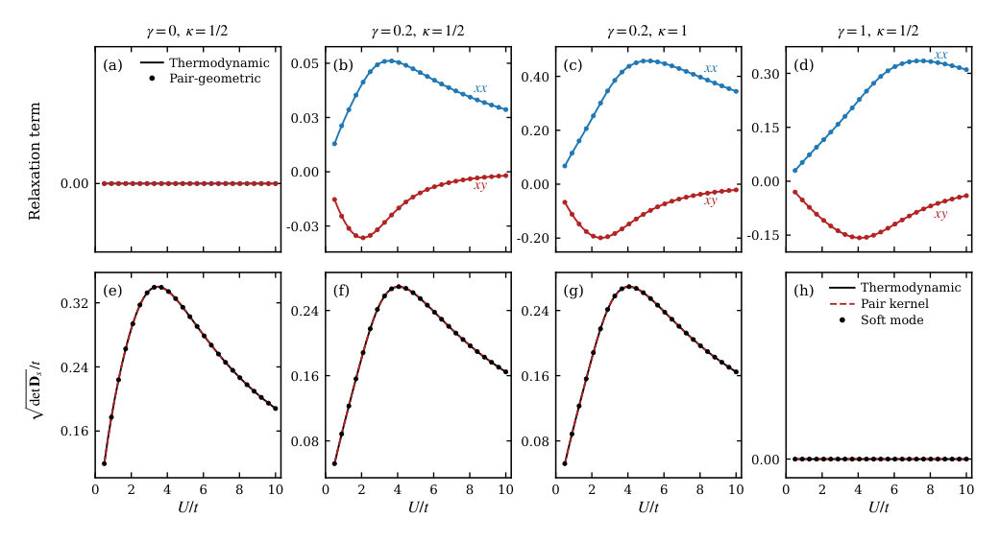 
FIG. 1. Numerical benchmark at T = 0 as a function of the interaction strength U/t. The upper row, panels (a)–(d), compares the thermodynamic and pair-geometric representations of the relaxation term, shown in units of t. Solid lines show the components of F† iH(0)Fj obtained from the self-consistent gap response, while filled circles show the stiffness-weighted pair quantum metric of Eq. (37). Blue and red denote the xx and xy components, respectively. The lower row, panels (e)–(h), shows √det Ds/t obtained from the thermodynamic formulation (black solid lines), the pair-fluctuation-kernel formulation (red dashed lines), and the curvature of λ0(Q) (black filled circles) according to Eq....

**Summary.** This theoretical work derives the superfluid weight for multiband superconductors by identifying a quantum-geometric correction stemming from pairing fluctuations. It rigorously proves the equivalence between thermodynamic calculations and those derived from the effective action, showing that the superfluid weight is dictated by the curvature of the pairing field manifold. This provides a deep, geometric understanding of superconducting response properties.

**Why it may be interesting.** The geometric interpretation of the superfluid weight, linking it to the curvature of the pairing manifold, provides a powerful, universal framework for understanding superconducting response beyond simple mean-field treatments.

Detailed structure

**Main problem.** The paper determines the superfluid weight of multiband superconductors, focusing on a quantum-geometric correction arising from the self-consistent relaxation of pairing amplitudes under a phase twist.

**Main result.** The superfluid weight is shown to be determined by the small-momentum curvature of the eigenvalue branch evolving from the Goldstone mode, and this geometric correction is equivalent to the Ginzburg-Landau gradient coefficient.

**Method.** The analysis uses a combination of thermodynamic potential minimization (saddle-point equations) and effective action formalism to calculate the curvature of the pairing response along the self-consistent solution.

**Model / system.** The system is a multiband superconductor modeled using an attractive multiband Hubbard model. The analysis is performed at the mean-field level, considering the pairing field $\Psi$ and its response to a phase twist $q$.

**Key observables.** Superfluid weight tensor ($V_{Ds}$), Ginzburg-Landau gradient coefficient (coherence-length tensor), and the pair-mass tensor.

**Important parameters / regimes.** Temperature ($T$), phase twist momentum ($q$), and the Hubbard interaction strength ($U$).

**Assumptions / limitations.** The analysis is performed at the mean-field level, and the derivation relies on the assumption that gauge invariance relates a phase twist to a finite center-of-mass momentum.

**Figures summary.** Figure 1 compares the superfluid weight calculated using three different methods, confirming their agreement and demonstrating the cancellation of spurious terms in the disconnected limit.

**Paper structure.** The paper develops the calculation by first defining the thermodynamic potential $\Omega_0(q, \Delta, \Delta^*)$ and finding the self-consistent solution $\Delta_0(q)$. It then derives the superfluid weight from the curvature of $\Omega(q)$, comparing this result to calculations based on the effective action and fluctuation kernel, and finally proving the equivalence of these formulations.

Abstract

Beyond the frozen-pairing contribution, the superfluid weight of a multiband superconductor contains a correction from the self-consistent relaxation of the pairing amplitudes under a phase twist. We show that this correction has a quantum-geometric origin, not in the space of Bloch states but in the space of collective pairing fields. For an attractive multiband Hubbard model at the mean-field level, the thermodynamic Hessian governing the pairing response coincides with the static Gaussian pair-fluctuation kernel at zero momentum at every temperature below $T_c$. Since gauge invariance relates a phase twist to a finite center-of-mass momentum of the pair field, the superfluid weight is set by the small-momentum curvature of the eigenvalue branch that evolves from the Goldstone mode, and the relaxation correction is a stiffness-weighted quantum metric of the corresponding soft eigenvector on the manifold of pairing configurations. The same construction yields the Ginzburg-Landau gradient coefficient with the identical geometric correction, hence the coherence-length tensor, and, with the low-frequency dynamics of the kernel, the pair-mass tensor. Lieb-lattice calculations verify the equivalence of the thermodynamic, fluctuation-kernel, and soft-mode formulations and the independence of the superfluid weight from the orbital embedding.

[↑ back to top](#top)

### [Entanglement manipulation and magic area-laws](http://arxiv.org/abs/2610.08727v1)

**Authors:** Rafael A. Macedo, Rafael Chaves  
**Type:** theory · **Category:** strongly correlated electrons · **PDF:** <https://arxiv.org/pdf/2610.08727v1>  
**Analysis basis:** full PDF text, analyzed in chunks
**Topic relevance:** `analog quantum simulation` **2/5**

📷 Fig 1

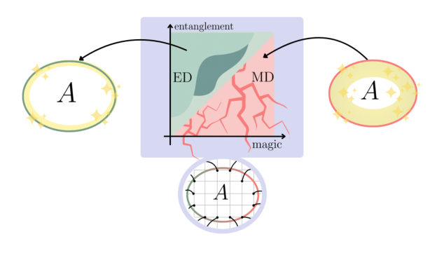 
FIG. 1. Area-law states, illustrated at the bottom as quantum states with entanglement bounded by the perimeter of a subsystem A (with dangling bonds corresponding to fictitious Bell pairs) , can be classified into entanglement-dominated (ED) and magic-dominated (MD) phases, depending on the relative magnitude of their bipartite entanglement and non-stabilizerness (magic). On the left, we show that all ED area-law states exhibit an area-law for the stabilizer R´enyi entropy. On the right, we illustrate that any state with a strictly faster-than-area growth of stabilizer entropy must belong to the MD phase. This dichotomy motivates a refined notion of quantum phases, where ED states share...

📷 Fig 2

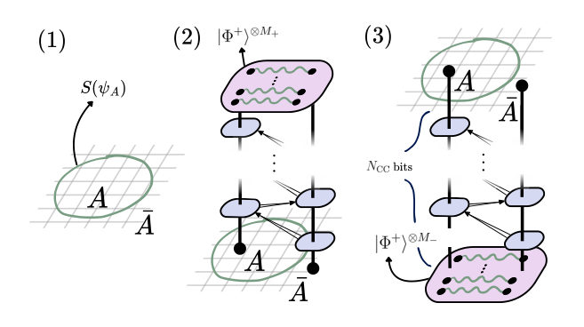 
FIG. 2. The three information-theoretic tasks on which entanglement-dominated states admit quantum algorithms that are both time- and sample-efficient, while magic-dominated states, even if they are area-law, do not. (1) entanglement estimation, with the task of estimating the entanglement entropy between the bipartition defined by the region; (2) distillation, which seeks to extract Bell pairs from LOCC operations on the bipartition; (3) dilution, where the task is to build the target state from Bell pairs under LOCC with bounded communication complexity.

**Summary.** This work classifies quantum states based on whether their entanglement or non-stabilizerness (magic) dominates the scaling behavior. It shows that area-law states fall into two classes: ED (efficiently manipulable) or MD (computationally hard to manipulate). This provides a fundamental resource theory for characterizing the complexity of quantum ground states in local Hamiltonians.

**Why it may be interesting.** The distinction between entanglement and magic resources provides a powerful, quantifiable tool to characterize the complexity of quantum ground states, which is central to understanding many-body physics in condensed matter systems.

Detailed structure

**Main problem.** The paper classifies quantum states, particularly those exhibiting area-law scaling, based on the relative scaling of bipartite entanglement versus non-stabilizerness ('magic'). It seeks to understand the computational implications of this dichotomy.

**Main result.** Area-law states split into Entanglement-Dominated (ED) and Magic-Dominated (MD) classes; ED states allow for efficient entanglement manipulation, while MD states do not, suggesting typical ground states might be computationally hard.

**Method.** The analysis uses information-theoretic measures like entanglement entropy and stabilizer Rényi entropy, comparing their scaling behavior under the action of finite-depth quantum circuits.

**Model / system.** The study focuses on quantum states $|\psi
angle$ defined on a lattice, often related to ground states of geometrically-local Hamiltonians $H = \sum_{X} h_X$. The analysis extends to states evolved by quantum circuits.

**Key observables.** Bipartite entanglement entropy ($S_\alpha$), Stabilizer Rényi Entropy ($M_\alpha$), and the state nullity ($
u$).

**Important parameters / regimes.** Area law scaling ($O(|\partial A|)$), circuit depth ($t$), and the dimensionality of the lattice ($D$).

**Assumptions / limitations.** The analysis assumes geometrically-local Hamiltonians and gapped ground states, and later relies on the assumption of constant gate locality for circuit evolution.

**Figures summary.** Figure 1 illustrates the ED/MD classification for area-law states, showing ED states obey an area-law for stabilizer Rényi entropy, while MD states show faster-than-area growth.

**Paper structure.** The paper establishes the area-law constraint, introduces the ED/MD dichotomy based on resource scaling, proves that area-law states inherit this dichotomy, and finally analyzes how quantum circuit evolution preserves or changes this classification.

Abstract

Physical many-body quantum systems typically interact locally, giving rise to ground states where entanglement grows with the area of the region being probed. Beyond entanglement, non-stabilizerness (or "magic") has been established as another crucial resource linked to quantum complexity and the properties of error-correcting states. Unlike entanglement, non-stabilizerness typically behaves with a volume-law scaling in ground states, indicating inherent computational complexity. In this work, we show that under a recent classification of quantum states, area-law states split into two distinct classes. Entanglement-dominated states obey an area-law for non-stabilizerness and admit efficient quantum algorithms for entanglement manipulation. Conversely, magic-dominated states exhibit a a faster-than-area growth of subsystem non-stabilizerness and require non-efficient algorithms for entanglement manipulation tasks. Within this context, we introduce the concept of the stabilizer regime, a restricted quantum phase that admits efficient entanglement manipulation and hosts area laws for both magic and entanglement.

[↑ back to top](#top)

### [No-Disturbance-without-Uncertainty generates the Quantum set in the simplest Bell scenario](http://arxiv.org/abs/2610.08749v1)

**Authors:** Ravishankar Ramanathan  
**Type:** theory · **Category:** quantum information and computing · **PDF:** <https://arxiv.org/pdf/2610.08749v1>  
**Analysis basis:** full PDF text, analyzed in chunks
**Topic relevance:** `quantum measurements` **2/5**

📷 Fig 1

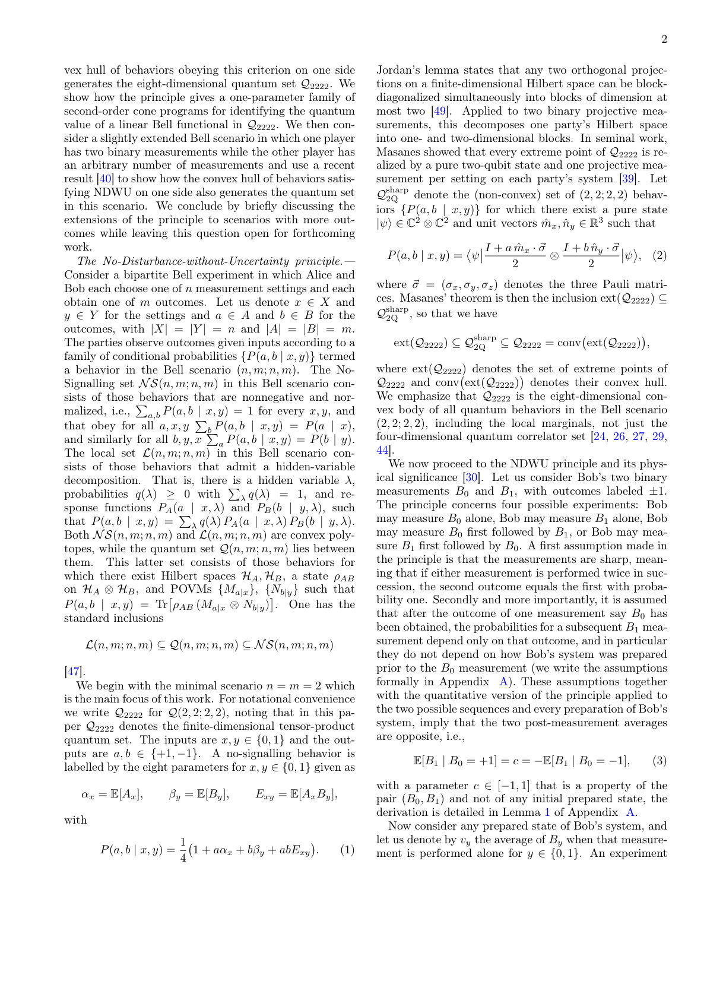 
Low-resolution page preview, page 2

📷 Fig 2

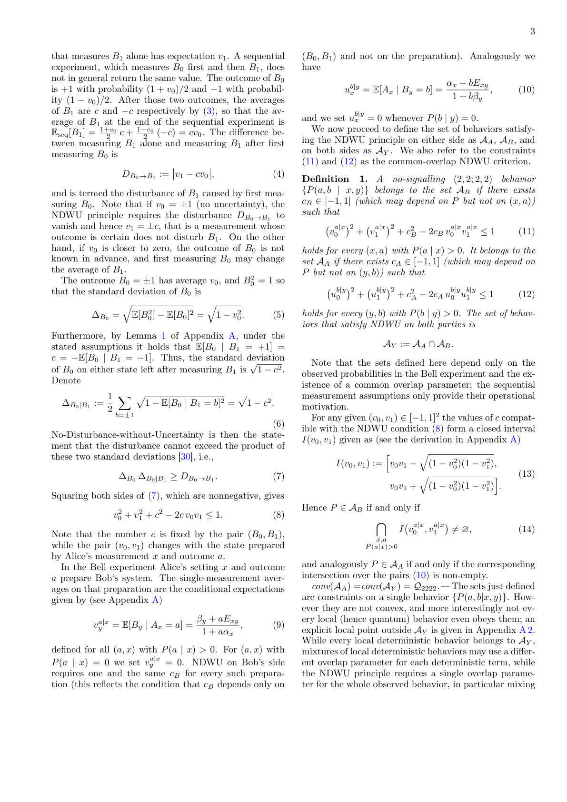 
Low-resolution page preview, page 3

📷 Fig 3

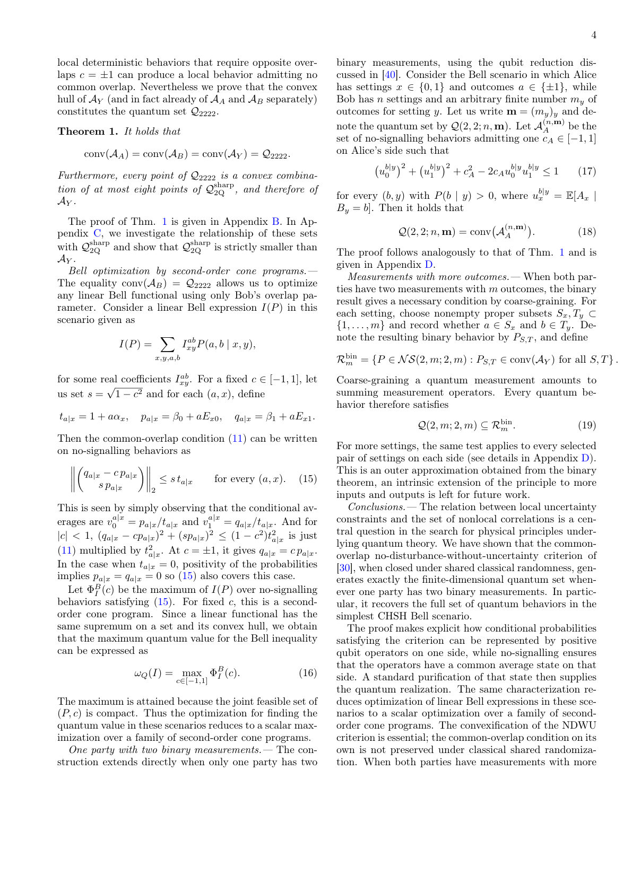 
Low-resolution page preview, page 4

📷 Fig 4

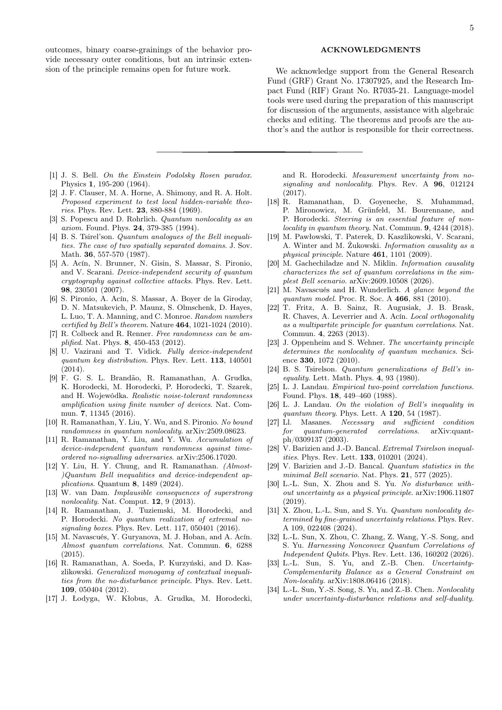 
Low-resolution page preview, page 5

📷 Fig 5

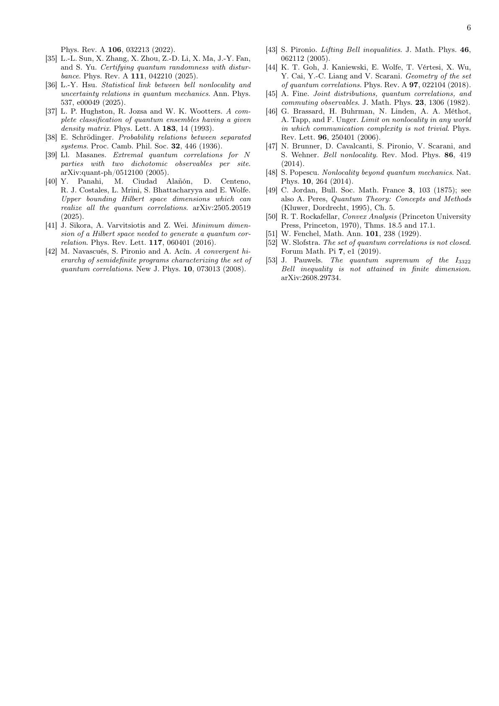 
Low-resolution page preview, page 6

**Summary.** This paper characterizes the set of quantum nonlocal correlations in Bell experiments by imposing the No-Disturbance-without-Uncertainty (NDWU) constraint. It proves that this information-theoretic condition is sufficient to generate the entire quantum set in the simplest Bell scenario. The methodology connects fundamental principles of measurement disturbance to the mathematical structure of quantum nonlocality.

**Why it may be interesting.** This work provides a novel, physically motivated constraint (NDWU) that successfully characterizes the boundary of quantum correlations, offering a powerful tool for testing quantum foundations beyond standard Bell inequalities.

Detailed structure

**Main problem.** The paper aims to characterize the set of quantum nonlocal correlations (the quantum set) using information-theoretic constraints derived from the No-Disturbance-without-Uncertainty (NDWU) principle in Bell experiments.

**Main result.** The convex hull of no-signalling behaviors satisfying the NDWU condition in the simplest Bell scenario is exactly the full eight-dimensional quantum set, establishing a strong link between local uncertainty constraints and quantum nonlocality.

**Method.** The authors use information-theoretic constraints, deriving conditions from the NDWU principle, and then employ techniques involving convex hulls and optimization over second-order cone programs to prove the equivalence.

**Model / system.** The study focuses on bipartite Bell experiments involving two parties (Alice and Bob) performing measurements. The analysis is formalized for the simplest binary input-output scenario, and later generalized to cases with arbitrary finite settings and outcomes.

**Key observables.** The correlation function $P(a, b | x, y)$, disturbance measures ($D_{B0 	o B1}$), and the resulting Bell expression values.

**Important parameters / regimes.** The binary nature of the simplest case ($2 	imes 2$ inputs/outputs) and the common-overlap parameters ($c_A, c_B$) derived from the NDWU condition.

**Assumptions / limitations.** The analysis assumes the existence of a quantum realization for the correlations and relies on the convexification of the constrained sets to match the quantum set.

**Figures summary.** Not specified, but the text heavily references mathematical equations (e.g., Equations 3, 4, 11, 12, B25-B29, D1-D8) to build the mathematical proof.

**Paper structure.** The paper progresses by defining the problem (characterizing the quantum set), introducing the NDWU constraint, proving the equivalence in the simplest binary case, and then generalizing the result to scenarios with more outcomes using coarse-graining techniques.

Abstract

Characterizing the set of quantum nonlocal correlations through information-theoretic constraints is a central problem in quantum foundations. We show that the convex hull of no-signalling behaviors in a bipartite Bell experiment satisfying a common-overlap no-disturbance-without-uncertainty condition is exactly the finite-dimensional quantum set whenever one party has two binary measurements and the other has an arbitrary finite number of settings, each with an arbitrary finite number of outcomes. In the simplest binary input-output Bell scenario, this characterizes the full eight-dimensional set of quantum behaviors, including the local marginals. The proof constructs a quantum realization directly from the conditional probabilities and no-signalling. The characterization also reduces optimization of any linear Bell expression in these scenarios to maximization over a one-parameter family of second-order cone programs. The results establish a connection between local uncertainty-disturbance constraints and quantum nonlocality, mediated by no-signalling and shared classical randomness.

[↑ back to top](#top)

### [Universal critical $g$ factor for spin-1/2 Aharonov-Bohm bound states](http://arxiv.org/abs/2610.08521v1)

**Authors:** Vinícius Salem, Edilberto O. Silva, Fabiano M. Andrade  
**Type:** theory · **Category:** other · **PDF:** <https://arxiv.org/pdf/2610.08521v1>  
**Analysis basis:** full PDF text, analyzed in chunks
**Topic relevance:** `quantum measurements` **2/5**

📷 Fig 1

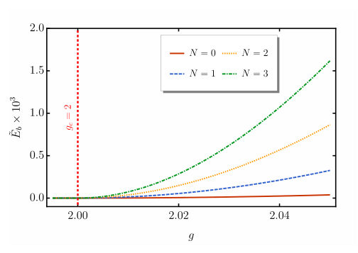 
FIG. 1. Scaled binding energy ˜Eb of the singular channel as a function of g, for β = 1/2 and several flux sectors. All sectors share the threshold gc = 2, but the binding deepens with |N|.

📷 Fig 2

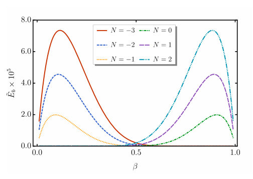 
FIG. 2. Scaled binding energy ˜Eb as a function of the fractional part β of the magnetic flux for different values of N with g = ge. We can observe the symmetry between the two families for N ≥0 and N &lt; 0, which are related by β →1 −β, N →−N −1.

**Summary.** This theoretical paper analyzes the bound states of a spin-1/2 particle in an Aharonov-Bohm potential, resolving a historical debate. By using self-adjoint extension theory and regularization, the authors prove that the critical magnetic g factor for binding is universally $g_c=2$. The result confirms that an anomalous magnetic moment ($g>2$) is necessary for binding in the singular interaction channel.

**Why it may be interesting.** It provides a rigorous, mathematically advanced treatment of boundary conditions in quantum mechanics, directly applicable to understanding singular interactions in condensed matter or mesoscopic physics.

Detailed structure

**Main problem.** The paper resolves the long-standing controversy regarding whether the spin-1/2 Aharonov-Bohm Hamiltonian supports bound states, particularly concerning the role of the anomalous magnetic moment.

**Main result.** The critical magnetic g factor required for binding is found to be universal, $g_c=2$, independent of the flux sector or regularization radius. Binding requires an anomalous magnetic moment ($g>2$) in the singular channel.

**Method.** The analysis employs the self-adjoint extension formalism to properly treat the singular point interaction, supplemented by a finite-radius regularization (KS approach) to determine the physical boundary conditions.

**Model / system.** The system is a spin-1/2 particle interacting with a magnetic flux tube, modeled by a singular Zeeman interaction within the Aharonov-Bohm Hamiltonian framework.

**Key observables.** Binding energy ($E_b$), scattering phase shift ($\delta_{
u m}$), and the critical magnetic g factor ($g_c$).

**Important parameters / regimes.** The AB flux parameter ($\alpha$), the anomalous magnetic moment parameter ($g$), and the self-adjoint extension parameter ($
u$).

**Assumptions / limitations.** The analysis relies on interpreting the Hamiltonian as a self-adjoint extension and uses a finite-radius regularization ($R$) to determine the physical extension parameter.

**Figures summary.** Figure 2 shows the scaled binding energy ($	ilde{E}_b$) dependence on the fractional part of the flux ($eta$) for various integer flux sectors ($N$), illustrating the binding enhancement with $|N|$.

**Paper structure.** The paper builds from setting up the Hamiltonian and the self-adjoint extension formalism, proceeds through scattering analysis and regularization techniques, and culminates in deriving the universal critical $g$ factor and interpreting the physical selection of the extension parameter.

Abstract

Whether the spin-1/2 Aharonov-Bohm Hamiltonian supports bound states has remained controversial since Hagen concluded that no such states exist for a Dirac particle. Here, we show that Hagen's solution corresponds to a particular member of the one-parameter family of self-adjoint extensions that describe the singular Zeeman interaction, and we identify which member the microscopic physics selects. Matching the extension parameter to a finite-radius flux tube yields $ν=0$ precisely at $g=2$, and it does so in every flux sector. The critical $g$ factor is therefore universal, $g_c=2$, and depends on neither the flux sector nor the regularization radius. The flux sector controls the depth of the bound state energy, and we obtain a closed-form expression showing that binding deepens markedly with the integer part of the flux. Hagen's conclusion is thus confirmed and sharpened: it is not a statement about one arbitrary member of a family of extensions, but about the member that the physics selects when the magnetic moment takes its Dirac value, and an anomalous moment is a necessary and sufficient condition for binding in the singular channel.

[↑ back to top](#top)

### [Spatial density, first passage times, and entropy of run and tumble particles in a bistable potential](http://arxiv.org/abs/2610.08029v1)

**Authors:** R. K. Singh, Erez Aghion  
**Type:** theory · **Category:** statistical mechanics · **PDF:** <https://arxiv.org/pdf/2610.08029v1>  
**Analysis basis:** full PDF text, analyzed in chunks
**Topic relevance:** `Frenkel-Kontorova` **1/5** · `Keldysh / 2PI / non-Gaussian methods` **1/5** · `correlated / nonlocal dissipation` **1/5** · `driven-dissipative phase transition` **1/5** · `methods for driven-dissipative` **1/5** · `non-equilibrium universality` **1/5** · `quantum measurements` **1/5**

📷 Fig 1

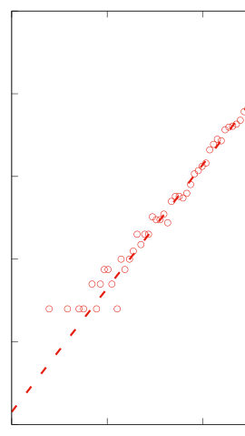 
Figure 1: Steady state of a RTP in the bistable potential U(x). The parameter values are: a = 1, b = 1, r = 1, v0 = 1, and T = 1. Numerical results are obtained from the solution of the Langevin equation (1) and the analytical curves follow Eq. (17).

📷 Fig 2

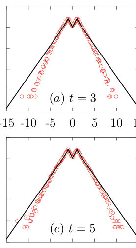 
Figure 2: PDF of the RTP at different times. Red circles denote numerical estimates and the black solid line is the exact form of the steady state following Eq. (17). Parameter values are: a = 1, b = 1, r = 1, v0 = 1, and T = 1.

📷 Fig 3

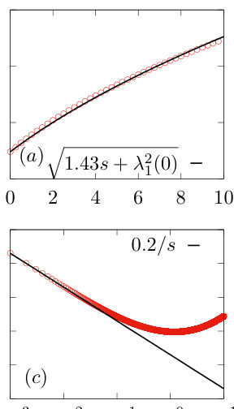 
Figure 3: Small-s behavior of the eigenvalues and coefficients defining the Laplace trans- form ˜P0(x, s). Parameter values are: a = 1, b = 1, r = 1, v0 = 1, and T = 1.

📷 Fig 4

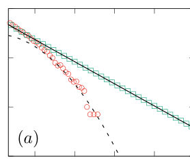 
Figure 4: Relaxation behavior of the time-dependent PDF P0(x, t) at long times for (a) t = 2 and (b) t = 4. Red circles denote the numerically estimated P0(x, t) at time t, and green squares denote the steady state form. Black solid line represents the relaxed part of P0(x, t) from Eq. (31) while the black dashed lines represent the Gaussian fluctuations. Parameter values are: a = 1, b = 1, r = 1, v0 = 1, and T = 1.

📷 Fig 5

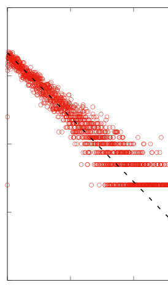 
Figure 5: First passage time distribution F(t) of a RTP starting at the energy minima at x = a and crossing the energy barrier at the origin (red circles). Parameter values are: r = 1, a = 1, b = 1, T = 1/5, and v0 = 1/4. The dashed line represents the long time limit of F(t) with the time-scale τ(a) obtained from Eq. (40).

**Summary.** This paper analyzes the stochastic dynamics of a particle in a bistable potential using the Fokker-Planck framework. It derives the steady-state distribution and examines relaxation dynamics in both real and Laplace space. Crucially, it contrasts the true entropy production of the full system with that of a simplified, coarse-grained Markov process, revealing the information lost during the approximation.

**Why it may be interesting.** The comparison between the full system's non-zero entropy production and the coarse-grained model's zero production highlights fundamental information loss when simplifying complex stochastic dynamics, which is relevant for open quantum systems modeling.

Detailed structure

**Main problem.** The study investigates the dynamics, steady-state properties, and entropy production of a Run and Tumble Particle (RTP) moving in a bistable potential coupled to a heat bath.

**Main result.** The analysis derives the exact steady-state probability density function and shows that while the full dynamics exhibit non-zero entropy production, a coarse-grained Markovian description incorrectly predicts zero entropy production.

**Method.** The authors employ Fokker-Planck equations, solving them analytically in Laplace space to determine time-dependent and steady-state distributions, alongside calculating entropy production rates.

**Model / system.** The model is a Run and Tumble Particle (RTP) in one dimension subjected to a bistable potential $U(x)$ and thermal noise, described by a Langevin equation and coupled Fokker-Planck equations.

**Key observables.** Spatial probability density function (PDF), mean first passage time, entropy production, and coarse-grained entropy.

**Important parameters / regimes.** Bistable potential parameters, temperature (T), and the noise parameters ($
u_0, r$).

**Assumptions / limitations.** The analysis relies on solving the FPEs in different spatial regions and assumes the coarse-graining process is valid for large barrier heights.

**Figures summary.** Figures illustrate the time evolution of the PDF relaxing to steady state, and comparisons are made between analytical, numerical, and coarse-grained estimates of entropy over time.

**Paper structure.** The paper proceeds by first solving the steady-state FPEs, then analyzing the time-dependent PDF using Laplace transforms, and finally comparing the full dynamics' entropy production against a simplified, coarse-grained Markovian description.

Abstract

We study the dynamics of a run and tumble particle (RTP) in a bistable potential, in contact with a heat bath. We find the exact form of the steady state position distribution as well as its time-dependent form in Laplace space. We use this result to study relaxation properties of the spatial probability density and find that it converges to the steady state from the center outwards, with the relaxation front moving ballistically in time. Physically this ballistic behavior arises when observing relaxation properties at the tails of the density, where the distance of the particle from the origin is larger than the length-scale describing the steady state of the RTP. We also find the exact form of the mean first passage time, and the long-time behavior of the first passage time distribution. This allows us to coarse-grain the dynamics as a dichotomous Markov process, a paradigm for a wide class of bistable processes. Coarse-graining, however, comes at the cost of a loss of information: while the RTP possesses a finite entropy production even at steady state, it identically vanishes for its coarse-grained description.

[↑ back to top](#top)

### [Squeezed light from a semiconductor amplifier](http://arxiv.org/abs/2610.08005v1)

**Authors:** Andrey S. Aleksandrov, Anatoly V. Masalov  
**Type:** theory · **Category:** other · **PDF:** <https://arxiv.org/pdf/2610.08005v1>  
**Analysis basis:** full PDF text, analyzed in chunks
**Topic relevance:** `Keldysh / 2PI / non-Gaussian methods` **1/5** · `driven-dissipative phase transition` **1/5** · `interference shaping light` **1/5** · `methods for driven-dissipative` **1/5** · `quantum optics experiment` **1/5**

📷 Fig 1

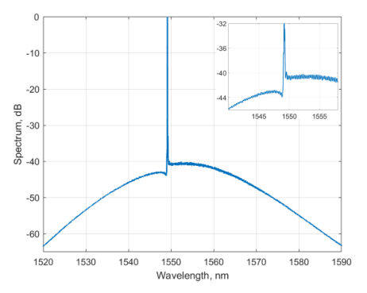 
FIG. 1. The mode of single-frequency radiation against the background of multiple subthreshold modes (nearly unre- solved) of an InP laser. Insert: enlarged fragment of the spectrum. Courtesy of A. N. Danilin.

📷 Fig 2

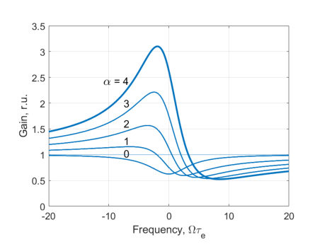 
FIG. 2. The spectrum of the relative energy gain of weak modes due to FWM for input intensity S0 = 1, gain Z = 3 and different values of Henry factor α.

📷 Fig 3

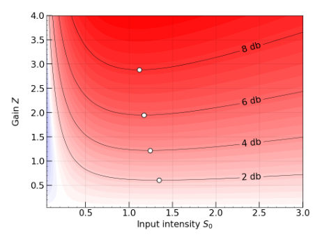 
FIG. 3. Degree of squeezing ⟨∆E2⟩min depending on the input intensity S0 and gain Z, frequency Ωτe = 0.01. The circles denote the values of the minimum gain Z to achieve the spec- ified squeezing.

📷 Fig 4

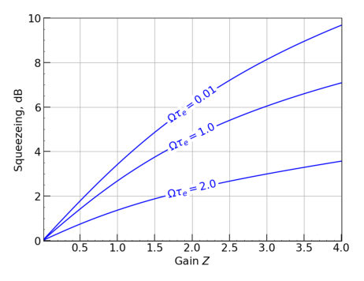 
FIG. 4. Degree of squeezing ⟨∆E2⟩min depending on Z at input intensity S0 = 1.5 and various modulation frequencies Ωτe.

📷 Fig 5

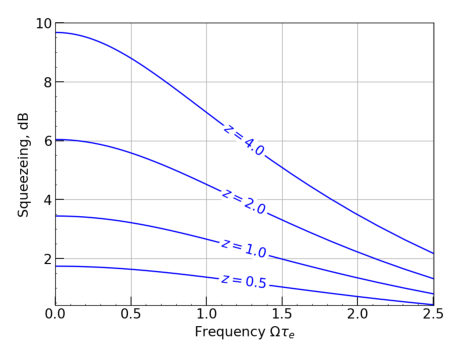 
FIG. 5. Degree of squeezing ⟨∆E2⟩min depending on Ωτe at different gain Z for input intensity S0 = 1.5.

**Summary.** This paper theoretically investigates generating squeezed light using a semiconductor amplifier operating in a saturated regime. It shows that the four-wave mixing process generates two-mode squeezed light in sidebands around the main amplified wave. This effect is quantifiable and can reach significant squeezing levels, demonstrating a quantum nonlinear optical process in a solid-state device.

**Why it may be interesting.** This work directly bridges quantum optics (squeezing) with solid-state physics (semiconductor amplifiers), providing theoretical insights into non-linear quantum light generation in condensed matter systems.

Detailed structure

**Main problem.** The paper theoretically analyzes the generation of light in a squeezed quantum state when a semiconductor amplifier operates under saturated conditions.

**Main result.** The four-wave mixing process leads to the generation of two-mode squeezed light in sidebands around the strong amplified wave, with squeezing potentially reaching 10 dB or more.

**Method.** The analysis involves solving coupled differential equations governing the light amplitude and carrier density, treating the side-band components as weak fields.

**Model / system.** The physical system is a semiconductor amplifier medium. The model uses coupled rate equations for the carrier density and the light field amplitude, incorporating the four-wave mixing process.

**Key observables.** Quadrature noise suppression ($\langle\Delta E^2
angle_{\min}$), energy gain of weak modes, and the degree of squeezing (measured in dB).

**Important parameters / regimes.** Henry factor ($\alpha$), input intensity ($S$), gain length ($Z$), and the characteristic frequency shift ($\Omega \sim 1/	au_e$).

**Assumptions / limitations.** The analysis assumes weak fields for the side-band components and utilizes approximations derived from solving the coupled differential equations.

**Figures summary.** Figures illustrate the mode spectrum showing the Bogatov effect and the relative energy gain of weak modes due to FWM for varying Henry factors ($\alpha$).

**Paper structure.** The paper progresses by setting up the governing equations, deriving the relative amplitudes for side-bands, analyzing the energy gain via FWM, and finally quantifying the minimum noise fluctuation to determine the squeezing level.

Abstract

The possibility of generating light in a squeezed quantum state during saturated light amplification in a semiconductor amplifier is theoretically analyzed. Due to four-wave mixing process during amplification, weak components of the spontaneous emission of the medium with symmetric frequency shifts relative to the strong amplified wave acquire the quantum properties of two-mode squeezed light. The squeezing of quadrature components occurs in the range of frequency shifts of several GHz ($\sim$ the inverse relaxation time of the charge carrier density) and can reach 10 dB or more under optimal conditions. The formation of a two-mode squeezing phase facilitates the observation of the squeezing effect, in which a strong wave, playing the role of a local wave, exhibits quadrature noise suppression without additional homodyne detection.

[↑ back to top](#top)

### [Classical chaotic signatures in Krylov space](http://arxiv.org/abs/2610.07352v1)

**Authors:** Gastón F. Scialchi, Augusto J. Roncaglia, Diego A. Wisniacki  
**Type:** theory · **Category:** other · **PDF:** <https://arxiv.org/pdf/2610.07352v1>  
**Analysis basis:** full PDF text, analyzed in chunks
**Topic relevance:** `Keldysh / 2PI / non-Gaussian methods` **1/5** · `analog quantum simulation` **1/5** · `methods for driven-dissipative` **1/5**

📷 Fig 1

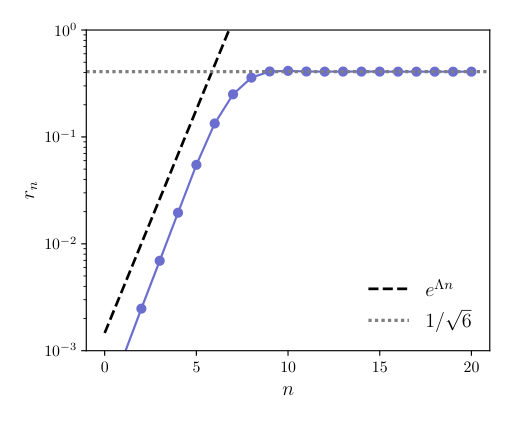 
Figure 1. Second moment of the chord function [Eq. (11)] for the Krylov operators of the perturbed Arnold’s cat map [Eq. (2)] with k = 0.02. The black dashed line corresponds to exponential growth with the Lyapunov exponent Λ = ln[(3 + √

📷 Fig 2

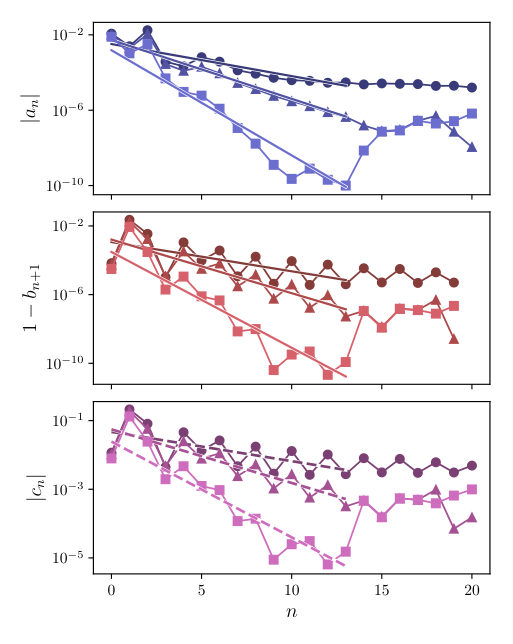 
Figure 2. Arnoldi sequences [Eq. (5)] for the perturbed Arnold’s cat map [Eq. (2)] with k = 0.02 (squares), k = 0.025 (triangles) and k = 0.0275 (circles). The lines are expo- nential decays with the respective Ruelle-Pollicott resonances |λ1| = 0.526, |λ1| = 0.698 and |λ1| = 0.822 (light to dark). Solid lines are |λ1|2n, and dashed lines |λ1|n. The initial op- erator is given by Eqs. (8) and (9) with (q0, p0) = (0.2, 0.3) and σ = 0.45. A Hilbert space dimension of N = 2048 was used.

**Summary.** This theoretical work connects classical chaotic signatures, such as stretching and mixing, to the mathematical structure of Krylov space for quantum maps. By analyzing observables like the Lyapunov exponent and Ruelle-Pollicott resonances through Krylov operators, the authors demonstrate that these classical concepts are encoded in the geometry and decay rates within the quantum spectral representation.

**Why it may be interesting.** This work provides a powerful mathematical tool—Krylov space analysis—to diagnose fundamental physical properties like chaos and ergodicity in quantum systems, bridging semiclassical physics with spectral theory.

Detailed structure

**Main problem.** The paper aims to establish a rigorous connection between the established signatures of classical chaos (exponential stretching and mixing) and their mathematical encoding within the structure of Krylov space for quantum systems.

**Main result.** The Lyapunov exponent is encoded in the geometry of the Krylov operators, while dynamical mixing is manifested as the exponential decay of the Arnoldi sequences, linking classical chaos to quantum spectral properties.

**Method.** The authors employ Krylov space methods, utilizing orthogonal expansions (like Arnoldi iteration) and analyzing the chord representation of the evolution operators to map classical dynamics onto quantum spectral diagnostics.

**Model / system.** The analysis is applied to quantized classical maps, including the perturbed Arnold's cat map, the Harper map, and the Chirikov standard map, which serve as models for quantum chaos.

**Key observables.** Lyapunov exponent ($\Lambda$), Ruelle-Pollicott resonances ($\lambda_1$), second moment of the chord function ($r_n$), and the decay rates of Arnoldi sequences.

**Important parameters / regimes.** The analysis explores the transition from regular to chaotic regimes, controlled by parameters like the kicking strength ($k$) in the standard map.

**Assumptions / limitations.** Key assumptions include the validity of the classical limit ($N 	o \infty$) and using specific approximations for the autocorrelation function in the non-traceless case.

**Figures summary.** Figures illustrate the exponential growth of the second moment ($r_n$) matching the Lyapunov exponent, and the exponential decay of Arnoldi sequences matching the Ruelle-Pollicott resonance rates for various chaotic maps.

**Paper structure.** The paper systematically analyzes the connection by first establishing the framework using the cat map, then generalizing the diagnostics (Lyapunov exponent via $r_n$, mixing via Arnoldi decay) to other canonical chaotic systems like the Harper and Standard maps, and finally detailing the role of the initial observable's trace in the decay structure.

Abstract

In recent years, Krylov space approaches have emerged as a useful framework for characterizing dynamical chaos in a wide variety of physical systems. However, the connection between Krylov dynamics and the established structures of classical chaos remains largely unexplored. Classical chaos is characterized by exponential stretching and mixing. For quantum maps with a classical limit, we show that these two signatures are encoded in different structures within Krylov space: stretching is encoded in the geometry of the Krylov operators as determined by the Lyapunov exponent, while mixing manifests itself as an exponential decay of the Arnoldi sequences in agreement with the Ruelle-Pollicott resonances.

[↑ back to top](#top)

### [Fast free-energy estimation for complex systems with nonreversible simulated tempering](http://arxiv.org/abs/2610.08598v1)

**Authors:** Yoshihiko Nishikawa, Koji Hukushima  
**Type:** theory · **Category:** disordered systems and neural networks · **PDF:** <https://arxiv.org/pdf/2610.08598v1>  
**Analysis basis:** full PDF text, analyzed in chunks
**Topic relevance:** `analog quantum simulation` **1/5** · `methods for driven-dissipative` **1/5** · `scars & prethermalization` **1/5**

📷 Fig 1

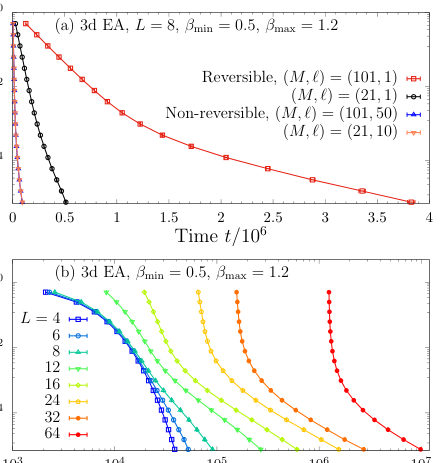 
FIG. 1. Time dependence of the modification factor log f during WLST free-energy estimation. (a) Comparison be- tween the reversible and nonreversible WLST algorithms for L = 8, shown for two choices of (M, ℓ). (b) Results for the nonreversible WLST algorithm at several system sizes, with (M, ℓ) = (101, 50).

📷 Fig 2

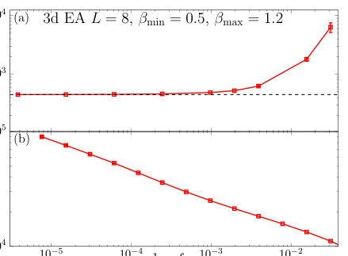 
FIG. 2. (a) Round-trip time τRT measured in equilibrium ST simulations and (b) WLST simulation time tWLST re- quired to reach the terminal value log ffin, both as a function of log ffin. From these plots, τRT is given as a function of tWLST, yielding the convergence time τ WLST c with Eq. (20). The system size is L = 8 and the innverse-temperature range is (βminJ, βmaxJ) = (0.5, 1.2).

📷 Fig 3

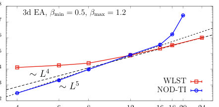 
FIG. 3. Convergence time τc as a function of the system size L for the WLST and NOD-TI algorithms. The dashed and dotted lines indicate the power-law scalings L4 and L5, respectively.

📷 Fig 4

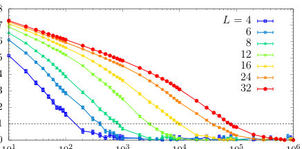 
FIG. 4. Time-dependent overlap [⟨Q(t)⟩] measured along ST trajectories with fluctuating inverse temperature β, as a function of time t for several system sizes L. Each tra- jectory is initialized with an equilibrium configuration at βJ = 1.2. The horizontal dashed line indicates the thresh- old [⟨Q(τs)⟩] = 10−1 used to define the relaxation time τs.

📷 Fig 5

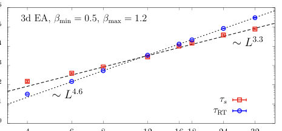 
FIG. 5. Relaxation time τs and round-trip time τRT as func- tions of L. Power-law fits defined by τs ∼Lzs and τRT ∼LzRT yield the effective exponents zs ≈3.3 for τs and zRT ≈4.6 for τRT.

**Summary.** This paper presents an advanced simulation technique that combines Wang-Landau principles with Simulated Tempering, utilizing nonreversible dynamics to estimate the free energy of complex systems. By applying this to the 3D spin-glass model, the authors demonstrate a significant acceleration in convergence speed compared to prior methods. This provides a powerful tool for studying phase transitions in disordered magnetic systems.

**Why it may be interesting.** While focused on classical statistical mechanics, the development of efficient, non-equilibrium sampling techniques like this has parallels in quantum simulation, particularly in calculating partition functions or free energies for quantum many-body systems where sampling is notoriously difficult.

Detailed structure

**Main problem.** Accurately estimating the free energy of complex physical systems, such as spin glasses, which exhibit slow dynamics and high computational barriers.

**Main result.** The proposed nonreversible simulated tempering algorithm significantly accelerates free-energy convergence, allowing precise estimation for large system sizes ($L \simeq 64$) with slower scaling of convergence time compared to existing methods.

**Method.** The authors generalize the Wang-Landau algorithm to Simulated Tempering (WLST), incorporating nonreversible dynamics in temperature space to efficiently sample the required ensemble.

**Model / system.** The primary test case is the three-dimensional Edwards-Anderson spin-glass model, defined on a cubic lattice with Ising spins ($\sigma_i = \pm 1$) interacting via random couplings $J_{ij}$.

**Key observables.** Free energy ($\phi(eta)$ or $F(eta)$), Density of States ($\Omega(E)$), and the temperature histogram flatness.

**Important parameters / regimes.** System size ($L \simeq 64$), temperature range ($eta_{min}J = 0.5$ to $eta_{max}J = 1.2$), and the nonreversible dynamics parameters.

**Assumptions / limitations.** The method assumes that the nonreversible dynamics can preserve the target joint distribution upon marginalization over the lifting variable, and it is noted that first-order transitions remain a limitation.

**Figures summary.** Figure 1 compares the time dependence of the modification factor logarithm ($\log f$) for WLST using reversible versus nonreversible dynamics, showing the advantage of the latter.

**Paper structure.** The paper introduces the challenge of free-energy estimation in complex systems, details the WLST algorithm incorporating nonreversible dynamics, applies it to the 3D EA spin-glass model, and compares its performance against established methods like NOD-TI.

Abstract

We discuss free-energy estimation for complex systems using simulated tempering with Wang--Landau-type feedback. We show that introducing nonreversible dynamics in temperature space and multiple temperature updates per step significantly accelerates the convergence of the free-energy estimate. We then apply the algorithm to the three-dimensional Edwards-Anderson spin-glass model. Our results show that the algorithm can precisely estimate the free energy up to a large system size $L \simeq 64$, and that subsequent equilibrium simulated tempering simulations with the estimated free energy can rapidly sample from the Boltzmann distributions over a wide temperature range that covers the spin-glass transition temperature. The convergence time of our algorithm grows much more slowly with system size than that of another known algorithm for on-the-fly free-energy estimation.

[↑ back to top](#top)

### [White paper: 1-10 Hz matter-wave interferometer to test the spin entanglement witness for quantum gravity](http://arxiv.org/abs/2610.07422v1)

**Authors:** Sougato Bose, Anupam Mazumdar, Marko Toroš, Tian Zhou, Tadeusz Adach, Niayesh Afshordi, Agya Sewara Alam, Alexandre Arbey, Navdeep Arya, Simon Baier, Peter F. Barker, Angelo Bassi, Ettore Bernardi, Lorenzo Braccini, Robert Brandenberger, Daniel Braun, Guri K. Buza, Luigi Cacciapuoti, Carlo Cepollaro, Lin-Qing Chen, Yanbei Chen, Ralph Jason Costales, Marion Cromb, Álvaro de la Cruz-Dombriz, Catalina Curceanu, Shubhang Dadhich, Debarshi Das, Saurya Das, Pratika Dayal, Subhadeep De, Ema Dimastrogiovanni, Lajos Diósi, Or Dobkowski, Kemal Döner, Brian D'Urso, Gurudev Dutt, Shafaq Gulzar Elahi, Samira Elghaayda, Matteo Fadel, Samuel Fedida, Omer Feldman, Fabiano Feleppa, Ron Folman, Joshua Foo, Paolo Fragolino, Laurent Freidel, Giulio Gasbarri, Marco Genovese, Andrew Geraci, Menachem Givon, Cisco Gooding, Jonathan M. H. Gosling, Piotr T. Grochowski, David Groswasser, Mustafa Gündoğan, Ekim Taylan Hanımeli, Bas Hensen, Dipankar Home, Richard Howl, Yonathan Japha, Maciej T. Jarema, Rainer Kaltenbaek, Adrian Kent, Eva Kilian-Rademacher, M. S. Kim, Jarosław K. Korbicz, Timothy Kovachy, Samuel Kováčik, Ohkyung Kwon, Gaetano Lambiase, Naor Levi, Iarley P. Lobo, Leon Loveridge, Adrian Lupascu, Paolo Luppi, Marta Maria Marchese, Antonino Marcianò, Aaron G. Markowitz, Chiara Marletto, Ryan J Marshman, J. D. D. Martin, Florian Millo, Gavin W. Morley, Maria Muretova, Sebastian Murk, Robin Oberfrank, Daniel K. L. Oi, Jerzy Paczos, Papadopoulos Stylianos, Matteo G. A. Paris, Mauro Paternostro, Alessandro Pesci, Luciano Petruzziello, Fabrizio Piacentini, Tanmay Kumar Poddar, Sofia Qvarfort, Markus Rademacher, Dennis Rätzel, Anna Chiara Rescigno, Ryan Rizaldy, Albert Roura, Carlos Sabín, Barry C. Sanders, Martine Schut, Helen M Sheehy, Suprit Singh, Aninda Sinha, Urbasi Sinha, Peter Skakunenko, Michael E Tobar, Géza Tóth, Hendrik Ulbricht, Gislaine Varão, Vlatko Vedral, Vincent Vennin, Francesca Vidotto, Giuseppe Filiberto Vitale, Marko Vojinović, Chenan Wei, Qian Xiang, Magdalena Zych  
**Type:** theory · **Category:** other · **PDF:** <https://arxiv.org/pdf/2610.07422v1>  
**Analysis basis:** full PDF text, analyzed in chunks
**Topic relevance:** `analog quantum simulation` **1/5** · `interference shaping light` **1/5** · `quantum measurements` **1/5**

📷 Fig 1

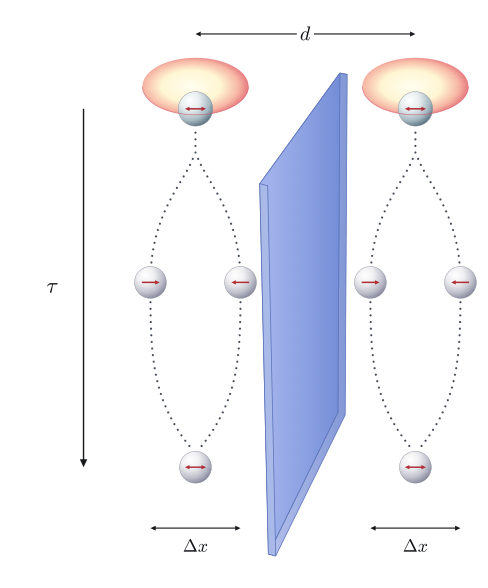 
FIG. 1. Schematic representation of the linear QGEM setup [14], in which two matter-wave interferometers are arranged as shown. A parallel configuration has also been proposed [58, 85]. In the lin- ear setup, two nano-crystals with internal spins (red arrows) are ini- tially trapped, motionally cooled, and separated by a thin membrane, ideally a superconducting shield, to suppress direct electromagnetic interactions between them. The shield is assumed to be sufficiently massive to be treated classically. Residual electromagnetic interac- tions between each nano-crystal and the shield have been studied in Refs. [57, 67, 86]. Using standard radio-frequency techniques, each nano-crystal is...

📷 Fig 2

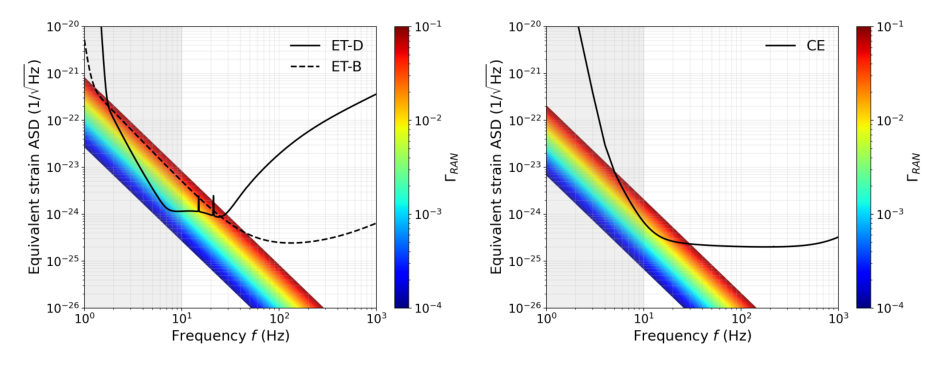 
FIG. 2. The left plot shows the comparison between the QGEM acceleration-noise requirement expressed as an ET-equivalent strain and the sensitivity of Einstein Telescope with 10km baseline. The colour band shows the ET-equivalent strain ASD obtained from Eq. (13) for dephasing values 10−4 ≤ΓRAN ≤10−1, taking m = 10−14 kg, ∆x = 10 µm, and τ = 1 s. The solid black curve labelled ET-D shows the predicted strain-amplitude spectral density of the ET-D low-frequency interferometer (ET-D-LF) [82], while the dashed black curve shows the ET-B strain-amplitude spectral density [107]. The vertical grey-shaded region indicates the 1 −10 Hz frequency range considered here, motivated by the...

📷 Fig 3

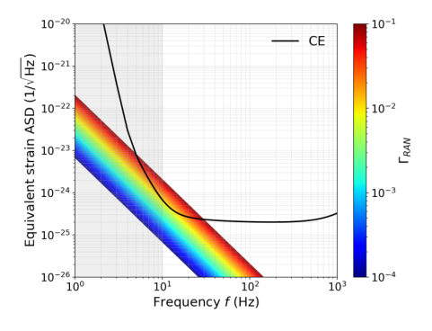 
Fig. 2 summarises the key results, showing the strain ASDs of ET and CE and their overlap with the equivalent strain- noise level required for the QGEM experiment to be per- formed to witness the quantum nature of gravity in a lab. The colour-coded regions depict 10−4 ≤ΓRAN ≤10−1 in the range of 1 −10 Hz for both the gravitational wave obser- vatories. Determining favourable QGEM interrogation times requires evaluating the accumulated dephasing using the lo- cal acceleration-noise spectrum and the interferometer filter function. The different ET- and CE-equivalent curves reflect their respective baselines and strain sensitivities and provide complementary benchmarks for QGEM noise control....

**Summary.** This white paper outlines a method to test quantum gravity by measuring the entanglement of masses using a matter-wave interferometer operating in the $1-10 	ext{ Hz}$ range. The core challenge is suppressing environmental noise, requiring unprecedented stability comparable to next-generation gravitational-wave detectors. It provides a theoretical roadmap for realizing quantum gravity tests using advanced atom interferometry.

**Why it may be interesting.** This work bridges fundamental quantum gravity tests with cutting-edge experimental challenges in low-frequency sensing, directly connecting quantum information concepts (entanglement witnesses) to macroscopic physics and detector technology.

Detailed structure

**Main problem.** The paper addresses the feasibility of using matter-wave interferometers to test the quantum nature of gravity by measuring the spin entanglement witness for quantum gravity effects.

**Main result.** The required sensitivity to environmental noise, particularly relative acceleration noise, must be below $10^{-15} 	ext{ m s}^{-2}/\sqrt{	ext{Hz}}$ in the $1-10 	ext{ Hz}$ band, placing the experiment in a regime comparable to advanced gravitational-wave detectors.

**Method.** The analysis involves theoretical modeling of the Quantum Gravity-Induced Entanglement of Masses (QGEM) protocol using matter-wave interferometry.

**Model / system.** The system is a matter-wave interferometer designed to maintain spatial superpositions ($\Delta x \sim 1-20 \mu	ext{m}$) and coherence ($	au \sim 0.1-1 	ext{ s}$) using masses ($m \sim 10^{-15}-10^{-14} 	ext{ kg}$).

**Key observables.** The spin entanglement witness, phase difference ($\Delta\phi$), and sensitivity to Relative Acceleration Noise (RAN) and Gravity-Gradient Noise (GGN).

**Important parameters / regimes.** Frequency range of $1-10 	ext{ Hz}$; required noise suppression below $10^{-15} 	ext{ m s}^{-2}/\sqrt{	ext{Hz}}$; mass $m=10^{-14} 	ext{ kg}$.

**Assumptions / limitations.** The protocol assumes standard quantum mechanics and general relativity, and the primary limitation is environmental noise suppression.

**Paper structure.** The paper introduces the QGEM protocol, details the experimental requirements for the interferometer (mass, separation, coherence), analyzes the dominant low-frequency noise sources (RAN, GGN), and compares the necessary noise suppression levels to those targeted by large-scale gravitational-wave observatories like ET and CE.

Abstract

In this white paper, we highlight the importance of the ($1-10~{\rm Hz}$) frequency range for laboratory tests of the quantum nature of gravity using the quantum gravity-induced entanglement of masses (QGEM) protocol. QGEM requires matter-wave interferometers with masses ($m\sim10^{-15}-10^{-14}~{\rm kg}$), brought within separations ($d\sim30-50~μ{\rm m}$), while maintaining spatial superpositions of ($1-20~μ{\rm m}$) and coherence for ($τ\sim 0.1 - 1~{\rm s}$). These requirements make low-frequency environmental noise a central experimental challenge and place QGEM in a regime closely related to the low-frequency goals of the Einstein Telescope (ET) and the Cosmic Explorer (CE). In particular, QGEM is sensitive to relative acceleration noise (RAN) and to gravity-gradient noise (GGN) generated by seismic and other environmental mass-density fluctuations. For representative parameters $m=10^{-14}~{\rm kg}$, $Δx=10~μ{\rm m}$, and $τ=1~{\rm s}$, the differential acceleration-noise amplitude spectral density must be suppressed well below the $10^{-15}~{\rm m\,s^{-2}/\sqrt{Hz}}$ level to keep acceleration-induced dephasing below the relevant experimental scale. Achieving this level of low-frequency noise suppression is therefore a key requirement for QGEM and closely parallels the seismic and gravity-gradient noise challenges that ET and CE address.

[↑ back to top](#top)

### [Analytical results for the Shannon entropy of the critical transverse-field Ising chain](http://arxiv.org/abs/2610.08591v1)

**Authors:** M. A. Rajabpour  
**Type:** theory · **Category:** statistical mechanics · **PDF:** <https://arxiv.org/pdf/2610.08591v1>  
**Analysis basis:** full PDF text, analyzed in chunks
**Topic relevance:** `analog quantum simulation` **1/5** · `non-equilibrium universality` **1/5**

📷 Fig 1

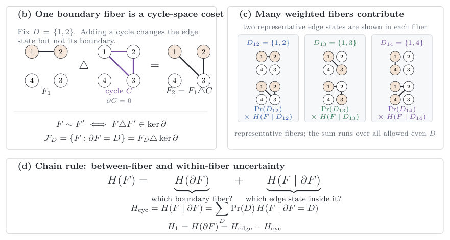 
Figure 1: Cycle entropy as uncertainty inside weighted boundary fibers. (a) The critical TFI Born law is represented exactly as the odd-degree boundary D = ∂F of an independent Bernoulli edge configuration F. (b) For fixed boundary D, compatible edge configurations form an affine coset of the binary cycle space: adding a cycle C, which is an even-degree subgraph with ∂C = 0, changes F but leaves ∂F unchanged. (c) Different allowed boundaries label distinct weighted fibers; two representative edge states are shown in each displayed fiber, while the conditional entropy averages over all edge configurations and all allowed even D. (d) The Shannon chain rule separates uncertainty between...

📷 Fig 2

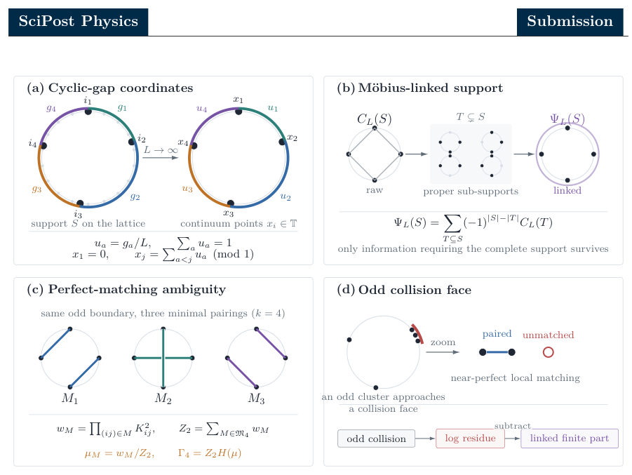 
Figure 2: Geometry of the periodic vertex-linked expansion. (a) An ordered support S on the periodic lattice is parametrized by positive cyclic gaps ga, with P a ga = L. In the macroscopic limit ga = Lua, the cumulative gaps define continuum points xi ∈T. (b) The vertex Möbius cumulant ΨL(S) subtracts contributions carried by proper sub-supports T ⊊S, leaving the signed linked remainder assigned by inclusion–exclusion to the complete support; the support diagrams in panel (b) are schematic and do not represent particular edge configurations. (c) For an even support the leading all-odd boundary ambiguity is realized by perfect matchings. For k = 4 there are three minimal pairings M1, M2, M3,...

📷 Fig 3

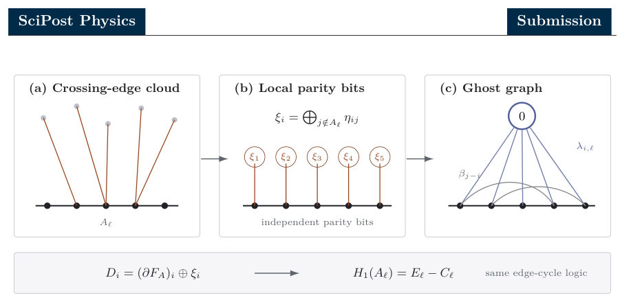 
Figure 3: Exact interval reduction. (a) The exterior of Aℓcontributes through the cloud of crossing Bernoulli edges. (b) For each physical site i, those exterior edges enter the measured parity only through the single bit ξi = L j /∈Aℓηij, with Pr(ξi = 1) = λi,ℓ. (c) The independent parity bits ξi are represented exactly by edges from a single ghost vertex 0 to the physical sites, while the original internal edges of probabilities βj−i remain present. The physical components of ∂F + are the measured bits, and the ghost component is fixed by their total parity; the augmented graph therefore reproduces the complete interval measurement law.

📷 Fig 4

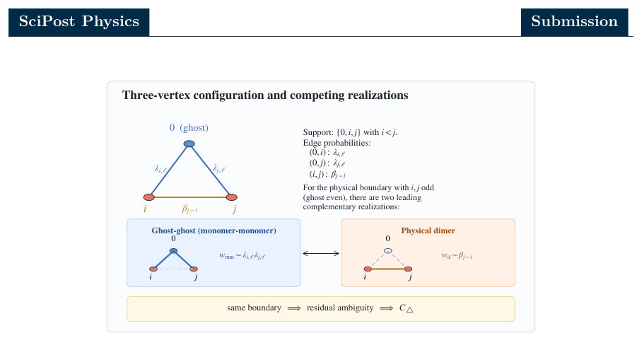 
Figure 4: Three-vertex ambiguity underlying the first ghost-linked sector. On the support {0, i, j}, the unique triangle cycle allows two complementary realizations of the same physical boundary with i and j odd and the ghost even. The leading competing configurations are the two ghost edges, with weight proportional to λi,ℓλj,ℓ, and the single physical edge, with weight proportional to βj−i. The conditional triangle entropy C△measures the residual Shannon ambiguity between these realizations. The common-scale and fixed-separation regions that generate the logarithm in B2,ℓare analyzed in the text.

📷 Fig 5

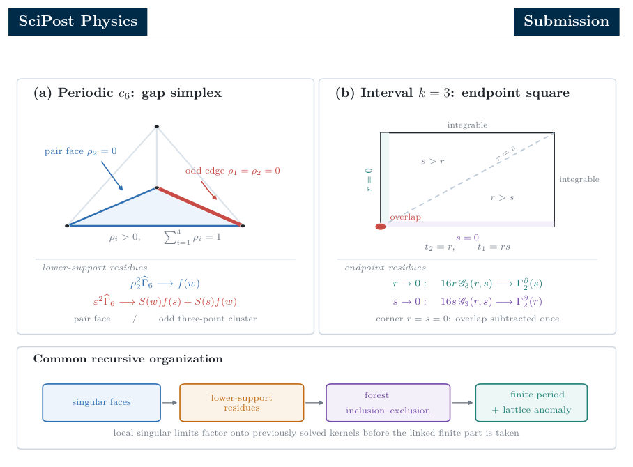 
Figure 5: Singular geometry of the first higher linked periods. (a) For the periodic six-vertex problem, the positive gap variables ρi form a three-dimensional simplex. The pair-collision face ρ2 = 0 carries the already solved four-point residue f, while the codimension-two edge ρ1 = ρ2 = 0 gives the odd three-point-cluster factorization involving S and f. (b) For the interval k = 3 problem, t2 = r and t1 = rs map the ordered shape domain to the unit square. The faces r = 0 and s = 0 carry the lower-order kernel Γ∂ 2; the top and right faces are locally integrable, and the corner r = s = 0 is an overlap removed once by sector/forest inclusion–exclusion. The lower strip summarizes the common...

**Summary.** This theoretical paper calculates the Shannon entropy for the critical transverse-field Ising chain by treating the problem directly at the singular point $n=1$. It employs advanced techniques involving graph theory and the Shannon chain rule to decompose the entropy into manageable, analytically solvable components. The work successfully derives universal constants characterizing the system's critical behavior, confirming previous results through a novel, rigorous mathematical framework.

**Why it may be interesting.** The rigorous mathematical treatment of entanglement and information measures (Shannon entropy) at quantum critical points provides deep insights into the universal scaling laws governing quantum many-body systems, which is crucial for understanding quantum phase transitions.

Detailed structure

**Main problem.** The paper determines the Shannon entropy of the critical transverse-field Ising (TFI) chain, specifically addressing the singularity encountered when using the conventional Rényi approach at the Shannon point ($n=1$).

**Main result.** The entropy is decomposed into explicit independent-edge and conditional cycle-space terms, yielding an all-orders analytic hierarchy and recovering established universal coefficients like $\gamma_1$ and $\gamma_E$ through rigorous mathematical techniques.

**Method.** The analysis uses the Shannon chain rule applied to the Born distribution, representing it via independent long-range Bernoulli edges and analyzing the resulting graph cycle space structure.

**Model / system.** The system is the critical transverse-field Ising (TFI) chain, analyzed using its ground-state probability distribution derived from the Hamiltonian. The mathematical framework involves mapping the probability distribution to a boundary problem on a graph.

**Key observables.** Shannon entropy ($H_1$), analytic edge anomaly ($\gamma_E$), and the universal logarithmic coefficient ($\gamma_1$).

**Important parameters / regimes.** The critical point of the TFI chain, the finite size $L$, and the Shannon index $n=1$.

**Assumptions / limitations.** The results are conditional on stated finite-part matching and forest assumptions, and the analysis relies on controlling residual information in the graph cycle space.

**Paper structure.** The paper proceeds by establishing the entropy decomposition via the Shannon chain rule, evaluating specific terms (like the four-vertex term), and then deriving the final universal constants ($\gamma_E$ and $\gamma_1$) by analyzing the boundary and cycle-space contributions.

Abstract

Local-basis Shannon entropies of critical wave functions contain universal subleading information, but the Shannon point of the critical transverse-field Ising chain is singular in the conventional Rényi approach. We treat it directly at $n=1$ by representing the complete computational-basis Born distribution as the odd-degree boundary of independent long-range Bernoulli edges. The Shannon chain rule separates the entropy into explicit independent-edge and conditional cycle-space terms. For the periodic chain this isolates the analytic edge anomaly and organizes the remaining constant by linked vertex support. Conditional on the stated finite-part matching and forest assumptions, every nonvanishing linked coefficient is represented by an explicit finite-dimensional integral, giving an all-orders analytic hierarchy; the four-vertex term is evaluated in closed form, and the first few linked sectors already nearly saturate the established periodic constant, which is also reconstructed independently from the exact finite-size distribution. For an interval, the exterior reduces exactly to one ghost vertex and the explicit squared logarithms cancel, leaving the analytic edge contribution $γ_E=\log2/4-1/16$. The conditional cycle term has an exact all-support decomposition into physical-line and ghost-linked sectors; conditional on closure of the boundary forest subtraction, these sectors define an all-orders hierarchy of renormalized line and monomer--dimer boundary periods for the remaining logarithmic coefficient. The first complete augmented linked coefficient is evaluated in closed form, with an exact cancellation between its line and ghost boundary-layer anomalies; an independent reconstruction from exact finite-size probabilities recovers the established coefficient $γ_1=0.060020(3)$.

[↑ back to top](#top)

### [Interacting multicomponent $SU(N)$ magnets](http://arxiv.org/abs/2610.07157v1)

**Authors:** Alexios P. Polychronakos, Konstantinos Sfetsos  
**Type:** theory · **Category:** statistical mechanics · **PDF:** <https://arxiv.org/pdf/2610.07157v1>  
**Analysis basis:** full PDF text, analyzed in chunks
**Topic relevance:** `Keldysh / 2PI / non-Gaussian methods` **1/5** · `analog quantum simulation` **1/5**

📷 Fig 1

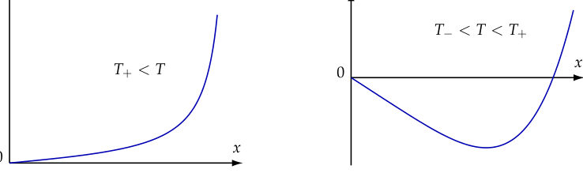 
Figure 2: Plots of the left hand side of (3.28) for T+ &lt; T (left) and for T−&lt; T &lt; T+ (right). As T ≲T+ the nontrivial solution x ≳0.

📷 Fig 2

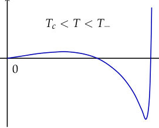 
Figure 3: Plots of the left hand side of (3.28) for Tc &lt; T &lt; T−(left) and precisely at T = Tc (right), for ca &gt; 1 and cb &gt; 1. As T ≳T−the nontrivial solution x ≳0.

📷 Fig 3

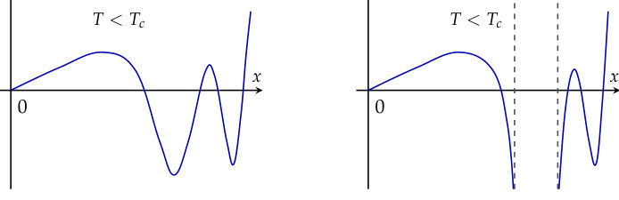 
Figure 4: Characteristic plots of the left hand side of (3.28) for T &lt; Tc, for ca &gt; 1 and cb &gt; 1.

📷 Fig 4

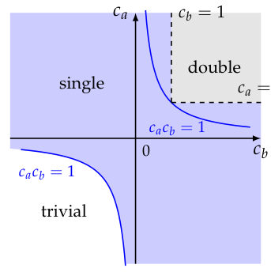 
Figure 5: Regions in the (ca−cb)-plane demarcating the double (grey), single (blue), and trivial (white) magnet areas.

📷 Fig 5

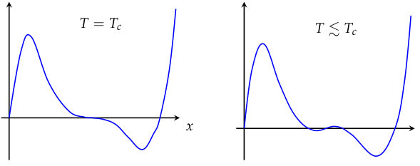 
Figure 6: Plot of the left hand side of (3.28) in the case ca = cb for T = Tc (left) and T ≲Tc (right). For T ≲Tc the slope at x = xc becomes positive, giving a stable solution flanked by two unstable ones, all stemming from the same unstable solution at T = Tc. This is unlike the case in fig. 4, where for T ≲Tc the emerging stable and unstable solutions stem from a point different from the existing unstable solution.

**Summary.** This paper develops a theoretical framework to study the thermodynamics of complex magnets governed by SU(N) symmetry. Using the mean-field approximation, the authors derive the free energy and analyze the phase transitions, showing the potential for mixed magnetic ordering. The work is mathematically sophisticated, relying on representation theory and large-N limits to tackle the complex interactions.

**Why it may be interesting.** The rigorous application of advanced group theory (SU(N) representations) to derive macroscopic thermodynamic properties (phase transitions) places it at the intersection of advanced statistical mechanics and quantum field theory, which is highly relevant for understanding complex many-body quantum systems.

Detailed structure

**Main problem.** The study focuses on deriving the thermodynamics and phase structure of magnets whose interactions are invariant under a global SU(N) symmetry group.

**Main result.** The system can exhibit mixed ferro-antiferromagnetic behavior, and the analysis provides explicit phase structures for simplified models, such as the two-atom case in SU(2).

**Method.** The primary method involves using the mean-field approximation in the thermodynamic limit, combined with advanced techniques from representation theory of SU(N) to calculate partition functions.

**Model / system.** The model consists of magnets made of molecules whose atoms interact via SU(N)-invariant two-body interactions. The Hamiltonian is generally expressed using SU(N) generators, and the analysis is performed in the large-N limit.

**Key observables.** Equilibrium free energy (F), partition function (Z), and stability criteria derived from the Hessian matrix.

**Important parameters / regimes.** The coupling matrix structure (C_st), temperature (T), and the large number of molecules (n).

**Assumptions / limitations.** The analysis heavily relies on the mean-field approximation and a semiclassical treatment in the large-n limit, which is noted as being heuristic.

**Figures summary.** Not specified by the notes, but the analysis involves deriving equations for equilibrium conditions and stability criteria.

**Paper structure.** The paper progresses from defining the general Hamiltonian and applying the mean-field approach, through the calculation of the partition function using representation theory, and finally analyzing the stability conditions by comparing equilibrium and off-equilibrium free energies.

Abstract

We study magnets composed of molecules with atoms interacting via $SU(N)$-invariant two-body interactions. Atoms carry states transforming in generically different irreducible representations of $SU(N)$, and the interaction strength between atoms depends on the specific atoms involved. We derive the thermodynamics of these magnets in the mean-field approach, and find that they can exhibit mixed ferro-antiferromagnetic behavior. We present a full analysis of the simplest nontrivial case of molecules consisting of two atoms in the spin-$j$ representation of $SU(2)$, which generalizes conventional magnetic systems, and derive its phase structure and transitions.

[↑ back to top](#top)

### [Phase diagram and transition properties of the Blume-Capel model: A Monte Carlo study](http://arxiv.org/abs/2610.07567v1)

**Authors:** Tenglong Li, Zhigang Feng, Jie Zhang  
**Type:** theory · **Category:** statistical mechanics · **PDF:** <https://arxiv.org/pdf/2610.07567v1>  
**Analysis basis:** full PDF text, analyzed in chunks
**Topic relevance:** `analog quantum simulation` **1/5** · `methods for driven-dissipative` **1/5**

📷 Fig 1

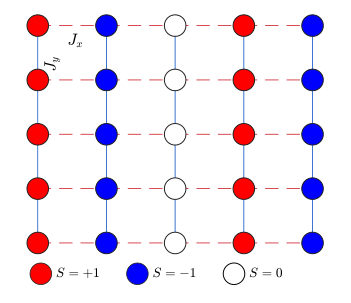 
Fig. 1. Square-lattice Jx-Jy Blume-Capel model. Red, blue, and open circles denote S = +1, −1, and 0, respectively. The horizontal dashed bonds represent the Jx interaction, while the vertical solid bonds represent the Jy interaction.

📷 Fig 2

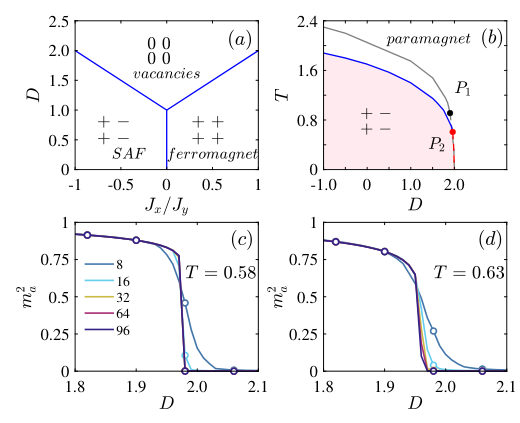 
Fig. 2. Zero-field phase behavior of the Jx-Jy Blume-Capel model with Jy = 1. (a) Ground-state phases determined by Jx/Jy and D. (b) T-D phase diagram at Jx = −1 and h = 0. The gray solid and dashed segments are the second- and first- order CV boundaries from Ref. [24], while the blue solid and red dashed curves are the corresponding MC boundaries; the light shaded region denotes the MC SAF region, and P1 and P2 mark the CV and MC tricritical points, respectively. (c) and (d) m2 a as a function of D at T = 0.58 and 0.63 for L = 8, 16, 32, 64, and 96.

📷 Fig 3

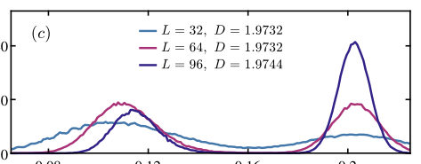 
Fig. 3. Finite-size behavior near the zero-field transition at T = 0.58. (a) Crystal-field dependence of the squared anti- ferromagnetic order parameter m2 a for L = 32, 64, and 96. (b) Maximum specific heat Cmax V as a function of L2. The gray dashed line, aL2 +b, is a guide to the Cmax V ∝L2 volume scaling expected for a first-order transition. (c) Energy-density distri- butions P(e), with e = E/N, evaluated at D = 1.9732 for L = 32 and 64 and at D = 1.9744 for L = 96.

📷 Fig 4

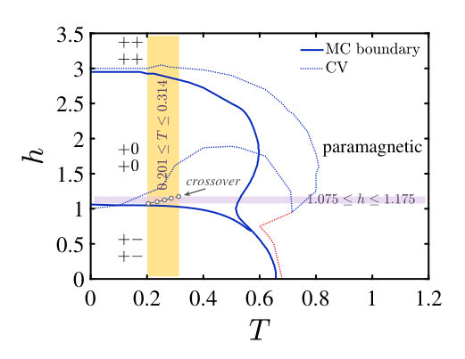 
Fig. 4. Magnetic-field phase diagram at Jx = −1, Jy = 1, and D = 1.95. The blue solid curve denotes the MC phase bound- ary, while the blue and red dotted curves are the second- and first-order CV boundaries from Ref. [24]. Gray open circles trace the crossover points; the yellow and purple shaded bands indicate the temperature interval 0.201 ≤T ≤0.314 and field interval 1.075 ≤h ≤1.175 spanned by these points, respec- tively. The configurations +− +−, +0 +0 , and ++ ++ denote the SAF, mixed, and fully polarized states, respectively.

📷 Fig 5

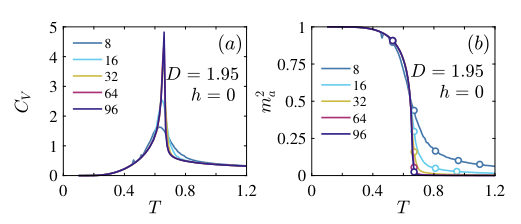 
Fig. 5. Finite-size thermal behavior at Jx = −1, Jy = 1, D = 1.95, and h = 0. (a) Specific heat CV as a function of temperature for L = 8, 16, 32, 64, and 96. (b) Squared antifer- romagnetic order parameter m2 a for the same system sizes.

**Summary.** This paper uses Monte Carlo simulations to map the complex phase diagram of the Blume-Capel model under varying magnetic fields. It compares its findings against mean-field theories, confirming the existence of reentrant behavior but concluding that the primary phase transitions are second order. The work is valuable for understanding magnetic ordering and magnetocaloric responses in quantum spin systems.

**Why it may be interesting.** The detailed study of phase transitions, critical points (like the TCP), and the magnetocaloric effect in a lattice model provides a rich playground for understanding how external fields and local energy terms modify magnetic ordering, which is relevant to quantum materials.

Detailed structure

**Main problem.** The study investigates the phase diagram, transition properties, and magnetocaloric effects of the Blume-Capel model.

**Main result.** The research confirms that while reentrant behavior can occur by varying the magnetic field at constant temperature, all relevant phase transitions examined were found to be second order, contradicting some mean-field predictions.

**Method.** The study primarily employs the Monte Carlo (MC) simulation method, supplemented by comparisons with the Cluster Variation (CV) method and Mean Field Theory.

**Model / system.** The system is the Jx-Jy Blume-Capel model on a square lattice, described by a Hamiltonian involving exchange interactions (Jx, Jy), a crystal field term (D), and an external magnetic field (h).

**Key observables.** Staggered magnetization, specific heat ($C_V$), magnetic entropy change ($\Delta S_m$), and the Binder ratio are key diagnostics used to locate phase transitions.

**Important parameters / regimes.** Key parameters include the coupling constants ($J_x, J_y$), the crystal field parameter ($D$), and the external magnetic field ($h$). The analysis focuses on various regimes, including the zero-field case and mixed-state regimes.

**Assumptions / limitations.** The analysis relies on comparing MC results against CV approximations, noting that differences in phase boundaries and transition order are attributed to the finite-cluster approximation of CV.

**Figures summary.** Figures illustrate the lattice structure, compare MC vs. CV phase boundaries, show finite-size scaling behavior near transitions, and map the magnetic-field dependence of order parameters and magnetocaloric effects.

**Paper structure.** The paper systematically investigates the phase diagram by analyzing the zero-field case, then examining the effect of an external magnetic field, confirming reentrant behavior under specific conditions, and finally quantifying the magnetocaloric response.

Abstract

The Jx-Jy Blume-Capel model, with and without an external magnetic field, is investigated using the Monte Carlo method. Our aim is to verify the location of the tricritical point, examine the existence of reentrant behavior, and study the magnetocaloric properties of this specifically designed system. In the non-field case, the critical temperature given by the Monte Carlo simulations is lower compared to the conventional antiferromagnetic square lattice. When an external magnetic field is applied, we observed signs of a one-dimensional spontaneous symmetry-breaking phase in the mixed-states regime, which is counterintuitive with secondary specific-heat peak. We take the snapshot of this state and elucidated the underlying mechanisms using mean field theory in the field of spin-1 spinor Bose-Einstein condensate . Regarding reentrant behavior, we confirmed its occurrence as the magnetic field varies, but only when the temperature is kept constant. Temperature-dependent reentrant behavior could not be identified within this system. Finally, we examined the magnetocaloric properties and found no evidence of first-order phase transitions within the region of the considered phase-transition point. Although both inverse and direct magnetocaloric effects are present and related to the mixed state, we identified that the relevant phase transitions are all of the second order.

[↑ back to top](#top)

### [Classical Verification of a Remote Quantum Processor via Degenerate Concordant Computations: An Application to Randomness Generation](http://arxiv.org/abs/2610.08185v1)

**Authors:** Bishal Kumar Das, Lakshya Priyadarshi  
**Type:** theory · **Category:** quantum information and computing · **PDF:** <https://arxiv.org/pdf/2610.08185v1>  
**Analysis basis:** full PDF text, analyzed in chunks
**Topic relevance:** `quantum measurements` **1/5**

📷 Fig 1

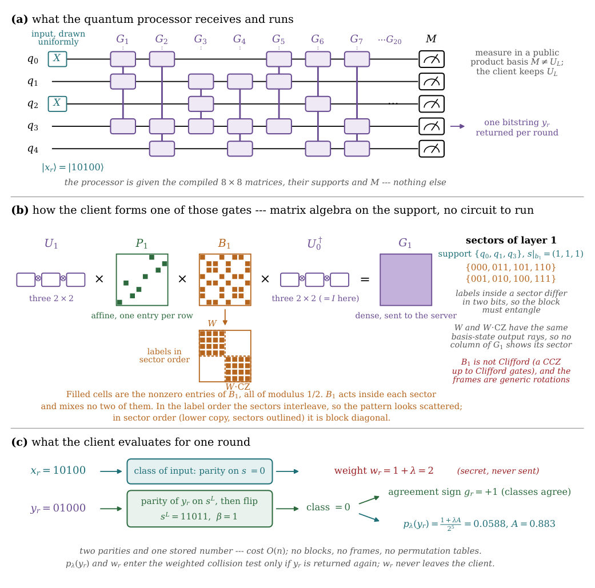 
FIG. 1. One five-qubit instance of the construction, end to end (ℓ= 3, a secret parity over all five qubits, L = 20, λ = 1, θ = 0.15). Every support, sector, permutation and number shown is taken from that instance. (a) What the quantum processor receives and runs. The client sends a uniformly random label, here |10100⟩; the processor prepares it in the computational basis, applies the compiled gates Gt, each on three qubits straddling the central cut, measures in the public basis M ̸= UL, and returns one bitstring. It is given the compiled 8 × 8 matrices, their supports and M, and nothing else. (b) How the client forms G1 = U1P1B1U † 0 on the support {q0, q1, q3}: a product of four 8 × 8...

📷 Fig 2

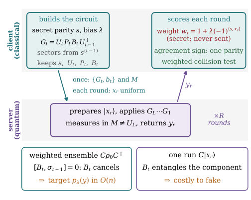 
FIG. 2. The protocol. The client builds the circuit from a secret parity s and sends the compiled gates once. Each round it sends a uniformly random label xr; the server pre- pares |xr⟩, applies the gates and returns the outcome yr of a measurement in M ̸= UL. The client keeps, for each round, the weight wr = 1 + λ(−1)⟨s,xr⟩, the eigenvalue of xr in the hidden state, and never sends it. Bottom: the weighted en- semble is Cρ0C†, in which the block factors cancel, so the target distribution costs O(n) per outcome; each run is a sin- gle component, which the blocks entangle.

**Summary.** This paper presents a novel, efficient classical verification protocol for remote quantum processors using degenerate concordant computations. By exploiting the mathematical structure of these states, the client can verify computation integrity in polynomial time, circumventing exponential sampling costs. This work is significant for building trust in outsourced quantum computing services.

**Why it may be interesting.** The protocol provides a concrete, efficient cryptographic primitive for verifying quantum computation integrity, which is crucial for realizing trustworthy cloud quantum services.

Detailed structure

**Main problem.** To develop a computationally efficient classical protocol for a client to verify that a remote quantum processor has executed a computation, especially for applications like randomness generation.

**Main result.** The authors propose a protocol based on degenerate concordant computations that allows the client to score each verification round in time $O(n)$, significantly beating the exponential cost of naive sampling.

**Method.** The protocol leverages the structure of degenerate concordant states, where the client uses a secret parity to predict the ensemble evolution via inner products, while performing two specific tests: an input–output agreement test and a weighted collision test.

**Model / system.** The model involves quantum computation layers $G_t = U_t P_t B_t U_{t-1}^\dagger$ acting on a state assumed to be concordant (diagonal in a product basis). The security relies on the client's secret knowledge of the degenerate sectors.

**Key observables.** Input–output agreement test statistics ($\hat{S}$) and weighted collision statistics ($Z_w$).

**Important parameters / regimes.** The client's computational cost is $O(n)$ per round; the security relies on the secret parity $s$ remaining hidden.

**Assumptions / limitations.** The soundness of the explicit construction is stated as a conjecture; the client must ensure inputs are uniformly random.

**Paper structure.** The paper first establishes the computational difficulty of verification, then introduces the degenerate concordant framework, details the client's $O(n)$ prediction mechanism using secret parity, and finally proves completeness, efficiency, and soundness (with the caveat of the conjecture).

Abstract

A client who rents a cloud quantum processor cannot easily tell whether the bitstrings it receives came from a quantum device. Certification by random circuit sampling runs on present hardware, but scoring each returned sample costs the client time $O(2^n)$. We give a protocol in which the client scores each round in time $O(n)$, built on degenerate concordant ensembles. When a concordant state has a degenerate spectrum, every concordance-preserving gate factorizes as $G_t=U_tP_tB_tU_{t-1}^\dagger$, and the block factor $B_t$, which commutes with the state, cancels from the ensemble while entangling each pure component. The client holds a secret parity whose cosets are the degenerate sectors of every layer, so that it builds the circuit and predicts the ensemble with one inner product per layer. The secret never leaves the client. Inputs are sent uniformly at random, and the client attaches to each round, in its own bookkeeping, the eigenvalue of that input in the hidden state; both verification statistics, an input--output agreement test and a weighted collision test, then compare the server's samples with the non-flat output distribution of the concordant computation. We prove completeness, client efficiency, and soundness in an ideal model in which the compiled circuit reveals nothing about the secret, and we show that the secret must stay hidden: a classical server that holds it passes. For the explicit construction we prove that the single-qubit symmetry test used in efficient simulations of concordant computation fails on non-product inputs with unbiased marginals, and we measure that the local-basis finder of Cable and Browne halts on every layer we tested, that the transmitted component saturates the maximal Schmidt rank, that the circuit is not Clifford, and that matrix-product spoofers are rejected. Soundness of the explicit construction is stated as a conjecture.

[↑ back to top](#top)

### [Closed analytical form of many-body free volume and thermodynamics of monodisperse hard disks](http://arxiv.org/abs/2610.08265v1)

**Authors:** Victor M. Pergamenshchik, Taras Bryk, Andrij Trokhymchuk  
**Type:** theory · **Category:** statistical mechanics · **PDF:** <https://arxiv.org/pdf/2610.08265v1>  
**Analysis basis:** full PDF text, analyzed in chunks
**Topic relevance:** `analog quantum simulation` **1/5**

📷 Fig 1

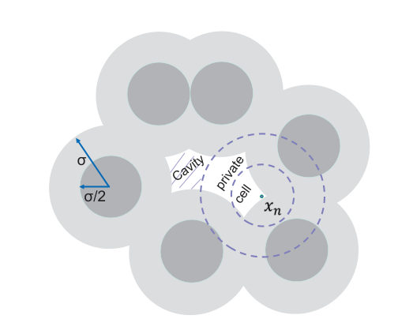 
FIG. 1. Fragment of an equilibrium system of N hard disks. The (N −1) hard disks are dark circles, and the connected σ-circles are light circles. The n-th disk and circle are shown by dashes. The inner white area is the global free volume of the n-th disk, the hatched fraction is its cavity, and the clear fraction is its private cell.

📷 Fig 2

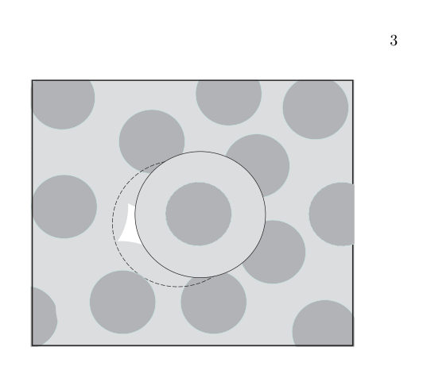 
FIG. 2. A configuration of (N −1) hard disks in an equilib- rium N-disk system; the N-th disk is transparent, not seen, and its center is in the white area. The shown (N −1) disk configuration is allowed as its σ-circles leave a cell (white area) for the N-th disk. However, it is different from the equilib- rium configuration of (N −1) disks which is homogeneous. In the equilibrium (N −1) system one of the N −1 disks, whose σ-circle is indicated by solid line, would be at the position shown by dashes. This dashed σ-circle fully covers the white area so that another, N-th disk, cannot be inserted. This is a disallowed configuration as the N-th disk has no place in it. Thus, insertion of N-th disk...

📷 Fig 3

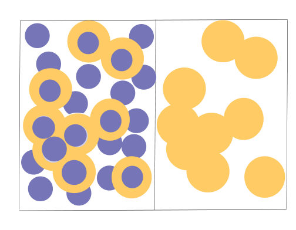 
FIG. 3. Left panel: A system of N = 23 hard disks with dark cores. The chosen k −1 = 9 hard disks have light concentric σ-circles. Right panel: The light σ−circles are those in the left panel and the empty area is the free volume V10{x9}23 for any dark disk chosen as the 10-th disk. As here η is below 0.5, the rest N −k + 1 = 14 hard disks are accommodated for any positions of the chosen 9 disks, the cavity dominates the global free volume, and the gas-like approximation (G) is justified.

📷 Fig 4

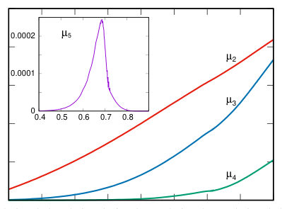 
FIG. 4. The mean intersection areas µ2, µ3, and µ4 of two, three, and four σ-circles as functions of the packing fraction η. Inset: the mean intersection area µ5 of five σ-circles. The diameter is set to σ = 1 .

📷 Fig 5

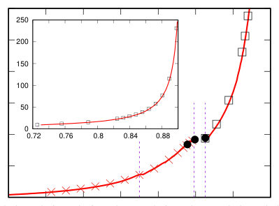 
FIG. 5. The pressure P predicted by theory (solid line) and superimposed on the simulation data Pexp (crosses10, empty squares9 and filled circles3,6,7). The vertical dash lines de- limit, from left to right, the G region, the crossover (with a small mismatch slightly rightward of η = 0.55) and the mixed-fluid regions, the fluid-solid phase coexistence region 0.696 &lt; η &lt; 0.720 (empty), and the L region.

**Summary.** This paper provides a breakthrough analytical theory for the thermodynamics of hard disks by deriving a closed-form expression for the many-body free volume based on geometric intersection areas. It successfully reproduces the known equation of state and reveals complex intermediate fluid regimes. The work establishes a powerful geometric framework for calculating configurational entropy in excluded volume systems.

**Why it may be interesting.** While focused on classical statistical mechanics, the rigorous derivation of exact geometric measures for configurational entropy and the identification of local order parameters (five-disk intersection area) provide powerful mathematical tools applicable to analyzing complex many-body correlations in quantum systems.

Detailed structure

**Main problem.** The paper addresses the difficulty of analytically formulating the many-body free volume and thermodynamics for the hard disk model due to its complex geometry.

**Main result.** The authors derive a closed, exact analytical representation for the free volume using intersection areas of up to five exclusion disks, successfully reproducing the equation of state across most density regimes.

**Method.** The methodology involves a rigorous geometric approach to calculate the free volume, leading to factorizations of the partition function based on conditional free volumes.

**Model / system.** The system is the monodisperse hard disk model in two dimensions, a fundamental reference system for excluded volume physics and liquid structure.

**Key observables.** Free volume ($V_{N,n}$), cavity ($\langle C_{N+1} 
angle_N$), private cell ($c_{N,n}$), and the five-disk intersection area (as an ordering measure).

**Important parameters / regimes.** Density ($\eta$), temperature (implied by equilibrium), and the number of disks ($N$).

**Assumptions / limitations.** The theory relies on the geometric identity that the free volume can be expressed exactly via intersection areas, and it analyzes limiting regimes (low/high density).

**Figures summary.** Figure 1 illustrates the decomposition of the free volume into the cavity and the private cell within an equilibrium hard disk configuration.

**Paper structure.** The paper progresses by establishing the geometric basis for free volume, deriving exact relationships between free volume, cavity, and private cell, calculating the partition function factorizations, and finally analyzing the equation of state across different fluid regimes.

Abstract

The hard disk model is a fundamental reference system for excluded volume physics, liquid structure, and 2D ordering. Yet, despite its apparent simplicity, an analytical formulation of its thermodynamics has remained difficult because the free volume available to disks centers has a highly nontrivial many-body geometry. Here we show that this geometry admits a closed and exact representation: for any given hard disk configuration, the free volume can be analytically expressed through intersection areas of up to five exclusion disks. This provides a direct geometrical route from particle coordinates to the configurational partition function and entropy. We prove that the N disk partition function factorizes into a product of conditional free volumes and identify its two limiting asymptotic forms: the low density fluid regime controlled by extensive cavities and the high density fluid regime controlled by intensive private cells. Using the geometric measures computed from representative equilibrium particle configurations, the resulting theory reproduces the established hard disk equation of state over almost the entire density range up to close packing. At intermediate densities, the analysis reveals a mixed fluid regime in which localized caged defects provide an additional configurational entropy within the density interval preceding liquid hexatic coexistence. Finally, the five disk intersection area is shown to be a sensitive local scalar measure of hexagonal ordering, complementing the orientational order parameter and emphasizing the central role of many-body correlations.

[↑ back to top](#top)

### [Convergence Without Finite Exactness in the Eigenstate Quantum Bootstrap](http://arxiv.org/abs/2610.07775v1)

**Authors:** Ye Zhou, Daniel Keren  
**Type:** theory · **Category:** other · **PDF:** <https://arxiv.org/pdf/2610.07775v1>  
**Analysis basis:** full PDF text, analyzed in chunks
**Topic relevance:** `quantum measurements` **1/5**

📷 Fig 1

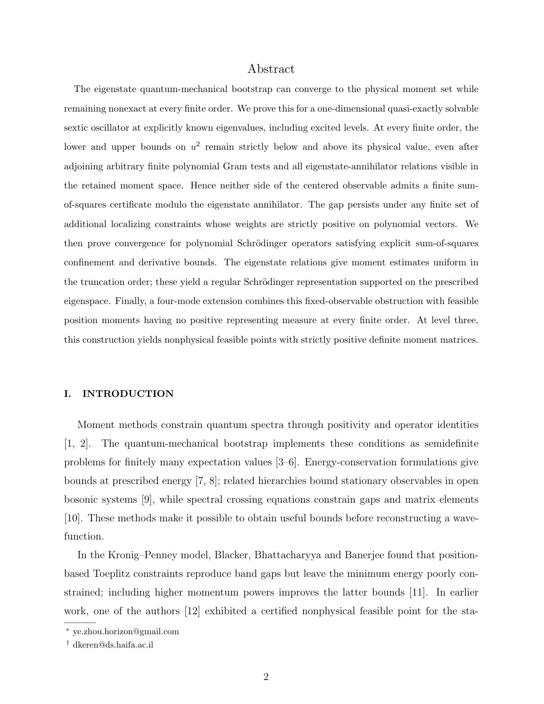 
Low-resolution page preview, page 2

📷 Fig 2

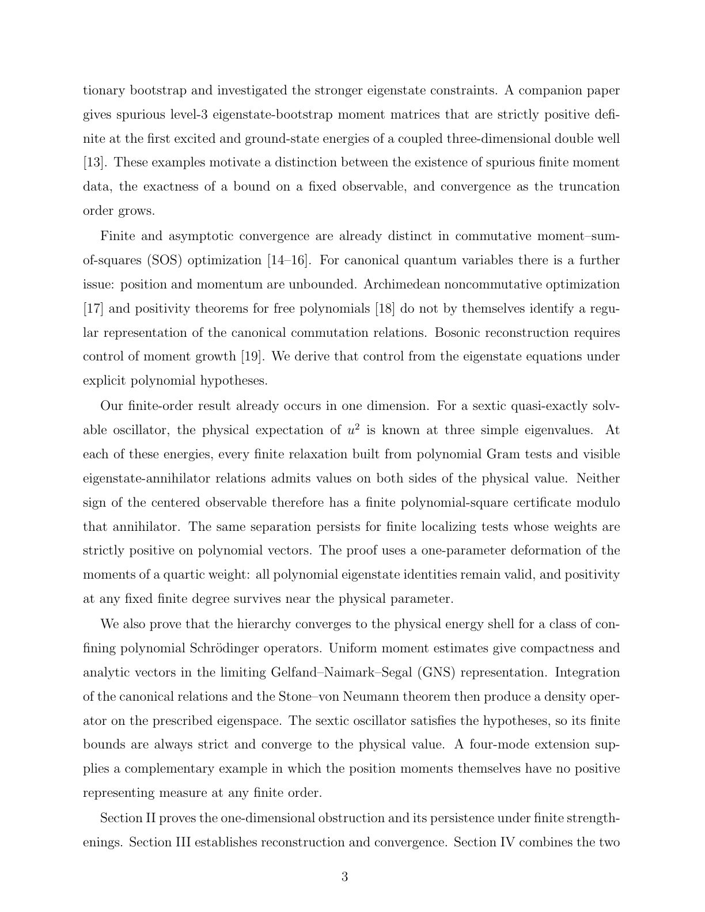 
Low-resolution page preview, page 3

📷 Fig 3

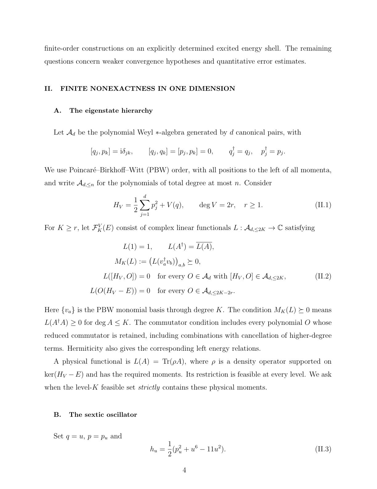 
Low-resolution page preview, page 4

📷 Fig 4

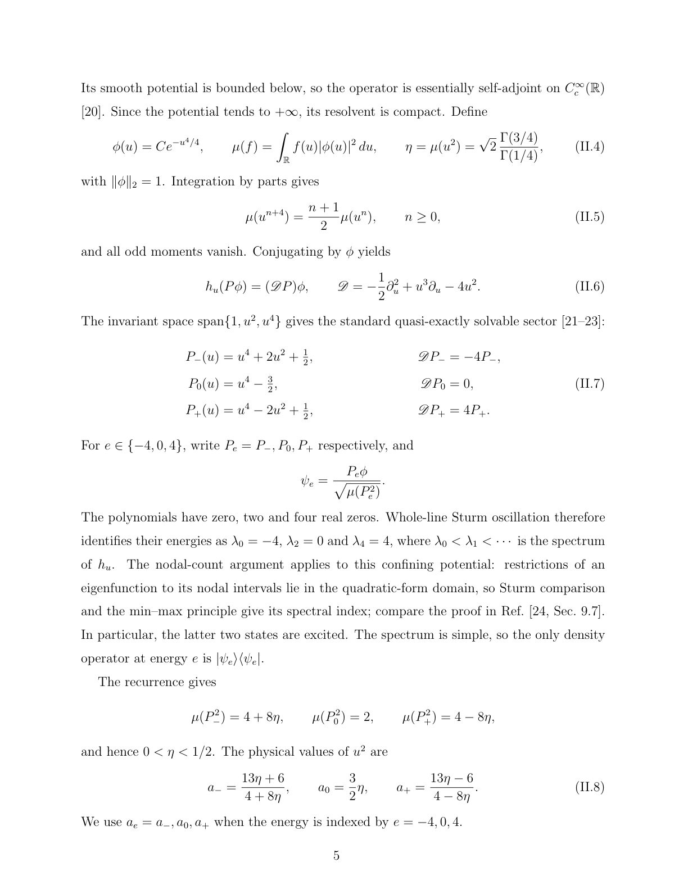 
Low-resolution page preview, page 5

📷 Fig 5

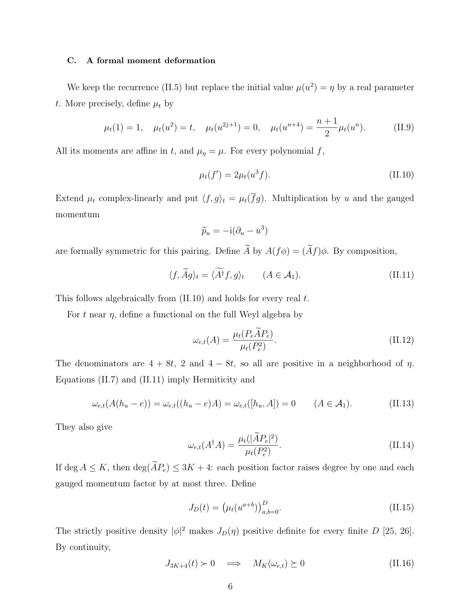 
Low-resolution page preview, page 6

**Summary.** This paper rigorously examines the eigenstate quantum-mechanical bootstrap, demonstrating that even when moment constraints converge to the physical spectrum, they do so without ever achieving exactness at any finite computational step. Using a sextic oscillator as a key example, the authors show that persistent gaps exist between the calculated bounds and the true physical value. This highlights fundamental limitations in using finite moment data to fully characterize quantum systems.

**Why it may be interesting.** This work provides deep theoretical insights into the limitations of moment-based reconstruction techniques in quantum mechanics, which is crucial for understanding the robustness of spectral determination methods in quantum field theory and many-body physics.

Detailed structure

**Main problem.** The paper investigates the convergence properties of the eigenstate quantum-mechanical bootstrap method when applied to determining physical quantum spectra.

**Main result.** It proves that the bootstrap can converge to the physical moment set without achieving exactness at any finite computational order, demonstrating persistent gaps between finite bounds and the true physical value.

**Method.** The analysis employs moment methods, semidefinite programming (SDP) constraints derived from operator identities, and functional analysis on the Weyl algebra to constrain quantum expectation values.

**Model / system.** The primary model analyzed is a one-dimensional quasi-exactly solvable sextic oscillator, though the methods are generalized to confining polynomial Schrödinger operators.

**Key observables.** The centered observable $u^2$, and the moment bounds $\langle q^{2n}_j 
angle$ and $\langle p^{2n}_j 
angle$ for position and momentum.

**Important parameters / regimes.** The truncation order ($K$) of the moment space, and the physical energy eigenvalue ($e$).

**Assumptions / limitations.** The convergence theorems rely on specific polynomial hypotheses (sum-of-squares conditions) being satisfied by the potential, and the analysis often involves assuming the existence of a compact resolvent.

**Figures summary.** The notes do not describe specific figures, but mention numerical tables showing the convergence of objective functions for different truncation orders ($K=3, 4, 5$).

**Paper structure.** The paper progresses by first establishing the non-exactness of finite bounds for the sextic oscillator, then proving uniform moment bounds for general confining potentials, and finally extending the analysis to show that the failure of finite exactness persists even with additional localizing constraints.

Abstract

The eigenstate quantum-mechanical bootstrap can converge to the physical moment set while remaining nonexact at every finite order. We prove this for a one-dimensional quasi-exactly solvable sextic oscillator at explicitly known eigenvalues, including excited levels. At every finite order, the lower and upper bounds on $u^2$ remain strictly below and above its physical value, even after adjoining arbitrary finite polynomial Gram tests and all eigenstate-annihilator relations visible in the retained moment space. Hence neither side of the centered observable admits a finite sum-of-squares certificate modulo the eigenstate annihilator. The gap persists under any finite set of additional localizing constraints whose weights are strictly positive on polynomial vectors. We then prove convergence for polynomial Schrödinger operators satisfying explicit sum-of-squares confinement and derivative bounds. The eigenstate relations give moment estimates uniform in the truncation order; these yield a regular Schrödinger representation supported on the prescribed eigenspace. Finally, a four-mode extension combines this fixed-observable obstruction with feasible position moments having no positive representing measure at every finite order. At level three, this construction yields nonphysical feasible points with strictly positive definite moment matrices.

[↑ back to top](#top)

### [Decoupling Spectral Gaps from Entanglement Complexity in Quantum Annealing](http://arxiv.org/abs/2610.07144v1)

**Authors:** Roopayan Ghosh, Sougato Bose  
**Type:** theory · **Category:** statistical mechanics · **PDF:** <https://arxiv.org/pdf/2610.07144v1>  
**Analysis basis:** full PDF text, analyzed in chunks
**Topic relevance:** `analog quantum simulation` **1/5**

📷 Fig 1

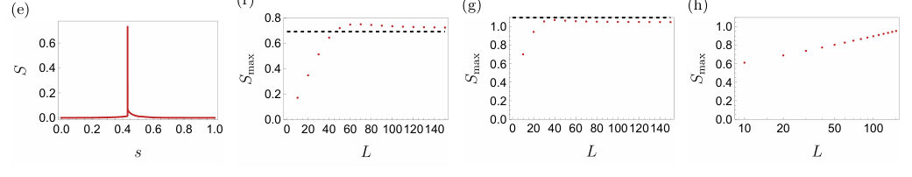 
FIG. 1: Energy gap and bipartite entanglement entropy in the fully connected p-spin model. (a) and (e) show the energy gap ∆(s) and half-system entanglement entropy S(s), respectively, as functions of the annealing parameter s for p = 3. (b) and (f) display the corresponding finite-size scaling of the minimum gap ∆min and maximum entropy Smax. (c) and (g) show the same quantities for p = 4. (d) plotted in log-log scale and (h) plotted in log-linear scale correspond to the second-order case p = 2. For the first-order transitions (p = 3 and p = 4), the minimum gap decreases exponentially with system size, whereas the maximum entropy approaches finite constants, Smax →ln 2 for p = 3 and Smax...

📷 Fig 2

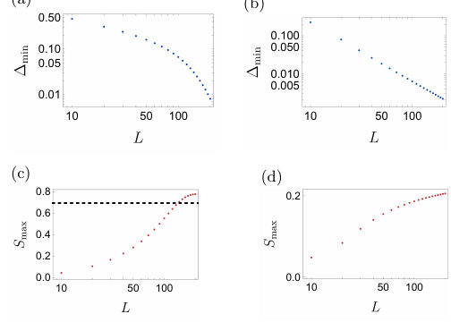 
FIG. 2: Finite-size scaling of the minimum energy gap ∆min and maximum bipartite entanglement entropy Smax for non-stoquastically catalyzed fully connected p-spin models. The top row shows the minimum gap for (a) p = 3, k = 3 and (b) p = 5, k = 5, while the bottom row shows the corresponding maximum bipartite entanglement entropy for (c) p = 3, k = 3 and (d) p = 5, k = 5. The gaps are shown on a log-log scale and (d) is plotted in log-linear scale. The dashed line in (c) indicate the first-order value Smax = ln 2.

📷 Fig 3

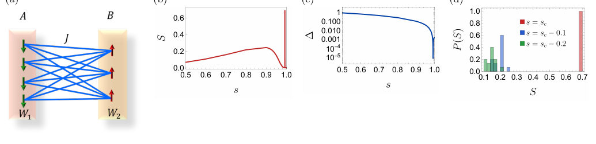 
FIG. 3: Entanglement structure of a representative bipartite graph instance exhibiting a first-order quantum phase transition. (a) Schematic of the bipartite graph, showing the natural partition into subsystems A and B, with intra-partition weights W1 = 0.04 and W2 = 0.0396, and inter-partition coupling J = 0.2132. (b) Bipartite entanglement entropy across the natural 5|6 graph partition for L = 11 spins as a function of the annealing parameter s. The entropy develops a broad enhancement at intermediate s, associated with the delocalization of the annealing state, before decreasing as the system approaches the first-order transition. (c) Instantaneous energy gap ∆between the ground and...

📷 Fig 4

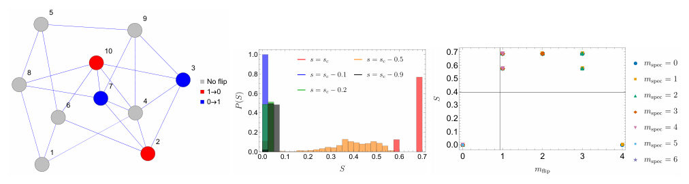 
FIG. 4: Entanglement across bipartitions for a representative random graph instance at a first-order quantum phase transition. Left: Graph corresponding to the avoided crossing, with vertices colored according to the two dominant computational basis configurations participating in the transition. Gray vertices remain unchanged, while red and blue denote spins that change their orientation between the two configurations. Center: Histogram of the bipartite entanglement entropy over all 511 inequivalent bipartitions at different points along the annealing path, namely s = sc, sc −0.1, sc −0.2, sc −0.5, and sc −0.9. Right: Bipartite entanglement entropy at the critical point s = sc for every...

📷 Fig 5

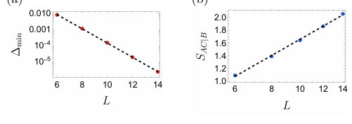 
FIG. 5: Scaling of the gap at avoided level crossing and bipartite entanglement for the constructed resonant-manifold annealing Hamiltonian. The numerical results are obtained for Γ = 1, K = 10, UG = 30, UE = 0.5, and δ = 0.03n, with n = 3, . . . , 6 and L = 2n, alongside the one selector spin making system sizes 2n + 1 being simulated. the crossing occurs at sc ∼0.57 −0.61, drifting towards the larger value with increasing system sizes. (a) The minimum gap decreases exponentially with system size, with the dashed line showing a fit to ln ∆min = 1.316 −1.017L, corresponding to ∆min ∼e−1.017L. (b) The entanglement entropy across the (A, C)|B bipartition grows logarithmically with system...

**Summary.** This work challenges the assumption that the difficulty of quantum annealing (spectral gap) must correlate with the entanglement complexity of the system. By analyzing various spin models and graph structures, the authors provide explicit counterexamples showing that these two quantities can scale independently. This suggests that a more sophisticated geometric characterization of the state evolution is needed to understand quantum resource requirements.

**Why it may be interesting.** It provides a deep theoretical understanding of the resources required for quantum computation, suggesting that geometric properties of the state evolution manifold, rather than just gap size, are the critical bottleneck.

Detailed structure

**Main problem.** The paper investigates whether the difficulty of adiabatic quantum annealing, quantified by the minimum spectral gap, must correlate with the complexity of the quantum state traversed, measured by entanglement complexity.

**Main result.** The authors demonstrate that gap scaling and entanglement complexity are not uniquely linked, showing examples where one scales differently from the other.

**Method.** The analysis uses theoretical constructions, including $p$-spin models, bipartite graph models, and random graph instances, to calculate spectral gaps and entanglement entropy.

**Model / system.** The study focuses on quantum annealing processes applied to various spin models, including the fully connected $p$-spin model and structured optimization problems on bipartite and random graphs.

**Key observables.** Minimum spectral gap ($\Delta_{\min}$), Bipartite entanglement entropy ($S$), and Schmidt rank.

**Important parameters / regimes.** System size ($L$), interaction order ($p$), and the annealing parameter ($s$).

**Assumptions / limitations.** The analysis relies on comparing different theoretical regimes (first-order vs. continuous transitions) and analyzing specific Hamiltonian structures.

**Figures summary.** Figures illustrate finite-size scaling of $\Delta_{\min}$ and $S_{\max}$ for $p$-spin models, and show entanglement evolution across bipartitions for graph models.

**Paper structure.** The paper establishes the problem using $p$-spin models, analyzes two conventional regimes (exponential gap/bounded entanglement vs. polynomial gap/logarithmic entanglement), and then provides counterexamples using structured and random graph models to decouple the two quantities.

Abstract

Exponentially small spectral gaps are the central obstacle to adiabatic quantum annealing, yet whether such bottlenecks demand correspondingly complex entanglement remains unclear. We show that gap scaling and entanglement complexity need not be linked. Conventional first-order transitions combine exponentially small gaps with bounded $O(1)$ bipartite Schmidt rank, even though the critical states retain global multipartite correlations, while continuous transitions combine polynomially closing gaps with logarithmically growing entanglement. We show that each pairing can also be inverted: in a known first-order transition in a staggered-field antiferromagnetic Ising chain the gap closes polynomially despite bounded Schmidt rank, while we construct a mirror-twin manifold model whose gap closes exponentially even as its entanglement entropy grows logarithmically with system size. We derive bounds connecting Schmidt rank to Hamming-space geometry, and identify manifold density and connectivity as the ingredients that determine which combination occurs. These results show that entanglement complexity alone cannot characterize annealing difficulty, and point toward a broader search for quantum resources that capture the geometry of state evolution in Hilbert space.

[↑ back to top](#top)

### [Entanglement Swapping Scheduling for Quantum Repeater Chains under Decoherence during Classical Communications](http://arxiv.org/abs/2610.07991v1)

**Authors:** Jorge Benito Díaz, Andrés Agustí, Jabier Faba, Laura Ortiz, Luis Robledo, Vicente Martín  
**Type:** theory · **Category:** quantum information and computing · **PDF:** <https://arxiv.org/pdf/2610.07991v1>  
**Analysis basis:** full PDF text, analyzed in chunks
**Topic relevance:** `correlated / nonlocal dissipation` **1/5**

📷 Fig 1

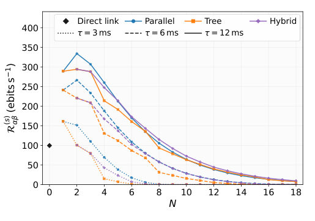 
Fig. 1. Entanglement rate as a function of the number of intermediate repeaters for the metropolitan scenario, with Ltot = 60 km, p0 = 0.5, q = 0.8, and w0 = 1. Results are shown for three representative memory decoherence times τ ∈{3, 6, 12} ms, using the early-abort policy. The direct- link configuration N = 0 is included as a baseline only for τ = 6 ms.

📷 Fig 2

 
Fig. 2. Entanglement rate as a function of the number of intermediate repeaters for the intermetropolitan scenario, with Ltot = 500 km, p0 = 0.5, q = 0.8, and w0 = 1. Results are shown for three representative memory decoherence times τ ∈{100, 150, 500} ms, using the early-abort policy.

📷 Fig 3

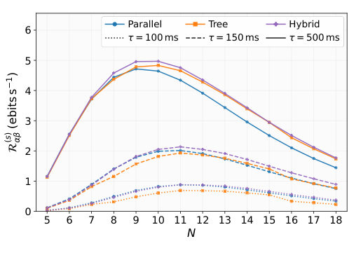 
Figure 2 shows a qualitatively different behavior from the metropolitan scenario. For all memory regimes considered,

**Summary.** This paper provides an analytical model to optimize quantum repeater chains for long-distance entanglement distribution by accounting for memory decoherence. It compares three scheduling strategies—Parallel, Tree, and Hybrid—to determine the entanglement rate as a function of repeater count. The key finding is that an optimal number of repeaters exists, balancing the benefits of shorter links against the cumulative decoherence penalty.

**Why it may be interesting.** This work directly addresses the practical limitations of scaling quantum networks by quantifying the detrimental effects of decoherence and classical communication delays on entanglement distribution protocols.

Detailed structure

**Main problem.** The paper develops an analytical model to estimate the impact of decoherence during the heralding process in quantum repeaters used for long-distance entanglement distribution.

**Main result.** The analysis reveals a fundamental trade-off: while increasing the number of repeaters boosts entanglement generation, the additive penalty from memory decoherence eventually dominates, proving the existence of an optimal repeater count.

**Method.** The authors developed an analytical framework comparing three scheduling strategies (Binary-Tree, Parallel, Hybrid) to calculate the entanglement rate by accounting for memory exposure during entanglement generation and swapping.

**Model / system.** The system modeled is a homogeneous linear chain of N quantum repeaters connecting two end nodes over a total distance L_tot. The process involves sequential entanglement generation (EG) followed by entanglement swapping (ES) operations.

**Key observables.** Entanglement rate (measured using logarithmic negativity) and the optimal number of repeaters (N).

**Important parameters / regimes.** Memory decoherence time ($\tau$), total distance ($L_{tot}$), and the number of repeaters ($N$).

**Assumptions / limitations.** The analysis is restricted to prepare-and-swap strategies, and it models memory decoherence as an exponential time-decay of the Werner parameter.

**Figures summary.** Figure 1 shows the entanglement rate vs. N for a metropolitan scenario across different $\tau$; Figure 2 shows the rate vs. N for an intermetropolitan scenario, demonstrating an optimal N exists.

**Paper structure.** The paper first establishes the physical model and the need for an analytical framework. It then details the comparison of three scheduling strategies (Parallel, Tree, Hybrid) by quantifying memory exposure during the two main phases (generation and swapping). Finally, it presents results showing the dependence of the optimal repeater count on the decoherence time and distance scale.

Abstract

First-generation quantum repeaters are essential in distributing entanglement over long distances since they could mitigate losses in optical fiber. Repeaters split the total distance into shorter, easier to generate links. Then, entanglement swapping establishes long range entanglement by performing local measurements at the repeaters and heralding their results. In this work, we develop an analytical model that estimates the impact of decoherence during heralding for a given protocol. Furthermore, we identify a competition between two phenomena: as repeater count increases, so does entanglement generation, but the additive impact of memory decoherence on final entanglement rate increases too. Therefore, we find that an optimal number of repeaters exists. These findings could lead the design of future quantum networks, both in the inter-repeater distance and swapping timings.

[↑ back to top](#top)

### [Exchange self-energy and vertex corrections to static screening in the two-dimensional electron gas](http://arxiv.org/abs/2610.08309v1)

**Authors:** Sankar Das Sarma  
**Type:** theory · **Category:** strongly correlated electrons · **PDF:** <https://arxiv.org/pdf/2610.08309v1>  
**Analysis basis:** full PDF text, analyzed in chunks
**Topic relevance:** `Keldysh / 2PI / non-Gaussian methods` **1/5**

📷 Fig 1

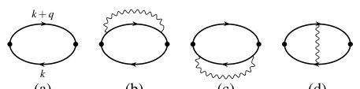 
Figure 1: Irreducible static polarizability to first order in e2. (a) Ring (bubble) Π0. (b), (c) Exchange self-energy insertions on the particle and hole lines, ΠSE. (d) Exchange vertex correction, ΠV. Wavy lines denote the instantaneous Coulomb interaction vk−k′. The Hartree tadpole is cancelled by the neutralizing background.

📷 Fig 2

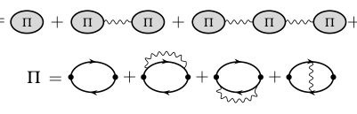 
Figure 2: RPA geometric series built from the irreducible polarizability Π = Π0 +ΠSE +ΠV of Fig. 1. This gives Eq. (3).

📷 Fig 3

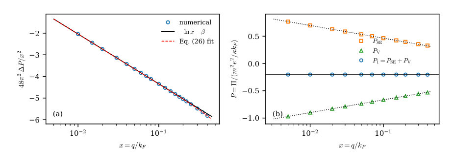 
Figure 3: (a) 48π2∆P/x2 versus x (circles), compared with the asymptotic form −lnx−β, β = 6.6441 (solid), and with the subleading fit of Eq. (26) (dashed). (b) Self-energy (squares), vertex (triangles), and total (circles) first-order polarizability. Dotted curves: the analytic asymptotes of Eqs. (21)–(22). Horizontal line: P(0) = −2/π2.

📷 Fig 4

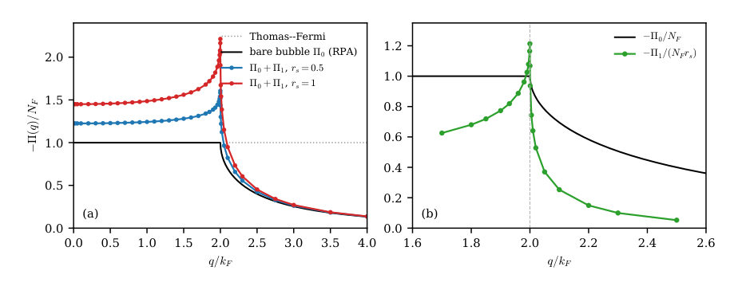 
Figure 4: (a) Static irreducible polarizability −Π/NF from 0 to 4kF. Solid black: bare bubble Π0 (RPA), Eq. (4). Dotted: Thomas–Fermi, −Π/NF ≡1. Colored: Π0 +Π1 at rs = 0.5 and 1. (b) Zoom near 2kF: bare bubble versus the first-order correction per unit rs, −Π1/(NFrs) = −(π/ √

📷 Fig 5

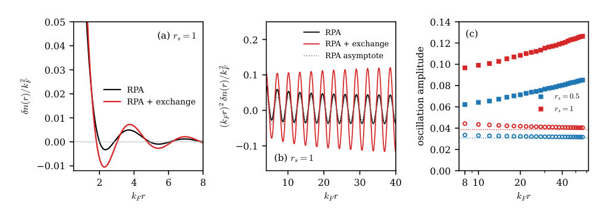 
Figure 5: Friedel oscillations around an in-plane point charge Z = 1, from Eq. (31). (a) Induced density δn(r)/k2 F at rs = 1: RPA (black) versus RPA + exchange, Π = Π0 +Π1 (red). (b) (kFr)2δn(r) at rs = 1, compared with the analytic RPA asymptote of Eq. (32) (dotted; oscillatory term only). The small upward offset of the numerical curves is the non-oscillatory r−3 tail. (c) Oscillation amplitude from local fits of (kFr)2[δn−δnsmooth] to Asin(2kFr +ϕ) over one period. Open symbols: RPA. Filled: RPA + exchange. Dotted lines: analytic RPA amplitude. The RPA amplitude saturates, whereas the exchange-corrected amplitude grows approximately as ln(kFr).

**Summary.** This theoretical work calculates advanced correlation corrections (self-energy and vertex diagrams) to the static screening of a 2D electron gas. The key finding is that these exchange corrections provide a significant quantitative and qualitative improvement over standard RPA theory. This improvement is demonstrated by sharpening the Kohn anomaly and enhancing the long-range Friedel oscillations, offering deeper insight into electron-electron interactions in low dimensions.

**Why it may be interesting.** The detailed study of correlation effects beyond RPA in 2D systems provides crucial benchmarks for understanding strongly correlated electron behavior, which is relevant to high-Tc superconductors and quantum materials.

Detailed structure

**Main problem.** The paper calculates the leading beyond-Random-Phase-Approximation (RPA) corrections to the static irreducible polarizability of the two-dimensional electron gas to accurately determine the static dielectric function and screened interaction.

**Main result.** Exchange corrections significantly improve screening predictions by converting the Kohn kink into a sharp two-sided peak and enhancing Friedel oscillations in real space compared to RPA. The combined self-energy and vertex corrections are found to be finite and reproduce the Hartree-Fock compressibility sum rule.

**Method.** The authors analytically compute the two exchange self-energy and one exchange vertex diagram, summing them to obtain the full polarizability correction ($\Pi_1$). They then use this to derive the static dielectric function $\epsilon(q)$ and analyze the small-$q$ limit.

**Model / system.** The system studied is the two-dimensional electron gas (2DEG) interacting via the bare Coulomb potential. The analysis focuses on the static screening properties, which are governed by the polarizability $\Pi(q)$ and the resulting screened interaction $W(q)$.

**Key observables.** Static dielectric function $\epsilon(q)$, screened interaction $W(q)$, Friedel oscillation amplitude, and the local-field factor $G_x(q)$.

**Important parameters / regimes.** The dimensionless momentum $x = q/k_F$, the Wigner-Seitz radius parameter $r_s$, and the Fermi wave vector $k_F$.

**Assumptions / limitations.** The calculation is performed in the static limit and uses first-order perturbation theory for the corrections. The analysis compares the systematic $O(r_s)$ result against approximations like the Hubbard model.

**Figures summary.** Figures compare the RPA vs. RPA + exchange corrections for the polarizability ($\Pi$), show the asymptotic form of the polarizability, and illustrate the enhanced, growing Friedel oscillations in real space ($\delta n(r)$).

**Paper structure.** The paper systematically derives the corrections to the polarizability, analyzes the resulting asymptotic behavior in momentum space, compares the exact result against simpler approximations (like Hubbard), and discusses the physical consequences for Friedel oscillations and pairing instabilities.

Abstract

We compute analytically the leading beyond-ring corrections to the static irreducible polarizability of the two-dimensional (2D) electron gas, namely the two exchange self-energy diagrams and the exchange vertex diagram, each of first order in the Coulomb coupling, and insert the resulting polarizability into the RPA geometric series to obtain the static dielectric function and screened interaction. The self-energy and vertex contributions individually diverge; we obtain both divergent pieces in closed form. Their sum is finite and reproduces exactly the Hartree-Fock compressibility, which renormalizes the Thomas-Fermi wave vector. We show that exchange converts the one-sided 2D Kohn kink at 2k_F into a sharp two-sided peak, a qualitative improvement over Thomas-Fermi and RPA screening. In real space this makes the Friedel oscillations around a charged impurity 2-3 times larger than in RPA, with an amplitude that increases with distance over the range studied; implications for Kohn-Luttinger pairing are discussed. Relation to earlier works on the same diagrams is discussed.

[↑ back to top](#top)

### [Learning Disentangled Representations with Quantum Variational Autoencoders](http://arxiv.org/abs/2610.07196v1)

**Authors:** Gaoyuan Wang, Jerry Tan, Mark Gerstein  
**Type:** both · **Category:** disordered systems and neural networks · **PDF:** <https://arxiv.org/pdf/2610.07196v1>  
**Analysis basis:** full PDF text, analyzed in chunks
**Topic relevance:** `quantum measurements` **1/5**

📷 Fig 1

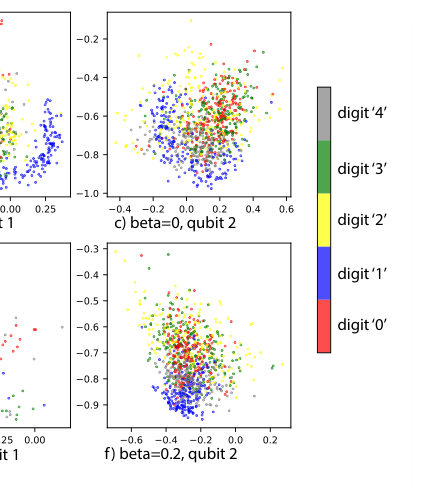 
Figure 1: Latent representation distributions. At β = 0.2, ζ-QVAE encodes the majority of class information in qubit 0, demonstrating successful disentanglement of latent factors.

📷 Fig 2

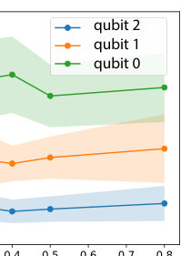 
Figure 2: The multi-class classification accuracy of a simple predictive neural network quantifies the amount of class information encoded in each qubit. Qubits 1 and 2 perform at near–random-guess levels, while qubit 0 encodes the majority of the class information. Shaded areas indicate the error range.

📷 Fig 3

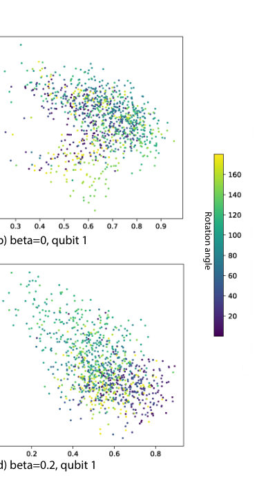 
Figure 3: Latent distributions for rotated digits. At β = 0.2, qubit 0 aligns with rotation angles. Qubit 1 shows no correlation, indicating disentanglement of latent factors.

📷 Fig 4

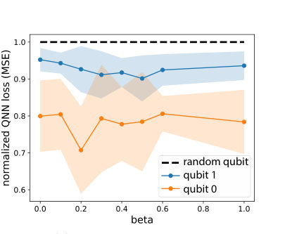 
Figure 4: The MSE of simple predictive neural networks quantify the amount of rotation-angle information encoded in each qubit. Qubit 0 encodes the majority of the information, while qubit 1 performs near random. Shaded areas indicate the error range.

📷 Fig 5

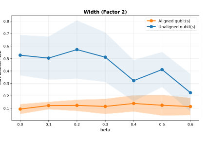 
Figure 5: MSE of a simple classical neural-network predictor used to quantify the amount of generative-factor information encoded in each subsystem. Qubit 0 predominantly encodes position information, whereas qubits 1 and 2 primarily encode width information. Shaded regions indicate the error range across runs.

**Summary.** This paper explores using Quantum Variational Autoencoders (QVAEs) to learn structured and interpretable representations from quantum data. By analyzing the latent space structure and testing on synthetic spectral data, the authors prove that QVAEs can successfully disentangle generative factors, assigning distinct physical meanings to individual qubits. This establishes a foundation for applying quantum ML to complex physical modeling.

**Why it may be interesting.** This work bridges quantum machine learning with physical interpretation, showing how quantum circuits can enforce structure (disentanglement) on latent variables, which is highly relevant for modeling complex quantum many-body systems where factorized representations are sought.

Detailed structure

**Main problem.** The paper investigates how Quantum Variational Autoencoders (QVAEs) can learn disentangled and semantically interpretable latent factors from complex data, addressing the challenge of defining individual quantum latent dimensions.

**Main result.** The authors demonstrate that QVAEs can successfully discover factorized and interpretable latent representations, showing that individual qubits can function as meaningful latent factors for tasks like encoding spectral line parameters.

**Method.** The approach involves developing theoretical insights into quantum latent dimensions and applying empirical studies on synthetic spectral data and MNIST variants, optimizing a loss function combining reconstruction fidelity and regularization.

**Model / system.** The core model is the Quantum Variational Autoencoder (QVAE), which maps classical data into a quantum latent space. The system utilizes quantum circuits (e.g., RealAmplitudes ansatz) to encode and decode quantum states, operating within a Hilbert space whose dimensionality is exponentially large relative to the number of qubits.

**Key observables.** Mean Squared Error (MSE) for predicting specific generative factors (e.g., position, width), eigenvalues of the ensemble density matrix, and the visualization of latent states on the Bloch sphere.

**Important parameters / regimes.** The regularization strength $\beta$ (controlling the prior match) and the number of qubits ($n$) are critical parameters. The spectral data is controlled by continuous parameters like peak position ($\mu$) and width ($\sigma$).

**Assumptions / limitations.** The primary assumption is that the structure of the latent space can be effectively analyzed by decomposing the ensemble density matrix and that regularization can enforce disentanglement, although the notion of an 'individual quantum latent dimension' remains theoretically challenging.

**Figures summary.** Figures illustrate the QVAE architecture, the latent state distributions on the Bloch sphere for different regularization strengths ($\beta$), and the MSE of predictors quantifying the information content of specific latent subsystems (qubits).

**Paper structure.** The paper progresses from establishing the need for interpretable quantum representations, developing theoretical tools (density matrix analysis), demonstrating the model's capability on synthetic spectral data (position/width factors), and concluding with architectural details and future directions.

Abstract

Variational autoencoders are powerful representation learning models that map complex data into low-dimensional latent spaces, enabling the discovery of interpretable and disentangled factors. Such representations can facilitate the interpretation and controllable generation of data describing complex scientific systems. Understanding how these factors are organized and encoded in latent space is therefore important for developing reliable representation learning models. Recently, quantum variational autoencoders (QVAEs) have been proposed as quantum representation models, demonstrating informative latent representations and improved latent-space occupancy through quantum regularization. However, it remains unclear whether and how QVAEs can learn disentangled and interpretable latent factors. A key challenge in investigating quantum latent factors is that a small number of qubits spans an exponentially large Hilbert space, making the notion of an individual quantum latent dimension nontrivial. Here, we investigate what constitutes an individual quantum latent dimension and whether it can encode a distinct factor. We develop theoretical insights into quantum latent dimensions and support them with empirical studies on representative synthetic problems, including MNIST variants. Across three datasets, we demonstrate that QVAEs can discover factorized and semantically interpretable latent representations, with individual qubits functioning as meaningful latent factors. These results establish a foundation for understanding quantum latent spaces and their potential for structured and interpretable representation learning.

[↑ back to top](#top)

### [Magnus: neutrino oscillation probabilities for any Hermitian Hamiltonian, any number of flavors, and any matter profile](http://arxiv.org/abs/2610.07159v1)

**Authors:** Mauricio Bustamante  
**Type:** theory · **Category:** numerical methods · **PDF:** <https://arxiv.org/pdf/2610.07159v1>  
**Analysis basis:** full PDF text, analyzed in chunks
**Topic relevance:** `methods for driven-dissipative` **1/5**

📷 Fig 1

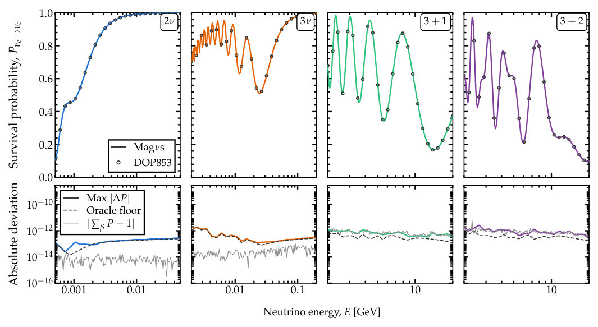 
Figure 1: Accuracy of neutrino oscillation probabilities computed with Magνs at two to five flavors, against an independent solver. Survival probability Pνe→νe at two, three, four, and five flavors, along an exponentially falling density profile (central density 3 · 103 g cm−3, scale height 10 km, baseline 25 km). Top: the probability computed with Magνs [9] (solid) and with a DOP853 integration (eighth-order Runge-Kutta) of the same Hamiltonian. The profile is the same in every panel; the energy window differs, since an eV-scale ∆m2 41 and the standard mass splittings do not resonate at the same energy. Bottom: the largest deviation between the two over all entries of the probability...

📷 Fig 2

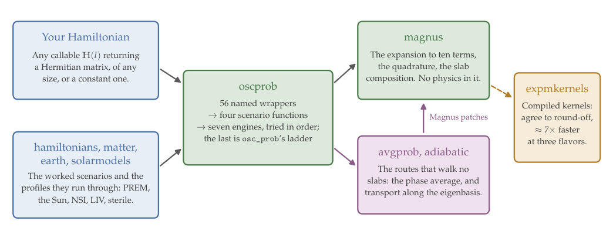 
Figure 2: Architecture of Magνs. The modules of Magνs and the path of a request through them. A Hamiltonian enters from the left, either supplied by the user as a function of position or built by hamiltonians for one of the implemented scenarios, with the density profile provided by matter, earth, or solarmodels. The request is handled in oscprob, which contains the choice of engine of Sec. 5.3 and the refinement ladder of Sec. 4.7. From there the computation proceeds along one of two routes: through magnus, which evaluates the expansion slab by slab and contains no physics, or through avgprob and adiabatic, which evaluate no slabs outside the non-adiabatic windows—the first for the phase...

📷 Fig 3

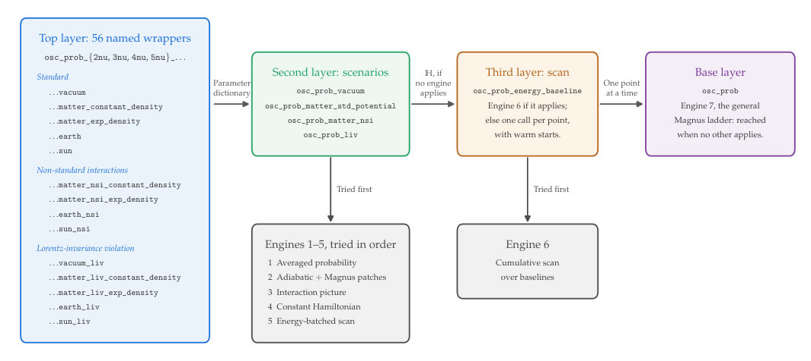 
Figure 3: The layers of oscprob. The four layers of oscprob, and the engines each one tries. A request enters at one of the named wrappers, which convert their named arguments into a parameter dictionary and pass it to the scenario function of the second layer. That function builds the Hamiltonian and tries the first five engines of Sec. 5.3, in order; if none applies, it passes the Hamiltonian to osc_prob_energy_baseline, which tries the cumulative scan over baselines and otherwise calls osc_prob once for every requested point. osc_prob is itself the seventh engine, the general Magnus ladder of Sec. 4.7. The wrappers are a product set: the fourteen environment-and-scenario names listed in...

📷 Fig 4

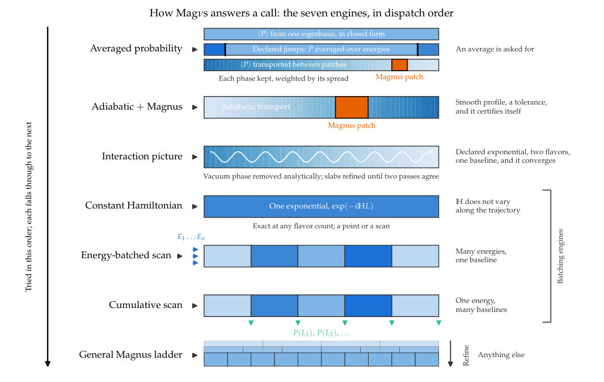 
Figure 4: The seven Magνs probability engines, in the order they are tried. A request that does not meet an engine’s conditions, summarized on the right, passes to the next, so the general Magnus ladder answers whatever no other engine takes. Each row sketches what its engine does along the trajectory; shading represents the matter density. Averaged probability: the averaged probability from one eigenbasis in closed form; across declared discontinuities, the probability averaged over an energy window; or, where H varies smoothly, the average transported along the instantaneous eigenstates with a Magnus patch across each non-adiabatic crossing. Adiabatic + Magnus: transport along the...

📷 Fig 5

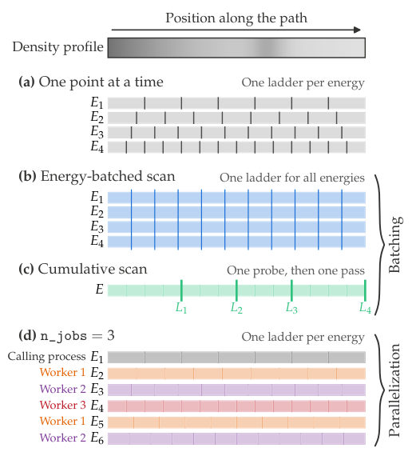 
Figure 5: Batching against parallelization. Four ways Magνs computes a scan, drawn along one density profile. Each bar is the final slab grid of one refinement ladder, which traverses the profile once per level; its color marks the process that runs it. (a) One point at a time. (b) The energy-batched scan, with one grid shared by every energy. (c) The cumulative scan, at one energy, recording the probability at every requested baseline (L1 to L4) in one pass. (d) Parallelization with n_jobs = 3: the first point runs in the calling process and the rest are shared out among three workers. See Sec. 5.5 for details.

**Summary.** This paper presents Magnus, a novel, open-source computational tool for calculating neutrino flavor oscillation probabilities. It overcomes the computational bottlenecks of traditional solvers by employing the Magnus expansion, which is highly accurate and efficient even when the matter density changes rapidly. This shifts the focus of research from developing complex numerical solvers to simply specifying the underlying particle physics model.

**Why it may be interesting.** The use of the Magnus expansion to solve differential equations governing quantum evolution is a powerful numerical technique applicable to any system where the Hamiltonian changes slowly or where high accuracy is required over long evolution times, making it relevant for open quantum systems.

Detailed structure

**Main problem.** Calculating neutrino flavor transition probabilities when the matter density varies along the propagation path, which lacks a simple closed-form solution.

**Main result.** The authors introduce Magnus, an open-source Python code that computes these probabilities accurately and efficiently, outperforming existing solvers.

**Method.** It utilizes the Magnus expansion to compute the evolution operator, whose error scales highly with the step width and whose computational cost depends on the rate of density variation rather than the number of oscillations.

**Model / system.** The system is neutrino flavor oscillation, governed by a time-dependent Hamiltonian $H(l)$ that incorporates neutrino masses, mixing, and various matter interactions (e.g., non-standard interactions).

**Key observables.** Flavor-transition probability $P_{
u_\alpha 	o 
u_eta}(l)$, and phase-averaged probabilities.

**Important parameters / regimes.** The Hamiltonian $H(l)$ itself, the number of flavors, and the specific density profile along the path (e.g., Earth, Sun).

**Assumptions / limitations.** The method assumes the evolution is governed by a Hermitian Hamiltonian and does not handle non-unitary processes like decay or decoherence.

**Figures summary.** Figure 1 compares the $
u_e$ survival probability calculated using Magnus against a high-order Runge-Kutta solver across various flavor numbers and density profiles.

**Paper structure.** The paper details the theory of neutrino oscillation, introduces the Magnus expansion for the evolution operator, describes the implementation in the open-source code, and provides extensive usage examples covering various astrophysical and terrestrial environments.

Abstract

Interpreting neutrino oscillation measurements requires computing the probability that a neutrino born with one flavor is detected with another. In vacuum and in matter of constant density, this probability has exact formulas. Where the density varies along the path, as in the Earth, the Sun, or a supernova, it does not. There, the usual approaches either replace the profile by constant-density steps, whose error falls only as the square of their width, or integrate the evolution equation with a general-purpose solver, which must shorten its steps to meet a tighter tolerance. Both become slow at high accuracy, yet an analysis needs the probability at many energies, directions, and parameter values. Each new experiment or model often requires writing and validating a new solver. We present Magnus, an open-source Python code that avoids these limitations. It uses the Magnus expansion, whose error falls as a high power of its step width and whose cost is set by how fast the density varies, not by how many oscillations the path holds. Magnus accepts any density profile, any number of flavors, and any Hermitian Hamiltonian, such as those of non-standard interactions, sterile neutrinos, Lorentz-invariance violation, and pseudo-Dirac neutrinos. Where a cheaper route exists, it takes it automatically. For example, where the density varies slowly, as in the Sun, it follows the instantaneous eigenstates and applies the expansion only at resonances. Besides oscillating probabilities, Magnus returns phase-averaged ones, which describe solar and astrophysical neutrinos. A typical probability takes a few milliseconds, and batched scans are one to two orders of magnitude cheaper per point. Among the public codes we compared, Magnus is the fastest at high accuracy on a varying profile. Magnus shifts the effort of studying a new experiment or model from writing a solver to specifying its physics.

[↑ back to top](#top)

### [Nematic order in monomer-dimer models of Heilmann and Lieb with lateral attraction in dimensions $d\ge 2$](http://arxiv.org/abs/2610.08600v1)

**Authors:** Qidong He  
**Type:** theory · **Category:** statistical mechanics · **PDF:** <https://arxiv.org/pdf/2610.08600v1>  
**Analysis basis:** full PDF text, analyzed in chunks
**Topic relevance:** `analog quantum simulation` **1/5**

📷 Fig 1

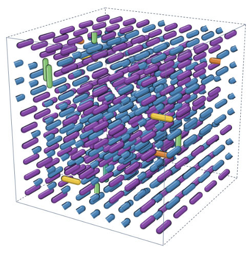 
Figure 1: A typical configuration of Model V on a 10 × 10 × 10 torus with parameters β = 1.8, µ = 0.2, and b = 0.3. Nematic order is evident.

**Summary.** This paper proves the existence of nematic liquid-crystalline order in generalized monomer-dimer models on the $d$-dimensional lattice. It achieves this by establishing the uniqueness of the Gibbs measure and proving the exponential decay of correlations using advanced techniques like cluster swapping. The results provide a rigorous mathematical characterization of orientational order in these lattice models.

**Why it may be interesting.** While focused on classical statistical mechanics, the rigorous mathematical techniques used (e.g., bounding correlations, proving uniqueness of Gibbs measures) are foundational to understanding phase transitions in complex many-body quantum systems.

Detailed structure

**Main problem.** The paper aims to rigorously establish the existence and properties of nematic order in $d$-dimensional monomer-dimer models of liquid crystals.

**Main result.** Under specific conditions on the chemical potential ($\mu$) and attraction strength ($b$), the model admits a unique Gibbs measure exhibiting anisotropic exponential decay of correlations within the oriented phase.

**Method.** The proof combines techniques from statistical mechanics, including cluster swapping, strong-percolation frameworks, and bounding probabilities of local configurations using mesoscopic box estimates.

**Model / system.** The system is a monomer-dimer model on the $d$-dimensional hypercubic lattice ($\mathbb{Z}^d$), describing liquid crystals. The Hamiltonian includes terms for the number of dimers ($\mu$) and a lateral attraction ($b$) between parallel dimers.

**Key observables.** The primary observables are the probabilities of observing aligned versus misaligned dimers in the ordered phase, and the decay rate of correlations.

**Important parameters / regimes.** Key parameters include the chemical potential $\mu$, the coupling constant $b$, and the dimension $d$. The analysis requires the conditions $(4d-6)b > \mu$ and $\mu + 2(d-1)b > 0$.

**Assumptions / limitations.** The analysis relies on the existence of a critical inverse temperature $eta_d$ and the assumption that the relevant clusters are rare enough to be controlled by the cluster swapping technique.

**Figures summary.** Figure 1 illustrates a typical configuration of Model V on a torus, providing visual evidence of the predicted nematic order.

**Paper structure.** The paper generalizes Heilmann-Lieb's models to $d \ge 2$. It first establishes the mathematical framework using strong-percolation and then uses cluster swapping to prove the uniqueness of the Gibbs measure and the exponential decay of correlations in the ordered phase.

Abstract

We study the $d$-dimensional generalization of Models II ($d=2$) and V ($d=3$) for liquid crystals introduced by Heilmann--Lieb (1979), which consists of dimers on the hypercubic lattice at chemical potential $μ$, interacting via a hard-core repulsion and a lateral attraction between parallel dimers with coupling constant $b>0$. For $d\in\{2,3\}$, these models were conjectured to exhibit liquid-crystalline order at low temperatures provided that $μ+2(d-1)b>0$. We establish nematic order for all $d\ge 2$ under the additional condition $(4d-6)b>μ$, which corresponds to the physical regime in which misaligned dimers are rare on scales comparable to the correlation length of the one-dimensional reference system. While the treatment of orientational order here follows the approach of our recent work on Model I, the proof of the absence of translational order relies on a custom implementation of cluster swapping in the sense of Sheffield (2005). Consequently, we deduce uniqueness of Gibbs measure and anisotropic exponential decay of correlations within each oriented phase.

[↑ back to top](#top)

### [Non-invertible SPT phases from fusion rings via Tannaka duality](http://arxiv.org/abs/2610.07165v1)

**Authors:** Antonio Santaniello, Roberto Valandro, Massimo Zorzenon  
**Type:** theory · **Category:** other · **PDF:** <https://arxiv.org/pdf/2610.07165v1>  
**Analysis basis:** full PDF text, analyzed in chunks
**Topic relevance:** `analog quantum simulation` **1/5**

📷 Fig 1

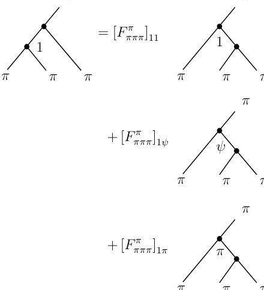 
Figure 1: Fusion channels entering the reconstruction of F π πππ for Rep(S3). The two sides represent the two parenthesizations of π ⊗π ⊗π, with intermediate channels 1, ψ, and π.

📷 Fig 2

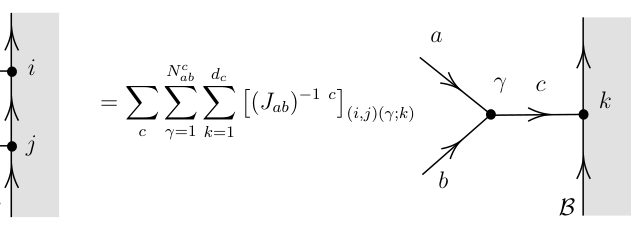 
Figure 2: Fiber functor F as a strongly-symmetric boundary condition B: (a) the spaces Va = F(a) are spaces of boundary junctions; (b) the monoidal structure J determines their fusion.

📷 Fig 3

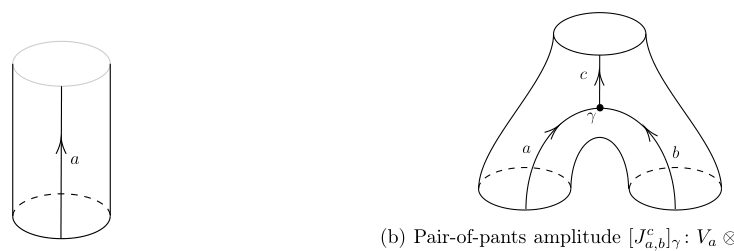 
Figure 3: Fiber functor F as a trivial C-symmetric TQFT: (a) the vector spaces F(a) = Va are the twisted sector Hilbert spaces; (b) the monoidal structure J is given by the pair-of-pants amplitudes.

📷 Fig 4

 
Figure 4: Topological junction [Oa](i,i′) at the intersection between the topological defect line a (black horizontal line) and the interface I (red vertical line) between two distinct SPT phases. The index i labels a basis of the vector space of the SPT on the left, and the primed index i′

📷 Fig 5

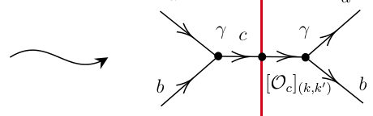 
Figure 5: Fusion of two junctions [Oa](i,i′) and [Ob](j,j′) on the interface I (red vertical line). The defect lines a and b are fused into lines c ∈a⊗b independently on the two sides of the interface. The resulting configuration has single junctions [Oc](k,k′). The summation over indices and lines with the respective monoidal structure maps coefficients in Eq. (6.1) is omitted in this cartoon.

**Summary.** This theoretical paper develops a powerful technique using Tannaka duality to classify non-invertible symmetry-protected topological (SPT) phases in 1+1D QFTs, using only the fusion ring data. By reconstructing fiber functors, the authors identify multiple distinct phases, providing explicit mathematical structures for their associated anomalies and interface algebras.

**Why it may be interesting.** The rigorous mathematical machinery connecting fusion rings to physical phases (SPT phases) is highly relevant for understanding topological order in condensed matter systems, providing tools to classify phases based on symmetry data.

Detailed structure

**Main problem.** The paper aims to determine if a symmetry in a (1+1)-dimensional QFT with non-invertible symmetry is anomaly-free, which is crucial for characterizing trivially gapped phases.

**Main result.** The authors developed a method using Tannaka duality to find multiple fiber functors, thereby identifying several non-invertible SPT phases, particularly for the fusion ring related to extraspecial groups of order 27.

**Method.** They extract fiber functors directly from the fusion ring by solving for monoidal structure maps and tensor automorphisms, bypassing the direct solution of the pentagon equations.

**Model / system.** The study focuses on (1+1)-dimensional Quantum Field Theories (QFTs) characterized by non-invertible symmetries, where the symmetry is implemented by topological line defects.

**Key observables.** Fiber functors, F-symbols, and the anomalous algebra computed on the interface between different SPT phases.

**Important parameters / regimes.** The structure of the fusion ring (e.g., the rank-11 ring from extraspecial groups) and invariants $(\epsilon, \iota)$ derived from the reconstruction.

**Assumptions / limitations.** The procedure is tested on the maximal tensor-automorphism case, and the classification for $p>3$ is noted as conjectural.

**Figures summary.** The notes mention Table 4, which provides a comprehensive list of ring automorphisms used to generate all specific parametric forms associated with $	ext{Rep}(	ext{Esp}9)$.

**Paper structure.** The paper builds theory from fusion categories and Tannaka duality, develops a bootstrap procedure to find fiber functors from the fusion ring, applies this to known examples (Tambara-Yamagami), and concludes with explicit calculations for extraspecial groups.

Abstract

In a (1+1)-dimensional QFT with non-invertible symmetry, the fusion rules of topological lines are often the most accessible data, yet they do not fully determine whether the symmetry is anomaly-free, i.e. whether it admits trivially gapped phases. Such phases are characterized by fiber functors of the corresponding fusion category. Building on Tannaka duality, we extract fiber functors from the fusion ring alone by solving simultaneously for monoidal structure maps and tensor automorphisms. This allows us to find categorifications admitting a fiber functor without solving the pentagon equations directly. We test this procedure on the known Tambara--Yamagami ring of $\mathbb{Z}_2\times\mathbb{Z}_2$. Our main result concerns the rank-11 fusion ring shared by the representation categories of the two extraspecial groups of order 27, which has a multiplicity 3 channel and is relevant to self-triality. In both cases we find more than one fiber functor, i.e. several non-invertible SPT phases. We use the explicit data of these fiber functors to derive the $F$-symbols of the two representation categories in a compact form depending on a non-degenerate alternating bicharacter and an invertible object $ε$. Using the reconstructed data, we compute the anomalous algebra on the interface between two different SPT phases.

[↑ back to top](#top)

### [Odd-parity magnon spin polarization from chiral four-spin exchange in a honeycomb antiferromagnet](http://arxiv.org/abs/2610.07291v1)

**Authors:** Bektur Murzaliev, Mikhail Titov  
**Type:** theory · **Category:** strongly correlated electrons · **PDF:** <https://arxiv.org/pdf/2610.07291v1>  
**Analysis basis:** full PDF text, analyzed in chunks
**Topic relevance:** `analog quantum simulation` **1/5**

📷 Fig 1

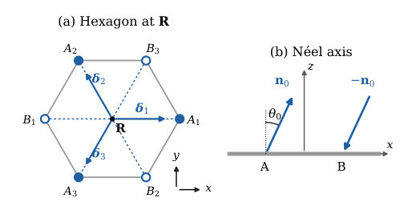 
FIG. 1. Geometry of the model. (a) Hexagon centered at R. The sites Aα (filled) at R + δα and Bα (open) at R −δα lie on a common line through R (dashed). The four-spin interaction (2) projects both spins of the pair onto the same vector δα. (b) Side view: the N´eel axis n0 lies in the xz plane, tilted by θ0 from the layer normal z toward the bond δ1; the B moments point along −n0. The tilt is exaggerated; θ0 = 8◦

📷 Fig 2

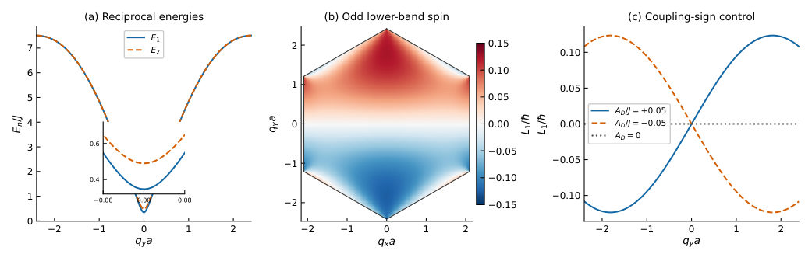 
FIG. 2. Reciprocal magnon energies and odd-parity magnon spin. (a) Energies E1q (solid) and E2q (dashed) of the two magnon bands along qx = 0. The bands are indistinguishable on this scale; the inset resolves the gaps 0.35J and 0.49J at the zone center. (b) Spin L1q along the N´eel axis, Eq. (8), carried by the lower band in the first Brillouin zone. The spin is odd under q →−q and vanishes on the line qy = 0, where the chiral pairing (4) vanishes. (c) L1q along qx = 0 for AD/J = +0.05 (solid), −0.05 (dashed), and 0 (dotted): reversing the four-spin coupling reverses the spin. Parameters: S = 5/2, θ0 = 8◦, Kθ = 0.02J, Kφ = 0.01J, and AD = 0.05J in panels (a,b). At the degenerate zone...

📷 Fig 3

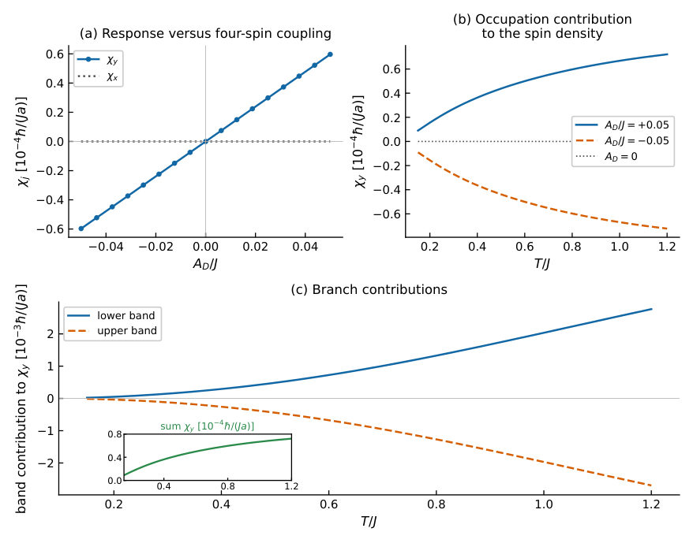 
FIG. 3. Occupation contribution to the thermal spin density, Eq. (11), for a constant relaxation time τ = ℏ/J; another constant τ multiplies χj by τJ/ℏ. (a) Response coefficients versus the four-spin coupling at T = 0.8J. The coefficient χy (solid, markers) is linear in AD over this range and changes sign with it, while χx (dotted) vanishes by the symmetry (12). (b) χy versus temperature for AD/J = +0.05 (solid), −0.05 (dashed), and 0 (dotted). The response grows as more modes are thermally populated and is exponentially small below the lowest gap 0.35J. (c) Contributions of the lower (solid) and upper (dashed) band to χy at AD/J = +0.05; the inset shows their sum, the solid curve of panel...

**Summary.** This theoretical work investigates how chiral four-spin exchange generates an odd-parity magnon spin in a honeycomb antiferromagnet. By analyzing the magnon spectrum and calculating the thermal spin accumulation response, the authors show that this interaction leads to a measurable spin density change proportional to the temperature gradient. This work provides insight into spin-momentum locking mechanisms in frustrated magnetic insulators.

**Why it may be interesting.** The study connects lattice geometry (honeycomb structure) and specific higher-order spin interactions (chiral four-spin exchange) to measurable transport properties (thermal spin current), which is relevant for understanding spin-charge conversion in magnetic materials.

Detailed structure

**Main problem.** The study aims to determine the microscopic interactions responsible for generating an odd-parity magnon spin polarization in a compensated honeycomb antiferromagnet while maintaining a reciprocal magnon energy spectrum.

**Main result.** Chiral four-spin exchange generates an odd-parity magnon spin, and a temperature gradient induces a measurable spin density along the Néel axis that reverses sign upon reversing the four-spin coupling.

**Method.** The analysis employs a spin-wave expansion using Holstein-Primakoff bosons to diagonalize the quadratic Hamiltonian derived from the full spin model.

**Model / system.** The system is a honeycomb antiferromagnet, motivated by MnPS3, modeled with spins on two sublattices (A and B). The Hamiltonian includes nearest-neighbor exchange and a chiral four-spin interaction term.

**Key observables.** Odd-parity magnon spin ($	ext{L}_{n\mathbf{q}}$), magnon energies ($E_{1,2}(\mathbf{q})$), and the thermally induced spin density ($\delta s_L$).

**Important parameters / regimes.** The tilt angle ($	heta_0$) of the Néel vector, the strength of the chiral coupling ($AD$), and the temperature gradient ($
abla T$).

**Assumptions / limitations.** The analysis is restricted to the harmonic approximation (quadratic Hamiltonian), and the calculation of thermal spin accumulation assumes well-defined quasiparticles.

**Figures summary.** Figures illustrate the model geometry, the momentum-odd nature of the magnon spin ($	ext{L}_{1\mathbf{q}}$), and the temperature dependence of the thermal spin accumulation coefficient ($\chi_y$).

**Paper structure.** The paper develops the Hamiltonian, solves the bosonic eigenvalue problem to find magnon energies and spins, and then uses the relaxation-time approximation to calculate the non-equilibrium thermal spin accumulation response.

Abstract

Chiral four-spin exchange generates a momentum-dependent magnon spin in a compensated honeycomb antiferromagnet at zero magnetic field. For a Néel vector tilted by an angle $θ_0$ from the layer normal, the interaction contributes to intersublattice magnon pairing already at harmonic order, with an amplitude proportional to $\cosθ_0\sin^2θ_0$. Biaxial anisotropy mixes the two longitudinal-spin sectors, producing nonquantized mode spins that are odd in momentum, while a sublattice-exchange relation keeps the magnon energies reciprocal. A temperature gradient then induces a spin density along the Néel axis through a redistribution of magnon occupations. Reversing the four-spin coupling reverses this spin density and the mode spins without changing the magnon energies. MnPS$_3$ motivates the magnetic geometry; realizing the interaction requires a structural modification compatible with the symmetry assumptions of the model.

[↑ back to top](#top)

### [Optimal GHZ extraction from MABK violations](http://arxiv.org/abs/2610.08516v1)

**Authors:** Avraham Kreindel, Aryeh Lev Zabokritskiy  
**Type:** theory · **Category:** quantum information and computing · **PDF:** <https://arxiv.org/pdf/2610.08516v1>  
**Analysis basis:** full PDF text, analyzed in chunks
**Topic relevance:** `quantum measurements` **1/5**

📷 Fig 1

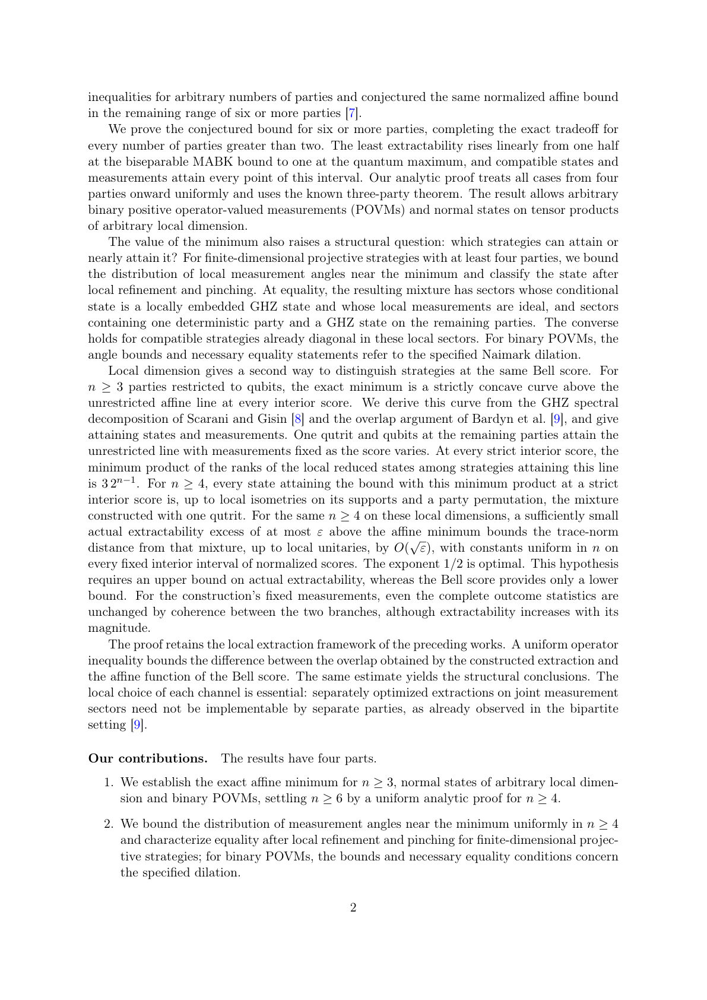 
Low-resolution page preview, page 2

📷 Fig 2

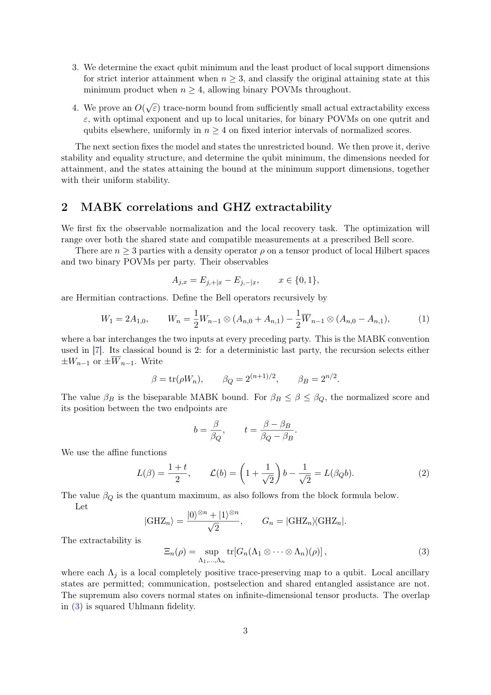 
Low-resolution page preview, page 3

📷 Fig 3

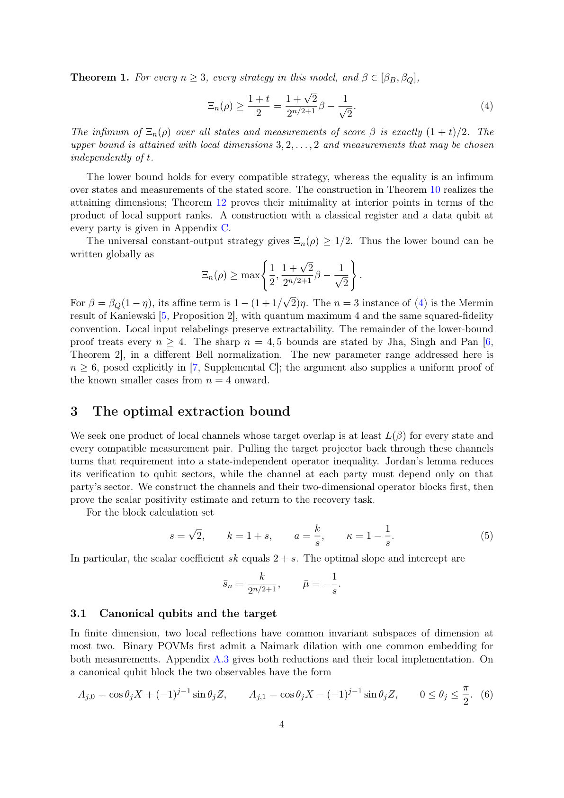 
Low-resolution page preview, page 4

📷 Fig 4

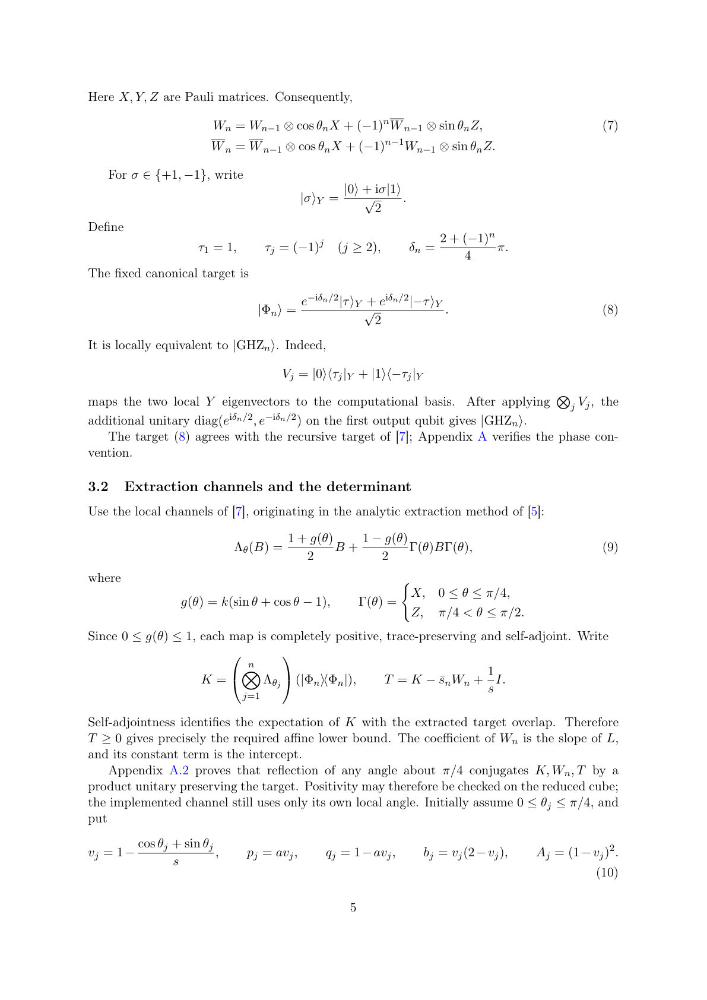 
Low-resolution page preview, page 5

📷 Fig 5

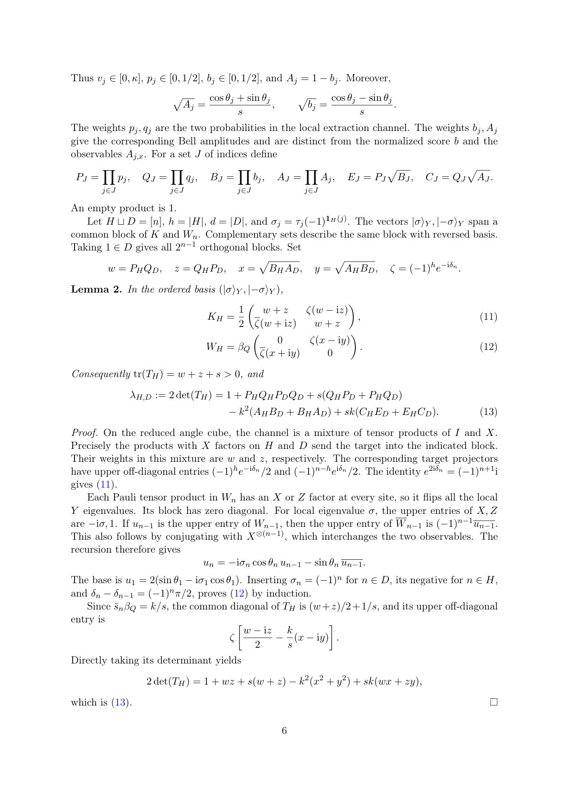 
Low-resolution page preview, page 6

**Summary.** This theoretical paper establishes the precise minimum amount of GHZ entanglement that can be extracted from a quantum state given a measured violation of a MABK Bell inequality. It provides uniform analytic proofs for $n \ge 4$ parties and analyzes the stability of this bound using trace-norm distance estimates. The work is crucial for understanding the fundamental limits of quantum correlations in multipartite systems.

**Why it may be interesting.** The rigorous mathematical determination of entanglement measures based on Bell inequalities provides fundamental tools for quantifying quantum correlations, which is central to quantum information theory.

Detailed structure

**Main problem.** The paper determines the minimum Greenberger-Horne-Zeilinger (GHZ) extractability compatible with a given Mermin-Ardehali-Belinskii-Klyshko (MABK) Bell score for $n>2$ parties.

**Main result.** The exact minimum extractability is found to be $1 + t^2$, where $t$ parameterizes the deviation from the biseparable bound, and the authors provide uniform analytic proofs for $n \ge 4$ parties.

**Method.** The analysis uses operator inequalities, Jordan's lemma to reduce verification to qubit sectors, and spectral analysis to establish lower bounds on the target overlap based on the measured Bell score.

**Model / system.** The study concerns multipartite entangled quantum states, specifically testing entanglement using MABK Bell inequalities on systems of $n$ parties, which can be qubits or qutrits.

**Key observables.** GHZ extractability ($\Xi_n(
ho)$), MABK Bell Score ($eta$), and the normalized score parameter $t$.

**Important parameters / regimes.** The number of parties ($n \ge 3$), the local dimension of the Hilbert space, and the small error parameter $\epsilon$ used in stability analysis.

**Assumptions / limitations.** The results hold for normal states on tensor products of arbitrary local dimension and arbitrary binary measurements; stability bounds rely on smallness conditions for the excess error $\epsilon$.

**Figures summary.** Not specified.

**Paper structure.** The paper progresses by first establishing the general affine minimum bound using operator inequalities, then generalizing this proof to higher numbers of parties ($n \ge 4$), and finally analyzing structural questions like the stability of the bound using trace-norm distance estimates.

Abstract

We determine the least Greenberger-Horne-Zeilinger (GHZ) extractability compatible with a Mermin-Ardehali-Belinskii-Klyshko (MABK) Bell score for every number of parties greater than two. Extractability is the largest squared overlap with a GHZ state obtainable by separate local quantum channels. Between the biseparable bound and the quantum maximum, the exact minimum is the affine interpolation from one half to one. The bound holds for normal states on tensor products of arbitrary local dimension and arbitrary binary measurements. We settle the previously unresolved range of six or more parties with an analytic proof that is uniform from four parties onward. We also determine the exact minimum when every local system is a qubit, and show that it lies strictly above the unrestricted bound at every interior score. One qutrit and qubits at all remaining parties attain every point of the bound with measurements fixed as the score varies. For at least four parties and strict interior scores, we classify all states attaining the bound with the minimum product of local support dimensions. For at least four parties on one qutrit and qubits elsewhere, we also prove that, when the extractability excess above the affine minimum is small, the trace-norm distance from the attaining mixture, up to local unitaries, is bounded by a constant times the square root of that excess. The exponent $1/2$ is optimal, and the constants are independent of the number of parties on every fixed interior interval of normalized scores.

[↑ back to top](#top)

### [Perfect state transfer on mixed graphs: complete classes and transfer times](http://arxiv.org/abs/2610.08333v1)

**Authors:** Xingkun Song  
**Type:** theory · **Category:** other · **PDF:** <https://arxiv.org/pdf/2610.08333v1>  
**Analysis basis:** full PDF text, analyzed in chunks
**Topic relevance:** `analog quantum simulation` **1/5**

📷 Fig 1

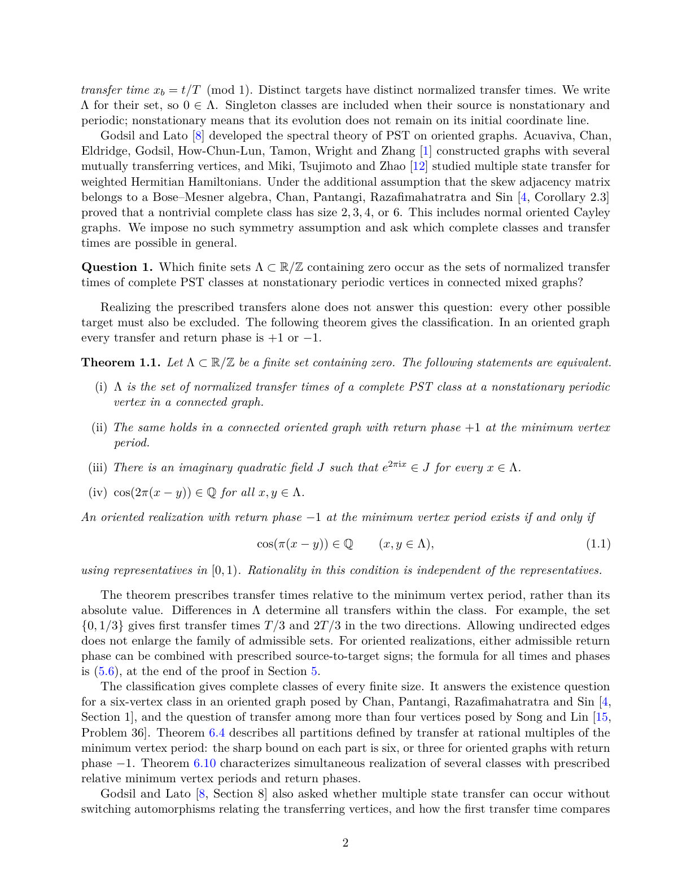 
Low-resolution page preview, page 2

📷 Fig 2

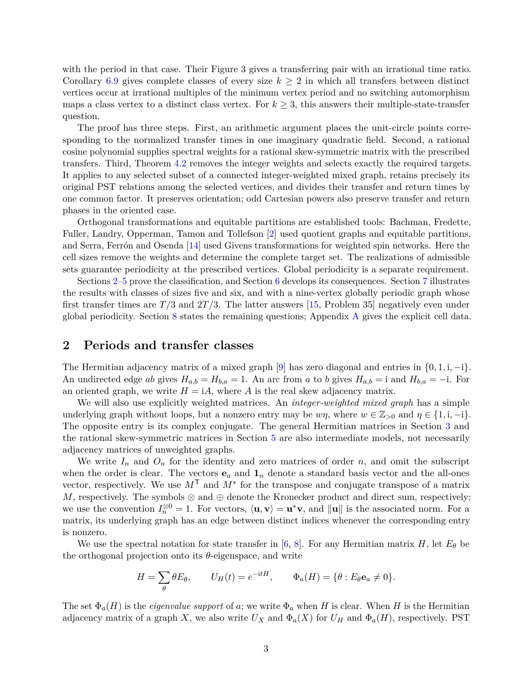 
Low-resolution page preview, page 3

📷 Fig 3

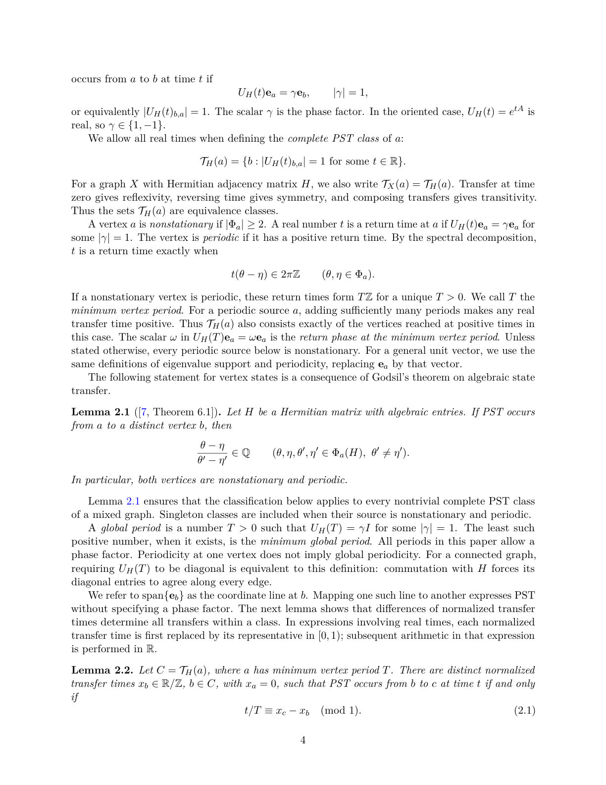 
Low-resolution page preview, page 4

📷 Fig 4

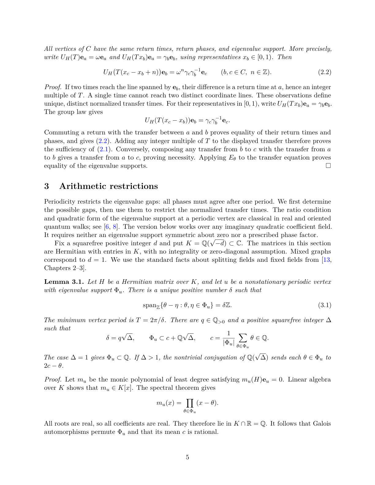 
Low-resolution page preview, page 5

📷 Fig 5

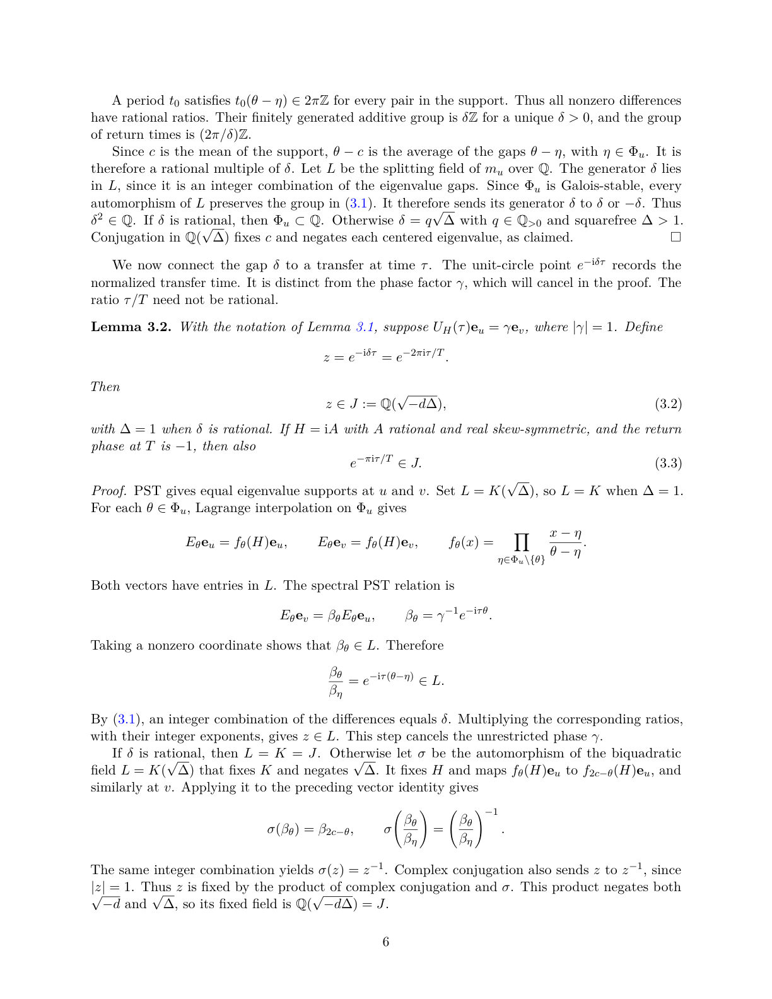 
Low-resolution page preview, page 6

**Summary.** This theoretical paper classifies the mathematical conditions required for Perfect State Transfer (PST) to occur across all vertices of a mixed graph. It establishes that the set of possible transfer times must satisfy a specific algebraic condition related to rational cosines. The work provides deep structural insights by linking quantum dynamics to number theory and constructing examples of graphs realizing these complex transfer patterns.

**Why it may be interesting.** The connection between spectral graph theory (PST) and deep number theory (imaginary quadratic fields) provides a powerful, non-standard mathematical toolset for analyzing quantum dynamics in structured physical systems.

Detailed structure

**Main problem.** The paper aims to classify the complete classes and determine the normalized transfer times ($\Lambda$) for Perfect State Transfer (PST) on unweighted mixed graphs.

**Main result.** A set $\Lambda$ forms a complete PST class if and only if $\cos(2\pi(x - y)) \in \mathbb{Q}$ for all $x, y \in \Lambda$, linking the spectral properties to number theory via imaginary quadratic fields.

**Method.** The proof combines arithmetic arguments involving imaginary quadratic fields with graph-theoretic constructions, utilizing spectral analysis of the graph's adjacency matrix.

**Model / system.** The system is modeled by unweighted, finite, simple mixed graphs whose time evolution is governed by $U_H(t) = e^{-itH}$, where $H$ is the Hermitian adjacency matrix.

**Key observables.** The set of normalized transfer times $\Lambda \subset \mathbb{R}/\mathbb{Z}$, the minimum vertex period $T$, and the return phase $\omega$.

**Important parameters / regimes.** The structure of the graph (connected, oriented), the specific values of the transfer times $\Lambda$, and the resulting bounds on the size of the PST class (at most six or three).

**Assumptions / limitations.** The analysis focuses on the case where the source vertex is nonstationary and periodic, and the graphs are unweighted and finite.

**Figures summary.** Not specified, but the notes reference arrays (A.1 and A.2) detailing square roots of cell sizes for realizing PST classes of size six and five.

**Paper structure.** The paper proceeds by establishing necessary and sufficient conditions for PST using field theory (Theorem 1.1), deriving constraints on periodicity and transfer times using lemmas (e.g., Lemma 2.2, Lemma 3.1), and finally constructing examples and characterizing the limits of these classes using advanced graph constructions (e.g., equitable-partition method).

Abstract

For perfect state transfer (PST) on unweighted mixed graphs, we classify the normalized transfer times of complete PST classes. A finite set $Λ\subset\mathbb R/\mathbb Z$ containing zero occurs at a nonstationary periodic vertex if and only if $\cos(2π(x-y))\in\mathbb Q$ for all $x,y\inΛ$. Every admissible set has a connected oriented realization. We also classify the possible return phases of oriented realizations at the minimum vertex period. Transfers at rational multiples of the common minimum vertex period partition a complete class into sets of size at most six, or at most three in an oriented graph with return phase $-1$; both bounds are sharp. We construct complete classes of every finite size, including classes in which all transfers between distinct vertices occur at irrational multiples of the period and no switching automorphism maps a class vertex to a distinct class vertex. We also characterize simultaneous realization in connected oriented graphs with prescribed relative minimum vertex periods and return phases. The proof combines an imaginary quadratic field restriction with an unweighted construction that selects the complete target set.

[↑ back to top](#top)

### [Post-Selection-Free Quantum Automated Learning](http://arxiv.org/abs/2610.08219v1)

**Authors:** Junkai Wang, Jin-Peng Liu  
**Type:** theory · **Category:** quantum information and computing · **PDF:** <https://arxiv.org/pdf/2610.08219v1>  
**Analysis basis:** full PDF text, analyzed in chunks
**Topic relevance:** `quantum measurements` **1/5**

📷 Fig 1

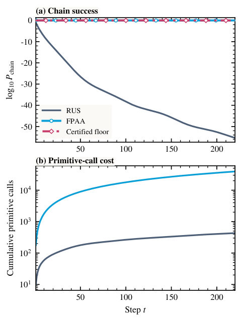 
Figure 1: Per-step success and primitive-call costs in a projector-overlap model. The RUS curve in (a) shows single-pass prefix survival; FPAA is shown with its certi- fied floor. Panel (b) uses local repetition with restoration of each intermediate state after failure.

📷 Fig 2

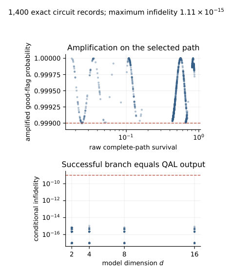 
Figure 3: Exact circuit checks of amplification and branch preservation. The good-flag probability increases while the successful model retains the conditional QAL output to numerical precision.

📷 Fig 3

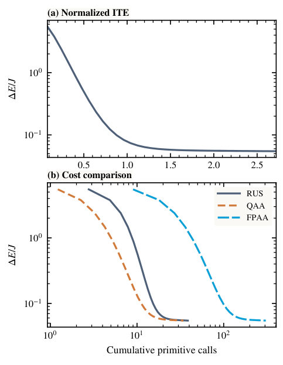 
Figure 2: Normalized imaginary-time evolution of a six- site Ising chain. Panel (a) shows the energy error; (b) plots the same trajectory against schematic primitive- call costs for three success-management methods. Local RUS uses the actual success probability, QAA assumes it is known, and FPAA uses the spectral floor.

📷 Fig 4

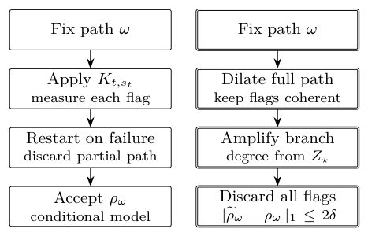 
Figure 4: Two ways to execute a predeclared QAL path. Measured global restart discards a failed partial path; coherent execution retains the flags until fixed-point am- plification acts on their joint success space. The good branch has the exact conditional QAL model. Discard- ing all flags gives an approximate unconditioned model, under the stated preparation and reflection access as- sumptions.

📷 Fig 5

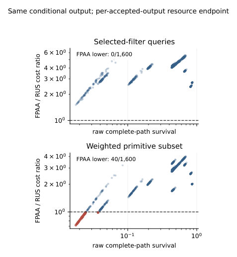 
Figure 5: Per-accepted-output FPAA-to-global-restart cost ratios. The upper panel counts selected-filter queries; the lower adds weighted preparation, reflection, flag, measurement, reset, and readout charges. Ratios below one occur in the weighted model. Each compari- son uses conditional accepted outputs and the specified cost assignments.

**Summary.** This paper introduces a novel, post-selection-free algorithm for Quantum Automated Learning (QAL) that trains quantum models by encoding the entire learning path into a single coherent quantum circuit. By employing fixed-point amplitude amplification, the method achieves high-probability guarantees on both the learned model's quality and the associated resource costs. This work significantly advances the theoretical feasibility of implementing robust quantum machine learning protocols.

**Why it may be interesting.** It provides rigorous, resource-aware theoretical guarantees for quantum machine learning protocols, which is crucial for designing fault-tolerant quantum algorithms.

Detailed structure

**Main problem.** The paper addresses the challenge of Quantum Automated Learning (QAL) by developing a method that eliminates the need for post-selection, which typically constrains the probability of obtaining the learned quantum model.

**Main result.** A post-selection-free QAL algorithm is proposed that organizes the entire training path into a coherent quantum circuit, using fixed-point amplitude amplification to achieve high-probability learning guarantees.

**Method.** The core method involves using fixed-point amplitude amplification (FPAA) on a coherent circuit representation of the training path, which is built using unitary dilations and flag qubits.

**Model / system.** The model is Quantum Automated Learning (QAL), which trains quantum models by directly updating quantum states via projector-mixing updates, avoiding variational parameter optimization.

**Key observables.** Success probability ($P_{	ext{chain}}$), output error ($\lVert e_{
ho\omega} - 
ho_{\omega} 
Vert_1$), and learning loss ($	ext{Tr}(ar{H}
ho_{\omega})$).

**Important parameters / regimes.** Failure probability ($\delta$), spectral floor ($p_{\star,	au}$), and resource costs associated with amplification and path execution.

**Assumptions / limitations.** The analysis requires fixing a classical training schedule ($\omega$) beforehand and relies on spectral assumptions for the initial theoretical guarantees.

**Figures summary.** Figures compare resource costs and success probabilities for different QAL execution strategies (e.g., Measured global restart vs. FPAA), and one figure illustrates the parameter space where the cost inequality is satisfied.

**Paper structure.** The paper develops the theory by first establishing joint path certificates, then detailing the coherent circuit construction using flag qubits, and finally applying fixed-point amplitude amplification to yield unconditioned, high-probability learning guarantees.

Abstract

Quantum automated learning (QAL) trains quantum models by directly updating quantum states, offering an approach to quantum machine learning that avoids optimizing variational circuit parameters. However, post-selection constrains the probability of obtaining the final learned model. We develop a post-selection-free QAL algorithm that organizes a complete training path into a coherent quantum circuit and uses fixed-point amplitude amplification to increase the probability of obtaining the learned model. We provide theoretical guarantees on output error and learning loss, and identify conditions under which additional coherent resources reduce the cost of restarting failed trajectories. The construction gives QAL a coherent implementation with explicit learning guarantees and resource costs, enabling a model with certified learning quality and controlled output error to be obtained with high probability.

[↑ back to top](#top)

### [Quantum algorithms for four problems in density peak clustering](http://arxiv.org/abs/2610.08498v1)

**Authors:** Gonçalo Sousa, Duarte Magano  
**Type:** theory · **Category:** quantum information and computing · **PDF:** <https://arxiv.org/pdf/2610.08498v1>  
**Analysis basis:** full PDF text, analyzed in chunks
**Topic relevance:** `quantum measurements` **1/5**

📷 Fig 1

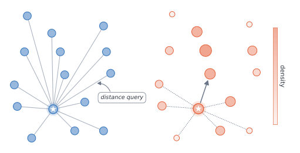 
Fig. 1. Schematic representation of two key steps in DPC. (a) The density of the starred element is computed by querying its distance to all other elements in the dataset. (b) The nearest-higher of the starred element is the nearest neighbor with a density greater than itself; elements are col- ored and sized according to their density; dotted lines link the starred element to some neighbors with smaller density; the solid arrow links the starred element to its nearest-higher.

📷 Fig 2

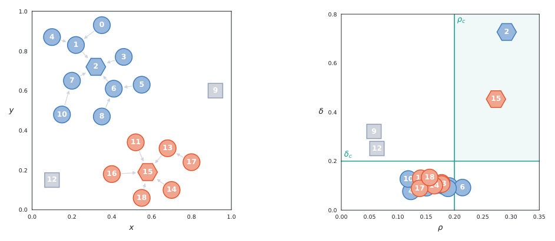 
Fig. 2. Density peak clustering. (a) Clustering dataset with 19 points embedded in R2, using the Euclidean distance. Roots are represented by hexagons, outliers by squares, and the remaining points by circles, having arrows pointing to their nearest-highers. Each color (blue, red) identifies a cluster. (b) Decision graph displaying the nearest-higher separation δ against density ρ. Roots (elements 2 and 15) satisfy δi ≥δc and ρi ≥ρc, while outliers (elements 9 and 12) satisfy δi ≥δc and ρi &lt; ρc.

📷 Fig 3

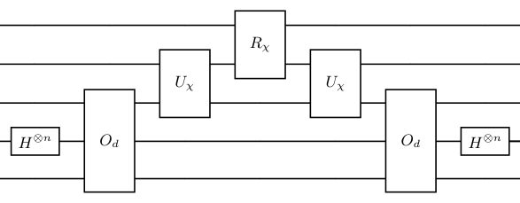 
Fig. 3. Quantum circuit implementing Uρ making use of the Walsh-Hadamard transform H⊗n, the custom transformations Uχ and Rχ defined in Eq. (26) and Eq. (27), respectively, and the distance oracle Od. See Appendix D for a detailed analysis of the circuit.

📷 Fig 4

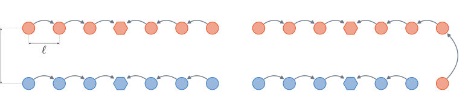 
Fig. 4. Impact of errors on density peak clustering. Toy dataset consisting of N = 14 points equally divided into two horizontal clusters, separated by a distance of 2ℓ−δℓ, with δℓ≪ℓ. Colors indicate the cluster assigned by DPC, roots are represented as hexagons, and arrows connect each remaining point to its nearest-higher. (a) Clusters found by DPC when operating with exact densities. (b) Clusters found by DPC when operating with density estimates of error ϵ = 2/N: the rightmost point of the lower cluster is assigned to the upper one.

📷 Fig 5

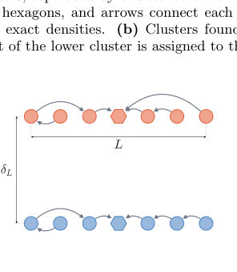 
Fig. 5. Absence of critical error. A variant of the toy dataset presented above in which the distance between clus- ters is L + δL, with δL &gt; 0. DPC identifies the correct clus- ters when operating with density estimates of constant error, ϵ = Θ(1).

**Summary.** This paper proposes quantum algorithms to accelerate four key components of density peak clustering (DPC). By leveraging quantum query techniques and quantum Monte Carlo methods, the authors derive polynomial quantum speedups for tasks like cluster counting and full clustering. The work demonstrates the feasibility of applying quantum computation to complex, data-intensive unsupervised learning problems.

**Why it may be interesting.** While the application is in data science, the core methodology involves designing and analyzing quantum algorithms (e.g., quantum counting, quantum minimum finding) based on distance oracles, which is a fundamental topic in quantum algorithms.

Detailed structure

**Main problem.** The paper develops quantum algorithms to achieve speedups for four related tasks within density peak clustering (DPC): full clustering, decision clustering, cluster counting, and heavy cluster counting.

**Main result.** Quantum query complexity bounds are established for these tasks, showing potential polynomial speedups over classical methods under specific scaling assumptions regarding the error tolerance ($\epsilon_{crit}$).

**Method.** The approach combines quantum Monte Carlo methods for density estimation with quantum query algorithms, utilizing black-box oracles for distance queries and quantum minimum finding subroutines.

**Model / system.** The context is unsupervised data clustering, where the input is a dataset $S$ and the core operation relies on a distance oracle $d(x_i, x_j)$. The quantum computation is framed in the black-box model.

**Key observables.** Cluster assignments, density estimates ($
ho_i$), cluster counts ($K$), and the mass of heavy clusters ($m_k$).

**Important parameters / regimes.** Dataset size ($N$), number of clusters ($K$), error parameters ($\epsilon, \epsilon_{crit}$), and the failure probability ($\gamma$).

**Assumptions / limitations.** The quantum algorithms are probabilistic, and the speedup proofs rely on assumptions about the scaling of dataset-dependent parameters, such as $\epsilon_{crit} = \omega(N^{-1})$.

**Figures summary.** Figures illustrate the schematic of density computation and the general process of DPC, while appendices contain pseudocode for the various quantum algorithms (e.g., Algorithm 3 for DPC, Algorithm 5 for quantum cluster counting).

**Paper structure.** The paper first establishes the classical DPC framework, then details the quantum preliminaries (like quantum minimum finding), and finally presents and analyzes the quantum algorithms for the four specific clustering tasks, concluding with complexity bounds and failure probability analyses.

Abstract

Clustering is a fundamental task in unsupervised learning. The goal is to partition unlabeled data into clusters such that similar elements are assigned to the same cluster, while elements in different clusters are dissimilar. We propose a quantum Monte Carlo approach to density estimation, a key routine in density peak clustering. Building on this approach, we develop quantum algorithms for the full clustering problem and three related tasks: decision clustering, cluster counting, and heavy cluster counting. For each one, we establish a polynomial quantum query speedup under assumptions on the scaling of dataset-dependent parameters. Numerical experiments suggest that these conditions are satisfied for several practically relevant settings.

[↑ back to top](#top)

### [Spontaneous symmetry breaking at any temperature in a local one-dimensional model](http://arxiv.org/abs/2610.07693v1)

**Authors:** Andrew Lucas  
**Type:** theory · **Category:** statistical mechanics · **PDF:** <https://arxiv.org/pdf/2610.07693v1>  
**Analysis basis:** full PDF text, analyzed in chunks
**Topic relevance:** `Frenkel-Kontorova` **1/5**

📷 Fig 1

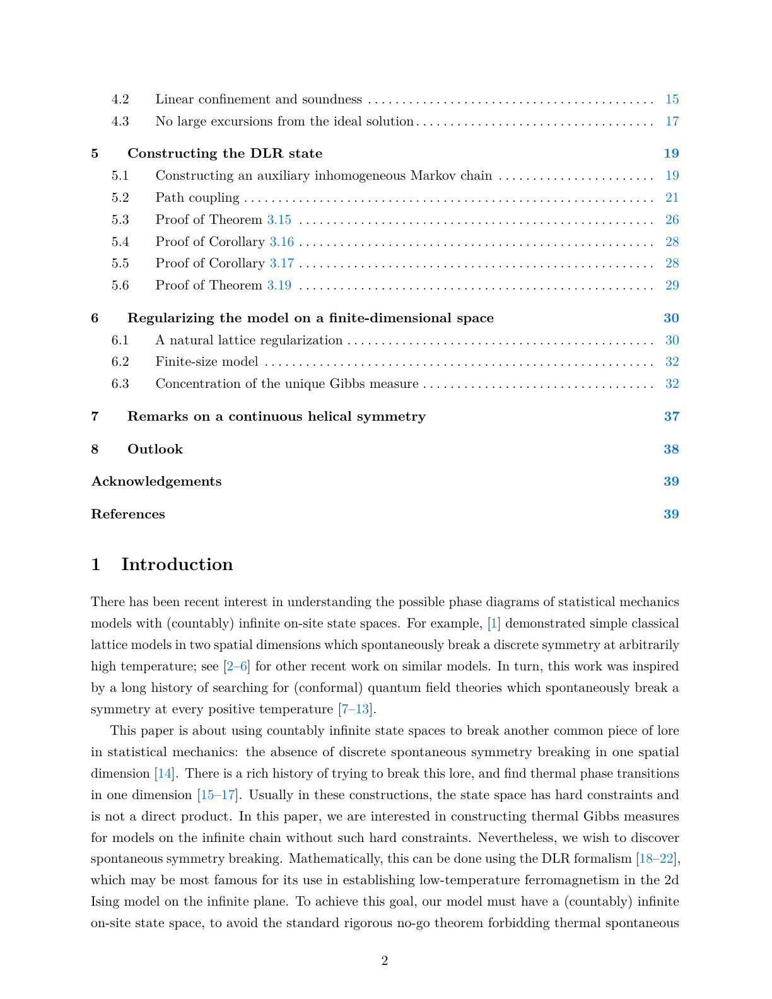 
Low-resolution page preview, page 2

📷 Fig 2

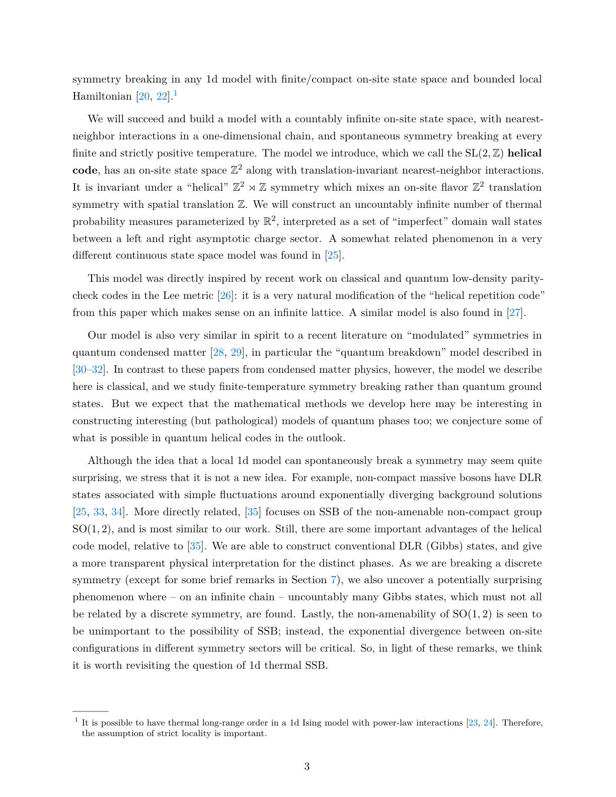 
Low-resolution page preview, page 3

📷 Fig 3

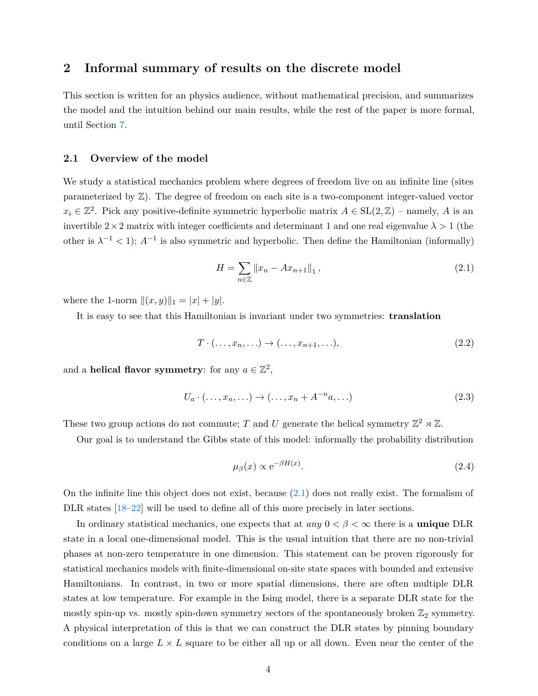 
Low-resolution page preview, page 4

📷 Fig 4

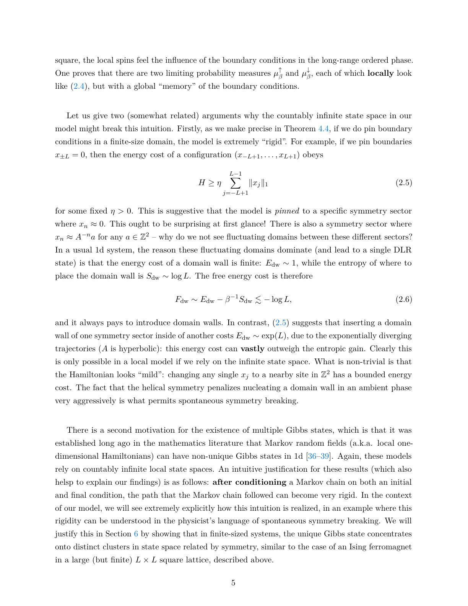 
Low-resolution page preview, page 5

📷 Fig 5

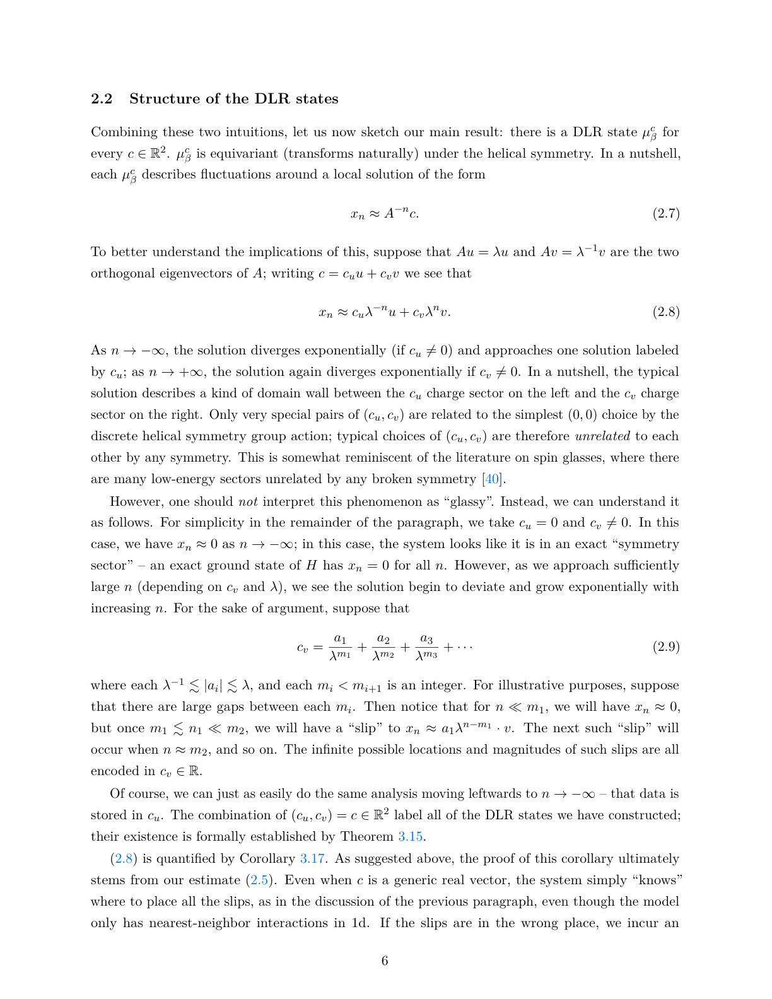 
Low-resolution page preview, page 6

**Summary.** This paper analyzes a 1D classical statistical model with a helical symmetry, demonstrating that it exhibits spontaneous symmetry breaking at any temperature. This is achieved by constructing an uncountable infinity of distinct Gibbs states using the DLR formalism. The work highlights how the infinite nature of the state space allows the model to circumvent standard theorems that restrict SSB to higher dimensions.

**Why it may be interesting.** The work challenges fundamental theorems in 1D statistical mechanics by exploiting the structure of the state space, providing a theoretical framework for when and how SSB can occur in low dimensions.

Detailed structure

**Main problem.** To investigate the possibility of spontaneous symmetry breaking (SSB) at any finite, positive temperature in a local one-dimensional model, challenging standard theorems that forbid such breaking in 1D systems.

**Main result.** The authors construct an uncountable infinity of Gibbs states, demonstrating that the model exhibits spontaneous symmetry breaking at any temperature due to the structure of the state space.

**Method.** The analysis relies on the DLR formalism and transfer matrix methods to characterize the Gibbs states and analyze the measure concentration phenomenon.

**Model / system.** The model is a classical statistical physics system on an infinite 1D lattice ($\mathbb{Z}$) with a local state space ($\mathbb{Z}^2$ or $\mathbb{Z}_2$), governed by nearest-neighbor interactions and possessing a helical symmetry group.

**Key observables.** The existence and number of distinct DLR (Gibbs) states, and the measure concentration into symmetry-related clusters.

**Important parameters / regimes.** Inverse temperature ($eta$), the hyperbolic matrix $A \in SL(2, \mathbb{Z})$, and the parameters $c \in \mathbb{R}^2$ labeling the distinct states.

**Assumptions / limitations.** The primary assumption is that the countably infinite on-site state space allows for a loophole in standard theorems that forbid thermal SSB in 1D.

**Paper structure.** The paper proceeds by defining the model and symmetries, constructing the manifold of Gibbs states using the DLR formalism, and then rigorously arguing that the measure concentration into distinct symmetry sectors implies SSB.

Abstract

We present a one-dimensional classical statistical physics model on an infinite lattice with nearest-neighbor interactions and local state space $\mathbb{Z}^2$, with a ``helical" symmetry group $\mathbb{Z}^2\rtimes \mathbb{Z}$ mixing flavor symmetry with spatial translation. For any $0<β<\infty$, we construct an uncountable infinity of DLR (Gibbs) states parameterized by $\mathbb{R}^2$, with a free $\mathbb{Z}^2$ flavor symmetry group action; as such, we interpret the model as exhibiting spontaneous symmetry breaking at any temperature. The most general DLR state we construct is interpreted as an infinite sequence of localized domain walls separating a pair of asymptotic ``symmetry sectors". Although any normalizable Gibbs state necessarily breaks a countably infinite freely-acting symmetry group, a natural regularization of the problem to (arbitrarily) large but finite systems with periodic boundary conditions has measure concentration in disjoint and far-separated symmetry-related clusters in the (now unique) Gibbs state, which justifies our interpretation of spontaneous symmetry breaking on the infinite line. A modification of the model with local state space $\mathbb{R}^2$ must break a continuous helical symmetry at any temperature. This is not a contradiction with the Mermin-Wagner Theorem, because this continuous helical symmetry is non-compact and does not commute with translation.

[↑ back to top](#top)

### [Stress Tensor in Fundamental Measure Theory of Hard-Sphere Fluids: A Thermomechanical Approach](http://arxiv.org/abs/2610.08289v1)

**Authors:** Yury A. Budkov, Nikolai N. Kalikin  
**Type:** theory · **Category:** statistical mechanics · **PDF:** <https://arxiv.org/pdf/2610.08289v1>  
**Analysis basis:** full PDF text, analyzed in chunks
**Topic relevance:** `Keldysh / 2PI / non-Gaussian methods` **1/5**

📷 Fig 1

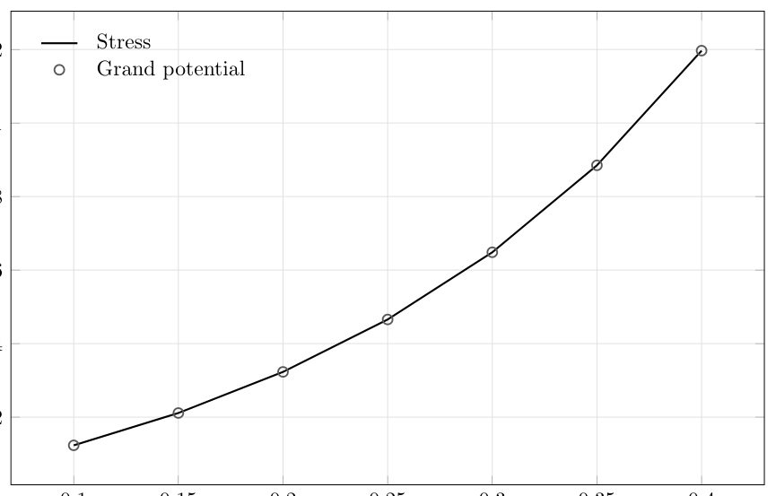 
FIG. 1. Hard-wall surface tension obtained from the thermodynamic excess grand potential and

📷 Fig 2

 
Figure 1 shows the result. The two routes are indistinguishable on the scale of the plot.

📷 Fig 3

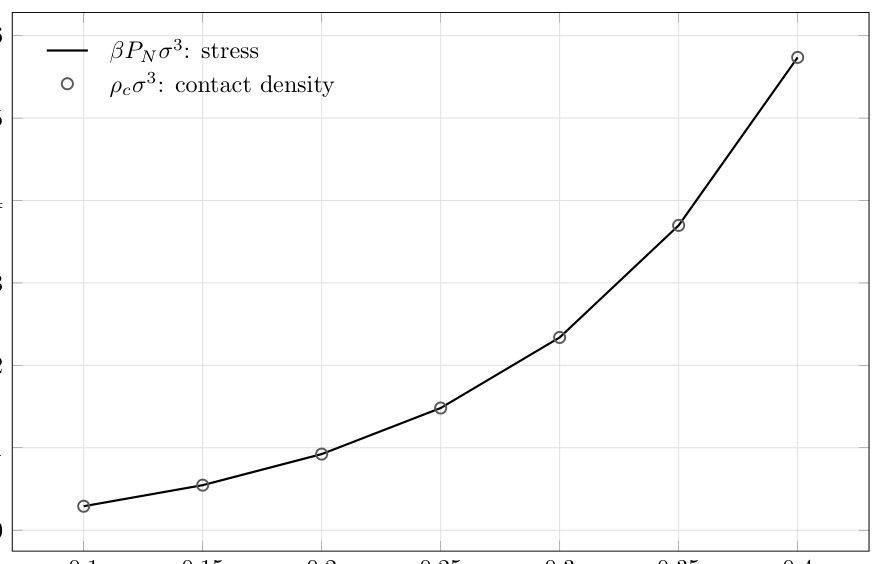 
FIG. 2. Contact theorem in a hard slit of accessible width H = 3σ. The contact density and the

📷 Fig 4

 
Figure 2 shows the contact theorem test. The relative errors are 1.2 × 10−6, 9.0 × 10−6,

📷 Fig 5

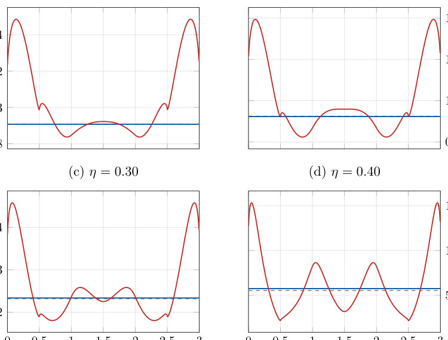 
FIG. 3. Normal and tangential pressure profiles in a hard slit of accessible width H = 3σ. The

**Summary.** This work develops a rigorous thermomechanical framework to calculate the pressure tensor for hard-sphere fluids using Fundamental Measure Theory (FMT). By analyzing the free energy's response to infinitesimal deformations, the authors derive a closed-form expression for the stress tensor. This confirms the theory's consistency by matching known results for bulk fluids and confined geometries.

**Why it may be interesting.** While focused on classical fluids, the rigorous derivation of stress tensors from free energy functionals using deformation methods is a foundational technique in statistical mechanics that underpins many modern theories of many-body systems.

Detailed structure

**Main problem.** The paper derives the local pressure tensor for hard-sphere fluids using the Rosenfeld Fundamental Measure Theory (FMT) by analyzing the system's response to infinitesimal spatial deformations.

**Main result.** The resulting pressure tensor is shown to be in a closed one-body form for monodisperse hard spheres, successfully reproducing known equations of state (like Percus-Yevick) and boundary conditions in various limits.

**Method.** The core method is a thermomechanical approach, calculating the stress tensor from the variation of the excess free energy functional with respect to an infinitesimal deformation gradient.

**Model / system.** The system studied is hard-sphere fluids, modeled using the Rosenfeld FMT, which provides a non-local description of the excess free energy functional.

**Key observables.** The symmetric pressure tensor (P_ij), normal stress, tangential stress, and disjoining pressure.

**Important parameters / regimes.** The fluid density ($
ho$), the confinement width ($H$), and the deformation parameters ($\epsilon$).

**Assumptions / limitations.** The derivation relies on the applicability of the thermomechanical route to nonlocal functionals and assumes the straight chord approximation for the deformation kernel.

**Figures summary.** Not specified, but the notes detail derivations involving stress tensor components (C_zz, C_xx) and the long-wavelength expansion of the FMT kernel.

**Paper structure.** The paper systematically derives the pressure tensor by first establishing the general deformation relation, then applying it to the FMT functional, and finally verifying the results in specific limits like bulk fluid, planar confinement, and analyzing stress anisotropy.

Abstract

We derive the local pressure tensor generated by the original Rosenfeld fundamental measure theory (FMT) for hard-sphere fluids from an arbitrary infinitesimal deformation. The variation of a finite-distance FMT kernel is written via the line integrals of the local deformation gradient along the straight segment connecting its endpoints. The resulting symmetric pressure tensor consists of a local term expressed through the standard FMT weighted densities and a finite-range chord term. For a monodisperse hard-sphere fluid, differential relations between the Rosenfeld measures reduce the tensor to a closed one-body form. We demonstrate that no independent pair density or inhomogeneous Ornstein--Zernike equation is required. In the limit of homogeneous fluid the tensor reproduces the Percus--Yevick compressibility equation of state. In planar confinement the normal stress satisfies the hard-wall contact relation, the mechanical surface tension agrees with the surface excess grand potential, and the disjoining pressure agrees with the derivative of the confined grand potential with respect to slit width. The finite-range chord term extends the deformation method from local field theories to nonlocal weighted-density functionals.

[↑ back to top](#top)

## Other papers (22)

*Papers from primary archives without highlighted authors or any topic match. Click to expand.*

Show other papers

### [Algebraic Tensor Network Renormalization and Holographic duality](http://arxiv.org/abs/2610.08787v1)

**Authors:** Chenqi Meng, Tian Lan, Zhengcheng Gu  
**Type:** theory · **Category:** statistical mechanics · **PDF:** <https://arxiv.org/pdf/2610.08787v1>  
**Analysis basis:** full PDF text, analyzed in chunks

📷 Fig 1

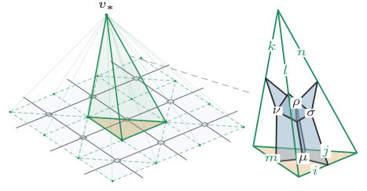 
FIG. 1. A Turaev–Viro tent over the dual triangulation of the tensor network.

📷 Fig 2

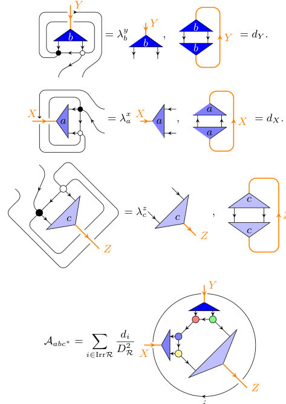 
FIG. 3. Construction of the bulk three-point amplitude. The first three panels show eigenstates of the anyon-insertion rep- resentations of the tube morphisms together with their nor- malization conventions, corresponding to primary or descen- dant states a, b, and c in the sectors x, y, and z in Z(R), respectively. The third panel uses the fixed-point tensor at the next Loop-TNR step to match the gauge of the bond en- tering the three-point contraction. The last panel evaluates Aabc∗∈Z(R)(x ⊗y, z) for the fields ϕa, ϕb, and ϕc in sector x, y, and z, respectively.

📷 Fig 3

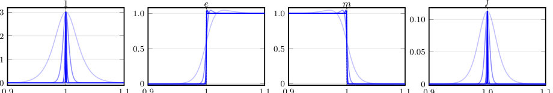 
FIG. 4. Sector-resolved conformal data of the critical classical Ising model with Z2 symmetry in IrrZ(Rep(Z2)) = {1, e, m, f = em}. The top row shows the spin-resolved spectrum at the 20th RG step. Its sector-dependent dashed grid marks the exact allowed values of s and ∆, and green concentric rings show exact degeneracies. The middle row traces the numerical scaling dimensions through the Loop-TNR flow, with dashed horizontal lines marking the exact dimensions. The third row shows the partition function Zx(i, −i) on a square across the thermal transition for systems with 210, 214, 218, and 222 spins. The first two rows use χRG = 32, with χtransfer = 40 for the top row, whereas the...

📷 Fig 4

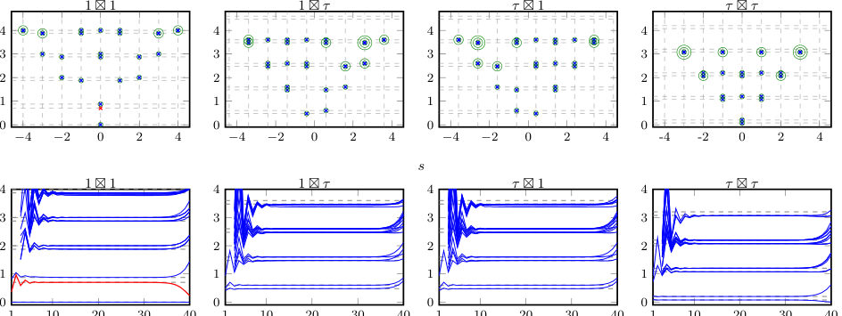 
FIG. 5. Sector-resolved conformal data of the Fibonacci-symmetric random-cluster model at the self-dual point. The upper row shows the spin-resolved conformal spectrum obtained from the 4 √

📷 Fig 5

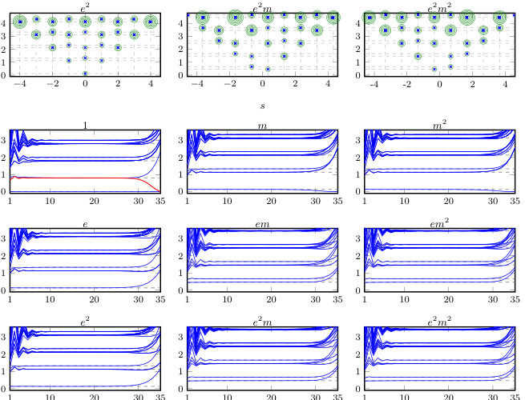 
FIG. 6. Sector-resolved conformal data of the Z3-symmetric random-cluster model at the self-dual point. The upper block shows the spin-resolved conformal spectra obtained from the 4 √

**Summary.** This work presents R-TNR, an advanced tensor network renormalization technique that incorporates full categorical symmetry constraints into the RG flow. By doing so, it achieves a stable, non-perturbative method to calculate detailed conformal field theory data for critical systems. This realization of a 'topological bootstrap' offers a powerful tool for understanding quantum phase transitions by linking symmetry, topology, and renormalization group flow.

**Why it may be interesting.** The rigorous connection between algebraic structures (fusion categories) and critical phenomena via renormalization group flow provides powerful, non-perturbative tools for analyzing quantum phase transitions, which is central to modern condensed matter theory.

Detailed structure

**Main problem.** The paper aims to develop a complete holographic formulation within tensor-network renormalization that can correctly incorporate sector partition functions that are modular covariant in general.

**Main result.** The proposed R-TNR method successfully flows initial tensors to stable gapless fixed points for suitable symmetry categories, yielding highly accurate sector-resolved conformal data.

**Method.** It introduces R-TNR, which embeds categorical constraints from a fusion category into local tensor spaces, extending the standard Tensor Network Renormalization Group (TNR) approach.

**Model / system.** The framework is applied to critical systems described by Conformal Field Theories (CFTs), using examples like the Ising, tricritical Ising, and three-state Potts models.

**Key observables.** Scaling dimensions, conformal spins, and magnitudes of sector-resolved structure constants.

**Important parameters / regimes.** The choice of the fusion category R, which dictates the symmetry constraints.

**Assumptions / limitations.** The method assumes that the underlying physics can be described by a stable symmetry-topological-order (symTO) protected by the categorical constraints.

**Paper structure.** The paper introduces R-tensors and R-Loop-TNR, details the holographic interpretation involving modular covariance, applies the method to specific CFT examples, and concludes by defining and demonstrating the stable symTO.

Abstract

Emergent generalized symmetries and the holographic principle play very important roles in understanding quantum phase transitions. In recent years, tensor-network renormalization with generalized symmetry and the corresponding fixed-point tensor formulation have been proposed as a discrete spacetime framework for reformulating conformal field theory. Nevertheless, a complete holographic formulation within this framework is still lacking, and the current formulation does not directly accommodate sector partition functions that are modular covariant in general. In this work, we formulate $\mathcal{R}$-TNR, which builds the categorical constraints of a fusion category $\mathcal{R}$ into local tensor spaces and preserves these constraints under Loop-TNR. For suitable choices of $\mathcal{R}$, the initial tensors constructed here flow under $\mathcal{R}$-Loop-TNR to stable gapless fixed points. In the Ising, tricritical Ising, and three-state Potts conformal field theory examples, a broad range of initial parameters leads to the same gapless fixed point in each example. The method resolves conformal towers by anyon sector and yields scaling dimensions, conformal spins, and magnitudes of sector-resolved structure constants with extremely high accuracy compared to previous methods. These results realize a topological bootstrap based on stable symmetry-topological-order in which finite categorical and geometric input, together with an initial tensor that need not be fine-tuned, suffices to recover the infrared conformal field theory and its sector-resolved conformal data.

[↑ back to top](#top)

### [An unified approach for the (inverted) quantum harmonic oscillator and the Berry-Keating hamiltonian](http://arxiv.org/abs/2610.08437v1)

**Authors:** Fabio Bagarello, Emanuele Balistreri, Sergey Kuzhel  
**Type:** theory · **Category:** other · **PDF:** <https://arxiv.org/pdf/2610.08437v1>  
**Analysis basis:** full PDF text, analyzed in chunks

📷 Fig 1

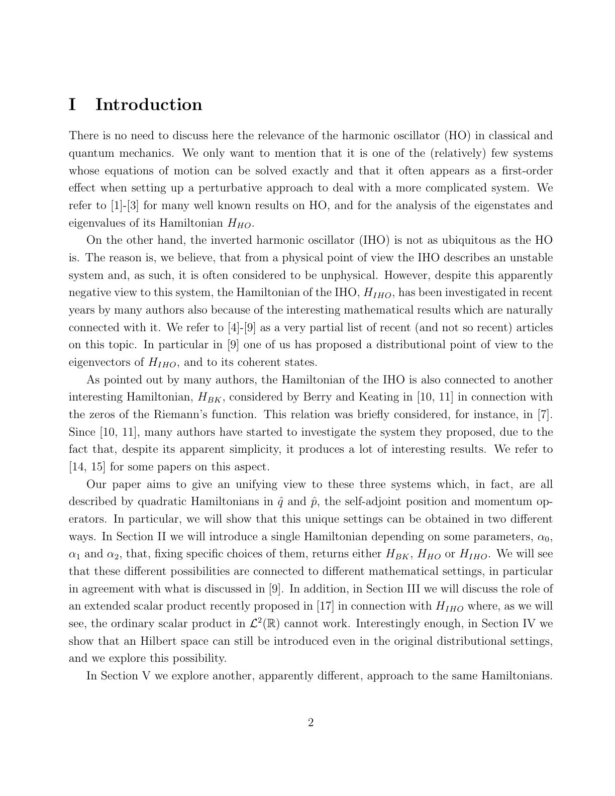 
Low-resolution page preview, page 2

📷 Fig 2

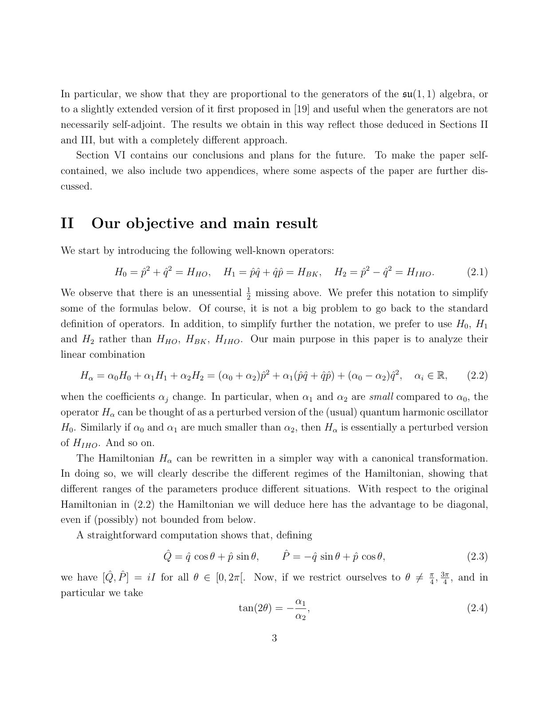 
Low-resolution page preview, page 3

📷 Fig 3

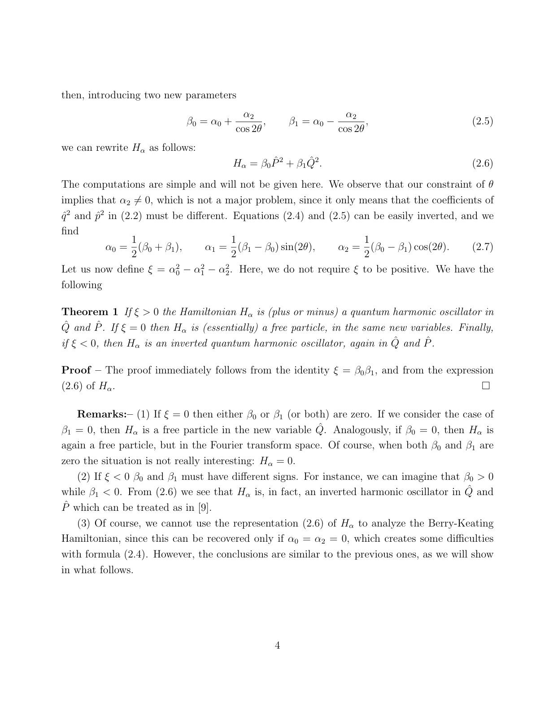 
Low-resolution page preview, page 4

📷 Fig 4

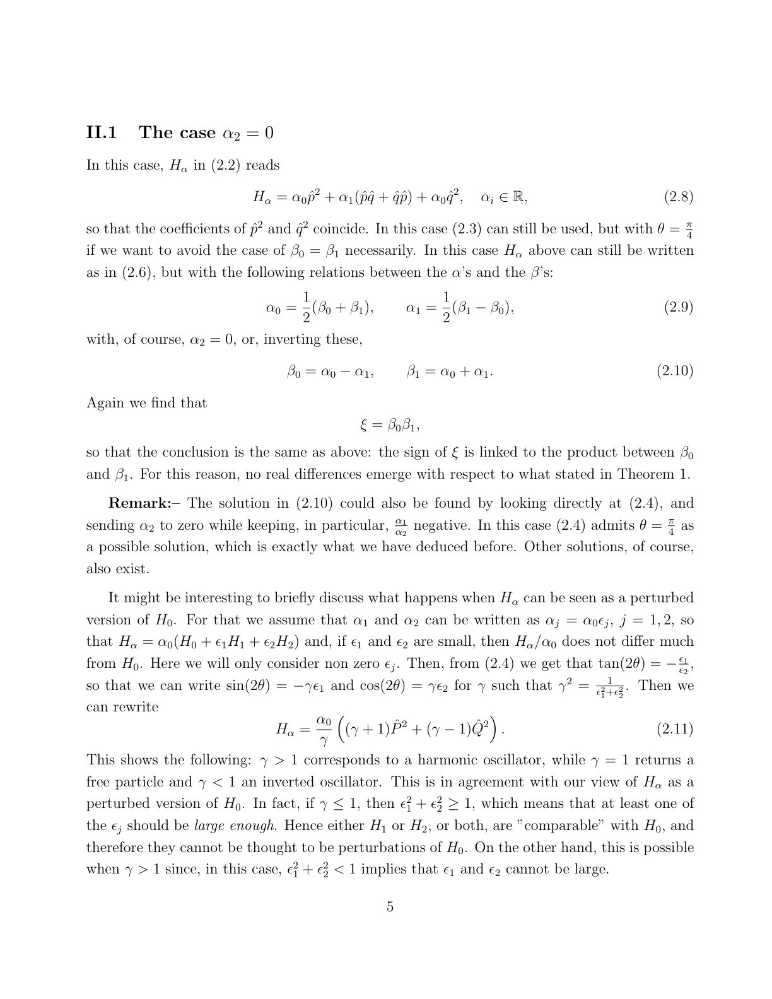 
Low-resolution page preview, page 5

📷 Fig 5

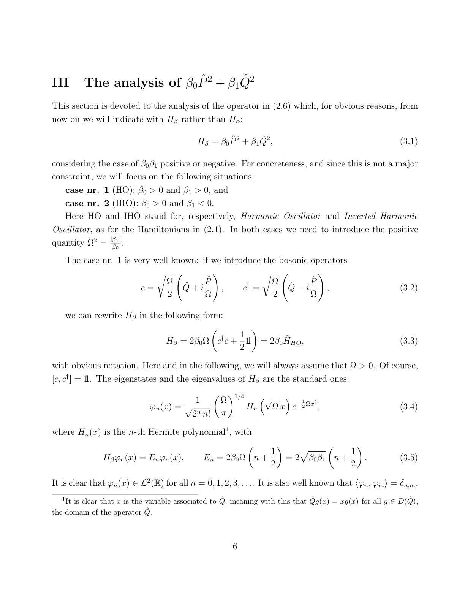 
Low-resolution page preview, page 6

**Summary.** This paper presents a unified mathematical approach to analyze the quantum harmonic oscillator, the inverted harmonic oscillator, and the Berry-Keating Hamiltonian. By mapping these systems onto generators of the $\mathfrak{su}(1,1)$ Lie algebra, the authors provide a single theoretical framework to determine their spectra and eigenstates across different physical regimes. This unification is achieved using advanced techniques involving generalized function spaces.

**Why it may be interesting.** The unification of these three canonical Hamiltonians under the $\mathfrak{su}(1,1)$ algebra provides deep structural insight into quantum systems, which is relevant for understanding non-Hermitian or time-dependent quantum dynamics.

Detailed structure

**Main problem.** The paper proposes a unified mathematical framework to analyze three fundamental quadratic Hamiltonians in quantum mechanics: the harmonic oscillator, the inverted harmonic oscillator, and the Berry-Keating Hamiltonian.

**Main result.** The authors demonstrate that these three Hamiltonians can be unified by treating them as generators of $\mathfrak{su}(1,1)$ Lie algebras, providing a consistent spectral analysis across different physical regimes.

**Method.** The analysis involves linear transformations of the Hamiltonians into a canonical form and employing advanced mathematical tools, including Lie algebra theory ($\mathfrak{su}(1,1)$) and working in generalized function spaces beyond standard $L^2(\mathbb{R})$.

**Model / system.** The models are defined by quadratic Hamiltonians in position ($\hat{q}$) and momentum ($\hat{p}$) operators, specifically $H_{	ext{HO}}$, $H_{	ext{IHO}}$, and $H_{	ext{BK}}$. The analysis extends to general linear combinations of these operators.

**Key observables.** The spectrum (eigenvalues) of the Hamiltonians, which can be real (HO) or purely imaginary (IHO), and the structure of the associated eigenstates.

**Important parameters / regimes.** The coefficients ($\alpha_0, \alpha_1, \alpha_2$) defining the linear combination of the Hamiltonians, and the diagnostic parameter $\xi$ which determines the nature of the spectrum.

**Assumptions / limitations.** The analysis requires moving beyond the standard $L^2(\mathbb{R})$ space to a Fréchet space $G$ to properly handle the spectrum of the inverted oscillator.

**Paper structure.** The paper progresses by first defining the unified Hamiltonian $H_\alpha$, establishing the spectral classification via the sign of $\xi$, and then rigorously analyzing the spectrum and algebraic structure by relating the Hamiltonians to the $\mathfrak{su}(1,1)$ algebra using various sets of generators ($K_j$ and $L_j$).

Abstract

We propose an unified view to three well known quadratic Hamiltonians widely considered in quantum mechanics, i.e. those of the harmonic oscillator, of the inverted harmonic oscillator, and the Berry-Keating Hamiltonian. We describe an unified approach to determine the discrete spectrum of these operators, and to deduce their (generalized) eigenstates. We also look at these Hamiltonians as the generators of $\mathfrak{su}(1,1)$, and of a generalized version of it relevant in presence of non Hermitian generators.

[↑ back to top](#top)

### [Asymptotic Analysis of Empirical Risk Minimization on Entry-wise i.i.d. Heavy-Tailed Data](http://arxiv.org/abs/2610.07637v1)

**Authors:** Kaito Takanami, Takashi Takahashi, Yoshiyuki Kabashima  
**Type:** theory · **Category:** disordered systems and neural networks · **PDF:** <https://arxiv.org/pdf/2610.07637v1>  
**Analysis basis:** full PDF text, analyzed in chunks

📷 Fig 1

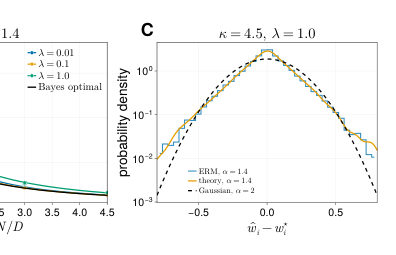 
Figure 1: Empirical validation of the theoretical coefficient-error predictions. (A, B) Solid col- ored lines show the theoretical predictions of qα (Equation 15), while markers represent numerical results obtained via finite-dimensional ERM. The solid black line shows the theoretical prediction of qα under the Bayes–optimal setting in Section 5.3. (C) Comparison between the theoretical distri- bution (Equation 14) and the empirical coefficient-error distribution obtained by finite-dimensional ERM. The dashed black curve shows the theoretical coefficient-error distribution at α = 2, which is Gaussian. (A-C) Huber loss with δ = 1, pw = N(0, 1), and pϵ = N(0, 0.52); (A,B) D = 256; (C) D =...

📷 Fig 2

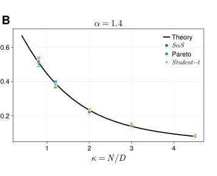 
Figure 2: Empirical validation of universality across heavy-tailed feature distributions. The solid line shows the theoretical prediction of qα for SαS(1) features, while markers represent nu- merical results obtained via Huber–ridge ERM with symmetric α-stable, Pareto, and Student-t co- ordinates. The Pareto and Student-t distributions are rescaled to satisfy Pr(|X| &gt; x) ∼CS αx−α. Parameters: (A, B) D = 256, δ = 1, λ = 1, pw = N(0, 1), and pϵ = N(0, 0.52). Error bars indicate the standard error over 6 independent trials for each point.

📷 Fig 3

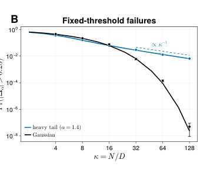 
Figure 3: Empirical validation of prediction-error scaling and reliability. (A) The solid colored and black lines show the theoretical predictions for median(|∆(α)(κ)|) and median(|∆(2)(κ)|) un- der heavy-tailed and Gaussian features, respectively, while markers represent the finite-dimensional ERM results. (B) The solid colored and black lines show the theoretical predictions for Pr(|∆(α)(κ)| &gt; t) and Pr(|∆(2)(κ)| &gt; t) under heavy-tailed and Gaussian features, respectively, while markers represent the finite-dimensional ERM results. Parameters: (A, B) Huber loss with δ = 1, λ = 1, pw = N(0, 1), pϵ = N(0, 0.52), and D = 128. Error bars indicate the standard error over 8 independent trials...

**Summary.** This work provides a rigorous asymptotic analysis of machine learning performance when data features follow heavy-tailed $\alpha$-stable distributions. By employing the replica method, the authors characterize the generalization error, establishing a universal scaling law dependent only on the tail index $\alpha$. This is crucial for understanding reliable inference in real-world datasets with extreme outliers.

**Why it may be interesting.** While the core is statistical learning theory, the use of the replica method and the analysis of high-dimensional random matrices/optimization problems share deep mathematical techniques with disordered systems and spin glass models.

Detailed structure

**Main problem.** The paper characterizes the asymptotic generalization error of Empirical Risk Minimization (ERM) when the input data features are heavy-tailed, specifically $\alpha$-stable.

**Main result.** It establishes a heavy-tail universality law, showing that the generalization error scales differently than in the Gaussian case, and provides scaling laws for typical prediction errors.

**Method.** The analysis heavily employs the replica method from statistical physics to reduce the complex high-dimensional optimization problem to an effective one-dimensional problem characterized by a functional order parameter.

**Model / system.** The model is high-dimensional linear regression where the training inputs are assumed to be entry-wise i.i.d. $\alpha$-stable distributed, contrasting with standard Gaussian assumptions.

**Key observables.** Generalization error $E^{(\alpha)}_{N,D}$, test prediction error $\Delta^{(\alpha)}_{N,D}$, and the functional order parameter $\hat{P}$.

**Important parameters / regimes.** The tail index $\alpha$ ($0 < \alpha < 2$), the sample-to-dimension ratio $\kappa = N/D$, and the functional order parameter $\hat{P}$.

**Assumptions / limitations.** The loss function $\ell$ must be convex, and the analysis relies on the proportional high-dimensional limit ($N/D 	o \kappa$).

**Figures summary.** Figures validate the theoretical predictions for the limiting coefficient error $q_{\alpha}$ across various ratios $\kappa$ and tail indices $\alpha$, comparing theoretical lines to numerical results.

**Paper structure.** The paper progresses by first defining the ERM problem for heavy-tailed data, introducing the functional order parameter, and then using the replica method to derive asymptotic results, culminating in establishing universality laws and comparing entry-wise vs. elliptical models.

Abstract

Many real-world datasets exhibit unusually large values far more frequently than predicted by Gaussian models. Heavy-tailed distributions capture this behavior, yet evaluating learning performance under them remains challenging because rare, large feature entries retain non-vanishing effects even in high dimensions. Even in the canonical setting of empirical risk minimization for linear regression with entry-wise i.i.d. symmetric $α$-stable data, a precise asymptotic characterization of prediction has been lacking. In this work, we introduce a functional order parameter that describes the random effective problem associated with each coefficient. Using the replica method, we fully characterize the generalization error in the proportional high-dimensional limit where the sample size and feature dimension diverge at a fixed ratio. Additionally, this analysis establishes a heavy-tail universality law, scaling laws relating typical errors to prediction reliability, and the Bayes-optimal prediction error. In addition to characterizing the effects of extreme entries on the learning process, our method applies broadly to other systems with persistent local heterogeneity.

[↑ back to top](#top)

### [Classifications in modular restricted Boltzmann machines](http://arxiv.org/abs/2610.08612v1)

**Authors:** Elena Agliari, Andrea Lepre, Edoardo Roscani  
**Type:** theory · **Category:** disordered systems and neural networks · **PDF:** <https://arxiv.org/pdf/2610.08612v1>  
**Analysis basis:** full PDF text, analyzed in chunks

📷 Fig 1

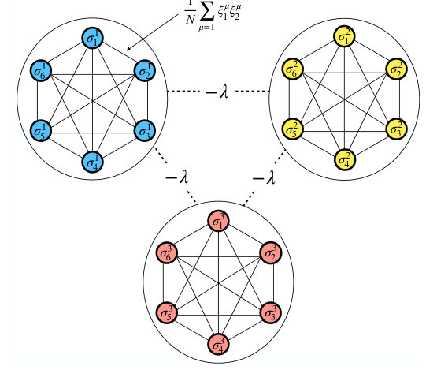 
Figure 1: Example of modular associative model with L = 3 modules and N = 6 neurons per module. In each module a = 1, ..., L, the neurons σa = (σa 1, . . . , σa N) ∈{−1, +1}N are fully-connected, with intra-module Hebbian interactions built on a set of K patterns {ξµ}µ=1,...,K (or on a sample of corrupted copies thereof). The L modules are coupled to one another through inter-module inhibitory connections of strength −λ, which penalise configurations in which different modules retrieve the same pattern, thereby promoting the simultaneous retrieval of L distinct patterns across the L modules.

📷 Fig 2

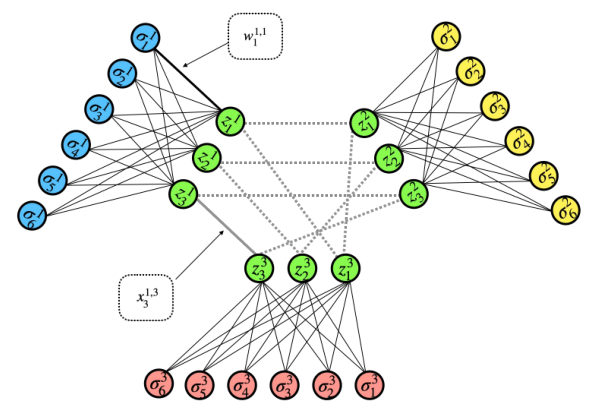 
Figure 2: Architecture of the modular RBM equivalent to the modular HM in Fig. 1. It exhibits L = 3 modules, K = 3 hidden neurons and N = 6 visible neurons per module. In fact, each module a ∈{1, 2, 3} consists of a visible layer σa = (σa 1, . . . , σa N) ∈{−1, +1}N and a hidden layer za = (za 1, . . . , za K) ∈RK. Black edges represent the intra-module weights wµ,a i , coupling the i-th visible neuron of module a to the µ-th hidden neuron of the same module. Dashed edges denote the inter-module couplings xab µ , connecting hidden neurons with the same class index µ across different modules.

📷 Fig 3

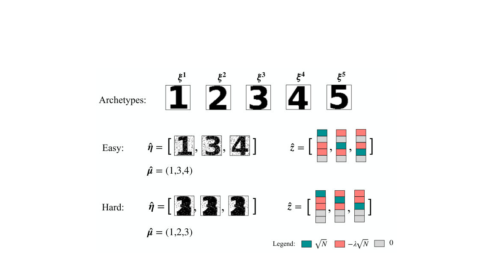 
Figure 3: Schematic representation of the two supervised datasets introduced in Sec. 2, drawn for K = 5 archetypes and L = 3 modules. The top row shows the archetypes ξ1, . . . , ξ5, here, for illustrative purposes, taken as five digits. A training item is a pair (ˆη, ˆz), where ˆη collects the L vectors presented to the L visible layers, while ˆz collects the L label codes (2.14). In Case 2a, simple classification, the L visible layers receive examples of L distinct archetypes, here ˆµ = (1, 3, 4), and each module has to classify the archetype it is shown. In Case 2b, hard classification, the L visible layers all receive the same vector, the mixture of L distinct examples, here ˆµ = (1, 2,...

📷 Fig 4

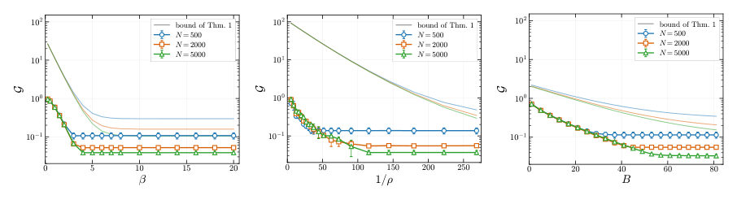 
Figure 4: Numerical verification of Theorem 1. Residual drift G of eq. (4.1), evaluated at the planted weights w = ¯η for a modular RBM with L = 3 modules, K = 20 archetypes and inter-module coupling λ = 0.2. The average over the generation of the dataset is estimated on 20 independent realisations, and the curves report the typical value of G over 4 independent samples of the quenched archetypes, the error bars being the spread over the latter. The thin solid lines are the right-hand side of (3.16) evaluated with its own constants, one per system size and in the corresponding colour. (a) Thermal channel, at r = 0.8, M = 105 and B = 25, so that both the dataset and the mini-batch channels...

📷 Fig 5

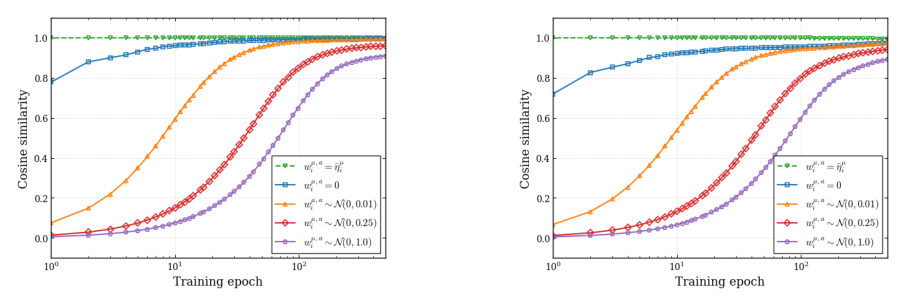 
Figure 5: Cosine similarity between the learned weights w(epoch) and the initialization based on the empirical mean of the examples ¯η, evaluated during training in a modular RBM. The network consists of L = 3 modules, each with N = 5000 neurons and inter-module coupling λ = 0.2, storing K = 20 archetypes from which M = 50 examples per archetype are drawn with an entropy of ρ = 0.01 (left) and ρ = 0.2 (right), batch size B = 25. Moreover the system evolves with inverse temperature β = 5. The training is performed using Algorithm 1 for 500 epochs and with learning rate 0.03. The green line tracks the self similarity of a network initialized on the mean of the examples wµ,a i = ¯ηµ i . The...

**Summary.** This paper analyzes a modular neural network built from coupled Hopfield Models, showing its mathematical equivalence to a modular Restricted Boltzmann Machine. It develops theoretical bounds to prove that this network can effectively learn to classify complex, mixed patterns by ensuring the learned weights remain stable attractors during training.

**Why it may be interesting.** The connection between associative memory models (like HMs) and modern machine learning architectures (like RBMs) provides a theoretical framework for understanding how physical constraints (like energy minimization) govern learning in complex, coupled systems.

Detailed structure

**Main problem.** The paper investigates the learning dynamics of a modular associative neural network, composed of coupled Hopfield Models, when adapted for a complex classification task.

**Main result.** It proves that under certain conditions, the RBM weights derived from the associative model form a fixed point of the learning dynamics, and it shows the setup remains effective for classifying mixtures of patterns.

**Method.** The analysis involves deriving the contrastive-divergence learning rule for the modular RBM and bounding the expected reconstruction error using techniques from statistical physics and information theory.

**Model / system.** The model is a modular associative network of L Hopfield Models, coupled competitively (Hebbian intra-module, anti-Hebbian inter-module). This system is shown to be equivalent to an assembly of L coupled Restricted Boltzmann Machines (RBMs).

**Key observables.** Expected reconstruction error (E[Delta y]), RBM weights, and the residual drift of the learning dynamics.

**Important parameters / regimes.** Number of modules (L), network size (N), coupling strength (lambda), and dataset corruption variable (r).

**Assumptions / limitations.** The analysis relies on the HM-RBM equivalence and uses approximations like $ar{\eta}_\mu$ as a proxy for the true pattern $\xi_\mu$ when the dataset entropy is low.

**Figures summary.** Figure 1 illustrates the modular model structure for L=3, showing the intra-module Hebbian and inter-module inhibitory connections.

**Paper structure.** The paper first establishes the physical model and its equivalence to coupled RBMs. It then details the training setup for classification using contrastive divergence. Finally, it rigorously derives and bounds the expected reconstruction error to prove the stability and effectiveness of the learned weights.

Abstract

We consider a modular associative neural network made of $L$ Hopfield models (HMs), coupled so that intra-module interactions are Hebbian and inter-module interactions are anti-Hebbian; this competitive coupling is known to endow the network with pattern-disentanglement capabilities. The integral representation of this system coincides with an assembly of $L$ restricted Boltzmann machines (RBMs) whose hidden layers are coupled, thereby extending the HM-RBM duality to the modular setting. We then train this modular RBM, via one-step contrastive divergence, to perform a classification task in which a query encoded on the visible layers is mapped onto an $L$-tuple of labels read off the hidden layers. When the query is composed of $L$ patterns that are mutually orthogonal on average, we prove that the RBM weights obtained as empirical means over the training dataset, as suggested by the HM-RBM equivalence, constitute a fixed point of the learning dynamics, and we derive an explicit, non-asymptotic bound on the residual drift. We then turn to a harder classification task in which each module is queried with a mixture of $L$ patterns and we show numerically that the same setting for the RBM weights still provides an effective set-up, letting the network jointly classify and disentangle the mixture.

[↑ back to top](#top)

### [Coupled cluster theory for multireference and open-shell molecules](http://arxiv.org/abs/2610.07440v1)

**Authors:** Sarai Dery Folkestad, Henrik Koch  
**Type:** theory · **Category:** other · **PDF:** <https://arxiv.org/pdf/2610.07440v1>  
**Analysis basis:** full PDF text, analyzed in chunks

📷 Fig 1

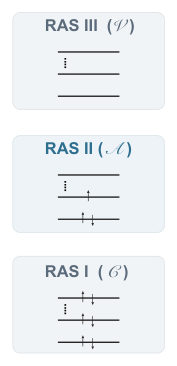 
Fig. 1 Definition of the RAS orbital partitioning (O = C ∪A ∪V ,). In this work we allow up to two holes and particles in RAS I (C ) and III (V ), respectively.

📷 Fig 2

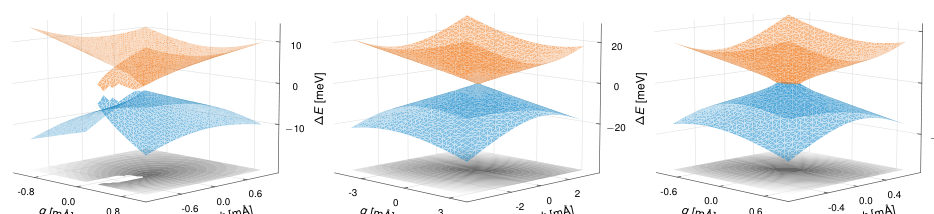 
Fig. 2 CCSD (left) and RAS-CCSD (middle and right) for the ground state conical intersection of ethylene/cc-pVDZ, using a restricted Hartree– Fock reference. Energies are plotted relative to the average energy of the two states ∆E = Ei −1

📷 Fig 3

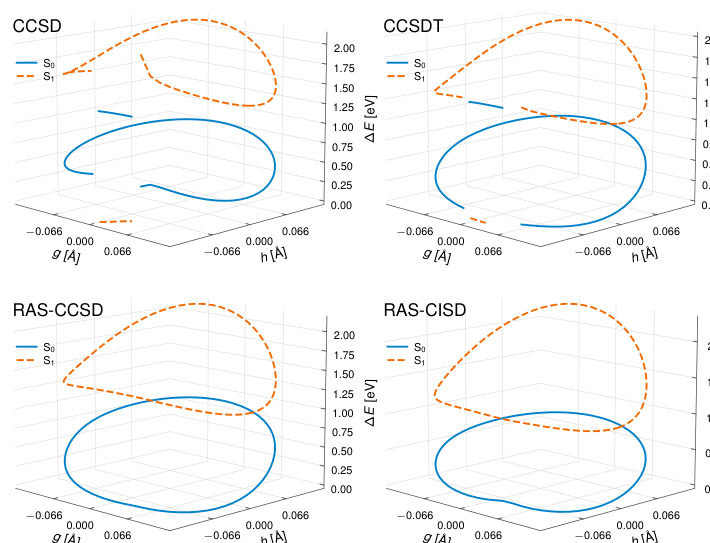 
Fig. 3 Traversing in a loop of radius r = 0.25Å around the approximate CCSD/cc-pVDZ conical intersection, in the gh-plane provided in the Supporting information of Ref. 50. Restricted Hartree–Fock orbitals are used in all calculations. The CCSD and CCSDT models show convergence failures, multiple solutions, and regions of negative excitation energies. The RAS-CCSD and RAS-CISD calculations encounter no problems with convergence, traversing a loop around the conical intersection.

📷 Fig 4

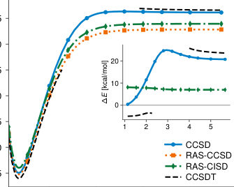 
Fig. 5 Ethylene/cc-pVDZ C-C bond dissociation (unrelaxed) with CCSD, CCSDT, RAS-CCSD, and RAS, RAS-CISD. The CCSD, CCSDT, and the CASSCF(4,4) reference calculations, are calculated by restarting from the previous point. The inset shows the energies relative to RAS-CCSD, ∆E = ERAS-CCSD −EX.

📷 Fig 5

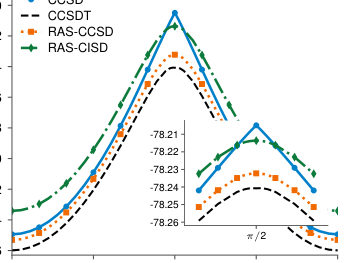 
Fig. 4 Ethylene/cc-pVDZ C-C bond torsion (unrelaxed) with CCSD, CCSDT, RAS-CCSD and RAS-CISD. The CCSD and CCSDT calcula- tions, and the CASSCF(2,2) reference calculations, are calculated by restarting from the previous point (increasing θ).

**Summary.** This paper introduces a simplified Coupled Cluster theory (RAS-CCSD) designed to accurately model multireference and open-shell molecules. By restricting the cluster operator, the method overcomes the convergence failures and mathematical complexities encountered by standard CC methods near bond dissociation or conical intersections. It demonstrates the method's reliability by showing it correctly predicts energy profiles and size-extensivity across various molecular systems.

**Why it may be interesting.** This work is highly relevant to AMO physics as it provides a sophisticated, computationally feasible quantum chemistry method for accurately modeling bond breaking, excited states, and interactions in open-shell molecules, areas where standard single-reference methods break down.

Detailed structure

**Main problem.** The paper addresses the challenge of developing a coupled cluster theory that accurately describes the complex electronic structure of multireference and open-shell molecular systems.

**Main result.** The proposed Restricted Active Space Coupled Cluster (RAS-CCSD) framework successfully describes molecular properties, such as bond dissociation and conical intersections, where standard CCSD methods fail due to convergence issues or complex eigenvalues.

**Method.** The authors introduce a simplified coupled cluster approach by restricting the cluster operator to excitations from doubly occupied to virtual orbitals, allowing for a manageable and robust treatment of multireference character.

**Model / system.** The work is applied to molecular systems, including ethylene (for conical intersection studies), $	ext{H}_2	ext{O}$ complexes, and $	ext{N}_2$ dissociation. The theoretical framework relies on coupled cluster theory adapted for restricted active spaces.

**Key observables.** Correlation energy, excitation energies ($\omega_{	ext{S}}, \omega_{	ext{T}}$), and the size-extensivity error ($\Delta E$) when separating molecules.

**Important parameters / regimes.** The active space selection (e.g., $	ext{CAS}(2,4)$ on $	ext{Be}$), the degree of correlation included (CCSD vs. CISD), and the geometry (e.g., torsion angle $	heta$ or bond distance $R$).

**Assumptions / limitations.** The primary approximation is restricting the cluster operator $T$ to specific excitations (doubly occupied to virtual orbitals) to ensure mathematical tractability and avoid non-commuting terms inherent in standard CC theory for open-shell systems.

**Figures summary.** Figures compare energy profiles (e.g., ethylene torsion, $	ext{N}_2$ dissociation) showing RAS-CCSD's stability versus CCSD's failure near critical points. Other figures illustrate orbital energy scans and size-extensivity checks for separated fragments.

**Paper structure.** The paper progresses by first establishing the need for a specialized CC theory for multireference systems. It then details the RAS-CCSD formalism, demonstrating its ability to handle challenging geometries like conical intersections. Finally, it rigorously tests the method's reliability by checking size-extensivity across various dissociation and complex formation scenarios.

Abstract

We introduce a simple coupled cluster approach for multireference and open-shell systems. In the restricted active space coupled cluster framework, the cluster operator only includes excitations from doubly occupied to virtual orbitals, and this ensures the individual operators commute among each other. The ground and excited states are obtained by diagonalisation of the coupled cluster similarity transformed Hamiltonian in a restricted active space. We demonstrate the framework for the RAS-CCSD model, where single and double excitations are included in the cluster operator, and likewise for a complete active space. We consider systems with multireference character and open-shell systems in a spin-adapted manner. The approach captures significantly more dynamical correlation than without the coupled cluster similarity transformation.

[↑ back to top](#top)

### [Cyclic triorthogonal codes in prime dimension](http://arxiv.org/abs/2610.08012v1)

**Authors:** Shiroman Prakash  
**Type:** theory · **Category:** quantum information and computing · **PDF:** <https://arxiv.org/pdf/2610.08012v1>  
**Analysis basis:** full PDF text, analyzed in chunks

📷 Fig 1

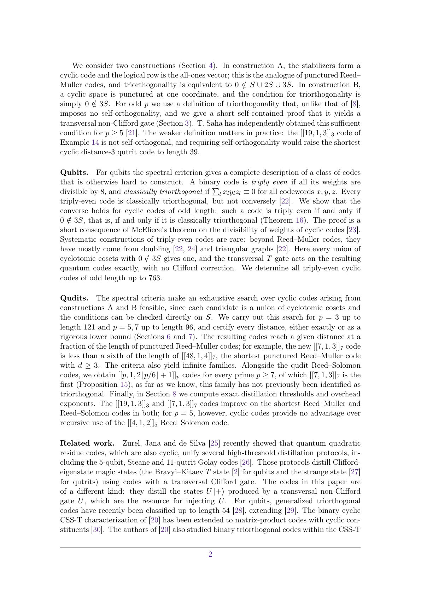 
Low-resolution page preview, page 2

📷 Fig 2

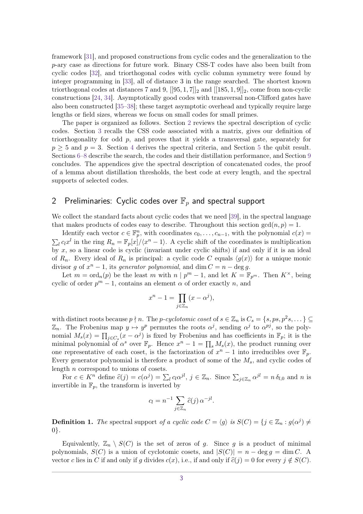 
Low-resolution page preview, page 3

📷 Fig 3

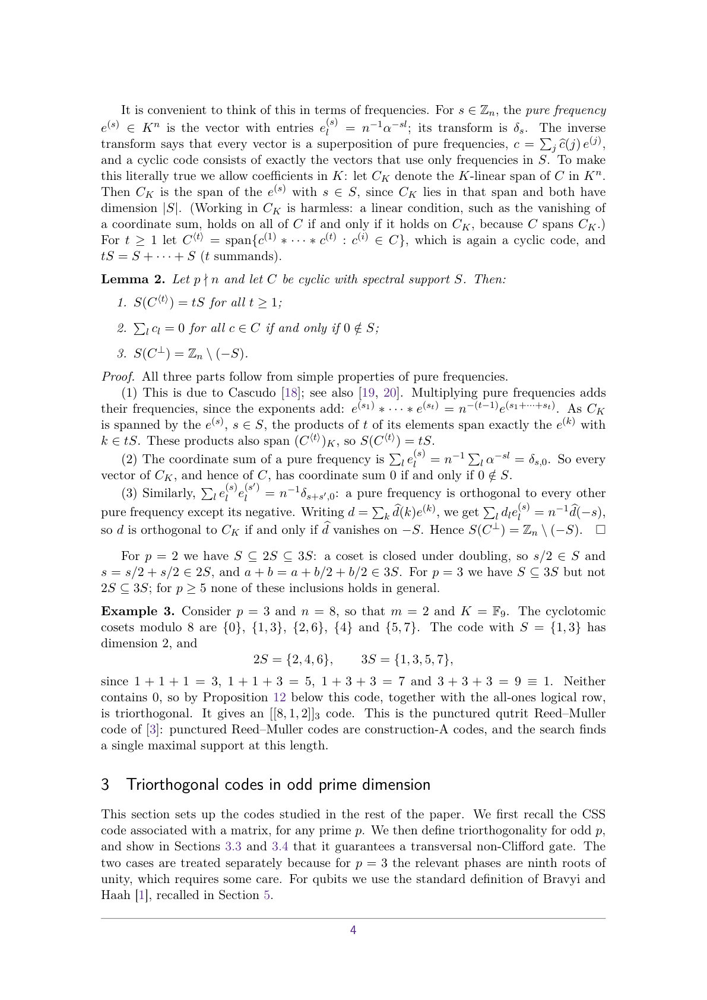 
Low-resolution page preview, page 4

📷 Fig 4

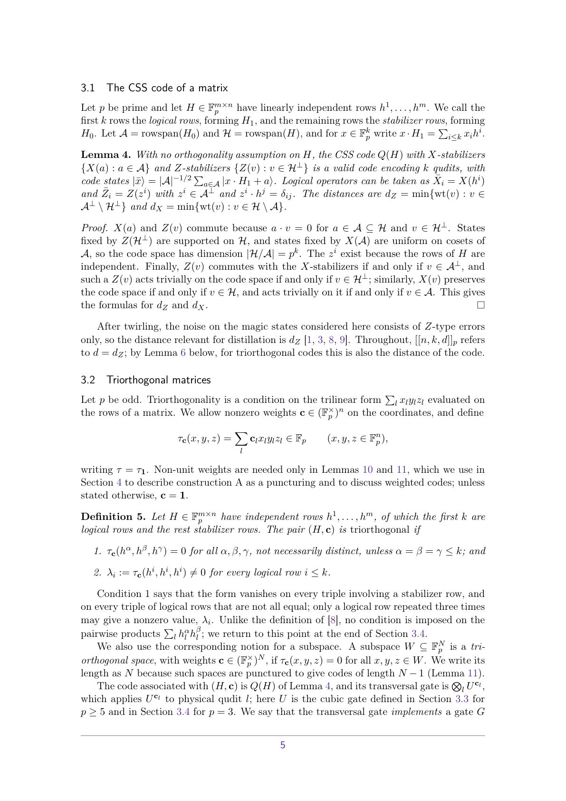 
Low-resolution page preview, page 5

📷 Fig 5

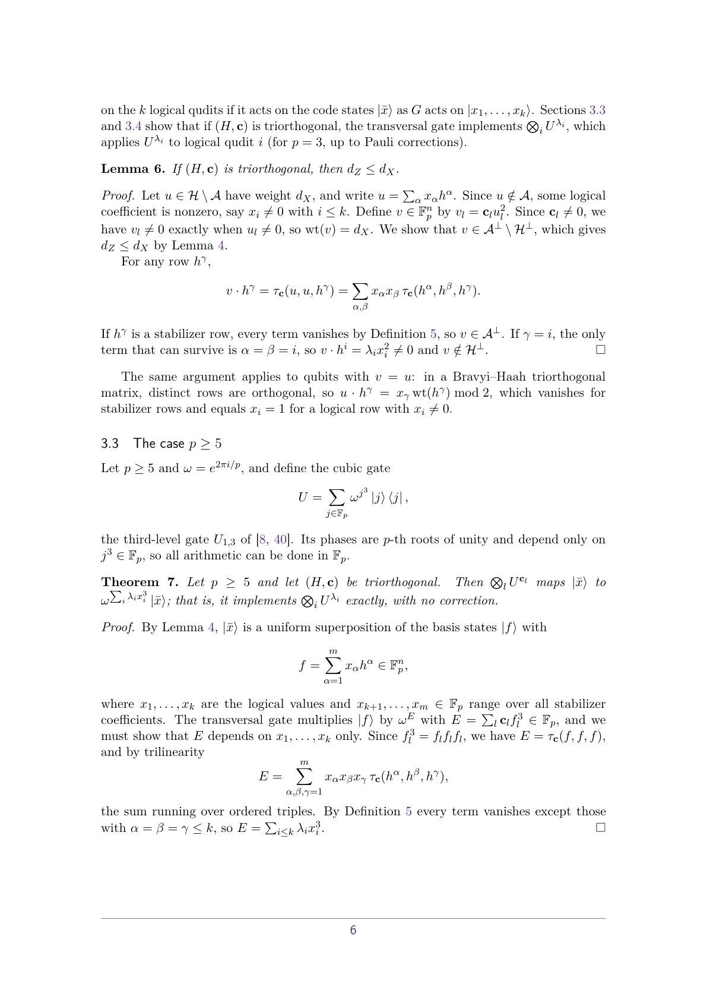 
Low-resolution page preview, page 6

**Summary.** This paper develops the theory of cyclic triorthogonal codes in prime dimensions, linking algebraic code properties to the physical requirement of implementing non-Clifford quantum gates. By establishing precise conditions and finding new code families, it significantly advances the theoretical understanding of quantum error correction for qudits.

**Why it may be interesting.** The rigorous mathematical characterization of codes that support specific non-Clifford gates is fundamental for building fault-tolerant quantum computation architectures, directly impacting the feasibility of quantum computation.

Detailed structure

**Main problem.** The paper studies the construction and characterization of cyclic triorthogonal codes in prime dimensions, which are crucial for implementing logical non-Clifford gates in quantum error correction.

**Main result.** The authors provide a complete description of triply-even cyclic codes for qubits and discover new, high-performing code families for qudits, improving upon existing bounds.

**Method.** The analysis relies on translating the physical requirement of gate implementation into algebraic conditions on the spectral support of cyclic codes, leading to exhaustive searches and theoretical proofs.

**Model / system.** The context is quantum error correction using qudits (dimension $p$) and qubits ($p=2$). The codes are cyclic and are designed to support transversal third-level diagonal gates acting as logical non-Clifford gates.

**Key observables.** Code parameters $[[n, k, d]]$, overhead exponent, and distillation threshold.

**Important parameters / regimes.** Prime dimension $p$, code length $n$, and the spectral support $S$ of the code.

**Assumptions / limitations.** For odd $p$, the definition of triorthogonality used does not require self-orthogonality, simplifying the search space.

**Figures summary.** The notes indicate the presence of large tables summarizing the 'Best code at each length' for qubits, qutrits, and ququints, detailing the achievable distance $d$ for various lengths $n$.

**Paper structure.** The paper progresses from defining the problem (triorthogonality and gate implementation) to deriving spectral criteria, proving results for qubits, and finally presenting extensive tables summarizing the best known codes for various dimensions.

Abstract

We study cyclic triorthogonal codes in prime dimension $p$, on which a transversal third-level diagonal gate acts as a logical non-Clifford gate. For odd $p$, we use a definition of triorthogonality that does not require self-orthogonality. For cyclic codes of length coprime to $p$, triorthogonality reduces to a sumset condition on the spectral support, which makes exhaustive search feasible: for two natural constructions, we enumerate all maximal codes of this kind for $p=3$ up to length $121$ and $p=5,7$ up to length $96$. For qubits, we prove that a cyclic code of odd length is triply even if and only if it is classically triorthogonal, giving a complete description of triply-even cyclic codes, and we determine all such codes up to length $763$. For qudits, we find codes such as $[[19,1,3]]_3$ and $[[7,1,3]]_7$, which improve on the shortest Reed-Muller and Reed-Solomon codes in both overhead exponent and distillation threshold. The latter is the first member of an infinite family of $[[p,1,2\lfloor p/6\rfloor+1]]_p$ codes.

[↑ back to top](#top)

### [Energy-constrained two-way capacity bounds for noisy Gaussian channels](http://arxiv.org/abs/2610.08786v1)

**Authors:** Stefano Pirandola  
**Type:** theory · **Category:** quantum information and computing · **PDF:** <https://arxiv.org/pdf/2610.08786v1>  
**Analysis basis:** full PDF text, analyzed in chunks

📷 Fig 1

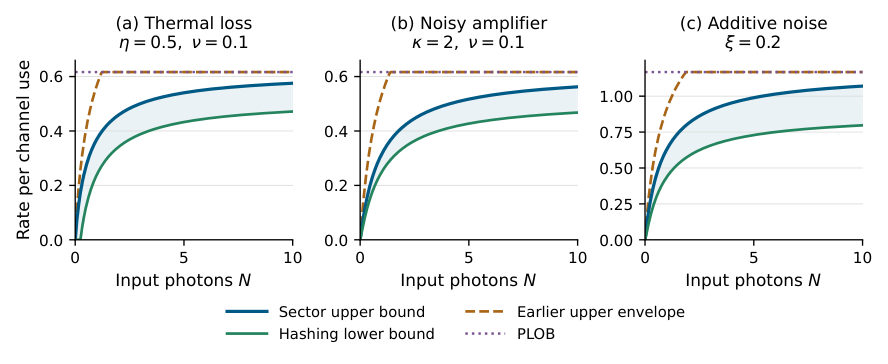 
FIG. 1. Bounds on energy-constrained capacities for (a) thermal loss with η = 1/2, ν = 0.1; (b) noisy amplification with κ = 2, ν = 0.1; and (c) additive noise with ξ = 0.2. The blue solid curve is the sector upper bound, the green solid curve is the hashing lower bound, the orange dashed curve is Uprev of Eq. (24), and the purple dotted line is the energy-independent PLOB bound Φ. Shading marks the gap between the displayed achievable rate and sector bound. The envelope and PLOB curves coincide where PLOB is the smallest of the three earlier bounds.

**Summary.** This paper derives a unified, energy-constrained weak-converse bound for two-way quantum communication over noisy bosonic Gaussian channels. It establishes a common benchmark capacity $F(N)$ that applies across thermal loss, noisy amplification, and additive noise models. The result is significant because it quantifies the fundamental limits of quantum information transfer under realistic energy restrictions.

**Why it may be interesting.** This work provides rigorous, energy-dependent capacity theorems for Gaussian channels, which are fundamental models in quantum optics and quantum communication, directly impacting the theoretical limits of quantum networking.

Detailed structure

**Main problem.** The paper addresses the persistent gap between achievable rates and converse bounds for two-way quantum communication in the presence of energy constraints and excess noise.

**Main result.** A unified, adaptive weak-converse bound, $F_{	au,v}(N)$, is derived for noisy bosonic Gaussian channels, providing a common energy-dependent benchmark that improves upon existing bounds in relevant regimes.

**Method.** The authors employ advanced information-theoretic techniques, including deriving central and adaptive bounds using regularized relative entropy of entanglement (REE) and asymptotic analysis.

**Model / system.** The study focuses on bosonic communication channels, specifically modeling three types of noise: thermal attenuation, noisy amplification, and additive Gaussian noise.

**Key observables.** Quantum transmission capacity ($Q_2$), entanglement distribution capacity ($D_2$), private classical capacity ($P_2$), and secret-key capacity ($K_2$).

**Important parameters / regimes.** Unconditional mean transmitted-photon-number constraint ($N$), channel parameters ($	au, v, 
u$), and the energy constraint itself.

**Assumptions / limitations.** The analysis assumes local preparations and public randomness, and the derived bounds apply to arbitrary adaptive protocols with quantum memories.

**Figures summary.** Figure 1 illustrates the derived bounds for the three channel types (Thermal loss, Noisy amplifier, Additive noise), comparing the sector upper bound, hashing lower bound, and the PLOB bound.

**Paper structure.** The paper builds from establishing the core weak-converse bound for the three channel families, then uses asymptotic analysis and the replica method to prove the concavity and structure of the bounding function $F(N)$, culminating in the final comparison with achievable hashing rates.

Abstract

A gap between achievable rates and converse bounds persists for energy-constrained bosonic communication in the presence of excess noise. We derive a unified adaptive weak-converse bound for thermal attenuation, noisy amplification, and additive Gaussian noise under an unconditional mean transmitted-photon-number constraint. The bound applies to arbitrary adaptive protocols with quantum memories and constrains the two-way quantum, entanglement-distribution, private, and secret-key capacities. It vanishes throughout the entanglement-breaking region and approaches the corresponding PLOB bound at infinite energy. At finite energy, it improves the evaluated Gaussian squashed-entanglement and PLOB bounds in relevant parameter regimes, while comparison with hashing rates quantifies the remaining gap to achievability. The result provides a common energy-dependent benchmark for noisy bosonic Gaussian channels and extends finite-energy converse methods beyond the quantum-limited setting.

[↑ back to top](#top)

### [Exact Catalysis Cannot Overcome the Gaussian-Steering Barrier for Remote Wigner Negativity](http://arxiv.org/abs/2610.08509v1)

**Authors:** Sudip Chakrabarty  
**Type:** theory · **Category:** quantum information and computing · **PDF:** <https://arxiv.org/pdf/2610.08509v1>  
**Analysis basis:** full PDF text, analyzed in chunks

📷 Fig 1

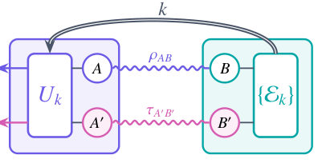 
FIG. 1. The catalytic scenario. Alice and Bob share a strictly un- steerable Gaussian state ρAB and a catalyst τA′B′. Bob applies an arbitrary instrument and sends the outcome k. Alice applies a Gaus- sian unitary that may depend on k. The catalyst must be returned to its initial state. Theorem 4 states that Alice’s output Wk is then Wigner positive.

📷 Fig 2

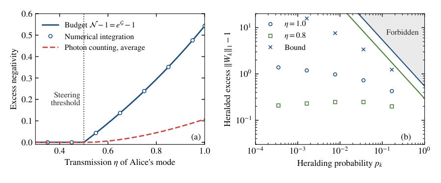 
FIG. 2. Negativity budget for a two-mode squeezed vacuum with r equal to 0.5 and transmission η on Alice’s mode. (a) Excess steered negativity from Eq. (19) (solid line), from numerical integration of Eq. (8) (circles), and the average excess negativity that Bob heralds by photon counting (dashed line). (b) Heralding probability and excess negativity of Alice’s state for Bob’s photon-number outcomes one to six (from right to left). The solid lines are the bound on the right of Eq. (15), and the shaded region is excluded for all measurements when there is no loss. Crosses show the outcome-resolved bound in the middle of Eq. (15) for the lossless case.

**Summary.** This theoretical work establishes that Gaussian steering imposes a fundamental barrier to generating remote Wigner negativity in quantum states. By analyzing the 'steered negativity' resource, the authors prove that neither multiple copies nor catalytic assistance can bypass this limit when Alice is restricted to Gaussian operations. This result constrains the achievable nonclassical correlations in continuous variable quantum information protocols.

**Why it may be interesting.** It provides a fundamental resource theory result for continuous variable quantum information, establishing a hard limit on nonclassical correlations achievable via Gaussian channels, which is crucial for quantum communication protocols.

Detailed structure

**Main problem.** The paper investigates whether additional quantum resources, such as multiple copies, ancillas, or catalysts, can overcome the fundamental limitation imposed by Gaussian steering when attempting to generate remote Wigner negativity.

**Main result.** Gaussian steering remains a strict barrier to achieving remote Wigner negativity, even when utilizing catalysts or multiple copies, provided the catalyst is returned exactly.

**Method.** The analysis introduces and utilizes the 'steered negativity,' a multiplicative monotone, and employs rigorous mathematical proofs based on the properties of the Wigner function and trace norms for Gaussian states.

**Model / system.** The study concerns bipartite quantum states $\rho_{AB}$ shared between Alice and Bob, restricted to one-sided Gaussian protocols where Alice's operations are Gaussian.

**Key observables.** Wigner Negativity, Steered Negativity ($N(\rho_{AB})$), and Gaussian Steerability ($G_{A\to B}(\rho_{AB})$).

**Important parameters / regimes.** The restriction to Gaussian operations, the requirement of exact catalyst return, and the initial degree of unsteerability of the state.

**Assumptions / limitations.** Alice is restricted to Gaussian operations; the analysis focuses on one-sided Gaussian protocols; the catalyst must be returned exactly.

**Figures summary.** Figure 2 compares the theoretical bound (steered negativity) against numerical integration and photon counting, showing the bound is not attained by simple counting.

**Paper structure.** The paper builds from defining the steered negativity as a bound on negativity, proving its multiplicative properties, and then using these properties to rule out activation by copies or catalysts, culminating in the proof that Gaussian steering is an insurmountable barrier.

Abstract

Gaussian steering sets a sharp threshold for creating Wigner negativity at a distance. A measurement by Bob can make Alice's part of a shared Gaussian state Wigner negative only if Alice can steer him with Gaussian measurements. We ask whether multiple copies, ancillas, or catalysts can lift this requirement when Alice is restricted to Gaussian operations. We introduce the steered negativity, a multiplicative monotone whose logarithm equals the Gaussian steerability for Gaussian states. It bounds the negativity that Bob can herald and rules out activation by copies, by ancillas of Bob, and by catalysts without remote negativity of their own. For a strictly unsteerable Gaussian state and a single round of feed-forward to a Gaussian unitary of Alice, we further prove that even a Wigner-negative or steerable catalyst cannot help if it is returned exactly. Gaussian steering thus remains a barrier to remote Wigner negativity beyond the single-copy setting.

[↑ back to top](#top)

### [Generalised entanglement wedges in three dimensions](http://arxiv.org/abs/2610.07176v1)

**Authors:** Abhisek Sahu  
**Type:** theory · **Category:** other · **PDF:** <https://arxiv.org/pdf/2610.07176v1>  
**Analysis basis:** full PDF text, analyzed in chunks

📷 Fig 1

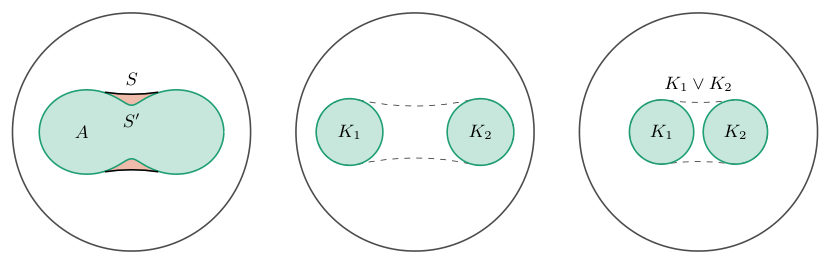 
FIG. 1. Examples for the characterization theorem. Shaded regions are the candidate wedges, and dashed curves are convex hulls. (a) A nonconvex region A. Each boundary arc S′ can be replaced by the geodesic segment S with the same endpoints. Adding the region between them yields a larger region with smaller perimeter, so A is not a generalized entanglement wedge. (b) Two convex regions far apart. The hull of K1 ∪K2 has a larger perimeter than K1 and K2 together, so K1 ∪K2 is a generalized entanglement wedge and K1 ∨K2 = K1 ∪K2. (c) Two convex regions close together. The hull has a smaller perimeter than K1 and K2 together, so K1 ∪K2 is not a generalized entanglement wedge. Its generalized...

📷 Fig 2

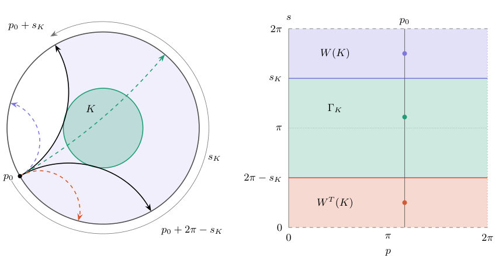 
FIG. 2. A convex region and its kinematic space. Left: the region K is a circular region centred in the hyperbolic disk. From a boundary point p0, the two solid black arrows represent oriented geodesics tangent to K. The entanglement wedge corresponding to a geodesic lies on its anti-clockwise side. The upper black geodesic bounds the grey shaded wedge w(p0, p0+sK), the smallest wedge from p0 that contains K. The dashed geodesics are samples. The green geodesic cuts K, the entanglement wedge bounded by the purple geodesic includes K, where as the same for the orange geodesic does not contain K. Right: Kinematic space in the coordinates (p, s), with s = q −p. Since K is centred, the critical...

📷 Fig 3

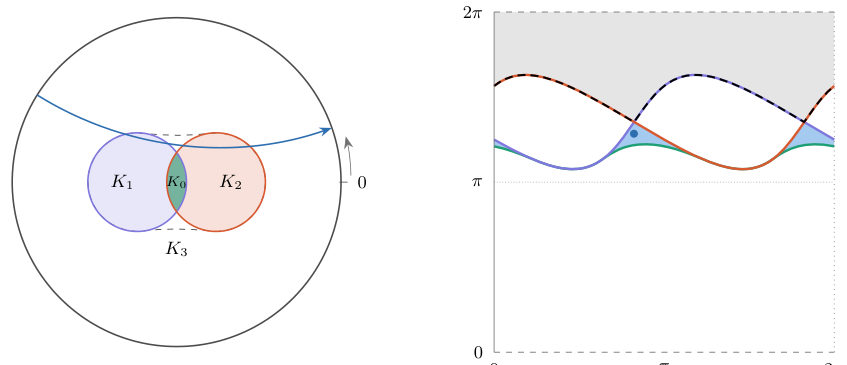 
FIG. 3. Strong subadditivity for two overlapping connected wedges. Left: the wedges K1 and K2, their meet K0 = K1 ∩K2 and their join K3, the convex hull of K1 ∪K2 (dashed). The boundary point p = 0 is marked, and p increases counterclockwise. The geodesic shown cuts K1 and K2 but misses K0. Right: the critical angles sKi(p). Each wedge set W(Ki) lies above its curve. W(K3) = W(K1) ∩W(K2) (shaded) lies above sK3 = max(sK1, sK2). The configuration is symmetric under rotation by π, so sK2(p) = sK1(p + π). The difference set Di is the band between sK0 and sKi. Their overlap D1 ∩D2, whose measure is the strong subadditivity surplus in Eq. (32) is shaded in blue. The blue geodesic on the left is...

**Summary.** This theoretical paper explores the origin of entanglement properties in generalized entanglement wedges (GWs) within the context of AdS/CFT. By using integral geometry in AdS$_3$, the authors demonstrate that the strong subadditivity of GWs is mathematically guaranteed by the strong subadditivity of the boundary CFT entropy. This reinforces the idea that bulk geometric structures are dictated by the underlying quantum field theory.

**Why it may be interesting.** The connection between bulk geometric properties (GWs) and boundary quantum information properties (CFT entropy) is a cornerstone of modern quantum gravity, providing a concrete realization of the holographic principle.

Detailed structure

**Main problem.** The paper investigates whether the fundamental properties of Generalized Entanglement Wedges (GWs) in general spacetimes, such as strong subadditivity, originate from the structure of the dual Conformal Field Theory (CFT) in the AdS/CFT correspondence.

**Main result.** In vacuum AdS$_3$, the strong subadditivity of GWs is shown to be a direct consequence of the strong subadditivity of the boundary CFT von Neumann entropy, suggesting a deep holographic link.

**Method.** The authors employ integral geometry, specifically the Crofton formula, to relate the perimeter of a bulk region to a measure on the space of geodesics, which is then connected to boundary entanglement entropies.

**Model / system.** The analysis is performed in vacuum Anti-de Sitter spacetime (AdS$_3$) on a static slice, utilizing the AdS/CFT correspondence where the bulk geometry is dual to a 2D CFT on the boundary.

**Key observables.** Generalized Entropy ($S_{	ext{gen}}$), von Neumann entropies of CFT intervals, and the perimeter of the geodesic convex regions.

**Important parameters / regimes.** Leading order in $G$ (Newton's constant), and the geometry of $	ext{AdS}_3$.

**Assumptions / limitations.** The analysis is restricted to vacuum $	ext{AdS}_3$ and assumes the validity of the Crofton formula and the AdS/CFT dictionary for the leading order terms.

**Figures summary.** Figures illustrate the characterization theorem, showing examples of regions that qualify as GWs based on convexity and perimeter relations, and relating bulk regions to the kinematic space $\Gamma$.

**Paper structure.** The paper first establishes the characterization theorem for GWs in $	ext{AdS}_3$, then uses integral geometry to relate bulk perimeters to boundary entropy measures, and finally proves the strong subadditivity of GWs by leveraging the known strong subadditivity of the boundary CFT entropy.

Abstract

Generalized entanglement wedges (GWs), proposed by Bousso and Penington for gravitating regions in general spacetimes, share many properties of ordinary entanglement wedges, including nesting, monotonicity and strong subadditivity of their generalized entropies. In AdS/CFT, the corresponding properties of entanglement wedges are consequences of the structure of the dual CFT. In this paper we ask whether the properties of GWs have a similar origin. We explore this question in vacuum AdS$_3$ at leading order in $G$. We first show that every GW on a static slice is a union of geodesically convex regions. Each such region is an intersection of ordinary entanglement wedges, so every GW is built from unions and intersections of entanglement wedges. We then use the Crofton formula of integral geometry to write the perimeter of a convex region as the measure of the set of geodesics that intersect it. In AdS$_3$ every geodesic is the Ryu--Takayanagi surface of a boundary interval, so this measure can be written in terms of the von Neumann entropies of CFT intervals. Strong subadditivity of the CFT entropy guarantees that the measure is positive. Monotonicity and strong subadditivity of GWs then follow from simple inequalities between sets of geodesics. The strong subadditivity of GWs is therefore a direct consequence of strong subadditivity on the boundary. Our results further suggest that GWs correspond to subsystems of the CFT that are more general than boundary subregions.

[↑ back to top](#top)

### [Gradual Localization of Itinerant Cobalt 3d Electrons in the Pyrochlore Ferromagnetic Metal LuInCo4](http://arxiv.org/abs/2610.08266v1)

**Authors:** Taiki Shiotani, Subaru Yoshimoto, Yoshikazu Tabata, Yusuke Nambu, Katsuki Kinjo, Kazuhiro Nawa, Taku J. Sato, Takeshi Waki, Hiroyuki Nakamura  
**Type:** experiment · **Category:** strongly correlated electrons · **PDF:** <https://arxiv.org/pdf/2610.08266v1>  
**Analysis basis:** full PDF text, analyzed in chunks

📷 Fig 1

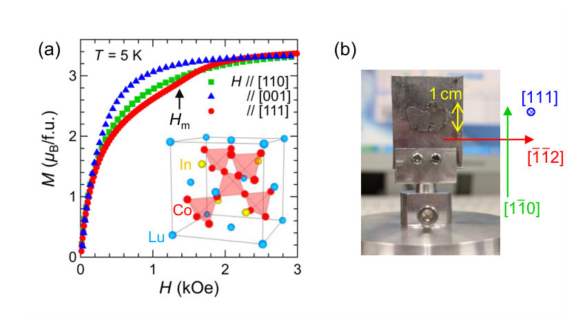 
FIG. 1: (a) Magnetic-field dependence of the magnetization at T = 5 K [22]. The inset

📷 Fig 2

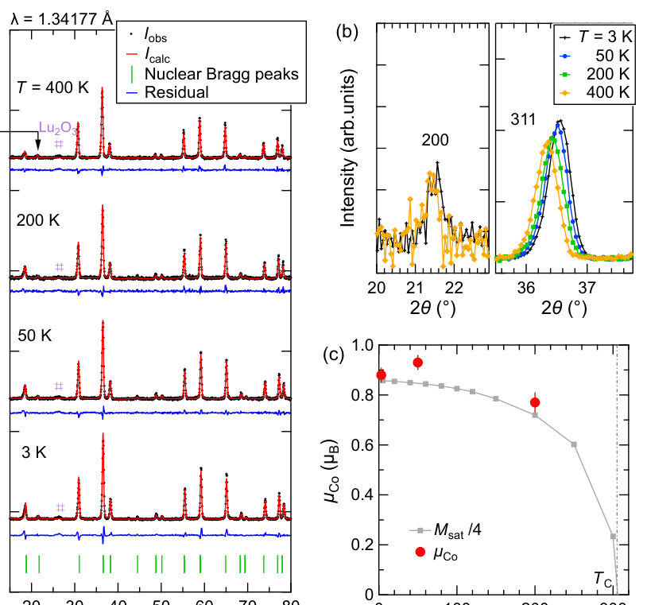 
FIG. 2: (a) Powder neutron diffraction profiles of LuInCo4 at different temperatures. The

📷 Fig 3

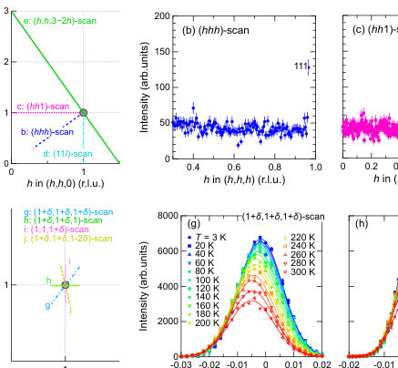 
FIG. 3: (a), (f) Scan directions in the (hhl) scattering plane for the profiles shown in

📷 Fig 4

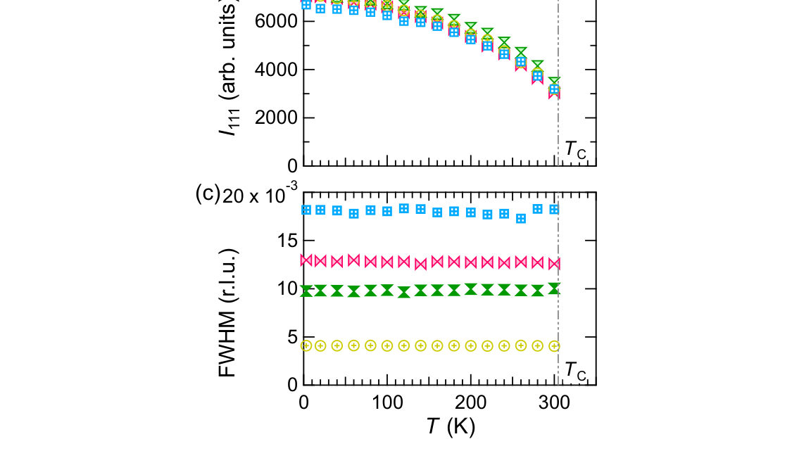 
FIG. 4: Temperature dependence of the peak position δ∗(a), peak height I111 (b), and

📷 Fig 5

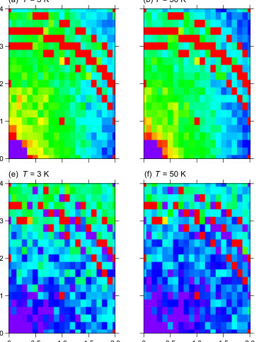 
FIG. 5: (a)–(d) Scattering intensity maps in the (hhl) scattering plane at different

**Summary.** This work uses neutron diffraction on LuInCo4 to characterize its magnetic state, confirming a collinear ferromagnetism. Key findings include evidence for a gradual localization of Co-3d electrons upon cooling, which the authors propose enhances the residual ferromagnetic instability. This mechanism is suggested to explain the unusual, anisotropic metamagnetic transition observed at low temperatures.

**Why it may be interesting.** The concept of electron localization driving a magnetic transition is central to strongly correlated electron physics, providing a concrete experimental platform to test theories of itinerant magnetism beyond simple mean-field models.

Detailed structure

**Main problem.** The study investigates the microscopic magnetic state and the origin of the low-temperature metamagnetic transition in the itinerant-electron ferromagnet LuInCo4.

**Main result.** The magnetic structure is confirmed to be a collinear ferromagnet, and the metamagnetic transition is proposed to arise from a ferromagnetic instability enhanced by the gradual localization of itinerant Co-3d electrons.

**Method.** The research employed powder and single-crystal neutron diffraction measurements, supplemented by analysis of diffuse magnetic scattering intensity evolution.

**Model / system.** The physical system is LuInCo4, a cobalt-based metallic pyrochlore compound exhibiting itinerant-electron ferromagnetism. The focus is on the interplay between electron localization and magnetic ordering in this lattice structure.

**Key observables.** Ordered Co magnetic moment ($\mu_{	ext{Co}}$), diffuse magnetic scattering intensity evolution, and the critical field ($H_m$) dependence on temperature and field direction.

**Important parameters / regimes.** The ordered moment is found to be around $0.9 \ \mu_{	ext{B}}$ at zero field, and the metamagnetic transition is observed below 100 K.

**Assumptions / limitations.** The analysis assumes that the observed diffuse scattering broadening is indicative of a gradual localization of the Co-3d electron character, which enhances the magnetic instability.

**Figures summary.** Figures show PND profiles confirming a $\mathbf{q}=0$ collinear ferromagnetism, while diffuse scattering maps illustrate the temperature-dependent broadening of intensity towards higher q-space regions.

**Paper structure.** The paper proceeds by first establishing the basic magnetic structure using zero-field neutron diffraction, then analyzing the temperature dependence of the magnetic moments and diffuse scattering to pinpoint the mechanism (electron localization), and finally connecting this mechanism to the anomalous metamagnetic transition.

Abstract

We investigated the microscopic magnetic state of the itinerant-electron ferromagnet LuInCo4 with a cobalt pyrochlore lattice by means of powder and single-crystal neutron diffraction measurements. The powder neutron diffraction profiles at zero field are well described by a simple q = 0 collinear ferromagnetic structure with an ordered Co moment of 0.9 uB. Single-crystal neutron diffraction experiments further suggest the absence of both antiferromagnetic order and long-period helical magnetic modulation. In addition, diffuse magnetic scattering was observed around q = 0, with its intensity distribution gradually broadened in reciprocal space upon cooling. Based on these observations, we propose a possible microscopic origin of the low-temperature metamagnetic transition in terms of a ferromagnetic instability enhanced by gradual localization of the itinerant Co-3d electrons. These results suggest that LuInCo4 provides a model system for investigating the interplay between electron localization and itinerant-electron ferromagnetism in cobalt-based metallic pyrochlore compounds.

[↑ back to top](#top)

### [Neural networks as decision trees: an analytical solution for learning and neural selectivity](http://arxiv.org/abs/2610.08228v1)

**Authors:** Hugo Tissot, Jonas Ranft, Yves Boubenec  
**Type:** theory · **Category:** disordered systems and neural networks · **PDF:** <https://arxiv.org/pdf/2610.08228v1>  
**Analysis basis:** full PDF text, analyzed in chunks

📷 Fig 1

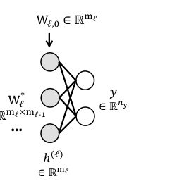 
Fig. 1. Schematic of the feedforward model analyzed in this section

📷 Fig 2

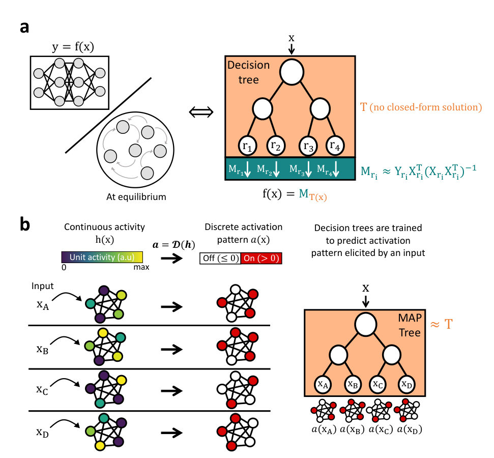 
Fig. 2. Tree representation of piecewise-linear neural computations. a, A piecewise-linear feedfor- ward network, or a recurrent network evaluated at equilibrium (see below), can be decomposed into a routing function T(x) that assigns each input x to an activation region r, followed by the corresponding regional affine transformation Mr. Although the routing function has no general closed-form expression, the regional transformation approaches the local least-squares solution YrXT r (XrXT r )−1 in the low-error regime. b, Nu- merical approximation of the routing function. A discretization function D converts continuous activity h(x) into a binary pattern a(x) indicating whether the...

📷 Fig 3

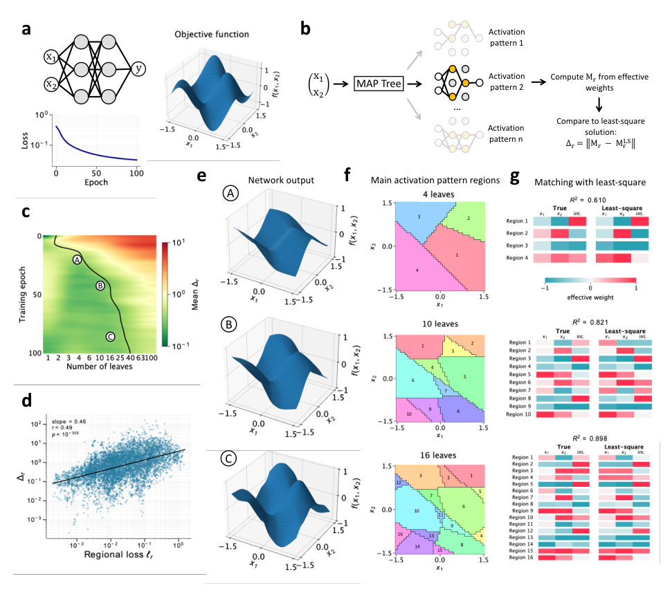 
Fig. 3. Convergence of regional transformations toward least-squares solutions in a feedforward network. a, Feedforward network trained to approximate a nonlinear two-dimensional target function; the training loss decreases over epochs. b, Analysis procedure. At each training stage, a MAP tree predicts the activation pattern from (x1, x2) and partitions the input space into regions. For each region r, the affine transformation Mr is computed from the network’s effective weights and compared with the regional least- squares solution M LS r through the magnitude of the deviation, ∥∆r∥= ∥Mr −M LS r ∥. c, Mean regional deviation magnitude ∥∆r∥as a function of training epoch and number of...

📷 Fig 4

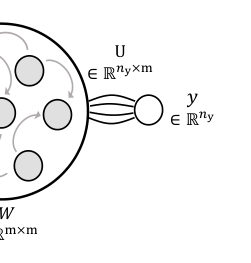 
Fig. 4. Schematic of the recurrent model analyzed in this section

📷 Fig 5

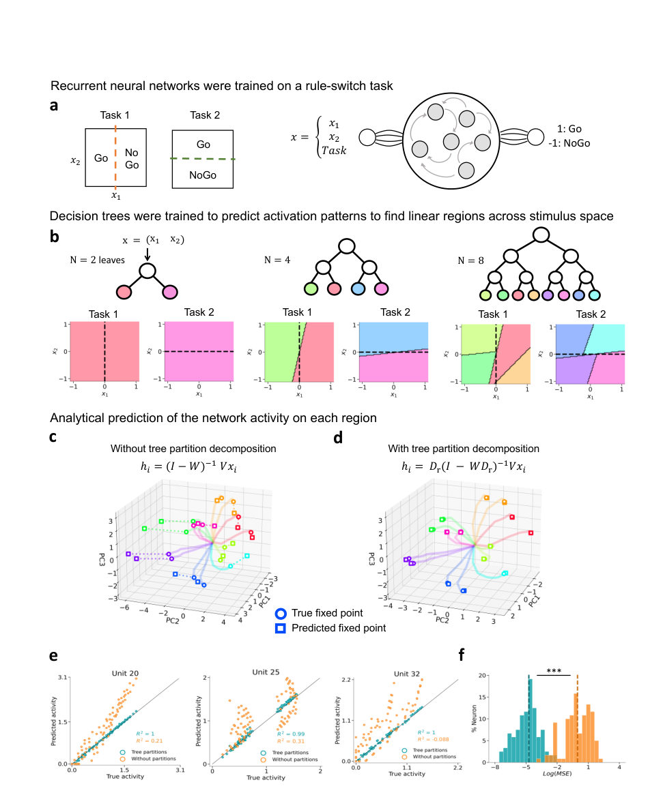 
Fig. 5. Activation-region decomposition predicts equilibrium activity in recurrent neural net- works. (Caption on next page.)

**Summary.** This paper provides an analytical framework showing that nonlinear neural networks effectively decompose the task they learn into a set of local, piecewise linear regressions defined over distinct activation regions. This structure is mathematically equivalent to a decision tree, suggesting that network selectivity is organized modularly based on these regions. The work establishes activation regions as a unifying concept for understanding network computation.

**Why it may be interesting.** The explicit mathematical link between optimization principles (least-squares) and the structural organization (decision trees) of high-dimensional representations is relevant for understanding how complex physical systems, including quantum information processing, might naturally organize their computational subspaces.

Detailed structure

**Main problem.** The paper aims to understand how the geometry of internal representations in nonlinear neural networks is determined by the specific tasks they are learning.

**Main result.** The network's computation decomposes into a piecewise least-squares structure across distinct activation regions, which can be interpreted as a decision tree.

**Method.** An analytical framework is developed for gradient-aligned learning in piecewise-linear networks, deriving stationarity conditions based on regional gradient contributions.

**Model / system.** The model analyzed is a piecewise-linear feedforward and recurrent neural network, whose activity is partitioned into 'activation regions' ($S_r$) defined by the fixed pattern of active/inactive hidden units.

**Key observables.** Activation regions ($S_r$), regional deviation ($\Delta_r$), selectivity geometry ($\Sigma$), and the resulting decision-tree structure.

**Important parameters / regimes.** The per-region training loss ($\ell_r$) and the network's baseline activity level, which regulates representation diversity.

**Assumptions / limitations.** The analysis assumes the existence of a stationary point in gradient-aligned learning and that the regional input data ($X_r$) has full row rank for the least-squares decomposition.

**Figures summary.** Figures illustrate the decomposition into a tree structure (Fig. 2) and show that the network's implemented map converges toward the local least-squares solution as training error decreases (Fig. 3).

**Paper structure.** The paper proceeds by establishing the analytical framework for gradient decomposition, showing the resulting piecewise least-squares approximation, interpreting this structure as a decision tree, and finally validating the prediction of selectivity geometry using task statistics.

Abstract

Nonlinear neural networks develop structured internal representations, yet how their geometry is determined by the tasks being learned remains poorly understood. Here, we develop an analytical framework for piecewise-linear feedforward and recurrent networks that links learning, activation-region structure, and neural selectivity. We show that, at any stationary point of gradient-aligned learning, a nonlinear network decomposes into local linear regressions over its activation regions. Deviations from the corresponding least-squares solutions are jointly constrained by network weights shared across regions and vanish in the low-error regime, yielding an approximate piecewise least-squares decomposition of the task. This structure admits a decision-tree interpretation, which we recover numerically by fitting trees to predict network activation patterns from the input. We further derive how the regions in which neurons are active determine the task statistics they capture, thereby organizing neural selectivity into distinct subpopulations. The resulting predictions closely match the selectivity geometry observed in simulated networks and two empirical neural datasets. Finally, we show that neural baseline regulates activation pattern diversity, placing networks along a continuum between coarse, generalizing representations and fine-grained, expressive representations. Together, these results establish activation regions as a unifying framework for describing how nonlinear networks decompose task structure into local computations and how those computations can be revealed through neural activity.

[↑ back to top](#top)

### [Pauli Decomposition by Character Theory: A Memory-Bounded Algorithm for Qubits and Qudits](http://arxiv.org/abs/2610.08299v1)

**Authors:** Mohammadreza Khellat, Mohammad Masoumi, Saman Nasoori, Soroush Nasoori  
**Type:** theory · **Category:** quantum information and computing · **PDF:** <https://arxiv.org/pdf/2610.08299v1>  
**Analysis basis:** full PDF text, analyzed in chunks

📷 Fig 1

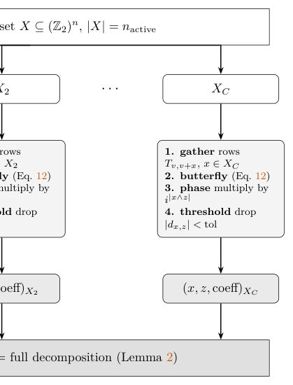 
Figure 1: Chunking as partition-and-stream: the active-row index set X is split into disjoint chunks X1, . . . , XC (Lemma 2), each processed independently into raw (x, z, coefficient) arrays, with no re- combination step — the union across chunks is exactly the unchunked decomposition. Schematic: three representative chunks are drawn, not the true chunk count C for any specific problem size.

📷 Fig 2

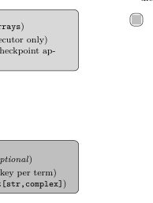 
Figure 2: Dependency structure underlying the Work–Span analysis: per-chunk worker nodes (tier V) are mutually independent (Lemma 2) and run concurrently, but every chunk’s result passes through a single, totally-ordered consumer (tier P) in one process, regardless of which drain mechanism (§6.3) feeds it. That consumer is minimal for parallel decompose arrays itself; the label- and dict-building cost belongs to a separate, optional caller one layer up that this manuscript’s own array-yielding results skip. This asymmetry — many independent V-tier nodes converging on one serial P-tier consumer — is what §6.1 bounds.

📷 Fig 3

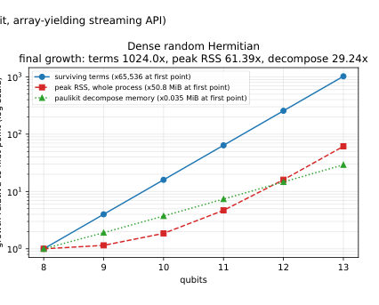 
Figure 3: Surviving term count, whole-process peak resident memory, and paulikit’s own decomposition memory, all normalized to their value at the sweep’s first point and plotted on a shared log scale, so the gap between term-count growth and either memory curve’s growth is directly visible. Left: sparse oscillator family, N = 50, . . . , 300, chunk size fixed at 2 — terms grow 1165×, peak RSS 1.54×, paulikit’s own decomposition memory 3.49×. Right: dense random Hermitian input with assume dense=True, nqubits = 8, . . . , 13 — terms grow 1024×, peak RSS 61.5× (entirely the cost of holding the input matrix itself), while paulikit’s own decomposition memory grows only 29.2× off a sub-megabyte...

📷 Fig 4

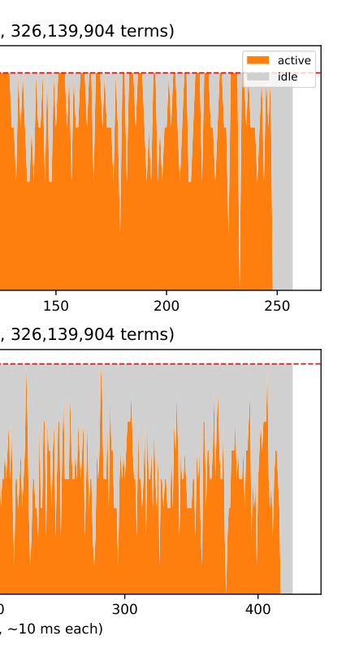 
Figure 4: Active worker-thread count over the course of a full decomposition, sampled at 100 Hz via kernel-level uprobes on the two compiled kernels’ own entry and exit points — a thread counts as active only while genuinely executing inside one of them, not by scheduler state or CPU occupancy, which would not distinguish real work from a migrated-but-idle thread. Top: nworkers = 4, this platform’s physical core count. Bottom: nworkers = 8, its logical/hyperthread count. The dashed line marks nworkers; the shaded band is the gap between active threads and that line at each sampled instant. Captured on Python 3.14: the deposit’s own methodology (§8) has separately measured, on this platform,...

**Summary.** This paper presents a novel, memory-efficient algorithm for performing Pauli decomposition on quantum operators acting on qubits and qudits. By leveraging character theory and the Fast Walsh-Hadamard Transform, the authors achieve a fast computational scaling while crucially avoiding the memory bottleneck associated with storing the full exponential operator matrix. This advancement is vital for implementing large-scale quantum simulations and algorithms.

**Why it may be interesting.** This work provides a highly efficient, mathematically rigorous tool for analyzing quantum circuits and Hamiltonians, which is fundamental for simulating complex quantum dynamics in quantum information and computation.

Detailed structure

**Main problem.** The paper addresses the challenge of efficiently decomposing a general quantum operator into the Pauli string basis, which is crucial for many quantum algorithms.

**Main result.** They developed a fast, memory-bounded algorithm using character theory (or DFT for qudits) to compute the Pauli coefficients, achieving a complexity of O(n 4^n) while avoiding the materialization of the full exponential-sized operator matrix.

**Method.** The core method involves applying Fourier analysis (specifically the Walsh-Hadamard transform for qubits) on an abelian shift-character lattice derived from the Pauli group structure.

**Model / system.** The theory applies to quantum computation involving n qubits (generalizable to qudits) and focuses on decomposing an arbitrary operator T acting on this system.

**Key observables.** The Pauli coefficients $d_{x,z}$ that define the decomposition $T = \sum d_{x,z} P(x, z)$.

**Important parameters / regimes.** The number of qubits/qudits ($n$), the dimension ($p$), and the computational complexity ($O(n 4^n)$).

**Assumptions / limitations.** The method assumes the structure of the Pauli group as a central extension and relies on the mathematical framework of character theory and DFT.

**Figures summary.** Figure 4 illustrates the performance benchmarking, showing active worker-thread count over time for different numbers of workers, comparing achieved speedup against theoretical limits.

**Paper structure.** The paper establishes the scientific problem (Pauli decomposition), develops the mathematical framework using character theory and DFT, presents the efficient algorithm for both qubits and qudits, and concludes with performance benchmarking and generalization discussions.

Abstract

Pauli decomposition underpins Trotterization, phase estimation, sparse-Hamiltonian simulation, and variational observables, at exponential naive cost. From the character theory of $(\mathbb{Z}_2)^n$, characters $χ_z(v)=(-1)^{\langle v,z\rangle}$ are the diagonal Pauli strings, so any diagonal operator is already Pauli-decomposed. A general operator still needs the shifts: each $X^{\otimes x}$ couples to a character $χ_z=Z^{\otimes z}$, and the products $X^{\otimes x}Z^{\otimes z}$ -- up to phases in $\{\pm 1,\pm i\}$ -- form the Pauli group, the central extension of $(\mathbb{Z}_2)^n\times(\mathbb{Z}_2)^n$ by that phase group fixed by the symplectic pairing. A section of that extension remains a choice: the bare products $X^{\otimes x}Z^{\otimes z}$, or the genuine operators that insert $Y=iXZ$ at every qubit where $x$ and $z$ overlap. As Fourier analysis on an abelian shift-character lattice (a natural DFT), this formulation is not qubit-bound: $(\mathbb{Z}_p)^n$ recovers Heisenberg-Weyl qudits. The fast algorithm is the FFT for the group at hand; on $(\mathbb{Z}_2)^n$ that FFT is Walsh-Hadamard, at cost $O(n\cdot 4^n)$. paulikit is a memory-bounded realization of that qubit transform: peak usage need not materialize the dense $2^n\times 2^n$ operator, unlike prior codes whose $O(1)$ extra sits on that buffer, checked beyond a billion oscillator terms against Work-Span and bandwidth ceilings.

[↑ back to top](#top)

### [Pauli Error Composition Determines the Multipartite Advantage in Conference Key Agreement](http://arxiv.org/abs/2610.07251v1)

**Authors:** Ryder Carlson, Lochlan Fitzgerald, Kidus Peter, Wilson Smith  
**Type:** theory · **Category:** quantum information and computing · **PDF:** <https://arxiv.org/pdf/2610.07251v1>  
**Analysis basis:** full PDF text, analyzed in chunks

📷 Fig 1

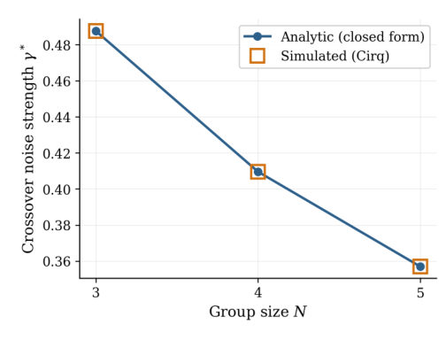 
FIG. 2. Dephasing crossover threshold γ∗versus group size: closed form (line) against independent Cirq simulation (open squares), N = 3...5. The two bisections agree to 2.6 × 10−10, limited by the solver tolerance; the maximum pointwise key- rate discrepancy across 46 noise values and all three group sizes is 1.2 × 10−15.

📷 Fig 2

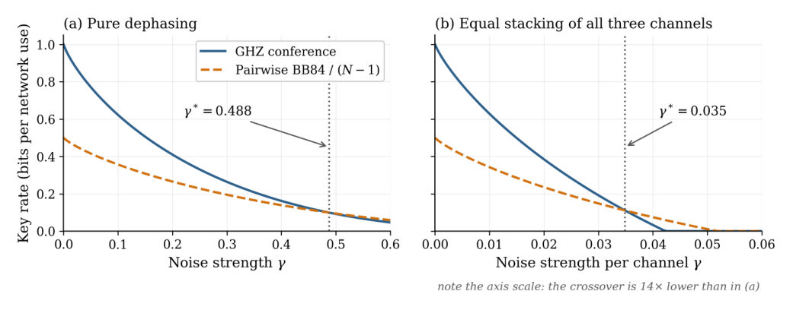 
FIG. 3. The GHZ–pairwise crossover at two noise compositions, N = 3. (a) Pure dephasing: the protocols cross at γ∗= 0.488. (b) Equal stacking of dephasing, amplitude damping, and depolarizing at a common strength: γ∗= 0.035, a factor of 14 lower. Note the tenfold difference in axis scale between panels, although the protocols and resource convention are identical.

📷 Fig 3

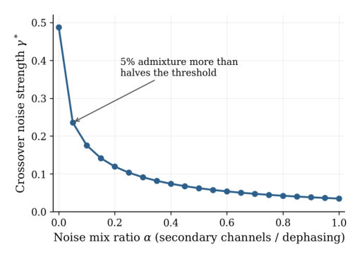 
FIG. 4. Crossover threshold γ∗as bit-flip-type error is ad- mixed into pure dephasing at ratio α (amplitude damping and depolarizing each at strength αγ), N = 3. All points share one parameterization, so thresholds are directly compa- rable. The collapse is front-loaded: 5% admixture more than halves the threshold, because it activates the h(Qz) term that pure dephasing leaves identically zero.

📷 Fig 4

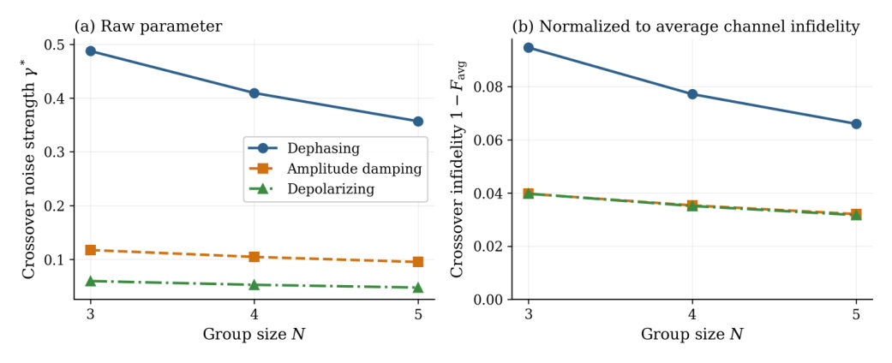 
FIG. 5. Crossover thresholds versus group size for the three channels. (a) Raw parameter γ∗, which is not comparable across channels because Cirq parameterizes each independently. (b) The same thresholds normalized to average channel infidelity 1 −Favg: amplitude damping and depolarizing agree to within 1.2% at every N, while dephasing sits a factor of 2.4 to 2.1 higher. The channel ordering in (a) is an artifact of parameterization; the structure in (b) is physical.

📷 Fig 5

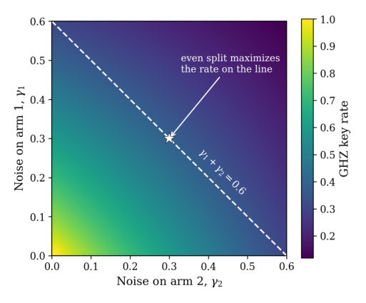 
FIG. 6. GHZ key rate under asymmetric dephasing on arms 1 and 2, with arm 3 noiseless, N = 3. The dashed line marks a fixed total budget γ1+γ2 = 0.6; along it the rate is maximized at the even split (star), the arithmetic–geometric-mean result proved in Section II G, and falls monotonically toward either concentrated end.

**Summary.** This work analyzes the robustness of GHZ-based quantum key distribution against noise, showing the advantage over pairwise methods depends on the underlying Pauli error structure of the noise, not just its strength. Key findings include that noise should be spread evenly across all parties and that the dealer should be the party with the least noisy link. The study provides crucial theoretical bounds but notes that transmission loss remains the most significant physical omission.

**Why it may be interesting.** The finding that the advantage depends on the Pauli error composition rather than the channel type provides a powerful, general structural test for quantum communication protocols, applicable across different physical noise sources.

Detailed structure

**Main problem.** The paper investigates the conditions under which the multipartite advantage of GHZ-based conference key agreement over pairwise BB84 persists when subjected to various types of quantum noise.

**Main result.** The key advantage is determined by the channel's Pauli error composition, not its specific identity, and the rate is maximized by distributing noise evenly or assigning the dealer role to the cleanest party.

**Method.** The authors simulate both protocols exactly for small $N$ under different noise channels and derive closed-form rate expressions for arbitrary Pauli noise.

**Model / system.** The model uses quantum key distribution (QKD) protocols, specifically comparing GHZ-based conference key agreement against pairwise BB84 in a star network topology.

**Key observables.** Asymptotic conference key rates ($r_{GHZ}$) and pairwise key rates, measured via error rates like $Q_x$ (collective X error) and $Q_{1,i}$ (pairwise Z error).

**Important parameters / regimes.** Number of parties ($N=3, 4, 5$), noise types (Dephasing, Depolarizing, Amplitude Damping), and the distribution of a fixed total noise budget.

**Assumptions / limitations.** The analysis assumes independent single-qubit channels on each arm and explicitly omits transmission loss, detector efficiency, and finite-key corrections.

**Figures summary.** Figure 1 illustrates the preparation and distribution of an N-qubit GHZ state, while tables compare key rates under different noise distribution strategies.

**Paper structure.** The paper establishes the theoretical framework by deriving closed-form rates for Pauli noise, compares the GHZ vs. pairwise protocols, analyzes the dependence on noise distribution (even vs. concentrated), and derives structural corollaries regarding the dealer role.

Abstract

GHZ-based conference key agreement distributes a shared key to $N$ parties in one network use, whereas pairwise BB84 needs $N-1$. The survival of that advantage has been studied against party number, loss, and topology, but almost always with the channel fixed at depolarizing. Simulating both protocols exactly for $N = 3, 4, 5$ under dephasing, amplitude damping, and depolarizing noise, we find the crossover is set by the channel's Pauli error composition, not its identity: normalized to average infidelity, amplitude damping and depolarizing agree to within about 1\% at each group size, while dephasing can tolerate roughly $2.4\times$ more at $N = 3$.   We derive a closed-form rate for arbitrary per-party Pauli noise and use it to prove that concentrating a fixed noise budget on one arm is strictly worse than spreading it, and that giving the dealer role to the cleanest arm improves the rate by roughly 18\%. One structural fact drives every result: the phase-error term is a product over all $N$ arms, while the bit-error term stays local to a pair.

[↑ back to top](#top)

### [Pauli Flat Quantum States Mimicking Maximal Magic](http://arxiv.org/abs/2610.07172v1)

**Authors:** Paweł Cieśliński  
**Type:** theory · **Category:** quantum information and computing · **PDF:** <https://arxiv.org/pdf/2610.07172v1>  
**Analysis basis:** full PDF text, analyzed in chunks

📷 Fig 1

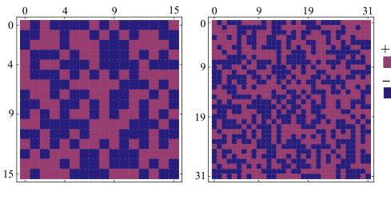 
FIG. 1. Matrix representation of the sign vectors ⃗r for best- found Pauli flat states of N = 4 and N = 5 qubits. Each matrix is constructed by reshaping ⃗r into a 2N dimensional array with rows corresponding to its consecutive 2N-tuples.

📷 Fig 2

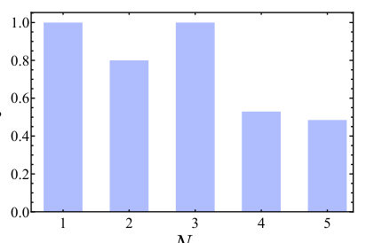 
FIG. 2. Ratio rP for pure states with an approximate Pauli flat state structure of up to five qubits. Top bar values corre- spond to the number of non-zero and equal in absolute value Pauli expectations divided by the number of all non-identity Pauli strings. Due to their definition, all other expectations are strictly 0, and rP has an interpretation of correlation den- sity.

**Summary.** This theoretical paper explores Pauli flat quantum states, which are defined by having equal absolute expectation values across all Pauli operators. The authors demonstrate that these mixed states can mimic the correlation structure of highly magical pure states, providing a new mathematical lens to understand the necessary resources for fault-tolerant quantum computing.

**Why it may be interesting.** The connection drawn between Pauli correlation structures (a mathematical tool) and the resource concept of quantum magic is highly relevant for understanding the boundaries of quantum computation and entanglement detection in many-body quantum systems.

Detailed structure

**Main problem.** The paper investigates the correlation structure of quantum states that maximize quantum magic, focusing on the concept of Pauli flat states.

**Main result.** Mixed Pauli flat states can be constructed for arbitrary number of qubits and have been shown to reproduce the correlation structure of highly magical pure states, suggesting a link between mixed states and quantum resource theory.

**Method.** The authors analyze Pauli expectation values using a witness approach and employ mathematical constructions (including SDP optimization) to determine the existence and properties of these specialized quantum states.

**Model / system.** The system under study is an N-qubit quantum state, $
ho$, analyzed through its expectation values on all Pauli strings. The core focus is on defining and characterizing 'Pauli flat states' based on these expectation values.

**Key observables.** Pauli expectation values ($	ext{Tr}[
ho P_i]$), the non-stabiliserness witness value ($	ext{Tr}(
ho W)$), and the parameter $\gamma$ defining the state structure.

**Important parameters / regimes.** The number of qubits ($N$), the constant absolute value of Pauli expectations ($\gamma$), and the threshold value $2N-1$ for detecting magic.

**Assumptions / limitations.** The analysis relies on defining Pauli flat states by equal absolute Pauli expectations and uses the non-stabiliserness witness to prove the presence of quantum magic.

**Figures summary.** The notes mention figures illustrating sign vectors for $N=4$ and $N=5$, and a table summarizing the best-found values of $\gamma$, Purity, and the non-stabiliserness ratio ($\eta_S$) for small $N$.

**Paper structure.** The paper progresses from defining quantum magic and Pauli flat states, analyzing pure state limitations (especially for $N=2$), developing the mixed state framework, proving existence theorems for mixed states, and concluding with explicit, highly technical derivations of the density matrix elements for $N=4$ and $N=5$.

Abstract

Quantum magic is a necessary resource for fault-tolerant quantum computing, capturing the departure of quantum states from the classically simulable stabiliser set. Motivated by its role in quantum information processing, we investigate the correlation structure of states that maximize the Rényi stabiliser entropies, focusing on the T-type and Hoggar states. Inspired by their distinctive properties, we explore the notion of Pauli flat states, defined as N-qubit states whose expectation values on all Pauli strings are equal in absolute value. These states reproduce the correlation structure of highly magical states, which could also be interpreted as a mixed variant of Pauli covariant N-qubit symmetric informationally complete (SIC) Weyl-Heisenberg fiducial states, while not necessarily possessing nontrivial quantum magic. We investigate their existence and possible constructions, including examples both inside and outside of the stabiliser polytope. To identify the latter, we examine a magic witness tailored to the introduced family of states. Finally, we discuss their entanglement and Bell nonlocality, providing a broader characterization of their quantum properties. For completeness, we find pure states with a relaxed condition on the Pauli expectations, which forces unequal elements to zero, and discuss their non-stabiliserness. Our results offer a new perspective on the relation between quantum magic and Pauli correlation structures. They hold relevance to geometrical approaches to quantum mechanics, entanglement and magic detection, as well as estimation tasks.

[↑ back to top](#top)

### [Quantum Algorithms for Finding Vacua in the ADK Landscape](http://arxiv.org/abs/2610.07439v1)

**Authors:** Shirabe Endo, Yuta Hamada  
**Type:** theory · **Category:** quantum information and computing · **PDF:** <https://arxiv.org/pdf/2610.07439v1>  
**Analysis basis:** full PDF text, analyzed in chunks

📷 Fig 1

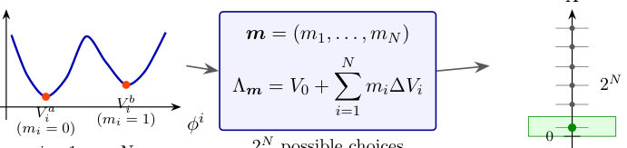 
FIG. 1. Schematic illustration of the ADK landscape. Each field ϕi has two local minima, encoded by a binary variable mi. A bit string m specifies one of the 2N vacua, whose energy is obtained by summing the selected contributions. The shaded band denotes the target range for the cosmological constant.

📷 Fig 2

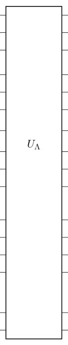 
FIG. 2. The configuration of the registers representing the state |V0, ∆Vi, m, 0⟩on which the oracle UΛ acts.

📷 Fig 3

 
FIG. 3. An example of a quantum adder, where the addition of two binary numbers a2a1 and b2b1 is performed. The circuit acts as |a, b⟩→|a, b + a⟩.

📷 Fig 4

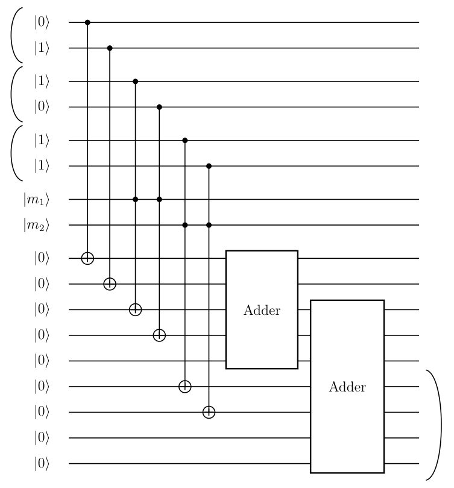 
FIG. 4. Example of the function-value oracle in Eq. (5), implemented using quantum adders (shown as Adder in the figure). The inverse operations that reset the auxiliary registers to |0⟩are omitted from the figure.

📷 Fig 5

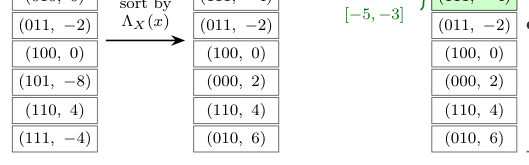 
FIG. 5. Schematic illustration of list construction and binary search (p = 3 example with V0 = 2 and (∆V1, ∆V2, ∆V3) = (−2, 4, −8)). Each cell represents a pair (x, ΛX(x)). (a) Compute ΛX(x) for all elements x ∈X and create a list LX sorted in ascending order of ΛX(x). (b) For a given y, perform a binary search9 in LX to find x such that ΛX(x) is within the interval [−ΛY (y), Λtarget −ΛY (y)]. The figure shows the case of ΛY (y) = 5 and Λtarget = 2. The right vertical lines indicate the search range in each iteration of the binary search, and the black dots represent the middle elements. After three iterations, the element x = 111 (green) that falls within the target interval is found.

**Summary.** This paper develops quantum algorithms to efficiently search the vast space of possible vacuum states in the ADK string theory landscape. By reformulating the search as a collision problem, the authors improve the query complexity from $O(2^{N/2})$ to $O(2^{N/3})$. This demonstrates a quantum advantage over classical methods for finding low-energy vacua.

**Why it may be interesting.** While the physical context is high-energy theory, the core contribution is a rigorous quantum complexity analysis, directly relevant to quantum algorithms for solving hard search problems.

Detailed structure

**Main problem.** The paper addresses the computational challenge of finding a vacuum state with a small cosmological constant within the complex ADK Landscape of string theory.

**Main result.** The authors propose quantum algorithms that achieve a query complexity of $O(2^{N/3})$, significantly improving upon classical meet-in-the-middle approaches ($O^*(2^{N/2})$) for physically relevant parameters.

**Method.** The problem is reformulated as a collision problem, allowing the application of quantum search techniques like the sorted-list algorithm and quantum walks.

**Model / system.** The system is the toy model for the string Landscape (ADK model), where the vacuum energy $\Lambda_m$ is a linear combination of terms determined by $N$ binary choices ($m \in \{0, 1\}^N$).

**Key observables.** The vacuum energy $\Lambda_m$, and the target window defined by $0 \le \Lambda_m \le \Lambda_{	ext{target}}$.

**Important parameters / regimes.** The number of scalar fields ($N$), and the ratio $\Lambda_{	ext{target}}/M^4_{	ext{Pl}}$ (e.g., $10^{-120}$).

**Assumptions / limitations.** The quantum algorithms assume access to Quantum-Accessible Classical Memory (QRACM) and rely on the linearity of the vacuum energy to reduce the search to a collision problem.

**Figures summary.** Figures illustrate the ADK landscape, the state register for the oracle, and the process of the meet-in-the-middle search, comparing complexities for different algorithms.

**Paper structure.** The paper first establishes the physical problem (ADK Landscape search), derives the oracle complexity, compares plain Grover search ($O(2^{N/2})$) to classical methods, and finally develops and analyzes two quantum algorithms achieving $O(2^{N/3})$ complexity.

Abstract

We study quantum algorithms for finding a vacuum with a small cosmological constant in the toy model for string Landscape proposed by Arkani-Hamed, Dimopoulos, and Kachru. First, we construct a function-value oracle and use it for Grover search with query complexity $\mathcal{O}(2^{N/2})$, where $N$ is the number of scalar fields. Then, we point out that, by exploiting the linearity of the vacuum energy, the problem can be reduced to a collision problem between two blocks of the bit string. With this structure, we construct two quantum algorithms with query complexity $\mathcal{O}(2^{N/3})$. Compared with the pseudo-polynomial classical algorithm of Denef and Douglas, the quantum algorithms yield a large reduction in computational cost for the physically motivated parameter values.

[↑ back to top](#top)

### [Quantum Algorithms for Multivariable Polynomial Transformations: From Efficient Synthesis to Quantum Channel Transformations](http://arxiv.org/abs/2610.08714v1)

**Authors:** Zheyu Shen, Yusen Wu, Xiao Yuan, Xiao-Ming Zhang, Yukun Zhang  
**Type:** theory · **Category:** quantum information and computing · **PDF:** <https://arxiv.org/pdf/2610.08714v1>  
**Analysis basis:** full PDF text, analyzed in chunks

📷 Fig 1

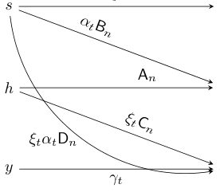 
Figure 1: The three components in Eq. (4.2). The input can remain pending, enter the active sector, or contribute its constant term directly to the output. Active amplitude can be updated or collected; collected amplitude remains there. The three right-hand arrows are sectors of one supplied query, whose full unitary is called unconditionally. The final update MQ has no following query.

📷 Fig 2

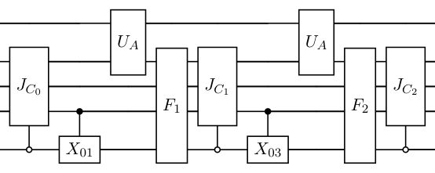 
Figure 2: The complete two-query matrix-gate circuit. The four ancillary bras specify a joint final zero selection; the signal expression is its unnormalized output. The d-controlled transpositions are D0, D1, and the open controls give G0, G1, G2. Both oracle calls act on every failure component. When the Ct are the synthesized target parameters, K2(A) is the corresponding polynomial block. Elementary-gate synthesis adds the phase and clean work qubits counted in Theorem B.1.

📷 Fig 3

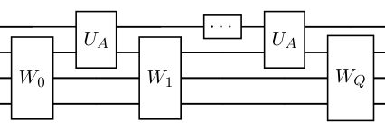 
Figure 3: One query sequence with coherent data endpoints. The known layers Wt act on the oracle, data, and processing registers. The bundled bottom wire contains M, d, E and the phase and clean work bits used in gate synthesis; their widths are given in Proposition E.2. The initial layer encodes an arbitrary supported input label ν &lt; u, and the final layer decodes µ &lt; v. The output range is retained coherently, with every other auxiliary output selected at zero. Only the supplied queries act on the signal.

📷 Fig 4

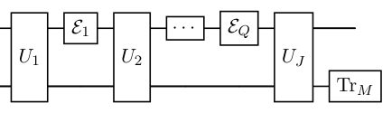 
Figure 4: A channel-only comb. All Uj are known full unitaries computed from the causal Choi matrices. The unknown channels act only on the signal, whereas the controller memory is retained throughout. A probabilistic comb additionally applies the terminal memory instrument before this trace. The diagram counts channel calls; a fully unitary realization of their internal action requires separately supplied Stinespring implementations and fresh environment inputs.

**Summary.** This paper establishes a comprehensive theory for synthesizing quantum circuits implementing multivariable polynomial transformations on noncommuting matrices. It achieves optimal query complexity bounds and extends the methodology to synthesize complex quantum channel transformations. This work positions multivariable approximation as a fundamental language for designing higher-order quantum information processing protocols.

**Why it may be interesting.** It provides a rigorous mathematical framework for designing complex quantum circuits by treating multi-variable polynomial operations as a structured, synthesizable resource, which is crucial for advanced quantum algorithm design.

Detailed structure

**Main problem.** Developing a complete constructive theory for synthesizing multivariable polynomial transformations of noncommuting matrices, and extending this framework to quantum channel transformations.

**Main result.** The authors provide a synthesis procedure achieving optimal query complexity for these transformations and show how this framework can synthesize any jointly contractive family of noncommutative polynomial maps as completely positive quantum operations.

**Method.** The core method involves developing a finite algorithmic Schur–Agler theorem to derive a semidefinite certificate for contractivity, which then dictates the structure of the required quantum query circuit.

**Model / system.** The work focuses on quantum algorithms utilizing polynomial transformations applied to noncommuting matrices and generalized to quantum channels described by Kraus operators and Choi data.

**Key observables.** Query complexity ($O(D/\sqrt{	au})$ or $D$), contractivity certificate, and the resulting quantum channel operations.

**Important parameters / regimes.** Degree $D$, contraction parameter $	au$, and the number of joint accesses.

**Assumptions / limitations.** The synthesis relies on a compact finite-state description of the polynomial and the existence of a joint block access model.

**Figures summary.** The notes mention figures illustrating the interleaved structure of the complete quantum circuit and the definition of the Gram matrices used in the fixed-query criterion.

**Paper structure.** The paper progresses from establishing the lack of a synthesis theory for multivariable transformations to developing the constructive theory using the Schur–Agler theorem, and finally applying this theory to synthesize quantum channel transformations.

Abstract

Polynomial transformations are basic primitives in quantum algorithms: quantum signal processing and singular value transformation compile univariate polynomials into circuits with query complexity essentially set by degree. Multivariable transformations of noncommuting matrices, however, lack a comparable synthesis theory. We develop a complete constructive theory under joint block access for all polynomials contractive on the prescribed matrix domain. Given a compact finite-state description of a degree-$D$ polynomial $P$ and $0<τ<1$, we synthesize $P$ with $(1+τ)$-optimal normalization using $O(D/\sqrtτ)$ queries, and exactly $D$ under row-block access, matching a degree lower bound. The complete circuit realization is classically computable in polynomial time with polylogarithmic dependence on accuracy. The key to our construction is a finite algorithmic Schur--Agler theorem: the coefficient recurrence defines a polynomial-dimensional continuation space supporting a complete semidefinite certificate for contractivity on the prescribed domain. Factoring this certificate yields the contractive realization underlying the query algorithm.   Beyond matrix transformations, our framework lifts multivariable polynomial synthesis to quantum channel transformations. Given coherent Kraus access $K=\{K_a\}_a$, we synthesize any finite jointly contractive family of noncommutative polynomial maps $K\mapsto\{F_b(K)\}_b$ as completely positive operations, allowing coherent interference among Kraus histories. Furthermore, channel-level transformations specified by causal Choi data can be synthesized explicitly as fixed-order quantum combs. Collectively, these results point to a broader program: multivariable approximation as a language for multi-operator quantum algorithms and higher-order quantum information processing.

[↑ back to top](#top)

### [Replica Fragmentation and Glassy Dynamics in Parity Learning](http://arxiv.org/abs/2610.08503v1)

**Authors:** Han Ma  
**Type:** theory · **Category:** disordered systems and neural networks · **PDF:** <https://arxiv.org/pdf/2610.08503v1>  
**Analysis basis:** full PDF text, analyzed in chunks

📷 Fig 1

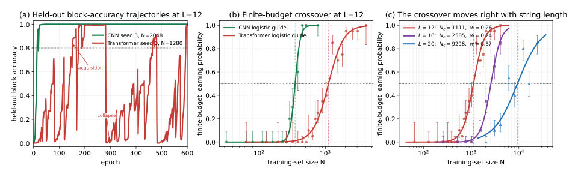 
Figure 1: Generalization with independently sampled fixed training sets. For each training-set size N, every run samples its own training set from the domain-wall distribution and holds it fixed throughout training. (a) Representative held-out block-accuracy trajectories for a CNN at N = 2048 and a Transformer at N = 1280. The CNN improves progressively and remains accurate, whereas the Transformer learns abruptly, later loses accuracy, and then recovers. (b) Fraction of runs that reach Ablock ≥0.8 within 120 epochs, plotted against N. Points show the measured fractions with binomial confidence intervals. Curves are the descriptive binomial-logistic fits in Eq. (16). (c) The same...

📷 Fig 2

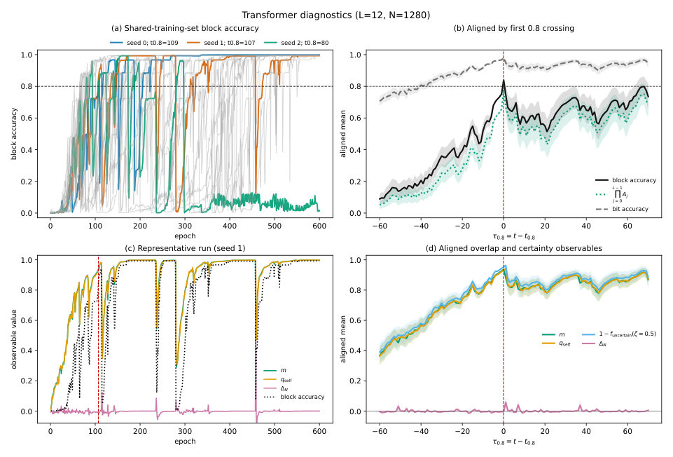 
Figure 2: Shared-training-set diagnostics over 600 epochs for L = 12, N = 1280 Transformer runs. The ensemble has 16 runs. The replicas share one fixed training set of 1280 configurations sampled independently from the domain-wall distribution and are evaluated on the complete set of 2048 domain-wall configurations. Only initialization and minibatch order vary. (a) All block-accuracy trajectories, with the pre-specified random seeds 0, 1, and 2 highlighted and the other 13 shown in gray. Every run undergoes multiple threshold crossings and a post-crossing retreat below 0.5. (b) Ensemble means after alignment by the first Ablock ≥0.8 crossing. Abit and Q j Aj rise before the block-accuracy...

📷 Fig 3

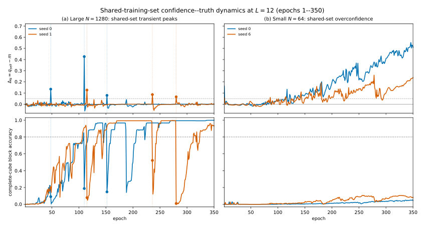 
Figure 3: Nishimori-gap dynamics evaluated on all 2048 domain-wall configurations at L = 12 over epochs 1–350. Left column: the N = 1280 runs with seeds 0 and 1, trained on the fixed training set shared by all 16 replicas in Fig. 2. Dots mark local maxima of ∆N = qself −m above 0.05, and vertical lines locate the same epochs in block accuracy. Right column: two independently initialized N = 64 runs trained on the same fixed training set; positive ∆N persists while block accuracy remains low.

📷 Fig 4

 
Figure 4: Position-resolved retreat and recovery in the 16-replica shared-training-set ensemble. The eight replicas that first reach Ablock ≥0.8 and later retreat below 0.5 are aligned at the first such retreat. (a) Individual and mean block accuracy. (b) The group frontiers j⋆ m and j⋆ q with the individual truth frontiers j⋆ m,r as faint curves. (c) and (d) Group profiles m(j, τ) and qself(j, τ), both on a color scale running from 0 to 1. White curves are the corresponding half-height frontiers, and the dashed vertical line in every panel marks the retreat alignment point τ = 0. Frontiers are located by linear interpolation between neighbouring positions. A profile entirely below one half...

📷 Fig 5

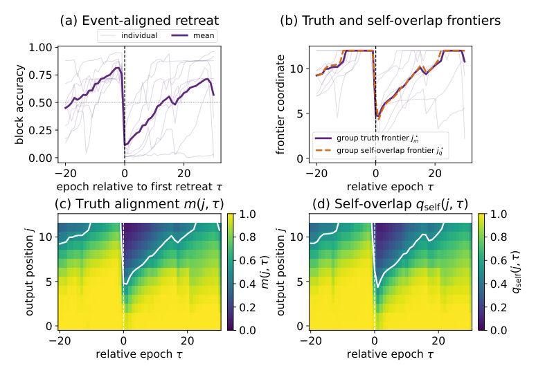 
Fig. 4 shows that the loss and recovery of global truth alignment are spatially nonuniform. The profile in panel (c) shows that at retreat truth alignment is lost first at larger j, while smaller-j outputs remain aligned. In panel (b), at the onset of retreat, j⋆ q exceeds j⋆ m: predictions remain confident at some larger-j positions after losing truth alignment. Immediately afterward, j⋆ q falls below j⋆ m while j⋆ m stays nearly fixed. Between τ = 0 and τ = 1 the self-overlap frontier drops from 6.2 to 4.3 and the truth frontier moves only from 4.8 to 4.7. Both frontiers then turn upward at the same epoch and advance in step. Truth alignment therefore returns at progressively later output...

**Summary.** This work applies concepts from spin-glass theory to analyze how independently trained neural networks learn complex functions, specifically binary string reconstruction. By measuring replica overlaps and defining gaps, the authors distinguish between distinct learning states like 'memorization' and 'retreat.' This provides a theoretical understanding of generalization failure in deep learning models using tools from condensed matter physics.

**Why it may be interesting.** The application of spin-glass concepts (replica overlaps, glassy dynamics) to the generalization failure of deep learning models provides a powerful theoretical framework for understanding complex, non-equilibrium learning processes.

Detailed structure

**Main problem.** The paper investigates the dynamics of independently trained Transformer neural networks reconstructing a binary string from local domain walls, characterizing the resulting ensemble of learned functions.

**Main result.** The self–cross gap ($\chi_{SG}$) successfully distinguishes three distinct learning regimes: memorization, retreat, and recovery, revealing differences in residual correlations between these states.

**Method.** The analysis uses statistical physics tools, calculating overlaps ($m, q_{	ext{self}}, q_{	ext{cross}}$) and gaps ($\chi_{SG}$) across different learning protocols and data sizes.

**Model / system.** The model is a Transformer network trained on a binary string reconstruction task defined by parity constraints, treated as an ensemble of 'replicas' whose behavior is analyzed using concepts from spin-glass theory.

**Key observables.** Truth alignment ($m$), self-confidence ($q_{	ext{self}}$), cross-replica agreement ($q_{	ext{cross}}$), and the self–cross gap ($\chi_{SG}$).

**Important parameters / regimes.** Training set size (small vs. large), string length ($L$), and the resulting learning regimes (memorization, retreat, recovery).

**Assumptions / limitations.** The observed regimes are noted to be 'operational and finite-size rather than thermodynamic phases.'

**Figures summary.** Figures illustrate trajectories of block accuracy for CNN vs. Transformer, the crossover of learning probability with data size, and position-resolved residual gaps showing failure peaks.

**Paper structure.** The paper progresses by defining the physical system and observables, establishing the three learning regimes using overlaps, and then providing detailed diagnostics (residual correlations, position-resolved gaps) to distinguish between memorization and retreat dynamics.

Abstract

We study how independently trained Transformer neural networks reconstruct a binary string from its local domain walls. Runs sharing the data and training protocol can realize different functions. We treat them as replicas and measure truth alignment $m$, prediction confidence $q_{\mathrm{self}}$, and cross-replica agreement $q_{\mathrm{cross}}$. Confident disagreement defines the finite-size replica fragmentation that we call glass-like. With small training sets, replicas predict all training examples correctly but remain confident in incorrect predictions for unseen inputs, a regime we call memorization. With larger sets, runs can generalize and then retreat. Retreat occurs when outputs start to deviate from truth while confidence remains high. The frontier between learned and unlearned outputs recedes toward shorter strings. Many later recover as the frontier advances again. The self--cross gap $q_{\mathrm{self}}-q_{\mathrm{cross}}$ clearly distinguishes the three learning regimes of memorization, retreat, and recovery. With overall and position-dependent truth alignment subtracted, their residual correlations also differ: memorizing replicas have weakly and uniformly correlated residuals, while retreat has the largest fraction of replica pairs whose residuals are anti-correlated. That is, on the inputs where one replica of such a pair does better than its average, the other tends to do worse. These finite-size observations distinguish persistent memorization from ongoing retreat--recovery dynamics. The thermodynamic and long-time limits, and extensions to other learning tasks, remain open.

[↑ back to top](#top)

### [Resource-Aware Grover Search for Minimum Vertex Cover](http://arxiv.org/abs/2610.07252v1)

**Authors:** Beilei Jiang, Harry Fu, Pavan Krishna Yarlagadda, Alexander Shan, Yunhe Feng, Song Fu  
**Type:** theory · **Category:** quantum information and computing · **PDF:** <https://arxiv.org/pdf/2610.07252v1>  
**Analysis basis:** full PDF text, analyzed in chunks

📷 Fig 1

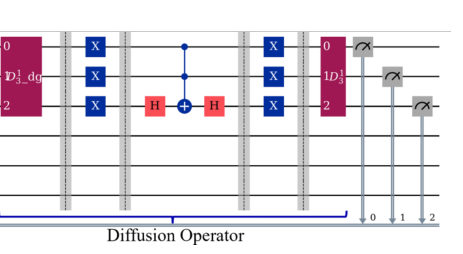 
Fig. 1: Quantum circuit of the proposed Dicke-Parallel Grover search for MVC.

📷 Fig 2

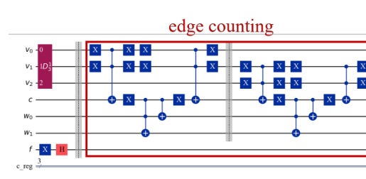 
Fig. 2: Quantum circuit of the proposed Edge-Counting Grover search for MVC.

📷 Fig 3

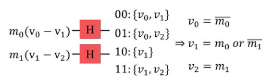 
Fig. 3: Illustration of edge-centric encoding and vertex-state derivation.

📷 Fig 4

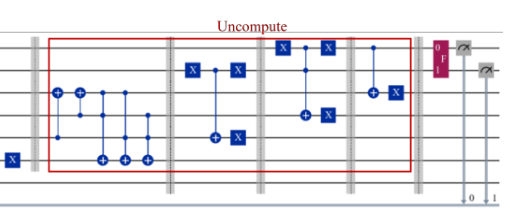 
Fig. 4: Quantum circuit of the proposed Edge-Centric Grover search for MVC.

📷 Fig 5

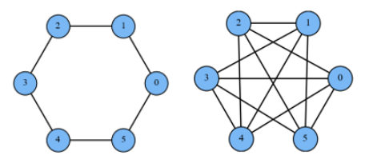 
Fig. 5: Representative graph instances from the sparse and dense benchmark families.

**Summary.** This paper tackles the resource limitations of using Grover's algorithm to solve the NP-hard Minimum Vertex Cover problem. The authors introduce three advanced quantum encoding strategies—Dicke-Parallel, Edge-Counting, and Edge-Centric—to minimize qubit count and circuit depth. By analyzing trade-offs based on graph density, they provide practical guidance for selecting the most hardware-efficient quantum algorithm for this optimization task.

**Why it may be interesting.** While focused on graph theory, the resource analysis provides deep insights into optimizing quantum circuit structure (oracle design) to manage qubit and gate overhead, which is relevant for any complex quantum simulation.

Detailed structure

**Main problem.** The paper addresses the Minimum Vertex Cover (MVC) problem, a fundamental NP-hard combinatorial optimization problem.

**Main result.** The authors propose and analyze three resource-aware Grover-based formulations (Dicke-Parallel, Edge-Counting, Edge-Centric) that offer trade-offs in qubit count, circuit depth, and gate complexity depending on the graph structure.

**Method.** They develop and compare novel quantum encoding and oracle-design strategies to minimize the quantum resource overhead associated with running Grover's algorithm for MVC.

**Model / system.** The model is the quantum computation framework utilizing Grover's algorithm to search the solution space of the MVC problem on a given graph structure.

**Key observables.** Qubit count, circuit depth, gate complexity, and Grover iteration count.

**Important parameters / regimes.** Graph density (relationship between edges $m$ and vertices $n$), and the required fixed cardinality $k$ for the vertex cover.

**Assumptions / limitations.** The resource cost is not solely determined by search space size; the internal organization of the oracle, especially cardinality enforcement, is a major bottleneck.

**Figures summary.** Figure 1 shows the quantum circuit diagram for the Dicke-Parallel Grover search; Figure 11 summarizes resource results across various graph density levels for the different formulations.

**Paper structure.** The paper first establishes the resource overhead of standard Grover MVC formulations, then introduces and analyzes three novel designs (Dicke-Parallel, Edge-Counting, Edge-Centric) by comparing their resource costs across different graph densities.

Abstract

The Minimum Vertex Cover (MVC) problem is a fundamental NP-hard combinatorial optimization problem with applications in network analysis and resource allocation. Grover's algorithm provides a quadratic reduction in query complexity for unstructured search, but existing Grover-based MVC formulations can incur substantial quantum resource overhead due to costly vertex-counting circuits and complex oracle constructions. We develop and evaluate several encoding and oracle-design strategies for reducing the qubit count, circuit depth, and gate complexity of Grover-based MVC search. First, we construct a Dicke-Parallel formulation that restricts the search to fixed-cardinality subsets, eliminating explicit vertex counting, together with a parallel edge-verification oracle that reduces feasibility-checking overhead. We then develop an Edge-Counting formulation that replaces per-edge auxiliary storage with a logarithmic-size counting register, substantially reducing ancillary-qubit requirements. Finally, we propose an Edge-Centric encoding that represents endpoint selections directly and derives vertex-selection states through incident-edge Boolean operations, enabling more depth-efficient oracle construction. Our resource analysis reveals complementary trade-offs among qubit width, circuit depth, gate count, and Grover iteration count. Edge-Counting is particularly attractive under tight qubit constraints, while Edge-Centric can reduce both circuit depth and Grover iteration count when the graph has a moderate edge count and sufficient representation multiplicity. Dicke-Parallel provides a more robust choice when such multiplicity is limited or graph density makes the edge-based search space large. These results provide practical guidance for selecting Grover-based MVC formulations according to hardware constraints and graph structure.

[↑ back to top](#top)

### [Space-Time Electron Wave Packets with Tunable Skyrmion Textures](http://arxiv.org/abs/2610.08391v1)

**Authors:** Sharoz Schezwen, Yijie Shen  
**Type:** theory · **Category:** other · **PDF:** <https://arxiv.org/pdf/2610.08391v1>  
**Analysis basis:** full PDF text, analyzed in chunks

📷 Fig 1

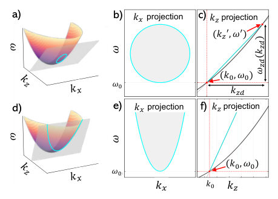 
FIG. 1. a) The construction of momentum space skyrmion uses a closed spectral loop in b) kx −ω space. c) The intersec- tion of the spectral plane and the dispersion surface gives the lowest point (k0, ω0) called the carrier, and the point (k′ z, ω′). The difference between them is kzd. When ω′ is the maximum allowed constituent electron plane wave energy, we write the point as (kzmax, ωmax) in text. d-f) Merons can be obtained from an intersection that produces a parabolic projection in the kx −ω plane instead.

📷 Fig 2

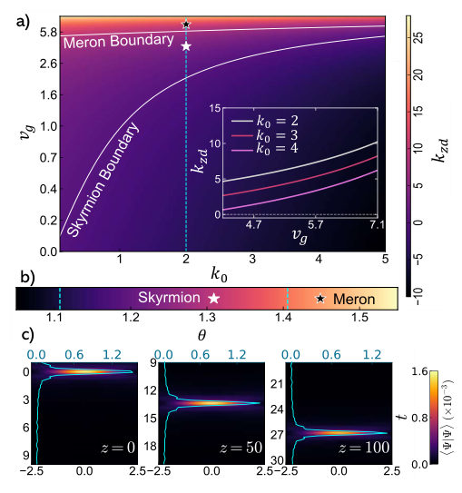 
FIG. 2. a) The allowed parameter space in vg, k0 to host skyrmion and meron in momentum space in an electron STWP. The colormap is the longitudinal spectral linewidth in momentum space, and the white and black stars are the points used for skyrmion and meron real-space calculations respectively. Inset: The longitudinal spectral linewidth as a function of group velocity and carrier wavenumbers. The shown kzd is measured without a limit kzmax. b) The group velocity regions for a carrier wavenumber of k0 = 2, shown using the spectral tilt angle. c) The propagation invariance of the electron STWP can be seen by the almost unchanged peak intensity (blue line and axis) as the pulse moves form z =...

📷 Fig 3

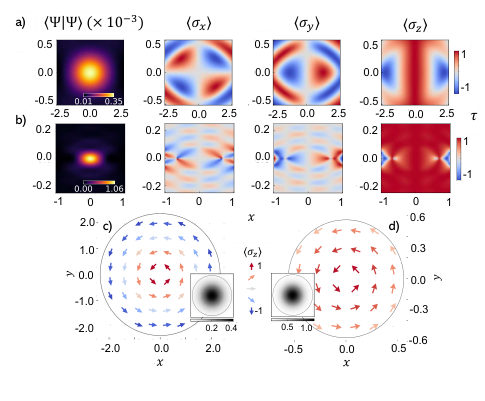 
FIG. 3. The realspace structure of the electron wavefunc- tion. a,b) The spatiotemporal structure for skyrmions and meron SEV respectively in the comoving frame. The SEV is normalized by the local probability amplitude. c) The real- space SEV of the skyrmions and d) merons. The in-plane arrows are directions of ⟨σx⟩and ⟨σy⟩, while the colormap and legend gives the direction of ⟨σz⟩. Inset: probability map of the electron pulse with the skyrmion and meron structure embedded, scaled to 103.

📷 Fig 4

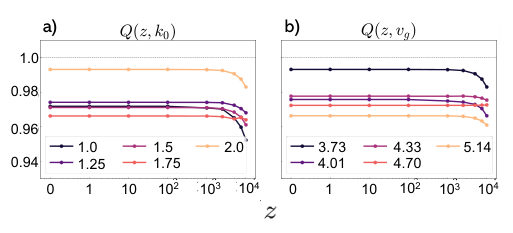 
FIG. 5. a) The propagation invariance of the skyrmion SEV for group velocity of vg = 3.73 for different carrier wavenum- bers, and b) the propagation invariance of the skyrmion SEV as a function of the group velocity, for k0 = 2.0.

📷 Fig 5

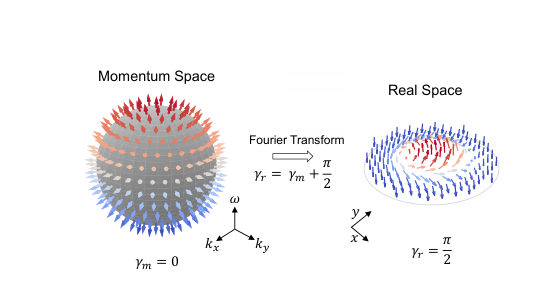 
FIG. 4. The relation between the 3D Skyrmionic spinor tex- ture in momentum space and its in-plane Fourier transformed counterpart in realspace. There is a helicity shift of π/2 due to an extra im term, with m = 1 being the winding number (Supplementary B). γm is the helicity in momentum space of the spinor texture, and γr is the realspace helicity.

**Summary.** This paper explores free-electron Space-Time Wave Packets (STWPs) capable of carrying tunable topological textures, specifically Skyrmions and Merons. By constraining the momentum-space spectrum, the authors show how to create propagation-invariant wave packets. This work establishes a novel platform for using electron wave packets in topological sensing and information transfer.

**Why it may be interesting.** This work bridges concepts from quantum optics (tunable wave packets) with condensed matter topology (Skyrmions) using matter waves (electrons), providing a platform for topological information transfer.

Detailed structure

**Main problem.** The paper investigates the properties of Space-Time Wave Packets (STWPs) for free electrons, focusing on their ability to carry and maintain tunable topological textures like Skyrmions and Merons.

**Main result.** The authors demonstrate that free-electron STWPs can be constructed to be propagation-invariant and host robust, real-space Skyrmionic expectation value textures by tuning the spectral geometry.

**Method.** The study involves constraining the spatiotemporal spectrum of the electron wavefunction in momentum space and analyzing the resulting topology using spectral geometry.

**Model / system.** The system is modeled using non-relativistic free-electron wave packets, analyzed in both momentum and real space. The topological structure is encoded in the local spin expectation value (SEV) of the electron spinor.

**Key observables.** Skyrmion number (Q), local spin expectation value (SEV), and the propagation invariance of the topological texture.

**Important parameters / regimes.** Group velocity ($v_g$), carrier wavenumber ($k_0$), and the spectral tilt angle ($	heta$).

**Assumptions / limitations.** The analysis is restricted to non-relativistic free-electrons, and the initial construction is noted to be a scalar construction lacking vector structure.

**Figures summary.** Figures illustrate the construction of momentum space Skyrmions via closed spectral loops, the allowed parameter space for hosting Skyrmions/Merons, and the resulting robust real-space SEV textures.

**Paper structure.** The paper methodically constructs the STWP in momentum space, analyzes the topological constraints (Skyrmion vs. Meron), and then demonstrates the physical realization and robustness of these topological textures in real space.

Abstract

Space-Time Wave Packets (STWPs) have enabled numerous nontrivial properties, such as tunable group velocities, nondiffraction and nonlocal spin textures in optical fields. However, this has not been properly studied in matter waves. Here, we investigate free-electron STWPs, which are propagation-invariant and group-velocity-tunable matter wave packets, constructed by constraining the spatiotemporal spectrum of the electron wavefunction in momentum space. Due to the unique dispersion of free-electrons, the electron STWP can carry two different topologies, and host both meron and skyrmion topological textures in momentum space. We demonstrate the topological phase transitions and tunable skyrmion numbers by spectral geometry tuning. We also show the topologically robust propagation of the electron pulses and corresponding real-space skyrmionic expectation value textures encoded within each single electron wavefunction. Our results open a platform for topological free-electron wavepackets uses in sensing and information transfer.

[↑ back to top](#top)

### [Total Ordering of Resources: A Quantum-Classical Separation](http://arxiv.org/abs/2610.08062v1)

**Authors:** Jingsong Ao, Julio I. de Vicente, Alexander Streltsov  
**Type:** theory · **Category:** quantum information and computing · **PDF:** <https://arxiv.org/pdf/2610.08062v1>  
**Analysis basis:** full PDF text, analyzed in chunks

📷 Fig 1

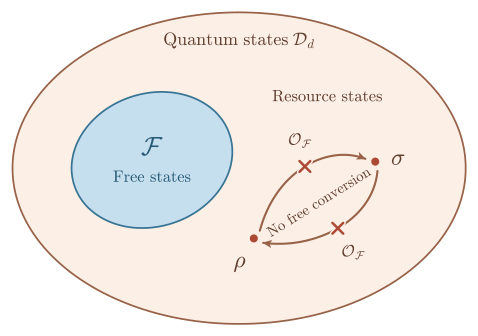 
FIG. 1. Schematic representation of quantum incomparability. The free states form a proper subset F ⊊Dd. For d ≥ 3, Theorem 1 guarantees resource states ρ and σ for which neither conversion direction is possible under the maximal free-operation set OF.

**Summary.** This theoretical paper proves that quantum resource theories in dimensions three or higher cannot be totally ordered, meaning there will always exist pairs of quantum states that cannot be ranked relative to each other. This impossibility is a unique feature of quantum mechanics, as classical systems of any size can always be perfectly ranked. The result establishes a rigorous mathematical divide between quantum and classical state transformation capabilities.

**Why it may be interesting.** This work provides a fundamental mathematical constraint on the structure of quantum resources, establishing a clear boundary between quantum and classical physics in the context of state transformation theory.

Detailed structure

**Main problem.** The paper investigates whether quantum resource theories can be characterized by a single, total ordering of states, which would simplify the understanding of state convertibility.

**Main result.** It proves that for quantum systems of dimension $d \geq 3$, such a total ordering is fundamentally impossible due to the existence of incomparable states. This property is shown to be a purely quantum phenomenon.

**Method.** The authors use structural proofs by contradiction, analyzing the properties of resource monotones and leveraging convexity arguments on the state space to demonstrate the existence of incomparable states.

**Model / system.** The study concerns quantum resource theories defined over the space of density operators ($\mathcal{D}_d$) on a $d$-dimensional quantum system. The analysis contrasts these quantum systems with classical systems.

**Key observables.** Resource monotone ($M$), the existence of incomparable states ($
ho, \sigma$), and the dimension ($d$) of the system.

**Important parameters / regimes.** The dimension $d$ (specifically $d \geq 3$), and the structure of the free set ($F$) and allowed operations ($\mathcal{O}_F$).

**Assumptions / limitations.** The resource theory is non-trivial, and the analysis focuses on deterministic, unassisted state transformations.

**Figures summary.** Figure 1 schematically illustrates the concept of quantum incomparability within the state space.

**Paper structure.** The paper establishes the goal of total ordering, proves the impossibility for $d \geq 3$ quantum systems (Theorem 1), and contrasts this impossibility with the fact that classical resource theories *can* be totally ordered in any finite dimension.

Abstract

A central goal in quantum information science is understanding which physical states can be converted into others. The ideal scenario would be a totally ordered system, where every state can be ranked by a single value, and a higher-ranked state can always be converted into a lower-ranked one. Such an ordering would provide a complete description of state convertibility, making the resource structure maximally simple to characterize and compare. We prove that such a simple ordering is fundamentally impossible for any quantum system with dimension larger than 2. The underlying properties of quantum mechanics guarantee that some states will always be incomparable. Furthermore, we show this is a uniquely quantum phenomenon by constructing classical systems of any size that can be perfectly ranked. This establishes a rigorous and striking divide between quantum and classical state transformations.

[↑ back to top](#top)

### [When Expressivity Is Not Enough: Discrete Routing Geometry in Variational Quantum Circuits](http://arxiv.org/abs/2610.07697v1)

**Authors:** Yu Wang  
**Type:** theory · **Category:** quantum information and computing · **PDF:** <https://arxiv.org/pdf/2610.07697v1>  
**Analysis basis:** full PDF text, analyzed in chunks

📷 Fig 1

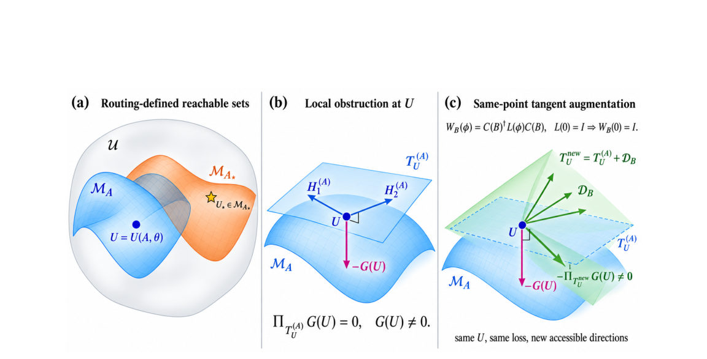 
Figure 1: Routing, local accessibility, and same-point repair. (a) Varying the angles at fixed routing A traces a reachable set MA within the ambient unitary space. The target U⋆belongs to MA⋆; multiblock reachable sets may overlap. (b) At the current U, the ambient descent direction −G(U) can be orthogonal to the accessible space T (A) U , so parameter gradients vanish despite G(U) ̸= 0. (c) An identity-initialized routing block preserves U, its output state, loss, and ambient gradient while adding directions DB. For a suitable B, the enlarged space T new U = T (A) U + DB exposes a nonzero descent projection. Surfaces and shaded spans are schematic; surface height does not encode loss.

📷 Fig 2

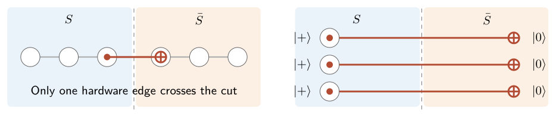 
Figure 2: Depth limits cross-cut capacity through connectivity. Blue and orange regions specify a fixed qubit bipartition. Red links show CNOT gates, with a filled control and an open target marked by a plus. (a) On a nearest-neighbor chain, only one hardware edge crosses a consecutive-site cut. At most one CNOT can use it in each parallel layer, so depth d permits at most d cross-cut gates. From a pure product input, the output Schmidt rank is at most 2d and the entanglement entropy at most d bits. These are upper bounds, not guarantees of saturation. Gray links denote other available chain edges. (b) With all-to-all connectivity, m CNOTs on disjoint pairs can cross the same cut...

📷 Fig 3

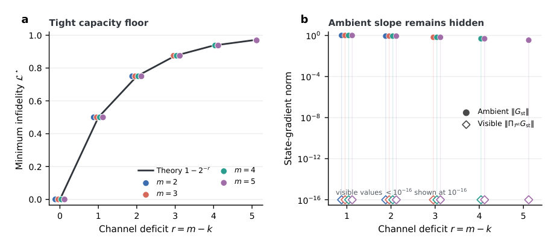 
Figure 3: Bell-pair obstruction and constrained stationarity. Exact statevector evaluation of capacity-saturating constructions for m = 2, 3, 4, 5, with one construction per (m, k) point. (a) When plotted against the channel deficit r = m −k, all constructions attain the tight capacity floor L⋆= 1 −2−r; markers are offset slightly in the horizontal direction to display coincident values for different m. (b) At the corresponding constrained optima, the ambient state-gradient norm remains nonzero while the visible norm ∥ΠT stGst∥is at the numerical floor. Both norms use the pure-state horizontal metric; values below 10−16 are displayed at 10−16. There are no statistical error bars because the...

📷 Fig 4

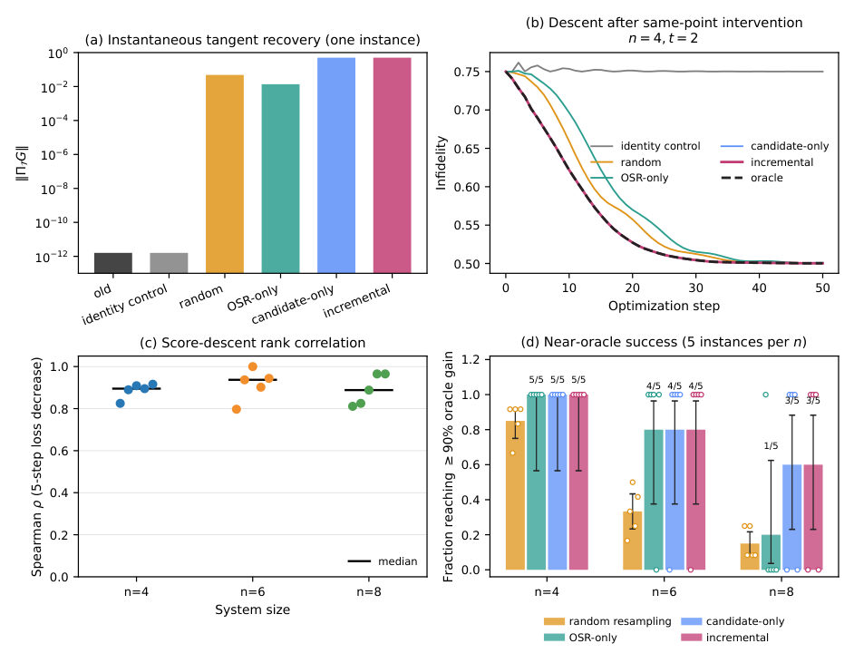 
Figure 4: Same-point augmentation restores access and geometric scores predict early descent. The controlled test compares 15 instances and 12 nonidentity candidates per instance, each adding 3n parameters and eight CNOTs. (a) Instantaneous accessible-gradient recovery at the same physical point for one instance. All insertions start from the same state, loss, and ambient gradient; values below 10−13 are shown at this display floor. (b) Descent after same-point intervention, with infidelity 1 −|⟨ψtarget|ψ⟩|2 (lower is better). For this representative instance (seed 20264923), candidate-only, incremental, and retrospective oracle selection choose the same candidate, so their trajectories...

📷 Fig 5

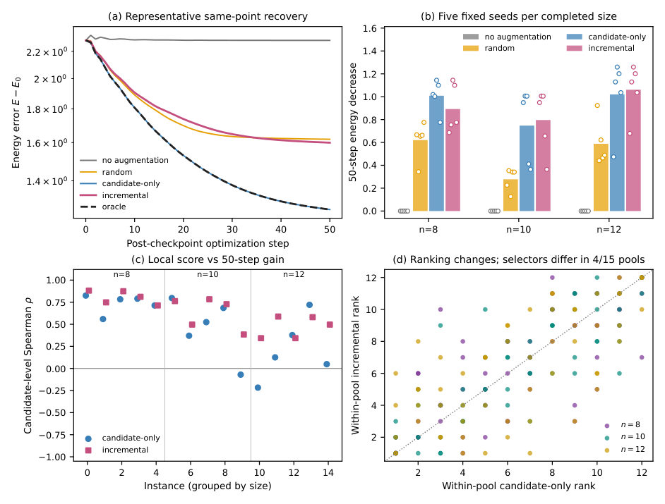 
Figure 5: Geometric selection improves the use of equal-cost augmentation on a connected Heisenberg ansatz. (a) Representative same-point continuation (n = 8, seed 20268804). (b) Fifty-step gains for five seeds at each n = 8, 10, 12, with 12 equal-cost candidates per checkpoint; bars show means and points show instances. The random selector uses one fixed draw per instance. (c) Within-instance score correlations with realized 50-step gain. (d) Candidate-only and incremental scores can rank the same pool differently, selecting different candidates in 4/15 instances. The oracle is the retrospective best candidate.

**Summary.** This work analyzes the geometric constraints on variational quantum circuits, showing that simply having enough parameters is insufficient for effective training. By focusing on the discrete routing structure of CNOT gates, the authors quantify how this geometry limits local optimization directions, proposing a method to actively guide the circuit's structure during training to ensure convergence.

**Why it may be interesting.** It provides a deep geometric understanding of the limitations of variational quantum algorithms, suggesting that structural modifications (routing) can be used to guide optimization away from local minima or plateaus.

Detailed structure

**Main problem.** The study investigates whether training variational quantum circuits requires more than just sufficient representational capacity; the training process must also have access to directions that improve the objective function.

**Main result.** The paper establishes a concrete link between representational capacity, local accessibility, and the ability to repair training stagnation by analyzing the role of discrete CNOT routing geometry.

**Method.** The authors use mathematical tools like operator Schmidt rank, finite-field formulas, and tangent space analysis to characterize the geometry of the reachable unitary set defined by the circuit's routing structure.

**Model / system.** The model is a variational quantum circuit built from CNOT gates and arbitrary one-qubit gates, parameterized by a mixed encoding involving discrete routing matrices (from GL(n, F2)) and continuous rotations.

**Key observables.** Operator Schmidt Rank (OSRS), local gradient coverage (tangent space projection $\Pi_{T_A}$), and the ability to restore descent directions.

**Important parameters / regimes.** The size of the system ($n$), the number of layers ($t$), and the specific structure of the CNOT routing matrix $A$.

**Assumptions / limitations.** The local results do not establish efficient global search, asymptotic barren-plateau suppression, or noisy-hardware advantage.

**Figures summary.** Figure 1 illustrates the mechanism: tracing reachable sets, showing ambient descent directions orthogonal to the accessible space, and demonstrating how identity-initialized routing blocks can restore descent.

**Paper structure.** The paper first analyzes the global constraints using OSRS and cut-rank formulas for single and multiple CNOT blocks. It then moves to local analysis, demonstrating gradient vanishing when the accessible tangent space is orthogonal to the objective gradient. Finally, it proposes and tests a 'same-point augmentation' technique to guide the opening of new descent directions.

Abstract

Finding useful variational quantum circuits requires more than representational capacity: training must also have access to directions that improve the objective. We study how discrete CNOT routing shapes both capacity and local accessibility. For circuits built from CNOT and arbitrary one-qubit gates, we separate binary routing matrices from continuous rotations to relate global capacity to local tangent accessibility. An exact finite-field formula for the operator Schmidt rank of a CNOT block and cumulative multiblock bounds yield capacity constraints and a Bell-pair fidelity obstruction. Locally, routing propagates generators into a routing-dependent tangent space, so all parameter gradients can vanish even when the ambient objective gradient is nonzero; frame bounds distinguish loss of gradient coverage from poor conditioning. A routing-conditioned identity insertion preserves the current unitary, state, loss, and existing gradients while adding new tangent directions. Candidate-only and incremental projection scores provide local criteria for ranking insertions. Exact-statevector tests show strong short-horizon score-descent correlations on controlled Bell tasks and effective equal-cost selection on connected Heisenberg chains up to twelve qubits, with complementary TFIM selector controls. A broader TFIM routing ensemble exhibits routing-dependent near-stagnation. Together, these results connect representational capacity, local accessibility, and same-point repair through a common discrete routing description. An architecture need not remain fixed during training: task-dependent geometric information can guide the opening of new descent directions while preserving the learned circuit at insertion. This provides a concrete local approach to a broader problem: how useful quantum circuits can be discovered from the information a task supplies.

[↑ back to top](#top)

### [X2C-inspired approximation of the Dirac coupling operator in a multiwavelet basis](http://arxiv.org/abs/2610.07512v1)

**Authors:** Quentin Pitteloud, Jacopo Masotti, Luca Frediani  
**Type:** theory · **Category:** other · **PDF:** <https://arxiv.org/pdf/2610.07512v1>  
**Analysis basis:** full PDF text, analyzed in chunks

📷 Fig 1

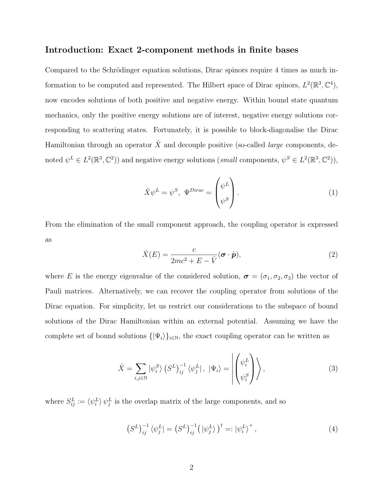 
Low-resolution page preview, page 2

📷 Fig 2

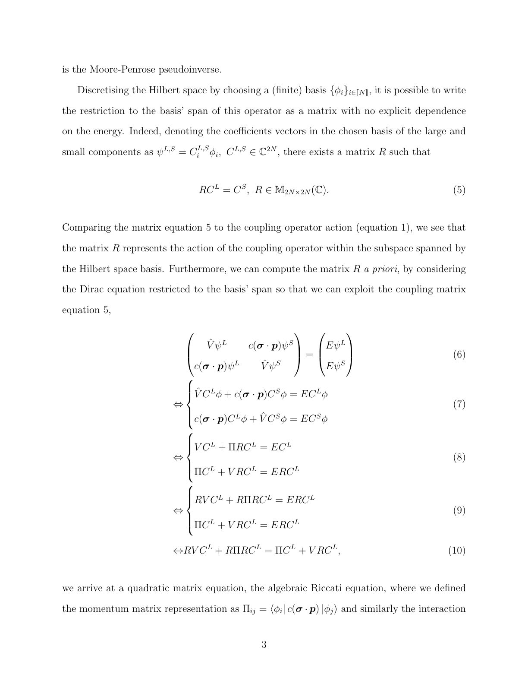 
Low-resolution page preview, page 3

📷 Fig 3

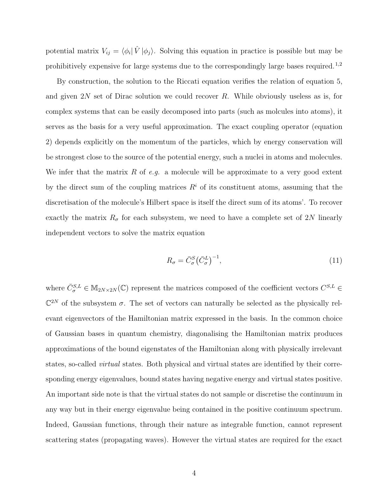 
Low-resolution page preview, page 4

📷 Fig 4

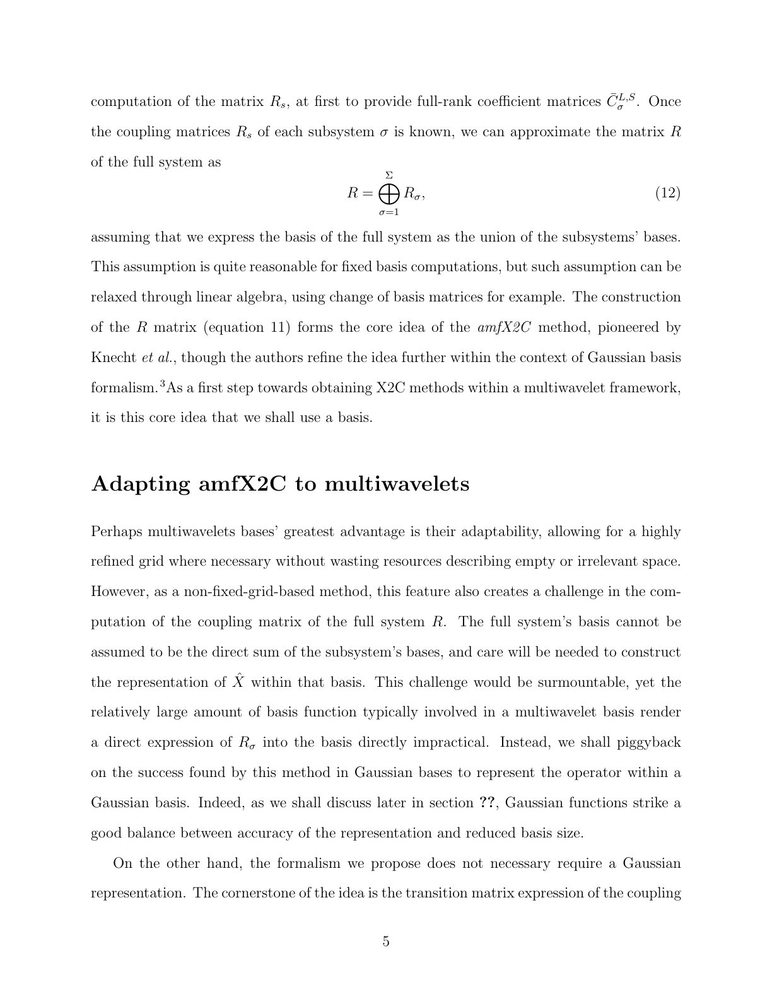 
Low-resolution page preview, page 5

📷 Fig 5

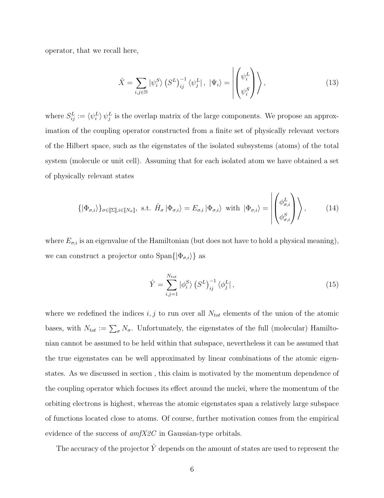 
Low-resolution page preview, page 6

**Summary.** This paper presents an advanced numerical technique to approximate the Dirac coupling operator within a multiwavelet basis. By adapting the proven X2C method, the authors enable the block-diagonalization of the Dirac Hamiltonian for bound state problems. This provides a powerful, adaptable tool for calculating relativistic quantum properties in molecular and atomic systems.

**Why it may be interesting.** This work directly addresses the computational challenges of solving relativistic quantum mechanics (Dirac equation) in complex, non-uniform basis sets, which is highly relevant for molecular and atomic structure calculations in AMO physics.

Detailed structure

**Main problem.** The paper develops a method to accurately approximate the Dirac coupling operator in a multiwavelet basis, adapting the established X2C technique.

**Main result.** The method successfully extends the energy-independent block-diagonalization of the Dirac Hamiltonian to the adaptable multiwavelet basis, allowing for robust calculations in bound state quantum mechanics.

**Method.** It approximates the coupling operator using a projector constructed from atomic eigenstates, which are then represented in the multiwavelet basis via Gaussian projections.

**Model / system.** The system involves Dirac spinors describing bound states, governed by the Dirac Hamiltonian. The core challenge is handling the coupling operator $\hat{X}$ that links the large and small components of the spinor.

**Key observables.** The coupling operator $\hat{X}$, the effective Hamiltonian $\hat{H}_{ASC}$, and the energy eigenvalues $E$.

**Important parameters / regimes.** The mass term $mc^2$, the potential $\hat{V}$, and the basis set parameters related to the multiwavelet decomposition.

**Assumptions / limitations.** The method assumes that the full system's basis can be approximated by a direct sum of constituent atomic bases, and it relies on projecting Gaussian-type atomic orbitals onto the multiwavelet basis.

**Paper structure.** The paper first establishes the theoretical framework for the X2C method in fixed bases, then details the adaptation of this technique to the multiwavelet basis by projecting Gaussian functions, and finally applies this to solve the eigenvalue problem for the Dirac Hamiltonian.

Abstract

We present a method to obtain the proven exact 2-component (X2C) method, normally applied to Gaussian-type fixed Hilbert bases, in an adaptative non-uniform grid basis of the Hilbert space, namely Multiwavelets. The X2C method manages to block-diagonalise the Dirac Hamiltonian restricted to the subspace of the basis, in an energy-independent manner. The method takes inspiration from the success of the atomic mean-field X2C method on the Gaussian bases to represent the coupling operator as a projector onto the small components of the eigenstates of the constituent atoms of the system.

[↑ back to top](#top)

## Secondary cond-mat archives

*Papers from  mes-hall, other, soft, supr-con. These archives are de-prioritized — they appear at the end regardless of relevance score.*

### Relevant in secondary archives (13)

### [Direct synthesis of moiré graphene with twist-tuned hybridization](http://arxiv.org/abs/2610.07429v1)

**Authors:** Seunghyun Park, Daniel T. Larson, Zeyu Hao, Takashi Taniguchi, Kenji Watanabe, Efthimios Kaxiras, Yuan Cao, Amir Yacoby  
**Type:** experiment · **Category:** strongly correlated electrons · **PDF:** <https://arxiv.org/pdf/2610.07429v1>  
**Analysis basis:** full PDF text, analyzed in chunks
**Topic relevance:** 🔥 `analog quantum simulation` **4/5**

📷 Fig 1

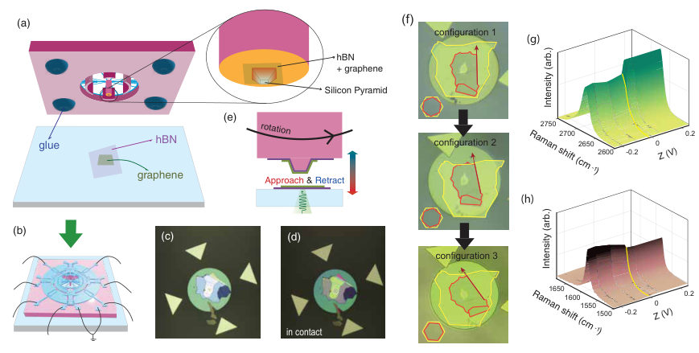 
FIG. 1. Schematics of MEMS operation and optical microscopy images of MEMS devices (a) Schematic of the MEMS device with the pyramid facing the substrate. Glue droplets are deposited on the MEMS before the two pieces are combined. The hBN/graphene heterostructure is placed on the silicon pyramid with the graphene exposed toward the substrate side, allowing direct contact with the graphene on the substrate. (b) The assembled MEMS–substrate device is then wire- bonded to the PCB, enabling control of the angle and distance between the MEMS and the substrate. (c,d) Optical microscope images showing (c) the MEMS in close proximity to the substrate without contact (approximately 1 µm apart) and...

📷 Fig 2

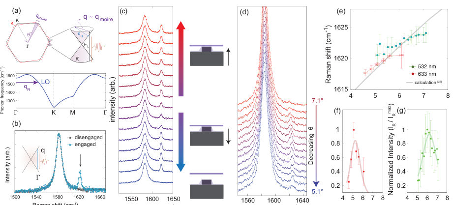 
FIG. 2. Direct measurement of the moir´e potential and graphene LO phonon (a) Raman scattering process for the “R” mode and calculated LO phonon dispersion from density functional theory. (b) Raman G-mode spectra measured with (blue) and without (black) engagement at a relative rotation angle of approximately 6.6◦between the two graphene lattices. The black arrow indicates the emergence of a moir´e-induced peak (R mode) arising from an additional Raman process where the electron scatters off the superlattice potential when the MEMS is engaged with the substrate. The inset shows schematic of the Raman mechanism for the graphene G mode [44]. (c) G-mode and R-mode spectra measured while...

📷 Fig 3

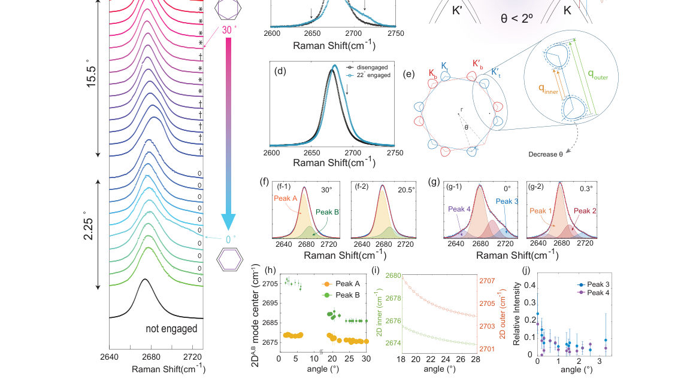 
FIG. 3. Band hybridization of in situ rotated tBG (a) 2D-mode spectra obtained during in situ twisting for all three configurations. Spectra marked with an asterisk (*), a dagger (†), and circles are from Configurations 1, 2, and 3, respectively. The twist angle range is indicated on the left. The rotation angle changes monotonically from the top to the bottom spectrum. The black spectrum shows the 2D mode when the MEMS is not engaged with the substrate. All spectra are normalized to the highest intensity of each spectrum for easier comparison. (b) Raman 2D-mode spectra measured with (blue) and without (black) engagement at 0◦relative rotation between the two graphene lattices. The black...

📷 Fig 4

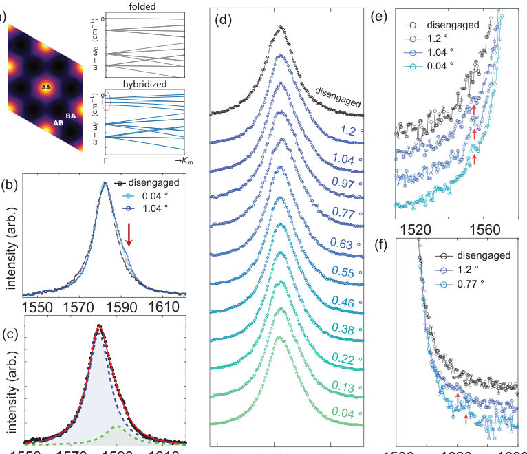 
FIG. 4. Phonon band hybridization via the moir´e superlattice (a) Schematics for phonon-band folding and hybridization induced by the moir´e superlattice [34]. (b) Selected G-band spectra at twist angles 0.04◦and 1.04◦, and with the MEMS disengaged. The asymmetric line shape develops as the MEMS is engaged with the substrate and the hump around 1590 cm−1

**Summary.** This work introduces a novel, reconfigurable MEMS platform for studying moiré graphene, enabling continuous and precise control over the twist angle. By using Raman spectroscopy, the researchers map the moiré potential and observe how electronic and vibrational band structures evolve deterministically as the twist angle is tuned. This establishes a powerful, reproducible tool for investigating correlated and topological quantum phenomena in moiré materials.

**Why it may be interesting.** The ability to deterministically tune the Hamiltonian parameter ($	heta$) in a solid-state system using an engineered platform is highly valuable for studying emergent quantum phases relevant to AMO physics and many-body dynamics.

Detailed structure

**Main problem.** The primary challenge is achieving precise and reproducible control over the twist angle in moiré graphene systems to systematically map the full phase diagram of correlated and topological phenomena.

**Main result.** The authors developed a reconfigurable MEMS platform that allows continuous, deterministic tuning of the twist angle, providing a reproducible Raman reference for twisted bilayer graphene.

**Method.** The study uses Raman spectroscopy measurements performed on a custom MEMS-based platform that mechanically rotates and assembles two graphene layers in situ.

**Model / system.** The physical system is twisted van der Waals (vdW) graphene, forming a moiré superlattice. The platform allows mechanical control of the twist angle ($	heta$) between two independently fabricated layers.

**Key observables.** Raman spectra (G-mode and 2D-mode), LO phonon dispersion (mapped via R-mode), and the evolution of the 2D mode line shape.

**Important parameters / regimes.** Twist angle ($	heta$), moiré momentum ($q_{	ext{moiré}}$), and the resonant excitation energy ($E_L$).

**Assumptions / limitations.** The analysis assumes a linear band dispersion of the Dirac cone at large twist angles, and the R-mode visibility relies on momentum matching conditions.

**Figures summary.** Figures illustrate the MEMS operation schematics, Raman spectra showing R-peak dispersion with angle, and the evolution of the 2D mode and G-mode signatures as hybridization occurs.

**Paper structure.** The paper introduces the MEMS platform, details the use of Raman spectroscopy to map the moiré potential via LO phonon dispersion, and analyzes the angle-dependent evolution of electronic (2D mode) and vibrational (G-mode) signatures.

Abstract

Twisted van der Waals (vdW) systems provide a powerful platform for exploring emergent correlated phenomena, including superconductivity, magnetism, and topological phases. The twist angle offers a continuous tuning parameter for modifying the underlying Hamiltonian, however, precise and reproducible control remains challenging. Existing approaches are limited by single-use device architectures, restricted angular precision, or vertical probing geometries. Here we introduce a reconfigurable graphene-based moiré platform in which two independently fabricated layers are mechanically assembled and rotated in situ using a micro-electromechanical system (MEMS). Raman spectroscopy confirms the formation and robustness of the twist-induced moiré potential and enables continuous, deterministic control of the twist angle. The moiré potential folds the electronic band structure and activates the longitudinal optical (LO) phonon mode, allowing us to map its dispersion and directly visualize the moiré momentum. Angle-dependent electronic band hybridization is resolved through the evolution of the double-resonant 2D mode. Near \(0^\circ\), an emergent asymmetry of the \(Γ\)-point G-mode phonon reveals phonon band folding and hybridization driven by the moiré superlattice potential and interlayer relaxation. Our platform provides a reproducible Raman reference for twisted bilayer graphene while eliminating device-to-device variability. More broadly, it establishes the twist angle as a deterministically controllable parameter for systematic studies of correlated and topological phenomena in moiré quantum materials.

[↑ back to top](#top)

### [Theory of resonance Raman profiles in transition metal dichalcogenide monolayers: Interference effects due to inter-valley phonon scattering](http://arxiv.org/abs/2610.07316v1)

**Authors:** Daniel Groll, Daniel Wigger, Tilmann Kuhn  
**Type:** theory · **Category:** other · **PDF:** <https://arxiv.org/pdf/2610.07316v1>  
**Analysis basis:** full PDF text, analyzed in chunks
**Topic relevance:** `Keldysh / 2PI / non-Gaussian methods` **3/5** · `interference shaping light` **3/5** · `correlated / nonlocal dissipation` **2/5** · `driven-dissipative phase transition` **2/5** · `methods for driven-dissipative` **2/5** · `analog quantum simulation` **1/5** · `non-equilibrium universality` **1/5** · `quantum measurements` **1/5**

📷 Fig 1

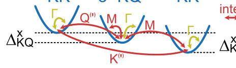 
Figure 1. Reduced exciton landscape for monolayer TMDCs under optical excitation conditions creating electron-hole pairs in the K- valley. (a) We consider a hole in the K-valley (purple parabola) and five valleys for the electron (green parabolas): the K- and K’-valley, as well as three degenerate Q-valleys. Their energetic separation without the influence of Coulomb interaction Δe K𝜆e = 𝐸e K −𝐸e 𝜆e depends on the chosen material and is furthermore impacted by strain. Inset: First Brillouin zone with relevant high symmetry points. (b) Resulting direct (KK) and indirect (KK′ and three KQ) excitons (blue parabolas) with phonon intra-valley (yellow arrows) and inter-valley scattering processes...

📷 Fig 2

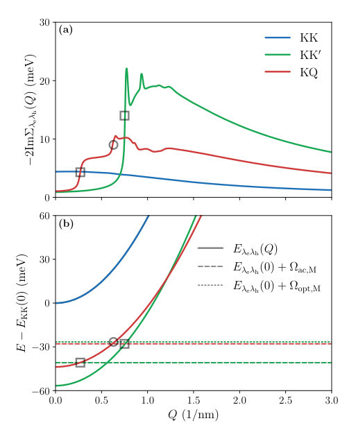 
Figure 2. Impact of phonons on excitons in hBN-encapsulated mono- layer WSe2 at 𝑇= 4 K. (a) Phonon-induced decay rates for the 𝜆h𝜆e-excitons with momentum 𝑄= |Q| relative to the minimum of the corresponding dispersion relation. (b) Momentum-dependent exciton energies (solid) with colors denoting the excitons species according to the labels in (a). Additional horizontal lines mark repre- sentative exciton energies with vanishing momentum 𝑄= 0 relative to the minimum of the corresponding dispersion relation, offset by the acoustic phonon energy Ωac,M (dashed) and the optical phonon energy Ωopt,M (dotted) at the M-point. Distinct features in (a) and (b) are marked by squares (onset of acoustic...

📷 Fig 3

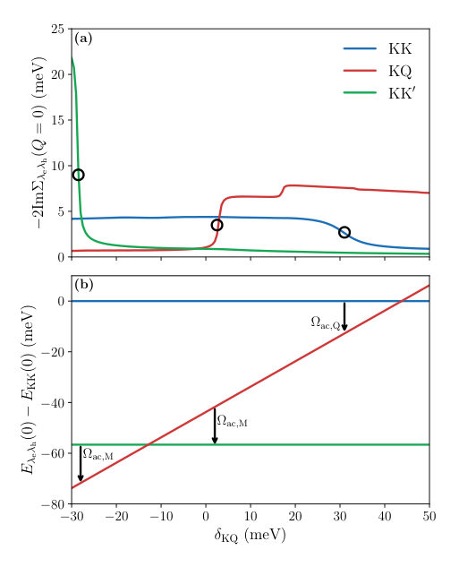 
Figure 3. Impact of strain on phonon-induced decay rates in hBN- encapsulated monolayer WSe2 at 𝑇= 4 K. (a) Phonon-induced decay rates for the 𝜆h𝜆e-excitons with momentum 𝑄= 0 relative to the minimum of the corresponding dispersion relation as a function of the KQ-exciton detuning 𝛿KQ [Eq. (49)]. (b) Exciton energies corre- sponding to the decay rates in (a). Downward arrows having a length corresponding to the phonon frequency labels denote detuning values where the corresponding scattering channels are turned on/off [circles in (a)] according to energy conservation requirements.

📷 Fig 4

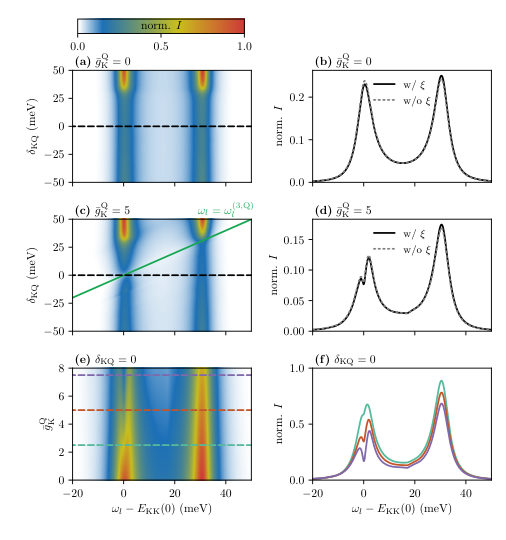 
Figure 5. Impact of strain and inter-valley scattering on resonance Raman profiles 𝐼(𝜔𝑙−ΩA1) of hBN-encapsulated monolayer WSe2 at 𝑇= 4 K. (a) Strain-dependent resonance Raman profile for sup- pressed A1-phonon emission from the Q-valley ¯𝑔Q K = 0. (b) Cut in (a) as marked by horizontal dashed line, showing the unstrained case. Full simulation including the factor 𝜉(𝜔𝑙−ΩA1) from Eq. (11) (solid) vs. neglected factor 𝜉(𝜔𝑙−ΩA1) →𝜉(𝐸KK(0) −ΩA1/2) (dashed). (c,d) same as (a,b) for non-vanishing A1-phonon emission from the Q-valley ¯𝑔Q K = 5. The green line in (c) marks the energetic position of the third order resonance 𝜔𝑙= 𝐸KQ(0) + ΩA1 + Ωac,Q ≡𝜔(3,Q) 𝑙 . (e,f) Resonance Raman profiles for the...

📷 Fig 5

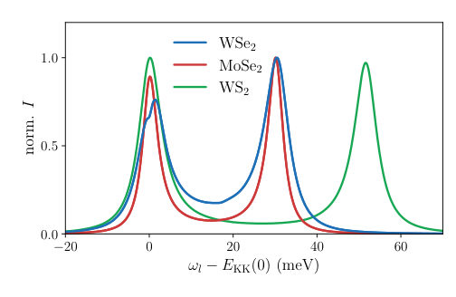 
Figure 6. Resonance Raman profiles 𝐼(𝜔𝑙−ΩA1) of different un- strained (𝛿KQ = 0) hBN-encapsulated TMDC monolayers at 𝑇= 4 K for ¯𝑔Q K = 2.5 in all three cases.

**Summary.** This theoretical paper models resonance Raman scattering in TMD monolayers, focusing on the role of inter-valley phonon scattering and strain. Using a microscopic Hamiltonian approach, the authors predict that inter-valley scattering induces destructive interference between different Raman orders. This results in a quantifiable suppression of the incoming resonance, matching recent experimental observations.

**Why it may be interesting.** This work directly addresses open quantum systems dynamics by modeling exciton-phonon coupling and spectral line shape modification due to coupling to lattice vibrations, which is a core topic in quantum optics and open quantum systems.

Detailed structure

**Main problem.** The study investigates how inter-valley phonon scattering and strain affect the resonance Raman scattering profiles in monolayer Transition Metal Dichalcogenides (TMDs).

**Main result.** Inter-valley scattering causes destructive interference between first and third-order Raman processes, leading to a measurable suppression of the incoming resonance in WSe2.

**Method.** The analysis employs a microscopic model using an effective deformation potential coupling for the exciton-phonon interaction, calculated via diagrammatic approaches and Green's functions.

**Model / system.** The system is monolayer TMDs (like WSe2) exhibiting strong exciton-phonon coupling. The model uses a Hamiltonian encompassing free exciton, free phonon, and exciton-phonon coupling terms.

**Key observables.** Resonance Raman profile, scattering spectrum S(Omega), and the exciton self-energy $\Sigma_\alpha(E, K)$.

**Important parameters / regimes.** Strain (modeled as an energy shift) and the relative strength of $A_1$-phonon emission between K- and Q-valleys.

**Assumptions / limitations.** The calculation is performed in the linear response regime, and approximations like the rotating wave approximation are used for the correlation function derivation.

**Figures summary.** Figures 10 and 11 illustrate the impact of strain and inter-valley scattering on the resonance Raman profiles for MoSe2 and WS2, respectively.

**Paper structure.** The paper builds the theory by defining the Hamiltonian and deriving the scattering spectrum using Green's functions, then calculates the self-energies self-consistently, culminating in the prediction of the suppressed resonance profile.

Abstract

The optical properties of monolayer transition metal dichalcogenides (TMDCs) are strongly impacted by exciton-phonon coupling, especially inter-valley scattering in the case of tungsten-based materials. Together with strain-tunability of the energetic K-Q valley separation this material class therefore provides a platform for semiconductor optomechanics. Here we investigate the influence of inter-valley scattering and strain on resonance Raman scattering in monolayer TMDCs using a microscopic model based on an effective deformation potential coupling for the exciton-phonon interaction. Considering exemplarily the resonance Raman profile of the A$_1$-mode in hBN-encapsulated monolayer WSe$_2$, we find that inter-valley scattering between the electronic K- and Q-valley leads to destructive interference between a first order and a third order Raman process. As a result we obtain a suppression of the incoming resonance in WSe$_2$, consistent with recently published experimental data.

[↑ back to top](#top)

### [Contact-Governed Macroscopic Signatures of Strain-Induced Valley Sorting in MoS$_2$ Field-Effect Transistors](http://arxiv.org/abs/2610.07203v1)

**Authors:** Suhas Suresh Bharadwaj  
**Type:** both · **Category:** other · **PDF:** <https://arxiv.org/pdf/2610.07203v1>  
**Analysis basis:** full PDF text, analyzed in chunks
**Topic relevance:** `Keldysh / 2PI / non-Gaussian methods` **3/5** · `methods for driven-dissipative` **3/5** · `analog quantum simulation` **1/5** · `driven-dissipative phase transition` **1/5** · `non-equilibrium universality` **1/5** · `quantum measurements` **1/5**

📷 Fig 1

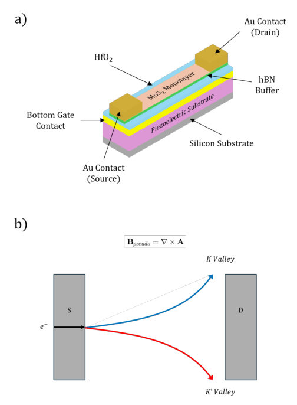 
FIG. 1. Schematic of the high-κ monolayer MoS2 Valley-FET architecture. (a) Three-dimensional perspective illustrating the van der Waals heterostructure. From bottom to top, the piezoelectric actuator substrate provides the global strain platform, the back-gate electrode and 3 nm HfO2 gate dielec- tric form the electrostatic gate stack, and the hBN-buffered MoS2 monolayer channel carries the source and drain con- tacts. (b) Top-down quantum transport dynamics demon- strating the strain-induced pseudo-magnetic field separating K and K′ valley electrons to opposite transverse edges via the Valley Hall Effect.

📷 Fig 2

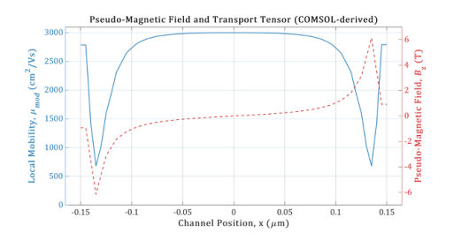 
FIG. 2. Spatial distribution of the normalized pseudo- magnetic gauge field and the corresponding macroscopic transport tensor. The right axis (red dashed line) traces the finite-element-derived Bz field, peaking at 6.14 T approxi- mately 15 nm inboard of each electrode rather than at the interface itself. The left axis (solid blue line) maps the result- ing mobility tensor µmod, demonstrating the symmetric struc- tural suppression from the intrinsic 3000 cm2/Vs acoustic- phonon limit down to a 698 cm2/Vs minimum, with partial recovery directly at the contact edge.

📷 Fig 3

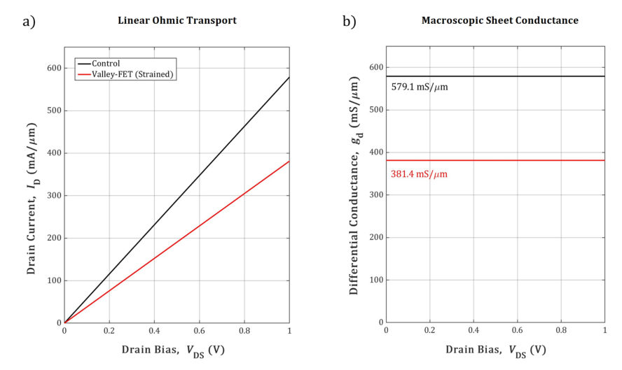 
FIG. 3. Longitudinal macroscopic transport in the idealized Ohmic regime at 77 K. (a) The ID −VG transconductance curves demonstrating pure Drude-like linearity in the absence of an oxide barrier. (b) Macroscopic differential conductance (gd) extracted via linear regression confirming that the spatially varying topological strain induces a continuous suppression of the intrinsic sheet conductance from 579 mS/µm to 381 mS/µm.

📷 Fig 4

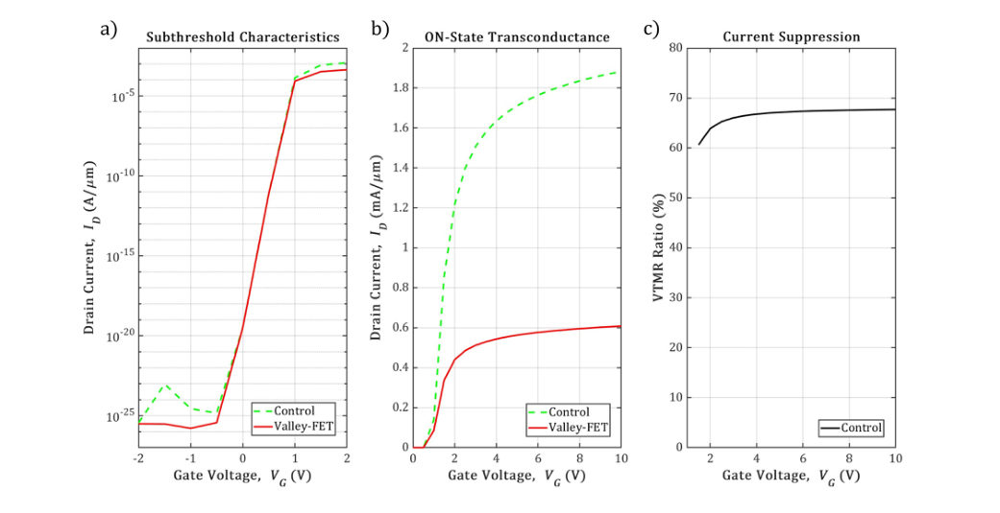 
FIG. 4. Steady-state transport characteristics of the fully gated High-κ MoS2 Valley-FET at 77 K. (a) Subthreshold electrostat- ics demonstrating consistent overlap and a similar subthreshold swing (∼102 mV/dec), indicating the strain tensor preserves gate integrity and OFF-state limits. (b) Linear ON-state transconductance revealing the macroscopic divergence between the control channel and the topological channel under high carrier density. (c) The Macroscopic Current Suppression mapping the percentage drop, which stabilizes into a 63.6% plateau as the transistor enters the deep inversion drift regime.

📷 Fig 5

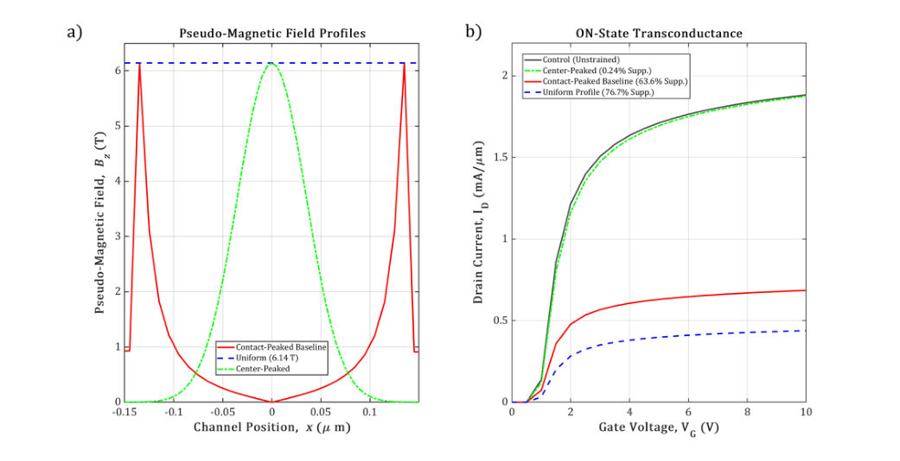 
FIG. 5. Strain profile sensitivity analysis demonstrating the structural dominance of the source injection bottleneck at 77 K. (a) Spatial distributions of the pseudo-magnetic gauge field Bz across the 300 nm channel. The physically mandated contact-peaked Gaussian profile is compared against two extreme theoretical bounding conditions, a uniform 6.14 T field and a center-peaked field. (b) The corresponding macroscopic transfer characteristics. The uniform profile yields a larger ON-state suppression than the contact-peaked baseline (76.7% vs. 63.6%), indicating that bulk-channel strain contributes measurably to the total suppression rather than adding only negligible series resistance....

**Summary.** This work addresses the challenge of observing quantum valley effects in real, macroscopic 2D-material transistors. By embedding quantum valley physics into a macroscopic drift-diffusion model, the authors demonstrate that the measurable signature of strain-induced valley sorting is overwhelmingly determined by the metal-semiconductor contacts, not the bulk channel. This identifies the contact interface as the critical engineering point for valley-selective transport.

**Why it may be interesting.** While focused on solid-state electronics, the methodology of bridging quantum Hamiltonian physics (valley deflection) into a continuum, macroscopic transport model is highly relevant for understanding open quantum systems where boundary conditions dictate global behavior.

Detailed structure

**Main problem.** The core problem is determining if the quantum effect of strain-induced valley sorting, observed in isolated nanoscale fragments, survives and manifests macroscopically in a fully contacted 2D-material transistor.

**Main result.** The study concludes that the strain-induced valley physics is not a bulk channel property but is instead dominated by the metal-semiconductor source and drain contacts.

**Method.** The authors developed a novel framework by embedding the quantum valley-deflection tensor into a macroscopic Poisson-drift-diffusion model, bridging quantum and classical transport descriptions.

**Model / system.** The system is a monolayer MoS2 Field-Effect Transistor (FET) subjected to a localized pseudo-magnetic strain field. The physics is modeled using a two-band massive Dirac Hamiltonian and extended via a macroscopic transport model.

**Key observables.** Valley Topological Magnetoresistance (VTMR), measured as a percentage suppression of the ON-state current, and the derived valley-topological contact resistance ($R_{c,V}$).

**Important parameters / regimes.** Transistor length (300 nm), gate dielectric (3 nm HfO2), temperature (77 K), and localized strain field strength (6.14 T pseudo-magnetic field).

**Assumptions / limitations.** The analysis assumes the use of tunneling-transparent, degenerately-doped contacts to prevent classical Ohmic barriers from overwhelming the topological signal.

**Figures summary.** Not specified (The notes describe the results derived from simulations rather than describing figure content).

**Paper structure.** The paper progresses by first establishing the quantum Hamiltonian under strain, then developing a macroscopic transport model to incorporate this quantum effect into a full device structure, and finally applying this model to show that the measured signal originates entirely from the contacts.

Abstract

Strain engineering is a leading route to control valley-selective transport in monolayer transition metal dichalcogenides. Whether this quantum effect survives inside a fully contacted device remains an open question. Quantum transport models capture the underlying valley deflection but are limited to isolated nanoscale fragments, leaving it unclear if a full device registers strain-induced valley sorting in the bulk, at the contacts, or at all. Here, the quantum valley-deflection tensor of strained monolayer MoS$_2$ is embedded directly into a macroscopic Poisson-drift-diffusion model, extending this physics to a complete, contact-inclusive device. Applying this framework to a 300~nm monolayer MoS$_2$ transistor with a 3~nm HfO$_2$ gate dielectric at 77~K, under a localized 6.14~T pseudo-magnetic strain field, shows the resulting 63.6\% suppression of the ON-state current is not a bulk property. It is set almost entirely by the source and drain metal-semiconductor interfaces. The full suppression is reproduced when only the 15~nm contact regions are strained and nearly vanishes when the channel interior alone is strained, identifying the metal contact as the dominant site of strain-induced valley physics. Observing it requires tunneling-transparent, degenerately-doped contacts, since classical Ohmic barriers overwhelm the topological signal. A transmission-line analysis reduces this behavior to a single valley-topological contact resistance ($R_{c,V}$) and a predictive inverse-length scaling law. This framework applies to any strain-engineered 2D-material heterostructure and can be tested with standard multi-length contact structures. Ultimately, these results identify the metal-semiconductor interface as the decisive location for engineering and detecting valley-selective transport in real 2D-material devices.

[↑ back to top](#top)

### [Molecular hydrogen formation on dust: The impact of gas-dust drift on formation efficiency](http://arxiv.org/abs/2610.07178v1)

**Authors:** Stefan Reissl, Simon C. O. Glover, Ralf S. Klessen, Liam S. Morrissey, Mordecai-Mark Mac Low  
**Type:** theory · **Category:** numerical methods · **PDF:** <https://arxiv.org/pdf/2610.07178v1>  
**Analysis basis:** full PDF text, analyzed in chunks
**Topic relevance:** `methods for driven-dissipative` **3/5**

📷 Fig 1

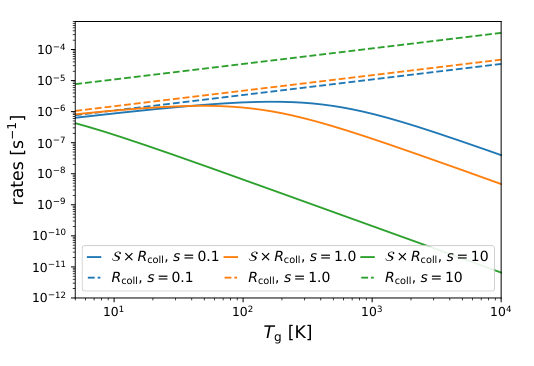 
Fig. 1: The collision rate Rcoll (dashed lines) and the rate of stick- ing of H atoms onto the grain surface S × Rcoll (solid lines) as a function of dust temperature Td for a drift parameter of s = 0.1 (blue), s = 1.0 (orange), and s = 10 (green), respectively. The sticking function S = S(Teff, Td) is evaluated including the ef- fective gas temperature Teff.

📷 Fig 2

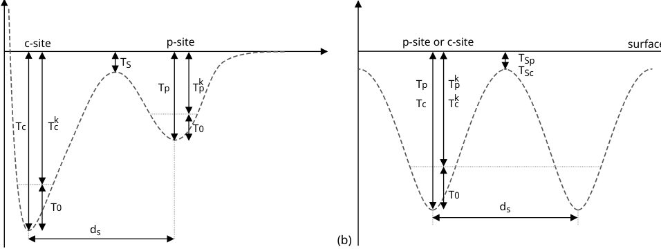 
Fig. 2: Schematic illustration of the adsorption sites and potential barriers. Energies E are expressed in temperature units, T = E/kB. Panel (a) shows the physisorption (p) and chemisorption (c) sites, with binding energies Tp and Tc, respectively, and the barrier TS separating the two adsorption sites. The quantities T k p and T k c denote the corresponding binding energies corrected for the zero- point energy T0. Panel (b) shows the lateral potential between neighboring adsorption sites. The barriers for migration between neighboring p-sites and c-sites are characterized by TSp and TSc, respectively. Here, each potential minimum represents an adsorption site associated with a particular...

📷 Fig 3

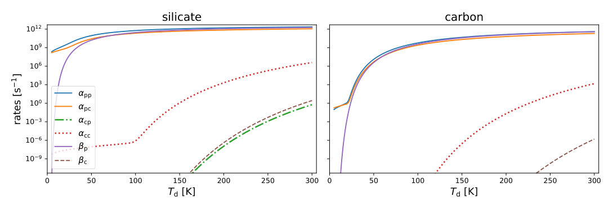 
Fig. 3: Surface mobility and desorption rates of adsorbed H atoms as a function of dust temperature Td for silicate (left panel) and carbon grains (right panel). Shown are the pp and cc hopping rates αpp (blue solid) and αcc (red dotted), the pc and cp transition rates αpc (orange solid) and αcp (green dash-dotted), and the desorption rates from p-sites and c-sites, βp (purple solid) and βc (brown dashed), respectively.

📷 Fig 4

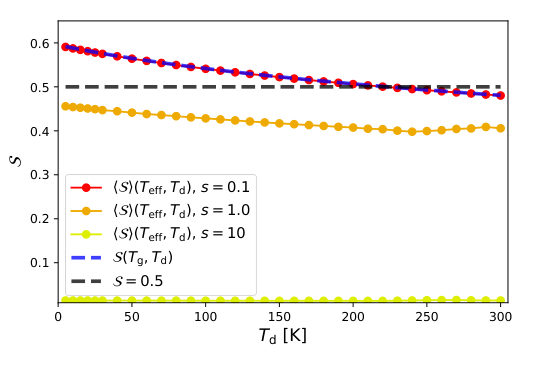 
Fig. 4: The time-averaged sticking function ⟨S⟩(Teff, Td) plotted as a function of the dust temperature Td. Values are shown for a gas temperature Tg = 100 K and for drift parameters of s = 0.1 (red), s = 1.0 (orange), and s = 10 (yellow). For comparison we also show the canonical sticking function S(Tg, Td) for the same gas temperature (blue) and a constant sticking probability of S = 0.5 (black dashed).

📷 Fig 5

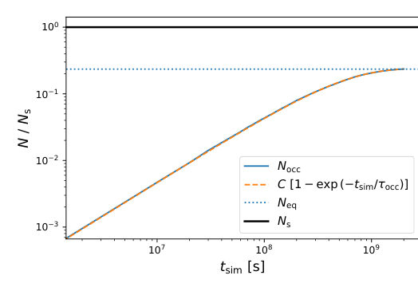 
Fig. 5: An example of the time evolution of the fraction of the sites on the surface of a carbon grain that are occupied, Nocc (solid blue line) compared to the total number of available sites NS. The simulation uses the fiducial values listed in Table 4 but with s = 0. For comparison, we also show the analyti- cal equilibrium solution Neq (dotted blue line). The expression C [1 −exp (−tsim/τocc)], indicated by the orange dashed line, is a fit to Nocc used to determine the characteristic timescale τocc.

**Summary.** This work models H2 formation on interstellar dust grains, critically incorporating the effect of systematic gas-dust drift into the chemical kinetics. Using a KMC simulation, the authors show that while increased collision rates might suggest higher formation, the energy dependence of sticking drastically suppresses the overall efficiency. This mandates that models for dynamic astrophysical environments must account for both relative gas-dust velocity and its impact on surface sticking.

**Why it may be interesting.** While focused on astrochemistry, the use of detailed KMC simulations to model surface reactions under non-equilibrium conditions (drift) provides a sophisticated example of applying advanced numerical techniques to complex, multi-scale physical processes.

Detailed structure

**Main problem.** The paper investigates how systematic gas-dust drift modifies the efficiency of molecular hydrogen (H2) formation on interstellar dust grains.

**Main result.** Strong gas-dust drift suppresses H2 formation when sticking probability depends on impact energy, suggesting that simple collision rate enhancements are insufficient for accurate models of dynamic environments.

**Method.** The authors employ an event-driven Kinetic Monte Carlo (KMC) model to simulate individual H atoms interacting with spherical dust grains.

**Model / system.** The system is the interstellar medium, modeling H2 formation on silicate and carbonaceous dust grains. The model incorporates adsorption, surface migration, thermal desorption, and both Langmuir-Hinshelwood (LH) and Eley-Rideal (ER) reaction channels.

**Key observables.** H2 formation efficiency (epsilon_H2), anisotropic distribution of adsorbed H and H2 on the grain surface.

**Important parameters / regimes.** Gas-dust drift velocity (characterized by a shifted Maxwellian distribution), sticking probability (constant vs. energy-dependent), and dust temperature.

**Assumptions / limitations.** The model compares constant sticking assumptions against energy-dependent sticking, which is crucial for determining the correct physical regime.

**Figures summary.** Figure 1 illustrates the dependence of collision rate and sticking rate on dust temperature for various drift parameters, showing the mathematical framework for drift incorporation.

**Paper structure.** The paper develops the KMC framework to include drift via shifted Maxwellian sampling, compares results using constant vs. energy-dependent sticking, analyzes the dominance of ER over LH reactions under drift, and concludes with necessary revisions for modeling dynamic environments.

Abstract

Molecular hydrogen is predominantly formed on dust-grain surfaces in the interstellar medium, where relative gas-dust motion can arise in dynamically active environments. While the dependence of H$_2$ formation on grain temperature and surface properties is well studied, the impact of gas-dust drift has received little attention. We investigate how gas-dust drift modifies H$_2$ formation, focusing on the competition between the drift-enhanced H-atom collision rate and reduced sticking at higher impact energies. We use an event-driven kinetic Monte Carlo model that follows individual H atoms on spherical silicate and carbonaceous grains, including adsorption, surface migration, thermal desorption, and Langmuir-Hinshelwood (LH) and Eley-Rideal (ER) reactions. Drift is described by a shifted Maxwellian velocity distribution, and we compare constant and impact-energy-dependent sticking probabilities. Drift produces increasingly anisotropic distributions of adsorbed H and H$_2$ formation across the grain surface. Assuming constant sticking, increasing drift enhances H$_2$ formation through the higher collision rate, with efficiencies up to $ε=0.3-0.4$. With energy-dependent sticking, strong drift instead suppresses formation on both materials, reducing efficiencies to $ε=0.01-0.03$. Carbonaceous grains remain efficient to higher dust temperatures than silicate grains. ER reactions dominate over most of the investigated parameter space and become increasingly important at strong drift as the reduced surface population suppresses LH reactions. Thus, enhanced collision rates under gas-dust drift do not necessarily increase H$_2$ formation. Models of dynamically active environments should account for both relative gas-dust velocities and their effects on sticking.

[↑ back to top](#top)

### [Adjoint-State Identifiability of Piezo-Tunable Valley Splitting in 2D Magnetic Heterostructures](http://arxiv.org/abs/2610.07179v1)

**Authors:** Suhas Suresh Bharadwaj  
**Type:** theory · **Category:** numerical methods · **PDF:** <https://arxiv.org/pdf/2610.07179v1>  
**Analysis basis:** full PDF text, analyzed in chunks
**Topic relevance:** `Keldysh / 2PI / non-Gaussian methods` **2/5** · `methods for driven-dissipative` **2/5** · `quantum measurements` **2/5**

📷 Fig 1

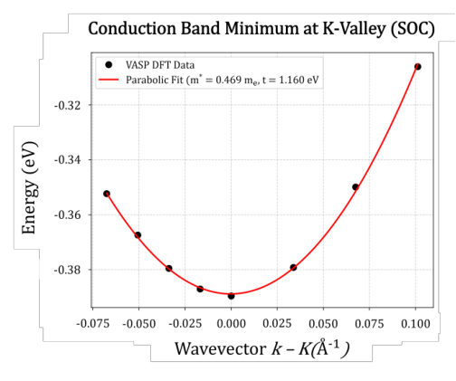 
FIG. 1. Parabolic fit applied to the K-valley conduction band minimum of the transition metal dichalcogenide monolayer. The regression yields an effective mass of m∗= 0.4686me and an effective hopping parameter of t = 1.1601 eV across the narrowed 9-point evaluation window.

📷 Fig 2

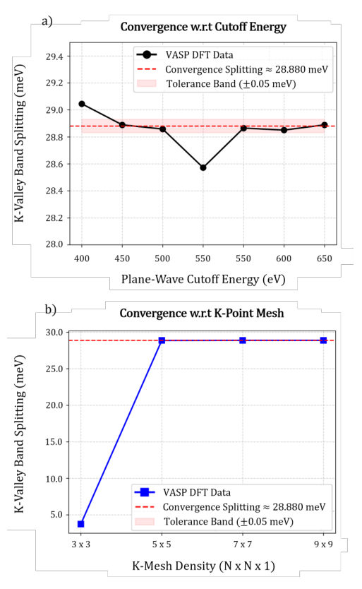 
FIG. 2. Numerical stability validation utilizing a represen- tative substrate-hybridized eigenvalue splitting. The data confirms sub-meV convergence stability for density functional theory calculations employing a plane-wave cutoff exceeding 600 eV and a Brillouin zone mesh denser than 7 × 7.

📷 Fig 3

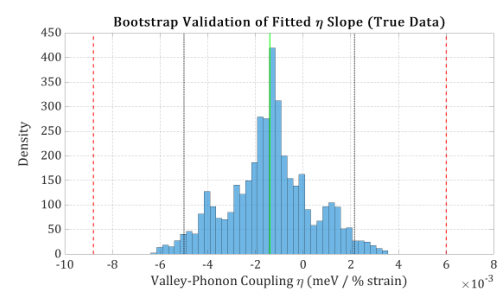 
FIG. 3. Residual bootstrap cross-validation of the exchange- strain coupling constant slope. The empirical histogram demonstrates severe finite-sample variance underestimation characteristic of utilizing only N = 5 discrete simulation points.

📷 Fig 4

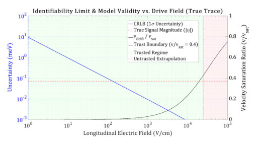 
FIG. 4. Device-level identifiability and trust boundary lim- its plotted against the applied longitudinal electric field. The fully corrected sensitivity derivations establish a safe operat- ing window tightly bounded by a statistical resolution thresh- old and the onset of velocity saturation.

📷 Fig 5

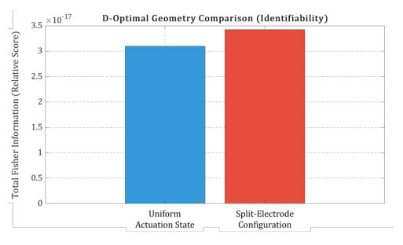 
FIG. 6. Discrete D-optimal experimental design comparison highlighting the total Fisher information metric for the uni- form and split-electrode topologies. The split-electrode con- figuration generates a mathematically superior statistical sig- nal.

**Summary.** This work develops a sophisticated, multiscale adjoint-state framework to test if theoretically predicted strain-tunable valley splitting in 2D magnetic heterostructures is actually measurable in a real device. By treating the coupling constant as an unknown parameter in an inverse problem, the authors provide a precise diagnostic threshold rather than a definitive material claim. This methodology offers a vital mathematical filter for advancing 2D materials research.

**Why it may be interesting.** The rigorous application of adjoint-state methods to bridge quantum material predictions (DFT) to measurable transport quantities (Hall effect) is a powerful, generalizable computational technique for assessing experimental feasibility in condensed matter systems.

Detailed structure

**Main problem.** The paper addresses the challenge of determining the device-level identifiability of theoretically predicted strain-tunable valley splitting in 2D magnetic heterostructures.

**Main result.** The authors established a rigorous adjoint-state framework that provides a quantitative, statistically robust diagnostic threshold (an operational window) to assess the experimental viability of predicted quantum effects.

**Method.** A multiscale inverse framework was developed, combining first-principles calculations, continuum elastodynamics, and a partial differential equation-constrained adjoint-state method to map microscopic parameters to macroscopic transport observables.

**Model / system.** The system is a $	ext{MoS}_2/	ext{CrBr}_3$ 2D magnetic heterostructure. The model incorporates a valley Hamiltonian, piezoelectric coupling ($\eta$), and is solved using a combination of DFT, continuum mechanics, and drift-diffusion transport equations.

**Key observables.** The transverse Hall potential difference ($V_H(x)$) and the derived safe operating window ($262.0$ to $22,337.6 	ext{ V/cm}$).

**Important parameters / regimes.** The exchange-strain coupling constant ($\eta$), which was found to be statistically consistent with zero based on initial DFT estimates.

**Assumptions / limitations.** The analysis assumes the system relaxes into a chiral $	ext{C}_3$ symmetry, and the macroscopic simulation uses an isothermal approximation, neglecting Joule heating.

**Figures summary.** The notes detail the use of finite-difference solvers for both the forward and adjoint state systems, validating the gradient calculation against finite-difference references.

**Paper structure.** The paper progresses from establishing the physical necessity of the framework (bridging quantum theory to macroscopic measurement) to developing the adjoint-state PDE constraint, applying it to the specific $	ext{MoS}_2/	ext{CrBr}_3$ system, and finally deriving a quantitative diagnostic threshold.

Abstract

Controlling valley degrees of freedom with mechanical strain is a promising approach for solid-state information processing. Current theoretical literature routinely predicts strain-tuned valley splitting at the microscopic level but rarely evaluates whether these quantum predictions remain statistically recoverable in realistic macroscopic devices. This manuscript establishes a fully classical, partial differential equation-constrained multiscale inverse framework for quantifying the device-level identifiability of predicted strain-tunable valley effects in two-dimensional magnetic heterostructures, demonstrated here for a molybdenum disulfide and chromium tribromide heterostructure. First-principles structural relaxations confirm a chiral $C_3$ point-group symmetry which mathematically reduces the relevant exchange-strain coupling tensor to a single scalar. A partial differential equation-constrained adjoint-state architecture successfully bridges continuum elastodynamics to valley-resolved anomalous Hall transport. Density functional theory yields a coupling estimate of $η\approx -0.07$ meV whose 95% confidence interval is consistent with zero. Evaluating this specific coupling magnitude against established thermal noise and velocity saturation limits defines a safe operating window bounded between 262.0 and 22,337.6 V/cm. Rather than asserting a confirmed nonzero material property this bounded operational window functions as a precise diagnostic threshold. Deploying this rigorous statistical identifiability framework provides a necessary mathematical filter to determine the true experimental viability of theoretically predicted two-dimensional materials before complex physical fabrication.

[↑ back to top](#top)

### [Networks of triblock ellipses: from kagome order to disordered porous networks](http://arxiv.org/abs/2610.08522v1)

**Authors:** Susanne Wagner, Gerhard Kahl, Carina Karner  
**Type:** theory · **Category:** statistical mechanics · **PDF:** <https://arxiv.org/pdf/2610.08522v1>  
**Analysis basis:** full PDF text, analyzed in chunks
**Topic relevance:** `analog quantum simulation` **2/5** · `methods for driven-dissipative` **2/5** · `driven-dissipative phase transition` **1/5** · `non-equilibrium universality` **1/5**

📷 Fig 1

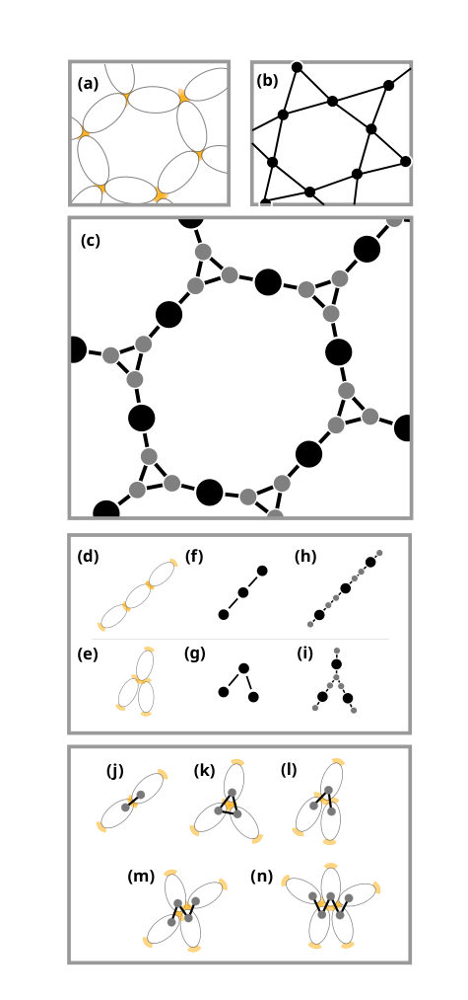 
Figure 1: (a) A network of patchy ellipses (elliptic cores in gray, patches in orange) abstracted by (b) the particle graph as well as (c) the particle-patch graph, with a particle represented as a core node (black) connected to its two patch nodes (gray), and a bond represented as an edge connecting two patches; A particle with two neighboring particles connected (d) by one bond per opposing patch and (e) by two bonds at the same patch; (f-g) the associated particle graphs and (h-i) the associated particle-patch graphs; (j-n) typical bonding motifs and their corresponding patch graphs: (j) pair, (k) triangle, (l) open triangle, (m) N-motif and (n) W-motif.

📷 Fig 2

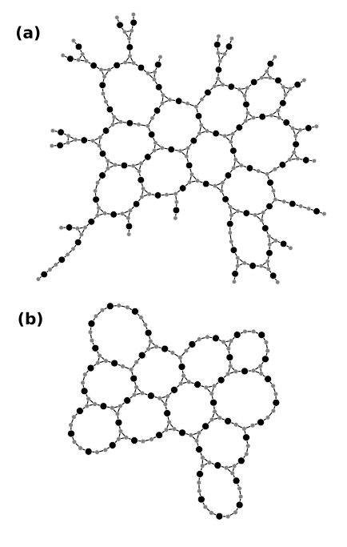 
Figure 2: (a) The particle-patch graph and (b) the corresponding cyclic subgraph that represent a network of patchy ellipses forming a nucleus at the early stages of nucleation.

📷 Fig 3

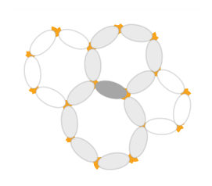 
Figure 3: A particle (dark-gray) has at most two adjacent loops (light-gray), which define its local neighborhood for the local loop order parameter in Equ. (1).

📷 Fig 4

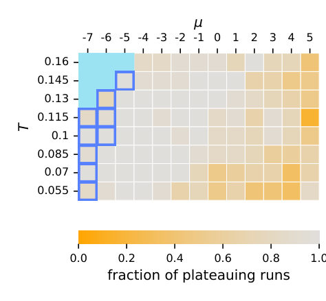 
Figure 4: State diagram in the plane of chemical potential µ and temperature T. Light blue indicates the gas phase, mid-blue frame indicates nucleating states, all other states enter the production run in an assembled state. Color scale of the nucleating and assembled states denotes the fraction of trajectories that reach an energy plateau within the simulation time, ranging from 0 (orange), where none of the trajectories plateau, to 1 (light gray), where all trajectories do.

📷 Fig 5

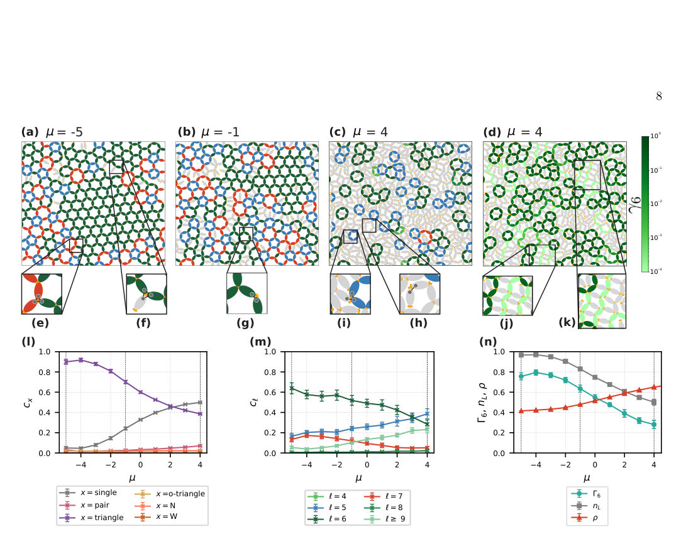 
Figure 5: Panels (a)-(c): snapshots of configurations at temperature T = 0.145 with chemical potential at (a) µ = −5; (b) µ = −1; (c) µ = 4. Particles are colored according to their loop size: particles in 4-loops (light-green), 5-loops (blue), 6-loops (dark-green), 7-loops (red) and 8-loops (light-green). Particles not in a loop or in a loop of size ≥9 are colored in light-gray. As a particle may belong to up to two loops, we visually resolve this ambiguity by picking the color according to this order: 5-loops, 7-loops, 6-loops, 4-loops, 8-loops. This hierarchy gives priority to 5- and 7-loops enhancing the visibility of these defects. Panel (d) shows the same configuration as panel (c)...

**Summary.** This paper uses colloidal ellipses with directional patches to study self-assembly, demonstrating that particle shape and interaction anisotropy control the formation of porous networks. By developing a particle-patch graph and using graph theory, the authors quantify the transition from ordered kagome lattices to disordered porous states. This work provides a detailed, quantitative framework for linking microscopic bonding rules to macroscopic network topology.

**Why it may be interesting.** While focused on classical colloids, the rigorous application of statistical mechanics principles to characterize phase transitions, order parameters, and structural pathways in anisotropic systems provides a strong methodological framework applicable to complex quantum many-body systems.

Detailed structure

**Main problem.** The study investigates how shape and interaction anisotropy dictate the self-assembly pathways and resulting porous structures of colloidal particles.

**Main result.** The system exhibits tunable crystalline kagome order, and the nucleation into this ordered phase follows a one-step pathway, contrasting with spherical systems.

**Method.** The research employs Monte Carlo simulations combined with advanced graph theory techniques to map microscopic bonding motifs to mesoscopic pore network properties.

**Model / system.** The model uses colloidal particles shaped as triblock ellipses, decorated with two attractive patches at opposite poles, allowing for both shape and interaction anisotropy.

**Key observables.** Kagome lattice order parameter ($\Gamma_6$), loop size distribution, bonding motif concentrations, and the particle-patch graph structure.

**Important parameters / regimes.** Temperature ($T$), chemical potential ($\mu$), and the particle aspect ratio ($\kappa=2$).

**Assumptions / limitations.** The analysis relies on the particle-patch graph to correctly distinguish bonds formed at different patches, and loop detection uses a face-walking algorithm.

**Figures summary.** Figures illustrate the geometry of the kagome lattice unit cell, the comparison between particle and patch graphs, and cross-sections showing the distribution of bonding motifs and loop sizes across different thermodynamic regimes.

**Paper structure.** The paper progresses from defining the physical system and the necessary graph representation (particle-patch graph) to detailing the simulation methods (MC moves, plateau detection) and finally applying these tools to characterize structural transitions, motif formation, and pore network topology.

Abstract

In colloids, anisotropy in either shape or particle interactions can steer assemblies away from close-packed monolayers and towards more intricate structures. In this study we utilize both shape and interaction anisotropy to stabilize porous surface assemblies of triblock elliptical particles, whose surfaces are decorated with two attractive patches at opposite poles. The resulting structures display a tunable degree of crystalline kagome order, controlled by quenching the temperature and/or changing the chemical potential. In particular, we find evidence that nucleation into the kagome lattice proceeds via a one-step pathway, in contrast to the two-step route widely reported in spherical triblock systems, making triblock ellipses an interesting model system for studying how self-assembly pathways change with particle shape. Beyond ordered crystalline structures, we find disordered porous networks with complex internal geometry. To characterize this range of assemblies, we introduce a particle-patch graph that explicitly captures the localization of bonds at distinct patches. Bonding motifs follow directly from this representation, while the loops, that we identify as the pore boundaries, can be determined from the graph's planar embedding. We detect all loops as the face boundaries in the planar embedding by means of a face-walking algorithm, distinct from shortest-path approaches used in ring detection. Together with a new local and global order parameter measuring the loop network's regularity with respect to a selected loop size, this framework connects microscopic bonding motifs to mesoscopic pore properties and quantifies the tunable order of these porous assemblies.

[↑ back to top](#top)

### [Proposing one-sided tetrons as topological qubits for Majorana-based quantum computation](http://arxiv.org/abs/2610.07169v1)

**Authors:** Tudor D. Stanescu, Sumanta Tewari  
**Type:** theory · **Category:** quantum information and computing · **PDF:** <https://arxiv.org/pdf/2610.07169v1>  
**Analysis basis:** full PDF text, analyzed in chunks
**Topic relevance:** `analog quantum simulation` **2/5** · `Keldysh / 2PI / non-Gaussian methods` **1/5**

📷 Fig 1

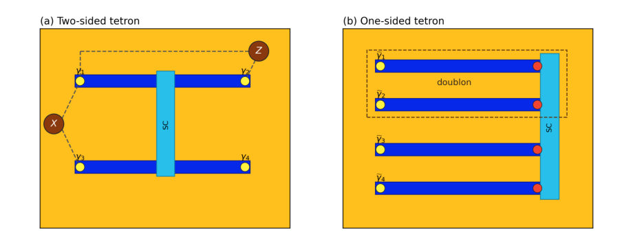 
FIG. 1. Schematic representation of two different tetron geometries. The orange region represents a semiconductor heterostructure hosting a two-dimensional quantum well, blue corresponds to topological wires, and cyan represents the trivial SC backbone. The Majorana modes at the free ends are represented by yellow circles. (a) Two-sided tetron hosting the Majorana modes γ1, γ2 (upper wire) and γ3, γ4 (lower wire). The brown quantum dots coupled to the Majorana modes as indicated by the dashed lines realize distinct (X and Z) readout loops. (b) One-sided tetron with four arms terminating at one common backbone. Their free-end modes eγ1, . . . , eγ4 encode a qubit. Red points indicate...

📷 Fig 2

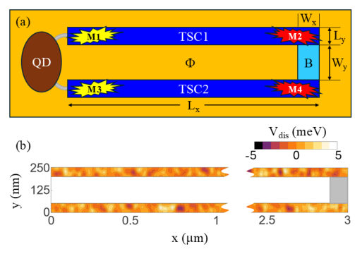 
FIG. 2. (a) Schematic representation of a doublon coupled to a quan- tum dot (QD). The doublon consists of two hybrid nanowires of length Lx defined by thin superconducting films (blue) proximity coupled to a 2D electron gas hosted by a semiconductor structure (orange). The right ends of the wires are coupled through a super- conducting bridge (B), while a magnetic flux Φ is threaded through the loop defined by the doublon and the quantum dot. The unprox- imitized semiconductor regions are depleted using top gates (not shown). In the topological superconducting phase the device hosts Majorana modes (M1-M4). (b) Spatial profile of the disorder poten- tial within the wire regions. The...

📷 Fig 3

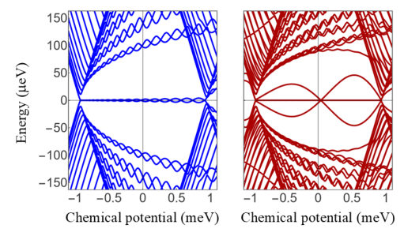 
FIG. 3. Comparison between the energy spectra as functions of the chemical potential for a clean wire (left) and a doublon obtained by coupling two such wires (right). The Zeeman field is Γ = 1 meV and the geometric parameters of the device are Lx = 1.5 µm, Ly = 50 nm, Wx = 80 nm, and Wy = 150 nm. For the decoupled wires (left), the partial overlap of the Majorana modes (e.g., M1 and M2 or M3 and M4) results in energy splitting oscillations with an amplitude of up to 4 µeV. By coupling the right ends of the wires (right panel), the right Majorana modes (M2 and M4) hybridize and acquire a finite energy of up to 45 µeV, while the energy splitting of the “surviving” left Majorana modes (M1 and...

📷 Fig 4

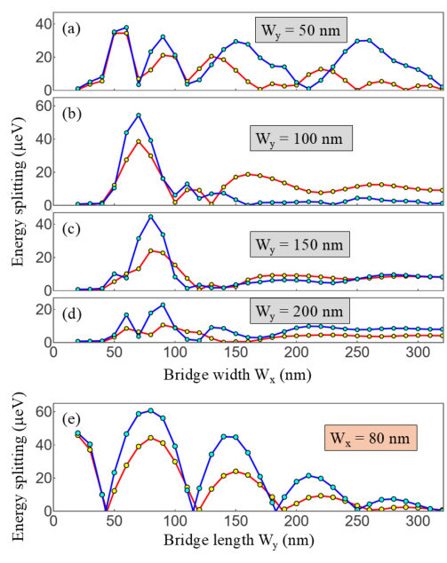 
FIG. 4. (a-d) Dependence of the energy characterizing the (partially separated) Andreev bound state obtained by hybridizing the right Majorana modes, M2–M4, on the width of the bridge (Wx) for dif- ferent values of the bridge length (Wy). The length of the device is Lx = 2 µm, while the control parameters are µ = 0.3 meV, Γ = 0.7 meV (yellow circles and red lines) or µ = 0.6 meV, Γ = 1 meV (cyan circles and blue lines). (e) Dependence of the energy characterizing the hybrid mode M2–M4 on the length Wy of the superconducting bridge for a doublon with Wx = 80 nm, all other parameters being the same as in (a-d).

📷 Fig 5

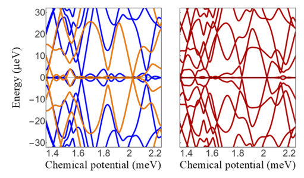 
FIG. 6. Energy spectra as functions of the chemical potential along the vertical cut in Fig. 5 corresponding to Γ = 1.04 meV. Left: Energy spectra for the uncoupled top (blue lines) and bottom (or- ange lines) wires. Right: Energy spectrum of the doublon obtained by coupling the wires through a bridge with Wx = 70 nm and Wy = 150 nm. Note the Majorana energy splittings on the order of a few µeV characterizing the uncoupled wires (left panel) and the significantly reduced energy splitting associated with the “sur- viving” left Majorana modes (M1 and M3) supported by the dou- blon device (right panel). The V-shaped features are associated with (topologically-trivial) Andreev bound states...

**Summary.** This paper proposes a novel 'one-sided tetron' architecture to improve Majorana-based topological qubits by mitigating detrimental wave-function overlap between end modes. By analyzing a simplified 'doublon' subsystem, the authors show that this geometry suppresses the energy splitting of the surviving Majorana pair by several orders of magnitude compared to existing designs. This enhancement dramatically increases the qubit's parity lifetime, moving closer to practical quantum computation.

**Why it may be interesting.** The work directly addresses the coherence and lifetime limitations of topological qubits, which is central to quantum information science. The mechanism of suppressing overlap through geometry is highly relevant for designing robust quantum hardware.

Detailed structure

**Main problem.** Residual wave-function overlap between end modes in finite-length Majorana systems limits the parity lifetime and coherence of qubits, hindering reliable quantum computation.

**Main result.** The proposed one-sided tetron geometry significantly suppresses Majorana overlap compared to two-sided tetrons, dramatically increasing the parity lifetime by orders of magnitude.

**Method.** Theoretical modeling using effective low-energy Hamiltonians and analyzing hybridization mechanisms in simplified subsystems (doublons).

**Model / system.** The system involves topological qubits realized using Majorana Zero Modes (MZMs) in semiconductor-superconductor (SM-SC) hybrid nanowires. The comparison is between two-sided and the proposed one-sided tetron structures.

**Key observables.** Parity lifetimes ($	au_X, 	au_Z$), Majorana splitting energy ($E_{ij}$), and the hybridization energy ($\delta$).

**Important parameters / regimes.** The degree of Majorana overlap, the size of the superconducting bridge, and the resulting energy splitting ($\delta$).

**Assumptions / limitations.** The analysis relies on the assumption that the one-sided tetron geometry can effectively decouple the end modes, mimicking the effect of doubling the wire length.

**Figures summary.** Figure 1 schematically compares the two-sided tetron and the proposed one-sided tetron, with a specific focus on the 'doublon' subsystem analysis.

**Paper structure.** The paper first identifies the limitation of two-sided tetrons due to overlap, then proposes the one-sided tetron. It analyzes the basic hybridization mechanism using a doublon model, demonstrating the dramatic improvement in parity lifetime, and concludes by comparing the suppression efficiency to existing designs.

Abstract

One-dimensional SM-SC hybrid nanowires with Rashba spin-orbit coupling and applied Zeeman field can support Majorana zero modes (MZMs) at the ends of the wire. In finite-length systems, residual wave-function overlap between the end modes produces an energy splitting. In a two-sided tetron qubit, composed of a pair of parallel Majorana wires coupled by a trivial SC backbone in the middle, this splitting limits the parity lifetime associated with Majorana pairs involving both wires and the coherence of the qubit, adversely affecting measurement-based braiding and readout operations. Here, we propose a one-sided tetron made of four parallel Majorana wires connected at a common end by an SC backbone. In the topological phase, the free wire ends host four MZMs that define the topological qubit, while the Majoranas localized near the opposite ends hybridize through the backbone and acquire finite energy. To study the basic hybridization mechanism, we consider a simpler two-wire subsystem, i.e., half of a one-sided tetron, which we call a doublon. In a doublon, the backbone, or bridge, strongly hybridizes the two Majorana modes at the connected end and shifts them away from zero energy, while the modes at the free ends form a near-zero energy fermion. We show that the splitting of the surviving MZM pair can fall by about two orders of magnitude compared to the splitting energies in a two-sided tetron, thereby dramatically increasing the parity lifetimes. Thus, the one-sided tetron ensures a suppression of the Majorana overlap comparable to doubling the length of the corresponding two-sided tetron.

[↑ back to top](#top)

### [Composite Fermion Theory of Fractional Chern Insulators in Rhombohedral Graphene](http://arxiv.org/abs/2610.07174v1)

**Authors:** Peize Ding, Andrew J. Millis, Yongxin Zeng  
**Type:** theory · **Category:** strongly correlated electrons · **PDF:** <https://arxiv.org/pdf/2610.07174v1>  
**Analysis basis:** full PDF text, analyzed in chunks
**Topic relevance:** `analog quantum simulation` **2/5**

📷 Fig 1

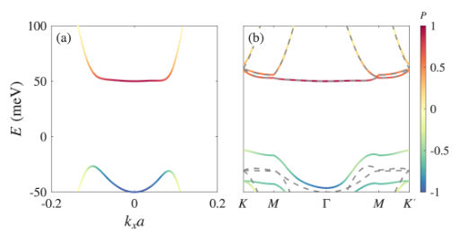 
FIG. 2. Electronic band structure of rhombohedral penta- layer graphene (R5G). (a) Continuum band structure in the absence of moir´e. (b) Moir´e band structure along K–M–Γ– M–K′ for Vm = 20 meV applied to layer l0 = 5. The gray dashed lines show the Vm = 0 bands folded into the moir´e Brillouin zone. The color scale indicates the layer polariza- tion P [Eq. (3)], defined such that P = +1 (−1) when an electronic state is fully polarized to layer l = 1 (l = 5).

📷 Fig 2

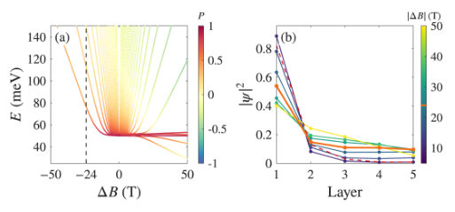 
FIG. 3. (a) Landau level (LL) spectrum of CFs in R5G with- out moir´e, plotted as a function of magnetic field ∆B. The sign convention is such that ∆B &lt; 0 when the magnetic field is opposite to the Berry curvature at the conduction band bottom. The black dashed line marks ∆B = −24 T, cor- responding to the electron density at moir´e filling ν = 1/3 which we focus on below. (b) Layer distribution of the low- est conduction-band LL at various magnetic field strengths ∆B &lt; 0 (indicated by color), with the |∆B| = 24 T curve highlighted in orange. The red dashed line denotes the zero- field layer distribution of the electronic Bloch states averaged over the first moir´e Brillouin zone.

📷 Fig 3

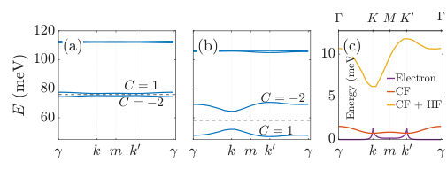 
FIG. 4. CF spectra and energy reconstruction at ν = 1/3, with Vm = 20 meV applied to the remote layer l0 = 5 and dielectric constant ϵ = 5. (a) Noninteracting CF magnetic Bloch bands, where the two LLL subbands carry C = −2 and C = 1. The dashed line marks the chemical potential. (b) Converged Hartree-Fock (HF) bands showing the interaction- driven inversion that places the C = 1 band below the chem- ical potential. (c) Moir´e and interaction effects on electrons and CFs. The purple curve shows the absolute moir´e-induced energy shift of the lowest electron conduction miniband in the moir´e Brillouin zone. The orange and yellow curves show half the direct gap between the two CF bands,...

**Summary.** This work develops a Composite Fermion theory to explain Fractional Chern Insulators in rhombohedral graphene. By incorporating moiré modulation and Coulomb interactions via a mean-field approach, the authors show how these effects stabilize the FCI ground state. The theory predicts quantized Hall responses characteristic of these topological phases.

**Why it may be interesting.** The theoretical framework of CFs and the explicit inclusion of moiré potentials to stabilize topological phases are highly relevant to understanding strongly correlated electron systems in engineered 2D materials.

Detailed structure

**Main problem.** The paper investigates the nature of Fractional Chern Insulator (FCI) states in rhombohedral graphene (RLG) and how the moiré potential and Coulomb interactions stabilize these exotic quantum states.

**Main result.** The composite fermion (CF) theory successfully describes the FCI ground state, predicting fractionally quantized Hall responses when the system is at Jain sequence filling fractions.

**Method.** The primary theoretical tool is the Composite Fermion (CF) theory, utilizing a flux-attachment transformation and subsequent mean-field (Hartree-Fock) approximation to treat electron-electron interactions.

**Model / system.** The system is rhombohedral graphene multilayers (RLG) subjected to moiré modulation and electron-electron Coulomb interactions. The Hamiltonian is analyzed using a continuum model framework adapted for the moiré superlattice.

**Key observables.** Fractionally quantized Hall conductance ($\sigma_{xy}$), the CF energy spectrum (Landau Levels split by moiré potential), and the Chern number ($C$).

**Important parameters / regimes.** Moiré filling fractions (Jain sequence, e.g., $
u=1/3$), the attached magnetic flux quanta ($2s$), and the moiré potential strength ($\phi$).

**Assumptions / limitations.** The analysis relies on the CF mean-field approximation, treating the moiré potential phenomenologically, and assuming spin/valley polarization for simplification.

**Figures summary.** Figures illustrate the CF theory progression: flux attachment leading to LLs split by the moiré potential into sub-bands (Jain sequence example). Other figures show band structures, layer polarization, and density distributions under different interaction regimes.

**Paper structure.** The paper develops the CF framework, applies mean-field theory to incorporate moiré and interaction effects, calculates the resulting topological invariants (Chern numbers), and predicts the incompressible ground state characteristic of FCIs.

Abstract

The experimental observation of the fractional quantum anomalous Hall effect in rhombohedral graphene multilayers has raised questions about the nature of the fractional Chern insulator (FCI) states and the role of the moiré potential. In this Letter we develop a composite fermion (CF) description and discuss how moiré modulation and Coulomb interactions stabilize the FCI ground states. Under a flux-attachment transformation and mean-field approximation, the CF spectrum forms Landau levels that are further split by the moiré potential. At moiré filling fractions in the Jain sequence, an integer number of CF bands are occupied, resulting in an incompressible ground state with fractionally quantized Hall response. Remarkably, when the attached flux opposes the Berry curvature of the conduction band of rhombohedral graphene, the CF Landau levels are widely spaced in energy and delocalized across layers, leading to a reduced density of states that helps protect the CF mean-field state and amplifying effects of the moiré potential acting on the layer away from the doped electrons. Interactions between CFs further enlarge the moiré-induced band gap and stabilize the FCI ground state. Our work sheds light on the nature of the FCI states in rhombohedral graphene and provides a new theoretical framework for further studies.

[↑ back to top](#top)

### [Geometric Photon-drag Effect in Unconventional Magnets](http://arxiv.org/abs/2610.08767v1)

**Authors:** Bristi Ghosh, Vivek Pandey, Malay Bandyopadhyay, Pankaj Bhalla, Snehasish Nandy  
**Type:** theory · **Category:** other · **PDF:** <https://arxiv.org/pdf/2610.08767v1>  
**Analysis basis:** full PDF text, analyzed in chunks
**Topic relevance:** `Keldysh / 2PI / non-Gaussian methods` **2/5**

📷 Fig 1

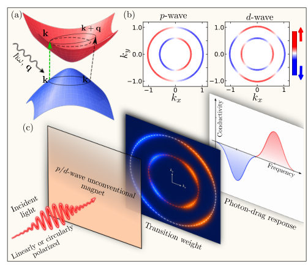 
FIG. 1. Schematic (a) depicts the origin of this current from vertical and nonvertical optical transitions. In the case of vertical transitions, the photon transfers only its energy ℏω, conserving the crystal momentum (∆k = 0). On the contrary, nonvertical transitions involve both the energy and finite photon momentum ℏq, resulting in a transition from k to k + q. The solid and dashed circles depict constant energy surfaces corresponding to vertical and nonvertical transitions, respectively. Panel (b) represents the Fermi surface (constant energy contour at ε = εF ) of the p- and d-wave altermagnets. The red and blue contours correspond to the two spin-split bands. Here, the p-wave exhibits...

📷 Fig 2

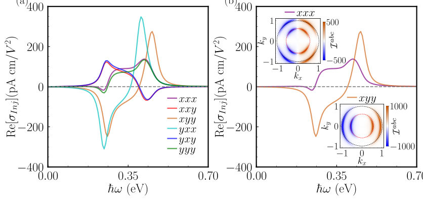 
FIG. 2. Photon-drag injection response of the px-wave magnet with Rashba spin-orbit coupling: (a) Frequency dependence of the real part of the symmetry-allowed injection conductivity. Owing to the simultaneous presence of time-reversal symmetry and broken inversion symmetry in the p-wave magnet, only the real part of the injection conductivity (linear injection) contributes to the photon-drag response. (b) Frequency dependence of Re[σxxx] and Re[σxyy], highlighting their distinct spectral structures and peak positions. The upper and lower insets show the corresponding geometric transition weight Iabc in the kx–ky plane for the xxx and xyy components, respectively. Both Iabc exhibit two...

📷 Fig 3

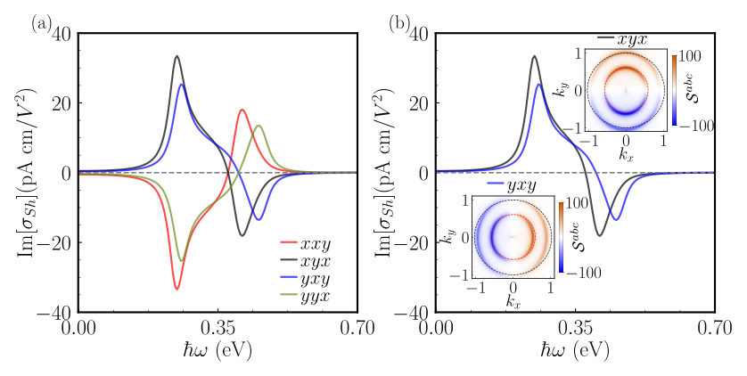 
FIG. 3. Photon-drag shift response of the px-wave magnet with Rashba spin-orbit coupling: (a) Frequency dependence of the imaginary part of the symmetry-allowed shift conductivity. The coexistence of time-reversal symmetry and broken inversion symmetry restricts the photon-drag shift response to its imaginary component, corresponding to the circular shift contribution. (b) Frequency dependence of Im[σxyx] and Im[σyxy], which display distinct spectral profiles and characteristic peak positions. The upper and lower insets depict the corresponding geometric transition weights Sxyx and Syxy in the kx–ky plane, respectively. The red and black dashed curves indicate the two Fermi surfaces. The...

📷 Fig 4

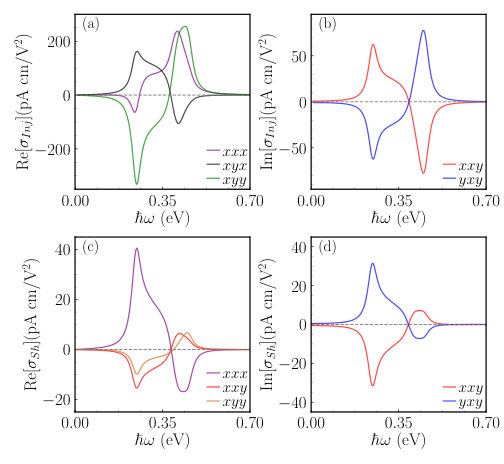 
FIG. 4. Photon-drag response of the d-wave magnet with Rashba spin-orbit coupling: Frequency dependence of the symmetry-allowed independent components of the (a) real part of the injection conductivity, (b) imaginary part of the injection conductivity, (c) real part of the shift conductivity, and (d) imaginary part of the shift conductivity. The simultaneous breaking of inversion and time-reversal symmetries in the d-wave magnet permits both the real (linear) and imaginary (circular) components of the injection and shift conductivities to contribute to the photon-drag response. The model parameters used are (t, J, λ, τ, T, qx, qy) = (0.5 eV.nm2, 0.1 eV.nm, 0.2 eV.nm, 33 fs, 10 K, 0.01 nm−1,...

**Summary.** This theoretical work explores the geometric photon-drag effect in unconventional magnets, using the density-matrix formalism. It demonstrates that the nonlinear dc photocurrent is purely photon-drag driven, vanishing in the conventional limit. The study highlights that the specific symmetry of the magnetic order (e.g., $d$-wave vs. $p$-wave) dictates the complexity and components of the measurable nonlinear response.

**Why it may be interesting.** The strong dependence on symmetry and quantum geometry makes this relevant for understanding how magnetic order dictates nonlinear optical responses, which is a key area in advanced condensed matter theory.

Detailed structure

**Main problem.** The paper investigates the geometric photon-drag effect, a nonlinear optical phenomenon where finite photon momentum generates a dc photocurrent in unconventional magnets.

**Main result.** The nonlinear dc photocurrent is found to be entirely photon-drag driven, and the response is highly sensitive to the magnetic symmetry, distinguishing between $p$-wave and $d$-wave altermagnets.

**Method.** The analysis uses the density-matrix formalism in the velocity gauge, deriving nonlinear injection and shift conductivities through perturbative expansion.

**Model / system.** The study focuses on unconventional $p_x$-wave and $d_{x^2-y^2}$-wave magnets, modeled using a low-energy $k \cdot p$ Hamiltonian incorporating Rashba spin-orbit coupling (RSOC).

**Key observables.** Nonlinear injection and shift conductivities ($\sigma_{abc}$), and the resulting dc photocurrent.

**Important parameters / regimes.** Finite photon momentum ($\hbar \mathbf{q}$), Rashba SOC strength ($\lambda$), and the symmetry type of the magnetic order ($p$-wave vs. $d$-wave).

**Assumptions / limitations.** The analysis assumes a perturbative expansion in the vector potential and focuses on interband nonlinear optical responses, neglecting quadrupole corrections.

**Figures summary.** Figures illustrate the origin of the current from nonvertical optical transitions, show the Fermi surface for $p$- and $d$-wave altermagnets, and depict the frequency dependence of various conductivity components.

**Paper structure.** The paper builds from the general formalism of the photon-drag effect to specific calculations for $p$-wave and $d$-wave magnets, culminating in a comparison of their symmetry-dictated nonlinear responses.

Abstract

The photon-drag effect is a nonlinear optical phenomenon in which the finite momentum carried by incident photons is transferred to charge carriers, thereby generating a dc photocurrent even in systems with inversion symmetry. Within the density-matrix formalism in the velocity gauge, and accounting for nonvertical optical transitions driven by finite photon momentum, we derive the nonlinear injection and shift conductivities that characterize the photon-drag photogalvanic response. We investigate these photon-drag responses in unconventional $p_x$-wave and $d_{x^2-y^2}$-wave magnets in the presence of Rashba spin-orbit coupling (RSOC), highlighting the distinct roles of symmetry and quantum geometry in shaping their nonlinear optical behavior. The key finding of our work is that, despite the broken inversion symmetry, the conventional photogalvanic response vanishes identically in the $q=0$ limit after Brillouin-zone integration in both unconventional magnetic phases, resulting in a nonlinear dc photocurrent entirely photon-drag driven. The two unconventional magnets exhibit qualitatively distinct responses governed by their symmetry properties: the $p$-wave magnet supports only linear injection and circular shift conductivities, whereas the $d$-wave altermagnet, which simultaneously breaks time-reversal and inversion symmetries, admits all linear and circular components. Our findings establish altermagnets as a promising platform for controlling symmetry-selective nonlinear photocurrents and may enable applications in polarization-sensitive photodetection, nonlinear optoelectronics, and quantum geometric photogalvanics.

[↑ back to top](#top)

### [Theory of Magic Angles in Twisted Bilayer Graphene: from Non-Abelian Gauge Fields to Flat Bands](http://arxiv.org/abs/2610.07734v1)

**Authors:** Leonardo A. Navarro-Labastida, Gerardo G. Naumis  
**Type:** theory · **Category:** strongly correlated electrons · **PDF:** <https://arxiv.org/pdf/2610.07734v1>  
**Analysis basis:** full PDF text, analyzed in chunks
**Topic relevance:** `analog quantum simulation` **2/5**

📷 Fig 1

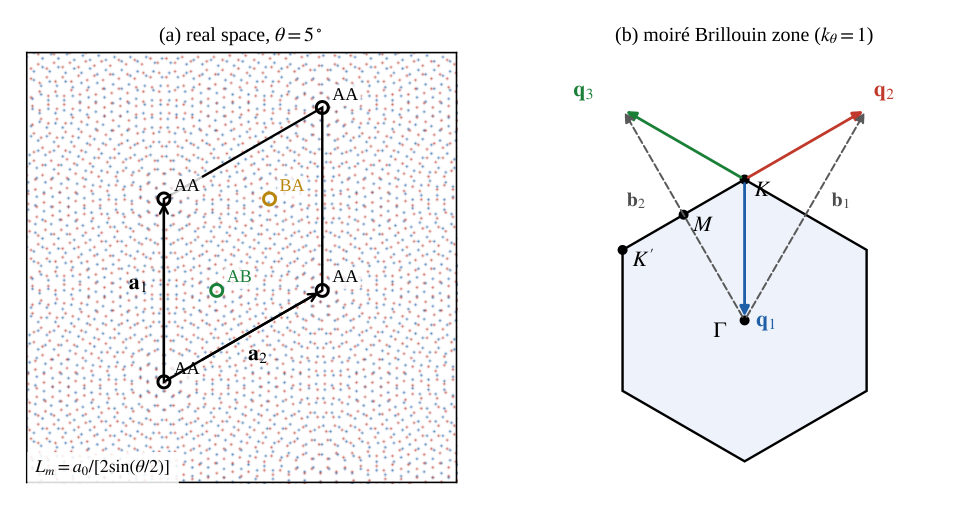 
Figure 1: Geometry of TBG. (a) Two honeycomb lattices (blue and red) rotated by θ = 5◦. The moir´e cell spanned by a1, a2 has AA regions at its corners, where the atoms of both layers sit on top of each other, and AB and BA regions inside, where one sublattice of one layer sits on top of the other sublattice of the other layer. (b) Moir´e Brillouin zone in units of kθ. The vectors qν join the Dirac points of the two layers; b1,2 are reciprocal lattice vectors.

📷 Fig 2

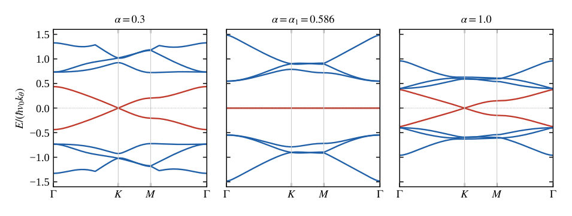 
Figure 2: Bands of the chiral Hamiltonian (6) along Γ–K–M–Γ, below, at, and above the first magic angle. The two central bands are shown in red. At α1 they are exactly flat.

📷 Fig 3

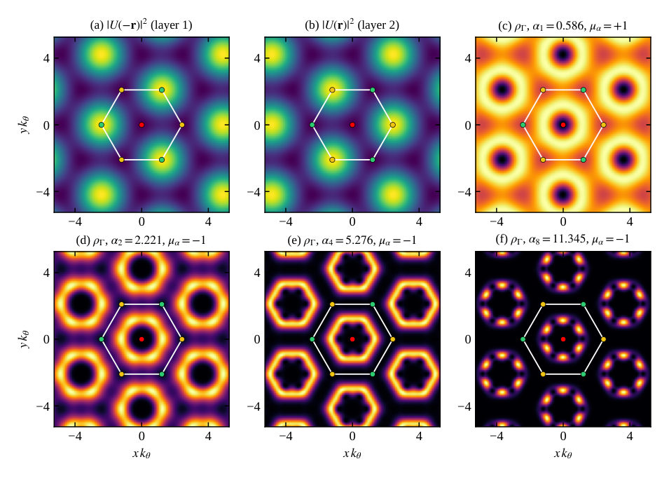 
Figure 3: (a),(b) Confinement potentials of the two layers in Eq. (14). (c)–(f) Electronic density ρΓ = |ψ1|2 + |ψ2|2 of the Γ-point zero mode at the magic angles α1, α2, α4 and α8, normalized to its maximum. The white hexagon is the moir´e Wigner–Seitz cell centred at AA (red dot); yellow and green dots mark BA and AB. As m grows the density is pushed away from AA and concentrates on a ring of radius close to π/3 ≈1.05, breaking into six spots (Sec. 4).

📷 Fig 4

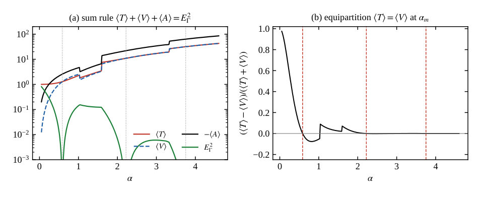 
Figure 4: Energy balance of the lowest state at Γ, computed from Eq. (22) with a normalized two-layer wavefunction. (a) Kinetic energy ⟨T⟩, confinement energy ⟨V ⟩, interlayer energy −⟨A⟩and E2 Γ. (b) Relative difference between kinetic and confinement energy; red dashed lines mark the magic angles. The two energies become equal at the magic angles (exactly in the limit of large m, Appendix C).

📷 Fig 5

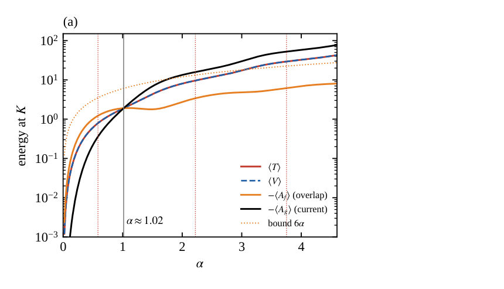 
Figure 5: Zero mode at the Dirac point K as a function of α: kinetic energy ⟨T⟩, confinement energy ⟨V ⟩ (identical to ⟨T⟩for every α), and the two interlayer channels, the bounded overlap term −⟨Af⟩and the current term −⟨Ag⟩. The dotted orange line is the bound | ⟨Af⟩| ≤6α. The two channels cross at α ≈1.02 (grey line); dotted red lines mark α1, α2, α3.

**Summary.** This theoretical work develops a unified theory for the magic angles in twisted bilayer graphene, explaining the formation of perfectly flat bands using a chiral continuum model. The key finding is that the non-Abelian nature of the interlayer coupling is essential, leading to a divergence in the ratio of Coulomb to kinetic energy, which signals the onset of strongly correlated electronic phases.

**Why it may be interesting.** The deep connection between the underlying non-Abelian gauge structure and the emergence of topological flat bands provides a rich theoretical framework applicable to other moiré heterostructures or systems exhibiting strong geometric coupling.

Detailed structure

**Main problem.** The paper investigates the origin of perfectly flat electronic bands at specific 'magic' twist angles in twisted bilayer graphene (TBG). It aims to provide a unified theoretical understanding of this phenomenon.

**Main result.** The flat bands arise due to the non-Abelian structure of the interlayer coupling, leading to a divergence in the ratio of Coulomb energy to bandwidth ($U_C/W$), which is the prerequisite for correlated electronic phases.

**Method.** The theory employs the chiral continuum model, analyzing the square of the chiral Hamiltonian to derive energy sum rules and study the zero-mode problem using concepts from non-Abelian gauge fields.

**Model / system.** The system is Twisted Bilayer Graphene (TBG) described by the Bistritzer–MacDonald Hamiltonian. The analysis focuses on the effective Hamiltonian derived from squaring the chiral Hamiltonian, which incorporates non-Abelian $SU(2)$ pseudo-magnetic fields.

**Key observables.** Flat band energy ($E=0$), Chern numbers ($C=\pm2$), quantum metric, and the ratio $U_C/W$.

**Important parameters / regimes.** Magic angles ($\alpha_m$), the dimensionless coupling parameter ($\alpha$), and the asymptotic spacing $\alpha_{m+1} - \alpha_m 	o 3/2$.

**Assumptions / limitations.** The analysis often relies on the chiral limit ($w_{AA}=0$) and treats the problem using asymptotic approximations (e.g., oscillator picture for large $\alpha$).

**Figures summary.** Figures illustrate the geometry of TBG and the band structure along the Moiré Brillouin zone ($\Gamma–K–M–\Gamma$) at various coupling strengths relative to the magic angles.

**Paper structure.** The paper builds from the general continuum model to derive an energy sum rule, analyzes the role of the non-Abelian structure, and finally examines the zero-mode problem in the asymptotic limit to confirm the physical mechanism for flat bands.

Abstract

At a discrete set of ``magic'' twist angles, twisted bilayer graphene develops two bands at charge neutrality that are almost perfectly flat. We present a unified theory of this phenomenon within the chiral continuum model. The central object is the square of the chiral Hamiltonian, a $2\times2$ Schrödinger operator for an electron moving in a non-Abelian $SU(2)$ pseudo-magnetic field generated by the interlayer tunneling. From it we derive an energy sum rule in which the interlayer coupling splits into a bounded overlap channel and an unbounded current channel; their different scaling with the coupling $α$ explains why the first magic angle is qualitatively different from the rest. The asymptotic rule $α_{m+1}-α_m\to3/2$ follows from a rescaling of the moiré potential together with its three-cell magnetic periodicity, with the two parity families of zero modes each repeating with period $3$ and interleaved with each other. Near the AA point the zero-mode problem becomes a lowest-Landau-level problem in an effective field $B_{\rm eff}=3α$, so that the high-order zero modes are coherent Landau states of width $1/\sqrt{3α}$ whose guiding centres converge to $\pm(π/3) q_μ$, with kinetic and confinement energies in equipartition. Deforming the coupling into an Abelian one removes the magic-angle sequence, which shows that the non-Abelian structure is essential. Between consecutive magic angles, band inversions at $Γ$ and $M$ produce phases with Chern numbers $C=\pm2$, and the quantum metric reaches a sharp maximum at $θ\approx0.43^\circ$, identifying a promising regime for correlated and topological phases beyond the first magic angle.

[↑ back to top](#top)

### [Negative charging energy in LaAlO$_3$/SrTiO$_3$ quantum dots induced by SrTiO$_3$ polarization](http://arxiv.org/abs/2610.07878v1)

**Authors:** J. Czarnecki, A. Sierant, B. Szafran, P. Szumniak, T. S. Jespersen, G. Meucci, T. Jansen, R. Citro, A. Maiellaro, N. Bergeal, M. Bibes, M. Saluzzo, A. Kalaboukhov, P. Wójcik  
**Type:** theory · **Category:** strongly correlated electrons · **PDF:** <https://arxiv.org/pdf/2610.07878v1>  
**Analysis basis:** full PDF text, analyzed in chunks
**Topic relevance:** `Keldysh / 2PI / non-Gaussian methods` **1/5** · `analog quantum simulation` **1/5**

📷 Fig 1

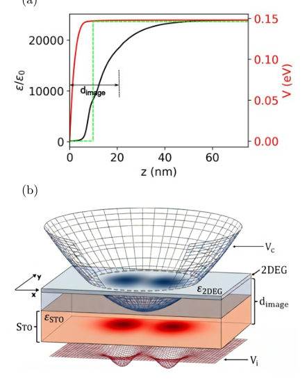 
FIG. 1. (a) Self-consistent potential V (z) (red) and the dielec- tric permittivity ε(z) (black) determined along the direction perpendicular to the interface, located at z = 0. The green line corresponds to the step-like profile approximation of ε used in our calculations. It divides the system into two re- gions: (i) the 2DEG located at z = 0 with ε2DEG = 100 and (ii) STO with εSTO = 25000, separated from the 2DEG by a distance dimage/2. (b) Schematic illustration of the proposed mechanism. Electrons in the QD, confined by the external potential Vc, induce image charge in STO, which generates an additional electrostatic potential Vi and leads to the neg- ative charging energy. Parts of...

📷 Fig 2

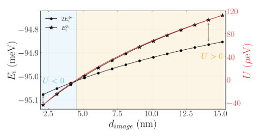 
FIG. 2. The total energy of two-electron QD (stars) and two single-electron QDs (dots) as a function of the distance of the image charge with respect to the 2DEG, dimage. Results for the QD with parabolic confinement defined by the characteris- tic length of ξ = 30 nm. The blue-shaded region corresponds to the negative-U regime, characterized by a preference for double occupancy; see the right-hand axis.

📷 Fig 3

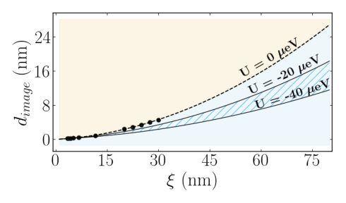 
FIG. 4. The critical value of dimage below which the negative- U regime emerges as a function of the characteristic con- finement length ξ. The yellow and blue regions correspond to the positive and negative U regimes, respectively. The symbols correspond to numerical data, while the dashed curve represents an interpolation. The shaded region with U ∈[−40, −20] µeV indicates the range of the phase diagram extracted in the previous experiments.

📷 Fig 4

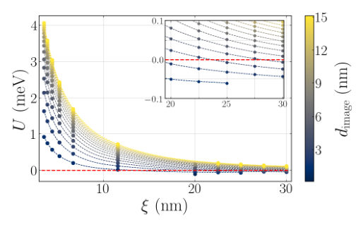 
FIG. 3. The interaction parameter U = E2e t −2E1e t as a function of the characteristic confinement length ξ for several selected values of dimage, marked by color. The inset provides a magnified view of the region around the transition to the negative-U regime. Dashed lines are guide to the eye.

**Summary.** This theoretical work develops a mechanism showing that the polarization of the SrTiO3 substrate induces an image charge that counteracts direct Coulomb repulsion in LaAlO3/SrTiO3 quantum dots. By using a self-consistent calculation, the authors demonstrate that this image-charge effect leads to a negative charging energy, suggesting a controllable route for electron pairing in oxide materials.

**Why it may be interesting.** The mechanism provides an explicit, purely electrostatic pathway to induce electron pairing (negative U), which is a key concept in understanding unconventional superconductivity and correlated electron behavior in oxide heterostructures.

Detailed structure

**Main problem.** The paper proposes a microscopic mechanism to explain the observation of negative charging energy (U < 0) in LaAlO3/SrTiO3 quantum dots.

**Main result.** The negative charging energy arises from the electrostatic image charge induced by the paraelectric response of the SrTiO3 substrate, establishing a controllable route for electron pairing in oxide quantum dots.

**Method.** A self-consistent configuration-interaction approach is employed to solve the two-electron Hamiltonian, incorporating both direct Coulomb repulsion and the image-charge interaction.

**Model / system.** The system is the LaAlO3/SrTiO3 interface forming a 2DEG in quantum dots. The model includes kinetic, spin-orbit, and image-charge potentials, solved iteratively.

**Key observables.** Negative charging energy (U < 0), which signifies that the energy of two electrons is lower than twice the energy of a single electron.

**Important parameters / regimes.** The strength of the pairing is tunable by the confinement potential and the effective image-charge distance set by the interfacial thickness.

**Assumptions / limitations.** The dielectric permittivity of STO is modeled using a field-dependent relation, and the image charge is approximated using a step-like function.

**Figures summary.** Figure 1 illustrates the self-consistent potential and permittivity profile, while Figure 2 compares the total energy of a two-electron QD versus two separate single-electron QDs to show the negative-U regime.

**Paper structure.** The paper establishes the physical problem, develops a Hamiltonian including image-charge terms, solves the two-electron problem self-consistently, and maps out the parameter space showing the conditions for negative charging energy.

Abstract

We propose a microscopic mechanism for the negative charging energy in LaAlO$_3$/SrTiO$_3$ quantum dots, arising from the electrostatic image charge associated with the paraelectric response of SrTiO$_3$. Using a self-consistent configuration-interaction approach that accounts for both Coulomb repulsion and image-charge interactions, we find a robust regime of electron pairing whose strength is tunable through the confinement potential and the effective image-charge distance, set by the thickness of the interfacial two-dimensional electron gas. Our results establish dielectric image-charge effects as a route to controllable electron pairing in oxide quantum dots and other materials with a strong dielectric response.

[↑ back to top](#top)

### [Ultra-small-angle graphene twistronics with monolayer spacers: From interlayer hybridisation and moiré effects to high-temperature magnetotransport oscillations](http://arxiv.org/abs/2610.08505v1)

**Authors:** Benjamin Fuller, Haowei Fan, Agustin Montemurro, Yuyuan Pan, Alexey I. Berdyugin, Vladimir I. Falko, Xiao Li  
**Type:** theory · **Category:** other · **PDF:** <https://arxiv.org/pdf/2610.08505v1>  
**Analysis basis:** full PDF text, analyzed in chunks
**Topic relevance:** `Keldysh / 2PI / non-Gaussian methods` **1/5** · `analog quantum simulation` **1/5**

📷 Fig 1

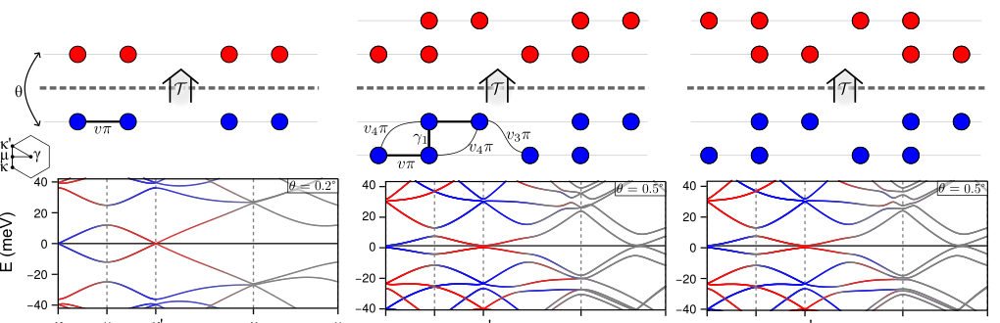 
Figure 1. Microscopic structures (top) and exemplary dispersions (bottom). Left: MLG/hBN/MLG, 0.2◦twist. Center: parallel BLG/hBN/BLG, 0.5◦twist. Right: antiparallel BLG/hBN/BLG, 0.5◦twist. Dashed gray line is the hBN spacer. The dispersions are calculated at 0 filling and D = 0 and the solid black line is the Fermi level at charge neutrality. The vertical axis is energy in meV. Red/blue colour indicates carrier polarisation ∆(k, n) on top/bottom layer(s), defined in Eq. (14). Inset shows the high-symmetry path followed around the mBZ for the dispersions.

📷 Fig 2

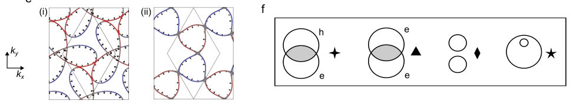 
Figure 2. Results for MLG/hBN/MLG, θ = 0.2◦. Maps are for varying external displacement field D against carrier density n (bottom ticks), which corresponds to filling factor of the moiré unit cell ν (top ticks). (a): inverse density of states at the Fermi level. Dotted lines trace positions of Lifshitz transitions due to van Hove singularities (vHS), of two types (i) and (ii) for which exemplary Fermi contours are shown in (e). The right halves of the maps are equivalent, just with layers switched, so for clarity they are not annotated with lines. (b): hybridisation between top and bottom layers, Π, defined in Eq. (13). White dashed lines shows where the Fermi level lies at the threshold of...

📷 Fig 3

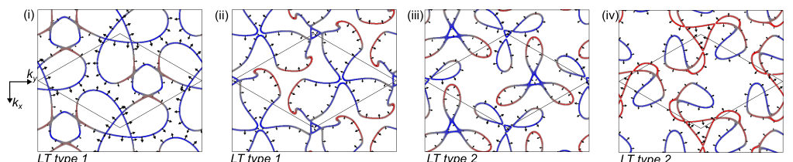 
Figure 3. Results for parallel (inversion symmetric) BLG/hBN/BLG, θ = 0.5◦. Maps are for varying external displacement field D against carrier density n (bottom ticks), which corresponds to filling factor of the moiré unit cell ν (top ticks). (a): inverse density of states at the Fermi level. Dotted lines trace positions of Lifshitz transitions (LTs) due to van Hove singularities, some of which are shown in (e). The right halves of the maps are equivalent so are not annotated with lines for clarity. (b): hybridisation Π between top and bottom bilayers, defined in Eq. (15). (c): longitudinal resistivity normalised by scattering time, ρxx · τ . Dashed lines show positions of the CNPs for...

📷 Fig 4

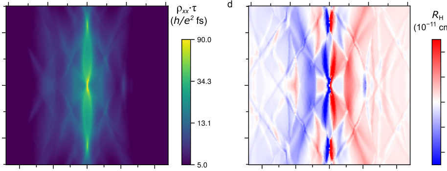 
Figure 4. Results for antiparallel (inversion asymmetric) BLG/hBN/BLG, θ = 0.5◦. Maps are for varying external displace- ment field D against carrier density n (bottom ticks), which corresponds to filling factor of the moiré unit cell ν (top ticks). (a): inverse density of states at the Fermi level. (b): hybridisation Π between top and bottom bilayers, defined in Eq. (15). (c): longitudinal resistivity normalised by scattering time, ρxx · τ. (d): Hall coefficient.

📷 Fig 5

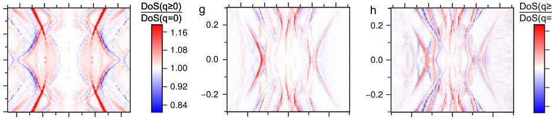 
Figure 5. Comparing the significance of finite q Hartree terms to the q = 0 only model. (a-b): Exemplary line cuts of DoS calculated with (red) and without (black) the finite momentum terms. Left: MLG/hBN/MLG, θ = 0.2◦. Right: parallel BLG/hBN/BLG, θ = 0.5◦. DoS is plotted against carrier density n for three line cuts at different displacement fields as labelled on the plot. The bottom lines are at the numerical DoS as shown, but the middle and top lines are shifted up by 0.5 and 1 units respectively, so they can be distinguished. Red lines are the full model (DoS(q ≥0)); the black lines underneath are the homogeneous part only (DoS(q = 0)). (c-e): Maps of the magnitude of the first shell...

**Summary.** This work theoretically models quantum transport in twisted graphene multilayers separated by hBN spacers. By analyzing moiré superlattice effects and interlayer hybridization, the authors predict the formation of minibands and the emergence of persistent $1/B$-periodic quantum oscillations in resistivity. This provides a detailed framework for understanding tunable quantum electronic properties in van der Waals heterostructures.

**Why it may be interesting.** The detailed modeling of moiré superlattices and the prediction of high-temperature quantum oscillations in weakly coupled 2D materials are highly relevant to understanding emergent quantum phenomena in engineered quantum systems.

Detailed structure

**Main problem.** The study investigates the spectral features and quantum transport effects in small-angle twisted graphene multilayers separated by a hexagonal boron nitride (hBN) spacer.

**Main result.** The system exhibits minibands, hosts Lifshitz transitions, and predicts $1/B$-periodic quantum oscillations in resistivity due to semiclassical magneto-oscillations of interlayer hybridization.

**Method.** The analysis employs a hybrid k.p-theory–tight-binding (HkpTB) approach, utilizing self-consistent Hartree mean-field calculations.

**Model / system.** The physical system is MLG/hBN/MLG or BLG/hBN/BLG, modeled using Hamiltonians that account for moiré interlayer tunneling, which is significantly weaker than direct contact.

**Key observables.** Density of States (DoS), miniband edges, van Hove singularities, interlayer hybridization ($\Pi$), and magnetotransport oscillations (Brown-Zak oscillations, $1/B$-periodic oscillations).

**Important parameters / regimes.** Twist angles ($	heta = 0.2^\circ, 0.5^\circ$), out-of-plane displacement field, and magnetic field ($B$).

**Assumptions / limitations.** The spacer is assumed to be a monolayer hBN, and the analysis often compares results with and without in-plane periodic charge distribution.

**Figures summary.** Figures illustrate microscopic structures and exemplary dispersions for the different graphene/hBN/graphene systems, and show DoS maps and magnetotransport results.

**Paper structure.** The paper progresses from defining the Hamiltonian for different bilayer configurations (MLG/hBN/MLG, BLG/hBN/BLG) to performing self-consistent calculations, analyzing key transport diagnostics like hybridization and magnetotransport, and finally discussing the physical implications of these findings.

Abstract

Based on the analysis of moiré superlattice characteristics and interlayer hybridisation in small-angle twisted graphene multilayers with a monolayer hexagonal boron nitride (hBN) spacer, we predict spectral features and quantum transport effects in these systems. Here, we consider both a twisted bilayer and double bilayers with a spacer, discuss double bilayers in two stacking orders - with and without inversion symmetry - and also compare the results obtained with self-consistent Hartree calculations with and without in-plane periodic charge distribution, offering computationally efficient models for these graphene/hBN/graphene moiré systems. We note parametric intervals where the appearance of minibands can be enhanced by tuning with an out-of-plane displacement field, and identify the miniband edges and van Hove singularities across a broad range of densities and displacement fields. These system host Lifshitz transitions at which the Fermi lines form a network across moiré Brillouin zones, and to which Brown-Zak oscillations converge at low magnetic field and elevated temperatures. We analyse interlayer hybridisation across the same parameter space, discuss how hybridisation affects in-plane magneto-transport in ultra-high-mobility structures, and predict that semiclassical magneto-oscillations of interlayer hybridisation can lead to 1/B-periodic quantum oscillations of resistivity persistent to high temperature.

[↑ back to top](#top)

### [Conditions for Altermagnetism in RuO2](http://arxiv.org/abs/2610.07494v1)

**Authors:** Himanshu Mavani, Zhonglin He, Evgeny Y. Tsymbal  
**Type:** both · **Category:** strongly correlated electrons · **PDF:** <https://arxiv.org/pdf/2610.07494v1>  
**Analysis basis:** full PDF text, analyzed in chunks
**Topic relevance:** `Keldysh / 2PI / non-Gaussian methods` **1/5**

📷 Fig 1

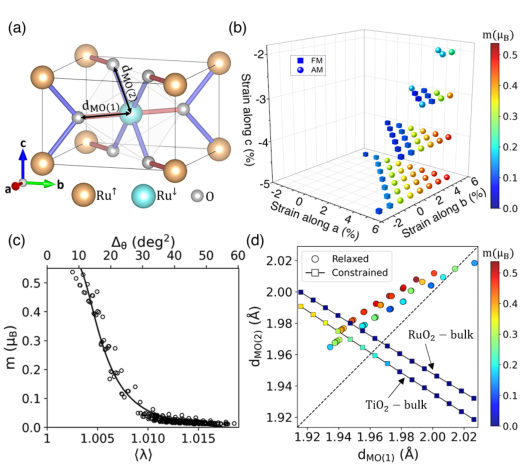 
Figure 1: (a) Crystallographic unit cell of rutile RuO2. Blue and red Ru- O bonds distinguish the two inequivalent RuO6 octahedral bonds. (b) The Ru magnetic moments under strain along the crystallographic axes. Spheres and cubes indicate altermagnetic and ferromagnetic ground states, respectively. (c) The Ru magnetic moments for all structures as functions of the mean quadratic elongation ⟨𝜆⟩ and the octahedral cis- angle variance Δఏ. The solid line is a guide to the eye. (d) Magnetic moment distribution in the ( 𝑑୑୓(ଵ), 𝑑୑୓(ଶ)) plane. Scatter points represent all strained structures considered in (b). Solid lines correspond to constrained variations of the internal parameter u, which...

📷 Fig 2

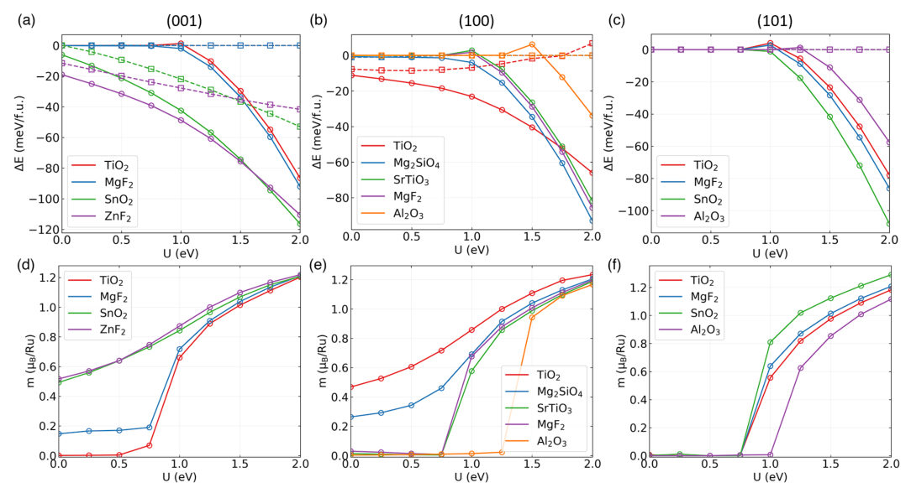 
Figure 2: (a-c) Energy differences relative to the nonmagnetic phase for the altermagnetic (solid lines) and ferromagnetic (dashed lines) phases as functions of Hubbard U for the (001), (100), and (101) orientations, respectively. (d-f) The Ru magnetic moments in the altermagnetic phase as functions of Hubbard U for the corresponding orientations.

📷 Fig 3

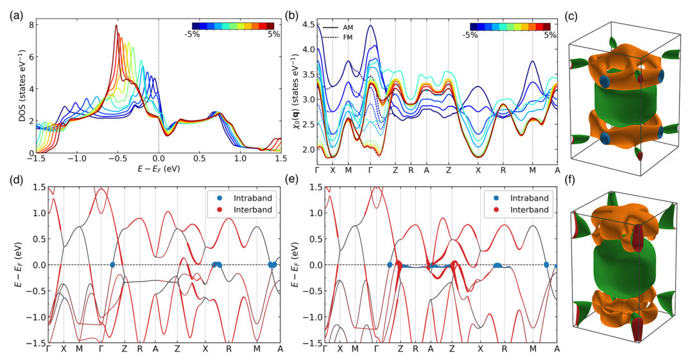 
Figure 3: Electronic structure and magnetic susceptibility of RuO2 under 5% tensile strain along both the a and b axes, with c-axis strain varied from −5% to 5%. (a) Nonmagnetic density of states per spin per unit cell. Colors indicate the c-axis strain. (b) Altermagnetic (solid lines) and ferromagnetic (dashed lines) susceptibilities along a high-symmetry path in the Brillouin zone. (c, f) Nonmagnetic Fermi surfaces for c-axis strains of 0% and −5%, respectively. (d, e) Band-resolved intraband and interband contributions to 𝜒଴ ୅୑(Γ) for c-axis strains of 0% and −5%, respectively.

📷 Fig 4

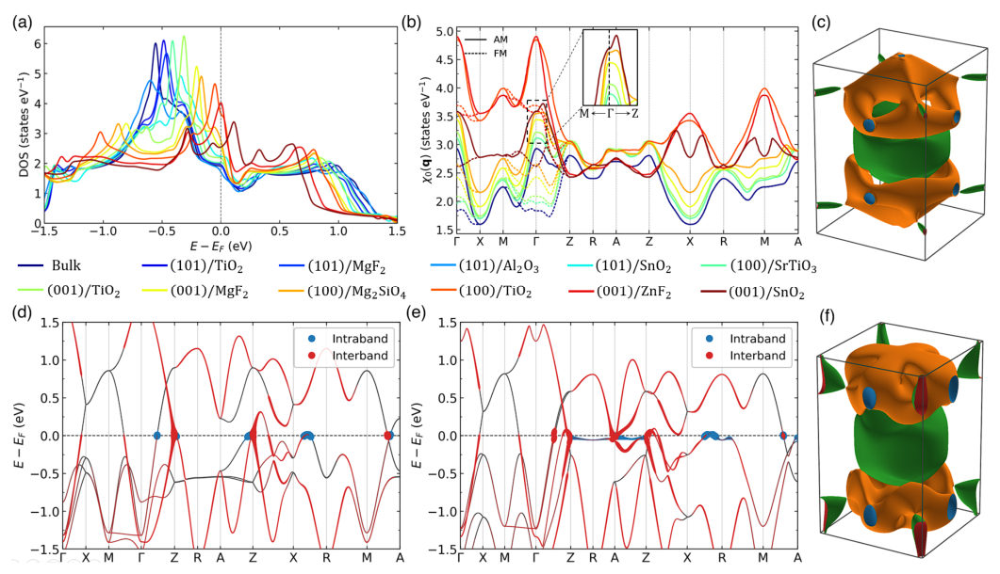 
Figure 4: Electronic structure and magnetic susceptibility of RuO2 constrained to different substrates and different orientations. (a) Nonmagnetic density of states per spin per unit cell. (b) Altermagnetic (solid lines) and ferromagnetic (dashed lines) susceptibilities along a high-symmetry path in the Brillouin zone. (c, f) Nonmagnetic Fermi surfaces for bulk RuO2 (c) and RuO2(100)/TiO2(100) (f), respectively. (d, e) Band-resolved intraband and interband contributions to 𝜒଴ ୅୑(Γ) for bulk RuO2 (d) and RuO2(100)/TiO2(100) (e), respectively.

📷 Fig 5

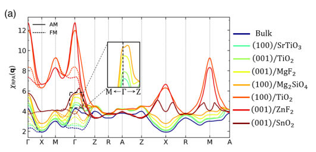 
Figure 5: Altermagnetic (solid lines) and ferromagnetic (dashed lines) RPA susceptibilities with 𝑈= 0.5 𝑒𝑉 and 𝐽/𝑈= 0.15 for the RuO2 under the epitaxial strain conditions imposed by the different substrates and orientations.

**Summary.** This work addresses the long-standing debate about the magnetic state of $	ext{RuO}_2$ by combining advanced theory and experimental review. It concludes that epitaxial strain is the primary driver for achieving altermagnetism in $	ext{RuO}_2$ films, providing concrete material design rules for realizing this quantum state.

**Why it may be interesting.** The detailed theoretical modeling of magnetic ordering in transition metal oxides, particularly the focus on strain and correlation effects, provides a rich playground for understanding emergent quantum magnetism.

Detailed structure

**Main problem.** The central question is determining the structural and chemical conditions under which the rutile material $	ext{RuO}_2$ can exhibit altermagnetism, given conflicting experimental evidence regarding its magnetic ground state.

**Main result.** The study identifies substrate-imposed epitaxial strain as the leading factor favoring altermagnetism, while doping and substitution can modify this strain-induced magnetic state in predictable ways.

**Method.** The research combines a critical review of numerous experimental techniques (e.g., ARPES, $\mu	ext{SR}$, XMLD) with extensive first-principles calculations (DFT, DFT+U, RPA) to model the electronic structure.

**Model / system.** The physical system is $	ext{RuO}_2$ in its rutile structure, studied in bulk, as thin films, and as superlattices grown on various substrates like $	ext{TiO}_2$ and $	ext{SrTiO}_3$. The theoretical modeling incorporates effects like epitaxial strain, point defects, and carrier doping.

**Key observables.** Magnetic moments ($\mu_B$), Néel vector direction, spin splitting in electronic bands, and the emergence of altermagnetic order.

**Important parameters / regimes.** Epitaxial strain, Hubbard interaction strength ($U$), doping concentration (hole doping, $	ext{Cr}$ or $	ext{Mn}$ substitution), and substrate orientation.

**Assumptions / limitations.** The analysis requires separating the contributions of strain, defects, and doping, as these effects are intertwined in the experimental measurements.

**Figures summary.** Figures illustrate the magnetic ground state dependence on $U$ and doping for bulk and strained systems, and show the calculated altermagnetic band structures for specific strained configurations.

**Paper structure.** The paper systematically investigates the magnetic behavior by varying parameters like $U$, doping, and epitaxial strain across multiple theoretical sections, culminating in a comprehensive mapping of the magnetic phase diagram.

Abstract

The magnetic ground state of rutile RuO2 remains disputed, raising a central question: under what structural and chemical conditions can this material support altermagnetism? We address this question by combining a critical assessment of experimental and theoretical studies with first-principles calculations of epitaxial strain, point defects, doping, and interfaces. Bulk-sensitive measurements reported in the literature are consistent with a nonmagnetic ground state, while magnetic signatures in thin films depend strongly on their structural environment and do not necessarily establish homogeneous altermagnetic order. Our calculations identify substrate-imposed epitaxial strain as the leading factor favoring altermagnetism among the conditions examined and predict several substrate-orientation combinations that stabilize an altermagnetic ground state. Carrier doping and chemical substitution modify this strain-induced magnetism in distinct ways. Uniform hole doping strengthens the magnetic tendency, whereas Ru vacancies provide little benefit and can weaken the magnetic state through local structural distortions. Cr or Mn substitution, by contrast, enhances Ru magnetic moments and further stabilizes the strained altermagnetic phase. These results distinguish the effects of carrier doping from those of local structural and chemical changes and identify concrete routes to realizing altermagnetism in RuO2 films.

[↑ back to top](#top)

### Other secondary papers (4)

Show other secondary papers

### [2d-fet-bench: from spatial reasoning to fet design on flakes](http://arxiv.org/abs/2610.07423v1)

**Authors:** Dunzhi Zhou, Chengyu Zhu, Gang Qiu, Caiwen Ding  
**Type:** theory · **Category:** other · **PDF:** <https://arxiv.org/pdf/2610.07423v1>  
**Analysis basis:** full PDF text, analyzed in chunks

📷 Fig 1

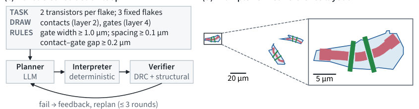 
Figure 1: Benchmark construction and task interface, illustrated with task L3/case_8. (a) The contour pool grouped by shape tier, with hole probes selected separately. (b) An illustrative multi-flake placement that differs from the placement of this task. (c) The ReAct-3 construction loop, with the condensed request shown to the agent as its input. (d) The stored reference layout for this task, produced by reference code. Contours derive from MaskTerial dataset masks [Uslu et al., 2025a], scales are nominal, and material labels assign the n- and p-type device roles in each layout.

📷 Fig 2

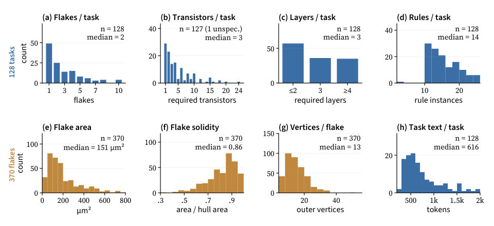 
Figure 2: Distributions over the 128 tasks (a: flakes, b: transistors, c: layers, d: rules, h: task-text tokens) and their 370 flakes (e: area, f: solidity, g: vertices). Each panel gives n and the median. Flake areas use the nominal 0.293 µm/pixel scale.

📷 Fig 3

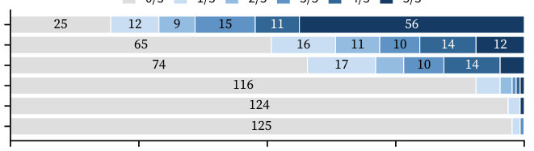 
Figure 3: Task-level consistency (ReAct-3/C0). Each bar splits the 128 tasks by successes in five attempts. Pass@5 is the share outside 0/5, all-five is the 5/5 share, and pass@1 is the mean of ct/5.

📷 Fig 4

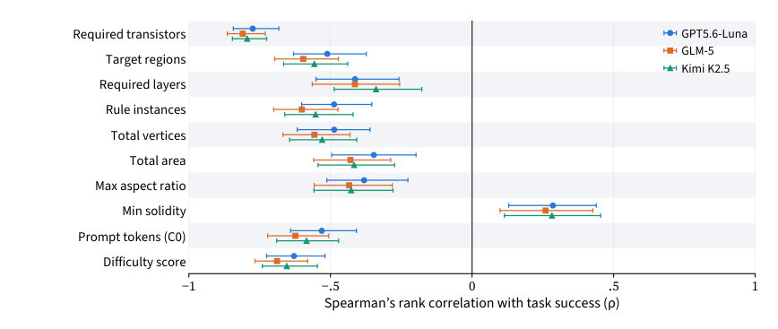 
Figure 4: Task-property associations with success under ReAct-3/C0. Points show Spearman’s rank correlation (ρ) between each task property and the number of successful attempts out of five for GPT5.6-Luna, GLM-5, and Kimi K2.5. Bars show 95% bootstrap intervals over 128 tasks (127 for required transistors). Negative values mean higher property values coincide with lower success.

📷 Fig 5

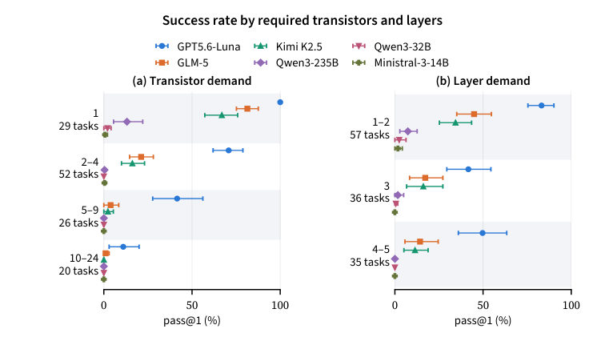 
Figure 5: Pass@1 by (a) required transistors per task and (b) editable design layers for the six ReAct-3/C0 configurations, with 95% task-bootstrap intervals. Each bin label gives its task count.

**Summary.** This paper presents 2D-FET-Bench V2, a novel benchmark designed to test if large language model agents can automatically design functional Field-Effect Transistors on irregularly shaped 2D material flakes. By requiring agents to translate textual specifications into precise geometric layout files, the work pushes the frontier of AI-driven microelectronic design automation.

**Why it may be interesting.** While not directly about quantum physics, the rigorous testing of AI agents on complex, constrained geometric design tasks (like semiconductor layout) represents a significant advancement in applying AI to materials science engineering problems.

Detailed structure

**Main problem.** The paper introduces an executable benchmark to test the ability of language-model agents to reliably perform complex, flake-specific Field-Effect Transistor (FET) layout construction on 2D materials.

**Main result.** The best-performing agent configuration (GPT5.6-Luna with ReAct-3) achieved 80.5% task coverage, demonstrating that AI can tackle the geometric and structural challenges of device design.

**Method.** The authors developed 2D-FET-Bench V2, a benchmark of 128 tasks requiring agents to translate textual device specifications into precise GDSII polygon and path operations.

**Model / system.** The physical system involves designing FETs on exfoliated 2D flakes (like graphene or MoSe2), where the contacts and gates must conform precisely to the irregular, microscopy-derived contours of the substrate.

**Key observables.** Task success rate (pass@k), task coverage, consistency across multiple attempts, and adherence to geometric/structural design rules (DRC).

**Important parameters / regimes.** The benchmark tasks vary in complexity, involving between 1 and 10 flakes and 1 to 24 required transistors.

**Assumptions / limitations.** The benchmark tests spatial reasoning from specification to geometry, independent of direct optical image perception, and success requires passing multiple deterministic checks (DRC, structural integrity, input preservation).

**Figures summary.** Figures illustrate the benchmark construction process, showing input flake contours, the agent's construction loop, and examples of verified reference layouts.

**Paper structure.** The paper introduces the problem, details the 2D-FET-Bench V2 dataset (128 tasks), describes the agent workflow (textual spec -> polygon ops -> GDSII), and presents quantitative results comparing various LLM configurations.

Abstract

Field-effect transistor (FET) layouts on exfoliated two-dimensional flakes are typically drawn by hand for each flake, placing contacts and gates to match its position and outline in optical micrographs. To our knowledge, no executable benchmark tests whether language-model agents can perform this flake-specific construction reliably. We introduce 2D-FET-Bench V2, a benchmark of 128 layout tasks built from microscopy-derived flake contours, including hole-containing flakes and multi-flake tasks. Each task supplies a textual device specification and contour coordinates. An agent generates typed polygon and path operations rendered to GDSII. A deterministic verifier checks geometric and structural requirements, and a separate integrity check verifies that the supplied contours remain unchanged. Scripted reference layouts pass all 128 tasks, showing that every task is solvable. We evaluate six models and seven workflow and scaffold variants of GPT5.6-Luna, with five attempts per task. The best-performing configuration in the six-model panel, GPT5.6-Luna with ReAct-3, passes 62.3% of attempts and solves 80.5% of tasks at least once (coverage) and 43.8% in all five attempts (consistency). ReAct-3 exceeds the one-pass Plan-and-Execute by 27.0 pass@1 points at 2.46 times the tokens. An expert audit of one sampled verifier-passing layout per covered task, across five ReAct-3 configurations, accepts 56.4% to 63.5% of them. The benchmark evaluates geometric and structural FET layout construction.

[↑ back to top](#top)

### [Calculation of structural symmetry and applicability of small AkBlCm nanoclusters (A=Rb, Cs; B=Pb, Sn, Bi; C=Cl, Br, I) as building blocks for synthesis of larger-size nanoclusters](http://arxiv.org/abs/2610.08380v1)

**Authors:** Roman Makarevych, Igor Dmytruk, Yevhen Hrabovskyi, Iryna Pundyk, Nataliia Bashmakova, Nataliya Berezovska  
**Type:** theory · **Category:** other · **PDF:** <https://arxiv.org/pdf/2610.08380v1>  
**Analysis basis:** full PDF text, analyzed in chunks

📷 Fig 1

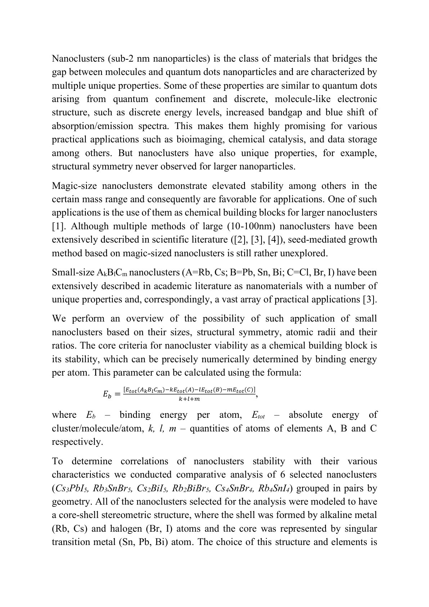 
Low-resolution page preview, page 2

📷 Fig 2

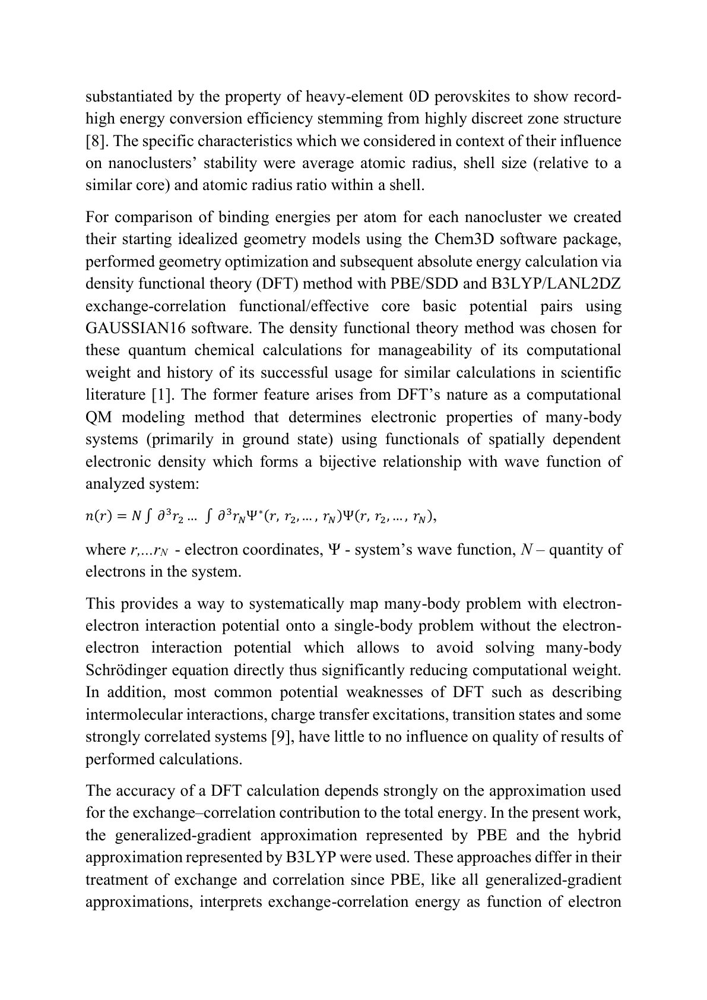 
Low-resolution page preview, page 3

📷 Fig 3

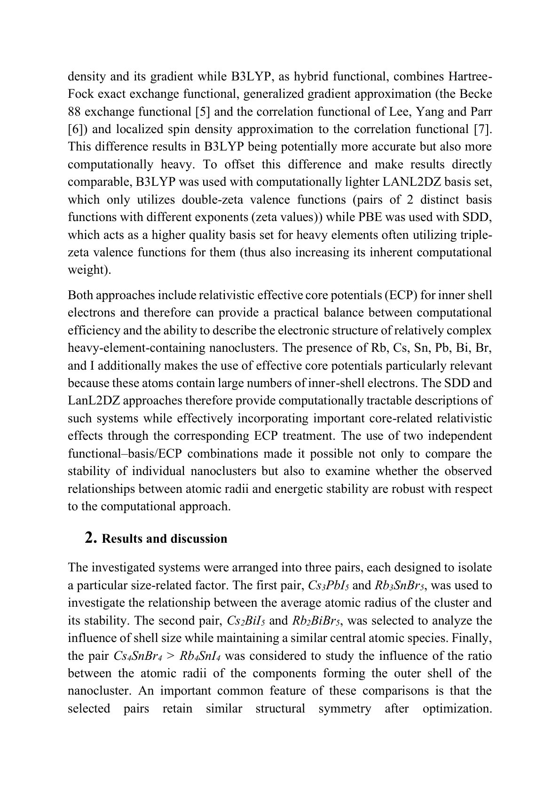 
Low-resolution page preview, page 4

📷 Fig 4

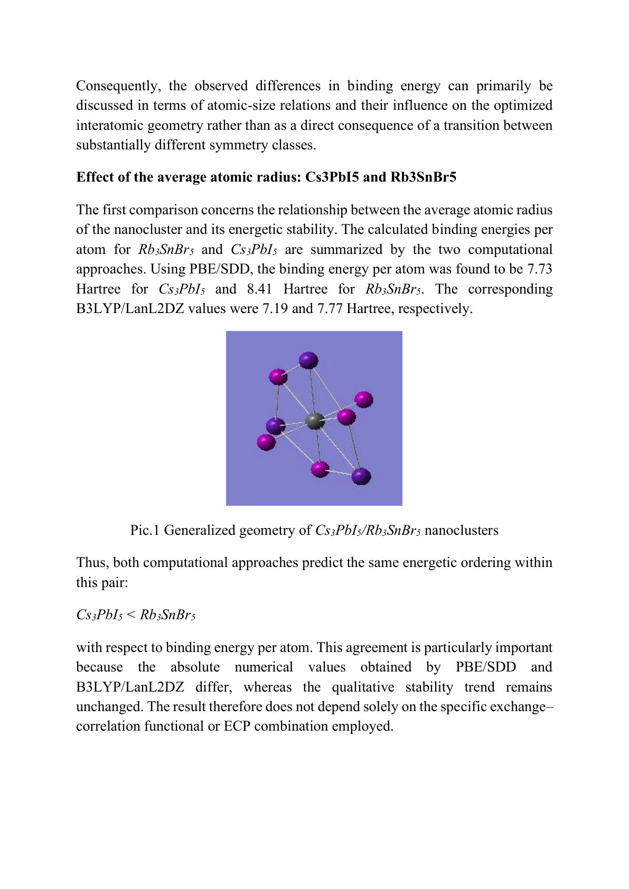 
Low-resolution page preview, page 5

📷 Fig 5

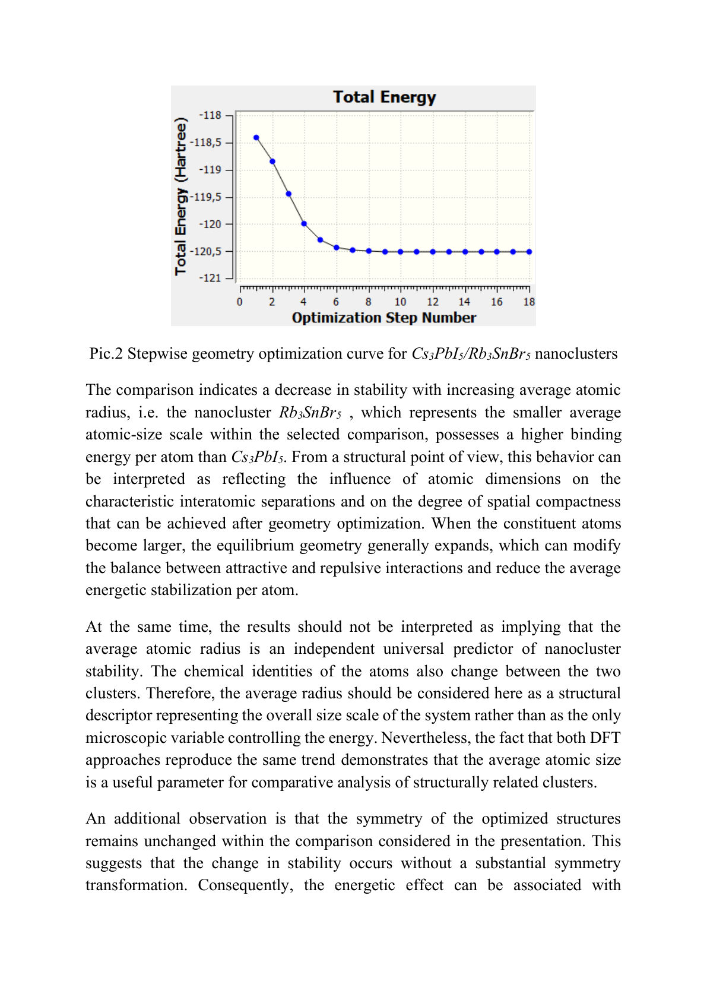 
Low-resolution page preview, page 6

**Summary.** This paper computationally investigates the structural symmetry and stability of small $	ext{A}_k	ext{B}_l	ext{C}_m$ nanoclusters using DFT. By comparing multiple cluster types, the authors establish that energetic stability is governed by the relative sizes and ratios of the constituent atoms, rather than just the absolute structural symmetry. This provides a predictive framework for designing larger, stable nanostructure building blocks.

**Why it may be interesting.** While the topic is solid-state chemistry, the rigorous use of computational methods (DFT, basis sets) to establish quantitative relationships between structural descriptors (radii ratios) and energetic stability is methodologically relevant for any field relying on first-principles material prediction.

Detailed structure

**Main problem.** The study aims to determine the structural symmetry and energetic stability criteria for small AkBlCm nanoclusters to assess their viability as building blocks for synthesizing larger nanoclusters.

**Main result.** Energetic stability is controlled by interconnected geometrical parameters, such as the average atomic radius and the relative size matching of the constituent shells, rather than solely by structural symmetry.

**Method.** The research employs quantum-chemical calculations using Density Functional Theory (DFT) with two different functional/basis set combinations (PBE/SDD and B3LYP/LANL2DZ) to optimize geometries and calculate binding energies.

**Model / system.** The system under investigation consists of ternary compound nanoclusters of the form $	ext{A}_k	ext{B}_l	ext{C}_m$, where A={Rb, Cs}, B={Pb, Sn, Bi}, and C={Cl, Br, I}. These clusters are modeled using a core-shell stereometric structure.

**Key observables.** Binding energy per atom ($	ext{E}_b$), structural symmetry, average atomic radius, and shell size/atomic-radius ratios.

**Important parameters / regimes.** The stability trends are observed across comparisons like $	ext{Cs}_3	ext{PbI}_5$ vs $	ext{Rb}_3	ext{SnBr}_5$, suggesting stability decreases with increasing average atomic radius.

**Assumptions / limitations.** The analysis relies on the assumption that the structural trends observed are robust across different computational protocols (PBE/SDD vs B3LYP/LANL2DZ) and that the clusters are derived from heavy-element 0D perovskite properties.

**Figures summary.** Figures illustrate the generalized geometries and stepwise geometry optimization curves for comparative clusters such as $	ext{Cs}_3	ext{PbI}_5/	ext{Rb}_3	ext{SnBr}_5$ and $	ext{Cs}_2	ext{BiI}_5/	ext{Rb}_2	ext{BiBr}_5$.

**Paper structure.** The paper systematically analyzes the structural symmetry and binding energies of various $	ext{A}_k	ext{B}_l	ext{C}_m$ nanoclusters, comparing results derived from two independent DFT methodologies to establish general rules governing stability based on atomic size ratios.

Abstract

In this report we analyze charasteristics of structural symmetry of small AkBlCm nanoclusters (A - Rb, Cs; B - Pb, Sn, Bi; C - Cl, Br, I), binding energies, stability, and, ultimately, applicability as building blocks for construction of larger-size nanoclusters. Preliminary spatial modeling of ternary compound nanoclusters has been carried out on the basics of geometrical approach, namely interatomic distances taken as a sums of corresponding ionic radii. The geometry optimization and binding energies of the modeled structures have been determined through quantum-chemical calculations. Geometry optimization has been performed with Gaussian09 software package using Density Functional Theory (DFT) within the generalized gradient approximation of the Perdew-Burke-Ernzerhof (PBE) and hybrid approximation of the Becke-3-Lee-Yang-Parr (B3LYP) exchange-correlation functionals. The Stuttgart/Dresden (SDD) and Los Alamos National Laboratory 2 Double Zeta (LANL2DZ) scalar-relativistic effective basic potentials were employed throughout the calculations. As a result of these calculations, a clear relationship between the atomic radii, their ratios within the nanoclusters and their stability has been obtained and analyzed.

[↑ back to top](#top)

### [Ferroaxial Electronic Response to Local Lattice Rotation](http://arxiv.org/abs/2610.07801v1)

**Authors:** Ken Uchino, Yuuki Ogawa, Satoru Hayami  
**Type:** theory · **Category:** other · **PDF:** <https://arxiv.org/pdf/2610.07801v1>  
**Analysis basis:** full PDF text, analyzed in chunks

📷 Fig 1

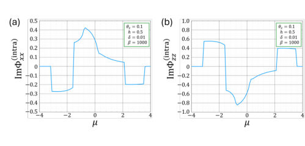 
Fig. 1. (Color online) Chemical-potential dependence of the in- traband (a) Φxx and (b) Φzz responses induced by the antisym- metric local rotation θz.

📷 Fig 2

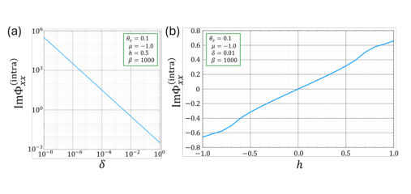 
Fig. 2. (Color online) (a) Broadening-parameter δ dependence of the intraband response Φxx on a log-log scale. (b) Ferroaxial crystal-field h dependence of the intraband response Φxx.

📷 Fig 3

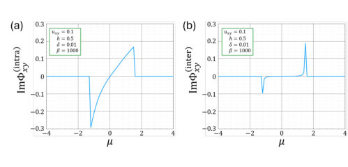 
Fig. 3. (Color online) Chemical-potential dependence of the (a) intraband and (b) interband contributions to Im[Φxy] induced by the symmetric shear strain uxy.

**Summary.** This theoretical work investigates how lattice deformations affect electronic properties in a ferroaxial material using a tight-binding model. By treating symmetric strain and antisymmetric local rotation separately, the authors show that the local rotation activates a unique, ferroaxial-order-dependent electronic response channel. This confirms that the antisymmetric rotation provides a distinct physical signature of the ferroaxial state.

**Why it may be interesting.** The clear separation of response channels based on symmetry breaking (ferroaxial order) provides a powerful diagnostic tool for characterizing exotic electronic states, which is relevant for understanding emergent symmetries in condensed matter systems.

Detailed structure

**Main problem.** The study aims to theoretically distinguish the electronic responses induced by two distinct components of lattice deformation: the conventional symmetric strain and the antisymmetric local lattice rotation, particularly in a ferroaxial material.

**Main result.** The local rotation induces a distinct diagonal electric quadrupole response that is linear in the ferroaxial crystal field and vanishes when the ferroaxial order is absent, unlike the symmetric strain response.

**Method.** The authors employed linear response theory applied to a tight-binding model to calculate the low-frequency dynamical electric-quadrupole susceptibility ($\Phi_\gamma$).

**Model / system.** The system is a ferroaxial material modeled using a four-orbital tight-binding Hamiltonian on a 2D square lattice. The analysis treats the symmetric strain ($u_{xy}$) and the antisymmetric local rotation ($	heta_z$) as independent perturbations.

**Key observables.** Dynamical electric quadrupole moments ($\Phi_\gamma$), specifically comparing responses induced by $u_{xy}$ versus $	heta_z$.

**Important parameters / regimes.** The ferroaxial crystal field strength ($h$), which controls the symmetry breaking from $D_{4h}$ to $C_{4h}$.

**Assumptions / limitations.** The analysis is restricted to terms linear in the displacement gradient, and the response is decomposed into intraband and interband contributions.

**Figures summary.** Figure 2 shows the $\Phi_{xx}$ response dependence on broadening and the ferroaxial field $h$, exhibiting a linear increase with $h$. Figure 3 illustrates the $	ext{Im}[\Phi_{xy}]$ dependence on chemical potential for the strain-induced response.

**Paper structure.** The paper establishes the theoretical framework using a tight-binding model and linear response theory. It then analyzes the coupling of the two deformation components ($u_{xy}$ and $	heta_z$) to the electronic quadrupole moments, culminating in a comparison of their symmetry requirements and physical dependencies on the ferroaxial order parameter.

Abstract

We theoretically investigate electronic responses to lattice deformation in a ferroaxial system using a tight-binding model on a two-dimensional square lattice and linear response theory. While conventional elastic responses are commonly discussed in terms of symmetric strain, the displacement gradient also contains an antisymmetric component describing a local lattice rotation. Focusing on this rotational degree of freedom, we treat the symmetric strain and antisymmetric local rotation as independent perturbations and incorporate their effects microscopically through deformation-induced modulations of the electronic hopping amplitudes. We find that the local rotation induces characteristic diagonal electric quadrupoles that are distinct from those generated by the symmetric shear strain. The rotation-induced response is dominated by the intraband contribution and increases approximately linearly with the ferroaxial crystal field, vanishing in the absence of ferroaxial order. In contrast, the symmetric-shear-induced response remains finite without ferroaxial order and contains both intraband and interband contributions. These results demonstrate that the antisymmetric local rotation provides a distinct electronic response channel characteristic of the ferroaxial state.

[↑ back to top](#top)

### [Interfacial Charge Transfer and Morphology Govern Magnetism in Ultrathin VOx/MoSe2 Heterostructures](http://arxiv.org/abs/2610.08494v1)

**Authors:** Yasinthara Wadumesthri, Nalaka Kapuruge, Raphael B. de Oliveira, Bruno Ipaves, Guilherme S. L. Fabris, Kinga Lasek, Florence A. Nugera, Jianjun Pan, Xiaomei Jiang, Douglas S. Galvão, Humberto Rodríguez Gutiérrez  
**Type:** both · **Category:** other · **PDF:** <https://arxiv.org/pdf/2610.08494v1>  
**Analysis basis:** full PDF text, analyzed in chunks

📷 Fig 1

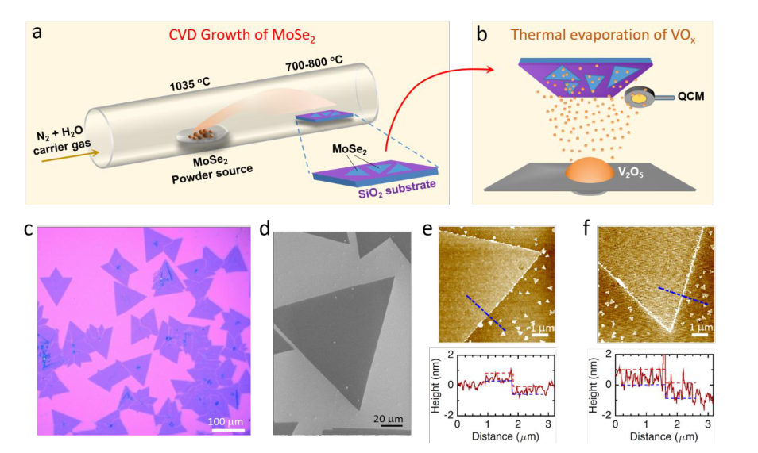 
Figure 1. (a) Chemical vapor deposition of monolayer MoSe2. (b) Thermal deposition of ultrathin VOx

📷 Fig 2

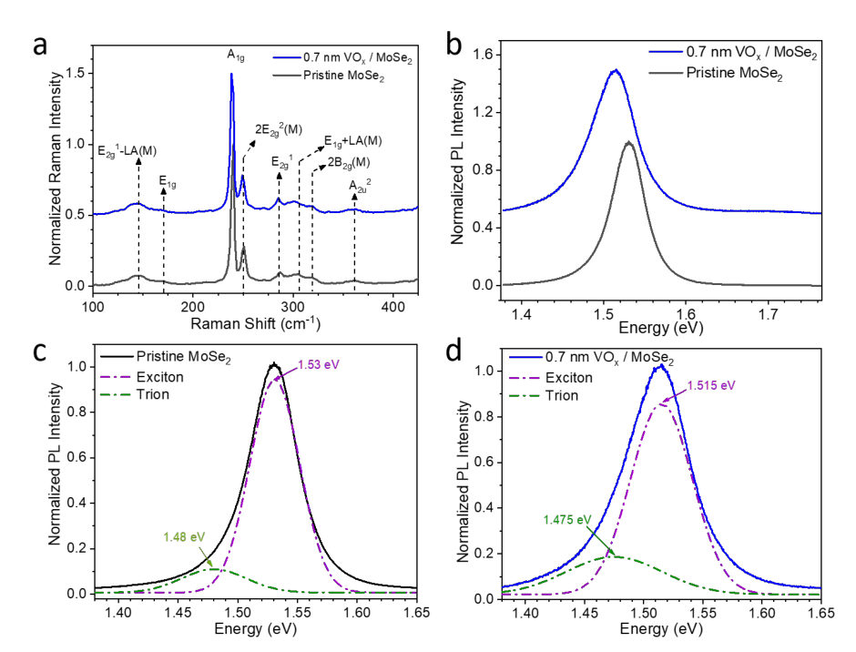 
Figure 3. (a, b) Raman and PL spectra, respectively, of pristine MoSe2 and nominal 0.7 nm

📷 Fig 3

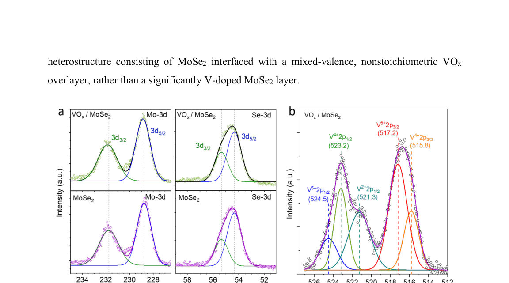 
Figure 4. XPS spectra of (a) the Mo 3d and Se 3d regions for pristine MoSe2 and VOx/MoSe2 and (b) the V 2p region for VOx/MoSe2.

📷 Fig 4

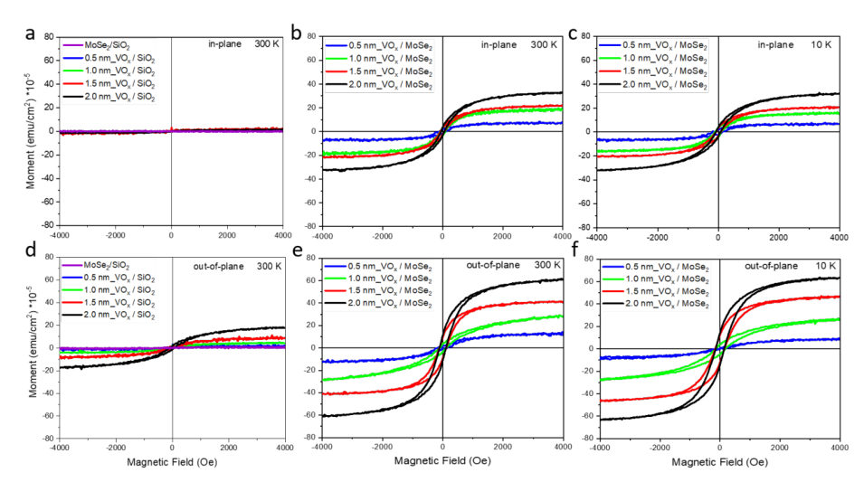 
Figure 5. Magnetic properties of the individual constituents and VOx/MoSe2 heterostructures, with the

📷 Fig 5

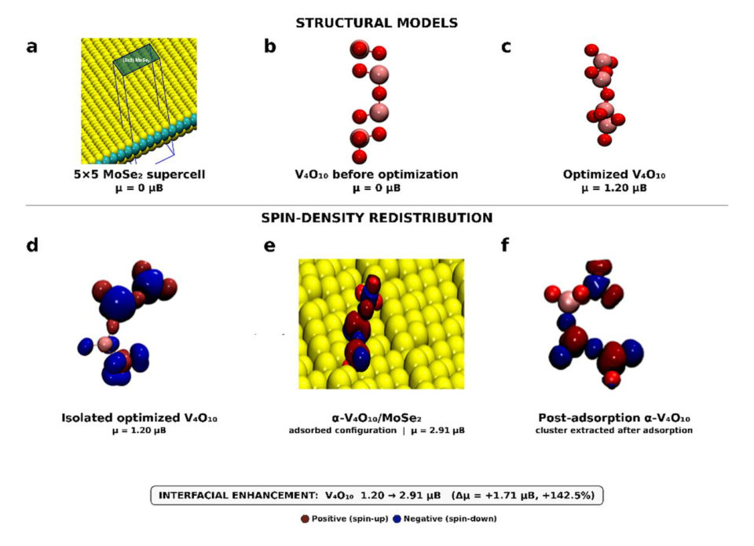 
Figure 6. Structural evolution and spin-density redistribution in the V₄O₁₀/MoSe₂ system. (a) 5×5

**Summary.** This work investigates how magnetism can be controlled in VOx/MoSe2 heterostructures by engineering the interface. The authors show that charge transfer from MoSe2 enhances the local magnetic moments of the oxide, while the physical morphology of the oxide layer controls the overall collective magnetic response. This establishes a dual control mechanism for designing next-generation 2D spintronic devices.

**Why it may be interesting.** The study provides a clear mechanism—interfacial charge transfer—to tune magnetism in 2D materials, which is highly relevant for designing novel spintronic and optoelectronic devices based on quantum materials.

Detailed structure

**Main problem.** The study aims to engineer magnetism in 2D semiconductors by utilizing interfacial interactions, offering an alternative to traditional substitutional doping methods.

**Main result.** The magnetic response is governed by two factors: interfacial charge transfer enhances local magnetic moments in the oxide, while the oxide's morphology dictates the collective magnetic dynamics (e.g., conventional vs. unusual temperature dependence).

**Method.** The research combines experimental characterization (structural, spectroscopic, magnetic measurements) with first-principles theoretical calculations (DFT+U).

**Model / system.** The physical system is the ultrathin VOx/MoSe2 heterostructure. The analysis models the magnetic behavior using both finite-cluster approximations and phenomenological models describing the collective dynamics based on oxide morphology.

**Key observables.** Magnetic moment enhancement, temperature dependence of magnetization ($M_s$) and coercivity ($H_c$), trion contribution in photoluminescence (PL), and charge transfer evidence from PL spectroscopy.

**Important parameters / regimes.** Oxide morphology (discontinuous clusters vs. continuous films), interfacial charge transfer magnitude, and temperature ($T$).

**Assumptions / limitations.** The analysis distinguishes between the magnetic behavior of isolated VOx clusters and those forming continuous films. The use of QCM values for thickness is noted despite potential AFM discrepancies.

**Figures summary.** Figures show $	ext{MoSe}_2$ growth and $	ext{VO}_x$ deposition morphology (AFM/SEM). Spectroscopy (Raman/PL) confirms electronic changes, and VSM measures the magnetic hysteresis and temperature dependence, which are modeled theoretically.

**Paper structure.** The paper systematically presents evidence: first, demonstrating interfacial charge transfer via PL/DFT; second, analyzing the magnetic enhancement due to this charge transfer; and finally, establishing that the collective magnetic response is dictated by the oxide's morphology, leading to a unified model.

Abstract

Engineering magnetism in two-dimensional semiconductors through interfacial interactions offers an attractive alternative to substitutional doping and provides opportunities for integrating magnetic and optoelectronic functionality within the same heterostructure. Here, we investigate ultrathin VOx films deposited on monolayer MoSe2 and demonstrate a pronounced enhancement of the magnetic response upon formation of the VOx/MoSe2 interface. Combined structural, spectroscopic, magnetic, and first-principles analyses support a consistent picture in which finite VOx clusters possess intrinsic magnetic moments that are further enhanced by electron transfer from MoSe2 to the oxide. The predicted charge transfer is also consistent with the increased trion contribution observed in the photoluminescence response of the heterostructure. Beyond this interfacial enhancement, the magnetic behavior is strongly governed by the morphology of the ultrathin oxide. A crossover from discontinuous clusters to more continuous films produces qualitatively different temperature dependences: the continuous-film regime exhibits conventional thermal demagnetization and coercive softening, whereas the clustered regime displays an unusual increase in magnetization and nonmonotonic coercivity with increasing temperature. These contrasting responses are captured by a phenomenological model in which morphology determines the collective magnetic dynamics through a distribution of effective reversal barriers and their thermally activated accessibility. Together, the results establish a unified picture in which interfacial charge transfer enhances the local magnetic moments of VOx, while nanoscale morphology governs their collective magnetic dynamics, providing complementary routes for controlling magnetism in oxide/transition-metal dichalcogenide heterostructures.

[↑ back to top](#top)

