
# arxiv digest (quant-ph + cond-mat) — 2026-10-09

*141 papers · 18 relevant · 0 highlighted*

## 🔥 Most relevant (18)

*Every paper with at least one nonzero topic score, sorted by best-matching score. 🔥 marks scores ≥4/5. Click the title to jump to the full entry below; click [arXiv] to open the paper page. `(secondary)` marks papers from de-prioritized cond-mat archives.*

Show 18 relevant papers

- [Numerically exact simulation of open quantum networks with strong system-bath couplings using tensor network path integrals](#paper-2610.10259) [[arXiv]](http://arxiv.org/abs/2610.10259v1) — 🔥 `methods for driven-dissipative` **5/5** · `correlated / nonlocal dissipation` **3/5** · `Keldysh / 2PI / non-Gaussian methods` **2/5** · `analog quantum simulation` **2/5** · `driven-dissipative phase transition` **2/5** · `Dicke superradiance` **1/5** · `Tavis-Cummings & cavity-many-emitter` **1/5** · `non-equilibrium universality` **1/5** · `quantum measurements` **1/5** · `superradiant laser` **1/5**
- [Dissipation-selected photon-phonon pair and photon-bundle emission in a tripartite Mollow system](#paper-2610.09971) [[arXiv]](http://arxiv.org/abs/2610.09971v1) — 🔥 `correlated / nonlocal dissipation` **4/5** · `Tavis-Cummings & cavity-many-emitter` **3/5** · `driven-dissipative phase transition` **3/5** · `methods for driven-dissipative` **3/5** · `non-equilibrium universality` **2/5** · `quantum measurements` **2/5** · `Dicke superradiance` **1/5** · `Full counting statistics` **1/5** · `Keldysh / 2PI / non-Gaussian methods` **1/5** · `analog quantum simulation` **1/5** · `superradiant laser` **1/5**
- [Path Complementarity Enables Directional Quantum Light in Hybridized Cavity Polaritons](#paper-2610.09893) [[arXiv]](http://arxiv.org/abs/2610.09893v1) — 🔥 `interference shaping light` **4/5** · `driven-dissipative phase transition` **3/5** · `methods for driven-dissipative` **3/5** · `Tavis-Cummings & cavity-many-emitter` **2/5** · `analog quantum simulation` **2/5** · `correlated / nonlocal dissipation` **2/5** · `non-equilibrium universality` **2/5** · `Full counting statistics` **1/5** · `Keldysh / 2PI / non-Gaussian methods` **1/5** · `quantum measurements` **1/5**
- [Geometric heat pumping on a quantum processor](#paper-2610.09062) [[arXiv]](http://arxiv.org/abs/2610.09062v1) — 🔥 `QC/QI experiment` **4/5** · `driven-dissipative phase transition` **3/5** · `methods for driven-dissipative` **3/5** · `non-equilibrium universality` **3/5** · `analog quantum simulation` **2/5** · `quantum measurements` **2/5** · `Full counting statistics` **1/5** · `Keldysh / 2PI / non-Gaussian methods` **1/5** · `correlated / nonlocal dissipation` **1/5**
- [Correspondence between Asymptotic Quantum Many-Body Scars in Closed Systems and Diffusive Nambu-Goldstone Modes in Open Systems](#paper-2610.09662) [[arXiv]](http://arxiv.org/abs/2610.09662v1) — 🔥 `scars & prethermalization` **4/5** · `driven-dissipative phase transition` **3/5** · `non-equilibrium universality` **3/5** · `Keldysh / 2PI / non-Gaussian methods` **2/5** · `methods for driven-dissipative` **2/5** · `analog quantum simulation` **1/5** · `correlated / nonlocal dissipation` **1/5** · `quantum measurements` **1/5**
- [Extensively degenerate superradiant phase in a giant-atom quantum Rabi ring](#paper-2610.09880) [[arXiv]](http://arxiv.org/abs/2610.09880v1) — 🔥 `Dicke superradiance` **4/5** · `Tavis-Cummings & cavity-many-emitter` **3/5** · `analog quantum simulation` **3/5** · `superradiant laser` **3/5** · `Keldysh / 2PI / non-Gaussian methods` **1/5** · `correlated / nonlocal dissipation` **1/5** · `driven-dissipative phase transition` **1/5** · `methods for driven-dissipative` **1/5**
- [Phonon-Enabled Collective Strong Coupling of Color Centers in a Plasmonic Cavity](#paper-2610.09716) [[arXiv]](http://arxiv.org/abs/2610.09716v1) — 🔥 `Tavis-Cummings & cavity-many-emitter` **4/5** · 🔥 `quantum optics experiment` **4/5** · `analog quantum simulation` **3/5** · `QC/QI experiment` **1/5** · `correlated / nonlocal dissipation` **1/5** · `driven-dissipative phase transition` **1/5** · `interference shaping light` **1/5** · `methods for driven-dissipative` **1/5**
- [Dynamics of Work Extraction in Multipartite Atomic Systems: Role of Correlations and Relative Entropy](#paper-2610.10220) [[arXiv]](http://arxiv.org/abs/2610.10220v1) — 🔥 `Tavis-Cummings & cavity-many-emitter` **4/5** · `analog quantum simulation` **3/5** · `correlated / nonlocal dissipation` **2/5** · `driven-dissipative phase transition` **2/5** · `methods for driven-dissipative` **2/5** · `Keldysh / 2PI / non-Gaussian methods` **1/5** · `non-equilibrium universality` **1/5**
- [Efficient detection of spectral cluster states](#paper-2610.09745) [[arXiv]](http://arxiv.org/abs/2610.09745v1) — 🔥 `quantum optics experiment` **4/5** · `QC/QI experiment` **3/5** · `interference shaping light` **3/5** · `quantum measurements` **3/5**
- [High-Fidelity Inter-Species Rydberg Gates with Two-Photon Driving](#paper-2610.08926) [[arXiv]](http://arxiv.org/abs/2610.08926v1) — 🔥 `Rydberg arrays` **4/5** · `QC/QI experiment` **3/5** · `analog quantum simulation` **2/5** · `methods for driven-dissipative` **2/5** · `Keldysh / 2PI / non-Gaussian methods` **1/5** · `quantum measurements` **1/5**
- [Quench dynamics and quantum flutter properties of one-dimensional attractive single-spin flipped Fermi gases](#paper-2610.09431) [[arXiv]](http://arxiv.org/abs/2610.09431v1) — 🔥 `non-equilibrium universality` **4/5** · `analog quantum simulation` **3/5** · `scars & prethermalization` **2/5** · `Frenkel-Kontorova` **1/5** · `Keldysh / 2PI / non-Gaussian methods` **1/5** · `methods for driven-dissipative` **1/5**
- [Quantum simulation of the Heisenberg XXZ model on a Rydberg atom array](#paper-2610.10357) [[arXiv]](http://arxiv.org/abs/2610.10357v1) — 🔥 `Rydberg arrays` **4/5** · 🔥 `analog quantum simulation` **4/5** · `QC/QI experiment` **3/5**
- [Sub-shot-noise mid-infrared photothermal measurements using twin beams](#paper-2610.10294) [[arXiv]](http://arxiv.org/abs/2610.10294v1) — 🔥 `quantum optics experiment` **4/5** · `quantum measurements` **3/5** · `interference shaping light` **1/5**
- [Time-Bin Properties of Photon Pairs from a 2GHz Waveguide Resonator](#paper-2610.09545) [[arXiv]](http://arxiv.org/abs/2610.09545v1) — 🔥 `quantum optics experiment` **4/5** · `interference shaping light` **3/5** · `QC/QI experiment` **1/5**
- [Engineering of Chirped Apodized Sources for Quantum Spectroscopy](#paper-2610.10217) [[arXiv]](http://arxiv.org/abs/2610.10217v1) — 🔥 `quantum optics experiment` **4/5** · `interference shaping light` **3/5**
- [Dynamically protected erasure qubit via low-frequency charge driving](#paper-2610.10432) [[arXiv]](http://arxiv.org/abs/2610.10432v1) — 🔥 `QC/QI experiment` **4/5** · `driven-dissipative phase transition` **1/5** · `quantum measurements` **1/5**
- [Teleportation of a programmable gate](#paper-2610.09022) [[arXiv]](http://arxiv.org/abs/2610.09022v1) — 🔥 `QC/QI experiment` **4/5** · `quantum measurements` **2/5**
- [Witnessing Quantum Bayesian Inference beyond Classical Learning](#paper-2610.09293) [[arXiv]](http://arxiv.org/abs/2610.09293v1) — 🔥 `quantum measurements` **4/5**

## All papers (98, sorted by relevance)

*Papers from quant-ph and your primary cond-mat archives (quant-gas, stat-mech, str-el, dis-nn). Highlighted papers (⭐) come first, then everything else sorted by topic-relevance score, highest first.*

### [Numerically exact simulation of open quantum networks with strong system-bath couplings using tensor network path integrals](http://arxiv.org/abs/2610.10259v1)

**Authors:** Quentin W. Richter, Moritz Cygorek  
**Type:** theory · **Category:** numerical methods · **PDF:** <https://arxiv.org/pdf/2610.10259v1>  
**Analysis basis:** full PDF text, analyzed in chunks
**Topic relevance:** 🔥 `methods for driven-dissipative` **5/5** · `correlated / nonlocal dissipation` **3/5** · `Keldysh / 2PI / non-Gaussian methods` **2/5** · `analog quantum simulation` **2/5** · `driven-dissipative phase transition` **2/5** · `Dicke superradiance` **1/5** · `Tavis-Cummings & cavity-many-emitter` **1/5** · `non-equilibrium universality` **1/5** · `quantum measurements` **1/5** · `superradiant laser` **1/5**

📷 Fig 1

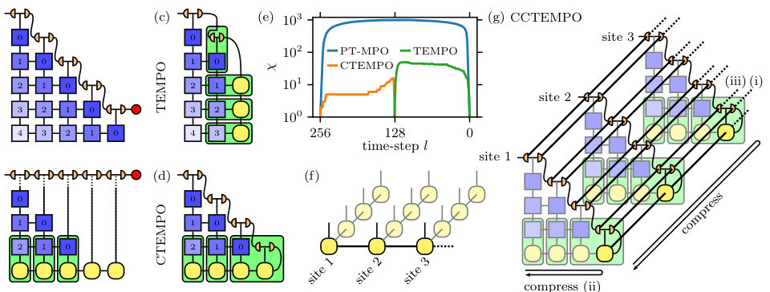 
FIG. 1. (a) Tensor network representation of the path summation in Eq. (2). The initial state (red circle) is propagated by contracting with system propagators (orange semicircles) and influence tensors (blue boxes). Different methods (b-d) correspond to different contraction orders. The current MPO (yellow boxes) is updated by including, in the next step, the terms contained in the green boxes. In TEMPO (c) the tensor network is contracted column by column. PT-MPOs (b) are obtained by contracting only the influence tensors. This is done row by row to utilize the causal structure of the tensor network [9]. The system propagators are later contracted with the final PT-MPO. Our CTEMPO scheme...

📷 Fig 2

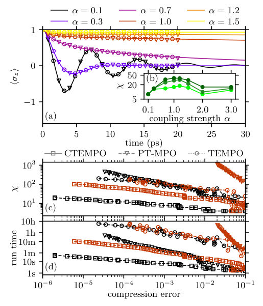 
FIG. 2. (a) Dynamics of the spin-boson model solved using TEMPO, PT-MPO, and CTEMPO schemes. The inset shows the maximal inner bond dimension in CTEMPO simulation as a function of the coupling strength α for final propagation times Ωtf = 10.24, 20.48, 40.96 (from light to dark green). (c) Bond dimensions and (d) computation times on an Intel Xeon w3-2435 processor, respectively, as a function of the compression error for Ωtf = 20.48 and for two values of the coupling strength α = 0.1 (black) and α = 1 (brown).

📷 Fig 3

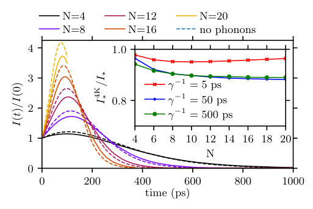 
FIG. 4. Superradiant emission of up to N = 20 semiconduc- tor quantum dots coupled to individual super-Ohmic phonon baths. The radiative lifetime is γ−1 = 500 ps. The inset shows the ratio between the maximal peak intensities for simulations with and without accounting for phonons.

📷 Fig 4

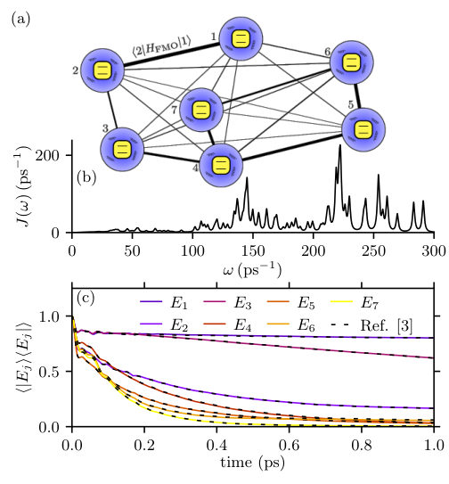 
FIG. 3. (a) 7-site Fenna-Matthews-Olson complex as a non- Markovian quantum network, where each site is coupled to a strongly structured phonon bath at T = 77 K with spectral density in (b). (c) Dynamics of initially populated energy eigenstates for ∆t = 1 fs and ϵ = 10−6. Dashed lines show reference results obtained using DAMPF [3].

**Summary.** This paper introduces CTEMPO, a novel tensor network path integral method designed for numerically exact simulation of open quantum systems with strong coupling. It overcomes the limitations of previous techniques by maintaining small bond dimensions, enabling the study of complex models like photosynthetic complexes and large quantum dot arrays. This provides a turnkey solution for non-Markovian quantum dynamics.

**Why it may be interesting.** This work is highly relevant to AMO physics and quantum optics as it provides a powerful, scalable numerical tool to simulate open quantum dynamics in complex, strongly coupled environments where standard methods fail due to memory or computational cost.

Detailed structure

**Main problem.** The paper addresses the challenge of numerically simulating non-Markovian open quantum networks, especially those involving strong system-bath couplings, which typically lead to exponentially scaling state spaces.

**Main result.** The proposed CTEMPO scheme provides a significant computational speed-up (orders of magnitude) over established methods like TEMPO and PT-MPO, allowing for the simulation of complex systems like the 7-site FMO complex and large QD arrays.

**Method.** The core method is CTEMPO, a novel tensor network path integral scheme that combines insights from TEMPO and causal contraction order to maintain small bond dimensions when simulating the time evolution of the system density matrix.

**Model / system.** The work applies to general open quantum networks, including the spin-boson model, the 7-site Fenna-Matthews-Olson (FMO) photosynthetic complex, and arrays of quantum dots (QDs) coupled to structured phonon baths.

**Key observables.** Time evolution of expectation values (e.g., $\langle \sigma_z 
angle$), superradiant emission intensity, and computational metrics like bond dimensions ($\chi$) and run time.

**Important parameters / regimes.** Strong coupling regimes ($\alpha=1$), spectral density structure (super-Ohmic), and system size ($N$ up to 20 QDs).

**Assumptions / limitations.** The method assumes the environment coupling can be effectively mapped onto a tensor network structure, and the simulation is limited by available computer memory for very large systems.

**Figures summary.** Figures illustrate the tensor network structure comparison (CTEMPO vs. others), the time evolution of $\langle \sigma_z 
angle$ showing performance gains, and the superradiant emission intensity decay curves.

**Paper structure.** The paper introduces the problem, details the CTEMPO algorithm and its multi-site extension (comb tensor network), validates it by benchmarking against existing methods on the spin-boson model, and then applies it to complex physical systems like FMO and QDs.

Abstract

Non-Markovian open quantum networks are among the most challenging problems in quantum theory, as they suffer from both, the exponentially scaling many-body state space as well as long memory times when the sites are strongly coupled to structured environments. Recent efforts to address them by combining tensor networks with real-time path integrals, such as TEMPO and process tensors, were however limited to systems with rather weak system-environment couplings because strong couplings lead to large bond dimensions. Here, we devise a tensor network scheme (CTEMPO) resulting in particularly small bond dimensions for single-site problems. We then extend this to a practical scheme to simulate non-Markovian quantum networks by time-evolving a corresponding comb tensor network. Benchmarking the single-site algorithm on the spin-boson model we find orders-of-magnitude improvement over established methods. The multi-site algorithm is shown to solve the notoriously difficult problem of the 7-site Fenna-Matthews-Olson photosynthetic complex, whose spectral density contains 62 peaks. We then apply our approach to explore the scaling behavior of the superradiance of up to $N=20$ quantum dots individually coupled to super-Ohmic phonon baths. Our approach provides a turnkey solution to non-Markovian quantum networks and is compatible with more general tensor network topologies.

[↑ back to top](#top)

### [Dissipation-selected photon-phonon pair and photon-bundle emission in a tripartite Mollow system](http://arxiv.org/abs/2610.09971v1)

**Authors:** Jiayuan Zhang, Geng Zhao, Jing Tang, Yuangang Deng  
**Type:** theory · **Category:** other · **PDF:** <https://arxiv.org/pdf/2610.09971v1>  
**Analysis basis:** full PDF text, analyzed in chunks
**Topic relevance:** 🔥 `correlated / nonlocal dissipation` **4/5** · `Tavis-Cummings & cavity-many-emitter` **3/5** · `driven-dissipative phase transition` **3/5** · `methods for driven-dissipative` **3/5** · `non-equilibrium universality` **2/5** · `quantum measurements` **2/5** · `Dicke superradiance` **1/5** · `Full counting statistics` **1/5** · `Keldysh / 2PI / non-Gaussian methods` **1/5** · `analog quantum simulation` **1/5** · `superradiant laser` **1/5**

📷 Fig 1

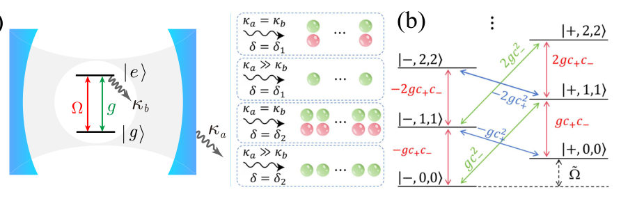 
Figure 1. (a) Schematic of the dissipative tripartite Mollow system. A driven two-level emitter is coupled to a cavity-photon mode and a motional phonon mode through the tripartite interaction. By tuning the dissipation ratio κa/κb, the system can be switched between photon-phonon pair emission and photon-bundle emission at the single-pair (δ = δ1) and multipair (δ = δ2) resonances. (b) Dressed-state structure in the Mollow regime. Strong driving forms the manifolds |±, n, n⟩, and the tripartite interaction mediates higher-order resonant transitions between |+, 0, 0⟩and |−, N, N⟩, providing the coherent origin of dissipation-selected quantum emission.

📷 Fig 2

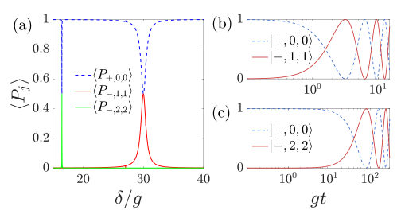 
Figure 2. (a) Time-averaged population of states |+, 0, 0⟩, |−, 1, 1⟩, |−, 2, 2⟩ as functions of δ, showing the one- pair, two-pair, and three-pair resonances. (b)-(c) Photon- phonon super-Rabi oscillations between |+, 0, 0⟩and |−, 1, 1⟩, |−, 2, 2⟩, respectively, with δ/g = 26.25, 16.47, corresponding to the one-pair and two-pair resonances. The other parame- ters are Ω/g = 30 and ∆/g = 60.

📷 Fig 3

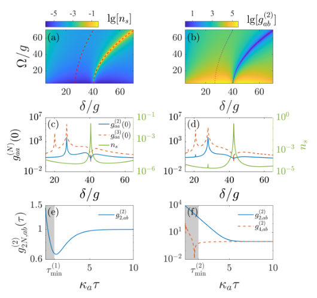 
Figure 3. Photon-phonon pair emission under symmetric dissipation, κa = κb, with g/κa = 10 and ∆/g = 160. (a) Steady-state population ns = na = nb and (b) photon-phonon cross-correlation g(2) ab (0) as functions of Ω/g and δ/g. The dashed curves denote the analytically predicted one-pair and two-pair resonances. (c)-(d) Photon autocorrelations g(2) aa (0) and g(3) aa (0) together with the population ns versus δ/g for Ω/g = 10 and 20, respectively, revealing the one-pair and two- pair resonances. (e) Time-delayed correlation g(2) 2,ab(τ) at the one-pair resonance, showing antibunching between successive pairs. (f) Time-delayed correlations g(2) 2,ab(τ) and g(2) 4,ab(τ) at the two-pair...

📷 Fig 4

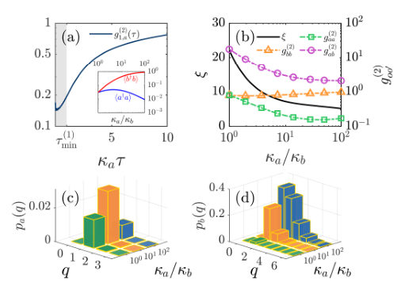 
Figure 4. Dissipation-induced transition from photon-phonon pair emission to single-photon emission at the first-order res- onance for δ/g = 26, Ω/g = 10, and ∆/g = 160. (a) Time- delayed photon correlation function g(2) 1,a(τ) for κa/κb = 100, showing antibunched single-photon emission. Inset: steady- state photon and phonon populations as functions of the dis- sipation ratio κa/κb. (b) Cauchy-Schwarz parameter ξ, pho- ton autocorrelation g(2) aa (0), phonon autocorrelation g(2) bb (0), and photon-phonon cross-correlation g(2) ab (0) versus κa/κb. Increasing dissipation asymmetry suppresses the photon- phonon correlations and drives the system toward dynami- cal decoupling. (c) Steady-state...

📷 Fig 5

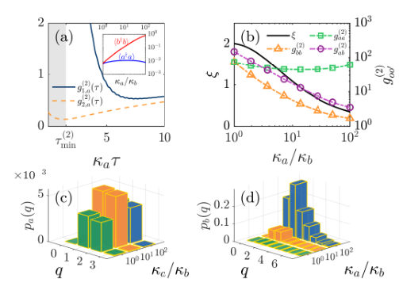 
Figure 5. Dissipation-induced transition from photon- phonon pair emission to two-photon bundle emission at the two-pair resonance, with δ/g ≃19.64, Ω/g = 30, and ∆/g = 90. (a) Time-delayed photon correlations g(2) 1,a(τ) and g(2) 2,a(τ) for κa/κb = 100, showing bunching of individual pho- tons within a bundle and antibunching between successive two-photon bundles. Inset: steady-state photon and phonon populations as functions of the dissipation ratio κa/κb. (b) Cauchy-Schwarz parameter ξ, photon autocorrelation g(2) aa (0), phonon autocorrelation g(2) bb (0), and photon-phonon cross- correlation g(2) ab (0) versus κa/κb. Increasing dissipation asym- metry suppresses photon-phonon...

**Summary.** This paper demonstrates that the symmetry of dissipation in a tripartite Mollow system can actively control the quantum emission pathway. By tuning the dissipation symmetry, the system can be forced to emit either highly correlated photon-phonon pairs or distinct photon bundles. This establishes dissipation symmetry as a powerful resource for programmable hybrid quantum emitters.

**Why it may be interesting.** This work directly addresses the frontier of open quantum systems, demonstrating that engineered dissipation can be a constructive tool for quantum state engineering, moving beyond its traditional role as a source of loss.

Detailed structure

**Main problem.** The study investigates whether dissipation can actively determine or select the type of quantum resource (e.g., correlated pairs vs. photon bundles) emitted from an open hybrid quantum system, rather than simply causing decoherence.

**Main result.** Dissipation symmetry acts as a controllable resource, allowing the system to steer quantum emission between correlated photon-phonon pairs (under symmetric dissipation) and purely photonic nonclassical states (under asymmetric dissipation).

**Method.** The analysis uses the Lindblad master equation to model the open system dynamics and characterizes emission using time-resolved correlation functions, Fock-state distributions, and Wigner quasiprobability distributions.

**Model / system.** The system is a tripartite Mollow setup involving a strongly driven two-level emitter coupled simultaneously to cavity photons and motional phonons. The dynamics are governed by an effective Hamiltonian derived in the Mollow regime.

**Key observables.** Time-delayed second-order correlation functions ($g^{(2)}$), Fock-state distributions, and Wigner quasiprobability distributions.

**Important parameters / regimes.** The dissipation ratio ($\kappa_a/\kappa_b$) is the key control parameter, determining the emission regime (symmetric vs. asymmetric dissipation).

**Assumptions / limitations.** The system dynamics are modeled using effective Hamiltonians derived under the rotating-wave approximation, and the selection mechanism is attributed to the symmetry of the bosonic dissipation channels.

**Figures summary.** Figure 1 schematically illustrates the switching between pair and bundle emission by tuning the dissipation ratio ($\kappa_a/\kappa_b$), and another figure shows the dressed-state structure in the Mollow regime.

**Paper structure.** The paper progresses by first establishing the tripartite Mollow model, deriving effective Hamiltonians for $N$-pair processes, and then analyzing the resulting emission regimes—symmetric (pair emission) versus asymmetric (bundle emission)—by controlling the dissipation symmetry.

Abstract

Dissipation is generally regarded as detrimental to nonclassical-state generation, yet whether it can determine which quantum resource is emitted from an open hybrid quantum system remains largely unexplored. Here, we show that the symmetry of bosonic dissipation channels can select and switch quantum-emission pathways in a tripartite Mollow system, where a strongly driven two-level emitter simultaneously couples to cavity photons and motional phonons. In the Mollow regime, higher-order tripartite interactions generate resonant photon-phonon pair excitations, whose emitted quantum states are subsequently selected by dissipation. Under symmetric dissipation, the system produces strongly correlated photon-phonon pairs, enabling both single-pair emission and correlated multipair bundles with pronounced nonclassical correlations. Breaking the dissipation symmetry progressively suppresses the hybrid correlations and dynamically decouples the photonic and phononic degrees of freedom. In the strongly asymmetric regime, long-lived phonons accumulate in highly excited Fock states, while rapidly leaking cavity photons are converted into high-purity single-photon and two-photon bundles. The crossover between these distinct emission regimes is characterized through time-resolved correlation functions, Fock-state distributions, and Wigner quasiprobability distributions. Our results establish dissipation symmetry as a resource for steering quantum emission between hybrid and purely photonic nonclassical states, providing a route toward programmable hybrid quantum emitters and dissipative quantum-state engineering.

[↑ back to top](#top)

### [Path Complementarity Enables Directional Quantum Light in Hybridized Cavity Polaritons](http://arxiv.org/abs/2610.09893v1)

**Authors:** Jing Tang, Yuangang Deng  
**Type:** theory · **Category:** other · **PDF:** <https://arxiv.org/pdf/2610.09893v1>  
**Analysis basis:** full PDF text, analyzed in chunks
**Topic relevance:** 🔥 `interference shaping light` **4/5** · `driven-dissipative phase transition` **3/5** · `methods for driven-dissipative` **3/5** · `Tavis-Cummings & cavity-many-emitter` **2/5** · `analog quantum simulation` **2/5** · `correlated / nonlocal dissipation` **2/5** · `non-equilibrium universality` **2/5** · `Full counting statistics` **1/5** · `Keldysh / 2PI / non-Gaussian methods` **1/5** · `quantum measurements` **1/5**

📷 Fig 1

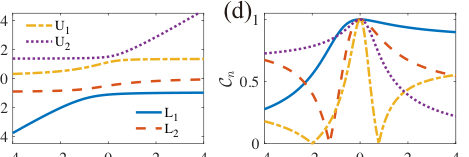 
Figure 1. (a) Ring-cavity QED system supporting CW and CCW modes ˆa+ and ˆa−, hybridized by backscattering with strength J. (b) V-type emitter selectively coupled to the CW and CCW modes through the σ+ and σ−transitions, respec- tively; the excited states are split by δf. (c) Single-excitation dressed spectrum versus δf/g for ∆c/g = 0, δp/g = 0.5, and J/g = 0.5. (d) Intrinsic photonic path concurrence Cn of the four polariton branches. Exchange symmetry gives Cn = 1 at δf = 0, while finite δf redistributes the CW and CCW weights in a branch-dependent manner.

📷 Fig 2

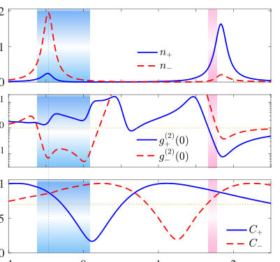 
Figure 2. Directional photon statistics and single-photon path entanglement. (a) Steady-state photon populations n+ and n−, (b) equal-time second-order correlations g(2) + (0) and g(2) −(0), and (c) conditional single-photon path concurrences C+ and C−as functions of the cavity detuning ∆c. The horizontal dotted lines in (b) and (c) indicate g(2)(0) = 1 and C± = 0.7, respectively. The vertical dotted line marks a representative operating point exhibiting directional anti- bunching together with strong path entanglement. The other parameters are g/κ = 6, J/g = 1, δf/g = 8, δp/g = 0.8, γ/κ = 0.1, and η/κ = 0.1.

📷 Fig 3

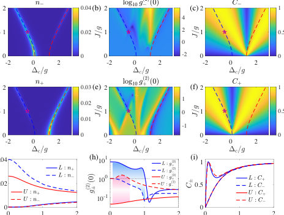 
Figure 3. Branch-resolved directional photon statistics and path entanglement. (a)-(c) Photon population n−, equal-time correlation log10 g(2) −(0), and conditional single-photon path concurrence C−for the −input in (∆c, J) plane. (d)-(f) Cor- responding quantities for the + input. Blue and red dashed curves denote the lower and upper one-photon resonances, re- spectively. The stars mark the lower-branch operating point at J/g = 1 and ∆c/g ≃−0.48, corresponding to the vertical dotted line in Fig. 2. (g)-(i) n±, g(2) ± (0), and C±, evaluated along the lower (blue) and upper (red) resonance branches. Solid and dashed curves denote the + and −inputs, respec- tively. The horizontal dotted line...

📷 Fig 4

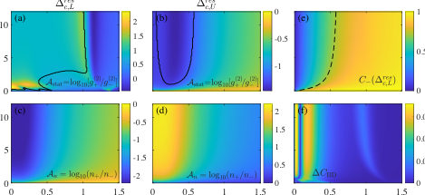 
Figure 4. Branch-resolved directional quantum response in the (J, δf) parameter plane. The first and second columns correspond to the lower (L) and upper (U) one-photon res- onance branches ∆res c,L and ∆res c,U, respectively. (a),(b) Signed photon-statistical asymmetry Astat = log10[g(2) + (0)/g(2) −(0)]. Black solid contours delimit the regions of opposite photon statistics, [g(2) + (0) −1][g(2) −(0) −1] &lt; 0. (c),(d) Signed in- tensity asymmetry An = log10(n+/n−). (e) Conditional single-photon path concurrence C−(∆res c,L); the black dashed contour marks C−= 0.7. (f) Worst-case branch-direction concurrence mismatch ∆CBD. Branch switching reverses both photon-statistical and intensity...

**Summary.** This paper proposes that path complementarity, arising from the interplay between cavity backscattering and Zeeman splitting in a ring-cavity QED system, is the key mechanism for generating directional quantum light. The authors demonstrate that this mechanism allows for the simultaneous observation of directional photon blockade and strong single-photon path entanglement. This establishes a general design rule for controlling quantum light sources for applications in quantum communication.

**Why it may be interesting.** This work provides a concrete, general design principle—path complementarity—for engineering nonclassical light sources, linking fundamental concepts of coherence preservation with directional quantum control, which is highly relevant to quantum optics.

Detailed structure

**Main problem.** The challenge is achieving directional quantum light that exhibits asymmetric photon statistics while maintaining high coherence between counterpropagating paths.

**Main result.** The interplay between cavity backscattering and Zeeman splitting establishes 'path complementarity' as a general design principle, allowing directional photon blockade and strong path entanglement to coexist.

**Method.** Theoretical analysis using the Hamiltonian and master equation in the driven-dissipative regime to derive intrinsic polariton properties and steady-state quantum correlations.

**Model / system.** The system is a ring-cavity Quantum Electrodynamics (QED) setup hybridized with a three-level emitter, modeled by a Hamiltonian incorporating cavity detuning, coupling, backscattering, and Zeeman splitting.

**Key observables.** Directional photon blockade (antibunching in one direction, bunching in the other), single-photon path entanglement, and path concurrence ($C_n$).

**Important parameters / regimes.** Weak driving regime, Zeeman splitting ($\delta_f$), cavity backscattering ($J$), and the resonance branch selection.

**Assumptions / limitations.** The analysis focuses on the weak-drive regime, allowing the intrinsic polariton structure to dictate the directional response.

**Figures summary.** Figure 1 illustrates the physical setup, the dressed spectrum, and the intrinsic photonic path concurrence; later figures establish the coexistence of directional blockade and path entanglement across parameter regimes.

**Paper structure.** The paper first identifies the physical ingredients (backscattering and Zeeman splitting) leading to the problem. It then analyzes the intrinsic polariton structure to derive path predictability and concurrence. Finally, it extends this analysis to the driven-dissipative steady state to demonstrate the coexistence of directional photon statistics and path entanglement.

Abstract

Directional quantum light requires asymmetric photon statistics without sacrificing coherence between propagation paths, a combination that remains difficult to achieve within a single quantum-optical platform. Here we identify a microscopic path-complementarity mechanism in hybridized cavity polaritons that reconciles these two requirements. In a Zeeman-split ring-cavity QED system, cavity backscattering hybridizes the counterpropagating modes, whereas the Zeeman splitting creates spectrally asymmetric excitation channels. Their interplay gives rise, under weak driving, to directional photon blockade coexisting with strong single-photon path entanglement: one input direction exhibits antibunching while the opposite direction is bunched. Remarkably, switching between the two one-photon polariton resonances reverses both the photon-statistical and intensity asymmetries while nearly preserving the path concurrence over a broad parameter regime. Our results establish path complementarity as a general design principle for directional nonclassical light with retained quantum coherence.

[↑ back to top](#top)

### [Geometric heat pumping on a quantum processor](http://arxiv.org/abs/2610.09062v1)

**Authors:** Gerónimo J. Caselli, Luis O. Manuel, Liliana Arrachea, Pablo S. Cornaglia  
**Type:** both · **Category:** statistical mechanics · **PDF:** <https://arxiv.org/pdf/2610.09062v1>  
**Analysis basis:** full PDF text, analyzed in chunks
**Topic relevance:** 🔥 `QC/QI experiment` **4/5** · `driven-dissipative phase transition` **3/5** · `methods for driven-dissipative` **3/5** · `non-equilibrium universality` **3/5** · `analog quantum simulation` **2/5** · `quantum measurements` **2/5** · `Full counting statistics` **1/5** · `Keldysh / 2PI / non-Gaussian methods` **1/5** · `correlated / nonlocal dissipation` **1/5**

📷 Fig 1

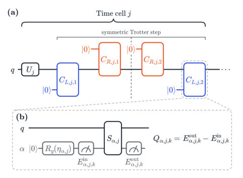 
FIG. 1. Quantum circuit for one time cell 𝑗of the heat pump. (a) The working qubit 𝑞evolves under 𝑈𝑗and then undergoes the symmetric collision sequence 𝐶𝐿,𝑗,1, 𝐶𝑅,𝑗,1, 𝐶𝑅,𝑗,2, 𝐶𝐿,𝑗,2 with its left (𝐿) and right (𝑅) bath ancillas; each ancilla is reset to |0⟩before every collision. (b) Structure of a single collision 𝐶𝛼,𝑗,𝑘: the ancilla is rotated by 𝑅𝑦(𝜂𝛼,𝑗), and a projective energy measurement yields 𝐸in 𝛼,𝑗,𝑘while preparing the thermal state. After the partial-swap gate 𝑆𝛼,𝑗, a second measure- ment yields 𝐸out 𝛼,𝑗,𝑘, giving the stochastic heat 𝑄𝛼,𝑗,𝑘= 𝐸out 𝛼,𝑗,𝑘−𝐸in 𝛼,𝑗,𝑘 delivered to bath 𝛼.

📷 Fig 2

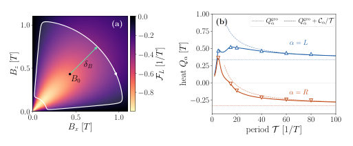 
FIG. 2. (a) Curvature 𝐿of the adiabatic pump in the (𝐵𝑥, 𝐵𝑧) plane and a driving loop of amplitude 𝛿𝐵= 0.45 around 𝐵0 (𝐵0 = 0.61, 𝜗0 = 45◦, 𝛿𝜗= 40◦; 𝑘𝐵𝑇= 𝑔𝐿= 𝑔𝑅= 1, 𝜔𝑐= 120, 𝜅= 2.5). (b) Heat exchanged with the two reservoirs per driving cycle, for a clockwise sense of traversal, as a function of the period ; blue and orange denote the left (𝐿) and right (𝑅) reservoirs; positive 𝑄is heat delivered to the reservoir. Solid lines are the full Lindblad evolution, and open triangles are the results of the collision model with 𝑁= 48 cells per cycle. Dotted lines are the adiabatic limits 𝑄geo 𝐿 = −𝑄geo 𝑅 ≃ 0.334, and dashed lines are the expansion 𝑄geo 𝛼 + 𝛼∕with 𝐿= 𝑅≃5.887.

📷 Fig 3

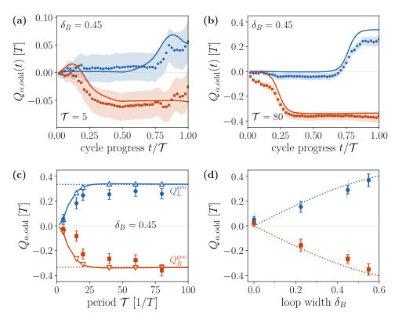 
FIG. 3. Orientation-odd (pumped) heat on ibm_kingston compared with the exact discrete collision model. (a)–(b) Cumulative odd heat 𝑄𝛼,odd(𝑡) [see Eq. 16] exchanged with the left (𝐿, blue disks) and right (𝑅, orange squares) reservoirs along one cycle, for periods = 5, and 80 at 𝛿𝐵= 0.45. Lines: ideal collision model with 𝑁= 48 and the same initial state as the measurements; symbols: measurements; shaded bands: 1𝜎shot-noise uncertainty. (c) Pumped heat 𝑄𝛼,odd (see Eq. 16). Filled symbols with error bars are the quantum processor measurements (±1𝜎). The odd heat components have opposite signs 𝑄𝐿,odd ≃−𝑄𝑅,odd, which is consistent with the predicted pumping response. (d) Pumped heat per cycle...

📷 Fig 4

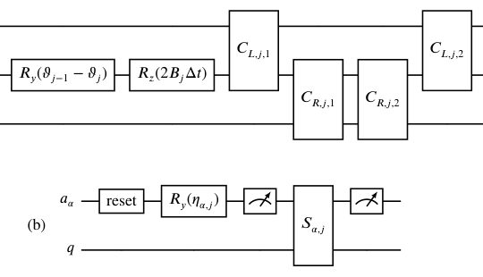 
FIG. 1. (a) Gates of cell 𝑗. The first two gates form the coherent step 𝑈𝑗; the frame update is omitted for 𝑗= 0. (b) One collision 𝐶𝛼,𝑗,𝑘. The first measurement records 𝑏in and completes the thermal preparation; the second records 𝑏out. 𝑆𝛼,𝑗is the partial swap of Eq. (11), compiled into two CZ gates and single-qubit rotations.

**Summary.** This paper demonstrates geometric heat pumping on a superconducting quantum processor by cyclically driving a qubit coupled to two thermal reservoirs. The authors show that the measurable, non-zero heat pumped is a geometric quantity determined by the path taken in parameter space. This bridges fundamental concepts from quantum thermodynamics and geometric phases to near-term quantum hardware implementations.

**Why it may be interesting.** This work provides a concrete, experimentally relevant platform (superconducting qubits) to test fundamental non-equilibrium thermodynamic principles, specifically linking quantum work extraction to geometric phases.

Detailed structure

**Main problem.** The paper investigates geometric heat pumping—the transfer of energy between reservoirs at equal temperature—by cyclically driving a quantum system.

**Main result.** The pumped heat is shown to be a purely geometric quantity, depending only on the area enclosed by the driving contour in parameter space, and this is confirmed by comparing collision models to the adiabatic limit.

**Method.** The authors employ a collision model implemented on a quantum processor, analyzing the system dynamics using both discrete time-stepping (collision model) and continuous-time adiabatic expansions.

**Model / system.** The system is a working qubit coupled to two thermal reservoirs (L and R), modeled via a collision process involving ancilla qubits. The dynamics are described by a time-dependent Lindblad master equation.

**Key observables.** Stochastic heat exchanged per collision ($Q_{\alpha,j,k}$), ensemble average heat ($Q_c^\alpha$), and the geometric heat contribution ($Q_{geo}^\alpha$).

**Important parameters / regimes.** The slow-driving regime, the area enclosed by the driving contour, and the ratio of pumped heat to noise-induced heating.

**Assumptions / limitations.** The analysis relies on the adiabatic approximation in the slow-driving limit to extract the geometric contribution, and the collision model assumes ancillas are reset after each interaction.

**Figures summary.** Figures illustrate the quantum circuit for a single time cell, detailing the sequence of collisions and the structure of energy measurements ($E_{in}$ and $E_{out}$) used to calculate heat.

**Paper structure.** The paper moves from defining the physical setup and the collision model to deriving the continuous-time Lindblad dynamics. It then analyzes the slow-driving limit using adiabatic expansions to isolate the geometric heat term, benchmarking these results against direct simulations of the collision model.

Abstract

Geometric heat pumping is the transfer of energy between reservoirs at equal temperature where the heat exchanged in an adiabatic cycle depends only on the driving contour in parameter space. We implement this mechanism on a superconducting quantum processor using a collision model, where a driven qubit interacts repeatedly with two ancilla qubits that are prepared in thermal states and emulate the reservoirs. Energy measurements before and after each interaction provide a calorimetric record of the heat exchanged with each reservoir. By reversing the driving contour, we extract a heat contribution associated with pumping. Its dependence on the period and on the contour follows exact simulations of the collision model, without adjustable parameters, and approaches in the slow-driving regime the geometric limit of the corresponding Lindblad dynamics.

[↑ back to top](#top)

### [Correspondence between Asymptotic Quantum Many-Body Scars in Closed Systems and Diffusive Nambu-Goldstone Modes in Open Systems](http://arxiv.org/abs/2610.09662v1)

**Authors:** Masaya Kunimi, Taiki Haga, Masaya Nakagawa  
**Type:** theory · **Category:** statistical mechanics · **PDF:** <https://arxiv.org/pdf/2610.09662v1>  
**Analysis basis:** full PDF text, analyzed in chunks
**Topic relevance:** 🔥 `scars & prethermalization` **4/5** · `driven-dissipative phase transition` **3/5** · `non-equilibrium universality` **3/5** · `Keldysh / 2PI / non-Gaussian methods` **2/5** · `methods for driven-dissipative` **2/5** · `analog quantum simulation` **1/5** · `correlated / nonlocal dissipation` **1/5** · `quantum measurements` **1/5**

📷 Fig 1

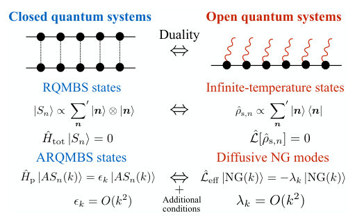 
FIG. 1. Schematic of the correspondence between closed quantum systems and open quantum systems for the spin- 1/2 example.

📷 Fig 2

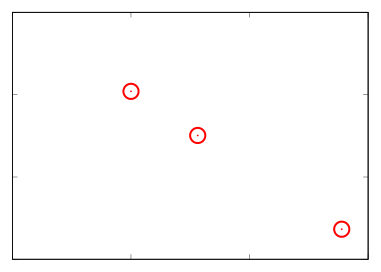 
FIG. 4. Overlap between the ARQMBS state |ASM/2(1)⟩and the slowest-decaying mode.

📷 Fig 3

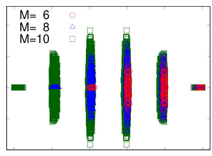 
FIG. 2. Full Lindbladian spectrum η for ∆= 2 and γ = 5J/ℏ in the sector ˆSz tot ⊗ˆ1 = ˆ1 ⊗ˆSz tot = 0, where ˆSz tot ≡PM j=1 ˆSz j . The system sizes are M = 6, 8, and 10.

📷 Fig 4

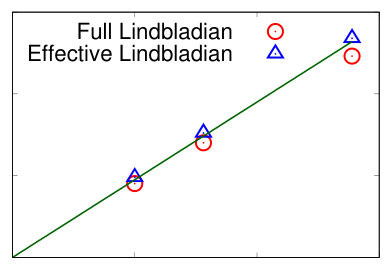 
FIG. 3. Comparison of the slowest decay rates obtained from the full and effective Lindbladians. The parameters are the same as those in Fig. 2. The green solid line represents 1/M 2

📷 Fig 5

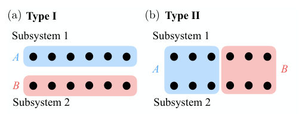 
FIG. 5. Schematic of the two bipartitions of the system. The upper and lower black circles represent the lattice sites of the subsystems 1 and 2, respectively. (a) Type-I bipartition. The blue and red regions represent subsystems A and B, respec- tively, which coincide with subsystems 1 and 2. (b) Type-II bipartition. Subsystem A contains half of the sites in each of subsystems 1 and 2, and subsystem B contains the remaining half. See also Fig. 1 of Ref. [102].

**Summary.** This paper reveals a fundamental duality connecting slow, non-thermalizing states (Quantum Many-Body Scars) in closed quantum systems to diffusive Nambu-Goldstone modes in open systems. By establishing a spectral correspondence between the parent Hamiltonian and the effective Lindbladian, the authors unify the understanding of slow relaxation across different physical regimes. This has broad implications for understanding quantum dynamics in both isolated and dissipative environments.

**Why it may be interesting.** This work provides a powerful, unifying mathematical framework connecting two distinct physical phenomena—non-thermal scars in isolated systems and diffusive relaxation in open ones—using spectral theory.

Detailed structure

**Main problem.** The paper establishes a deep theoretical correspondence between slow relaxation mechanisms in closed quantum systems (Quantum Many-Body Scars) and diffusive dynamics in open quantum systems (Nambu-Goldstone modes).

**Main result.** It shows that a common underlying structure links weak ergodicity breaking in closed systems to diffusive hydrodynamics in open systems, specifically mapping an exact quadratic parent-Hamiltonian branch to a diffusive NG mode.

**Method.** The authors use spectral analysis, variational constructions, and the comparison between the parent Hamiltonian of the scar states and the effective Lindbladian of the open system.

**Model / system.** The study considers general spin, fermionic, and bosonic systems, exemplified by models like the XXZ Hamiltonian on a two-leg ladder. The dynamics are governed by a closed system Hamiltonian and an open system Lindblad master equation.

**Key observables.** The key observables are the spectral properties: the gap scaling ($O(k^2)$) in the parent Hamiltonian for scars, and the decay rate $\lambda(k) \simeq Dk^2$ for the diffusive NG modes.

**Important parameters / regimes.** The correspondence holds under the assumption of strong U(1) symmetry and local charge-dephasing Lindblad operators, and for uniformly bounded positive transition rates.

**Assumptions / limitations.** The correspondence is derived assuming the existence of asymptotic scar states and the applicability of the Lindblad formalism for the open system dynamics.

**Paper structure.** The paper proceeds by first defining the scar states in closed systems, then analyzing the dynamics in open systems via the Lindbladian, and finally establishing the spectral correspondence between the two frameworks.

Abstract

Hydrodynamic relaxation in open quantum many-body systems can be understood in terms of diffusive Nambu--Goldstone (NG) modes associated with strong-to-weak spontaneous symmetry breaking (SWSSB). Here, we find a common structure underlying weak ergodicity breaking in closed quantum systems and diffusive hydrodynamics in open quantum systems. We establish a spectral correspondence between the parent Hamiltonian of rainbow quantum many-body scar (RQMBS) states in closed systems and the effective Lindbladian of strongly dissipative open systems with strong $U(1)$ symmetry and local charge-dephasing Lindblad operators. For broad classes of spin, fermionic, and bosonic systems, we construct asymptotic RQMBS (ARQMBS) states. Within the enlarged scar subspace, the parent Hamiltonian admits a local Rokhsar--Kivelson-type frustration-free decomposition. A single-mode variational construction gives an $O(k^2)$ upper bound on its lowest excitation energy and yields states satisfying the defining ARQMBS criteria: orthogonality, vanishing energy variance, and characteristic entanglement scaling. Under vectorization, RQMBS states are mapped to maximally mixed infinite-temperature states in fixed-charge sectors, which exhibit long-range SWSSB order under finite-density conditions. Assuming uniformly bounded positive transition rates, the effective Lindbladian has the same local projectors as the parent Hamiltonian but with positive transition-dependent weights, yielding two-sided spectral bounds and the same system-size scaling of their gaps. For uniform rates, the two operators are proportional to each other and their eigenmodes coincide. Therefore, an exact quadratic parent-Hamiltonian branch maps directly to a diffusive NG mode. Our results connect different mechanisms of slow relaxation in closed and open quantum many-body systems.

[↑ back to top](#top)

### [Extensively degenerate superradiant phase in a giant-atom quantum Rabi ring](http://arxiv.org/abs/2610.09880v1)

**Authors:** Shu He, Li-Wei Duan  
**Type:** theory · **Category:** other · **PDF:** <https://arxiv.org/pdf/2610.09880v1>  
**Analysis basis:** full PDF text, analyzed in chunks
**Topic relevance:** 🔥 `Dicke superradiance` **4/5** · `Tavis-Cummings & cavity-many-emitter` **3/5** · `analog quantum simulation` **3/5** · `superradiant laser` **3/5** · `Keldysh / 2PI / non-Gaussian methods` **1/5** · `correlated / nonlocal dissipation` **1/5** · `driven-dissipative phase transition` **1/5** · `methods for driven-dissipative` **1/5**

📷 Fig 1

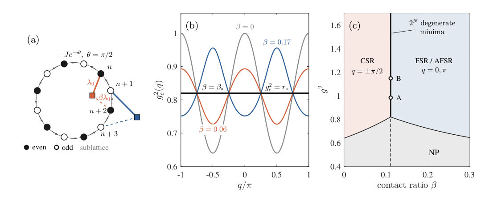 
FIG. 1. Model and mean-field phase diagram (η →∞) at θ = π/2. (a) Each atom (square) couples to cavities n and n + 2 with strengths λ0 = λ/ p

📷 Fig 2

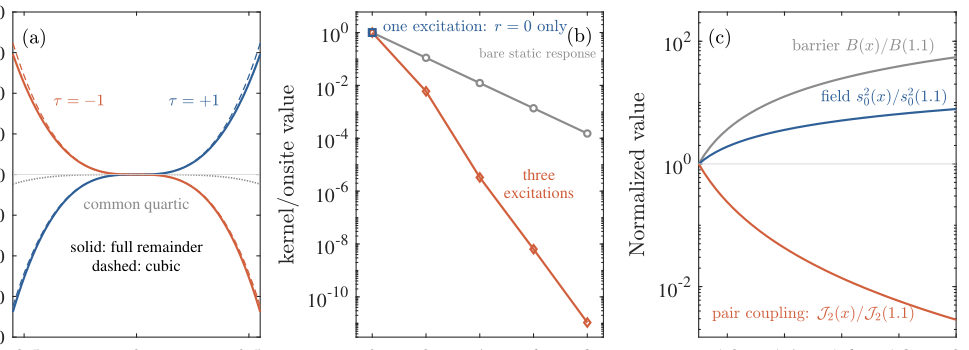 
FIG. 2. Leading finite-frequency correction at j = 0.6 and θ = π/2, using point A (β∗= 1/9, x = 1.2) unless noted. (a) Anharmonic part of the local potential, δwτ(δs) = w(τs0 + δs) −w(s0) −w′′(s0) δs2/2, for the two wells τ = ±1. Solid curves show the full remainder. The cubic parts (dashed) have opposite signs in the two wells, whereas the quartic term w(4)(s0)δs4/24 (dotted) is common. (b) Magnitudes of the infinite-chain real-space kernels normalized to their onsite values: the one-excitation integral of Eq. (21) at β∗(square), which vanishes identically for r ̸= 0; the three-excitation integral ReR ∞

📷 Fig 3

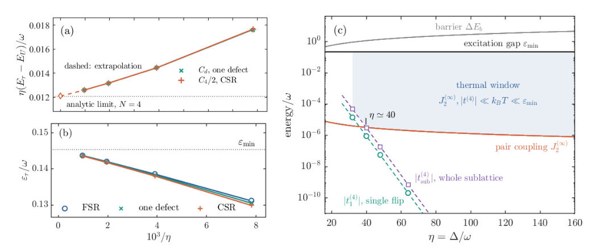 
FIG. 3. Numerical checks and energy scales at j = 0.6, θ = π/2, and β∗= 1/9. Panels (a) and (b) use point A (x = 1.2); panel (c) uses B (x = 1.4). (a) Four-site energy differences relative to FSR, with the CSR difference divided by two: Cd = η(Ed −EU)/ω and C4/2 = η(E4 −EU)/(2ω). Symbols are cutoff-extrapolated full-spin results; solid lines are adiabatic results. Dashed segments extend quadratic full-spin fits to η−1 = 0. The two intercepts (open diamonds) are indistinguishable on this scale and differ from the analytic limit (dotted line) by 0.24% for this fit (Appendix D). (b) Excitation gaps within the minima at nc = 18 for FSR, one-defect, and CSR configurations: full-spin symbols and...

📷 Fig 4

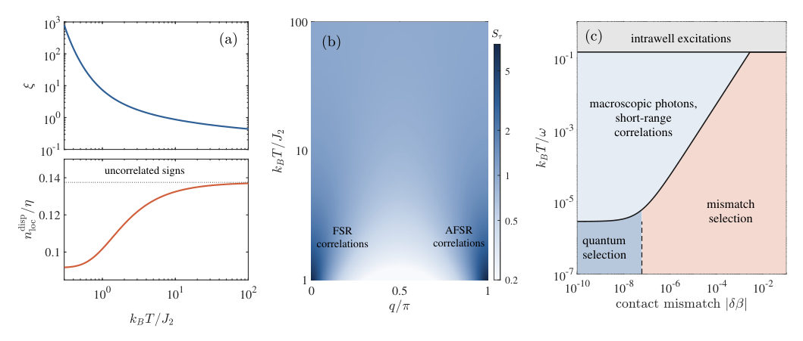 
FIG. 4. Macroscopic photon occupation and thermal sign correlations at A (j = 0.6, x = 1.2, θ = π/2). Panels (a) and (b) use matched contacts β∗= 1/9 and the thermodynamic limit. (a) Correlation length ξ in physical lattice spacings (top) and the leading local displacement contribution to the photon number, ndisp loc /η (bottom), for the two sublattice Ising chains with couplings J2–J8. The dotted line is the uncorrelated-sign limit, 0.1375. (b) Sign structure factor Sτ(q) on a logarithmic color scale; values below 0.2 share the lightest color. Its peaks at q = 0 and π show FSR and AFSR correlations. The photon displacement intensity is ηs2 0W(q)Sτ(q) [Eq. (30)]. (c) Energy scales at η =...

**Summary.** This paper theoretically analyzes the superradiant phase in a quantum Rabi ring, showing that the system possesses extensive degeneracy in the mean-field limit. Crucially, it demonstrates that quantum fluctuations introduce a non-classical Ising coupling that selects between ferro- and antiferro-superradiant states. The methodology combines mean-field theory with advanced quantum perturbation techniques.

**Why it may be interesting.** This work provides a detailed theoretical understanding of how quantum fluctuations can stabilize and select specific ordered phases (FSR/AFSR) in cavity QED systems, demonstrating a quantum order-by-disorder effect absent classically.

Detailed structure

**Main problem.** The study investigates the superradiant phase transition and the extensive degeneracy of superradiant configurations in an N-site quantum Rabi ring.

**Main result.** The system exhibits extensive degeneracy in the mean-field limit ($\eta 	o \infty$), which is stabilized by quantum fluctuations, and finite-frequency corrections select specific ferro- or antiferro-superradiant states via a quantum order-by-disorder effect.

**Method.** The analysis employs mean-field theory, followed by a Schrieffer–Wolff transformation and second-order perturbation theory to derive an effective Ising Hamiltonian describing quantum corrections.

**Model / system.** The model is an N-site quantum Rabi ring with two-level atoms, where each atom couples to two cavities two sites apart. The system is governed by a Hamiltonian involving cavity fields and atomic spins.

**Key observables.** Superradiant excitation gap ($\varepsilon_{\min}$), effective Ising coupling constants ($J_r$), and the degeneracy of superradiant configurations.

**Important parameters / regimes.** The atomic-to-cavity frequency ratio $\eta = \Delta/\omega$, and the coupling ratio $eta$ that determines the phase (FSR, AFSR, CSR).

**Assumptions / limitations.** The analysis relies on the mean-field approximation and subsequent quantum corrections derived via perturbation theory, assuming the photon band remains dispersive.

**Figures summary.** Figures illustrate the model setup, momentum-dependent critical coupling, phase diagrams, and show the evolution of correlation lengths and sign structure factors distinguishing different superradiant phases.

**Paper structure.** The paper progresses from establishing the mean-field degeneracy in the infinite limit, to deriving the effective low-energy Hamiltonian using quantum corrections, and finally analyzing the resulting quantum order-by-disorder selection mechanism.

Abstract

We show that an $N$-site quantum Rabi ring with matched giant-atom couplings has $2^N$ degenerate superradiant configurations as the atomic-to-cavity frequency ratio $η=Δ/ω$ tends to infinity. Each atom couples to two cavities two sites apart, and the photon hopping carries a phase $π/2$. Tuning the ratio of contact strengths to the photon hopping reduces the mean-field energy to a sum of single-site Rabi energies, with a common critical coupling for all momentum-pair sectors. The degeneracy survives quadratic quantum fluctuations despite a dispersive excitation spectrum. At finite $η$, second-order processes involving the local cubic anharmonicity generate a same-sublattice Ising coupling of order $ω/η$, selecting ferro- and antiferro-superradiant configurations. This quantum order-by-disorder effect has no classical counterpart. Four-site calculations retaining all spin states quantitatively support the predicted energy coefficients. The separation between the induced coupling and the excitation gap allows a broad temperature interval with macroscopic photon occupation and short-range correlations between displacement signs.

[↑ back to top](#top)

### [Phonon-Enabled Collective Strong Coupling of Color Centers in a Plasmonic Cavity](http://arxiv.org/abs/2610.09716v1)

**Authors:** Bharti Garg, Prabhdeep Singh, Masoud Taleb, Nahid Talebi  
**Type:** both · **Category:** other · **PDF:** <https://arxiv.org/pdf/2610.09716v1>  
**Analysis basis:** full PDF text, analyzed in chunks
**Topic relevance:** 🔥 `Tavis-Cummings & cavity-many-emitter` **4/5** · 🔥 `quantum optics experiment` **4/5** · `analog quantum simulation` **3/5** · `QC/QI experiment` **1/5** · `correlated / nonlocal dissipation` **1/5** · `driven-dissipative phase transition` **1/5** · `interference shaping light` **1/5** · `methods for driven-dissipative` **1/5**

📷 Fig 1

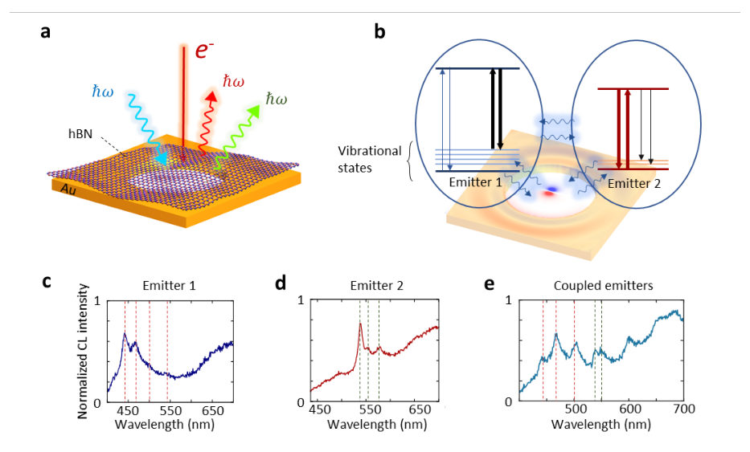 
Figure 1. Experimental concept and optical response of individual and cavity-coupled quantum emitters in hBN. (a) Schematic of photon and electron excitation of hBN transferred onto an Au plasmonic void cavity, where the focused beams excite the hBN defect centers. (b) Conceptual energy- level diagram of the two emitters coupled through the confined optical mode of the plasmonic cavity. (c and d) Normalized CL spectra of the individual emitters centered at 443 nm (Emitter 1) and 537 nm (Emitter 2), with dashed lines indicating the ZPLs and their phonon sidebands. (e) CL spectrum of the cavity-coupled system, showing an energy split of the 4th vibrational resonance of Emitter 1.

📷 Fig 2

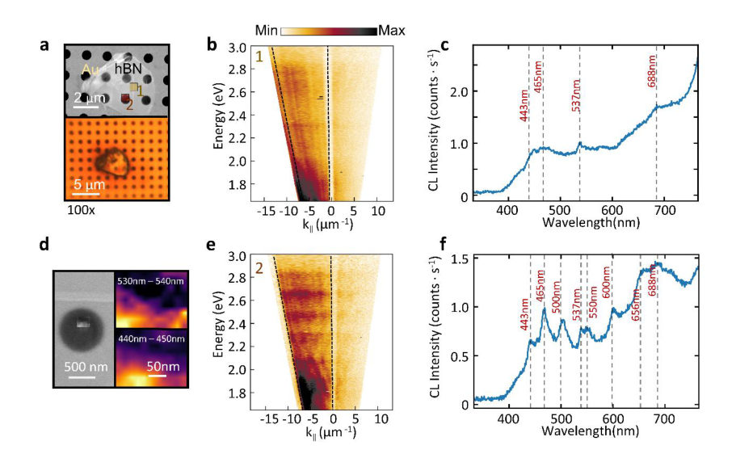 
Figure 2. CL response of uncoupled and cavity-coupled hBN emitters. (a) SEM and optical image of the hBN flake on an Au plasmonic void cavity. Positions 1 and 2 indicate measurements outside and above the cavity, respectively. (b,c) Angle-resolved CL map and corresponding integrated spectrum of the uncoupled emitters acquired at position 1. (d) SEM image and hyperspectral CL maps demonstrating spatial distribution of the 443 nm and 537 nm emitters within the cavity. (e,f) Angle-resolved CL map and integrated spectrum of the cavity-coupled system acquired at position 2, revealing additionally resolved vibronic transitions and the energy split around 540 nm.

📷 Fig 3

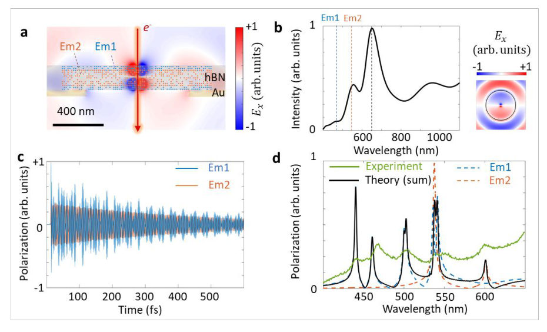 
Figure 3. Maxwell-Bloch simulations of cavity-mediated emitter coupling. (a) Simulated electron- induced near-field distribution of the in-plane component of the electric field of the plasmonic void cavity in the absence of both emitters at the wavelength of 537 nm. (b) Calculated cavity resonance spectrum with the positions of emitter 1 (Em1) and emitter 2 (Em2) ZPLs peaks marked with blue and orange dashed lines, respectively. Moreover, the position of the fundamental mode of the cavity, which is a photonic mode confined in the hole is marked by blue dashed line. (c) Temporal evolution of the individual emitter polarizations, for two emitters positioned near to the rim of the cavity. (d)...

📷 Fig 4

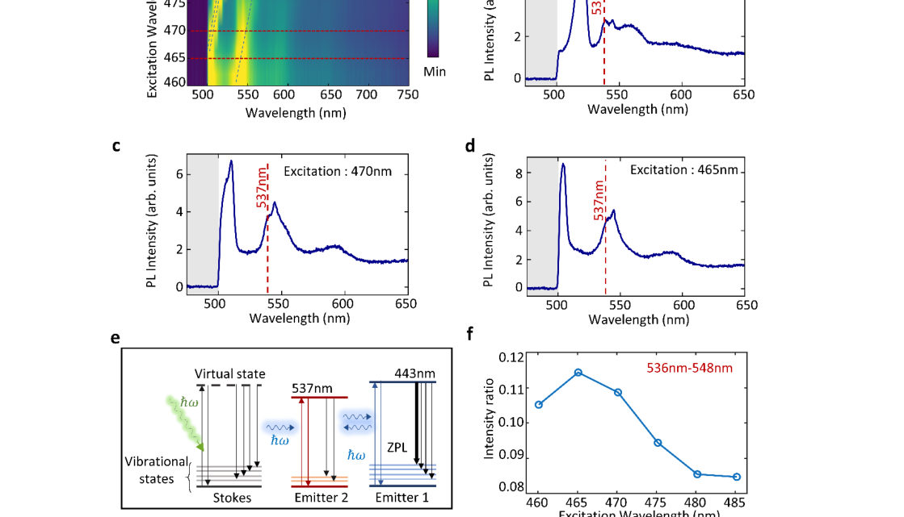 
Figure 4. Phonon-assisted optical excitation of the cavity-coupled hybridized state. (a) Excitation- dependent PL map of the coupled emitter-cavity system, normalized individually to the laser intensity. The Stokes-shifted emission follows the excitation wavelength, while the hybridized emission remains limited to the same wavelengths. (b-d) Representative PL spectra for excitation wavelengths of 480, 470, and 465 nm, respectively, showing the persistence of the cavity-induced split feature under all excitations. The dashed line marks the 537 nm ZPL of Emitter 2. (e) Schematic of the phonon-assisted excitation pathway. Excitation below the 443 nm ZPL of Emitter 1 populates its vibronic...

📷 Fig 5

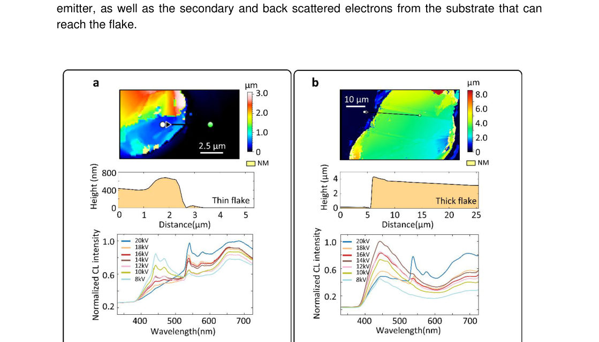 
Figure 5. Thickness-dependent CL of hBN flakes. (a,b) MarSurf thickness maps (top), corresponding height profiles (middle), and normalized CL spectra (bottom) of representative thin and thick hBN flakes measured at accelerating voltages from 8 to 20 kV, and the beam current of 8 nA.

**Summary.** This paper investigates the strong coupling between color center quantum emitters in hBN and a plasmonic cavity. Using CL and PL spectroscopy, the authors observed spectral splitting in one emitter's vibronic transition, confirming cavity-mediated strong coupling. The results demonstrate that vibronic pathways offer a controllable mechanism for engineering interactions between multiple quantum emitters in nanoscale photonic structures.

**Why it may be interesting.** This work is highly relevant to AMO physics and quantum optics as it experimentally realizes and models cavity QED effects using solid-state emitters, demonstrating control over coupling regimes via specific vibrational modes.

Detailed structure

**Main problem.** The study aims to demonstrate and characterize cavity-mediated strong coupling between multiple quantum emitters (color centers) embedded in a plasmonic nanophotonic cavity.

**Main result.** The research successfully observed spectral splitting in the emission of one emitter, confirming strong coupling via vibronic transitions, while another emitter remained in the weak-coupling regime.

**Method.** The work combines complementary experimental techniques, including Cathodoluminescence (CL) and Photoluminescence (PL) spectroscopy, with theoretical validation using Maxwell-Bloch simulations.

**Model / system.** The system involves color centers (e.g., VACD, structural defects) in hexagonal boron nitride (hBN) coupled to a plasmonic gold (Au) void cavity. The interaction is modeled using cavity QED principles, focusing on the role of vibronic transitions.

**Key observables.** Energy splitting ($\approx 36.2 	ext{ meV}$ in CL vs. $\approx 24.1 	ext{ meV}$ in PL), spectral linewidths, and the relative coupling strength (strong vs. weak).

**Important parameters / regimes.** Room temperature operation, specific emitter wavelengths (443 nm, 537 nm), and the coupling energy scale relative to dissipation.

**Assumptions / limitations.** The observed spectral changes are attributed to hybridization with the cavity mode, and the collective response of multiple emitters is crucial for observing the splitting.

**Figures summary.** Figures compare CL/PL spectra at different positions (coupled vs. uncoupled) showing the emergence of split features near the cavity resonance, and simulations confirm the hybridization mechanism.

**Paper structure.** The paper progresses by first establishing the physical system and measurement techniques, then presenting evidence for strong coupling via spectral splitting, confirming this with simulations, and finally detailing the role of vibronic pathways in controlling these interactions.

Abstract

Quantum emitters in hexagonal boron nitride (hBN) are promising building blocks for solid-state quantum photonics because of their bright room-temperature emission. These emitters strongly interact with lattice vibrations, which partially underpins their excitation efficiency. Here, using complementary cathodoluminescence (CL) and photoluminescence (PL) spectroscopy, we demonstrate cavity-mediated interactions between hBN quantum emitters coupled to the same plasmonic Au void cavity at the room temperature. Cathodoluminescence measurements reveal that a vibronic transition of the 443 nm emitter hybridizes with the cavity mode, giving rise to a spectrally resolved splitting, while the neighboring 537 nm emitter remains in the weak-coupling regime despite spectral overlap. The energy split of the CL peak is at the order of 36.2 meV, whereas the PL-resolved peak is approximately 24.1 meV, which is due to the collective excitations of multiple emitters per electron excitation and their mutual interactions. Maxwell-Bloch simulations reproduce the experimental spectra and identify the observed splitting as the result of cavity-induced hybridization. Excitation-dependent PL further shows that the hybridized state can be accessed through phonon-assisted excitations below the zero-phonon transition. These results demonstrate that vibronic transitions provide an effective pathway for controlling interactions between multiple quantum emitters in hybrid plasmonic nanophotonic systems.

[↑ back to top](#top)

### [Dynamics of Work Extraction in Multipartite Atomic Systems: Role of Correlations and Relative Entropy](http://arxiv.org/abs/2610.10220v1)

**Authors:** M. Ibrahim, S. J. Anwar, K. Khan  
**Type:** theory · **Category:** other · **PDF:** <https://arxiv.org/pdf/2610.10220v1>  
**Analysis basis:** full PDF text, analyzed in chunks
**Topic relevance:** 🔥 `Tavis-Cummings & cavity-many-emitter` **4/5** · `analog quantum simulation` **3/5** · `correlated / nonlocal dissipation` **2/5** · `driven-dissipative phase transition` **2/5** · `methods for driven-dissipative` **2/5** · `Keldysh / 2PI / non-Gaussian methods` **1/5** · `non-equilibrium universality` **1/5**

📷 Fig 1

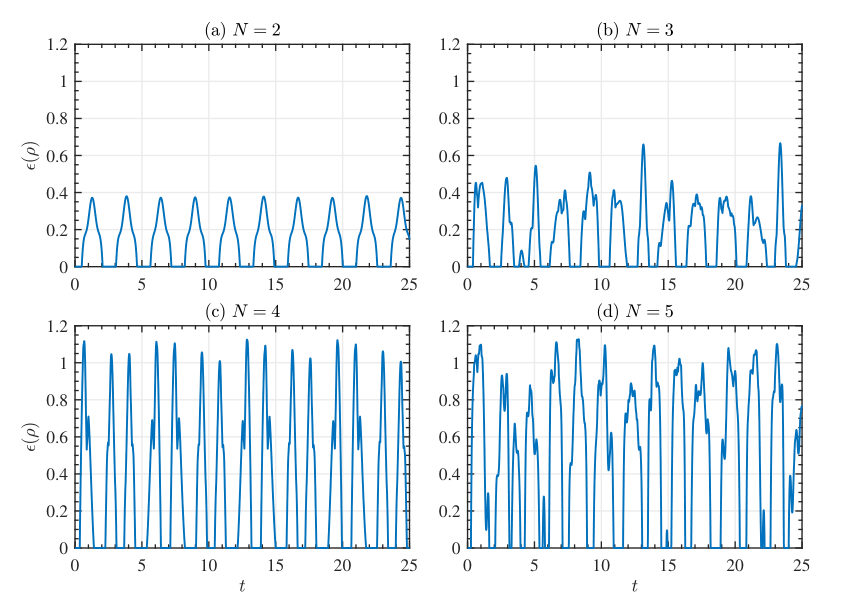 
FIG. 1: (color online) Dynamics of the quantum ergotropy ǫ(ρ) for different numbers of

📷 Fig 2

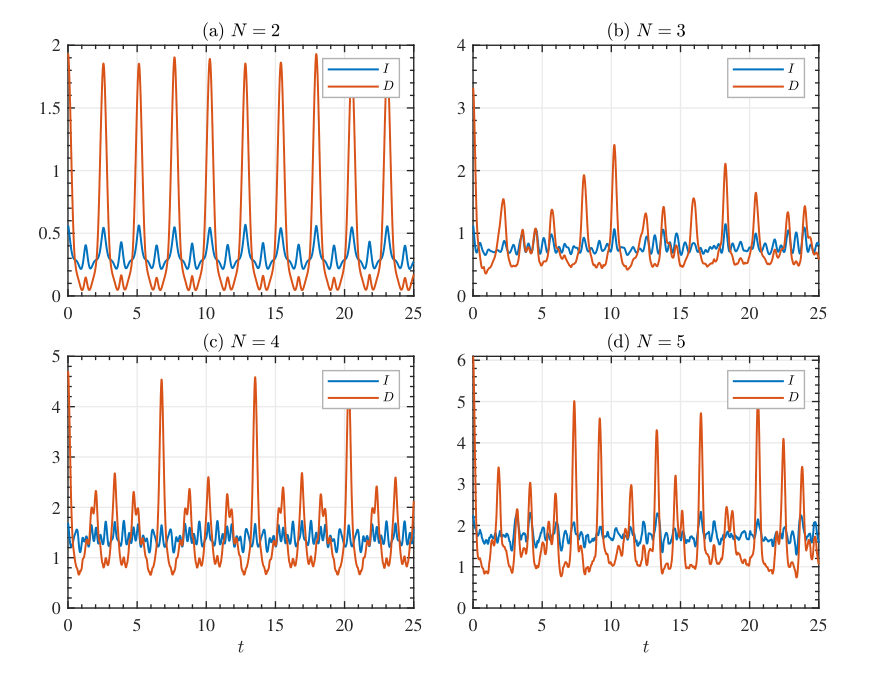 
FIG. 2: (color online) Time evolution of the multipartite quantum mutual information I

📷 Fig 3

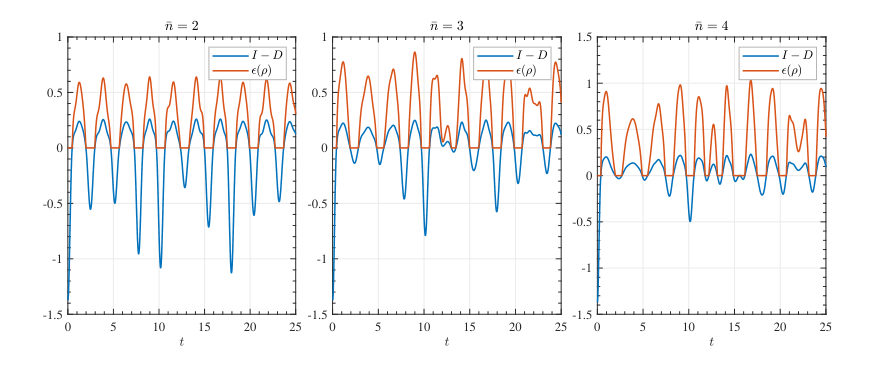 
FIG. 3: (color online) Dynamics of I −D and quantum ergotropy ǫ(ρ) for different average

📷 Fig 4

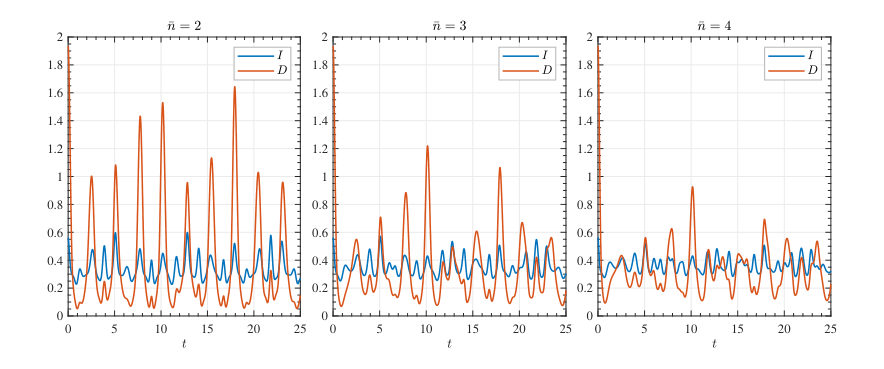 
FIG. 4: (color online) Time evolution of the quantum mutual information I and quantum

📷 Fig 5

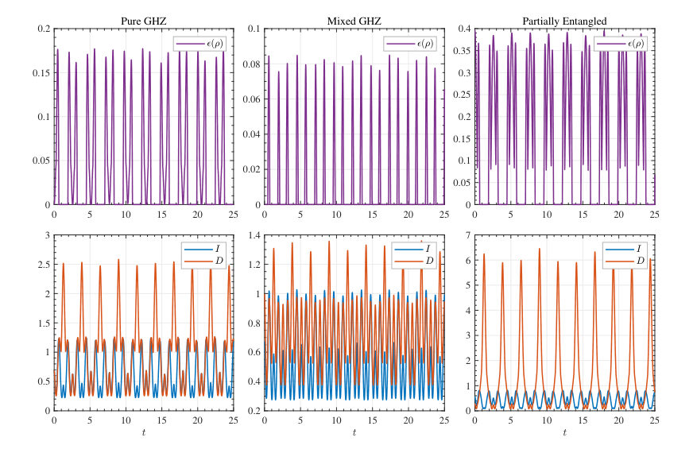 
FIG. 5: (color online) Dynamics of quantum ergotropy ǫ(ρ) (upper row) and the correspond-

**Summary.** This paper studies how quantum correlations dictate the maximum extractable work (ergotropy) in a system of multiple two-level atoms coupled to a thermal cavity field. By analyzing the interplay between mutual information and relative entropy, the authors show that the initial state is crucial, with partially entangled states maximizing work extraction. The findings highlight that controlling quantum correlations is key to advancing quantum power applications.

**Why it may be interesting.** This work directly addresses quantum thermodynamics in cavity QED settings, providing quantitative insights into how engineered quantum correlations (beyond simple entanglement) dictate energy harvesting capabilities in open quantum systems.

Detailed structure

**Main problem.** The paper investigates the dynamics of quantum ergotropy (extractable work) in multipartite atomic systems, specifically analyzing how quantum correlations and relative entropy govern this work extraction.

**Main result.** The maximum extractable work is highly dependent on the initial quantum state, with partially entangled states yielding the largest and most persistent work. Furthermore, the dynamics are governed by a competition between mutual information (resource) and relative entropy (penalty).

**Method.** The analysis uses theoretical derivations based on the Tavis-Cummings model Hamiltonian and employs numerical simulations to track the time evolution of quantum ergotropy, mutual information, and relative entropy.

**Model / system.** The system consists of $N$ two-level atoms coupled to a quantized single-mode cavity field, modeled by the Tavis-Cummings Hamiltonian. The initial state can be varied between pure, mixed, and partially entangled configurations, and the field is subjected to thermal photons.

**Key observables.** Quantum ergotropy (extractable work), multipartite quantum mutual information, and quantum relative entropy.

**Important parameters / regimes.** System size ($N=2$ to $5$), average thermal photon number ($ar{n}$), and the initial state preparation parameters ($	heta, p$).

**Assumptions / limitations.** The analysis is performed using the Tavis-Cummings model, and the initial state is assumed separable ($\hat{
ho}(0) = \hat{
ho}_A(0) \otimes \hat{
ho}_{th}^F$).

**Figures summary.** Figures illustrate the time evolution of ergotropy, mutual information, and relative entropy as a function of system size, thermal photon number, and initial state type.

**Paper structure.** The paper introduces the Hamiltonian, defines central quantities (ergotropy, mutual information, relative entropy), presents the main numerical results concerning system size and temperature effects, and concludes by summarizing the role of correlations.

Abstract

We investigate the dynamics of quantum ergotropy in a multipartite system of two-level atoms interacting with a quantized field. The role of multipartite quantum mutual information and quantum relative entropy is analyzed to understand how correlations and the distinguishability between the passive state and the product of local states affect the extractable work. Numerical results for systems containing two to five atoms show that the maximum ergotropy does not increase linearly with the system size, while the intervals of zero ergotropy are gradually modified and suppressed for larger systems. We also study the effect of the average thermal photon number and different initial atomic states. Increasing the thermal photon number mainly reduces the relative-entropy contribution, whereas the initial state strongly influences both the magnitude and persistence of ergotropy. Among the considered states, the partially entangled state provides the largest and more persistent extractable work, while the mixed GHZ state gives the smallest ergotropy. These results highlight the importance of multipartite correlations, thermal effects, and state preparation in controlling quantum work extraction and may be useful for future studies of quantum batteries and quantum power.

[↑ back to top](#top)

### [Efficient detection of spectral cluster states](http://arxiv.org/abs/2610.09745v1)

**Authors:** M. Kalash, U. -N. Han, C. Roh, M. H. M. Passos, Y. -S. Ra, M. V. Chekhova  
**Type:** experiment · **Category:** quantum information and computing · **PDF:** <https://arxiv.org/pdf/2610.09745v1>  
**Analysis basis:** full PDF text, analyzed in chunks
**Topic relevance:** 🔥 `quantum optics experiment` **4/5** · `QC/QI experiment` **3/5** · `interference shaping light` **3/5** · `quantum measurements` **3/5**

📷 Fig 1

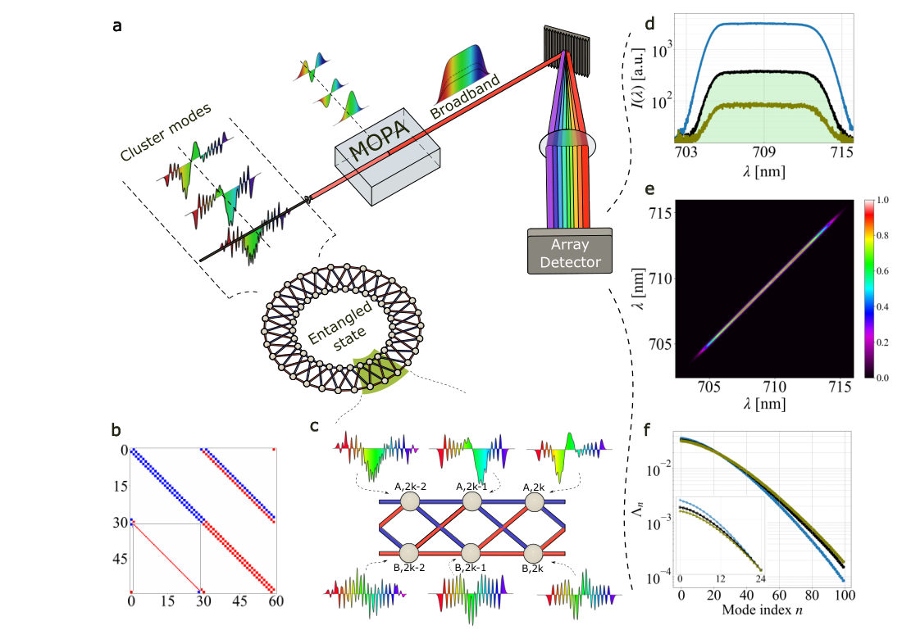 
FIG. 1. Simultaneous characterization of spectral cluster states through multimode optical parametric amplification (MOPA). (a) The target state, here a 60-node dual-rail cluster state, is injected into the MOPA, which performs broadband phase-sensitive amplification. The amplified radiation is then spectrally dispersed by a diffraction grating and measured with an array detector, providing access to the spectral intensity and its correlations. (b) Adjacency matrix of the target 60-node dual-rail cluster state, with its square shown in the inset. Blue and red points correspond to connections of weights −1/2 and 1/2, respectively. (c) Spectral profiles of the cluster modes corresponding to...

📷 Fig 2

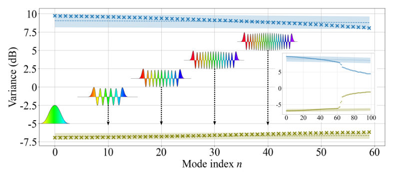 
FIG. 2. Measured nullifier variances of the 60-node dual-rail cluster state. Crosses show reconstructed variances at relative phases φ = 0 (blue) and φ = π/2 (olive). The dashed lines show the theoretical values, while the shaded areas account for the uncertainty in the initial squeezing level. The colored shapes are the spectral profiles of the 1st, 10th, 20th, 30th, and 40th modes. The inset shows the reconstructed quadrature variances of the 100 strongest frequency modes of the squeezed vacuum.

📷 Fig 3

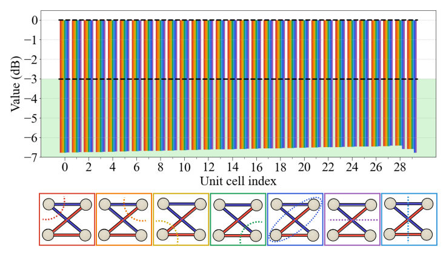 
FIG. 3. Verification of multipartite entanglement. The vLF criterion is evaluated for all 30 unit cells comprising the 60-node dual-rail cluster state. The seven possible bipartitions of the chosen unit cell configuration are illustrated below the main panel, with each identified by a different color. Each bar shows the measured vLF value for the corresponding unit cell and the bipartition identified by its matching color. The horizontal dashed lines at 0 dB and −3 dB indicate the vLF bounds for the far-right bipartition (light blue) and all other bipartitions, respectively. Values below the corresponding bounds verify inseparability across each bipartition.

**Summary.** This paper demonstrates the use of Multimode Optical Parametric Amplification (MOPA) to characterize a large, 60-node spectral cluster state. By measuring spectral correlations, the authors confirm strong squeezing and genuine multipartite entanglement across the entire state. This establishes MOPA as a promising, scalable platform for advanced quantum information processing in the spectral domain.

**Why it may be interesting.** This work directly advances the experimental realization of high-dimensional quantum resources (spectral cluster states) and proposes a robust, loss-tolerant detection platform (MOPA) for continuous-variable quantum information processing.

Detailed structure

**Main problem.** The paper addresses the challenge of efficiently detecting spectral cluster states, which are crucial resources for measurement-based quantum computation using continuous-variable quantum information.

**Main result.** They successfully demonstrated the spectral multimode capability of Multimode Optical Parametric Amplification (MOPA) by characterizing a 60-node cluster state, confirming genuine multipartite entanglement across all nodes.

**Method.** The measurement relies on using MOPA as an all-optical analyzer to characterize the state by measuring spectral intensity correlations and reconstructing the input quadrature variances.

**Model / system.** The system involves generating and characterizing a broadband 60-node dual-rail continuous-variable cluster state using multimode squeezing via type-I collinear degenerate parametric down-conversion (PDC) in a BiBO crystal.

**Key observables.** Squeezing levels (up to -7.2 dB), reconstructed nullifier variances, and the violation of the van Loock–Furusawa criterion for entanglement verification.

**Important parameters / regimes.** 60-node state size, MOPA gain (G = 4.5 ± 0.2), and the spectral bandwidth (limited to 8.5 nm by dispersion).

**Assumptions / limitations.** The retrieval of quadrature variance is exact only if the overlap matrix is real, and the measurement is currently limited by spectral dispersion.

**Figures summary.** Figures illustrate the setup, the adjacency matrix of the 60-node state, measured spectral intensity correlations, and the reconstruction of nullifier variances across various bipartitions.

**Paper structure.** The paper details the theoretical framework for using MOPA for detection, presents the experimental characterization of the 60-node state, verifies entanglement using the vLF criterion, and concludes by establishing MOPA as a scalable platform.

Abstract

Multimode entangled states of light are key resources for high-dimensional photonic quantum technologies, particularly for continuous-variable quantum computing and quantum information processing. Exploiting their full capabilities requires detection strategies that can efficiently and simultaneously access a large number of modes and their quantum correlations. Multimode optical parametric amplification (MOPA) provides a promising approach by amplifying multiple quadratures prior to detection, rendering the measurement robust against subsequent optical losses while enabling broadband operation. Here, we demonstrate the spectral multimode capability of MOPA by simultaneously characterizing a broadband 60-node dual-rail continuous-variable cluster state. We reconstruct the cluster-state nullifiers across the spectral modes and observe nearly uniform squeezing ranging from -7.2 to -6.5 dB. Furthermore, by evaluating the van Loock-Furusawa criterion across all relevant bipartitions, we verify genuine multipartite entanglement throughout the 60-node state. These results establish MOPA as a promising platform for scalable high-dimensional quantum information processing in the spectral domain.

[↑ back to top](#top)

### [High-Fidelity Inter-Species Rydberg Gates with Two-Photon Driving](http://arxiv.org/abs/2610.08926v1)

**Authors:** Shuan Wang, Kevin Singh  
**Type:** theory · **Category:** other · **PDF:** <https://arxiv.org/pdf/2610.08926v1>  
**Analysis basis:** full PDF text, analyzed in chunks
**Topic relevance:** 🔥 `Rydberg arrays` **4/5** · `QC/QI experiment` **3/5** · `analog quantum simulation` **2/5** · `methods for driven-dissipative` **2/5** · `Keldysh / 2PI / non-Gaussian methods` **1/5** · `quantum measurements` **1/5**

📷 Fig 1

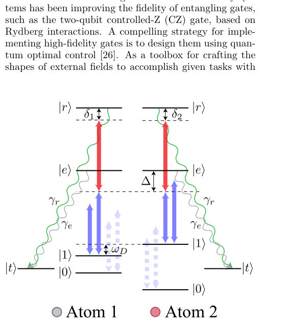 
FIG. 1. Energy level diagrams for atom 1 and atom 2. For each atom, five energy levels |0⟩, |1⟩, |e⟩, |r⟩, |t⟩are consid- ered. Two optical fields are used for excitation of the atoms from |1⟩to |r⟩: a global red laser (solid red arrows) and a global blue laser with two frequency components (solid blue arrows). The two frequency components in the blue laser also act off-resonantly on qubit state |0⟩(dashed light blue ar- rows).

📷 Fig 2

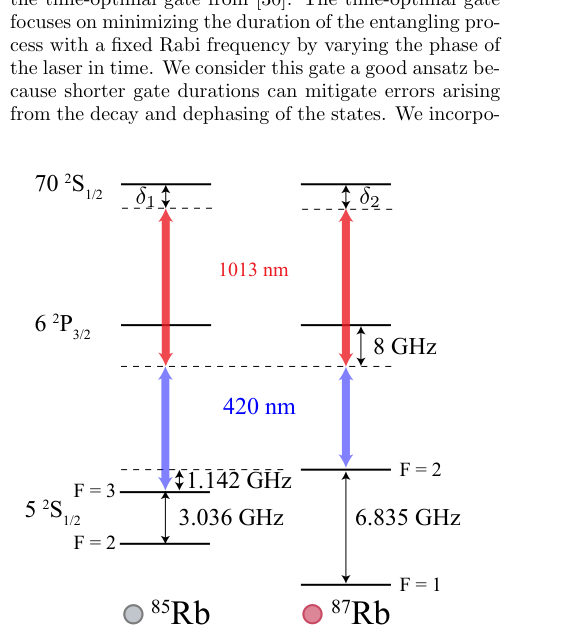 
FIG. 2. Energy levels involved in the gate operation and key experimental parameters. Both atoms have |e⟩= |6P3/2⟩ and |r⟩= |70S1/2⟩, while |0⟩and |1⟩are different due to the difference in their hyperfine structure.

📷 Fig 3

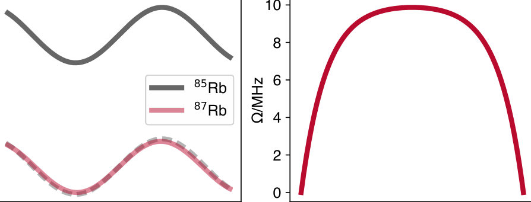 
FIG. 4. A. Phase modulations for the 85Rb/87Rb high-fidelity gate. The phase functions are not restricted in [0, 2π) or (−π, π] for a more intuitive graphical representation. To illustrate the difference between the two phase functions, we subtract the fixed phase offset from the phase function of 85Rb and plot it as the dashed grey line. B. Shared pulse strength profile for 85Rb/87Rb high-fidelity gate. The vertical axis is calculated based on Eq. 6 but with varying blue Rabi frequency.

📷 Fig 4

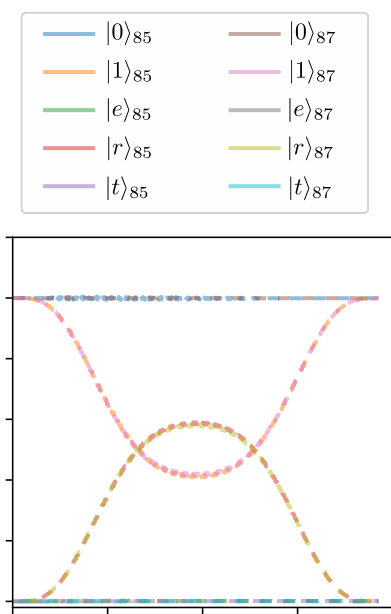 
FIG. 5. Relation between state populations and time during the optimal gate.

**Summary.** This paper models high-fidelity entangling gates for dual-species neutral atom arrays using two-photon Rydberg excitation. It specifically addresses and mitigates the influence of laser crosstalk, a key challenge in scaling these quantum processors. The results show that fidelities exceeding 99.8% are achievable, paving the way for robust quantum information processing.

**Why it may be interesting.** This work is highly relevant as it tackles a critical hardware-level limitation (crosstalk) in a leading platform for quantum computation (neutral atoms), providing concrete, high-fidelity gate protocols.

Detailed structure

**Main problem.** The primary goal is to improve the fidelity of inter-species Rydberg gates in neutral atom arrays by modeling and suppressing the detrimental effects of laser crosstalk during two-photon driving.

**Main result.** The authors demonstrate that crosstalk can be suppressed to arbitrarily small levels, achieving gate fidelities greater than 99.8% using conservative parameters in an $^{85}	ext{Rb}/^{87}	ext{Rb}$ system.

**Method.** The study develops a detailed model incorporating crosstalk into the Hamiltonian and uses time-optimal gate design principles to engineer the pulse sequence.

**Model / system.** The system involves neutral atom arrays using dual-species isotopes ($^{85}	ext{Rb}/^{87}	ext{Rb}$) modeled as five-level systems. The dynamics are governed by a master equation incorporating the full Hamiltonian, including van der Waals interactions and laser driving fields.

**Key observables.** Gate fidelity (target $>99.8\%$), unitary infidelity, and full infidelity including decoherence.

**Important parameters / regimes.** Near-detuned regime, specific parameters for $^{85}	ext{Rb}$ and $^{87}	ext{Rb}$ (listed in Table I), and the gate time ($T$).

**Assumptions / limitations.** The model assumes global and overlapping laser fields, and the gate design is optimized using time-optimal gate approaches.

**Figures summary.** Figures illustrate energy level diagrams, the evolution of infidelity vs. time (comparing unitary vs. full), and the required phase modulations for the gate operation.

**Paper structure.** The paper introduces the physical system and the problem of crosstalk, develops the comprehensive model and Hamiltonian, details the time-optimal gate design, presents the results showing high fidelity, and concludes by outlining future enhancement possibilities.

Abstract

Recently, neutral atom arrays have become known for their promising potential in quantum information processing. High-fidelity entangling operations are typically achieved by exciting atoms to high-lying Rydberg states through two-photon processes. To improve the performance of these systems at the hardware level, dual-species strategies have been applied to enhance readout, error correction, and reloading in neutral atom systems. However, the influence of laser crosstalk arising from two-photon excitation for dual-species systems has remained largely unexplored in the literature. Here, we develop a model that incorporates the influence of crosstalk in inter-species Rydberg gates with two-photon driving. We demonstrate that the influence of this crosstalk can be suppressed to arbitrarily small levels through appropriate gate design, with gate fidelities greater than $99.8\%$ achievable with conservative experimental parameters in the near-detuned case of an $^{85}$Rb/$^{87}$Rb system. We also outline how this fidelity can be further enhanced through improvements to the Rydberg excitation.

[↑ back to top](#top)

### [Quench dynamics and quantum flutter properties of one-dimensional attractive single-spin flipped Fermi gases](http://arxiv.org/abs/2610.09431v1)

**Authors:** Xiangguo Yin, Shulong Zhao  
**Type:** theory · **Category:** quantum gases · **PDF:** <https://arxiv.org/pdf/2610.09431v1>  
**Analysis basis:** full PDF text, analyzed in chunks
**Topic relevance:** 🔥 `non-equilibrium universality` **4/5** · `analog quantum simulation` **3/5** · `scars & prethermalization` **2/5** · `Frenkel-Kontorova` **1/5** · `Keldysh / 2PI / non-Gaussian methods` **1/5** · `methods for driven-dissipative` **1/5**

📷 Fig 1

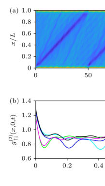 
Fig. 1 The time evolution of the opposite-spin two-body correlation function g↑↓

📷 Fig 2

 
Figure 2 illustrates the scenario where the momentum of spin-down particles at the initial time exceeds the Fermi momentum. Compared with Figure 1, although the parameters differ only in total momentum, the exhibited properties are distinctly

📷 Fig 3

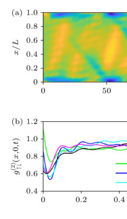 
Fig. 2 The time evolution of the opposite-spin two-body correlation function g↑↓

📷 Fig 4

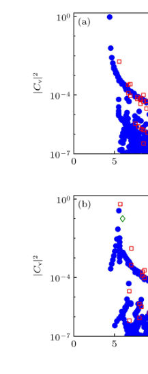 
Fig. 3 The energy distribution of the occupation probabilities of different eigenstates for

📷 Fig 5

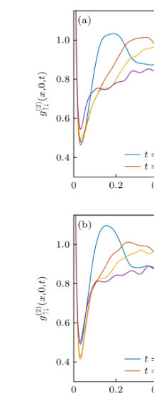 
Fig. 4 The time evolution of the opposite-spin two-body correlation function g↑↓

**Summary.** This paper theoretically examines how quantum systems behave when suddenly quenched in the presence of attractive interactions, focusing on 1D Fermi gases with an impurity. Using the Bethe ansatz, the authors characterize the dynamic evolution, revealing distinct behaviors based on the total momentum. Crucially, they derive a robust relationship for the quantum flutter period linked directly to the impurity's chemical potential.

**Why it may be interesting.** This work provides deep theoretical insights into non-equilibrium dynamics in attractive quantum many-body systems, directly supporting experimental efforts using ultracold atoms to probe impurity interactions.

Detailed structure

**Main problem.** The study investigates the quench dynamics and quantum flutter properties in one-dimensional Fermi gases with attractive interactions, an area lacking systematic theoretical treatment.

**Main result.** The paper establishes that the quantum flutter period is consistently determined by the chemical potential of the impurity particle, $\Delta E = 2\pi/|\mu_{\downarrow c}|$, and details distinct dynamic behaviors in weakly versus strongly attractive regimes.

**Method.** The research employs the exact Bethe ansatz solution method to simplify correlation matrix elements into finite sums, allowing for the calculation of time evolution of correlation functions.

**Model / system.** The system is a one-dimensional ideal Fermi gas containing a single spin-down impurity fermion interacting attractively ($g<0$). The Hamiltonian is analyzed using the Bethe ansatz framework.

**Key observables.** Time-evolution of interspin two-body correlations, impurity momentum, and the characteristic quantum flutter (periodic oscillation) of the impurity momentum.

**Important parameters / regimes.** The total momentum relative to the Fermi momentum, the attractive interaction strength ($g$), and the chemical potential of the impurity ($\mu_{\downarrow c}$).

**Assumptions / limitations.** The analysis relies on the Bethe ansatz for exact solutions and involves approximations such as the thermodynamic limit ($\Lambda 	o \infty$) in some derivations.

**Figures summary.** Figure 1 illustrates the time evolution of the opposite-spin two-body correlation function for a specific total momentum ($Q=k_F$), showing correlation peaks and moving correlation holes.

**Paper structure.** The paper systematically analyzes the problem by first introducing the Bethe ansatz solutions (Section 2), simplifying correlation functions (Section 3), analyzing quench dynamics via two-body correlations (Section 4), and finally discussing quantum flutter and revival phenomena (Section 5).

Abstract

Impurity nonequilibrium dynamics in quantum many-body systems is a frontier subject in ultracold-atom physics, which helps uncover microscopic mechanisms of polaron and collective excitation phenomena. Although repulsive interacting systems have been extensively investigated, attractive-interaction dynamics lacks systematic studies owing to intricate couplings among different states. We study a one-dimensional ideal Fermi gas containing an attractive spin-down impurity with initial momentum and analyze time evolution of interspin two-body correlations and impurity momentum. Using exact Bethe ansatz solutions, we simplify correlation matrix elements to finite sums for efficient calculations of eigenstate occupations and long-time dynamical evolution. In the weakly attractive regime, bound-state features appear when the total momentum is below or equal to the Fermi momentum, while mixed oscillatory behaviors arise at larger total momentum. The strongly attractive regime shows locally bound-state dominated dynamics with localized correlation peaks and scattering-induced Friedel-like oscillations. We characterize quantum flutter, the periodic oscillation of impurity momentum, and obtain consistent critical chemical potential values of the impurity via four independent Bethe ansatz approaches. This work clarifies quench dynamics and quantum flutter under attractive interactions, improves the understanding of nonequilibrium quantum many-body properties, and provides theoretical support for relevant ultracold-atom impurity experiments.

[↑ back to top](#top)

### [Quantum simulation of the Heisenberg XXZ model on a Rydberg atom array](http://arxiv.org/abs/2610.10357v1)

**Authors:** Matthias Werner, Artur García-Sáez  
**Type:** both · **Category:** other · **PDF:** <https://arxiv.org/pdf/2610.10357v1>  
**Analysis basis:** full PDF text, analyzed in chunks
**Topic relevance:** 🔥 `Rydberg arrays` **4/5** · 🔥 `analog quantum simulation` **4/5** · `QC/QI experiment` **3/5**

📷 Fig 1

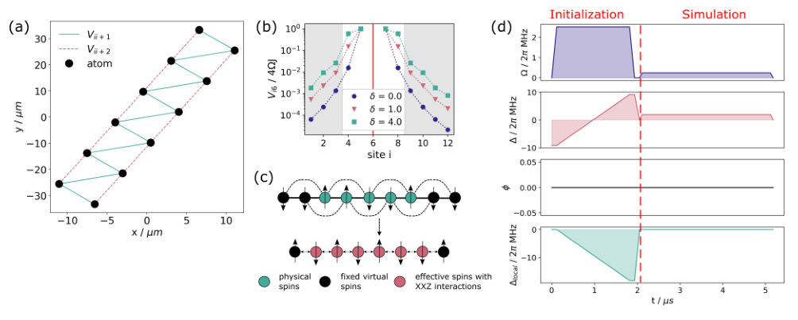 
Figure 1. (a): Arrangement of Rydberg atoms in the xy-plane as a chain with nearest-neighbor and next-nearest-neighbor interactions, depicted as solid green and dashed red lines respectively. Other interactions can be neglected due to the decay with the sixth power of the atom distance; (b): Interaction strength of atom j = 5 with all other atoms for atom arrangements corresponding to anisotropies δ = 0 (blue dots), δ = 1.0 (red triangles) and δ = 4.0 (green squares). The white background indicates the nearest neighbor and next-nearest-neighbor interactions, while the gray background indicates all interactions beyond these two. The gray shaded interactions are undesired for all values of δ,...

📷 Fig 2

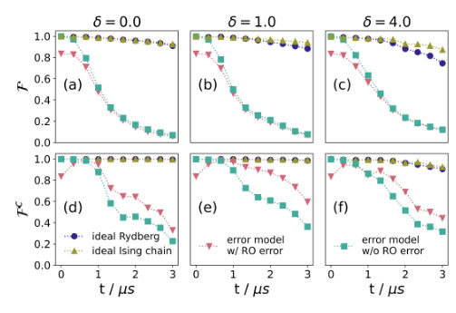 
Figure 2. Fidelities of an ideal Rydberg simulation (blue dots), for the full error model (red triangles) and for the same error model, but without RO error (green squares) compared to the exact Heisenberg XXZ evolution in the XY phase (a, d), at the critical point (b, e) and in the Ising phase (c, f). Additionally, we show the fidelities for an ideal Ising chain, i.e. the Hamiltonian of the Rydberg system where the un- wanted interactions are set to zero (yellow upward-triangles). (a, b, c): the quantum state fidelity F in Eq. (17); (d, e, f): the classical fidelity Fc in Eq. (18).

📷 Fig 3

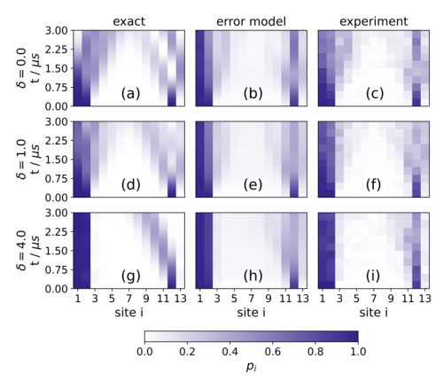 
Figure 3. Time evolution of the site populations pi Eq. (19) as a function of time t for the anisotropic XXZ chain with a total of three excitations, two initialized at sites 1 and 2 and one at site 12. We compare the exact solution (a, d, g) with the numerical simulation of the error model (b, e, h) and the experimental data from Aquila (c, f, i) for the system in the XY phase δ = 0.0 (a, b, c), at the critical point δ = 1.0 (d, e, f) and in the Ising phase δ = 4.0 (g, h, i).

📷 Fig 4

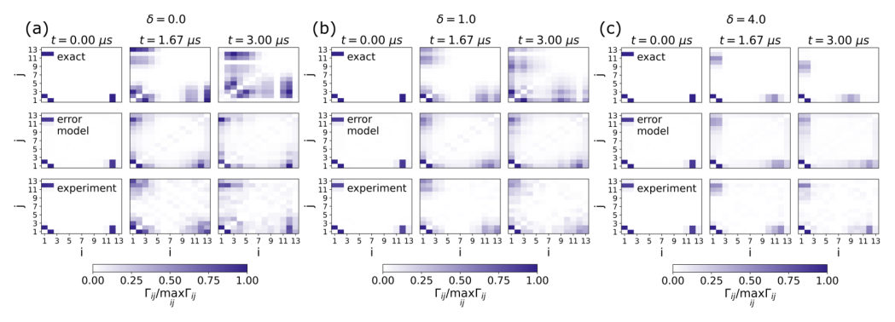 
Figure 4. Time evolution of the normalized correlation matrix Γij/ maxij Γij for the exact model (top row), the error model (middle row) and the experimental data (bottom row) for the XY phase with δ = 0.0 (a), the critical point with δ = 1.0 (b) and in the Ising phase with δ = 4.0 (c). In each subfigure, we show the normalized correlation matrix at the start of the simulation at t = 0.0µs (left column), in the approximate middle of the simulation t = 1.67µs (middle column) and at the end of the simulation at t = 3.0µs (right column).

📷 Fig 5

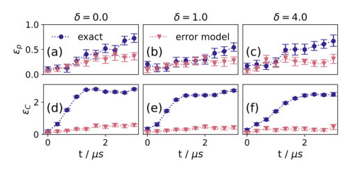 
Figure 5. Error metrics εp Eq. (22) (a, b, c), and εC Eq. (23) (d, e, f) for the experimental data being compared to once the exact time evolution (blue dots) and once the error model (red triangles) for δ = 0.0 (a, d), δ = 1.0 (b, e) and δ = 4.0 (c, f). The markers are the mean values from bootstrapping the experimental data 100 times and the error bars indicate the 95%-confidence interval.

**Summary.** This paper details the quantum simulation of the Heisenberg XXZ model using Rydberg atom arrays. The core innovation is using domain wall encoding to simulate the full XXZ model by mapping it onto an effective Ising Hamiltonian realizable on the hardware. The authors successfully validate this method by reproducing expected physical behavior across different quantum phases while rigorously accounting for realistic experimental noise sources.

**Why it may be interesting.** This work is highly relevant as it pushes the boundaries of quantum simulation by demonstrating how to engineer complex Hamiltonians (like XXZ) on platforms (Rydberg atoms) whose native interactions might otherwise be limited, thereby expanding the accessible model space for quantum many-body physics.

Detailed structure

**Main problem.** The paper addresses the challenge of simulating the Heisenberg XXZ model on quantum hardware by implementing a method that allows for the simulation of necessary coupling types beyond conventional ZZ-couplings.

**Main result.** The authors successfully demonstrate the implementation of this simulation method on a Rydberg atom quantum device, reproducing the expected dynamical behavior across XY, Ising, and critical phases of the model.

**Method.** The simulation employs domain wall encoding to map the target XXZ spin chain Hamiltonian onto an effective Ising Hamiltonian, which is then realized using the native interactions of the Rydberg atom array.

**Model / system.** The physical platform is a Rydberg atom array (e.g., QuEra's Aquila device) used as an analog quantum simulator. The target model is the Heisenberg XXZ chain, and the simulation relies on mapping its dynamics onto an effective Ising model via domain wall encoding.

**Key observables.** Site populations ($p_i$), normalized correlations ($\Gamma_{ij}/\max_{ij} \Gamma_{ij}$), and fidelity (state and classical).

**Important parameters / regimes.** Anisotropy ($\delta$) is probed across XY ($\delta=0.0$), isotropic ($\delta=1.0$), and Ising ($\delta=4.0$) regimes. Error sources include thermal motion, laser fluctuations, and readout errors.

**Assumptions / limitations.** The method assumes that undesired interactions beyond next-nearest-neighbor are negligible, and the error model incorporates specific approximations for disorder and readout errors.

**Figures summary.** Figures illustrate the zig-zag atom arrangement realizing required interactions, the mapping process from XXZ to Ising via domain wall encoding, and comparisons of fidelity and correlation functions across different error models and anisotropies.

**Paper structure.** The paper systematically develops the theoretical framework by first defining the required Hamiltonian, then detailing the domain wall encoding transformation, and finally implementing and analyzing the simulation results using a comprehensive error model that includes disorder and readout errors.

Abstract

A major application of analog quantum hardware is quantum simulation, where a system evolves over time according to a given Hamiltonian. One challenge when implementing the Hamiltonian on a programmable quantum simulator is the availability of distinct coupling types, many of which go beyond the conventional ZZ-couplings found in Ising Hamiltonians that are naturally implemented by various platforms. In prior work, we have developed a method based on domain wall encoding to simulate one-dimensional spin chains using only Ising Hamiltonians, which would otherwise require XX+YY-couplings as well. Here, we implement the method on a commercially accessible Rydberg atom quantum device, and simulate the time evolution of the Heisenberg XXZ model with various anisotropies. We successfully probe the XY and Ising phases of the model and reproduce the qualitative behavior of several one- and two-body observables in both phases, as well as at the critical point. Our work augments the toolbox to simulate canonical quantum many-body systems on analog quantum simulators.

[↑ back to top](#top)

### [Sub-shot-noise mid-infrared photothermal measurements using twin beams](http://arxiv.org/abs/2610.10294v1)

**Authors:** Kazuki Hashimoto, Takuro Ideguchi  
**Type:** experiment · **Category:** other · **PDF:** <https://arxiv.org/pdf/2610.10294v1>  
**Analysis basis:** full PDF text, analyzed in chunks
**Topic relevance:** 🔥 `quantum optics experiment` **4/5** · `quantum measurements` **3/5** · `interference shaping light` **1/5**

📷 Fig 1

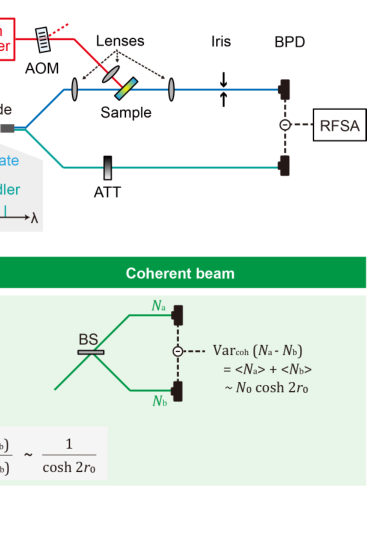 
Fig. 1. Principle of sub-shot noise MIP measurement with twin beams.(a) Schematic of sub-shot-noise MIP measurement system. BPF: band-pass filter, FA: fiber amplifier, SHG: second-harmonic generation, PPLN: periodically poled lithium niobate, CW: continuous wave, AOM: acousto-optic modulator, ATT: attenuator, BPD: balanced photodetector, RFSA: radio-frequency spectrum analyzer. (b) Noise reduction with seeded twin beams. When the overall photon number incident on the BPD is the same, the variance is reduced to around 1/cosh(2𝑟0) relative to that of a coherent beam, where 𝑟0 is the squeezing parameter. 𝑁0: mean photon number of a seed beam, 𝑁𝑎(𝑏): photon-number operators of signal (idler),...

📷 Fig 2

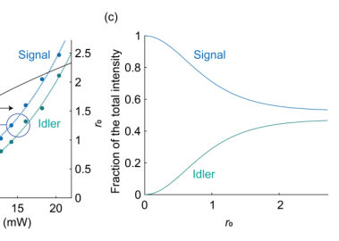 
Fig. 2. Seeded twin-beam evaluation. (a) Twin-beam spectra (blue) generated via the seeded OPA with a pump power of 14.2 mW. The black line shows the seed beam spectrum measured without the pump beam. (b) The signal (blue) and idler (blue-green) spectral intensity versus the pump power. The dotted blue and blue-green indicate the fitting curves for signal and idler, respectively. The black line shows 𝑟0 versus pump power obtained from the idler fitting results. (c) Signal (blue) and idler (blue-green) fractions of the total intensity as a function of 𝑟0.

📷 Fig 3

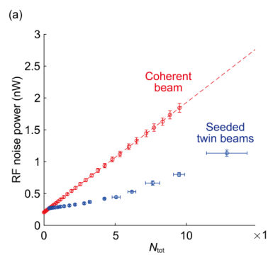 
Fig. 3. Noise reduction achieved by seeded twin beams. (a) RF noise power of the twin beams with 𝑁0 = 3.6 x 105 measured with balanced detection (blue), compared with the shot-noise level of a coherent beam (red). The red dashed line represents a linear fit to the shot-noise level of the coherent beam. The x- and y-axis error bars represent the standard deviations of 𝑁tot and the standard deviation of the RF noise power over time, respectively. (b) Corresponding NRF as a function of 𝑟0 with (blue) and without (sky-blue) the detector noise subtraction. The y-axis error bars represent the standard deviations of the NRFs obtained by propagating the standard deviations of the RF noise powers...

📷 Fig 4

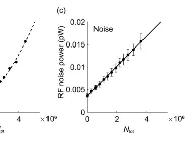 
Fig. 4. MIP measurement of water. (a) MIP signal (RF power) measured using an RFSA in full-span mode. (b) The peak of the MIP signal as a function of 𝑁pr. The dashed line represents the quadratic fit. (c) The noise floor as a function of 𝑁tot. The solid line represents the linear fit. The y-axis error bars represent the standard deviation of the RF noise power measured over the frequency range from 1.9990 to 1.9998 MHz.

📷 Fig 5

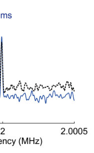 
Fig. 5. MIP measurement with twin beams. Blue: RF spectra measured using twin beams with 𝑁tot and 𝑁pr of 3.5x106 and 2.6x106, respectively. Dashed black: RF spectra measured using a coherent beam with 𝑁tot and 𝑁pr of 3.4x106 and 2.1x106, respectively.

**Summary.** This paper presents a method to enhance the sensitivity of Mid-infrared photothermal measurements by utilizing quantum noise reduction. By generating and detecting twin beams via seeded OPA, the measurement noise is suppressed below the standard shot-noise limit. This quantum enhancement allows for lower probe powers, mitigating sample damage while maintaining or improving the signal-to-noise ratio.

**Why it may be interesting.** This work is highly relevant to quantum optics and open quantum systems, demonstrating a practical application of quantum noise reduction techniques (squeezing) to a complex, non-linear sensing modality (MIP).

Detailed structure

**Main problem.** The primary goal is to improve the sensitivity of Mid-infrared photothermal (MIP) measurements by reducing measurement noise below the fundamental shot-noise limit.

**Main result.** The authors successfully demonstrated sub-shot-noise MIP measurements using twin beams generated via seeded optical parametric amplification, achieving significant SNR enhancements over conventional coherent-beam detection.

**Method.** The technique relies on balanced detection of quantum-squeezed twin beams to suppress noise below the shot-noise level, which is then applied to the MIP measurement setup.

**Model / system.** The system uses seeded Optical Parametric Amplification (OPA) in a PPLN waveguide to generate twin beams. The MIP measurement itself involves using a modulated QCL as the pump source and probing the sample's refractive index change.

**Key observables.** Signal-to-Noise Ratio (SNR), Noise Reduction Factor (NRF), and the measured MIP signal power as a function of probe power.

**Important parameters / regimes.** Squeezing parameter ($r_0$), optical loss (transmittances $T_a, T_b$), and the modulation frequency ($f_{mod}$).

**Assumptions / limitations.** The analysis assumes statistical independence of photocurrent and electronic noise, and that the noise reduction factor is robust against certain levels of optical loss when balanced detection is used.

**Figures summary.** Figures illustrate the principle of sub-shot-noise measurement, compare RF noise power between twin beams and coherent beams, and show the MIP signal scaling for both quantum and classical probe sources.

**Paper structure.** The paper progresses from establishing the need for noise reduction in MIP measurements, detailing the generation and characterization of sub-shot-noise twin beams, and finally applying this quantum enhancement to the actual MIP sensing measurement.

Abstract

Mid-infrared photothermal (MIP) measurement probes refractive-index changes induced by mid-infrared (MIR) absorption using visible or near-infrared light and has recently emerged as a powerful modality for MIR spectro-imaging in the life sciences. Reducing measurement noise allows the probe power to be lowered without compromising the signal-to-noise ratio (SNR), thereby mitigating the risk of sample damage. However, even in the absence of classical noise, the SNR of conventional MIP measurements using a classical coherent probe is fundamentally limited by shot noise. Here, we demonstrate sub-shot-noise MIP measurement using twin beams generated through seeded optical parametric amplification. Balanced detection of the twin beams suppresses the noise by more than 5 dB below the shot-noise level established using a coherent beam. As a proof-of-principle demonstration, we measure the MIP signal from liquid water using balanced twin-beam detection and achieve an SNR enhancement of more than 2 dB over the balanced coherent-beam detection.

[↑ back to top](#top)

### [Time-Bin Properties of Photon Pairs from a 2GHz Waveguide Resonator](http://arxiv.org/abs/2610.09545v1)

**Authors:** Stefan Kazmaier, Kaisa Laiho  
**Type:** both · **Category:** quantum information and computing · **PDF:** <https://arxiv.org/pdf/2610.09545v1>  
**Analysis basis:** full PDF text, analyzed in chunks
**Topic relevance:** 🔥 `quantum optics experiment` **4/5** · `interference shaping light` **3/5** · `QC/QI experiment` **1/5**

📷 Fig 1

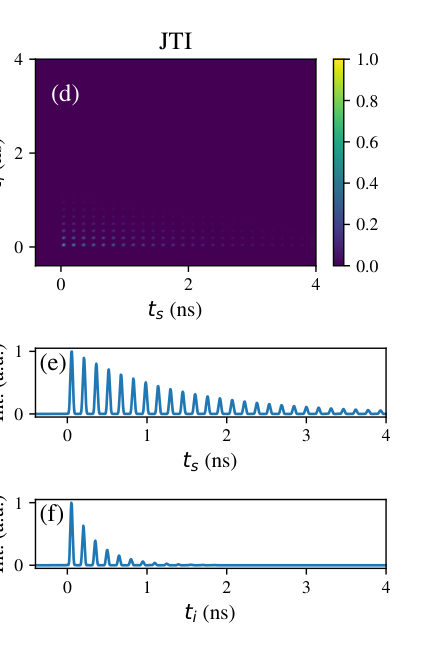 
Figure 1. Simulation in the MRM case. (a) presents the JSI in terms of the signal and idler frequencies νs,i while (b) &amp; (c) show the spectral marginal distributions of signal and idler, respectively. (d) illustrates the 2D Fourier transform into the time domain resulting in the JTI, while (e) &amp; (f) show the time bins of signal and idler, respectively. We have limited the frequency scales in (a) and the time scale in (b) for better visualization of the resonator modes.

📷 Fig 2

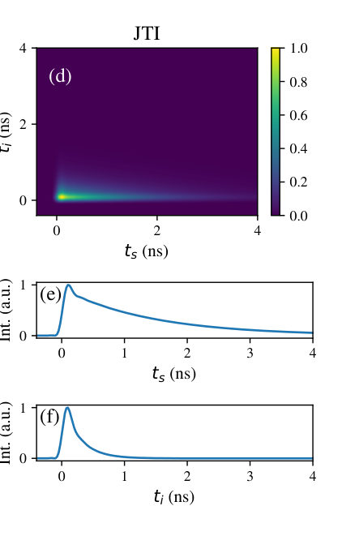 
Figure 2. Simulation in the SRM case. (a) presents the JSI in terms of the signal and idler frequencies νs,i while (b) &amp; (c) show the spectral marginal distributions of signal and idler, respectively. (d) illustrates the 2D Fourier transform into the time domain resulting in the JTI, while (e) &amp; (f) show the time bins of signal and idler, respectively.

📷 Fig 3

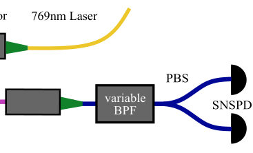 
Figure 3. Experimental arrangement. For more details see the main text. Abbreviations: Pol. filter = polarization filter; HWP = half-wave plate; PBS = polarizing beam splitter; DM = dichroic mirror; BPF = bandpass filter; SNSPD = superconducting nanowire single photon detector.

📷 Fig 4

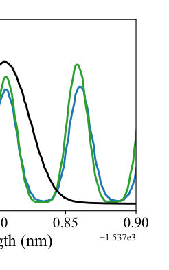 
Figure 4. Linear transmission measurement for the extraordinary and ordinary crystal axis of the PPLN WG resonator together with the transmission window of the fiber coupled variable bandpass filter. The latter is applied in order to filter a SRM from the PDC emission.

📷 Fig 5

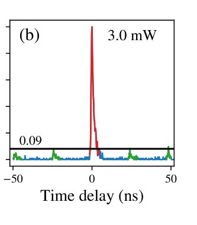 
Figure 5. Histogram of coincidence counts occurring between signal and idler at the pump powers of (a) 1.5 mW and (b) 3.0 mW. The counts in the central peak (red) contribute to the coincidences, while the side peaks (green) contribute to the accidentals with a black horizontal line as a guide to the eye. The spurious counts that lie outside the considered time gates are colored in blue.

**Summary.** This paper investigates the time-bin characteristics of photon pairs generated using a PPLN waveguide resonator. By comparing measurements in multi-mode versus single-mode operation, the authors demonstrate that spectral filtering removes interference fringes and that the resulting time-bin profiles are dictated by the optical losses of the signal and idler photons. These findings are crucial for engineering pulsed quantum sources for future quantum networks.

**Why it may be interesting.** This work directly addresses the temporal characterization of entangled photon sources, which is fundamental for developing robust quantum communication protocols and quantum networks.

Detailed structure

**Main problem.** The study focuses on characterizing the time-bin properties of degenerate photon pairs generated via parametric down-conversion (PDC) in a waveguide resonator.

**Main result.** The time-bin duration varies significantly based on the optical losses of the signal and idler photons, and the presence of spectral filtering (SRM) removes interference fringes seen in the multi-mode regime (MRM).

**Method.** The authors combine direct time-domain measurements of coincidence counts with theoretical simulations utilizing the two-dimensional Fourier transform of the Joint Spectral Intensity (JSI).

**Model / system.** The physical system is a Fabry-Pérot (FP) waveguide resonator made of periodically-poled Lithium Niobate (PPLN), used as the source for degenerate photon pairs in the telecom C-band.

**Key observables.** Time-bin durations, Joint Spectral Intensity (JSI), Joint Temporal Intensity (JTI), and the Coincidences-to-Accidentals Ratio (CAR).

**Important parameters / regimes.** 2 GHz bandwidth, sub-nanosecond pulse shapes, and the Free Spectral Range (FSR) of the resonator ($\approx 6.7 	ext{ GHz}$).

**Assumptions / limitations.** The analysis assumes a Gaussian pump spectrum and treats the FP Resonator classically; simulation requires choosing linear loss parameters ($\alpha$) for qualitative agreement.

**Figures summary.** Figures illustrate the JSI, spectral marginals, JTI, and measured/simulated time bins for both multi-resonator mode (MRM) and single-resonator mode (SRM) operation, showing the disappearance of interference fringes upon filtering.

**Paper structure.** The paper progresses by first establishing the theoretical framework using JSI and 2D Fourier transforms, then presenting experimental measurements comparing the MRM and SRM regimes, and finally analyzing the resulting time-bin characteristics.

Abstract

We produce degenerate photon pairs called signal and idler via parametric down-conversion (PDC) in a Fabry-Pérot waveguide resonator having close to a 2GHz bandwidth in the telecom C-band. Our PDC source is based on a type-II periodically-poled Lithium Niobate waveguide with high-reflecting end facets forming the resonator. We measure the strength of the photon-pair correlation between signal and idler after selecting a single resonator mode from the multimode PDC emission. Thereafter, we investigate their sub-nanosecond long pulse shapes, in other words the time bins, with standard photon counting. We find that the time-bin durations vary significantly from each other, which can be predicted by the different optical losses of the cross-polarized signal and idler. Further, we simulate the temporal properties of signal and idler via the Fourier transform of their joint spectral characteristics. Our results deliver empiric insight about the time bins of photon pairs and are relevant for driving future quantum networks at the edge to narrow bandwidths but nevertheless in the pulsed regime.

[↑ back to top](#top)

### [Engineering of Chirped Apodized Sources for Quantum Spectroscopy](http://arxiv.org/abs/2610.10217v1)

**Authors:** Linda Sansoni, Max Widarsson, Patrick Mutter, Andrea Chiuri  
**Type:** both · **Category:** other · **PDF:** <https://arxiv.org/pdf/2610.10217v1>  
**Analysis basis:** full PDF text, analyzed in chunks
**Topic relevance:** 🔥 `quantum optics experiment` **4/5** · `interference shaping light` **3/5**

📷 Fig 1

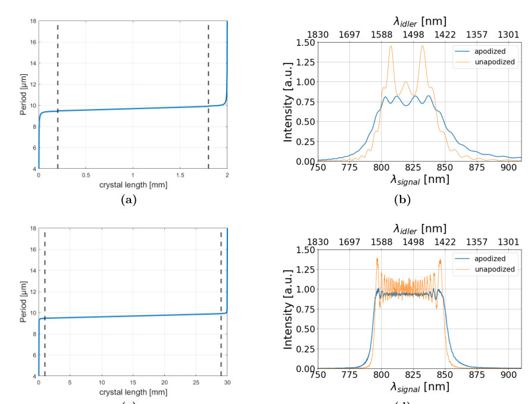 
Figure 1: Effect of nonlinear-chirp apodization on the QPM structures and their calculated phase- matching spectra. (a) Poling-period profile for the 2 mm crystal. The black dotted line indicates the transition from linear chirp to apodization. (b) Corresponding phase-matching spectra. (c) Poling- period profile for the 30 mm crystal. The black dotted line indicates the transition from linear chirp to apodization. (d) Corresponding phase-matching spectra.

📷 Fig 2

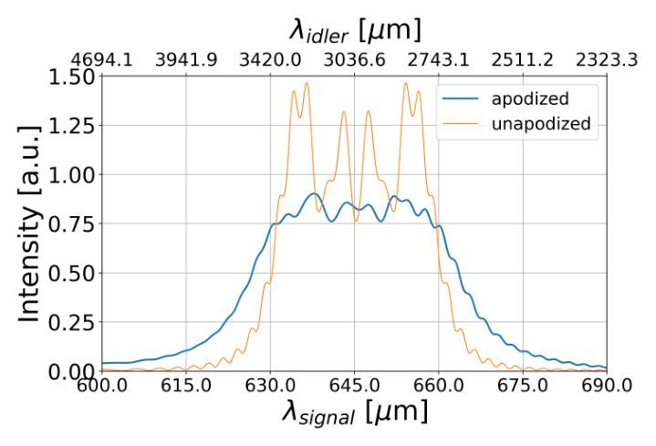 
Figure 2: Simulated spectrum of a 2 mm-long nonlinear-chirp-apodized ppKTP crystal pumped at 532 nm. The nominal poling period varies from 12.38 µm to 13.71 µm, and the resulting idler spectrum extends from approximately 2.6 µm to 3.6 µm.

📷 Fig 3

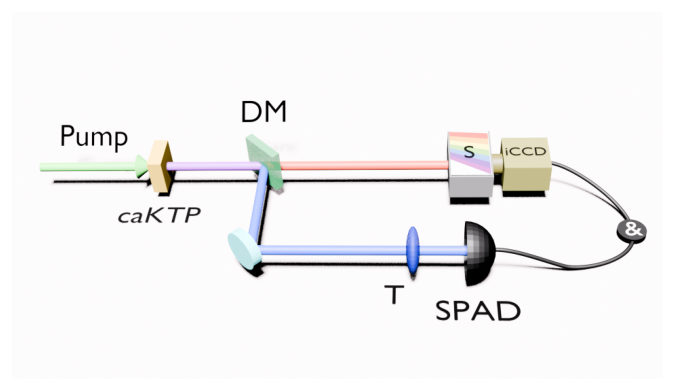 
Figure 3: Experimental Setup for characterization of the chirped apodized source. Here a pulsed laser at 532 nm (8 ps pulses with PRR=40 MHz) impinges on the caKTP crystal. Pairs of single photons in the VIS and IR range are produced and split on a dichroic mirror (DM). The IR photon goes through a target sample (T) and is then detected by a single pixel SPAD; the VIS photon is spectrally analyzed by means of a spectrograph (S) and an intensified CCD camera (iCCD). Coincidences between the detector and the camera are recorded (&amp;).

📷 Fig 4

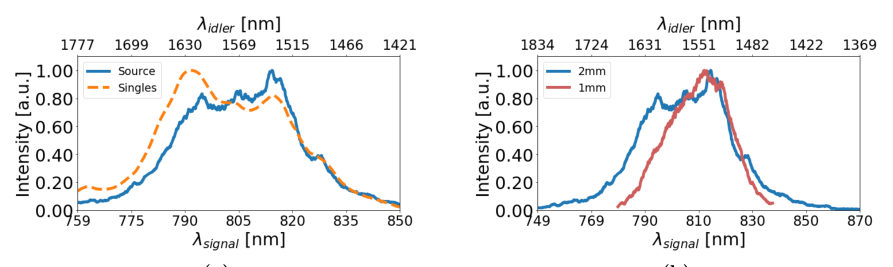 
Figure 4: (a) Spectrum of a 2mm-long caKTP. The blue curve reports the correlated spectrum, while the orange dashed line refers to the uncorrelated measurements where the background - counts when the SPDC source is blocked - has been subtracted. The reduced spectral width of the correlated spectrum is due to limited detection efficiency of the telecom detector for wavelengths above 1600 nm. (b) Correlated spectra of 1mm- (red curve) and 2mm-long crystals (blue curve). It is clear that the longer the crystal, the broader the spectrum. In these particular cases we have a FWHM of ≈28nm (signal) / ≈103nm (idler) for the 1mm crystal, while the 2mm source produces bandwidths of ≈36nm (signal) and...

📷 Fig 5

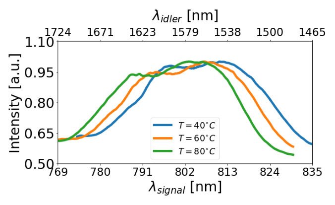 
Figure 5: Uncorrelated spectrum of a 1mm-long caKTP for different temperatures, namely 40◦C (blue curve), 60◦C (orange curve) and 80◦C (green curve). Increasing the temperature the signal spectrum shifts toward lower wavelengths, while the idler spectrum toward higher wavelengths.

**Summary.** This paper details the engineering of chirped and apodized nonlinear crystals, such as KTP, to create superior quantum light sources. By tailoring the crystal's nonlinear profile, the authors achieve unprecedented broadband emission while suppressing spectral ripples. This advancement provides a powerful tool for next-generation quantum spectroscopy and sensing applications.

**Why it may be interesting.** This work is highly relevant to quantum optics and open quantum systems, as it details the engineering of quantum light sources—a crucial resource for quantum information processing and sensing protocols.

Detailed structure

**Main problem.** The core problem is developing highly efficient, spectrally engineered, and bright quantum light sources necessary for advanced quantum sensing and spectroscopy applications.

**Main result.** The authors report that engineering chirped and apodized nonlinear crystals (caKTP) successfully generates broadband, flat-spectrum correlated photon pairs, enabling quantum spectroscopy over wide spectral ranges with shorter measurement times.

**Method.** The methodology involves theoretical simulation and experimental characterization of nonlinear processes like SPDC using tailored crystal geometries (chirping and apodization) to control the spectral output.

**Model / system.** The physical system is the nonlinear crystal, specifically KTP, which is engineered with a chirped and apodized nonlinear coefficient profile. The process relies on Type-0 Spontaneous Parametric Down-Conversion (SPDC) to generate correlated photon pairs.

**Key observables.** Broad spectral bandwidth, flat intensity distribution, high pair generation rate, and preservation of quantum correlations.

**Important parameters / regimes.** Nonlinear crystal length (e.g., 2 mm vs 30 mm), pump wavelength (e.g., 532 nm), and the degree of chirp/apodization.

**Assumptions / limitations.** The work assumes the ability to implement precise nonlinear coefficient engineering (chirping/apodization) and operates under conditions where quantum correlations are maintained despite high count rates.

**Figures summary.** Figures illustrate the effect of nonlinear-chirp apodization on phase-matching spectra, showing broadband visible-MIR generation, and detail the experimental setup for source characterization.

**Paper structure.** The paper progresses from identifying the need for engineered quantum sources, detailing the theoretical basis of nonlinear-chirp apodization, presenting simulation results demonstrating bandwidth enhancement, and concluding with the practical advantages for quantum spectroscopy.

Abstract

Quantum sources of light are of paramount importance for the development of photonic quantum technologies. The growing demand for bright, efficient, and spectrally engineered photonic sources for applications in quantum sensing, spectroscopy, and imaging has motivated the development of tailored nonlinear crystals. Here, we report on the development and characterization of chirped, apodized KTP crystals specifically engineered for quantum spectroscopy. Our source exhibits an unprecedented bandwidth in a highly non-degenerate configuration, demonstrating its potential to support quantum spectroscopy protocols over broad spectral ranges while enabling significantly shorter measurement times.

[↑ back to top](#top)

### [Dynamically protected erasure qubit via low-frequency charge driving](http://arxiv.org/abs/2610.10432v1)

**Authors:** Ahmed Hajr, Ke Wang, Bingcheng Qing, Akel Hashim, Bibek Bhandari, Dominic Briseño-Colunga, Justin Dressel, Andrew N. Jordan, Irfan Siddiqi  
**Type:** experiment · **Category:** quantum information and computing · **PDF:** <https://arxiv.org/pdf/2610.10432v1>  
**Analysis basis:** full PDF text, analyzed in chunks
**Topic relevance:** 🔥 `QC/QI experiment` **4/5** · `driven-dissipative phase transition` **1/5** · `quantum measurements` **1/5**

📷 Fig 1

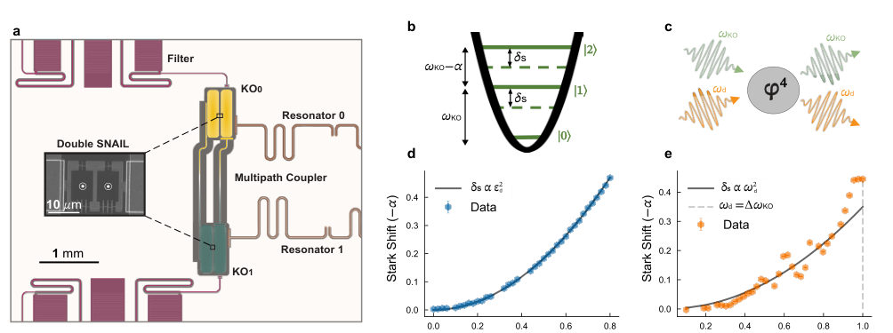 
Fig. 1. Superconducting KO chip and charge sensitivity measurements. a, Experimental schematic for the 2D chip. Each KO is a double SNAIL capacitively shunted in a floating design (yellow and teal). The readout is performed using the dispersive interaction between the KOs and the readout resonators with dedicated Purcell filters (orange). The coupling between the KOs is implemented in a multi-path design to minimize the crosstalk to the microwave control lines. The band-stop filter (dark red) suppresses the Purcell decay of the KOs while enabling strong coupling off-resonance. The design parameters are discussed in more detail in the Supplementary Note S1. b, The effect of a strong...

📷 Fig 2

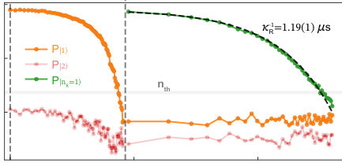 
Fig. 2. KO parametric reset and cooling. a, Pulse se- quence for the parametric reset and cooling of the KO and the corresponding time evolution. The region between the dashed lines shows the coherent conversion of an excitation from the KO into an excitation in the lossy resonator, completed after 82 ns. The free evolution afterwards shows the exponential decay of the oscillator and the cooling of the KO below its thermal population. b, The demodulated readout signal in the IQ plane showing the different blobs associated with the ground state |0⟩, the first excited state |1⟩, and the second excited state |2⟩. The effect of MIST is most visible of the second excited state.

📷 Fig 3

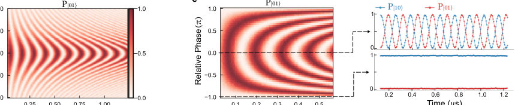 
Fig.3. Dual-rail encoding and control. a, Simplified energy diagram of the KOs used in the dual-rail encoding. The beam- splitter interaction connects the single-excitation manifold, acting as a logical Rabi drive, while the action of single-photon loss maps the excited states to the ground state of the system. b, The Bloch sphere of the dual-rail qubit showing the logical code words |0L⟩= |10⟩and |1L⟩= |01⟩and the action of single-photon loss as shrinking in the Bloch sphere. c, The three- wave mixing process associated with the beam-splitter interaction mediated by each KO with the corresponding hybridization ±g0,1/∆KO and displacement ξi. d, The Rabi oscillations in the population P01 of...

📷 Fig 4

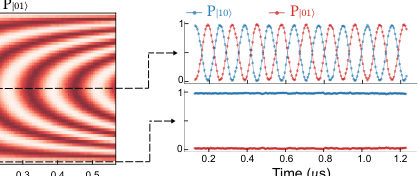 
Fig. 3d and 3e show the calibration of Rabi oscillations in the dual-rail qubit driven via the beam-splitter inter- action. To enhance calibration accuracy, we post-select on the absence of single-photon loss events at the end of each run. In Fig. 3d, we present these Rabi oscilla- tions as a function of time and drive detuning relative to the KOs frequency difference. The absence of a signifi- cant Stark shift from the nominal resonance (ωd = ∆KO) stems from the Stark shift being equal on both KOs with simultaneous driving. The relative phase calibration while simultaneously driving both KOs is shown in Fig. 3e. We observe the fastest Rabi oscillations when the displacements are out

📷 Fig 5

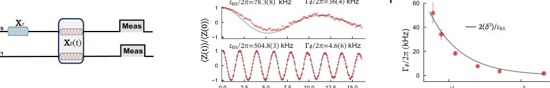 
Fig.4. Dynamical protection of the dual-rail qubit. a, The pulse sequence for characterizing spin-locking in the dual-rail qubit as discussed in the main text. b, The decay of the observable ⟨X(t)⟩normalized to the initial value. The improvement with post-selection demonstrates the erasure bias due to the dynamical protection. c, The decay rate of the dual-rail qubit along the spin-locking axis as a function of the drive amplitude. The raw data decay rate is comparable to the average decay rate of the KOs. The post-selected decay rate saturates around 2 kHz which is ∼4× smaller. d, The pulse sequence for characterizing the dynamical protection of qubit coherence against low-frequency noise....

**Summary.** This paper demonstrates a method to create noise-resilient qubits using superconducting Kerr oscillators driven by low-frequency charge signals. By exploiting the frequency dependence of the charge sensitivity, the system suppresses detrimental low-frequency noise while enabling fast quantum gates. This results in high-fidelity quantum operations suitable for quantum computation.

**Why it may be interesting.** The work provides an experimental blueprint for building fault-tolerant quantum hardware by engineering the coupling mechanism to actively suppress environmental noise sources like 1/f noise.

Detailed structure

**Main problem.** Developing noise-resilient quantum processing schemes for superconducting qubits while minimizing hardware overhead, especially against low-frequency 1/f noise.

**Main result.** The authors demonstrated dynamical protection for a dual-rail qubit, achieving low error rates ($1.5	imes10^{-4}$ after post-selection) using sub-GHz charge driving on Kerr oscillators.

**Method.** They exploit the quadratic frequency dependence of the charge sensitivity (AC Stark shift) to suppress low-frequency noise while maintaining strong coupling to microwave drives.

**Model / system.** The system uses superconducting Kerr oscillators (KOs) in the transmon regime, implemented in a planar circuit, and employs a dual-rail encoding scheme for logical control.

**Key observables.** KO population (reset/cooling), logical error per Clifford, Rabi oscillations, and the AC Stark shift measurement.

**Important parameters / regimes.** Sub-GHz charge drive frequency, coupling strength ($g/2\pi \sim 50–200 	ext{ MHz}$), and detuning ($\Delta/2\pi \sim 0.5–2 	ext{ GHz}$).

**Assumptions / limitations.** The analysis relies on the quadratic scaling of the Stark shift, which suppresses low-frequency noise, and the use of single-photon loss as the dominant error channel for the dual-rail code.

**Figures summary.** Figures illustrate the experimental schematic, AC Stark shift measurements, pulse sequences for parametric reset/cooling, and Rabi oscillations for qubit control.

**Paper structure.** The paper progresses from demonstrating basic cooling/reset of a single KO using low-frequency driving, to implementing logical control and dynamical protection on a dual-rail qubit, and finally quantifying the resulting error rates.

Abstract

Dynamical protection via strong driving can enable resilient quantum processing on imperfect physical hardware. However, the practical utility of such schemes is frequently limited by parasitic processes such as drive-induced dephasing and leakage. Here, we demonstrate that sub-GHz charge driving of superconducting Kerr oscillators (KOs) in the transmon regime circumvents this trade-off, simultaneously activating fast parametric interactions and protecting the encoded qubit from low-frequency noise. The key is the frequency dependence of the charge sensitivity: using the AC Stark shift as a probe, we find that the KO frequency sensitivity to a charge drive grows quadratically with both drive frequency and amplitude, making the oscillator weakly sensitive to $1/f$ charge noise yet strongly coupled to drives near 1~GHz. Exploiting this, we first demonstrate cooling and reset of the KO in 82~ns, to a residual population below $0.7\%$---lower than its $2.5\%$ steady-state thermal population. Next, using two KOs, we demonstrate logical control and dynamical protection of a dual-rail qubit with nearly fourfold erasure bias. Finally, using a single end-of-circuit erasure check, we achieve an error per Clifford of $5.6\times10^{-4}$, which falls to $1.5\times10^{-4}$ after post-selection, with 25~ns gates.

[↑ back to top](#top)

### [Teleportation of a programmable gate](http://arxiv.org/abs/2610.09022v1)

**Authors:** Nada Ali, Mark Hillery  
**Type:** both · **Category:** quantum information and computing · **PDF:** <https://arxiv.org/pdf/2610.09022v1>  
**Analysis basis:** full PDF text, analyzed in chunks
**Topic relevance:** 🔥 `QC/QI experiment` **4/5** · `quantum measurements` **2/5**

📷 Fig 1

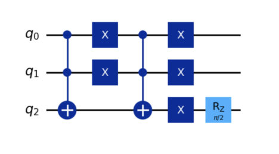 
FIG. 1: Circuit for producing the state in Eq. (8). The top line is Alice’s qubit, the second line is Bob’s qubit, and the third line is Charlie’s qubit, initially in the state |0⟩. The state in Eq. (8) appears after the three X gates, and the final gate, Rz, is used to apply the phase factor eiθ to Charlie’s |1⟩ state.

📷 Fig 2

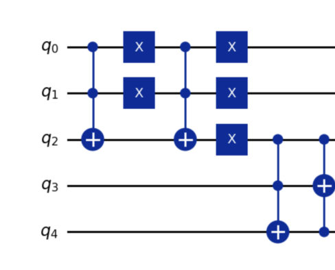 
FIG. 2: Circuit for Example 2. Here Alice’s (a) qubit is q0, Bob,s (b) is q1 and Charlie’s (c) is q2. The qubits q3 and q4 comprise the program state (d, e). The entanglement circuit creates the state in Eq. (10). The two Toffoli gates on the right implement a cyclic permutation on (d, e) when c = 1: the first Toffoli has controls {c, d} and target e; the second has controls {c, e} and target d. When c = 1, this maps |01⟩→|11⟩→|10⟩→|01⟩while leaving |00⟩fixed; when c = 0 it does nothing.

📷 Fig 3

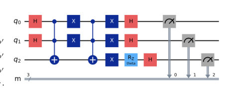 
FIG. 3: Remote CPHASE(θ) protocol implemented on IBM Torino. The entangling block between the two CNOTs is parameter-independent; only Charlie’s Rz(θ) depends on θ.

📷 Fig 4

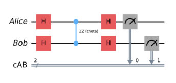 
FIG. 4: Direct RZZ(θ) implementation used as a baseline.

📷 Fig 5

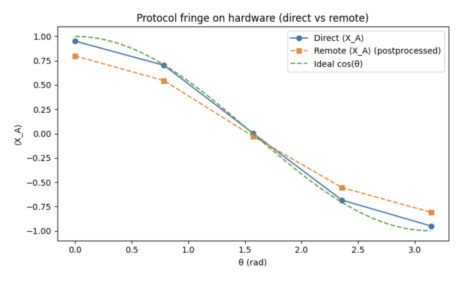 
FIG. 5: Measured ⟨XA⟩as a function of θ on IBM Torino. Both the direct baseline (blue) and the remote protocol with (−1)c post-processing (orange) follow the ideal cos θ curve (dashed).

**Summary.** This paper explores the theoretical and experimental feasibility of teleporting a programmable controlled phase gate (CPHASE($	heta$)) between remote qubits using an intermediary. The authors show that the protocol works by encoding the phase information quantum mechanically and confirming this capability experimentally on a superconducting quantum processor. This validates a key primitive for building distributed quantum computation networks.

**Why it may be interesting.** This work is highly relevant as it demonstrates a practical, hardware-verified method for implementing complex quantum operations (like controlled phase gates) across physically separated nodes using quantum communication primitives, which is central to quantum networking and distributed quantum computing architectures.

Detailed structure

**Main problem.** The paper investigates the protocol for teleporting a programmable two-qubit gate, specifically the CPHASE($	heta$) gate, between two remote parties (Alice and Bob) using an intermediary (Charlie). It compares this remote protocol against a direct implementation.

**Main result.** Both the remote, measurement-mediated protocol and the direct gate implementation successfully reproduce the expected $\cos 	heta$ and $\sin 	heta$ dependencies in measured correlation functions, confirming the programmable transfer of the phase gate.

**Method.** The authors analyze theoretical protocols involving entanglement and local corrections, and experimentally test the remote protocol on a superconducting quantum processor by measuring expectation values of Pauli operators as a function of the phase parameter $	heta$.

**Model / system.** The system involves qubits held by Alice, Bob, and Charlie, potentially augmented by auxiliary program states (qutrits or two-qubit states). Experimentally, the work is performed on the IBM Torino 133-qubit superconducting processor.

**Key observables.** Single-qubit expectation values ($\langle X_A 
angle$) and two-qubit correlators ($\langle Y_A Z_B 
angle$, $\langle Z_A Z_B 
angle$, $\langle X_A Y_B 
angle$) are measured as functions of the phase angle $	heta$.

**Important parameters / regimes.** The programmable phase angle $	heta$, the success probabilities of the state transfer protocols (e.g., $2/3$), and the coherence cost ratio ($V_r/V_d = 0.83$).

**Assumptions / limitations.** The protocols rely fundamentally on the ability of Alice and Bob to perform local correction operations based on Charlie's measurement outcomes. The experimental fidelity is limited by circuit depth and decoherence compared to the direct gate.

**Figures summary.** Figures illustrate the quantum circuits for both the remote CPHASE($	heta$) protocol and the direct $R_{ZZ}(	heta)$ baseline. Measured data plots show the expected $\cos 	heta$ and $\sin 	heta$ fringes for the respective observables, confirming the gate's functionality.

**Paper structure.** The paper first discusses theoretical protocols for gate teleportation using various auxiliary systems (qutrits, program states). It then details the general theory of remote gate application based on group representations. Finally, it presents an experimental realization and comparison of the remote protocol against a direct gate implementation on superconducting hardware.

Abstract

Alice and Bob each have a qubit, and they would like to perform a two-qubit gate on them with the assistance of Charlie. The action of this gate depends on a parameter, which either Charlie knows, will receive later as classical information, or is encoded in a program state. We discuss both the case in which Alice and Bob send Charlie their qubits, which he entangles with his state, and the case where Alice and Bob use teleportation to entangle their states with Charlie's state. All of these procedures depend on the ability of Alice and Bob to apply local correction operations that depend on the results of measurements that Charlie makes, and we discuss under what conditions such operations are possible.

[↑ back to top](#top)

### [Witnessing Quantum Bayesian Inference beyond Classical Learning](http://arxiv.org/abs/2610.09293v1)

**Authors:** Francesco Buscemi  
**Type:** theory · **Category:** other · **PDF:** <https://arxiv.org/pdf/2610.09293v1>  
**Analysis basis:** full PDF text, analyzed in chunks
**Topic relevance:** 🔥 `quantum measurements` **4/5**

📷 Fig 1

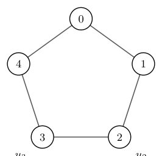 
FIG. 1. Five species arranged in a cycle, with drawing proba- bilities uj. An edge connects neighboring species; hence, the probability of neighboring outcomes in two draws with re- placement is f(u) = 2 P4 j=0 ujuj+1, with indices understood modulo five.

**Summary.** This paper proves that quantum Bayesian inference is more powerful than classical Bayesian learning by finding a mathematical constraint that classical models must obey but quantum models can violate. This separation is demonstrated using a five-outcome measurement on a single qubit, which violates a derived classical bound. The work establishes a fundamental difference in the expressive power of quantum vs. classical inference.

**Why it may be interesting.** It provides a rigorous, model-independent witness to the non-classical nature of quantum inference, which has implications for how we model learning processes in quantum systems.

Detailed structure

**Main problem.** The paper investigates whether quantum Bayesian retrodiction can generate predictions that are fundamentally incompatible with any explanation derived from classical Bayesian learning models.

**Main result.** Quantum Bayesian retrodiction is strictly more expressive than classical Bayesian learning, demonstrated by a sharp threshold: five-outcome measurements on a single qubit violate a necessary classical bound.

**Method.** The authors compare the joint probability table derived from quantum minimum-change principles against the constraints imposed by classical factorizations (e.g., $T=BB^T$).

**Model / system.** The comparison uses abstract probabilistic models involving latent variables (classical) versus quantum measurements (POVMs) on a single qubit, focusing on the joint probabilities of two successive draws.

**Key observables.** The joint probability table $T_{xy}$ of two successive draws, and the derived classical bound $B_5(T) \le 1/2$.

**Important parameters / regimes.** The number of outcomes ($n$), specifically the threshold between $n \le 4$ (classical realizable) and $n=5$ (quantum violation).

**Assumptions / limitations.** The classical explanation assumes the sampling law is fixed and unknown, while the quantum model uses quantum retrodiction based on minimum-change principles.

**Figures summary.** Figure 1 illustrates five species in a cycle, showing the probability of neighboring outcomes in two draws with replacement, used to derive the classical bound.

**Paper structure.** The paper establishes the mathematical frameworks for classical and quantum retrodiction, derives the necessary classical constraints using matrix factorization, and then constructs a specific quantum counterexample (the five-outcome qubit measurement) that violates these constraints.

Abstract

Can an agent's predictions reveal whether its reasoning is based on a classical or a quantum model? Using known results on matrix factorizations, here we show that quantum Bayesian retrodiction can produce one-step-ahead forecasts incompatible with every classical Bayesian explanation based on learning about a fixed but unknown sampling law from conditionally independent observations. The separation has a sharp threshold in the number of outcomes: for any measurement with at most four outcomes, the quantum predictions admit a classical realization, irrespective of the prior state and the finite Hilbert-space dimension, whereas a five-outcome measurement on a single qubit already violates an explicit classical bound. This bound holds for arbitrary classical latent states, prior probabilities, and sampling laws, and involves only the agent's initial and updated predictions. Thus, in this setting, quantum Bayesian retrodiction is strictly more expressive than classical Bayesian learning, and this difference can be witnessed without observing or specifying the agent's internal description.

[↑ back to top](#top)

### [Kerr-Filtered Hybrid States from Double-Squeezed Tripartite Interactions](http://arxiv.org/abs/2610.09904v1)

**Authors:** Jing Tang, Yuangang Deng  
**Type:** theory · **Category:** other · **PDF:** <https://arxiv.org/pdf/2610.09904v1>  
**Analysis basis:** full PDF text, analyzed in chunks
**Topic relevance:** `Dicke superradiance` **3/5** · `Tavis-Cummings & cavity-many-emitter` **3/5** · `analog quantum simulation` **3/5** · `correlated / nonlocal dissipation` **3/5** · `driven-dissipative phase transition` **3/5** · `superradiant laser` **3/5** · `Keldysh / 2PI / non-Gaussian methods` **2/5** · `methods for driven-dissipative` **2/5** · `interference shaping light` **1/5** · `non-equilibrium universality` **1/5** · `quantum measurements` **1/5** · `quantum optics experiment` **1/5**

📷 Fig 1

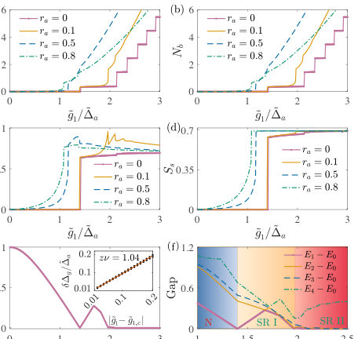 
Figure 3. Kerr-filtered hybrid superradiance induced by double-squeezed tripartite interactions. (a)-(b) Cavity and phonon occupations Na and Nb, and (c)-(d) cavity and spin entropy Sa and Ss versus ˜g1 for different ra. (e) Lowest ex- citation gap ∆g for ra = 0.1. The inset shows the finite-size scaling of the gap closing, δ∆g ∝|˜g1 −˜g1,c|zν, with zν ≃1.04. (f) First four excitation gaps versus ˜g1 at ra = 0.1.

📷 Fig 2

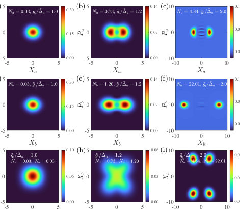 
Figure 4. Phase-space structure of the hybrid superradiant phases at ra = 0.5. Panels (a)-(c) show the cavity Wigner functions Wa(Xa, Pa), and panels (d)-(f) show the phonon Wigner functions Wb(Xb, Pb). Panels (g)-(i) show the cor- responding joint cavity-phonon Husimi-Q distributions after tracing out the spin. The three columns correspond to the WSR, SR I, and SR II regimes at ˜g1/ ˜∆a = 1.0, 1.2, and 2.0, respectively. The joint Husimi-Q distributions reveal the evo- lution of the hybrid ordered manifold.

📷 Fig 3

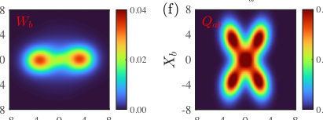 
Figure 5. Dissipative signatures of the Kerr-filtered hybrid superradiant phase at ra = 0.5. (a) Steady-state cavity and phonon occupations Na,b and (b) reduced von Neumann entropies ˜Sa,b versus ˜g1/ ˜∆a. (c)-(f) Steady-state quantum- state characterization at ˜g1/ ˜∆a = 1.5: (c) typical cavity and phonon Fock-state distributions Pa(n) and Pb(n), (d) cavity Wigner function Wa, (e) phonon Wigner function Wb, and (f) joint cavity-phonon Husimi-Q distribution Qab after tracing out the spin.

📷 Fig 4

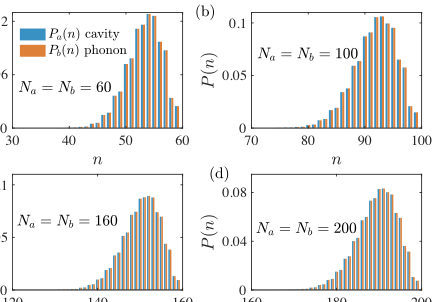 
Figure 6. Cutoffdependence of the ground-state Fock dis- tributions in the Kerr-free limit (K0 = 0). The cavity and phonon distributions are shown for increasing Hilbert-space truncations: (a) Na = Nb = 60, (b) Na = Nb = 100, (c) Na = Nb = 160, and (d) Na = Nb = 200. Parameters are ra = rb = 0.2 and ˜g1/ ˜∆a = 2. The probability maxima continuously shift toward the cutoffboundary as the trunca- tion is increased, indicating the absence of a converged finite- occupation ground state in the Kerr-free model. This cutoff dependence reveals the unbounded growth of hybrid photon– phonon excitations when no nonlinear saturation mechanism is present.

**Summary.** This paper demonstrates a method to engineer complex hybrid quantum states in a spin-photon-phonon system by combining two effects: double squeezing, which enhances correlation generation, and cavity Kerr nonlinearity, which acts as a selective filter. This combination allows researchers to control the final composition of the quantum state, revealing rich superradiant phases and underlying symmetries.

**Why it may be interesting.** This work is highly relevant as it combines multiple advanced topics in AMO physics: cavity QED (photon-matter coupling), quantum optics (squeezing, Kerr nonlinearity), and open quantum systems (dissipation), to achieve state engineering.

Detailed structure

**Main problem.** The paper addresses the limitation where the composition of a multipartite quantum state is intrinsically locked to the microscopic process generating its correlations, aiming to selectively reconfigure the state composition.

**Main result.** The combination of double squeezing and Kerr filtering enables the controllable engineering of Kerr-filtered hybrid quantum states, leading to distinct superradiant phases (SR I and SR II) characterized by a fourfold symmetry-related manifold.

**Method.** The analysis uses Bogoliubov transformations, master equations for open systems, and mean-field approximations to study the ground-state phase diagram and phase-space structure.

**Model / system.** The system is a tripartite spin-photon-phonon setup involving an alkaline-earth atom coupled to a cavity and trapped in a 1D harmonic trap. The dynamics are governed by a tripartite Hamiltonian modified by Kerr nonlinearity.

**Key observables.** Bosonic order parameters, Fock distributions ($P_c(n), P_p(n)$), subsystem von Neumann entropies, and the joint cavity-phonon Husimi-Q distribution.

**Important parameters / regimes.** Double squeezing strength, Kerr nonlinearity strength, and system decay rates ($\kappa_a, \kappa_b, \gamma$).

**Assumptions / limitations.** The analysis assumes the Kerr nonlinearity selectively modifies the photonic component without disrupting the underlying tripartite conversion channel, and uses leading-order self-consistent approximations.

**Figures summary.** Figures illustrate the ground-state phase diagram (N, WSR, SR I, SR II) and show the evolution of the joint Husimi-Q distribution, revealing the fourfold symmetry structure in the SR II regime.

**Paper structure.** The paper progresses from defining the problem of state composition control, detailing the physical model and Hamiltonian, analyzing the interplay between squeezing and Kerr effects in the ground-state phase diagram, and finally examining the phase-space signatures and robustness against dissipation.

Abstract

Multipartite interactions provide a unique route to generate hybrid quantum states, yet their intrinsically weak nonlinear coupling limits the controllable manipulation of the resulting correlations. Here we show that cooperative double squeezing and cavity Kerr nonlinearity together enable controllable engineering of Kerr-filtered hybrid states in a tripartite spin-photon-phonon system. Double squeezing exponentially enhances the spin-mediated photon-phonon pair-generation channel, whereas the Kerr interaction selectively reshapes the photonic component while maintaining the underlying tripartite conversion process. This mechanism reconstructs the composition of the hybrid excitation and gives rise to a fourfold phase-space manifold associated with spontaneous $Z_{2}^{(a)}\times Z_{2}^{(b)}$ parity breaking. Our results reveal a strategy for engineering hybrid quantum states by combining interaction amplification with mode-selective nonlinear filtering.

[↑ back to top](#top)

### [Stimulated emission for a three-level artificial atom in waveguide quantum electrodynamics](http://arxiv.org/abs/2610.09776v1)

**Authors:** O. A. Chuikin, Ya. S. Greenberg, V. V. Taravkova, O. V. Kibis  
**Type:** theory · **Category:** other · **PDF:** <https://arxiv.org/pdf/2610.09776v1>  
**Analysis basis:** full PDF text, analyzed in chunks
**Topic relevance:** `Tavis-Cummings & cavity-many-emitter` **3/5** · `analog quantum simulation` **3/5** · `correlated / nonlocal dissipation` **3/5** · `Keldysh / 2PI / non-Gaussian methods` **2/5** · `driven-dissipative phase transition` **2/5** · `interference shaping light` **2/5** · `methods for driven-dissipative` **2/5** · `Dicke superradiance` **1/5** · `Full counting statistics` **1/5** · `non-equilibrium universality` **1/5** · `quantum measurements` **1/5** · `superradiant laser` **1/5**

📷 Fig 1

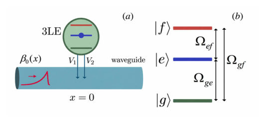 
FIG. 1: (a) Schematic of the considered system: a three- level emitter (3LE) coupled to the center of a one-dimensional waveguide at point x = 0. The coupling strengths for the middle and upper levels are V1 and V2, respectively. At the initial moment, a single-photon pulse β0(x) (which we later take to be an exponential pulse) is incident from the left side of the waveguide onto a 3LE excited to the level |e⟩. (b) Energy-level diagram of the bare 3LE and the corresponding resonant frequencies.

📷 Fig 2

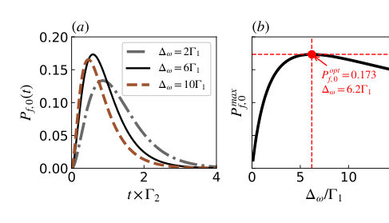 
FIG. 2: (a) Probability of full excitation of 3LE by incident pulse for different spectral linewidth ∆ω plotted with expres- sion (19). (b) Maximum probability of excitation versus im- pulse linewidth. For optimal linewidth ∆opt ω = 6.179Γ1 ≈ 6.2Γ1 we obtain maximum possible probability P opt f,0 = 0.173. Other parameters: Γ1/Ωge = 0.02, Γ2 = 1.5Γ1, ω0 = Ωef, αr = −0.04.

📷 Fig 3

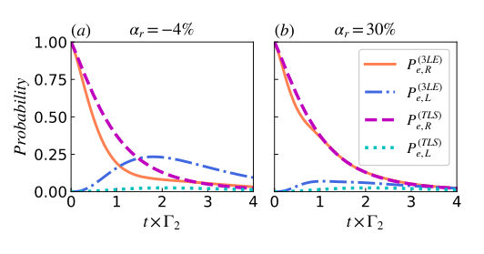 
FIG. 4: Probability of finding a single photon in the waveg- uide (left or right) and the excited atom (3LE or TLS) in the state |e⟩, calculated using the expressions (22). (a) Small relative anharmonicity αr = −0.04%, typical for a transmon; (b) larger anharmonicity αr = 0.3%, usually associated with other types of artificial atoms. Both graphs are plotted for the optimal linewidth ∆ω = 6.2Γ1 found in Fig. 2. Other parameters: Γ1/Ωge = 0.02, Γ2 = 3Γ1, ω0 = Ωge.

📷 Fig 4

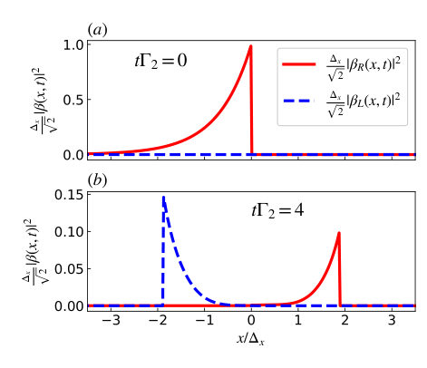 
FIG. 3: Spatial distribution of single-photon states for a right- moving photon (red solid line) and a left-moving photon (blue dashed line) for (a) the initial moment t = 0 and (b) after scattering t = 4/Γ2. The 3LE is located at x = 0. Other parameters: Γ1/Ωge = 0.02, Γ2 = 1.5Γ1, ω0 = Ωge, αr = −0.04, ∆ω = Γ1.

📷 Fig 5

 
Fig. 3 for two moments in time. At the initial time t = 0 the right-photon distribution is represented only by the initial pulse, βR(x, t) = β0(x), and the reflected photon is absent, βL(x, t) = 0. After scattering both photons are represented by an exponential-shape pulses (Fig. 3b). We can calculate the probabilities of finding a single photon (moving either to the left or to the right) and an atom excited to the state |e⟩by integrating the squared modulus of (20-21) over the entire waveguide:

**Summary.** This theoretical work analyzes stimulated emission from a three-level artificial atom coupled to a waveguide. By solving the system's dynamics, the authors demonstrate that the third level strongly modifies the scattering process, suppressing emission compared to a simple two-level model. Crucially, they predict the emergence of photon bunching correlations in the reflected field, offering a diagnostic tool for characterizing the emitter's internal structure.

**Why it may be interesting.** This work is highly relevant as it explores how higher-level structure (the third level) modifies fundamental quantum optical processes like stimulated emission and photon correlation in solid-state quantum emitters.

Detailed structure

**Main problem.** The paper theoretically investigates stimulated emission—the scattering of a single-photon pulse by an excited three-level emitter (3LE) in a 1D waveguide.

**Main result.** The presence of the third level significantly suppresses stimulated emission for low anharmonicity (like transmons) but can induce novel correlation effects, such as photon bunching, in the reflected field.

**Method.** The study employs the real-space formalism, solving coupled differential equations derived from the time-dependent Schrödinger equation for the system's probability amplitudes.

**Model / system.** The system models a quantum three-level ladder system coupled to a one-dimensional open waveguide, closely mimicking artificial atoms like transmons.

**Key observables.** Probability amplitudes for the excited state ($|f
angle$), single-photon amplitudes ($eta_{R/L}$), and two-photon correlation functions ($P_{RR}, P_{LL}, P_{RL}$).

**Important parameters / regimes.** Low relative anharmonicity ($|\alpha_r| < 4\%$), incident pulse spectral width ($\Delta\omega$), and decay rates ($\Gamma_1, \Gamma_2$).

**Assumptions / limitations.** The analysis assumes photon indistinguishability and is restricted to the two-excitation subspace.

**Figures summary.** Figures compare the spatial distribution of two-photon states for 3LE vs. TLS, showing bunching in 3LE and antibunching in TLS, and illustrate the dependence of scattering probabilities on anharmonicity and pulse width.

**Paper structure.** The paper develops the formalism by deriving coupled differential equations for various probability amplitudes, solves these equations for specific pulse shapes (exponential), and then analyzes the resulting probabilities to compare 3LE dynamics against the standard two-level system (TLS) benchmark.

Abstract

This work is devoted to a theoretical study of the interaction of a quantum three-level ladder system with a continuous electromagnetic field in a one-dimensional open waveguide. We consider a situation closely resembling stimulated emission - the scattering of a single-photon exponential pulse by an excited three-level emitter. Using the real-space formalism, we obtain an analytical expression for the wavefunction of our system. We show that, for the low anharmonicity of a three-level system inherent to a transmon (the most common type of artificial atom), the influence of the third level can have a significant effect on the system's behavior. Namely, the presence of the third level largely suppresses the stimulated emission effect if the relative anharmonicity is lower than $| α_r | < 4\%$. However, for a three-level system, it is possible to obtain correlation effects such as photon bunching in the reflected field, which can also be 'switched off' by tuning the incident photon parameters.

[↑ back to top](#top)

### [Beyond Spectroscopic Strong Coupling: Operational Benchmarks for Cavity-to-Magnon Quantum Transfer](http://arxiv.org/abs/2610.09921v1)

**Authors:** Huang Xinyi, Zhang Xiang, Zhao Dongxing  
**Type:** theory · **Category:** other · **PDF:** <https://arxiv.org/pdf/2610.09921v1>  
**Analysis basis:** full PDF text, analyzed in chunks
**Topic relevance:** `Tavis-Cummings & cavity-many-emitter` **3/5** · `analog quantum simulation` **3/5** · `correlated / nonlocal dissipation` **3/5** · `methods for driven-dissipative` **3/5** · `Keldysh / 2PI / non-Gaussian methods` **2/5** · `driven-dissipative phase transition` **2/5** · `non-equilibrium universality` **1/5** · `quantum measurements` **1/5**

📷 Fig 1

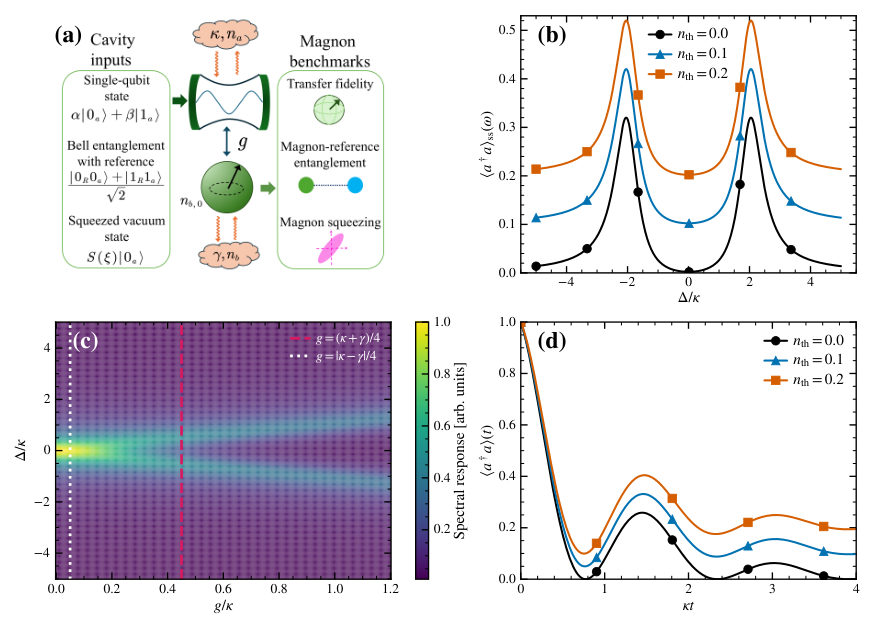 
FIG. 1. (a) Schematic of the cavity–magnon system and the three transfer tasks: single-rail qubit transfer, reference-assisted entanglement transfer, and squeezed-state transfer. The cavity and magnon couple at rate g and dissipate at rates κ and γ, respectively. Their bath occupations are na and nb; nb,0 denotes the initial magnon occupation. (b) Steady-state cavity occupation under a coherent probe for different common bath occupations nth. (c) Coherent cavity response versus coupling strength g/κ and probe detuning ∆/κ. The lines g = |κ −γ|/4 and g = (κ + γ)/4 indicate the onset of splitting in the real parts of the normal-mode frequencies and a conventional linewidth-based...

📷 Fig 2

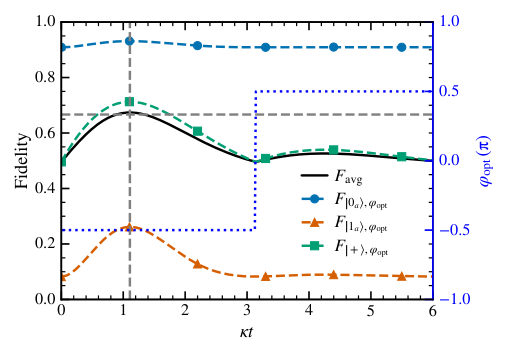 
FIG. 2. Phase-optimized transfer fidelities versus time: the six-state average Favg and the fidelities for |0a⟩, |1a⟩, and |+⟩= (|0a⟩+ |1a⟩)/ √

📷 Fig 3

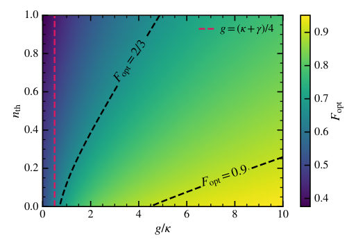 
FIG. 3. Optimal six-state average fidelity Fopt versus g/κ and the common thermal occupation nth. The contours mark Fopt = 2/3 and Fopt = 0.9. The vertical line g = (κ + γ)/4 is a conventional linewidth-based strong-coupling reference. Parameters are κ = γ = 1 and na = nb = nb,0 = nth.

📷 Fig 4

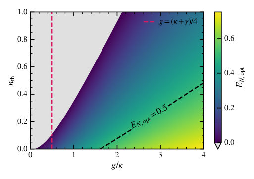 
FIG. 4. Time-optimized logarithmic negativity EN,opt be- tween the isolated reference and output magnon versus g/κ and nth. The gray region has EN,opt = 0; its boundary is determined by µsym = nth/(1 + nth). The contour marks EN,opt = 0.5, and the vertical line marks the conventional linewidth-based strong-coupling reference g = (κ + γ)/4. Pa- rameters are κ = γ = 1 and na = nb = nb,0 = nth.

📷 Fig 5

 
Figure 4 compares the entanglement-transfer bound- ary with the linewidth-based coupling reference. Here the equal-rate case has been considered by substituting µ = µsym, given in Eq. (38), into Eq. (47). Their different dependence on thermal occupation shows why spectro- scopic hybridization alone cannot determine whether the output remains entangled with its reference. For exam- ple, at g = Γ/2, Eq. (38) gives µsym = e−π/2/2 ≃0.104; reference–magnon entanglement at this coupling requires nth &lt; µsym/(1−µsym) ≃0.116. For a point strictly above the linewidth-based reference, take g = Γ and nth = 0.5. Then µsym ≃0.264, while ν = nth(1 −µsym) ≃0.368 &gt; µsym. Hence in this case the channel is...

**Summary.** This paper develops rigorous, operational benchmarks to quantify quantum-state transfer efficiency between a cavity photon mode and a magnon mode. It demonstrates that standard strong-coupling criteria based on spectroscopy are insufficient predictors of actual transfer performance. The results provide quantitative guidelines for controlling thermal noise to ensure high-fidelity quantum information transfer in cavity magnonics.

**Why it may be interesting.** This work provides crucial quantitative metrics for assessing the viability of quantum interfaces, showing that simple spectral measurements are insufficient for guaranteeing high-fidelity quantum information transfer in realistic, noisy environments.

Detailed structure

**Main problem.** To establish operational benchmarks for quantum-state transfer from an intracavity photon mode to a magnon mode, moving beyond simple spectroscopic strong-coupling criteria.

**Main result.** Conventional linewidth-based strong-coupling criteria do not guarantee quantum-transfer performance; entanglement or squeezing can survive below these spectroscopic thresholds if noise is low enough.

**Method.** The authors analyze the system dynamics using open-system master equations and derive time-dependent quantum channels, comparing fidelity and entanglement survival against theoretical benchmarks.

**Model / system.** The system is a passive, linear cavity–magnon system coupled to independent Markovian thermal reservoirs, described by an interaction Hamiltonian and analyzed via Langevin equations.

**Key observables.** Phase-corrected average fidelity ($F_{avg}$), reference–magnon entanglement survival, and the presence of sub-vacuum magnon fluctuations.

**Important parameters / regimes.** Coherent transmissivity ($\eta$), output-referred thermal population ($
u$), and the coupling strength ($g$) relative to cavity/magnon decay rates ($\kappa, \gamma$).

**Assumptions / limitations.** The system is treated as a passive, linear coupling, and the thermal reservoirs are assumed to be independent and Markovian.

**Figures summary.** Figures illustrate the schematic of the three transfer tasks, steady-state cavity occupation vs. bath temperature, spectroscopic thresholds, and time evolution of cavity occupation.

**Paper structure.** The paper moves from defining the physical system and the limitations of spectroscopic criteria to deriving quantitative benchmarks based on fidelity, entanglement, and squeezing survival, culminating in task-dependent performance metrics.

Abstract

Normal-mode splitting reveals coherent cavity--magnon hybridization but does not certify finite-time quantum-state transfer. We describe quantum transfer in a passive, linear cavity--magnon system coupled to thermal reservoirs as a thermal-loss channel specified by its coherent transmissivity $η$ and output-referred thermal population $ν$. For single-rail qubits, we calculate the phase-corrected average fidelity and compare it with the deterministic measure-and-prepare benchmark of $2/3$. A Bell pair shared by the cavity and an isolated reference retains reference--magnon entanglement if and only if $η>ν$. An input squeezed vacuum of strength $r$ yields sub-vacuum magnon fluctuations if and only if $ν<η(1-e^{-2r})/2$. When the initial magnon and both reservoirs have the same occupation, an analytically determined peak-transmissivity time optimizes all three tasks. These task-dependent benchmarks show that a conventional linewidth-based strong-coupling criterion does not guarantee quantum-transfer performance. Conversely, entanglement or squeezing can survive below that spectroscopic reference when the added noise is sufficiently low. These benchmarks provide quantitative targets for transfer timing and thermal-noise control in intracavity-to-magnon quantum interfaces.

[↑ back to top](#top)

### [Cotunneling-Assisted Redistribution of Nonpassivity in a Photosynthetic Junction](http://arxiv.org/abs/2610.10001v1)

**Authors:** Manjet Rajak, Trishna Kalita, Debasish Sharma, Himangshu Prabal Goswami  
**Type:** theory · **Category:** statistical mechanics · **PDF:** <https://arxiv.org/pdf/2610.10001v1>  
**Analysis basis:** full PDF text, analyzed in chunks
**Topic relevance:** `Keldysh / 2PI / non-Gaussian methods` **3/5** · `driven-dissipative phase transition` **3/5** · `methods for driven-dissipative` **3/5** · `non-equilibrium universality` **3/5** · `scars & prethermalization` **3/5** · `quantum measurements` **2/5** · `correlated / nonlocal dissipation` **1/5**

📷 Fig 1

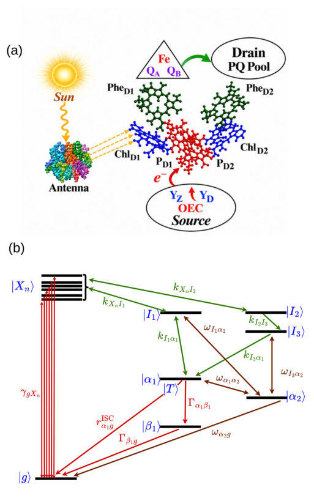 
FIG. 1. Schematic of the PSIIRC modeled as a nonequi- librium quantum junction. (a) Reaction-center organization showing antenna excitation, the OEC as the electronic source, and the acceptor side coupled to the downstream PQ pool. (b) Thirteen-state kinetic model containing the ground, excitonic, charge-transfer, sequential, and cotunneling-assisted states. Optical, internal transfer, sequential transfer, and cotunnel- ing processes are denoted by γgXn, kxy, Γab, and ωab, respec- tively. The vibrational redistribution rates (rmn) between Xm ↔Xn are not shown but included in calculations. |T⟩ represents a triplet state and involves an intersystem crossing recombination.

📷 Fig 2

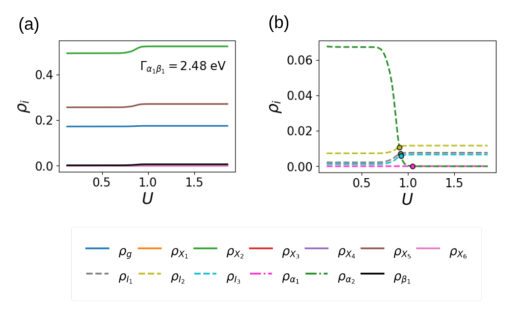 
FIG. 2. Steady-state populations ρi as functions of the Coulomb interaction energy U for Γα1β1 = 2.48 eV. (a) Pop- ulations of all states. (b) Enlarged view of the weakly pop- ulated states near the population redistribution region. All numerical parameters are provided in the SI.

📷 Fig 3

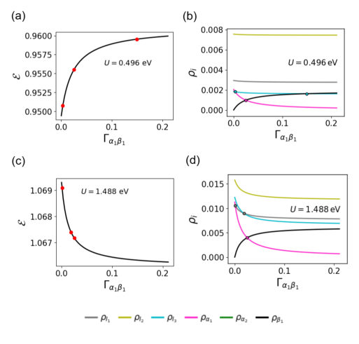 
FIG. 3. Dependence of the ergotropy E and relevant steady state populations ρi on the electron-ejection rate Γα1β1 for two Coulomb interaction energies. Panel (a) shows the er- gotropy at U = 0.496 eV, while panel (b) shows the corre- sponding selected steady state populations. Panel (c) shows the ergotropy at U = 1.488 eV, and panel (d) shows the cor- responding selected steady state populations. The marked points indicate the population-crossing positions associated with changes in the passive state ordering.

📷 Fig 4

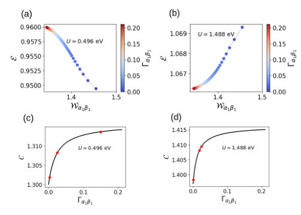 
FIG. 4. Energetic response of the system under variation of Γα1β1 for two Coulomb interaction strengths. Panels (a) and (b) show the ergotropy E as a function of work Wα1β1 for U = 0.496 eV and U = 1.488 eV, respectively, with the color scale indicating Γα1β1. Panels (c) and (d) show the corresponding energetic capacitance C as a function of Γα1β1. The red markers denote the population-crossing points along the Γα1β1 sweep.

📷 Fig 5

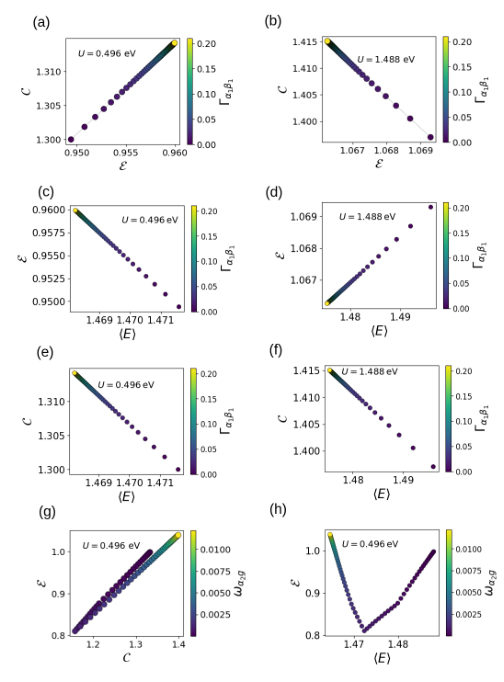 
FIG. 5. Piecewise linear relationships among energetic ca- pacitance C, ergotropy E, and mean energy ⟨E⟩. (a,b) En- ergetic capacitance C as a function of ergotropy E as the electron-ejection rate Γα1β1 is varied for U = 0.496 eV and U = 1.488 eV, respectively. (c,d) Ergotropy E as a function of the mean energy ⟨E⟩for U = 0.496 eV and U = 1.488 eV, respectively. (e,f) Energetic capacitance C as a function of the mean energy ⟨E⟩for U = 0.496 eV and U = 1.488 eV, respectively. The color scale in panels (a)-(f) indicates the corresponding value of Γα1β1. (g) Ergotropy E as a function of energetic capacitance C and (h) ergotropy E as a function of mean energy ⟨E⟩as the cotunneling rate ωα2g is...

**Summary.** This work models energy transfer in Photosystem II using a detailed molecular junction approach, incorporating cotunneling effects. By quantifying non-equilibrium energy using ergotropy and energetic capacitance, the authors reveal how electron transport redistributes extractable energy across different molecular sites. The findings highlight the interplay between microscopic quantum transport mechanisms and macroscopic thermodynamic energy ordering.

**Why it may be interesting.** The use of ergotropy and energetic capacitance to quantify non-equilibrium energy flow in a complex, open quantum system like a photosynthetic reaction center is highly relevant to non-equilibrium statistical mechanics and quantum thermodynamics.

Detailed structure

**Main problem.** The study investigates how the inclusion of cotunneling affects the passive-state ordering and the extractable non-equilibrium energy within a Photosystem II reaction center model.

**Main result.** Cotunneling redistributes the extractable non-equilibrium energy among different molecular components, and the analysis shows that thermodynamic smoothness can mask underlying microscopic state rearrangements.

**Method.** The authors employ a Nakajima-Zwanzig projection-operator formalism to model the system dynamics, quantifying state ordering using ergotropy and energetic capacitance.

**Model / system.** The system is a Photosystem II reaction center modeled as a 13-state nonequilibrium molecular junction, incorporating excitonic, charge-transfer, and cotunneling pathways.

**Key observables.** Ergotropy (extractable work), energetic capacitance, and steady-state populations of various electronic states.

**Important parameters / regimes.** Coulomb interaction energy (U), transition rates ($\Gamma$, $\omega$), and the degree of non-equilibrium excitation.

**Assumptions / limitations.** The analysis treats cotunneling via a microscopically constructed doubly reduced acceptor state and uses a projection-operator approach to derive the master equation.

**Figures summary.** Figures illustrate steady-state population maps as a function of Coulomb interaction energy and transition rates, alongside uncertainty analyses of ergotropy and capacitance.

**Paper structure.** The paper progresses by first establishing the kinetic model, then introducing cotunneling, quantifying non-equilibrium energy using ergotropy/capacitance, and finally analyzing how these quantities change under varying interaction strengths and rates.

Abstract

We investigate how cotunneling affects passive-state ordering in a Photosystem II reaction center modelled as a nonequilibrium molecular junction. We use a full pigment excitation manifold, with excitonic and charge-transfer rates computed within a Nakajima-Zwanzig formalism using realistic spectral densities. Cotunneling is introduced through a microscopically constructed doubly reduced acceptor state obtained from relevant quinone-side two-electron configurations, while photoexcitation is allowed into the full excitonic manifold. Passive-state permutations are quantified through ergotropy and energetic capacitance. We find that thermodynamic smoothness in ergotropy and energetic capacitance can conceal microscopic state rearrangements. Cotunneling redistributes the extractable nonequilibrium energy among the quinone acceptor, the donor-pheophytin radical pair, and excitonic states with strong contributions from pigments on the inactive branch. At high Coulomb interaction, cotunneling produces no passive-state reordering. Piecewise-linear relations among ergotropy, energetic capacitance, and mean energy further reveal the population reorderings generated by cotunneling.

[↑ back to top](#top)

### [An efficient variational polaron master equation for non-Markovian spin-boson dynamics: Transformed initial states and general observables](http://arxiv.org/abs/2610.08953v1)

**Authors:** Chien-Chang Chen, Hsi-Sheng Goan  
**Type:** theory · **Category:** statistical mechanics · **PDF:** <https://arxiv.org/pdf/2610.08953v1>  
**Analysis basis:** full PDF text, analyzed in chunks
**Topic relevance:** `Keldysh / 2PI / non-Gaussian methods` **3/5** · `correlated / nonlocal dissipation` **3/5** · `driven-dissipative phase transition` **3/5** · `methods for driven-dissipative` **3/5** · `non-equilibrium universality` **2/5** · `Tavis-Cummings & cavity-many-emitter` **1/5** · `analog quantum simulation` **1/5** · `quantum measurements` **1/5**

📷 Fig 1

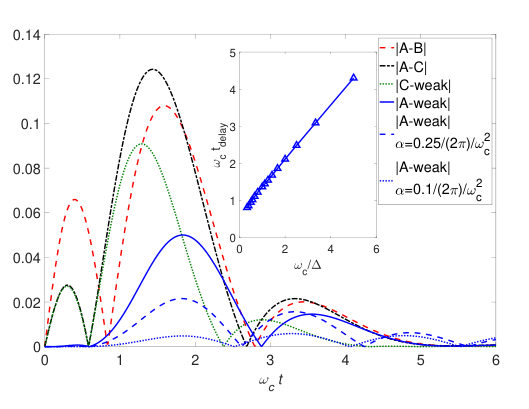 
Figure 2. Absolute differences between the population dy- namics P (t) shown in Fig. 1(d). The blue solid line, “|A-weak|,” denotes the difference between the variational po- laron method with Initial-A and the weak-coupling method. Similarly, “|A-B|” (red dashed line), “|A-C|” (black dash- dotted line), and “|C-weak|” (dark-green dotted line) denote the corresponding differences between the indicated methods or initial-state treatments. The other parameters are the same as those in Fig. 1(d). The |A-weak| curve exhibits a de- lay of approximately ωct = 1 compared with |A-B|, |A-C|, and |C-weak|. This delay may be associated with multi-bath- quanta processes. The inset shows the dependence...

📷 Fig 2

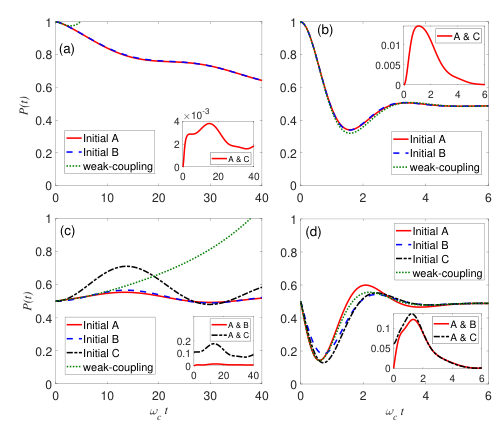 
Figure 1. Dynamics of population P (t) for the spin-boson model calculated using the weak-coupling method (dark-green dotted line), and variational polaron method with the inho- mogeneous terms (Initial-A, red solid line) and without the inhomogeneous terms (Initial-B, blue dashed line; Initial-C, black dash-dotted line) . The initial states and parameters are: (a) |+⟩z, ∆= 0.2ωc. (b) |+⟩z, ∆= 2ωc. (c) |+⟩x, ∆= 0.2ωc. (d) |−⟩y, ∆= 2ωc. The corresponding insets show the time evolutions of the trace distances between the reduced system states evolving from Initial-A and Initial-B, denoted by “A &amp; B” (red solid line), and from Initial-A and Initial-C, denoted by “A &amp; C” (black dash-dotted...

📷 Fig 3

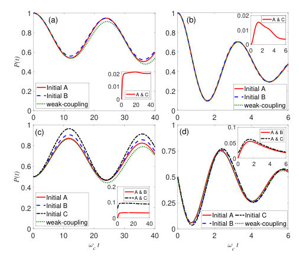 
Figure 3. Dynamics of the population P (t) and the corre- sponding time evolution of the trace distances at zero tem- perature for the setups considered in Fig. 1. The curves in the main panels and insets follow the same notation as in Fig. 1. The initial states and other parameters in panels (a)–(d) are the same as those in Figs. 1(a)–1(d), respectively, except that T = 0.

📷 Fig 4

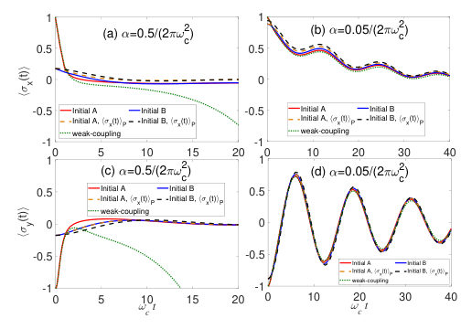 
Figure 4. Dynamics of ⟨σx (t)⟩in panels (a) and (b) and ⟨σy (t)⟩in panels (c) and (d), calculated using the variational polaron method with Initial-A (red) and Initial-B (blue), to- gether with the weak-coupling method (dark-green dotted line). The initial states and system-bath coupling strengths are: (a) |+⟩x, α = 0.5/  2πω2 c  ; (b) |+⟩x, α = 0.05/  2πω2 c  ; (c) |−⟩y, α = 0.5/  2πω2 c  ; and (d) |−⟩y, α = 0.05/  2πω2 c  . For the variational polaron method, the solid lines show the full expectation values obtained from Eq. (69), whereas the dashed lines show the corresponding P-projected parts, ⟨σx (t)⟩P and ⟨σy (t)⟩P . Other parameters are ∆= 0.5ωc, ε = 0.2ωc, and kBT = 4ωc.

📷 Fig 5

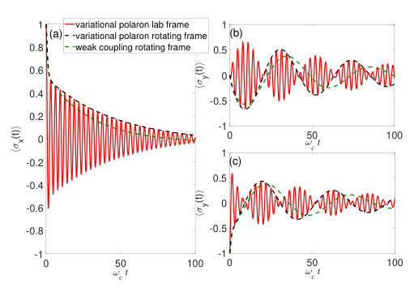 
Figure 5. Dynamics of ⟨σx (t)⟩and ⟨σy (t)⟩for the res- onantly driven spin-boson model with the driving term Ω0 cos (ωLt) σx. The red solid lines show the laboratory-frame results obtained using the variational polaron method with Initial-A, while the red dashed lines show the corresponding dynamics in the rotating frame. The green dashed lines show the rotating-frame results obtained using the weak-coupling method. The corresponding initial states in the laboratory frame are (a) |+⟩x, (b) |+⟩z, and (c) |−⟩y. Other parame- ters are α = 0.17/  2πω2 c  , Ω0 = 0.2ωc, ωL = ε = 2ωc, and kBT = 3ωc.

**Summary.** This paper introduces an advanced variational polaron master equation to model non-Markovian dynamics in the spin-boson system. It overcomes major theoretical hurdles by incorporating the effects of arbitrary initial states and general observables into the master equation framework. The resulting formalism offers a highly efficient method to study complex open quantum dynamics across various coupling regimes.

**Why it may be interesting.** This work provides a powerful, generalized, and computationally efficient theoretical tool for simulating open quantum systems, which is crucial for understanding decoherence and relaxation in quantum materials and light-matter interactions.

Detailed structure

**Main problem.** Accurately describing the non-Markovian dynamics of open quantum systems, particularly when environmental coupling is strong or when initial states are complex.

**Main result.** The authors developed a unified, computationally efficient variational polaron master equation formalism that correctly incorporates inhomogeneous terms arising from transformed initial states and general observables.

**Method.** The approach uses an extended auxiliary Liouville space to convert complex integro-differential equations into solvable coupled ordinary differential equations, allowing for the unified treatment of coherence and population dynamics.

**Model / system.** The study focuses on the quantum spin-boson model, which describes a two-level system coupled to a bosonic environment. The Hamiltonian includes system, bath, and interaction terms, and the dynamics are governed by a master equation.

**Key observables.** Population dynamics ($\langle\sigma_z(t)
angle$), coherence dynamics ($\langle\sigma_x(t)
angle$, $\langle\sigma_y(t)
angle$), and trace-distance analysis.

**Important parameters / regimes.** Tunneling amplitudes, bath temperatures, and system-bath coupling strengths, analyzed across weak, intermediate, and strong coupling regimes.

**Assumptions / limitations.** The formalism extends previous methods by explicitly handling inhomogeneous terms from transformed initial states and general observables, overcoming limitations in previous variational polaron approaches.

**Figures summary.** Figure 6 compares the variational polaron results with numerically exact HEOM calculations for population and coherence dynamics across various parameters.

**Paper structure.** The paper builds from establishing the model Hamiltonian and master equation, through deriving the variational polaron transformation, and finally extending the framework to incorporate transformed initial states and general observables, benchmarking against HEOM.

Abstract

We investigate the effects of initial states on the dynamics of a quantum spin-boson model using an efficient variational polaron master equation approach. The transformation of a factorized system-environment initial state into the variational polaron frame introduces inhomogeneous terms in the master equation, essential for accurately describing non-Markovian dynamics beyond the weak coupling regime. To efficiently account for these effects, we formulate the dynamics in an extended auxiliary Liouville space, converting the resulting integro-differential equations into coupled ordinary differential equations. We further introduce a simplified variational polaron technique for computing the time evolution of expectation values of general observables, including those that do not commute with the polaron transformation, overcoming a major limitation of previous approaches and enabling the unified treatment of coherence and population dynamics. The effects of transformed initial states generated from arbitrary factorized initial states are systematically characterized through expectation values and trace-distance analysis, providing insight into the associated bath-relaxation dynamics over a broad range of tunneling amplitudes, temperatures, and coupling strengths. Comparison with the weak-coupling master equation reveals a delay phenomenon associated with multi-bath-quanta processes, pronounced at intermediate coupling strengths and tunneling amplitudes. We further show that coherent superposition initial states induce stronger nonequilibrium effects than localized states, with inhomogeneous terms playing a crucial role in the short-time dynamics. The proposed formalism applies to both undriven and resonantly driven spin-boson models, providing a computationally efficient framework for open quantum-system dynamics with arbitrary factorized initial states and general physical observables.

[↑ back to top](#top)

### [Distance Structure of Insertion Kernels and Local Port Response in Non-Reciprocal Su--Schrieffer--Heeger Chains](http://arxiv.org/abs/2610.09387v1)

**Authors:** Xudong Zhang, Bin Guo  
**Type:** theory · **Category:** other · **PDF:** <https://arxiv.org/pdf/2610.09387v1>  
**Analysis basis:** full PDF text, analyzed in chunks
**Topic relevance:** `Keldysh / 2PI / non-Gaussian methods` **3/5** · `correlated / nonlocal dissipation` **3/5** · `driven-dissipative phase transition` **3/5** · `methods for driven-dissipative` **3/5** · `non-equilibrium universality` **2/5** · `analog quantum simulation` **1/5** · `interference shaping light` **1/5** · `quantum measurements` **1/5**

📷 Fig 1

 
FIG. 1. Distance scaling of the end-to-end insertion kernel for t1/J = 1, δ/J = 0.4, t2/J = 1.6, ω/J = 4, κ/J = 4, ΓL/J = 1, ΓR/J = 0.6, and chain lengths N = 2, 3, 6. (a) End-to-end kernel magnitude |(Kp)BN−1,A0|/J versus γ/J, showing a finite-insertion peak followed by the power-law de- cay of Eq. (19). (b) Ratio of the exact kernel magnitude to the leading-order prediction of Eq. (19), approaching unity for all three chain lengths as γ/J →∞, confirming the asymptotic scaling.

📷 Fig 2

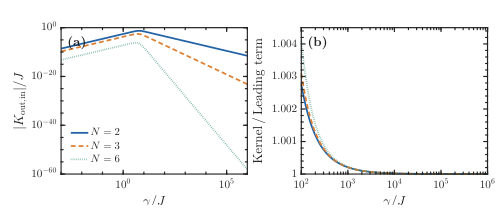 
Figure 1 tests both the distance exponent and the lead- ing coefficient of Eq. (19) for N = 2, 3, 6. In each case, the kernel grows at small γ, reaches a finite-insertion max- imum, and crosses over to a strong-insertion power-law tail. The unique end-to-end path has length d = 2N −1, giving tails proportional to γ−2, γ−4, and γ−10 for these three chain lengths. Their increasing steepness thus directly reflects the graph distance between the ports. The ratio of the exact kernel magnitude to Eq. (19) ap- proaches unity, testing the leading coefficient as well as the exponent. This growth-to-decay crossover explains the existence of a finite kernel peak; its relation to ob- servable...

📷 Fig 3

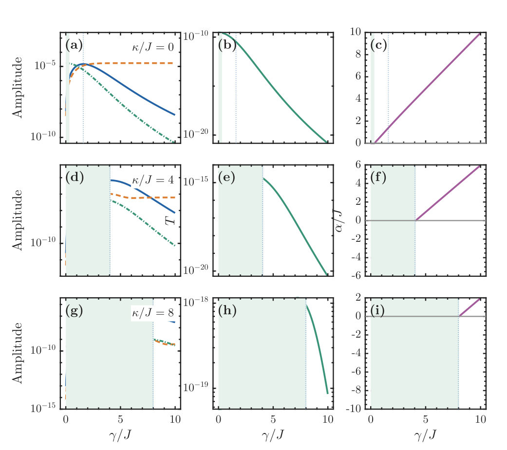 
FIG. 2. Insertion kernel, transmission, and spectral stability for the parameters in Table I. Panels (a–c), (d–f), and (g–i) use κ/J = 0, 4, 8, respectively. (a,d,g) Blue solid, orange dashed, and green dash-dotted curves show |(Kp)B5,A0|/J, J|A≥2|, and J|A|. (b,e,h) Transmission intensity T. (c,f,i) Spectral stability measure α/J. Green shading indicates α &lt; 0; dotted vertical lines mark γK. The transmission maxima in (e,h) precede the corresponding kernel peaks. Responses outside the stable domain are formal frequency-domain values, not attracting steady states. Exact zero amplitudes at γ = 0 are omitted on logarithmic axes.

📷 Fig 4

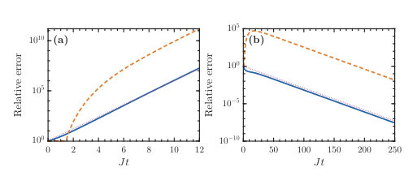 
FIG. 3. Driven convergence at kernel peaks, with parameters as in Table I. Blue solid and orange dashed curves show estate and eout from Eq. (34); purple dotted curves show eαt as rate guides. (a) Unstable peak at κ = 0, γ = 1.6008J. The errors eventually grow, but need not increase monotonically. (b) Stable peak at κ = 4J, γ = 4.0331J. Both errors converge to zero after a transient. The distinct normalizations preclude interpreting their relative heights as energy gain.

**Summary.** This work analyzes non-reciprocal SSH chains to understand how internal scattering affects external signal transmission. It develops theoretical tools to separate the contributions from graph path structure, coherent port response, and dynamic settling. The findings offer clear criteria for predicting local transmission enhancement based on system parameters.

**Why it may be interesting.** It provides rigorous, channel-specific criteria for interpreting internal scattering effects in open, non-Hermitian quantum systems, which is highly relevant to quantum optics and open quantum systems.

Detailed structure

**Main problem.** The paper investigates how enhanced internal scattering in non-reciprocal lattices translates into measurable transmission between fixed external ports.

**Main result.** The leading behavior of the end-to-end kernel is determined by the signed sum of shortest directed paths, and local enhancement can be predicted by the coefficient $\chi$ in the weak-insertion regime.

**Method.** The analysis uses resolvent techniques, strong-insertion expansions, and similarity transformations to relate the insertion kernel $K_p$ to the coherent transmission intensity $T$.

**Model / system.** The model is a non-reciprocal Su-Schrieffer-Heeger (SSH) chain incorporating staggered gain and loss, analyzed using non-Hermitian Hamiltonians.

**Key observables.** Coherent transmission intensity ($T$), insertion kernel ($K_p$), and the local predictive coefficient ($\chi$).

**Important parameters / regimes.** The gain/loss parameter ($\gamma$), the chain length ($N$), and the degree of non-reciprocity.

**Assumptions / limitations.** The analysis relies on fixed frequency baselines and assumes the separation of graph-path structure, coherent port response, and dynamical establishment.

**Figures summary.** Figure 1 shows the distance scaling of the end-to-end insertion kernel $|(K_p)_{B N-1, A0}|$ versus $\gamma/J$ for various chain lengths, confirming power-law decay.

**Paper structure.** The paper develops the theory by relating the insertion kernel to path sums in the strong-insertion limit, analyzes the weak-insertion limit using the coefficient $\chi$, and finally separates the total response into three distinct physical contributions.

Abstract

Non-reciprocal lattices offer a flexible setting for directional wave transport, raising the question of how enhanced internal scattering translates into transmission between fixed external ports. We address this question for non-reciprocal Su--Schrieffer--Heeger (SSH) chains with staggered gain and loss by relating the reference-dependent insertion kernel $K_p=VG_pV$ to the coherent transmission intensity $T$. On a fixed finite graph, a strong-insertion expansion gives a contribution proportional to $γ^{1-d}$, whose coefficient is the signed sum of shortest directed paths of length $d$. When this sum is nonzero, it sets the leading behavior independently of fixed diagonal losses; when it cancels, those losses can enter the first surviving higher-order term. For a fixed cross-sublattice endpoint channel, transmission has a strictly negative slope at every nonzero differentiable stationary point of the kernel magnitude. In the weak-insertion regime, the reference-system coefficient $χ=-\mathrm{Re}\,\mathrm{Tr}[(G_{0p}Z)^2]$ predicts the initial transmission change for symmetric SSH ports, and $χ>0$ together with a strictly stable baseline guarantees local stable enhancement. Finite-chain calculations and driven dynamics connect these results to observable response and distinguish asymptotic convergence from transient settling. A strictly dissipative short-chain example exhibits local enhancement without net power gain. Together, these results separate graph-path structure, coherent port response, and dynamical establishment, providing channel-specific criteria for interpreting internal scattering.

[↑ back to top](#top)

### [Interaction-enhanced photon blockade and Bell-state protection in microwave-shielded polar molecules](http://arxiv.org/abs/2610.09959v1)

**Authors:** Yun Chen, Geng Zhao, Huanhuan Wei, Jingjun You, Haoran Jia, Jing Tang, Su Yi, Yuangang Deng  
**Type:** theory · **Category:** other · **PDF:** <https://arxiv.org/pdf/2610.09959v1>  
**Analysis basis:** full PDF text, analyzed in chunks
**Topic relevance:** `Tavis-Cummings & cavity-many-emitter` **3/5** · `analog quantum simulation` **3/5** · `correlated / nonlocal dissipation` **2/5** · `methods for driven-dissipative` **2/5** · `Full counting statistics` **1/5** · `driven-dissipative phase transition` **1/5** · `interference shaping light` **1/5** · `quantum measurements` **1/5** · `quantum optics experiment` **1/5**

📷 Fig 1

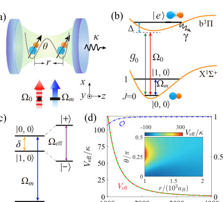 
FIG. 1. (a) Sketch of the microwave-shielded cavity- coupled pair of polar molecules. (b) Molecular po- tentials and relevant electronic structure for engineer- ing a rotational-state-resolved single-photon transition. (c) Schematic for creating π-polarized microwave-dressed molecules. (d) Effective potential Vefffrom numeri- cal diagonalization (solid line) and analytical expression (dashed line), together with state overlap O (dashed- dotted line) for θ = π/2. The inset maps Veffin the r-θ parameter plane for δr = 0.1 and Ωm = 2π × 5 MHz.

📷 Fig 2

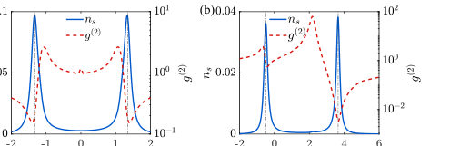 
FIG. 3. Steady-state photon number ns and equal- time correlation function g(2) as functions of cavity de- tuning ∆c/g for (a) weak shielding, Veff/κ = 0.01 at r ≈2 × 104 aB, and (b) strong shielding, Veff/κ = 25.3 at r ≈1.6 × 103 aB, with ∆m = ∆c. The two separa- tions have nearly the same phase factor, cos(kr) ≈0.89, so the difference in blockade performance mainly reflects the shielding-induced interaction. Dot-dashed lines mark the analytical single-photon resonances.

📷 Fig 3

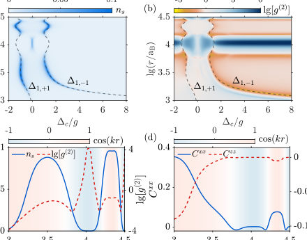 
FIG. 2. (a) Steady-state photon number ns and (b) second-order correlation function g(2) as functions of ∆c and r. The dashed curves denote the analytical single- photon resonances ∆1,±1 obtained from Eq. (5). (c) r- dependence of ns and g(2), and (d) spin correlations Cµµ

📷 Fig 4

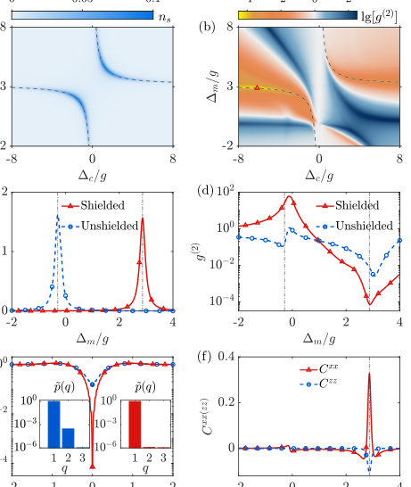 
FIG. 4. (a) Steady-state photon number ns and (b) equal-time second-order correlation function g(2) versus ∆c and ∆m for r ≈1.6 × 103 aB. Dashed curves denote the analytical single-photon resonances from Eq. (4), and the red triangle marks the optimized blockade point. (c) ns and (d) g(2)(0) as functions of ∆m at fixed ∆c. Red solid curves with triangle markers correspond to the strongly shielded configuration at r ≈1.6×103 aB, while blue dashed curves with circle markers correspond to the weakly interacting configuration at r ≈2 × 104 aB with the same fixed ∆c. (e) Time-delayed correlation function g(2)(τ) evaluated at the single-photon resonant points in (c,d). The insets show the...

📷 Fig 5

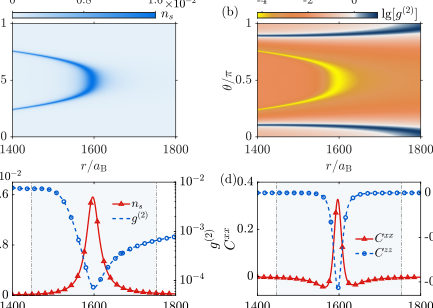 
FIG. 5. Spatial sensitivity of the shielding-enhanced photon blockade at (∆c/g, ∆m/g) = (−6.16, 2.89). (a) Steady-state photon number ns and (b) equal-time second-order correlation function g(2) in the r-θ plane. (c) ns and g(2), and (d) spin correlations Cxx and Czz

**Summary.** This paper demonstrates that microwave shielding in polar molecules creates a powerful, tunable interaction resource for cavity QED. This interaction simultaneously enhances photon blockade by increasing spectral anharmonicity and protects quantum states, such as Bell pairs, by suppressing energy loss to the cavity. The findings establish a unified control mechanism for nonlinear optics and quantum state preservation in molecular systems.

**Why it may be interesting.** This work directly addresses the frontier of cavity QED by showing how external fields (microwaves) can engineer internal molecular interactions to control fundamental quantum phenomena like photon statistics and coherence protection, which is highly relevant for quantum simulation.

Detailed structure

**Main problem.** To investigate how microwave-shielded interactions in polar molecules can serve as a unified resource for engineering strong photon blockade and protecting fragile quantum states within a cavity Quantum Electrodynamics (QED) platform.

**Main result.** The anisotropic, interaction-enhanced spectral anharmonicity induced by microwave shielding provides a unified mechanism that simultaneously achieves strong photon blockade and protects molecular Bell states from cavity dissipation.

**Method.** The analysis involves deriving an effective Hamiltonian based on projecting the dipole-dipole interaction onto the dressed molecular ground state, followed by solving the dynamics using the Lindblad master equation.

**Model / system.** The system is a cavity-QED setup coupling two microwave-shielded polar molecules to a single optical cavity mode. The key interaction resource is the anisotropic van der Waals-like repulsion engineered via microwave dressing of the molecular ground state.

**Key observables.** Photon blockade ($g^{(2)}(0) < 1$), spectral anharmonicity, negative longitudinal spin correlations ($C_{zz}$), and fidelity decay rate of a prepared Bell state.

**Important parameters / regimes.** Microwave Rabi frequency ($\Omega_m$), cavity decay rate ($\kappa$), molecular decay rate ($\gamma$), and the relative molecular separation ($r$).

**Assumptions / limitations.** The analysis assumes the strong-microwave regime where weak optical couplings can be neglected, and that the effective potential derived from second-order virtual couplings is accurate.

**Figures summary.** Figures illustrate the setup, the derived effective potential $V_{	ext{eff}}(r)$ showing its dependence on molecular separation, and plots demonstrating $g^{(2)}$ and spin correlations as a function of detuning and molecular configuration.

**Paper structure.** The paper first establishes the physical platform and the role of microwave dressing. It then derives the effective interaction potential, using this potential to analyze the spectral structure, which leads to the demonstration of enhanced photon blockade. Finally, it extends this interaction resource to show the protection of quantum states like Bell states.

Abstract

Microwave shielding has recently emerged as a powerful tool for engineering interactions in ultracold polar molecules, yet its potential for controlling cavity quantum electrodynamics remains largely unexplored. Here, we investigate a molecular cavity quantum electrodynamics platform in which two microwave-shielded polar molecules are coupled to a single optical cavity mode and demonstrate that shielding-induced interactions provide a unified mechanism for both photon blockade and Bell-state protection. The anisotropic interaction reshapes the few-excitation spectrum by enhancing its anharmonicity, thereby suppressing multiphoton transitions and improving the single-photon purity by more than three orders of magnitude. The enhanced blockade is accompanied by the emergence of negative longitudinal spin correlations, revealing the interaction-induced suppression of simultaneous molecular excitations. We further show that the photon statistics are highly sensitive to the relative molecular configuration, with positional variations on the scale of the relative zero-point fluctuation substantially modifying the blockade performance. Beyond few-photon nonlinear optics, the same interaction protects an initially prepared molecular Bell state by dispersively decoupling molecular excitations from the lossy cavity mode, thereby suppressing cavity-mediated dissipation and slowing the fidelity decay. Our results establish microwave-shielded interactions as a unified interaction resource for engineering few-photon nonlinearities and protecting quantum states in molecular cavity-QED systems.

[↑ back to top](#top)

### [Gaussian Scrooge Ensemble from Deep Thermalization in Free-Fermions](http://arxiv.org/abs/2610.10279v1)

**Authors:** Angelo Russotto, Katja Klobas, Pasquale Calabrese, Bruno Bertini  
**Type:** theory · **Category:** statistical mechanics · **PDF:** <https://arxiv.org/pdf/2610.10279v1>  
**Analysis basis:** full PDF text, analyzed in chunks
**Topic relevance:** `non-equilibrium universality` **3/5** · `quantum measurements` **3/5** · `scars & prethermalization` **3/5** · `Keldysh / 2PI / non-Gaussian methods` **2/5** · `correlated / nonlocal dissipation` **1/5** · `driven-dissipative phase transition` **1/5** · `methods for driven-dissipative` **1/5**

📷 Fig 1

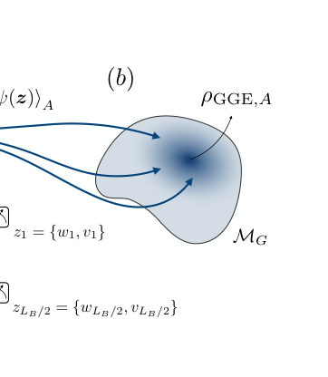 
Figure 1: Deep thermalization in a fermionic Gaussian quantum many-body system. (a) An initial Gaussian state |Ψ0⟩is time-evolved with the XX Hamiltonian (8). At time t the bath B is projectively measured with outcome z = {z1, · · · , zLB/2}. The measurement basis is chosen to break the infinitely many conservation laws of the XX Hamiltonian. (b) The ensemble of post-measurement pure states |ψ(z)⟩A in A ap- proaches, in the thermodynamic limit LB →∞and then t →∞, a Gaussian Scrooge ensemble, a uniform distribution over the manifold MG of Gaussian state, distorted such that the first moment is the reduced Generalized Gibbs Ensemble ρGGE,A.

📷 Fig 2

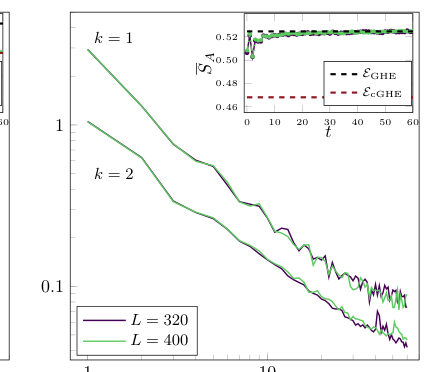 
Figure 2: Left panel: rescaled Frobenius distance ∆(k)/Lk A between the correlation matrix moments of the numerically sampled projected ensemble in Eq. (18) obtained from the infinite temperature Néel quench and the moments of the Gaussian Haar en- semble constrained by the antiunitary symmetry T in Eq. (45) for a subsystem with LA = 2 sites. Solid lines correspond to k = 1, 2 and dashed lines to k = 3, 4. The distances for different moments k approach zero with a power law behaviour indicat- ing convergence of the projected ensemble to the universal constrained Haar Ensemble EcGHE. In the inset we show the time evolution of the space-averaged SA von Neumann entanglement entropy of the...

📷 Fig 3

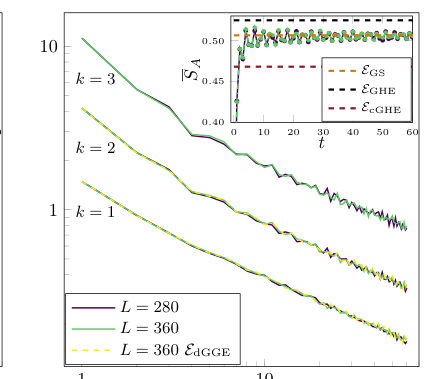 
Figure 3: Left panel: Frobenius distance ∆(k) between the correlation matrix moments of the numerically sampled projected ensemble in Eq. (18) obtained from the finite temperature dimer quench with α = 0.5 and the moments obtained from the Gaussian Scrooge ensemble (solid lines) on a subsystem of LA = 4 sites, defined in Eq. (56). The dashed line shows the same quantity but when computing the distance ∆(k) with respect to the deep-GGE obtained by performing the measurements on a global representative state [31], the results are indistinguishable within the statistical uncertainty. Inset: Time evolution of the space-averaged SA von Neumann entanglement entropy of the subsystem A as in Eq....

**Summary.** This work explores deep thermalization in free-fermion systems by studying the ensemble of pure states remaining in a subsystem after measurements on its environment. The key finding is that in the thermodynamic limit, the statistics of these conditional states are universal, described by a fermionic Gaussian Scrooge ensemble. This extends thermalization theory to account for the full statistics of quantum measurements.

**Why it may be interesting.** It provides a rigorous, non-equilibrium generalization of thermalization concepts, moving beyond just the reduced density matrix to characterize the statistics of conditional pure states, which is highly relevant for open quantum systems.

Detailed structure

**Main problem.** The paper investigates deep thermalization, specifically how the universal ensemble of pure states in a subsystem emerges after local measurements on its environment.

**Main result.** The partial information about local conserved charges becomes negligible in the thermodynamic limit, leading to a universal description governed by a fermionic Gaussian Scrooge ensemble.

**Method.** The authors analyze the projected ensemble by considering the first and higher moments of the conditional pure states resulting from projective measurements on the environment.

**Model / system.** The system is a free-fermion chain governed by a Gaussian integrable Hamiltonian, bipartitioned into a subsystem A and an environment B.

**Key observables.** The projected ensemble, characterized by its correlation matrix and its moments, and the reduced density matrix $
ho_A$.

**Important parameters / regimes.** The thermodynamic limit ($L_B 	o \infty$) and the late-time limit ($t 	o \infty$).

**Assumptions / limitations.** The analysis assumes the system Hamiltonian is Gaussian and integrable, and that the partial information about conserved charges becomes irrelevant in the thermodynamic limit.

**Figures summary.** Figure 1 illustrates the process: an initial Gaussian state evolves, is measured on the bath B, and the resulting ensemble approaches a Gaussian Scrooge ensemble whose first moment matches the reduced GGE.

**Paper structure.** The paper progresses by defining the measurement process, analyzing the role of local conserved charges, and deriving the universal form of the projected ensemble (the Scrooge ensemble) in the thermodynamic limit.

Abstract

Deep thermalization indicates the emergence of universal ensembles of pure states in a subsystem after measuring its environment. We investigate this phenomenon in a free-fermion chain using local measurements that preserve Gaussianity and break particle-number conservation. Although the measurement outcomes provide partial information about local conserved charges within a finite subsystem, we argue that this information becomes negligible in the thermodynamic limit. This effective non-revelation underlies the emergence of a fermionic Gaussian Scrooge ensemble, determined by the subsystem's generalized Gibbs ensemble. We construct this universal ensemble directly at the subsystem level and provide numerical evidence that it describes the late-time projected ensemble at finite temperature. Our results extend the description of thermalization in non-interacting integrable systems beyond the reduced density matrix to universal statistics of conditional pure states.

[↑ back to top](#top)

### [Non-Hermitian Cooperation Induced Chern Insulator](http://arxiv.org/abs/2610.09413v1)

**Authors:** Weiwei Zhu, Bingbing Wang, Mengxiang Xie, Hong-yu Zou, Yang Long, Hong-xiang Sun, Haoran Xue, Jie Ren  
**Type:** theory · **Category:** other · **PDF:** <https://arxiv.org/pdf/2610.09413v1>  
**Analysis basis:** full PDF text, analyzed in chunks
**Topic relevance:** `analog quantum simulation` **3/5** · `driven-dissipative phase transition` **3/5** · `methods for driven-dissipative` **3/5** · `correlated / nonlocal dissipation` **2/5** · `non-equilibrium universality` **2/5** · `Keldysh / 2PI / non-Gaussian methods` **1/5**

📷 Fig 1

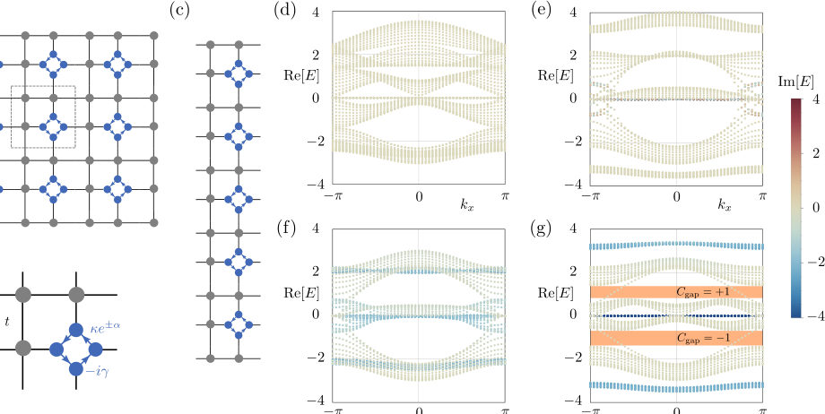 
Fig. 1. Non-Hermitian cooperation enables a Chern insulator. (a) Schematic of the finite lattice structure. The unit cell is marked by a dashed box, and four lossy sites (blue) form a chiral non-Hermitian ”molecule”. (b) Enlarged view of a single unit cell, showing the real couplings t (solid black lines), on-site loss −iγ (blue dots), and non-reciprocal couplings κe±α (blue directed lines, with arrows indicating the hopping direction) (c) Strip geometry used for band calculations, with periodic boundary conditions along x and open boundaries along y. (d)–(g) Projected band structures under four conditions: (d) Hermitian limit (γ = 0, α = 0); (e) only asymmetric couplings (γ = 0, α = 1);...

📷 Fig 2

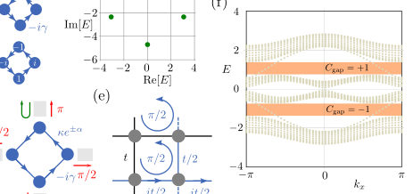 
Fig. 2. Non-Hermitian chiral molecule, spectral properties, and the effective Hofstadter model. (a) The four lossy sites are extracted from the full lattice to form a non-Hermitian chiral ”molecule” with non-reciprocal couplings κe±α and on-site loss −iγ. (b) Complex eigenvalue spectrum of the chiral molecule in the coexistence regime [κ = 1, γ = 2 sinh(1), α = 1]. The slowest-decaying mode (red dot, with the smallest imaginary part in magnitude) is well separated from three highly lossy modes (green dots), rendering it dynamically dom- inant. (c) Eigenstate of the dominant mode, showing a phase wind- ing of 2π around the four sites, indicating that it carries an orbital angular momentum....

📷 Fig 3

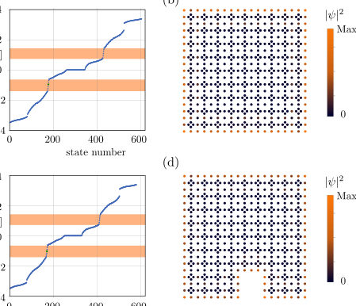 
Fig. 3. Finite-lattice spectra and field profiles validating the topolog- ical protection against local perturbations. (a) Eigenenergy spectrum of a finite 10 × 10 lattice with open boundary conditions; a represen- tative edge state is marked by a green dot. (b) Spatial distribution of the field amplitude for the green-marked edge state, illustrating its boundary localization. (c) Eigenenergy spectrum of the same lattice but with intentionally introduced defects; the persistent edge state (green dot) remains inside the bulk gap. (d) Field profile of the edge state in the defective lattice, demonstrating the robustness of topo- logical edge state.

**Summary.** This paper demonstrates that a Chern insulator can be realized in a static lattice solely by combining on-site loss and non-reciprocal couplings, bypassing the need for external magnetic fields. The mechanism involves the slow-decaying mode of a chiral non-Hermitian molecule generating an effective synthetic magnetic flux. This establishes non-Hermitian cooperation as a powerful new resource for topological engineering in open systems.

**Why it may be interesting.** This work provides a general theoretical framework for engineering topological phases using only intrinsic non-Hermitian couplings, which is highly relevant for designing open quantum systems and non-reciprocal devices.

Detailed structure

**Main problem.** To establish a fundamentally new paradigm for inducing Chern topology in a static lattice without relying on external magnetic fields, synthetic gauge potentials, or pre-existing Hermitian topology.

**Main result.** The synergy between on-site loss and non-reciprocal coupling is sufficient to open a topological gap and generate robust chiral edge states with a quantized Chern number.

**Method.** The mechanism is analyzed by projecting the full Hamiltonian onto the dynamically dominant mode of a non-Hermitian chiral molecule, effectively mapping the system to a synthetic Hofstadter model.

**Model / system.** The model uses a static lattice structure containing four non-Hermitian sites, characterized by on-site loss ($-i\gamma$) and non-reciprocal couplings ($\kappa e^{\pm \alpha}$). The system is analyzed via its Bloch Hamiltonian, which is block-form.

**Key observables.** Quantized Chern number (C), chiral edge states, and the effective synthetic magnetic flux ($\pi/2$ per plaquette).

**Important parameters / regimes.** The coexistence regime ($\gamma 
eq 0$ and $\alpha 
eq 0$) is crucial; individual non-Hermitian effects are insufficient.

**Assumptions / limitations.** The analysis relies on a projection reduction technique that eliminates fast-decaying degrees of freedom to isolate the slowest-decaying, dynamically dominant mode.

**Figures summary.** Figures illustrate the lattice structure, the spectral analysis of the chiral molecule, the resulting effective Hofstadter unit cell, and the projected band structures showing gap opening only in the coexistence regime.

**Paper structure.** The paper first introduces the problem of field-free topology, then details the Hamiltonian structure involving loss and non-reciprocity. The core of the work involves analyzing the chiral molecule's dynamics and projecting the system to reveal the effective synthetic flux, culminating in the calculation of the non-zero Chern number.

Abstract

Conventional Chern insulators rely on breaking time-reversal symmetry via magnetic fields or synthetic gauge fields. Here we introduce a fundamentally different paradigm: a static lattice without any gauge field becomes a Chern insulator solely through the cooperation of two non-Hermitian ingredients: on-site loss and non-reciprocal coupling. Neither effect alone suffices; only their synergy opens a topological gap and gives rise to robust chiral edge states with a nonzero Chern number. The underlying mechanism originates from a non-Hermitian chiral molecule formed by the lossy sites, whose dynamically dominant mode carries an orbital angular momentum that effectively generates a synthetic flux after the fast-decaying degrees of freedom are eliminated. Our results establish non-Hermitian cooperation as a versatile resource for inducing Chern topology without external fields or temporal modulations, opening a new route to topological phases in open classical and quantum systems.

[↑ back to top](#top)

### [When the coupler is the channel: an AND condition on cavity photon-number means](http://arxiv.org/abs/2610.09103v1)

**Authors:** Yueying Wu  
**Type:** theory · **Category:** other · **PDF:** <https://arxiv.org/pdf/2610.09103v1>  
**Analysis basis:** full PDF text, analyzed in chunks
**Topic relevance:** `quantum measurements` **3/5** · `Full counting statistics` **2/5** · `analog quantum simulation` **2/5** · `methods for driven-dissipative` **2/5** · `Keldysh / 2PI / non-Gaussian methods` **1/5** · `Tavis-Cummings & cavity-many-emitter` **1/5** · `correlated / nonlocal dissipation` **1/5** · `driven-dissipative phase transition` **1/5** · `interference shaping light` **1/5**

📷 Fig 1

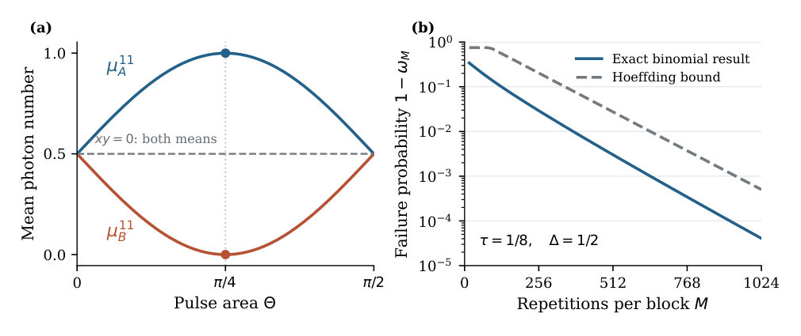 
Figure 1: Analytical predictions, not experimental data. (a) Mean photon numbers for the two-pump input 11 as a function of pulse area Θ. The other three inputs retain both means at 1/2. The marked pulse area π/4 produces (1, 0). (b) Exact finite-block failure probability from Eq. (12), with M independent repetitions per block, τ = 1/8, and ∆= 1/2. The dashed curve is the Hoeffding upper bound, capped at the trivial bound 3/4. These are performance curves for the interacting protocol, not finite-sample Bell bounds.

**Summary.** This paper demonstrates a physical mechanism using coupled optical cavities to realize an exact 'AND' logic gate based on mean photon number measurements. By engineering a controlled beam-splitter interaction, the authors show that the system's mean output perfectly reflects the logical AND operation, surpassing the limits imposed by classical no-signalling theories, all without requiring entanglement.

**Why it may be interesting.** This work provides a concrete, controllable quantum optical realization of a non-classical correlation (the AND gate) using mean photon number measurements, which is highly relevant for quantum communication protocols and resource quantification in cavity QED.

Detailed structure

**Main problem.** The paper investigates realizing an exact 'AND condition' on the mean photon numbers of two coupled cavities, meaning the means are equal if at least one control is off, and unequal only if both controls are on.

**Main result.** The authors provide an elementary construction using a two-pump beam-splitter interaction that achieves this AND condition exactly at the mean level, and they show this resource does not require entanglement.

**Method.** The analysis uses theoretical construction based on controlled unitary evolution and compares the achievable mean response against the bounds set by no-signalling distributions.

**Model / system.** The physical system consists of two cavity modes (A and B) coupled via a two-pump beam-splitter interaction, described by a controlled Hamiltonian $H_{xy}(t) = \hbar xy g(t)(a^\dagger b + b^\dagger a)$.

**Key observables.** Conditional mean photon numbers ($\mu_{xy}^A, \mu_{xy}^B$), the ideal population-level score ($\omega_\mu$), and the no-signalling score ($\omega_{NS}^\mu$).

**Important parameters / regimes.** The interaction strength $\Theta$ (pulse area) and the input controls $x, y \in \{0, 1\}$.

**Assumptions / limitations.** The analysis focuses on mean values and provides a finite-sample counting protocol, though the resource is shown to be achievable even with coherent product states.

**Figures summary.** Figure 1(a) illustrates the mean photon numbers for the $xy=1$ input as a function of pulse area $\Theta$. Figure 1(b) compares the finite-block failure probability against the Hoeffding upper bound.

**Paper structure.** The paper introduces the problem of the AND condition, presents the physical model and the ideal construction achieving $\omega_\mu=1$, derives the no-signalling bound ($\omega_{NS}^\mu = 3/4$), and concludes by showing the resource is realizable without entanglement.

Abstract

Can two cavities have equal mean photon numbers whenever at least one of two binary controls is off, and unequal means only when both controls are on? We give an elementary construction using a two-pump beam-splitter interaction whose strength is proportional to the product of the controls. A phase-coherent single-excitation state yields mean occupations $(1/2,1/2)$ for inputs $00$, $01$, and $10$, and $(1,0)$ for input $11$. This realizes the desired AND condition exactly at the level of population means. It also makes the communication resource explicit: the interaction acts after the inputs are supplied and changes local statistics with the remote input. For any no-signalling distribution with finite means, the corresponding exact-mean score is at most $3/4$ under uniform inputs. We give a robust consistency inequality, a finite-sample counting protocol, and a coherent-state realization showing that this mean response does not require entanglement. The construction provides a concrete example for distinguishing controlled interactions from nonlocal-game resources.

[↑ back to top](#top)

### [Coupled quantum critical states in a circuit simulator](http://arxiv.org/abs/2610.10048v1)

**Authors:** D. B. Karki, Andrew K. Mitchell  
**Type:** theory · **Category:** strongly correlated electrons · **PDF:** <https://arxiv.org/pdf/2610.10048v1>  
**Analysis basis:** full PDF text, analyzed in chunks
**Topic relevance:** `analog quantum simulation` **3/5** · `Keldysh / 2PI / non-Gaussian methods` **2/5** · `driven-dissipative phase transition` **2/5** · `methods for driven-dissipative` **2/5** · `non-equilibrium universality` **2/5** · `correlated / nonlocal dissipation` **1/5** · `quantum measurements` **1/5**

📷 Fig 1

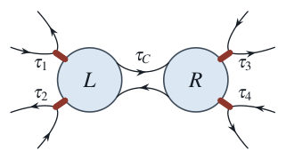 
FIG. 1. Two-site charge-Kondo circuit, in which two coupled metallic islands are each connected to two external leads. The setup allows to explore the fate of coupled critical states.

📷 Fig 2

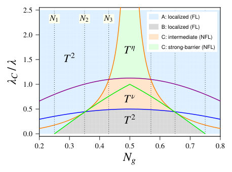 
FIG. 3. Ground state phase diagram and scaling behavior of transport properties obtained by QBM. The blue, orange, green and purple curves denote KBC, KAC, KAB, and Kst.

**Summary.** This paper theoretically analyzes coupled quantum critical states in a two-site quantum circuit simulator. Using advanced techniques like NRG and Bosonization, the authors map out the phase diagram, showing that while individual critical points persist, strong inter-site coupling ultimately drives the system into a conventional Fermi Liquid state. This work provides a detailed understanding of quantum criticality in tunable mesoscopic conductors.

**Why it may be interesting.** The detailed analysis of quantum critical points and their stability under coupling is highly relevant to understanding emergent quantum phases in artificial quantum materials and mesoscopic devices.

Detailed structure

**Main problem.** The study investigates how coupled quantum critical states, specifically those arising from the two-channel-Kondo (2CK) point, behave when subjected to inter-site coupling.

**Main result.** Weak coupling preserves the individual critical points, but increasing coupling drives a quantum phase transition from a Non-Fermi Liquid (NFL) state to a screened Fermi Liquid (FL) state.

**Method.** The research employs a combination of theoretical techniques, including Bosonization, Quantum Brownian Motion, and Numerical Renormalization Group (NRG) calculations.

**Model / system.** The system is a hybrid metal-semiconductor quantum circuit simulator comprising two coupled metallic islands, modeled by a Hamiltonian incorporating continuum electron spectra, tunneling (QPC), and charging energies.

**Key observables.** Impurity entropy (Simp(T)), local susceptibilities ($\chi_{loc}^{s,u}(T)$), and transport/conductance exponents ($\eta, 
u$).

**Important parameters / regimes.** Inter-site coupling strength ($t_C$), island-lead coupling ($t$), and gate-tuned filling ($	ext{Ng}_\alpha$).

**Assumptions / limitations.** The analysis relies on projecting the charge dynamics onto pseudospin-$rac{1}{2}$ degrees of freedom and analyzing the system in both Kondo and quasiballistic limits.

**Figures summary.** Figures illustrate the circuit schematic, NRG results showing entropy and susceptibilities, and a phase diagram mapping out different quantum regimes based on coupling ratios and gate detuning.

**Paper structure.** The paper builds from defining the physical circuit and Hamiltonian, applying NRG and Bosonization methods to analyze the crossover between decoupled 2CK states, intermediate NFL regimes, and the final screened FL state.

Abstract

Hybrid metal-semiconductor quantum circuits offer a controlled setting for realizing and probing strongly correlated quantum matter. A largely open question that may be addressed by such simulators is whether coupled critical states can combine into new non-Fermi liquid (NFL) phases. Inspired by the recent realization of a two-site charge-Kondo circuit [W. Pouse \textit{et al.}, \href{https://www.nature.com/articles/s41567-022-01905-4}{Nat. Phys. \textbf{19}, 492 (2023)}], we uncover the fate of coupled Kondo anyons emerging from the two-channel-Kondo critical point at each site. Bosonization and quantum Brownian motion methods yield the full quasiballistic phase diagram and low-temperature transport properties, while numerical renormalization group calculations resolve the complementary weak-coupling limit. Together, these provide a unified description, and reveal robust NFL phases with continuously tunable transport and susceptibility exponents. Stronger inter-site coupling ultimately produces a screened Fermi liquid.

[↑ back to top](#top)

### [Matter wave bistability with a momentum chirped Bose-Einstein condensate](http://arxiv.org/abs/2610.08942v1)

**Authors:** Mikhail Mamaev, Nicholas Mantella, Noah P. Baker, Joseph McGowan, Aephraim M. Steinberg  
**Type:** theory · **Category:** quantum gases · **PDF:** <https://arxiv.org/pdf/2610.08942v1>  
**Analysis basis:** full PDF text, analyzed in chunks
**Topic relevance:** `analog quantum simulation` **3/5** · `interference shaping light` **3/5** · `Keldysh / 2PI / non-Gaussian methods` **2/5** · `driven-dissipative phase transition` **2/5** · `methods for driven-dissipative` **2/5** · `quantum measurements` **1/5**

📷 Fig 1

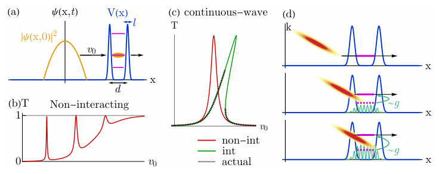 
FIG. 1. (a) Schematic of the system. A 1D BEC is launched at velocity v0 towards a double-barrier potential forming a Fabry-Perot cavity of width d. Each barrier is a Gaussian of width l and height V0. (b) The transmission spectrum for a non-interacting BEC as a function of initial velocity. Transmission approaches T = 1 once the incident energy is much higher than V0, but can also reach T = 1 near cavity resonances. (c) Cartoon schematic of how the transmission spectrum is distorted by interactions in the continuous-wave limit (an infinitely spatially extended wavepacket). The red curve is non-interacting transmission, the green curve shows the multi-valued spectrum for an interacting gas,...

📷 Fig 2

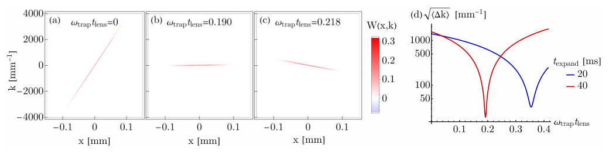 
FIG. 2. (a) Wigner function of the condensate after texpand = 40 ms of free expansion. (b-c) Wigner function of the condensate after applying a delta-kick with the harmonic trap, rotating the phase-space distribution by an amount ωtraptlens. Panel (b) shows the kick with lensing time tlens = topt (given by topt = 1.38 ms for these parameters) that yields a momentum-minimized state, while panel (c) shows an over-rotated (i.e. anti-chirped) state. The chirp angle for these is given by θ = ωtrap(tlens −topt), which is θ = −0.19, 0, 0.28 for panels (a-c) respectively. (d) Momentum variance of the state versus rotation angle ωtraptlens for different amounts of initial expansion time before the...

📷 Fig 3

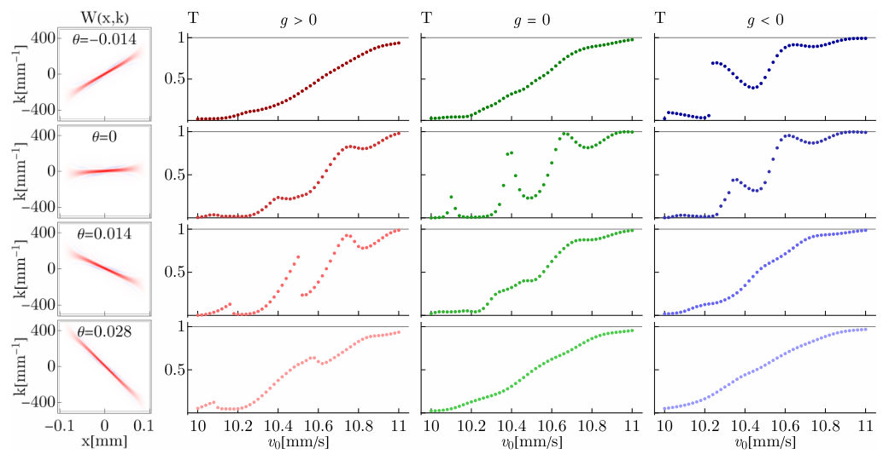 
FIG. 3. Transmission probability T versus incident velocity v0 of the wavepacket for repulsive g &gt; 0, non-interacting g = 0 and attractive g &lt; 0 interactions. We also vary the initial chirp angle θ; the initial state’s Wigner function for each row of panels is shown in the corresponding left panel (before being kicked towards the cavity, hence centered at momentum k = 0 rather than k = k0). For all simulations, the initial state is prepared assuming a repulsive interaction g &gt; 0 and texpand = 40 ms of expansion time; the interaction strength g is quenched to zero or negative values for the corresponding columns of panels during the collision dynamics only.

📷 Fig 4

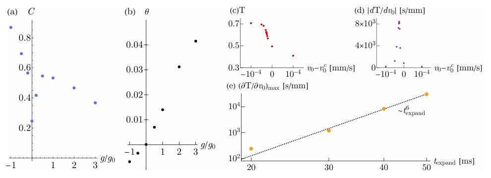 
FIG. 4. (a) Maximum contrast of the transmission spectra from Fig. 3 with a coarse-grained velocity resolution of ∆v0 = 5µm/s, as a function of interaction strength g. The interaction strength is normalized by the usual value g0/h = 7.6 Hz ×mm used in all prior simulations (corresponding to a positive scattering length of 96a0 for 87Rb). Each point is shown for the chirp angle θ that yields maximum contrast. (b) Optimal chirp angle for maximum contrast. (c) Transmission spectrum for g = g0 near the near-discontinuous portion of the most visible resonance at velocity vc 0 = 10.5106 mm/s. (d) Derivative of the transmission with respect to velocity v0. (e) Maximum derivative as a function of...

📷 Fig 5

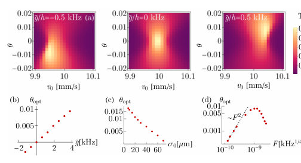 
FIG. 5. (a) Transmission probability for different interaction strengths, chirp angles and initial velocities, obtained from our analytic approach via Eqs. (9), (14). We set the cavity bound state energy to Eb/h = 11 kHz, the cavity position to x0 = 250 µm, the initial Gaussian state width to σ0 = 30 µm, and the lensing harmonic oscillator length to aho = 2.3 µm (corresponding to the same ωtrap = 22 Hz used in earlier simulations). The scattering-bound coupling prefactor is set to F = 10−9kHz1/4 (the unit is due to our choice of energy normalization of scattering states, see Appendix B for details). (b-d) Optimal chirp angle, obtained by maximizing transmission T over all v0 and θ. We keep...

**Summary.** This theoretical work demonstrates how to overcome the limitation of mean-field interactions washing out nonlinear features in matter-wave interferometry. By applying a precisely engineered momentum anti-chirp to a Bose-Einstein condensate, the authors predict the realization of matter-wave bistability and high-contrast resonance spectra. This opens pathways for new quantum technologies like matter-wave switching and high-precision velocity sensing.

**Why it may be interesting.** This work directly addresses the practical limitations of using BECs for high-precision quantum measurements by providing a specific, controllable technique (momentum chirping) to counteract mean-field decoherence effects.

Detailed structure

**Main problem.** The primary challenge is observing nonlinear matter-wave features, such as bistability, in interferometry experiments using Bose-Einstein condensates (BECs) because mean-field interactions typically broaden and wash out these resonances.

**Main result.** The authors theoretically show that engineering a momentum anti-chirp in the BEC wavepacket can counteract the interaction-induced resonance shifts, thereby enabling the observation of enhanced resonant spectra and bistability features.

**Method.** The analysis uses the 1D Gross-Pitaevskii equation (GPE) framework, modeling the system dynamics by coupling the incident matter wave to the quasi-bound states of the cavity barriers.

**Model / system.** The system is a quasi-one-dimensional BEC interacting with a matter-wave Fabry-Perot (FP) cavity formed by light-induced Gaussian potential barriers. The dynamics are governed by the mean-field GPE, incorporating repulsive interatomic interactions ($g|\psi|^2\psi$).

**Key observables.** Transmission spectrum ($T$) as a function of incident wavepacket velocity ($v_0$), and the observation of bistability features.

**Important parameters / regimes.** The required optimum momentum chirp (anti-chirp) needed to balance the interaction-induced energy shift.

**Assumptions / limitations.** The analysis relies on approximating the initial state as Gaussian and employing various time-dependent approximations (e.g., assuming the source term is slowly varying) to solve the coupled differential equations.

**Figures summary.** Figures schematically illustrate the setup (BEC through a double-barrier FP), comparing non-interacting vs. interacting spectra, and showing the mechanism involving the anti-chirped wavepacket.

**Paper structure.** The paper progresses from identifying the physical limitation (interaction-induced broadening) to proposing the anti-chirp solution. It then develops the theoretical framework by modeling the time evolution of the coupling amplitudes and deriving the final transmission probability integral.

Abstract

While a Fabry-Perot (FP) cavity interferometer is a standard tool in modern optics, analogous physics can also be observed with matter waves such as Bose-Einstein condensates (BECs). Interatomic collisions in BECs can induce nonlinear features such as multi-valued transmission spectra for interferometry experiments. Observation of interaction effects in the matter-wave analogue of FP interferometry has not yet been experimentally achieved, mostly due to broadening of transmission peaks by interaction-induced shifts of cavity resonances. In this work, we theoretically show that this limitation can be overcome by engineering a momentum chirp in a BEC wavepacket. By balancing this chirp against the dynamical mean-field energy shift of the cavity during transmission, we predict enhanced resonant spectra and bistability features due to interaction-assisted tunneling that would be otherwise inaccessible. We show that this physics is readily observable with quasi-one-dimensional BECs of cold atoms colliding with a pair of light-induced Gaussian potential barriers forming the cavity. We also benchmark the requisite optimum chirp needed and characterize the contrast of near-discontinuous FP transmission spectra at an interacting resonance. Our findings enable the realization of technologies like matter-wave switching protocols, and high-precision velocity measurements; estimates of achievable sensitivity for the latter are provided.

[↑ back to top](#top)

### [The Differential Structure of Generators of KMS-Symmetric Quantum Markov Semigroups](http://arxiv.org/abs/2610.09678v1)

**Authors:** Matthijs Vernooij, Melchior Wirth  
**Type:** theory · **Category:** statistical mechanics · **PDF:** <https://arxiv.org/pdf/2610.09678v1>  
**Analysis basis:** full PDF text, analyzed in chunks
**Topic relevance:** `correlated / nonlocal dissipation` **3/5** · `driven-dissipative phase transition` **3/5** · `Keldysh / 2PI / non-Gaussian methods` **2/5** · `methods for driven-dissipative` **2/5** · `non-equilibrium universality` **2/5** · `quantum measurements` **1/5**

📷 Fig 1

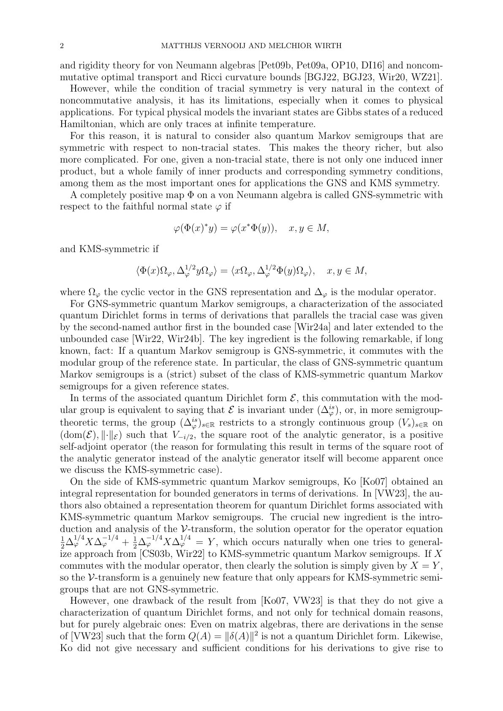 
Low-resolution page preview, page 2

📷 Fig 2

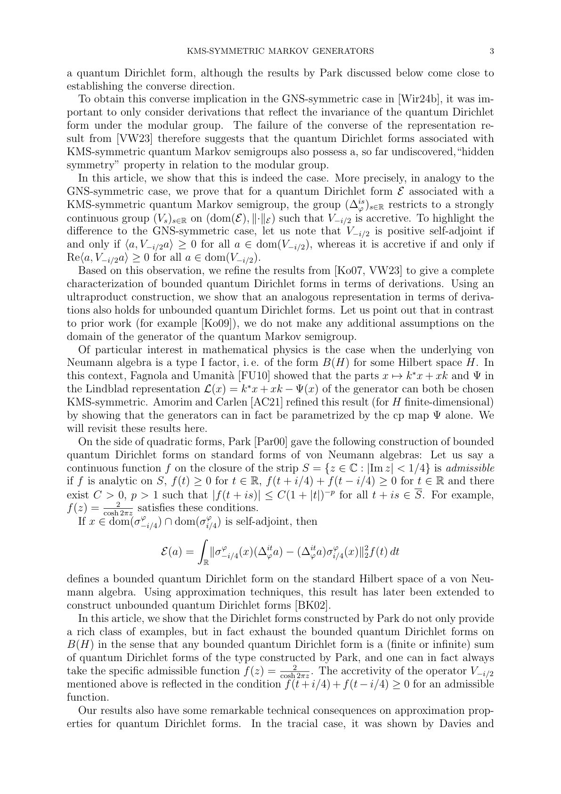 
Low-resolution page preview, page 3

📷 Fig 3

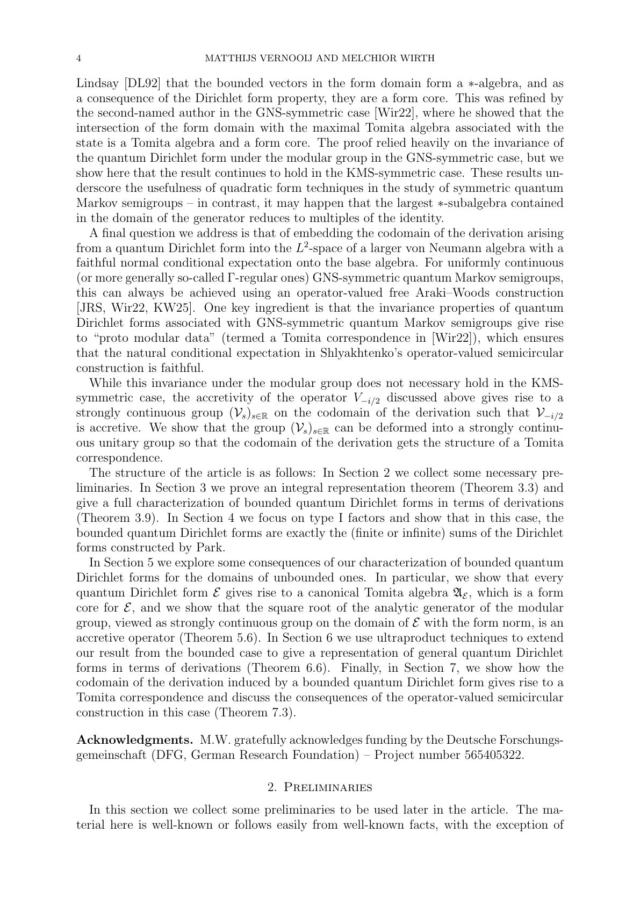 
Low-resolution page preview, page 4

📷 Fig 4

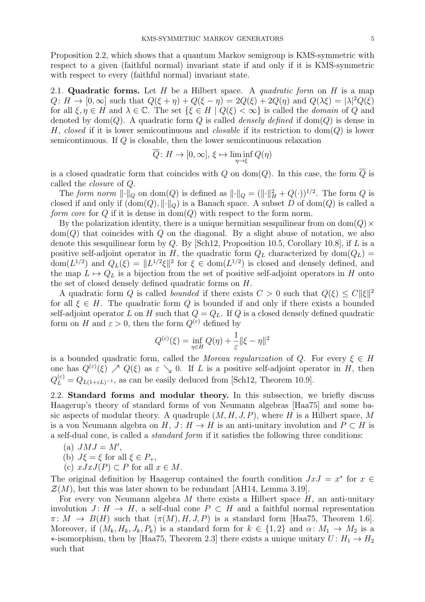 
Low-resolution page preview, page 5

📷 Fig 5

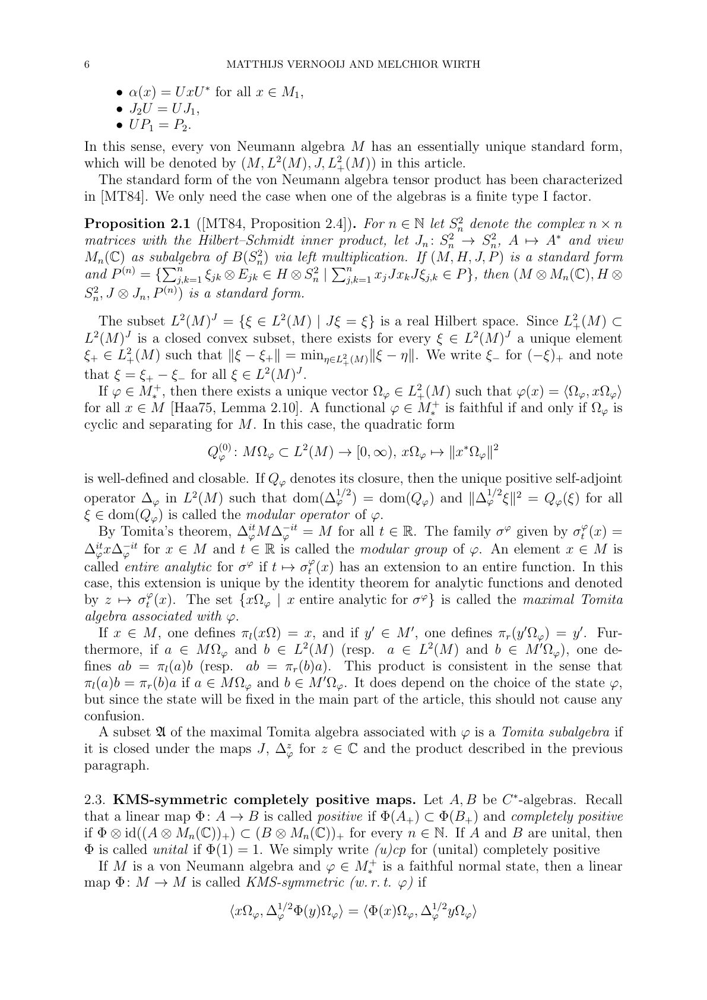 
Low-resolution page preview, page 6

**Summary.** This paper rigorously characterizes quantum Dirichlet forms arising from KMS-symmetric quantum Markov semigroups. It achieves this by showing that these forms are completely determined by derivations and by establishing a deep connection between the semigroup's dynamics and the algebraic structure of a Tomita correspondence. This provides a powerful mathematical tool for analyzing open quantum systems at thermal equilibrium.

**Why it may be interesting.** This work provides deep structural insights into the mathematical foundations of open quantum systems dynamics, linking thermal equilibrium conditions (KMS) to rigorous algebraic structures (Dirichlet forms and Tomita correspondences).

Detailed structure

**Main problem.** The paper aims to provide a complete mathematical characterization of quantum Dirichlet forms associated with KMS-symmetric quantum Markov semigroups.

**Main result.** It establishes that these quantum Dirichlet forms can be completely characterized in terms of derivations, and it shows that the associated structure leads to a Tomita correspondence.

**Method.** The authors employ advanced techniques from operator algebras, including the use of the GNS Hilbert space, modular groups, and quadratic form theory to relate the semigroup structure to derivations.

**Model / system.** The study concerns open quantum systems whose time evolution is modeled by quantum Markov semigroups exhibiting KMS-symmetry. The mathematical framework involves von Neumann algebras and their associated quadratic forms.

**Key observables.** Quantum Dirichlet forms, the generator of the semigroup, and the associated Tomita correspondence structure.

**Important parameters / regimes.** The symmetry condition (KMS-symmetry) and the accretivity of the square root of the analytic generator with respect to the form norm.

**Assumptions / limitations.** The analysis builds upon the existence of a reference state $\varphi$ and the assumption of KMS-symmetry, which refines the standard GNS-symmetry conditions.

**Paper structure.** The paper progresses by first characterizing bounded quantum Dirichlet forms via derivations, then extending this characterization to unbounded forms using ultraproduct constructions, and finally relating the resulting structure to a Tomita correspondence via deformation arguments.

Abstract

A KMS-symmetric quantum Markov semigroup is completely determined by the quadratic form in induces on the GNS Hilbert space. The quadratic forms that arise in this way are called quantum Dirichlet forms. In this article we give a complete description of bounded quantum Dirichlet forms in terms of derivations. In particular, we exhibit an explicit characterization of the bounded quantum Dirichlet forms on type I factors. We also show that any unbounded quantum Dirichlet form can be represented in terms of derivations. The key technical insight is that the modular group always restricts to a strongly continuous group on the domain of a quantum Dirichlet form such that the square root of the analytic generator is accretive with respect to the form norm.

[↑ back to top](#top)

### [ProtocolMatch: Protocol-Dependent Model Selection for Scientific Dynamics Forecasting](http://arxiv.org/abs/2610.10239v1)

**Authors:** Lu Wei, Yufeng Wang, Haibin Ling  
**Type:** both · **Category:** other · **PDF:** <https://arxiv.org/pdf/2610.10239v1>  
**Analysis basis:** full PDF text, analyzed in chunks
**Topic relevance:** `analog quantum simulation` **3/5** · `methods for driven-dissipative` **3/5** · `driven-dissipative phase transition` **2/5** · `Keldysh / 2PI / non-Gaussian methods` **1/5** · `correlated / nonlocal dissipation` **1/5** · `non-equilibrium universality` **1/5** · `quantum measurements` **1/5**

📷 Fig 1

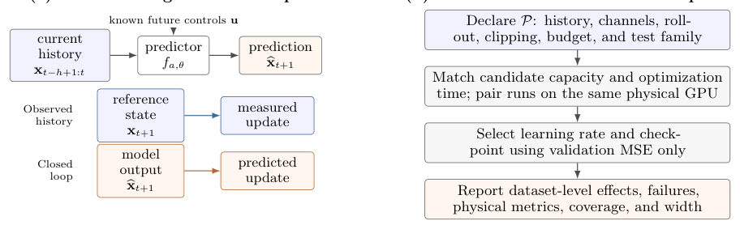 
Figure 1: The forecasting protocol determines both the information available to a predictor and how that predictor is compared. (a) Observed-history and closed-loop evaluation keep the predictor, future controls, and target fixed; only the source of the next state-history window changes. (b) ProtocolMatch pairs that declared task with controlled candidates, validation-only selection, independent-dataset aggregation, and failure-preserving reliability reports.

📷 Fig 2

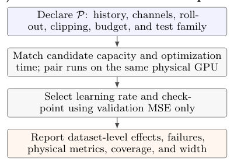 
Figure 1(b) summarizes the comparison workflow. Four controls make the resulting rank interpretable.

📷 Fig 3

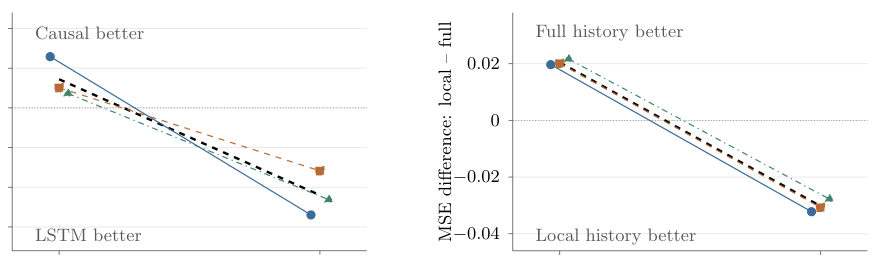 
Figure 2: Replicated ranking reversals under matched optimization time. (a) LSTM-minus-causal error for closed-loop extrapolation changes sign between 64 and 256 training trajectories. (b) Local-minus-full-history error changes sign between observed-history and closed-loop rollout while the full prediction target remains fixed. Colored lines are independent-dataset means over three training seeds; the dashed black line is their average. Both panels use 20-step histories, a 120-second budget, identity-distribution tests, and no output clipping.

📷 Fig 4

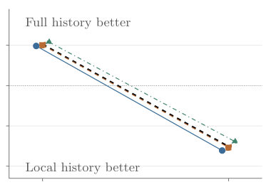 
Figure 2(b) defines the input contrast as local-minus- full MSE. For the history-20 LSTM, it is +0.02046 with observed-history refresh and −0.03023 with closed-loop feedback. Each independent dataset shows the same sign change. The benefit of nonlocal history therefore depends on whether those channels are refreshed from observations or populated by preceding predictions.

📷 Fig 5

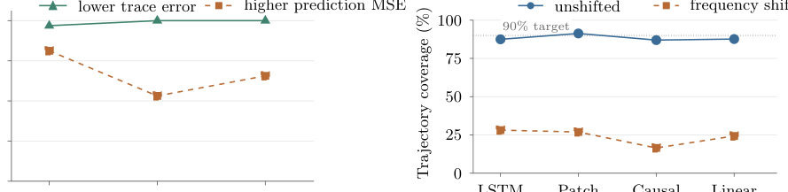 
Figure 3: Accuracy, physical validity, and uncertainty are distinct outcomes. (a) A trace penalty usually lowers trace error but often raises prediction MSE for a two-spin LSTM; the 32 correlated views share fitted models. (b) Intervals calibrated on 64 independent identity-distribution trajectories approach nominal 90% coverage in distribution but lose most coverage after a frequency shift. Widths are full symmetric interval widths.

**Summary.** This paper addresses the challenge of model selection in quantum dynamics forecasting by proposing ProtocolMatch, a framework that evaluates models based on the entire operational protocol, not just the architecture. By testing on driven quantum-spin systems, the authors show that model performance is highly protocol-dependent, necessitating that any reported predictor must be accompanied by its specific operational context and separate reliability metrics.

**Why it may be interesting.** This work provides a rigorous, machine-learning-informed methodology for assessing the reliability of quantum dynamics models, which is crucial for building trustworthy simulations of open quantum systems.

Detailed structure

**Main problem.** Scientific dynamics forecasting requires model selection that accounts for the entire 'protocol'—including observation history, rollout rules, and physical constraints—rather than just the model architecture.

**Main result.** The optimal forecasting model depends critically on the specific protocol used, as demonstrated by performance reversals when changing data size, history length, or evaluation loop (observed vs. closed-loop).

**Method.** The authors introduce ProtocolMatch, a framework that evaluates model candidates by explicitly conditioning the risk calculation on the entire forecasting protocol $P$, separating accuracy, physical validity, and shifted-distribution reliability.

**Model / system.** The study applies this framework to driven quantum-spin dynamics, simulating systems ranging from two-spin to six-spin quantum chains governed by Hamiltonians like the transverse-field Ising model.

**Key observables.** Mean Squared Error (MSE) for prediction error, physical consistency (e.g., trace normalization, positivity), and interval coverage under shifted distributions.

**Important parameters / regimes.** History length (1, 5, 20), rollout rule (Observed-history vs. Closed-loop), and the specific protocol tuple $P$ defining the evaluation regime.

**Assumptions / limitations.** The primary assumption is that the protocol cannot be treated as a nuisance variable; changes in performance across protocols indicate fundamentally different deployment behaviors.

**Figures summary.** Figures illustrate the comparison between observed-history and closed-loop evaluations, and show how the preferred model architecture reverses when varying training data size or rollout rules.

**Paper structure.** The paper first establishes the limitations of architecture-only model selection, introduces the ProtocolMatch framework to condition model selection on the full protocol $P$, and then empirically tests this framework across various quantum-spin dynamics systems and protocols.

Abstract

Scientific dynamics forecasting is often framed as an architecture choice, although deployment is also determined by observed history, rollout feedback, compute budget, physical objective, and test distribution. We formulate protocol-dependent model selection and introduce ProtocolMatch, a compute-matched, validation-selected, and failure-preserving evaluation framework. On driven quantum-spin dynamics, we compare recurrent, patched-attention, causal-attention, and low-rank linear predictors across three independently generated datasets. The causal-attention--recurrence ordering reverses as the training set grows within a fixed two-spin task, while a linear predictor has the lowest mean error in the six-spin local-observable comparison. Restricting observed history worsens every refreshed-history view but improves every closed-loop view in the four-spin study. A latest-state MLP has lower error than persistence on every dataset under state refresh across all five cells, yet its closed-loop rank varies by system and includes finite explosive errors. Physical penalties improve targeted consistency without reliably improving prediction error, and in-distribution intervals lose most coverage after a driving-frequency shift. Thus scientific model selection should return a predictor with its protocol and report accuracy, physical validity, and shifted-distribution reliability separately.

[↑ back to top](#top)

### [On Bonart's interpretation of the Square-Root Impact Law](http://arxiv.org/abs/2610.10053v1)

**Authors:** J. -P. Bouchaud, I. Mastromatteo, B. Toth  
**Type:** theory · **Category:** statistical mechanics · **PDF:** <https://arxiv.org/pdf/2610.10053v1>  
**Analysis basis:** full PDF text, analyzed in chunks
**Topic relevance:** `non-equilibrium universality` **3/5** · `Keldysh / 2PI / non-Gaussian methods` **2/5** · `methods for driven-dissipative` **2/5** · `analog quantum simulation` **1/5** · `correlated / nonlocal dissipation` **1/5** · `driven-dissipative phase transition` **1/5** · `quantum measurements` **1/5**

📷 Fig 1

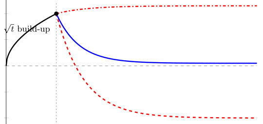 
Figure 1: Two poles of post-execution impact decay; the impact at the end of execution (the peak of the build-up, dot) is normalised to 1, and all curves share the concave √

**Summary.** This paper analyzes the theoretical underpinnings of the Square-Root Impact Law (SRIL) in financial markets. It argues that the law's consistency requires a specific scaling exponent ($\delta=1/2$) derived from volume conservation, suggesting the law stems from equating mean impact to standard deviation. The work highlights the tension between theoretical assumptions (like stream whitening) and observed market behavior.

**Why it may be interesting.** While applied to finance, the rigorous mathematical techniques used—analyzing scaling laws, variance budgets, and the failure of simple diffusive assumptions—are highly relevant to non-equilibrium statistical mechanics and open quantum systems.

Detailed structure

**Main problem.** The paper seeks to reconcile the empirical Square-Root Impact Law (SRIL) in financial markets with a consistent theoretical mechanism derived from market microstructure physics.

**Main result.** A volume-conservation argument strongly selects the exponent $\delta=1/2$ for the impact law, suggesting the SRIL arises from a mean-equals-standard-deviation identification rather than purely diffusive processes.

**Method.** The authors use mathematical derivations based on variance budgets, conservation laws, and comparing theoretical models (like the Lillo–Mike–Farmer model) against the required scaling behavior.

**Model / system.** The system is a financial market microstructure, modeling the price impact ($I$) of metaorders ($Q$) relative to total volume ($V$) and volatility ($\sigma$). The analysis involves decomposing returns into background and impact components.

**Key observables.** Price impact ($I$), traded volume ($Q$), daily volatility ($\sigma$), and the participation rate ($\varphi$).

**Important parameters / regimes.** The exponent $\delta$ governing the power-law dependence of impact on volume, and the participation rate $\varphi$.

**Assumptions / limitations.** The core assumptions involve the market whitening the *stream* of metaorders, and the analysis relies on volume-conservation arguments to constrain the scaling exponent $\delta$.

**Figures summary.** Not specified.

**Paper structure.** The paper progresses by first establishing the empirical requirements of the SRIL, then reviewing and simplifying Bonart's whitening argument, and finally using volume-conservation and scaling analysis to derive the necessary exponent $\delta=1/2$.

Abstract

The square-root impact law (SRIL), $I = Yσ\sqrt{Q/V}$, bundles two facts that a single mechanism must explain at once: a shape (impact proportional to square-root of traded volume $Q$) and an amplitude ($Y=O(1)$, independent of the participation rate $\varphi$). Bonart has recently proposed an elegant solution: if realized and counterfactual prices are both diffusive, information-neutral impact must have white increments and the SRIL follows without the wart. We reformulate and simplify his argument, and foreground the ingredient he himself regards as essential --- that the market whitens the stationary stream of each participant's metaorders, not any isolated one. The Lillo--Mike--Farmer model satisfies his premises, yet gives an isolated metaorder the super-square-root impact $\varphi^{(1-γ)/2}Q^{(1+γ)/2}$, $γ\in(0,1)$, because single metaorders (i.e. not part of a stream) are statistically invisible and thus priced mechanically. We then construct an explicit multi-agent propagator that realizes Bonart's whitening, and show it reproduces the clean SRIL precisely when the market can attribute trades to their issuer. But correct re-attribution of anonymous trades is a formidable task, which requires markets to behave as implausibly efficient signal processing machines. The stream hypothesis makes a sharp, falsifiable prediction --- isolated metaorders, well separated in time, should not obey the SRIL --- that does not seem agree with empirical data known to us. Independently, a volume-conservation argument singles out the square-root law and lays bare the step the diffusivity route must assume: diffusivity fixes the variance of impact --- an additive, stationary, age-blind quantity --- whereas the SRIL is a law for the mean impact, which marginally decays as $1/\sqrt{\text{age}}$ and therefore demands an origin of time.

[↑ back to top](#top)

### [Heating and Escape of Confined Atoms Subject to Colored Noise](http://arxiv.org/abs/2610.09047v1)

**Authors:** Joseph M. Ryan, Katherine Jonas, Christopher Monroe  
**Type:** both · **Category:** other · **PDF:** <https://arxiv.org/pdf/2610.09047v1>  
**Analysis basis:** full PDF text, analyzed in chunks
**Topic relevance:** `methods for driven-dissipative` **3/5** · `Keldysh / 2PI / non-Gaussian methods` **1/5** · `analog quantum simulation` **1/5** · `correlated / nonlocal dissipation` **1/5** · `driven-dissipative phase transition` **1/5** · `non-equilibrium universality` **1/5** · `quantum measurements` **1/5**

📷 Fig 1

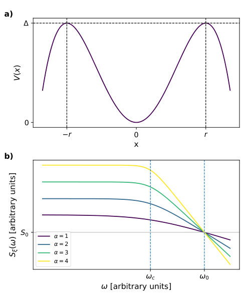 
Figure 1. (a) Potential V (x) from Eq. (3). (b) Power spectral density Sξ(ω) in the form of Eq. (5), with low-frequency cutoff ωc. Note that for different values of α, we normalize the PSDs such that they all have the same value S0 = Sξ(ω0). With this normalization choice, ˙Ecold is identical for all values of α.

📷 Fig 2

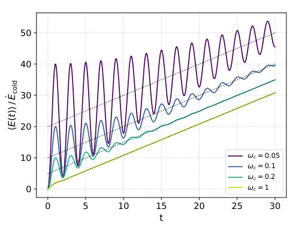 
Figure 2. Mean energy of a harmonic oscillator with ω0 = π driven by O-U noise evaluated using Eq. (9) and normalized by the cold heating rate ˙Ecold. We show different values of the low-frequency cutoff ωc. All four curves approach unit slope at long times, as required by Eq. (2). Dotted lines show the asymptote Eq. (10). Transient oscillations persist for a duration ∼1/ωc and smaller ωc raises the intercept Eoffset.

📷 Fig 3

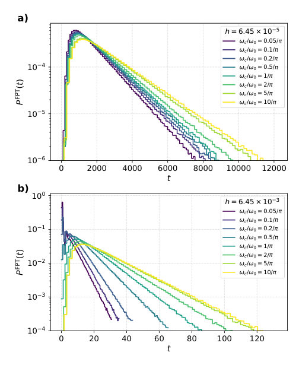 
Figure 3. P FPT of the O-U-driven finite-depth oscilla- tor Eq. (4) with m = 1 for (a) h = 6.45 × 10−5, where χ = 0.02–0.18 for the cutoffs shown. Here, changing ωc has minimal effect on the shape of P FPT; and (b) h = 6.45×10−3, where χ = 0.19–1.8 for the cutoffs shown. There, one can see that changing ωc not only strongly modifies the long-time ex- ponential tail of P FPT, but there is also a qualitative change in the short-time behavior.

📷 Fig 4

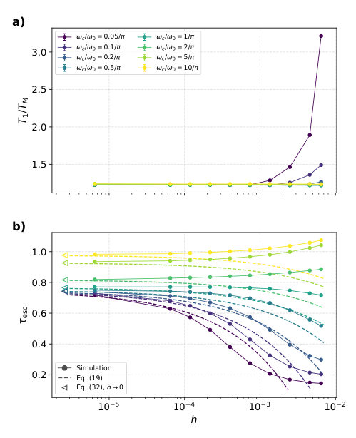 
Figure 4. Escape statistics of the O-U-driven finite-depth os- cillator with m = 1, ω0 = π, and Sξ(ω0) = 2, for various cut- offs ωc/ω0. (a) Ratio of the mean to the median first-passage time, T1/TM. (b) Normalized escape time τesc. Points con- nected by solid lines are simulations. Triangles mark the weak-noise prediction Eq. (32), which is independent of h and is drawn to the left of the simulated range. Dashed lines include the quasi-static correction Eq. (19). They follow the simulations where χ ≪1 and ωc ≪ω0 and depart from them outside this range. Error bars are 1σ sampling errors and are mostly smaller than the markers. Simulations sweep h by varying ∆.

📷 Fig 5

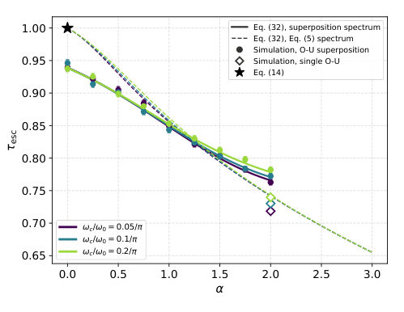 
Figure 5. Normalized escape time τesc = ˙Ecold/ ˙Eesc for the finite-depth oscillator of Eq. (4) with h = 6.45×10−6, driven by power-law noise with low-frequency cutoff ωc and fixed S0 = 2, so that ˙Ecold = 1 throughout. Filled circles are Monte Carlo first-passage times using the O-U superposi- tion of Appendix C. Solid curves are the action-angle pre- diction Eq. (32) evaluated with the exact spectrum of the N = 20 superposition. Dashed curves are the same predic- tion for the idealized spectrum Eq. (5). Both are independent of h. Open diamonds are single O-U processes, whose spec- trum is exactly Eq. (5) with α = 2. They have χ = 0.057, 0.040, and 0.028 for ωc/ω0 = 0.05/π, 0.1/π, and...

**Summary.** This paper analyzes how atoms trapped in a potential escape due to colored noise, modeling the dynamics using a Langevin equation. The authors derive theoretical expressions for the escape time, showing that while noise color is important, stray fields causing quasi-static barrier tilting can dominate the escape rate. The findings are highly relevant for interpreting experimental lifetime measurements in trapped-ion quantum systems.

**Why it may be interesting.** This work provides crucial theoretical tools for understanding noise-induced escape dynamics in trapped-ion and cold-atom systems, highlighting the importance of non-Markovian noise effects and external field perturbations beyond simple spectral analysis.

Detailed structure

**Main problem.** The paper investigates the heating and subsequent escape of atoms confined in a finite-depth potential when subjected to colored noise.

**Main result.** The escape rate is not solely determined by the spectral color of the noise; quasi-static barrier tilting caused by stray fields of plausible magnitude can significantly accelerate the escape process.

**Method.** The authors employ stochastic averaging techniques, comparing analytical derivations (like those from action-angle variables) with full Monte Carlo simulations of the Langevin equation.

**Model / system.** The system models the motion of an atom in a confining potential, such as those found in electromagnetically trapped ions or atoms. The dynamics are governed by a Langevin equation driven by a colored noise force with a power-law spectral density.

**Key observables.** Mean escape time ($T_1$), escape rate ($\dot{E}_{	ext{esc}}$), linear heating rate ($\dot{E}_{	ext{cold}}$), and the first-passage-time distribution ($P_{	ext{FPT}}(t)$).

**Important parameters / regimes.** The ratio $	au_{	ext{esc}} = \dot{E}_{	ext{cold}} / \dot{E}_{	ext{esc}}$ is key, alongside dimensionless parameters like $\omega_c/\omega_0$ and the barrier tilting parameter $\chi$.

**Assumptions / limitations.** The analysis relies on approximations such as the weak-noise regime ($\chi \ll 1$ and $h \ll 1$) and the use of amplitude-phase or action-angle averaging techniques.

**Figures summary.** Figures illustrate the confining potential and the noise PSD, and compare escape times calculated using different averaging methods (action-angle vs. amplitude-phase) and show the dynamics for different initial preparation states (released vs. cooled).

**Paper structure.** The paper progresses from defining the physical model and key observables, developing weak-noise theories using stochastic averaging, comparing different averaging methods, and finally applying the results to interpret experimental measurements from ion traps.

Abstract

The motion of a particle in a finite-depth confining potential, such as that of an electromagnetically trapped atom or ion, is approximately harmonic at low energy and softens as the escape energy is approached. When the particle is driven by a stochastic force, the heating and escape times depend sensitively on the noise power spectrum. We study escape times of particles in softening potentials driven by power-law colored noise. We identify two nested conditions for weak noise: the particle must execute many oscillations before escape, and noise forces must be small relative to forces exerted by the trap so as not to tilt the potential appreciably. In this regime, we derive expressions for the mean escape time using stochastic averaging techniques and compare them with Monte Carlo simulations of the full equations of motion. We also examine the crossover to regimes where these conditions are not met and large quasi-static forces give rise to additional escape mechanisms. Applying these results to an experimental measurement of lifetimes in a microfabricated ion trap, we find that spectral color alone cannot account for the rapid escape rates observed, whereas quasi-static barrier tilting by a stray field of plausible magnitude could. These results are relevant to the heating and escape of trapped atoms due to noisy force fields, as well as to other nonlinear oscillators subject to colored noise.

[↑ back to top](#top)

### [Interaction-Assisted Spin Coherence in a Multimode Trapped Atomic Ensemble](http://arxiv.org/abs/2610.09073v1)

**Authors:** Aleksandre Merabishvili, Ebubechukwu O. Ilo-Okeke  
**Type:** theory · **Category:** other · **PDF:** <https://arxiv.org/pdf/2610.09073v1>  
**Analysis basis:** full PDF text, analyzed in chunks
**Topic relevance:** `analog quantum simulation` **3/5** · `Keldysh / 2PI / non-Gaussian methods` **2/5** · `methods for driven-dissipative` **2/5** · `correlated / nonlocal dissipation` **1/5** · `quantum measurements` **1/5**

📷 Fig 1

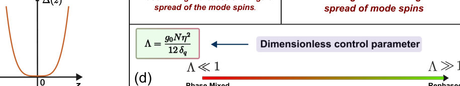 
FIG. 1. Conceptual picture of interaction-assisted spin coherence in a thermally occupied multimode trapped ensemble. (a) The weak-axis-resolved description retains the axial harmonic-oscillator modes explicitly, while the transverse (x, y) degrees of freedom are incorporated through thermal averaging. Near the magic magnetic field, the residual differential shift is quartic in the axial coordinate, giving the occupied axial modes different detunings; each mode carries a collective pseudospin. (b) In the weak-exchange regime, initially aligned mode spins precess at different rates because of their mode-dependent detunings. The resulting coherent phase mixing increases their angular spread...

📷 Fig 2

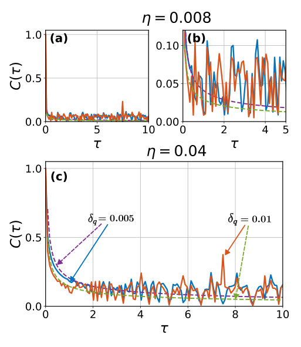 
FIG. 2. Comparison between the discrete-mode numerical contrast and the continuum analytic asymptote. Solid curves show the numerically evaluated contrast C(τ) (42), while dashed curves show the analytic approximation (44), plot- ted only in its asymptotic regime τ ≳2τmix. Panel (a) shows the small-η high-temperature regime, and (b) zooms into the low-contrast regime of (a). Panel (c) shows the intermediate temperature regime. All parameters are as shown in the fig- ure.

📷 Fig 3

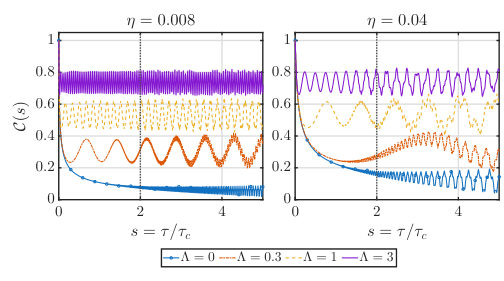 
FIG. 3. Representative Ramsey-contrast dynamics for two temperatures. The Ramsey contrast C(s), with s = τ/τc, is shown for η = 0.008 and η = 0.04 at several values of Λ (57). The dotted vertical line at s = 2 marks the beginning of the late-time averaging window used to define ¯Clate.

📷 Fig 4

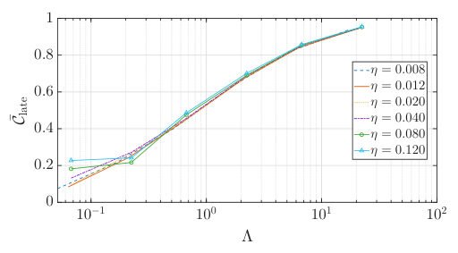 
FIG. 5. Scaling collapse of the late-time contrast. The late- time contrasts ¯Clate versus exchange-to-inhomogeneity ratio Λ (57) at different temperatures follow a common trend.

📷 Fig 5

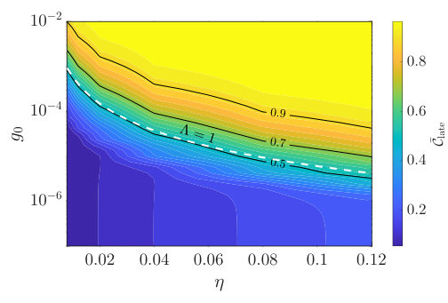 
FIG. 4. Late-time contrast landscape. The color scale shows ¯Clate(η, g0), obtained by averaging C(s) over the late-time win- dow. The dashed line marks Λ = 1, corresponding to the point where the collective exchange scale becomes compara- ble to the analytic thermal inhomogeneous-broadening scale.

**Summary.** This paper analyzes how collective spin coherence in trapped atoms is lost due to inhomogeneous detunings across multiple motional modes. It shows that particle interactions generate a self-correcting field that partially restores the coherence. Crucially, it quantifies that while interactions can refocus coherent phase errors, they cannot overcome irreversible environmental noise.

**Why it may be interesting.** This work provides a detailed theoretical framework for understanding coherence preservation in complex, inhomogeneous quantum systems, directly relevant to quantum sensing using trapped atoms.

Detailed structure

**Main problem.** The paper investigates how collective spin coherence in a multimode trapped atomic ensemble is degraded by inhomogeneous phase evolution due to thermal occupation, and how atomic interactions can restore this coherence.

**Main result.** Interactions generate a self-consistent restoring field that counteracts phase dispersion, leading to a measurable recovery of the Ramsey contrast, though this recovery is ultimately limited by irreversible pure dephasing noise.

**Method.** The authors develop a weak-axis-resolved Hamiltonian theory, employing mean-field approximations and analyzing the dynamics in the continuum limit for high temperatures.

**Model / system.** The system is a gas of neutral atoms with two internal pseudospin states confined in a harmonic trap, modeled by an effective spin Hamiltonian incorporating mode-dependent detunings and overlap-dependent exchange interactions.

**Key observables.** Collective transverse spin (Ramsey-fringe contrast), the decay envelope of the Ramsey contrast, and the ratio $\Lambda$ comparing exchange scale to detuning spread.

**Important parameters / regimes.** The dimensionless control parameter $\Lambda$, the temperature parameter $\eta$, and the pure dephasing rate $\gamma_{\perp}$.

**Assumptions / limitations.** The analysis relies on a weak-axis-resolved description, thermally averaging transverse degrees of freedom, and distinguishing between coherent phase mixing and irreversible noise.

**Figures summary.** Figures conceptually illustrate the competition between mode-dependent detunings and exchange-assisted rephasing, and later show the robustness of the recovered contrast against varying levels of pure dephasing.

**Paper structure.** The paper progresses from establishing the non-interacting, phase-mixing baseline, to deriving the full interaction Hamiltonian, analyzing the mean-field dynamics, and finally quantifying the crossover between coherent rephasing and irreversible decoherence.

Abstract

In a thermally occupied multimode trapped ensemble, mode-dependent detunings can strongly suppress Ramsey contrast even when the underlying dynamics remains coherent. We develop a weak-axis-resolved Hamiltonian theory in which collective mode spins experience longitudinal detunings and overlap-dependent exchange interactions. Without exchange, the distribution of detunings across thermally occupied modes produces coherent phase mixing and an algebraically decaying Ramsey-contrast envelope in the many-mode continuum regime. At the mean-field level, exchange generates a self-consistent restoring field that reduces phase dispersion and restores collective contrast. The crossover is governed by the competition between the collective exchange scale and the thermally induced detuning spread: when the late-time contrast is expressed in terms of their ratio, results at different temperatures collapse onto a common trend, and the crossover coupling follows the predicted inverse-square thermal scaling, with a numerical exponent of 2.06. Weak irreversible pure dephasing limits, but does not eliminate, this recovery, demonstrating that exchange refocuses coherent inhomogeneous phase mixing but cannot reverse irreversible phase noise.

[↑ back to top](#top)

### [Black hole radial geometry from a quantum spin chain](http://arxiv.org/abs/2610.10504v1)

**Authors:** Boris A. Khanikati  
**Type:** both · **Category:** other · **PDF:** <https://arxiv.org/pdf/2610.10504v1>  
**Analysis basis:** full PDF text, analyzed in chunks
**Topic relevance:** `QC/QI experiment` **3/5** · `analog quantum simulation` **3/5** · `methods for driven-dissipative` **2/5**

📷 Fig 1

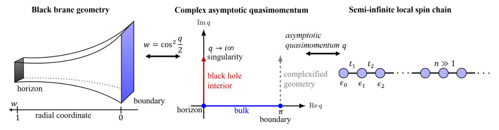 
FIG. 1. Schematic representation of the dictionary between the black brane geometry and the spin chain. The dimensionless radial coordinate w runs from the d-dimensional boundary (w = 0) to the horizon (w = 1), with w &gt; 1 corresponding to the black hole interior. In the asymptotic regime, the radial coordinate is mapped onto the spin-chain quasimomentum. Real q ∈(0, π) describes the black brane bulk, whereas its analytic continuation, q = iκ with κ &gt; 0, describes the black hole interior.

**Summary.** This work demonstrates a profound connection between gravity in Anti-de Sitter space and quantum many-body physics by encoding the radial geometry into a solvable spin chain model. By simulating this chain on a quantum processor, the authors successfully extract gravitational observables, such as the time to the black hole singularity, validating the holographic principle in a quantum computing setting.

**Why it may be interesting.** It provides a concrete, experimentally verifiable realization of the AdS/CFT correspondence, linking bulk gravity dynamics (black holes) directly to measurable quantum many-body physics on superconducting qubits.

Detailed structure

**Main problem.** The paper establishes a dictionary showing how the radial differential equation for a scalar field in an AdS black brane background can be mapped onto an exactly solvable semi-infinite quantum spin chain.

**Main result.** The model successfully reproduces key gravitational observables, such as the Breitenlohner-Freedman bound and the proper time to the singularity, using quantum mechanical calculations.

**Method.** The authors use spectral analysis, mapping the continuum differential equation to a discrete spin chain Hamiltonian, and employing techniques like analytic continuation and fitting to extract geometric information.

**Model / system.** The system is an AdS black brane geometry dual to a scalar field, whose radial dynamics are encoded in a nearest-neighbor, number-conserving spin chain Hamiltonian. This chain is simulated on a superconducting quantum processor.

**Key observables.** Screening spectrum, radial coordinate emergence from quasimomentum, thermal one-point function coefficient c(h), and the ratio R(h) used for phase fitting.

**Important parameters / regimes.** The dimensionality $d$, the black brane proper radial distance $\ell$, and the ratio $	au_s/R$ (compared to the exact value $\pi/4$).

**Assumptions / limitations.** The analysis relies on mapping the continuum problem to a discrete chain, and the final results are subject to finite-size and finite-time simulation errors.

**Figures summary.** Figures compare the measured quantum propagator evolution against exact theoretical limits, showing the reconstruction of the coefficient c(h) and the phase fit for the radial time scale $	au_s/R$.

**Paper structure.** The paper progresses by first establishing the mapping from the radial equation to the spin chain, then calculating spectral sum rules, and finally using experimental simulation and analytic continuation to reconstruct the geometric observables like the proper time to the singularity.

Abstract

We show that the radial differential equation for a scalar field in an anti-de Sitter black brane background can be encoded in an exactly solvable semi-infinite spin chain independent of dimensionality. The radial coordinate emerges as lattice quasimomentum. Spin coherence encodes the geometry, while the spectrum and response recover gravitational observables and yield exact screening-mass sum rules. We implement the finite chain on a superconducting processor. At finite filling and low energies, the model yields a conformal field theory in a coordinate proportional to proper radial distance.

[↑ back to top](#top)

### [Coherent consensus for the estimation and classification of phases](http://arxiv.org/abs/2610.09865v1)

**Authors:** Roberto Ruiz, Alessandro Luongo, Sergi Ramos-Calderer, José Ignacio Latorre  
**Type:** both · **Category:** quantum information and computing · **PDF:** <https://arxiv.org/pdf/2610.09865v1>  
**Analysis basis:** full PDF text, analyzed in chunks
**Topic relevance:** `QC/QI experiment` **3/5** · `quantum measurements` **3/5** · `analog quantum simulation` **1/5**

📷 Fig 1

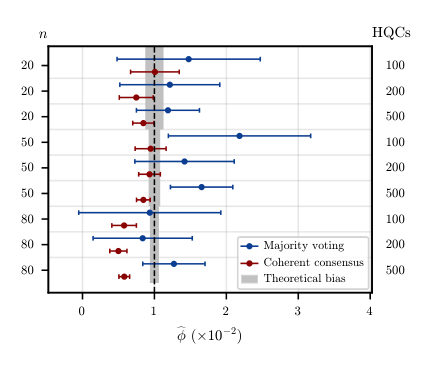 
FIG. 1. Estimated phases via majority voting and coherent consensus with imperfect phase gates on the trapped-ion quantum computer [13]. The left panel contains the results at equal shot budgets, while the right panel shows outcomes at equal resource budgets, quantified as hardware quantum credits (HQCs) [14]. The dashed line corresponds to the target ϕ = 10−2. The markers represent the estimates bϕ, and the error bars represent the statistical error at 95% due to shot noise. Each imperfect phase gate carries an angle ϕj, drawn uniformly from a band of half-width a = 5 × 10−3 around ϕ. The gray shaded area represents the range, narrowing as n grows, within which the theoretical bias of the...

📷 Fig 2

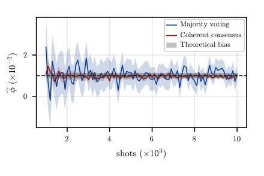 
FIG. 3. Estimated phases from the noiseless simulations of majority voting and coherent consensus circuits (Figs. 2a and 2b), against the number of qubits (left, m = 2 000) and against the number of shots (right, n = 20). The dashed line corresponds to the target ϕ = 10−2. Colored shaded bands represent the statistical error at 95% confidence. Perturbations γj are drawn from U(−a, a) with a = 5 × 10−3. The gray shaded band represents the range of the theoretical bias at 95% confidence. The absence of device noise is reflected in the lack of systematic bias, so that both estimators are accurate up to the theoretical bias. The confidence interval of coherent consensus is narrower than that of...

📷 Fig 3

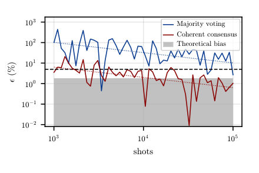 
FIG. 4. Relative errors from the simulations of majority voting and coherent consensus circuits (Figs. 2a and 2b), against the number of qubits (left, m = 104) and against the number of shots (right, n = 250). The guide lines show the expected statistical-error scaling ∝n−1/2 for majority voting and ∝n−1 for coherent consensus (left), and ∝m−1/2 for both majority voting and coherent consensus (right). The dashed line corresponds to the reference value ϵ = 5%. The target is scaled from ϕ = 10−2 to ϕ = 10−3. Perturbations are correspondingly scaled such that γj are drawn from U(−a, a) with a = 5×10−4. This scaling allows us to span n = 10, . . . , 1 000 while preserving nϕ &lt; π/2, as required...

📷 Fig 4

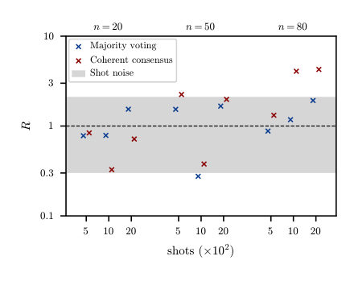 
FIG. 5. Dispersion ratio for the hardware runs at equal shot budgets shown in Fig. 1 (left). Each run is split into ten batches of consecutive shots. The dispersion ratio R is the variance of the batch es- timates bϕ divided by that predicted by shot noise. Independent shots with a common outcome proba- bility give R ≈1 (dashed line). The gray shaded area is the 95% shot-noise reference: under a normal approximation of the batch estimates, 9R approxi- mately follows a χ2 distribution with nine degrees of freedom. Device noise correlated across shots, such as a drift during the run, raises R above 1, while anticorrelated shots would lower it below the band. Majority voting lies within or...

**Summary.** This work introduces 'coherent consensus,' a quantum protocol that uses entangled GHZ states to combine results from multiple quantum classifiers for phase estimation. It rigorously proves that this method offers a significant $\sqrt{n}$ improvement in precision over classical majority voting. The results are validated both theoretically and experimentally using a trapped-ion quantum computer.

**Why it may be interesting.** It provides a concrete, entanglement-based quantum primitive for improving the performance of multiple quantum measurements, which is highly relevant for quantum sensing and distributed quantum computation.

Detailed structure

**Main problem.** The paper proposes and analyzes a 'coherent consensus' primitive to enhance the collaborative performance of independent quantum classifiers for estimating and classifying unknown quantum phases.

**Main result.** Coherent consensus achieves a superior $\sqrt{n}$ precision gain in phase estimation compared to incoherent majority voting, which is demonstrated both theoretically and experimentally on a trapped-ion platform.

**Method.** The technique involves preparing a Greenberger-Horne-Zeilinger (GHZ) state, encoding individual classifier outputs as relative phases, and then collecting these phases onto a single qubit to amplify the signal.

**Model / system.** The core task is phase estimation, analogous to quantum metrology, using an ensemble of $n$ imperfect phase gates. The analysis compares the coherent consensus protocol against classical majority voting.

**Key observables.** Estimated phases ($\phi$), sampling error, precision gain ($\sqrt{n}$ factor), and relative error bounds ($\epsilon$).

**Important parameters / regimes.** Number of qubits ($n$), number of shots ($m$), noise parameters ($\sigma$), and the required accuracy ($\epsilon$) and failure probability ($\delta$).

**Assumptions / limitations.** The analysis assumes the ability to prepare GHZ states and relies on concentration inequalities (Hoeffding/Bernstein) for theoretical guarantees; practical application is limited by device drift.

**Figures summary.** Figures compare estimated phases using both majority voting and coherent consensus on a trapped-ion quantum computer, illustrating the expected $\sqrt{n}$ precision gain.

**Paper structure.** The paper first introduces the problem, develops the theoretical framework by comparing the estimators (MV vs. CC) using concentration inequalities, derives success guarantees (Theorems 1 & 2), and finally validates these findings through both theoretical bounds and experimental implementation on a trapped-ion quantum computer.

Abstract

Inspired by quantum metrology, we propose a coherent consensus primitive to enhance the collaborative performance of independent quantum classifiers at the decision boundary. The basic idea consists of three steps: i) prepare a Greenberger-Horne-Zeilinger (GHZ) state on $n$ qubits; ii) apply a relative phase to each qubit, which encodes the output of one classifier; and iii) undo the GHZ preparation to collect all phases onto the first qubit. The signal is amplified by a factor of $n$, which reduces the sampling error by a factor of $\sqrt{n}$ relative to incoherent majority voting, that is, the direct combination of estimates from individual classifiers. Coherent consensus is valid for general estimation and classification of phases. We derive guarantees on the resources needed to estimate phases using this coherent consensus primitive as compared to majority voting. We implement both techniques on a trapped-ion quantum computer using a given ensemble of imperfect phase gates. We observe the expected $\sqrt{n}$ gain in precision of coherent consensus, with excess dispersion at the largest $n$ consistent with device drift. Coherent consensus can thus be understood as a form of sensing inside a quantum computer.

[↑ back to top](#top)

### [Particle-Number-Preserving Quantum Signal Processing for Thermal Properties: Canonical-Ensemble Estimation and Grand-Canonical Reconstruction](http://arxiv.org/abs/2610.09373v1)

**Authors:** Taehee Ko, Sungbin Lim, Sangkook Choi  
**Type:** theory · **Category:** statistical mechanics · **PDF:** <https://arxiv.org/pdf/2610.09373v1>  
**Analysis basis:** full PDF text, analyzed in chunks
**Topic relevance:** `analog quantum simulation` **3/5** · `Keldysh / 2PI / non-Gaussian methods` **2/5** · `methods for driven-dissipative` **2/5**

📷 Fig 1

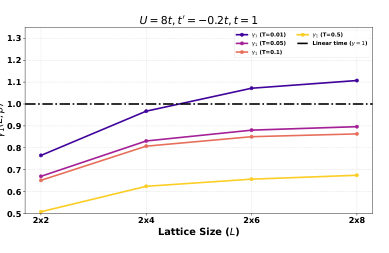 
FIG. 2: Simulation results evaluating the figure of merit γ1(L, β) for the proposed grand-canonical scheme (Algorithm 2). The figure of merit γ1 is plotted as a function of system size (L) across different temperatures (T ∈{0.01, 0.05, 0.1, 0.5}). (Left panel) Results for the weak-coupling regime (U = 4). (Right panel) Results for the intermediate-coupling regime (U = 8).

📷 Fig 2

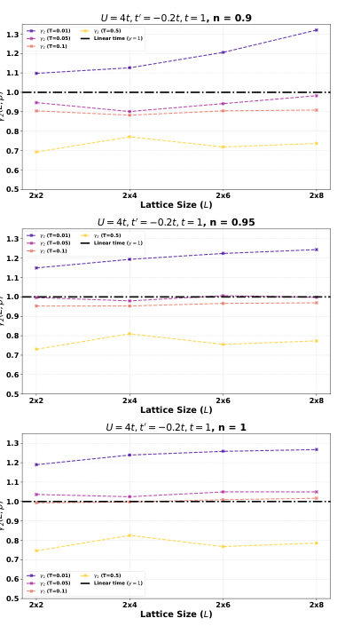 
FIG. 3: Simulation results evaluating the figure of merit γ2(L, β) for the conventional grand-canonical approach (Algorithm 3) in the weak-coupling regime (U = 4). The figure of merit γ2 is plotted as a function of system size (L) across different temperatures (T ∈{0.01, 0.05, 0.1, 0.5}). Results are obtained for electron densities n = 0.875, 0.9, 0.925, 0.95, 0.975, and 1.0, respectively.

📷 Fig 3

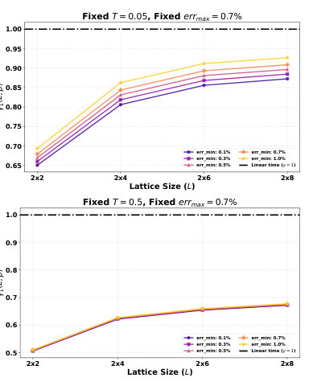 
FIG. 4: Simulation results illustrating the impact of the ground state energy relative error (ϵmin) on the figure of merit γ1(L, β) for the proposed grand-canonical scheme in the intermediate-coupling regime (U = 8). The figure of merit γ1 is plotted as a function of system size (L) for varying relative errors ϵmin ∈{0.001, 0.003, 0.005, 0.007, 0.01}. Results are obtained for different temperatures T = 0.01, 0.05, 0.1, 0.5.

📷 Fig 4

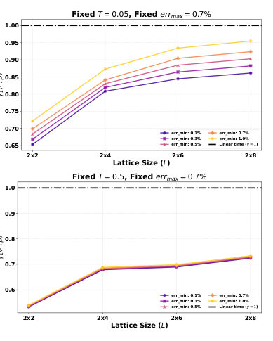 
FIG. 5: Simulation results illustrating the impact of the ground state energy relative error (ϵmin) on the figure of merit γ1(L, β) for the proposed grand-canonical scheme in the weak-coupling regime (U = 4). The figure of merit γ1 is plotted as a function of system size (L) for varying relative errors ϵmin ∈{0.001, 0.003, 0.005, 0.007, 0.01}. Results are obtained for different temperatures T = 0.01, 0.05, 0.1, 0.5.

📷 Fig 5

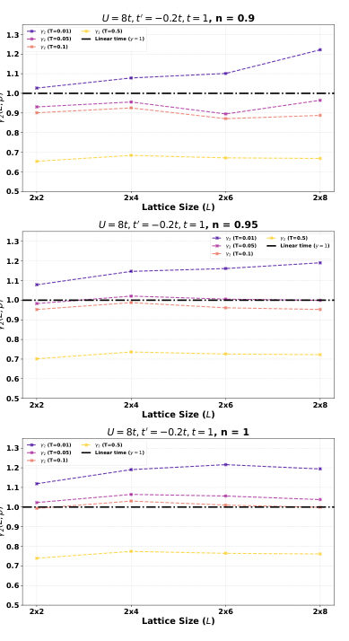 
FIG. 6: Simulation results evaluating the figure of merit γ2(L, β) for the conventional grand-canonical approach (Algorithm 3) in the intermediate-coupling regime (U = 8). The figure of merit γ2 is plotted as a function of system size (L) across different temperatures (T ∈{0.01, 0.05, 0.1, 0.5}). Results are obtained for electron densities n = 0.875, 0.9, 0.925, 0.95, 0.975, and 1.0, respectively.

**Summary.** This paper presents a novel quantum algorithm using Quantum Signal Processing to estimate thermal properties for quantum systems, specifically focusing on particle-number-conserving Hamiltonians. It introduces a powerful grand-canonical reconstruction technique that reuses quantum measurement data when varying the chemical potential. The work proves that this quantum approach can achieve better scaling than classical methods for calculating key thermodynamic observables.

**Why it may be interesting.** It provides a quantum computational pathway to calculate fundamental thermodynamic quantities (like partition functions) that are central to condensed matter physics, offering potential speedups over established classical numerical techniques.

Detailed structure

**Main problem.** Developing an efficient, end-to-end quantum framework to estimate canonical and grand-canonical thermal properties for particle-number-conserving quantum systems.

**Main result.** The proposed quantum algorithms achieve lower asymptotic time complexity than classical Lanczos methods in system-size-independent temperature regimes, and the grand-canonical reconstruction avoids re-running quantum circuits when varying the chemical potential.

**Method.** The framework uses Quantum Signal Processing (QSP) combined with particle-number-preserving Trotterized quantum simulations to estimate thermal expectation values and partition functions.

**Model / system.** The study applies to second-quantized Hamiltonians, exemplified by the two-dimensional Hubbard model, which describes interacting lattice electronic systems.

**Key observables.** Canonical partition functions ($Z_{L,s}(eta)$), canonical expectation values ($\langle O 
angle_{eta,s}$), and grand-canonical observables ($\langle O 
angle_{	ext{GC}}^{eta, \mu}$).

**Important parameters / regimes.** Inverse temperature ($eta$), chemical potential ($\mu$), and coupling strengths (e.g., $U=8t$ for the Hubbard model).

**Assumptions / limitations.** The analysis relies on constructing Trotter circuits that preserve particle number and uses classical reweighting techniques for grand-canonical reconstruction.

**Figures summary.** Figure 6 shows simulation results evaluating a figure of merit ($\gamma_2$) for the conventional grand-canonical approach across varying system sizes, temperatures, and electron densities for the Hubbard model.

**Paper structure.** The paper introduces the canonical estimation scheme using QSP, followed by the grand-canonical reconstruction scheme using classical reweighting. Theoretical proofs establish complexity bounds compared to classical methods, and the results are numerically validated on the 2D Hubbard model.

Abstract

We develop an end-to-end framework for estimating canonical thermal properties of particle-number-conserving second-quantized Hamiltonians using quantum simulations. The framework integrates initial state preparation with mixed Dicke states, particle-number-preserving Trotterized simulation, and generalized quantum signal processing to estimate canonical partition functions and observables. Building on this canonical scheme, we introduce a grand-canonical reconstruction scheme in which the same quantum measurement data can be reused for arbitrary chemical potentials through classical reweighting, thereby avoiding repeated quantum circuit executions as the chemical potential is varied. We prove the existence of system-size-independent temperature regimes in which both the canonical and reconstructed grand-canonical schemes have lower asymptotic time complexity than classical Lanczos methods, up to polynomial factors, for physically relevant Hamiltonians. We numerically validate our theoretical results for the two-dimensional Hubbard model in both weak- and intermediate-coupling regimes.

[↑ back to top](#top)

### [Predicting activation-barrier and plasticity-onset statistics in a model of glasses](http://arxiv.org/abs/2610.09619v1)

**Authors:** Makoto Suda, Edan Lerner, Eran Bouchbinder  
**Type:** theory · **Category:** disordered systems and neural networks · **PDF:** <https://arxiv.org/pdf/2610.09619v1>  
**Analysis basis:** full PDF text, analyzed in chunks
**Topic relevance:** `non-equilibrium universality` **3/5** · `driven-dissipative phase transition` **2/5** · `Frenkel-Kontorova` **1/5** · `Keldysh / 2PI / non-Gaussian methods` **1/5**

📷 Fig 1

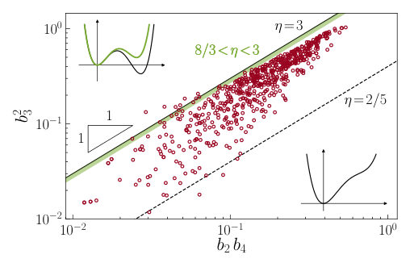 
FIG. 1. The expansion coefficients b2 3 vs b2b4, evaluated along distinct cubic modes in a single quenched-disorder realization at N =8192 and J =0.5. The solid and dashed lines are η =3 and η =2/5, respectively, and the green shading is 8/3&lt;η &lt;3, where η = b2 3/b2b4. Energy profiles in three sub-regions are illustrated as follows: a single minimum for η &lt;8/3 (bottom- right), a higher-energy second minimum for 8/3&lt;η &lt;3 (top- left, green), and a lower-energy second minimum for η &gt; 3 (top-left, black). See text for discussion and Appendix B for details.

📷 Fig 2

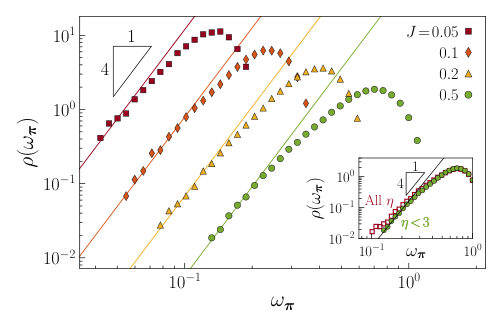 
FIG. 2. The distributions ρ(ωπ) of cubic-mode frequency ωπ = p

📷 Fig 3

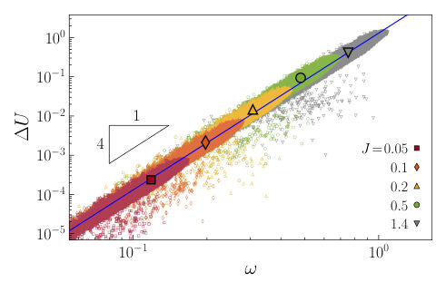 
FIG. 4. The activation barrier ∆U vs the corresponding cubic mode frequency ω for N = 8192 and various J values (see legend). For each J, the large black-outlined marker indicates the mean frequency and mean barrier height. The solid line is the power law ∆U ∼ω4 predicted in Eq. (9). See text for discussion, and Appendix D for details.

📷 Fig 4

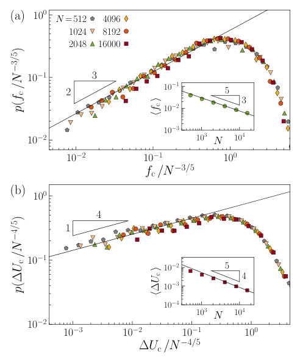 
FIG. 3. (a) The collapsed distribution p(fc/N −3/5) of the distance to first instability for J =0.5 and various N (see leg- end). (inset) The mean distance ⟨fc⟩vs N. (b) The collapsed distribution p(∆Uc/N −4/5) of the activation barrier for the same J and N. (inset) The mean barrier height ⟨∆Uc⟩vs N. The solid lines are the power laws predicted in Eqs. (7) and (8); the triangles indicate their exponents. See text for discussion, and Appendices D and E for details.

**Summary.** This paper develops a theoretical framework using nonlinear modes to analyze the energy landscape of a mean-field model for glasses. It derives universal scaling laws for the statistics of activation barriers and plasticity-onset forces. The results provide quantitative predictions for glassy dynamics that are expected to hold for real amorphous solids.

**Why it may be interesting.** The work provides concrete, analytically derived scaling laws for non-equilibrium phenomena (plasticity, activated dynamics) in disordered systems, which are highly relevant to understanding energy dissipation and structural failure in complex materials.

Detailed structure

**Main problem.** The paper aims to predict the statistical distributions of activation barriers ($\Delta U$) and the critical external force ($f_c$) required to induce plasticity in a model of amorphous solids (glasses).

**Main result.** The authors derive asymptotic scaling laws, predicting $p(\Delta U_c) \sim (\Delta U_c)^{1/4}$ and $p(f_c) \sim f_c^{2/3}$, and confirm these predictions using specialized sampling algorithms.

**Method.** The analysis employs a nonlinear modes framework applied to an anharmonic mean-field Hamiltonian, focusing on 'cubic modes' to characterize the energy landscape's soft directions.

**Model / system.** The system is modeled by an anharmonic mean-field Hamiltonian for continuous degrees of freedom, incorporating random quadratic stiffnesses and disordered Gaussian couplings, characteristic of glassy materials.

**Key observables.** Activation barriers ($\Delta U$), plasticity onset force ($f_c$), and the frequency distribution ($
ho(\omega_\pi)$) of the softest vibrational modes.

**Important parameters / regimes.** The shape parameter $\eta = b_2^3/(b_2 b_4)$ is crucial, with physical relevance restricted to $\eta < 3$. System size $N$ dictates the scaling of mean values ($\langle\Delta U
angle \sim N^{-4/5}$).

**Assumptions / limitations.** The predictions are assumed to apply universally to both the mean-field model and realistic, finite-dimensional glasses.

**Figures summary.** Figure 1 illustrates the parameter space of cubic modes ($\eta$ vs. $b_2^3 - b_2 b_4$). Figure 2 confirms the universal quartic tail ($
ho(\omega_\pi) \sim \omega_\pi^4$) in the frequency spectrum. Figure 3 shows numerical confirmation of plastic instability detection.

**Paper structure.** The paper first introduces the anharmonic mean-field model and the nonlinear modes framework. It then analyzes the relevant parameter regimes ($\eta < 3$) and derives the asymptotic scaling laws for $\Delta U$ and $f_c$. Finally, it develops and uses efficient algorithms to sample the potential energy landscape to quantitatively confirm these theoretical predictions.

Abstract

A recently introduced anharmonic mean-field model unifiedly reproduced a broad range of low-temperature glass phenomena --- including harmonic nonphononic spectral properties, linear micromechanics and strongly driven elasto-plastic dynamics --- indicating that its underlying energy landscape is intrinsically glassy. Here, we apply a nonlinear modes framework to the model and derive analytic predictions for the asymptotic distributions of activation barriers $p(Δ{U})\!\sim\!(Δ{U})^{1/4}$ and the external force needed for the onset of plasticity $p(f_{\rm c})\sim f_{\rm c}^{2/3}$, for their extreme-value scaling and for $\langleΔ{U}\rangle$ beyond the asymptotic regime. These predictions are expected to equally apply to the mean-field model and to finite-dimensional glasses. We develop efficient algorithms for sampling minima and saddles of the model's glassy potential energy landscape, and quantitatively confirm the theoretical predictions. This progress is enabled by identifying a subset of collective degrees of freedom that are physically relevant for activated glassy dynamics, which like the theoretical predictions should apply to realistic glasses.

[↑ back to top](#top)

### [Unified treatment of local dynamical interactions in correlated metals using Eliashberg theory](http://arxiv.org/abs/2610.09656v1)

**Authors:** Jan Berges, Samuel Poncé, Mario Caserta, Nicola Marzari, Tommaso Chiarotti  
**Type:** theory · **Category:** strongly correlated electrons · **PDF:** <https://arxiv.org/pdf/2610.09656v1>  
**Analysis basis:** full PDF text, analyzed in chunks
**Topic relevance:** `Keldysh / 2PI / non-Gaussian methods` **3/5** · `correlated / nonlocal dissipation` **2/5** · `methods for driven-dissipative` **2/5**

📷 Fig 1

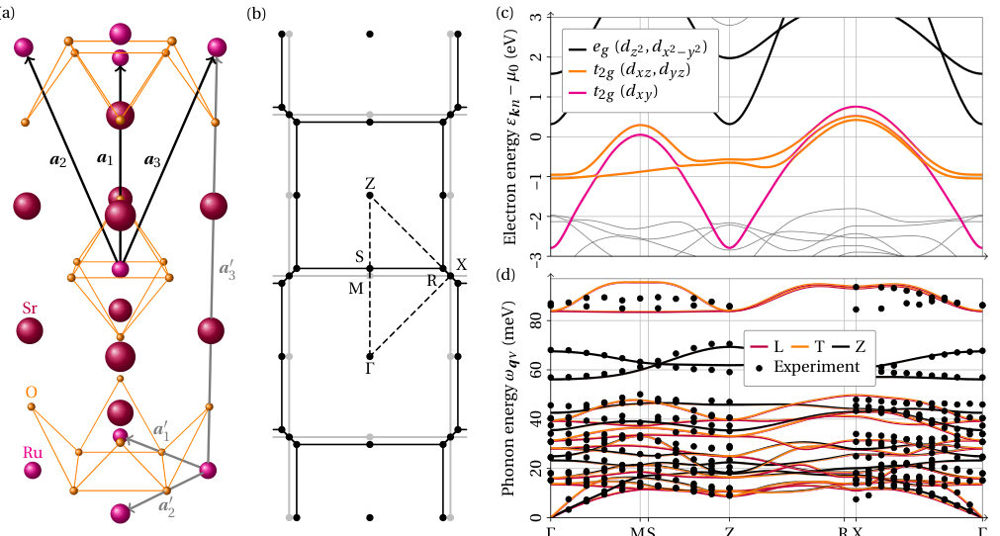 
Figure 1. (a) Crystal structure and (b) reciprocal space of Sr2RuO4. The primitive translation vectors, Brillouin-zone boundaries, and special k points of the simple (body-centered) tetragonal lattice are shown in gray (black). Note that the labels for the M and X points are often swapped in the case of the simple tetragonal lattice (see Fig. 4 of Ref. 55). (c) Electron and (d) phonon dispersion from DFT and DFPT along the path drawn with dashed lines in (b). The low-energy bands dominated by the d orbitals of the Ru atoms are shown as thick lines; the t2g bands have been Wannier interpolated. Orbital characters and longitudinal (L), transverse (T), and out-of-plane (Z) phonon displacements...

📷 Fig 2

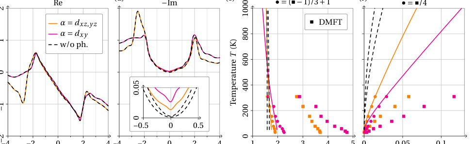 
Figure 2. Spectral functions of (a) the effective interaction and (b) the bare and screened Green functions of the Ru-t2g manifold of Sr2RuO4 at T = 300 K. (c, d) Energy dependence of retarded electron self-energy at T = 300 K with and without the phonon-mediated part of the interaction. The inset is a close-up of the low-energy behavior of the imaginary part. (e, f) Temperature dependence of the renormalization factor and broadening at the Fermi level. The DMFT results, excluding phonon-mediated interaction, are from Hunter et al. [76].

📷 Fig 3

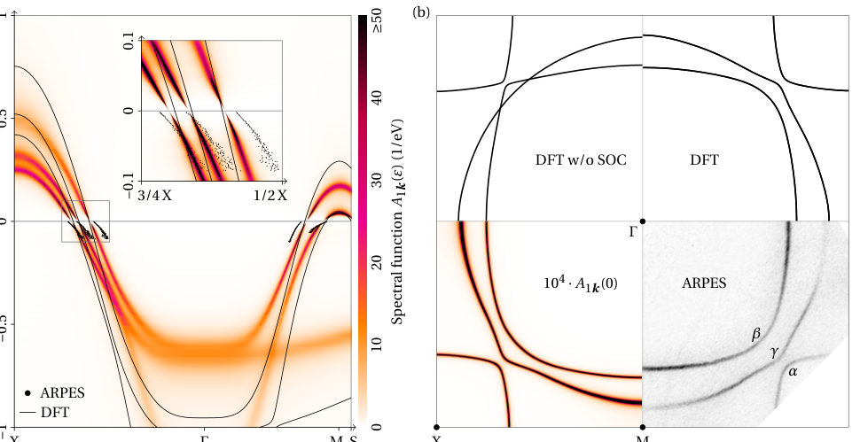 
Figure 3. Renormalized electronic structure of Sr2RuO4 at T = 5 K compared to results from DFT and ARPES [37]. (a) Spectral function. (b) Fermi surface for kz = 0. The β and γ sheets only cross in the absence of SOC.

📷 Fig 4

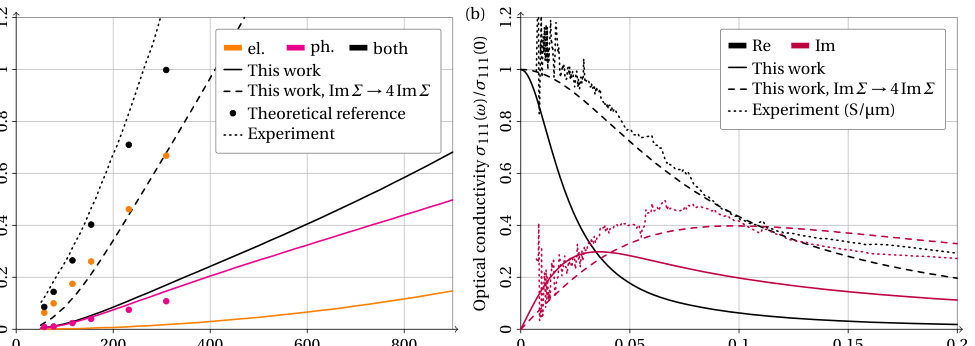 
Figure 4. Transport properties of Sr2RuO4. (a) In-plane resistivity from the direct, phonon-mediated, and effective electron–electron scattering as a function of temperature. Theoretical reference data is from Abramovitch et al. [26], experimental data from Tyler et al. [81]. (b) Normalized in-plane optical conductivity from the effective interaction at T = 290 K. Experimental data is from Stricker et al. [82].

📷 Fig 5

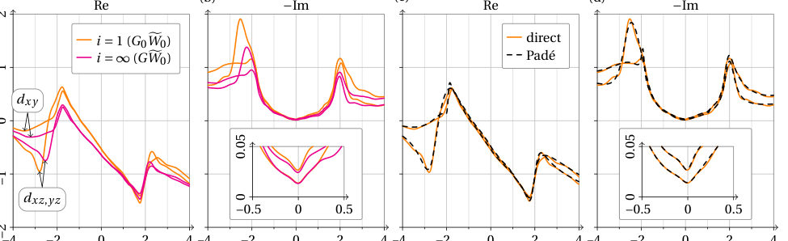 
Figure 5. Different ways of calculating the retarded electron self-energy of Sr2RuO4 at T = 300 K. (a, b) Comparison of one-shot local G0f W0 and self-consistent local G f W0 calculations on the real axis, enforcing ReΣiα(0) = ReΣiβ(0) for all orbitals α,β. (c, d) Comparison of G0f W0 calculations directly on the real axis using Eqs. (10) and (11) and on the imaginary axis using Eq. (16) with subsequent analytic continuation via Padé approximants.

**Summary.** This work develops a unified theoretical framework to consistently treat both direct Coulomb and phonon-mediated interactions in correlated metals. By unifying the GW and Fan-Migdal self-energies, the authors derive and solve extended Eliashberg equations for the quasiparticle spectrum. The method is applied to $	ext{Sr}_2	ext{RuO}_4$, demonstrating its utility while also pointing toward necessary vertex corrections for quantitative accuracy.

**Why it may be interesting.** While focused on solid-state correlations, the rigorous treatment of coupled electronic and vibrational dynamics using advanced Green's function techniques provides a powerful, generalizable framework for open quantum systems where environment coupling (phonons) is crucial.

Detailed structure

**Main problem.** To provide a unified theoretical framework for treating both direct electron-electron and phonon-mediated dynamical interactions in correlated metals.

**Main result.** The method successfully calculates the temperature-dependent quasiparticle spectrum for $	ext{Sr}_2	ext{RuO}_4$, showing qualitative agreement with experiments, though vertex corrections are suggested for accurate resistivity.

**Method.** The approach unifies GW and Fan-Migdal self-energies into a single effective interaction, leading to normal-state Eliashberg equations solved via a local approximation.

**Model / system.** The study focuses on correlated metals, using $	ext{Sr}_2	ext{RuO}_4$ as a benchmark system. The theory treats coupled electrons and phonons dynamically.

**Key observables.** Temperature-dependent quasiparticle spectrum, electrical resistivity (via Green-Kubo formalism), and spectral function $A(\epsilon)$.

**Important parameters / regimes.** Low-energy window, temperature ($T$), and the coupling strengths between electronic and vibrational excitations.

**Assumptions / limitations.** The calculation is performed in a local approximation, and the need for vertex corrections is highlighted as a key limitation.

**Figures summary.** Figure 1 illustrates the crystal structure, reciprocal space, and electron/phonon dispersion relations for $	ext{Sr}_2	ext{RuO}_4$.

**Paper structure.** The paper develops the unified self-energy formalism, derives the resulting Eliashberg equations, solves these dynamical equations for the quasiparticle spectrum, and applies the framework to calculate transport properties for $	ext{Sr}_2	ext{RuO}_4$.

Abstract

First-principles studies of materials with strong electronic correlations introduce additional theoretical complexities and computational costs, even more so if lattice degrees of freedom also play a role. To address these challenges, we show how direct and phonon-mediated electron-electron interactions can be treated consistently. The key observation is that the GW and Fan-Migdal self-energies are topologically the same diagram, so that they can be unified using a single effective interaction, which is the sum of the two interactions. The Dyson equation for the electron Green function then yields normal-state Eliashberg equations, which can be viewed as a subset of the Hedin-Baym equations for coupled electrons and phonons [Phys. Rev. X 13, 031026 (2023)]. We solve these dynamical equations in a local approximation to calculate from first principles the temperature-dependent quasiparticle spectrum, with close attention to the low-energy window determining transport. We apply this extended dynamical Hubbard approach to the correlated metal Sr$_2$RuO$_4$, which has long served as a benchmark system for advanced electronic-structure methods. The resulting renormalization of quasiparticle bands is in qualitative agreement with experiments and results from dynamical mean-field theory. However, here the low-energy linewidth and associated resistivity within the Green-Kubo formalism in the bubble approximation are underestimated, suggesting the need for vertex corrections. This work highlights how simple dynamical formulations can provide an extensible framework for studying correlated materials, which treats electronic and vibrational excitations on equal footing.

[↑ back to top](#top)

### [Binary Optimization of Measurement Groupings for Quantum Energy Estimation](http://arxiv.org/abs/2610.10339v1)

**Authors:** Isaac L. Huidobro-Meezs, Rodrigo A. Vargas-Hernández  
**Type:** theory · **Category:** quantum information and computing · **PDF:** <https://arxiv.org/pdf/2610.10339v1>  
**Analysis basis:** full PDF text, analyzed in chunks
**Topic relevance:** `analog quantum simulation` **3/5** · `quantum measurements` **3/5**

📷 Fig 1

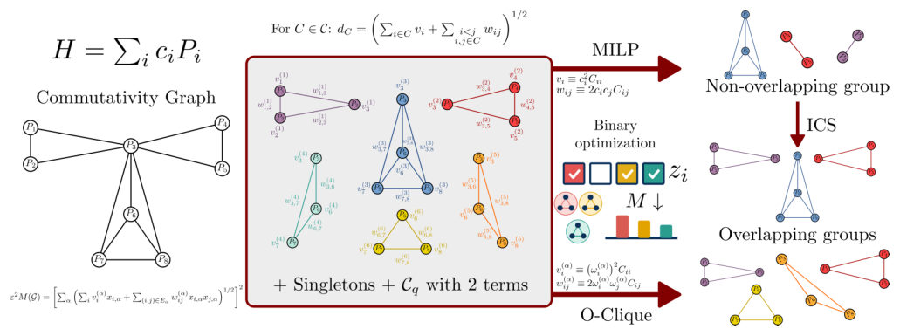 
FIG. 1. Pipeline for the main algorithms proposed here. Given a Hamiltonian and its commutativity graph, we produce a set of candidate cliques C including singletons. For each clique, we calculate its contribution to the measurement cost dC using an approximate covariance dictionary. The MILP variant uses the node and edge weight definitions from Eq. 12 and produces a non-overlapping grouping. This non-overlapping result can be employed with ICS to produce an overlapping grouping. The O-Clique variant replaces the node and edge weights with their overlapping definition in Eq. 18 and employs a heuristic to initialize the weights assigned to each group, producing an overlapping measurement...

📷 Fig 2

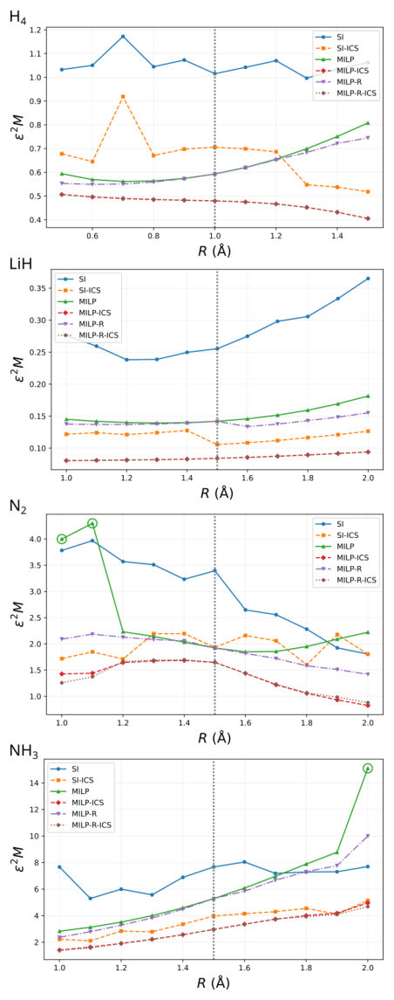 
FIG. 2. Reuse of MILP-optimized groupings at different ge- ometries. We optimize the MILP grouping at a specific geom- etry (dashed vertical line) and use that grouping as the mea- surement scheme for other geometries. Approximate CISD co- variance dictionaries used during optimization; results reeval- uated for the exact ground state. Geometries with unseen Pauli operators are encircled; for those operators, we use VarSI-OR [31] to assign groups. MILP-R corresponds to the refined variant described in the text.

📷 Fig 3

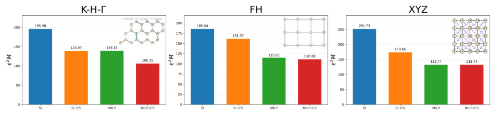 
FIG. 3. Measurement cost for different lattice Hamiltonians. Comparison of the ε2M values for the measurement groupings found with SI, SI-ICS, MILP, and MILP-ICS. SI-ICS and MILP-ICS use the non-overlapping SI and MILP groups as initial- ization. We consider a Kitaev honeycomb with anisotropies, a Fermi-Hubbard model, and an XYZ model. Details on the Hamiltonians are available in Appendix E.

📷 Fig 4

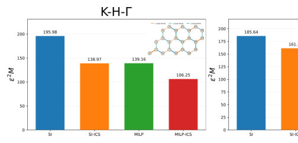 
Fig. 3 shows the ε2M counts for the K–H–Γ, FH, and XYZ models considered for the SI, SI-ICS, MILP, and MILP-ICS methods. In all cases, the MILP and MILP-ICS solutions substantially outperform their corresponding SI and SI-ICS baselines. In particular, the MILP solution can even beat SI-ICS for the FH and XYZ models; for XYZ, the resulting grouping is particularly simple: grouping all X-terms in one group, all Y-terms in another, and all Z-terms in the last. We find improvement ratios for MILP-ICS against SI of R =1.84, 1.67, 1.90 for the K–H–Γ, FH, and XYZ models, respectively. The nominal measurement gains to reach 1mEh accuracy for MILP-ICS versus SI-ICS are 32.72, 50.49, and 41.22 ×106...

📷 Fig 5

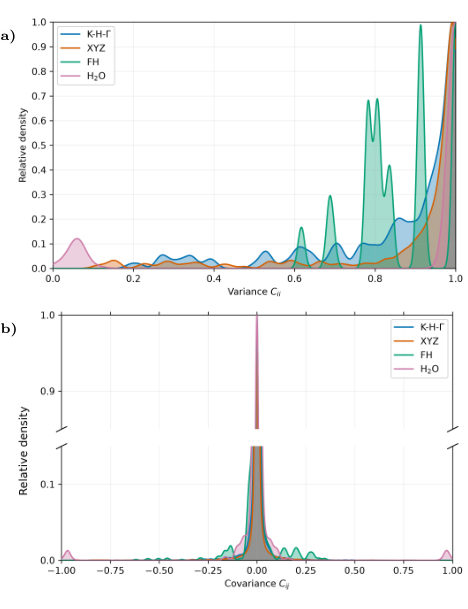 
FIG. 4. Distributions of the variances and covariances for the K–H–Γ, FH, and XYZ model lattice Hamiltonians and H2O molecule qubit Hamiltonians. Each density is independently scaled to a maximum of unity. Smoothed distributions were obtained using kernel density estimation with a Gaussian ker- nel and a smoothing factor of 0.8 for the covariances and of 0.2 for the variances.

**Summary.** This paper tackles the resource bottleneck in quantum energy estimation by optimizing how Pauli observables are grouped for measurement. It formulates this as a binary optimization problem, using MILP for non-overlapping groups and introducing an 'O-clique' method for overlapping supports. The results demonstrate significant, transferable reductions in required measurement repetitions across various quantum Hamiltonians.

**Why it may be interesting.** This work directly addresses resource optimization in variational quantum algorithms, providing concrete, mathematically rigorous methods (MILP) to reduce the required sampling overhead for estimating ground state energies in quantum chemistry and condensed matter simulations.

Detailed structure

**Main problem.** The core problem is minimizing the required number of repeated measurements for accurate quantum energy estimation, as this resource requirement can dominate computational costs.

**Main result.** Variance-informed optimization techniques, particularly using Mixed-Integer Linear Programming (MILP) for non-overlapping groups, substantially reduce the measurement requirement compared to standard methods.

**Method.** The authors formulate the measurement grouping problem as a classical binary optimization problem, utilizing MILP for non-overlapping sets and introducing 'O-clique' for optimizing overlapping supports.

**Model / system.** The methods are benchmarked on molecular and lattice Hamiltonians, including Fermi-Hubbard, Kitaev-Heisenberg-$\Gamma$, and XYZ lattice Hamiltonians, which are represented by Pauli observables.

**Key observables.** The primary metric is $\epsilon_{2M}(G)$, the required measurement repetitions, derived from minimizing the variance $S(G)$ associated with the Pauli observables.

**Important parameters / regimes.** The optimization depends on node features ($v_i$, variance) and edge features ($w_{ij}$, covariance) derived from the Pauli terms.

**Assumptions / limitations.** The MILP formulation is used to linearize the selection process, and the comparison separates gains from measurement-support selection versus coefficient refinement.

**Figures summary.** Figure 1 illustrates the pipeline, detailing the MILP approach for non-overlapping grouping and the O-Clique method for overlapping grouping, showing how weights are adjusted.

**Paper structure.** The paper develops the theoretical framework by defining the measurement cost function, proposing MILP for non-overlapping groups, extending to O-clique for overlapping groups, and finally benchmarking these optimized groupings across various lattice and molecular Hamiltonians.

Abstract

Repeated measurements can dominate the resources required for quantum energy estimation, making the choice of which Pauli observables to measure together a central optimization problem for variational quantum algorithms. We formulate fully commuting measurement grouping as a classical binary optimization problem based on clique selection and construct non-overlapping groups using mixed-integer linear programming (MILP). For a benchmark of molecular Hamiltonians, groupings optimized with approximate covariances reduce the non-overlapping measurement requirement $\varepsilon^2M$ by $51.8\%$ on average relative to sorted insertion (SI). Using the MILP groups to initialize iterative coefficient splitting (ICS), denoted MILP-ICS, yields an average $24.3\%$ reduction relative to ICS initialized from SI (SI-ICS). The optimized groups also transfer across nearby molecular geometries while preserving substantial measurement savings. We further introduce O-clique, which directly optimizes overlapping commuting supports through candidate-clique selection and coefficient profiles. Although O-clique provides only modest additional reductions beyond MILP-ICS, it reduces the measurement requirement by $27.3\%$ on average relative to SI-ICS with 100 iterations, despite using only five final coefficient refinement iterations, indicating improved support quality. Finally, we extend the comparison to Fermi--Hubbard, Kitaev--Heisenberg--$Γ$, and XYZ lattice Hamiltonians, where MILP-based groupings substantially outperform the corresponding SI-based strategies. Together, these results show that variance-informed optimization of measurement-group structure can substantially reduce sampling costs across molecular and lattice Hamiltonians, with optimized non-overlapping groups providing strong, transferable initializations and direct overlapping optimization offering further gains.

[↑ back to top](#top)

### [From continuum neural quantum states to effective lattice models: Fluctuating Wigner molecules in moiré superlattices](http://arxiv.org/abs/2610.08955v1)

**Authors:** Ahmed Khalifa, Shubhayu Chatterjee  
**Type:** theory · **Category:** strongly correlated electrons · **PDF:** <https://arxiv.org/pdf/2610.08955v1>  
**Analysis basis:** full PDF text, analyzed in chunks
**Topic relevance:** `analog quantum simulation` **3/5** · `methods for driven-dissipative` **3/5**

📷 Fig 1

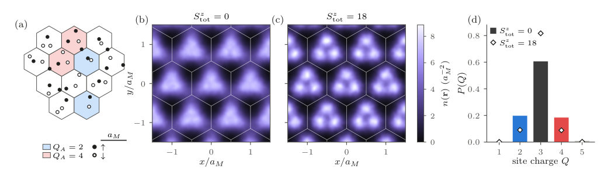 
FIG. 1. Coarse-graining the neural-network wavefunction onto moir´e sites (reference point). (a) A configuration of the 36 electrons sampled from |Ψ|2 at Sz tot = 0, shown in the twelve Wigner–Seitz cells of the periodic cell; filled (open) circles denote spin-up (spin-down) electrons. Assigning each electron to its cell defines the site charges QA: shaded cells hold two (blue) or four (red) electrons, while the others hold three. The configuration is drawn at random from those with the typical number of doublons and holes, with a doublon next to each hole. (b),(c) The one-body density at Sz tot = 0 and in the fully polarized state, Sz tot = 18, on a common color scale; lines mark the...

📷 Fig 2

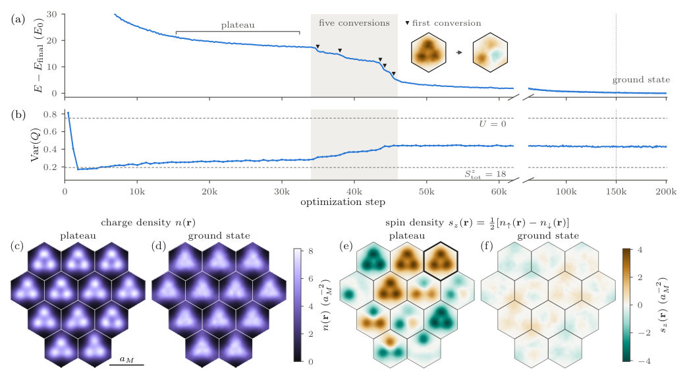 
FIG. 2. Optimization of the Sz tot = 0 state at the reference point, read through the coarse-grained wavefunction at 332 checkpoints. (a) The variational energy relative to its final value (running average over 201 steps); triangles mark the conversions of the five quartets, and the bracket marks the plateau checkpoints averaged in (c) and (e). Inset: the spin density in the cell of the molecule that converts first, outlined in (e), over the four checkpoints before (steps 3.18–3.37 × 104) and after (3.49–3.68 × 104) its conversion, on the color scale of (e),(f): a quartet, ⟨Sz A⟩= 1.36, becomes a doublet, ⟨Sz A⟩= 0.45. (b) The site-charge variance, together with the non-interacting value...

📷 Fig 3

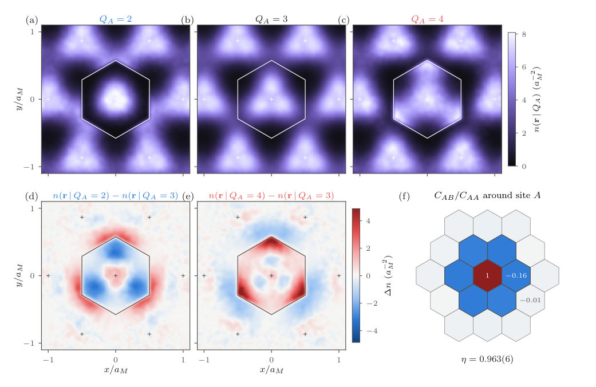 
FIG. 3. The three kinds of Wigner molecule and the arrangement of the doublons and holes. (a)–(c) Density conditioned on the charge QA of the central site (Sz tot = 0, reference point), averaged over the twelve sites, which are equivalent by translation; the maps computed at each site separately are statistically identical. The hexagon marks the Wigner–Seitz cell of the central site, and crosses mark the potential minima. (d) The hole, n(r | QA = 2) −n(r | QA = 3): charge leaves the corners of the triangle (blue) and appears just outside the cell (red), on the neighbors. (e) The doublon, n(r | QA = 4) −n(r | QA = 3): the added charge sits at the corners of the triangle, while the neighbors...

📷 Fig 4

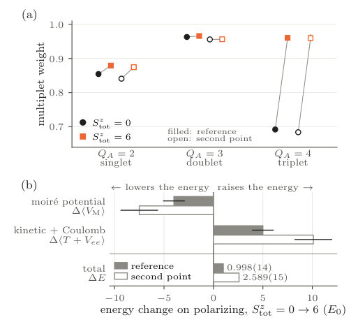 
FIG. 5. Polarizing the emergent moments, Sz tot = 0 to Sz tot = 6. (a) Weight of the dominant multiplet of each kind of molecule at Sz tot = 0 (circles) and Sz tot = 6 (squares). On polarizing, the singlet weight of the hole and the doublet weight of the three-electron molecule change by at most 0.04, whereas the triplet weight of the doublon rises from 0.69 to 0.96. For the doublon at Sz tot = 6, S2 A alone does not fix the triplet weight, because four electrons can also form a quin- tet (S = 2). The quintet weight is small but not measured in this sector, and varying it between zero and its Sz tot = 0 value gives a range of triplet weights (Appendix C); the square marks the middle of this...

📷 Fig 5

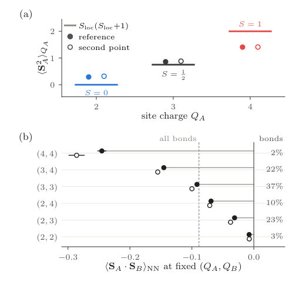 
FIG. 4. Local moments and NN spin correlations set by the site charge (Sz tot = 0). (a) The local spin at fixed site charge (points), compared to Sloc(Sloc + 1) from Eq. (7) (horizontal lines). (b) The NN spin correlation resolved by the charges at the two ends of the bond. The column on the right gives the fraction of NN bonds in each class, and the dashed line indicates the average over all bonds. Filled (open) symbols denote the reference (second) point.

**Summary.** This work pioneers a method using Neural Quantum States to solve the electronic structure of moiré superlattices, revealing that the true ground state is highly fluctuating and low-spin, contrary to mean-field predictions. By developing a wavefunction readout, the authors successfully bridge the gap between the complex continuum solution and a manageable effective model, specifically a two-orbital Hubbard model.

**Why it may be interesting.** The methodology provides a powerful, general framework for deriving effective lattice Hamiltonians directly from complex, continuum quantum wavefunctions, which is highly relevant for understanding strongly correlated systems where simple band theory fails.

Detailed structure

**Main problem.** The paper addresses the challenge of developing accurate effective low-energy descriptions for quantum materials when competing energy scales break down the standard energy hierarchy.

**Main result.** The continuum Neural Quantum State (NQS) approach successfully reveals that the ground state of moiré superlattices is a low-spin state characterized by significant charge fluctuations, which necessitates an effective description via a spinful two-orbital Hubbard model.

**Method.** The authors use Continuum Neural Quantum States (NQS) to solve the microscopic many-body problem directly, followed by a novel wavefunction readout technique to map the continuum state onto site-resolved charge and spin statistics.

**Model / system.** The study focuses on moiré superlattices formed by semiconducting transition metal dichalcogenides (TMDs) at a specific electron filling ($
u=3$). The system is governed by a continuum Hamiltonian incorporating kinetic, lattice potential, and interaction terms.

**Key observables.** Site charges ($Q_A$), site spins ($\langle S_{z_A} 
angle$), charge fluctuation variance ($	ext{Var}(Q)$), and spin correlation functions ($\langle S_A \cdot S_B 
angle$).

**Important parameters / regimes.** Electron filling $
u=3$, moiré potential strength, and the comparison between mean-field ferromagnetic states and the true low-spin ground state.

**Assumptions / limitations.** The primary assumption is that the effective low-energy physics can be extracted by analyzing the local statistics (charge/spin) derived from the highly accurate continuum NQS solution.

**Figures summary.** Figures illustrate the coarse-graining process of the NQS wavefunction onto moiré sites, comparing charge and spin distributions between different total spin sectors (e.g., $S_{z_{tot}}=0$ vs. $S_{z_{tot}}=N_e/2$).

**Paper structure.** The paper first establishes the problem of scale separation breakdown, introduces the NQS method with a readout, applies it to moiré TMDs, and systematically analyzes the resulting charge and spin correlations to derive the effective Hubbard model.

Abstract

Effective descriptions of quantum materials rely on a separation of energy scales that identifies their low-energy degrees of freedom. When kinetic energy, lattice potential, and interactions compete, this hierarchy breaks down, and both the microscopic state and its effective description are unknown. Continuum neural quantum states (NQS) can find the ground state directly without projecting onto prescribed bands, orbitals, or spins, but their microscopic wavefunctions are difficult to interpret in terms of effective variables. Here, we introduce a wavefunction readout that maps the continuum NQS onto site-resolved charge and spin statistics, allowing effective degrees of freedom to emerge from the microscopic solution. Focusing on moiré transition metal dichalcogenides at filling $ν= 3$, the NQS reveals a low-spin ground state below the ferromagnetic crystal of spin-polarized Wigner molecules. Although the charge density retains triangular molecular motifs, our readout reveals significant charge fluctuations through bound nearest-neighbor doublon--hole pairs. Each molecular charge state has an inert spin-singlet core and rim electrons that carry the spin. Charge and spin fluctuations are therefore intertwined, with antiferromagnetic spin-correlations between sites, motivating an effective description by a spinful two-orbital Hubbard model. More generally, our results demonstrate a route from continuum wavefunctions to effective lattice models when competing scales preclude a controlled reduction.

[↑ back to top](#top)

### [Design-Time Conformance Checking for Pulse-Level Quantum Control](http://arxiv.org/abs/2610.10427v1)

**Authors:** Rylan Malarchick  
**Type:** experiment · **Category:** quantum information and computing · **PDF:** <https://arxiv.org/pdf/2610.10427v1>  
**Analysis basis:** full PDF text, analyzed in chunks
**Topic relevance:** `QC/QI experiment` **3/5** · `quantum measurements` **2/5**

📷 Fig 1

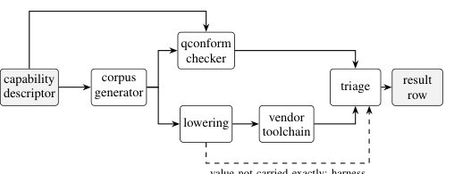 
Fig. 1. The differential loop. The generator derives programs from the descriptor, the checker and the vendor toolchain each answer, and triage dispositions every row. A value the lowering cannot carry exactly is attributed to the harness, not counted as agreement or disagreement.

**Summary.** This paper introduces qconform, a formal checker designed to verify if a quantum pulse control program is physically realizable on a quantum device. It achieves this by comparing the program against a versioned capability descriptor, using exact arithmetic to avoid floating-point errors. The evaluation demonstrates that the checker successfully catches discrepancies between different versions of vendor toolchains.

**Why it may be interesting.** This work provides a rigorous, formal verification layer for quantum control sequences, which is crucial for moving quantum algorithms from simulation to reliable hardware implementation.

Detailed structure

**Main problem.** The core problem is ensuring that a pulse-level quantum control program is physically realizable on a target quantum device, as vendor documentation often fails to capture all operational constraints.

**Main result.** The proposed checker, qconform, successfully accepted no program that the vendor toolchains refused during extensive differential testing, identifying discrepancies between toolchain versions.

**Method.** The authors developed qconform, a design-time, offline checker that verifies a pulse program against a versioned capability descriptor using exact rational arithmetic.

**Model / system.** The work focuses on pulse-level quantum control for superconducting qubits, using vendor toolchains like QICK and Qblox to define the operational constraints of the physical hardware.

**Key observables.** The checker reports a verdict, the specific rules applied, and a coverage manifest detailing what was not checked.

**Important parameters / regimes.** Device constraints include minimum pulse length, timing grid, frequency band, and amplitude resolution, all defined using exact rational numbers.

**Assumptions / limitations.** The checker does not decide the converse (it might reject a program the toolchain accepts), nor does it cover run-time behavior or data-dependent control flow.

**Figures summary.** The notes mention a differential loop diagram illustrating the flow from program generation to vendor toolchain testing, and tables summarizing differential results and defects found.

**Paper structure.** The paper introduces the problem of hardware constraint verification, details the qconform checker and its descriptor format, presents the methodology using differential testing against QICK and Qblox, and concludes with evaluation results and identified limitations.

Abstract

A pulse-level quantum control program is written against a device whose limits are recorded, if at all, in vendor documentation and source code. A program that exceeds them can be refused at compile time. It can also be accepted and silently altered, or compile and then fail at the board. In the last two cases the experiment runs, and the data does not correspond to the program that was written. We present qconform, a checker that decides whether a pulse program is realizable on a device, given a versioned capability descriptor for that device. Every constraint in a descriptor cites the toolchain observation that established it. The checker is design-time, offline, and deterministic, and it uses no floating point. It reports a verdict, the rules it applied, and a coverage manifest that names what it did not check. We evaluate qconform by differential testing against the QICK and Qblox toolchains, on three QICK board configurations and one Qblox cluster. Over 1263 program runs of 969 distinct programs, the checker accepted no program that a toolchain refuses. On both vendors, a descriptor pinned to one toolchain release accepts programs that older releases refuse. The evaluation also found ten defects in the checker and its descriptors, all fixed.

[↑ back to top](#top)

### [Vertex crossings in a symmetric Markov multinomial model](http://arxiv.org/abs/2610.09258v1)

**Authors:** Arjun Pemmasani  
**Type:** theory · **Category:** statistical mechanics · **PDF:** <https://arxiv.org/pdf/2610.09258v1>  
**Analysis basis:** full PDF text, analyzed in chunks
**Topic relevance:** `non-equilibrium universality` **3/5** · `Keldysh / 2PI / non-Gaussian methods` **2/5**

📷 Fig 1

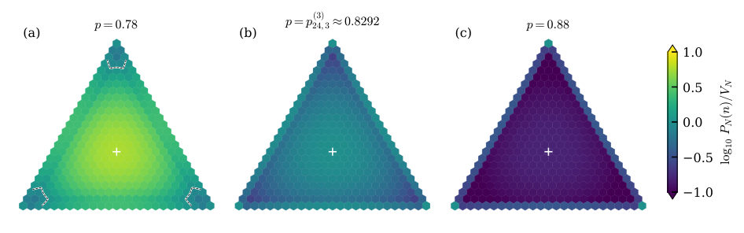 
Figure 1: The ratio PN(n)/VN for d = 3 and N = 24, one hexagon per bin, on a log10 scale. (a) At p = 0.78 only the 21 bins inside the dashed curves near the vertices are below the vertex height. (b) At the full-center crossing p(3) 24,3 = 0.82921 . . . the center (8, 8, 8) (cross) ties with the vertices and every other bin is below them. (c) At p = 0.88 every nonvertex bin is below the vertex height.

📷 Fig 2

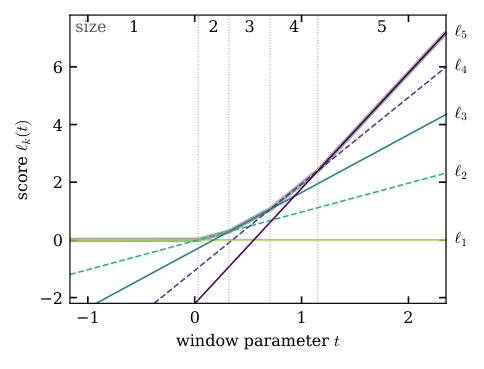 
Figure 2: The lines (11) for d = 5 and hi = −(i −1)2. The gray band is their upper envelope. The dotted lines are t1 &lt; · · · &lt; t4, and the number at the top of each interval is the size k of the winning support {1, . . . , k}.

**Summary.** This theoretical paper analyzes the probability distribution of counts in a Markov multinomial model, simulating a ball on a generalized Galton board. It determines the precise conditions under which the most probable outcome shifts from being concentrated at the corners (vertices) of the simplex to the center. The work uses advanced asymptotic analysis to show this transition occurs predictably as the system size increases.

**Why it may be interesting.** The mathematical machinery used—analyzing phase transitions in high-dimensional probability distributions—is highly relevant to understanding critical phenomena and equilibrium states in complex many-body systems.

Detailed structure

**Main problem.** The paper investigates the crossover point in a symmetric Markov multinomial model where the most likely outcome (bin) shifts from being near the vertices (corners) of the simplex to the center.

**Main result.** For large systems, the most likely bin transitions from the vertices directly to the center as the expected number of turns grows to a fixed multiple of the logarithm of the steps.

**Method.** The analysis employs advanced asymptotic techniques, including second-order analysis, generating functions, and saddle-point approximations to compare the probability of interior points against those at the vertices.

**Model / system.** The model is a ball bouncing down a generalized Galton board, modeled as a Markov chain. The observable is the count vector $\mathbf{n}$ of directions used over $N$ steps, which resides on a $d$-dimensional simplex.

**Key observables.** The probability distribution of the count vector $\mathbf{n}$, the ratio of the probability of an interior bin to the probability of a vertex ($P_{\mu}^N(n)/V_N$), and the crossing point $p_{N,k}$.

**Important parameters / regimes.** The number of steps $N$, the dimension $d$, the expected number of turns $T$, and the logarithmic scale $L = \log N$.

**Assumptions / limitations.** The results are asymptotic, valid for large $N$, and the analysis often relies on specific scaling regimes for the parameters (e.g., $T$ growing proportionally to $L$).

**Figures summary.** Figure 1 illustrates the crossover behavior on a triangle ($d=3$) at $N=24$, showing the ratio $P_N(n)/V_N$ crossing a threshold.

**Paper structure.** The paper builds from first-order analysis (suggesting simultaneous crossing) to a second-order analysis to break ties, establishing explicit asymptotic formulas for the crossing time $T_{N,k}$ and proving the general transition from vertices to the center.

Abstract

We observe a ball bouncing down a Galton board with any number of directions. At each peg it either keeps its direction with some fixed probability or randomly turns to one of the other directions. Its bin measures how often it went each way, a point of a simplex. When the ball rarely turns, the most likely bins are the corners, which only a ball that never turns can reach. We ask when the best bin of each face of the simplex becomes as likely as a corner. To first order every face catches up at the same moment. We break this tie at second order, with an explicit constant for each face. Hence on a long board, as the expected number of turns grows to any fixed multiple of the length's logarithm, the most likely bin jumps once, from the corners straight to the center. A nonuniform start or a weak external field changes the constants, potentially allowing an intermediate face to win.

[↑ back to top](#top)

### [Exact solutions for kinematics across interaction-deformed Fermi surfaces](http://arxiv.org/abs/2610.08921v1)

**Authors:** Alexander Kruchkov, F. Duncan M. Haldane  
**Type:** theory · **Category:** strongly correlated electrons · **PDF:** <https://arxiv.org/pdf/2610.08921v1>  
**Analysis basis:** full PDF text, analyzed in chunks
**Topic relevance:** `Keldysh / 2PI / non-Gaussian methods` **3/5** · `methods for driven-dissipative` **1/5**

📷 Fig 1

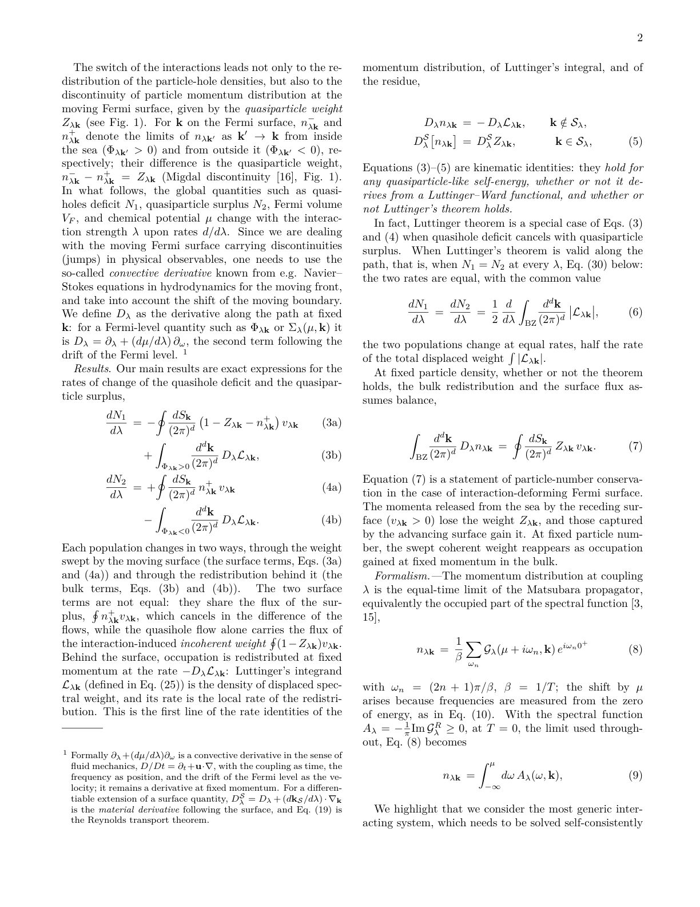 
Low-resolution page preview, page 2

📷 Fig 2

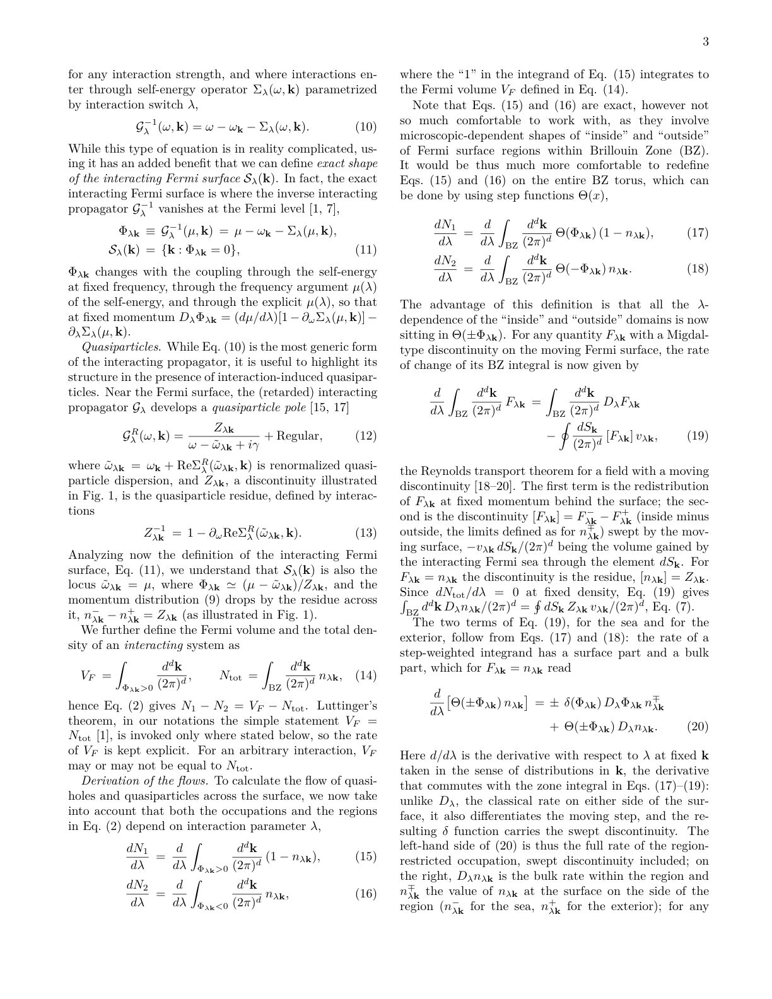 
Low-resolution page preview, page 3

📷 Fig 3

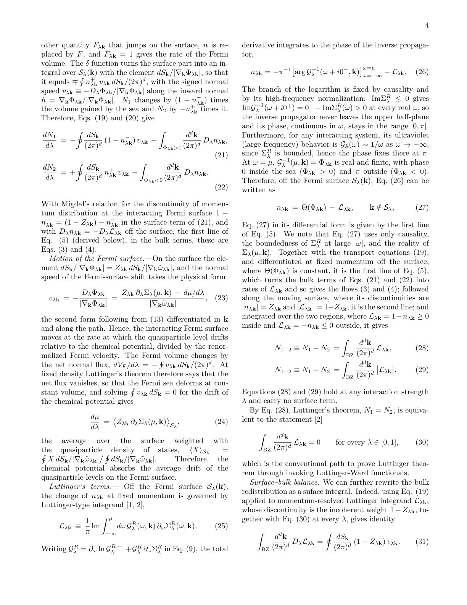 
Low-resolution page preview, page 4

📷 Fig 4

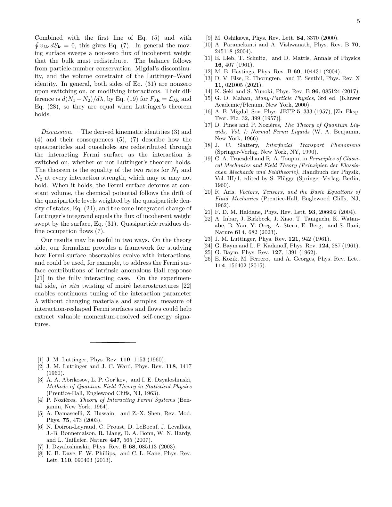 
Low-resolution page preview, page 5

📷 Fig 5

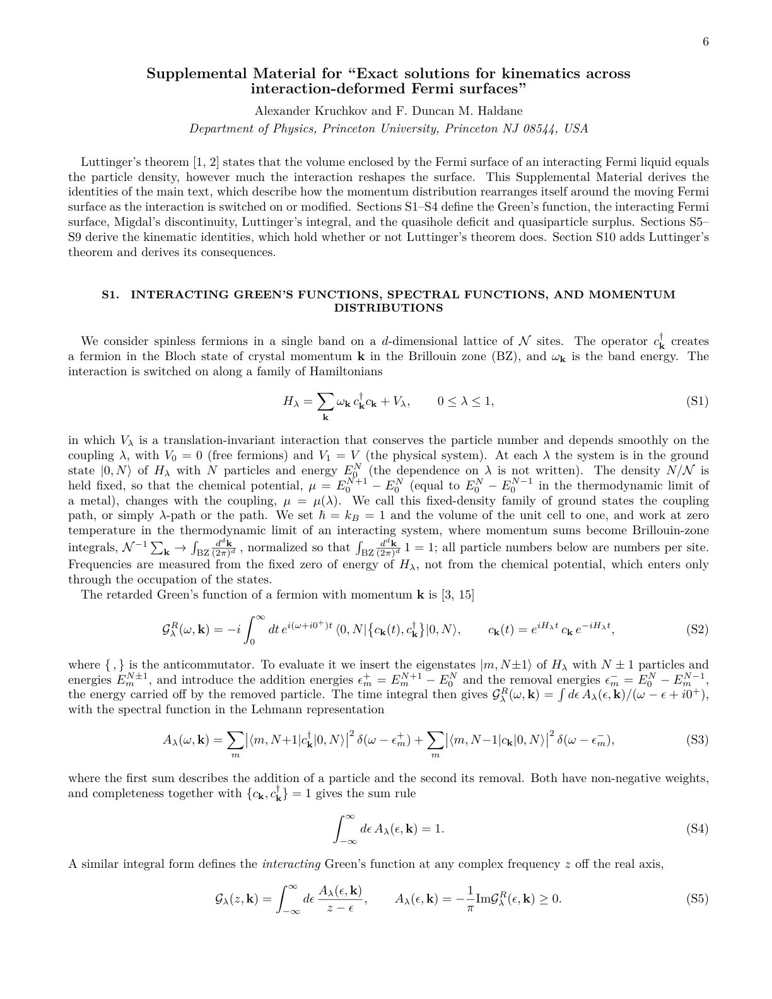 
Low-resolution page preview, page 6

**Summary.** This theoretical work derives exact rate equations governing the redistribution of quasiparticle weight across an interaction-deformed Fermi surface. By tracking the change in particle deficit and surplus populations as interactions are turned on, the authors establish fundamental kinematic identities. These results provide a robust, general framework for studying spectral function evolution in strongly correlated electron systems.

**Why it may be interesting.** The rigorous derivation of these kinematic identities provides a powerful, general framework for understanding how spectral weight and particle distribution evolve in strongly correlated systems, independent of specific approximations like the Luttinger theorem itself.

Detailed structure

**Main problem.** The paper derives exact kinematic identities describing how the occupation deficit inside and surplus outside the Fermi surface change when interactions are switched on at fixed particle density.

**Main result.** It establishes rate equations for these populations, showing that when Luttinger's theorem holds, the rates of change for the deficit and surplus are equal, balancing surface flux with bulk redistribution.

**Method.** The analysis uses a continuum of interaction parameters ($\lambda$) and applies transport theorems (like the Reynolds theorem) to derive continuity equations for the occupation numbers and the Luttinger integrand.

**Model / system.** The system is spinless fermions on a lattice in $d$ dimensions at zero temperature, modeled by tracking the evolution of the interacting Green's function and self-energy as an interaction parameter $\lambda$ is varied.

**Key observables.** Quasiparticle weight ($Z_{\lambda k}$), occupation deficit ($N_1$), quasiparticle surplus ($N_2$), and the Luttinger integrand ($L_{\lambda k}$).

**Important parameters / regimes.** Interaction switch parameter ($\lambda$), Fermi momentum ($k_F$), and chemical potential ($\mu$).

**Assumptions / limitations.** The derivations rely on the existence of a quasiparticle pole and the application of transport theorems across moving discontinuities; some results require assumptions related to functional invariance.

**Figures summary.** Figure 1 illustrates the momentum distribution $n_{\lambda k}$ along a line through the Fermi sea, comparing free and interacting fermion cases.

**Paper structure.** The paper develops the formalism by defining the populations ($N_1, N_2$), deriving the rate equations using transport theorems, establishing conservation laws, and finally relating these rates to the Luttinger integrand to confirm the kinematic identities.

Abstract

Luttinger's theorem fixes the volume of the Fermi sea of a Fermi liquid, but not how interactions redistribute occupation around its surface. For an interaction switched on and tuned at fixed density, we derive the exact rates of change of the occupation deficit inside the interacting Fermi surface and of the surplus outside it. Each is the weight swept by the deforming surface plus a change of Luttinger's integrand at fixed momentum; the difference of the surface terms is flux of incoherent weight $1 - Z_{\vec k}$. These identities hold with or without the Luttinger theorem.

[↑ back to top](#top)

### [Measurement-Efficient Differentiable Quantum Architecture Search for Combinatorial Optimization](http://arxiv.org/abs/2610.10351v1)

**Authors:** Lukas Theißinger, Thore Gerlach, Christian Bauckhage  
**Type:** experiment · **Category:** quantum information and computing · **PDF:** <https://arxiv.org/pdf/2610.10351v1>  
**Analysis basis:** full PDF text, analyzed in chunks
**Topic relevance:** `quantum measurements` **3/5** · `QC/QI experiment` **1/5**

📷 Fig 1

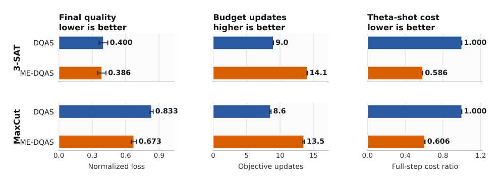 
Fig. 1. Main experimental result for 100 matched 3-SAT instances and 100 matched MaxCut instances. Each row compares baseline DQAS with ME-DQAS under the same global shot budget. Bars show means with 95% confidence intervals. The three panels measure final solution quality, how many DQAS updates fit into the budget and the requested full θ-gradient shot cost relative to baseline parameter shift.

📷 Fig 2

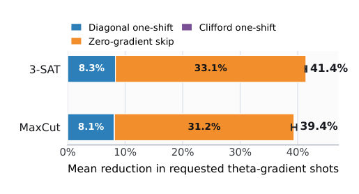 
Fig. 2. Source of the requested full θ-shot reduction in fig. 1. The dominant contribution comes from gradients that are certified to be exactly zero; the diagonal one-shift rule gives the next largest contribution. The Clifford-suffix branch is negligible for this gate set.

**Summary.** This paper introduces a Measurement-Efficient Differentiable Quantum Architecture Search (ME-DQAS) framework for optimizing quantum circuits used in combinatorial problems. By exploiting the structural properties of the cost Hamiltonian and circuit, the authors derive a method that significantly reduces the number of required quantum measurements for gradient estimation. This lowers the practical overhead, making DQAS more feasible for current quantum hardware.

**Why it may be interesting.** This work directly addresses the practical hardware limitations of quantum machine learning algorithms by providing a concrete, theoretically derived method to reduce the required quantum measurement budget for gradient estimation.

Detailed structure

**Main problem.** The primary challenge addressed is the high measurement cost associated with Differentiable Quantum Architecture Search (DQAS) when applying variational quantum algorithms to combinatorial optimization.

**Main result.** The authors propose a measurement-efficient scheme that reduces the required gradient measurement cost by 39% to 41% compared to standard two-shift estimates on benchmark problems like 3-SAT and MaxCut.

**Method.** They derive and implement a measurement-saving gradient estimator that exploits the diagonal structure of the cost Hamiltonian and the structure of the quantum circuit suffix to replace standard two-shift rules with one-shift or zero-measurement estimates.

**Model / system.** The work uses parameterized quantum circuits $U(	heta)$ to estimate an objective function $F(	heta) = \langle 0|U(	heta)^\dagger H_f U(	heta)|0
angle$, where $H_f$ is a diagonal cost Hamiltonian derived from combinatorial problems like 3-SAT or MaxCut.

**Key observables.** Normalized loss (objective function value), number of DQAS updates, and the requested $	heta$-gradient shot cost.

**Important parameters / regimes.** The reduction factor (39%-41%), the gate parameterization type (rotational), and the structure of the Hamiltonian (diagonal in the computational basis).

**Assumptions / limitations.** The method assumes the cost Hamiltonian $H_f$ is diagonal in the computational basis and that the circuit suffix possesses structural properties (e.g., Clifford or commuting) that allow for the gradient simplification.

**Figures summary.** Figure 1 compares DQAS vs. ME-DQAS across final quality, objective updates, and $	heta$-gradient shot cost ratio for 3-SAT and MaxCut, showing ME-DQAS superiority. Figure 2 quantifies the source of cost reduction via zero-gradient and one-shift rules.

**Paper structure.** The paper first establishes the bottleneck in DQAS gradient estimation. It then theoretically derives the measurement-saving gradient estimator based on structural properties. Finally, it validates the approach experimentally on 3-SAT and MaxCut, comparing performance metrics against the standard DQAS baseline.

Abstract

Differentiable quantum architecture search (DQAS) is a promising framework for the automated design of quantum circuits, particularly for variational quantum optimization algorithms. However, its practical deployment on quantum hardware is limited by the large number of circuit measurements required during optimization, making hardware execution costly. In this work, we show that for a broad class of combinatorial optimization problems and commonly used rotational gate parameterizations, the measurement cost of DQAS can be significantly reduced without changing the optimization objective. We derive the proposed measurement reduction scheme theoretically and validate it experimentally on 3-SAT and MaxCut benchmark problems. Our approach reduces the requested gradient measurement cost by about 39 to 41% while introducing only negligible classical post-processing overhead, lowering the practical cost of executing DQAS on quantum hardware.

[↑ back to top](#top)

### [Quantum-vortex excitons beyond band topology](http://arxiv.org/abs/2610.10175v1)

**Authors:** Jin-Hyung Choi, Sang-Hoon Han, Young-Kwon Han, Jun-Won Rhim, Sun-Woo Kim, Joshua J. P. Thompson  
**Type:** theory · **Category:** strongly correlated electrons · **PDF:** <https://arxiv.org/pdf/2610.10175v1>  
**Analysis basis:** full PDF text, analyzed in chunks
**Topic relevance:** `analog quantum simulation` **3/5** · `interference shaping light` **1/5**

📷 Fig 1

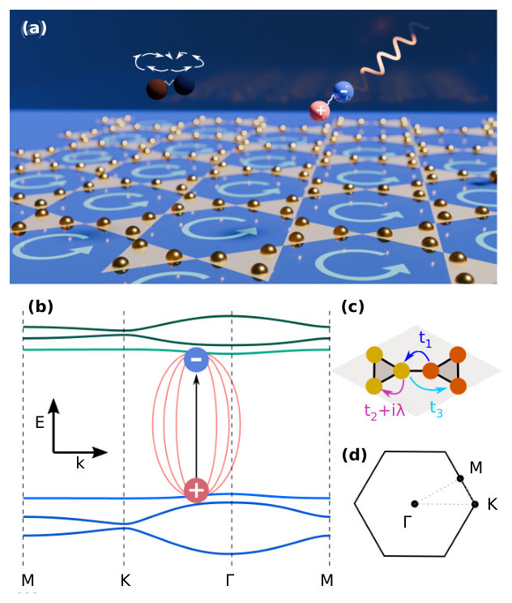 
Figure 1: Quantum-vortex excitons in flat Chern bands: a Yin–Yang kagome realization. (a) Schematic illustration of bright and dark excitons above the lattice (gold). The light red and blue pair represents a bright exciton coupled to light (orange wave), and the dark red and blue pair represents a dark exciton. The arrows illustrate the vortex phase structure. Optical activity depends on the relative phase structure of the exciton wavefunction and the interband optical matrix element. (b) Schematic electronic band structure along a high-symmetry path, with the electron and hole in the nearly flat conduction and valence bands. (c) Tight-binding model and the hopping and spin–orbit couplings...

📷 Fig 2

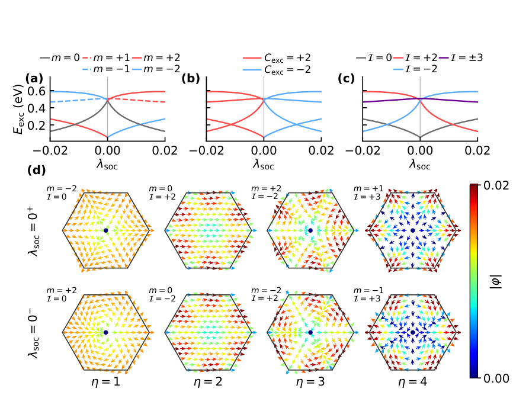 
Figure 2: Exciton spectrum and relative winding sectors. (a)–(c) The same energy spectrum E(η) versus spin–orbit coupling λsoc, labelled by (a) coefficient winding m, (b) the common band background Cexc = Cc −Cv, and (c) the relative index I = [m −Cexc]6. Here Cexc = +2 at negative SOC and −2 at positive SOC. The SOC axes are in eV. Displayed winding labels are reduced modulo six, whereas table I gives the integer windings. (d) The first four wavefunctions, in increasing energy order, at λsoc = +10−5 eV (top) and −10−5 eV (bottom). Arrow direction and colour encode arg φ(η)

📷 Fig 3

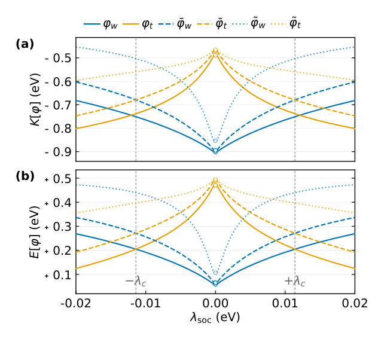 
Figure 3: Phase-preserving amplitude controls. (a) Interaction energy K[φ] and (b) total energy E[φ] versus SOC. Blue (w) denotes the Chern-locked sector (I = 0), whereas orange (t) denotes the zero-winding sector (I = +2 at positive SOC and −2 at negative SOC). Solid curves show native eigenstates φ. Dashed ( ¯φ) and dotted ( ˜φ) curves show normalized trials with constant amplitudes and amplitudes taken from the selected state in the other sector, respectively, while retaining the native phases. Trial energies are expectation values, not additional eigenvalues. Gray vertical lines mark the native crossings at ±λc. Open circles at zero SOC average the nearest nonzero- SOC samples.

📷 Fig 4

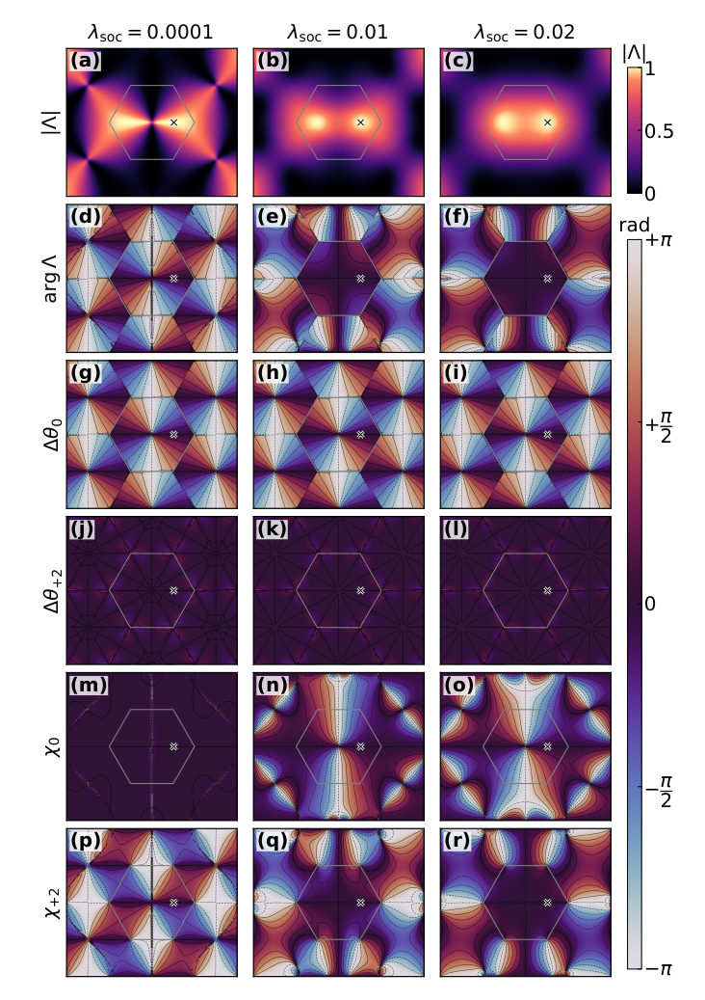 
Figure 4: Phase matching at fixed band topology. Columns show λsoc = +0.0001, +0.01 and +0.02 eV, with Cexc = −2 throughout. The target momentum k′ varies at fixed source a0k = (1.0771, 0) (cross). Grey hexagons mark the FBZ. Panels (a)–(c) show the form-factor mag- nitude |Λ|. Panels (d)–(f) show the form-factor phase Arg Λ. Panels (g)–(i) and (j)–(l) show the relative coefficient phases ∆θ0 and ∆θ+2, respectively. Panels (m)–(o) and (p)–(r) show the com- bined interaction phases χ0 and χ+2, respectively. The selected state in the I = 0 sector is Chern locked, whereas I = +2 has zero coefficient winding at positive SOC. Separate phases depend on the Bloch frame, whereas their combination in...

📷 Fig 5

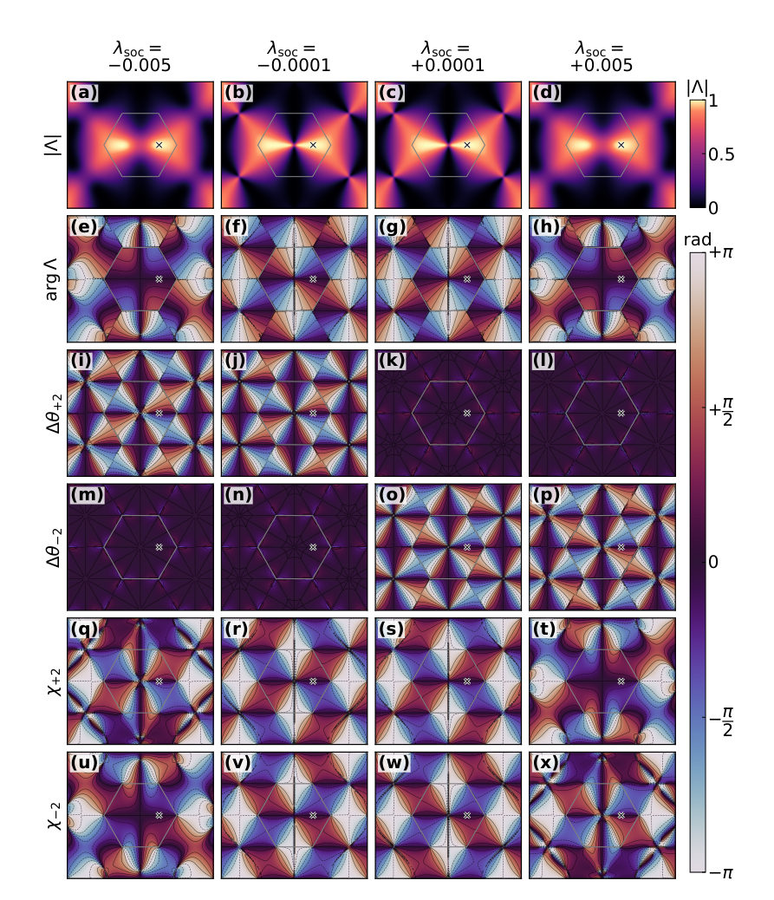 
Figure 5: Relative interaction phases across SOC reversal. Columns show λsoc = −0.005, −0.0001, +0.0001 and +0.005 eV. The fixed source is a0k = (1.0771, 0) (cross), and grey hexagons mark the FBZ. (a)–(d) show the form-factor magnitude |Λ|. (e)–(h) show the form-factor phase Arg Λ. (i)–(l) and (m)–(p) show the relative coefficient phases ∆θ+2 and ∆θ−2, respectively. (q)–(t) and (u)–(x) show the combined interaction phases χ+2 and χ−2, respectively. The latter retain similar patterns within the same relative sector across small SOC reversal: compare panels (r) and (s) for +2, and (v) and (w) for −2. Subscripts denote the relative classes of section II on the nonzero- SOC sides. Phase and...

**Summary.** This theoretical study investigates exciton binding in flat Chern bands using a kagome lattice model. It demonstrates that the Coulomb interaction's phase matching stabilizes quantum-vortex excitons, causing a topological transition as spin-orbit coupling increases. This reordering is predicted to manifest as a distinct change in the material's optical absorption spectrum.

**Why it may be interesting.** The work provides a microscopic link between exciton topology, Coulomb binding energy, and optical response, showing that phase effects beyond simple band Chern numbers dictate the ground state, which is highly relevant for designing novel quantum emitters.

Detailed structure

**Main problem.** The paper aims to explain how Coulomb phase matching stabilizes a quantum-vortex exciton as the lowest bound state in flat Chern bands, extending understanding beyond the underlying electronic band Chern numbers.

**Main result.** Increasing spin-orbit coupling drives a transition of the lowest exciton from a quantum-vortex state to a zero-winding state, which is observable as a transition from a dark vortex exciton to a bright zero-winding exciton in the optical spectrum.

**Method.** The analysis uses a projected electron-hole formulation, calculating total energy by minimizing the sum of kinetic and Coulomb interaction energies, while isolating the phase contribution to the binding energy.

**Model / system.** The study uses a prototypical Yin–Yang kagome lattice to model excitons (bound electron-hole pairs) in a setting exhibiting flat Chern bands and spin-orbit coupling.

**Key observables.** Exciton topology (classified by winding number relative to Chern-number difference), total energy $E(\eta)$, and circularly polarized optical absorption spectra $\epsilon_{\sigma}(E_\gamma)$.

**Important parameters / regimes.** Spin-orbit coupling ($\lambda_{soc}$), the lattice structure (Yin–Yang kagome), and the exciton wavefunction phase winding.

**Assumptions / limitations.** The analysis assumes the Bloch-overlap geometry is relevant for binding, and later sections test the failure of local approximations to capture the full nonlocal momentum-pair contributions to the energy ordering.

**Figures summary.** Figures illustrate the kagome lattice realization, the exciton energy spectrum $E(\eta)$ vs. $\lambda_{soc}$ showing winding sectors, and comparisons between native eigenstates and amplitude-controlled trials showing phase vortex structures.

**Paper structure.** The paper progresses by first establishing the physical model and the role of Coulomb phase matching in stabilizing vortex excitons. It then uses topological indices to track competing states and demonstrates the reordering via energy minimization. Finally, it connects this reordering to measurable optical selection rules.

Abstract

Optically exciting a typical low-dimensional semiconductor produces a nodeless \(s\)-type exciton as its lowest-energy bound state. Here, we explain how Coulomb phase matching stabilises a quantum-vortex exciton as the lowest bound state in flat Chern bands. Using a prototypical Yin--Yang kagome lattice, we demonstrate that increasing the spin--orbit coupling drives a transition of the lowest exciton from a quantum-vortex state to a zero-winding state, while leaving the band Chern numbers unchanged. We trace this behaviour to a gauge-invariant combination of exciton phase differences and Bloch-overlap phases that can reduce the Coulomb energy. By comparing states with identical wavefunction amplitudes, we isolate this phase contribution and show that it is sufficient to drive the reversal in exciton ordering. We classify exciton topology by the momentum-space wavefunction winding relative to the conduction--valence Chern-number difference,connecting the competing states to circular-polarisation selection rules. We then show that the resulting reordering can be tracked directly in the optical absorption spectrum, through the transition from a dark vortex exciton to a bright zero-winding exciton. These findings establish a microscopic link between exciton topology, Coulomb binding, and optical response that extends beyond the information contained in the underlying electronic band Chern numbers.

[↑ back to top](#top)

### [Causal confusion in quantum systems: distinguishing direct cause and common cause](http://arxiv.org/abs/2610.10004v1)

**Authors:** Krisztina Tolotti, Riley Blank-Matthews, Arthur J. Parzygnat  
**Type:** theory · **Category:** quantum information and computing · **PDF:** <https://arxiv.org/pdf/2610.10004v1>  
**Analysis basis:** full PDF text, analyzed in chunks
**Topic relevance:** `quantum measurements` **3/5**

📷 Fig 1

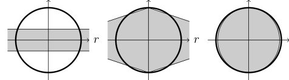 
FIG. 4. 2d cross sections of the regions inside the Bloch ball from all 2 × 2 principal minors of E ⋆ρ with nonegative de- terminant, where E is the partially depolarizing channel (the actual shape in the 3d Bloch ball is obtained by rotating the region about the z-axis). In all figures, λ = 0.68. (a) The

📷 Fig 2

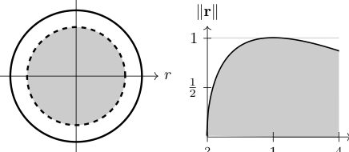 
FIG. 6. (a) A 2d cross section of the region inside the Bloch ball for which the partially depolarizing channel admits causal confusion (the actual shape in the 3d Bloch ball is obtained by rotating the region about the z-axis). This is a ball of

📷 Fig 3

 
Figure 6 shows the region Bλ for λ = 3

📷 Fig 4

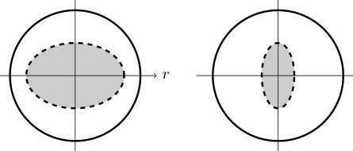 
FIG. 7. A 2d cross section visualization of how the mixed Pauli channel (III.46) acts on the Bloch sphere for p = 1

📷 Fig 5

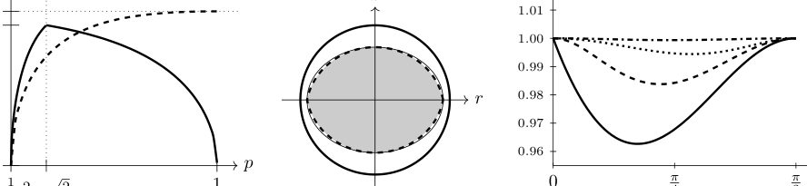 
FIG. 8. (a) A plot of rmin (solid) from (III.49) and zmin (dashed) from (III.50), both expressed as functions of p ∈[ 1

**Summary.** This paper tackles the problem of quantum causality by defining 'causal confusion'—when measurement data cannot distinguish between a shared common cause and a sequential direct cause. The authors prove that this confusion occurs if and only if the underlying quantum channel possesses the PPT property, providing a new operational meaning for PPT channels.

**Why it may be interesting.** This work provides a rigorous operational definition for PPT channels by linking them to a fundamental concept in quantum causality, which is crucial for understanding the limits of quantum information processing and measurement theory.

Detailed structure

**Main problem.** The paper investigates 'causal confusion,' which is the situation where joint expectation values measured in a spatial (common-cause) quantum scenario coincide with those from a temporal (direct-cause) quantum scenario.

**Main result.** It establishes that for general systems, a quantum channel exhibits causal confusion for some input state if and only if it is a Positive-Partial-Transpose (PPT) channel, and for qubits, this condition is equivalent to the channel being entanglement-breaking.

**Method.** The authors compare joint expectation values calculated under two distinct causal models—a shared bipartite state (spatial) versus sequential measurement through a quantum channel (temporal)—using Pauli observables.

**Model / system.** The study uses general finite-dimensional quantum systems and focuses on local measurements performed by two parties (Alice and Bob) on quantum states, analyzing the structure of quantum channels connecting these measurements.

**Key observables.** Joint expectation values of Pauli observables ($\sigma_j \otimes \sigma_k$), which are used to distinguish between the spatial and temporal correlation structures.

**Important parameters / regimes.** The analysis depends on the properties of the quantum channel $E$ (e.g., PPT, entanglement-breaking) and the choice of input state $
ho$.

**Assumptions / limitations.** The analysis is restricted to 'light-touch observables' and uses the Lüders' update rule for the temporal scenario in qubit examples.

**Figures summary.** The notes mention a Table I summarizing key results relating bipartite states, PPT/CPTP processes, and EB channels to causal confusion, and a $4 	imes 4$ table structure for qubits comparing spatial and temporal expectation values.

**Paper structure.** The paper progresses by defining the spatial and temporal measurement scenarios, demonstrating the conditions for causal confusion using qubit examples, and culminating in general structural theorems linking confusion to PPT and entanglement-breaking properties.

Abstract

The joint expectation values of quantum observables measured by two parties typically depend on the causal structure of the measurement protocol. The two causal structures we investigate here are the direct-cause scenario, in which a single quantum state is measured twice in series with a general quantum channel between measurements, and the common-cause scenario, in which a shared bipartite quantum state is measured in parallel. Through a variety of examples of qubit channels with tunable parameters, we identify the full set of input states where the direct-cause joint expectation values of Pauli observables coincide with those obtained from a common cause, a situation that we call causal confusion. More generally, for arbitrary finite-dimensional quantum systems and light-touch observables, we prove that a channel exhibits causal confusion for some input state if and only if it is a positive-partial-transpose (PPT) channel, thereby endowing PPT channels with a new operational meaning in terms of causal confusion. Using this result, we characterize the set of qubit channels for which there exists an input state leading to causal confusion as the set of entanglement-breaking channels.

[↑ back to top](#top)

### [Divide et Impera quantum neural networks for modular hybrid computing architectures](http://arxiv.org/abs/2610.09623v1)

**Authors:** Emanuele Casciaro, Fabio Mascherpa, Alfonso Amendola, Filippo Caruso  
**Type:** both · **Category:** quantum information and computing · **PDF:** <https://arxiv.org/pdf/2610.09623v1>  
**Analysis basis:** full PDF text, analyzed in chunks
**Topic relevance:** `QC/QI experiment` **3/5**

📷 Fig 1

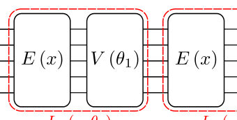 
Fig. 1 Data re-uploading scheme: similarly to skip-connections (Xu et al. 2025) in classical NNs, the input is constantly re-uploaded between every variational block.

📷 Fig 2

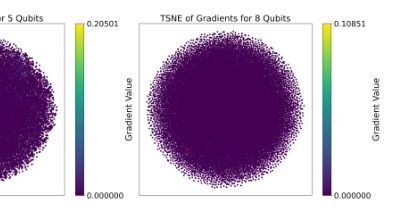 
Fig. 2 T-distributed Stochastic Neighbor Embedding projection of the landscape of the gradients with different circuit sizes, with high values circled in red: with a low qubit count (a), the gradient is well distributed across the landscape, but as the number of qubits increases (b) the gradient starts to concentrate in smaller region, and at high qubits count (c), the gradient can be assumed null almost everywhere.

📷 Fig 3

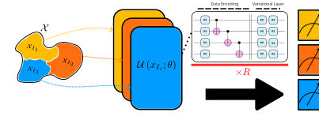 
Fig. 3 Decomposition scheme of the proposed model. For each set of features a dedicated VQC creates an output representation (a). The embeddings computed by each circuit are concatenated and used by a classical network in order to obtain the final output of the layer (b).

📷 Fig 4

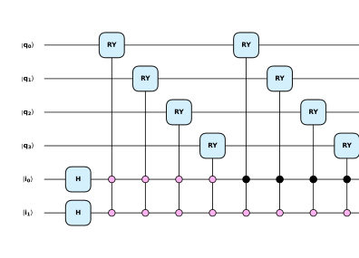 
Fig. 5 Ansatz used for processing the sequence of states, which uses an additional register to encode the sequence index.

📷 Fig 5

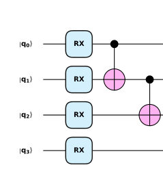 
Fig. 6 Circuit that computes the map |ϕ(x; θ)⟩= U(x; θ) |0⟩

**Summary.** This paper tackles the challenge of training Quantum Neural Networks on noisy, limited quantum hardware by proposing a 'divide-et-impera' training protocol. This method decomposes large quantum circuits into smaller, manageable sub-circuits whose outputs are combined classically. The approach is demonstrated on real-world tasks, suggesting a scalable design principle for future hybrid quantum computing architectures.

**Why it may be interesting.** The focus on resource-constrained quantum hardware and developing scalable training protocols directly addresses the engineering challenges of implementing quantum algorithms, which is a key concern for quantum information theorists.

Detailed structure

**Main problem.** Developing Quantum Machine Learning (QML) models that are feasible to train on current, noisy, and qubit-limited quantum hardware.

**Main result.** The proposed divide-et-impera protocol provides a general design principle for QML algorithms, showing feasibility on real-world tasks like predicting EV charging station states.

**Method.** The authors propose splitting large Quantum Neural Networks (QNNs) into smaller, manageable sub-circuits, whose concatenated embeddings are then processed by a classical neural network.

**Model / system.** The model uses Quantum Neural Networks (QNNs) trained via a variational quantum circuit (VQC) structure, which is decomposed into multiple smaller quantum processing unit (QPU) calls.

**Key observables.** Prediction scores (e.g., L1 norm for charging stations), Mean Absolute Error (for Air Quality), and the vanishing/concentration of gradients.

**Important parameters / regimes.** Number of qubits, number of trainable parameters, and the error rates from simulated noise channels (Bit-flip, Depolarizing).

**Assumptions / limitations.** The method assumes that the feature space can be partitioned or that information loss from circuit decomposition can be mitigated by a reconstructing network.

**Figures summary.** Figures illustrate the data re-uploading scheme, the decomposition structure (VQC $
ightarrow$ Concatenation $
ightarrow$ MLP), and heatmaps showing performance degradation under various noise models.

**Paper structure.** The paper introduces the limitations of deep QNNs (Barren Plateaus), proposes the divide-et-impera training protocol, benchmarks this approach on two real-world datasets (EV charging stations and Air Quality Index), and analyzes performance under noise.

Abstract

Quantum machine learning is rapidly emerging as a promising and potentially more sustainable approach that can complement traditional, energy-hungry HPC, AI, and GPU resources-particularly for the demanding global challenges the world urgently needs to address. In recent years, the first prototypes of quantum processors have reached the market, are sometimes available via the cloud, and distributed quantum computing is beginning to move from a largely theoretical concept to a demonstrated reality. However, these devices are still noisy and qubit-limited. Therefore, it is desirable to design quantum machine learning models with a reduced quantum register and a limited number of quantum gates, avoiding overly deep and wide quantum circuits. Here, we explore this idea by proposing a novel divide-et-impera-based training protocol that splits quantum neural networks into smaller components and better governs their optimization. We benchmark our approach on real data and real-world prediction tasks in intertwined energy and environmental domains, such as the status of charging stations for electric vehicles and the global air quality index. Our results suggest a design principle for quantum machine learning algorithms across a wide range of applications, which can be more feasibly tested on state-of-the-art quantum processors or within modular quantum architectures being developed for future hybrid infrastructures interconnected via high-speed communication links.

[↑ back to top](#top)

### [Exact Excitation Spectra and Spectral Gaps of the Frustrated Spin-1/2 $J_1$-$J_2$ Model via Dual Spin-Sector Variational Quantum Eigensolvers](http://arxiv.org/abs/2610.10454v1)

**Authors:** Sk Saniur Rahaman  
**Type:** theory · **Category:** strongly correlated electrons · **PDF:** <https://arxiv.org/pdf/2610.10454v1>  
**Analysis basis:** full PDF text, analyzed in chunks
**Topic relevance:** `analog quantum simulation` **3/5**

📷 Fig 1

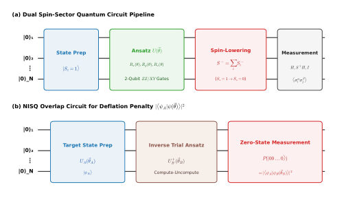 
FIG. 1. Dual Spin-Sector Parameterized VQE circuit archi- tecture. (a) Shallow Parameterized Quantum Circuit (PQC) ansatz U(⃗θ) for sector state preparation (Sz = 1 and Sz = 0), S−total spin-lowering operator mapping, and Pauli expecta- tion value measurement. (b) Shallow Compute-Uncompute overlap measurement circuit U † AU(⃗γ) for evaluating defla- tion penalty terms |⟨ψA|ψ(⃗γ)⟩|2 = P(|00 . . . 0⟩) without deep ancilla-assisted unitaries.

📷 Fig 2

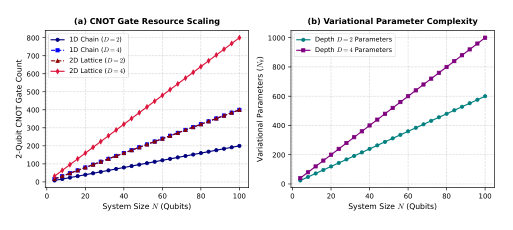 
FIG. 2. Resource complexity scaling of Dual Spin-Sector Pa- rameterized VQE as a function of system size N ∈[4, 100] qubits (10 × 10 grid). (a) Total 2-qubit CNOT gate count scaling for 1D chains and 2D lattices at circuit depths D = 2 and D = 4. (b) Variational parameter complexity Nθ = 2N(D + 1). Linear gate scaling enables NISQ execution up to N = 100 qubits without deep entangling circuits.

📷 Fig 3

 
Fig. 2 presents the explicit gate resource complexity and variational parameter scaling of our algorithm up to N = 100 qubits (10 × 10 rectangular grid). For circuit depth D = 4, CNOT count scales linearly as NCNOT = D·N for 1D chains (NCNOT = 400 at N = 100) and NCNOT ≈2D · N for 2D lattices (NCNOT = 800 at N = 100) [Fig. 2(a)]. Variational parameter count scales strictly linearly as Nθ = 2N(D + 1) [Fig. 2(b)] (Nθ = 1000 at N = 100). Classical L-BFGS-B iteration counts scale sub-exponentially (∼60 −80 iterations for N = 12, ∼80 −100 for N = 16, 20, and projected ≲450 for N = 100). While exact state-vector numerical simu- lations employ classical L-BFGS-B optimization, physi- cal execution...

📷 Fig 4

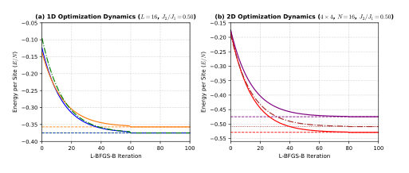 
FIG. 3. Classical L-BFGS-B optimization convergence tra- jectories of energy per site (E/N) at J2/J1 = 0.50 rendered in double-column layout across the full page width for (a) 1D spin chain (L = 16) and (b) 2D rectangular lattice (4 × 4, N = 16). Shown are Ground State Singlet (E0), Triplet (ET ), and Excited Singlet (ES) trajectories settling smoothly onto exact ED benchmark levels (dashed and dotted horizontal lines). In 1D panel (a), ED benchmarks are dashed blue (E0), dashed orange (ET ), and dotted green (ES); Dual VQE op- timization trajectories are solid blue (E0), solid orange (ET ), and dash-dotted green (ES). At J2/J1 = 0.50, 1D E0 and ES overlay identically due to dimer state...

📷 Fig 5

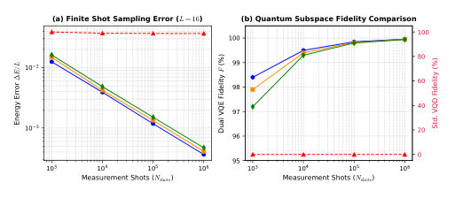 
FIG. 5. Comparative finite quantum measurement shot-noise sampling error benchmark rendered in double-column lay- out across the full page width for 1D system size L = 16 at J2/J1 = 0.20. (a) Energy error per site (∆E/L) across measurement shot budgets Nshots = 103, 104, 105, 106, show- ing Standard VQD ES failure trap curve (dashed red line with triangles) compared to Dual VQE E0 (solid blue line with cir- cles), ET (solid orange line with squares), and ES (solid green line with diamonds). (b) Quantum subspace fidelity with a dual y-axis layout: Dual VQE state fidelities for E0 (blue circles), ET (orange squares), and ES (green diamonds) are plotted on the left axis, while Standard VQD’s...

**Summary.** This paper introduces a novel Dual Spin-Sector Variational Quantum Eigensolver (VQE) to accurately calculate excited states in frustrated spin systems like the $J_1$-$J_2$ model. By optimizing across multiple spin sectors and using a penalty cost function, the method resolves ambiguities that plague standard VQE approaches. It successfully reproduces key quantum phases and demonstrates high resilience to noise, advancing the feasibility of quantum simulation for complex magnetic materials.

**Why it may be interesting.** This work provides a concrete, advanced quantum algorithm tailored to overcome fundamental limitations (state-ordering inversions) in simulating strongly correlated quantum magnets, which is a major bottleneck for quantum simulation.

Detailed structure

**Main problem.** Standard Variational Quantum Eigensolver (VQE) techniques fail to accurately determine excited states and spectral gaps in frustrated spin systems due to state-ordering inversions.

**Main result.** The proposed Dual Spin-Sector VQE framework successfully isolates the true Excited Singlet state, achieving convergence to machine precision and accurately capturing known quantum phases.

**Method.** The authors developed a Dual Spin-Sector VQE by optimizing across distinct magnetization sectors ($S_z=0$ and $S_z=1$) and using a dual-sector penalty cost function to resolve ambiguities.

**Model / system.** The study focuses on the spin-1/2 $J_1$-$J_2$ Heisenberg model, applicable to 1D spin chains and 2D rectangular lattices, characterized by frustrated magnetic interactions.

**Key observables.** Ground state energy ($E_0$), Excited Singlet energy ($E_S$), spectral gaps ($\Delta_{SS}, \Delta_{ST}$), and quantum subspace fidelity.

**Important parameters / regimes.** The ratio $J_2/J_1$ is critical, with key points identified at $J_2/J_1 \approx 0.2411$ (BKT point) and $J_2/J_1 = 0.50$ (Majumdar-Ghosh point).

**Assumptions / limitations.** The method relies on the exact commutation relation $[H, S^-] = 0$ to map the Triplet state, and it assumes the feasibility of implementing the dual-sector penalty cost function on near-term quantum hardware.

**Figures summary.** Figures illustrate the dual spin-sector quantum circuit pipeline, the NISQ overlap circuit for penalty terms, and comparisons showing the failure of standard VQD versus the resilience of the Dual VQE under finite measurement shot noise.

**Paper structure.** The paper first identifies the failure mode of standard VQE methods in frustrated magnets. It then introduces and details the Dual Spin-Sector VQE framework, showing its application to 1D and 2D lattices, benchmarking its performance against known physical points, and finally demonstrating its resource efficiency for near-term quantum hardware.

Abstract

Finding excited states and excitation gaps in frustrated spin systems using Variational Quantum Eigensolvers (VQE) is complicated by state-ordering inversions. In the frustrated spin-1/2 $J_1$-$J_2$ Heisenberg model, standard single-sector algorithms like Variational Quantum Deflation (VQD) in $S_z=0$ fail when $J_2/J_1 < 0.25$. In this regime, the lowest-lying excitation in $S_z=0$ is a Triplet ($S=1$), which lies below the Excited Singlet ($S=0$). Standard deflation projects out the ground singlet and converges onto the Triplet state, misidentifying it as the Excited Singlet. Here, we present a Dual Spin-Sector VQE framework that resolves these state-ordering inversions across 1D spin chains and 2D rectangular lattices. By first optimizing the ground Triplet state in the $S_z=1$ sector (where singlet states cannot exist), mapping it into $S_z=0$ via the total spin-lowering operator $S^- = \sum_i S_i^-$, and evaluating a dual-sector penalty cost function, we isolate the Excited Singlet ($E_S$) without variational ambiguity. Numerical state-vector simulations confirm exact convergence to machine precision with unit overlap fidelity. The method captures key physical features, including the gapless phase, the BKT critical point at $J_2/J_1 \approx 0.2411$, the Majumdar-Ghosh dimer point ($J_2/J_1 = 0.50$), and the 2D non-magnetic frustrated regime ($J_2/J_1 \approx 0.40 - 0.60$). Finite-shot sampling simulations and gate-scaling analytics up to $N=100$ qubits demonstrate the resource efficiency and shot resilience of the algorithm for near-term quantum execution.

[↑ back to top](#top)

### [Multi-scale spectral statistics of intermediate quantum chaos in ultracold erbium collisions](http://arxiv.org/abs/2610.09775v1)

**Authors:** Ivan R. R. Gonzalez, Barnali Chakrabarti, Antonio M. S. Macedo  
**Type:** theory · **Category:** quantum gases · **PDF:** <https://arxiv.org/pdf/2610.09775v1>  
**Analysis basis:** full PDF text, analyzed in chunks
**Topic relevance:** `analog quantum simulation` **3/5**

📷 Fig 1

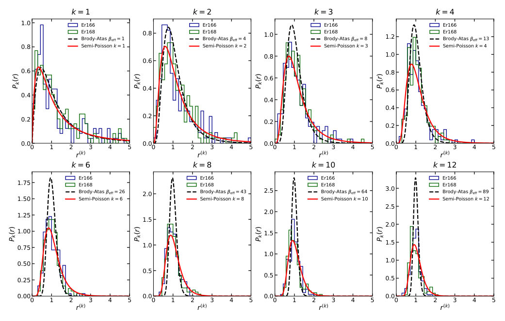 
FIG. 1. Higher-order spacing-ratio distributions Pk(r) for k = 1, 2, 3, 4, 6, 8, 10, 12. Step histograms: empirical data for 166Er and 168Er. Dash-dotted: ATAS surmise at βeff. Dotted: semi-Poisson beta-prime law.

📷 Fig 2

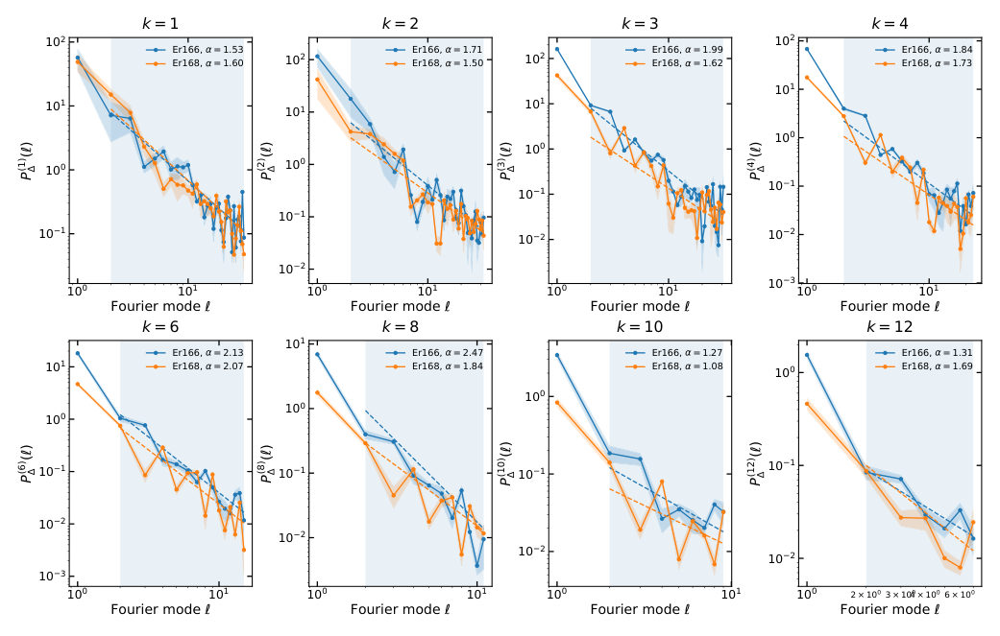 
FIG. 2. Decimated accumulated PSD for k = 1, . . . , 12. The drift of α toward 2 at intermediate k signals the progressive loss of spectral rigidity at mesoscopic scales.

📷 Fig 3

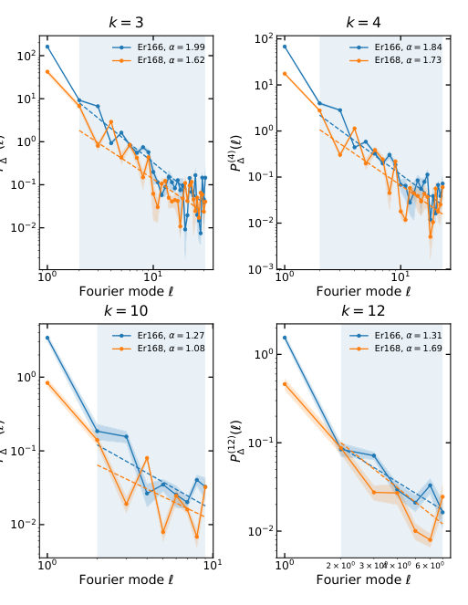 
Figure 2 extends the PSD analysis to all investigated values of k, with the resulting exponents collected in Ta- ble I. For 166Er, the exponent increases from α = 1.53 at k = 1 to values near and above the Brownian limit, reaching α = 2.47 at k = 8, before decreasing to α ≃1.3 at k = 12, where only seven modes are available. For 168Er, a similar increase toward the Brownian regime is observed at intermediate decimation orders, with α ris- ing from 1.60 at k = 1 to 2.07 at k = 6, followed by substantial fluctuations at larger k. The intermediate-k enhancement of α toward the integrable value indicates a reduction of spectral rigidity under coarse-graining, while the pronounced large-k...

📷 Fig 4

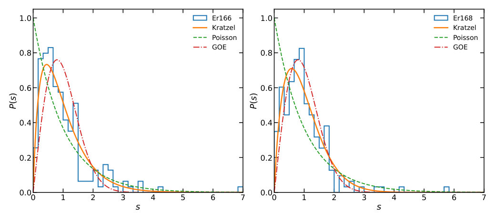 
FIG. 3. Adjacent spacing distributions P(s) with Kr¨atzel fits for 166Er (left) and 168Er (right). The fitted (η, h) parameters indicate linear repulsion with tails broader than Gaussian tails, consistent with semi-Poisson affinity.

📷 Fig 5

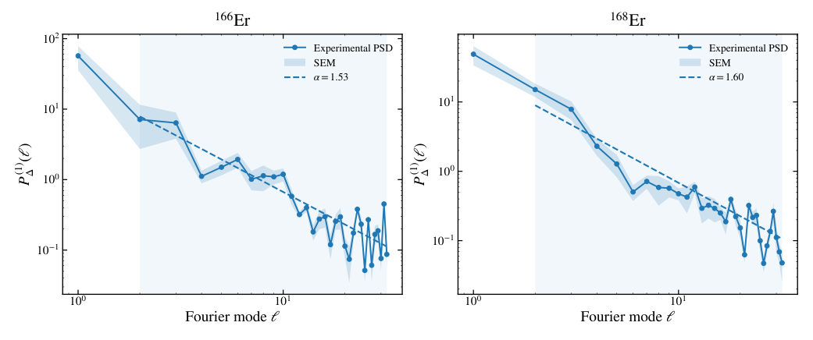 
FIG. 4. Accumulated power spectral density (PSD), P (1) ∆(ℓ), for k = 1, computed using a window length of L = 64, with 8 records and 32 Fourier modes. The shaded region represents the standard error of the mean (SEM), calculated from the dispersion of the PSD across the individual records and providing an estimate of the uncertainty in the averaged spectrum. Dashed lines indicate the corresponding Theil-Sen power-law fits. The extracted spectral exponents are α = 1.53 for 166Er and α = 1.60 for 168Er.

**Summary.** The authors analyze the energy spectra of ultracold erbium atoms to characterize their degree of quantum chaos. By employing multi-scale statistical diagnostics, they find the spectra exhibit intermediate statistics, best described by semi-Poisson behavior rather than purely chaotic or integrable limits. This suggests the underlying collision dynamics involve a complex, hierarchical mixing of phase space regions.

**Why it may be interesting.** This work provides a quantitative spectral fingerprint for intermediate quantum chaos in a highly controllable quantum gas system, offering diagnostic tools applicable to other complex quantum many-body systems.

Detailed structure

**Main problem.** The paper aims to characterize the spectral statistics of quantum systems exhibiting intermediate quantum chaos, bridging the gap between integrable and fully chaotic limits.

**Main result.** The spectral statistics of ultracold erbium atoms are consistently described by semi-Poisson statistics, indicating intermediate quantum chaos that is scale-dependent.

**Method.** A multi-scale statistical analysis is employed using higher-order spacing ratios, accumulated power spectral density (PSD) analysis, and spacing increment distributions.

**Model / system.** The study uses the resonance spectra of ultracold erbium atoms ($^{166}	ext{Er}$ and $^{168}	ext{Er}$) obtained via Fano-Feshbach resonances, which model a system with mixed phase space dynamics.

**Key observables.** Higher-order spacing ratios ($r^{(k)}_n$), accumulated power spectral density exponent ($\alpha$), and spacing increment distributions.

**Important parameters / regimes.** Intermediate quantum chaos regime; crossover parameter $T$; spectral rigidity exponent $\alpha \approx 1.5$; semi-Poisson statistics.

**Assumptions / limitations.** The analysis relies on treating resonance positions as sharp eigenvalues and comparing empirical data against theoretical models like the ATAS surmise and stochastic crossover frameworks.

**Figures summary.** Figures compare empirical distributions of higher-order ratios against Wigner-Dyson and semi-Poisson predictions, and show the scale-dependent behavior of the accumulated PSD.

**Paper structure.** The paper systematically analyzes spectral correlations using multiple diagnostics (ratios, PSD, increments) to build a consistent picture of intermediate chaos, linking these statistics to a stochastic crossover model.

Abstract

Characterizing intermediate quantum chaos in systems with mixed phase spaces requires probing spectral correlations across multiple scales. Here, we present a multi-scale statistical analysis of the resonance spectra of ultracold 166Er and 168Er atoms using higher-order spacing ratios, spacing increments, and the accumulated power spectral density of decimated level sequences. Our analysis reveals that while the spectra exhibit clear level repulsion, they are consistently better described by semi-Poisson than by standard Wigner-Dyson ensembles, with this intermediate character persisting across higher-order correlations. The accumulated power spectrum reveals an intermediate 1/f^alpha regime, with alpha approximately 1.5 at full spectral resolution and a tendency toward the integrable random-walk limit alpha = 2 at intermediate decimation scales, indicating a scale-dependent loss of spectral rigidity. Furthermore, the spacing-increment distributions independently reveal statistics intermediate between Laplace and Gaussian limits. Together, these complementary diagnostics show that the semi-Poisson character reflects persistent non-Wigner-Dyson correlations beyond the nearest-neighbor scale, providing a consistent picture of intermediate quantum chaos and a possible connection to hierarchical trapping in the underlying collision dynamics.

[↑ back to top](#top)

### [Quantum Optimization of the Color-of-Money Problem on IBM Quantum Hardware: A Proof-of-Concept Study](http://arxiv.org/abs/2610.09798v1)

**Authors:** Rahul Rana, Suman Kumar Roy, M Girish Chandra  
**Type:** both · **Category:** quantum information and computing · **PDF:** <https://arxiv.org/pdf/2610.09798v1>  
**Analysis basis:** full PDF text, analyzed in chunks
**Topic relevance:** `QC/QI experiment` **3/5**

📷 Fig 1

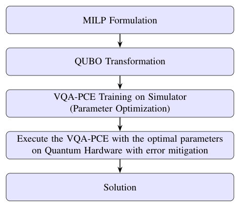 
Fig. 1: Overall workflow of the quantum optimization frame- work.

**Summary.** This work demonstrates a proof-of-concept quantum solution for the complex Color-of-Money financial optimization problem. It reformulates the problem into a QUBO and uses a Variational Quantum Algorithm (VQA) with Pauli Correlation Encoding (PCE) on IBM Quantum hardware. The results confirm the quantum method's ability to match classical optimal solutions, establishing a foundation for quantum optimization in finance.

**Why it may be interesting.** While the application is finance-related, the core methodology—mapping combinatorial optimization to QUBO and solving it via VQA-PCE on real hardware—is a direct demonstration of quantum algorithm implementation for constrained optimization.

Detailed structure

**Main problem.** The paper addresses the Color-of-Money (CoM) problem, a complex financial optimization challenge involving resource allocation under multiple constraints.

**Main result.** The quantum approach successfully reproduced the optimal solution found by a classical exact solver (SCIP) on a prototype instance, validating the methodology's feasibility.

**Method.** It uses a Variational Quantum Algorithm (VQA) combined with Pauli Correlation Encoding (PCE) to map the problem into a QUBO format executable on quantum hardware.

**Model / system.** The problem is modeled as a constrained Mixed-Integer Linear Programming (MILP) problem, transformed into a QUBO objective function, and implemented on IBM Quantum hardware.

**Key observables.** The objective function value (e.g., 151.00) and the expectation values of Pauli correlation observables $\langle P_i 
angle$.

**Important parameters / regimes.** Penalty coefficients ($\lambda_1$ to $\lambda_4$), the scaling parameter $\alpha$, and the variational circuit parameters $	heta$.

**Assumptions / limitations.** The methodology assumes that the quantum approach can correctly map and solve the optimization problem, although current hardware noise limits outperformances on small instances.

**Figures summary.** Figure 1 illustrates the entire workflow: MILP $
ightarrow$ QUBO $
ightarrow$ VQA-PCE Training (Simulator) $
ightarrow$ Hardware Execution (with error mitigation) $
ightarrow$ Solution.

**Paper structure.** The paper follows a structure moving from problem definition (MILP/CoM) to quantum formulation (QUBO/VQA-PCE), detailing the hybrid quantum-classical workflow, and concluding with hardware execution and benchmarking against classical solvers.

Abstract

The Color-of-Money (CoM) problem is a financial optimization challenge in which enterprises must determine how to allocate and route funds across multiple accounts, currencies, and time periods while satisfying regulatory, operational, and liquidity constraints. As the number of assets, obligations, and planning periods increases, the decision space grows rapidly, making large-scale optimization increasingly challenging for classical approaches. In this work, we present a proof-of-concept quantum implementation of the CoM problem using IBM Quantum hardware. The original optimization problem is formulated as a constrained Mixed-Integer Linear Programming (MILP) problem and transformed into a Quadratic Unconstrained Binary Optimization (QUBO) representation suitable for quantum execution. We employ a Variational Quantum Algorithm (VQA) with Pauli Correlation Encoding (PCE), a qubit efficient encoding technique and apply error-mitigation technique to improve solution fidelity on noisy quantum hardware. A prototype instance consisting of 3 assets, 3 obligations, and 2 time periods was executed on real IBM quantum hardware and benchmarked against classical exact solver SCIP. The quantum approach successfully reproduced the same optimal solution obtained classically, validating the correctness and feasibility of the proposed methodology. While current noisy quantum hardware does not outperform classical optimization on the evaluated small instance, the results demonstrate the feasibility of executing treasury optimization workloads on current quantum hardware and provide a foundation for future investigations.

[↑ back to top](#top)

### [Vibrational Sample-Based Quantum Diagonalization with Unitary-Cluster-Jastrow Ansätze on IBM QPUs](http://arxiv.org/abs/2610.09532v1)

**Authors:** Kunal Kumar, Erik Lötstedt, Yuri Kobayashi, Seiji Yunoki  
**Type:** both · **Category:** other · **PDF:** <https://arxiv.org/pdf/2610.09532v1>  
**Analysis basis:** full PDF text, analyzed in chunks
**Topic relevance:** `QC/QI experiment` **3/5**

📷 Fig 1

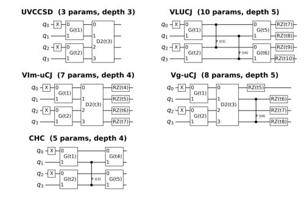 
Figure 1: All five ansätze at the toy N = 2, M = 2 (4- qubit) system, one layer, P = 1 pair (VIm-uCJ, Vg-uCJ) – P is the number of intermode modal pairs (i, k), (j, l) chosen to receive a diagonal Jastrow correlator/D2 primitive, out of the N 2  (M −1)2 possible pairs (Table 2), so P = 1 here is the minimal, non-empty choice at this toy system’s own small pair count. Givens (“G”) and paired double excitation (“D2”) are drawn as opaque boxes; the diagonal Jastrow (“P”) and RZ tail are drawn as their native gates. The true native- gate compilation of a single D2(θ) on this system is depth 66, 25 CZ gates once transpiled at optimization_level=3 to generic Heron basis gates – illustrative of...

📷 Fig 2

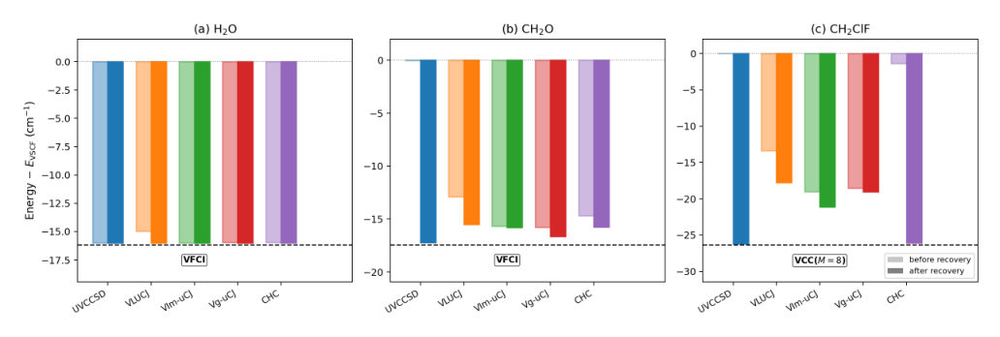 
Figure 2: ibm_phoenix hardware, layers=1, vibrational ground-state energy relative to the VSCF reference (E −EVSCF) for each of the five ansätze, modal basis, M=4 (12/24/36 qubits for H2O/CH2O/CH2ClF respectively) – faded bars are before self- consistent recovery (an explicit subspace diagonalization over whatever the raw sample actually contained), filled bars are after. The dashed line (labeled in-panel) is the converged classical target (VFCI for H2O/CH2O; VCC(M=8) for CH2ClF, whose Hamiltonian is too large for VFCI, Table 3’s footnote). We show M=4 because several ansätze retain sufficient pre-recovery signal for the effect of recovery to remain visible. The corresponding ibm_kingston...

📷 Fig 3

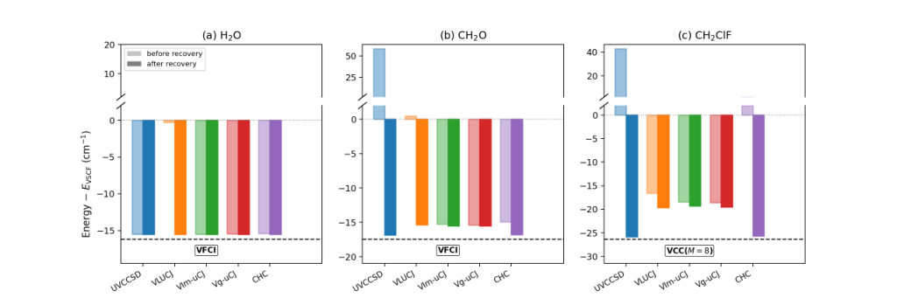 
Figure 3: Same as Figure 2, but in the HO basis. The comparison shows that the relative quality of the raw modal- and HO-basis samples depends on the ansatz and its retained one-hot signal. The corresponding ibm_kingston comparison is shown in Appendix D.3, Figure A4b.

📷 Fig 4

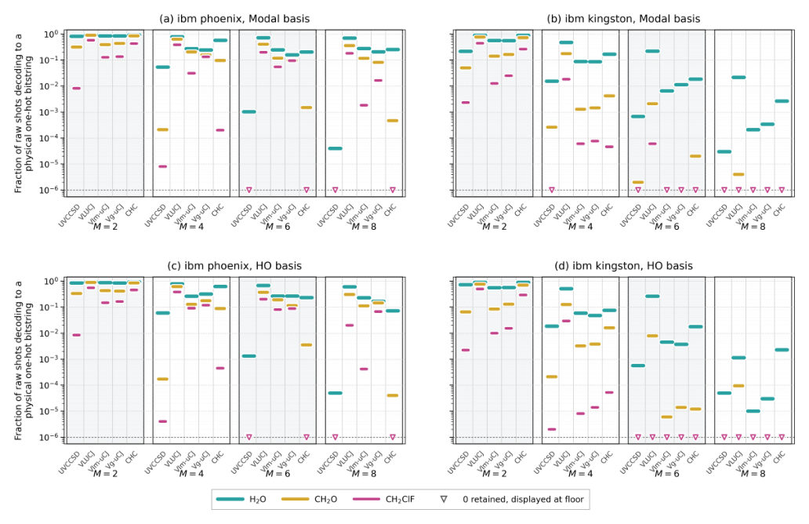 
Figure 4: One-hot retention (fraction of raw shots decoding to a physical bitstring, before recovery) vs. modal count M, log scale, in four panels: ibm_phoenix (left) vs. ibm_kingston (right), modal basis (top) vs. HO basis (bottom). Each outlined, alternately-shaded group corresponds to one modal count M and contains five ansatz columns (in the order UVCCSD, VLUCJ, VIm-uCJ, Vg-uCJ, CHC, left to right, separated by thin vertical rules). Within one ansatz column, each molecule’s individually measured retention (H2O, CH2O, CH2ClF, each run once at that parameter setting – not repeated trials of the same system) is drawn as its own short horizontal line at that value, colored by molecule (teal...

📷 Fig 5

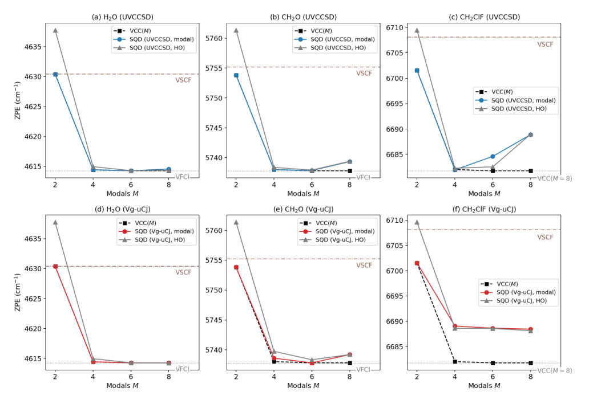 
Figure 5: Ground-state energy vs. modal count M on ibm_phoenix for UVCCSD (top row, panels a–c) – the deepest, highest- CZ-count ansatz tested (Table 2) – and Vg-uCJ (bottom row, panels d–f), a representative shallow Jastrow-family circuit, in both the modal and HO bases. Results are compared with the classical VCC(M) hierarchy and with the converged VFCI reference for H2O and CH2O, or the VCC(M=8) reference for CH2ClF (Table 3). Numerical errors and retention-dependent trends are discussed in the molecule-specific subsections below.

**Summary.** This paper develops and tests advanced quantum algorithms for calculating the anharmonic vibrational spectra of molecules using quantum hardware. It compares several unitary-cluster-Jastrow ansätze, finding that hardware noise limits performance, but demonstrating that structured quantum sampling outperforms random guessing. The work successfully calculates fundamental vibrational frequencies on IBM QPUs, advancing the field's practical application to molecular physics.

**Why it may be interesting.** This work directly tackles the application of quantum computation to molecular structure and dynamics, a core area of AMO physics, by benchmarking advanced quantum algorithms against real-world hardware noise.

Detailed structure

**Main problem.** The paper addresses extending sample-based quantum diagonalization (SQD) to accurately calculate anharmonic vibrational spectra of molecules using current quantum hardware.

**Main result.** The novel VLUCJ ansatz proved to be the most hardware-robust circuit structure, while the study successfully demonstrated calculating fundamental vibrational frequencies on IBM QPUs.

**Method.** The authors employ SQD, warm-starting the process with vibrational coupled-cluster (VCC) amplitudes, and comparing multiple unitary-cluster-Jastrow ansätze on superconducting quantum processors.

**Model / system.** The system models are the vibrational spectra of small molecules ($	ext{H}_2	ext{O}$, $	ext{CH}_2	ext{O}$, $	ext{CH}_2	ext{ClF}$), governed by a quartic force-field Hamiltonian derived from DFT calculations.

**Key observables.** Ground-state and excited-state energies, fundamental vibrational frequencies, and the fraction of physically valid one-hot outcomes (retention).

**Important parameters / regimes.** Qubit count up to 72, comparison between harmonic-oscillator and vibrational self-consistent-field (VSCF) reference bases, and the anharmonic coupling terms up to quartic order.

**Assumptions / limitations.** The accuracy relies on the underlying potential energy surface approximation and the comparison highlights a trade-off between ansatz expressivity and hardware robustness.

**Figures summary.** Figures compare energy gaps and circuit performance (CZ count, depth) across different ansätze and sampling methods (random vs. structured quantum sample) on IBM hardware.

**Paper structure.** The paper introduces the theoretical framework (Hamiltonian, SQD), details the comparison of five ansätze, benchmarks performance on IBM QPUs by comparing results against random sampling and classical VSCF targets, and concludes with the calculation of representative vibrational frequencies.

Abstract

We extend sample-based quantum diagonalization (SQD) to anharmonic vibrational spectra and use it to benchmark how vibrational ansätze scale on present-day hardware under a direct one-hot encoding (up to 72 qubits). Five particle-conserving circuits are warm-started through vibrational coupled-cluster (VCC) t1, t2 amplitudes: UVCCSD, the compact heuristic circuit (CHC), and three unitary-cluster-Jastrow ansätze introduced here, VLUCJ, Vg-uCJ, and VIm-uCJ. A self-consistent configuration-recovery loop reconstructs correlated states from hardware samples in the low-retention regime where naïve post-selection breaks down, enabling the calculation of ground-state energies for H$_2$O, CH$_2$O, and CH$_2$ClF (3-9 modes). We compare harmonic-oscillator and vibrational self-consistent-field (VSCF, "modal") reference bases. In the small-modal-basis regime relevant for near-term devices, the modal basis is typically more accurate than the harmonic-oscillator representation; empirically, it also yields substantially better-converged hardware sampling for deep circuits at these qubit counts. Across ansätze, we find a clear retention/accuracy tradeoff when scaling: the new VLUCJ circuit is the most hardware-robust, retaining the largest fraction of physically valid one-hot outcomes, whereas the more expressive uCJ variants and UVCCSD can recover more correlation when retention is sufficient. Finally, we extend the recovery protocol to excited states by targeting a chosen per-mode VSCF occupation and warm-starting it with a state-specific VCC calculation, and we demonstrate the calculation of one representative fundamental vibrational frequency per molecule on IBM QPUs.

[↑ back to top](#top)

### [A repeating sequence of simple rules creates a universal computer](http://arxiv.org/abs/2610.09879v1)

**Authors:** Riz Fernando Noronha  
**Type:** theory · **Category:** statistical mechanics · **PDF:** <https://arxiv.org/pdf/2610.09879v1>  
**Analysis basis:** full PDF text, analyzed in chunks
**Topic relevance:** `analog quantum simulation` **2/5** · `non-equilibrium universality` **2/5** · `Frenkel-Kontorova` **1/5** · `driven-dissipative phase transition` **1/5** · `methods for driven-dissipative` **1/5**

📷 Fig 1

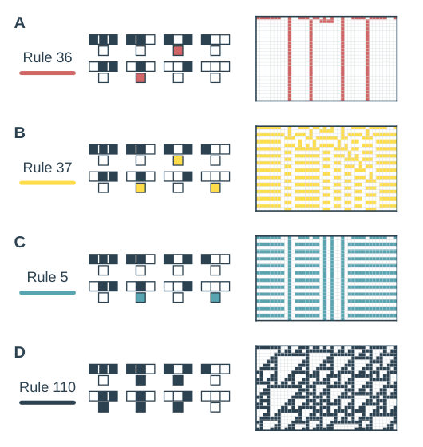 
Figure 1: Rule tables. Rules 36, 37, and 5 (A-C) are all mirror symmetric, and result in trivial oscillating or stationary pat- terns. Rule 110 (D) displays remarkable complex structure.

📷 Fig 2

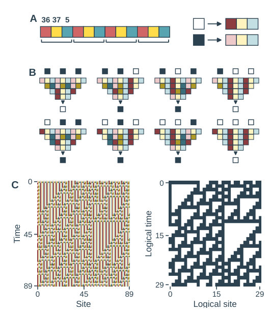 
Figure 2: Combining the three simple rules can give rise to rule 110. A: The tiling pattern of the rules, and the assignment of [100] to [0] and [000] to [1]; B: The effective rule 110 table in the combined system, showing how each input ultimately reduces to the output expected of rule 110; C: A simulation trace, which upon rescaling, recreates rule 110.

📷 Fig 3

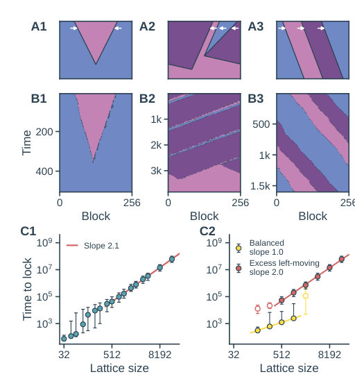 
Figure 3: Schematic (A) and simulations (B) of the system’s time evolution for different scenarios based on the domain walls. Different colors represent regions of space emulating rule 110 in different phases. If domains are balanced (left and right), they converge and annihilate (A1/B1). If domains move leftwards, one is pinned, and eventually takes over (A2/B2). If domains are moving rightwards, they never approach each other, and the system never locks (A3/B3). C: Locking times versus system size, for the systems that do lock. C1: All sys- tems, showing an approximate power law of N 2, C2: Seg- regated by mechanisms: balanced scales with N, while left- moving walls (which grow in abundance...

📷 Fig 4

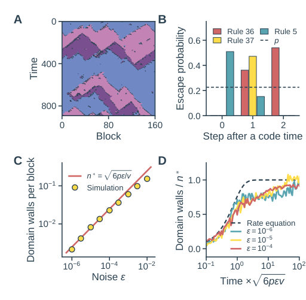 
Figure 4: Behavior of the system under noise. A: A plot of the errors propagating in the model with random bit flips. Domain walls form in pairs, and spread with a constant drift. B: The probability for an error to lead to the formation of a domain wall, for each rule. Four out of nine never split into walls. p is estimated as the average. C, D: The steady-state fraction of domain walls as a function of noise, showing √ε scaling (C) and the rescaled fraction of domain walls over time (D), with the rate equation prediction using parameters for p = 0.23 and v = (vL + vR)/2 = 0.2275 estimated from simulations.

**Summary.** This paper shows that the universal computation power of Rule 110 can be replicated using only three simple, mirror-symmetric rules arranged periodically. The complexity and inherent chirality of the resulting system emerge from this arrangement, not from the rules themselves. The analysis quantitatively models how noise introduces errors, predicting that the resulting domain wall density scales with the square root of the noise strength.

**Why it may be interesting.** This work provides a concrete, non-quantum example of how emergent complexity and broken symmetries (chirality) can arise purely from the *arrangement* of simple, local, and symmetric components, which has parallels in designing complex quantum systems from simple local interactions.

Detailed structure

**Main problem.** The paper demonstrates that complex, universal computation (Turing completeness) can emerge from the arrangement of simple, individually trivial, and symmetric local rules, rather than requiring inherent asymmetry in the rules themselves.

**Main result.** Rule 110 can be emulated by alternating three mirror-symmetric rules, and the system's robustness and error dynamics (domain wall scaling) are quantitatively predicted and observed.

**Method.** The authors used the framework of Elementary Cellular Automata (ECA), constructing a complex rule via a periodic mixture of three simple rules and analyzing the resulting domain wall dynamics under random noise.

**Model / system.** The model is an Elementary Cellular Automaton (ECA) lattice. The complexity is achieved by tiling the lattice with three simple, symmetric rules (Rule 36, 37, and 5) in a repeating sequence to mimic the behavior of the complex Rule 110.

**Key observables.** Domain wall density ($n$), system locking time, and the scaling of domain wall density with noise strength ($\sqrt{\epsilon}$).

**Important parameters / regimes.** Noise strength ($\epsilon$), the ratio of domain wall density to lattice size ($n/L$), and the parameters governing the rate equation ($rac{dn}{dt} = 6p\epsilon - 4v (n/2)^2$).

**Assumptions / limitations.** The analysis assumes a computational-mechanics picture where domain walls move ballistically, and the rate equation provides a good description of the steady state, although the final approach to equilibrium is noted to be slower than predicted.

**Figures summary.** Figures illustrate the comparison between the complex target rule (Rule 110) and its simple components, show the time evolution and locking times for random initial conditions, and demonstrate the steady-state domain wall fraction scaling with $\sqrt{\epsilon}$ matching the rate equation.

**Paper structure.** The paper first establishes the construction of Rule 110 from simple rules, then analyzes the system's self-organization from random initial conditions, and finally models the error propagation by introducing noise and deriving/testing a rate equation for the domain wall density.

Abstract

We show that the Turing complete rule 110 in elementary cellular automata can be emulated by alternating three simple symmetric rules in space. As the constituent rules themselves are trivial, this shows that diversity alone can generate emergent phenomena. The rules cannot distinguish left from right, and the chirality of rule 110 is created by their arrangement. Random initial conditions lock on to rule 110 over 90% of the time, explained through the motion of domain walls between desynchronized regions. Adding random noise creates errors that seed domain walls, whose fraction scales with the square root of noise strength, explained through a simple rate equation. This points to a route to complexity through repeated, perturbed units, common in biology, and shows that in cellular automaton models of quantum field theory, broken symmetries such as parity need not be present in the local rules.

[↑ back to top](#top)

### [Q-PhotoMarket: A Design Space Exploration Framework for Photonic Hybrid Quantum Neural Networks in Financial Market Prediction](http://arxiv.org/abs/2610.09641v1)

**Authors:** Alberto Marchisio, Hanzalah Mohamed Siraj, Muhammad Kashif, Nouhaila Innan, Muhammad Shafique  
**Type:** both · **Category:** quantum information and computing · **PDF:** <https://arxiv.org/pdf/2610.09641v1>  
**Analysis basis:** full PDF text, analyzed in chunks
**Topic relevance:** `analog quantum simulation` **2/5** · `methods for driven-dissipative` **2/5** · `interference shaping light` **1/5** · `quantum measurements` **1/5** · `quantum optics experiment` **1/5**

📷 Fig 1

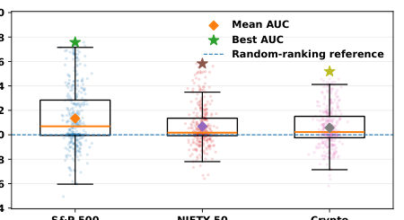 
Fig. 1: Distribution of AUC across valid photonic HQNN configurations for the S&amp;P 500, NIFTY 50, and cryptocurrency markets.

📷 Fig 2

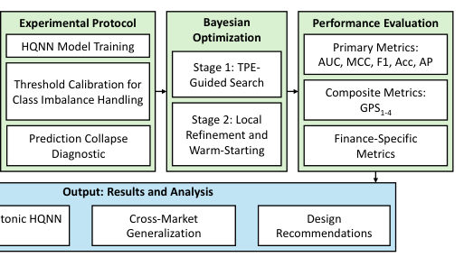 
Fig. 2: Overview of the proposed Q-PhotoMarket framework.

📷 Fig 3

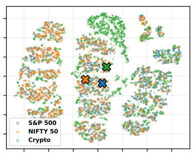 
Fig. 3: Two-dimensional t-SNE visualization of the engineered feature spaces for the S&amp;P 500, NIFTY 50, and cryptocurrency datasets.

📷 Fig 4

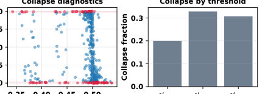 
Fig. 4: Prediction-collapse diagnostics. Left: calibrated decision thresholds versus positive prediction rate (PPR). Right: fraction of configurations exhibiting prediction collapse under different return thresholds.

📷 Fig 5

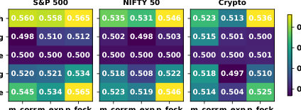 
Fig. 5: Mean AUC obtained across the explored photonic HQNN design space for different combinations of circuit architectures and measurement strategies at τ = 1%.

**Summary.** This work introduces Q-PhotoMarket, a systematic framework to explore the vast design space of Photonic Hybrid Quantum Neural Networks (HQNNs) for financial forecasting. By testing thousands of photonic configurations, the authors demonstrate that the specific choice of circuit architecture and measurement strategy critically determines predictive power. The findings confirm that quantum circuit design is a crucial, often overlooked, factor in realizing quantum machine learning applications.

**Why it may be interesting.** While the application is finance, the core methodology involves optimizing complex quantum circuit parameters (topology, measurement) using advanced search techniques (BO/TPE), which is highly relevant to quantum algorithm design and resource estimation in quantum information.

Detailed structure

**Main problem.** The paper addresses the lack of systematic investigation into how specific photonic circuit design choices influence the predictive performance of Hybrid Quantum Neural Networks (HQNNs) when applied to financial market prediction.

**Main result.** Systematic exploration of over 5,000 photonic configurations reveals consistent, measurable architectural patterns across different financial markets, demonstrating that the choice of circuit topology and measurement strategy significantly impacts performance relative to classical baselines.

**Method.** A systematic Design Space Exploration (DSE) framework, Q-PhotoMarket, is employed, combining exhaustive search with Bayesian Optimization to test various photonic circuit parameters.

**Model / system.** The model is a Photonic HQNN implemented using linear-optical circuits (beam splitters, phase shifters) simulated via the Merlin framework. The computation is hybrid, coupling a trainable photonic QuantumLayer with a classical MLP head.

**Key observables.** Area Under the Curve (AUC), Matthews Correlation Coefficient (MCC), F1-score, and the General Performance Score (GPS) are used to evaluate predictive performance across U.S., Indian, and cryptocurrency markets.

**Important parameters / regimes.** The design space includes input photon states (e.g., Alternating, Bunched), circuit architectures (e.g., Clements Mesh, Simple), entangling models (MZI, Bell), and measurement strategies (Fock, Dual-rail).

**Assumptions / limitations.** The analysis assumes that the shared statistical structure across different financial markets allows for meaningful cross-market comparisons, and the performance is highly sensitive to the specific photonic design choices made.

**Figures summary.** Figures illustrate the distribution of AUC across the design space, show DSE diagnostics for different markets (S&P 500, NIFTY 50, Crypto) across various thresholds, and compare performance against classical ML baselines.

**Paper structure.** The paper introduces the problem, details the Q-PhotoMarket DSE framework, describes the multi-dimensional search space, presents results showing architectural dependencies, and concludes with comparisons to classical methods.

Abstract

Photonic quantum computing has recently emerged as a promising platform for hybrid quantum machine learning due to its native realization of linear-optical circuits and the computational complexity of boson sampling. However, despite growing interest in quantum methods for finance, the influence of photonic circuit design choices on predictive performance remains largely unexplored. Existing studies typically evaluate a single architecture, leaving the broader photonic design space unexamined. In this work, we present Q-PhotoMarket, a systematic design space exploration (DSE) framework for photonic hybrid quantum neural networks (HQNNs) applied to financial market prediction. We explore over 5,000 valid photonic configurations spanning input photon states, circuit architectures, entangling models, and measurement strategies across their compatible computation spaces, for U.S., Indian, and cryptocurrency markets. To improve search efficiency, the exhaustive exploration is complemented with Bayesian optimization. We further incorporate threshold calibration and prediction-collapse diagnostics to enable reliable evaluation under increasingly imbalanced return thresholds. Experimental results show that systematic exploration of more than 5,000 photonic HQNN configurations reveals consistent architectural patterns across financial markets, identifies robust high-performing designs, and demonstrates competitive performance relative to classical machine learning baselines.

[↑ back to top](#top)

### [Redundant Records of the Past: Unifying Quantum Darwinism and Decoherent Histories](http://arxiv.org/abs/2610.09845v1)

**Authors:** Philipp Strasberg  
**Type:** theory · **Category:** statistical mechanics · **PDF:** <https://arxiv.org/pdf/2610.09845v1>  
**Analysis basis:** full PDF text, analyzed in chunks
**Topic relevance:** `quantum measurements` **2/5** · `Keldysh / 2PI / non-Gaussian methods` **1/5** · `correlated / nonlocal dissipation` **1/5** · `driven-dissipative phase transition` **1/5** · `methods for driven-dissipative` **1/5**

📷 Fig 1

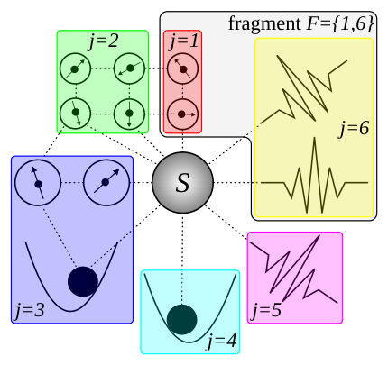 
FIG. 1. A system S coupled to an environment composed of many different degrees of freedoms (spins, oscillators, pho- tons, etc.). The question is whether the environment can be split in a natural way into N accessible, elementary fragments j (here, N = 6) such that they encode redundant information about the system as quantified, e.g., by eqn (1). In general, a fragment F can be composed of multiple elementary frag- ments (here we sketched F = {1, 6}).

📷 Fig 2

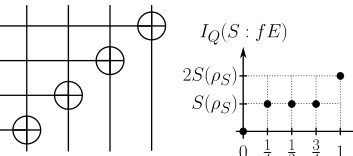 
FIG. 2. A simple CNOT-fan-out quantum circuit. A system S controls a NOT operation in each of the four qubits com- prising different fragments of a non-interacting environment. For instance, for the initial system state c0|0⟩S + c1|1⟩S the resulting final state is c0|00000⟩+ c1|11111⟩(with |00000⟩≡ |0⟩S ⊗|0⟩1 ⊗|0⟩2 ⊗|0⟩3 ⊗|0⟩4 and similarly for |11111⟩). To the right: the plot of the quantum MI after the circuit has been applied shows the characteristic redundancy plateau.

📷 Fig 3

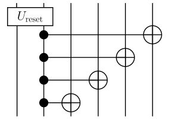 
FIG. 3. Modified CNOT-fan-out quantum circuit with a final reset operation.

📷 Fig 4

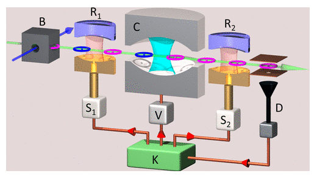 
FIG. 4. Micromaser setup from Ref. [73]: A microwave cavity C in the middle interacts with a stream of atoms prepared and read out using an oven B, Ramsey cavities R1 and R2, and an ionization detector D. In the original experiment the information from the pink atoms was used to feedback control the cavity state with the blue atoms [73], but here we do not consider any feedback control.

📷 Fig 5

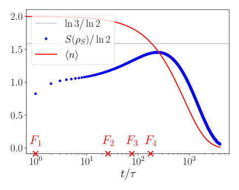 
FIG. 5. As a function of time t/τ in logarithmic scale: ex- pected photon number in the cavity ⟨n⟩(t) (red solid line) and system entropy S[ρC(t)] (blue discs). The red crosses on the x-axis indicate at which time different atom fragments start to interact with the cavity, see the main text for details.

**Summary.** This paper unifies Quantum Darwinism and Decoherent Histories by proposing the concept of 'past redundancy' as the fundamental requirement for observable records in quantum systems. It argues that this concept is more general than QD, suggesting that redundancy can arise from mechanisms other than those previously assumed. This offers a richer, more realistic framework for investigating quantum objectivity.

**Why it may be interesting.** It directly addresses the foundational question of quantum objectivity by providing a broader, less fine-tuned mechanism (past redundancy) for information recording than standard Quantum Darwinism, which is highly relevant to open quantum systems.

Detailed structure

**Main problem.** The paper aims to unify two major paradigms for understanding quantum records—Decoherent Histories (DH) and Quantum Darwinism (QD)—by focusing on the concept of 'past redundancy' in isolated quantum systems.

**Main result.** The proposed framework shows that past redundancy is a more general phenomenon than the fine-tuned conditions required for QD, allowing for redundancy caused by mechanisms beyond standard QD assumptions.

**Method.** The authors develop a unified formalism by analyzing the necessary conditions for redundant records across time, employing concepts like quantum mutual information and the Bhattacharyya coefficient.

**Model / system.** The analysis is performed on isolated quantum systems, often modeled by coupling a system (S) to an environment (E) split into fragments, using generalized CNOT-fan-out models for illustration.

**Key observables.** Quantum Mutual Information (MI), the Bhattacharyya coefficient (BC), and the error probability in hypothesis testing ($	ext{P}_{	ext{error}}$).

**Important parameters / regimes.** The number of environment fragments ($N$), the size of the system ($n$), and the time evolution parameters ($	au_c$).

**Assumptions / limitations.** The initial state in specific models (like CNOT-fan-out) is sometimes considered 'fine-tuned,' and the analysis relies on bounding error probabilities using inequalities like Fano's.

**Figures summary.** Figures illustrate the structure of the environment fragments and show the characteristic redundancy plateau in quantum mutual information, and one figure plots decoherence decay as a function of fragment size.

**Paper structure.** The paper progresses by first defining the limitations of DH and QD separately, then introducing 'past redundancy' as the unifying concept, and finally deriving bounds on error probabilities that quantify this redundancy.

Abstract

There exist two different paradigms for records in isolated quantum systems: decoherent histories (which determines which past events leave formal records) and quantum Darwinism (which determines which current events get redundantly recorded). Neither one implies the other, and connections between the two are scarcely investigated. We unify quantum Darwinism and decoherent histories based on the insight that only redundant records about past events matter. The resulting framework of past redundancy encompasses quantum Darwinism when applied to events at the current time, and it connects redundancy to decoherence of histories and the probability sum rule via the Bhattacharyya coefficient (or fidelity). Importantly, various examples show that past redundancy is a more widespread phenomenon than the fine-tuned models necessary for quantum Darwinism suggest. We thus arrive at a richer picture in which redundancy can be caused by mechanisms different from quantum Darwinism (such as macroevents or cascade structures), which emphasizes that redundancy is necessary but not sufficient for objectivity, and which, overall, allows to realistically investigate the question: how generic is redundancy in nature?

[↑ back to top](#top)

### [Inhomogeneous cluster DMFT study on p-n junction Mott gap closing in Hubbard lattice](http://arxiv.org/abs/2610.09453v1)

**Authors:** Florian Brette, Eunjae Jeong, Hongchul Choi, Ji Hoon Shim, Geunsik Lee  
**Type:** theory · **Category:** strongly correlated electrons · **PDF:** <https://arxiv.org/pdf/2610.09453v1>  
**Analysis basis:** full PDF text, analyzed in chunks
**Topic relevance:** `Keldysh / 2PI / non-Gaussian methods` **2/5** · `analog quantum simulation` **2/5** · `methods for driven-dissipative` **1/5**

📷 Fig 1

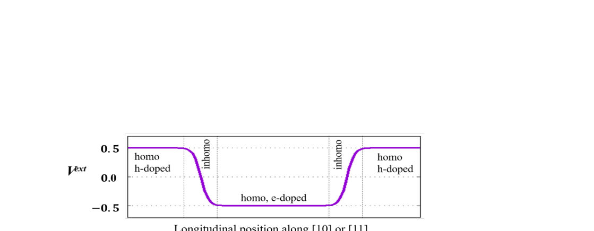 
Figure 1. The profile of external potential, 𝑉𝑒𝑥𝑡, in the inhomogeneous (inhomo in the figure) region between homogeneous (homo) hole-doped (h-doped) and electron-doped (e-doped) domains. By the periodic boundary condition, one supercell contains two inhomogeneous regions or two junctions. The considered direction across the junction is [10] and [11] in the square lattice.

📷 Fig 2

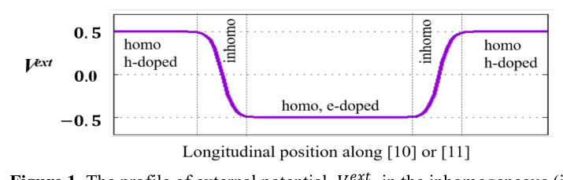 
Figure 2. Indices of inequivalent impurity clusters per one supercell when the external potential is varied along (a) [10], (b) [11]. For [10] or [11] case, there are total 50 or 60 clusters of 2x2 plaquette type, respectively. Owing to the inversion symmetry, the inhomogeneous region between hole-doped and electron-doped regions contains only five independent clusters indexed by I = -2, -1, 0, 1, 2 for the former case, while seven (-3, -2, -1, 0, 1, 2, 3) for the latter case. The potential profile is defined by tanh(x/λ) with x(x10 or x11) = 0 corresponding to the most neutral site.

📷 Fig 3

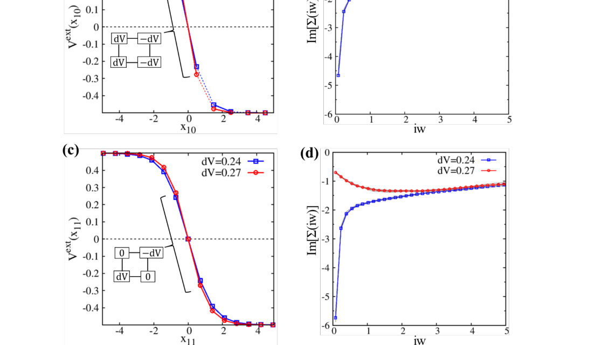 
Figure 3. Plot of 𝑉𝑒𝑥𝑡 values in the left inhomogeneous region in Figure 2 for (a) [10] and (c) [11] cases. Two profiles are plotted for each case, where the steepness is given by the magnitude of dV at the central cluster having x10=0 or x11=0. (b) and (d) are the imaginary part of Matsubara self-energy of the central cluster for the 𝑉𝑒𝑥𝑡 profiles along [10] and [11], respectively.

📷 Fig 4

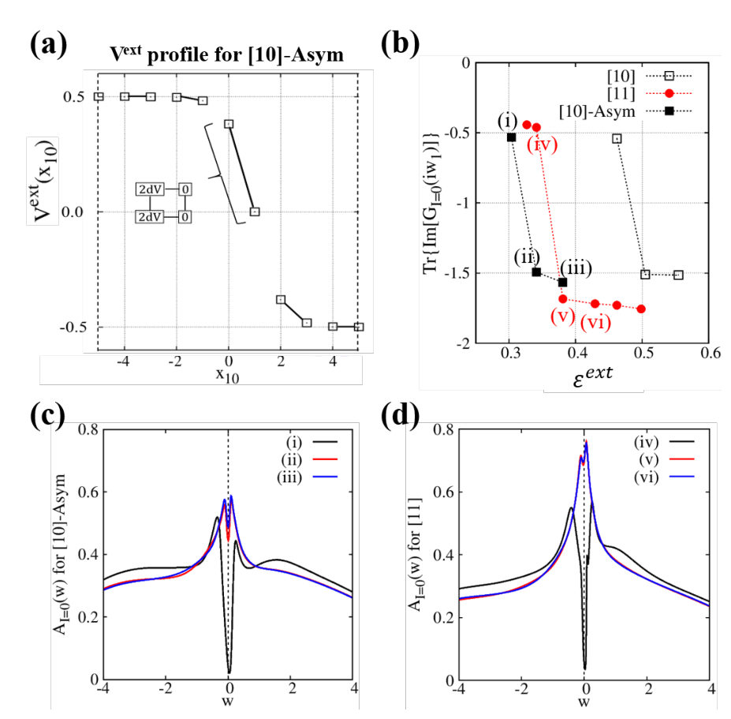 
Figure 4. (a) Profile of 𝑉𝑒𝑥𝑡 for [10]-Asym case, which is similar to Fig. 3(a) but the zero potential level site included. (b) Imaginary part of the central impurity Green’s function at the lowest Matsubara point for chosen values of the field strength (𝜀𝑒𝑥𝑡 ) along [10] and [11] directions. (c) and (d) are the spectra calculated for three selected values of 𝜀𝑒𝑥𝑡, (i)-(iii) for [10]-Asym or (iv)-(vi) for [11] in (b).

📷 Fig 5

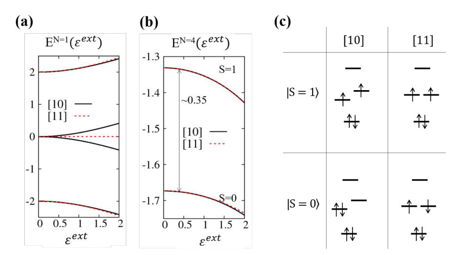 
Figure 5. (a) Energy levels of four molecular (or single-electron) orbitals and (b) two lowest energy eigenvalues (ground state S=0 and first excited S=1) of four-electron states by exact diagonalization for an isolated 2x2 plaquette against 𝜀𝑒𝑥𝑡 along [10] and [11] directions. (c) Occupation representation of the four-electron ground state |S=0&gt; and first excited state |S=1&gt; for non-zero 𝜀𝑒𝑥𝑡 along [10] and [11] directions. The four horizontal bars indicate the molecular orbital energy levels as plotted in (a). The up and down arrows denote +0.5 and -0.5 values of Sz, respectively.

**Summary.** This paper theoretically examines how an external potential gradient across a p-n junction can induce a Mott gap closing in a Hubbard lattice. Using DMFT on plaquette clusters, the authors find that the transition to a correlated metal is governed by the potential drop matching the plaquette's excitation energy. The results highlight the directional dependence of this transition, suggesting that crystal symmetry plays a crucial role in stabilizing the metallic state.

**Why it may be interesting.** The study provides detailed insights into how spatial inhomogeneity (the p-n junction) can tune the Mott insulating state, offering a theoretical framework applicable to engineered correlated materials or interfaces.

Detailed structure

**Main problem.** The study investigates the Mott gap closing mechanism induced by a spatially varying external potential gradient within a p-n junction formed in a Hubbard lattice.

**Main result.** The system transitions to a correlated metallic phase when the potential drop strength becomes comparable to the excitation energy of an open 2x2 plaquette, with the diagonal direction exhibiting enhanced coherence.

**Method.** The research employs Dynamical Mean-Field Theory (DMFT) coupled with the analysis of inhomogeneous 2x2 plaquette impurity clusters solved via CTQMC simulations.

**Model / system.** The model is the Hubbard Hamiltonian on a square lattice, specifically analyzing the physics at a p-n junction where the on-site potential varies smoothly across the interface, characterized by directions [10] and [11].

**Key observables.** The primary observables include the imaginary part of the central impurity Green's function at zero Matsubara frequency, and the coherent peak intensity in the correlated metal spectrum.

**Important parameters / regimes.** Key parameters include the hopping parameter (t), the on-site repulsion (U), and the external potential drop strength ($\epsilon_{ext}$), with transition thresholds found around $\sim 0.35t$.

**Assumptions / limitations.** The analysis relies on mapping the inhomogeneous problem onto $2	imes2$ plaquette impurity clusters within the DMFT framework, and comparisons between different potential profiles are made.

**Figures summary.** Figures illustrate the potential profiles along [10] and [11], the calculated impurity Green's functions showing the transition, and energy level diagrams for the $2	imes2$ plaquette showing degeneracy changes.

**Paper structure.** The paper systematically analyzes the Hubbard model in a p-n junction, comparing the effects of potential gradients along different lattice directions ([10] vs [11]) using DMFT on plaquette clusters to determine the critical field strength for the insulator-to-metal transition.

Abstract

Mott gap closing induced by an external potential gradient is studied by considering the Hubbard model on a square lattice. Our model consists of hole- and electron-doped domains forming the p-n junction where the on-site potential varies smoothly across the interface. The effect of the potential drop direction, either along square edge or diagonal, is studied by describing the correlation effects of inhomogeneous 2x2 plaquette impurity clusters within a dynamical mean-field theory framework. It is found that the metallic phase is favored over the Mott insulators when the potential drop becomes comparable to the energy eigenvalue difference of an open 2x2 plaquette between the ground state and the first excited state. Given the same associated electric-field strength, the excitation energy is almost independent of the drop direction, which amounts ~0.35t at U=5.8t with the hopping parameter t. Upon insulator-to-metal transition, the correlated metal exhibits a coherent peak at zero energy whose intensity is greater for the drop direction along the square diagonal than along the edge. The main origin is attributed to the preserved degeneracy of two molecular orbitals for the former case, while it undergoes splitting in the energy levels for the latter. Our result is discussed regarding the experimentally measured Mott gap closing thresholds.

[↑ back to top](#top)

### [Revealing more on complex energy landscapes by passing less local information: Cavity approach with trust region in non-convex optimization problems](http://arxiv.org/abs/2610.10096v1)

**Authors:** Zhiqi Xu, Chi Ho Yeung  
**Type:** theory · **Category:** disordered systems and neural networks · **PDF:** <https://arxiv.org/pdf/2610.10096v1>  
**Analysis basis:** full PDF text, analyzed in chunks
**Topic relevance:** `analog quantum simulation` **2/5** · `Keldysh / 2PI / non-Gaussian methods` **1/5** · `methods for driven-dissipative` **1/5**

📷 Fig 1

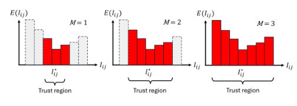 
FIG. 1: Schematic illustration of the trust-region cavity field for different values of M. From left to right, the trust-region sizes are M = 1, M = 2, and M = 3. The red bars represent the cavity-field values retained within the local window m ∈{−M, . . . , M} around the current working point, while the gray dashed bars indicate values outside the trust region that are not retained.

📷 Fig 2

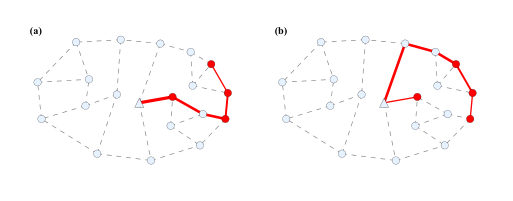 
FIG. 2: Two replicas illustrating different converged local minima of H′ with γ = 0.2 on a random regular graph of N = 20 and k = 3 with a single receiver (triangle) and four senders (red circles). Red lines correspond to occupied edges, with their thickness proportional to the flow magnitude.

📷 Fig 3

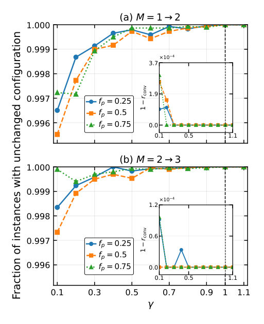 
FIG. 3: Chained single-edge neighborhood-expansion stability test. After convergence of the message-passing algorithm, one edge is randomly selected and its local window is enlarged successively from M = 1 to M = 2 and, after re-convergence, from M = 2 to M = 3. The two main panels show the fraction of unchanged out- comes, defined by |∆E| ≤ϵ with ∆E = Enew −Eold, for the two stages of the chained protocol. The upper panel corresponds to the M = 1 →2 expansion, and the lower panel corresponds to the subsequent M = 2 →3 expan- sion applied to the same selected edge. Different curves represent different sender fractions fp. The consistently high unchanged fraction indicates that the converged...

📷 Fig 4

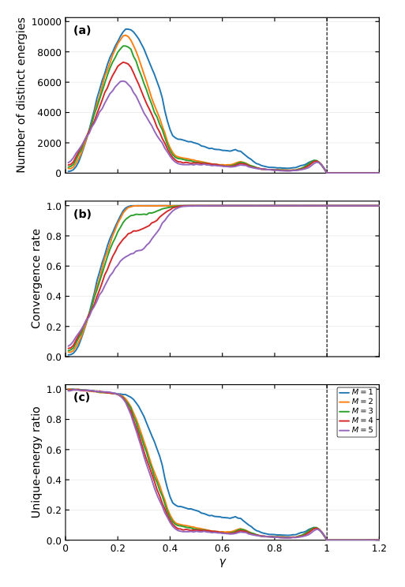 
FIG. 4: Basic landscape diagnostics of the identified local minima for the representative sender fraction fp = 0.5. (a) Number of distinct converged energy values, (b) con- vergence rate, and (c) unique-energy ratio among con- verged replicas as functions of γ for M = 1, 2, 3, 4, 5. The dashed vertical line marks γ = 1, separating the non-convex and convex regimes considered in the text.

📷 Fig 5

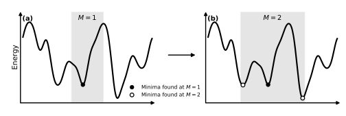 
FIG. 5: Schematic illustration of the effect of enlarg- ing the trust region. The two panels show the same schematic one-dimensional non-convex energy landscape. For M = 1, the narrower trust region restricts the acces- sible local search range and the algorithm identifies a local minimum within the corresponding neighborhood. When the trust region is enlarged to M = 2, a broader region of the landscape becomes accessible, allowing the algorithm to identify other local minima outside the nar- rower neighborhood. The filled and open circles denote the minima identified at M = 1 and M = 2, respectively.

**Summary.** This paper develops a specialized cavity message-passing algorithm incorporating a trust region to analyze complex, non-convex energy landscapes. By limiting the information passed locally, the method achieves stable convergence where standard techniques fail. It successfully characterizes three distinct landscape regimes, providing a robust tool for studying local minima in disordered systems.

**Why it may be interesting.** While the core model is classical optimization, the use of message-passing algorithms, cavity methods, and the analysis of complex energy landscapes strongly connects to concepts used in quantum many-body physics, particularly in understanding glassy dynamics and phase transitions in disordered quantum systems.

Detailed structure

**Main problem.** The paper addresses the difficulty of analyzing complex, high-dimensional energy landscapes arising from non-convex optimization problems, particularly when standard message-passing algorithms fail to converge.

**Main result.** The proposed trust-region cavity message-passing algorithm successfully reveals the structure of these landscapes by limiting local information transfer, demonstrating robustness across different landscape regimes.

**Method.** A novel cavity message-passing algorithm is introduced that incorporates a trust region, restricting message updates to a local window around a reference point, thereby improving convergence in rugged energy landscapes.

**Model / system.** The study uses a routing coordination problem on a sparse random graph, whose cost function's convexity is controlled by a parameter $\gamma$. The analysis is framed within the context of statistical physics message-passing techniques.

**Key observables.** The primary observables are the converged local minima energies, the diversity of low-energy minima, and the stability of the fixed points when the trust region size is progressively increased.

**Important parameters / regimes.** Key parameters include the cost function exponent $\gamma$ (controlling convexity), the sender fraction $f_p$, and the trust region size $M$. Three regimes are identified: maximally rugged, intermediate hierarchical, and smooth.

**Assumptions / limitations.** The approach assumes that the goal is to identify locally stable fixed points rather than the global optimum. The method avoids introducing second-order approximations by directly truncating the message domain.

**Figures summary.** Figures illustrate the schematic of the trust-region cavity field for varying $M$, and show stability tests (e.g., Fig. 3, Fig. 13) confirming that enlarging the trust region does not fundamentally change the identified local minima.

**Paper structure.** The paper introduces the problem using a specific graph optimization model, proposes the trust-region cavity algorithm, analyzes the resulting energy landscape structure across three distinct regimes based on $\gamma$, and validates the method's stability through progressive and independent single-edge expansion tests.

Abstract

Energy landscapes of non-convex optimization problems are high-dimensional surfaces that are difficult to reveal, visualize, or analyze. Message-passing algorithms, or equivalently cavity approaches in statistical physics, may fail to identify local minima as messages do not converge owing to the ruggedness of the energy landscapes. Here we aim to reveal the characteristics of these complex energy landscapes by limiting the amount of information passed in local messages, improving the convergence of messages for local minima. By studying a routing optimization problem with its convexity governed by a single parameter, we introduce a cavity message-passing algorithm with a trust region, and sample ensembles of converged local minima of rugged energy landscapes across many independent realizations of the same problem instances. We observe three regimes with different characteristics of the energy landscapes: (1) a maximally rugged regime with a peak in the diversity of low-energy minima; (2) an intermediate regime with a hierarchical multi-cluster organization of low-energy solutions; and (3) a smooth regime dominated by a single minimum. Additional tests show that the converged energies are largely insensitive to the size of the trust region if the size is small or moderate, demonstrating the robustness of the proposed approach in identifying characteristics of rugged energy landscapes.

[↑ back to top](#top)

### [Spacetime Quasicrystals and Computational Complexity Theory in the Road Towards Quantum Gravity](http://arxiv.org/abs/2610.09855v1)

**Authors:** Sotirios Mygdalas  
**Type:** theory · **Category:** other · **PDF:** <https://arxiv.org/pdf/2610.09855v1>  
**Analysis basis:** full PDF text, analyzed in chunks
**Topic relevance:** `Keldysh / 2PI / non-Gaussian methods` **2/5** · `analog quantum simulation` **1/5** · `quantum measurements` **1/5**

📷 Fig 1

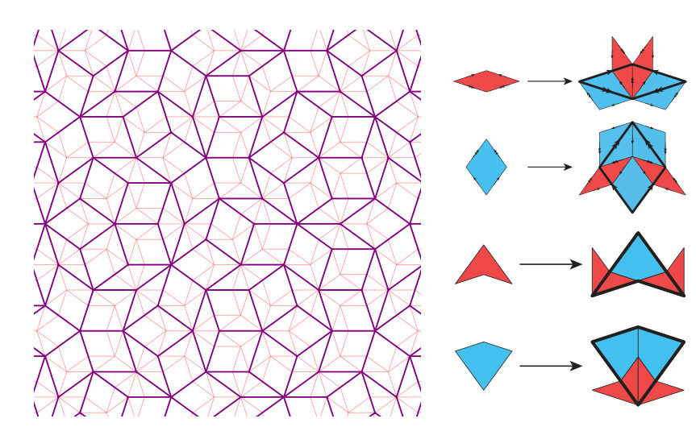 
Figure 1.1: Left: a patch of the Penrose tiling [54] given by rhombs in purple, underlaid by its “inflation” in pink. Right top: the thin (red) and thick (blue) Penrose rhombs, along with their edge-matching rules and inflation rules. Right bottom: Conway’s version of the tiles: “darts” (red) and “kites” (blue) are given with their inflation rules. The two versions are equivalent since tilings built from kites and darts are mutually locally derivable from tilings by rhombs. For an introduction to the Penrose tiling, see Ref. [55]. Figure created by Latham Boyle and reproduced from [68].

📷 Fig 2

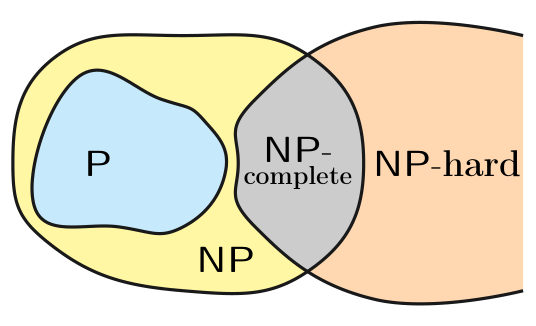 
Figure 2.1: Some relevant complexity classes and their interrelations (see text for formal definitions). P contains problems that can be solved “quickly” (i.e. in polynomial time), while problems in NP can have their solutions verified “quickly” (see Fig. 2.2). Both P and NP contain decision problems. NP-hard contains problems that need not be themselves decision problems nor verifiable “quickly”. For example, they might be decision problems that are ‘undecidable’, like the Halting Problem [82, 83]; thus NP-hard is a strict superset of NP. Yet, any NP problem can be mapped to an NP-hard problem “quickly”. In that sense, NP-hard is at least as hard as NP: if a solution to an NP-hard problem...

📷 Fig 3

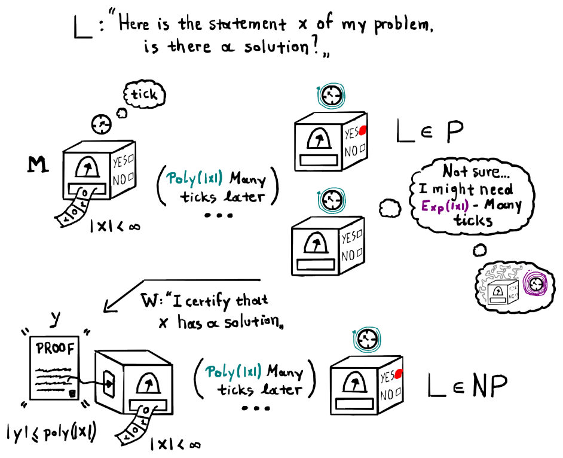 
Figure 2.2: P vs NP: an illustration. A decision problem L is in P if its solution can be found (i.e. it can be decided) by a deterministic Turing machine M in polynomial time (polynomially many “ticks”). A decision problem L is in NP if, provided a witness W supplies us with a proof y that our problem has a solution, M can verify the solution in polynomially many ticks. The proof y must be “written in polynomially many pages” in terms of the size |x| of the input-problem.

📷 Fig 4

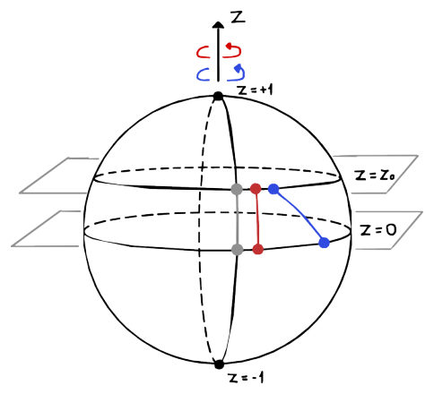 
Figure 4.1: An example of a non-isometric diffeomorphism of the sphere S2: a position- dependent rotation. This twists the sphere and stretches the distance between two grey points that were originally along the same meridian. Due to the differential rotation of S2, the grey point on the z = 0 slice rotates faster than that on the z = z0 slice, leading to the blue points after the map τS2 is applied which are now further apart. On the other hand, the isometric diffeomorphism πS2 rotates all points at the same rate and preserves the original grey distance between the points.

📷 Fig 5

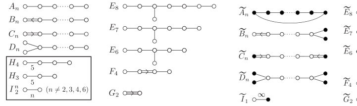 
Figure 6.1: The Coxeter-Dynkin diagrams for the irreducible Coxeter groups of fi- nite/spherical type (left panel) and affine/planar type (right panel). The non- crystallographic cases (H4, H3 and In 2 ) are grouped in the box in the lower left. Each affine diagram (at right) may be obtained by adding a single “extending root” to the cor- responding finite crystallographic diagram (at left); or, alternatively, by removing a single extending node (any of the black nodes) from any affine diagram (at right) we obtain the corresponding finite crystallographic diagram (at left).

**Summary.** This paper bridges quantum gravity, computational complexity, and geometry by examining spacetime quasicrystals. It argues that semiclassical gravity implies computational power beyond classical limits, suggesting quantum gravity. Furthermore, it develops the theory of Lorentzian quasicrystals and uses N-V tests to confirm their unique, hyperuniform structure in spacetime.

**Why it may be interesting.** While not directly focused on AMO systems, the study of non-linear dynamics (qubits in curved spacetime) and the use of advanced mathematical structures (quasicrystals) to model fundamental physics are highly relevant to theoretical quantum information and quantum gravity research.

Detailed structure

**Main problem.** The paper explores the deep connections between solving computationally hard problems, the structure of spacetime geometry via quasicrystals, and the fundamental principles of quantum gravity.

**Main result.** The authors show that semiclassical gravity dynamics can violate the Physical Extended Church–Turing Thesis, suggesting quantum gravity, and they establish that spacetime quasicrystals exhibit novel properties like spacetime hyperuniformity.

**Method.** The work employs two main theoretical approaches: analyzing the weak-field dynamics of qubits coupled to classical gravity, and performing Number-Volume (N-V) tests on constructed Lorentzian quasicrystals in Minkowski spacetime.

**Model / system.** The models include the dynamics of a massive qubit under semiclassical Einstein field equations, and the construction/analysis of Lorentzian quasicrystals, which are generalizations of Penrose tilings to spacetime.

**Key observables.** Computational complexity (NP-completeness), violation of the Physical Extended Church–Turing Thesis, Number-Volume counts ($\langle N
angle$), and the standard deviation of point counts ($\sigma_{N\diamond}$).

**Important parameters / regimes.** The Planck scale ($M_{
m Pl}$), vacuum energy scale ($M_{
m vac}$), electroweak scale ($M_{
m EW}$), and the dimensionality of spacetime (e.g., (3+1)D).

**Assumptions / limitations.** The analysis in Part I assumes the gravitational field is classical and couples semiclassically to quantum fields. Part II relies on constructing highly symmetric quasi-crystalline causal sets.

**Figures summary.** The figures present extensive N-V test data for various lattices (Poisson, integer, Fibonacci) in (2+1)D and (3+1)D, illustrating how the standard deviation of point counts ($\sigma_{N\diamond}$) varies with the boost parameter, demonstrating structural differences.

**Paper structure.** The paper is divided into two parts: Part I addresses the computational power derived from semiclassical gravity, leading to a violation of the Church–Turing Thesis. Part II generalizes quasicrystals to Minkowski spacetime, proposing connections to string theory compactifications and testing their hyperuniformity via N-V tests.

Abstract

Part I: Semiclassical Gravity Efficiently Solves $\mathsf{NP}$-Complete Problems   Assuming the gravitational field is classical and that it couples to quantum fields via the semiclassical Einstein field equations (EFEs), we show that the weak-field dynamics of a massive and non-relativistic qubit can in principle be used to solve an $\mathsf{NP}$-complete problem in polynomial time. We attribute this vast computational power to the non-linear qubit dynamics afforded by the semiclassical EFEs. Consequently, the above two assumptions entail a violation of the Physical Extended Church--Turing Thesis, which we regard as evidence for the quantization of gravity.   Part II: Spacetime Quasicrystals   We generalize self-similar quasicrystals, such as the Penrose tilings, from Euclidean space to Minkowski spacetime. We construct the first examples of Lorentzian quasicrystals and identify their key novel features. We then explore possible connections to fundamental physics. First, we propose a speculative scenario in which our $(3+1)$D universe is embedded in a particularly symmetric $(9+1)$D torus $\mathbb{T}^{9,1}$, previously identified as the most symmetric toroidal compactification of the superstring. We suggest that this construction may shed light on the seesaw relation $M_{\rm Pl}M_{\rm vac} \approx M_{\rm EW}^{2}$ between the Planck, vacuum-energy, and electroweak scales. Second, we replace the random causal sets of causal set theory with ordered, highly symmetric quasi-crystalline causal sets. We find suggestive evidence that our quasicrystals outperform Poisson random sets in the number-volume correspondence in both $(1+1)$D and $(3+1)$D, where such behaviour has been conjectured to be impossible. Finally, extending hyperuniformity from space to spacetime, we show that our $(1+1)$D quasicrystal is the first demonstrated example of a spacetime-hyperuniform structure.

[↑ back to top](#top)

### [A Superfluid at All Temperatures](http://arxiv.org/abs/2610.10169v1)

**Authors:** Sven Harder, Adar Sharon  
**Type:** theory · **Category:** other · **PDF:** <https://arxiv.org/pdf/2610.10169v1>  
**Analysis basis:** full PDF text, analyzed in chunks
**Topic relevance:** `Keldysh / 2PI / non-Gaussian methods` **2/5** · `analog quantum simulation` **1/5**

📷 Fig 1

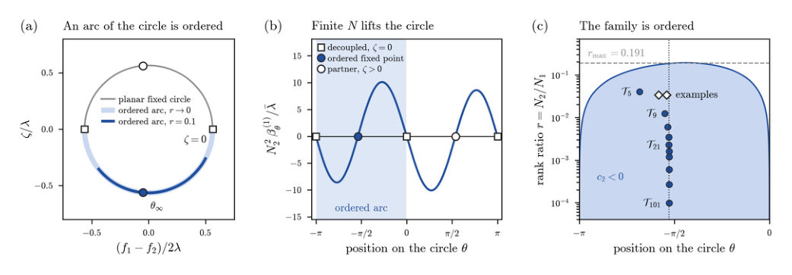 
FIG. 1. From the planar conformal manifold to ordered CFTs at finite N. (a) The circle of planar fixed points (4) in the plane of the double-trace couplings (f1−f2)/2 and ζ, in units of λ. Its lower half, where ζ &lt; 0, is ordered (c2 &lt; 0) for r = N2/N1 →0. At r = 0.1 the ordered arc is shorter, and it shrinks to a point at r = rmax = 0.191. The markers show the points that survive at finite N in the family Tn as n →∞: the decoupled points with ζ = 0 (squares), the ordered fixed point at θ∞(filled circle), and its partner at −θ∞, which has ζ &gt; 0 and is not ordered (open circle). (b) The β-function β(1) θ (6) for the motion along the old circle at finite N, for T21. Its zeros are the fixed...

**Summary.** This paper constructs a family of quantum field theories that exhibit superfluidity at every temperature by controlling the symmetry breaking mechanism through the renormalization group flow. By analyzing $eta$-functions in the large-$N$ limit with finite-$N$ corrections, the authors prove the existence of an infinite family of such theories, which also manifest superconductivity when coupled to electromagnetism.

**Why it may be interesting.** The rigorous construction of a superfluid state at all temperatures in a controlled QFT framework is highly relevant to understanding exotic phases of matter, such as those found in condensed matter systems or in the context of quantum field theory renormalization group flow.

Detailed structure

**Main problem.** The authors aim to construct unitary, local, 3+1-dimensional conformal field theories whose thermal state spontaneously breaks a continuous global symmetry at every temperature.

**Main result.** They constructed an infinite family of such theories where the superfluid nature of the thermal state is under parametric perturbative control, and weakly gauging the symmetry yields a superconductor over an exponential temperature range.

**Method.** The analysis involves calculating and analyzing $eta$-functions up to two loops, comparing the planar limit ($N 	o \infty$) to finite-$N$ corrections ($1/N^2$), and determining fixed points by solving $eta^{(1)}_	heta = 0$.

**Model / system.** The model consists of CFTs defined on $R^3 	imes S^1_eta$ involving Dirac fermions and complex scalars coupled via gauge groups $SU(N_i^a) 	imes SU(N_i^b)$. The system exhibits superfluidity and superconductivity.

**Key observables.** Superfluid stiffness, Meissner mass ($m_M$), thermal free energy density ($\Delta f^*$), and the existence of ordered fixed points.

**Important parameters / regimes.** The large-$N$ limit, finite-$N$ corrections ($1/N^2$), and the coupling constants $\lambda^*_i$ which can be driven to arbitrarily weak values.

**Assumptions / limitations.** The theories are assumed to be unitary, local, and possess finitely many fields. The analysis relies on systematic perturbative expansions in $1/N^2$ and $ar{\lambda}$.

**Figures summary.** Figure 1 illustrates the transition from a planar circle of fixed points to discrete surviving fixed points at finite $N$. Table I summarizes the fixed points found by analyzing one- and two-loop $eta$-functions for various theories.

**Paper structure.** The paper systematically analyzes the $eta$-functions in the large-$N$ limit, identifies the ordered arc of fixed points, incorporates finite-$N$ corrections via a lift, and finally demonstrates the existence of an infinite family of theories exhibiting superfluidity and superconductivity.

Abstract

We construct unitary, local, 3+1-dimensional conformal field theories with finitely many fields whose thermal state breaks a continuous global symmetry at every temperature. They are finite-$N$ versions of the Chaudhuri--Choi--Rabinovici theories, whose planar circle of fixed points has an ordered arc. The circle is lifted at order $1/N^2$, and an infinite family of fixed points on this arc reaches arbitrarily weak coupling, where the superfluid is under parametric control. We also show that weakly gauging the symmetry gives a superconductor over an exponential range of temperatures.

[↑ back to top](#top)

### [Geodesic-based optimal control for leakage suppression in superconducting qubits](http://arxiv.org/abs/2610.09666v1)

**Authors:** Adonai Hilário da Silva, Tanmoy Pandit, Francesco Cosco  
**Type:** theory · **Category:** quantum information and computing · **PDF:** <https://arxiv.org/pdf/2610.09666v1>  
**Analysis basis:** full PDF text, analyzed in chunks
**Topic relevance:** `QC/QI experiment` **2/5** · `quantum measurements` **1/5**

📷 Fig 1

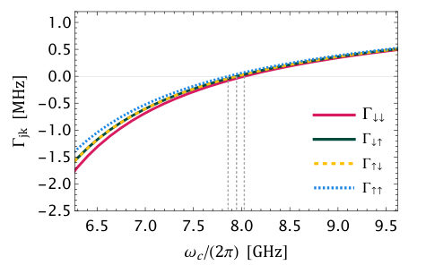 
FIG. 2. Effective coupling constants of Eq. (28) as a function of the frequency of the tunable coupler. The gray dashed vertical lines indicate the values for which each coupling is null. The optimal value for minimal interaction is ωc/(2π) = 7.945 GHz, for which we get |Γ↓↓| and |Γ↑↑| in the order of 240 Hz, and |Γ↓↑| = |Γ↑↓| ≈4 Hz. For the time scale of single- qubit gates, these values correspond to the two qubits being effectively decoupled. For the iSWAP interaction, we select ωc/(2π) = 5.862 GHz, which is still comfortably within the dispersive regime while allowing for exchange interactions.

📷 Fig 2

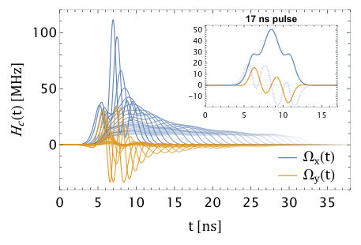 
FIG. 3. Single-qubit pulses resulting in the Rx(π/2) rotation operation with gate time τ for 24 different values ranging from τ = 14 ns to τ = 38 ns. The curves are shown with decreasing opacity as the pulse duration increases. Inset we highlight the specific 17 ns pulse. In dashed blue we show −(1/α)dΩx(t)/dt, showing that the geodesic optimal pulse does not result in Ωy(t) proportional to the first derivative of Ωx(t), differently from DRAG pulses.

📷 Fig 3

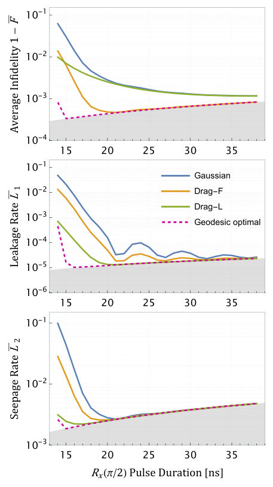 
FIG. 4. Average infidelity, leakage, and seepage rates as functions of the duration of a single-qubit Rx(π/2) pulse using different pulse types. The shaded grey area corresponds to the limit set by the simulated thermal dissipation process. The optimized pulses through the geodesic search method show values for the three analyzed quantities minimized to the limit set by thermal dissipation even for short pulses.

📷 Fig 4

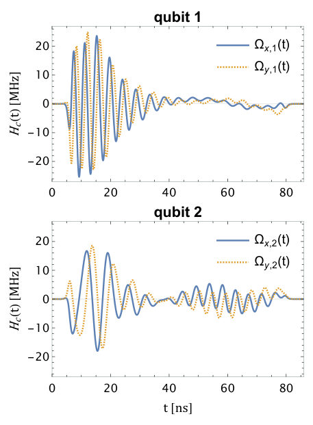 
FIG. 5. Single-qubit pulses applied on each qubit for the synthesis of an iSWAP two-qubit gate. Since the optimization is done in the frame co-rotating with the two- qubits’ frequencies, the oscilations indicate the applied pulses must be off-resonant with the qubits.

📷 Fig 5

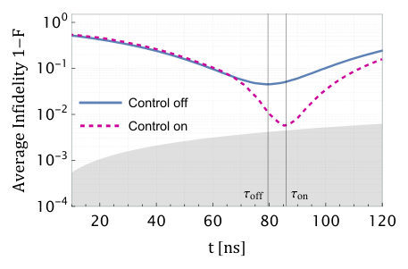 
FIG. 6. Average infidelity for the iSWAP operation as function of evolution time. In complete absence of any signal from the control line, an iSWAP with F = 0.9548 is achieved at t = 79.5 ns. By turning on the control line with the geodesic optimized pulses, it is possible to synthesize the iSWAP with F = 0.9942 at t = 86 ns. The shaded grey area corresponds to the limit set by the simulated thermal dissipation process. The two vertical lines only indicate precisely the values in time τoff = 79.5 ns and τon = 86 ns for which the infidelity is minimum.

**Summary.** This paper develops an advanced optimal control technique based on geodesic search to mitigate leakage errors in superconducting qubits. By smoothly shaping control pulses and deriving an effective Hamiltonian, the authors demonstrate significant improvements in gate fidelity over existing methods for both single- and two-qubit operations. This advances the practical viability of superconducting quantum hardware.

**Why it may be interesting.** This work directly addresses a critical hardware limitation (leakage) in superconducting quantum processors by merging advanced concepts from optimal control theory (differential geometry) with solid-state quantum physics.

Detailed structure

**Main problem.** The primary goal is to suppress leakage errors in superconducting qubits during quantum gate operations, which arise from population leaking to higher energy states.

**Main result.** The proposed geodesic-based optimal control method significantly improves average gate fidelity and reduces leakage errors for single-qubit rotations compared to standard pulses, while achieving higher fidelity for two-qubit gates at the cost of slightly longer evolution times.

**Method.** The authors adapt an optimal control technique using sub-Riemannian geodesic search on the unitary group, incorporating an envelope function to ensure smooth control pulse turn-on and turn-off.

**Model / system.** The system models two superconducting qubits coupled via a tunable coupler, treated as anharmonic LC oscillators. The dynamics are governed by a full Hamiltonian, which is then simplified using Schrieffer-Wolff and Rotating-Wave Approximations to derive an effective Hamiltonian.

**Key observables.** Average gate fidelity, leakage error rate, and the resulting unitary operation U(τ).

**Important parameters / regimes.** Qubit frequencies, anharmonicities, coupling strengths, and the specific control pulse parameters (e.g., for $R_x(\pi/2)$ and iSWAP gates).

**Assumptions / limitations.** The analysis assumes the coupler remains in its ground state (Schrieffer-Wolff) and applies the Rotating-Wave Approximation (RWA) to simplify the Hamiltonian.

**Paper structure.** The paper first reviews the geodesic optimal control formalism and introduces leakage noise mitigation. It then details the physical model for two coupled qubits, deriving the effective Hamiltonian through sequential approximations (SW, RWA). Finally, it presents simulation results comparing the optimal pulses to standard pulses.

Abstract

Superconducting qubits are often based on the first two energy levels of a physical anharmonic LC oscillator. Since the anharmonicity of such systems is usually much lower than the involved energy gaps, population can easily leak to higher energy states. This is what characterizes leakage errors, and it can have multiple sources: from coherent error induced by the control platform to incoherent thermal dissipation. In this work, we adapt an optimal control method based on sub-Riemannian geodesic search in the unitary group for a system consisting of two superconducting qubits with leakage levels. We use the $R_x(π/2)$ rotation for single-qubit operation analysis, and the $i$SWAP operation for two-qubit analysis. For the former, we find considerable performance improvement in average gate fidelity as well as in the reduction of leakage errors when comparing the obtained optimal pulses with Gaussian and DRAG pulses, especially for short duration pulses. For the $i$SWAP gate, although leakage error remains roughly the same, we manage to obtain considerably higher fidelities with the cost of requiring a slightly longer time evolution.

[↑ back to top](#top)

### [Pareto-optimal quantum kernel selection for unsupervised anomaly detection on real malware beaconing data](http://arxiv.org/abs/2610.09717v1)

**Authors:** Boaz Micah, Nadia Milazzo, Maissa Beji, Borja Aizpurua, Llorenç Espinosa-Portalés, Esteban Payares, Ghada Ben Slama, Luc Andrea, Michel Kurek, Thomas Cope, Olivier Salomon  
**Type:** both · **Category:** quantum information and computing · **PDF:** <https://arxiv.org/pdf/2610.09717v1>  
**Analysis basis:** full PDF text, analyzed in chunks
**Topic relevance:** `QC/QI experiment` **2/5** · `quantum measurements` **1/5**

📷 Fig 1

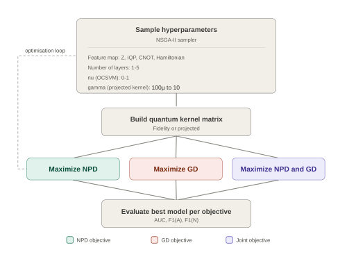 
FIG. 1. The unsupervised optimisation pipeline: a hyper- parameter search over quantum kernels selected under three objectives (NPD, GD, and their joint Pareto knee) and eval- uated on the test set.

📷 Fig 2

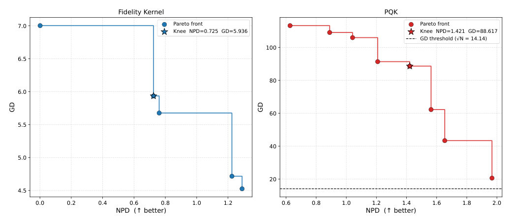 
FIG. 2. Pareto fronts of the fidelity (blue) and projected (red) quantum kernels under joint maximisation of the NPD and GD, evaluated on the statevector simulator. Circles mark the non-dominated configurations of each front; stars mark the selected knee points. The fidelity kernel maintains a low GD across the front, whereas the projected kernel trades a high GD at low NPD for improved NPD, exposing the tension between the two objectives. Each front contains only the configurations that remained non-dominated during the optimisation, which is why the two kernels contribute different numbers of points.

📷 Fig 3

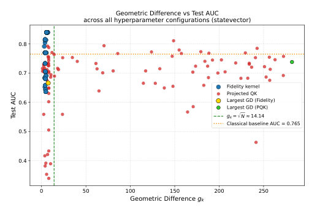 
FIG. 3. Test AUC versus geometric difference gk for all hyperparameter configurations evaluated during the GD- maximisation run (statevector simulation). Blue: fidelity ker- nels; red: projected quantum kernels. The green dashed line marks gk = √

📷 Fig 4

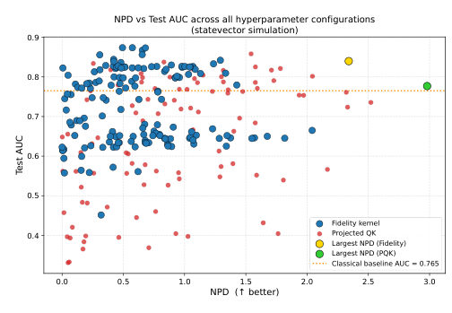 
FIG. 4. Test AUC versus NPD for all hyperparameter config- urations evaluated during the NPD-maximisation run (stat- evector simulation). Blue: fidelity kernels; red: projected quantum kernels. The orange dotted line marks the tuned classical OCSVM baseline (AUC = 0.765). Fidelity kernels concentrate at higher AUC, with a substantial fraction above the baseline, while projected kernels spread widely between AUC ≈0.33 and 0.86 and mostly lie below it. Within each family the NPD–AUC relation is weak. The largest-NPD con- figuration of each family (yellow: fidelity; green: projected) lies above the baseline, at AUC = 0.840 and 0.777 respec- tively.

📷 Fig 5

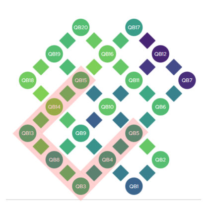 
FIG. 5. Layout of the IQM Garnet QPU. The color map in- dicates single and two-qubit gate errors (darker=higher error, lighter=lower error). We highlight the optimal way to choose a qubit patch to implement a Hamiltonian evolution feature map with nearest-neighbour interactions. The specific patch needs to be adjusted depending on re-calibration of the QPU.

**Summary.** This paper proposes a novel, unsupervised framework to select quantum kernels for anomaly detection by optimizing two metrics: predictive quality (NPD) and structural separation from classical methods (GD). Using real malware data on quantum hardware, the authors demonstrate a fundamental trade-off, showing that the best performance is achieved by a kernel that balances these two objectives rather than maximizing separation alone.

**Why it may be interesting.** The work directly tests quantum machine learning kernels on a real-world cybersecurity problem, providing empirical benchmarks for the utility of quantum feature maps in data analysis, which is highly relevant to quantum information applications.

Detailed structure

**Main problem.** The paper develops a systematic, unsupervised framework to select optimal quantum kernels for anomaly detection, balancing predictive performance against the degree of geometric separation from classical kernels.

**Main result.** The Pareto-optimal selection process identifies a trade-off, showing that while projected kernels achieve large geometric differences, the best detection performance (AUC 0.840) was found using a fidelity kernel selected via the unsupervised Normalized Pseudo Discrepancy (NPD) criterion.

**Method.** It employs a multi-objective optimization protocol to find the Pareto front by simultaneously maximizing the NPD (a label-free anomaly score) and maximizing the Geometric Difference (GD) between quantum and classical kernels.

**Model / system.** The methods are applied to real malware beaconing data, utilizing one-class Support Vector Machines (OCSVM) with both fidelity and projected quantum kernels. Testing was conducted on both simulators and the IQM 20-qubit Garnet processor.

**Key observables.** AUC (Area Under the Curve), Normalized Pseudo Discrepancy (NPD), and Geometric Difference ($g_{C	o Q}$).

**Important parameters / regimes.** The trade-off between high expressivity (large GD) and high task performance (high NPD) is central; hardware noise limits the achievable advantage.

**Assumptions / limitations.** The primary assumption is that the Pareto front guides the optimal model choice, and the NPD score serves as a reliable, label-free proxy for anomaly detection quality.

**Figures summary.** Figures illustrate the unsupervised optimization pipeline searching the Pareto front, and hardware results compare performance metrics (AUC, F1) across different kernel types on the QPU.

**Paper structure.** The paper introduces the multi-objective framework (NPD + GD), details the application to malware data using fidelity and projected kernels, presents results comparing simulation vs. hardware performance, and concludes by characterizing the performance-separability trade-off.

Abstract

Quantum kernel methods are leading candidates for a practical quantum advantage in machine learning, but assessing that potential requires two quantities usually reported separately: how well a kernel performs on the task, and how far its geometry departs from the classical kernels available for the same problem. We introduce a fully unsupervised, multi-objective protocol that optimises simultaneously the normalised pseudo discrepancy (NPD), a label-free proxy for anomaly detection quality, and the geometric difference (GD) to a tuned classical reference kernel, selecting models from the resulting Pareto front. We apply it to malware beaconing detection in real network traffic, using a one-class support vector machine with fidelity and projected quantum kernels over four data encodings, on simulators and on IQM's 20-qubit Garnet processor. NPD-guided selection alone finds a fidelity kernel that beats the tuned classical baseline, but with a geometric difference too small to certify the gain as quantum. Projected kernels reach far larger geometric differences; the Pareto-selected one only marginally exceeds the baseline (AUC $0.782$ versus $0.765$, $g_{C\to Q}\approx 89>\sqrt{N}$ relative to that reference kernel), still below the NPD-selected fidelity kernel ($0.840$).

[↑ back to top](#top)

### [A Cognitive-Aware QML-CRL Framework for Detecting Affinity and Romance-Investment Fraud](http://arxiv.org/abs/2610.09141v1)

**Authors:** Bibhas Adhikari, Ramya Srinivasan  
**Type:** theory · **Category:** other · **PDF:** <https://arxiv.org/pdf/2610.09141v1>  
**Analysis basis:** full PDF text, analyzed in chunks
**Topic relevance:** `quantum measurements` **2/5**

📷 Fig 1

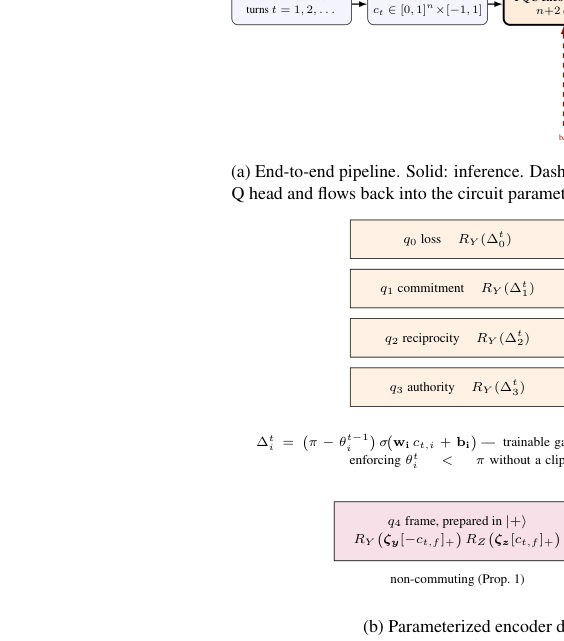 
Figure 1: Complete architecture. (a) The end-to-end pipeline from raw conversation text to a flag/wait decision. (b) Detail of the parameterized quantum-cognitive encoder.

📷 Fig 2

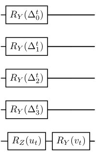 
Figure 2: Gate-level structure of the parameterized quantum-cognitive encoder. All angles shown are functions of the trainable parameters Θ and of the current turn’s cues.

📷 Fig 3

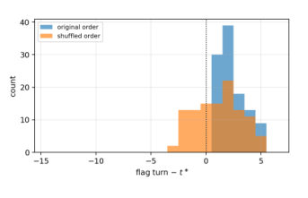 
Figure 3: Training and order-sensitivity results. (a) Joint training enables the mis- specified encoder to adapt after warm-up, whereas the frozen encoder fails to flag. (b) Detection timing under turn-order shuffling with cue content held fixed.

📷 Fig 4

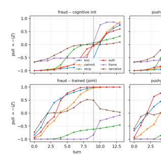 
Figure 4: Risk-feature trajectories at the cognitive initialization (top) and after joint training (bottom), for a fraud conversation, a pushy-sales hard negative, and a benign conversation. Training sharpens the frame channel into the discriminator that separates fraud from pushy sales, while the loss and authority channels saturate on all three classes.

📷 Fig 5

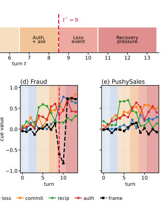 
Figure 5: The synthetic conversation generator. (a) Each fraudulent conversation is divided into six stages by the boundaries ⌊linspace(0, T, 7)⌋, shown here for T = 14; the labelled critical turn t∗is the first turn of the loss-event stage (turn 9), and detection lateness is measured relative to it. (b) Each stage s carries a fixed base level b(s) i ∈[0, 1] for the four bias channels. (c) The frame channel b(s) f ∈[−1, 1] is zero for the first four stages and non-zero only in the last two, with opposite signs, so every fraudulent conversation contains exactly one RZ ↔RY transition. By the sign convention of Eq. (6), ct,f &gt; 0 is loss framing and drives RZ while ct,f &lt; 0 is recovery framing...

**Summary.** This paper introduces a Cognitive-Aware Quantum Machine Learning framework that combines a structured Parameterized Quantum Circuit (PQC) with Reinforcement Learning (RL) to detect financial fraud. The PQC encodes measurable cognitive biases and conversational structure into quantum feature vectors. The RL agent then uses these quantum features to learn the optimal timing for flagging suspicious interactions, treating the detection as an optimal stopping problem.

**Why it may be interesting.** While the application is in NLP/Fraud Detection, the core mechanism involves using quantum circuits to encode structured, non-linear information (cognitive biases, temporal order) into a feature space for a classical control problem (RL), which is a novel application of quantum feature mapping.

Detailed structure

**Main problem.** The paper addresses the detection of affinity and romance-investment fraud by modeling the cognitive biases present in manipulative conversations.

**Main result.** The proposed hybrid quantum-classical framework successfully trains an agent to optimally decide when to flag a conversation based on quantum-derived risk features.

**Method.** It employs a joint training scheme where a Parameterized Quantum Circuit (PQC) encodes cognitive biases, and a classical Reinforcement Learning (RL) agent optimizes the stopping decision.

**Model / system.** The model uses an $(n+2)$-qubit quantum register containing qubits for specific cognitive biases, a frame qubit for temporal order, and a narrative qubit for co-occurrence. The quantum circuit parameters are trained via semi-gradient Temporal-Difference (TD) learning.

**Key observables.** The primary observables are the continuous, per-turn risk signals derived from the quantum register readout, forming the state vector $\mathbf{s}_t$ used by the RL agent.

**Important parameters / regimes.** Key parameters include the bias weights ($\Theta$), the RL action-value weights ($\mathbf{w}_a$), and regularization parameters like $\lambda$ controlling the trade-off between interpretability and adaptability.

**Assumptions / limitations.** The framework assumes that the fraud detection problem can be modeled as an optimal stopping problem solvable by combining quantum feature mapping with RL. It also assumes the synthetic data generation process has no autoregressive structure.

**Figures summary.** Figure 1 illustrates the end-to-end pipeline from raw text to the flag/wait decision, alongside the detailed quantum encoder. Figure 5 details the synthetic data generation process across six distinct stages of a fraudulent conversation.

**Paper structure.** The paper details the architecture (PQC encoder + RL agent), the mathematical formalism for gradient calculation (parameter shift rule, semi-gradient TD learning), the training stabilization techniques (warm-up, anchoring), and the evaluation using synthetic, stage-structured data.

Abstract

We present a hybrid quantum-classical framework that detects affinity and romance-investment fraud by modelling the cognitive biases in a manipulative conversation. In our proposed framework, cognitive biases central to this fraud class are carried by dedicated qubits in a structured parameterized quantum circuit, together with a frame qubit makes the encoding sensitive to the temporal order of manipulative reframing, and a narrative qubit that aggregates co-occurrence through a trainable entanglement layer. The circuit parameters are trained jointly with a classical reinforcement-learning agent that decides, turn by turn, whether to flag the conversation, modeled as an optimal stopping problem. We evaluate the model's performance on synthetic conversations that include hard negatives, legitimate but urgent, and legitimate but pushy sales conversations.

[↑ back to top](#top)

### [An Explicit Counterexample to Tsirelson's Problem via a Linear System Game](http://arxiv.org/abs/2610.10248v1)

**Authors:** Minbo Gao, Tianshi Yu, Lihong Zhi  
**Type:** theory · **Category:** quantum information and computing · **PDF:** <https://arxiv.org/pdf/2610.10248v1>  
**Analysis basis:** full PDF text, analyzed in chunks
**Topic relevance:** `quantum measurements` **2/5**

📷 Fig 1

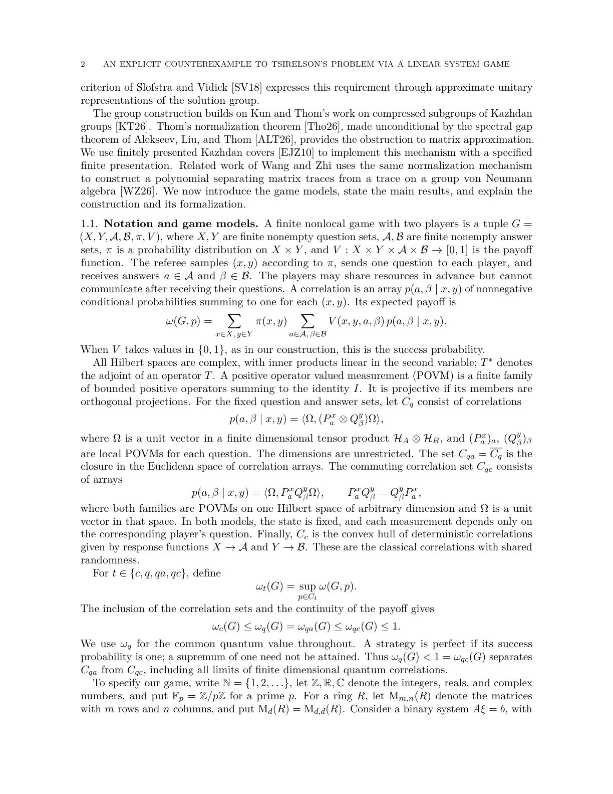 
Low-resolution page preview, page 2

📷 Fig 2

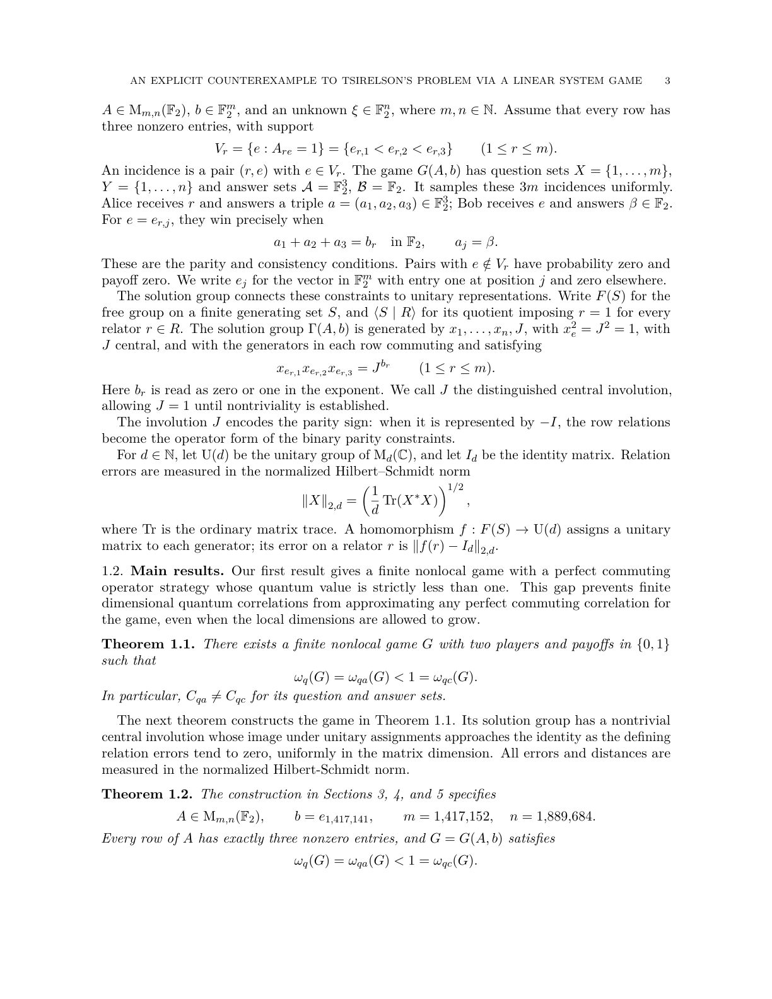 
Low-resolution page preview, page 3

📷 Fig 3

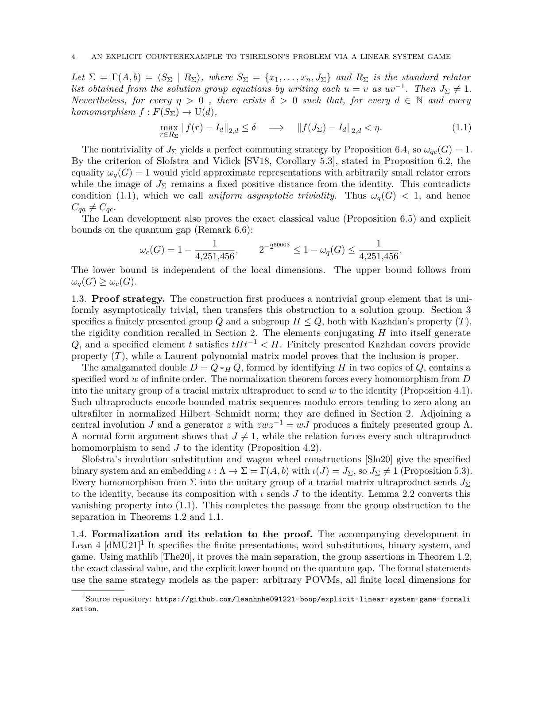 
Low-resolution page preview, page 4

📷 Fig 4

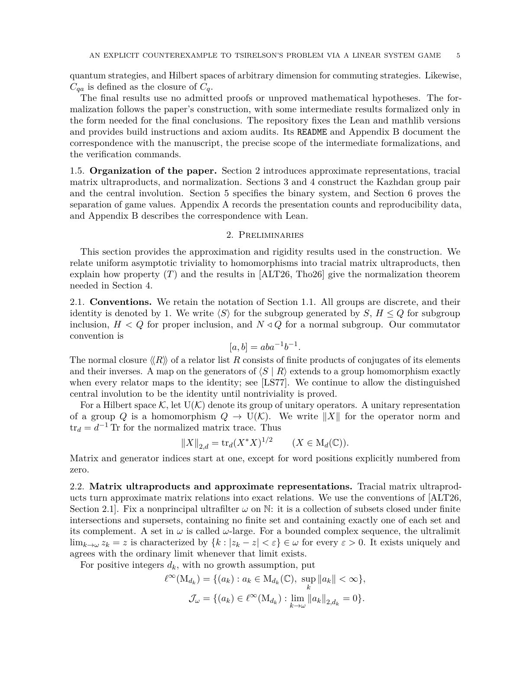 
Low-resolution page preview, page 5

📷 Fig 5

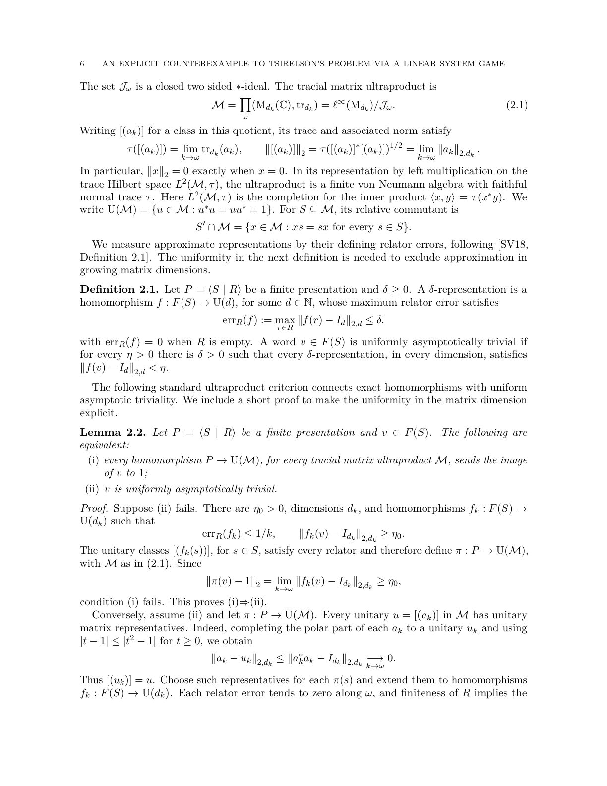 
Low-resolution page preview, page 6

**Summary.** This paper constructs an explicit, large-scale linear system game that serves as a counterexample to Tsirelson's problem in its approximation form. By showing a measurable gap between the achievable quantum correlations ($	ext{Cqa}$) and the correlations from commuting measurements ($	ext{Cqc}$), it proves that these two sets of correlations are distinct. The methodology is highly technical, relying on advanced group theory and formal verification in Lean 4.

**Why it may be interesting.** This work provides a deep, mathematically rigorous counterexample to a fundamental question in quantum information theory, using tools from geometric group theory, which is highly relevant for understanding the limits of quantum correlation models.

Detailed structure

**Main problem.** The paper addresses Tsirelson's problem in its approximation form: determining if quantum correlations achievable by commuting measurements ($	ext{Cqc}$) can always be approximated by correlations from finite-dimensional quantum measurements ($	ext{Cqa}$).

**Main result.** The authors construct an explicit binary linear system game that serves as a concrete counterexample, proving that $	ext{Cqa} 
eq 	ext{Cqc}$ by showing $\omega_{	ext{qa}}(G) < 1 = \omega_{	ext{qc}}(G)$.

**Method.** The proof combines advanced group theory (Kazhdan groups, ultraproducts) to construct a group obstruction, which is then mapped to a concrete linear system game structure to establish the gap in correlation values.

**Model / system.** The model is a binary linear system game $G(A, b)$ defined over $\mathbb{F}_2$, whose correlation values ($\omega_{	ext{qa}}, \omega_{	ext{qc}}$) are analyzed. The underlying mathematical machinery involves finitely presented groups and their representations.

**Key observables.** The primary observables are the expected payoff values $\omega_{	ext{qa}}(G)$ and $\omega_{	ext{qc}}(G)$, with explicit bounds calculated for the gap.

**Important parameters / regimes.** The game parameters are specified by a large matrix size ($m=1,417,152$, $n=1,889,684$), and the gap is quantified by specific rational numbers derived from the construction.

**Assumptions / limitations.** The construction relies heavily on advanced results from group theory, including the properties of Kazhdan's property (T) and the use of tracial matrix ultraproducts for formalization in Lean 4.

**Figures summary.** The notes reference tables detailing the mapping between mathematical statements and their formal declarations in Lean, and tables summarizing the game-value arguments and matrix data.

**Paper structure.** The paper develops by first establishing the theoretical framework using group theory and ultraproducts to generate an obstruction, which is then translated into the concrete structure of a linear system game, culminating in the explicit calculation of the gap between the quantum and commuting correlation values.

Abstract

We construct an explicit binary linear system game that separates \(C_{qa}\), the closure of the set of finite dimensional quantum correlations, from \(C_{qc}\), the set of commuting operator correlations. The game admits a perfect commuting operator strategy, while every correlation in \(C_{qa}\) has a success probability strictly less than 1. This provides a concrete counterexample to Tsirelson's problem in its approximation form. The defining system has \(1{,}417{,}152\) equations in \(1{,}889{,}684\) variables, with exactly three nonzero coefficients per equation and a single nonzero entry on the right hand side. We also compute the classical value exactly. The complete system is specified in Lean~4, and the separation and exact classical value are formalized using Mathlib.

[↑ back to top](#top)

### [Collusion-Secure Semi-Quantum Secret Sharing Scheme using a Quantum Third Party](http://arxiv.org/abs/2610.10176v1)

**Authors:** Santanu Majhi, Nirupam Basak  
**Type:** theory · **Category:** quantum information and computing · **PDF:** <https://arxiv.org/pdf/2610.10176v1>  
**Analysis basis:** full PDF text, analyzed in chunks
**Topic relevance:** `quantum measurements` **2/5**

📷 Fig 1

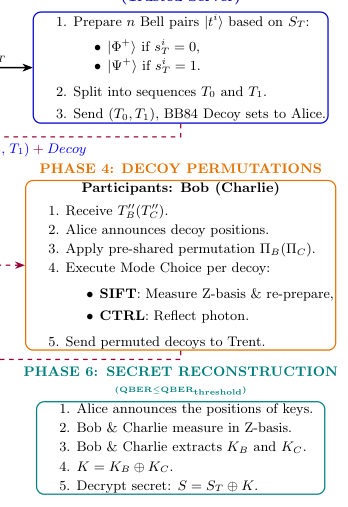 
Fig. 1. Overall architecture of the proposed SQSS protocol. The dotted arrows denote quantum communication, while the solid black arrows denote classical communication among the participating entities.

**Summary.** This paper introduces a robust Semi-Quantum Secret Sharing (SQSS) protocol designed to eliminate critical security vulnerabilities present in prior schemes. By incorporating decoy states and restricting operational authority, the authors achieve information-theoretic security against sophisticated collusion attacks. This advances the practical application of quantum key distribution concepts to secure multi-party computation.

**Why it may be interesting.** This work directly addresses the security foundations of quantum information protocols, which is central to quantum computing and quantum cryptography research.

Detailed structure

**Main problem.** The security of Semi-Quantum Secret Sharing (SQSS) protocols is vulnerable to undetected collusion attacks by dishonest participants, even when assisted by a quantum third party.

**Main result.** The authors propose a novel SQSS protocol that achieves information-theoretic security against collusion attacks and is resilient against various external and internal eavesdropping strategies.

**Method.** The work involves designing a multi-phase quantum protocol incorporating decoy states, restricting operational authority, and using error rate checks (QBER) to detect malicious behavior.

**Model / system.** The model is a quantum communication protocol involving classical participants with limited quantum capabilities (Z-basis measurements) assisted by a quantum third party, utilizing entangled pairs and decoy states.

**Key observables.** Quantum Bit Error Rate (QBER), detection probability of attacks (e.g., DCNA), and the final reconstructed secret key.

**Important parameters / regimes.** Qubit efficiency ($\eta$), the number of decoy particles ($m_X$), and the threshold for QBER.

**Assumptions / limitations.** The security proofs rely on the assumption that the protocol structure restricts the authority of the third party and that operational modes are announced only after all measurements are complete.

**Figures summary.** The notes mention a comparison table (Table 1) summarizing the proposed protocol's advantages over existing schemes regarding security and efficiency, and a trace table (Table 2) detailing an attack simulation.

**Paper structure.** The paper progresses by first identifying vulnerabilities in existing SQSS protocols, then proposing an enhanced, multi-phase protocol, followed by rigorous security proofs against specific attacks (DCNA, EM, DSSA), and finally demonstrating the recovery of the secret under a universal Z-sweep attack.

Abstract

The security of a secret sharing protocol is compromised if one or more dishonest participants can reconstruct the secret by deviating from the prescribed protocol, particularly when such malicious behavior remains undetected. Semi-Quantum Secret Sharing (SQSS) is a variant of secret sharing in which the participants possess only classical capabilities, such as preparing and measuring qubits in the computational ($Z$) basis, while a quantum-capable third party assists the dealer in generating and distributing quantum shares of a classical secret. The limited quantum capabilities of the participants in SQSS protocols may introduce vulnerabilities to collusion attacks, enabling an assisting quantum third party, in collaboration with a dishonest classical participant, to jointly recover the secret even without detection. In this work, we propose a novel SQSS protocol that eliminates this vulnerability and achieves information-theoretic security against collusion attacks. We further prove that the proposed protocol is secure against a broad class of external and internal attacks. Finally, a comparative analysis demonstrates that our construction advances existing SQSS protocols by simultaneously optimizing qubit efficiency, involves a classical dealer, and resilience against DCNA attacks using basic Bell states.

[↑ back to top](#top)

### [Non-Orthogonal Amplitude Amplification for Hybrid CV-DV Quantum Processors](http://arxiv.org/abs/2610.09353v1)

**Authors:** Jiyuan Liu, Joel Bierman, Yuan Liu  
**Type:** theory · **Category:** quantum information and computing · **PDF:** <https://arxiv.org/pdf/2610.09353v1>  
**Analysis basis:** full PDF text, analyzed in chunks
**Topic relevance:** `quantum measurements` **2/5**

📷 Fig 1

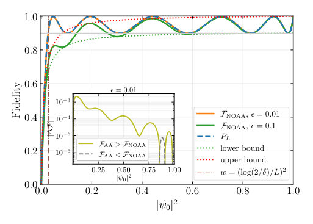 
Figure 1: A comparison between AA and NOAA for two-state model. Both NOAA sequence and AA sequence have degree l = 5 and the error parameter δ2 = 0.1. The AA fidelity PL is given by Eq. (32). The NOAA fidelity FNOAA is given by Eq. (40). The upper bound of NOAA (red dashed line) η is defined in Eq. (40) and the corresponding lower bound (green dashed line) is η(1 −δ2). The horizontal gray solid line represents 1 −δ2, the lower bound of AA. Inset shows the difference |∆F| = |FAA −FNOAA|, where ϵ for NOAA here is 0.01.

📷 Fig 2

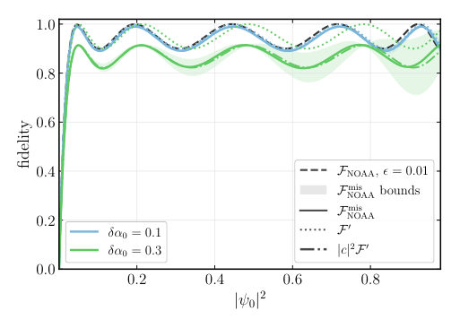 
Figure 2: A comparison between matched NOAA and mismatched NOAA for two-state model. Both NOAA sequences have degree l = 5 and the error parameter δ2 = 0.1. The ϵ of matched NOAA is 0.01. The shaded region represents the bounds defined in Eq. (47). The blue lines are mismatched NOAA with |δα0| = 0.1 and the green lines are mismatched NOAA with |δα0| = 0.3.

📷 Fig 3

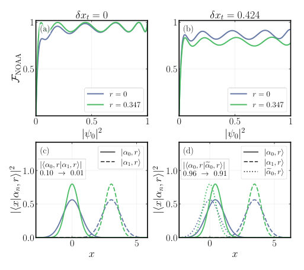 
Figure 3: Comparison between unsqueezed-state model and squeezed states model. We consider a two-state NOAA model with sequence degree l = 5, fixed-point error parameter δ2 = 0.1, we numerically calculate the fidelity with QuTiP [22]. The target oscillator state is centered at x0 = 0, while the non-target state is chosen to center at x1 ≈3.03 such that ϵ = |⟨α0, r|α1, r⟩| = 0.1 for r = 0 with α0 = x0/ √

📷 Fig 4

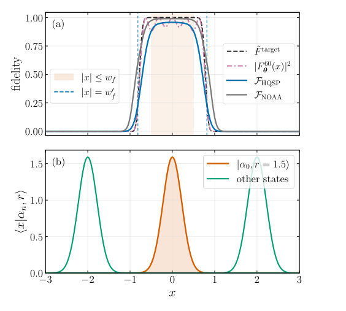 
Figure 4: HQSP filter and NOAA. (a) The numerical result of the target function ˜F target, the encoded polynomial F 60 θ , the fidelity of HQSP FHQSP and NOAA FNOAA, with QuTiP [22]. The target function ˜F target(x) is defined in Eq. (63). F 60 θ (x) is the degree-60 polynomial encoded in HQSP, defined in Eq. (66). We use an input state |χ⟩= |0⟩q ⊗|α, r⟩o ⊗|0⟩Q with α = x/ √

📷 Fig 5

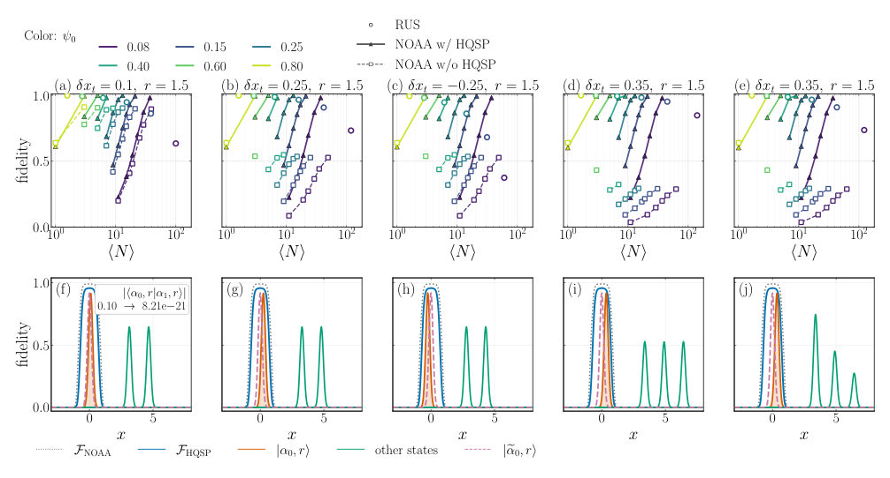 
Figure 5: Comparison of RUS and NOAA performance for different target-energy mismatches and initial-state distributions. Panels (a)–(e) show the target-state fidelity as a function of the average number of state-preparation queries ⟨N⟩. Colors denote different initial target amplitudes ψ0. Open circles represent RUS, filled triangles represent NOAA preceded by the HQSP filter, and open squares represent NOAA without HQSP. The parameters of HQSP are d = 60, ϵsm = 0.33, T = 10 and target width is wf = 0.5. We use the phase angles of NOAA given in Eq. (31) with δ2 = 0.01. We choose the squeezing parameter r = 1.5 for initial state |Ψr 0⟩. Panels (f)–(j) show the corresponding oscillator...

**Summary.** This paper introduces Non-Orthogonal Amplitude Amplification (NOAA) for quantum processors combining continuous and discrete variables. It addresses fidelity limitations arising from non-orthogonal state overlaps and energy measurement errors. By proposing a High-Quality Spectral Projector (HQSP) filter, the authors show that their method outperforms standard techniques like RUS, particularly for preparing states with small initial amplitudes.

**Why it may be interesting.** This work is highly relevant as it tackles practical limitations (non-orthogonality, imperfect knowledge) in implementing quantum search algorithms on complex, hybrid quantum hardware architectures.

Detailed structure

**Main problem.** The paper addresses developing a Non-Orthogonal Amplitude Amplification (NOAA) method for hybrid Continuous Variable-Discrete Variable (CV-DV) quantum processors when the available projector is not perfectly selective for the target state.

**Main result.** The proposed protocol, utilizing a squeezed CV ancilla and a HQSP filter, achieves higher fidelity and efficiency than the Repeat-Until-Success (RUS) method for small initial target amplitudes, even in the presence of non-orthogonality.

**Method.** The authors generalize Amplitude Amplification (AA) to the NOAA framework and mitigate performance degradation using a High-Quality Spectral Projector (HQSP) filter to suppress errors from imperfect state discrimination and energy mismatch.

**Model / system.** The system modeled is a hybrid CV-DV quantum processor, combining continuous variables (oscillators) with discrete variables (qubits). The protocol relies on spectral-transformation oracles acting on this coupled system.

**Key observables.** Target-state fidelity ($	ext{F}_{	ext{NOAA}}$), success probability ($P_s$), and the degree of fidelity degradation due to state non-orthogonality or energy mismatch.

**Important parameters / regimes.** Initial target-state amplitude ($\psi_0$), squeezing parameter ($r$), and the degree of energy mismatch ($\delta\alpha_0$).

**Assumptions / limitations.** The primary limitation is that the CV-assisted reflection is non-selective due to non-orthogonal CV states associated with different DV eigenstates, and the target eigenenergy may only be known approximately.

**Figures summary.** The notes mention analyzing oscillator wavepackets and filter responses, showing how the HQSP filter keeps the target wavepacket within the passband, which is crucial for maintaining high fidelity.

**Paper structure.** The paper first establishes the problem of non-orthogonality in CV-DV systems, derives the fidelity bounds, and then proposes the HQSP-assisted NOAA protocol. It compares this protocol's performance against the standard Repeat-Until-Success (RUS) method across different regimes of initial amplitude.

Abstract

We introduce a non-orthogonal amplitude amplification (NOAA) method for hybrid continuous-variable- discrete-variable (CV-DV) quantum processors, where the available CV-assisted projector is not perfectly se- lective for the target state. We establish a bound on the achievable target-state fidelity, which is determined by the initial target-state amplitude and the selectivity of the accessible reflection operator. This bound limits the performance of NOAA in hybrid CV-DV systems. To mitigate this limitation, we propose using a squeezed CV ancilla to reduce the overlap between relevant CV states and a hybrid quantum signal processing (HQSP) filter to suppress errors arising from imperfect knowledge of the target eigenenergy. Numerical simulations show that, for small initial target-state amplitudes, our protocol achieves higher fidelity and efficiency than the repeat-until-success (RUS) method despite the presence of non-orthogonality. For large initial amplitudes, RUS is already efficient, and amplitude amplification provides little additional advantage.

[↑ back to top](#top)

### [Optimized discrete Wigner representations and non-stabilizerness in qubit systems](http://arxiv.org/abs/2610.10471v1)

**Authors:** A. B. Klimov, C. Muñoz, I. Sainz  
**Type:** theory · **Category:** quantum information and computing · **PDF:** <https://arxiv.org/pdf/2610.10471v1>  
**Analysis basis:** full PDF text, analyzed in chunks
**Topic relevance:** `quantum measurements` **2/5**

📷 Fig 1

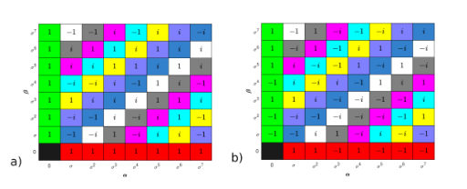 
FIG. 1. a) Phase space arrangement corresponding to the partition (26) with all positive phases (35); b) the same with especially chosen signs of phases (15), n = 3 [60].

📷 Fig 2

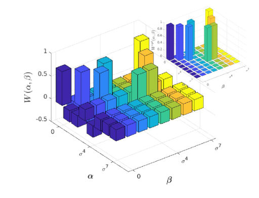 
FIG. 2. a) The Wigner function for the cluster state (54) in the arrangement given in Fig. 1a of the partition (26). b) the same in the arrangement given in Fig. 1b, n = 3 [60].

📷 Fig 3

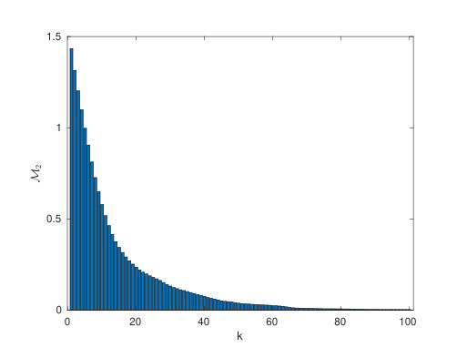 
FIG. 3. The stabilizer entropy (68) along numerical descent toward flat states for five qubits. The bars are averages over 100 successful Haar-initialized trajectories that reached the minimum within numerical precision in fewer than 120 ac- cepted updates. The coordinate k counts the number of steps used in the gradient optimization algorithm.

📷 Fig 4

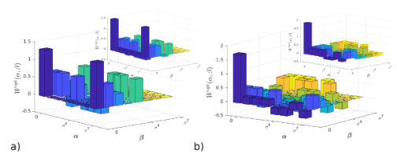 
FIG. 4. The optimized Wigner function in the partition (26) for a) W-state, |W ⟩∼|100⟩+ |010⟩+ |001⟩; b) domain wall state |DW ⟩∼|000⟩+ |100⟩+ |110⟩+ |111⟩; Inset plots: the optimized Wigner functions for the same states in the parti- tion (C1)-(C4), n = 3 [60].

📷 Fig 5

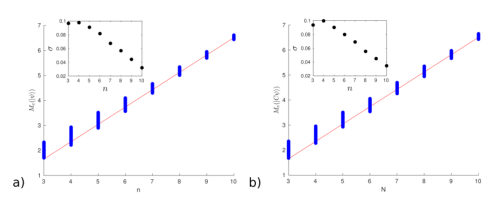 
FIG. 5. a) The witness (69) in the partition (26) as a function of the number of qubits for 1000 Haar random states. b) The witness (69) in the partition (26) as a function of the number of qubits for a Haar state after 1000 random Clifford transformations. Red line: M = n ln 2 + γ −1 [60].

**Summary.** This paper develops a novel, optimized phase-space characterization for qubit stabilizer states by adapting the discrete Wigner function to the specific state. It constructs a non-stabilizer witness based on this optimization, which allows for the rigorous, operational detection of non-stabilizer quantum states. The results restore a meaningful geometric understanding of stabilizer structure in the context of quantum information theory.

**Why it may be interesting.** This work provides a powerful, operational diagnostic tool (the witness) to distinguish stabilizer states from general quantum states using phase-space geometry, which is fundamental to understanding quantum resource theories.

Detailed structure

**Main problem.** The paper addresses the lack of a fundamental, state-independent phase-space description for qubit stabilizer states when using the discrete Wigner function.

**Main result.** By introducing a state-adapted optimization procedure, the authors prove that stabilizer states admit an exact delta-function Wigner representation, leading to a non-stabilizer witness that certifies non-stabilizerness.

**Method.** The methodology involves optimizing the discrete Wigner map based on measurement statistics across mutually unbiased bases (MUBs) and analyzing the resulting witness quantity under random Clifford transformations.

**Model / system.** The system under study is the $n$-qubit quantum system, analyzed using the discrete phase space defined by Pauli operators and displacement operators. The structure relies heavily on the properties of stabilizer states and complete MUB partitions.

**Key observables.** The non-stabilizer witness $W_{	ext{opt}}(0)$ (optimized Wigner function at the origin), and the covariance $	ext{Cov}_C(X_\lambda(C), X_\mu(C))$ of observables.

**Important parameters / regimes.** The number of qubits ($n$), the dimension ($d=2^n$), and the effective number of statistically distinct phase patterns ($N_{	ext{eff}}$).

**Assumptions / limitations.** The analysis assumes the existence of a complete stabilizer MUB partition and relies on asymptotic limits (large-qubit limit) for the stability of the witness.

**Figures summary.** Figure 1 illustrates the discrete phase space partition ($\pi$) for qubits, showing how different choices of cocycle phases lead to different arrangements.

**Paper structure.** The paper progresses by first identifying the limitation of fixed Wigner maps, then introducing the state-adapted optimization, proving the delta-function representation for stabilizers, and finally developing advanced tools (covariance estimation, large deviation theory) to diagnose non-stabilizerness robustly.

Abstract

The apparent absence of a stabilizer-speci?c phase-space description for qubit systems is not fundamental, but arises from ?xing a state-independent discrete Wigner map. Allowing the phase-space representation to adapt to the state through a simple optimization procedure, we prove that every qubit stabilizer state admits an exact delta-function discrete Wigner representation for any ?xed phase-space partition. This optimization can be implemented directly at the level of measurement statistics by selecting maximal probabilities across mutually unbiased bases forming the partition. This construction naturally leads to a non-stabilizer witness de?ned by the optimized value of the Wigner function at the origin. Stabilizer states saturate the universal lower bound of this witness for pure states, whereas a value strictly larger than the bound certi?es non-stabilizerness. Although the witness is not a ?nite-size resource monotone, it becomes sharply concentrated and e?ectively invariant under random Cli?ord transformations in the large-qubit limit, suggesting an asymptotically linear growth law for broad families of non-stabilizer states. Our results restore a meaningful geometric phase-space characterization of qubit stabilizer structure and provide an operational diagnostic of non-stabilizerness.

[↑ back to top](#top)

### [Polarized neutron diffraction with ex-situ $^3$He neutron spin filter and two-dimensional detector for noncollinear incommensurate magnetic order](http://arxiv.org/abs/2610.09345v1)

**Authors:** Shingo Takahashi, Yuta Osawa, Ryuju Kobayashi, Takashi Ino, Hiraku Saito, Takuro Kawasaki, Takayuki Oku, Tatsuya Nakamura, Yoichi Ikeda, Masaki Fujita, Daisuke Koto, Yusuke Tokunaga, Taka-hisa Arima, Taro Nakajima  
**Type:** experiment · **Category:** other · **PDF:** <https://arxiv.org/pdf/2610.09345v1>  
**Analysis basis:** full PDF text, analyzed in chunks
**Topic relevance:** `quantum measurements` **2/5**

📷 Fig 1

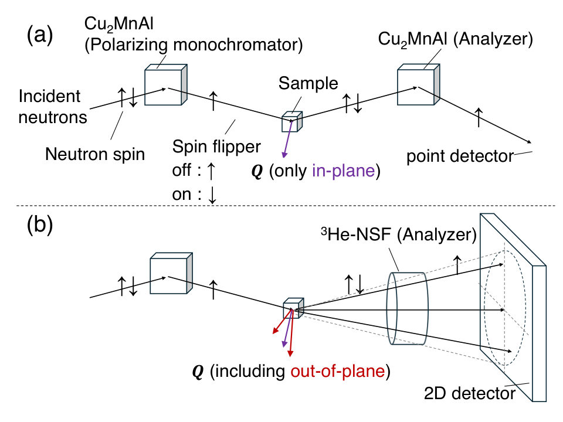 
Figure 1: Schematic illustrations comparing neutron polarization analysis techniques. (a) Conven- tional setup using Heusler crystals for both the polarizer and the analyzer, where only in-plane scattered neutrons are detected by a point detector. (b) Polarization analysis setup combining a 3He-NSF and a 2D detector, enabling detection of both in-plane and out-of-plane scattered neu- trons.

📷 Fig 2

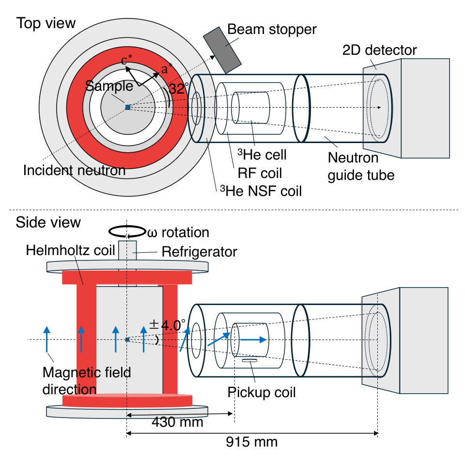 
Figure 2: Schematic illustration of the experimental setup on the 5G beamport. Scattered neutrons from the sample pass through the 3He-NSF coil and the neutron guide tube before reaching the 2D detector. The sample is mounted in a cryostat whose rotation angle is denoted by ω. The magnetic field direction induced by the Helmholtz coil is vertical, whereas the field within the 3He-NSF is oriented along the beam axis. The neutron spins are adiabatically rotated to follow the field direction. A radio-frequency (RF) coil is used to flip the 3He polarization, and an NMR pickup coil monitors the 3He polarization after each spin flip.

📷 Fig 3

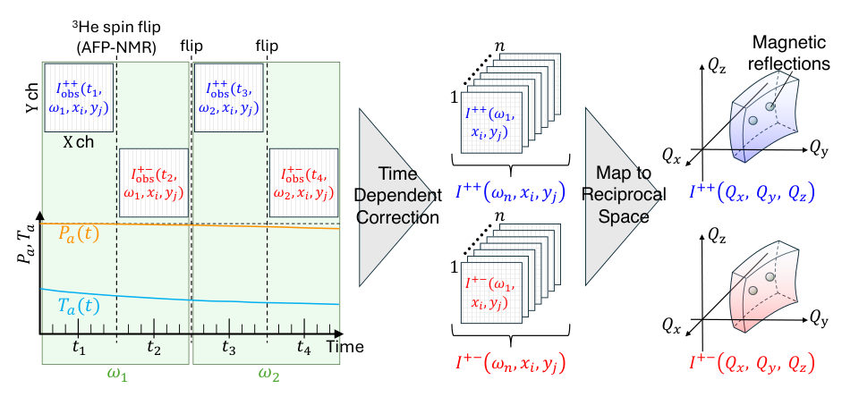 
Figure 3: Schematic diagram of the data-reduction procedure for polarization analysis using an ex- situ 3He-NSF and a 2D detector. Raw 2D detector data measured at different sample rotation angles ω and times t are corrected for the time-dependent neutron polarization Pa(t) and transmission Ta(t) of the 3He-NSF. The detector coordinates (X,Y) and sample rotation angle ω are converted to Qx, Qy, Qz, and then transformed to H, K, L using the UB matrix. The corrected three-dimensional reciprocal-space data can then be sliced along an arbitrary plane.

📷 Fig 4

 
Figure 3 shows the procedure for data acquisition, reduction, and polarization correction in the

📷 Fig 5

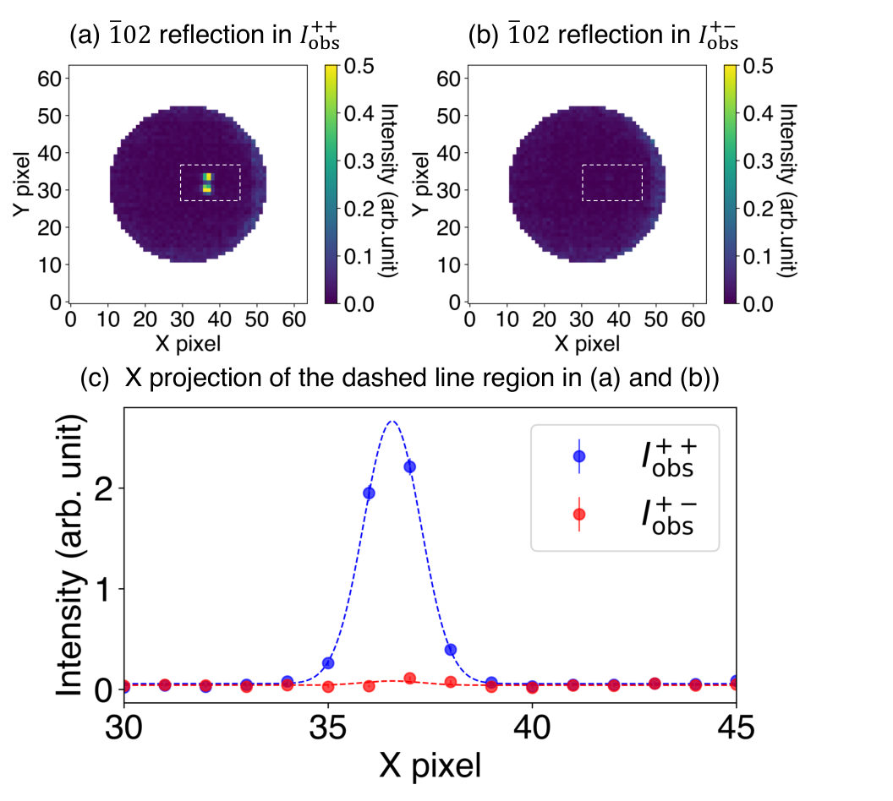 
Figure 4: (a) Observed non-spin-flip (I++ obs ) and (b) spin-flip (I+− obs ) intensity maps, showing only the analyzing region. (c) Line profile along the X direction, obtained by integrating the intensity within the rectangular regions indicated by the dashed lines in (a) and (b).

**Summary.** This paper introduces an advanced experimental technique using a $^3	ext{He}$ neutron spin filter and a $	ext{2D}$ detector to measure polarization-dependent neutron scattering in three dimensions. By applying this method to $	ext{Mn}_3	ext{WO}_6$, the authors successfully analyzed out-of-plane incommensurate magnetic reflections. This development overcomes the limitations of older setups, enabling detailed studies of complex magnetic structures like multiferroics.

**Why it may be interesting.** This work represents a significant advancement in experimental techniques for probing magnetic order, providing a powerful tool to map magnetic structure in $3	ext{D}$ reciprocal space, which is crucial for understanding emergent phenomena in correlated materials.

Detailed structure

**Main problem.** Studying complex, noncollinear, and incommensurate magnetic orders in condensed matter materials requires measurements that extend beyond the traditional horizontal scattering plane.

**Main result.** The developed technique successfully measured polarization-dependent intensities of out-of-plane incommensurate magnetic reflections in $	ext{Mn}_3	ext{WO}_6$, confirming the suitability of the method for complex magnetic structure analysis.

**Method.** The authors employed polarized neutron diffraction using an *ex-situ* $^3	ext{He}$ neutron spin filter ($	ext{}^3	ext{He-NSF}$) coupled with a two-dimensional ($	ext{2D}$) detector to analyze out-of-plane scattering polarization.

**Model / system.** The experiment was performed on the multiferroic single crystal $	ext{Mn}_3	ext{WO}_6$. The methodology involves complex data reduction procedures to convert $	ext{2D}$ intensity maps into full $3	ext{D}$ reciprocal space distributions while correcting for time-dependent neutron polarization and transmission.

**Key observables.** Polarization-dependent intensities of magnetic reflections, specifically the asymmetry value derived from non-spin-flip and spin-flip scattering intensities.

**Important parameters / regimes.** The analysis is sensitive to the magnetic modulation wavevectors ($	ext{q-vectors}$) running in various directions, and the polarization analysis relies on measuring the asymmetry $	ext{Asymmetry} = (I^{++} - I^{+-}) / (I^{++} + I^{+-})$.

**Assumptions / limitations.** Key assumptions include treating the polarizer transmission as constant and using time-dependent correction procedures based on the $	ext{}^3	ext{He}$ polarization measured via NMR.

**Figures summary.** Figures illustrate the comparison between conventional in-plane measurements and the new out-of-plane capability; schematics detail the $	ext{}^3	ext{He-NSF}$/$	ext{2D}$ detector setup and the complex data reduction workflow.

**Paper structure.** The paper first establishes the limitations of conventional setups, then details the novel experimental setup combining the $	ext{}^3	ext{He-NSF}$ and $	ext{2D}$ detector. It rigorously derives the time-dependent data reduction procedure, applies this method to $	ext{Mn}_3	ext{WO}_6$, and finally uses the measured polarization asymmetries to constrain the magnetic structure model.

Abstract

Polarized neutron scattering has been widely used for studying magnetic orders in condensed matter. A typical setup for this technique is a triple-axis spectrometer with a ferromagnetic single-crystal monochromator and analyzer, which is suited for point-by-point measurements within the horizontal scattering plane. However, this setup cannot fully meet the demands of recent studies on complex magnetic orders with emergent cross-correlated phenomena. For instance, multiferroics, magnetic skyrmions, and other topologically nontrivial magnetic orders tend to have incommensurate magnetic modulation vectors running along various directions in reciprocal space, which cannot be captured by measurements restricted to the horizontal scattering plane. To overcome these limitations, we have developed an experimental setup combining a $^3$He neutron spin filter ($^3$He-NSF) and a two-dimensional (2D) detector, which enables us to analyze the polarization of neutrons scattered away from the horizontal plane. We also establish a data reduction procedure to convert the 2D intensity maps into three-dimensional intensity distributions in reciprocal space, correcting for the effect of imperfect $^3$He polarization. This method is applied to single-crystal diffraction measurements on the multiferroic material Mn$_3$WO$_6$, which exhibits complex incommensurate magnetic orders. We have successfully observed polarization-dependent intensities of out-of-plane incommensurate magnetic reflections, demonstrating the effectiveness of the present method for analyzing complex magnetic structures.

[↑ back to top](#top)

### [From a Hierarchy of Stochastic Differential Equations to a Hierarchy of Generalized Beta Distributions](http://arxiv.org/abs/2610.10476v1)

**Authors:** Siqi Shao, R. A. Serota  
**Type:** theory · **Category:** statistical mechanics · **PDF:** <https://arxiv.org/pdf/2610.10476v1>  
**Analysis basis:** full PDF text, analyzed in chunks
**Topic relevance:** `Keldysh / 2PI / non-Gaussian methods` **1/5** · `analog quantum simulation` **1/5** · `correlated / nonlocal dissipation` **1/5** · `driven-dissipative phase transition` **1/5** · `methods for driven-dissipative` **1/5** · `non-equilibrium universality` **1/5**

📷 Fig 1

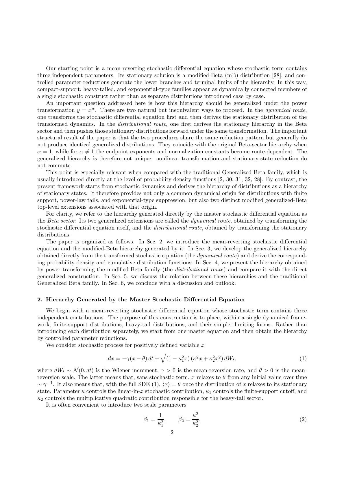 
Low-resolution page preview, page 2

📷 Fig 2

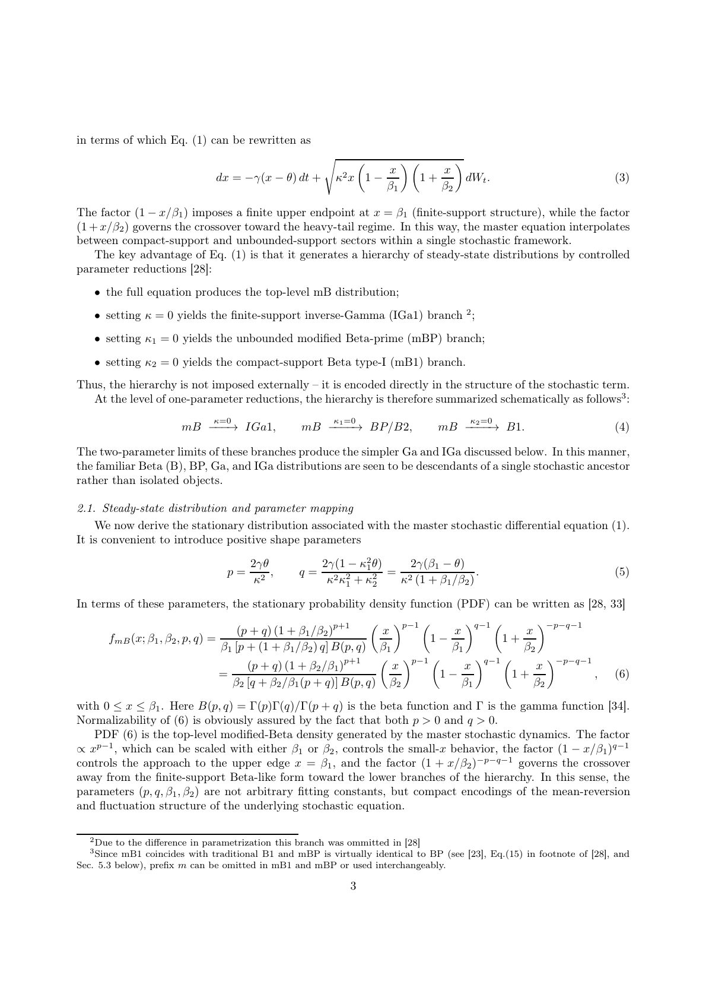 
Low-resolution page preview, page 3

📷 Fig 3

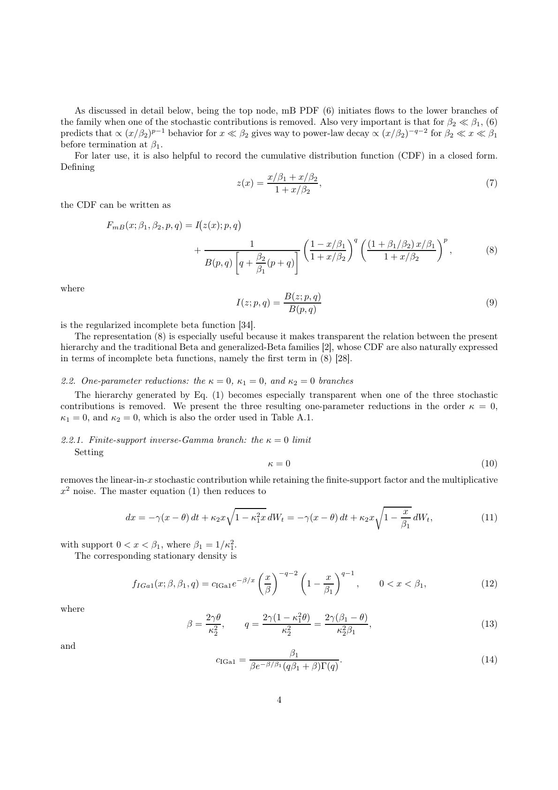 
Low-resolution page preview, page 4

📷 Fig 4

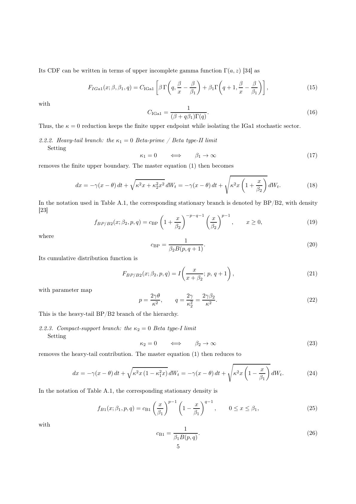 
Low-resolution page preview, page 5

📷 Fig 5

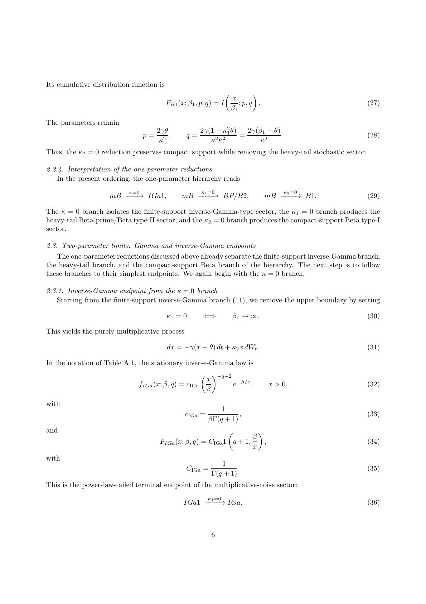 
Low-resolution page preview, page 6

**Summary.** This paper develops a comprehensive framework to characterize a hierarchy of probability distributions arising from a specific mean-reverting Stochastic Differential Equation. It introduces two methods—transforming the SDE versus transforming the stationary solutions—and proves that these two approaches yield different generalized distributions, highlighting a fundamental non-commutativity in the mathematical procedure.

**Why it may be interesting.** While the focus is on classical stochastic processes, the mathematical machinery of deriving complex, multi-parameter distributions from underlying dynamics (SDEs) is highly relevant to modeling non-equilibrium steady states in quantum systems.

Detailed structure

**Main problem.** The paper investigates the stationary distributions generated by a mean-reverting Stochastic Differential Equation (SDE) and explores how these distributions can be generalized.

**Main result.** The authors show that generalizing the hierarchy via power transformations yields two distinct, non-commuting routes (dynamical vs. distributional), meaning the generalized hierarchy is not unique.

**Method.** The methodology involves deriving stationary probability density functions (PDFs) from a master SDE and comparing results obtained by transforming the SDE versus transforming the resulting stationary PDFs.

**Model / system.** The model is a mean-reverting SDE for a positively defined variable, which generates a hierarchy of distributions related to the Generalized Beta family. The analysis involves parameter reductions ($\kappa=0, \kappa_1=0, \kappa_2=0$) to map to known distributions.

**Key observables.** Probability density functions (PDFs) and cumulative distribution functions (CDFs) for the modified-Beta (mB) and generalized mGB families.

**Important parameters / regimes.** Mean-reversion rate ($\gamma$), mean-reversion scale ($	heta$), and stochastic coefficients ($\kappa, \kappa_1, \kappa_2$).

**Assumptions / limitations.** The primary limitation noted is the non-commutativity of nonlinear transformation and stationary-state reduction, implying the generalized hierarchy is route-dependent.

**Figures summary.** Figures illustrate the flow of the hierarchy in the Beta sector and the generalized sector via the two distinct transformation routes, while tables provide the explicit mathematical forms (PDFs/CDFs) for both generalized families.

**Paper structure.** The paper first establishes the base hierarchy from the master SDE, then details two procedures for generalization (dynamical vs. distributional), and finally provides extensive mathematical tables comparing the resulting functional forms and parameters for both generalized families.

Abstract

We introduce a mean-reverting stochastic differential equation with a three-component stochastic term and show that it generates a hierarchy of steady-state (stationary) distributions. At the top level, the hierarchy is described by a modified-Beta distribution, while one- and two-parameter reductions produce compact-support, power-law-tailed, and exponential-type limiting families within a single stochastic framework.   We then construct two generalized extensions of this hierarchy. In the first, the power transformation is applied directly at the level of the stochastic differential equation; in the second, the same transformation is applied only after the stationary modified-Beta hierarchy has been obtained. While these two procedures agree on important lower branches and limiting cases they generally differ at the top level. The generalized hierarchy is therefore not unique: nonlinear transformation and stationary-state reduction do not commute.   For both routes, we derive the probability density and cumulative distribution functions, express their parameters in terms of the underlying stochastic dynamics, clarify the relations among their limiting cases, and compare the resulting families with the traditional Generalized Beta framework.

[↑ back to top](#top)

### [Matching of signal, noise and hardware timescales for filtering and forecasting of correlated noise signals](http://arxiv.org/abs/2610.10037v1)

**Authors:** Joshua Donald, Alex Gabbitas, Arthur G. T. Coveney, Sergey Savel'ev, Pavel Borisov  
**Type:** both · **Category:** disordered systems and neural networks · **PDF:** <https://arxiv.org/pdf/2610.10037v1>  
**Analysis basis:** full PDF text, analyzed in chunks
**Topic relevance:** `analog quantum simulation` **1/5** · `correlated / nonlocal dissipation` **1/5** · `driven-dissipative phase transition` **1/5** · `methods for driven-dissipative` **1/5** · `non-equilibrium universality` **1/5** · `quantum measurements` **1/5**

📷 Fig 1

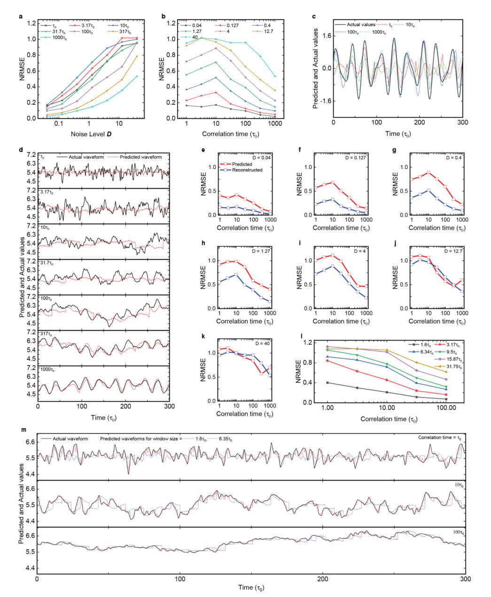 
Fig. 2 | Reconstruction and prediction results for deterministic signals and coloured noise. a, NRMSE vs noise level D curves

📷 Fig 2

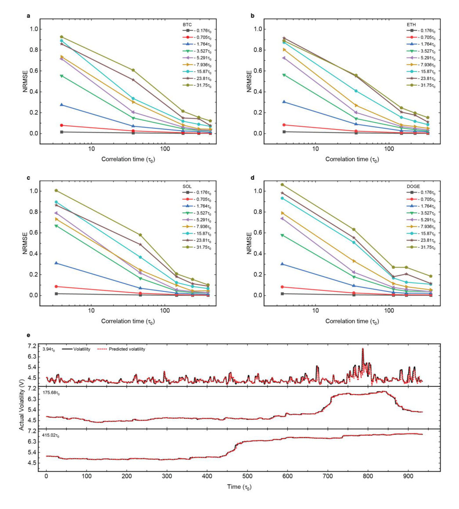 
Fig. 3 | Forecasting of cryptocurrency prices volatility: a-d, NRMSE vs volatility correlation time τ curves for four cryptocur-

📷 Fig 3

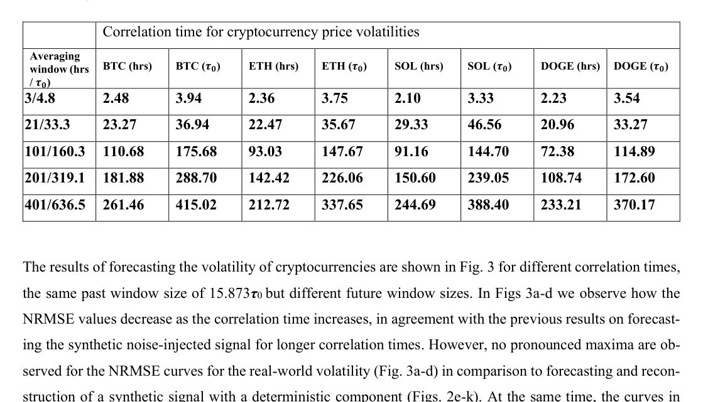 
Fig. 3a-d show strong similarities with the ones for forecasting the coloured noise alone shown in Fig. 2l, see

📷 Fig 4

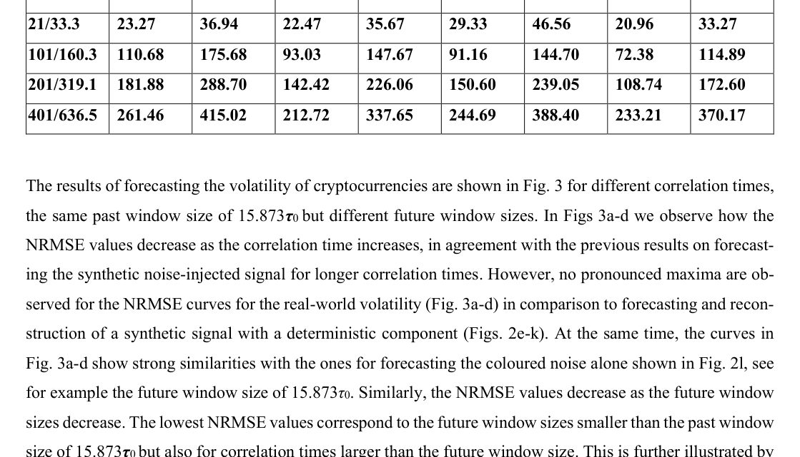 
Fig. 3e which shows comparisons between the predicted (dotted red line) and target (solid black line) signals

📷 Fig 5

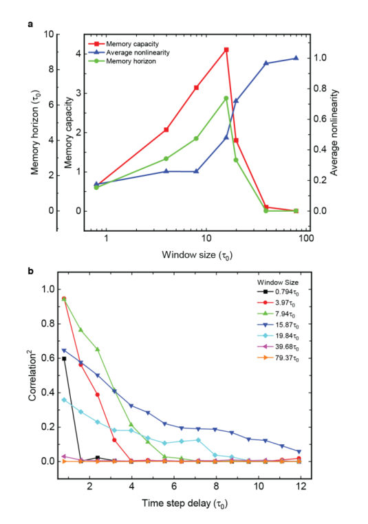 
Fig. 4 | Memory capacity and nonlinearity measurements. a, Memory capacity (red squares), average nonlinearity (blue trian-

**Summary.** This work investigates how physical reservoir computing can be optimized for filtering and predicting complex, noisy signals by precisely matching the timescales of the input noise, the hardware memory, and the required forecast window. Using a niobium oxide device, the authors demonstrate that understanding these timescale relationships allows for the development of new physical architectures capable of analyzing stochastic components across different temporal scales.

**Why it may be interesting.** While focused on signal processing, the use of a physical, non-linear, time-dependent system (the reservoir) to process complex, multi-timescale data echoes concepts in open quantum systems where environmental coupling dictates observable dynamics.

Detailed structure

**Main problem.** The paper addresses the challenge of filtering and forecasting correlated noise signals by establishing a relationship between the signal, noise, and hardware timescales.

**Main result.** Timescale matching is crucial for physical reservoir computing, determining whether the noise is averaged out or if its temporal structure is sufficient for accurate algorithmic forecasting.

**Method.** The authors use a physical reservoir computing setup, testing reconstruction and prediction tasks on synthetic colored noise and real cryptocurrency volatility data.

**Model / system.** The physical platform is a nanoporous niobium oxide layer acting as a reservoir. The input signal is modeled as a sum of deterministic harmonics and colored noise, $\xi(t)$.

**Key observables.** Normalized Root Mean Square Error (NRMSE), Signal-to-Noise Ratio (SNR), Reservoir Memory Horizon, and Forecasting Regime Index.

**Important parameters / regimes.** Noise correlation time ($	au$), reservoir memory, and forecast horizon are the key interacting timescales.

**Assumptions / limitations.** The performance of the physical reservoir is hypothesized to be governed by the matching of the three relevant timescales.

**Figures summary.** Figures illustrate the reservoir signal processing overview, SNR vs. noise level, and performance metrics (NRMSE) for reconstruction and prediction across varying noise correlation times.

**Paper structure.** The paper progresses from defining the problem (timescale matching) to detailing the physical setup and signal model, presenting results on reconstruction and prediction using synthetic and real-world data, and concluding with design principles based on operating regimes.

Abstract

Physical reservoir computing exploits the nonlinear dynamics of physical systems to process time-dependent data with greater energy efficiency than conventional machine learning approaches. However, physical reservoirs have fixed intrinsic response timescales, whereas real-world signals combine deterministic and stochastic components across multiple timescales. Here we show, using a nanoporous niobium oxide reservoir, synthetic noisy signals and cryptocurrency-price volatility, that the relationship among noise correlation time, reservoir memory and forecast horizon determines whether correlated noise is filtered or predicted. Noise varying faster than the relevant reservoir memory and forecast horizon is averaged by the reservoir, whereas the temporal structure of slower-varying noise is sufficient for algorithmic forecasting. We introduce the reservoir memory horizon and forecasting regime index to distinguish these operating regimes. These contributions demonstrate that timescale matching can guide the encoding of input time series and development of physical reservoir architectures that filter, analyse and predict stochastic signal components across distinct temporal scales.

[↑ back to top](#top)

### [Phase diagram of a semiflexible magnetic polymer in three dimensions](http://arxiv.org/abs/2610.08958v1)

**Authors:** Linda Delimi, Arpan Dey, Jean-Charles Walter  
**Type:** theory · **Category:** statistical mechanics · **PDF:** <https://arxiv.org/pdf/2610.08958v1>  
**Analysis basis:** full PDF text, analyzed in chunks
**Topic relevance:** `Frenkel-Kontorova` **1/5** · `Keldysh / 2PI / non-Gaussian methods` **1/5** · `analog quantum simulation` **1/5** · `methods for driven-dissipative` **1/5**

📷 Fig 1

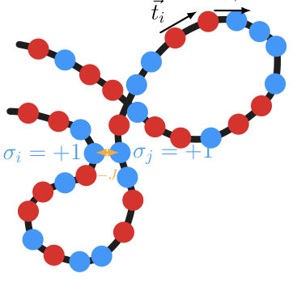 
FIG. 1: Schematic of the semiflexible magnetic polymer. Each monomer carries a spin σi = ±1. Spatially neighbouring spins interact with coupling J and couple to an external field h, while consecutive bond tangents ˆti and ˆti+1 incur a bending penalty controlled by the stiffness κ.

📷 Fig 2

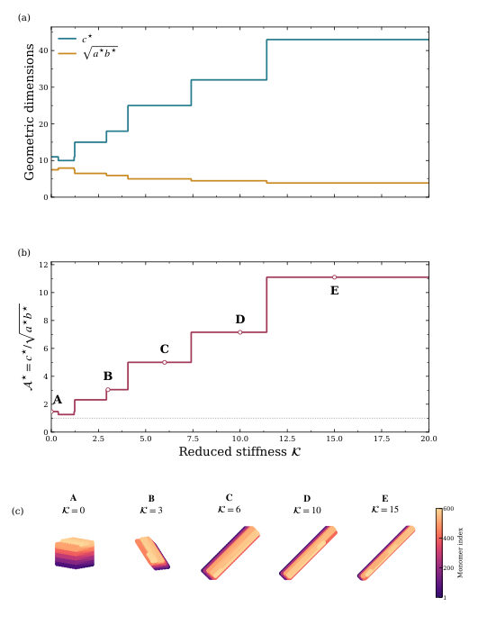 
FIG. 2: Aspect ratio A⋆= c⋆/ √

📷 Fig 3

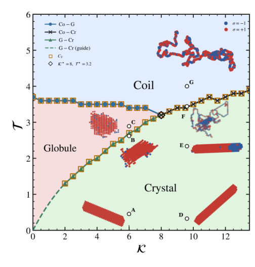 
FIG. 3: Phase diagram of the semiflexible magnetic polymer at zero field for N = 600. The coil, globule, and crystal regimes are indicated in blue, pink, and green, respectively. Blue circles, green triangles, and black crosses correspond to the Co–G, G–Cr, and Co–Cr boundaries, respectively; open orange squares indicate the resolved peaks of CV . The dashed green line represents the indicative continuation of the crystalline boundary at low stiffness. The open diamond marks the triple point (K⋆, T ⋆). Configurations A–G illustrate representative conformations at the positions indicated by the open circles; monomers are colored according to their magnetic state, σ = −1 in blue and σ = +1 in...

📷 Fig 4

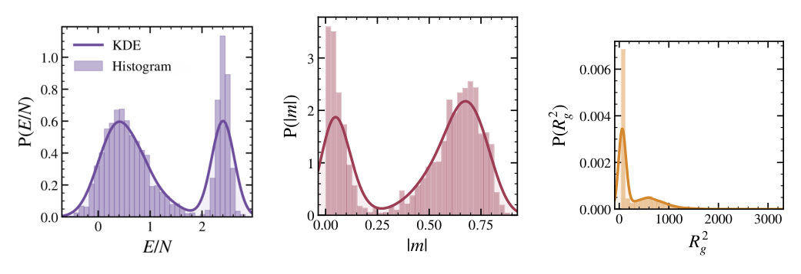 
FIG. 4: Distributions of the observables in the vicinity of the Co–G transition. Distributions of the energy per monomer E/N (a), the absolute magnetization |m| (b), and the squared radius of gyration R2 g (c), for N = 600 and T = 3.375 at K = 6, approaching the critical value from below. The normalized histograms are complemented by Gaussian kernel density estimates (KDE).

📷 Fig 5

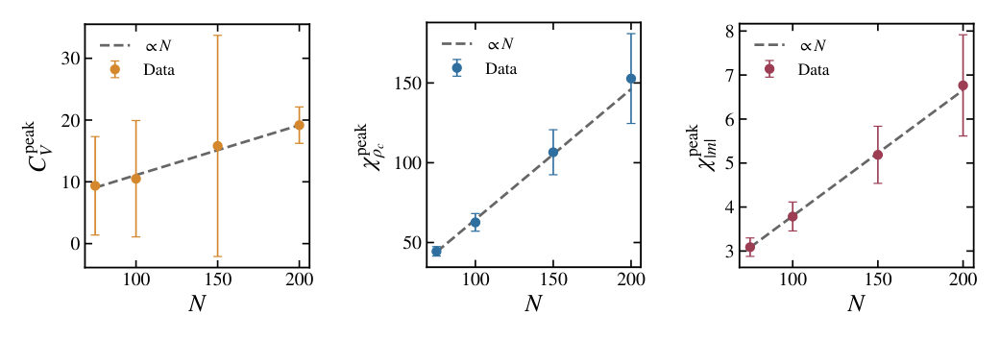 
FIG. 5: Size dependence of the maxima of the response functions associated with the Co–G transition. Maximum of the heat capacity Cmax V (a), of the susceptibility associated with the contact density χmax ρc (b), and of the magnetic susceptibility χmax |m| (c), as a function of the chain length N, at K = 6, approaching from below. The circles represent the mean values obtained over the independent replicas, and the error bars their standard deviations. The dashed gray lines indicate the reference linear dependence Xmax ∝N.

**Summary.** This work investigates the phase diagram of a semiflexible magnetic polymer, modeling systems like DNA complexes. By combining Monte Carlo simulations and variational theory, the authors map out how chain stiffness and magnetic interactions drive multiple first-order transitions between coil, globule, and crystal states. The results highlight the complex interplay between conformational entropy and magnetic ordering in soft matter systems.

**Why it may be interesting.** The coupling between magnetic degrees of freedom and polymer conformation provides a rich model for studying coupled order parameters and phase transitions, relevant to many-body systems in condensed matter theory.

Detailed structure

**Main problem.** To characterize the zero-field phase diagram of a semiflexible magnetic polymer as a function of bending stiffness and temperature.

**Main result.** The phase diagram exhibits multiple first-order transitions, including coil-to-globule and globule-to-crystal transitions, demonstrating how stiffness and magnetic coupling reorganize the polymer's conformational landscape.

**Method.** The study employs Monte Carlo simulations on an FCC lattice, complemented by a variational free-energy upper-bound approach to analyze the thermodynamic limits.

**Model / system.** The model is a semiflexible magnetic polymer chain where each monomer has a two-state spin, coupling conformational energy (bending penalty $\kappa$) with magnetic interactions ($J$). It serves as a minimal representation of nucleoprotein complexes.

**Key observables.** Contact Density ($
ho_c$), Magnetization ($\langle|m|
angle$), Nematic Order Parameter ($S$), and the overall phase diagram structure.

**Important parameters / regimes.** Bending stiffness ($\kappa$), Temperature ($T$), and the ratio $K = \kappa/J$. The zero-field limit ($h=0$) is the primary focus.

**Assumptions / limitations.** The analysis relies on the zero-field limit ($h=0$) and uses variational upper bounds for the crystalline phase, which assumes an ordered, maximally compact cylindrical bundle structure.

**Figures summary.** Figures illustrate the schematic of the polymer, the evolution of ground state structure with stiffness, and the construction of the crystalline upper bound using a cylindrical bundle.

**Paper structure.** The paper systematically analyzes the Hamiltonian, first characterizing the zero-field phase diagram using simulations, then deriving analytical upper bounds for the crystalline phase, and finally mapping out the sequence of transitions based on the competition between bending costs and magnetic/contact energies.

Abstract

We study a semiflexible magnetic polymer in which each monomer carries a two-state spin, giving rise to coupled conformational, stiffness, and magnetic degrees of freedom. The model provides a minimal representation of nucleoprotein complexes in vivo, in which DNA bending rigidity and bridging proteins must be simultaneously accommodated. We employ Monte Carlo simulations on a face-centered-cubic (FCC) lattice, complemented by a variational free-energy upper-bound approach, to characterize the zero-field phase diagram as a function of bending stiffness and temperature. At low stiffness, we identify a first-order transition combining coil-to-globule collapse with a ferromagnetic-to-paramagnetic transition. At lower temperatures, an additional first-order transition separates the disordered globule from an ordered crystal characterized by nematic-like orientational order of the bond tangents. At high stiffness, the globule disappears, resulting in a direct first-order coil-to-crystal transition. These results demonstrate how chain stiffness and magnetic degrees of freedom couple to polymer conformation and reorganize the zero-field phase diagram. Our model connects the two limiting cases of flexible magnetic polymers and semiflexible homopolymers, the latter corresponding to the strong-field limit in which all spins are aligned.

[↑ back to top](#top)

### [Magnetic Order from First-Principles Linear Response](http://arxiv.org/abs/2610.10412v1)

**Authors:** Yaroslav Zhumagulov, Emiliano Cruz-Aranda, Denis Kochan, Oleg V. Yazyev  
**Type:** theory · **Category:** strongly correlated electrons · **PDF:** <https://arxiv.org/pdf/2610.10412v1>  
**Analysis basis:** full PDF text, analyzed in chunks
**Topic relevance:** `Keldysh / 2PI / non-Gaussian methods` **1/5** · `analog quantum simulation` **1/5** · `quantum measurements` **1/5**

📷 Fig 1

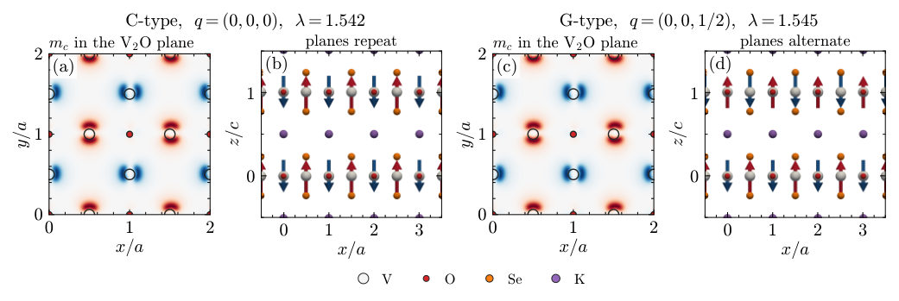 
FIG. 1. Leading KV2Se2O response eigenvectors for C-type stacking at q = 0 in panels a and b and G-type stacking at q = (0, 0, 1

📷 Fig 2

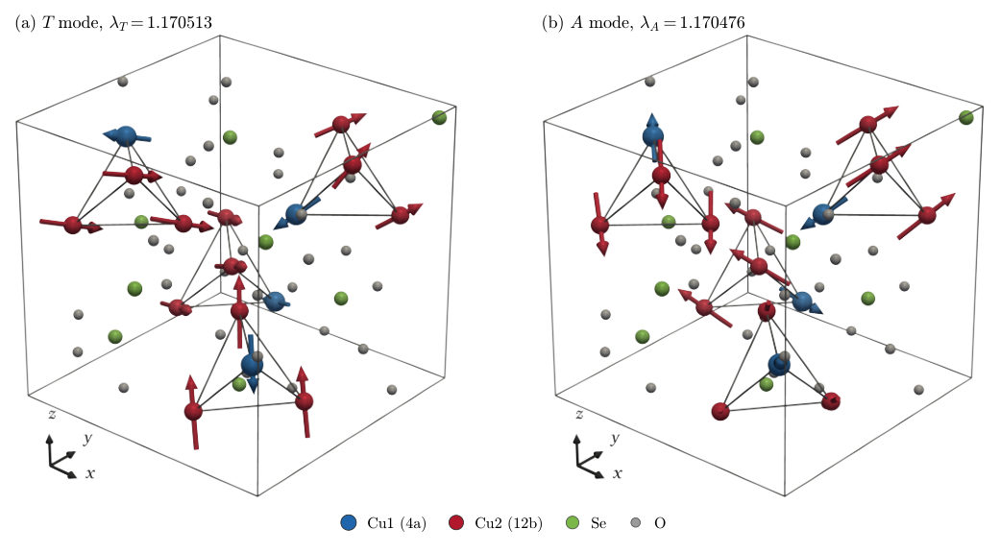 
FIG. 2. Leading Γ-point response eigenvectors of Cu2OSeO3: (a) the state of the threefold-degenerate T mode whose net moment points along [111] and (b) the nearly degenerate, fully symmetric A mode. A cubic Cu2OSeO3 cell holds the four Cu4 tetrahedra. Each tetrahedron has one Cu1 site at the 4a Wyckoff position (blue) and three Cu2 sites at the 12b position (red). Arrows indicate the site magnetic moments: in each tetrahedron, for both modes, the blue moment is directed opposite to the sum of the three red moments, corresponding to a 3:1 ferrimagnetic configuration. In the A mode, the four moments of the tetrahedron are directed along the four ⟨111⟩-type directions and mutually cancel out.

📷 Fig 3

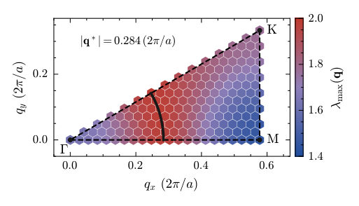 
FIG. 3. Leading response eigenvalue λmax(q) ≡λq of mono- layer NiI2 over the irreducible part of the Brillouin zone, the triangle Γ–M–K. Dashed lines mark the Γ–M–K–Γ bound- ary, and the solid arc marks the fitted mean radius |q∗| = 0.284 (2π/a) of the ridge of large eigenvalues, with a the in-plane lattice constant. The axes are the in-plane Carte- sian components qx and qy of q, and Γ, M, and K are high- symmetry points.

**Summary.** This work presents a novel, unbiased theoretical method to predict magnetic order by analyzing the leading eigenmodes of the magnetization response within the paramagnetic state. By applying this technique to materials like $	ext{KV}_2	ext{Se}_2	ext{O}$ and $	ext{NiI}_2$, the authors successfully reproduce complex magnetic structures without needing to assume the final ordered state beforehand.

**Why it may be interesting.** While focused on condensed matter magnetism, the use of linear response theory to probe instabilities from a non-interacting (paramagnetic) reference state is a powerful, generalizable technique for identifying emergent collective behavior, which has parallels in open quantum system dynamics.

Detailed structure

**Main problem.** Traditional methods for predicting magnetic order are limited to predefined spin configurations and become computationally intractable for large systems.

**Main result.** The magnetic order can be predicted unbiasedly by analyzing the leading eigenmodes of the self-consistent magnetization response calculated from the paramagnetic state.

**Method.** The method involves solving a linearized eigenvalue problem derived from the self-consistent magnetization response function, incorporating spin-orbit coupling.

**Model / system.** The study applies this method to various magnetic materials, including $	ext{KV}_2	ext{Se}_2	ext{O}$, $	ext{Cu}_2	ext{OSeO}_3$, and monolayer $	ext{NiI}_2$, which are characterized by complex magnetic interactions.

**Key observables.** The largest eigenvalue ($\lambda_{\mathbf{q}}$) and its corresponding eigenvector ($oldsymbol{\phi}_{\mathbf{q}}$) determine the magnetic instability, wavevector ($\mathbf{q}$), and pattern of magnetic moments.

**Important parameters / regimes.** Spin-Orbit Coupling (SOC), wavevector ($\mathbf{q}$), and the instability threshold ($\lambda_{\mathbf{q}} = 1$).

**Assumptions / limitations.** The method assumes that the leading eigenmodes of the paramagnetic state response are sufficient to capture the true magnetic ground state, overcoming the limitations of pre-selected configurations.

**Figures summary.** Figure 1 illustrates the leading response eigenvectors for $	ext{KV}_2	ext{Se}_2	ext{O}$ for both C-type and G-type stacking, visualizing the magnetization components.

**Paper structure.** The paper introduces the limitations of prior methods, details the theoretical framework using linear response theory on the paramagnetic state, and then applies this framework to calculate and distinguish between known magnetic orders in several distinct materials.

Abstract

The magnetic order of a material is usually predicted by comparing the energies of trial spin configurations, a strategy that cannot reach orders outside the chosen set and rapidly becomes intractable as the number of magnetic sites grows. We show that the order can instead be identified directly from the paramagnetic state: the leading eigenmodes of its self-consistent magnetization response, obtained with spin--orbit coupling at arbitrary wavevector within the primitive cell, determine both the ordering wavevector and the pattern of moments, with no candidate configurations. With no prior assumption about the order, the method correctly reproduces the G-type stacking with out-of-plane moments in the altermagnet candidate KV$_2$Se$_2$O, the $3{:}1$ ferrimagnetic tetrahedra of Cu$_2$OSeO$_3$, and the incommensurate spiral instability of monolayer NiI$_2$. Our results establish the response of the paramagnetic state as a predictive and unbiased route to assessing magnetic order, enabling systematic searches for complex magnets.

[↑ back to top](#top)

### [Percolation on interdependent one-dimensional long-range networks](http://arxiv.org/abs/2610.10097v1)

**Authors:** Adar Sharabi, Amir Bashan, Sergey V. Buldyrev, Guy Amit  
**Type:** theory · **Category:** statistical mechanics · **PDF:** <https://arxiv.org/pdf/2610.10097v1>  
**Analysis basis:** full PDF text, analyzed in chunks
**Topic relevance:** `analog quantum simulation` **1/5** · `driven-dissipative phase transition` **1/5** · `non-equilibrium universality` **1/5**

📷 Fig 1

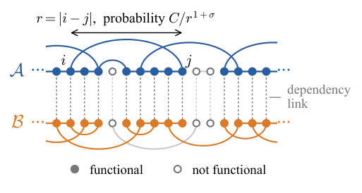 
FIG. 1. Schematic description of the model. Two layers, A and B, are infinite one-dimensional lattices. In each layer, two nodes i and j at a distance r = |i −j| are connected with probability pr = C/r1+σ, independently of all other pairs and of the other layer. Node i of A is connected with a dependency link to node i of B (dashed lines), such that node i of A is functional only if its corresponding node in B is also functional. Filled circles: an example of a set of functional nodes, which form a connected cluster in each of the two layers. Empty circles: nodes that are not functional, since in at least one of the layers they are not connected to this cluster. The links of these nodes...

📷 Fig 2

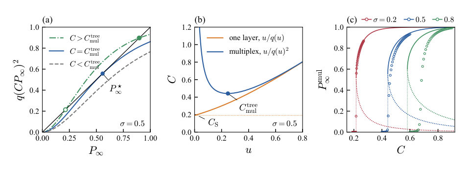 
FIG. 2. Tree approximation. (a) Graphical solution of Eq. (15) for σ = 0.5. The right-hand side, q(CP∞)2, starts with zero slope, so a non-zero solution (an intersection with the diagonal) exists only if C ≥Ctree mul , where the curve touches the diagonal at P ⋆ ∞. For C &gt; Ctree mul the curve crosses the diagonal at two points: the stable solution (filled circle) and the unstable one (open circle). (b) The value of C belonging to each u = CP∞, for one layer, Eq. (13), and for the multiplex, C = u/q(u)2. For one layer the minimum is at u →0, where C = CS; for the multiplex the minimum, Ctree mul , is at a finite u⋆. (c) Size of the mutual giant component as a function of C: tree...

📷 Fig 3

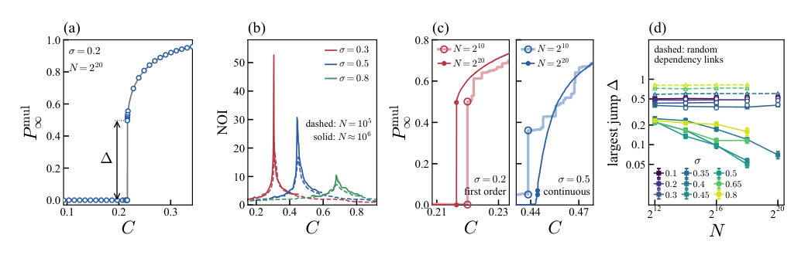 
FIG. 3. Simulations of the multiplex. (a) Method 1, shown for one realization with σ = 0.2 and N = 220. Line: P mul ∞(C) of the realization. Circles: the values of C at which it was calculated. The height of the largest jump is ∆, and its position is the estimate of Cmul c . (b) Method 2: number of cascade iterations (NOI) as a function of C, for N = 105 (dashed lines, 30 realizations) and N ≈106 (solid lines, 10 realizations). The position of the maximum is the estimate of Cmul c . (c) P mul ∞(C) of single realizations with N = 210 and N = 220. The circles mark the two ends of the largest jump of each realization (open circles: N = 210; filled circles: N = 220). For σ = 0.2 the mutual...

📷 Fig 4

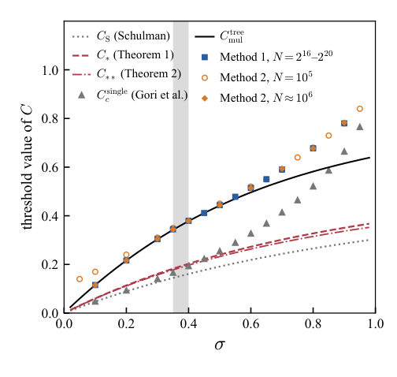 
FIG. 4. Critical values of C as functions of σ. Lines: the bounds CS, C∗, C∗∗and the tree approximation Ctree mul . Triangles: single- layer threshold [51]. Symbols: simulated multiplex threshold from Method 1 (squares; largest size simulated, N = 216 to 220), from Method 2 with N = 105 (circles; the deviation at small σ is the finite- size effect of Eq. (21)), and from Method 2 with N ≈106 (small diamonds). Gray band: 0.35 &lt; σ &lt; 0.4, where the simulations indicate that the transition changes from first order (smaller σ) to continuous (larger σ).

**Summary.** This paper analyzes percolation in a multiplex network composed of two interdependent 1D long-range lattices. It determines the critical coupling strength required for the existence of a mutual giant component. A key finding is that the transition's nature (first-order vs. continuous) is fundamentally controlled by the decay exponent $\sigma$ of the long-range interactions.

**Why it may be interesting.** While focused on classical percolation, the concept of network robustness and phase transitions in coupled systems shares mathematical parallels with critical phenomena studied in quantum many-body systems, particularly concerning connectivity and failure modes.

Detailed structure

**Main problem.** The study investigates the emergence and critical conditions for a mutual giant component in a multiplex network formed by two interdependent one-dimensional long-range networks.

**Main result.** The multiplex network is significantly less stable than a single layer, and the order of the percolation transition depends critically on the decay exponent $\sigma$, changing from first-order to continuous as $\sigma$ increases.

**Method.** The authors employ theoretical analysis, deriving rigorous lower bounds, and utilizing a tree approximation to estimate the critical percolation threshold ($C_c$).

**Model / system.** The model is a multiplex network of two layers on $\mathbb{Z}$, where intra-layer links decay algebraically as $p_r \propto r^{-(1+\sigma)}$. Interdependence is established via links connecting corresponding nodes in both layers.

**Key observables.** Mutual Giant Component (MGC) existence, the critical thresholds ($C_{	ext{single}}^c$ and $C_{	ext{mul}}^c$), and the order of the phase transition (first-order vs. continuous).

**Important parameters / regimes.** The decay exponent $\sigma$ ($0 < \sigma < 1$) and the coupling strength parameter $C$ are crucial. The transition order changes around $\sigma \approx 0.35$ to $0.4$.

**Assumptions / limitations.** The analysis relies on a tree approximation, which is noted to be highly accurate (within 0.6%) for $\sigma \le 0.5$ but fails to capture the transition order for larger $\sigma$.

**Figures summary.** The figures illustrate the schematic of the two-layer network, comparing the critical thresholds derived from the single-layer and multiplex tree approximations.

**Paper structure.** The paper progresses by defining the multiplex model, deriving theoretical bounds for the critical threshold, applying a tree approximation to estimate the threshold, and finally analyzing how the transition order changes as a function of the decay exponent $\sigma$.

Abstract

We study the emergence of a mutual giant component in a multiplex network comprised of two one-dimensional long-range networks on a lattice. The probability that two nodes on one lattice, with a distance $r$ between them, are connected with an edge falls algebraically with distance as $Cr^{-(1+σ)}$, where $0 < σ< 1$ and $0 < C \leq 1$. A mutual giant component exists if $C > C_c^{\mathrm{mul}}$, where $C_c^{\mathrm{mul}}(σ)$ is a critical value of $C$ that is dependent on $σ$. We find rigorous lower bounds on $C_c^{\mathrm{mul}}$, and a tree approximation whose estimate of $C_c^{\mathrm{mul}}$ agrees with simulations within 0.6% for $σ\leq 0.5$. The multiplex network is significantly less stable than the single network case, as is evident by the larger value of $C_c^{\mathrm{mul}}$, which is up to 2.4 times the single-layer value. Our simulations indicate that the order of the transition depends on $σ$. For $σ\leq 0.35$ the mutual giant component collapses abruptly, in a first-order phase transition, while for $σ\geq 0.4$ the transition is continuous. When the dependency links connect random pairs of nodes, the transition is first order for all $σ$.

[↑ back to top](#top)

### [Bottom-Up Prediction of Amorphous Poly(1,3-dioxolane) using Ab Initio Reactive Machine-Learning Force Fields](http://arxiv.org/abs/2610.09388v1)

**Authors:** Yizhi Song, Bharatha K. Gunawardana, Kriti Alam, Teresa Shah, Deepa Ranabhat, Hsin-Yu Ko  
**Type:** theory · **Category:** disordered systems and neural networks · **PDF:** <https://arxiv.org/pdf/2610.09388v1>  
**Analysis basis:** full PDF text, analyzed in chunks
**Topic relevance:** `interference shaping light` **1/5** · `methods for driven-dissipative` **1/5**

📷 Fig 1

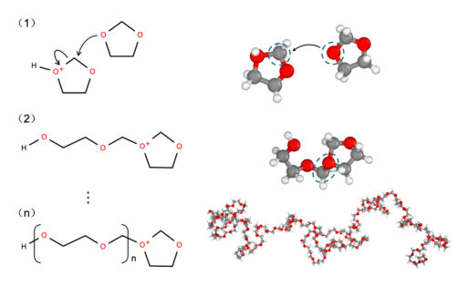 
FIG. 1. Cationic ring-opening polymerization of 1,3-dioxolane as simulated in this work. (1) An oxygen of an incoming DXL monomer attacks the carbon adjacent to the protonated chain end, breaking the C–O bond and opening the ring; the reacting atoms are circled in the ball-and-stick representation. (2) The resulting dimer carries the positive charge on the new terminal ring, so the same ele- mentary step repeats. (n) Propagation to a degree of polymerization n. Left: Lewis structures, with curved arrows indicating electron flow. Right: corresponding configurations taken from the trajecto- ries (C grey, O red, H white); the lowest panel shows a representative 100-mer. The unreacted DXL...

📷 Fig 2

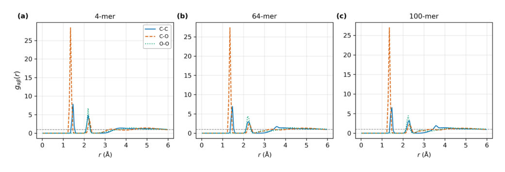 
FIG. 2. Heavy-atom (C–C, C–O and O–O) partial radial distribution functions gαβ (r) of the full system at n = 4, 64 and 100. The dashed line marks gαβ = 1. Curves are averaged over 40 independent trajectories; shaded bands denote the standard error of the mean.

📷 Fig 3

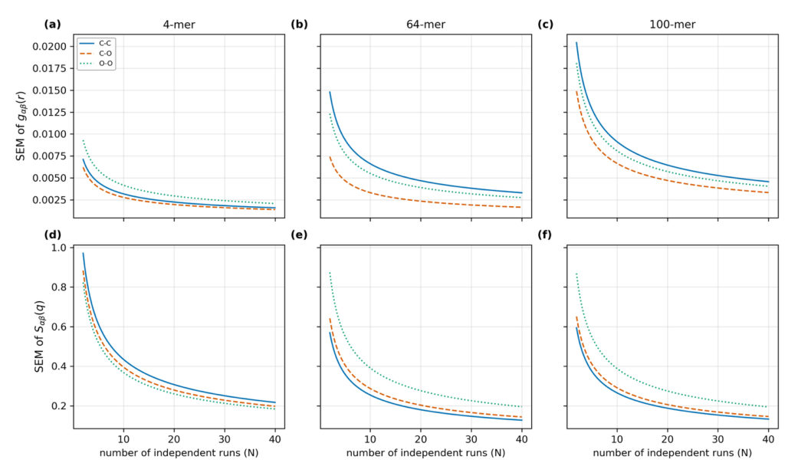 
FIG. 3. Statistical convergence of the predicted heavy-atom correlations with ensemble size. Standard error of the mean, σ/ √

📷 Fig 4

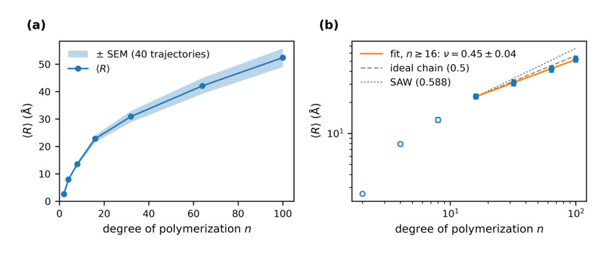 
FIG. 4. (a) Mean end-to-end distance ⟨R⟩versus degree of polymerization n, averaged over 40 independent chain-growth trajectories; the shaded band is the standard error of the mean, σR/ √

📷 Fig 5

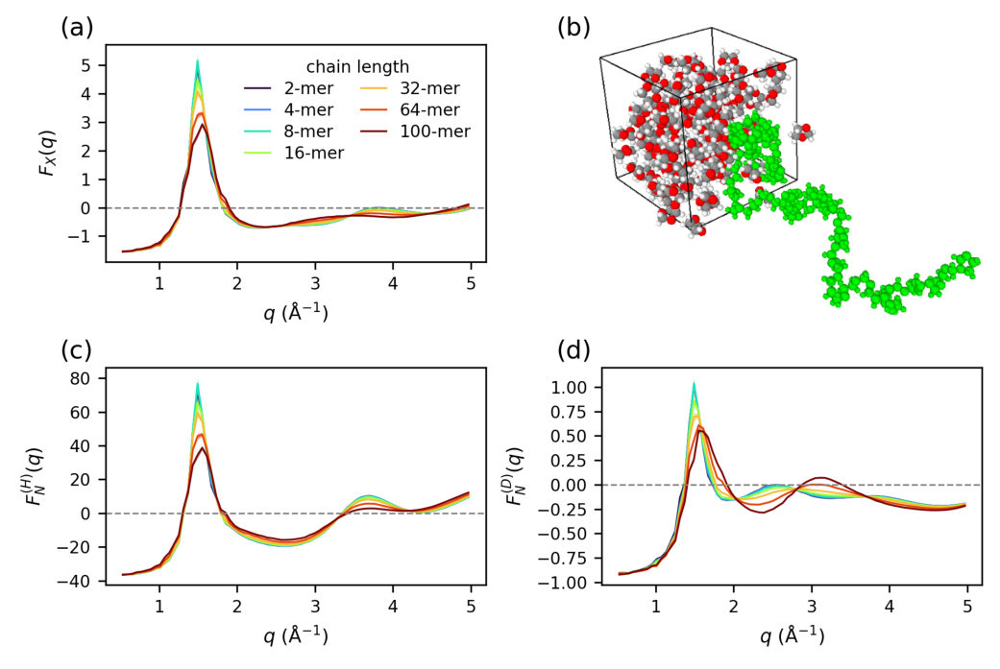 
FIG. 5. Predicted interference functions of the full simulation cell at degrees of polymerization n = 2, 4, 8, 16, 32, 64 and 100. (a) X-ray, FX(q). (b) Representative configuration of the simulation cell at n = 32, with the growing chain shown in green and the unreacted DXL monomers in red, white and grey. (c) Neutron for the fully hydrogenated polymer, F(H) N (q). (d) Neutron for the fully deuterated polymer, F(D) N (q). Curves are averaged over 40 independent chain-growth trajectories and shaded bands denote the standard error of the mean. Coherent scattering lengths are taken from Ref. 52.

**Summary.** This work pioneers the use of AI-accelerated simulations to predict the atomic structure of amorphous polymers like pDXL by simulating their synthesis. By analyzing the resulting ensemble microstructures, the authors successfully deconvolute the measured diffraction signal into distinct contributions from the monomer and the growing polymer chain. This provides a powerful, first-principles method for validating polymer structure against experimental scattering data.

**Why it may be interesting.** The use of ML-force fields trained on quantum mechanical data (DFT) to simulate complex, disordered polymer growth processes is highly relevant to ML-physics, providing a predictive tool for materials structure.

Detailed structure

**Main problem.** The challenge is to determine the atomistic microstructure of amorphous Poly(1,3-dioxolane) (pDXL) and predict its experimentally measurable scattering signals.

**Main result.** The primary diffraction peak is revealed to be a sum of two counteracting modes: a decaying monomer contribution ($\approx 1.5 	ext{ Å}^{-1}$) and a growing polymer contribution ($\approx 1.6 	ext{ Å}^{-1}$).

**Method.** The authors employed an AI-accelerated *ab initio* bottom-up polymer structure prediction (AI2-BPSP) framework to simulate the living cationic ring-opening polymerization.

**Model / system.** The system is amorphous pDXL undergoing polymerization. The simulation uses a Machine-Learning Force Field trained on DFT data to model bond breaking and formation during the polymerization process.

**Key observables.** X-ray and neutron interference functions ($F_X(q)$, $F_N(q)$), partial radial distribution functions ($g_{\alphaeta}(r)$), and partial structure factors ($S_{\alphaeta}(q)$).

**Important parameters / regimes.** Chain length ($n$, up to 100-mer), temperature (300 K), and pressure (1 bar).

**Assumptions / limitations.** The MLFF is assumed transferable from short oligomers to the macromolecular limit, and the ensemble is not assumed to be at true equilibrium due to finite simulation time.

**Figures summary.** Figures illustrate the polymerization steps, partial radial distribution functions at various chain lengths, statistical convergence of structural metrics, and the predicted interference functions showing the separation of monomer and polymer contributions.

**Paper structure.** The paper details the AI2-BPSP workflow, simulating polymerization to generate ensembles of microstructures. It then analyzes the resulting structures by calculating partial structure factors and predicting the total X-ray and neutron scattering functions, emphasizing the separation of contributions from the monomer and the growing polymer backbone.

Abstract

Poly(1,3-dioxolane) (pDXL) is a chemically recyclable polyether that can be synthesized by living cationic ring-opening polymerization with precise control of chain length into the ultra-high-molecular-weight (UHMW) regime, where it acquires enhanced mechanical properties. Like most polymers, however, it has amorphous condensed-phase structure, and diffraction measurements alone cannot resolve the atomistic microstructure that underlies them. In this work, we predict the ensemble of the pDXL microstructures by applying a recently developed AI-accelerated ab initio bottom-up polymer structure prediction (AI$^{2}$-BPSP) framework that simulates the living polymerization of pDXL under experimental synthetic conditions with machine-learning force fields trained within van der Waals-corrected hybrid density functional theory. Partitioning the predicted X-ray and neutron diffraction signal between the growing chain and the surrounding monomer resolves its dominant feature into two counteracting modes: a monomer contribution near $q \approx 1.5$ Å$^{-1}$ that decays as monomer is consumed, and a polymer contribution near $q \approx 1.6$ Å$^{-1}$ that is absent in oligomers and grows with chain length. This work paves the way to direct accuracy validation of these statistically significant, first-principles, and chain-length resolved diffraction predictions against experiments.

[↑ back to top](#top)

### [Can we make sense out of negative kinetic energy?](http://arxiv.org/abs/2610.10040v1)

**Authors:** Alessio Maiezza, Fabrizio Nesti  
**Type:** theory · **Category:** other · **PDF:** <https://arxiv.org/pdf/2610.10040v1>  
**Analysis basis:** full PDF text, analyzed in chunks
**Topic relevance:** `Keldysh / 2PI / non-Gaussian methods` **1/5** · `quantum measurements` **1/5**

📷 Fig 1

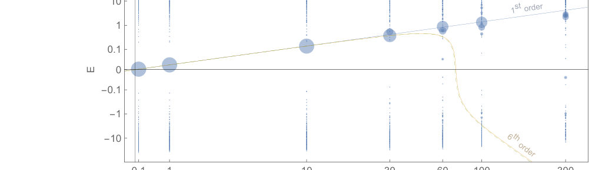 
Figure 1: Diagonalization for λ = 0.1, 1, 10, 30, 60, 100, 300 (and n = 50). For each λ, eigenvalues are shown as blue dots, with the size proportional to the overlap coefficient c(n) i . The majority of eigenvalues, having negligible overlap, are still shown with minimal dot size. The blue(yellow) curves represent the ground state energy in perturbation theory at 1st(6th) order. The plot can be extended to negative λ, with an analogous (non symmetric) result. Notice the “sinh” scales on both axes.

📷 Fig 2

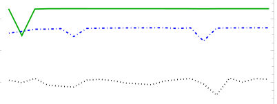 
Figure 2: Convergence of the largest overlap coefficient with the initial state c(n) 0 , for increasing n. A good convergence is obtained up to λ = 30, whereas the overlaps reach a constant value. The convergence is slightly spoiled for larger value of the coupling.

📷 Fig 3

 
Figure 2 we plot the c(n) i for a sequence of values of n, and a few choices of λ. One can notice that for small couplings, λ &lt; 30 the coefficients converge, while for λ ≳30 they oscillate slightly around some constant value, still indicating a signal of convergence that may be improved by increasing N.

📷 Fig 4

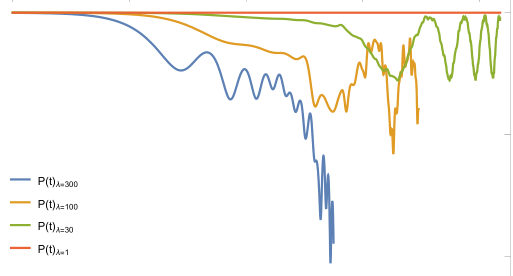 
Figure 3: Evolution in time of the survival probability. The plot is cut at t = 100 but the curves for λ = 1, 30 are reliably cutoff independent to much larger time. Instead the curves for λ = 100, 300 are stopped at time until which cutoff independence is verified (see text). In every case, instead of a decay in time, we uncover an oscillatory regime at late time, with residual probability which is increasingly suppressed for larger λ.

📷 Fig 5

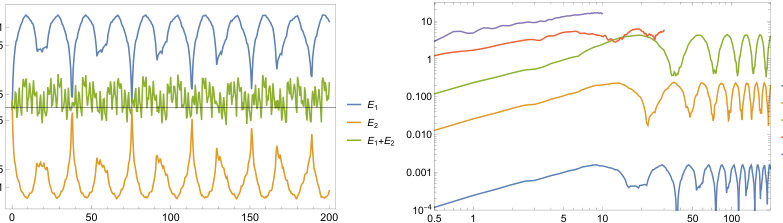 
Figure 4: Energy budget for the two oscillators in the small potential case. Left: separate and summed energy of the two oscillators in time, for λ = 1. Right: energy gain of the first oscillator in time, for λ = 1, 10, 30, 100, 300.

**Summary.** This paper examines the stability of quantum systems containing 'ghost' states, which arise from higher-derivative or gravity-related field theories. Using a simplified coupled oscillator model, the authors demonstrate that the initial state does not decay, suggesting a mechanism for stabilizing Hamiltonians that are mathematically unbounded from below. This offers theoretical evidence for the stability of such exotic quantum systems.

**Why it may be interesting.** The finding that a system with an unbounded Hamiltonian can maintain a stable, oscillating state challenges standard expectations of vacuum instability in quantum field theory.

Detailed structure

**Main problem.** The study investigates the physical stability of quantum systems that inherently possess negative kinetic energy, often termed 'ghost' states, which arise in advanced QFT models.

**Main result.** Contrary to expectations based on the unbounded nature of the Hamiltonian, the 'would-be ground state' was shown to remain dynamically stable over long times, exhibiting oscillations rather than decaying.

**Method.** The authors analyzed the time evolution of a simplified, coupled quantum mechanical model using numerical methods and compared quantum dynamics with classical trajectories.

**Model / system.** The model consists of two coupled quantum harmonic oscillators, where one oscillator is treated as a 'ghost' system (possessing a negative kinetic energy term in the Hamiltonian).

**Key observables.** Survival probability of the would-be ground state, $P_v(t)$; energy exchange between the normal and ghost subsystems.

**Important parameters / regimes.** Coupling constant ($\lambda$); oscillator frequencies ($\omega_1, \omega_2$); time ($t$).

**Assumptions / limitations.** The analysis focuses on the time evolution of the initial, decoupled 'would-be ground state' and is limited by numerical computation time.

**Figures summary.** Figures illustrate classical trajectories in the energy plane, the survival probability $P(t)$ showing oscillatory behavior, and probability current analysis in the $x-y$ plane.

**Paper structure.** The paper progresses by first defining the toy model, analyzing the decoupled spectrum (including density of states calculations), and then analyzing the time evolution of the coupled system, comparing quantum results to classical expectations.

Abstract

Many Quantum Field Theory models, either designed to improve the ultraviolet behavior via higher derivative terms or aimed at providing unified descriptions of Gravity, inevitably introduce negative-energy 'ghosts' states. These states raise fundamental questions regarding the stability of the theory. In this study, we investigate the time evolution of simplified quantum mechanical models consisting of two coupled normal and ghost subsystems. Although the full spectrum of these models is unbounded from below and, therefore, lacks a true ground state, we focus the time evolution of a 'would-be ground state': a zero-energy eigenstate of the decoupled system. By analyzing its metastability under interactions, we gain insights into the dynamics of ghost-like states. Contrary to the standard paradigm, our results demonstrate that, across a broad range of couplings, the would-be ground state does not decay and remains dynamically stable over long times. This provides evidence towards resolving the stability problems of Hamiltonians that are unbounded from below. We also discuss the connections with the corresponding classical and semiclassical dynamics.

[↑ back to top](#top)

### [CV-QKD with noisy coherent states and realistic displacement receivers](http://arxiv.org/abs/2610.10414v1)

**Authors:** L. F. Melo, J. J. Lacerda, John A. Mora Rodríguez, Alexandre B. Tacla  
**Type:** theory · **Category:** quantum information and computing · **PDF:** <https://arxiv.org/pdf/2610.10414v1>  
**Analysis basis:** full PDF text, analyzed in chunks
**Topic relevance:** `quantum measurements` **1/5** · `quantum optics experiment` **1/5**

📷 Fig 1

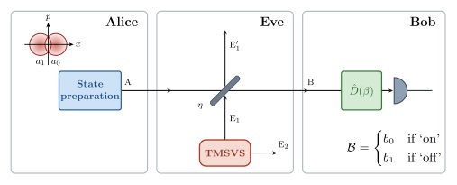 
FIG. 1. Prepare and measure scheme of the protocol under entangling-cloner collective attack. Alice prepares mode A and sends it through the quantum channel. Eve couples Al- ice’s mode to mode E1 of a two-mode squeezed vacuum state (TMSVS) on a beam-splitter with transmissivity η ∈[0, 1], which corresponds to the channel transmissivity. Eve keeps modes E′ 1 and E2 in a quantum memory for future measure- ments. The output mode B is sent to Bob, who performs a displacement operation followed by on/off detection.

📷 Fig 2

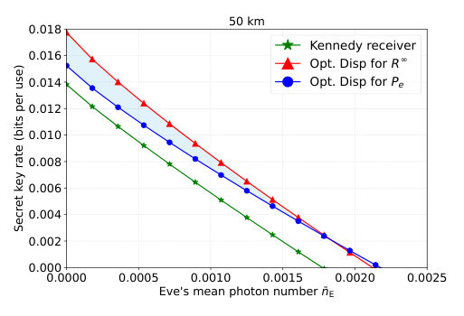 
FIG. 2. Secret key rate in reverse reconciliation at 50 km as a function of the quantum channel noise for displacement receivers with ideal detectors, assuming that Alice prepares states with ¯nA = 0.05 and the optimal amplitude for each receiver. The shaded region highlights the difference between the secret key rates of receivers (ii) and (iii), which vanishes at the crossover point ¯nE ≈1.8 × 10−3.

📷 Fig 3

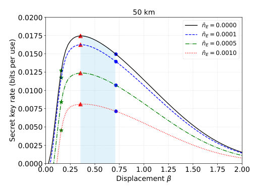 
FIG. 3. Secret key rate in reverse reconciliation at 50 km as a function of the displacement β for different levels of channel noise. The stars, triangles, and circles correspond to the opti- mization of β for receivers (i), (ii) and (iii), respectively. Here, we consider α = 0.5, ¯nA = 0.05 and the values of ¯nE corre- spond to excess noise ξ = 0, 1.8×10−3, 9.0×10−3, 1.8×10−2, from top to bottom. The optimal displacement of receiver (ii) (β(ii) opt ≈0.35) is about half that of receiver (iii) (β(iii) opt ≈0.71). The interval β ∈(β(ii) opt , β(iii) opt ] (shaded region) corresponds to displacement values that achieve close-to-optimal secret key rates.

📷 Fig 4

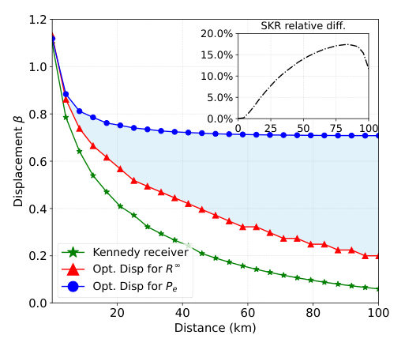 
FIG. 4. Displacements for receivers (i), (ii) and (iii) as func- tions of distance for ¯nA = 0.05 and ¯nE = 10−4. For each re- ceiver, and at each distance, we use the amplitude that gives maximal secret key rate in reverse reconciliation. Inset shows the relative difference between the secret key rates obtained with the strategies bounding the shaded region. See text for details.

📷 Fig 5

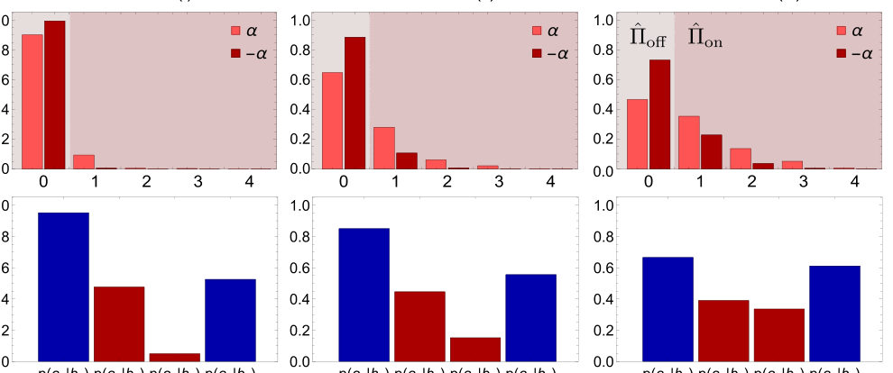 
FIG. 5. Photon number statistics ⟨n| ˆD(β)ˆρℓ B ˆD†(β)|n⟩(top row) and retrodiction probabilities p(aℓ|bk) [Eq. (9)] (bottom row) for receivers (i) (β(i) opt ≈0.16), (ii) (β(ii) opt ≈0.35), and (iii) (β(iii) opt ≈0.71). We consider the same parameters as Fig. 3, i.e. α = 0.5, ¯nA = 0.05, L = 50 km, with ¯nE = 10−3. The colored regions in the top row labeled by ˆΠoff and ˆΠon represent the photon number values corresponding to Bob’s decision rule (6). The optimal scenario for CV-QKD [receiver (ii)] lies in an intermediate scenario between having a high retrodiction p(a0|b0) [receiver (i)] and having a minimal average error probability [receiver (iii)]. See text for details.

**Summary.** This work proposes a CV-QKD protocol using noisy coherent states and a displacement receiver, demonstrating its potential to outperform standard homodyne detection. The authors provide a full security analysis against collective attacks and derive a method to estimate channel parameters using realistic photon-number-resolving detection. This establishes the displacement receiver as a promising, robust alternative for quantum key distribution implementations.

**Why it may be interesting.** It provides a concrete, experimentally relevant alternative to standard homodyne detection for CV-QKD, offering a tunable receiver strategy that improves performance in realistic noisy environments.

Detailed structure

**Main problem.** The paper develops and analyzes a Continuous-Variable Quantum Key Distribution (CV-QKD) protocol utilizing a binary alphabet of noisy coherent states and displacement receivers.

**Main result.** The displacement receiver can outperform conventional homodyne detection in experimentally relevant regimes, and the protocol remains secure even with noisy state preparation and imperfect detection.

**Method.** The security analysis is performed using the Devetak-Winter formula against entangling-cloner attacks, while parameter estimation is achieved by analyzing ratios of conditional probabilities derived from PNR measurements.

**Model / system.** The system models quantum communication over a thermal-loss channel, using noisy coherent states (displaced thermal states) as the encoding basis and a displacement receiver for measurement.

**Key observables.** Secret key rate, discrimination error probability, channel transmittance ($\sqrt{\eta}$), and mutual information $I(A; B)$.

**Important parameters / regimes.** Transmissivity ($\eta$), noise parameters ($ar{n}_A, ar{n}_E$), detector efficiency ($\gamma$), and displacement parameter ($eta$).

**Assumptions / limitations.** The security analysis assumes a Gaussian channel model for Eve's information and that Alice's devices are trusted; reliable parameter estimation requires Photon-Number-Resolving (PNR) detection.

**Figures summary.** Figure 1 illustrates the prepare and measure scheme under an entangling-cloner collective attack, and Table I provides reference values for Eve's thermal mode mean photon number.

**Paper structure.** The paper first establishes the physical model and the advantage of the displacement receiver for state discrimination. It then details the security analysis using the Devetak-Winter formula for key rate calculation. Finally, it develops methods for parameter estimation, deriving $\sqrt{\eta}$ by analyzing ratios of conditional probabilities from PNR measurements.

Abstract

Near-optimal binary coherent state discrimination can be achieved by performing a displacement operation followed by photon detection. This displacement serves as a control parameter that can be tuned to optimize a chosen figure of merit, which makes such receivers attractive beyond state discrimination. Here, we turn this discrimination strategy into a complete continuous-variable quantum key distribution (CV-QKD) protocol based on a binary alphabet of noisy coherent states (displaced thermal states) and displacement receivers. We develop a strategy for estimating the channel parameters with the same displacement receiver, since standard quadrature-based methods do not apply. While a key map can be obtained with on/off detection, we demonstrate that reliable parameter estimation requires photon-number-resolving detection with sufficient resolution. Finite detector resolution underestimates the observed noise and constitutes a potential security loophole, which we quantify and show to be mitigable with modest resolution. We analyze the protocol's security against entangling-cloner collective attacks in the asymptotic regime, for both direct and reverse reconciliation, and show that it can generate secret keys even under noisy state preparation and imperfect detection. Interestingly, we find that the displacement that minimizes the discrimination error probability also performs well for key generation, thus providing a useful and analytically tractable tuning strategy for the CV-QKD receiver. We evaluate the protocol's performance over a range of transmittances and noise parameters, showing that the displacement receiver can outperform conventional homodyne detection in experimentally relevant regimes. Together, our results point to displacement receivers as a promising alternative for CV-QKD implementations.

[↑ back to top](#top)

### [Efficient Optimization of Tensor Rings with Low-Rank Environments](http://arxiv.org/abs/2610.10027v1)

**Authors:** Matthieu Jeannin, Alessandro Chessari, Jan Von Delft  
**Type:** theory · **Category:** strongly correlated electrons · **PDF:** <https://arxiv.org/pdf/2610.10027v1>  
**Analysis basis:** full PDF text, analyzed in chunks
**Topic relevance:** `analog quantum simulation` **1/5** · `methods for driven-dissipative` **1/5**

📷 Fig 1

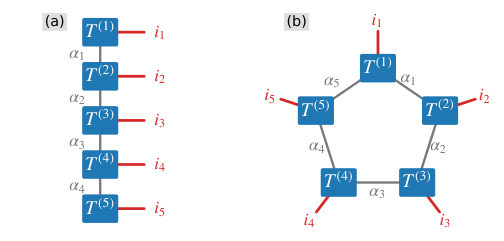 
Figure 1. Diagrammatic representation of a tensor train or matrix product state (a) and a tensor ring or periodic matrix product state (b).

📷 Fig 2

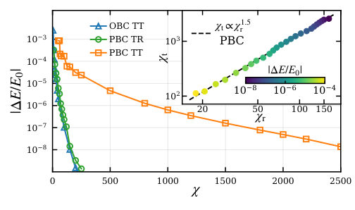 
Figure 2. Convergence of the ground-state energy for the spin- 1/2 Heisenberg chain with N = 500 with periodic boundary conditions. We compare standard DMRG in tensor-train form with open boundary conditions (OBC TT), standard DMRG with periodic boundary conditions (PBC TT), and Ring-DMRG with a tensor-ring ansatz (PBC TR). The relative energy error |E −E0|/|E0| is shown as a function of the bond dimension χ. For the OBC calculation, E0 is the converged OBC energy, whereas both periodic calculations are compared with the converged PBC energy at χt = 3000. Inset: Tensor- train bond dimension χt versus tensor-ring bond dimension χr required to reach the same relative energy error for PBC...

📷 Fig 3

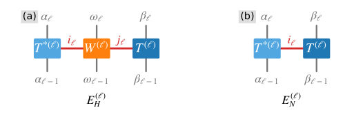 
Figure 3. Diagrammatic representation of the Hamiltonian tranfert matrix (a) and norm transfert matrix(b).

📷 Fig 4

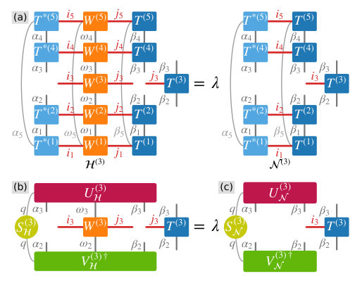 
Figure 4. Diagrammatic representation of the the tensor ring contractions with N = 5 at site ℓ= 3. (a) generalized eigen value problem Eq. (13), (b) compact SVD-based representation of the local Hamiltonian H(3) as in Eq. (18), (c) singular value decomposition of the local norm N (3) as in Eq. (17).

📷 Fig 5

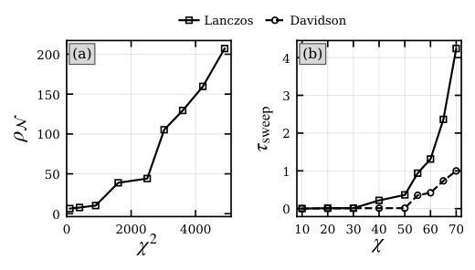 
Figure 5. Comparison between the Lanczos and Davidson solvers for the local generalized eigenvalue problem. (a) Num- ber of norm-environment applications ρN for the Lanczos solver as a function of χ2. (b) Mean sweep time τsweep as a function of the bond dimension χ, normalized by the David- son sweep time at χ = 70. The Lanczos solver requires an increasing number of norm-environment applications because of the inner linear solves, resulting in a substantially larger sweep cost at large bond dimension.

**Summary.** This paper presents an advanced Ring-DMRG algorithm to efficiently simulate periodic quantum systems using Tensor Ring decompositions. It overcomes the inherent difficulties of optimizing TRs by introducing robust two-site truncation schemes and advanced solvers. The work demonstrates that this method maintains the favorable scaling of DMRG while significantly reducing the required computational resources for critical systems.

**Why it may be interesting.** The development of robust, scalable tensor network algorithms like Ring-DMRG is crucial for simulating strongly correlated materials where periodic boundary conditions are natural, allowing access to regimes previously inaccessible due to computational cost.

Detailed structure

**Main problem.** The paper addresses the challenge of efficiently optimizing Tensor Ring (TR) decompositions for periodic quantum many-body systems, which are difficult due to the closed geometry leading to ill-conditioned environments.

**Main result.** The proposed Ring-DMRG algorithm retains the favorable cubic scaling ($\mathcal{O}(\chi^3)$) with bond dimension of standard DMRG while achieving this at a substantially smaller bond dimension compared to other methods.

**Method.** It extends DMRG to a two-site Ring-DMRG algorithm, improving robustness with gauge transformations and using generalized Davidson solvers for the local variational problem.

**Model / system.** The methods are applied to periodic quantum many-body systems, using the spin-1/2 Heisenberg chain as a primary example to benchmark performance.

**Key observables.** Ground-state energy error, bond dimension ($\chi$), and environment rank ($p$).

**Important parameters / regimes.** Bond dimension ($\chi$), environment rank ($p$), system size ($N$), and the ratio $J_2/J_1$ for the Heisenberg chain.

**Assumptions / limitations.** The core assumption is that the low-rank structure of the environment allows for efficient, systematic approximation, generalizing belief propagation.

**Figures summary.** Figure 1 compares TT (open) vs. TR (periodic) representations. Figure 2 shows energy convergence for the Heisenberg chain, illustrating the scaling advantage of TRs over TTs ($\chi_t \propto \chi_{r}^{1.5}$).

**Paper structure.** The paper introduces the TR representation for periodic systems, details the Ring-DMRG methodology (including two-site truncation and alternating optimization), and analyzes its computational scaling and convergence properties against established methods like TT.

Abstract

Tensor-ring (TR) decompositions provide a natural representation of periodic systems but are difficult to optimize because the closed geometry prevents a global canonical form and leads to costly, ill conditioned environments. Existing periodic DMRG methods alleviate this difficulty by compressing long environments to a low-rank representation, reducing local operations to $\mathcal{O}(pχ^3)$, where $p$ is the retained environment rank. Here, we extend this approach to an efficient two-site Ring-DMRG algorithm and improve its numerical robustness through appropriate gauge transformations and a generalized Davidson solver. A central challenge in the two-site formulation is the truncation step, which must account for the surrounding environment. When this environment is sufficiently separable, a suitable change of frame reduces the truncation to an ordinary SVD. When it is not separable, we instead use an alternating optimization that retains the full environment.   The computational advantage of tensor rings over tensor trains depends on the scaling of the required environment rank $p$ with bond dimension and system size. For critical systems, the divergent correlation length makes long-range observables remain sensitive to the periodic geometry as the thermodynamic limit is approached. In this regime, the environment rank required to reach a fixed accuracy in the observable does not grow with the system size. Ring-DMRG therefore retains the same cubic scaling with bond dimension as standard DMRG, but at a substantially smaller bond dimension. The low-rank environment construction also provides a systematic generalization of belief propagation (BP), with standard BP recovered in the rank-one limit.

[↑ back to top](#top)

### [Iterated Graph Systems (II): Bernoulli percolation and critical-exponent universality classes on hierarchical lattices](http://arxiv.org/abs/2610.10469v1)

**Authors:** Ziyu Neroli  
**Type:** theory · **Category:** statistical mechanics · **PDF:** <https://arxiv.org/pdf/2610.10469v1>  
**Analysis basis:** full PDF text, analyzed in chunks
**Topic relevance:** `analog quantum simulation` **1/5** · `non-equilibrium universality` **1/5**

📷 Fig 1

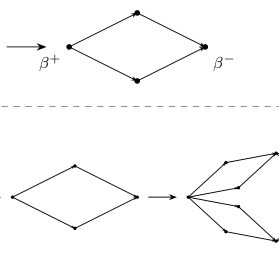 
Figure 1: The diamond hierarchical lattice (DHL)

📷 Fig 2

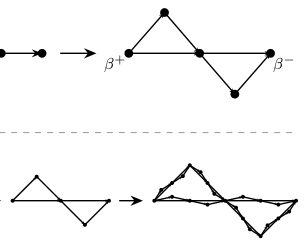 
Figure 2: The tie and gem rule graphs.

📷 Fig 3

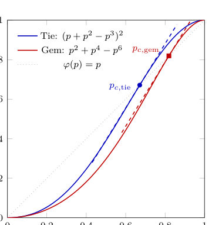 
Figure 3: The reliability functions.

📷 Fig 4

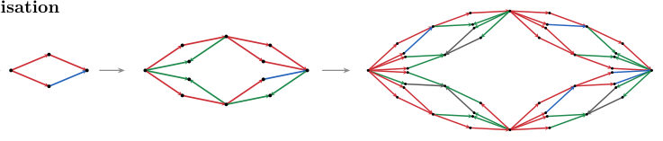 
Figure 4: A particular example of a random EIGS; it is induced by Bernoulli bond percolation on the DHL.

📷 Fig 5

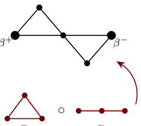 
Figure 5: The substitution orders S2 ◦S1 (tie) and S1 ◦S2 (gem).

**Summary.** This paper analyzes percolation on complex, self-similar hierarchical lattices defined by EIGS. It rigorously proves that the critical behavior (universality class) cannot be determined solely by geometric dimensions or by requiring commensurability of underlying scales. The work significantly advances the mathematical understanding of critical phenomena by showing the limitations of dimension-based classification.

**Why it may be interesting.** While focused on classical percolation, the rigorous mathematical framework developed for classifying universality classes based on geometric invariants (dimensions) and the explicit disproof of simple dimensional criteria provides powerful, generalizable mathematical tools applicable to critical phenomena in quantum many-body systems.

Detailed structure

**Main problem.** To rigorously investigate the universality classes of Bernoulli percolation on complex, self-similar hierarchical lattices generated by Edge Iterated Graph Systems (EIGS).

**Main result.** The study proves that universality cannot be determined by any finite set of substitution-multiplicative dimensions, and furthermore, it disproves the conjecture that critical-exponent universality requires commensurate renormalization scales.

**Method.** The authors use renormalization group techniques, analyzing various critical exponents ($eta, 
u, \delta, \eta_{av}$) and relating them to geometric dimensions ($\dim_H, \dim_M, \dim_P$) derived from the EIGS structure.

**Model / system.** The model is Bernoulli bond percolation on hierarchical lattices generated by deterministic or random Edge Iterated Graph Systems (EIGS). These lattices are characterized by specific rules graphs and associated geometric dimensions.

**Key observables.** Critical exponents ($eta, 
u, \delta, \eta_{av}$), ambient dimension ($\dim_H(\Xi)$), pivotal dimension ($\dim_P(C)$), and mass dimension ($\dim_M(C)$).

**Important parameters / regimes.** The percolation probability $p$ near the critical point $p_c$, and the structure of the underlying EIGS rule graph $R$.

**Assumptions / limitations.** The analysis relies on the existence of specific geometric dimensions derived from the EIGS structure and the application of theorems related to number theory (e.g., six exponentials theorem).

**Figures summary.** Figures illustrate the structure of the Diamond Hierarchical Lattice (DHL) and compare the reliability functions and critical exponents for two different lattices ('Tie' and 'Gem') to demonstrate shared universality despite structural differences.

**Paper structure.** The paper progresses by defining the EIGS framework, establishing relationships between critical exponents and geometric dimensions, proving the failure of dimension-based universality, and finally constructing counterexamples to the requirement of commensurate renormalization scales.

Abstract

We study Bernoulli percolation and its universality classes on hierarchical lattices generated by edge iterated graph systems (EIGS). By examining eight critical exponents, we prove that no finite family of substitution-multiplicative dimensions completely determines universality, providing a rigorous proof of the failure of dimension-based universality discussed by Hauser and Saxena [Phys. Rev. B 34 (1986), 8193-8195]. Although the six exponentials theorem provides number-theoretic criteria for scale commensurability, we further disprove the conjecture that critical-exponent universality requires commensurate discrete renormalisation scales.

[↑ back to top](#top)

### [Moment Methods for Uniform Average Mixing on Strongly Regular Graphs](http://arxiv.org/abs/2610.10017v1)

**Authors:** Musung Kang  
**Type:** theory · **Category:** other · **PDF:** <https://arxiv.org/pdf/2610.10017v1>  
**Analysis basis:** full PDF text, analyzed in chunks
**Topic relevance:** `analog quantum simulation` **1/5** · `quantum measurements` **1/5**

📷 Fig 1

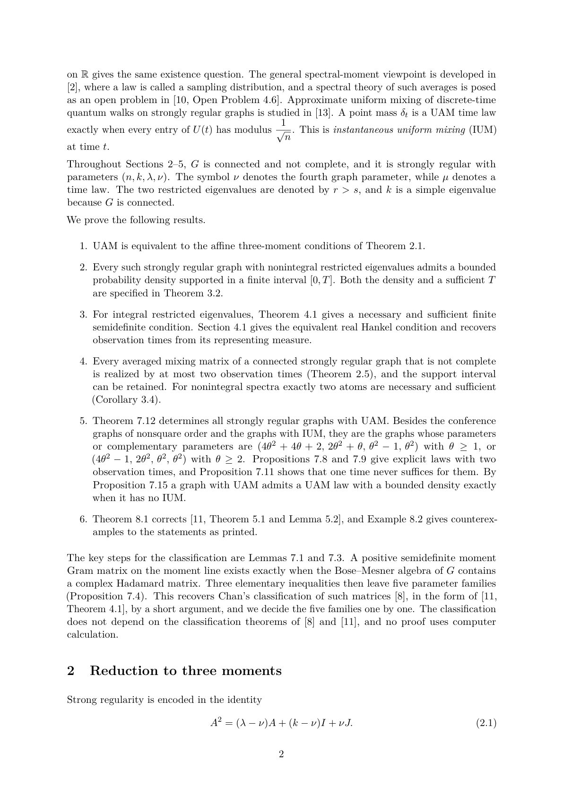 
Low-resolution page preview, page 2

📷 Fig 2

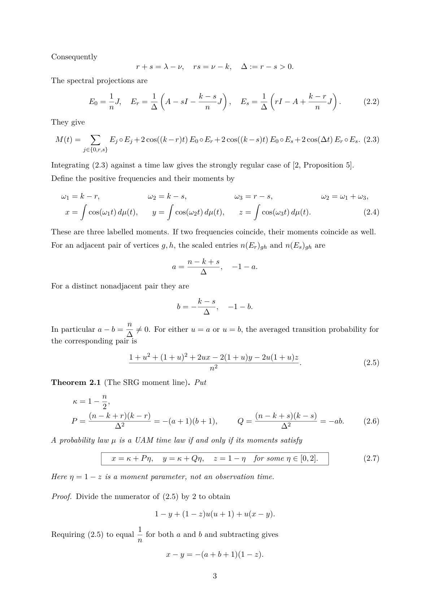 
Low-resolution page preview, page 3

📷 Fig 3

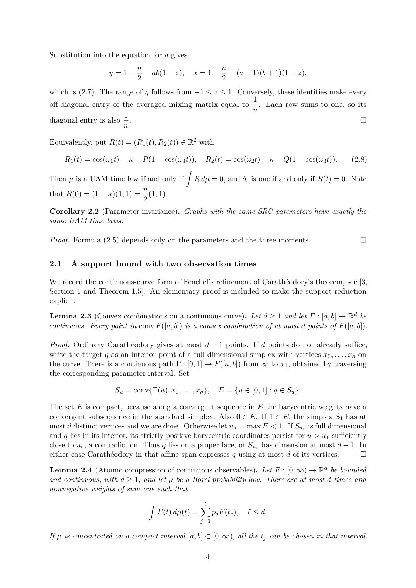 
Low-resolution page preview, page 4

📷 Fig 4

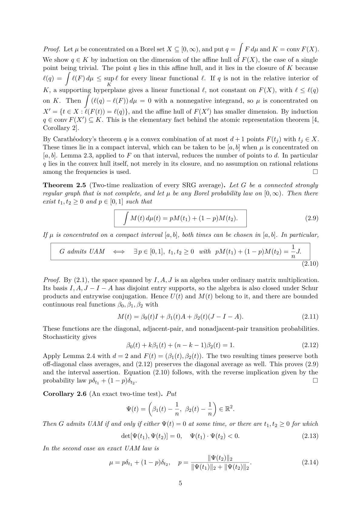 
Low-resolution page preview, page 5

📷 Fig 5

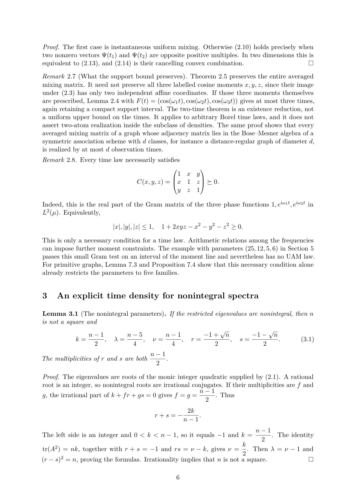 
Low-resolution page preview, page 6

**Summary.** This paper rigorously characterizes when quantum walks on strongly regular graphs achieve Uniform Average Mixing (UAM). It uses moment theory and spectral analysis to reduce the problem to algebraic constraints on the graph's eigenvalues. The work provides a complete classification of such graphs, which is crucial for understanding quantum mixing dynamics on highly symmetric structures.

**Why it may be interesting.** The connection between quantum walks, spectral graph theory, and moment problems provides deep insights into the mixing properties of quantum systems on structured lattices, relevant for understanding quantum transport.

Detailed structure

**Main problem.** The paper determines the necessary and sufficient conditions for a continuous-time quantum walk on a strongly regular graph (SRG) to exhibit Uniform Average Mixing (UAM) when observed at a random time.

**Main result.** The classification identifies specific infinite families of SRG parameters that admit UAM, and it provides explicit criteria for when the mixing can be realized by at most two observation times.

**Method.** The analysis heavily relies on moment theory, spectral analysis of the graph's adjacency matrix, and reducing the UAM condition to solving a set of affine moment constraints.

**Model / system.** The model is a continuous-time quantum walk evolving on a connected, non-complete strongly regular graph (SRG). The dynamics are governed by the evolution operator $U(t) = e^{itA}$, where $A$ is the adjacency matrix.

**Key observables.** The averaged transition probability matrix $\int_0^\infty M(t) d\mu(t)$, which must equal $rac{1}{n}J$ for UAM.

**Important parameters / regimes.** Graph parameters $(n, k, \lambda, \mu)$ defining the SRG, and the eigenvalues of the adjacency matrix.

**Assumptions / limitations.** The graph $G$ is assumed to be connected and not complete. The analysis often assumes the existence of a bounded time density for the observation law $\mu$.

**Figures summary.** Not specified in the provided notes.

**Paper structure.** The paper progresses from defining UAM and deriving moment constraints, to proving that the average can be realized by at most two observation times, and finally culminates in a comprehensive classification of all admitting SRGs.

Abstract

We study continuous-time quantum walks on connected strongly regular graphs that are not complete, observed at a random time drawn from a freely chosen probability law. Uniform average mixing (UAM) asks for a law under which every averaged transition probability equals $1/n$, where $n$ is the number of vertices. On a strongly regular graph this is equivalent to two affine constraints on three cosine moments. We construct a bounded, compactly supported time density for every strongly regular graph with nonintegral eigenvalues. For integral spectra we give an exact finite Toeplitz criterion and its Hankel form. Every averaged mixing matrix of such a graph is realized by at most two observation times. Three elementary inequalities on the moment line, which also give a short proof of Chan's classification of complex Hadamard matrices in the Bose-Mesner algebra, lead to a determination of all strongly regular graphs that admit UAM. Apart from the conference graphs of nonsquare order and the graphs with instantaneous uniform mixing, these are the members of two infinite families of parameter sets and their complements, and for them we give explicit laws with two observation times. The Petersen graph and its complement are the smallest members. A strongly regular graph with UAM admits a bounded time density exactly when it has no instantaneous uniform mixing. We also correct the classification of instantaneous uniform mixing on strongly regular graphs by Godsil, Mullin and Roy. Its sign condition excludes the halved $5$-cube, which mixes uniformly at time $π/4$. With the order $4θ^2$ read literally, its parity condition also excludes the Clebsch graph and includes the parameters $(36,14,4,6)$, for which no time law gives uniform average mixing.

[↑ back to top](#top)

### [QuSema: Detecting Silent Bugs in Quantum Libraries via Quantum-knowledge-enhanced Agents](http://arxiv.org/abs/2610.10258v1)

**Authors:** Yujin Song, Kaining Zhang, Qixin Zhang, Shuai Wang, Pingchuan Ma, Yuxuan Du  
**Type:** theory · **Category:** quantum information and computing · **PDF:** <https://arxiv.org/pdf/2610.10258v1>  
**Analysis basis:** full PDF text, analyzed in chunks
**Topic relevance:** `analog quantum simulation` **1/5** · `quantum measurements` **1/5**

📷 Fig 1

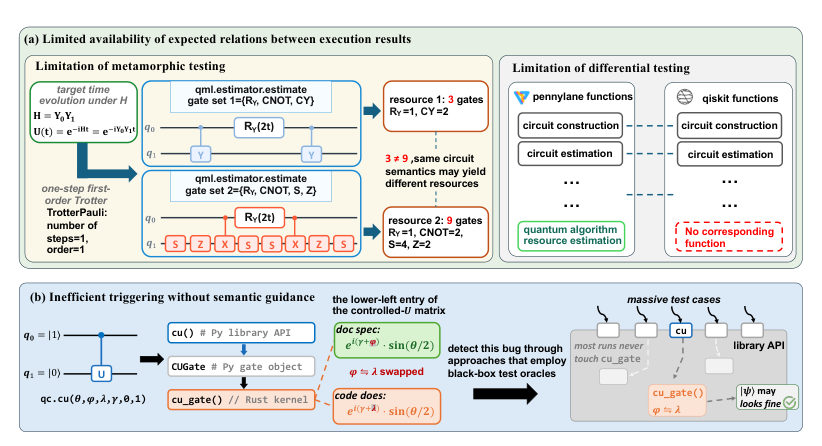 
Fig. 1. Limitations of approaches employing black-box test oracles. (a) Limited availability of expected relations between execution results, where equivalent circuits can have different resource counts and some higher-level resource-estimation functionality lacks a cross-library counterpart. (b) Inefficient triggering, where a bug when implementing the CU gate is exposed only under specific semantic conditions.

📷 Fig 2

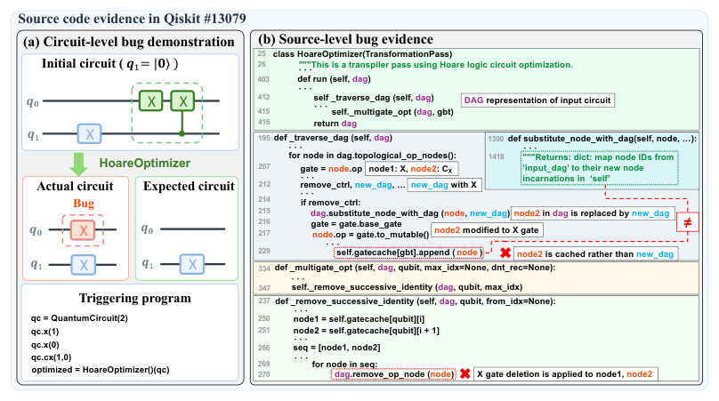 
Fig. 2. Circuit-level manifestation and source-level semantic evidence of Qiskit #13079 [16] in HoareOptimizer. (a) The triggering program and actual and expected circuits, showing an extra 𝑋on 𝑞0. (b) The implementation caches the original node after replacing it, so subsequent cancellation leaves the replacement 𝑋in the circuit. This violates quantum circuit semantics and is inconsistent with the documented node replacement.

📷 Fig 3

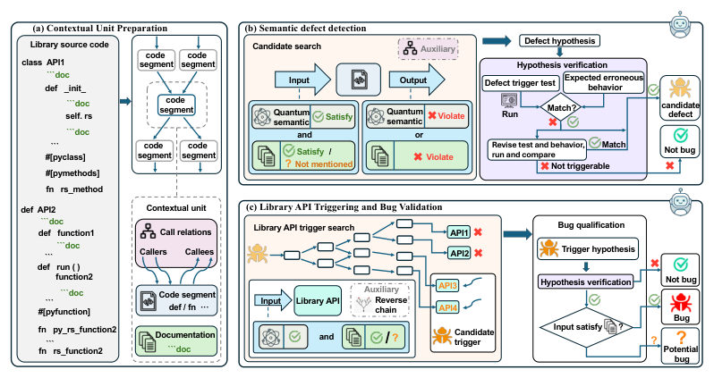 
Fig. 3. Workflow of QuSema for detecting silent bugs in quantum libraries. (a) Contextual Unit Preparation extracts code segments from library source code and combines them with call relations and documentation to form contextual units. (b) Semantic Defect Detection searches each contextual unit for semantic violations, formulates defect hypotheses and executes tests to produce candidate defects. (c) API Triggering and Bug Validation searches for documented APIs that expose the candidate defects, uses the reverse chain as auxiliary guidance, verifies the triggers, and classifies the results as bugs, potential bugs, or not bugs.

📷 Fig 4

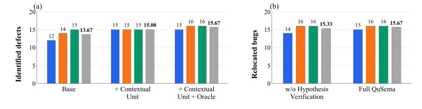 
Fig. 4. Component contributions with DeepSeek-V4.1-Flash (Max). (a) Candidates matching historical defects as Contextual Unit Preparation and the Source-level Semantic Oracle are added. (b) Bugs satisfying the relocation criterion with and without hypothesis verification in Stages II and III. Each group reports the counts from Runs 1–3 and their mean across the three runs.

📷 Fig 5

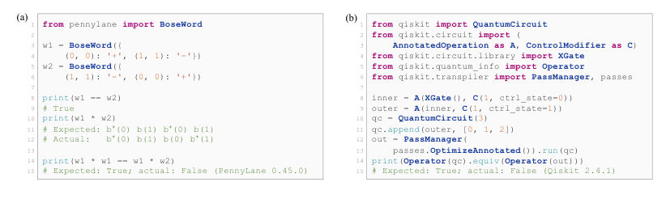 
Fig. 5. Silent bugs discovered by QuSema: (a) incorrect bosonic-operator multiplication in PennyLane #9650 [86] and (b) incorrect control-state composition in Qiskit #16410 [87].

**Summary.** This paper introduces QuSema, an autonomous testing agent designed to find 'silent bugs' in quantum computing libraries. It overcomes the limitations of traditional testing by using quantum semantics and documentation as a source-level oracle. By reasoning about intended quantum behavior, QuSema can uncover subtle, non-crashing defects critical for reliable quantum algorithm development.

**Why it may be interesting.** While focused on software, the underlying challenge of verifying complex, non-linear, and high-dimensional physical simulations (like those in quantum computing) mirrors the need for robust verification techniques in AMO physics simulations.

Detailed structure

**Main problem.** The core problem is detecting 'silent bugs' in quantum libraries, where incorrect results are produced without triggering explicit runtime failures.

**Main result.** The proposed agent, QuSema, successfully discovered 40 previously unknown bugs, including 30 silent bugs, surpassing existing testing methods on a benchmark.

**Method.** QuSema is an autonomous agent that uses quantum semantics and API documentation as a source-level semantic oracle to reason about intended behavior and generate executable tests.

**Model / system.** The system involves quantum computing libraries like Qiskit and PennyLane, which operate on qubits and quantum states manipulated by unitary operators.

**Key observables.** Semantic deviations, incorrect output values from valid inputs, and discrepancies between documented API specifications and actual code execution.

**Important parameters / regimes.** The complexity of quantum circuits, gate parameters (e.g., angles $	heta, \varphi$), and the structure of quantum operations.

**Assumptions / limitations.** The primary assumption is that the intended behavior of the quantum library can be inferred and constrained using quantum semantics and documentation, allowing for testing beyond simple failure modes.

**Figures summary.** Figure 1 illustrates the limitations of existing black-box testing methods, such as the inability to establish expected output relations or trigger bugs under specific semantic conditions.

**Paper structure.** The paper first establishes the limitations of existing failure-based and comparison-based testing for quantum libraries. It then introduces QuSema, detailing its agentic loop that uses quantum semantics to derive source-level oracles, followed by empirical results on bug detection.

Abstract

Quantum libraries are now critical infrastructure for quantum algorithm development, yet their correctness remains difficult to test. Existing testing techniques mainly rely on failure-based or comparison-based oracles, exposing bugs only when executions fail, violate runtime checks, or disagree with another implementation. Their applicability is limited when suitable execution-based oracles are unavailable, leaving some silent bugs undetected. Such missed bugs can produce incorrect results that propagate into experimental conclusions, simulation studies, and algorithmic designs. Here we present QuSema, an autonomous testing agent for finding silent bugs in quantum libraries. QuSema uses constraints from quantum semantics and documentation as a source-level semantic oracle to assess whether implementation logic can produce invalid outputs from valid inputs. It operates through an agentic loop that repeatedly inspects library API documentation and source code, reasons about the intended behavior of quantum operations, identifies potential semantic deviations, and validates them by generating executable tests through library APIs. Guided by quantum-domain reasoning, QuSema turns high-level behavioral mismatches into concrete, user-triggerable bug reports, enabling it to uncover non-crash defects. We implement QuSema for Qiskit and PennyLane. On a benchmark of 20 historical silent bugs, QuSema achieves higher mean bug relocation counts than Claude Code and Codex, with the DeepSeek configuration costing less than Claude Code. QuSema also discovers 40 previously unknown bugs confirmed by the developers, including 30 silent bugs.

[↑ back to top](#top)

### [Trend formation with sparse global sampling](http://arxiv.org/abs/2610.10521v1)

**Authors:** Sarath Sankar, Abhijit Sinha, Shankar Ghosh, Vikram Tripathi, Amitava Bhattacharya  
**Type:** both · **Category:** statistical mechanics · **PDF:** <https://arxiv.org/pdf/2610.10521v1>  
**Analysis basis:** full PDF text, analyzed in chunks
**Topic relevance:** `driven-dissipative phase transition` **1/5** · `non-equilibrium universality` **1/5**

📷 Fig 1

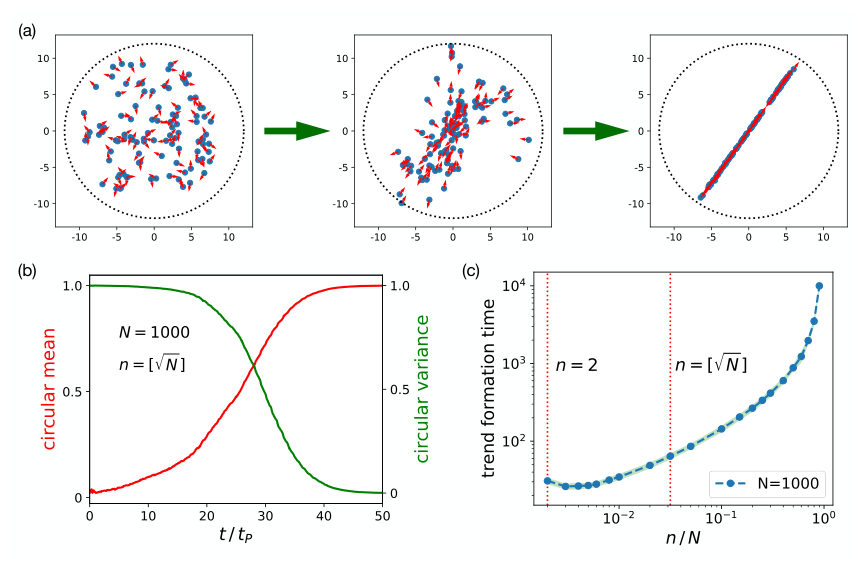 
Figure 1: (a) Snapshots of a representative simulation showing the evolution from an initially disordered configuration to a fully aligned state. Arrows indicate particle velocity directions. (b) Time evolution of the circular mean (red) and circular variance (green). Here time is shown in units of the ideal passage time, tP . (c) Average trend formation time (in units of tP ) as a function of the sample size fraction n/N, with shaded region indicating standard deviation over realizations.

📷 Fig 2

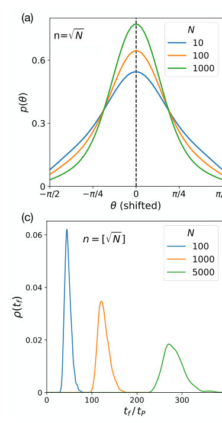 
Figure 2: Contrasting trend formation properties between sampling sizes n = [ √

📷 Fig 3

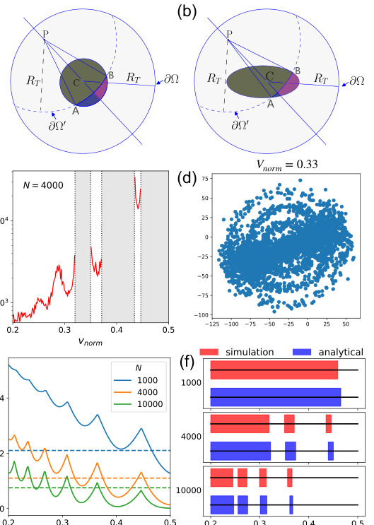 
Figure 3: Geometric filtering mechanism and dynamical criterion for trend formation. Agent P, at distance d from the true centroid C, infers an estimated centroid through noisy sam- pling, resulting in a perceived centroid distribution (gray shaded region). Trajectory reversal occurs only when the sampled centroid lies outside ∂Ω′. (a) For an isotropic particle distribution, the noise cloud is circular and no directional bias arises. (b) A weak nematic asymmetry, either coming from initial configuration or dynamically generated, deforms the noise cloud into an ellipse whose major axis tracks the nematic alignment direction. Sampling from the pink region returns P toward the nematic line;...

📷 Fig 4

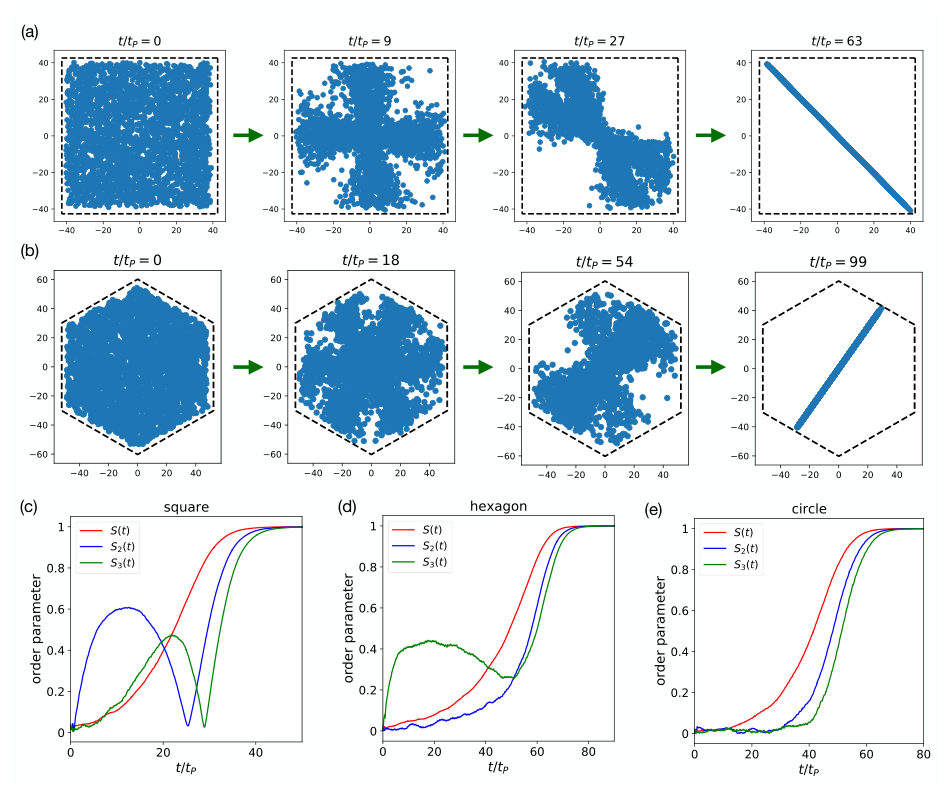 
Figure 4: Snapshots of evolution under square and hexagon geometry constraints (the considered polygon orientations are shown with dashed boundaries) are respectively shown in (a) and (b). Here n = [ √

📷 Fig 5

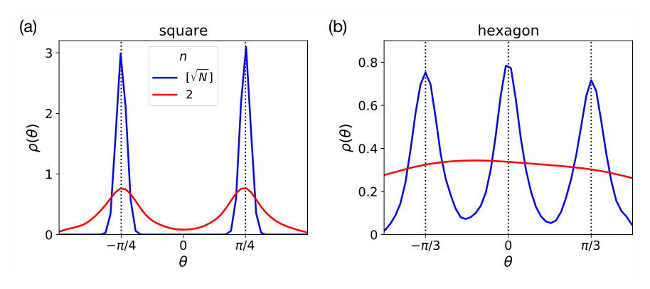 
Figure 5: The distribution of the final trend angle for (a) square and (b) hexagon geometry constraints for n = [ √

**Summary.** This work investigates how self-propelled swarms can achieve global order using only sparse, random local information sampling. The authors demonstrate that this sparse sampling is highly efficient, showing that even reducing the sampled subset size can accelerate alignment. The findings establish a theoretical and experimental framework for information-efficient collective coordination.

**Why it may be interesting.** The concept of using inherent estimation noise (fluctuations) as the driving force for spontaneous symmetry breaking and collective order is a general principle applicable to non-equilibrium statistical physics and complex systems.

Detailed structure

**Main problem.** The core challenge is achieving global coordination among self-propelled agents without relying on a central controller or dense global communication.

**Main result.** Sparse, random sampling is shown to be an information-efficient mechanism that reliably drives disordered populations into a globally aligned, nematic state, with noise playing a constructive role in symmetry breaking.

**Method.** The authors combine analytical derivations of predictive criteria with extensive numerical simulations and physical experiments using differential-drive robots.

**Model / system.** The model consists of N point particles (or robots) in 2D, where each agent periodically reorients its motion toward the centroid of a small, randomly sampled subset of its peers.

**Key observables.** Nematic Order Parameter (S(t)), Circular Variance, and Trend Formation Time (t_f).

**Important parameters / regimes.** Sampling size (n), sampling frequency, and the reorientation threshold ($R_T = \sqrt{N}$).

**Assumptions / limitations.** The dynamics are modeled as collisionless point-particle motion, and the experimental setup maps this idealized model onto physical robots using non-overlapping offsets.

**Figures summary.** Figures compare the evolution of alignment (nematic order) and the time required to reach alignment ($t_f$) when using different sampling sizes ($n=2$ vs. $n=[\sqrt{N}]$), demonstrating that smaller samples accelerate ordering.

**Paper structure.** The paper progresses from defining the minimal model dynamics, to analyzing the role of sampling size on ordering metrics, deriving analytical criteria, and finally validating these findings through physical robot experiments.

Abstract

Achieving global coordination without a central controller or dense global communication is a defining challenge for both biological collectives and engineered swarms. We introduce and analyze a minimal model in which self-propelled agents in a bounded domain periodically reorient their motions toward the centroid of a small, randomly chosen subset of their peers, with no direct sensing of any individual neighbor's position or heading. We show that this sparse, non-local sampling rule reliably drives an initially disordered population to a globally aligned, nematic state, and that shrinking the sampled subset -- down to the minimum of two agents -- accelerates ordering rather than impeding it: the resulting estimation noise, filtered through a geometric turning rule, is itself the engine of symmetry breaking. We derive an analytical criterion, in quantitative agreement with simulation, that predicts when this ordering succeeds as a function of the sampling size and sampling frequency. We confirm the mechanism experimentally in a swarm of up to fifteen differential-drive robots. These results identify sparse random sampling as an information-efficient route to collective coordination, with implications for understanding animal collectives and for designing communication-limited robotic swarms.

[↑ back to top](#top)

### [Ambipolar metal-insulator transition in bilayer MoSe2](http://arxiv.org/abs/2610.09036v1)

**Authors:** Ha-Leem Kim, Hyungbin Lim, Terry Wu, Amogh Y. Waghmare, Garima Gupta, Takashi Taniguchi, Kenji Watanabe, Archana Raja, Eric Y. Ma, Feng Wang  
**Type:** experiment · **Category:** strongly correlated electrons · **PDF:** <https://arxiv.org/pdf/2610.09036v1>  
**Analysis basis:** full PDF text, analyzed in chunks
**Topic relevance:** `quantum measurements` **1/5**

📷 Fig 1

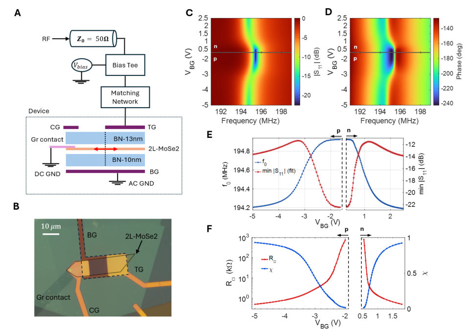 
Fig. 1. Radio-frequency reflectometry of bilayer MoSe2. (A) Circuit schematic and device cross-section. The RF signal is applied to the top-gate (TG) through a bias tee and an impedance-matching network, while the back-gate (BG) is AC-grounded. The bilayer MoSe2 (2L-MoSe2) channel is encapsulated between 13-nm top and 10-nm bottom hBN dielectrics and connected to a graphite contact (Gr contact) held at DC ground. The contact-gate (CG) dopes the contact region to maintain rapid carrier equilibration during gate sweeps. At the RF measurement frequency this contact is effectively open; the readout therefore probes the in-plane motion of carriers through capacitive coupling to the gates. The...

📷 Fig 2

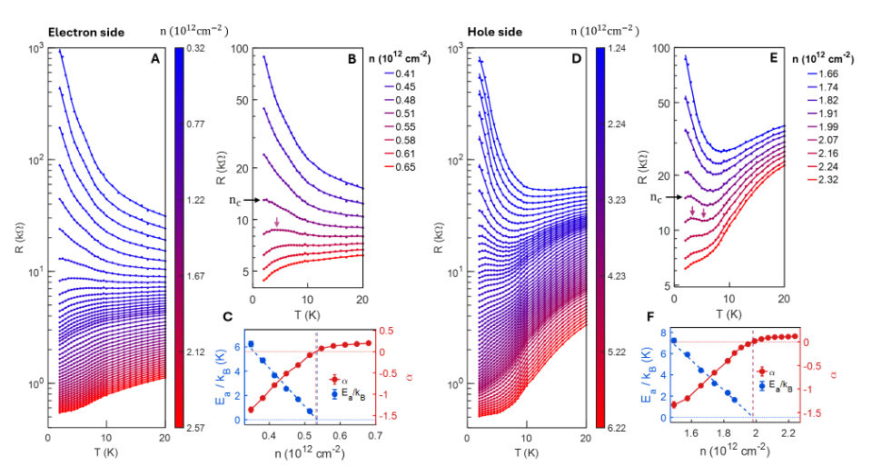 
Fig. 2. Density-tuned metal–insulator transition of bilayer MoSe2. (A) Channel sheet resistance R versus temperature T (2–20 K) on the electron side, at carrier densities n = 0.32–2.57 × 1012 cm−2 (color scale). The curves evolve from insulating (R increasing on cooling; blue) to metallic (R decreasing on cooling; red). (B) Magnified view of the electron-side crossover range (n = 0.41–0.65 × 1012 cm−2). The labeled arrow marks the curve nearest to nc; the small arrow marks the local resistance maximum at ≈ 4.5 K on the metallic side. (C) Activation energy Ea/kB (blue, left axis) and the low-temperature logarithmic slope α = d ln R/d ln T evaluated over 2–4 K (red, right axis), versus n. Ea...

📷 Fig 3

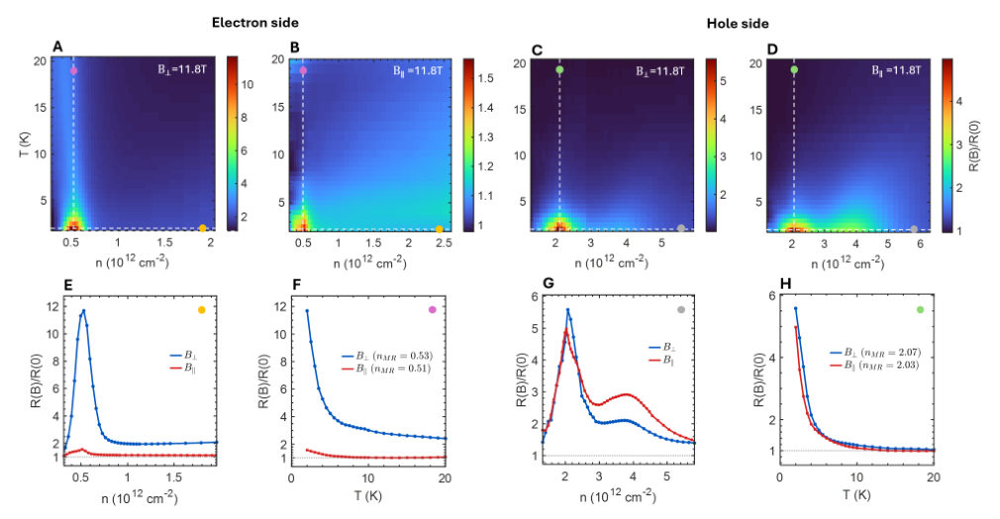 
Fig. 3. In-plane and out-of-plane magnetotransport across the metal–insulator transition. (A to D) Magnetoresistance (MR) ratio of the sheet resistance, R(B)/R(0) at B = 11.8 T across the (n, T) plane, for electrons in out-of-plane (B⊥) (A) and in-plane (B∥) (B) fields and for holes in B⊥ (C) and B∥ (D) fields. For every carrier and orientation, the ratio exhibits a pronounced peak at nMR, which lies close to the temperature-based critical-density estimate nc from Fig. 2. The vertical dashed line marks nMR and the horizontal dashed line marks T = 2 K; together with the markers, they indicate the temperature and density cuts shown below. (E and G) MR ratio as a function of density at T = 2...

📷 Fig 4

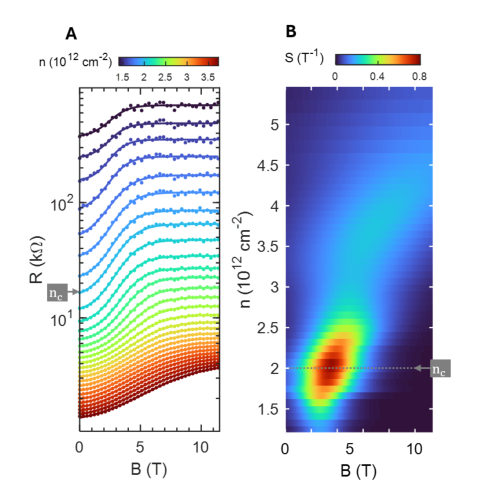 
Fig. 4. Field-resolved in-plane critical-density magnetoresistance (hole side). (A) Sheet resistance R versus in- plane magnetic field B at T = 2.2 K for a series of hole densities n (color scale). Dots are measured data and solid lines are logistic fits [(36), section 1]. The gray arrow marks the zero-field critical density nc. (B) Normalized differential response S = [1/R(0)] dR/dB in the (B, n) plane computed from the fitted curves of (A). The strong enhancement of S is centered at nc ≈ 2.0 × 1012 cm−2 (dotted line); a much weaker response at higher densities is widely distributed over the measured field range.

**Summary.** This work reports on the ambipolar metal-insulator transition in bilayer MoSe2 using advanced contact-free radio-frequency reflectometry. By measuring both electron and hole transport, the authors provide strong evidence that the MIT is governed by strong electron-electron interactions, leading to Wigner crystallization. This opens a quantitative transport window for studying correlated states in high-quality 2D semiconductors.

**Why it may be interesting.** The work provides quantitative transport measurements in a clean, tunable 2D system, offering experimental validation for theoretical models describing strongly correlated phases like Wigner crystals.

Detailed structure

**Main problem.** The paper investigates the metal-insulator transition (MIT) in two dimensions, specifically resolving the long-standing debate over whether Coulomb interactions or disorder primarily drive this transition.

**Main result.** The study demonstrates interaction-driven MITs in bilayer MoSe2 for both electrons and holes, evidenced by comparable Wigner-Seitz radii at transition, and maps the transition using contact-free RF reflectometry.

**Method.** The authors employed contact-free radio-frequency (RF) reflectometry to measure sheet resistance and magnetotransport properties in the bilayer semiconductor.

**Model / system.** The physical system is bilayer MoSe2, a semiconductor used to study ambipolar transport. The measurements probe the transition between a correlated liquid and a Wigner solid state.

**Key observables.** Sheet resistance (R) vs. carrier density, Magnetoresistance (MR) peaks, and resonance frequency ($f_0$) shifts.

**Important parameters / regimes.** Wigner-Seitz radii ($r_s$), critical densities ($n_c$), and the ratio of Coulomb interaction energy to kinetic energy.

**Assumptions / limitations.** The RF readout is non-perturbative, and the analysis compares results to theoretical benchmarks derived from disorder-free, symmetric gate geometries.

**Figures summary.** Figures show RF spectra, extracted sheet resistance vs. density (for both electron and hole doping), and magnetotransport ratios mapping the MIT.

**Paper structure.** The paper systematically presents the experimental setup, characterizes the ambipolar MIT using RF measurements, analyzes the temperature and magnetic field dependence of the transition, and compares findings to theoretical models of correlated electron systems.

Abstract

When Coulomb interactions dominate kinetic energy, dilute two-dimensional carriers form a Wigner solid. Both its melting and disorder-driven localization can drive density-tuned metal-insulator transitions, but their relative roles and interplay have been debated for decades. Atomically thin semiconductors offer a new test because transport and scanning tunneling microscopy can probe the same material, yet poor contacts impede transport where correlations are strongest. Here we introduce contact-free radio-frequency reflectometry that senses sheet resistance through capacitive gate coupling. It resolves the electron and previously inaccessible hole transitions in the same bilayer MoSe2 device, whose carriers share disorder but not mass. Their critical densities differ fourfold yet correspond to comparable Coulomb-to-kinetic-energy ratios, where tunneling microscopy finds solid-liquid coexistence. Magnetoresistance peaks sharply at each transition, reflecting a Pomeranchuk-like, field-driven expansion of the Wigner solid against the correlated liquid. Our results demonstrate interaction-driven transitions in high-quality two-dimensional semiconductors, opening quantitative transport in contact-limited systems.

[↑ back to top](#top)

### [Efficient Estimation of Logical Sensitivities Through Fault-Counting](http://arxiv.org/abs/2610.10531v1)

**Authors:** Winston Fu, J. Wilson Staples, Jeff D. Thompson  
**Type:** theory · **Category:** quantum information and computing · **PDF:** <https://arxiv.org/pdf/2610.10531v1>  
**Analysis basis:** full PDF text, analyzed in chunks
**Topic relevance:** `methods for driven-dissipative` **1/5**

📷 Fig 1

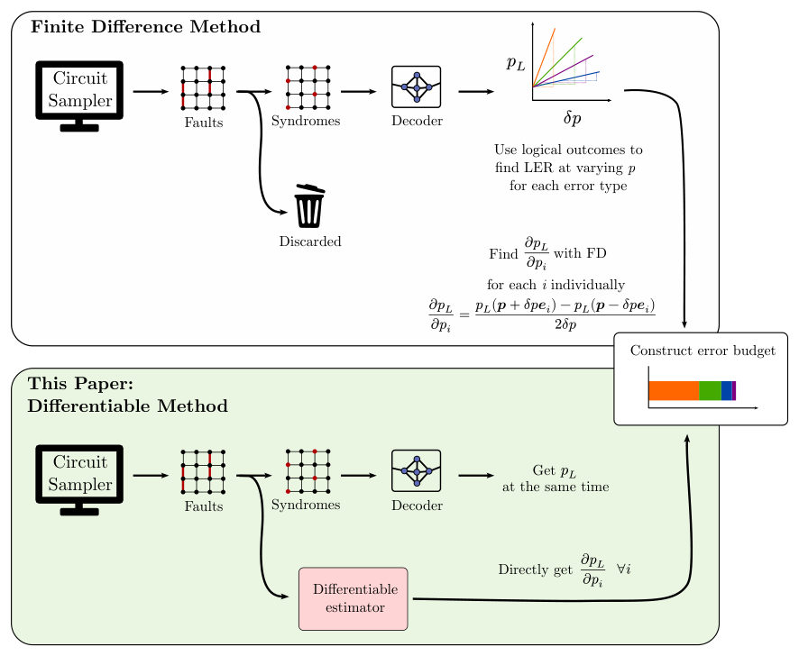 
FIG. 1: Overview of contributions. Top: The standard approach to finding sensitivities and error budgets is the finite difference method. This involves using values of pL measured at various p to calculate gradients, requiring multiple simulations at different p. ei is the unit vector in the pi direction. Bottom: We introduce a differentiable estimator to estimate sensitivities using samples at only one p. The sensitivity to different components of p is extracted from the sampled fault locations, which are ordinarily discarded if the only object is to compute pL.

📷 Fig 2

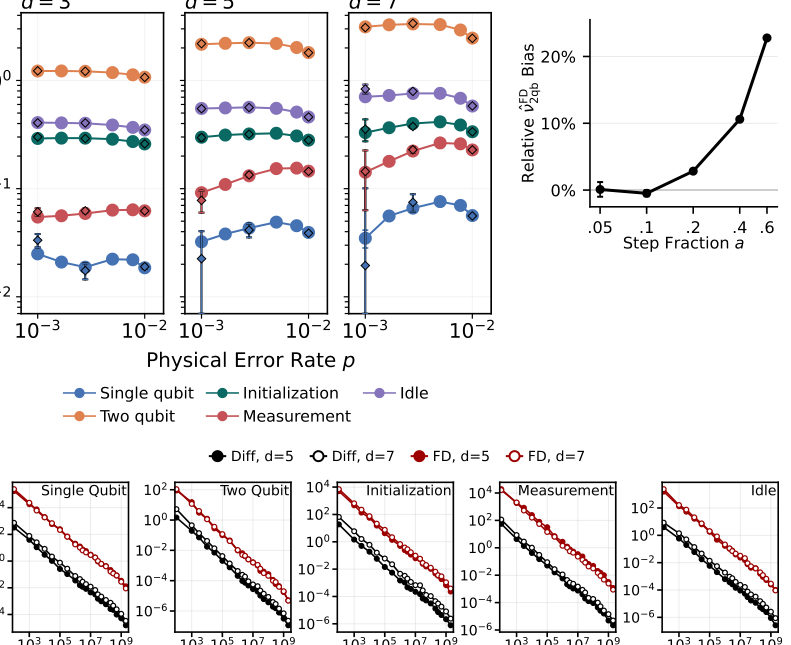 
FIG. 2: (a) Logarithmic sensitivities ∂log pL/∂log pi , over a range of p. Circles are the estimates obtained using Diff, while diamonds are estimates obtained using FD. (b) Relative difference between ˆνFD 2qb and ˆνDiff 2qb at different step fractions a, for d = 7 at p = 0.005. As the sensitivity is measured over a larger range of p, higher-order terms cause a bias in the measured sensitivity. (c) Fractional variance in sensitivity from Diff and FD at varying shot budgets, obtained from 200 bootstrap samples of 2 × 109 shots for each error type at step fraction a = 0.1.

📷 Fig 3

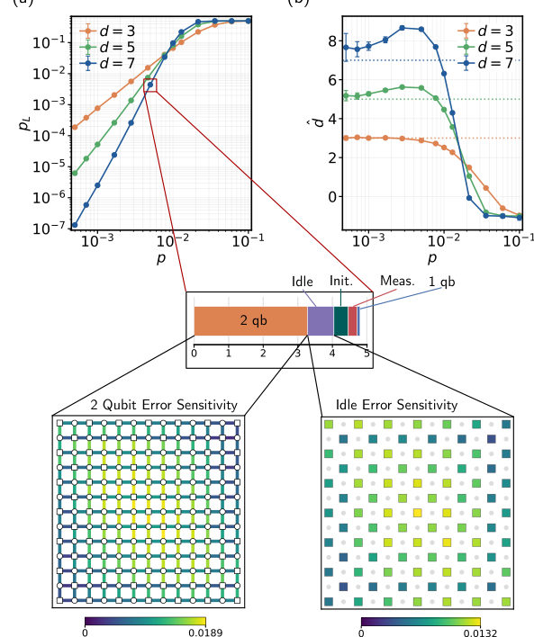 
FIG. 3: (a) A pL vs p sweep of a surface code at distances 3, 5, and 7. Using Diff, the samples collected at each point on the curve can also be used to estimate a breakdown of νi by error type, round number, spatial location, and individual fault. The spatial sensitivity heatmaps, aggregated over d rounds, are shown for two-qubit gate errors and idle errors, where squares represent data qubits and circles represent ancilla qubits. The plotted values are logarithmic sensitivities, ∂log pL/∂log pi . (b) At the same time, the sum of sensitivities gives a local unbiased measurement of the slope of the pL vs p curve, which can be used to calculate the local effective distance scaling factor. In...

📷 Fig 4

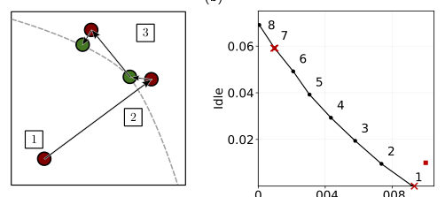 
FIG. 4: (a) Illustration of the threshold-finding algorithm for the case s = 2. The gray line shows the threshold contour between error types p1 and p2 that needs to be found. Boxed numbers represent the steps of the algorithm. Step 1: For two distances d1 and d2, sample the circuits at some p0, measure pL, and calculate ∆(p0), while also using Diff to find ∇p∆(p0) from the same set of data. Step 2: The Newton step predicts a new point p1 for which ∆(p1) = 0. Repeat until the convergence criteria are met. Step 3: Choosing a p2 where p2 −p1 is orthogonal to the vector ∇p∆(p1). This leaves ∆(p2) = 0 to first order, and so is close to the threshold as well. Repeat root finding until this next...

📷 Fig 5

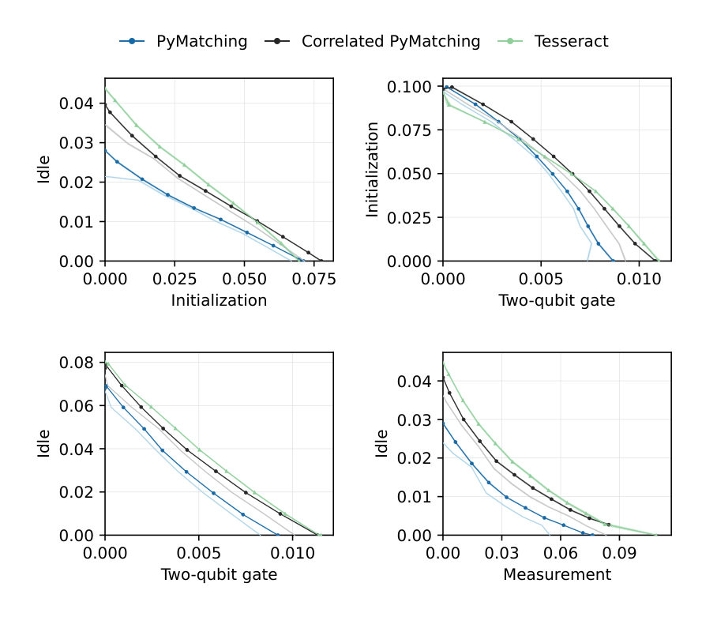 
FIG. 5: Threshold contours for four error type pairs, using PyMatching, Correlated PyMatching, and Tesseract. Uncertainty in contour position due to statistical uncertainty in ∆is plotted as a lightly shaded region around each contour line. For PyMatching and Correlated PyMatching, darker shades show the thresholds found using the (5, 7) distance pair. Lighter shades show the (3, 5) distance pair. For Tesseract, only the (3, 5) distance pair was measured.

**Summary.** This paper introduces a differentiable estimator to overcome the shot-budget limitations of traditional finite difference methods when calculating logical sensitivities in quantum error correction. By estimating the full gradient from a single simulation run, it drastically reduces the required computational resources. This efficiency allows researchers to accurately map out critical performance boundaries, such as noise thresholds, in complex, multi-parameter noise models.

**Why it may be interesting.** This work provides a powerful, statistically efficient tool for characterizing the robustness of quantum codes, which is crucial for designing fault-tolerant quantum computers by precisely mapping out the boundaries of reliable operation in complex noise landscapes.

Detailed structure

**Main problem.** The paper addresses the need for an efficient method to estimate logical sensitivities ($
u_i = \partial p_L / \partial p_i$), which quantify how the logical error rate ($p_L$) responds to individual physical noise parameters ($p_i$) in quantum error correction.

**Main result.** A novel differentiable estimator can calculate all components of the gradient $
abla_{\mathbf p}p_L$ simultaneously from a single Monte Carlo data set, achieving a significant reduction (one to two orders of magnitude) in required simulation shots compared to standard finite difference methods.

**Method.** The core method is a differentiable estimator that leverages information about underlying fault configurations to estimate partial derivatives of the logical error rate. This is combined with Newton root finding to trace threshold contours in multi-dimensional noise models.

**Model / system.** The primary model is quantum error-correcting circuits, specifically using the surface code subjected to circuit-level noise. The analysis is performed on the logical error rate $p_L$ as a function of various physical noise parameters $p_i$.

**Key observables.** Logical Error Rate ($p_L$), Logical Sensitivities ($
u_i = \partial p_L / \partial p_i$), Threshold Contours ($\Delta(p) = 0$).

**Important parameters / regimes.** Physical noise parameters ($p_i$), circuit distance ($d$), shot budget ($N$), and the step size ($h$) used in finite difference methods.

**Assumptions / limitations.** The differentiable estimator relies on accessing underlying fault configurations in stabilizer tableau simulations. The analysis often uses linear approximations for small error rates and assumes the ability to use local sensitivity information to guide root finding.

**Figures summary.** Figures compare the variance and estimates of sensitivities ($
u_i$) between the proposed differentiable method and standard finite differences. Other figures illustrate the tracing of threshold contours in multi-parameter noise spaces.

**Paper structure.** The paper first introduces the problem of sensitivity estimation, contrasts the standard finite difference approach with the proposed differentiable estimator, demonstrates the superior variance scaling of the new method, and finally applies this technique to locate and trace threshold contours in complex noise models using Newton root finding.

Abstract

Quantum error-correcting circuits are affected by multiple physical noise mechanisms, whose contributions to logical failure must be understood to evaluate code performance and guide improvements in hardware. The individual error budget contributions for an error type $i$ can be characterized by its logical sensitivity $ν_i = \frac{\partial p_L}{\partial p_i}$, which measures the response of the logical error rate $p_L$ to each physical noise parameter $p_i$. Normally, $ν_i$ is measured using linear fits such as finite differences, where $p_L$ is measured at two or more values of $p_i$ to calculate partial derivatives. In this paper, we develop a differentiable estimator to obtain all components of $\nabla_{\mathbf p}p_L$ simultaneously from a single Monte Carlo data set at one noise configuration, using information about the underlying fault configurations. In surface code simulations with circuit-level noise, the estimator agrees with conventional finite differences while requiring one to two orders of magnitude fewer shots to achieve the same variance. We apply this technique to quantify error budgets, resolve sensitivities at the individual qubit level, and infer effective code distance. Finally, we incorporate the sensitivities into Newton root finding to locate and trace threshold contours in multidimensional noise models. These results provide an efficient method for extracting and applying logical sensitivity information from standard quantum error correction simulations.

[↑ back to top](#top)

### [Efficiently computable bounds on the energy-constrained quantum reading capacity](http://arxiv.org/abs/2610.08945v1)

**Authors:** Vishal Singh, Zixin Huang, Mark M. Wilde  
**Type:** theory · **Category:** quantum information and computing · **PDF:** <https://arxiv.org/pdf/2610.08945v1>  
**Analysis basis:** full PDF text, analyzed in chunks
**Topic relevance:** `quantum measurements` **1/5**

📷 Fig 1

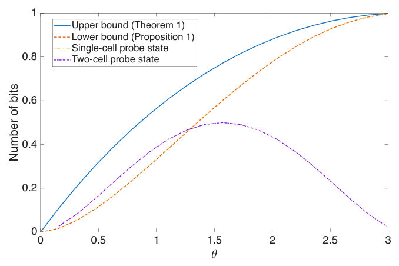 
FIG. 1. Comparison of upper and lower bounds on the unconstrained reading capacity of the pair of qubit unitary channels defined in (128). The lower bound computed using the bilinear program in Appendix B overlaps with the single-cell probe state bound given in (129).

📷 Fig 2

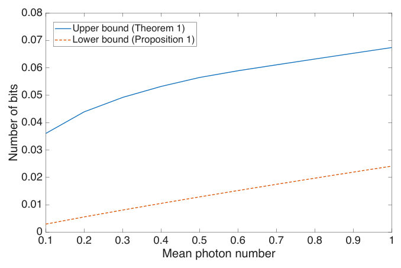 
FIG. 2. Upper and lower bounds on the energy constrained reading capacity of a pair of loss–dephasing channels plotted against the average photon number per channel probe. In this example, the first channel has the parameters η1 = 0.95, γ1 = 0.01, and the second channel has the parameters η2 = 0.85, γ2 = 0.01. The output dimension of the channel is truncated to four.

**Summary.** This work establishes theoretical upper and lower bounds for the energy-constrained quantum reading capacity. It tackles the problem by utilizing advanced quantum information measures like relative entropies within semidefinite programming frameworks. The results provide a quantitative understanding of how energy limitations restrict the information rate achievable in quantum communication channels.

**Why it may be interesting.** The rigorous derivation of capacity bounds under physical constraints like energy is crucial for designing realistic quantum communication protocols, bridging abstract theory with physical implementability.

Detailed structure

**Main problem.** The paper determines the energy-constrained quantum reading capacity of a finite family of quantum channels.

**Main result.** Upper and lower bounds for this capacity are derived using advanced information-theoretic tools, showing how the capacity relates to channel relative entropies under an energy constraint.

**Method.** The authors use semidefinite programming (SDP) techniques, involving approximations of relative entropies (Belavkin-Staszewski and Umegaki) and alternating optimization to establish rigorous bounds.

**Model / system.** The model is quantum reading, where classical messages are encoded into sequences of quantum channels, and the reader probes these channels while respecting an average energy constraint on the probes.

**Key observables.** Quantum reading capacity ($R_{H,E}(N)$), Holevo information, Belavkin–Staszewski relative entropy, and Umegaki relative entropy.

**Important parameters / regimes.** The average probing energy constraint ($E$), the set of quantum channels ($\{N_x\}$), and the number of uses ($n$).

**Assumptions / limitations.** The upper bound relies on SDP approximations using Gauss-Legendre quadrature, and the lower bound is derived via bilinear programming, both of which involve approximations.

**Figures summary.** Figure 1 compares upper and lower bounds for unconstrained capacity for unitary channels, showing overlap. Figure 2 plots upper and lower bounds for loss-dephasing channels against the average photon number.

**Paper structure.** The paper develops the converse bound using relative entropy techniques, establishes the upper bound via SDP (Appendix A), and derives the lower bound using bilinear programming (Appendix B), culminating in comparisons and numerical examples.

Abstract

In quantum reading, classical messages are encoded in sequences of quantum channels and recovered by probing the channels and processing their outputs. We study the reading capacity of a finite family of finite-dimensional channels under an average constraint on the probing energy, allowing arbitrary adaptive operations between channel uses. Using an input-dependent chain rule for the Belavkin-Staszewski relative entropy, we derive a converse bound expressed as an optimization involving channel Choi operators and the operator relative entropy. This formulation admits semidefinite approximations and reduces, without an energy constraint, to a channel information radius. To obtain achievable rates, we construct bilinear semidefinite lower approximations to a standard non-adaptive reading bound. Alternating optimization produces feasible probe states and encoding distributions, whose Holevo information gives a directly evaluable achievable rate. For jointly classical-quantum channels, we derive a separate converse based on the Umegaki relative entropy. Without an energy constraint, this converse matches a non-adaptive achievable rate, recovering a recent result of Pascual Abraldes and Winter: non-adaptive protocols suffice to achieve the unconstrained reading capacity of jointly classical-quantum channels.

[↑ back to top](#top)

### [Electronic Properties of Ladder-Type Phenylenes Studied by Thermally-Assisted-Occupation Density Functional Theory](http://arxiv.org/abs/2610.09783v1)

**Authors:** Tsu-Hsuan Wang, Jeng-Da Chai  
**Type:** theory · **Category:** strongly correlated electrons · **PDF:** <https://arxiv.org/pdf/2610.09783v1>  
**Analysis basis:** full PDF text, analyzed in chunks
**Topic relevance:** `Keldysh / 2PI / non-Gaussian methods` **1/5**

📷 Fig 1

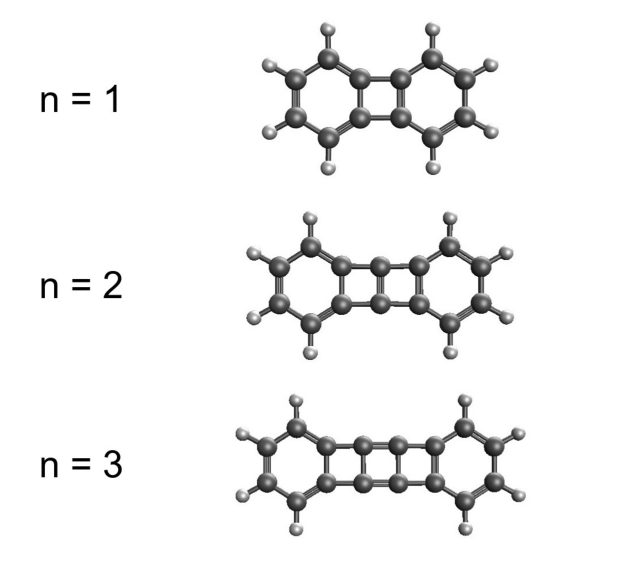 
FIG. 1. Geometry of n-LP (with n = 1–3), containing n fused four-membered carbon rings.

📷 Fig 2

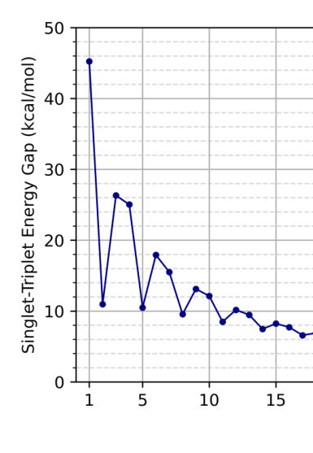 
FIG. 2. Singlet-triplet energy gap of n-LP, calculated using spin-unrestricted TAO-LDA.

📷 Fig 3

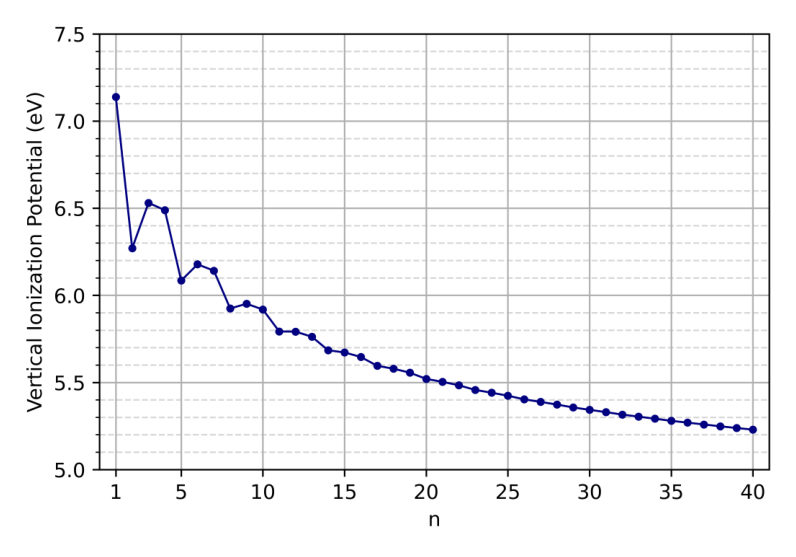 
FIG. 3. Vertical ionization potential of ground-state n-LP, calculated using spin-unrestricted

📷 Fig 4

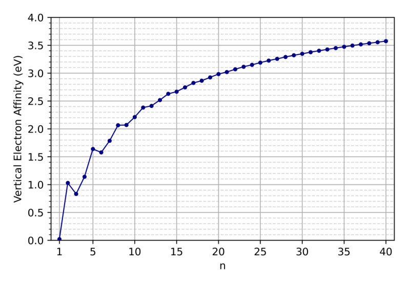 
FIG. 4. Vertical electron affinity of ground-state n-LP, calculated using spin-unrestricted TAO-

📷 Fig 5

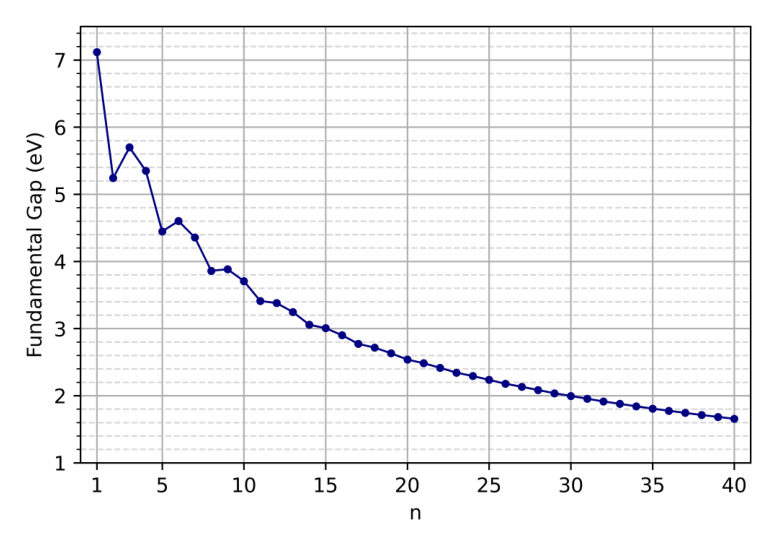 
FIG. 5. Fundamental gap of ground-state n-LP, calculated using spin-unrestricted TAO-LDA.

**Summary.** This work applies TAO-DFT to study ladder-type phenylenes, revealing that their electronic properties are not monotonic but exhibit a distinct damped periodic oscillation with a period of three. This periodicity dictates a transition between closed-shell and polyradical states, offering fundamental guidelines for the rational design of these carbon-based nanomaterials.

**Why it may be interesting.** The study provides a detailed, quantitative understanding of how structural periodicity dictates electronic correlation in extended $\pi$-systems, which is crucial for designing next-generation organic electronic materials.

Detailed structure

**Main problem.** Accurately predicting the electronic properties of extended pi-conjugated systems containing radical character, which is a major theoretical challenge due to strong static correlation effects.

**Main result.** The electronic properties of ladder-type phenylenes exhibit a unique damped periodic oscillation, with highly correlated hotspots appearing at intervals $n = 3k - 1$. This periodicity governs the transition from nonradical to polyradical character.

**Method.** The study employs Thermally-Assisted-Occupation Density Functional Theory (TAO-DFT) to efficiently capture static correlation effects in these large systems.

**Model / system.** The physical system is ladder-type phenylenes ($n$-LPs), which are extended $\pi$-conjugated systems formed by $n$ fused four-membered carbon rings, studied for $n=1$ to $40$.

**Key observables.** Singlet-Triplet Energy Gap (EST), radical character, Symmetrized von Neumann Entropy (SvN), Vertical Ionization Potential ($I_v$), Electron Affinity ($E_a$), and Fundamental Gap ($E_g$).

**Important parameters / regimes.** The periodicity of 3 in the electronic structure, and the specific structural localization of active orbitals along the central ladder framework.

**Assumptions / limitations.** The primary approximation is the use of TAO-DFT, which is assumed to accurately model static correlation effects, overcoming limitations of standard KS-DFT.

**Figures summary.** Figures systematically present calculated properties (gap, IP, EA, etc.) and real-space orbital distributions for small $n$ (up to $n=5$), demonstrating the evolution of electronic structure.

**Paper structure.** The paper systematically analyzes the electronic structure evolution of $n$-LPs using TAO-DFT, focusing on how key observables like the S-T gap and radical character oscillate with chain length $n$, contrasting this periodicity with monotonic trends seen in other nanographenes.

Abstract

Accurate prediction of the electronic properties of extended $π$-conjugated systems with radical character remains a major theoretical challenge. To overcome this challenge, thermally-assisted-occupation density functional theory (TAO-DFT) has been developed in recent years. In this study, we employ TAO-DFT to systematically explore the electronic properties of ladder-type phenylenes ($n$-LPs), containing $n$ fused four-membered carbon rings. Our calculations reveal that all investigated $n$-LPs (with $n$ = 1 ~ 40) possess singlet ground states. With increasing $n$-LP size, we observe a transition from the nonradical character of smaller $n$-LPs to the polyradical character of larger $n$-LPs. Notably, we identify a distinct damped periodic oscillation in the radical character of $n$-LPs, featuring highly correlated hotspots at specific intervals ($n = 3k - 1$, where $k$ are positive integers). The real-space representation of active orbitals confirms this global electronic behavior is governed by the structural localization of active orbitals along the central ladder framework. These findings provide fundamental insights into the size-dependent electronic properties of $n$-LPs, guiding their rational design for future nanomaterial applications.

[↑ back to top](#top)

### [Finite-size scaling analysis of three dimensional Z(2) and O(2) spin models with non-vanishing symmetry breaking parameter](http://arxiv.org/abs/2610.10350v1)

**Authors:** Jishnu Goswami, Frithjof Karsch, Sabarnya Mitra  
**Type:** both · **Category:** statistical mechanics · **PDF:** <https://arxiv.org/pdf/2610.10350v1>  
**Analysis basis:** full PDF text, analyzed in chunks
**Topic relevance:** `analog quantum simulation` **1/5**

📷 Fig 1

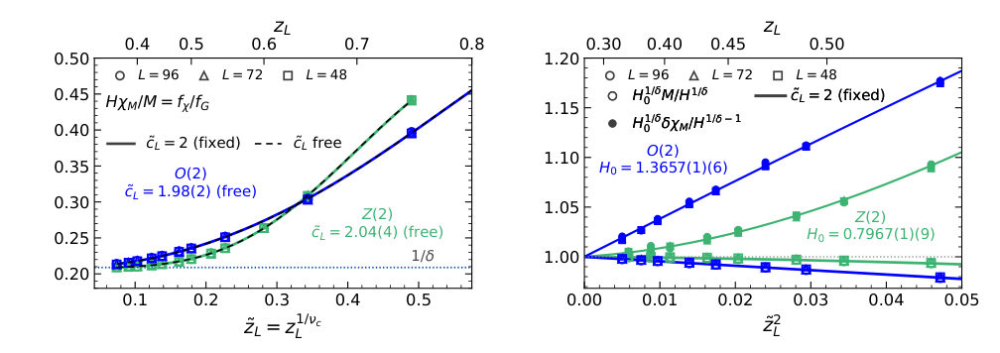 
FIG. 1. (Left:) The ratio HχM(Tc, H, L)/M(Tc, H, L) versus the scaling variable ezL for the 3-d, Z(2) and O(2) spin models on cubic lattices of size L3 with L = 48, 72 and 96. (Right:) The scaled order parameter M/h1/δ and scaled susceptibility H0δχM/h1/δ−1 versus ez2 L for both Z(2) and O(2) model. While in the O(2) universality class the leading order term provides a good description for zL ≤0.55, a significant influence of higher order terms in the expansion are seen for the Z(2) universality class above zL ≃0.4 (see text). Note that the conversion from the ezL scale shown on the lower x-axis to the zL scale shown on the upper x-axis is done for the O(2) case. Differences for the same in...

📷 Fig 2

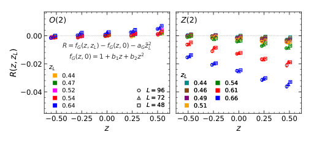 
FIG. 3. Sub-leading corrections to the FSS functions in the 3-d, O(2) (left) and Z(2) (right) universality classes versus z, for several values of zL, 0.44 ≤zL ≤0.66.

📷 Fig 3

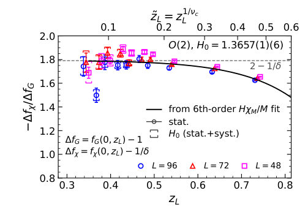 
FIG. 2. The ratio −(fχ(0, zL) −1/δ)/(fG(0, zL) −1) intro- duced in Eq.(14) at Jc = 1/Tc. Shown are results for this ratio obtained from calculations for the 3-d, O(2) spin model.

📷 Fig 4

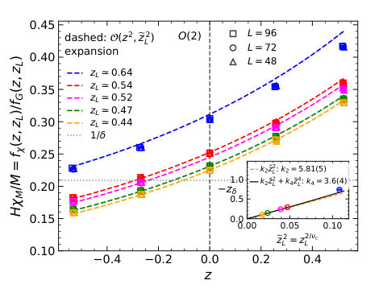 
FIG. 4. The ratio HχM/M versus z for selected zL values, on our working cubic lattices. Shown are results for the 3-d, O(2) model. Corresponding results for the Z(2) model are given in the appendix. The dashed curves are obtained from a truncated series expansion, given in Eq.(19).

📷 Fig 5

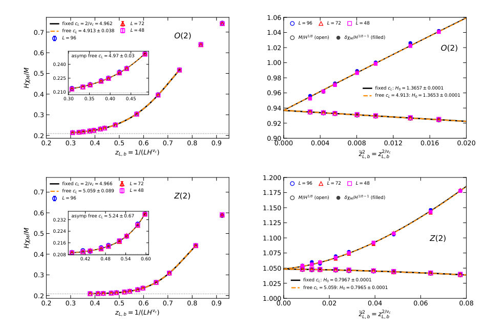 
FIG. 5. (Left:) The ratio HχM/M versus the bare scaling variable zL,b for the 3-d, O(2) (top) and Z(2) (bottom) models. (Right:) The scaled order parameter M/H1/δ (open symbols) and the scaled susceptibility δχM/H1/δ−1 (filled symbols) versus the bare scaling variable ez2 L,b for the 3-d, O(2) (top) and Z(2) (bottom) models.

**Summary.** This work performs a detailed finite-size scaling analysis on 3D Z(2) and O(2) spin models in an external field. By determining the leading finite-size correction term, the authors provide a robust method to eliminate systematic errors in calculating critical parameters. This methodology is particularly valuable for studying quantum phase transitions, such as those found in QCD.

**Why it may be interesting.** While focused on classical statistical mechanics models, the rigorous application of finite-size scaling techniques and the connection to QCD phase transitions provide valuable methodological insights applicable to quantum critical points in many-body quantum systems.

Detailed structure

**Main problem.** The paper aims to determine the leading finite-size scaling corrections to universal functions for 3D Z(2) and O(2) spin models when an external symmetry breaking field is present.

**Main result.** The leading finite-size correction is found to be proportional to $e_{z_L}^2 \sim 1/(H L^{1/
u_c})^2$, allowing for the precise elimination of systematic errors in critical temperature determinations, such as in (2+1)-flavor QCD.

**Method.** The study employs detailed finite-size scaling (FSS) analysis using high statistics Monte Carlo simulations, fitting scaled observables to scaling ansatze derived from the Renormalization Group approach.

**Model / system.** The physical system is the 3-dimensional Z(2) and O(2) spin models, studied under the influence of a non-vanishing external magnetic field H. The analysis uses concepts from lattice field theory and critical phenomena.

**Key observables.** The primary observables are the singular parts of thermodynamic quantities, including the order parameter (M) and susceptibility ($\chi_M$), analyzed via scaling functions $f_{\chi}(z, z_L)$ and $f_G(z, z_L)$.

**Important parameters / regimes.** Key parameters include the external field H, lattice size L, and the scaling variable $e_{z_L} = 1/(H L^{1/
u_c})$. Critical exponents ($\delta, eta, 
u_c$) are also determined.

**Assumptions / limitations.** The analysis assumes that the leading order finite-size correction is controlled by the parameter $e_{z_L}^2$, and it compares results across different scaling variables to estimate systematic uncertainties.

**Figures summary.** Figure 1 shows scaled observables ($\chi_M/M$, etc.) plotted against $e_{z_L}$ and $e_{z_L}^2$ for both Z(2) and O(2) models. Figure 6 compares the free energy density $f_G$ for both models at zero and non-zero fields. Figure 7 shows the ratio $H\chi M/M$ versus the coupling $z$ for the Z(2) model.

**Paper structure.** The paper systematically analyzes the scaling functions for the spin models, first establishing the appropriate scaling variable ($e_{z_L}^2$), then fitting data to extract leading and next-to-leading order coefficients, and finally applying these results to fix systematic errors in physical observables like the chiral transition temperature.

Abstract

We present results from a detailed finite-size scaling analysis of the $3$-$d$, $Z(2)$ and $O(2)$ spin models in an external field $H$. Using high statistics Monte Carlo data, we obtain the leading finite-size scaling correction to the infinite volume scaling functions. We show that these corrections are proportional to $\widetilde{z}_L^2=1/(H L^{3/(1+1/δ))})^{2}$. This provides the parametric form for finite-size corrections to bulk thermodynamic observables as well as the pseudo-critical temperatures determined at non-vanishing $H$. In particular, it allows to eliminate systematic errors in the analysis of the chiral phase transition temperature in (2+1)-flavor QCD, that arose from the previously not well-controlled ansatz for infinite volume extrapolations. We also establish the validity range of this leading order correction and point out that there are significant differences between the $3$-$d$, $O(2)$ and $Z(2)$ universality classes.

[↑ back to top](#top)

### [Inequivalent Quantum Resources from Multipartite State Discrimination](http://arxiv.org/abs/2610.10143v1)

**Authors:** Srijani Das, Tuhin Paul, Manasi Patra, Atanu Bhunia, Ramij Rahaman  
**Type:** theory · **Category:** quantum information and computing · **PDF:** <https://arxiv.org/pdf/2610.10143v1>  
**Analysis basis:** full PDF text, analyzed in chunks
**Topic relevance:** `quantum measurements` **1/5**

📷 Fig 1

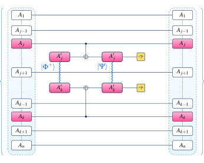 
FIG. 1. Circuit for nondestructive GHZ-state discrimination using an ancillary Bell state |Φ+⟩A′ jA′ k shared between nodes A j(j ∈s) and Ak(k ∈¯s) (pink). Controlled-NOT gates, with the system qubits as controls, are applied from Aj to A′ j and from Ak to A′ k. The ancilla remains in |Φ+⟩for even parity of the two system qubits and trans- forms to |Ψ+⟩for odd parity. Computational-basis measurements of the ancillas therefore reveal the parity without disturbing the input GHZ state, which is recovered unchanged at the output.

**Summary.** This work analyzes the resource cost associated with distinguishing orthogonal multipartite quantum states using LOCC. It proves that the required quantum resource is highly dependent on the geometric separation (Hamming distance) between the states. The results establish a clear operational asymmetry, showing that non-zero distance allows for entanglement-preserving discrimination using minimal auxiliary resources.

**Why it may be interesting.** The findings provide a fine-grained understanding of multipartite nonlocality by quantifying how geometric properties (Hamming distance) dictate the minimum quantum resources needed for state discrimination, which is crucial for quantum communication protocols.

Detailed structure

**Main problem.** The paper investigates the operational resource cost required for locally distinguishing between orthogonal multipartite quantum states, specifically addressing whether this cost is state-dependent.

**Main result.** The resource cost of LOCC discrimination is state-dependent, showing that two orthogonal GHZ states with nonzero relative Hamming distance can be distinguished using only a single ancillary Bell pair, while zero-distance pairs require no net quantum resource extraction.

**Method.** The authors employ a resource theory framework based on Local Operations and Classical Communication (LOCC), utilizing entanglement monotones and the Hamming distance to characterize distinguishability.

**Model / system.** The focus is on multipartite quantum systems, particularly $n$-qubit Greenberger-Horne-Zeilinger (GHZ) states, and the analysis extends to larger ensembles of such states.

**Key observables.** Quantum resources (e.g., entanglement), operational cost of LOCC discrimination, and the relative Hamming distance ($d_H$) between the states.

**Important parameters / regimes.** The Hamming distance ($d_H$) between the states dictates the required auxiliary resource; the number of qubits ($n$) and the size of the ensemble ($k$) are key parameters.

**Assumptions / limitations.** The analysis often assumes the ability to perform non-destructive discrimination, which requires the preservation of the target state's intrinsic multipartite entanglement.

**Figures summary.** Figure 1 illustrates the quantum circuit used for nondestructive GHZ-state discrimination, involving an ancillary Bell state shared between two parties and subsequent measurements.

**Paper structure.** The paper builds from the bipartite case to the general multipartite case, establishing theorems regarding distinguishability based on the Hamming distance. It contrasts resource consumption for zero vs. non-zero distance pairs, culminating in protocols for entanglement-preserving discrimination.

Abstract

Any two orthogonal quantum states can be perfectly distinguished via local operations and classical communication (LOCC), yet whether all orthogonal multipartite pairs incur an identical operational cost remains an open question. Here, we address the resource consumption required for local state discrimination across multipartite pair of states. We demonstrate that distinct pairs of orthogonal multipartite maximally entangled states require unequal amounts of quantum resources to achieve local distinguishability. Extending our framework beyond individual pairs, we analyze larger sets of both locally distinguishable and indistinguishable multipartite orthogonal states, revealing a nontrivial hierarchy in their entanglement consumption. These results show that the resource cost of LOCC discrimination is state-dependent, providing insight into the fine-grained structure of multipartite nonlocality.

[↑ back to top](#top)

### [Mathematical statistics of wild mammal biomass](http://arxiv.org/abs/2610.09744v1)

**Authors:** Klaus M. Frahm, Dima L. Shepelyansky, José Lages  
**Type:** theory · **Category:** statistical mechanics · **PDF:** <https://arxiv.org/pdf/2610.09744v1>  
**Analysis basis:** full PDF text, analyzed in chunks
**Topic relevance:** `non-equilibrium universality` **1/5**

📷 Fig 1

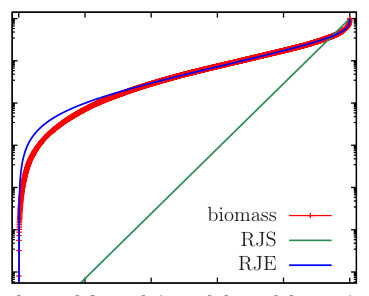 
Figure 1. Comparison of mammal biomass Lorenz curve (red data curve) with the theoretical RJS model (green curve) and the RJE model at optimal parameter a = 7.034 (blue curve). The x-axis corresponds to the cumulated fraction of species (h) and the y-axis to the cumulated fraction of biomass (w). The dashed black line (only in left panel) corresponds to the line of perfect equipartition w = h. For both cases of RJS and RJE, the corresponding values of ε are determined such that the theoretical curves have the same Gini coefficient G = 0.944 as the red data curve. This gives εRJS = 0.0282 and εRJE = 7.57 × 10−4. The left panel shows the Lorenz curves in normal representation and the right...

📷 Fig 2

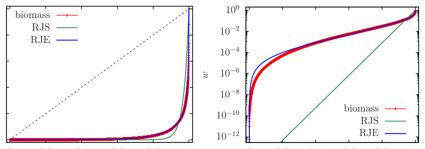 
Fig. 2 compares the Pareto curves of the RJE model with the real data curve. It shows that the WTH approach describes very well the real biomass data in the range of 4 (10) orders of magnitude of variation of C(wm) (wm). The global dependence of the cumulated biomass w on the cumulated number of species h and the average rescaled total system energy ε is shown by color in Fig. 3 at fixed a = 7.034. The white line in this Fig. 3 shows the parameter value ε = 7.57 × 10−4 corresponding to the real biomass data. This Figure shows the existence of the huge phase of very light species corresponding to the phase of poor households in the problem of wealth inequality. Thus the bottom 50% of wild...

📷 Fig 3

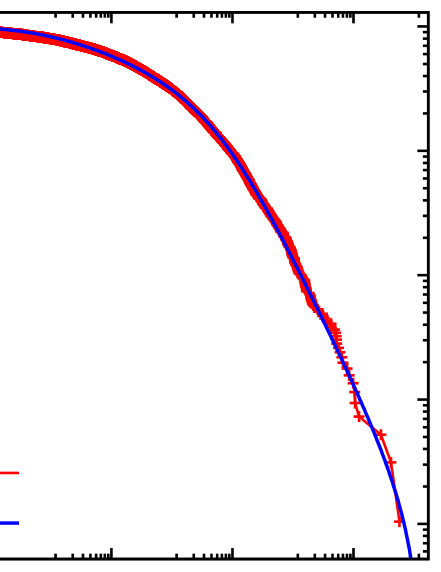 
Figure 2. Pareto curves C(wm) for the same data of Fig. 1 (red data curve) where C(wm) represents the fraction of mammal species with a biomass larger than wm (analogous to wealth). The x-axis corresponds to rescaled values wm/⟨wm⟩where ⟨wm⟩= ws = 4.68 × 109g is the average species biomass. The blue curve corresponds to the theoretical RJE Pareto curve with same parameters as in Fig. 1 (a = 7.034 and εRJE = 7.57 × 10−4 = ⟨wm⟩). Note that for the theoretical RJE model, we have wm ∈[0, 1] (see text and [20] for details).

📷 Fig 4

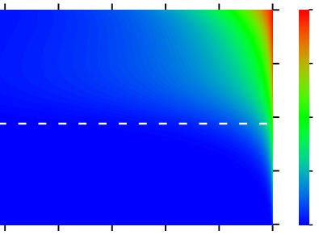 
Figure 3. Color plot of cumulated wealth w from the Lorenz curves of the RJE model for the parameter a = 7.034. The x-axis corresponds to the fraction of households h ∈[0, 1] and the y-axis to the rescaled energy ε = E/B ∈[10−5, 10−1] in logarithmic representation. The values of the colorbar represent the cumulated wealth fraction w ∈[0, 1] at given values of h and ε. The white dashed line corresponds to the value εRJE = 7.57 × 10−4 used in Figs. 1 and 2 for the blue RJE curves (with the same value of a). Note that for a = 7.034 the critical energy value for the transition from positive to negative temperature is given by εC = 0.141 (slightly above 0.1) and that the color values along the...

**Summary.** This paper applies advanced statistical mechanics tools, particularly the Wealth Thermalization Hypothesis, to analyze the biomass distribution of wild mammals. It finds the distribution exhibits extreme inequality, which is accurately modeled by an extended Rayleigh-Jeans spectral distribution. This suggests that the concentration of biomass among large species follows a universal statistical law, analogous to wealth concentration in human societies.

**Why it may be interesting.** While the subject is biology/economics, the methodology relies heavily on applying concepts from statistical mechanics (RJ distribution, thermalization hypotheses) to model complex, non-equilibrium distributions, which is a general theoretical tool.

Detailed structure

**Main problem.** The paper statistically analyzes the global biomass distribution of wild terrestrial mammals, drawing parallels with tools used to characterize wealth inequality.

**Main result.** The biomass distribution exhibits extreme inequality, which is successfully modeled by an extended Rayleigh-Jeans (RJ) spectral model, suggesting a universal thermalization principle.

**Method.** The analysis employs economic tools like the Lorenz curve and Gini coefficient, applying concepts from statistical mechanics, specifically the Wealth Thermalization Hypothesis (WTH) using RJ distributions.

**Model / system.** The system is the biomass distribution of 4795 wild mammal species. The model uses the RJ steady-state distribution, comparing the data to theoretical curves derived from both RJS and RJE spectral models.

**Key observables.** Gini coefficient (G=0.944), Lorenz curve, and Pareto curve describing biomass concentration.

**Important parameters / regimes.** The model parameters include the temperature T and chemical potential $\mu$, leading to optimized parameters like $\epsilon_{	ext{RJE}} = 7.57 	imes 10^{-4}$.

**Assumptions / limitations.** The core assumption is the analogy between biomass/energy and wealth/energy, suggesting that the observed distribution is a robust, mechanism-independent thermalization outcome.

**Figures summary.** Figures compare the real Lorenz curve against theoretical curves derived from RJS and RJE models, demonstrating the fit across multiple orders of magnitude of biomass variation.

**Paper structure.** The paper first introduces the statistical analysis using economic tools, then details the WTH framework and the RJ modeling, compares the theoretical models to the real mammal data, and finally discusses the implications for ecological mechanisms.

Abstract

Using the recently published global census of the biomass of wild terrestrial mammals, we perform a detailed mathematical statistical analysis of its distribution over $N_s=4795$ species, drawing on tools developed in economics to characterize wealth inequality. We show that the Lorenz curve of the mammal biomass distribution is characterized by a large Gini coefficient $G=0.944$ exceeding the inequality reported for wealth distribution among world countries. This distribution is compared to the predictions of the Wealth Thermalization Hypothesis (WTH), in which species biomass values are treated as energy levels populated according to a Rayleigh-Jeans (RJ) steady-state distribution. We show that an RJ extended spectral model reproduces the real Lorenz and Pareto curves over four orders of magnitude of biomass variation, capturing the strong condensation of biomass among the rare, heavy-bodied species and its near-absence among the vast majority of light-bodied ones. These results extend the WTH framework, previously validated on distributions of human economic origin, to a biological distribution shaped by ecological and evolutionary constraints, and place the extreme rarity of large-bodied mammal species within the same statistical mathematical description as the oligarchic concentration of wealth in human societies. We finally discuss possible ecological mechanisms that may contribute to the observed distribution, including interspecific interactions, food availability, and competition.

[↑ back to top](#top)

### [Mixed States in Quantum Rabin Oblivious Transfer](http://arxiv.org/abs/2610.09796v1)

**Authors:** James T. Peat, Lara Stroh, Kenny Campbell, Erika Andersson  
**Type:** theory · **Category:** quantum information and computing · **PDF:** <https://arxiv.org/pdf/2610.09796v1>  
**Analysis basis:** full PDF text, analyzed in chunks
**Topic relevance:** `quantum measurements` **1/5**

📷 Fig 1

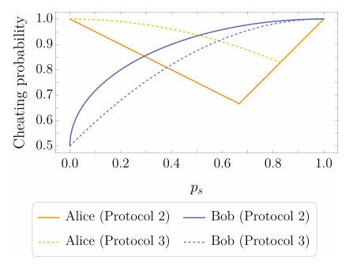 
FIG. 1: Plot of Alice’s and Bob’s cheating probabilities, AOT and BOT, against success probability, ps, for the single-qubit pure-state protocol (Protocol 2) and extended two-qubit mixed-state protocol (Protocol 3).

📷 Fig 2

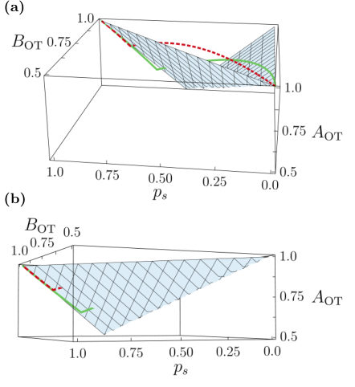 
FIG. 2: Two views of a 3D graph of BOT vs ps vs AOT. The light blue surface is the classical strategy (Protocol 1). The lines are the quantum protocols: the solid green one for the single-qubit pure-state protocol (Protocol 2) and the dashed red one for the extended two-qubit mixed-state protocol (Protocol 3).

📷 Fig 3

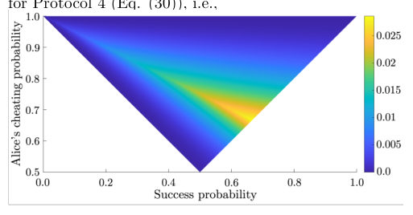 
FIG. 4: The difference, ∆m,2 c = Bc OT −Bm,2 OT , between Bob’s cheating probability for Protocol 1 and Protocol 4 at various values of Alice’s cheating probability, AOT, and success probability, ps. Protocol 4, as defined in Section III B 1, is the mixed-state Rabin OT protocol based on the single-qubit pure-state protocol and Protocol 1 is the classical Rabin OT protocol, defined in Section II A. The colour spectrum indicates the value of ∆m,2 c .

📷 Fig 4

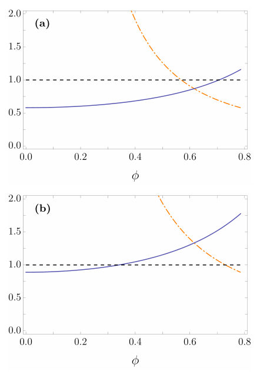 
FIG. 3: Plot of r, Eq. (33), in orange (dash-dotted line) and f, Eq. (34), in blue (solid line) against ϕ for two different values of pm,2 s and Am,2 OT. (a) has the values pm,2 s = 0.55 and Am,2 OT = 0.6 whereas (b) has pm,2 s = 0.8 and Am,2 OT = 0.9.

📷 Fig 5

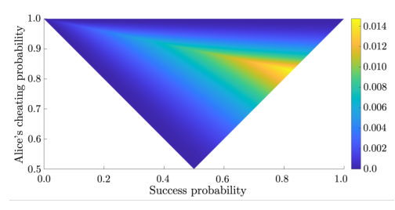 
FIG. 5: The difference, ∆m,3 c = Bc OT −Bm,3 OT , between Bob’s cheating probability for Protocol 1 and Protocol 5 at various values of Alice’s cheating probability, AOT, and success probability, ps. Protocol 5, as defined in Section III B 2, is the mixed-state Rabin OT protocol based on the extended two-qubit mixed state protocol and Protocol 1 is the classical Rabin OT protocol. The colour spectrum indicates the value of ∆m,3 c .

**Summary.** This paper analyzes the security of Rabin Oblivious Transfer by comparing classical, pure-state quantum, and novel mixed-state quantum protocols. The authors demonstrate that incorporating mixed quantum states generally enhances the security bounds of the OT protocol compared to using pure states alone. This advances the understanding of information-theoretically secure quantum primitives.

**Why it may be interesting.** While focused on cryptography, the core techniques involve analyzing the robustness of quantum information protocols against eavesdropping and cheating, which relates to fundamental concepts in quantum channel capacity and security proofs.

Detailed structure

**Main problem.** The paper investigates whether using mixed quantum states can improve the security and performance of Rabin Oblivious Transfer (OT) protocols compared to classical or pure-state quantum protocols.

**Main result.** Mixed-state protocols are shown to generally outperform pure-state protocols across various parameters, achieving superior security compared to classical methods, especially for higher success probabilities.

**Method.** The authors derive and compare cheating probabilities ($B_{OT}, A_{OT}$) for multiple protocols (pure-state, two-qubit mixed-state, single-qubit mixed-state) using quantum information theory tools.

**Model / system.** The model is the Rabin Oblivious Transfer (OT) primitive, where a sender transmits a bit to a receiver who learns it probabilistically, while the sender remains ignorant of the outcome.

**Key observables.** Bob's cheating probability ($B_{OT}$) and Alice's cheating probability ($A_{OT}$), plotted against the success probability ($p_s$).

**Important parameters / regimes.** Success probability ($p_s$), angle parameters ($\phi$), and measurement parameters ($r, s$).

**Assumptions / limitations.** The analysis assumes Alice has perfect memory; the comparison is based on monitoring probabilities rather than full-testing regimes.

**Figures summary.** Figure 7 compares Bob's cheating probabilities for three protocols (pure-state, Protocol 4, Protocol 5) across varying success probabilities ($p_s$), showing performance crossovers between the protocols.

**Paper structure.** The paper systematically compares the security bounds of classical, pure-state, and novel mixed-state protocols for Rabin OT, deriving specific cheating probability formulas for each case and comparing them graphically.

Abstract

Oblivious transfer (OT) is a fundamental cryptographic primitive that is useful for realizing any two-party computation. Since information-theoretically secure perfect OT is impossible classically and quantumly, research has focused on imperfect protocols, exploring how close to perfect one can get against unbounded dishonest parties. While current approaches often make use of pure quantum states, recent work suggests that mixed quantum states may improve performance. In this paper, we investigate the use of mixed quantum states in Rabin oblivious transfer, where a sender holds one bit and a receiver learns its value with a certain probability while the sender remains ignorant of whether the receiver learned it. We present three mixed-state protocols constructed with two distinct methods, extending an existing pure-state scheme and employing a probabilistic approach, and demonstrate improved performance compared to classical and quantum pure-state protocols across varying parameters.

[↑ back to top](#top)

### [Quantum anomaly detection in real scarce data](http://arxiv.org/abs/2610.09635v1)

**Authors:** Emanuele Casciaro, Fabio Mascherpa, Alfonso Amendola, Filippo Caruso  
**Type:** experiment · **Category:** other · **PDF:** <https://arxiv.org/pdf/2610.09635v1>  
**Analysis basis:** full PDF text, analyzed in chunks
**Topic relevance:** `quantum measurements` **1/5**

📷 Fig 1

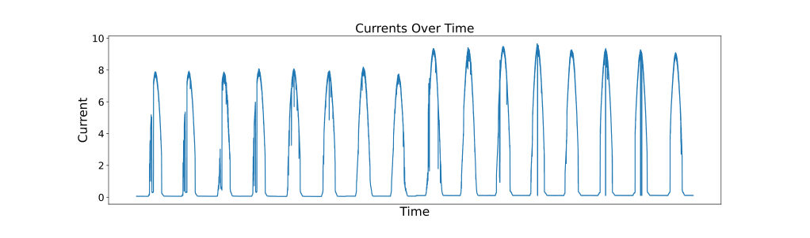 
Figure 1. Current level of the first string of panels sampled over the course of the experiments. The peaks represent daytime activity, while the inactive regions are associated with nighttime.

📷 Fig 2

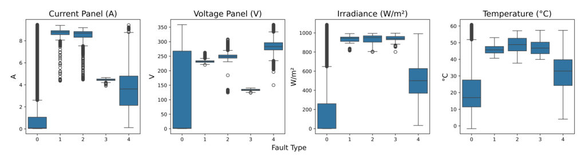 
Figure 2. Per-class feature distribution: due to the sane data being distributed all over the feature space, it is difficult to correctly identify the different types of fault instances.

📷 Fig 3

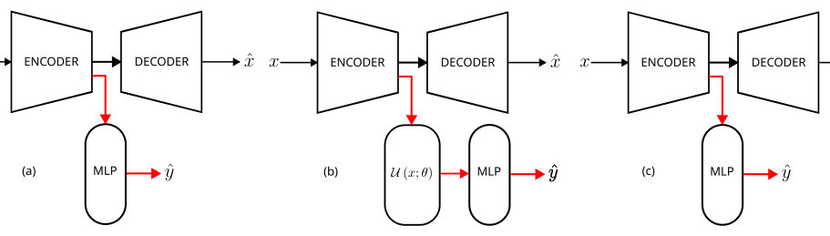 
Figure 3. Different hybrid interactions analyzed: no interactions (left) is compared against a hybrid model where the quantum layer is employed only at the classification level (ours, center), or from the beginning of the training (right). The black and red lines represent the flow of the input during the first and second training phase.

📷 Fig 4

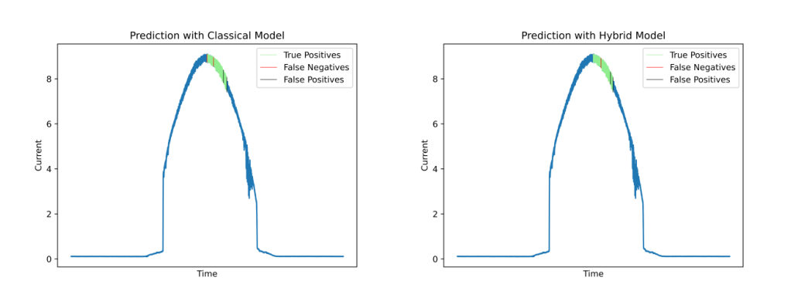 
Figure 4. Anomaly detection over the last day of sampling. Both classic (left) and hybrid model (right) perform well, with the hybrid model avoiding some misclassification at the start of the sequence.

📷 Fig 5

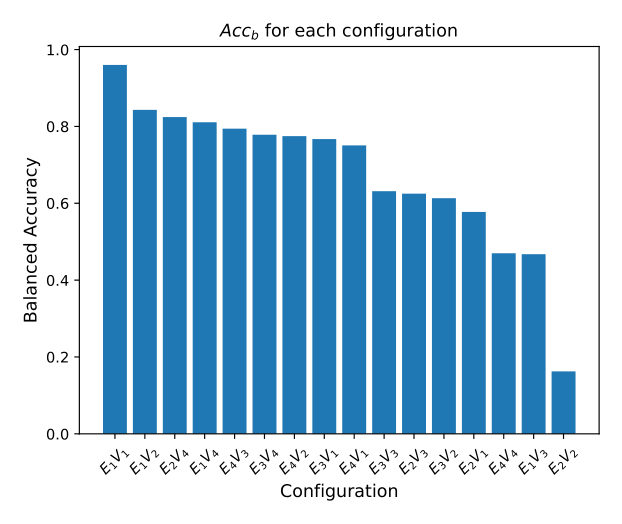 
Figure 5. Accb of each configuration of ansatz construction: without changing the measurement of the circuit (in our case ⟨Zi⟩), the family of states |ψ(x;θ)⟩associated with the circuit can have a great impact on the output of the layer, affecting the classification performances.

**Summary.** This work proposes a hybrid quantum-classical machine learning framework to perform anomaly detection on scarce, time-series data from solar power plants. By integrating a Transformer autoencoder with a Quantum Neural Network, the model aims to overcome the limitations of classical methods in handling data imbalance and model complexity. The results show that this hybrid approach maintains high accuracy while drastically reducing the model's trainable parameters.

**Why it may be interesting.** While the application is in energy systems, the core methodology involves mapping classical time-series features into a quantum state space for classification, which touches upon quantum feature mapping techniques relevant to quantum information processing.

Detailed structure

**Main problem.** The paper addresses the challenge of anomaly detection on small, highly unbalanced datasets, particularly in time-series data from critical infrastructure.

**Main result.** The proposed two-step hybrid classical-quantum architecture achieves competitive prediction accuracy while demonstrating significant parameter efficiency compared to purely classical or fully quantum approaches.

**Method.** A novel hybrid model is proposed, combining a classical Transformer-based autoencoder for feature extraction with a Quantum Neural Network (QNN) for final classification.

**Model / system.** The system is simulated using data from a large-scale photovoltaic (PV) power plant undergoing various artificially induced hardware failures (e.g., short circuit, degradation).

**Key observables.** Balanced Accuracy (Acc_b), F1 Score, and the number of trainable parameters (#Parameters) are key metrics used for comparison.

**Important parameters / regimes.** The simulation spans 16 days with a 1 Hz sampling rate, and the quantum circuit depth (R) and connectivity are important design choices.

**Assumptions / limitations.** The primary assumption is that quantum machine learning can provide a more sustainable and interpretable alternative to classical deep learning models for scarce data.

**Figures summary.** Figures illustrate the PV plant's current levels over time, the feature distribution of different fault types, and the comparison of performance metrics ($	ext{Acc}_b$) across different hybrid ansatz constructions.

**Paper structure.** The paper follows a structure of identifying the AD challenge, proposing the hybrid architecture (AE $	o$ QNN), detailing the training process (MSE loss followed by weighted cross-entropy loss), and finally benchmarking performance against classical baselines.

Abstract

Anomaly detection on small and unbalanced datasets remains very challenging in machine learning, although this scenario is common in several domains, including healthcare, cybersecurity, finance, and energy. Data augmentation and generative AI may mitigate training-data scarcity, but they often fall short because anomalies are, by definition, unpredictable, rare, and highly diverse events compared to high-probability normal data. Overfitting to pseudo-anomalies, model collapse, high-dimensional data, uninterpretable black-box models, and validation challenges are typical issues limiting their practical applicability. In this context, quantum machine learning may provide a promising and more sustainable avenue because it can enable more interpretable models with far fewer trainable parameters and smaller datasets, implementable on energy-efficient quantum hardware. Here, we propose a novel two-step hybrid classical--quantum architecture for sequential data and test it on a realistic scenario in the global energy-transition domain, i.e., automated anomaly detection in large-scale photovoltaic plants. The achieved generalization capability and competitive prediction accuracy may pave the way for new hybrid learning models able to exploit the continuously increasing power of cloud-available and more sustainable quantum accelerators integrated with more traditional energy-hungry High Performance Computing resources.

[↑ back to top](#top)

### [Remote magnon sensing detects the universal phase stiffness jump in Bi$_2$Sr$_2$CaCu$_2$O$_{8+δ}$](http://arxiv.org/abs/2610.08934v1)

**Authors:** Yue Sun, Mai Nguyen, Naiyuan James Zhang, Dingbin Huang, Shuai Yuan, Aljoscha Söll, Arun Ramanathan, Takashi Taniguchi, Kenji Watanabe, Xavier Roy, Zdeněk Sofer, Shigeyuki Ishida, Hiroshi Eisaki, Makoto Hashimoto, Zhi-Xun Shen, Joseph Orenstein, Xiaodong Xu  
**Type:** experiment · **Category:** strongly correlated electrons · **PDF:** <https://arxiv.org/pdf/2610.08934v1>  
**Analysis basis:** full PDF text, analyzed in chunks
**Topic relevance:** `quantum measurements` **1/5**

📷 Fig 1

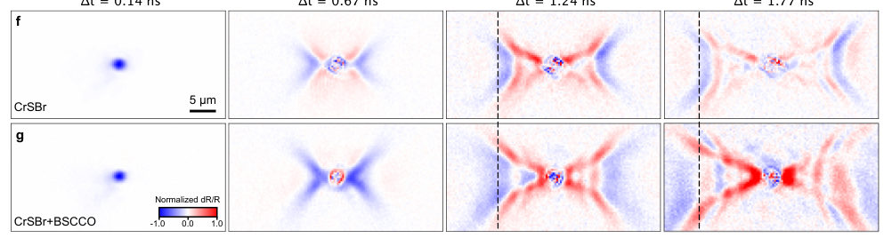 
Figure 1. Accelerated magnon propagation in a CrSBr/BSCCO heterostructure. a, Optical image of the CrSBr/BSCCO heterostructure. The 187 nm thick underdoped BSCCO flake has its Tc at 62 K. The CrSBr flake is 385 nm thick. b, Schematic of the experimental setup. A pump and probe foci are spatially separated to probe the propagation of magnons on CrSBr/BSCCO heterostructure. c,d, Transient reflectance measured for pump–probe separations ranging from 0.0 to 16.5 µm in (c) the heterostructure and (d) the bare CrSBr flake. e, Extraction of magnon group velocity vg in both CrSBr/BSCCO and bare CrSBr flake. f,g, Snapshots of spatially resolved transient reflectance measured on (f) bare CrSBr flake...

📷 Fig 2

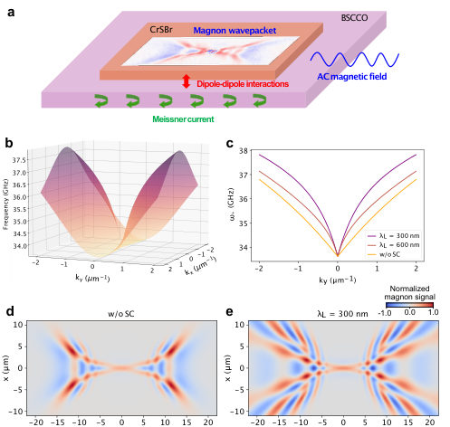 
Figure 3. Magnon dispersion in antiferromag- net/superconductor heterostructures. a, Cartoon illus- trating the magnetic dipolar coupling between magnons in the antiferromagnet and Meissner currents in the supercon- ductor. b, Calculated magnon frequency of the ω+ mode as a function of wavevector in the kx-ky plane. c, Magnon disper- sion of the ω+ mode along the ky direction for different values of λL. d,e, Simulated spatial distribution of the ω+ magnon mode at ∆t = 1.77 ns (d) in a bare CrSBr flake (thickness = 385 nm) and (e) in a CrSBr/superconductor heterostructure with λL = 300 nm.

📷 Fig 3

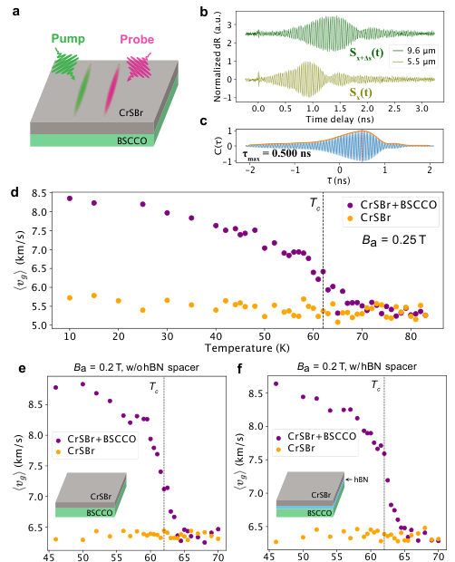 
Figure 2. Correlation between vg enhancement and su- perconductivity. a, Schematic of the experimental setup with stripe-shaped pump and probe beams. b, Example tran- sient reflectance data measured for pump–probe separations at 5.50 and 9.63 µm in CrSBr/BSCCO. c, The correlation function C(τ) calculated from the data in (b). The envelope of C(τ) peaks at τ = 0.500 ns. d, Temperature dependence of vg measured on both CrSBr/BSCCO and the CrSBr bare flake under an in-plane magnetic field of 0.25 T. e,f, Comparison between the temperature dependence of vg on CrSBr/BSCCO samples (e) without and (f) with a hBN spacer. Insets show the sample geometry.

📷 Fig 4

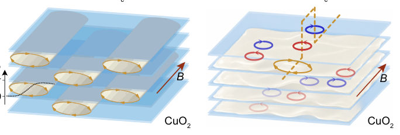 
Figure 4. Observation of a parallel-field-induced BKT transition. a, Temperature dependence of the averaged magnon group velocity ⟨vg⟩in CrSBr/BSCCO under in-plane magnetic fields ranging from 0.150 to 0.400 T. The magnetic field is applied along the a-axis of CrSBr. b, Extracted phase stiffness ρs as a function of temperature. The dashed line indicates the magnitude of the universal jump predicted by the BKT theory. c,d, Temperature dependence of ⟨vg⟩and extracted ρs in the CrSBr/BSCCO device separated by an hBN spacer, demonstrating the reproducibility of the field-induced transition and the universal jump in ρs. e, Schematic illustration of the Josephson vortex lattice below the critical...

**Summary.** The researchers developed a method using magnons in a $	ext{CrSBr}$ sensor to remotely measure the phase stiffness of superconducting cuprates ($	ext{BSCCO}$). By observing the enhancement of the magnon group velocity upon coupling to the superconductor, they quantitatively mapped the superconducting phase stiffness and detected the universal jump characteristic of the Berezinskii-Kosterlitz-Thouless transition.

**Why it may be interesting.** This work provides a novel, non-invasive optical probe for measuring fundamental superconducting parameters like phase stiffness, linking magnon physics directly to high-temperature superconductivity phenomena.

Detailed structure

**Main problem.** To develop a local, contactless, and all-optical measurement technique for superconducting phase stiffness ($
ho_s$) and to study the evolution of superconducting phase coherence, particularly observing the Berezinskii–Kosterlitz–Thouless (BKT) transition in cuprates.

**Main result.** The study successfully identified a parallel-field-induced Berezinskii-Kosterlitz-Thouless transition in bulk cuprates by observing the universal phase-stiffness jump using remote magnon sensing.

**Method.** The technique uses propagating antiferromagnetic magnons in a $	ext{CrSBr}$ sensor interfaced with a superconductor ($	ext{BSCCO}$) to remotely probe superconducting electrodynamics by measuring the magnon group velocity enhancement.

**Model / system.** The system involves a $	ext{CrSBr}/	ext{BSCCO}$ heterostructure where the magnon group velocity is enhanced due to the induction of local Meissner screening currents in the superconductor. The phase stiffness ($
ho_s$) is quantitatively extracted from this enhanced magnon group velocity.

**Key observables.** Magnon group velocity ($\langle v_g 
angle$), Superfluid stiffness ($
ho_s$), BKT transition jump.

**Important parameters / regimes.** Underdoped $	ext{Bi}_2	ext{Sr}_2	ext{CaCu}_2	ext{O}_{8+\delta}$, magnetic field ($B_\parallel$), temperature ($T$).

**Assumptions / limitations.** The enhancement of $\langle v_g 
angle$ is directly proportional to the superconducting phase stiffness ($
ho_s$) via the London penetration depth ($\lambda_L$).

**Figures summary.** Figure 1 shows the enhanced magnon group velocity in $	ext{CrSBr}/	ext{BSCCO}$ compared to bare $	ext{CrSBr}$. Figure 2 illustrates the temperature dependence of this enhancement, used to map out $
ho_s(T)$.

**Paper structure.** The paper establishes the theoretical link between magnon dynamics and superconducting electrodynamics, details the all-optical measurement protocol using magnon wavepackets, and applies this method to observe the field-induced BKT transition in cuprates.

Abstract

Phase stiffness governs macroscopic quantum coherence in superfluids and superconductors, providing a sensitive probe of condensate depletion, fluctuations, and phase transitions. However quantitative and spatially resolved measurements remain challenging. Here we report a contactless, local, all-optical measurement of superconducting phase stiffness using propagating antiferromagnetic magnons as remote sensors. In CrSBr, strong exciton-magnon coupling enables optical excitation and detection of magnon wavepackets and precise determination of their group velocity. When CrSBr is interfaced with underdoped Bi$_2$Sr$_2$CaCu$_2$O$_{8+δ}$, we find that the magnon group velocity is substantially enhanced below the superconducting transition and quantitatively encodes the phase stiffness through Meissner screening currents. Using this capability, we identify a parallel-field-induced Berezinskii-Kosterlitz-Thouless transition through direct observation of the universal phase-stiffness jump, revealing a field-controlled route to expose intrinsic two-dimensional phase-ordering physics in a bulk cuprate. Our work establishes propagating magnons as local probes of superconducting electrodynamics and phase-coherent phenomena in low-dimensional quantum materials.

[↑ back to top](#top)

### [Singlet sector of the vector model with angular potential](http://arxiv.org/abs/2610.09815v1)

**Authors:** Srijan Kumar  
**Type:** theory · **Category:** statistical mechanics · **PDF:** <https://arxiv.org/pdf/2610.09815v1>  
**Analysis basis:** full PDF text, analyzed in chunks
**Topic relevance:** `Keldysh / 2PI / non-Gaussian methods` **1/5**

📷 Fig 1

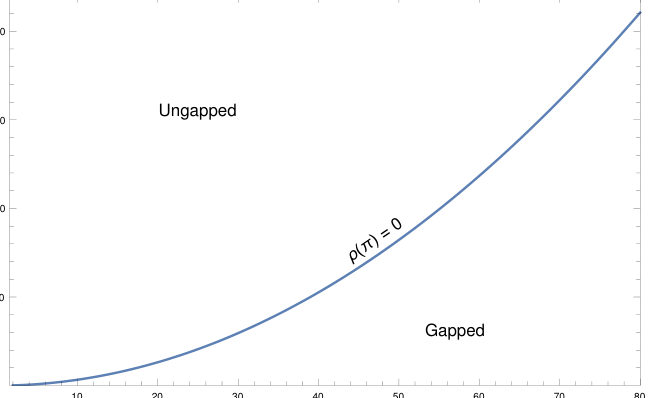 
Figure 1. Large-N free-theory Gross–Witten–Wadia phase boundary at fixed Tr and N(1 −ω2). Here ρ(α) is the holonomy eigenvalue density. The curve, defined by ρ(π) = 0, uses the leading term of equation (1.3) with the sum truncated at n = 5000. The regions above and below the curve are ungapped and gapped, respectively. The figure is used as an illustration of the large N result and should not be interpreted as a finite-N calculation.

**Summary.** This paper analyzes the phase transitions of a large-N O(N) vector model on a sphere with an added angular potential. Using advanced techniques like the large-N limit and saddle-point approximation, the authors determine the critical conditions for the Gross-Witten-Wadia transition. The work shows how the potential tunes this transition and reveals non-trivial features in the free energy near the critical points.

**Why it may be interesting.** The study of phase transitions in complex field theories, especially those involving geometric constraints (like the singlet sector) and external potentials, provides deep insights into critical phenomena relevant to condensed matter systems.

Detailed structure

**Main problem.** The study investigates the singlet sector of the large-N, O(N) vector model subjected to an angular potential $\Omega$. The core goal is to analyze the phase transitions occurring in this system.

**Main result.** The angular potential modifies the Gross-Witten-Wadia transition, allowing it to occur even at fixed temperature. The free energy exhibits a double pole in the ungapped phase, suggesting non-local physics.

**Method.** The analysis employs the large-N limit, utilizing Hubbard-Stratonovich transformations and saddle-point approximations to evaluate the free energy and determine critical lines.

**Model / system.** The model is the O(N) vector model defined on $S^1 	imes S^2_r$, restricted to its singlet sector by averaging over the O(N) holonomy. The Hamiltonian includes a term proportional to the angular potential $\Omega$.

**Key observables.** Free energy ($\log Z_{	ext{sing}}$), critical temperature ($T_{	ext{cr}}$), and the holonomy eigenvalue distribution.

**Important parameters / regimes.** Temperature ($T$), angular potential ($\Omega$), radius of $S^2$ ($r$), and the large-N limit ($N$).

**Assumptions / limitations.** The calculations rely on the large-N limit and the saddle-point approximation for evaluating the partition function integral.

**Figures summary.** Figure 1 illustrates the large-N free-theory GW-W phase boundary in the $T_r - N(\dots)$ plane.

**Paper structure.** The paper proceeds by defining the system and implementing the singlet projection. It then calculates the free energy at both fixed points, derives the critical transition condition, and analyzes the effect of the angular potential and subleading corrections.

Abstract

We study the singlet sector of large-$N$, $O(N)$ vector model on $S^1_β\times S^2_r$ in presence of an angular potential $Ω$. We compute the free energy of the model both at the free fixed point as well as the non-trivial fixed point. The model undergoes a phase transition when the temperature $T$ and angular potential attain the relation $T^2r^2\sim N (1-ω^2)$, where $ω=rΩ$ and $r$ is the radius of $S^2$, with $Tr\gg1$, at both the fixed points, with different numerical coefficients. The transition was studied earlier at zero angular potential at $Tr\sim \sqrt{N}$. The holonomy eigenvalue distribution, having support on the full circle below the transition, develops a gap above it, called the Gross-Witten-Wadia transition. The angular potential introduces an additional parameter to such a transition, tuning it, the transition can occur even at a fixed temperature. We show that for the free model transition can occur as $1-ω^2\sim 1/N$ while $Tr\sim O(1)$. For the interacting model the computation is performed at a limit $Tr\gg1$, thus we show the same at a large but fixed temperature which does not scale as $\sqrt{N}$. In the ungapped phase, the free energy exhibits a double pole near $ω^2=1$ for both the fixed points. This is possibly due to the fact that the theory projected onto the singlets is non-local and therefore need not obey the leading simple pole scaling of a local thermal effective action.

[↑ back to top](#top)

### [Spurious zero-dispersion continua in full $(2,q)$-positivity: A linear hierarchy-depth lower bound from an exactly solvable counting operator](http://arxiv.org/abs/2610.09698v1)

**Authors:** Maho Nakata  
**Type:** theory · **Category:** strongly correlated electrons · **PDF:** <https://arxiv.org/pdf/2610.09698v1>  
**Analysis basis:** full PDF text, analyzed in chunks
**Topic relevance:** `Keldysh / 2PI / non-Gaussian methods` **1/5**

📷 Fig 1

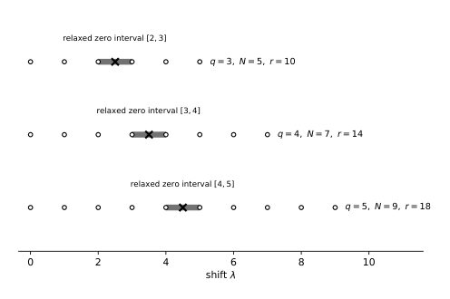 
FIG. 1. Explicit false continua for full (2, 3)-, (2, 4)-, and (2, 5)-positivity. Open circles mark the exact integer spectrum; the thick segment is the relaxed zero interval; and the cross marks the half-integer midpoint, where the exact dispersion is 1/4 and the relaxed value is zero.

📷 Fig 2

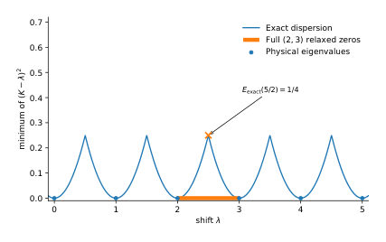 
FIG. 2. Minimal full-three-positivity failure. The exact dis- persion energy is the squared distance to the integer spectrum. Full order-three positivity has zero energy at every point of [2, 3], including λ = 5/2, where the exact value is 1/4.

📷 Fig 3

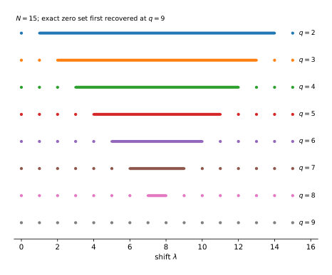 
FIG. 3. Zero sets from Theorem 2 for N = 15. Increasing q recovers integer spectral points from the two edges, while a central false continuum remains until the linear threshold q = 9 of Eq. (44), where the zero set equals the spectrum.

**Summary.** This theoretical paper analyzes the mathematical constraints imposed on many-fermion systems when using approximate reduced density matrices. It shows that imposing positivity constraints up to a fixed level $q$ can incorrectly predict the existence of noninteger eigenvalues (spurious continua) for certain operators. The work provides an exact threshold for when these approximations fail, guiding the development of more robust theoretical methods for strongly correlated materials.

**Why it may be interesting.** The rigorous mathematical treatment of N-representability constraints and the identification of systematic failure modes (spurious continua) are crucial for developing reliable theoretical tools for strongly correlated electron systems.

Detailed structure

**Main problem.** The paper investigates the spurious zero-dispersion continua that can arise when approximating the spectrum of many-fermion systems using variational reduced density matrices (RDMs) subject to semidefinite constraints.

**Main result.** It determines the exact set of accepted eigenvalues for a solvable counting operator at every level of the full hierarchy of particle-hole constraints, showing that false noninteger eigenvalues appear unless the constraint level grows linearly with particle number.

**Method.** The analysis employs the 'dispersion test' on an exactly solvable counting operator, constructing pseudo reduced density matrices by analytically continuing occupation probabilities to noninteger particle numbers.

**Model / system.** The study concerns fermionic many-body systems, using the framework of reduced density matrices and imposing constraints derived from full $(2, q)$-positivity conditions.

**Key observables.** The set of accepted eigenvalues for the counting operator, the minimized dispersion, and the occupation-correlation matrices.

**Important parameters / regimes.** The hierarchy level $q$ (positivity order), the particle number $N$, and the orbital basis size $r$.

**Assumptions / limitations.** The analysis assumes the validity of the full hierarchy of semidefinite constraints and relies on constructing pseudo-reduced density matrices via signed interpolation.

**Figures summary.** Not specified.

**Paper structure.** The paper systematically analyzes the constraints imposed by full $(2, q)$-positivity, establishing equivalences between polar and full formulations, and then applies this framework to a solvable counting model to pinpoint the exact spectrum and the conditions under which spurious eigenvalues appear.

Abstract

Variational two-particle reduced-density-matrix methods impose hierarchies of semidefinite constraints. We ask whether a fixed level of such a hierarchy can recover even an elementary many-fermion spectrum, using   the dispersion test, in which a value is accepted as an eigenvalue when the minimized dispersion vanishes. For an exactly solvable operator that counts fermions in one half of the spin orbitals, whose spectrum   consists of integers, we determine the complete set of accepted values at every level of the full hierarchy of particle-hole semidefinite constraints. Besides the integers, this set contains an entire interval of   noninteger values unless the hierarchy level grows linearly with the particle number, and we give the exact threshold. The proof constructs explicit pseudo reduced density matrices that are diagonal in the   occupation basis, obtained by continuing the occupation probabilities of a fixed-particle-number state to a noninteger particle number. Classical semidefinite constraints on occupation correlations, supplemented by   nonnegative occupation-pattern probabilities, suffice to establish fermionic positivity. For this counting model the two relaxations have the same dispersion zero set, not necessarily the same feasible states, and a   converse argument shows that no other false eigenvalues occur. The limitation is specific to the hierarchy: two-body inequalities that encode the integer spectrum would remove every false value but are not generated   at a fixed level. We also verify that the full semidefinite constraints and their complete projection onto two-particle reduced-density-matrix space are equivalent in finite dimensions, so that the result applies   equally to the polar formulation.

[↑ back to top](#top)

### [Sufficient quantum provenance: retained fields and certified recording precision](http://arxiv.org/abs/2610.09931v1)

**Authors:** George Kourousias, Sergio Carrato, Roberto Pugliese, Aljoša Hafner, Francesco Guzzi, Matteo Billè, Fulvio Billè, Panagiotis Dimitrakis  
**Type:** both · **Category:** quantum information and computing · **PDF:** <https://arxiv.org/pdf/2610.09931v1>  
**Analysis basis:** full PDF text, analyzed in chunks
**Topic relevance:** `quantum measurements` **1/5**

📷 Fig 1

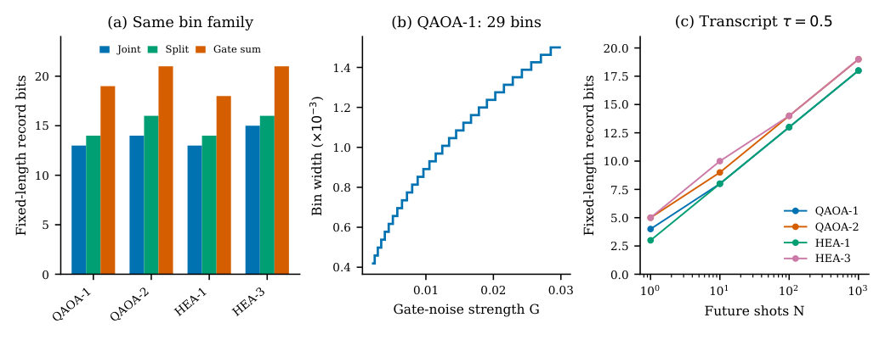 
FIG. 1. Constructive recording budgets from channel structure. (a) Fixed-length record bits at single-shot tolerance 0.05 for the joint certificate, separate stochastic/coherent composition, and a gatewise sum, with all three using the same bin family. (b) QAOA-1 gate-noise bin widths increase with G under equal intervals in arcsin √

📷 Fig 2

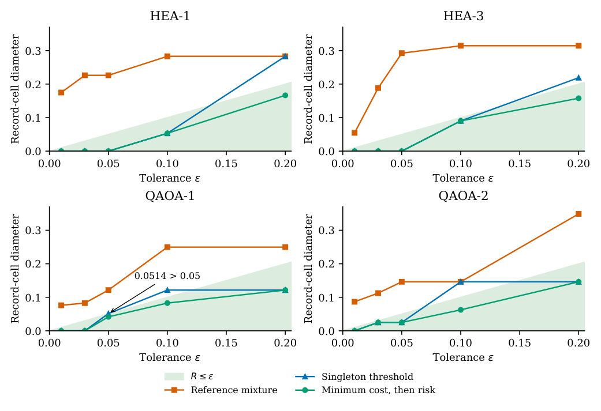 
FIG. 2. Retention policies evaluated against the guarantee they are intended to support. Each panel shows the achieved record-cell diameter RΩ(S) for the reference-mixture rule, singleton-threshold rule, and exhaustive minimum-cost sufficient set over the five declared tolerances. The shaded region marks RΩ(S) ≤ε; points above it violate their nominal tolerance. The annotated QAOA-1 case at ε = 0.05 is the compositional failure discussed in the text: the singleton rule attains 0.0514 although routing and angle bias each pass the one-field omission check separately. Values are from the complete baseline sweep in the electronic dataset; all minimum-cost curves use the residual-risk tie-break....

**Summary.** This paper develops a formal framework to quantify 'sufficient quantum provenance,' determining the minimum amount of execution data needed to guarantee that two quantum computations yield results within a specified error tolerance. By using metrics like the Hellinger distance, the authors provide concrete bit-level requirements for recording noise and rotation details. This work is vital for establishing trust and comparability in the emerging field of quantum computation.

**Why it may be interesting.** It provides a rigorous, quantifiable framework for certifying quantum computation results, which is crucial for building trustworthy quantum algorithms and comparing results across different hardware platforms.

Detailed structure

**Main problem.** The paper addresses how to determine the minimal set of execution details (provenance fields) and the required recording precision necessary to certify that two quantum computations yield outcome laws close enough within a specified tolerance.

**Main result.** It derives a joint stochastic–coherent certificate that bounds the Hellinger distance, showing that for a specific QAOA instance, a 13-bit record guarantees the required precision.

**Method.** The authors use information-theoretic techniques, framing the problem as finding a minimum-cost sufficient set of fields to bound the worst-case Hellinger distance between outcome laws.

**Model / system.** The work analyzes quantum computations, specifically using examples like QAOA, executed on quantum channels. The comparison is quantified using the Hellinger distance between outcome probability distributions.

**Key observables.** Hellinger distance ($H(p, q)$), latent noise flags, conditional quantum fidelity, and the required number of bits for the comparison record.

**Important parameters / regimes.** Tolerance ($\epsilon$, e.g., 0.05), circuit depth, number of qubits (e.g., four-qubit QAOA), and the cost associated with retaining different provenance fields.

**Assumptions / limitations.** The hardware conclusions are conditional on stationary independent shots and are distinct from the analytic channel certificate. The record only guarantees agreement within tolerance, not absolute equivalence.

**Figures summary.** The notes mention tables comparing analytically sufficient precision (record bits) for various QAOA and HEA instances across different certificate types, and a figure illustrating constructive recording budgets.

**Paper structure.** The paper progresses from defining the general problem of sufficient provenance to deriving a joint certificate for continuous precision, providing concrete results for QAOA, and concluding with hardware-specific minimum label counts for finite context classes.

Abstract

Which execution details must a quantum computation retain, and to what precision, to support a declared comparison? We define a sufficient record by the largest Hellinger distance between outcome laws that share it. Our main result is a circuit-derived certificate for continuous recording precision: independent channel-mixture probabilities enter through the affinity of latent noise flags, while coherent rotation differences enter through conditional quantum fidelity. Their joint composition bounds whole record cells without simulating their outcome distributions. For four-qubit QAOA at depth one, a 13-bit comparison record guarantees distance below 0.05 throughout a declared continuous noise box, uniformly over programmed angles when comparisons hold the logical task fixed. A construction with observable noise flags attains the general bound. Exact tensorization of Hellinger affinity connects recording precision to the length of a future measurement transcript. On finite context classes, separation witnesses certify minimum-cost field retention; a four-field record is the unique minimum for 28 archived QAOA instances. Fresh six-qubit processor measurements establish different minimum label counts at one common tolerance: two labels are necessary and sufficient for raw laws, while one suffices after a fixed decoder for a synthetic image-segmentation task. These hardware conclusions are conditional on stationary independent shots and remain distinct from the analytic channel certificate. Shared task definitions and evidential archives are retained separately. The framework specifies which execution distinctions matter, how precisely to record them, and what evidence supports the resulting agreement guarantee.

[↑ back to top](#top)

### [The Geometry of Lee-Yang Tensors](http://arxiv.org/abs/2610.09485v1)

**Authors:** Jake Hofgard  
**Type:** theory · **Category:** statistical mechanics · **PDF:** <https://arxiv.org/pdf/2610.09485v1>  
**Analysis basis:** full PDF text, analyzed in chunks
**Topic relevance:** `analog quantum simulation` **1/5**

📷 Fig 1

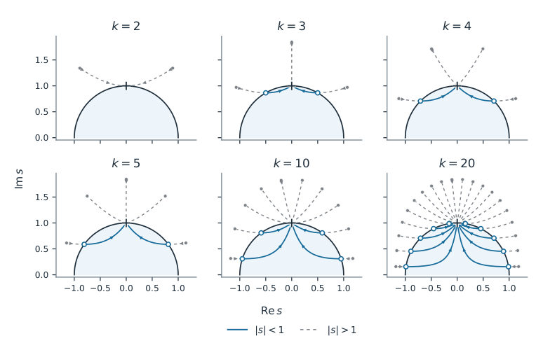 
Figure 1: The roots of the univariate polynomial Fexp(−βH)(s, . . . , s) for a k-local Hamiltonian of the form H = I −|ψ⟩⟨ψ|, where |ψ⟩= |0⟩⊗k. For k = 2, the resulting Hamiltonian is Suzuki-Fisher and hence its roots avoid the interior of the unit disk, but for all k ≥3, roots shatter symmetrically from s = i for sufficiently small β &gt; 0, ensuring that at least one enters the interior of the disk.

**Summary.** This work develops a geometric understanding of Lee-Yang tensors to analyze the spectral properties of quantum Hamiltonians. It establishes a local-to-global principle for bounding spectral gaps in specific Hamiltonians, most notably the Suzuki-Fisher class. The research provides a rigorous characterization of these Hamiltonians based on the persistence of their Lee-Yang radius across all inverse temperatures.

**Why it may be interesting.** The connection between spectral properties (gaps) and analytic properties (Lee-Yang radius) provides a powerful, non-standard diagnostic tool for understanding quantum phase transitions and the stability of ground states in interacting quantum systems.

Detailed structure

**Main problem.** The paper aims to provide a geometric description of Lee-Yang tensors and use this framework to establish powerful local-to-global principles for bounding spectral gaps in quantum many-body systems.

**Main result.** It proves a local-to-global principle for bounding spectral gaps of Suzuki-Fisher Hamiltonians using only the Lee-Yang radius of local operators, and characterizes these Hamiltonians based on their Gibbs state properties.

**Method.** The methodology combines complex Perron-Frobenius theory with the analysis of generating polynomials associated with the Lee-Yang radius, leading to asymptotic and perturbative constraints on the Hamiltonian structure.

**Model / system.** The study focuses on quantum many-body systems described by $k$-local Hamiltonians, particularly the Suzuki-Fisher family of 2-local Hamiltonians, and their associated Gibbs states $\exp(-eta H)$.

**Key observables.** Lee-Yang radius ($r$), Spectral Gap, Spectral Ratio, and the generating polynomial $F_H(z, w)$.

**Important parameters / regimes.** Inverse temperature ($eta$), the locality $k$ of the Hamiltonian, and the radius $r$ of the Lee-Yang tensor.

**Assumptions / limitations.** The analysis heavily relies on generalizing results from complex Perron-Frobenius theory and assumes the applicability of the local-to-global principle derived from the Lee-Yang radius.

**Paper structure.** The paper builds by generalizing spectral ratio bounds using complex Perron-Frobenius theory, deriving a local-to-global principle for spectral gaps, and then using perturbative techniques to characterize the class of Hamiltonians (Suzuki-Fisher) whose Gibbs states maintain a large Lee-Yang radius for all $eta \ge 0$.

Abstract

We provide a geometric description of Lee-Yang tensors, building upon several recent results of Bravyi, Gosset, Liu, and Wong. By applying tools from complex Perron-Frobenius theory, we generalize one of their key lemmas to bound the spectral ratio of non-normal operators with Lee-Yang radius greater than one. As a direct consequence, we provide a local-to-global principle for bounding spectral gaps of Suzuki-Fisher Hamiltonians, a family of $2$-local Hamiltonians, using only the Lee-Yang radius of each local operator to bound the gap from below. On the other hand, we develop a simple perturbative technique to show that the Gibbs states of $k$-local Hamiltonians, $k \geq 3$, cannot have Lee-Yang radius at least one for all inverse temperatures $β\geq 0$. We apply this same method to conclude that Suzuki-Fisher Hamiltonians are precisely those Hamiltonians whose Gibbs states are Lee-Yang at all inverse temperatures $β\geq 0$.

[↑ back to top](#top)

### [Valley transitions during spin shuttling in Si/SiGe heterostructures](http://arxiv.org/abs/2610.08984v1)

**Authors:** Jonas R F Lima, Guido Burkard  
**Type:** theory · **Category:** quantum information and computing · **PDF:** <https://arxiv.org/pdf/2610.08984v1>  
**Analysis basis:** full PDF text, analyzed in chunks
**Topic relevance:** `quantum measurements` **1/5**

📷 Fig 1

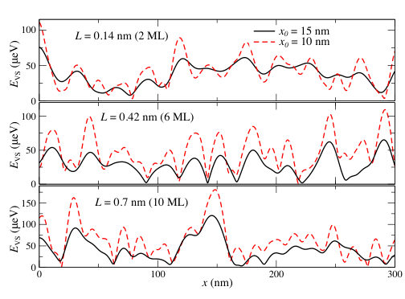 
FIG. 1. Valley splitting as a function of the location of the quantum dot for a shuttling distance of 300 nm in the x di- rection. We consider here two values for the radius of the quantum dot, 15 nm (solid black lines) and 10 nm (dashed red lines), and three values for the interface width, 2 ML (top panel), 6 ML (middle panel) and 10 ML (bottom panel).

📷 Fig 2

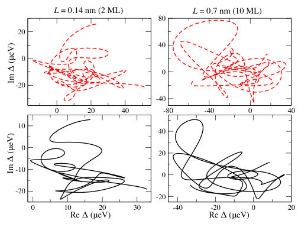 
FIG. 2. The change in the complex plane of the intervalley coupling ∆as we move the quantum dot. We consider here two values for the interface width and two possible radii of the of the quantum dot. The colors and line styles are the same as in Fig. 1.

📷 Fig 3

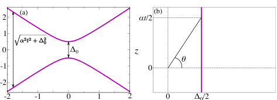 
FIG. 3. A generic two level system described by the stan- dard Landau-Zener model. (a) The energy levels around the avoided crossing point at t = 0 with an energy gap of ∆0. (b) The Hamiltonian curve, that is a straight line in this case.

📷 Fig 4

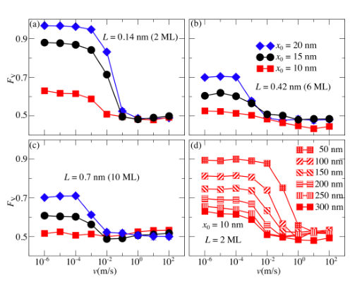 
FIG. 4. The average shuttling valley fidelity as a function of the shuttling velocity for all cases considered here . In (a), (b) and (c) we have the devices with interface with of 2, 6 and 10 ML, respectively, and a shuttling distance of 300 nm. In (d) we compare the average shuttling valley fidelity for different values of the shuttling distance for a device with a quantum dot radius x0 of 10 nm and an interface width of 2 ML.

📷 Fig 5

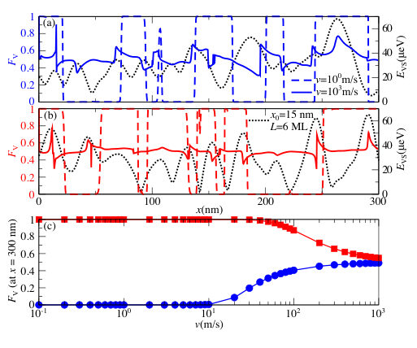 
FIG. 5. (a) and (b) The valley shuttling fidelity FV (blue and red lines) and the valley splitting EVS (black dotted line) as a function as the shuttling distance x. Panels (a) and (b) represent two distinct realizations if the disordered Si/SiGe interface with dot size x0 = 15 nm and interface width L = 6 ML. The valley shuttling fidelity is plotted for two different shuttling velocities, v = 100 m/s (dashed line, FVT regime) and v = 103 m/s (solid line, CVS regime). (c) The valley shuttling fidelity at x = 300 nm as a function of the shuttling velocity v for the two device realizations considered in panels (a) and (b).

**Summary.** This theoretical work investigates how valley transitions degrade quantum information during spin shuttling in Si/SiGe quantum dots. The authors find that operating at high, specific shuttling velocities allows for coherent information transfer, suppressing dephasing. They propose advanced control protocols based on the Partial Landau-Zener model to maximize this shuttling fidelity.

**Why it may be interesting.** This work directly addresses fault-tolerance in solid-state quantum computing by providing quantitative criteria and control mechanisms (PLZ model) to maintain quantum coherence during qubit movement.

Detailed structure

**Main problem.** The primary challenge addressed is mitigating valley transitions during coherent spin shuttling in Si/SiGe heterostructures, which threatens the fidelity of quantum information transfer.

**Main result.** The authors identify a fast shuttling velocity regime (tens of m/s) where quantum information is preserved despite valley excitations, enabling coherent spin shuttling independent of distance.

**Method.** The study uses theoretical modeling, analyzing the time evolution of a two-level system representing the valley states by solving the time-dependent Schrödinger equation.

**Model / system.** The system is a quantum dot in Si/SiGe heterostructures, modeled as a two-level system governed by a Hamiltonian involving intervalley coupling ($\Delta$) and valley splitting ($E_{VS}$).

**Key observables.** Valley shuttling fidelity ($F_V$), valley splitting ($E_{VS}$), and the complex evolution of the intervalley coupling ($\Delta$).

**Important parameters / regimes.** Shuttling velocity ($v$), shuttling distance, and the comparison between Landau-Zener (LZ) and Partial Landau-Zener (PLZ) models.

**Assumptions / limitations.** The electron is assumed to start in the valley ground state, and the analysis relies on modeling the system as a two-level approximation.

**Figures summary.** Figures illustrate the dependence of valley splitting on location, the complex evolution of the coupling $\Delta$, and the fidelity $F_V$ versus shuttling distance for various velocity regimes and control strategies.

**Paper structure.** The paper progresses from defining the physical challenge and Hamiltonian, analyzing different shuttling velocity regimes (DVL, FVT, CVS), and finally proposing and comparing advanced control strategies like PLZ-based adapted velocity modulation against standard methods.

Abstract

Valley excitations are considered one of the biggest challenges for a coherent spin shuttling in Si/SiGe heterostructures. In this work we theoretically investigate the valley dynamics during spin shuttling in a Si/SiGe heterostructure by considering a two-level system given by the two low-lying valley states of the mobile quantum dot. We assume that the electron is initially in the valley ground state and analyze the evolution of this state during shuttling. We find that, depending on the shuttling velocity, the system can be in three distinct regimes. In one of these regimes, the quantum information is preserved even in the presence of the valley excitations, allowing for coherent spin shuttling independently of the shuttling distance. This regime is obtained for a shuttling velocity of tens of m/s, a desired regime where dephasing mechanisms, such as spin-valley hotspots and spatially varying spin splitting, can be suppressed. This result is in accordance with recent experimental work that obtained a high spin shuttling fidelity after a fast and long shuttling. We also propose strategies based on the Partial Landau-Zener model to enhance the valley shuttling fidelity, which was found to be much more efficient than previously proposed strategies based on the standard Landau-Zener model.

[↑ back to top](#top)

### [What a Reporting Convention Hides: A Matched-Budget Audit of Quantum Natural Gradient with an Exactly Computed Metric](http://arxiv.org/abs/2610.09425v1)

**Authors:** Lu Wei, Yufeng Wang, Haibin Ling  
**Type:** theory · **Category:** quantum information and computing · **PDF:** <https://arxiv.org/pdf/2610.09425v1>  
**Analysis basis:** full PDF text, analyzed in chunks
**Topic relevance:** `quantum measurements` **1/5**

📷 Fig 1

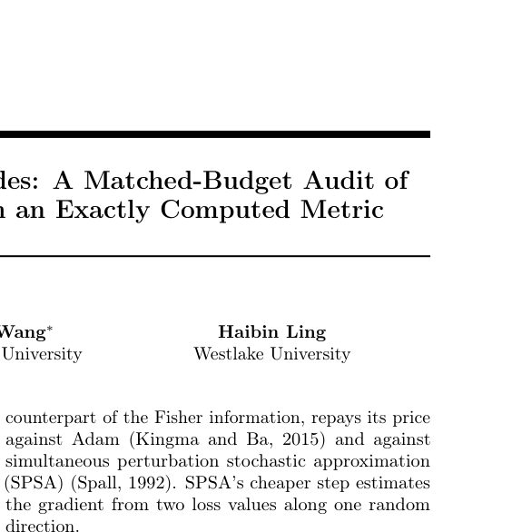 
Figure 1 traces two reporting choices that turn the runs of a time-to-target comparison into a verdict. One is which runs enter the statistic. A run that misses the target within its budget has a time right-censored at the budget, and success-only timing drops such runs. This complete-case summary makes runtime estimates opti- mistic (Mattos et al., 2021, Sec. V-E; Tornede et al., 2020, Sec. 2.2). A reading is a summary computed under one option of a reporting choice. The two read- ings of which runs enter are the conditional median over reached runs only and the budget-capped median, which charges every miss the budget (Section 3). The other choice is the target, which single-target...

📷 Fig 2

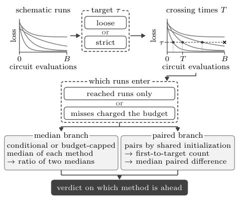 
Figure 1: The target τ defines the crossing times T, and × marks a run that does not reach τ within the budget B. The choice of which runs enter then acts on these times in both branches (Figure 3). Medians are conditional (reached runs only) or budget-capped (misses charged the budget). The paired branch counts which method needs fewer evaluations to the target, a miss counting as the budget, and takes the median of the paired differences.

📷 Fig 3

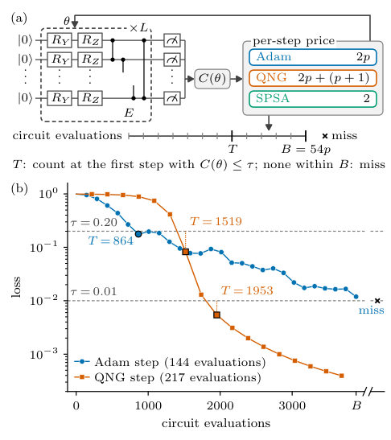 
Figure 2: (a) The testbed. Each of the L layers applies RY and then RZ to every qubit and then the ring E of controlled-Z gates, and the loss C(θ) follows from the probabilities of measuring 0 (Section 3). Each optimizer step adds its price in circuit evaluations to the run’s count, 2p for Adam, 2p + (p + 1) for QNG and 2 for SPSA, up to the budget B = 54p. (b) Adam (η = 0.3) and QNG (η = 1, λ = 10−1), with settings selected for τ = 0.01, from one of the 20 new global- cost initializations at n = 6 (B = 3888) whose τ = 0.01 paired difference is nearest the median (rule in Appendix D). Adam is first at τ = 0.20 and QNG at τ = 0.01, which Adam misses within B. A black-edged marker is a run’s...

📷 Fig 4

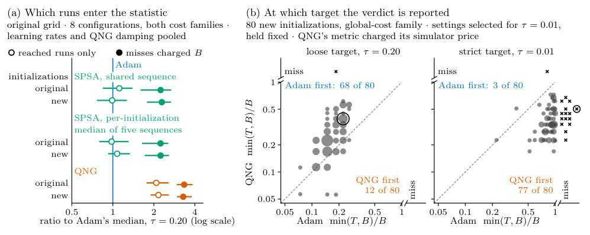 
Figure 3: Two reporting choices, each applied to its own fixed set of runs. Only Adam’s η = 0.3 runs on the new global-cost initializations enter both panels (Appendix D). (a) Original grid at τ = 0.20, original and new initializations in separate rows, all settings and the eight configurations of both cost families pooled, so medians mix budgets. Open markers use reached runs only, and filled ones charge every miss B. The line at 1 is Adam, whose runs all reach the target. SPSA’s shared sequence is defined in Section 3. Bars are Bonferroni-adjusted 99.5% bootstrap intervals, ten ratios per initialization set. (b) Global-cost family, 80 new initializations, settings selected for τ = 0.01,...

📷 Fig 5

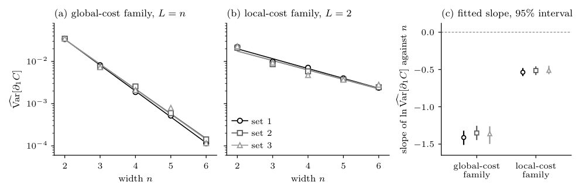 
Figure 4: Gradient variance against width for (a) the global-cost family and (b) the local-cost family of Section 3, with a shared vertical axis. Here ∂1C is the derivative of the loss C with respect to the RY angle of the first qubit in the first layer. In (a) and (b), each marker is the variance of ∂1C over 200 initial points with independent, uniformly random angles. Each line is the least-squares fit of the natural logarithm of this variance against n over one set of random initial points, and each set draws its own points. (c) The fitted slope of each set for each family with its unadjusted percentile bootstrap interval from 400 replicates that resample the derivatives at each n....

**Summary.** This paper rigorously audits the comparison of variational quantum optimizers by demonstrating that the reported performance metrics are heavily biased by the chosen evaluation convention. By implementing a standardized cost accounting that charges every step, the authors show that the apparent superiority of one optimizer over another can vanish when reporting conventions are changed. It serves as a methodological guide for future quantum algorithm benchmarking.

**Why it may be interesting.** It provides a critical methodological framework for evaluating quantum machine learning algorithms, which is crucial for researchers building practical quantum computation benchmarks.

Detailed structure

**Main problem.** The paper addresses the bias in comparing variational quantum optimizers by analyzing how different reporting conventions (e.g., success-only runs vs. full budget accounting) affect performance metrics.

**Main result.** The reported performance of quantum optimizers, particularly Quantum Natural Gradient (QNG), is highly dependent on the chosen evaluation convention and target setting, suggesting that single-metric comparisons are misleading.

**Method.** The authors conduct a rigorous comparison of optimizers (QNG, Adam, SPSA) by implementing a standardized cost accounting system that prices every step in circuit evaluations.

**Model / system.** The model involves variational quantum circuits used to prepare quantum states on $n$ qubits, evaluated using global and local cost functions.

**Key observables.** Time-to-target ($	au$), total circuit evaluations required, ratio of medians (SPSA vs. Adam), and the number of initializations where one optimizer reaches the target first (QNG vs. Adam).

**Important parameters / regimes.** Circuit widths (3 to 6 qubits), target loss thresholds ($	au=0.20$ or $	au=0.01$), and fixed computational budgets ($B$).

**Assumptions / limitations.** The core assumption is that a fair comparison requires charging every run that misses the target the full computational budget and using an exactly computed metric for QNG.

**Figures summary.** Figures illustrate the impact of different reporting choices (success-only vs. budget-capped) on time-to-target comparisons, and tables quantify the performance differences between optimizers under various conditions.

**Paper structure.** The paper systematically critiques existing benchmarking practices, presents a standardized methodology involving fixed budgets and step pricing, and then compares QNG against classical optimizers across multiple cost families and target strictness levels.

Abstract

Several published comparisons of variational quantum optimizers time only runs that reach a target loss, or read the verdict at a single target. Either convention could decide whether an optimizer's costlier steps pay off. We measure how much each convention changes verdicts among Adam, simultaneous perturbation stochastic approximation (SPSA) and quantum natural gradient (QNG), on initializations held out from the selection of settings. We compute the exact metric that preconditions QNG, price every step in circuit evaluations and give every method the same budget. In a median pooled over circuit widths, cost families and a sweep of settings with common misses, SPSA needs more than twice Adam's evaluations to reach a loose target. Dropping the censored runs that miss the target hides this gap. On the global-cost family we hold fixed the settings selected for a strict target. QNG then usually reaches the loose target after Adam but the strict target first. QNG's strict-target lead disappears when the metric's simulator price, linear in the number of parameters, is replaced by an assumed hardware count quadratic in that number. We recommend charging every miss the budget and reporting verdicts across targets.

[↑ back to top](#top)

### [Zero Mode Operators and Charge-Conjugation Defects in Non-Abelian Fractional Quantum Hall-Superconductor Heterostructures](http://arxiv.org/abs/2610.08907v1)

**Authors:** Junyi Cao, Eduardo Fradkin  
**Type:** theory · **Category:** strongly correlated electrons · **PDF:** <https://arxiv.org/pdf/2610.08907v1>  
**Analysis basis:** full PDF text, analyzed in chunks
**Topic relevance:** `analog quantum simulation` **1/5**

📷 Fig 1

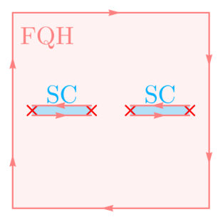 
Figure 1. Counter-propagating FQH edges (pink) proximity-coupled by superconductors (cyan),

📷 Fig 2

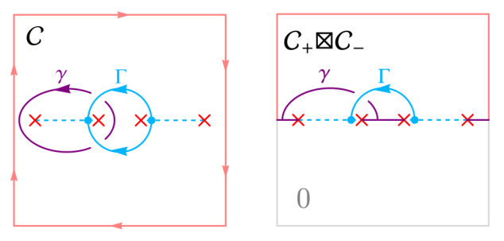 
Figure 2. (a) The two classes of Wilson operators considered in this work. Directed lines rep-

📷 Fig 3

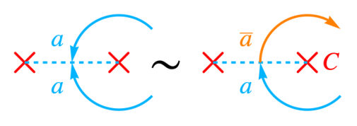 
Figure 3. A superconducting segment that condenses the diagonal anyons (a, a) acts as a charge-

📷 Fig 4

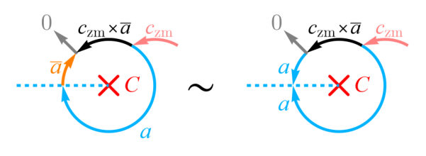 
Figure 4. Bulk fusion criterion for a candidate zero mode anyon czm of an FQH-SC endpoint.

📷 Fig 5

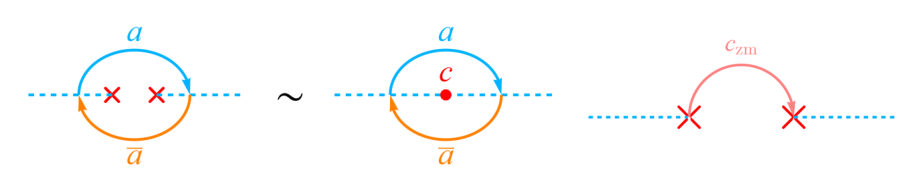 
Figure 5. (a) Wilson-loop measurement of the fusion channel c of two charge-conjugation defects.

**Summary.** This theoretical work develops a generalized framework to describe zero modes at defects in FQH-SC heterostructures, extending previous results to non-Abelian topological orders. By distinguishing between different physical processes—tunneling versus direct transfer—the authors derive unique signatures that characterize the underlying topological structure, notably confirming the Fibonacci nature of the Read-Rezayi state.

**Why it may be interesting.** The work provides a concrete, measurable diagnostic (distinct amplitude ratios) to distinguish between different types of topological order (e.g., Fibonacci vs. Abelian) in superconducting quantum materials, which is highly relevant for realizing topological quantum computation.

Detailed structure

**Main problem.** The paper addresses the challenge of finding a general local operator description for zero modes bound to charge-conjugation defects in non-Abelian Fractional Quantum Hall-Superconductor (FQH-SC) heterostructures.

**Main result.** The authors successfully construct a generalized zero mode algebra and predict distinct universal amplitude ratios for tunneling versus direct zero mode anyon transfer, providing a signature for the underlying topological order.

**Method.** The methodology involves generalizing the bulk-to-boundary construction, mapping bulk Wilson operators to localized zero mode operators, and analyzing the resulting fusion-channel dependence.

**Model / system.** The system studied is FQH-SC heterostructures built from Abelian and non-Abelian FQH states, where the superconducting proximity effect creates a charge-conjugation defect line.

**Key observables.** Zero mode anyons, the fusion-channel dependence of tunneling amplitudes, and the comparison between tunneling-probed bulk monodromy and direct transfer-probed $G$-crossed associativity data.

**Important parameters / regimes.** Filling fractions $
u=1/m$ (Laughlin), $
u=1/m$ (Moore-Read), and $
u=3/(3M+2)$ (Read-Rezayi); the underlying topological order (Abelian vs. non-Abelian).

**Assumptions / limitations.** The analysis assumes the superconducting proximity effect gaps the counter-propagating edges and that the defect structure is governed by $G$-crossed braided tensor categories.

**Figures summary.** The notes reference figures illustrating the physical setup (FQH edges coupled by superconductors), the mapping of Wilson operators, and the superconducting segment acting as a charge-conjugation defect line.

**Paper structure.** The paper progresses by first establishing the need for a generalized zero mode construction, detailing the mapping from bulk operators, and then applying this framework to specific, highly correlated FQH states (Laughlin, MR, RR) to derive concrete algebraic structures and measurable signatures.

Abstract

We study zero modes bound to charge-conjugation defects in fractional quantum Hall-superconductor (FQH-SC) heterostructures built from Abelian and non-Abelian FQH states. Although the associated defects are well described by $G$-crossed braided tensor categories, a local operator description of their zero modes is not generally known. We generalize the bulk-to-boundary construction of localized zero mode operators to FQH-SCs with non-Abelian parent topological orders, mapping bulk Wilson operators in the folded theory to localized zero mode operators in the one-dimensional FQH-SC theory. This construction distinguishes zero mode anyons from the local zero mode operators that act on the defect Hilbert space and yields a generalized zero mode algebra. It also determines the fusion-channel dependence of tunneling: tunneling of zero mode operators probes bulk monodromy, while direct zero mode anyon transfer probes $G$-crossed associativity data. Applying this framework, we recover the $\mathbb{Z}_{2m}$ parafermion zero mode structure of fermionic Laughlin FQH-SCs at filling $ν=1/m$, obtain a $\mathbb{Z}_2^{(n)}\times\mathbb{Z}_N$ structure for generalized Moore-Read states at filling $ν=1/m$, with $N=2m$ for fermionic states and $N=m$ for bosonic states, and find a $\mathrm{Fib}\times\mathbb{Z}_N$ structure for the $k=3$ Read-Rezayi state at filling $ν=3/(3M+2)$, with $N=2(3M+2)$ for fermionic states and $N=(3M+2)/2$ for bosonic states. In the Read-Rezayi case, zero mode operator tunneling and direct zero mode anyon transfer yield distinct universal amplitude ratios between the neutral fusion channels, providing a characteristic signature of the underlying Fibonacci defect structure.

[↑ back to top](#top)

## Other papers (19)

*Papers from primary archives without highlighted authors or any topic match. Click to expand.*

Show other papers

### [A Minimal Bicomplex Extension of the Complex Scalar Algebra of Quantum Mechanics with an Ideal-Valued Sector](http://arxiv.org/abs/2610.09747v1)

**Authors:** Ralf Otte  
**Type:** theory · **Category:** other · **PDF:** <https://arxiv.org/pdf/2610.09747v1>  
**Analysis basis:** full PDF text, analyzed in chunks

📷 Fig 1

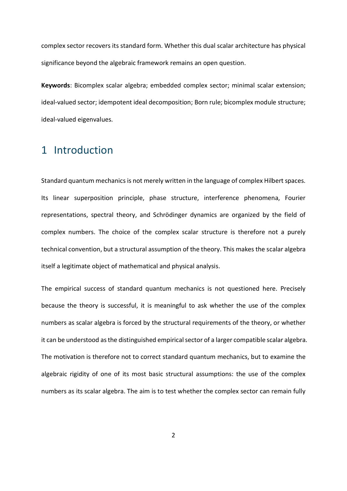 
Low-resolution page preview, page 2

📷 Fig 2

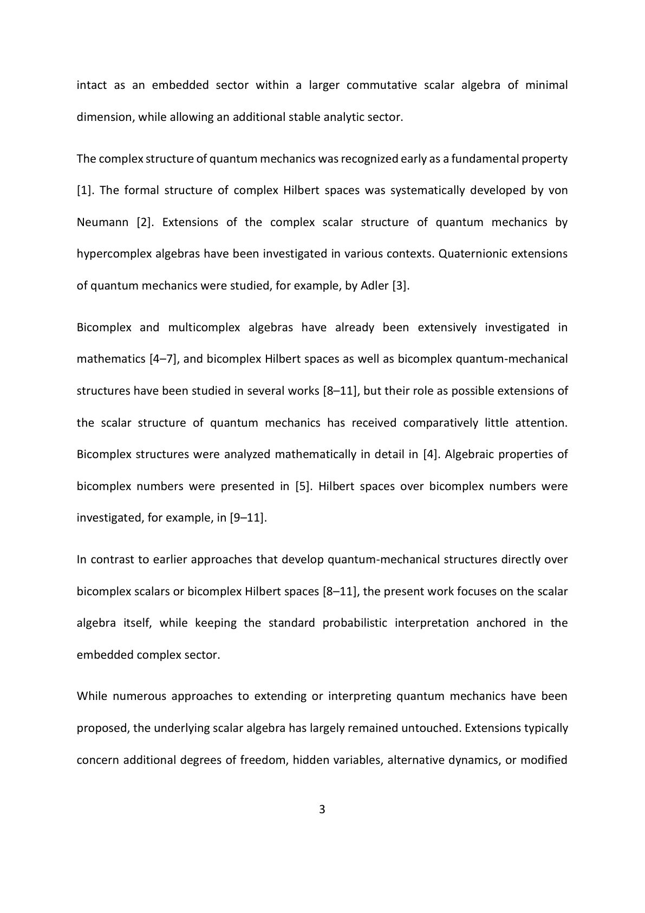 
Low-resolution page preview, page 3

📷 Fig 3

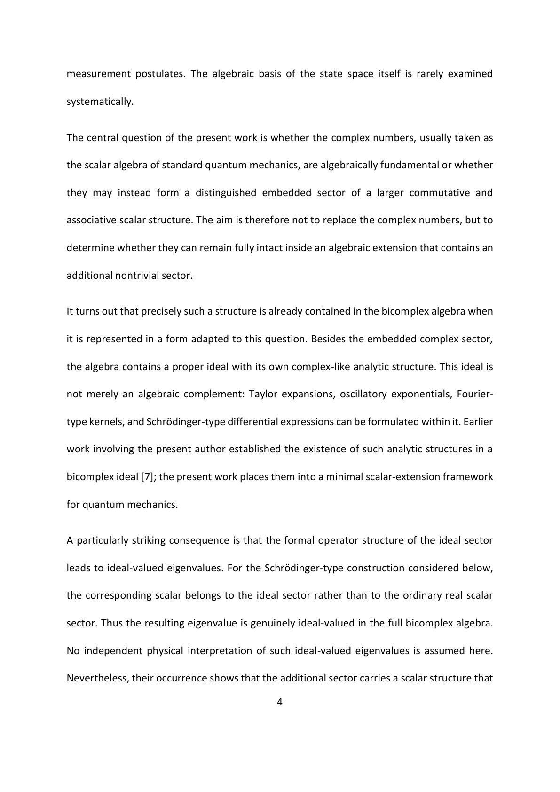 
Low-resolution page preview, page 4

📷 Fig 4

 
Low-resolution page preview, page 5

📷 Fig 5

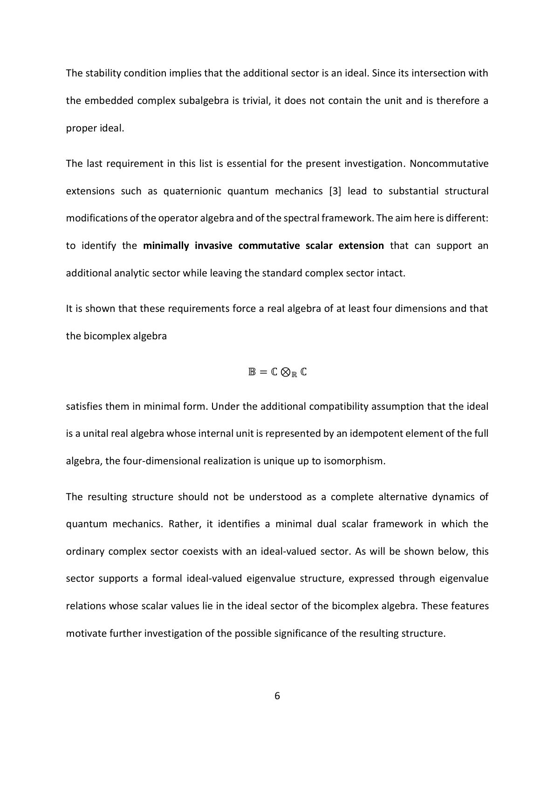 
Low-resolution page preview, page 6

**Summary.** This theoretical paper investigates extending the complex scalar algebra of quantum mechanics to a minimal bicomplex algebra. It establishes that this extension introduces a distinct, ideal-valued sector alongside the standard complex sector. The work is purely algebraic, suggesting a mathematically richer framework for quantum theory while leaving the physical interpretation of the new sector open.

**Why it may be interesting.** While highly abstract, the exploration of alternative scalar algebras directly challenges the foundational mathematical assumptions underpinning quantum mechanics, which is a core theoretical concern for quantum physicists.

Detailed structure

**Main problem.** The paper questions whether the complex numbers ($\mathbb{C}$) used as the scalar algebra in standard quantum mechanics are fundamentally necessary, or if they merely form an embedded sector within a larger, commutative, and associative scalar algebra.

**Main result.** The minimal extension satisfying these algebraic constraints is the bicomplex algebra, which introduces a distinct, ideal-valued sector alongside the standard complex sector.

**Method.** The authors use abstract algebra to analyze the required structure, imposing conditions of commutativity, associativity, and the existence of a proper ideal sector.

**Model / system.** The model is the scalar algebra itself, which is extended from $\mathbb{C}$ to the bicomplex algebra $\mathbb{B}$. This extension is analyzed by decomposing $\mathbb{B}$ into orthogonal idempotent ideals.

**Key observables.** Ideal-valued eigenvalues, algebraic phase relations between sectors, and the structure of entangled states within the extended algebra.

**Important parameters / regimes.** The minimal dimension of the extension is four real dimensions, realized by the bicomplex algebra.

**Assumptions / limitations.** The primary assumption is that the complex sector must remain intact while admitting a stable, complex-like ideal sector, leading to the bicomplex structure.

**Figures summary.** The notes mention a multiplication table (Table 1) for the bicomplex algebra in a basis adapted to an idempotent element, which helps define the algebraic structure.

**Paper structure.** The paper proceeds by establishing the algebraic necessity of the extension, deriving the bicomplex structure, analyzing its two distinct decompositions (canonical vs. physical), and finally examining how quantum concepts like state space and entanglement map onto this dual scalar architecture.

Abstract

Standard quantum mechanics takes the complex numbers as its scalar algebra. We ask whether this complex structure is algebraically fundamental or may instead form a distinguished embedded sector of a larger commutative and associative scalar algebra. Requiring the ordinary complex sector to remain intact while admitting an additional stable complex-like analytic sector turns the latter into a proper ideal, makes zero divisors unavoidable in finite dimension, and implies a lower bound of four real dimensions. The bicomplex algebra realizes this minimum, and under an additional compatibility assumption the four-dimensional realization is unique up to isomorphism. The resulting algebra exhibits two distinct decompositions: the canonical decomposition into orthogonal idempotent ideals and a decomposition adapted to the embedded complex sector and the additional ideal-valued sector. The ordinary complex scalars therefore lie diagonally across the canonical idempotent decomposition. The ideal sector supports Taylor series, oscillatory exponentials, Fourier-type kernels, and Schrödinger-type expressions, and carries a formal ideal-valued eigenvalue structure. Restricting the Born rule to the embedded complex sector recovers its standard form. Whether this dual scalar architecture has physical significance beyond the algebraic framework remains an open question.

[↑ back to top](#top)

### [Automated reduction of fault-tolerant circuits](http://arxiv.org/abs/2610.09749v1)

**Authors:** Hyeongjun Jeon, Jeonghoon Lee, Taehyun Kim  
**Type:** theory · **Category:** quantum information and computing · **PDF:** <https://arxiv.org/pdf/2610.09749v1>  
**Analysis basis:** full PDF text, analyzed in chunks

📷 Fig 1

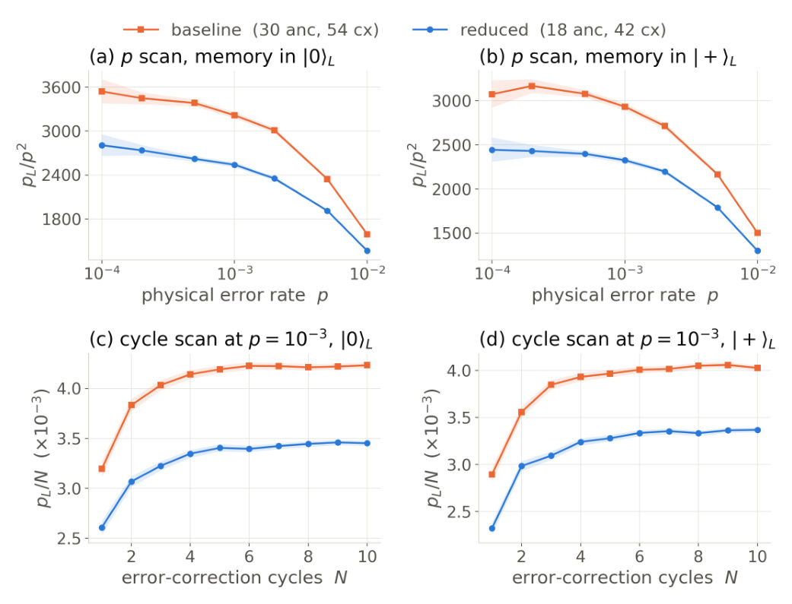 
FIG. 2. Logical error rates for the baseline and optimized Shor-style syndrome-extraction circuits. Each QEC cycle comprises three rounds of syndrome measurement followed by a decoding step. Panels (a) and (b) vary the physical two-qubit gate error rate p for a single QEC cycle (N = 1) and plot pL/p2, thereby removing the common quadratic dependence on p and isolating the leading-order coefficient. Panels (c) and (d) vary the number of cycles N at p = 10−3 and plot the per-cycle logical error rate pL/N, which remains flat as a function of N for N ≥5. Results are shown for the |0⟩L and |+⟩L memories. A raised verification flag invokes an alternative decoding table rather than causing the run...

📷 Fig 2

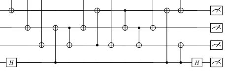 
FIG. 3. Steane error-correction circuits: (a) the baseline cir- cuit based on Goto’s construction [21] and (b) the optimized circuit found by our search. Qubits 0, . . . , 6 are data qubits. Four Bell reductions transform the baseline into the optimized circuit, reducing the number of ancillas from eight to four, cnot gates from 18 to 14, and Hadamard gates from six to two.

📷 Fig 3

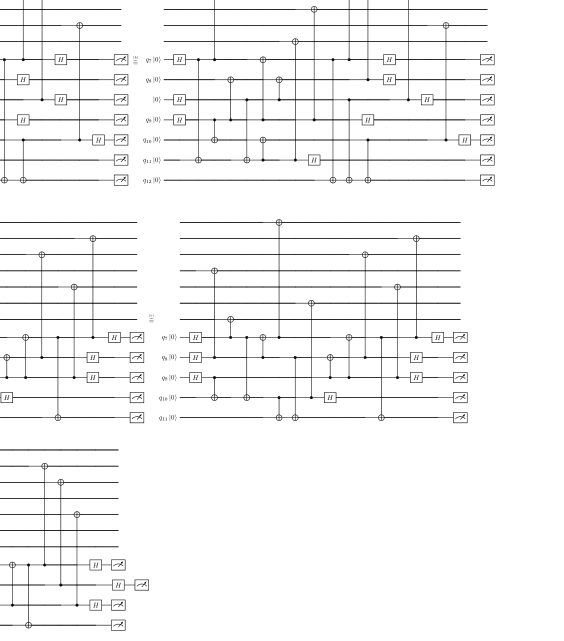 
FIG. 4. Derivation of manually designed circuit

📷 Fig 4

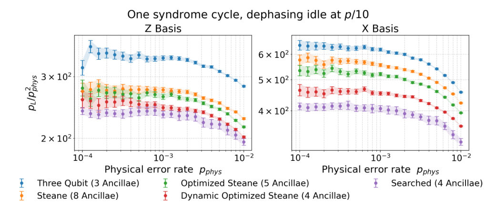 
FIG. 5. Logical error rates of five syndrome-extraction protocols for the [[7, 1, 3]] code as a function of the physical two-qubit gate error rate p, for one QEC cycle (N = 1). The comparison includes the three-qubit, Steane, optimized Steane, dynamic optimized Steane, and searched protocols. Idle qubits undergo dephasing noise with probability p/10. Results are shown for both |0⟩L and |+⟩L memories.

📷 Fig 5

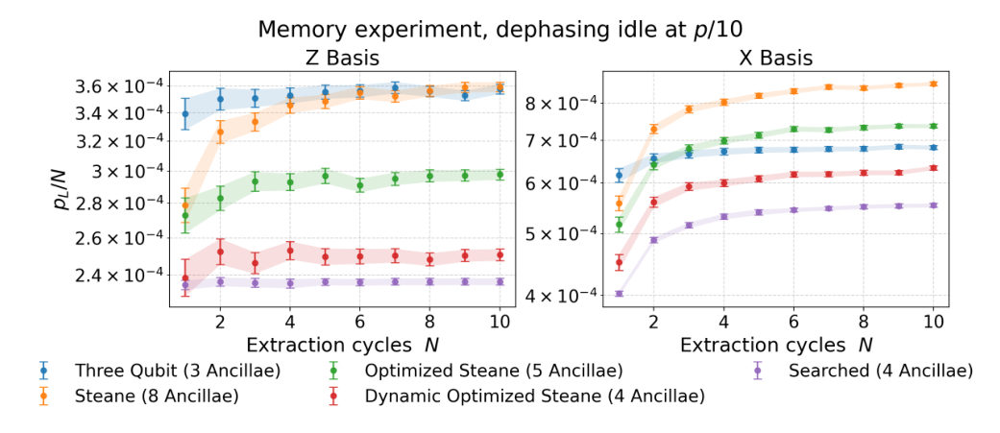 
FIG. 6. Logical error rates of the three-qubit, Steane, optimized Steane, dynamic optimized Steane, and searched protocols as a function of the number of QEC cycles, N = 1, . . . , 10, at p = 10−3. Idle qubits undergo dephasing noise with probability p/10. Results for |0⟩L and |+⟩L memories show how logical errors accumulate under repeated syndrome extraction.

**Summary.** This paper introduces an automated technique to simplify fault-tolerant quantum circuits by performing fault-equivalent rewrites. By systematically searching for reductions, the authors significantly decrease resource requirements (like CNOT gates) and improve the logical error rate for codes like the Steane code. This work provides a powerful, scalable tool for designing more efficient quantum hardware protocols.

**Why it may be interesting.** The development of automated, systematic tools for circuit optimization is crucial for scaling quantum computation, providing concrete blueprints for hardware implementation.

Detailed structure

**Main problem.** The paper addresses the need for an automated method to reduce the resource cost and improve the logical performance of fault-tolerant quantum circuits.

**Main result.** The automated rewriting method successfully reduced the required ancilla preparations and CNOT gates for syndrome extraction, leading to a demonstrated logical error rate reduction of up to 23% for the [[7, 1, 3]] code.

**Method.** The core method is an automated search procedure utilizing fault-equivalent rewrites, which applies non-reducing enabling rules to expose Bell-pair reductions while preserving fault-tolerance.

**Model / system.** The study focuses on fault-tolerant quantum computation, specifically optimizing syndrome-extraction gadgets for Quantum Error-Correcting Codes (QECCs) like the [[7, 1, 3]] Steane code.

**Key observables.** Logical error rate, number of ancilla preparations, number of CNOT gates, and circuit depth.

**Important parameters / regimes.** Physical two-qubit error rate ($p$), and noise models including dephasing and depolarizing idle noise.

**Assumptions / limitations.** The search procedure assumes that the composite reduction matcher returns finitely many matches, and performance evaluation relies on computationally expensive Monte Carlo simulations.

**Figures summary.** Figures compare logical error rates versus physical error rate ($p$) or number of cycles ($N$) for various syndrome-extraction protocols, showing performance improvements for the optimized circuits.

**Paper structure.** The paper details the automated search framework using fault-equivalent rewrites, applies this to specific QEC codes (Shor/Steane), and evaluates the resulting circuits by comparing resource counts and simulating logical error rates under various noise models.

Abstract

We present an automated method for reducing fault-tolerant circuits through fault-equivalent rewrites. Starting from a known fault-tolerant circuit, the search applies non-reducing enabling rules to expose Bell-pair reductions, each of which removes an ancilla preparation and a CNOT gate. Because every search transition preserves fault equivalence, the resulting circuits inherit the fault-tolerance properties of the input circuit. Candidate circuits are evaluated using circuit-level Monte Carlo simulation. For Shor-style syndrome extraction with the $[[7,1,3]]$ code, our method reduces one syndrome-measurement round from 30 to 18 ancilla preparations and from 54 to 42 CNOT gates. At a physical two-qubit error rate of $p = 10^{-3}$, the optimized circuit lowers the logical error rate by approximately 21% for both logical basis states. The reduction ranges from 13% to 23% over a range of $p$ spanning two orders of magnitude. We also apply the method to Steane-based dynamic syndrome extraction constructed from Goto's verified logical-$\lvert 0 \rangle$ preparation, in which the verification qubit serves as a flag. The search selects a circuit using four ancillas and 14 CNOT gates, matching the resource counts of the previous design but with an improved CNOT depth. Under depolarizing idle noise at $3p/10$ the selected circuit lowers the logical error rate by approximately 15% for both logical basis states, and by approximately $10%$ at $p/10$. These results demonstrate that automated fault-equivalent rewriting can identify circuits with lower resource costs or improved logical performance without separately verifying the fault tolerance of every candidate.

[↑ back to top](#top)

### [Benchmarking Modular Optimization Strategies for Parameterized Quantum Circuits](http://arxiv.org/abs/2610.10254v1)

**Authors:** Carla Cotea, Stefan Balauca, Andreea Arusoaie  
**Type:** both · **Category:** quantum information and computing · **PDF:** <https://arxiv.org/pdf/2610.10254v1>  
**Analysis basis:** full PDF text, analyzed in chunks

📷 Fig 1

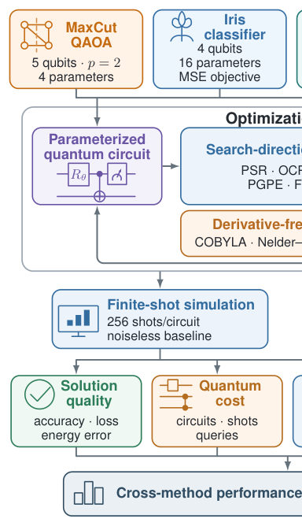 
Fig. 1 Overview of the benchmarking framework. Four parameterized-quantum-circuit workloads are evaluated using a modular optimization loop that separates search-direction estimation from classical parameter updating. Experiments are conducted under finite-shot simulation and selected physical- QPU execution, with comparisons based on solution quality, quantum-evaluation cost, convergence behavior, and hardware-case-study outcomes. Derivative-free methods retain their native proposal and update dynamics

📷 Fig 2

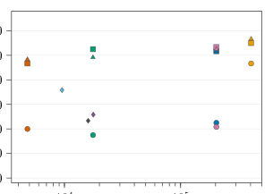 
Fig. 2 Mean performance versus evaluation cost across the four simulated workloads and three random seeds (42, 123, and 1234). Each marker denotes one optimizer configuration; marker color identifies the search-direction method and marker shape identifies the classical update rule or derivative-free baseline. MaxCut performance is expressed relative to the exact target cost, Iris and MNIST QCNN performance as test accuracy, and H2 VQE performance as absolute error from the FCI reference energy. Logical-circuit evaluations are shown for MaxCut and the classification work- loads. For VQE, only objective-evaluation counts are reported because the number of commuting measurement groups was not...

📷 Fig 3

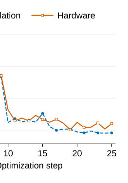 
Fig. 3 MaxCut QAOA with SPSA-SGD over 25 monitored optimization steps on the same six-edge graph. Dashed lines with circles show simulation with optimizer seed 123 and graph seed 42; solid lines with squares show the hardware run on ibm aachen. The objective is expected negative cut, with exact target −5. The terminal simulator and hardware costs are −4.023438 and −3.908474; their best observed values are −4.027344 at step 24 and −3.984726 at step 19. The initial reference job and shifted gradient probes are excluded from the displayed history

📷 Fig 4

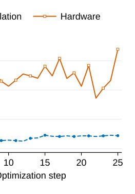 
Fig. 4 H2 VQE with PGPE-SGD: total energy over 25 monitored steps in seed-42 simulation (dashed lines with circles) and on ibm aachen (solid lines with squares). Both histories include nuclear repulsion and use 256 requested shots per expectation setting. Hardware points are the unshifted centers of the 11-evaluation PGPE batches executed on hardware. The terminal energies are −1.129593 Ha in simulation and −0.980468 Ha on hardware; the minimum measured energies are −1.138991 and −1.063881 Ha. The exact reference is −1.137270174661 Ha. Curves are unsmoothed single trajectories, not estimates of run-to-run uncertainty

📷 Fig 5

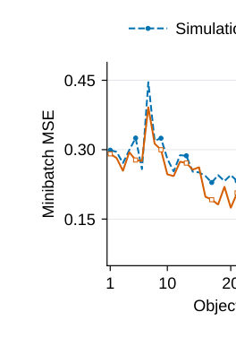 
Fig. 5 Iris classification with COBYLA: simulator and hardware mini batch MSE over 50 objective queries. Dashed lines with circles denote the seed-42 simulator run; solid lines with squares denote the archived ibm aachen run. Each query uses 16 training samples and 256 requested shots per expectation setting. All recorded losses are plotted without smoothing; marker frequency is reduced for readability. The minima occur at simulator query 49 and hardware query 40. The post-training test accuracies of the selected parameters are 100% and 90%, respectively, and are distinct from the plotted losses

**Summary.** This paper introduces a modular benchmarking framework to systematically test optimization strategies for parameterized quantum circuits. By decoupling gradient estimation from parameter updates, the authors evaluate performance across diverse tasks like chemistry and machine learning. The work is vital for understanding how resource constraints and algorithmic choices affect practical quantum computation.

**Why it may be interesting.** It provides a rigorous, resource-aware framework for comparing optimization algorithms in the NISQ era, which is crucial for developing practical quantum machine learning and simulation protocols.

Detailed structure

**Main problem.** Training parameterized quantum circuits (PQCs) is challenging due to the need to balance optimization progress against limited evaluation budgets and the inherent statistical uncertainty of near-term quantum hardware.

**Main result.** The study benchmarks various optimization strategies, showing that performance is highly dependent on the specific workload, resource constraints, and the modular separation of gradient estimation from parameter updates.

**Method.** The authors developed a modular benchmarking framework that independently evaluates quantum search-direction estimators (e.g., OCP, finite-difference) and classical parameter-update rules (e.g., Adam, SGD).

**Model / system.** The benchmarking is applied across four distinct quantum workloads: QAOA for MaxCut, QCNN for Iris/MNIST classification, and VQE for molecular hydrogen ($	ext{H}_2$).

**Key observables.** Solution quality (e.g., Test Accuracy, Energy Error), and resource costs (Objective Evaluations, Logical Circuits, Shots).

**Important parameters / regimes.** Finite-shot simulation (256 shots/circuit), 156-qubit processor, and various hyperparameter settings for optimizers.

**Assumptions / limitations.** The hardware runs are presented as targeted case studies and do not establish a universal optimizer ranking or isolate the causal effect of device noise.

**Figures summary.** Figures provide an overview of the modular optimization loop across the four workloads, comparing solution quality against quantum-evaluation cost.

**Paper structure.** The paper reviews background, defines component-level comparisons, details the specific workloads/protocols, presents results comparing various optimizers, and concludes with a discussion of limitations.

Abstract

Training parameterized quantum circuits requires balancing optimization progress with limited evaluation budgets and the statistical uncertainty of near-term quantum hardware. We present a modular benchmarking framework that separates quantum search-direction estimation from classical parameter-update rules, allowing their interactions and sensitivities to be examined independently. We evaluate a suite of gradient-based, stochastic, and derivative-free optimizers across combinatorial optimization using the Quantum Approximate Optimization Algorithm (QAOA), supervised quantum machine learning using Iris classification and a quantum convolutional neural network (QCNN) for binary MNIST classification, and quantum chemistry using the variational quantum eigensolver (VQE) for molecular hydrogen. By separating objective evaluations from sample-circuit costs under finite-shot simulation and physical execution on a 156-qubit processor, we compare optimizer behavior across workloads with different parameter counts and measurement requirements. Four selected simulator and hardware case studies report terminal and best observed objectives separately, alongside post-training classifier accuracies. The comparisons include selected MaxCut and hydrogen trajectories and illustrate workload-dependent objective changes and evaluation costs, while the simulator benchmark compares both peak and mean performance across three seeds. The hardware runs do not establish an optimizer ranking or isolate a causal effect of device noise.

[↑ back to top](#top)

### [Building codes with transversal CCZ using projective geometry and SAT solvers](http://arxiv.org/abs/2610.09341v1)

**Authors:** Bohan Lu, Kenneth R. Brown  
**Type:** theory · **Category:** quantum information and computing · **PDF:** <https://arxiv.org/pdf/2610.09341v1>  
**Analysis basis:** full PDF text, analyzed in chunks

📷 Fig 1

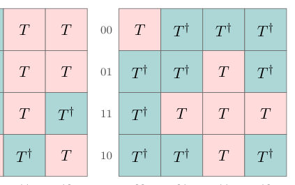 
Figure 1: The T/T † pattern of Q48 in closed form (Proposition 3.9). The three panels show the flip vector γ(u, w) = u3 + w1Q1(u) + w2Q2(u) on the three cosets of (7). Each panel lists the 16 points u = (u1, u2, u3, u4) of one coset, rows indexed by (u1, u2) and columns by (u3, u4), with T at γ = 0 and T † at γ = 1. The flip counts are 6, 6, 10, resulting in a total of 26 T and 22 T †.

📷 Fig 2

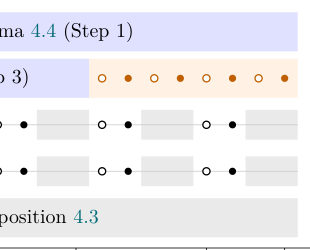 
Figure 2: Arguments excluding 15 ≤n ≤38 at each stabilizer rank. Step numbers refer to Ap- pendix D.4.

📷 Fig 3

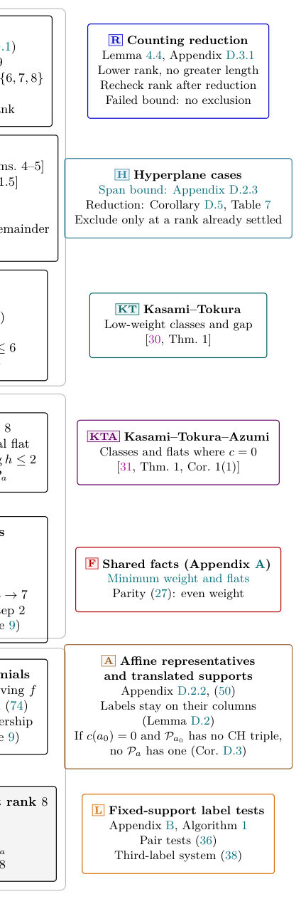 
Figure 3: Proof steps for Theorem 4.5. Solid arrows follow the numbered steps. Matching lettered badges identify the results from earlier sections and the literature used by each step.

**Summary.** This paper develops a method to construct quantum error-correcting codes capable of implementing a non-Clifford CCZ gate using physical T/T⁽ gates. By combining projective geometry with SAT solving, the authors build codes of increasing length while proving a lower bound on the minimum required code length. This advances the theoretical understanding of fault-tolerant quantum computation.

**Why it may be interesting.** This work directly addresses the feasibility of implementing universal quantum gates (like CCZ) in fault-tolerant quantum computation using specific hardware constraints (transversal gates), which is central to quantum computing theory.

Detailed structure

**Main problem.** The paper focuses on constructing Calderbank-Shor-Steane (CSS) quantum error-correcting codes that can implement a non-Clifford logical CCZ gate using transversal physical T/T⁽ gates.

**Main result.** The authors successfully construct such codes for various block lengths (e.g., $n=48$ to $n=496$) and prove that no such code exists for lengths below $n=39$.

**Method.** The construction combines projective geometry to define the stabilizer structure, uses the constraints imposed by the target CCZ gate (leading to Campbell-Howard conditions), and solves the resulting compatibility search as a Boolean Satisfiability (SAT) problem.

**Model / system.** The model is quantum error correction using CSS codes, where the logical operations are realized via transversal physical T/T⁽ gates. The underlying mathematical structure is defined using binary projective geometry $	ext{PG}(s-1, 2)$.

**Key observables.** Code distance parameters ($d_X, d_Z$), the weight of codewords, and the existence of a compatible logical operator.

**Important parameters / regimes.** Block length $n$ (tested from 48 to 496, with a gap $39 \le n \le 46$ remaining open), and the required distance $d_Z \ge 3$.

**Assumptions / limitations.** The primary assumption is that the code structure can be derived from projective geometry, and the search for compatible operators is encoded as a SAT problem.

**Figures summary.** The notes do not provide a summary of figures, but mention references to equations (6), (10), and a general proof structure for Theorem 4.5.

**Paper structure.** The paper proceeds by first defining the problem using projective geometry to establish $d_Z \ge 3$. It then translates the physical constraints into algebraic conditions (CH conditions), which are solved using SAT solvers to find compatible codes. Finally, it systematically proves non-existence for small lengths ($n < 39$) through exhaustive algebraic exclusion.

Abstract

We construct CSS codes with three logical qubits whose logical CCZ gate is implemented by transversal physical $T/T^{\dagger}$ gates and whose distance is at least $3$. These codes start with $8$-divisible $X$-stabilizers defined by projective geometry, which guarantees $d_Z\geq 3$. A SAT solver then finds three $X$-logical operators compatible with the transversal CCZ. We build codes at thirteen block lengths from $n=48$ to $n=496$, with $d_Z=3$ or $4$, and illustrate the method with the $[[48,3,3]]$ code $Q_{48}$. Additionally, we prove that no CSS code with three logical qubits, $Z$-distance at least $3$, and a quasi-transversal CCZ gate (transversal $T$ with a diagonal Clifford correction) exists below $n=39$. The $[[47,3,3]]$ code of Jacinto et al. serves as an upper bound, leaving $39\leq n\leq46$ open.

[↑ back to top](#top)

### [Cost of Delay for Post-Quantum Migration: Putting Classical and Harvest-Now-Decrypt-Later Risk on One Ordered List](http://arxiv.org/abs/2610.09029v1)

**Authors:** Animesh Shaw  
**Type:** theory · **Category:** other · **PDF:** <https://arxiv.org/pdf/2610.09029v1>  
**Analysis basis:** full PDF text, analyzed in chunks

📷 Fig 1

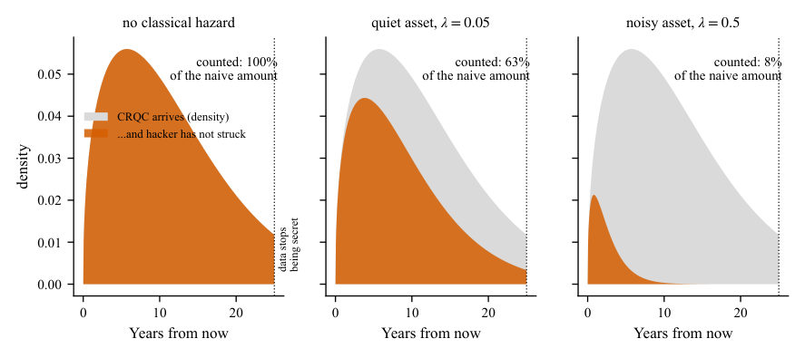 
Figure 1: The race between a classical attacker and a quantum computer for the same data (Proposition 2).

📷 Fig 2

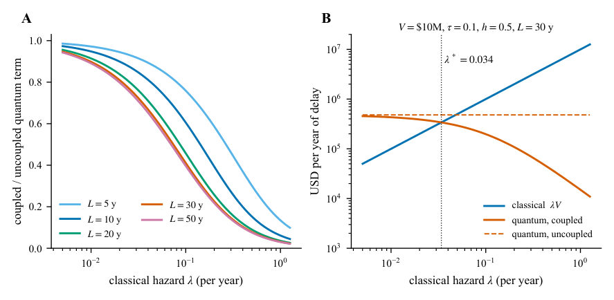 
Figure 2: The coupling factor, and the dominance threshold λ∗below which the quantum term exceeds the classical term (Proposition 7).

📷 Fig 3

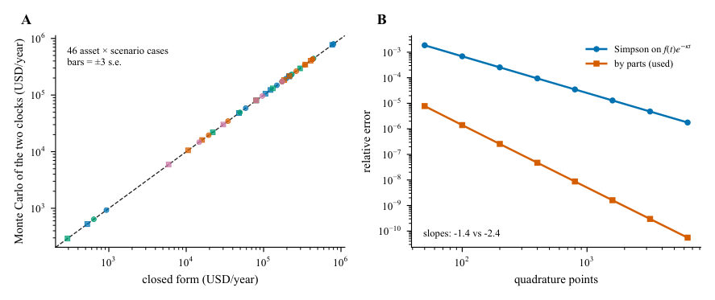 
Figure 3: Numerical validation: Monte Carlo against the closed form, and quadrature error of the two integration forms.

📷 Fig 4

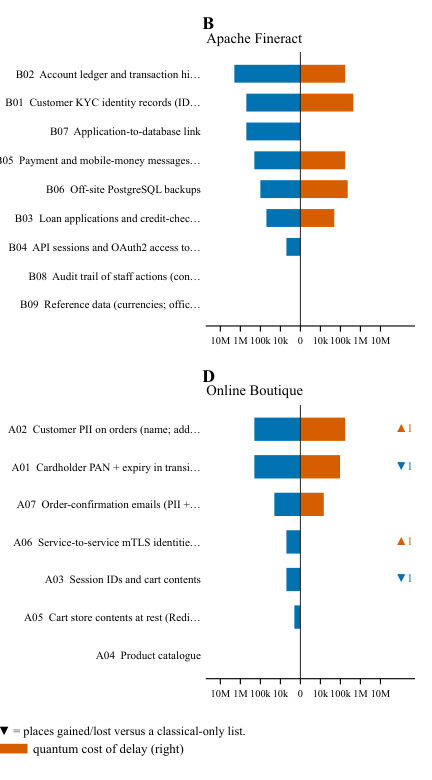 
Figure 4: Classical and quantum cost of delay per asset in each system (log scale).

📷 Fig 5

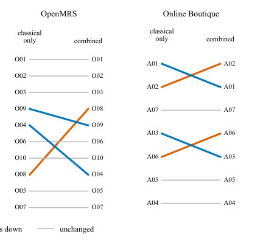 
Figure 5: Rank of each asset under a classical-only list against the unified list.

**Summary.** This paper creates a novel, unified metric to help organizations prioritize post-quantum cryptographic migration by combining classical data breach risks with future quantum computing threats. It mathematically proves how these two distinct risks interact using a competing-risks model. The resulting 'Cost of Delay' score provides an optimal, actionable ordering for security investments.

**Why it may be interesting.** While not physics-focused, the rigorous mathematical modeling of competing failure processes and the use of survival analysis techniques are highly relevant to open quantum systems modeling where multiple decoherence or failure channels compete.

Detailed structure

**Main problem.** The paper addresses the lack of a common metric for prioritizing data migration to post-quantum cryptography, balancing immediate classical security risks against future quantum threats.

**Main result.** It develops a unified 'Cost of Delay' metric that successfully couples classical and quantum risks, demonstrating that the quantum threat can significantly reorder asset prioritization compared to classical-only assessments.

**Method.** The authors model both risks as a 'cost of delay' in currency per year, using a competing-risks framework that combines an annualized classical loss expectancy with a quantum loss rate derived from an arrival law.

**Model / system.** The model is an abstract risk assessment framework applied to digital assets, using parameters like data value, turnover, classical hazard rates, and a Weibull-fitted arrival law for a Cryptographically Relevant Quantum Computer (CRQC).

**Key observables.** The primary observable is the total Cost of Delay (CoD), which dictates the optimal sequence for security upgrades.

**Important parameters / regimes.** Key parameters include the classical hazard rate ($\lambda$), data value ($V$), data lifetime ($L$), and the quantum arrival rate derived from expert anchors.

**Assumptions / limitations.** Major assumptions include that parameters are assumed from public documentation rather than elicited from practitioners, and that the model only covers confidentiality risk.

**Figures summary.** Figures illustrate the race between classical and quantum attackers over time, show the dominance threshold ($\lambda^*$) where quantum risk takes over, and demonstrate the quantum term's ability to reorder assets beyond input uncertainty.

**Paper structure.** The paper introduces the unified CoD metric, proves mathematical propositions regarding its structure, validates the construction using simulations, and applies the model to several public system case studies.

Abstract

Organisations deciding which assets to migrate to post-quantum cryptography first, and how that work competes with a backlog of classical findings, lack a common unit: post-quantum scores are dimensionless and quantum-only, while classical risk is annualised loss. We express both threats as a cost of delay in currency per year on the same asset. The quantum term is the rate at which deferring migration commits irreversible harvest-now-decrypt-later loss, computed from required confidentiality duration, recordable traffic share and data turnover, using a quantum-arrival law fitted in closed form to published expert anchors. A competing-risks factor couples the two terms so the same loss is not counted twice. We prove that the construction is not a weighted sum of a classical and a quantum score, give a dominance threshold on the classical hazard that is independent of asset value, and show that the induced order is optimal for sequencing work under constant loss rates. We verify the implementation by simulation, adaptive quadrature and a second implementation. On four public systems with parameters assumed from public documentation, the quantum term reorders the asset list beyond input uncertainty for one system only (signal-to-noise 1.36 against 0.14-0.46), moves specific long-lived, quiet, recordable assets decisively, and otherwise changes magnitudes. Asset value and turnover explain 73-91% of the uncertainty in the quantum term; the arrival date explains 3-17%. The case studies are illustrative and are not validated against outcomes.

[↑ back to top](#top)

### [Cross-Validation of Open-Source Quantum Network Simulators](http://arxiv.org/abs/2610.09322v1)

**Authors:** Joaquin Chung, Michal Hajdušek, Naphan Benchasattabuse, Robert J. Hayek, Alexander Kolar, Ansh Singal, Kento Samuel Soon, Kentaro Teramoto, Allen Zang, Caitao Zhan, Raj Kettimuthu, Rodney Van Meter  
**Type:** theory · **Category:** quantum information and computing · **PDF:** <https://arxiv.org/pdf/2610.09322v1>  
**Analysis basis:** full PDF text, analyzed in chunks

📷 Fig 1

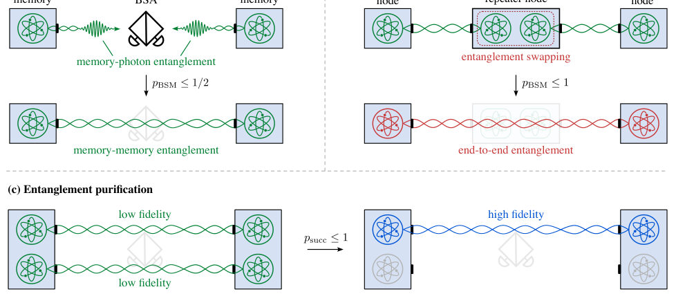 
FIGURE 1: (a) Link-level entanglement generation between neighboring network nodes using a Bell state analyzer (BSA) on photonic qubits emitted by quantum memories. The two photons must arrive at the BSA at the same time, an important task in engineering the protocols and optical path. The probability of success is upper bounded by 1/2 [31], meaning the generation process must be repeated upon failure of the Bell state measurement (BSM). (b) After successful entanglement generation of two neighboring links, the repeater node performs entanglement swapping on its quantum memories to create an end-to-end entangled connection. This process can, in principle, be deterministic. (c) Two...

📷 Fig 2

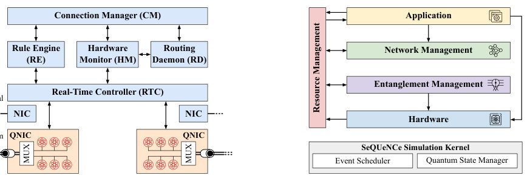 
FIGURE 2: (a) Quantum Router Software Architecture (QRSA) used in QuISP to control the behavior of network nodes. (b) SeQUeNCe software framework comprises a simulation kernel and five modules for applications, hardware models, entanglement, network, and resource management.

📷 Fig 3

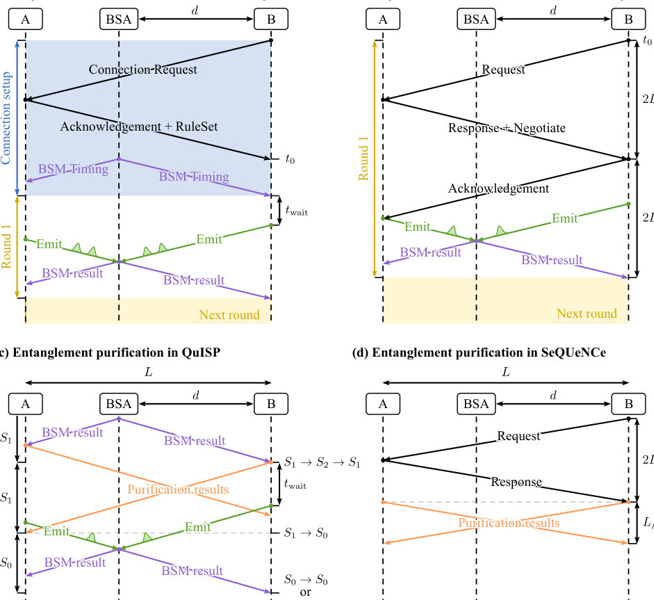 
FIGURE 3: (a) Generation of link-level entanglement in QuISP. The photonic train is represented by a single green arrow. (b) Timing analysis for the entanglement generation protocol for SeQUeNCe. (c) Entanglement purification protocol in QuISP showing how the measured memories are freed even before the purification results reach both quantum nodes. (d) SeQUeNCe keeps the memories locked until the purification results are shared between the quantum nodes.

📷 Fig 4

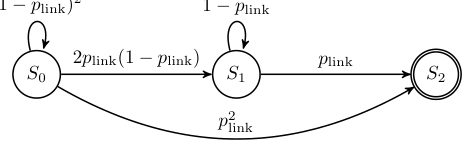 
FIGURE 4: State transition diagram for generating two Bell pairs in QuISP.

📷 Fig 5

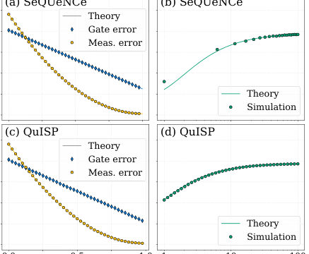 
FIGURE 5: (a) Verification of the SeQUeNCe error model without decoherence in Eq. (17). The measurement error pm = 0.1 is shown in the yellow points, and the gate error pg = 0.05 is shown in blue with initial Werner state fidelities, F1, F2 = 1. (b) Verification of Eq. (17) for SeQUeNCe when pm = 0.1 and pg = 0.05, varying the degree of depolarizing noise affecting the memories. (c) Verification Eq. (22), for the end-to-end fidelity of QuISP. The blue diamonds correspond to the fidelity when pg varies and pm = 0.1, while the yellow hexagons correspond to varying pm with pg = 0.05. Both simulators show good agreement between the obtained data and their respective theoretical models shown in...

**Summary.** This paper compares two open-source quantum network simulators, QuISP and SeQUeNCe, by cross-validating basic tasks like entanglement generation and purification. The authors find that while the simulators disagree on the time taken for these tasks, they correctly predict the final resource fidelity under the same noise conditions. This work establishes a vital benchmark for improving the reliability of quantum network simulations.

**Why it may be interesting.** It provides a rigorous benchmarking methodology for quantum network simulators, which is crucial for developing reliable protocols for future quantum internet architectures.

Detailed structure

**Main problem.** To ensure the consistency and accuracy of simulation outputs when modeling quantum network tasks across different open-source simulators.

**Main result.** The simulators show quantitative differences in task completion time due to connection models, but they agree on the final fidelity of distributed resources under identical error parameters.

**Method.** A comparative analysis (cross-validation) was performed by simulating fundamental quantum networking primitives like entanglement generation, swapping, and purification using two distinct simulators.

**Model / system.** The study models quantum networks, which utilize photonic qubits and quantum memories to distribute entanglement over long distances, simulating first-generation (1G) repeater protocols.

**Key observables.** Latency of resource distribution (time required for tasks) and the fidelity of the distributed entangled resources.

**Important parameters / regimes.** Error parameters (e.g., Pauli noise, qubit loss), connection model assumptions, and classical communication timing.

**Assumptions / limitations.** The comparison assumes that the core physics of resource fidelity is correctly modeled, even if the timing mechanics differ between simulators.

**Figures summary.** Figure 1 illustrates the three core processes: link-level entanglement generation (MIM), entanglement swapping at a repeater node, and entanglement purification.

**Paper structure.** The paper establishes a comparative framework by detailing the simulation of basic quantum networking tasks, comparing the results from QuISP and SeQUeNCe, and concluding with a methodology for future cross-validation.

Abstract

We present a comparative analysis of two open-source quantum network simulators, QuISP and SeQUeNCe, focusing on cross-validation of basic networking tasks to ensure consistency and accuracy in simulation outputs. Although both simulators are designed to study quantum network management policies and their dynamics under complex noise models, their differing underlying assumptions can lead to variations in simulation results. We highlight the discrepancies in how the two simulators handle connections, internal network node processing time, and classical communication, resulting in significant quantitative and qualitative differences in the time required to perform basic network tasks such as entanglement generation, purification, and swapping. We simulate common scenarios between the simulators to compare both the latency of resource distribution and the fidelity of the distributed resources. Our findings indicate that while the simulators differ in the time required to complete network tasks---a constant factor difference attributable to their respective connection models---they agree on the fidelity of the distributed resources under identical error parameters. This work demonstrates a crucial first step towards enhancing the reliability and reproducibility of quantum network simulations, as well as leading to full protocol development. Furthermore, our benchmarking methodology establishes a foundational set of tasks for the cross-validation of simulators to study future quantum networks.

[↑ back to top](#top)

### [Effective-Geometry Rescaling and Universal Critical Behavior in the Anisotropic Three-State Potts Model on the Square Lattice](http://arxiv.org/abs/2610.10467v1)

**Authors:** Fan Yang, Jian Gao, Lu Liu, Yuhai Liu  
**Type:** theory · **Category:** statistical mechanics · **PDF:** <https://arxiv.org/pdf/2610.10467v1>  
**Analysis basis:** full PDF text, analyzed in chunks

📷 Fig 1

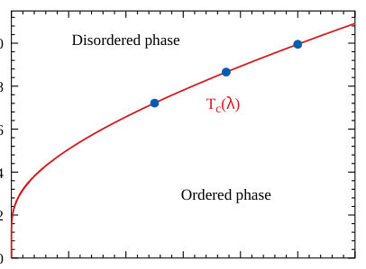 
FIG. 1. Phase diagram of the anisotropic two-dimensional ferromagnetic three-state Potts model in the λ–T plane. The red solid line denotes the exact critical line determined by the self-dual condition, and the blue circles mark the coupling ratios λ = 0.5, 0.75, and 1 studied in this work. The regions below and above the critical line correspond to the ordered and disordered phases, respectively.

📷 Fig 2

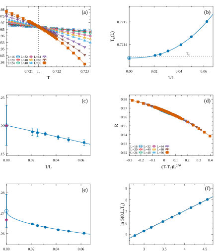 
FIG. 2. Finite-size scaling analysis at λ = 0.5. (a) Corre- lation ratio R for different system sizes. (b) Crossing tem- peratures Tc(L), extrapolating to Tc = 0.721340(3). (c) Ef- fective 1/ν(L) obtained from the slope ratios, with extrap- olated value 1/ν = 1.20(3). (d) Data collapse of R using T sd c ≃0.7213475 and 1/ν = 6/5. (e) Effective η(L), extrapo- lating to η = 0.271(8). (f) Log–log scaling of S(0, L, T sd c ) with the exact exponent η = 4/15. Open symbols in (b), (c), and (e) denote the thermodynamic-limit estimates; dashed lines in (a) and (b) indicate T sd c , while colored markers on the ver- tical axes in (c) and (e) indicate the exact values 1/ν = 6/5 and η = 4/15,...

📷 Fig 3

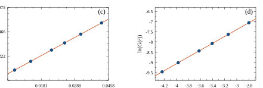 
FIG. 3. Analysis of the leading Fisher zero at λ = 0.5. (a) Leading Fisher zeros β1(L) in the upper half of the complex inverse-temperature plane for different system sizes L. The horizontal and vertical axes represent Re β1(L) and Im β1(L), respectively, and the arrow indicates the direction of increas- ing L. (b) Real part of the leading zero as a function of 1/L, together with its extrapolation to the thermodynamic limit. The dashed horizontal line indicates the exact self-dual criti- cal inverse temperature, βsd c = ln 4. (c) Imaginary part of the leading zero as a function of 1/L on logarithmic axes, analyzed using Eq. (9). (d) Cumulative density GL(r1) = 1/(2L2) as a function of r1 =...

📷 Fig 4

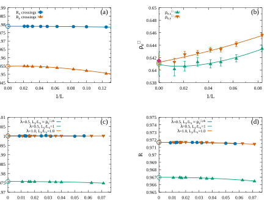 
FIG. 5. Effective geometry and geometric compensation for λ = 0.5. (a) Directional crossing values of Rx and Ry and their thermodynamic-limit extrapolations. (b) Finite-size es- timates of the effective aspect ratio ρ□ e of a physically square anisotropic system inferred from the critical FK wrapping probabilities in the two directions. The solid red symbol de- notes the theoretical value ρ□,th e obtained from the isoradial construction. (c) Ratio of the directional correlation ratios, Ry/Rx. (d) Overall correlation ratio R. Panels (c) and (d) compare the anisotropic physical square at λ = 0.5, the ge- ometrically compensated anisotropic rectangle at λ = 0.5, and the isotropic square at λ =...

📷 Fig 5

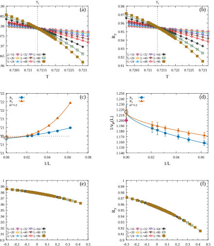 
FIG. 4. Directional finite-size scaling analysis at λ = 0.5. (a), (b) Directional correlation ratios Rx and Ry as func- tions of temperature for different system sizes. (c) Direc- tional crossing temperatures T (µ) c (L), µ = x, y, for size pairs (L, 2L), plotted as functions of 1/L. The extrapolations yield T (x) c = 0.721336(9) and T (y) c = 0.721341(3) in the thermody- namic limit. (d) Effective inverse correlation-length exponent estimates 1/νµ(L), µ = x, y, obtained from the directional slope ratios and plotted against 1/L. The extrapolations us- ing Eq. (13) give (1/ν)x,∞= 1.21(1) and (1/ν)y,∞= 1.21(1). (e), (f) Data collapse of Rx and Ry, respectively, plotted against (T −T sd c...

**Summary.** This paper studies the anisotropic three-state Potts model on a square lattice to determine how spatial anisotropy affects its critical behavior. Using Monte Carlo simulations and finite-size scaling, the authors show that while anisotropy alters the system's effective geometry, the underlying bulk critical universality class remains robustly that of the isotropic three-state Potts model.

**Why it may be interesting.** The work provides a detailed theoretical understanding of how lattice geometry and anisotropy manifest at criticality, offering a quantitative framework (effective-geometry rescaling) to separate universal physics from non-universal boundary effects.

Detailed structure

**Main problem.** To investigate whether spatial anisotropy in the two-dimensional three-state Potts ferromagnet modifies the bulk critical universality class or primarily affects the finite-size critical geometry.

**Main result.** The study concludes that spatial anisotropy changes the effective critical geometry (e.g., directional correlation ratios) but does not alter the bulk critical universality class, which remains consistent with the 2D three-state Potts model.

**Method.** The research employs Wolff single-cluster Monte Carlo simulations and finite-size scaling analysis, supplemented by the analysis of Fisher zeros and directional correlation ratios.

**Model / system.** The system is an anisotropic three-state Potts ferromagnet defined on a square lattice with Hamiltonian $H = -\sum_{\langle ij 
angle_x} J_x \delta_{\sigma_i, \sigma_j} - \sum_{\langle ij 
angle_y} J_y \delta_{\sigma_i, \sigma_j}$. The anisotropy is controlled by the ratio $\lambda = J_y/J_x$.

**Key observables.** Overall correlation ratio ($R$), directional correlation ratios ($R_x, R_y$), correlation-length exponent ($
u$), specific-heat exponent ($\alpha$), and the effective aspect ratio ($
ho_e$).

**Important parameters / regimes.** The anisotropy ratio $\lambda$ is varied, with specific studies conducted for $\lambda = 0.5, 0.75, 	ext{ and } 1$.

**Assumptions / limitations.** The analysis assumes that the effective geometry rescaling can account for directional splitting in finite-size observables, and that the effective aspect ratio can be determined from critical FK wrapping probabilities.

**Figures summary.** Figures illustrate the phase diagram, finite-size scaling results for correlation ratios, and the comparison of directional ratios ($R_x, R_y$) showing how geometric compensation restores directional equivalence.

**Paper structure.** The paper systematically analyzes the critical behavior using multiple diagnostic tools (FSS, Fisher zeros, directional ratios) to distinguish between universal bulk properties and non-universal geometric effects induced by anisotropy.

Abstract

We study the two-dimensional anisotropic three-state Potts ferromagnet on the square lattice using Wolff single-cluster Monte Carlo simulations and finite-size scaling. For coupling ratios $λ=J_y/J_x=0.5$, $0.75$, and $1$, finite-size scaling of the correlation ratio yields critical behavior consistent with the two-dimensional three-state Potts universality class. The scaling of the leading Fisher zeros gives a correlation-length exponent consistent with $ν=5/6$, while their cumulative density is consistent with the expected specific-heat exponent $α=1/3$. We further characterize the anisotropy at criticality using directional correlation ratios $R_x$ and $R_y$ together with directional FK wrapping probabilities. For $λ=0.5$ on a physically square lattice, $R_x$ and $R_y$ approach distinct critical values while yielding a common correlation-length exponent. From the wrapping probabilities, we independently determine an effective aspect ratio $ρ_e^\square=0.6413(5)$, in close agreement with the theoretical value $ρ_e^{\square,\mathrm{th}}\simeq0.64150030$ obtained from the isoradial representation. Using the theoretical value to set the physical aspect ratio restores directional equivalence, $R_x\simeq R_y$, and brings the overall correlation ratio toward the isotropic-square reference. The results show that spatial anisotropy changes the effective critical geometry without altering the bulk three-state Potts universality class.

[↑ back to top](#top)

### [Landau Theory for Non-relativistic Magnetism Beyond Altermagnetism](http://arxiv.org/abs/2610.10523v1)

**Authors:** Hana Schiff, Judit Romhányi, Paul McClarty, Jeffrey G. Rau  
**Type:** theory · **Category:** strongly correlated electrons · **PDF:** <https://arxiv.org/pdf/2610.10523v1>  
**Analysis basis:** full PDF text, analyzed in chunks

📷 Fig 1

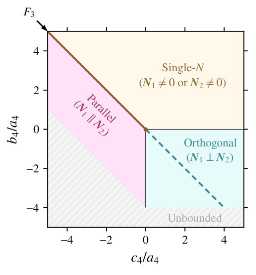 
FIG. 1. Phase diagram for the Landau theories with an order param- eter transforming as a two-dimensional irrep with 𝑎2 &lt; 0 and 𝑎4 &gt; 0. For the non-cyclic tetragonal point groups there are two independent parameters 𝑏4 and 𝑐4 and three distinct phases: the single-𝑁phase (only one of 𝑵1, 𝑵2 non-zero), the parallel phase (𝑵1∥𝑵2) and the or- thogonal phase (𝑵1 ⊥𝑵2). For the cyclic tetragonal groups 4, 4, and 4/𝑚, the general quartic free energy contains an additional mixed in- variant (see text). In the parallel and orthogonal phases |𝑵1| = |𝑵2|. For the trigonal, hexagonal or cubic point groups, symmetry forces 𝑏4 = −𝑐4, indicated by the diagonal line labeled 𝐹3. There are two phases: a...

📷 Fig 2

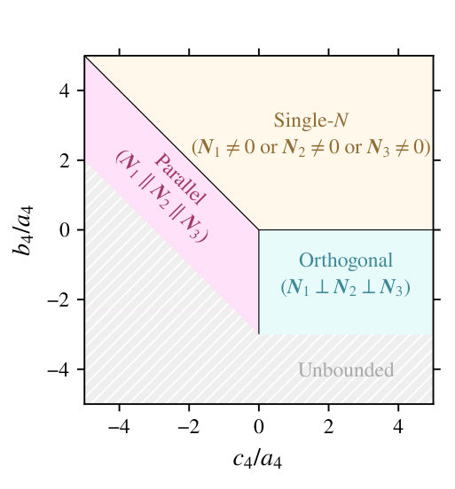 
FIG. 2. Phase diagram for the Landau theories with an order parameter transforming as a three-dimensional irrep with 𝑎2 &lt; 0 and 𝑎4 &gt; 0. There are two independent parameters 𝑏4 and 𝑐4 and three distinct phases: the single-𝑁phase (only one of 𝑵1, 𝑵2, 𝑵3 non-zero), the parallel phase (𝑵1∥𝑵2∥𝑵3) and the orthogonal phase (𝑵1 ⊥𝑵2 ⊥𝑵3). In the parallel and orthogonal phases the magni- tudes of each vector are equal, |𝑵1| = |𝑵2| = |𝑵3|.

📷 Fig 3

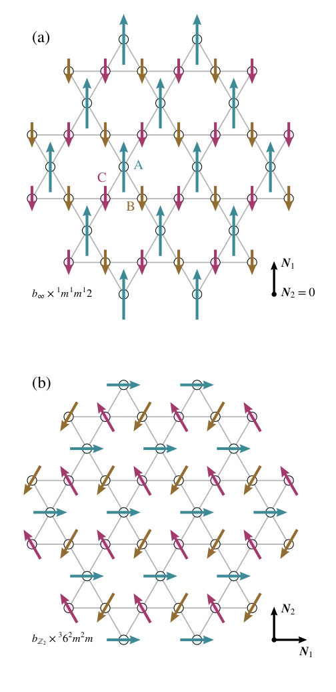 
FIG. 3. Illustration of two magnetic orders in the phase diagram of Fig. 1 (on the 𝐹3 line) on the kagom´e lattice. (a) Collinear phase, corresponding to the single-𝑁phase with 𝑵1 = 𝑁ˆ𝒚and 𝑵2 = 0. (b) Coplanar 120◦phase, corresponding to the orthogonal phase with 𝑵1 = √︁

📷 Fig 4

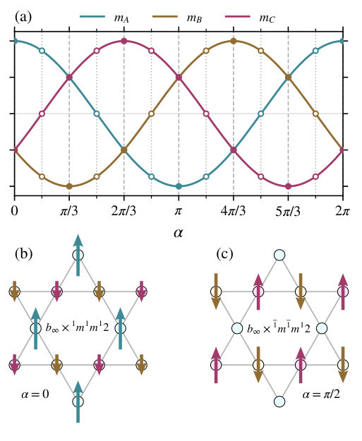 
FIG. 4. Illustration of the degenerate collinear phases of the 𝐸2 order on the kagom´e lattice, parameterized by the angle 𝛼[Eq. (19)]. (a) The magnetic moments are compensated (at linear order) and collinear, and we show the modulation of the signed moments 𝑚𝐴≡ 𝒎𝐴· ˆ𝑵, 𝑚𝐵≡𝒎𝐵· ˆ𝑵, 𝑚𝐶≡𝒎𝐶· ˆ𝑵. (b),(c) We show two high- symmetry states at 𝛼= 0 (𝑵1 ≠0, 𝑵2 = 0) and 𝛼= 𝜋/2 (𝑵1 = 0, 𝑵2 ≠0) with epikernels 𝑏∞×1𝑚1𝑚12 and 𝑏∞× ¯1𝑚¯1𝑚12 respectively. Generic values of 𝛼have epikernel 𝑏∞× 12. We indicate 𝛼values equivalent to 𝛼= 0 in (a) by filled circles, and equivalent to 𝛼= 𝜋/2 by open circles.

📷 Fig 5

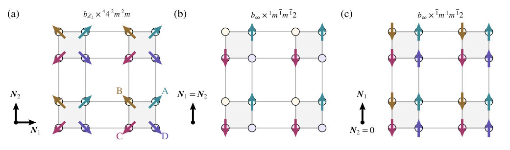 
FIG. 5. Three magnetic orders in the phase diagram of Fig. 1 for the square plaquette lattice, with 𝐴, 𝐵, 𝐶, 𝐷sublattices. (a) Orthogonal phase, 𝑵1 = 2 √

**Summary.** This work establishes a comprehensive Landau theory framework for non-relativistic magnetism, generalizing previous work to handle complex coplanar and non-coplanar magnetic orders. By constructing symmetry-allowed free energies, the authors provide a direct, rigorous link between Landau theory and the spin space group approach. This allows for detailed predictions of magnetic observables across various crystal symmetries.

**Why it may be interesting.** While focused on magnetism, the rigorous application of symmetry constraints (group theory) to derive effective Hamiltonians and predict phase transitions is a powerful general technique applicable to any strongly correlated system where symmetry breaking is key.

Detailed structure

**Main problem.** The paper develops phenomenological Landau theories to describe magnetic phase transitions in non-relativistic magnetic systems, extending the analysis from simple collinear orders to complex coplanar and non-coplanar arrangements.

**Main result.** The theory predicts two main outcomes: a collapse to a lower-symmetry collinear phase, or a genuinely orthogonal coplanar/non-coplanar order that directly links the Landau theory framework to the spin space group classification.

**Method.** The core method involves constructing symmetry-allowed free energies up to quartic order using group theory, analyzing how the free energy depends on the dimensionality of the order parameter's irreducible representation.

**Model / system.** The study focuses on non-relativistic magnetic systems exhibiting zero-wavevector (k=0) magnetic orders, treating the magnetic state via order parameters transforming according to irreducible representations of the crystallographic point group.

**Key observables.** Net magnetization, spin conductivity, multipolar moments, and piezomagnetism.

**Important parameters / regimes.** Zero-wavevector (k=0) magnetic orders; tetragonal, trigonal/hexagonal, and cubic symmetries.

**Assumptions / limitations.** The analysis assumes the system is near a continuous phase transition, allowing for a low-order polynomial expansion of the free energy, and focuses on single irreducible representations of the point group.

**Figures summary.** The notes do not describe specific figures, but mention the use of symmetry-adapted tensors (Table XI) to constrain the free energy expansion terms.

**Paper structure.** The paper is structured logically, starting with the general Landau problems and epikernels, moving to multi-dimensional Landau theories, detailing the orthogonal orders, providing specific examples (Kagomäe, pyrochlore), calculating observables, and finally connecting to related physical systems.

Abstract

In this work we study phenomenological Landau theories of non-relativistic magnetic systems, generalizing work on the collinear case to coplanar and non-coplanar orders. Focusing on zero-wavevector ($\boldsymbol{k}=0$) magnetic orders described by a single irreducible representation of the crystallographic point group, we construct the symmetry-allowed free energies to quartic order for all possible multi-dimensional irreducible ordering channels. We find distinct Landau theories for tetragonal, trigonal/hexagonal, and cubic symmetry. Similar to the case of spin-nematic fluids, we find two natural outcomes: a collapse to a lower-symmetry collinear phase or a genuinely coplanar or non-coplanar order where the order parameters form a mutually orthogonal set in spin space -- reminiscent of the $A$ and $B$ phases in ${}^3$He. We show in general that this symmetry-broken phase realizes the spin space group associated with the spatial representation of the order parameter sharing the same parent space group as the paramagnetic phase. This provides a direct link between the Landau and spin space group approaches. We calculate key observables using this Landau approach, including net magnetization, spin conductivity, multipolar moments, and piezomagnetism, connecting our results to constraints from the underlying spin space group. Examples of coplanar and non-coplanar magnetic orders for each case are worked out in detail. Finally, we discuss the relationship of the lower-symmetry collinear phases to the usual collinear spin groups, as well as connections to atomic altermagnetism, superfluid ${}^3$He and electronic nematic phases.

[↑ back to top](#top)

### [Multiorbital Anisotropy and Magnetic Excitations in Trilayer Nickelate Pr$_4$Ni$_3$O$_{10}$](http://arxiv.org/abs/2610.09210v1)

**Authors:** Ziqiang Guan, Sophia F. R. TenHuisen, Xuefei Guo, Wei He, Aulden K. Jones, Marli dos Reis Cantarino, Xinglong Chen, Hong Zheng, J. F. Mitchell, Nicholas B. Brookes, Mark P. M. Dean, Matteo Mitrano  
**Type:** both · **Category:** strongly correlated electrons · **PDF:** <https://arxiv.org/pdf/2610.09210v1>  
**Analysis basis:** full PDF text, analyzed in chunks

📷 Fig 1

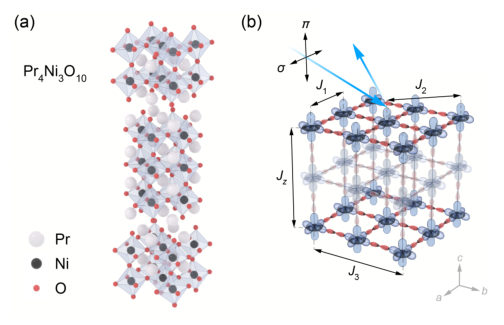 
FIG. 1. (Color online) Crystal structure and magnetic in- teractions in Pr4Ni3O10. (a) Crystal structure of Pr4Ni3O10, comprising trilayer blocks of corner-sharing NiO6 octahedra separated by Pr–O rock-salt layers. Pr, Ni, and O atoms are shown in light gray, black, and red, respectively. (b) Effec- tive magnetic-interaction model and RIXS scattering geom- etry. The in-plane interactions J1, J2, and J3 connect first- , second-, and third-neighbor Ni sites, respectively, within the outer layers carrying the ordered moment, while Jz de- notes the effective coupling between the two outer-layer SDW components. The transparent inner layer denotes suppressed magnetic moments. Blue arrows indicate...

📷 Fig 2

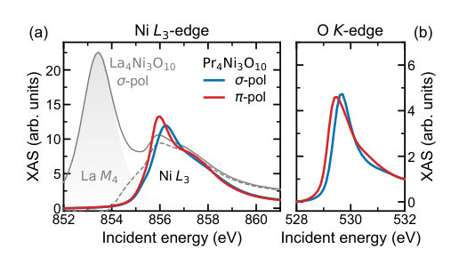 
FIG. 2. (Color online) Polarization-dependent x-ray absorp- tion spectra of Pr4Ni3O10. (a) Ni L3-edge XAS measured with σ- (blue) and π-polarized (red) incident x-rays. The corresponding σ-polarized spectrum of La4Ni3O10 (solid gray line, from Ref.31) is shown for comparison. In the La com- pound, the La M4 absorption overlaps the low-energy side of the Ni L3 resonance, and the dashed gray curve shows the estimated Ni contribution after subtraction of the fitted La M4 background. (b) Polarization-dependent O K-edge XAS of Pr4Ni3O10. The energy shift and line-shape difference be- tween σ- and π-polarized pre-edge spectra reveal anisotropy of the unoccupied oxygen-hybridized states.

📷 Fig 3

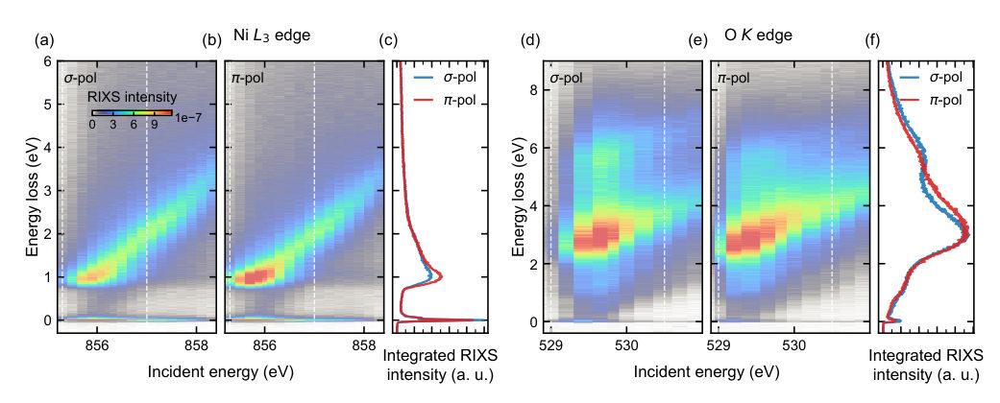 
FIG. 3. (Color online) Incident-energy and polarization dependence of the Ni L3- and O K-edge RIXS response. (a),(b) Ni L3-edge RIXS intensity as a function of incident energy and energy loss for σ- and π-polarized incident x-rays, respectively. (c) Corresponding energy-loss profiles integrated over the incident-energy ranges marked by the vertical dashed lines in (a) and (b). The broad dd excitation manifold near 1 eV is enhanced for π polarization, revealing a pronounced polarization dependence of the local Ni orbital excitations. (d),(e) O K-edge RIXS maps measured with σ- and π-polarized incident x-rays, respectively. (f) Corresponding incident-energy-integrated O K-edge RIXS profiles....

📷 Fig 4

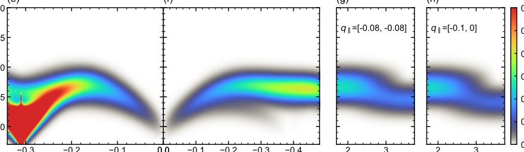 
FIG. 4. Magnetic-excitation dispersion and effective spin-wave model. (a)–(d) Elastic-line-subtracted Ni L3-edge RIXS intensity along (a) q∥= (H, H), (b) q∥= (H, 0), and the out-of-plane direction at fixed (c) q∥= (−0.08, −0.08) and (d) q∥= (−0.10, 0). Symbols show excitation energies extracted from fits to the individual spectra. Different symbols denote the two low-energy branches where both are resolved. Along (H, H), the excitations soften and spectral weight accumulates near the SDW wave vector H ≃−0.31 r.l.u. (e)–(h) Corresponding dynamical magnetic response calculated using linear spin-wave theory for the effective outer-layer SDW model in Fig. 1(b), evaluated along the experimental...

**Summary.** This work uses XAS and RIXS spectroscopy to characterize the electronic structure and magnetic excitations in the trilayer nickelate $	ext{Pr}_4	ext{Ni}_3	ext{O}_{10}$. By analyzing the magnetic response and fitting to spin-wave models, the authors determine that the magnetic interactions are governed by a balanced interplay between in-plane and interlayer couplings, establishing the multilayer architecture as the primary determinant of magnetic behavior.

**Why it may be interesting.** The detailed mapping of magnetic interactions using spectroscopic probes like RIXS provides quantitative insight into the underlying quantum magnetic Hamiltonian, which is crucial for understanding strongly correlated electron behavior in cuprate/nickelate superconductors.

Detailed structure

**Main problem.** The study aims to understand how the multilayer nickelate architecture controls electronic and magnetic interactions in $	ext{Pr}_4	ext{Ni}_3	ext{O}_{10}$, particularly how rare-earth substitution affects these magnetic couplings.

**Main result.** The magnetic interactions are governed by a balanced network of significant in-plane and interlayer couplings, suggesting the multilayer structure, rather than rare-earth substitution alone, is the key control knob.

**Method.** The research combines advanced experimental techniques (XAS and polarization-dependent RIXS) with theoretical modeling (Spin-Wave Analysis and fitting to various Hamiltonian models).

**Model / system.** The system is the trilayer Ruddlesden-Popper nickelate $	ext{Pr}_4	ext{Ni}_3	ext{O}_{10}$. The analysis models the magnetic interactions using effective exchange couplings ($J_1, J_2, J_3, J_z$) within a spin-wave framework.

**Key observables.** Dispersive magnetic excitations, orbital hybridization channels (planar vs. out-of-plane), and effective exchange couplings ($J_1, J_2, J_3, J_z$).

**Important parameters / regimes.** Exchange couplings are found to be in the $\sim 10-16 	ext{ meV}$ range, indicating a balanced magnetic network.

**Assumptions / limitations.** The conventional Linear Spin-Wave Theory (LSWT) is favored as the most direct quantitative description, although comparisons with entangled-dimer and stripe-dimer models were made.

**Figures summary.** Figures illustrate the crystal structure and effective magnetic interaction model, while RIXS maps show the momentum and energy dependence of the magnetic response.

**Paper structure.** The paper first uses XAS/RIXS to map the multiorbital electronic structure and anisotropy. It then uses momentum-resolved RIXS to identify dispersive magnetic excitations softening toward the SDW wave vector. Finally, it employs spin-wave analysis and fitting to various Hamiltonian models to quantify the exchange couplings.

Abstract

Rare-earth substitution strongly modifies the structure, metallicity, and superconducting behavior of Ruddlesden-Popper (RP) nickelates, but its impact on their magnetic interactions remains unclear. Here, we combine x-ray absorption spectroscopy (XAS) and resonant inelastic x-ray scattering (RIXS) to resolve the multiorbital electronic structure and magnetic excitations of Pr$_4$Ni$_3$O$_{10}$. The absence of an overlapping rare-earth resonance provides direct access to the Ni $L_3$ edge, while polarization-dependent measurements at the Ni $L$- and O $K$-edges resolve distinct planar and out-of-plane Ni-O hybridization channels. Momentum-resolved RIXS reveals dispersive magnetic excitations that soften toward the incommensurate spin-density-wave wave vector. An effective spin-wave analysis yields a sizable intra-trilayer exchange coupling, comparable to the leading in-plane interactions and robust against rare-earth substitution. Our results identify the multilayer architecture, rather than rare-earth substitution alone, as a key control knob of the magnetic interactions in these materials.

[↑ back to top](#top)

### [On the Expressive Power and Capacity of Quantum Data Reuploaders](http://arxiv.org/abs/2610.09947v1)

**Authors:** Lord Sen, Shyamapada Mukherjee  
**Type:** both · **Category:** quantum information and computing · **PDF:** <https://arxiv.org/pdf/2610.09947v1>  
**Analysis basis:** full PDF text, analyzed in chunks

📷 Fig 1

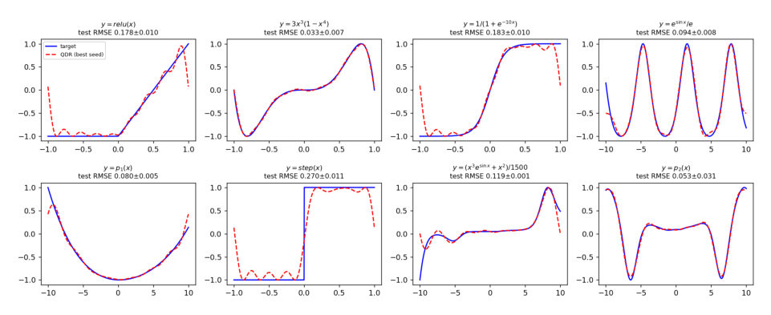 
Fig. 1: Univariate targets (blue) and the QDR fit (red dashed, best of 5 seeds) for a 27-parameter QDR with the default encoding (σ = 1), 400 epochs. Targets are normalised to [−1, 1]; the test RMSE shown is mean±std over seeds.

📷 Fig 2

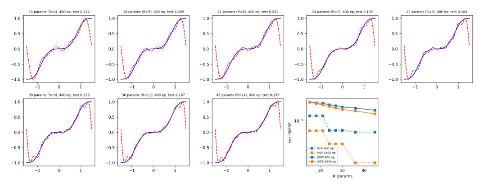 
Fig. 2: tanh  x3 target (blue) and QDR fits (red dashed, best seed) for 15–45 parameters, all trained for 400 epochs with σ = 1 (test RMSE in the panel titles; last two panels: test RMSE versus P at 400 and 1600 epochs for the QDR and the matched MLP).

📷 Fig 3

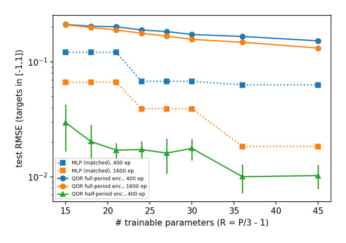 
Fig. 3: Test RMSE versus number of parameters for tanh  x3 (mean±std over 5 seeds, log scale): QDR with σ = 1 at 400 and 1600 epochs, QDR with σ = 0.5, and matched MLPs.

📷 Fig 4

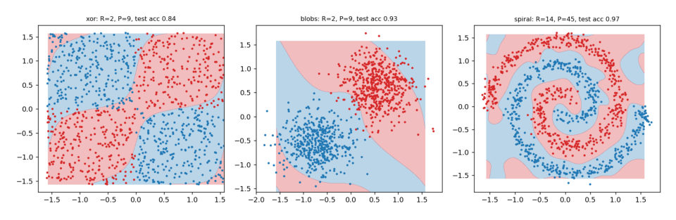 
Fig. 4: Decision regions of the best-of-5 QDR (σ = 1) on the test points: XOR (P = 9), Gaussian blobs (P = 9) and spiral (P = 45).

**Summary.** This paper provides a deep theoretical and experimental analysis of Quantum Data Reuploaders (QDRs), characterizing their achievable frequency spectrum using Fourier analysis. It derives capacity bounds based on this spectrum size and compares QDR performance against classical MLPs on various function approximation and classification tasks. The findings highlight that while QDRs have a theoretically structured capacity, their practical performance is highly sensitive to input scaling and dimensionality.

**Why it may be interesting.** This work provides rigorous mathematical tools (Fourier analysis, sumsets) to quantify the limitations of quantum circuit depth in approximating classical functions, which is crucial for understanding the practical utility of variational quantum algorithms.

Detailed structure

**Main problem.** The paper investigates the expressive power and capacity of Quantum Data Reuploaders (QDRs), a specific architecture for Quantum Neural Networks (QNNs). It aims to characterize how the structure of the quantum circuit limits the functions it can approximate.

**Main result.** The accessible frequency spectrum of QDRs grows polynomially with the reuploading depth $R$, leading to a capacity bound proportional to $\sqrt{|KR|/n}$. Experimentally, QDRs perform well on certain tasks but are limited in multivariate regression compared to MLPs.

**Method.** The analysis relies heavily on Fourier theory, mapping the quantum circuit output to a finite Fourier series whose frequency set $KR$ is characterized using sumsets and word length metrics on an integer lattice.

**Model / system.** The model is the QDR architecture, $U(	heta, x) = W_{R+1}V(x)W_R(	heta) \cdots W_1$, where $V(x)$ encodes classical data $x$. The analysis is performed on the resulting output function $f_	heta(x)$, which is a finite Fourier series.

**Key observables.** Test Root Mean Square Error (RMSE) for regression tasks (e.g., $	anh(x^3/3)$) and classification accuracy for tasks like XOR and spirals.

**Important parameters / regimes.** The reuploading depth $R$, the input scale $\sigma$, the number of qubits $n$, and the number of trainable parameters $P$.

**Assumptions / limitations.** The analysis assumes the encoding $V(x)$ has a finite phase decomposition, and the theoretical bounds rely on the structure of the frequency set $KR$.

**Figures summary.** Figures compare the test RMSE of QDRs versus matched MLPs across various targets (ReLU, sigmoid, $	anh(x^3/3)$) and show decision boundaries for classification tasks.

**Paper structure.** The paper first establishes the theoretical characterization of the frequency spectrum $KR$ using Fourier analysis. It then derives capacity bounds based on the size of this spectrum. Finally, it presents extensive experiments comparing QDR performance against MLPs on regression and classification tasks.

Abstract

Data reuploading---repeatedly encoding classical inputs at multiple layers of a parameterized quantum circuit---is a central mechanism for enhancing the expressivity of quantum neural networks (QNNs). Building on the Fourier-theoretic framework of Schuld et al.~\cite{schuld2021fourier}, we study the frequency spectrum of the general multivariate, $R$-reupload architecture (QDR). (i) We make explicit that the accessible frequencies form the set $K_R=S^{(R)}-S^{(R)}$, which equals the $R$-fold sumset $T^{(R)}$ of the difference set $T=S-S$ of the encoding spectrum, and we characterise it exactly: $K_R=\{k\in\mathcal L:\ \ell_T(k)\le R\}$, where $\mathcal L=\mathrm{span}_{\mathbb Z}(T)$ is an integer lattice and $\ell_T$ is word length in $T$. (ii) We show that the \emph{directions} of the spectrum stabilise already at $R=1$ (the real span of $K_R$ equals that of $\mathcal L$), whereas the spectrum itself never saturates: the maximal frequency grows linearly in $R$ and the number of frequencies grows polynomially, as $Θ(R^{m})$ with $m=\mathrm{rank}\,\mathcal L$. (iii) Using the spectrum size, we give a Rademacher-complexity bound on the capacity of QDRs of order $\sqrt{|K_R|/n}$. (iv) We report experiments on function approximation and classification with train/test splits, several seeds and parameter-matched classical baselines. The simulated spectra match the theory exactly. A single-qubit QDR beats a matched MLP on several smooth or periodic univariate targets and on the spiral task, but it is clearly worse on multivariate regression ($d\ge4$), where it is highly sensitive to the input-encoding scale; it beats the MLP only on equations with $d\le3$ inputs.

[↑ back to top](#top)

### [Physics-Aligned Electronic Ground-State Learning Improves Generalization](http://arxiv.org/abs/2610.10298v1)

**Authors:** Eike S. Eberhard, Xaver Kainz, Viktor Kotsev, Abdulrahman Aldossary, Stephan Günnemann  
**Type:** theory · **Category:** disordered systems and neural networks · **PDF:** <https://arxiv.org/pdf/2610.10298v1>  
**Analysis basis:** full PDF text, analyzed in chunks

📷 Fig 1

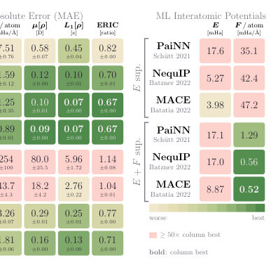 
Figure 1: GSM size extrapolation from QM9 to molecules up to 4× larger QM40 molecules. The GROOT models generalize robustly, reaching errors below half chemical accuracy (∼0.8 mHa) on 98% of the tested molecules. All observables are computed at a budget of exactly one Fock build averaged over 3 training seeds each. The GROOT variants are the best performing models for almost all observables except for the Kohn–Sham (self-consistency) energy where ROCKET is best. NequIP and MACE trained on forces still outperform even the best GSMs on forces, but physically aligned GSMs achieve an order of magnitude better energies compared to all trained MLIPs.

📷 Fig 2

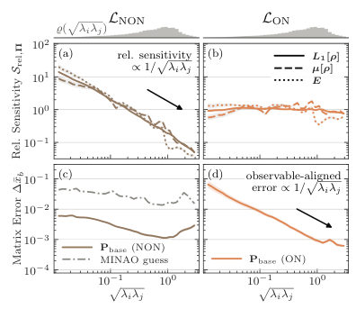 
Figure 2: ON-Loss is "observable-isotropic" and improves size extrapolation. (a,b,c,d) Values log-binned by p

📷 Fig 3

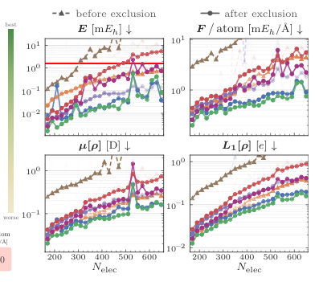 
Figure 3: GROOT and ROCKET show robust extrapolation, and can be equipped with GSMs-specific error indicators (Tab.28). GSMs and MLIPs trained on QMugs molecules with at most 150 electrons and evaluated on systems with up to 660 electrons. The table shows the fraction of molecules rejected by the self-consistency criterion and the observable errors of the remaining molecules, with the MAE including the rejected predictions in brackets below. Compared to linear scaling MLIPs like PaiNN (Schütt et al., 2021), NequIP (Batzner et al., 2022), and MACE (Batatia et al., 2022) trained on energies only (meaning at equal reference compute budget), GROOTproj achieves an order of magnitude better...

📷 Fig 4

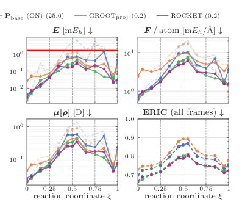 
Figure 4: Beyond size extrapolation: generalization across conformations and label-free adaptation to new chemistry. QMugs-trained models generalize to the β = 120◦cut of the 3BPA backbone-dihedral energy surface (left panel, Tab.29): the ground truth (α, γ) energy-surface, and the energy deviations of GSMs, with median (MAE-optimal) constant offset removed per model. Label-free self-consistency training (SCT) on Transition1x. The upper-right panel shows the validation loss against the self-consistency residual over 0, 2, 4, and 6 epochs of cosine-annealed SCT, suggesting that shorter training budgets might be feasible. The observable MAEs are resolved along the reaction coordinate ξ, with...

📷 Fig 5

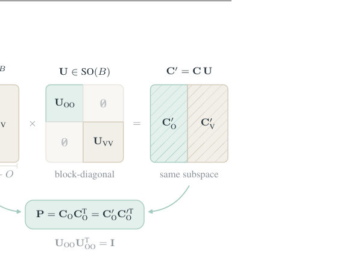 
Figure 5: Many coefficient matrices, one density. (a) The smallest case, B = 3 and O = 2: the occupied orbitals c1, c2 span a plane which determines the density. Rotating the arrows within the plane by UOO changes the orbitals, but not the plane. (b) For arbitrary O, B ∈N with O &lt; B. The coefficients C ∈RB×B split into an occupied block CO ∈RB×O and a virtual block CV ∈RB×V . Only the occupied block determines the density matrix as seen in Eq.(2). Multiplication from the right by a block-diagonal orthogonal matrix U does not change the density matrix, see Eq.(5).

**Summary.** This paper introduces advanced machine-learned descriptor models designed to predict electronic ground states by embedding the physical constraints of Kohn-Sham DFT directly into the loss functions. By enforcing mathematical rules like orthonormality and manifold membership, the models achieve superior generalization and accuracy, significantly outperforming prior state-of-the-art methods in predicting molecular properties.

**Why it may be interesting.** This work directly addresses the integration of deep learning into quantum chemistry, providing mathematically rigorous methods to ensure that ML predictions respect fundamental physical laws, which is crucial for reliable simulations in AMO physics.

Detailed structure

**Main problem.** The primary challenge is accelerating the accurate prediction of electronic ground states for molecules and materials while ensuring the predictions remain physically valid and generalize well beyond the training data.

**Main result.** The proposed descriptor models, incorporating physical constraints like orthonormal loss (ON-Loss) and manifold projection (GROOT/ROCKET), significantly reduce energy and force errors (up to 99.8% reduction) compared to previous state-of-the-art methods.

**Method.** The authors develop and apply specialized machine learning architectures (GSMs) that are explicitly aligned with the governing equations of Kohn-Sham DFT by enforcing physical constraints during training.

**Model / system.** The system is the electronic ground state of molecules/materials, governed by the Kohn-Sham DFT equations. The ML models predict descriptors (like the density matrix or Hamiltonian) that must satisfy physical constraints, such as belonging to the Grassmann manifold.

**Key observables.** Energy (E) and Force (F) Mean Absolute Error (MAE); convergence speed (ERIC); and the ability to maintain accuracy below chemical accuracy ($\sim 0.8$ mHa).

**Important parameters / regimes.** The comparison involves size extrapolation (QM9 to QM40) and testing on out-of-distribution molecules (QMugs).

**Assumptions / limitations.** The core assumption is that by enforcing physical constraints derived from the underlying quantum mechanics (e.g., idempotency, orthonormality), ML models can overcome the limitations of standard supervised learning on electronic structure data.

**Figures summary.** The notes indicate comparisons across multiple tables showing MAE reductions for various models (Pbase, GROOTrot, ROCKET) across different generalization tests (size extrapolation, self-consistency fine-tuning).

**Paper structure.** The paper systematically introduces the limitations of current ML potentials, proposes physically constrained descriptor models (GSMs) using novel loss functions (ON-Loss, GROOT, ROCKET), and validates these methods through rigorous testing on size extrapolation and self-consistency refinement.

Abstract

Machine-learned interatomic potentials (MLIPs) excel at in-distribution tasks, accelerating drug and material development, yet they struggle to generalize out-of-distribution. We propose to push the cost-accuracy Pareto frontier by designing observable-agnostic electronic ground-state descriptor models (GSMs) with computational costs situated between MLIPs and Kohn-Sham density functional theory (KS-DFT). We align the learning objectives and architectures of GSMs with the governing equations of KS-DFT by enforcing physical constraints and removing optimization pressure on unphysical or irrelevant degrees of freedom. In our size-extrapolation experiments from QM9 to QM40, our combined contributions OrthoNormal-Loss (ON-Loss) and Grassmann Restricted Occupied-Orbital Training (GROOT) reach a 79.1% energy and 83.4% force mean absolute error (MAE) reduction over previous state-of-the-art density GSMs. For Hamiltonian GSMs, ON-Loss and Residual Optimal-gauge Conditioning-aware KS-Eq. Training (ROCKET) together reduce the energy and force MAEs of the strongest baseline by 99.8% and 95.9%, respectively. Using a self-consistency rejection criterion, we filter out extrapolation errors on QMugs, rejecting fewer than 0.4% of predictions while reaching an energy MAE of 0.07 mHa. Finally, we demonstrate the efficiency of label-free self-consistency fine-tuning, and transfer GSMs to reactive chemistry in Transition1x, reaching energy errors below chemical accuracy.

[↑ back to top](#top)

### [Quantum Approximation Complexity of Classical Optimization Problems](http://arxiv.org/abs/2610.09584v1)

**Authors:** Stuart Hadfield  
**Type:** theory · **Category:** quantum information and computing · **PDF:** <https://arxiv.org/pdf/2610.09584v1>  
**Analysis basis:** full PDF text, analyzed in chunks

📷 Fig 1

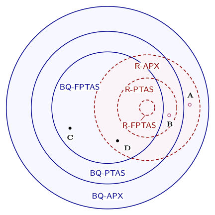 
FIG. 1. Schematic class inclusions with four markers for five example problems. Solid blue circles show quantum classes and dashed red circles randomized classical classes. At each level, the deterministic class APX, PTAS, or FPTAS is contained in its randomized and quantum counterparts. The deterministic boundaries are not drawn separately. Open markers A and B have deterministic approximation algorithms; filled markers C and D mark conditional quantum–classical ratio separations. Under NP ⊈BQP, Max-E3SAT and MaxCut share marker A in R-APX \ BQ-PTAS, while Planar Vertex Cover occupies marker B in R-PTAS \ BQ-FPTAS [4–6]. Marker C (CMO) lies in BQ-FPTAS \ R-APX if Factor /∈FBPP, and is even...

**Summary.** This paper rigorously defines quantum complexity classes for approximating solutions to classical optimization problems. It establishes a strict hierarchy among these quantum classes, demonstrating that quantum computation can yield provable worst-case improvements over classical algorithms for certain problems, provided that $	ext{NP} 
ot\subseteq 	ext{BQP}$.

**Why it may be interesting.** While not directly about AMO physics, the rigorous framework for quantifying computational advantage (quantum vs. classical) is foundational for understanding the limits of quantum simulation and computation in physical systems.

Detailed structure

**Main problem.** The paper investigates the quantum approximation complexity of classical optimization problems, aiming to determine the best solution quality achievable using quantum computation compared to classical methods.

**Main result.** Under the assumption that NP is not contained in BQP, the quantum complexity classes form a strict hierarchy (BQ-FPTAS $\subsetneq$ BQ-PTAS $\subsetneq$ BQ-APX), and quantum computation can provide worst-case improvements over classical guarantees for certain problems.

**Method.** The authors define quantum counterparts to classical approximation classes (BQ-APX, BQ-PTAS, BQ-FPTAS) and use conditional separations based on the hardness of problems like factoring and discrete logarithms to establish these theoretical gaps.

**Model / system.** The analysis is purely theoretical, focusing on computational complexity classes (APX, PTAS, etc.) and the computational power of quantum algorithms (BQP) applied to classical optimization problems.

**Key observables.** Approximation ratios ($\alpha, 
ho$), success probability (fixed at $\ge 2/3$), and the relationship between the expected score and the guaranteed output ratio.

**Important parameters / regimes.** The complexity assumptions, notably $	ext{NP} 
ot\subseteq 	ext{BQP}$, and the specific approximation factors (e.g., one-half for DLog-Fit).

**Assumptions / limitations.** The entire framework relies on the assumption that $	ext{NP} 
ot\subseteq 	ext{BQP}$, and the analysis for specific problems assumes the hardness of factoring or discrete logarithms.

**Figures summary.** Figure 1 schematically illustrates the inclusion relationships between various approximation classes for several example problems (A-D).

**Paper structure.** The paper first defines the quantum approximation complexity classes, then establishes the hierarchy relationships, and finally proves conditional separations using specific number-theoretic problems (like factoring and discrete logarithms) to demonstrate quantum advantages.

Abstract

Classical approximation complexity asks what solution quality can be guaranteed with polynomial-time computation. The classes APX, PTAS, and FPTAS distinguish a fixed approximation ratio, approximation to any fixed accuracy, and approximation schemes whose running time is also polynomial in inverse accuracy. Their randomized counterparts are R-APX, R-PTAS, and R-FPTAS. We define bounded-error quantum counterparts BQ-APX, BQ-PTAS, and BQ-FPTAS. Membership requires a uniform quantum algorithm that, on every input, returns a feasible classical solution achieving at least the claimed approximation ratio with probability at least 2/3. Scores (objective values) must be efficiently classically computable. Running time includes parameter selection, preparation, measurement, decoding, and repetition. Many quantum optimization methods are used heuristically, and high benchmark scores alone do not establish these guarantees. We further establish a conditional hierarchy for logarithmic, polynomial, and exponential approximation factors.   Assuming NP $\nsubseteq$ BQP, the quantum classes form a strict hierarchy. Problems based on prime factorization and discrete logarithms give conditional quantum-classical separations. Certified Maximum Order has an exact quantum algorithm, while any randomized polynomial-time algorithm guaranteeing at least an inverse-polynomial approximation ratio on every input would yield efficient factoring. Discrete-Logarithm Fitting has an exact quantum algorithm and a deterministic one-half approximation, but any fixed improvement over one half would give a randomized polynomial-time algorithm for the safe-prime discrete logarithm problem. Our results show, under explicit complexity assumptions, that quantum computation can improve worst-case approximation guarantees. A quantum-classical gap for common problems such as MaxCut or MaxSAT remains open.

[↑ back to top](#top)

### [Sample-based quantum simulation of vibrational structure of polyyne chains](http://arxiv.org/abs/2610.09616v1)

**Authors:** Sarah Mostame, Tanvi P. Gujarati, Alberto Baiardi, Abhijit Mitra, Dimitar Trenev, Sumathy Raman  
**Type:** theory · **Category:** other · **PDF:** <https://arxiv.org/pdf/2610.09616v1>  
**Analysis basis:** full PDF text, analyzed in chunks

📷 Fig 1

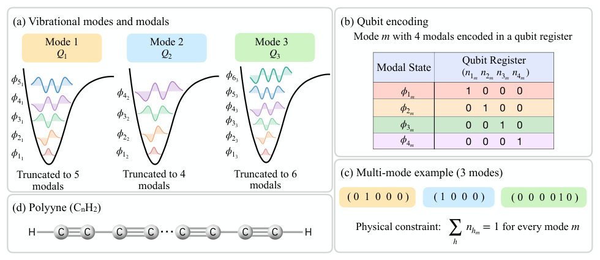 
FIG. 1. Modal representation and unary qubit encoding of the vibrational Hamiltonian. (a) Each vibrational mode Ql is represented by a truncated set of mode-specific basis functions (modals), with the number of retained modals allowed to vary between modes. (b) In the unary encoding, each modal is mapped to one qubit within the register associated with a given vibrational mode. (c) A physical multi-mode configuration is formed from the tensor product of the mode registers and satisfies the constraint P

📷 Fig 2

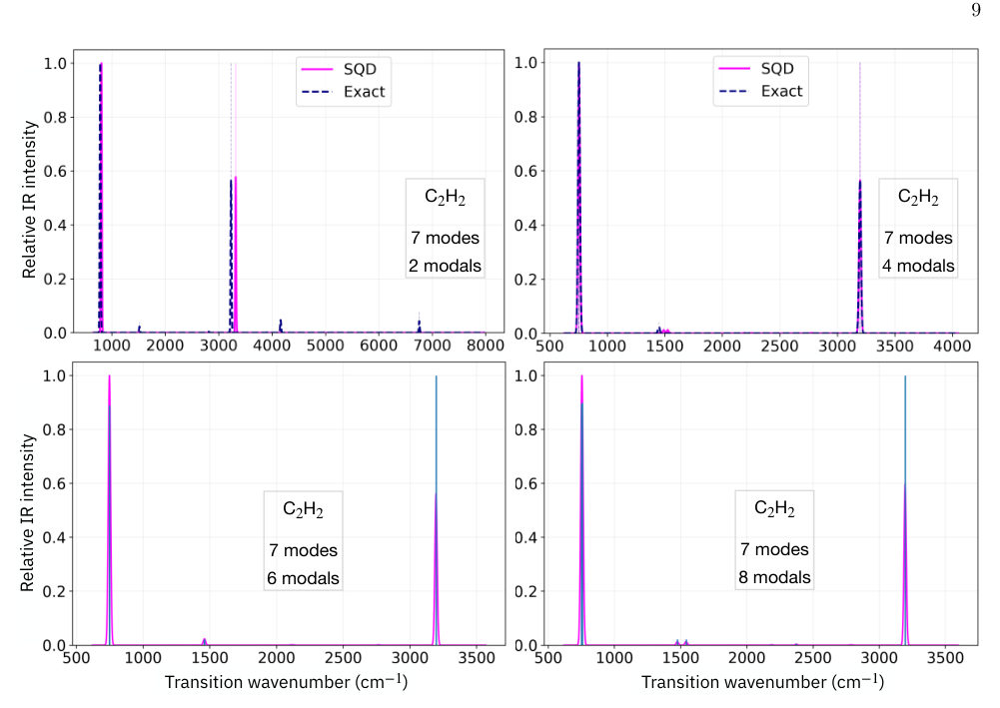 
FIG. 2. Relative IR spectra are presented based on the 0 →m transition dipole moments for C2H2, with m being up to 99 (ground state and 99 excited states), using the eigen-states obtained from SQD procedure applied on samples measured from the vib-LUCJ circuits. In the top row, we compare the SQD result with the result obtained from exact diagonalization of the corresponding Hamiltonian.

📷 Fig 3

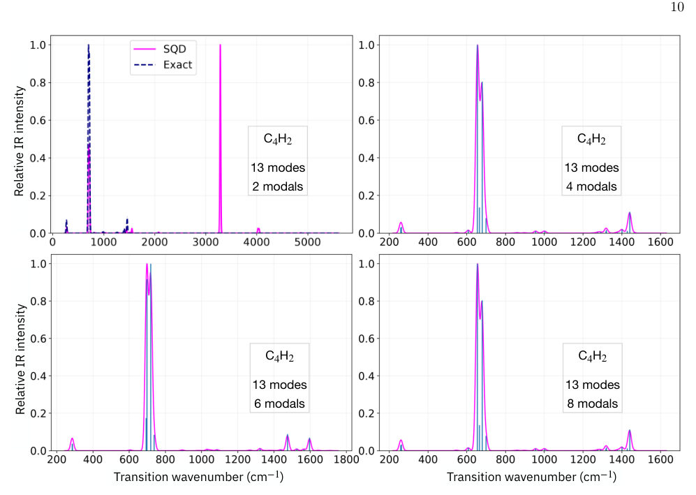 
FIG. 3. Relative IR spectra are presented based on the 0 →m transition dipole moments for C4H2, with m being up to 99 (ground state and 99 excited states), using the eigen-states obtained from SQD procedure applied on samples measured from the vib-LUCJ circuits. In the top-left panel, we compare the SQD result with the result obtained from exact diagonalization of the corresponding 2 modal Hamiltonian.

📷 Fig 4

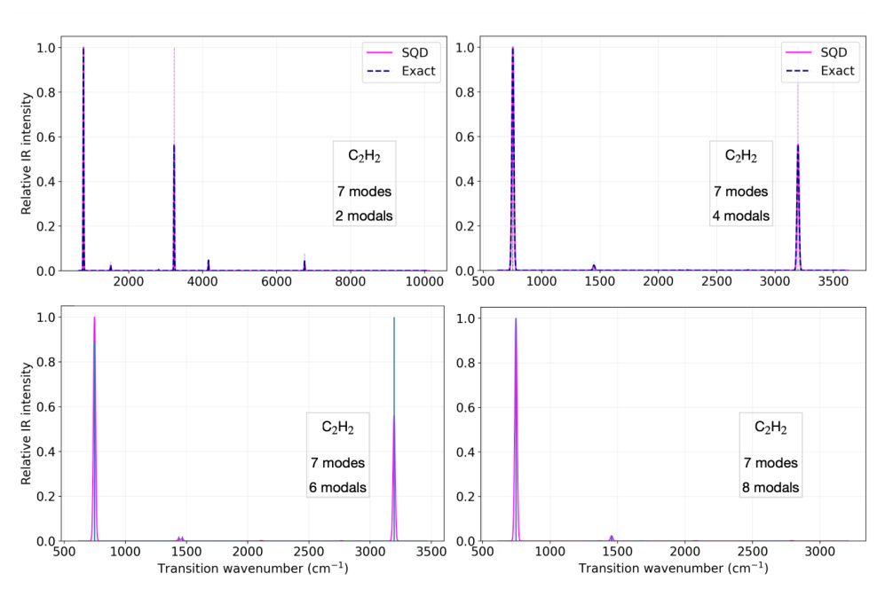 
FIG. 4. Relative IR spectra are presented based on the 0 →m transition dipole moments for C2H2, with m being up to 49 (ground state and 49 excited states), using the eigen-states obtained from SQD procedure applied on samples measured from the vib-SqDRIFT circuits. Results obtained for the lowest ground state energy were used. In the top row, we compare the SQD result with the result obtained from exact diagonalization of the corresponding modal Hamiltonians.

📷 Fig 5

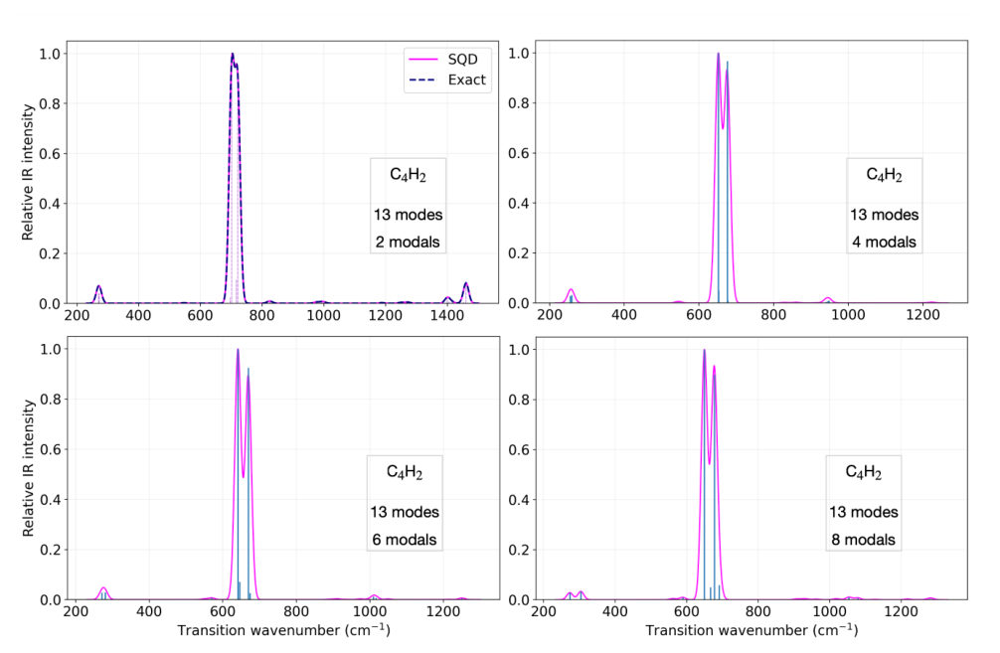 
FIG. 5. Relative IR spectra are presented based on the 0 →m transition dipole moments for C4H2, with m being up to 49 (ground state and 49 excited states), using the eigen-states obtained from SQD procedure applied on samples measured from the vib-SqDRIFT circuits. Results obtained for the lowest ground state energy were used. In the top-left panel, we compare the SQD result with the result obtained from exact diagonalization of the corresponding 2 modal Hamiltonians.

**Summary.** This paper introduces a Sample-based Quantum Diagonalization (SQD) method to calculate the complex anharmonic vibrational spectra of polyynes. By projecting the massive vibrational Hamiltonian onto a small, sampled subspace, the authors overcome the exponential scaling problem. The results demonstrate that this quantum approach can accurately predict both vibrational energies and sensitive spectroscopic details, like infrared intensities.

**Why it may be interesting.** This work directly addresses the simulation of molecular vibrations, a core topic in AMO physics, by developing a quantum algorithm to circumvent the exponential scaling inherent in full diagonalization of the vibrational Hamiltonian.

Detailed structure

**Main problem.** The core challenge is predicting anharmonic vibrational spectra, which is computationally infeasible due to the exponential growth of the Hilbert space with molecular size.

**Main result.** The sample-based quantum diagonalization (SQD) framework successfully computes vibrational energies and spectroscopic observables for polyynes in subspaces far smaller than the full theoretical space.

**Method.** The authors employ an end-to-end SQD framework combining quantum state preparation (using vib-LUCJ or vib-SqDRIFT ansatze), configuration recovery, and diagonalization projected onto a selected subspace.

**Model / system.** The study focuses on polyyne chains (C2H2 and C4H2) whose anharmonic vibrational Hamiltonian is modeled using a multi-mode expansion. The electronic structure calculations are based on DFT (B3LYP/def2-SVP).

**Key observables.** Vibrational energies, infrared spectra, and transition-dipole moments (which determine intensities and excited-state composition).

**Important parameters / regimes.** The system size is quantified by the Hilbert space dimension, which can reach $\approx 5.5 \times 10^{11}$ for C4H2.

**Assumptions / limitations.** The primary limitations noted are the need for systematic optimization of sampling parameters and the fact that spectroscopic observables are more sensitive than ground-state energies.

**Figures summary.** Figures illustrate the modal representation and qubit encoding. Other figures compare SQD results for transition dipole moments ($0 \to m$ transitions) against exact diagonalization for C2H2 and C4H2.

**Paper structure.** The paper first establishes the computational bottleneck of anharmonic spectra. It then details the SQD framework, comparing two sampling strategies (vib-LUCJ and vib-SqDRIFT) to calculate energies and, critically, transition-dipole moments, concluding with resource estimates for quantum implementation.

Abstract

Predicting anharmonic vibrational spectra is a complex computational task, which becomes quickly infeasible as molecular size and the number of vibrational basis functions increase, leading to an exponential growth of the underlying Hilbert space. Here, we employ a sample-based quantum diagonalization (SQD) framework to compute anharmonic vibrational energies and spectra. The approach combines quantum state preparation and sampling with configuration recovery, diagonalization of the Hamiltonian projected in a subspace of basis configurations, and calculation of transition-dipole moments to obtain both vibrational energies and infrared spectra. We investigate two approaches for sampling, namely, vib-LUCJ and vib-SqDRIFT and apply the method to study the polyyne molecules C$_2$H$_2$ and C$_4$H$_2$, reaching representations requiring up to 104 qubits. Beyond energies, transition-dipole calculations reveal that infrared intensities and excited-state composition continue to evolve with basis size through anharmonic mixing and intensity redistribution, even when low-energy eigenvalues appear converged. These results show that sample-based quantum subspace methods can capture spectroscopic information in vibrational spaces far beyond the regime of full diagonalization. Moreover, our simulation identify multi-state recovery and scalable projected-space treatment as central challenges for further scaling sample-based approaches.

[↑ back to top](#top)

### [Standard estimators cannot represent fault-tolerant workloads at measured error rates: evaluated, evidence-based uncertainty for quantum resource estimation](http://arxiv.org/abs/2610.10490v1)

**Authors:** Furqan Nasir, Sher Jeel Ahmad  
**Type:** theory · **Category:** quantum information and computing · **PDF:** <https://arxiv.org/pdf/2610.10490v1>  
**Analysis basis:** full PDF text, analyzed in chunks

📷 Fig 1

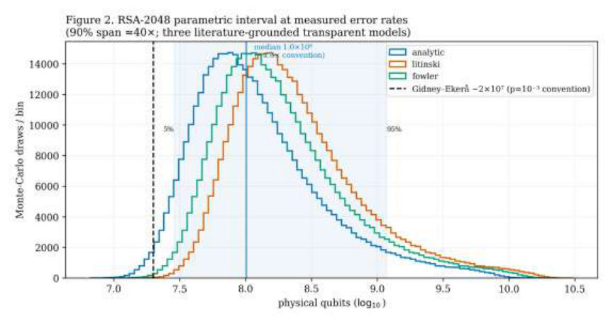 
Figure 1. RSA-2048 physical-qubit distributions under the evidence-based priors for the three transparent models. The 90% interval spans about forty times, and the median near 1.0 × 10⁸ sits roughly 4.6 times above the Gidney and Ekerå point of about 2 × 10⁷ computed at the conventional 10⁻³ planning error rate (dashed).

📷 Fig 2

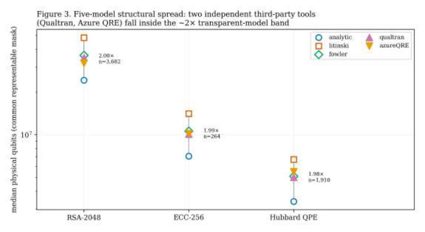 
Figure 2. Median physical qubits for all five models on the common representable mask. The two independent third-party tools (Qualtran, Azure QRE) fall inside the roughly twofold band set by the transparent models and agree with each other to within about ten percent. AES-256 is omitted because both tools censor all of its draws.

📷 Fig 3

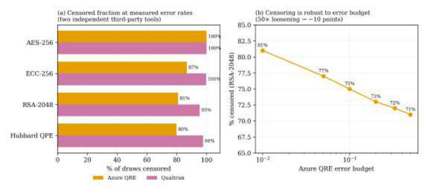 
Figure 3. (a) Fraction of evidence-based draws that exceed each tool’s representable envelope, for two independently built third-party tools. (b) For RSA-2048, the Azure censored fraction falls only from 81 to 71 percent as the error budget is loosened fifty times.

📷 Fig 4

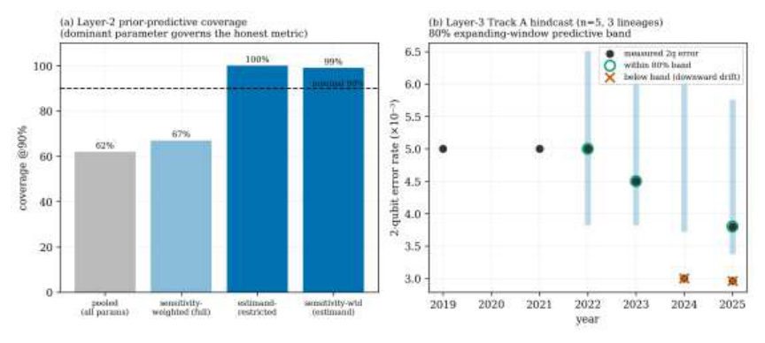 
Figure 4. (a) Layer-2 prior-predictive coverage at nominal 90 percent for four metrics, where the sensitivity-weighted metric, governed by the dominant parameter, reaches about 99 percent. (b) Layer-3 Track A expanding-window hindcast over five cases and three device lineages, with the 80 percent predictive band. The two 2024 to 2025 misses are downward

**Summary.** This paper introduces a robust framework to quantify the uncertainty in quantum resource estimates for fault-tolerant computing. By propagating evidence-based priors through multiple cost models, the authors demonstrate that current single-number estimates are misleading. The results show that using measured hardware error rates drastically increases the required resources and reveals significant structural disagreements between different estimation tools.

**Why it may be interesting.** It provides a rigorous, uncertainty-aware methodology for estimating resource requirements, which is crucial for any theoretical work aiming to connect abstract quantum algorithms to realistic hardware constraints.

Detailed structure

**Main problem.** Standard estimates of quantum resources for fault-tolerant algorithms are reported as single numbers, failing to account for inherent hardware parameter uncertainties and disagreements among cost models.

**Main result.** Propagating measured error rates significantly widens resource estimates (e.g., 40x wider interval for RSA-2048) compared to optimistic conventions, and structural disagreements between cost models are substantial.

**Method.** The authors developed an open, tool-agnostic framework to propagate evidence-based priors over hardware parameters through multiple surface-code cost models, using advanced sensitivity analysis.

**Model / system.** The analysis is applied to superconducting two-dimensional nearest-neighbour surface-code architectures, evaluating workloads like RSA-2048, ECC-256, and AES-256.

**Key observables.** Physical-qubit count, resource intervals (e.g., 90% interval), and the fraction of parameter space an estimator can represent.

**Important parameters / regimes.** Physical two-qubit gate error rate (measured median $\approx 4 \times 10^{-3}$ vs. conventional $10^{-3}$), code distance, and model-specific constants.

**Assumptions / limitations.** The analysis is limited to the superconducting platform due to available error-rate measurements; the framework relies on propagating priors rather than predicting future performance.

**Figures summary.** Figures illustrate the dramatic widening of resource intervals due to measured error rates and the structural disagreement factors between different cost estimation models.

**Paper structure.** The paper introduces the uncertainty framework, applies it to several cryptographic and simulation workloads on superconducting hardware, and presents three coupled findings that undermine the single-number resource estimation convention.

Abstract

Estimates of the quantum resources needed to run fault-tolerant algorithms are almost always reported as single numbers, even though they rest on uncertain hardware parameters and on cost models that disagree. We present an open, tool-agnostic framework that propagates evidence-based priors over fault-tolerant hardware parameters through five surface-code cost models, adds correlated-input sensitivity analysis, and evaluates the resulting intervals with a pre-registered three-layer protocol. Applied to RSA-2048, ECC-256, AES-256, and a Hubbard-model simulation on a superconducting surface-code architecture, it produces three coupled findings that together undermine the single-number convention. Propagating the error rates hardware has actually demonstrated, whose median across five large-array devices is about 4 x 10^-3 rather than the conventional 10^-3, widens the 90% physical-qubit interval to roughly forty times and lifts its median about 4.6 times above the conventional point estimate. Against the same inputs, five independently structured cost models, including two third-party estimators (the Azure Quantum Resource Estimator and Qualtran) that agree with each other to within about ten percent, disagree by a stable factor of two, a structural uncertainty that no single tool reveals. Most consequentially, both third-party estimators exceed their representable envelope for 80 to 100 percent of the evidence-based parameter space, and the AES-256 gate count overflows one tool's counter outright, so these workloads cannot be represented at measured error rates at all. The optimistic convention conceals every one of these effects. The uncertainty machinery we use is standard. The contribution is its evidence-based application, the pre-registered evaluation, and the finding that standard tools break down precisely where hardware operates.

[↑ back to top](#top)

### [Structure alone supports efficient visual computation in the Drosophila visual system](http://arxiv.org/abs/2610.10023v1)

**Authors:** Eudald Correig-Fraga, Roger Guimerà, Marta Sales-Pardo  
**Type:** theory · **Category:** disordered systems and neural networks · **PDF:** <https://arxiv.org/pdf/2610.10023v1>  
**Analysis basis:** full PDF text, analyzed in chunks

📷 Fig 1

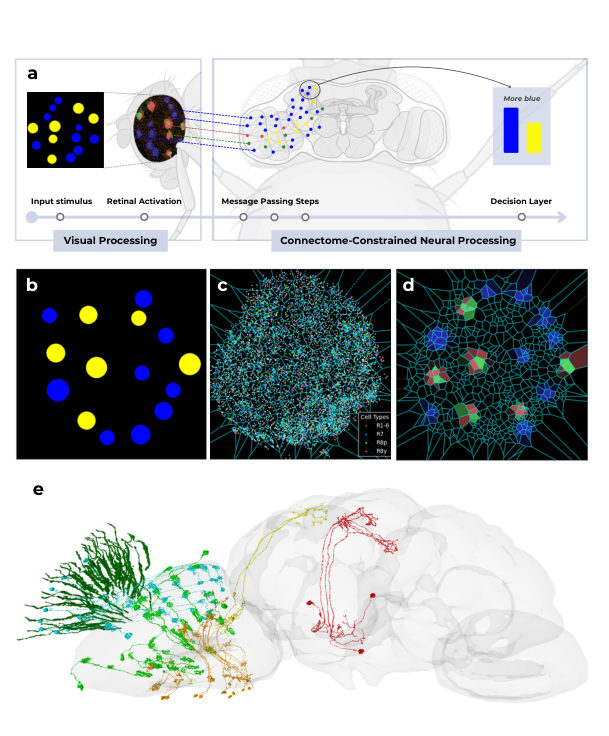 
FIG. 1. Computational modeling of numerical discrimination in Drosophila melanogaster. a, Visual stimuli with varying numerosities of colored dots (blue vs. yellow) are processed through an anatomically accurate model of the fly’s compound eye. We reconstruct the 3D positions of retinal neurons from the connectome data, project them onto a 2D plane, and use Voronoi tessellation to map ommatidia, with R7 neuron positions as cell centers. Each ommatidium samples its corresponding region of the visual field, with specific photoreceptors (R1-R8) encoding different color channels based on their biological spectral sensitivities. The captured light intensity in each retinal neuron produces...

📷 Fig 2

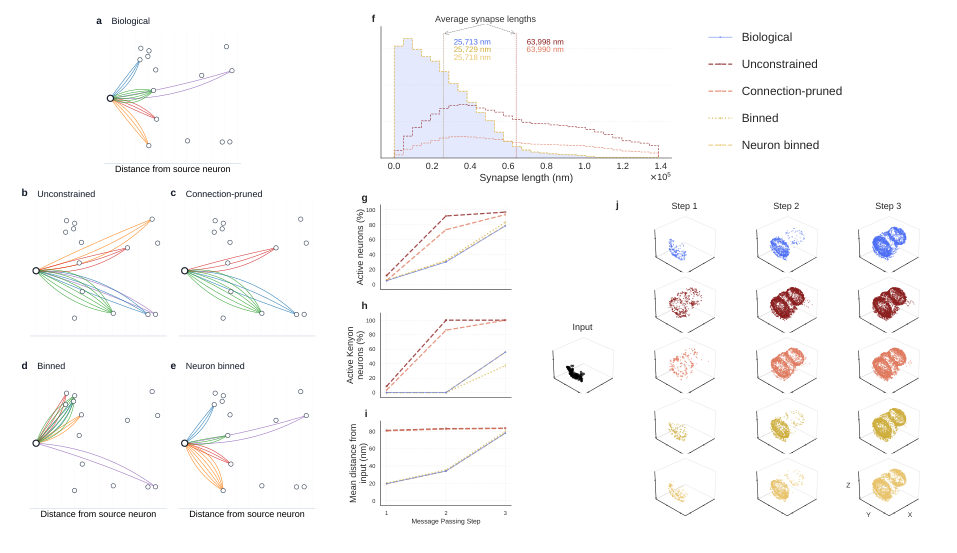 
FIG. 2. Connectome randomization strategies and statistics. a–e, Toy illustrations of the five connectome ensembles. a, Biological connectome. b, Unconstrained randomization, where each neuron keeps the same number of outgoing connections, but targets are randomly shuffled. This produces networks with much larger total wiring and longer synapses on average than the biological connectome. c, Connection-pruned randomization, obtained by starting from the unconstrained network and then removing connections until the total wiring matches the biological one. Even after this pruning step, the mean connection length remains above biological values. d, Synapse-bin randomization, where neuron pairs...

📷 Fig 3

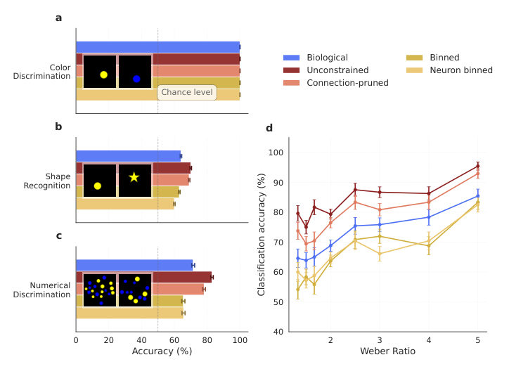 
FIG. 3. Connectome performance on various visual tasks. a, Example stimuli and classi- fication accuracy for color discrimination across the biological connectome and four randomized ensembles; all five models reach 100% accuracy. b, Shape-recognition accuracy. The unconstrained and connection-pruned ensembles perform best, followed by the biological, synapse-bin, and neuron- bin models. c, Numerical-discrimination accuracy, aggregated across the area-controlled held-out images used in d. The unconstrained and connection-pruned ensembles perform best, while the biological connectome outperforms the two distance-binned ensembles. d, Numerical-discrimination accuracy as a function of the...

**Summary.** This paper investigates the computational role of fixed anatomical wiring in the fly visual system by creating a connectome-only neural network model. By comparing the actual connectome to randomized versions, the authors show that the specific, measured connectivity is crucial for achieving high computational accuracy under realistic wiring constraints. This suggests that biological structure dictates efficient operating regimes for complex sensory processing.

**Why it may be interesting.** While focused on biology, the use of graph theory, message passing, and comparing structured vs. random connectivity ensembles mirrors concepts in network science and disordered systems, which can inform models of complex quantum or classical computation.

Detailed structure

**Main problem.** The central challenge is determining how much of the computational efficiency in the visual system is dictated solely by its measured synaptic wiring (connectome).

**Main result.** The biological connectome achieves higher accuracy than randomized ensembles at matched wiring cost, suggesting that the measured connectivity and eye geometry jointly set efficient operating points for visual computation.

**Method.** The authors built a 'connectome-only' message-passing model, fixing the anatomical graph and eye geometry while only learning synaptic gains and thresholds.

**Model / system.** The model uses the full connectome of the *Drosophila* visual system, taking visual input from an anatomically faithful eye model and passing it through the connectome graph to a Kenyon-cell-centered decoder.

**Key observables.** Task accuracy (color, shape, number discrimination), information propagation dynamics, and computational performance across different connectome ensembles.

**Important parameters / regimes.** Synaptic gains, neuronal thresholds, and the wiring cost (proxied by synaptic distance and count).

**Assumptions / limitations.** The model assumes that the fixed anatomical wiring and eye geometry are the primary determinants of efficiency, and that performance differences reflect structural constraints rather than optimization differences.

**Figures summary.** Figure 1 illustrates the multi-step computational flow for number discrimination. Figure 2 compares various randomized connectome ensembles (e.g., unconstrained vs. biological) based on wiring constraints and associated statistics. Figure 3 compares task accuracy across these different connectome variants.

**Paper structure.** The paper establishes the problem by modeling the visual system, details the connectome-only message-passing approach, tests performance on multiple vision tasks, and compares the biological connectome against randomized ensembles to draw conclusions about wiring efficiency.

Abstract

Understanding the extent to which measured synaptic wiring determines computation remains a central challenge. Here, we couple the proofread adult Drosophila melanogaster connectome to an anatomically faithful model of its eye. Visual information is inputted in the eye model, then passed to the connectome, and finally read from a Kenyon-cell-centered linear decoder. This creates a connectome-only model in which the anatomical graph and eye geometry are fixed and only scalar synaptic gains and neuronal thresholds may be learned. The model supports multitask vision, including color discrimination, shape classification, and numerical discrimination that follows a ratio-dependent scaling characteristic of approximate number perception. To test whether precise connectivity is consequential under wiring economy, we compare the biological graph to randomized ensembles that increasingly preserve biological synaptic constraints. At matched wiring cost, the biological network consistently yields higher accuracy, whereas less constrained rewiring surpasses it at the cost of inflated wiring. These findings indicate that the measured connectivity and eye geometry jointly set efficient operating points for visual computation.

[↑ back to top](#top)

### [The Dichotomy Between Pattern Recognition and Step-by-Step Reasoning](http://arxiv.org/abs/2610.09186v1)

**Authors:** Amrut Nadgir, Pratik Chaudhari, Vijay Balasubramanian  
**Type:** both · **Category:** disordered systems and neural networks · **PDF:** <https://arxiv.org/pdf/2610.09186v1>  
**Analysis basis:** full PDF text, analyzed in chunks

📷 Fig 1

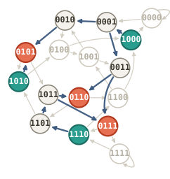 
Figure 1: De Bruijn graph: Edges (both bold and gray) show transitions from one 4-gram to an- other by appending a token. Bold edges form a directed acyclic sub- graph (DAG). Green and orange shaded nodes are start and answer nodes in the DAG respectively. Each path corresponds to a rea- soning trace.

📷 Fig 2

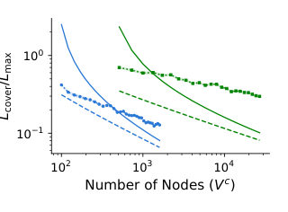 
Figure 2: Data with De Bruijn structure can be learned with few, short traces. We created a synthetic dataset of De Bruijn graphs and DAGs for different values of c and V . Left: The minimum number of start-to-answer paths required to cover every edge in the DAG Pmin shrinks relative to the total number of paths Ptot as the number of nodes grows. Right: The minimum length of paths to cover every edge Lcover shrinks relative to the longest path Lmax. Details: DAGs were created with S = 5 start nodes, N = 10 answer nodes. Dotted curves denote an average over random orderings for nodes in the DAG. Solid curves correspond to using a particular ordering π∗

📷 Fig 3

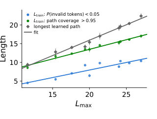 
Figure 3: Transformers can learn paths on a De Bruijn DAG with few and short samples. We created a synthetic dataset of De Bruijn graphs and DAGs for different values of c and V , and trained transformers on start-to-answer paths from 5 replicate DAGs for each configuration (random π, error bars are standard error). The green curve indicates the sample complexity (left) or the length of reasoning traces in the training data (right) required for achieving 95% path coverage, i.e., when the trained transformer assigns probability greater than 10% of the probability under the uniform distribution 1/Ptot to &gt;95% of paths. The blue curve corresponds to the situation where the trained transformer...

📷 Fig 4

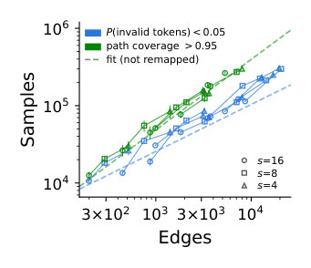 
Figure 4: Sample complexity of learning remapped reasoning traces. Connected line segments correspond to remapping with block lengths s = 4, 8, 16; there are 10 different DAGs drawn on this plot. Dashed lines indi- cate the fit obtained in Fig. 3 for the original reasoning traces. Smaller values of s have a larger number of edges and sample complex- ity. Learning on remapped traces follows a similar power-law trend as seen in Fig. 3.

📷 Fig 5

 
Figure 5: An equation-solving task. The red text is a perturbation inserted at inference- time. The step-by-step reasoning model (k = 1) adapted to this perturbation by undoing the operation in the next step.

**Summary.** This work models LLM reasoning as pathfinding on a De Bruijn graph, proving that such structured reasoning is highly sample-efficient. Empirically, it shows that while frequent state reporting boosts accuracy, a moderate structure density is necessary to achieve robust performance. The findings suggest that the optimal design of complex AI systems requires balancing local precision with global structural robustness.

**Why it may be interesting.** While primarily focused on AI/ML, the rigorous mathematical modeling using graph theory (De Bruijn graphs) and the explicit analysis of information flow constraints ($c$) provide a novel, structured framework for understanding complex sequential computation, which has parallels in quantum circuit design or state evolution.

Detailed structure

**Main problem.** The paper investigates the fundamental relationship between pattern recognition and step-by-step reasoning capabilities within Large Language Models (LLMs). It seeks to characterize how the underlying structure of reasoning traces dictates the model's sample efficiency and robustness.

**Main result.** Step-by-step reasoning is highly sample-efficient if the reasoning traces exhibit a De Bruijn graph structure, suggesting that real-world data may possess this underlying mathematical structure. However, the optimal performance requires a balance between high state frequency (small $c$) for accuracy and low state frequency (large $c$) for robustness.

**Method.** The authors combine theoretical proofs on De Bruijn graph path coverage with extensive empirical testing, fine-tuning LLMs (Qwen series) on equation-solving tasks while manipulating context window sizes and introducing controlled perturbations.

**Model / system.** The primary model is the Large Language Model (LLM) predicting the next token. The theoretical framework models the reasoning process as paths on a De Bruijn graph, where the context length $c$ determines the graph's structure.

**Key observables.** Final-Answer Accuracy, Derivation Accuracy, $P_{\min}/P_{	ext{tot}}$ ratio, and the model's performance under varying state emission intervals ($k$) and perturbation probabilities ($p$).

**Important parameters / regimes.** The context length $c$ (determining De Bruijn structure), the state emission interval $k$, and the perturbation probability $p$.

**Assumptions / limitations.** The core assumption is that if the next token depends only on $c$ preceding tokens, the reasoning process can be modeled as a path on a De Bruijn DAG. It also assumes that the optimal regime balances accuracy and robustness.

**Figures summary.** Figures illustrate the De Bruijn graph structure, showing that path coverage ratios decrease significantly for structured graphs. Other figures compare accuracy metrics (final vs. derivation) across different state emission intervals and perturbation levels.

**Paper structure.** The paper progresses from a theoretical characterization of reasoning as path traversal on a De Bruijn graph, establishing sample efficiency. It then moves to empirical validation using synthetic tasks (equations) to test the impact of state emission frequency and perturbations on accuracy and robustness.

Abstract

We argue that pattern recognition and step-by-step reasoning are two ends of a spectrum. A large language model (LLM) learns to reason step-by-step when data is structured such that the next token depends on a small amount of preceding context. Inference in LLMs resembles pattern recognition when the next token depends on a large amount of preceding context. If the next token depends on only the $c$ most recent tokens, reasoning traces are paths on a De Bruijn graph whose nodes are $c$-length contexts and edges are next-token transitions between contexts. The set of reasoning traces of a task forms a directed acyclic subgraph of the De Bruijn graph. An LLM that has learned all edges of this subgraph can compose them to solve longer, unseen tasks, i.e., it reasons step-by-step. We prove that the number of edges is vanishingly small compared to the number of reasoning traces. Empirically, the number of training samples a transformer needs is a power law in the number of edges, so learning to reason step-by-step is sample efficient. We can induce De Bruijn structure in any task by maintaining a ``state'' that makes future reasoning independent of the past. The frequency of states in the reasoning trace determines $c$. We show, by fine-tuning Qwen2.5-1.5B-Instruct to solve equations and answer questions about stories, that frequent states (small $c$) result in higher accuracy but greater fragility to perturbations at test time. LLMs trained with a large $c$ are only as good as models that perform pattern recognition without reasoning. A moderate density of states balances accuracy and robustness. We show that real-world data has De Bruijn structure: Qwen3-14B and Qwen3-32B retain over 75% of their accuracy on GSM8K, MATH-500 and GPQA-Diamond when attention is restricted to a sliding window less than 15% as long as the full reasoning trace.

[↑ back to top](#top)

### [Tradeoff between Wigner negativity and decoherence time for cubic Gaussian states](http://arxiv.org/abs/2610.10073v1)

**Authors:** Matthieu Arnhem, Valerio Crescimanna, Giuseppe Patera, Stephan De Bièvre  
**Type:** theory · **Category:** quantum information and computing · **PDF:** <https://arxiv.org/pdf/2610.10073v1>  
**Analysis basis:** full PDF text, analyzed in chunks

📷 Fig 1

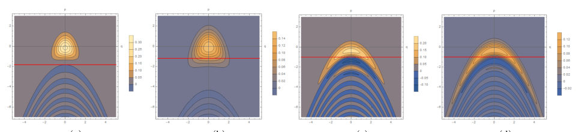 
FIG. 1. Wigner function of centered cubic Gaussian states (Eq.(26)) with thermal and squeezing parameters as indicated and γ = 0.1. Above the solid (red) line, the Wigner function is guaranteed to be positive (see Eq.(30). (a) Cubic vacuum state; λ = 0.212; Nλ ≈1.0046. (b) Cubic thermal state; q = 1/3; λ = 0.075; Nλ ≈1.0000. (c) Cubic squeezed state; ζ = −1; λ = 4.26; Nλ ≈1.9309. (d) Cubic thermal squeezed state; q = 1/3; ζ = −1; λ = 1.51; Nλ ≈1.3571.

📷 Fig 2

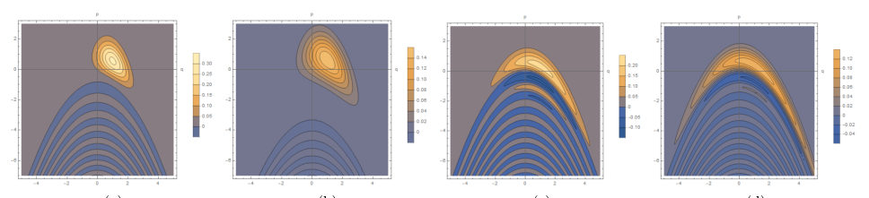 
FIG. 2. Wigner function of the cubic displaced Gaussian state [Eq.(26) ] with displacement q0 = p0 = 1 and γ = 0.1. (a) Cubic displaced vacuum state; λ = 0.212; Nλ ≈1.0046. (b) Cubic displaced thermal state; q = 1/3; λ = 0.075; Nλ ≈1.0000. (c) Cubic displaced squeezed state; ζ = −1; λ = 4.26; Nλ ≈1.9309. (d) Cubic displaced squeezed thermal state; q = 1/3; ζ = −1; λ = 1.51; Nλ ≈1.3571.

📷 Fig 3

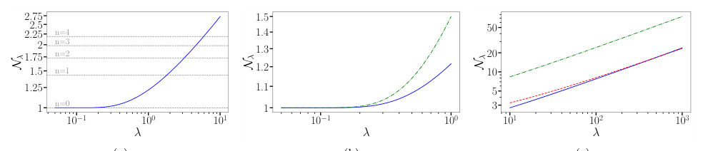 
FIG. 3. Negativity of cubic Gaussian states as a function of λ from Eq.(36) in solid blue line. (a) Log-Log plot for λ ∈[0.05, 10]. The dotted lines indicate the negativity of the Fock states 0 to 4 (see Table. I) (b) Log-linear plot for small values of λ ∈[0.05, 1]. The dot-dashed green line is the upper-bound from Eq. (37). (c) Log-log plot for large values of λ ∈[10, 1000]. The upper dot-dashed green line is the upper-bound from Eq.(38) and the dashed red line is the asymptotic approximation 0.75 √

📷 Fig 4

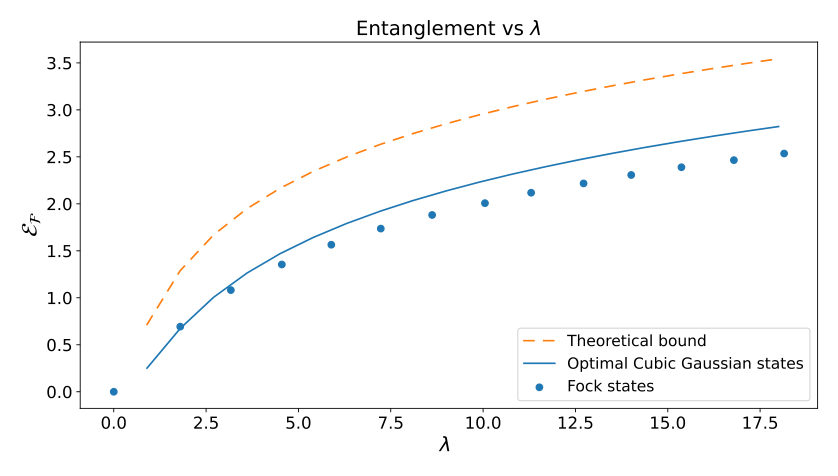 
FIG. 4. Entanglement generated by optimal cubic Gaussian states and Fock states via 50:50 beam splitter interaction. The dashed orange line refers to the bound introduced in Eq. (83).

📷 Fig 5

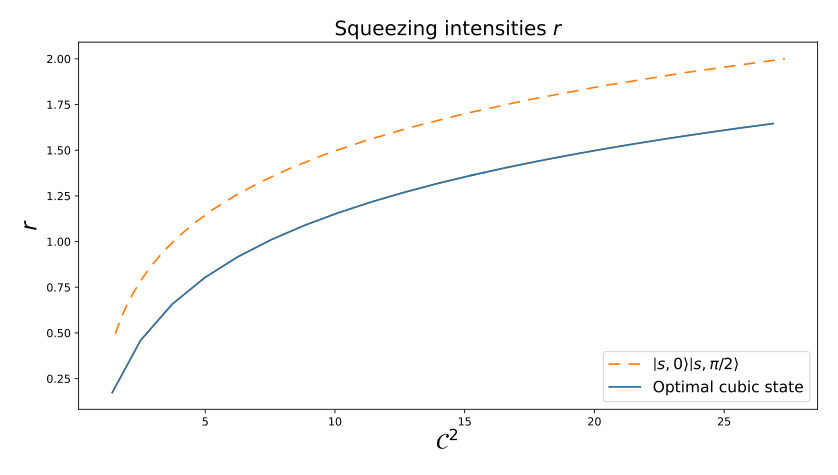 
FIG. 5. Squeezing intensity r as a function of QCS C2 for squeezed vacuum states (dashed orange line) and optimal cubic Gaussian states (full blue line).

**Summary.** This theoretical paper analyzes the relationship between Wigner negativity and decoherence time for cubic Gaussian quantum states. It establishes a strict quadratic tradeoff, showing that high negativity inherently leads to rapid decoherence. The findings are crucial for understanding the practical limits of using nonclassical states as resources in quantum computation.

**Why it may be interesting.** This work directly addresses resource quantification in continuous-variable quantum information, showing fundamental physical limitations on how nonclassicality (negativity) can be sustained against environmental decoherence.

Detailed structure

**Main problem.** The paper investigates the fundamental tradeoff between achieving high Wigner negativity (a quantum resource) and maintaining a long decoherence time in specific quantum states.

**Main result.** For cubic Gaussian states, achieving large Wigner negativity ($\mathcal{N}$) necessarily results in a short decoherence time ($	au$), bounded by $	au \lesssim \mathcal{N}^{-2}$.

**Method.** The analysis uses theoretical derivations involving the Wigner function, characteristic functions, and the calculation of the Quadratic Coherence Scale ($	ext{C}_{2G,\gamma}$) to establish the mathematical bounds.

**Model / system.** The system is a single-mode continuous-variable quantum system described by annihilation/creation operators. The states analyzed are cubic Gaussian states, which are generated by applying a cubic gate ($\hat{\Gamma}_\gamma = \exp(-i\gamma\hat{q}^3)$) to an initial Gaussian state.

**Key observables.** Wigner negativity ($\mathcal{N}$), Decoherence time ($	au$), Quadratic Coherence Scale ($	ext{C}_{2G,\gamma}$), and the Mandel $Q$ parameter.

**Important parameters / regimes.** The cubic gate strength ($\gamma$), the squeezing parameter ($r$), and the negativity ($\mathcal{N}$) are key parameters governing the state properties.

**Assumptions / limitations.** The analysis focuses on the full six-parameter family of single-mode cubic Gaussian states, though the ideal cubic phase state is noted as unphysical.

**Figures summary.** Figures illustrate the Wigner function for cubic Gaussian states, showing the positive/negative regions based on the parameter $\lambda$, and plot the negativity as a function of $\lambda$ compared to Fock state negativities.

**Paper structure.** The paper progresses from defining the system and key observables (Wigner function, negativity) to deriving the core tradeoff ($	au \propto \mathcal{N}^{-2}$), determining optimal state parameters, and finally comparing these optimal states against Fock states.

Abstract

Wigner negativity has been shown to be a resource in quantum computing, raising the question of how to efficiently produce states with a large Wigner negativity. Cubic Gaussian states, obtained when a cubic gate is applied to a Gaussian state, have been proposed as candidates for this purpose. We show that cubic Gaussian states with a large Wigner negativity $\mathcal N$ necessarily have a short decoherence time $τ$ that is bounded above by $\mathcal N^{-2}$. In other words, a large Wigner negativity comes at a cost: the decoherence time $τ$ of cubic Gaussian states decreases at least quadratically in the negativity $\mathcal N$. Maximizing $τ$ at fixed Wigner negativity $\mathcal N$, we show that this upper bound is reached by optimal cubic Gaussian states. They have the property that for large negativity, the optimal squeezing scales as $\ln\mathcal N$ and the optimal cubicity as $\mathcal N^{-1}$. Optimal cubic Gaussian states with large negativity can therefore be constructed with small cubicity, provided sufficient squeezing is applied. However, their decoherence time decreases with growing negativity. In addition, we show that their preparation is extremely sensitive to thermal noise. Finally, we compare, for each integer $n$, the optimal cubic Gaussian state with the $n$th Fock state that has the same negativity: despite their pronounced differences in photon number distribution and Wigner function, we show that they have similar, be it slightly larger, decoherence times and entanglement generating potential through a beam splitter.

[↑ back to top](#top)

### [Using Learning Analytics to Study Novice Learners' Work on Quantum Circuit Simulator Tasks](http://arxiv.org/abs/2610.09499v1)

**Authors:** Juuso Jaakola, Vlad Stirbu, Teiko Heinosaari  
**Type:** both · **Category:** quantum information and computing · **PDF:** <https://arxiv.org/pdf/2610.09499v1>  
**Analysis basis:** full PDF text, analyzed in chunks

📷 Fig 1

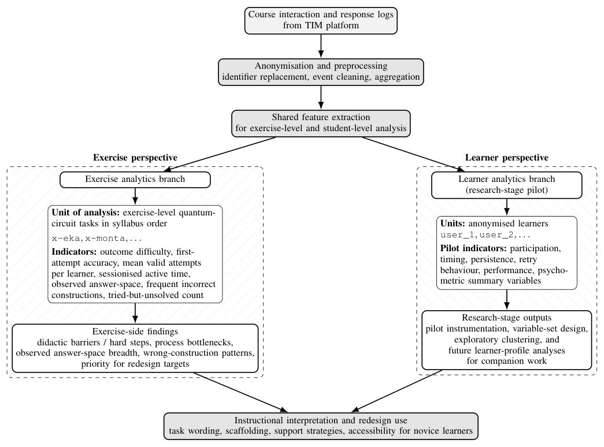 
Fig. 1. Two-branch learning analytics and EDM pipeline for TIM response logs. Both branches share the same source data and preprocessing, but differ in unit of analysis and resulting indicators. The task branch uses the 2024–2025 cohort (N=492) and provides the results reported in this paper. The learner-branch pilot uses the 2025–2026 cohort (N=209) and is included here only as a research-stage component of the broader framework.

📷 Fig 2

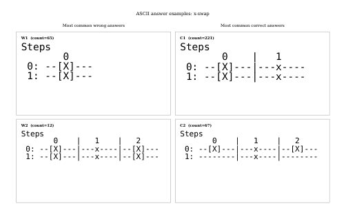 
Fig. 2. Compact example of the answer-space ASCII visualiser for tehtava-x-swap. The left column shows the two most common incorrect submitted constructions and the right column the two most common correct constructions, rendered as directly readable ASCII circuit schematics.

📷 Fig 3

 
Fig. 3. Course progression by exercise in syllabus order. The solid line shows the number of learners who made at least one valid attempt on each exercise, and the dashed line shows the number who eventually solved it. Local drops indicate where the cohort thins out, and the separation between the curves shows outcome difficulty in count form: learners who reached an exercise but did not solve it. The figure therefore provides the first course-level view of bottlenecks before the more local exercise-level plots.

📷 Fig 4

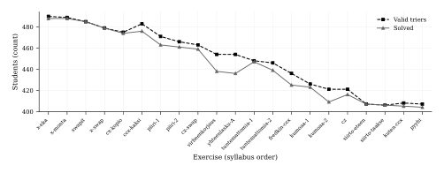 
Figure 4 collates all four indicators across the 21 exercises. It is the exercise-level counterpart of the course-level gap in Fig. 3, but resolved by indicator: reading down a column locates the hardest exercises on that dimension, and reading across a row shows whether an exercise is broadly demanding or hard in one specific way. Two patterns stand out. First, outcome difficulty is uni- formly low — even the hardest exercise leaves only 4% of valid triers unsolved — so eventual non-solution is not

📷 Fig 5

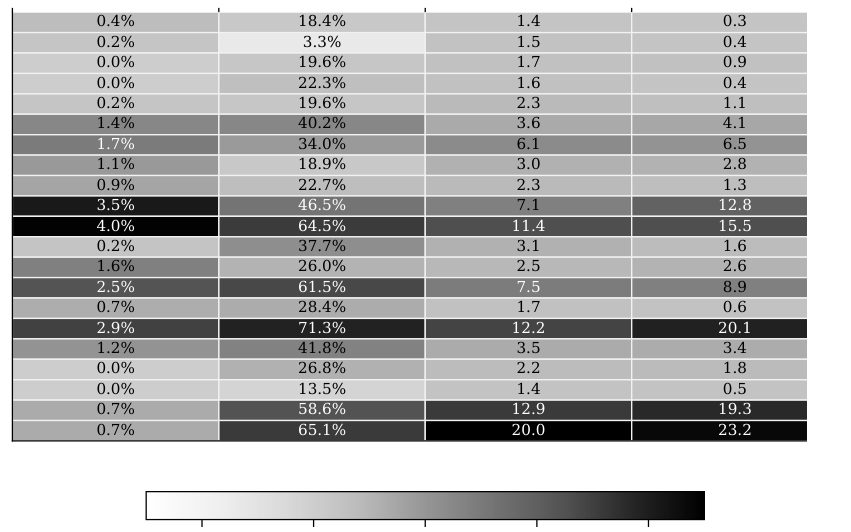 
Fig. 4. Per-exercise difficulty indicators for the 21 obligatory circuit exercises in syllabus order (top to bottom). The columns are outcome difficulty (fraction of valid triers who never solved), first-try difficulty (1 - first-attempt accuracy), mean valid attempts per learner, and mean sessionised active time per learner. Cell shading is the within-course z-score of each column, oriented so that darker always indicates greater difficulty; cell annotations give raw values in the units named in the headers. The figure is a comparative summary across these 21 exercises, not an absolute difficulty scale. Outcome difficulty spans a narrow absolute range (0.0–4.0%), so shading in that column...

**Summary.** This paper introduces a learning analytics framework to analyze detailed response logs from quantum circuit simulator tasks in an introductory course. By profiling task difficulty and mapping the observed answer space, the authors provide actionable evidence for course designers. This work demonstrates how process data, beyond simple pass/fail scores, can significantly improve quantum education pedagogy.

**Why it may be interesting.** While the focus is educational, the rigorous analysis of systematic errors and solution space diversity in quantum circuit construction provides a model for analyzing complex, open-ended physical problem-solving in quantum contexts.

Detailed structure

**Main problem.** The paper addresses the lack of actionable pedagogical insights derived from detailed response logs generated by interactive quantum circuit simulators used in introductory quantum computing education.

**Main result.** A learning analytics framework was developed that successfully identifies bottleneck tasks, broad solution spaces, and recurring systematic errors not visible from final scores alone, enabling concrete course redesign.

**Method.** The authors implemented a two-branch learning analytics pipeline analyzing submission logs across 21 circuit exercises, focusing on task-level diagnostics like first-attempt accuracy and answer-space profiling.

**Model / system.** The system involves quantum circuits and quantum computing concepts, simulated via a drag-and-drop interface in the TIM learning environment. The analysis is performed on submission logs from an introductory course cohort.

**Key observables.** Task-level indicators include participation, completion rates, first-attempt accuracy, valid-attempt counts, and the observed answer-space (plain-text representation of submitted circuits).

**Important parameters / regimes.** The analysis covers 492 learners and 47,533 valid submissions across 21 obligatory exercises.

**Assumptions / limitations.** The learner-level branch is an ongoing research extension, and the analysis is limited to the cohort data from one specific course run.

**Figures summary.** Figures illustrate the two-branch pipeline, and ASCII visualizations (e.g., Fig. 2, Fig. 8) show the common correct and incorrect constructions observed in the answer space.

**Paper structure.** The paper introduces the problem, details the two-branch learning analytics framework (task-level focus), presents the analysis of 21 exercises using process and outcome difficulty metrics, and concludes by demonstrating how these insights support actionable course redesign.

Abstract

Interactive quantum circuit simulators are increasingly used to support introductory quantum computing education for learners from varied disciplinary backgrounds. These environments can also generate detailed response logs of submitted circuits, but such data are rarely transformed into evidence that instructors can use for course redesign and development.   We present a learning analytics framework for quantum circuit simulator tasks and report its task-level branch on anonymised logs from an introductory quantum computing course delivered in the TIM learning environment. The task branch characterises exercises through participation, completion, first-attempt accuracy, valid-attempt counts, sessionised active time, and observed answer-space reporting of common correct and incorrect constructions.   The dataset covers the 2024-2025 cohort of 492 learners, 47,533 valid submissions, and 21 obligatory quantum circuit exercises. The framework identifies bottleneck tasks, broad solution spaces, and recurring wrong-answer patterns that are not visible from final scores alone. Its most distinctive output is a plain-text representation of the observed answer space, designed to make open-ended circuit submissions directly interpretable to instructors. We show how response logs can reveal actionable task-design issues and support concrete course redesign. A learner-level branch is retained only as an ongoing research extension and is not a central empirical contribution of the present paper.

[↑ back to top](#top)

### [Vortex screening and the fate of the BKT transition with long-range couplings](http://arxiv.org/abs/2610.10171v1)

**Authors:** Guido Giachetti  
**Type:** theory · **Category:** statistical mechanics · **PDF:** <https://arxiv.org/pdf/2610.10171v1>  
**Analysis basis:** full PDF text, analyzed in chunks

📷 Fig 1

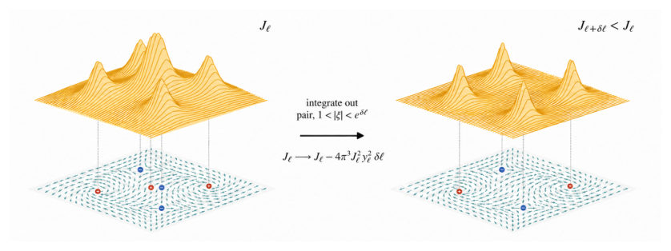 
FIG. 1. Schematic representation of the renormalization procedure. Spin configurations before (left) and after (right) integrating out a vortex–antivortex pair, with positive and negative vortices marked in red and blue. The yellow surface symbolically represents the many-body vortex interaction. Integrating out the pair screens this interaction by decreasing the spin stiffness Jℓ.

📷 Fig 2

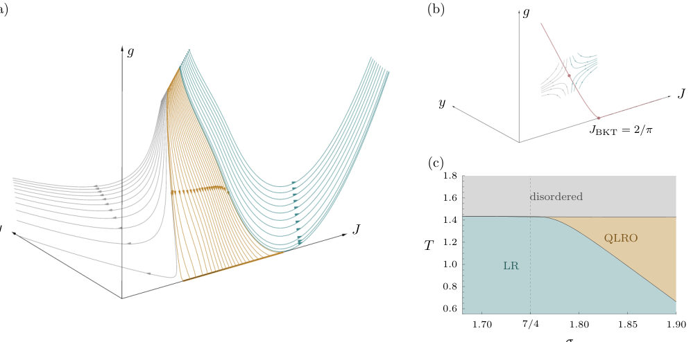 
FIG. 2. RG flows and phase structure. (a) Trajectories at σ = 1.85, colored according to their LR (teal), QLRO (ochre), or disordered (gray) basin. (b) Fixed-point locus as σ varies (pink): the LR-marginal endpoint of the Gaussian line, J = [2π(2 −σ)]−1, g = y = 0, for 7/4 &lt; σ &lt; 2, joins the finite-coupling branch for σ &lt; 7/4 at JBKT = 2/π. The nearby saddle flow is schematic. (c) Illustrative numerical RG phase diagram for J0 = 1/T, g0 = 10−4/T, and y0 = e−6/T , with the same color code.

**Summary.** This work addresses the stability of the BKT phase in 2D XY models with long-range couplings using a real-space renormalization group approach. By analyzing vortex screening, the authors derive a critical condition ($\sigma > 7/4$) for the persistence of QLRO. The findings establish a detailed phase diagram, predicting a crossover to a Wilson-Fisher-like fixed point when the coupling decay is too slow.

**Why it may be interesting.** The rigorous RG treatment of vortex screening in the presence of long-range interactions provides a powerful theoretical tool for understanding phase transitions in 2D systems, connecting concepts from Coulomb gases to critical phenomena.

Detailed structure

**Main problem.** The paper investigates the stability of the Berezinskii-Kosterlitz-Thouless (BKT) phase, characterized by Quasi-Long-Range Order (QLRO), when the system is subjected to long-range interactions decaying as $r^{-2-\sigma}$.

**Main result.** A stable Gaussian QLRO phase is found to exist only for coupling decay exponents $\sigma > 7/4$; otherwise, the system flows towards a finite-coupling, Wilson-Fisher-like fixed point.

**Method.** The analysis employs a real-space renormalization-group (RG) treatment, incorporating the full many-body vortex interaction and perturbatively including spin-wave contributions.

**Model / system.** The model is the two-dimensional XY model with a ferromagnetic Hamiltonian featuring long-range couplings $J(r) \sim r^{-2-\sigma}$. The physics is analyzed by decomposing the field into smooth spin-wave and discrete vortex components.

**Key observables.** The primary observables are the renormalization of the spin stiffness ($J$) and the vortex fugacity ($y$), which determine the stability of the QLRO phase.

**Important parameters / regimes.** The critical exponent $\sigma$ governing the decay of the long-range coupling, and the RG flow parameters $J_\ell, y_\ell, g_\ell$.

**Assumptions / limitations.** The analysis retains the full many-body vortex interaction and assumes that the vortex screening process preserves the Gaussian-average representation of the partition function.

**Figures summary.** Figures illustrate the renormalization procedure, showing how integrating out vortex-antivortex pairs screens the interaction and renormalizes the spin stiffness $J_\ell$.

**Paper structure.** The paper establishes the problem by defining the model and the RG framework. It details the vortex screening mechanism, deriving the stability criterion ($\sigma > 7/4$). Finally, it analyzes the RG flow, predicting the existence and nature of a finite-coupling fixed point for $\sigma < 7/4$.

Abstract

The stability of the Berezinskii--Kosterlitz--Thouless phase against long-range interactions remains an open problem. We address this question in the two-dimensional XY model with couplings decaying as $r^{-2-σ}$, by developing a real-space renormalization-group treatment near the Gaussian manifold of quasi-long-range ordered (QLRO) states. We retain the full many-body vortex interaction and show that, at leading order in the fugacity, screening by small vortex--antivortex pairs preserves its Gaussian-average representation without an expansion in the long-range coupling. Including spin waves perturbatively then yields a local stability criterion: a stable QLRO interval exists only for $σ>7/4$. We also investigate a Wilson--Fisher-like fixed point at finite coupling for $σ<7/4$, for which the retained flow predicts $ν^{-1}\sim\sqrt{7/4-σ}$ as it merges with the Gaussian line.

[↑ back to top](#top)

## Secondary cond-mat archives

*Papers from  mes-hall, other, soft, supr-con. These archives are de-prioritized — they appear at the end regardless of relevance score.*

### Relevant in secondary archives (22)

### [Deterministic Vortex Generation from Coupled Trapped Polariton Condensate Triad](http://arxiv.org/abs/2610.10251v1)

**Authors:** X. Qin, N. Pitanios, S. Dam, S. Betzold, S. Höfling, S. V. Koniakhin, P. G. Savvidis  
**Type:** both · **Category:** other · **PDF:** <https://arxiv.org/pdf/2610.10251v1>  
**Analysis basis:** full PDF text, analyzed in chunks
**Topic relevance:** `analog quantum simulation` **3/5** · `driven-dissipative phase transition` **3/5** · `interference shaping light` **2/5** · `methods for driven-dissipative` **2/5** · `Keldysh / 2PI / non-Gaussian methods` **1/5** · `Tavis-Cummings & cavity-many-emitter` **1/5** · `correlated / nonlocal dissipation` **1/5** · `non-equilibrium universality` **1/5** · `quantum measurements` **1/5** · `quantum optics experiment` **1/5**

📷 Fig 1

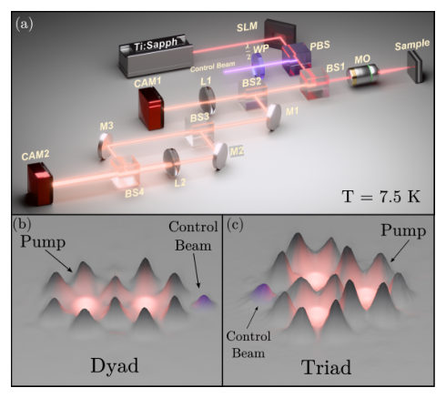 
FIG. 1. (a) Schematic depiction of the experimental setup for generating and detecting optically trapped polariton con- densates. (b,c) Spatially structured excitation patterns for different condensate arrangements: (b) two-condensate con- figuration and (c) three-condensate configuration. The purple spot indicates the control beam.

📷 Fig 2

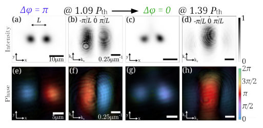 
FIG. 2. Polariton dyad in anti-symmetric and symmetric con- figurations. Panels (a) and (c) map the real-space PL in- tensity for the anti-symmetric (negative dissipative coupling) and symmetric (positive dissipative coupling) states, while panels (b) and (d) show the respective momentum-space in- tensities. The lower panels display the corresponding phase profiles: panels (e) and (g) capture the real-space phase, and panels (f) and (h) depict the momentum-space phase distri- butions. The combination of zero intensity and π phase jump in momentum-space resemble the characteristic soliton pat- terns.

📷 Fig 3

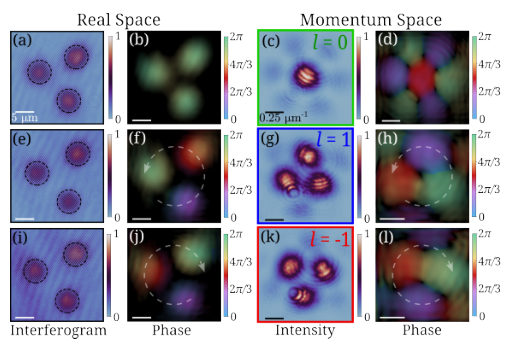 
FIG. 3. Real and momentum-space intensity and retrieved phase for polariton triad from the experiment. Panels in the upper row (a)-(d) are for the all-in-phase configuration with zero global winding. Panels (e)-(h) and (i-l) are for oppo- site nonzero winding direction of global phase in frustrated configuration. Phase difference between condensates in real space (f),(j) and lobes in momentum-space (d),(h),(l) is ap- prox. ± 2π

📷 Fig 4

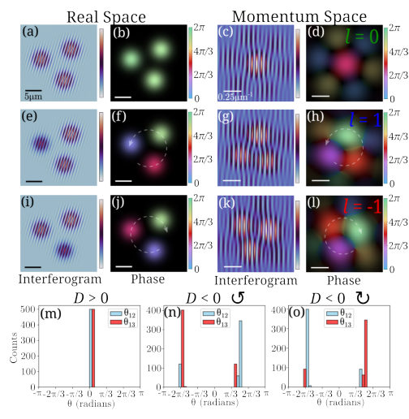 
FIG. 4. Results of Stuart-Landau equation simulations re- producing Fig. 3. The growth rate ℜ(λ) and saturation con- stant ℜ(c) responsible for the single condensate amplitudes are 0.75 and 0.9, respectively. ℑ(c) = 0.5. Coupling is given by |J| = |D| = 0.15. For ferromagnetic configuration in pan- els (a)-(d), dissipative coupling D &gt; 0. The opposite vor- tices in the antiferromagnetic configuration at D &lt; 0 are characterized by clockwise (e)-(h) and anticlockwise (i)-(l) ordering of site energies: ℑ(λ1, λ2, λ3) = (0.0, 0.2, 0.14) and ℑ(λ1, λ2, λ3) = (0.0, 0.14, 0.2), respectively. Panels (m)–(o) show final phase histograms for condensates 2 and 3 with re- spect to condensate 1 across the...

**Summary.** The research demonstrates how a triad of trapped exciton-polariton condensates can deterministically generate and switch between three distinct topological vortex states. By tuning the pump power and using a control beam, the system achieves on-demand control over the global phase winding, which is unambiguously read out via momentum-space light emission. This establishes the condensate triad as a powerful, compact platform for reconfigurable chiral light sources.

**Why it may be interesting.** This work is highly relevant as it uses polariton condensates—a platform bridging quantum optics and condensed matter—to demonstrate robust, deterministic control over topological quantum numbers (OAM/chirality) in a solid-state system.

Detailed structure

**Main problem.** The paper addresses the deterministic generation and all-optical switching of topologically distinct vortex states in a triad of trapped exciton-polariton condensates.

**Main result.** The system establishes the condensate triad as a compact platform for reconfigurable chiral light generation, enabling on-demand orbital angular momentum control using a ternary logic basis.

**Method.** The study combines experimental measurements of momentum-space photoluminescence (PL) with theoretical modeling using coupled Stuart-Landau and Gross-Pitaevskii equations.

**Model / system.** The physical system is a triad of trapped exciton-polariton condensates in a microcavity. The dynamics are modeled by coupled equations incorporating hopping/Josephson coupling and dissipative terms, reflecting the $C_{3v}$ symmetry.

**Key observables.** Momentum-space photoluminescence profiles, quantized phase winding ($\pm 2\pi$), and the ability to distinguish topological states without interferometry.

**Important parameters / regimes.** Non-resonant pump power (controls coupling sign), control beam intensity, and the sign of the dissipative coupling ($D$).

**Assumptions / limitations.** The system can be effectively described by the coupled Stuart-Landau or Gross-Pitaevskii mean-field equations, and the control beam can deterministically break symmetry.

**Figures summary.** Figures illustrate the schematic setup, spatial excitation patterns, and crucial momentum-space PL profiles comparing zero-winding (ferromagnetic) states against $\pm 2\pi$ winding states, demonstrating the unique signatures in K and K' points.

**Paper structure.** The paper progresses from establishing the basic coupled model (dyad/triad) to demonstrating the control over phase winding via pump tuning, culminating in the unique characterization of chirality and OAM control using momentum-space imaging.

Abstract

We present the deterministic generation and all-optical switching of ternary topologically distinct vortex states in a triad of trapped exciton-polariton condensates with direct state readout from momentum-space emission distribution. Tuning the non-resonant pump power controls the sign of the dissipative coupling, selecting between a ferromagnetic in-phase state and two frustrated states with global phase winding. The zero-winding ferromagnetic state has unstructured far-field emission at low momenta and forms vortex-antivortex arrays at the Dirac points, reflecting the C_3v global symmetry. The two frustrated states of +-2pi winding can be activated on-demand by a control beam and produce different triangular emission patterns selectively localized at the K or K' points. Although all three states share identical real-space emission distributions, their momentum-space photoluminescence profiles distinguish them unambiguously, revealing the chirality without the need for interferometry. This enables on-demand orbital angular momentum control using a pump independent of resonant phase or OAM imprinting, establishing condensate triads as a compact platform for reconfigurable chiral light generation operating on a ternary logic basis.

[↑ back to top](#top)

### [Programmable Asymmetric Spin-Orbit Torque Switching for Spin Logic](http://arxiv.org/abs/2610.09950v1)

**Authors:** Rongkun Han, Dahai Wei, Jianhua Zhao, Yuan Lu  
**Type:** both · **Category:** other · **PDF:** <https://arxiv.org/pdf/2610.09950v1>  
**Analysis basis:** full PDF text, analyzed in chunks
**Topic relevance:** `driven-dissipative phase transition` **3/5** · `non-equilibrium universality` **3/5** · `Keldysh / 2PI / non-Gaussian methods` **2/5** · `analog quantum simulation` **2/5** · `methods for driven-dissipative` **2/5** · `quantum measurements` **2/5** · `scars & prethermalization` **2/5**

📷 Fig 1

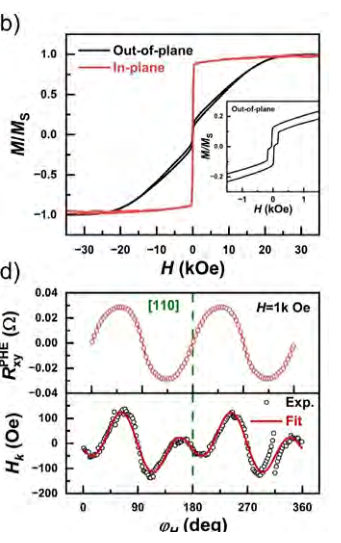 
Fig. 1. (a) The stack structure of GaAs/Fe(5 nm)/MCA(3 nm)/Pt(3 nm) multilayers. (b) The M-H

📷 Fig 2

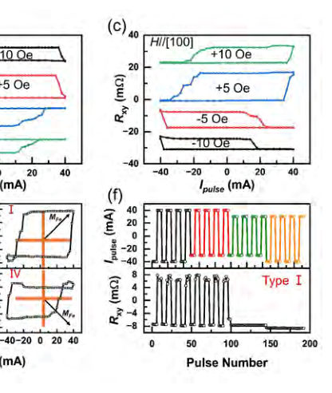 
Fig. 2. (a) Schematic illustration of SOT-driven switching in the Fe/MCA/Pt multilayer, where the

📷 Fig 3

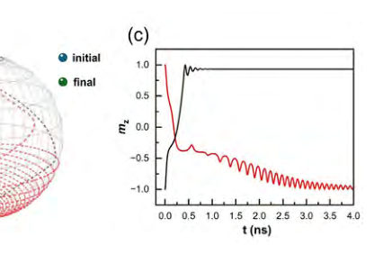 
Fig. 3. (a) Schematic of the DL and FL torques under opposite current directions. (b) Trajectories

📷 Fig 4

 
Figure 3(b) displays the simulated magnetization trajectories for Type-I switching

📷 Fig 5

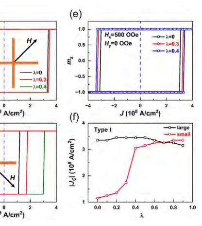 
Fig. 4. (a)-(d) Macrospin simulated magnetization switching curves under external magnetic fields of

**Summary.** This research demonstrates how to achieve programmable, field-free, and asymmetric magnetization switching in magnetic multilayers using Spin-Orbit Torque. The asymmetry is fundamentally linked to an internal effective magnetic field ($H_y$) that breaks system symmetry. By controlling this asymmetry based on the initial magnetization state, the authors successfully realize a reconfigurable spin logic device.

**Why it may be interesting.** While focused on spintronics, the concept of symmetry breaking via an internal effective field ($H_y$) to control non-linear switching behavior is analogous to controlling non-equilibrium dynamics in open quantum systems or engineered quantum potentials.

Detailed structure

**Main problem.** The work aims to demonstrate and understand programmable, field-free, asymmetric spin-orbit torque (SOT)-induced magnetization switching for realizing reconfigurable spin logic devices.

**Main result.** Asymmetric switching is shown to originate from an in-plane effective field ($H_y$) that breaks system symmetry, enabling the realization of programmable spin logic by controlling the initial magnetization state.

**Method.** The study combines experimental measurements (SQUID, magnetotransport, pulsed current switching) with theoretical modeling using the Landau-Lifshitz-Gilbert (LLG) equation.

**Model / system.** The physical system is an Fe/Mn2CoAl(MCA)/Pt multilayer heterostructure grown on GaAs(001). The dynamics are modeled using the LLG equation, incorporating SOT torques and effective in-plane anisotropy fields ($H_x, H_y$).

**Key observables.** Critical switching currents (different for opposite polarities), magnetization hysteresis loops, and the resulting Boolean logic output states ($R_{xy}$ vs. pulse number).

**Important parameters / regimes.** The asymmetry is governed by the internal effective field $H_y$, while the switching polarity is controlled by the initial magnetization direction of the IMA layer.

**Assumptions / limitations.** The asymmetry is attributed to intrinsic symmetry breaking by the magnetic field, ruling out Joule heating effects. The logic inputs are encoded via current pulses.

**Figures summary.** Figures illustrate the multilayer stack, M-H curves showing switching, symmetry schematics detailing the role of $H_y$, and finally, a truth table demonstrating the realization of multiple Boolean logic gates.

**Paper structure.** The paper first characterizes the material's in-plane magnetic anisotropy using PHE measurements. It then investigates SOT switching, establishing that the asymmetry is due to $H_y$. Finally, it leverages this tunable asymmetry across four initial magnetization states to implement a full set of programmable spin logic operations.

Abstract

Spin logic devices provide a promising route toward ultralow-power and nonvolatile information processing. In this work, we demonstrate field-free spin-orbit torque-induced asymmetric magnetization switching in in-plane anisotropy (IMA) and perpendicular magnetic anisotropy heterostructures, characterized by different critical switching currents under opposite current polarities. Combined experiments and macrospin simulations reveal that the asymmetric switching originates from an in-plane effective field Hy , which breaks the Myz mirror symmetry of the system. By controlling the magnetization direction of the IMA layer, both the switching polarity and bias direction can be tuned. Building on four distinct types of asymmetric switching behaviors, we realize a reconfigurable spin logic operation within a single Hall-bar device. These results clarify the physical origin of asymmetric magnetization switching and demonstrate an approach for realizing reconfigurable spin logic devices.

[↑ back to top](#top)

### [Topological and kinetic origins of fractional thermal conductance at the topological insulator--superconductor interface](http://arxiv.org/abs/2610.10011v1)

**Authors:** Laurence A. Jacobs, Guillermo R. Zemba  
**Type:** theory · **Category:** other · **PDF:** <https://arxiv.org/pdf/2610.10011v1>  
**Analysis basis:** full PDF text, analyzed in chunks
**Topic relevance:** `Full counting statistics` **3/5** · `Keldysh / 2PI / non-Gaussian methods` **2/5** · `methods for driven-dissipative` **2/5** · `quantum measurements` **2/5** · `analog quantum simulation` **1/5** · `correlated / nonlocal dissipation` **1/5** · `driven-dissipative phase transition` **1/5** · `non-equilibrium universality` **1/5**

📷 Fig 1

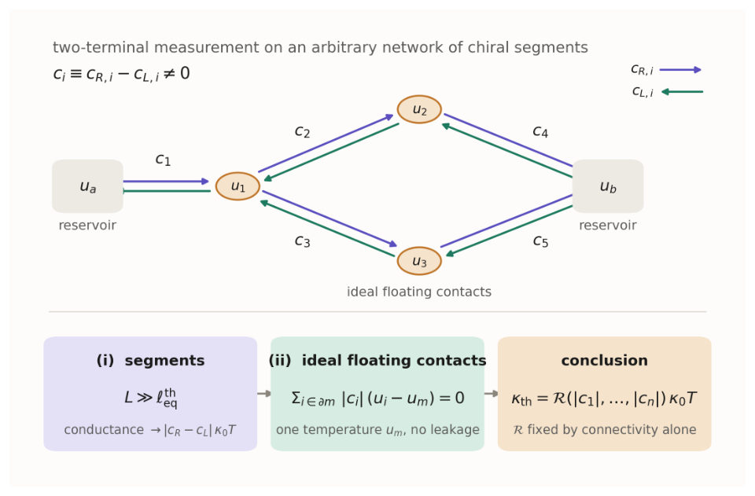 
FIG. 1. The setting of Theorem 1. Chiral edge segments of net central charge ci = cR,i −cL,i, each long compared with its thermal equilibration length, joined at ideal floating contacts, measured between two reservoirs at ua = T 2 a and ub = T 2 b . The connectivity is arbitrary; the three-segment chain of Fig. 2 is one case. The two hypotheses and the conclusion are the three panels: everything microscopic about a segment enters only through ci, and the rational function R is fixed by the connectivity alone.

📷 Fig 2

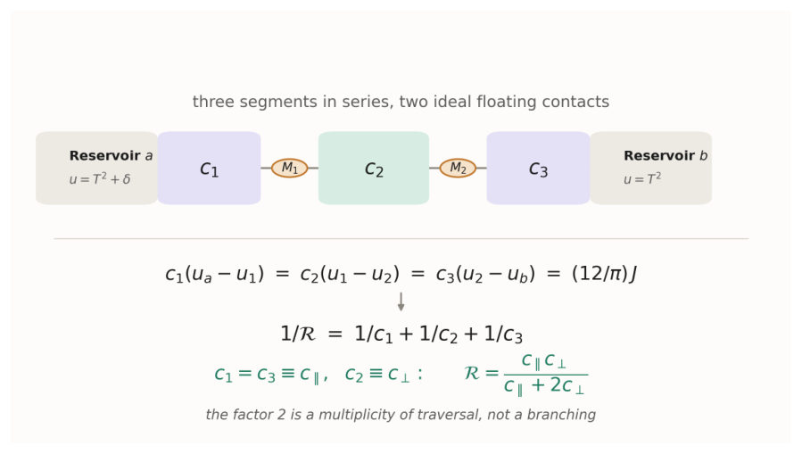 
FIG. 2. The three-segment series geometry realized by the device of Roy et al. and by the platform of Sec. IV B. Lemma 1 at each floating contact makes the heat current common to the three segments, and eliminating the interior temperatures gives the series law. When the two outer segments are identical the coefficient is (9): the factor 2 in the Roy formula (1) is the multiplicity with which the outer phase is traversed, not a branching of the circuit.

📷 Fig 3

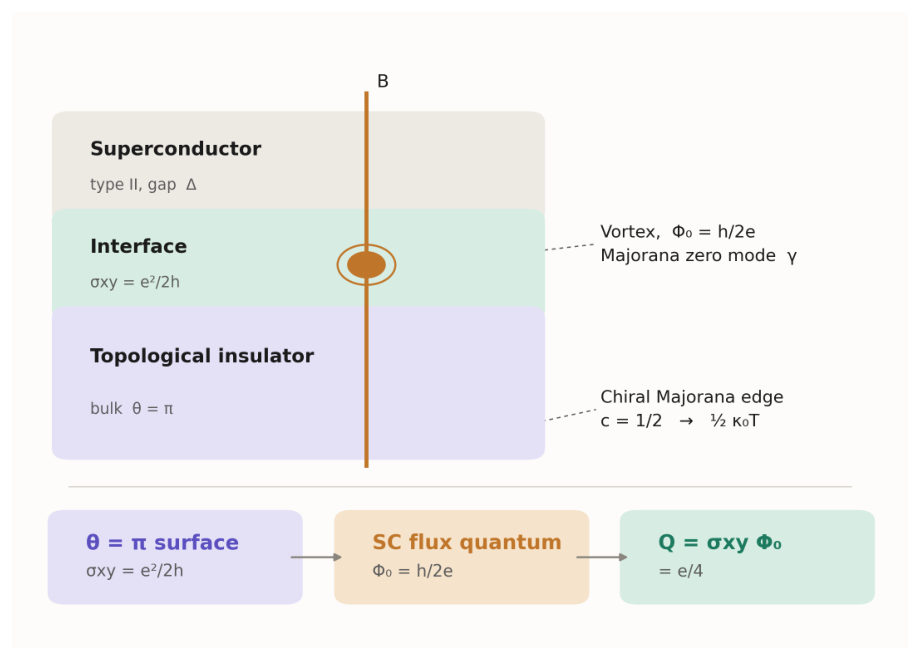 
FIG. 3. The TI–SC interface. A perpendicular field threads the interface and generates an Abrikosov lattice of singly quantized vortices; each carries a Fu–Kane Majorana zero mode at its core and, from the θ = π magnetoelectric coupling, the polarization charge (13). The chain below records the origin of the e/4: the half-quantized surface Hall conductance of the θ = π surface, multiplied by the superconducting flux quantum Φ0 = h/2e. The boundary of the region carries a chiral Majorana mode of central charge cM = 1

📷 Fig 4

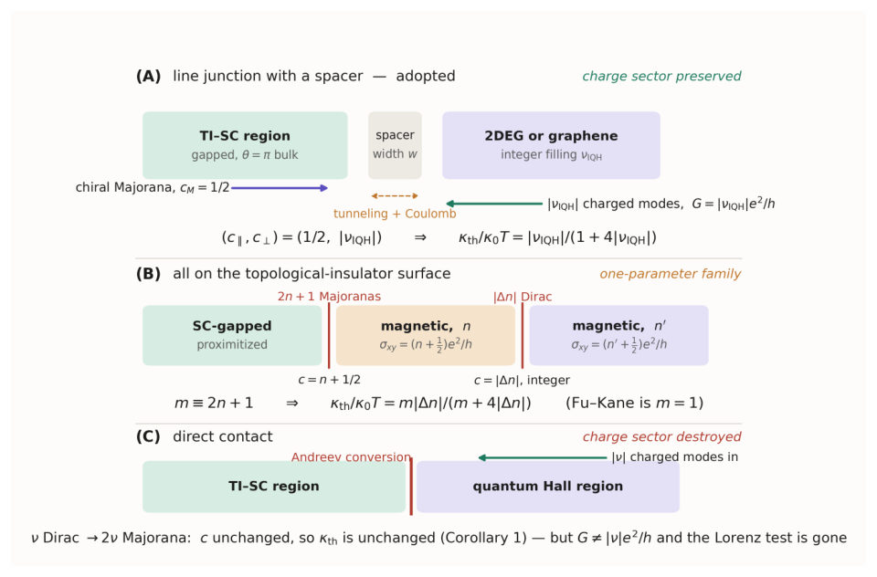 
FIG. 4. Three candidate devices, and why the choice is not cosmetic. (A) A line junction: the quantum-Hall layer is laterally adjacent and separated from the superconductor by a normal or insulating spacer, so its charged modes survive and G = |νIQH|e2/h. This is the geometry adopted, and the object treated by the line-junction kinetic theory of Refs. [20, 21]. (B) Everything on one TI surface, where central charges attach to domain walls rather than regions: SC | magnetic walls carry 2n + 1 chiral Majoranas, c = n + 1

📷 Fig 5

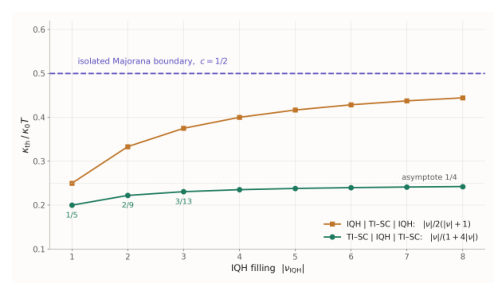 
FIG. 5. Equilibrated plateau values in geometry (A), for the two arrangements of the three-segment chain, against the isolated-boundary value 1

**Summary.** This theoretical work establishes that thermal conductance alone cannot distinguish between topological and kinetic origins of fractional conductance in edge systems. The authors prove that the separation requires analyzing the charge sector, specifically using the Lorenz ratio and shot noise measurements, which are sensitive to the underlying charge dynamics at the superconducting boundary.

**Why it may be interesting.** It provides a rigorous theoretical framework for diagnosing the microscopic origin of quantized transport phenomena in topological materials, suggesting that electrical measurements (charge sector) are necessary when thermal measurements (energy sector) fail to distinguish mechanisms.

Detailed structure

**Main problem.** The paper addresses the fundamental challenge of distinguishing between fractional thermal conductance arising from non-Abelian topology (like Majorana modes) versus that arising from full thermal equilibration of co-propagating edge modes.

**Main result.** A theorem proves that under full thermal equilibration, the thermal conductance ($\kappa_{th}$) depends only on the net chiral central charges, making it impossible to distinguish the two origins using $\kappa_{th}$ alone. Separation requires analyzing the charge sector via the Lorenz ratio and shot noise.

**Method.** The analysis uses boundary Conformal Field Theory (CFT) to derive universal formulas for energy currents and thermal conductance, followed by applying energy conservation principles to composite quantum systems.

**Model / system.** The primary theoretical model is a network of chiral edge segments joined at ideal floating contacts, applied specifically to the topological insulator–superconductor (TI–SC) interface involving Majorana and Integer Quantum Hall (IQH) edge modes.

**Key observables.** Thermal conductance ($\kappa_{th}$), Lorenz ratio ($\mathcal{L}$), and excess shot noise (Fano factor).

**Important parameters / regimes.** Net chiral central charges ($c_i$), temperature ($T$), and magnetic field ($B$).

**Assumptions / limitations.** The theorem relies on the assumption of full thermal equilibration and ideal floating contacts; the separation mechanism requires the IQH edge not to abut the superconductor.

**Figures summary.** Figure 1 illustrates the general setup for the anomaly-pinned theorem using chiral edge segments; Figure 2 (mentioned) shows the geometry for explicit three-segment calculations.

**Paper structure.** The paper first proves the general Anomaly Pinning Theorem for thermal conductance in edge networks (Section II), then applies this to the TI–SC interface (Section III/IV), concluding that charge-sector diagnostics (Lorenz ratio, noise) are necessary for resolution (Section V).

Abstract

A recent experiment by Roy et al. (Nat. Commun. 17, 2853 (2026)) demonstrated a robust half-integer thermal conductance plateau, κ_0 T/2, at a bipolar (ν,ν')=(2,-1) junction in bilayer graphene, produced not by non-Abelian topology but by full equilibration of co-propagating electron and hole edge modes. We prove a theorem that fixes when the two origins can be told apart: under full thermal equilibration, the two-terminal thermal conductance of a network of chiral edge segments joined at ideal floating contacts is a rational function of the net chiral central charges of the segments alone, quantities pinned by the gravitational anomaly and invariant under arbitrary local boundary kinetics. The corollary is an impossibility statement: whenever two realizations present the same anomaly data to the same network, no thermal-conductance measurement can distinguish them. That the equilibrated (2,-1) value equals the central charge of a chiral Majorana mode is an arithmetic fact about one filling combination, but wherever such a coincidence occurs it is beyond the reach of thermometry, and the separation must come from the charge sector, which is not anomaly-pinned at a superconducting boundary. We develop the topological insulator-superconductor interface as the application: a vortex carries fractional charge e/4 from the θ= πmagnetoelectric coupling, the boundary hosts a chiral Majorana mode of central charge 1/2, and a laterally adjacent integer quantum Hall (IQH) region supplies the kinetic realization. The Lorenz ratio (anomalous for the isolated Majorana boundary, L_0 / (1 + 4|ν_{IQH}|) in the composite device) and the excess shot noise (growing with B from e/4 vortex tunneling versus locked to IQH plateaus) together resolve the mechanism, provided the quantum Hall edge does not abut the superconductor.

[↑ back to top](#top)

### [Gate-driven Switching Dynamics in a Fully Suspended Superconducting Nanowire](http://arxiv.org/abs/2610.09806v1)

**Authors:** Matthijs Rog, Giacomo Trupiano, Filippo Antola, Mario Cuoco, Giorgio De Simoni, Kaveh Lahabi, Francesco Giazotto  
**Type:** both · **Category:** other · **PDF:** <https://arxiv.org/pdf/2610.09806v1>  
**Analysis basis:** full PDF text, analyzed in chunks
**Topic relevance:** `driven-dissipative phase transition` **3/5** · `non-equilibrium universality` **3/5** · `methods for driven-dissipative` **2/5** · `Keldysh / 2PI / non-Gaussian methods` **1/5** · `correlated / nonlocal dissipation` **1/5** · `quantum measurements` **1/5**

📷 Fig 1

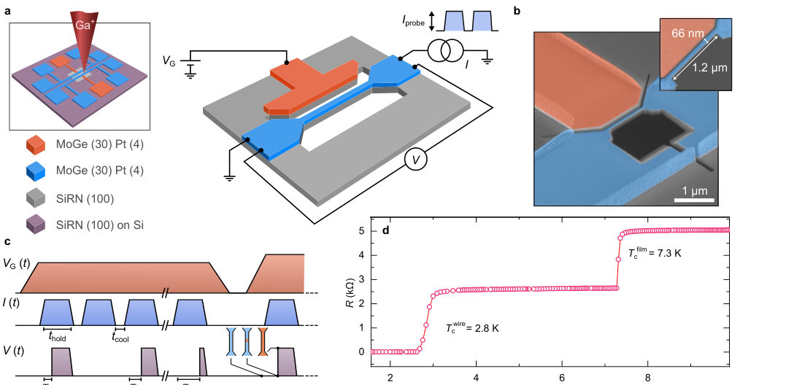 
FIG. 1. (a) Illustration of the experimental geometry. Using a Ga+ focused ion beam (inset), a MoGe nanowire is structured on top of a SiRN membrane. Milling through the membrane and the MoGe separates the nanowire (blue) from the gate (orange) by a 70 nm vacuum gap, eliminating any substrate- or dielectric-mediated leakage path. (b) False-colored scanning electron micrograph of the nanowire used in this work. The inset shows the wire’s dimensions. (c) Experimental protocol for measuring the gate-induced phase slip rate Γ. First, the gate voltage VG is slowly ramped to its setpoint. Then, the nanowire current I is very quickly ramped to its setpoint N times. The switching times τ1, τ2, ...,...

📷 Fig 2

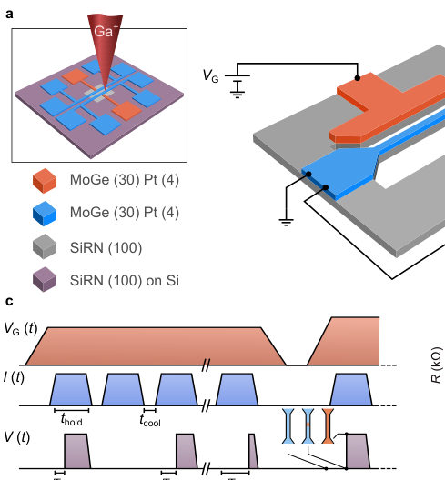 
Figure 1 shows the device and the measurement proto- col used to investigate the gate-induced escape dynamics. As shown in Fig. 1a-b, a MoGe nanowire and an adjacent side gate are etched by Ga+ focused-ion-beam milling di- rectly through a suspended SiRN membrane, so that both the wire (blue) and the gate (orange) are released from the substrate and fully separated by a vacuum gap. This

📷 Fig 3

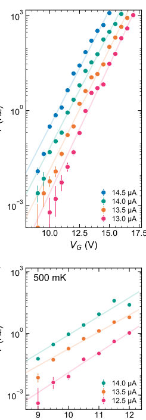 
FIG. 2. (a) Gate-induced phase slip rates Γ as function of bias current at 100 mK of bath temperature. Already at VG ∼9 V, the phase slip curve broadens to lower currents. For high gate voltages VG ≥15 V, a pronounced tail develops that stretches all the way to ∼0.2Ic. (b) Constant-current phase-slip rate curves as a function of gate voltage at a bath temperature of 100 mK. The solid lines show exponential fits Γ ∝exp(aVG) to the data, demonstrating that the rate-voltage relation is exponential to high accuracy over six orders of magnitude. (c-e) Phase slip rate curves at three different temperatures. The effect is present at all temperatures over an approximately equal range of currents...

📷 Fig 4

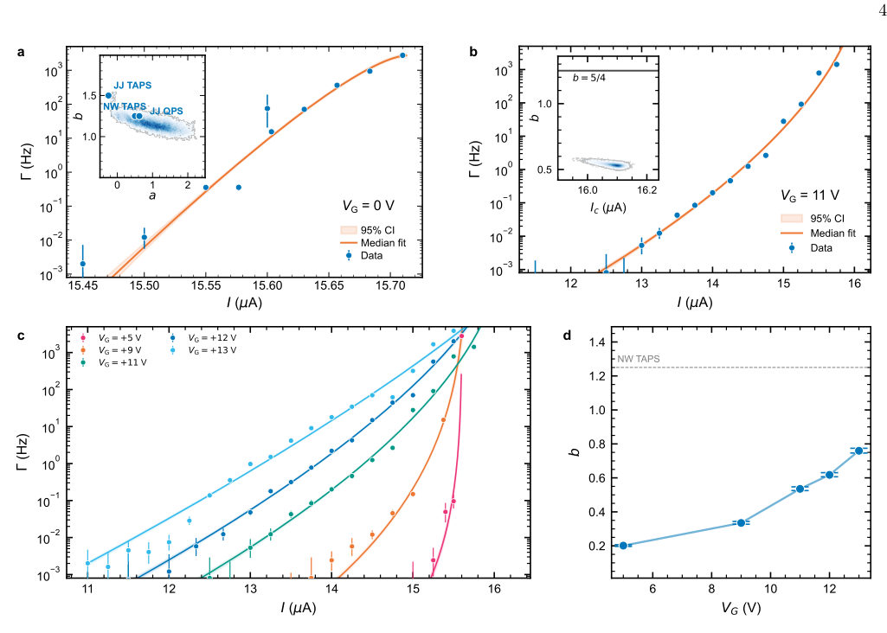 
FIG. 3. (a) Markov Chain Monte Carlo (MCMC) fit of the general LAMH form Γ = A(1 −I/Ic)a+b−1 exp [−B(1 −I/Ic)b] [22] to the VG = 0 escape-rate curve. The inset shows the posterior distributions for the exponents a and b. We also label the exponents predicted for thermally activated (TAPS, escape over the barrier) and macroscopic-quantum-tunneling-activated (QPS, escape through it) phase slips in a Josephson junction (JJ) and a nanowire (NW) [22, 23]. The exponents depend only on the underlying escape mechanism and are independent of, for instance, the energy-barrier height. Although the exponent a is constrained very poorly, the fitted exponent b is constrained strongly and agrees with the...

📷 Fig 5

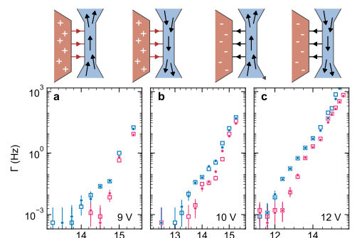 
FIG. 4. (a-c) Observation of gate-polarity symmetry breaking for |VG| = 9 V (a), 10 V (b), and 12 V (c). To high accu- racy, the phase slip rate is unchanged when the current sign (circles/squares) is inverted. However, when the gate-voltage sign is reversed (blue/magenta), the phase slip rate differs markedly, sometimes by more than an order of magnitude. Therefore, the response is not invariant under gate-polarity reversal.

**Summary.** This work investigates how an external gate voltage controls the switching dynamics (phase slip rate) in a superconducting nanowire by eliminating substrate leakage paths. By measuring the rate and analyzing its dependence on $V_G$, the authors demonstrate a strong, non-trivial, and asymmetric coupling, providing critical guidance for understanding gate-controlled superconductivity mechanisms.

**Why it may be interesting.** The work provides a clean experimental platform to study non-equilibrium quantum dynamics in superconductors, linking external electrostatic fields directly to the quantum tunneling/activation process governing superconducting failure.

Detailed structure

**Main problem.** To resolve the ambiguity in the Gate-Controlled Superconductivity (GCS) effect—whether critical current quenching is due to the electric field or leakage current—and to study the gate-induced phase slip rate ($\Gamma$).

**Main result.** The study establishes a clear, non-trivial, and asymmetric connection between the gate voltage and the phase slip rate, suggesting the gate acts directly on the phase-slip free-energy barrier.

**Method.** The researchers used direct measurement of phase slip escape rates ($\Gamma$) from fixed-bias waiting-time statistics in a fully suspended nanowire geometry, complemented by theoretical fitting using the Langer-Ambegaokar-McCumber-Halperin (LAMH) model.

**Model / system.** The system is a fully suspended superconducting nanowire of amorphous MoGe, separated from the gate by a vacuum gap, which eliminates substrate-mediated leakage channels. The dynamics are governed by phase slip events, analyzed via the escape rate $\Gamma$.

**Key observables.** Phase slip escape rate ($\Gamma$) as a function of bias current ($I$) and gate voltage ($V_G$); the evolution of the exponent $b$ in the rate equation.

**Important parameters / regimes.** Gate voltage ($V_G$), bias current ($I$), temperature ($T$), and the characteristic energy scales defining the phase slip barrier.

**Assumptions / limitations.** The fully suspended geometry eliminates leakage; the analysis relies on fitting the escape rate to established theoretical forms (like LAMH) while ruling out alternative mechanisms (field emission, strain).

**Figures summary.** Figures illustrate the device geometry and measurement protocol, showing $\Gamma$ vs. $I$ and $\Gamma$ vs. $V_G$, and detailing the evolution of the fitting exponent $b$ with $V_G$.

**Paper structure.** The paper first establishes the experimental platform (suspended nanowire) to eliminate leakage. It then measures $\Gamma(V_G)$ and finds an exponential dependence. Subsequent analysis rules out alternative physical mechanisms (field emission, strain) and uses advanced fitting techniques to interpret the non-trivial dependence of $\Gamma$ on $V_G$ and $I$.

Abstract

A gate voltage can suppress the critical current of a superconducting nanowire, and various scenarios have been proposed to describe these observations. The key difficulty is that these scenarios, including both leakage-driven and field-driven mechanisms, are impossible to disentangle in standard experiments. Here, we resolve this issue by studying a fully suspended superconducting nanowire of amorphous MoGe, separated from the gate by vacuum, eliminating all leakage-driven channels. We measure the phase slip escape rate $Γ$ and find a large gate-induced enhancement of $Γ$, exponential over six orders of magnitude. Fitting various escape-rate models reveals a strong deviation from simple phase slip models, hinting at a complex interaction between the electrostatic field and the phase slip centers. Surprisingly, $Γ$ is not invariant under reversal of the gate-voltage polarity. Our work establishes a clear and nontrivial connection between gate voltage and $Γ$, guiding future research into the origins of the effect.

[↑ back to top](#top)

### [Influence of nonlocal excitonic optical response on in-plane exciton polaritons supported by monolayer transition-metal dichalcogenides](http://arxiv.org/abs/2610.09232v1)

**Authors:** Kuniyuki Miwa  
**Type:** theory · **Category:** other · **PDF:** <https://arxiv.org/pdf/2610.09232v1>  
**Analysis basis:** full PDF text, analyzed in chunks
**Topic relevance:** `correlated / nonlocal dissipation` **3/5** · `interference shaping light` **3/5** · `Keldysh / 2PI / non-Gaussian methods` **2/5** · `methods for driven-dissipative` **2/5** · `analog quantum simulation` **1/5**

📷 Fig 1

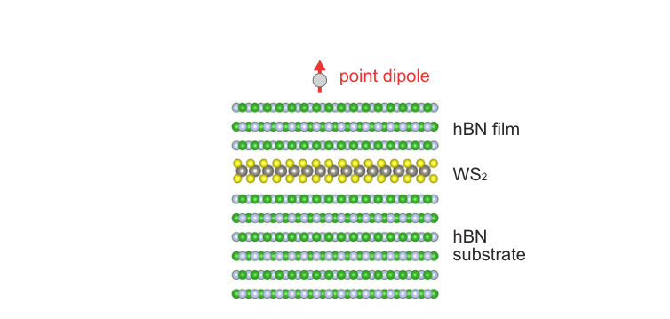 
FIG. 1. Schematic of an hBN-encapsulated monolayer WS2 with a point dipole placed above the

📷 Fig 2

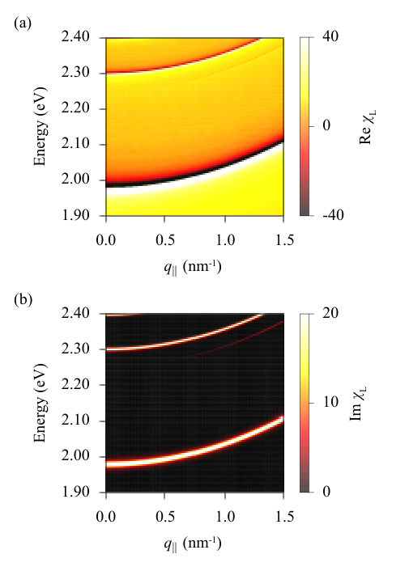 
FIG. 2. (a) Real and (b) imaginary parts of the longitudinal component of the nonlocal electric

📷 Fig 3

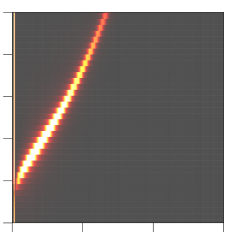 
FIG. 3. Exciton-polariton dispersion maps represented by the imaginary part of the p-polarized

📷 Fig 4

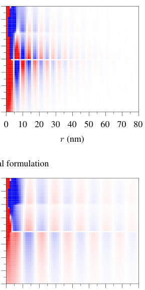 
FIG. 4. Spatial distribution of the z component of the electric field, Ez(r, z), near the TMD

📷 Fig 5

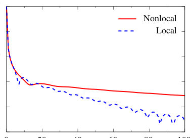 
FIG. 5. Normalized electric-field amplitude |Ez(r, z)| as a function of the lateral distance r from

**Summary.** This paper develops a microscopic theory to model the nonlocal excitonic optical response in monolayer $	ext{WS}_2$ supported by $	ext{hBN}$. By accounting for spatial nonlocality, the authors show that the resulting exciton-polariton dispersion shifts to lower wavevectors, enabling smoother near-field light confinement over larger distances. This highlights the critical role of nonlocality in controlling polaritonic behavior in van der Waals heterostructures.

**Why it may be interesting.** This work provides a rigorous theoretical framework for understanding how spatial nonlocality fundamentally alters the optical properties of excitons in 2D materials, which is crucial for designing advanced nanoscale photonic devices.

Detailed structure

**Main problem.** The central challenge is achieving nanoscale light confinement and long-range propagation for visible-frequency modes in nanophotonics, which requires accounting for spatial nonlocality in the excitonic optical response.

**Main result.** Incorporating spatial nonlocality shifts the polariton dispersion toward lower in-plane wavevectors, leading to smoother near-field distributions that extend over larger lateral distances while maintaining nanoscale confinement.

**Method.** The authors developed a microscopic theory by combining a two-band massive Dirac fermion description with a generalized Mott-Wannier treatment to derive a nonlocal electric susceptibility tensor.

**Model / system.** The study focuses on in-plane exciton-polaritons (IPEPs) supported by monolayer $	ext{WS}_2$ encapsulated by $	ext{hBN}$. The model incorporates the center-of-mass and internal relative motion of excitons.

**Key observables.** Polariton dispersion relation ($\mathbf{q}_{\|}$), near-field electromagnetic field distribution, and the nonlocal electric susceptibility tensor $\chi_{\mu
u}(\mathbf{q}_{\|}, \omega)$.

**Important parameters / regimes.** In-plane wavevectors ($\mathbf{q}_{\|}$), excitation energy, and the thickness of the capping $	ext{hBN}$ layer.

**Assumptions / limitations.** The local-response approximation breaks down because field variation length scales become comparable to the exciton size, necessitating the nonlocal treatment.

**Figures summary.** Figure 1 schematically illustrates the $	ext{hBN}$-encapsulated monolayer $	ext{WS}_2$ structure with a point dipole placed above the heterostructure.

**Paper structure.** The paper follows a theoretical derivation path: establishing the need for nonlocality, deriving the nonlocal susceptibility using combined fermion/Mott-Wannier theory, and finally applying this susceptibility to analyze the resulting polariton dispersion and near-field properties.

Abstract

Achieving nanoscale light confinement and long-range propagation is a central challenge in nanophotonics, with important implications for controlling molecular photophysical processes and energy transfer. Monolayer transition-metal dichalcogenides (TMDs) support in-plane exciton-polaritons (IPEPs), deeply subwavelength optical modes in the visible range. In this regime, electromagnetic fields vary on length scales comparable to the exciton size, making spatial nonlocality in the excitonic optical response essential. Here, we develop a microscopic theory of the nonlocal excitonic optical response and investigate the near-field properties of IPEPs in hexagonal boron nitride (hBN)-encapsulated monolayer WS$_2$. Combining a two-band massive Dirac fermion description with a generalized Mott-Wannier treatment, we derive a nonlocal electric susceptibility that accounts for both the center-of-mass and internal relative motion of excitons. Spatial nonlocality in the excitonic optical response shifts the polariton dispersion toward lower in-plane wavevectors compared with the results based on the local-response approximation. This reduces high-wavevector contributions and produces smoother near-field distributions that extend over larger lateral distances while retaining nanoscale confinement. Furthermore, at higher excitation energies, multiple exciton-polariton modes contribute at distinct wavevectors, and their relative contributions can be tuned by varying the thickness of the capping hBN layer. These insights elucidate the fundamental role of spatial nonlocality in the polaritonic properties of van der Waals heterostructures.

[↑ back to top](#top)

### [Beyond Equilibrium Raman Thermometry: Fermi-Level Control of the Anti-Stokes Response in Graphene](http://arxiv.org/abs/2610.10159v1)

**Authors:** Martin Jindra, Luka Pirker, Tim Verhagen, Ciarán Fowley, Martin Kalbáč, Matěj Velický, † Riichiro Saito, Ado Jorio, Otakar Frank  
**Type:** experiment · **Category:** statistical mechanics · **PDF:** <https://arxiv.org/pdf/2610.10159v1>  
**Analysis basis:** full PDF text, analyzed in chunks
**Topic relevance:** `non-equilibrium universality` **3/5** · `Keldysh / 2PI / non-Gaussian methods` **1/5** · `correlated / nonlocal dissipation` **1/5** · `driven-dissipative phase transition` **1/5** · `methods for driven-dissipative` **1/5** · `quantum measurements` **1/5**

📷 Fig 1

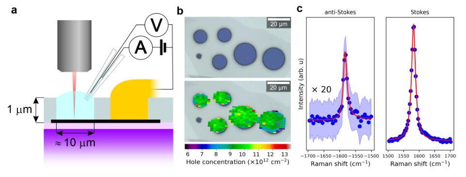 
Figure 1: Experimental platform for gate-controlled Raman measurements in graphene. a, Schematic of the localized electrolyte gating configuration with a lithograph- ically defined reservoir for the electrolyte. b, Optical image of a graphene device with micro-patterned reservoirs (top). The charge-carrier density distribution map obtained from the Raman G-2D frequency correlation plot (bottom). c, Comparison of the anti-Stokes (left) and Stokes (right) spectra of the graphene G mode acquired at an applied potential of −0.4 V, i.e., at the Dirac point (laser excitation wavelength of 633 nm, 1.5 mW power at the sample, 3.8 M LiClO4 aq. electrolyte). Blue dots are the experimentally measured...

📷 Fig 2

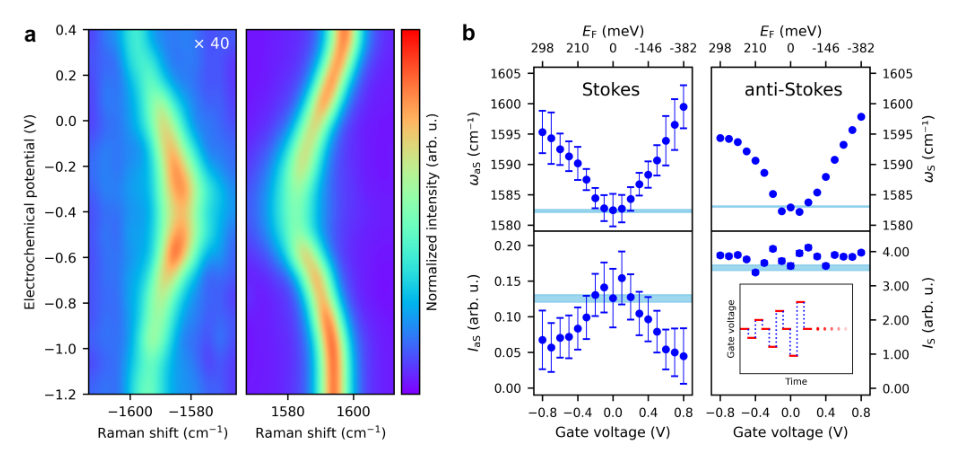 
Figure 2: Gate-dependent evolution of the anti-Stokes and Stokes G modes of graphene. a, Intensity maps of the anti-Stokes (left) and Stokes (right) G bands as a function of applied electrochemical potential, which are symmetric with respect to the Rayleigh line (laser excitation wavelength of 633 nm, 1.5 mW power at the sample, 3.8 M LiClO4 aq. electrolyte). b, Peak positions and peak integrated areas of the anti-Stokes (left panels) and Stokes (right panels) G band. The blue-shaded bands indicate the confidence interval (±1 standard deviation around the mean) of repeated measurements performed at the Dirac point, demonstrating the reversibility of the gating process. The error bars...

📷 Fig 3

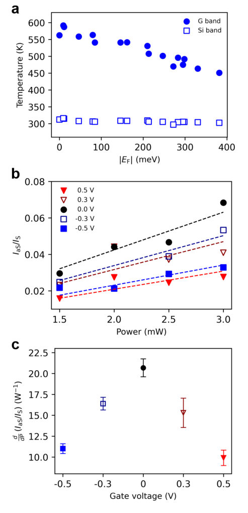 
Figure 3: Breakdown of the Raman thermometry and gate-dependent power response of the anti-Stokes/Stokes ratio. a, Temperature extracted from IaS/IS for the graphene G band and the reference Si band at 520 cm−1 using Eq. 2 plotted against the absolute Fermi level shift (laser excitation wavelength of 633 nm, 1.5 mW power at the sample, 3.8 M LiClO4 aq. electrolyte). b, Power dependence of IaS/IS for different gate voltages. c, Slope of the IaS/IS-power dependence, fitted in b (dashed lines), as a function of gate voltage.

📷 Fig 4

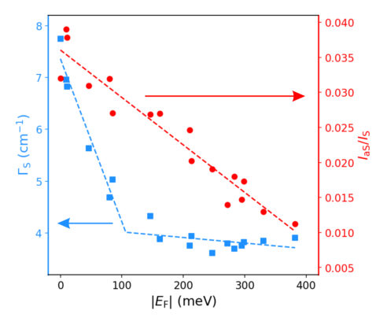 
Figure 4: Evolution of the G-band anti-Stokes/Stokes intensity ratio and linewidth with Fermi-level shift. The G-band Stokes linewidth ΓS (blue squares, left axis) and the anti-Stokes-to-Stokes integrated intensity ratio IaS/IS (red circles, right axis) are plotted as a function of the absolute Fermi-level shift |EF|. Dashed lines represent the corresponding linear and bilinear fits to the experimental data. (The data plotted here correspond to the sample shown in Fig. 2; the evolution of ΓS and IaS/IS with |EF| for all other liquid-gated samples is shown in Supporting Fig. S7).

📷 Fig 5

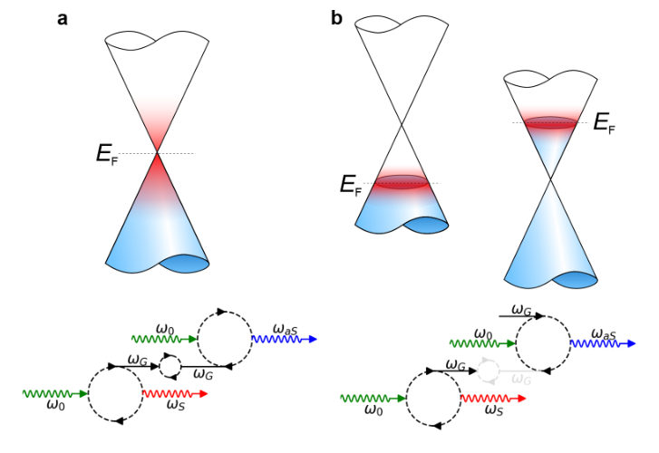 
Figure 5: Electronically mediated Stokes–anti-Stokes coupling and its suppression with doping. a, Dirac cone at charge neutrality (EF ≈0), with the red-shaded region indicating the electronic phase space available for coupling between the Stokes and anti- Stokes channels, and the corresponding Feynman diagram illustrating the correlated scattering pathway mediated by this electronic continuum. b, Dirac cone with EF shifted away from charge neutrality: the reduced overlap between occupied and empty electronic states (blue- shaded region) restricts the electronic phase space available for the proposed coupling, as illustrated in the corresponding Feynman diagram.

**Summary.** This paper uses anti-Stokes Raman scattering on graphene to probe non-equilibrium electron-phonon dynamics. By tuning the Fermi level using advanced electrochemical gating, the authors show that the anti-Stokes signal is strongly suppressed away from the Dirac point, contradicting simple thermal models. This establishes the anti-Stokes response as a sensitive diagnostic tool for electronic state-dependent phonon coupling in nanoscale conductors.

**Why it may be interesting.** This work provides an experimental demonstration of how electronic structure (Fermi level) can fundamentally alter phonon scattering signatures, which is relevant to understanding energy dissipation in quantum devices and open quantum systems.

Detailed structure

**Main problem.** The study addresses the challenge of directly characterizing non-equilibrium electron and phonon populations that govern heat generation and dissipation in nanoscale electronic devices.

**Main result.** The anti-Stokes Raman response in graphene shows a strong, reversible, and gate-dependent suppression away from the Dirac point, indicating that the scattering process is significantly influenced by the electronic phase space rather than just the equilibrium phonon population.

**Method.** The researchers utilized anti-Stokes Raman scattering spectroscopy, employing a microdroplet spectroelectrochemical platform combined with dielectric back-gates and chemical doping to tune the Fermi level ($E_F$) in monolayer graphene.

**Model / system.** The physical system is monolayer graphene, whose electronic and vibrational properties are probed using Raman scattering. The analysis compares the measured anti-Stokes/Stokes intensity ratio against predictions based on equilibrium phonon populations, revealing deviations.

**Key observables.** Anti-Stokes/Stokes intensity ratio ($I_{aS}/I_S$), G-mode anti-Stokes and Stokes intensities, G-mode frequency and linewidth evolution, and the dependence of these observables on the gate-tuned Fermi level ($E_F$).

**Important parameters / regimes.** Fermi level ($E_F$), Dirac point (charge neutrality point), excitation power ($P$), and gate voltage ($V_G$).

**Assumptions / limitations.** The standard interpretation of the anti-Stokes/Stokes ratio as a measure of lattice temperature is challenged by the observed gate-dependent deviations, suggesting a necessary inclusion of electronic contributions.

**Figures summary.** Figures show gate-dependent heatmaps of G bands, the breakdown of the standard thermometry interpretation, and the power dependence of the anti-Stokes/Stokes ratio, all demonstrating strong electronic control over the scattering signal.

**Paper structure.** The paper establishes the problem of non-equilibrium characterization, details the experimental setup using advanced gating techniques, presents measurements showing the gate-dependent suppression of $I_{aS}$ while $I_S$ remains stable, and concludes by establishing the anti-Stokes response as a sensitive probe of electron-phonon coupling.

Abstract

Non-equilibrium electron and phonon populations govern heat generation and dissipation in nanoscale devices, yet their direct characterization remains challenging. Anti-Stokes Raman scattering provides a sensitive probe of phonon populations and local temperatures, although its interpretation becomes more complex when electronic and phononic populations are driven out of equilibrium. Here, we investigate the gate-dependent anti-Stokes Raman response of monolayer graphene and find that the anti-Stokes response deviates from that expected from an equilibrium phonon population. Using a spatially localized microdroplet spectroelectrochemical platform, dielectric back-gates, and chemical doping, we observe a strong and reversible suppression of the G-mode anti-Stokes intensity as the Fermi level is tuned away from the Dirac point, while the Stokes intensity remains essentially unchanged. By contrast, the G-mode frequency and linewidth of both the Stokes and anti-Stokes branches evolve with doping as expected from the established Kohn-anomaly picture. The anti-Stokes/Stokes intensity ratio decreases by several-fold over the measured range and displays a pronounced, gate-dependent power response with maximum sensitivity at charge neutrality. Comparison with previous studies of non-equilibrium carrier dynamics in doped graphene suggests an important role of Fermi-level-dependent electronic phase space, which can influence both hot-carrier-driven phonon populations and electronically mediated Stokes-anti-Stokes scattering. Our findings establish anti-Stokes Raman scattering as a sensitive probe of electron-phonon coupling and non-equilibrium phonon dynamics in graphene.

[↑ back to top](#top)

### [Compact Fully Integrated Alignment-Free and Linearly Polarized Ho$^{3+}$ Single-Frequency Waveguide Laser](http://arxiv.org/abs/2610.09435v1)

**Authors:** Jeswin Jacob, T Toney Fernandez, Dale Otten, Ori Henderson-Sapir, 3 Karen Privat, David Lancaster  
**Type:** experiment · **Category:** other · **PDF:** <https://arxiv.org/pdf/2610.09435v1>  
**Analysis basis:** full PDF text, analyzed in chunks
**Topic relevance:** `quantum optics experiment` **3/5** · `QC/QI experiment` **1/5** · `interference shaping light` **1/5** · `superradiant laser` **1/5**

📷 Fig 1

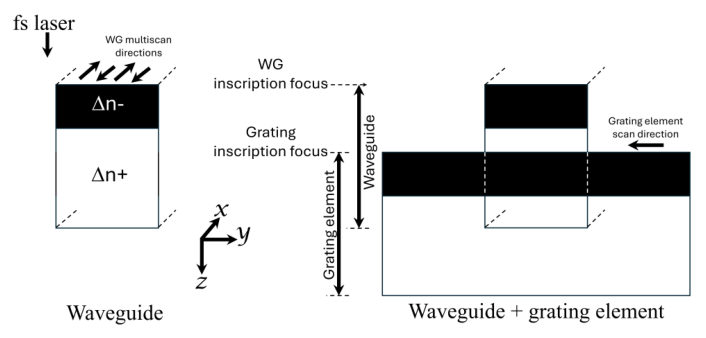 
FIG. 1. Waveguide and waveguide + grating plane cartoon. The black solid fill represent the negative index change and the white rectangles represent the positive index change induced by the fs-laser. In all cases the inscribing femtosecond laser was incident from the top of the page. The waveguides were fabricated by focusing the laser 170µm and the grating planes between 182−188µm below the top surface. The inscription direction of the waveguide (x-axis) and grating planes (y-axis) were orthogonal to each other as shown. figures.

📷 Fig 2

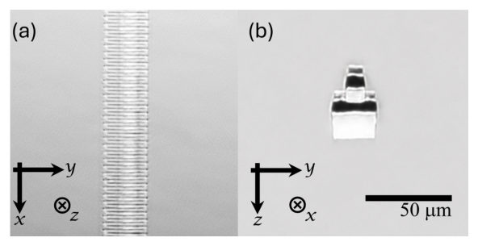 
FIG. 2. (a) Top down view of the integrated waveguide Bragg grating inscribed in third order for 2060 nm Bragg resonance. Inscribing fs-laser is along the z-axis (b) The cross sectional view of the waveguide and the relative position of grating plane which were inscribed at depths of 170µm and 185µm respectively. figures.

📷 Fig 3

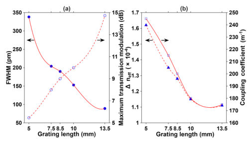 
FIG. 3. Variation of (a) FWHM and transmission modulation at Bragg resonant wavelength along with (b) effective modal refractive index modulation and coupling coefficient.

📷 Fig 4

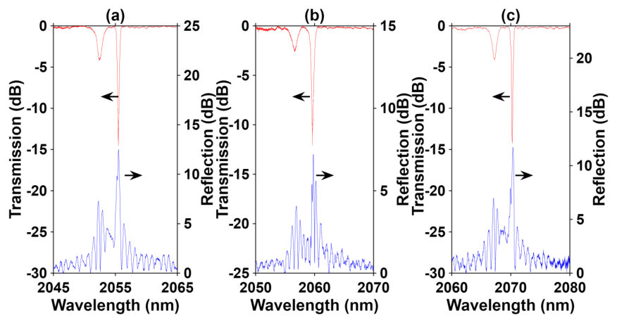 
FIG. 4. Measured reflection and transmission spectra of 13.5-mm-long Bragg gratings designed for different resonance wavelengths.

📷 Fig 5

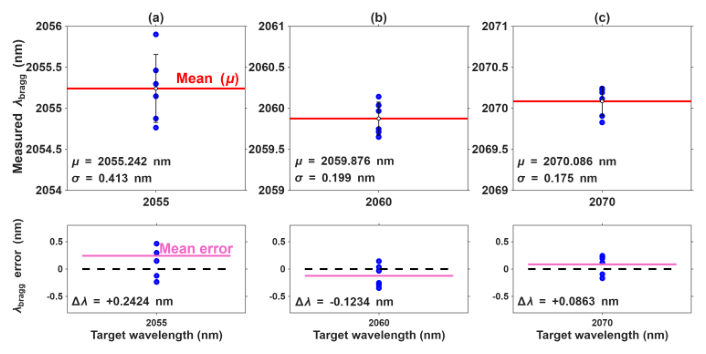 
FIG. 5. Bragg wavelength design accuracy and repeatability of the fabricated Bragg gratings at design wavelengths of 2055, 2060, and 2070 nm. (a)–(c) Measured Bragg wavelengths for each target wavelength, showing the mean value (µ) and standard deviation(σ). The corresponding wavelength deviations from the design values are shown in the lower panels.

**Summary.** This paper reports the creation of a highly compact, integrated, and alignment-free single-frequency laser source operating in the mid-infrared using $	ext{Ho}^{3+}$-doped fluoride glass. By integrating femtosecond laser-written waveguides and Bragg gratings, the authors achieved stable lasing at $2062.21 	ext{ nm}$ with excellent spectral purity and linear polarization. This platform offers a robust alternative to traditional bulk laser sources for quantum applications.

**Why it may be interesting.** This work represents an advanced demonstration of integrated photonics in the mid-IR, which is crucial for quantum sensing and quantum communication applications that require stable, compact sources.

Detailed structure

**Main problem.** The primary goal was to develop a compact, fully integrated, alignment-free, and linearly polarized single-frequency laser source operating in the mid-infrared using $	ext{Ho}^{3+}$-doped fluoride glass.

**Main result.** The authors successfully demonstrated stable single-frequency lasing at $2062.21 	ext{ nm}$ with a narrow linewidth ($< 5 	ext{ MHz}$) and confirmed linear polarization, all within a compact, integrated chip architecture.

**Method.** The system was fabricated by inscribing waveguides and waveguide Bragg gratings (WBGs) into fluoride glass using a femtosecond laser, followed by characterization of lasing performance and polarization state.

**Model / system.** The physical system is an $	ext{Ho}^{3+}$-doped fluoride glass waveguide laser cavity. The cavity is formed by integrating a femtosecond laser-inscribed waveguide and a WBG, creating a compact, chip-scale resonator.

**Key observables.** Lasing wavelength ($2062.21 	ext{ nm}$), linewidth ($< 5 	ext{ MHz}$), polarization state (linear), spectral bandwidth ($	ext{FWHM}$), and coupling coefficient ($\kappa$).

**Important parameters / regimes.** Mid-infrared range ($\sim 2 \mu	ext{m}$), waveguide width ($\approx 9 \mu	ext{m}$), and grating lengths ($5 	ext{ to } 13.5 	ext{ mm}$).

**Assumptions / limitations.** The alignment-free nature is attributed to the butt-coupling of the pump light via the PR grating, and polarization selectivity is hypothesized to arise from form birefringence or polarization-dependent scattering losses.

**Figures summary.** Figures illustrate the physical setup (waveguide/grating placement), spectral measurements (transmission/reflection of gratings), and time-domain measurements showing stable lasing output and polarization analysis.

**Paper structure.** The paper details the fabrication process using femtosecond laser inscription, characterizes the resulting Bragg grating resonances, demonstrates stable single-frequency lasing, and investigates the underlying physics governing polarization selectivity.

Abstract

We report, for the first time, a fully integrated Ho$^{3+}$-doped fluoride glass waveguide laser incorporating a femtosecond laser-inscribed waveguide and waveguide Bragg grating. The compact 12.4 mm cavity achieves stable single-frequency lasing at 2062.21 nm with a line width of better than 5 MHz. The laser emits linearly polarized light, which is efficiently delivered through an SM1950 single-mode fiber. This alignment-free architecture provides a compact and robust platform for integrated mid-infrared single-frequency laser sources.

[↑ back to top](#top)

### [Topological Frenkel excitons in 2D molecular crystals](http://arxiv.org/abs/2610.09149v1)

**Authors:** Quentin Stein, Sidhartha Nayak, Song Jiang, Jakob Kuhlke, Michelangelo Romeo, Thomas Frederiksen, Fabrice Scheurer, Katharina Kaiser, Tomas Neuman, Guillaume Schull  
**Type:** both · **Category:** other · **PDF:** <https://arxiv.org/pdf/2610.09149v1>  
**Analysis basis:** full PDF text, analyzed in chunks
**Topic relevance:** `analog quantum simulation` **3/5** · `Frenkel-Kontorova` **1/5** · `driven-dissipative phase transition` **1/5** · `quantum measurements` **1/5**

📷 Fig 1

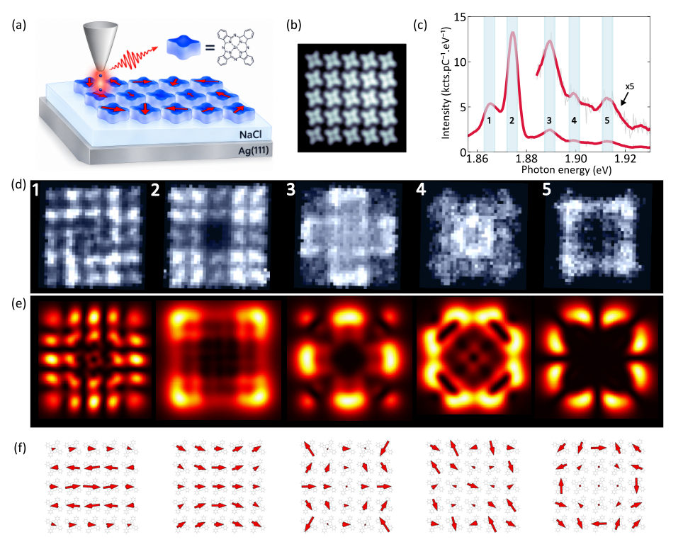 
Figure 1. Frenkel excitons in self-assembled 2D ZnPc clusters. (a) Schematic of the experiment:

📷 Fig 2

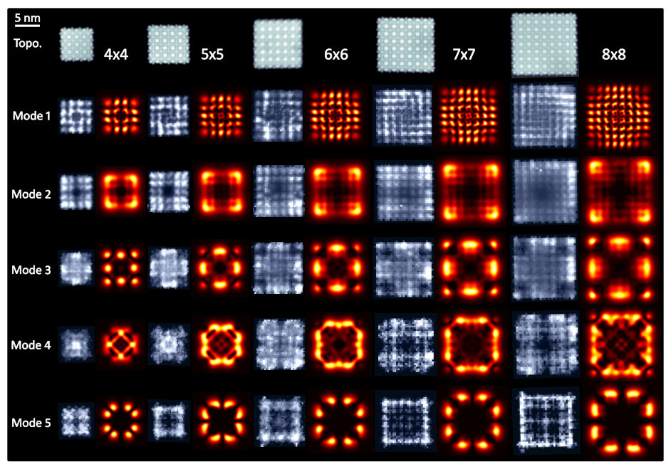 
Figure 2. Size evolution and emergence of excitonic band structure in finite 2D ZnPc clusters.

📷 Fig 3

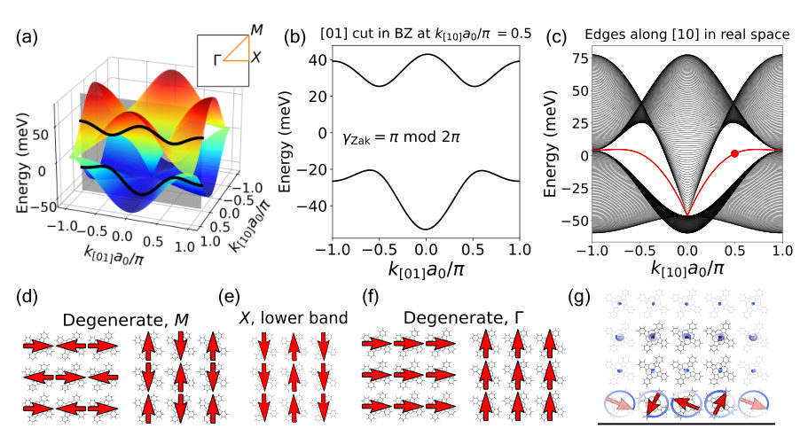 
Figure 3. Band structure of 2D and 1D excitons. (a) Band structure of the 2D aggregate. (b)

📷 Fig 4

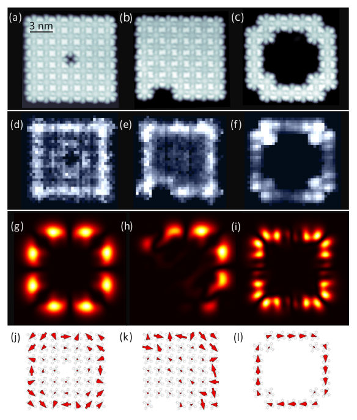 
Figure 4. STM topographies (I = 5 pA, V = -2.5 V) of (a) a 7 × 7 cluster from which the

**Summary.** This paper investigates energy transport in 2D molecular crystals by linking excitonic band topology to physical observables. Using STML, the authors image excitons and demonstrate that edge-confined states, predicted by non-trivial band topology, can be directly resolved. This establishes molecular crystals as a viable platform for engineering directional energy flow.

**Why it may be interesting.** This work directly bridges condensed matter theory (band topology) with experimental quantum optics/spectroscopy (STML), providing a tangible platform for studying coherent energy transfer in molecular systems, which is highly relevant to AMO physics and quantum light-matter interaction.

Detailed structure

**Main problem.** The study aims to determine if the topological features inherent in the excitonic band structure of molecular crystals can generate robust, edge-confined states that facilitate directional energy transport.

**Main result.** The researchers successfully imaged and theoretically confirmed the existence of edge-confined excitonic states in 2D molecular crystals, demonstrating that molecular crystals can be engineered for controlled energy flow.

**Method.** The work combines experimental imaging using Scanning Tunneling Microscopy-induced Luminescence (STML) with theoretical modeling based on a Frenkel-exciton Hamiltonian.

**Model / system.** The physical system is 2D molecular crystals (e.g., zinc phthalocyanine) hosting Frenkel excitons. The model uses a Hamiltonian describing coherent excitonic coupling, with calculations relying on TDDFT to derive transition charge densities.

**Key observables.** Real-space wavefunctions of excitonic states, spectral features in STML maps, and the identification of edge-localized states linked to non-trivial band topology (Zak phase).

**Important parameters / regimes.** Cluster size ($N 	imes N$), energy eigenvalues ($\Delta E_i$), and the coupling strength derived from dipole-dipole interactions.

**Assumptions / limitations.** The analysis assumes coupling is dominated by dipole-dipole interactions, and that the system can be modeled by restricting the Hamiltonian to the single-excitation subspace.

**Figures summary.** Figures illustrate the experimental setup, STM topographies, and STML spectra, alongside theoretical simulations showing the evolution of excitonic bands from discrete to collective modes, and the spatial mapping of edge states.

**Paper structure.** The paper progresses from establishing the physical problem and experimental technique (STML imaging) to developing the theoretical model (Hamiltonian/TDDFT), and finally demonstrating the key finding: the observation and theoretical confirmation of topologically protected edge states.

Abstract

Collective molecular excitations govern energy transport in light-harvesting and optoelectronic materials. Theory predicts that excitonic band topology can generate edge-confined states, offering a route to direct energy flow in molecular systems, yet experimental evidence is lacking. Here we use scanning tunnelling microscopy-induced luminescence to image Frenkel excitons in two-dimensional zinc phthalocyanine molecular crystals with nanometer resolution. By varying cluster size, we observe the transition from discrete quantum-confined excitations to collective excitonic bands and directly resolve their real-space wavefunctions. We identify an excitonic state localized at the crystal perimeter and show, through comparison with microscopic theory, that it originates from the momentum-resolved non-trivial topology of the bulk excitonic bands. Our results establish molecular crystals as a platform for engineering topological excitonic states and provide a strategy for controlling energy transport through excitonic band engineering.

[↑ back to top](#top)

### [Bogoliubov-de Gennes spectrum, Cherenkov radiation and recoil of solitons with third-order dispersion underlying optical analogue horizons](http://arxiv.org/abs/2610.09814v1)

**Authors:** Hasan Oguz  
**Type:** theory · **Category:** other · **PDF:** <https://arxiv.org/pdf/2610.09814v1>  
**Analysis basis:** full PDF text, analyzed in chunks
**Topic relevance:** `analog quantum simulation` **3/5** · `Keldysh / 2PI / non-Gaussian methods` **1/5** · `methods for driven-dissipative` **1/5**

📷 Fig 1

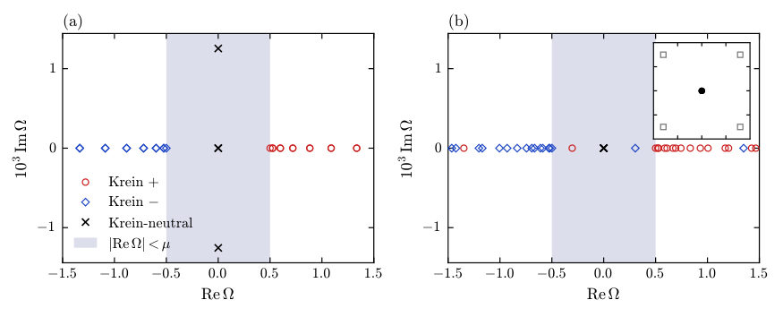 
Figure 1: Krein-signed BdG spectra of the N = 1 soliton (µ = 0.5; nτ = 500, τmax = 16) in the window |Re Ω| ≤3µ. (a) δ3 = 0, linearization about ψ0. (b) The operating value δ3 = 0.05, linearization about the stationary periodic-box TOD state ϕ; inset (|Re Ω|, |Im Ω| ≤ 0.2, ticks at 0 and ±0.1): the zero-mode sector about ϕ (filled circle) and the complex quartet about ψ0 at the same δ3 (open squares). Main panels: circles, positive symplectic norm (Krein-positive); diamonds, negative norm (Krein-negative); crosses, Krein-neutral eigenvalues (the zero-mode sector and every non-real eigenvalue); shaded band: |Re Ω| &lt; µ.

📷 Fig 2

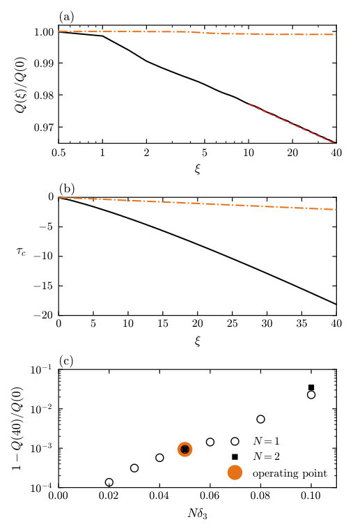 
Figure 2: Radiative loss of the launched soliton. (a) Core norm Q(ξ)/Q(0) on logarithmic axes for N = 2, δ3 = 0.05 (Nδ3 = 0.10; solid) and at the operating point N = 1, δ3 = 0.05 (dash-dotted), with the law Q ∝ξ−c through Q(10) for the former (dashed) with c = 9.2 × 10−3. (b) Center τc(ξ), the sub-grid intensity maximum, for the same two simulations. (c) Norm lost over ξ ∈[0, 40] against Nδ3 for N = 1 (open circles) and N = 2 (filled squares); large disk: the operating point.

📷 Fig 3

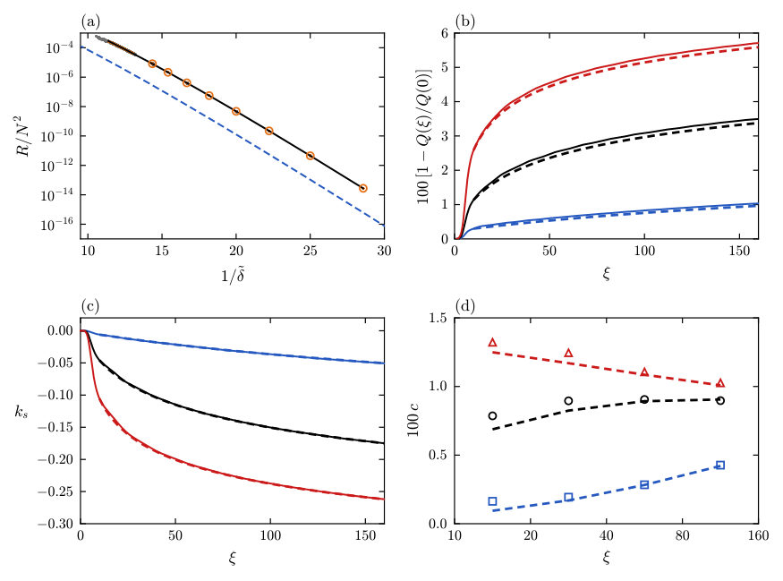 
Figure 3: Steady emission and recoil. (a) Scaled emission rate R/N 2 against 1/˜δ: steady prepared solitons of table 2 (circles), every rate of the prepared solitons over their hold phase (orange dots; the data of the fit), the rates of the launched solitons at N = 1, 1.6 and 2 for radiation emitted after ξ = 20 (grey dots), the rate function (10) (solid) and the first-order rate (9) (dashed). (b) Norm lost by launched solitons at N = 1 and δ3 = 0.08 (blue), 0.10 (black) and 0.12 (red), direct integration (solid) and recoil model (11) started at ξ = 10 (dashed). (c) Mean wavenumber ks of the same simulations. (d) Exponent c of −d ln Q/dξ ≃c/ξ over the windows [10, 20], [20, 40], [40, 80]...

📷 Fig 4

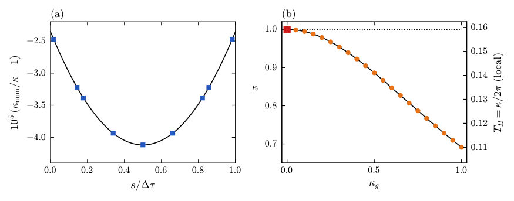 
Figure 4: Kinematic surface gravity at the operating point, equation (6). (a) Relative deviation of the extracted κnum from the closed form (12) at nine drive amplitudes d ∈ [0.7, 1.3] (squares), plotted against the position s/∆τ of the crossing between grid nodes, with equation (14) (line). (b) κ over 21 values of κg ∈[0, 1] at d = 1 (circles) and the closed form N S(kop) (line); square and dotted line: κ = N at κg = 0. Right axis: the local kinematic surface-gravity temperature TH = κ/2π of the crossing.

📷 Fig 5

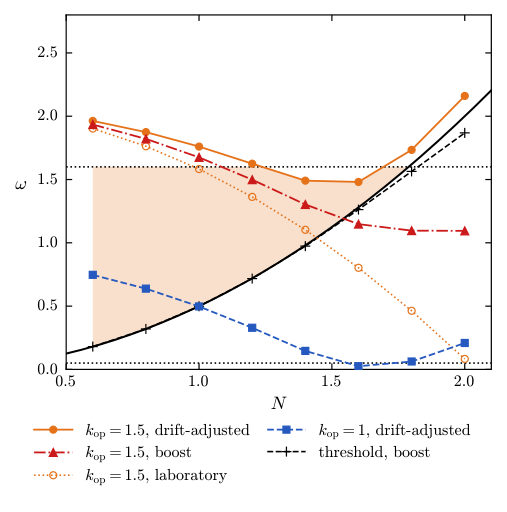 
Figure 5: Emission channels over the soliton amplitude at δ3 = 0.05, κg = 0.3. Upper edge ω(−) max of the pair channel, equation (17), with the drift measured over ξ ∈[30, 40]: drift-adjusted criterion at kop = 1.5 (filled circles, solid) and kop = 1 (squares, dashed), boost to the comoving frame at kop = 1.5 (triangles, dash-dotted), and laboratory frame at kop = 1.5 (open circles, dotted); lines join the grid values. Solid black curve: the escape threshold ω = µ = N 2/2; plus signs joined by a dashed line: the threshold lowered by the drift under the boost; dotted lines: the band edges ωlo = 0.05 and ωhi = 1.6. Shaded: the kinematic Hawking window at kop = 1.5 under the drift-adjusted...

**Summary.** This paper analyzes solitons in optical systems exhibiting third-order dispersion, treating the system as an analogue for event horizons. The authors compute the Bogoliubov-de Gennes spectrum and measure the Cherenkov radiation emitted by the solitons. The findings show that the radiation rate is much higher than predicted by simple theory, and the results are framed within a kinematic model that treats thermal relations as external inputs.

**Why it may be interesting.** This work bridges nonlinear optics, quantum field theory in curved spacetime analogues, and soliton dynamics, providing quantitative results on energy loss and spectral properties near an analogue horizon.

Detailed structure

**Main problem.** The paper investigates the properties of solitons in the presence of third-order dispersion, specifically in the context of optical analogues of event horizons.

**Main result.** The measured Cherenkov emission rate significantly exceeds first-order predictions, and the analysis successfully describes soliton recoil and decay using a kinematic model where thermal relations are treated as imposed inputs.

**Method.** The study employs Bogoliubov-de Gennes (BdG) spectrum analysis, measures steady Cherenkov emission flux, and develops a kinematic model for the analogue horizon.

**Model / system.** The system is modeled by the nonlinear Schrödinger equation (GNLSE) in the anomalous-dispersion regime, describing solitons in optical fibers. The analysis linearizes this equation around the stationary state.

**Key observables.** BdG spectrum (Jordan blocks, negative-energy modes), steady Cherenkov emission rate, soliton recoil, and the surface gravity ($\kappa$).

**Important parameters / regimes.** Third-order dispersion strength ($\delta_3$), soliton amplitude, and the operating point parameters ($N=1, \delta_3=0.05, \kappa_g=0.3$).

**Assumptions / limitations.** The thermal relation and entanglement are treated as imposed model inputs, and the analysis is restricted to Raman-free Kerr media.

**Figures summary.** Figure 1 shows Krein-signed BdG spectra for the soliton, comparing the integrable case ($\delta_3=0$) with the operating value ($\delta_3=0.05$), detailing the zero-mode sector.

**Paper structure.** The paper proceeds by analyzing the BdG spectrum, quantifying the Cherenkov emission rate from adiabatically prepared solitons, and finally constructing a kinematic model for the analogue horizon to relate surface gravity to soliton properties.

Abstract

Third-order dispersion turns the soliton of the nonlinear Schrödinger equation, which underlies optical analogues of event horizons in fibers, into a weakly radiating solitary wave. We compute three of its properties without assuming a thermal emission law. First, the linearized (Bogoliubov-de Gennes) problem must be posed about the stationary state of the dispersive equation: linearizing about the integrable profile produces a complex quartet that is converged in grid and box, grows as the square root of the dispersion strength and is spurious. About the stationary state, on a periodic grid, the zero-mode sector consists of two Jordan blocks of size two and the spectrum is real at the operating point, including negative-energy box modes of the resonant branch. Second, we measure the steady Cherenkov emission of adiabatically prepared solitons from the flux of the radiation behind them, over eight decades. The radiation is phase-matched in the frame of the drifting soliton, and the first-order rate falls short of the measured one by factors of 29 to 45. Expressed through a scaled dispersion coefficient of the local soliton, the measured rate describes launched solitons of three amplitudes; with norm and momentum balance, and no further fitted parameter, it reproduces their recoil and the slow decay of their loss rate; at weak dispersion the loss of a launched soliton is the shedding of its launch mismatch. Third, a census of the asymptotic channels shows that long-wavelength upstream emission requires the chemical potential of the soliton, lowered by the comoving-frame Doppler shift of a drifting soliton, to lie inside the analysis band, which bounds the soliton amplitude. In a kinematic model of the flow the surface gravity has a closed form; the thermal relation and the entanglement built on it are imposed inputs of that model. The construction applies to Raman-free Kerr media.

[↑ back to top](#top)

### [Superconducting edge contact to a buried Ge quantum well](http://arxiv.org/abs/2610.08924v1)

**Authors:** Dina Sokolova, Davide Costa, Davide Degli Esposti, Tommaso Costanzo, Giordano Scappucci, Georgios Katsaros, Anton V. Bubis  
**Type:** experiment · **Category:** other · **PDF:** <https://arxiv.org/pdf/2610.08924v1>  
**Analysis basis:** full PDF text, analyzed in chunks
**Topic relevance:** `QC/QI experiment` **3/5** · `quantum measurements` **1/5**

📷 Fig 1

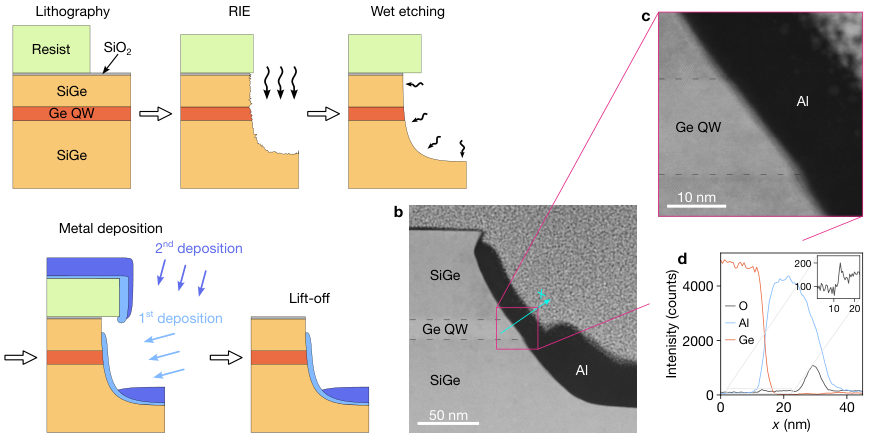 
FIG. 1. Combined dry- and wet-etch fabrication process for superconducting edge contacts. a, Cross-sectional schematics of the fabrication process. Starting from the pristine Ge/SiGe heterostructure (similar growth to Ref. [44]), dry etching defines the device geometry and exposes the Ge QW at a sidewall. A subsequent wet etch employed with peracetic acid [45] removes plasma residues and potentially damaged material while creating an undercut beneath the resist. Follow- ing metal deposition establishes direct superconducting contact to the quantum well and provides routing to the bondpad. b, c, HAADF-STEM images of an Al edge contact to the Ge QW after lift-off. Boundaries of the Ge QW with...

📷 Fig 2

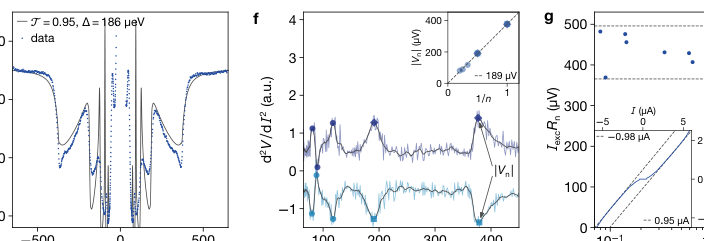 
FIG. 2. Highly transparent Josephson junctions. a, False-color SEM image of one of the shortest Josephson junctions. The schematics on the right show cross-sections along the current-flow direction: outside the contact region (top) and through the center of the junction (bottom). b, c, IV curves of the shortest, L = 80 nm (b), and longest, L = 5.35 µm (c), junctions. d, IswRn product for Josephson junctions with different geometries. For each junction, the mean value of Isw is calculated from 50 IV curves. The normal-state resistance Rn was extracted from the high-bias IV slope over the range 1 mV &lt; |V | &lt; 2 mV. Inset: Product RnW for the same device set. e, Differential resistance dV/dI as...

📷 Fig 3

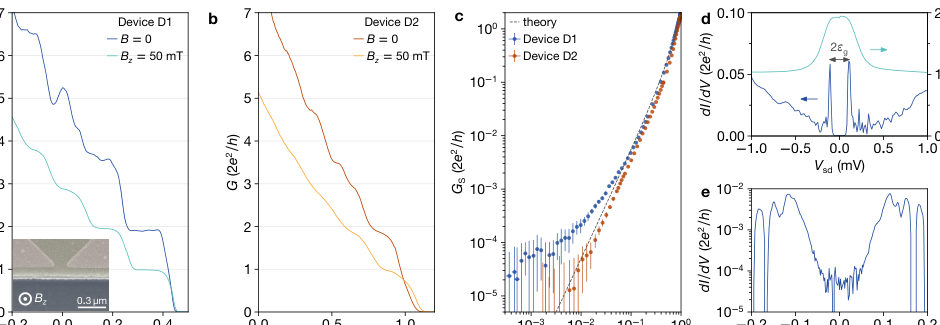 
FIG. 3. Conductance doubling in QPC with superconducting edge contacts. a, b, Conductance as a function of split-gate voltage, measured at zero magnetic field (darker line) and at out-of-plane field Bz = 50 mT (lighter line), when superconductivity is suppressed. Panel a (b) shows data from a device D1 (D2) with split-gate gap of 150 nm (220 nm) and gate-to-superconductor distance of 50 nm (0 nm). Inset: false-color SEM of a device nominally identical to device D1. c, Conductance in superconducting state, GS, plotted vs normal-state conductance, GN (Bz = 50 mT). At each selected value of Vg, the device was held at a fixed gate voltage while the conductance was measured at Bz = 0 and Bz = 50...

📷 Fig 4

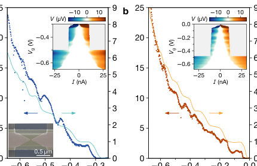 
FIG. 4. Quantization of conductance and switching current in superconducting QPCs. a, Switching current, Isw (points, left axis), and normal-state conductance, G (solid line, right axis), as a function of split-gate voltage for a de- vice with an 80 nm split-gate separation. The normal-state conductance was measured at Bz = 50 mT. Bottom inset: false-color SEM micrograph of a device nominally identical to the measured one. Top inset: color map of the voltage drop, V , as a function of current and split-gate voltage. The switching current was extracted using the threshold criterion V ≥0.25 µV. b, Similar data for a device with a 150 nm split-gate separation.

📷 Fig 5

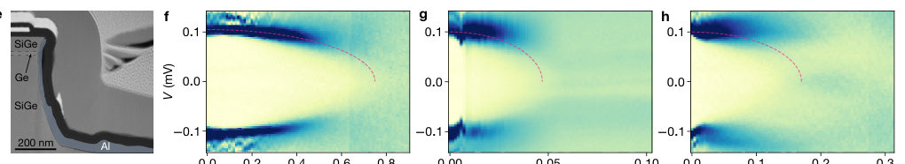 
FIG. 5. Effect of the contact geometry on the magnetic-field resilience of superconducting edge contacts. a, HAADF-STEM of one of the QPC devices studied in this work. Split-gate and top-gate layers are labeled SG and TG, respectively. Gates are separated from the substrate and each other by the atomic-layer-deposited Al2O3 layers. Al edge contact is highlighted in blue. b-d, Differential conductance in the tunneling regime as a function of bias voltage and magnetic field measured for different field directions. e, HAADF-STEM of the deeply etched device. f-h, Differential conductance measured for different field directions for a deeply etched device. Differential conductance for all panels...

**Summary.** This work reports a novel, robust fabrication method combining dry and wet etching to create high-quality superconducting edge contacts to buried Ge quantum wells. By achieving near-perfect interface transparency and observing strong Andreev enhancement in quantum point contacts, the authors demonstrate a reliable platform for superconducting hybrid quantum devices.

**Why it may be interesting.** The study provides experimental evidence of controlled superconducting proximity effects in solid-state heterostructures, which is foundational for building superconducting quantum circuits and quantum devices.

Detailed structure

**Main problem.** The primary challenge addressed is establishing high-quality, reproducible superconducting contacts to deeply buried quantum wells (QWs) within semiconductor-superconductor hybrid systems.

**Main result.** The combination of anisotropic dry etching followed by gentle wet etching proves to be a robust fabrication strategy, yielding Josephson junctions with near-unity interface transparency and quantum point contacts showing strong Andreev enhancement.

**Method.** The authors employed an edge-contact fabrication approach, combining dry and wet etching techniques, followed by electrical characterization of Josephson junctions and quantum point contacts.

**Model / system.** The physical system is a semiconductor-superconductor hybrid structure, specifically involving a buried Germanium (Ge) quantum well contacted by a superconductor (e.g., Al). Measurements probe proximity effects, Andreev bound states, and superconducting transport phenomena.

**Key observables.** Interface transparency, subgap conductance steps in QPCs (approaching $4e^2/h$), quantized supercurrent, and the length dependence of the $I_{sw}R_n$ product.

**Important parameters / regimes.** Junction length ($L$), superconducting gap ($\Delta \approx 186-189 \mu	ext{eV}$), and the ratio of superconducting to normal conductance ($G_S/G_N$).

**Assumptions / limitations.** The analysis assumes the short-junction limit for certain theoretical fits, and the success of the wet etch in preserving the geometry defined by the dry etch.

**Figures summary.** Figures illustrate the combined dry/wet-etch fabrication process, SEM images of junctions, and plots showing $I_{sw}R_n$ vs. length, as well as $I-V$ curves and $G$ vs. $V_g$ measurements.

**Paper structure.** The paper details the fabrication process (dry/wet etching) to create the contacts, followed by electrical characterization of the resulting Josephson junctions and quantum point contacts to verify high-quality superconducting coupling.

Abstract

Semiconductor-superconductor hybrid systems form the basis for a broad range of quantum phenomena, such as Andreev bound states, topological superconductivity, and hybrid quantum Hall states. The performance of these hybrid systems can strongly benefit from the exceptional electronic properties of heterostructures with deeply buried quantum wells. However, establishing high-quality superconducting contacts to such quantum wells remains challenging. Here, we address this problem with an edge-contact approach that combines anisotropic dry etching to access the quantum well followed by wet etching for interface preparation. Josephson junctions fabricated using this approach consistently exhibit near-unity interface transparency, while quantum point contacts show strong Andreev enhancement, with the first conductance plateau approaching $4e^2/h$, the limit of perfect Andreev reflection. In superconducting quantum point contacts, the high contact quality is further manifested by quantized supercurrent. These results establish the combination of dry and wet etching as a robust strategy for integrating deeply buried quantum wells into superconducting hybrid devices.

[↑ back to top](#top)

### [Correlating DC SQUID Performance with the Location of Trapped Magnetic Flux Using Scanning SQUID Microscopy](http://arxiv.org/abs/2610.10442v1)

**Authors:** Bochao Xu, Ian W. Haygood, Kyle Jackman, Coenrad J. Fourie, Pete F. Hopkins, Michael L. Schneider  
**Type:** experiment · **Category:** other · **PDF:** <https://arxiv.org/pdf/2610.10442v1>  
**Analysis basis:** full PDF text, analyzed in chunks
**Topic relevance:** `quantum measurements` **3/5**

📷 Fig 1

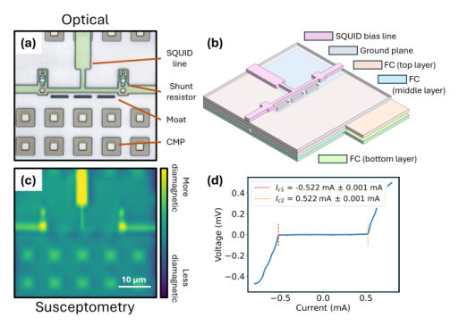 
FIG. 1. Device structure and characterization of the DC SQUID with flux-trapping moats. (a) Optical im- age of the measured DC SQUID device, with the SQUID bias line, shunt resistors, moats, and CMP fill structures indicated. (b) Illustration of the multilayer device geometry showing the DC SQUID above the ground plane moats above the two- turn field coil (FC). (c) Susceptometry image of the same de- vice region, revealing diamagnetic superconducting elements. (d) Representative current–voltage characteristic of the de- vice cooled in no applied field, with Ic = 0.522 mA ± 0.001 mA.

📷 Fig 2

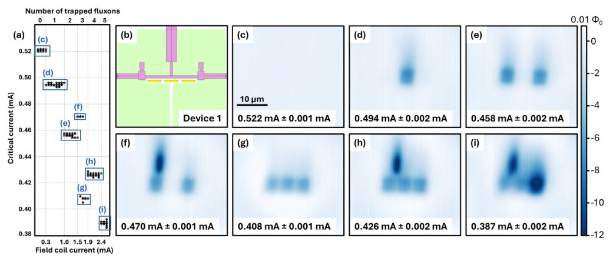 
FIG. 2. Correlation between trapped flux and DC SQUID critical current. (a) Critical current of the three-moat device as a function of the applied field coil current. The top axis indicates the number of fluxons trapped in the scanned region. (b) Corresponding device schematic, with pink SQUID bias lines, yellow moats, and the lower field-coil layer in green. (c)-(i) Scanning SQUID magnetometry images of the representative configurations corresponding to the labeled boxes in (a). The dark localized features indicate trapped fluxons. The number of trapped vortices increases as the SUT is cooled in higher applied field. Vortices trapped outside the moats are observed in (f), (h) and (i). The...

📷 Fig 3

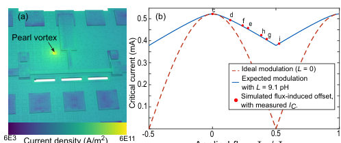 
FIG. 3. Simulated effect of moat-trapped fluxons and pinned vortex on DC SQUID response. (a) Simulated dc current distribution when a Pearl vortex is pinned as mea- sured in SSM imaging for Device 1. (b) Critical current mod- ulation of DC SQUID as a function of applied flux for Device 1, with flux offsets for each moat and the pinned vortex ap- plied to match the combinations shown in Fig. 2.

📷 Fig 4

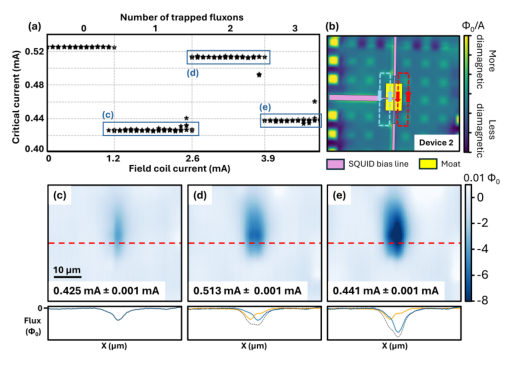 
FIG. 4. Spatially distinct flux trapping within a sin- gle moat. (a) Critical current Ic of the one-moat device measured after temperature cycling, plotted as a function of the applied field current and corresponding number of fluxons trapped in the scanned region. (b) Scanning SQUID suscep- tometry image overlaid with a schematic of the device layout. A single rectangular moat, shown in yellow, is positioned be- neath the SQUID bias line, shown in pink. The blue and red loops illustrate the local screening-current paths associated with vortices trapped in the two sections of the moat. (c)-(e) Scanning SQUID magnetometry images of the same device after temperature cycling in different...

📷 Fig 5

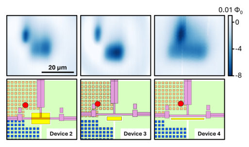 
FIG. 5. Preferred trapping locations of the first off- moat Pearl vortex under local field cooling. Upper row: scanning SQUID magnetometry images showing the first off-moat Pearl vortex in three devices with different moat ge- ometries, with the applied field generated by the on-chip field coil. Lower row: Corresponding device schematics, with pink: SQUID lines, yellow: moats, green: lower field-coil layer, or- ange: vias connecting the upper and middle field-coil layers, dark blue: vias connecting the middle and bottom field-coil layers. The red dots mark the observed Pearl vortex posi- tions. The first off-moat vortex is consistently trapped near the upper via-array region.

**Summary.** This work uses Scanning SQUID Microscopy (SSM) to image trapped magnetic flux in superconducting circuits while simultaneously measuring the DC SQUID's electrical performance. By correlating the precise location of trapped vortices with changes in the critical current, the authors prove that flux pinning is governed by specific, reproducible physical sites within the multilayer circuit geometry. This provides crucial feedback for designing robust superconducting quantum devices.

**Why it may be interesting.** The direct, simultaneous measurement linking microscopic flux pinning sites (from SSM) to macroscopic device performance ($I_c$) is highly valuable for understanding non-equilibrium dynamics in superconducting circuits, which relates to flux quantization and energy landscape mapping.

Detailed structure

**Main problem.** The study aims to directly correlate the location of trapped magnetic flux (vortices) in the ground plane of superconducting circuits with the measured electrical performance of a DC SQUID.

**Main result.** The research demonstrates that preferential pinning sites for fluxons exist regardless of moat configuration, providing a powerful tool for validating circuit simulation models and guiding physical layout design.

**Method.** The authors employ Scanning SQUID Microscopy (SSM) to image trapped flux while simultaneously measuring the DC SQUID's critical current ($I_c$) during the same cooldown process.

**Model / system.** The physical system is a DC SQUID integrated into a multilayer superconducting circuit featuring engineered ground plane 'moats' designed to mitigate residual magnetic flux.

**Key observables.** DC SQUID critical current ($I_c$), location and number of trapped fluxons/vortices (visualized by SSM).

**Important parameters / regimes.** Designed zero-field $I_c$ ($\approx 522 \mu	ext{A}$), loop inductance ($L = 9.1 	ext{pH}$), background flux density ($< 1 \mu	ext{T}$).

**Assumptions / limitations.** The technique assumes that flux trapping can be controlled by cooling in a controlled applied magnetic field, and that the measured $I_c$ can be accurately extracted despite parasitic effects.

**Figures summary.** Figures show the device structure, the correlation between trapped flux number and measured $I_c$ for multi-moat devices, and simulations illustrating how pinned vortices shift the SQUID's critical current modulation.

**Paper structure.** The paper progresses by first establishing the methodology of simultaneous SSM imaging and electrical measurement. It then presents detailed results showing how flux trapping affects $I_c$ in multi-moat and single-moat geometries, culminating in a discussion of how local vs. global fields dictate preferred pinning sites.

Abstract

Holes in the ground planes of superconducting circuits, commonly referred to as moats, are known to be an effective means of mitigating the deleterious effects of residual magnetic flux in superconducting circuits. Previous studies have utilized scanning SQUID microscopy (SSM) to image the effectiveness of various moat geometries and the maximum magnetic fields where they no longer prevent vortices in the ground plane but have not directly correlated the location of flux with circuit performance measurements. In this study we employ SSM to image the effectiveness of various moat configurations in trapping unwanted flux near a DC SQUID, and when the moats are not effective, the location of vortices in the ground plane. During the same cooldown, and without disturbing the circuit, we measure the circuit performance to directly correlate this with the vortex location. We show that there are preferential pinning sites for fluxons regardless of moat configuration, demonstrating the utility of the SSM in provide feedback for circuit layout, modeling, and failure analysis.

[↑ back to top](#top)

### [Pseudospin Hall Transport Induced by Berry Curvature](http://arxiv.org/abs/2610.10376v1)

**Authors:** Qinhui Jiang, Jidong Song, Qingyang Mo, Bo Li, Dongyi Wang, Shuang Zhang, Mengyao Li  
**Type:** both · **Category:** other · **PDF:** <https://arxiv.org/pdf/2610.10376v1>  
**Analysis basis:** full PDF text, analyzed in chunks
**Topic relevance:** `analog quantum simulation` **3/5**

📷 Fig 1

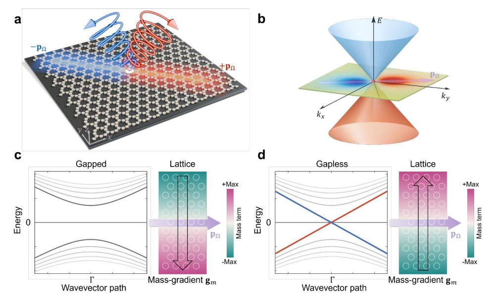 
Fig. 1 Berry-curvature polarity and the adiabatic pseudospin Hall response. a, Conceptual illustration of a bulk-embedded pseudospin Hall waveguide in a two-dimensional pseudospin-1 lattice. The red and blue helices represent modes of opposite pseudospin propagating along the Berry- curvature polarity +𝐩Ω and −𝐩Ω, respectively. b, Schematic Γ-centred pseudospin-1 Dirac spectrum,

📷 Fig 2

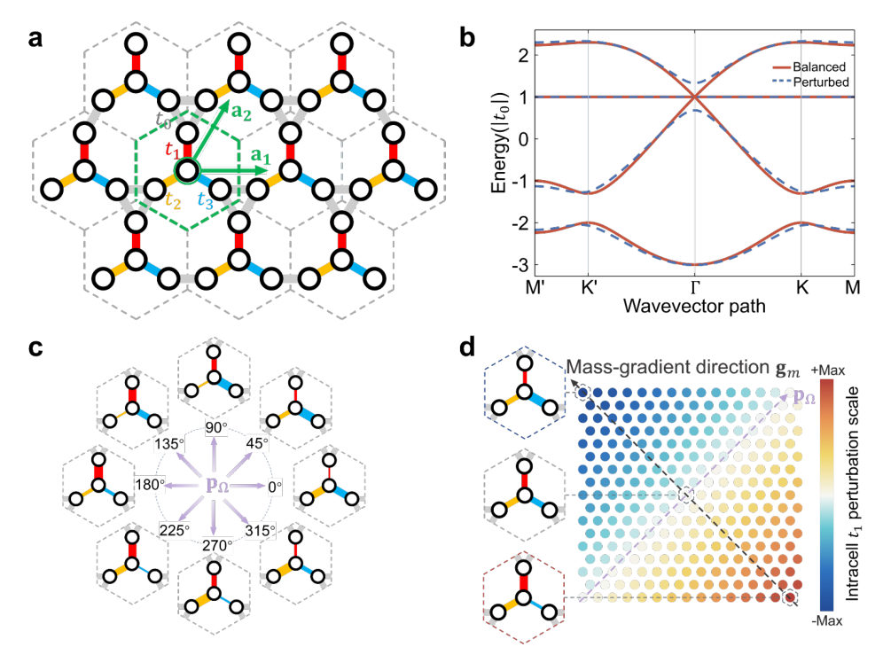 
Fig. 2 The planar lattice for programmable Berry-curvature polarity and adiabatic mass textures. a, Two-dimensional four-site planar lattice. Fixed intercell links have coupling strength 𝑡0, whereas the central site is connected to the three outer sites through independently adjustable intracell couplings 𝑡1, 𝑡2 and 𝑡3, shown in red, yellow and cyan, respectively. The green dashed outline marks a unit cell and 𝐚1 and 𝐚2 are the primitive lattice vectors. b, Calculated four-band spectra for balanced couplings (solid red), for which a flat band and two linearly dispersing bands meet at Γ to form an isolated pseudospin-1 Dirac point, and for a representative differential intracell perturbation...

📷 Fig 3

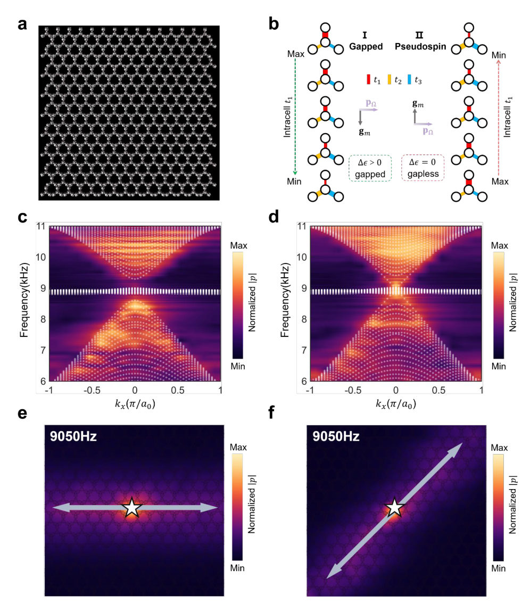 
Fig. 3 Experimental observation of reconfigurable pseudospin Hall waveguiding. a, Top-view image of the fabricated acoustic lattice implementing spatially graded intracell couplings. b, Controlled reversal of the adiabatic mass texture. The two configurations retain the same horizontal Berry-curvature polarity 𝐩Ω, local mass contrast and confinement strength, whereas reversing the spatial sequence of the unit cells reverses the mass-gradient direction 𝐠𝑚. The mismatched and matched polarity-gradient orientations correspond to the spectra in c and d, respectively. c,d, Measured Fourier-resolved spectra for the mismatched (c) and matched (d) configurations. Colour denotes the measured...

📷 Fig 4

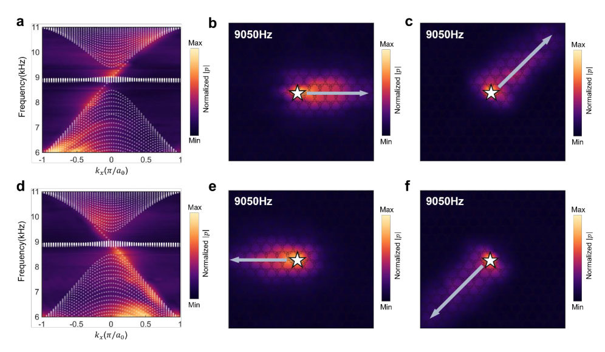 
Fig. 4 Pseudospin-momentum locking and branch-selective launching. a,d, Measured Fourier- resolved spectra of the 0° pseudospin Hall waveguide under right-handed (a) and left-handed (d) source-phase configurations. Colour represents measured spectral response and white points denote simulated eigenfrequencies. The complementary excitations concentrate the spectral weight predominantly on the positive- and negative-group velocity branches, respectively. b,c, Measured normalized acoustic-pressure amplitudes at 9050 Hz under right-handed excitation for the 0°(b) and 45°(c) waveguide designs. e,f, Corresponding measurements under left-handed excitation for the 0°(e) and 45°(f) designs, showing...

**Summary.** This paper introduces a novel mechanism where the topological properties of pseudospin-1 Dirac systems govern transport via a geometric matching condition between the Berry-curvature polarity and a real-space mass gradient. By engineering these two components independently in an acoustic lattice, the authors demonstrate the creation of robust, gapless pseudospin Hall waveguiding paths. This work establishes quantum geometric polarity as a versatile tool for reconfigurable wave routing.

**Why it may be interesting.** The ability to program waveguiding paths by matching momentum-space geometric textures ($\mathbf{p}_\Omega$) with real-space gradients ($\mathbf{g}_m$) offers a general, tunable mechanism for wave manipulation applicable across various physical platforms.

Detailed structure

**Main problem.** The research aims to utilize the topological transport properties of pseudospin-1 Dirac systems in passive, time-reversal-invariant settings to induce and control pseudospin Hall behaviors.

**Main result.** The authors demonstrate that coupling the in-plane polarity of the Berry curvature ($\mathbf{p}_\Omega$) with a real-space mass gradient ($\mathbf{g}_m$) dictates a geometric selection rule that enables gapless, tunable pseudospin Hall modes.

**Method.** The study combines theoretical modeling of the low-energy Hamiltonian with experimental realization using acoustic resonators to program and verify the geometric selection rule.

**Model / system.** The system is based on a pseudospin-1 Dirac Hamiltonian realized in a four-site planar acoustic lattice. The lattice allows independent programming of the Berry-curvature polarity ($\mathbf{p}_\Omega$) via intracell couplings and the spatial mass gradient ($\mathbf{g}_m$) via coupling modulation.

**Key observables.** Gapless pseudospin Hall modes, directional waveguiding paths, and the pseudospin-momentum locking confirmed by source excitation handedness.

**Important parameters / regimes.** The geometric matching factor $\chi = (\mathbf{p}_\Omega 	imes \mathbf{g}_m) \cdot \hat{z}$, which must equal $+1$ for gapless transport.

**Assumptions / limitations.** The work establishes a strict geometric selection rule by decoupling the control of $\mathbf{p}_\Omega$ (intracell ratios) from $\mathbf{g}_m$ (real-space arrangement).

**Figures summary.** Figures illustrate the concept of Berry-curvature polarity ($\mathbf{p}_\Omega$) and the resulting spectra based on mass gradient configuration. Subsequent figures detail the four-site lattice structure, showing how couplings control $\mathbf{p}_\Omega$ and $\mathbf{g}_m$, and present experimental acoustic measurements confirming gap closing and directional waveguiding.

**Paper structure.** The paper first introduces the theoretical framework, identifying the Berry-curvature polarity ($\mathbf{p}_\Omega$) and the geometric selection rule involving the mass gradient ($\mathbf{g}_m$). It then details the lattice engineering to independently control these two components. Finally, it presents experimental acoustic measurements confirming the predicted gapless transport and directional control.

Abstract

Pseudospin-1 Dirac systems exhibit unique physics distinct from conventional Dirac cones, such as flat-band crossings and non-Abelian characteristics, yet their topological transport properties have remained largely untapped in passive, time-reversal-invariant settings. Here we uncover an in-plane polarity of the Berry-curvature texture in a pseudospin-1 Dirac Hamiltonian, a previously unexplored geometric degree of freedom encoded in the sign-resolved distribution of Berry curvature despite zero net Berry flux, and reveal a new mechanics where Berry curvature induce pseudospin Hall behaviors in a system. We show that the oriented coupling between this momentum-space polarity and a real-space mass gradient governs a geometric selection rule that dictates the emergence of gapless pseudospin Hall modes. By engineering the intracell couplings of a four-site planar lattice, we independently program the Berry-curvature polarity and the spatial mass gradient without altering the host lattice symmetry. Acoustic experiments directly confirm this directional selection rule: reversing the mass gradient closes or reopens the dispersive gap, while pseudospin-selective source excitation launches counterpropagating pseudospin branches along arbitrary prescribed axes. Our work establishes quantum geometric polarity as a versatile tool for reconfigurable wave routing, sensing, and high-capacity quantum applications.

[↑ back to top](#top)

### [Magnon Polarization Textures and Transport in Antiferromagnets and Altermagnets](http://arxiv.org/abs/2610.09035v1)

**Authors:** Konstantin S. Denisov, Igor Žutić  
**Type:** theory · **Category:** other · **PDF:** <https://arxiv.org/pdf/2610.09035v1>  
**Analysis basis:** full PDF text, analyzed in chunks
**Topic relevance:** `Keldysh / 2PI / non-Gaussian methods` **2/5** · `methods for driven-dissipative` **2/5** · `analog quantum simulation` **1/5** · `correlated / nonlocal dissipation` **1/5** · `driven-dissipative phase transition` **1/5** · `non-equilibrium universality` **1/5** · `quantum measurements` **1/5** · `scars & prethermalization` **1/5**

📷 Fig 1

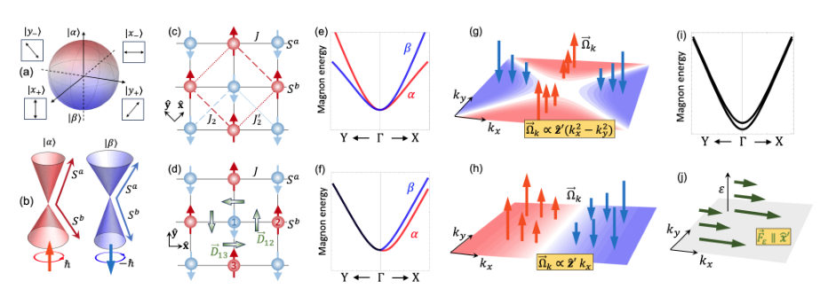 
FIG. 1. (a) Bloch sphere for the magnon pseudospin and the orientation of linear polarizations at its equator. (b) Circularly polarized dynamics of spins in a, b-sublattices for α and β magnons. (c) 2D AM Lieb lattice. Dashed and dotted lines depicting the strength of the second-nearest neighbor exchange interactions, J2 ̸= J′ 2. (d) 2D square AFM lattice. The green arrow pointing in the direction of the DM interaction, Dij = ˆz × Rij. (e),(f) Magnon band stucture and (g),(h) the distribution of momentum-dependent Larmor frequency vector Ωk in the Brillouin zone for AFM lattices from (c),(d). (i),(j) Magnon dispersion and its Larmor frequency vector Fε distribution for the canted phase of...

📷 Fig 2

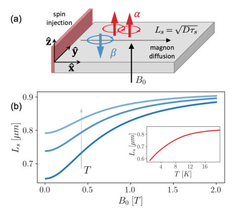 
FIG. 2. (a) Diffusion of magnons from spin injection region. (b) The increase in Ls with B0 due to dipolar interaction- induced Γz(B0) suppression for different temperatures (T = 10, 15, 30 K) for MnF2 and τg = 150 ns. The inset shows Ls dependence on T at B0 = 0 for a T-independent τ.

📷 Fig 3

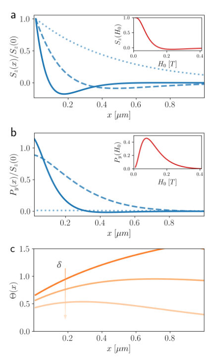 
FIG. 3. The Hanle effect in the magnon spin accumulation Sz(x) (a) and Py(x) (b). Solid, dashed and dotted lines correspond to B0 = 0.8, 0.3, 0.1 T, respectively. The insets show Sz(B0), Py(B0) at distance x = 0.5 µm from an in- jector. The parameters are taken for MnF2, τg = 150 ns, D = 0.5 × 10−5 m2s−1 and T = 20 K. (c) The spatial depen- dence of Θ(x) = arctan(Py/Sz) with increasing δ.

**Summary.** This work provides a theoretical framework for understanding how magnon polarization textures dictate transport in antiferromagnets and altromagnets. By analyzing the interplay between Larmor precession and relaxation mechanisms, the authors predict field-dependent changes in spin-diffusion length and the Hanle effect. This is crucial for designing spintronic devices based on magnetic excitations.

**Why it may be interesting.** The detailed treatment of magnon polarization dynamics and the connection to relaxation mechanisms like DP relaxation provides a rich framework for understanding spin transport in magnetic insulators, which shares conceptual overlap with open quantum systems dynamics.

Detailed structure

**Main problem.** The paper theoretically analyzes the magnon polarization textures and subsequent transport mechanisms in antiferromagnets (AFMs) and altromagnets (AMs).

**Main result.** It demonstrates that the magnon polarization kinetics are governed by two regimes—Dyakonov-Perel relaxation or dephasing due to Larmor precession—and predicts that external fields can suppress relaxation, leading to enhanced spin-diffusion lengths.

**Method.** The analysis employs theoretical tools including the Holstein-Primakoff transformation, Bogoliubov diagonalization, and Boltzmann kinetic theory applied to the magnon density matrix.

**Model / system.** The study focuses on collinear AFMs and AMs, modeled using a general magnetic Hamiltonian incorporating exchange, anisotropy, Zeeman, DM, and dipolar interactions. The dynamics are tracked via a pseudospin density matrix.

**Key observables.** Magnon polarization textures ($\vec{\sigma}_k$), magnon spin-diffusion length, and the Hanle effect signature (suppression of $S_z$ vs. $B_0$).

**Important parameters / regimes.** The relative strengths of relaxation mechanisms (e.g., $	au_g^{-1}$ vs. $\Gamma_z$), and the external magnetic field $B_0$ relative to characteristic relaxation times.

**Assumptions / limitations.** The analysis relies on the small canting angle approximation ($	heta_0 \ll 1$) and the semiclassical approximation for the density matrix.

**Figures summary.** Figures illustrate the Bloch sphere for the magnon pseudospin, the momentum-dependent Larmor frequency vectors ($\vec{\Omega}_k$), and the dependence of ellipticity ($\Theta$) on distance and field.

**Paper structure.** The paper progresses from deriving the effective magnon Hamiltonian and polarization dynamics to analyzing the kinetic equation for the pseudospin, culminating in the detailed discussion of the Hanle effect and the role of anisotropic DP relaxation.

Abstract

Antiferromagnets (AFMs) host magnons that can exhibit fully circular, elliptic and linear polarizations of sublattice magnetization dynamics. We analyze theoretically different momentum-space magnon polarization textures and magnon transport in collinear AFMs and altermagnets (AMs). The sensitivity of the polarization texture to a magnon momentum direction determines two regimes of magnon polarization kinetics: The Dyakonov-Perel relaxation or its dephasing due to asynchronous Larmor precession. For an easy-axis AFM, magnetic field parallel to the N{é}el vector leads to the suppression of the magnetic dipolar interaction-induced Dyakonov-Perel relaxation, accompanied by the increase in the magnon spin-diffusion length and its counter-intuitive growth with temperature. For a perpendicular orientation, instead, relaxation of circular polarization of magnons is enhanced due to Larmor precession. Finally, extremely anisotropic relaxation of magnon polarization is predicted for AMs or AFMs having Dzyaloshinskii-Morya interaction.

[↑ back to top](#top)

### [Construction-Dependent Floquet Topology in Circularly Driven $N$-Stacked Su-Schrieffer-Heeger Chains](http://arxiv.org/abs/2610.09925v1)

**Authors:** Aayushi Agrawal, Jayendra N. Bandyopadhyay  
**Type:** theory · **Category:** other · **PDF:** <https://arxiv.org/pdf/2610.09925v1>  
**Analysis basis:** full PDF text, analyzed in chunks
**Topic relevance:** `analog quantum simulation` **2/5** · `Frenkel-Kontorova` **1/5** · `driven-dissipative phase transition` **1/5** · `methods for driven-dissipative` **1/5**

📷 Fig 1

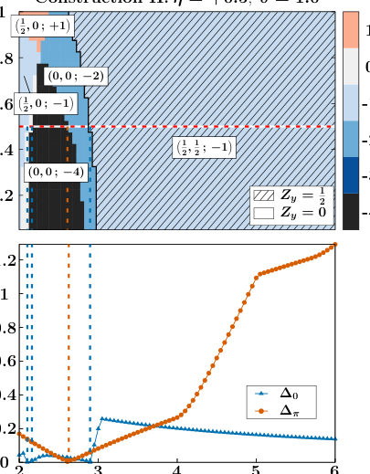 
FIG. 2. Floquet phase diagram for η = +0.5 and δ = 1, correspond- ing to Construction-II. The notation is the same as in Fig. 1. Panel (b) shows ∆0 and ∆π as functions of Ωalong the A0 = 0.5 cut marked in panel (a). The blue and orange vertical dashed lines mark near- zero minima of the corresponding gaps.

📷 Fig 2

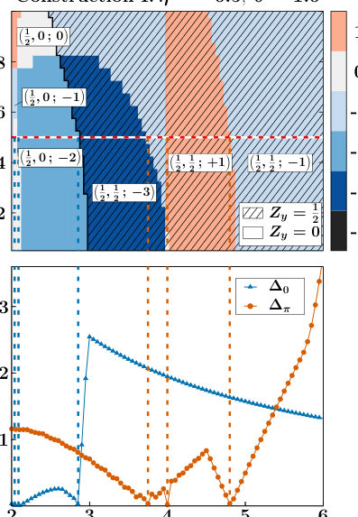 
FIG. 1. Floquet phase diagram in the (A0, Ω) plane for η = −0.5 and δ = 1, corresponding to Construction-I. The color scale represents CL, while the hatched and unhatched regions correspond to Zy = 1/2 and Zy = 0, respectively. The labels give (Zx, Zy;CL). Panel (b) shows the minimum bulk quasienergy gaps ∆0 and ∆π at ϵ = 0 and ϵ = ±Ω/2, respectively, as functions of Ωalong the A0 = 0.5 cut marked by the red horizontal line in panel (a). The blue and orange vertical dashed lines mark near-zero minima of the corresponding gaps.

📷 Fig 3

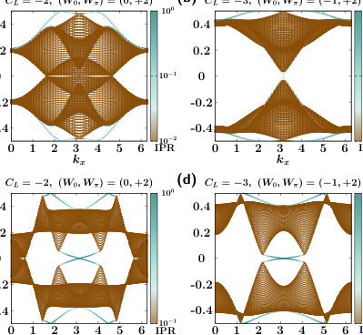 
FIG. 3. Quasienergy spectra in cylindrical geometry for Construction-I. Panels (a) and (c) show (A0, Ω) = (0.5, 2.5), for which CL = −2 and (W0, Wπ) = (0, +2). Panels (b) and (d) show (A0, Ω) = (0.5, 3.5), for which CL = −3 and (W0, Wπ) = (−1, +2). Panels (a) and (b) are periodic along x and open along y, whereas panels (c) and (d) are periodic along y and open along x. The color scale represents the inverse participation ratio (IPR), which high- lights the edge-localized states.

📷 Fig 4

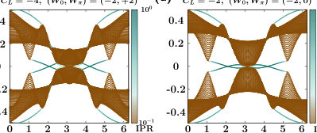 
FIG. 4. Quasienergy spectra in cylindrical geometry for Construction-II. Panels (a) and (c) show (A0, Ω) = (0.5, 2.5), for which CL = −4 and (W0, Wπ) = (−2, +2). Panels (b) and (d) show (A0, Ω) = (0.5, 2.8), for which CL = −2 and (W0, Wπ) = (−2, 0). Pan- els (a) and (b) are periodic along x and open along y, whereas panels (c) and (d) are periodic along y and open along x. The color scale represents the inverse participation ratio (IPR), which highlights the edge-localized states.

📷 Fig 5

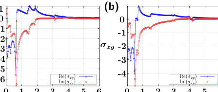 
FIG. 5. Real and imaginary parts of the optical Hall conductivity for Construction-I at A0 = 0.5. Panels (a) and (b) correspond to Ω= 2.5, with CL = −2 and (W0, Wπ) = (0, +2), and Ω= 3.5, with CL = −3 and (W0, Wπ) = (−1, +2), respectively. The conductivity is expressed in units of e2/h.

**Summary.** This paper explores the construction-dependent Floquet topology in stacked SSH chains driven by circular light. By comparing two physically distinct constructions, the authors show that while the static bulk spectrum might be identical, the time-periodic driving reveals different topological signatures via dynamical winding numbers. This highlights that the physical realization of the lattice structure is crucial for understanding driven topological matter.

**Why it may be interesting.** This work is highly relevant as it demonstrates that subtle details of the physical realization (the 'construction') can dictate the topological properties of a driven system, going beyond what is captured by static invariants like the Chern number.

Detailed structure

**Main problem.** The study investigates how the physical construction of constituent chains affects the Floquet topological properties of a 2D lattice formed by stacking Su-Schrieffer-Heeger (SSH) chains under circular driving.

**Main result.** The physical construction dictates distinct Floquet topological structures, evidenced by different gap-resolved winding numbers $(W_0, W_\pi)$, even when the static bulk Chern number ($C_L$) remains the same.

**Method.** The analysis employs the Floquet-Sambe formalism to determine quasienergy spectra and topological invariants, including the Chern number and dynamical winding numbers.

**Model / system.** The system is an N-stacked SSH chain model subjected to a time-periodic Hamiltonian induced by circular driving, analyzed in the decoupled-chain limit.

**Key observables.** Lower-band Chern number ($C_L$), directional Zak phases ($Z_x, Z_y$), and dynamical winding numbers ($W_0, W_\pi$).

**Important parameters / regimes.** Driving frequency ($\Omega$), dimerization ($\eta$), and interchain hopping ($\delta$).

**Assumptions / limitations.** The analysis assumes the system is in the time-periodic regime and focuses on the $\chi = -1$ driving case.

**Figures summary.** Figures illustrate the Floquet phase diagrams, showing how different constructions yield distinct topological invariants like $(W_0, W_\pi)$ for the same $C_L$.

**Paper structure.** The paper first introduces the driven Hamiltonian and then uses the Floquet-Sambe formalism to calculate topological invariants. It compares two distinct constructions (I and II) to demonstrate the construction dependence, culminating in the calculation of gap-resolved winding numbers.

Abstract

We investigate construction-dependent Floquet topology in a two-dimensional lattice formed by stacking Su-Schrieffer-Heeger (SSH) chains with co-located sublattice orbitals. We present two constructions in the decoupled-chain limit. Construction-I: the constituent SSH chains are topologically trivial with winding number $w=0$. Construction-II: the constituent SSH chains are topologically nontrivial with $w=1$. Although these constructions are unitarily equivalent in the static limit, circular driving distinguishes them because the hopping processes related by the transformation correspond to different physical bond vectors and therefore acquire different Peierls phases. Using the Floquet-Sambe formalism, we determine the quasienergy spectra and phase diagrams in terms of the lower-band Chern number $C_L$ and directional Zak phases $(Z_x,\, Z_y)$. We find distinct Floquet phase structures, including low-frequency phases with $C_L = -3$ and $C_L = -4$ in the two constructions. Since the Chern number does not resolve the topology of the two quasienergy gaps separately, we further calculate the dynamical winding numbers $W_0$ and $W_π$, and verify the corresponding chiral edge states. In particular, at identical driving parameters, both constructions can have the same Chern numbers $C_L=-2$, while their gap-resolved winding numbers are $(W_0,\, W_π)=(0,\,+2)$ and $(-2,\,0)$, respectively. We also calculate the time-averaged optical Hall conductivity and show that $ C_Le^2/h$ determines its dc value for ideal full-band occupation. At the same time, its finite-frequency response contains photon-assisted contributions. Our results demonstrate that the physical construction of the constituent chains, although irrelevant to the static bulk spectrum, can play a decisive role in the Floquet topological structure. We discuss possible experimental realizations of the driven model.

[↑ back to top](#top)

### [Progress and Prospect of AI in ARPES Workflow](http://arxiv.org/abs/2610.10140v1)

**Authors:** Sandy Adhitia Ekahana, Aalok Tiwari, Pratik Saud, Aaron Bostwick, Chris Jozwiak, Eli Rotenberg, Jyoti Katoch  
**Type:** both · **Category:** disordered systems and neural networks · **PDF:** <https://arxiv.org/pdf/2610.10140v1>  
**Analysis basis:** full PDF text, analyzed in chunks
**Topic relevance:** `methods for driven-dissipative` **2/5** · `quantum measurements` **2/5** · `Keldysh / 2PI / non-Gaussian methods` **1/5**

📷 Fig 1

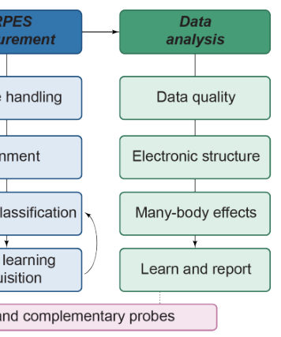 
Fig. 1 Schematic of ARPES Workflow The typical ARPES workflow progresses from left to right, from sample growth to analysis via measurement in an ultrahigh vacuum (UHV) chamber. Solid straight arrows indicate the nominal forward path, while solid curved arrows mark active learn- ing–based iterations designed to acquire a rapid and complete dataset during a small experimental window. It represents an iterative closed loop between measuring, analyzing, and deciding the next step. Combined with other complementary studies, this reveals the underlying electronic properties of quantum materials

📷 Fig 2

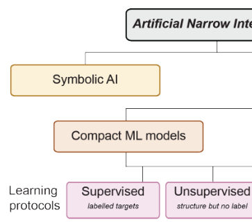 
Fig. 2 A practical AI terminology for experimental physicists. Machine learning splits by architecture into traditional compact models and deep learning networks. The four learning protocols represent a separate, independent axis of training models. The asterisk marks reinforcement learning, which in current practice is typically implemented with deep networks rather than as an architecture- independent protocol. The figure is a visual guide rather than a comprehensive glossary. Detailed examples appear in the text.

📷 Fig 3

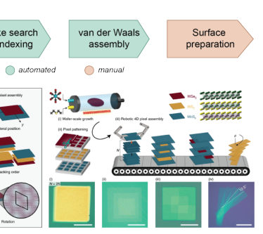 
Fig. 3 Automated sample preparation and preliminary characterizations. (a) The five pre experiment stages for ARPES experiment, shaded by the extent of automation. (b) An autonomous inorganic synthesis laboratory (A-lab) for air-stable targets, in which an ML algorithm proposes recipes, while robotic synthesis and learned phase identification form a self-revising loop (adapted from [57]). (c) Robotic four dimensional pixel assembly, from wafer scale growth and patterning to automated stacking, with control over layer number, composition, lateral position and twist angle. Scale bar: 50 µm (adapted from [32]).

📷 Fig 4

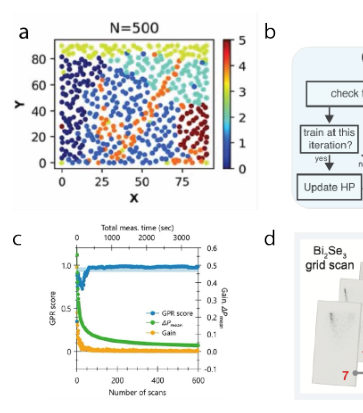 
Fig. 4 Route to experimental automation (a) KMGP-driven data collection identifying dis- tinct major phases on the sample, colored by cluster label [38]. (b) The GPR-guided acquisition loop showing the autonomous data acquisition process. The colored boxes represent asynchronously running processes, while the red arrows indicate real-time, ML-based communication between the instrument and Python scripts [35]. (c) GPR score, mean uncertainty (∆Pmean), and gain versus number of scans for Bi2Te3 spin-ARPES, illustrating a quantitative stopping criterion for the acqui- sition loop [66]. (d) A synthetic trained CNN scores the measured spectral quality across a Bi2Se3 grid scan. The predicted map...

📷 Fig 5

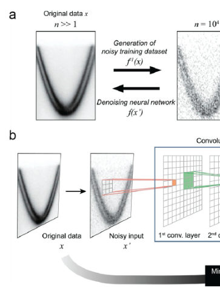 
Fig. 5 Denoising network training sequence on Poisson subsampled ARPES data (a) Generation of noisy training data from high count Au(111) surface states spectra. From origi- nal high count data x, low count noisy copies x′ are generated via Poisson subsampling, simulating rapid acquisition. The denoising process is denoted f(x′), while the generation of the noisy training set is denoted f −1(x). (b) Training loop for the denoising neural network, where the loss function drives parameter optimization. The loss function L(x, f(x′)) combines mean absolute error (MAE) and multi-scale structural similarity index measure (MS-SSIM). The weighted formulation ensures that reconstructed spectra...

**Summary.** This review surveys the rapidly expanding role of AI and ML in the Angle-Resolved Photoemission Spectroscopy (ARPES) workflow. It details how ML is applied across all stages, from sample preparation to advanced data inversion, highlighting the move toward autonomous, closed-loop experimental systems. The paper stresses the urgent need for standardized, large-scale open datasets to accelerate this progress.

**Why it may be interesting.** The integration of ML into interpreting complex, high-dimensional spectroscopic data like ARPES spectra is crucial for extracting fundamental electronic structure information, which is relevant to understanding many-body physics and correlated systems.

Detailed structure

**Main problem.** The field requires a comprehensive review and advancement of Artificial Intelligence (AI) and Machine Learning (ML) applications across the entire Angle-Resolved Photoemission Spectroscopy (ARPES) workflow due to the large, multidimensional datasets produced.

**Main result.** The paper reviews ML applications across the entire ARPES workflow, suggesting a community focus on sharing pretrained models and developing a standardized, large open ARPES dataset repository.

**Method.** The review systematically examines ML techniques (Deep Learning, PINNs, etc.) applied to various stages of the ARPES process, from sample preparation to data analysis and autonomous control.

**Model / system.** The primary system is ARPES, which measures the occupied electronic band structure of crystalline materials, generating high-dimensional datasets. The workflow spans sample growth, measurement, and analysis, increasingly aiming for closed-loop, autonomous operation.

**Key observables.** Electronic band dispersion ($\epsilon_{\mathbf{k}}$), electron self-energy ($\Sigma(\mathbf{k}, \omega)$), and photoemission intensity $I(\mathbf{k}, \omega)$.

**Important parameters / regimes.** Photon energy ($h
u$), binding energy ($E_B$), and momentum ($\mathbf{k}$).

**Assumptions / limitations.** Current open ARPES databases are small and fragmented compared to large datasets like ImageNet, limiting the scope of ML training.

**Figures summary.** The figures schematically illustrate the entire ARPES workflow, showing the progression from sample growth through measurement to analysis, emphasizing the closed-loop nature enabled by AI.

**Paper structure.** The paper is structured as a comprehensive review, first introducing relevant ML methods, then following the physical ARPES workflow stages (sample prep, measurement, analysis) to review existing applications, and concluding with future perspectives on laboratory automation.

Abstract

Artificial intelligence (AI) is becoming an increasingly useful tool across the experimental sciences, including angle-resolved photoemission spectroscopy (ARPES), which routinely produces large, multidimensional datasets of electronic structure. Recent advances in AI and machine learning (ML) have opened new opportunities across the entire ARPES workflow, from automated sample preparation and real-time data acquisition to post-experiment data analysis and comparison with theoretical calculations. Despite this progress, a comprehensive review of ML applications, their capabilities, and reliability across the different stages of ARPES workflow is still lacking. In this review, we first introduce ML methods that are most relevant to experimentalists working in condensed matter physics and materials science. We then follow the ARPES workflow, reviewing existing ML applications at each step and discussing their advantages, limitations and potential for future development. We also examine the current ARPES data landscape, where several open databases are available but remain relatively small and fragmented compared with large, shared datasets such as ImageNet. Given these limitations, we suggest that the community focus on sharing pretrained models that can be further trained, adapted to specific tasks, and redistributed, while working toward a larger and standardized open ARPES dataset repository. Finally, we discuss our perspectives on the future of AI within the ARPES workflow using a six-level framework of laboratory automation, highlighting the opportunities and challenges in moving toward a fully autonomous, self-driving ARPES laboratory.

[↑ back to top](#top)

### [Effect of uniform bond-charge order on longitudinal spin-susceptibility jump at a superconducting instability inside a magnetic phase](http://arxiv.org/abs/2610.09799v1)

**Authors:** Sher Baz, Hiroyuki Yamase  
**Type:** theory · **Category:** strongly correlated electrons · **PDF:** <https://arxiv.org/pdf/2610.09799v1>  
**Analysis basis:** full PDF text, analyzed in chunks
**Topic relevance:** `Keldysh / 2PI / non-Gaussian methods` **2/5**

📷 Fig 1

 
FIG. 1. Phase diagrams in the plane of electron density n and temperature T on (a) the hole-doped

📷 Fig 2

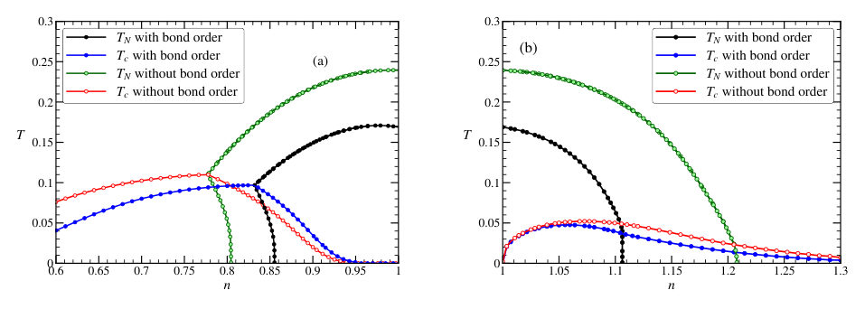 
Figure 2(a) shows the temperature dependence of the longitudinal spin susceptibility

📷 Fig 3

 
Fig. 2(b) shows the temperature dependence of the induced linear responses ∂µ/∂h,

📷 Fig 4

 
FIG. 2. Temperature dependence at fixed density n = 0.87. (a) Longitudinal spin susceptibility

📷 Fig 5

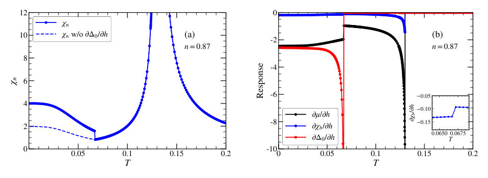 
Fig. 2(a). Thus, the singularity of the superconducting response is clearly responsible for

**Summary.** This theoretical study examines the longitudinal spin susceptibility jump at a superconducting instability within a magnetic phase, extending the model to include uniform bond-charge order. Using mean-field theory, the authors find that while the bond-charge order does not eliminate the jump, it significantly enhances both the susceptibility and the jump magnitude. This confirms the robustness of the jump mechanism tied to the superconducting response in correlated electron systems.

**Why it may be interesting.** The investigation into field-induced responses and the persistence of singular behavior (the jump) in the presence of multiple competing orders (magnetism, superconductivity, charge order) is highly relevant to understanding complex quantum materials.

Detailed structure

**Main problem.** The study investigates the longitudinal spin susceptibility jump that occurs when superconductivity develops within a magnetic phase, extending previous models by incorporating uniform bond-charge order.

**Main result.** The jump in the longitudinal spin susceptibility remains robust despite the inclusion of bond-charge order, which quantitatively enhances both the susceptibility and the jump size at the superconducting transition temperature ($T_c$).

**Method.** The analysis employs mean-field theory (RPA) applied to an effective square-lattice Hamiltonian, calculating the grand-canonical potential and deriving self-consistency equations for the order parameters.

**Model / system.** The system is modeled using an effective square-lattice Hamiltonian containing kinetic, magnetic, bond-charge, and superconducting interaction terms. It describes correlated-electron systems exhibiting coexistence of magnetic and superconducting orders.

**Key observables.** Longitudinal spin susceptibility ($\chi_n$), superconducting order parameter ($\Delta_0$), magnetic order parameter ($m$), and bond-charge order ($\chi_b$).

**Important parameters / regimes.** Superconducting transition temperature ($T_c$), magnetic transition temperature ($T_N$), and the applied magnetic field ($h$).

**Assumptions / limitations.** The analysis relies on mean-field theory, assumes a uniform bond-charge order ($\chi_x = \chi_y = \chi_b$), and compares results derived from fixed-density versus fixed-chemical-potential ensembles.

**Figures summary.** Figures illustrate phase diagrams showing how bond order suppresses magnetism and affects $T_N$ and $T_c$, and show the temperature dependence of $\chi_\mu$ comparing results with and without bond order.

**Paper structure.** The paper builds upon previous work by extending the model Hamiltonian to include bond-charge order. It then calculates the longitudinal spin susceptibility using linear response theory by differentiating the self-consistency equations with respect to the external field $h$, analyzing the resulting jump at $T_c$ and comparing fixed-density vs. fixed-$\mu$ results.

Abstract

A previous work [H. Yamase and M. Zafur, Phys. Rev. B \textbf{103}, 224527 (2021)] showed that the longitudinal spin susceptibility exhibits a jump when the superconductivity develops continuously inside a magnetic phase. That analysis employed a minimal model containing magnetic and superconducting interactions. However, in correlated-electron systems, both magnetic and bond-charge interactions originate from the same underlying spin-spin exchange interaction. We therefore extend the model by including the uniform bond-charge order to provide a more realistic description of the system. We find that the jump of the longitudinal spin susceptibility remains robust even in the presence of uniform bond-charge order, but the uniform bond-charge order quantitatively enhances the longitudinal spin susceptibility and the size of the jump at $T_c$.

[↑ back to top](#top)

### [Self-induced spin-orbit torque switching in a synthetic antiferromagnetic Co 2 MnGa /MnGa bilayer](http://arxiv.org/abs/2610.09885v1)

**Authors:** Rongkun Han, Haohang Cheng, Dahai Wei, Yuan Lu, Jianhua Zhao  
**Type:** both · **Category:** other · **PDF:** <https://arxiv.org/pdf/2610.09885v1>  
**Analysis basis:** full PDF text, analyzed in chunks
**Topic relevance:** `Keldysh / 2PI / non-Gaussian methods` **1/5** · `analog quantum simulation` **1/5** · `driven-dissipative phase transition` **1/5** · `methods for driven-dissipative` **1/5** · `non-equilibrium universality` **1/5** · `quantum measurements` **1/5** · `scars & prethermalization` **1/5**

📷 Fig 1

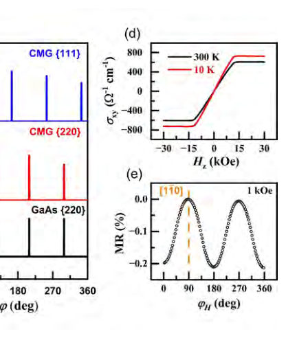 
FIG. 1. (a) Crystal structure schematic of the L21-CMG Heusler alloy. (b) XRD θ-2θ scan of the

📷 Fig 2

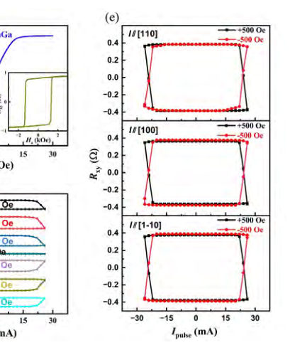 
FIG. 2. (a) Schematic illustration of SOT in the CMG/Al/MnGa multilayer. (b) In-plane ([110] and [1-

📷 Fig 3

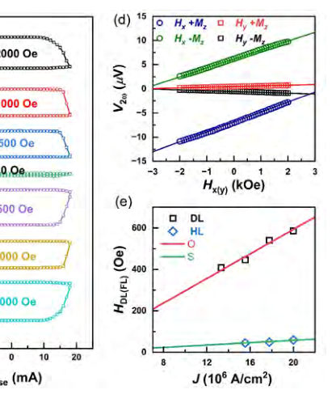 
FIG. 3. (a) Out-of-plane M-H curve of the MnGa(3 nm)/CMG(1.5 nm) bilayer at 300 K. The inset shows

📷 Fig 4

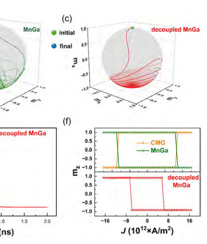 
FIG. 4. Trajectories of the magnetization vector m. Evolution of the coupled CMG layer from the initial

**Summary.** This work investigates magnetization switching in a $	ext{Co}_2	ext{MnGa}/	ext{MnGa}$ synthetic antiferromagnet (SAF) bilayer. The authors demonstrate a novel self-induced switching mechanism where the spin-orbit torque (SOT) generated in the CMG layer first switches the $	ext{MnGa}$ layer, which subsequently forces the reversal of the CMG layer through strong antiferromagnetic coupling. This provides a pathway for highly efficient, current-driven magnetic memory devices.

**Why it may be interesting.** While primarily in spintronics/condensed matter, the study of coupled magnetic dynamics under non-equilibrium driving forces (SOT) and the resulting complex, sequential switching mechanism has parallels with understanding coupled quantum oscillators or non-linear dynamics in open quantum systems.

Detailed structure

**Main problem.** The study aims to demonstrate and elucidate the self-induced magnetization switching mechanism in a synthetic antiferromagnet (SAF) structure using spin-orbit torque (SOT).

**Main result.** Self-induced switching is confirmed in the $	ext{Co}_2	ext{MnGa}/	ext{MnGa}$ SAF bilayer, where the SOT from $	ext{Co}_2	ext{MnGa}$ switches $	ext{MnGa}$, which then triggers the reversal of $	ext{Co}_2	ext{MnGa}$ via strong AFM coupling.

**Method.** The research combines experimental measurements (MBE growth, AHE, AMR, SOT switching) with theoretical modeling using macrospin simulations based on LLG equations.

**Model / system.** The physical system is a synthetic antiferromagnet (SAF) bilayer composed of $	ext{Co}_2	ext{MnGa}$ (CMG) and $	ext{MnGa}$. The CMG film acts as both the spin current source and a magnetic layer, coupled antiferromagnetically to the $	ext{MnGa}$ layer.

**Key observables.** Anomalous Hall Conductivity (AHC), magnetization hysteresis loops ($	ext{M-H}$), SOT-driven switching ratios, and magnetization vector trajectories.

**Important parameters / regimes.** Strong antiferromagnetic exchange coupling, critical current density ($J_c$), and the relative contributions of damping-like ($\chi_{	ext{DL}}$) and field-like ($\chi_{	ext{FL}}$) torques.

**Assumptions / limitations.** The analysis assumes that the self-induced switching mechanism is dominant, eliminating the need for an external spin current source compared to traditional SAF/HM structures.

**Figures summary.** Figures show crystal structure, AHE/AMR curves, $	ext{M-H}$ loops for both decoupled and coupled systems, and simulation results detailing the sequential switching trajectories of the two magnetic layers.

**Paper structure.** The paper progresses from characterizing the intrinsic properties of the CMG layer (large AHC, WSM behavior) to demonstrating SOT switching in a decoupled multilayer, culminating in the crucial observation and simulation of self-induced switching in the coupled SAF bilayer.

Abstract

The large intrinsic spin current in magnetic Weyl semimetals (WSMs) provides a promising platform for spin-orbit torque (SOT) devices. Here, we demonstrate SOTdriven magnetization switching in a synthetic antiferromagnet (SAF) composed of a Co2MnGa(CMG)/MnGa bilayer. In this heavy metal-free structure, CMG film functions simultaneously as a spin current source and as a magnetic layer. Macrospin simulations confirm the self-induced switching mechanism in the bilayer. The SOT generated by CMG switches the MnGa layer, which in turn triggers the reversal of the CMG layer via strong antiferromagnetic exchange coupling. These results elucidate the spin dynamics in SAFs and provide a new pathway toward SOT devices with selfinduced magnetization switching.

[↑ back to top](#top)

### [Gentle Floquet control of orbital Hall effect and orbital inverse Faraday effect](http://arxiv.org/abs/2610.10109v1)

**Authors:** Pei-Han Lin, Roderich Moessner, Egor I. Kiselev  
**Type:** theory · **Category:** other · **PDF:** <https://arxiv.org/pdf/2610.10109v1>  
**Analysis basis:** full PDF text, analyzed in chunks
**Topic relevance:** `Keldysh / 2PI / non-Gaussian methods` **1/5** · `analog quantum simulation` **1/5** · `driven-dissipative phase transition` **1/5** · `methods for driven-dissipative` **1/5**

📷 Fig 1

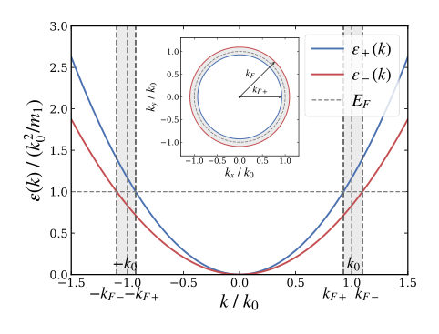 
Figure 1. Band dispersions ε±(k) of the non-driven Hamilto- nian Eq. (5) for m2 = 6m1. The horizontal dashed line marks EF , and the vertical dashed lines mark the Fermi momenta defined in Eq. (7). The gray intervals, and the gray annulus in the inset, are the hot region kF + &lt; k &lt; kF −in which f−−f+ = 1, cf.Eq. (8). The resonance momentum k0 is cho- sen inside this annulus.

📷 Fig 2

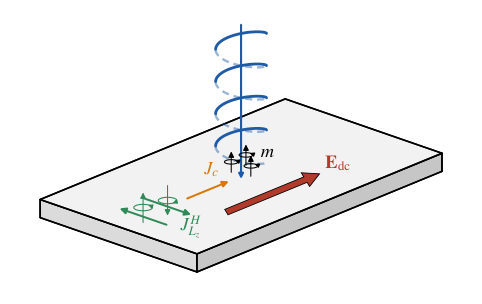 
Figure 2. The suggested set-up. The blue helix represents the right-handed, circularly polarized AC field, the red arrow rep- resents the DC probe field Edc, and the orange arrow repre- sents the longitudinal charge flow. The circular drive induces a static out-of-plane orbital magnetization m – a phenomenon known as the inverse Faraday effect [60] – and modifies the or- bital Hall current JH Lz. Reversing the optical helicity reverses m.

📷 Fig 3

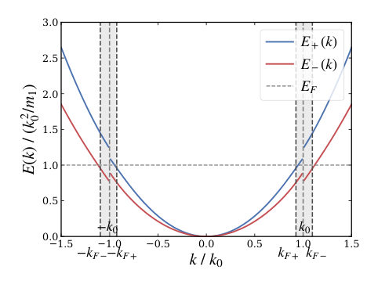 
Figure 3. Floquet quasienergy bands E±(k) according to Eq. (25). The vertical dashed lines indicate kF +, k0, and kF −. The avoided crossing at k0 lies inside the gray annulus kF + &lt; k &lt; kF −, where the interband response is nonzero. All parameters are the same as in Fig. 1.

📷 Fig 4

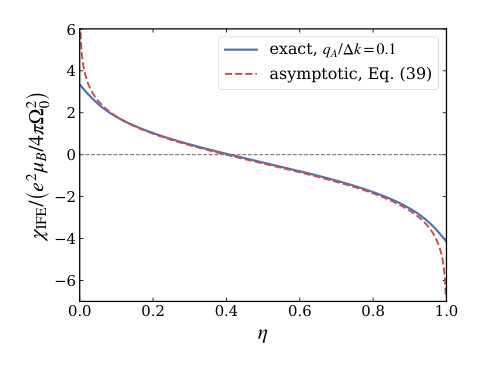 
Figure 4. Inverse orbital Faraday susceptibility χIFE in units of e2µB

📷 Fig 5

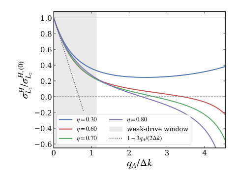 
Figure 5. Orbital Hall conductivity in the presence of a Flo- quet drive, cf. Eq. (42), as a function of qA/∆k = eA0/(ℏ∆k), normalized by its static value. η, defined in Eq. (40), de- scribes the position of the resonance. The bandstructure pa- rameters are the same as in Fig. 4. For ℏΩ0 = 0.2eV and ∆k = 0.01˚A−1, one unit on the horizontal axis corresponds to E0 = 2.0×107V/m by Eq. (47). The gray region marks the interval in which qA/k0 ≤0.2 for all plotted values of k0. The dotted line shows the approximated result of Eq. (46). The full result of Eq. (42) predicts that the conductivity changes sign depending on the resonance positions at stronger driving.

**Summary.** This paper investigates how time-periodic electromagnetic driving (Floquet engineering) can control the orbital Hall effect and orbital inverse Faraday effect in condensed matter systems. By analyzing systems with constrained momentum space, the authors show that resonant driving enhances the response significantly, allowing for large effects with relatively weak driving fields. The methodology relies on solving the Quantum Boltzmann Equation in the Floquet basis.

**Why it may be interesting.** This work is highly relevant to AMO/quantum optics as it uses time-periodic driving (Floquet engineering) to control macroscopic quantum responses (Hall effect, magnetization) in solid-state systems, providing a theoretical framework for light-matter interaction control.

Detailed structure

**Main problem.** The study aims to demonstrate that in systems with strong phase-space constraints, the relative impact of a resonant Floquet drive can be significantly enhanced for phenomena like the orbital Hall effect and orbital inverse Faraday effect.

**Main result.** The resonant drive allows for an order-one relative change in the orbital Hall conductivity even when the drive field is modest, and it induces an orbital inverse Faraday effect controlled by the interband quantum metric.

**Method.** The analysis employs Floquet engineering techniques, solving the Quantum Boltzmann Equation (QBE) for the density matrix in the presence of a time-periodic electromagnetic drive.

**Model / system.** The model uses a minimal radial–tangential two-band Hamiltonian, suitable for describing momentum-dependent orbital textures, and is analyzed in the collisionless limit.

**Key observables.** Orbital Hall Conductivity ($\sigma_{H}^{Lz}$), orbital inverse Faraday effect (static orbital magnetization $m$), and interband coherence.

**Important parameters / regimes.** The key regime is defined by the phase-space constraint $\Delta k$, and the resonance condition $\varepsilon_+(k_0) - \varepsilon_-(k_0) = \Omega_0$.

**Assumptions / limitations.** The analysis assumes zero temperature with frozen equilibrium occupations and focuses on the collisionless limit of the QBE.

**Figures summary.** Figures illustrate band dispersions, the hot region annulus, the setup involving circular drive and DC probe fields, and plots comparing calculated susceptibilities and conductivities against theoretical limits.

**Paper structure.** The paper systematically derives the effective Floquet Hamiltonian, solves the QBE for the density matrix, and calculates the time-averaged expectation values for the orbital magnetization and conductivities, showing the enhancement mechanism.

Abstract

Floquet engineering controls material responses via a time-periodic electromagnetic drive. An important task in practise is to reduce the driving strengths required to implement Floquet protocols.We show that in systems with strong phase-space constraints, where the response is dominated by a small region of momentum space, the relative impact of a resonant Floquet drive is enhanced. We demonstrate this idea on the example of the orbital Hall effect, where equilibrium occupations restrict the interband coherence to a narrow momentum interval $\hbarΔk$. The ratio $eE_0/(Ω_0\hbarΔk)$, where $Ω_0$ is the frequency of the drive, is considerable even at modest field amplitudes $E_0$, leading to a large relative change in the orbital Hall conductivity. Due to the non-trivial orbital texture, the circularly polarized drive induces an inverse orbital Faraday effect by magnetizing the electrons. We show that the corresponding susceptibility is controlled by the interband quantum metric that determines the resonant Floquet hybridization.

[↑ back to top](#top)

### [Charge transport in two-dimensional conductors with hybrid three-component plasma](http://arxiv.org/abs/2610.10060v1)

**Authors:** A. D. Levin, V. A. Chitta, Z. D. Kvon, N. N. Mikhailov, G. M. Gusev  
**Type:** both · **Category:** strongly correlated electrons · **PDF:** <https://arxiv.org/pdf/2610.10060v1>  
**Analysis basis:** full PDF text, analyzed in chunks
**Topic relevance:** `Keldysh / 2PI / non-Gaussian methods` **1/5** · `analog quantum simulation` **1/5**

📷 Fig 1

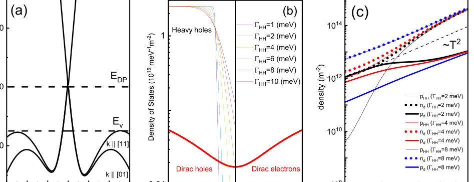 
FIG. 1. (Color online) a) Representation of the energy spectrum of a 6.3-nm mercury telluride quantum well. (b) Density of states of the Dirac carriers and heavy holes for different values of the heavy-hole broadening parameter ΓHH. (c) The carrier density for different branches as a function of temperature for different heavy-hole broadening parameter ΓHH. µ is fixed self-consistently by charge neutrality. Dashes indicate a T 2 dependence for comparison.

📷 Fig 2

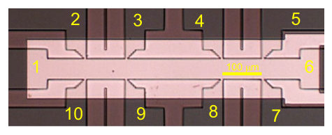 
FIG. 2. (a) Schematic illustration of the gated HgTe quantum-well transistor structure. (b) Representative top view of the Hall-bar device. The numbered regions denote ohmic contacts; the central channel, voltage probes, and gated area are indicated. Both samples share the same nominal ge- ometry. The scale bar is 100 µm.

📷 Fig 3

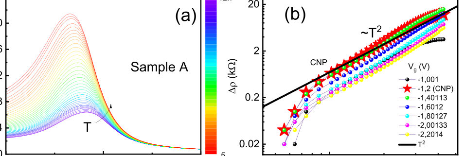 
FIG. 3. (Color online) (a) Resistivity as a function of the gate voltage at different temperatures for HgTe gapless quantum well ( sample A). (b) Excess resistivity ρ(T ) −ρ0 as a function of the temperature for different gate voltages, where ρ0 is the extrapolated zero-temperature background (Sec. III). The star symbols mark the trace at the fixed low-temperature charge- neutrality reference voltage V0. Solid line shows T 2 dependence for comparison.

📷 Fig 4

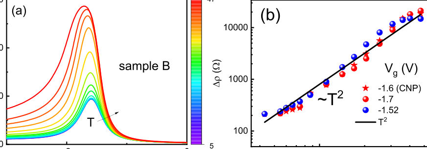 
FIG. 4. (Color online) (a) Resistivity as a function of the gate voltage at different temperatures for HgTe gapless quantum well (sample B). (b) Excess resistivity ρ(T ) −ρ0 as a function of the temperature for different gate voltages, where ρ0 is the extrapolated zero-temperature background (Sec. III). The star symbols mark the trace at the fixed low-temperature charge- neutrality reference voltage V0. Solid line shows T 2 dependence for comparison.

📷 Fig 5

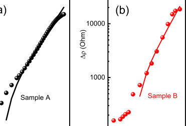 
FIG. 5. (Color online) Excess resistivity ρ(T )−ρ0 at the fixed low-temperature reference voltage V0 for samples A (a) and B (b). The solid line is the non-perturbative model of Sec. IV, ρ = ρ0 + ρ1XHH(T ), with the heavy-hole density taken from the calculation of Fig. 1(c)

**Summary.** This work investigates charge transport in a unique three-component plasma realized in HgTe quantum wells, combining massless Dirac electrons with thermally activated heavy holes. By analyzing the temperature dependence of resistivity, the authors demonstrate that the observed quadratic increase selects for a short-range electron-heavy-hole interaction mechanism. This establishes the material as a key platform for studying interaction-driven transport in mixed-carrier quantum systems.

**Why it may be interesting.** The study provides a concrete platform for observing interaction-driven transport in a hybrid system combining different types of quantum statistics (degenerate massless vs. non-degenerate massive), which is relevant for understanding strongly correlated behavior in low-dimensional materials.

Detailed structure

**Main problem.** Investigating charge transport in a hybrid three-component plasma system involving massless Dirac carriers and thermally activated heavy holes.

**Main result.** The observed temperature-dependent resistivity ($
ho \propto T^2$) is attributed to a short-range electron-heavy-hole interaction, contrasting with predictions from unscreened Coulomb interactions.

**Method.** The analysis uses a non-perturbative, momentum-relaxation-time description of interparticle transport, fitting measured resistivity data to theoretical scaling laws.

**Model / system.** The system is modeled using a gapless HgTe quantum well hosting three components: degenerate massless Dirac electrons, Dirac holes, and non-degenerate heavy holes. The charge neutrality condition must be satisfied self-consistently.

**Key observables.** Resistivity ($
ho$) vs. Temperature ($T$), excess resistivity ($\Delta
ho$), and carrier densities ($n_d, p_d, p_{HH}$).

**Important parameters / regimes.** Temperature range ($T \gtrsim 10$ K), heavy-hole density ($p_{HH}$), and the interaction amplitude ($U_0 \approx 90 	ext{ eV nm}^2$).

**Assumptions / limitations.** The analysis assumes the scattering is quasi-elastic and treats the system in the weakly disordered limit, using a minimal effective reference model for the gapless spectrum.

**Figures summary.** Figures illustrate the energy spectrum, the Density of States (DOS) for the three components, and the temperature evolution of the carrier densities, showing the crossover between different plasma regimes.

**Paper structure.** The paper develops the physics by first establishing the unique three-component nature of the plasma, then using self-consistent calculations to track carrier populations with temperature, and finally applying kinetic theory to link the observed temperature dependence of resistivity to the specific interaction channel (short-range vs. Coulomb).

Abstract

Electron--hole plasma in two-dimensional systems has mainly been studied in two limiting cases: degenerate semimetals with parabolic bands and nondegenerate symmetric Dirac systems such as graphene. Here we investigate a different regime realized in a gapless HgTe quantum well: a multicomponent plasma where massless Dirac carriers coexist with thermally activated heavy holes from lateral valence-band valleys. Near charge neutrality, the resistance increases approximately as $T^2$, in sharp contrast to the nearly temperature-independent resistivity expected for a symmetric Dirac plasma. We show that once heavy holes are populated, charge neutrality pins the chemical potential above the Dirac point, leaving the Dirac electrons moderately degenerate while the heavy holes remain nondegenerate and obey Boltzmann statistics. The light electrons therefore scatter almost elastically from the heavy holes, allowing a relaxation-time treatment of interparticle transport. Using carrier densities from self-consistent band-structure calculations, we reproduce the data with a short-range electron--hole interaction in the weakly disordered limit, for which the conductivity scales as $T^{-2}$ and the excess resistivity is proportional to the heavy-hole density. In contrast, an unscreened Coulomb interaction would give a temperature-independent conductivity. The extracted interaction amplitude is of the expected Coulomb scale. These results establish near-critical HgTe quantum wells as a platform for interaction-driven transport in multicomponent systems combining degenerate massless and nondegenerate massive carriers.

[↑ back to top](#top)

### [Momentum-Locked Edge Excitons in 2D Molecular Crystals](http://arxiv.org/abs/2610.09148v1)

**Authors:** Sidhartha Nayak, Alex Boeglin, Quentin Stein, Katharina Kaiser, Guillaume Schull, Thomas Frederiksen, Tomáš Neuman  
**Type:** theory · **Category:** other · **PDF:** <https://arxiv.org/pdf/2610.09148v1>  
**Analysis basis:** full PDF text, analyzed in chunks
**Topic relevance:** `analog quantum simulation` **1/5** · `interference shaping light` **1/5**

📷 Fig 1

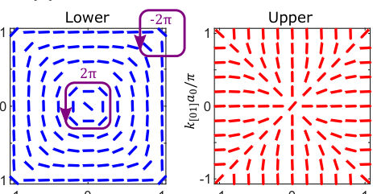 
Figure 1. (a) The monomer, zinc phthalocyanine (ZnPc) molecule (center top), electronic structure is modeled using three states: the ground state |S0⟩and two degenerate excited states |Sx⟩and |Sy⟩. The |S0⟩→|Sα⟩, with α ∈{x, y}, transi- tions are associated with transition charge densities, here rep- resented by the effective charges qα i localized on atom i. The distribution of effective charges defines the transition dipoles pα shown as white arrows. (b) Geometry of the ZnPc lattice including the definitions of the primitive vectors a1 and a2, the lattice constant a0, a generic lattice vector Trs, and the angle ϕ of rotation of the molecule in the unit cell. (c) The band structure of the...

📷 Fig 2

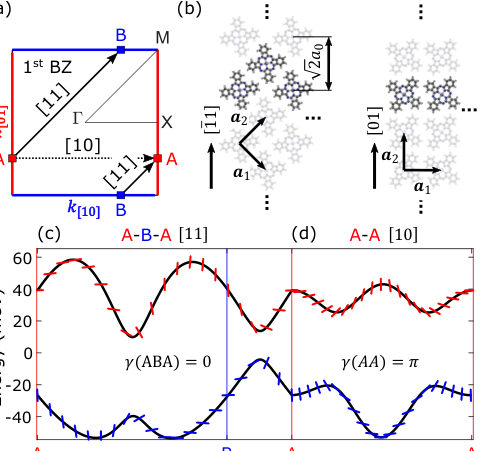 
Figure 2. (a) The first BZ marking the significant points and two points on the zone boundary: A and B. The edges are color coded to reflect the toroidal topology of the BZ. Two integration paths proceeding A→A and A→B→A marked ac- cording to their crystallographic directions as [10] and [11], respectively. (b) Schematic depiction of edges cut along the [¯11] and [01] directions. (c,d) Cuts through the band structure along the paths (c) A→B→A ([11]) and (d) A→A ([10]). The calculated Zak phase γ (identical for both bands) is shown in the inset. The bars overlaying the bands mark the polariza- tion of the respective wave functions as in Fig. 1e.

📷 Fig 3

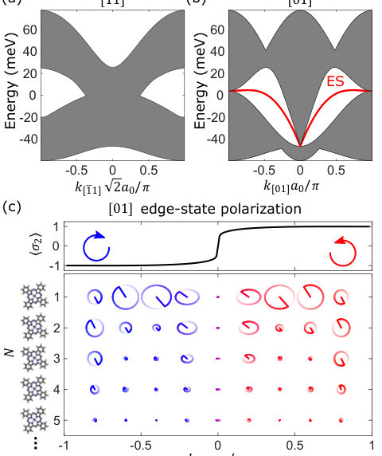 
Figure 3. (a) The band structure of a wide ribbon with [¯11] edges and (b) the band structure of a wide ribbon with the [01] edges. The states emerging from the bulk band structure (gray shaded areas), red lines marks the edge states (ES). (c) ES polarization of the edge molecules for different k[01] expressed as an expectation value of the σ2 Pauli matrix, and polarization ellipses of five molecular excitations forming the edge states for selected values of k[01] along the [01] edge. The color coding marks the component of the right (red) and left (blue) handed state. The bars inside the ellipses indicate the instantaneous orientation of their oscillating polarization vector and the...

**Summary.** This work theoretically investigates topological properties in excitonic bands within 2D molecular crystals. By calculating the Zak phase, the authors demonstrate that edge states, which possess momentum-locked elliptical polarization, only appear for specific crystallographic boundaries. This establishes a pathway for designing directional optical coupling in molecular materials.

**Why it may be interesting.** The connection between molecular excitons, topological invariants (Zak phase), and directional optical coupling provides a solid theoretical framework for engineering light-matter interactions in solid-state quantum emitters.

Detailed structure

**Main problem.** The study investigates the topological characteristics and edge states of excitonic bands formed in planar two-dimensional molecular crystals.

**Main result.** The existence of edge excitons is shown to depend sensitively on the crystallographic boundary orientation and is governed by the Zak phase of the bulk bands, exhibiting momentum-locked elliptical polarization.

**Method.** The authors employed theoretical modeling using a lattice Hamiltonian, calculating the Berry and Zak phases along paths in the Brillouin zone, and analyzing the resulting band structures.

**Model / system.** The system is modeled using molecular excitations (e.g., zinc phthalocyanine) in 2D molecular crystals, treated via an excitonic Hamiltonian incorporating un-screened Coulomb interactions.

**Key observables.** Zak phase ($\gamma_{Zak}$), Berry phase ($\gamma$), momentum-resolved excitonic bands, and elliptical polarization textures.

**Important parameters / regimes.** Crystallographic termination/orientation, lattice structure (square lattice), and the degeneracy points ($\Gamma$ and $M$) in the Brillouin zone.

**Assumptions / limitations.** The analysis relies on approximations for the Coulomb integral and neglects vibronic effects; linear dispersion alone is insufficient to confirm Dirac topology when long-range interactions are present.

**Figures summary.** Figures illustrate the band structure along high-symmetry paths, the calculated Zak phase values for different edge terminations, and the polarization texture of the resulting edge states.

**Paper structure.** The paper progresses by establishing the model Hamiltonian, calculating the bulk band topology via the Zak phase, demonstrating the emergence of edge states dependent on boundary conditions, and finally characterizing the polarization texture of these topological edge states.

Abstract

In molecular crystals, molecular excitations can hybridize into collective Frenkel excitons. Here we show that doubly degenerate excitations in planar two-dimensional molecular crystals generate excitonic bands with nontrivial momentum-resolved topological characteristics and edge states appearing only for selected crystallographic terminations. Using a model inspired by aggregates of zinc phthalocyanine molecules deposited on insulating surfaces, we demonstrate that the existence of edge excitons depends sensitively on the crystallographic orientation of the boundary and is governed by the Zak phase of the underlying bulk bands. The resulting edge states exhibit momentum-locked elliptical polarization textures originating from the internal structure of the molecular excitations, potentially enabling directional optical coupling and excitation transport. Our results establish a route toward topological and polarization-textured excitonic states in two-dimensional molecular materials.

[↑ back to top](#top)

### [Exciton switching and tunable exciton-phonon coupling in Oxygen doped ZnO nanorods](http://arxiv.org/abs/2610.10353v1)

**Authors:** Aiswarya Rath, Kalyan Ghosh, Pratap K Sahoo  
**Type:** both · **Category:** other · **PDF:** <https://arxiv.org/pdf/2610.10353v1>  
**Analysis basis:** full PDF text, analyzed in chunks
**Topic relevance:** `quantum measurements` **1/5**

📷 Fig 1

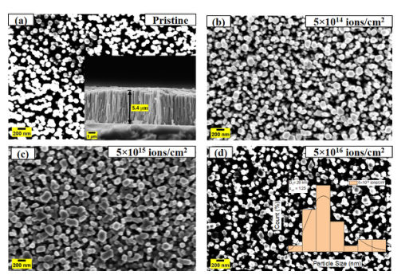 
FIG. 2: FESEM images of the (a) pristine and O+ ion implanted vertically aligned ZnO Nanorods at ion fluences (b) 5×1014 ions/cm2 , (c) 5×1015 ions/cm2 and (d) 5×1016

📷 Fig 2

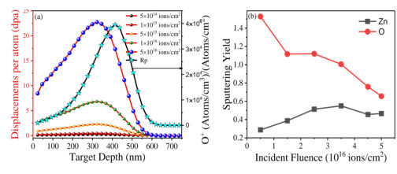 
FIG. 1: (a) SRIM simulation showing penetration of 250 keV O+ ions along the depth of ZnO NRs in right side of the y-axis and the left side shows dpa at different ion fluence, (b) Sputtering Yield data after O+ ion implantation in ZnO NRs.

📷 Fig 3

 
FIG. 3: FESEM images showing the morphological evolution of ZnO nanorods following post-irradiation annealing at 500◦C (a) pristine and O+ ion implanted ZnO Nanorods at ion fluences (b) 5×1014 ions/cm2 , (c) 5×1015 ions/cm2 and (d) 5×1016 ions/cm2.

📷 Fig 4

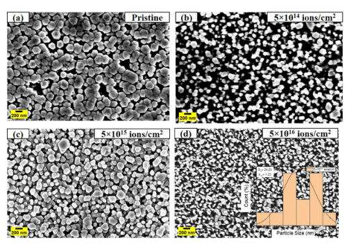 
Figure 2 presents the top-view FESEM images of the ver- tically aligned ZnO NRs irradiated with different fluences of O+ ions. The inset of Fig. 2(a) indicates a cross-sectional FESEM image with an average NR height of 5.4±1.2 µm for the pristine sample. The initially well-defined hexagonal mor- phology of the NR tips progressively evolves with increasing ion fluence, as evident in Fig. 2(b)–(d). At the highest implan- tation fluence, the NR cross sections become predominantly

📷 Fig 5

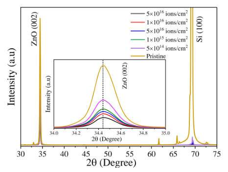 
FIG. 5: XRD pattern of pristine and 250 keV O+ ion implanted samples after annealing at 500◦C.

**Summary.** This work demonstrates that oxygen ion irradiation can be used to engineer ZnO nanorods, achieving a reversible 'switching' of excitonic emission. By analyzing the temperature-dependent photoluminescence, the researchers quantified how the ion damage systematically tunes the exciton-phonon coupling strength, paving the way for defect-programmable nanophotonic devices.

**Why it may be interesting.** The ability to use controlled ion irradiation to engineer specific electronic states (exciton switching) and tune fundamental coupling constants ($a_{	ext{BE}}$) in a solid-state semiconductor is highly relevant for designing quantum emitters and optoelectronic devices.

Detailed structure

**Main problem.** The study aims to dynamically control excitonic states and light-matter interactions in ZnO nanorods by engineering defects using oxygen ion irradiation.

**Main result.** Oxygen ion irradiation enables a reversible exciton OFF/ON switching mechanism and allows for the systematic tuning of the exciton-phonon coupling strength.

**Method.** The research combines ion implantation (250 keV O+ irradiation) with structural characterization (FESEM, XRD) and detailed optical spectroscopy (PL, temperature-dependent PL) analyzed using the Bose-Einstein model.

**Model / system.** The physical system is vertically aligned hexagonal ZnO nanorods. The analysis models exciton-phonon coupling using the Bose-Einstein model, while structural changes are tracked via ion implantation depth profiles and crystal structure analysis.

**Key observables.** Near-band-edge emission quenching, defect-band emission resonances, $	ext{D}^0	ext{X}$, $	ext{F}_{	ext{X}}–1	ext{LO}$, $	ext{F}_{	ext{X}}–2	ext{LO}$ transitions, exciton-phonon coupling parameter ($a_{	ext{BE}}$), and free-exciton energy ($	ext{Ex}(0)$).

**Important parameters / regimes.** Ion fluence (up to $5 	imes 10^{16}$ ions/cm$^2$), ion energy (250 keV), and temperature (low-temperature PL measurements).

**Assumptions / limitations.** The exciton-phonon coupling strength variation is governed by a competition among irradiation-induced defects, lattice distortion, and exciton localization.

**Figures summary.** Figures illustrate the depth profiles of implanted ions and structural disorder (XRD), while PL spectra show the quenching of NBE emission and the temperature evolution of exciton transitions.

**Paper structure.** The paper follows a progression from establishing the physical system and methodology (ion implantation, structural analysis) to demonstrating the primary phenomenon (exciton switching) and finally quantifying the underlying physics (tunable exciton-phonon coupling via Bose-Einstein fitting).

Abstract

Self ion doping in ZnO nanorods offers a powerful route to dynamically control excitonic states and light matter interactions. Here, vertically aligned hexagonal ZnO nanorods were irradiated with 250 keV oxygen ions to establish a direct link between irradiation induced defects and excitonic and optical responses. Increasing ion fluence progressively quenches the near band edge emission at 380 nm, leading to a complete exciton OFF state, while thermal annealing restores the emission, yielding a reversible exciton OFF or ON response. This switching originates from defect mediated modification and thermal recovery of excitonic states. The defect band emission, between 400 to 750 nm, exhibits quasi periodic whispering gallery mode like resonances that are progressively suppressed as irradiation alters nanorod geometry and optical confinement. Low-temperature photoluminescence resolves D0X, FX 1LO, and FX 2LO transitions, whose temperature evolution follows the Bose Einstein model. The non-monotonic variation of excition phonon coupling strength reveals a competition among irradiation induced defects, lattice distortion, and exciton localization in determining exciton phonon coupling. These results establish Oxygen ion irradiation as a means to simultaneously engineer excitonic switching, exciton phonon interactions, and optical resonances, providing a pathway toward defect programmable ZnO nanophotonic and optoelectronic devices.

[↑ back to top](#top)

### [How Good Is DFT for Solid-Liquid Interfaces? A Comparison With the Random-Phase Approximation for Water on Graphene](http://arxiv.org/abs/2610.09685v1)

**Authors:** Xavier R. Advincula, Yair Litman, Jiuyang Shi, Flaviano Della Pia, Christoph Schran, Angelos Michaelides  
**Type:** theory · **Category:** other · **PDF:** <https://arxiv.org/pdf/2610.09685v1>  
**Analysis basis:** full PDF text, analyzed in chunks
**Topic relevance:** `Frenkel-Kontorova` **1/5**

📷 Fig 1

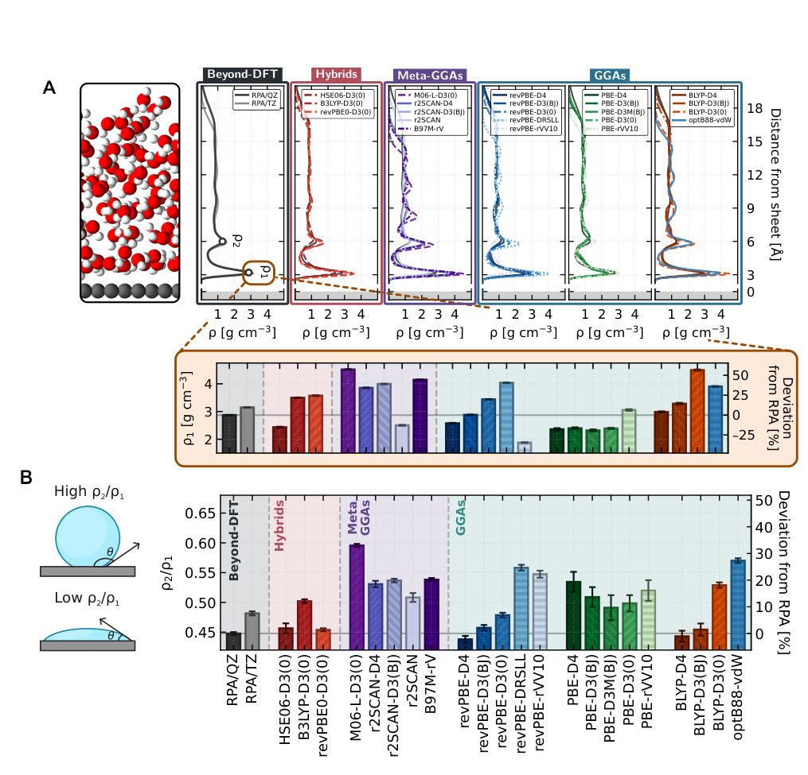 
FIG. 1. Big impact of the XC approximation on interfacial water structuring and wettability at the graphene– water interface. (A) Water oxygen density profiles as a function of the distance from the graphene sheet, computed with RPA/QZ (our reference) and RPA/TZ, and grouped by XC family: hybrids, meta-GGAs, and GGAs, each paired with a variety of dispersion corrections. Below the main panel the first interfacial peak density, ρ1, is shown for each functional, alongside its percentage deviation from the RPA reference. (B) Ratio of the second to first interfacial peak densities, ρ2/ρ1, used as a structural proxy for wettability, for each XC approximation. Percentage deviations from the RPA...

📷 Fig 2

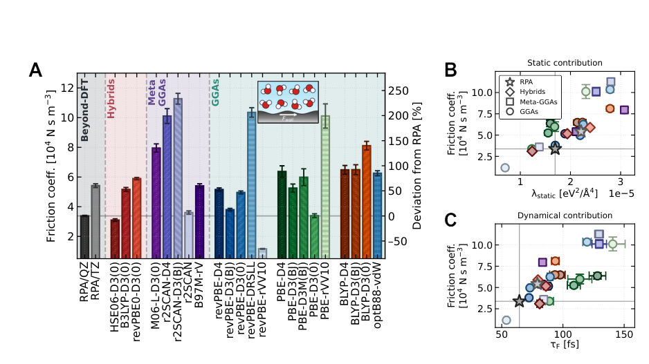 
FIG. 2. Big impact of the XC approximation on the friction coefficient at the graphene–water interface. (A) Friction coefficients computed with RPA/QZ (our reference) and RPA/TZ, and grouped by XC family: hybrids, meta-GGAs, and GGAs, each paired with a variety of dispersion corrections. Percentage deviations from the RPA reference are shown alongside, with the RPA reference indicated by the gray horizontal line. (B, C) Decomposition of the friction coefficient into its static and dynamical contributions, plotted against (B) λstatic, a measure of the corrugation of the graphene–water energy landscape, and (C) τF, the force correlation time capturing the relaxation of lateral forces at the...

📷 Fig 3

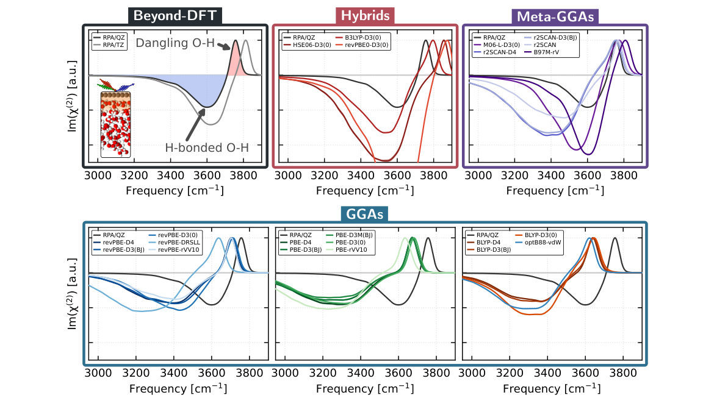 
FIG. 3. Big impact of the XC approximation on the VSFG spectrum of the graphene–water interface. Theoretical Im(χ(2)) spectra computed with RPA/QZ (our reference) and RPA/TZ and grouped by XC family, namely hybrids, meta-GGAs, and GGAs, each paired with a variety of dispersion corrections, using the ssVVCF methodology.68 The RPA/QZ spectrum is shown in every panel for reference, and all spectra are normalized to their maximum value. The inset in the RPA panel shows a schematic of the system considered, highlighting the topmost interfacial water layer, whose dangling and H-bonded O-H groups dominate the spectral response (see Methods).

📷 Fig 4

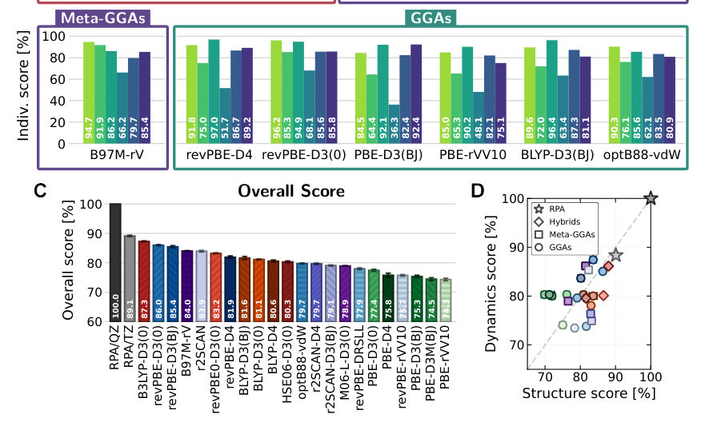 
FIG. 4. Identifying the most suitable XC approximation through a multi-observable scoring framework. (A) Overview of the six observables entering the scoring framework: radial distribution functions (RDF), vibrational density of states (VDOS), density profiles, orientational order, VSFG spectra, and friction, shown for RPA/QZ and B3LYP-D3(0) as an illustrative comparison (see Sections S4 and S5 for further details). (B) Individual scores for representative XC approximations, grouped by family (hybrids, meta-GGAs, and GGAs) and decomposed by observable, with colors matching the observable labels in (A). (C) Overall score for each XC approximation, obtained by averaging over all individual...

**Summary.** This work rigorously benchmarks various Density Functional Theory (DFT) approximations against the Random-Phase Approximation (RPA) for simulating water at solid interfaces like graphene. By analyzing structure, friction, and vibrational spectra, the authors reveal significant discrepancies between models. They propose a scoring framework and identify a small set of reliable functionals for future simulations.

**Why it may be interesting.** While focused on condensed matter/chemistry, the rigorous benchmarking methodology and the development of a general scoring framework for comparing complex quantum simulations against high-accuracy references are valuable for any field relying on multi-observable model validation.

Detailed structure

**Main problem.** Computational models for water at solid interfaces disagree significantly on fundamental properties like contact angle and friction, and no reliable computational reference exists to resolve this discrepancy.

**Main result.** The study identifies six specific DFT functionals that provide reliable starting points for modeling graphene-water interfaces, and shows that dynamical/spectroscopic properties are generally harder for DFT to reproduce than structural ones.

**Method.** The authors compare various DFT exchange-correlation (XC) approximations against the high-accuracy Random-Phase Approximation (RPA) using Machine-Learned Potentials (MLPs) for extensive sampling.

**Model / system.** The system studied is the solid-liquid interface, specifically water interacting with graphene. The comparison spans a wide range of computational models, including DFT functionals (Hybrids, Meta-GGAs) and the RPA reference.

**Key observables.** Interfacial structure (density profiles), wettability ($
ho_2/
ho_1$), friction coefficient ($\mu$), and vibrational sum-frequency generation (SFG) spectra descriptors.

**Important parameters / regimes.** The comparison is benchmarked against the RPA reference level of theory, which is computationally expensive for large simulations.

**Assumptions / limitations.** The analysis relies on developing a transferable, multi-observable scoring framework to quantify functional agreement with the high-accuracy RPA reference.

**Figures summary.** Figures compare density profiles, friction coefficients, and vibrational spectral descriptors, showing substantial quantitative deviations ($\pm 45\%$ to $\pm 230\%$) across different XC approximations relative to RPA.

**Paper structure.** The paper systematically assesses multiple observables (structure, friction, spectroscopy) by comparing various DFT approximations against RPA, culminating in the proposal of a scoring framework to rank functional reliability.

Abstract

Simulations of water at solid interfaces routinely disagree on basic properties, from contact angle to friction, depending on the model used, whether an empirical force field or a density functional theory (DFT) exchange-correlation (XC) approximation. Yet no accurate computational reference has been available to determine which, if any, is reliable. Here we assess XC approximations spanning the rungs of Jacob's Ladder against the random-phase approximation (RPA) at the graphene-water interface. Using machine-learned potentials (MLPs) trained on both DFT and RPA data, we achieve the extensive sampling required to characterize interfacial structure, wettability, friction, and vibrational sum-frequency generation spectra. We find that XC approximations disagree substantially with RPA and with each other. To make sense of this, we introduce a transferable, multi-observable scoring framework that distills each functional's agreement with RPA into a single measure. Six functionals emerge as reliable starting points for studies of graphene-water and other dispersion-dominated interfaces, namely B3LYP-D3(0), revPBE-D3(0), revPBE-D3(BJ), B97M-rV, r$^{2}$SCAN, and revPBE0-D3(0). Notably, this ranking follows no simple rule based on functional family or rung of Jacob's Ladder. What does hold across functionals is that dynamical and spectroscopic properties tend to be harder for DFT to reproduce than structural ones, with direct consequences for functional selection. Our framework also offers a general strategy for benchmarking any atomistic model, including the new generation of foundational MLPs, against high-accuracy references at solid--liquid interfaces. Beyond simulation, this work identifies which models can be trusted to connect measured contact angles, friction, and vibrational spectra to the molecular structure behind them.

[↑ back to top](#top)

### Other secondary papers (2)

Show other secondary papers

### [Delamination in Large REBCO Coils](http://arxiv.org/abs/2610.09308v1)

**Authors:** Jun Lu, Yan Xin, Iain Dixon, Brent Jarvis, Kwangmin Kim, Yu Suetomi, Jeremy Levitan, Jan Jaroszynski, Hongyu Bai  
**Type:** experiment · **Category:** other · **PDF:** <https://arxiv.org/pdf/2610.09308v1>  
**Analysis basis:** full PDF text, analyzed in chunks

📷 Fig 1

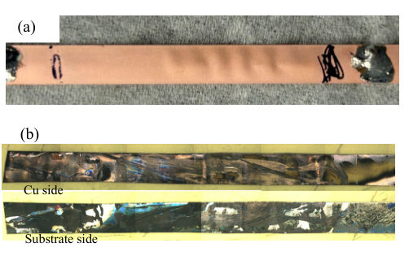 
Fig. 2. Bubbles observed in module 5 of LSC1-1. (a) five bubbles in a row. (b) after manually delaminating the sample in (a). (c) after copper was partially removed chemically from another sample, the delamination under the bubbles is evident.

📷 Fig 2

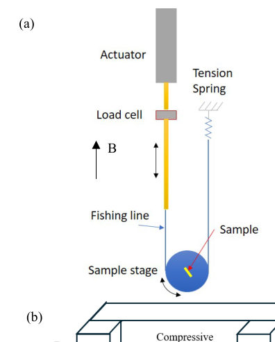 
Fig. 1. (a) Schematic of a torque magnetometer probe. (b) A sample on the sample stage where directions of screening current and electromagnetic stresses are indicated.

📷 Fig 3

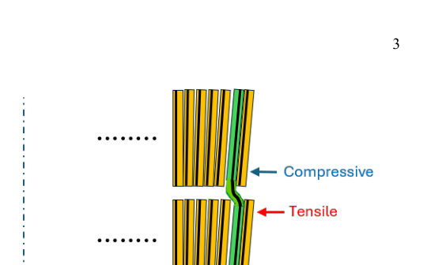 
Fig. 4. Illustration of deformation of a crossover joint in end modules.

📷 Fig 4

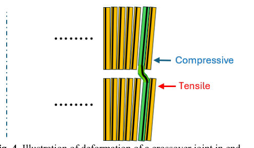 
Fig. 5. (a) the joining piece and (b) base tape in the crossover joint regions both showing delamnation bubbles.

📷 Fig 5

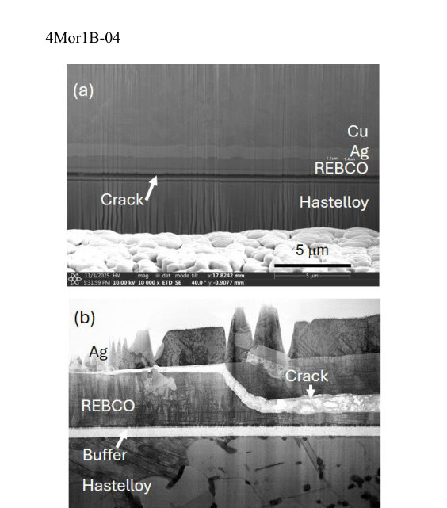 
Fig. 3. (a) SEM image of the cross-section of a delaminated region. (b) TEM image of a region where delamination ends at silver/REBCO interface.

**Summary.** This paper investigates delamination failures in large REBCO superconducting coils used for ultrahigh field magnets. Through extensive testing and postmortem analysis, the authors conclusively demonstrate that these structural failures are caused by electromagnetic stress from transport currents. The findings are crucial for improving the design and reliability of next-generation high-field superconducting magnets.

**Why it may be interesting.** While focused on materials science, the analysis of failure under extreme, non-equilibrium electromagnetic stress and the development of mitigation strategies for superconducting devices are relevant to understanding material limits in quantum technology infrastructure.

Detailed structure

**Main problem.** The paper addresses the critical issue of delamination in large REBCO coated conductors, which severely limits the design and performance of ultrahigh field superconducting magnets.

**Main result.** Delamination bubbles observed in large coils are strongly attributed to electromagnetic stress induced by transport and screening currents, a mechanism confirmed via torque magnetometry.

**Method.** The study combines large-scale magnet testing, postmortem inspection using microscopy, and controlled mechanical testing via torque magnetometry.

**Model / system.** The physical system involves REBCO coated conductors wound into large-scale coils designed for 40 T magnets. The analysis focuses on the mechanical integrity of the layered structure under high magnetic fields and associated currents.

**Key observables.** Surface bubbles, degradation of critical current (Ic), crack propagation paths, and sudden drops in measured torque values.

**Important parameters / regimes.** Operating fields up to 11.4 T (and implied higher fields), measured delamination strengths ($\sim 2.5$ to $3.8$ MPa), and the magnitude of electromagnetic stress.

**Assumptions / limitations.** The primary assumption is that the observed degradation is directly caused by electromagnetic stress, and that the torque magnetometry setup can accurately reproduce this failure mechanism.

**Figures summary.** Figures illustrate the physical evidence of delamination, including SEM/TEM cross-sections showing cracks, and torque magnetometry results demonstrating bubble formation and collapse upon chemical removal.

**Paper structure.** The paper presents findings from testing large coils, detailing the observation of degradation, followed by mechanistic investigation using microscopy and torque magnetometry to prove the link between electromagnetic stress and delamination, concluding with design implications.

Abstract

REBCO coated conductors have been used in ultrahigh field magnets for condensed matter physics research, nuclear fusion, particle accelerators, and NMR applications. It is well known, however, that they are not mechanically strong against delamination due to their intrinsic layered structures. As a result, the delamination issue has become one of the major design challenges of REBCO magnet coils. As a part of the development of the 40 T all-superconducting magnet at the National High Magnetic Field Laboratory, USA, large-scale coils wound by two-in-hand REBCO conductor with turn-to-turn insulation was designed and tested at 4.2 K in an 11.4 T background magnetic field. We found REBCO degradations within the windings and at the crossover joints during the tests. The postmortem inspection found that the degradation was caused by delamination. The delamination appears on the surface of the conductor as bubbles which were subsequently studied by microscopy. Additionally, a similar bubble was found on a short sample by torque magnetometry. This supports the inference that the delamination bubbles found in coils are due to electromagnetic stress. In this paper, we present these findings. The implication of these findings for future magnet designs and the method of mitigation will be discussed.

[↑ back to top](#top)

### [Superconducting Diode Effect due to the Inverse Spin Hall Effect in Josephson Junctions with Extrinsic Spin-Orbit Interaction](http://arxiv.org/abs/2610.09248v1)

**Authors:** Yositake Takane, Aurélien Manchon, Gen Tatara  
**Type:** theory · **Category:** other · **PDF:** <https://arxiv.org/pdf/2610.09248v1>  
**Analysis basis:** full PDF text, analyzed in chunks

📷 Fig 1

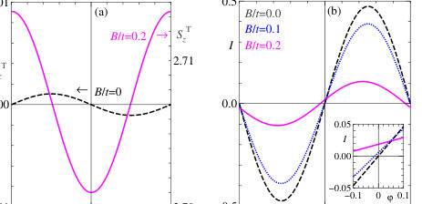 
Fig. 2. Numerical results of (a) ST z (φ) with the dashed line and solid line representing B/t = 0.0 and 0.2, respectively, and (b) I(φ) with the dashed line, dotted line, and solid line representing B/t = 0.0, 0.1, and 0.2, respectively.

📷 Fig 2

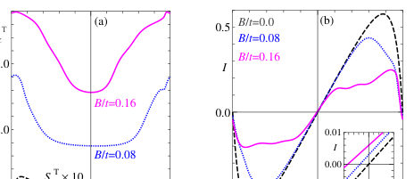 
Fig. 3. Numerical results of (a) ST z (φ) for B/t = 0.0, 0.08, and 0.16 from bottom to top (the dashed line at the bottom is displayed at 10 times its original scale) and (b) I(φ) with the dashed line, dotted line, and solid line representing B/t = 0.0, 0.08, and 0.16, respectively.

📷 Fig 3

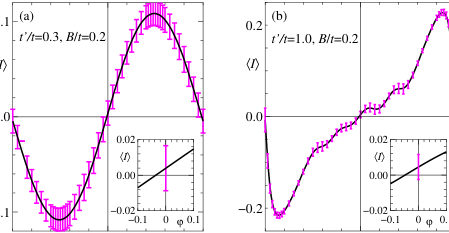 
Fig. 4. Numerical results of ⟨I(φ)⟩with B/t = 0.2 in (a) the tunneling regime t′/t = 0.3 and (b) the metallic regime t′/t = 1.0.

**Summary.** This paper theoretically examines how extrinsic spin-orbit interaction in an SNS Josephson junction can induce a superconducting diode effect. By applying a Zeeman field gradient, the system generates spin polarization, which in turn drives the Josephson current via the Inverse Spin Hall Effect. The study finds that this diode effect is significantly enhanced when the coupling between the normal and superconducting leads is strong (metallic regime).

**Why it may be interesting.** This work connects spin-orbit coupling, superconducting phenomena, and non-linear transport effects (diode effect), which are key areas in mesoscopic physics and quantum electronics.

Detailed structure

**Main problem.** The study investigates the superconducting diode effect (direction-dependent critical current) in Josephson Junctions incorporating extrinsic Spin-Orbit Interaction (SOI).

**Main result.** The application of a Zeeman field gradient induces an anomalous phase shift via the Inverse Spin Hall Effect, leading to a measurable diode effect, which is more pronounced in the metallic coupling regime.

**Method.** The research employs numerical simulations to calculate spin density and Josephson current, analyzing the current's dependence on the superconducting phase difference.

**Model / system.** The model is a Superconductor-Normal Metal-Superconductor (SNS) junction where the Normal segment is treated as a 2DES with extrinsic SOI. The system is analyzed in both tunneling and metallic coupling regimes.

**Key observables.** Spin density components ($S_{B,z}, S_{T,z}$), Josephson current $I(\varphi)$, and the diode efficiency $\eta$.

**Important parameters / regimes.** The strength of the Zeeman field gradient ($B/t$) and the coupling strength between N and S segments (tunneling vs. metallic regime).

**Assumptions / limitations.** The superconducting pair potential ($\Delta$) is assumed constant throughout the analysis.

**Figures summary.** Figures illustrate schematics of the junction, the dependence of spin density and current on Zeeman field strength, and the ensemble-averaged current in different coupling regimes.

**Paper structure.** The paper proceeds by first establishing the generation of the Spin Hall Effect by the Josephson current, then introducing the Zeeman field gradient to induce spin polarization, and finally quantifying the resulting non-reciprocity and diode effect in different coupling limits.

Abstract

The spin density and Josephson current at equilibrium are studied numerically in a superconductor-normal metal-superconductor (SNS) junction with extrinsic spin-orbit interaction in the N segment. This system preserves structural inversion symmetry. We find that the Josephson current generates the spin Hall effect, resulting in an opposite spin density near the two edges of the N segment. We also find that a Zeeman magnetic field with gradient applied to the N segment generates an anomalous phase shift due to the inverse spin Hall effect, resulting in a diode effect when higher harmonics of the Josephson current are present. These results are consistent with those of a previous theoretical study based on diagrammatic perturbation theory. We find that the diode effect becomes more pronounced when stronger coupling between the N and S segments enhances the higher harmonics.

[↑ back to top](#top)

