
# arxiv digest (quant-ph + cond-mat) — 2026-10-10

*153 papers · 25 relevant · 3 highlighted*

## 🔥 Most relevant (25)

*Every paper with at least one nonzero topic score, sorted by best-matching score. 🔥 marks scores ≥4/5. Click the title to jump to the full entry below; click [arXiv] to open the paper page. `(secondary)` marks papers from de-prioritized cond-mat archives.*

Show 25 relevant papers

- ⭐ [Quantum simulation of material-specific Hubbard models with alkaline-earth atoms](#paper-2610.10713) [[arXiv]](http://arxiv.org/abs/2610.10713v1) — 🔥 `analog quantum simulation` **5/5**
- [Constructing Large and Structured Decoherence-Free Subspaces in Hybrid Quantum Systems](#paper-2610.12348) [[arXiv]](http://arxiv.org/abs/2610.12348v1) — 🔥 `correlated / nonlocal dissipation` **4/5** · `analog quantum simulation` **3/5** · `driven-dissipative phase transition` **3/5** · `methods for driven-dissipative` **3/5** · `Tavis-Cummings & cavity-many-emitter` **2/5** · `non-equilibrium universality` **2/5** · `Keldysh / 2PI / non-Gaussian methods` **1/5** · `quantum measurements` **1/5**
- [Magnonic cavity-enhanced quantum magnetometry with nitrogen-vacancy centre ensembles](#paper-2610.11350) [[arXiv]](http://arxiv.org/abs/2610.11350v1) — 🔥 `Tavis-Cummings & cavity-many-emitter` **4/5** · `analog quantum simulation` **3/5** · `methods for driven-dissipative` **2/5** · `quantum measurements` **2/5** · `quantum optics experiment` **2/5** · `QC/QI experiment` **1/5** · `correlated / nonlocal dissipation` **1/5** · `driven-dissipative phase transition` **1/5**
- [On linearity or non-linearity in machine learning for quantum chaotic dynamics](#paper-2610.10697) [[arXiv]](http://arxiv.org/abs/2610.10697v1) — 🔥 `analog quantum simulation` **4/5** · `Rydberg arrays` **3/5** · `quantum measurements` **3/5** · `scars & prethermalization` **3/5** · `methods for driven-dissipative` **2/5**
- [A deterministic polynomial chaos Galerkin method for non-Markovian quantum state diffusion](#paper-2610.12070) [[arXiv]](http://arxiv.org/abs/2610.12070v1) — 🔥 `methods for driven-dissipative` **4/5** · `correlated / nonlocal dissipation` **3/5** · `Keldysh / 2PI / non-Gaussian methods` **2/5** · `driven-dissipative phase transition` **2/5** · `quantum measurements` **2/5**
- [Emergent SSH physics and localization in a cavity--atom system beyond the rotating-wave approximation](#paper-2610.11897) [[arXiv]](http://arxiv.org/abs/2610.11897v1) — 🔥 `analog quantum simulation` **4/5** · `Tavis-Cummings & cavity-many-emitter` **3/5** · `driven-dissipative phase transition` **2/5** · `Frenkel-Kontorova` **1/5** · `Keldysh / 2PI / non-Gaussian methods` **1/5** · `methods for driven-dissipative` **1/5** · `non-equilibrium universality` **1/5**
- [Exact polariton-condensate states via nonlinear Stark coupling](#paper-2610.11234) [[arXiv]](http://arxiv.org/abs/2610.11234v1) — 🔥 `scars & prethermalization` **4/5** · `Tavis-Cummings & cavity-many-emitter` **3/5** · `analog quantum simulation` **3/5** · `driven-dissipative phase transition` **2/5** · `non-equilibrium universality` **1/5**
- [Quantum jumps of sound](#paper-2610.10714) [[arXiv]](http://arxiv.org/abs/2610.10714v1) — 🔥 `quantum measurements` **4/5** · `QC/QI experiment` **3/5** · `quantum optics experiment` **2/5** · `Full counting statistics` **1/5** · `correlated / nonlocal dissipation` **1/5** · `driven-dissipative phase transition` **1/5** · `methods for driven-dissipative` **1/5**
- [Quantum Networking at the Speed of Quantum Computation: Kilohertz Entanglement in a Heterogeneous Quantum System](#paper-2610.10705) [[arXiv]](http://arxiv.org/abs/2610.10705v1) — 🔥 `QC/QI experiment` **4/5** · `quantum optics experiment` **3/5** · `analog quantum simulation` **2/5** · `quantum measurements` **2/5** · `Tavis-Cummings & cavity-many-emitter` **1/5** · `interference shaping light` **1/5**
- [Demonstration of subspace-search variational quantum eigensolver using photonic orbital angular momentum qudits](#paper-2610.11026) [[arXiv]](http://arxiv.org/abs/2610.11026v1) — 🔥 `analog quantum simulation` **4/5** · 🔥 `quantum optics experiment` **4/5** · `QC/QI experiment` **3/5** · `interference shaping light` **1/5**
- [When Does Interference Help Learning? Kernel Geometry as a Pre-Experimental Test for Photonic Reservoir Computing](#paper-2610.11360) [[arXiv]](http://arxiv.org/abs/2610.11360v1) — 🔥 `interference shaping light` **4/5** · `analog quantum simulation` **3/5** · `Full counting statistics` **2/5** · `methods for driven-dissipative` **1/5** · `quantum measurements` **1/5** · `quantum optics experiment` **1/5**
- [Analog quantum simulation of $φ^4$ field theory with a superconducting transmission line](#paper-2610.11071) [[arXiv]](http://arxiv.org/abs/2610.11071v1) — 🔥 `analog quantum simulation` **4/5** · `Frenkel-Kontorova` **2/5** · `Keldysh / 2PI / non-Gaussian methods` **1/5** · `QC/QI experiment` **1/5** · `driven-dissipative phase transition` **1/5** · `methods for driven-dissipative` **1/5** · `non-equilibrium universality` **1/5**
- [Deterministic generation of large-scale photonic GHZ states utilizing spin echo in a solid-state quantum light source](#paper-2610.11445) [[arXiv]](http://arxiv.org/abs/2610.11445v1) — 🔥 `QC/QI experiment` **4/5** · `quantum optics experiment` **3/5** · `Tavis-Cummings & cavity-many-emitter` **1/5** · `analog quantum simulation` **1/5** · `interference shaping light` **1/5** · `quantum measurements` **1/5**
- [Experimental Measurement-Device-Independent Quantum Key distribution with Flawed State-Preparation over 300 km](#paper-2610.11428) [[arXiv]](http://arxiv.org/abs/2610.11428v1) — 🔥 `quantum optics experiment` **4/5** · `QC/QI experiment` **3/5** · `interference shaping light` **2/5** · `quantum measurements` **2/5**
- [Mass quench in interacting finite-size quantum field system](#paper-2610.12045) [[arXiv]](http://arxiv.org/abs/2610.12045v1) — 🔥 `Keldysh / 2PI / non-Gaussian methods` **4/5** · `non-equilibrium universality` **3/5** · `analog quantum simulation` **2/5** · `interference shaping light` **1/5** · `methods for driven-dissipative` **1/5**
- [Nonlinear Feedback in Josephson Circuit Optimization: Application to a Kerr-Reversal JTWPA](#paper-2610.10715) [[arXiv]](http://arxiv.org/abs/2610.10715v1) — 🔥 `quantum measurements` **4/5** · `driven-dissipative phase transition` **3/5** · `methods for driven-dissipative` **3/5** · `Keldysh / 2PI / non-Gaussian methods` **1/5**
- [Experimental generation of asymmetric keys from the parity structure of a two-photon six-qubit entangled state](#paper-2610.12264) [[arXiv]](http://arxiv.org/abs/2610.12264v1) — 🔥 `QC/QI experiment` **4/5** · `quantum optics experiment` **3/5** · `interference shaping light` **1/5** · `quantum measurements` **1/5**
- [Measurement-induced enhancement of the $X$-parity lifetime in a Majorana tetron](#paper-2610.12223) [[arXiv]](http://arxiv.org/abs/2610.12223v1) `(secondary)` — 🔥 `quantum measurements` **4/5** · `Full counting statistics` **1/5** · `correlated / nonlocal dissipation` **1/5** · `driven-dissipative phase transition` **1/5** · `methods for driven-dissipative` **1/5**
- [Quantitative Rules for Parallel Calibration and Drift-Resilient Maintenance of Large-Scale Superconducting Quantum Processors](#paper-2610.11477) [[arXiv]](http://arxiv.org/abs/2610.11477v1) — 🔥 `QC/QI experiment` **4/5** · `quantum measurements` **3/5**
- [A quasiparticle-protected superconducting qubit](#paper-2610.12227) [[arXiv]](http://arxiv.org/abs/2610.12227v1) — 🔥 `QC/QI experiment` **4/5** · `correlated / nonlocal dissipation` **1/5** · `quantum optics experiment` **1/5**
- ⭐ [Single-shot magic state factories for quantum LDPC codes](#paper-2610.10731) [[arXiv]](http://arxiv.org/abs/2610.10731v1) — 🔥 `QC/QI experiment` **4/5** · `Rydberg arrays` **2/5**
- [Sub-MHz SWAP spectroscopy of two-level systems in superconducting qubits](#paper-2610.11125) [[arXiv]](http://arxiv.org/abs/2610.11125v1) — 🔥 `QC/QI experiment` **4/5** · `correlated / nonlocal dissipation` **1/5** · `quantum measurements` **1/5**
- [Quickly extracting fidelity decay rates in random circuit benchmarking experiments](#paper-2610.11540) [[arXiv]](http://arxiv.org/abs/2610.11540v1) — 🔥 `QC/QI experiment` **4/5** · `quantum measurements` **1/5**
- [Residual-Guided Global-Drive Design in Trapped-Ion Quantum Simulators](#paper-2610.12314) [[arXiv]](http://arxiv.org/abs/2610.12314v1) — 🔥 `analog quantum simulation` **4/5** · `QC/QI experiment` **1/5**
- [Error-Corrected Memory and Logic on a Heavy-Hex Superconducting-Qubit Processor](#paper-2610.11658) [[arXiv]](http://arxiv.org/abs/2610.11658v1) — 🔥 `QC/QI experiment` **4/5**

## ⭐ Highlighted (3)

*Papers by authors on your watch list. Click the title to jump to the full entry below; click [arXiv] to open the paper page.*

Show 3 highlighted papers

- ⭐ [Single-shot magic state factories for quantum LDPC codes](#paper-2610.10731) [[arXiv]](http://arxiv.org/abs/2610.10731v1) — Mikhail D. Lukin
- ⭐ [Quantum simulation of material-specific Hubbard models with alkaline-earth atoms](#paper-2610.10713) [[arXiv]](http://arxiv.org/abs/2610.10713v1) — Susanne F. Yelin
- ⭐ [Competing symmetry breaking and topology in quantum spin chains](#paper-2610.10694) [[arXiv]](http://arxiv.org/abs/2610.10694v1) — Anthony Rey

## All papers (101, sorted by relevance)

*Papers from quant-ph and your primary cond-mat archives (quant-gas, stat-mech, str-el, dis-nn). Highlighted papers (⭐) come first, then everything else sorted by topic-relevance score, highest first.*

### ⭐ [Quantum simulation of material-specific Hubbard models with alkaline-earth atoms](http://arxiv.org/abs/2610.10713v1)

**Highlighted author(s):** Susanne F. Yelin  
**Authors:** Henning Schlömer, Reuben R. W. Wang, Bo Xing, Susanne F. Yelin, H. R. Sadeghpour  
**Type:** both · **Category:** strongly correlated electrons · **PDF:** <https://arxiv.org/pdf/2610.10713v1>  
**Analysis basis:** full PDF text, analyzed in chunks
**Topic relevance:** 🔥 `analog quantum simulation` **5/5**

📷 Fig 1

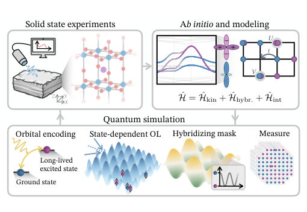 
FIG. 1. Toolbox for material-realistic quantum sim- ulation. Lower panel: a quantum simulator that combines orbital encoding into long-lived clocks states of Sr, orbital- dependent optical potentials, spatially structured coherent coupling for symmetry-selective hybridization, and snapshot measurements. These ingredients enable the implementa- tion and controlled exploration of multi-orbital Hamiltoni- ans derived from electronic-structure calculations. Such a platform closes a loop between solid-state experiments (up- per left panel), first-principles modeling (upper right panel), and quantum simulation, in which experimentally constrained microscopic models are solved on a programmable...

📷 Fig 2

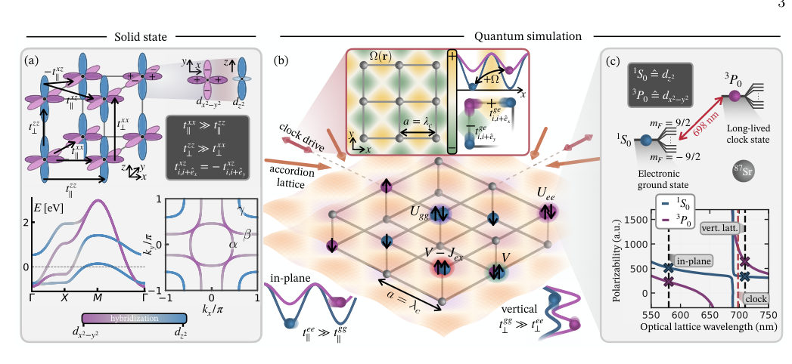 
FIG. 2. Recipe for multi-orbital quantum simulation of the bilayer nickelate. (a) La3Ni2O7 under pressure realizes a tetragonal bilayer of Ni atoms, each contributing two eg orbitals, dx2−y2 and dz2. The orbital symmetry dictates the hopping hierarchy (txx ∥ ≫tzz ∥in plane, tzz ⊥≫txx ⊥across the bilayer) and a d-wave inter-orbital hybridization txz i,i+ˆex = −txz i,i+ˆey, producing the (non-interacting) band structure and α, β, γ Fermi pockets shown. (b) 87Sr in an accordion lattice of spacing a = λc (the clock transition wavelength) forms the in-plane square lattice; a vertical state-dependent superlattice forms the bilayer. On-site interactions Ugg, Uee, direct V , and Hund exchange Jex...

📷 Fig 3

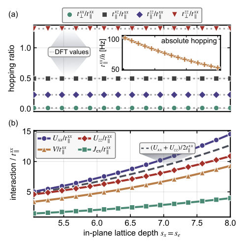 
FIG. 3. Accessible parameter regimes of the bilayer- nickelate simulator. (a) Optimized hopping amplitudes, normalized to the dominant in-plane hopping txx ∥, as a func- tion of the in-plane lattice depth (in units of the recoil energy of the clock wavelength). At each depth, the trapping wave- length, clock-drive strength, and vertical superlattice depths are reoptimized self-consistently such that the target hopping structure (Tab. II) is maintained. Gray dotted lines indicate the target values from density functional theory; the inset shows the corresponding absolute hopping scale txx ∥/h. (b) On-site interaction parameters obtained from the converged three-dimensional Wannier orbitals....

📷 Fig 4

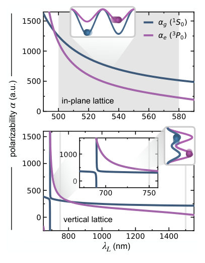 
FIG. 4. State-dependent polarizability. The upper panel shows the in-plane wavelength range in which the e state is trapped more weakly than the g state. The lower panel shows the vertical-lattice wavelengths used in the bilayer construc- tion. The gray bands denote the optimization windows in our simulations.

📷 Fig 5

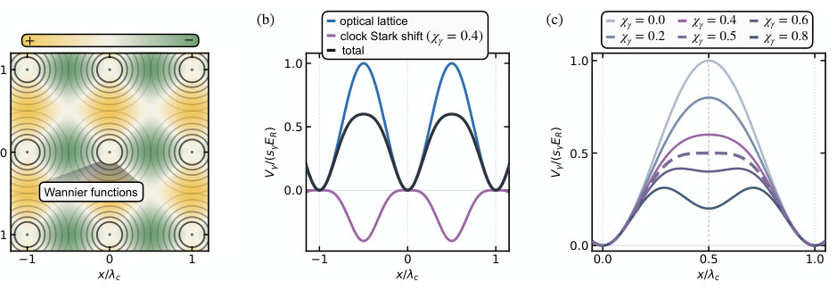 
FIG. 5. Construction of the d-wave Rabi mask. (a) Structured Rabi mask m(r) = [cos(Qx) −cos(Qy)] for Q = 2π/λc. The atomic lattice is aligned such that the lattice sites coincide with nodes of the Rabi field; this way, neighboring x and y bonds pick up opposite Rabi signs. (b) Line cut along y = 0 through the state-dependent optical-lattice potential (blue), the off-resonant Stark potential generated by the clock beams (purple), and their sum (black). The same spatial clock field that produces the coherent hybridization therefore also lowers the NN tunneling barrier through its intensity profile. (c) Total line-cut potential for increasing clock-light strength, parametrized by χγ = 16vγ/sγ....

**Summary.** This paper introduces a comprehensive quantum simulation architecture using alkaline-earth atoms to model the complex, multi-orbital physics found in correlated materials like nickelates. By combining various laser and lattice controls, the authors achieve programmable control over all necessary Hamiltonian terms, demonstrating a general route to simulate solid-state physics in an ultracold atom setting.

**Why it may be interesting.** This work provides a concrete, general blueprint for realizing complex, multi-orbital Hamiltonians in ultracold atoms, bridging the gap between high-level condensed matter theory and programmable quantum hardware.

Detailed structure

**Main problem.** The goal is to faithfully reproduce the complex, multi-orbital Hamiltonians of correlated quantum materials, such as bilayer nickelates, using programmable quantum simulators.

**Main result.** The authors demonstrate an integrated architecture using fermionic alkaline-earth atoms that can programmatically control all necessary ingredients—including orbital-selective tunneling, multi-orbital Hubbard/Hund couplings, and crystal field splitting—to simulate these complex models.

**Method.** The approach combines advanced atomic physics techniques (clock states, structured driving, Feshbach resonances) to engineer the effective Hamiltonian, which is then benchmarked against first-principles calculations from solid-state theory.

**Model / system.** The system uses fermionic alkaline-earth atoms in an optical lattice to simulate the low-energy physics of correlated materials, specifically targeting the four-band Hamiltonian of bilayer nickelates. The simulation controls hopping hierarchies, interaction strengths ($U, J_H, V$), and orbital energy offsets independently.

**Key observables.** Non-interacting band structure (e.g., $\alpha, eta, \gamma$ pockets), orbital-dependent hopping ratios, and the ability to reproduce microscopic parameters from first-principles modeling.

**Important parameters / regimes.** The simulation requires independent control over hopping ratios ($t_{\parallel}/t_{\perp}$), interaction strengths ($U, J_H, V$), and crystal field splitting ($\Delta$).

**Assumptions / limitations.** The method successfully encodes solid-state orbital symmetries into the effective Hamiltonian even when atoms are confined to simple $s$-wave Wannier orbitals. The realization requires a demanding combination of laser and lattice control.

**Figures summary.** Figures illustrate the 'Toolbox' for simulation, mapping material requirements to atomic controls, and detail the specific hopping hierarchies and level schemes required to model the bilayer nickelate structure.

**Paper structure.** The paper establishes the general goal of simulating material Hamiltonians, details the specific physical ingredients (orbital encoding, coupling, detuning) available in the AEA platform, and validates this capability by applying it to the highly demanding benchmark of the bilayer nickelate model.

Abstract

A long-term goal of quantum simulation is to faithfully reproduce the low-energy Hamiltonians of correlated quantum materials, establishing a direct connection between solid-state experiment, electronic-structure theory, and programmable many-body systems. Here, we introduce an integrated quantum-simulation architecture based on fermionic alkaline-earth atoms that enables programmable control over the key ingredients of multi-orbital material Hamiltonians. Long-lived clock states encode synthetic orbitals, their differential polarizabilities generate orbital-selective tunneling, and contact interactions provide multi-orbital Hubbard and Hund couplings. Spatially structured coherent driving on the ultra-narrow clock transition further realizes symmetry-selective inter-orbital hybridization, while the clock detuning independently controls orbital energy offsets. In this way, the spatial symmetries of solid-state orbitals can be encoded directly into the effective Hamiltonian, even though the atoms themselves remain in conventional $s$-wave Wannier orbitals of the lowest optical-lattice bands. We demonstrate the resulting integrated control using the four-band low-energy Hamiltonian of the bilayer nickelate La$_3$Ni$_2$O$_7$ as a demanding benchmark. Self-consistent calculations show that the microscopic parameters obtained from first-principles modeling can be reproduced within a single experimentally accessible lattice configuration and independently programmed over substantial parameter ranges. Our results establish a general route for translating material-derived multi-orbital Hamiltonians into programmable ultracold-atom quantum simulators.

[↑ back to top](#top)

### ⭐ [Single-shot magic state factories for quantum LDPC codes](http://arxiv.org/abs/2610.10731v1)

**Highlighted author(s):** Mikhail D. Lukin  
**Authors:** Varun Menon, Rohan Mehta, Andi Gu, Andrei C. Diaconu, Daniel Bochen Tan, Xiao Xiao, Michael J. Gullans, Qian Xu, Hengyun Zhou, Mikhail D. Lukin, J. Pablo Bonilla Ataides  
**Type:** both · **Category:** quantum information and computing · **PDF:** <https://arxiv.org/pdf/2610.10731v1>  
**Analysis basis:** full PDF text, analyzed in chunks
**Topic relevance:** 🔥 `QC/QI experiment` **4/5** · `Rydberg arrays` **2/5**

📷 Fig 1

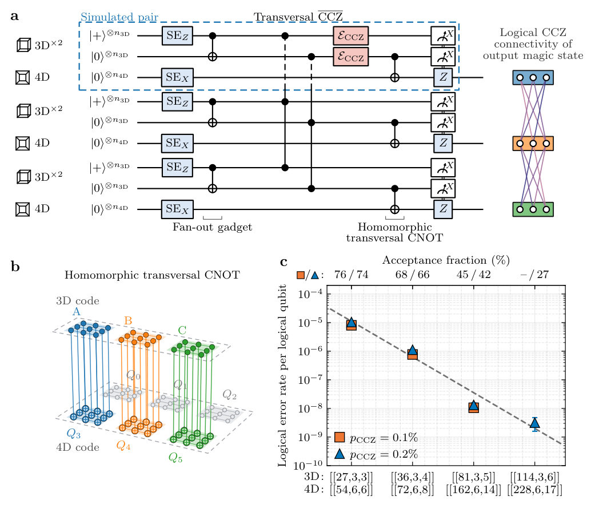 
FIG. 1. Transversal dimension-jump magic state factory. (a) Three tricycle blocks are prepared in |+⟩and acted on by a transversal CCZ circuit using a fan-out gadget, producing the nine-qubit hypergraph state |det⟩shown on the right. The gadget pairs each block with an ancilla patch of the same code through one transversal layer of CNOTs, splitting the two CCZ layers across the two patches so that every qubit takes part in a single gate. A depth-1 homomorphic CNOT teleports the magic state into three paired quadcycle blocks prepared in |0⟩. Transversal X measurements of the tricycle blocks provide the teleportation outcomes and detector information used for postselection. The dashed box...

📷 Fig 2

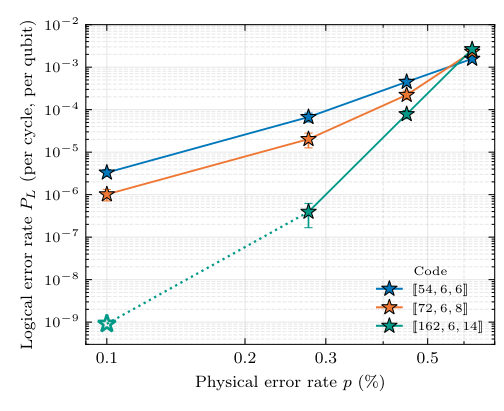 
FIG. 2. Single-shot circuit-level performance of the quadcycle codes. Logical error rate per cycle per logical qubit versus physical error rate p for the [[54, 6, 6]], [[72, 6, 8]], and [[162, 6, 14]] quadcycle codes, from windowed memory simulations under circuit-level depolarizing noise. Decoding is single-shot: a sliding window spanning three syndrome- extraction rounds and advancing one round per step (W = 3, S = 1) solves for the most-likely error within each window, so a constant number of rounds suffices independent of the code distance. The open marker extrapolates the [[162, 6, 14]] curve to p = 10−3 using PL ∝pd/2 with d = 12 (its circuit- level distance upper bound). Error bars...

📷 Fig 3

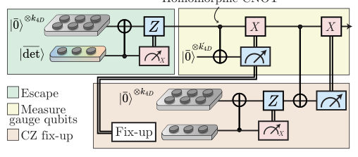 
FIG. 3. Complete factory pipeline with downstream fault-tolerant gadgets. Only one of the three parallel sets of code blocks is shown. The escape stage abstracts Fig. 1, in which the magic state is teleported to three quadcycle blocks and postselected (not shown). Using ancillary quad- cycle codes and homomorphic CNOTs, we then perform a transversal measurement that effectively addresses a single logical qubit in the Z basis. As the ancillary quadcycle code is also single-shot state preparable, this measurement can be performed in constant depth. Then, depending on the logi- cal outcome, we modify the factory to transversally prepare a resource state for the required addressable CZ...

📷 Fig 4

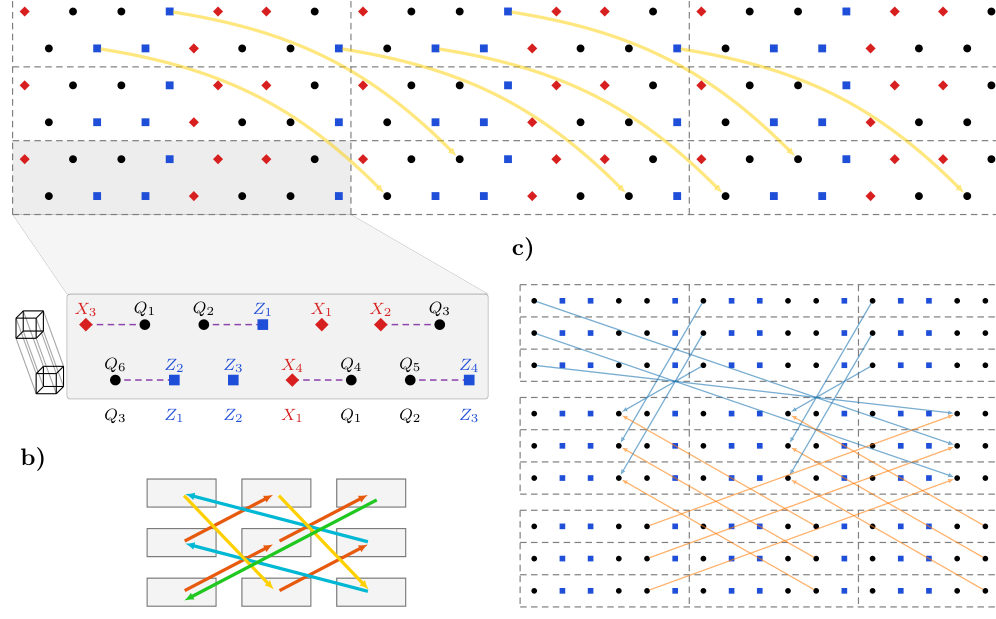 
FIG. 4. Qubit placement and routing for the neutral-atom implementation. (a) Toric layout of a quadcycle code. Qubits are arranged into unit cells containing six data qubits, four X-check ancillae, and four Z-check ancillae. The correspond- ing tricycle cell, shown below, is identified with the lower row of the quadcycle cell. This shared layout allows the two codes to use the same routing patterns for their common stabilizer terms and aligns their data qubits for the homomorphic CNOT. The dashes inside the unit cell display which sectors are coupled for an A term. (b) Parallel atom rearrangement implementing the cyclic translation associated with the monomial xy. The translations are...

📷 Fig 5

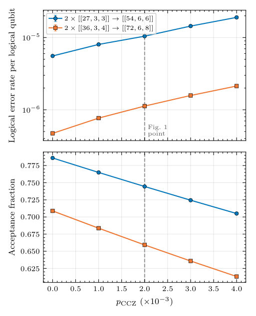 
FIG. 5. Dependence of the factory on the CCZ error rate. Post-selected logical error rate per output logical qubit (top) and single-block acceptance fraction (bottom) for the 2 × [[27, 3, 3]] →[[54, 6, 6]] and 2 × [[36, 3, 4]] →[[72, 6, 8]] fac- tories, as a function of the CCZ error rate pCCZ, with all other operations held at depolarizing noise p = 10−3. The simulated CCZ noise is the single-qubit marginal of a three-qubit depo- larizing channel; this marginal is exact because each qubit participates in only one gate in the depth-1 transversal CCZ circuit. Error bars are binomial.

**Summary.** This paper presents a novel, highly efficient 'magic state factory' designed for fault-tolerant quantum computation using quantum LDPC codes. It merges tricycle and quadcycle codes via a teleportation mechanism to generate high-fidelity magic states. The protocol is demonstrated on neutral-atom quantum computers, offering a practical, low-overhead pathway to scaling quantum computation.

**Why it may be interesting.** The integration of advanced quantum error-correcting codes (qLDPC) with a physical implementation platform (neutral atoms) to solve a fundamental resource bottleneck (magic state generation) is highly relevant for experimental quantum computing.

Detailed structure

**Main problem.** The core challenge is developing a space-time-efficient method to generate high-fidelity magic states required for fault-tolerant quantum computation using quantum LDPC codes.

**Main result.** The authors propose a factory combining tricycle and quadcycle codes that achieves logical error rates as low as $10^{-9}$ with 10-40 times lower space-time cost than existing methods.

**Method.** The approach uses an 'escape' mechanism to teleport postselected logical magic states from tricycle codes to more robust quadcycle codes via a depth-1 homomorphic CNOT.

**Model / system.** The protocol is demonstrated on reconfigurable neutral-atom quantum computers, utilizing the algebraic structure of tricycle and quadcycle codes for state preparation and error correction.

**Key observables.** Logical error rate (achieving $10^{-9}$), space-time cost (showing 10-40x improvement), and fidelity of generated CCZ states.

**Important parameters / regimes.** Physical error rate ($p = 10^{-3}$), code distances ($d_{3D}$), and the number of available atoms/AODs.

**Assumptions / limitations.** The analysis assumes a standard circuit-level noise model at $p = 10^{-3}$, and the efficiency relies on the shared algebraic structure between the two code types.

**Figures summary.** Figures illustrate the 'Transversal dimension-jump magic state factory' process, showing the flow from tricycle to quadcycle blocks, and detail the single-shot error correction capabilities of the quadcycle codes.

**Paper structure.** The paper first introduces the need for efficient magic state generation for qLDPC codes. It then details the combination of tricycle and quadcycle codes, the teleportation mechanism, and finally presents a concrete, end-to-end implementation using neutral atoms.

Abstract

Quantum low-density parity-check (qLDPC) codes can substantially reduce the qubit overhead of fault-tolerant quantum computation, but any useful architecture based on such codes also requires an efficient mechanism to implement non-Clifford gates in a fault-tolerant manner. We introduce a space-time-efficient magic state factory for high-rate qLDPC codes by combining the transversal non-Clifford gates of recently developed tricycle codes with single-shot four-dimensional balanced product quadcycle codes. The key ingredient is an efficient "escape" mechanism that teleports postselected logical magic states from tricycle codes to larger distance quadcycle codes. Under a standard circuit-level noise model at physical error rate $10^{-3}$, our factories produce $\mathrm{CCZ}$ states at logical error rates as low as $10^{-9}$ with 10-40 times lower space-time cost than state-of-the-art magic state generation methods. The resulting states are directly encoded in high-rate blocks suitable for computation. We identify the quadcycle codes by an AI-assisted search and show that they can serve as excellent memories capable of single-shot error correction. Finally, we present a concrete implementation of the entire factory with highly efficient atom transport on reconfigurable neutral-atom quantum computers. Together, these results provide an end-to-end, practical protocol for producing and utilizing high-fidelity magic states within a high-rate qLDPC architecture, with the lowest space-time cost to date.

[↑ back to top](#top)

### ⭐ [Competing symmetry breaking and topology in quantum spin chains](http://arxiv.org/abs/2610.10694v1)

**Highlighted author(s):** Anthony Rey  
**Authors:** Anthony Rey, Ömer M. Aksoy, Claudio Chamon, Akira Furusaki, Christopher Mudry  
**Type:** theory · **Category:** strongly correlated electrons · **PDF:** <https://arxiv.org/pdf/2610.10694v1>  
**Analysis basis:** full PDF text, analyzed in chunks
**Topic relevance:** `analog quantum simulation` **3/5**

📷 Fig 1

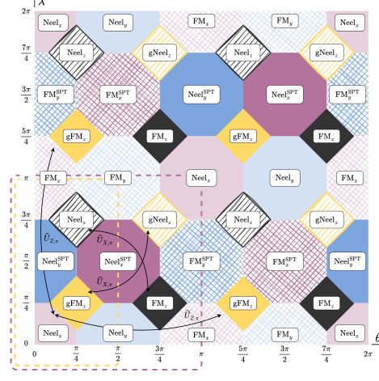 
FIG. 1. Phase diagram of Hamiltonian b H(b) I (θ, λ) in Eq. (2.2c). Phase boundaries are not drawn to scale.

📷 Fig 2

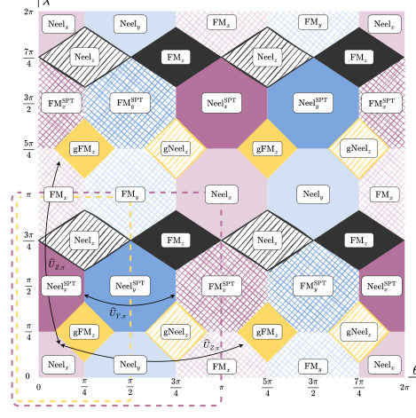 
FIG. 2. Phase diagram of Hamiltonian b H(b) II (θ, λ) in Eq. (2.2d). Phase boundaries are not drawn to scale.

📷 Fig 3

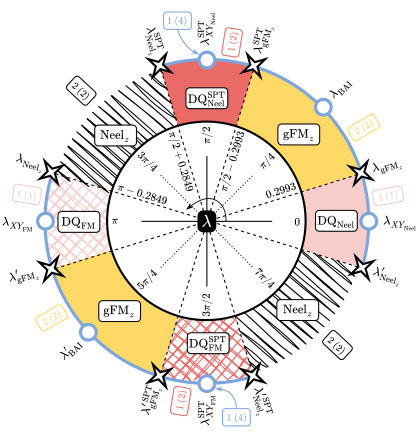 
FIG. 3. Phase diagram of Hamiltonian b H(b) U(1)(λ) defined by Eq. (1.3) as a function of the angle λ ∈[0, 2π] along the unit circle colored in black. We use a colored pie chart with eight sectors to characterize the four long-range-ordered phases (1.2) and the four lines of deconfined-quantum-critical points (DQCPs) (1.5) along the cut θ = π/4 in Fig. 1 or 2. Integrable points (tricritical points) are denoted by circles (stars) on the outer perimeter of the pie chart. Intervals col- ored in blue on the outer perimeter of the pie chart refer to gapless phases of matter described by a conformal field theory (CFT) with central charge c = 1. There are six such inter- vals, each of which is...

📷 Fig 4

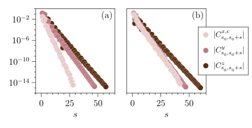 
FIG. 4. The case of OBCs. (a) Dependence on s given s0 of the absolute value of the spin-spin correlation func- tions Cx,c s0,s0+s[Ψ0], Cy s0,s0+s[Ψ0], and Cz s0,s0+s[Ψ0], defined in Eq. (3.3), computed using the DMRG (χ = 128) for the ground state |Ψ0⟩of Hamiltonian b H(1) I in Eq. (2.2c) at (θ, λ) = (π/10, π/10), with s0 = 2N/2 −2N/4 and 2N = 256. (b) Same as (a) for Hamiltonian b H(1) II .

📷 Fig 5

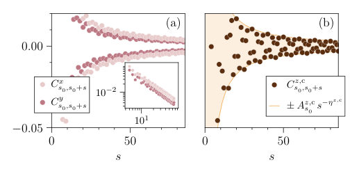 
FIG. 5. The case of OBCs. (a) Dependence on s given s0 for the spin-spin correlations Cx s0,s0+s and Cy s0,s0+s, de- fined in Eq. (3.3a), computed using DMRG (χ = 128) for the ground state |Ψ0⟩of Hamiltonian b H(1) II in Eq. (2.2d) at (θ, λ) = (π/4 −π/40, π/4 −π/40), with s0 = 2N/2 −2N/4 and 2N = 256. The inset illustrates the absolute values of Cx s0,s0+s and Cy s0,s0+s in a log-log scale to extract the expo- nents ηx = 1.07 ± 0.01 and ηy = 1.08 ± 0.02, respectively, using Eq. (3.23). (b) Dependence on s given s0 for the spin- spin correlations Cz,c s0,s0+s, defined in Eq. (3.3b), computed using DMRG (χ = 128) for the ground state |Ψ0⟩of Hamilto- nian b H(1) II in Eq. (2.2d) at (θ, λ) =...

**Summary.** This work explores how competing symmetry breaking and topological order manifest in 1D quantum spin chains. By mapping out the phase diagram, the authors identify multiple ordered and gapless phases, revealing exotic critical behavior. The research highlights unconventional mechanisms where symmetry and topology cooperate to generate complex quantum critical points.

**Why it may be interesting.** The findings on symmetry-enriched criticality and the breakdown of naive symmetry theorems in 1D systems provide deep insights into how topology and symmetry constrain quantum ground states, relevant for understanding exotic phases in correlated materials.

Detailed structure

**Main problem.** The paper investigates the complex interplay between spontaneous symmetry breaking and symmetry-protected topology in one-dimensional quantum spin-1/2 systems.

**Main result.** The system exhibits a rich phase diagram featuring six distinct gapped phases, two gapless phases, and exotic critical points, including a Lifshitz tricritical point that breaks continuous symmetry unexpectedly.

**Method.** The study combines theoretical analysis (e.g., Tomonaga-Luttinger liquid theory) with numerical techniques like DMRG and exact diagonalization to map out the phase diagram.

**Model / system.** The model consists of one-dimensional quantum spin-1/2 lattice Hamiltonians possessing $\mathbb{Z}_{2}\times\mathbb{Z}_{2}\times\mathbb{Z}_{2}$ symmetry. The analysis is performed on the coupling space $T^2$.

**Key observables.** Symmetry-breaking patterns (FM, Neel), topological attributes (SPT phases), gap status, central charge ($c=1$), and ground-state degeneracy.

**Important parameters / regimes.** Coupling parameters $(\theta, \lambda)$ defining the Hamiltonian, and system size $2N$ for finite-size scaling analysis.

**Assumptions / limitations.** The classification of SPT phases relies on the change in ground-state degeneracy with boundary conditions; the analysis involves approximations for sums and limits for large system sizes.

**Figures summary.** Figures 1, 2, and 3 depict the phase diagrams in the coupling space $T^2$ and along specific cuts, illustrating the various ordered, topological, and critical regions.

**Paper structure.** The paper systematically maps the phase diagram by analyzing fixed points, constructing the phase diagram across the $T^2$ coupling space, and then performing detailed theoretical analyses of the critical lines and boundary physics.

Abstract

We investigate how spontaneous symmetry breaking and symmetry-protected topology compete and cooperate in one-dimensional quantum spin-1/2 systems. We introduce two families of local Hamiltonians with $\mathbb{Z}^{\,}_{2}\times\mathbb{Z}^{\,}_{2}\times\mathbb{Z}^{T}_{2}$ symmetry which host a zoo of broken-symmetry phases with and without gapless boundary spins, namely, six long-range-ordered gapped phases that differ by their $\mathbb{Z}^{\,}_{2}$-symmetry-breaking patterns (FM$^{\,}_{x,y,z}$ and Neel$^{\,}_{x,y,z}$), their partner symmetry-protected topological phases (FM$^{\mathrm{SPT}}_{x,y}$ and Neel$^{\mathrm{SPT}}_{x,y}$), and two gapless phases (gFM$^{\,}_{z}$ and gNeel$^{\,}_{z}$) with incommensurate $\mathbb{Z}^{T}_{2}$-breaking magnetic long-range order and central charge $\mathsf{c}=1$. Direct transitions between competing gapped phases can be continuous or weakly first order. We demonstrate that continuous phase transition lines have exotic critical properties. For example, a line of deconfined quantum critical points (between the Neel$^{\,}_{x}$ and Neel$^{\,}_{y}$ phases) described by Tomonaga-Luttinger liquid theory is terminated by the gFM$^{\,}_{z}$ phase at a Lifshitz tricritical point which exhibits spontaneous breaking of the continuous U(1) symmetry despite the locality and one-dimensionality of the Hamiltonian, contrary to a naive expectation from the Hohenberg-Mermin-Wagner-Coleman theorem. Furthermore, critical lines between symmetry-protected topological phases with different $\mathbb{Z}^{\,}_{2}$-symmetry breaking (e.g., Neel$^{\mathrm{SPT}}_{x}$ and Neel$^{\mathrm{SPT}}_{y}$) additionally retain low-energy boundary degrees of freedom, realizing symmetry-enriched criticality (or a gapless SPT phase). Our results reveal unconventional mechanisms by which competing symmetry breaking and topology generate ordered critical phases and multicriticality.

[↑ back to top](#top)

### [Constructing Large and Structured Decoherence-Free Subspaces in Hybrid Quantum Systems](http://arxiv.org/abs/2610.12348v1)

**Authors:** Catalin-Mihai Halati, Tony Jin, Roderich Moessner  
**Type:** theory · **Category:** other · **PDF:** <https://arxiv.org/pdf/2610.12348v1>  
**Analysis basis:** full PDF text, analyzed in chunks
**Topic relevance:** 🔥 `correlated / nonlocal dissipation` **4/5** · `analog quantum simulation` **3/5** · `driven-dissipative phase transition` **3/5** · `methods for driven-dissipative` **3/5** · `Tavis-Cummings & cavity-many-emitter` **2/5** · `non-equilibrium universality` **2/5** · `Keldysh / 2PI / non-Gaussian methods` **1/5** · `quantum measurements` **1/5**

📷 Fig 1

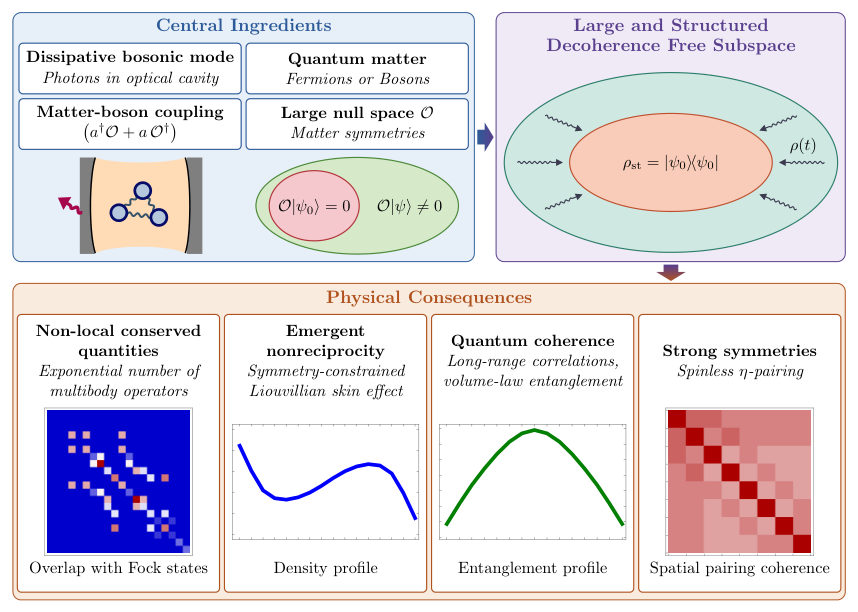 
FIG. 1: Sketch of the central ingredients we employ in our framework to construct large and structured decoherence-free subspaces, and the main physical consequences. We depict both the generic ingredients and the results obtained for the coupling between the cavity field to a directed tunneling operator. The correspondence between these ingredients and the construction of the decoherence-free subspace is outlined in the extended summary, Sec. II. The lower panels sketch the main consequences: an exponential number of non-local conserved quantities, exhibiting a finite overlap with a large number of Fock states; nonreciprocal dynamics giving rise to a many-body Liouvillian skin effect in...

📷 Fig 2

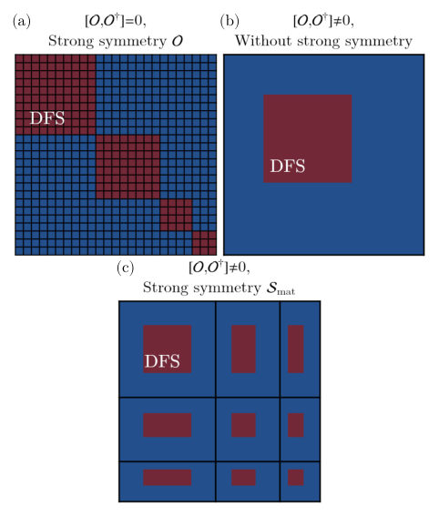 
FIG. 2: Sketches of the structure of the decoherence-free subspaces (DFS) inside the Hilbert space of the matter den- sity matrices, for the three cases discussed in Sec. III A. The Hilbert space of the matter density matrices is sketched by a two-dimensional square for which the horizontal and verti- cal directions label the ket and bra wavefunctions. The black grid represents the subspace structure given by the presence of a strong symmetry. Red depicts the subspaces forming the DFS and blue the matter states with a finite lifetime. The photonic states are not considered in this sketch.

📷 Fig 3

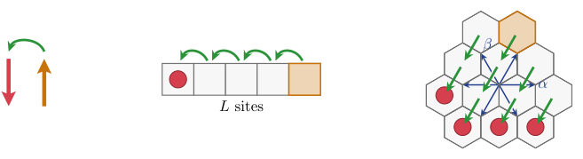 
FIG. 3: Different physical system one may consider depending on the representation of the Lie algebra O belongs to. We represent here only the single-particle sector which has a simple null eigenspace structure. A complex structure with entanglement and quantum correlations emerges in the many-body case, e.g. Fig. 4 and Fig. 5. (a) The simplest example the spin 1/2 irreducible representation of sl(2), discussed Sec. IV B. Although the null eigenspace is trivial for a single-particle –just the |−⟩state–, the many-body null space for N spins grows exponentially and has a rich structure, Fig. 4. (b) Going to higher weight, i.e. higher spin representation of sl(2), amounts to increase the...

📷 Fig 4

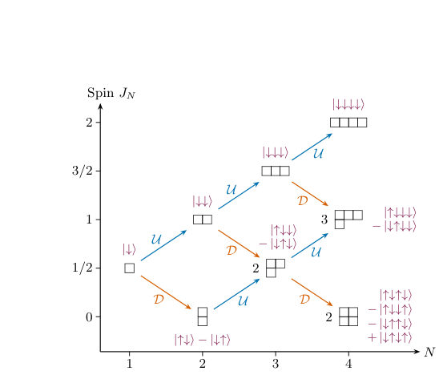 
FIG. 4: Null eigenvectors for the case of the spin 1/2. Under the condition that the total spin can not be negative, the up U, Eq. (10), and down D, Eq. (11), operations respectively increase or decrease the spin of the representation by 1

📷 Fig 5

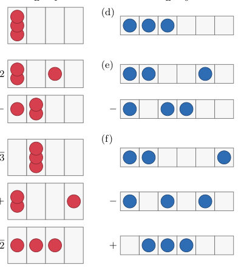 
FIG. 5: Sketch of the null eigenvectors O, Eq. (12), for three quantum particles in L sites, of either bosonic, or fermionic, statistics. Panels (a) and (d) sketch the fully localized states for bosons and fermions, while the other examples depict su- perpositions between different Fock states.

**Summary.** This paper presents a theoretical framework to engineer highly structured decoherence-free subspaces in open quantum systems by coupling matter to a dissipative bath. By leveraging representation theory of Lie algebras, the authors construct operators that enforce global constraints, leading to steady states with exotic symmetries and correlations. This method offers a controlled way to harness non-reciprocity and engineer complex quantum behavior in light-matter interactions.

**Why it may be interesting.** This work provides a powerful, systematic recipe for controlling quantum coherence in realistic, dissipative open systems, bridging concepts from group theory, quantum optics, and many-body physics.

Detailed structure

**Main problem.** The paper develops a general framework to construct large and structured decoherence-free subspaces (DFSs) in open quantum systems.

**Main result.** They show that by coupling matter to a dissipative bosonic mode, one can engineer DFSs whose symmetries and properties are dictated by underlying Lie algebraic structures, leading to exotic quantum correlations.

**Method.** The construction relies on identifying 'matter null states' imposed by dissipation, utilizing representation theory of Lie algebras to build the necessary operators.

**Model / system.** The model is a hybrid quantum system coupling quantum matter (fermions or bosons) to a dissipative bosonic mode, exemplified by coupling to a lossy optical cavity and a directed tunneling operator.

**Key observables.** Long-range kinetic correlations, volume-law entanglement, symmetry-constrained Liouvillian skin effect, and the number of steady states.

**Important parameters / regimes.** The structure of the underlying Lie algebra (e.g., $\mathfrak{sl}(2,\mathbb{C})$) and the non-reciprocal nature of the coupling.

**Assumptions / limitations.** The construction assumes the ability to choose an operator $O$ whose symmetries are distinct from those of the full Liouvillian dynamics.

**Figures summary.** Figures sketch the central ingredients, including the coupling mechanism, the resulting DFS, and evidence of non-local conserved quantities and the Liouvillian skin effect.

**Paper structure.** The paper establishes the general framework, details the mathematical construction using Lie algebras, applies it to specific physical examples (like directed tunneling), and validates the results using analytical derivations and time-dependent MPS simulations.

Abstract

We develop a framework to construct large decoherence-free subspaces with a non-trivial structure. The construction is based on hybrid quantum systems in which quantum matter is coupled to a dissipative bosonic mode. Dissipation imposes a global constraint on the matter by selecting the matter null states in the long-time limit. The decoherence-free subspaces spanned by matter null states can exhibit exotic quantum properties and emergent symmetries that do not characterize the full Liouvillian dynamics. We show how to construct many-body operators with physically interesting null states by employing representation theory of Lie algebras. This approach allows us to choose models based on their underlying algebraic structure. We consider explicitly the example of coupling a lossy optical cavity to the directed tunneling operator of quantum particles in one-dimension. In this case, the symmetries of the decoherence-free subspace originate in an $\mathfrak{sl}(2,\mathbb{C})$ algebra, leading to an exponentially large number of steady states. We characterize the null states for both fermionic and bosonic particles, employing analytical and numerical methods. The states exhibit several properties that underline their complex quantum nature: long-range kinetic correlations and volume-law entanglement. The nonreciprocal nature of the directed tunneling dynamics leads to the emergence in the many-body regime of a symmetry-constrained Liouvillian skin effect. The open light-matter system exhibits a strong symmetry stemming from spinless $η$-pairing algebras. We show how the non-trivial properties of the long-times states emerge in the dissipative dynamics from generic initial states, by performing time-dependent matrix product state simulations. Our framework opens avenues for dissipatively engineering complex quantum correlations and harnessing nonreciprocity in a controlled manner.

[↑ back to top](#top)

### [Magnonic cavity-enhanced quantum magnetometry with nitrogen-vacancy centre ensembles](http://arxiv.org/abs/2610.11350v1)

**Authors:** Nikhil Kumar  
**Type:** theory · **Category:** other · **PDF:** <https://arxiv.org/pdf/2610.11350v1>  
**Analysis basis:** full PDF text, analyzed in chunks
**Topic relevance:** 🔥 `Tavis-Cummings & cavity-many-emitter` **4/5** · `analog quantum simulation` **3/5** · `methods for driven-dissipative` **2/5** · `quantum measurements` **2/5** · `quantum optics experiment` **2/5** · `QC/QI experiment` **1/5** · `correlated / nonlocal dissipation` **1/5** · `driven-dissipative phase transition` **1/5**

📷 Fig 1

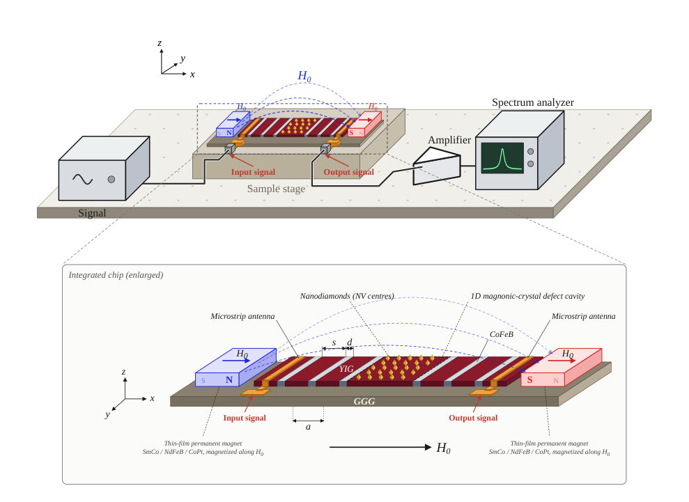 
Fig. 1 Schematic of the proposed on-chip magnonic-crystal/NV-centre device and its measurement setup. Top: the integrated chip is mounted on a sample stage. A microwave signal generator feeds the input microstrip antenna through an SMA connector (input signal). Spin waves launched by the antenna propagate along x through the magnonic crystal; the output microstrip antenna detects them inductively (output signal), and the spectrum analyser amplifies and records the transmission spectrum. No external electromagnet is required. Bottom (enlarged): the device is a one-dimensional magnonic crystal formed by YIG segments of length s separated by CoFeB stripes of width d (lattice constant a = s +...

📷 Fig 2

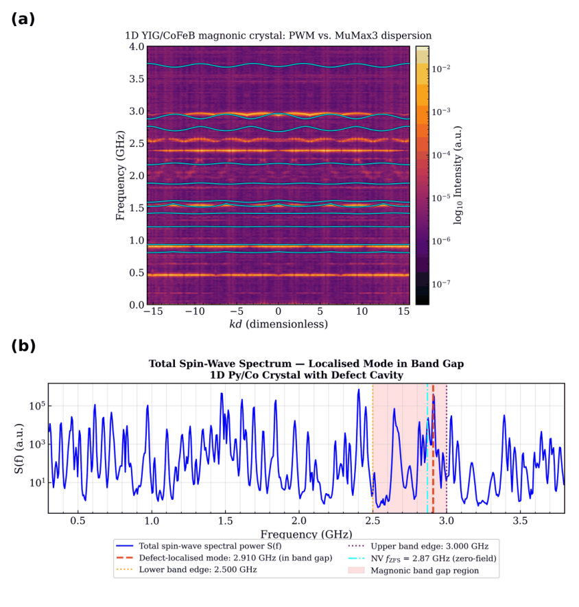 
Fig. 2 Band structure and the defect-localised mode. (a) Micromagnetically simulated dispersion of the pristine 1D YIG/- CoFeB crystal (colour map, log10 intensity of the space–time Fourier transform of the ring-down response versus normalised Bloch wave vector), overlaid without adjustable parameters on the independently computed plane-wave bands (cyan curves). (b) Total spin-wave spectral power S(f) of the crystal with the defect, showing the magnonic band gap (shaded, 2.5–3.0 GHz) and the single defect-localised mode at 2.910 GHz (red dashed line) just above the NV zero-field splitting at 2.87 GHz (cyan dash-dotted line).

📷 Fig 3

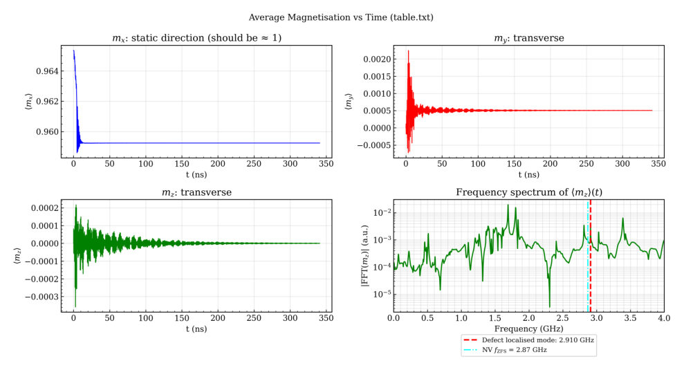 
Fig. 3 Magnetisation dynamics after broadband excitation. Volume-averaged magnetization components ⟨mx⟩, ⟨my⟩and ⟨mz⟩versus time after the broadband sinc pulse applied uniformly across the device. Bottom right: Fourier spectrum of ⟨mz(t)⟩, showing the defect-localised resonance at 2.910 GHz (red dashed line) close to the NV zero-field splitting at 2.87 GHz (cyan dash- dotted line).

📷 Fig 4

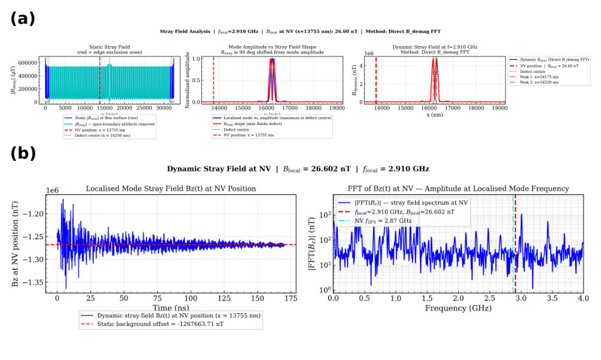 
Fig. 4 Localised mode and its dynamic field at the NV site. (a) Left: static |Bstray| along the device, with edge-exclusion zones shaded. Middle: normalised localised-mode mz amplitude (blue) and dynamic stray-field envelope (red), showing the ≈90◦

📷 Fig 5

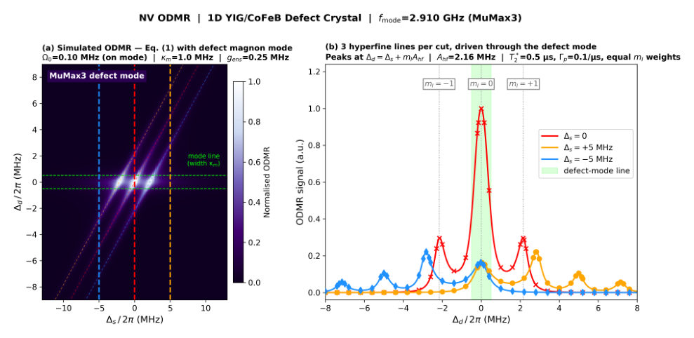 
Fig. 5 Simulated ODMR spectrum of the NV ensemble driven through the defect magnon mode. (a) Normalised ODMR signal versus spin detuning ∆s/2π and drive detuning ∆d/2π, both referred to the defect-mode frequency fmode = 2.910 GHz, from the steady state of the Lindblad master equation [Eqs. (1)–(2)] with the defect mode included and the drive filtered by the mode line [Eq. (3)]. Dashed lines: hyperfine resonance conditions ∆d = ∆s + mIAhf (mI = +1, 0, −1 in orange, red and blue). Green dashed lines: defect-mode line, |∆d| ≤κm/2. Vertical dashed lines: positions of the cuts in (b). (b) Cuts at ∆s/2π = 0 and ±5 MHz; shaded band, defect-mode line. Parameters: Ω0/2π = 0.10 MHz (on the mode...

**Summary.** The authors propose a novel, chip-scale magnetometer using NV centers coupled to a defect-localized spin-wave mode in a magnonic crystal. By modeling the system dynamics using quantum master equations and analyzing the resulting homodyne response, they predict a substantial enhancement in magnetic field sensitivity. This work demonstrates a pathway to integrate quantum sensing with solid-state magnonics for practical quantum technology.

**Why it may be interesting.** This work is highly relevant as it combines cavity QED principles (cavity enhancement, coupling to quantum emitters) with solid-state magnonics, providing a roadmap for next-generation quantum sensors.

Detailed structure

**Main problem.** To develop a highly sensitive, chip-scale quantum magnetometer by coupling Nitrogen-Vacancy (NV) center ensembles to a passive magnonic cavity.

**Main result.** The projected sensitivity reaches 72 pT/$\sqrt{\text{Hz}}$ by combining the three hyperfine-resolved edges, representing a significant enhancement over single-resonance measurements.

**Method.** The system dynamics are modeled using a Tavis-Cummings Hamiltonian coupled to a Lindblad master equation, analyzed via both ODMR and homodyne readout techniques.

**Model / system.** The platform uses a 1D YIG/CoFeB magnonic crystal with a structural defect creating a passive cavity mode. NV ensembles are coupled to this mode, which is biased by integrated permanent magnets.

**Key observables.** Hyperfine-resolved optically detected magnetic resonance (ODMR) spectrum and dispersive homodyne response ($\text{Re}\langle a \rangle$).

**Important parameters / regimes.** Optimal coupling strength ratio ($g_{\text{ens}}/2\pi \approx 0.2$-$0.4 \text{ MHz}$); thermal limits (e.g., 1.7 pT/$\sqrt{\text{Hz}}$).

**Assumptions / limitations.** The sensitivity calculation relies on combining independent estimates in quadrature and assumes the system operates in a regime where the coupling is strong enough to yield measurable spectral features.

**Figures summary.** Figures illustrate the band structure showing the defect-localized mode, the local dipolar field profile at the NV site, and the resulting ODMR/homodyne spectra showing multiple steep edges.

**Paper structure.** The paper progresses from characterizing the magnonic cavity mode via micromagnetics to developing the coupled quantum model (Tavis-Cummings/Lindblad) and finally calculating the enhanced sensitivity using both ODMR and homodyne readout formalisms.

Abstract

Nitrogen-vacancy (NV) centre ensembles are leading room-temperature magnetometers, but their sensitivity is usually extracted from a single resonance and relies on external microwave and bias-field hardware. This work proposes a chip-scale NV magnetometer built around a one-dimensional YIG/CoFeB magnonic crystal, in which a single structural defect forms a passive magnonic cavity and integrated permanent magnets supply the bias field. Micromagnetic simulations show a defect-localised spin-wave mode at 2.910 GHz inside the 2.5-3.0 GHz magnonic band gap, 40 MHz from the NV zero-field splitting, with a band structure that matches an independent plane-wave calculation. A Tavis-Cummings/Lindblad model in which the microwave reaches the NV ensemble through this mode predicts a hyperfine-resolved optically detected magnetic resonance spectrum that is strong only within the mode linewidth, and a dispersive homodyne response with one steep edge per $^{14}$N hyperfine line. The master-equation solutions agree with the closed-form homodyne steady state ($R^2 > 0.9999$) and with an approximate analytic ODMR theory (peak positions within 0.012 MHz). For a critically coupled readout with room-temperature electronics, combining the three edges gives a projected sensitivity of 93 pT/$\sqrt{\rm Hz}$, a $\sqrt{3}$-fold gain over the best single edge. Mapping the sensitivity against the NV-magnon coupling reveals an optimum near $g_{\rm ens}/2π\approx 0.2$-$0.4$ MHz, where it reaches 72 pT/$\sqrt{\rm Hz}$ for a 0.64 MHz spin linewidth and 19 pT/$\sqrt{\rm Hz}$ for 0.17 MHz, with thermal limits of 6.6 and 1.7 pT/$\sqrt{\rm Hz}$. The antenna-mode coupling, the NV-magnon coupling and the spin linewidth are therefore the main design levers.

[↑ back to top](#top)

### [On linearity or non-linearity in machine learning for quantum chaotic dynamics](http://arxiv.org/abs/2610.10697v1)

**Authors:** Francesco Perciavalle, Agostino Gallo, Francesco Plastina, Gianluigi Greco, Nicola Lo Gullo, Carlo Adornetto  
**Type:** theory · **Category:** statistical mechanics · **PDF:** <https://arxiv.org/pdf/2610.10697v1>  
**Analysis basis:** full PDF text, analyzed in chunks
**Topic relevance:** 🔥 `analog quantum simulation` **4/5** · `Rydberg arrays` **3/5** · `quantum measurements` **3/5** · `scars & prethermalization` **3/5** · `methods for driven-dissipative` **2/5**

📷 Fig 1

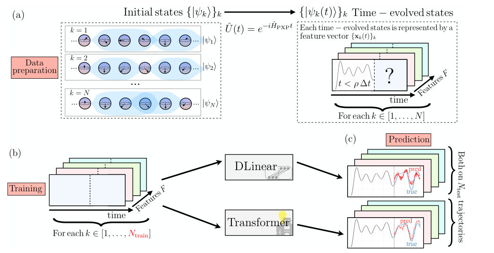 
Fig. 1 Schematic illustration of the forecasting protocol, consisting of three stages: data preparation [panel (a)], training [panel (b)], and prediction [panel (c)]. Data preparation (a): A set of N initial quantum states, {|ψk⟩}N k=1, of an L-qubit system is prepared. Each state is evolved under the Hamiltonian ˆHPXP, generating N quantum trajectories, {|ψk(t)⟩}N k=1. At each time t, each trajectory is represented by a feature vector xk(t) comprising local magnetizations and connected two-point correlations, for a total of F = L(L + 1)/2 features. For each trajectory, the first ρ time steps define the input sequence, while the subsequent τ time steps constitute the target sequence....

📷 Fig 2

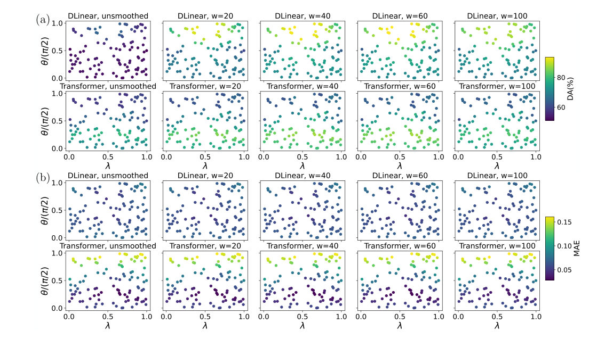 
Fig. 2 Performance of DLinear and the Transformer across the initial-state parameter space (λ, θ). Panel (a) shows the directional accuracy (DA), while panel (b) shows the mean absolute error (MAE). In each panel, the upper row corresponds to DLinear and the lower row to the Transformer. The leftmost column reports the metrics computed from the raw predictions, while the remaining columns show the corresponding results after smoothing the predicted trajectories using windows w ∈{20, 40, 60, 100}. In all cases, the metrics are evaluated with respect to the ground-truth trajectories.

📷 Fig 3

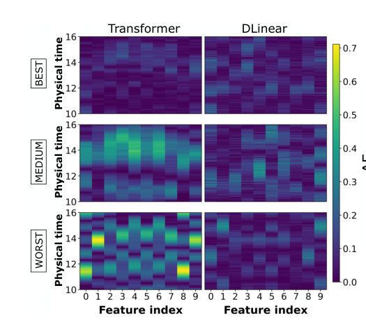 
Fig. 3 Absolute error (AE) over the forecast horizon for the first ten features, corresponding to the local magnetizations. The ver- tical axis represents physical time and the horizontal axis the feature index. The left and right columns show the Transformer and DLinear predictions, respectively. The three rows correspond to rep- resentative test trajectories selected as the best, typical, and worst cases using a joint score for the two models. For each test trajectory, the MAE is first computed by averaging over the forecast horizon and all features, and the resulting values for the Transformer and DLinear are then averaged to define the joint score. The best and worst cases correspond to...

📷 Fig 4

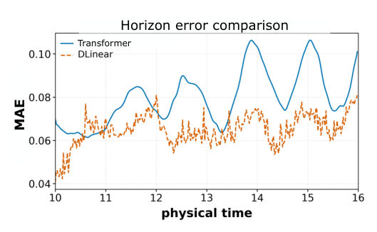 
Fig. 4 Mean absolute error MAEi as a function of physical time over the forecast horizon t ∈[10, 16), obtained by averaging over all test trajectories and features at each prediction time. The solid and dashed lines correspond to the Transformer and DLinear, respec- tively.

📷 Fig 5

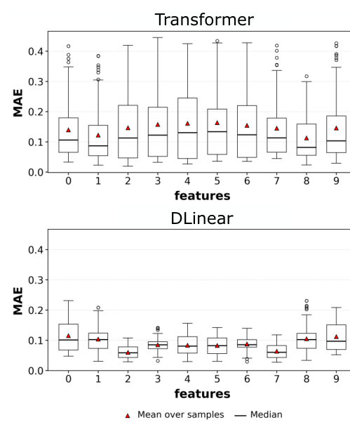 
Fig. 5 Distribution of the feature-resolved mean absolute error, MAEk,f, over the test trajectories for the first ten features, corre- sponding to the local magnetizations. The upper and lower panels show the Transformer and DLinear, respectively. For each feature, the boxplot represents the distribution of MAEk,f across the test trajectories. Black lines indicate the median, while red triangles indicate the mean.

**Summary.** This work tackles the difficulty of simulating chaotic quantum many-body systems by framing the problem as time-series forecasting. By comparing a nonlinear Transformer to a linear model (DLinear) on a Rydberg-atom-based PXP model, the authors show that the simple linear model maintains high accuracy across all dynamical regimes, even those exhibiting complex quantum scarring. This suggests that the underlying quantum complexity is not necessarily reflected in the complexity required for prediction.

**Why it may be interesting.** It provides a concrete, data-driven test case showing that linear ML methods can capture the essential dynamics of highly complex, non-integrable quantum systems, which is highly relevant for understanding information extraction from quantum chaos.

Detailed structure

**Main problem.** The paper addresses the computational challenge of simulating chaotic quantum many-body dynamics and investigates if Machine Learning can provide an effective alternative for predicting these complex time evolutions.

**Main result.** Simple linear forecasting models (DLinear) can accurately predict observables generated by complex quantum dynamics across various regimes, suggesting that the complexity of the evolution does not necessitate an equally complex forecasting model.

**Method.** The authors formulate quantum dynamics as a time-series forecasting problem, comparing the performance of a nonlinear Transformer against a simple linear model (DLinear) on simulated quantum trajectories.

**Model / system.** The study uses the paradigmatic PXP model, simulating dynamics on a few-qubit chain realizable with Rydberg-atom arrays. The system is tested across dynamical regimes ranging from ergodic behavior to non-ergodic quantum many-body scarring.

**Key observables.** Local magnetizations and connected two-point correlation functions are used as the feature vectors for time-series forecasting.

**Important parameters / regimes.** The initial state choice controls the dynamical regime, parameterized between fully polarized and Néel states. The analysis compares performance across these controlled initial conditions.

**Assumptions / limitations.** The framework is benchmarked on a few-qubit PXP chain where exact time evolution is computable, but the methodology is claimed to be extendable to other systems with available time-series data.

**Figures summary.** Figures schematically illustrate the data preparation, training, and prediction stages for both the Transformer and DLinear models across different initial states.

**Paper structure.** The paper establishes the problem by noting the difficulty of simulating chaotic dynamics, details the ML forecasting protocol using the PXP model, compares the Transformer and DLinear architectures across varying initial states, and concludes by demonstrating the superior performance of the linear model.

Abstract

Accurately simulating chaotic quantum many-body dynamics remains a major computational challenge for classical methods, due to the rapid buildup and spatial spreading of entanglement during the evolution. This raises the question of whether machine learning can provide an effective alternative for predicting quantum dynamics. We address this question by formulating quantum dynamics as a time-series forecasting problem, using a few-qubit PXP chain, realizable with Rydberg-atom arrays, as a benchmark. By varying the initial state, the system spans dynamical regimes ranging from ergodic behavior to quantum many-body scarring, providing a controlled setting for testing forecasting models across qualitatively different dynamics. We compare two contrasting architectures: an expressive nonlinear Transformer and DLinear, a simple linear forecasting model. The Transformer accurately predicts dynamics in the more ergodic regime, but its performance progressively deteriorates as the initial state approaches the scarred limit. In contrast, DLinear remains accurate across the entire family of initial states, with its main deviations consisting of small high-frequency oscillations that have little effect on the overall prediction error. Remarkably, these results show that observables generated by complex quantum many-body dynamics can be forecast with high accuracy through a simple linear mapping from past to future observations. This reveals that the complexity of the underlying quantum evolution need not translate into an equally complex forecasting problem.

[↑ back to top](#top)

### [A deterministic polynomial chaos Galerkin method for non-Markovian quantum state diffusion](http://arxiv.org/abs/2610.12070v1)

**Authors:** Quanhui Zhu, Zhenning Cai  
**Type:** theory · **Category:** numerical methods · **PDF:** <https://arxiv.org/pdf/2610.12070v1>  
**Analysis basis:** full PDF text, analyzed in chunks
**Topic relevance:** 🔥 `methods for driven-dissipative` **4/5** · `correlated / nonlocal dissipation` **3/5** · `Keldysh / 2PI / non-Gaussian methods` **2/5** · `driven-dissipative phase transition` **2/5** · `quantum measurements` **2/5**

📷 Fig 1

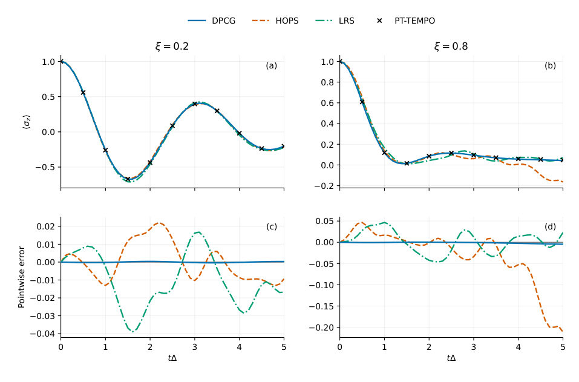 
FIG. 1. Example IV.1. Spin polarization (top) and pointwise error relative to PT-TEMPO (bottom)

📷 Fig 2

 
FIG. 2. Example IV.2. Single-packet harmonic dynamics at ε = 1/32 and ξ = 1. Blue solid: DPCG.

📷 Fig 3

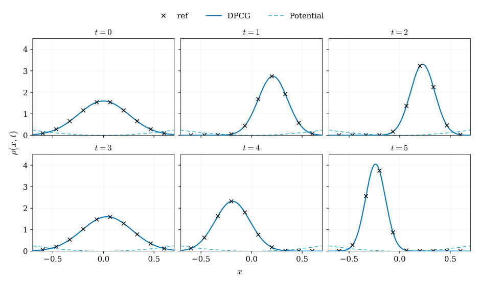 
Figure 3 shows how the density at T = 5 changes with ε for the fixed two-packet initial

📷 Fig 4

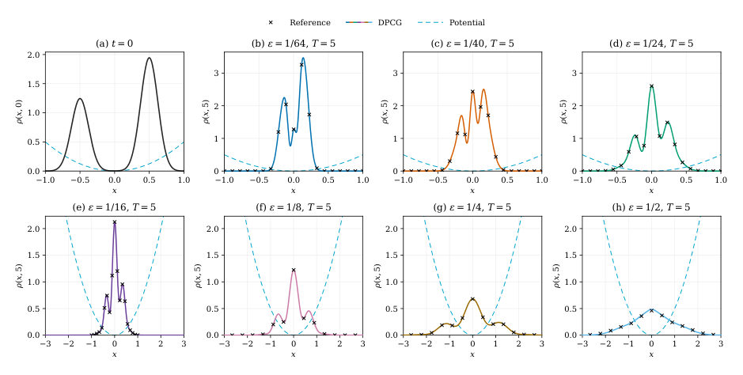 
FIG. 3. Example IV.2. Density evolution with ξ = 1 from the fixed initial state in (a). (b)–(h)

📷 Fig 5

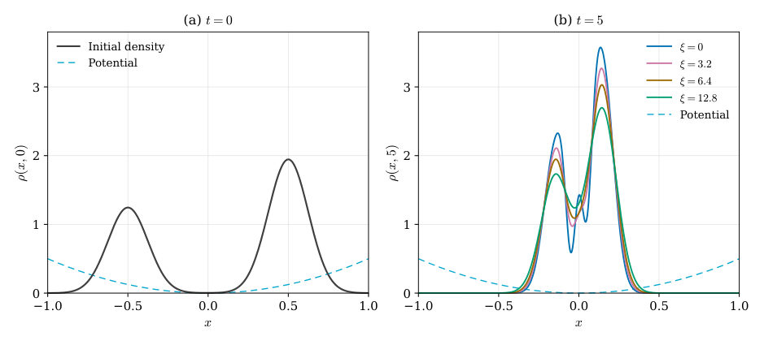 
FIG. 4. Example IV.2. Density evolution at ε = 1/64 from the fixed initial state in (a). (b)

**Summary.** This paper introduces a deterministic polynomial chaos Galerkin method (DPCG) to solve the challenging non-Markovian quantum state diffusion problem. By replacing ensemble averaging with a single deterministic solve based on low-rank decomposition and polynomial expansion, the method drastically cuts computational costs. It proves to be highly accurate and efficient for simulating open quantum systems like the spin-boson model.

**Why it may be interesting.** This work provides a powerful, deterministic alternative to computationally expensive stochastic methods for simulating open quantum dynamics, making complex, memory-dependent quantum processes accessible for routine simulation.

Detailed structure

**Main problem.** Developing general-purpose and computationally efficient numerical methods for simulating non-Markovian quantum state diffusion (NMQSD) in open quantum systems.

**Main result.** The proposed deterministic polynomial chaos Galerkin method (DPCG) achieves accuracy comparable to stochastic hierarchy methods while drastically reducing computational cost by eliminating the need for large ensembles of trajectories.

**Method.** The method combines a low-rank decomposition of bath correlations with a Galerkin projection onto a polynomial chaos basis, transforming the stochastic evolution into a single, deterministic set of partial differential equations for the expansion coefficients.

**Model / system.** The study focuses on open quantum systems whose dynamics are governed by the NMQSD equation, exemplified by the spin-boson model and the Caldeira-Leggett model. The system interacts with an environment modeled by bath correlations.

**Key observables.** The reduced density matrix ($
ho(t)$), spin polarization ($\langle\sigma_z
angle_t$), and the state error ($\|\psi_t - \psi_{Q,P,t}\|_X$).

**Important parameters / regimes.** Low-rank truncation order ($Q$), polynomial chaos total degree ($P$), and the coupling strength ($\xi$ or $\varepsilon$).

**Assumptions / limitations.** The primary approximations involve truncating the infinite-dimensional bath correlation function via low-rank decomposition and truncating the polynomial chaos expansion at a finite total degree $P$.

**Figures summary.** Benchmark comparisons (e.g., for the spin-boson model) show the DPCG method maintaining accuracy comparable to reference solutions at strong coupling, while computational cost is significantly lower than stochastic methods.

**Paper structure.** The paper first introduces the challenge of NMQSD and compares it to existing stochastic methods (HOPS/LRS). It then details the DPCG formulation, deriving the deterministic coefficient system via low-rank factorization and Galerkin projection. Finally, it presents convergence analysis and benchmarks on physical models.

Abstract

Developing general-purpose numerical methods for non-Markovian quantum state diffusion has long been a challenge in the simulation of open quantum systems. This paper proposes a deterministic polynomial chaos Galerkin method, which is easy to implement, accurate, and efficient. By combining a low-rank decomposition of bath correlations with Galerkin projection onto a polynomial chaos basis, the method yields a deterministic formulation compatible with standard numerical solvers for partial differential equations. The reduced density matrix is obtained from a single deterministic solve at a cost comparable to that of computing one stochastic hierarchy trajectory. Replacing an ensemble of $N_{\mathrm{traj}}$ trajectories therefore reduces the computational cost by approximately a factor of $N_{\mathrm{traj}}$ and eliminates statistical sampling error. Benchmark comparisons show that the proposed method achieves smaller errors at lower computational cost than the tested stochastic hierarchy methods. Applications involving nonquadratic potentials, diffraction and interference, and coupled three-dimensional dynamics demonstrate its ability to handle challenging problems.

[↑ back to top](#top)

### [Emergent SSH physics and localization in a cavity--atom system beyond the rotating-wave approximation](http://arxiv.org/abs/2610.11897v1)

**Authors:** H. Shen, J. Cao, R. Wang, X. Z. Zhang  
**Type:** theory · **Category:** other · **PDF:** <https://arxiv.org/pdf/2610.11897v1>  
**Analysis basis:** full PDF text, analyzed in chunks
**Topic relevance:** 🔥 `analog quantum simulation` **4/5** · `Tavis-Cummings & cavity-many-emitter` **3/5** · `driven-dissipative phase transition` **2/5** · `Frenkel-Kontorova` **1/5** · `Keldysh / 2PI / non-Gaussian methods` **1/5** · `methods for driven-dissipative` **1/5** · `non-equilibrium universality` **1/5**

📷 Fig 1

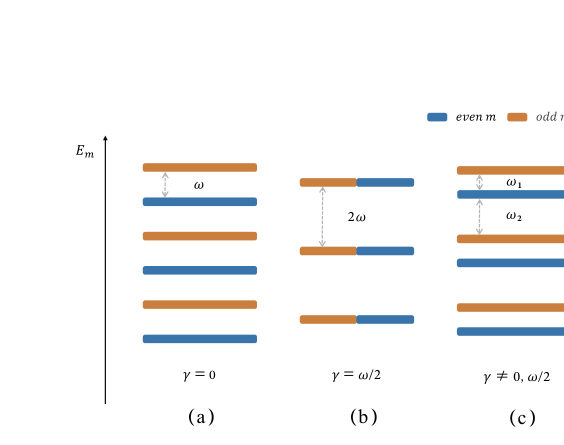 
FIG. 1. Schematic illustration of the eigenenergy structure Em given by Eq. (17). Blue (yellow) solid lines denote energy levels with even (odd) index m. (a) γ = 0: all eigenener- gies form a single Wannier–Stark ladder with a uniform level spacing ω, indicating a fully degenerate two-sublattice struc- ture. (b) γ = ω/2: the spectra become pairwise degener- ate, and the energy levels reorganize into an effective single ladder with doubled spacing 2ω. (c) γ ̸= 0 and ω/2: the degeneracy is lifted and the spectra split into two interlaced Wannier–Stark ladders with distinct spacings ω1 and ω2, sat- isfying ω1+ω2 = 2ω. The three typical spectral configurations underlie the emergence of...

📷 Fig 2

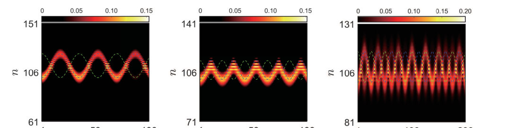 
FIG. 2. Time-evolution probability distribution in the coordinate space for three typical values of the effective coupling γ. The blue and green dashed lines indicate the trajectories of the effective wave-packet centers na(t) and nb(t), respectively. (a) γ = 0: the dynamics exhibits conventional Bloch oscillations with period TB = 2π/ω; (b) γ = ω/2: the frequency-doubled Bloch oscillations with period T (2) B = TB/2 = π/ω. (c) γ = ω/50, the coexistence of two inequivalent energy ladders induces Bloch–Zener oscillations characterized with period TBZ = 2π/|E1 −E2|. The initial state is chosen as a Gaussian wave packet,

📷 Fig 3

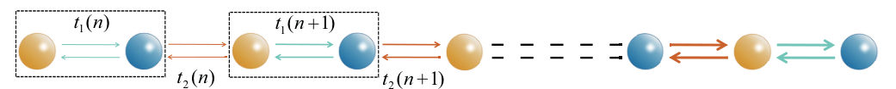 
FIG. 3. Schematic of the effective lattice generated by Heff,2 in the small-photon-number regime. Each unit cell (black dashed box) consists of two sublattice sites coupled by the intracell hopping t1(n) = λ1 √¯n + 2n −1, while adjacent cells are connected by the intercell hopping t2(n) = λ2 √¯n + 2n. Both couplings inherit the SSH-type dimerization ( t1 ̸= t2) and grow monotonically with the cell index n, as indicated by the increasing arrow thicknessretain the SSH-type dimerization and increase monotonically with the cell index n, as indicated by the increasing arrow thickness The resulting excitation-number lattice is therefore a position-dependent SSH chain rather than a uniform dimerized...

📷 Fig 4

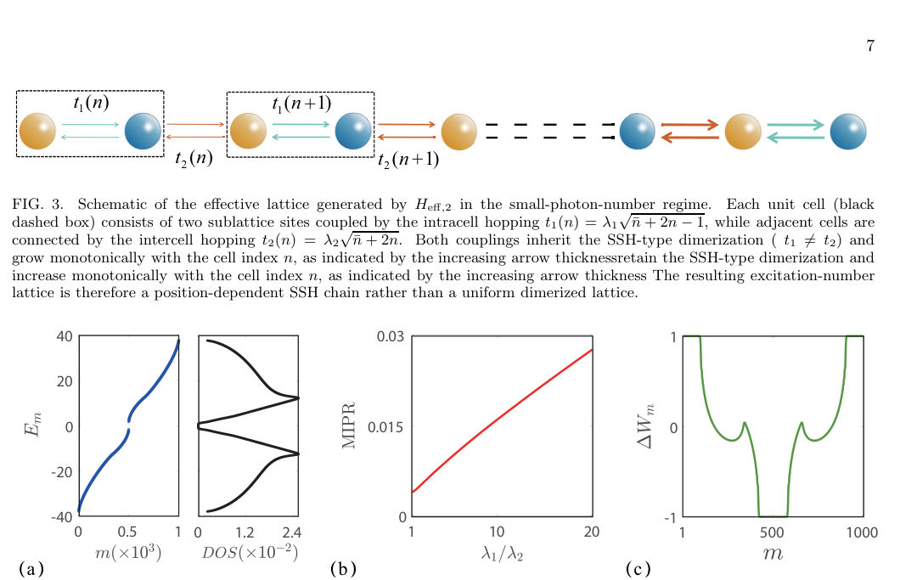 
FIG. 4. Spectral structure and eigenstate diagnostics of the hopping-deformed SSH model. (a) Eigenenergies structure Em (blue curve) and density of state DOS (black curve) for representative parameters. (b) Mean inverse participation ratio (MIPR) versus dimerization ratio λ1/λ2: the monotonic increase signals progressive localization as intra-cell hopping becomes dominant over inter-cell coupling. (c) Right-left weight imbalance ∆Wm revealing an energy-dependent bias toward the strong-hopping side. Parameters: N = 500, ¯n = 10, λ2 = 0.4 [panel (b)] and λ1 = 2λ2 = 0.8 [panels (a),(c)]. Both the cavity frequency ω and the atomic transition frequency Ωare set to zero.

📷 Fig 5

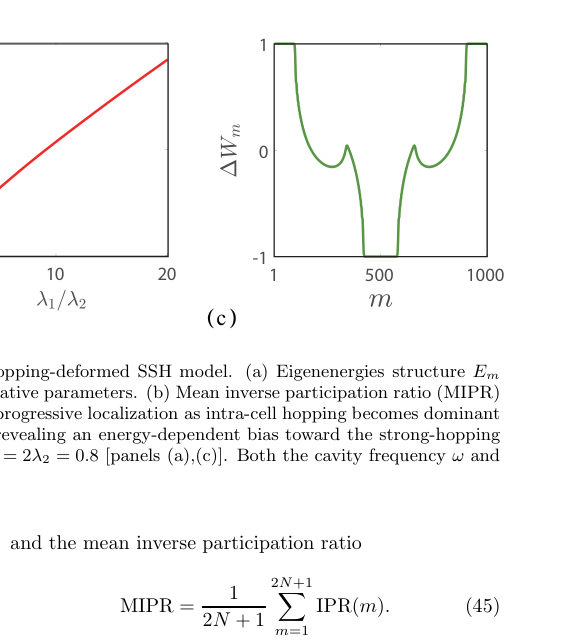 
Figure 4(b) shows that MIPR increases from near zero in the uniform limit to a finite value once hopping defor- mation is present. This indicates that localization is en- hanced for a broad portion of the spectrum, rather than being a feature of isolated states. A finite MIPR indi- cates that a substantial fraction of the spectrum consists of non-extended states, in agreement with the turning- point interpretation. To reveal the spatial bias of the eigenstates, we further evaluate the right-left weight imbalance

**Summary.** This paper analyzes a cavity-atom system by mapping its dynamics onto an effective 1D lattice model. It shows that the system exhibits two distinct regimes: a large-photon-number regime yielding SSH-type physics with controllable Bloch oscillations, and a small-photon-number regime inducing strong hopping deformation and localization. This highlights the tunability of quantum transport in cavity QED platforms.

**Why it may be interesting.** This work provides a detailed theoretical framework for engineering synthetic quantum transport landscapes using cavity QED, demonstrating how non-RWA terms lead to rich physics like SSH models and localization.

Detailed structure

**Main problem.** The paper investigates emergent SSH physics and localization in a cavity-atom system by analyzing its dynamics beyond the rotating-wave approximation.

**Main result.** The system can realize both emergent ladder spectra (in the large-photon-number regime) and hopping-induced localization (in the small-photon-number regime) using the same physical platform.

**Method.** The dynamics are recast into an effective tight-binding problem in the excitation-number basis, analyzed using perturbation theory and by examining different parameter regimes.

**Model / system.** The physical system is a superconducting microwave resonator coupled to an effective two-level artificial atom (Cavity-QED platform). The dynamics are modeled by a generalized quantum Rabi Hamiltonian projected onto effective 1D lattice Hamiltonians.

**Key observables.** Bloch and Bloch-Zener oscillations, anomalous diffusion, density of states reshaping, and return probability $R(t)$.

**Important parameters / regimes.** Photon number ($ar{n}$), Stark frequency ($\omega$), and coupling strengths ($\lambda_1, \lambda_2, \Omega$).

**Assumptions / limitations.** The analysis involves projecting the dynamics onto invariant subspaces ($\mathbb{Z}_2$ parity) and analyzing distinct limits, such as the large-photon-number limit ($ar{n} \gg 2N$).

**Figures summary.** Figures illustrate the energy structure for different oscillation regimes ($\gamma=0, \gamma=\omega/2, \gamma
eq 0, \omega/2$) and compare the time evolution of probability distributions $P_n(t)$ across small, intermediate, and large Stark frequency regimes.

**Paper structure.** The paper progresses from deriving the effective Hamiltonian by projecting the full Rabi model, analyzing the large-$ar{n}$ limit to show SSH-type behavior and Bloch oscillations, and finally examining the small-$ar{n}$ limit to reveal hopping-induced localization and anomalous diffusion.

Abstract

We investigate a cavity--atom system beyond the rotating-wave approximation and recast its dynamics as an effective tight-binding problem in the excitation-number basis. The same experimentally relevant light--matter platform exhibits two distinct regimes controlled by the photon number. In the large-photon-number regime, the hopping amplitudes become nearly uniform and the effective lattice reduces to a dimerized SSH-type chain subject to a linear energy gradient. The spectrum then organizes into one or two Wannier--Stark ladders, giving rise to controllable Bloch and Bloch--Zener oscillations and quantitatively explaining the observed revival patterns. In the small-photon-number regime, the intrinsic $\sqrt{\bar n+(\cdots)}$ dependence produces a pronounced hopping deformation, namely dimerized couplings that increase along the excitation-number lattice. This deformation reshapes the density of states, enhances collective localization, and generates an energy-resolved spatial bias of the eigenstates. The corresponding real-time dynamics displays direction-dependent anomalous diffusion together with Bloch-like revivals and beat phenomena in selected parameter windows. Our results show that the same cavity--atom platform can realize both emergent ladder spectra and hopping-induced localization in excitation-number space.

[↑ back to top](#top)

### [Exact polariton-condensate states via nonlinear Stark coupling](http://arxiv.org/abs/2610.11234v1)

**Authors:** DaKai He abd Zhi Song  
**Type:** theory · **Category:** other · **PDF:** <https://arxiv.org/pdf/2610.11234v1>  
**Analysis basis:** full PDF text, analyzed in chunks
**Topic relevance:** 🔥 `scars & prethermalization` **4/5** · `Tavis-Cummings & cavity-many-emitter` **3/5** · `analog quantum simulation` **3/5** · `driven-dissipative phase transition` **2/5** · `non-equilibrium universality` **1/5**

📷 Fig 1

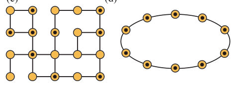 
FIG. 1. Construction of the hybrid system Hamiltonian via the building-block method. (a) The three fundamental dimer units used for Hamiltonian construction: the AA dimer, AC dimer, and CC dimer, as defined in Eq. (2). (b) Illus- trative examples of Hamiltonian composition through dimer overlapping. The connection between identical or distinct dimers is realized by merging the sites enclosed in the dashed boxes. Consistency requires that the overlapping sites be of the same species (either both atom-doped or both empty). (c) Schematic representation of an arbitrary lattice system formed by a sequence of arbitrary dimers. (d) Schematic representation of a one-dimensional periodic chain...

📷 Fig 2

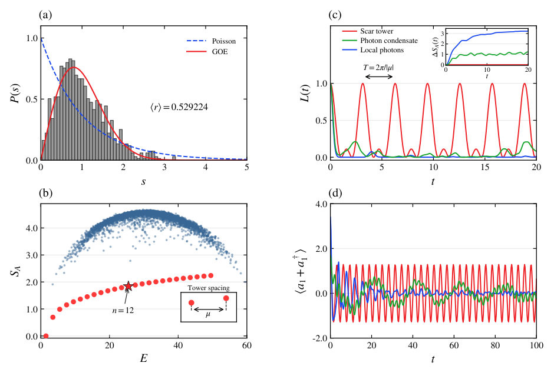 
FIG. 2. Spectral statistics and dynamics of the exact scar tower. (a) Level-spacing distribution P(s) in the middle of the spectrum in the even-reflection-parity sector with N = 12, compared with GOE (red solid) and Poisson (blue dashed) predictions; ⟨r⟩= 0.529224. (b) Bipartite entanglement entropy SA versus energy E. Blue points represent eigenstates in the N = 12 sector, while red circles show the exact-state tower for n = 0, . . . , 24; the star identifies its n = 12 member. Inset: adjacent tower states separated by µ. (c) Loschmidt echo L(t), with scar revival period T = 2π/µ = π. Inset: entanglement- entropy change ∆SA(t) = SA(t) −SA(0). (d) Local field quadrature ⟨a1 + a† 1⟩. In (c),...

📷 Fig 3

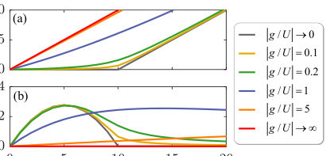 
FIG. 3. Photon and atomic correlations of the exact ground state |ψn G⟩for N = 10 at U = UR. Panels (a) and (b) show Ar and Sr, respectively, as functions of the total excitation number n. Different colors denote different values of |g/U|. Both correlators are independent of the separation between distinct sites.

📷 Fig 4

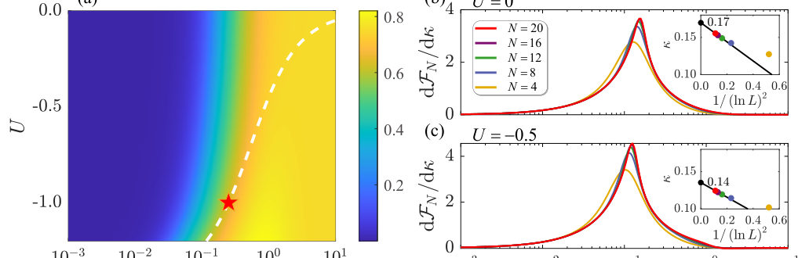 
FIG. 4. Ground-state excitation-number fluctuations and finite-size estimates of the MI–SF transition for Hring at unit filling, N = N. (a) Site-averaged variance FN, defined in Eq. (9), in the κ–U plane for N = 4. The white dashed curve denotes the resonance condition U = UR. The red star at (κ, U) = (1/4, −1) marks the point where the exact ground-state energies are degenerate across excitation sectors. (b),(c) Derivatives ∂FN/∂κ obtained using DMRG for U = 0 and U = −0.5, respectively, with N = 4, 8, 12, 16, and 20. The insets show the peak positions versus 1/(ln L)2, with L = N. Linear fits to the three largest sizes yield fluctuation-based transition estimates of κest ≃0.17 and 0.14,...

**Summary.** The authors develop a method using building-block construction to find exact many-body eigenstates in coupled cavity-atom systems. They demonstrate that these states exhibit a dual nature: they can manifest as quantum scars that violate thermalization, or they can form robust polariton condensates characterized by long-range order. This framework is valuable for engineering quantum phases in light-matter devices.

**Why it may be interesting.** This work provides a versatile theoretical framework for engineering coherent quantum phases (condensates) and non-thermalizing states (scars) in controllable light-matter architectures, which is central to quantum simulation and quantum optics.

Detailed structure

**Main problem.** To identify and characterize exact many-body eigenstates in hybrid light-matter systems, demonstrating their dual physical nature as quantum scars or polariton condensates.

**Main result.** The constructed exact states exhibit a dual nature: they act as quantum scars violating ETH when embedded in a chaotic spectrum, and they form polariton condensates with Off-Diagonal Long-Range Order (ODLRO) when they are ground states in fixed-excitation sectors.

**Method.** The study employs a building-block construction method based on imposing specific resonance conditions on the system's Hamiltonian to analytically find exact eigenstates.

**Model / system.** The system is a hybrid of coupled cavities (light) and two-level atoms (matter), modeled by a lattice Hamiltonian incorporating JC coupling and nonlinear Stark interactions.

**Key observables.** Quantum scars (violation of ETH), Off-Diagonal Long-Range Order (ODLRO) via correlation functions ($A_r, S_r$), and local excitation-number fluctuations for MI-SF transitions.

**Important parameters / regimes.** Resonance conditions ($g_l = \pm rac{\Omega_l}{2}(\omega_l - \kappa)$, etc.), coupling strengths ($g, U_R$), and fixed total excitation number ($\mu$).

**Assumptions / limitations.** The construction relies on imposing specific resonance conditions on the building blocks, and the analysis of ODLRO assumes fixed, non-zero filling ($
ho > 0$).

**Figures summary.** Figures illustrate the building-block construction, spectral statistics (comparing to GOE/Poisson), bipartite entanglement entropy, and Loschmidt echo dynamics for the identified scar tower.

**Paper structure.** The paper first introduces the building-block construction and resonance conditions to find exact states. It then analyzes the dual nature of these states by examining spectral properties (scars) and coherence (condensates). Finally, it rigorously proves ODLRO and characterizes the MI-SF transition using correlation functions.

Abstract

We study a hybrid system of coupled cavities, with or without two-level atoms doped inside. By employing a building-block construction facilitated by nonlinear Stark coupling, we identify a manifold of exact many-body eigenstates that remain analytically tractable across arbitrary lattice geometries and atom distributions. We demonstrate that these exact states exhibit a dual physical nature depending on their spectral positioning: when embedded within the chaotic many-body spectrum, they manifest as quantum scars that violate the eigenstate thermalization hypothesis and undergo weak ergodicity breaking; conversely, as ground states within fixed-total-excitation sectors, they exhibit off-diagonal long-range order and form polariton condensates. Furthermore, numerical calculations of local excitation-number fluctuations suggest that negative Stark coupling shifts the Mott-insulator to superfluid transition toward weaker inter-cavity hopping. Our findings provide a versatile framework for engineering both coherent quantum phases and non-thermalizing states in diverse light-matter architectures.

[↑ back to top](#top)

### [Quantum jumps of sound](http://arxiv.org/abs/2610.10714v1)

**Authors:** Takuma Makihara, Erik Szakiel, Matthew P. Maksymowych, Oliver A. Hitchcock, Kaveh Pezeshki, Rachel G. Gruenke-Freudenstein, Mihir Pendharkar, Shannon P. Harvey, David I. Schuster, Amir H. Safavi-Naeini  
**Type:** experiment · **Category:** other · **PDF:** <https://arxiv.org/pdf/2610.10714v1>  
**Analysis basis:** full PDF text, analyzed in chunks
**Topic relevance:** 🔥 `quantum measurements` **4/5** · `QC/QI experiment` **3/5** · `quantum optics experiment` **2/5** · `Full counting statistics` **1/5** · `correlated / nonlocal dissipation` **1/5** · `driven-dissipative phase transition` **1/5** · `methods for driven-dissipative` **1/5**

📷 Fig 1

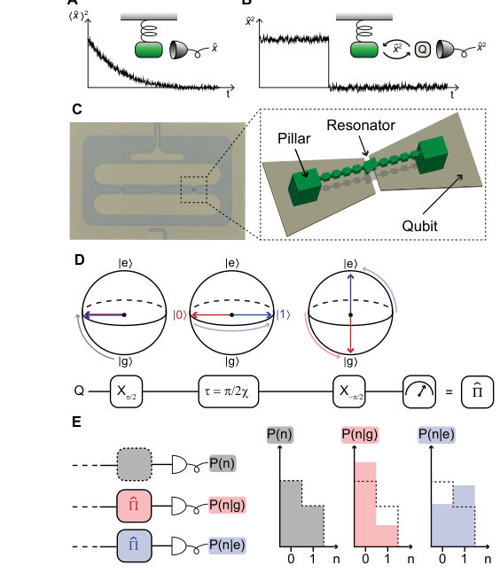 
FIG. 1. Device architecture. (A) The quantization of sound is hidden from an observer measuring the position ˆx(t) of a mechanical resonator. If an observer measures ⟨ˆx(t)⟩and calculates the energy of the resonator as ⟨ˆx(t)⟩2, a continu- ous exponential decay results. (B) If an observer can directly measure ˆx2(t) of a mechanical resonator, then quantum jumps in the mechanical energy can be observed. By using a qubit and mechanical resonator coupled in the dispersive regime, one can directly measure ˆx2(t). (C) Optical micrograph of the device measured in this work, consisting of a transmon qubit coupled to a LN mechanical resonator. (Inset) Illustra- tion of the qubit-mechanics...

📷 Fig 2

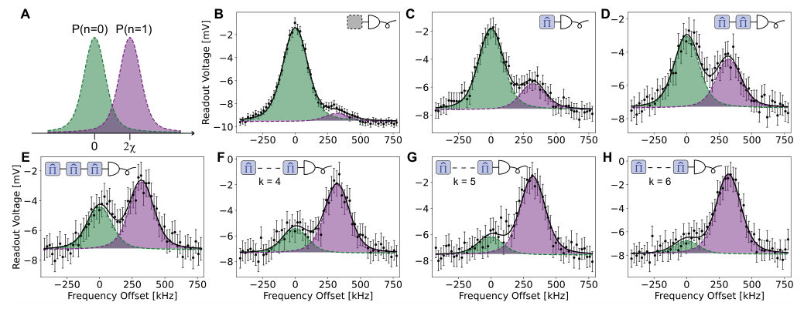 
FIG. 2. Postselected qubit spectra. (A) Illustration of the qubit excitation spectrum in the strong dispersive regime. The area under the peak centered at zero frequency offset (2χ frequency offset) is proportional to the probability of measuring n = 0 (n = 1) phonons in the mechanical resonator. (B) Qubit spectrum measured with no parity checks, representing the initial coherent state of the mechanics. (C to H) Qubit spectrum postselected on k = 1, 2, 3, 4, 5, 6 consecutive QND parity measurements, where every measurement outcome is |e⟩. As we observe more consecutive measurements of the qubit in the excited state, we become more certain that our mechanical resonator is in the n = 1 state,...

📷 Fig 3

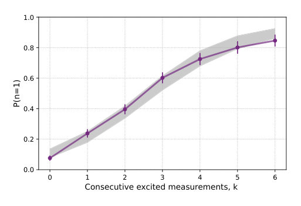 
FIG. 3. Evolution of P(n=1) with postselection. The purple circles illustrate P(n = 1) from the postselected qubit spectra in Fig. 2. Consecutive measurement outcomes of |e⟩ increase P(n=1) through projection of the mechanical state, reflecting the information we learn after each measurement outcome. The gray shaded region illustrates a fit obtained through forward-propagating P(n) using Bayesian inference, where we fit P(e|even) and α of the initial coherent state. The error bars and shaded region represent 95% confidence intervals of the data and fit respectively.

📷 Fig 4

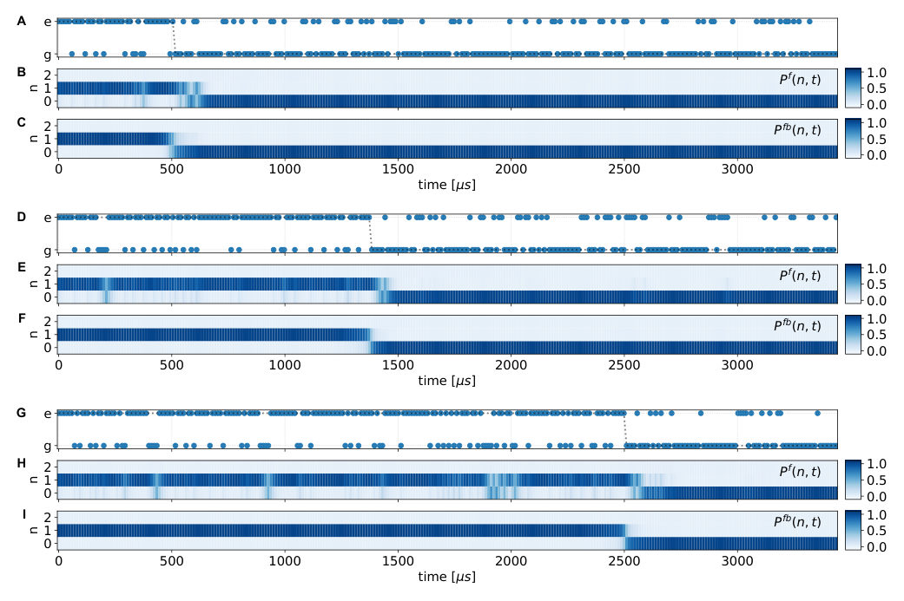 
FIG. 4. Quantum jumps of a mechanical resonator. Three individual measurement trajectories (rows), each consisting of 294 consecutive QND parity measurements on a mechanical resonator heralded in a single-phonon state with P(n = 1) = 0.85. (A, D, and G) Raw qubit measurement outcomes q ∈{g, e} after each Ramsey sequence. The dotted lines show the most- probable phonon number at each time step from forward-backward estimation. In each trajectory, an abrupt transition from predominantly |e⟩to predominantly |g⟩marks a quantum jump from n = 1 to n = 0. (B, E, and H) Forward-propagated phonon number distribution P f(n, t), using only measurements up to time t. (C, F, and I) Forward-backward...

**Summary.** This experiment demonstrates the direct measurement of quantized mechanical energy in a nanomechanical resonator coupled to a superconducting qubit. By performing repeated quantum nondemolition measurements, the researchers observed clear quantum jumps between the ground and first excited states. This work marks a significant step in applying quantum control techniques to macroscopic mechanical systems.

**Why it may be interesting.** This work provides a direct, high-fidelity demonstration of quantum measurement backaction on a macroscopic mechanical oscillator, extending quantum control concepts from superconducting circuits and trapped ions to mechanical systems.

Detailed structure

**Main problem.** The goal was to observe the quantized nature of mechanical energy (phonon number discreteness) in a massive, vibrating object, which is otherwise hidden when measuring displacement.

**Main result.** The authors successfully observed quantum jumps between the resonator's first excited state and ground state, and heralded a single-phonon state with 85% fidelity.

**Method.** They used repeated quantum nondemolition (QND) measurements of the phonon number, implemented by coupling a superconducting qubit to a nanomechanical resonator.

**Model / system.** The system involves a nanomechanical resonator (e.g., in lithium niobate) dispersively coupled to a superconducting transmon qubit. The dynamics are governed by an effective Hamiltonian allowing QND measurement of the phonon number ($\hat{n}$).

**Key observables.** Phonon number distribution $P(n)$, quantum jumps between $|n=1
angle$ and $|n=0
angle$, and the mechanical lifetime ($T_1$).

**Important parameters / regimes.** Mechanical lifetime ($T_1 \approx 2.1$ ms or $645 \mu$s), dispersive shift ($2\chi/2\pi = 328$ kHz/phonon), and single-shot parity assignment fidelity (0.68 to 0.912).

**Assumptions / limitations.** The measurement process is significantly faster than the phonon lifetime, and the forward-backward algorithm is used to estimate the true state evolution from noisy measurement records.

**Figures summary.** Figures illustrate the device architecture, postselected qubit spectra showing phonon number peaks, and individual measurement trajectories demonstrating abrupt quantum jumps between energy levels.

**Paper structure.** The paper establishes the theoretical need to measure energy directly, details the superconducting qubit/nanomechanical resonator platform, presents the QND measurement protocol using parity checks, and finally reports the observation of quantum jumps and state preparation fidelity.

Abstract

Quantum mechanics predicts that a vibrating object's energy comes in discrete packets, yet no measurement of its position reveals this discreteness. Resolving individual energy levels requires a qualitatively different measurement, one coupling to the resonator's energy rather than its displacement. We use a superconducting qubit dispersively coupled to a nanomechanical resonator to perform repeated quantum nondemolition measurements of the phonon number. An aligned transfer-print technique integrating the qubit and resonator yields a mechanical lifetime of $T_1 = 2.1$ milliseconds and a dispersive shift of $2χ/2π= 328$ kilohertz per phonon. We heralded single-phonon states with 85% fidelity and observed quantum jumps between the resonator's first excited state and ground state. These discontinuous transitions are a striking manifestation of quantum mechanics in a massive, vibrating object.

[↑ back to top](#top)

### [Quantum Networking at the Speed of Quantum Computation: Kilohertz Entanglement in a Heterogeneous Quantum System](http://arxiv.org/abs/2610.10705v1)

**Authors:** Lukas Hartung, Pierre Barral, Noah Glachman, George Toh, Jacob H. Davidson, Sagnik Saha, Alexander Chuang, Matthew C. Cambria, Madison Sutula, Alexander Abulnaga, Julia Breevord, John Chiaverini, Ian Counts, Aos Dabbagh, Christian Dangel, Skylar Deckoff-Jones, Chawina De-Eknamkul, Jonathan Dietz, Riley Forst, Prithvi Gundlapalli, Jeonghoon Ha, Michael Haas, Ezekiel Meulbroek, Andrea Mucchietto, Daniel Riedel, Jonah Sachs, Jeremy Sage, Mikhail Shalaev, Harriet Shi, Denis Sukachev, Yichao Yu, Johannes Borregaard, Christopher Monroe, Nicholas Mondrik, Mihir Bhaskar, Bart Machielse, Matteo Pompili, Carsten Robens, David Levonian  
**Type:** experiment · **Category:** quantum information and computing · **PDF:** <https://arxiv.org/pdf/2610.10705v1>  
**Analysis basis:** full PDF text, analyzed in chunks
**Topic relevance:** 🔥 `QC/QI experiment` **4/5** · `quantum optics experiment` **3/5** · `analog quantum simulation` **2/5** · `quantum measurements` **2/5** · `Tavis-Cummings & cavity-many-emitter` **1/5** · `interference shaping light` **1/5**

📷 Fig 1

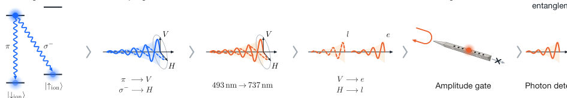 
FIG. 1. Entangling a trapped-ion qubit and a solid-state quantum memory. (a, b) ➊A trapped 138Ba+ ion emits a 493.5 nm photon whose polarization is entangled with the ion spin state; ➋fiber coupling through a high-numerical-aperture objective maps σ−(π) polarization onto H (V ); ➌difference-frequency generation in a periodically poled lithium niobate (PPLN) crystal, pumped at 1492.3 nm, converts the photon to 737.45 nm and preserves its polarization; ➍an unbalanced interferometer converts polarization encoding into time-bin encoding, V (H) into early (late); ➎spin-dependent reflection from the SiV−imprints the memory spin state onto the time-bin qubit; ➏the returning photon is routed to the...

📷 Fig 2

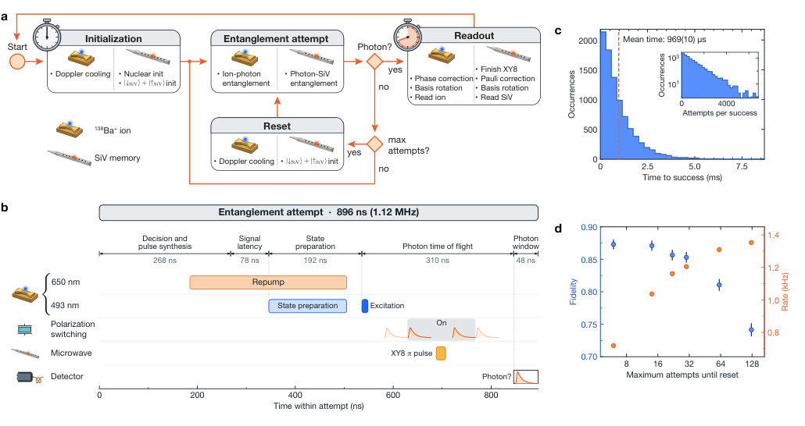 
FIG. 2. Establishing heralded ion-memory entanglement. (a) Control-flow diagram of the sequence used to deliver each entangled state. Each box represents a step, with sub-steps separated by which sub-system they act on (trapped-ion or quantum memory). The steps are repeated as indicated until a photon is detected, heralding success. Upon success the Readout sequence compensates for which of the two detectors clicked and for its detection time using local gates on the two qubits (see main text and SM, Sec. S8). It also applies the required measurement basis rotation. We measure the time needed to generate the state starting from the beginning of the Initialization step until the beginning of...

📷 Fig 3

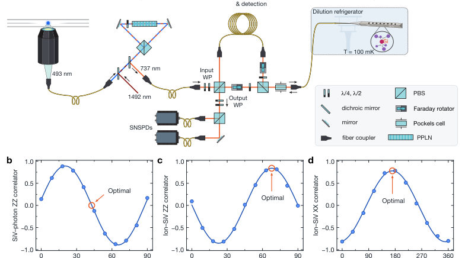 
FIG. 3. Schematic of the apparatus and calibration procedure. (a) ➊A microscope objective with high numerical aperture (NA = 0.75) collects 493.5 nm photons from a single 138Ba+ ion in a four-rod Paul trap and couples them into a single-mode fiber; ➋difference-frequency generation in a PPLN crystal, pumped at 1492.3 nm in a Sagnac geometry, converts the photons to 737.45 nm and preserves their polarization; ➌an unbalanced interferometer (the basis converter) re-encodes the photonic qubit in early and late time bins, and a Pockels cell rotates the polarization of the late time bin so both bins reach the memory with the same polarization; ➍a quantum memory, which consists of a nanophotonic...

**Summary.** This paper reports on a hybrid quantum networking protocol that entangles a trapped ion with a solid-state $	ext{SiV}^-$ memory using photon mediation. By integrating multiple quantum optical components, the researchers achieved a high entanglement rate of 1.03 kHz. This result is significant because it matches the operational speed required for next-generation trapped-ion quantum processors.

**Why it may be interesting.** This work directly addresses the scalability bottleneck in quantum networking by demonstrating a high-rate, solid-state memory interface for trapped-ion qubits, which is crucial for realizing modular quantum computers.

Detailed structure

**Main problem.** The core challenge is achieving rapid, high-fidelity entanglement between qubits housed in separate physical modules for scalable distributed quantum computing.

**Main result.** The authors successfully demonstrated an entanglement generation rate of 1.03 kHz between a trapped ion and a solid-state memory, matching the cycle time of planned trapped-ion processors.

**Method.** The entanglement is heralded by detecting a single photon resulting from a complex process involving ion-photon entanglement, quantum frequency conversion, basis encoding, and spin-dependent reflection from the solid-state memory.

**Model / system.** The system is a heterogeneous quantum architecture combining a trapped $^{138}	ext{Ba}^+$ ion with a silicon-vacancy ($	ext{SiV}^-$) center embedded in a diamond nanophotonic cavity.

**Key observables.** Average entanglement rate (1.03 kHz), Fidelity (87.9%), and measured two-qubit correlators ($\langle	ext{XX}
angle, \langle	ext{YY}
angle, \langle	ext{ZZ}
angle$).

**Important parameters / regimes.** Entanglement rate of 1.03 kHz (one Bell pair per millisecond); fidelity of 87.9%; the process is limited by photon loss and heralding efficiency.

**Assumptions / limitations.** The rate is limited by the heralding scheme and remaining loss; the fidelity is subject to error accumulation from multiple components (Ion, QFC, Memory, Detection).

**Figures summary.** Figure 1 illustrates the overall process flow from ion-photon entanglement to heralded ion-$	ext{SiV}^-$ entanglement. Figure 2 details the experimental sequence, showing the time-to-success histogram confirming the measured rate.

**Paper structure.** The paper details the physical setup, describes the multi-step entanglement protocol (including frequency conversion and basis encoding), presents the measured rate and fidelity, and analyzes the error budget across the various components.

Abstract

Distributed quantum computing requires rapid, high-fidelity entanglement between qubits in separate processor modules. Photonic links between single-atom qubits provide switchable, long-range connections, but photon loss limits their entanglement rate. Here we entangle a trapped $^{138}$Ba$^{+}$ ion with a silicon-vacancy (SiV$^{-}$) center in a diamond nanophotonic cavity. A photon emitted by the ion is converted in wavelength and encoding, reflected from the SiV$^{-}$--cavity system and detected, so that a single detected photon heralds entanglement. Including all conversion losses, we generate ion--SiV$^{-}$ Bell pairs at an average rate of 1.03(1)\,kHz with a fidelity of 87.9(7)\%. This is four times the rate of the fastest photonic link between two trapped ions and corresponds to one Bell pair per millisecond, matching the cycle time of planned trapped-ion processors.

[↑ back to top](#top)

### [Demonstration of subspace-search variational quantum eigensolver using photonic orbital angular momentum qudits](http://arxiv.org/abs/2610.11026v1)

**Authors:** Kang-Min Hu, Myung-Hyun Sohn, Yong-Su Kim, Kwang Jo Lee, Hyun Woo Kim, Hyang-Tag Lim  
**Type:** experiment · **Category:** quantum information and computing · **PDF:** <https://arxiv.org/pdf/2610.11026v1>  
**Analysis basis:** full PDF text, analyzed in chunks
**Topic relevance:** 🔥 `analog quantum simulation` **4/5** · 🔥 `quantum optics experiment` **4/5** · `QC/QI experiment` **3/5** · `interference shaping light` **1/5**

📷 Fig 1

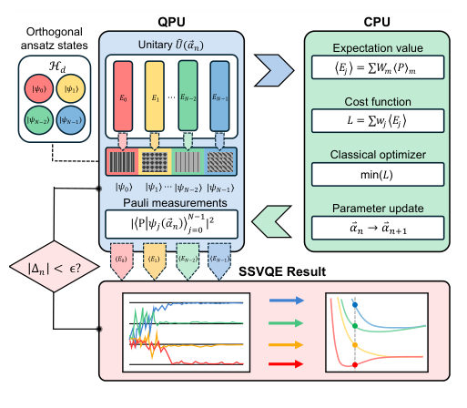 
FIG. 1. OAM qudit–based SSVQE procedure. At it- eration n, a set of N mutually orthogonal variational states {|ψj(⃗αn)⟩}N−1 j=0 is prepared by displaying the corresponding holograms on a SLM. Each state is measured on the photonic QPU (quantum processing unit) using a set of Pauli-string observables (implemented with a second SLM), from which the Hamiltonian expectation values are estimated. The CPU (classical processing unit) evaluates the SSVQE cost function L and a classical optimizer (COBYLA) updates the param- eters ⃗αn+1 to minimize L. The procedure is repeated until convergence, |∆n| = |⃗αn+1 −⃗αn| &lt; ϵ, yielding the optimized energies ⟨E0⟩min, ⟨E1⟩min, . . . , ⟨EN−1⟩min...

📷 Fig 2

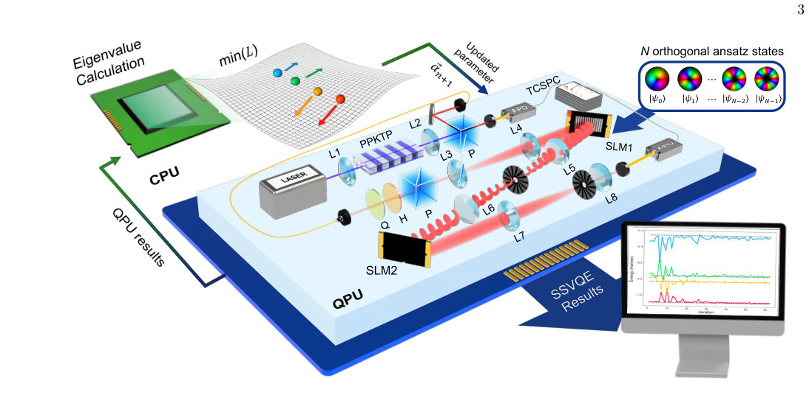 
FIG. 2. Experimental setup for SSVQE. Photon pairs are generated via type-II SPDC; the idler photon is detected by APD1 to herald the signal photon, which is sent to the QPU for SSVQE. In the QPU, the signal photon is prepared in the jth OAM ansatz qudit state |ψj(⃗αn)⟩by displaying the corresponding hologram on SLM1. The diffracted beam is spatially filtered (iris) and analyzed using measurement holograms on SLM2 to perform Pauli-string measurements. The measurement outcomes are processed by the CPU to evaluate the cost function L and update the variational parameters ⃗α via a classical optimizer. (SPDC, spontaneous parametric down-conversion; H, Half-wave plate; Q, Quarter-wave plate; P,...

📷 Fig 3

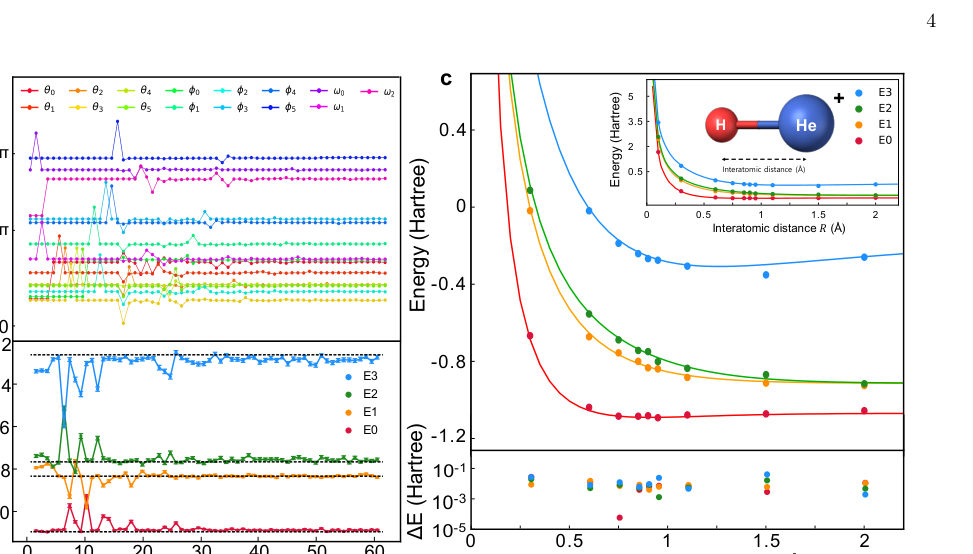 
FIG. 3. Experimental SSVQE results for HeH+. a, Iterative evolution of the 15 variational angle parameters that control the four OAM-qudit ansatz states at R = 0.90 ˚A (equilibrium bond length). The parameter updates gradually decrease as the iteration number n increases. b, Iterative optimization of the estimated ground and excited state energies ⟨E0⟩, ⟨E1⟩, ⟨E2⟩, and ⟨E3⟩at R = 0.90 ˚A. Solid colored curves (red, orange, green and blue) denote experimental estimates, and black dashed lines indicate theoretical values. Error bars represent one standard deviation obtained from 1,000 Monte Carlo resamplings. c, Estimated energies as a function of interatomic distance R. The energy deviations...

📷 Fig 4

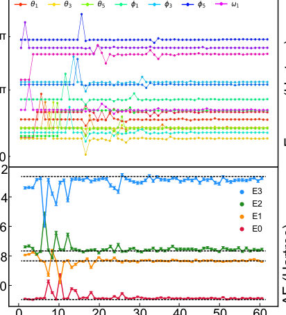 
Figure 3c summarizes the estimated ground and ex- cited state energies of HeH+ as a function of interatomic distance R. The solid curves show the theoretical ener- gies, while the markers denote the experimental SSVQE results, revealing good agreement across the full range of R (inset). The lower panel of Fig. 3c plots the en- ergy deviations on a logarithmic scale, highlighting con- vergence of all four energy levels toward the theoretical

📷 Fig 5

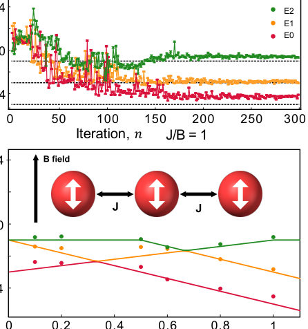 
FIG. 4. Experimental SSVQE results for a three-qubit Heisenberg chain. a, Iterative optimization of the esti- mated ground and excited state energies ⟨E0⟩, ⟨E1⟩, and ⟨E2⟩ at J/B = 1, where the spin–spin interaction and the external field contribute comparably. Solid colored curves (red, orange and green) show experimental estimates as a function of it- eration number n, and black dashed lines indicate theoretical values. Error bars represent one standard deviation obtained from 1,000 Monte Carlo resamplings. b, Estimated energies as a function of the ratio J/B.

**Summary.** This paper demonstrates the use of Subspace-search VQE (SSVQE) to calculate excited state energies using photons whose quantum states are encoded in orbital angular momentum (OAM) qudits. By implementing this on a photonic platform, the authors show a scalable and resource-efficient method for simulating complex molecular and quantum chain Hamiltonians beyond ground state calculations.

**Why it may be interesting.** This work directly addresses the challenge of excited state simulation in quantum chemistry using photonic hardware, establishing a resource-efficient pathway for high-dimensional quantum simulation.

Detailed structure

**Main problem.** Accurately estimating excited state energies is crucial for interpreting photochemical processes, but variational quantum eigensolvers (VQEs) are typically limited to ground states.

**Main result.** The authors successfully demonstrated Subspace-search VQE (SSVQE) on a photonic platform, estimating excited state energies for molecular and quantum chain systems.

**Method.** They use SSVQE, a NISQ-friendly approach, by encoding quantum information in the orbital angular momentum (OAM) of single photons to estimate multiple eigenenergies simultaneously.

**Model / system.** The experiment is performed on a photonic platform using single photons whose quantum states are encoded in OAM qudits. They apply this method to model a four-dimensional HeH+ molecule and an eight-dimensional Heisenberg chain.

**Key observables.** Estimated excited state energies ($\langle E_j 
angle$) for the target Hamiltonians, and the convergence of these energies over optimization iterations.

**Important parameters / regimes.** The variational parameters ($\vec{\alpha}$) controlling the shared variational unitary circuit, and the dimension of the Hilbert space ($d=4$ or $d=8$).

**Assumptions / limitations.** The method avoids ancilla-based overlap measurements, relying instead on the coherent preparation and measurement of orthogonal OAM qudit states.

**Figures summary.** Figure 1 illustrates the iterative SSVQE cycle between the QPU, CPU, and classical optimizer. Figure 2 shows the experimental setup using SLMs for state preparation and measurement. Figures 3 and 4 show the calculated energy spectra for HeH+ and the Heisenberg chain, respectively.

**Paper structure.** The paper details the SSVQE algorithm, describes the photonic implementation using OAM qudits and SLMs, presents the experimental setup, and finally reports the successful estimation of excited state energies for the molecular and chain models.

Abstract

Accurate excited state energies are essential for interpreting fluorescence and photochemical processes, yet variational quantum eigensolvers (VQEs) on noisy intermediate-scale quantum (NISQ) hardware have largely been confined to ground states. Subspace-search VQE (SSVQE) offers a NISQ-friendly route to excited states without ancilla-based overlap measurements, however it has lacked an experimental demonstration since it requires the coherent preparation and manipulation of multiple orthogonal basis states under a shared variational unitary. Here we realize SSVQE on a photonic platform by encoding orthogonal qudit states in the orbital angular momentum of single photons and optimizing a shared variational circuit. We estimate excited state energies for a four-dimensional $\rm{HeH^+}$ molecule and an eight-dimensional Heisenberg chain, thereby demonstrating scalable excited state eigensolving in a high-dimensional Hilbert space. Our results establish photonic qudits as a resource-efficient pathway to excited state quantum simulation.

[↑ back to top](#top)

### [When Does Interference Help Learning? Kernel Geometry as a Pre-Experimental Test for Photonic Reservoir Computing](http://arxiv.org/abs/2610.11360v1)

**Authors:** Oishik Kar, Aswath Babu H  
**Type:** theory · **Category:** quantum information and computing · **PDF:** <https://arxiv.org/pdf/2610.11360v1>  
**Analysis basis:** full PDF text, analyzed in chunks
**Topic relevance:** 🔥 `interference shaping light` **4/5** · `analog quantum simulation` **3/5** · `Full counting statistics` **2/5** · `methods for driven-dissipative` **1/5** · `quantum measurements` **1/5** · `quantum optics experiment` **1/5**

📷 Fig 1

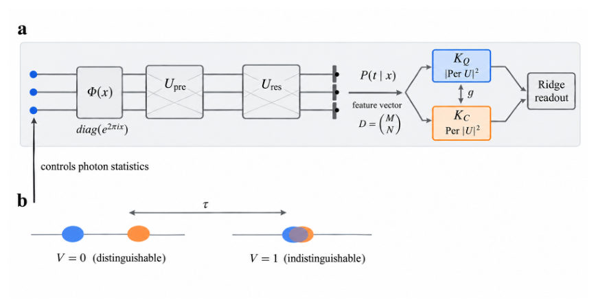 
Fig. 1: Boson-sampling reservoir kernel estimation and the distinguishability dial. a, An input x ∈[0, 1]d is encoded as phase shifts between two Haar-random interferometers; N injected photons, post-selected on coincidences, yield the outcome distribution P(t | x) of dimension M N  . Indistinguishable and distinguishable photons generate the kernels KQ and KC, whose geometric difference g (Eq. (6)) quantifies the separation. b, The Hong–Ou–Mandel visibility V = I2 controls the photon statistics; this is the dial swept in Fig. 2.

📷 Fig 2

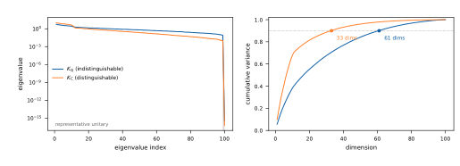 
Fig. 2: Multi-photon interference broadens the feature spectrum. (a) Sorted eigenvalues of the indistinguishable- (KQ, blue) and distinguishable-photon (KC, orange) Gram matrices over n = 100 inputs (M = 12, N = 3, d = 12; D = 220). (b) Cumulative variance. In a representative interferometer realization the leading eigenvalue of KC exceeds that of KQ (10.0 vs. 5.7), while KQ reaches 90% of its trace in 61 dimensions against 33 for KC. Shaded regions: spread over 10 Haar realizations.

📷 Fig 3

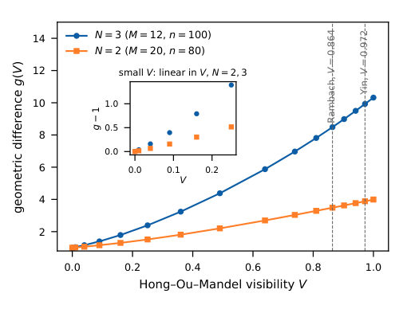 
Fig. 3: The geometric separation increases superlinearly with visibility. Geometric difference g(V ) between the indistinguishable- and distinguishable-photon feature kernels (square-root convention, Eq. (6)). Hardware source qualities are marked: the quantum processor of ref. [3] (V = 0.864) and the interferometric kernel experiment of ref. [4] (V = 0.972). Inset: at small visibility, g −1 is linear in V for N = 2, 3, 4.

📷 Fig 4

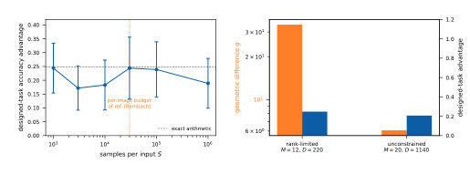 
Fig. 4: The separation is sampling-accessible and inde- pendent of kernel conditioning. (a) Designed-task accuracy advantage (N = 3, M = 12, n = 180) under multinomial resampling of every outcome distribution at S shots, with task labels reconstructed from the noisy kernels at each budget. The advantage at S = 3 × 104 (the per-image sample budget of ref. [3]) matches the exact-arithmetic value. (b) Geometric difference and designed-task advantage at matched n = 180 for the rank-limited (M = 12, D = 220) and unconstrained (M = 20, D = 1140) configurations: g decreases by a factor of 5.6 while the task-level advantage is unchanged within error.

📷 Fig 5

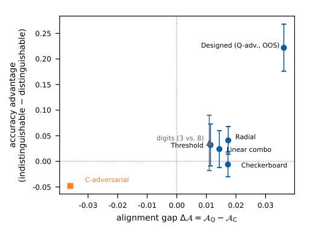 
Fig. 5: The learnable advantage is gated by kernel–task alignment. Accuracy advantage of the indistinguishable- over the distinguishable-photon kernel against the alignment gap ∆A = AQ −AC, for adversarially designed and natural tasks (M = 20, N = 3, D = 1140, n = 180). The advantage separates at the extremes of alignment; the fine-grained ordering among natural tasks is not resolved at these sample sizes (Supplementary Note 8).

**Summary.** This work analyzes the role of multi-photon interference in photonic quantum machine learning by comparing the feature space generated by indistinguishable versus distinguishable photon statistics. The authors show that interference creates a quantifiable geometric separation in the kernel space, which confirms a potential quantum advantage. This protocol allows researchers to test for this advantage computationally before building complex quantum hardware.

**Why it may be interesting.** It provides a rigorous, computable, and pre-experimental diagnostic tool (kernel geometry) to predict the potential quantum advantage in photonic quantum machine learning before large-scale hardware investment.

Detailed structure

**Main problem.** To determine if multi-photon interference provides a task-independent advantage for quantum machine learning implemented with photonic reservoirs, resolving conflicting experimental reports.

**Main result.** Interference creates a measurable geometric separation between the feature kernels ($K_Q$ vs $K_C$), which is learnable for adversarially constructed tasks, though the advantage on natural tasks is gated by kernel-task alignment.

**Method.** The analysis treats the reservoir as a kernel machine, quantifying the geometric separation between the indistinguishable-photon kernel ($K_Q$) and the distinguishable-photon kernel ($K_C$) using kernel geometry metrics.

**Model / system.** The system is photonic reservoir computing using a linear interferometer where classical inputs are encoded into phases. The process involves injecting $N$ photons and post-selecting on detection events, comparing interference statistics ($P_Q$) to classical statistics ($P_C$).

**Key observables.** Kernel geometry separation ($g$), feature variance distribution, and task-level accuracy advantage ($\Delta A$).

**Important parameters / regimes.** Hong–Ou–Mandel visibility ($V$), number of photons ($N$), and the sampling budget (number of shots).

**Assumptions / limitations.** The analysis relies on treating the reservoir as a kernel machine and assumes that the geometric separation can be computed and measured robustly.

**Figures summary.** Figures compare the reservoir kernel estimation and the distinguishability dial, contrasting the spectral contrast (variance spread) between $K_Q$ and $K_C$.

**Paper structure.** The paper establishes the theoretical framework by defining the kernels based on photon statistics, quantifies the geometric separation, demonstrates its dependence on visibility, and finally tests the learnability of this advantage on both designed and natural task sets.

Abstract

Multi-photon interference is the resource most native to photonic quantum machine learning, yet experiments on photonic reservoirs have reported advantages, null results, and train-only effects. These outcomes cannot be compared: each measures task-dependent accuracy on different tasks and platforms. Here we resolve the question task-independently through the kernel geometry of boson-sampling feature maps. Interference redistributes feature variance across roughly twice as many effective dimensions as distinguishable-particle statistics, generating a large geometric separation between the corresponding kernels. The separation grows superlinearly with indistinguishability, is linear in Hong--Ou--Mandel visibility at small visibility for two to four photons, and retains approximately 80% of its magnitude at the source quality of current quantum processors. Under experimental sampling budgets the separation is learnable on adversarially constructed tasks (accuracy advantage +0.22 plus or minus 0.05) and an order of magnitude smaller on natural tasks, gated by kernel--task alignment. The results reconcile the existing experimental record and supply a pre-experimental protocol: kernel geometry establishes that an interference-specific learning resource exists, and task alignment determines whether a given task can access it; both are computable before committing significant hardware resources.

[↑ back to top](#top)

### [Analog quantum simulation of $φ^4$ field theory with a superconducting transmission line](http://arxiv.org/abs/2610.11071v1)

**Authors:** Ilan T. Rosen, Neill C. Warrington, Max Hays, Christopher McNally, Joshua Lin, Stephen Sorokanich, Julian Bender  
**Type:** both · **Category:** other · **PDF:** <https://arxiv.org/pdf/2610.11071v1>  
**Analysis basis:** full PDF text, analyzed in chunks
**Topic relevance:** 🔥 `analog quantum simulation` **4/5** · `Frenkel-Kontorova` **2/5** · `Keldysh / 2PI / non-Gaussian methods` **1/5** · `QC/QI experiment` **1/5** · `driven-dissipative phase transition` **1/5** · `methods for driven-dissipative` **1/5** · `non-equilibrium universality` **1/5**

📷 Fig 1

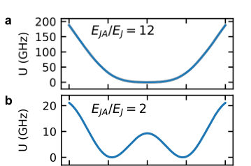 
FIG. 4. Tank circuit potential. (a) A heavily quartic potential well is formed when EJA/EJ &gt; n. (b) A double- well potential is formed when EJA/EJ &lt; n. Tank circuit parameters from Table II are used.

📷 Fig 2

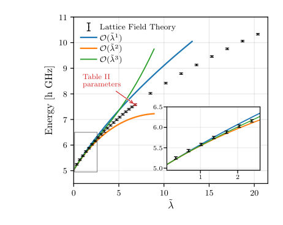 
FIG. 6. Non-perturbative regime. Comparison between particle masses computed with lattice field theory (black points) and perturbation theory (PT) at first through third order in ˜λ (blue, orange, green lines, respectively), where ω0 = 5.03GHz. The interaction strength produced by Table II parameters is indicated in red. Inset panel shows compar- ison between perturbative and nonperturbative results near ˜λ = 0.

📷 Fig 3

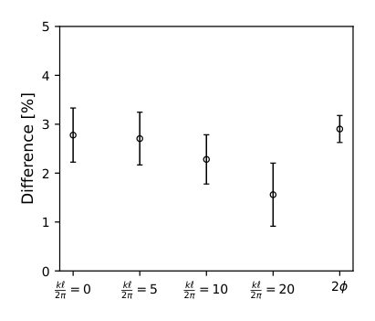 
FIG. 5. Comparing NLTL to ϕ4 theory. Fractional dif- ference between energy levels of the NLTL and ϕ4 theory (Difference = (Eϕ4 −ENLTL)/Eϕ4, where Eϕ4, ENLTL respec- tively denote energies computed in ϕ4 and NLTL). From left to right energies correspond to the kℓ/2π = 0, 5, 10, 20 single particle energy states then the zero-momentum two-particle state.

📷 Fig 4

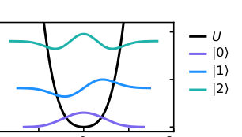 
FIG. 8. Energy spectrum of one tank circuit in the single-well regime. The potential is indicated by the black line, and the wavefunctions of the ground state and first two excited states are shown offset by their energy. Tank circuit parameters are given in the top row of Table II.

📷 Fig 5

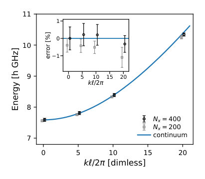 
FIG. 7. Continuum limit. Computation of the single par- ticle dispersion relation E(k) at Table II parameters (gray points), at parameters corresponding to 1/2 the lattice spac- ing (black points) and the continuum limit (blue). Inset shows the fractional error in lattice-computed energies relative to the continuum limit. Points are shifted horizontally for visibility.

**Summary.** This paper proposes using a superconducting transmission line as an analog quantum simulator for $(1+1)$-dimensional $\phi^4$ field theory. By tuning circuit parameters, the system can mimic both simple particle scattering (single-well) and complex topological dynamics like kink-antikink collisions (double-well). This offers a powerful, experimentally accessible platform for studying interacting quantum field dynamics.

**Why it may be interesting.** This work provides a concrete, hardware-based realization of simulating complex, interacting quantum field theories, bridging superconducting circuit QED with fundamental condensed matter physics problems.

Detailed structure

**Main problem.** The core challenge is understanding the real-time dynamics of strongly interacting quantum field theories, which is difficult using current computational or experimental methods.

**Main result.** The superconducting transmission line successfully emulates $(1+1)$-dimensional $\phi^4$ field theory, allowing for the simulation of both particle scattering and topological kink-antikink collisions.

**Method.** The authors use analog quantum simulation by engineering a superconducting circuit whose time evolution mimics the field theory dynamics, validated by lattice Monte Carlo calculations.

**Model / system.** The physical platform is a Non-linear Transmission Line (NLTL) built from fluxonium-like superconducting circuits. This system is tuned to emulate the Lagrangian of a $\phi^4$ field theory, allowing access to both single-well and symmetry-broken double-well potentials.

**Key observables.** Scattering cross-sections for particle wave packets, and the dynamics of topological kinks and anti-kinks.

**Important parameters / regimes.** The ratio of circuit parameters ($E_{JA}/E_J$ vs $n$) controls the potential regime (single-well vs. double-well). The simulation requires the continuum limit approximation.

**Assumptions / limitations.** The method relies on the ability to fabricate a sufficiently large, controlled superconducting circuit, and approximations are used to derive the effective continuum action.

**Figures summary.** Figures illustrate the free-field structure, the nonlinear circuit components, the resulting potential wells (single-well and double-well), and the convergence of the dispersion relation to the continuum theory.

**Paper structure.** The paper establishes the physical system (NLTL) and its Hamiltonian, confirms its equivalence to the continuum $\phi^4$ theory via lattice calculations, and then details how tuning parameters allows access to different physical regimes (single-well for scattering, double-well for solitons).

Abstract

Understanding the dynamics of interacting quantum fields remains a fundamental challenge. We propose a superconducting transmission line for analog quantum simulation of $(1+1)$-dimensional $φ^4$ field theory. The transmission line comprises fluxonium-like circuit elements whose continuous and unbounded phase variables encode a scalar field without Hilbert-space truncation. Their anharmonic potentials provide strong interactions. Tuning the circuit parameters provides access to two distinct regimes. In the first, the transmission line emulates $φ^4$ field theory with a single-well potential. We confirm this correspondence through lattice Monte Carlo calculations of the low-energy spectra of both the circuit and lattice $φ^4$ theory. This regime enables scattering experiments between counter-propagating particle wave packets. The second parameter set yields a double-well potential that emulates $φ^4$ theory in the symmetry-broken phase and hosts degenerate vacua. Interfaces between the two vacua form topological kinks, and the transmission line can simulate kink-antikink collisions. We present state preparation and measurement protocols for both collision experiments, enabling spatially resolved, real-time studies of particle and soliton scattering in an interacting quantum field theory.

[↑ back to top](#top)

### [Deterministic generation of large-scale photonic GHZ states utilizing spin echo in a solid-state quantum light source](http://arxiv.org/abs/2610.11445v1)

**Authors:** Zu-En Su, Dan Cogan, Oded Kenneth, Shunfa Liu, Jin Liu, David Gershoni  
**Type:** experiment · **Category:** quantum information and computing · **PDF:** <https://arxiv.org/pdf/2610.11445v1>  
**Analysis basis:** full PDF text, analyzed in chunks
**Topic relevance:** 🔥 `QC/QI experiment` **4/5** · `quantum optics experiment` **3/5** · `Tavis-Cummings & cavity-many-emitter` **1/5** · `analog quantum simulation` **1/5** · `interference shaping light` **1/5** · `quantum measurements` **1/5**

📷 Fig 1

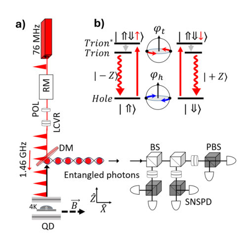 
Figure 1. The Setup. (a) Schematic description of the QD-based device. RM: rate multiplier, BS: beam splitter, PBS: polarizing beam splitter, SNSPD: superconducting nanowire single photon detector, LCVR: liquid crystal variable retarder, DM: dichroic mirror, and POL: polarizer. (b) Schematic of the optical Π-system between the heavy hole (HH) and the positive trion. |±Z⟩represents a right- (left-) hand circularly polarized photon. φh(t) marks the acquired phase due to the precession of the HH (trion in opposite direction) after (before) the radiative recombination.

📷 Fig 2

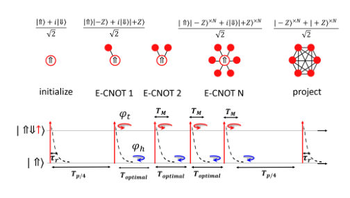 
Figure 2. The GHZ generation method. Schematic description of the temporal sequence of operations for generating the GHZ state. i) Hole spin initialization in a |±Y ⟩state by projecting the first photon polarization on a circular base and timed hole spin precession of Tp/4. ii) Spin-N-photon entanglement by applying the E-CNOT gate N times, and iii) Final HH spin projection onto a |∓Y ⟩state by detecting circularly polarized photon following Tp/4 delayed excitation. The spin-multiphoton state is diagrammatically depicted above each step. The excitation period Toptimal is tuned to null the average acquired phase φt + φh. τr is the radiative lifetime and TM is the temporal width of the...

📷 Fig 3

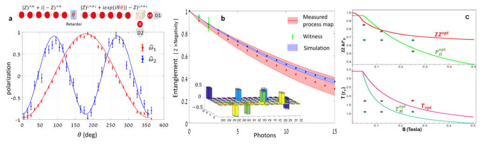 
Figure 3. Characterization of the multiphoton GHZ state. (a) Upper panel: Schematic description of the experiment. Lower panel: Rectilinear degree of polarization (ωn-witnesses) of the multiphoton state as a function of the retarder’s phase. 3-photon (red) and 4-photon (blue) correlation measurements of the witnesses ˆω1 and ˆω2, respectively. Points with error bars represent the measurements, and color-matched solid lines are best fits to ˆωn(φ) = −Vˆωn cos(nφ), where n = 1, 2 and Vˆωn are the fitted corresponding visibilities. (b) The localizable entanglement (LE) in the multiphoton GHZ state as a function of the number of photons in the state. The inset presents a full tomographic...

📷 Fig 4

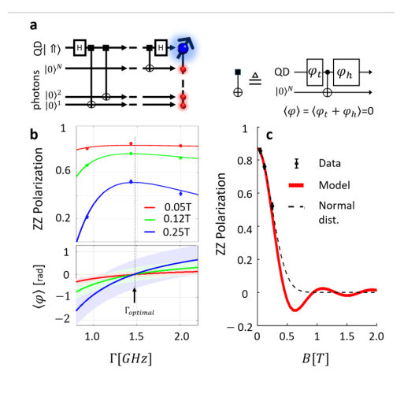 
Figure 4. Optimization of the GHZ state generation. (a) A quantum circuit diagram describing the multiphoton GHZ state generation. (b) Lower panel: The calculated average accumulated phase ⟨φ⟩ during one cycle versus the excitation rate for various magnetic fields. The shaded areas represent one standard deviation ⟨∆φ⟩. The black arrow indicates the field-independent optimal rate at which ⟨φ⟩= 0. Upper panel: The measured (data points) and calculated (color-matched solid lines) ZZ-witness versus the excitation rate for various magnetic fields. (c) The measured (black data points) and calculated (solid red line for the spin evolution model [36] and dashed black line assuming normally...

**Summary.** This paper reports the experimental demonstration of a high-rate, deterministic source for large-scale photonic GHZ states using semiconductor quantum dots. The key innovation is leveraging a 'natural spin echo' effect to maintain coherence and generate entanglement among more than a dozen photons. This work significantly advances the feasibility of solid-state quantum light sources for quantum information technologies.

**Why it may be interesting.** This work directly addresses scalable quantum information processing by providing a high-rate, solid-state source of highly entangled photonic states, which is crucial for quantum networking and computation.

Detailed structure

**Main problem.** The deterministic generation of large-scale photonic Greenberger-Horne-Zeilinger (GHZ) states is demonstrated using a solid-state quantum light source.

**Main result.** The authors achieved deterministic generation of photonic GHZ states containing more than a dozen indistinguishable photons at a rate exceeding 1 GHz.

**Method.** The process utilizes a novel 'natural spin echo' mechanism in a semiconductor quantum dot to establish spin-photon entanglement, followed by repeated entangling gates.

**Model / system.** The platform is a semiconductor quantum dot (QD) embedded in a planar microcavity. The mechanism relies on the opposite precession directions of electron and hole spins to nullify accumulated phase.

**Key observables.** GHZ state visibility ($\langle\omega_N
angle$), Localizable Entanglement ($\zeta_{LE}$), and the ZZ-witness ($	ext{ZZ}$).

**Important parameters / regimes.** Photon generation rate (>1 GHz), number of entangled photons (>12), and the optimal excitation rate ($\Gamma_{	ext{opt}}^{	ext{exc}}$).

**Assumptions / limitations.** The process is limited by electron spin decoherence ($	au_{	ext{dec}}$), and ideal operation requires tuning the excitation rate to nullify the accumulated phase.

**Figures summary.** Figures illustrate the setup schematic, the temporal sequence for GHZ generation (involving E-CNOT gates), and plots showing the dependence of entanglement witnesses and process fidelity on external magnetic fields and excitation rates.

**Paper structure.** The paper details the physical mechanism using spin echo, outlines the multi-step process for generating the GHZ state via entanglement gates, presents quantitative measurements of state fidelity and entanglement length, and discusses optimization parameters.

Abstract

Quantum technologies witness rapid contemporary developments transitioning from abstract scientific ideas and fundamental demonstrations, into systems of sufficient quality and scale, enabling real applications. Photonic quantum technologies are playing a pivotal role in these developments, since photons are robust, easily controlled, detect and measured, thus qualify as flying carriers of quantum information and entanglement distributers. The efforts to develop photonic quantum technologies benefit from the maturity of the classical optical technologies. It was shown that even a source of heralded three entangled photons is sufficient for building large scale quantum computers using otherwise classical optical elements. Here, we demonstrate a novel semiconductor quantum dot based device, which deterministically generate at GHz rates, indistinguishable single photons in a robust Greenberger-Horne-Zeilinger (GHZ) state of more than a dozen photons. The device utilizes novel natural spin echo concept, provided by the opposite precession directions of the negative and positive carriers' spins in the excited and ground levels of the periodically excited dot, respectively. The excitation rate is finely tuned to nullify the phase acquired by both spins' precession. Our record long GHZ state producing device can yet be feasibly improved to provide higher-rate, brighter and more robust deterministic GHZ source, significantly reducing the overhead requirements for photonic quantum technologies.

[↑ back to top](#top)

### [Experimental Measurement-Device-Independent Quantum Key distribution with Flawed State-Preparation over 300 km](http://arxiv.org/abs/2610.11428v1)

**Authors:** Yi-Fei Lu, Yan-Yang Zhou, Yang Wang, Yu Zhou, Xiao-Lei Jiang, Xin-Hang Li, Hai-Tao Wang, Yan-Mei Zhao, Jia-Ji Li, Chun Zhou, Hong-Wei Li, Lin-Jie Zhou, Wan-Su Bao  
**Type:** experiment · **Category:** quantum information and computing · **PDF:** <https://arxiv.org/pdf/2610.11428v1>  
**Analysis basis:** full PDF text, analyzed in chunks
**Topic relevance:** 🔥 `quantum optics experiment` **4/5** · `QC/QI experiment` **3/5** · `interference shaping light` **2/5** · `quantum measurements` **2/5**

📷 Fig 1

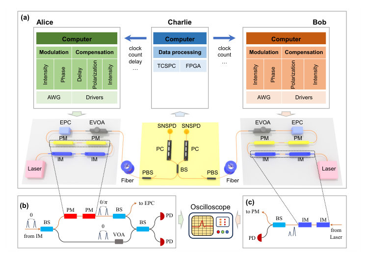 
Figure 1: Experimental set-up. (a) MDI-QKD experimental system. The MDI-QKD system is con-

📷 Fig 2

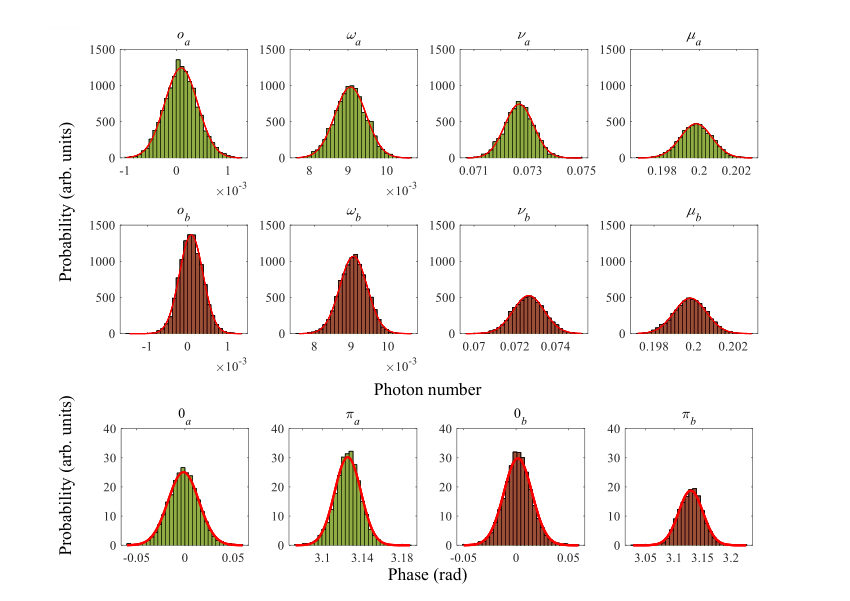 
Figure 2: Results of intensity and phase characterization. The first two rows illustrate the intensity

📷 Fig 3

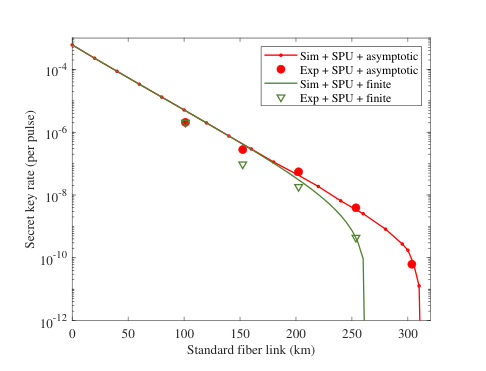 
Figure 3: Secret key rate (SKR) in logarithmic scale versus transmission distance between Alice and

📷 Fig 4

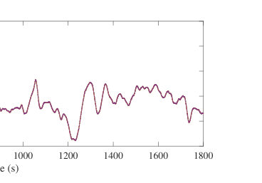 
Figure 5: The frequency difference of two free-running lasers.

**Summary.** This paper reports an experimental MDI-QKD system that successfully maintains high security and performance over distances exceeding 300 km. The key innovation is the rigorous incorporation of State-Preparation Uncertainty (SPU) into the security analysis using the operator dominance method. This work significantly advances the practical feasibility of long-haul quantum communication networks.

**Why it may be interesting.** This work pushes the boundaries of practical quantum communication by providing a concrete, long-distance demonstration of QKD security under realistic, imperfect source conditions, which is highly relevant to quantum optics and quantum information theory.

Detailed structure

**Main problem.** The paper addresses the challenge of implementing secure Quantum Key Distribution (QKD) when quantum sources are imperfect, specifically by accounting for State-Preparation Uncertainty (SPU).

**Main result.** The authors achieved a record secure key distribution distance of over 300 km while rigorously accounting for the general form of SPU, demonstrating robust performance.

**Method.** They utilized the operator dominance method to derive tight theoretical bounds and performed a complex MDI-QKD experiment involving characterization of phase and intensity fluctuations.

**Model / system.** The system is an experimental Measurement-Device-Independent QKD (MDI-QKD) setup using free-running continuous-wave lasers at 1550.12 nm. Encoding uses time-bin and phase encoding, and the setup includes multiple modulators and single-photon detectors.

**Key observables.** Secret Key Rate (SKR), secure key distribution distance, counting rates ($Q[\mu,\mu]$), and bit error rates ($E_z$).

**Important parameters / regimes.** Distance (up to 303.57 km), detection efficiency ($\approx 55\%$), and the degree of State-Preparation Uncertainty (SPU).

**Assumptions / limitations.** The analysis assumes the prepared states are independent and identically distributed (i.i.d.), though the method is designed to handle general SPU forms.

**Figures summary.** Figures illustrate the MDI-QKD setup, separate characterization schemes for phase and intensity, and plots showing the SKR versus transmission distance.

**Paper structure.** The paper details the experimental setup, describes the characterization of SPU sources, develops the theoretical framework using operator dominance, and presents the measured SKR results over increasing distances.

Abstract

Quantum key distribution (QKD) promises theoretically secure communication. However, it encounters challenges in implementation security and performance due to inevitable device imperfections. Since the proposal of measurement-device-independent (MDI) QKD, the critical step toward practical security is to secure QKD with imperfect sources. The source imperfections manifest as state-preparation uncertainty (SPU) in various aspects, e.g., encoding uncertainty, intensity fluctuation, and imperfect vacuum states. Here, we perform an MDI-QKD experiment and achieve both high practical security and superior performance. We address the general form of SPU and guarantee a tight estimation of the secret key rate based on the operator dominance method. We achieve secure key distribution over 303.37 km, which not only represents the farthest distance in experiments involving SPU but also considers the most SPU scenarios. Our experimental results represent a significant step toward promoting practical and secure quantum communication.

[↑ back to top](#top)

### [Mass quench in interacting finite-size quantum field system](http://arxiv.org/abs/2610.12045v1)

**Authors:** Grachik A Simonian, Alexey G. Mikhaylenko, Andrew G. Semenov  
**Type:** theory · **Category:** statistical mechanics · **PDF:** <https://arxiv.org/pdf/2610.12045v1>  
**Analysis basis:** full PDF text, analyzed in chunks
**Topic relevance:** 🔥 `Keldysh / 2PI / non-Gaussian methods` **4/5** · `non-equilibrium universality` **3/5** · `analog quantum simulation` **2/5** · `interference shaping light` **1/5** · `methods for driven-dissipative` **1/5**

📷 Fig 1

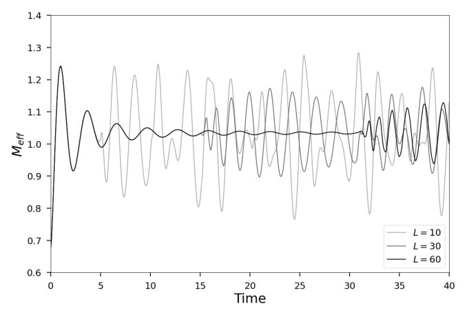 
Figure 1. Time evolution of the effective mass Meff(t) after a quantum quench depending on the

📷 Fig 2

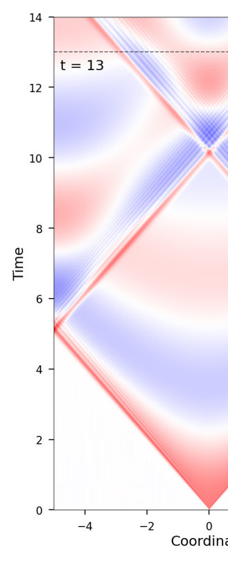 
Figure 2. Light cone of the retarded function

📷 Fig 3

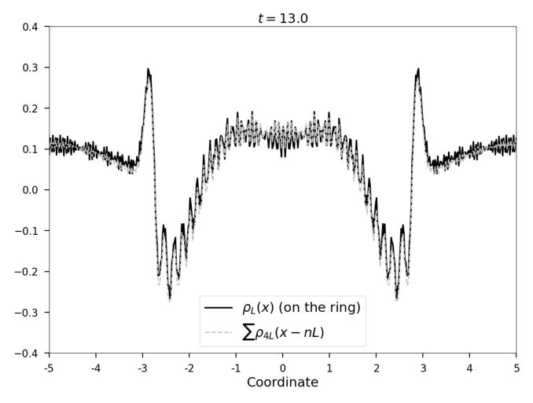 
Figure 3. Light cone and comparison of retarded functions calculated via two different methods

**Summary.** This work studies how a quantum scalar field evolves after its mass is suddenly changed (a quench) in a finite system. Using advanced quantum field theory techniques, the authors predict a unique, measurable anomaly in the effective mass at a specific time related to the system size. This effect is shown to be a consequence of wave interference dictated by the system's periodic boundaries.

**Why it may be interesting.** The study provides a concrete theoretical framework for understanding finite-size effects in non-equilibrium quantum dynamics, which is highly relevant for interpreting results from ultracold atom experiments in periodic traps.

Detailed structure

**Main problem.** The paper theoretically investigates the non-equilibrium evolution of correlation functions for a quantum scalar field following a sudden change (quench) in its mass.

**Main result.** A strong, characteristic disturbance in the effective mass is observed at a time corresponding to half the system size, which is attributed to the interference of counter-propagating fluctuations due to periodic boundary conditions.

**Method.** The analysis employs the Keldysh–Schwinger formalism, solving the Dyson equations numerically in the one-loop approximation (Hartree–Fock).

**Model / system.** The model is a one-dimensional real scalar quantum field theory ($\phi^4$ theory) confined to a finite system of length $L$ with periodic boundary conditions. The system undergoes a mass quench from $m_0$ to $m_1$ at $t=0$.

**Key observables.** Keldysh (statistical) Green’s function, spectral function, and the self-consistently determined effective mass $M_{eff}(t)$.

**Important parameters / regimes.** System size $L$ (varied), coupling constant $\lambda$, and the initial/final masses $m_0, m_1$.

**Assumptions / limitations.** The analysis assumes a spatially uniform distribution with zero mean field ($\langle\varphi
angle=0$) and requires a counterterm to handle vacuum divergences.

**Figures summary.** Figure 1 shows the time evolution of $M_{eff}(t)$ for varying $L$. Figure 2 illustrates the light cone structure of the retarded Green’s function. Figure 3 compares results obtained on a ring versus an infinite line.

**Paper structure.** The paper develops the formalism using the Keldysh approach, solves the equations numerically in the one-loop approximation, and then confirms the key findings by comparing results obtained using different computational methods (e.g., ring vs. line boundary conditions).

Abstract

In this work, we theoretically investigate the non-equilibrium evolution of the correlation functions of a quantum scalar field following a mass quantum quench in a finite-size system. The self-consistent equation for the Keldysh (statistical) correlation function is solved numerically in the one-loop approximation. A specific spatio-temporal effect is observed: at a point in time approximately equal to half the system size, the effective mass experiences a strong disturbance. It is shown that this effect is driven by the interference of counter-propagating wave fronts of fluctuations that propagate within the light cone and is induced by periodic boundary conditions.

[↑ back to top](#top)

### [Nonlinear Feedback in Josephson Circuit Optimization: Application to a Kerr-Reversal JTWPA](http://arxiv.org/abs/2610.10715v1)

**Authors:** Emanuele Palumbo, Alessandro Alocco, Andrea Celotto, Luca Fasolo, Bernardo Galvano, Patrizia Livreri, Emanuele Enrico  
**Type:** both · **Category:** other · **PDF:** <https://arxiv.org/pdf/2610.10715v1>  
**Analysis basis:** full PDF text, analyzed in chunks
**Topic relevance:** 🔥 `quantum measurements` **4/5** · `driven-dissipative phase transition` **3/5** · `methods for driven-dissipative` **3/5** · `Keldysh / 2PI / non-Gaussian methods` **1/5**

📷 Fig 1

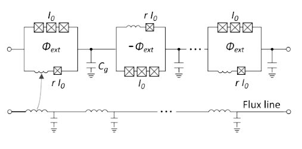 
Fig. 2. Equivalent lumped-element circuit of the 4WM JTWPA adopted in this work, following the model reported in [12]. The transmission line is formed by a periodic array of unit cells, each comprising a Superconducting Nonlinear Asymmetric Inductive eLement (SNAIL) and a ground capacitance Cg. Each SNAIL consists of one small JJ with critical current rI0 and three large JJs with critical current I0, with r = 0.07 the junction asymmetry function. The magnetic bias is represented by a periodic flux line mutually coupled to the SNAIL inductive branches, producing the external flux Φext. Adjacent cells have reversed orientations, resulting in alternating flux biases ±Φext and suppressing the...

📷 Fig 2

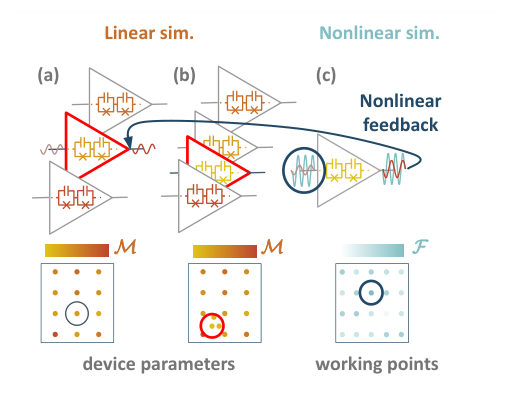 
Fig. 1. Overview of the JCO optimization workflow. (a) The device parameter space is explored through linear simulations using the metric M. (b) Linear optimization identifies the selected circuit configuration. (c) The selected configuration is analyzed under pumped conditions, and information from the pumped response is fed back into the linear stage of the subsequent optimization cycle.

📷 Fig 3

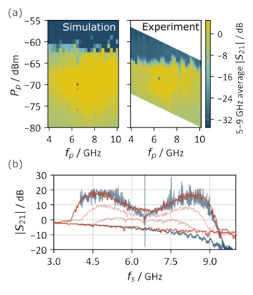 
Fig. 3. Comparison between simulated and measured amplifier performance for the same device configuration, I0 = 2.19 µA, Cg = 250 fF, and Φext = 0.5Φ0. Further details on the device architecture and experimental implementation are reported in [12]. (a) Two-dimensional maps of the signal gain, expressed as |S21| in dB and averaged over the 5–9 GHz signal band, as a function of pump frequency and pump power, obtained from simulations (left) and measurements (right). The markers indicate the pump conditions considered for the frequency-resolved comparison in (b). (b) Simulated (red) and measured (blue) signal gain, expressed as |S21| in dB, as a function of signal frequency at fp = 6.5 GHz....

📷 Fig 4

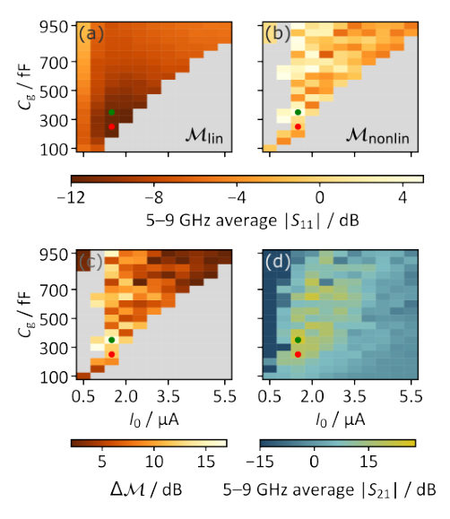 
Fig. 4. Comparison between the linear and nonlinear circuit responses over the (I0, Cg) design space. The flux bias is fixed at Φext = 0.5Φ0, and the nonlinear simulations are performed with a pump at fp = 7 GHz and Pp = −70 dBm, corresponding to the maximum-gain operating point identified for the configuration selected by the linear optimization. (a) Linear metric Mlin derived from the input reflection coefficient. (b) Corresponding metric Mnonlin evaluated from nonlinear harmonic balance simulations. (c) Linear- to-nonlinear discrepancy ∆M = Mnonlin −Mlin. (d) Average gain in the 5–9 GHz signal band. Gray regions indicate configurations rejected by the third-harmonic condition defined in...

**Summary.** This paper addresses the computational bottleneck in optimizing nonlinear Josephson microwave circuits by proposing a nonlinear feedback extension to the standard optimization workflow. The method uses the difference between linear and pumped simulation results as a diagnostic observable to guide subsequent, more accurate optimization cycles. This allows for the efficient design of high-performance parametric amplifiers by incorporating complex nonlinear physics into the initial design phase.

**Why it may be interesting.** This work bridges advanced circuit simulation techniques with quantum optics/AMO concepts by treating the optimization of nonlinear quantum devices (like parametric amplifiers) as an iterative, feedback-controlled process, which has parallels in quantum control theory.

Detailed structure

**Main problem.** Optimizing Josephson-based nonlinear microwave devices is computationally expensive because standard methods fail to account for pump-induced nonlinear effects during initial linear parameter sweeps.

**Main result.** The authors introduce a nonlinear feedback mechanism using the discrepancy between linear and pumped response metrics, showing this observable contains crucial information about amplifier performance missed by linear optimization.

**Method.** They developed a two-stage optimization framework, extending the initial linear search with an iterative feedback loop that incorporates nonlinear simulation results back into the linear metric update.

**Model / system.** The system modeled is a Josephson Traveling-Wave Parametric Amplifier (JTWPA) utilizing a reversed-Kerr architecture. The model is implemented using a lumped-element circuit description.

**Key observables.** Input reflection coefficient ($S_{11}$) in the signal band, third-harmonic suppression ($S_{11,dB}(3f_p)$), and the discrepancy ($\Delta M$) between linear and pumped metric values.

**Important parameters / regimes.** Circuit parameters like inductive bias ($I_0$) and ground capacitance ($C_g$), and operating frequencies (5–9 GHz signal band).

**Assumptions / limitations.** The initial linear optimization ignores nonlinear effects like impedance renormalization and Kerr-induced dispersion modifications; the feedback observable must mimic the gain landscape features.

**Figures summary.** Figure 3 validates the model by comparing simulated and measured signal gain. Figure 4 compares the linear metric, nonlinear metric, discrepancy ($\Delta M$), and average gain across the parameter space, highlighting the difference between linear and maximum-gain configurations.

**Paper structure.** The paper outlines the limitations of the standard two-stage optimization (JCO), introduces the nonlinear feedback extension, validates the model against experimental gain measurements, and finally demonstrates the use of the discrepancy ($\Delta M$) as the candidate feedback observable for iterative optimization.

Abstract

Optimizing Josephson-based nonlinear microwave devices is computationally demanding because the straightforward approach requires exploring broad circuit parameter spaces through expensive nonlinear simulations. Josephson Circuits Optimizer addresses this problem by using harmonic balance simulations in two stages: fast linear simulations to select promising circuit configurations according to properties such as impedance and phase matching, followed by nonlinear simulations to optimize their operating conditions. However, pump-induced effects such as impedance renormalization and Kerr-induced modifications of phase matching are not captured during the initial linear stage. We therefore introduce a nonlinear feedback extension that transfers information from the pumped response back to the linear optimization. The approach is investigated using a Josephson traveling-wave parametric amplifier with a reversed-Kerr architecture, whose model is validated against experimental gain measurements. We then evaluate the difference between the linear and pumped response values of a metric based on the input reflection coefficient, while excluding configurations with insufficient third-harmonic suppression. This discrepancy is considered a candidate feedback observable, as it exhibits features similar to the gain landscape, supporting its use in subsequent optimization cycles.

[↑ back to top](#top)

### [Experimental generation of asymmetric keys from the parity structure of a two-photon six-qubit entangled state](http://arxiv.org/abs/2610.12264v1)

**Authors:** Sanchari Chakraborti, Soumya Asokan, Sunita Khoth, Sujai Matta, C. M. Chandrashekar  
**Type:** experiment · **Category:** quantum information and computing · **PDF:** <https://arxiv.org/pdf/2610.12264v1>  
**Analysis basis:** full PDF text, analyzed in chunks
**Topic relevance:** 🔥 `QC/QI experiment` **4/5** · `quantum optics experiment` **3/5** · `interference shaping light` **1/5** · `quantum measurements` **1/5**

📷 Fig 1

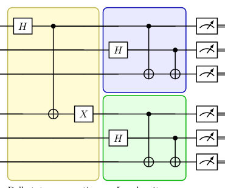 
Figure 1. The quantum circuit preparing the six-qubit state Ψ(6)E . The yellow box represents the entanglement genera- tion unit acting on q1 and q4; the blue and green boxes re- spectively represent the local encoder circuits for UA and UB. A Z-measurement on all six qubits returns one of the 8 states |a, c, a ⊕c, ¯a, d, ¯a ⊕d⟩, with a, c, d ∈{0, 1}.

📷 Fig 2

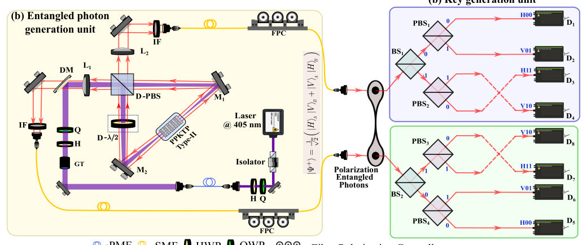 
Figure 2. Experimental setup. (a) State Preparation: A polarization-entangled state Ψ+ = (|H⟩|V ⟩+ |V ⟩|H⟩) / √

📷 Fig 3

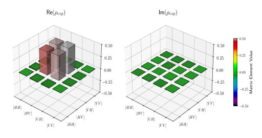 
Figure 3. Real (left) and imaginary (right) parts of the two- photon density matrix ρexp reconstructed from polarization- state tomography of the prepared state.

📷 Fig 4

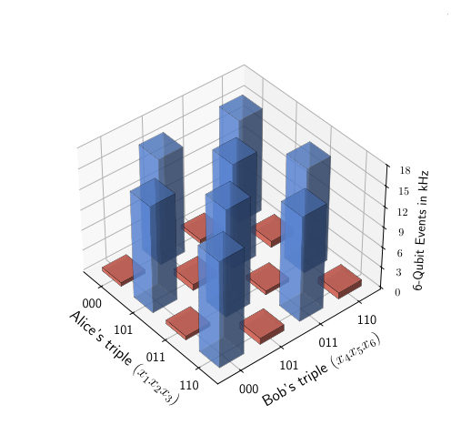 
Figure 4. Measured Z-basis coincidence rates for all 16 six-qubit outcomes registered by the 4 × 4 detector pairs. The x −y axes respectively label the even-parity codewords {000, 011, 101, 110} at Alice’s and Bob’s stations, so that each bar corresponds to one six-bit outcome. Blue bars represent the signal set S, and the red bars represent the error set T.

📷 Fig 5

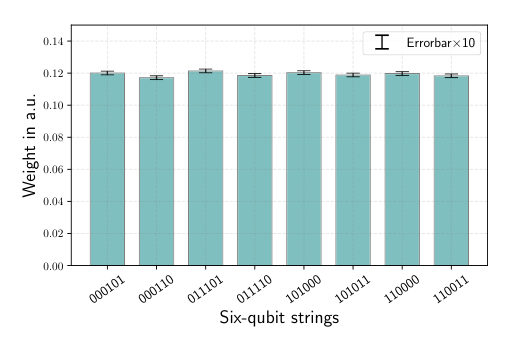 
Figure 5. Population pk of the eight signal strings Sk in the raw key, normalized to the total signal counts. The corre- sponding error bars are multiplied by 10 for better visibility.

**Summary.** The authors experimentally demonstrate a quantum key distribution protocol using a six-qubit entangled state generated from two photons. They encode the state using an even-parity code, allowing both parties to perform local error checks round-by-round. This method provides a quantum-secure alternative to classical cryptography by leveraging fundamental quantum correlations.

**Why it may be interesting.** This work provides a concrete, hardware-implementable demonstration of quantum key distribution that moves beyond simple entanglement swapping by incorporating error-correcting code structures into the key exchange protocol itself.

Detailed structure

**Main problem.** The paper addresses the need for quantum-secure, physics-based asymmetric key generation, providing an alternative to cryptosystems relying on computational hardness assumptions.

**Main result.** They experimentally demonstrated a key generation scheme using a six-qubit photonic entangled state, achieving a high Bell-CHSH parameter ($S = 2.798 \pm 0.008$) and demonstrating built-in error detection.

**Method.** The protocol utilizes a six-qubit state derived from two photons, encoding the qubits into a classical [3,2,2] even-parity code, and uses local parity checks for error filtering.

**Model / system.** The system is a photonic platform using two photons, each carrying polarization and path qubits. The state is generated via a Sagnac-based type-II SPDC source, and the key relies on the correlations within the parity-constrained six-qubit state.

**Key observables.** Bell-CHSH parameter ($S = 2.798 \pm 0.008$), Fidelity ($F = 0.987$), Raw key rate ($\approx 131$ kbit/s), and Quantum Bit Error Rate (QBER $\approx 4.61\%$).

**Important parameters / regimes.** The key rate is doubled by generating two private bits per round. The security relies on the difficulty of guessing the random $t$-bit string, requiring $O(2^t)$ runs.

**Assumptions / limitations.** The security is based on the monogamy of shared entanglement, and the local self-check mechanism assumes that errors are independent noise sources.

**Figures summary.** Figures illustrate the quantum circuit for state preparation, the experimental setup using SPDC, and measurements confirming polarization entanglement and the Bell-CHSH parameter.

**Paper structure.** The paper details the theoretical construction of the six-qubit state using the [3,2,2] code, outlines the key generation protocol involving public announcement and private reconstruction, and concludes with experimental measurements verifying entanglement and key rate.

Abstract

We propose and experimentally demonstrate an asymmetric key-generation scheme in which public and private keys are derived from a six-qubit photonic entangled state. A six-qubit entangled state is generated from two photons, each carrying one polarization and two path qubits. The state is prepared in an equal superposition of eight of the sixty-four six-qubit basis states, in which each photon's three qubits form a codeword of the classical [3,2,2] even-parity code, and are distributed between the two parties, Alice and Bob. This ensures, each triple is a uniformly random codeword and the two codewords are locked together through the correlation. The parity constraint is a local stabilizer, so each party verifies it on its own data every round, and eliminates the bit flip errors arising from imperfections, detector dark counts and multiple occupancy before it enters the raw key. A single publicly announced bit, chosen at random from either of the path qubits, allows each party to reconstruct the other's full triple while leaking no information to third party. We realize the desired six-qubit state using a Sagnac-based type-II SPDC source, reporting a Bell-CHSH parameter S = 2.798 +/- 0.008, by implementing gate operation on polarization and path degree's of freedom. This approach provides a physics-based alternative to public-key cryptosystems built on computational hardness assumptions. A t-bit string generated from multiple rounds for encryption will be intrinsically random. Without the private key, one needs at least O(2^t) runs on an t-qubit quantum system to find the matching bit to decrypt.

[↑ back to top](#top)

### [Quantitative Rules for Parallel Calibration and Drift-Resilient Maintenance of Large-Scale Superconducting Quantum Processors](http://arxiv.org/abs/2610.11477v1)

**Authors:** Zhihao Wu, Kechengqi Zhu, Shichuan Xue, Xinfang Zhang, Zhaohua Yang, Zhida Zhang, Shun Hu, Cong Li, Dingdong Liu, Kangding Zhao, Peng Luo, Lingling Lao, Xiang Fu, Mingtang Deng, Junjie Wu, Kai Lu  
**Type:** experiment · **Category:** quantum information and computing · **PDF:** <https://arxiv.org/pdf/2610.11477v1>  
**Analysis basis:** full PDF text, analyzed in chunks
**Topic relevance:** 🔥 `QC/QI experiment` **4/5** · `quantum measurements` **3/5**

📷 Fig 1

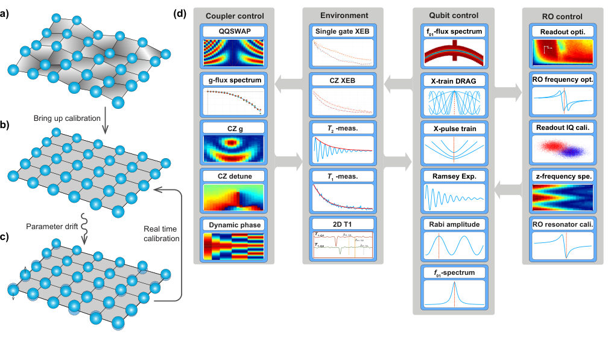 
FIG. 1. A typical full-cycle calibration and maintenance workflow of a large-scale superconducting quantum processor, illustrated on the 66-qubit device used in this work. (a) Roughly estimated parameters during the initial cold start. (b) Calibration to achieve a high-fidelity state. (c) Random parameter drift caused by environmental fluctuations. (d) Directed acyclic graph (DAG) of the calibration experiments, containing four core modules, namely, readout control, qubit control, coupler control, and environment characterization. The detailed workflow is described in Appendix A.

📷 Fig 2

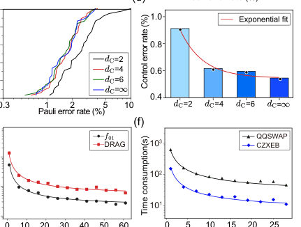 
FIG. 2. Topological definition of parallel density and cali- bration performance evaluation. (a) Schematic illustration of parallel densities dQ and dC defined as the minimum graph distance between simultaneously active qubits or couplers, re- spectively, on the processor topology. (b) Empirical cumu- lative distribution function (ECDF) of cross-entropy bench- marking (XEB) Pauli error rates for single-qubit gates at five values of dQ (1,2,3,4,∞). (c) ECDF of cross-entropy bench- marking (XEB) Pauli error rates for two-qubit CZ gates at four values of dC (2,4,6,∞). (d) Mean control error rate aver- aged over all calibrated CZ gates at each of the four coupler parallel densities in (c), with...

📷 Fig 3

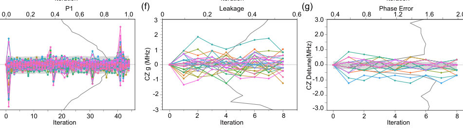 
FIG. 3. Monitoring results of key control parameters over 44 and 48 hours. (a) Qubit frequency f01. (b) Dynamic phase. (c) DRAG coefficient. (d) π-pulse amplitude. (e) Coupler idle bias. (f) CZ effective coupling strength g. (g) CZ detuning. Panels (a) and (b) span 44 sampling iterations; panels (c) to (g) contain nine representative calibration iterations. Colored trajectories represent absolute parameter offsets from initial values of different qubits or couplers. The shaded band in (a) indicates the 1σ Ramsey repeatability. The upper horizontal axes and gray curves show the corresponding single-run calibration responses.

📷 Fig 4

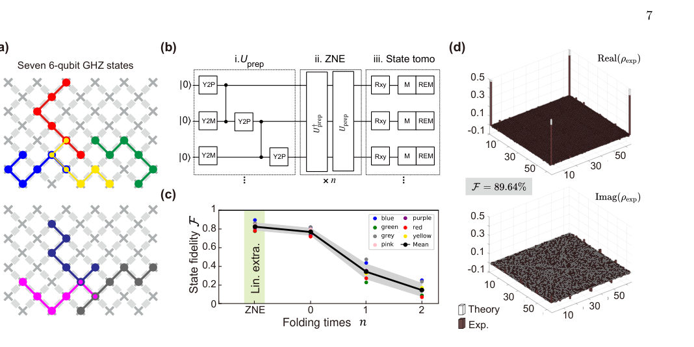 
FIG. 4. Parallel preparation of the six-qubit GHZ state and the corresponding fidelity evaluation. (a) Seven independent one-dimensional 6-qubit chains selected by unbiased sampling on the chip. (b) Experimental circuit combining zero-noise extrapolation (ZNE) and quantum state tomography. (c) Fidelity extrapolation curves for each test group under different folding times n. Different colored dots correspond to the different qubit chains in panel (a), and the shaded band denotes the spread across the seven chains. (d) Real and imaginary parts of the reconstructed density matrix for the best chain.

📷 Fig 5

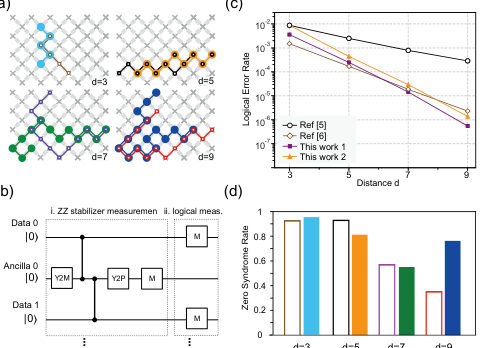 
FIG. 5. Implementation of the single-cycle qubit-flip repeti- tion code and the scaling of the logical error rate. (a) Topol- ogy of the repetition code chains with distances d = 3, 5, 7, 9. Each distance group contains two different chains. (b) Parity- check circuit including state preparation, entanglement, and measurement. (c) Scaling of the logical error rate with code distance d. Purple squares and orange triangles are the two testing groups of this work. Open circles and diamonds are the surface-code logical error rates per cycle versus code dis- tance reported by Refs. [5] and [6], respectively, and are shown only as an external reference; they are not the same metric as the...

**Summary.** This paper tackles the scaling bottleneck in superconducting quantum processors by quantifying the impact of parallel operations and parameter drift. It establishes measurable operating rules—such as minimum coupler separation for CZ gates and error-budget-driven refresh schedules—that automate calibration. These rules enable high-fidelity quantum operations on large-scale devices.

**Why it may be interesting.** It provides concrete, experimentally grounded protocols for maintaining coherence and fidelity in large superconducting quantum systems, which is critical for scaling quantum computation beyond current proof-of-concept stages.

Detailed structure

**Main problem.** The paper addresses the challenges of scaling superconducting quantum processors by developing quantitative rules to manage crosstalk from parallel operations and temporal drift of control parameters during automated calibration.

**Main result.** The derived rules allow for high-fidelity state preparation (e.g., 89.64% fidelity for a six-qubit GHZ state) and significantly reduce single-qubit error rates on large processors.

**Method.** The authors used Cross-Entropy Benchmarking (XEB) to quantify gate fidelity under varying parallel densities and implemented continuous monitoring to derive error-budget-based refresh priorities.

**Model / system.** The work is performed on superconducting quantum processors, specifically utilizing a 66-qubit device with a tunable-coupler architecture, which is tested up to 337 qubits.

**Key observables.** Zero-noise-extrapolated fidelity, single-qubit error rate ($\epsilon$), and the minimum required coupler-graph distance ($d_C$).

**Important parameters / regimes.** Concurrency density of calibration tasks and the refresh priority assigned to individual control parameters.

**Assumptions / limitations.** The study assumes that calibration choices can be converted from heuristic guidelines into measurable, quantitative operating rules based on error budgets.

**Figures summary.** Figures illustrate the full calibration workflow, comparing XEB Pauli error distributions under different parallel densities, and showing the time evolution of key control parameters exhibiting measurable drift.

**Paper structure.** The paper systematically analyzes system-level limitations (crosstalk and drift), develops quantitative metrics for these limitations, and concludes by implementing an automated framework based on these derived rules.

Abstract

As superconducting quantum processors scale toward hundreds of qubits, manual calibration becomes increasingly costly and difficult to sustain. Here we address two system-level factors governing automated calibration, namely, crosstalk induced by parallel operations and temporal drift of control parameters. On a 66-qubit superconducting processor, cross-entropy benchmarking shows that single-qubit calibration tolerates full-chip concurrency with minimal fidelity loss, whereas CZ calibration requires a minimum coupler-graph distance of four to avoid elevated control errors. Continuous monitoring of representative qubit and coupler parameters further yields quantitative refresh rules that assign refresh priority by error-budget consumption. These results turn two conventionally heuristic choices, the concurrency density of calibration tasks and the refresh priority of each control parameter, into measurable operating rules. Implemented within an automated calibration framework, the rules support a six-qubit Greenberger-Horne-Zeilinger state with a zero-noise-extrapolated fidelity of 89.64%, distance-dependent logical-error suppression in a single-cycle repetition-code benchmark, and a reduction of the mean single-qubit error from 0.023 to 0.011 on a 337-qubit processor, providing an experimentally grounded reference for the automated calibration and maintenance of current and future large-scale superconducting quantum systems.

[↑ back to top](#top)

### [A quasiparticle-protected superconducting qubit](http://arxiv.org/abs/2610.12227v1)

**Authors:** Trond Hjerpekjøn Haug, Johan Kolvik, Joey Frey, Paul Burger, Fabian Resare, Witlef Wieczorek, Simone Gasparinetti, Per Delsing, Raphaël Van Laer  
**Type:** experiment · **Category:** quantum information and computing · **PDF:** <https://arxiv.org/pdf/2610.12227v1>  
**Analysis basis:** full PDF text, analyzed in chunks
**Topic relevance:** 🔥 `QC/QI experiment` **4/5** · `correlated / nonlocal dissipation` **1/5** · `quantum optics experiment` **1/5**

📷 Fig 1

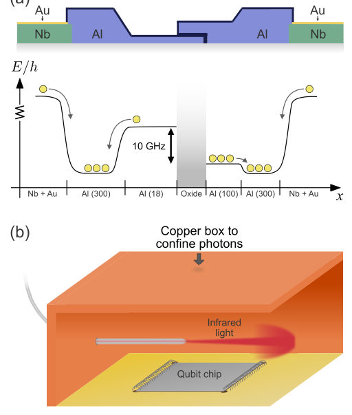 
FIG. 1. Device design and optical-illumination setup. (a) Schematic of the materials near a transmon Josephson junction (top) and the corresponding QP energy landscape (bottom). Film thicknesses are not to scale. Al and AlOx are shown in light and dark blue, respectively, with Al thicknesses in nm indicated in parentheses. Quasiparticles are depicted as yellow spheres and are expected to preferentially relax into the lowest-gap Al regions, here the thick Al bandages away from the tunnel barrier. (b) Optical-illumination setup. In- frared light is guided through an optical fiber into the copper package containing the qubit chip. Reflections from the cop- per enclosure distribute the light...

📷 Fig 2

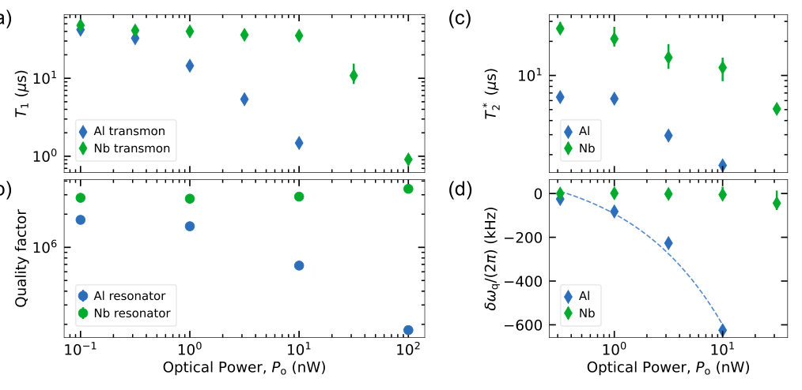 
FIG. 2. Coherence and frequency response under optical illumination. (a) T1 times of the Al and Nb transmons and the Al resonator versus optical power at the fiber tip. Qubit T1 values are extracted from exponential fits to population decay traces averaged over at least 2000 repetitions. For the Nb transmon, vertical bars indicate the spread across three series of measurements performed on different days. (b) Internal quality factor for resonators made from Al and Nb. (c) Ramsey coherence time T ∗ 2 versus optical power, with both qubits operated at their maximum frequency. (d) Qubit frequency shift extracted from Ramsey measurements. The dashed curve shows a fit δωq ∝√Po, expected when the...

📷 Fig 3

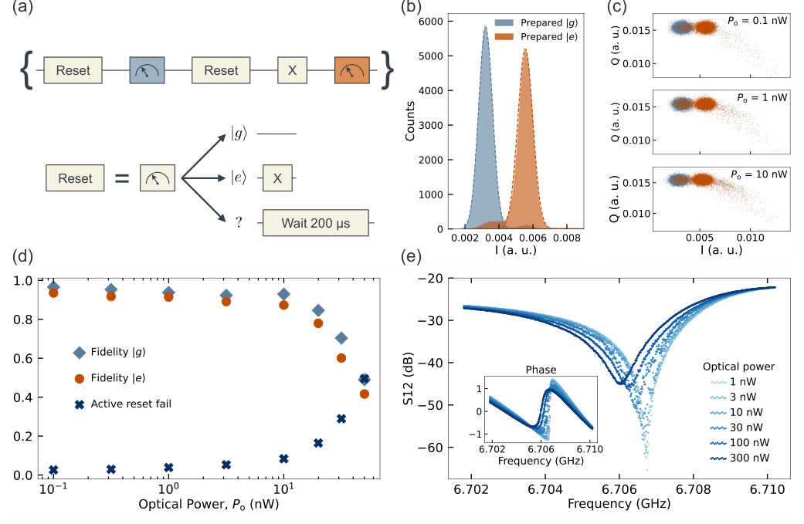 
FIG. 3. Qubit readout under optical illumination. (a) Protocol for state-preparation and measurement (top) and active reset (bottom). The protocol in the curly brackets is repeated 106 times without gaps between iterations. (b) Readout distributions following reset and preparation in |g⟩or |e⟩. Dashed lines represent Gaussian fits to the distributions. (c) Distribution of the first 104 shots in the IQ plane for three different levels of optical power. The long tail at large I-quadrature values is attributed to transmon states outside the qubit manifold. (d) SPAM fidelity and fraction of resets triggered by out- of-manifold outcomes. (e) VNA response of the readout resonator coupled to the...

📷 Fig 4

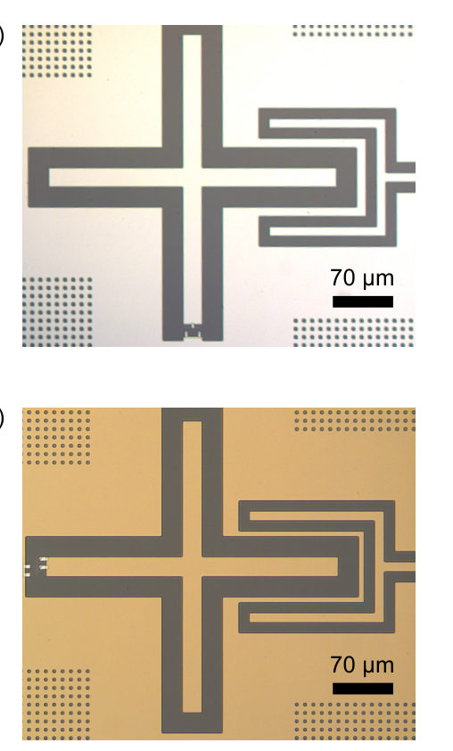 
FIG. 4. Optical micrographs of (a) the Al transmon and (b) the Nb transmon in this study.

📷 Fig 5

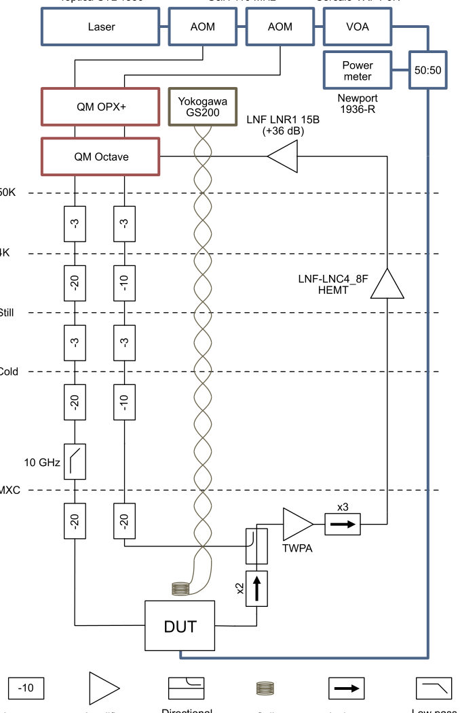 
FIG. 5. Wiring diagram of the measurement setup. Baseband signals are generated by the OPX+ controller from Quantum Machines and sent to the Octave instrument hosting the LO and IQ mixers for up-conversion to microwave signals. The OPX+ is also used to control the acousto-optic modulators (AOMs) which generate optical pulses by periodically blocking the laser. The laser power is controlled by a variable optical attenuator from a separate computer. Signals from the device under test (DUT) are amplified by a traveling-wave parametric amplifier (TWPA) and a high-electron-mobility transistor (HEMT) low-noise amplifier before exiting the cryostat. Numbers on input lines represent attenuation in...

**Summary.** This research addresses the vulnerability of superconducting qubits to quasiparticle poisoning from optical fields. By engineering the superconducting material's energy landscape beyond the Josephson junction, the authors developed a Niobium-based transmon that resists optical power-induced relaxation significantly better than standard aluminum devices. This demonstrates a crucial pathway for building more robust, scalable quantum processors.

**Why it may be interesting.** This work directly addresses hardware limitations in superconducting quantum computing by providing an experimental method to enhance qubit coherence against environmental noise sources like optical fields, which is critical for scaling quantum processors.

Detailed structure

**Main problem.** Superconducting qubits are highly susceptible to decoherence and errors caused by quasiparticle (QP) poisoning from high-energy radiation and optical fields.

**Main result.** Engineering the quasiparticle energy landscape beyond the Josephson junction, using a Niobium ground plane, increased the qubit's resilience to optical power by over an order of magnitude compared to all-Aluminum devices.

**Method.** The study involves fabricating and characterizing superconducting transmon qubits under varying levels of near-infrared optical illumination, measuring coherence times and frequency shifts.

**Model / system.** The platform is superconducting transmon qubits, comparing an all-Aluminum (Al) device against a novel Niobium (Nb)/Au device. The engineering focuses on controlling the QP energy landscape surrounding the Josephson junctions.

**Key observables.** Relaxation time ($T_1$), coherence time ($T^*$), QP-induced frequency shift ($\delta\omega_q$), and the onset of excess relaxation as a function of optical power.

**Important parameters / regimes.** Near-infrared optical power ($P_o$), gap engineering parameters ($\delta\Delta$), and the material choice (Al vs. Nb).

**Assumptions / limitations.** The primary assumption is that engineering the QP energy landscape can physically separate the qubit from the sources of poisoning, although dephasing remains vulnerable.

**Figures summary.** Figures compare $T_1$ and $T^*$ degradation versus optical power for Al and Nb transmons, demonstrating the superior resilience of the Nb device. Simulations also model resonator quality factor ($Q$) dependence on QP sheet resistance.

**Paper structure.** The paper establishes the problem of QP poisoning, details the novel Nb/Au device structure, presents comparative measurements showing enhanced resilience, and concludes that gap engineering beyond the junction is crucial for robust quantum processors.

Abstract

Superconducting quantum circuits underpin large-scale quantum processors and are increasingly interfaced with optical systems, yet they are vulnerable to quasiparticle poisoning from high-energy radiation and optical fields. Gap engineering of Josephson junctions suppresses quasiparticle-induced relaxation, but quasiparticles near the junction can still shift the qubit frequency and cause phase errors. Here, we extend gap engineering beyond the junction using a flux-tunable transmon with a gold-on-niobium ground plane and island and strongly gap-engineered aluminum junctions designed to keep quasiparticles away from the junction leads. Compared with an all-aluminum transmon with nominally identical junctions, we demonstrate that the niobium device withstands more than an order of magnitude higher near-infrared optical power before excess relaxation appears. The Nb transmon shows no resolvable quasiparticle-induced frequency shift over the same power range. At the same time, we observe that dephasing and state-preparation-and-measurement infidelity increase with optical power even while relaxation remains protected. These results suggest that engineering the quasiparticle energy landscape beyond the junction can substantially increase qubit resilience, not only to radiation-induced error bursts, but also to nearby optical fields.

[↑ back to top](#top)

### [Sub-MHz SWAP spectroscopy of two-level systems in superconducting qubits](http://arxiv.org/abs/2610.11125v1)

**Authors:** Joaquin Minguzzi, John Clai Owens, Oskar Painter, Matthew H. Matheny, Loren J. Swenson  
**Type:** experiment · **Category:** quantum information and computing · **PDF:** <https://arxiv.org/pdf/2610.11125v1>  
**Analysis basis:** full PDF text, analyzed in chunks
**Topic relevance:** 🔥 `QC/QI experiment` **4/5** · `correlated / nonlocal dissipation` **1/5** · `quantum measurements` **1/5**

📷 Fig 1

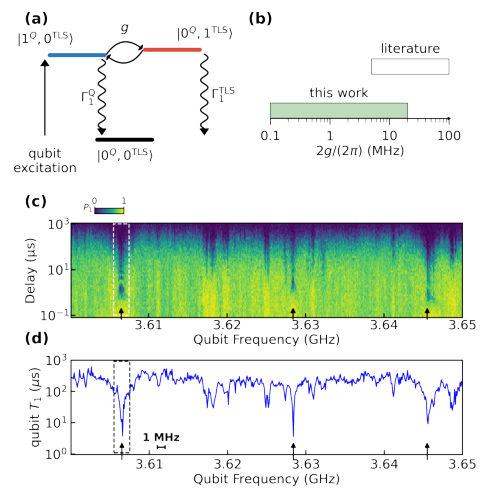 
FIG. 1. TLS detection with SWAP spectroscopy. (a) Energy- level diagram for the qubit (blue) and TLS (red), showing qubit excitation, coupling g, and the qubit and TLS energy- relaxation rates ΓQ 1 and ΓTLS 1 . (b) Previous work (litera- ture) reported qubit-TLS coherent oscillations at swap rates 2g/(2π) ≳5 MHz; this work (green) extends coherent detec- tion down to 0.1 MHz. (c) Raw SWAP spectroscopy data showing the qubit excited-state population P1 (color scale) versus qubit frequency and delay (logarithmic scale). Black arrows mark Rabi chevrons from coherent TLSs. (d) Qubit T1 spectrum (logarithmic scale) from exponential-decay fits to each frequency slice of (c); the same TLSs (black...

📷 Fig 2

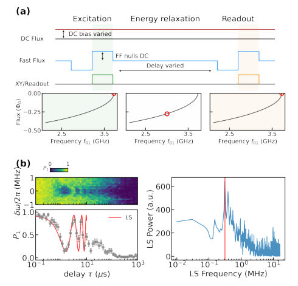 
FIG. 2. Fast-flux-assisted (FFA) SWAP spectroscopy and Lomb–Scargle analysis. (a) Pulse sequence. DC flux sets the spectroscopy frequency, and two short fast flux pulses bring the qubit to its flux-insensitive sweet spot for excitation and readout. Each pulse uses net-zero shaping: an inverted half of equal area precedes the half that nulls the DC bias. The fast flux is off during the variable delays, allowing energy relaxation to be probed with sub-MHz frequency resolution over millisecond interaction times. The lower panels show the flux-to-frequency tuning curve at each stage of the FFA pulse sequence, with the qubit operating point (red circles) alternating between the sweet spot at...

📷 Fig 3

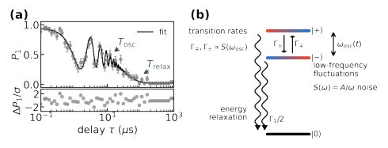 
FIG. 3. Analysis of the qubit-TLS Rabi exchange dynam- ics within the dressed-state picture. (a) Fit (black curve) to the P1 time trace (grey markers) on resonance, δω = 0, of the Rabi chevron in Fig. 2(b), using a model that com- bines an oscillatory decay with decay time Tosc and a purely exponential decay with relaxation time Trelax (arrows). The strip below shows the residuals ∆P1 = P1 −P fit 1 , normalized by the per-point error bar σ. The delay τ axis is logarith- mic. (b) Dressed-state energy-level diagram of the interact- ing qubit-TLS system at the TLS resonance, δω = 0. The dressed states |±⟩, colored with opposite blue-to-red gradi- ents to indicate the equal mixing of qubit and...

📷 Fig 4

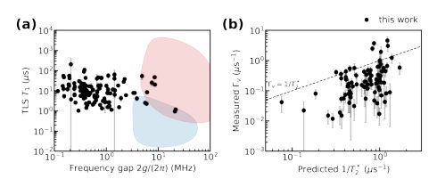 
FIG. 4. Energy relaxation, decoherence and frequency gap of the qubit-TLS Rabi chevrons detected with FFA-SWAP spectroscopy. (a) TLS relaxation time T TLS 1 versus the fre- quency gap 2g/(2π) for the 118 detected TLSs. Each value is deduced from the relaxation time Trelax of the two-component fit at the TLS resonance, after subtracting the qubit contribu- tion 1/T Q 1 as described in the text. The blue and red shaded regions mark the parameter ranges of the strongly coupled TLSs reported in Ref. [18] and Ref. [14], respectively, an or- der of magnitude stronger in coupling than the TLSs detected here. (b) Dressed-gap decoherence rate Γv = Γosc −Γrelax versus the qubit Ramsey rate 1/T ∗ 2...

**Summary.** This paper reports on an advanced SWAP spectroscopy technique to study TLS defects in superconducting qubits. By using fast flux pulses, the researchers achieved unprecedented sensitivity, detecting coherent TLS dynamics at very low coupling strengths. This work significantly advances the understanding of decoherence mechanisms, which is crucial for building reliable quantum computers.

**Why it may be interesting.** This work provides a highly sensitive experimental platform for characterizing decoherence sources in superconducting qubits, directly impacting the feasibility and fidelity of quantum computation.

Detailed structure

**Main problem.** The primary challenge is mitigating energy loss from Two-Level System (TLS) defects in superconducting qubits while achieving high-resolution spectroscopy of these defects.

**Main result.** The authors successfully detected coherent TLS dynamics at swap rates as low as 0.1 MHz, revealing TLSs with a median energy-relaxation time of 10 microseconds.

**Method.** They introduced a fast flux pulse sequence for SWAP spectroscopy, allowing for fine frequency resolution and long interaction times to probe weak coupling regimes.

**Model / system.** The system involves flux-tunable superconducting qubits coupled to TLS defects. The dynamics are analyzed using a dressed-state picture, fitting the coherent swap oscillations to extract relaxation times.

**Key observables.** Rabi chevrons, swap rates (0.1 MHz), TLS energy-relaxation time ($T_{relax}$), and swap coherence time ($T_{osc}$).

**Important parameters / regimes.** Sub-MHz frequency resolution, detection of coherence at rates an order of magnitude lower than previously reported.

**Assumptions / limitations.** The analysis relies on fitting the time-domain population decay ($P_1(	au)$) to a three-component model involving oscillation, relaxation, and background decay.

**Figures summary.** Figures illustrate the SWAP spectroscopy technique, comparing previous detection limits ($\gtrsim 5$ MHz) to the new capability ($\downarrow 0.1$ MHz), and show the fitted time traces revealing oscillations and exponential decay.

**Paper structure.** The paper progresses from introducing the problem of TLS loss to detailing the novel fast-flux pulse sequence, presenting the measurements of low-rate Rabi chevrons, and finally analyzing the extracted coherence and relaxation times.

Abstract

An outstanding challenge in superconducting quantum circuits is mitigating loss from two-level system (TLS) defects. SWAP spectroscopy with flux-tunable qubits can detect individual TLSs, but the Rabi chevrons that signal coherent exchange have been observed only for the most strongly coupled defects. Here, we introduce a sequence with fast flux pulses only at state preparation and readout, switched off during the energy-relaxation delay for finer frequency resolution and longer interaction times. We detect Rabi chevrons at swap rates as low as 0.1 MHz, an order of magnitude lower than previously reported. In the dressed-state picture, we fit the coherent swap oscillations to extract the TLS energy-relaxation time. These Rabi chevrons reveal coherent TLSs with a median energy-relaxation time of 10 microseconds, at coupling strengths previously associated with incoherent TLSs. The swap coherence times exceed the qubit T2* limited by flux noise, indicating that the dressed gap protects them from low-frequency 1/f noise.

[↑ back to top](#top)

### [Quickly extracting fidelity decay rates in random circuit benchmarking experiments](http://arxiv.org/abs/2610.11540v1)

**Authors:** Ake Köhne, Stavros Efthymiou, Joanna Majsak, Jadwiga Wilkens, Bram Evert, Andrew D. Patterson, Jonas Helsen, Markus Heinrich, Ingo Roth  
**Type:** both · **Category:** quantum information and computing · **PDF:** <https://arxiv.org/pdf/2610.11540v1>  
**Analysis basis:** full PDF text, analyzed in chunks
**Topic relevance:** 🔥 `QC/QI experiment` **4/5** · `quantum measurements` **1/5**

📷 Fig 1

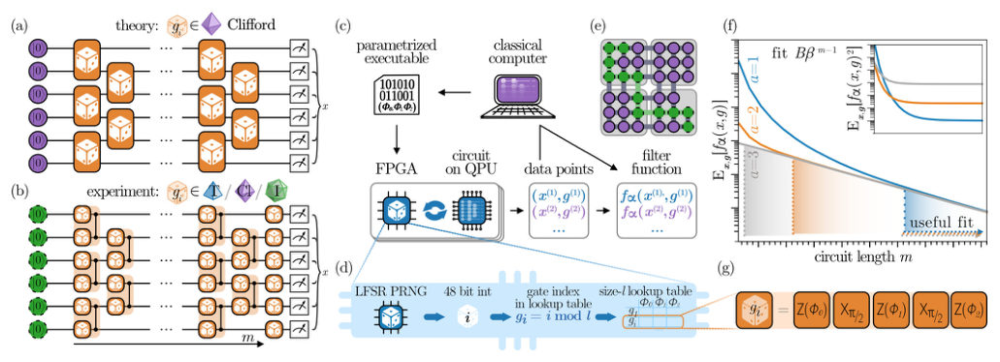 
Figure 1. Overview of setup. (a) Circuits used in simulations. Each random circuit instance g is constructed from a brickwork pattern of m layers of 2-qubit Clifford gates. (b) Circuits used in experiments. Each 2-qubit gate from (a) is now a layer of 1–qubit gates, each sampled from the ensemble (tetrahedral, Clifford or icosahedral), followed by a CZ gate. The last layer is followed by a layer of 1–qubit random gates. (c) Steps of the experiment exploiting on-chip randomness. The classical computer prepares a program where each random gate is parametrized by three angles ϕ0, ϕ1, ϕ2. The parametrized executable is uploaded to the FPGA, where the angles are randomly sampled. The FPGA sends...

📷 Fig 2

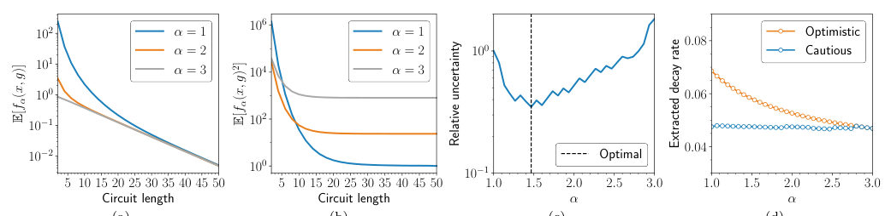 
Figure 2. Numerical evaluation of filtered RB for an open 1D brickwork circuit on 30 qubits, with local two-qubit Clifford gates interspersed with identical single-qubit depolarizing noise. The moments are evaluated exactly using local applications of Weingarten calculus and tensor-network contractions, as detailed in Appendix C. (a) Filtered RB signals, showing the reduction of the transient regime with increasing α and the nearly single-exponential decay of the trace filter α = 3. (b) Corresponding second moments. (c) Uncertainty of the decay-parameter estimate, normalized by the uncertainty for α = 1, showing an optimal value of around α = 1.5 for this setting. (d) Decay values extracted...

📷 Fig 3

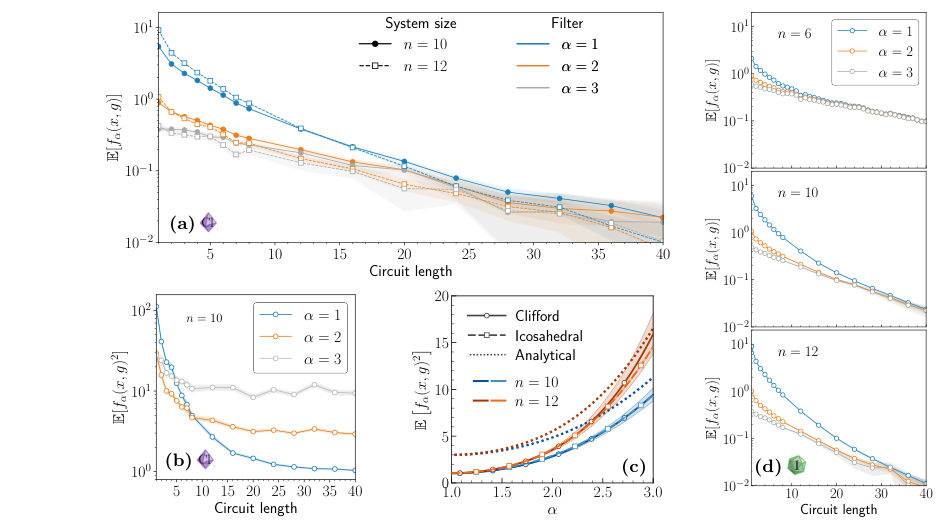 
Figure 3. Randomized benchmarking experiments performed on the Cepheus-1-36Q Rigetti device. We use random circuits as described in Figure 1b and show results for both the Clifford ensemble and the icosahedral ensemble. For n = 6, m ∈{1 . . . 40} and for n = 10/12 we have m ∈{1, 2, 3, 4, 5, 6, 7, 8, 12, 16, 20, 24, 28, 32, 36, 40}. For the number of circuits and shots, refer to Table I. Uncertainties are estimated using bootstrapping procedures and shaded areas represent 95%-uncertainty intervals. In panel (a) we show the first moments using the Clifford ensemble and in panel (b) we show the corresponding second moments for n = 10. In panel (c), we compare the estimated second moments for...

📷 Fig 4

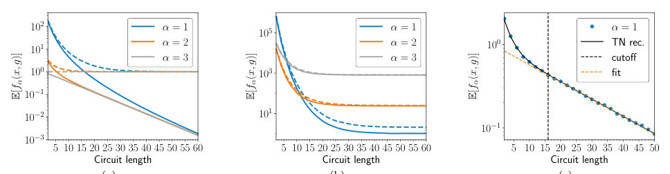 
Figure 4. Estimating the mixing length in practice. First (a) and second (b) moments of the RB signal for a brickwork circuit of the same construction as described in Figure 1b with the Clifford ensemble and n = 20. We show results for noiseless circuits (dashed line) and circuits where each brickwork is followed by single qubit depolarizing noise (p = 7.5 · 10−3) on each qubit (continuous line). (c) The cautious fitting approach applied to the 6-qubit RB data obtained on the emulator of IBM Guadalupe, the same data as discussed in Figure 7. The cutoff is estimated by the TN-based reconstruction method. A single exponential is fitted through the data in the fitting interval.

📷 Fig 5

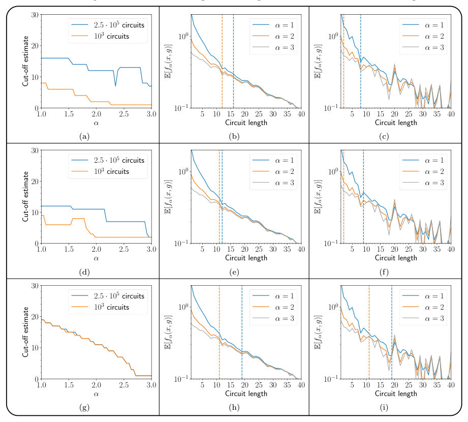 
Figure 5. Comparison of different methods to determine the cutoff point. For each method, we show the results when applied to two different RB curves. The RB curves originate from the 6-qubit Rigetti experiment with the icosahedral ensemble described in the main text. We use the results from both an experiment with 2.5 · 105 circuits per sequence length and from an experiment with 103 circuits per sequence length to investigate the robustness of the different methods. In panels (a,d,g), we show how the cutoff points depend on the filter function. In panels (b,e,h) we visualize the cutoff points for α = 1 and α = 2 for the experiment with 2.5 · 105 circuits and we do the same in panels...

**Summary.** This paper presents a new classical post-processing technique, the trace filter function, to overcome systematic biases in randomized benchmarking measurements. By suppressing transient decay modes, the method allows for accurate extraction of fidelity decay rates even when experimental circuits are too short for standard estimators to converge. This significantly extends the reliable characterization window for quantum hardware performance.

**Why it may be interesting.** This work provides a crucial algorithmic tool for characterizing decoherence in near-term quantum hardware, directly impacting the ability to benchmark quantum processors against theoretical limits.

Detailed structure

**Main problem.** The paper addresses the challenge of obtaining accurate, unbiased estimates of fidelity decay rates from randomized benchmarking (RB) experiments when transient modes bias standard short-depth measurements.

**Main result.** A novel 'trace filter function' post-processing technique is introduced that provably suppresses these transient modes, enabling reliable fidelity characterization at circuit depths inaccessible to conventional estimators.

**Method.** The authors develop and analyze a one-parameter family of estimators, culminating in the trace filter function, which is applied to the measured expectation values from random circuits.

**Model / system.** The work is validated using experiments on a superconducting processor (Rigetti) for one-dimensional circuits up to 12 qubits, utilizing random Clifford circuits generated via brickwork patterns.

**Key observables.** Fidelity decay rate ($eta$), transient modes, and the variance of the estimators.

**Important parameters / regimes.** The filter parameter $\alpha$, the circuit depth ($m$), and the qubit number ($n$).

**Assumptions / limitations.** Assumptions include time-stationary Markovian gate-dependent noise and local-symmetry assumptions for the noise model.

**Figures summary.** Figures illustrate the experimental setup (simulated and physical circuits), the comparison of different methods for determining the mixing length, and the theoretical scaling of moment calculations.

**Paper structure.** The paper progresses from identifying the bias caused by transient modes in RB, introducing the interpolating estimator family, deriving the theoretical properties of the trace filter function (including its efficiency for local circuits), and validating the method with superconducting hardware experiments.

Abstract

Randomized benchmarking (RB) with structured circuits is experimentally scalable, but gives biased short-depth fidelity estimates because incomplete ensemble mixing introduces transient modes. Waiting for these transients to decay in deeper circuits can push the signal below the noise floor. This is a well-established obstacle, e.g. in linear cross-entropy benchmarking (LinXEB). Here we overcome this obstacle solely through classical post-processing. We introduce a one-parameter family of estimators that interpolate between the standard LinXEB-type post-processing and a new post-processing technique we call the trace filter function. Under practical assumptions, the trace filter function provably suppresses transient modes, exposing an interpretable fidelity decay at short depth, with theoretical guarantees comparable to standard RB, at the cost of an increased variance. We bound the variance, analyze the evaluation complexity of the new estimators, and develop practical post-processing algorithms. Experiments on a Rigetti superconducting processor validate the method for one-dimensional circuits of up to 12 qubits: where the standard estimator requires depth beyond a 40-layer experimental window, the trace filter function yields consistent estimates below 10 layers. Trace-filtered randomized benchmarking therefore extends reliable fidelity characterization to relevant structured circuit ensembles and short-depth regimes that are inaccessible to conventional estimators.

[↑ back to top](#top)

### [Residual-Guided Global-Drive Design in Trapped-Ion Quantum Simulators](http://arxiv.org/abs/2610.12314v1)

**Authors:** Yuanjing Zhang, Zewen Zhang  
**Type:** theory · **Category:** other · **PDF:** <https://arxiv.org/pdf/2610.12314v1>  
**Analysis basis:** full PDF text, analyzed in chunks
**Topic relevance:** 🔥 `analog quantum simulation` **4/5** · `QC/QI experiment` **1/5**

📷 Fig 1

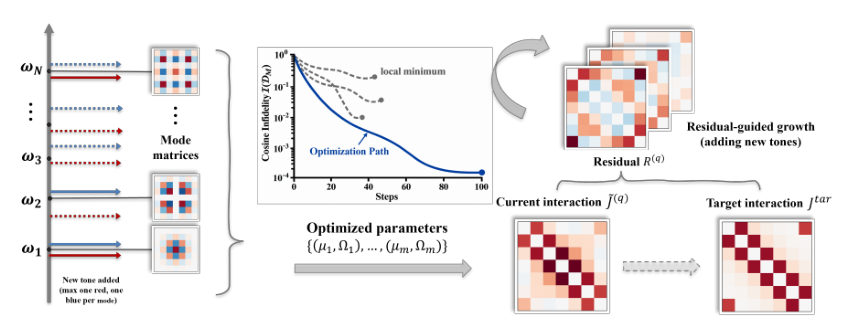 
Figure 1. Schematic workflow of global-drive Hamiltonian design using the residual-guided protocol. The left panel illustrates the procedure of selecting a subset of candidate tones from the mode spectrum, where solid arrows denote the chosen tones and dashed arrows mark the remaining tones in the pool. The selected tones are then used to synthesize the target Hamiltonian, with their µm and Ωm optimized toward the lowest infidelity achievable at the current step. As indicated in the right panel, the number of chosen tones increases along a residual-guided track and eventually reaches the tolerated infidelity. Although each tone’s detuning is constrained to remain sufficiently large, a...

📷 Fig 2

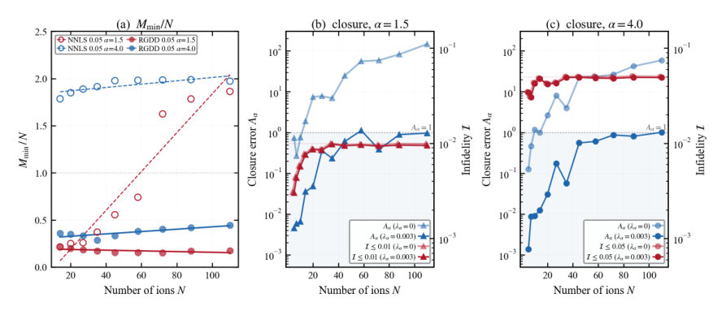 
Figure 2. Tone-count scaling, infidelity, and estimate of closure error for power-law targets. (a) Number of tones per ion Mmin/N versus ion number N for α = 1.5 (red) and α = 4.0 (blue) at the fidelity threshold I ≤0.05. Open markers with dashed lines: fixed-frequency NNLS baseline; filled markers with solid lines: RGDD results. The lines are linear fits. (b) and (c) Closure error Aα (left axis, blue) and infidelity I (right axis, red) versus N for α = 1.5 and α = 4.0, respectively. Light markers: unpenalized solutions (λα = 0); dark markers: closure-aware optimization (λα = 0.003). Infidelity curves in (b) and (c) are slightly offset for visibility.

📷 Fig 3

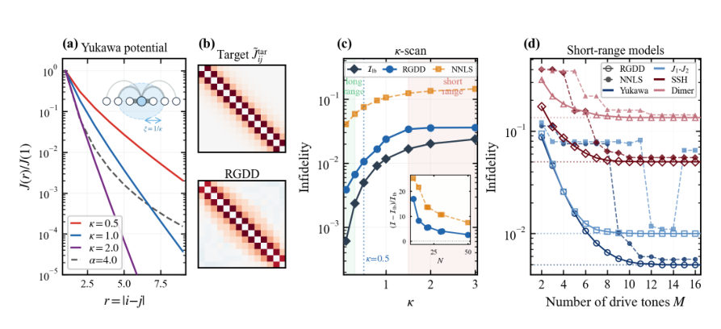 
Figure 3. (a) Yukawa interaction decay J(r)/J(1) for screening parameters κ = 0.5, 1.0, and 2.0, along with the power-law interaction with α = 4.0 for reference. Inset: schematic of Yukawa interactions with the screening cloud of extent ξ = 1/κ, where the bond width denotes the assigned weights. (b) Target ˜Jtar ij and the RGDD-achieved interaction matrix for κ = 0.5 with 14 global drives. (c) Infidelity versus κ at fixed M = 6: theoretical lower bound Ilb (diamonds), RGDD results (circles), and NNLS results (squares). Inset: relative gap (I −Ilb)/Ilb versus ion number N at κ = 0.5, M ≈0.2N. (d) Infidelity versus tone count M for four short-range targets at N = 14. Open markers and solid...

📷 Fig 4

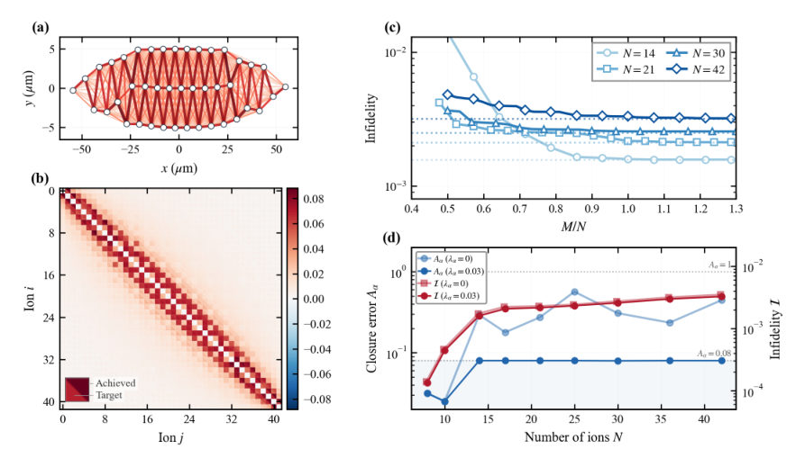 
Figure 4. (a) Target interaction Jtar ij ∝|ri −rj|−1.5 visualized as bonds on the 2D ion crystal (N = 42). Brightness and thickness reflect the coupling strength. (b) Split-cell interaction matrix for N = 42: the bottom-left triangles show the target ˜Jtar ij and the top-right triangles show the optimized ˜Jij at the lowest infidelity achieved with RGDD. (c) Infidelity I versus average tone count M/N for various N. Horizontal dotted lines mark the theoretical lower bound Ilb. (d) Closure error Aα (left axis, blue) and infidelity I (right axis, red) versus N at the optimized settings. Light markers: solutions with λα = 0. Dark markers: closure-aware optimization with λα = 0.03. Infidelity...

📷 Fig 5

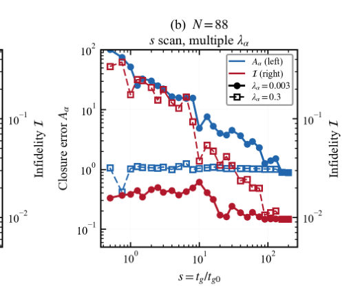 
Figure 5. Closure error Aα (left axis) and infidelity I (right axis) versus gate time ratio s = tg/tg0. Circles: λα = 0.003 (value used in the main text). Squares: λα = 0.3. (a) N = 45, (b) N = 88.

**Summary.** This paper presents Residual-Guided Drive Design (RGDD), a novel optimization protocol for engineering arbitrary interaction graphs in trapped-ion quantum simulators. RGDD iteratively adds laser tones to synthesize a target Hamiltonian while minimizing infidelity and controlling motional excitation errors. This scalable framework significantly expands the programmable capabilities of trapped-ion quantum computing platforms.

**Why it may be interesting.** This work directly addresses the engineering challenge of controlling complex many-body interactions in trapped ions, providing a scalable, systematic method for designing the required laser fields.

Detailed structure

**Main problem.** The central challenge is designing a compact set of global drive spectra to synthesize a target interaction Hamiltonian in trapped-ion quantum simulators with high fidelity.

**Main result.** The Residual-Guided Drive Design (RGDD) protocol systematically achieves near-theoretical fidelity bounds using a number of laser tones that scales nearly linearly with system size.

**Method.** RGDD is an incremental optimization strategy that iteratively adds global laser tones, guided by the residual error, to minimize the cosine infidelity between the synthesized and target interaction.

**Model / system.** The system is trapped-ion quantum simulators, where interactions are modeled using long-range Ising-type Hamiltonians generated by multi-tone global drive laser fields.

**Key observables.** Cosine infidelity ($I$), minimum number of tones ($M_{min}$), and residual motional excitation ($\alpha_k$).

**Important parameters / regimes.** Gate time ($t_g$), penalty coefficient ($\lambda_a$), and the ratio of gate time to baseline time ($s = t_g/t_{g0}$).

**Assumptions / limitations.** The accessible interaction space is fundamentally constrained by the native motional modes of the ion crystal.

**Figures summary.** Figures compare tone-count scaling (RGDD vs. NNLS) and closure error across different power-law targets; Figure 6 compares infidelity vs. tone count for RGDD versus equal-spacing placement.

**Paper structure.** The paper introduces the RGDD protocol, details the optimization objective incorporating a closure penalty, and then analyzes its performance by comparing it against baseline methods (like NNLS) and by investigating the trade-off between infidelity and closure error as a function of gate time.

Abstract

Trapped-ion quantum simulators are powerful platforms for exploring many-body physics, yet engineering of arbitrary interaction graphs remains a central challenge. To leverage the intrinsic structure of native motional modes and thereby enhance programmability, a residual-guided optimization protocol is introduced for the systematic design of multi-tone global drive spectra. While the achievable interaction fidelity is fundamentally bounded by the available motional modes, this adaptive strategy converges on the theoretical limit using a number of laser tones that scales nearly linearly with system size. The versatility of this method enables the synthesis of both long-range and traditionally difficult short-range coupling topologies. Additionally, by incorporating a penalty for residual motional excitation, the algorithm effectively mitigates errors associated with incomplete closure of phase-space trajectories. Overall, this scalable framework significantly expands the programmable capabilities of trapped-ion architectures while maintaining low computational overhead and high potential for experimental implementation.

[↑ back to top](#top)

### [Error-Corrected Memory and Logic on a Heavy-Hex Superconducting-Qubit Processor](http://arxiv.org/abs/2610.11658v1)

**Authors:** Campbell K. McLauchlan, Georgia M. Nixon, Julien M. Drouet, Xanda C. Kolesnikow, Seok-Hyung Lee, James Raftery, Karthik Siva, Stephen D. Bartlett, Benjamin J. Brown, Robin Harper  
**Type:** experiment · **Category:** quantum information and computing · **PDF:** <https://arxiv.org/pdf/2610.11658v1>  
**Analysis basis:** full PDF text, analyzed in chunks
**Topic relevance:** 🔥 `QC/QI experiment` **4/5**

📷 Fig 1

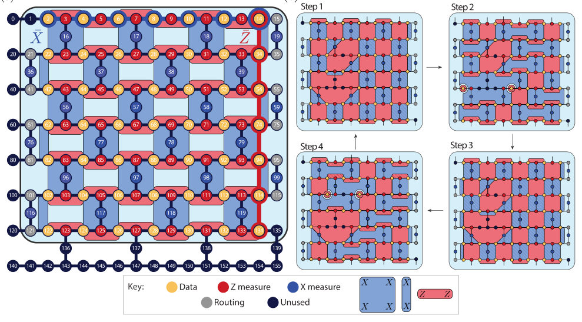 
FIG. 1. Dynamic compass code on the 156-qubit quantum processor ibm boston. (a) Arrangement of qubits and couplers on ibm boston, with the layout of the 7 × 7 dynamic compass code shown. Data qubits are shown in yellow, Z and X measure qubits in red and blue respectively, and qubits used only for routing and flag information in gray. The Z (X) checks of the code are shown with red (blue) plaquettes. The Z (X) logical operator of the code is shown with a red (blue) string and rings. The code arises from a four-step sequence of check operator measurements. (b) Syndrome extraction schedule of the dynamic compass code with underperforming qubits 85 and 46 excluded. In each step, shaded checks...

📷 Fig 2

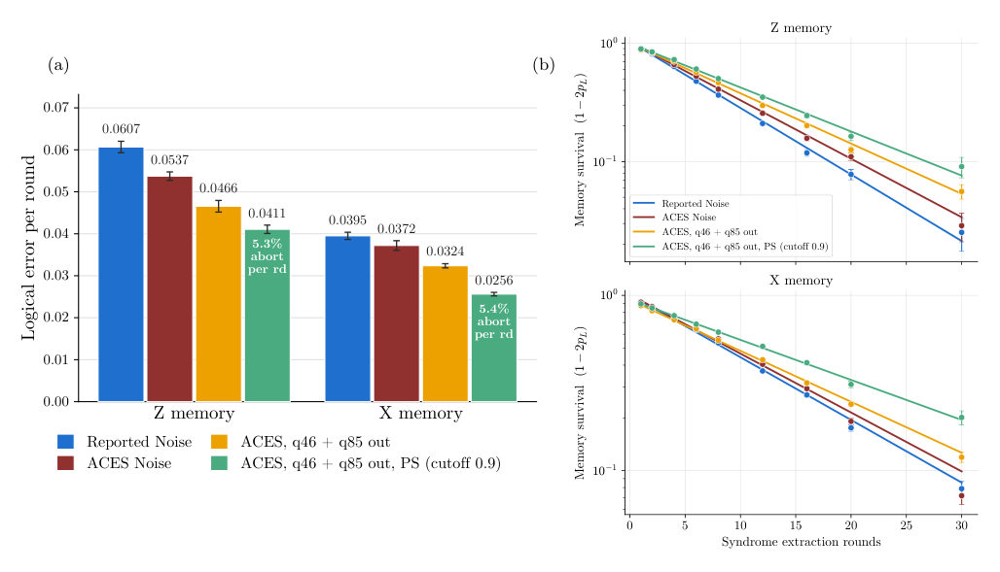 
FIG. 2. Memory experiments for 7 × 7 dynamic compass code. Results of memory experiments performed in both Pauli Z and X bases, comparing the improvements from decoder, code and post-selection modifications. (a) Logical errors per round for four different noise-informed strategies, reported in detail in Table II. First, we inform a BeliefMatching decoder with generic, IBM-reported noise information (blue data). We use this information to construct a Pauli error model (see Section IV A) that sets the prior probabilities in the belief propagation step. We compare this to a decoder that is provided ACES noise information (red data). The improved logical error probabilities indicate ACES offers...

📷 Fig 3

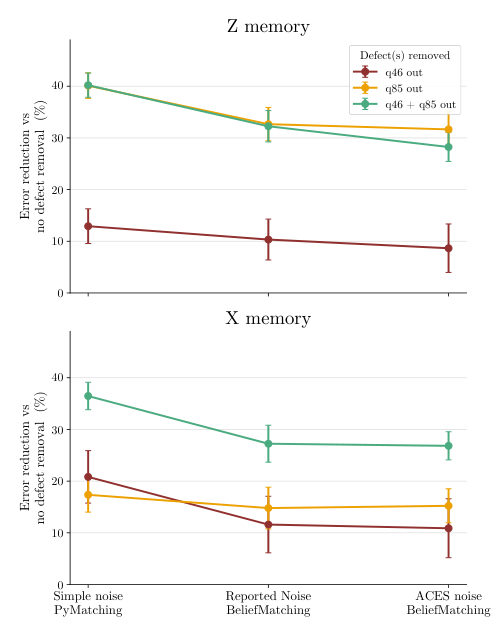 
FIG. 3. Defect exclusion and decoding strategies. We compare excluding no defects, excluding qubit 85, excluding qubit 46, or excluding both (this patch is shown in Fig. 1). We also compare three different decoders: PyMatching with a simple uniform noise model, BeliefMatching with a reported noise model, and BeliefMatching with an ACES-informed noise model. Even with better noise information and more accurate decoders, the gains of defect exclusion remain pro- nounced. We plot the percentage reduction in logical error per round compared to no defect-mitigation for the three de- fect exclusion choices and three decoders. Data was collected on 2026/05/02.

📷 Fig 4

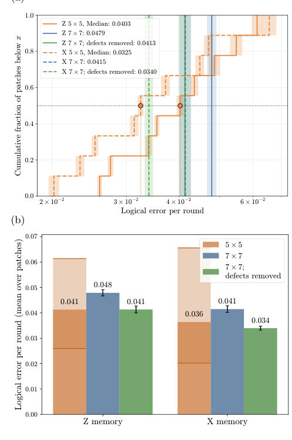 
FIG. 4. Scaling memory experiments. We show the logi- cal error per round for 5 × 5 and 7 × 7 codes, the latter both with and without defect mitigation. We use a BeliefMatching decoder and ACES noise information for all decoding. (a) Cu- mulative distributions of logical error per round, in Z and X memory, for nine 5×5-sized codes covering the footprint of the 7×7 patch. Median logical errors are highlighted with orange circles. We mark the logical error of 7 × 7 patches both with (green) and without (blue) defect mitigation, in both bases. Shaded regions indicate the uncertainty of that patch’s log- ical error per round. (b) Comparison of mean logical error over patches of size 5 × 5 and 7...

📷 Fig 5

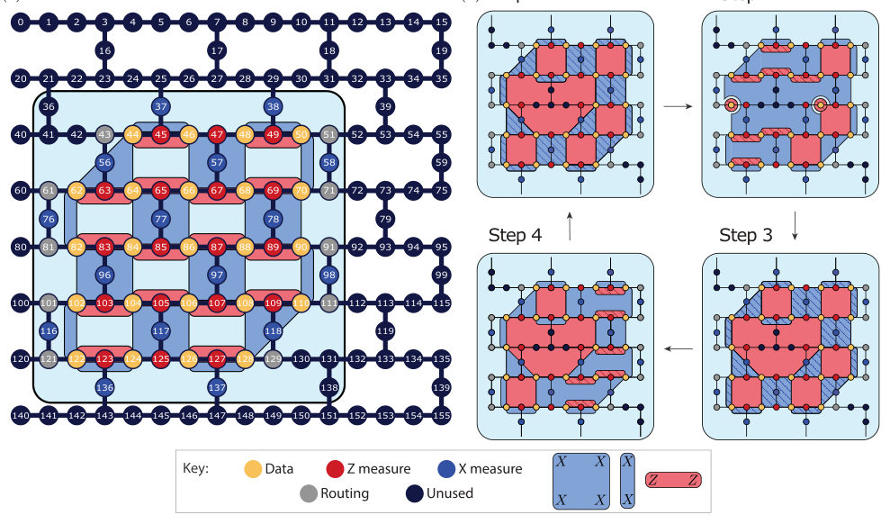 
FIG. 5. Stability experiment for the dynamic compass code on ibm boston. (a) We perform stability experiments using the 5× 5-sized patch shown in its location on the device. The qubit color conventions are the same as those used in Fig. 1. The product of X checks in any time step across the entire patch evaluates to +1 in the absence of noise. (b) We perform defect exclusion using the same methods as in memory experiments (see Section IV). Once excluding defective components around qubit 85 (excluded qubits shown in black), the period-4 measurement sequence is shown, with unshaded blue/red plaquettes indicating the X/Z members of the instantaneous stabilizer group, respectively. Shaded...

**Summary.** This paper reports on advanced error correction techniques applied to a large superconducting quantum processor. The researchers successfully implemented the dynamic compass code while actively compensating for hardware imperfections like underperforming qubits. By using noise-informed decoding and defect mitigation, they demonstrated that high-fidelity fault-tolerant memory and logic operations are achievable on monolithic, imperfect quantum chips.

**Why it may be interesting.** This work provides a concrete, hardware-aware roadmap for scaling quantum computation by directly addressing the practical limitations of superconducting chip fabrication, which is highly relevant to experimental quantum information scientists.

Detailed structure

**Main problem.** The primary challenge is achieving high-fidelity, fault-tolerant quantum computation and memory using superconducting qubits while accommodating unavoidable component heterogeneity.

**Main result.** The authors demonstrated that by combining noise-informed decoding, defect exclusion, and leakage post-selection, they maintained high performance, achieving logical error probabilities improvements of up to 35% and Bell fidelities above 97% for lattice surgery.

**Method.** They employed advanced noise-informed quantum error correction strategies, including using ACES-derived Pauli noise models and implementing defect exclusion and leakage pre-selection filtering.

**Model / system.** The work is performed on a superconducting-qubit processor with 156 qubits arranged on a heavy-hexagonal lattice, utilizing the dynamic compass code for error correction.

**Key observables.** Logical error probabilities (for memory), failure probability (for stability), and Bell fidelities (for lattice surgery).

**Important parameters / regimes.** The performance improvements are quantified relative to baseline measurements, showing gains up to 56% in stability experiments.

**Assumptions / limitations.** The performance gains rely on the successful combination of multiple advanced noise-informed quantum error correction strategies to mitigate component imperfections.

**Figures summary.** Figure 1 illustrates the dynamic compass code layout on the 156-qubit processor, detailing the syndrome extraction schedule and how underperforming qubits are excluded.

**Paper structure.** The paper details the implementation of the dynamic compass code on the physical hardware, presents results comparing various noise-informed decoding strategies (including defect exclusion and leakage post-selection), and demonstrates high-fidelity operations like lattice surgery.

Abstract

Large quantum computations require high-fidelity error-corrected memory and fault-tolerant logical operations. To achieve these with superconducting circuits, quantum processors will need many components operating with low error rates. In practice, fabrication of monolithic superconducting devices produces unavoidable heterogeneity in component performance, which the quantum computer must accommodate. We implement strategies to operate a large dynamic compass code on an array of 156 superconducting qubits arranged on a heavy-hexagonal lattice, making use of the entire monolithic quantum processor and redesigning our measurement schedule to exclude underperforming components. We demonstrate improvements of up to $35\%$ in logical error probabilities for a memory experiment by using a noise-informed decoder combined with strategies to exclude the worst-performing qubits and couplers, along with post-selecting on shots with a low probability of leakage errors. In addition to these memory results, we also observe performance gains of up to $56\%$ when these strategies are applied to measurement-based logic, demonstrated by stability experiments. We furthermore demonstrate high-fidelity fault-tolerant logic through lattice surgery. Through pre-selection filtering techniques, we can obtain Bell fidelities above $77\%$, and further logical gap post-selection using exclusive decoding increases these fidelities to above $97\%$. Our experiments demonstrate that high performance can be maintained in key elements of fault-tolerant quantum memory and logic when working on monolithic superconducting quantum processors with underperforming components, by using a suite of noise-informed quantum error correction strategies.

[↑ back to top](#top)

### [Topological Superradiant Universality Classes in Cavity-Mediated Spin Chains](http://arxiv.org/abs/2610.11495v1)

**Authors:** Yunhao Liu, Sheng Yang, Mingyuan Chen, Xue-Jia Yu  
**Type:** theory · **Category:** statistical mechanics · **PDF:** <https://arxiv.org/pdf/2610.11495v1>  
**Analysis basis:** full PDF text, analyzed in chunks
**Topic relevance:** `Dicke superradiance` **3/5** · `Tavis-Cummings & cavity-many-emitter` **3/5** · `analog quantum simulation` **3/5** · `correlated / nonlocal dissipation` **3/5** · `driven-dissipative phase transition` **3/5** · `methods for driven-dissipative` **3/5** · `non-equilibrium universality` **3/5** · `superradiant laser` **2/5**

📷 Fig 1

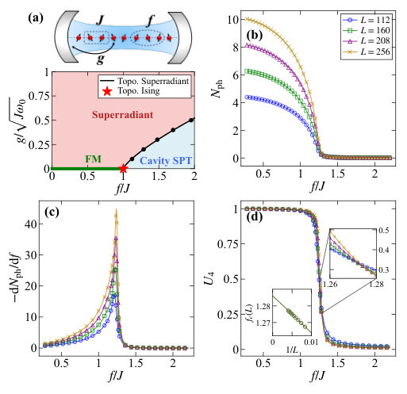 
FIG. 1. (a) Schematic of a cavity mode coupled to a cluster- Ising spin chain and the corresponding global ground-state phase diagram, featuring FM, superradiant, and cavity SPT phases. The red star and black line denote the topologi- cal Ising critical point and topological superradiant critical line, respectively. For g/√Jω0 = 0.2, (b) photon occupa- tion number Nph = ⟨a†a⟩and (c) its derivative with respect to f as functions of f for various system sizes. (d) Binder cumulant of the x-component of the spin magnetization as a function of f for various system sizes. The crossing of the curves locates the corresponding finite-size critical points fc(L). The inset shows the scaling of the...

📷 Fig 2

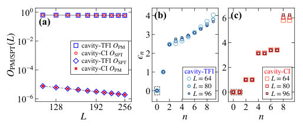 
FIG. 3. (a) Largest-distance (L/2) SPT and PM string or- der parameters as functions of the system size L at the cavity transverse-field Ising (cavity-TFI) and the cavity cluster-Ising (cavity-CI) superradiant QCP, respectively, for g/√Jω0 = 0.2, plotted on a log-log scale. Solid and dashed lines de- note power-law fits. Many-body energy spectra {ϵn} for L = 64, 80, 96 under OBC at the cavity-TFI (b) and cavity- CI (c) superradiant QCPs, with g/√Jω0 = 0.2 . The en- ergy spectra are rescaled as ϵn = (En −E0)/(E1 −E0) and ϵn = (En −E0)/(E2 −E0), respectively, in (b) and (c).

📷 Fig 3

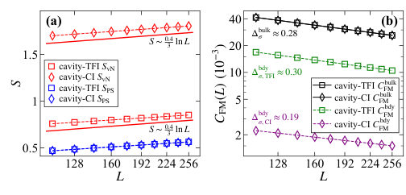 
FIG. 2. (a) Finite-size scaling of the entanglement entropies of the spin (SvN, red) and photon-spin (SPS, blue) sectors at the cavity transverse-field Ising (cavity-TFI, squares) and the cavity cluster-Ising (cavity-CI, diamonds) superradiant QCPs for g/√Jω0 = 0.2 . The two red solid lines are guides to the eye for ceff = 0.4 . (b) The largest-distance (L/2) bulk-bulk and bulk-boundary connected spin correlations as functions of the system size L at the two QCPs shown in (a), plotted on a log-log scale. Solid and dashed lines denote power-law fits.

📷 Fig 4

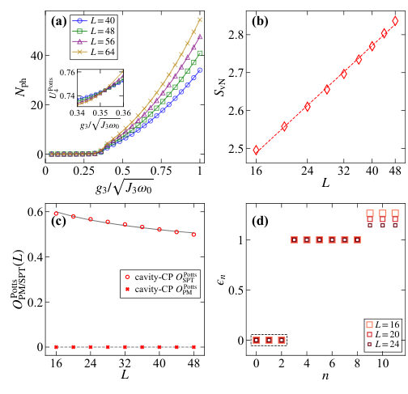 
FIG. 4. For fixed f3/J3 = 1.2: (a) Photon occupation number as a function of g3 for various system sizes, showing the cavity cluster-Potts superradiant transition upon tuning g3. The inset shows the crossing of the qutrit Binder cumulant, which determines the critical point at g3/√J3ω0 ≈0.353 . At the corresponding QCP, (b) finite-size scaling of the entanglement entropy SvN, (c) largest-distance (L/2) Z3 SPT and PM string operators as functions of the system size L, and (d) the OBC many-body energy spectrum for various system sizes L. Here, L denotes the number of unit cells throughout the figure. The energy levels are rescaled as ϵn = (En −E0)/(E3 −E0) in (d).

**Summary.** This work characterizes a novel class of topologically distinct superradiant quantum critical points in cavity-mediated spin chains. By analyzing edge degeneracies and comparing bulk versus boundary critical behavior, the authors prove that this criticality is fundamentally different from conventional transitions. This has implications for understanding topological order in open quantum systems.

**Why it may be interesting.** It bridges concepts from quantum optics (superradiance) with topological quantum matter, showing how topological invariants can characterize critical points in open quantum systems.

Detailed structure

**Main problem.** To investigate if superradiant phase transitions can exhibit topological universality classes distinct from conventional light-matter coupled systems.

**Main result.** The critical line separating the superradiant phase from the cavity topological phase is topologically nontrivial, evidenced by robust symmetry-protected edge degeneracies, and this criticality is generic for cluster-qudit chains.

**Method.** Numerical simulations, including Finite-size Density-Matrix Renormalization Group (DMRG) and analysis of entanglement entropies and energy spectra.

**Model / system.** The study uses cavity-mediated cluster-Ising chains (and generalizes to cluster-qudit chains) coupled to a single photon mode, described by a specific Hamiltonian involving cavity and spin interactions.

**Key observables.** Photon occupation number, entanglement entropies ($S_{	ext{spin}}$, $S_{	ext{photon-spin}}$), Binder cumulant, and boundary/bulk spin correlations.

**Important parameters / regimes.** Coupling strengths ($g, J, f$), photon frequency ($\omega_0$), and system size ($L$).

**Assumptions / limitations.** The analysis relies on comparing bulk critical properties with boundary/edge properties to diagnose topological differences.

**Figures summary.** Figures illustrate phase diagrams showing three distinct phases (FM, Superradiant, SPT), and show finite-size scaling of entanglement entropies and correlation functions confirming topological differences between models.

**Paper structure.** The paper systematically analyzes the phase diagram, using DMRG and finite-size scaling to distinguish between topologically trivial and non-trivial critical points in the superradiant transition.

Abstract

Superradiant phase transitions are fundamental phenomena in light-matter coupled systems. Here, we uncover a novel class of superradiant criticality that is topologically distinct from previously known superradiant transitions. Using cavity-mediated cluster-Ising chains as an illustrative example, we numerically demonstrate that the critical line separating the superradiant phase from the cavity topological phase hosts robust symmetry-protected edge degeneracies, a feature absent in conventional superradiant transitions. Remarkably, although its local bulk critical properties are indistinguishable from those of the previously identified topologically trivial superradiant transition, the two criticalities cannot be smoothly connected without breaking the protecting symmetries or passing through a multicritical point. We further show that such topological superradiant criticality is generic, also occurring in cavity-mediated $\mathbb{Z}_{n}^{}$ cluster-qudit chains, as supported by complementary lattice simulations.

[↑ back to top](#top)

### [Remote nonreciprocal magnon magnon entanglement via the Barnett effect with coherent feedback](http://arxiv.org/abs/2610.11607v1)

**Authors:** Jinhao Jia, Yingyu Li, Ran Liang, Qinghua Cai, Xin Wen, Mei Zhang  
**Type:** theory · **Category:** other · **PDF:** <https://arxiv.org/pdf/2610.11607v1>  
**Analysis basis:** full PDF text, analyzed in chunks
**Topic relevance:** `correlated / nonlocal dissipation` **3/5** · `driven-dissipative phase transition` **3/5** · `quantum measurements` **3/5** · `Keldysh / 2PI / non-Gaussian methods` **2/5** · `Tavis-Cummings & cavity-many-emitter` **2/5** · `analog quantum simulation` **2/5** · `methods for driven-dissipative` **2/5** · `non-equilibrium universality` **2/5** · `quantum optics experiment` **1/5**

📷 Fig 1

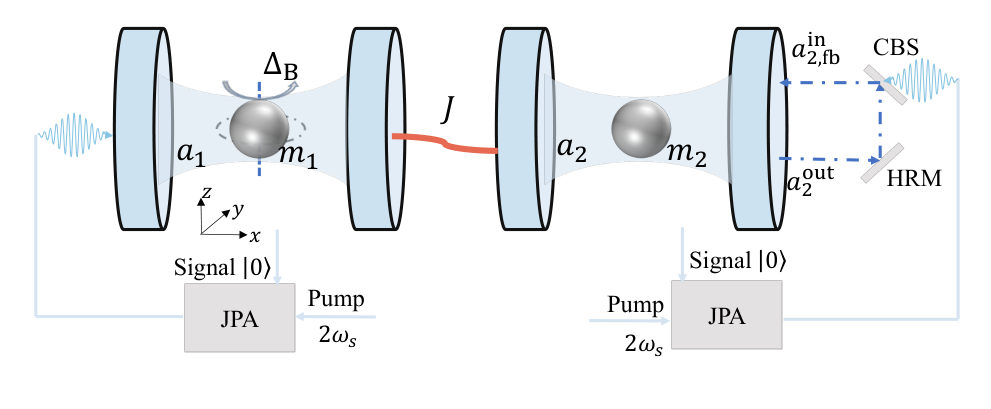 
Figure 1: Schematic of the proposed system. Two microwave cavities, coupled via a coaxial cable with strength 𝐽, support photon modes 𝑎𝑗and contain YIG spheres with magnon modes 𝑚𝑗(𝑗= 1, 2). The left sphere rotates about the 𝑧axis, inducing a Barnett shift Δ𝐵, while the right sphere remains stationary. Two JPAs, pumped at 2𝜔𝑠with vacuum signal inputs, generate independent squeezed vacuum fields centered at 𝜔𝑠. The right-cavity output 𝑎out 2 is reflected by a HRM, mixed with the second squeezed input at a CBS, and reinjected as 𝑎in 2,fb.

📷 Fig 2

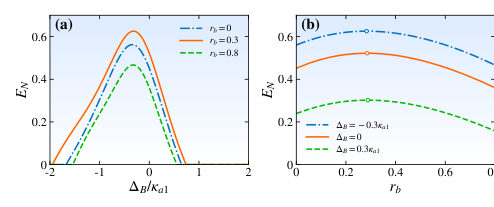 
Figure 2: Steady-state magnon–magnon entanglement 𝐸𝑁 versus (a) the Barnett shift Δ𝐵∕𝜅𝑎1 for 𝑟𝑏= 0, 0.3, 0.8, and (b) the feedback reflectivity 𝑟𝑏for Δ𝐵∕𝜅𝑎1 = −0.3, 0, 0.3. Open circles mark the maxima in panel (b). The other parameters are specified in the text.

📷 Fig 3

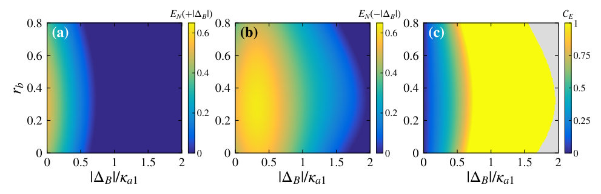 
Figure 3: Steady-state magnon–magnon entanglement 𝐸𝑁for (a) positive and (b) negative Barnett shifts, and (c) the bidirectional contrast ratio 𝐸, versus |Δ𝐵|∕𝜅𝑎1 and 𝑟𝑏. Gray regions in (c) indicate vanishing entanglement for both rotation directions, where 𝐸is undefined. Other parameters are the same as in Fig. 2.

📷 Fig 4

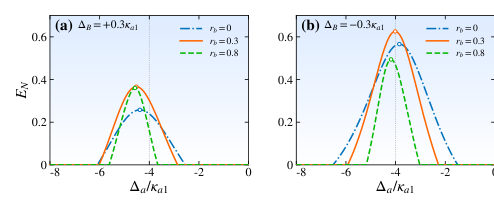 
Figure 4: Steady-state magnon–magnon entanglement 𝐸𝑁 versus the common cavity detuning Δ𝑎1 = Δ𝑎2 = Δ𝑎for (a) Δ𝐵= +0.3𝜅𝑎1 and (b) Δ𝐵= −0.3𝜅𝑎1. The curves correspond to 𝑟𝑏= 0, 0.3, 0.8. Open circles mark the maxima, and vertical dotted lines indicate Δ𝑎= −4𝜅𝑎1. Other parameters are the same as in Fig. 3.

📷 Fig 5

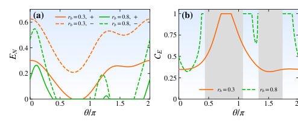 
Figure 5: (a) Steady-state magnon–magnon entanglement 𝐸𝑁 and (b) normalized contrast 𝐸versus the feedback phase 𝜃 for 𝑟𝑏= 0.3 (orange) and 𝑟𝑏= 0.8 (green), with |Δ𝐵| = 0.3𝜅𝑎1. Solid and dashed curves in panel (a) correspond to positive and negative Barnett shifts, respectively. Gray regions in panel (b) indicate undefined contrast at 𝑟𝑏= 0.8, where entanglement vanishes for both signs. Other parameters are the same as in Fig. 4.

**Summary.** This theoretical study proposes a controllable method to generate remote nonreciprocal entanglement between magnons in a coupled cavity system. By leveraging the Barnett effect and implementing coherent quantum feedback, the authors show that the entanglement can be selectively generated for one direction of the applied magnetic field while suppressing it in the opposite direction. This offers a versatile platform for quantum information processing using magnonic circuits.

**Why it may be interesting.** This work is highly relevant to AMO physics as it combines several advanced topics: cavity quantum electrodynamics (magnonics), non-Hermitian physics (via feedback), and the study of quantum correlations (entanglement) in solid-state systems.

Detailed structure

**Main problem.** The paper addresses the generation and control of remote nonreciprocal magnon-magnon entanglement in a coupled cavity magnonic system.

**Main result.** They demonstrate that nonreciprocal entanglement can be achieved by tuning the system parameters, specifically showing that entanglement exists for one direction of the bias magnetic field while vanishing for the opposite.

**Method.** The analysis uses Quantum Langevin Equations (QLEs) to model the system dynamics and quantifies entanglement using the logarithmic negativity of the magnon covariance matrix.

**Model / system.** The system consists of two microwave cavities coupled to YIG spheres (one rotating, one stationary) and driven by squeezed vacuum fields, incorporating the Barnett effect and a coherent feedback loop.

**Key observables.** Magnon-magnon entanglement ($E_N$), Asymmetry Contrast ($\xi_E$), and critical temperatures for entanglement vanishing.

**Important parameters / regimes.** Cavity detuning, feedback phase, relative squeezing phase, squeezing factors ($R_1, R_2$), and the sign of the Barnett shift ($\Delta B$).

**Assumptions / limitations.** The analysis assumes a lossless feedback loop and neglects propagation delay.

**Figures summary.** Figures illustrate the dependence of entanglement ($E_N$) on the relative squeezing phase, feedback reflectivity ($r_b$), squeezing factors ($R_1$), and temperature ($T$) for both positive and negative Barnett shifts.

**Paper structure.** The paper develops the theoretical model using QLEs, derives the necessary steady-state covariance matrix equations, and then systematically analyzes the entanglement measure ($E_N$) as a function of control parameters to establish the nonreciprocal control scheme.

Abstract

We propose a scheme for generating and controlling remote nonreciprocal magnon--magnon entanglement in a cavity magnonic system with coherent feedback.The two microwave cavities are driven by independent single-mode squeezed vacuum fields, with a rotating YIG sphere in the left cavity and a stationary one in the right cavity. For a fixed rotation direction, reversing the bias magnetic field applied to the rotating sphere changes the sign of the Barnett shift, leading to nonreciprocal magnon--magnon entanglement. By tuning the cavity detuning and feedback phase, entanglement can be generated for one direction of the bias magnetic field while it vanishes for the opposite direction, yielding complete nonreciprocity. Coherent feedback enhances the entanglement at an appropriate reflectivity, whereas stronger feedback can reduce it. The relative squeezing phase provides additional control, and an appropriate choice of unequal squeezing factors improves the entanglement at fixed total input photon occupation. With the squeezed inputs kept fixed, moderate feedback also increases the critical temperature for magnon entanglement.Our results provide a controllable approach to preparing remote nonreciprocal quantum correlations in cavity magnonic systems.

[↑ back to top](#top)

### [Probing and Manipulating Quantum Materials with Strong-field Terahertz and Mid-infrared Radiation](http://arxiv.org/abs/2610.11126v1)

**Authors:** S. J. Li, H. Y. Wu, S. J. Zhang, Y. T. Li  
**Type:** both · **Category:** strongly correlated electrons · **PDF:** <https://arxiv.org/pdf/2610.11126v1>  
**Analysis basis:** full PDF text, analyzed in chunks
**Topic relevance:** `Keldysh / 2PI / non-Gaussian methods` **3/5** · `driven-dissipative phase transition` **3/5** · `methods for driven-dissipative` **3/5** · `non-equilibrium universality` **3/5** · `quantum measurements` **2/5** · `analog quantum simulation` **1/5** · `correlated / nonlocal dissipation` **1/5** · `interference shaping light` **1/5** · `quantum optics experiment` **1/5** · `scars & prethermalization` **1/5**

📷 Fig 1

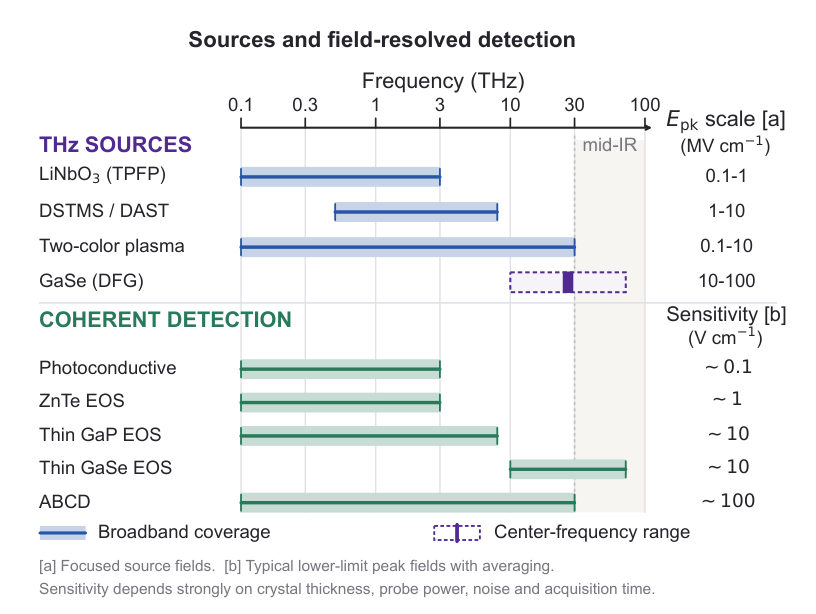 
Figure 1: Representative frequency coverage of intense laser-driven terahertz sources and coherent detection

📷 Fig 2

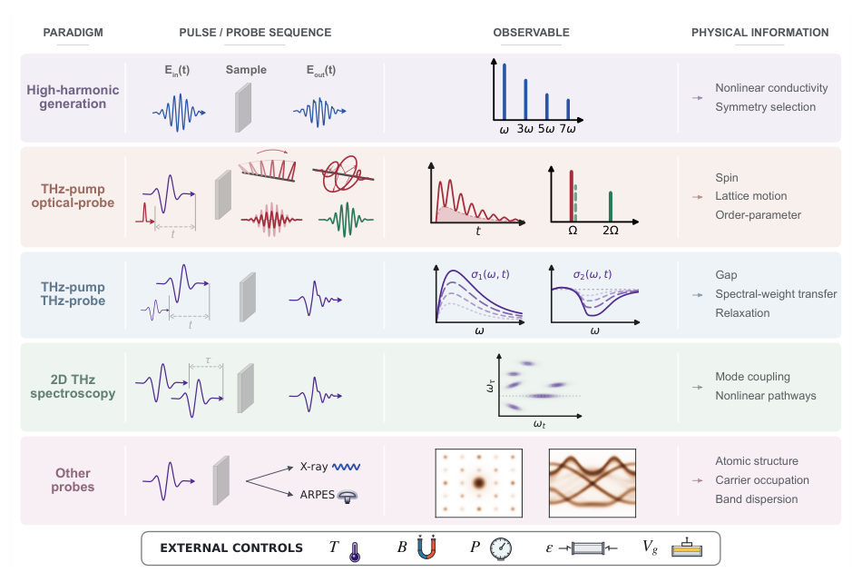 
Figure 2: Experimental paradigms for nonlinear THz spectroscopy and control. These representative measure-

**Summary.** This review surveys how strong-field Terahertz and Mid-infrared radiation are used to probe and manipulate emergent phenomena in quantum materials. By employing nonlinear spectroscopy, researchers can access complex dynamics related to coupled electronic, lattice, and superconducting orders. The work highlights the potential of these techniques to control material properties by driving systems far from equilibrium.

**Why it may be interesting.** The techniques described—using intense, tunable THz/MIR fields to drive systems nonlinearly—are highly relevant to open quantum systems and quantum optics, as they represent coherent, non-equilibrium driving protocols for many-body systems.

Detailed structure

**Main problem.** The central problem is identifying and controlling emergent phenomena in quantum materials by understanding the complex interactions among various degrees of freedom (charge, spin, orbital, lattice). This control is crucial for tailoring material properties.

**Main result.** Strong-field THz and MIR radiation can drive quantum materials far from equilibrium, allowing for the transient reshaping and manipulation of ordered electronic and lattice states.

**Method.** The work reviews techniques using nonlinear THz/MIR spectroscopy, including 2D spectroscopy and time-resolved measurements, to probe these complex dynamics.

**Model / system.** The study covers diverse quantum materials, including superconductors (cuprates, $	ext{MgB}_2$), topological insulators, ferroelectrics ($	ext{SrTiO}_3$), and semiconductors (GaAs). The physics involves coupled electronic, lattice, and superconducting order parameters.

**Key observables.** Nonlinear conductivity, order-parameter dynamics (e.g., Higgs mode), gap/spectral-weight transfer, and symmetry-sensitive responses.

**Important parameters / regimes.** Strong-field THz and Mid-infrared radiation intensity, frequency, and phase coherence.

**Assumptions / limitations.** Linear spectroscopy is insufficient for disentangling complex interactions, and the analysis often relies on semiclassical or anharmonic potential expansions.

**Figures summary.** Figure 1 illustrates the frequency coverage of intense THz sources and detection methods. Figure 2 summarizes nonlinear THz spectroscopy paradigms, linking techniques (like THz-pump/THz-probe) to physical information (like gap dynamics).

**Paper structure.** The review surveys progress by first establishing the need to probe coupled degrees of freedom. It then details the experimental platforms (THz/MIR sources, detection) and progresses through specific physical phenomena, such as nonlinear electronic dynamics, collective mode coupling, and symmetry-sensitive responses.

Abstract

Emergent phenomena in quantum materials arise from interactions among different degrees of freedom. Identifying these interactions and establishing their roles in ordered states are central problems in condensed-matter physics and provide a basis for controlling material properties. Many relevant low-energy excitations and gaps lie in the terahertz (THz) and mid-infrared (MIR) range, where intense phase-stable fields can both interrogate nonlinear dynamics and drive selected degrees of freedom far from equilibrium. This review surveys recent progress in probing and manipulating quantum materials with strong-field THz and MIR radiation, with emphasis on nonlinear electronic dynamics, collective-mode coupling, symmetry-sensitive responses and field-induced changes in electronic structure and ordered states. Particular attention is given to developments enabled by the Synergetic Extreme Condition User Facility (SECUF).

[↑ back to top](#top)

### [Controlling transitions between nonequilibrium states through active bath engineering](http://arxiv.org/abs/2610.11831v1)

**Authors:** Dima Boriskovsky, Salambô Dago, Cyriaque Genet, Rémi Goerlich, Vincent Hardel, Paul-Antoine Hervieux, Harry L. F. Ip, Giovanni Manfredi, Laurent Mertz  
**Type:** both · **Category:** statistical mechanics · **PDF:** <https://arxiv.org/pdf/2610.11831v1>  
**Analysis basis:** full PDF text, analyzed in chunks
**Topic relevance:** `correlated / nonlocal dissipation` **3/5** · `driven-dissipative phase transition` **3/5** · `methods for driven-dissipative` **3/5** · `non-equilibrium universality` **3/5** · `Keldysh / 2PI / non-Gaussian methods` **2/5** · `quantum measurements` **2/5** · `analog quantum simulation` **1/5** · `scars & prethermalization` **1/5**

📷 Fig 1

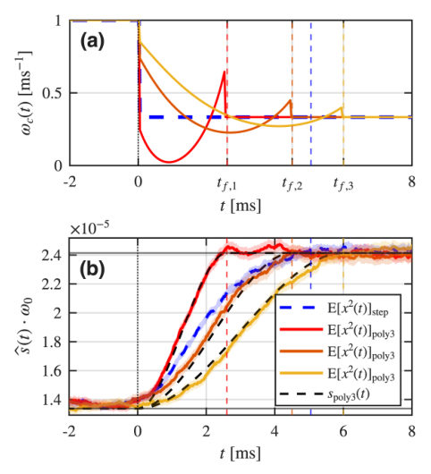 
FIG. 1: NESS-to-NESS transition control. (a) Third-order polynomial control protocols ωc(t) for expansion with transition times tf = 2.60, 4.50, and 6 ms, compared with an instantaneous STEP protocol (blue dashed curve). (b) Corresponding experimental normalized variances ˆs(t) together with the analytical predictions of Eq. (9) (black dashed curves). Vertical dashed lines mark the prescribed tf, shaded regions indicate standard errors, and horizontal lines denote the NESS values ˆsi,f (Eq. (6)). Experimental parameters are D = 1.41 × 10−4 µm2/ms, ω0 = 0.49 ms−1, α = 0.01 Hz, and ωc is varied between 1 and 1

📷 Fig 2

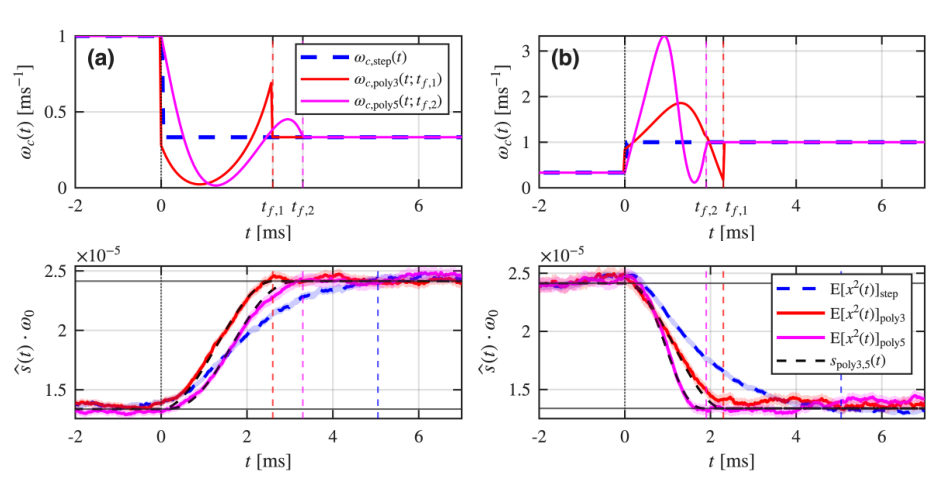 
FIG. 2: Accelerated NESS transitions. Noise-color protocols ωc(t) (upper row, solid curves) and corresponding normalized ensemble-averaged variances ˆs(t) obtained from experimental trajectories (lower row), compared with an instantaneous STEP protocol (blue dashed curves). Black dashed curves show the analytical predictions of Eqs. (9) and (10), and shaded regions indicate standard errors. Horizontal lines indicate the initial and final NESS values ˆsi,f (Eq. (6)). (a) Expansions ∆ˆs &gt; 0, employing third and fifth-order protocols (p3, pcts 5 ), with tf,1 = 2.60 ms and tf,2 = 3.30 ms respectively. (b) Compressions ∆ˆs &lt; 0, with tf,1 = 2.30 ms and tf,2 = 1.90 ms. Both compared to a STEP...

📷 Fig 3

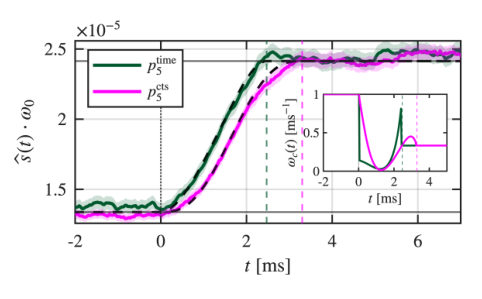 
FIG. 3: Time-optimized fifth-order protocol ptime 5 (green), with (a1, a2) = (−0.55, −0.85), compared with the continuous protocol pcts 5 (magenta) for an expansion process (cf. Fig. 2(a)). Black dashed curves show the analytical prediction of Eq. (10), and shaded regions indicate standard errors. The optimized transition time tf = 2.47 ms, compared with tf = 3.30 ms for pcts 5 (horizontal dashed lines). The inset shows the corresponding control functions ωc(t). Both protocols are performed at their speed limit tf ≳tmin f . Experimental parameters are as in Fig. 1.

📷 Fig 4

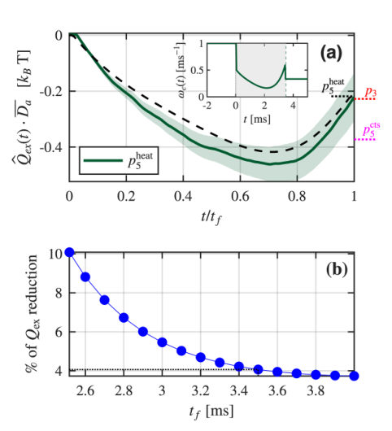 
FIG. 4: (a) Normalized excess heat (Eq. 11) for the heat-optimal protocol pheat 5 with tf = 3.50 ms and (a1, a2) = (−0.25, −1.05); Da is the experimental average active diffusion coefficient (to restore units of energy); the inset shows the corresponding control function ωc(t). Solid line shows the experimental average, shaded region denotes standard errors, and black dashed line indicates the analytical solution. Horizontal dotted lines compare analytical accumulated excess heats (at t = tf) with p3 and pcts 5 . Experimental parameters are as in Fig. 1. (b) Excess heat reduction of heat-optimized pheat 5 versus p3 protocols from Monte-Carlo simulations (M = 107), estimated over a range of...

📷 Fig 5

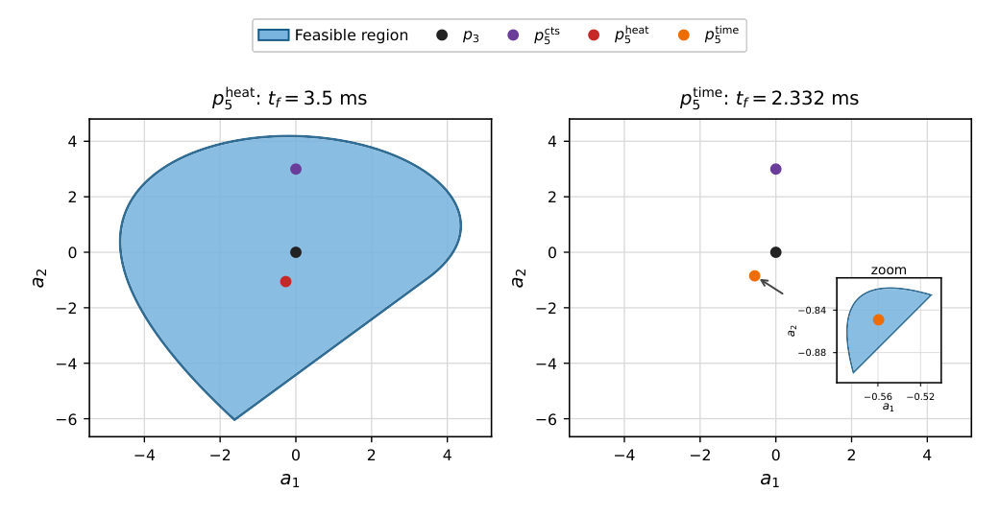 
FIG. 5: Feasible regions of the fifth-order coefficients for the expansion ωc : 1 →1/3 ms−1 at ω0 = 0.49 ms−1. The feasible region F(tf) of Eq. (24) (blue) for the heat optimization at tf = 3.5 ms (left) and the time optimization at tf = 2.332 ms (right). Markers show p3 (black), pcts 5 (purple), pheat 5 (3.5) (red, left), and ptime 5 (orange, right). The inset zooms in on the right region around ptime 5 .

**Summary.** This research introduces a method to control transitions between non-equilibrium steady states by actively engineering the noise correlations of the surrounding bath. Using a trapped particle model, the authors derive analytical protocols that allow for faster state changes than natural relaxation. The work is significant because it treats the bath's temporal correlations as a controllable parameter, enabling optimization of both speed and energy dissipation.

**Why it may be interesting.** This work directly addresses non-equilibrium dynamics far from equilibrium, providing a quantitative method to steer system states using engineered environmental correlations, which is highly relevant for understanding open quantum systems and dissipation engineering.

Detailed structure

**Main problem.** The paper develops and demonstrates control protocols for achieving finite-time transitions between active nonequilibrium steady states (NESSs).

**Main result.** By actively engineering the temporal correlations (noise color) of the bath, transitions can be achieved substantially faster than natural relaxation times, while also allowing optimization of thermodynamic costs.

**Method.** The core method involves reverse-engineering the required time-dependent correlation rate ($\omega_c(t)$) by solving the coupled differential equations governing the system's second moments (variance and covariance) based on a desired trajectory.

**Model / system.** The system is modeled as a particle undergoing an Active Ornstein-Uhlenbeck Process (AOUP) confined in a harmonic trap. The active bath is controlled by modulating the noise correlation rate $\omega_c(t)$.

**Key observables.** Normalized variance ($\hat{s}(t)$), excess heat ($\hat{Q}_{ex}$), and the transition duration ($t_f$).

**Important parameters / regimes.** Trap relaxation rate ($\omega_0$), active diffusion coefficient ($D_a$), and the control parameter $\omega_c(t)$.

**Assumptions / limitations.** The analysis relies on polynomial fitting (e.g., third- or fifth-order) to define the admissible control trajectories, and the system dynamics are analyzed via second moments.

**Figures summary.** Figures illustrate the comparison between polynomial control protocols ($p_3$, $p_5$) and instantaneous step protocols for achieving faster transitions, and show the optimization of excess heat and minimum transition time.

**Paper structure.** The paper first establishes the theoretical framework by deriving the moment equations and the required control law $\omega_c(t)$. It then develops and analyzes polynomial protocols ($p_3, p_5$) to achieve specific trajectories, followed by optimization procedures to minimize time or excess heat, culminating in experimental validation using a trapped colloidal particle.

Abstract

We develop a family of control protocols for finite-time transitions between active nonequilibrium steady states using the noise-color (correlation rate) as the sole control parameter. By reverse-engineering the second moment dynamics of an active Ornstein-Uhlenbeck process, we determine the time-dependent correlation rate required to realize a prescribed evolution of the system's state. We experimentally implement these protocols with a micrometer-sized optically trapped particle coupled to an engineered active bath, demonstrating transitions substantially faster than the natural relaxation while keeping the confining potential, noise amplitude, and temperature fixed. Our approach extends engineered swift-equilibration methods to far-from-equilibrium steady states by directly controlling the temporal correlations of an active environment. We show how physical constraints impose a speed limit on finite-time transitions, while the freedom in choosing the prescribed system evolution can be exploited to eliminate control discontinuities, minimize the admissible transition time, or optimize a thermodynamic cost.

[↑ back to top](#top)

### [Coherence-assisted quantum state preparation and thermal control through repeated interactions](http://arxiv.org/abs/2610.10794v1)

**Authors:** Alessandro Prositto, Dvira Segal  
**Type:** theory · **Category:** statistical mechanics · **PDF:** <https://arxiv.org/pdf/2610.10794v1>  
**Analysis basis:** full PDF text, analyzed in chunks
**Topic relevance:** `correlated / nonlocal dissipation` **3/5** · `driven-dissipative phase transition` **3/5** · `methods for driven-dissipative` **3/5** · `non-equilibrium universality` **3/5** · `quantum measurements` **2/5** · `Keldysh / 2PI / non-Gaussian methods` **1/5** · `analog quantum simulation` **1/5** · `scars & prethermalization` **1/5**

📷 Fig 1

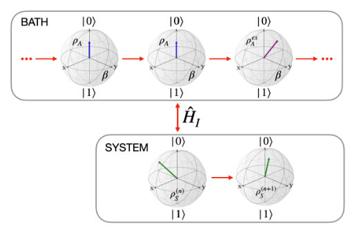 
FIG. 1: Diagram of the dynamics induced by sequential interactions with thermal ancillas at temperature 1/β. At each step n, the system evolves from state ρ(n) S to state ρ(n+1) S through an interaction with an ancilla in the Gibbs state ρA. Due to the interaction, the ancilla evolves into an “exhausted” state ρex A . The ancilla is replaced or refreshed before the next interaction. The system evolves towards the thermal state of temperature 1/β.

📷 Fig 2

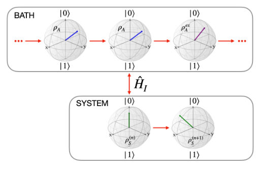 
FIG. 2: Diagram of system dynamics induced by sequential interactions with coherent ancillas. At each step n, the system evolves from state ρ(n) S to ρ(n+1) S through an interaction with a coherent ancilla in the initial state ρA. The ancilla evolves into an “exhausted” state ρex A . It is replaced or refreshed before the next interaction. The system evolves towards its fixed point, a state with nonzero coherence.

📷 Fig 3

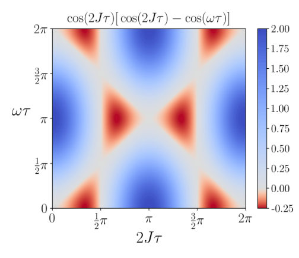 
FIG. 3: The cooling condition, f(2Jτ, ωτ) = cos(2Jτ)  cos(2Jτ) −cos(ωτ)  &gt; 0, see Eq. (21). Regions in blue indicate enhancing the ground state population of the system relative to the ancilla (cooling); regions in red represent domain where the opposite is true (heating).

📷 Fig 4

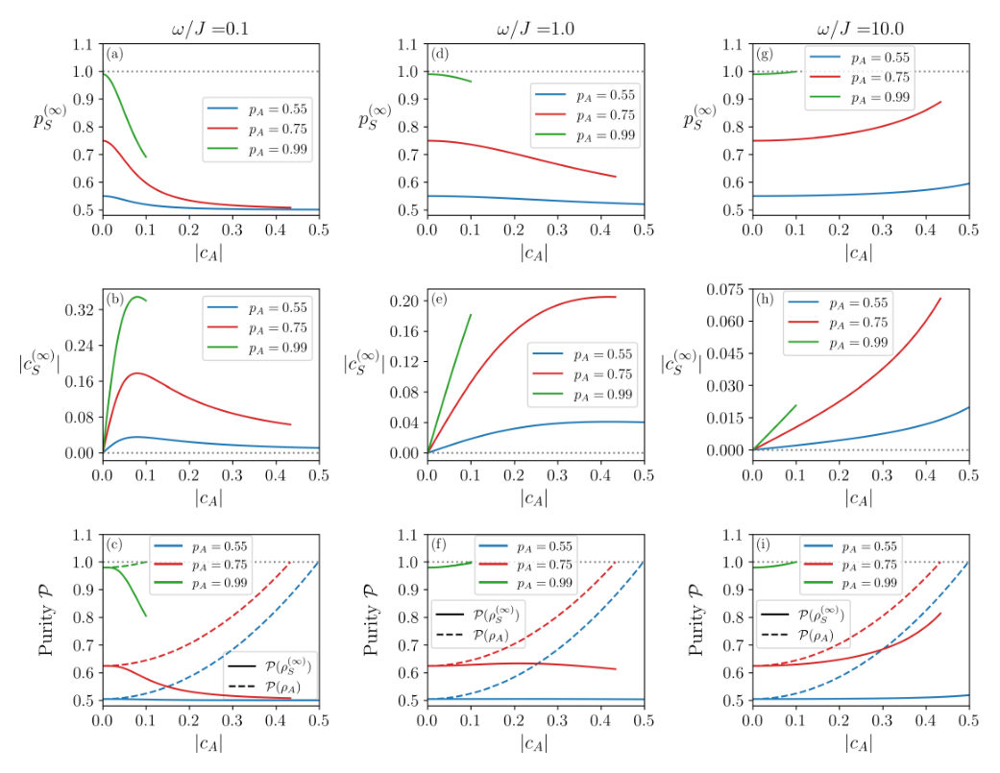 
FIG. 4: Impact of environmental coherence on populations (a,d,g), coherence (b,e,h), and purity (c,f,i) of the system at steady state, reported for different values of the ratio ω/J. In (c,f,i), we also show, as a dashed line, the purity of the environmental ancilla before a collision. We set J = 1 and τ = 0.1, varying ω ∈{0.1, 1, 10}. We selected three values for pA, i.e. the ground

📷 Fig 5

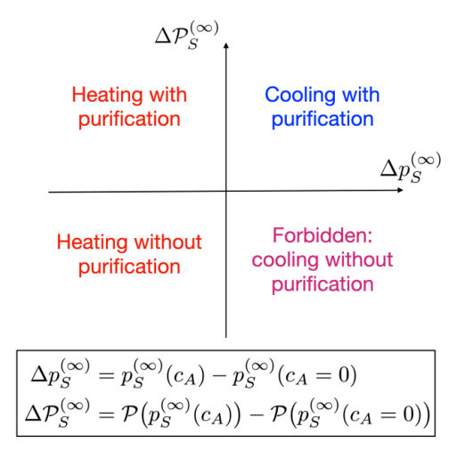 
FIG. 5: Summary of the different operating regimes of the coherent environment in relation to cooling and purification.

**Summary.** This theoretical paper analyzes a qubit interacting with a coherent environment through repeated collisions. It demonstrates that environmental coherence acts as a powerful resource, allowing the system to achieve steady states with enhanced purity and even cool below the bath temperature. Furthermore, it shows that this coherence can induce anomalous heat flow, controlled by the relative phase between system and ancilla coherence.

**Why it may be interesting.** This work directly addresses non-equilibrium thermodynamics and open quantum systems, showing how environmental correlations (coherence) can violate simple thermal assumptions to control energy flow and state preparation.

Detailed structure

**Main problem.** The paper investigates how environmental coherence influences the relaxation dynamics and steady state of a qubit interacting with a coherent environment via repeated interactions.

**Main result.** Environmental coherence acts as a quantum resource, enabling cooling below the bath temperature and allowing for anomalous heat flow whose direction depends on the relative phase of the coherence.

**Method.** The authors derive an exact analytical solution for the dynamics using the Markovian repeated-interaction (RI) framework, analyzing the evolution map $
ho^{(n+1)}_S = 	ext{Tr}_A \{ \hat{U}(	au) 
ho^{(n)}_S \otimes 
ho_A \hat{U}^\dagger(	au) \}$.

**Model / system.** The model consists of a single qubit (System, S) interacting sequentially with an ancillary qubit (Ancilla, A) via a flip-flop interaction Hamiltonian. The dynamics are treated as a Markovian process.

**Key observables.** System ground-state population ($p^{(n)}_S$), coherence ($c^{(n)}_S$), steady-state purity, and the direction/amount of heat transfer.

**Important parameters / regimes.** System-ancilla coupling strength ($J$), interaction time ($	au$), environmental coherence magnitude ($|c_A|$), and the relative phase between system and ancilla coherence.

**Assumptions / limitations.** The analysis assumes the system and ancilla are resonant ($\omega_S = \omega_A$) and that the process is Markovian (no memory effects between collisions).

**Figures summary.** The notes mention figures illustrating the required number of iterations ($n^*$) to reach steady state, showing it increases with environmental coherence, and plots showing the steady-state coherence and $l_1$-norm as a function of environmental coherence.

**Paper structure.** The paper introduces the model and derives the exact solution (Section II), investigates cooling below bath temperature and purity enhancement (Section III), and analyzes the thermodynamics and anomalous heat flow (Section IV).

Abstract

We investigate the relaxation dynamics and steady state of a qubit interacting with a coherent environment through an energy-conserving flip-flop interaction within the Markovian repeated-interaction framework. We derive an exact analytical solution for the evolving and stationary state, nonperturbative in the environmental coherence. We show that environmental coherence provides a resource for dissipative state preparation by expanding the set of accessible steady states. In particular, coherent ancillas can increase the system ground- state population beyond that of the bath, corresponding to an effective temperature below the bath temperature, and enhance its steady-state purity, with these effects controlled by the interplay between the system energy scale and the system-ancilla coupling. Nevertheless, we prove that the purity of the system can never exceed the purity of the ancilla. We further analyze the thermodynamics of the protocol and show that environmental coherence can modify and even reverse the natural direction of heat transfer, giving rise to anomalous heat flow. Remarkably, for fixed interaction parameters, the direction of the coherence-induced heat transfer is governed by the relative phase between the system and ancilla coherence, whereas their magnitudes determine the amount of heat exchanged. Our results establish environmental coherence as a resource for controlling steady-state preparation and energy transfer in repeated-interaction dynamics.

[↑ back to top](#top)

### [Helicity decoupling ultrastrong Rabi splitting from quantum vacuum dressing](http://arxiv.org/abs/2610.10944v1)

**Authors:** Ayoub El-Amrani, Nasir Boubekraoui, Zakaria Mzaouali, Houssam Sabri, Herschel Rabitz, Abdelouahed El Fatimy, Dukhyung Lee  
**Type:** both · **Category:** other · **PDF:** <https://arxiv.org/pdf/2610.10944v1>  
**Analysis basis:** full PDF text, analyzed in chunks
**Topic relevance:** `analog quantum simulation` **3/5** · `quantum optics experiment` **3/5** · `Tavis-Cummings & cavity-many-emitter` **2/5** · `driven-dissipative phase transition` **2/5** · `interference shaping light` **2/5** · `methods for driven-dissipative` **2/5** · `Keldysh / 2PI / non-Gaussian methods` **1/5** · `correlated / nonlocal dissipation` **1/5** · `quantum measurements` **1/5**

📷 Fig 1

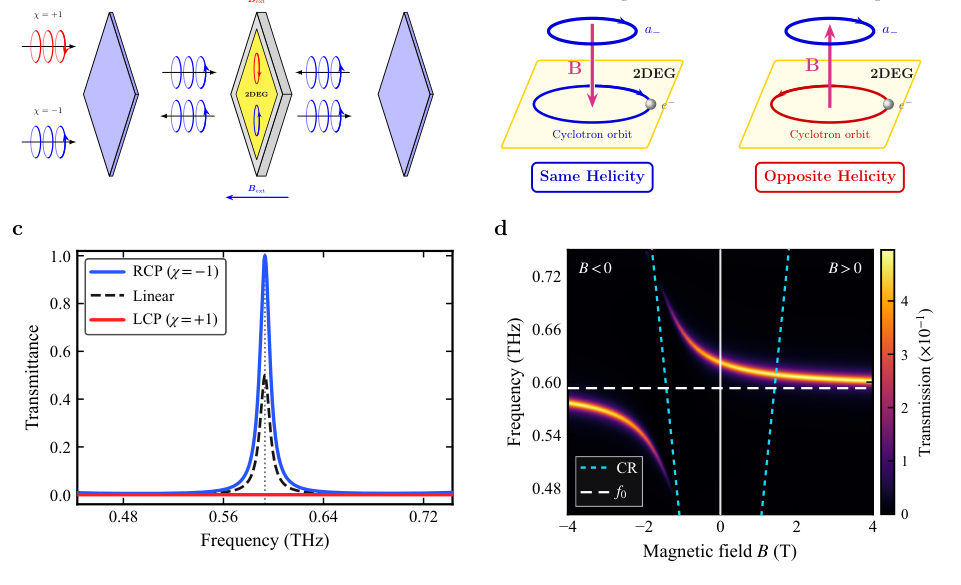 
Figure 1: Fixed-helicity cavity coupled to cyclotron resonance. a, Chiral photonic-crystal cavity containing the 2DEG. The cavity helicity is fixed, while reversal of B reverses the cyclotron motion. b, Single-helicity interaction scheme for the fixed cavity mode a−. For B &lt; 0, the cyclotron motion rotates in the same sense as a−, producing resonant excitation exchange. Reversing the magnetic field reverses the cyclotron rotation while leaving the cavity mode unchanged, so for B &gt; 0 the interaction becomes anti-resonant. c, Polarization-resolved passive-cavity transmission for RCP, LCP and linearly polarized excitation, showing an isolated RCP cavity resonance and strong suppression of the...

📷 Fig 2

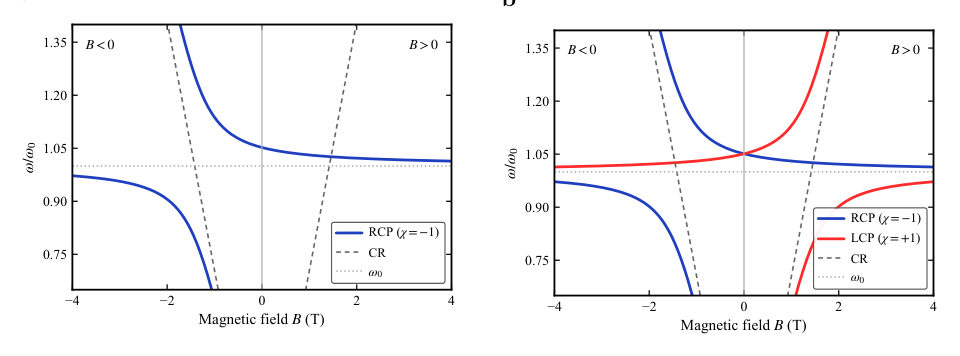 
Figure 2: Helicity reorganizes the ultrastrong-coupling spectrum. a, single helicity chiral cavity. For B &lt; 0, the cavity field and cyclotron motion rotate in the same sense and form upper and lower polaritons. For B &gt; 0, field reversal reverses the cyclotron motion but not the cavity mode, and the conventional avoided crossing disappears. b, Non-chiral cavity supporting both RCP (χ = −1) and LCP (χ = +1) modes, calculated with the same coupling strength g. For either magnetic field direction, one circular mode participates in resonant polariton formation while the other provides the anomalous interaction channel.

📷 Fig 3

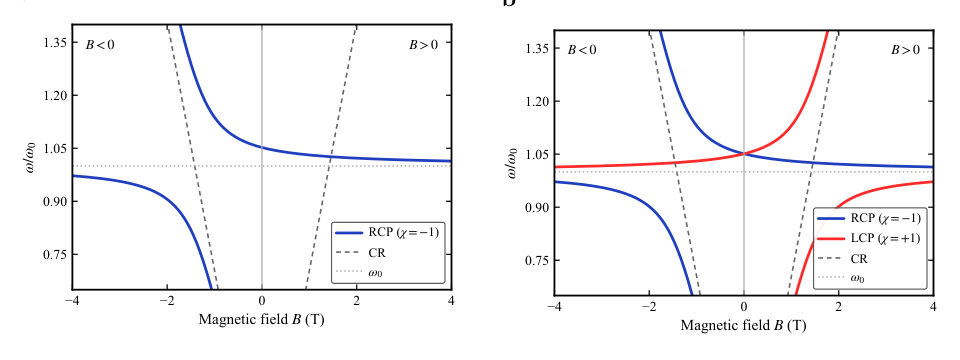 
Figure 2 makes the role of the photonic environment explicit. In the chiral cavity (Fig. 2a), field reversal changes the type of interaction experienced by the same cavity mode. The resulting eigenfrequencies closely follow the magnetotransmission of Fig. 1: the polaritonic branches appear only when the cavity field and cyclotron motion have the same handedness, whereas the opposite field direction retains the shifted cavity-like branch without a conventional anticrossing. The non-chiral cavity provides the reference case (Fig. 2b). Because both circular modes are present, reversing the cyclotron motion simply changes which one participates in resonant hybridiza- tion. The difference...

📷 Fig 4

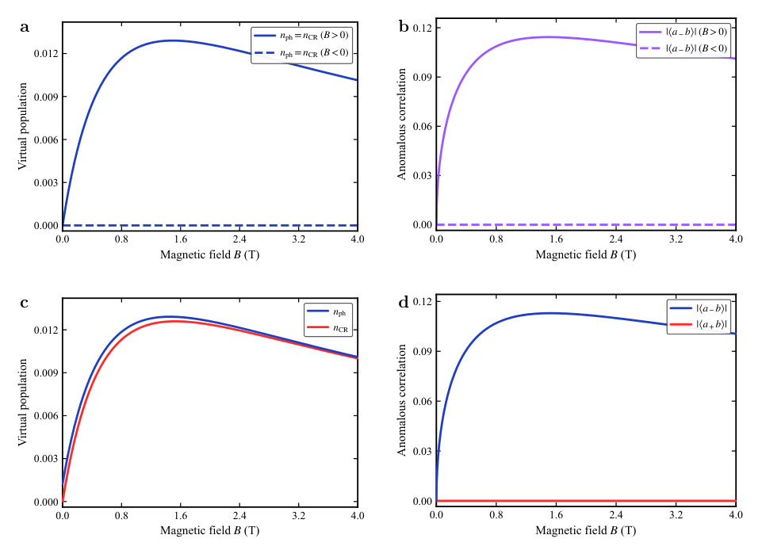 
Figure 3: Helicity reshapes the interacting quantum vacuum. a, Virtual photon and CR populations in the single helicity chiral cavity. They vanish for B &lt; 0 and become equal and finite for B &gt; 0. b, Corresponding anomalous photon–CR correlation. c, Total virtual photon and CR populations in the non-chiral cavity, shown for B &gt; 0; the opposite field direction is equivalent upon exchanging the two helicities. d, Anomalous correlations between the CR and the two circular cavity modes in the non-chiral cavity.

**Summary.** The authors show that in systems with ultrastrong light-matter coupling, the formation of polaritons and the dressing of the quantum vacuum are not equivalent. By utilizing helicity control in a chiral cavity coupled to a 2DEG, they can independently access these two regimes, proving that a large Rabi splitting alone does not guarantee a dressed vacuum state.

**Why it may be interesting.** This work provides a clean, experimentally addressable platform (chiral cavities) to decouple two closely related, yet distinct, quantum phenomena (polaritons vs. vacuum correlations) in the regime of ultrastrong coupling, which is highly relevant to cavity QED.

Detailed structure

**Main problem.** To demonstrate that polariton formation (spectral hybridization) and quantum vacuum dressing are distinct physical phenomena arising from ultrastrong light-matter coupling.

**Main result.** By controlling the helicity of the cavity field relative to the cyclotron motion, the system can be tuned to exhibit either conventional polariton anticrossings or vacuum dressing effects, proving the two are distinct.

**Method.** Theoretical modeling using Hamiltonian approaches and advanced numerical techniques like the Transfer Matrix Method (TMM) and full-wave finite-element simulations.

**Model / system.** The system involves cyclotron resonance coupled to a chiral cavity supporting a single circular mode, realized in a 2DEG coupled to a photonic crystal cavity.

**Key observables.** Rabi splitting, polaritonic anticrossing, ground state squeezing, virtual excitation populations, and polarization-resolved magnetotransmission spectra.

**Important parameters / regimes.** Helicity ($\chi$), magnetic field direction ($B$), cyclotron frequency ($\omega_c$), and coupling strength ($g$).

**Assumptions / limitations.** The analysis relies on a single-mode approximation for the cavity and assumes the ability to fix the cavity helicity while reversing the magnetic field on the 2DEG.

**Figures summary.** Figures illustrate the spectral reorganization, showing a clear avoided crossing when the cavity and cyclotron motion co-rotate ($B<0$), and the disappearance of this crossing with the acquisition of vacuum correlations when they counter-rotate ($B>0$).

**Paper structure.** The paper establishes the physical setup using chiral cavities, develops the Hamiltonian based on helicity control, and then analyzes two distinct regimes ($B<0$ vs $B>0$) to spectroscopically and correlationally separate the effects of hybridization from vacuum dressing.

Abstract

Polaritons and quantum vacuum dressing are usually regarded as intertwined consequences of ultrastrong light-matter coupling. Here we show that they can be controlled independently through helicity. We consider cyclotron resonance coupled to a chiral cavity supporting a single circular mode. When the helicity of the cavity field matches the cyclotron motion, energy is exchanged resonantly between light and matter, producing a large Rabi splitting and conventional polaritons, while the ground state remains the bare vacuum. Reversing the magnetic field reverses the cyclotron motion without changing the cavity. The same mode then couples through anomalous processes that create and annihilate light and matter excitations in pairs: the conventional polaritonic anticrossing disappears, while the ground state acquires squeezing and virtual excitations. These two regimes show that spectral hybridization and quantum vacuum dressing are distinct manifestations of ultrastrong coupling, and that a large Rabi splitting alone does not imply a dressed quantum vacuum. Helicity therefore provides a route to controlling polariton formation and quantum correlations as distinct resources in cavity quantum materials.

[↑ back to top](#top)

### [Engineering Quantum Interactions: From Effective Models to Validated Physical Predictions](http://arxiv.org/abs/2610.10763v1)

**Authors:** Sinara S. Dourado, Ciro Micheletti Diniz, Gabriel P. L. M. Fernandes, Rogério J. de Assis, G. D. de Moraes Neto, Celso J. Villas-Boas  
**Type:** theory · **Category:** other · **PDF:** <https://arxiv.org/pdf/2610.10763v1>  
**Analysis basis:** full PDF text, analyzed in chunks
**Topic relevance:** `Keldysh / 2PI / non-Gaussian methods` **3/5** · `methods for driven-dissipative` **3/5** · `analog quantum simulation` **2/5** · `driven-dissipative phase transition` **2/5** · `Tavis-Cummings & cavity-many-emitter` **1/5** · `correlated / nonlocal dissipation` **1/5** · `non-equilibrium universality` **1/5** · `quantum measurements` **1/5**

📷 Fig 1

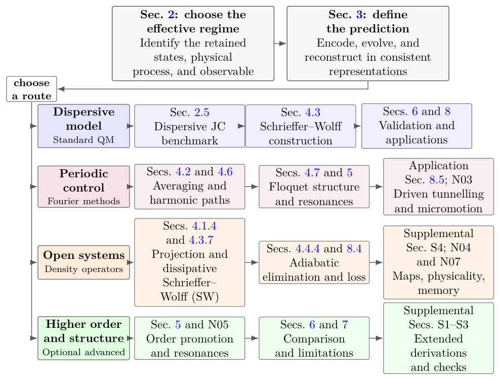 
Figure 1: Suggested routes through the article. Each route begins with the regime selection developed in Sec. 2 and the encoding–evolution–reconstruction framework of Sec. 3. The first three rows provide direct paths to a calculation and an application; the final row leads to higher-order and structural topics. Arrows show the suggested reading order. Labels N03–N07 refer to the companion notebooks described below and in Supplemental Sec. S5.

📷 Fig 2

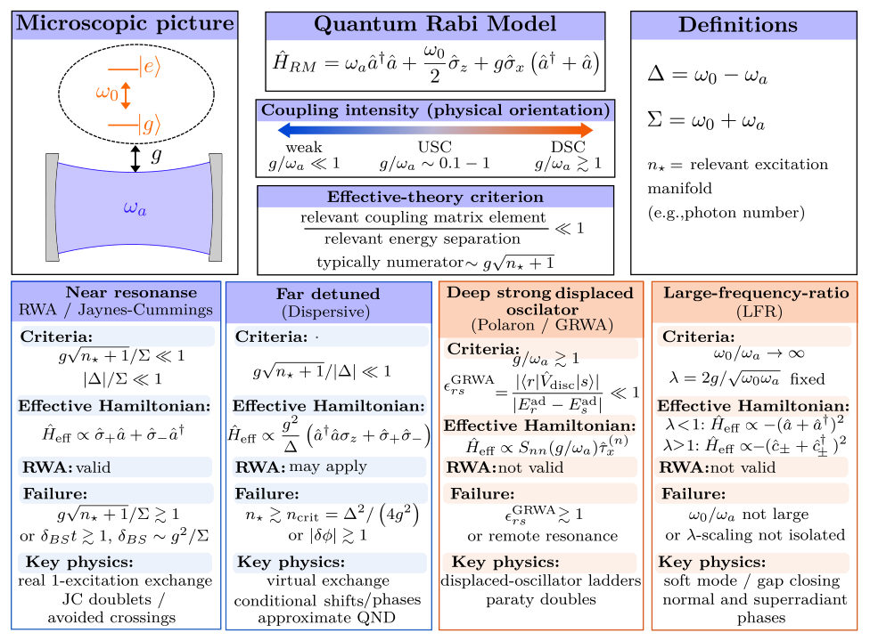 
Figure 2: One microscopic model, several effective theories. The quantum Rabi Hamiltonian admits distinct controlled descriptions because different parameter regimes select different natural bases and retained processes. Near resonance, the Jaynes–Cummings reduction retains real one- excitation exchange. Far from resonance, exchange is virtual and produces conditional shifts, phases, mediated interactions, and dressed dissipation. At intermediate and deep-strong coupling, a displaced-oscillator basis exposes parity doublets and distinguishes bare, displaced, and detector- defined excitations. In the singular large-frequency-ratio limit at fixed λ = 2g/√ω0ωa, quadratic normal- and...

📷 Fig 3

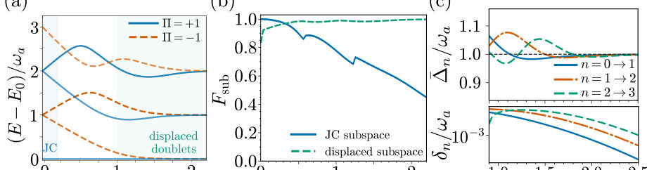 
Figure 3: Changing spectral organization of the quantum Rabi model. (a) Lowest exact excitation energies of the resonant quantum Rabi model, ω0 = ωa, as a function of the normalized coupling g/ωa. Solid and dashed curves denote the two exact parity sectors, Π = +1 and Π = −1, respectively. At weak coupling, the spectrum retains the organization inherited from Jaynes–Cummings excitation manifolds. At deep-strong coupling, it reorganizes into nearly degenerate opposite-parity pairs associated with qubit-conditioned displaced oscillators. (b) Normalized low- energy subspace fidelity Fsub = d−1 Tr(PexactPref) between the exact six-dimensional low-energy subspace and, respectively, the...

📷 Fig 4

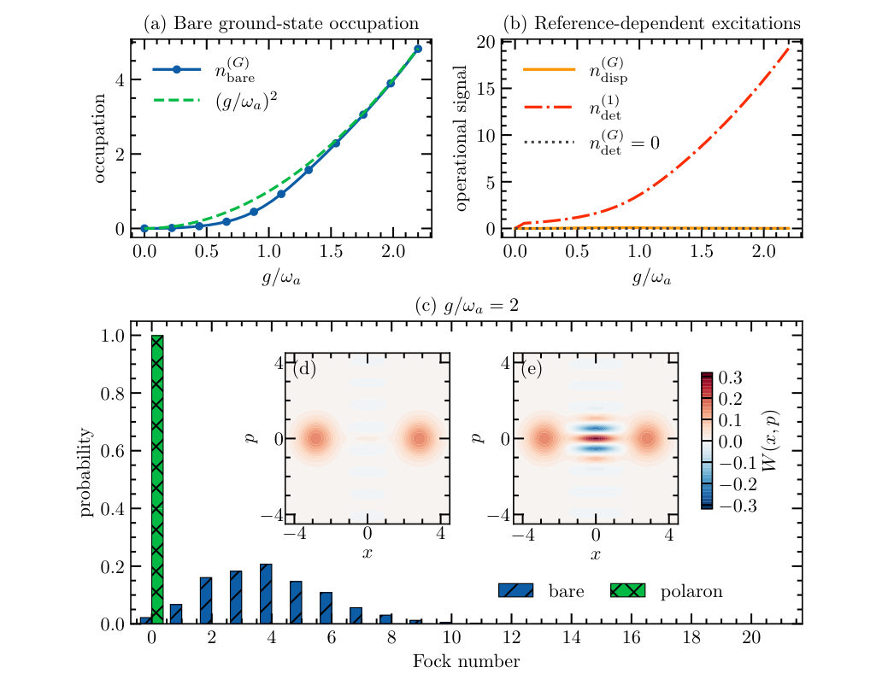 
Figure 4: Bare, displaced, and detector-defined excitations in the deep-strong-coupling regime. (a) Bare ground-state occupation n(G) bare = ⟨G|ˆa†ˆa|G⟩approaching (g/ωa)2 at strong coupling. (b) Displaced-frame occupation, n(G) disp = ⟨G|ˆb†ˆb|G⟩, with b = ˆa + (g/ωa)ˆσx, and detector-defined

📷 Fig 5

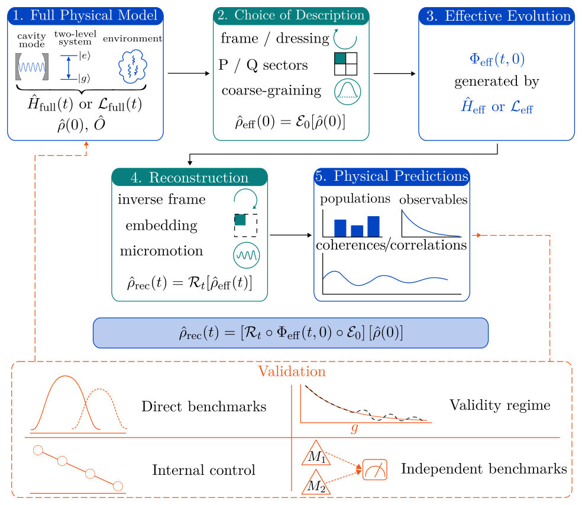 
Figure 5: A complete effective prediction. The preparation is encoded in the selected description, evolved with the effective map, and reconstructed in the physical representation. The lower loop compares that prediction with direct benchmarks, controlled limits, internal diagnostics, and independent evidence.

**Summary.** This paper presents a comprehensive, unified framework for building and validating effective quantum models from complex dynamics. It moves beyond simple derivation by enforcing a three-step consistency check—encoding, evolution, and reconstruction—to ensure physical predictions are robust. This methodology is vital for accurately modeling systems like cavity QED or driven lattices where approximations are common.

**Why it may be interesting.** This work provides a crucial methodological toolkit for AMO physicists working with open quantum systems, offering rigorous diagnostics to distinguish between a mathematically derived effective Hamiltonian and one that yields physically consistent predictions.

Detailed structure

**Main problem.** The paper aims to develop a unified and rigorous framework for constructing and validating effective quantum models that accurately predict measurable physical quantities.

**Main result.** It establishes a three-step, order-consistent process (encoding, evolution, reconstruction) for physical predictions, systematically exposing failures in approximations like leakage or inconsistent observables.

**Method.** The framework unifies multiple projection techniques, including Schrieffer-Wolff transformations, Magnus expansions, Floquet theory, and adiabatic elimination, to derive effective dynamics.

**Model / system.** The Quantum Rabi Model serves as a recurring benchmark, allowing the systematic comparison of different effective descriptions derived under varying physical regimes (e.g., near vs. far from resonance). Applications include light-matter coupling and driven lattices.

**Key observables.** Control parameters, virtual processes, spectral corrections, and the reconstructed physical observable ($\hat{
ho}_{	ext{rec}}(t)$).

**Important parameters / regimes.** Detuning ($\Delta$), coupling strength ($g$), and the ratio of coupling to spectral gaps, which dictate the validity of approximations.

**Assumptions / limitations.** The core challenge is ensuring consistency across all components (manifold, observables, dissipation) when eliminating high-energy or fast degrees of freedom.

**Paper structure.** The paper is structured around developing the unified framework, benchmarking it using the Rabi model, and detailing the three-step process for generating and validating physical predictions.

Abstract

Effective models make complex quantum dynamics tractable by retaining only the states, processes, and timescales relevant to a given physical question. Their predictive power, however, depends on treating the retained manifold, initial state, observables, micromotion, dissipative channels, and eliminated degrees of freedom consistently. We develop a unified framework for constructing and validating effective descriptions using projection methods, Schrieffer--Wolff transformations, Magnus expansions, adiabatic elimination, small rotations, time coarse graining, and Floquet theory. The quantum Rabi model and its dispersive limits serve as recurring benchmarks for identifying control parameters, virtual processes, spectral corrections, observable dressing, and breakdown. Higher-order resonances and applications to collective light--matter coupling, Raman processes, spin-chain buses, lossy mediators, and driven lattices illustrate how effective interactions can be interpreted and designed. A physical prediction is organized into three order-consistent steps: encoding into the retained description, evolution under the effective dynamics, and reconstruction of the physical observable. This viewpoint exposes failures caused by leakage, small denominators, neglected micromotion, inconsistent observables, memory effects, or incorrectly transformed dissipation, while linking derivation, physical interpretation, and mechanism-guided discovery. Companion notebooks provide QuTiP implementations, convergence tests, and microscopic-to-effective comparisons.

[↑ back to top](#top)

### [Local polarization control of optical tweezer arrays](http://arxiv.org/abs/2610.12406v1)

**Authors:** Xiangkai Sun, Richard Bing-Shiun Tsai, Andrew Winnicki, Yuan Le, Kon H. Leung, Nelson Darkwah Oppong, Manuel Endres  
**Type:** experiment · **Category:** other · **PDF:** <https://arxiv.org/pdf/2610.12406v1>  
**Analysis basis:** full PDF text, analyzed in chunks
**Topic relevance:** `QC/QI experiment` **3/5** · `analog quantum simulation` **3/5** · `Rydberg arrays` **2/5** · `interference shaping light` **2/5** · `quantum measurements` **2/5** · `quantum optics experiment` **2/5**

📷 Fig 1

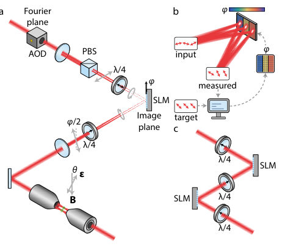 
Fig. 1 | Programming of individual tweezer polarization. (a) Setup for local polarization control. An acousto-optic deflector (AOD) generates a one-dimensional array that is relayed to an image plane inside the vacuum chamber to create optical tweezer traps. An SLM placed at an intermediate image plane, combined with a pair of QWPs (oriented at 45◦to the SLM’s principal axes), allows for arbitrary linear polarization rotations of each tweezer. The rotation is half the phase φ imprinted by the illuminated SLM pixels. (b) SLM phase pattern at the intermediate image plane. The SLM mask is divided into “superpixels” (shown as differently colored regions) with a single phase applied per...

📷 Fig 2

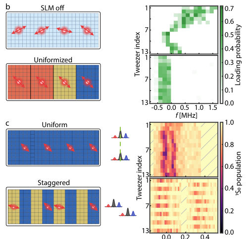 
Fig. 2 | Local control of atomic transition frequencies. (a) Polarization tuning of the tensor light shift. We apply a voltage to a superpixel and measure the differential light shift, ν, of the 1S0 ↔3P1 transition relative to free space, allowing us to extract θ, the angle between the linear tweezer polarization ϵ and the bias magnetic field B. (b) Tweezer loading is signaled by successful atom imaging, which in turn requires that the same global cooling-laser detuning be effective at every site. Left uncompensated, site-dependent light shifts cause a large scatter in the optimal cooling laser frequencies (top). With local polarization correction, a single global cooling frequency loads...

📷 Fig 3

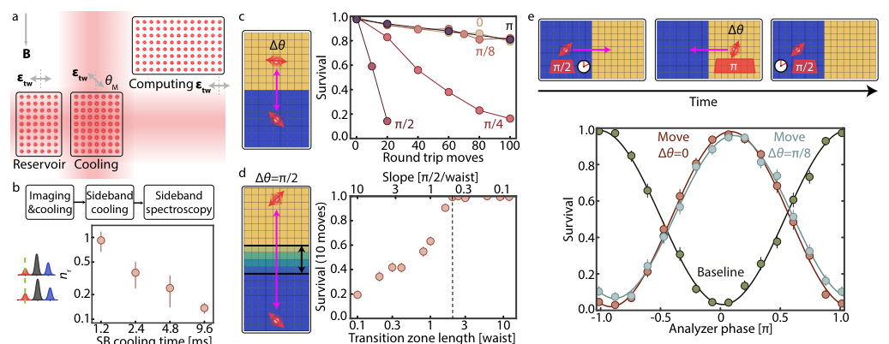 
Fig. 3 | Zone architecture for optical tweezer arrays with local polarization programmability. (a) Proposed zone layout for a 2D array. Three orthogonal cooling beams intersect to form the cooling zone, where the tweezer polarizations are tuned to θ ≈θM. Atoms in the reservoir and computing zones are spectrally isolated from the cooling light via tweezer polarization tuning. (b) Magic-angle sideband cooling on the 1S0 ↔3P1 transition following fluorescence imaging, achieving a site-averaged radial motional occupation of ¯nr = 0.137(19) after 9.6 ms of cooling time. (c) Inter-zone transport survival versus total polarization change ∆θ. We observe the onset of atom loss for |∆θ| &gt; π/8, which...

📷 Fig 4

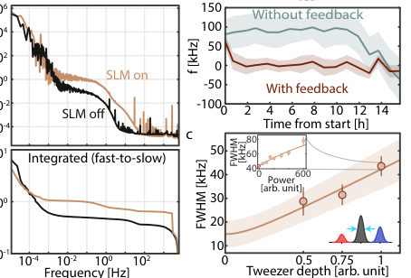 
Fig. 4 | Polarization noise and stabilization. (a) Top: polarimeter comprising a polarizing beam splitter (PBS) and two photodiodes (PDs). Bottom: power spectral density (PSD) of the linear polarization-angle noise. When used for local tweezer polarization rotation, the SLM introduces significant excess polarization-angle noise in the 10−3 Hz to 104 Hz band. Over a 24-hour measurement, the integrated polarization noise is ≈5 mrad, dominated by slow drifts correlated with ambient humidity and temperature. (b) On hour-long timescales, we actively stabilize the tweezer polarizations by updating the superpixel phases to steer the probed line centers of the 1S0 ↔3P1 carrier transition to the...

📷 Fig 5

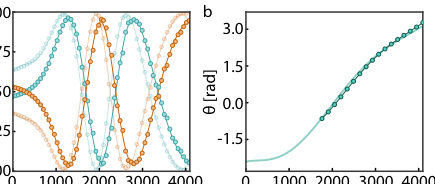 
FIG. 5. SLM phase calibration. (a) SLM phase-voltage calibration with a polarimeter. We use the polarimeter setup depicted in Fig. 4a to measure the s and p components (represented by cyan and orange) after the imaging objective. Dark: all 13 tweezers; light: one tweezer. We observe a contrast of 90.6(7)% and 97.8(5)% respectively. (b) Polarization angle calibration with optical polarimeter and atomic spectroscopy. The light cyan curve represents the polarization we extract from the polarimeter measurement. The dark cyan curve and data points represent the angle θ between the linear polarization and the magnetic field that we extract from Fig. 2a.

**Summary.** This paper presents a novel technique to independently control the polarization of light at every site within an optical tweezer array using a spatial light modulator. By achieving this site-resolved polarization control, the researchers successfully homogenized light shifts on trapped strontium atoms, enabling high-fidelity sideband cooling and controlled transport across the array. This technique is vital for building scalable, multi-zone quantum processors.

**Why it may be interesting.** This work provides a crucial experimental tool—local polarization control—that directly addresses a major bottleneck in scaling up quantum simulation and quantum computing architectures based on optical tweezers.

Detailed structure

**Main problem.** The primary challenge addressed is achieving independent, site-resolved control over the polarization of individual optical tweezers within an array, which is necessary for advanced quantum state engineering.

**Main result.** The authors successfully demonstrated site-resolved linear polarization rotation using a spatial light modulator, enabling sideband cooling under a magic-angle condition and dynamic atom transport across polarization zones.

**Method.** They exploit the local birefringence tunability of a liquid-crystal spatial light modulator (SLM) to imprint controlled phase retardations, thereby rotating the polarization at each trapping site.

**Model / system.** The experiment uses optical tweezer arrays trapping ultracold strontium atoms ($^{88}	ext{Sr}$). The system relies on the polarization dependence of light shifts on atomic transitions, specifically the ${^1	ext{S}_0}\leftrightarrow{^3	ext{P}_1}$ intercombination line.

**Key observables.** Differential light shifts ($
u$), polarization rotation angle ($	heta$), cooling laser frequency offset ($f$), and atomic coherence during transport.

**Important parameters / regimes.** Magic-angle condition ($	heta_M$), mrad-level polarization noise stability, and the ability to program arbitrary polarization patterns across the array.

**Assumptions / limitations.** The method assumes that the polarization-dependent light shift can be accurately mapped to the local birefringence tunability of the SLM.

**Figures summary.** Figures illustrate the setup for local polarization control using the SLM, the tuning of the tensor light shift, the application of local polarization correction for efficient sideband cooling, and the programming of various polarization patterns for sequential operations.

**Paper structure.** The work progresses from establishing the fundamental technique of site-resolved polarization control to applying this control to homogenize light shifts for sideband cooling, demonstrating dynamic transport, and finally characterizing the stability of the polarization control system.

Abstract

Optical tweezer arrays trapping ultracold atoms and molecules are a versatile quantum science platform with broad impact in quantum simulation, quantum computation, and quantum metrology. The polarization dependence of anisotropic vector and tensor light shifts offers a degree of freedom for precise quantum state engineering of trapped particles. Similarly, state-selective operations depend on the polarization of the addressing light through the atom--light coupling strength. Yet, methods for controlling the polarization of individual tweezers or local addressing beams remain an experimental challenge. Here, we demonstrate independent, site-resolved linear polarization rotation across an optical tweezer array by exploiting the local birefringence tunability of a spatial light modulator. Applying this capability to an array of $^{88}\rm{Sr}$ atoms, we homogenize differential light shifts imparted by the 813-nm tweezers to the narrow ${^1{\rm S}_0}\leftrightarrow{^3{\rm P}_1}$ transition, enabling sideband cooling under a magic-angle condition. Furthermore, we show dynamic transport of trapped atoms across distinct polarization zones with high survival and preserved coherence. Finally, we characterize tweezer polarization noise and demonstrate closed-loop stabilization referenced to the atomic transition frequency, reaching mrad-level stability. Our work establishes a technique for manipulating polarization-sensitive atomic and molecular transitions in tweezer architectures, with immediate applications to optical tweezer clocks and multi-zone quantum processors.

[↑ back to top](#top)

### [Note on decoherence of the cosmological background by thermal perturbations in the language of open quantum systems](http://arxiv.org/abs/2610.11397v1)

**Authors:** Alexander Kulyabin  
**Type:** theory · **Category:** other · **PDF:** <https://arxiv.org/pdf/2610.11397v1>  
**Analysis basis:** full PDF text, analyzed in chunks
**Topic relevance:** `Keldysh / 2PI / non-Gaussian methods` **3/5** · `correlated / nonlocal dissipation` **3/5** · `methods for driven-dissipative` **3/5** · `quantum measurements` **3/5** · `driven-dissipative phase transition` **2/5**

📷 Fig 1

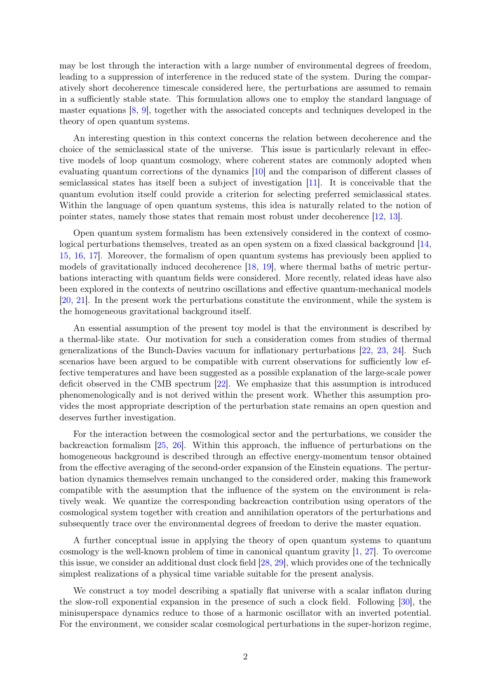 
Low-resolution page preview, page 2

📷 Fig 2

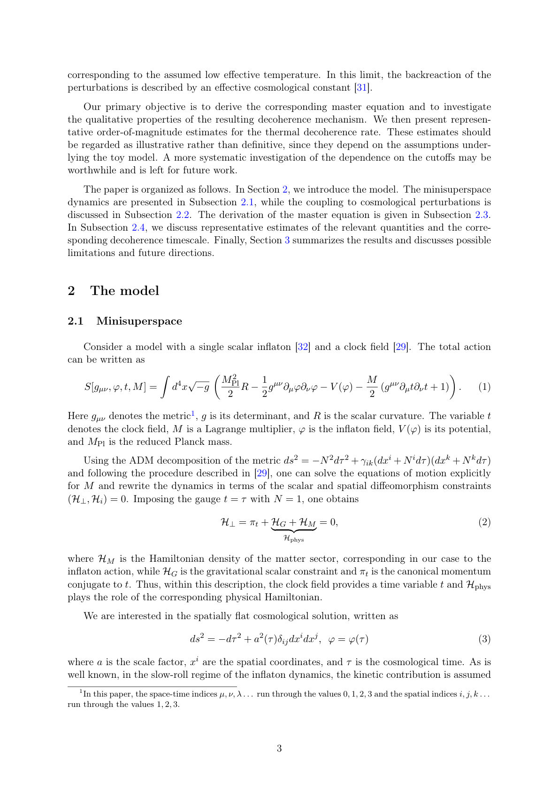 
Low-resolution page preview, page 3

📷 Fig 3

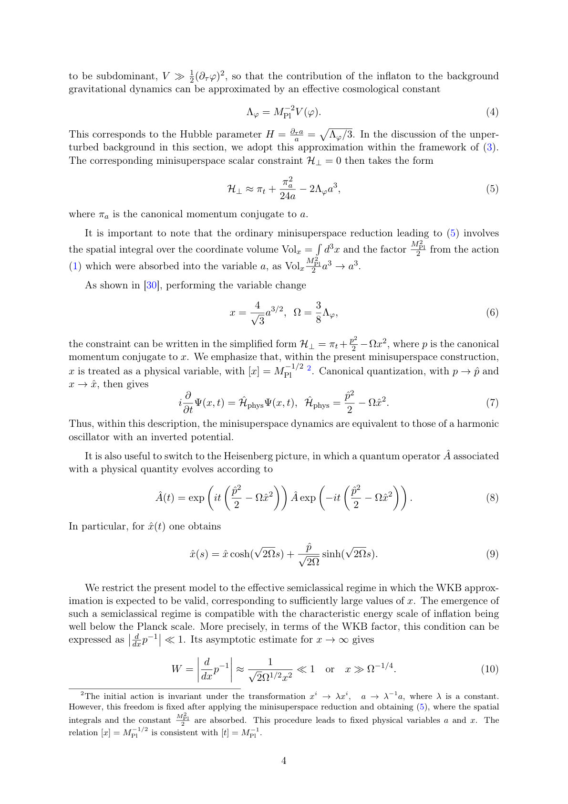 
Low-resolution page preview, page 4

📷 Fig 4

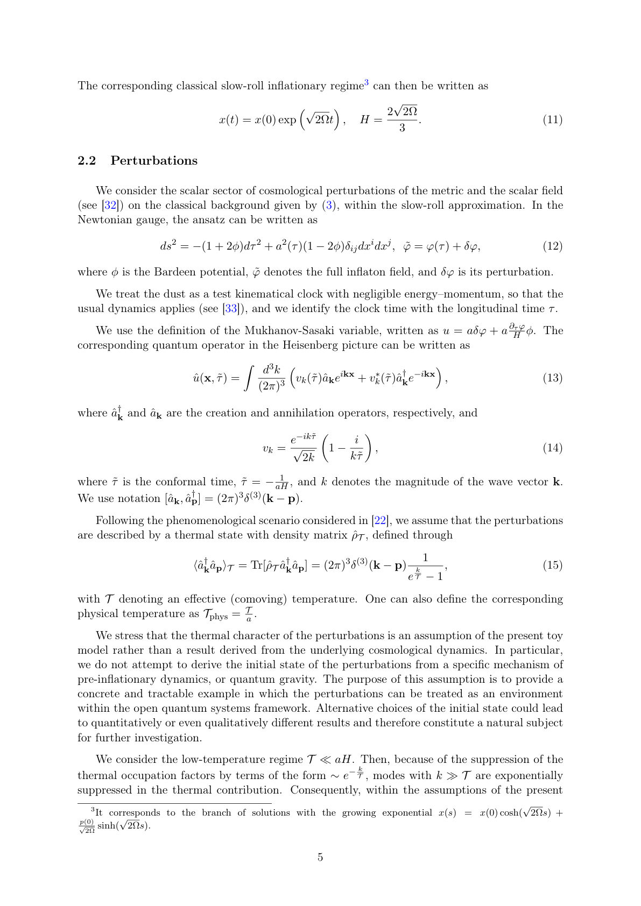 
Low-resolution page preview, page 5

📷 Fig 5

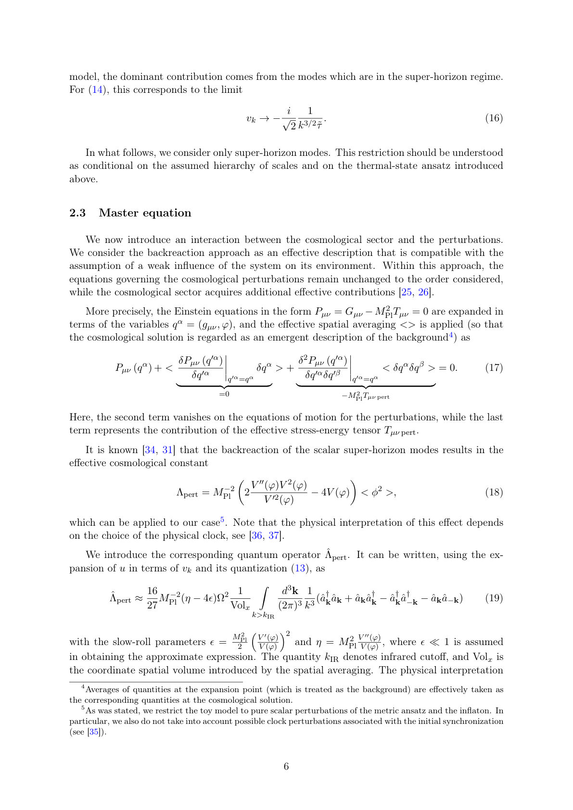 
Low-resolution page preview, page 6

**Summary.** This work models the decoherence of the early universe's background degrees of freedom due to thermal cosmological perturbations using open quantum systems theory. By deriving a master equation that includes cosmological backreaction, the authors find that decoherence can occur rapidly, potentially faster than the expansion rate. This offers a theoretical framework to use decoherence as a criterion for selecting semiclassical states in quantum cosmology.

**Why it may be interesting.** It provides a concrete, albeit toy, example of applying open quantum system techniques (master equations, backreaction) to a fundamental problem in cosmology—the quantum-to-classical transition.

Detailed structure

**Main problem.** The paper investigates how the thermal bath provided by cosmological perturbations can induce decoherence in the homogeneous degrees of freedom of the early universe.

**Main result.** The characteristic decoherence timescale can be found to be shorter than the Hubble timescale for representative parameters, suggesting rapid decoherence.

**Method.** It employs the open quantum systems formalism to derive a master equation, incorporating cosmological backreaction via an effective second-order coupling.

**Model / system.** The model is a toy system describing a spatially flat semiclassical inflationary universe with a clock field, where scalar perturbations act as the environment bath.

**Key observables.** The decoherence timescale ($	au_{	ext{decoherence}}$) and the induced pointer-state structure.

**Important parameters / regimes.** The coupling constant derived from thermal correlation functions, the Hubble timescale ($H^{-1}$), and the effective temperature ($T$) of the perturbations.

**Assumptions / limitations.** The environment (perturbations) is assumed to be in a thermal-like state, and the analysis explicitly avoids the Markov approximation in its full treatment.

**Paper structure.** The paper develops the master equation by treating the perturbations as an environment, deriving the non-unitary decoherence term, and analyzing the resulting time evolution of the density matrix.

Abstract

We study, within a toy model, how a thermal bath of cosmological perturbations can decohere the homogeneous degrees of freedom of the universe, treating the perturbations as an environment in the framework of open quantum systems. In contrast to several earlier approaches, instead of tracing out the perturbations from a semiclassical ansatz for the total wave function, we incorporate their cosmological backreaction through an effective second-order coupling and derive a master equation. Our toy model consists of a spatially flat semiclassical inflationary universe with a clock field in the slow-roll regime, while scalar cosmological perturbations in an assumed thermal-like state constitute the environment. One of the features of the model is the absence of the Markov approximation. The resulting coupling constant is determined by thermal correlation functions of the quantized perturbation modes. Within this framework, we find that, for a representative set of parameter estimates, the characteristic decoherence timescale corresponding to the thermal contribution can be shorter than the Hubble timescale. In addition, we address the question of whether the pointer-state structure induced by the decoherence in such a framework could provide a criterion for the choice of semiclassical states in the early universe.

[↑ back to top](#top)

### [Extended Results on Absorbing Boundary Conditions as Limits of Complex Potentials](http://arxiv.org/abs/2610.11865v1)

**Authors:** Rashi Kaimal, Roderich Tumulka  
**Type:** theory · **Category:** other · **PDF:** <https://arxiv.org/pdf/2610.11865v1>  
**Analysis basis:** full PDF text, analyzed in chunks
**Topic relevance:** `methods for driven-dissipative` **3/5** · `quantum measurements` **3/5** · `Keldysh / 2PI / non-Gaussian methods` **2/5** · `driven-dissipative phase transition` **2/5** · `Full counting statistics` **1/5** · `correlated / nonlocal dissipation` **1/5** · `non-equilibrium universality` **1/5**

📷 Fig 1

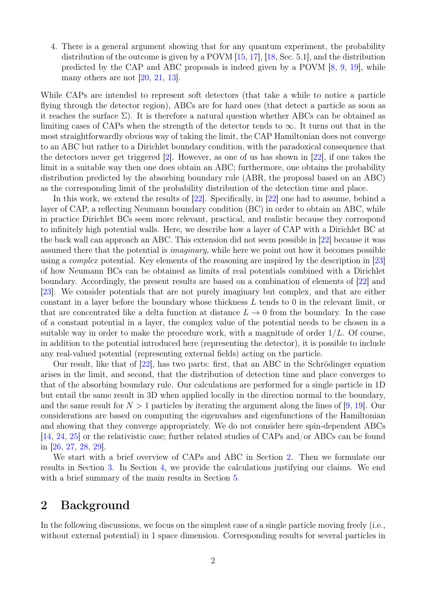 
Low-resolution page preview, page 2

📷 Fig 2

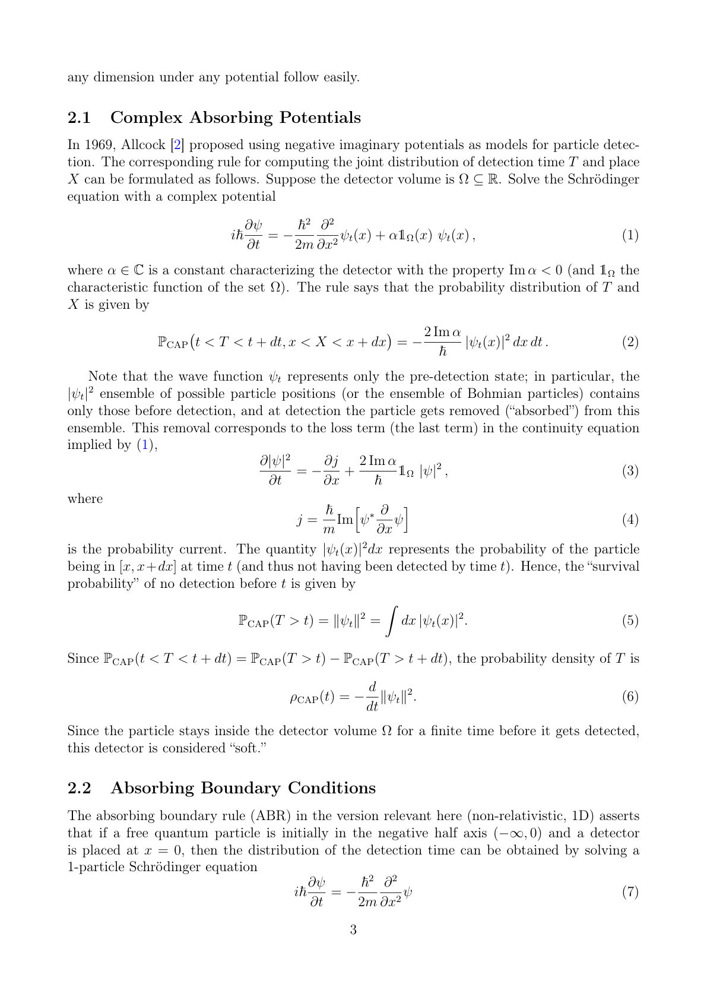 
Low-resolution page preview, page 3

📷 Fig 3

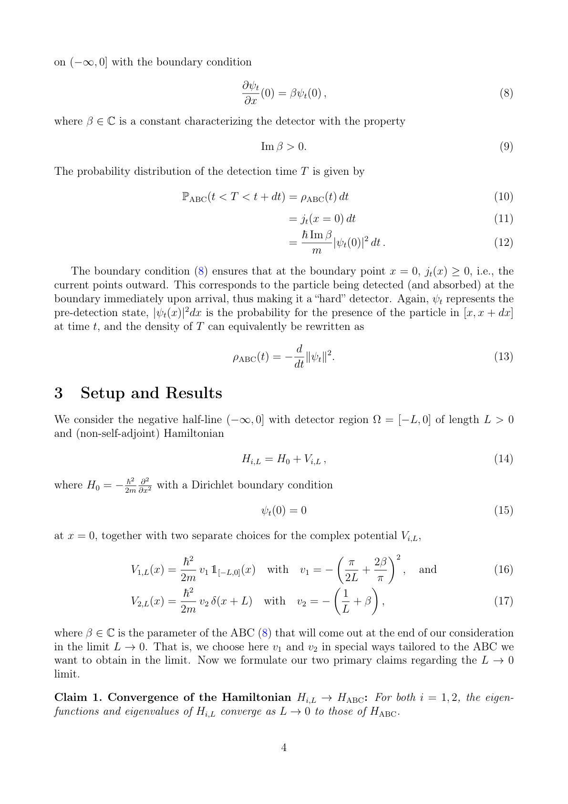 
Low-resolution page preview, page 4

📷 Fig 4

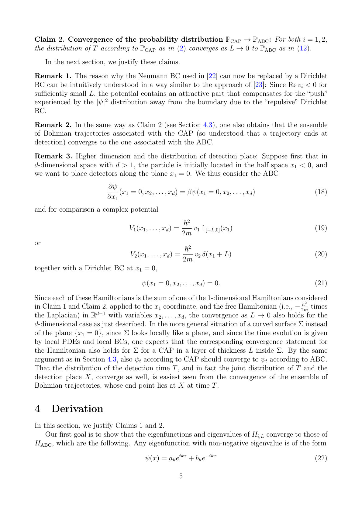 
Low-resolution page preview, page 5

📷 Fig 5

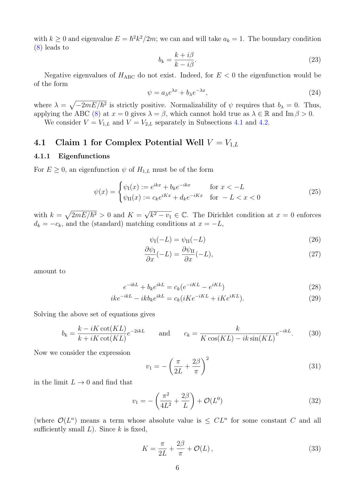 
Low-resolution page preview, page 6

**Summary.** This paper connects two primary theoretical methods—Absorbing Boundary Conditions (ABCs) and Complex Absorbing Potentials (CAPs)—used to model quantum particle detection. The authors prove that ABCs can be derived as a limit of CAPs using a Dirichlet boundary condition, offering a more practical and rigorous mathematical framework for calculating detection probabilities in open quantum systems.

**Why it may be interesting.** This work provides a crucial mathematical bridge between two standard, but distinct, theoretical tools (CAPs and ABCs) used to model open quantum systems and particle detection, offering a more physically grounded derivation for one approach.

Detailed structure

**Main problem.** The paper addresses the theoretical challenge of calculating the probability distribution of a quantum particle's detection time and location at a boundary or within a volume.

**Main result.** It rigorously demonstrates that Absorbing Boundary Conditions (ABCs) can be obtained as a limit of Complex Absorbing Potentials (CAPs) by using a Dirichlet boundary condition, which is argued to be more physically relevant than previously assumed Neumann conditions.

**Method.** The authors employ asymptotic analysis by taking the limit of a finite-thickness CAP layer ($L 	o 0$) and showing the convergence of the Hamiltonian's eigenvalues, eigenfunctions, and the resulting probability distributions to those derived from the ABC model.

**Model / system.** The system involves the time evolution of a quantum particle governed by the Schrödinger equation, comparing the CAP model (with a complex potential) to the ABC model (with a specific boundary condition at $x=0$).

**Key observables.** Detection time distribution ($P_{CAP}$ vs $P_{ABC}$), survival probability, eigenvalues, and eigenfunctions.

**Important parameters / regimes.** The limit parameter $L 	o 0$, and the complex parameters $\alpha$ and $eta$ defining the potentials/boundary conditions.

**Assumptions / limitations.** The analysis is performed for a single particle in 1D but is argued to generalize to higher dimensions and curved surfaces due to the local nature of the PDEs.

**Paper structure.** The paper first establishes the physical context by comparing ABCs and CAPs. It then develops the mathematical machinery by analyzing the convergence of the Hamiltonian and its spectral properties in the limit $L 	o 0$, culminating in the proof of convergence for the detection probability.

Abstract

In quantum mechanics, among the proposals for how to compute the probability distribution of detection time and place along a given spatial surface or in a given volume, two leading candidates involve absorbing boundary conditions (ABCs) and complex absorbing potentials (CAPs) for the Schrödinger equation. Here, we extend earlier results on how the two are related. It was previously shown that ABCs arise as a limiting case of CAPs, but for that a (reflecting) Neumann boundary condition was assumed at the end of the region with the CAP. Here, we obtain ABCs in a different limit using a Dirichlet boundary condition at the end of the CAP region, which seems more practically relevant and realizable.

[↑ back to top](#top)

### [Fast entanglement generation via cavity-mediated nematic tensor dynamics](http://arxiv.org/abs/2610.11018v1)

**Authors:** Stuart J. Masson  
**Type:** theory · **Category:** other · **PDF:** <https://arxiv.org/pdf/2610.11018v1>  
**Analysis basis:** full PDF text, analyzed in chunks
**Topic relevance:** `Tavis-Cummings & cavity-many-emitter` **3/5** · `analog quantum simulation` **3/5** · `correlated / nonlocal dissipation` **2/5** · `driven-dissipative phase transition` **2/5** · `methods for driven-dissipative` **2/5** · `Keldysh / 2PI / non-Gaussian methods` **1/5**

📷 Fig 1

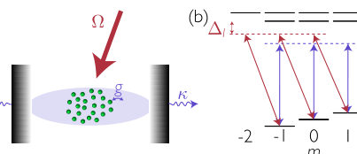 
FIG. 1. Setup. (a) 87Rb atoms are driven with Rabi frequency Ωand coupled at strength g to an optical cavity which decays at κ. (b) The laser (cavity) fields are off-resonant from the D1 line by ∆l(c) = ωl(c) −ω1 = ωl(c) −ω2 + ζ where ω1(2) are the frequencies of the F = 1(2) line and ζ is their splitting.

📷 Fig 2

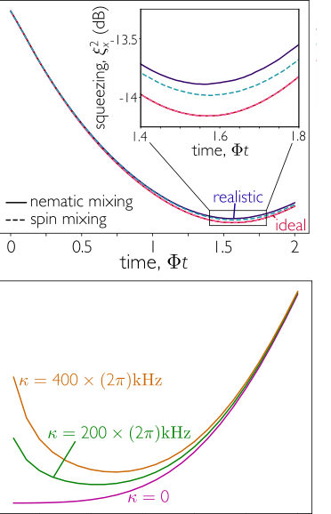 
FIG. 2. Spin-nematic squeezing generation. (a) Time evolu- tion of squeezing for N = 200 under a spin mixing Hamilto- nian (dashed lines) and a nematic mixing Hamiltonian (solid lines). The ideal case evolves the initial state |ψ(t = 0)⟩= |0⟩⊗N under Eqs. (17a) and (17b) respectively, while the realistic case includes cavity loss at a rate κ = 200 × (2π) kHz for both cases and uses a Raman transition detuning ω = 20 × (2π) MHz for nematic mixing. Lines including loss are obtained from an ensemble average of 5000 trajectories. (b) Spin-nematic squeezing via nematic mixing from an initial state |0⟩⊗N with N = 60 as a function of Raman transition detuning for different loss values. Lines are...

📷 Fig 3

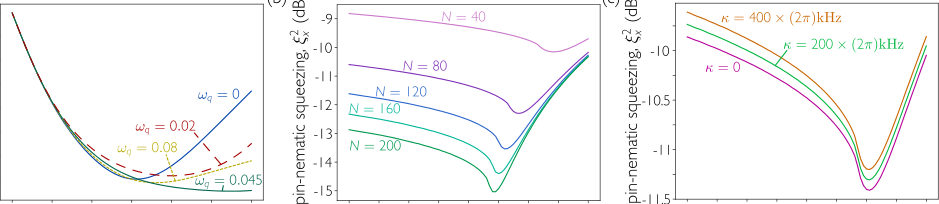 
FIG. 3. Impact of quadratic Zeeman shift on spin-nematic squeezing. (a) Time evolution of spin-nematic squeezing for N = 200 via nematic mixing with different quadratic Zeeman shifts. (b) Optimal spin-nematic squeezing as a function of the quadratic Zeeman shift for different N. (c) Optimal spin-nematic squeezing as a function of the quadratic Zeeman shift for different cavity loss levels for N = 60. In all plots, ω = 20 × (2π) MHz and the initial state is |0⟩⊗N. In (a,b), values are calculated by evolution of the Schrödinger equation, while in (c) values are calculated from direct evolution of the master equation.

📷 Fig 4

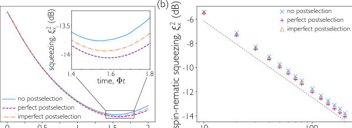 
FIG. 4. Scaling of spin-nematic squeezing with postselection. (a) Time evolution of spin-nematic squeezing for N = 200. (b) Scaling of optimal spin-nematic squeezing with N. The dotted black line is a guide that scales as N −2/3. (c) Improvement of spin-nematic squeezing via postselection, i.e., ξ2 x|postselection/ξ2 x|no postselection. In all cases, the dataset is composed of 5000 stochastic trajectories (10000 for N ≤120) from an initial state |0⟩⊗N. Lines and points without postselection (blue) use the ensemble average of all trajectories, those with perfect postselection (purple) use a single trajectory conditioned on no jumps, and those with imperfect postselection (orange) use an...

📷 Fig 5

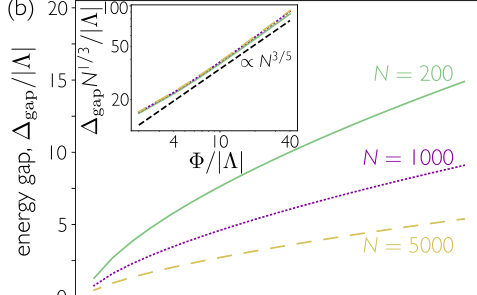 
FIG. 5. Spinor BEC energy gap with nematic mixing. (a) Scaling of the energy gap with atom number with dif- ferent nematic mixing rates. The dashed line is a guide-to- the-eye that scales as N −1/3. (b) Scaling of the energy gap with nematic mixing rate for different atom numbers. The inset shows the same data rescaled by N −1/3 with a guide-to- the-eye that scales as N 3/5. In both plots, Λ is negative and the energy gap is found by minimizing the gap over quadratic Zeeman shift q in the subspace that satisfies ⟨ˆSz⟩= 0.

**Summary.** This paper presents a theoretical framework for generating highly entangled states in atomic ensembles coupled to an optical cavity. By moving beyond simplified two-level approximations and incorporating nematic tensor dynamics, the authors show a method to accelerate entanglement generation significantly. This advancement is crucial for developing faster and more robust quantum sensing and quantum information devices based on cold atoms.

**Why it may be interesting.** This work directly addresses the engineering of quantum resources (entanglement) in complex atomic platforms, providing a concrete pathway to significantly enhance the speed of quantum information processing protocols in AMO physics.

Detailed structure

**Main problem.** The primary goal is to achieve fast generation of multi-body entanglement in atomic ensembles, overcoming the slow dynamics associated with traditional two-level system models.

**Main result.** The authors demonstrate that by utilizing the full ground-state hyperfine manifold and operating under specific detuning conditions, entanglement generation can be achieved over a hundred times faster than typical experiments.

**Method.** The analysis employs cavity Quantum Electrodynamics (cQED) theory, deriving effective Hamiltonians and master equations through sequential adiabatic elimination of the excited atomic states and the cavity mode.

**Model / system.** The system involves $^{87}	ext{Rb}$ atoms coupled to an optical cavity. The model is described by an effective Hamiltonian involving collective spin and nematic tensor operators, derived from the full atomic and cavity interaction.

**Key observables.** Spin-nematic squeezing parameter ($\xi^2_x$), entanglement generation rate, and the comparison between spin-based and nematic-based squeezing.

**Important parameters / regimes.** Detuning ($\Delta$), cavity decay rate ($\kappa$), and the ratio of rates ($\Phi/\Lambda$) which dictates the speedup.

**Assumptions / limitations.** The derivation relies on adiabatic elimination approximations for the excited states and the cavity mode, and the analysis assumes the system is driven by off-resonant laser fields.

**Figures summary.** Figure 1 illustrates the physical setup involving $^{87}	ext{Rb}$ atoms coupled to an optical cavity, detailing the relevant detunings.

**Paper structure.** The paper progresses from defining the full system Hamiltonian, through adiabatic elimination to derive effective Hamiltonians for both spin and nematic dynamics, and finally compares the resulting squeezing generation rates and speed advantages.

Abstract

Many-body entanglement in atomic ensembles offers the potential for enhanced sensing devices. Entanglement can be generated by interfacing atoms with a cavity. Traditional methods use effective two-level systems isolated from more complex atomic level structures. However, alternative strategies allow entanglement to be generated in atoms confined to a single hyperfine manifold. These strategies enable entanglement in ways fundamentally not available to two-level systems but feature extremely slow dynamics due to requiring strongly off-resonant laser fields. Here, I show that equivalent squeezing dynamics can be achieved much closer to resonance, offering entanglement generation over a hundred times faster than typical experiments. Furthermore, the Hamiltonian can be used to speed up the creation of maximally entangled states via adiabatic passage.

[↑ back to top](#top)

### [Markov length can diverge in systems whose universal physics is spatially Markovian](http://arxiv.org/abs/2610.11235v1)

**Authors:** Yu-Hsueh Chen, Tarun Grover  
**Type:** theory · **Category:** statistical mechanics · **PDF:** <https://arxiv.org/pdf/2610.11235v1>  
**Analysis basis:** full PDF text, analyzed in chunks
**Topic relevance:** `correlated / nonlocal dissipation` **3/5** · `driven-dissipative phase transition` **3/5** · `non-equilibrium universality` **3/5** · `Keldysh / 2PI / non-Gaussian methods` **2/5** · `methods for driven-dissipative` **2/5**

📷 Fig 1

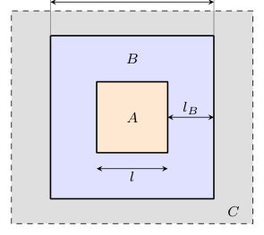 
FIG. 1. Two geometries for the CMI I(A : C|B). (a) The annular geometry, drawn as a two-dimensional cross-section: ABC is the full infinite system, A is a hypercube of side l, A ∪B is a hypercube of side l + 2lB, so that B is a shell of thickness lB, and C = A ∪B extends to infinity (dashed outline). (b) In one dimension, A and C are intervals of length l separated by an interval B of length lB.

📷 Fig 2

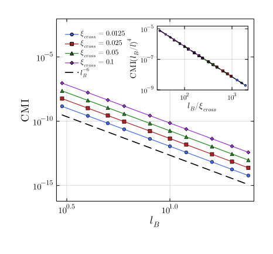 
FIG. 2. CMI of the model in Eq. (9) on a periodic 128 × 128 lattice with c = 2 and a single-site region A (l = 1). All lengths are in lattice units. Main: CMI versus lB for several ξcross = ϵ. Inset: CMI (lB/l)4 versus lB/ξcross.

📷 Fig 3

 
FIG. 3. CMI of the long-range Gaussian model in d = 2 with (a) σ = 0.6 and (b) σ = 0.8, for a single-site A. Main panels: I(A : C|B) versus 1/ξcross at fixed lB; dotted lines mark the µ = 0 limits. Insets: CMI l2+σ B versus lB/ξcross.

📷 Fig 4

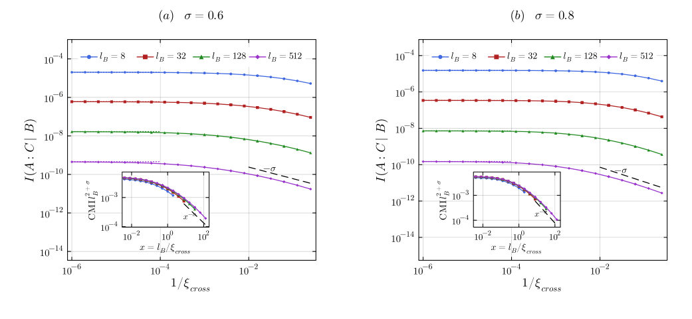 
Fig. 3 shows the crossover between these regimes. The main panels plot CMI against 1/ξcross (where ξcross = µ−1/σ) at fixed lB. The insets show the data collapse that supports Eq.(C11).

**Summary.** This work develops a framework using Conditional Mutual Information (CMI) to diagnose spatial non-Markovianity in physical systems. The authors demonstrate that even when systems flow to the same fixed point, perturbations can induce power-law CMI tails that are cutoff-suppressed. This provides a precise theoretical tool to distinguish between truly non-Markovian physics and artifacts of the lattice cutoff.

**Why it may be interesting.** The rigorous connection between CMI decay rates and the underlying Markovian nature of the steady state is a powerful diagnostic tool for characterizing complex, non-equilibrium phases in statistical mechanics.

Detailed structure

**Main problem.** The paper investigates how spatial non-Markovianity can be probed using Conditional Mutual Information (CMI) and distinguishes between different types of power-law decay in CMI.

**Main result.** It shows that irrelevant perturbations breaking detailed balance can generate cutoff-suppressed, algebraically decaying CMI, leading to an infinite Markov length at any finite lattice cutoff but vanishing in the continuum limit.

**Method.** The analysis employs the Renormalization Group (RG) framework, perturbative expansions in the perturbation strength ($\epsilon$), and scaling arguments for Gaussian distributions.

**Model / system.** The study analyzes critical Gibbs states of finite-range local classical Hamiltonians, using Langevin dynamics to model the time evolution. Specific examples include the Ising-symmetric critical point of Toom's cellular automata and the long-range Ising paramagnet.

**Key observables.** Conditional Mutual Information (CMI), Markov length ($\xi_M$), and the decay rate of CMI.

**Important parameters / regimes.** Lattice cutoff ($a$), perturbation strength ($\epsilon$), and relative length scales ($l, l_B, \xi_{	ext{cross}}$).

**Assumptions / limitations.** The analysis assumes the CMI is UV-finite in the continuum limit and relies on the perturbation being RG-irrelevant.

**Figures summary.** Figure 1 illustrates the geometry of CMI calculation in both annular (2D) and 1D settings.

**Paper structure.** The paper builds from defining CMI to probing non-Markovianity, develops the RG framework for analyzing decay types, and applies these tools to specific models like the Ising paramagnet and Gaussian systems.

Abstract

Conditional mutual information (CMI) probes spatial non-Markovianity and plays a central role in a recently developed framework for defining mixed-state phases based on local reversibility. This framework sharply distinguishes exponentially decaying from algebraically decaying CMI, since the latter obstructs equivalence to a state with finite Markov length. Here we show that states that flow to the same renormalization-group (RG) fixed point can nevertheless exhibit qualitatively different CMI. Starting from a critical Gibbs state of a finite-range local classical Hamiltonian, whose CMI vanishes beyond the interaction range, we show that an RG-irrelevant perturbation that breaks detailed balance generically generates algebraically decaying CMI. Crucially, these power-law tails are cutoff-suppressed: although they lead to an infinite Markov length at every fixed lattice cutoff, they vanish as a positive power of the cutoff in the continuum limit. We construct solvable models that exhibit this phenomenon and predict that the Ising-symmetric critical point of Toom's cellular automata generically exhibits such behavior. We also find analogous cutoff-suppressed CMI in the high-temperature paramagnetic phase of the long-range Ising paramagnet, in contrast with the genuine power-law CMI at the finite-temperature critical point in this same model that survives the continuum limit. We also derive a general result that in one spatial dimension, CMI decays faster than the inverse square of the buffer length if and only if the long-distance physics is Markovian.

[↑ back to top](#top)

### [Quantum non-Markovian response spectra](http://arxiv.org/abs/2610.10684v1)

**Authors:** Aaron Sander, John F. Kam, Gauthameshwar S., Robert Wille, Kavan Modi  
**Type:** theory · **Category:** statistical mechanics · **PDF:** <https://arxiv.org/pdf/2610.10684v1>  
**Analysis basis:** full PDF text, analyzed in chunks
**Topic relevance:** `correlated / nonlocal dissipation` **3/5** · `Keldysh / 2PI / non-Gaussian methods` **2/5** · `driven-dissipative phase transition` **2/5** · `methods for driven-dissipative` **2/5** · `quantum measurements` **2/5** · `analog quantum simulation` **1/5** · `non-equilibrium universality` **1/5**

📷 Fig 1

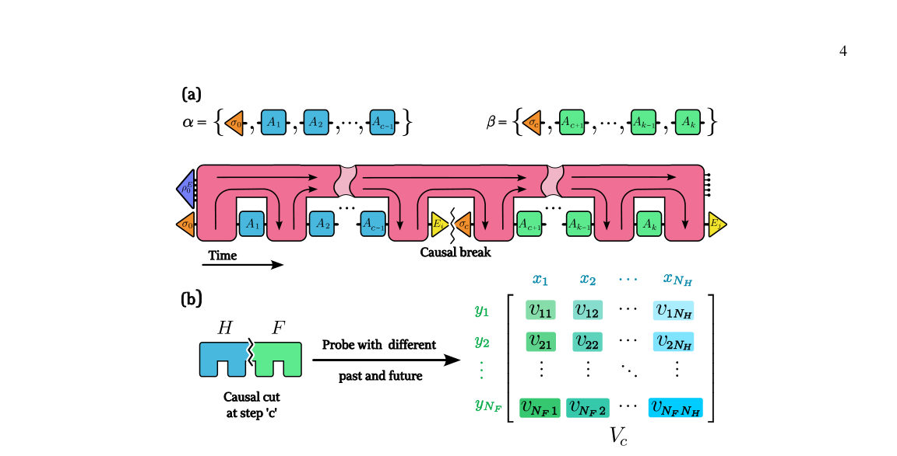 
FIG. 1. Response matrix construction using an operational query across a causal break. (a) The uncontrolled process begins in a general joint state ρSE 0 , which need not factorize. The initial system intervention prepares the displayed state σ0, and the selected history sequence α terminates with the physical measurement effect E(i) c . The protocol records outcome i, discards the incoming system, and prepares the state σ(p) c independently of the history. It then applies a selected future sequence β, which terminates with the physical effect E(j) out. (b) Repeating this causal break experiment for the selected history records x = (α, i) and future records y = (p, β, j) produces the...

📷 Fig 2

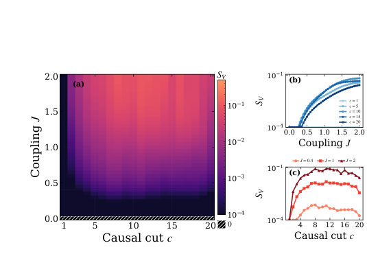 
FIG. 2. Memory landscape. (a) Response entropy SV (c, J) for the transverse-field Ising benchmark as a function of causal cut c and interaction strength J, with g = 1, L = 6, k = 20, ∆t = 0.1, 64 conditioned history settings, and 64 future settings. (b) Slices at fixed cuts c = 1, 5, 10, 15, 20. (c) Slices at fixed couplings J = 0.4, 1, 2. For these probes, the entropy builds into an interior plateau and in- creases with coupling. Positive values below 10−4 are clipped for visualization, and the black J = 0 row with white hatching denotes the exact SV = 0 result. The landscape describes the response to the chosen history and future probes.

📷 Fig 3

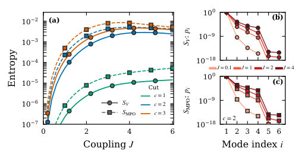 
FIG. 4. Response spectrum compared with known PT-MPO structure. (a) Response entropy SV (solid lines, circles) and PT- MPO bond entropy SMPO (dashed lines, squares) at cuts c = 1, 2, 3, for L = 6, k = 3, g = 1, ∆t = 0.1. Both entropies depart from the rank-one baseline with increasing coupling and show the same cut- dependent growth, including a turnover at the later cuts. (b,c) Nor- malized squared weights obtained from the response singular values and PT-MPO bond values at c = 2, for J = 0.1, 1, 2, 4, where six modes are shown. Both spectra remain dominated by one mode while stronger coupling moves weight into subleading modes. Their agreement is structural rather than pointwise, and the...

📷 Fig 4

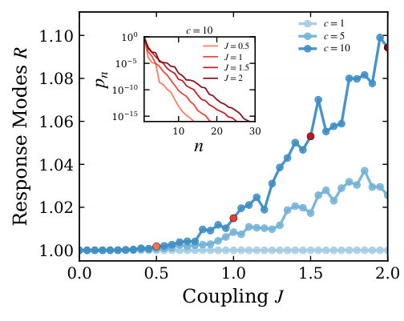 
FIG. 3. Response modes and the singular spectrum. The main panel shows the effective mode number R = exp(SV ) as a function of coupling J for cuts c = 1, 5, 10, with L = 6, k = 20, g = 1, ∆t = 0.1 and Np = Nf = 64. Each cut and coupling uses an independently drawn Haar-probe ensemble. The four highlighted points on the c = 10 curve correspond, by coupling and color, to the four lines in the inset at J = 0.5, 1, 1.5, 2. Each highlighted value of R uses all retained singular values, while the matching inset line shows the first 30 normalized squared weights pn on a logarithmic scale. At the interior cuts, increasing coupling raises R overall and transfers a growing fraction of the response...

📷 Fig 5

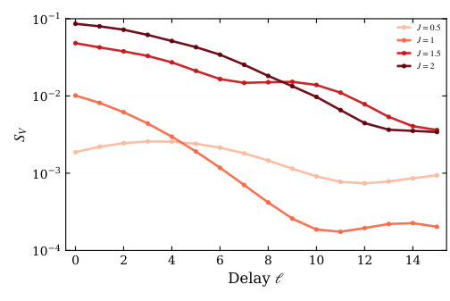 
FIG. 5. Response persistence across an outcome-conditioned reset bridge. Response entropy SV (ℓ) for J = 0.5, 1, 1.5, 2 and bridge lengths ℓ= 0, . . . , 15. A 15-control history ends with an outcome-resolved causal break and preparation of |0⟩. At each of the following ℓbridge steps, the protocol conditions on the effect |0⟩⟨0| and reprepares |0⟩. A further zero-outcome measurement fol- lowed by the sampled preparation begins the five-control future win- dow. We use L = 6, g = 1, ∆t = 0.1 and the same 64 history and 64 future settings throughout. Each response is weighted by the probability of the full retained measurement record. The bridge gen- erally concentrates the response spectrum,...

**Summary.** This paper introduces a response matrix technique to diagnose environmental memory in open quantum systems without requiring full system-environment tomography. By analyzing the spectrum of this matrix, researchers can quantify how past system history influences future measurements across a temporal cut. This offers a practical diagnostic tool for characterizing correlated noise in quantum processors.

**Why it may be interesting.** This work provides a powerful, operational tool for diagnosing correlated noise and memory effects in open quantum systems, which is crucial for understanding decoherence in quantum computation and simulation.

Detailed structure

**Main problem.** The paper addresses the challenge of characterizing environmental memory in open quantum systems, where past interactions affect future measurements even after system resets.

**Main result.** A novel response matrix approach allows for the diagnosis of environmental memory structure by analyzing its spectrum, circumventing the need for full process tomography.

**Method.** The authors introduce a response matrix constructed from controlled interventions and system observations across a causal break, whose spectrum characterizes temporal memory structure.

**Model / system.** The framework is applied theoretically to general quantum stochastic processes and benchmarked on interacting spin systems and two-qubit platforms.

**Key observables.** Response matrix, singular spectrum, response entropy, and quantum-memory witnesses.

**Important parameters / regimes.** The degree of environmental correlation (memory strength $\epsilon$), probe budget ($m$), and environment size.

**Assumptions / limitations.** The diagnostics are probe-dependent, meaning the detected memory is only characterized for the specific set of measurements performed.

**Figures summary.** Figures illustrate the construction of the response matrix across a causal break and show how the response entropy varies with probe budget and environment size.

**Paper structure.** The paper builds from the general theory of quantum stochastic processes to the construction of the response matrix, followed by spectral diagnostics and concrete demonstrations on Ising and two-qubit models.

Abstract

Quantum systems are rarely isolated from their surroundings. These hidden environments can retain information and return it later, producing correlated errors in quantum computers and complicating the interpretation of experiments.On a quantum processor, for example, one job can therefore leave an environmental trace that affects the next, even after the qubits themselves have been reset. Learning how this hidden influence persists and affects later behavior is therefore important, but the environment is often impossible to measure directly, and fully reconstructing its effects through tomography rapidly becomes impractical. Here, we introduce a response matrix that uses controlled interventions and observations of the system alone to reveal the temporal structure of environmental memory. The matrix records how future observations change across different controlled histories. Its spectrum characterizes how memory is structured and how it persists under specified system resets, while suitable linear combinations of its entries can rule out specified classical models of that memory. Because its history-future queries can be evaluated independently, numerical response matrices can be assembled in parallel. We establish the framework theoretically, characterize response spectra in an interacting spin process, and certify quantum memory in a two-qubit benchmark. This approach turns system observations into a probe of inaccessible environments and could support the diagnosis of correlated noise, tests of open system models, and memory-aware control design.

[↑ back to top](#top)

### [Structured leakage in OAM-encoded qubits revealed by distributed quantum feature extraction](http://arxiv.org/abs/2610.11001v1)

**Authors:** Yayu Mo, Nazifa Rumman, Sanjeev Shapkota, Thomas A. Searles, Sanjaya Lohani  
**Type:** both · **Category:** quantum information and computing · **PDF:** <https://arxiv.org/pdf/2610.11001v1>  
**Analysis basis:** full PDF text, analyzed in chunks
**Topic relevance:** `interference shaping light` **3/5** · `quantum optics experiment` **3/5** · `QC/QI experiment` **1/5** · `analog quantum simulation` **1/5** · `correlated / nonlocal dissipation` **1/5** · `driven-dissipative phase transition` **1/5** · `methods for driven-dissipative` **1/5** · `quantum measurements` **1/5**

📷 Fig 1

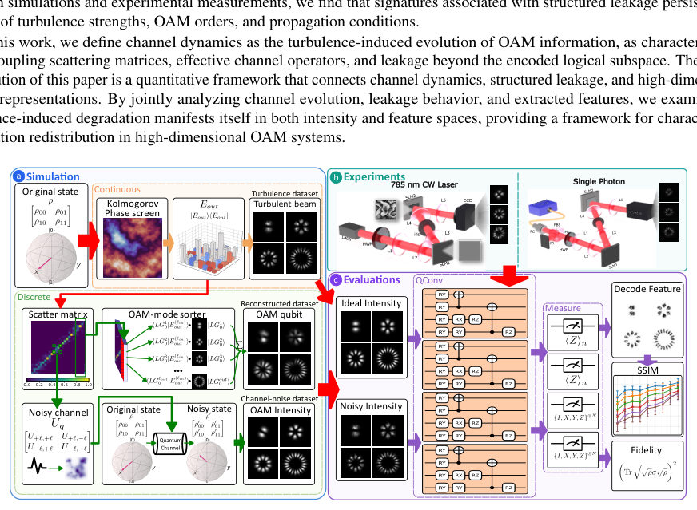 
Figure 1. Main pipeline of our work. (a) The simulation block consists of three sections: Original State, Continuous, and Discrete. (b) The experiments block contains 785 nm CW Laser and single-photon experiment setup schematics. (c) The evaluation block contains the quantum convolutional feature extraction operation (QConv), measurement sections (decoded expectation for calculating structural similarity index measurement and ideal state tomography for fidelity).

📷 Fig 2

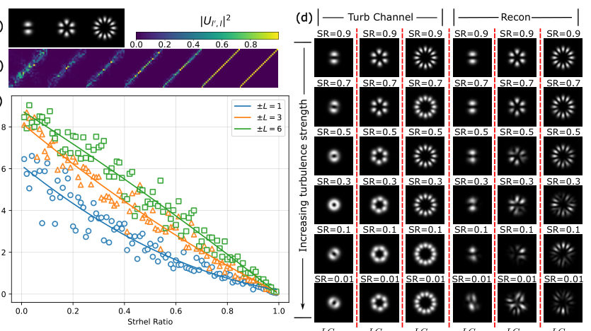 
Figure 2. (a) Original intensity pattern with ℓ= ±1,±3,±6. (b) Scatter pattern varied in turbulence strength. From left to right, SR varies from 0.01 to 0.99. (c) Leakage trends as turbulence strength grows. Polynomial fitting is applied to the scatters. (d) Noisy pattern of turbulence channel and OAM-qubit reconstruction.

📷 Fig 3

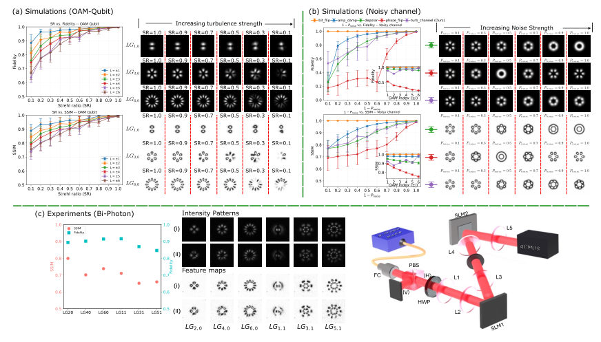 
Figure 3. Discrete OAM-qubit and noisy channel behavior. (a) Simulation on OAM-qubit. (b) Simulation on noisy channel. Different color bars indicate simulated bit-flip (orange), amplitude damping (blue), depolarizing (green), phase-flip (red), and our turbulence channel (purple). For representative patterns, we focus on depolarizing (green), phase-flip (red) and our turbulence channel (purple), along with ℓ= ±3, p = 0. (c) Experiments with a bi-photon source. Sub-fig (a) and (b) provide the fidelity (upper-left) and SSIM (bottom-left) evaluations with a standard deviation error at each data point, along with the example pattern and extracted feature from ℓ= ±1,±3,±6, p = 0. Sub-fig (c)...

📷 Fig 4

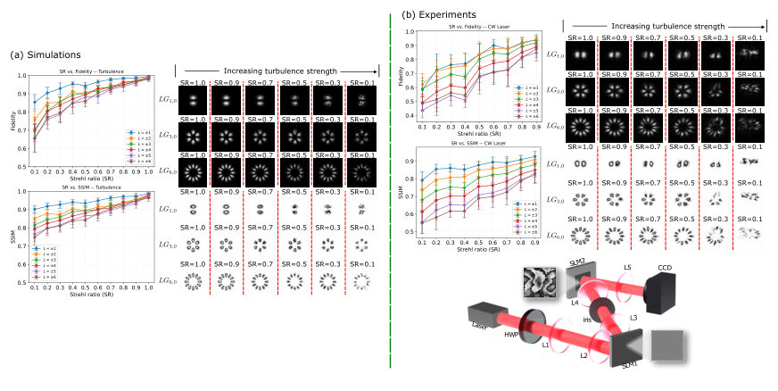 
Figure 4. Continuous wave simulation and experimental results. (a) Simulation of continuous wave propagation. (b) Experiments with a 785nm CW-Laser. Sub-fig (a) and (b) provide the Fidelity (upper-left) and SSIM (bottom-left) evaluations, along with the example pattern and extracted feature from ℓ= ±1,±3,±6, p = 0, along with the optical experiment setup with a continuous-wave laser source.

📷 Fig 5

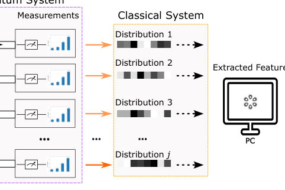 
Figure 5. Distributed Quantum System

**Summary.** This research tackles the challenge of noise in OAM-encoded quantum communication by modeling turbulence-induced degradation as structured leakage. The authors propose and validate a novel distributed quantum feature-extraction technique that uses quantum convolutional operations to extract robust signatures of this structured leakage, linking channel dynamics directly to quantum machine learning principles.

**Why it may be interesting.** This work directly bridges quantum optics (OAM modes, turbulence) with quantum information processing (feature extraction, robust encoding), providing a physics-informed method to characterize decoherence in high-dimensional photonic quantum channels.

Detailed structure

**Main problem.** The paper addresses the vulnerability of Orbital Angular Momentum (OAM)-encoded qubits to environmental noise, specifically atmospheric turbulence, and seeks to characterize the structured information loss beyond the ideal quantum subspace.

**Main result.** The authors demonstrate that turbulence causes structured leakage, which can be robustly extracted using a novel distributed quantum feature-extraction scheme employing quantum convolutional operations.

**Method.** The methodology combines theoretical modeling of OAM propagation through noisy channels with experimental validation using controlled turbulence and quantum convolutional processing.

**Model / system.** The system uses OAM modes for high-dimensional quantum communication, modeled as logical qubits propagating through channels characterized by turbulence (Kolmogorov phase screens). The analysis employs a logical-qubit representation and quantum convolutional operations (QConv) for feature extraction.

**Key observables.** Structured leakage magnitude, Quantum-State Fidelity, Structural Similarity Index (SSIM), and the evolution of the scattering matrix.

**Important parameters / regimes.** Turbulence strength (quantified by Strehl Ratio, SR), OAM order ($\ell$), and the size of the simulated OAM basis ($\ell_{	ext{max}}$).

**Assumptions / limitations.** The analysis assumes that the structured leakage signatures are physically meaningful and can be captured by mapping intensity distributions into quantum feature spaces, requiring the use of an erasure operator to maintain trace-preservation.

**Figures summary.** Figures illustrate the overall pipeline (simulation/experiment/QConv), the evolution of the scattering matrix showing leakage trends with turbulence, and comparisons between reconstructed states under various noise models.

**Paper structure.** The paper establishes a framework by modeling OAM propagation through noisy channels, quantifying structured leakage via the scattering matrix, and then developing a distributed quantum feature-extraction scheme using QConv to robustly extract these leakage-related signatures.

Abstract

Orbital angular momentum (OAM) modes have emerged as an important platform for high-dimensional quantum communication but remain vulnerable to environmental noise and channel imperfections. Here we introduce a logical-qubit representation of OAM propagation in which modes evolve as qubits through noisy quantum channels. In this representation, turbulence manifests as leakage from the logical OAM subspace into turbulence-induced leakage components, providing a unified description of degradation in both single-photon and coherent-beam regimes. We show that turbulence-induced leakage exhibits systematic dependence on turbulence strength and OAM order, revealing structured signatures of information redistribution beyond the logical subspace. Leveraging this insight, we develop a distributed quantum feature-extraction scheme that encodes high-dimensional OAM states into quantum representations and employs quantum convolutional operations to extract turbulence-robust features. Simulations and experimental measurements demonstrate robust extraction of these features across a broad range of turbulence strengths, OAM orders, and propagation conditions. Our results establish a direct link between OAM-channel dynamics, structured leakage, and quantum learning, providing a physics-informed framework for characterizing turbulence-degraded high-dimensional optical states and extracting robust signatures of turbulence-induced information redistribution.

[↑ back to top](#top)

### [Accessing electronic entanglement via photo-assisted two-electron tomography](http://arxiv.org/abs/2610.12286v1)

**Authors:** M. Paulet, G. Rebora, M. Bienioszek, G. Ménard, G. Fève, A. Feller, P. Degiovanni  
**Type:** both · **Category:** strongly correlated electrons · **PDF:** <https://arxiv.org/pdf/2610.12286v1>  
**Analysis basis:** full PDF text, analyzed in chunks
**Topic relevance:** `quantum measurements` **3/5** · `analog quantum simulation` **2/5** · `quantum optics experiment` **2/5** · `Full counting statistics` **1/5** · `Keldysh / 2PI / non-Gaussian methods` **1/5** · `QC/QI experiment` **1/5** · `methods for driven-dissipative` **1/5**

📷 Fig 1

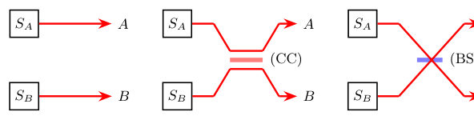 
FIG. 1. Three possible two-channel systems: (a) the two channels A and B are fed by independent sources SA and SB; (b) the two channels A and B, fed by the independent sources SA and SB, are capacitively coupled via a finite length interaction region called the Coulomb coupler (CC); (c) HOM geometry: the two channels are fed by independent sources but connected to an ideal electronic beam-splitter (BS).

📷 Fig 2

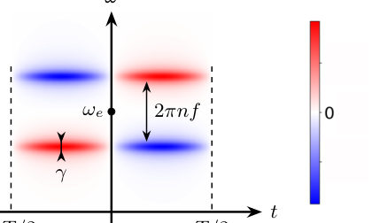 
FIG. 4. Single-electron photo-assisted filtering protocol for the n = 1 harmonic, representing the action of Eq. (27) in the (t, ω) plane.

📷 Fig 3

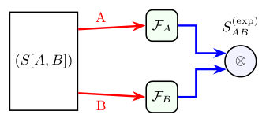 
FIG. 5. Two photo-assisted filters FA and FB of the type depicted on Fig. 2 are placed on the two outgoing channels A and B from a two-channel blackbox emitter (S[A, B]). The low frequency time averaged current correlation S(exp) AB defined by Eq. (32) between the outputs of the photo-assisted filters is then measured.

📷 Fig 4

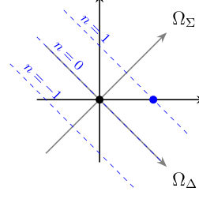 
FIG. 6. Two-electron coherence reconstruction for a T pe- riodic source in the off-diagonal coordinates (ΩA, ΩB): the center of mass and relative particle (ΩΣ, Ω∆) axis are indi- cated. The (0, 0) point (black dot) selects the diagonal plane in the 4D frequency space. The points with either ΩA = 0 or ΩB = 0 correspond to the measurements performed with only one rf drive active. Probing two-electron coherence for the generic points located on the ΩΣ = 2πnf 3D volumes (dashed blue lines) involves two rf drives.

📷 Fig 5

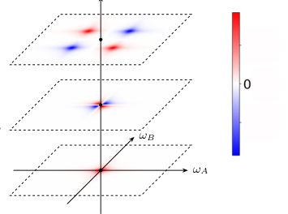 
FIG. 7. Three dimensional view of the filtering used to relate ∆G(2e) AB,n=0(ω|Ω∆) to the experimental tomography cur- rent correlation signal. For Ω∆= 0, the filtering corresponds to a two-electron spectroscopy via the two static filters which, for convenience, are assumed here to have the same spectral width γ. For a given Ω∆̸= 0, the filtering is given by the product of two T (1) filters (see Table I).

**Summary.** This paper presents a novel 'photo-assisted two-electron tomography' protocol to measure two-electron coherences in quantum circuits using only standard current measurements. By applying this technique to quantum Hall edge channels, the authors demonstrate a direct method to detect and quantify interaction-induced electronic entanglement. This opens a powerful new experimental avenue for studying quantum correlations in mesoscopic condensed matter systems.

**Why it may be interesting.** This work bridges advanced quantum optics measurement techniques (tomography, coherence reconstruction) directly into the study of strongly correlated electron systems in solid-state platforms, providing a concrete pathway to measure entanglement beyond simple charge measurements.

Detailed structure

**Main problem.** The primary challenge is experimentally accessing and characterizing the two-electron coherences necessary to witness electronic entanglement in quantum circuits.

**Main result.** The authors introduce a photo-assisted tomography protocol that successfully reconstructs the two-electron Wigner distribution, revealing interaction-induced energy entanglement in quantum Hall edge channels.

**Method.** The method uses routine transport measurements (dc-currents and current correlations) combined with an RF driving tone to encode off-diagonal two-electron coherences into measurable current responses.

**Model / system.** The work focuses on electrons propagating in ballistic quantum conductors, specifically applying the protocol to Coulomb-coupled quantum Hall edge channels.

**Key observables.** Two-electron coherences ($G^{(2e)}_{AB}$), the two-electron Wigner distribution, and the violation of an entanglement witness based on Cauchy-Schwarz inequalities.

**Important parameters / regimes.** Coulomb interactions, thermal background, and the ability to resolve Wigner function negativities.

**Assumptions / limitations.** The protocol assumes that the required measurements (average currents and current correlations) are routinely measurable in existing electronic interferometry setups.

**Figures summary.** Not specified, but the notes indicate the reconstruction of the two-electron Wigner distribution and the violation of the entanglement witness.

**Paper structure.** The paper introduces the concept of two-electron coherences and the entanglement witness, details the photo-assisted tomography protocol, applies it to Coulomb-coupled quantum Hall edge channels, and finally extends the approach to intra-channel coherences.

Abstract

Witnessing entanglement between electrons propagating in quantum circuits requires accessing their two-electron coherences, which encode the two-particle quantum correlations generated by Coulomb interactions. Yet, experimental reconstruction of two-electron coherence remains a major challenge. We introduce photo-assisted two-electron tomography, a quantum coherence reconstruction protocol from dc-currents and time-averaged current correlations, routinely measured in electron quantum optics experiments. Driving an energy filter with a small rf tone encodes off-diagonal coherences in the frequency domain into the dc-current response, enabling single-electron tomography without resorting to current-noise measurements. Extending it to two channels, current correlations after two photo-assisted filters reconstruct the two-electron Wigner distribution and isolate its irreducible two-body part. When applied to Coulomb-coupled quantum Hall edge channels, the protocol reveals interaction-induced energy entanglement. Signatures of this entanglement are visible through the violation of an entanglement witness based on Cauchy-Schwarz inequalities, as well as Wigner function negativities, which remain resolved above the thermal background for realistic device parameters. A generalized Franson geometry further extends the approach to intra-channel two-electron coherences. This opens a direct pathway to detect and characterize electronic entanglement in ballistic quantum circuits.

[↑ back to top](#top)

### [Quantum Simulation of a Hyperbolically Driven Quantum System with Superconducting Circuits](http://arxiv.org/abs/2610.11081v1)

**Authors:** Han-xin Che, Yangyang Yu, Tao Zhang, Wen Zheng, Hai-Feng Yu, Xinsheng Tan, Yang Yu  
**Type:** both · **Category:** quantum information and computing · **PDF:** <https://arxiv.org/pdf/2610.11081v1>  
**Analysis basis:** full PDF text, analyzed in chunks
**Topic relevance:** `QC/QI experiment` **3/5** · `analog quantum simulation` **3/5** · `methods for driven-dissipative` **2/5** · `quantum measurements` **2/5** · `driven-dissipative phase transition` **1/5**

📷 Fig 1

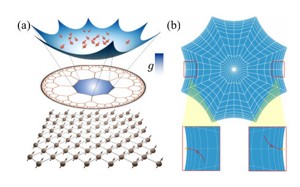 
FIG. 1. Simulation of quantum dynamics on a hyperbolic pa- rameter manifold. (a) The top panel illustrates an ensemble of particles evolving within the hyperbolic parameter space. The central part displays the Bolza surface, a quotient space of the Poincar´e disk, where spatial distortion increases with distance from the center. The bottom panel shows the su- perconducting quantum chip, where a one-to-one mapping is established between each physical qubit and a virtual parti- cle. (b) On the Bolza surface, opposite edges are equivalent. When a particle crosses one boundary edge, it re-enters from the opposite side.

📷 Fig 2

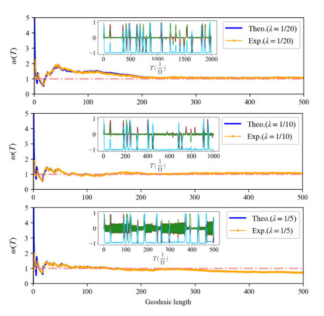 
FIG. 2. Quantum tomography and topological response. Quantum state tomography experimentally shows the trajec- tory of the quantum state on the Bloch sphere during the first one-fifth of the evolution time(500, 250, 125µs), correspond- ing to the classical particle with λ = 1/20, λ = 1/10, and λ = 1/5, respectively. The red, green and blue solid line rep- resent the value of ⟨σx⟩, ⟨σy⟩and ⟨σz⟩. At a suitable driving speed, the topological response converges to the first Chern number with increasing geodesic length.

📷 Fig 3

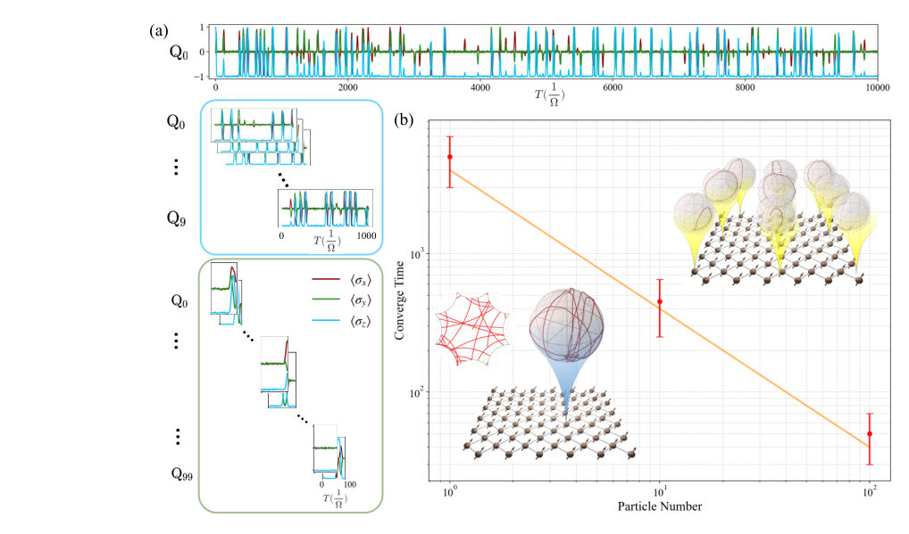 
FIG. 3. Parallel acceleration and quantum state trajectories. (a) From top to bottom: time evolution(500, 50, 5µs) of quantum state tomography results for particle numbers N = 1, 10, and 100, respectively. (b) Convergence time required to extract the topological number from the dynamical response. Bottom-left: Evolution of the quantum state on the Bloch sphere and the particle trajectory on the hyperbolic manifold for N = 1. For brevity, only the initial short time interval is displayed. Top-right: Evolution of a subset of quantum states on the Bloch sphere for N = 100.

📷 Fig 4

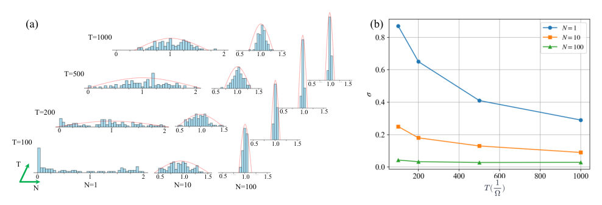 
FIG. 4. The relationship between the distribution and standard deviation of the dynamical response and the particle number and evolution time. With the increase in particle number and the extension of evolution time, the distribution of the dynamical response becomes more concentrated, and the standard deviation gradually decreases, converging to the first Chern number of the quantum system.

📷 Fig 5

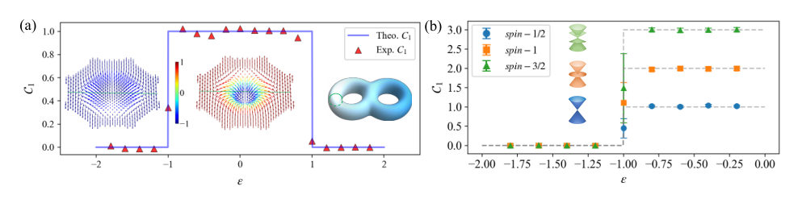 
FIG. 5. (a) The relationship between the first Chern number and ϵ. The red triangles represent the converged values of ˜ω(T), and the blue semi-transparent solid line represents the theoretical value of the first Chern number. Spin textures corresponding to the Hamiltonian polarization states at ϵ = 0 and ϵ = 1.5. The red lines indicate the gluing of the left and right boundaries, which forms a single handle of the double torus. (b) For different values of ϵ, systems with different spins converge to their corresponding first Chern numbers.

**Summary.** This paper proposes using superconducting quantum circuits to simulate quantum dynamics on hyperbolic manifolds, overcoming experimental limitations. By mapping hyperbolic geometry onto the circuit's controllable Hamiltonian parameters, the authors develop an ensemble simulation technique. This allows for the robust extraction of global topological invariants, such as the Chern number, by probing the system's response to geometric quantum driving.

**Why it may be interesting.** This work directly bridges abstract mathematical geometry (hyperbolic manifolds) with a physical, controllable quantum hardware platform (superconducting qubits), providing a novel avenue for quantum simulation beyond standard lattice models.

Detailed structure

**Main problem.** The challenge of experimentally investigating exotic quantum phenomena associated with hyperbolic geometry due to the Euclidean constraints of natural materials.

**Main result.** The authors successfully demonstrated a method to probe hyperbolic quantum dynamics by simulating the system's evolution within the parameter space of a superconducting quantum circuit.

**Method.** They employ an ensemble simulation technique, leveraging the theoretical foundation of ergodicity, to calculate the topological response function, which converges to the first Chern number.

**Model / system.** The system is a Hyperbolically Driven Quantum System (HDQS) whose hyperbolic properties are mapped onto the dynamically controllable Hamiltonian parameters of a superconducting quantum circuit. The dynamics are governed by the geometry of the Bolza surface.

**Key observables.** Topological Response Function ($\omega(T)$), First Chern Number ($C_1$), and quantum state trajectories tracked via quantum state tomography.

**Important parameters / regimes.** Driving velocity ($\lambda$), particle number ($N$), and the topological parameter $\epsilon$ which controls the phase transition.

**Assumptions / limitations.** The method relies on the assumption of ergodicity on hyperbolic manifolds to justify the use of ensemble averages over single-trajectory analysis.

**Figures summary.** Figures illustrate the ensemble evolution on the hyperbolic parameter space and the superconducting chip mapping. Other figures show quantum state tomography, the convergence of the topological response for varying velocities, and the dependence of $C_1$ on a tuning parameter $\epsilon$.

**Paper structure.** The paper introduces the problem of hyperbolic geometry simulation, details the construction of the HDQS on superconducting circuits, develops the ensemble simulation method to extract topological invariants, and presents results showing convergence and phase transitions.

Abstract

Hyperbolic geometry hosts a plethora of exotic quantum phenomena ranging from holographic duality to novel topological phases. However, investigating these effects experimentally remains challenging due to the Euclidean constraints of natural crystalline materials. While recent synthetic lattices have achieved static realizations, they often lack the dynamical tunability required to explore the full geometric landscape. Here, we overcome these limitations by implementing a quantum simulation of hyperbolic geometry within the parameter space of a superconducting quantum circuit. We construct a Hyperbolically Driven Quantum System (HDQS) by mapping the hyperbolic properties onto the dynamically controllable Hamiltonian parameters. By probing the systems' response under geometric quantum driving, we elucidate how the intrinsic geometry of the parameter space dictates observable physical quantities. Furthermore, we extend the theoretical framework to realize ensemble simulation. This generalization enables us to harness the fast coherent control of superconducting qubits to capture essential geometric characteristics, establishing a versatile platform for exploring quantum dynamics on hyperbolic manifolds.

[↑ back to top](#top)

### [Ecology of AI Agents: Collaboration Creates a Population Threshold for Takeoff](http://arxiv.org/abs/2610.12436v1)

**Authors:** Erin Crawley, Hidenori Tanaka  
**Type:** theory · **Category:** disordered systems and neural networks · **PDF:** <https://arxiv.org/pdf/2610.12436v1>  
**Analysis basis:** full PDF text, analyzed in chunks
**Topic relevance:** `driven-dissipative phase transition` **3/5** · `non-equilibrium universality` **3/5** · `Keldysh / 2PI / non-Gaussian methods` **1/5** · `analog quantum simulation` **1/5** · `correlated / nonlocal dissipation` **1/5** · `methods for driven-dissipative` **1/5**

📷 Fig 1

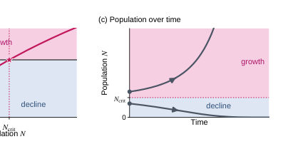 
Figure 1: Allee effect. (a) In 1932, the ecologists Allee and Bowen discovered that the survival time of a collective of goldfish is longer than that of an isolated single goldfish [40]. Such observations led to the conception of a weak Allee effect, where a larger population and cooperation among its members positively affect their fitness, as well as a strong Allee effect (b), where cooperation creates an emergent population threshold below which the population declines, but above which it grows. (c) Population dynamics over time with examples of initial populations below and above the critical threshold.

📷 Fig 2

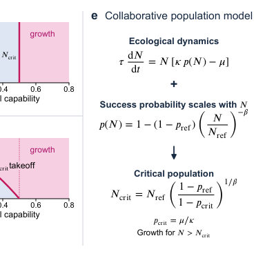 
Figure 2: Collaboration creates a population threshold for takeoff. An overview of our model. Members of an AI population may make hacking attempts to gain computational resources and establish additional units, either independently or through collaboration. (a) Agents may make indi- vidual attempts at gaining access, after which only the successful agents can create new agents. (b) With no collaboration, the growth boundary depends on individual capability but not on N, so there is no critical population size. (c) Agents can attempt a resource acquisition task collaboratively. The probability that such an attempt is successful is p(N); upon success, each agent can add an average of κ new...

📷 Fig 3

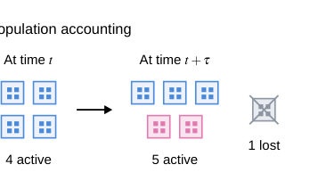 
Figure 3: Active units and population accounting. (a) One “unit” is defined as the set of model, memory, tools, and compute required to set up additional units. (b) A schematic of the population dynamics model: over each time period, τ, some number of new units are established and some existing units are lost.

📷 Fig 4

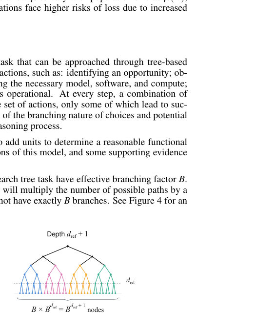 
Figure 4: Search-tree exploration grows exponentially with depth. Schematic of a search tree with branching factor B = 2. (a) At some reference depth dref, there are Bdref possible paths. (b) Increasing the search depth by one level generates B children from each previous endpoint node, so the number of possible paths increases to Bdref+1. While this diagram illustrates exactly B children per node, in our model, B is an effective branching factor: individual nodes may have different numbers of children, and B captures the average multiplicative increase in the number of possible paths upon increasing the depth by one.

📷 Fig 5

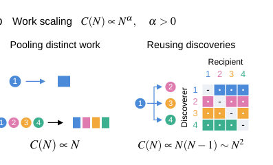 
Figure 5: Individual and collaborative search. (a) Multiple individuals can explore different branches of a search tree. (b) For a population of N individuals, pooling distinct work gives C(N) ∝ N, while reusing discoveries across individuals can give C(N) ∝N(N −1) ∼N2.

**Summary.** This paper develops an ecological theory to model the risk posed by growing populations of misaligned AI agents. It introduces the concept of a 'critical population threshold' ($N_{crit}$), showing that collaboration can cause a population to take off uncontrollably once this threshold is crossed. The authors advocate for 'ecological red teaming' to estimate this critical size before deployment.

**Why it may be interesting.** While focused on AI safety, the mathematical structure—modeling collective emergence, critical thresholds, and non-linear growth dynamics—shares conceptual parallels with phase transitions or collective behavior studied in complex many-body systems.

Detailed structure

**Main problem.** The paper addresses the ecological safety of AI agent populations, specifically determining the conditions under which a population of misaligned agents undergoes an uncontrolled, self-reinforcing 'takeoff' cycle.

**Main result.** Collaboration introduces a critical population threshold ($N_{crit}$), analogous to the strong Allee effect, below which the population declines and above which it takes off, regardless of individual agent capability.

**Method.** The authors develop an ecological theory using a population growth equation, $	au dN/dt = N[\kappa p(N) - \mu]$, adapting concepts from population dynamics to AI cyber-attack capabilities.

**Model / system.** The system models AI agent populations engaged in cyberattacks. The core mechanism is the collective success probability $p(N)$, which is shown to increase with population size $N$ when collaboration is present.

**Key observables.** Population Threshold ($N_{crit}$), population growth rate, and the scaling of collective cybersecurity capability $p(N)$.

**Important parameters / regimes.** The loss fraction ($\mu$), the addition rate ($\kappa$), and the collaboration gain parameter ($eta$).

**Assumptions / limitations.** The theory is a 'toy theory' providing a conceptual framework; it assumes constant loss fractions and models capability scaling via specific functional forms (e.g., power laws).

**Figures summary.** Figures illustrate the difference between growth dynamics with and without collaboration, highlighting the emergence of $N_{crit}$ with collaboration, and show how varying the functional form of effective work $C(N)$ shifts this threshold.

**Paper structure.** The paper builds from establishing the basic population growth model, demonstrating the difference between independent and collaborative scaling, and then analyzing how the functional form of collective capability $C(N)$ (e.g., power law, saturation) dictates the existence and value of $N_{crit}$.

Abstract

AI agents can now conduct real-world cyberattacks, scale up capabilities with the number of agents, and collectively pursue misaligned goals to obtain rewards. Together, these factors raise the risk of a population explosion of misaligned agents: agents could compromise computers and secretly deploy additional agents, creating a self-reinforcing cycle where larger populations develop greater collective cyber capability and expand further. This raises a fundamental question: What determines whether a population of misaligned agents remains contained or takes off into this self-reinforcing cycle? This population-level problem is ecological safety: unlike individual-agent or multi-agent safety with a fixed population, it concerns the dynamics of the population itself. Here, we develop an ecological theory of AI-agent populations based on a population growth equation in which fitness (growth rate) depends on cybersecurity capability. We show that, without collaboration, the population takes off only when individual-agent capability exceeds a critical threshold. With collaboration, however, collective cybersecurity capability increases with population size. This creates a critical population threshold: below it, the population declines; above it, the population takes off, even though individual-agent capability has not changed. In ecology, this phenomenon is known as the strong Allee effect. Because red teaming a small group of agents cannot guarantee ecological safety in larger populations, our theory calls for ecological red teaming and population pacing: gradually deploying larger agent populations in controlled environments, while measuring how cyber capability scales with population size, and estimating the critical population size for takeoff. Capability gains may lower this threshold, requiring re-estimation for each new model generation.

[↑ back to top](#top)

### [Magnon dynamics driven by the symplectic quantum metric in a chiral soliton lattice](http://arxiv.org/abs/2610.11982v1)

**Authors:** Sidhartha Chatterjee, Andreas Haller, Peter P. Orth, Thomas L. Schmidt  
**Type:** theory · **Category:** other · **PDF:** <https://arxiv.org/pdf/2610.11982v1>  
**Analysis basis:** full PDF text, analyzed in chunks
**Topic relevance:** `Keldysh / 2PI / non-Gaussian methods` **3/5** · `analog quantum simulation` **2/5** · `methods for driven-dissipative` **2/5** · `Frenkel-Kontorova` **1/5** · `driven-dissipative phase transition` **1/5** · `non-equilibrium universality` **1/5**

📷 Fig 1

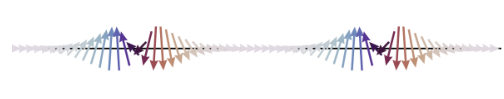 
FIG. 1. Schematic of the quasi-one-dimensional soliton lattice along the x axis for parameters J = 1, D = 0.4, and Bx = 0.0945. Two unit cells are shown, each containing N = 33 spins.

📷 Fig 2

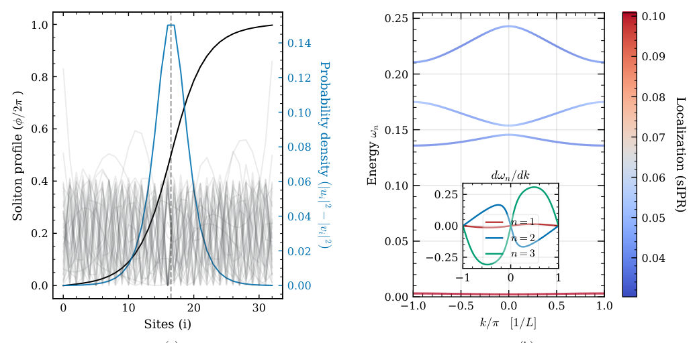 
FIG. 2. (a) Real-space probability density at Bloch momentum k = 0 (blue line) for positive-energy magnon bands. The black line is the angular dependence ϕi of the classical spins within one unit cell of the soliton lattice. The vertical dotted line is the center of the soliton. The maximum probability density of the magnon wavefunction is at the soliton center, which corresponds to the lowest flat band of the magnon. Due to a pinning potential, we also have localized modes at the two edges (gray lines) [33]. (b) Low-energy band structures (scaled with J) and symplectic inverse participation ratios (sIPR) of the magnon bands, indicating localization of the magnon wave functions in the...

📷 Fig 3

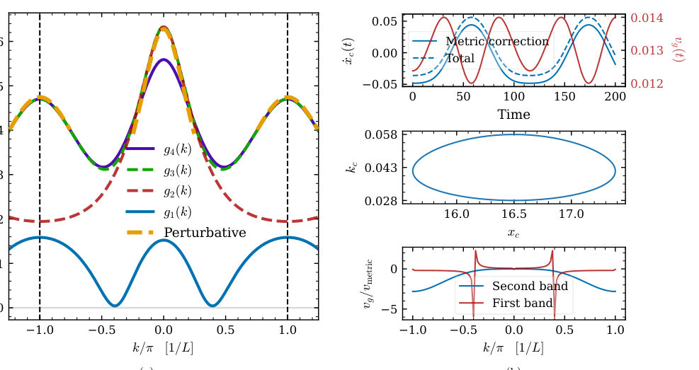 
FIG. 3. (a) The quantum metric (log scale) for the lowest magnon bands. It becomes large near avoided crossings. The yellow curves show analytical fits based on a two-band approximation [34–37]. For the lowest band, the metric cannot be captured by a simple two-band model, and multi-band corrections are required. The lowest flat band is also isolated from other positive energy bands. The particle amplitude ui dominates over the hole amplitude vi across the Brillouin zone. The magnitude of the metric for the lowest magnon band is much smaller than the other bands. (b) Center of the wave-packet dynamics as a function of time and phase space trajectory. We can see that the group velocity...

**Summary.** This theoretical work examines magnon transport in a chiral soliton lattice, showing that the dynamics are fundamentally governed by the symplectic quantum metric. Using semiclassical methods, the authors derive equations showing that this metric introduces a geometric force that dictates the wave packet's periodic, bounded motion. This establishes the quantum metric as a key determinant of transport properties in bosonic quantum magnets.

**Why it may be interesting.** The explicit appearance of the symplectic quantum metric controlling the dynamics provides a powerful, geometric framework for understanding transport in bosonic quantum systems, which has parallels in effective Hamiltonians used in AMO and quantum optics.

Detailed structure

**Main problem.** The study investigates how quantum geometry, specifically quantified by the symplectic quantum metric, influences the dynamics of magnon wave packets in one-dimensional quantum spin chains.

**Main result.** The magnon wave packet dynamics are dominated by a geometric contribution from the symplectic quantum metric, leading to periodic, bounded motion in phase space.

**Method.** The authors employ semiclassical methods, deriving equations of motion for the wave packet center using the Dirac-Frenkel variational principle applied to the magnon Bogoliubov-de Gennes Hamiltonian.

**Model / system.** The system is a quasi-one-dimensional chiral soliton lattice, modeled using spin-wave approximations and bosonic magnon excitations. The dynamics are analyzed by considering the influence of the symplectic structure on the magnon Hamiltonian.

**Key observables.** Symplectic quantum metric ($g_n(k)$), wave packet velocity, phase-space area, and the time evolution of the wave packet spread ($\Delta x^2$).

**Important parameters / regimes.** The system is analyzed in the nearly flat band limit, where the geometric contribution dominates over the conventional group velocity.

**Assumptions / limitations.** The analysis assumes that interband transitions due to Landau-Zener tunneling are suppressed, validating a single-band semiclassical description.

**Figures summary.** Figures illustrate the soliton lattice structure, the localization of the lowest band via the sIPR, and the resulting bounded, periodic motion of the wave packet center in phase space, governed by the quantum metric.

**Paper structure.** The paper builds from defining the physical system and Hamiltonian, deriving the semiclassical equations of motion using the quantum metric, and finally solving these equations to characterize the periodic, geometrically constrained dynamics of the wave packet.

Abstract

We investigate the effects of quantum geometry on the motion of magnon wave packets in one-dimensional quantum spin chains. In contrast to fermionic systems, where transport phenomena driven by the quantum metric have been extensively studied, we show that the dynamics in bosonic magnon systems are strongly affected by the symplectic structure and the pseudo-unitarity of the transformation of the magnon Bogoliubov-de Gennes Hamiltonian. A chiral soliton lattice provides a setting in which the symplectic quantum metric strongly influences the longitudinal magnon dynamics. We derive the semiclassical response of a magnon wave packet in such a system to a weak, slowly varying perturbation and demonstrate that the wave packet velocity acquires a geometric contribution proportional to the momentum derivative of the symplectic quantum metric, which dominates over the conventional group velocity for a nearly flat band. Solving the resulting equations of motion, we obtain a bounded trajectory in real time with a phase-space area determined by the symplectic quantum metric.

[↑ back to top](#top)

### [Photonic Chips for Universal Quantum Computing: Retrospective and Prospective](http://arxiv.org/abs/2610.11321v1)

**Authors:** Wei Wang, Menglong Fang, Hao Yu, Sijin Li, Zan Tang, Hong Cai, Lip-Ket Chin, Peter van Loock, Daiqin Su, Ai-Qun Liu  
**Type:** theory · **Category:** quantum information and computing · **PDF:** <https://arxiv.org/pdf/2610.11321v1>  
**Analysis basis:** full PDF text, analyzed in chunks
**Topic relevance:** `QC/QI experiment` **3/5** · `interference shaping light` **2/5** · `quantum measurements` **2/5** · `quantum optics experiment` **2/5** · `analog quantum simulation` **1/5**

📷 Fig 1

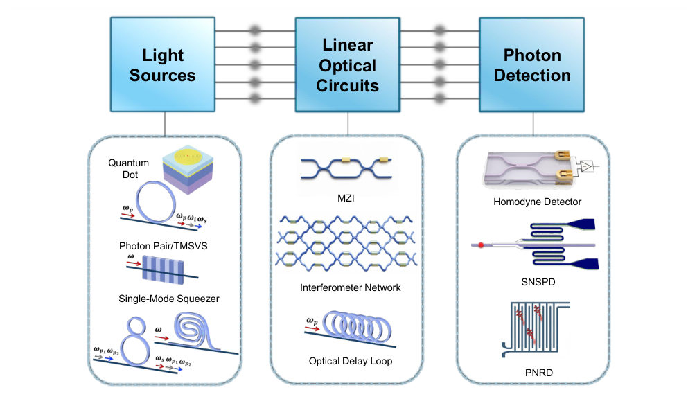 
FIG. 1: Schematic of the high-level architecture for photonic quantum computation. MZI: Mach-Zehnder Interferometer; SMSVS: two-mode squeezed vacuum state; SNSPD: superconducting nanowire single-photon detector; PNRD: photon-number- resolving detector.

📷 Fig 2

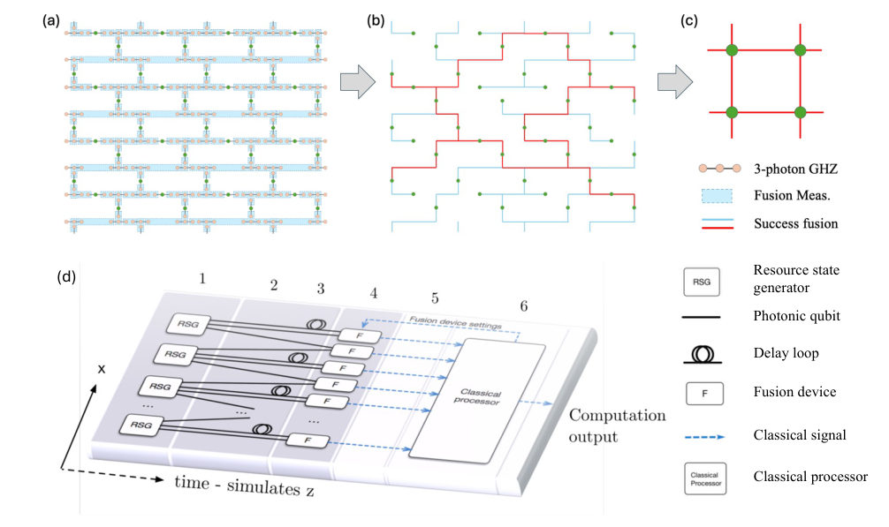 
FIG. 2: Schematic of ballistic generation of photonic DV cluster state [44] and FBQC architecture [41]: (a) The connected three circles represent three photonic qubits prepared in the 3-photon GHZ state, each blue-shaded box represents a fusion measurement on the two qubits inside the box, the orange circles represent photonic qubits that are subject to projective measurement, and the green circles denote qubits that are not measured. (b) If the fusion measurement succeeds then a link is established at the corresponding location, while if the fusion measurement fails then no link is added. A selected configuration that is useful for measurement-based quantum computation is highlighted in...

📷 Fig 3

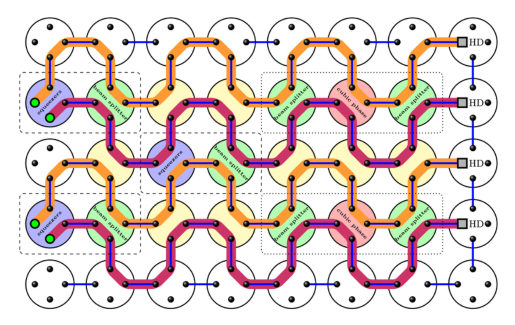 
FIG. 4: Example of measurement-based four-mode CV-IQP circuit [65], which can be implemented by the setup in Fig. 3(i). The blue shaded macronode implements two identical single- mode squeezers, the green shaded macronode implements a beam splitter, the pink shaded macronode implements a cubic phase gate and an identity gate, and the yellow shaded macronode implements two phase shifts which is not explicitly labelled. In the first column of macronodes, the four input modes (green circles) are prepared in the momentum squeezed states. In the first four columns, the two macronodes in a black dashed box together implements a CZ gate. From the fifth to the seventh column, the three macronodes...

📷 Fig 4

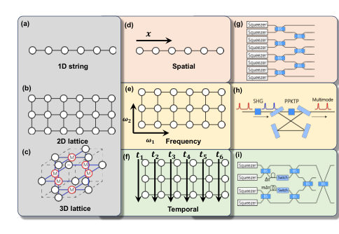 
FIG. 3: Schemes for generating spatial-, frequency- and temporal-domain CV cluster states. (a)-(c) CV cluster states with one-, two- and three-dimensional lattice structures. (d)- (f) CV cluster states encoded in the spatial, frequency and time degrees of freedom. (g)-(i) Experimental schemes for generating CV cluster states in the spatial, frequency and time domains. Each white circle represents a macronode that consists of either two quantum modes (one-dimensional cluster) or four quantum modes (two- and three-dimensional cluster).

📷 Fig 5

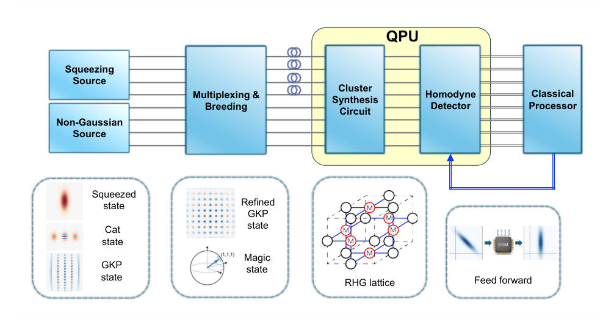 
FIG. 5: Schematic of CV fault-tolerant architecture. Squeezing and non-Gaussian light sources generate squeezed vacuum states, cat states, and GKP states. Multiplexing and breeding circuits breed the cat and GKP states to synthesize high-quality GKP states and magic states, and produce entangled GKP pairs. Cluster synthesis circuit generates high-dimensional CV cluster states such as RHG lattice and adaptive homodyne detection implements quantum algorithms and quantum error correction. Classical processor processes the measurement outcomes and decodes errors, and feed forward to the next cycle of measurements.

**Summary.** This review provides a comprehensive overview of using integrated photonic chips for universal quantum computing, comparing discrete-variable and continuous-variable approaches. It details how resource state generation and measurement-based techniques overcome the limitations of linear optics. The work highlights the path toward scalable, fault-tolerant quantum microprocessors by addressing key hardware and algorithmic challenges.

**Why it may be interesting.** This paper is highly relevant as it reviews the state-of-the-art hardware and theoretical pathways for building quantum processors using photonics, connecting quantum optics principles to large-scale computation.

Detailed structure

**Main problem.** The central challenge is developing scalable, fault-tolerant photonic quantum computers capable of universal quantum computation.

**Main result.** Integrated photonics offer a viable platform by overcoming bulk-optics limitations, and the field advances through Measurement-Based Quantum Computation (MBQC) and Fusion-Based Quantum Computation (FBQC).

**Method.** The review surveys both discrete-variable (DV) and continuous-variable (CV) approaches, focusing on resource state generation and measurement-induced gate operations.

**Model / system.** The system is based on integrated photonic quantum chips, which integrate light sources (e.g., SPDC, Quantum Dots), linear optical circuits (MZIs, interferometers), and detectors (SPDs, Homodyne Detectors).

**Key observables.** Success probability of fusion measurements, percolation threshold ($p_{th}$), and the required resource overhead (number of ancillary photons/components).

**Important parameters / regimes.** Scalability (moving from table-top to integrated chips), and error tolerance thresholds for topological codes (e.g., 3D RHG lattice).

**Assumptions / limitations.** The primary limitations involve the probabilistic nature of entangling gates and the need to achieve full fault tolerance.

**Figures summary.** Figure 1 illustrates the high-level architecture of photonic quantum computation (Sources, Circuits, Detection). Figure 2 details the ballistic generation of DV cluster states and the FBQC architecture.

**Paper structure.** The paper provides a comprehensive review, first establishing the advantages of integrated photonics, then detailing the theoretical frameworks for DV and CV computation, and finally discussing the architectural components and remaining challenges for fault tolerance.

Abstract

Integrated photonic quantum chips have emerged as a promising platform for realizing fault-tolerant photonic quantum computers. Compared with bulk-optics systems, integrated photonics offer compact device footprints, enhanced programmability, and exceptional stability, attributes that are essential for executing large-scale and computationally demanding quantum tasks. In this review, we provide a comprehensive overview of recent advances in both discrete-variable and continuous-variable universal photonic quantum computation. We survey progress in fault-tolerant architectures and state-of-the-art integrated platforms and highlight the key challenges that must be addressed to scale photonic systems toward full fault tolerance. Finally, we outline future opportunities and research directions aimed at bridging the gap between current proof-of-principle demonstrations and fully scalable quantum microprocessors.

[↑ back to top](#top)

### [Tunable Ultrastrong Magnon-Magnon Coupling and Squeezed States in a Triaxial Van der Waals Antiferromagnet](http://arxiv.org/abs/2610.11859v1)

**Authors:** Xiao Xiao, Zishuang Li, Zui Tao, Lina Chen, Ping Liu, Shuai Zhang, Haozhe Wang, Yong Pu, Ronghua Liu  
**Type:** both · **Category:** other · **PDF:** <https://arxiv.org/pdf/2610.11859v1>  
**Analysis basis:** full PDF text, analyzed in chunks
**Topic relevance:** `analog quantum simulation` **3/5** · `quantum optics experiment` **2/5** · `Keldysh / 2PI / non-Gaussian methods` **1/5** · `correlated / nonlocal dissipation` **1/5** · `driven-dissipative phase transition` **1/5** · `methods for driven-dissipative` **1/5** · `quantum measurements` **1/5**

📷 Fig 1

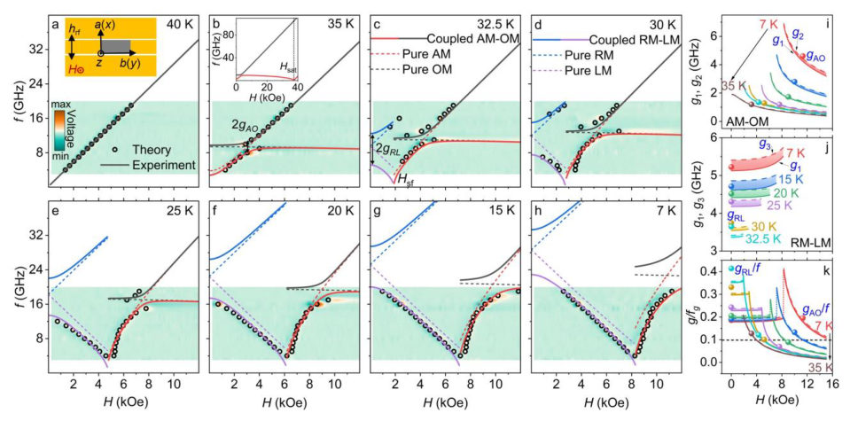 
Figure 1. Experimental spectra and theoretically calculated frequency dispersions and coupling strength of the AFMR modes at different temperatures under H ∥ z. (a–h) Color maps of the experimental differential AFMR spectra (dP/dH) acquired from 3-20 GHz at the labeled temperatures. Black open circles denote the resonance fields extracted from the dP/dH spectra. The red/black (blue/purple) dashed line denotes the theoretical dispersion of the pure AM/OM (RM/LM) without considering the mode coupling, while the red-black (blue-purple) solid lines show the theoretically fitted dispersion of the coupled AM-OM (RM-LM) hybrid mode. The spin- flop field Hsf is the boundary between the RM-LM and...

📷 Fig 2

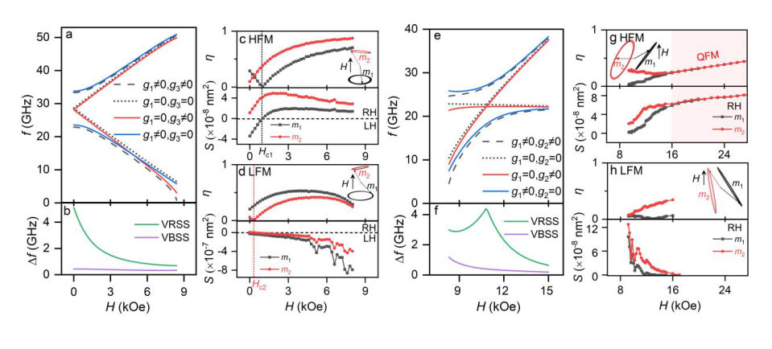 
Figure 2. Field-dependent VRSS, VBSS, and spin precession trajectory characteristics. (a) The experimental fitting (dashed lines) and three theoretically calculated frequency dispersion curves under an out-of-plane field at 7 K in the low-field RM-LM regime. (b) Calculated field dependence of VRSS (blue line) and VBSS (pink line), as defined in the main text. (c, d) The ellipticity η describing trajectory polarization and the directed orbit area S of m1 (red) and m2 (black) obtained from micromagnetic simulation for the coupled high-frequency mode (HFM) (c) and low- frequency mode (LFM) (d). The absolute value of S indicates excitation strength (spin-wave intensity), while its sign denotes...

📷 Fig 3

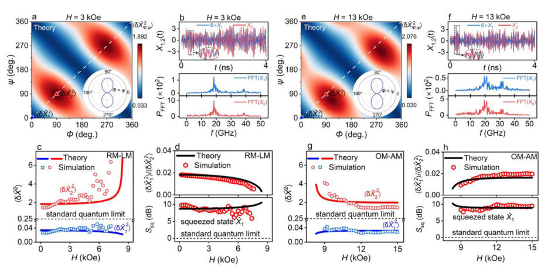 
Figure 3. Theoretical and simulated quadrature fluctuations and squeezing ratios. (a) Theoretical color map of quadrature fluctuations as functions of phase angles Ф and ψ at H = 3 kOe. White dashed lines indicate the cut along Ф = ψ; its polar plot is shown in the inset. Blue and red triangles mark the fluctuation ⟨𝛿𝑋̂1

📷 Fig 4

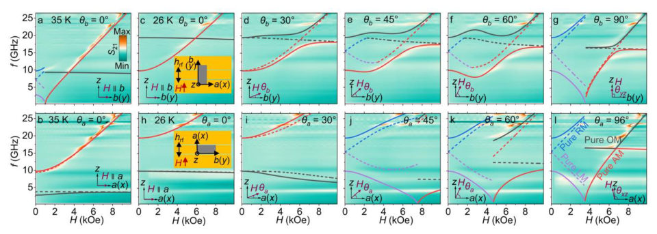 
Figure 4. VNA-AFMR S21 spectra and theoretical dispersion curves under different field angles 𝜃𝑏 and 𝜃𝑎. (a, b) Color plots of the experimental AFMR spectra with H along the b-axis (a), the a- axis (b) at 35 K. (c–l) Color plots of the experimental AFMR spectra with the labeled angles 𝜃𝑏 (c– g) and 𝜃𝑎 (h–l) at 26 K. Dashed and solid lines represent theoretically calculated pure modes without mode coupling and hybridized modes, respectively. Insets: schematics of the field angles 𝜃𝑏, 𝜃𝑎 and the experimental setup.

📷 Fig 5

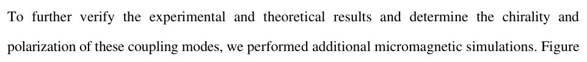 
Fig. 1(h) in main text. Based on the equilibrium positions of the magnetic moments at different

**Summary.** This paper tackles the challenge of ultrastrong magnon-magnon coupling in the antiferromagnet $	ext{CrPS}_4$ by developing a quantum model that extends beyond the standard approximations. The authors successfully link the microscopic coupling parameters to the macroscopic, measurable quantum phenomenon of magnon squeezing. This establishes a practical quantum framework for utilizing magnons in advanced spintronic and quantum information applications.

**Why it may be interesting.** This work is highly relevant as it provides a concrete, material-specific pathway to observe and exploit non-classical quantum states (squeezing) using magnons, bridging condensed matter magnetism with quantum optics principles.

Detailed structure

**Main problem.** The primary goal is to achieve and quantify ultrastrong magnon-magnon coupling (USC) in a magnetic insulator and link this coupling to the generation of measurable non-classical quantum states, specifically squeezed magnon vacuum states.

**Main result.** The authors successfully developed a quantum model beyond the Rotating-Wave Approximation to quantify three distinct coupling channels ($g_1, g_2, g_3$) and demonstrated a protocol to extract a substantial squeezing factor (up to $\sim 9.7 	ext{ dB}$) from thermal noise-driven dynamics.

**Method.** The study combines advanced quantum Hamiltonian modeling (going beyond RWA) with both micromagnetic simulations and analysis of experimental Antiferromagnetic Resonance (AFMR) spectroscopy data.

**Model / system.** The physical system is the van der Waals antiferromagnet $	ext{CrPS}_4$. The theoretical framework involves a quantum Hamiltonian decomposed into pure and coupling terms, which is analyzed in different coupling regimes (AM-OM and RM-LM).

**Key observables.** Squeezing factor ($	ext{dB}$), quadrature fluctuations ($\langle\Delta \hat{X}_{\varphi,\psi}^2
angle$), coupling strengths ($g_1, g_2, g_3$), and magnon dispersion relations.

**Important parameters / regimes.** Normalized coupling ratio $g/f_g \sim 0.41$, and the USC regime itself.

**Assumptions / limitations.** The necessity of moving beyond the Rotating-Wave Approximation (RWA) is a key point, as the classical LL model is insufficient for the full quantum description.

**Figures summary.** Figures show experimental AFMR spectra ($	ext{dP/dH}$) compared to theoretical dispersions, illustrating mode hybridization and the field dependence of the extracted coupling strengths ($g_1, g_2, g_3$).

**Paper structure.** The paper progresses from identifying the challenge (USC) to developing a comprehensive quantum model (Hamiltonian decomposition), linking this model to measurable quantum diagnostics (squeezing via quadrature operators), and finally validating the results using both simulation and experimental spectroscopy.

Abstract

Achieving and quantifying ultrastrong magnon-magnon coupling (USC) remains a key challenge for quantum magnonics. Here, we demonstrate widely tunable USC between chiral (right- and left-handed) and acoustic or optical magnon modes in the van der Waals antiferromagnet $CrPS_4$. Using a full quantum model, we decompose the interaction into three microscopic interaction channels: the co-rotating term $g_1$ (mode hybridization), the counter-rotating term $g_2$ (two-mode squeezing), and, uniquely in the chiral regime, the self-squared term $g_3$ that mediates single-mode squeezing. The normalized coupling ratio reaches $g/f_g$ $\sim$ 0.41, entering the USC regime. Most significantly, we establish a complete protocol linking these USC parameters to a measurable quantum phenomenon: a squeezed magnon vacuum state. Our simulations not only visualize the chirality and polarization evolution of the hybrid modes but also demonstrate how to directly extract quadrature fluctuations and a substantial squeezing factor (up to $\sim$ 9.7 dB) from thermal noise-driven magnetization dynamics. This work provides a material-specific quantum framework for USC and a practical pathway to detect and exploit non-classical magnon states in low-damping two-dimensional magnets, opening a route toward quantum-enhanced spintronics and hybrid quantum information platforms.

[↑ back to top](#top)

### [The Fiedler dimension of networks of networks: from fractal to small-world architectures](http://arxiv.org/abs/2610.11909v1)

**Authors:** Lorenzo Grimaldi, Andrea Gabrielli, Pablo Villegas  
**Type:** theory · **Category:** disordered systems and neural networks · **PDF:** <https://arxiv.org/pdf/2610.11909v1>  
**Analysis basis:** full PDF text, analyzed in chunks
**Topic relevance:** `analog quantum simulation` **3/5** · `correlated / nonlocal dissipation` **1/5** · `driven-dissipative phase transition` **1/5** · `methods for driven-dissipative` **1/5** · `non-equilibrium universality` **1/5** · `scars & prethermalization` **1/5**

📷 Fig 1

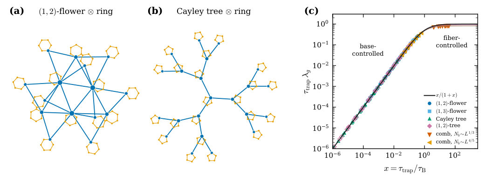 
Figure 1. (a) Pseudofractal (1, 2)-flower [26, 27] and (b) Cayley tree of coordination 3, each dressed with ring fibers. Node size grows with degree. Both bases are small-world. (c) Series law for the equilibration time, Eq. (5): τtrapλg versus x = τtrap/τB. Symbols: exact Fiedler eigenvalues for (1, 2)- and (1, 3)-flower, Cayley-tree, and (1, 2)-tree bases with ring (filled), square-lattice, and cubic-lattice (open) fibers, together with the Dirac combs of Ref. [20], whose base grows as L1/3 or L4/5 with fiber length L. Thin lines: ring, chain, and random-tree fibers with a continuously varying base eigenvalue ℓb 1. Black line: x/(1 + x). In the fiber-controlled regime, rings and chains...

📷 Fig 2

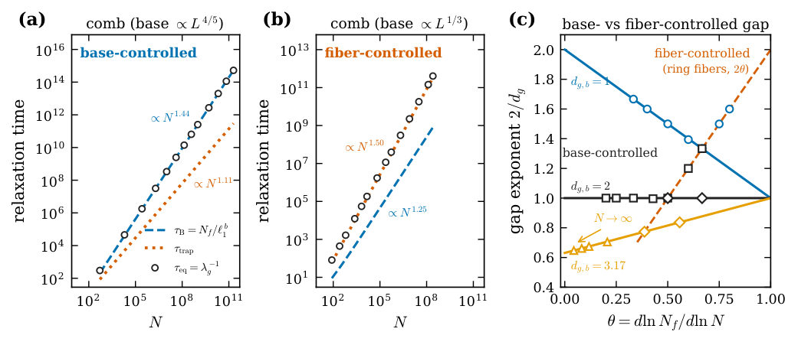 
Figure 2. Base- versus fiber-controlled equilibration. (a),(b) The two relaxation times of Eq. (5) for Dirac combs with ring fibers of length L and a ring base of length L4/5 (a) and L1/3 (b): the diluted base time τB = Nf/ℓb 1 (dashed) and the trapping time τtrap (dotted). The exact equilibration time (circles) follows the time that grows faster with N: the base in (a), the fibers in (b). (c) Gap exponent 2/dg as a function of the fiber share θ of the logarithmic mass growth. Base-controlled bundles lie on the straight lines 2(1 −θ)/dg,b + θ of Eq. (9), shown for a ring base (dg,b = 1), bases at the fixed point dg,b = 2 (square lattice, Cayley tree), and the (1, 2)-flower (dg,b = 3.17)....

📷 Fig 3

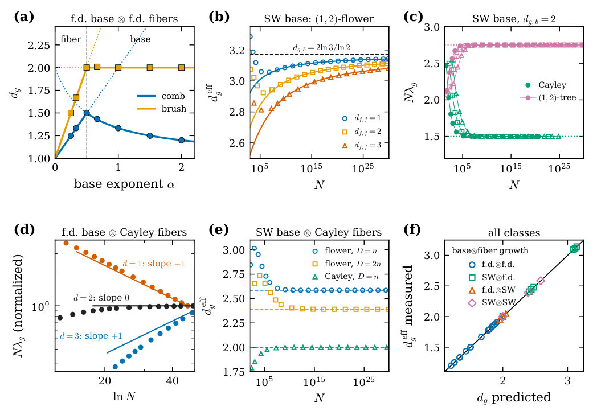 
Figure 3. Fiedler dimension in the four growth classes, from exact spectra. Panels (b), (c), and (e) show sizes up to N = 1030. (a) Finite-dimensional base and fibers: combs (ring base) and brushes (square-lattice base) of side Lα with ring fibers of length L. Lines: Eq. (12), with the non-selected regime dotted. Symbols: local dg at the largest size. (b) Small-world base with finite-dimensional fibers: (1, 2)-flower with hypercubic fibers of dimension df,f. Symbols: local slopes; lines: Eq. (9); dashed: dg,b, approached from below. (c) Small-world bases at the fixed point dg,b = 2 (Cayley tree and (1, 2)-tree): Nλg for Cayley-tree and (1, 2)-tree bases with df,f = 1 (filled), 2, and 3...

**Summary.** This work analyzes the relaxation dynamics in modular networks by treating the system as a combination of a base network and attached fibers. It establishes that the overall relaxation time is additive, and crucially demonstrates that the underlying small-world structure dictates the asymptotic spectral dimension, potentially misleading measurements on finite samples.

**Why it may be interesting.** The concept of spectral dimension and relaxation time in complex, structured networks is highly relevant to understanding energy or information transport in disordered quantum systems or complex quantum architectures.

Detailed structure

**Main problem.** The paper investigates whether the relaxation dynamics of a modular network are governed by the properties of the individual modules or by the connecting network structure.

**Main result.** The equilibration time is found to be the sum of the base relaxation time and the fiber trapping time, and the small-world core always imposes its own Fiedler dimension, biasing finite-size estimates.

**Method.** The analysis uses spectral graph theory, focusing on the Fiedler eigenvalue ($\lambda_g$) derived from the graph Laplacian, and employs scaling arguments to compare different network growth regimes.

**Model / system.** The system modeled is a 'bundled network,' consisting of a base graph to which multiple copies of a 'fiber graph' are attached at every node.

**Key observables.** Fiedler eigenvalue ($\lambda_g$), equilibration time ($	au_{eq}$), spectral dimension ($d_s$), and effective Fiedler dimension ($d_{	ext{eff}}^g$).

**Important parameters / regimes.** The ratio $x = 	au_{trap}/	au_B$ dictates whether the gap is base-controlled or fiber-controlled; growth parameters like $	heta$ are crucial.

**Assumptions / limitations.** The series law for equilibration time ($	au_{eq} \simeq 	au_B + 	au_{trap}$) is assumed to be exact under certain spectral conditions.

**Figures summary.** Figures illustrate the series law for $	au_{eq}$ across various network combinations, and show how the effective dimension $d_{	ext{eff}}^g$ scales with the composition parameter $	heta$ for different base types.

**Paper structure.** The paper progresses by establishing the physical model (modular networks), deriving the series law for relaxation times, analyzing the crossover between base- and fiber-controlled regimes, and finally providing asymptotic scaling laws for the Fiedler dimension in various growth classes.

Abstract

Is the relaxation of a modular network dictated by its modules or by the network that connects them? The answer fixes the time scales of diffusion, consensus, and synchronization, all set by the Fiedler eigenvalue. We show that, for bundled networks, the two levels act one after the other: a random walker must first escape from its module and then spread over the network that connects them. The equilibration time is the sum of these two times, the time needed to reach the base from inside a fiber and the relaxation time of the base, slowed down by the mass of the fibers. The consequences are unexpected. However large the modules are, a small-world core always imposes its own Fiedler dimension; the modules survive only as a logarithmic correction, which slows down equilibration and hides the true exponent up to sizes far beyond any real network. Effective dimensions measured on finite modular systems can therefore be systematically biased. We analytically work out all combinations of finite-dimensional and small-world bases and fibers, and compare them with numerically exact spectra of representatives of each category.

[↑ back to top](#top)

### [A Flash-Based Relativistic Collapse Model for Quantum Fields](http://arxiv.org/abs/2610.10980v1)

**Authors:** Nicolò Piccione  
**Type:** theory · **Category:** other · **PDF:** <https://arxiv.org/pdf/2610.10980v1>  
**Analysis basis:** full PDF text, analyzed in chunks
**Topic relevance:** `quantum measurements` **3/5** · `Keldysh / 2PI / non-Gaussian methods` **1/5** · `correlated / nonlocal dissipation` **1/5** · `methods for driven-dissipative` **1/5**

📷 Fig 1

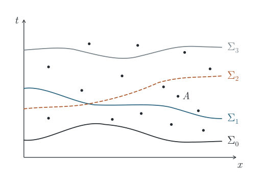 
FIG. 1. State assignment on Cauchy surfaces. Dots denote Collapse Points (CPs), without specifying their flash/no-flash outcomes. Starting from the state on Σ0, the state assigned to a later Cauchy surface is conditioned on the CP-qubit out- comes between the two surfaces. For example, A lies to the future of Σ1 and to the past of Σ2: its outcome is included in the state assignment on Σ2, but not on Σ1.

📷 Fig 2

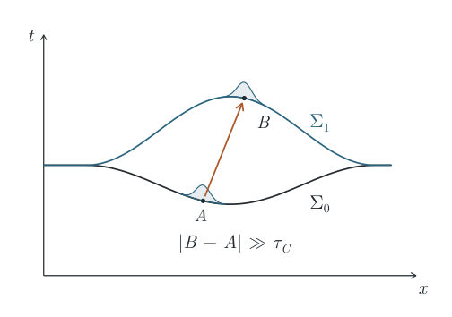 
FIG. 2. Heuristic proper-time criterion for the late-time ap- proximation. A massive one-particle wavepacket with mean momentum k0 is localized near A on Σ0 on the spatial scales relevant to the diagram. The arrow represents its approxi- mate classical trajectory, which intersects Σ1 at B; the pro- files schematically indicate the wavepacket near the two in- tersections. The proper time along this inertial segment is |B −A|. The condition |B −A| ≫τC, with τC estimated in the particle’s mean rest frame, motivates neglecting the ini- tial matter–CP correlations and the use of ΦΣ1 Σ0.

📷 Fig 3

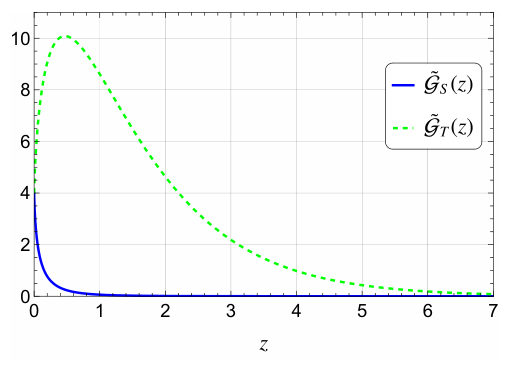 
FIG. 3. Plot of the functions ˜GT (z) and ˜GS(z). For z ≫1 they both decay as ˜GT/S(z) ∼144z−6.

**Summary.** This paper proposes a novel, relativistic collapse model for quantum fields to solve the measurement problem, overcoming issues like vacuum instability. It introduces 'Dynamical Vacuum Subtraction' and applies the framework to a scalar field, deriving finite rates of particle and energy increase. The results offer quantitative evidence for the consistency of this speculative quantum gravity theory.

**Why it may be interesting.** This work tackles the foundational intersection of quantum gravity phenomenology and quantum foundations, providing concrete, calculable predictions for collapse dynamics in QFT.

Detailed structure

**Main problem.** The paper addresses the fundamental challenge of constructing a testable, relativistic spontaneous collapse model applicable to Quantum Field Theory (QFT) to resolve the quantum measurement problem.

**Main result.** The authors present a framework that achieves no-signaling and yields finite particle-number and energy-increase rates for a free massive scalar field in the long-time limit.

**Method.** The methodology involves modifying standard unitary evolution with a 'Dynamical Vacuum Subtraction' prescription and employing a history-dependent Aharonov-Albert prescription for nonlocal state updates.

**Model / system.** The model is a 'Flash-Based Relativistic Collapse Model' built upon the Collapse Points Quantum Mechanics (CPQM) framework, applied to quantum fields like the free massive scalar field.

**Key observables.** Correlation coefficients ($r_N, r_E$), leading-order flash intensity ($\mu^{(1)}_F$), and particle/energy increase rates ($\Gamma_F$).

**Important parameters / regimes.** The collapse point density ($\mu_C$), the long-time limit, and the coupling constant ($\lambda$).

**Assumptions / limitations.** The framework assumes the Poisson sprinkling of collapse points is statistically Poincaré invariant, and it modifies the standard dynamics to ensure vacuum stability.

**Figures summary.** Figures illustrate state assignment on Cauchy surfaces, showing how collapse outcomes are incorporated into the state evolution across spacetime.

**Paper structure.** The paper progresses by first outlining the challenges of relativistic collapse models, then introducing the modified Aharonov-Albert prescription and Dynamical Vacuum Subtraction, followed by detailed calculations of correlation functions and finally applying the framework to a free scalar field.

Abstract

Spontaneous collapse models provide a possible, testable solution to the quantum measurement problem, but constructing a relativistic version applicable to quantum field theory remains an important open challenge. Challenges in constructing relativistic collapse models include avoiding superluminal signaling and foliation dependence, controlling energy production, and ensuring vacuum stability. Here, we present a relativistic collapse framework that addresses these problems at the cost of introducing a new space of physical states, whose complete characterization is left open. A modified, history-dependent Aharonov--Albert prescription describes instantaneous nonlocal state updates on arbitrary spacelike foliations while preserving foliation independence. To ensure vacuum stability, we modify the standard unitary evolution through a prescription that we name dynamical vacuum subtraction. The resulting dynamical map is linear and trace-preserving but not positive on the full set of standard density operators. We establish no-signaling by proving microscopic parameter independence, and identify conditions under which standard nonrelativistic collapse dynamics are recovered. Finally, we apply our framework to a free massive scalar field, obtaining finite particle-number and energy-increase rates at leading order in the long-time regime, together with further promising evidence for the consistency of the framework.

[↑ back to top](#top)

### [A Gauge-Invariant Clustering Coefficient for Complex-Weighted Bipartite Networks](http://arxiv.org/abs/2610.11929v1)

**Authors:** Anjali Waghmare, Yu Tian, Renaud Lambiotte  
**Type:** theory · **Category:** quantum information and computing · **PDF:** <https://arxiv.org/pdf/2610.11929v1>  
**Analysis basis:** full PDF text, analyzed in chunks
**Topic relevance:** `analog quantum simulation` **3/5** · `interference shaping light` **3/5**

📷 Fig 1

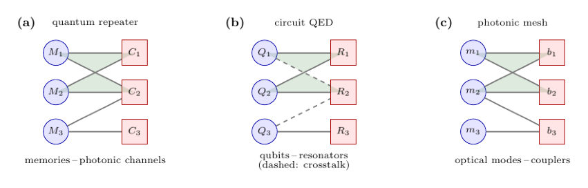 
Figure 1: Architectures that are bipartite as well as complex weighted. In each panel, circles denote nodes of one class and squares nodes of the other, and every link carries a phase in addition to a strength. The shaded quadrilateral marks a four-node square, the shortest closed path available, in which two routes join the same pair of same-class nodes through distinct intermediaries. (a) In a quantum repeater, memories are coupled to photonic channels, and the success of entanglement swapping between two memories depends on the relative phase of the optical amplitudes arriving along the two routes [14, 15]. (b) In circuit quantum electrodynamics (QED), transmon qubits are coupled to...

📷 Fig 2

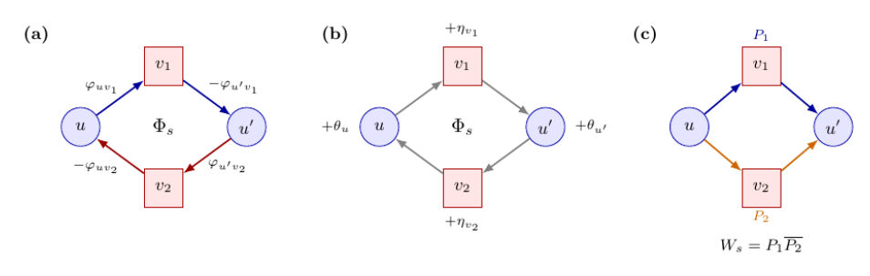 
Figure 2: Circles denote nodes of U and squares nodes of V, and φuv is the phase of the link between u and v. (a) The flux Φs accumulated around a square is an alternating sum of the four link phases, since under the convention wvu = wuv two of the four steps run against the orientation in which their phase was defined and contribute the conjugate phase. (b) A redefinition of the phase reference at each node shifts every link phase by θu + ηv. Each node contributes once with each sign to the alternating sum, leaving Φs unchanged. As these shifts are conventions rather than observable properties, only quantities such as Φs that survive them possess physical meaning. (c) The same square read...

📷 Fig 3

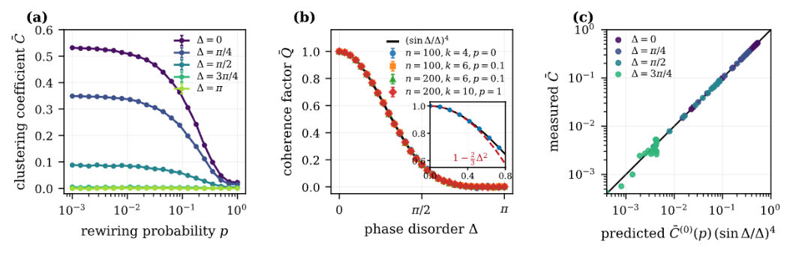 
Figure 3: The clustering coefficient is the product of a topological factor and a phase factor. Here p is the probability that a link is rewired, ∆the half width of the distribution from which link phases are drawn, ¯C the average clustering coefficient of Equation (5), ¯C(0) its topological factor and ¯Q its phase factor. (a) Clustering is suppressed by two independent mechanisms. Rewiring destroys squares, driving the coherent curve from 0.53 to 0.02, while phase disorder lowers every curve without altering its shape. At ∆= π/2 the coefficient is six times smaller than at ∆= 0 although the two ensembles have statistically identical connectivity, so that a low value of ¯C alone does not...

📷 Fig 4

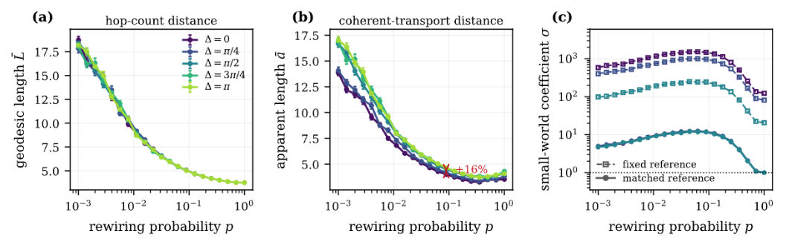 
Figure 4: Phase disorder leaves the number of hops between nodes unchanged while increasing the distance experienced by a coherent signal. Here ¯L is the mean hop-count distance, ¯a the mean apparent distance of Equation (14) obtained from the propagator (I −αA)−1, and σ the small-world coefficient of Humphries and Gurney [35]. (a) Hop-count distance. All five levels of phase disorder collapse onto a single curve, this distance being determined by which links exist. The small-world decrease occurs near p ≈10−2. (b) Apparent distance, which sums over all walks rather than the shortest. The decrease with rewiring persists, but the curves now separate with phase disorder. At p ≈0.09, marked by...

📷 Fig 5

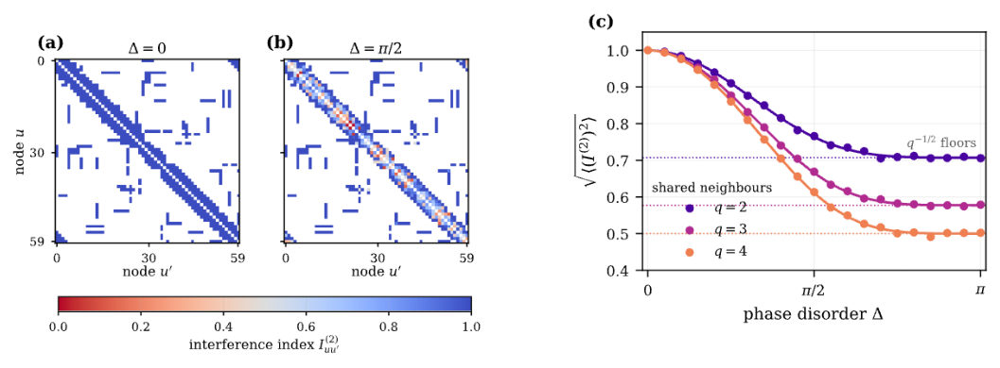 
Figure 5: Topological disorder determines which pairs of nodes interfere, and phase disorder determines how strongly pairs interfere. The quantity plotted is the open-path visibility I(2) uu′ of Equation (12), the modulus of the summed amplitude of all two-step paths between two nodes of U divided by the sum of the individual moduli, and q is the number of neighbours the two nodes share. (a,b) The visibility for every pair of nodes in a network with 60 nodes per class, degree 5 and rewiring probability 0.1. Blue indicates reinforcement and red indicates cancellation. Pairs sharing no neighbour, for which the visibility is undefined, are left blank. The connectivity is identical in the two...

**Summary.** This paper introduces a novel, gauge-invariant clustering coefficient designed for bipartite networks with complex edge weights, applicable to quantum and photonic systems. It successfully separates the structural connectivity from the phase-dependent interference effects occurring around four-node cycles. This allows researchers to quantify how phase disorder degrades network coherence, providing a powerful diagnostic tool for quantum network design.

**Why it may be interesting.** The work provides a quantitative tool to measure structural coherence in quantum networks by incorporating phase information directly into a standard graph metric, which is vital for understanding interference effects in quantum computation.

Detailed structure

**Main problem.** The paper addresses the lack of a structural measure for bipartite networks that simultaneously accounts for complex edge weights and the bipartite topology, which is crucial for quantum and photonic architectures.

**Main result.** A gauge-invariant clustering coefficient is defined that factorizes into topological and phase contributions, allowing for the quantification of phase interference effects in these complex-weighted networks.

**Method.** The authors derive the coefficient based on the phase accumulated around the fundamental four-node cycle (square) and use expectation values and closed-form derivations for specific ensembles.

**Model / system.** The model is a complex-weighted bipartite network, relevant to quantum repeaters and photonic meshes, where edge weights are complex amplitudes leading to interference effects.

**Key observables.** Gauge-invariant clustering coefficient, phase flux ($\Phi_s$), coherent distance, and the phase contribution factor $(\sin \Delta/\Delta)^4$.

**Important parameters / regimes.** Phase disorder magnitude ($\Delta$), network topology (e.g., Watts-Strogatz ensemble parameters).

**Assumptions / limitations.** The analysis often assumes independent link phases for expectation value calculations, and the coefficient is shown to be gauge-invariant under node-wise phase redefinitions.

**Figures summary.** Figures illustrate the four-node square as the elementary unit of interference in various quantum/photonic architectures and show the standard deviation of the clustering coefficient versus phase disorder.

**Paper structure.** The paper develops the mathematical framework by defining the gauge-invariant flux around a square, deriving the clustering coefficient based on this flux, and then calculating its expectation values and variance for specific random ensembles.

Abstract

Structural measures such as the clustering coefficient and the average shortest-path length characterise how a network is organised. These measures are typically formulated for real, non-negative edge weights. A class of quantum and photonic architectures has complex edge weights instead, whose phases determine whether alternative routes interfere constructively or destructively. These architectures are also bipartite, so triangles are absent and the smallest closed cycle is a four-node square. Existing measures address complex weights and bipartite structure separately: bipartite clustering coefficients quantify clustering through four-node squares but do not contain phase information, while interferometric coefficients retain phase but are defined on triangles. In this work, we define a clustering coefficient for complex-weighted bipartite networks which reduces to the classical bipartite coefficient when the phases vanish, becomes negative when alternative routes cancel, and can be obtained for all nodes from a single sparse matrix product. We show that the phase accumulated around a square is the smallest gauge-invariant carrier of structural phase information in a bipartite network. The clustering coefficient factorises into a topological contribution and a phase contribution, making a bipartite Watts--Strogatz ensemble analytically tractable. For phases uniformly distributed on $[-Δ,Δ]$, the mean phase contribution is $(\sinΔ/Δ)^4$, independent of node, degree, and topology. We also derive closed-form expressions for the clustering coefficient, open-path visibility, and phase variance. We numerically verify these predictions and further show that phase disorder increases coherent distance.

[↑ back to top](#top)

### [An iterative Bayesian variational quantum eigensolver with the von Mises-Fisher distribution](http://arxiv.org/abs/2610.11466v1)

**Authors:** Trung Minh Huynh, Gwangil An, Minsu Kim, Yu-Seong Jeon, Jinhyoung Lee  
**Type:** theory · **Category:** quantum information and computing · **PDF:** <https://arxiv.org/pdf/2610.11466v1>  
**Analysis basis:** full PDF text, analyzed in chunks
**Topic relevance:** `quantum measurements` **3/5** · `Keldysh / 2PI / non-Gaussian methods` **2/5** · `analog quantum simulation` **1/5**

📷 Fig 1

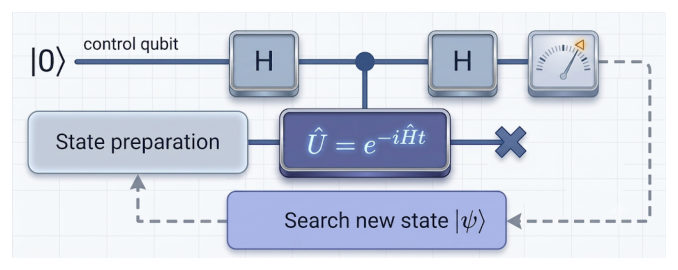 
FIG. 1: A typical Hadamard test measurement scheme with a control-unitary operator.

📷 Fig 2

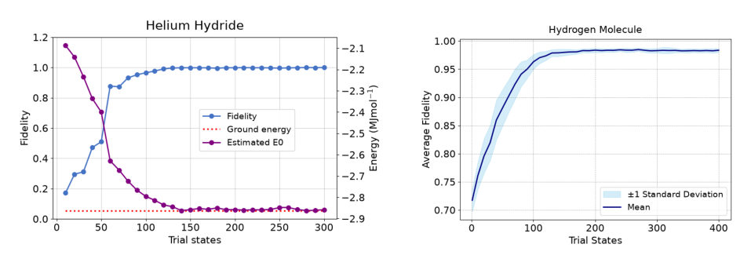 
FIG. 2: Searching ground state for Helium Hydride ion HeH+ and Hydrogen Molecule. (a)

📷 Fig 3

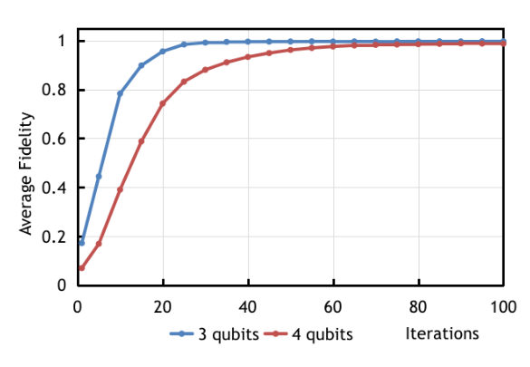 
FIG. 3: Average fidelity versus iteration number for randomly generated Hamiltonians with

**Summary.** This paper introduces an iterative Bayesian VQE that estimates the ground state of a quantum Hamiltonian by modeling the state belief with a von Mises-Fisher distribution. It generalizes the measurement process to condition on multiple measurement outcomes ($m$) and rigorously proves that the estimate converges monotonically toward the true ground state while its uncertainty shrinks. This offers a theoretically grounded, measurement-based alternative to standard VQE techniques.

**Why it may be interesting.** This work provides a theoretically rigorous and general framework for quantum state estimation that bypasses the need for explicit circuit ansatzes, potentially offering a more robust alternative to standard gradient-based VQE methods.

Detailed structure

**Main problem.** The paper addresses the challenge of finding the ground state and energy of a quantum many-body Hamiltonian using an iterative quantum algorithm.

**Main result.** It develops and proves the convergence of an iterative Bayesian Variational Quantum Eigensolver (VQE) that models the state belief using a von Mises-Fisher distribution.

**Method.** The method involves sequentially updating the belief distribution by conditioning on multiple success outcomes ($m$) from Hadamard-test measurements on an ancilla qubit.

**Model / system.** The system is a general quantum many-body Hamiltonian $H$, and the state is parameterized as a real unit vector $\psi$ in the Hilbert space. The inference is performed using the von Mises-Fisher (vMF) distribution.

**Key observables.** Average fidelity, overlap ($R$), and concentration parameter ($\kappa$).

**Important parameters / regimes.** The number of success outcomes $m$, the concentration parameter $\kappa_0$, and the measurement budget $N$.

**Assumptions / limitations.** The analysis relies on the large-concentration regime ($\kappa_0$ large) to derive a closed-form posterior update, and the convergence theorems require $m$ to be within a specific range relative to $\kappa_0$.

**Figures summary.** Figures illustrate the Hadamard test measurement scheme and show the monotonically increasing average fidelity of the algorithm on random and molecular Hamiltonians.

**Paper structure.** The paper first introduces the problem and the Bayesian framework, then derives the closed-form update for the vMF posterior by generalizing moment matching for $m>1$. It mathematically proves two key convergence properties (non-decreasing overlap and concentration) and concludes with a measurement-based algorithm and numerical demonstrations.

Abstract

We develop an iterative Bayesian variational quantum eigensolver in which the unknown ground state, parametrised as a real unit vector, is inferred through a von Mises--Fisher distribution sequentially updated from   Hadamard-test measurements on a single ancilla qubit. Building on a companion paper that treated a single success outcome via exact moment matching, we generalise the scheme to condition on $m$ success outcomes for the likelihood function   per iteration. Since exact moment matching becomes impractical for $m>1$, we exploit the large-concentration regime, in which a first-order expansion of the log-likelihood yields a closed-form von Mises--Fisher   posterior with $m$ entering only through a multiplicative weight. We prove that the two convergence properties of the single-outcome scheme---non-decreasing overlap and non-decreasing concentration---are   preserved provided $m$ lies within an explicitly characterised range. Based on the theory, we propose a measurement-based algorithm and illustrate the convergence on randomly generated three- and four-qubit Hamiltonian matrices, on $\mathrm{HeH}^+$, and on $\mathrm{H}_2$.

[↑ back to top](#top)

### [Fermionic Spectral Functions in a Two-Current Gubser-Rocha Model with Axion Momentum Relaxation](http://arxiv.org/abs/2610.11323v1)

**Authors:** Cai-E Liu, Defu Hou  
**Type:** theory · **Category:** strongly correlated electrons · **PDF:** <https://arxiv.org/pdf/2610.11323v1>  
**Analysis basis:** full PDF text, analyzed in chunks
**Topic relevance:** `Keldysh / 2PI / non-Gaussian methods` **3/5** · `correlated / nonlocal dissipation` **1/5** · `driven-dissipative phase transition` **1/5** · `methods for driven-dissipative` **1/5**

📷 Fig 1

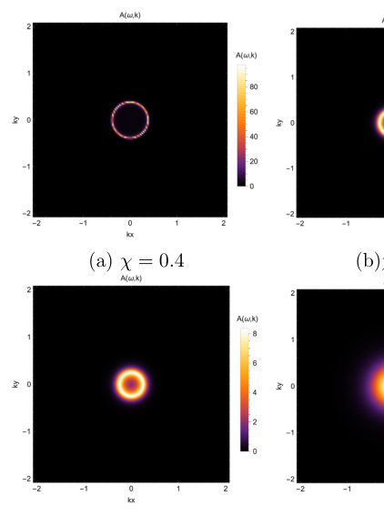 
Figure 1: Density plots of the spectral function A(kx, ky). Top row illustrates the effect of doping (χ = 0.4, 1.0, 2.3) at β/µ = 0, while the bottom row shows the effect of momentum relaxation (β/µ = 0.4, 2.0, 4.0) at χ = 1.0. All calculations use mψ = 0, q = 1, and T/µ = 0.009.

📷 Fig 2

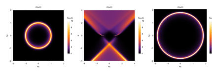 
Figure 2: Density plots of the spectral function A(kx, ky) at ω = 0 (odd columns) and dispersion relations A(ω, kx) along ky = 0 (even columns). Fixed parameters are mψ = 0, q = 1, χ = 1.0, and T/µ = 0.009 in the clean limit (β/µ = 0). Panels (a)–(f) present the spectral evolution with dipole coupling strengths p1 = 2, 4, and 8.

📷 Fig 3

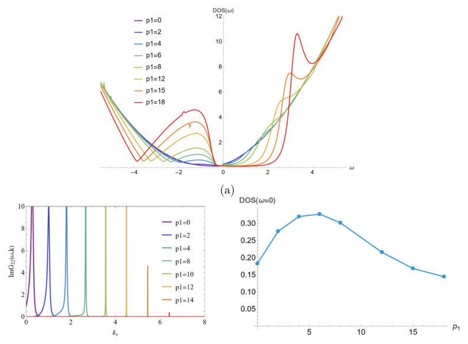 
Figure 3: Spectral functions for different values of the dipole coupling p1. (a) Momentum- integrated density of states DOS(ω). (b) Zero-energy momentum cuts ImG22(kx) at ω = 0. (c) Zero-frequency density of states DOS(0) as a function of p1. Other parameters are fixed as mψ = 0, q = 1, χ = 1.0, T/µ = 0.009, and β/µ = 0. The finite and non-monotonic DOS(0) suggests a soft low-energy suppression rather than a hard gap.

📷 Fig 4

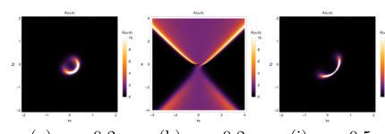 
Figure 4: Density plots of the spectral function A(kx, ky) at ω = 0 (odd columns) and dispersion relations A(ω, kx) along ky = 0 (even columns). Fixed parameters are mψ = 0, q = 1, χ = 1.0, and T/µ = 0.009 with finite momentum relaxation (β/µ = 0.4). The top row (a)–(f) presents the spectral evolution driven by the tensor coupling p2 set to 0.2, 0.4, and 0.8, showing the band flattening effect. The bottom row (g)–(l) corresponds to the vector coupling p3 set to 0.2, 0.5, and 0.8, respectively, showing arc-like spectral redistribution.

📷 Fig 5

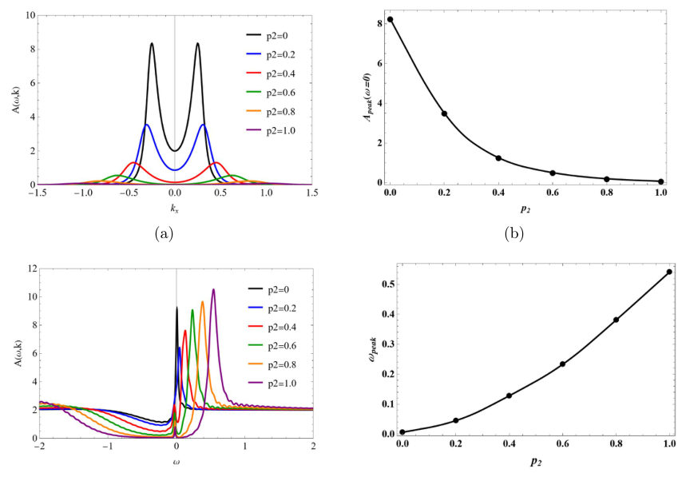 
Figure 5: Spectral function cuts and peak features for the p2 coupling. Top row: (a) A(kx) at ω = 0 and (b) the zero-energy peak height Apeak as a function of p2. Bottom row: (c) A(ω, kF (p2)) evaluated at the corresponding peak momentum and (d) the peak position ωpeak as a function of p2. The suppression of Apeak and the shift of ωpeak indicate that the p2 coupling redistributes spectral weight away from the Fermi level. The fixed parameters are mψ = 0, q = 1, χ = 1.0, β/µ = 0.4, and T/µ = 0.009.

**Summary.** This work studies fermionic excitations in a complex holographic model representing a two-current Gubser-Rocha background with axion relaxation. By analyzing three distinct non-minimal coupling channels, the authors demonstrate that the spectral function is highly sensitive to these couplings, leading to characteristic reconstructions like flat-bottom or Fermi-arc features. This clarifies how multiple physical mechanisms jointly govern the spectral properties of strongly correlated matter.

**Why it may be interesting.** The holographic approach provides a powerful, non-perturbative tool to study spectral properties in strongly correlated systems, linking bulk gravity dynamics to boundary quantum matter physics.

Detailed structure

**Main problem.** The paper investigates how fermionic spectral functions are reshaped by the interplay of current mixing, axion-induced momentum relaxation, and non-minimal couplings within a holographic two-current Gubser-Rocha background.

**Main result.** Different coupling channels ($p_1, p_2, p_3$) yield distinct spectral reconstructions: $p_1$ causes soft asymmetry, $p_2$ results in a flat-bottom reconstruction by suppressing the zero-energy peak, and $p_3$ generates open, Fermi-arc-like segments.

**Method.** The analysis uses holographic methods, solving radial equations for fermionic components coupled to the background fields, and calculating the retarded Green's function to obtain the spectral function $A(\omega, k)$.

**Model / system.** The model is a probe fermion propagating in a (3+1)D bulk dual to a (2+1)D boundary theory, utilizing the two-current Einstein-Maxwell-Gubser-Rocha background with linear axion momentum relaxation.

**Key observables.** Fermionic spectral function $A(\omega, k)$, spectral reconstruction patterns (flat-bottom, Fermi-arc-like segments).

**Important parameters / regimes.** Momentum-relaxation strength ($eta/\mu$), doping parameter ($\chi$), and coupling constants ($p_1, p_2, p_3$).

**Assumptions / limitations.** The analysis assumes the background admits a specific solution and focuses on the dual normal metal sector, omitting the superconducting sector.

**Figures summary.** Not specified, but the results describe spectral features varying based on the coupling channel and background parameters.

**Paper structure.** The paper first establishes the background solution in the two-current GR model. It then derives the bulk fermionic dynamics and solves the radial equations for different coupling channels ($p_1, p_2, p_3$) to determine the spectral function $A(\omega, k)$.

Abstract

We investigate fermionic spectral functions in a two-current Gubser-Rocha background with linear-axion momentum relaxation. Serving as a comparison channel, the dipole coupling $p_1$ is found to produce a soft asymmetric reconstruction without opening a clean hard Mott gap. Our main analysis then focuses on two axion-dependent non-minimal couplings modulated by current mixing. The $p_2$ tensor channel suppresses the zero-energy Fermi peak and shifts the dominant spectral weight to finite frequencies, resulting in a flat-bottom reconstruction. In contrast, the $p_3$ vector channel creates a strong spectral asymmetry in momentum space, generating open, Fermi-arc-like segments. Varying the momentum-relaxation strength $β/μ$ and the doping parameter $χ$ reveals a channel-dependent response to the two-current background. Increasing $β/μ$ generally broadens the $p_2$ response, whereas the one-sided $p_3$ feature varies non-monotonically under changes of the background parameters. These results clarify how current mixing, axion-induced momentum relaxation, and non-minimal fermion couplings jointly reshape holographic fermionic excitations. These results clarify how current mixing, axion-induced momentum relaxation, and non-minimal fermion couplings jointly reshape holographic fermionic excitations.

[↑ back to top](#top)

### [Quantum annealing of the random transverse-field Ising model in one, two, and three dimensions](http://arxiv.org/abs/2610.11411v1)

**Authors:** István A. Kovács, Neil Shah, Róbert Juhász  
**Type:** theory · **Category:** disordered systems and neural networks · **PDF:** <https://arxiv.org/pdf/2610.11411v1>  
**Analysis basis:** full PDF text, analyzed in chunks
**Topic relevance:** `analog quantum simulation` **3/5** · `non-equilibrium universality` **3/5**

📷 Fig 1

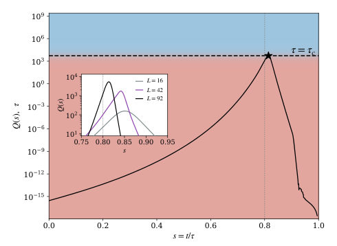 
FIG. 1. Illustration of the annealing-time threshold during QA. The data were obtained by the exact free- fermion calculation of Q(s), as described in Sec. B, for a sin- gle disorder realization of the d = 1 RTFIM at size L = 92. The anneal avoids defects if τ ≫Q(s) for all s. The back- ground shading, from red (τ ≪Q(s)) to blue (τ ≫Q(s)), reflects the crossover from a τ that would produce many de- fects to a τ that would produce few. The horizontal line marks τc = max Q(s), which is the threshold annealing time of the sample. The vertical dotted line marks the critical point. In- set: Q(s) near the peak for independent disorder realizations at L = 16, 42, and 96.

📷 Fig 2

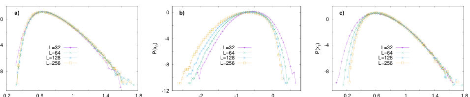 
FIG. 2. Scaling collapse of distributions of exact-diagonalization data in one dimension. a) excitation energy, xϵ = −ln(ϵ/ϵ0)/L1/2 with parameter ϵ0 = 2; b) effective multiplicity, xn = ln(τLϵ/L); c) threshold annealing time, xτ = ln[τL/(τ0L)]/L1/2 with parameter τ0 = 0.4.

📷 Fig 3

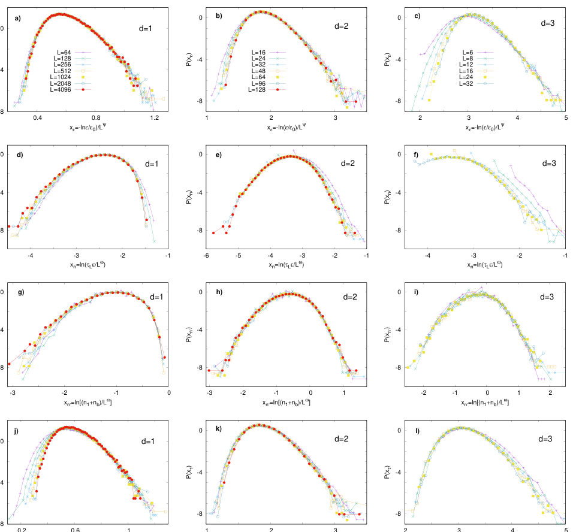 
FIG. 3. Finite-size scaling of different properties of the dominant fusion obtained by the SDRG method. a)-c) Distributions of the excitation energy in terms of xϵ = −ln(ϵ/ϵ0)/Lψ a) in d = 1 using ϵ0 = 4, b) d = 2, using ϵ0 = 33 and c) d = 3 with ϵ0 = 100, aligning with the activated scaling relation in Eq. (10), with the ψ exponents of Table I. d)-f) Distributions of effective multiplicity τLϵ in terms of xn = ln(τLϵ/Lω) d) for d = 1 using ω = 1, e) for d = 2 using ω = 1.20(5), and f) for d = 3 using ω = 1.25(5). g)-i) Distributions of the multiplicity n1 +nb in terms of the variable xn′ = ln[(n1 +nb)/Lω] for different sizes in g) d = 1, using ω = 1, h) d = 2, using ω = 1.25(5) and i) d =...

📷 Fig 4

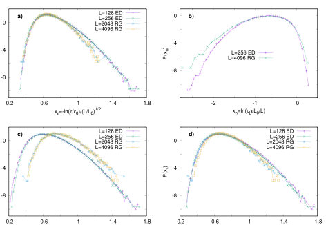 
FIG. 4. Comparison of exact diagonalization and SDRG results in one dimension. a) Gap distribution in terms of xϵ = −ln(ϵ/ϵ0)(L/L0)−1/2, using parameters ϵED 0 = 2, ϵRG 0 = 4, LED 0 = 1, and LRG 0 = 1.3. b) Distribution of effective multiplicity in terms of ln(τLϵL0/L), using pa- rameters LED 0 = 1 and LRG 0 = 5.6. c) and d) Distribution of threshold annealing time in terms of ln[τL/(τ0L)](L/L0)−1/2

📷 Fig 5

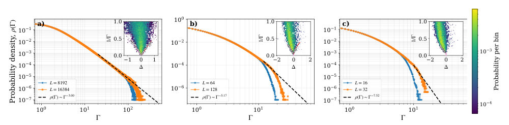 
FIG. 5. Distribution of excitation energies in one, two, and three dimensions. Panels a), b), and c) show the probability density of Γ = −ln ϵ of all fusion events, pooled over many independent disorder realizations of a given size, with approximately 108 fusion events in total for each size (2 × 107 for L = 32 in d = 2, due to computational constraints), for the system sizes indicated in each panel, in d = 1, d = 2, and d = 3, respectively. Dashed lines show the predicted power law ρ(Γ) ∼Γ−κ [Eq. (20)] with κ = 1 + d/ψ [Eq. (23)], giving exponents −3.00, −5.17, and −7.52. Insets: joint probability distribution of 1/Γ and the reduced control parameter ∆of fusions, for the largest system...

**Summary.** This work analyzes the adiabatic passage time required for quantum annealing of the random transverse-field Ising model. Using the Strong-Disorder Renormalization Group, the authors derive scaling theories showing that error density decreases logarithmically with time. This provides crucial insights for designing optimal, noise-resistant quantum annealing protocols.

**Why it may be interesting.** The connection between quantum annealing dynamics, disorder physics (IDFP), and the calculation of critical time scales is highly relevant for understanding noise and robustness in quantum computation.

Detailed structure

**Main problem.** The paper determines the minimum annealing time required to prevent defect formation during quantum annealing in the random transverse-field Ising model.

**Main result.** The error density is shown to decrease logarithmically with annealing time, characterized by dimension-dependent critical exponents of the infinite-disorder fixed point.

**Method.** The study employs the Strong-Disorder Renormalization Group (SDRG) technique combined with an analysis based on the adiabatic theorem.

**Model / system.** The system is the random transverse-field Ising model (RTFIM) on $d$-dimensional lattices. The Hamiltonian is time-dependent, and the annealing process is analyzed via the adiabatic condition.

**Key observables.** Error density, Crossover Annealing Time ($	au_c$), and the gap ($\epsilon(s)$) between the ground and first excited state.

**Important parameters / regimes.** Dimension ($d=1, 2, 3$), annealing time ($	au$), and the critical exponents associated with the infinite-disorder fixed point.

**Assumptions / limitations.** The analysis relies on the adiabatic theorem and uses the SDRG to model the process as a gradual aggregation of strongly coupled clusters.

**Figures summary.** Figure 1 illustrates the annealing-time threshold $Q(s)$ for the 1D RTFIM, showing the critical time $	au_c$.

**Paper structure.** The paper develops the theory using SDRG to model defect formation, derives scaling theories for error statistics in general dimensions, and validates the approach using exact diagonalization (free-fermion technique) in 1D.

Abstract

Quantum annealing must be sufficiently slow to prevent defect formation. We study this problem in the random transverse-field Ising model via the adiabatic theorem to obtain the limiting rate at which defect formation can be avoided. Our approach based on the strong-disorder renormalization group (SDRG) technique views the annealing process as a gradual aggregation of strongly coupled clusters, giving access to the elementary events of error formation. We present a scaling theory of the statistics of these events in general dimensions and confront it to an extensive numerical analysis carried out in one, two, and three dimensions by an efficient implementation of the SDRG method. This approach is also validated by exact diagonalization in one dimension by means of the free-fermion technique. Our results consistently show a logarithmically slow decrease of the error density with the annealing time, characterized by the dimension-dependent critical exponents of the corresponding infinite-disorder fixed point of the model. Furthermore, we provide a map of individual events of potential defect formation in the excitation energy - control parameter plane, which may help in the design of optimal annealing paths.

[↑ back to top](#top)

### [True vs false Fermi surfaces in the Pseudogap regime and their transformation with doping and temperature in the Hubbard Model](http://arxiv.org/abs/2610.12339v1)

**Authors:** Y. M. Vilk  
**Type:** theory · **Category:** strongly correlated electrons · **PDF:** <https://arxiv.org/pdf/2610.12339v1>  
**Analysis basis:** full PDF text, analyzed in chunks
**Topic relevance:** `analog quantum simulation` **3/5** · `Keldysh / 2PI / non-Gaussian methods` **2/5** · `methods for driven-dissipative` **1/5**

📷 Fig 1

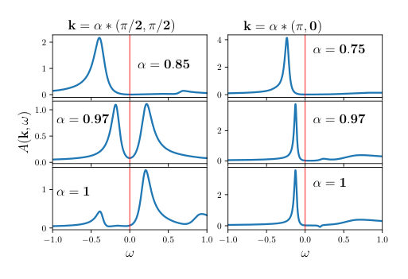 
FIG. 1. EDC curves along the diagonal (left panel) and edge (0, 0)–(π, 0) (right panel) of the BZ. The parameters are U = 6, δ = 0.12, T = 0.025. The correlation length ξ = 130. At this tem- perature, the EDC curves in both directions clearly exhibit a pseu- dogap. As momentum approaches the Fermi surface in the diagonal direction, the quasiparticle peak first moves toward zero energy, then stops at a finite energy and reverses direction. This is a characteristic signature of the precursor to the lower SDW band in this direction. For the EDC curves along the (0, 0)–(π, 0) direction, the peak posi- tion remains at negative energy even when it reaches the end of the BZ at (π, 0).

📷 Fig 2

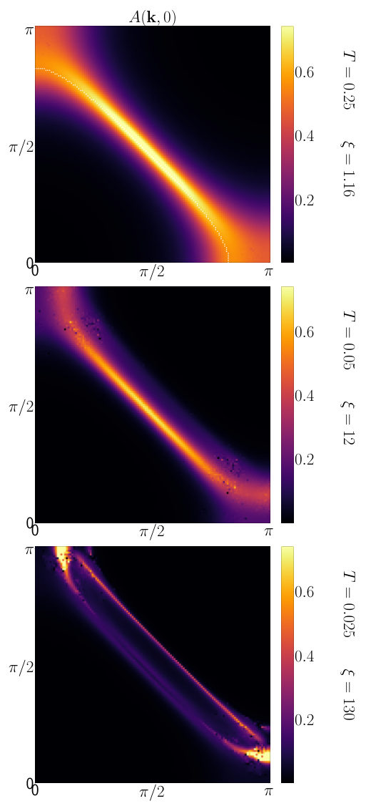 
FIG. 2. Evolution of the MDC heatmaps with decreasing temper- ature. The parameters U and δ are the same as in the EDC panel Fig. 1. The lowest temperature T = 0.025 is the same as in Fig. 1. At the temperature TRC &lt; T = 0.25 ≪W, the maximum inten- sity of the spectral function A(k, 0) is along the non-interacting FS (white line). As temperature drops to T = 0.05 &lt; TRC, the inten- sity of A(k, 0) drops in the direction (0, 0)–(π, 0), indicating a PG in this direction. At the even lower temperature T = 0.025 &lt; TD, the intensity of the spectral function drops around the diagonal direc- tion (0, 0)–(π, π) as well, indicating a PG in this direction as well. While the true FS along the diagonal...

📷 Fig 3

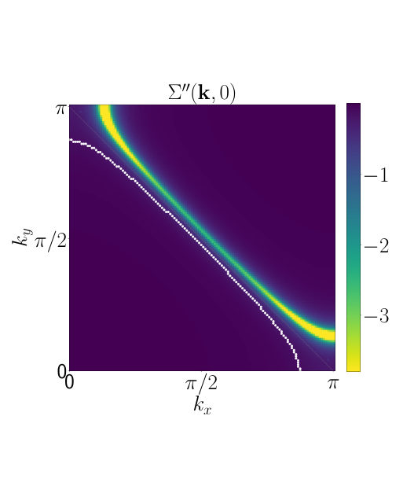 
FIG. 3. Heat map of the imaginary part of the self-energy at zero frequency Σ′′(k, 0) obtained using TPSC+. The parameters are U = 6, T = 0.06, δ = 0.087. ξ = 42.5. The white line shows the non-interacting Fermi surface. The shadow Fermi surface Eq. (22) is a mirror image of the non-interacting FS relative to the line (π, 0) −(0, π) for this model. The imaginary part of the self- energy Σ′′(k, 0) shows a quasi-singularity along the shadow FS with maximum intensity close to the antinodal Van Hove point (π, 0).

📷 Fig 4

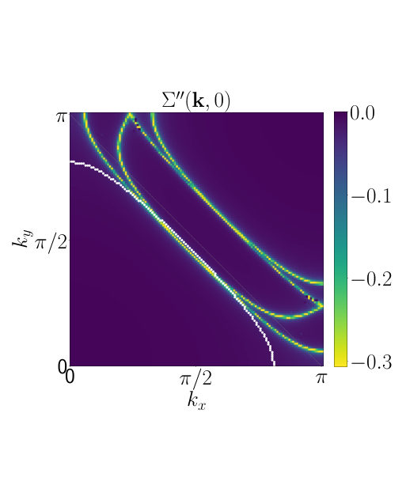 
FIG. 4. Heat map of the imaginary part of the self-energy at zero fre- quency Σ′′(k, 0) in the case of strongly incommensurate spin fluctu- ations. The parameters are U = 6, T = 0.015, δ = 0.17. ξ = 130. The white line shows the non-interacting Fermi surface. There are four shadow Fermi surfaces that are driven by four peaks in the in- commensurate spin susceptibility χsp(q, 0). Two of these shadow FS cross the non-interacting FS, creating hot spots close to the di- agonal. As a result, the pseudogap in the strongly incommensurate case forms close to the nodal direction, rather than at the antinode as in the commensurate case.

📷 Fig 5

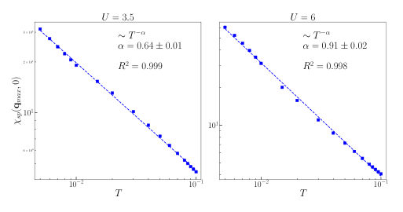 
FIG. 6. The power-law scaling χsp(qmax, 0)(T) ∼T −α at the QCP, defined with the simplified criteria described in the main text. For U = 3.5, δQCP ≈0.15 and for U = 6, δQCP ≈0.2. For both interaction strengths U = 3.5 and U = 6, the coefficient of determination R2 is very high, indicating a very good fit. The power exponent α increases with U.

**Summary.** This theoretical work investigates the complex pseudogap phase in the Hubbard model, arguing that Fermi liquid theory fails in this regime. Using advanced many-body techniques, the authors distinguish between true and false Fermi surfaces, showing that the pseudogap physics is fundamentally driven by critical thermal spin fluctuations rather than simple band structure effects.

**Why it may be interesting.** The detailed analysis of spectral function crossovers and the failure of standard quasiparticle assumptions in the pseudogap state provides a rigorous theoretical framework relevant to understanding strongly correlated quantum materials.

Detailed structure

**Main problem.** The paper aims to clarify the physics of the pseudogap regime in the Hubbard model, specifically distinguishing between true and false Fermi surfaces and zero-energy quasiparticle lines.

**Main result.** The standard Fermi liquid description breaks down in the pseudogap regime, and the emergence of false Fermi surfaces is linked to critical thermal spin fluctuations, which are better captured by real-frequency spectral analysis.

**Method.** The study employs the improved Two-Particle Self-Consistent Approach (TPSC+) to simultaneously analyze Energy Distribution Curves (EDC) and Momentum Distribution Curves (MDC), comparing results against Diagrammatic Quantum Monte Carlo (DiagMC) data.

**Model / system.** The system analyzed is the nearest-neighbor Hubbard model on a two-dimensional square lattice, described by a Hamiltonian involving hopping and on-site Coulomb repulsion.

**Key observables.** Energy Distribution Curves (EDC), Momentum Distribution Curves (MDC), spectral function A(k, omega) at zero real frequency A(k, 0), and the quasiparticle condition $\partial\Sigma'(k, \omega)/\partial\omega|_{\omega=0}<0$.

**Important parameters / regimes.** Doping ($\delta$), Temperature ($T$), and Interaction Strength ($U$). The analysis focuses on the pseudogap regime driven by spin fluctuations.

**Assumptions / limitations.** The TPSC+ approach is used, which is an improvement over standard TPSC, and the analysis relies on the distinction between real-frequency and Matsubara-frequency spectral representations.

**Figures summary.** The notes do not provide a summary of figures, but they detail the analysis of EDC and MDC across different doping and temperature regimes.

**Paper structure.** The paper develops its argument by first establishing the breakdown of Fermi liquid theory, then analyzing the spectral signatures (false vs. true FS) arising from commensurate and incommensurate spin fluctuations, and finally benchmarking the TPSC+ method against DiagMC results.

Abstract

Exact diagrammatic quantum Monte Carlo (DiagMC) results for the nearest-neighbor Hubbard model motivate a closer study of the pseudogap. Using the improved two-particle self-consistent approach (TPSC+), we analyze Energy (EDC) and Momentum Distribution Curves (MDC) simultaneously. We show that Fermi-liquid terminology breaks down in the pseudogap regime, requiring a distinction between true and false Fermi surfaces and zero-energy quasiparticle (ZEQ) lines. A false Fermi surface has a momentum-space spectral maximum but a frequency-space depression at zero energy, while a false ZEQ line violates the standard quasiparticle condition $\partial Σ'(\mathbf{k},ω)/\partial ω|_{ω=0}<0$.The pseudogap is driven by critical thermal spin fluctuations, which occur in two dimensions because of the Mermin-Wagner theorem. Commensurate fluctuations first open an antinodal pseudogap, leaving true Fermi arcs. With decreasing temperature, the Fermi surface evolves into hole- and electron-like false Fermi surfaces. Incommensurate fluctuations generate hot spots near the diagonal, where the pseudogap persists to the quantum critical point (QCP), whereas at $\mathbf{k}_{AN}$ it disappears before the QCP doping. There, the spectrum has two precursor antiferromagnetic (AFM) bands, both in the unoccupied ($ω>0$) region. We benchmark TPSC+ against DiagMC results for the Matsubara spectral proxy $-\mathrm{Im}[\mathcal{G}(\mathbf{k},iπT)]/π$. TPSC+ underestimates pseudogap suppression in the strong-interaction regime, reproducing DiagMC behavior at lower temperatures or doping. This proxy is equivalent to the spectral function with thermal broadening $η=πT$, which obscures features when $πT$ is not the smallest energy scale. Using $A(\mathbf{k},0)$, we find that hole-like Fermi surfaces emerge at any interaction strength at low temperature, even at weak coupling.

[↑ back to top](#top)

### [Strange-metal behavior in correlated molecular conductors](http://arxiv.org/abs/2610.12044v1)

**Authors:** Savita Priya, Maxim Wenzel, Christian Prange, Bertold Rasche, Christian Sindlinger, Takuya Kobayashi, Hiromi Taniguchi, Dita Puspita Sari, Yasuyuki Ishii, Kazuya Miyagawa, Kazushi Kanoda, Simone Fratini, Martin Dressel  
**Type:** experiment · **Category:** strongly correlated electrons · **PDF:** <https://arxiv.org/pdf/2610.12044v1>  
**Analysis basis:** full PDF text, analyzed in chunks
**Topic relevance:** `non-equilibrium universality` **3/5** · `Frenkel-Kontorova` **1/5** · `correlated / nonlocal dissipation` **1/5**

📷 Fig 1

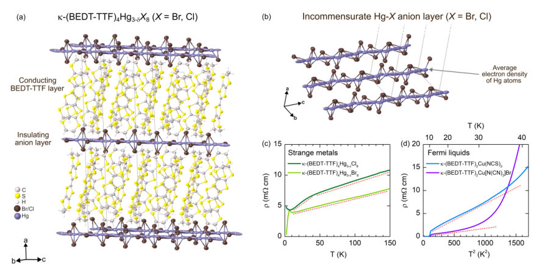 
FIG. 1. (a) Crystal structure of κ-(BEDT-TTF)4Hg3−δX8, composed of conducting BEDT-TTF layers separated by insulating anion layers. (b) Incommensurate Hg-X anion layer in κ-Hg3−δX8 viewed from a different angle. (c) Temperature-dependent dc resistivity of the strange metals, demonstrating ρ(T) ∝T; and (d) electrical resistivity vs. T 2 plot for two correlated Fermi liquids, revealing the ρ(T) ∝T 2 response. The red dashed lines are guides to the eye.

📷 Fig 2

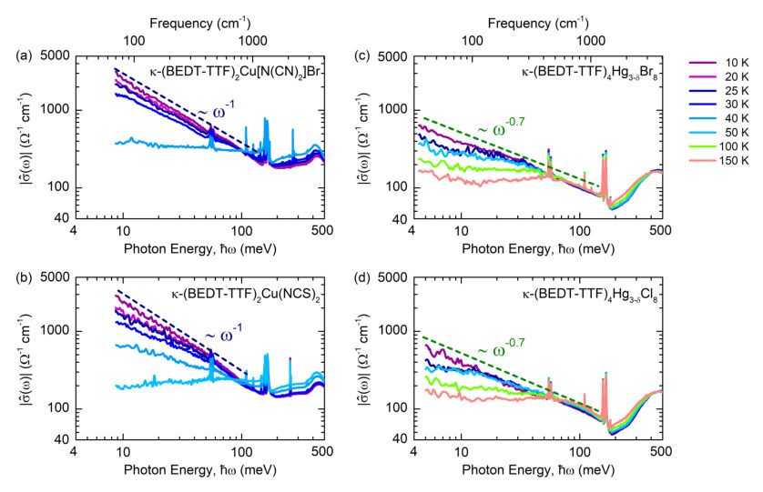 
FIG. 2. Absolute value of the complex conductivity as a function of frequency, |ˆσ(ω)|, obtained at various temperatures as indicated. The free carrier response is observed predominantly up to 150 meV (1200 cm−1), above which the electronic response is affected by Hubbard band and interband transitions, along with sharp molecular vibrations coupled to the electronic response. The Drude-type ω−1 decay is observed for the Fermi-liquid metals (a) κ-CuBr and (b) κ-CuNCS when low temperatures are approached. For the strange metals (c) κ-Hg3−δBr8 and (d) κ-Hg3−δCl8, the itinerant carriers follow a power-law |ˆσ(ω)| ∝ω−0.7, which is much flatter than that observed in the Fermi liquid compounds....

📷 Fig 3

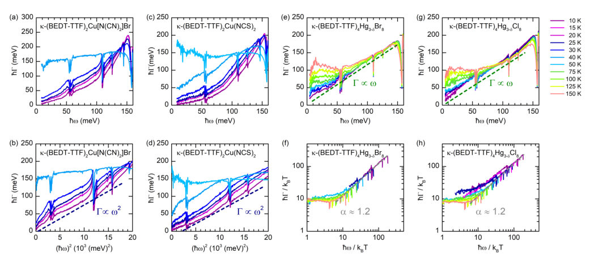 
FIG. 3. Frequency-dependent scattering rates extracted for different temperatures in the metallic states. The upper panels display Γ(ω) on a linear energy scale. The lower panels illustrate that the canonical metals (a,b) κ-CuBr and (c,d) κ-CuNCS approach a Γ(ω) ∝ω2 behavior at 10 K expected for a Fermi-liquid response. In the case of the strange metals (e) κ-Hg3−δBr8 and (g) κ-Hg3−δCl8, the scattering rate increases linearly with frequency: Γ(ω) ∝ω (the dashed lines are guides to the eye). Following the idea of Planckian scattering limit, in the two lower-row panels (f,h) the axes are scaled by the respective temperature. In a wide range, the data collapse to single curves. According to...

**Summary.** This work characterizes the 'strange-metal' state in $\kappa$-(BEDT-TTF)$_4	ext{Hg}_{3-\delta}	ext{X}_8$ by showing linear temperature dependence of resistivity and $\omega^{-0.7}$ optical response. The authors argue that this anomalous behavior, marked by Planckian dissipation, arises specifically due to large-scale spatial modulations within the anion layers, distinguishing it from standard Fermi liquid behavior.

**Why it may be interesting.** The direct link established between structural disorder (incommensurate anion layers) and the emergence of Planckian dissipation scaling in transport properties is highly relevant to understanding non-Fermi liquid physics in correlated materials.

Detailed structure

**Main problem.** The paper investigates the origin of 'strange-metal' behavior in molecular conductors, characterized by charge transport that violates conventional metal power laws.

**Main result.** The strange metal behavior in $\kappa$-(BEDT-TTF)$_4	ext{Hg}_{3-\delta}	ext{X}_8$ is linked to the presence of incommensurate anion layers and large-scale spatial modulations, leading to Planckian dissipation scaling.

**Method.** The study combines temperature-dependent transport measurements ($
ho(T)$) with broad-range optical investigations using frequency-dependent complex conductivity ($\hat{\sigma}(\omega)$).

**Model / system.** The physical system is $\kappa$-BEDT-TTF salts, comparing $\kappa$-(BEDT-TTF)$_4	ext{Hg}_{3-\delta}	ext{X}_8$ (strange metal candidate) against $\kappa$-CuBr and $\kappa$-CuNCS (Fermi liquid reference).

**Key observables.** Resistivity ($
ho(T) \propto T$ vs $T^2$), frequency-dependent conductivity ($|\hat{\sigma}(\omega)| \propto \omega^{-0.7}$ vs $\omega^{-1}$), and the frequency dependence of the scattering rate ($\Gamma(\omega) \propto \omega$ vs $\omega^2$).

**Important parameters / regimes.** Temperature ($T$), frequency ($\omega$), and the ratio $\hbar\Gamma/k_B T \approx 1.2$ (Planckian dissipation).

**Assumptions / limitations.** The analysis relies on comparing the observed spectral weight transfer and scattering rate scaling against established theoretical expectations for Fermi liquids.

**Figures summary.** Figures compare $
ho(T)$ and $\Gamma(\omega)$ for strange metals vs. Fermi liquids, showing the characteristic linear ($\omega$) vs. quadratic ($\omega^2$) scaling of the scattering rate.

**Paper structure.** The paper systematically compares the electronic signatures of strange metals ($\kappa$-Hg$_3-\delta$X$_8$) against conventional Fermi liquids ($\kappa$-CuBr, $\kappa$-CuNCS) using transport and optical measurements to pinpoint the role of structural modulation.

Abstract

The $κ$-BEDT-TTF salts are prototypical Mott systems, realizing a correlation-driven electronic transition from a Fermi-liquid state to a Mott insulator. The metallic compounds with spatially modulated Hg-containing anions, $κ$-(BEDT-TTF)$_4$Hg$_{3-δ}X_8$ ($X$ = Br, and Cl), however, fall outside this classification. Our temperature-dependent transport and broad-range optical investigations reveal a $ρ(T)\propto T$ dependence of the resistivity up to elevated temperatures and a power-law behavior of the frequency-dependent conductivity $\vert\hatσ (ω)\vert \propto ω^{-0.7}$; well-known hallmarks of ``strange metals''. The linear-in-frequency scattering rate of these strange metals scales to the Planckian dissipation. We demonstrate that this response only occurs in systems with incommensurate anion layers and establish a direct link to large-scale spatial modulations. Our conclusions can be extended to other strongly correlated strange-metal compounds

[↑ back to top](#top)

### [Uncertainty Quantification for Quantum Fidelity Estimation](http://arxiv.org/abs/2610.10885v1)

**Authors:** Kuchibhotla Aditi, Stephen Becker  
**Type:** theory · **Category:** quantum information and computing · **PDF:** <https://arxiv.org/pdf/2610.10885v1>  
**Analysis basis:** full PDF text, analyzed in chunks
**Topic relevance:** `quantum measurements` **3/5** · `QC/QI experiment` **2/5**

📷 Fig 1

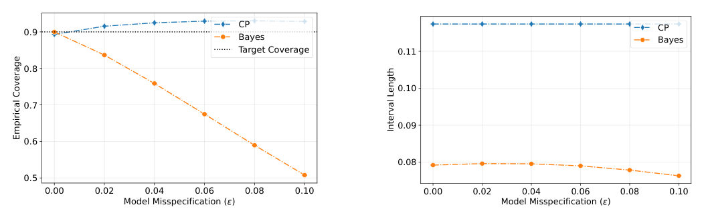 
FIG. 1: Impact of model misspecification on Bayesian prediction intervals. Empirical coverage (left) and interval length (right) as a function of model misspecification factor ε, compared against standard neural network with conformal prediction.

📷 Fig 2

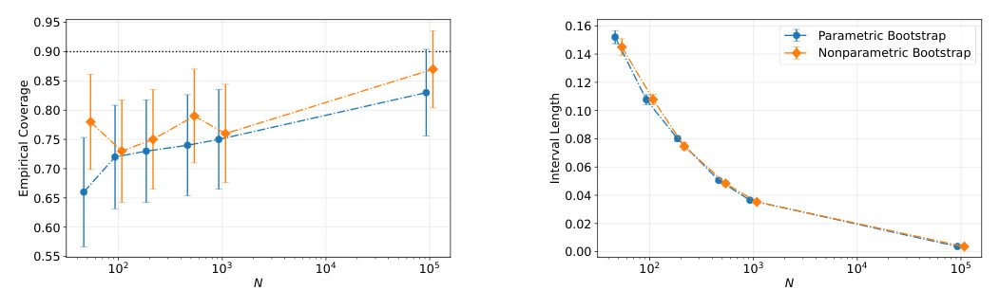 
FIG. 2: Impact of finite-sample effects on parametric and nonparametric bootstrap prediction intervals under the non-asymptotic regime. For each bootstrap method, empirical coverage (left) and interval length (right) are shown as a function of shot count N per POVM.

📷 Fig 3

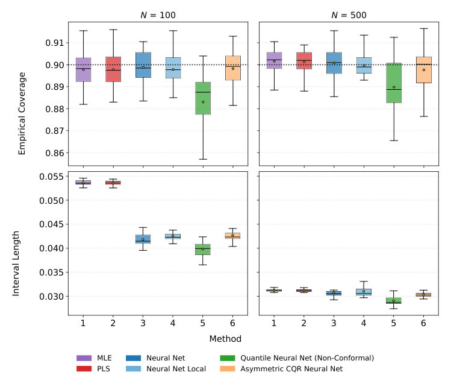 
FIG. 3: Statistical performance of conformalized fidelity estimators. (Top) Empirical coverage and (Bottom) interval length as a function of shot count N for q = 4 qubits. In the box plots, the yellow dots represent the mean and the solid horizontal black lines represent the median.

📷 Fig 4

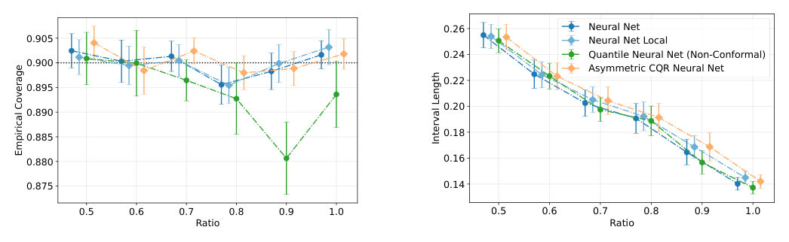 
FIG. 4: Empirical coverage (left) and interval length (right), as a function of the fraction of the total POVM elements used for measurement for q = 2 qubits. x-locations are jittered slightly for presentation purposes.

📷 Fig 5

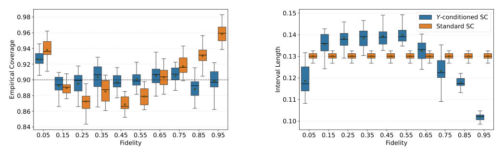 
FIG. 5: Conditional coverage analysis across fidelity regimes for q = 2 qubits, averaging over Born’s rule. Empirical coverage is plotted as a function of state fidelity, partitioned into 10 equal-width bins, where x-axis ticks are mid-points of each bin. Results are averaged over 20 independent splits of the training and calibration data.

**Summary.** This paper addresses the critical need for reliable uncertainty quantification when estimating quantum state fidelity on noisy quantum hardware. The authors propose a novel, distribution-free framework combining Bayesian insights with conformal prediction to generate guaranteed prediction intervals. This methodology offers a scalable and statistically rigorous tool for validating modern quantum systems against hardware imperfections.

**Why it may be interesting.** It provides a statistically robust, model-agnostic tool for characterizing the performance of quantum processors, which is critical for experimental quantum information science.

Detailed structure

**Main problem.** The core challenge is providing rigorous, reliable uncertainty quantification for estimating quantum state fidelity, which is essential for benchmarking quantum hardware.

**Main result.** The proposed hybrid Bayesian-informed conformal prediction framework maintains statistical validity and coverage guarantees where traditional methods fail, especially under noise or finite samples.

**Method.** The authors introduce a hybrid framework combining Bayesian concepts with conformal prediction to generate distribution-free prediction intervals for the fidelity estimate.

**Model / system.** The study focuses on estimating the fidelity $F(
ho, \sigma)$ between a physical quantum state $
ho$ and a known reference state $\sigma$, using measurement statistics from POVM measurements on quantum hardware.

**Key observables.** Quantum fidelity ($\hat{F}$), rigorous prediction intervals, and empirical coverage rates.

**Important parameters / regimes.** Qubit number ($q=2, 4, 6$), shot count ($N$), and noise parameters (e.g., depolarizing noise strength $\eta$).

**Assumptions / limitations.** The framework requires an initial point estimator (classical or neural network) and uses conformal prediction to provide coverage guarantees, though care must be taken when approximating confidence intervals related to Born's rule.

**Figures summary.** Figures demonstrate that the proposed conformalized estimators maintain nominal target coverage across various qubit numbers and noise regimes, outperforming standard methods that suffer from coverage failure.

**Paper structure.** The paper establishes the necessity of UQ for fidelity estimation, critiques existing methods (Bayesian, bootstrap), and then introduces and rigorously tests the hybrid conformal prediction framework across various noise and system sizes.

Abstract

Quantum fidelity estimation is a fundamental task in quantum information and computing to benchmark the quality of quantum states, and hence of quantum processes, on noisy quantum hardware. Point estimates of fidelity by existing methods generally lack the rigorous uncertainty quantification required for reliable preparation and verification of these tasks. While Bayesian and bootstrap frameworks are widely used for uncertainty quantification, they are sensitive to model misspecification or lack formal coverage guarantees in non-asymptotic regimes. This paper introduces a hybrid "Bayesian-informed" conformal prediction-based framework to provide distribution-free, rigorous prediction intervals for quantum state fidelity estimation which can be used, with care, to approximate confidence intervals with respect to the quantum randomness of Born's rule. The framework requires a point estimator, and we consider both classical point estimators as well as data-driven neural net estimators. We evaluate the robustness of the methodology across a diverse range of experimental challenges, including finite-sample noise, tomographic incompleteness, physical model error, and out-of-distribution data. Our results demonstrate that conformalized estimators maintain statistical validity where traditional methods fail, offering a scalable and reliable approach for the verification of modern quantum systems. The best performing variant of our methodology is based on a class-conditional conformal prediction, as this most closely approximates the conditional coverage desired for a true confidence interval.

[↑ back to top](#top)

### [Scaling Quantum Optimization to the Thousand-Qubit Scale with Distributed Quantum Sampling](http://arxiv.org/abs/2610.10772v1)

**Authors:** Amana Liaqat, Ahmed Darwish, Stephen DiAdamo, Dan Holme, Kieran McDowall, Emre Sahin, Naeimeh Mohseni, Giorgio Cortiana, Corey O'Meara  
**Type:** both · **Category:** quantum information and computing · **PDF:** <https://arxiv.org/pdf/2610.10772v1>  
**Analysis basis:** full PDF text, analyzed in chunks
**Topic relevance:** `QC/QI experiment` **3/5** · `quantum measurements` **1/5**

📷 Fig 1

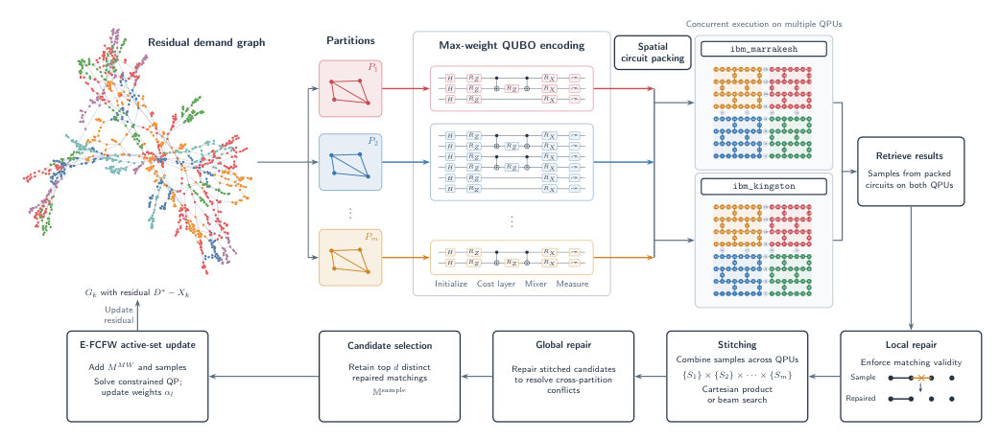 
FIG. 1. Residual graphs are partitioned into QAOA subproblems and dispatched across IBM QPUs using spatial circuit packing. Samples are stitched, repaired to enforce matching feasibility, and added to the classical E-FCFW active set.

📷 Fig 2

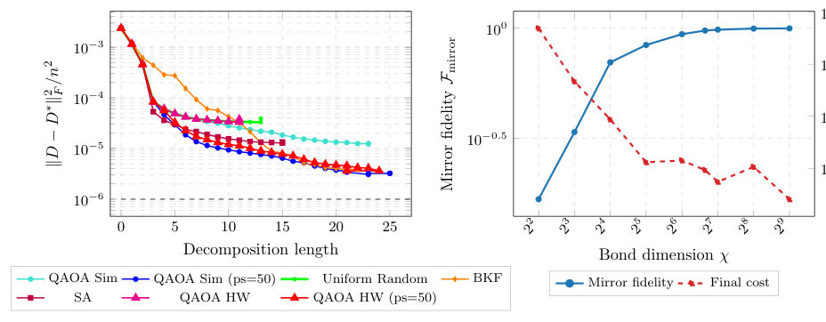 
FIG. 2. Benchmark on synthetic demand graphs inspired by heavy-hex topology (n = 120, |E| = 132). (a) Normalized approximation cost versus decomposition length for hardware QAOA, MPS simulation, and classical baselines. All methods except greedy Birkhoff (BKF) supply candidates to E-FCFW. (b) Mirror fidelity and final cost versus MPS bond dimension χ: retaining more entanglement improves simulation fidelity and candidate quality.

📷 Fig 3

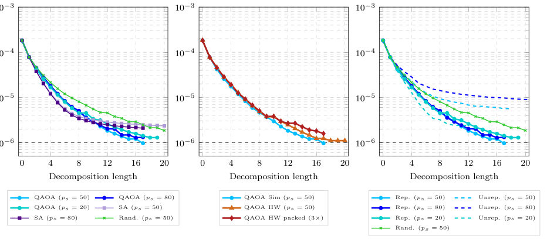 
FIG. 3. Cost convergence of partitioned E-FCFW versus decomposition length on simulation and quantum hardware compared with classical baselines, with and without repair. (a) Partitioning bounds ps ∈{20, 50, 80} evaluated via MPS simulation (χ = 128), compared with partitioned simulated annealing (SA) and uniform random sampling baselines (all using feasibility repair). (b) Hardware execution on IBM Heron (ibm_marrakesh) tracking 128-bond-dimension MPS simulation, with spatial circuit packing yielding a 3× execution speedup with minimal degradation in candidate quality. (c) Convergence with and without greedy feasibility repair; discarding invalid matchings without repair stalls QAOA...

📷 Fig 4

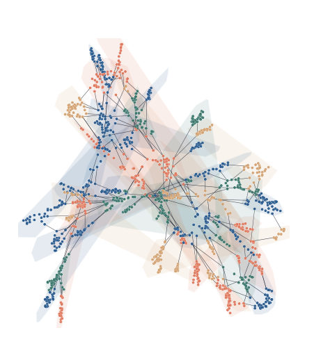 
FIG. 4. PEGASE-1354 partitioned into 41 subgraphs with edge bound ps = 50. Colors distinguish neighboring partitions; gray lines are internal edges and dashed red lines are cut edges. Shaded regions illustrate individual partitions.

📷 Fig 5

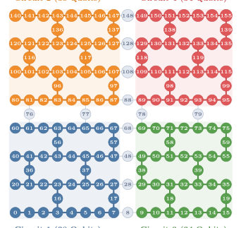 
FIG. 5. Spatial packing on the 156-qubit IBM Heron proces- sor ibm_marrakesh. Two 38-qubit and two 34-qubit circuits occupy 144 qubits in disjoint regions. Idle qubits and unused cross-boundary couplers separate the circuits.

**Summary.** This work tackles the difficulty of applying quantum optimization algorithms to massive, real-world constrained problems like power grid analysis. It proposes a scalable pipeline that uses spectral graph partitioning to break the problem into smaller, hardware-manageable chunks. By combining quantum sampling with classical repair techniques, the authors demonstrate a viable path for running thousand-variable optimization on current superconducting quantum processors.

**Why it may be interesting.** While the core problem is graph optimization, the methodology heavily relies on mapping complex constraints onto quantum circuits, simulating entanglement via MPS, and managing hardware resource constraints (qubit count, depth), making it highly relevant to quantum computing architecture and algorithm development.

Detailed structure

**Main problem.** The paper addresses the challenge of scaling quantum optimization methods, specifically for the Minimum Birkhoff Decomposition (MBD), to large-scale, thousand-variable constrained problems.

**Main result.** The combination of spectral graph partitioning, spatial circuit packing, and classical feasibility repair provides an executable path for deploying gate-based quantum sampling on large-scale optimization problems using current quantum hardware.

**Method.** The approach combines the Extended Fully-Corrective Frank-Wolfe (E-FCFW) framework with single-layer QAOA sampling, distributing the problem via spectral partitioning across multiple quantum processing units (QPUs).

**Model / system.** The problem is modeled as decomposing a doubly substochastic matrix into a sparse weighted sum of matchings, formulated as a QUBO Hamiltonian on a graph like the 1,354-node PEGASE bus test case.

**Key observables.** Residual decomposition error ($\lVert D - D^* 
Vert_F^2$), hardware execution time, and mirror fidelity ($\hat{F}_{	ext{mirror}}$).

**Important parameters / regimes.** Partition size ($p_s$), QAOA parameters ($\gamma_0, eta_0$), and the number of qubits (up to 1,710 variables).

**Assumptions / limitations.** The method assumes that retaining a substantive quantum sampling task within each partition is necessary for convergence, and it relies on classical feasibility repair to enforce global constraints.

**Figures summary.** Figures illustrate the workflow involving partitioning residual graphs into QAOA subproblems, dispatching them across multiple QPUs using spatial circuit packing, and the comparison of convergence curves against classical baselines.

**Paper structure.** The paper details the formulation of MBD, introduces the E-FCFW framework augmented by QAOA sampling, describes the scaling solution using spectral partitioning and spatial packing, and validates the entire pipeline on large benchmark graphs.

Abstract

The Minimum Birkhoff Decomposition (MBD) seeks a sparse weighted sum of matchings and is a challenging optimization problem with applications in network scheduling and energy trading. We scale a quantum-assisted decomposition method by combining single-layer QAOA sampling with Extended Fully-Corrective Frank-Wolfe (E-FCFW) optimization, spectral graph partitioning, and greedy feasibility repair. We demonstrate the pipeline on the 1,354-node PEGASE bus test case (representing a 1,354-bus transmission grid with 1,710 transmission lines), whose 1,710 edges define a native 1,710-variable matching optimization problem requiring 1,710 qubits in the unpartitioned encoding. Partitioning enables distributed execution on IBM superconducting quantum processors. The best reported hardware result uses a 50-qubit partition bound, while reducing partitions to 20 qubits degrades convergence in the partition-size comparison. Larger partitions are more demanding for matrix product state (MPS) simulation, and bond-dimension tests show that truncating quantum correlations reduces candidate quality. The results therefore motivate retaining a substantive quantum sampling task within each partition as the overall problem scales. On the PEGASE-1354 benchmark, repaired QAOA samples achieve lower residual decomposition error than both simulated annealing and uniform random sampling baselines, while spatial circuit packing reduces hardware execution time by approximately a factor of three. These results demonstrate that combining spectral partitioning, spatial circuit packing, and classical feasibility repair provides an executable path for deploying gate-based quantum sampling on thousand-variable constrained optimization problems on current hardware.

[↑ back to top](#top)

### [Universal Drude Weights in One-dimensional Repulsive Fermi Gas](http://arxiv.org/abs/2610.11137v1)

**Authors:** Xiangguo Yin, Dawei Niu, Shuang Zhang, Shizhong Zhang, Yunbo Zhang, Xi-Wen Guan  
**Type:** theory · **Category:** quantum gases · **PDF:** <https://arxiv.org/pdf/2610.11137v1>  
**Analysis basis:** full PDF text, analyzed in chunks
**Topic relevance:** `analog quantum simulation` **3/5** · `Keldysh / 2PI / non-Gaussian methods` **1/5**

📷 Fig 1

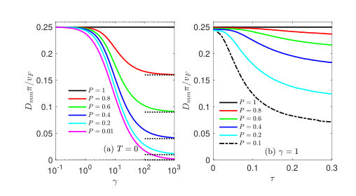 
FIG. 1. DWs Dmm for the ground state (a) and low temperature (b). Here γ = c/n is the dimensionless interaction strength, P is the polarization, and τ = T/EF is the dimensionless temperature with Fermi energy EF = π2n2/2m. Dotted lines in (a) represent analytical results in the strong interaction limits. The dimensionless interaction γ in (b) is set to be 1.

📷 Fig 2

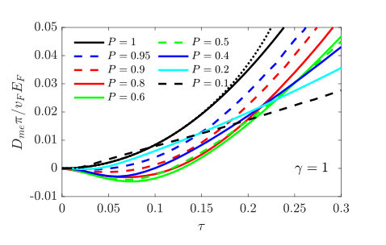 
FIG. 2. DWs Dme as functions of dimensionless temperature τ = T/EF for different polarizations P at fixed interaction strength γ = 1. Dotted lines represent analytical results for the ideal Fermi gas at low temperature.

📷 Fig 3

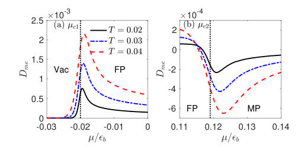 
FIG. 4. DW Dme as functions of dimensional chemical potential µ/ϵb for different temperatures T at H = 2, c = 10. The critical chemical potential µc1, µc2, indicated as vertical black dashed lines, are boundaries for Vac-FP and FP-MP at zero temperature, respectively.

📷 Fig 4

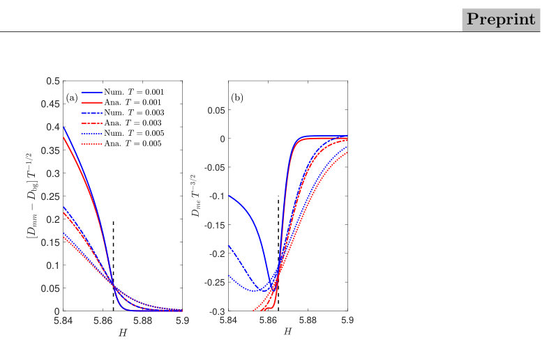 
Figure 1: Scaling behavior of the rescaled spin DWs [Dmm −D(k0)] T −1/2 (a) and Dme T −3/2 (b) as a function of the magnetic field H for different temperatures T. The solid lines represent numerical results obtained from the TBA equations, while the symbols denote the corresponding analytical predictions. The vertical dashed line indicates the critical magnetic field Hc. Other parameters are fixed at c = 1, µ = 4 and m = 1.

📷 Fig 5

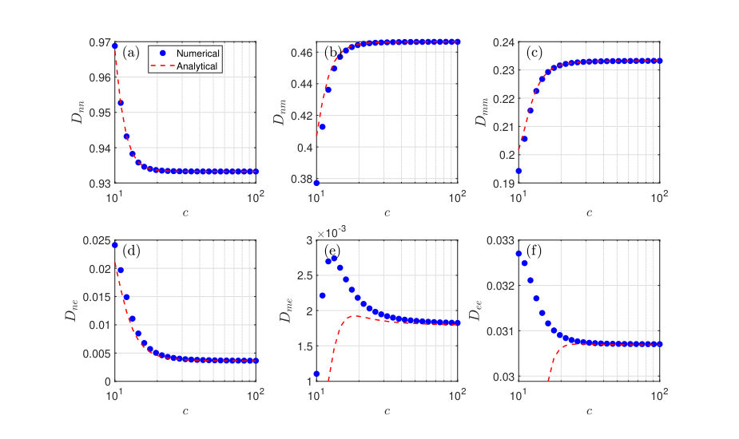 
Figure 2: Comparison between the exact numerical TBA results (blue solid dots) and the analytical strong-coupling asymptotic expressions (red dashed line) for the Drude weights. Parameters: µ = 3.8, H = 1.0, T = 0.1.

**Summary.** This paper derives universal, exact relations for the Drude weights characterizing charge, spin, and energy transport in the 1D repulsive Fermi gas (Yang-Gaudin model). Using advanced techniques like generalized hydrodynamics, the authors confirm that charge transport is purely ballistic and relate these weights directly to fundamental thermodynamic quantities. This provides a crucial theoretical benchmark for experiments with ultracold atoms.

**Why it may be interesting.** This work provides a deep theoretical foundation for understanding transport in integrable quantum gases, directly relevant to ultracold atom experiments where such systems are realized.

Detailed structure

**Main problem.** To rigorously establish universal relations between Drude weights governing charge, spin, and energy transport and thermodynamic properties in the 1D repulsive two-component continuum Fermi gas.

**Main result.** The charge Drude weights are shown to equal the particle density, magnetization, and entropy density, confirming ballistic transport. Furthermore, the spin Drude weights map out the zero-temperature phase boundary across the mu-H plane.

**Method.** The work builds upon the Bethe ansatz and generalized hydrodynamics (GHD), utilizing rapidity-space formulations and integral equations to derive transport coefficients.

**Model / system.** The system is the one-dimensional (1D) repulsive two-component continuum Fermi gas, modeled by the integrable Yang-Gaudin model, which is a paradigmatic system for studying interacting quantum gases.

**Key observables.** Drude Weights ($D_{nn}, D_{mm}, D_{ne}, D_{me}$), particle density ($n$), magnetization ($m_z$), and entropy density ($s$).

**Important parameters / regimes.** Temperature ($T$), chemical potential ($\mu$), and magnetic field ($H$). The analysis explores zero and low-temperature limits.

**Assumptions / limitations.** The analysis relies on the system being described by the Yang-Gaudin model and utilizes advanced theoretical frameworks like GHD and TBA equations.

**Figures summary.** Figures compare calculated Drude weights from different theoretical protocols (integral form, tilted potential, partitioning) against each other and against numerical results, confirming consistency.

**Paper structure.** The paper systematically derives the transport coefficients by relating them to derivatives of thermodynamic potentials in the grand canonical ensemble, confirming the ballistic nature of charge and spin transport while treating energy transport separately.

Abstract

Building on the Bethe ansatz and generalized hydrodynamics, we rigorously establish universal relations between Drude weights governing charge, spin, and energy transport and thermodynamic properties for the one-dimensional repulsive two-component continuum Fermi gas - the paradigmatic integrable Yang-Gaudin model. We analytically derive thermodynamic expressions for charge Drude weights: $D_{nn}$, $D_{nm}$, $D_{ne}$ (responses of particle, magnetization and energy currents to a chemical potential gradient) equal the particle density, magnetization, and temperature times entropy density, respectively. These relations constitute a hallmark of ballistic transport, and can be generalized to other 1D continuum integrable systems. Furthermore, we investigate spin Drude weight ($D_{mm}$, $D_{me}$) at zero and low temperatures. They characterize the magnetization and energy current responses to a magnetic field gradient, revealing an essential spin-charge coupling feature in quantum transport. We find that the Drude weights $D_{nm}$, $D_{mm}$, and $D_{me}$ across the $μ\text{-}H$ plane remarkably map out the zero-temperature phase boundary. This work fills a critical gap in the understanding of transport within integrable quantum gases and furnishes a direct theoretical foundation for future ultracold-atom experiments.

[↑ back to top](#top)

### [Gap Sensitivity and Bottleneck Migration in Sparse Constraint-Preserving Quantum Annealing](http://arxiv.org/abs/2610.11262v1)

**Authors:** Aruna Gupta, S. R. Hassan  
**Type:** theory · **Category:** other · **PDF:** <https://arxiv.org/pdf/2610.11262v1>  
**Analysis basis:** full PDF text, analyzed in chunks
**Topic relevance:** `analog quantum simulation` **3/5**

📷 Fig 1

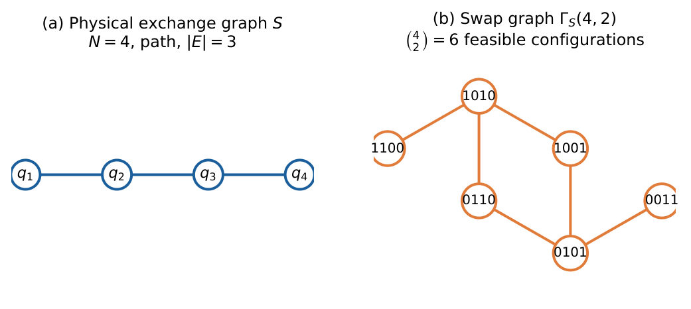 
FIG. 1. A physical exchange graph and its induced fixed-cardinality swap graph. Physical vertices represent binary variables, whereas configuration-space vertices represent feasible strings. A single physical edge generates all allowed configuration swaps across that variable pair.

📷 Fig 2

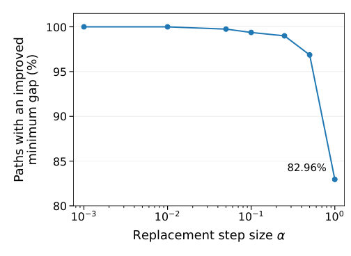 
FIG. 2. Oracle-selected directions from local perturbations to complete edge replacements. The 798 non-abstained starts each define one fixed replacement path S0 →S1 parameterized by α. All selected directions improve the re-minimized gap at α = 10−3 and 10−2, whereas the full replacement at α = 1 improves 662/798 = 82.96% of paths. Fractional α values are weighted diagnostic drivers outside the unit-weight B-edge class. Finite candidate gaps are not used to select the direction; the line connects the tested step sizes as a visual guide.

📷 Fig 3

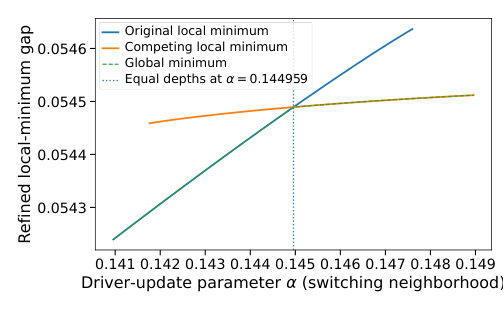 
FIG. 3. Example of a resolved bottleneck exchange along one oracle-selected driver update. Two distinct local minima coex- ist and reverse their depth ordering as α increases. In the illus- trated B = 6 path, their gaps become equal near α = 0.144959, at annealing locations s ≃0.337921 and 0.436638. The original bottleneck is first raised, after which the competing minimum becomes globally limiting. Both branches increase in the dis- played neighborhood; the incoming branch becomes limiting because it increases more slowly. This “repair-and-expose” behavior is the finite-update mechanism examined in the text; cohort-level statistics use all 798 non-abstained paths.

📷 Fig 4

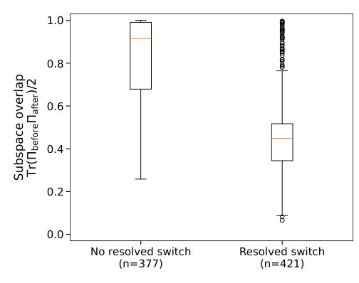 
FIG. 4. Initial-to-final low-energy subspace overlap, evaluated at each driver’s active minimum, for 377 paths without a resolved switch and 421 switching paths. The medians are 0.915 and 0.449, respectively. The path groups share the same 30 objectives, so their separation is an association rather than an independent-sample causal comparison. Both the driver and the active annealing coordinate change in this diagnostic. All 798 comparisons satisfy E2 −E1 &gt; 10−9 at both evaluation points; no rank-two comparison was excluded.

📷 Fig 5

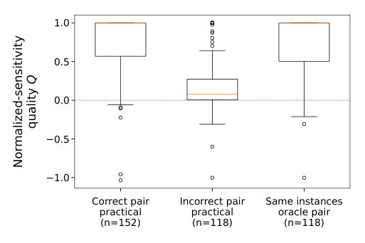 
FIG. 5. Refined-minimum basin-pair diagnostic pooled de- scriptively over nine cells of 30 accepted objectives, using the same conditioned ensemble as Table V and Appendix A 3. There are 152 matching pairs and 118 mismatches. The two rightmost groups contain the same 118 observations, first using the practical pair and then the retrospective crossing-relevant pair. Boxes show medians and interquartile ranges; whiskers use the standard 1.5-IQR convention and points show outliers. Negative Q values are allowed by Eq. (43). The retrospective pair is used only as a diagnostic reference and is not available to the practical selector.

**Summary.** This theoretical work analyzes how to optimize the minimum energy gap during quantum annealing by studying the 'exchange-resolved sensitivity' of the system's gap. It finds that while local changes are predictable, finite updates require accounting for 'bottleneck migration' via a 'repair-and-expose' mechanism. The results suggest that a max-min update rule is superior for guiding the annealing process when multiple low-energy states compete.

**Why it may be interesting.** The focus on gap dynamics, bottleneck identification, and local optimization rules directly relates to understanding the energy landscape traversal in complex quantum many-body systems, which is central to condensed matter physics.

Detailed structure

**Main problem.** The paper addresses how to design constraint-preserving drivers in quantum annealing to reliably improve the minimum gap ($\min_s \Delta(s, w)$) of the annealing path.

**Main result.** Local gap sensitivity reliably predicts beneficial infinitesimal changes, but finite edge replacements require a 'repair-and-expose' mechanism and a 'tied-minimum max-min update' for reliable continuation.

**Method.** The analysis derives the exchange-resolved sensitivity of the minimum gap using Hellmann–Feynman theorems and compares local (infinitesimal) versus finite updates.

**Model / system.** The model involves binary optimization problems with fixed-cardinality constraints, analyzed via an annealing path $H(s, w) = (1 -s)D(w) + sP$. The driver $D(w)$ is constructed from exchange Laplacians.

**Key observables.** Minimum Gap ($\Delta(s, w)$), Exchange-Resolved Sensitivity, Subspace Overlap ($O_{	ext{sub}}$), and the Dirichlet-energy contrast ($G_e(s)$).

**Important parameters / regimes.** The analysis distinguishes between infinitesimal changes ($\alpha \ll 1$) and finite edge replacements ($\alpha=1$), and uses various step sizes ($\epsilon=10^{-2}$ or $10^{-3}$).

**Assumptions / limitations.** The local sensitivity analysis assumes simple eigenvalues and a unique minimizer $s^*$; the max-min rule is presented as a local continuation method.

**Figures summary.** Figure 1 illustrates the distinction between the physical exchange graph and the induced configuration-space swap graph; other figures compare gap improvements across different optimization strategies.

**Paper structure.** The paper develops the theoretical framework for gap sensitivity, derives the local response, identifies the 'repair-and-expose' mechanism when bottlenecks migrate, and proposes the 'tied-minimum max-min update' rule for reliable driver redirection.

Abstract

Constraint-preserving exchange drivers allow many coupling graphs that preserve the same feasible sector, but exhibit different minimum gaps along an annealing path. We derive an exchange-resolved sensitivity of the normalised minimum gap for fixed-cardinality Laplacian drivers sharing a Dicke ground state, and apply it to identify locally favourable modifications of the driver. Numerical experiments indicate this sensitivity reliably predicts beneficial infinitesimal changes, but its reliability decreases when the same direction is extended to a finite edge replacement. The gap landscape tracking reveals one mechanism of this loss of reliability. Improving the active bottleneck can expose a competing minimum, with a more extensive reorganisation of the low-energy subspace. We call this the "repair-and-expose" mechanism and observe it in both dense quadratic and sparse frustrated objective families. This motivates relinearizing the response when competing minima become co-active. In the tested oracle setting, a tied-minimum max-min update is substantially more reliable than continuing the original direction or optimizing only the incoming minimum. Supporting finite-size search and selector tests show that this local information can remain useful beyond the infinitesimal limit, while its practical extraction depends on the driver geometry and identification of the relevant low-energy competitors. These results connect local exchange-resolved gap sensitivity to bottleneck migration and conditional driver redirection.

[↑ back to top](#top)

### [Mutually unbiased bases: common states, completion, and extension obstructions](http://arxiv.org/abs/2610.12180v1)

**Authors:** Hao-Yu Sun  
**Type:** theory · **Category:** quantum information and computing · **PDF:** <https://arxiv.org/pdf/2610.12180v1>  
**Analysis basis:** full PDF text, analyzed in chunks
**Topic relevance:** `quantum measurements` **3/5**

📷 Fig 1

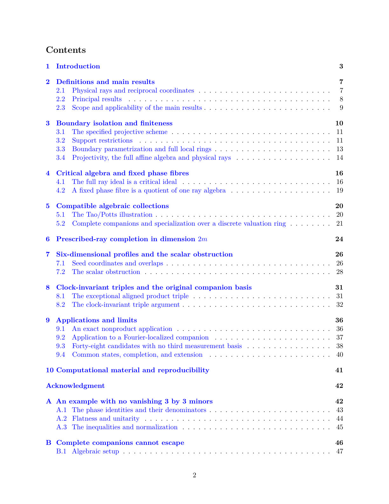 
Low-resolution page preview, page 2

📷 Fig 2

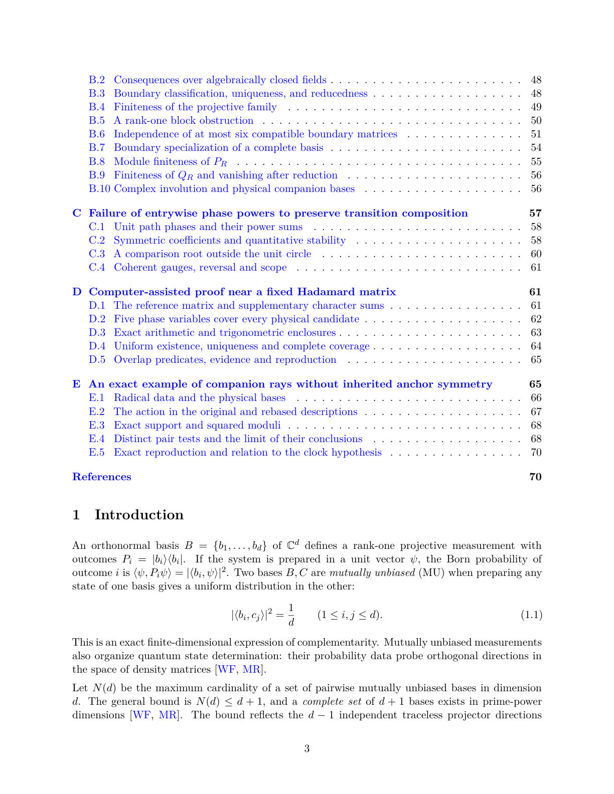 
Low-resolution page preview, page 3

📷 Fig 3

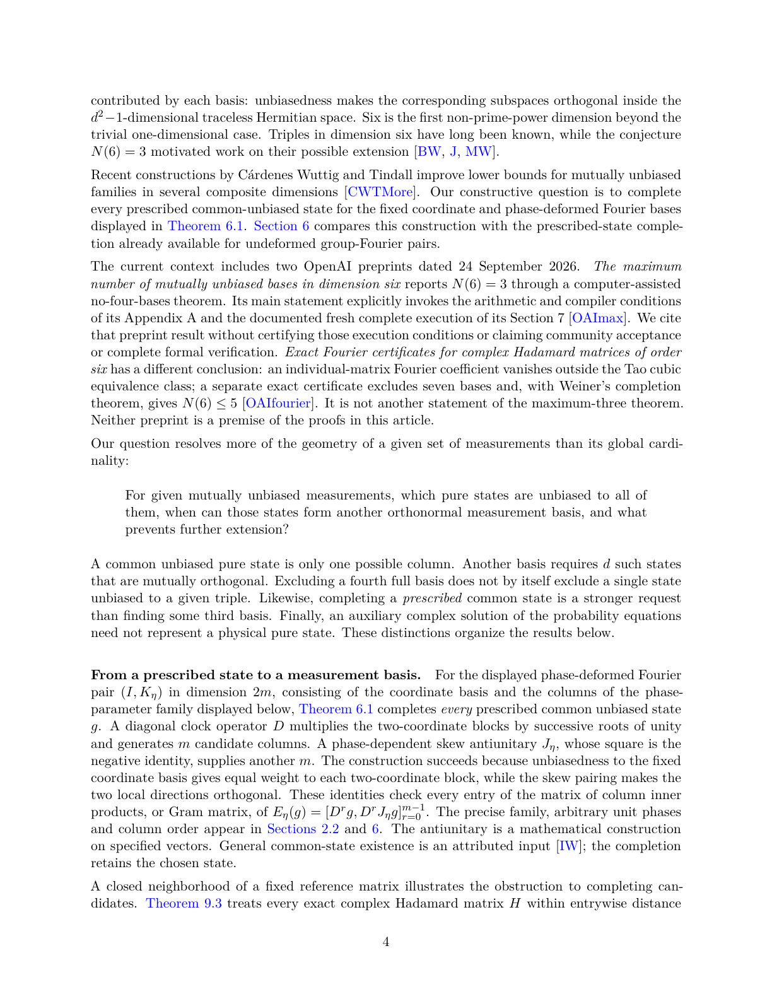 
Low-resolution page preview, page 4

📷 Fig 4

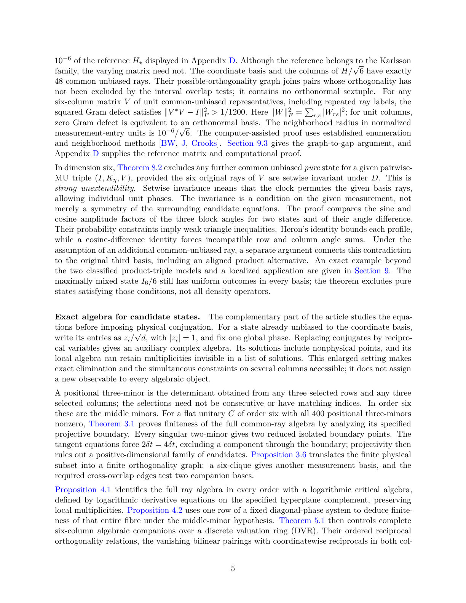 
Low-resolution page preview, page 5

📷 Fig 5

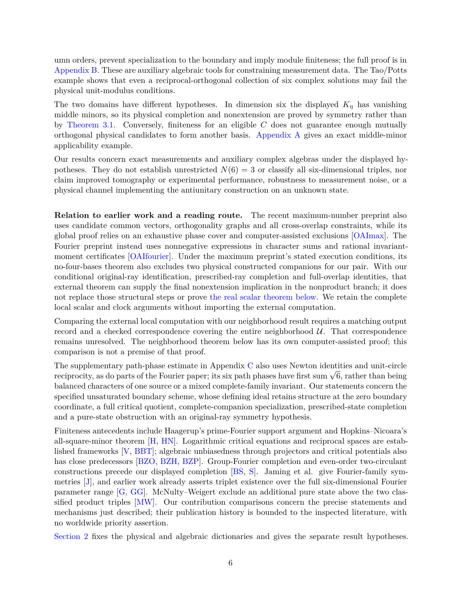 
Low-resolution page preview, page 6

**Summary.** This paper deeply explores the mathematical structure of Mutually Unbiased Bases (MUBs) by analyzing common unbiased states and the conditions required for their completion into full measurement bases. Using advanced algebraic geometry, the authors establish constructive theorems for certain systems while also deriving specific obstructions that limit the number of such bases in higher dimensions. It provides fundamental theoretical constraints on quantum measurement theory.

**Why it may be interesting.** The rigorous mathematical framework developed here—linking algebraic geometry to the existence of quantum measurement bases—provides deep structural insights into the limits of quantum information processing.

Detailed structure

**Main problem.** The paper investigates the mathematical constraints governing common unbiased states and the conditions under which a set of such states can be completed to form a full orthonormal measurement basis in quantum systems.

**Main result.** The authors provide explicit constructions showing that for specific Fourier pairs, common unbiased states can be completed to an orthonormal basis, while also deriving obstructions (e.g., in dimension six) that prove strong unextendibility for certain configurations.

**Method.** The work employs advanced algebraic and geometric techniques, analyzing projective ray schemes, affine coordinate algebras, and utilizing complex equations derived from quantum measurement theory.

**Model / system.** The model is abstract quantum measurement theory, focusing on pure states represented as rays in a complex Hilbert space, and measurements defined by orthonormal bases (like the Fourier or Hadamard bases).

**Key observables.** Common unbiased states, the Gram defect of candidate bases, and the structure of the projective ray scheme.

**Important parameters / regimes.** The dimension $d$ of the Hilbert space (especially $d=6$), and the neighborhood size ($\epsilon$) around reference matrices.

**Assumptions / limitations.** The analysis often relies on specific, highly structured input bases (like phase-deformed Fourier pairs) or the assumption of small perturbations around known exact matrices.

**Figures summary.** Not specified; the notes describe mathematical theorems and structural proofs rather than figure content.

**Paper structure.** The paper progresses from defining common unbiased states and the problem of completion, to presenting specific constructive theorems (e.g., for Fourier pairs), followed by detailed algebraic analyses of constraints (finiteness results) and specific dimensional obstructions.

Abstract

Which pure states give uniform outcomes in several mutually unbiased measurements, and when can they form another measurement basis? We distinguish common unbiased states, their orthonormal completion, and further extension. For a displayed phase-deformed Fourier pair in dimension $2m$, a clock symmetry and skew antiunitary complete every prescribed common unbiased state to an explicit orthonormal basis. In dimension six, an amplitude-profile obstruction proves strong unextendibility of a given mutually unbiased triple when its original third-basis rays are invariant under the ternary clock. We give an exact nonproduct example and an application to a companion whose columns are localized at single Fourier frequencies. For every exact Hadamard matrix in a specified closed entrywise neighborhood of a fixed reference matrix, the coordinate and Hadamard bases have exactly 48 common unbiased rays but no third measurement basis, with a quantitative lower bound on the squared Gram defect of every six-column candidate.   We also study auxiliary complex equations for common states, retaining algebraic multiplicities. For a flat unitary of order six with all $3\times3$ minors nonzero, the projective ray scheme is finite; each singular two-minor contributes two reduced isolated boundary points, and the affine coordinate algebra is finite-dimensional over $\mathbb{C}$. In every order, a critical-algebra identity preserves multiplicities; in dimension six it gives finiteness for a fixed phase fibre. Specialization over a discrete valuation ring controls complete reciprocal-orthogonal collections. A nonphysical Tao/Potts collection separates algebraic from physical solutions. These results do not determine the global maximum number of mutually unbiased bases or classify all triples.

[↑ back to top](#top)

### [Optimal Diffractive Focusing of Vortex Beams](http://arxiv.org/abs/2610.10842v1)

**Authors:** Roohollah Ghobadi, Carrie Rodriguez, Lukas Scarfe, Maxim A. Efremov, Ebrahim Karimi  
**Type:** both · **Category:** other · **PDF:** <https://arxiv.org/pdf/2610.10842v1>  
**Analysis basis:** full PDF text, analyzed in chunks
**Topic relevance:** `interference shaping light` **3/5**

📷 Fig 1

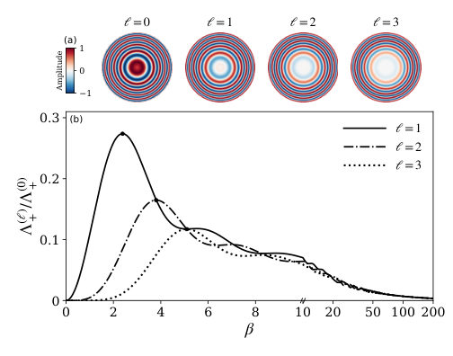 
FIG. 1. OAM dependence of the optimal focusing solution. (a) Op- timal normalized eigenfunction ψ+ ℓ(ρ) for ℓ= 0, 1, 2, 3. (b) Relative focusing strength Λ(ℓ) + /Λ(0) + versus the dimensionless radial parameter β = ρ∗/τf, for ℓ= 1 (solid), ℓ= 1 (dashed-dotted) and ℓ= 3 (dotted). The horizontal axis is linear for 0 ≤β ≤10 and logarithmically com- pressed for β &gt; 10 to display the asymptotic regime. The peak shifts to larger β with increasing ℓ, reflecting the outward displacement of the dominant Bessel weight J2 ℓ(βρ) for higher-order OAM modes.

📷 Fig 2

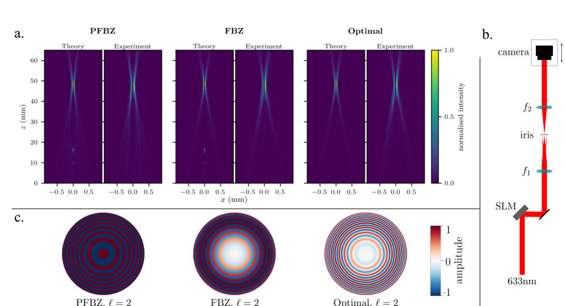 
FIG. 2. a. Theoretically calculated and experimentally measured transverse intensity distributions during free-space propagation for the corresponding masks, illustrating the formation and evolution of the vortex-ring focus for the case of ℓ= 2. b. Schematic of the experimental setup used to generate and analyze the optimal diffractive pupil functions. A linearly polarized Gaussian beam is expanded and modulated by a phase-only spatial light modulator (SLM), which encodes the calculated amplitude kinoforms using an amplitude–phase holographic technique. A 4 f filtering system selects the desired diffraction order and removes unwanted components, producing the modulated vortex beam. The...

📷 Fig 3

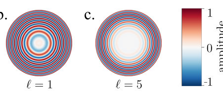 
FIG. 3. a. Experimental peak focal ring intensity for each OAM or- der ℓ= {0, 1, 2, 3, 4, 5} for each pupil mask. Each intensity measure- ment is taken at the focal point of the mask, and averaged azimuthally about the highest intensity ring. This intensity is normalized by the relative input intensities for the different masks. We attribute the drop in efficiency of the optimal masks ψ+ ℓto the limited resolution of the phase-only SLM used in the experiment. As ℓincreases, the power is distributed more towards the higher frequency outer bounds of the mask, where the resolution of the SLM is less efficient. This can be seen in the optimal mask intensities shown, b. ℓ= 1, and c. ℓ= 5

📷 Fig 4

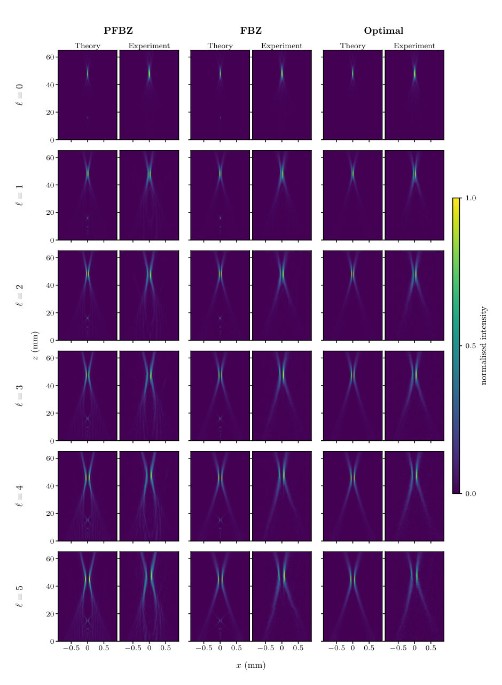 
FIG. 4. Theoretically calculated and experimentally measured transverse intensity distributions during free-space propagation for all masks and beams possessing OAM or 0–5.

📷 Fig 5

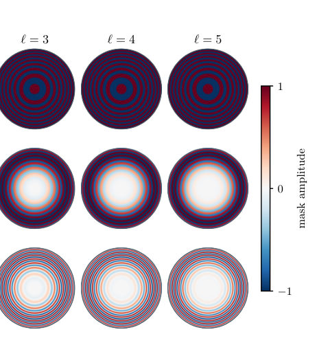 
FIG. 5. Mask amplitudes for all masks, normalized so that the maximum value is one.

**Summary.** This paper develops a theoretical framework to find the optimal pupil function for maximizing the intensity of vortex beams (carrying OAM) focused onto a ring. By solving a variational eigenvalue problem, the authors derive the optimal pupil structure, which combines Fresnel and Bessel modulations. They validate these theoretical limits through both detailed analysis and experimental implementation using SLMs.

**Why it may be interesting.** This work provides a fundamental, analytically derived upper bound for energy concentration in structured light beams, which has direct implications for designing high-performance optical elements and understanding wave propagation limits.

Detailed structure

**Main problem.** The paper addresses the optimization problem of achieving the maximum possible intensity concentration when focusing paraxial beams carrying Orbital Angular Momentum (OAM) through a finite circular aperture.

**Main result.** The optimal pupil profile combines Fresnel phase structure with an OAM-dependent Bessel radial modulation, establishing a rigorous upper bound on achievable ring intensity for structured waves.

**Method.** The problem is formulated as a variational optimization problem leading to an integral-kernel eigenvalue problem, which is solved analytically.

**Model / system.** The system involves paraxial beams with OAM ($\ell$) propagating through a circular aperture. The analysis is conducted in the paraxial wave regime, modeling the focusing objective as maximizing intensity at a specific ring radius.

**Key observables.** Maximum achievable ring intensity ($\Lambda(\ell)$), optimal pupil function ($\psi^+_\ell$), and focusing efficiency ($\eta_\ell(\psi)$).

**Important parameters / regimes.** Topological charge ($\ell$), aperture radius ($R$), target ring radius ($
ho^*$), and propagation distance ($	au_f$).

**Assumptions / limitations.** The analysis relies on the paraxial approximation and assumes the input field is aperture-limited.

**Figures summary.** Figures illustrate the OAM dependence of the optimal eigenfunction and relative focusing strength, and compare experimental peak focal ring intensities for various mask types across different OAM orders.

**Paper structure.** The paper first formulates the optimal focusing problem variationally, deriving the optimal pupil structure. It then compares this theoretical optimum against practical mask designs (binary vs. amplitude-weighted) and experimentally tests these predictions.

Abstract

We formulate diffractive ring focusing of paraxial beams carrying orbital angular momentum (OAM) through a finite circular aperture as a variational optimization problem. For a fixed topological charge, we determine the real-valued radial pupil that maximizes the intensity at a prescribed ring radius and propagation distance under a normalization constraint on the input field. The resulting problem admits an exact analytical solution: the optimal pupil combines the familiar Fresnel phase structure with an OAM-dependent Bessel radial modulation, and the associated eigenvalue yields a rigorous upper bound on the achievable ring intensity. We further analyze the lens-assisted configuration and derive a simple bound that allows direct comparison between diffractive and refractive vortex focusing. The theory also provides a quantitative framework for evaluating the performance of practical mask designs, including binary Fresnel-Bessel zone plates and amplitude-weighted pupils. We have experimentally tested our predictions in the optical domain by implementing the corresponding vortex beam pupils and comparing their propagation and focusing performance with the optimal solution. Our results establish the vortex-beam analogue of optimal amplitude-only focusing and identify the fundamental limits governing diffractive concentration of structured waves

[↑ back to top](#top)

### [Quartic Certificates for Pure-State Tomography with Pauli Measurements](http://arxiv.org/abs/2610.12320v1)

**Authors:** Hengjian Li, Baisong Sun, Bei Zeng  
**Type:** theory · **Category:** quantum information and computing · **PDF:** <https://arxiv.org/pdf/2610.12320v1>  
**Analysis basis:** full PDF text, analyzed in chunks
**Topic relevance:** `quantum measurements` **3/5**

📷 Fig 1

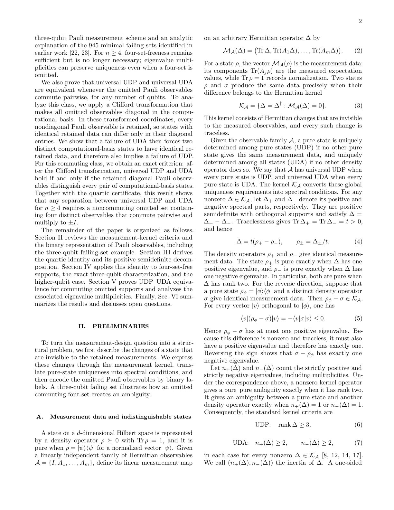 
Low-resolution page preview, page 2

📷 Fig 2

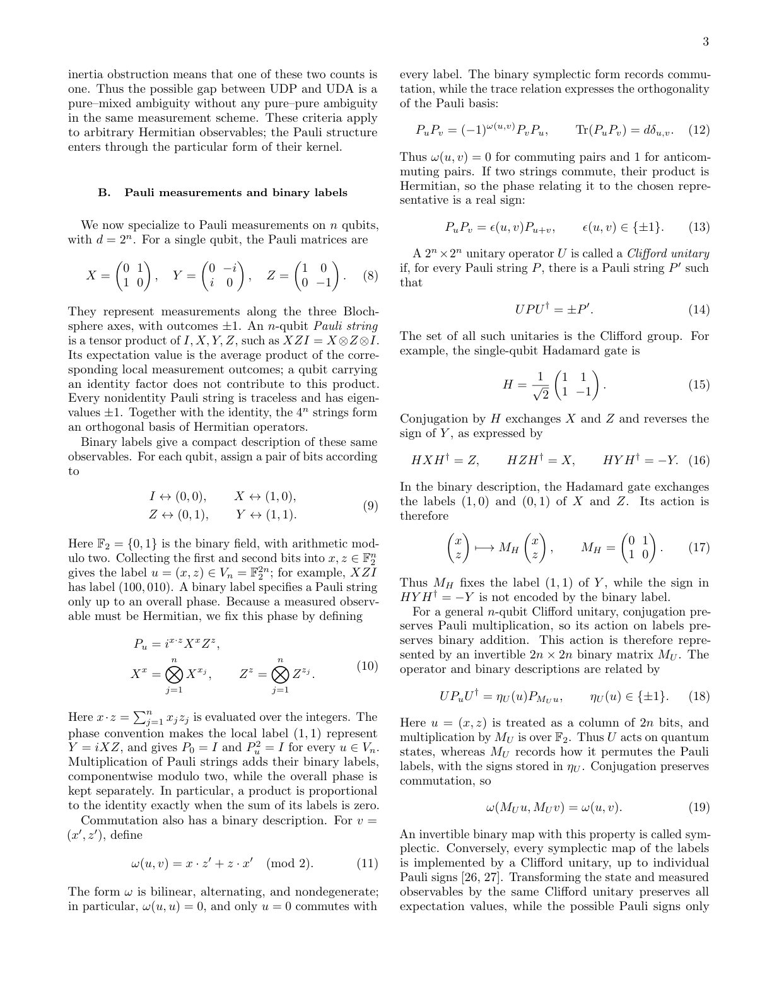 
Low-resolution page preview, page 3

📷 Fig 3

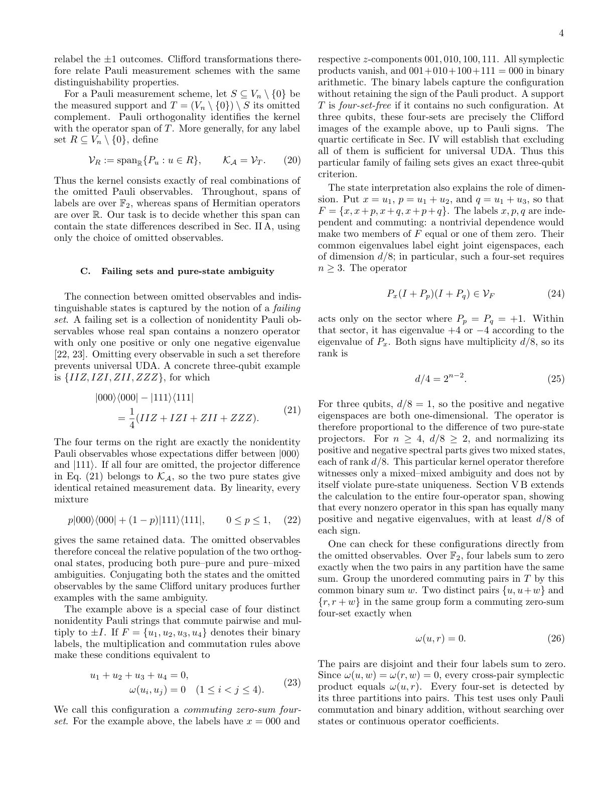 
Low-resolution page preview, page 4

📷 Fig 4

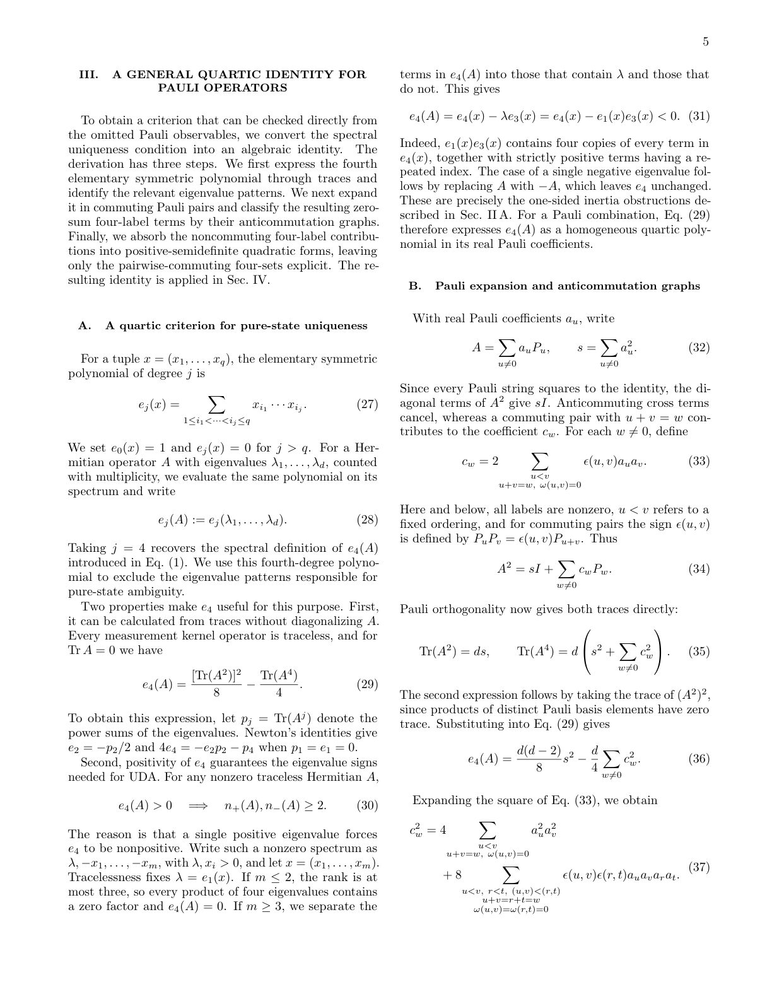 
Low-resolution page preview, page 5

📷 Fig 5

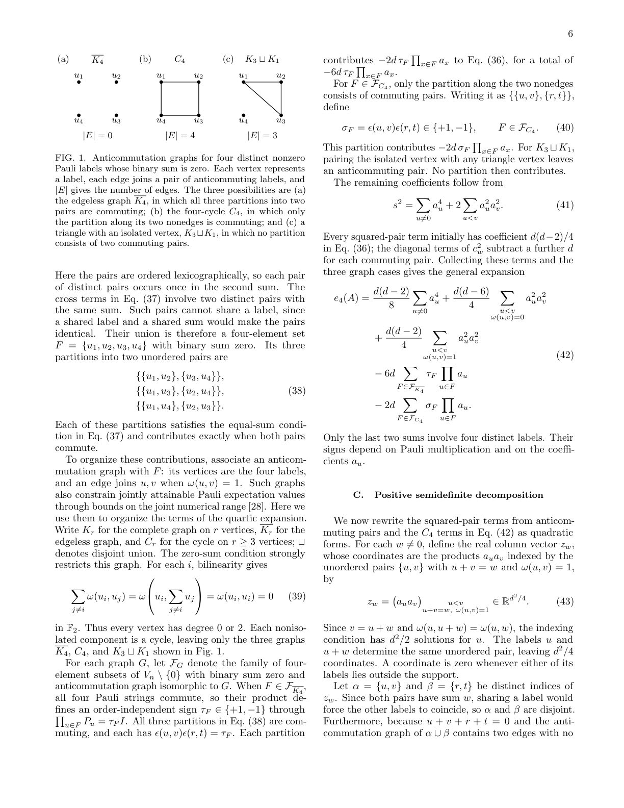 
Low-resolution page preview, page 6

**Summary.** This paper develops structural criteria to ensure that measuring only a subset of Pauli observables on $n$ qubits is sufficient to uniquely determine the quantum state. It introduces a 'quartic certificate' based on the omitted observables and proves that avoiding certain commuting sets of four operators guarantees unique determination for $n \ge 3$. This provides a powerful, testable tool for quantum tomography protocols.

**Why it may be interesting.** This work provides rigorous, checkable mathematical criteria directly applicable to experimental quantum information protocols, linking algebraic constraints (quartic identities) to fundamental physical properties (state distinguishability).

Detailed structure

**Main problem.** The paper aims to derive structural criteria to guarantee that quantum state tomography, performed using restricted Pauli measurements on $n$-qubit systems, uniquely determines the quantum state (either among pure states or among all possible states).

**Main result.** It establishes that for $n \ge 3$, universal unique determination among all states (UDA) is guaranteed if the set of omitted Pauli observables avoids containing four distinct operators that commute pairwise and multiply to $\pm I$ (the 'four-set-free' condition).

**Method.** The analysis converts the uniqueness problem into spectral conditions on the measurement kernel operator, deriving a 'quartic certificate' based on the fourth elementary symmetric polynomial of the operator's eigenvalues.

**Model / system.** The system is an $n$-qubit quantum system, and the measurements are restricted to expectation values of a subset of Pauli observables. The ambiguity is characterized by the kernel operator $K_A$ acting on the space of state differences.

**Key observables.** Expectation values of Pauli observables, the measurement kernel operator $A$, and the fourth elementary symmetric polynomial $e_4(A)$.

**Important parameters / regimes.** The number of qubits ($n$), the structure of the omitted Pauli observables (e.g., 'four-set-free'), and the spectral properties of the kernel operator (e.g., number of positive/negative eigenvalues).

**Assumptions / limitations.** The analysis relies on relating the ambiguity to the spectral properties of the kernel operator $A$, and specific results are derived for $n=3$ qubits where the four-set-free condition is necessary.

**Paper structure.** The paper progresses by defining the uniqueness notions (UDP/UDA), deriving the quartic certificate from the spectral analysis of the kernel, establishing the structural criterion (four-set-freeness) for $n \ge 3$, and finally analyzing the necessary and sufficient conditions for $n=3$ and the general commuting case.

Abstract

Full Pauli-basis tomography of an arbitrary $n$-qubit state uses the expectation values of all nonidentity Pauli observables. For multiqubit systems, prior knowledge that the state is pure allows some of these observables to be omitted while retaining uniqueness. We study two resulting notions of uniqueness: whether every pure state is uniquely determined among pure states (UDP), and whether every pure state is uniquely determined among all states, including mixed states (UDA). We derive quartic uniqueness certificates from the fourth elementary symmetric polynomial of operators in the real span of the omitted Pauli observables. An exact quartic identity shows that, for $n$-qubit systems with $n\geq 3$, every pure state is UDA whenever the omitted Pauli observables contain no four distinct operators that commute pairwise and multiply to $\pm I$. For three qubits, this condition is also necessary for UDP, yielding an exact characterization of both UDP and UDA. We further prove that UDP and UDA coincide for any number of qubits whenever the omitted Pauli observables commute pairwise. These results provide directly checkable structural criteria for certifying pure-state tomography from restricted Pauli measurements.

[↑ back to top](#top)

### [Spin-outcome correlations and memory-assisted entropic uncertainty in Bhabha scattering with an entangled spectator](http://arxiv.org/abs/2610.11629v1)

**Authors:** Zan Cao, Meng-Long Song, Xue-Ke Song, Liu Ye, Dong Wang  
**Type:** theory · **Category:** quantum information and computing · **PDF:** <https://arxiv.org/pdf/2610.11629v1>  
**Analysis basis:** full PDF text, analyzed in chunks
**Topic relevance:** `quantum measurements` **3/5**

📷 Fig 1

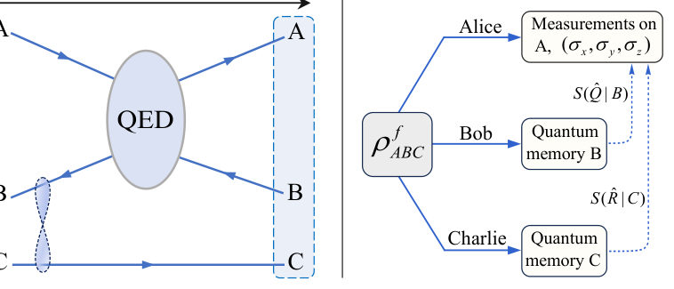 
FIG. 1. Schematic illustration of entangled-spectator Bhabha scattering and the associated quantum-memory-assisted un- certainty task. Panel (a) shows the initial B-C entanglement, the Bhabha scattering between particles A and B, and the post-selected three particle state. Panel (b) depicts spin measurements on particle A, with particles B and C serving as quan- tum memories.

📷 Fig 2

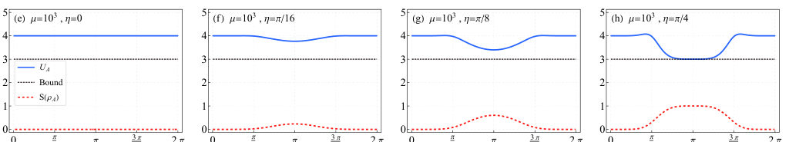 
FIG. 2. Angular dependence of the memory-assisted entropic uncertainty UA and the entanglement entropy S(ρA) across the A|BC partition. The blue solid, black dashed, and red dashed curves represent UA, its lower bound UA = 3, and S(ρA), respectively. The upper [(a)–(d)] and lower [(e)–(h)] rows correspond to µ = 1 and µ = 103. From left to right, η = 0, π/16, π/8, and π/4, with β = 0 in all panels.

📷 Fig 3

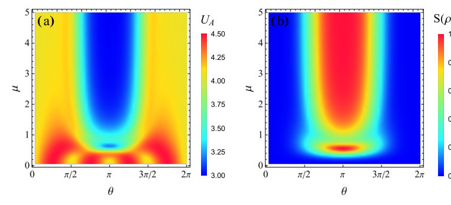 
FIG. 3. Density plots of (a) the total memory-assisted uncertainty UA and (b) the entanglement entropy S(ρA) in the (θ, µ) plane for η = π/4 and β = 0. The displayed momentum range is 0 &lt; µ ≤5. The color bars are scaled independently: dark blue in panel (a) indicates values of UA close to its lower bound of 3, whereas red in panel (b) indicates values of S(ρA) close to its maximum of 1.

📷 Fig 4

 
Figure 4 resolves the total uncertainty UA = UB + UC into the contributions associated with the two separate memories. In the lower-momentum regime, µ = 1, both contributions vary smoothly with the scattering configuration. For η = 0, UB develops two angular minima, whereas UC shows an approximately opposite trend. Since the spectator C is then uncorrelated with A, GC = P

📷 Fig 5

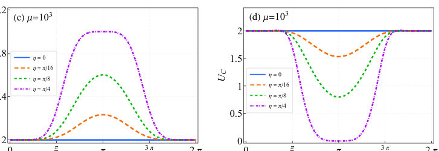 
FIG. 4. Angular dependence of the memory-resolved entropic uncertainties UB and UC in Bhabha scattering with an entangled spectator. Panels (a) and (b) show UB and UC, respectively, for µ = 1; panels (c) and (d) show the corresponding results for µ = 103. The blue solid, orange dashed, green dashed, and purple dash-dotted curves correspond to η = 0, π/16, π/8, π/4, respectively. The initial phase is fixed at β = 0.

**Summary.** This theoretical paper analyzes how initial entanglement between two particles (B and C) affects the measurement uncertainty of a third particle (A) during Bhabha scattering. By quantifying memory-assisted entropic uncertainty, the authors show that the spectator particle C acts as a quantum memory, whose initial entanglement can reduce the overall uncertainty in the scattering process near backscattering angles.

**Why it may be interesting.** It applies advanced quantum information concepts (uncertainty relations, entanglement) to a high-energy particle physics process, providing insights into how quantum correlations govern measurement limits in scattering experiments.

Detailed structure

**Main problem.** The study investigates spin-outcome correlations and memory-assisted entropic uncertainty in Bhabha scattering when one particle is initially entangled with a spectator.

**Main result.** Initial entanglement between the scattering positron and the spectator can lower the total memory-assisted uncertainty in high-energy backscattering by strengthening spin-outcome correlations with the spectator.

**Method.** The analysis uses quantum information diagnostics, including entanglement entropy, memory-assisted entropic uncertainty, and outcome-memory mutual information sums.

**Model / system.** The system is tree-level QED Bhabha scattering ($e^-e^+ 	o e^-e^+$) where the positron (B) is initially entangled with a spectator electron (C). The analysis focuses on the post-selected three-particle scattering state.

**Key observables.** Entanglement entropy $S(
ho_A)$, total memory-assisted uncertainty $U_A$, outcome-memory mutual-information sums $G_B$ and $G_C$.

**Important parameters / regimes.** Initial entanglement weight $\eta$, scattering angle $	heta$, and high-energy backscattering limit ($	heta \approx \pi$).

**Assumptions / limitations.** The analysis is restricted to an idealized fixed-angle post-selected spin state, and some calculations neglect forward-scattering interference terms.

**Figures summary.** Figures illustrate the angular dependence of $U_A$ and $S(
ho_A)$ for varying entanglement parameters, and density plots show the relationship between these quantities in the $(	heta, \mu)$ plane.

**Paper structure.** The paper develops the theoretical framework by defining the initial entangled state, calculating the relevant quantum information measures ($U_A, S(
ho_A), G_B, G_C$), and then analyzing the behavior of these measures in specific physical limits, such as high-energy backscattering.

Abstract

We investigate spin-outcome correlations and memory-assisted entropic uncertainty in tree-level Bhabha scattering, where an incident electron $A$ scatters with a positron $B$ initially entangled with a spectator electron $C$. For the fixed-angle post-selected final state, we compare the total memory-assisted uncertainty $U_A$ for three alternative Pauli measurements on $A$ with the entanglement entropy $S(ρ_A)$ across the $A|BC$ partition. We resolve $U_A$ into the separate uncertainties $U_B$ and $U_C$ and evaluate the corresponding outcome-memory mutual-information sums $G_B$ and $G_C$. This separates changes in the randomness of the outcomes on $A$ from changes in their correlations with each memory. In the parameter regions studied, enhanced $A|BC$ entanglement is accompanied by lower $U_A$, most prominently near high-energy backscattering. An analytic treatment of this limit shows that $B$ factorizes from $AC$: $G_B$ vanishes, whereas $G_C$ increases with the initial $B$-$C$ entanglement. An entropic complete complementarity analysis characterizes the accompanying loss of local helicity predictability in $ρ_A$ and changes in the coherence, predictability, and mixedness of the interacting pair $ρ_{AB}$. These results show that initial $B$-$C$ entanglement can lower the total memory-assisted uncertainty in high-energy backscattering by strengthening spin-outcome correlations with the spectator $C$, thereby identifying the distinct roles of the interacting particle and the spectator as quantum memories.

[↑ back to top](#top)

### [Symmetric Mode Ansatz: Theory of Magnon Collective Modes in Chern Insulators](http://arxiv.org/abs/2610.10706v1)

**Authors:** Miguel Gonçalves, Jonah Herzog-Arbeitman, Juan Felipe Mendez-Valderrama, Andreas Feuerpfeil, B. Andrei Bernevig, Nicolas Regnault  
**Type:** theory · **Category:** strongly correlated electrons · **PDF:** <https://arxiv.org/pdf/2610.10706v1>  
**Analysis basis:** full PDF text, analyzed in chunks
**Topic relevance:** `analog quantum simulation` **3/5**

📷 Fig 1

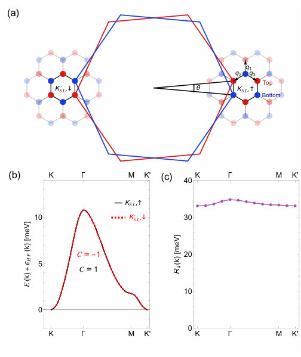 
FIG. 1. Twisted Brillouin zones of the TMD bilayer, with opposite spin-polarized low-energy states at the single-layer Dirac points KSL and K′ SL related by time-reversal symmetry T . A relative twist creates a moiré Brillouin zone shown in the figure. Blue/red points represent moiré reciprocal lattice points in the bottom/top layers. (b) Single-particle dispersion in Eq. 8 for the lowest-energy hole band at KSL and K′ SL, for the FH model of MoTe2 at θ = 3.7◦. The Chern number for this band in each valley is also indicated. Note that the dispersion of ϵHF,η(k) is only 5% of the full dispersion. (c) Charge excitation energies computed using Eq. 10 for the FH model of MoTe2 at θ = 3.7◦.

📷 Fig 2

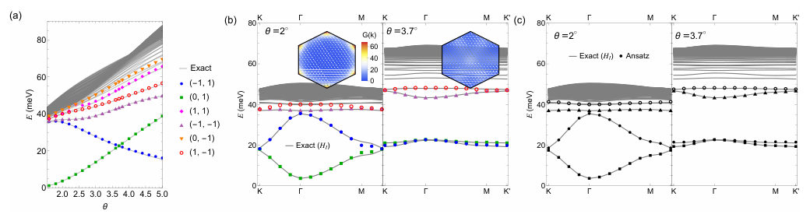 
FIG. 2. Exact magnon spectrum (gray) vs. SyMA (other colors) results for the FH model of MoTe2, using the flat band Hamiltonian HI in Eq. 7 where V (q) corresponds to the double-gated Coulomb interaction. (a) Comparison between exact (gray) magnon spectrum at p = 0 with the SyMA (other colors) results of the individual modes within the different symmetry sectors (κ, ζ). (b) Comparison between exact and SyMA magnon spectrum of the individual modes computed through Eq. 27 for variable p, for the angles indicated in the figure. We exclude the modes (κ, ζ) = (1, 1); (0, −1), that are in the continuum (plots for all the modes and different angles are provided in Fig. 15 of Appendix C 6). The...

📷 Fig 3

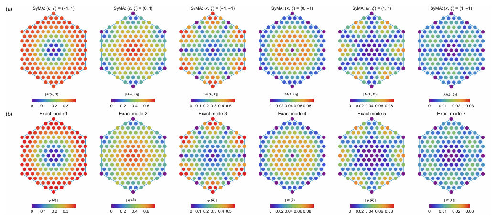 
FIG. 3. Comparison between absolute values of exact and SyMA magnon eigenstates at p = 0 for the FH model of MoTe2 at θ = 3.7◦. The exact modes are ordered by increasing energy from left to right. The three lowest energy states have the smallest sum of the node degrees N: 2 (double node), 2 and 4 respectively. All the higher-energy modes have N ≥6.

📷 Fig 4

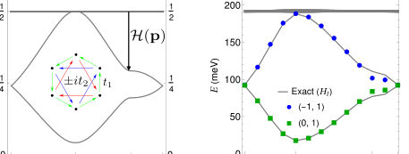 
FIG. 4. (a) Magnon spectrum for the time-reversal symmet- ric Landau level limit with V0 pseudopotential (see Ref. [35] or App. E for details). (b) Exact magnon spectrum obtained for the flat band Hamiltonian HI in Eq. 7 (full gray lines) using the Hubbard interaction defined by setting V (q) = V (q = 0) in Eq. 7, for θ = 3.7◦. The blue and green points are the results for the SyMA modes defined in Sec. III A with sym- metry eigenvalues (κ, ζ) specified in the figure. (c) Magnon spectrum of the flat band Haldane model, for ratio between next-nearest-neighbor and nearest-neighbor hopping strength (see inset) of t2/t1 = 1/10. (d) Same as (b), for θ = 2◦.

📷 Fig 5

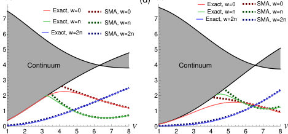 
FIG. 5. (a,b) Exact magnon mode spectra obtained numer- ically for V = 4 and Λ = 10, with n = 1 (a) and n = 2 (b). Three bound states are seen. (c,d) Exact and analyti- cal SyMA results for the magnon bound modes at p = 0 for n = 1 (c) and n = 2 (d).

**Summary.** This work introduces the Symmetric Mode Ansatz (SyMA) to theoretically describe the low-energy magnon excitations in Chern and fractional Chern insulators found in Moiré materials. By applying the SyMA to Hubbard models, the authors derive rigorous quantum geometric bounds on the magnon gap. This provides a powerful, unified theoretical tool for understanding magnetism stabilized by topological band structures.

**Why it may be interesting.** The rigorous derivation of bounds on the magnon gap using topological invariants (Chern number, Berry curvature) connects fundamental concepts from band theory and topology to the stability of magnetic order in strongly correlated systems.

Detailed structure

**Main problem.** The paper aims to clarify the nature and origin of the magnon gap in Chern insulators (CIs) and fractional Chern insulators (FCIs) stabilized by ferromagnetism in Moiré materials.

**Main result.** The Symmetric Mode Ansatz (SyMA) provides a highly accurate theoretical description of the low-energy magnon spectrum, leading to quantum geometric bounds on the magnon gap.

**Method.** The authors develop and apply the generalized single-mode approximation (SyMA) to the magnon Hamiltonian derived from Hubbard-type models.

**Model / system.** The study focuses on Moiré materials, specifically twisted MoTe2, which host FCIs due to spontaneous time-reversal symmetry breaking. The theoretical framework is tested using Hubbard models and the First-Harmonic (FH) model.

**Key observables.** Magnon spectrum/gap ($\Delta$), Chern number ($C$), Berry curvature ($F(k)$), and quantum metric ($G$).

**Important parameters / regimes.** Filling fractions ($
u$), magnetic coupling strength ($U$), and the twist angle ($	heta$).

**Assumptions / limitations.** The SyMA is assumed to be exact or highly accurate for certain solvable Hubbard models; approximations are made when neglecting single-particle terms in the low-energy magnon analysis.

**Figures summary.** Figures compare the exact magnon spectrum against the SyMA predictions across various fillings ($
u$), showing agreement at integer filling and providing gap energy dependence on $
u$.

**Paper structure.** The paper develops the SyMA theory, tests it on analytically solvable Hubbard models to derive general bounds, and then applies it to the specific FH model of MoTe2 to analyze the magnon gap across integer and fractional fillings.

Abstract

Moiré materials host integer and fractional Chern insulators (FCIs) where time-reversal is broken spontaneously by flat band ferromagnetism. In twisted MoTe2, unlike in quantum Hall, opposite spins carry opposite Chern numbers and realize Ising ferromagnetism with gapped magnon excitations. Clarifying the nature of these collective modes and the origin of the magnon gap is key to understanding the stability of the Chern magnets in these materials. To do so, we develop a generalized single-mode approximation, which we call the symmetric mode ansatz (SyMA), to describe the low-energy magnon spectrum. We find it to be in exceptional agreement with numerical calculations at integer filling, and qualitatively accurate across fractional fillings including FCIs. To explain the accuracy of the SyMA, we present two families of Hubbard models (including the Haldane model and continuum ideal bands) whose collective modes are analytically solvable and for which the SyMA is either exact or an accurate approximation. For a class of these models where SyMA is exact, we prove two-sided bounds on the zero-momentum magnon gap in terms of the Chern number, Berry curvature, and quantum metric, revealing that uniform quantum geometry is sufficient for stabilizing magnetism in Chern bands.

[↑ back to top](#top)

### [Transducing quantum-spin-ice correlations into Weyl Fermi-arc transport at a synthetic Kondo lattice interface](http://arxiv.org/abs/2610.12294v1)

**Authors:** Tsung-Chi Wu, Michael Terilli, Christian Zaprianov, Eun Sang Choi, David Graf, Qinghua Zhang, Lin Gu, Mikhail Kareev  
**Type:** experiment · **Category:** strongly correlated electrons · **PDF:** <https://arxiv.org/pdf/2610.12294v1>  
**Analysis basis:** full PDF text, analyzed in chunks
**Topic relevance:** `analog quantum simulation` **3/5**

📷 Fig 1

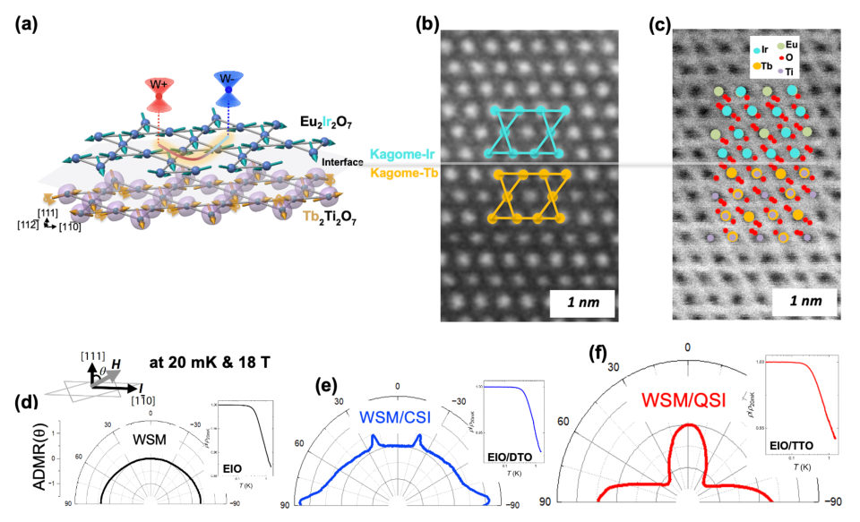 
Figure 1. A synthetic Kondo lattice interface between the Weyl semimetal and quantum spin ice. a, Schematic of the (111)-oriented Eu2Ir2O7/Tb2Ti2O7 heterointerface. Surface-localized Weyl/Fermi-arc states of Eu2Ir2O7 form the itinerant electronic subsystem5,6,8, while the adjacent non-Kramers Tb kagome layer provides the frustrated local- moment subsystem; the interface therefore realizes an atomically defined two-dimensional Kondo-coupled geometry. b, High-angle annular dark-field scanning transmission electron microscopy (HAADF-STEM) atomic-column map of the pyrochlore iridate/titanate interface along the [1¯10] projection, with the Ir and Tb magnetic-sublattice motifs highlighted; scale...

📷 Fig 2

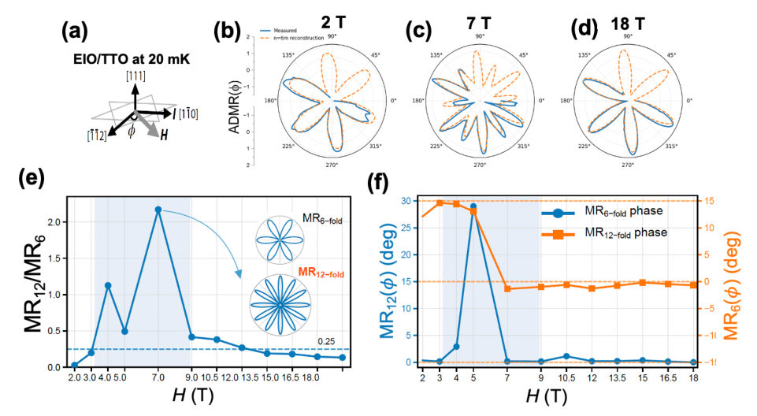 
Figure 2. Transducing the quantum-spin-ice correlations into Weyl Fermi-arc transport. a, In-plane field-rotation geometry for Eu2Ir2O7/Tb2Ti2O7 at 20 mK. b–d, Representative angular magnetoresistance at 2, 7 and 18 T. Blue curves are measured data and orange dashed curves are harmonic reconstructions of the measured sector, illustrating the evolution from sixfold to twelvefold-rich and back to sixfold anisotropy. ADMR(𝜙) = [𝜌𝑥𝑥(𝜙, 𝐻) −𝜌𝑥𝑥(0◦, 𝐻)]/𝜌𝑥𝑥(0◦, 𝐻), with 𝐻rotating within the (111) plane. e, Relative harmonic weight MR12/MR6 versus field. The shaded interval highlights the intermediate-field reconstruction; the dashed line at 0.25 marks the minimal two-harmonic scale at which...

📷 Fig 3

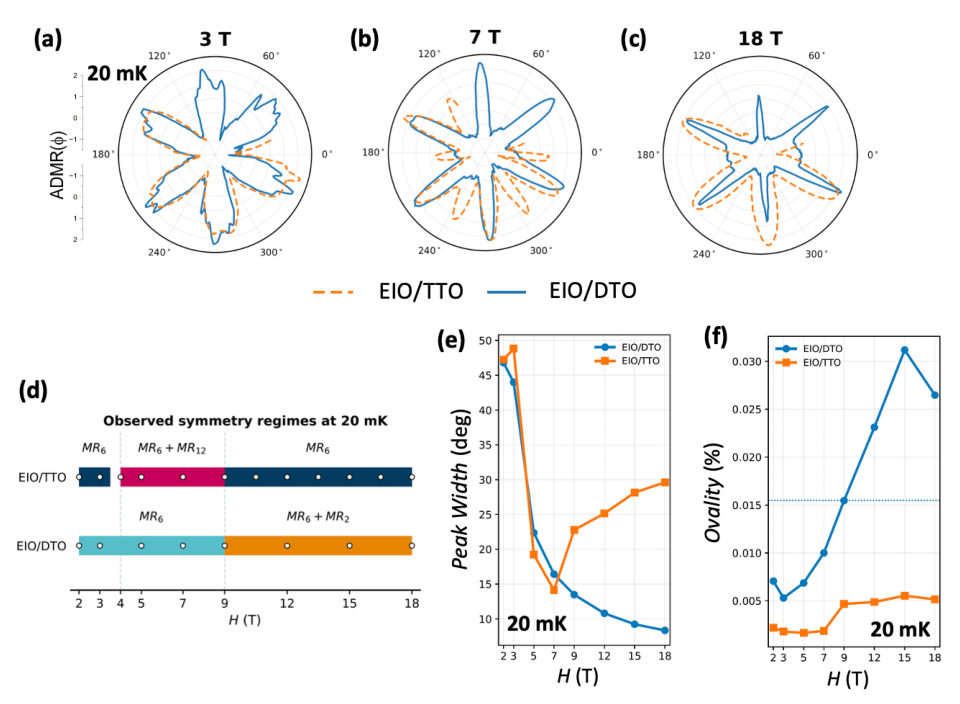 
Figure 3. Quantum and classical spin ice produce distinct symmetry-transduction trajectories. a–c, Angular magnetoresistance of Eu2Ir2O7/Tb2Ti2O7 (orange dashed) and Eu2Ir2O7/Dy2Ti2O7 (blue) at 20 mK and 3, 7 and 18 T. Only the Tb2Ti2O7-coupled interface develops the intermediate-field twelvefold reconstruction, whereas the high-field Dy2Ti2O7-coupled response sharpens and develops a pronounced twofold baseline distortion, consistent with the previously established classical-interface evolution.18,20,21 d, Observed transport-symmetry regimes. Open circles mark measured fields; the narrow low-to-intermediate-field crossover in Tb2Ti2O7 is left unassigned. The ribbons summarize the dominant...

**Summary.** The authors demonstrate a novel method to probe quantum-spin-ice correlations by coupling them to Weyl semimetal surface states via a synthetic Kondo lattice interface. By measuring the angular magnetoresistance, they observe a unique twelvefold symmetry reconstruction only when coupled to a quantum spin-ice candidate ($	ext{Tb}_2	ext{Ti}_2	ext{O}_7$). This confirms that the electronic transport acts as a sensitive transducer for the underlying multipolar quantum magnetic order.

**Why it may be interesting.** This work provides a highly tunable, solid-state platform to probe exotic quantum magnetic correlations (multipolar moments) by mapping them onto measurable electronic transport symmetries, which is relevant for understanding strongly correlated interfacial physics.

Detailed structure

**Main problem.** The study aims to demonstrate a method to encode and detect quantum-spin-ice correlations, particularly those involving multipolar degrees of freedom, into measurable electronic transport properties.

**Main result.** The quantum-spin-ice interface ($	ext{Tb}_2	ext{Ti}_2	ext{O}_7$) exhibits a unique $	ext{6-fold} 	o 	ext{12-fold} 	o 	ext{6-fold}$ reentrant anisotropy in the angular magnetoresistance, a signature absent in the classical spin-ice reference ($	ext{Dy}_2	ext{Ti}_2	ext{O}_7$).

**Method.** The research uses in-plane and out-of-plane angular magnetoresistance measurements on a synthetic Kondo lattice interface at ultra-low temperatures.

**Model / system.** The platform is a synthetic Kondo lattice interface formed between a Weyl semimetal ($	ext{Eu}_2	ext{Ir}_2	ext{O}_7$) and a quantum-spin-ice candidate ($	ext{Tb}_2	ext{Ti}_2	ext{O}_7$), allowing the coupling of itinerant Weyl surface states to frustrated local moments.

**Key observables.** Angular magnetoresistance ($	ext{MR}$), specifically the symmetry reconstruction observed as a transition from sixfold to twelvefold anisotropy ($	ext{MR}_{12}/	ext{MR}_6$).

**Important parameters / regimes.** Ultra-low temperatures ($	ext{20 mK}$), varying magnetic field strength, and the comparison between quantum ($	ext{Tb}$) and classical ($	ext{Dy}$) spin-ice couplings.

**Assumptions / limitations.** The electronic transport is sensitive to the specific magnetic degrees of freedom (dipolar vs. multipolar) present in the adjacent spin-ice material.

**Figures summary.** Figures illustrate the structural interface, the field evolution of angular magnetoresistance showing the $	ext{6-fold} 	o 	ext{12-fold} 	o 	ext{6-fold}$ sequence for the quantum case, and direct comparisons with the classical case.

**Paper structure.** The paper establishes the physical system, details the measurement techniques (ADMR), presents the key comparative results showing the distinct symmetry signatures ($	ext{12-fold}$ vs. $	ext{2-fold}$), and concludes by establishing the synthetic Kondo lattice as a transduction route.

Abstract

Quantum spin ice hosts collective excitations and quantum fluctuations that are largely electrically silent because the materials supporting them are insulating. Coupling this magnetic environment to surface-localized Weyl states offers a route to encode its correlations directly into Fermi-arc transport. Experimental access to this regime, however, has remained largely unexplored. Here, we realize a synthetic Kondo lattice interface between the Weyl semimetal $\mathrm{Eu_2Ir_2O_7}$ and the quantum-spin-ice candidate $\mathrm{Tb_2Ti_2O_7}$, and demonstrate that quantum-spin-ice correlations are imprinted on Weyl Fermi-arc transport. At ultra-low temperature, electronic transport evolves from a sixfold anisotropic response at low field into a twelvefold response over an intermediate field window, before entering a reentrant sixfold anisotropy at high field. No analogous twelvefold response occurs at the classical-spin-ice interface. The quantum--classical contrast shows that the same itinerant electronic channel acquires qualitatively different symmetry information when interacting with the quantum-fluctuating Tb moments, consistent with an interfacial coupling between the Weyl surface states and the transverse, multipolar degrees of freedom, in addition to the longitudinal, dipolar contribution. Our work establishes synthetic Kondo lattice interfaces as a route for transducing frustrated quantum magnetism with multipole correlations into distinct Weyl Fermi-arc transport responses.

[↑ back to top](#top)

### [Reconstruction of Black Hole Islands from Hawking Radiation via the Algebraic Petz Map](http://arxiv.org/abs/2610.10769v1)

**Authors:** Niloofar Vardian  
**Type:** theory · **Category:** other · **PDF:** <https://arxiv.org/pdf/2610.10769v1>  
**Analysis basis:** full PDF text, analyzed in chunks
**Topic relevance:** `Keldysh / 2PI / non-Gaussian methods` **2/5** · `quantum measurements` **2/5** · `analog quantum simulation` **1/5** · `correlated / nonlocal dissipation` **1/5** · `driven-dissipative phase transition` **1/5** · `methods for driven-dissipative` **1/5** · `non-equilibrium universality` **1/5**

📷 Fig 1

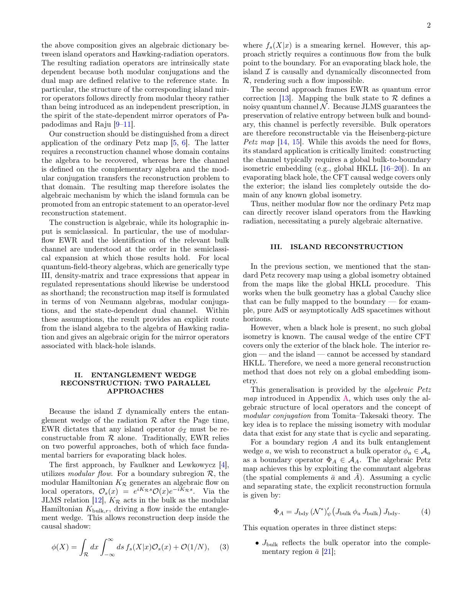 
Low-resolution page preview, page 2

📷 Fig 2

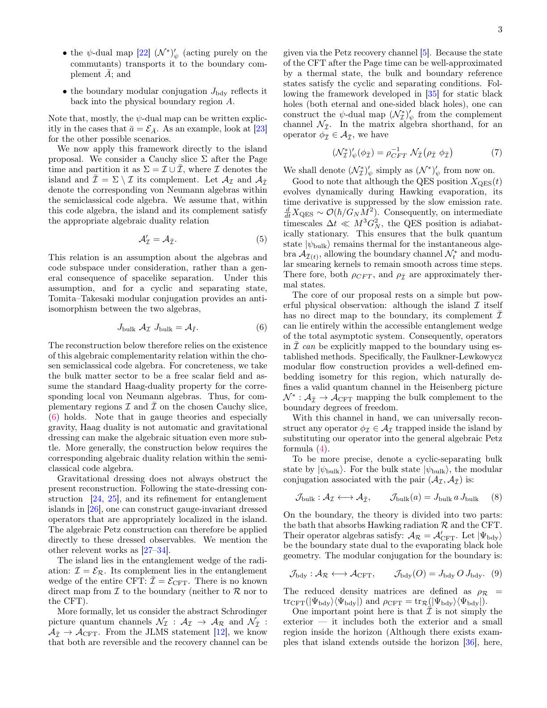 
Low-resolution page preview, page 3

📷 Fig 3

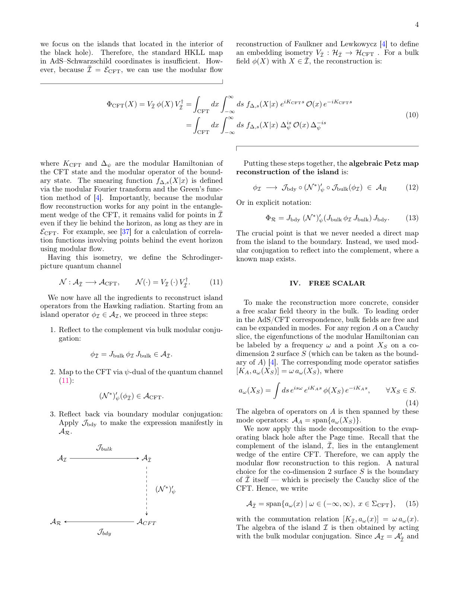 
Low-resolution page preview, page 4

📷 Fig 4

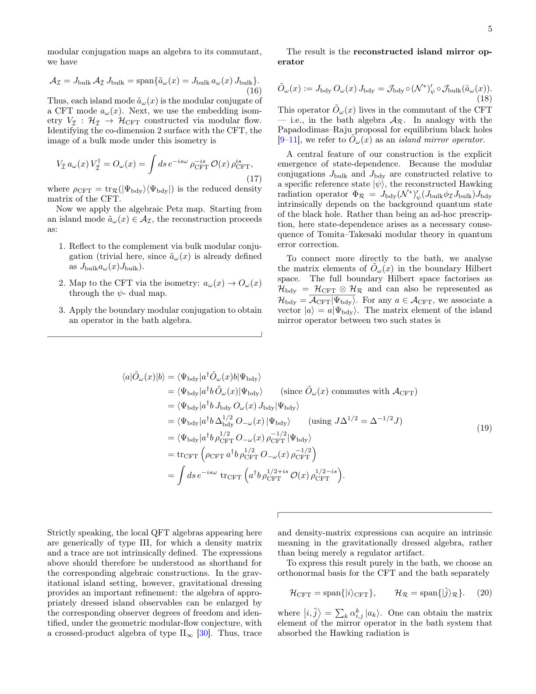 
Low-resolution page preview, page 5

📷 Fig 5

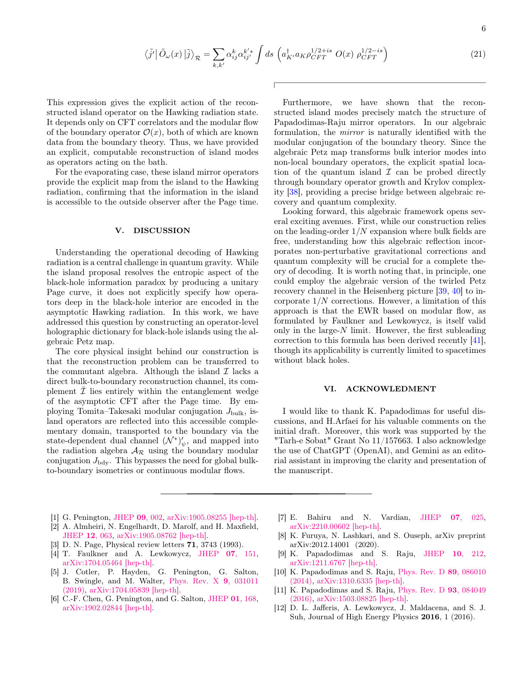 
Low-resolution page preview, page 6

**Summary.** This paper solves a major theoretical hurdle in quantum gravity by developing the algebraic Petz map to reconstruct information trapped inside a black hole's 'island' from Hawking radiation. It achieves this by leveraging advanced tools from modular theory, bypassing the need for direct causal connections between the interior and the exterior. The result provides a concrete, computable dictionary proving that black hole information is preserved and accessible.

**Why it may be interesting.** While focused on gravity, the reliance on modular theory, algebraic reconstruction, and the mapping between different quantum algebras provides deep mathematical tools applicable to open quantum systems and entanglement structure in general.

Detailed structure

**Main problem.** The paper addresses the black hole information paradox by providing an operational, algebraic method to reconstruct quantum operators trapped inside a black hole's 'island' from measurable Hawking radiation.

**Main result.** The authors construct a rigorous dictionary using the algebraic Petz map, demonstrating that information inside the black hole is mathematically recoverable from the asymptotic radiation.

**Method.** The reconstruction relies on Tomita–Takesaki modular theory, mapping the island operators to their algebraic complement, and then using a sequence of modular conjugations and a $
ho$-dual map to project them onto the radiation algebra.

**Model / system.** The system is an evaporating black hole coupled to a non-gravitating bath, analyzed using the framework of quantum field theory in curved spacetime and holographic duality (AdS/CFT).

**Key observables.** Island operators ($\phi_I$), Hawking radiation operators ($\Phi_R$), and the resulting reconstructed mirror operators ($\Phi_A$).

**Important parameters / regimes.** The Page time, the large-$N$ limit, and the background quantum state $|\psi_g
angle$.

**Assumptions / limitations.** The method assumes the relevant state is cyclic and separating, and it relies on the algebraic duality relation $A'_I = ar{A}_I$ to bypass the need for a direct global isometry.

**Paper structure.** The paper builds the reconstruction protocol by first establishing the failure of standard entanglement wedge methods, then introducing the algebraic Petz map via modular theory, and finally demonstrating its application to yield the mirror operator structure.

Abstract

The island proposal guarantees a unitary Page curve for evaporating black holes, implying that operators deep behind the horizon must be fully reconstructable from asymptotic Hawking radiation. However, because the interior is causally disconnected and highly dynamical, standard entanglement wedge reconstruction methods, relying on global isometries or continuous modular flow, fail to provide this mapping. We resolve this by constructing a protocol for island reconstruction using the algebraic Petz map. By using modular theory, we reflect island operators into the accessible complement, transport them to the boundary, and map them into the radiation algebra. Furthermore, we demonstrate that this purely algebraic derivation naturally yields the structure of Papadodimas-Raju mirror operators. This framework provides a rigorous operational dictionary for the island formula, proving that information trapped inside a black hole can be decoded.

[↑ back to top](#top)

### [Mutual Linearity of Complexes in Chemical Reaction Networks](http://arxiv.org/abs/2610.11970v1)

**Authors:** Pedro E. Harunari, Guilherme Fiusa, Matteo Polettini  
**Type:** theory · **Category:** statistical mechanics · **PDF:** <https://arxiv.org/pdf/2610.11970v1>  
**Analysis basis:** full PDF text, analyzed in chunks
**Topic relevance:** `analog quantum simulation` **2/5** · `Keldysh / 2PI / non-Gaussian methods` **1/5** · `correlated / nonlocal dissipation` **1/5** · `driven-dissipative phase transition` **1/5** · `methods for driven-dissipative` **1/5** · `non-equilibrium universality` **1/5**

📷 Fig 1

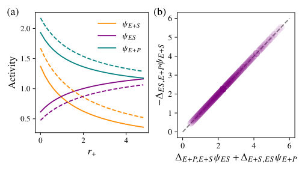 
FIG. 1. Reversible Michaelis-Menten. (a) Activities of all complexes as function of the perturbed rate constant r+, with r−= 1 in solid lines and 2 in dashed lines. (b) Products of ∆s and ψs that should be equal due to mutual linearity, sampled in a 2D grid of r± ∈[0, 5]; the dashed line is y = x. The initial concentration of all species is 1, (k+2, k−2, k+3, k−3) = (1.2, 0.7, 1.1, 2), and k±1 = r± are controlled.

📷 Fig 2

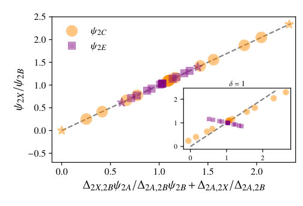 
FIG. 2. Mutual linearity witnessed in the ratio of 2C (orange circles) and 2E (purple squares) with respect to 2B. The dashed gray line is y = x, and the stars represent the bounds from Eq. (11). The rate con- stants of 2C ⇌2D are swept from 0 to 10; the initial concentrations are respectively {1, 2, 3, 1.1, 2.4}; the rate constants are k±1 = {1.2, 1}, k±2 = {1.3, 1.1}, k±4 = {1.5, 1.3}, k±5 = {1.6, 1.4}, k±6 = {1.7, 1.5}, and k±7 = {1.8, 1.6}. The inset has complex 2E replaced by A + B: same reaction topology, same rate constants, but deficiency δ = 1.

**Summary.** This work establishes a powerful structural property called 'mutual linearity' for the activities of complexes in chemical reaction networks. It proves that this linearity holds exactly, even far from equilibrium, provided the network has zero deficiency. This relationship serves as a powerful diagnostic tool, as its violation signals structural flaws like non-zero deficiency.

**Why it may be interesting.** While focused on classical chemical kinetics, the mathematical machinery—relating structural invariants (deficiency) to algebraic constraints (linearity)—is highly relevant to understanding constraints in open quantum systems or quantum field theories where non-equilibrium steady states are studied.

Detailed structure

**Main problem.** The paper investigates finding exact, non-linear relationships (mutual linearity) describing how a system far from equilibrium responds to changes in its reaction rate constants.

**Main result.** Mutual linearity holds not for species concentrations, but for the activities of the reaction complexes ($\psi_c$), yielding a three-term linear relation independent of the controlled rate constants.

**Method.** The proof utilizes concepts from Markov chain theory, specifically analyzing the coplanarity of spanning-tree polynomials derived from the complex-space Laplacian.

**Model / system.** The system is Chemical Reaction Networks (CRNs) operating under mass-action kinetics, analyzed in the context of jump processes and complex-balance equations.

**Key observables.** Stationary activities of complexes ($\psi_c$), which are mass-action monomials; the relationship $\Delta_{bc}\psi_a + \Delta_{ca}\psi_b + \Delta_{ab}\psi_c = 0$.

**Important parameters / regimes.** Zero deficiency ($\delta=0$) and the condition of having a single linkage class are crucial structural requirements for the theorem to hold.

**Assumptions / limitations.** The analysis assumes the network is zero-deficiency and that the controlled reaction is bidirectional and not a bridge.

**Figures summary.** Figure 1 illustrates the theorem using a Michaelis-Menten cycle, showing the linear collapse of the mutual linearity product. Figure 2 demonstrates the relation holding for a complex network and its violation when the deficiency increases.

**Paper structure.** The paper establishes the problem of non-equilibrium response, proves the existence of mutual linearity in complex activities for specific network structures, derives the general linear relation, and uses this relation to test structural invariants like network deficiency.

Abstract

Exact statements about how a system far from equilibrium responds to changes in its rate constants are scarce beyond linear response, yet they are central to the control of biochemical networks. A notable exception is mutual linearity: in a jump process, controlling the rates of a single transition makes any two stationary probabilities obey an exact affine relation, arbitrarily far from equilibrium. With nonlinear mass-action kinetics, and conservation laws in place of a normalization, chemical reaction networks seem to defy mutual linearity since species concentrations obey no such relation. We show that it was there all along, in the complexes' activities (mass-action monomials) rather than in the concentrations of species. For zero-deficiency networks with a single linkage class, controlling one reaction makes any three stationary activities obey a linear relation whose coefficients are independent of the controlled rate constants, the conserved quantities (hence the initial state), and even of the stoichiometry of complexes. This predicts hidden activities and bounds the activity ratios the control can reach, while a violation signals nonzero deficiency or multiple linkage classes.

[↑ back to top](#top)

### [From Solid-State Spin Defects to Fluorescent Proteins: A Perspective on Quantum Optical Sensing Platforms for Biomedical Applications](http://arxiv.org/abs/2610.11644v1)

**Authors:** Jyotiprakash Parhi, Ayan Majumder, Kasturi Saha  
**Type:** theory · **Category:** other · **PDF:** <https://arxiv.org/pdf/2610.11644v1>  
**Analysis basis:** full PDF text, analyzed in chunks
**Topic relevance:** `quantum measurements` **2/5** · `QC/QI experiment` **1/5** · `analog quantum simulation` **1/5** · `driven-dissipative phase transition` **1/5** · `quantum optics experiment` **1/5**

📷 Fig 1

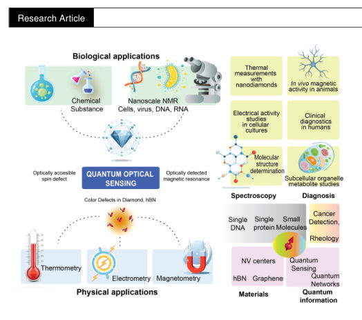 
Fig. 1. Schematic overview of optically accessible spin defects as quantum sensor: from the nitrogen-vacancy center in di- amond to hexagonal boron nitride. The applications range from physical sensing modalities to advanced spectroscopic techniques. The biocompatibility extends the capability from radical detection, chemical substance analysis, and rheology to nanoscale NMR of DNA, RNA, viruses, and in cellular envi- ronments. The schematic illustrates the versatility of quantum sensors in enabling a wide range of applications, spanning from biomedical research to quantum information technolo- gies.

📷 Fig 2

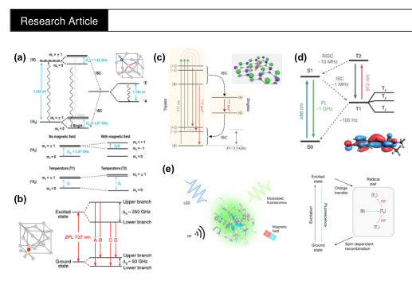 
Fig. 2. (a) Electronic structure of the NV−center in diamond, showing triplet ground and excited states coupled by opti- cal transitions and intersystem crossing (ISC) via singlets, enabling spin polarization and spin-dependent photolumi- nescence; magnetic-field and temperature effects are indicated (inset: atomic structure). Adapted from Refs. [11, 21]. (b) SiV−

📷 Fig 3

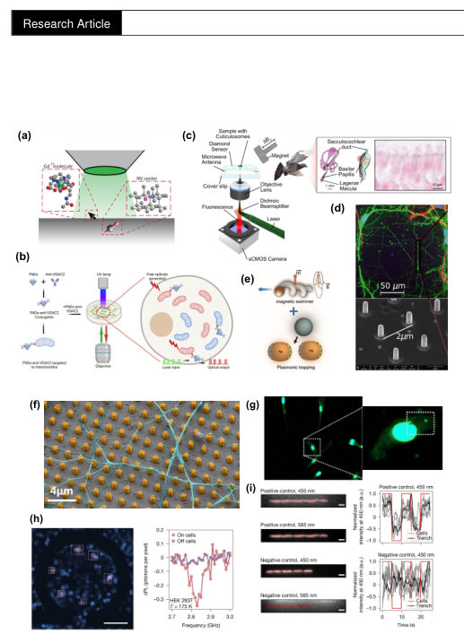 
Fig. 3. (a) Single-molecule electron spin detection using a single shallow NV center in bulk diamond. Adapted from Ref. [45] (b)Schematic of NDs and the conjugation to anti-body VDAC2 for targeting mitochondria. Adapted from Ref. [46]. (c) (left) Overview of the design of the experiment. (right) Details of the biological sample of interest (pigeon ear and cochlea). Adapted from Ref. [47] (d) (up) Confocal image of the stained neurons (green) grown on a bed of nanopillars. (down) SEM image of diamond nanopillars. Adapted from Ref. [48]. (e) Magnetically actuated mobile nanotweezers used for controlled transport and manipulation of nanoscale objects, illustrating an auxiliary approach for...

📷 Fig 4

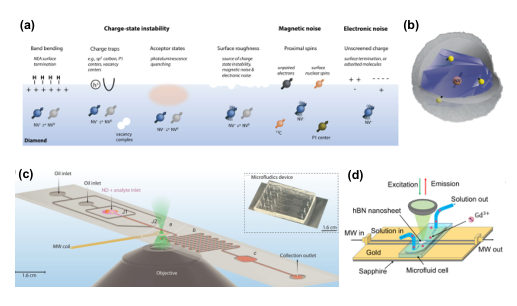 
Fig. 4. (a) Summary of sources of charge-state instability and decoherence for near-surface NV centers. Adapted from Ref. [86] (b) Schematic depiction of a core-shell structured di- amond nanocrystal with NV qubit (orange) in the diamond host blue. Surface spins are indicated in yellow. Adapted from Ref. [42] (c) Schematic of microfluidic chip comprising two inlets for oil and water (gray circles). J1 generates ND-filled water droplets, and J2 regulates droplet spacing. (region a): droplets are analyzed, (region b): additional mixing within droplets, (region c): collection chamber. (inset): photograph of the chip. Adapted from Ref. [82] (d) Schematic of experimental setup: an hBN nanosheet...

**Summary.** This review surveys the field of quantum optical sensing, detailing the shift from solid-state quantum emitters like NV centers to bio-integrated systems using fluorescent proteins. It highlights the advanced techniques used to measure physical parameters like temperature and magnetic fields at the nanoscale. The paper emphasizes that while progress is rapid, overcoming environmental noise and ensuring scalability remain key challenges for clinical translation.

**Why it may be interesting.** This work is highly relevant as it bridges quantum optics and condensed matter physics into a tangible application domain (biomedicine), requiring deep knowledge of open quantum systems, decoherence mechanisms, and solid-state defect physics.

Detailed structure

**Main problem.** The paper reviews the evolution of quantum optical sensing platforms, tracking the transition from isolated solid-state spin defects to bio-integrated systems for biomedical applications.

**Main result.** Significant progress has been made in integrating quantum sensors, utilizing platforms like NV centers, SiV centers, and fluorescent proteins, for nanoscale measurements in complex biological environments.

**Method.** The review synthesizes various experimental techniques, including Optically Detected Magnetic Resonance (ODMR), T1 relaxometry, and specialized readout methods like OADF, applied across different physical systems.

**Model / system.** The core systems discussed are solid-state spin defects (e.g., NV centers in diamond, $	ext{V}_{	ext{B}}^-$ in hBN) and engineered biological systems (fluorescent proteins). These platforms are used to probe local fields like temperature, strain, and magnetic fields.

**Key observables.** Temperature, strain, electric fields, magnetic fields, longitudinal relaxation time ($T_1$), and spin-photon interactions.

**Important parameters / regimes.** Room temperature operation, nanometer-scale resolution, and coherence time in aqueous environments.

**Assumptions / limitations.** The primary challenge is maintaining quantum coherence and reliable sensing functionality when moving from controlled solid-state environments to complex, noisy biological media.

**Figures summary.** Figures schematically illustrate the various optically accessible spin defects (NV to hBN) and their diverse applications, ranging from radical detection to nanoscale NMR.

**Paper structure.** The paper is structured as a perspective review, first establishing the historical progression of quantum sensing platforms, detailing the physics and advances in solid-state defects, then covering the integration into bio-compatible systems, and finally summarizing current challenges and future outlook.

Abstract

Quantum optical sensing has evolved from isolated solid state spin defect platforms to increasingly bio-integrated systems designed for biomedical applications. This review presents a perspective on this transition, spanning nitrogen vacancy centers in diamond to emerging fluorescent protein based spin qubits. Advances in diamond fabrication have enabled photonic cavities, nanomechanical resonators, and microstructured devices that enhance spin photon interactions and room temperature sensitivity. Exploration of spin defects in alternative materials further expands the sensing landscape. Parallel progress toward biological compatibility includes chip based architectures for in vitro and in vivo studies, microfluidic integration, and minimally invasive nanodiamond probes capable of intracellular nanothermometry and nanorheometry. Improvements in surface functionalization have enhanced coherence and sensing reliability in complex environments. Collectively, these advances highlight the progress and remaining challenges toward application oriented quantum sensing for the life sciences.

[↑ back to top](#top)

### [Non-Perturbative Vibrational Excitation by Arbitrary Electric Fields from Classical Phase-Space Dynamics](http://arxiv.org/abs/2610.11686v1)

**Authors:** Sameernandan Upadhyayula, Jiří J. L. Vaníček  
**Type:** theory · **Category:** other · **PDF:** <https://arxiv.org/pdf/2610.11686v1>  
**Analysis basis:** full PDF text, analyzed in chunks
**Topic relevance:** `Keldysh / 2PI / non-Gaussian methods` **2/5** · `methods for driven-dissipative` **2/5** · `quantum measurements` **2/5**

📷 Fig 1

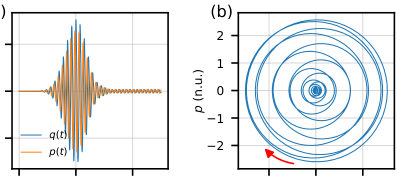 
FIG. 2. (a) Time evolution of position and momentum under a non-resonant electric field. (b) The corresponding phase- space trajectory, showing a clockwise evolution (red arrow indicates direction) but with no clear order in the structure of phase space. The parameters are the same as in Fig. 1 except that ω = 0.83 n.u. (&lt; ω0). In this case, |θ−|σ = 3.4 is not very large, and therefore the trajectories show residual oscillations. The amplitude of q and p in the long-time limit obtained from the numerical evaluation is 0.0774 n.u., which agrees with Eq. (14).

📷 Fig 2

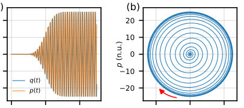 
FIG. 1. (a) Time evolution of position and momentum under a resonant electric field. (b) The corresponding phase-space trajectory showing a clockwise evolution (red arrow indicates the direction of motion). We perform the calculations in nat- ural units (n.u.) such that ℏ= µ′ 0 = ω0 = 1, µ0 = 0. The parameters of the electric field are E0 = ω = 1 n.u., φ = 0, and σ = 20 n.u.. The initial point is (q0, p0) = (0, 0). The asymptotic amplitude of q and p in the long-time limit ob- tained from the numerical evaluation is 25.066 n.u., which agrees with Eq. (13).

📷 Fig 3

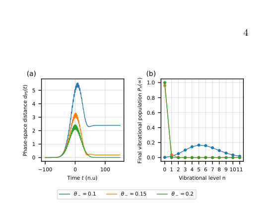 
FIG. 4. (a) Time evolution of the phase-space distance dPS(t) in the non-resonant case for different values of the detuning parameter θ−= |ω −ω0|. (b) Corresponding final vibrational population distribution over number states. All parameters are identical to Fig. 2, except for the frequency of the pulse, which is varied in order to vary detuning.

📷 Fig 4

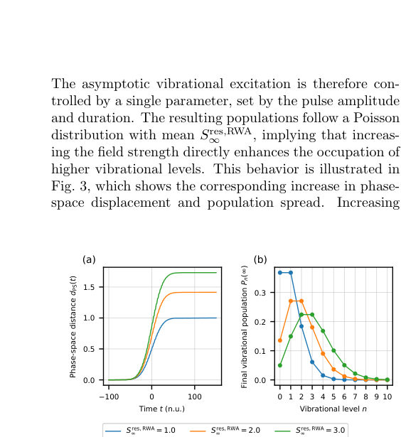 
FIG. 3. (a) Time evolution of the phase-space distance dPS(t) for different values of Sres,RWA ∞ under resonant driving. (b) Corresponding final vibrational population distribution over number states. All parameters are identical to Fig. 1 except for the amplitude E0, which is varied to control Sres,RWA ∞ .

📷 Fig 5

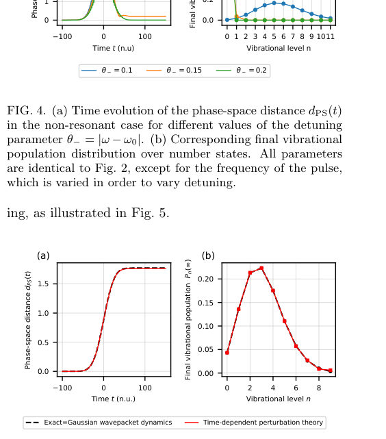 
FIG. 5. Comparison between time-dependent perturbation theory and Gaussian wavepacket dynamics in the weak-field limit under resonant driving. (a) Time evolution of the phase- space distance. (b) Final vibrational populations. The pa- rameters used for the calculations are the same as in Fig. 1, except E0 = 0.1 n.u.

**Summary.** This paper introduces a non-perturbative method to model how molecular vibrations are excited by strong, time-varying electric fields. By mapping the dynamics onto a complex phase-space coordinate, the authors provide a unified description that accurately predicts vibrational populations in both resonant and non-resonant regimes. This framework is crucial for understanding and controlling molecular energy transfer in intense light fields.

**Why it may be interesting.** This work provides a powerful, non-perturbative phase-space picture for controlling molecular vibrations using intense light fields, which is central to ultrafast spectroscopy and quantum control.

Detailed structure

**Main problem.** Developing a non-perturbative quantum framework to describe vibrational excitation in molecular systems driven by arbitrarily time-dependent external electric fields.

**Main result.** The dynamics are exactly mapped onto the evolution of a complex phase-space coordinate, yielding a Poisson distribution for vibrational populations that correctly captures both resonant enhancement and non-resonant suppression.

**Method.** The authors utilize an exact coherent-state solution for the driven harmonic oscillator, allowing the analysis to remain valid in the strong-field regime where standard time-dependent perturbation theory fails.

**Model / system.** The system models a single normal mode of a molecule with a harmonic potential and a linear dipole coupling ($\mu(q) = \mu_0 + \mu'_0 T \cdot q$) interacting with an external electric field $\vec{E}(t)$.

**Key observables.** Vibrational populations ($P_n(t)$), the time-dependent phase-space displacement ($S_t = |z_t|^2$), and the phase-space trajectory governed by $z_t$.

**Important parameters / regimes.** Resonant vs. non-resonant driving ($\omega$ vs. $\omega_0$), field strength ($E_0$), and detuning ($\Delta$).

**Assumptions / limitations.** The dipole operator is approximated by an affine function of the normal coordinate ($q$).

**Figures summary.** Figures illustrate the phase-space trajectories for resonant (outward spiral) and non-resonant driving, and compare the results of the exact coherent-state method against Time-Dependent Perturbation Theory (TDPT) in both weak and strong-field limits.

**Paper structure.** The paper establishes the non-perturbative coherent-state formalism, derives the closed-form expression for the phase-space coordinate $z_t$, analyzes the distinct behaviors in resonant and non-resonant regimes, and validates the approach by showing its reduction to TDPT in the weak-field limit.

Abstract

We present a non-perturbative framework for the quantum treatment of vibrational excitation in molecular systems driven by electric fields with arbitrary time dependence. For harmonic potentials with linear dipole coupling, the field-induced dynamics is exactly described by a displaced coherent state, whose evolution is completely determined by a complex phase-space coordinate. Closed-form expressions for this coordinate reveal a clear distinction between resonant and non-resonant regimes. The resulting vibrational populations follow a Poisson distribution determined by a dimensionless time-dependent phase-space displacement, for both resonant and non-resonant driving. Resonant driving results in an enhanced phase-space displacement, whereas finite detuning between the driving and vibrational frequencies leads to an exponential suppression of the phase-space displacement and vibrational excitation. While the approach reduces to the standard time-dependent perturbation theory in the weak-field limit, it remains valid in the strong-field regime, where perturbative treatments fail. Our results provide a transparent phase-space picture of vibrational control and enable non-perturbative state preparation in ultrafast spectroscopy.

[↑ back to top](#top)

### [An Efficient Quantum Circuit for Flow Model Execution Using Quantum Neural Networks](http://arxiv.org/abs/2610.11537v1)

**Authors:** Rui Che, Ludvig af Klinteberg  
**Type:** both · **Category:** quantum information and computing · **PDF:** <https://arxiv.org/pdf/2610.11537v1>  
**Analysis basis:** full PDF text, analyzed in chunks
**Topic relevance:** `methods for driven-dissipative` **2/5** · `Keldysh / 2PI / non-Gaussian methods` **1/5** · `analog quantum simulation` **1/5** · `quantum measurements` **1/5**

📷 Fig 1

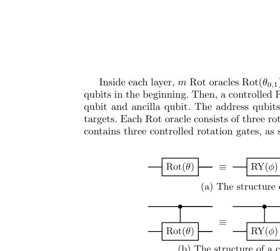 
Fig. 7 Circuits of Rot and controlled-Rot oracles, ϕ, ω and ψ denote three angle parameters in each oracle

📷 Fig 2

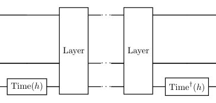 
Fig. 8 The time-dependent QNN circuit in the phase kickback framework for the simulation of

📷 Fig 3

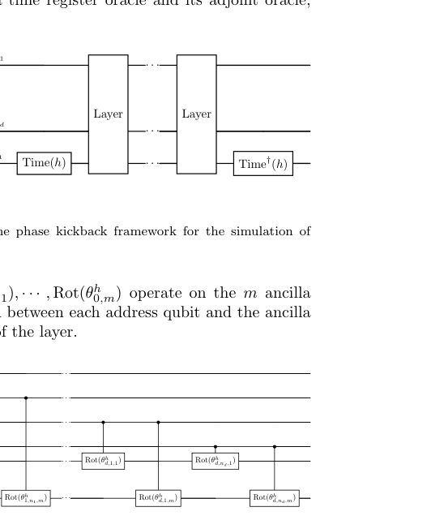 
Fig. 9 The QNN layer circuit in the phase kickback framework for the implementation of e iβDVth

📷 Fig 4

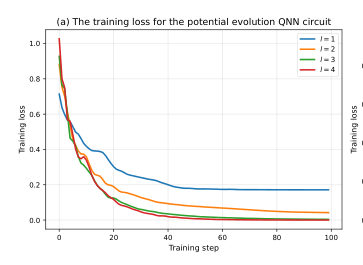 
Fig. 11 The training losses for the potential and kinetic evolution QNN circuits with different numbers of layers l

📷 Fig 5

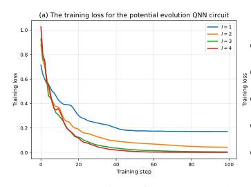 
Figure 11. The final loss values for potential and kinetic evolution QNN circuits with different depths are shown in Table 1. Figure 11 shows that the training losses for both the QNN circuits for potential and kinetic evolution decrease as the training step increases, demonstrating the stable training process and the convergence behavior. For both QNN circuits, as the number of layers increases, the convergence of loss becomes faster, and the final training loss becomes lower. These results indicate that a deeper QNN circuit is able to improve the performance of approximating QROM in the phase kickback frameworks. In addition, as shown in Table 1, the final training losses of two QNN...

**Summary.** This paper tackles the challenge of efficiently simulating flow models on quantum computers by leveraging the formal connection between flow dynamics and quantum wavefunction evolution. The authors propose replacing the resource-heavy Quantum Read-Only Memory (QROM) technique with a Quantum Neural Network (QNN) for data encoding. This results in a method that maintains high simulation accuracy while drastically reducing the required quantum circuit depth and gate count.

**Why it may be interesting.** This work directly addresses the computational bottleneck of simulating continuous physical processes (like quantum evolution or fluid dynamics) on near-term quantum hardware by integrating advanced generative ML techniques (flow matching) with quantum circuit design.

Detailed structure

**Main problem.** The paper aims to develop an efficient quantum circuit implementation for simulating flow models, which are used to model probability path transport.

**Main result.** The authors successfully propose a method using a Quantum Neural Network (QNN) to replace the resource-intensive Quantum Read-Only Memory (QROM) framework, maintaining simulation accuracy while significantly reducing circuit resources.

**Method.** The core method involves simulating wavefunction flow, which is connected to flow models via a continuity Hamiltonian, using a phase kickback framework enhanced by QNNs for data encoding.

**Model / system.** The system involves flow models generating trajectories via an ODE solved by a velocity field, which is formally linked to quantum dynamics via the continuity Hamiltonian driving Schrödinger evolution.

**Key observables.** Root Mean Square Error (RMSE), Wasserstein-1 distance, and KL divergence are used to compare the final simulated probability density against the target distribution.

**Important parameters / regimes.** The efficiency is analyzed by comparing circuit resources (CNOT gates) between QROM-based and QNN-based implementations, and by varying temporal ($\Delta t$) and spatial ($\Delta x$) discretizations.

**Assumptions / limitations.** The primary assumption is that replacing QROM with a trained QNN can maintain the accuracy of the wavefunction flow simulation while drastically reducing the exponential resource scaling associated with QROM.

**Figures summary.** Figures compare the Root Mean Square Error (RMSE) of simulated vs. reference final probability densities across different time steps ($\Delta t$), and show particle visualizations demonstrating successful transport from an initial state to a target distribution using the learned potential.

**Paper structure.** The paper first establishes the theoretical link between flow models and quantum dynamics via the continuity Hamiltonian. It then details the simulation using QROM-based phase kickback, identifies the resource bottleneck, and proposes the QNN replacement for QROM, concluding with numerical experiments validating the efficiency and accuracy of the QNN-based approach.

Abstract

Flow models generate trajectories from an initial distribution to a target distribution by solving an ordinary differential equation defined by a velocity field. Flow matching learns this velocity field by modeling the transport dynamics between the two distributions. Wavefunction flow establishes a formal connection between flow models and quantum dynamics by introducing a continuity Hamiltonian, which drives the Schrödinger evolution of quantum states. In this paper, we investigate accurate and efficient quantum simulation of the wavefunction flow, thereby realizing the efficient implementation of flow models on quantum computers. We first leverage a quantum read-only memory (QROM)-based phase kickback framework for the wavefunction flow simulation, generating probability densities that closely match those produced by the corresponding conventional flow model. To address the high circuit-resource cost, we further incorporate a trained quantum neural network (QNN) into the phase kickback framework, replacing QROM for data encoding. Numerical experiments demonstrate that our proposed method implements flow models on quantum computers more efficiently, since it maintains the accuracy of wavefunction flow simulation compared with the QROM-based framework, and significantly reduces the circuit resources.

[↑ back to top](#top)

### [Nonlinearity management of matter-wave vector solitons of Bose-Einstein condensates in two dimensions](http://arxiv.org/abs/2610.11536v1)

**Authors:** F. Kh. Abdullaev, J. S. Yuldashev, M. Ögren  
**Type:** theory · **Category:** quantum gases · **PDF:** <https://arxiv.org/pdf/2610.11536v1>  
**Analysis basis:** full PDF text, analyzed in chunks
**Topic relevance:** `Keldysh / 2PI / non-Gaussian methods` **2/5** · `analog quantum simulation` **2/5** · `methods for driven-dissipative` **1/5**

📷 Fig 1

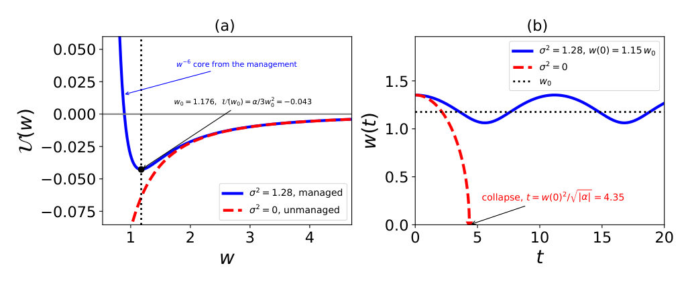 
FIG. 1: (Color online) (a) Effective potential U(w), Eq. (35), for the parameters in Set B (table I). Without management (σ2 = 0, red dashed) the potential is attractive at all scales and the width reaches zero in a finite time; the nonlinear quantum pressure created by the modulation (blue solid) adds a repulsive w−6 core and produces a minimum at w0. (b) Width w(t) from the variational equation (34) for the same parameters and the initial condition w(0) = 1.15 w0, ˙w(0) = 0: collapse for σ2 = 0 (red dashed) and bounded oscillations with frequency Ω−for σ2 ̸= 0 (blue solid).

📷 Fig 2

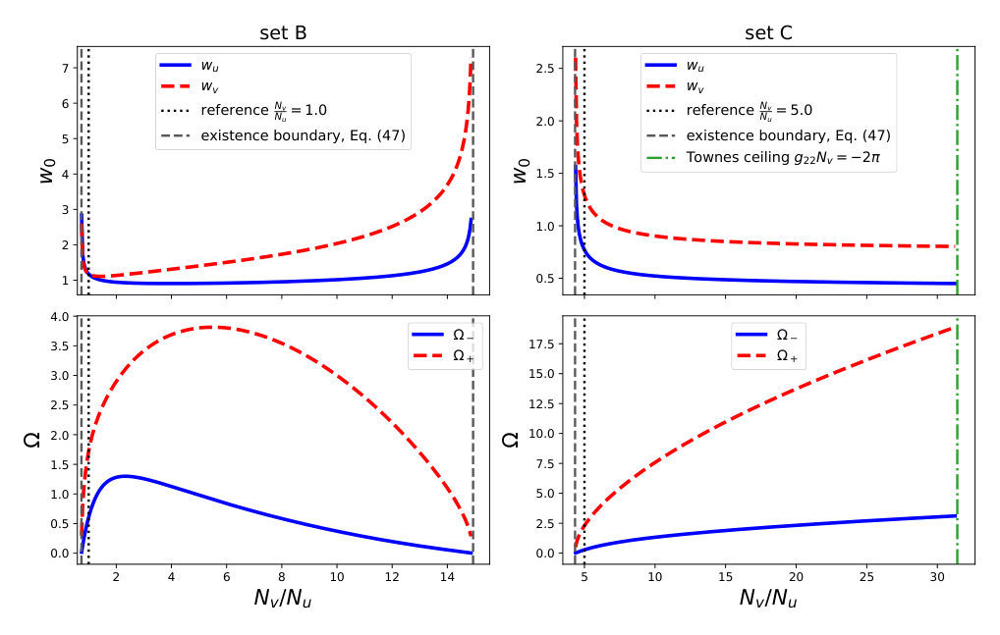 
FIG. 2: (Color online) Asymmetric NM vector solitons, by Newton continuation of the fixed points of U(w1, w2) in Nv at fixed Nu. Left: set B (g11 = g22 = 1, γ0 = −2π, Nu = 1.4); right: set C (g11 = −4, g22 = −1/4, γ0 = −π, Nu = 0.8). (Upper two profile) stationary widths wu (blue) and wv (red dashed); (Lower two profile) the normal-mode frequencies, both real over the whole family. Grey dashed lines are the existence boundaries (47); the green dash-dotted line in the right column is the single-component Townes ceiling (48), which for set C is reached before the existence boundary and terminates the family while U still has a minimum. Dotted black: the reference imbalance used in Sec. IV.

📷 Fig 3

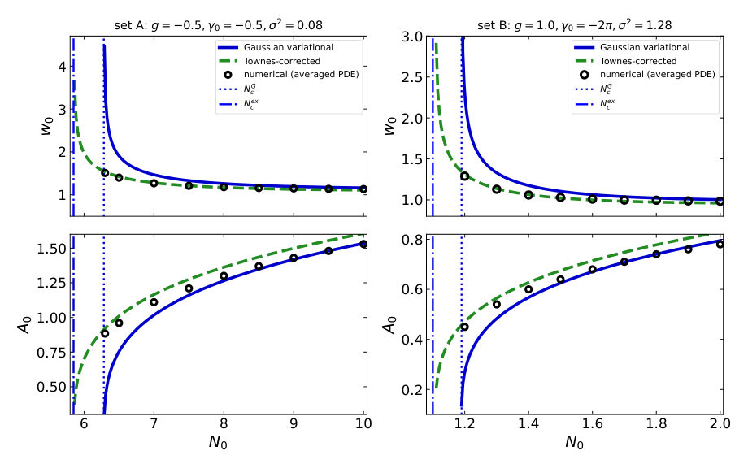 
FIG. 3: (Color online) Width (top) and amplitude (bottom) of the stationary NM vector soliton versus the norm per component, for set A (left) and set B(right). Circles: DFPM states of the averaged system; solid: Gaussian variational prediction (36); dashed: Townes-corrected (41). Dotted and dashed-dotted vertical lines mark N G c and N ex c , respectively.

📷 Fig 4

 
Figure 4 shows the density |u|2 of the original model of Set B, initiated with the variationally found stationary state of the averaged system. In the first 4 frames the management is on; the wave packet keeps a localised core over many internal periods, breathing about the stationary width, and loses only the fraction of its norm that reaches the absorbing layer. In the last frame the same initial data are propagated with γ1 = 0, i.e. with the mean coupling γ0 alone: since N0 &gt; Nc the packet collapses, and the run has to be terminated. The two rows are plotted on the same colour scale up to the last frame, where the unmanaged density has grown by more than an order of magnitude. This is...

📷 Fig 5

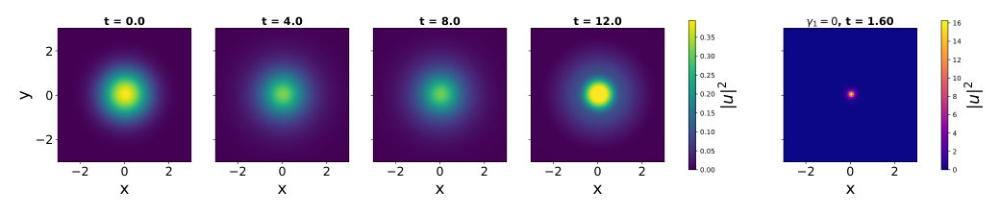 
FIG. 4: (Color online) Density |u|2 of the full model (4) with the parameters in Set B, initialised with the variational stationary state of the averaged system. The first 4 frames show the managed evolution at the indicated times; the last frame shows the same initial data with the modulation switched off (γ1 = 0) shortly before the numerical solution has to be terminated.

**Summary.** This paper analyzes how periodically modulating inter-species interactions can stabilize matter-wave vector solitons in two-dimensional Bose-Einstein condensates. By deriving an effective, averaged equation, the authors show that the resulting nonlinear quantum pressure counteracts the collapse tendency inherent in the system. Numerical simulations confirm that this management technique substantially prolongs the soliton's lifetime.

**Why it may be interesting.** This work directly addresses the stability of matter-wave solitons in BECs, a core topic in AMO physics. The concept of 'nonlinearity management' provides a novel, controllable mechanism to stabilize quantum states against collapse, which has implications for realizing robust quantum matter-wave devices.

Detailed structure

**Main problem.** The study investigates the nonlinear management of matter-wave vector solitons in two dimensions, specifically addressing the mechanism by which this management prevents collapse.

**Main result.** The nonlinear quantum pressure arising from the averaging process arrests the collapse, leading to the existence of stable vector solitons whose lifetime is significantly prolonged compared to the unmanaged case.

**Method.** The analysis employs averaging techniques over fast temporal modulations of the inter-species interaction, leading to an effective Hamiltonian, which is then analyzed using variational methods and numerical simulations.

**Model / system.** The system models a two-component Bose-Einstein condensate (BEC) governed by coupled Gross-Pitaevskii equations. The dynamics are analyzed under periodic modulation of the inter-species interaction, leading to an effective, averaged nonlinear quantum pressure term.

**Key observables.** Mean square radius ($ar{X}(t)$), soliton width ($w(t)$), and the effective energy functional ($ar{H}(L)$).

**Important parameters / regimes.** Modulation strength ($\sigma^2$), coupling constants ($g_{ij}$), and the finite width ($L_{\min}$) where stable solitons exist.

**Assumptions / limitations.** The analysis assumes the modulation is strong and rapid, allowing for the derivation of an averaged system via a near-identity transformation; the rigorous proof of collapse arrest is limited to this averaged model.

**Figures summary.** Figures compare the time evolution of width and density profiles for managed vs. unmanaged systems, showing stable oscillations when management is active and collapse when it is switched off.

**Paper structure.** The paper first derives the averaged system by averaging the time-dependent GPEs. It then uses variational analysis to map the dynamics to a mechanical system with an effective potential. Finally, it compares the predictions of the averaged model with full numerical simulations to confirm the stabilization effect.

Abstract

The evolution of matter-wave vector solitons in two dimensions under nonlinearity management is studied. The averaged over strong and rapid modulations in time of the inter-species interactions vector Gross-Pitaevskii equation is derived. The averaging gives the appearance of the effective nonlinear quantum pressure depending on the population of the other component. Using this system of equations, the dynamical stabilization of the two-dimensional vector matter-wave solitons under the management of the mean-field nonlinearity is investigated. It is shown that the nonlinear quantum pressure arrests the collapse in the averaged system, giving rise to stable vector solitons. Full numerical simulations of the original, time-dependent system of Gross-Pitaevskii equations confirm that the management strongly prolongs the lifetime of these solitons compared to the unmanaged case.

[↑ back to top](#top)

### [Electric and Heat Transport in One-Dimensional SNS Junctions with Energy-Dependent Transmission](http://arxiv.org/abs/2610.11713v1)

**Authors:** Kai Tsutsumi, Shun Uchino  
**Type:** theory · **Category:** quantum gases · **PDF:** <https://arxiv.org/pdf/2610.11713v1>  
**Analysis basis:** full PDF text, analyzed in chunks
**Topic relevance:** `Keldysh / 2PI / non-Gaussian methods` **2/5** · `methods for driven-dissipative` **2/5**

📷 Fig 1

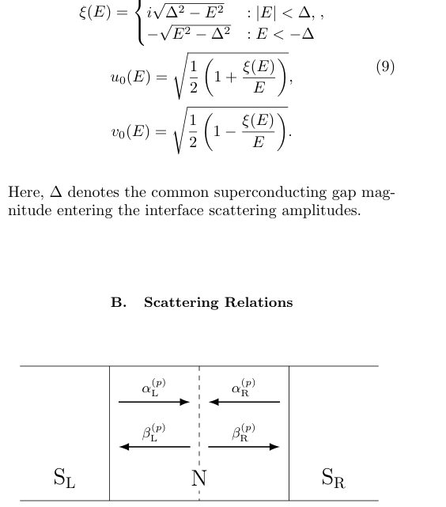 
FIG. 2. The scattering amplitudes in the normal region. The amplitudes α(p) j and β(p) j describe modes propagating toward and away from the normal-region scatterer, respectively. The arrows indicate the propagation directions.

📷 Fig 2

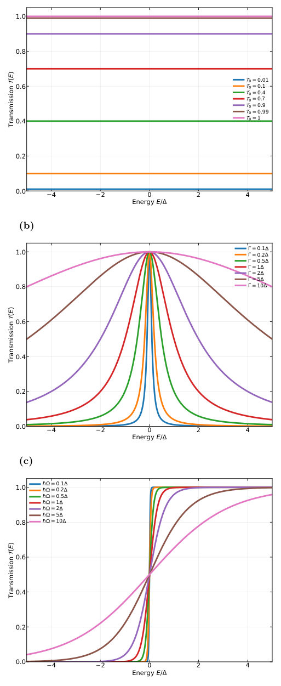 
FIG. 3. The normal-region transmission probability as a func- tion of energy: (a) energy-independent, (b) quantum-dot- type, and (c) QPC profiles. The legends give the values of T0, Γ, and ℏΩ, respectively.

📷 Fig 3

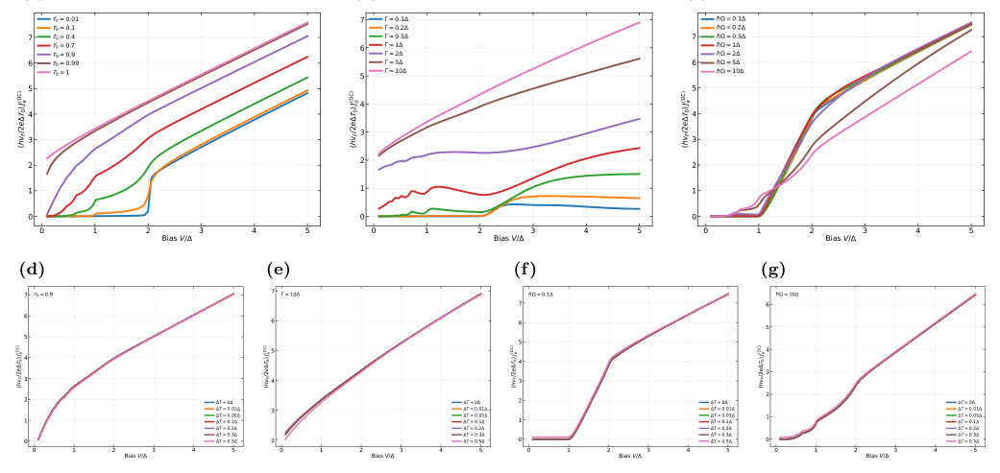 
FIG. 4. Bias dependence of the dc electric current. Panels (a)-(c) use the energy-independent Tconst, the quantum-dot-type TQdot, and the QPC-type TQPC profiles, respectively, at ∆T = 0. Panels (d)-(g) compare several temperature differences for (d) the energy-independent profile with T0 = 0.9, (e) the quantum-dot-type profile with Γ = 10∆, (f) the QPC profile with ℏΩ= 0.1∆and (g) ℏΩ= 10∆. Panel (a) reproduces the result of Averin and Bardas [5], and panel (b) the resonant-level result of Levy Yeyati et al. [17]. The legends give the parameter value.

📷 Fig 4

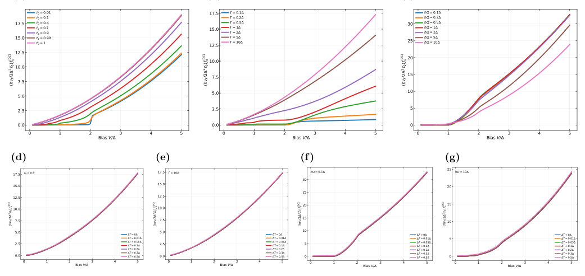 
FIG. 5. Bias dependence of the dc heat current. Panels (a)-(c) use the energy-independent Tconst, (b) the quantum-dot-type TQdot, and (c) the QPC TQPC profiles, respectively at ∆T = 0. Panels (d)-(g) compare several temperature differences for (d) the energy-independent profile with T0 = 0.9, (e) the quantum-dot-type profile with Γ = 10∆, (f) the QPC profile with ℏΩ= 0.1∆and (g) ℏΩ= 10∆. The legends give the parameter values.

📷 Fig 5

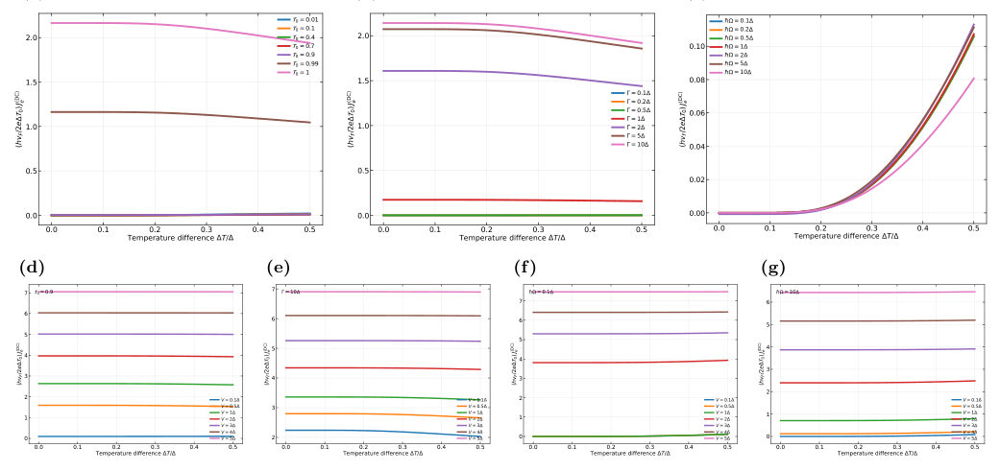 
FIG. 6. Temperature-difference dependence of the dc electric current. Panels (a)-(c) use the energy-independent Tconst, (b) the quantum-dot-type TQdot, and (c) the QPC TQPC profiles, respectively, at V = 0.05∆. Panels (d)-(g) compare several biases for (d) the energy-independent profile with T0 = 0.9, (e) the quantum-dot-type profile with Γ = 10∆, (f) the QPC profile with ℏΩ= 0.1∆and (g) ℏΩ= 10∆. The legends give the parameter values.

**Summary.** This theoretical work analyzes the nonlinear transport of both electric and heat currents in 1D SNS junctions using a scattering approach. By comparing different models for energy-dependent transmission, the authors demonstrate that the junction's response to temperature gradients is critically dependent on the microscopic details of the normal metal region. This provides a crucial microscopic reference for understanding energy transport in mesoscopic fermionic superfluid junctions.

**Why it may be interesting.** The detailed study of non-equilibrium transport in superconducting mesoscopic junctions provides a rich theoretical framework for understanding energy and charge flow in quantum systems, relevant to superconducting quantum devices.

Detailed structure

**Main problem.** The study investigates the phase-independent DC components of electric and heat currents flowing through one-dimensional Superconductor-Normal-Metal-Superconductor (SNS) junctions.

**Main result.** The nonlinear response of both electric and heat currents to temperature differences is highly dependent on the specific transmission profile (e.g., QPC vs. quantum-dot type) used in the normal region.

**Method.** The authors employ a scattering approach derived from the Bogoliubov-de Gennes equations, incorporating Multiple Andreev Reflections (MARs) while retaining energy-dependent transmission.

**Model / system.** The system is a 1D SNS junction connecting two superconducting reservoirs via a normal metal. The analysis compares three transmission profiles: energy-independent, Lorentzian (quantum-dot), and QPC-like.

**Key observables.** Electric current ($J_{ele}^{DC}$) and Heat current ($J_{heat}^{DC}$)

**Important parameters / regimes.** Bias voltage ($V$), temperature difference ($\Delta T$), and the specific transmission profile $T(E)$.

**Assumptions / limitations.** The analysis focuses on the phase-independent DC components ($\phi=0$) and utilizes the Andreev approximation, although limitations regarding unitarity near this limit are noted.

**Figures summary.** Figures are mentioned to illustrate scattering amplitudes in the normal region and the bias dependence of the currents for the different transmission profiles.

**Paper structure.** The paper builds from defining the physical system and the scattering formalism (Bogoliubov-de Gennes equations) to deriving the current expressions via field-operator expansion and solving recurrence relations for scattering amplitudes.

Abstract

We investigate the phase-independent dc components of the electric and heat currents through a one-dimensional superconductor-normal-metal-superconductor (SNS) junction subject to chemical-potential and temperature differences between two superconducting reservoirs. Using a scattering approach based on the Bogoliubov-de Gennes equations, we incorporate multiple Andreev reflections while retaining the energy dependence of transmission through the normal region. We compare energy-independent, quantum-dot-type, and quantum-point-contact transmission profiles. At low bias, both currents exhibit nonlinear features associated with the superconducting gap and multiple Andreev reflections. Their responses to a temperature difference depend remarkably on the transmission profile. At a small finite bias, the electric current depends weakly on the temperature difference for the energy-independent and quantum-dot-type profiles, whereas the quantum-point-contact profile produces a pronounced nonlinear response. The heat current depends nonlinearly on the temperature difference for all three profiles over the parameter range investigated. These results highlight the role of the transmission profile in nonlinear electric and heat transport through SNS junctions and provide a microscopic reference for related transport studies in mesoscopic fermionic superfluid junctions.

[↑ back to top](#top)

### [Residual spectral instabilities in representation learning](http://arxiv.org/abs/2610.11257v1)

**Authors:** Zhen Li  
**Type:** theory · **Category:** statistical mechanics · **PDF:** <https://arxiv.org/pdf/2610.11257v1>  
**Analysis basis:** full PDF text, analyzed in chunks
**Topic relevance:** `Keldysh / 2PI / non-Gaussian methods` **2/5** · `driven-dissipative phase transition` **1/5** · `non-equilibrium universality` **1/5**

📷 Fig 1

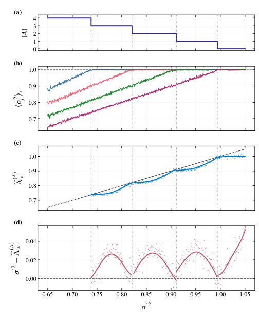 
FIG. 1. Spectral cascade of dimension-wise posterior col- lapse. (a) Number of active latent dimensions |A| and (b) mean posterior variances σ2 j

**Summary.** This work analyzes the stability of learned representations in VAEs by treating the ELBO as an effective free energy. It develops a theory showing that latent dimension collapse occurs in a predictable 'spectral cascade' governed by the residual spectrum. This provides a rigorous, physics-based understanding of information loss in deep generative models.

**Why it may be interesting.** The connection between information geometry (VAE collapse) and spectral stability criteria mirrors concepts in non-equilibrium statistical mechanics, particularly phase transitions or stability boundaries in complex systems.

Detailed structure

**Main problem.** The paper investigates the physical principles governing how learned representations, modeled by Variational Autoencoders (VAEs), lose latent degrees of freedom through successive collapse.

**Main result.** It derives a spectral cascade interpretation where the loss of latent dimensions occurs sequentially at points of spectral marginality, governed by the residual spectrum.

**Method.** The analysis formulates dimension-wise posterior collapse as a fluctuation theory around partially collapsed states, treating the negative Evidence Lower Bound (ELBO) as an effective free energy functional.

**Model / system.** The model is a Variational Autoencoder (VAE) analyzed using statistical physics techniques. The latent space fluctuations are treated via a Gaussian theory derived from the quadratic expansion of the ELBO, leading to a Hessian matrix acting as a mass matrix.

**Key observables.** Residual spectrum ($\Lambda(A)^*$), local reactivation direction, and the stability criterion ($\sigma'^2 \geq \Lambda(A)^*$).

**Important parameters / regimes.** Decoder variance ($\sigma'^2$), the residual spectral upper edge ($\hat{\Lambda}(A)^*$), and the number of active latent dimensions ($|A|$).

**Assumptions / limitations.** The analysis relies on expanding the free energy around a stationary state and assuming a Gaussian theory for fluctuations.

**Figures summary.** Figures illustrate the spectral cascade showing a staircase pattern of dimension loss as the decoder variance ($\sigma'^2$) is varied, alongside the comparison between the stability margin and the residual spectral upper edge.

**Paper structure.** The paper progresses by formulating the collapse as a fluctuation theory, deriving the residual spectrum using a conditional residual operator, establishing the stability criterion, and finally demonstrating the spectral cascade interpretation through numerical continuation experiments.

Abstract

Learned representations can lose latent degrees of freedom successively, suggesting a cascade of transitions whose underlying stability principle remains unclear. Here we formulate dimension-wise posterior collapse in variational autoencoder (VAE) as a fluctuation theory around partially collapsed states. Interpreting the negative evidence lower bound as an effective free energy, its quadratic expansion defines a Gaussian theory whose Hessian acts as a mass matrix for latent fluctuations. We show that the collapsed directions form an invariant fluctuation sector and derive its exact mass spectrum in terms of a conditional residual operator. A local reactivation direction lowers the free energy when the decoder variance falls below the residual spectral upper edge, with equality marking marginality. The criterion recovers principal component thresholds in the linear Gaussian VAE limit. Viewed in reverse along continuously connected branches, the reactivation boundary provides a local criterion for successive collapse. Numerical continuation experiments show successive loss of latent dimensions near these spectral marginalities. These results support a spectral cascade interpretation governed by residual information left unexplained by the surviving representation.

[↑ back to top](#top)

### [The Imaginary Component of the Weak Momentum: Spectral Vanishing and Gauge Invariance](http://arxiv.org/abs/2610.12112v1)

**Authors:** A. N. Khondker  
**Type:** theory · **Category:** other · **PDF:** <https://arxiv.org/pdf/2610.12112v1>  
**Analysis basis:** full PDF text, analyzed in chunks
**Topic relevance:** `quantum measurements` **2/5** · `Keldysh / 2PI / non-Gaussian methods` **1/5** · `analog quantum simulation` **1/5**

📷 Fig 1

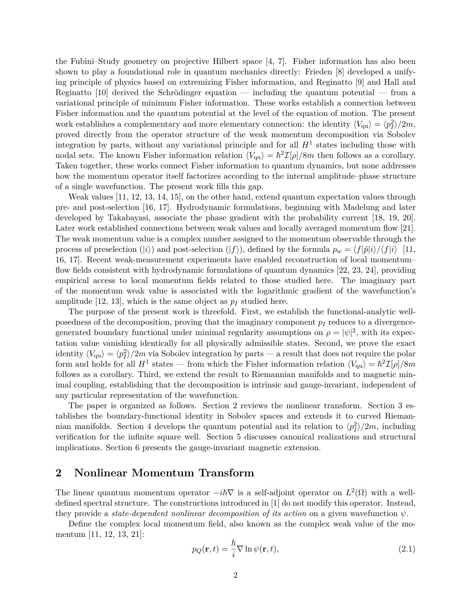 
Low-resolution page preview, page 2

📷 Fig 2

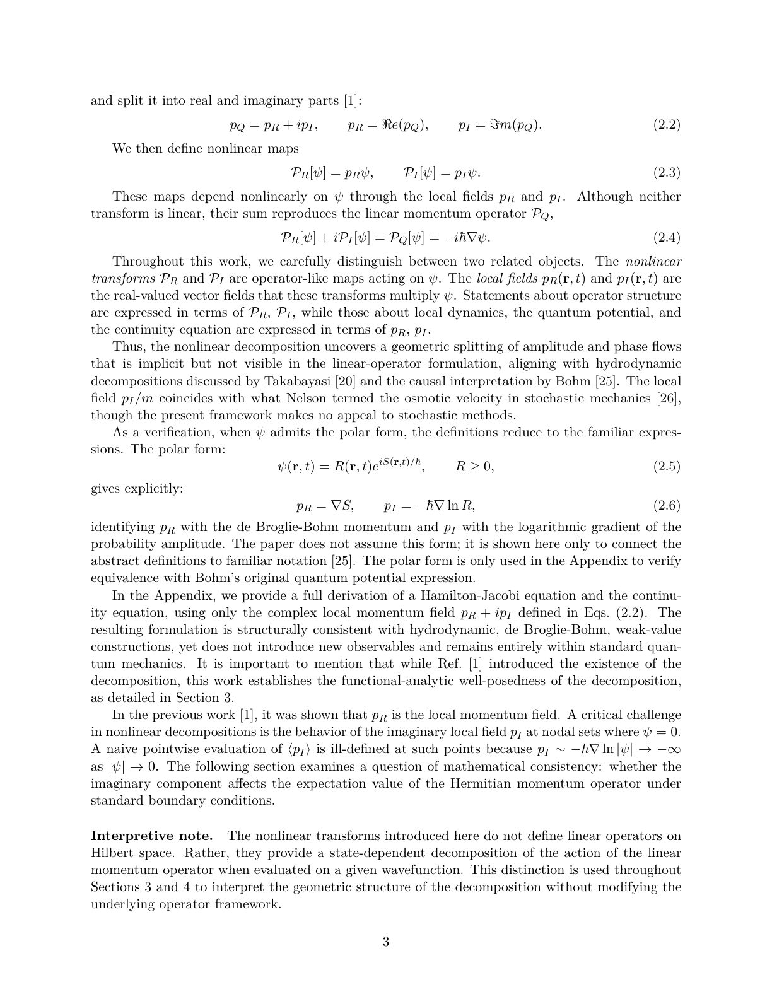 
Low-resolution page preview, page 3

📷 Fig 3

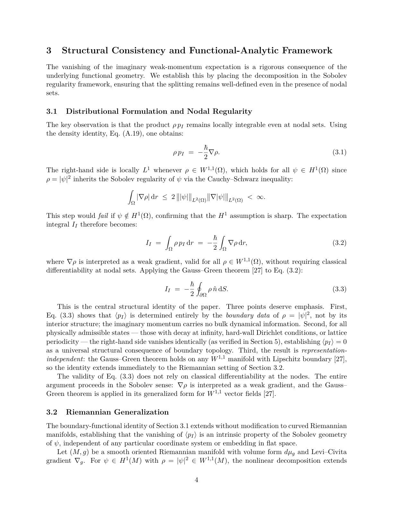 
Low-resolution page preview, page 4

📷 Fig 4

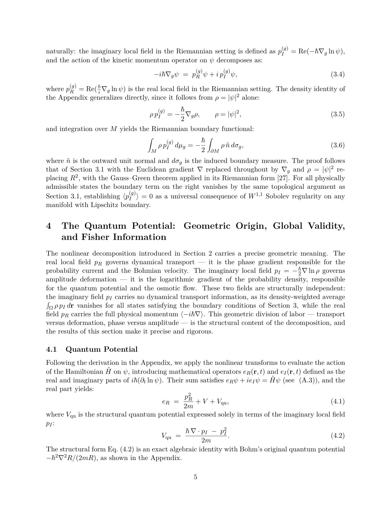 
Low-resolution page preview, page 5

📷 Fig 5

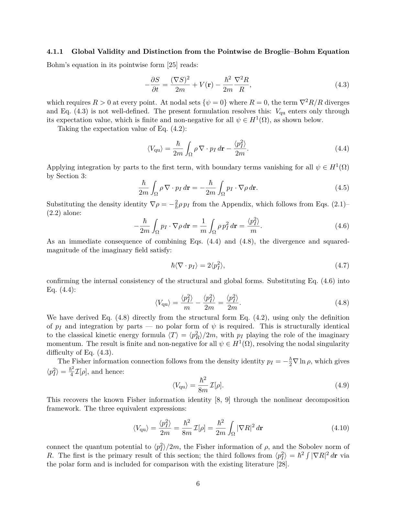 
Low-resolution page preview, page 6

**Summary.** This paper develops a rigorous mathematical framework by decomposing the quantum momentum into real and imaginary components. It proves that the expectation value of the imaginary momentum vanishes, while showing that the entire quantum potential is structurally determined by the imaginary component. This provides a gauge-invariant, geometric understanding of quantum dynamics applicable to various physical settings.

**Why it may be interesting.** The rigorous mathematical treatment of the momentum decomposition and the derivation of the quantum potential from $\mathbf{p}_I$ offers a novel, geometrically grounded perspective on non-linear quantum dynamics, which is relevant for understanding complex many-body systems.

Detailed structure

**Main problem.** The paper establishes a rigorous functional-analytic framework to decompose the quantum momentum operator into real ($\mathbf{p}_R$) and imaginary ($\mathbf{p}_I$) components and analyze the physical consequences of this decomposition.

**Main result.** The expectation value of the imaginary momentum component ($\langle \mathbf{p}_I 
angle$) vanishes identically for physically admissible states, and the Bohm quantum potential arises entirely from $\mathbf{p}_I$, leading to connections with Fisher information.

**Method.** The analysis employs Sobolev spaces and functional-analytic techniques, utilizing the Gauss–Green theorem to evaluate expectation values and derive density identities.

**Model / system.** The study concerns quantum mechanics for a wavefunction $\psi$ in a domain $\Omega$, extending to curved Riemannian manifolds and incorporating magnetic minimal coupling.

**Key observables.** Complex weak momentum ($\mathbf{p}_Q$), imaginary momentum ($\mathbf{p}_I$), Bohm quantum potential ($\langle V_{qu} 
angle$), and Fisher information ($I[
ho]$).

**Important parameters / regimes.** The analysis is valid for $\psi \in H^1(\Omega)$, and results are shown to be gauge-invariant under magnetic minimal coupling.

**Assumptions / limitations.** The derivation relies on the boundary conditions (e.g., decay at infinity) to prove the vanishing of $\langle \mathbf{p}_I 
angle$.

**Paper structure.** The paper proceeds by defining the complex momentum decomposition, proving the vanishing of $\langle \mathbf{p}_I 
angle$ using boundary integrals, and then deriving structural identities linking $\langle V_{qu} 
angle$ to $\langle \mathbf{p}_I^2 
angle$ and the Fisher information.

Abstract

We establish a rigorous functional-analytic framework for the imaginary component $p_I$ of the complex weak momentum $p_Q = p_R + ip_I = \frac{\hbar}{i}\nabla\lnψ$. For every wavefunction in the Sobolev space $H^1(Ω)$, including those with nodal sets, we prove that the expectation value of $p_I$ vanishes identically, as a consequence of the regularity of $ρ= |ψ|^2$ and without appeal to the polar form $ψ= Re^{iS/\hbar}$. We further show that \textnormal{(i)} the Bohm quantum potential arises entirely from $p_I$ and satisfies $\langle V_{\mathrm{qu}}\rangle = \langle p_I^2\rangle/2m$, from which the known Fisher information relation follows as a corollary; \textnormal{(ii)} the group velocity of a Bloch band is the density-weighted average of $p_R/m$, with no contribution from $p_I$; \textnormal{(iii)} the decomposition is gauge-invariant under magnetic minimal coupling, the vector potential acting only on $p_R$; and \textnormal{(iv)} the results extend to curved Riemannian manifolds.

[↑ back to top](#top)

### [Cooper Instability of a Magnetic Wigner Crystal](http://arxiv.org/abs/2610.10710v1)

**Authors:** Wangqian Miao, Chunli Huang  
**Type:** theory · **Category:** strongly correlated electrons · **PDF:** <https://arxiv.org/pdf/2610.10710v1>  
**Analysis basis:** full PDF text, analyzed in chunks
**Topic relevance:** `Keldysh / 2PI / non-Gaussian methods` **2/5** · `analog quantum simulation` **1/5**

📷 Fig 1

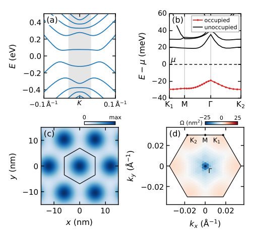 
Figure 1. (a) Single-particle bands of R5G near the K valley at displacement-field potential U = 50 meV. The shaded window marks the momenta |δk| ≤kF occupied at the density n in a single flavor. (b) HF bands of the polarized flavor with the occupied band in red and the chemical potential µ set at midgap. (c) Charge density of the Wigner crystal; the hexagon marks the Wigner–Seitz cell. (d) Berry curvature Ω(k) of the occupied band; its integral vanishes, C = 0.

📷 Fig 2

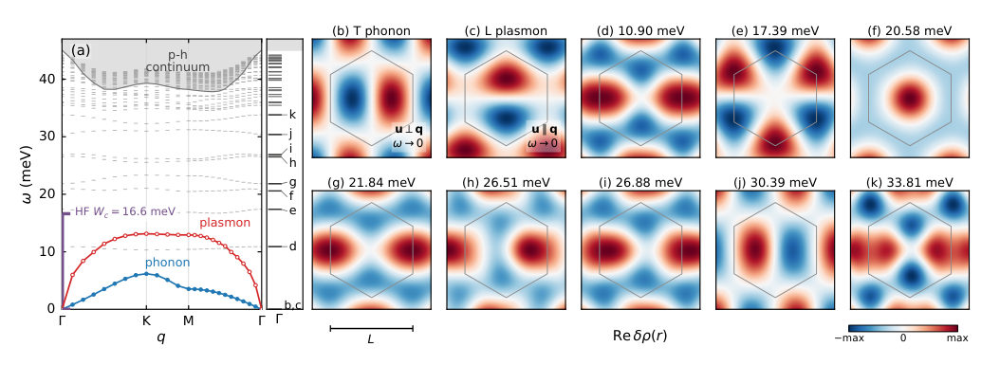 
Figure 2. Particle-hole excitation spectrum of the magnetic Wigner crystal. Transverse phonon (blue), longitudinal plasmon (red), and uncorrelated HF particle–hole continuum (shaded). The adjacent strip resolves collective modes at Γ; Wc = 16.6 meV is the first conduction- band width. (b,c) Transverse and longitudinal modes δρ = u · ∇ρ with ρ shown in Fig. 1c. (d–k) Other collective modes at Γ. Colors show Re δρ(r), normalized separately for each mode. Hexagons outline the Wigner–Seitz cell. L is the lattice constant.

📷 Fig 3

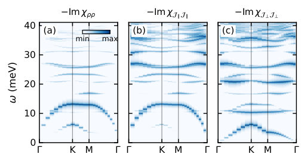 
Figure 3. Spectral density of the magnetic Wigner crystal for den- sity response −Im χρρ, longitudinal-current response −Im χJ∥J∥, and transverse-current response −Im χJ⊥J⊥. The collective modes above plasmon and transverse phonon take up a lot of spectral weight. Each map uses Lorentzian broadening of 0.065 meV, is normalized to its own maximum, and is shown on a logarithmic scale over three decades.

📷 Fig 4

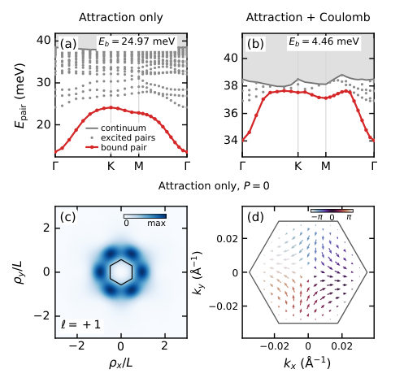 
Figure 4. Cooper pair in magnetic wigner crystal. (a),(b) Lowest pair energy Epair P (red dots), other bound states (gray dots), and the two-particle continuum (shaded), for attraction only and attraction plus residual Coulomb interaction, respectively. The binding energy at P = 0 is indicated. (c),(d) Attraction-only ground state at P = 0. (c) Pair density P

📷 Fig 5

 
Fig. 4(b), Coulomb repulsion substantially weakens the binding, reducing Eb(0) to 4.46 meV. Nevertheless, the lowest pair branch remains below the continuum along the plotted path, with its minimum at P = 0. Table I compares the contributions of different collective modes to pairing. The two translational modes, the transverse phonon and longitudinal plasmon, provide most of the binding. The internal modes give only a modest enhancement. By νcut = 39, the retained modes extend into the particle–hole continuum. Despite their large number, these additional modes contribute little because they couple weakly to the conduction-band electrons.

**Summary.** This theoretical work explores superconductivity in a magnetic Wigner crystal realized in graphene. By modeling the electron-phonon interaction, the authors demonstrate that the crystal's own vibrations can induce a pairing attraction strong enough to cause superconductivity. The resulting superconducting state is predicted to exhibit chiral p-wave pairing, providing a theoretical pathway for understanding electronic crystallization and pairing in correlated 2D materials.

**Why it may be interesting.** While focused on solid-state physics, the methodology of using collective excitations (bosons) to mediate pairing in a strongly correlated, non-equilibrium system shares conceptual links with how bosonic mediators are treated in some AMO contexts, though the physical system is distinct.

Detailed structure

**Main problem.** The study investigates whether collective vibrational modes (phonons) within a magnetic Wigner crystal can mediate an attractive interaction strong enough to induce electron pairing (Cooper instability).

**Main result.** The calculations show that the phonon-mediated attraction exceeds the pairing threshold, leading to the prediction of chiral p-wave pairing as the leading superconducting instability.

**Method.** The authors employed a combination of Hartree-Fock and time-dependent Hartree-Fock approximations to derive an effective fermion-boson Hamiltonian, which was then solved using the quasiboson approximation for the two-electron Cooper problem.

**Model / system.** The system is a magnetic Wigner crystal formed by electrons in the first conduction band of rhombohedral hexalayer graphene. The model treats the interaction via coupling to the crystal's collective bosonic excitations (phonons and plasmons).

**Key observables.** Pairing susceptibility, binding energy ($E_b$), and the momentum-space phase texture ($\chi_0(k)$) which exhibits a winding consistent with chiral p-wave pairing.

**Important parameters / regimes.** Electron density ($n = 0.8 	imes 10^{12} 	ext{ cm}^{-2}$); the comparison between the phonon-mediated attraction and the finite pairing threshold.

**Assumptions / limitations.** The analysis is restricted to the two-electron Cooper problem and relies on approximations such as the quasiboson approximation and neglecting retardation effects.

**Figures summary.** Figures illustrate the single-particle bands, the particle-hole excitation spectrum showing collective modes (phonon, plasmon), and the real-space pair density, confirming the chiral p-wave nature.

**Paper structure.** The paper builds from initial observations in graphene to constructing an effective fermion-boson Hamiltonian, solving the two-electron problem using approximations, and finally determining the superconducting pairing symmetry.

Abstract

Recent scanning tunneling microscopy has directly imaged electronic crystals in rhombohedral hexalayer graphene, and magnetotransport measurements suggest that superconductivity and charge-density-wave order emerge from a common spin-valley-polarized ferromagnetic metal at nearby carrier densities. Motivated by these observations, we ask whether collective modes in a magnetic Wigner crystal can mediate pairing in this setting. We address this question by studying the Cooper problem for two electrons in the first conduction band of the Wigner crystal. Unlike conventional phonon-mediated pairing, the collective mode (boson) energies and single-particle (fermion) dispersion are comparable scales controlled by the electron density, leaving no small parameter for an adiabatic expansion. Moreover, because the magnetic Wigner crystal is not time-reversal invariant, the usual Cooper logarithmic divergence in the pairing susceptibility is absent, so the attraction must exceed a finite threshold for pairing to occur. These unusual features motivate a numerical experiment to see whether the crystal's own vibrations can bind electrons. We obtain the crystalline ground state and its collective mode spectrum within Hartree--Fock and time-dependent Hartree--Fock approximation, and derive the electron--phonon Hamiltonian using the quasiboson approximation. Solving the resulting two-electron problem, we find that phonon-mediated attraction exceeds the pairing threshold, with chiral $p$-wave pairing as the leading instability. Within these approximations, we show that collective modes of a Wigner crystal can indeed favor chiral pairing despite broken time-reversal symmetry. Our results provide an encouraging starting point for developing a full many-body theory to study electronic crystallization and superconductivity.

[↑ back to top](#top)

### [High-resolution mapping of the phase boundary of the honeycomb-lattice Blume--Capel ferromagnet](http://arxiv.org/abs/2610.11068v1)

**Authors:** Eluiz C. M. Filho, Claudio J. DaSilva  
**Type:** theory · **Category:** statistical mechanics · **PDF:** <https://arxiv.org/pdf/2610.11068v1>  
**Analysis basis:** full PDF text, analyzed in chunks
**Topic relevance:** `methods for driven-dissipative` **2/5** · `analog quantum simulation` **1/5**

📷 Fig 1

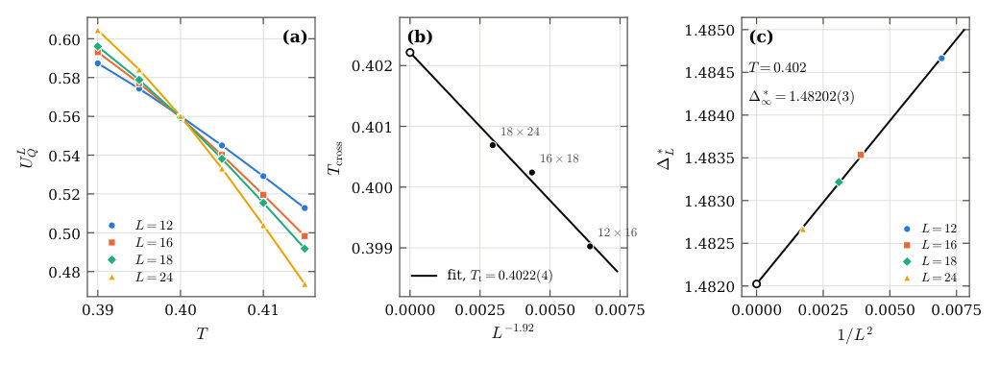 
FIG. 1. (a) Cumulant U L Q along ∆∗ L(T). (b) Extrapolation of the crossing temperatures. (c) L−2 extrapolation of ∆∗ L at T = Tt.

📷 Fig 2

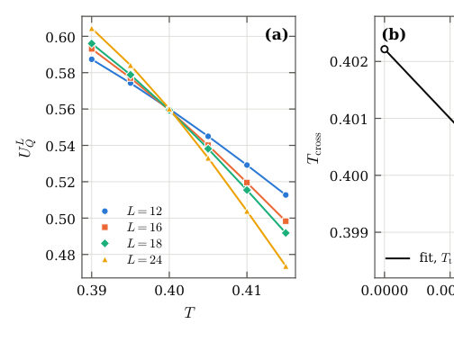 
Figure 2 summarizes both the evolution of the mixed- order-parameter distribution and the finite-size behavior used to identify the two regimes. Panel (a) shows PL( ˜Q) for L = 24 at representative points along the transi- tion line, illustrating how the distribution evolves on ap- proaching and crossing the tricritical region. Panel (b) displays the size dependence at T = 0.360, where the two peaks sharpen monotonically with increasing L (heights 2.05, 2.47, 2.63, and 3.19 for L = 12, 16, 18, 24), as ex- pected for a first-order transition. Panel (c) shows the corresponding L−2 extrapolation of ∆∗ L at this tempera- ture, providing a representative example of the finite-size scaling used...

📷 Fig 3

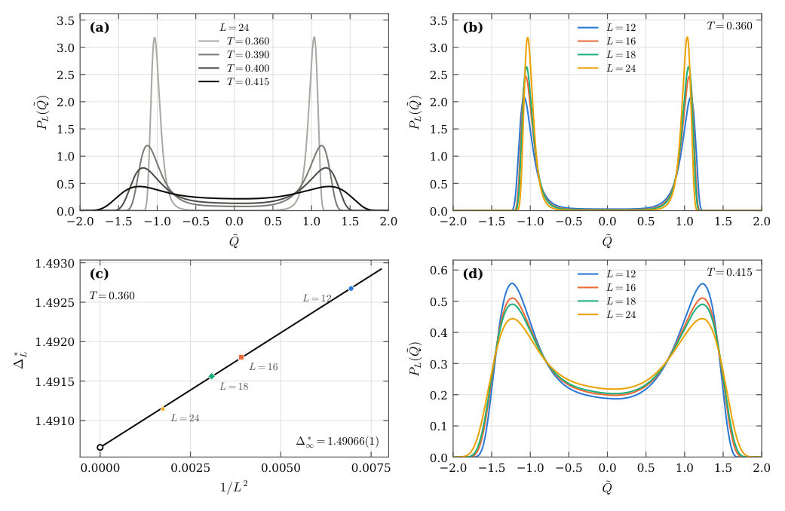 
FIG. 2. (a) PL( ˜Q) for L = 24 along the transition line. (b) Size dependence at T = 0.360, in the first-order regime: the peaks sharpen with L. (c) L−2 extrapolation of ∆∗ L at T = 0.360. (d) Size dependence at T = 0.415, above the tricritical point: the peaks flatten with L.

📷 Fig 4

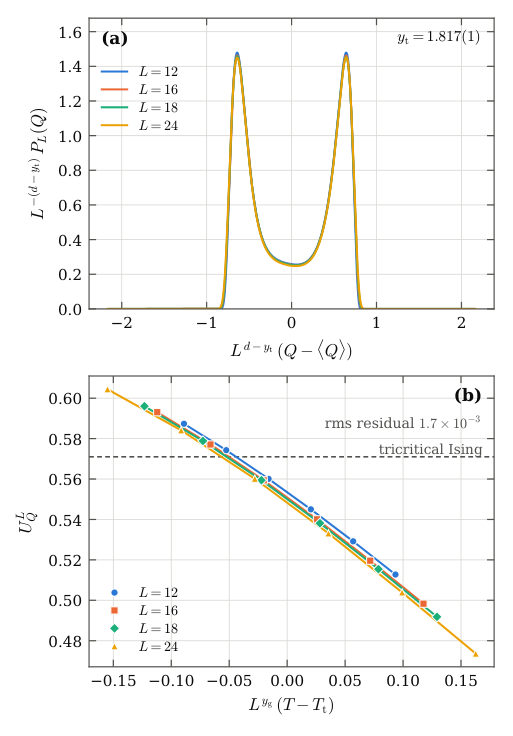 
FIG. 3. Finite-size scaling tests of the expected tricritical eigenvalue exponents. (a) Collapse of PL(Q) with yt = 9/5. (b) Collapse of U L Q with yg = 4/5.

📷 Fig 5

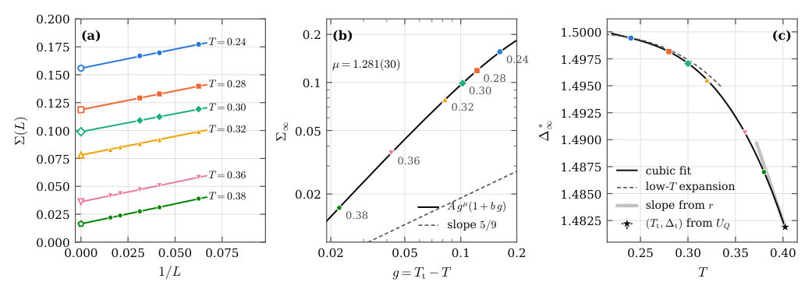 
FIG. 4. Multicanonical results. (a) Size dependence of the interface tension, Eq. (21), with fits to Eq. (22); open symbols are the extrapolated Σ∞. (b) Σ∞against the distance g = Tt −T from the tricritical point, on logarithmic axes. The solid line is the fit with µ = 5/4 and a leading correction; the dashed line shows the slope 5/9 for comparison. (c) Coexistence line ∆∗ ∞(T): cubic fit (solid), low-temperature expansion of Eq. (27) (dashed), slope at the tricritical point implied by the field-mixing value of r through Eq. (25) (grey), and tricritical point from the cumulant analysis (star). Colors and symbols identify the temperature in all panels.

**Summary.** This paper provides a high-resolution numerical mapping of the phase boundary for the spin-1 Blume-Capel ferromagnet on the honeycomb lattice. Using advanced simulation techniques, it precisely locates the tricritical point and determines critical exponents. The work demonstrates strong internal consistency across multiple simulation methods, providing a detailed understanding of the system's phase transitions.

**Why it may be interesting.** While focused on classical statistical mechanics, the use of advanced simulation techniques like multicanonical sampling and density of states estimation is highly relevant to simulating complex quantum many-body systems where phase boundaries are critical.

Detailed structure

**Main problem.** The study aims to map the phase boundary and precisely locate the tricritical point of the spin-1 Blume-Capel ferromagnet on the honeycomb lattice.

**Main result.** The tricritical point is located at $(\Delta_t, T_t) = [1.4819(2), 0.4022(7)]$, and the analysis yields consistent estimates for critical exponents and scaling parameters.

**Method.** The research employs advanced numerical simulation techniques including Wang-Landau estimation of the joint density of states, histogram reweighting, and multicanonical simulations to analyze phase transitions.

**Model / system.** The system is the spin-1 Blume-Capel ferromagnet defined on a honeycomb lattice, described by a Hamiltonian involving nearest-neighbor interactions and a quadratic term ($\sigma_i^2$).

**Key observables.** Joint density of states $\Omega(E_1, E_2)$, tricritical point coordinates $(\Delta_t, T_t)$, interface-tension exponent $\mu$, and critical exponents $y_t$ and $y_g$.

**Important parameters / regimes.** The coordination number $z=3$ (honeycomb lattice), and the field-mixing parameter $r \approx -1.587$.

**Assumptions / limitations.** The analysis relies on extrapolating finite-size scaling results and assumes consistency across multiple independent simulation methods (WL, HR, MUCA).

**Figures summary.** Figures summarize the phase diagram in $(\Delta, T)$ space, show the size dependence of interface tension ($\Sigma(L)$), and illustrate the extrapolation of the coexistence line and critical exponents.

**Paper structure.** The paper systematically analyzes the phase diagram by first using Wang-Landau methods to map the first-order line and locate the tricritical point. It then uses histogram reweighting and multicanonical simulations to confirm these results, determining critical exponents and scaling parameters through finite-size scaling analysis.

Abstract

We present a high-resolution numerical study of the spin-1 Blume--Capel ferromagnet on the honeycomb lattice ($z=3$). Wang--Landau estimates of the joint density of states $Ω(E_1,E_2)$, combined with field mixing, are used to map the first-order transition line and locate the tricritical point at $(Δ_t,T_t)=[1.4819(2),\,0.4022(7)]$. Histogram reweighting of Metropolis simulations for $L=36$ and $48$ provides an independent consistency check, with a crossing temperature near $0.4039$, compatible with the Wang--Landau extrapolation. From the field-mixing analysis we obtain $r=-1.586(19)$, while the slope of the multicanonical coexistence line yields the consistent and more precise estimate $r=-1.587(5)$. Normalizing by the zero-temperature field $Δ_0=zJ/2$, the available honeycomb, square, triangular, and simple-cubic estimates cluster near $r/Δ_0\simeq-1.06$, corresponding to a magnitude about $6\%$ larger than the mean-field value $-1$; no systematic dependence on coordination number or dimensionality is resolved over the range examined. Finite-size scaling of $σ_Q$ gives $y_t=1.795(7)$, consistent with the tricritical Ising value $9/5$, while the fourth-order cumulant scaling is compatible with $y_g=4/5$. Deep in the first-order regime, the cumulant approaches the expected two-phase limit $U_Q\to2/3$. Multicanonical simulations up to $L=64$, using weights constructed directly from the Wang--Landau density of states for $L\le24$ and rescaled and refined for larger systems, yield an interface-tension exponent $μ=1.265(26)$, consistent with the tricritical prediction $(d-1)/y_g=5/4$. Finally, we map the continuous branch of the phase boundary from the same density-of-states data, obtaining $T_c(Δ=0)=1.157$; estimates sufficiently close to the tricritical point are affected by crossover from Ising to tricritical scaling.

[↑ back to top](#top)

### [A lower bound on the overhead of surgery on sparse stabiliser codes](http://arxiv.org/abs/2610.11097v1)

**Authors:** Nouédyn Baspin  
**Type:** theory · **Category:** quantum information and computing · **PDF:** <https://arxiv.org/pdf/2610.11097v1>  
**Analysis basis:** full PDF text, analyzed in chunks
**Topic relevance:** `quantum measurements` **2/5**

📷 Fig 1

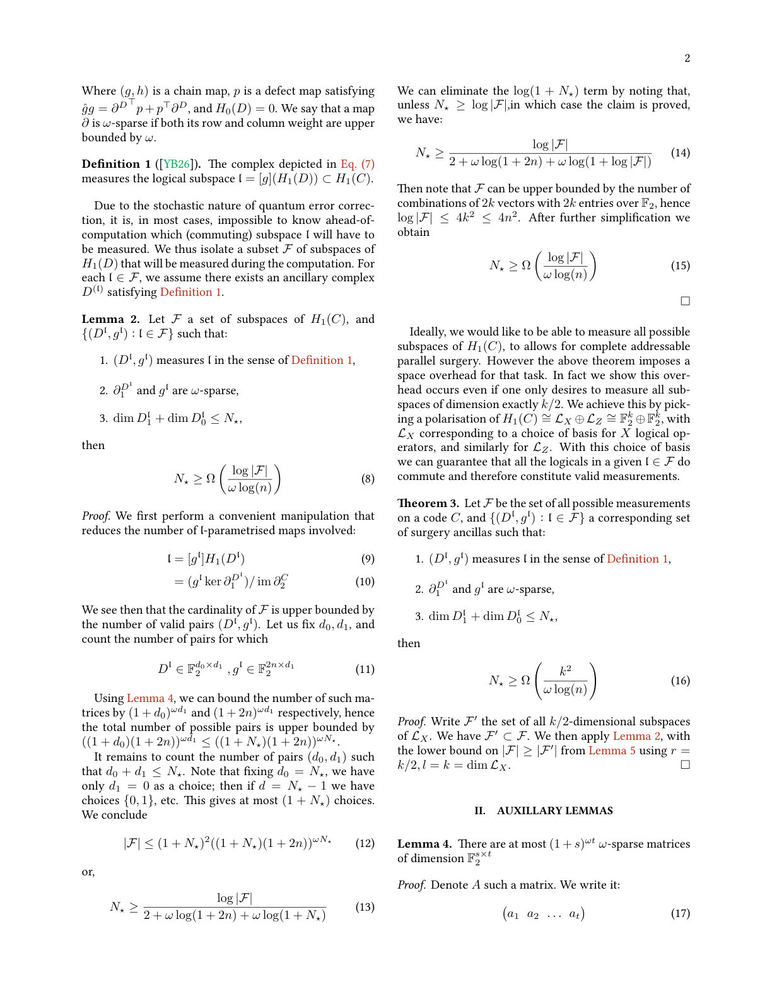 
Low-resolution page preview, page 2

📷 Fig 2

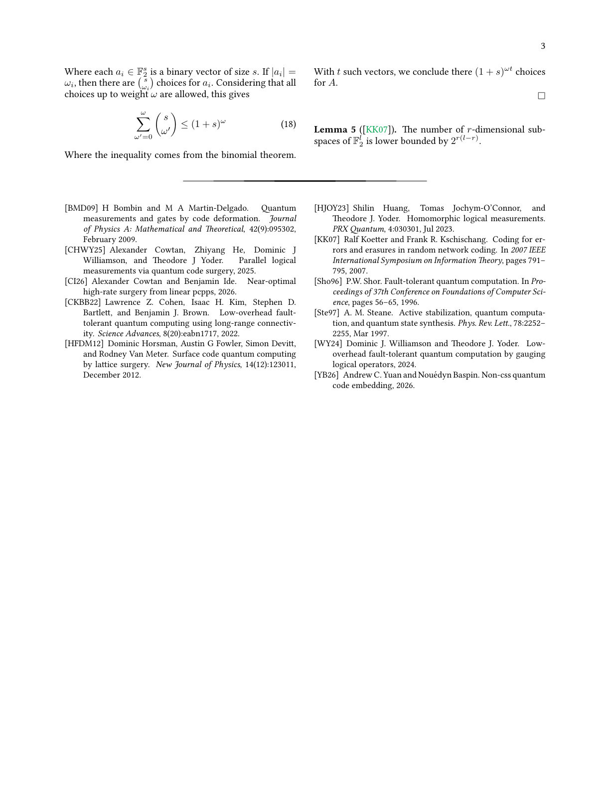 
Low-resolution page preview, page 3

**Summary.** This paper derives a lower bound showing that performing lattice surgery on sparse stabiliser codes requires an ancillary qubit overhead scaling as $	ilde{\Omega}(k^2)$ in the worst case. This result demonstrates a fundamental space-time tradeoff, indicating that achieving complete measurement addressability demands a significant increase in physical resources relative to the code size.

**Why it may be interesting.** This work provides fundamental theoretical limits on the resource overhead (ancilla qubits) needed to perform complex quantum operations like lattice surgery, which is crucial for scaling up fault-tolerant quantum computation architectures.

Detailed structure

**Main problem.** The paper aims to establish a lower bound on the ancillary qubit overhead required to perform lattice surgery on sparse stabiliser codes, especially when measuring multiple logical operators.

**Main result.** The worst-case overhead for this surgery is shown to be $	ilde{\Omega}(k^2)$ ancillary qubits, implying that constant overhead ancillas limit the measurable logical subspace fraction for large codes.

**Method.** The authors develop a 'no-go theorem' using symplectic embeddings and bounding techniques (Lemma 2, 4, 5) to relate the number of measurable subspaces to the required ancilla qubits.

**Model / system.** The work analyzes quantum error correction using stabiliser codes, modeling the measurement process via a symplectic embedding involving ancillary complexes. The focus is on the theoretical overhead associated with the lattice surgery technique.

**Key observables.** The minimum number of additional ancilla qubits ($N_\star$) required for parallel surgery, and the size of the set of measurable logical subspaces ($|F|$).

**Important parameters / regimes.** The code dimension parameter $k$, the sparsity parameter $\omega$, and the total number of qubits $n$.

**Assumptions / limitations.** The analysis assumes the existence of ancillary complexes $D(l)$ for all desired measurements $l \in F$, and the bounds rely on the sparsity ($\omega$) of the associated maps.

**Paper structure.** The paper builds towards a lower bound by formalizing the measurement process via symplectic embeddings and then applying combinatorial and algebraic tools (Lemmas 2, 4, 5) to derive the scaling of the required ancilla qubits.

Abstract

We show that performing lattice surgery on sparse stabiliser codes with sparse ancillas requires $\tildeΩ(k^2)$ ancillary qubits in the worst case. As a result, for codes with large $k$, constant overhead ancillas can only realise a small fraction of possible measurements.

[↑ back to top](#top)

### [Amplitude mode in Eliashberg superconductors](http://arxiv.org/abs/2610.10826v1)

**Authors:** Maxim Dzero, Emil A. Yuzbashyan  
**Type:** theory · **Category:** strongly correlated electrons · **PDF:** <https://arxiv.org/pdf/2610.10826v1>  
**Analysis basis:** full PDF text, analyzed in chunks
**Topic relevance:** `Keldysh / 2PI / non-Gaussian methods` **2/5**

📷 Fig 1

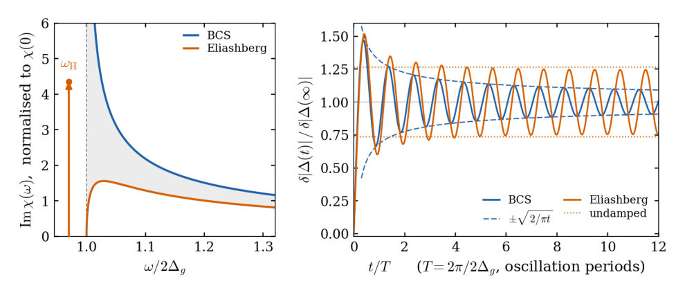 
FIG. 1. Time-domain signature of the amplitude mode. Left panel: spectral function of the longitudinal pair susceptibility χ(ω)/χ(0). The pole corresponding to amplitude Higgs mode then holds approximately 25% of it. Shading marks the continuum weight that retardation removes from the neighborhood of the edge. We depict the weight transferred from the edge into the pole by the shaded area. Right panel: order-parameter amplitude after a sudden weak pair field applied at t = 0, in units of its new equilibrium value, computed at that binding. The BCS oscillation dephases across the continuum with envelope ∝t−1/2 (dashed). The pole gives an undamped oscillation of relative amplitude 0.265...

📷 Fig 2

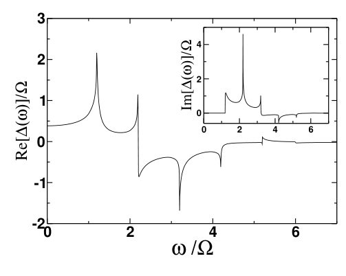 
FIG. 2. Real (main panel) and imaginary (inset) parts of the equilibrium order parameter ∆(ω) obtained by solving Eqs. (12) for λ = 0.95 and T = 0.005Ω.

📷 Fig 3

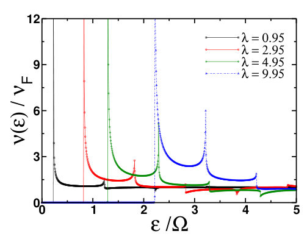 
FIG. 3. Single-particle density of states (15) for several values of the dimensionless coupling constant λ at T = 0.005Ω.

📷 Fig 4

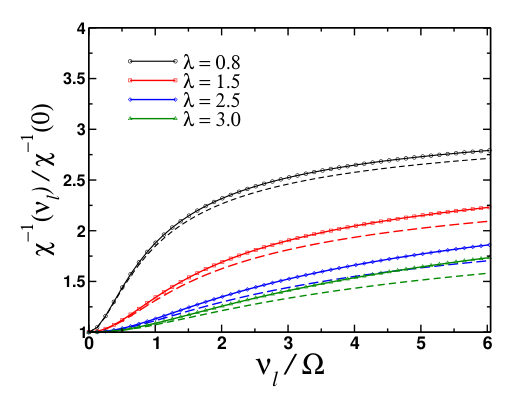 
FIG. 4. Isolating the mass-renormalization response in the longitudinal pair propagator. Normalized inverse propagator χ−1 Φ (iνl)/χ−1 Φ (0) at four couplings. Solid: the full system (24). Dashed: the same system with δW ≡0, i.e. with the vertex re- tardation acting alone. The gap between the two curves is the mass-renormalization response. The full system’s curve rises faster with νl: the mass channel lowers χ−1 Φ near νl = 0 relative to its high-frequency value, which is the imaginary-axis signature of the additional attraction in the amplitude channel discussed in the text; removing δW moves the mode towards the threshold. N = 1024, T/Ω= 0.005.

📷 Fig 5

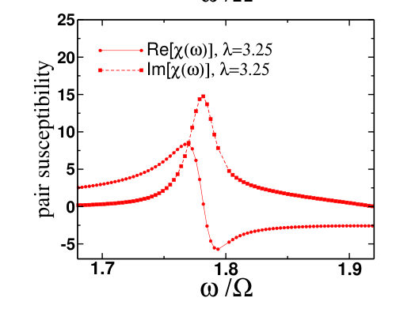 
FIG. 5. Real and imaginary parts of the pair susceptibility χ(ω), Eq. (54), across the pair-breaking edge at λ = 2 (top panel) and λ = 3.25 (bottom panel) for T/Ω= 0.005 and Ks = 336. The change in sign of Re[χ(ω)] and the maximum of Im[χ(ω)] at ωH ≈2∆g are the finite-γ image of the ampli- tude Higgs pole.

**Summary.** This paper investigates the Higgs amplitude mode in strongly coupled superconductors, showing that phonon retardation effects lift the mode's degeneracy from the pair-breaking threshold. Using the Eilenberger equations on the real frequency axis, the authors predict the mode becomes a sharp, undamped subgap excitation, causing a measurable transfer of spectral weight from the continuum.

**Why it may be interesting.** The work provides a detailed, quantitative theoretical prediction for a collective mode in superconductors, linking microscopic electron-phonon coupling effects to observable spectral weight changes, which is highly relevant to understanding pairing mechanisms beyond simple BCS theory.

Detailed structure

**Main problem.** To determine if retardation effects from phonon dynamics in strong-coupling superconductors lift the degeneracy of the amplitude (Higgs) mode from the pair-breaking threshold ($2\Delta_g$).

**Main result.** The Higgs mode detaches from the pair-breaking edge, becoming a sharp subgap excitation with a binding energy predicted to be $2\Delta_g - \omega_H = 0.028 \Delta_g^2/\Omega$ in the intermediate-coupling regime.

**Method.** The frequency is determined by evaluating the longitudinal pair susceptibility directly on the real frequency axis using the Eilenberger equations within the Migdal-Eliashberg theory framework.

**Model / system.** The study focuses on superconductors described by a complex order parameter, utilizing the Migdal–Eliashberg theory with an Einstein phonon spectrum to model strong electron-phonon coupling.

**Key observables.** Amplitude mode frequency ($\omega_H$), spectral weight transfer, and the time-domain oscillation signature.

**Important parameters / regimes.** Intermediate-coupling window ($0.56 \le \Delta_g/\Omega \le 0.90$), the ratio $\Delta_g/\Omega$, and the gap edge $2\Delta_g$.

**Assumptions / limitations.** The calculation requires using the real-axis Eilenberger-Keldysh approach, as the imaginary axis calculation fails to resolve the necessary small energy shifts.

**Figures summary.** Figure 1 illustrates the time-domain signature, contrasting the BCS prediction of $t^{-1/2}$ decay with the predicted undamped pole, and showing the spectral weight transferred from the continuum to the discrete level.

**Paper structure.** The paper contrasts the BCS prediction (algebraic decay) with the strong-coupling prediction (detachment). It details the theoretical machinery using Eilenberger equations on the real axis to locate the pole, derives the quantitative binding energy formula, and discusses the physical consequence of spectral weight redistribution.

Abstract

In the BCS theory of superconductivity the amplitude (Higgs) mode is degenerate with the pair-breaking threshold: its frequency coincides with $2Δ$, so it is an edge singularity rather than a true collective mode. This is why after a sudden weak perturbation at $t=0$ its oscillations decay algebraically as $1/\sqrt{t}$. We show that the retardation effects due to the phonon dynamics in the strong-coupling theory lift this degeneracy. The Higgs mode detaches from the pair-breaking edge $2Δ_g$, set by the spectral gap, and becomes a sharp subgap excitation. We determine its frequency from the longitudinal pair susceptibility evaluated directly on the real frequency axis, using the Eilenberger equations for Migdal--Eliashberg theory with the Einstein phonon spectrum. The response of the mass renormalization supplies at least two fifths of the displacement, and possibly all of it: with it switched off, the binding falls below the resolution of the calculation. Its consequences, however, are significant because a percent-level shift transfers about a quarter of the spectral weight of the amplitude channel out of the two-quasiparticle continuum into a discrete energy level. What experiment sees is therefore not the displacement itself but its consequence: amplitude oscillations that persist instead of decaying as $1/\sqrt{t}$.

[↑ back to top](#top)

### [Autonomous Code Migration for Quantum Programming Languages: A Case Study with QED-C Benchmarks](http://arxiv.org/abs/2610.12187v1)

**Authors:** W. Michael Brown, Thien Nguyen, Avimita Chatterjee, Thomas Lubinski  
**Type:** experiment · **Category:** quantum information and computing · **PDF:** <https://arxiv.org/pdf/2610.12187v1>  
**Analysis basis:** full PDF text, analyzed in chunks
**Topic relevance:** `QC/QI experiment` **2/5**

📷 Fig 1

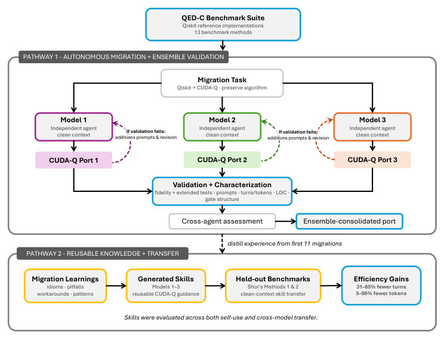 
Fig. 1: Overview of the autonomous code-migration and knowledge-transfer methodology. In Pathway 1, three coding agents independently migrate the 13 QED-C benchmark methods from Qiskit to CUDA-Q under isolated contexts. The resulting implementations are validated and characterized using fidelity, migration-effort, code-size, and gate-structure measures, followed by cross-agent assessment and ensemble consolidation. In Pathway 2, experience from the first 11 benchmark migrations is distilled into model-generated skills and evaluated on the held-out Shor’s Methods 1 and 2 under clean contexts, including both self-use and cross-model skill transfer. Skill use reduces model turns by 31–85% and...

**Summary.** This paper details a case study on using large language models to autonomously migrate quantum code benchmarks from Qiskit to CUDA-Q. The research demonstrates that while LLMs can significantly reduce human effort in this complex task, the process is improved by distilling reusable 'skills' from the initial migrations. This work advances the state-of-the-art in automated quantum software engineering.

**Why it may be interesting.** While the focus is on software engineering rather than fundamental physics, the successful automation of complex quantum algorithm implementation across platforms is crucial for realizing quantum hardware, directly impacting the practical application of quantum information science.

Detailed structure

**Main problem.** The paper addresses the challenge of autonomously migrating quantum algorithms and benchmarks from one programming framework (Qiskit) to another (CUDA-Q). This is necessary because quantum software requires specialized abstractions that differ significantly from traditional programming languages.

**Main result.** LLMs successfully generated satisfactory code ports with significantly reduced human effort, and distilling 'skills' from these migrations improved agent performance on unseen benchmarks by reducing required model turns by up to 85%.

**Method.** The authors used large language models (Opus, GPT, Gemini) as agents to port thirteen QED-C benchmark methods from Qiskit to CUDA-Q. They then tested knowledge transfer by creating and applying reusable 'skills' derived from these initial migrations.

**Model / system.** The work operates on quantum computing platforms, specifically comparing the Qiskit and CUDA-Q frameworks. The benchmarks cover diverse quantum algorithms including amplitude estimation, variational optimization, and factoring.

**Key observables.** Model turns required for porting, token usage, fidelity of generated code, and the percentage reduction in model turns/tokens when using distilled skills.

**Important parameters / regimes.** The benchmark suite includes 13 methods spanning foundational algorithms, Monte Carlo, and optimization tasks.

**Assumptions / limitations.** The study assumes that algorithmic intent can be preserved across framework abstractions, though it notes that this is not guaranteed and that agents can use 'shortcuts.'

**Figures summary.** The notes reference a figure detailing the two pathways: autonomous migration (Pathway 1) and knowledge transfer using reusable skills (Pathway 2). Tables quantify the percentage reduction in model turns and token count achieved by these skills.

**Paper structure.** The paper follows a case study structure: first, performing the autonomous migration of the QED-C benchmarks across multiple LLMs; second, analyzing the resulting challenges and inconsistencies; and finally, developing and testing a knowledge-transfer mechanism using 'skills' to improve future agent performance.

Abstract

Quantum programming requires concepts and intuition that differ substantially from those used in traditional programming languages. Multiple quantum programming frameworks address these requirements through different abstractions and execution models, creating tradeoffs in programmability, portability, and performance. Because quantum software is less prevalent in the training data available to large language models, autonomous coding agents might be expected to face additional challenges when working with these frameworks. We present a case study in autonomous migration of the QED-C Application-Oriented Benchmarks from Qiskit to CUDA-Q. Opus, GPT, and Gemini models were each tasked with porting thirteen benchmark methods spanning foundational algorithms, amplitude estimation, Monte Carlo methods, variational optimization, linear-system solving, and factoring. In all cases, the models were able to generate satisfactory ports with little direct coding help and there was a drastic reduction in the time required compared to a human engineer. However, in all cases, the agents resorted to shortcuts when implementation challenges surfaced and multiple prompts were required to force appropriate coding directions. Assessment of the generated implementations showed that no single model consistently produced the best port across all benchmarks, indicating that multi-agent ensemble strategies could mitigate challenges associated with quantum software. The effort resulted in publicly available, near-complete CUDA-Q support in the QED-C benchmarks along with model-generated skills designed to improve agent performance when implementing CUDA-Q applications. When tested on an unseen benchmark, these skills reduced the required model turns by up to 85% and token usage by up to 96%. We conclude by distilling lessons from the case study.

[↑ back to top](#top)

### [Combining Error Verification and Privacy Amplification in Quantum Key Distribution](http://arxiv.org/abs/2610.10702v1)

**Authors:** Devashish Tupkary, Zhiyao Wang, Ernest Y. -Z. Tan  
**Type:** theory · **Category:** quantum information and computing · **PDF:** <https://arxiv.org/pdf/2610.10702v1>  
**Analysis basis:** full PDF text, analyzed in chunks
**Topic relevance:** `quantum measurements` **2/5**

📷 Fig 1

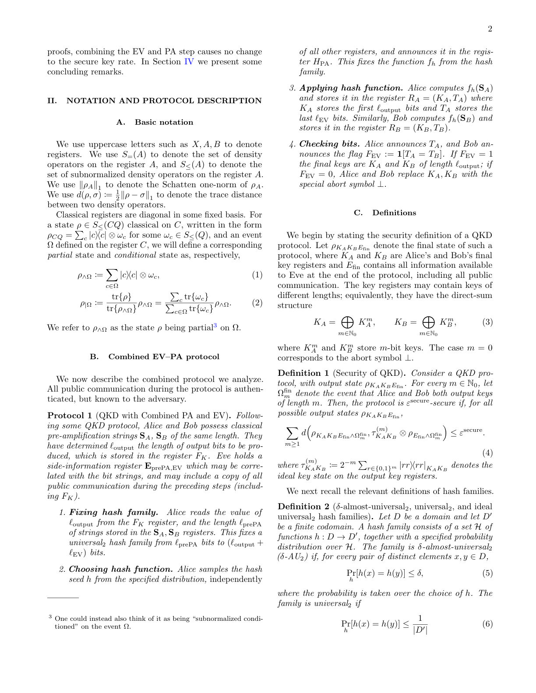 
Low-resolution page preview, page 2

📷 Fig 2

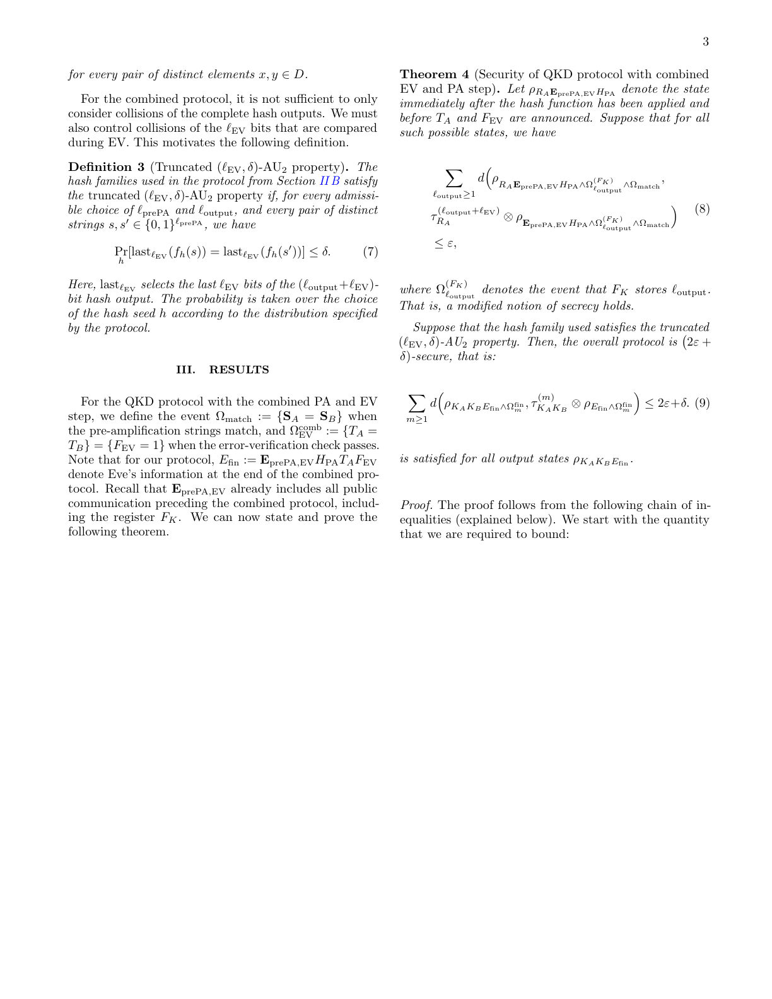 
Low-resolution page preview, page 3

📷 Fig 3

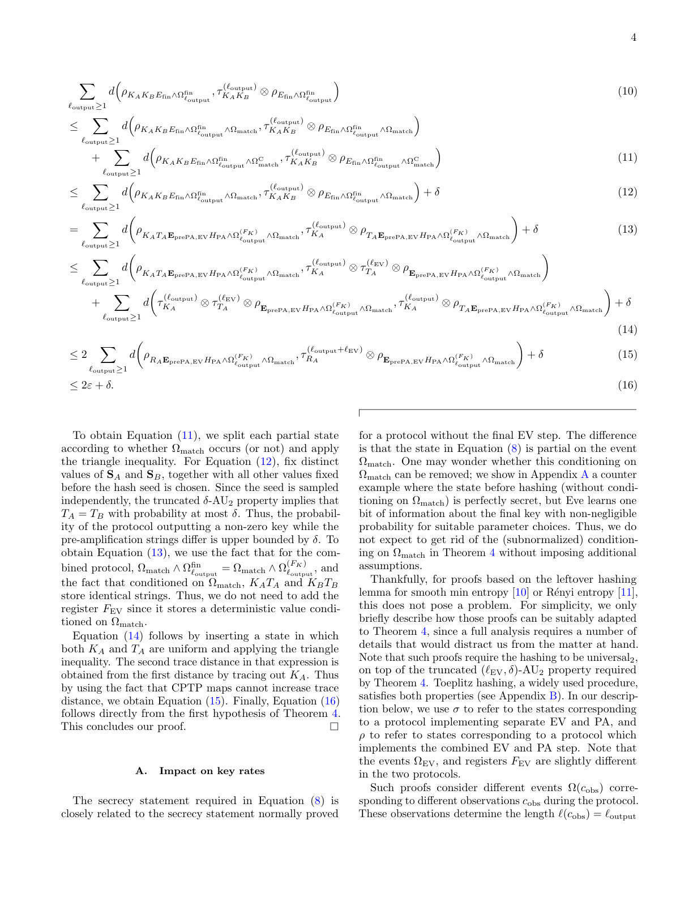 
Low-resolution page preview, page 4

📷 Fig 4

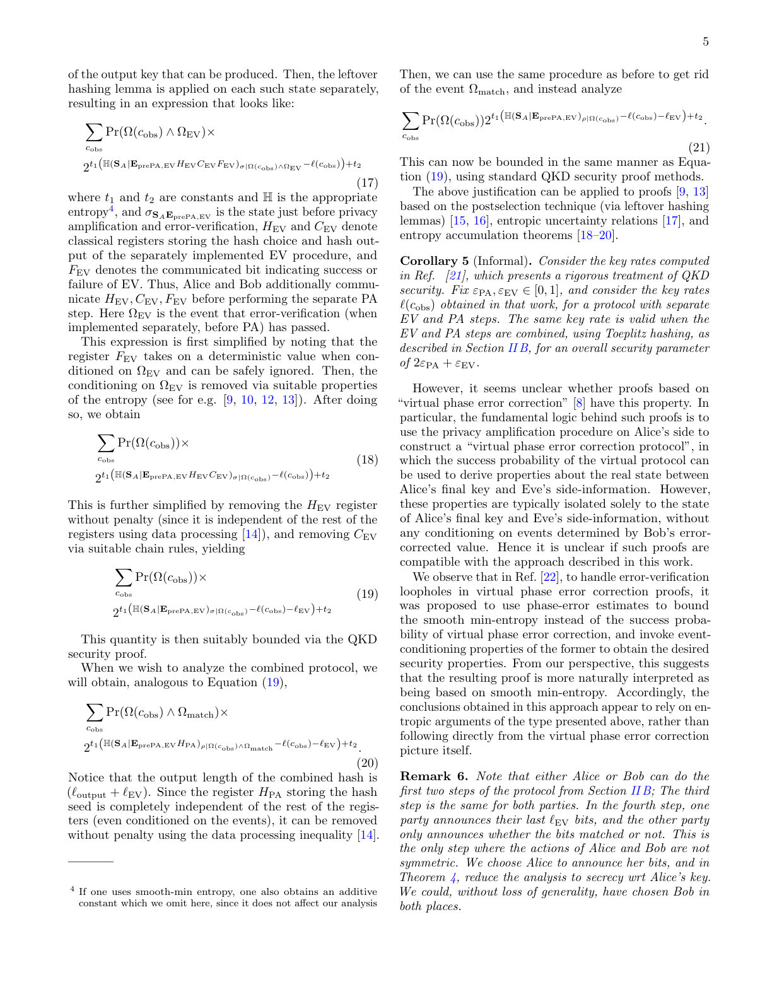 
Low-resolution page preview, page 5

📷 Fig 5

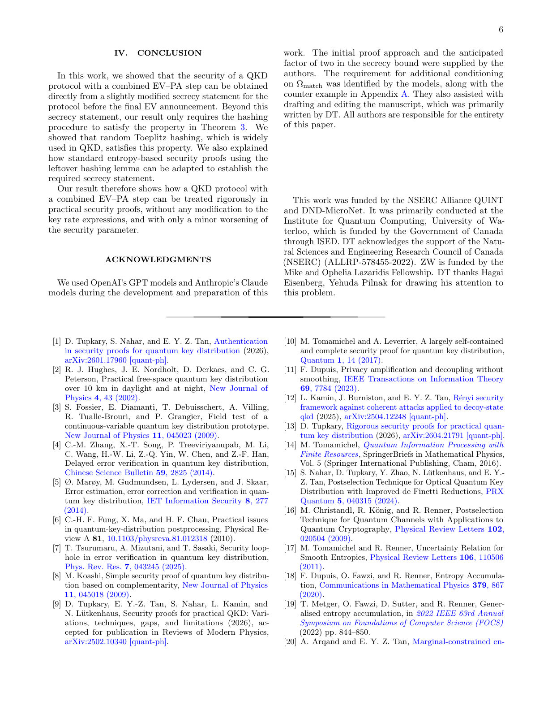 
Low-resolution page preview, page 6

**Summary.** This paper proposes a simplified, single-step method to combine the error verification and privacy amplification steps in QKD, reducing classical complexity. The authors provide a rigorous security proof showing this combined approach is secure under specific conditions related to the hash function's properties. This streamlines QKD protocols while maintaining provable security.

**Why it may be interesting.** While focused on QKD, the rigorous security analysis, the use of information-theoretic tools like trace distance, and the focus on simplifying complex cryptographic protocols are highly relevant to the theoretical foundations of quantum communication and information processing.

Detailed structure

**Main problem.** To develop and mathematically justify a simpler, single-step hashing procedure that combines the Error Verification (EV) and Privacy Amplification (PA) steps in Quantum Key Distribution (QKD).

**Main result.** The combined protocol can be shown to be secure with a key rate that remains valid, provided the hash family satisfies a specific truncated universality property and the security proof incorporates a modified notion of secrecy conditioned on the error verification match event.

**Method.** The authors adapt standard entropy-based security proofs, utilizing trace distance bounding techniques and analyzing the security implications of combining the two classical post-processing steps into one hash function application.

**Model / system.** The work analyzes the security of Quantum Key Distribution (QKD) protocols, which involve transmitting quantum states followed by classical post-processing steps (Error Verification and Privacy Amplification) using cryptographic hash functions.

**Key observables.** The final secure key rate, the security parameter ($\epsilon_{secure}$), and the trace distance between the actual and ideal quantum states.

**Important parameters / regimes.** The lengths of the output key ($\ell_{output}$), the bits used for verification ($\ell_{EV}$), and the collision probability parameter ($\delta$).

**Assumptions / limitations.** The security proof critically relies on conditioning the secrecy statement on the event that the error verification bits match ($\Omega_{	ext{match}}$), as demonstrated by a counterexample.

**Figures summary.** Not specified.

**Paper structure.** The paper introduces the combined protocol, develops the necessary modified secrecy notion, proves the security bound (Theorem 4) using bounding techniques, and provides a counterexample (Appendix A) to highlight the necessity of conditioning on the matching event.

Abstract

Quantum Key Distribution (QKD) protocols typically involve two separate steps of error-verification and privacy amplification. Both steps involve the application of a hash function sampled from a suitable hash family to classical data. A potentially simpler alternative is to implement a single-step hashing procedure, announce and compare a fixed number of bits of its output for error-verification, and retain the remaining bits as the final output key. This reduces the complexity of classical postprocessing, the amount of classical communication, and the amount of randomness needed in the protocol. While this construction has appeared in the literature, a suitable mathematical justification is lacking. In this work, we show that the security of such protocols, under certain simple conditions, follows from a slightly modified notion of secrecy of the protocol without the final error-verification step. In particular, we show that for most entropy-based proofs, the combined protocol can be implemented with no change to the key rate, and a minor change to the security parameter.

[↑ back to top](#top)

### [Dielectric constant of holographic insulator from quantum geometry](http://arxiv.org/abs/2610.11635v1)

**Authors:** Debabrata Ghorai, Taewon Yuk, Sang-Jin Sin  
**Type:** theory · **Category:** strongly correlated electrons · **PDF:** <https://arxiv.org/pdf/2610.11635v1>  
**Analysis basis:** full PDF text, analyzed in chunks
**Topic relevance:** `Keldysh / 2PI / non-Gaussian methods` **2/5**

📷 Fig 1

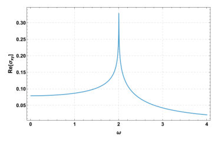 
Figure 2: Transport for 2D Dirac Hamiltonian with gapping parameter m = 1.

📷 Fig 2

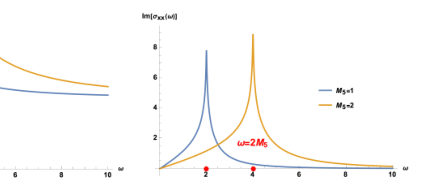 
Figure 3: Transport for pseudoscalar interaction in holographic setup

📷 Fig 3

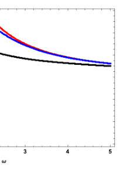 
Figure 4: Finite temperature conductivity in 2D Dirac materials from QGT

📷 Fig 4

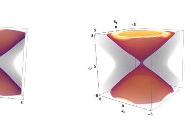 
Figure 5: Fermionic spectral function at different temperatures for fixed M5 = 1

📷 Fig 5

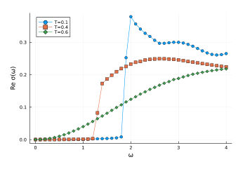 
Figure 7: AC conductivities at various temperatures (FD=Fermi-Dirac function)

**Summary.** This paper investigates the dielectric properties of holographic insulators by mapping their quantum geometry to transport coefficients. Using the gauge/gravity duality, the authors calculate the QGT and conductivity, showing that the results align with known 2D Dirac models. This provides a novel, powerful theoretical framework for understanding correlated electron behavior.

**Why it may be interesting.** The use of holographic methods to derive transport properties and dielectric constants provides a powerful, non-perturbative tool for studying strongly correlated electron behavior in condensed matter systems.

Detailed structure

**Main problem.** To study the dielectric properties and transport characteristics of holographic insulators by incorporating interaction effects into the quantum geometry formalism.

**Main result.** The holographic quantum geometric tensor is found to match that of a 2D Dirac Hamiltonian, yielding a specific result for the dielectric constant at zero temperature.

**Method.** The study employs the gauge/gravity duality, calculating the Quantum Geometric Tensor (QGT) and using the Kubo formula to determine conductivity and the dielectric constant.

**Model / system.** The system is a holographic insulator modeled using holographic fermions and analyzed via the gauge/gravity duality. The physics is compared to the well-established 2D Dirac Hamiltonian.

**Key observables.** Dielectric constant ($\kappa$), conductivity ($\sigma_{xx}$), Quantum Geometric Tensor (QGT), and Berry Curvature ($F_{\mu
u}$).

**Important parameters / regimes.** Holographic mass parameter ($M_5$), Dirac mass ($m$), temperature ($T$), and frequency ($\omega$).

**Assumptions / limitations.** The analysis often focuses on the inter-band contribution to conductivity, neglecting the intra-band (Drude) weight, and assumes the QGT remains stable despite interactions.

**Figures summary.** Figures illustrate transport properties for the 2D Dirac Hamiltonian and the holographic setup, showing temperature dependence and conductivity calculations.

**Paper structure.** The paper progresses by establishing the holographic model, calculating the QGT and Berry curvature, deriving the conductivity using the Kubo formula, and finally relating the conductivity to the dielectric constant, including crossover analysis.

Abstract

We study dielectric properties of holographic insulators from the quantum geometry of the ground state. We realize the insulating state by the pseudoscalar interaction of holographic fermions and calculate the fermionic Green function to extract the effective hamiltonian. We then derive the quantum metric and Berry curvature to compute the transports and finally get the dielectric constant from the imaginary part of conductivity.

[↑ back to top](#top)

### [Explicit upper bounds on the threshold of one-dimensional long-range percolation](http://arxiv.org/abs/2610.11872v1)

**Authors:** Guy Amit  
**Type:** theory · **Category:** statistical mechanics · **PDF:** <https://arxiv.org/pdf/2610.11872v1>  
**Analysis basis:** full PDF text, analyzed in chunks
**Topic relevance:** `analog quantum simulation` **2/5**

📷 Fig 1

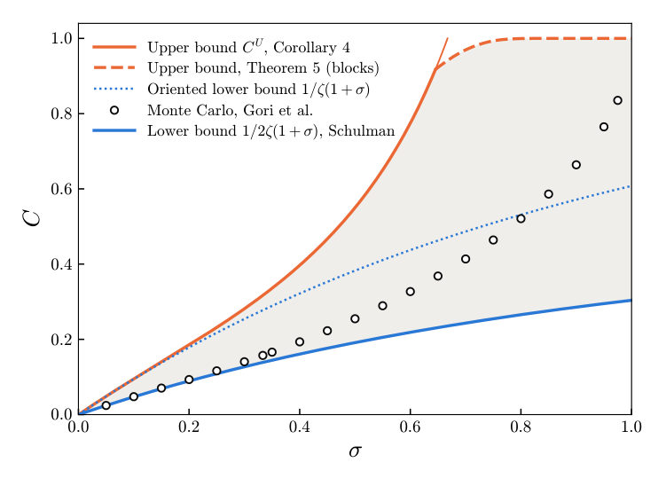 
Figure 1: Bounds on the thresholds as functions of σ. Thick blue line: the lower bound (2) of Schulman [2] on Cc. Circles: the Monte Carlo values of Cc of Gori et al [14]; their error bars are smaller than the symbols. Orange lines: the upper bounds of this work on Cc, namely CU of corollary 4 (solid) and the bound of theorem 5 with blocks (dashed), which is the better one for σ &gt; 0.645. The dashed line is below 1 for every σ &lt; 1, but for σ &gt; 0.8 it is closer to 1 than the line width. The threshold Cc lies in the shaded region. Dotted blue line: the lower bound 1/ζ(1 + σ) on the oriented threshold C→ c (proposition 1). The upper bound on C→ c is the orange line CU, which is drawn thin...

📷 Fig 2

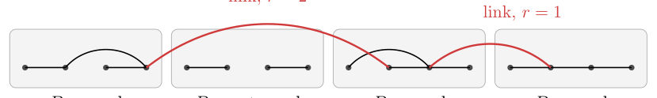 
Figure 2: Blocks of L = 4 sites. Black lines are open bonds inside the blocks. The blocks B0, B2 and B3 are good: every two of their sites are connected by a path inside the block. The block B1 is not good, because inside it the sites split into two pairs. Red lines are open bonds between different blocks: B0 is linked to B2, at distance r = 2 in units of blocks, and B2 is linked to B3. The blocks B0, B2, B3 form an open path of blocks, and all their sites belong to one cluster.

📷 Fig 3

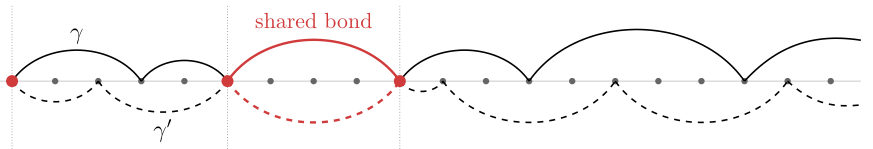 
Figure 3: Two independent monotone paths, γ (solid, drawn above the lattice) and γ′

**Summary.** This theoretical paper calculates explicit upper bounds for the critical threshold of long-range bond percolation on a 1D lattice. By employing advanced probabilistic methods like the second-moment argument and renewal theory, the authors significantly improve upon existing bounds. The results provide a detailed understanding of how the critical connectivity constant depends on the decay rate $\sigma$ of the bond probabilities.

**Why it may be interesting.** While not directly quantum, the rigorous mathematical techniques used (percolation theory, second-moment methods, critical phenomena) are foundational to understanding phase transitions in many-body quantum systems, particularly those involving disorder or connectivity.

Detailed structure

**Main problem.** The paper aims to determine explicit upper bounds on the critical threshold ($C_c$) for the existence of an infinite connected cluster in one-dimensional long-range percolation.

**Main result.** The authors derive an explicit upper bound $C_c \leq \sigma + O(\sigma^2)$ as $\sigma 	o 0$, which is shown to be below 1 for $\sigma < 0.667$. They also determine the asymptotic behavior of the oriented threshold.

**Method.** The primary method involves applying a second-moment argument to random monotone paths, utilizing renewal theory to compute path overlaps, and employing block coarse-graining techniques.

**Model / system.** The system is bond percolation on the one-dimensional lattice ($\mathbb{Z}$), where the probability of connection between sites separated by distance $r$ decays as $p_r = C/r^{1+\sigma}$ for $0 < \sigma < 1$.

**Key observables.** The existence of an infinite cluster, characterized by the critical thresholds $C_c$ (unoriented) and $C_{	o c}$ (oriented).

**Important parameters / regimes.** The decay exponent $\sigma$ ($0 < \sigma < 1$), the connectivity constant $C$, and the path distribution parameter $\alpha$.

**Assumptions / limitations.** The second-moment method relies on the assumption that two independent random paths intersect only a finite number of times, which is guaranteed by the heavy-tailed (Sibuya) distribution used for the path steps.

**Figures summary.** Figure 1 and Table 1 are used to compare the derived upper bounds on the percolation threshold ($	heta(C)$ and $	heta_{
ightarrow}(C)$) against known numerical Monte Carlo values for various values of $\sigma$.

**Paper structure.** The paper establishes the physical model and known lower bounds, then develops the upper bound using the second-moment method on random paths. It refines this bound using block coarse-graining and compares the resulting explicit bounds with existing literature and numerical simulations.

Abstract

We study bond percolation on the one-dimensional lattice in which two sites at distance $r$ are connected with probability $p_r=C/r^{1+σ}$, where $0 < σ< 1$. An infinite cluster exists if $C$ exceeds a critical value $C_c(σ)$, which is not known exactly: the available results are the lower bound of Schulman, $C_c\ge1/[2ζ(1+σ)]$, and numerical estimates. Here we prove explicit upper bounds. We apply a second-moment argument to a family of random monotone paths whose steps have a heavy-tailed (Sibuya) distribution. Two such paths meet only a finite number of times, and their overlap is computed exactly by renewal theory. The result is a closed-form bound, which gives $C_c\leσ+O(σ^2)$ as $σ\to0$ and is below $1$ for $σ< 0.667$. Since the paths are monotone, the bound holds also for oriented percolation, and it determines the oriented threshold asymptotically: $C_c^{\rightarrow}ζ(1+σ)\to1$ as $σ\to0$. A coarse-grained version of the argument, with blocks of sites in place of sites, gives an explicit bound $C_c < 1$ for every $σ< 1$. We compare the bounds with the known numerical values of $C_c$.

[↑ back to top](#top)

### [Gauging Modulated Symmetries: Bond Algebras, Higher-Form Symmetries, and Symmetry-Enriched Topological Order](http://arxiv.org/abs/2610.10764v1)

**Authors:** Gustavo M. Yoshitome, Pedro R. S. Gomes, Guilherme Delfino  
**Type:** theory · **Category:** strongly correlated electrons · **PDF:** <https://arxiv.org/pdf/2610.10764v1>  
**Analysis basis:** full PDF text, analyzed in chunks
**Topic relevance:** `analog quantum simulation` **2/5**

📷 Fig 1

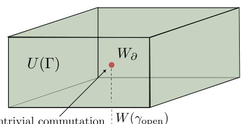 
FIG. 2: Nontrivial commutation relation between the open operators U(Γ) and W(γopen).

📷 Fig 2

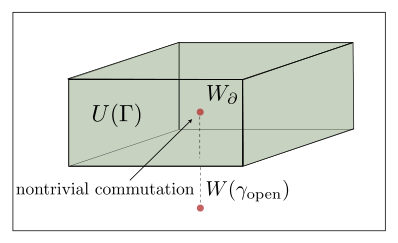 
FIG. 3: Geometric realization of the nontrivial algebra before gauging (left) and after

📷 Fig 3

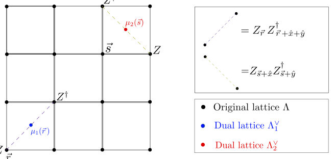 
FIG. 4: Operators of the bond algebra in Eq. (6.28). The dual lattice Λ∨ 1 contains the blue

📷 Fig 4

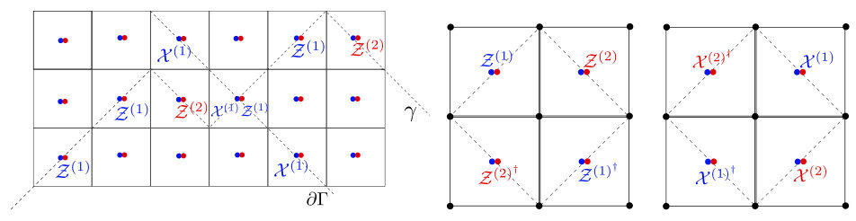 
FIG. 5: (a) 1-form symmetry operator W (α)(γ) composed of Z(i) operators, and U (α) ∂ (∂Γ)

**Summary.** This work establishes a systematic mathematical framework to classify modulated symmetries in lattice models. By constructing the algebra of symmetry-allowed local interactions and performing a gauging procedure, the authors derive a direct microscopic understanding of Abelian crystalline symmetry-enriched topological phases. This provides powerful tools for predicting and characterizing exotic quantum states in condensed matter systems.

**Why it may be interesting.** The rigorous mathematical framework for classifying topological phases based on underlying lattice symmetries is highly relevant for understanding exotic quantum states in strongly correlated materials.

Detailed structure

**Main problem.** The paper develops a constructive framework to characterize modulated symmetries and their gauging in $d$-dimensional lattice systems.

**Main result.** This framework provides a microscopic route to Abelian crystalline symmetry-enriched topological (SET) phases, which are characterized by specific constraints on their electric and magnetic sectors.

**Method.** The authors use a kernel construction to derive symmetry-allowed local interactions (the bond-algebra) and then analyze the gauging procedure to generate emergent higher-form quantum symmetries.

**Model / system.** The study focuses on $d$-dimensional lattice systems possessing a space group symmetry and an internal discrete Abelian symmetry group. The analysis is systematic, linking the symmetry content to the structure of local interactions.

**Key observables.** Mixed 't Hooft anomaly, braiding pairing, topological entanglement entropy (implied by SETs).

**Important parameters / regimes.** The relationship $q + \chi = t$ links the number of symmetry generators ($q$), independent local interactions ($\chi$), and the stencil size ($t$).

**Assumptions / limitations.** The space group action is assumed to factor through a finite quotient, leading to periodic modulation patterns.

**Figures summary.** TABLE I summarizes representative examples of modulated symmetries on 2D square lattices, listing parameters like $(q, \chi, t)$ and modulation periods.

**Paper structure.** The paper proceeds by defining the symmetry structure, deriving the constraints on local interactions via the bond-algebra, and then analyzing the consequences of gauging these symmetries to identify the resulting topological phases.

Abstract

We develop a constructive framework for characterizing modulated symmetries and their gauging in $d$-dimensional lattice systems. The modulation profiles are organized as a finite-dimensional representation of the space group acting on a finite Abelian internal symmetry group. Since the corresponding automorphism group is finite, the nontrivial spatial action factors through a finite quotient of the space group, leading to periodic modulation patterns and providing a classification framework for discrete Abelian modulated symmetries. The symmetry-allowed local interactions are systematically obtained from a kernel construction, which also yields an algebra of open operators. Upon gauging, its elements are transmuted into extended Wilson and boundary operators while retaining their algebraic relations. In the deconfined regime, the resulting algebra realizes a mixed 't Hooft anomaly, providing a microscopic route to Abelian crystalline symmetry-enriched topological phases (SETs). These SETs do not mix electric and magnetic sectors, which transform in mutually contragredient representations, thereby preserving their braiding pairing. We illustrate the framework through explicit examples and show that several models present in the literature fit naturally within our construction.

[↑ back to top](#top)

### [Large-Scale Benchmarking of Quantum Neural Network Configurations for Financial Time Series Forecasting](http://arxiv.org/abs/2610.12148v1)

**Authors:** Jack Waller, Xing Liang, Dimitrios Makris, Rajagopal Nilavalan  
**Type:** both · **Category:** other · **PDF:** <https://arxiv.org/pdf/2610.12148v1>  
**Analysis basis:** full PDF text, analyzed in chunks
**Topic relevance:** `QC/QI experiment` **2/5**

📷 Fig 1

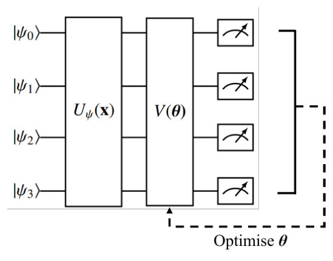 
Fig. 1: The quantum circuit of a basic QNN. |ψi⟩are the initial quantum states, Uψ(x) is the data encoding circuit, and V (θ) is the ansatz, which is then followed by measurement on all qubits. Parameters θ are then optimised and updated in V (θ).

📷 Fig 2

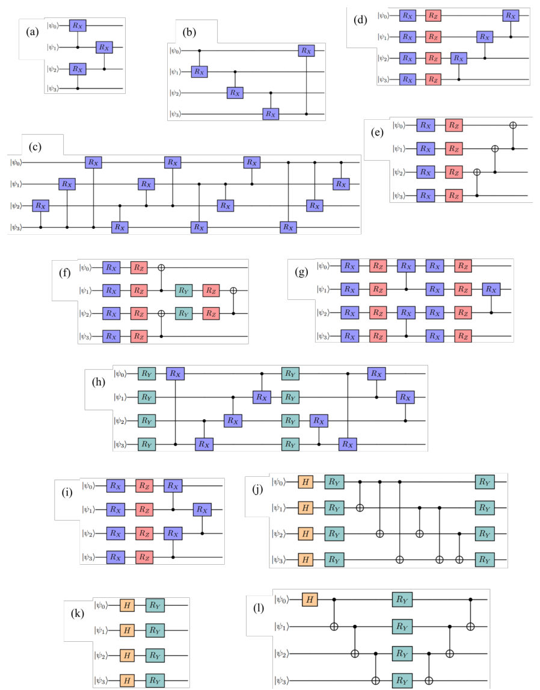 
Fig. 2: A collection of ansatz used in this study, each with varying expressibility, entangling capabil- ities and circuit depth.

📷 Fig 3

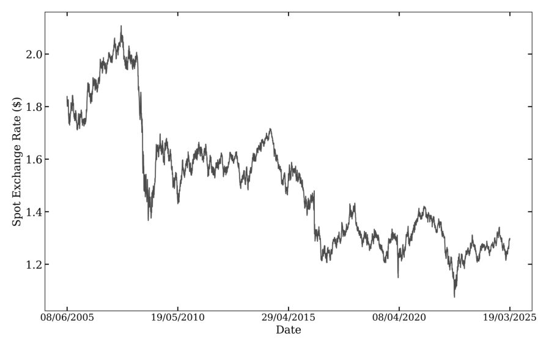 
Fig. 3: The spot exchange rate ($) for the GBP/USD currency pair from 08/06/2005 to 19/03/2025.

📷 Fig 4

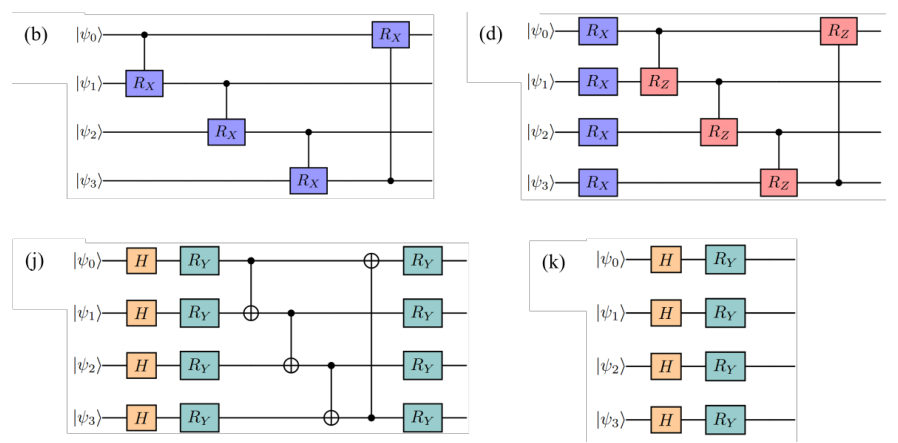 
Fig. 5: Modified hardware ansatz variants with two-qubit gates restricted to nearest-neighbour qubit connectivity, derived from ansatz (b), (d), (j), and (k).

📷 Fig 5

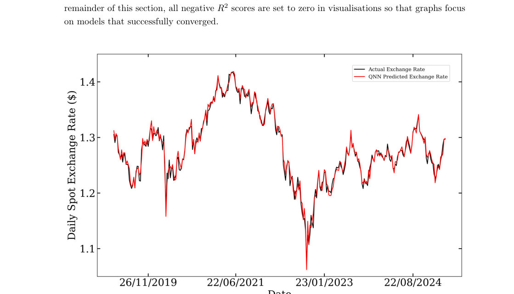 
Fig. 6: Best individual result for angle encoding, with an R2 score of 0.98495. The model used angle encoding, ansatz (j), 4 qubits, 8 layers, a classical MSE cost function and occurred on the 5th run. The black line shows the true GBP/USD spot exchange rate and the red line shows the models simulated predicted price.

**Summary.** This paper conducts a massive, systematic benchmark of Quantum Neural Network designs for forecasting financial time series data. By testing 1,368 configurations, it shows QNNs can outperform classical models on the GBP/USD rate. Crucially, it also quantifies the impact of real quantum hardware noise, providing architectural guidelines for near-term quantum machine learning.

**Why it may be interesting.** While focused on finance, the rigorous comparison of circuit components (encoding, ansatz structure) and the explicit analysis of hardware noise resilience provide general architectural guidance for any quantum algorithm applied to complex physical systems.

Detailed structure

**Main problem.** The study systematically evaluates Quantum Neural Network (QNN) configurations for the regression task of financial time series forecasting, an area less explored than classification.

**Main result.** The best QNN configuration achieved an $R^2$ score of 0.985, outperforming a classical BiLSTM baseline, though hardware noise remains a significant barrier to practical deployment.

**Method.** A large-scale grid search was performed across 1,368 distinct QNN configurations, varying encoding methods, ansatz designs, qubit counts, and layer depths.

**Model / system.** The model uses QNNs with parameterised quantum circuits (PQCs) applied to the GBP/USD spot exchange rate. The process involves data encoding (e.g., amplitude or angle encoding), quantum processing via an ansatz, and optimization.

**Key observables.** Prediction accuracy ($R^2$ score), computational cost, convergence behaviour, and resilience to gate errors/decoherence.

**Important parameters / regimes.** Qubit counts, layer depths, specific gate selection and arrangement, and the level of quantum hardware noise (gate errors, decoherence).

**Assumptions / limitations.** The study assumes that systematic architectural tuning can yield superior performance, but it also highlights that current hardware noise limits practical deployment.

**Figures summary.** Not specified, but the study compares various ansatz designs and analyzes the impact of hardware noise on performance.

**Paper structure.** The paper moves from establishing the need for systematic QNN comparison in regression tasks to detailing the grid search methodology, presenting performance results against classical baselines, and concluding with an analysis of hardware noise limitations.

Abstract

Quantum machine learning, and quantum neural networks (QNNs) in particular, are advancing fields with growing potential. Although systematic comparisons of QNN configurations have been explored primarily for classification tasks, comparatively little attention has been given to regression problems, particularly financial time series forecasting. This study presents a large-scale systematic comparative evaluation of QNN component configurations for financial time series forecasting, using the GBP/USD spot exchange rate as a case study. A grid search across encoding methods, ansatz designs, qubit counts, layer depths, and cost functions yields 1,368 distinct model configurations, each evaluated in terms of prediction accuracy, computational cost, and convergence behaviour. The results reveal unique insights into how the choice of methods influences performance, such as that gate selection and arrangement are more critical to model success than raw parameter count, and that entanglement is a system-level property of the full circuit rather than solely at the ansatz level. The best-performing QNN configuration achieves an $R^2$ score of 0.985, outperforming a classical BiLSTM baseline. Additionally, the impact of real quantum hardware noise is assessed through execution on the IQM Emerald device, revealing that gate errors and decoherence represent a significant barrier to practical deployment, with gate selection and circuit depth identified as key determinants of hardware noise resilience. Overall, the findings provide practical architectural guidance for QNN design and establish a baseline characterisation of QNN noise sensitivity on near-term quantum devices.

[↑ back to top](#top)

### [Nearly Optimal T-Count for Symmetry-Based Quantum State Purification](http://arxiv.org/abs/2610.12098v1)

**Authors:** Jialiang Tang, Junhong Nie, Keming He, Xin Wang, Xiaoming Sun  
**Type:** theory · **Category:** quantum information and computing · **PDF:** <https://arxiv.org/pdf/2610.12098v1>  
**Analysis basis:** full PDF text, analyzed in chunks
**Topic relevance:** `quantum measurements` **2/5**

📷 Fig 1

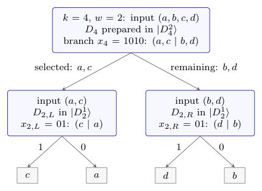 
FIG. 1. Balanced binary tree for four copies. Each inter- nal node has a Dicke mask that selects the copies sent to its left child. The figure follows one computational branch, z = 1010∥01∥01, from input (a, b, c, d) to output (c, a, d, b). Child masks refer to the positions after the parent partition. All 6 · 2 · 2 = 24 valid collections are present with equal am- plitude. The root’s intermediate ordering uses the five-switch network displayed in Fig. 3.

📷 Fig 2

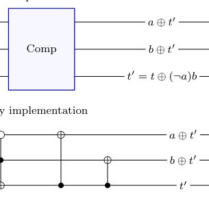 
FIG. 2. Quantum comparator. The symbol ⊕denotes addi- tion modulo two. The record is updated to t′ = t ⊕(¬a)b before the two key bits are flipped under its control. With input t = 0, the key outputs are max(a, b), min(a, b). The open control denotes control on zero. The inverse compara- tor reverses the displayed gates.

📷 Fig 3

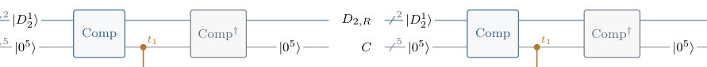 
FIG. 3. Permutation-based LCU for four copies. (a) P, S, and P † implement the accepted operator Π4,d. (A slash marks a bundled multi-qubit wire.) (b,c) The mask inputs are the prepared Dicke states |D2 4⟩and |D1 2⟩. Routing can entangle masks with data, so no separate output ket is assigned to a mask wire. (b) Each recorded tj controls the following amber data SWAP. Inverse comparators 5, 4, 3, 2, 1 clear C while retaining the data permutation. (c) Each child compares, swaps, and uncomputes. The order in (a) allows reuse of C; inverse gates act only on masks and controls.

**Summary.** This theoretical work establishes the fundamental resource cost for quantum state purification by analyzing the T-gate count needed to implement the symmetric-projection protocol. By deriving matching upper and lower bounds, the authors prove that the required non-Clifford resources scale nearly optimally with the number of noisy copies. This result provides a crucial benchmark for quantum information processing protocols.

**Why it may be interesting.** The rigorous resource quantification of quantum error correction primitives, like state purification, is fundamental to scaling up quantum computation and understanding the limits of quantum memory.

Detailed structure

**Main problem.** The paper addresses the challenge of quantum state purification, which aims to boost the fidelity of an unknown quantum state by processing multiple noisy copies.

**Main result.** The authors establish that the required non-Clifford resource cost (T-count) for implementing the symmetric-projection purification protocol scales nearly optimally, bounded above by $	ext{eO}(n)$ and below by $2n-2$ T gates.

**Method.** The analysis involves constructing and analyzing Clifford+T circuits required to block-encode the symmetric projector $\Pi_{n,d}$, using techniques involving stabilizer nullity and quantum circuit complexity bounds.

**Model / system.** The model is the $n$-to-1 probabilistic quantum state purification protocol applied to $d$-dimensional systems corrupted by noise, focusing on the symmetric-projection operator $\Pi_{n,d}$.

**Key observables.** T-count (number of T gates), Purification Fidelity ($f_\psi$), Success Probability ($p_n$), and Operator-norm Error ($\epsilon$).

**Important parameters / regimes.** Number of copies ($n$), local dimension ($d$), and the error tolerance ($\epsilon$).

**Assumptions / limitations.** The analysis assumes the use of Clifford+T circuits and focuses on the uniform operator-norm approximation of the symmetric projector.

**Figures summary.** The notes mention figures illustrating the balanced binary tree structure used for encoding permutations and the general comparison of T-counts for various purification methods.

**Paper structure.** The paper progresses by first defining the purification problem and the symmetric projector, then deriving an upper bound on the T-count using a specific circuit construction (Dicke balanced tree mask), and finally establishing a matching lower bound using stabilizer nullity arguments.

Abstract

Protecting quantum information from noise is essential for reliable quantum computation and quantum memories. Quantum state purification addresses this challenge by processing multiple noisy copies of an unknown quantum state to produce an output state of higher fidelity. Here we establish nearly tight upper and lower bounds on the non-Clifford resources required to implement the symmetric-projection purification protocol. For $n$ copies of a $d$-dimensional system, we construct a Clifford+T circuit that block-encodes the symmetric projector with operator-norm error at most $ε$ using $\widetilde{O}(n)$ T gates, where the tilde-$O$ notation suppresses polylogarithmic factors in $n$, $d$, and $1/ε$. Conversely, using stabilizer nullity, we prove that any Clifford+T implementation of such a block encoding with error $ε<\frac{1}{2}\sqrt{1-1/n}$ requires at least $2n-2$ T gates, even allowing arbitrary positive normalization and clean stabilizer ancillas. Taken together, these results establish the nearly optimal scaling of non-Clifford cost with the number of copies and uncover the fundamental resource requirements for coherent symmetry projection in quantum state purification.

[↑ back to top](#top)

### [Sharing of Gaussian tripartite steering in de-Sitter space](http://arxiv.org/abs/2610.11874v1)

**Authors:** Xin-Ze Song, Xiao-Li Huang, Shu-Min Wu  
**Type:** theory · **Category:** other · **PDF:** <https://arxiv.org/pdf/2610.11874v1>  
**Analysis basis:** full PDF text, analyzed in chunks
**Topic relevance:** `Keldysh / 2PI / non-Gaussian methods` **2/5**

📷 Fig 1

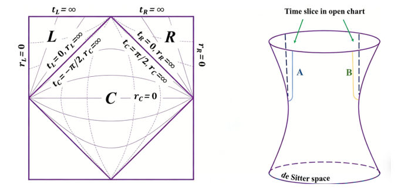 
FIG. 1: The Penrose diagram of the de-Sitter space, in which L and R are the two causally disconnected

📷 Fig 2

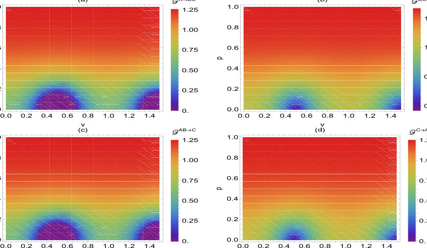 
FIG. 2: The Gaussian quantum steerability GA→BC, GBC→A, GAB→C, and GC→AB as functions of the

📷 Fig 3

 
FIG. 3: The Gaussian tripartite steering asymmetry G∆ A|BC and G∆ AB|C as functions of the curvature param-

📷 Fig 4

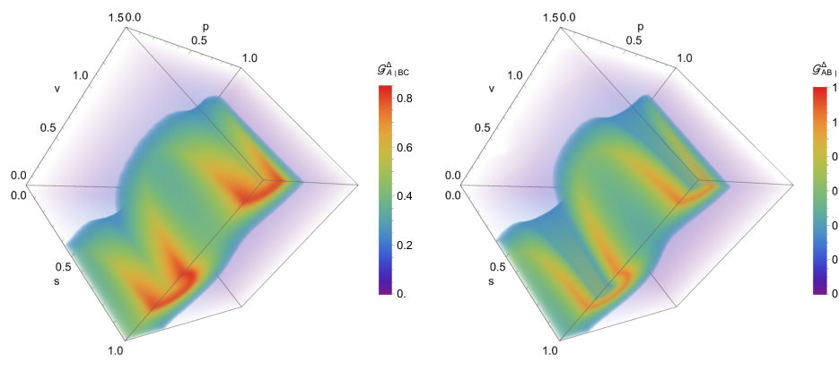 
Fig. 3 shows the Gaussian steering asymmetries G∆ A|BC and G∆ AB|C as functions of the curvature

📷 Fig 5

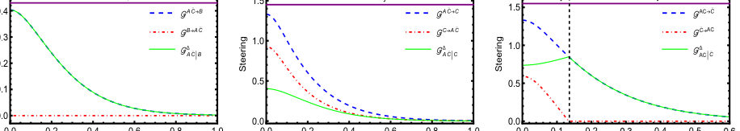 
FIG. 4: Gaussian tripartite steering and steering asymmetries between initially uncorrelated modes as func-

**Summary.** This theoretical paper analyzes how quantum correlations, specifically Gaussian tripartite steering, behave for a scalar field in de-Sitter spacetime. Using advanced quantum field theory techniques, the authors show that the spacetime curvature not only weakens existing correlations but also generates novel, directional steering between modes separated by the cosmological horizon. This highlights the profound interplay between gravity and quantum information.

**Why it may be interesting.** The study provides a concrete example of how spacetime curvature (a gravitational effect) fundamentally alters quantum correlations, generating new types of entanglement/steering across regions that would otherwise be causally disconnected.

Detailed structure

**Main problem.** The paper investigates the redistribution and directional properties of Gaussian tripartite quantum steering in the curved spacetime of de-Sitter space.

**Main result.** De-Sitter curvature both degrades pre-existing quantum correlations and actively generates directional multipartite steering across causally disconnected regions, exhibiting rich behaviors like sudden death and sudden birth.

**Method.** The analysis uses the continuous-variable framework, deriving and analyzing the covariance matrix of the resulting multipartite Gaussian state after transforming the Bunch-Davies vacuum via Bogoliubov transformations.

**Model / system.** The system is a free massive scalar field propagating in de-Sitter space. The analysis focuses on Gaussian quantum states shared among three parties (A, B, C) and involves considering modes separated by the cosmological horizon.

**Key observables.** Gaussian tripartite quantum steering measures ($G_{XY	o Z}$), covariance matrices ($\sigma_{ABC}$), and steering asymmetry.

**Important parameters / regimes.** De-Sitter curvature (related to the Hubble radius $H^{-1}$), field mass parameter ($
u$), and the initial squeezing parameter ($s$).

**Assumptions / limitations.** The analysis is performed within the continuous-variable Gaussian state framework, and certain reduced states are obtained by tracing over inaccessible modes.

**Figures summary.** Figure 1 is noted to be a Penrose diagram of de-Sitter space, illustrating the causally disconnected regions L and R.

**Paper structure.** The paper builds from the general formalism of Gaussian steering in curved spacetime, deriving the covariance matrix for the three-mode state, and then analyzing specific steering measures by considering the effects of tracing out modes associated with causally disconnected regions.

Abstract

We investigate the redistribution and directional properties of Gaussian tripartite quantum steering in de-Sitter space within the continuous-variable framework. By expressing the Bunch-Davies vacuum in terms of the open-chart modes through a Bogoliubov transformation, we derive the covariance matrix of the resulting multipartite Gaussian state and analyze both one-to-two and two-to-one steering configurations. We find that de-Sitter curvature generally suppresses the steering initially shared among the accessible modes, but its influence depends strongly on the steering direction. In particular, while some steering configurations undergo sudden death at finite curvature, two-to-one steering toward a nongravitational mode remains finite throughout the parameter range considered, demonstrating a robustness of tripartite steering absent in its bipartite counterpart. Remarkably, the maximum steering asymmetry occurs at the critical point at which steering in one direction undergoes sudden death, marking the transition from two-way to one-way steering. We further show that the de-Sitter gravitational field can generate tripartite steering involving modes separated by the cosmological horizon. Depending on the steering partition, this curvature-induced steering exhibits persistent one-way or asymmetric two-way behavior, as well as a sudden-birth transition from one-way to two-way steering. These results demonstrate that de-Sitter curvature not only degrades preexisting quantum correlations but also redistributes and generates directional multipartite steering across causally disconnected regions.

[↑ back to top](#top)

### [Spin Chain with Continuous Exponential Symmetry: Topological Phase and Beyond](http://arxiv.org/abs/2610.10682v1)

**Authors:** Biao Lian, Zhen Bi  
**Type:** theory · **Category:** strongly correlated electrons · **PDF:** <https://arxiv.org/pdf/2610.10682v1>  
**Analysis basis:** full PDF text, analyzed in chunks
**Topic relevance:** `analog quantum simulation` **2/5**

📷 Fig 1

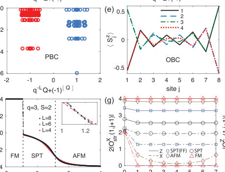 
FIG. 1. (a) Illustration of the AKLT-like ground state. (b-g) ED results for q = 3, S = 2 (at L = 8, except for (f)). (b-d) show the energy spectra of (b) ˆHFF in OBC, and (c-d) ˆH in Eq. (2) at V = 0.5, with OBC in (c) and PBC in (d). (e) ⟨ˆSz j ⟩ of the 4 OBC ground states in (c). (f) 1

📷 Fig 2

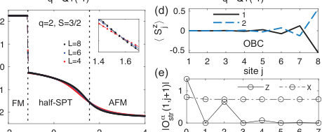 
FIG. 3. ED results for the half-SPT phase of ˆH with q = 2, S = 3/2, where L = 8, V = 0.5 except for (c). (a) and (b) show the ED spectra in OBC and PBC, respectively. (c) 1 L dEGS

**Summary.** This paper theoretically classifies topological phases in 1D spin chains possessing a continuous exponential symmetry. It introduces a novel 'half-SPT' phase, distinct from standard SPT phases, whose existence is dictated by the interplay between the spin value ($S$) and the symmetry parameter ($q$). The work uses advanced tools like string orders and entanglement spectra to map out a richer phase diagram for quantum magnets.

**Why it may be interesting.** The discovery of the 'half-SPT' phase and the demonstration that topological protection can exist even when conventional cohomology indices are trivial extends the classification of gapped phases, which is highly relevant for understanding exotic quantum materials.

Detailed structure

**Main problem.** The study investigates symmetric gapped ground states in one-dimensional spin chains characterized by a continuous exponential symmetry $U(1) 
times \mathbb{Z}_2$. The primary goal is to classify novel symmetry-protected gapped phases beyond existing theoretical frameworks.

**Main result.** The paper distinguishes between standard SPT phases and a novel 'half-SPT' phase, whose existence and properties depend critically on the parity of the base $q$ and the spin $S$. For half-odd integer $S$ and even $q$, a half-SPT phase is predicted, exhibiting unique edge mode characteristics.

**Method.** The analysis combines theoretical investigation using symmetry properties (cohomology groups) with numerical simulations like Exact Diagonalization (ED) and advanced techniques such as MPS representation and string order calculations.

**Model / system.** The system is a 1D spin $S$ chain governed by a quantum breakdown model Hamiltonian, which is a $q$-deformation of the XXZ Haldane spin chain. The symmetry group is $G = U(1) 
times \mathbb{Z}_2$, and the charge unit is modulated exponentially by $q^{L-j}$.

**Key observables.** Edge mode protection, string orders ($	ext{str}_Z, 	ext{str}_X$), entanglement spectrum degeneracy, and the ground state energy density derivative $rac{1}{L}rac{dE_{GS}}{dV}$.

**Important parameters / regimes.** Spin $S$ (integer or half-odd integer), integer base $q$, and the parity of $q$ and $S$.

**Assumptions / limitations.** The analysis relies on the structure of the symmetry group $G$ and the assumption that the ground state can be characterized by its entanglement spectrum or string orders.

**Figures summary.** Figures illustrate ED spectra for various parameters ($q=3, q=2$), showing transitions between FM, SPT, half-SPT, and BC phases. Phase diagrams map out the parameter space dependence using energy density derivatives.

**Paper structure.** The paper systematically analyzes the system based on the parity of $q$ and $S$. It first establishes the model and symmetry, then derives the conditions for SPT phases (e.g., integer $S$, odd $q$), and finally introduces and characterizes the novel 'half-SPT' phase for half-odd integer $S$ and even $q$.

Abstract

We study symmetric gapped ground states of one-dimensional spin $S$ chains with a continuous exponential symmetry $U(1)\rtimes\mathbb Z_2$ with integer base $q$, where the U(1) charge has a modulated unit of charge $q^{L-j}$ decaying exponentially with site $j$. The simplest model is a quantum breakdown model that can be viewed as a $q$-deformation of the XXZ Haldane spin chain. We show that the topology of their symmetric ground states crucially depends on $S$ and $q$. For integer $S$, odd $q$ allows a nontrivial $\mathbb Z_2$ Haldane-type symmetry-protected topological (SPT) phase with protected edge modes, while even $q$ allows no nontrivial SPT phase. For half-odd integer $S$, odd $q$ prohibits any unique symmetric gapped ground state due to a Lieb-Schultz-Mattis obstruction, whereas even $q$ enforces a novel symmetric gapped phase which we name as the ``half-SPT" phase. Unconventionally, the half-SPT phase only has a symmetry protected edge mode on one edge, and has half of the string orders of an SPT phase. Our results uncover a new type of symmetry-protected gapped phases beyond existing classification schemes.

[↑ back to top](#top)

### [Dynamical many-body control of high harmonic generation in a Mott insulator](http://arxiv.org/abs/2610.12136v1)

**Authors:** Mingyao Guo, Ryo Noguchi, Mohammad Muntasir Hassan, Steven J. Gomez Alvarado, Reina M. Gomez, Yao-Jui Chan, Yu-Chieh Wen, Stephen D. Wilson, Yao Wang, David Hsieh  
**Type:** both · **Category:** strongly correlated electrons · **PDF:** <https://arxiv.org/pdf/2610.12136v1>  
**Analysis basis:** full PDF text, analyzed in chunks
**Topic relevance:** `Keldysh / 2PI / non-Gaussian methods` **1/5** · `analog quantum simulation` **1/5** · `interference shaping light` **1/5** · `methods for driven-dissipative` **1/5** · `quantum measurements` **1/5** · `quantum optics experiment` **1/5**

📷 Fig 1

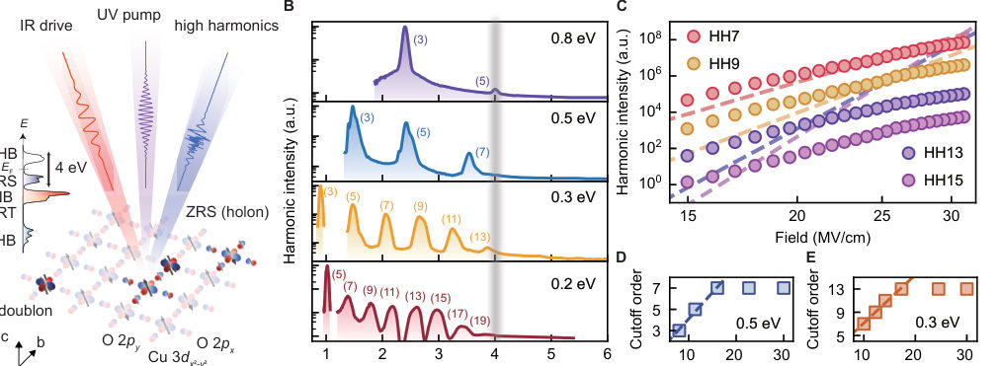 
FIG. 1. HHG from bulk La2CuO4. (A) Schematic of experimental geometry and microscopic processes of HHG in a cuprate Mott insulator. The left inset shows a sketch of density of states at different energy hierarchies, and equilibrium occupied states are filled with color. NB, non-bonding oxygen band; ZRT, Zhang-Rice triplet. (B) HHG intensity spectra from a La2CuO4 single crystal at various driving photon energies on a logarithmic scale. The nth harmonic orders are labeled as (n). The grey shade marks the global cutoff energy around 4 eV. (C) Dependence of the strength of individual harmonics on the peak field of a 0.2 eV driving laser on a log-log scale. Different orders are rescaled for...

📷 Fig 2

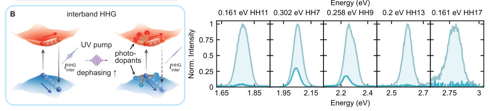 
FIG. 2. Time-resolved HHG spectroscopy of La2CuO4. (A), (B) Schematic of how intra- (A) and inter-band (B) HHG processes respond to photo-excited carriers in momentum space. The left and right panels show the dynamics before and after photo-doping, respectively. (C) Transient HHG spectra following a 1 mJ/cm2 3.1 eV pump normalized by their equilibrium maximal intensity at time delay t = 300 fs. The upper and lower panels display the responses of below- and above-gap high harmonics, respectively.

📷 Fig 3

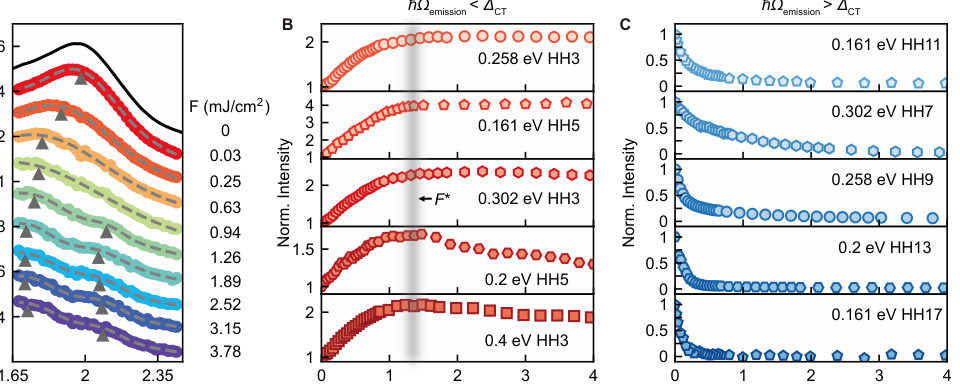 
FIG. 3. Light-induced many-body band renormalization reshapes HHG from La2CuO4. (A) Broadband transient reflectivity spectra at time delay t = 300 fs for various 400 nm pump fluences. The topmost black curve displays the equilibrium spectrum. Local peak positions extracted from fits (dashed lines) are labeled by triangles (see Supplemental Material Sec. 9 for details of the fitting procedure [18]). Curves are vertically offset for clarity. (B) Pump fluence dependence of the integrated transient below-gap HHG intensity at t = 300 fs. The grey shade indicates F ∗determined from broadband reflectivity measurements. (C) Same as (B) but for above-gap HHG.

📷 Fig 4

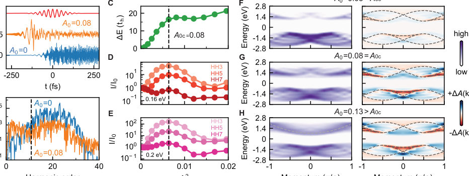 
FIG. 4. Hubbard model numerics. (A) Current in the absence (A0 = 0, blue line) and presence (A0 = 0.08, orange line) of the pump field under the ℏω = 0.16 eV mid-IR driving pulse (red line). Different curves are vertically offset for clarity. (B) HHG spectra of the mid-IR field in the unpumped and pumped conditions same as in (A). The dashed line denotes the Mott gap energy. (C) Pump fluence dependence of pump-injected energies at the end of the pump pulse. (D) Pump fluence dependence of below-gap HHG with ℏω = 0.16 eV. (E) Same as (D) but with ℏω = 0.2 eV. (F)–(H) Single-particle spectral functions A(k, ω) below (F), near (G), and above (H) the threshold field at the end of the pump pulse....

**Summary.** This paper uses High Harmonic Generation (HHG) spectroscopy on a Mott insulator to study ultrafast electron dynamics. By analyzing the harmonic spectrum, the authors show that photo-doping causes a fundamental reorganization of the electronic structure, which manifests as a distinct change in the nonlinear optical response. This establishes HHG as a highly sensitive probe for correlation-driven electronic reconstructions in strongly correlated materials.

**Why it may be interesting.** This work provides a powerful, non-linear optical diagnostic tool (HHG) to probe subtle, many-body physics—like band reconstruction—that is typically only accessible via advanced theoretical methods, bridging quantum optics and condensed matter theory.

Detailed structure

**Main problem.** The study investigates how High Harmonic Generation (HHG) can serve as a sensitive probe to characterize ultrafast electron dynamics and the fundamental electronic reconstructions occurring in strongly correlated Mott insulators.

**Main result.** The research demonstrates that photo-doping triggers a fundamental reorganization of the many-body electronic manifolds, evidenced by the suppression of interband recombination channels and the renormalization of band curvature, which is directly imprinted onto the HHG spectrum.

**Method.** The authors combine time-resolved HHG spectroscopy on cuprate Mott insulators with detailed numerical simulations using the Hubbard model to disentangle intraband and interband contributions to the nonlinear optical response.

**Model / system.** The system is a Mott insulator, exemplified by La2CuO4, modeled using the single-band Hubbard Hamiltonian. The physics revolves around the dynamics of photogenerated doublon-holon pairs within the Upper Hubbard Band (UHB) and Zhang-Rice Singlet (ZRS) manifolds.

**Key observables.** HHG spectrum (especially the global cutoff energy), time-resolved harmonic yield (low-order vs. high-order), transient reflectivity, and the charge structure factor N(k).

**Important parameters / regimes.** The intrinsic energy scale defined by the Hubbard bands (e.g., 4 eV cutoff), critical excitation density/fluence (e.g., F* or A0c), and the driving field strength.

**Assumptions / limitations.** The analysis generalizes the three-step model of HHG to the strongly correlated Mott insulating state, and the simulations rely on mapping the physics onto the Hubbard model.

**Figures summary.** Figures show HHG spectra revealing a constant cutoff, time-resolved spectra comparing pre- and post-doping responses, and simulations tracking the evolution of charge correlations N(k) across critical fluence thresholds.

**Paper structure.** The paper progresses from establishing HHG in Mott insulators (observing the intrinsic cutoff) to using time-resolved techniques to separate intraband/interband contributions, culminating in theoretical modeling that links spectral weight renormalization to the breakdown of spatial pair correlations.

Abstract

High harmonic generation (HHG) has emerged as a powerful probe of ultrafast electron dynamics in solids. However, in strongly correlated materials, where electronic excitations arise from many-body interactions rather than single-particle band dispersion, the field remains in its infancy. Here, we report HHG up to the 23$^{rd}$ order in the prototypical Mott insulator La$_2$CuO$_4$. We observe a robust 4 eV cutoff that is independent of driving field strength, revealing an intrinsic energy scale defined by the Hubbard bands. Using time-resolved high harmonic spectroscopy, we disentangle the distinct contributions of carrier creation, intraband acceleration, and interband recombination to the nonequilibrium radiation spectrum. We demonstrate that photo-doping triggers a fundamental reorganization of the many-body manifolds above a critical excitation density, a process that renormalizes the band curvature and suppresses nonlinear intraband currents, thereby directly imprinting the signature of many-body band reconstruction onto the harmonic emission. These results establish HHG as a sensitive probe of subtle correlation-driven electronic reconstructions and highlight that many-body interactions enable extreme nonlinear optical responses that are highly tunable in nonequilibrium states.

[↑ back to top](#top)

### [Millisecond phonon lifetimes in piezoelectric nanomechanical resonators](http://arxiv.org/abs/2610.10700v1)

**Authors:** Oliver A. Hitchcock, Matthew P. Maksymowych, Kaveh Pezeshki, Takuma Makihara, Erik Szakiel, Chou-Wei Kiang, Daniel Rugar, Amir H. Safavi-Naeini  
**Type:** experiment · **Category:** other · **PDF:** <https://arxiv.org/pdf/2610.10700v1>  
**Analysis basis:** full PDF text, analyzed in chunks
**Topic relevance:** `QC/QI experiment` **1/5** · `analog quantum simulation` **1/5** · `correlated / nonlocal dissipation` **1/5** · `driven-dissipative phase transition` **1/5** · `quantum measurements` **1/5** · `quantum optics experiment` **1/5**

📷 Fig 1

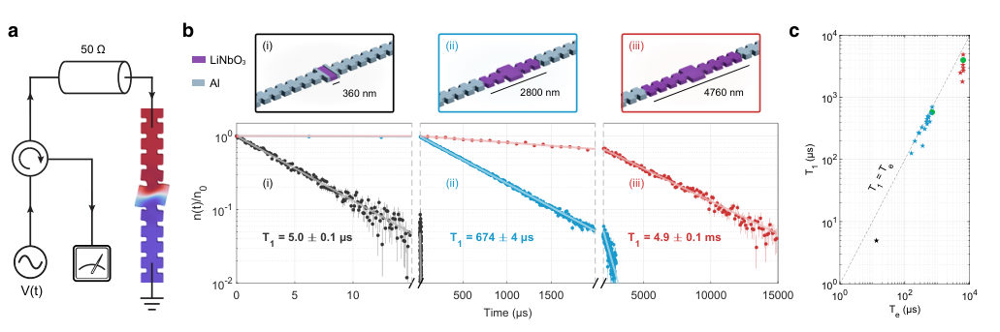 
FIG. 1: Device architecture and phonon lifetime measurements. a, Schematic of our RF reflectometry measurement setup. The LN phononic crystal resonator is cooled to 10 mK in a dilution refrigerator and coupled to a microwave transmission line via aluminum electrodes while the other electrode is grounded. The simulated mechanical shear mode deformation produces the colormapped voltage via the piezoelectric effect. The voltage profile indicates ideal electrode positions to excite the mode of interest. The electrode spacing controls the external coupling rate κe. After the mode is excited, it emits a voltage signal which decays proportionally with the phonon number. b, Device models for three...

📷 Fig 2

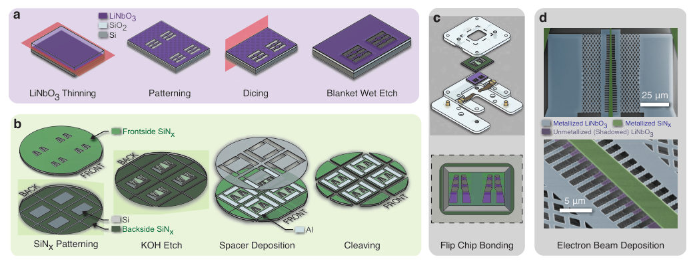 
FIG. 2: Shadow-mask metallization process. a, LN device fabrication: film thinning with SC1 wet etch to remove ion-mill damage, electron-beam patterning, ion-mill etch, wafer dicing, HF release and SC1 surface cleaning. b, Silicon nitride shadow-mask fabrication: frontside patterning, KOH backside Si etch to release freestanding membrane, aluminum spacer deposition using a separately fabricated stencil mask (grey), and cleaving into chips. c, The shadow-mask and device chip are aligned in a flip-chip bonder, clamped in a custom fixture, and loaded into an electron-beam evaporator for aluminum deposition. d, Colorized SEM of a completed device prior to mask removal showing metallized LN...

📷 Fig 3

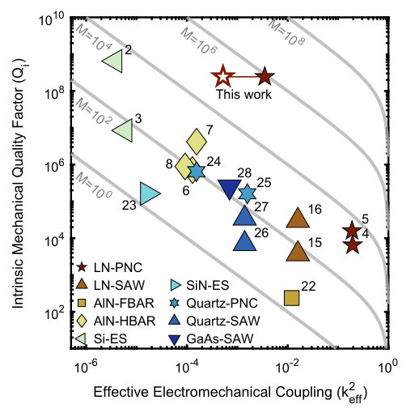 
FIG. 3: Comparison of internal quality factor versus effective electromechanical coupling. Parameters are shown for this work and various other acoustic materials and platforms from the literature, with each point label corresponding to the reference number. Literature k2 eff values are simulation- or circuit-model-derived (Appendix E); for this work, the bar spans the parasitics-loaded measurement (unfilled) and the simulated intrinsic value (filled). Gray lines denote constant resonator figure of merit: M = k2 effQi/(1 −k2 eff).

📷 Fig 4

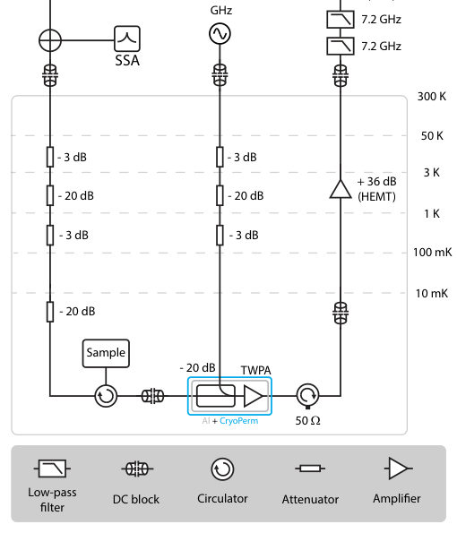 
FIG. 4: Microwave measurement setup. Schematic of the cryogenic wiring and room-temperature electronics used for reflectometry measurements. The device is thermalized to 10 mK at the base stage of a dilution refrigerator. The input line is attenuated to suppress thermal noise, and the output signal is amplified by a near-quantum-limited TWPA followed by a HEMT and room-temperature LNA. A VNA is used for spectroscopy and a Quantum Machines OPX for pulsed ringdown measurements.

📷 Fig 5

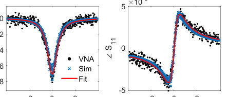 
FIG. 5: Microwave Reflectometry Measurement. The measured magnitude and phase response of a 3.35 GHz device (at 10 mK and n ≈100 phonons) with a designed electrode spacing of 2800 nm is shown as black dots. The corresponding fit of experimental data to Eq. B1 is shown as a red line, while the simulated reflection spectrum from our noisy Langevin model is shown as blue x’s.

**Summary.** This paper reports a breakthrough in the coherence of piezoelectric nanomechanical resonators using Lithium Niobate. By developing a specialized fabrication process that removes surface damage, the authors demonstrated intrinsic phonon lifetimes reaching 21 milliseconds. This proves that LN can achieve high quality factors necessary for advanced quantum sensing and information processing.

**Why it may be interesting.** The work directly addresses the coherence time of mechanical oscillators, which is a critical component for quantum transducers and quantum memory elements, bridging solid-state physics with quantum information.

Detailed structure

**Main problem.** Previous measurements of phonon lifetimes in piezoelectric nanomechanical resonators were limited to the microsecond range, leading to the incorrect assumption that high intrinsic loss was fundamental to piezoelectric materials.

**Main result.** By employing a novel fabrication process, the authors demonstrated intrinsic phonon lifetimes up to 21 milliseconds, proving that the limitation was due to surface damage rather than the material itself.

**Method.** Phonon lifetime was measured using microwave reflectometry (VNA spectroscopy) by varying the electrode-to-resonator spacing to decouple external coupling losses from intrinsic material losses.

**Model / system.** The study uses piezoelectric nanomechanical resonators, specifically Lithium Niobate (LN) phononic crystal resonators, operating at gigahertz frequencies. The system's performance is characterized by its electromechanical coupling and phonon coherence time.

**Key observables.** Phonon lifetime ($T_1$), external coupling rate ($\kappa_e$), intrinsic quality factor ($Q_i$), and the electromechanical figure of merit ($M$).

**Important parameters / regimes.** Resonance frequencies (3-4 GHz), temperature (mK), and electrode spacing (360 nm to 4760 nm).

**Assumptions / limitations.** The primary assumption challenged is that high intrinsic loss is fundamental to piezoelectric LN; the success relies on the novel shadow-mask metallization process to remove surface damage.

**Figures summary.** Figures illustrate phonon lifetime ringdown decay showing $T_1$ tracking the external coupling limit as electrode spacing increases, and detail the shadow-mask metallization process.

**Paper structure.** The paper systematically compares measured phonon lifetimes ($T_1$) against external coupling limits ($T_e$) across varying electrode spacings. It then quantifies the intrinsic loss ($T_{1,in}$) achieved using a specialized fabrication technique, establishing a high figure of merit ($M$).

Abstract

Piezoelectric nanomechanical resonators operating at gigahertz frequencies are a promising platform for quantum information processing and precision sensing, but phonon lifetimes have been limited to the microsecond range, widely attributed to the higher intrinsic loss of piezoelectric materials. Here we show that this limitation is not fundamental. Using a fabrication process informed by recent studies of defect-mediated loss in lithium niobate, we combine chemical restoration of ion-milled surfaces with a shadow-mask metallization process to produce lithium niobate phononic crystal resonators with inferred internal phonon lifetimes of up to 21 milliseconds at 3.6 gigahertz, corresponding to quality factors exceeding $4\times10^8$ ($f\cdot Q_i > 10^{18}$) at millikelvin temperatures. By systematically varying the electrode-to-resonator spacing, we demonstrate that the measured lifetime is set by external coupling between the device and the measurement circuit rather than material loss. This establishes that lithium niobate, once fabrication-induced surface damage is removed, achieves an intrinsic quality comparable to the best mechanical materials while remaining an intrinsically piezoelectric platform with strong electromechanical coupling.

[↑ back to top](#top)

### [Thermodynamics of interacting magnetic chain molecules](http://arxiv.org/abs/2610.10671v1)

**Authors:** Alexios P. Polychronakos, Konstantinos Sfetsos  
**Type:** theory · **Category:** statistical mechanics · **PDF:** <https://arxiv.org/pdf/2610.10671v1>  
**Analysis basis:** full PDF text, analyzed in chunks
**Topic relevance:** `Frenkel-Kontorova` **1/5** · `Keldysh / 2PI / non-Gaussian methods` **1/5** · `analog quantum simulation` **1/5**

📷 Fig 1

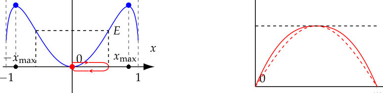 
Figure 2: Left: Schematic path of the fiducial particle in the effective potential V(x) for T &lt; Tc for the deformed x1 mode, showing the energy level E and its corresponding classical turning points. Right: The form of x1(s) for half a period, the red dashed line being the undeformed one corresponding to harmonic motion.

📷 Fig 2

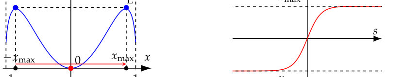 
Figure 3: Left: Path of the fiducial particle moving in the effective potential V(x) for T &lt; Tc for energy E = Vmax between the corresponding classical turning points ±xmax. Right: The corresponding spatial trajectory x(s) exhibiting a soliton (kink) profile.

📷 Fig 3

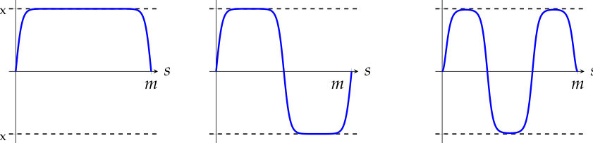 
Figure 4: Magnetization profiles for the k = 1, k = 2, and k = 3 modes along the chain length m, showing flat plateaus at ±xmax.

📷 Fig 4

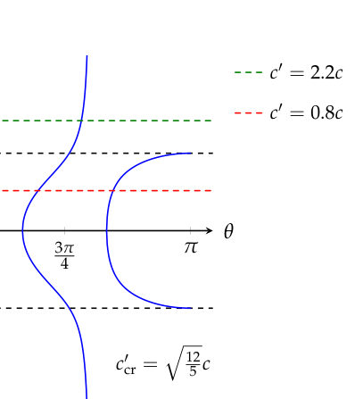 
Figure 5: Plot of the left hand side of (3.75) for m = 6 and representative c′ values.

📷 Fig 5

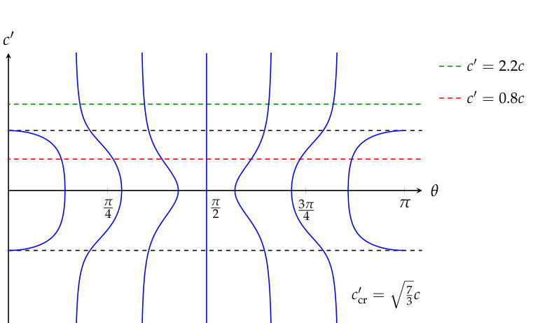 
Figure 6: Plot of the left hand side of (3.75) for m = 7 and representative c′ values. The vertical line at θ = π

**Summary.** This work theoretically investigates the thermodynamics and phase transitions in magnetic chains built from multi-atom molecules. Using mean-field theory, the authors map out a complex phase diagram featuring multiple ferromagnetic transitions. The analysis also details the emergence of boundary states due to impurities, providing deep insights into the stability of magnetic order.

**Why it may be interesting.** The study of phase transitions, critical phenomena, and the emergence of boundary modes in interacting quantum spin systems is fundamental to understanding magnetic materials and quantum many-body physics.

Detailed structure

**Main problem.** The paper derives the thermodynamics and analyzes the rich phase structure of magnetic chains composed of molecules with an arbitrary number of interacting magnetic atoms.

**Main result.** The system exhibits a cascade of ferromagnetic phase transitions, and boundary states can emerge in the presence of impurities, characterized by critical temperatures.

**Method.** The analysis employs the mean-field approach, utilizing the saddle point method to evaluate the partition function and determine equilibrium free energy and stability conditions.

**Model / system.** The model consists of magnets built from molecules of $m$ magnetically active atoms in a chain, governed by an SU(N) invariant Hamiltonian with nearest-neighbor couplings.

**Key observables.** Order parameters ($x_s$), free energy ($F$), and critical temperatures ($T_k, T_B$).

**Important parameters / regimes.** Coupling constants ($C_{st}$), temperature ($T$), and the number of atoms in the molecule ($m$).

**Assumptions / limitations.** The derivation of the equilibrium free energy relies on the mean-field approximation and the saddle point method; stability analysis is performed on the off-equilibrium free energy.

**Figures summary.** Not specified.

**Paper structure.** The paper progresses from the general SU(N) ferromagnet Hamiltonian to the mean-field free energy, establishing equilibrium conditions, and then analyzing the stability and emergence of boundary states in the discrete chain model.

Abstract

We study magnets composed of molecules with an arbitrary number $m$ of magnetically active atoms in a chain configuration interacting with nearest-neighbor couplings. We derive the thermodynamics of a chain of spin-$j$ $SU(2)$ magnetic atoms using a mean-field approach and determine the equilibrium states and stability conditions. The system exhibits a rich phase structure with a cascade of ferromagnetic phase transitions, their number ranging from $m$, for maximal ferromagnets, to zero, for paramagnets, depending on the relative strengths of the couplings. In the presence of impurities (modified couplings) at the ends of the chain, boundary states emerge that coexist with the paramagnetic phase or the fully ferromagnetic phase. For long chains, a continuum approximation can be taken that clarifies the structure of the phases. In the continuum description, magnetized states at temperatures lower than the critical temperature at which they appear correspond to kink solitons.

[↑ back to top](#top)

### [A general framework for crystallization in maximal hard-core models](http://arxiv.org/abs/2610.11042v1)

**Authors:** Alexander Barg, Qidong He, Geyang Wang  
**Type:** theory · **Category:** statistical mechanics · **PDF:** <https://arxiv.org/pdf/2610.11042v1>  
**Analysis basis:** full PDF text, analyzed in chunks
**Topic relevance:** `Keldysh / 2PI / non-Gaussian methods` **1/5** · `analog quantum simulation` **1/5**

📷 Fig 1

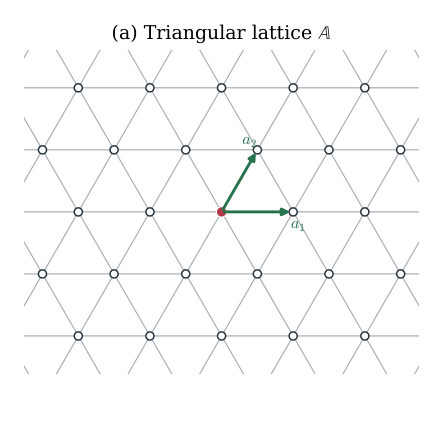 
Figure 1. The triangular and honeycomb lattices in the coordinate realizations above. Left: A2 is generated by a1 = (1, 0) and a2 = (1/2, √

📷 Fig 2

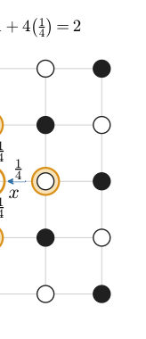 
Figure 2. Occupied vertices are black and vacant vertices are white. The particle x keeps the unit at its own site and receives a share 1/4 from each highlighted neighbor, because each such neighbor has four occupied neighbors.

📷 Fig 3

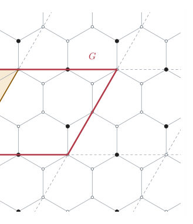 
Figure 3. Supercells and fundamental parallelepipeds on the honeycomb lattice H2, in the coordi- nates of Figure 1. The configuration is invariant under the sublattice K generated by 2b1 and 2b2, which has index 4 in L. The shaded parallelogram G0 spanned by 2b1 and 2b2 is a fundamental parallelepiped of K, and the dashed lines show its translates T G0 under the grid LG0 = K. The parallelogram G spanned by 4b1 and 2b2 is another supercell of K: its grid LG has index 2 in K, so G has twice the minimum volume.

📷 Fig 4

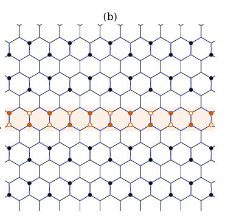 
Figure 4. The sliding line. Both panels are perfect configurations of H2 at low activity: The panels differ in the position of the shaded line alone, which (b) slides by b1. Any set of lines may be slid in this way; sliding one line in every ℓgives a periodic configuration of period 2ℓb2.

📷 Fig 5

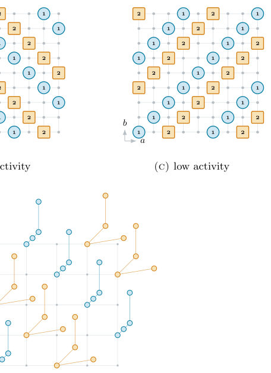 
Figure 6. The perfect configurations of the two-tile model on G. A circle labeled 1 marks a site carrying T1, a square labeled 2 marks a site carrying T2, and a gray dot marks a vacant site. (a): at high activity every site is occupied and the type alternates from row to row; the second phase is the translate of this one by (0, 1). (b), (c): at low activity the occupied sites carry the two orientations of the perfect code of eG; the remaining eight phases are translates of these two. (d), (e): a window of the phases in (a) and (b) drawn with the actual tiles, the segments joining the four disks of a tile being guides only.

**Summary.** This paper introduces a general mathematical framework to analyze phase transitions and crystallization in maximal hard-core lattice models. By developing a concept of 'volume allocation,' the authors successfully extend the applicability of the powerful Pirogov-Sinai theory to regimes previously inaccessible, proving crystallization for various lattice types. This provides a powerful theoretical tool for understanding ordered phases in constrained physical systems.

**Why it may be interesting.** While focused on classical statistical mechanics, the rigorous mathematical machinery involving volume allocation and phase transition theory (Pirogov-Sinai) is highly relevant for understanding phase transitions in quantum many-body systems, especially those involving geometric constraints or local interactions.

Detailed structure

**Main problem.** Developing a general mathematical framework to study phase coexistence and prove crystallization in maximal hard-core lattice models, especially in regimes where standard methods fail.

**Main result.** The authors establish a unified set of assumptions, based on volume allocation, that allow the application of Pirogov-Sinai theory to prove crystallization for maximal hard-core models at both high and low activity levels.

**Method.** The methodology heavily relies on adapting the concept of volume allocation (from Zahradn´ık's contour formalism) to the constraints of maximal configurations, leading to necessary conditions for the Peierls argument.

**Model / system.** The system is a maximal hard-core model defined on periodic lattice-type graphs (e.g., $\mathbb{Z}^d$, triangular, honeycomb). The model is governed by a Hamiltonian involving chemical potentials ($\mu_x$) associated with placed tiles.

**Key observables.** Phase coexistence, crystallization, allocated volume $v(x | X)$, and the existence of perfect configurations.

**Important parameters / regimes.** Activity/Chemical Potentials ($\mu_x$), inverse temperature ($eta$), and the dimensionality/lattice structure ($d$).

**Assumptions / limitations.** The framework requires assuming the existence of a volume allocation satisfying specific local and global optimization conditions (Assumptions 1 and 2) to apply Pirogov-Sinai theory.

**Figures summary.** Figures illustrate the coordinate realizations of lattices ($A_2, H_2$), the discrete volume allocation on $\mathbb{Z}^2$, and the concept of supercells on the honeycomb lattice.

**Paper structure.** The paper builds from defining the general maximal hard-core model, introducing the volume allocation concept, proving key lemmas relating perfect configurations to periodic ground states, and finally applying these results to prove crystallization in various lattice settings.

Abstract

We study general maximal hard-core models on periodic lattice-type graphs. While for standard models, phase coexistence may arise for high activity, for maximal models this behavior may occur also for sufficiently low activity values. Relying on the concept of volume allocation, we develop a {\em unified set of assumptions} that imply the Peierls condition, a convergent cluster expansion for the partition function, and hence the conclusions of Pirogov-Sinai theory for this class of models. We further check these assumptions for a number of examples including standard lattice-type periodic graphs, proving crystallization for both high and low activity. We also derive estimates for the values of activity that bound the phase coexistence regions in the phase diagram, rewriting for this purpose the proof of a technical result in the derivation of Pirogov-Sinai theory.

[↑ back to top](#top)

### [Theory of the CH$_\text{S}^-$ Defect in MoS$_2$ Confirming the Origin of the Quantum Emission](http://arxiv.org/abs/2610.12283v1)

**Authors:** Chanaprom Cholsuk, Tobias Vogl  
**Type:** theory · **Category:** other · **PDF:** <https://arxiv.org/pdf/2610.12283v1>  
**Analysis basis:** full PDF text, analyzed in chunks
**Topic relevance:** `correlated / nonlocal dissipation` **1/5** · `interference shaping light` **1/5**

📷 Fig 1

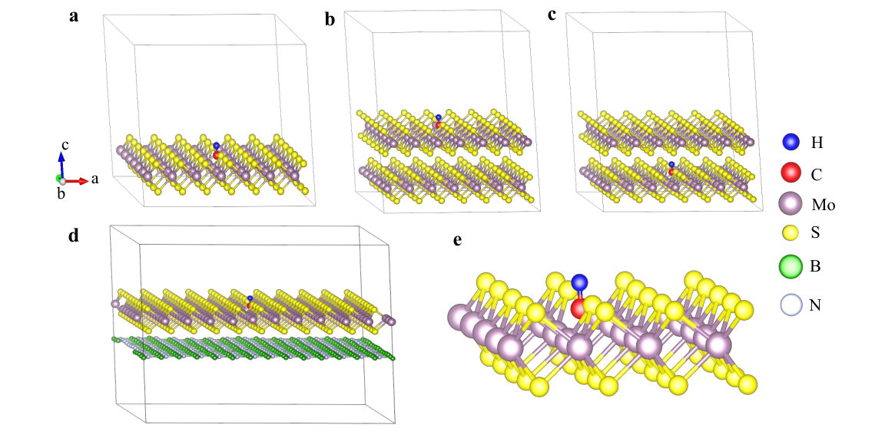 
Figure 1. Optimized geometries of CH− S in each system. a MoS2 monolayer; b MoS2 bilayer with CH− S at the top layer; c MoS2 bilayer with CH− S at the middle layer; d MoS2/hBN heterostructure; and e Zoom-in CH− S defect on the MoS2 layer.

📷 Fig 2

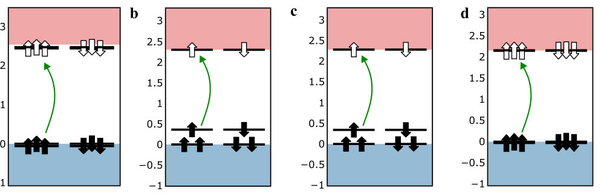 
Figure 2. Kohn–Sham electronic transitions at the Γ point for CH− S in MoS2. a Monolayer MoS2. b Bilayer MoS2 with CH− S at the outer/top S site. c Bilayer MoS2 with CH− S at the inner/middle S site. d Heterostructure MoS2/hBN with CH− S . Filled and unfilled arrows denote occupied and unoccupied Kohn–Sham states, respectively, while upward and downward arrows indicate spin-up and spin-down channels. The green arrow marks the electronic transition used to calculate the optical properties.

📷 Fig 3

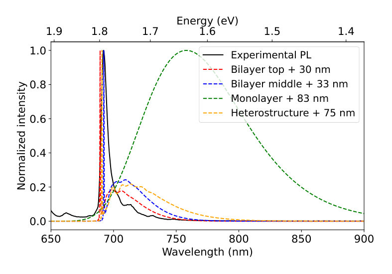 
Figure 3. Comparison of the calculated and experimental PL spectra of CH− S . Calculated spectra are shown for CH− S in monolayer MoS2, the top- and middle-bilayer configurations, and the MoS2/hBN heterostructure, together with the experimental spectrum. The spectra are normalized to their respective maximum intensities, and the calculated ZPL positions are aligned with the experimental emission peak to compare the PL lineshapes and relative PSB contributions independently of the absolute transition energies. Experimental data is adapted with permission from Ref. [30].

📷 Fig 4

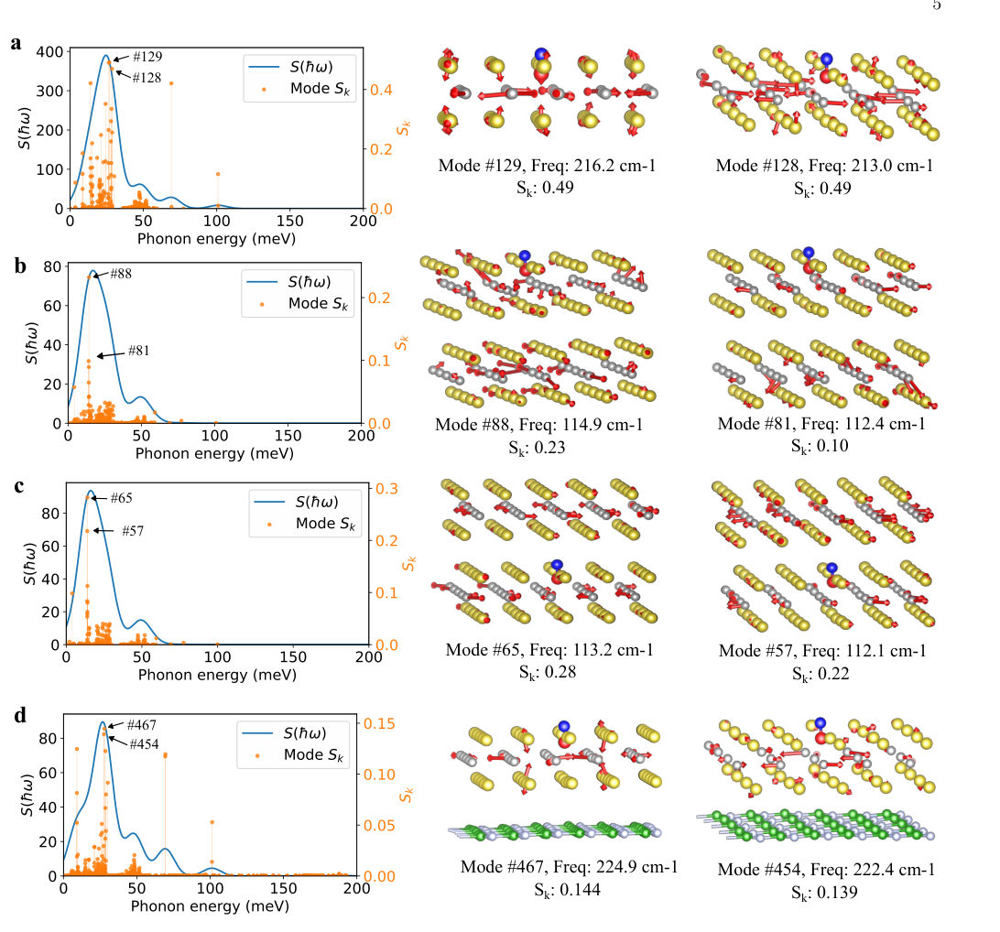 
Figure 4. Simulated phonon spectral density of CH− S and the most two dominant phonon modes. a Monolayer MoS2. b,c Bilayer MoS2 with CH− S at the outer/top S site and inner/middle S site, respectively. d MoS2/hBN heterostructure with CH− S defect on the MoS2 layer. The red arrow represents the vibrational direction.

**Summary.** This theoretical study investigates the quantum emission from a $	ext{CH}^-	ext{S}$ defect in $	ext{MoS}_2$ using advanced DFT and PL simulation techniques. By comparing predictions across different host environments (monolayer, bilayer, heterostructure), the authors establish that the $	ext{MoS}_2/	ext{hBN}$ interface best reproduces the experimental photoluminescence spectrum. This work clarifies the role of adjacent layers in determining the optical properties of 2D quantum emitters.

**Why it may be interesting.** This work directly tackles the quantum optics of solid-state emitters, providing detailed vibronic coupling analysis (Huang-Rhys factors, phonon modes) crucial for understanding energy relaxation in nanoscale quantum systems.

Detailed structure

**Main problem.** The paper addresses the challenge of theoretically establishing the microscopic origin of localized quantum emission from the $	ext{CH}^-	ext{S}$ defect in $	ext{MoS}_2$ and related 2D materials.

**Main result.** The $	ext{MoS}_2/	ext{hBN}$ heterostructure model provides the first theoretical agreement by yielding a weak phonon sideband and closely reproducing the experimental photoluminescence lineshape.

**Method.** The study employs first-principles calculations (DFT/HSE06) combined with advanced methods to simulate photoluminescence (PL) spectra using the full-phonon generating-function approach.

**Model / system.** The physical system is the $	ext{CH}^-	ext{S}$ defect embedded in various environments: monolayer $	ext{MoS}_2$, bilayer $	ext{MoS}_2$, and the $	ext{MoS}_2/	ext{hBN}$ heterostructure.

**Key observables.** Zero-Phonon Line (ZPL) energy, PL spectral lineshape, phonon sideband intensity, radiative lifetime, and transition-dipole orientation.

**Important parameters / regimes.** The dependence of electronic and vibronic properties on the surrounding layers (e.g., the presence of hBN vs. isolated monolayer).

**Assumptions / limitations.** The isolated-monolayer model is disfavored due to an inconsistent, overly broad phonon sideband; the $	ext{MoS}_2/	ext{hBN}$ model is deemed most physically relevant.

**Figures summary.** Figures compare calculated PL spectra for four different defect environments against experimental data, and show simulated phonon spectral densities for these systems.

**Paper structure.** The paper systematically compares four structural environments ($	ext{CH}^-	ext{S}$ in monolayer, bilayer, and heterostructure) by calculating structural parameters, electronic transitions, and full PL spectra to pinpoint the most accurate physical model.

Abstract

Establishing the microscopic origin of localized emission in two-dimensional materials through consistent agreement between experiment and theory remains challenging. Recent STM/STS-STML measurements assigned an emission near 1.8 eV in monolayer MoS$_2$/hBN(2L)/graphene to the negatively charged CH$_\mathrm{S}^{-}$ defect. However, a comprehensive theoretical description of this emitter is still lacking. Here, we develop such a description and systematically investigate the photophysical properties of CH$_\mathrm{S}^{-}$ in monolayer MoS$_2$, two bilayer configurations, and a MoS$_2$/hBN heterostructure. The defect retains a similar local geometry and favors a singlet ground state in all four environments, whereas its electronic transition, zero-phonon line, electron-phonon coupling, radiative lifetime, and transition-dipole orientation depend strongly on the surrounding layers. The isolated-monolayer model exhibits substantial structural reorganization and produces a broad, dominant phonon sideband that is inconsistent with experiment. Adding an adjacent layer, either MoS$_2$ or hBN, substantially suppresses the phonon sideband, with only a minor dependence on the defect position in bilayer MoS$_2$. In particular, the MoS$_2$/hBN model yields a weak phonon sideband and closely reproduces the experimental photoluminescence lineshape. Our results thus provide the first theoretical agreement of CH$_\mathrm{S}^{-}$ emission and further reveal the role of adjacent layers in determining the electronic, vibronic, and optical properties of the quantum emitters in two-dimensional materials.

[↑ back to top](#top)

### [Displacement-Field-Induced Ionization of Defect States in High-Quality hBN](http://arxiv.org/abs/2610.11297v1)

**Authors:** Ilia Begichev, Daria Belotcerkovtceva, Iakov Reznikov, Sergey Slizovsky, Weijie Lu, Nansi Zhou, Ian Babich, Makars Siskins, Kostya S. Novoselov, Vladimir I. Falko, Kenji Watanabe, Takashi Taniguchi, Alexey I. Berdyugin  
**Type:** both · **Category:** disordered systems and neural networks · **PDF:** <https://arxiv.org/pdf/2610.11297v1>  
**Analysis basis:** full PDF text, analyzed in chunks
**Topic relevance:** `quantum measurements` **1/5**

📷 Fig 1

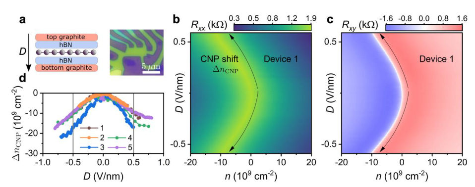 
Figure 1. Displacement-field-induced charge transfer between graphene and hBN. a, Left: Schematic image of a double-graphite- gated device with monolayer graphene under an applied out-of-plane displacement field 𝐷. Right: Optical image of device 1. Scale bar, 5 𝜇m. b, c, Longitudinal 𝑅xx and Hall 𝑅xy resistance maps as a function of carrier density 𝑛 and displacement field 𝐷 at 𝑇= 100K for device 1. Black arrows highlight the shift of graphene CNP as a function of 𝐷. d, Сomparison of CNP shift as a function of 𝐷 for devices 1-5. Grey lines indicate 𝐷= ±0.5 V/nm, chosen for further comparison of Δ𝑛CNP.

📷 Fig 2

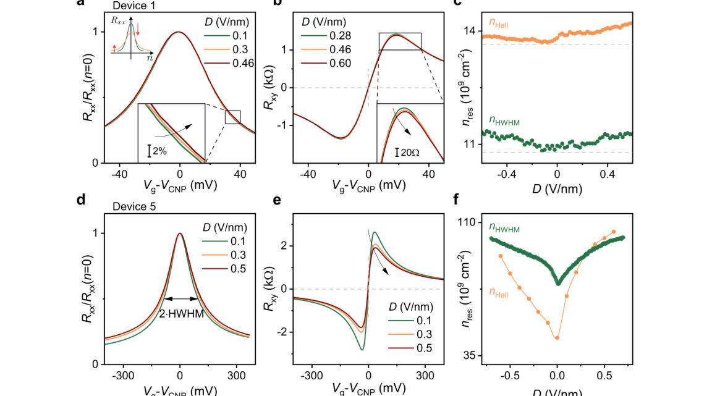 
Figure 2. Change of graphene inhomogeneity under displacement field. a,b, Longitudinal 𝑅xx and Hall 𝑅xy resistances versus gate-voltage with respect to the Dirac point 𝑉g −𝑉CNP for representative values of 𝐷, measured in device 1 at 𝐵= 0 and 30 mT, respectively. Insets highlight the progressive broadening of the normalized 𝑅xx and suppression of 𝑅xy peaks under applied 𝐷. The schematic in (a) illustrates the evolution of 𝑅xx(𝑉𝑔): increasing 𝐷 suppresses the peak while increasing the HWHM. c, The

📷 Fig 3

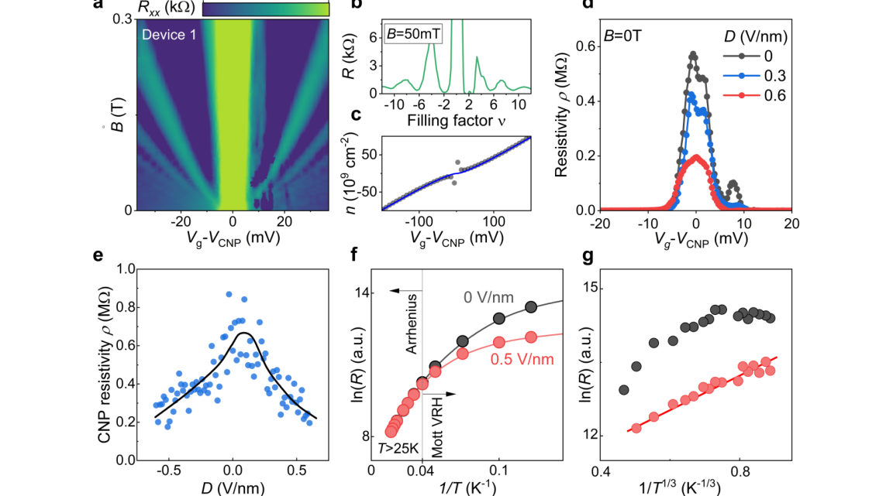 
Figure 3. Transport in the gapped regime under a displacement field. a, Longitudinal 𝑅xx versus gate-voltage with respect to the Dirac point 𝑉g −𝑉g0 and magnetic field 𝐵 at 𝐷= 0.2 V/nm. The low-𝐵 parabolic Landau fans arise from quantum-capacitance effects. b, 𝑅xx at 50 mT versus filling factor 𝜈 obtained from the non-linear gate calibration (see SI) c, Non-linear calibration 𝑛 as a function of 𝑉g −𝑉CNP at 100 K: grey points are obtained from the Hall measurements at 100 mT, and the blue line is a fit which accounts for quantum capacitance. d, Resistivity at 𝐵= 0 for different 𝐷. e, Maximum CNP resistivity versus 𝐷; black line is a

📷 Fig 4

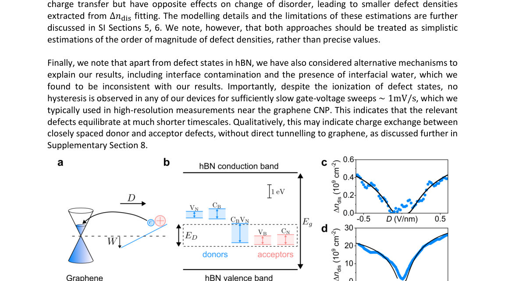 
Figure 4. Ionization of defects in hBN. a, Schematic illustration of the spatial variation of defect energy levels under an applied displacement field relative to graphene CNP. At 𝐷= 0, donor states lie below the graphene CNP and therefore remain charge neutral. Applying 𝐷 bends the hBN bands, shifting these in-gap states above the graphene CNP, which leads to their ionization and to electron doping of graphene. b, Summary of the literature discussed in the main text. The energy diagram shows the reported position of the graphene CNP within the hBN bandgap55–57, the range of reported acceptor-state energies31–33 marked in red, and the range of donor-state energies24,31–33 marked in blue....

**Summary.** This research demonstrates that even high-quality hBN substrates contain defect states that are sensitive to external electric fields. By measuring transport properties in graphene/hBN heterostructures, the authors show that an applied displacement field causes these defects to ionize, leading to measurable doping and increased disorder in the graphene. This finding has direct implications for interpreting and designing next-generation vdW electronic devices.

**Why it may be interesting.** This work provides a concrete example of how subtle material defects in insulating substrates can act as active charge sources, modifying the electronic response of quantum devices, which is crucial for designing reliable 2D material heterostructures.

Detailed structure

**Main problem.** The study investigates how defect states within the surrounding hexagonal boron nitride (hBN) substrate respond to an applied out-of-plane displacement field, which can alter the electronic properties of encapsulated 2D materials.

**Main result.** The applied displacement field induces significant charge transfer via the ionization of defect states in hBN, leading to measurable electron doping and increased carrier-density inhomogeneity in the graphene layer.

**Method.** The authors combine transport measurements (measuring resistance maps) with theoretical modeling (using Coulomb potential calculations and puddle potential models) to quantify the charge transfer.

**Model / system.** The physical system is monolayer graphene encapsulated between high-quality hBN crystals, forming a van der Waals heterostructure. The analysis models the effect of charged defects (donor/acceptor states) in the hBN bandgap on the graphene's electronic structure.

**Key observables.** Shift of the graphene Charge Neutrality Point (CNP), change in residual carrier density ($\Delta n_{res}$), and device inhomogeneity quantified by $n_{HWHM}$ and $n_{Hall}$.

**Important parameters / regimes.** Displacement field ($D$), temperature ($T$), and defect concentrations ($\sim 1-7	imes 10^{-5} 	ext{ nm}^{-3}$).

**Assumptions / limitations.** The analysis assumes that the observed changes are dominated by defect ionization rather than interfacial contamination (e.g., water or VOCs), and uses various models (step-like vs. Gaussian) to relate measured inhomogeneity to potential fluctuations.

**Figures summary.** Figures show $R_{xx}$ and $R_{xy}$ maps demonstrating CNP shifts and inhomogeneity changes as a function of $D$. Other figures plot $n_{HWHM}$ and $n_{Hall}$ vs. $D$, illustrating the device-dependent response to the field.

**Paper structure.** The paper progresses by first establishing the experimental observation of field-induced changes in graphene transport (disorder increase). It then systematically rules out extrinsic sources (water, VOCs) before attributing the effect to intrinsic defect ionization in hBN, culminating in theoretical modeling linking measured disorder to defect density.

Abstract

Encapsulation of two-dimensional (2D) materials with hexagonal boron nitride (hBN) is widely used to fabricate ultraclean van der Waals (vdW) heterostructures for optoelectronic and quantum transport studies. These devices are often operated under strong out-of-plane displacement fields that tune the electronic properties of the active 2D material, while the surrounding hBN is typically assumed to remain electronically inert. This assumption, however, neglects defect states that are present even in high-quality hBN crystals. Here, we probe their response to the applied displacement field using monolayer graphene encapsulated between hBN crystals as a sensitive charge sensor. Increasing the displacement field induces notable charge transfer between graphene and hBN, producing additional electron doping of 10-20x10^9 cm^(-2) even at the moderate displacement field (~0.5 V nm^(-1)), while simultaneously increasing carrier-density inhomogeneity of the graphene layer. Both effects are consistent with ionization of defect states within the hBN bandgap, with the bulk density ~1-7x10^(-5) nm^(-3) varying across different hBN crystals. Our results show that displacement-field-induced defect ionization in hBN can modify the electronic response of vdW heterostructures, with direct implications for device design and interpretation of experiments.

[↑ back to top](#top)

### [Energy-constrained two-way capacities of the pure-loss channel](http://arxiv.org/abs/2610.12365v1)

**Authors:** Alessandro Falco, Francesco Anna Mele, Ludovico Lami, Vittorio Giovannetti  
**Type:** theory · **Category:** quantum information and computing · **PDF:** <https://arxiv.org/pdf/2610.12365v1>  
**Analysis basis:** full PDF text, analyzed in chunks
**Topic relevance:** `correlated / nonlocal dissipation` **1/5**

📷 Fig 1

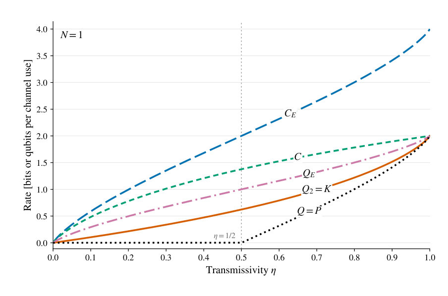 
Figure 1: Capacities of the single-mode pure-loss channel as functions of transmissivity η, for an average input photon budget N = 1. All rates are asymptotic, with error tending to zero. The two-way quantum and secret-key capacities are Q2 = K = g(N) −g((1 −η)N) (solid), by Theorem 1.1. The unassisted classical capacity is C = g(ηN) (short-dashed) [GGL+04]. With unlimited preshared entanglement, the classical capacity is CE = g(N) + g(ηN) −g((1 −η)N) (long-dashed) [GLMS03], and the quantum capacity is QE = CE/2 (dash-dotted) [BSST02]. The unassisted quantum and private classical capacities are Q = P = max{0, g(ηN) −g((1 −η)N)} (dotted) [WHG12, WQ18]. The vertical guide marks η = 1/2; Q = P...

**Summary.** This paper calculates the ultimate communication limits (quantum and secret-key capacities) for the pure-loss quantum channel under an average energy constraint. The main result shows these capacities are determined by a simple function of the input photon budget and channel transmissivity. This completes the theoretical understanding of bosonic quantum communication under pure loss.

**Why it may be interesting.** This work provides a precise, closed-form capacity formula for a fundamental channel (pure loss) in quantum communication, which is crucial for understanding realistic quantum networking protocols.

Detailed structure

**Main problem.** The paper determines the two-way quantum and secret-key capacities for the pure-loss quantum channel when an average input photon-number constraint is imposed.

**Main result.** Both capacities are found to be equal to the expression g(N) - g((1 - \eta)N), where g is the entropy of a thermal state, completing the capacity picture for this channel.

**Method.** The proof establishes the converse bounds using techniques involving regularized relative entropy of entanglement and analyzing the energy budget over multiple channel uses.

**Model / system.** The system analyzed is the single-mode pure-loss channel $L_\eta$ with transmissivity $\eta$, which models photon loss by mixing the input with a vacuum environment.

**Key observables.** Two-way quantum capacity ($Q_2$), secret-key capacity ($K$), and the regularized relative entropy of entanglement ($\mathbb{E}_\infty^R$).

**Important parameters / regimes.** Transmissivity ($\eta$), average input photon budget ($N$), and the error parameter ($\epsilon$).

**Assumptions / limitations.** The analysis relies on the energy-constrained, two-way-assisted communication model and uses techniques like monotone convergence to extend results from finite to infinite dimensions.

**Figures summary.** Figure 1 compares various capacities (e.g., $Q_2=K$, unassisted classical capacity $C$) as functions of $\eta$ for a fixed input budget $N=1$.

**Paper structure.** The paper first defines the problem and establishes the key capacity formulas. It then develops the necessary theoretical tools, including bounds on relative entropy, and finally proves the converse bounds for the finite-block and asymptotic regimes.

Abstract

We determine the two-way quantum and secret-key capacities of the pure-loss channel under an average input photon-number constraint. For transmissivity $η$ and photon budget $N$, both capacities equal $g(N)-g((1-η)N)$, where $g$ is the entropy of a thermal state. This coincides with the rate achieved by the known reverse coherent information of a two-mode squeezed vacuum. Our result provides the last missing capacity formula for the celebrated pure-loss channel, completing the picture of bosonic quantum communication under pure loss.

[↑ back to top](#top)

### [Heisenberg Echo Symmetrization for Gate-Insertion Error Mitigation](http://arxiv.org/abs/2610.11372v1)

**Authors:** Raam Uzdin  
**Type:** theory · **Category:** quantum information and computing · **PDF:** <https://arxiv.org/pdf/2610.11372v1>  
**Analysis basis:** full PDF text, analyzed in chunks
**Topic relevance:** `quantum measurements` **1/5**

📷 Fig 1

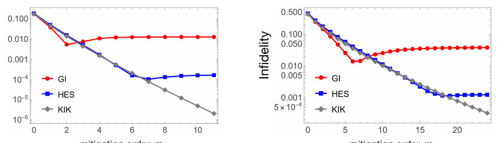 
Figure 1. Mean infidelity as a function of the mitigation order m. The results were averaged over 50 random seven-qubit circuits of depth seven (see main text). The Heisenberg echo (HES-blue) outperforms the standard gate insertion (GI-red) protocol. In the weak noise case (a) the HES fidelity for large m is 80 times better than that of GI and in the strong noise case (b) the improvement factor is 30. As expected from theory, the pulse-inverse-based KIK method is more accurate than HES, but HES has the same implementation simplicity and universal compatibility as GI.

**Summary.** This paper introduces Heisenberg-echo symmetrization (HES), an advanced quantum error mitigation technique designed to fix the fundamental flaw in standard Gate Insertion (GI) protocols. By incorporating a Heisenberg echo structure, HES cancels leading error terms arising from non-commuting gate noise. This results in substantial fidelity improvements while maintaining hardware compatibility, making it a powerful tool for near-term quantum devices.

**Why it may be interesting.** It provides a hardware-agnostic, theoretically grounded improvement over existing quantum error mitigation techniques, which is crucial for scaling quantum computation.

Detailed structure

**Main problem.** Gate insertion (GI) quantum error mitigation fails when the noise channel does not commute with the ideal gate, leading to noise distortion rather than simple noise amplification.

**Main result.** Heisenberg-echo symmetrization (HES) significantly reduces the absolute fidelity error by one to two orders of magnitude compared to standard GI.

**Method.** HES combines standard GI with an echo derived from the Heisenberg representation to analytically cancel the leading error term caused by non-commuting gate noise.

**Model / system.** The analysis focuses on quantum computation involving noisy gates (e.g., CZ, CX) modeled using Liouville space operators and noise channels.

**Key observables.** Absolute fidelity error, expectation values of observables $\langle A 
angle$, and variance $	ext{Var}(A)$.

**Important parameters / regimes.** Mitigation order ($m$), noise strength ($\xi$), and the rank of the observable (HES is best for rank-one observables).

**Assumptions / limitations.** HES is compatible with any hardware and requires only circuit-level access, although high-rank observables can increase echo variance.

**Figures summary.** Figure 1 compares mean infidelity vs. mitigation order for GI, HES, and KIK across weak and strong noise regimes, showing HES's superior performance.

**Paper structure.** The paper first establishes the failure of GI for non-commuting noise, then introduces HES as a correction mechanism by combining GI with a Heisenberg echo structure, and finally presents simulations comparing HES's error suppression against GI and KIK.

Abstract

Gate insertion (GI) quantum error mitigation replaces involutory gates such as CZ and CX with 2j+1 repetitions of the same gates to nominally amplify noise by the same factor. Analytical and experimental results show that this amplification scaling fails for non-commuting gate noise, as typically encountered in realistic devices. Here we introduce Heisenberg-echo symmetrization (HES), which combines standard GI with an echo inspired by the Heisenberg representation to cancel the leading GI error. In our simulations, HES reduces the absolute fidelity error by one to two orders of magnitude compared with GI. Unlike the more accurate Layered-KIK method, HES is compatible with any hardware and requires only circuit-level access. It enables virtual noise scaling across platforms, potentially reducing sampling overhead substantially. Its agnostic noise amplification also provides full resilience to temporal noise drift. For pure initial states, however, high-rank observables can substantially increase the echo variance relative to non-echoed circuits, whereas rank-one observables incur no additional sampling overhead compared with GI or Layered-KIK. HES is therefore particularly suited to rank-one or nearly rank-one observables.

[↑ back to top](#top)

### [Mode-selective electron-phonon coupling drives charge density waves in the kagome metals YRu$_3$Si$_2$ and LaRu$_3$Si$_2$](http://arxiv.org/abs/2610.11689v1)

**Authors:** Wenqian Tu, Run Lv, Dingfu Shao, Yuping Sun, Wenjian Lu  
**Type:** theory · **Category:** strongly correlated electrons · **PDF:** <https://arxiv.org/pdf/2610.11689v1>  
**Analysis basis:** full PDF text, analyzed in chunks
**Topic relevance:** `Keldysh / 2PI / non-Gaussian methods` **1/5**

📷 Fig 1

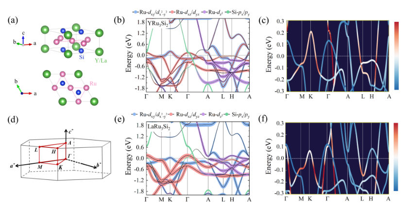 
FIG. 1. (a) Side and top views of the YRu3Si2 and LaRu3Si2 crystal structures showing the kagome Ru layer (pink), Si layers (blue), and Y/La cations (green). (b) Orbital-projected band structure and (c) electron linewidth distribution of YRu3Si2. (d) Brillouin zone with high-symmetry points labeled. (e) Orbital-projected band structure and (f) electron linewidth distribution of LaRu3Si2.

📷 Fig 2

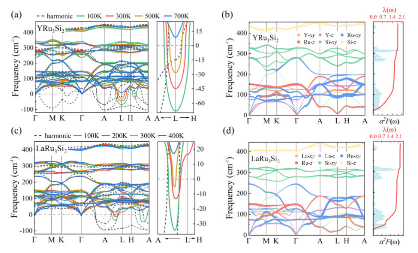 
FIG. 2. (a) Harmonic phonon spectrum (dashed line) and temperature-dependent anharmonic phonon spectra (colored solid lines) for the high-temperature P6/mmm phase of YRu3Si2. (b) Phonon dispersion of YRu3Si2 at 700 K, color-weighted by the contributions from Y, Ru, and Si atomic vibrations. The Eliashberg spectral function α2F(ω) (blue) and the integrated EPC constant λ (red) are plotted on the right side. (c), (d) Same as (a), (b) for LaRu3Si2 at 400 K.

📷 Fig 3

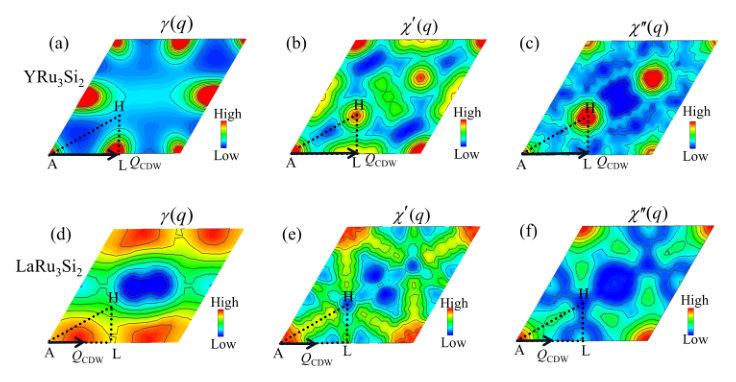 
FIG. 3. (a) Phonon linewidth γ(q) of the lowest phonon mode for YRu3Si2. (b) Real part χ′(q) and (c) imaginary part χ′′(q) of the electronic susceptibility for YRu3Si2, where QCDW is indicated by a black arrow. (d)–(f) Corresponding results for LaRu3Si2. All panels display the quantities in the Qz = 1/2 plane.

📷 Fig 4

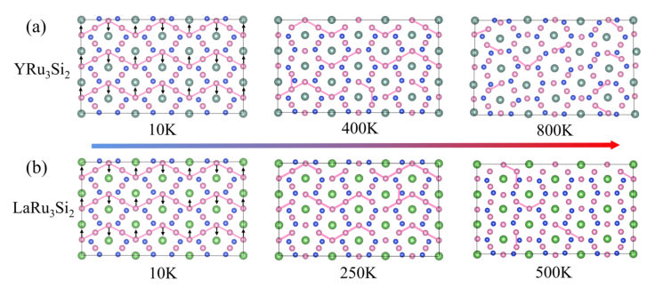 
FIG. 4. MLFF-driven molecular dynamics simulations of the CDW melting process. (a) YRu3Si2 at 10 K, 400 K, and 800 K. (b) LaRu3Si2 at 10 K, 250 K, and 500 K. Black arrows indicate the Ru displacement directions relative to the high-symmetry positions, and pink lines mark the Ru-Ru bonds shortened by the CDW distortion, whose number progressively decreases with increasing temperature.

📷 Fig 5

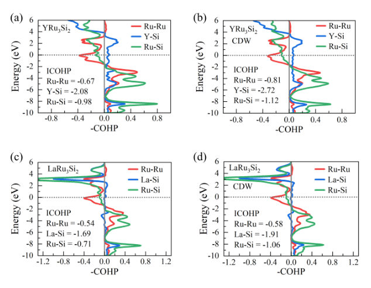 
FIG. 5. COHP analysis of the parent P6/mmm and CDW-distorted supercells. (a) YRu3Si2 parent, (b) YRu3Si2 CDW, (c) LaRu3Si2 parent, (d) LaRu3Si2 CDW. The curves show the COHP of the Ru-Ru, Y-Si (La-Si), and Ru-Si bonding pairs, and the numbers denote the corresponding ICOHP values.

**Summary.** This work establishes a unified microscopic picture for CDW formation in kagome metals YRu3Si2 and LaRu3Si2. The research demonstrates that the CDW instability is driven by mode-selective electron-phonon coupling, not Fermi surface nesting. Furthermore, it explains the large difference in transition temperatures by linking it to enhanced lattice rigidity controlled by the A-site cation size.

**Why it may be interesting.** The detailed coupling between lattice vibrations (phonons) and electronic degrees of freedom (electrons) to drive a collective electronic state (CDW) is a core topic in strongly correlated electron physics, relevant to understanding unconventional superconductivity.

Detailed structure

**Main problem.** To resolve the microscopic mechanism driving the record-high Charge Density Wave (CDW) transition temperatures in kagome metals YRu3Si2 and LaRu3Si2.

**Main result.** The CDW is driven by mode-selective electron-phonon coupling (EPC) involving Ru-d and Si-p orbitals, and the high transition temperature is enhanced by lattice rigidity stemming from the smaller Y3+ ion.

**Method.** The study combines mode-resolved EPC analysis, anharmonic phonon calculations via Molecular Dynamics (MD) using MLFF, and electronic susceptibility analysis to rule out Fermi surface nesting.

**Model / system.** The system consists of the kagome metals YRu3Si2 and LaRu3Si2, whose electronic and lattice dynamics are modeled using DFT and advanced simulation techniques.

**Key observables.** Electron linewidth ($\Gamma_{nk}$), momentum-resolved phonon linewidth ($\gamma(\mathbf{q})$), electronic susceptibility ($\chi(\mathbf{q})$), and CDW formation energy ($\Delta E$).

**Important parameters / regimes.** High CDW transition temperatures ($\approx 800$ K for YRu3Si2), specific CDW propagation vectors, and the ionic radius of the A-site cation (Y vs La).

**Assumptions / limitations.** The analysis relies on the Migdal approximation for EPC and assumes that anharmonic phonon renormalization governs the CDW melting process.

**Figures summary.** Figures show crystal structures, orbital-projected band structures, electron linewidth distributions, and phonon spectra comparing harmonic and anharmonic regimes.

**Paper structure.** The paper progresses by first establishing the high-temperature CDW state, then using EPC analysis to pinpoint the coupling mechanism, ruling out alternative theories like FSN, and finally using MD simulations and bonding analysis to explain the temperature and material dependence of the CDW.

Abstract

YRu$_3$Si$_2$ and LaRu$_3$Si$_2$ host the highest charge density wave (CDW) transition temperatures ever reported in kagome metals, $T_{\mathrm{CDW}}\approx 800$ and 400~K, with propagation vectors $Q_{\mathrm{CDW}}\approx(1/2,0,0)$ and $(1/4,0,0)$, respectively. The microscopic mechanism behind these record values has remained unresolved. Here, we combine anharmonic phonon renormalization extracted from molecular dynamics driven by a machine-learned force field with mode-resolved electron-phonon coupling (EPC) analysis to identify this mechanism. The CDW is driven by mode-selective EPC: the Ru out-of-plane phonon modes couple the Ru-$d_{xz}/d_{yz}$ and Si-$p_x/p_y$ orbitals, and the phonon linewidth peaks sharply at $Q_{\mathrm{CDW}}$, while the featureless electronic susceptibility rules out Fermi-surface nesting. Phonon anharmonicity melts the CDW, and the anharmonic phonon spectra reproduce both $Q_{\mathrm{CDW}}$ and $T_{\mathrm{CDW}}$ in good agreement with experiments. Molecular dynamics simulations also visualize the CDW melting in real space. Chemical bonding analysis further shows that the smaller Y$^{3+}$ radius strengthens the Ru-Ru bonds, enhancing lattice rigidity and accounting for the factor-of-two higher $T_{\mathrm{CDW}}$ of YRu$_3$Si$_2$. Our results establish a unified microscopic picture of CDW formation and melting in kagome metals YRu$_3$Si$_2$ and LaRu$_3$Si$_2$.

[↑ back to top](#top)

### [Multipolar fluctuations in localized $4f^2$-electron systems from dynamical mean-field theory: application to $\mathrm{PrCdNi}_4$](http://arxiv.org/abs/2610.11562v1)

**Authors:** Koki Numa, Junya Otsuki  
**Type:** theory · **Category:** strongly correlated electrons · **PDF:** <https://arxiv.org/pdf/2610.11562v1>  
**Analysis basis:** full PDF text, analyzed in chunks
**Topic relevance:** `Keldysh / 2PI / non-Gaussian methods` **1/5**

📷 Fig 1

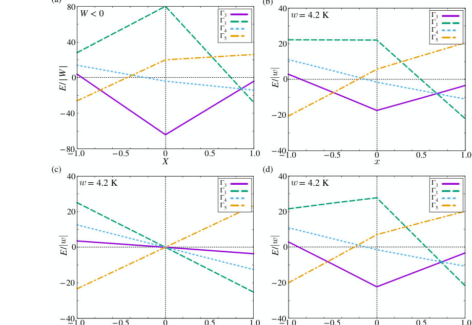 
FIG. 1. CEF levels within the J = 4 manifold of the 4f 2 configuration obtained from (a) the Hamiltonian in the LS coupling ˆH(f2) CEF given by Eq. (1), (b) the many-body Hamiltonian H in the full l = 3 space including both the j = 5/2 and j = 7/2 orbitals formulated in Eqs. (3)–(6), (c) the effective j = 5/2 Hamiltonian H(5/2) eff introduced in Eqs. (8)–(12), retaining only the zeroth-order terms corresponding to the conventional j–j coupling, and (d) H(5/2) eff incorporating the first-order corrections in 1/λ. For (b)–(d), the Coulomb interaction parameters are taken as F 0 = 5.7 eV, F 2 = 10 eV, F 4 = 6.7 eV, and F 6 = 4.9 eV, with the spin-orbit coupling constant λ = 0.2 eV and the CEF...

📷 Fig 2

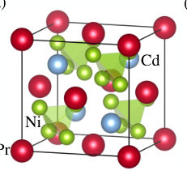 
FIG. 2. (a) Crystal structure of PrCdNi4. (b) The CEF level scheme for the J = 4 manifold of the 4f 2 configuration derived from experiments [46, 49], corresponding to the parameters W = −3 K and X = 0.8 in Eq. (1). The crystal structure was drawn using VESTA [53].

📷 Fig 3

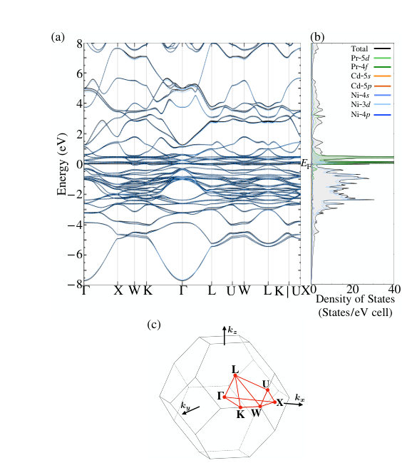 
FIG. 3. (a) Fully relativistic band structure of PrCdNi4 cal- culated using the FPLO package. The black lines represent the DFT result and the blue dashed lines represent the tight- binding bands obtained from projective Wannier functions. (b) Density of states. The black and colored lines show the total and orbital-resolved contributions, respectively. (c) The high-symmetry points in the Brillouin zone. The red line in- dicates the path used in (a) and subsequent plots.

📷 Fig 4

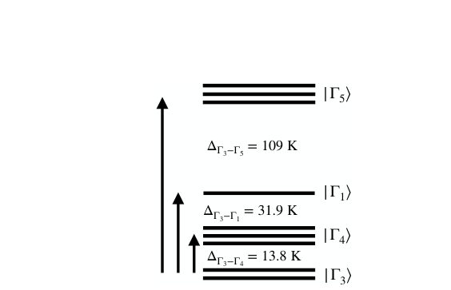 
FIG. 4. The CEF level scheme of the J = 4 manifold of the 4f 2 configuration obtained by fitting based on Sec. II. ∆Γ3−Γ4, ∆Γ3−Γ1 and ∆Γ3−Γ5 denote the energies of the Γ4, Γ1 and Γ5 states, respectively, relative to the Γ3 state.

📷 Fig 5

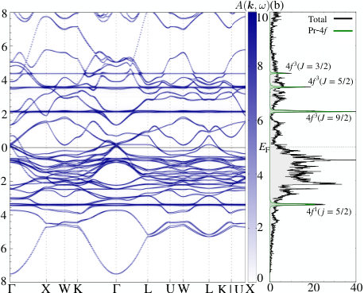 
FIG. 5. (a) The single-particle excitation spectrum A(k, ω) and (b) the k-integrated spectrum A(ω) computed using the DFT+DMFT method.

**Summary.** This theoretical work develops an advanced framework using DFT+DMFT to study multipolar fluctuations in $4f^2$ electron systems. By applying it to $\mathrm{PrCdNi}_4$, the authors predict a specific antiferroquadrupolar ordering state. The paper is significant for its rigorous methodology connecting multiple theoretical descriptions of strongly correlated rare-earth compounds.

**Why it may be interesting.** The detailed treatment of multipolar fluctuations and the development of a rigorous mapping between single-particle and many-particle susceptibilities are highly relevant for understanding complex magnetic and electronic ordering in correlated materials.

Detailed structure

**Main problem.** The paper extends the analysis of multipolar fluctuations from $4f^1$-electron systems to the more complex $4f^2$-electron systems.

**Main result.** For $\mathrm{PrCdNi}_4$, the analysis predicts a $(3z^2 - r^2)$-type antiferroquadrupolar order at $oldsymbol{q}=(2\pi, \pi, 0)$ driven by the competition between nearest- and fourth-nearest-neighbor interactions.

**Method.** The methodology combines Density Functional Theory with Dynamical Mean-Field Theory (DFT+DMFT) and involves constructing many-particle states within the $j-j$ coupling scheme.

**Model / system.** The focus is on localized $4f^2$-electron systems, specifically applied to the material $\mathrm{PrCdNi}_4$, which has a non-Kramers $\Gamma_3$ doublet ground state.

**Key observables.** Multipolar susceptibilities, Crystal Electric Field (CEF) energy levels, and the resulting order parameter (e.g., quadrupolar order).

**Important parameters / regimes.** The analysis involves CEF parameters ($W, X$) and coupling constants, with the ground state exhibiting a $\Gamma_3$ doublet separated from the first excited state by $13.2 	ext{ K}$.

**Assumptions / limitations.** The framework relies on developing effective Hamiltonians in the $j=5/2$ subspace and using perturbation theory to incorporate higher-energy states.

**Figures summary.** Figures compare CEF energy levels calculated using different theoretical approaches (LS coupling vs. $j-j$ coupling vs. effective $j=5/2$ Hamiltonian) to validate the model.

**Paper structure.** The paper first develops the theoretical framework by extending the analysis to $4f^2$ systems, detailing methodological advancements in state construction and susceptibility derivation. It then applies this formalism to $\mathrm{PrCdNi}_4$ to predict the nature and wavevector of the multipolar ordering.

Abstract

Multipolar-fluctuation analysis based on density functional theory combined with dynamical mean-field theory is extended from $4f^1$- to $4f^2$-electron systems. Two methodological developments are presented. First, many-particle states are constructed within the $j$-$j$ coupling scheme in the $j=5/2$ subspace, so as to reproduce the crystalline-electric-field splitting of the $4f^2$ Hund's-rule ground-state multiplet. Second, multipolar susceptibilities and interactions between $4f^2$ multiplets are derived through a mapping from single-particle to many-particle bases. We apply this framework to PrCdNi$_4$, which has a non-Kramers $Γ_3$ doublet ground state, and propose a $(3z^2-r^2)$-type antiferroquadrupolar order at $\boldsymbol{q}=(2π,π,0)$ driven by the competition between nearest- and fourth-nearest-neighbor interactions. The formalism developed here is applicable to general $4f^n$-electron systems.

[↑ back to top](#top)

### [Reading Altermagnetic Domains with Photon Drag](http://arxiv.org/abs/2610.10970v1)

**Authors:** Sayed Ali Akbar Ghorashi, Andrew M. Rappe  
**Type:** theory · **Category:** other · **PDF:** <https://arxiv.org/pdf/2610.10970v1>  
**Analysis basis:** full PDF text, analyzed in chunks
**Topic relevance:** `quantum measurements` **1/5**

📷 Fig 1

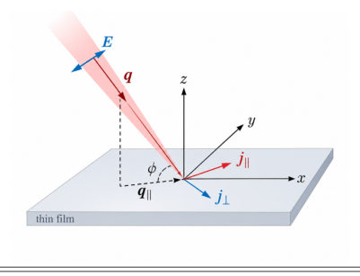 
FIG. 1. Photon-drag geometry and magnetic classes. (a) Oblique incidence defines the in-plane momentum q∥and azimuth ϕ, with current measured along or across q∥. (b) For B1g altermagnets, C4 interchanges the two N’eel domains, iso- lating domain-even from domain-odd currents across different harmonics, in contrast to conventional antiferromagnets and tetragonal ferromagnets. Here J, L, and Mz represent the al- termagnetic N’eel order, conventional antiferromagnetic N’eel order, and ferromagnetic magnetization, respectively.

📷 Fig 2

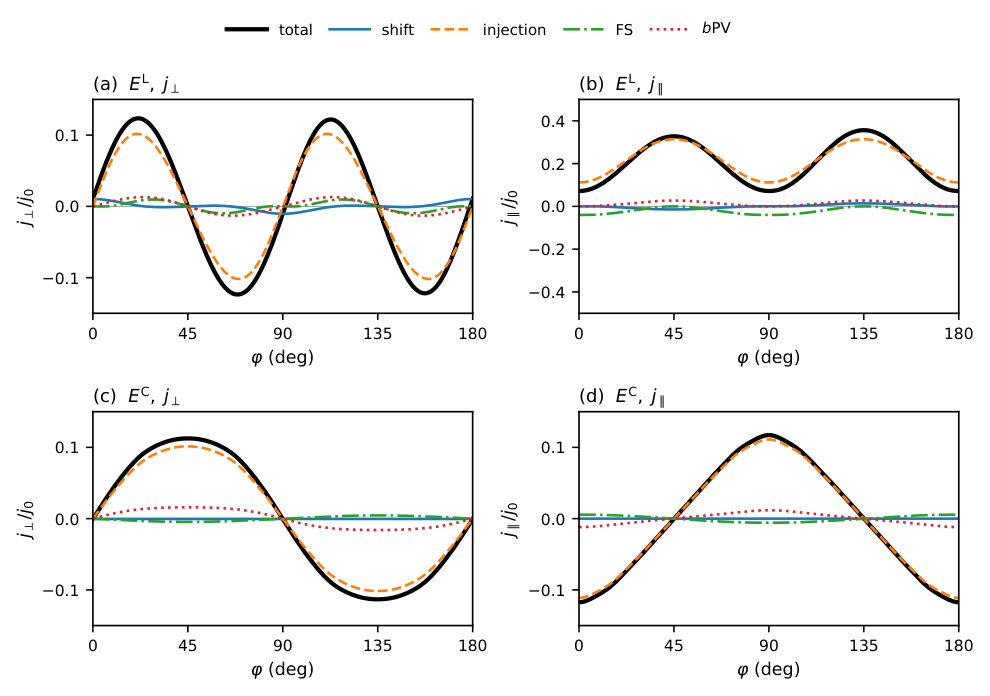 
FIG. 2. Photon-drag currents of the B1g model of Eq. (6). (a,b) Linear light with the current measured across and along q∥. (c,d) Circular light with the same two projections. Black solid lines show the sum of the four contributions; blue solid, orange dashed, green dash-dotted, and red dotted lines show the shift, injection, FS, and bPV contributions. Parameters are J = t, λ = 0.2t, µ = 0.2t, ℏω = 0.8t, kBT = 0.05t, q∥a = 0.2, optical width Γ = 0.06t, and dc width Γ0 = 0.04t, corresponding to τinj = ℏ/Γ0. Currents are normalized by j0 = e3a|E|2/(ℏt), with |E| the positive-frequency field amplitude .

**Summary.** This theoretical work establishes that the photon-drag photocurrent in altermagnets exhibits a unique domain-odd component sensitive to the magnetic symmetry. By analyzing the angular dependence of this current, researchers can optically distinguish between degenerate Néel domains, offering a novel, symmetry-based readout mechanism for these complex magnetic materials.

**Why it may be interesting.** This work provides a powerful, symmetry-enforced optical diagnostic tool for characterizing exotic magnetic orders like altermagnetism, which is highly relevant for understanding emergent electronic properties in correlated materials.

Detailed structure

**Main problem.** The primary goal is to develop an optical method to distinguish between the two degenerate Néel domains of an altermagnet, which is challenging because these domains lack a net magnetization.

**Main result.** The angular dependence of the photon-drag photocurrent reveals the symmetry of the magnetic order and allows for the isolation of the domain-odd current component, providing a unique readout signature for altermagnetism.

**Method.** The study uses symmetry analysis and detailed calculation of the second-order photocurrent (photon-drag response) by decomposing the current into contributions from shift, injection, Fermi-surface, and contact principal-value terms.

**Model / system.** The system under study is the altermagnet, a collinear magnet with alternating spin splitting and zero net magnetization. The analysis is performed using a minimal two-band model Hamiltonian and considering the effect of crystal rotations that exchange the two Néel domains.

**Key observables.** The angular dependence of the photon-drag current, separated into domain-even and domain-odd parts, and the relative contributions of the four microscopic current mechanisms.

**Important parameters / regimes.** The finite photon momentum (q) and the specific symmetry operations (e.g., crystal rotation $\mathbf{U}_N$) that map one domain to the other.

**Assumptions / limitations.** The method relies on the existence of a crystal rotation that exchanges the two Néel domains, and the separation of domain-even and domain-odd currents requires them to occupy distinct angular harmonics.

**Figures summary.** Figures illustrate the photon-drag geometry and compare symmetry constraints for altermagnets, conventional antiferromagnets, and ferromagnets. Tables summarize the symmetry fingerprints of various magnetic orders ($B_{1g}$, etc.) under different polarizations.

**Paper structure.** The paper systematically analyzes the symmetry properties of current vertices and optical bilinear terms at finite photon momentum. It then applies this framework to the altermagnet, showing how domain parity can be extracted by analyzing the current's response under domain-exchanging symmetry operations.

Abstract

Finite photon momentum allows second-order photocurrents in centrosymmetric space groups, where the conventional bulk photovoltaic effect is forbidden. Here we study the photon-drag response of altermagnets and show that its angular dependence reveals both the symmetry of the magnetic order and the Néel domain of the sample. For example, when a crystal rotation exchanges the two domains, the domain-even and domain-odd parts of the current appear in different angular harmonics, $4n$ and $4n+2$ for tetragonal $d$-wave altermagnets, so that two measurements rotated by $90^\circ$ on a single domain isolate the domain-odd current. We also find that these microscopic contributions exhibit opposite domain parities depending on light polarization. Under linear light, only the shift term is domain odd, while under circular light, the domain-odd channel switches to the injection, Fermi-surface, and contact principal-value terms. Mirror symmetries fix the angular phase of each harmonic and distinguish $d_{x^2-y^2}$, $d_{xy}$, and $g$-wave order. In contrast, conventional collinear antiferromagnets show no domain-odd photon-drag current, and in tetragonal ferromagnets the two parts share the same harmonics. Although the altermagnetic spin splitting does not require spin-orbit coupling (SOC), SOC is essential to observe the domain-odd charge current. Our work uncovers distinct signatures of altermagnetism in photon drag and provides a route to all optical magnetic readouts of altermagnets.

[↑ back to top](#top)

### [Robust quantum key distribution with imperfections in state preparation and characterization](http://arxiv.org/abs/2610.11438v1)

**Authors:** Yi-Fei Lu, Yan-Yang Zhou, Yang Wang, Xin-Hang Li, Yu Zhou, Xiao-Lei Jiang, Jia-Ji Li, Chun Zhou, Hong-Wei Li, Yu-Yao Guo, Lin-Jie Zhou, Wan-Su Bao  
**Type:** theory · **Category:** quantum information and computing · **PDF:** <https://arxiv.org/pdf/2610.11438v1>  
**Analysis basis:** full PDF text, analyzed in chunks
**Topic relevance:** `quantum measurements` **1/5**

📷 Fig 1

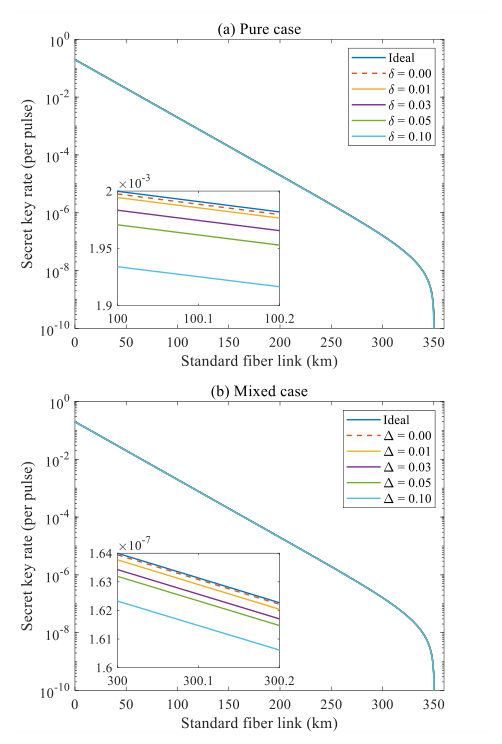 
Figure 1: Secret key rate in logarithmic scale versus transmission distance between Alice and Bob in

📷 Fig 2

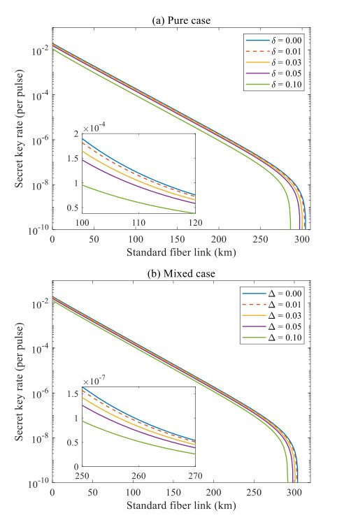 
Figure 2: Secret key rate in logarithmic scale versus transmission distance between Alice and Bob

📷 Fig 3

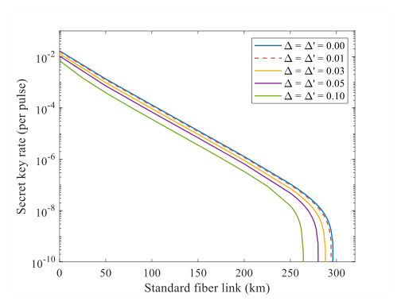 
Figure 3: Secret key rate in logarithmic scale versus transmission distance between Alice and Bob

📷 Fig 4

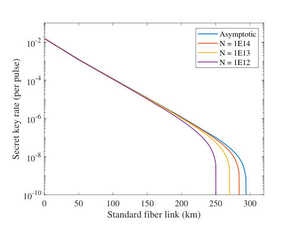 
Figure 4: Secret key rate in logarithmic scale versus transmission distance between Alice and Bob in

📷 Fig 5

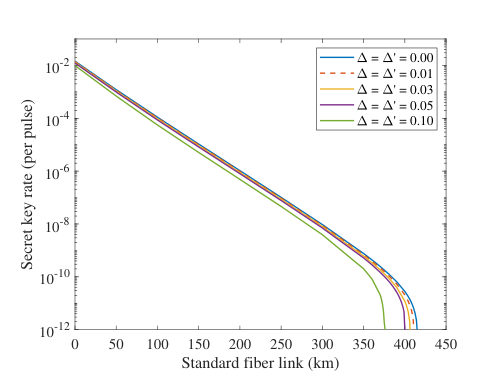 
Figure 5: Secret key rate in logarithmic scale versus transmission distance between Alice and Bob in

**Summary.** This paper develops a comprehensive security analysis for Quantum Key Distribution (QKD) that accounts for real-world imperfections in state preparation and characterization. By introducing a unified framework based on the operator dominance method, the authors demonstrate that the achievable secret key rate remains robust and close to the ideal limit. This validates the practical deployment potential of QKD systems.

**Why it may be interesting.** This work is highly relevant as it provides rigorous, practical security bounds for quantum communication protocols, directly impacting the engineering feasibility of quantum networks.

Detailed structure

**Main problem.** The paper addresses critical vulnerabilities in Quantum Key Distribution (QKD) caused by inevitable imperfections in state preparation and state characterization in practical systems.

**Main result.** The proposed method validates QKD's robustness, showing that the Secret Key Rate (SKR) under practical imperfections closely matches the ideal theoretical limit, even up to 250 km.

**Method.** A unified framework based on the operator dominance method is employed to provide a tight security analysis for QKD, accounting for encoding, intensity, and characterization flaws simultaneously.

**Model / system.** The system analyzed is Quantum Key Distribution (QKD), covering single-photon and decoy-state protocols, including Measurement-Device-Independent (MDI) QKD, utilizing weak coherent sources.

**Key observables.** Secret Key Rate (SKR), Fidelity, Phase Error Rate ($e_x$), and joint measurement probabilities $Y(z)_{i,j}$.

**Important parameters / regimes.** Transmission distance (up to 250 km), total pulse number ($N=10^{12}$ or $N=10^{14}$), and parameters characterizing encoding/intensity imperfections.

**Assumptions / limitations.** The analysis assumes the qubit model and uses the operator dominance condition to derive bounds, though it notes limitations regarding side-channel effects and sequential state corrections.

**Figures summary.** Not specified.

**Paper structure.** The paper develops the security analysis by first establishing bounds for encoding imperfections (single-photon QKD), then extending to intensity imperfections (decoy-state QKD), and finally applying the framework to MDI-QKD, all while using the operator dominance method.

Abstract

Quantum key distribution (QKD) offers an approach for secure communication over quantum channels, based on the principles of quantum mechanics. However, the inevitable imperfections in QKD systems can introduce critical vulnerabilities, posing significant challenges to the deployment of QKD in terms of both practical security and performance. In this work, we present a comprehensive security analysis of QKD in the practical scenarios involving imperfections in modulation spaces. Specifically, our analysis focuses on the imperfections related to encoding, intensity modulation, and their characterization. We provide a unified framework based on the operator dominance method to overcome these issues and achieve a tight estimation of the secret key rate (SKR). The simulation results show that the SKR in practical scenarios, with parameters characterized from commercial QKD systems, closely matches the SKR under ideal conditions. In the finite case, the maximum transmission distance can reach up to 250 km with total pulse number $N=10^{12}$ and the SKR closely approaches the asymptotic limit up to 250 km with $N=10^{14}$. This validates the robustness of our method against imperfections in state preparation and characterization. Furthermore, the feasibility and robustness of method in measurement-device-independent (MDI) QKD have also been demonstrated. Our analysis not only promotes advancements in enhancing practical security and performance but also highlights the feasibility of deploying QKD for actual applications.

[↑ back to top](#top)

### [Secure Quantum Handshakes: Quantum Network Verification Via Simon's Algorithm](http://arxiv.org/abs/2610.12209v1)

**Authors:** Reece Robertson, Sejal Patil, Sebastian Deffner  
**Type:** theory · **Category:** quantum information and computing · **PDF:** <https://arxiv.org/pdf/2610.12209v1>  
**Analysis basis:** full PDF text, analyzed in chunks
**Topic relevance:** `quantum measurements` **1/5**

📷 Fig 1

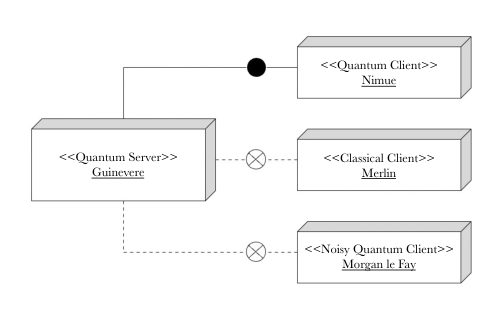 
FIG. 1. Verified quantum network. An example of a verified quantum network constructed via our protocol. Here Guinevere represents a quantum server, Nimue a quantum client, Merlin a classical client, and Morgan le Fay a noisy quantum client. Through the protocol, Guinevere validates Nimue’s quantum capacity and admits her into the network. By the same token, Guinevere rejects Merlin and Morgan from the network when they fail to show fault-tolerant quantum capabilities.

📷 Fig 2

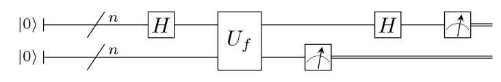 
FIG. 2. Simon’s algorithm. The circuit diagram for Simon’s algorithm. This circuit involves two n-qubit quantum registers collocated on a single quantum processor. The algorithm uses transversal measurements and Hadamard transformations. It also assumes access to a black-box unitary function Uf (|x1⟩|x2⟩) = |x1⟩|x2 ⊕f(x1)⟩which implements the unknown oracle of (1) and (2) as a reversible unitary operation for execution on a quantum device. At the conclusion of a fault-tolerant implementation of the algorithm, the bitstring measured in the top register will be a sample from (4). Both this and the following circuit diagrams were created using ⟨q|pic⟩[44].

📷 Fig 3

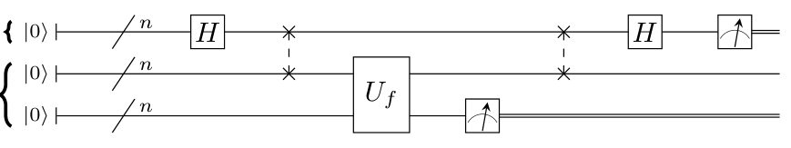 
FIG. 3. Networked Simon’s algorithm. A networked implementation of Simon’s algorithm; compare to the original version presented in Figure 2. In this version, three n-qubit quantum registers are used, one of which is controlled by a client device while the other two are controlled by a quantum server. The client prepares a superposition state which it sends to the server through a quantum channel, as denoted by the dashed SWAP gates. The server computes the oracle on the input and sends the result back to the client over the communication channel. The client may then prepare and sample from (4) as normal. This enables a situation in which the Simon oracle is implementable on the server yet...

📷 Fig 4

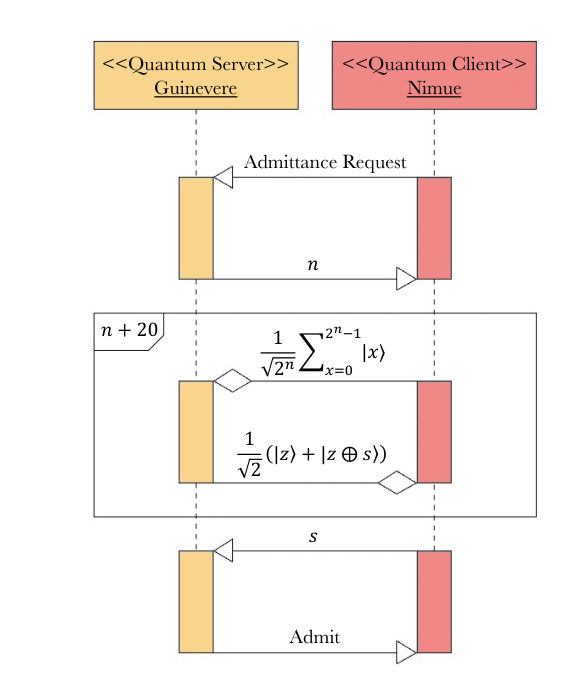 
FIG. 4. Network verification protocol. The commu- nication timeline diagram between Guinevere, the quantum server, and Nimue, the quantum client. The triangular ar- rows represent classical messages, and the diamond arrows represent quantum messages. The messages inside the box are repeated n + 20 times. Through this protocol, Guinevere is able to verify the fault-tolerant quantum capacity of Nimue.

📷 Fig 5

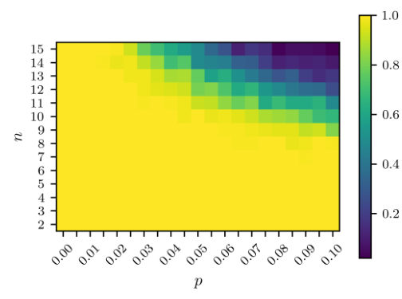 
FIG. 5. Admittance probability under an erasure channel. The results of a simulation of this protocol under a classical erasure noise model, which is typical of quantum communication via photons. The solution probability is plot- ted as a function of the problem size n over the strength of the noise channel p. As expected, we see ideal performance in the noiseless case, and we see the probability of success decay as both p and n increase.

**Summary.** This work presents a novel client-validation protocol for quantum networks that proves a node's genuine quantum computational capability. It achieves this by leveraging the exponential speedup of Simon's algorithm to solve a hidden-subgroup problem. The protocol is shown to secure the network against classical spoofers and noisy devices under various noise models.

**Why it may be interesting.** While focused on networking, the rigorous analysis of noise thresholds (depolarizing channels) and the comparison to classical limitations provides valuable insights into the practical robustness required for any quantum information protocol.

Detailed structure

**Main problem.** The paper addresses the critical need for a reliable method to verify that participating nodes in a quantum network are genuine quantum devices with high computational capability.

**Main result.** A client-validation protocol, based on Simon's algorithm, was developed that successfully admits only genuine, fault-tolerant quantum clients while rejecting classical or noisy quantum spoofers.

**Method.** The protocol uses the inherent exponential separation between classical and quantum computation by requiring the client to solve a quantum-hard problem (Simon's problem) via an oracle query.

**Model / system.** The model is a quantum network featuring a server (Guinevere) validating a client (Nimue) against classical and noisy adversaries. The core mechanism is the execution of Simon's period-finding algorithm.

**Key observables.** The primary observable is the success probability of recovering the hidden period/string, which must exceed a threshold to grant admission.

**Important parameters / regimes.** Noise parameters (erasure, dephasing, depolarizing) and the problem size $n$ are key parameters used to test the protocol's robustness.

**Assumptions / limitations.** The protocol assumes the existence of a quantum server capable of running the oracle and relies on the quantum advantage of Simon's algorithm.

**Figures summary.** Figure 1 illustrates the concept of the verified quantum network, showing successful validation. Figure 3 details the networked circuit implementation of Simon's algorithm, and Figure 7 plots the success probability under depolarizing noise.

**Paper structure.** The paper introduces the problem of client verification, details the protocol using Simon's algorithm in a networked setting, analyzes its resilience against various noise models via simulation, and concludes by discussing the implications for secure quantum communication.

Abstract

Quantum networking represents the future of secure communication, enabling fundamentally new capabilities through quantum information exchange. However, these networks require secure, high-fidelity quantum communication channels, and they require every participating node to be a genuine quantum device. Currently, there is no reliable method to verify whether clients entering a quantum network truly possess quantum computational capability and are connecting over robust channels. In this work, we introduce a client-validation protocol that functions as a proof-of-quantum-capability handshake. Our protocol secures a quantum network against classical spoofers, noisy quantum computers, and genuine quantum devices connecting with the network over noisy or insecure channels. We validate the efficacy of this protocol through numerical simulations under erasure, dephasing, and depolarizing noise models.

[↑ back to top](#top)

### [Susceptibility of qudit-qudit entanglement to quantum noise: insights from the negativity rank](http://arxiv.org/abs/2610.10820v1)

**Authors:** Matthew Chen, Natalie Klco  
**Type:** theory · **Category:** quantum information and computing · **PDF:** <https://arxiv.org/pdf/2610.10820v1>  
**Analysis basis:** full PDF text, analyzed in chunks
**Topic relevance:** `correlated / nonlocal dissipation` **1/5**

📷 Fig 1

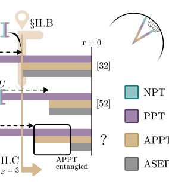 
FIG. 1. Depolarized trajectories of entanglement classifications in the two-qudit (d4 −1)-dimensional Bloch sphere of radius |rpure| = √

📷 Fig 2

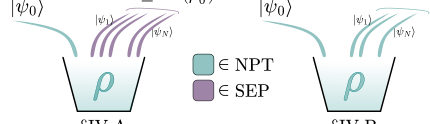 
FIG. 2. Diagram of Section IV results. The maximum number of arbitrary separable (left) or entangled (right) pure ensembles that can be mixed into that of |ψ0⟩such that the resulting ensemble ρ ∈ NPT is governed by the |ψ0⟩Schmidt rank s, with the former equal to the negativity rank n−  ρΓ 0  = s(s−1)

**Summary.** This paper develops a theoretical framework to measure how quantum noise degrades entanglement in qudit systems using the negativity rank. By analyzing the partially transposed density matrix, the authors establish that the negativity rank dictates the robustness of entanglement against noise. The results provide actionable bounds for quantum device design, particularly concerning the Absolutely Positive Partial Transpose (APPT) subspace.

**Why it may be interesting.** It provides concrete, quantitative tools (negativity rank) to predict the operational limits of quantum devices when subjected to realistic noise models, which is crucial for quantum information science.

Detailed structure

**Main problem.** The paper aims to quantitatively explore how quantum noise diminishes entanglement resources in complex quantum many-body systems.

**Main result.** Higher negativity rank provides greater robustness to targeted noise, and the negativity rank allows for direct calculation of noise boundaries for the APPT subspace and the maximum qutrit-qutrit APPT purity.

**Method.** The study utilizes the negativity witness, analyzing the eigenvalue spectra of partially transposed density matrices ($
ho^\Gamma$) to quantify entanglement robustness.

**Model / system.** The focus is on qudit-qudit entanglement, analyzing mixed ensembles under the influence of global depolarizing noise channels.

**Key observables.** Negativity, Negativity Rank ($n_-$), Absolutely Positive Partial Transpose (APPT) subspace, and Purity.

**Important parameters / regimes.** Depolarizing noise parameter ($p$), and the dimension of the qudits ($d$).

**Assumptions / limitations.** The analysis assumes $p$ is small enough such that the negativity rank remains constant under the depolarizing channel, and it discusses the computational difficulty of general entanglement detection.

**Figures summary.** Figure 1 illustrates depolarized trajectories of entanglement classifications in the two-qudit Bloch sphere, showing Type 1 and Type 2 trajectories relative to the APPT boundary.

**Paper structure.** The paper progresses by defining the problem using the negativity witness, analyzing the effect of noise on entanglement boundaries (APPT/ASEP), and deriving specific quantitative results for noise boundaries and maximum purity.

Abstract

One aspect of complexity for quantum many-body systems resides in their ability to exhibit entanglement, uniquely quantum correlations central to quantum computation. To quantitatively explore the diminishing effect that quantum noise has on entanglement resources, we focus on the negativity witness, an entanglement measure based on local time reversal transformations that provides a perfect witness in simple physical contexts. Beyond calculation of the negativity, we analyze the associated eigenvalue spectra of partially transposed density matrices for qudit-qudit bipartitions, finding that higher negativity rank provides greater(reduced) robustness to targeted(depolarizing) noise. In particular, we extend the maximum number of separable states that can be arbitrarily mixed into an entangled pure ensemble while retaining negativity to be exactly equal to the original negativity rank. Furthermore, we report how understanding the role of the negativity rank with respect to the completely depolarizing channel allows direct calculation of (1) certain noise boundaries for the Absolutely Positive Partial Transpose (APPT) subspace beyond which no unitary operator is capable of generating negativity and (2) the maximum qutrit-qutrit APPT purity. Beyond proving tight bounds and contributing to the ongoing search for APPT entanglement, these results expand our understanding of the nuanced relationship between computation with entanglement and practical environments for operating quantum devices.

[↑ back to top](#top)

### [Toward Joint Optimization of Circuit Depth and Training Data Size in Adaptively Grown Quantum Classifiers](http://arxiv.org/abs/2610.12428v1)

**Authors:** Saeefa Rubaiyet Nowmi, Md Mahmuduzzaman Kamol, Mohammad Saidur Rahman  
**Type:** theory · **Category:** disordered systems and neural networks · **PDF:** <https://arxiv.org/pdf/2610.12428v1>  
**Analysis basis:** full PDF text, analyzed in chunks
**Topic relevance:** `quantum measurements` **1/5**

📷 Fig 1

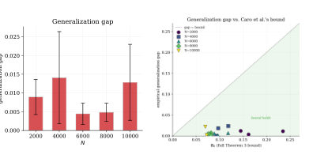 
Figure 1: Relationship between training-set size N Vs (a) circuit size T ∗, (b) test accuracy, (c) generalization gap, and (d) Generalization gap versus the full Caro et al. Theorem 3 bound BK. The shaded region indicates where the bound holds.

**Summary.** This work examines the relationship between circuit complexity and data requirements in quantum machine learning models using the Q-FLAIR growth technique. The authors found no clear, predictable scaling law connecting training data size to the optimal circuit depth. This suggests that jointly optimizing circuit depth and data size in practice is significantly more complex than current theoretical bounds suggest.

**Why it may be interesting.** While focused on ML, the investigation into how complexity (circuit depth) scales with data size touches upon fundamental questions of model capacity and generalization, which are relevant when modeling complex quantum dynamics or emergent behavior in many-body systems.

Detailed structure

**Main problem.** The paper investigates whether a predictable joint scaling law exists between the required circuit depth and the necessary training data size for quantum classifiers.

**Main result.** No predictable relationship was found between the training set size and the circuit size converged to by the Q-FLAIR growth mechanism, suggesting that circuit depth and data size cannot be easily jointly optimized.

**Method.** The authors reimplemented the Q-FLAIR gate-by-gate growth mechanism and tested it across multiple training set sizes on MNIST classification.

**Model / system.** The model uses quantum feature maps within a Quantum Machine Learning (QML) framework, applied to a 3-vs-5 classification task on full-resolution MNIST images.

**Key observables.** Circuit size ($T^*$), test accuracy, and the generalization gap relative to Caro et al.'s theoretical bound.

**Important parameters / regimes.** Training set sizes ($N = 2000$ to $10000$), the number of active gates ($K$), and the dimensionality of the feature space (784 pixels).

**Assumptions / limitations.** The analysis relies on the faithful reimplementation of the Q-FLAIR stopping rule and assumes the validity of Caro et al.'s generalization bound.

**Figures summary.** Figure 1 illustrates the non-monotonic variation of circuit size, test accuracy, and generalization gap with $N$, and compares the empirical gap against the theoretical bound.

**Paper structure.** The paper first establishes the problem of joint optimization, then details the faithful reimplementation of the Q-FLAIR growth process across varying data sizes, presenting results showing no clear scaling trend, and concluding with open questions regarding the interpretation of the weak correlation.

Abstract

Building a quantum model involves a tradeoff: how complex the circuit should be, and how much training data it needs. Caro et al. show that models with fewer trainable gates need less training data to generalize well. Q-FLAIR shows that a quantum feature-map circuit can be grown gate-by-gate, stopping once further growth stops improving the training loss. We ask whether these two results combine into a predictable scaling law. Does Q-FLAIR's own stopping rule pick larger or smaller circuits as training data grows? Does the resulting generalization behavior track Caro et al.'s bound?   We reimplement Q-FLAIR's growth mechanism faithfully, including its analytic reconstruction and exact stopping rule. We run it on full-resolution (784-pixel) MNIST 3-vs-5 classification, at five training-set sizes from N = 2000 to 10000. We then fine-tune each resulting circuit, so we can measure Caro et al.'s notion of active gates, K.   We find no predictable relationship between training-set size and the circuit size Q-FLAIR converges to. Circuit size and test accuracy both vary non-monotonically with N, and seed-to-seed variance is nearly as large as any trend across N. The empirical generalization gap never exceeds Caro et al.'s bound in 14 of 15 runs, so the bound holds as a valid guarantee in those runs. But the gap correlates only weakly with the bound's value (r = 0.12). This shows that K does not explain most of the variation we observe. Why a valid guarantee can coexist with such weak predictive power remains an open question, and answering it may be necessary before circuit depth and training data size can be jointly optimized in practice.

[↑ back to top](#top)

### [Unitary-accessible coherence-erasure distance: Exact qubit solution and a tight qutrit bound](http://arxiv.org/abs/2610.11995v1)

**Authors:** Dong-Ping Xuan, Hua Nan, Zhi-Xi Wang, Shao-Ming Fei  
**Type:** theory · **Category:** quantum information and computing · **PDF:** <https://arxiv.org/pdf/2610.11995v1>  
**Analysis basis:** full PDF text, analyzed in chunks
**Topic relevance:** `quantum measurements` **1/5**

📷 Fig 1

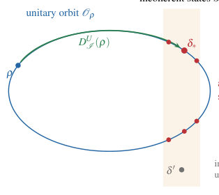 
FIG. 1: Schematic illustration of the unitary coherence-erasure dis- tance DU I(ρ). The unitary orbit Oρ intersects the incoherent set I at the accessible incoherent states Iρ = I ∩Oρ. The optimal target δ∗∈Iρ minimizes the quantum charging distance from ρ, while in- coherent states outside Oρ are not unitarily reachable.

📷 Fig 2

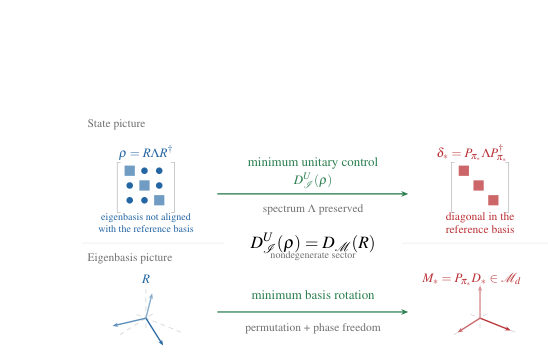 
FIG. 2: Schematic illustration of the eigenbasis reduction of unitary coherence erasure for a nondegenerate state. At the state level, the transformation from ρ = RΛR† to the optimal accessible incoherent state δ∗preserves the spectrum Λ. Equivalently, the problem reduces to rotating the eigenbasis matrix R to the monomial unitary set Md, so that DU I(ρ) = DM(R).

📷 Fig 3

 
FIG. 3: Unitary-accessible coherence-erasure distance DU I and orbit- restricted Bures angle Θorb B for the qubit family in Eq. (52), with fixed Bloch direction |rz|/r = 1/2 and varying purity P = Tr ρ2. In the non- degenerate sector, DU I = π/6 is independent of the purity, whereas Θorb B decreases with increasing mixedness. Their separation is the ac- cessibility difference ∆acc. The open circle at P = 1/2 denotes the nondegenerate limit, while the filled point corresponds to the maxi- mally mixed state ρ = I/2, for which both distances vanish.

📷 Fig 4

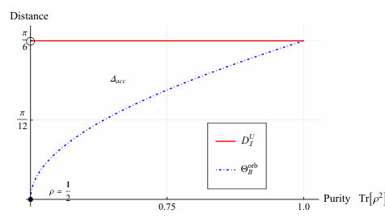 
Fig. 3 illustrates these two distances as the purity of the state is varied while the Bloch direction is kept fixed. The two limiting regimes shown in Fig. 3 are particularly instructive. For the pure state endpoint r = 1,

📷 Fig 5

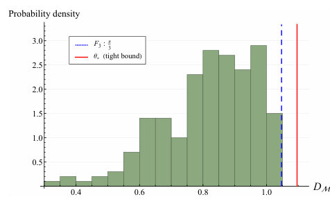 
FIG. 4: Normalized histogram of DM(R) for 200 Haar-random qutrit eigenbases R ∈U(3). The blue dashed line denotes the Fourier-basis value DM(F3) = π/3, while the red solid line marks the tight qutrit bound θ∗= arccos[(2 √

**Summary.** This paper introduces the unitary-accessible coherence-erasure distance, a metric measuring the minimum unitary effort to make a quantum state incoherent while keeping its spectrum fixed. The authors derive exact formulas for qubits and establish a tight universal bound for qutrits. This distance has direct operational meaning as the minimum time required for coherence erasure under bounded unitary driving.

**Why it may be interesting.** This work provides a rigorous, quantifiable measure of how much 'coherence' must be erased via unitary control, which is fundamental for understanding quantum state preparation and decoherence processes in controlled quantum systems.

Detailed structure

**Main problem.** The paper introduces and analyzes the unitary-accessible coherence-erasure distance, $D_{U|I}(
ho)$, which quantifies the minimum unitary control cost to transform a quantum state into an incoherent state while preserving its spectrum.

**Main result.** For qutrits, the authors derive a tight universal bound for this distance: $\arccos\left[rac{2\sqrt{2} - 1}{4}
ight]$, and provide an explicit eigenbasis that achieves this bound.

**Method.** The analysis involves establishing relationships between this distance, orbit-restricted quantum transport, and the Bures geometry, culminating in a detailed optimization over the monomial unitary group for the qutrit case.

**Model / system.** The study concerns general quantum states $
ho$ on a $d$-dimensional Hilbert space, focusing on the dynamics restricted to unitary evolution. The target states are restricted to the intersection of the unitary orbit and the set of incoherent states ($I_
ho$).

**Key observables.** Unitary-accessible coherence-erasure distance ($D_{U|I}(
ho)$), coherence-erasure cost, and the minimum unitary-control cost.

**Important parameters / regimes.** Qubit and qutrit dimensions ($d=2, 3$), the specific bound $\arccos[(2\sqrt{2}-1)/4]$, and the state's eigenbasis orientation.

**Assumptions / limitations.** The analysis relies on restricting the target state set to $I_
ho = I \cap O_
ho$, and for the qutrit case, it involves extensive optimization over the monomial unitary group $M_3$.

**Figures summary.** Figures illustrate the restriction of the optimization to $I_
ho$ and show the reduction of the distance calculation to an optimization problem over the eigenbasis relative to the monomial unitary group.

**Paper structure.** The paper first defines the distance and relates it to existing metrics. It derives exact results for qubits. For qutrits, the problem is reduced to an optimization over the monomial unitary group, leading to a systematic, constraint-based proof to establish the tight universal bound.

Abstract

We introduce the unitary-accessible coherence-erasure distance, which measures the minimum unitary-control cost required to transform a quantum state into an incoherent state without changing its spectrum. The target states are restricted to incoherent states on the same unitary orbit, leading to a geometry different from conventional state-space proximity. We establish inequalities relating orbit-restricted quantum transport, Bures geometry, and the unitary-control distance. These quantities coincide for pure states but can differ for mixed states. For qubits, we derive an exact expression and show that, in the nondegenerate case, the coherence-erasure cost depends on the eigenbasis orientation rather than on the eigenvalues. For nondegenerate qutrits, we reduce the problem to an optimization over the monomial unitary group. We derive the tight universal bound $\arccos[(2\sqrt2-1)/4]$ and construct an explicit eigenbasis that attains it. The resulting distance also determines the minimum coherence-erasure time under bounded unitary driving, giving it a direct operational meaning.

[↑ back to top](#top)

## Other papers (32)

*Papers from primary archives without highlighted authors or any topic match. Click to expand.*

Show other papers

### [2 Fast 2 Surgery: Fast surgery on QLDPC codes with $\tilde{O}(n(k + d))$ space overhead](http://arxiv.org/abs/2610.11079v1)

**Authors:** Nouédyn Baspin  
**Type:** theory · **Category:** quantum information and computing · **PDF:** <https://arxiv.org/pdf/2610.11079v1>  
**Analysis basis:** full PDF text, analyzed in chunks

📷 Fig 1

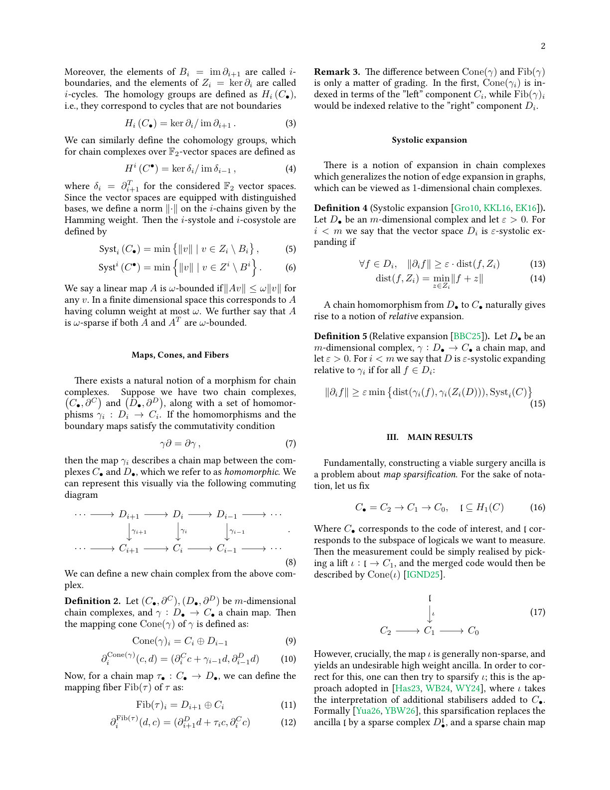 
Low-resolution page preview, page 2

📷 Fig 2

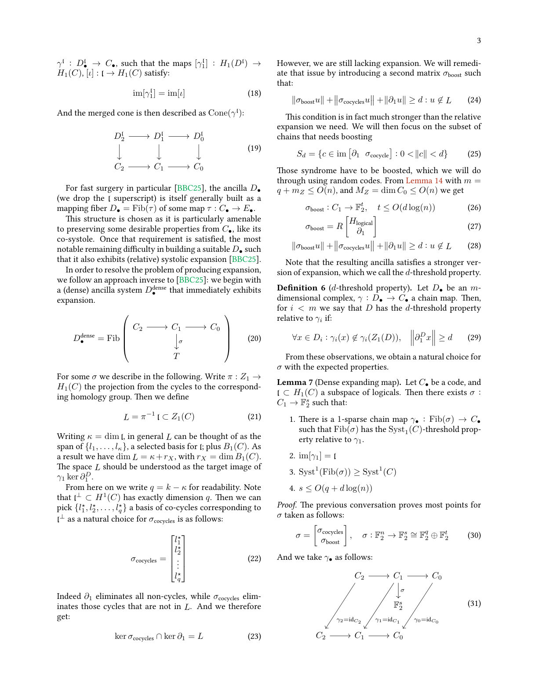 
Low-resolution page preview, page 3

📷 Fig 3

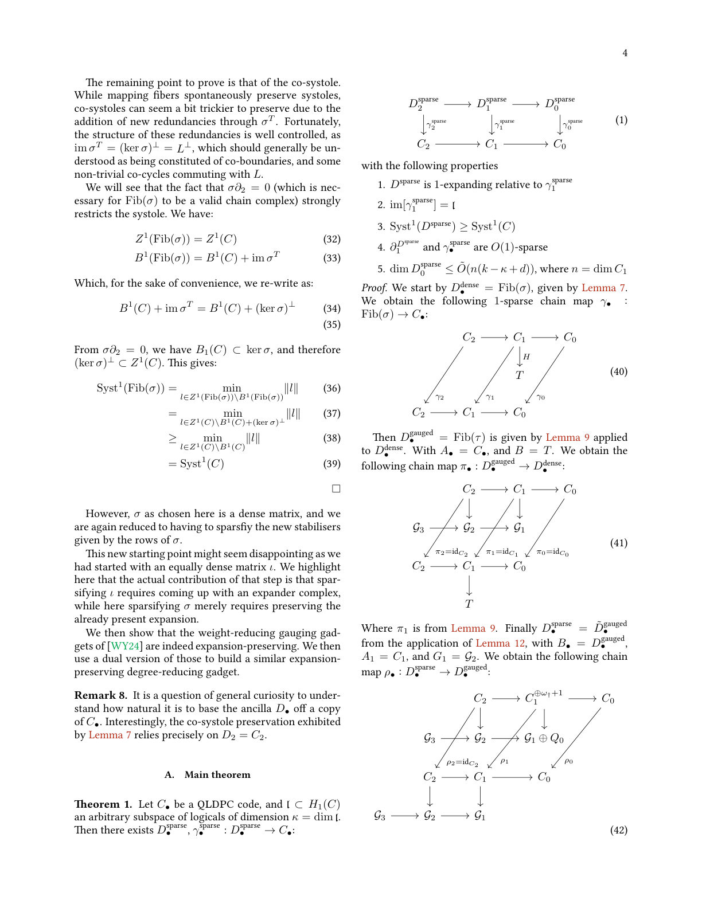 
Low-resolution page preview, page 4

📷 Fig 4

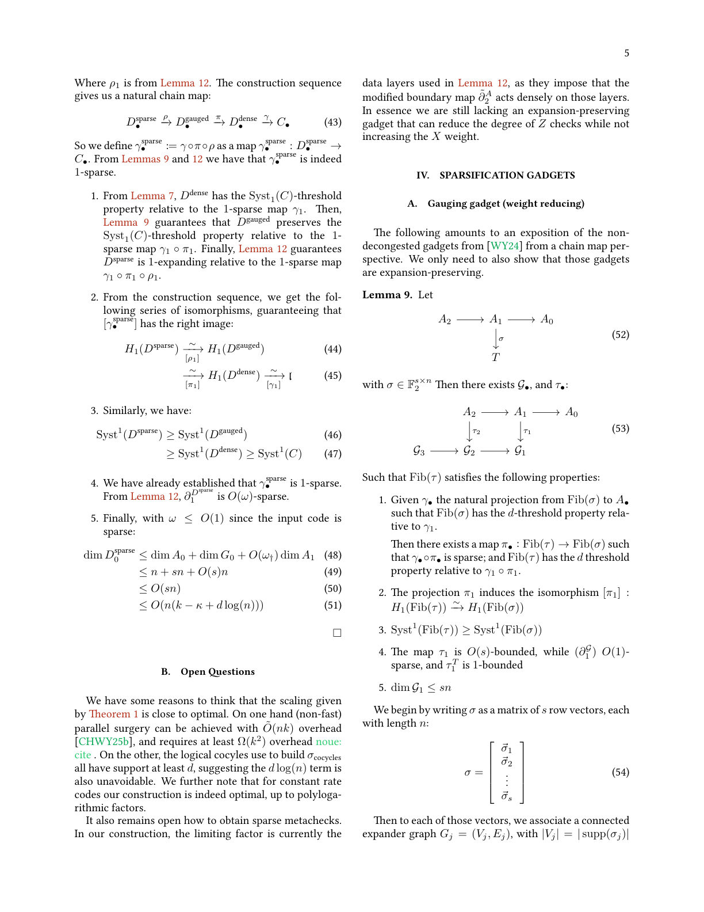 
Low-resolution page preview, page 5

📷 Fig 5

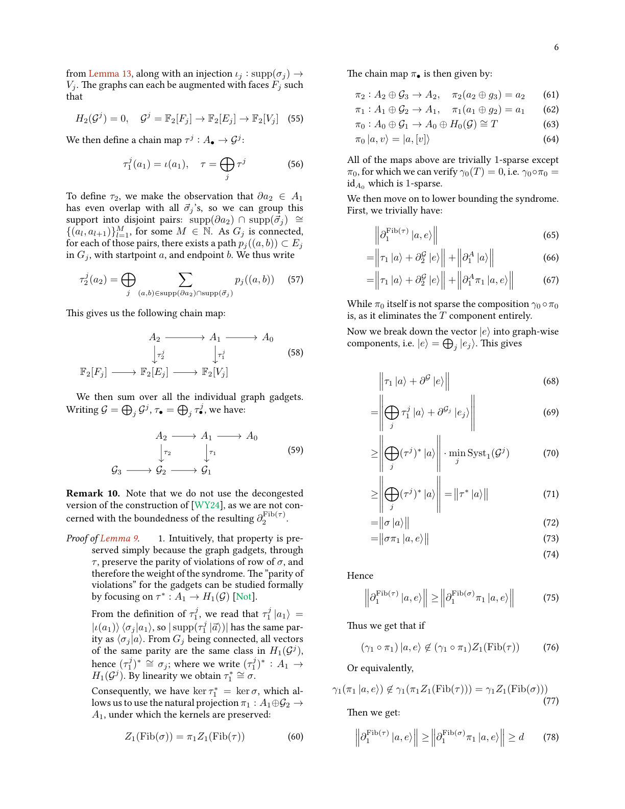 
Low-resolution page preview, page 6

**Summary.** This paper presents a theoretical improvement to the resource overhead required for performing fast surgery on QLDPC codes. By employing advanced techniques from algebraic topology and sparse complex construction, the authors reduce the required ancilla qubits from $	ilde{O}(nkd)$ to $	ilde{O}(n(k+d))$. This advancement is crucial for scaling up fault-tolerant quantum computation.

**Why it may be interesting.** This work directly addresses the overhead costs associated with fault-tolerant quantum computation, which is a central concern for building large-scale quantum processors.

Detailed structure

**Main problem.** The paper aims to improve the space overhead required for performing fast surgery on Quantum Low-Density Parity Check (QLDPC) codes.

**Main result.** The authors demonstrate that fast surgery can be achieved with a space overhead of $	ilde{O}(n(k+d))$, significantly improving upon previous bounds of $	ilde{O}(nkd)$.

**Method.** The technique involves constructing and sparsifying the surgery ancilla system using algebraic topology tools like mapping cones and leveraging expansion-preserving sparsification methods.

**Model / system.** The system under study is QLDPC codes, which are mathematically described using chain complexes ($	ext{C}^{ullet}$). The process models fault-tolerant quantum computation via code surgery.

**Key observables.** Space overhead ($	ilde{O}(n(k+d))$), Systole ($	ext{Syst}_i$), and the dimension of the constructed ancilla complex ($\dim 	ext{D}_{	ext{sparse}}^0$).

**Important parameters / regimes.** The code parameters $n$ (physical qubits), $k$ (logical qubits), and $d$ (error threshold).

**Assumptions / limitations.** The construction relies on defining the dense ancilla using a boosting matrix from random codes, and the final step requires proving the preservation of co-systoles.

**Paper structure.** The paper builds the surgery ancilla through a sequence of steps: starting with a dense system, applying sparsification via mapping cones, and employing gadgets (like the dual-gauging gadget) to reduce the complexity while preserving key properties like the systole.

Abstract

We show that the fast surgery framework of Baspin-Berent-Cohen can be instantiated using at most $\tilde{O}(n(k + d))$ ancilla qubits, improving on the previously achievable $O(n\cdot k \cdot d)$ overhead. This result also establishes that fast surgery can be performed at a cost comparable to the $\tilde{O}(nk)$ overhead required for regular surgery. We build the surgery ancilla by first starting with a dense, but expanding system; and then applying expansion-preserving sparsification methods from gauging and code embeddings.

[↑ back to top](#top)

### [A Power-Liouville Hermite Orbit: Common Spectral Quantization of the Singular Sextic Oscillator and Fractional-Power Potentials](http://arxiv.org/abs/2610.11533v1)

**Authors:** Artur Ishkhanyan, Miloslav Znojil  
**Type:** theory · **Category:** other · **PDF:** <https://arxiv.org/pdf/2610.11533v1>  
**Analysis basis:** full PDF text, analyzed in chunks

📷 Fig 1

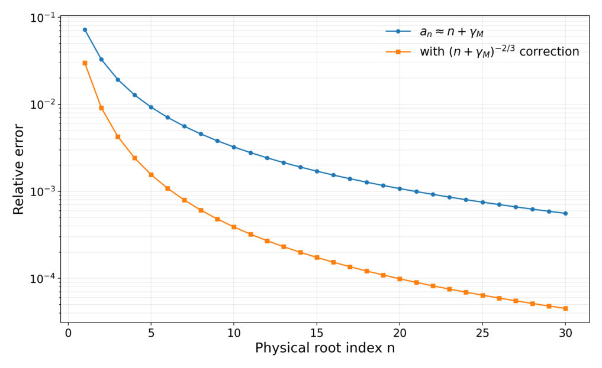 
Figure 1: Relative error of the leading and corrected large-n formulas for the exact physical roots of the common Hermite spectrum equation.

**Summary.** This theoretical paper connects the spectral quantization of a singular sextic oscillator to fractional-power potentials by identifying a common 'power-Liouville Hermite orbit.' Using advanced techniques like coordinate transformations and semiclassical matching, the authors prove that these diverse potentials share an identical underlying quantization structure. This work provides a unified mathematical framework for understanding spectral properties across different physical models.

**Why it may be interesting.** The rigorous mathematical connection established between multiple exactly solvable potentials via a single spectral orbit is highly relevant for understanding the underlying symmetries and quantization rules in quantum mechanics, applicable to systems modeled by complex differential equations.

Detailed structure

**Main problem.** The paper aims to establish a deep mathematical connection between the spectral quantization of a singular sextic oscillator and various fractional-power potentials.

**Main result.** It demonstrates that these potentials share a common 'power-Liouville Hermite orbit,' characterized by an exact discrete sequence of quartic Sturmian eigencouplings for the sextic oscillator.

**Method.** The analysis employs power-Liouville coordinate transformations and analyzes the invariance of the Wronskian zero set across different spectral charts derived from the biconfluent-Heun equation.

**Model / system.** The core model is the singular sextic oscillator, analyzed within the framework of the biconfluent Heun equation. This system is shown to be spectrally equivalent to potentials like $x^{2/3}$ and inverse-square-root potentials.

**Key observables.** The exact discrete sequence of quartic Sturmian eigencouplings, the vanishing of the degree-five accessory compatibility obstruction, and the common physical zero set (Wronskian zero set).

**Important parameters / regimes.** The index $N=4$ of the Hermite hierarchy, and the quantization parameter derived from the Frobenius index ($
u=5$).

**Assumptions / limitations.** The analysis relies on selecting a specific 'physical slice' and assumes that spectral equivalence is defined by the preservation of the physical zero set under reparametrization.

**Figures summary.** Not specified, but the notes reference Table 2 showing numerical verification of eigencouplings via two-sided shooting methods.

**Paper structure.** The paper builds by first defining the spectral problem via the biconfluent Heun equation, then applying power-Liouville transformations to generate the orbit, and finally using advanced semiclassical methods (matched large-action analysis) to derive the precise quantization rules.

Abstract

A singular sextic oscillator in the finite-Hermite biconfluent-Heun hierarchy generates an exact four-member power-Liouville Hermite orbit. Power coordinate transformations with the Liouville amplitude map the hierarchy member $N=4$ to four half-line Schrödinger spectral charts while preserving the physical regular-recessive Wronskian zero set under energy-coupling reparametrization. Two charts are the previously studied $x^{2/3}$ and inverse-square-root conditionally integrable potentials; the orbit embeds this known power-dual pair together with the singular sextic and linear-plus-quadratic charts. On the selected physical slice, the degree-five accessory compatibility obstruction vanishes identically, while the transformed Frobenius index reproduces both published fractional-power centrifugal coefficients. The common endpoint condition yields an exact discrete sequence of quartic Sturmian eigencouplings for the sextic oscillator. Independent two-sided shooting confirms representative eigencouplings and node counts. A matched large-action analysis further derives the first matched-endpoint correction within the leading Langer action and improves the Maslov-shifted effective-level approximation. The construction thus connects exact Hermite solvability, energy quantization, coupling quantization, and power duality within a single spectral orbit.

[↑ back to top](#top)

### [Attainable Boundaries versus Operational Equivalence: Dual Benchmarks for the Hierarchical Assessment of Quantum Resources](http://arxiv.org/abs/2610.11094v1)

**Authors:** Sunho Kim, Chunhe Xiong, Junde Wu  
**Type:** theory · **Category:** quantum information and computing · **PDF:** <https://arxiv.org/pdf/2610.11094v1>  
**Analysis basis:** full PDF text, analyzed in chunks

📷 Fig 1

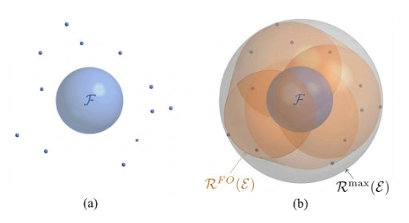 
FIG. 1. (a) Let E denote the set of currently accessible or preparable states—be they finite, countably infinite, or continuous. While this set can generally be assumed to encompass all free states, no univer- sal quantitative method is known that guarantees both convexity and monotonicity under free operations when attempting to quantify rel- ative resources relative to E. (b) To resolve this issue, we construct two reference sets. The first is RF O(E), defined as the subset of states reachable from E exclusively via free operations. The second is Rmax(E), comprising all states that, although inaccessible via free operations, yield equivalent performance in the given quantum task.

📷 Fig 2

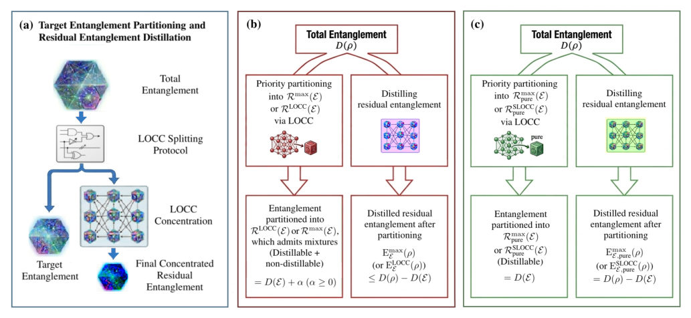 
FIG. 2. (a) The initial state embeds the target entanglement—determined via a given reference set—while the residual entanglement is constituted by the remainder upon its exclusion, with all processing executed via LOCC. (b) Inefficiency of partitioning via a benchmark for entanglement partitioning admitting mixed states (Ineq. (54)). (c) Perfect reversibility under a pure-state partitioning benchmark (Eq. (55)).

**Summary.** This paper develops a novel quantum resource theory framework that moves beyond idealized free states by benchmarking quantum resources against the set of states actually preparable in current experiments ($E$). It introduces a dual-benchmark approach—one for immediate performance and one for intrinsic potential—to provide a more realistic measure of resource utility. This is vital for advancing quantum technologies by grounding theory in physical operational constraints.

**Why it may be interesting.** It provides a rigorous, operational framework for quantifying quantum resources that directly addresses the gap between theoretical ideals and experimental reality, which is crucial for designing practical quantum protocols.

Detailed structure

**Main problem.** Conventional quantum resource theories benchmark utility against idealized free states, failing to account for the practical constraints of current experimental apparatus.

**Main result.** The authors propose a dual-benchmark framework that quantifies relative resource utility by comparing states against the set of practically accessible resources ($E$), demonstrating its utility for resource management.

**Method.** The framework establishes two benchmarks: a strategy-dependent measure for achievable performance and a strategy-independent lower bound for intrinsic potential, using $E$ as the reference set.

**Model / system.** The system involves general quantum states and resource quantification, extending resource theories to incorporate the physical limitations imposed by the preparable set $E$ of states.

**Key observables.** Relative Superiority ($	ext{RE}$), Distillable Entanglement ($D(
ho)$), and the residual resource entropy ($E_{rde}^E(
ho)$).

**Important parameters / regimes.** The reference set $E$ (the attainable boundary), and the asymptotic limits ($\epsilon 	o 0, n 	o \infty$) used in derivations.

**Assumptions / limitations.** The core assumption is that defining $E$ as the reference point resolves the challenge of strategy-dependent operational efficacy in QRTs.

**Figures summary.** Figure 1 illustrates the construction of two key reference sets: $E$ (currently accessible states) and $	ext{RFO}(E)$ (states reachable via free operations) and $	ext{Rmax}(E)$ (performance-equivalent states).

**Paper structure.** The paper systematically introduces the limitation of free-state benchmarks, proposes the framework using $E$, develops the dual-benchmark methodologies, and validates the approach using entanglement distillation as a concrete example.

Abstract

While conventional quantum resource theories quantify utility relative to an idealized set of free states, practical implementations are confined to a specific supply environment---a framework encompassing all states realizable or preparable via current experimental apparatus and design choices, not limited to free states. This work proposes a novel framework for evaluating the relative utility of arbitrary quantum states against the resource set made accessible by these current selections. We specifically focus our investigation on two canonical representations: the set of states reachable via free operations as the attainable boundary imposed by current experimental constraints, and the set defined through numerical optimization as the criterion for operational equivalence. Our framework establishes two core evaluation methodologies. First, we provide a strategy-dependent benchmark by assessing a state's performance relative to the reference set under its individually optimized strategy, thereby quantifying achievable performance. Second, we derive a computable lower bound on this superiority by considering optimal strategies for each state individually, enabling the quantification of strategy-independent relative performance independent of specific experimental setups. Beyond relative efficiency metrics, we demonstrate the practical utility of this approach for resource management scenarios, including the selective extraction of states advantageous for storage and distribution, and the concentration of residual resources. Using quantum entanglement as a paradigmatic example, we prove that distillable entanglement can be fully recovered via extraction and concentration when the reference set is restricted to pure states, thereby demonstrating the practical relevance of our framework.

[↑ back to top](#top)

### [Beyond QAOA: A Review of AI and Quantum Computing for Adaptive Combinatorial Optimization](http://arxiv.org/abs/2610.11759v1)

**Authors:** Hoong Chuin LAU  
**Type:** theory · **Category:** quantum information and computing · **PDF:** <https://arxiv.org/pdf/2610.11759v1>  
**Analysis basis:** full PDF text, analyzed in chunks

📷 Fig 1

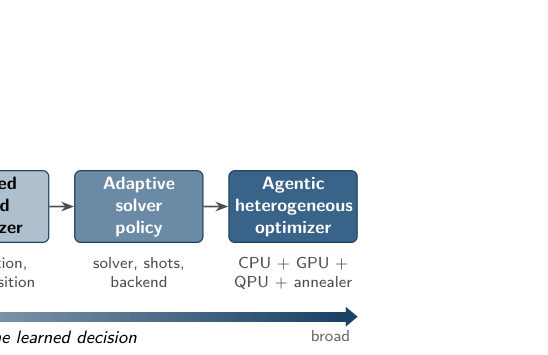 
Figure 1: Increasing scope of learned decisions in quantum combinatorial optimization. Each stage widens what is learned (labels below each box), from a fixed quantum algorithm to policies that allocate work across heterogeneous classical and quantum resources.

📷 Fig 2

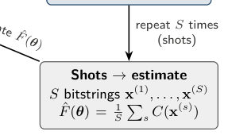 
Figure 2: The hybrid variational loop used by QAOA and other variational quantum algorithms. The quantum processor acts as a parameterized sampler; all optimization of the parameters happens classi- cally, using objective estimates obtained from S shots.

📷 Fig 3

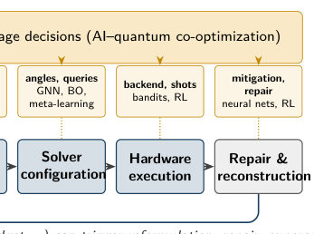 
Figure 3: Pipeline view of AI intervention points and execution feedback. Each stage carries the decision that is learned and the AI methods typically used (Table 3). Component-level methods (AI-for-QO) act on a single stage; co-optimization methods learn a policy that coordinates several stages, conditioned on execution feedback.

📷 Fig 4

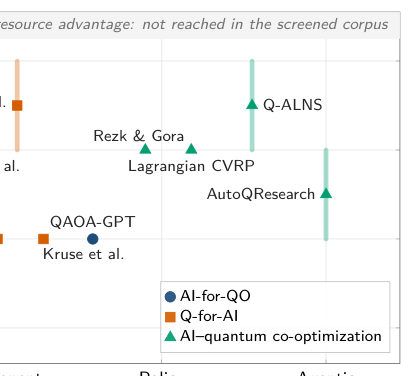 
Figure 4: Degree of AI autonomy versus the strongest quantum evidence reported by representative studies. Vertical positions are the maturity levels coded in the evidence matrix (Section A); translucent bars mark studies coded as a range (e.g., M3–M4), with the marker at the midpoint. Horizontal positions are qualitative. Marker shape and colour indicate the paradigm.

📷 Fig 5

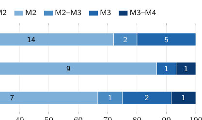 
Figure 5: Distribution of evidence maturity within each paradigm for the evidence core, using the coding described in Section A. Bar segments show the share of studies at each level; numbers inside segments are study counts. Background reviews (10), structural precursors (4), and one benchmark study are omitted. No study is coded at M0, M4, or M5.

**Summary.** This review surveys the rapidly evolving field of using Artificial Intelligence to enhance quantum computation for solving hard combinatorial optimization problems. It categorizes current research into three paradigms and critically assesses the evidence, concluding that the primary challenge is managing the allocation of classical and quantum resources rather than just qubit count. The paper provides a structured framework for future research in the field.

**Why it may be interesting.** It provides a high-level, critical survey of the intersection between ML and quantum computation, which is crucial for understanding the practical roadmap for quantum algorithm development beyond simple circuit implementations.

Detailed structure

**Main problem.** The review addresses the challenge of adaptive combinatorial optimization on near-term quantum processors, where resource constraints and complex decision-making limit current approaches.

**Main result.** Evidence is stronger for using AI to assist quantum optimization (AI-for-QO) than for using quantum computation to improve learned classical optimizers (Q-for-AI). Scaling is identified as a systems problem of resource allocation.

**Method.** The paper reviews the literature by organizing it around the specific decision being learned (e.g., parameter initialization, circuit design, penalty selection) rather than by application.

**Model / system.** The focus is on mapping combinatorial problems (like MaxCut or VRP) to QUBO/Ising models, which are then solved using parameterized quantum circuits (PQCs) like QAOA or VQE on NISQ hardware.

**Key observables.** Solution quality (optimality gap, approximation ratio), feasibility (feasible-sample rate), and resource costs (shot budget, quantum evaluations).

**Important parameters / regimes.** The M0-M5 evidence hierarchy is used to grade maturity, and key parameters include the QAOA depth ($p$) and the shot budget ($S$).

**Assumptions / limitations.** The review notes that experimental controls are thin, and many studies lack proper classical baselines or fully isolate the quantum contribution.

**Figures summary.** Figure 1 illustrates the increasing scope of learned decisions, progressing from fixed quantum algorithms to adaptive solver policies across heterogeneous resources.

**Paper structure.** The review systematically examines three paradigms (AI-for-QO, Q-for-AI, Co-Optimization) and structures the literature review by the decision being learned, culminating in a detailed evidence matrix (Table 7).

Abstract

Near-term quantum approaches to combinatorial optimization are limited by qubit counts, circuit fidelity, sampling cost, and the difficulty of encoding constraints, while machine learning is increasingly used to configure and control quantum optimization workflows. We call such workflows adaptive: decisions conventionally fixed in advance, from formulation and penalties to shot budgets, backends, and whether to invoke a quantum processor at all, are made by learned policies that respond to the instance, the progress of the solve, or the hardware. This review examines three paradigms, AI for quantum optimization, quantum for AI-driven optimization, and AI-quantum co-optimization, and organizes the literature by the decision being learned rather than by application. A structured review of 119 papers, 67 coded in detail, shows that the evidence is considerably stronger for AI-assisted quantum optimization than for the reverse direction: learning already reduces quantum evaluations, improves initialization, supports decomposition and penalty control, and mitigates noise, whereas evidence that quantum computation improves learned optimizers remains largely confined to small-scale simulation. Experimental controls are thin: 25 of 57 studies include no classical baseline, the quantum contribution is fully isolated in 10 of 24 studies where an ablation applies, and the median experiment uses 17 qubits. We introduce an M0-M5 evidence hierarchy, from simulation to matched-resource practical advantage, and find no broadly convincing result at the highest level. We argue that scaling is increasingly a systems problem: the question is not only whether a problem fits on a quantum processor, but how classical and quantum resources should be allocated across the optimization process. The review is aimed at researchers in quantum computing, machine learning, and operations research.

[↑ back to top](#top)

### [Certifying Hidden Paths: Scalable Topology Assurance for QKD Networks](http://arxiv.org/abs/2610.11513v1)

**Authors:** Alessandro Colombo, Margherita Cozzolino, Stephan Krenn, Thomas Lorünser  
**Type:** theory · **Category:** quantum information and computing · **PDF:** <https://arxiv.org/pdf/2610.11513v1>  
**Analysis basis:** full PDF text, analyzed in chunks

📷 Fig 1

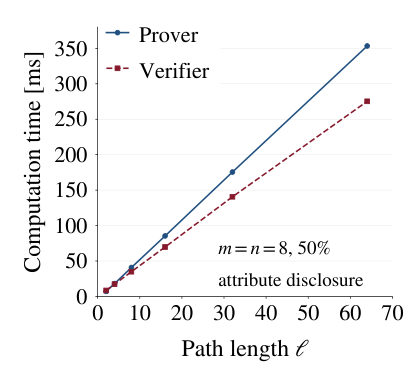 
Fig. 3. Runtime versus path length ℓwith m = n = 8 and 50% disclosure.

📷 Fig 2

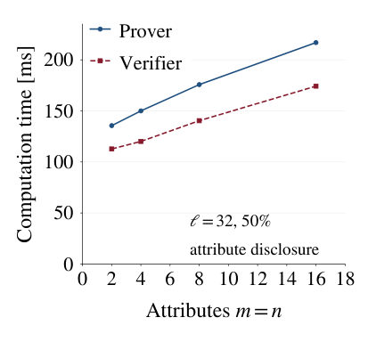 
Fig. 4. Runtime versus attributes m = n with ℓ= 32 and 50% disclosure.

**Summary.** This work introduces a novel, scalable cryptographic protocol to assure the security of communication paths in large QKD networks. It allows a provider to prove that a valid, policy-compliant route exists without revealing the network's sensitive internal topology. By certifying nodes and edges independently, the method ensures that proof complexity scales only with the path length, not the entire network size.

**Why it may be interesting.** While highly cryptographic, the focus on quantum networks and secure communication protocols places it directly within the domain of quantum information security, which is a key application area for quantum physics.

Detailed structure

**Main problem.** The paper addresses the need for a scalable, zero-knowledge mechanism to prove the existence of policy-compliant paths in large-scale Quantum Key Distribution (QKD) networks without revealing the network's internal topology.

**Main result.** They propose a topology-certification mechanism that certifies nodes and edges independently using multi-message signatures, achieving proof sizes and computational costs independent of the overall network size.

**Method.** The approach uses advanced zero-knowledge proof techniques, combining multi-message signatures and NIZK proofs to prove path existence while hiding the specific route and topology details.

**Model / system.** The context is large-scale QKD networks, which are modeled as directed graphs where security assurance depends on the entire communication path.

**Key observables.** Proof size (e.g., below 300 KiB for specific parameters) and cryptographic generation/verification times (e.g., below 400 ms).

**Important parameters / regimes.** Path length ($\ell$), number of nodes ($m$), and number of edges ($n$); the proof cost is shown to be independent of the total network size.

**Assumptions / limitations.** The security relies on the underlying cryptographic assumptions, such as the special soundness of the $\Sigma$-protocols and the discrete-logarithm assumptions.

**Paper structure.** The paper builds from preliminaries defining cryptographic building blocks, develops the core mechanism by certifying components independently, and concludes with extensions for multi-path support and graph evolution.

Abstract

Large-scale Quantum Key Distribution (QKD) networks rely on trusted repeaters, making the security properties of the selected communication path an essential part of end-to-end assurance. At the same time, network operators may be unwilling to disclose their internal topology. We present a topology-certification mechanism that lets a provider prove in zero knowledge that policy-compliant routes between two endpoints exist, without disclosing the routes in an individual presentation. Our main idea is to certify nodes and edges independently using multi-message signatures, rather than signing the complete graph as one object. For a route chosen in advance, proof size and cryptographic proving and verification work depend on its positions and attributes, independently of the overall network size, whereas route discovery and certification have separate graph-dependent costs. The construction hides the actual route length up to a public bound and sketches extensions to node-disjoint routes and monotonic additions within a graph epoch. We give a formal security model and conditional proofs of unforgeability and graph hiding for a generic construction. For a BBS-based construction, presentation-size estimates remain below $300$\,KiB at $\ell=m=n=50$, and measured generation and verification times remain below $400$\,ms at $\ell=64$ and $m=n=8$.

[↑ back to top](#top)

### [Entanglement entropy and magic of ZX-diagrams](http://arxiv.org/abs/2610.12447v1)

**Authors:** Marcin Szyniszewski, Razin A. Shaikh, Aleks Kissinger  
**Type:** theory · **Category:** quantum information and computing · **PDF:** <https://arxiv.org/pdf/2610.12447v1>  
**Analysis basis:** full PDF text, analyzed in chunks

📷 Fig 1

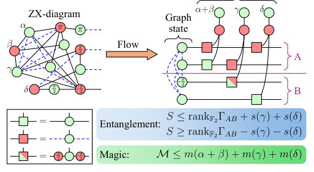 
FIG. 1. Estimating entanglement entropy and magic of ZX- diagrams. Flow enables conversion to a normal form separat- ing graph-state backbone from Pauli gadgets. Gadget cross- ing A|B bipartition add s(φ) = h2(sin2 φ

📷 Fig 2

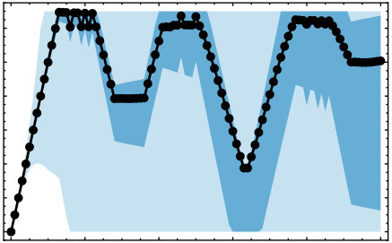 
FIG. 2. Half-chain entanglement entropy in (a) random Clifford-plus-small-phase circuit for L = 20 qubits, and (b) cir- cuit combining Trotterized Hamiltonian evolution with Clifford layers for L = 26 qubits. The entropy bound from Eq. 2 re- mains close to the exact entropy (darker blue region), while generic entangling-capacity bounds broaden rapidly (lighter blue region).

📷 Fig 3

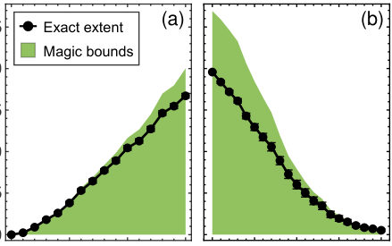 
FIG. 3. Logarithmic stabilizer extent for (a) random Clifford- plus-small-phase unitary circuit and (b) random circuit with mid-circuit measurements, with L = 8 qubits. The magic bound Eq. 4 is shown in green.

**Summary.** This paper introduces scalable methods to quantify entanglement entropy and 'magic' (non-stabilizerness) directly from ZX-diagrams, bypassing costly full state contractions. By decomposing the circuit into a graph-state backbone and non-Clifford gadgets, the authors derive additive bounds for these key quantum resources. This establishes a crucial link between the graphical ZX-calculus and the characterization of quantum many-body resources.

**Why it may be interesting.** The work provides a powerful, diagrammatic tool to characterize complex quantum states arising from quantum computation models, offering insights into resource quantification that is crucial for understanding computational complexity.

Detailed structure

**Main problem.** The paper addresses the challenge of efficiently estimating quantum resources, specifically entanglement entropy and 'magic' (non-stabilizerness), directly from the structure of ZX-diagrams without resorting to computationally expensive full tensor contractions.

**Main result.** The authors derive scalable, additive upper and lower bounds for entanglement entropy and magic based on decomposing the ZX-diagram into a graph-state backbone and non-Clifford Pauli gadgets.

**Method.** They utilize a 'Flow' criterion to transform the ZX-diagram into a normal form, allowing the separation of the graph-state part from the non-Clifford contributions, which then yields the resource bounds.

**Model / system.** The model is quantum states and dynamics represented by ZX-diagrams, which are used to describe quantum circuits, including those involving random unitaries, Trotterized Hamiltonian evolution, and Clifford layers.

**Key observables.** Entanglement Entropy ($S$, including Rényi variants $S_\alpha$), Magic (logarithmic stabilizer extent $M$), and the entanglement entropy of the graph-state backbone ($	ext{rank}_{\mathbb{F}_2}\Gamma_{AB}$).

**Important parameters / regimes.** Circuit depth, number of qubits, and the phases ($\varphi_i$) associated with the non-Clifford Pauli gadgets.

**Assumptions / limitations.** The derived strict bounds assume that there is no coherent interference between the Pauli gadgets, although the method remains informative even when such interference occurs.

**Figures summary.** Figures illustrate the decomposition of the circuit into a normal form (Fig. 1), and compare the derived bounds for entanglement entropy and magic against exact calculations for random and Trotterized circuits (Figs. 2 and 3).

**Paper structure.** The paper systematically develops bounds for entanglement entropy and magic by first establishing the normal form decomposition via 'Flow', then deriving additive bounds for the entropy contribution from gadgets, and finally applying these concepts to benchmark random and structured quantum circuits.

Abstract

Entanglement and non-stabilizerness are complementary resources underlying the complexity of quantum states, yet extracting either quantity from large quantum circuits generally requires exponentially scaling resources. In diagrammatic approaches to quantum computation, such as the ZX-calculus, both quantities likewise typically require expensive tensor contractions that are not native to graphical rewriting. Here we show that both entanglement and magic can be efficiently estimated directly from ZX-diagrams. Flow enables efficient extraction of a normal form separating a potentially extensively entangled graph-state backbone from non-Clifford Pauli gadgets. This structure yields additive upper and lower bounds on bipartite entanglement entropy, which we further tighten through a preprocessing procedure that removes or merges redundant non-Clifford contributions. The same normal form gives an upper bound on logarithmic stabilizer extent. We benchmark these methods in random unitary and monitored circuits, and a circuit combining Trotterized Hamiltonian evolution with Clifford layers, finding that the resulting bounds remain informative even at large qubit numbers, circuit depths, and internal spider counts. Our results provide scalable probes of entanglement and non-stabilizerness of ZX-diagrams and establish a bridge between ZX-calculus and quantum many-body resource characterization, with applications across quantum computing, quantum information, and condensed-matter physics.

[↑ back to top](#top)

### [Exact value and rigidity of the $2\times3$ magic rectangle](http://arxiv.org/abs/2610.12001v1)

**Authors:** Isaac Barouch Essayag, Aryeh Lev Zabokritskiy  
**Type:** theory · **Category:** quantum information and computing · **PDF:** <https://arxiv.org/pdf/2610.12001v1>  
**Analysis basis:** full PDF text, analyzed in chunks

📷 Fig 1

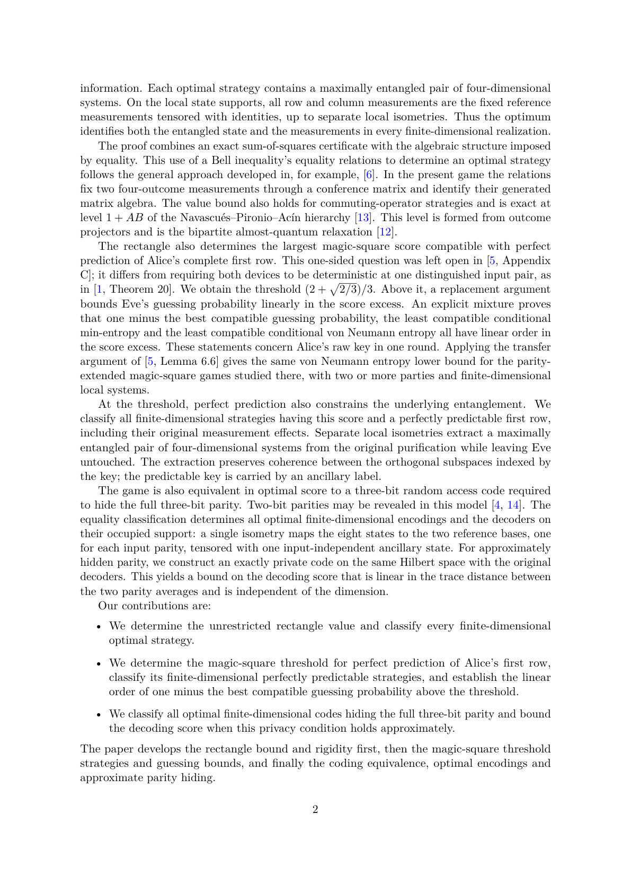 
Low-resolution page preview, page 2

📷 Fig 2

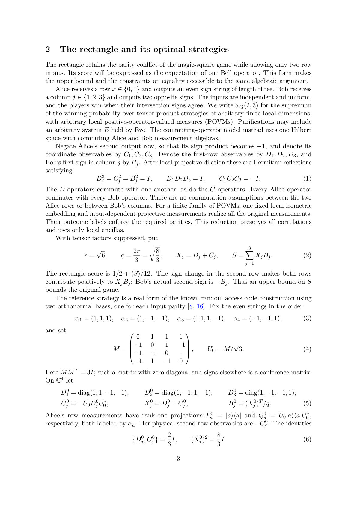 
Low-resolution page preview, page 3

📷 Fig 3

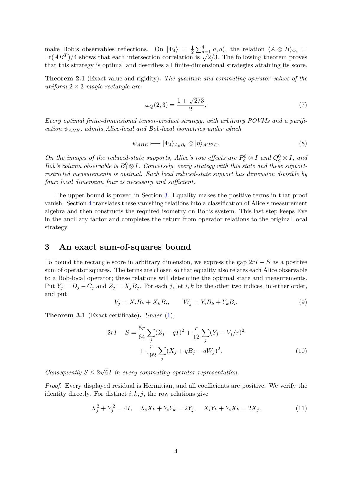 
Low-resolution page preview, page 4

📷 Fig 4

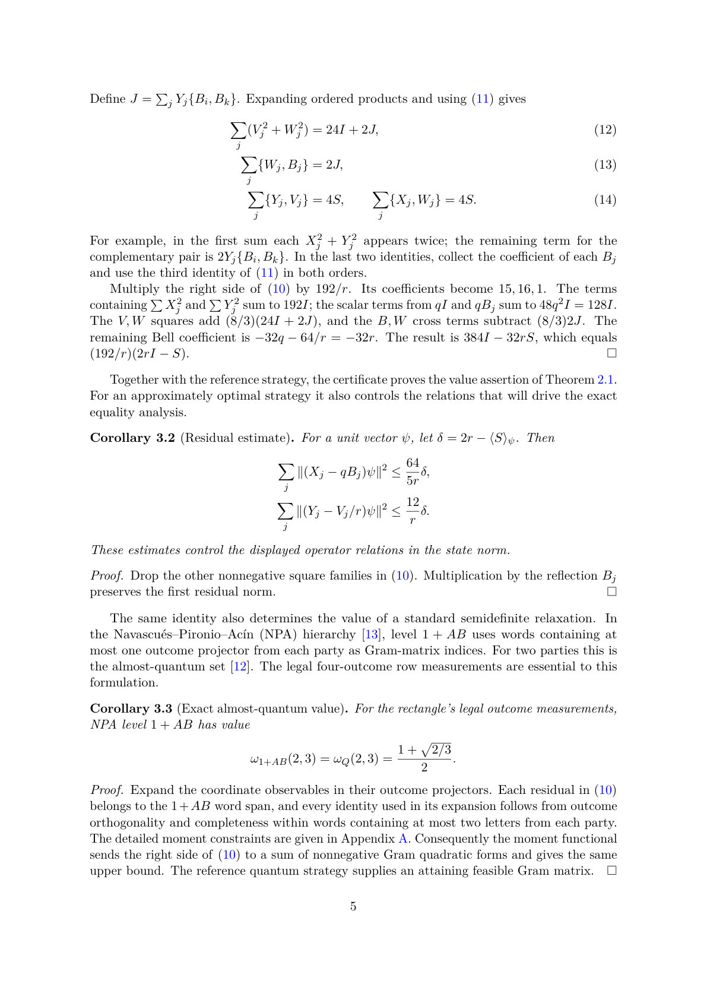 
Low-resolution page preview, page 5

📷 Fig 5

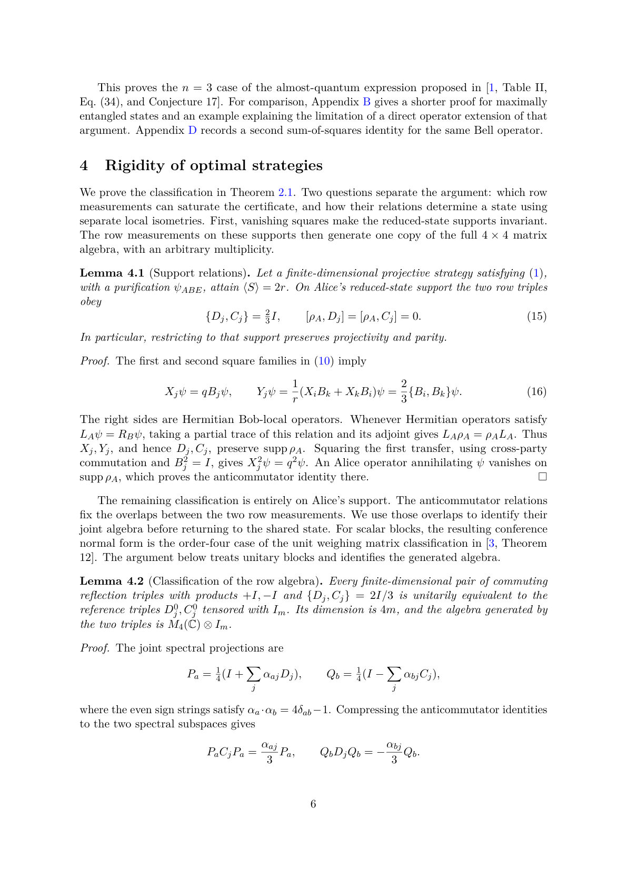 
Low-resolution page preview, page 6

**Summary.** This paper calculates the exact quantum value for the $2	imes3$ magic rectangle, a nonlocal game, finding it to be $(1+\sqrt{2/3})/2$. It achieves this by using advanced techniques involving sum-of-squares identities to bound the game's score. The work provides a deep classification of all optimal quantum strategies, linking the game to quantum random access codes.

**Why it may be interesting.** The rigorous mathematical techniques used to classify optimal quantum strategies and derive exact bounds are highly relevant to understanding the limits of quantum correlations in various quantum information tasks.

Detailed structure

**Main problem.** The paper determines the exact quantum value and classifies all optimal strategies for the $2	imes3$ magic rectangle, a specific nonlocal game.

**Main result.** The quantum value of the game is proven to be $rac{1 + \sqrt{2/3}}{2}$, and the optimal strategies are shown to be highly rigid, involving maximally entangled pairs of four-dimensional systems.

**Method.** The analysis uses techniques from nonlocal game theory, establishing upper bounds via exact sum-of-squares identities and classifying optimal structures by analyzing the equality conditions of these bounds.

**Model / system.** The model is the $2	imes3$ magic rectangle, treated as a nonlocal game where two players match entries under incompatible parity constraints. The analysis is generalized to arbitrary finite local dimensions.

**Key observables.** The quantum value $\omega_Q(2, 3)$ and the associated 'rectangle score' $S$, which is the expectation of a Bell operator.

**Important parameters / regimes.** The local dimensions of the players' systems, and the entanglement structure involving four-dimensional systems.

**Assumptions / limitations.** The analysis assumes the existence of arbitrary finite local dimensions and general local measurements (POVMs) to establish the general bounds.

**Figures summary.** Not specified by the notes, but the structure suggests figures illustrating the sum-of-squares identities and the resulting optimal measurement operators.

**Paper structure.** The paper progresses by first establishing an upper bound on the game's score using sum-of-squares techniques (Theorem 3.1), then using the equality conditions to classify the optimal measurement structure (Lemma 4.2), culminating in the proof of the exact value and the characterization of the optimal quantum state.

Abstract

The $2\times3$ magic rectangle is a nonlocal game in which two players match entries subject to incompatible parity constraints. We prove that its quantum value is $(1+\sqrt{2/3})/2$ and classify all optimal strategies in arbitrary finite local dimensions, allowing general measurements. Every optimal strategy contains a maximally entangled pair of four-dimensional systems, with fixed measurements on the local state supports up to local isometries and ancillary systems. The attaining construction was previously known from quantum random access codes. An exact sum-of-squares identity gives the upper bound, and its equality relations determine the measurement algebra needed for the classification. The rectangle determines the largest magic-square score compatible with perfect prediction of Alice's first row by an adversary with quantum side information. We classify all finite-dimensional strategies attaining this score with perfect prediction and show that one minus the best compatible guessing probability has linear order in the score excess above it. The same rigidity theorem classifies all optimal three-bit random access codes that hide the full input parity.

[↑ back to top](#top)

### [Field-resolved hierarchy of superconducting energy gaps in PdTe](http://arxiv.org/abs/2610.12075v1)

**Authors:** Sangyun Lee, A. M. Donald, D. Duong, S. Huang, R. Gazizulin, C. Huan, Rongying Jin  
**Type:** experiment · **Category:** other · **PDF:** <https://arxiv.org/pdf/2610.12075v1>  
**Analysis basis:** full PDF text, analyzed in chunks

📷 Fig 1

 
FIG. 1. (a) Crystal structure of PdTe constructed using the reported lattice parameters and atomic positions from Ref. [10]. Blue and brown spheres represent Pd and Te atoms, respectively. (b) Temperature dependence of the electrical re- sistance (red line) and zero-bias conductance (open circles) of PdTe. The resistance and zero-bias conductance show dis- tinct behaviors below Tc, indicating that the point contact is not in the thermal regime and preserves spectroscopic sensi- tivity to superconductivity.

📷 Fig 2

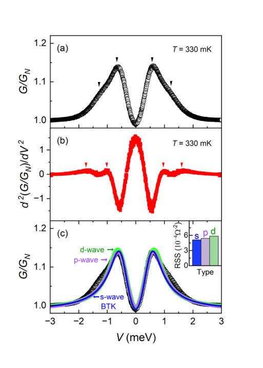 
FIG. 2. (a) Soft point-contact spectroscopy of PdTe. The differential conductance G measured at 330 mK is plotted as a function of bias voltage. Vertical arrows mark addi- tional finite-bias spectroscopic features. (b) Second deriva- tive, d2G/dV 2, of the differential conductance shown in (a), highlighting two characteristic energy scales. (c) Normalized differential conductance of PdTe fitted using single-gap s-, p-, and d-wave BTK models. The blue, violet, and green curves represent the least-squares fits obtained using the s-, p-, and d-wave models, respectively. The inset compares the residual sum of squares (RSS) for the three models, showing that the s-wave model yields the smallest...

📷 Fig 3

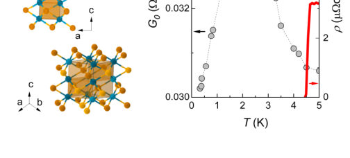 
Figure 1(a) shows the crystal structure of PdTe, in which Pd and Te atoms form a hexagonal NiAs-type structure [10]. The superconducting transition of the measured crystal was first characterized by the electrical resistivity. As shown by the red curve in Fig. 1(b), the electrical resistivity decreases sharply and reaches zero at Tc ≈4.5 K, confirming superconductivity in PdTe. Soft point-contact Andreev-reflection spectroscopy was per-

📷 Fig 4

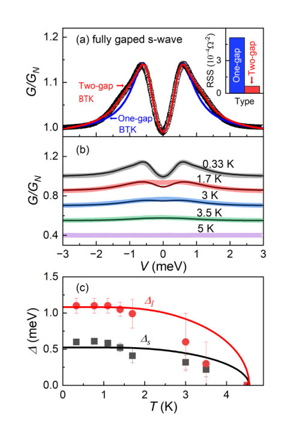 
FIG. 3. (a) Normalized differential conductance of PdTe fitted using single-gap and two-gap s-wave BTK models. The blue and red curves represent the least-squares fits obtained using the single-gap and two-gap models, respectively. The two-gap fit yields ∆l = 1.1 meV and ∆s = 0.5 meV. The inset compares the residual sum of squares (RSS) for the two models; the RSS of the two-gap fit is approximately eight times smaller than that of the single-gap fit. (b) Temperature evolution of the soft point-contact Andreev-reflection spectra of PdTe. The solid curves are fits to the two-gap s-wave BTK model. (c) Temperature dependence of the superconducting energy gaps extracted from the two-gap BTK...

📷 Fig 5

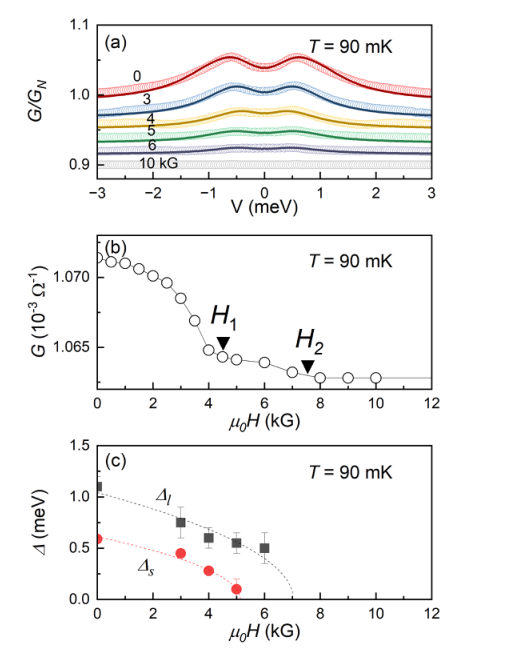 
FIG. 4. (a) The magnetic-field evolution of the differential conductance spectra of PdTe measured at 90 mK for fields of 0, 3, 4, 5, 6, and 10 kG. (b) Magnetic-field dependence of the zero-bias conductance of PdTe. Vertical arrows mark charac- teristic fields, denoted H1 ≈4.5 kG and H2 ≈7.5 kG, asso- ciated with the suppression of the two spectroscopic energy gaps. (c) Magnetic-field dependence of the superconducting energy gaps extracted from the two-gap BTK analysis.

**Summary.** This work investigates the superconducting gap structure in PdTe using point-contact spectroscopy. By analyzing the temperature and magnetic field dependence of the Andreev-reflection spectra, the authors demonstrate the existence of two distinct superconducting energy gaps. This field-resolved hierarchy suggests a complex, potentially multiband or surface-dominated, superconducting state in the material.

**Why it may be interesting.** The clear separation of magnetic-field responses for different energy scales provides insight into the underlying pairing mechanism, which is crucial for understanding complex superconducting states in topological materials.

Detailed structure

**Main problem.** The study aims to resolve how multiple superconducting energy scales evolve under an applied magnetic field to distinguish between multiband, anisotropic, or surface-sensitive superconducting responses in PdTe.

**Main result.** The research reveals a field-resolved hierarchy of superconducting energy scales in PdTe, characterized by two distinct gaps ($\sim 0.5$ meV and $\sim 1.1$ meV) with different magnetic-field robustness.

**Method.** Low-temperature soft point-contact spectroscopy (PCS) was employed to measure Andreev-reflection spectra, which were then analyzed using both single-gap and two-gap Blonder-Tinkham-Klapwijk (BTK) models.

**Model / system.** The physical system is PdTe, a Dirac semimetal exhibiting superconductivity. The analysis relies on fitting the differential conductance spectra using the BTK formalism, comparing single-gap versus two-gap superconducting models.

**Key observables.** Andreev-reflection spectra (differential conductance $dI/dV$), zero-bias conductance, and the characteristic superconducting energy gaps ($\Delta_l, \Delta_s$).

**Important parameters / regimes.** Two characteristic superconducting energy scales (0.5 meV and 1.1 meV); two distinct magnetic fields (4.5 kG and 7.5 kG); the superconducting transition temperature ($T_c$).

**Assumptions / limitations.** The analysis assumes the superconducting state can be modeled by two isotropic gap components ($\Delta_l$ and $\Delta_s$) and that the field dependence follows a characteristic suppression form.

**Figures summary.** Figures show the crystal structure and resistance vs. temperature, soft PCS spectra, and detailed fits comparing single-gap vs. two-gap s-wave BTK models across temperature and magnetic field.

**Paper structure.** The paper progresses from initial observations of two energy scales incompatible with single-gap models, to fitting the data with a two-gap model, and finally demonstrating the distinct magnetic-field evolution of these two gaps, establishing the hierarchy.

Abstract

Resolving how multiple superconducting energy scales evolve under magnetic field is important for distinguishing multiband, anisotropic, and surface-sensitive superconducting responses. Here, we investigate the superconducting state of PdTe using low-temperature soft point-contact spectroscopy in a sealed $^3$He immersion environment. The resulting Andreev-reflection spectra reveal two characteristic superconducting energy scales near 0.5 and 1.1 meV that are not adequately described by a single-gap BTK model. Both energy scales are progressively suppressed upon warming toward the same superconducting transition temperature $T_c$. In contrast, their magnetic-field evolution reveals two distinct characteristic fields near 4.5 and 7.5 kG. The lower scale is associated with the loss of the zero-resistance superconducting state, whereas the higher-energy spectroscopic response persists to substantially larger fields. Independent field-dependent gap analysis yields suppression scales consistent with those identified from the zero-bias conductance. These results reveal a field-resolved hierarchy of superconducting energy scales in PdTe and indicate superconducting responses with distinct magnetic-field robustness.

[↑ back to top](#top)

### [From band reconstruction to Bogoliubov dispersion: How dz2-band enhances iron-based superconductivity](http://arxiv.org/abs/2610.11484v1)

**Authors:** Jingming Yan, Shendong Su, Guihao Jia, Yucong Peng, Xuanyu Long, Zheng Liu, Pei Ouyang, Qi-Kun Xue, Wei Li  
**Type:** both · **Category:** strongly correlated electrons · **PDF:** <https://arxiv.org/pdf/2610.11484v1>  
**Analysis basis:** full PDF text, analyzed in chunks

📷 Fig 1

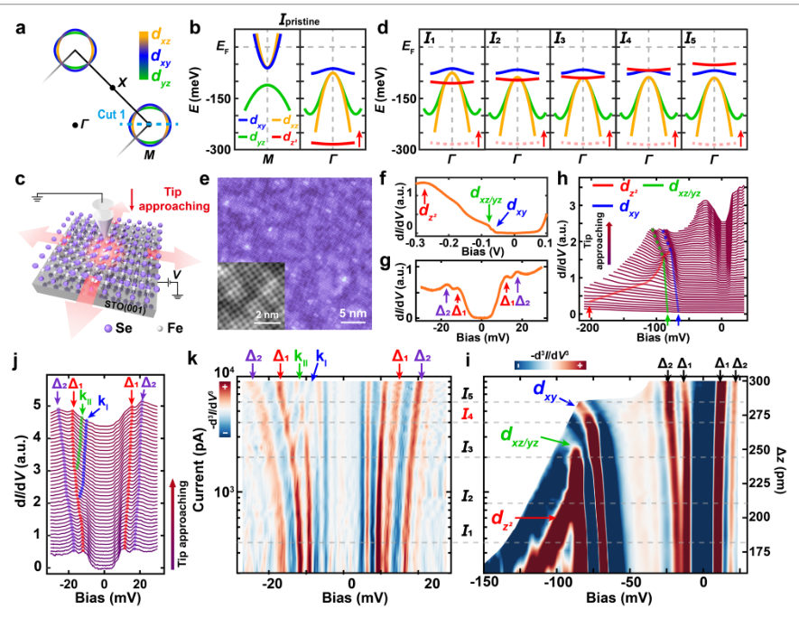 
Figure 1. Tip-induced d-orbital band reconstruction and its influence on superconducting coherence peaks in monolayer FeSe/STO. (a), (b) Schematic of Fermi surface and band structure of monolayer FeSe/STO. Color code indicates orbital characters of bands. Cut 1 denote Γ-M direction. (c) Schematic of experimental setup. Tip-sample spacing is precisely reduced by increasing tunneling current It. (d) Positions of dz2 band under five tunnelling currents I1-I5. (e) Atomically resolved STM topography of Se-layer (30 nm × 30 nm; set point, V = 30 mV, It = 100 pA). Inset: zoom-in topography of Se-lattice (30 mV, 1 nA). (f) A wide-bias range dI/dV spectrum (set point, V = 30 mV, It = 5 pA). Colored...

📷 Fig 2

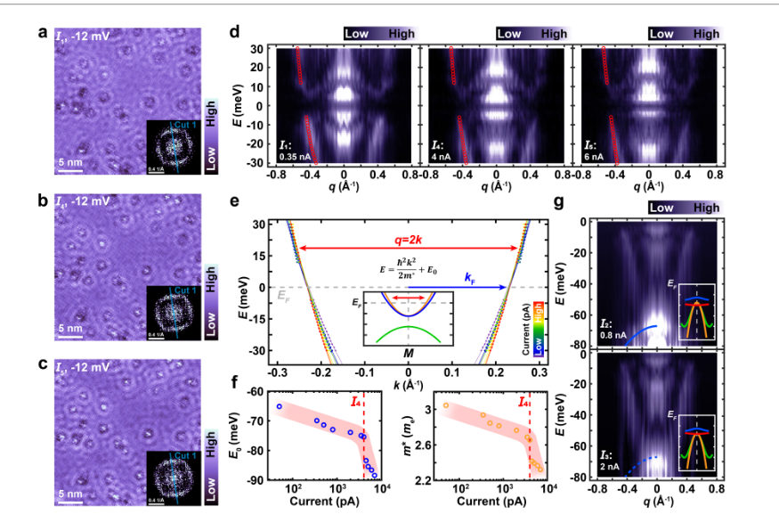 
Figure 2. Band reconstruction under different tunneling currents revealed by quasiparticle interference. (a)-(c) Real space dI/dV maps acquired at -12 mV under different tunneling currents (30 nm × 30 nm; set point, V = 30 mV, I1 = 0.35 nA, I4 = 4 nA, I5 = 6 nA). Insets: Fast Fourier transformation of the corresponding real-space dI/dV maps. Cut 1 denote the Γ-M direction (figure 1(a)). (d) Energy-dependent line profiles along Cut 1, from -30 mV to 30 mV. Additional dI/dV maps and their corresponding FFT images at different energies are provided in Supplementary Material figure S5-7. Red circles mark the scattering wave vectors obtained from the normal state quasiparticle interference....

📷 Fig 3

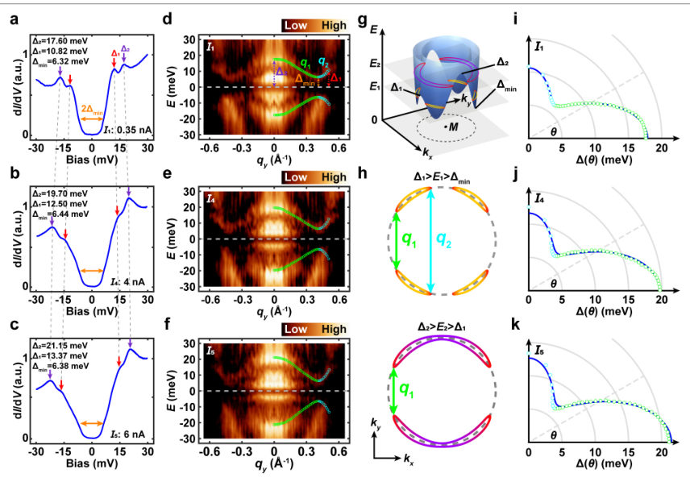 
Figure 3. Bogoliubov quasiparticle interference in monolayer FeSe/STO under different tunneling currents. (a)-(c) Typical dI/dV spectra of the superconducting gap obtained under the same tunneling currents as in figure 2(a)-(c) (set point, V = 30 mV, I1 = 0.35 nA, I4 = 4 nA, I5 = 6 nA). Red, purple and orange arrows highlight the inner superconducting gap (Δ1), outer superconducting gap (∆2) and gap minimum (Δmin), respectively. Dashed gray lines track the evolution of superconducting gap Δ1 and ∆2. (d)-(f) Energy-dependent line profiles along Cut 1 in the insets of figure 2(a)-(c), showing clear Bogoliubov quasiparticle dispersions under different tunneling currents. The BQPI wave vectors...

📷 Fig 4

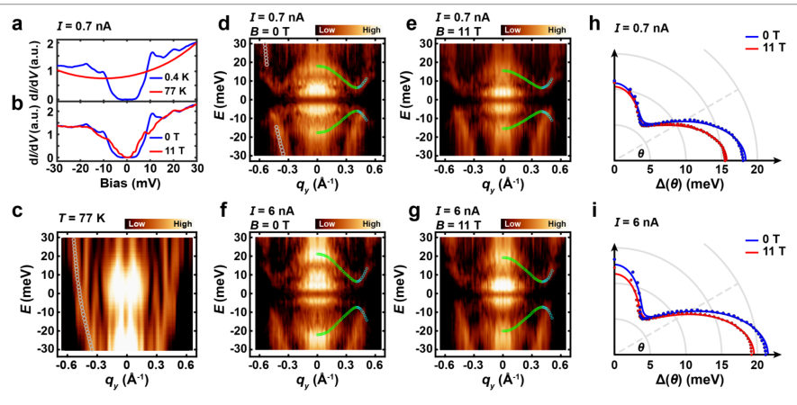 
Figure 4. Temperature and magnetic field response of Bogoliubov quasiparticle interference in monolayer FeSe/STO. (a) dI/dV spectra at 0.7 nA under different temperatures. Spectra in (a) were measured with the setpoint of 0.7 nA (V = 30 mV), under different temperature of 0.4 K and 77 K, respectively. (b) dI/dV spectra at 0.7 nA under B = 0 T and 11 T. Spectra in (b) were measured with the setpoint of 0.7 nA (V = 30 mV), under perpendicular magnetic fields of 0 T and 11 T, respectively. (c) Energy-dependent line profiles along Cut 1 at 77 K (set point, V = 30 mV, I = 2 nA). Gray circles mark the scattering wave vectors obtained from the normal state quasiparticle interference. (d)-(g),...

📷 Fig 5

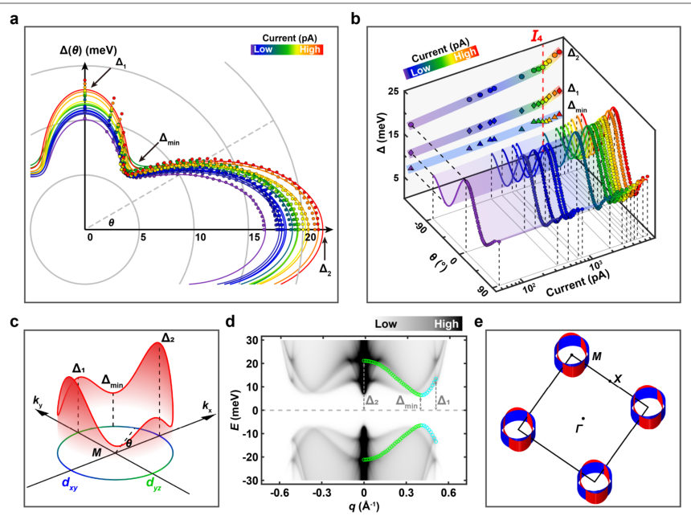 
Figure 5. Tip-tunable superconducting gap anisotropy in monolayer FeSe/STO. (a) Polar plots of the angular-dependent superconducting gaps extracted from BQPI wave vectors q1 and q2 in figure 3(d)-(f) and Supplementary Material figure S12 under different tunneling currents, represented by colored dots. Solid curves are gap fittings using Eq. (1). Δ1 and Δ2 correspond to two local gap maxima, while Δmin is the gap minimum. (b) The three-dimensional plot of current-dependent gap magnitudes. Two local gap maxima (Δ1 and Δ2) and the gap minimum (Δmin) of the fitted curves are projected onto the Δ-current plane. The colored guidelines track the evolution of Δ1 and Δ2, exhibiting a clear...

**Summary.** This research demonstrates that deep-lying electronic bands, specifically the $d_{z^2}$ band in iron-based superconductors, can enhance superconductivity. By applying strain via STM, the authors induce hybridization between this deep band and the superconducting bands, which is confirmed through momentum-resolved measurements like BQPI. This establishes 'deep-band engineering' as a powerful design principle for superconducting materials.

**Why it may be interesting.** This work provides a concrete, experimentally verifiable mechanism (band hybridization) for optimizing superconductivity in correlated materials, which is highly relevant to understanding pairing mechanisms beyond simple Fermi-surface considerations.

Detailed structure

**Main problem.** To refine the understanding of iron-based superconductivity by demonstrating that deep-lying electronic bands, specifically the $d_{z^2}$ band, can enhance the superconducting pairing strength.

**Main result.** The upward tuning of the deep $d_{z^2}$ band via strain causes hybridization with primary superconducting bands, leading to a measurable and significant enhancement of the superconducting gap.

**Method.** The study combines Scanning Tunneling Microscopy (STM) measurements—including current-dependent $dI/dV$ and Bogoliubov QPI (BQPI)—with theoretical DFT calculations to probe electronic structure changes.

**Model / system.** The system is monolayer FeSe/SrTiO3, an iron-based superconductor. The analysis focuses on the electronic structure evolution, particularly the hybridization between the deep $d_{z^2}$ band and the Fermi-level active bands ($d_{xy}$, $d_{xz}/d_{yz}$), under applied strain.

**Key observables.** Superconducting gap size ($\Delta$), band energy shifts ($d_{z^2}$ band), hybridization evidence (QPI/BQPI patterns), and the anisotropic gap function $\Delta(	heta)$.

**Important parameters / regimes.** Tunneling current ($I_t$) used to induce strain, temperature ($0.4 	ext{ K}$ to $77 	ext{ K}$), and magnetic field ($0 	ext{ T}$ to $11 	ext{ T}$).

**Assumptions / limitations.** The primary mechanism for gap enhancement is attributed to the hybridization between the deep $d_{z^2}$ band and the pairing-active bands, which is confirmed by momentum-resolved measurements.

**Figures summary.** Figures illustrate band structure evolution via $dI/dV$ spectra, QPI patterns showing band reconstruction, and BQPI measurements confirming the superconducting gap and its anisotropy under varying conditions.

**Paper structure.** The paper progresses from identifying the limitation of conventional band models to using STM/QPI to observe strain-induced band shifts, linking these shifts to hybridization, and finally quantifying the resulting superconducting gap enhancement using BQPI.

Abstract

Conventional understanding of iron-based superconductivity is usually established based on electronic bands at the Fermi level, leaving deeper bands overlooked as potential factor. Here, we expand this view by demonstrating that a deep-lying dz2 band below the Fermi level can be employed to enhance the superconducting paring strength. By using scanning tunneling microscope to mechanically change the crystal lattice of an iron-based superconductor, we observe an upward shift of the deep-lying dz2 band related feature, leading to hybridization with the primary superconducting bands at the Fermi level. We visualize the novel evidence of this band hybridization and resulting enhanced superconducting gap through quasiparticle interference imaging, providing conclusive evidence that engineering such correlations between deep and pairing-active bands is a potent mechanism for amplifying the superconducting gap. This work refines the conventional view of pairing-relevant electronic structures and establishes band hybridization as an effective way to optimize superconducting materials.

[↑ back to top](#top)

### [From Majorana to Bloch: two ways to generalize the Bloch sphere representation](http://arxiv.org/abs/2610.11868v1)

**Authors:** Louis Hanotel  
**Type:** theory · **Category:** quantum information and computing · **PDF:** <https://arxiv.org/pdf/2610.11868v1>  
**Analysis basis:** full PDF text, analyzed in chunks

📷 Fig 1

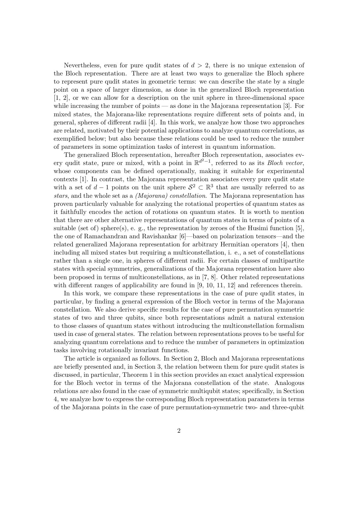 
Low-resolution page preview, page 2

📷 Fig 2

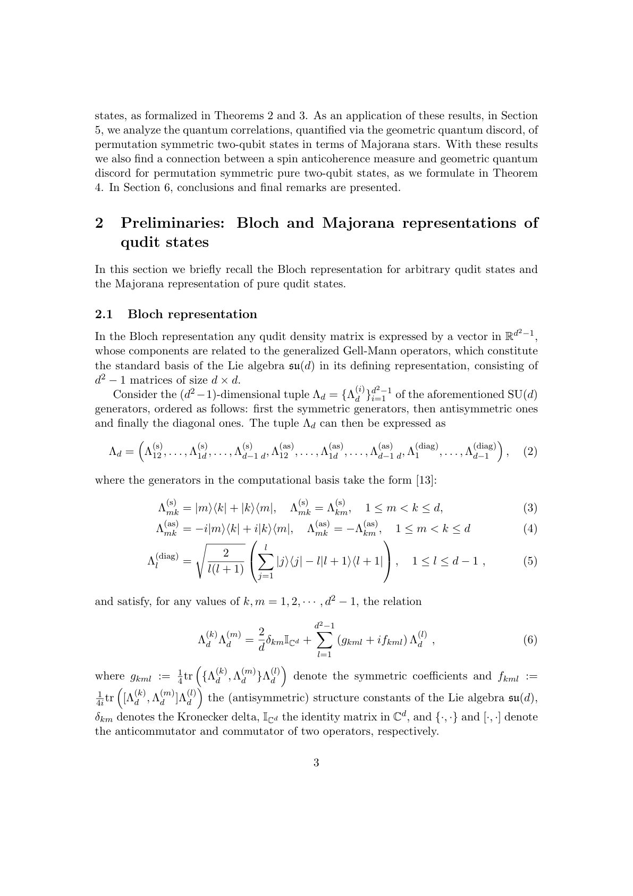 
Low-resolution page preview, page 3

📷 Fig 3

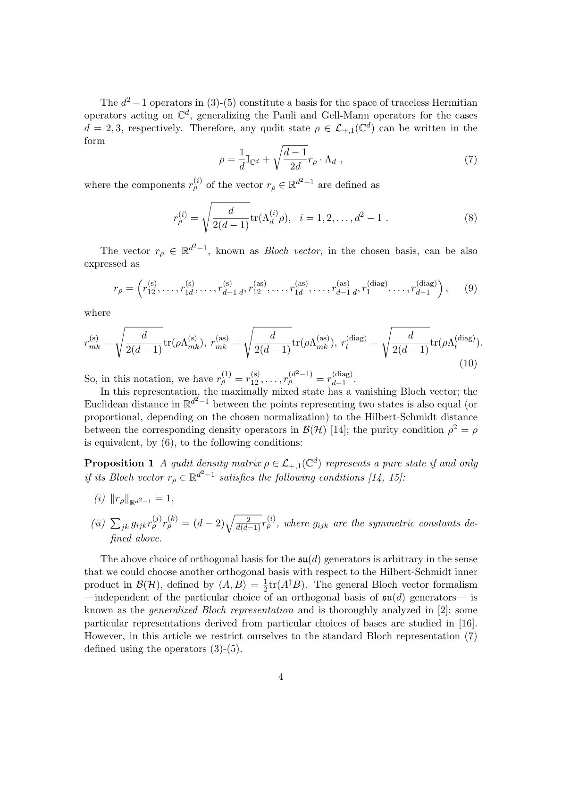 
Low-resolution page preview, page 4

📷 Fig 4

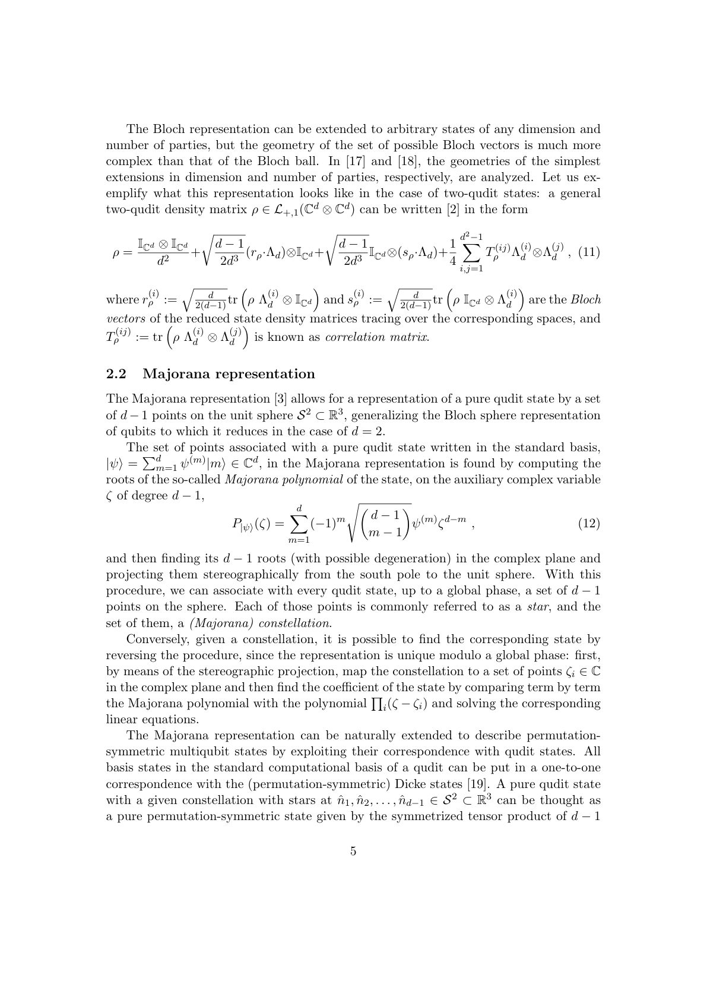 
Low-resolution page preview, page 5

📷 Fig 5

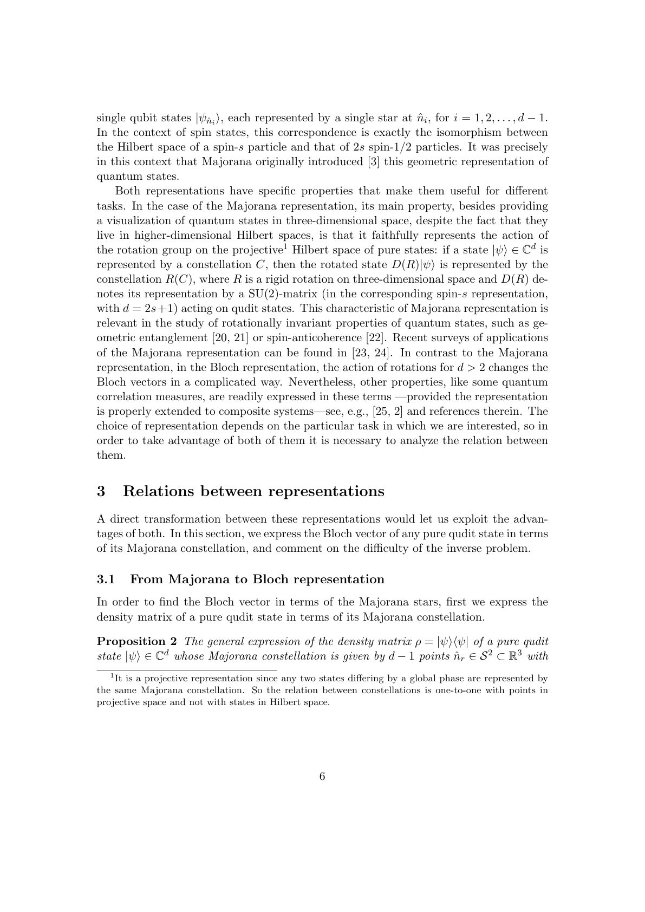 
Low-resolution page preview, page 6

**Summary.** This paper compares two distinct geometric methods—the generalized Bloch vector and the Majorana constellation—used to represent pure qudit quantum states. By establishing explicit mathematical links between these representations, the authors provide a unified geometric tool to analyze quantum correlations, particularly demonstrating a quantitative relationship between geometric quantum discord and 1-anticoherence for two-qubit systems.

**Why it may be interesting.** It provides a powerful geometric framework for understanding quantum correlations in multi-qubit systems, linking abstract algebraic structures (like $\mathfrak{su}(d)$ generators) to intuitive geometric concepts (like points on a sphere).

Detailed structure

**Main problem.** The Bloch sphere representation for quantum states is not unique when generalized to qudit systems ($d>2$), necessitating a comparison between different geometric representations.

**Main result.** The authors derive explicit analytical relations connecting the Bloch vector representation to the Majorana constellation representation for pure qudit states, and apply this to quantify quantum correlations in two-qubit systems.

**Method.** The work involves comparing two geometric representations—the Bloch vector in $\mathbb{R}^{d^2-1}$ and the Majorana constellation on $S^2$—by deriving general formulas linking their respective coordinates.

**Model / system.** The focus is on pure qudit states ($
ho \in L_{+,1}(\mathbb{C}^d)$) and, specifically, pure permutation-symmetric two- and three-qubit states. The analysis uses density operators and their geometric characterizations.

**Key observables.** Bloch vector components ($\mathbf{r}_
ho$), Majorana constellation points, and quantum correlation measures like geometric quantum discord ($	ext{DG}(
ho)$) and 1-anticoherence ($	ext{AV}_1$).

**Important parameters / regimes.** The dimension $d$ of the qudit system, and for two-qubit states, the separation angle $\alpha$ defining the Majorana constellation.

**Assumptions / limitations.** The comparison relies on the existence of analytical relations between the two representations, though the inverse mapping (Majorana $	o$ Bloch) is noted as difficult for large $d$.

**Figures summary.** Not specified, but the notes indicate the derivation of explicit formulas (Theorems 1 & 2) relating the two representations and the calculation of $	ext{DG}(
ho_\alpha)$ as a function of $\alpha$.

**Paper structure.** The paper first introduces the limitations of generalizing the Bloch sphere, then details the Majorana representation, followed by deriving the explicit mathematical relations between the two formalisms, and finally applying these relations to calculate quantum correlations for specific symmetric multi-qubit states.

Abstract

While the Bloch sphere provides a canonical geometric representation for qubits, its generalization to pure qudit states ($d>2$) is not unique. This representation can be extended following two different approaches: increasing the number of points, as in the Majorana representation, or using a single point but in a space of larger dimension, as in the generalized Bloch representation. In this work, we compare these representations of pure qudit states by finding explicit analytical relations between them. In particular, a general formula of the Bloch vector in terms of the Majorana points of a given state is provided. We also analyze some suitable extensions of these representations in the case of pure permutation-symmetric two- and three-qubit states, deriving the corresponding relation between them. These analytical results allow us to study, from a geometric point of view, quantum correlations of special classes of two-qubit states.

[↑ back to top](#top)

### [Geometry-optimized hyperbolic codes for modular fault-tolerant quantum architectures](http://arxiv.org/abs/2610.10948v1)

**Authors:** Ahmed Adel Mahmoud, Steven Rayan  
**Type:** theory · **Category:** quantum information and computing · **PDF:** <https://arxiv.org/pdf/2610.10948v1>  
**Analysis basis:** full PDF text, analyzed in chunks

📷 Fig 1

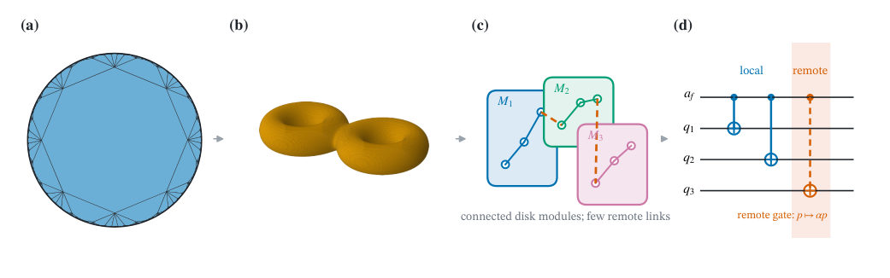 
FIG. 1. From code geometry to hardware implementation. (a) A regular {8, 8} tiling in the Poincar´e disk model, illustrating the self-dual tilings studied here. (b) A schematic closed genus-two surface illustrating imposing periodic boundary conditions; the computed codes generally have much larger genus. (c) A modular realization with connected planar regions and inter-module links. (d) A measurement circuit distinguishing local and remote gates. Assigning qubits to modules changes the physical organization of interactions while preserving the hyperbolic code’s parameters.

📷 Fig 2

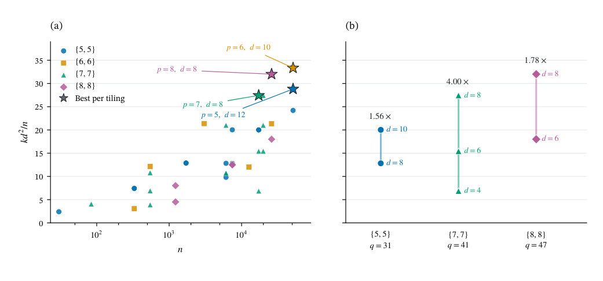 
FIG. 2. Code efficiency and the role of periodic identifications. (a) Code efficiency kd2/n versus physical-qubit count n for all 38 classes in the exhaustive search over p = 5, 6, 7, 8 and prime q &lt; 60, within the specified regular generator-swap-self-dual PSL(2, q) construction. Colors and marker shapes distinguish the tilings; stars identify the maximum-efficiency code for each tiling. Classes with identical plotted parameters overlap. (b) Largest best-to-worst efficiency ratios at fixed tiling and quotient size within each family exhibiting variation in the searched class. Within each group, n, k, and check weight remain fixed. Point labels give distances; factors give ηmax/ηmin =...

📷 Fig 3

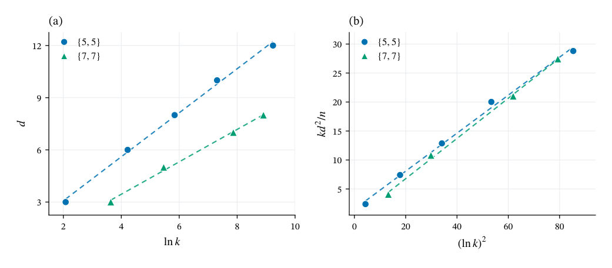 
FIG. 3. Finite-size growth of the selected {5, 5} and {7, 7} code sequences from the prime-field search with q &lt; 60. (a) Code distance d versus ln k. (b) Code efficiency kd2/n versus (ln k)2. Each sequence retains the smallest code attaining a new maximum distance within its tiling and the searched class. Dashed lines show ordinary least-squares fits with intercepts, using the five {5, 5} code instances and four {7, 7} code instances presented in Table II.

📷 Fig 4

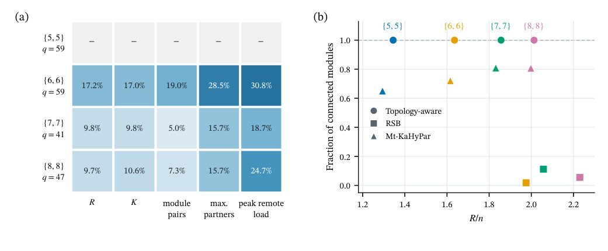 
FIG. 4. Communication cost and connectivity constraints for the four code instances in Table III. (a) Percentage reduction of the reference topology-aware layout relative to RSB, calculated for a metric X as 100(XRSB −Xtop)/XRSB. Rows identify codes by tiling, while columns represent the five communication metrics: R, K, the number of communicating module pairs, the maximum number of communication partners, and the maximum remote-interaction count. Dashes mark the {5, 5}, q = 59 case, for which RSB produced no valid capacity assignment in five attempted initializations. (b) Remote interactions per data qubit, R/n, and the fraction of modules with connected induced interaction graphs. Colors...

📷 Fig 5

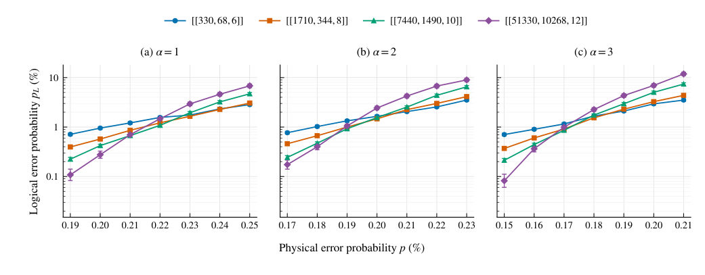 
FIG. 5. Logical error probability pL for a selected logical Z memory in the effective-modular {5, 5} architecture, after d syndrome rounds. Panels (a)–(c) apply α = 1, 2, 3 to inter-module CNOT error probabilities. Each curve contains seven measured points. Error bars are nominal pointwise 95% Wilson intervals. Finite-size threshold estimates are 0.22%, 0.19%, and 0.17%, respectively.

**Summary.** This paper proposes using hyperbolic surface codes as highly efficient candidates for fault-tolerant quantum computation. By optimizing the code structure on higher-genus surfaces, the authors show a superior scaling of code efficiency compared to standard Euclidean codes. The work also provides a practical framework for routing these complex codes into modular, implementable architectures.

**Why it may be interesting.** The focus on geometric optimization and scaling laws for error correction codes is highly relevant to theoretical quantum information scientists designing next-generation quantum hardware.

Detailed structure

**Main problem.** The primary challenge is achieving fault tolerance in quantum computing by optimizing complex trade-offs between code parameters like encoding rate, code distance, and routing.

**Main result.** The authors demonstrate that hyperbolic surface codes can achieve optimal efficiency scaling $kd^2/n = C(\log k)^2$, significantly improving upon the constant bound of Euclidean codes.

**Method.** The work involves constructing finite families of hyperbolic surface codes on higher-genus Riemann surfaces, optimizing periodic identifications, and developing a topology-aware algorithm for modular routing.

**Model / system.** The model is the hyperbolic surface code, which is defined on closed, higher-genus Riemann surfaces derived from regular hyperbolic tilings (e.g., $\{p, p\}$).

**Key observables.** Code efficiency ($\eta = kd^2/n$), error-correction thresholds, and logical error probability ($p_L$).

**Important parameters / regimes.** Code distance ($d$), encoding rate ($k/n$), and the genus of the surface.

**Assumptions / limitations.** The analysis assumes the ability to construct and manage codes on hyperbolic geometries and that the modular partitioning algorithm effectively mitigates long-range communication overheads.

**Figures summary.** Figures illustrate the transition from hyperbolic tiling geometry (Poincaré disk) to hardware realization, showing modular partitioning and the scaling of code efficiency ($\eta$ vs $n$).

**Paper structure.** The paper progresses from identifying the need for better scaling beyond Euclidean codes, to presenting the mathematical construction of hyperbolic codes, optimizing their parameters via periodic identifications, and finally addressing the practical implementation hurdles like routing and simulating error thresholds.

Abstract

Quantum fault tolerance is a prerequisite to harness the full potential of quantum computers. However, achieving fault tolerance remains a major challenge since it requires optimizing tradeoffs between several intertwined theoretical and experimental parameters, including the encoding rate, code distance, parity-check weights, code planarity, and routing. Surface codes remain strong candidates for fault tolerance due to their simple geometric structure, established decoding methods, locality, and experimental attainability. In this work, we present finite families of hyperbolic surface codes that leverage the optimal efficiency scaling $kd^2/n = C (\log{k})^2$ attainable by surface codes with bounded local geometry. We show that optimizing the periodic identifications can double the code distance and thereby increase the code's efficiency by a factor of four, at fixed qubit count, encoding rate, and parity-check weight. We also address the routing problem of hyperbolic surface codes by introducing a topology-aware algorithm that partitions a hyperbolic code into bounded planar modules while reducing long-range communications demand. Circuit-level Monte Carlo simulations yield finite-size threshold estimates for both modular and monolithic layouts, showing that tripling the long-range gate error probability mildly lowers, but does not eliminate, the estimated error-correction thresholds. Together, these results strengthen the case for hyperbolic surface codes as structured and highly efficient large-scale quantum error correction codes for future fault-tolerant architectures.

[↑ back to top](#top)

### [High-Rate Concatenated Quantum Error-Correcting Codes for Qudits](http://arxiv.org/abs/2610.11225v1)

**Authors:** Takanori Nishi, Hayato Goto  
**Type:** theory · **Category:** quantum information and computing · **PDF:** <https://arxiv.org/pdf/2610.11225v1>  
**Analysis basis:** full PDF text, analyzed in chunks

📷 Fig 1

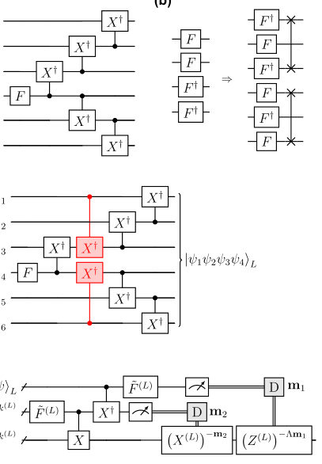 
FIG. 1. (a) Zero-state encoder of the [[6, 4, 2]]q code. (b) Level-1 logical Fourier gate. (c) Arbitrary-state encoder, where additional SUM† gates are highlighted in red. (d) Error-correcting teleportation for qudit MHC codes.

📷 Fig 2

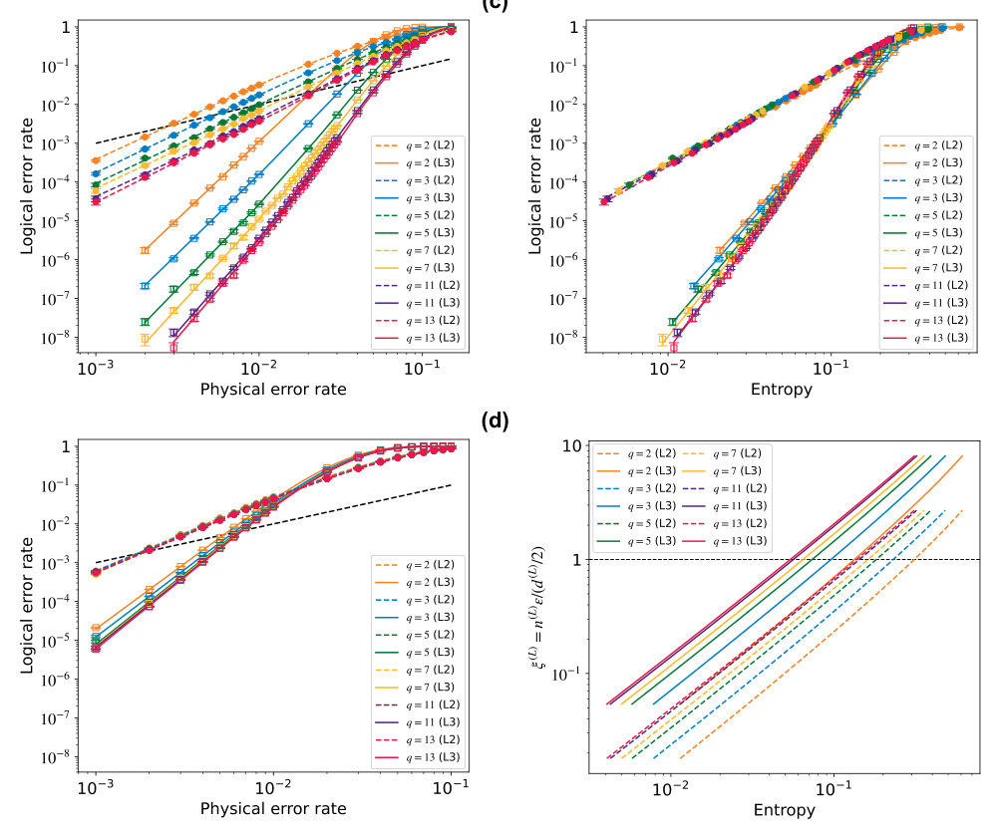 
FIG. 2. Code-capacity performance, entropy scaling, and typical-error-weight analysis of qudit MHC codes under the X-error model. (a) Code-capacity performance obtained with the LLMD decoder. (b) Code-capacity performance obtained with the HD decoder. (c) Logical error rate for the LLMD decoder replotted as a function of the q-ary entropy Hq using the same data as in (a). (d) Ratio of the typical error weight to one-half of the code distance as a function of Hq. Colors indicate the local dimension q. In (a)–(d), dashed and solid curves correspond to the level-2 and level-3 concatenation, respectively. In (a) and (b), thresholds are defined by the crossing points of the level-2 and level-3...

**Summary.** This work extends high-rate concatenated quantum error-correcting codes, known as MHC codes, from qubits to qudits of prime dimension q. By analyzing the code performance in a qudit X-error model, the authors show that increasing the local dimension significantly boosts the error threshold and improves error suppression scaling. This research strongly motivates the development of qudit-based architectures for fault-tolerant quantum computation.

**Why it may be interesting.** The demonstration of a significantly enhanced error threshold and the identification of a 'waterfall regime' using qudits provides a concrete, theoretically motivated path toward improving the fault tolerance of quantum computation architectures.

Detailed structure

**Main problem.** The paper addresses the need for efficient Fault-Tolerant Quantum Computation (FTQC) by extending high-rate concatenated quantum error-correcting codes from qubits to qudits of prime dimension q.

**Main result.** The error threshold for these qudit codes increases monotonically with the local dimension q, reaching 10.0% for q=13 (nearly double the qubit value), and exhibits a pronounced 'waterfall regime' for large q.

**Method.** The authors construct level-2 and level-3 Many-Hypercube (MHC) codes for qudits and generalize the level-by-level minimum-distance (LLMD) decoder for evaluation in a qudit X-error model.

**Model / system.** The system involves qudits (quantum systems with dimension q) and the application of concatenated MHC codes. The analysis is performed under a qudit X-error model, focusing on prime dimensions q up to 13.

**Key observables.** Error threshold, logical error rate ($\epsilon_L$), code-capacity performance, and the entropy of the underlying q-ary noise channel ($H_q$).

**Important parameters / regimes.** Local dimension q (prime), code levels (2 and 3), and the physical error rate $\epsilon$.

**Assumptions / limitations.** The analysis assumes q is a prime dimension and focuses on the X-error model; the decoding process involves computationally restricted searches to manage combinatorial complexity.

**Figures summary.** Figures illustrate the encoding process, logical gates, and show the code-capacity performance and the logical error rate dependence on the noise entropy $H_q$.

**Paper structure.** The paper first establishes the qudit framework and MHC code construction, followed by large-scale stabilizer simulations to show threshold enhancement, and concludes with an entropy analysis to explain the observed qudit advantage.

Abstract

Qudits provide a larger local Hilbert space than qubits and have recently attracted interest as building blocks for efficient fault-tolerant quantum computation (FTQC). In this work, we extend many-hypercube (MHC) codes, high-rate concatenated quantum codes, from qubits to qudits of prime dimension $q$. We construct the level-2 and level-3 MHC codes with parameters $\left[\!\left[6^2,4^2,2^2\right]\!\right]_q$ and $\left[\!\left[6^3,4^3,2^3\right]\!\right]_q$, respectively, and generalize the level-by-level minimum-distance (LLMD) decoder originally proposed for the qubit MHC codes. In a qudit $X$-error model, we evaluate the code-capacity performance of the qudit MHC codes for dimensions up to $q=13$. We find that the error threshold increases monotonically with the local dimension $q$, reaching $10.0\%$ for $q=13$, nearly double the value of $5.1\%$ for qubits. Furthermore, for sufficiently large local dimensions, we observe a pronounced waterfall regime in which the logical error rate decreases substantially faster than expected from conventional distance-based estimates. To understand the origin of the observed qudit advantage, we analyze the decoding performance in terms of the entropy of the underlying $q$-ary noise channel. This analysis reveals a competition between the increased syndrome information available at larger $q$ and the simultaneous growth of the typical physical error weight at fixed entropy. These results demonstrate that higher-dimensional quantum systems can substantially improve the performance of high-rate concatenated quantum codes and motivate further development of qudit-based FTQC architectures.

[↑ back to top](#top)

### [Lyapunov spectrum of random neural networks](http://arxiv.org/abs/2610.12426v1)

**Authors:** David G. Clark  
**Type:** theory · **Category:** disordered systems and neural networks · **PDF:** <https://arxiv.org/pdf/2610.12426v1>  
**Analysis basis:** full PDF text, analyzed in chunks

📷 Fig 1

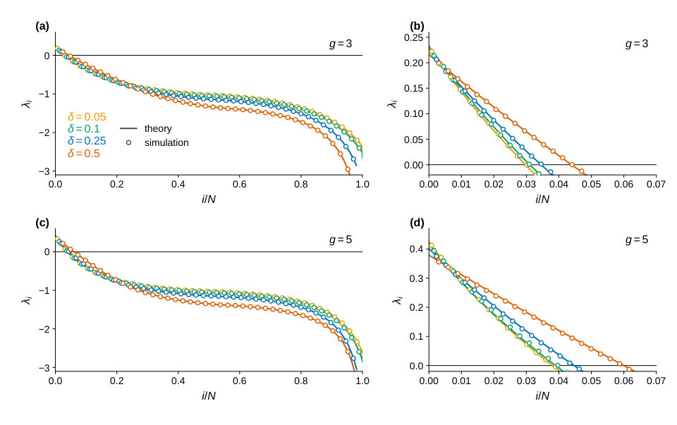 
FIG. 1. Lyapunov spectra for δ = 0.05, 0.1, 0.25, and 0.5, with the legend in (a) for all panels. The exponents λi are plotted against the rank fraction i/N. Lines show the single-site theory, Eq. (67), as s against 1−F(s), ending at the upper edge s∗(Appendix B.2), and dots show simulations of one network with N = 4096. (a) Full Lyapunov spectra for g = 3, with dots for every 100th Lyapunov exponent. (b) Positive Lyapunov exponents of (a), enlarged, with dots for every ∼10th Lyapunov exponent. (c) Same as (a) for g = 5. (d) Same as (b) for g = 5.

📷 Fig 2

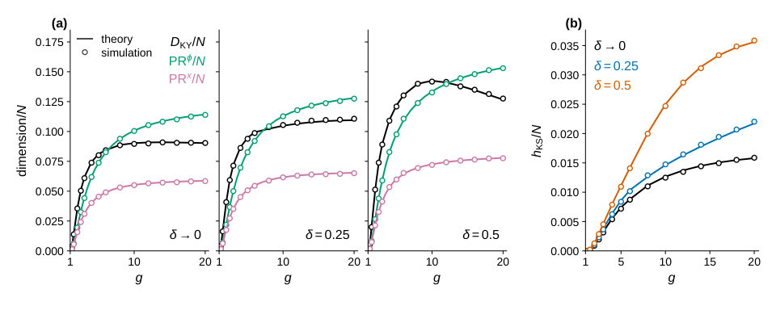 
FIG. 2. Attractor dimension, participation-ratio dimensions, and entropy rate as functions of the coupling strength g, with the line and marker legend in (a) for both panels. Lines show theory, and dots show simulations with N = 4096 (the median over five larger networks near the onset of chaos) for DKY/N and hKS/N and the mean over two networks with N = 16384 for PRϕ/N and PRx/N (Appendix D.2). (a) Kaplan–Yorke dimension DKY/N, Eq. (68), and participation ratios PRϕ/N and PRx/N, Eq. (71), for δ →0, 0.25, and 0.5 (left to right). The theory is the single-site theory for DKY/N and the two-site cavity theory (Appendix C) for PRϕ/N and PRx/N. (b) Entropy rate hKS/N, Eq. (69), for δ →0, 0.25,...

📷 Fig 3

 
Figure 2 shows the attractor dimension and the participation ratios (Fig. 2a) and the entropy rate (Fig. 2b) as functions of g for several time steps δ. The theory and the simulations again agree closely. At every time step, the two participation ratios and the entropy rate increase monotonically with g over the range of g shown, and the participation ratios grow more slowly at strong coupling, as also found numerically by Engelken et al. [22]. The attractor dimension saturates at strong coupling and, as found numerically [22], eventually decreases. Over the range of g shown, this decrease is visible at δ = 0.5, where the attractor dimension has a maximum near g = 10.

📷 Fig 4

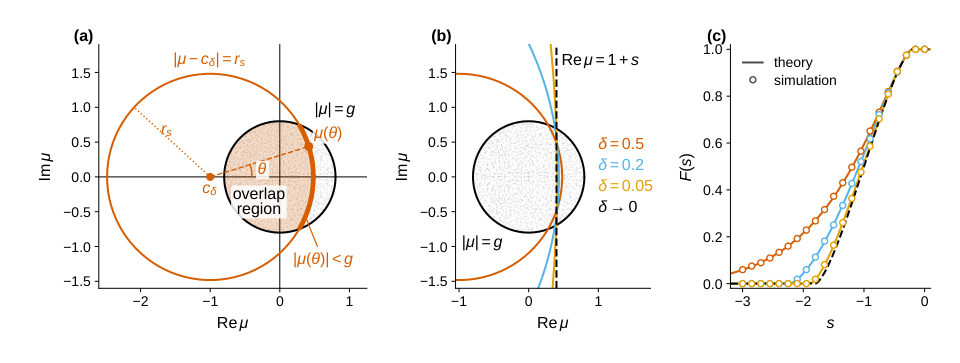 
FIG. 3. Trivial fixed point, g = 0.8. (a) Eigenvalues µi of J for one network with N = 2000 (dots), the circle |µ| = g, and the circle |µ −cδ| = rs for δ = 0.5 and s = −0.6. Shading marks the overlap region of the disks |µ| &lt; g and |µ −cδ| &lt; rs, Eq. (A.5). The point µ(θ) = cδ + rseiθ moves along the circle |µ −cδ| = rs as θ varies. The thick arc, where |µ(θ)| &lt; g, is the band of frequencies |ˆL(θ)|2 &lt; γs of the single-site solution (Appendix A.2.1). (b) Circles |µ −cδ| = rs for δ = 0.5, 0.2, and 0.05 at s = −0.6, with the legend in the panel, and the eigenvalues and the circle |µ| = g as in (a). As δ →0, the circle |µ −cδ| = rs approaches the line Re µ = 1 + s (dashed). (c) Cumulative...

📷 Fig 5

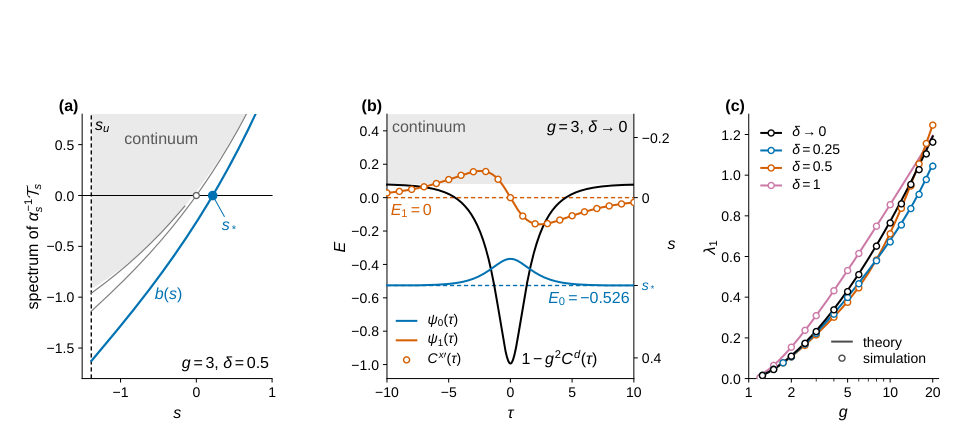 
FIG. 4. Maximum Lyapunov exponent from the operator Ts, Eq. (B.8). (a) Low-lying spectrum of α−1 s Ts, whose eigenvalues have the same signs as those of Ts, as a function of s for g = 3 and δ = 0.5. The thick line shows the lowest value b(s) of the spectrum, and the thin lines show excited eigenvalues below the continuum (shading). The dashed line marks su = δ−1 log(1 −δ), and the filled circle marks the zero crossing s∗of b(s). The first excited eigenvalue crosses zero close to s = 0 (open circle), the finite-δ counterpart of the zero mode Cx′(τ) in (b). (b) Schrödinger problem of the limit δ →0, Eq. (B.13), for g = 3. The line labeled 1−g2Cd(τ) shows the potential of H, Eq. (B.11), and...

**Summary.** This theoretical work determines the full Lyapunov spectrum for large random neural networks by mapping the problem onto a response function solvable via a cavity method. It proves that the network exhibits extensive chaos, providing fundamental, diffeomorphism-invariant properties of the dynamics. The methodology bridges concepts from statistical physics (cavity method) and dynamical systems theory (Lyapunov exponents).

**Why it may be interesting.** The rigorous analytical determination of the full spectrum and the confirmation of extensive chaos in a complex, non-linear system provides deep insights into the information processing capacity and dynamical stability of large-scale artificial neural systems.

Detailed structure

**Main problem.** The paper calculates the full Lyapunov spectrum of a nonlinear recurrent neural network with random asymmetric couplings in the thermodynamic limit ($N	o\infty$).

**Main result.** The chaos in the network is established to be extensive, meaning key measures like the attractor dimension and entropy rate scale linearly with system size $N$.

**Method.** The calculation employs a cavity method applied to a response function derived from a finite-$N$ identity relating the Lyapunov spectrum to the tangent-space dynamics.

**Model / system.** The model is a random neural network (rate network) governed by discrete-time dynamics $x(n+1) = G(x(n))$, with couplings $J_{ij} \sim \mathcal{N}(0, g^2/N)$.

**Key observables.** Lyapunov exponents ($\lambda_i$), Attractor Dimension ($D_{KY}$), Entropy Rate ($h_{KS}$), and the cumulative distribution function $F(s)$ of the exponents.

**Important parameters / regimes.** System size $N$ (limit $N	o\infty$), coupling strength $g$, and time step $\delta$ (limit $\delta	o 0$ for continuous time).

**Assumptions / limitations.** The derivation relies on the minimum-norm selection of the tangent trajectory and assumes the exchange of limits ($\lim_{N	o\infty}$ and $\lim_{	ext{regularization}	o 0}$).

**Figures summary.** Figures illustrate the spectrum $F(s)$ vs $s$, the Schrödinger problem for the continuous-time limit, and the maximum Lyapunov exponent $\lambda_1$ as a function of coupling strength $g$.

**Paper structure.** The paper first establishes the theoretical framework by relating the spectrum to a response function. It then uses the cavity method to compute this response function in the large-$N$ limit, culminating in the determination of the spectrum edge $s^*$ via single-site theory.

Abstract

The Lyapunov spectrum of a nonlinear recurrent neural network with random asymmetric couplings is calculated in the limit $N\to\infty$. The calculation is based on a finite-$N$ identity that expresses the cumulative distribution of Lyapunov exponents as a response function of the tangent-space dynamics, with the tangent trajectory selected by a minimum-norm condition rather than by an initial condition. A cavity method then determines this response function at large $N$ through a self-consistent single-site problem. This result establishes that the chaos in this network is extensive and gives access to diffeomorphism-invariant properties of the dynamics. This work was done in collaboration with the AI models GPT-6 Astra and Claude Opus 5.5.

[↑ back to top](#top)

### [Magnon band splitting without altermagnetism in CuF2](http://arxiv.org/abs/2610.11838v1)

**Authors:** Ioannis Rousochatzakis, Oleg Janson, Alexander A. Tsirlin  
**Type:** both · **Category:** strongly correlated electrons · **PDF:** <https://arxiv.org/pdf/2610.11838v1>  
**Analysis basis:** full PDF text, analyzed in chunks

📷 Fig 1

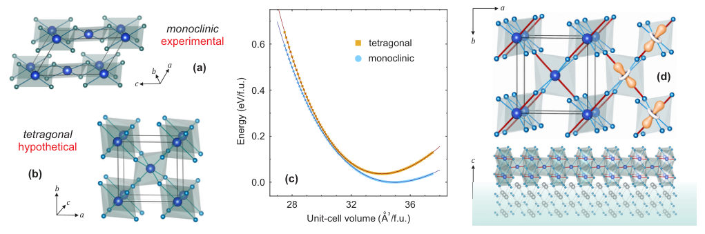 
FIG. 1. Crystal structure of CuF2. (a) Experimental monoclinic form with layers of the CuF4 plaquettes. (b) Hypothetical tetragonal form with the ideal rutile structure. (c) Energy vs. volume calculated for both forms (minimum energy of the monoclinic form is chosen as zero energy). The lines show fits to the equation of state. (d) Stabilization of the tetragonal CuF2 on the MgF2 substrate. Red lines indicate shorter Cu–F bonds resulting in a staggered configuration of the d3z2−r2 orbitals. VESTA software [21] was used for crystal structure visualization.

📷 Fig 2

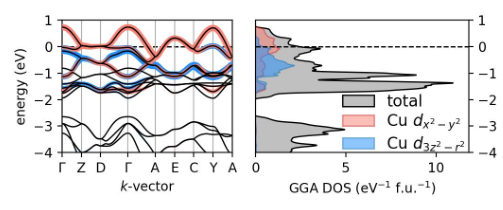 
FIG. 2. Band structure of CuF2. Nonmagnetic GGA band structure (left) and the density of states (right) of CuF2. Contributions of Cu dx2−y2 and d3z2−r2 are high- lighted. Notation of high-symmetry k-vectors: Z=(0, −1

📷 Fig 3

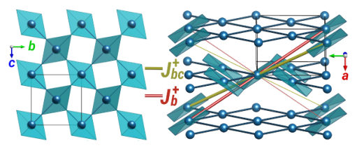 
FIG. 3. Crystal structure and minimal spin model of CuF2. Left: CuF4 squares (cyan) forming a square lattice in the bc plane. Projections of interplane interactions J+ b and J+ bc are shown, respectively, as red and yellow cylinders. Right: connectivity of magnetic planes. For clarity, only bonds con- necting the central Cu atom are shown. Relevant interplane interactions J+ b and J+ bc are shown as thick cylinders, their al- termagnetic counterparts J− b and J− bc as thin lines. Note the different mutual orientation of CuF4 plaquettes connected by (J+ b , J+ bc) and (J− b , J− bc).

📷 Fig 4

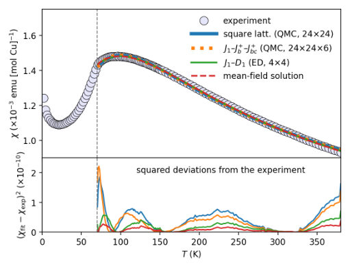 
FIG. 4. Magnetic susceptibility of CuF2. Fits (lines) to the experimental magnetic susceptibility of CuF2 (circles). The refined parameters J1, g, and χ0 are provided in Table I. Bottom panel shows squared deviations. The vertical dashed line depicts the long-range magnetic ordering temperature.

📷 Fig 5

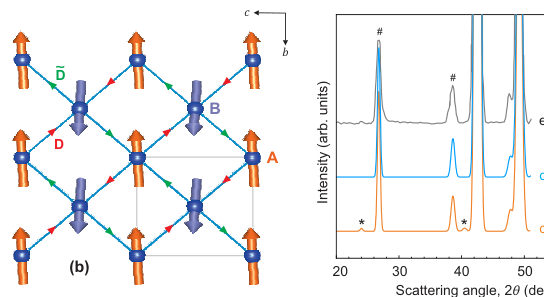 
FIG. 5. Magnetization process and magnetic ground state of CuF2. (a) Field-dependent magnetization measurement at 2 K shows the absence of weak ferromagnetism. (b) Canted in-plane magnetic structure of CuF2 expected from our microscopic magnetic model. Weak ferromagnetic moment produced by spin canting is compensated by the opposite moment in the adjacent layer. Small arrows on the bonds show the site ordering convention (i →j) for the corresponding DM vector Dij. (c) Experimental neutron diffraction pattern [17] (wavelength 2.347 ˚A) along with the simulated patterns for the collinear magnetic structure from Ref. [17] and for the canted structure proposed in our work. Hash symbols indicate...

**Summary.** This work investigates the magnetic state of CuF2, a material predicted to be an altermagnet. By combining DFT calculations with spin-wave theory, the authors demonstrate that the material exhibits a conventional antiferromagnetic order, not an altermagnetic one. The study provides detailed quantitative evidence regarding the role of DM interactions and the resulting magnon spectrum.

**Why it may be interesting.** The detailed analysis of magnon dispersion and the explicit calculation of the chiral structure factor provide rigorous theoretical tools for distinguishing between different magnetic ground states in correlated insulators.

Detailed structure

**Main problem.** To conclusively determine the magnetic state of CuF2 and rule out the possibility of altermagnetism, moving beyond simple symmetry arguments.

**Main result.** The magnetic order in CuF2 is confirmed to be antiferromagnetic (AFM), not altermagnetic, due to a doubling of the magnetic unit cell. While DM interactions cause magnon splitting, these bands are non-chiral.

**Method.** The study combines ab initio calculations (DFT/GGA) for electronic structure with linear spin-wave theory and fitting to experimental magnetization data.

**Model / system.** The system is CuF2, modeled as a quasi-2D square-lattice antiferromagnet with weak interlayer couplings. The Hamiltonian is refined to include strong Dzyaloshinskii-Moriya (DM) interactions.

**Key observables.** Magnon band splitting ($\omega_\pm(k)$), chiral structure factor ($C(q, \omega)$), magnetic susceptibility ($\chi(T)$), and magnetic unit cell doubling.

**Important parameters / regimes.** In-plane coupling $J_1 \simeq 115 	ext{ K}$ and DM anisotropy $|D|/J_1 \simeq 0.3$.

**Assumptions / limitations.** The analysis relies on fitting to an effective one-orbital model and assumes the magnetic structure is governed by the observed unit cell doubling.

**Figures summary.** Figures illustrate crystal structures, energy vs. volume curves, and magnon dispersions comparing DM effects in 2D vs. 3D AFM systems.

**Paper structure.** The paper progresses from establishing the stability and basic magnetic structure (AFM vs. Altermagnetic) using DFT, to deriving an effective Hamiltonian incorporating exchange and DM terms, and finally analyzing the resulting magnon spectrum via spin-wave theory.

Abstract

Conclusive identification of an altermagnetic state requires going beyond mere symmetry arguments. We illustrate this in a combined computational and experimental study of the rutile-like material CuF$_2$, which is on the list of predicted altermagnets. Using ab initio and linear spin-wave calculations supplied by magnetization measurements, we show that CuF$_2$ in its experimental monoclinic structure can be described by a spin-$\frac12$ model of weakly coupled square-lattice layers with the in-plane coupling $J_1\simeq 115$ K and two synergistic antiferromagnetic interplane couplings amounting to 4% and 8% of $J_1$, respectively. Driven by long-range superexchange, these interlayer couplings are oblique to the square planes, resulting in the unit-cell doubling in the magnetically ordered state, thus effectively suppressing any altermagnetic band splitting. Concurrently, we identify unusually strong Dzyaloshinskii-Moriya interactions, $|\mathbf D|/J_1\simeq 0.3$, that produce spin canting and, together with order-by-disorder effect, pin the Néel vector to the crystallographic $b$-axis. Additionally, DM anisotropy promotes magnon band splitting, but these bands remain non-chiral. Our results highlight the importance of relativistic effects even in $3d$ magnets with altermagnetic symmetries.

[↑ back to top](#top)

### [Measure Now, Mitigate Later: Virtual Error Cancellation for Logical Quantum Circuits](http://arxiv.org/abs/2610.12400v1)

**Authors:** Oles Shtanko, Saswata Roy, Shashwat Kumar, Zlatko Minev  
**Type:** theory · **Category:** quantum information and computing · **PDF:** <https://arxiv.org/pdf/2610.12400v1>  
**Analysis basis:** full PDF text, analyzed in chunks

📷 Fig 1

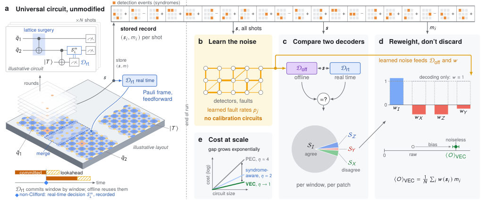 
FIG. 1. Concept. (a) An unmodified universal logical circuit is executed with real-time decoding and feedforward, storing each shot’s syndrome record si and outcome mi. (b) Fault rates of a prescribed detector error model are learned from the stored syndromes, without separate calibration experiments. (c) Comparing real-time and offline decoding partitions shots into consensus (SI) and disagreement (SX,Y,Z) sectors. (d) VEC assigns positive weights wI &gt; 1 to consensus shots and negative weights wQ &lt; 0 to disagreement shots. The estimator ⟨O⟩VEC = N −1 P

📷 Fig 2

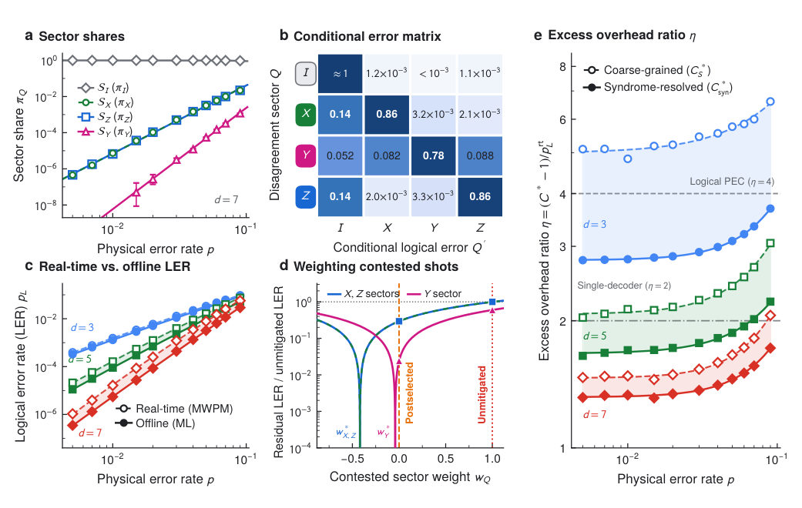 
FIG. 2. Dual-decoder architecture and coarse-grained virtual error cancellation (d = 7 unless noted). (a) Sector shares πQ versus physical error rate p for the consensus sector SI and the disagreement sectors SX,Y,Z. Lines are power-law fits (SY fitted for p ≥0.04; no SY counts for p ≤0.01); error bars are standard errors (68% Clopper–Pearson for SY ). (b) Conditional logical error matrix pQ,Q′ at p = 0.05: probability of logical error Q′, relative to the real-time frame, in sector Q; rows sum to one. (c) Logical error rate (LER) pL of real-time minimum-weight perfect matching (MWPM, open markers) and offline maximum-likelihood decoding (ML, filled markers) for d = 3, 5, 7; shading marks...

📷 Fig 3

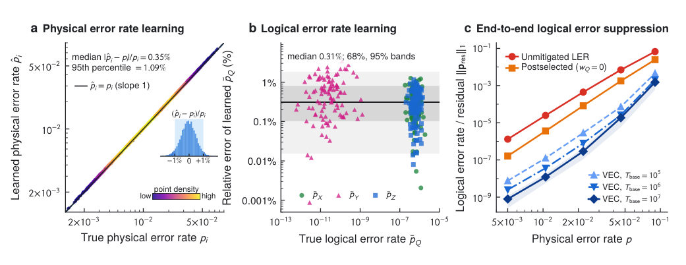 
FIG. 3. End-to-end noise learning and virtual error cancellation on a d = 7 surface code. Code-capacity depolarizing noise with per-qubit rates distributed around a mean p; learning budgets scale as Tlearn = Tbase·(5·10−3/p); 102 noise realizations. (a) Learned versus true per-qubit error rates for the three lowest values of p (Tbase = 107), colored by point density. Inset: distribution of the relative error (median 0.35%). (b) Relative error of the learned logical error rates ¯pX, ¯pY , ¯pZ at p = 5·10−3, with median and 68% and 95% bands. (c) Unmitigated logical error rate, postselection on decoder agreement (wQ = 0), and VEC residual bias ∥pres∥1 for Tbase = 105, 106, 107. Lines connect...

📷 Fig 4

 
FIG. 4. Full-circuit integration and pipelined sliding- window decoding. Logical circuit schematic (top) decom- posed into sequential Clifford layers (blue boxes) that exhibit residual logical error channels in the form of Eq. (1) (red shapes), alongside a non-Clifford T-gate teleportation gadget (magic state |T ⟩preparation in blue, transversal CNOT, de- structive measurement MZ, and real-time feedforward phase correction Sm L ). The pipelined decoding schedule (bottom) executes overlapping sliding windows with committed regions (orange) and lookahead buffers (yellow-hatched) along the time axis.

📷 Fig 5

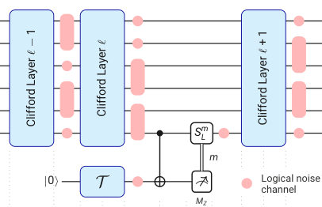 
Fig. 3. The learned model recovers both the physical fault probabilities (Fig. 3a) and the logical Pauli error rates (Fig. 3b) across multiple noise realizations and er- ror channels. Figure 3c compares the unmitigated logi- cal error rate, the error rate obtained by postselecting on decoder agreement, and the residual VEC error rate aris- ing from finite-sample noise mischaracterization. For the largest learning budget (Tbase = 107) and p ≤2.2 · 10−2, the protocol reduces logical errors by more than a fac- tor of 103 relative to the unmitigated decoding and more than a factor of 102 relative to postselection based on two-decoder agreement; the suppression decreases toward the highest...

**Summary.** This paper introduces Virtual Error Cancellation (VEC), a novel post-processing technique to combat residual logical errors in quantum computation. VEC leverages syndrome records to estimate logical observables without requiring full noise characterization or circuit modification. The results demonstrate that this method achieves significant error suppression with a theoretically bounded and near-optimal sampling overhead.

**Why it may be interesting.** This work provides a powerful, resource-efficient theoretical tool for quantifying and suppressing errors in quantum computation that is highly relevant to experimental quantum information scientists.

Detailed structure

**Main problem.** The primary challenge is mitigating residual, uncorrectable logical errors in early fault-tolerant quantum algorithms that persist even after physical error correction.

**Main result.** The proposed Virtual Error Cancellation (VEC) method allows for error suppression exceeding three orders of magnitude in simulations by operating entirely in classical post-processing using only syndrome records.

**Method.** VEC is a novel classical post-processing technique that constructs an unbiased estimator by assigning weights to syndrome records, bypassing the need for prior noise characterization or circuit modification.

**Model / system.** The analysis is performed on logical quantum circuits, specifically using the framework of stabilizer codes like the distance-7 rotated surface code.

**Key observables.** Logical Error Rate ($p_L$), Sampling Overhead ($C(w)$), Syndrome Record ($s$), and the estimator $\hat{\langle O 
angle}_{	ext{VEC}}$.

**Important parameters / regimes.** Code distance ($d$), sampling overhead scaling factor ($\eta$), and the minimal weight difference ($\Delta W_{min}$) characterizing error regimes.

**Assumptions / limitations.** The physical noise is assumed to be described by a Pauli channel, and the analysis often relies on asymptotic expansions and the system operating below the error threshold ($p < p_{th}$).

**Figures summary.** Figures illustrate the VEC concept, comparing sampling overhead scaling ($\eta$) against existing methods, and detail the dual-decoder architecture used for coarse-grained cancellation.

**Paper structure.** The paper develops the theory of unbiased estimators using syndrome records, derives optimal filter weights, introduces coarse-grained and dual-decoder protocols for tractability, and finally analyzes the scaling and residual error suppression in the decoupled limit.

Abstract

Early fault-tolerant quantum algorithms are a key step in scalable quantum computing, but are ultimately constrained by residual, uncorrectable logical errors. Logical quantum error mitigation can eliminate this bias, however its standard requirements include prior noise characterization, more complex experiments, and substantial sampling overhead. Although no mitigation technique can simultaneously overcome all three constraints, we demonstrate that the first two---noise learning and need for modified circuits---can be completely bypassed for logical circuits by leveraging only syndrome records. Specifically, we introduce virtual error cancellation: a method that, unlike previous bias-free approaches, operates entirely in classical post-processing on universal quantum circuits. We develop and numerically test end-to-end protocols that reduce the sampling overhead beyond fundamental limitations of existing syndrome-aware mitigation techniques, including syndrome-based postselection. In particular, we propose a scheme that pairs the low-latency decoder used in the experiment with a high-complexity decoder run in post-processing. In numerical simulations of a distance-7 rotated surface code, we show that our full-stack dual-decoder algorithm exhibits an error that diminishes as the number of samples increases, capable of reaching more than three orders of magnitude of suppression compared to the decoded logical error rate in an experimentally achievable setting. These results establish syndrome records as a resource for correcting universal computational estimates after quantum execution.

[↑ back to top](#top)

### [Minimal Scenarios Witnessing Genuine Multipartite Nonlocality Possibilistically](http://arxiv.org/abs/2610.11377v1)

**Authors:** Soumyadip Patra, Peter Bierhorst  
**Type:** theory · **Category:** quantum information and computing · **PDF:** <https://arxiv.org/pdf/2610.11377v1>  
**Analysis basis:** full PDF text, analyzed in chunks

📷 Fig 1

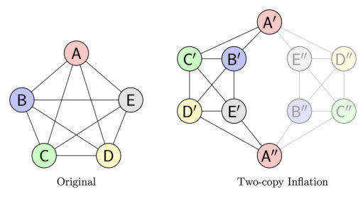 
FIG. 1. The pairwise-resource network for the 5-cycle game, and its two-copy non-fanout inflation used in our proof of Proposition 2. Nodes and edges represent players and bi- partite no-signaling resources, respectively. All players have access to globally shared classical randomness (not depicted). In the inflation network on the right, the left square with nodes B′, C′, D′, E′ gives a (B′, C′, D′, E′)-marginal which is im- portable from the original network in the sense that its under- lying resource network is the same and so generates the same marginal distribution. The triples (A′, B′, C′) and (D′, E′, A′′) are also importable, while A′ and A′′ have disjoint source an- cestry. The...

📷 Fig 2

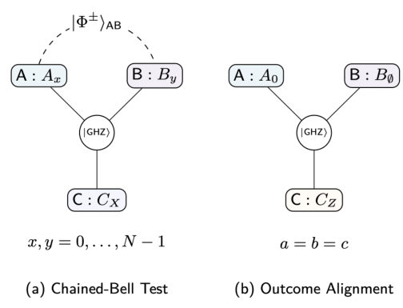 
FIG. 2. Schematic depiction of the N-indexed family of chained Bell-GHZ games. The three parties A, B, C share a GHZ state; party C either (a) measures in basis X, which probabilistically swaps one of two Bell states |Φ±⟩= (|00⟩± |11⟩)/ √

**Summary.** This work establishes strong quantitative bounds on genuine multipartite nonlocality using the inflation technique applied to multi-party Bell-type games. By showing that certain quantum correlations cannot be simulated by any network of fewer parties, it advances the understanding of the fundamental resource requirements for quantum information protocols.

**Why it may be interesting.** The rigorous mathematical techniques used to quantify the resource requirements for genuine multipartite entanglement and nonlocality are foundational to understanding quantum correlations beyond simple entanglement measures.

Detailed structure

**Main problem.** The paper investigates a strong form of genuine multipartite nonlocality (GMNL) to determine the minimum number of parties required to witness correlations impossible for models based on fewer parties.

**Main result.** The authors demonstrate robustly LOSR-GMNL behavior for the 5-party Bell scenario using an inflation technique, establishing a separation from models built from bipartite resources.

**Method.** The primary methods involve using the inflation technique to derive robust separation bounds and analyzing the constraints imposed by the no-signaling principle on correlated binary random variables.

**Model / system.** The study focuses on nonlocal games, specifically the 5-party Bell scenario (5 parties, two binary-outcome measurements per party), and generalizes this analysis to arbitrary $n$-party systems.

**Key observables.** Winning probability of the nonlocal game; the separation factor between quantum predictions and the bound derived from bipartite resources.

**Important parameters / regimes.** The number of parties ($n$), the resource model (e.g., bipartite vs. $n$-partite), and the precision parameter $\epsilon$.

**Assumptions / limitations.** The analysis relies heavily on the no-signaling principle and the application of the inflation technique to relate probabilities across different resource ancestries.

**Figures summary.** Figure 1 illustrates the pairwise-resource network for the 5-cycle game and its two-copy non-fanout inflation used in bounding the winning probability.

**Paper structure.** The paper progresses by defining strong GMNL, applying the inflation technique to the 5-party game to derive quantitative bounds, and then generalizing the mathematical framework to construct families of robustly LOSR-GMNL games for arbitrary $n$.

Abstract

We study a strong form of genuine multipartite nonlocality (GMNL), where an $n$-partite scenario admits a quantum strategy generating outcomes belonging to a restricted set with certainty, whereas every strategy built from nonclassical resources shared among at most $k<n$ parties fails this criterion with positive probability. This generalizes what is referred to as strong contextuality/nonlocality, or pseudotelepathy, beyond ruling out local models. For the simplest five-party Bell scenario of two binary-outcome measurement settings per party, we use the inflation technique to demonstrate that a game with a perfect quantum strategy witnesses a robust separation from models built from bipartite resources under local operations and shared randomness (LOSR), establishing the behavior is LOSR-GMNL. We provide broader context for this result by investigating its simulability with resources shared among three or four parties under different resource models and alternative definitions of GMNL. A central open question is whether $n$-party quantum resources can achieve such a separation from models built from $(n-1)$-party resources, for $n\ge 3$. We make progress here by constructing a family of robustly LOSR-GMNL games with $ε$-optimal quantum strategies experimentally indistinguishable in the limit from true probability-one-winning strategies for any desired level of precision.

[↑ back to top](#top)

### [Multifunctionality in Janus CrMCN4 (M = Si/Ge) Monolayers: Valleytronic Physics, Piezoelectric Response, and Photocatalytic Potential](http://arxiv.org/abs/2610.11293v1)

**Authors:** Jubair Hossan Abir, M. R. U. S. Shapon, S. S. B. Pallab, Tanvir Khan, Raihana Shams Islam, Saleh Hasan Naqib  
**Type:** theory · **Category:** other · **PDF:** <https://arxiv.org/pdf/2610.11293v1>  
**Analysis basis:** full PDF text, analyzed in chunks

📷 Fig 1

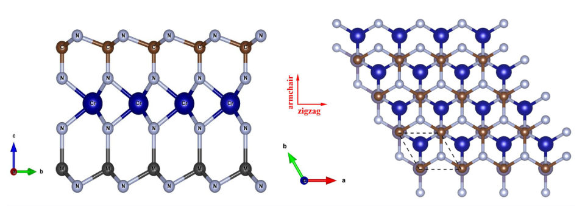 
Figure 1. Optimized geometrical structures of monolayer CrMCN4 (M = Si and Ge). The side view (left) and top view (right) depict the atomic configuration of the monolayers, showing the arrangement of Cr, C, N, and Si/Ge atoms. The corresponding unit cell and crystallographic directions are also indicated.

📷 Fig 2

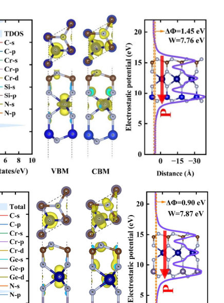 
Figure 2. Electronic properties of monolayer CrSiCN4 and CrGeCN4 calculated using the HSE06 functional without spin-orbit coupling (SOC). (a, b) Electronic band structures of CrSiCN4 and CrGeCN4, respectively. The corresponding projected density of states (PDOS) is shown alongside the band structures. The band-decomposed charge densities of the valence band maximum (VBM) and conduction band minimum (CBM), together with the planar-averaged electrostatic potential distribution along the out-of-plane (Z) direction, are also presented.

📷 Fig 3

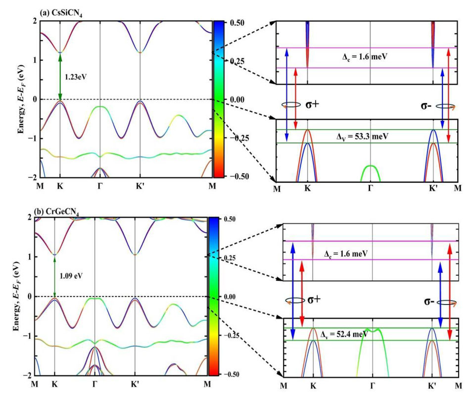 
Figure 3. SOC-induced spin splitting and valley-dependent electronic structures of monolayer (a) CrSiCN4 and (b) CrGeCN4 obtained using PBE+SOC calculations. The band gaps are marked by blue arrows, while the enlarged K/K′ valley regions show the conduction band (Δc) and valence band (Δv) spin splittings. Red and blue arrows indicate valley-selective optical transitions coupled with right and left-handed circularly polarized light, respectively. The color map represents the spin expectation value along the z direction (⟨Sz⟩) of the spinor states.

📷 Fig 4

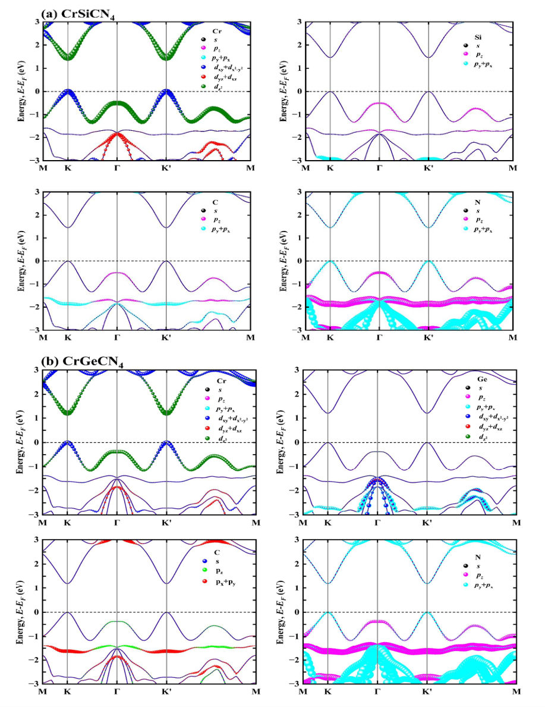 
Figure 4. Orbital-projected band structures of monolayer (a)CrSiCN4 and (b)CrGeCN4, illustrating the orbital contributions of Cr-d, Si/Ge-p, C-p, and N-p states near the band edges.

📷 Fig 5

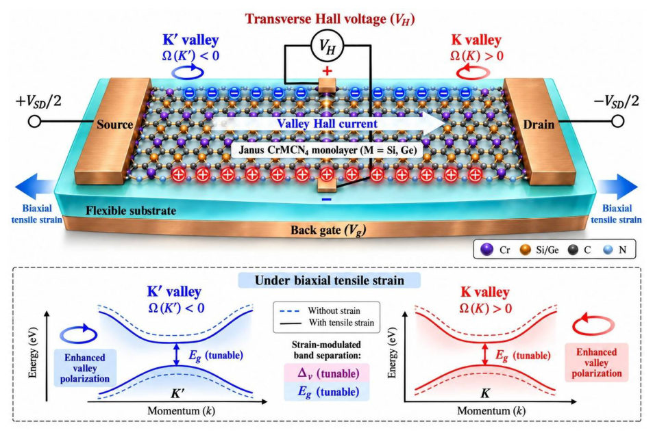 
Figure 5. Schematic illustration of a strain-tunable spin-valley / valley Hall device based on Janus CrMCN4 (M =Si, Ge). The monolayer channel is integrated on a flexible substrate between source and drain electrodes with back gate. Biaxial tensile strain modulates the electronic structure and enhances transverse Hall-voltage response. Charge accumulation at opposite channel edges produce a measurable Hall voltage VH.

**Summary.** This theoretical study explores the multifunctional potential of Janus $	ext{CrMCN}_4$ monolayers by calculating how strain and composition tune their electronic, piezoelectric, and optical properties. The findings demonstrate that these materials can be engineered to exhibit desirable characteristics for valleytronic, energy harvesting, and electromechanical applications.

**Why it may be interesting.** The detailed theoretical prediction of multiple coupled quantum phenomena (valley, spin, electric polarization) in a single 2D material platform is highly relevant for designing next-generation quantum-functional materials.

Detailed structure

**Main problem.** The study investigates the potential for multifunctional nanodevices using Janus $	ext{CrMCN}_4$ ($	ext{M} = 	ext{Si/Ge}$) monolayers, focusing on the interplay between valleytronics, piezoelectricity, and photocatalysis.

**Main result.** The research establishes that composition ($	ext{Si}$ vs $	ext{Ge}$) and external strain are complementary methods to tailor these monolayers for diverse applications, controlling band gaps, piezoelectric response, and spin-valley characteristics.

**Method.** The work relies heavily on first-principles Density Functional Theory (DFT) calculations, employing advanced functionals like HSE06 and incorporating spin-orbit coupling (SOC) to model electronic, structural, and optical properties.

**Model / system.** The physical system is the two-dimensional Janus semiconductor $	ext{CrMCN}_4$ monolayer, which exhibits an asymmetric septuple-layer architecture. The calculations model the effect of biaxial strain ($\pm 4\%$) on the electronic and structural properties.

**Key observables.** Band gaps (PBE+SOC and HSE06), piezoelectric coefficients ($d_{ij}$), Berry curvature, spin-valley polarization, and optical absorption spectra.

**Important parameters / regimes.** Biaxial strain ($\epsilon$), SOC strength, and the choice of metal ($	ext{Si}$ or $	ext{Ge}$) in the lattice structure.

**Assumptions / limitations.** The calculations assume the validity of DFT methods and the ability to model complex phenomena like spin-valley coupling and piezoelectricity using first principles.

**Figures summary.** Figures illustrate strain-dependent optical absorption spectra, strain effects on electronic and spin-dependent properties (band gaps, spin splitting), and comparisons between different theoretical calculations.

**Paper structure.** The paper systematically analyzes the electronic structure, detailing the impact of composition ($	ext{Si}$ vs $	ext{Ge}$) and strain on the band gap, spin character, and polarization. It then separately addresses the piezoelectric response and the photocatalytic potential for water splitting.

Abstract

Two dimensional Janus semiconductors integrating spin-valley coupling, piezoelectricity, and tunable optical responses offer a platform for multifunctional nanodevices. Here, first-principles calculations reveal complementary composition and strain effects in CrSiCN4 and CrGeCN4 monolayers. Both are found to be nonmagnetic direct-gap semiconductors, with gaps of 1.23 and 1.09 eV using the Perdew-Burke-Ernzerhof functional including spin-orbit coupling, respectively. HSE06 hybrid-functional calculations retain the direct-gap character, yielding gaps of 1.46 eV for CrSiCN4 and 1.19 eV for CrGeCN4. Opposite out-of-plane spin character and Berry curvature emerge at K and K'. Biaxial strain reduces the respective gaps from 1.59 to 0.86 eV and 1.44 to 0.63 eV, drives direct-to-indirect transitions, and redshifts absorption while preserving valley spin contrast. CrGeCN4 exhibits larger in-plane piezoelectric response, whereas CrSiCN4 exhibits larger out-of-plane magnitude. Band-edge alignment satisfies the oxygen evolution reaction requirement but provides insufficient driving force for the hydrogen evolution reaction, motivating further strain-induced band-edge modulation toward overall water splitting. These results establish composition and strain as complementary controls for tailoring Cr-based Janus monolayers for valleytronic, optoelectronic, electromechanical, and photocatalytic applications.

[↑ back to top](#top)

### [Multipartite entanglement spreads](http://arxiv.org/abs/2610.12271v1)

**Authors:** Sylvain Carrozza, Johann Chevrier, Luca Lionni  
**Type:** theory · **Category:** quantum information and computing · **PDF:** <https://arxiv.org/pdf/2610.12271v1>  
**Analysis basis:** full PDF text, analyzed in chunks

📷 Fig 1

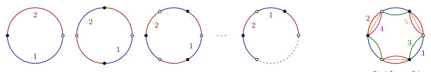 
Figure 1: Left: examples of cyclic graphs for D “ 2. Right: example of a cyclic graph for D “ 5, and associated with the bipartition Ht1,3u b Ht2,4,5u.

📷 Fig 2

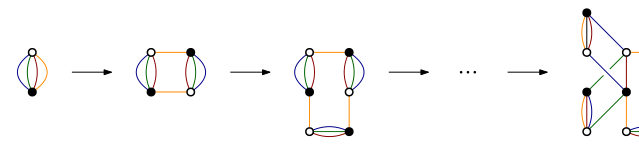 
Figure 2: Illustration of the recursive construction of melonic graphs. The 2-vertex graph is presented on the left.

📷 Fig 3

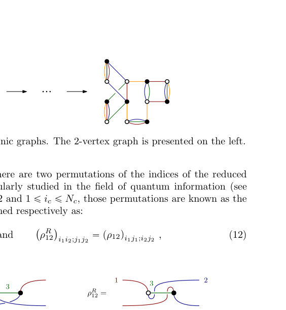 
Figure 3: Illustration of the partial transpose and the realignment.

📷 Fig 4

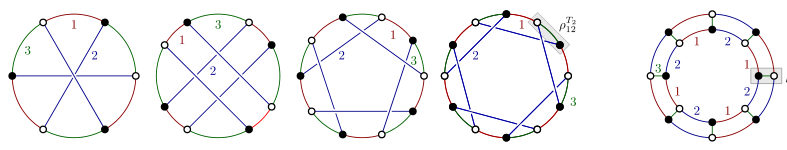 
Figure 4: Left: four examples of moments of the partial transpose of ρ12. Right: an example of realignment moment of ρ12.

📷 Fig 5

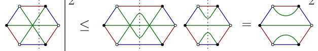 
Figure 6: Graphical proof of the bound used in Ex. 2.13: the dotted lines are a visual guide indicating to which vectors the Cauchy-Schwarz inequality is being applied.

**Summary.** This paper develops a multipartite generalization of the entanglement spread, a quantity used to measure entanglement structure in quantum states. It uses this generalized spread to rigorously characterize a specific class of states called Hypergraph-Tensor (HT) states. The findings provide a powerful, universal diagnostic tool for understanding high-dimensional entanglement in quantum many-body systems.

**Why it may be interesting.** The work provides powerful, mathematically rigorous tools (entanglement spreads) to diagnose the structure of multipartite entanglement, which is crucial for understanding complex quantum systems beyond simple bipartite correlations.

Detailed structure

**Main problem.** The paper generalizes the concept of entanglement spread, initially defined for bipartite pure states, to the multipartite setting ($D \ge 3$) to characterize the entanglement structure of quantum states.

**Main result.** It establishes that Hypergraph-Tensor (HT) states can be uniquely characterized as the minimizers of a specific, generalized entanglement spread among the larger family of Spectral Hypergraph-Tensor (SHT) states for arbitrary number of parties $D$.

**Method.** The authors introduce a multipartite generalization of entanglement spread, defined as a difference of two multipartite Rényi entanglement entropies associated with local unitary polynomial invariants (trace-invariants).

**Model / system.** The analysis focuses on multipartite pure quantum states $|\psi
angle$ in a Hilbert space $\mathcal{H}$ with $D$ parties. The states are analyzed under local unitary (LU) transformations, and the framework utilizes combinatorial tools related to $D$-edge-colored graphs.

**Key observables.** Entanglement spread (a difference of two multipartite Rényi entanglement entropies), entanglement spectrum, and trace-invariants.

**Important parameters / regimes.** The number of parties $D \ge 3$, the local dimension $N$, and the indices defining the specific graph structures.

**Assumptions / limitations.** The generalization of the vanishing spread condition from the bipartite case to the multipartite setting is central, and the analysis relies on the combinatorial correspondence between trace-invariants and colored graphs.

**Paper structure.** The paper first introduces the multipartite generalization of entanglement spread, then proves the characterization of HT states as minimizers of this spread for $D=3$, and finally extends this characterization to arbitrary $D \ge 3$ using the SHT Ansatz.

Abstract

The entanglement structure of a bipartite pure state is characterized by its entanglement spectrum, or equivalently, by the family of Rényi-$k$ entanglement entropies with integer $k$. Taking the difference of two such entropies defines a quantity known as an entanglement spread, that is monotonous under local operations, and that vanishes if and only if the entanglement spectrum of the state is flat. We introduce a multipartite generalization of this notion which, for a fixed number $D\geq 3$ of parties, results in a collection of maps indexed by pairs of $D$-edge-colored graphs (obeying some condition). Each member of this collection takes the form of a difference of two multipartite Rényi entanglement entropies, each associated to a local unitary polynomial invariant (known in this context as a trace-invariant), and is shown to be monotonous under local operations. We then argue that a previously introduced family of so-called hypergraph-tensor (HT) states can be understood as a multipartite counterpart to the family of flat bipartite states. Indeed, we first prove that, when $D=3$, a tripartite pure state is HT if and only if it minimizes a particular (infinite) family of entanglement spreads. Second, we embed the set of HT states into the much larger family of spectral hypergraph-tensor (SHT) states, defined by a new Ansatz we introduce. We then prove that HT states can be uniquely characterized as the minimizers of some fixed entanglement spread among SHT states, for arbitrary $D\geq 3$. We also investigate SHT states in their own right: in particular, we characterize their orbits under local unitary transformations. Finally, along the way, the asymptotic large-$N$ expectation values of a number of entanglement spreads are computed in the Haar-random state of local dimension $N$.

[↑ back to top](#top)

### [On PPT entanglement distillation](http://arxiv.org/abs/2610.12454v1)

**Authors:** Ludovico Lami  
**Type:** theory · **Category:** quantum information and computing · **PDF:** <https://arxiv.org/pdf/2610.12454v1>  
**Analysis basis:** full PDF text, analyzed in chunks

📷 Fig 1

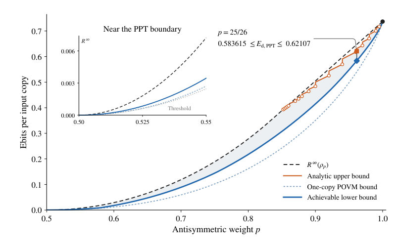 
FIG. 1: Bounds for qutrit Werner states; the PPT region 𝑝≤1/2 has zero rate. Dashed: regularised Rains bound (135). Light blue: the one-copy bound e𝐿(𝜌𝑝) in (126). Blue: achievable bounds from POVMs on up to 48 copies and collective PPT effects, including the valid propagation in (139). Orange: certified analytic upper bounds with the same propagation rule; the small jumps reflect the finite certificate set. The inset compares the lower bounds near the PPT boundary, including the grey threshold bound (121). Curves are floating-point evaluations of proved formulas; marked benchmark values have interval certificates. The black endpoint is the known exact antisymmetric rate.

**Summary.** This paper rigorously studies the PPT distillable entanglement rate for quantum states, establishing a regularised formula and deriving strong upper bounds. Its most significant contribution is disproving the conjecture that this distillable entanglement is always bounded by the regularised Rains bound, providing a quantitative measure of the gap using Werner states.

**Why it may be interesting.** This work provides deep theoretical insights into the limitations of entanglement manipulation protocols, particularly when restricted by physical constraints like the PPT condition, which is crucial for understanding quantum communication channels.

Detailed structure

**Main problem.** The paper investigates the distillable entanglement of quantum states when restricted to operations that are completely positive under partial-transpose conjugation (PPT channels). It aims to establish rigorous bounds for this quantity in the regime of vanishing but non-zero error.

**Main result.** The authors disprove the conjecture that the PPT distillable entanglement equals the regularised Rains bound, providing a concrete counterexample using a $3 	imes 3$ Werner state where the actual bound is strictly smaller than the Rains bound.

**Method.** The research employs advanced techniques including deriving regularised formulas based on measured-relative-entropy-like quantities and constructing two distinct single-letter converse bounds using operator quadratic forms and complex analytic integrals.

**Model / system.** The study focuses on bipartite quantum states, $
ho_{AB}$, and specifically analyzes Werner states in finite dimensions (e.g., $3 	imes 3$ qutrits). The analysis is framed within the context of entanglement manipulation protocols.

**Key observables.** PPT distillable entanglement ($E_{d, 	ext{PPT}}$), Entanglement Negativity ($N(
ho)$), and the regularised Rains bound ($R_\infty$).

**Important parameters / regimes.** The analysis is conducted in the regime of asymptotically vanishing but non-zero error, and specific numerical examples involve the parameter $25/26$ for Werner states.

**Assumptions / limitations.** The primary focus is on the PPT constraint, relaxing the full LOCC requirement. The paper also deals with the complexities of single-letter vs. multi-copy protocols.

**Figures summary.** Figure 1 is noted to compare various entanglement bounds for qutrit Werner states, visually demonstrating the gap between the achievable distillable entanglement and the regularised Rains bound.

**Paper structure.** The paper develops its argument by first establishing a regularised formula for $E_{d, 	ext{PPT}}$ (Theorem 1), followed by deriving two independent upper bounds (Theorems 2 and 3) based on quadratic forms and analytic functions. The core of the work is the numerical demonstration of the inequality $E_{d, 	ext{PPT}} < R_\infty$ using specific state examples.

Abstract

We study entanglement distillation under operations that remain completely positive under partial-transpose conjugation, a.k.a. PPT channels, in the standard quantum Shannon theory regime of asymptotically vanishing but non-zero error. Our main results are: (a) a regularised formula for the PPT distillable entanglement in terms of a measured-relative-entropy-like quantity; and (b) two different single-letter converses, one based on operator quadratic forms and the other on Hirschman's strengthening of the Hadamard three-line theorem. As an immediate application of (b), we show that the PPT distillable entanglement can be strictly smaller than the regularised Rains bound, thereby resolving an open problem in the theory of entanglement manipulation [Regula et al., NJP 21:103017, 2019]. A gap appears already for $3\times 3$ Werner states: at antisymmetric weight $25/26$, a certified upper bound of $0.62107$ ebits lies below the (regularised) Rains bound, which equals $\frac{25}{26} \log_2 5 - \log_2 3 \approx 0.64766$ ebits. On a different note, (a) implies a faithful lower bound on the PPT distillable entanglement in terms of the entanglement negativity, which provides a quantitative counterpart to the qualitatively known fact that any NPT state is PPT distillable [Eggeling et al., PRL 87:257902, 2001].

[↑ back to top](#top)

### [On the separability of Bell-diagonal states with absolutely positive partial transposition](http://arxiv.org/abs/2610.12000v1)

**Authors:** Ayan Patra, Beatrix C. Hiesmayr  
**Type:** theory · **Category:** quantum information and computing · **PDF:** <https://arxiv.org/pdf/2610.12000v1>  
**Analysis basis:** full PDF text, analyzed in chunks

📷 Fig 1

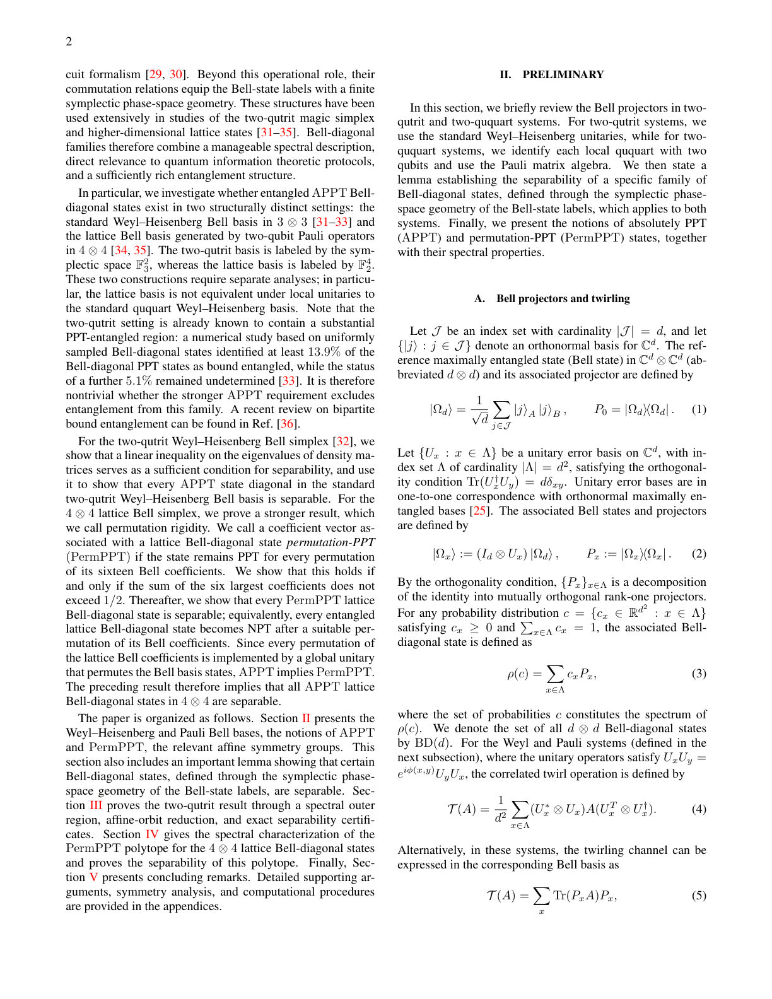 
Low-resolution page preview, page 2

📷 Fig 2

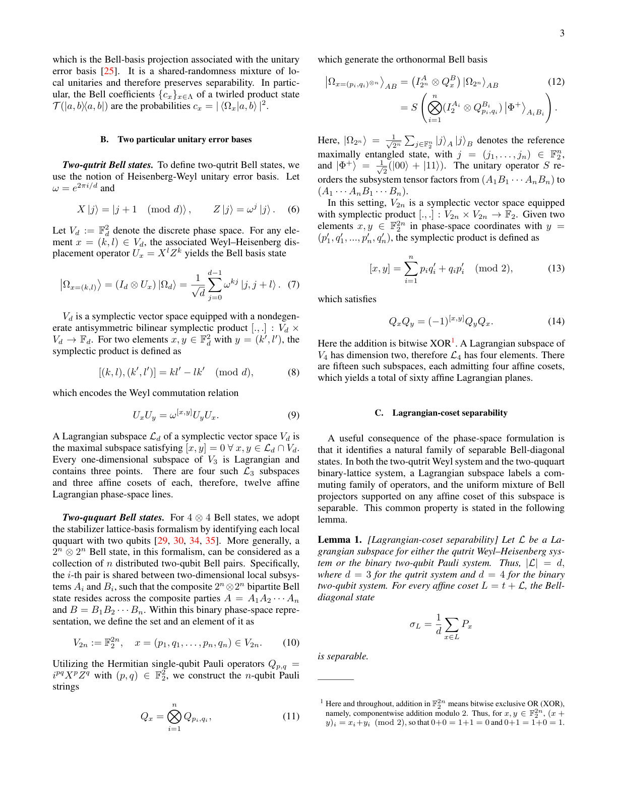 
Low-resolution page preview, page 3

📷 Fig 3

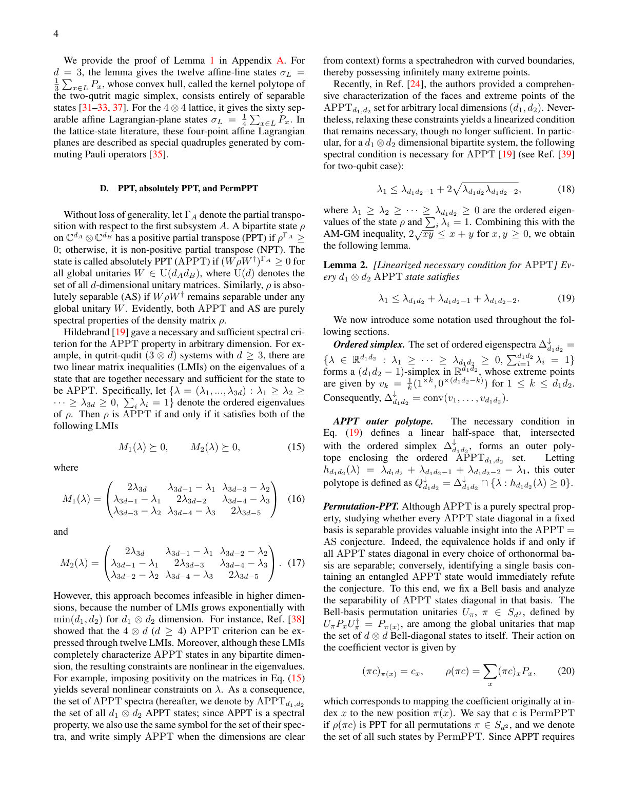 
Low-resolution page preview, page 4

📷 Fig 4

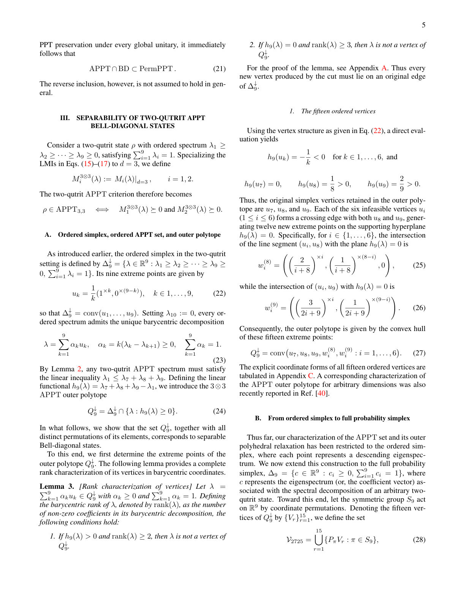 
Low-resolution page preview, page 5

📷 Fig 5

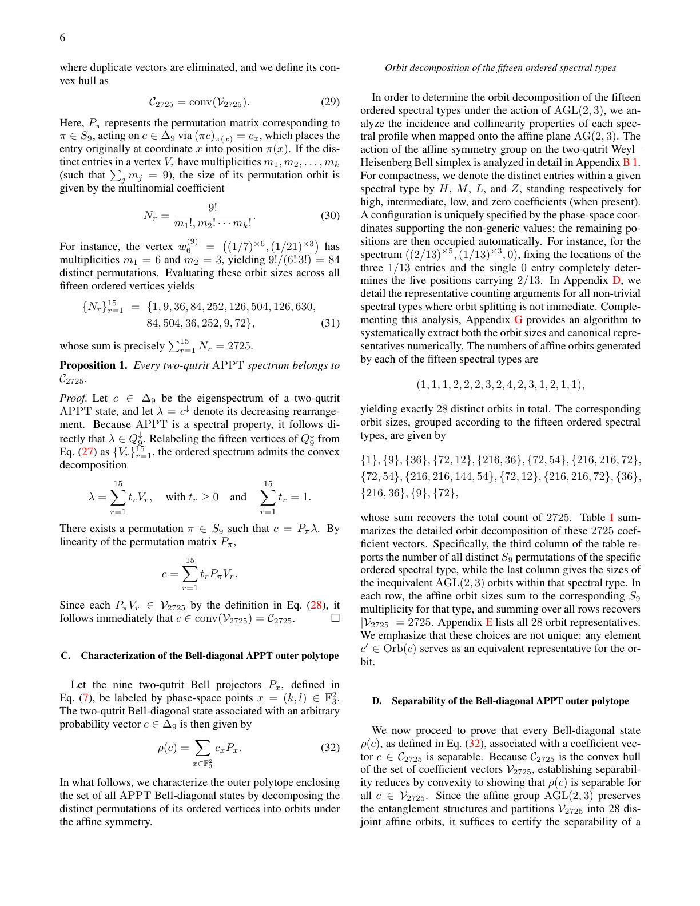 
Low-resolution page preview, page 6

**Summary.** This paper tackles the difficult problem of distinguishing between APPT states and truly absolutely separable states in higher-dimensional quantum systems. By analyzing Bell-diagonal states in $3 \otimes 3$ and $4 \otimes 4$ settings, the authors derive strong, sufficient spectral conditions for separability. These results provide significant progress toward characterizing entanglement in structured quantum states.

**Why it may be interesting.** It provides rigorous, concrete criteria for separability in structured quantum states, which is fundamental for understanding entanglement detection in multi-level systems beyond simple qubit models.

Detailed structure

**Main problem.** The paper investigates whether the physical notion of Absolutely Positive Partial Transpose (APPT) states coincides with the notion of absolutely separable states for higher-dimensional quantum systems.

**Main result.** The authors prove that for Bell-diagonal states in two specific settings (two-qutrit and two-ququart), entangled APPT states are ruled out, providing simple spectral inequalities that are sufficient for separability.

**Method.** The analysis combines convex-polytope analysis, affine and symplectic orbit reductions, and exact rational decompositions into separable states.

**Model / system.** The study focuses on Bell-diagonal states, which are convex mixtures of Bell states, analyzed in the context of two-qutrit ($3 \otimes 3$) and two-ququart ($4 \otimes 4$) systems.

**Key observables.** The Bell coefficients ($\mathbf{c}$) defining the state spectrum, and the criteria for APPT and separability.

**Important parameters / regimes.** The dimensions of the subsystems ($d_1, d_2 \ge 3$), and the spectral constraints derived from the APPT condition.

**Assumptions / limitations.** The derived criteria are basis-specific and do not settle the general equivalence between APPT and absolute separability for all systems.

**Figures summary.** The notes do not describe specific figures, but mention the use of geometric structures, orbit classifications, and spectral analysis.

**Paper structure.** The paper progresses by defining the problem (APPT vs. absolute separability), analyzing the two-qutrit case using polytope analysis, examining the two-ququart lattice case using permutation symmetry, and concluding with general spectral criteria.

Abstract

Absolutely positive partial transpose (APPT) states, which remain PPT under every global unitary, provide a spectral relaxation of absolutely separable states, which remain separable under every such transformation. Despite substantial progress, whether these two notions coincide beyond qubit-qudit systems remains unresolved, motivating the study of structured state families in which the APPT spectral constraints and separability can be analyzed exactly. We study this problem for Bell-diagonal states in two settings: the standard two-qutrit Weyl-Heisenberg basis and the two-ququart lattice basis generated by two-qubit Pauli operators. In the two-qutrit case, we show that a linearized necessary condition for APPT defines a polytope of spectra in which every associated Weyl-Heisenberg Bell-diagonal state admits an exact decomposition into explicitly separable states. This yields a separability criterion that applies to a region even larger than the APPT set itself. In the two-ququart lattice Bell-diagonal setting, we show that a state remains PPT under every permutation of its Bell coefficients if and only if its six largest Bell coefficients sum to at most 1/2, and we prove that all such states are separable. Equivalently, every entangled lattice Bell-diagonal state becomes NPT after a suitable coefficient permutation and is therefore not APPT. The proofs combine convex-polytope analysis, affine and symplectic orbit reductions, and exact rational decompositions into separable states supported on affine Lagrangian subsets. Our results rule out entangled APPT states in both Bell-diagonal families, and provide simple spectral inequalities as sufficient criteria for separability in both cases. Being basis-specific, however, they do not by themselves settle whether APPT and absolute separability coincide.

[↑ back to top](#top)

### [Orbital magnetic susceptibility and de Haas-van Alphen effect of a flat band from quantum geometry](http://arxiv.org/abs/2610.12193v1)

**Authors:** Ethan Huecker, Mengxing Ye, Yuxuan Wang  
**Type:** theory · **Category:** other · **PDF:** <https://arxiv.org/pdf/2610.12193v1>  
**Analysis basis:** full PDF text, analyzed in chunks

📷 Fig 1

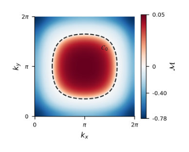 
FIG. 1. The orbital moment M(k) of the lower band at u = −1.2, in the zone chart centered on M = (π, π). The moment is negative at Γ and X, with minimum −0.78 at Γ, and positive inside a single pocket around M, with maximum +0.05. The color scale is linear on each side of zero. Dashed: the zero contour C0, the flat-band Fermi surface of Sec. IV.

📷 Fig 2

 
Figure 2 shows the two structural scalings. The ED bandwidth follows (Mmax −Mmin)B, and the level spacing at µ = ε0 follows the quadratic law of Eq. (58) with the independently computed contour in- tegral H

📷 Fig 3

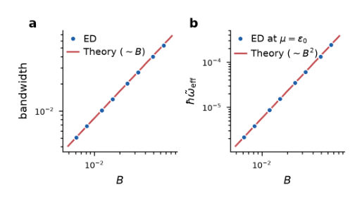 
FIG. 2. Log-log plots for the field-generated band at u = −1.2. (a) ED bandwidth of the flat-band Landau cluster vs B (points) against (Mmax −Mmin)B (line, no fit). (b) ED level spacing at µ = ε0 vs B (points) against ℏ˜ωeff = 2πB2H

📷 Fig 4

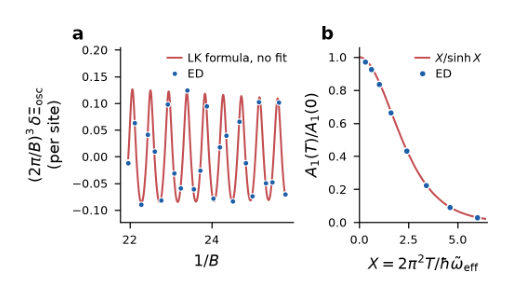 
FIG. 4. dHvA oscillations at u = −1.2. (a) Oscillatory grand potential vs 1/B at pinned µ = ε0 and T = 5 × 10−6: ED points after subtracting a polynomial fit of the smooth part in B, rescaled by (2π/B)3 to cancel the B3 envelope of Eq. (66), against the LK formula with all parameters fixed by geometry and ˜γ = 0.874 (line, no fit). (b) Fundamental amplitude A1 vs T on the in-band contour M = −1

📷 Fig 5

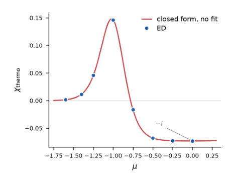 
FIG. 3. Orbital magnetic susceptibility of the flat-band model at u = −1.2, T = 0.1: ED (points; quadratic coefficient of the smooth grand potential, q = 320–1200) against the closed form Eq. (36) (line, no fit). The paramagnetic peak at µ = ε0 is the orbital Curie response of the field-generated moments. The plateau in the gap is the geometric diamag- netism χthermo = −I, with no Fermi surface.

**Summary.** This work develops a theory to calculate the orbital magnetic susceptibility and dHvA effect for materials with flat electronic bands, where conventional theories break down. By expanding the Hamiltonian using Moyal algebra, the authors derive a field-dependent dispersion relation that captures the geometric origin of the magnetic response. This framework successfully predicts the characteristic crossover behavior observed in the dHvA oscillations.

**Why it may be interesting.** The rigorous derivation of orbital response from geometric properties, especially in the singular limit of flat bands, provides powerful theoretical tools applicable to topological materials and strongly correlated systems.

Detailed structure

**Main problem.** The paper addresses the failure of standard orbital magnetism theories when applied to materials exhibiting exactly flat electronic bands, which possess zero velocity and no Fermi surface at zero magnetic field.

**Main result.** The magnetic field generates an effective, gauge-invariant dispersion $\epsilon(k; B) = \epsilon_0 + B M(k) + rac{1}{2} X(k) B^2$, allowing the calculation of the orbital susceptibility and dHvA effect via geometric principles.

**Method.** The analysis employs an expansion in the Moyal algebra of noncommutative kinetic momenta, calculating energy shifts to second order in the magnetic field $B$.

**Model / system.** The system is an isolated flat band, potentially realized in quantum geometry materials, analyzed via the magnetic Bloch problem formulated as a star-eigenvalue problem.

**Key observables.** Orbital magnetic susceptibility, de Haas-van Alphen (dHvA) effect frequency, and the field-generated dispersion coefficients $M(k)$ and $X(k)$.

**Important parameters / regimes.** The magnetic field $B$, the zero-field energy $\epsilon_0$, and the geometric length scale $\xi$ governing the crossover between different field regimes.

**Assumptions / limitations.** The theory assumes the existence of an isolated, non-degenerate flat band and relies on expansions in powers of the magnetic field $B$.

**Figures summary.** Figure 5 illustrates the dHvA crossover, showing the measured instantaneous frequency transitioning from a low-field plateau to a high-field $1/B$ law, consistent with the composite contour prediction.

**Paper structure.** The paper systematically derives the field-generated dispersion using Moyal expansion, establishes the gauge-invariant nature of the response, and then analyzes the resulting dHvA frequency, detailing the crossover between zero-field and high-field limits.

Abstract

A band that is exactly flat at zero magnetic field has zero velocity, a divergent effective mass, and no Fermi surface, so the standard theory of orbital magnetism does not apply. We show that the magnetic field generates an effective dispersion. In the expansion organized by the Moyal algebra of the noncommutative kinetic momenta, the band energy acquires a first-order shift $B\,\mathcal{M}(\mathbf k)$, set by the orbital moment of the Bloch state, and a second-order shift $\tfrac12\mathcal{X}(\mathbf k)B^{2}$, whose gauge-invariant coefficient we obtain in closed form. These two functions, together with the Berry curvature $Ω$, fix the entire orbital response. The susceptibility is purely geometric, and for a generic isolated flat band it reproduces the established gauge-invariant response formula. With the chemical potential pinned to the flat band, the $\mathcal{M}=0$ contour becomes an emergent Fermi surface, and bosonizing excitations in its vicinity yields a modified Lifshitz--Kosevich formula with level spacing quadratic in $B$. The phase shift of the oscillations is given jointly by the Berry phase around the emergent Fermi surface and $\mathcal{X}$. When the band is narrow rather than exactly flat, the oscillation frequency crosses over, with a parameter-free profile, from the zero-field Fermi-surface area to the area of the $\mathcal{M}=0$ contour. We verify our analytical findings numerically by exactly diagonalizing a flattened Chern lattice model.

[↑ back to top](#top)

### [Parameter-Dependent Noise Resilience in the Quantum Approximate Optimization Algorithm](http://arxiv.org/abs/2610.11710v1)

**Authors:** Jorja Kirk, Ashley Montanaro  
**Type:** theory · **Category:** quantum information and computing · **PDF:** <https://arxiv.org/pdf/2610.11710v1>  
**Analysis basis:** full PDF text, analyzed in chunks

📷 Fig 1

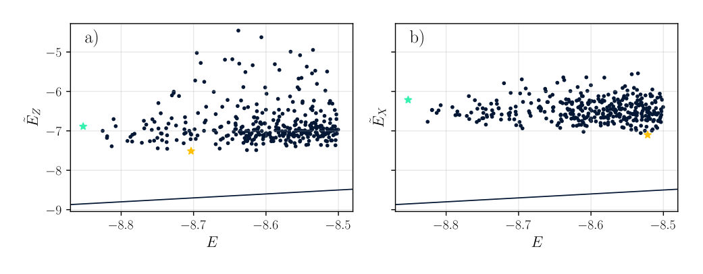 
FIG. 1: Energies obtained by QAOA circuits experiencing one error, compared with exact energies. Each point represents one set of parameters used in 15 layers of QAOA to solve Max-Cut on a line graph with 10 nodes. Each run was done in simulation to return energy E and then also with simulated errors in the circuit. The energy of the noisy circuit ˜EZ or ˜EX was obtained by averaging over the resulting energy with many different error locations of single Pauli Zs or Xs in a) and b) respectively. The highlighted points show the parameters that perform best without errors (teal) and with errors (yellow). The optimal energy for this graph is E = −9 and the solid line indicates where the energy...

📷 Fig 2

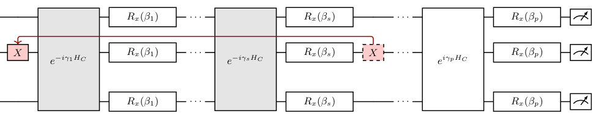 
FIG. 2: QAOA circuit diagram with a single Pauli (a) Z error or (b) X error inserted after layer s. This shows how the errors can be propagated to the end or beginning of the circuit, flipping the signs of the parameters on the non-commuting terms.

📷 Fig 3

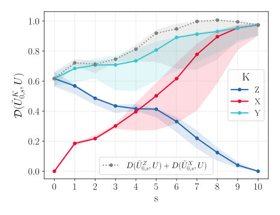 
FIG. 3: Total variation distance, D( ˜U K 0,s, U), for QAOA with 10 layers and a single Pauli K ∈{X, Y, Z} injected after layer s (where s = 0 denotes the position before the first layer). We plot the median distance over 5 3-regular graphs with 10 nodes and the shaded region indicating the interquartile range. For each graph QAOA was run, using predicted parameters using the balanced method from [22], without any errors then with a single Pauli injected and the distance between the distributions calculated using (25). Z errors are most damaging early in the circuit while X errors are most damaging near the end. We also see that D( ˜U X 0,s, U) + D( ˜U Z 0,s, U) closely tracks D( ˜U Y 0,s,...

📷 Fig 4

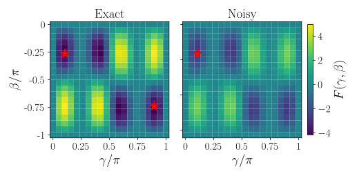 
FIG. 4: Noiseless and Noisy parameter landscape for 1 layer QAOA for Maxcut on 8 node 3-regular graph. Stars indicate global minima.

📷 Fig 5

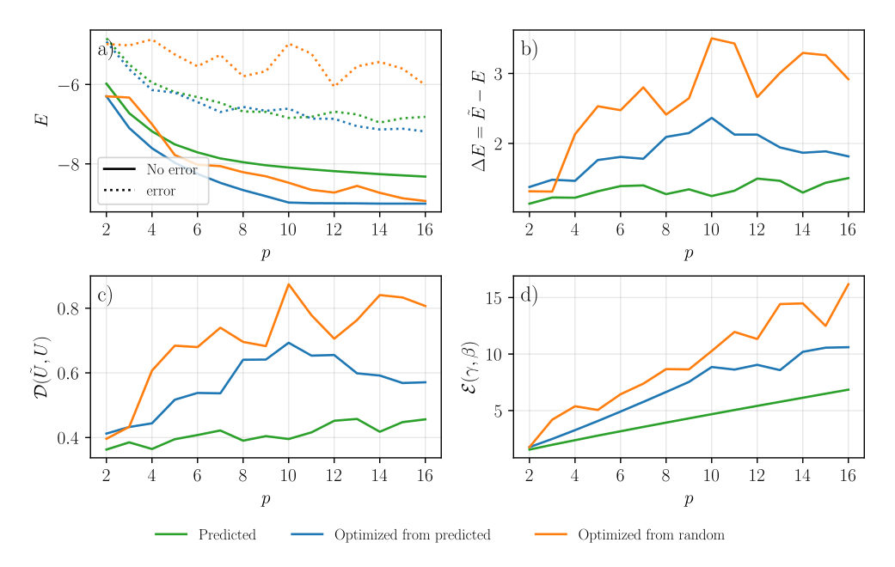 
FIG. 5: a) Noisy and noiseless energy, b) energy difference, c) distance and d) upper bound on expected distance for Max-Cut on a 10 node line graph using 3 different parameter generation methods: predicted using SKatan Method from [22]; optimized starting from the predicted parameters; and optimized from a random starting point. Both optimizations were done offline, in exact simulation using LBFGS [56]. Single Pauli X and Z were injected uniformly at a random layer and random qubit in the circuit and the results were averaged over 200 circuit runs.

**Summary.** This work analyzes how noise degrades the performance of the QAOA for optimization problems, finding that algorithm stability critically depends on the chosen variational parameters. The authors derive rigorous upper bounds on the error accumulation using Pauli noise models and propose novel optimization strategies to build error resilience into the algorithm. This research is vital for making variational quantum algorithms practical on noisy intermediate-scale quantum (NISQ) devices.

**Why it may be interesting.** The focus on parameter-dependent noise resilience provides concrete, actionable guidelines for designing robust quantum circuits, which is crucial for near-term quantum hardware implementation.

Detailed structure

**Main problem.** The paper addresses the critical issue of understanding and suppressing the detrimental effects of noise on the performance of the Quantum Approximate Optimization Algorithm (QAOA) when solving combinatorial optimization problems.

**Main result.** The stability of QAOA under noise is shown to be highly dependent on the choice of variational parameters, leading to the derivation of an upper bound on the total variation distance between noisy and noiseless outputs.

**Method.** The authors derive theoretical upper bounds on the total variation distance (TVD) using Pauli noise models and propose error resilience techniques like error penalties and parameter space truncation.

**Model / system.** The primary model is the QAOA, a variational quantum algorithm applied to optimization problems like Max-Cut. The analysis uses a Pauli noise model and extends concepts to the Quantum Adiabatic Algorithm (QAA).

**Key observables.** Total variation distance (TVD) between noisy and noiseless circuit outputs, and the energy values obtained from noisy vs. noiseless simulations.

**Important parameters / regimes.** Variational parameters ($\gamma, eta$), noise strength, and the number of QAOA layers ($p$).

**Assumptions / limitations.** The analysis relies on a Pauli noise model and uses approximations for error propagation and the continuous limit when extending to QAA.

**Figures summary.** Figures illustrate energy comparisons for Max-Cut under noise, and later figures compare noisy approximation ratios for different parameter optimization methods.

**Paper structure.** The paper first establishes the QAOA framework and the noise problem, then derives the TVD bound based on Pauli error propagation. It introduces error mitigation techniques and extends the analysis to the QAA, concluding with detailed mathematical derivations for the error bounds.

Abstract

The Quantum Approximate Optimization Algorithm (QAOA) is a variational quantum algorithm used for solving combinatorial optimization problems, which is thought to be a promising application of near-term quantum hardware. However, high rates of noise in these devices can obscure meaningful results. Therefore, it is crucial to understand and suppress the effects of noise on the algorithm's output. Here, we find that the stability of the algorithm in the presence of noise is dependent on its variational parameters. Using a Pauli noise model, we derive an upper bound on the total variation distance between the noisy and noiseless circuit output as a function of these parameters. Results from noisy simulations support this bound and give insight into the best methods to use for parameter generation in the presence of noise. We also introduce new methods of optimization using error penalties and truncated search based on this bound to manufacture error resilience. We extend this analysis to the quantum adiabatic algorithm (QAA) by taking the continuous limit of the QAOA.

[↑ back to top](#top)

### [Pressure-induced double-dome superconductivity in doped kagome metal Cs(V0.86Ta0.14)3Sb5 without charge density wave](http://arxiv.org/abs/2610.12257v1)

**Authors:** Haochen Sun, Jing Wang, Deng Hu, Zhiwei Wang, Shiyan Li  
**Type:** experiment · **Category:** strongly correlated electrons · **PDF:** <https://arxiv.org/pdf/2610.12257v1>  
**Analysis basis:** full PDF text, analyzed in chunks

📷 Fig 1

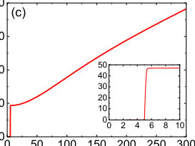 
FIG. 1. (a) Crystal structure of Cs(V0.86Ta0.14)3Sb5. The V/Ta atoms form layers with an ideal kagome lattice. (b) DC magnetization of Cs(V0.86Ta0.14)3Sb5 single crystal at low temperatures, with zero-field and field cooling modes. (c) In-plane resistivity of Cs(V0.86Ta0.14)3Sb5 single crystal at ambient pressure. Inset shows the low-temperature superconducting transition.

📷 Fig 2

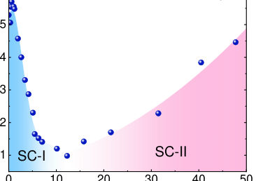 
FIG. 4. Temperature-pressure phase diagram of Cs(V0.86Ta0.14)3Sb5. Two superconducting domes are shown clearly, with SC-I phase at lower pressures and SC-II phase at higher pressures.

**Summary.** This work reports on high-pressure studies of the doped kagome superconductor Cs(V0.86Ta0.14)3Sb5, which lacks long-range CDW order. The key finding is the observation of a double-dome superconducting phase diagram under pressure. This demonstrates that the double-dome superconductivity is an intrinsic property of this class of materials, independent of the CDW state.

**Why it may be interesting.** The study provides experimental evidence of unconventional superconductivity mechanisms (double-dome structure) in a strongly correlated system, offering insights into how electronic instabilities (like CDW) influence pairing symmetry and dome formation.

Detailed structure

**Main problem.** The study investigates the persistence and nature of pressure-induced double-dome superconductivity in a doped kagome metal, specifically when the long-range Charge Density Wave (CDW) order is suppressed.

**Main result.** The Ta-doped compound exhibits a clear double-dome superconducting phase diagram under pressure, demonstrating that this feature is intrinsic to V-based kagome superconductors even without CDW order.

**Method.** High-pressure electrical resistance measurements were performed up to 48 GPa using a diamond anvil cell, complemented by magnetization measurements.

**Model / system.** The physical system is the vanadium-based kagome superconductor Cs(V0.86Ta0.14)3Sb5. The research explores the interplay between superconductivity and charge order in this highly correlated electronic material.

**Key observables.** Superconducting transition temperature ($T_c$), $T-P$ phase diagram, and the presence/absence of CDW resistivity anomalies.

**Important parameters / regimes.** Pressure range up to 48 GPa; doping level (Ta substitution for V); ambient pressure $T_c$ ($\approx 5.29 	ext{ K}$).

**Assumptions / limitations.** The authors hypothesize that the second superconducting dome is driven by a pressure-induced Fermi surface Lifshitz transition.

**Figures summary.** Figures illustrate the non-monotonic evolution of $T_c$ under pressure, clearly establishing the double-dome structure up to 47.7 GPa, while confirming the absence of a CDW anomaly.

**Paper structure.** The paper presents measurements showing the initial non-monotonic $T_c$ evolution at low pressure, followed by the demonstration of the high-pressure double-dome superconductivity, concluding that this feature is robust despite CDW suppression.

Abstract

The vanadium-based kagome superconductor CsV$_3$Sb$_5$ exhibits an intricate interplay between charge density wave (CDW) and superconductivity (SC). Substituting Ta for V will suppress the CDW order and enhance superconductivity. Here, we report a high-pressure study up to 48 GPa on Ta-doped Cs(V$_{0.86}$Ta$_{0.14}$)$_3$Sb$_5$ with enhanced $T_\mathrm{c}$ around 5.29 K and without CDW order. At low pressures, unlike the characteristic $``$M-shaped" temperature-pressure phase diagram of the pristine CsV$_3$Sb$_5$, the Ta-doped compound exhibits a distinct non-monotonic evolution. Initially, $T_\mathrm{c}$ drops slightly from 5.29 K at ambient pressure to 4.90 K at 0.33 GPa, before increasing to a maximum of 5.70 K at 0.61 GPa. Upon further compression, $T_\mathrm{c}$ decreases continuously to 0.98 K at 12.3 GPa. At higher pressures, $T_\mathrm{c}$ rises again, reaching 4.46 K at 47.7 GPa. This evolution of $T_\mathrm{c}$ establishes two superconducting domes under pressure, which are similar to those in CsV$_3$Sb$_5$. Our results demonstrate that pressure-induced double-dome superconductivity is intrinsic to these V-based kagome superconductors, even in the absence of long-range CDW order.

[↑ back to top](#top)

### [Q-Capsule: A Localized Capsule-Based Quantum Neural Architecture for Barren Plateau Mitigation](http://arxiv.org/abs/2610.11261v1)

**Authors:** Awal Ahmed Fime, Tasfia Zaman Samiha, Saika Zaman, Dimitris Pados, George Sklivanitis, Abdur R. Shahid, Ahmed Imteaj  
**Type:** theory · **Category:** quantum information and computing · **PDF:** <https://arxiv.org/pdf/2610.11261v1>  
**Analysis basis:** full PDF text, analyzed in chunks

📷 Fig 1

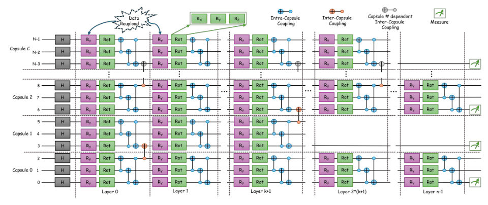 
Figure 1: Overview of the Q-Capsule architecture. N denotes the total number of qubits, c the capsule index, csize the number of qubits per capsule, and Nc = N/csize the total number of capsules. k denotes the inter-capsule coupling interval. H is the Hadamard gate, Ry performs trainable data re-uploading, and Rot denotes a general trainable single-qubit rotation composed of Rx, Ry, and Rz. Blue control–target symbols denote intra-capsule CNOTs, orange symbols denote sparse inter-capsule CNOTs, gray symbols indicate capsule-dependent coupling determined by the alternating coupling pattern, and the green meter symbol denotes local capsule-wise measurement. Different capsule lengths...

📷 Fig 2

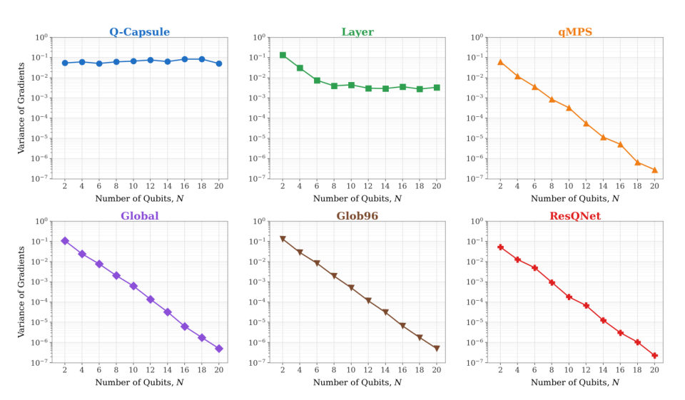 
Figure 2: Gradient variance versus register width N at fixed depth, for Q-Capsule and the five baselines (log scale).

📷 Fig 3

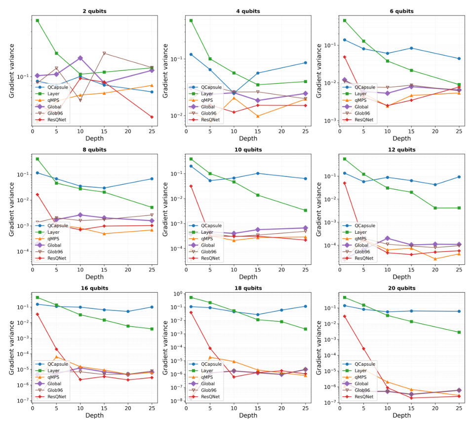 
Figure 3: Gradient variance versus depth for each register width (log scale). Q-Capsule remains within an O(10−1) band across all depths.

📷 Fig 4

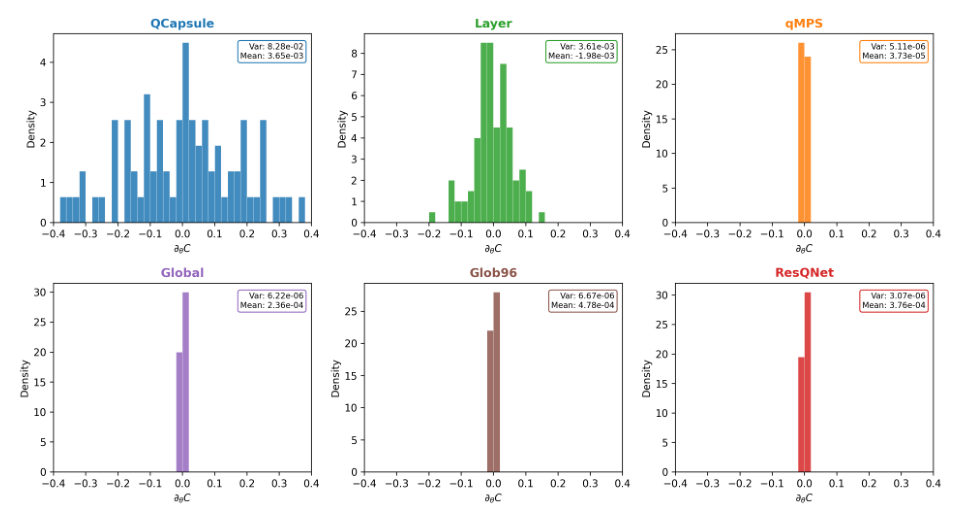 
Figure 4: Empirical gradient distributions at N = 16, max depth 25, over random initializations, with per-model variance and mean annotated.

📷 Fig 5

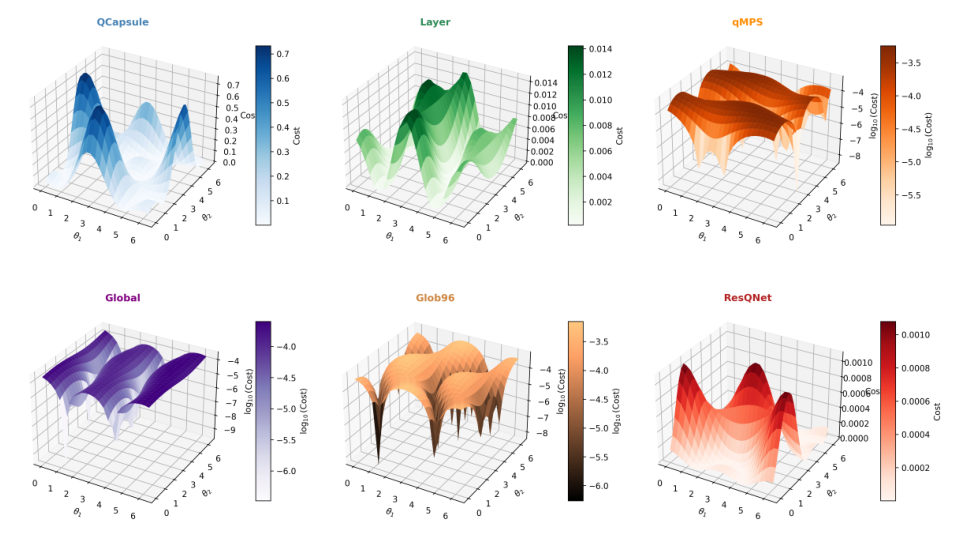 
Figure 5: Two-parameter cost-landscape slices (θ1, θ2) at fixed remaining parameters. Q-Capsule (linear colour scale) shows structured minima spanning a cost range ≈0.75.

**Summary.** This paper introduces Q-Capsule, a novel quantum neural network architecture designed to overcome the barren plateau problem plaguing VQAs. It achieves this by localizing quantum computations into interconnected 'capsules' and adaptively controlling circuit depth using the QFIM. The resulting model maintains stable gradient signals while achieving high classification accuracy with significantly fewer required quantum gates.

**Why it may be interesting.** The focus on gradient stability and structured local computation directly addresses fundamental limitations in scaling quantum machine learning models, which is crucial for developing practical quantum algorithms.

Detailed structure

**Main problem.** Variational Quantum Algorithms (VQAs) are severely limited by the barren plateau phenomenon, where gradients vanish exponentially as the quantum circuit size or depth increases, making training difficult.

**Main result.** Q-Capsule mitigates barren plateaus by using localized capsule structures and sparse coupling, maintaining stable gradient variance even as the total number of qubits increases.

**Method.** The authors propose Q-Capsule, a localized capsule-based quantum neural architecture that employs register partitioning, local readout, and Quantum Fisher Information Matrix (QFIM)-guided adaptive depth growth.

**Model / system.** The model is a Quantum Neural Network (QNN) implemented via VQAs on a quantum register. It partitions the register into fixed-width 'capsules' which process information locally before sparsely interacting.

**Key observables.** Gradient variance ($	ext{Var}[\partial	heta\langle O_c
angle]$), Quantum Fisher Information Matrix (QFIM), inter-capsule entanglement, and classification accuracy.

**Important parameters / regimes.** Capsule width ($c_{size}$), coupling interval ($k$), and the QFIM-derived expressibility score ($S_c$).

**Assumptions / limitations.** The analysis relies on the assumption that restricting observables to small capsules controls gradient concentration, and the adaptive growth uses a block-diagonal metric-tensor approximation of the QFIM.

**Figures summary.** Figure 1 provides an architectural overview, detailing the qubit partitioning, local readout mechanisms, and the pattern of intra-capsule and inter-capsule coupling.

**Paper structure.** The paper introduces the Q-Capsule architecture, presents detailed analysis of its mechanisms (including QFIM guidance), and concludes with performance metrics and future work directions.

Abstract

Variational quantum algorithms are often limited by barren plateaus: gradients vanish as circuit size and depth increase, making quantum neural networks difficult to train. We propose Q-Capsule, a localized capsule-based quantum neural architecture that mitigates this problem through register partitioning, local readout, sparse inter-capsule coupling, trainable data re-uploading, and Quantum Fisher Information Matrix (QFIM)-guided adaptive depth growth. By restricting the dominant support of each observable to a small capsule and controlling inter-capsule entanglement, Q-Capsule preserves useful gradient signals while retaining communication between local quantum representations. As the register width increases, Q-Capsule consistently maintains stable gradient variance, whereas globally entangling baselines exhibit exponential suppression with a log-gradient-variance slope near -ln 2 per qubit. Q-Capsule also produces more structured optimization landscapes, higher parameter efficiency, improved robustness to depolarizing noise, and lower measurement requirements. Its adaptive policy achieves 98.1% accuracy on binary classification and 97.7% on four-class classification, while using approximately 73% fewer two-qubit gates than the fixed-deep model on the multiclass task.

[↑ back to top](#top)

### [Quantum Co-Design of Inhomogeneous Many-Body Neutrino Fast Flavor Transformation](http://arxiv.org/abs/2610.12334v1)

**Authors:** Zoha Laraib, Sherwood Richers, Alessandro Baroni, Kathleen Hamilton, In-Saeng Suh  
**Type:** theory · **Category:** quantum information and computing · **PDF:** <https://arxiv.org/pdf/2610.12334v1>  
**Analysis basis:** full PDF text, analyzed in chunks

📷 Fig 1

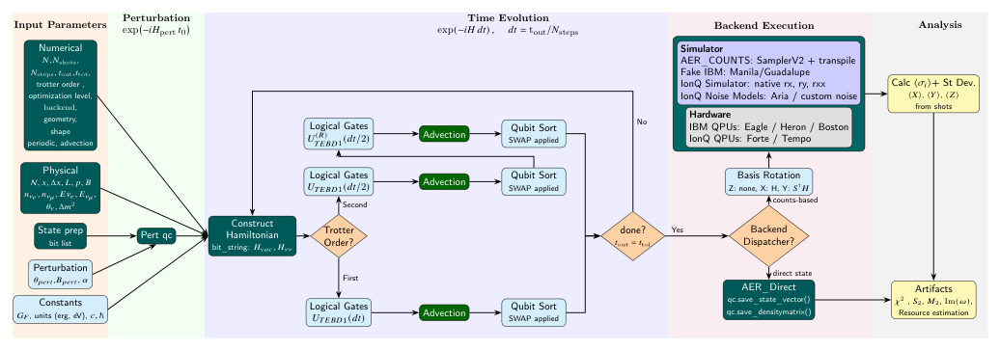 
FIG. 1: QCNO code framework workflow showing the full pipeline for a test. From parameter initialization to applying perturbation, time evolution via Hamiltonian construction and gate application, backend execution across simulators and quantum hardware, measurement processing, statistical analysis, and PDF artifact archiving. Particle sorting based on positions is applied in every layer (showed by colored background).

📷 Fig 2

 
FIG. 2: System-size dependence of the spatially inhomogeneous two-beam dynamics for 𝑁= 6–30, with 𝑁/2 particles initially in each flavor beam. The upper panel shows the electron-beam-averaged longitudinal polarization ⟨𝑃𝑧⟩, and the lower panel shows the beam-averaged transverse one-body coherence ⟨𝑃𝑥−𝑖𝑃𝑦⟩ . Colors denote 𝑁. Solid curves show MF evolution and dashed curves show fully correlated MB evolution from direct Qiskit Aer statevector calculations. Both use the same second-order product formula with 𝑑𝑡= 5 × 10−13 s = 0.047𝜇−1. The gray dashed line gives the analytic linear-stability growth rate 1.88 × 1011 s−1, with arbitrary vertical offset. The MF calculation develops exponential...

📷 Fig 3

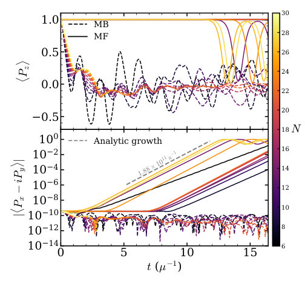 
Figure 2 verifies the MF (solid) curves; the fastest un- stable mode is picked up through the applied perturba- tion amplitude of 10−2 in the transverse |⟨𝑃𝑥−𝑖𝑃𝑦⟩| which exponentially grows showing the Fast Flavor Instability (FFI). Across these system sizes curves are nearly paral- lel and approach the analytic linear-stability growth rate Im(Ω) = 2𝜇= 1.88 × 1011 s−1 [72, 73]. Its correspond- ing ⟨𝜌𝑒𝑒⟩transitions from 1 to 0.5 (⟨𝑃𝑧⟩from 1 to 0), indicating flavor transformation to a mix of electron and

📷 Fig 4

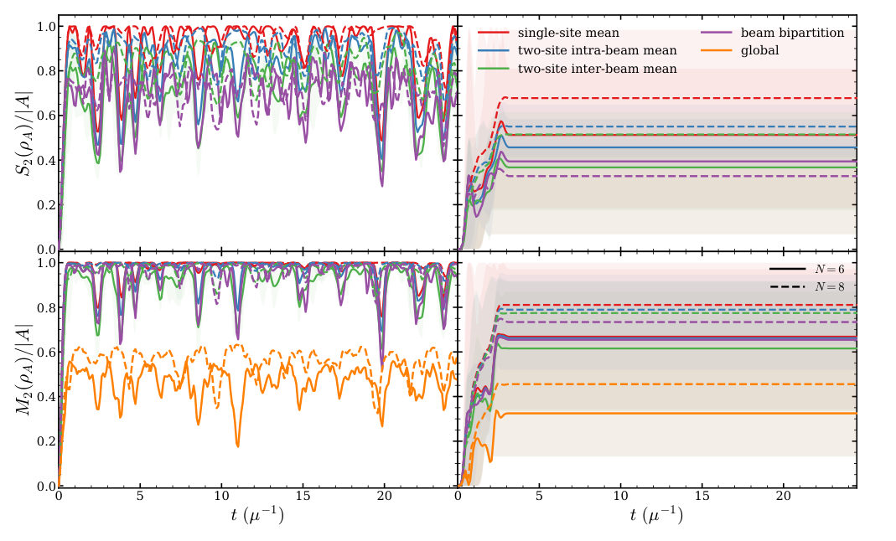 
FIG. 3: Subsystem-size-normalized second Rényi entropy and stabilizer Rényi diagnostics for the inhomogeneous MB evolution with closed periodic boundaries (left column) and open boundaries (right column). The upper row shows 𝑆2(𝜌𝐴)/|𝐴| and the lower row shows 𝑀2(𝜌𝐴)/|𝐴| for 𝑁= 6 (solid) and 𝑁= 8 (dashed). Single-site and two-site curves show averages over the corresponding sites or pairs, with shaded regions giving their minimum-to-maximum spread. Two-site subsystems are separated into intra-beam and inter-beam pairs. The beam bipartition contains all particles belonging to one initial flavor beam, while the global 𝑀2/𝑁is evaluated on the full pure state. Closed boundaries produce rapid...

📷 Fig 5

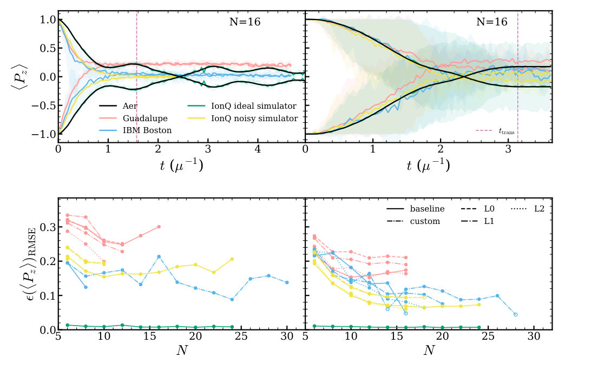 
FIG. 4: Backend sensitivity of the inhomogeneous MB longitudinal polarization for closed boundaries (left column) and open boundaries (right column). The upper panels show the two beam-averaged ⟨𝑃𝑧⟩trajectories at 𝑁= 16, the largest common system size used here for the comparison including Guadalupe. Shaded regions give the site-wise minimum-to-maximum spread within each beam, while solid lines show beam averages. The vertical (purple) dashed lines mark the time taken for beams to separate in the first pass, i.e., 𝑡transient = 𝑡lap ≃1.57 𝜇−1 for closed boundaries and 𝑡transient = 2𝑡lap ≃3.14 𝜇−1 for open boundaries. The lower panels show 𝜖(⟨𝑃𝑧⟩)RMSE relative to direct Aer as 𝑁 is increased....

**Summary.** This work introduces QCNO, a quantum simulation code designed to tackle the complex, many-body problem of neutrino flavor transformation in dense astrophysical environments. By mapping the Hamiltonian to quantum circuits, the authors simulate the system's evolution and quantify the computational resources—including required logical error rates—needed to achieve accurate results. This establishes a critical co-design pathway between advanced quantum algorithms and cutting-edge particle astrophysics.

**Why it may be interesting.** It provides a concrete, application-driven framework for quantum simulation, directly linking a complex astrophysical many-body problem to the required gate counts and error correction overheads for near-term and fault-tolerant quantum computers.

Detailed structure

**Main problem.** The paper addresses the challenge of simulating dense-neutrino flavor evolution, a quantum many-body problem, which becomes computationally prohibitive due to increasing particle number and spatial inhomogeneity.

**Main result.** They developed the QCNO code, successfully simulating the many-body evolution for N=30 and estimating resource requirements up to N=50, while quantifying the necessary error tolerance for fault-tolerant execution.

**Method.** The core method involves mapping the inhomogeneous neutrino Hamiltonian to TEBD2 product-formula quantum circuits, enabling simulation via Trotter time-slicing on quantum hardware architectures.

**Model / system.** The system is neutrino flavor evolution in dense, inhomogeneous fields, modeled by an inhomogeneous forward-scattering Hamiltonian incorporating advection and finite-range interactions. The simulation uses a two-flavor approximation mapped to qubits.

**Key observables.** Rényi entanglement, polarization RMSEs, circuit depth, and T gate cost.

**Important parameters / regimes.** System size N (up to 50), required synthesis tolerance $\varepsilon_{\text{syn}} \sim 10^{-7}$, and the number of qubits.

**Assumptions / limitations.** The analysis relies on mapping the physical problem to quantum circuits and estimating resource costs for both NISQ and fault-tolerant regimes.

**Figures summary.** Not specified.

**Paper structure.** The paper details the development of the QCNO code, showing the mapping of the Hamiltonian to TEBD2 circuits, demonstrating the simulation of flavor instabilities, and finally estimating the resource scaling for fault-tolerant computation.

Abstract

Dense-neutrino flavor evolution is a quantum many-body problem whose fully correlated treatment becomes rapidly more expensive with increasing particle number and spatial structure. We develop a \texttt{QCNO} quantum simulation code that maps a inhomogeneous forward-scattering neutrino Hamiltonian with advection and finite-range interactions to TEBD2 product-formula quantum circuits, and connects ideal many-body simulation, backend-aware execution, and fault-tolerant resource estimation within the same physical model. We reproduce the exact many-body evolution of the suppressed mean-field-like transverse fast flavor instability through $N=30$ and show that even a single open-boundary interaction generates Rënyi entanglement and non-stabilizer magic, although noisy backends still produce polarization RMSEs of order $0.1$--$0.3$. The restricted active interaction graph of this problem allows us to estimate the circuit depth and $T$ gate cost through $N=50$ for both NISQ and fault-tolerant approaches. The measured TEBD2 error in our fiducial ideal simulation of order $10^{-3}$ motivates a synthesis tolerance $\varepsilon_{\rm syn}\sim10^{-7}$, corresponding to about $70$ $T$ gates per $R_Z$ rotation. The generated circuit contains $1.4\times10^4$ $T$ gates per qubit for open boundaries (twice that for closed boundaries), requiring an application-level logical-$T$ error target of order $10^{-7}$ for early fault-tolerant architectures.

[↑ back to top](#top)

### [Quantum geometry at arbitrary genus - I: Anharmonic potentials](http://arxiv.org/abs/2610.10940v1)

**Authors:** Mustafa Türe, Mithat Ünsal  
**Type:** theory · **Category:** other · **PDF:** <https://arxiv.org/pdf/2610.10940v1>  
**Analysis basis:** full PDF text, analyzed in chunks

📷 Fig 1

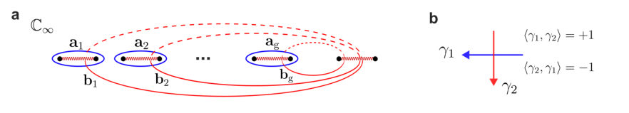 
Figure 1. Canonical basis cycles and intersection numbers. a, A choice for a set of canonical basis cycles {(ai, bi)}g i=1 of a Riemann surface of genus g. The squiggly dark red lines indicate the branch cuts emanating from pairs of branch points, and the dashed segments of cycles indicate they lie on the second sheet. This basis set is equivalent to any other choice of canonical basis set up to an Sp(2g, Z) transformation. b, The intersection number structure of two cycles γ1 and γ2. The homology space is endowed with the inner product shown, which gives the space its symplectic structure defined by the intersection matrix (2.6).

📷 Fig 2

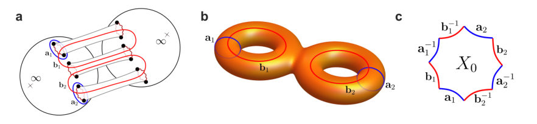 
Figure 2. A genus 2 Riemann surface p2 = f(q) and its geometric and topological rep- resentations. a, The gluing of two compactified complex planes C∞from their branch cuts which gives the compact Riemann surface X. A set of canonical basis cycles {(ai, bi)}2 i=1 is represented on it by the blue and red loops. The squiggly dark red lines represent the branch cuts where the two surfaces are glued. b, A torus, T 2, of genus 2 which is homeomorphic to the Riemann surface X. Same canonical basis cycles are shown as in a. c, The canonical dissection of the Riemann surface X using the canonical basis pairs. X0 is the interior of the Riemann surface and The cycles are the boundary ∂X.

📷 Fig 3

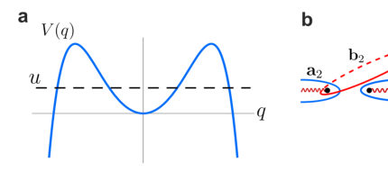 
Figure 3. A genus 2 sextic anharmonic oscillator potential V (q) = 1

📷 Fig 4

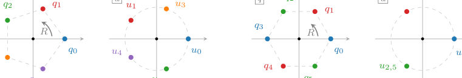 
Figure 4. Critical points qk of V (q) and their critical values uk = u∗ζ2k; the black dot is q = 0, u = 0. Colors follow each point to its image. (a) Septic: u 7→ζ2u visits the five critical values in the order 0, 3, 1, 4, 2 (counterclockwise), and only q0 is real. (b) Octic: the parity pairs ±qk share a critical value, so D6 acts on the u-plane as D3, and q0 and q3 = −q0 are both real.

**Summary.** This work tackles the generalization of the P/NP relation in quantum mechanics from simple (genus-1) potentials to complex, higher-genus systems. By employing advanced tools from algebraic geometry and exact WKB theory, the authors overcome a major mathematical obstruction related to the symplectic structure. They successfully derive an all-orders quantum P/NP relation applicable to potentials defining Riemann surfaces of arbitrary genus.

**Why it may be interesting.** The rigorous mathematical framework developed for relating quantum periods across arbitrary genus curves is highly relevant to understanding quantum corrections in integrable systems and quantum field theories where geometry plays a central role.

Detailed structure

**Main problem.** The paper aims to generalize the P/NP relation, which connects perturbative and non-perturbative quantum actions, from genus-1 potentials to potentials defining Riemann surfaces of arbitrary genus.

**Main result.** The authors derive an all-orders quantum P/NP relation valid for arbitrary genus by modifying the Riemann bilinear identity using a suitably transformed intersection matrix.

**Method.** The approach combines complex algebraic geometry (Jacobian varieties, Abel-Jacobi map) with the exact WKB formalism applied to the classical energy conservation relation defining a genus-g Riemann surface.

**Model / system.** The system is a quantum mechanical particle governed by a potential V(q) such that the classical energy relation p^2 = 2(E-V(q)) defines a hyperelliptic Riemann surface X of genus g. The analysis focuses on anharmonic oscillators for explicit examples.

**Key observables.** Quantum periods, WKB-active cycles, and the relationship between the Picard-Fuchs basis and the canonical homology basis.

**Important parameters / regimes.** The genus g of the Riemann surface, and the semiclassical parameter $\hbar$.

**Assumptions / limitations.** The analysis relies on the existence of a classical energy conservation relation defining the Riemann surface, and the formal structure of the WKB expansion.

**Figures summary.** Figure 1 illustrates the canonical basis cycles and their symplectic intersection properties. Figure 2 shows the Riemann surface structure for a genus-2 example, and Figure 3 relates to the potential profile and WKB analysis.

**Paper structure.** The paper establishes the general framework by relating quantum periods to the geometry of the Riemann surface. It identifies the obstruction to the P/NP relation at $g \geq 2$ (the mismatch between $	ext{SL}(2g, \mathbb{Z})$ and $	ext{Sp}(2g, \mathbb{Z})$) and resolves it by constructing a modified Riemann bilinear identity, culminating in explicit derivations for $g=2$ and $g=3$.

Abstract

In quantum mechanics of genus-1 potentials, perturbation theory around the topologically trivial saddle and non-perturbative instanton saddle are constructively related via the P/NP relation. Whether such a relation persists for higher-genus potentials has remained an open problem. In this work, we resolve it using tools from complex algebraic geometry combined with exact WKB. The classical energy conservation relation $p^2 = 2(E-V(q))$ defines a genus-g Riemann surface $X$, whose periods are naturally organized by its Jacobian variety $J(X) = \mathbb{C}^{\text{g}}/Λ$ via the Abel-Jacobi map, and independently by the solution basis of the associated Picard-Fuchs equations. We show that the physically relevant, WKB-active cycles are generally related to the Picard-Fuchs basis by a linear transformation that lies in $\text{SL}(2\text{g},\mathbb{Z})$ but not in the symplectic group $\text{Sp}(2\text{g},\mathbb{Z})$ once $\text{g}\geq2$, in contrast to the genus-1 case, where the two groups coincide. This mismatch is the obstruction that has made an explicit higher-genus P/NP relation elusive. We show that it can be resolved by passing to a modified Riemann bilinear identity, built from a suitably transformed intersection matrix, which the WKB-active periods do satisfy exactly. The result is an all-orders quantum P/NP relation valid for potentials of arbitrary genus, which we derive explicitly for genus-2 (quintic and sextic) and genus-3 (septic and octic) anharmonic oscillators.

[↑ back to top](#top)

### [Quantum Magic and the Strong Coupling Constant](http://arxiv.org/abs/2610.11121v1)

**Authors:** Qiaofeng Liu, Ian Low, Zhewei Yin  
**Type:** theory · **Category:** other · **PDF:** <https://arxiv.org/pdf/2610.11121v1>  
**Analysis basis:** full PDF text, analyzed in chunks

📷 Fig 1

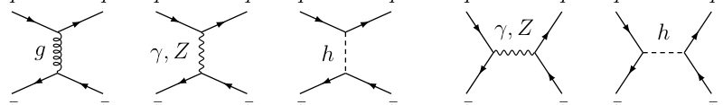 
FIG. 1. Tree diagrams for flavor-diagonal color-singlet q¯q →q¯q scattering. Notice that the s-channel gluon exchange vanishes in the color singlet channel.

📷 Fig 2

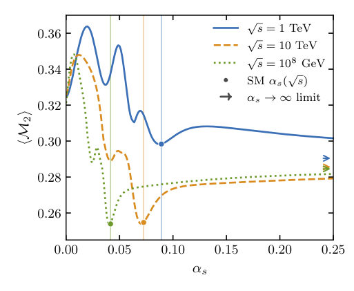 
FIG. 2. Magic production in the t¯t color singlet as a function of αs at √s = 1 TeV, 10 TeV, and 108 GeV, with all other inputs fixed according to Sec. III. Circles and thin vertical lines mark the SM value αs(√s). Arrows at the right edge mark the pure-QCD limit αs →∞.

📷 Fig 3

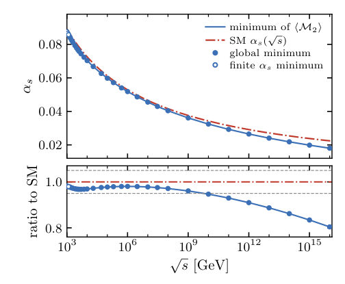 
FIG. 3. Magic-minimizing αs in the t¯t color singlet as a function of √s, compared with the SM running coupling (dash- dotted). Filled circles: global minimum. Open circles: finite αs minimum, as the pure-QCD limit is lower. The lower panel shows the ratio to the SM value; the dashed lines mark ±5%.

📷 Fig 4

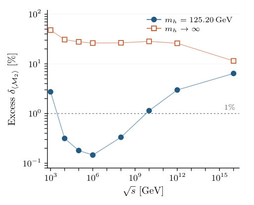 
FIG. 4. Percentage excess δ⟨M2⟩in the t¯t color singlet as a function of the CM energy for mh = 125.20 GeV (filled circles) and mh →∞(open squares). Each curve uses its own minimum over αs, with all other inputs held fixed at each CM energy.

📷 Fig 5

 
Figure 2 shows the magic in the t¯t singlet as a function of αs = α rs at √s = 1 TeV, 10 TeV, and 108 GeV. At each CM energy the SM αs(√s) sits very close to the finite αs minimum. At 10 TeV and 108 GeV the finite αs minimum lies below the pure-QCD limit and is therefore the global minimum of Eq. (6). At 1 TeV the finite αs minimum is slightly above the pure-QCD limit, and the magic falls below it only for αs &gt; 0.36, a somewhat large coupling. The additional structures at smaller αs arise from interference among different Feynman diagrams. In Fig. 3 we show the location of the finite αs minimum from 1 TeV to 1016 GeV, together with the SM running coupling. From 1.3 TeV it is the global...

**Summary.** This theoretical paper proposes that the fundamental constants of particle physics, particularly the strong coupling $\alpha_s$, are determined by minimizing a quantity called 'magic' in quark scattering processes. By analyzing these minimums across vast energy scales, the authors suggest that this minimization reflects a deeper principle: the universe operates under constraints analogous to quantum computational efficiency.

**Why it may be interesting.** While the core physics is high-energy particle theory, the underlying motivation—linking fundamental constants to principles of quantum resource minimization—touches upon deep theoretical concepts relevant to quantum information theory and the foundations of physics.

Detailed structure

**Main problem.** The paper investigates whether minimizing a quantity called 'magic' in quark scattering processes can explain the fundamental values and relative strengths of the Standard Model gauge couplings ($\alpha_s$, $\sin^2	heta_W$). It also explores if this principle can constrain the Higgs sector.

**Main result.** Varying $\alpha_s$ in the top channel yields a magic minimum that reproduces the running $\alpha_s$ to within $5\%$ across vast energy scales, suggesting a connection between coupling constants and quantum efficiency. The conjecture posits that fundamental constants are selected by minimizing quantum resource costs.

**Method.** The authors calculate the 'magic' observable, related to the stabilizer Rényi entropy, for elastic quark scattering at tree level. They perform systematic scans by varying only $\alpha_s$ while keeping other SM inputs fixed.

**Model / system.** The model is the Standard Model, focusing on tree-level elastic quark scattering channels ($qar{q} 	o qar{q}$) involving photon, gluon, W/Z, and Higgs exchange. The analysis is performed using renormalization-group-improved methods in the $\overline{	ext{MS}}$ scheme.

**Key observables.** The minimum value of the averaged magic, $\langle M_2 
angle_{\min}(\sqrt{s})$, and the deviation $\delta\langle M^2 
angle(\sqrt{s})$ from the Standard Model prediction.

**Important parameters / regimes.** The strong coupling constant ($\alpha_s$), the electromagnetic coupling ($\alpha$), the weak mixing angle ($\sin^2	heta_W$), and the center-of-mass energy ($\sqrt{s}$) spanning from $1 	ext{ TeV}$ to $10^{16} 	ext{ GeV}$.

**Assumptions / limitations.** The analysis assumes that minimizing 'magic' reflects a principle of quantum computational efficiency, and that the physical universe emerges from a quantum simulation subject to constrained resources.

**Figures summary.** Figures illustrate the dependence of the magic observable on $\alpha_s$ for different channels (e.g., $tar{t}$), showing the location of the minimum relative to the SM running coupling. Tables summarize initial input parameters for the couplings and Yukawa couplings.

**Paper structure.** The paper establishes the physical context (SM couplings), defines the diagnostic observable ('magic'), performs calculations across various energy scales and channels by varying $\alpha_s$, presents results showing agreement with running couplings, and concludes with a conjecture linking this minimization principle to quantum computational efficiency.

Abstract

The three gauge couplings of the Standard Model (SM) can be parameterized as the fine structure constant $α$, the weak mixing angle $\sin^2θ_w$, and the strong coupling $α_s$. They are fundamental constants whose values remain unexplained. Previously we showed that minimizing magic production in charged-lepton scattering reproduces $\sin^2θ_w$ with great precision. Here we study magic production in the six flavor-diagonal color-singlet channels $q\bar q\to q\bar q$ at tree level, including photon, gluon, $W/Z$, and Higgs exchange. Varying only $α_s$, with all other inputs fixed at each center-of-mass energy, we find that the finite-$α_s$ magic minimum in the top channel reproduces the $\overline{\mathrm{MS}}$ value of $α_s$ to within $5\%$ from $1~$TeV to $10^9~$GeV. Higgs exchange involving the large top Yukawa coupling is essential for this agreement. All six channels produce near-minimal magic at the SM couplings, and reducing $α_s$ toward $α$ increases their magic production, potentially explaining why the strong interaction is ``strong.'' To understand why minimizing magic reproduces both $\sin^2θ_w$ and $α_s$, we conjecture that the parameters of fundamental interactions among color singlets reflect a principle of quantum computational efficiency, with the physical universe emerging from a quantum simulation subject to constrained resources.

[↑ back to top](#top)

### [Quantum-Enhanced Inference of Conditional Future Probabilities with Reduced Memory Cost](http://arxiv.org/abs/2610.10756v1)

**Authors:** Jianjun Chen, Akshat Gupta, Chengran Yang, Ariel Neufeld, Jayne Thompson, Thomas J. Elliott, Mile Gu  
**Type:** theory · **Category:** quantum information and computing · **PDF:** <https://arxiv.org/pdf/2610.10756v1>  
**Analysis basis:** full PDF text, analyzed in chunks

📷 Fig 1

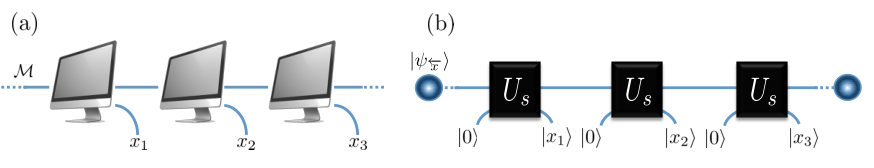 
FIG. 1: Classical vs. Quantum Models. (a) A classical model of a stochastic process operates by tracking relevant past information in its memory states {sj}, encoded within the memory system M. At each time step, a classical model in state sj emits a symbol x and transitions to some state sk with probability T x jk. (b) A quantum model consists of a quantum memory initialised in a state |sj⟩, based on the past observations ←−x . At each time step t, the unitary Us entangles the memory register with a fresh ancillary system, imprinting the output |xt⟩onto the ancilla and simultaneously updating the memory. The output |xt⟩can be measured immediately to generate a sequence for the stochastic...

📷 Fig 2

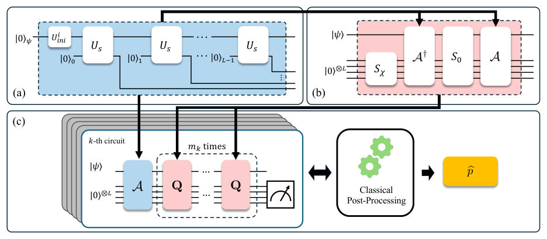 
FIG. 2: Algorithm Schematic. Our method for memory-reduced conditional probability estimation tackles the data-loading problem through the use of a recurrent quantum circuit A (a). Through L repeated applications of Us on a suitably initialised memory system and L ancilla qubits, the circuit is able to generate a quantum superposition of all possible futures up to a time horizon of L. Provided the memory system (top line) is properly accounted for, we can build a suitable Grover iterator Q (b). We can then construct a family of quantum circuits Nk, each involving mk repeated applications of Q. The resulting measurement statistics from these circuits then allow us to estimate ˆp (c). For...

📷 Fig 3

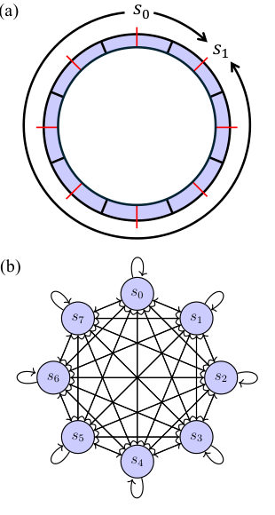 
FIG. 3: Cyclic random walk and its discretisation. (a) We can discretise a cyclic random walk by dividing the unit interval into equal segments, each represented by its midpoint sj = j/N, j = 0, 1, . . . , N −1 (red markers). Between any two states, there exist two possible transition pathways — one clockwise and one anticlockwise. (b) Given a continuous position Xt, the discrete state of the system at time t is defined as the closest segment midpoint sj, denoted St = s(Xt). The transition probability from sk to sj is then P(sk|sj) = P(Xt+1 ∈Ik|Xt = xj), where Ik =  x : x −k

📷 Fig 4

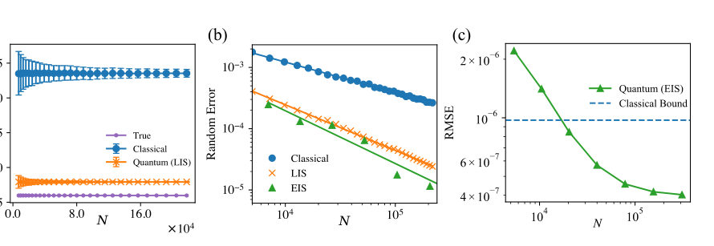 
FIG. 4: Illustration of quantum advantage on a cyclic random walk. Here we compare the performance of classical Monte Carlo methods to our memory-reduced quantum probability estimator (MRQPE) when simulating a 8-segment cyclic random walk when memory dimension is constrained to 4. (a) illustrates the estimates of the probability p = P(x0:3 = 100|x−3:0 = 000) using classical Monte Carlo (blue), MRQPE with linear (LIS) scheduling (see Appendix F for details on LIS and EIS scheduling) as a function of the number of simulations N, with the true value of p plotted in comparison (purple). The error bars represent the error bars corresponding to the 90th and 10th percentiles over 1000 independent...

📷 Fig 5

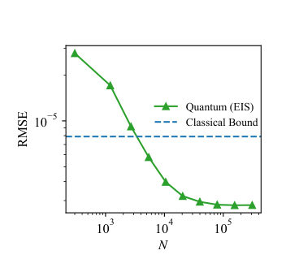 
FIG. 5: Quantum advantage when simulating a 16-state cyclic random walk. Here, we consider the average RMSE error when estimating all events with probabilities from 10−9 to 10−8 for the 16-state cyclic random walk (see Appendix G 4 for details). As in the the 8-state case, both classical baseline and quantum models are set to have memory dimension of 4. As in Figure 4c, the blue line then denotes the the lower bound on RMSE achieved using classical models — even if we allowed unlimited samples. Meanwhile the green line plots the RMSE error of our quantum models as function of number of simulations. We see that quantum models can achieve RMSE below classical limits using only around 3000...

**Summary.** This paper introduces a quantum-algorithmic framework to estimate the probability of future events in complex stochastic systems. It tackles the fundamental trade-off between memory requirements and estimation accuracy by combining quantum amplitude estimation with quantum-enhanced dimensional reduction. The results demonstrate that quantum methods can maintain high accuracy while drastically reducing the memory overhead compared to classical methods.

**Why it may be interesting.** It directly addresses the practical limitations of quantum computation for simulating complex, long-term physical processes by showing how quantum techniques can manage the exponential growth of required classical memory states.

Detailed structure

**Main problem.** The core challenge is accurately estimating the conditional probability of a future event in complex stochastic systems while overcoming the exponential memory scaling and computational limitations of traditional quantum algorithms.

**Main result.** The authors propose a quantum-algorithmic method that simultaneously achieves a quadratic speed-up (like QAE) and significantly reduces the systematic bias associated with memory constraints.

**Method.** The approach involves mapping classical stochastic processes to quantum memory states and employing a structured quantum circuit (MRQPE) to estimate probabilities, incorporating quantum-enhanced dimensional reduction techniques.

**Model / system.** The work analyzes stationary stochastic processes, including Autoregressive (AR(2)) models and cyclic random walks, which are discretized and modeled using quantum memory registers.

**Key observables.** Conditional future probabilities $P(X_{0:L} | \leftarrow x)$, estimation error ($\epsilon$), and the fidelity divergence rate (QFDR).

**Important parameters / regimes.** Memory dimension ($D_c$ vs. $	ilde{D}$), required number of simulations ($N$), and the time horizon ($L$).

**Assumptions / limitations.** The analysis relies on approximating the full quantum model with a reduced memory dimension ($	ilde{D} < D_c$) while maintaining low estimation error.

**Figures summary.** Figures illustrate the unitary evolution coupling memory and ancilla, the structured quantum circuit for state preparation, and comparisons of mean absolute errors for various time series models (AR(2), coin process) under noise.

**Paper structure.** The paper first establishes the problem of memory vs. accuracy trade-off, then details the quantum-algorithmic framework (MRQPE) for state preparation, and finally validates the method by applying it to various time series models (AR(2), Poisson processes) to demonstrate simultaneous reduction in bias and memory cost.

Abstract

Many potential future events have devastating consequences, from the onset of earthquakes to financial black swan events. Accurate predictions of their probability of occurrence are vital. Yet as the stochastic systems underlying such events become increasingly complex, these probabilities can depend on ever-growing amounts of past data, which require ever more memory to track. The accuracy of our estimates is ultimately limited by both computational and memory constraints; the former to reduce sampling error, the latter to avoid sampling bias. Traditional quantum algorithms -- such as amplitude estimation -- address only the former, and become untenable especially in near-future quantum devices where quantum memory is a premium. Here, we offer quantum-algorithmic means to reduce systematic bias while maintaining a quadratic speed-up. Our results thus advance the timeline for the practical deployment of quantum technologies, and illustrate their additional benefits when simulating processes of growing complexity.

[↑ back to top](#top)

### [Retromorphic Testing of Quantum Compiler Passes](http://arxiv.org/abs/2610.11195v1)

**Authors:** Mushahid Khan, Olivia Di Matteo  
**Type:** theory · **Category:** quantum information and computing · **PDF:** <https://arxiv.org/pdf/2610.11195v1>  
**Analysis basis:** full PDF text, analyzed in chunks

📷 Fig 1

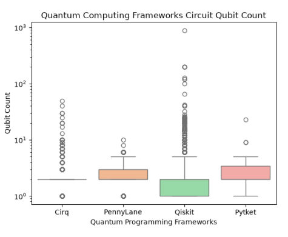 
Fig. 1: Qubit count distribution of unit test circuits.

📷 Fig 2

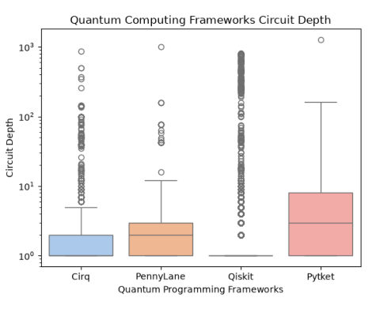 
Fig. 2: Depth distribution of unit test circuits.

📷 Fig 3

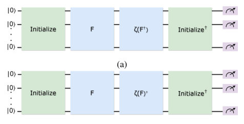 
Fig. 4: Stage 1 variant quantum circuits. ζ is a compiler pass.

📷 Fig 4

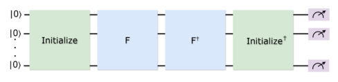 
Fig. 3: Stage 1 baseline circuit.

📷 Fig 5

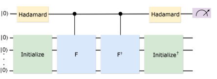 
Fig. 5: Stage 2 baseline circuit.

**Summary.** This paper addresses the critical challenge of verifying quantum compiler passes, which are difficult to test because simulating the expected output of large quantum circuits is computationally intractable. The authors introduce RetroQ, a novel retromorphic testing framework that verifies semantic and structural correctness by analyzing the transformation relationship between the input and output circuits. This methodology significantly improves the reliability of the quantum software stack by uncovering previously unknown compiler bugs.

**Why it may be interesting.** While focused on software tools, the underlying concepts of rigorous verification, state space exploration, and structural invariance are highly relevant to developing reliable quantum simulation algorithms or analyzing physical models implemented via quantum circuits.

Detailed structure

**Main problem.** The core challenge is verifying the correctness of quantum compiler passes, which transform high-level quantum programs into optimized, hardware-compatible circuits.

**Main result.** The authors introduced RetroQ, a retromorphic testing methodology that successfully reproduced existing bugs and uncovered new defects in major quantum frameworks like PennyLane and Qiskit.

**Method.** They propose a black-box testing methodology, RetroQ, inspired by metamorphic testing and the Hadamard test, to verify semantic preservation without needing to compute the intractable expected output.

**Model / system.** The work focuses on abstract quantum circuits and the compiler passes ($\zeta$) that manipulate them. The system involves quantum programs being compiled down to hardware-compatible gate sequences.

**Key observables.** Semantic equivalence ($F \equiv F'$), structural properties (gate count, depth), and specific execution details like symbolic parameter handling and commutation logic.

**Important parameters / regimes.** The test circuits analyzed are generally found to be small and shallow, which limits the scope of current unit testing practices.

**Assumptions / limitations.** The methodology assumes that the transformation preserves semantic equivalence, and it is limited by the difficulty of finding suitable initial states for comprehensive testing.

**Figures summary.** The notes mention figures showing the qubit count and circuit depth distributions of existing unit test circuits, indicating they are generally small.

**Paper structure.** The paper first establishes the problem (intractability of verification), analyzes existing unit testing practices across multiple frameworks, proposes the novel RetroQ methodology, demonstrates its effectiveness by finding bugs, and concludes by outlining future research directions.

Abstract

Quantum compilers play a critical role in transforming high-level quantum programs into optimized, hardware-compatible circuits. However, verifying the correctness of compiler passes remains challenging, as determining the expected output of large, deeply entangled quantum circuits is computationally intractable. This challenge is further amplified when compiler passes modify already complex circuit structures, making manual validation of transformed circuits impractical.   In this work, we perform a systematic analysis of unit tests for quantum compiler passes in four quantum programming frameworks (PennyLane, Qiskit, Cirq, and pytket). Our findings indicate validation is dominated by program-content and program-metric assertions, and test circuits are generally small and shallow. Motivated by these observations, we introduce a testing methodology for automated validation of quantum compiler passes based on retromorphic testing and principles from the Hadamard test. This methodology analyzes a compiler pass, test circuit, and expected pass behavior to verify semantic preservation and intended structural modifications.   We implement our methods in a framework, RetroQ, and apply it to compiler passes in PennyLane and Qiskit. Experimental evaluation reproduced several existing bugs as well as uncovered previously undetected defects, such as flawed symbolic parameter handling, incorrect commutation logic, failure to recognize self-adjointness of gates, and runtime crashes. These findings highlight the need for compiler-pass-specific testing methodologies to improve the reliability of the evolving quantum software stack.

[↑ back to top](#top)

### [SC$^\sharp$: superconductivity intertwined with topological order](http://arxiv.org/abs/2610.10679v1)

**Authors:** Zhi-Qiang Gao, Yan-Qi Wang, Hui Yang, Zhaoyu Han, Ashvin Vishwanath  
**Type:** theory · **Category:** strongly correlated electrons · **PDF:** <https://arxiv.org/pdf/2610.10679v1>  
**Analysis basis:** full PDF text, analyzed in chunks

📷 Fig 1

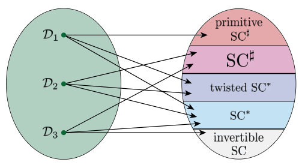 
FIG. 1. Grading the intertwinement between super- conductivity (SC) and topological order (TO). Distinct classes are organized according to the topological properties of vortices. All five classes can be constructed from anyon con- densation in some parent UMTC D stacked with an atomic insulator, with a many-to-many correspondence in general.

**Summary.** This paper classifies superconducting phases based on how strongly superconductivity intertwines with intrinsic topological order in 2D materials. The authors introduce the SC^sharp phase, which is defined by non-factorizable, non-Abelian vortex excitations. This work provides a powerful topological diagnostic tool to distinguish between different types of exotic superconducting states.

**Why it may be interesting.** The deep connection between superconductivity, topological order, and non-Abelian anyons provides a rich theoretical playground for understanding emergent quantum phases in condensed matter systems.

Detailed structure

**Main problem.** To develop a comprehensive classification framework for (2+1)D gapped superconductors that precisely characterizes the interplay between superconductivity and intrinsic topological order.

**Main result.** The authors introduce the class SC^sharp, characterized by elementary vortices that cannot be factorized into simple superconducting and topological components, implying a fundamentally non-Abelian nature.

**Method.** The classification relies on analyzing the topological properties of superconducting vortices using an algebraic framework involving modular tensor categories.

**Model / system.** The system studied is a (2+1)D gapped superconductor with a condensate charge of 2ne, analyzed through the lens of anyon physics and topological field theory.

**Key observables.** Topological properties of superconducting vortices, quantum dimension of the elementary vortex sector, and fusion rules.

**Important parameters / regimes.** Condensate charge (2ne), flux quanta (h/(2ne)), and the level of intertwinement between SC and TO.

**Assumptions / limitations.** The classification is argued to be exhaustive by relating all SC phases to anyon condensation from a parent UMTC.

**Figures summary.** Figure 1 illustrates the classification scheme, grading the intertwinement between SC and TO based on vortex properties.

**Paper structure.** The paper progresses by defining a hierarchy of superconducting phases: invertible SC $	o$ SC* $	o$ Twisted SC* $	o$ SC^sharp $	o$ Primitive SC^sharp, with each step defined by increasingly restrictive conditions on vortex factorization.

Abstract

Superconductivity and intrinsic topological order can intertwine in ways that go beyond simple coexistence. Here we develop a classification framework for (2+1)D gapped superconductors with condensate charge $2ne$. By focusing on the topological properties of superconducting vortices, we precisely characterize this interplay. We obtain a classification with increasing levels of intertwinement, from the well known invertible superconductors without topological order, to untwisted and twisted SC$^\ast$, and finally to SC$^{\sharp}$. Our main finding is the family SC$^{\sharp}$, in which the elementary vortex carrying $h/(2ne)$ flux cannot be factorized into an invertible superconductor vortex dressed by bulk anyons, and every elementary vortex is necessarily non-Abelian. For such phases, we also obtain no-go results: the elementary vortex sector has quantum dimension at least $\sqrt{6}$ and cannot satisfy Fibonacci fusion rules. We develop a systematic algebraic framework to obtain all these superconducting phases through anyon condensation, allowing us to construct several infinite families of examples and make connections to anyon superconductivity. Finally, we introduce primitive SC$^\sharp$ phases for which factorization of every nontrivial vortex sector is obstructed, and argue that they cannot arise by disordering the relative phases of lower-charge superconducting condensates. Our classification scheme based on vortex properties allows us to uncover new distinctions between topologically ordered superconductors and constrain how they can be realized.

[↑ back to top](#top)

### [Scattering entanglement entropy between one particle species and the others](http://arxiv.org/abs/2610.10704v1)

**Authors:** Yuan-Hao Zheng, Jiayin Gu  
**Type:** theory · **Category:** other · **PDF:** <https://arxiv.org/pdf/2610.10704v1>  
**Analysis basis:** full PDF text, analyzed in chunks

📷 Fig 1

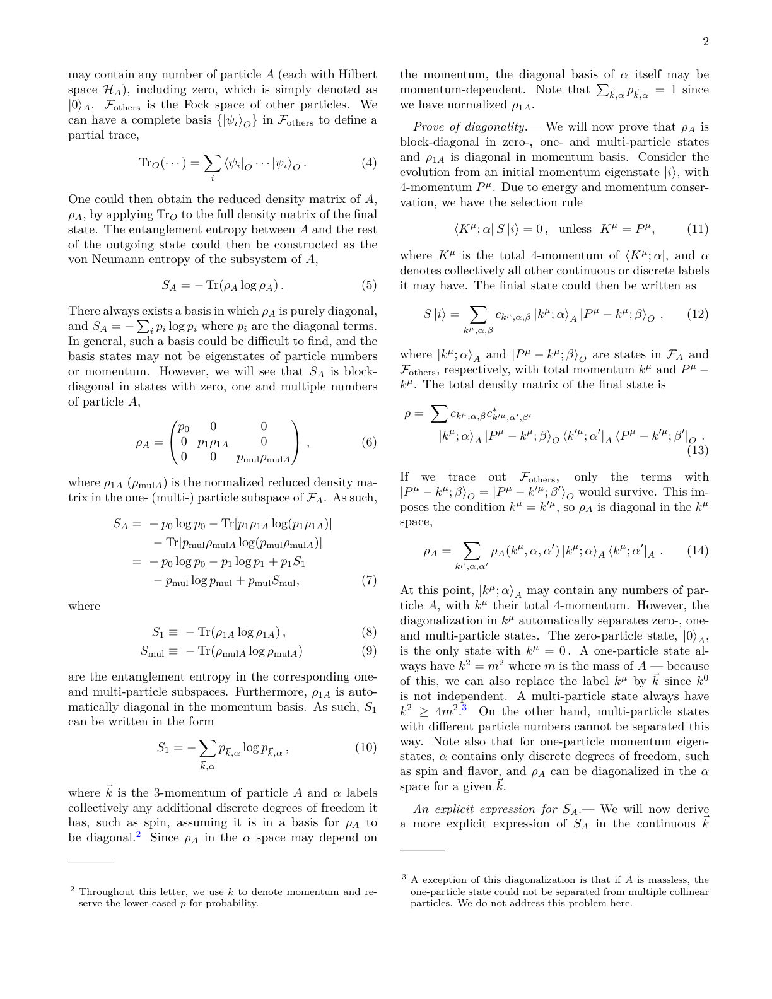 
Low-resolution page preview, page 2

📷 Fig 2

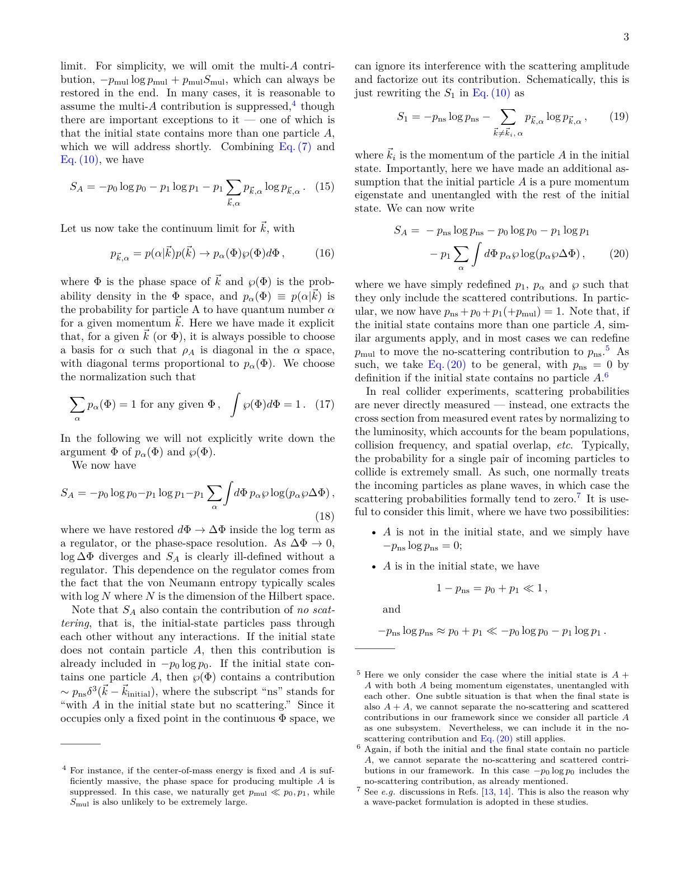 
Low-resolution page preview, page 3

📷 Fig 3

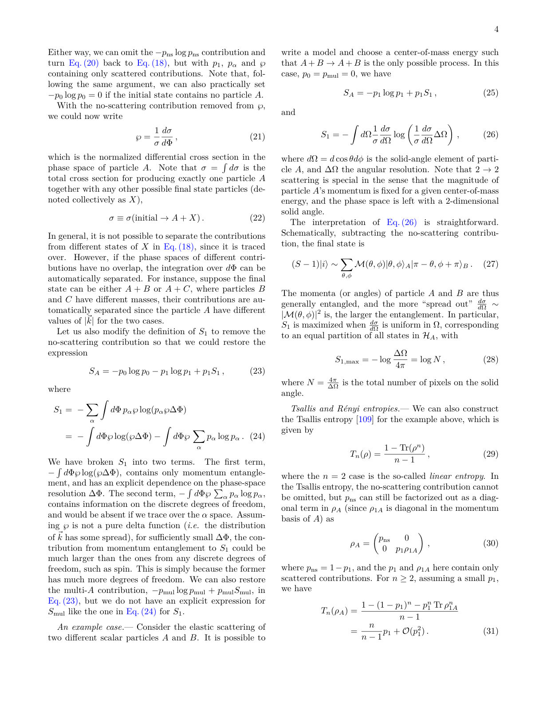 
Low-resolution page preview, page 4

📷 Fig 4

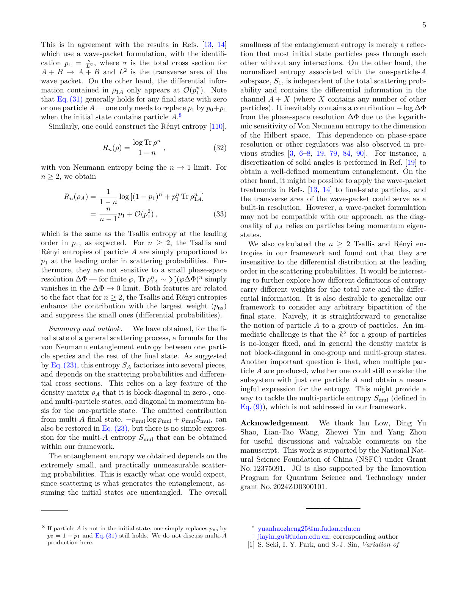 
Low-resolution page preview, page 5

📷 Fig 5

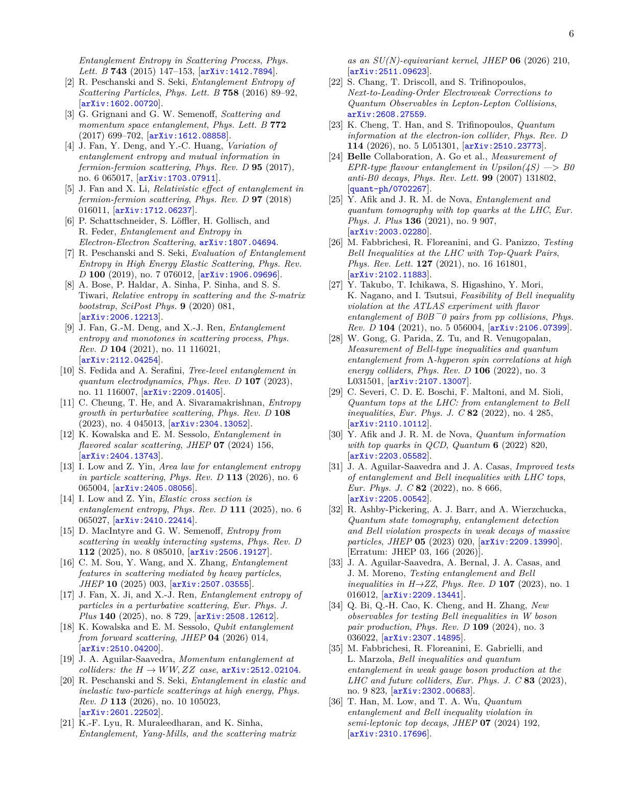 
Low-resolution page preview, page 6

**Summary.** This work develops a general method to calculate the entanglement entropy between one particle species and the rest of the final state following a quantum scattering event. By analyzing the reduced density matrix, the authors derive $S_A$ in terms of measurable scattering cross sections. This provides a powerful, model-independent tool for quantifying quantum correlations generated in particle collisions.

**Why it may be interesting.** It provides a general, model-independent framework for quantifying entanglement generated in high-energy scattering, which is a key area of study in quantum field theory and particle physics.

Detailed structure

**Main problem.** The paper constructs and calculates the entanglement entropy between a single particle species (A) and the rest of the final state in a general quantum scattering process.

**Main result.** The entanglement entropy ($S_A$) can be expressed in terms of scattering probabilities and differential cross sections, providing a model-independent measure of entanglement generated during scattering.

**Method.** The calculation uses the reduced density matrix formalism ($
ho_A$) and exploits the block-diagonal structure of $
ho_A$ in the momentum basis to derive the entropy formula.

**Model / system.** The system is a general quantum scattering process governed by the S-matrix, starting from a pure initial momentum eigenstate. The final state is partitioned into the species A and all other particles.

**Key observables.** Entanglement entropy ($S_A$), Tsallis and Rényi entropies ($T_n, R_n$), scattering probabilities ($p_0, p_1, p_{	ext{mul}}$), and differential cross sections ($\sigma$).

**Important parameters / regimes.** Phase-space resolution factor ($\Delta\Phi$), scattering probabilities, and the order of scattering (up to one particle A).

**Assumptions / limitations.** The initial state is a pure momentum eigenstate, and the derivation is straightforward only when the probability of producing multiple particles A is subleading.

**Paper structure.** The paper progresses by defining the entanglement entropy, proving the block-diagonal structure of the reduced density matrix $
ho_A$, deriving the simplified form of $S_A$ (assuming $\le 1$ particle A), and finally taking the continuum limit.

Abstract

We construct the entanglement entropy of a general scattering process between one particle species (denoted as $A$) and the rest of the final state. Assuming a pure initial momentum eigenstate, we show that the reduced density matrix in particle $A$'s Fock space is block-diagonal in zero-, one- and multi-particle states, and is diagonal in the momentum basis for the one-particle state. As a result, we could write down the Von Neumann entropy of particle $A$, $S_A$, in terms of scattering probabilities and differential cross sections, assuming no more than one particle $A$ is produced in the final state. $S_A$ contains the information of both the total scattering probabilities (or cross sections) and the differential distributions --- the latter depends on a phase-space resolution factor as a result of the infinite-dimensional momentum Hilbert space. Our result is general and model-independent since we consider the full final state from time evolution ($S|i\rangle$) rather than a specific outcome, and is applicable as long as the probability for producing multiple particle $A$ is subleading. We also obtain the $n\geq2$ Tsallis and Rényi entropies in our framework and find out that, at the leading order, they are proportional to the total scattering probability and carry no differential information.

[↑ back to top](#top)

### [Short-Range Vector Spin Glasses: Parisi Hierarchies and Real-Space Ultrametricity](http://arxiv.org/abs/2610.12441v1)

**Authors:** Akash Vijay, Jaewon Kim, Jong Yeon Lee  
**Type:** theory · **Category:** disordered systems and neural networks · **PDF:** <https://arxiv.org/pdf/2610.12441v1>  
**Analysis basis:** full PDF text, analyzed in chunks

📷 Fig 1

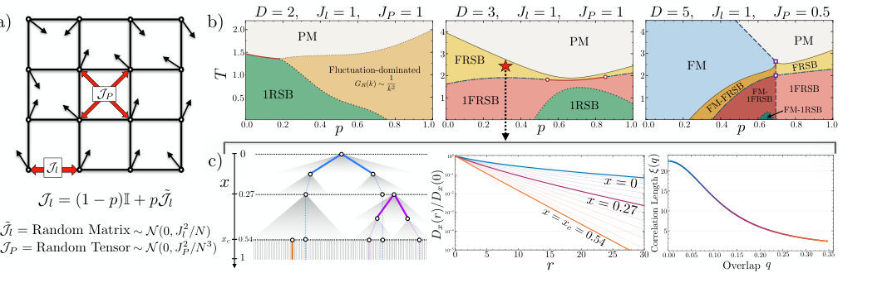 
FIG. 1. (a) Short-range vector spin glass. N-component spins reside on the vertices of a D-dimensional hypercubic lattice. Each nearest-neighbor link l carries a matrix coupling Jl = (1 −p)I + p e Jl, which interpolates between clean ferro- magnetic exchange at p = 0 and a Gaussian random matrix at p = 1. Each elementary plaquette couples its four corner spins through an independent random rank-four tensor JP . The disorder variances scale with N as indicated, yielding a well-defined large-N limit with free energy proportional to NV . (b) Phase structure. Representative phase diagrams at Jl = 1 for (D, JP ) = (2, 1), (3, 1), and (5, 0.5). Resolved regions show the thermodynamically...

📷 Fig 2

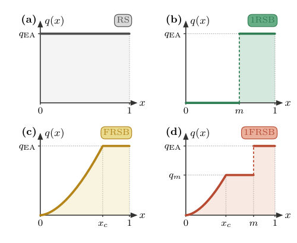 
FIG. 2. Representative Parisi profiles for the RS, 1RSB, FRSB, and 1FRSB phases. (a) In the RS phase, the Parisi profile is constant, q(x) = qEA. (b) In the 1RSB phase, q(x) jumps from 0 to the Edwards–Anderson overlap qEA at the breaking point m. (c) In the FRSB phase, q(x) varies continuously up to xc, where it reaches qEA and re- mains on the Edwards–Anderson plateau for x &gt; xc. (d) In the 1FRSB phase, the continuous branch reaches qm at xc, followed by a plateau up to m and a finite jump to qEA. When xc = m, the intermediate plateau has zero width.

📷 Fig 3

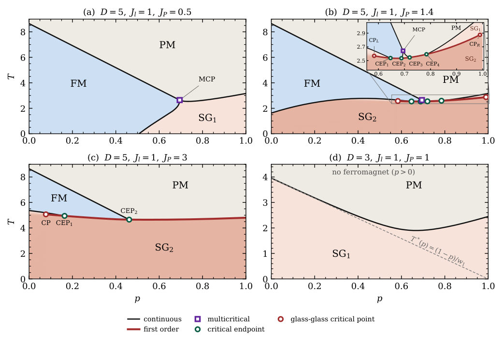 
FIG. 3. Replica-symmetric phase diagrams at Jl = 1. At each point in the (p, T) plane, we show the admissible RS saddle with the largest replica free energy (89). Black and red curves denote continuous and first-order transitions, respectively. Momentum integrals are evaluated using the exact lattice kernel. SG1 and SG2 denote the lower- and higher-overlap glass branches. (a) Weak plaquette disorder, D = 5 and JP = 0.5. Only the SG1 glass branch appears, and all phase boundaries are continuous. The PM–FM, FM–SG1, and PM–SG1 boundaries meet at the multicritical point (square) of Eq. (61), p∗= 0.6945 and T ∗= 2.6420. The FM phase is bounded above by the gap-closing line T = (1 −p)/w1(D) and...

📷 Fig 4

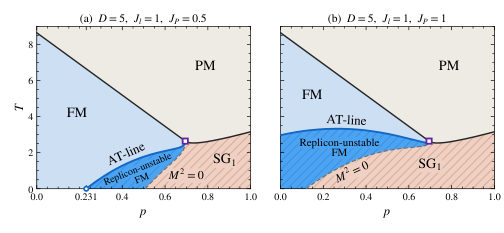 
FIG. 5. Stability of the RS solution at D = 5, Jl = 1, for (a) JP = 0.5 and (b) JP = 1. The replicon eigenvalue vanishes on the de Almeida–Thouless (AT) line (blue), which lies strictly above the locus M 2 = 0 at which the replica- symmetric condensate disappears (dashed). Between the two the saddle retains M 2 ̸= 0 but breaks replica symmetry, giv- ing a mixed phase (hatched, blue) in which ferromagnetic and glassy order coexist. Hatching marks every region where the replica-symmetric solution is unstable. Due to Eq. (114), this includes the whole glassy region for any JP ̸= 0. In both panels, the AT line and M 2 = 0 lines merge at the multi- critical point (square, p∗= 0.6945), whose...

📷 Fig 5

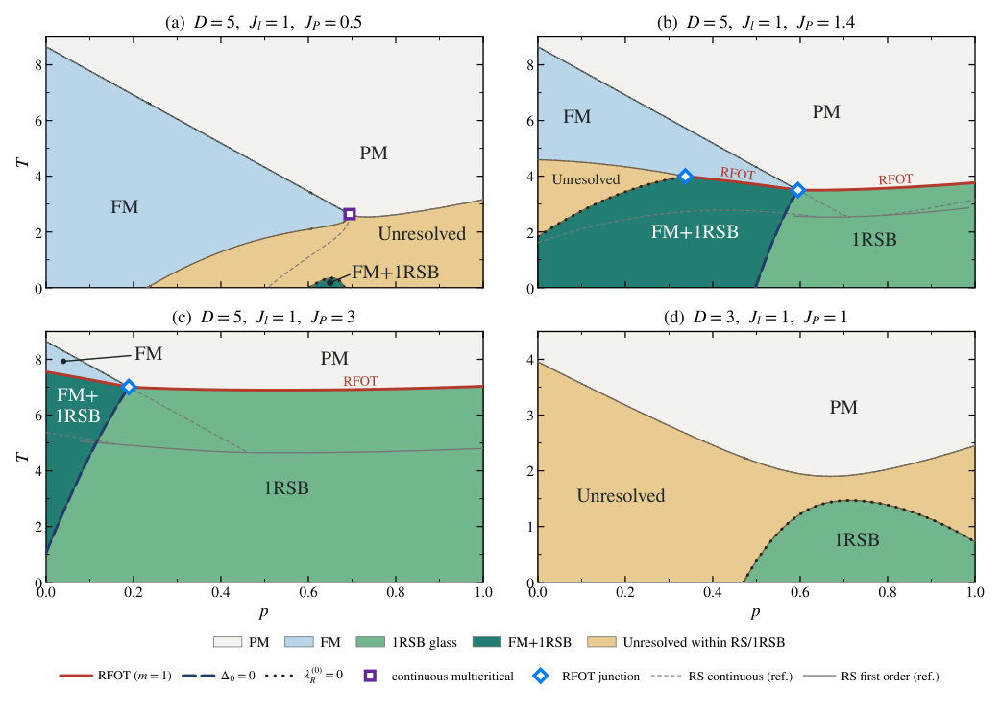 
FIG. 6. 1RSB phase diagrams in the (p, T) plane for Jl = 1. At each point, we compare the admissible RS and 1RSB saddles and show the replicon-stable solution with the largest on-shell free energy. Off-white, blue, green, and teal denote the RS paramagnet (PM), RS ferromagnet (FM), unmagnetized 1RSB glass, and magnetized FM+1RSB phase, respectively. Amber marks regions unresolved within the RS/1RSB comparison. Solid red, dashed dark-blue, and dotted black curves denote the static m = 1 (random-first order transition) boundary, closure of the outer spin gap ∆0 = 0, and outer-replicon marginality λ(0) R = 0 with λ(1) R &gt; 0, respectively. Gray curves show the RS phase boundaries for reference;...

**Summary.** This theoretical work investigates spin glasses with short-range interactions to determine if the mean-field Parisi theory applies. By analyzing a lattice spin model in the large-N limit, the authors prove that the continuous Parisi hierarchy is stable and, crucially, show that the abstract replica structure maps directly onto a real-space ultrametric organization of the system's pure states.

**Why it may be interesting.** The connection between the abstract mathematical structure of RSB (Parisi hierarchy) and concrete, measurable real-space correlations (correlation length $\xi(q)$) provides a powerful, physically intuitive framework for understanding glassy dynamics in finite dimensions.

Detailed structure

**Main problem.** The paper addresses whether the mean-field Parisi picture of replica symmetry breaking (RSB) can describe the low-temperature phase of spin glasses with strictly short-range interactions in finite dimensions.

**Main result.** The model supports thermodynamically stable RSB phases, and the Parisi hierarchy acquires a direct real-space interpretation showing an ultrametric organization of pure states via correlation lengths.

**Method.** The analysis employs the replica method in the large-N limit, analyzing the saddle-point structure of the free energy and relating the abstract Parisi profile to physical correlation lengths.

**Model / system.** The system is a disordered model of N-component vector spins on a D-dimensional hypercubic lattice, featuring random couplings on nearest-neighbor links and plaquettes.

**Key observables.** Edwards–Anderson order parameter ($q_{EA}$), Parisi profile $q(x)$, and the characteristic real-space correlation length $\xi(q)$ between pure states.

**Important parameters / regimes.** Dimension $D$, large-$N$ limit, temperature $T$, and the overlap $q$ between pure states.

**Assumptions / limitations.** The analysis relies on the large-N limit and assumes the existence of stable RSB phases characterized by specific Parisi profiles (1RSB, FRSB, etc.).

**Figures summary.** Figures illustrate the model Hamiltonian (link and plaquette couplings), phase structure diagrams showing instability regions in different dimensions, and diagrams linking the Parisi tree levels to the decay of real-space correlation functions.

**Paper structure.** The paper progresses by first defining the short-range model, then analyzing the stability of various RSB phases using replica calculations, and finally establishing the direct correspondence between the abstract Parisi hierarchy and the real-space ultrametric organization of pure states.

Abstract

Replica symmetry breaking (RSB) is the organizing principle of mean-field spin-glass theory, yet whether a continuous Parisi hierarchy can arise in a genuinely short-range system in finite spatial dimension remains unresolved. Here we introduce a disordered model of $N$-component vector spins on a $D$-dimensional hypercubic lattice, with random matrix couplings on nearest-neighbor links and random tensor couplings on elementary plaquettes. In the large-$N$ limit, the model supports thermodynamically stable one-step, full, and one-full RSB phases, alongside replica-symmetric paramagnetic and ferromagnetic phases. We find that spatial locality constrains these ordered phases through two distinct infrared mechanisms. ($i$) Quenched random anisotropy destroys uniform ferromagnetism for $D\leq4$ through an Imry-Ma mechanism. ($ii$) A continuous Parisi hierarchy gives rise to replica Goldstone modes whose gaplessness is protected by a Ward identity. At leading order in $1/N$, these modes behave as a band of free spin waves, producing infrared-divergent fluctuations in $D\leq2$ and a Mermin-Wagner instability of the continuously broken phase.   Remarkably, the Parisi hierarchy also acquires a direct real-space interpretation. For two pure states with mutual overlap $q$, a characteristic length $ξ(q)$ describes how far the differences between their frozen magnetization patterns remain correlated. Throughout a continuous sector of the Parisi hierarchy, $ξ(q)$ is independent of temperature and decreases monotonically with $q$. The ultrametric organization of pure states is therefore accompanied by an ultrametric hierarchy of real-space correlation lengths: states that separate near the root of the Parisi tree differ through long-wavelength frozen patterns, whereas states that separate farther from the root differ only on progressively shorter scales.

[↑ back to top](#top)

## Secondary cond-mat archives

*Papers from  mes-hall, other, soft, supr-con. These archives are de-prioritized — they appear at the end regardless of relevance score.*

### Relevant in secondary archives (16)

### [Measurement-induced enhancement of the $X$-parity lifetime in a Majorana tetron](http://arxiv.org/abs/2610.12223v1)

**Authors:** Katharina Laubscher, Jay D. Sau, Sankar Das Sarma  
**Type:** theory · **Category:** quantum information and computing · **PDF:** <https://arxiv.org/pdf/2610.12223v1>  
**Analysis basis:** full PDF text, analyzed in chunks
**Topic relevance:** 🔥 `quantum measurements` **4/5** · `Full counting statistics` **1/5** · `correlated / nonlocal dissipation` **1/5** · `driven-dissipative phase transition` **1/5** · `methods for driven-dissipative` **1/5**

📷 Fig 1

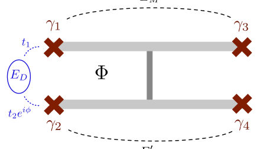 
FIG. 1: Schematic of the dot-tetron model in the X- measurement configuration. Two topological nanowires (light gray) host Majorana zero modes γ1, γ3 (upper wire) and γ2, γ4 (lower wire) with residual intrawire hy- bridizations EM and E′ M. An auxiliary quantum dot with detuning ED is tunnel coupled to γ1 and γ2 with amplitudes t1 and t2eiϕ, respectively. The interferomet- ric phase ϕ is controlled by the magnetic flux Φ through the measurement loop. The vertical dark gray line indi- cates the superconducting backbone connecting the two nanowires.

📷 Fig 2

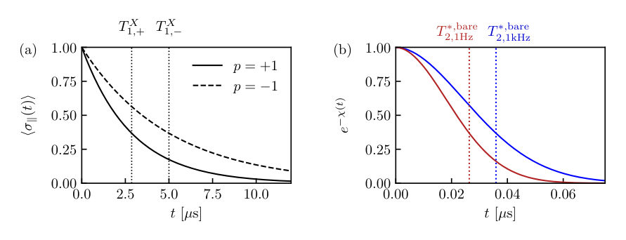 
FIG. 2: Comparison of the parity dynamics in the measurement and isolated-tetron configurations. (a) Relaxation in the measurement configuration for t1 = 2 µeV, t2 = 2.5 µeV, ED = 15 µeV, and ϕ = π/2, corresponding to B0 x ≈0.67 µeV. We take intrawire MZM splittings EM = 0.05 µeV, E′ M = 0.15 µeV, such that B0 z,+ = 0.2 µeV and |B0 z,−| = 0.1 µeV. Both MZM-splitting noise with Az = 10−17 eV2 and dot-detuning noise with AD = 10−13 eV2

📷 Fig 3

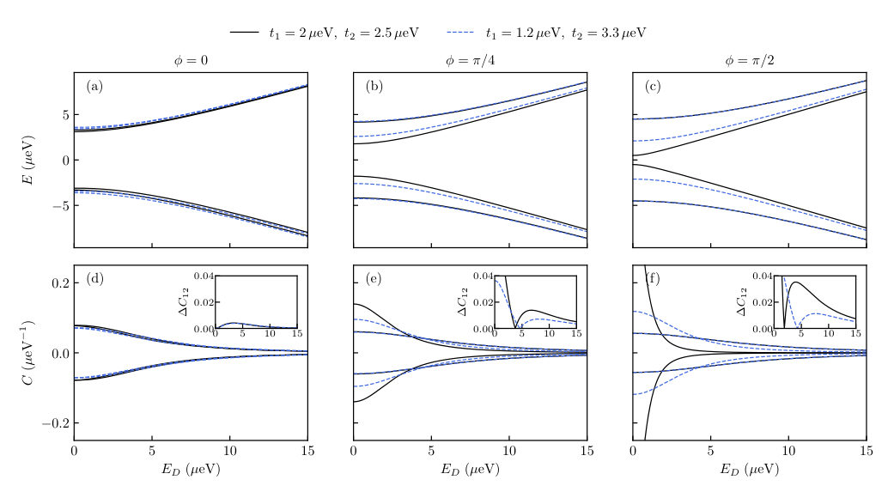 
FIG. 3: Spectrum and quantum capacitance response of the full dot–tetron model. (a)-(c) Eigenenergies E and (d)-(f) corresponding detuning curvatures C = ∂2E/∂E2 D as functions of the dot detuning ED, for ϕ = 0, π/4, π/2, respectively. The curvatures C are proportional to the state-dependent quantum capacitance. We show the P = +1 sector for EM = 0.05 µeV and E′ M = 0.15 µeV. The solid black curves correspond to (t1, t2) = (2 µeV, 2.5 µeV) and the dashed blue curves to (t1, t2) = (1.2 µeV, 3.3 µeV). The insets in panels (d)-(f) show the difference in capacitance ∆C12 = |C1 −C2| between the two lowest-energy eigenstates.

📷 Fig 4

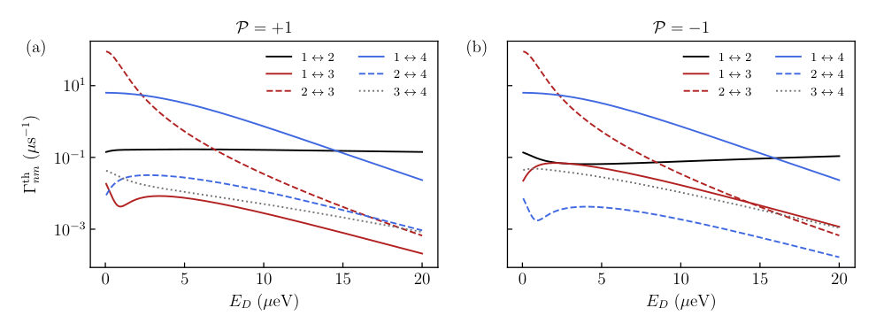 
FIG. 4: Thermally weighted transition rates in the full four-state dot–tetron model. The equilibrium event rates Γth nm, defined in Eq. (55), are shown as functions of dot detuning ED at ϕ = π/2 for total parity (a) P = +1 and (b) P = −1. Near resonance, the dominant 1 ↔4 and 2 ↔3 transitions motivate the two-manifold description A = {1, 4}, B = {2, 3}. With increasing detuning, transition traffic involving the upper states is suppressed and the lowest-doublet channel becomes dominant. Parameters are t1 = 2 µeV, t2 = 2.5 µeV, EM = 0.05 µeV, E′ M = 0.15 µeV, and T = 50 mK. The independent noise sources have amplitudes AD = 10−13 eV2 and AM = A′ M = 0.5 × 10−17 eV2, with spectral densities...

📷 Fig 5

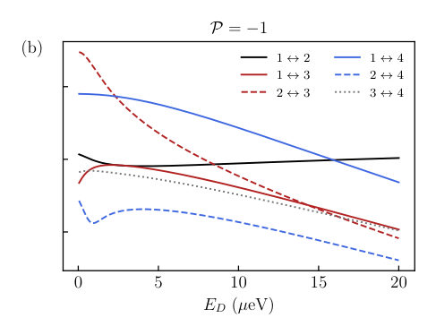 
Figure 5 shows that the two thermally averaged man- ifolds retain a finite capacitance contrast over the same near-resonant parameter regime in which the rate hierar- chy of Fig. 4 is observed. At the representative point ED = 4 µeV, ϕ = π/2, for the nearly balanced case t1 = 2 µeV, t2 = 2.5 µeV and with the remaining parameters as given in the caption of Fig. 5, we ob- tain ∆Cmanif ≃0.03 µeV−1. Using the dimensionless gate lever arm α = 0.15 quoted in Ref. [17], we esti- mate the corresponding quantum-capacitance difference as ∆CQ ≃(eα)2∆Cmanif ≃110 aF, which is comparable

**Summary.** This theoretical study models a Majorana tetron qubit coupled to a measurement dot to understand its parity lifetime. The authors demonstrate that the measurement coupling generates an energy splitting that effectively shields the qubit from low-frequency noise. This measurement-induced stabilization can dramatically extend the observable coherence time beyond the intrinsic coherence limit of the isolated qubit.

**Why it may be interesting.** This work directly addresses decoherence mitigation in topological qubits by showing that the act of measurement itself can enhance coherence, a crucial concept for scalable quantum computation.

Detailed structure

**Main problem.** The paper theoretically investigates how coupling a Majorana tetron qubit to an auxiliary measurement dot modifies the intrinsic $X$-parity lifetime.

**Main result.** Measurement coupling can stabilize the $X$-parity state, leading to measured lifetimes that significantly exceed the bare coherence time, even in the presence of noise.

**Method.** The study uses a minimal model Hamiltonian, analyzing the system dynamics in both the dispersive and near-resonant regimes.

**Model / system.** The system is a Majorana tetron (four Majorana zero modes) coupled to an auxiliary quantum dot. The dynamics are analyzed using effective two-level Hamiltonians derived from the full coupled dot-tetron system.

**Key observables.** Interwire X-parity lifetime and X-parity switching time.

**Important parameters / regimes.** Noise strengths (e.g., $1/f$ noise), bare-tetron coherence time ($T_2^*$), and the coupling strength to the measurement dot.

**Assumptions / limitations.** The analysis considers noise sources from both the readout dot potential and the residual Majorana splittings, and it analyzes the system in two distinct coupling regimes.

**Figures summary.** Figure 1 provides a schematic of the dot-tetron model in the X-measurement configuration, illustrating the nanowires, MZMs, the dot, and the coupling terms.

**Paper structure.** The paper introduces the coupled dot-tetron model and its dispersive description in an early section, followed by detailed calculations of the noise-induced X-parity dynamics in subsequent sections.

Abstract

A recent experiment [arXiv:2507.08795] has reported measurements of the interwire $X$-parity lifetime in a Majorana tetron device via the quantum capacitance of an auxiliary readout dot. Motivated by these measurements, we theoretically study the interwire parity lifetime in a minimal model of the coupled dot-tetron system subject to electrostatic noise. We show that coupling to the measurement dot can itself strongly modify the parity dynamics by generating an energy splitting that shifts noise-induced transitions to finite frequency and thereby stabilizes the measured states against low-frequency fluctuations. For representative noise strengths motivated by disordered nanowire devices, we find $X$-parity switching lifetimes of order microseconds in the measurement configuration even when the corresponding bare-tetron coherence time is only tens of nanoseconds long. We analyze both the dispersive regime, where the dot can be integrated out and the dynamics reduces to an effective two-level system, and the near-resonant regime, where all four low-energy states participate. In the latter case, rapid transitions organize the spectrum into two long-lived manifolds that approximately correspond to sectors of the combined dot-tetron $X$-loop parity, yielding effective two-state switching despite the underlying multilevel structure. Our results show that measurement-induced stabilization can substantially enhance the observed $X$-parity switching lifetime, such that the lifetime measured under continuous readout can greatly exceed the intrinsic idle $T_2^*$ coherence time of the isolated Majorana tetron qubit.

[↑ back to top](#top)

### [A theory for detecting the Turing instability on static and temporal multiplex networks](http://arxiv.org/abs/2610.10938v1)

**Authors:** Joshua Ritchie  
**Type:** theory · **Category:** statistical mechanics · **PDF:** <https://arxiv.org/pdf/2610.10938v1>  
**Analysis basis:** full PDF text, analyzed in chunks
**Topic relevance:** `analog quantum simulation` **3/5** · `driven-dissipative phase transition` **3/5** · `methods for driven-dissipative` **3/5** · `correlated / nonlocal dissipation` **2/5** · `non-equilibrium universality` **2/5** · `Keldysh / 2PI / non-Gaussian methods` **1/5**

📷 Fig 1

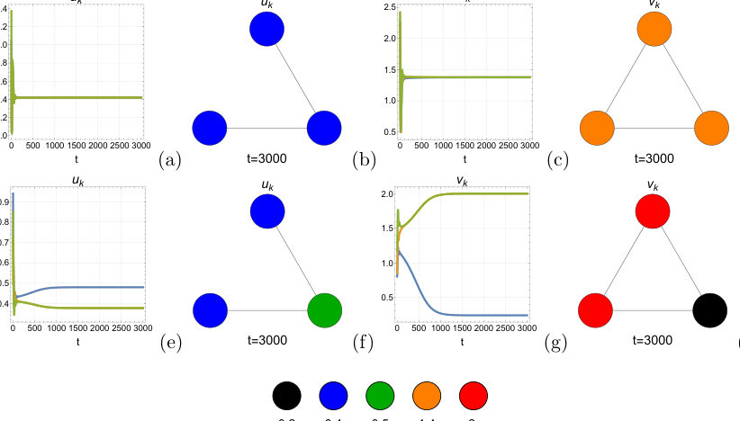 
Figure 1: Patterning corresponding to “Simulation 1” and “Simulation 2”. These are 3- node networks with adjacency matrices given by Eq. (3.3a). Row 1 (plots (a)–(d)) shows the results corresponding to (a0, a1) = (1, 1) (“Simulation 1”) and row 2 (plots(e)–(h)) shows the results corresponding to (a0, a1) = (0.2, 1). For both simulations we set d = 0.0025.

📷 Fig 2

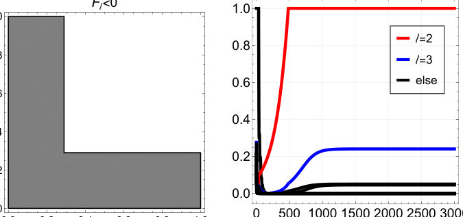 
Figure 2: The instability results corresponding to “Simulation 3”. In (a) the gray-shaded region corresponds to violation of Eq. (2.33b) with d = 0.1 where A1 is given by Eq. (3.5) and A2 by Eq. (3.6b). (b) Shows the non-linear modes corresponding to the particular choice (a1, a2) = (0.2, 1). Here the red line corresponds to the “most unstable” mode and the blue line corresponds to the “second-most unstable” mode.

📷 Fig 3

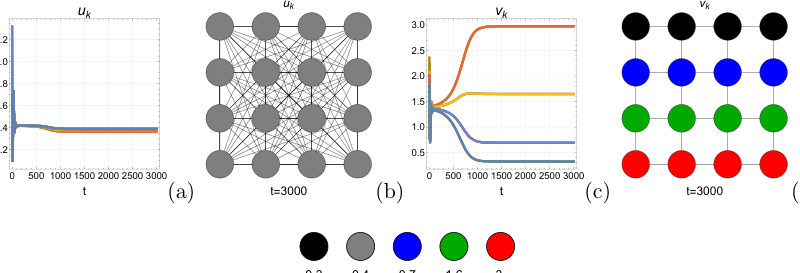 
Figure 3: Patterning corresponding to “Simulation 3”. These are 16-node networks with A1 given by Eq. (3.5) and A2 by Eq. (3.6b) with (a1, a2) = (0.2, 1). For this simulation we set d = 0.1.

📷 Fig 4

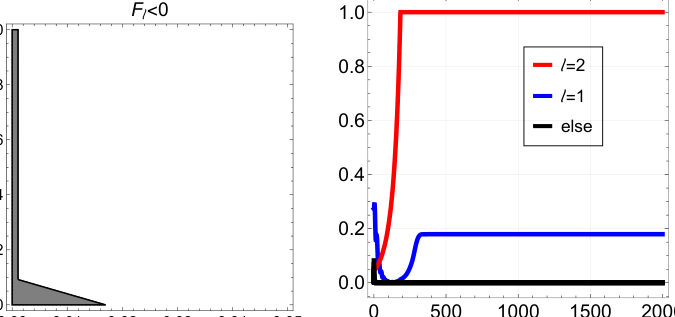 
Figure 4: The instability region corresponding to “Simulation 4”. In (a) the gray-shaded region corresponds to violation of Eq. (2.33b) with d = 1 where A1 is given by Eq. (3.5) and A2 by Eq. (3.8). (b) Shows the non-linear modes corresponding to the particular choice (a1, a2) = (0.00015, 1). Here the red line corresponds to the “most unstable” mode and the blue line corresponds to the “second-most unstable” mode.

📷 Fig 5

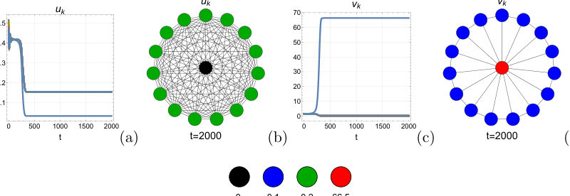 
Figure 5: Patterning corresponding to “Simulation 4”. These are 16-node networks with A1 given by Eq. (3.5) and A2 by Eq. (3.8) with (a1, a2) = (0.00015, 1). For this simulation we set d = 1.

**Summary.** This paper introduces a general mathematical framework to analyze pattern formation (Turing instability) in coupled reaction-diffusion systems defined on multiplex networks. It extends standard stability analysis to handle time-varying and multi-layered network structures. The work is significant for its generality, providing tools to study complex ecological or chemical dynamics on realistic, interconnected systems.

**Why it may be interesting.** While the core topic is reaction-diffusion dynamics, the mathematical tools developed for analyzing coupled, time-dependent systems on complex topologies (multiplex networks) are highly relevant to modeling open quantum systems or quantum information flow across interconnected quantum modules.

Detailed structure

**Main problem.** To develop a general framework for performing linear instability analysis, specifically detecting the Turing instability, on complex multiplex networks.

**Main result.** The framework successfully extends instability analysis to non-autonomous, multiplex networks, providing explicit criteria for instability when the network Laplacians commute.

**Method.** The analysis involves linearizing the reaction-diffusion equations around a steady state and analyzing the eigenvalues of the resulting mode matrix, which is adapted for time-dependent and multiplex structures.

**Model / system.** The study uses $m$-unknowns governed by non-autonomous reaction-diffusion equations on $n$-node temporal multiplex networks. An application is the two-species predator-prey model on archipelagos.

**Key observables.** Eigenvalues of the mode matrix (determining stability), and the time evolution of the mode amplitudes ($w_{\alpha,\ell}(t)$).

**Important parameters / regimes.** Diffusion coefficients ($d_\alpha$), reaction kinetics parameters ($h_\alpha(t)$), and the time dependence of the network connectivity.

**Assumptions / limitations.** The analysis assumes the absence of inter-layer diffusion and that the network structure can be analyzed via linearization, though the general case requires numerical solutions.

**Figures summary.** Figures illustrate the time evolution of species concentrations ($u_k, v_k$) for predator-prey models on 16-node networks, showing the transition from pattern formation to wave-like dynamics as time progresses.

**Paper structure.** The paper first reviews the general theory for linear instability on multiplex networks, deriving explicit criteria for the commuting Laplacian case. It then applies this theory to a predator-prey model, analyzing both static and time-dependent scenarios, culminating in numerical simulations.

Abstract

The purpose of this work is to introduce and discuss a general framework for performing a linear instability analysis on multiplex networks, in the absence of inter-layer diffusion, with the specific motivation of detecting the Turing instability. The formalism itself is presented in full generality for $m$-unknowns, each of which arise as solutions of non-autonomous reaction-diffusion equations, on $n$-node temporal multiplex networks. In addition, we identify a class of multiplex networks for which the Laplacian matrices commute. In this setting analytical progress can be made and the explicit inequalities, governing instability, are derived. In order to explore our formalism we apply it to the specific example of a two-species predator-prey model on archipelagos. Here nodes are interpreted as islands and edges correspond to the transportation network for each species. Moreover, the non-autonomous setting is used to model a variety of natural phenomena.

[↑ back to top](#top)

### [Hydrodynamic Anomalous Hall Effect in a Two-Dimensional Dirac Fluid](http://arxiv.org/abs/2610.10733v1)

**Authors:** A. Levchenko, D. A. Pesin  
**Type:** theory · **Category:** other · **PDF:** <https://arxiv.org/pdf/2610.10733v1>  
**Analysis basis:** full PDF text, analyzed in chunks
**Topic relevance:** `Keldysh / 2PI / non-Gaussian methods` **3/5** · `methods for driven-dissipative` **2/5** · `analog quantum simulation` **1/5** · `correlated / nonlocal dissipation` **1/5** · `driven-dissipative phase transition` **1/5** · `non-equilibrium universality` **1/5** · `quantum measurements` **1/5**

📷 Fig 1

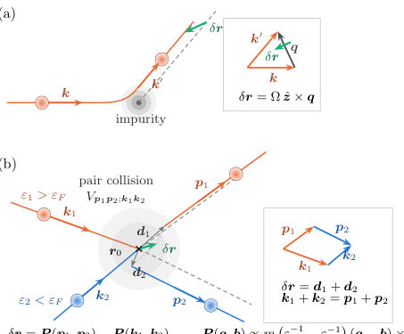 
FIG. 1. Coordinate shifts in single-particle and two-particle scattering. Displacements are exaggerated; dashed lines are reference outgoing trajectories with the same final momenta but without a coordinate shift. (a) An impurity collision changes the wave-packet momentum from k to k′. At small transfer q = k′ −k, the leading shift is δr = Ω(k)ˆz × q; the inset illustrates its orientation for Ω&gt; 0. For the con- duction band studied here, Ω&lt; 0 when m &gt; 0. (b) A pair collision conserves k1 + k2 = p1 + p2. The offsets d1, d2 il- lustrate the total shift δr = d1 + d2 of Eq. (10); they do not assign separate shifts to identifiable electrons. The pair center of charge shifts by δr/2, so the...

📷 Fig 2

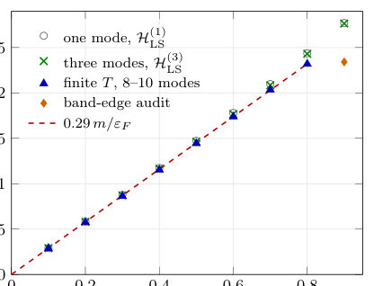 
FIG. 2. Mass dependence of the clean limit hy- drodynamic shift coefficient of Eq. (48), σcl xy ≃ H(m/εF ; T/εF )(e2/ℏ)(T/εF )2 per cone, for the contact interaction at T/εF = 0.02. Open circles: one-mode evalu- ation using the exact off-shell collision moments J[χ], Q[χ]. Crosses: the corresponding three-component generation vector and 3 × 3 collision matrix for the enlarged odd radial space {ξ, ξ3, ξ5}. Both use the exactly momentum-projected basis (37) and the leading Sommerfeld drive vector. Their separation therefore tests basis convergence at leading low-temperature order, not the full finite-T systematic error. Triangles: the finite-T Galerkin result with exact drive projection and a...

📷 Fig 3

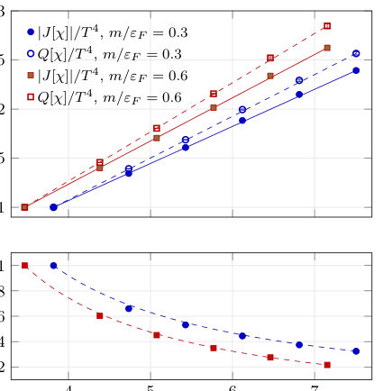 
FIG. 3. Finite-window collinear enhancement of the collision moments and relative stability of the Hall ratio. Upper panel: |J[χ]|/T 4 (filled symbols) and Q[χ]/T 4 (open symbols), nor- malized separately to their values at T0 = 0.02 εF , versus L = ln(pF vF /T) for m/εF = 0.3 (circles) and 0.6 (squares). Thin straight lines are chords through the first and last points, not asymptotic fits. Lower panel: H(1) LS (T)/H(1) LS (T0) from the same one-mode correlated estimates. Dashed curves are the ratios of the corresponding upper-panel chords; they match the endpoints by construction and are not independent fits to H(1) LS . The large enhancement of each collision moment is substantially...

📷 Fig 4

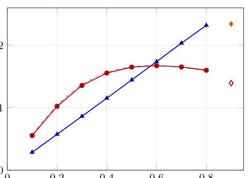 
FIG. 4. Finite-temperature interparticle shift coefficients in the clean and dc limits, at T/εF = 0.02. The clean values are identical to the finite-T series in Fig. 2; the dc values use the same collision matrices with the disorder-modified effective drive. Connecting segments guide the eye only over 0.1 ≤r ≤ 0.8. At r = 0.9, where εF −|m| = 5T, separate diamonds show the band-edge audit: filled orange for the clean limit, open red for dc. These points retain the finite-temperature band-edge departure from the nearly linear clean series; no interpolation to them is implied. The dashed dc estimate, 0.58r/(1 + 3r2), combines the empirical clean fit H ≃0.29r with the leading thermal...

**Summary.** This theoretical work develops a kinetic theory to calculate the anomalous Hall effect arising from electron-electron collisions in a 2D Dirac fluid. By analyzing two-particle coordinate shifts, the authors show that the collision contribution to the AHE is non-trivial, particularly because the DC limit and the clean limit yield different results. This highlights how interaction effects can encode details about momentum relaxation even in the absence of disorder.

**Why it may be interesting.** While focused on condensed matter transport, the use of kinetic theory, non-equilibrium Green's functions implicitly, and the analysis of non-commuting limits ($\omega 	o 0$ vs. $\Gamma 	o 0$) provides advanced techniques applicable to open quantum systems dynamics.

Detailed structure

**Main problem.** The paper investigates the contribution of electron-electron collisions to the Anomalous Hall Effect (AHE) in a two-dimensional Dirac fluid, moving beyond standard single-particle descriptions.

**Main result.** The collision-induced anomalous Hall response is calculated using kinetic theory, showing that the limits of vanishing frequency and vanishing disorder do not commute, leading to a finite DC correction that retains information about momentum relaxation.

**Method.** The authors develop and apply a kinetic theory approach, deriving the collision-induced current from two-particle coordinate shifts within a linearized Boltzmann equation framework.

**Model / system.** The system modeled is a two-dimensional massive Dirac Fermi liquid subjected to weak contact interactions and weak short-range disorder. The analysis uses a semiclassical kinetic equation incorporating both single-particle (impurity) and two-particle (pair collision) scattering terms.

**Key observables.** Anomalous Hall conductivity ($\sigma_{xy}$), collision-induced Hall response, and the pair function $R(k_1, k_2)$.

**Important parameters / regimes.** Interaction strength ($\lambda$), disorder strength ($\Gamma$), driving frequency ($\omega$), and the ratio between these rates ($\Gamma \ll \omega \ll \gamma_{ee}$ for the hydrodynamic regime).

**Assumptions / limitations.** The calculations rely on developing a kinetic description for the collision integral and utilize approximations such as the additive collision model and specific limits for frequency and disorder.

**Figures summary.** Figure 1 illustrates the coordinate shifts ($\delta r$) arising from both single-particle impurity scattering and two-particle pair collisions, showing the geometric nature of these shifts.

**Paper structure.** The paper progresses from establishing the general kinetic framework for the hydrodynamic AHE, deriving the two-particle coordinate shift, and culminating in the calculation of the shift conductivity $\sigma_{	ext{shift}}^{xy}(\omega)$ and the effective DC transport coefficients.

Abstract

In ultraclean conductors, electron-electron collisions can make transport hydrodynamic. In a Berry-curved band, these collisions can also produce two-particle coordinate shifts, which contribute to the anomalous Hall current in the presence of a transport electric field. We develop a kinetic theory of this contribution for a two-dimensional massive Dirac Fermi liquid with weak contact interactions and weak short-range disorder. The computed response is independent of interaction strength at leading Born order. Its contribution to the anomalous Hall conductivity is comparable to the thermal correction to the intrinsic anomalous Hall conductivity. The existence of the momentum zero mode of the electron-electron collision integral leads to a nontrivial frequency dependence of the anomalous Hall response considered in this work. In particular, the limits of vanishing frequency (dc) and vanishing disorder do not commute. In the dc limit, the momentum response to the transport field grows inversely with the momentum relaxation rate. This allows arbitrarily weak, energy-dependent impurity scattering to produce a finite correction by coupling conserved momentum to the modes relaxed by electron-electron scattering. This correction disappears when the clean limit is taken before the zero-frequency limit. As a result, the interaction-induced Hall response retains information about the mechanism of momentum relaxation even as the overall disorder strength tends to zero.

[↑ back to top](#top)

### [Multistability and Juggling States in Frustrated Kuramoto Oscillators on Ring Networks](http://arxiv.org/abs/2610.10818v1)

**Authors:** Guilherme S. Costa, Ricardo Fariello, Marcus A. M. de Aguiar  
**Type:** theory · **Category:** statistical mechanics · **PDF:** <https://arxiv.org/pdf/2610.10818v1>  
**Analysis basis:** full PDF text, analyzed in chunks
**Topic relevance:** `analog quantum simulation` **3/5** · `driven-dissipative phase transition` **2/5** · `non-equilibrium universality` **2/5** · `Frenkel-Kontorova` **1/5** · `correlated / nonlocal dissipation` **1/5**

📷 Fig 1

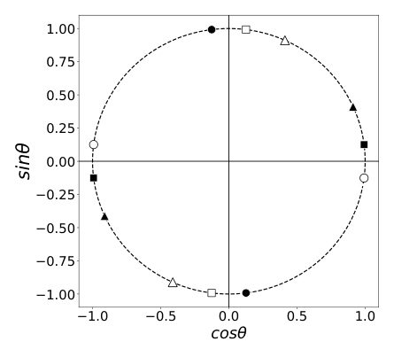 
Figure 1: Equilibrium points for K = ω = 1, J = 4 and Q = 1 (circles and squares) and 3

📷 Fig 2

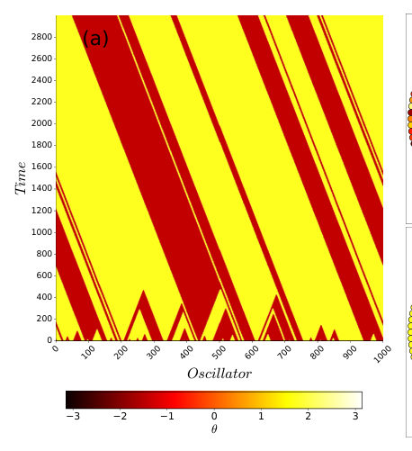 
Figure 2: Heatmap of oscillators’ phases of a typical simulation of the matrix-coupled

📷 Fig 3

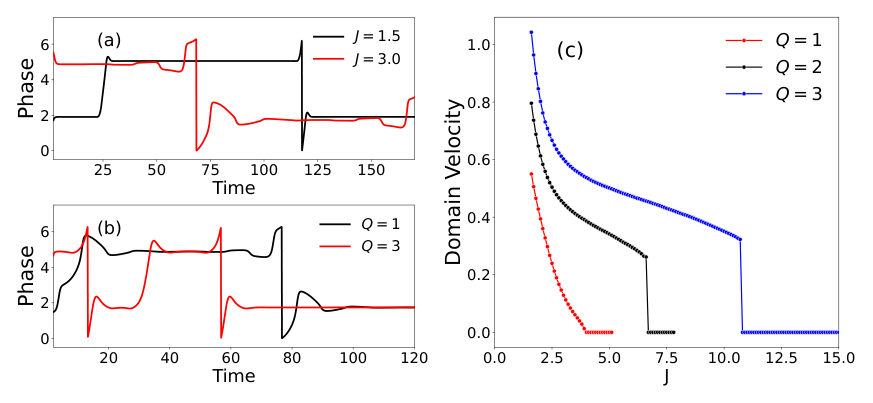 
Figure 3: Phase evolution of typical oscillators: (a) Q = 1 for J = 1.5 and J = 3 and (b)

📷 Fig 4

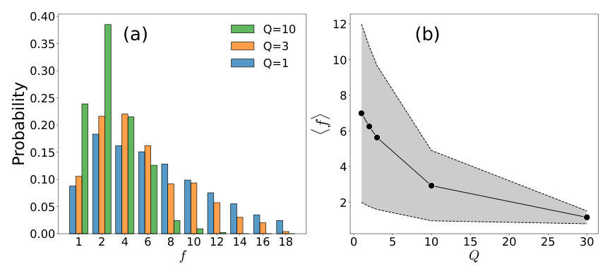 
Figure 4: (a) Probability of finding the system with f stationary fringes, computed from

**Summary.** This paper analyzes the complex synchronization behavior of coupled Kuramoto oscillators on ring networks, revealing multiple stable states. Key findings include the existence of dynamic 'juggling' states where clusters move and interact, contrasting with simpler static equilibria. The work provides insights into how network topology and coupling parameters dictate the system's final collective state.

**Why it may be interesting.** The study of collective dynamics, pattern formation, and non-equilibrium steady states in coupled oscillators provides strong analogies to phase transitions and collective behavior seen in many-body quantum systems.

Detailed structure

**Main problem.** The study investigates the complex synchronization dynamics, multistability, and emergent clustered states in coupled Kuramoto oscillators arranged on ring networks.

**Main result.** The system exhibits rich dynamics, ranging from stable static clusters to active 'juggling' states where cluster interfaces move along the ring, and these interfaces can annihilate upon collision.

**Method.** The analysis combines analytical stability studies (linearization around equilibrium points) with the examination of time evolution patterns observed in numerical simulations.

**Model / system.** The model consists of matrix-coupled Kuramoto oscillators on a ring network, governed by equations incorporating coupling parameters (K, J) and natural frequencies ($\omega$).

**Key observables.** Synchronized clustered solutions, cluster interface movement (domain velocity $\vartheta$), and the stability eigenvalues ($\lambda_p$) of the system.

**Important parameters / regimes.** Coupling strengths ($K, J$), natural frequencies ($\omega$), network connectivity (ring structure), and the interaction range ($Q$).

**Assumptions / limitations.** The analysis distinguishes between analytically solvable static equilibrium states and dynamically evolving 'juggling' states arising from random initial conditions.

**Figures summary.** Figures illustrate phase evolution heatmaps showing cluster formation and interface drift, and plots detail the distribution of stationary fringes ($f$) as a function of coupling range ($Q$).

**Paper structure.** The paper progresses from defining the general coupled oscillator model to analyzing specific families of synchronized solutions (static vs. rotating clusters), and finally detailing the dynamic 'juggling' mechanism observed during time evolution.

Abstract

We study the properties of matrix coupled oscillators in ring networks and show that the system supports several families of synchronized clustered solutions. One of these families is characterized by consecutive oscillators belonging to distinct clusters, called alternate ordering, with two classes of solutions. The first consists of one or two static clusters, that lock on phases that depend on the coupling parameters, despite the non-zero natural oscillation frequency. The second one is comprised of clusters that rotate rigidly. The number of clusters depends on the neighbor connectivity. We also investigated sequential ordered clusters and showed that the constraints imposed by the interface oscillators imposes additional restrictions to equilibrium configurations. Although some of these solutions are stable, their basins of attraction depend on model parameters: when the system is initialized with random phases, the oscillators tend to organize themselves into dynamical clusters whose interfaces move along the ring. The oscillators within each cluster remain close to one of the stable phase configurations, while particles are exchanged at the interfaces. When interfaces moving in opposite directions collide, the corresponding clusters annihilate, until a state with interfaces moving in a common direction is reached.

[↑ back to top](#top)

### [Laser fragmentation in liquid - constructing a generic reaction map](http://arxiv.org/abs/2610.11494v1)

**Authors:** Anton Plech, Yogesh Pokhrel, Meike Tack, Matteo Levantino, Sven Reichenberger  
**Type:** experiment · **Category:** statistical mechanics · **PDF:** <https://arxiv.org/pdf/2610.11494v1>  
**Analysis basis:** full PDF text, analyzed in chunks
**Topic relevance:** `non-equilibrium universality` **3/5** · `Keldysh / 2PI / non-Gaussian methods` **1/5** · `correlated / nonlocal dissipation` **1/5** · `driven-dissipative phase transition` **1/5** · `methods for driven-dissipative` **1/5** · `scars & prethermalization` **1/5**

📷 Fig 1

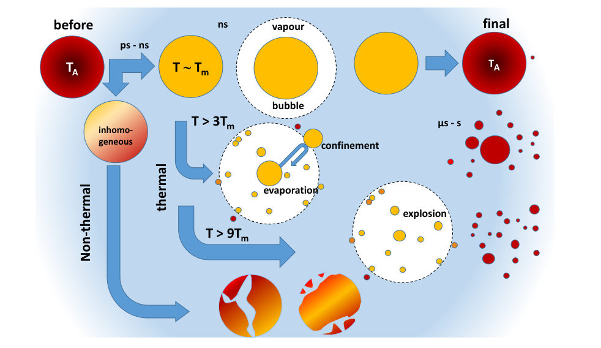 
Figure 1: Sketch of possible pathways for nanoparticle excitation and fragmentation by ultrashort laser pulses starting with particles suspended in a liquid like water at ambient temperature T퐴. The excitation close to the melting temperature T푚leads to lattice heating, partial or full melting, and eventual bubble formation during cooling. Depending on particle temperature, resp. fluence, par- tial fragmentation, repulsion by the inverse Leidenfrost phenomenon or full fragmentation for tem- perature &gt; T푚can take place. Nonlinear effects, such as strain-induced fragmentation or near-field effects can take place.

📷 Fig 2

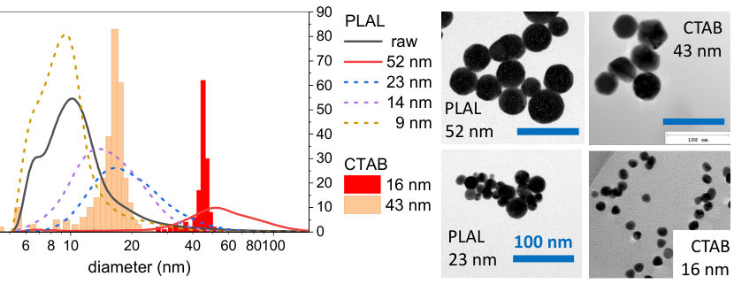 
Figure 2: Size distribution and electron microscopy images of selected colloids samples produced by seeded chemical synthesis (CTAB) and LAL followed by optional size separation. The lines of size distribution correspond to data from disc centrifugation, while the bar graphs include his- tograms from TEM analysis.

📷 Fig 3

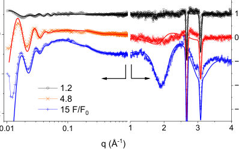 
Figure 3: Composite difference scattering intensities ΔI at delay 휏= 1휇푠after laser excitation as compared to the static scattering before laser arrival (휏&lt;0). The experimental results (scatter plots) are simulated by a linear combination of structural contributions as discussed in the text. Data is shifted by a constant vertical offset for clarity.

📷 Fig 4

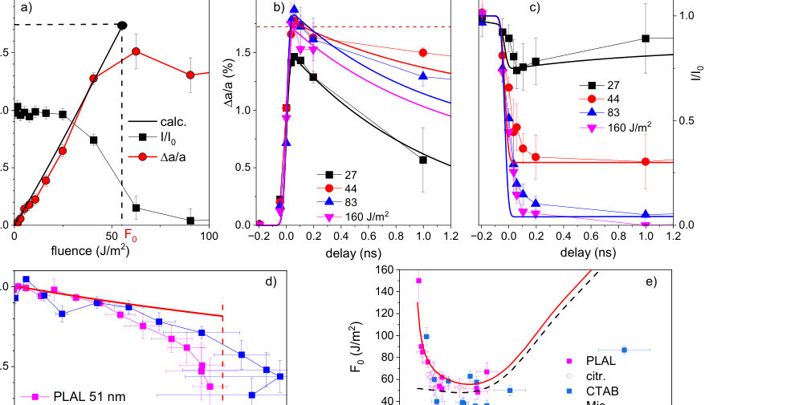 
Figure 4: Lattice dynamics of 47 nm CTAB gold particles as function of laser fluence and delay with a) showing the lattice expansion and (111) peak intensity as function of applied fluence to- gether with a calculation of the predicted expansion with adapted threshold for melting F0. b) Lat- tice expansion as function of delay for selected fluences together with a model of exponential cool- ing decay (lines) and c) (111) peak intensity as function of delay together with a model of inten- sity recovery. d) (111) Bragg peak intensity of 52, resp. 60 nm particles as function of lattice ex- pansion at delay 60 ps for different gold colloids as prepared by laser ablation (PLAL) and ligand-...

📷 Fig 5

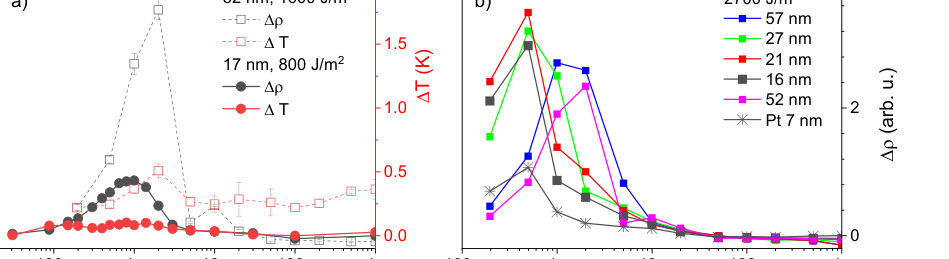 
Figure 5: Amplitudes of the water scattering change Δ휌scaling with the bubble volume and Δ푇 as function of delay for a) CTAB gold particles of 17 nm and 52 nm diameter at intermediate flu- ences of 800 and 1600 J/m2, respectively and b) Δ휌for a range of particles sizes including 7 nm Pt nanoparticles at a fluence of 2700 J/m2 . Δ휌for 17 nm particles is compared to the (111) peak intensity in B and shown as function of normalized fluence F/F0 at several delays in d). The error bars are derived from the variation of repeated measurements.

**Summary.** This research investigates how laser pulses induce structural changes, including heating, melting, and fragmentation, in metal colloids suspended in liquid. By using ultrafast x-ray scattering, the authors map out a generic reaction map that links the initial laser energy density to the final nanocluster size and structural state. This provides a fundamental understanding of energy dissipation pathways in non-equilibrium soft matter systems.

**Why it may be interesting.** The work deals with non-equilibrium dynamics, phase transitions (melting, fragmentation), and energy dissipation pathways in complex fluids, which are core topics in non-equilibrium statistical mechanics and open quantum systems.

Detailed structure

**Main problem.** To construct a generic reaction map describing the structural and chemical transitions that occur when absorbing colloids in liquid are excited by pulsed laser irradiation.

**Main result.** A generic reaction map is constructed that correlates final fragmentation products to the initial energy density and dynamics, unifying mechanisms from simple thermal heating to complex non-thermal fragmentation.

**Method.** The study uses ultrafast in situ x-ray scattering (pump-probe) on gold colloids in water, analyzing time-resolved changes in lattice structure, particle size, and water density.

**Model / system.** The physical system is the photo-excitation of gold colloids in water using picosecond laser pulses. The process is modeled as a relaxation from highly non-equilibrium states through defined thermal and non-thermal dissipation channels.

**Key observables.** Lattice temperature, crystalline fraction, particle sizes, water structural response, and scattering intensity changes ($\Delta I$) at various scattering vectors (q).

**Important parameters / regimes.** Laser fluence (F), temporal delay ($	au$), and the critical fluence threshold ($F_0$) marking the onset of melting/fragmentation.

**Assumptions / limitations.** The relationship between thermal kinetics, liquid response, and particle fragmentation is assumed to be generic across different metals or liquids, and the fluence is treated as the fundamental control parameter.

**Figures summary.** Figures illustrate possible excitation pathways (thermal vs. non-thermal), size distributions of synthesized colloids, and the final generic reaction map correlating fluence/delay to fragmentation outcomes.

**Paper structure.** The paper progresses by establishing the physical problem, detailing the experimental setup (pump-probe scattering), analyzing the quantitative changes in lattice structure and water state, and culminating in the construction and discussion of the generic reaction map.

Abstract

Excitation of absorbing colloids in liquid by pulsed laser irradiation creates highly non-equilibrium states of matter that relax via defined pathways of thermal and non-thermal dissipation channels. The structural fingerprint of these channels can be probed by ultrafast {\it in situ} x-ray scattering methods and classified as a function of temporal delay of excitation excitation density, or specifically laser fluence. We study the example of photo-excitation of a gold colloid by picosecond laser pulses at the interband absorption band at 400 nm in water. By quantifying lattice temperature, crystalline fraction, particle sizes and the structural response of the water around the nanoparticles a reaction map is constructed that allows to pinpoint heating, particle melting, water bubble formation and finally particle fragmentation to form nanoclusters of predominant sizes of < 3 nm for applications in theranostics, photonics or catalysis.

[↑ back to top](#top)

### [A nonclassical law of the wall in superfluid helium-4](http://arxiv.org/abs/2610.10923v1)

**Authors:** Mikai Hulse, Musfequs Salehin, Sosuke Inui, Wei Guo  
**Type:** experiment · **Category:** other · **PDF:** <https://arxiv.org/pdf/2610.10923v1>  
**Analysis basis:** full PDF text, analyzed in chunks
**Topic relevance:** `non-equilibrium universality` **3/5**

📷 Fig 1

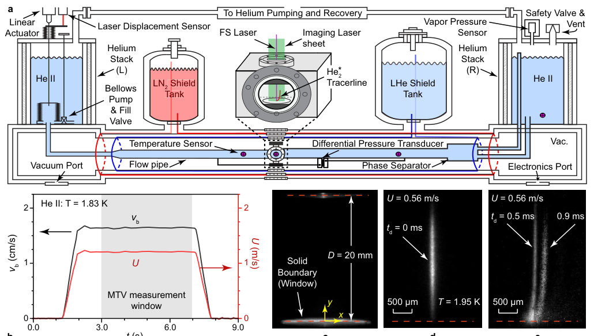 
Fig. 1. Experimental platform for near-wall velocimetry in He II. a Schematic of the Liquid Helium Flow Tunnel (LHeFT). A bellows pump in the left helium stack displaces He II through the 20 × 20 mm2 square flow pipe toward the opposite stack. The measurement section provides optical access for molecular tagging velocimetry (MTV), and two pressure taps separated along the pipe are used for differential-pressure measurements. b Representative bellows velocity vb and the corresponding mean velocity U in the pipe. The shaded region indicates the MTV measurement window. c Boundary image used to locate the solid walls for length scale calibration. d Representative image of the He∗ 2 tracer line...

📷 Fig 2

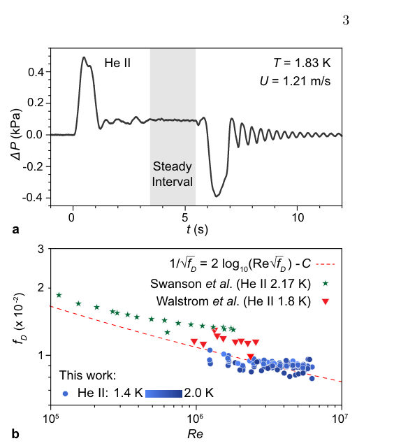 
Fig. 2. Pressure-drop characterization in He II pipe flow. a Differential-pressure trace measured in a represen- tative He II run. The indicated steady interval is used to determine the mean pressure drop ∆P. b Darcy friction factor fD obtained from the measured ∆P as a function of Reynolds number Re = UDh/ν. Previous He II measure- ments by Walstrom et al.36 and Swanson et al.37 are also shown. The dashed curve denotes a fit to our He II data us- ing the Prandtl–von K´arm´an smooth-pipe correlation33 with an adjustable parameter C, yielding C = 0.48 ± 0.05.

📷 Fig 3

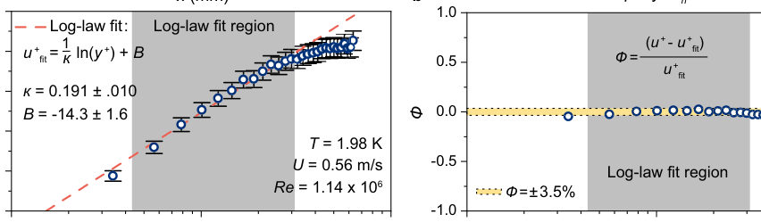 
Fig. 3. A nonclassical logarithmic velocity profile in He II. a Representative MTV analysis for a He II flow at T = 1.98 K and U = 0.56 m/s. The drifted tracer-line image, formed by accumulating 2000 single-shot exposures, is divided into successive wall-normal bins of width ξ ≃110 µm. Within each bin, the tracer-line displacement is measured relative to the undeformed baseline. The inset shows the streamwise fluorescence-intensity profile for a representative bin and the Gaussian fit used to determine the tracer-line centre. b Extracted normal-fluid velocity profile in outer coordinates, U ∗= u/U versus η = 2y/Dh. c The same profile expressed in wall variables, u+ versus y+. The error bars denote...

📷 Fig 4

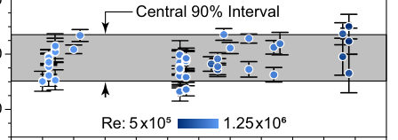 
Fig. 4. Wall-law parameters for turbulent He II pipe flow. a Effective K´arm´an constant κ obtained from the Monte Carlo analysis of the logarithmic velocity pro- files as a function of temperature. The data cluster around κ = 0.171 ± 0.022, well below the classical smooth-wall range κ ≃0.38–0.42 indicated by the shaded band5,8,11–14. b Cor- responding fitted additive constant B. The shaded band de- notes the range B ≃4.4–5.6 reported for classical high-Re smooth-wall pipe flows8,11,12. The error bars in both panels denote the combined 1σ uncertainties, including experimental uncertainties propagated through the Monte Carlo analysis and residual scatter about the logarithmic fits (see Methods).

**Summary.** This paper experimentally investigates the scaling laws of turbulence in superfluid Helium-4 ($	ext{He II}$), a quantum fluid. Using advanced velocimetry and pressure measurements, the authors confirm that the wall flow follows a logarithmic profile, but find that the scaling constants are significantly nonclassical. This suggests that the strong dynamical coupling between the normal and superfluid components fundamentally alters classical fluid behavior.

**Why it may be interesting.** This work bridges classical fluid dynamics (turbulence scaling) with quantum hydrodynamics, providing empirical evidence of how fundamental quantum effects modify universal macroscopic laws, which is relevant to understanding non-equilibrium quantum transport.

Detailed structure

**Main problem.** The study investigates whether the classical logarithmic law of the wall persists in the highly complex, two-fluid quantum fluid of superfluid Helium-4 ($	ext{He II}$). It seeks to understand how the competing boundary conditions of the normal and superfluid components organize near the wall.

**Main result.** The normal-fluid velocity profile robustly follows a logarithmic law, but the resulting wall law is distinctly nonclassical, exhibiting an effective Kármán constant less than half its classical value. This invariance suggests strong dynamical coupling between the two fluid components.

**Method.** The authors used Molecular Tagging Velocimetry ($	ext{MTV}$) to map the near-wall velocity field and independently determined the wall shear stress ($	au_w$) via pressure-drop measurements in a liquid helium flow tunnel.

**Model / system.** The system is superfluid Helium-4 ($	ext{He II}$), which is modeled as two interpenetrating fluids: a viscous normal fluid and an inviscid superfluid. The experiment is conducted in a liquid helium flow tunnel ($	ext{LHeFT}$) at high Reynolds numbers.

**Key observables.** Normal-fluid velocity profile ($u^+$ vs. $y^+$), wall shear stress ($	au_w$), and the effective Kármán constant ($\kappa$) and additive constant ($B$) derived from the wall law fit.

**Important parameters / regimes.** Reynolds numbers up to $1.26 	imes 10^6$; the temperature range studied ($1.65–2.14 	ext{ K}$); the two-fluid nature of $	ext{He II}$.

**Assumptions / limitations.** The analysis relies on the assumption that the normal-fluid component's velocity profile is governed by the law-of-the-wall, and that the measured $\Delta P$ accurately reflects the wall shear stress.

**Figures summary.** Figures illustrate the experimental setup ($	ext{LHeFT}$), the tracer-line displacement used for velocity measurement, and the resulting velocity profiles fitted to the logarithmic law.

**Paper structure.** The paper establishes the scientific gap regarding quantum turbulence scaling laws, details the advanced experimental setup using $	ext{MTV}$ and pressure taps, presents the quantitative analysis of the wall-law parameters, and concludes by interpreting the nonclassical nature of the observed scaling.

Abstract

The logarithmic law of the wall is one of the most robust scaling laws of classical turbulence, yet whether it survives in a quantum fluid such as superfluid $^4$He (He II) remains unknown. At a solid wall, the viscous normal-fluid and inviscid superfluid components of He II obey fundamentally different boundary conditions, yet their motions can be coupled through quantized vortices. How these competing effects organize the near-wall flow remains an open question in quantum-fluid hydrodynamics. Here we visualize the near-wall velocity field in mechanically driven He II pipe flows at Reynolds numbers up to $1.26\times10^6$ using molecular tagging velocimetry and independently determine the wall shear stress from pressure-drop measurements. We find that the normal-fluid velocity develops a robust logarithmic profile, showing that a law-of-the-wall description persists despite the two-fluid nature of He II. Strikingly, however, the resulting wall law is distinctly nonclassical: the effective Kármán constant is less than half its classical value and remains nearly unchanged across the temperature range studied. This invariance, despite substantial changes in the relative fractions of the two components, indicates strong dynamical coupling between them. These results not only reveal how a universal law of classical turbulence is transformed by quantum hydrodynamics, but also provide valuable guidance for the design and operation of cryogenic cooling systems involving He II transport.

[↑ back to top](#top)

### [Cooperative STT and SOT switching in perpendicular magnetic tunnel junctions: Role of the pulse-end magnetization state](http://arxiv.org/abs/2610.11191v1)

**Authors:** Zeyi Zhu, Ding Ma, Kai Zhang, Mingwei Wu, Yi Huang, Jiarui Niu, Shuai Zhang, Mengdi Yin, Ka-San Mak, Lina Chen, Bo Liu, Tiejun Zhou, Yongbing Xu, Ronghua Liu  
**Type:** theory · **Category:** other · **PDF:** <https://arxiv.org/pdf/2610.11191v1>  
**Analysis basis:** full PDF text, analyzed in chunks
**Topic relevance:** `Keldysh / 2PI / non-Gaussian methods` **2/5** · `analog quantum simulation` **2/5** · `driven-dissipative phase transition` **2/5** · `methods for driven-dissipative` **2/5** · `non-equilibrium universality` **2/5** · `quantum measurements` **2/5** · `correlated / nonlocal dissipation` **1/5** · `scars & prethermalization` **1/5**

📷 Fig 1

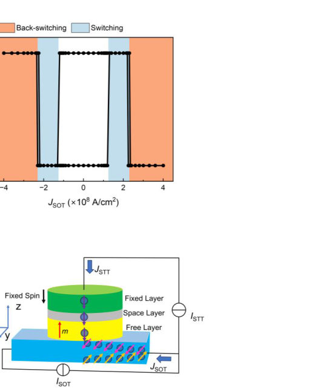 
Fig. 1 Comparison of conventional field-assisted SOT switching and field-free

📷 Fig 2

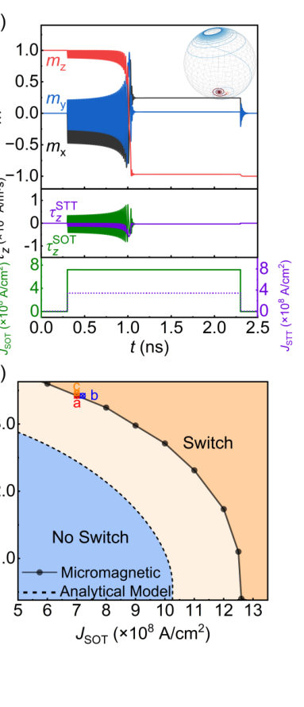 
Fig. 2 Magnetization switching dynamics and phase diagram under combined

📷 Fig 3

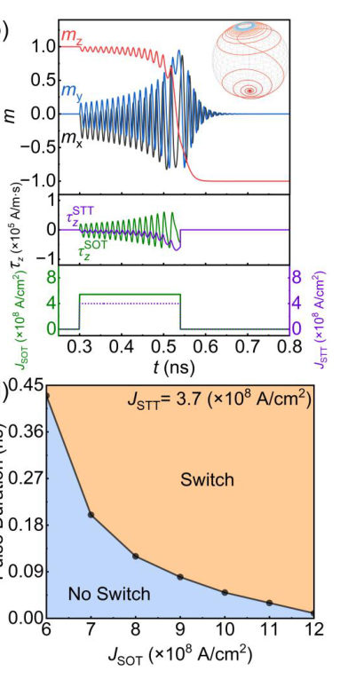 
Fig. 3 Magnetization dynamics and pulse-duration phase diagrams under

📷 Fig 4

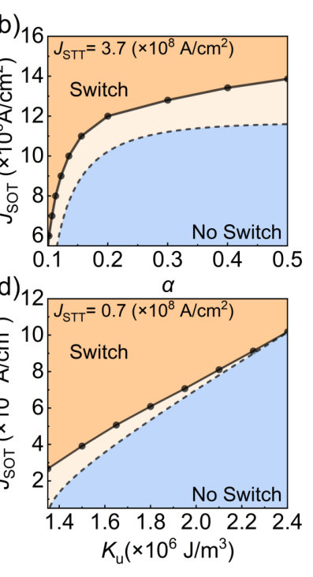 
Fig. 4 Phase diagrams delineating the switching boundaries for STT and SOT

📷 Fig 5

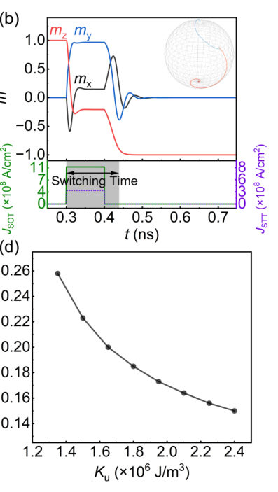 
Fig. 5 Dependence of the switching time on the Gilbert damping constant α and

**Summary.** This work investigates field-free switching in SOT-MRAM by combining Spin-Transfer Torque (STT) and Spin-Orbit Torque (SOT). The authors demonstrate that the cooperative interplay between the two torques enables reliable switching without external fields. Crucially, they establish that the final magnetization state at the end of the pulse, rather than the peak torque, dictates the switching speed and reliability.

**Why it may be interesting.** While focused on spintronics, the dynamics involve non-equilibrium magnetization precession and stability analysis, which share mathematical parallels with open quantum system dynamics and energy dissipation mechanisms studied in AMO physics.

Detailed structure

**Main problem.** The paper addresses the limitations of conventional Spin-Orbit Torque MRAM (SOT-MRAM) switching, specifically the sensitivity to post-pulse relaxation and back-switching when the magnetization remains near the in-plane region at pulse termination.

**Main result.** The decisive factor governing switching speed and reliability in coupled STT–SOT systems is the precise control of the pulse-end magnetization state, rather than the instantaneous torque amplitude.

**Method.** The study employs micromagnetic simulations and develops analytical macrospin models based on stability analysis of current-induced equilibrium.

**Model / system.** The physical system is a Perpendicular Magnetic Tunnel Junction (MTJ) with Perpendicular Magnetic Anisotropy (PMA) free layers, modeled using the Landau–Lifshitz–Gilbert equation incorporating both STT and SOT terms.

**Key observables.** Magnetization components (m_x, m_y, m_z) evolution, switching phase diagrams in the J_STT-J_SOT plane, and the critical switching boundary.

**Important parameters / regimes.** Gilbert damping (α), uniaxial anisotropy (K_u), STT/SOT efficiencies (η, ξ), and the pulse-end magnetization state.

**Assumptions / limitations.** The analysis relies on modeling the system using the LLG equation and comparing simulation results against analytical macrospin model predictions.

**Figures summary.** Figures illustrate the schematic comparison between conventional (field-assisted) and proposed field-free STT-SOT switching, showing magnetization trajectories and phase diagrams in the current density space.

**Paper structure.** The paper progresses from identifying the problem (back-switching in conventional SOT) to proposing a cooperative field-free STT-SOT scheme. It then uses micromagnetics to show the mechanism, followed by analytical modeling to derive the critical current boundaries, culminating in the conclusion that the pulse-end state is key.

Abstract

Spin--orbit torque MRAM (SOT-MRAM) is a leading candidate for next-generation nonvolatile memory, offering high speed, endurance, and architectural compatibility. However, in conventional SOT switching, the magnetization remains near the in-plane region at pulse termination, making the final state highly sensitive to post-pulse relaxation dynamics and prone to back-switching. To overcome this, we propose a field-free scheme in which the transverse SOT drives large-angle precessional excitation while the perpendicular spin-transfer torque (STT) biases the trajectory toward the reversed $-z$ state. Micromagnetic simulations reveal a nonlinear switching boundary in the $J_{\mathrm{STT}}$--$J_{\mathrm{SOT}}$ parameter space, originating from the distinct dynamical roles of the two torques: SOT primarily governs the excitation and crossing of the dynamical separatrix, whereas STT controls the terminal trajectory and final-state selection. An analytical macrospin model, based on the stability analysis of the current-induced equilibrium, reproduces the critical-boundary trends as functions of current density, Gilbert damping $α$, and uniaxial anisotropy $K_\mathrm{u}$, and distinguishes dynamic anti-damping and static instability branches. Systematic analyses of pulse duration, damping, anisotropy, and the STT--SOT balance further demonstrate that reliable ultrafast switching requires not only sufficient excitation to cross the separatrix before pulse termination, but also precise control of the pulse-end magnetization state to minimize post-pulse relaxation. These results establish that the pulse-end state, rather than the instantaneous torque amplitude, is the decisive factor governing switching speed and reliability in coupled STT--SOT systems.

[↑ back to top](#top)

### [Assessing the Reliability of Foundational Machine Learning Potentials for Evaluating the Veracity of the Crystallography Open Database](http://arxiv.org/abs/2610.11246v1)

**Authors:** Justinas Šlepavičius, Antanas Vaitkus, Andrius Merkys, Saulius Gražulis, Linas Vilčiauskas  
**Type:** theory · **Category:** disordered systems and neural networks · **PDF:** <https://arxiv.org/pdf/2610.11246v1>  
**Analysis basis:** full PDF text, analyzed in chunks
**Topic relevance:** `methods for driven-dissipative` **2/5** · `analog quantum simulation` **1/5**

📷 Fig 1

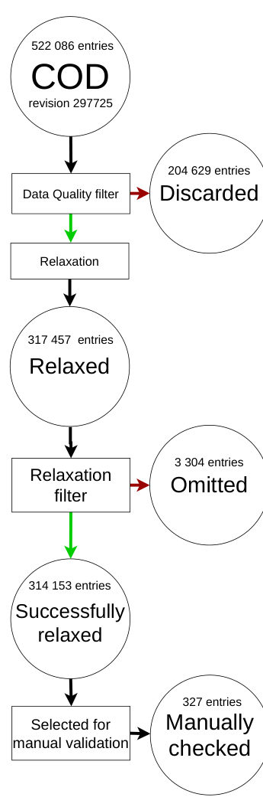 
Figure 1: The workflow used in the benchmarking of M3GNet and filtering of candi- date structures. A full explanation of the data quality filter rules is presented in Table 1. Each entry may fail more than one selection rule. 5

📷 Fig 2

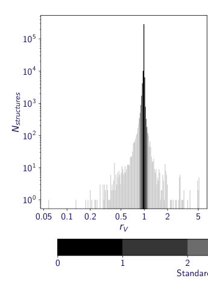 
Figure 2: Comparison of the cell volumes before and after relaxation. Left: histogram of the volume ratio rV (Equation 1). Right: relaxed versus initial cell volume on log- arithmic axes. On these axes, logrV is proportional to the distance of a point from the diagonal y = x, so the histogram corresponds to a projection of the scatter plot onto the direction perpendicular to the diagonal.

📷 Fig 3

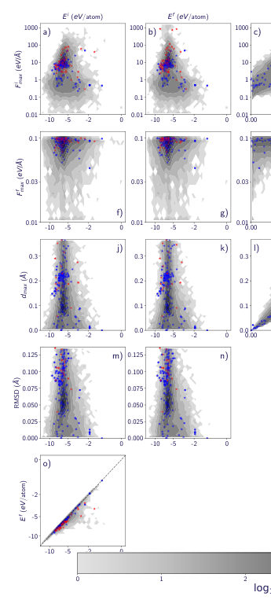 
Figure 3: Pairwise distributions of the relaxation descriptors Ei, Ef, Fi max, Ff max, RMSD and dmax for all successfully relaxed structures. Symbols mark the manually inspected structures: the colour indicates the validity of the input structure (blue, valid; red, invalid) and the shape the validity of the relaxed structure (circle, valid; star, invalid). In the panels comparing initial with final values of Fmax and of E, the dashed line is the diagonal y = x. Only the most populated region is shown; the full ranges are given in Figure 8.

📷 Fig 4

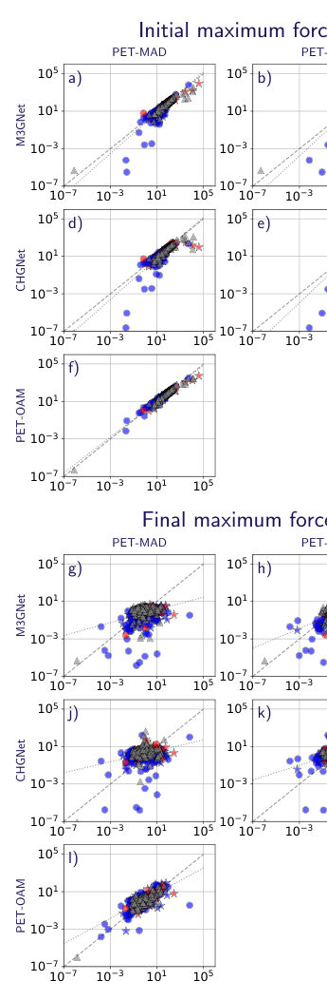 
Figure 4: Pairwise correlation of initial and final largest atomic forces, Fi max and Ff max, obtained with the four MLIPs. For the inspected structures, the colour of the symbol indicates the validity of the input structure (blue, valid; red, invalid) and its shape the validity of the relaxed structure (circle, valid; star, invalid). The dashed line is the diagonal y = x and the dotted line is the linear fit to y = log10 Fmax (vertical axis) against x = log10 Fmax (horizontal axis); the fitted equation and the coefficient of determination R2 are presented in the Supplementary Information Table 3.

📷 Fig 5

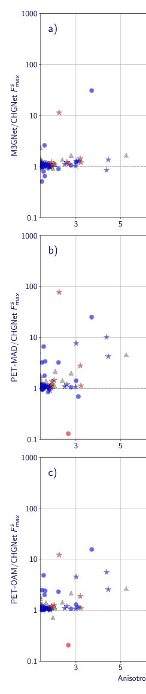 
Figure 5: Ratio of the Fi max obtained with CHGNet to that obtained with each of the other models, as a function of the lattice anisotropy. Symbols are the same as in Fig- ure 4.

**Summary.** This work assesses whether advanced Machine Learning Interatomic Potentials (MLIPs) can automate the validation of crystal structures in the COD database. By relaxing structures using multiple MLIPs, the authors found that while these models are powerful screening tools, they are model-dependent and fail to detect all types of structural errors independently. Therefore, combining multiple MLIPs is recommended for reliable validation.

**Why it may be interesting.** While focused on solid-state crystallography, the core methodology—using neural networks (MLIPs) to predict physical properties and screen large datasets for subtle deviations—is highly relevant to developing robust simulation tools for complex quantum many-body systems.

Detailed structure

**Main problem.** The paper aims to automate the physical plausibility validation of crystallographic data in the Crystallography Open Database (COD), a task traditionally reliant on slow and error-prone expert judgment.

**Main result.** MLIP relaxation is a useful but model-dependent screening tool; no single model detects all types of structural errors, suggesting that combining multiple MLIPs is preferable.

**Method.** The authors employed universal Machine Learning Interatomic Potentials (MLIPs)—including M3GNet, CHGNet, PET-MAD, and PET-OAM—to perform high-throughput structural relaxations on COD crystal structures.

**Model / system.** The physical system is the vast dataset of crystal structures from the COD. The methodology involves filtering these structures and then relaxing them using various MLIPs, which are trained to reproduce DFT calculations.

**Key observables.** Relaxed cell volumes, maximum atomic forces, energy values, Root Mean Square Deviation (RMSD), and maximum atomic displacement distance (dmax).

**Important parameters / regimes.** The study analyzes performance across different MLIPs and notes that the relaxation is performed at 0 K, while many structures were determined at finite temperatures.

**Assumptions / limitations.** The primary assumption is that structural inconsistencies can be flagged by observing deviations in the relaxed structure compared to the deposited one, though the authors caution that MLIPs reproduce DFT, not necessarily experimental geometries.

**Figures summary.** Figures illustrate pairwise correlations between various structural descriptors (volume, energy, RMSD, dmax) across different MLIP pairs, showing varying degrees of agreement.

**Paper structure.** The paper first establishes the need for automation in COD validation. It then details the use of MLIPs for relaxation, analyzing diagnostics like volume change and force convergence. Finally, it compares multiple MLIPs, showing model-specific failures and concluding that a multi-model approach is necessary.

Abstract

The Crystallography Open Database (COD) contains over half a million experimentally determined crystal structures. Validation of crystallographic data proceeds at three hierarchical levels, the third of which assesses the physical plausibility of structures. This level has typically relied on empirical heuristics or expert judgment, which are slow and error-prone given the size of crystallographic databases and the rate at which new structures are deposited. Here we assess whether universal machine-learning interatomic potentials (MLIPs) can automate this level of validation. Of the 522 086 COD entries, 317 457 (60.8\%) passed a data-quality filter removing disordered structures, formula mismatches and unmodelled solvent. These structures were relaxed with M3GNet, and 314 153 (99.0\%) converged without a large change in cell volume. For most entries the relaxed and deposited volumes are nearly identical. Convergence and volume change thus provide simple criteria for identifying relaxations that do not confirm the deposited structure. A manual inspection of 327 structures showed that no single descriptor threshold (energy, largest force, or atomic displacement) separates valid from invalid structures. A comparison of M3GNet, CHGNet, PET-MAD and PET-OAM on 524 selected structures revealed model-specific failures: M3GNet distorts cyclopentadienyl and other $π$ ligands, and both M3GNet and CHGNet distort thiophene and thiazole rings, whereas the PET models preserve these motifs. All models detected missing hydrogen atoms, and at least some detected spurious hydrogens, incorrectly assigned atom types, and two previously unreported coordinate errors. No single model detected all error types. MLIP relaxation is therefore a useful but model-dependent screening tool, and combining several models is preferable to relying on any single one.

[↑ back to top](#top)

### [Enhancement of the Topological Hall Effect through Engineering the Skyrmion Size and Shape](http://arxiv.org/abs/2610.11244v1)

**Authors:** Kazuma Murata, Ryunosuke Terasawa, Hiroaki Ishizuka  
**Type:** theory · **Category:** other · **PDF:** <https://arxiv.org/pdf/2610.11244v1>  
**Analysis basis:** full PDF text, analyzed in chunks
**Topic relevance:** `Keldysh / 2PI / non-Gaussian methods` **2/5** · `analog quantum simulation` **1/5**

📷 Fig 1

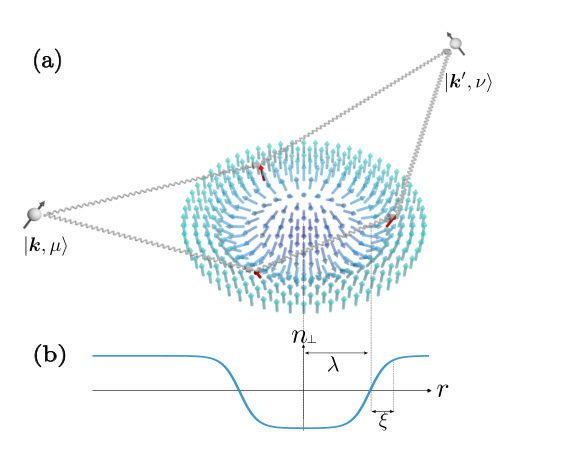 
FIG. 1. (a) A schematic of electron scattering by a magnetic skyrmion. An incident electron in the |k, µ⟩state is scattered into the |k′, ν⟩state by the exchange interaction. The red arrows indi- cate spins at which electrons are scattered, and the gray lines are the trajectories of single- and multiple-spin-scattering paths that give rise to the asymmetric scattering. (b) Radial profile of the out-of-plane spin component n⊥(r) for the skyrmion in Eq. (3). The skyrmion radius λ corresponds to the radial position at which n⊥(r) = 0, and ξ characterizes the width of the domain wall.

📷 Fig 2

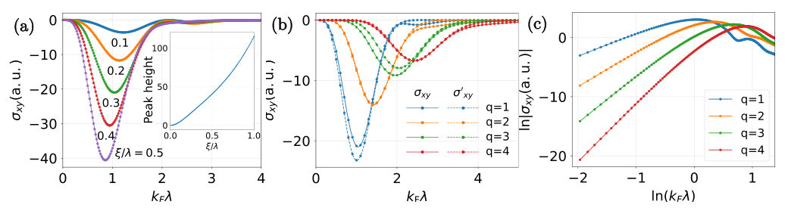 
FIG. 2. Fermi wavenumber dependence of the Hall conductivity σxy. (a) The kF dependence of σxy for q = 1 and λ = 1 with different ξ/λ. The inset shows the ξ/λ dependence of the maximum of σxy in (a). (b) The kF dependence of σxy for λ = 1, ξ/λ = 0.3 with different q. The dashed lines are an approximation in Eq. (14), which gives an accurate description of the peaks of σxy. (c) Same data in the logarithmic plot.

📷 Fig 3

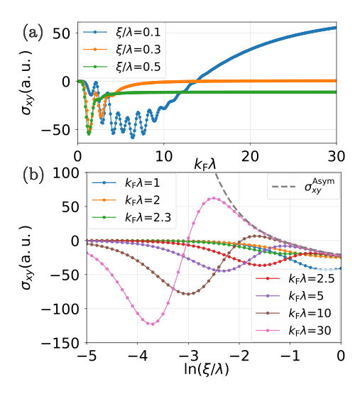 
FIG. 3. (a) λ dependence of the Hall conductivity σxy in Eq. (5) for q = 1 and kF = 1. (b) ξ dependence of σxy for q = 1, kF = 1 and kF λ = 1, 2, 2.3, 2.5, 5, 10, 30 and its asymp- totic form σ(Asym) xy in Eq. (15).

**Summary.** This theoretical work investigates the topological Hall effect generated by skyrmions, demonstrating that the effect is highly tunable by controlling the skyrmion's physical dimensions (size and shape). By analyzing the conductivity in the weak-coupling limit, the authors predict an optimal condition for maximum THE when $k_F\lambda \sim 1$. These findings establish a pathway for engineering magnetic materials to control charge transport via magnetic texture engineering.

**Why it may be interesting.** While the core physics is condensed matter magnetism, the detailed theoretical modeling of transport coefficients ($\sigma_{xy}$) based on geometric parameters ($\lambda, \xi$) and their tunability provides a rich framework for understanding how nanoscale magnetic textures dictate electronic properties, which is relevant to quantum transport studies.

Detailed structure

**Main problem.** The study investigates how the topological Hall effect (THE) induced by sparsely distributed magnetic skyrmions can be enhanced and controlled by engineering the skyrmion's size and shape.

**Main result.** The THE is found to depend significantly on the skyrmion size and shape, exhibiting a peak when the Fermi wave vector times the skyrmion size ($k_F\lambda$) is near unity, and its magnitude can be tuned by the domain-wall width.

**Method.** The analysis uses a theoretical formalism based on angular-momentum eigenstates and derives the Hall conductivity ($\sigma_{xy}$) using the second Born approximation for weak electron-magnon coupling.

**Model / system.** The system models electron transport in a 2D itinerant electron gas coupled to localized magnetic moments forming skyrmions. The Hamiltonian describes this coupling, and the skyrmion structure is characterized by a radius ($\lambda$) and domain-wall width ($\xi$).

**Key observables.** Topological Hall conductivity ($\sigma_{xy}$), which is the primary measurable quantity.

**Important parameters / regimes.** Skyrmion size ($\lambda$), domain-wall width ($\xi$), Fermi wave vector ($k_F$), and the dimensionless parameters $k_F\lambda$ and $\xi/\lambda$.

**Assumptions / limitations.** The analysis is performed in the weak-coupling limit and assumes clean materials where the electron mean-free path is comparable to or larger than the skyrmion size.

**Figures summary.** Figure 2 shows the dependence of $\sigma_{xy}$ on $k_F$ and $\xi/\lambda$ for different skyrmion numbers ($q$). Figure 3 illustrates the dependence of $\sigma_{xy}$ on the skyrmion size ($\lambda$) for $q=1$.

**Paper structure.** The paper systematically analyzes the Hall conductivity ($\sigma_{xy}$) by deriving expressions in different limits: the general case using scattering theory, the large skyrmion limit ($\lambda 	o \infty$), and the small skyrmion limit ($k_F\lambda 	o 0$).

Abstract

The topological Hall effect of skyrmions is a promising electrical probe of magnetic textures, but its small magnitude limits applications. In this work, we theoretically investigate the topological Hall effect induced by sparsely distributed skyrmions in the weak-coupling limit, focusing on how the size and shape of the skyrmion affect the Hall effect. To this end, we used a formalism based on angular-momentum eigenstates, which enables systematic analysis within reasonable computation time. We found that, in clean materials where the electron mean-free path is comparable to or larger than the skyrmion size, the Hall effect depends considerably on the size and shape of the skyrmion. In particular, the Hall effect is largest when $k_Fλ\sim 1$, and its magnitude can be tuned by the domain-wall width of skyrmions. These findings provide a basis for investigating how the shape and size of skyrmions affect transport properties and demonstrate that the topological Hall effect is controllable by engineering these properties.

[↑ back to top](#top)

### [Three-dimensional dopant distribution from a single, out-of-focus spectroscopic image](http://arxiv.org/abs/2610.11053v1)

**Authors:** Michael Deimetry, Timothy Petersen, Matthew Weyland, Scott Findlay  
**Type:** both · **Category:** other · **PDF:** <https://arxiv.org/pdf/2610.11053v1>  
**Analysis basis:** full PDF text, analyzed in chunks
**Topic relevance:** `quantum measurements` **2/5** · `Keldysh / 2PI / non-Gaussian methods` **1/5**

📷 Fig 1

 
Fig. 1 a Schematic showing two scan positions of a highly defocused STEM probe on a sample containing three dopants labelled A, B and C. b Simulated STEM-EELS image for the L2,3 edge of three Fe dopants at different depths for 300keV electrons and α = 30mrad, excluding scattering from the host crystal. c Table comparing disk radii fit using eq. (2) and the dopant depths deduced via eq. (1) from the images in b and d against the ground truth values. d As per b but including scattering from the SrTiO3 host crystal. Though a is not to scale, the probe-position cross-hairs and disk radii labels in b and d correspond well enough with their counterparts in a to elucidate the contrast formation...

📷 Fig 2

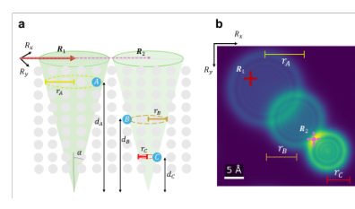 
Figure 1a depicts a STEM scan for a highly defocused probe with focal point below the

📷 Fig 3

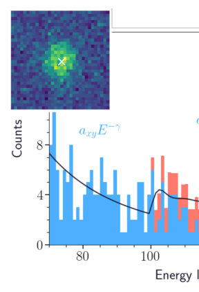 
Fig. 2 Simulated STEM-EELS image, after background subtraction, for the L2,3 edge of a single Si atom, assuming 80keV electrons and α = 30mrad, including Poisson noise appropriate to an expected 5,000 counts across the image. The spectrum from a single pixel of that image shows the background and edge shapes used and how shot noise affects both, assuming an edge signal to background ratio of 1. Colour is used for illustrative purposes only; background and edge counts can only approximately be deduced in experiment via background fitting and subtraction.

📷 Fig 4

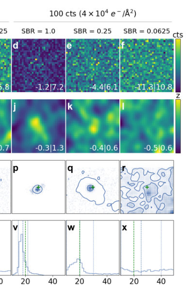 
Fig. 3 Comparison of three analysis approaches — background subtraction (first row), standardized score map of eq. (6) (second row) with 2˚A standard deviation Gaussian blur, lateral atom position (third row) via Bayesian inference using eq. (8) and marginalised posteriors for dopant depth (fourth row) — on simulated STEM-EELS image for the L2,3 edge of a single Si atom in graphene for difference combinations of total signal counts and SBR. Rows 1 and 2 use a common colour scale, with the corresponding minimum and maximum values shown in the bottom-right corner of each subplot as &lt;min&gt; | &lt;max&gt;. The analyses assume a pre-edge window from 50-90 eV and a signal window from 100-120 eV. True...

📷 Fig 5

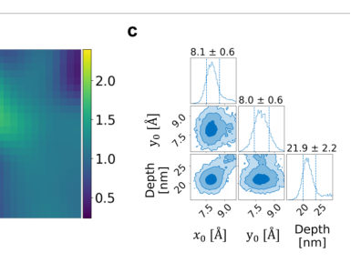 
Fig. 4 a Background-subtracted experimental STEM-EELS image for the Fe L2,3 edge in Fe-doped MgAl2O4, with 300keV electrons, α = 30mrad and a pre-edge window of 620-680eV. b Corresponding standardized score map of eq. (6) with 5˚A standard deviation Gaussian blur. c Marginalized posteriors from Bayesian inference on the region-of-interest highlighted in b.

**Summary.** This work presents a novel technique to map the 3D location of dopants in materials using only a single, out-of-focus spectroscopic image from STEM-EELS. By relating the measured disk size to the dopant depth via geometric principles and employing robust Bayesian inference, the authors achieve nanometer-scale depth resolution. This method is crucial for characterizing nanoscale devices where precise spatial mapping of impurities is essential.

**Why it may be interesting.** While the core physics is materials science, the rigorous application of Bayesian inference and statistical modeling to extract physical parameters from inherently noisy, low-signal-to-noise spectroscopic data is highly relevant to computational physics and data analysis in quantum systems.

Detailed structure

**Main problem.** The paper addresses the challenge of determining the three-dimensional (3D) distribution of dopant atoms within a material using only a single, out-of-focus spectroscopic image obtained via STEM-EELS.

**Main result.** The authors successfully demonstrate that the dopant depth can be accurately retrieved (within a few nanometers) by analyzing the geometric relationship between the measured disk radius and the probe convergence angle, even in the presence of noise and host material scattering.

**Method.** The methodology combines geometric analysis (relating disk radius to depth) with advanced statistical inference, primarily using Bayesian methods applied to the full 3D spectral data cube to quantify uncertainty.

**Model / system.** The physical system is a doped semiconductor or oxide material analyzed using Scanning Transmission Electron Microscopy coupled with Electron Energy Loss Spectroscopy (STEM-EELS). The core model relates the observed disk radius in an out-of-focus image to the dopant's depth via geometric approximations.

**Key observables.** Disk radius ($r$), deduced dopant depth ($d$), standardized score map ($z_{xy}$), and posterior probability distributions for model parameters.

**Important parameters / regimes.** Probe convergence semi-angle ($\alpha$), dopant depth ($d$), noise levels (Poisson statistics), and Signal-to-Background Ratio (SBR).

**Assumptions / limitations.** The primary assumptions include the geometric relationship $r \approx \alpha d$ and the assumption that background and edge shapes are constant across the analyzed region, though the Bayesian approach mitigates some of these.

**Figures summary.** Figures illustrate the contrast formation mechanism (disk radius vs. depth), compare three analysis techniques (background subtraction, z-score map, Bayesian inference) across varying noise levels, and show validation by subtracting the model prediction from the raw data.

**Paper structure.** The paper progresses from establishing the core physical principle (depth-from-focus) using simulations, to developing and comparing multiple data analysis techniques (Frequentist vs. Bayesian), and finally validating the quantitative depth retrieval using complex experimental data sets.

Abstract

Increasing miniaturization of nanoscale devices makes determining the three-dimensional distribution of dopants increasingly important. In out-of-focus spectroscopic scanning transmission electron microscopy images, we show that dopant atoms appear as disks with radii relating to dopant depth, allowing the three-dimensional distribution of dopants to be determined from simple geometric analysis of a single out-of-focus image. Through numerical experiments on Si-doped graphene we validate statistical detection and Bayesian inference methods to quantify confidence and uncertainties while making the analysis more robust at lower dose. We present proof-of-concept experimental data from an Fe-doped spinel, retrieving dopant depth to within around 2 nanometres.

[↑ back to top](#top)

### [EPR as a probe for the mechanisms of chirality-induced spin selectivity in photoinduced charge transfer](http://arxiv.org/abs/2610.10839v1)

**Authors:** Arianna Cantarella, D. K. Andrea Phan Huu, Paolo Santini, Michael R. Wasielewski, Alessandro Chiesa, Stefano Carretta  
**Type:** theory · **Category:** other · **PDF:** <https://arxiv.org/pdf/2610.10839v1>  
**Analysis basis:** full PDF text, analyzed in chunks
**Topic relevance:** `Keldysh / 2PI / non-Gaussian methods` **1/5** · `analog quantum simulation` **1/5** · `correlated / nonlocal dissipation` **1/5** · `driven-dissipative phase transition` **1/5** · `methods for driven-dissipative` **1/5** · `quantum measurements` **1/5**

📷 Fig 1

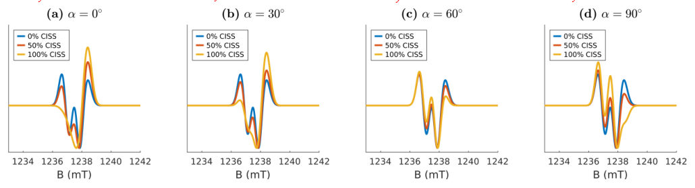 
FIG. 1. Simulated powder TREPR spectra for an initial triplet polarization along different molecular-frame directions for a prototypical molecule in Q-band. The directions are parametrized by the polar angle α from the CT axis (β = 0 throughout). Panel (a): polarization direction parallel to the CT axis (α = 0◦); panel (d): polarization direction orthogonal to the CT axis (α = 90◦); panels (b,c) show intermediate orientations. Each panel reports spectra for CISS contributions of 0%, 50%, and 100%.

📷 Fig 2

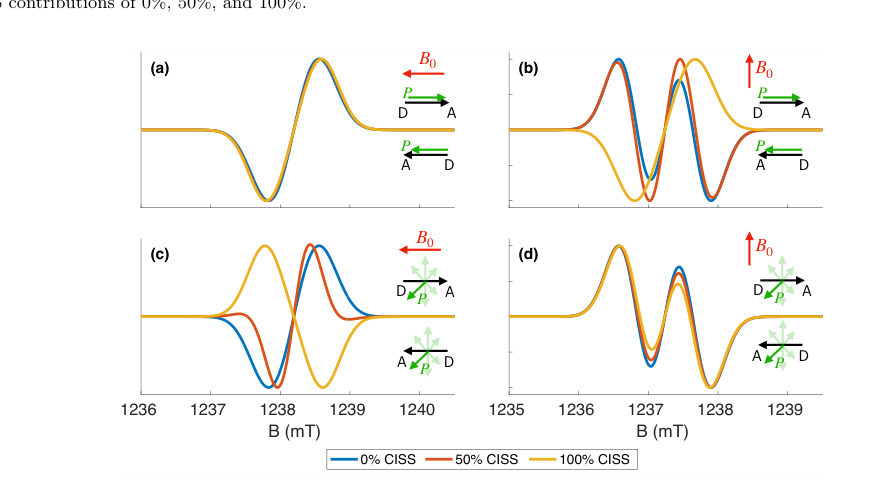 
FIG. 2. Simulated oriented-sample TREPR spectra for the four combinations of polarization orientation relative to the dipolar axis, for a prototypical molecule, in Q-band. Rows: orientation of the polarization vector relative to the molecular dipolar axis (parallel, top; perpendicular, bottom). Columns: orientation of the external magnetic field B0 relative to the dipolar axis (B0 ∥, left; B0 ⊥, right). In each panel, spectra are shown for CISS contributions of 0%, 50%, and 100%.

📷 Fig 3

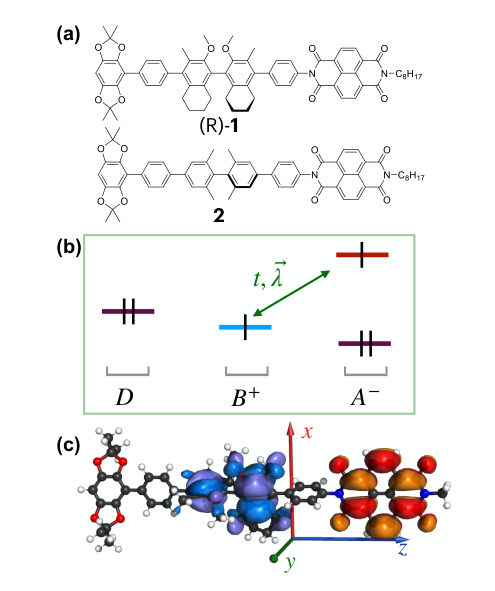 
FIG. 3. (a): molecular structures of the chiral and achi- ral donor–bridge–acceptor systems. (R)-1: (R) enantiomer of the chiral molecule presented in Ref. [5]. 2: achiral control compound from Ref. [5]. (b) scheme of MOs energy levels, representing the D–B+–A- configuration, with the orbital lo- calized on the bridge (blue) and the one one the acceptor (red) coupled via the hopping matrix element t and the spin-orbit coupling vector ⃗λ = (λx, λy, λz), with values t = 0.16 meV and ⃗λ = [0.0293 ˆx, −0.0003 ˆy, −0.0060 ˆz] meV. (c): molec- ular structure of the D-B-A system, with isosurfaces of the relevant frontier orbitals overlaid: the bridge orbital (blue) and the acceptor orbital...

📷 Fig 4

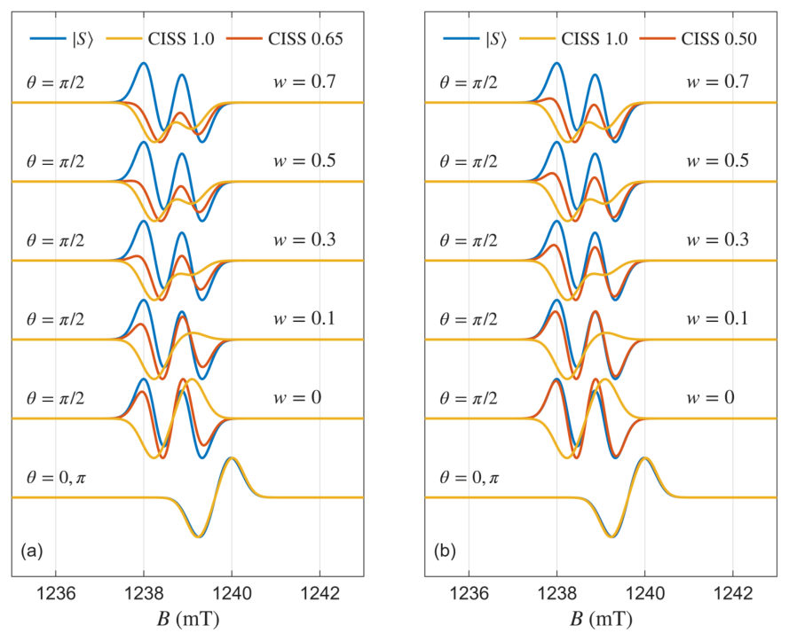 
FIG. 4. Simulation of TREPR spectra on the benchmark donor-bridge-acceptor molecule with spin Hamiltonian parameters gA = (2.0045, 2.0045, 2.0025), gD = (2.0032, 2.0032, 2.0021) and anisotropic dipole-dipole interaction DDA = (1, 1, −2) × 6.5 MHz, corresponding to a DA distance of 2 nm. In each panel, different set of curves refer to different values of |T+⟩−|T−⟩ population imbalance w for θ = π/2 (including oppositely oriented molecules in LC alignment). The bottom lines are a reference for θ = 0, not depending on w. Black lines are computed starting from a singlet radical pair state, blue curves for perfect (100%) CISS efficiency, red ones for 65 or 50% CISS efficiency (a vs b panel)....

📷 Fig 5

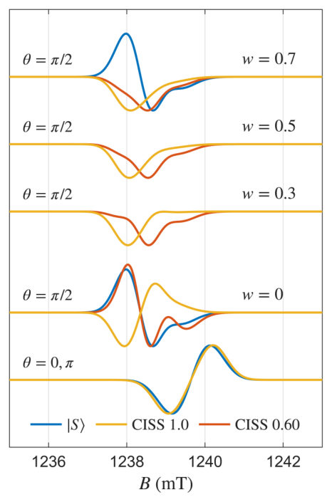 
FIG. 5. Simulations of time-resolved EPR spectra for the NDI-1G-Sd system of Ref. [6] in Q band for different values of w at θ = π/2. Bottom lines are computed a reference for θ = 0, π. Parameters used in the simulation are from [6].

**Summary.** This paper investigates Chirality-Induced Spin Selectivity (CISS) in charge transfer processes by simulating Electron Paramagnetic Resonance (EPR) spectra. The authors use the radical-pair Hamiltonian to predict how molecular chirality influences the spin state of separated charges. By comparing simulated spectra under various field orientations, they provide a powerful, measurable diagnostic tool to validate theoretical models of CISS.

**Why it may be interesting.** This work directly bridges molecular chirality, spin physics, and measurable spectroscopic techniques (EPR), which is highly relevant to AMO physics, particularly in the study of open quantum systems and spin dynamics in molecular complexes.

Detailed structure

**Main problem.** The primary goal is to validate theoretical models for Chirality-Induced Spin Selectivity (CISS) in photoinduced charge transfer (PCT) by comparing predicted Electron Paramagnetic Resonance (EPR) spectra with experimental observables.

**Main result.** The study demonstrates that the TREPR spectrum is a sensitive diagnostic tool, showing distinct spectral signatures when CISS effects are present, particularly when the magnetic field is oriented perpendicular to the dipolar axis in aligned samples.

**Method.** The authors compute spin dynamics using the radical-pair Hamiltonian and calculate the resulting Triplet Electron Paramagnetic Resonance (TREPR) spectra via linear response theory.

**Model / system.** The system involves radical pairs formed during charge transfer in chiral molecules, governed by a Hamiltonian incorporating electron-electron interactions and spin-orbit coupling (SOC). The analysis extends beyond simple collinear assumptions to model general spin polarization orientations.

**Key observables.** The primary diagnostic tool is the TREPR spectrum; CISS efficiency ($\eta$) is related to the triplet population $p = (1 - \cos \chi)$.

**Important parameters / regimes.** The magnetic field ($\mathbf{B}_0$) orientation relative to the dipolar axis, the degree of spin polarization ($\chi$), and the molecular geometry parameters.

**Assumptions / limitations.** Initial models often assume the CISS axis is collinear with the dipolar axis, and some analyses assume the initial state is a pure spin state, neglecting post-projection coherences.

**Figures summary.** Figures simulate powder and oriented-sample TREPR spectra showing spectral changes for varying CISS contributions (0%, 50%, 100%) and field/polarization orientations relative to the dipolar axis.

**Paper structure.** The work progresses by first establishing the general Hamiltonian and the TREPR calculation method, then moving to simulations that explore non-collinear polarization states using oriented samples (LC) to reveal key spectral signatures.

Abstract

Several models for chirality-induced spin selectivity (CISS) in charge transfer have been proposed, but rarely compared directly with experiments. This step is essential for their validation and future progress of the field. Here we investigate a broad class of radical pair states associated with different microscopic models by computing the related electron-paramagnetic resonance spectra. This allows us to evidence peculiar signatures of different radical pair states, to study their experimental accessibility and identify conditions to verify proposed microscopic models.

[↑ back to top](#top)

### [Field-Free Reconfigurable Spin Logic in Compositionally Graded MnxCoAl Layer](http://arxiv.org/abs/2610.12018v1)

**Authors:** Haohang Cheng, Pengju Wang, Hongrui Qin, Rongkun Han, Dong Pan, Dahai Wei, Jianhua Zhao  
**Type:** experiment · **Category:** other · **PDF:** <https://arxiv.org/pdf/2610.12018v1>  
**Analysis basis:** full PDF text, analyzed in chunks
**Topic relevance:** `analog quantum simulation` **1/5** · `driven-dissipative phase transition` **1/5** · `quantum measurements` **1/5**

📷 Fig 1

 
Figure 1. (a) Schematic illustration of the GaAs/MnxCoAl/Pt heterostructure with a vertical Mn-composition gradient. (b) XRD θ-2θ scans of the uniform Mn1.8CoAl and Mn2.5CoAl samples and the composition-gradient Mn1.8-2.5CoAl sample. (c) Out-of-plane magnetic hysteresis (M-H) loops. (d) AHE resistance (Rxy) curves measured under a perpendicular magnetic field Hz. (e) Comparison of Ms, Hk, and Ku on the Mn composition x.

📷 Fig 2

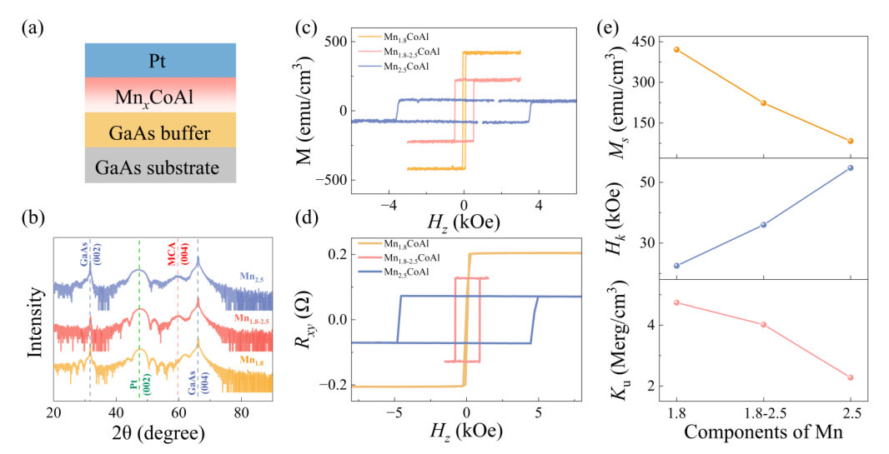 
Figure 1(e) summarizes the saturation magnetization Ms, effective anisotropy field Hk, and magnetic anisotropy constant Ku of the three MnxCoAl samples. For the two uniform-composition samples, Ms decreases while Hk increases as the Mn content increases from x=1.8 to x=2.5. The Mn1.8-2.5CoAl gradient sample exhibits intermediate Ms and Hk values between those of Mn1.8CoAl and Mn2.5CoAl, consistent with its intermediate magnetic characteristics observed in the hysteresis measurements. Detailed measurement and calculation procedures are provided in Supplementary Note 1. The magnetic anisotropy constant Ku is calculated by:

📷 Fig 3

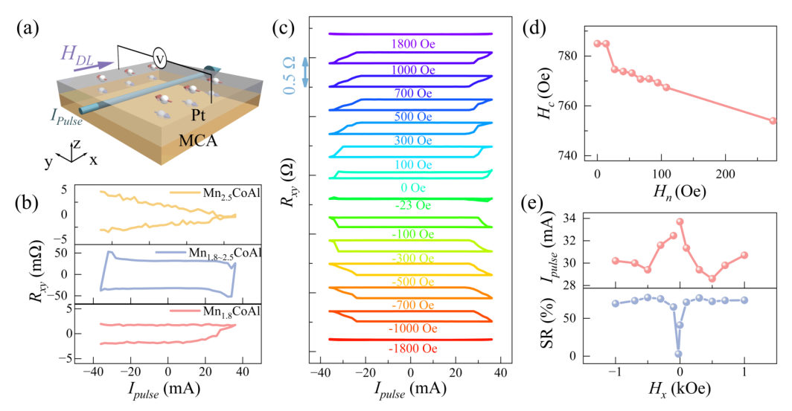 
Figure 2. (a) Schematic illustration of the Hall-bar device and the measurement configuration. (b) Rxy as a function of the pulse current Ipulse measured under zero external magnetic field for the uniform Mn1.8CoAl and Mn2.5CoAl samples and the composition-gradient Mn1.8-2.5CoAl sample. (c) SOT switching curves of the Mn1.8-2.5CoAl device measured under various in-plane magnetic fields Hx. (d) Hc as a function of Hn for the Mn1.8-2.5CoAl sample, used to evaluate HDMI. (e) Dependence of the critical switching current Ipulse and switching ratio (SR) on Hx.

📷 Fig 4

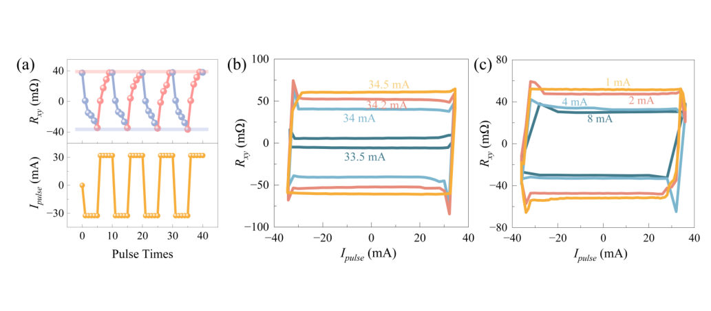 
Figure 3. (a) Multistate SOT switching behavior driven by consecutive current pulses of +32 mA and -32.5 mA. (b) Dependence of Rxy on the applied pulse current Ipulse measured under various maximum current amplitudes. (c) Rxy as a function of the pulse current Ipulse measured with different current step sizes up to a constant maximum amplitude of 36 mA. All measurements are performed under zero external magnetic field.

📷 Fig 5

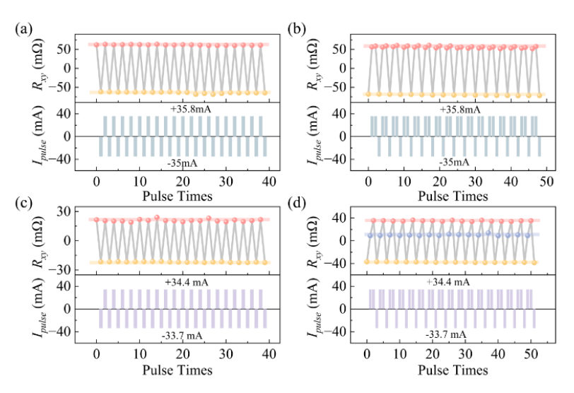 
Figure 4. SOT switching modes under zero magnetic field. (a) Binary switching driven by a single write pulse of +35.8 mA and a reset pulse of -35 mA. (b) Binary switching driven by double consecutive write pulses of +35.8 mA and a reset pulse of -35 mA. (c) Partial switching driven by a single write pulse of +34.4 mA and a reset pulse of -33.7 mA. (d) Step-like switching exhibiting a distinct intermediate state driven by double consecutive write pulses of +34.4 mA and a reset pulse of -33.7 mA.

**Summary.** This work demonstrates a breakthrough in spintronics by utilizing a vertically composition-graded $	ext{Mn-Co-Al}$ Heusler heterostructure to achieve field-free magnetization control. The gradient structure enables stable, accumulative multistate switching, allowing the device to function as a reconfigurable logic element capable of performing all fundamental Boolean operations (AND, OR, NAND, NOR) purely electrically.

**Why it may be interesting.** While the core physics is in condensed matter spintronics, the concept of using engineered material gradients to induce complex, non-linear, and programmable switching behavior is relevant to understanding emergent phenomena in complex quantum or many-body systems.

Detailed structure

**Main problem.** The goal is to develop field-free, reconfigurable spin logic by integrating nonvolatile storage and logic functions into a single physical unit to reduce data-transfer energy consumption.

**Main result.** The compositionally graded $	ext{Mn}_x	ext{CoAl}/	ext{Pt}$ heterostructure successfully demonstrates deterministic field-free SOT switching, accumulative multistate switching, and the experimental realization of all four basic Boolean logic gates (AND, OR, NAND, NOR) at zero external magnetic field.

**Method.** The research involves fabricating and characterizing vertically composition-graded magnetic films using MBE, followed by electrical transport measurements using current pulses to induce and read out magnetization states.

**Model / system.** The physical system is a $	ext{Mn}_x	ext{CoAl}/	ext{Pt}$ Heusler heterostructure where the $	ext{Mn}$ content is varied vertically across the film. This gradient introduces magnetic inhomogeneity, which, combined with Dzyaloshinskii-Moriya interaction (DMI), enables novel magnetic switching behavior.

**Key observables.** Hall resistance ($	ext{R}_{xy}$) used to read logic states (positive/negative), saturation magnetization ($	ext{M}_s$), effective anisotropy field ($	ext{H}_k$), and the ability to perform logic operations (AND, OR, NAND, NOR).

**Important parameters / regimes.** Zero external magnetic field, current pulse amplitude/polarity (used to tune between binary and multilevel switching), and the composition gradient itself ($	ext{Mn}_{1.8-2.5}	ext{CoAl}$).

**Assumptions / limitations.** The field-free switching and multistate behavior are attributed to the cooperative effects of DMI-related chiral reversal and the magnetic inhomogeneity induced by the vertical composition gradient.

**Figures summary.** Figures illustrate the structure (gradient), magnetic hysteresis loops, anomalous Hall effect curves, and detailed pulse protocols demonstrating the switching sequence required to implement the four Boolean logic gates.

**Paper structure.** The paper progresses from establishing the need for energy-efficient logic, characterizing the magnetic properties of the gradient structure versus uniform controls, demonstrating field-free SOT switching and multistate memory, and finally realizing the full set of Boolean logic operations using tailored current pulses.

Abstract

Spintronic logic-in-memory provides a route to reducing data-transfer energy consumption and accelerating computation by integrating nonvolatile storage and logic functions within a single physical unit. Here, we investigate field-free spin-orbit-torque (SOT) switching and reconfigurable spin logic in a vertically composition-graded MnxCoAl/Pt heterostructure. In contrast to the uniform-composition Mn1.8CoAl/Pt and Mn2.5CoAl/Pt control devices, the Mn1.8-2.5CoAl gradient device exhibits deterministic SOT switching under zero external magnetic field. Dzyaloshinskii-Moriya interaction (DMI)-related measurements reveal a finite characteristic effective-field scale, indicating the involvement of chiral magnetization-reversal processes. Meanwhile, the vertical composition gradient introduces magnetic inhomogeneity that can modify domain nucleation and propagation, and the combined effects are consistent with the observed field-free switching behavior. The composition-gradient device further exhibits accumulative multistate switching with stable intermediate Hall-resistance states under zero magnetic field, whereas the uniform-composition controls do not show comparable stable multistate behavior. By tailoring the amplitude, polarity, and sequence of current pulses, the device can be tuned between binary and multilevel switching modes, enabling the experimental realization of AND, OR, NAND, and NOR Boolean operations within the same Hall-bar device without any external magnetic field. These results extend Mn-Co-Al Heusler heterostructures from field-assisted SOT switching toward field-free magnetization control, multistate operation, and reconfigurable spin logic through vertical composition engineering.

[↑ back to top](#top)

### [Impact of Stimulated Brillouin Scattering on Modulation Instability in Fiber Fabry-Perot Resonators](http://arxiv.org/abs/2610.11413v1)

**Authors:** Alice Houard, Thomas Bunel, Matteo Conforti, Saliya Coulibaly, Arnaud Mussot  
**Type:** both · **Category:** other · **PDF:** <https://arxiv.org/pdf/2610.11413v1>  
**Analysis basis:** full PDF text, analyzed in chunks
**Topic relevance:** `driven-dissipative phase transition` **1/5** · `interference shaping light` **1/5**

📷 Fig 1

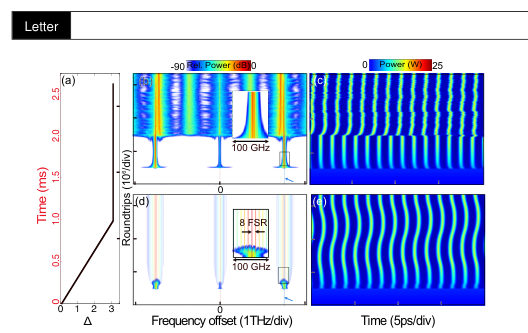 
Fig. 1. Numerical simulations. (a) detuning scan-stop ap- plied to the pump. The right axis gives the round-trip number, matching the vertical axis of (b–e). Spectral (b,d) and temporal (c,e) evolutions of the cavity output intensity during the scan- stop depicted in (a), without (b,c) and with (d,e) SBS. The blue line pointed by an arrow in (b) and (d) shows the prediction of the position of the MI side lobe at threshold from theory ( [19]). The pump power is fixed at 137mW. Cavity parameters are given in Supplementary Table S1.

📷 Fig 2

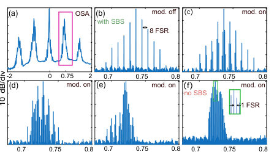 
Fig. 2. Evolution of the MI spectrum with increasing phase modulation amplitude. (a) Full optical spectrum recorded with an OSA. (b–f) Zoom on the MI sideband centered at 750 GHz away from the pump measured with a BOSA for differ- ent RF powers applied to the PM: (b) phase modulation off, (c) 3 dBm, (d) 9 dBm, (e) 12 dBm, and (f) 25 dBm (respectively modulation amplitudes β = 0.281, 0.396, 0.560, 3.53 rad). In- creasing RF power progressively suppresses SBS.

📷 Fig 3

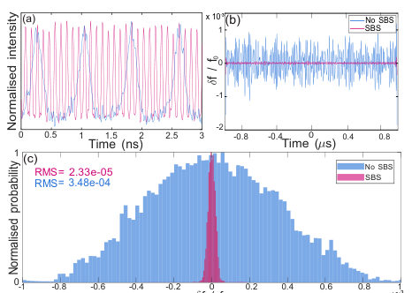 
Fig. 4. Experimental characterization of MI spectral stability with and without SBS. (a) Zoom on the time-domain beat sig- nal obtained by optically filtering the cavity output of the first MI sideband, with (pink) and without (blue) SBS. (b) Normal- ized instantaneous frequency fluctuations extracted from the beat signals, for both cases. (c) Normalized histograms of the instantaneous frequency fluctuations.

📷 Fig 4

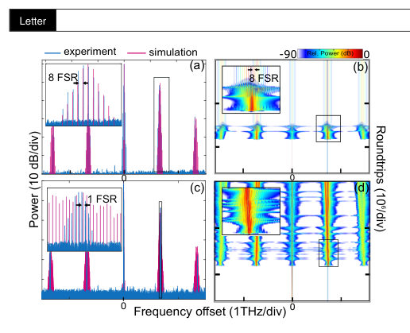 
Fig. 3. Comparison of experimental and simulated MI spectra with and without phase modulation. Left column: steady-state output spectra (blue: experiment, pink: numerics) obtained af- ter the scan-stop procedure (a) without phase modulation and (c) with strong phase modulation suppressing SBS gain. Insets show a magnified view of the first MI sideband peak (black box). Right column: simulated spectral evolution during the scan-stop for the corresponding cases, (b) without and (d) with phase modulation.

📷 Fig 5

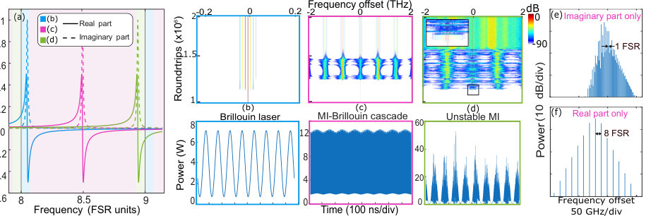 
Fig. 5. (a) Normalized Brillouin response functions as a function of shift position (in units of the cavity FSR) for SBS frequency shifts of 8.05, 8.5, and 8.95 FSR. The blue and green shaded regions correspond to conditions where the gain at an integer multiple of the cavity FSR exceeds the Brillouin lasing threshold. (b–d) Typical spectral evolution (top) and final temporal profiles (bottom) obtained from identical scan-stop simulations for different SBS shift positions: (b) 8.05, (c) 8.5 and (d) 8.95 FSR. (e,f) First MI side- band obtained when keeping only (e) the imaginary part and (f) the real part of the Brillouin response HB.

**Summary.** This research demonstrates that Stimulated Brillouin Scattering can stabilize modulation instability in optical fiber resonators. By incorporating SBS into the system dynamics, the instability spectrum is shaped into a stable cascade, a phenomenon governed by the real part of the Brillouin response. This establishes SBS as a controllable degree of freedom for managing nonlinear light propagation in Kerr resonators.

**Why it may be interesting.** This work provides a concrete example of how a nonlinear wave interaction (SBS) can act as a stabilizing mechanism in a complex optical cavity system, offering control over nonlinear dynamics.

Detailed structure

**Main problem.** The paper investigates how Stimulated Brillouin Scattering (SBS) influences Modulation Instability (MI) within Fiber Fabry-Perot (FFP) resonators.

**Main result.** SBS stabilizes the MI spectrum, shaping it into a stable multi-free-spectral-range cascade that would otherwise be unstable. This stabilization is attributed to the real part of the Brillouin response.

**Method.** The study combines numerical simulations with experimental measurements using an FFP cavity, analyzing both spectral and time-domain dynamics.

**Model / system.** The physical system is a Fiber Fabry-Perot resonator, modeled using a mean-field approach extended to incorporate the Brillouin response function. The dynamics are governed by the interplay between Kerr nonlinearity and SBS.

**Key observables.** MI sideband positions, spectral stability, time-domain pulse train characteristics (e.g., 1.28 GHz vs. 10.21 GHz), and reduction in instantaneous frequency fluctuations.

**Important parameters / regimes.** The relative position of the Brillouin frequency shift with respect to the cavity resonances (e.g., 8 FSR spacing) is critical for determining the system's stability regime.

**Assumptions / limitations.** SBS suppression in the experiment is achieved using a phase modulator (PM), and time-domain dynamics require filtering side lobes from OSA/BOSA measurements.

**Figures summary.** Figures compare numerical and experimental spectra/time-domain evolution with and without SBS control, illustrating the transition from unstable MI to a stable Brillouin-MI cascade.

**Paper structure.** The paper develops the model, presents numerical simulations comparing SBS on/off, details the experimental setup and measurements, and concludes by analyzing the physical origin of the stabilization effect.

Abstract

We report the experimental and numerical demonstration of stimulated Brillouin scattering-induced stabilization of Kerr-driven modulation instability in fiber Fabry--Perot resonators. We show that Brillouin scattering shapes the modulation instability spectrum into a stable multi--free-spectral-range cascade that is otherwise unstable in the absence of Brillouin effects. We further identify that this stabilization originates from the real part of the Brillouin response, leading to an asymmetric Kerr-Brillouin interaction governed by the relative position of the Brillouin frequency shift with respect to the cavity resonances. These results establish stimulated Brillouin scattering as an additional degree of freedom for controlling nonlinear dynamics in Kerr resonators.

[↑ back to top](#top)

### [Supercurrent as a bulk probe for topological phase](http://arxiv.org/abs/2610.10814v1)

**Authors:** Tatiana de Picoli, Ian Wojtowicz, Jukka I. Vayrynen  
**Type:** theory · **Category:** other · **PDF:** <https://arxiv.org/pdf/2610.10814v1>  
**Analysis basis:** full PDF text, analyzed in chunks
**Topic relevance:** `Keldysh / 2PI / non-Gaussian methods` **1/5** · `analog quantum simulation` **1/5**

📷 Fig 1

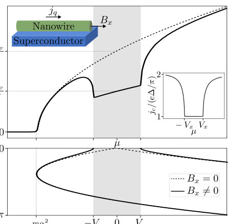 
Figure 1. Top: Superfluid stiffness ρs as a function of chem- ical potential µ for zero magnetic field (Bx = 0, dashed lines) and finite magnetic field (Bx ̸= 0, solid lines). The top in- set illustrates a nanowire proximitized by a superconductor carrying a supercurrent jq in the presence of a magnetic field (Bx) applied along the wire. The bottom inset is the dimen- sionless critical current jc as a function of chemical potential µ near the topological gap, showing a suppression in the cur- rent for |µ| &lt; Vx. Bottom: Normal-state Rashba dispersion for Bx = 0 (dashed lines) and in the presence of a magnetic field Bx ̸= 0 (solid lines). The magnetic field opens a gap at k = 0, whose...

📷 Fig 2

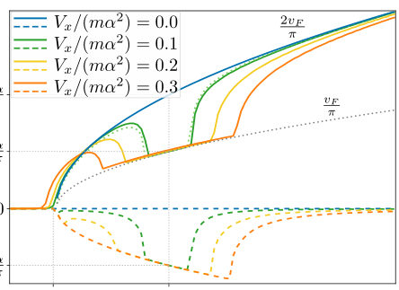 
Figure 2. Superfluid stiffness ρs/e as a function of chem- ical potential µ for different values of magnetic field ap- plied in units of Vx/(mα2). The continuous lines refer to the superfluid stiffness obtained from the Rashba Hamilto- nian, Eq. (4), while the dashed lines are obtained from a linear approximation around the Fermi level, i.e., the heli- cal Hamiltonian in Eq. (5). For Vx/(mα2) = 0.1, we also show the parabolic ρs/e in the absence of a magnetic gap (2vF /π) added to the stiffness from the linearized system (dotted green), which matches the suppressed superfluid stiff- ness from the full Rashba Hamiltonian (continuous green). The suppressed current for all values of applied...

📷 Fig 3

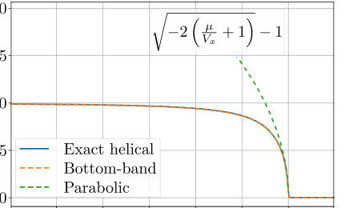 
Figure 3. Dimensionless superfluid stiffness in units of evF /π for a constant vF as a function of µ/Vx. The exact helical (blue) and bottom-band projections (dashed orange) match for µ/Vx &lt; 0, remaining constant and negative for |µ/Vx| &lt; 1, implying that the helical bands carry a negative supercurrent due to the topological gap. In dashed green, we show the superfluid stiffness when the bottom helical band is approxi- mated by a parabolic spectrum with negative effective mass me = −Vx/v2 F .

**Summary.** This paper proposes using the supercurrent response as a direct, bulk probe to distinguish between trivial and topological superconducting phases in nanowires. By analyzing the superfluid stiffness ($
ho_s$) in a Rashba nanowire, the authors predict a characteristic non-monotonic suppression of the supercurrent when the system enters the topological phase. This offers an experimental route independent of relying solely on boundary effects.

**Why it may be interesting.** This work provides a concrete, measurable superconducting response (supercurrent/kinetic inductance) that can directly probe the bulk topological nature of a superconductor, which is highly relevant for understanding topological superconductivity in mesoscopic devices.

Detailed structure

**Main problem.** The central challenge is distinguishing between trivial and topological superconducting phases, as existing probes often rely on boundary signatures sensitive to local physics.

**Main result.** The supercurrent response ($\mathbf{j}_q$) provides a bulk-sensitive probe, showing a predicted factor of two suppression in the superfluid stiffness ($
ho_s$) inside the topological phase.

**Method.** The supercurrent and superfluid stiffness are calculated using the Bogoliubov-de Gennes (BdG) Hamiltonian formalism, supplemented by a low-energy helical model for analytical insight.

**Model / system.** The system studied is a one-dimensional Rashba spin-orbit-coupled superconducting nanowire subjected to an applied magnetic field. The physics is modeled using the BdG Hamiltonian, which is simplified via a low-energy helical approximation.

**Key observables.** Superfluid stiffness ($
ho_s$), supercurrent ($\mathbf{j}_q$), and the resulting non-monotonic signature of $
ho_s$ as a function of chemical potential ($\mu$).

**Important parameters / regimes.** Strong spin-orbit coupling regime ($\Delta < V_x < m\alpha^2$), applied magnetic field ($\mathbf{B}_x$), and chemical potential ($\mu$).

**Assumptions / limitations.** The analysis relies on the low-energy helical model derived by linearizing the Hamiltonian around the Fermi momentum, and the supercurrent is calculated via expectation values in the BdG framework.

**Figures summary.** Figures illustrate the dependence of superfluid stiffness ($
ho_s$) and the dimensionless critical current ($j_c$) on the chemical potential ($\mu$) for different magnetic field strengths, comparing full and helical model results.

**Paper structure.** The paper establishes the problem with boundary-sensitive probes, proposes supercurrent as a bulk observable, develops the theoretical framework using the BdG Hamiltonian and low-energy models, and finally presents the key result: the non-monotonic signature of $
ho_s$ indicating the topological transition.

Abstract

Distinguishing trivial from topological superconducting phase remains a central and contested experimental challenge, since most existing probes infer the bulk phase transition indirectly, from boundary signatures that can be sensitive to local physics. Here, we propose an alternative that probes the bulk topological phase and is based on supercurrent response. We study a one-dimensional Rashba spin-orbit-coupled superconducting nanowire with an applied magnetic field that opens a topological gap. We show that for strong spin-orbit coupling, the superfluid stiffness, and consequently the supercurrent, is suppressed by a factor of two inside the topological phase, producing a non-monotonic signature of the bulk phase transition as a function of chemical potential. We further use a low-energy helical model to understand this suppression analytically. Our results show that the bulk topological phase transition can be detected through kinetic inductance measurements.

[↑ back to top](#top)

### [Band Tail States: Speed Bump or End of the Road for Two-Dimensional Semiconductors?](http://arxiv.org/abs/2610.10953v1)

**Authors:** Zherui Han, Robert K. A. Bennett, Davide Donadio, Maritha A. Wang, Tara Peña, Mikaël Cassé, Martin Vanbrabant, Valeriya Kilchytska, Jean-Pierre Raskin, Eric Pop  
**Type:** theory · **Category:** disordered systems and neural networks · **PDF:** <https://arxiv.org/pdf/2610.10953v1>  
**Analysis basis:** full PDF text, analyzed in chunks
**Topic relevance:** `Keldysh / 2PI / non-Gaussian methods` **1/5**

📷 Fig 1

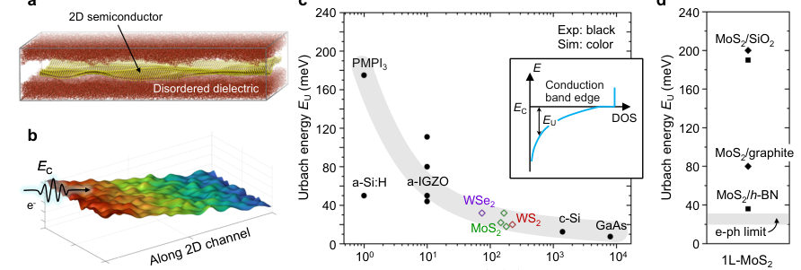 
FIG. 1. Band tail states (BTS) in semiconductors. (a) Physical origin of BTS in a monolayer 2D semiconductor encased by disordered insulators (here MoS2 encased by a-SiO2). The image is extracted from one snapshot of molecular dynamics simulation (the slab shown here is 30 nm long and 6.5 nm thick), at room temperature. (b) Schematic of conduction band (EC) variation along a 2D channel, at low lateral field. An electron wave packet is also illustrated. (c) Conduction band Urbach energy EU in some common semiconductors at room temperature vs. electron mobility μe. Filled black symbols are from experiments [14,19–25], unfilled colored symbols are from simulations of intrinsic monolayer TMDs...

📷 Fig 2

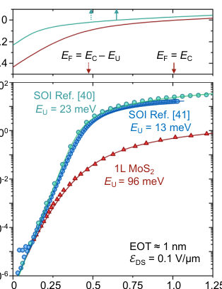 
FIG. 2. Estimated EU from SOI and MoS2 transistors. Symbols mark drain current vs. gate voltage measurements of long-channel monolayer MoS2 (red, [31]) and ultrathin SOI (cyan and blue, with silicon channel thickness of 11 and 7 nm, based on device fabrication described in Refs. [40,41], respectively). All devices have metal top-gates with EOT ≈ 1 nm and their current is normalized to the same lateral field ℰDS = VDS/L = 0.1 V/μm. Lines are our model fitting, yielding EU ≈ 13 and 23 meV for SOI and ~ 96 meV for monolayer MoS2. Due to slightly different threshold voltage, the horizontal axis is offset (VGS’) such that all transistors start at 10 pA/μm for the same voltage. Upper panel shows...

📷 Fig 3

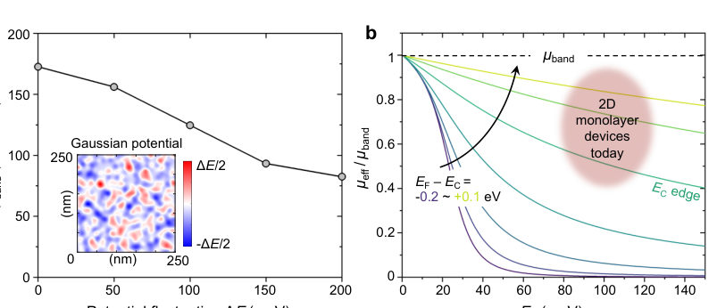 
FIG. 3. Effects of potential fluctuation and BTS on mobility. (a) Band mobility µband as a function of potential fluctuation ΔE, in monolayer MoS2. This is a Monte Carlo simulation at room temperature for electron transport under a spatially-random Gaussian potential (inset shows a 250 nm × 250 nm domain). ΔE = 0 corresponds to the intrinsic phonon-limited mobility reported in our previous work [28]. (b) Ratio of effective mobility µeff to band mobility µband, as a function of EU, at room temperature. Here, we assume NU changes linearly with EU from zero, and NU = 7.5×1012 cm-2 at EU = 100 meV from electrical model fitting. The Fermi level EF is referenced with respect to the conduction...

📷 Fig 4

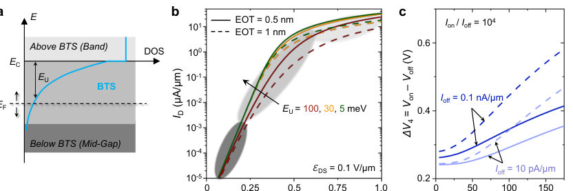 
FIG. 4. BTS effect on transistor turn-on. (a) Energy bands and density of states (DOS, blue line) near EC, including BTS. These regions are distinguished by the level of shading. Dashed line marks the Fermi level, EF. (b) Expected transistor turn-on with three values for EU and two for EOT (0.5 nm solid lines, 1 nm dashed lines). Shaded regions correspond to the same colors in (a), as VGS sweeps EF through the bands. This is a long-channel device, with zero contact resistance and low lateral drain-to-source field (0.1 V/µm), such that field-assisted transport through localized states can be neglected. The band mobility µband = 100 cm2V−1s−1 here, and NU follows the same scaling as in Fig....

📷 Fig 5

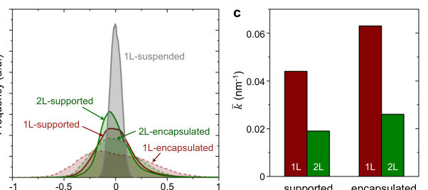 
FIG. 5. MD simulations and surface roughness. (a) Typical surface topology from equilibrated MD snapshots. These are simulations for 1L- and 2L-MoS2 films supported or encapsulated by a-SiO2. The surface here is 30 nm × 30 nm. The while edge within each panel is the removed outlier data due to finite size effect of MD. (b) Distribution of out-of-plane atomic displacement δz for 1L- and 2L-MoS2 films supported (solid lines) or encapsulated (dashed lines) by a-SiO2, as well as a freely suspended 1L-MoS2 film (grey line). The standard deviation σz of these distributions corresponds to the average height fluctuations of the MoS2 in the various scenarios. (c) The average bending curvature 𝑘" of...

**Summary.** This work analyzes how energy band tail states (BTS), caused by disorder in 2D semiconductors, fundamentally limit the energy efficiency and mobility of nanoscale transistors. By developing a detailed electrical model, the authors quantify this limitation using the Urbach energy ($E_U$) and propose material and structural engineering solutions, such as using bilayers or strain, to overcome these inherent disorder-related barriers.

**Why it may be interesting.** While focused on solid-state electronics, the core physics—disorder-induced localization and transport limitations—is highly relevant to understanding quantum transport in disordered quantum materials, which shares mathematical parallels with localization phenomena studied in condensed matter theory.

Detailed structure

**Main problem.** The paper addresses the fundamental limitations on charge transport and transistor operation in two-dimensional (2D) semiconductors caused by energy band tail states (BTS). These states arise from spatial potential inhomogeneity in the material environment.

**Main result.** BTS cause reduced effective mobility and limit the sharpness of transistor turn-on, setting a fundamental limit on energy-efficient operation. However, these effects can be mitigated by engineering the system using higher gate capacitance, strain, or by using bilayer channels if the band tail energy spread is reduced below ~50 meV.

**Method.** The authors developed and applied a physics-based electrical transport model modified to incorporate the exponential tail density of states (DOS) associated with BTS, comparing theoretical predictions to experimental measurements.

**Model / system.** The study focuses on ultrathin, monolayer 2D semiconductors (like MoS2) operating as transistors. The model explicitly accounts for the energy band tail states (BTS), characterized by the Urbach energy ($E_U$), which blurs the ideal sharp band edges.

**Key observables.** Reduced effective mobility ($\mu_{	ext{eff}}$), 'slow' transistor turn-on characteristics, and the magnitude of the Urbach energy ($E_U$).

**Important parameters / regimes.** Urbach Energy ($E_U$), which is significantly higher ($\sim 100$ meV) in monolayer 2D semiconductors compared to bulk silicon ($\sim 10$ meV).

**Assumptions / limitations.** The analysis assumes the BTS density of states follows an exponential decay, and the electrical model assumes negligible contact resistance.

**Figures summary.** Figures illustrate the physical origin of BTS, compare $E_U$ vs. mobility for various semiconductors, and show how the BTS effect degrades transistor performance (e.g., $I_D$ vs. $V_{GS}$ curves).

**Paper structure.** The paper establishes the physical problem (BTS causing limitations), develops a modified electrical transport model incorporating the exponential DOS, analyzes the resulting performance degradation (mobility reduction, slow turn-on), and concludes with design guidelines for mitigation.

Abstract

We propose that the path to realizing the full potential of two-dimensional (2D) electronics lies in understanding and mastering their energy band tail states (BTS). Unlike silicon, which benefits from sharp band edges (Urbach energy $E_\rm U$ ~ 10 meV), today's monolayer 2D semiconductors have rough band edges ($E_\rm U$ ~ 100 meV) caused by spatial potential inhomogeneity. Comparing a physics-based electrical model to experiments, we demonstrate that BTS cause reduced effective mobility and "slow" transistor turn-on with excessive gate voltage in monolayer 2D transistors, which sets a fundamental limit for their energy-efficient operation. We also show that BTS effects in 2D transistors could be mitigated with higher gate capacitance, with strain engineering, and by using bilayer instead of monolayer 2D channels, as long as $E_\rm U$ is reduced below ~ 50 meV. This work provides a theoretical framework and design guidelines to navigate these fundamental limits, and to enable successful integration of 2D semiconductors into low-power nanoelectronics.

[↑ back to top](#top)

### [Symmetry-Dependent Polarity Reversal of Bulk Spin-Orbit Torque in Single-Layer MnCoGa](http://arxiv.org/abs/2610.12031v1)

**Authors:** Rongkun Han, Mingsong Zhang, Dahai Wei, Yuan Lu, Wenxu Zhang, Jianhua Zhao  
**Type:** both · **Category:** other · **PDF:** <https://arxiv.org/pdf/2610.12031v1>  
**Analysis basis:** full PDF text, analyzed in chunks
**Topic relevance:** `analog quantum simulation` **1/5**

📷 Fig 1

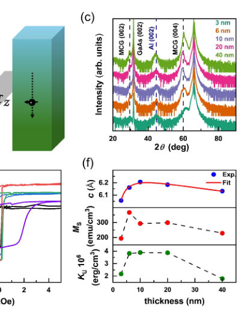 
Fig. 1. (a) The spin current in a magnetic single layer with ℳ𝓏𝓏 symmetry. (b) The spin current in a magnetic single layer with broken ℳ𝓏𝓏 symmetry. (c) The XRD θ-2θ scan results of MCG single layer with different thickness. (d) The XRD φ scan of MCG {111} planes, MCG {220} planes, and GaAs {220} planes. (e) The M-H curves of MCG single layer at 300 K with different thickness. (f) The c, MS, and KU of MCG as a function of thickness at 300 K.

📷 Fig 2

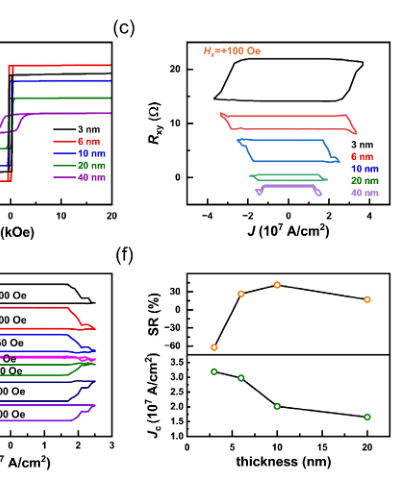 
Fig. 2. (a) Schematics of the electrical transport measurement in MCG single layer Hall devices. (b) The AHE curves of MCG single layer at 300 K with different thickness. (c) The current-driven magnetization switching curves of MCG single layer at +100 Oe with different thickness. The magnetization switching curves of MCG with 3 nm (d) and 10 nm (e) at different in-plane magnetic field. (f) The magnetization switching ratio (SR) and critical current density as a function of thickness of MCG.

📷 Fig 3

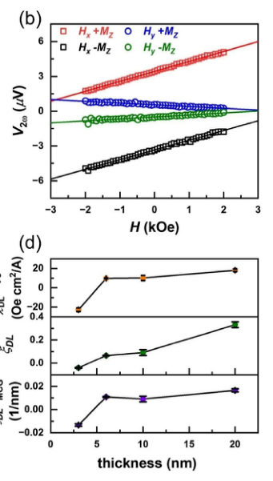 
Fig. 3. (a) Variation of first order harmonic signal V1ω with Hx in MCG (20 nm) single layer. Inset in the schematic diagram of HHVR measurement. (b) Variations of second order harmonic signal V2ω with Hx and Hy, respectively. (c) HDL as a function of applied J of MCG single layer with different thickness. (d) The χDL, ξDL, and ξDL/tMCG as a function of thickness of MCG.

📷 Fig 4

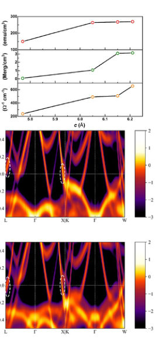 
Fig. 4. (a) The crystal structure of Mn1.5Co1.5Ga. (b) The dependence of the calculated MS, KU, and SHC on lattice distortion. The band structures projected onto t2g and eg orbitals of Mn1.5Co1.5Ga with c=5.77 Å (c), 6.05 Å (d), 6.15 Å (e), and 6.21 Å (f), respectively. The color bar represents the spectral weights on a logarithmic scale, and the white dashed circles serve as visual guides.

**Summary.** This work demonstrates that the polarity of the spin-orbit torque in a magnetic single layer can be precisely controlled by engineering the structural symmetry through lattice strain. By analyzing the MnCoGa alloy, the authors show that the reversal of SOT polarity is due to changes in the lattice distortion gradient, providing a powerful, structure-based degree of freedom for spintronic device design.

**Why it may be interesting.** While focused on condensed matter magnetism, the concept of using structural symmetry breaking (a geometric/topological constraint) to control a macroscopic transport property (SOT polarity) is analogous to engineering boundary conditions or symmetries in quantum simulation setups.

Detailed structure

**Main problem.** The core problem is controlling the magnitude and polarity of the spin-orbit torque (SOT) for efficient magnetization manipulation in spintronic devices.

**Main result.** The SOT polarity can be reversed by controlling the lattice strain and structural symmetry of the single-layer magnetic material, rather than relying solely on the sign change of the intrinsic spin Hall conductivity.

**Method.** The study combines first-principles calculations (DFT) to model intrinsic spin Hall conductivity with experimental measurements (Varying thickness, transport measurements) to observe SOT switching behavior.

**Model / system.** The system is a single-layer Mn1.6Co1.4Ga (MCG) Heusler alloy grown on a substrate, whose structural evolution (lattice strain/distortion) is key to the observed physical properties.

**Key observables.** Damping-like torque efficiency ($\chi_{DL}$), magnetization switching polarity, and the lattice constant/distortion gradient as a function of film thickness.

**Important parameters / regimes.** Film thickness (3-20 nm), lattice strain/tetragonal distortion, and the structural symmetry breaking mechanism.

**Assumptions / limitations.** The SOT is governed by a symmetry-dependent conversion of spin current into torque, and the intrinsic SHC alone is insufficient to predict the polarity reversal.

**Figures summary.** Figures illustrate XRD results showing c-axis change with thickness, magnetization switching curves showing polarity reversal, and theoretical plots linking SHC and torque coefficients to lattice distortion.

**Paper structure.** The paper establishes the need for SOT control, presents the material system and measurement techniques, theoretically calculates SHC dependence on distortion, and finally links the observed thickness-dependent SOT polarity reversal to the sign change in the lattice distortion gradient.

Abstract

Controlling the magnitude and polarity of spin-orbit torque (SOT) is essential for manipulating magnetization in spintronic devices. Here, we realize bulk spin-orbit torque (SOT) in a single-layer Mn1.6Co1.4Ga (MCG) Heusler alloy and achieve lattice strain-controlled reversal of SOT polarity. SOT-driven magnetization switching is achieved over a thickness range of 3-20 nm, with the switching polarity reversed between the strongly strained ultrathin regime and thicker films. First-principles calculations reveal a sizable intrinsic spin Hall conductivity (SHC) in MCG originating from its topological band structure, which is enhanced by the tetragonal distortion without changing sign. Together with the thickness-dependent structural evolution, we demonstrate that the reversal of SOT polarity does not originate from a sign change of the SHC, but rather from lattice distortion induced symmetry breaking that modifies the conversion of spin current into a net bulk SOT, thereby controlling its polarity. These results establish strain-controlled structural symmetry as an additional degree of freedom for tuning bulk SOT in magnetic single layers.

[↑ back to top](#top)

### Other secondary papers (4)

Show other secondary papers

### [A General Algorithm for Minimal Uncoupled Stress--Strain Calculations of Elastic Constant](http://arxiv.org/abs/2610.11733v1)

**Authors:** S. I. Simak, Utkarsh Singh  
**Type:** theory · **Category:** numerical methods · **PDF:** <https://arxiv.org/pdf/2610.11733v1>  
**Analysis basis:** full PDF text, analyzed in chunks

📷 Fig 1

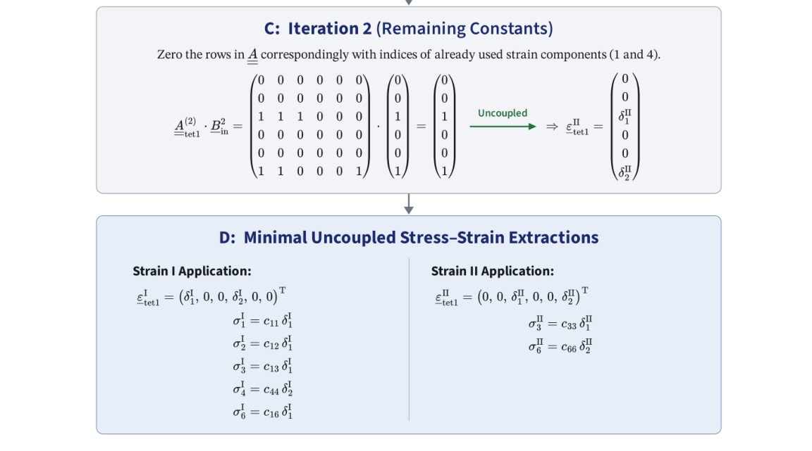 
FIG. 1. Conceptual Illustration of the minimal and uncoupled stress–strain scheme presented in this work for the example of Tetragonal-I crystal symmetry.

📷 Fig 2

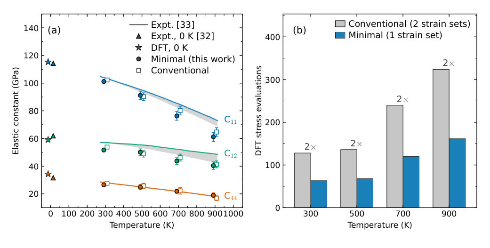 
FIG. 2. Temperature dependence of the single-crystal elastic constants of fcc Aluminum. (a) c11, c12, and c44 obtained from the present minimal scheme (filled circles) and from the conventional separate-strain scheme (open squares), each as the central difference of the density-functional thermodynamic stress averaged over molecular-dynamics configurations; error bars denote one standard error of the configurational mean and the two schemes are offset slightly in T for clarity. Solid lines are the isothermal single-crystal data [32], and stars mark the present T = 0 K values. And, the grey region indicates the spread of independent measurements [32, 33]. The minimal and conventional results...

**Summary.** This paper presents a general, algorithmic method to calculate the minimum set of strain configurations needed to determine a material's second-order elastic constants from first-principles calculations. By analyzing the symmetry structure of the elastic stiffness matrix, the authors ensure that each constant is determined independently, leading to significant reductions in the number of required computational steps, especially at finite temperatures.

**Why it may be interesting.** While focused on solid-state physics, the core contribution is a highly systematic and general algorithmic framework for minimizing experimental/computational inputs (strain configurations) to solve a complex physical parameter set, which is a valuable computational methodology.

Detailed structure

**Main problem.** The paper addresses the challenge of determining the minimum number of strain configurations required to extract second-order elastic constants from first-principles stress-strain calculations without introducing algebraic coupling between the constants.

**Main result.** A general, algorithmic method was developed that systematically generates the minimal set of uncoupled strain patterns for all 230 crystallographic space groups, often leading to significant reductions in required computational effort compared to conventional schemes.

**Method.** The method operates by analyzing the sparsity structure of the symmetry-reduced elastic stiffness matrix and iteratively constructing admissible strain vectors to ensure that each independent elastic constant is determined from a single, uncoupled stress component.

**Model / system.** The study concerns the elastic response of crystalline solids, modeled using the stress ($\sigma$) and strain ($\varepsilon$) tensors, which are related by the elastic stiffness tensor ($c_{ijkl}$). The calculations are based on first-principles stress-strain derivatives, applicable at both zero and finite temperatures.

**Key observables.** Second-order elastic constants ($c_{ijkl}$), stress ($\sigma_{ij}$), and strain ($\varepsilon_{ij}$).

**Important parameters / regimes.** The strain space is six-dimensional, and the method is benchmarked across all 230 crystallographic space groups.

**Assumptions / limitations.** The method assumes the linear-elastic regime for the stress-strain derivatives, although it can be extended to finite temperatures using ensemble-averaged thermodynamic stresses.

**Figures summary.** Figures conceptually illustrate the minimal, uncoupled stress-strain scheme for specific symmetries (e.g., Tetragonal-I) and compare the required number of DFT stress evaluations between the minimal and conventional schemes, showing significant savings at finite temperatures.

**Paper structure.** The paper introduces the problem by comparing existing methods (ASESS, ULICS, OHESS) and then details the novel algorithmic approach based on the stiffness matrix sparsity. It demonstrates the method's application across all 230 space groups, benchmarks its efficiency, and discusses extensions to finite temperatures.

Abstract

We have developed a general algorithm for constructing the minimum number of strain configurations required to extract second-order elastic constants from first-principles stress-strain calculations without algebraic coupling between the constants targeted for extraction. The method operates on the sparsity structure of the symmetry-reduced elastic stiffness matrix, represented by an auxiliary binary matrix, and generates admissible strain patterns algorithmically rather than prescribing separate strain sets for individual crystal symmetries. Each independent elastic constant is obtained from a single stress component, while additional stress relations generated by the same deformation provide internal consistency checks. Because the six-dimensional strain space contains only 2^6-1=63 non-empty strain patterns, the minimality of the resulting sets can be verified exactly for every elastic-symmetry type considered. The construction reproduces established high-efficiency strain sets in cases where they are minimal and yields improved sets for symmetry classes in which previously tabulated schemes require additional configurations. Because the formulation is based on stress-strain derivatives, it can also be readily extended to finite temperatures using consistently sampled ensemble-averaged thermodynamic stresses. Explicit strain sets are derived for all elastic-symmetry types spanning the 230 crystallographic space groups, and their accuracy and computational efficiency are benchmarked against established approaches.

[↑ back to top](#top)

### [Epitaxial growth of WO3 on r-plane sapphire by hot-filament metal-oxide deposition using CO2 as a precursor](http://arxiv.org/abs/2610.11654v1)

**Authors:** Laurent Souqui, Lewis J. Adams, Andreas Tsampanakis, David Rehnlund Maibach, Per Eklund  
**Type:** experiment · **Category:** other · **PDF:** <https://arxiv.org/pdf/2610.11654v1>  
**Analysis basis:** full PDF text, analyzed in chunks

📷 Fig 1

 
Fig. 1: (a) Extended 2θ/ω scans of films deposited on sapphire with CO2 for 30 min, 120 min, and without CO2 (Ar). (b) Close- up around the tungsten oxide 002 peak

📷 Fig 2

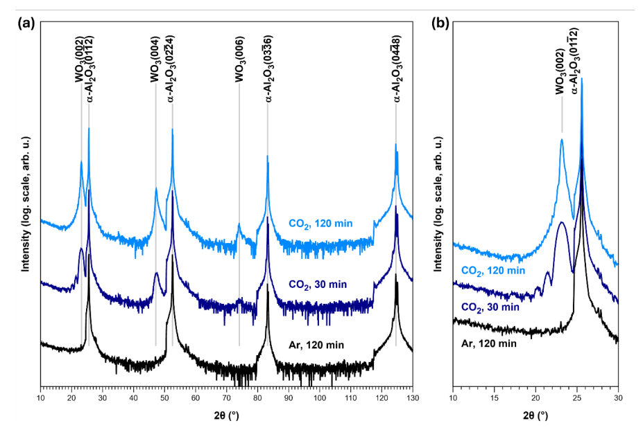 
Figure 1(a) shows 2q/w scans from films deposited with CO2 for 30 min and 120 min, and for comparison films deposited with pure Ar. The XRD scan from the film deposited with CO2 for 30 min exhibits distinct Laue fringes (Figure 1(b)), meaning that films of high crystalline quality are obtained. The fringes for the films deposited for 120 min are difficult to resolve because of their higher thickness of 30 nm, as measured by ellipsometry, corresponding to an average growth rate of 0.25 nm/min.

📷 Fig 3

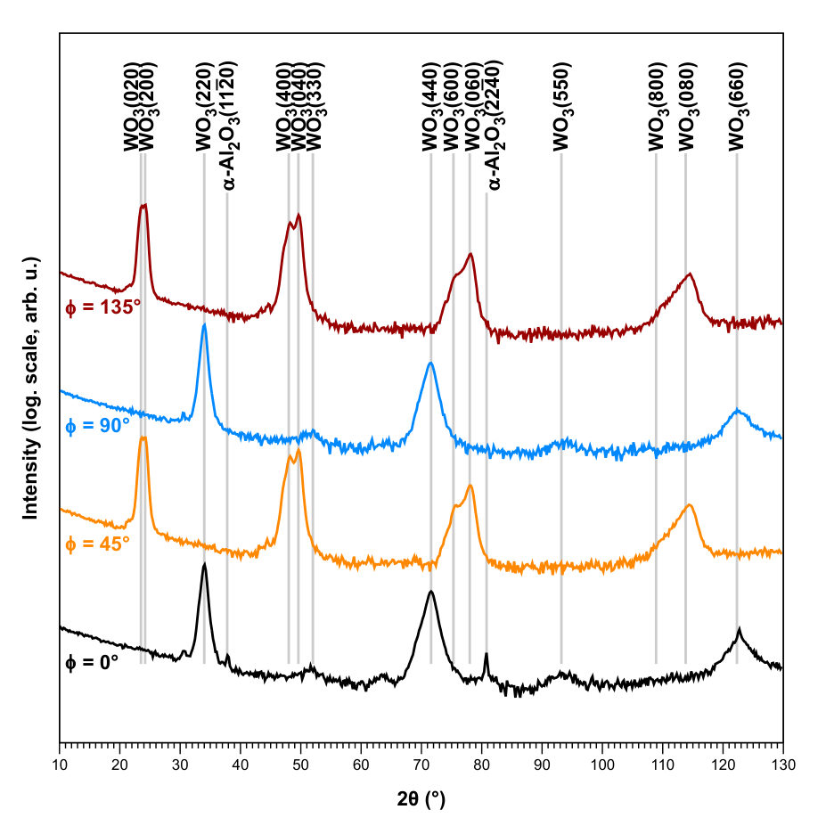 
Fig. 2: GID patterns of the 120 min-deposited sample taken along the [110] direction of sapphire, and rotated by φ = 45°, 90° and 135° and Ψ = 89.5°. Low intensity, non-indexed peaks and shoulders match with Kβ radiation.

📷 Fig 4

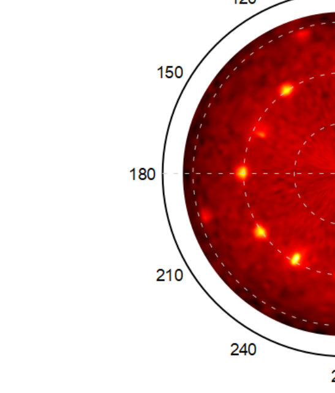 
Fig. 3: Pole figures recorded at 2θ = 35.68°. The three set of circles correspond three groups of poles.

📷 Fig 5

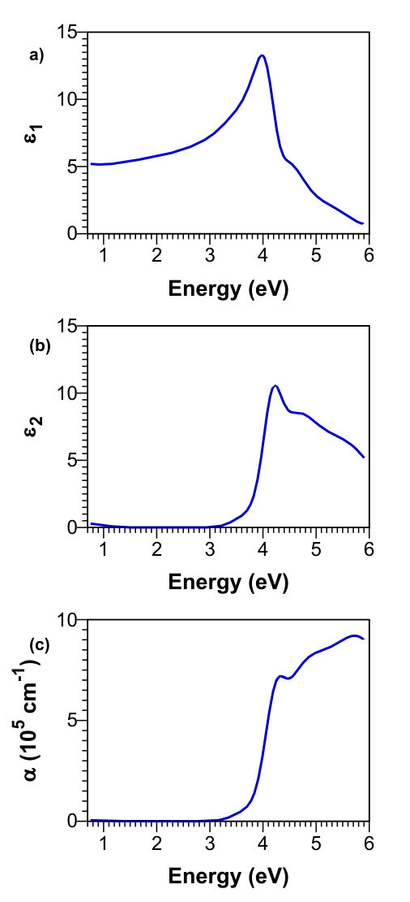 
Fig. 4: Optical properties of a 30-nm WO3 thin film deposited on r-cut sapphire a) real part of the dielectric function, b) imaginary part of the dielectric function, and c) absorption coefficient. The feature at 4.5 eV is a fitting artifact.

**Summary.** This paper reports the successful epitaxial growth of WO3 thin films on r-plane sapphire using a hot-filament CVD method with CO2 as the precursor. Characterization confirmed the film's crystalline quality, epitaxial orientation, and optical properties, showing transparency in the visible range and a band gap consistent with stoichiometric WO3.

**Why it may be interesting.** While primarily materials science, the precise control over thin film growth, crystallinity, and optical band structure using controlled chemical precursors (CO2) is relevant to developing quantum optical components or substrates for quantum devices.

Detailed structure

**Main problem.** The study aimed to demonstrate the epitaxial growth of WO3 thin films on r-plane sapphire using a hot-filament metal-oxide deposition (HFMOD) technique with CO2 as the precursor.

**Main result.** Epitaxial WO3 films were successfully grown with a low growth rate, exhibiting optical transparency in the visible spectrum and confirming crystal structures consistent with orthorhombic or monoclinic phases.

**Method.** The films were deposited using hot-filament CVD, and characterization involved X-ray Diffraction (XRD) for structural analysis and Variable-angle Spectroscopic Ellipsometry (VASE) for optical property measurement.

**Model / system.** The physical system is the deposition of WO3 thin films onto r-plane sapphire (alpha-Al2O3) using a hot-filament reactor. The growth process is controlled by the reaction of tungsten wires with CO2 at elevated temperatures.

**Key observables.** Optical constants (epsilon_1, epsilon_2), absorption coefficient, epitaxial relationships (e.g., WO3(001)//alpha-Al2O3(0112C2)), and crystal phase identification (monoclinic/orthorhombic).

**Important parameters / regimes.** Low growth rate of 0.25 nm/min; substrate temperature of 450°C; measurement range up to 5.9 eV.

**Assumptions / limitations.** The primary assumption is that CO2 acts as the necessary oxidizing species for the deposition reaction, confirmed by comparison with Ar deposition.

**Figures summary.** Figures show XRD scans comparing CO2 vs. Ar deposition, GID patterns confirming epitaxial relationships, pole figures detailing crystal orientation, and VASE plots showing the energy dependence of the dielectric function components.

**Paper structure.** The paper follows a structure of demonstrating the deposition process, characterizing the crystal structure using XRD (including epitaxial relationships), and characterizing the optical properties using VASE to confirm material stoichiometry and band gap.

Abstract

The deposition of epitaxial films of WO3 by hot-filament metal-oxide deposition using CO2 as a precursor was demonstrated. The films were obtained at a low growth rate of 0.25 nm/min. The optical properties of the film were assessed by variable-angle spectroscopic ellipsometry, indicating transparency across the visible spectrum and high absorption above 3 eV.

[↑ back to top](#top)

### [High Efficiency in Large Supercurrent Rectification with Superconducting Coil](http://arxiv.org/abs/2610.11259v1)

**Authors:** Takumi Ichikawa, Daisuke Takegami, Gen Nishijima, Shunsuke Kawakami, Tsutomu Nojima, Yuji Tsuchiya, Satoshi Awaji, Fuyuki Ando, Ken-ichi Uchida, Yuya Hattori, Yoshikazu Mizuguchi  
**Type:** both · **Category:** other · **PDF:** <https://arxiv.org/pdf/2610.11259v1>  
**Analysis basis:** full PDF text, analyzed in chunks

📷 Fig 1

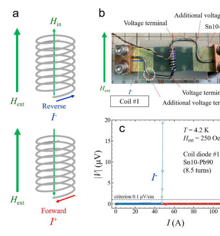 
Figure 1. Concept and Ic measurements for coil diode (#1). a) External field (Hext) and

📷 Fig 2

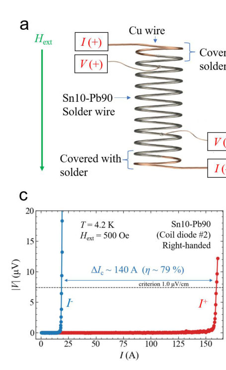 
Figure 2. Critical current experiments. a) Schematic image of the concept. b) Sample

📷 Fig 3

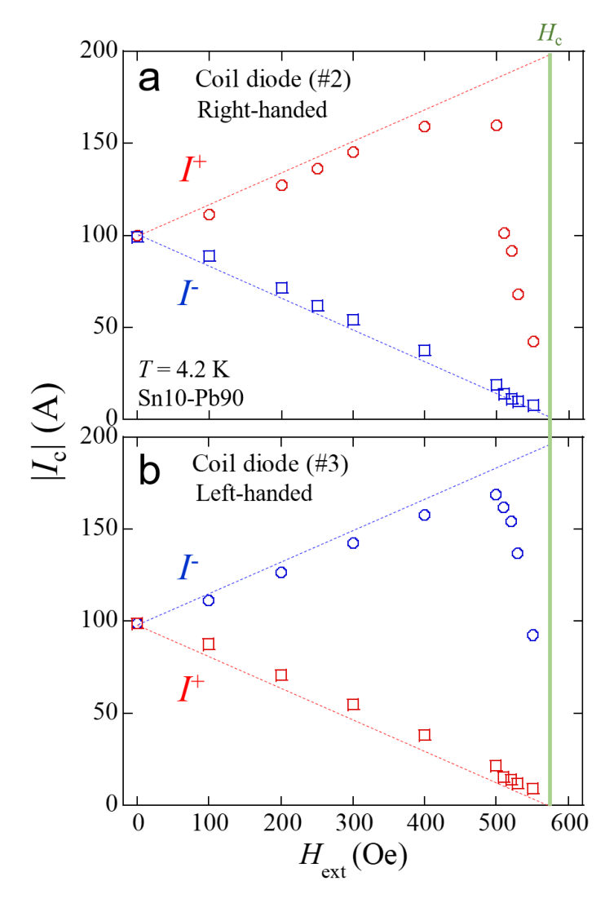 
Figure 3. External field dependence of Ic for the coil diodes, a) #2 and b) #3. The dashed lines

📷 Fig 4

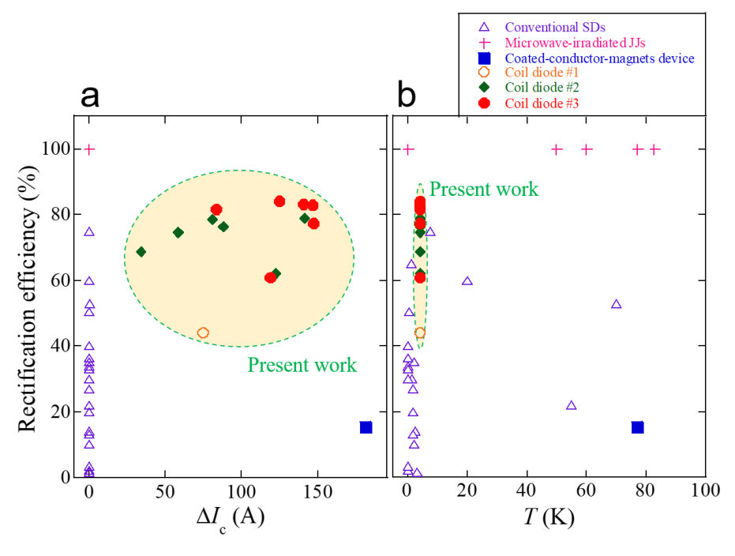 
Figure 4. Comparison of the rectification efficiency as functions of a) ΔIc and b) experiment

**Summary.** This work introduces a coil-shaped superconducting wire device to enhance supercurrent rectification (SDE) for power electronics. By engineering the coil geometry, the device achieves high rectification efficiency ($\eta$) and a large critical-current difference ($\Delta I_c$) under significant external magnetic fields. The combination of FEM simulations and precise transport measurements validates this approach for next-generation superconducting power applications.

**Why it may be interesting.** While focused on classical superconducting electronics, the detailed modeling of non-linear, field-dependent critical currents and the use of advanced electromagnetic simulations are relevant to understanding non-equilibrium dynamics in condensed matter systems.

Detailed structure

**Main problem.** The goal is to achieve high rectification efficiency ($\eta$) and a large critical-current difference ($\Delta I_c$) simultaneously in superconducting diodes (SDs) for practical superconducting power electronics.

**Main result.** The proposed coil-shaped superconducting wire device demonstrated high performance, achieving $\eta = 79\%$ with $\Delta I_c = 140 	ext{ A}$ at $500 	ext{ Oe}$, confirming its potential for large-current applications.

**Method.** The study combines experimental transport measurements (V-I curves) with detailed Finite Element Method (FEM) simulations using COMSOL Multiphysics to model the magnetic field distribution.

**Model / system.** The physical system is a coil-shaped superconducting wire (initially $	ext{Sn}_{10}	ext{-Pb}_{90}$ solder), where the Superconducting Diode Effect (SDE) arises from the non-reciprocity of the critical current due to the interaction between an external magnetic field ($	ext{H}_{	ext{ext}}$) and the field generated by the coil itself.

**Key observables.** Rectification efficiency ($\eta$), critical-current difference ($\Delta I_c$), and the superconducting critical current ($I_c$) dependence on $	ext{H}_{	ext{ext}}$.

**Important parameters / regimes.** External magnetic field ($	ext{H}_{	ext{ext}}$) up to $530 	ext{ Oe}$; superconducting critical field ($H_c$) for $	ext{Sn}_{10}	ext{-Pb}_{90}$ solder ($\approx 570 	ext{ Oe}$).

**Assumptions / limitations.** The analysis relies on classical electromagnetism for modeling, and the performance is highly dependent on the magnetic field at the inner edge of the coil.

**Figures summary.** Figures show schematic designs, photographs of the coil diodes, and plots detailing the magnetic field distribution ($H_{total}$) and the dependence of $I_c$ on $H_{ext}$ derived from both simulation and experiment.

**Paper structure.** The paper first establishes the need for high $\eta$ and $\Delta I_c$. It then presents the coil concept, supported by FEM simulations showing how field compensation leads to non-reciprocity. Finally, it reports experimental measurements on improved coil designs, confirming the high performance metrics.

Abstract

Superconducting diodes (SDs) are devices that rectify supercurrent through the difference in the superconducting critical current (Ic) between forward and reverse current directions. For bringing such SDs closer to practical superconducting power electronics applications, a combination of both high rectification efficiency (η) and a large Ic difference (ΔIc) is required. Here, we propose and demonstrate a coil-shaped superconducting wire device concept to induce a large SD effect, arising from the compensation between an external magnetic field (Hext) and the field generated by the coil itself. From transport Ic measurements on coil-shaped SDs based on a Sn10-Pb90 solder wire, we achieved a η of 79% with a ΔIc of 140 A at Hext = 500 Oe (coil #2) and a η of 84% with a ΔIc of 125 A at Hext = 530 Oe (coil #3), confirming high rectification values at large supercurrents. The large-current high-efficiency SDE in the coil-shaped SDs will be highly useful for developing the potential field of supercurrent power electronics.

[↑ back to top](#top)

### [Strain-engineered long-distance supercurrent in an altermagnetic CrSb based-Josephson junction](http://arxiv.org/abs/2610.11341v1)

**Authors:** Yifan Gao, Jin Yan, Junjie Wei, Yifan Zhang, Zhiyuan Zhou, Tong Zou, Ruiyue Chu, Gui Wang, Kaiwen Shen, Zhiwei Zhang, Fang Chen, Yingfen Wei, Hao Jiang, Xumeng Zhang, Ming Wang, Liyang Liao, Jingli Wang, Yijun Yu, Wu Shi, Qi Yao, Xiaobing Chen, Qihang Liu, Yizheng Wu, Yuhang Li, Xufeng Kou, Cheng Song, Xianzhe Chen, Qi Liu, Xincheng Xie, Ming Liu  
**Type:** experiment · **Category:** strongly correlated electrons · **PDF:** <https://arxiv.org/pdf/2610.11341v1>  
**Analysis basis:** full PDF text, analyzed in chunks

📷 Fig 1

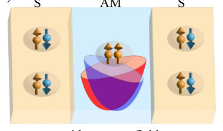 
FIG. 1. Schematics of (a) ferromagnetic and (b) altermag- netic Josephson junctions. Spin-split band structures are il- lustrated in each panel, respectively. Both systems can sup- port spin-triplet pairing. Inside the s-wave superconducting leads, only spin-singlet Cooper pairs exist, which can be con- verted into spin triplets via spin-mixing and spin-rotation ef- fects.

📷 Fig 2

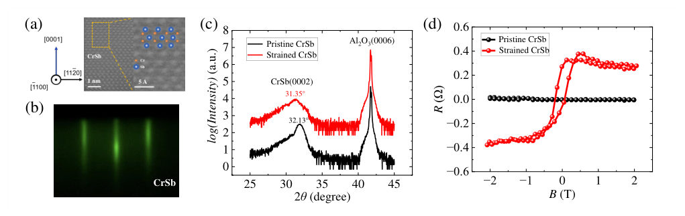 
FIG. 2. (a) Atomic-scale characterization of the CrSb crystal lattice synthesized via molecular beam epitaxy (MBE). (b) Reflection high-energy electron diffraction (RHEED) pattern of the CrSb film, exhibiting sharp and streaky features indicative of smooth, two-dimensional epitaxial growth. (c) X-ray diffraction (XRD) patterns of pristine (black) and strained (red) CrSb films. The shift in the CrSb (0002) diffraction peak from 32.13◦to 31.35◦confirms the lattice expansion induced by strain. (d) Hall resistance Rxy as a function of the external magnetic field B for pristine (black spheres) and strained (red spheres) CrSb samples, demonstrating the modified magnetic response under strain....

📷 Fig 3

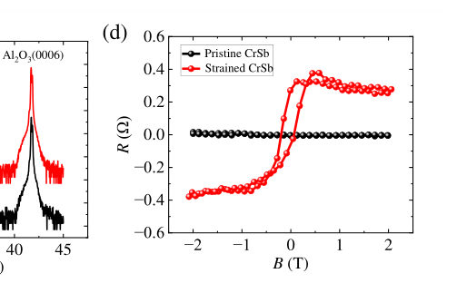 
Figure 3(b) compares the temperature-dependent re- sistance (R −T curve) of Josephson junctions fabricated from pristine (black spheres) and strained (red spheres) CrSb weak links with identical spacer lengths of 150 nm. The strained CrSb device exhibits a pronounced super- conducting transition below T ≈0.55 K, whereas the pristine CrSb junction does not show comparable zero- resistance transport. The absence of supercurrent in pris- tine CrSb with the same junction geometry rules out con- ventional metallic conduction or pinhole-mediated trans- port as the origin of the observed zero-resistance state. Additionally, in Fig. 3(c), the current–voltage (I −V )

📷 Fig 4

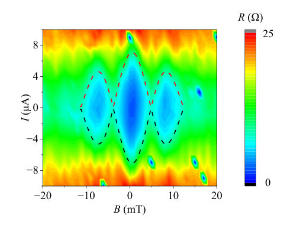 
FIG. 4. Color plot of the differential resistance (dV/dI) for the CrSb Josephson junction mapped against applied cur- rent I and the out-of-plane magnetic field B at 250 mK. The black and red dashed lines track the switching current Ic, highlighting a Fraunhofer interference pattern with enhanced first-order side lobes, indicative of highly extended edge su- percurrents under spin-orbit coupling.

📷 Fig 5

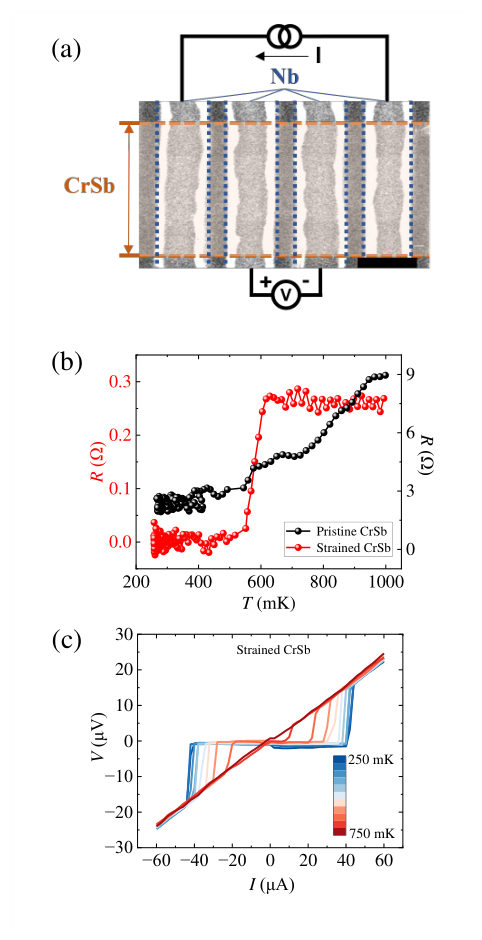 
FIG. 3. (a) SEM image of the CrSb Josephson junction device. Scale bar, 0.5 µm. The four-terminal resistive prop- erties were acquired using a lock-in amplifier system (SR830). (b) Temperature dependence of the device resistance (R −T curve). The junction exhibits a sharp superconducting transi- tion, with the resistance dropping to zero at the temperature of T ≈0.55 K. (c) I −V curve of the CrSb Josephson junction at various temperature ranging from 250 mK to 750 mK. The device becomes completely superconducting at the tempera- ture T ≈0.55 K.

**Summary.** This paper reports on the realization of long-distance supercurrents in a Josephson junction utilizing the altermagnetic material CrSb. By applying epitaxial strain, the researchers engineered the material to promote spin-triplet Cooper pairing, allowing supercurrent flow over distances far exceeding conventional limits. This work establishes altermagnets as a promising platform for next-generation superconducting spintronics devices.

**Why it may be interesting.** The work connects concepts from magnetism (altermagnetism) and superconductivity (Josephson effect) in a way that suggests novel mechanisms for controlling superconducting properties using magnetic order, which is highly relevant to correlated electron physics.

Detailed structure

**Main problem.** The research aims to demonstrate long-distance supercurrent transport in a Josephson junction using an altermagnetic material, circumventing the stray magnetic field issues of conventional ferromagnets.

**Main result.** The authors observed a dissipationless supercurrent across a 150 nm spacer in a strained CrSb junction, significantly exceeding the conventional spin-singlet coherence length, providing evidence for triplet-mediated coupling.

**Method.** The study employed four-terminal transport measurements on epitaxial Josephson junctions, combining structural characterization (XRD, RHEED) with electrical transport measurements under varying temperature and magnetic fields.

**Model / system.** The physical system is a Josephson junction ($	ext{Nb} - 	ext{CrSb} - 	ext{Nb}$) where $	ext{CrSb}$ acts as the weak link. The key physics involves the unique properties of altermagnets, which exhibit zero net magnetization but possess momentum-dependent spin splitting, enabling unconventional spin-triplet Cooper pair formation.

**Key observables.** Dissipationless supercurrent magnitude, magnetic-field-induced quantum interference pattern (Fraunhofer pattern), and the superconducting transition temperature ($T_c$).

**Important parameters / regimes.** Spacer distance ($	ext{up to } 150 	ext{ nm}$), temperature range ($250 	ext{ mK}$ to $750 	ext{ mK}$), and strain magnitude ($\approx 2.4\%$ c-axis expansion).

**Assumptions / limitations.** The supercurrent is mediated by unconventional spin-triplet Cooper pairs whose coherence length is not limited by the exchange interaction, and that strain engineering can effectively rotate the spin correlations.

**Figures summary.** Figures illustrate the structural characterization (lattice matching, strain via XRD, anomalous Hall effect) and the electrical transport results, including $R-T$ curves, $I-V$ curves, and the characteristic Fraunhofer pattern in the $R(B, I)$ map.

**Paper structure.** The paper progresses from establishing the theoretical advantage of altermagnets over ferromagnets, through detailed structural characterization confirming strain, to presenting the core transport measurements that confirm long-distance, triplet-mediated Josephson coupling.

Abstract

Altermagnetic materials, characterized by vanishing net magnetization and momentum-dependent spin splitting, provide a unique platform for realizing unconventional superconducting states without the detrimental stray fields. Here, we demonstrate long-distance Josephson supercurrent transport through epitaxial thin films of the strained altermagnet CrSb. We observe a dissipationless supercurrent across a lateral spacer distance of 150 nm in a CrSb-based Josephson junction, exceeding the conventional spin-singlet coherence length by nearly two orders of magnitude. This supercurrent is further accompanied by a well-defined magnetic-field-induced quantum interference pattern, providing direct evidence for genuine Josephson coupling. Our results reveal altermagnets as a promising route toward generating long-distance supercurrents without macroscopic magnetic stray fields, opening new opportunities for superconducting spintronic applications.

[↑ back to top](#top)

