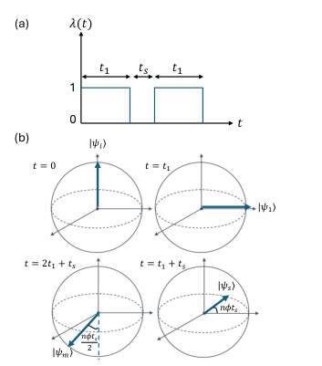
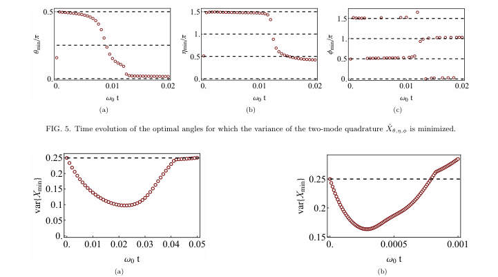
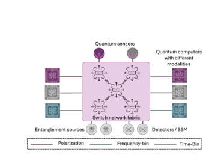
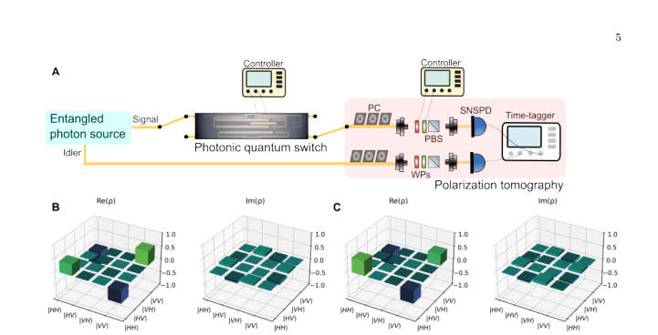
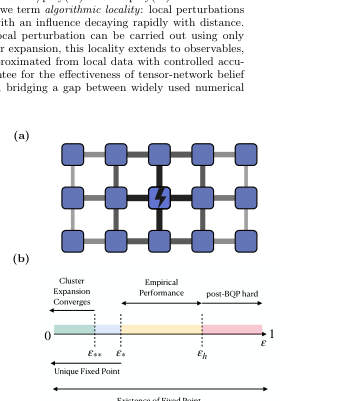
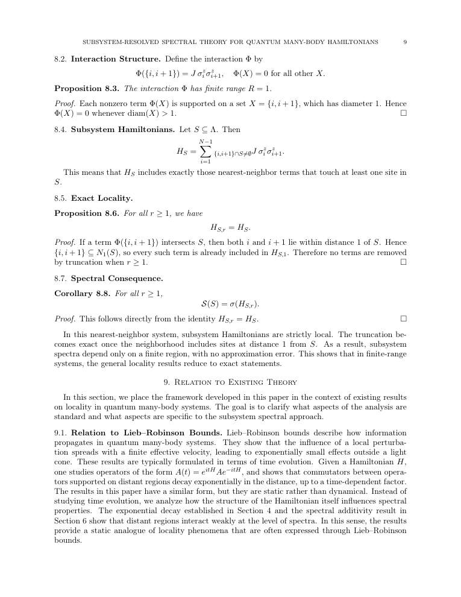

# arxiv digest (quant-ph + cond-mat) — 24-04-26

*5 papers · 1 highlighted*

## ⭐ Highlighted (1)

*Papers by authors on your watch list. Full entries appear only once in their normal category below.*

- ⭐ [Algorithmic Locality via Provable Convergence in Quantum Tensor Networks](http://arxiv.org/abs/2604.21919v1) — Sarang Gopalakrishnan

## quantum information and computing (2)

### [Dual-use quantum hardware for quantum resource generation and energy storage](http://arxiv.org/abs/2604.21913v1)

**Authors:** Vaibhav Sharma, Yiming Wang, Shouvik Sur  
**Type:** theory · **PDF:** <https://arxiv.org/pdf/2604.21913v1>  
**Analysis basis:** full PDF text, analyzed in chunks

Figures

 <small>FIG. 1. The same quantum hardware can serve either as a quantum battery or a quantum sensor because the process of charging a quantum battery generates quantum resources. Here, we demonstrate a concrete protocol where the quantum hardware remains agnostic of its intended use until a time t = t∗where a suitable metrological resource peaks. One can then choose to either time-evolve into a fully charged quantum battery or perform quantum sensing. As a bonus, after sensing, there exists a finite probability to obtain a fully charged battery.</small>

 <small>FIG. 2. Time-evolution of the variance of the numerically optimized squeezed two-mode operator Xmin. Here, we have fixed (n, ω0, gn) = (4, 1, 1/ √</small>

 <small>FIG. 3. (a) Protocol combining charging (for time 2t1 with λ(t) = 1) and sensing (for time ts with λ(t) = 0) using the two coupled superconducting LC resonator based quantum battery model in Eq. 6. (b) Bloch sphere representation of the evolution of quantum state during this protocol, starting from a discharged state |ψi⟩to a partially charged state |ψm⟩ while sensing an unknown parameter ϕ for time ts.</small>

 <small>FIG. 4. A schematic portrayal of potential inter-connectivity among standard quantum technologies. Here, X →Y implies Y enabled by X. This work enumerates such relationships between a quantum battery and a quantum sensor. Solid (dashed) arrows indicate established (hypothesized) proto- cols. The hypothetical protocols can be devised by combining the protocols developed here and in Refs. [59, 60].</small>

 <small>FIG. 5. Time evolution of the optimal angles for which the variance of the two-mode quadrature ˆ Xθ,η,ϕ is minimized.</small>

 <small>FIG. 6. Time evolution of the variance of the optimal quadrature ˆ Xθ,η,ϕ for (a) n = 3 and (b) n = 6. The best squeezing is obtained at a finite short time in both cases.</small>

 <small>FIG. 7. Time evolution of the optimal angles for which the variance of the two-mode quadrature ˆ Xθ,η,ϕ is minimized for (a)–(c) n = 3 and (d)–(f) n = 6.</small>

**Main problem.** Investigating the coexistence of dual-use functionalities in quantum hardware, specifically the simultaneous generation of quantum battery charging advantages and metrologically useful states.

**Main result.** The authors prove that protocols for fast quantum state preparation (like one-axis twisting) can simultaneously act as quantum batteries with a charging advantage, establishing that quantum resources and stored energy are distinct yet co-producible.

**Method.** The study uses analytical derivations in the Heisenberg picture, short-time expansions of the time-evolution operator, and numerical exact diagonalization to evaluate scaling and squeezing.

**Summary.** This paper demonstrates that quantum hardware can be designed to serve two purposes: charging a quantum battery and performing high-precision quantum sensing. By using non-linear coupling in superconducting circuits, the authors show that the same physical process that generates metrologically useful entanglement also provides a collective advantage in energy storage. This allows for a modular architecture where a single device can switch between sensing and energy-storage functions without extra hardware cost.

Detailed structure

**Model / system.** The proposed hardware consists of superconducting LC resonators (two coupled bosonic modes) with a non-linear coupling Hamiltonian of the form H_AB = g_n(a_dagger b^n + h.c.).

**Key observables.** Quantum Fisher Information (QFI), quantum squeezing (variance of quadratures), and charging power (energy transfer rate).

**Important parameters / regimes.** Non-linearity index n, coupling strength g_n, number of particles N, and the time-dependent protocol lambda(t).

**Assumptions / limitations.** The results rely on finite-size systems; in the thermodynamic limit with Kac-normalization, the charging advantage may be lost.

**Figures summary.** Figure 1 illustrates the dual-use concept for sensing and charging; Figure 3 shows the temporal protocol for the LC resonators; Figure 5 and 6 show the time evolution of optimal quadrature parameters and minimum variance.

**Paper structure.** The paper introduces the dual-use concept, establishes the mapping between state preparation and battery charging, analyzes the scaling of charging power and metrological utility, proposes a specific superconducting circuit implementation, and provides detailed analytical derivations for the bosonic mode dynamics.

**Why it may be interesting.** It provides a unified framework for integrating energy storage and sensing, which is highly relevant for developing modular, multi-functional quantum architectures and understanding the interplay between entanglement and energy transfer.

Abstract

Quantum resources such as entanglement form the backbone of quantum technologies and their efficient generation is a central objective of modern quantum platforms. Independently, quantum batteries have emerged as nanoscale devices that utilize collective quantum effects to store energy with a charging advantage over classical strategies. Here, we show that these two pursuits can co-exist: protocols for fast generation of resourceful quantum states can simultaneously charge a quantum battery with a collective advantage, and conversely, a quantum battery protocol with a charging advantage can produce resource-rich states. Using this connection, we propose an integrated hardware protocol on superconducting circuits in which each experimental run can interchangeably accomplish either quantum battery charging, or quantum sensing through generation of metrologically useful states. Our results establish that quantum resources and stored energy are distinct yet co-producable quantities, opening the door to modular quantum architectures that dynamically switch between sensing and energy-storage functions, thereby producing additional functionalities without extra hardware cost.

### [A Universal Quantum Information Preserving Photonic Switch for Scalable Quantum Networks](http://arxiv.org/abs/2604.21902v1)

**Authors:** Jiapeng Zhao, Stéphane Vinet, Amir Minoofar, Michael Kilzer, Lucas Wang, Galan Moody, Vijoy Pandey, Ramana Kompella, Reza Nejabati  
**Type:** both · **PDF:** <https://arxiv.org/pdf/2604.21902v1>  
**Analysis basis:** full PDF text, analyzed in chunks

Figures

 <small>FIG. 1: Switched Quantum Network. Conceptual quantum network centered around the quantum switch. The system ensures quantum state integrity and entanglement preservation while providing encoding-agnostic operation across diverse modalities. The switch supports time- and space-multiplexed utilization of shared critical resources whilst providing a scalable framework for the interconnection of quantum computers and quantum sensor.</small>

 <small>FIG. 2: Architecture of the Universal Quantum Switch. The input quantum state converters (QSCs) enable conversion to path-encoding to ensure quantum information is routed through two identical photonic switches. The output QSCs convert the quantum information back to the desired output encoding modality. Both QSCs can be implemented in either an integrated or pluggable manner with an arbitrary combination of encoding modality.</small>

 <small>FIG. 3: Schematic of the quantum switch. (a) Simplified sketch of the device for polarization encoding. (b) TFLN photonic integrated circuit combining both QSCs and the switch matrix, respectively highlighted in green and purple. (c) Normalized optical power when varying the driving voltage of TO phase shifters to characterize the half-wave power and ER of MZI. (d) Fast switching between two output ports when driving the EO modulator with a sinusoidal waveform at 1 GHz rate to determine half-wave voltage.</small>

 <small>FIG. 4: Quantum state tomography (a) Simplified sketch of the experimental setup for quantum characterization. An entangled photon source produces polarization-entangled photons at 1551.72 nm (signal) and 1564.68 nm (idler). The signal photon is routed through the UQS. After the PIC, both photons are sent to the polarization tomography system. Reconstructed density matrices for the input ρin (b) and output ρout (c) for connection 1 →1 (input →output ports). A fidelity F(ρin, ρout) = 0.98 is obtained with purity Tr(ρ2 out) = 1.</small>

 <small>FIG. 5: Dynamic switching. (a) Dynamic switching of the device when driving the EO modulator with a rectangular pulse at 1 MHz. The gated section used for quantum state tomography is shown in the shaded region. Reconstructed density matrices for the input ρin (b) and output ρout (c) for connection 2 →1 (input → output ports). A fidelity F(ρin, ρout) = 0.90 is obtained with purity Tr(ρ2 out) = 1.</small>

 <small>FIG. 6: Scaling potential of the UQS. (a) UQS fidelity as a function of PDL per PRS. b UQS fidelity as a function of PER of PRS and ER of MZI. c UQS fidelity and IL as a function of dimension N. Note that the IL floor comes from the high coupling loss in the current chip. A low loss (≤1 dB) design can be implemented to reduce the IL floor to 2 dB.</small>

 <small>FIG. 7: Polarization entangled photon source. Polarization entangled photons are generated in a fiber-based Sagnac interferometer via spontaneous four-wave mixing (SFWM) in a AlGaAs chip. The interferometer is actively locked using a probe laser with a servo controller.</small>

**Main problem.** Existing quantum networks are limited to static point-to-point links because current optical switching technologies introduce decoherence and lack the ability to dynamically route different quantum encodings.

**Main result.** The authors demonstrate a Universal Quantum Switch (UQS) in thin-film lithium niobate that enables high-speed (up to 1 GHz) routing of entangled states with low decoherence (less than 4%) and dimension-independent scalability.

**Method.** The researchers developed a 2x2 TFLN photonic integrated circuit using polarization-to-path conversion, combined with quantum state tomography and a weighted Pauli channel model to quantify hardware-induced noise.

**Summary.** This paper presents a new type of 'Universal Quantum Switch' designed to route quantum information without destroying its fragile entanglement. Using advanced lithium niobate technology, the researchers created a chip that can switch quantum signals at extremely high speeds (up to 1 GHz). The device is 'encoding-agnostic,' meaning it can handle different types of quantum information, and it is designed to scale up to large networks without increasing decoherence. This is a major step toward building a functional, large-scale quantum internet.

Detailed structure

**Model / system.** A 2x2 Thin-Film Lithium Niobate (TFLN) photonic integrated circuit featuring Mach-Zehnder Interferometers (MZIs) driven by both thermo-optic and high-speed electro-optic modulators, using polarization-entangled photon pairs from an AlGaAs microring resonator.

**Key observables.** Uhlmann fidelity, purity, decoherence penalty, Polarization Extinction Ratio (PER), Polarization Dependent Loss (PDL), and Insertion Loss (IL).

**Important parameters / regimes.** Switching speeds up to 1 GHz, decoherence <= 4%, average fidelity > 94%, and reconfiguration speeds up to 1 GHz.

**Assumptions / limitations.** The input is an ideal polarization-entangled Bell state, path mismatch is negligible compared to phase noise, and the photon flux is sparse enough to ignore cross-port routing.

**Figures summary.** Fig 1 shows the conceptual network; Fig 2 details the UQS architecture; Fig 3 illustrates the TFLN PIC layout and modulator characterization; Fig 4 shows experimental QST and density matrices; Fig 6 presents scaling projections for fidelity and loss.

**Paper structure.** The paper introduces the problem of network scalability, proposes the UQS architecture, details the TFLN experimental implementation, characterizes the modulation and hardware performance, provides a theoretical model for noise scaling, and concludes with scalability projections.

**Why it may be interesting.** This work is highly relevant to quantum optics and open quantum systems as it demonstrates a method for controlling decoherence in a dynamic routing architecture and provides a mathematical framework for modeling hardware-induced noise in quantum networks.

Abstract

Quantum networks are a keystone of the quantum internet. However, existing implementations remain largely confined to static point-to-point links due to the absence of a switching paradigm capable of dynamically routing fragile quantum entanglement without introducing decoherence. Here, we propose the Universal Quantum Switch, a foundational building block allowing on-demand, non-blocking, and encoding-agnostic routing of quantum information, as well as seamless modality conversion between disparate quantum platforms. We develop a prototype in thin-film lithium niobate and experimentally demonstrate robust switching with $\le 4\%$ decoherence via thermo-optic modulation and high-speed electro-optic switching of arbitrary entangled states at 1 MHz. Moreover, we show that our platform can support reconfiguration speeds up to 1 GHz. To our knowledge, this work represents the first demonstration of multi-node dynamic entanglement distribution at these speeds. Complementing these experimental results, we project the architecture's scalability, showing dimension-independent decoherence, and provide a scalable, interoperable building block for heterogeneous quantum network fabrics.

## numerical methods (2)

### ⭐ [Algorithmic Locality via Provable Convergence in Quantum Tensor Networks](http://arxiv.org/abs/2604.21919v1)

**Highlighted author(s):** Sarang Gopalakrishnan  
**Authors:** Siddhant Midha, Yifan F. Zhang, Daniel Malz, Dmitry A. Abanin, Sarang Gopalakrishnan  
**Type:** theory · **PDF:** <https://arxiv.org/pdf/2604.21919v1>  
**Analysis basis:** full PDF text, analyzed in chunks

Figures

 <small>FIG. 1. (a) Algorithmic locality in tensor networks: The ef- fect of a perturbation at the center of the network on the fixed-point messages living on edges of the graph decays ex- ponentially with distance from perturbation. Loops (see Eq. (6)) and clusters (see Eq. (7)) built out of the fixed-point mes- sages inherit the locality subsequently. (b) Phase diagram of injective PEPS: Theorem 1 shows existence (for all 0 ≤ε &lt; 1) and uniqueness (for ε &lt; ε∗= O(1/∆)) of fixed points, where ∆is the degree of the graph. Theorem 2 shows convergence of cluster expansion for ε &lt; ε∗∗= O  min{1/D, (D/∆)∆/2} </small>

**Main problem.** Establishing rigorous theoretical foundations for Tensor Network Belief Propagation (TN-BP) in higher dimensions, specifically addressing the gap between its empirical success and provable algorithmic performance.

**Main result.** The authors prove 'algorithmic locality,' demonstrating that local perturbations in a PEPS lead to exponentially decaying changes in both BP fixed-point messages and local expectation values, and establish polynomial-time classical simulation for strongly injective PEPS.

**Method.** The work utilizes message-passing dynamics, cluster expansion techniques from statistical mechanics, and Banach contraction mapping to analyze the stability and convergence of the BP algorithm.

**Summary.** This paper provides the first end-to-end theoretical guarantee for the effectiveness of Tensor Network Belief Propagation on a wide class of many-body states. It proves that for sufficiently injective PEPS, the algorithm is efficient and that local changes to the network only affect local observables within a controlled distance. This bridges the gap between widely used numerical practices and rigorous algorithmic performance, establishing a 'light-cone' effect for message-passing updates.

Detailed structure

**Model / system.** The study focuses on Projected Entangled Pair States (PEPS) defined on graphs with bounded degree, specifically a class of states satisfying a 'strong injectivity' condition.

**Key observables.** Local expectation values, connected correlation functions, and the partition function (norm) of the tensor network.

**Important parameters / regimes.** The injectivity parameter (epsilon), the maximum degree of the graph (Delta), the bond dimension (D), and the correlation length scales (xi* and xi**).

**Assumptions / limitations.** The proofs are restricted to a subclass of PEPS satisfying strong injectivity and assume finite-dimensional Hilbert spaces and bounded graph degrees.

**Figures summary.** Figure 1(a) illustrates the concept of algorithmic locality via decaying influence of perturbations; Figure 1(b) presents a phase diagram showing different regimes of injectivity, convergence, and computational hardness.

**Paper structure.** The paper begins by defining the PEPS framework and injectivity, then moves to proving the existence and uniqueness of BP fixed points, followed by analyzing the decay of loop activities, and concludes with the proof of algorithmic locality and efficient simulation.

Abstract

Belief propagation has recently emerged as a powerful framework for evaluating tensor networks in higher dimensions, combining computational efficiency with provable analytical guarantees. In this work, we develop the first end-to-end theory of tensor network belief propagation for a class of projected entangled pair states satisfying \emph{strong injectivity}. We show that when the injectivity parameter exceeds a constant threshold, BP fixed points can be found efficiently, and a cluster-corrected BP algorithm computes physical quantities to $1/\mathrm{poly}(N)$ error in $\mathrm{poly}(N)$ time for an $N$ qubit system. We identify a striking phenomenon we term \emph{algorithmic locality}: local perturbations of the tensor network affect the BP fixed point with an influence decaying rapidly with distance. As a result, updates to the fixed point after a local perturbation can be carried out using only local recomputation. Moreover, through the cluster expansion, this locality extends to observables, implying that local expectation values can be approximated from local data with controlled accuracy. Our results provide the first rigorous guarantee for the effectiveness of tensor-network belief propagation on a wide class of many-body states, bridging a gap between widely used numerical practice and provable algorithmic performance.

### [Efficient Classical Simulation of Heuristic Peaked Quantum Circuits](http://arxiv.org/abs/2604.21908v1)

**Authors:** David Kremer, Nicolas Dupuis  
**Type:** theory · **PDF:** <https://arxiv.org/pdf/2604.21908v1>  
**Analysis basis:** full PDF text, analyzed in chunks

Figures

 <small>FIG. 1: The three stages of the iterative contraction method. (a) The transpiled circuit is split at the temporal midpoint into a left circuit CL and a right circuit CR, with an identity MPO inserted between them. (b) The greedy unswapping procedure: qubit pairs in the MPO are ranked by bond dimension, and swaps are applied from the left, right, or both sides. Swaps that reduce the bond dimension are accepted, yielding the decomposition M = PL ˜ MPR. (c) Rewiring: the extracted permutations PL and PR are absorbed into the remaining circuits by removing existing transpilation SWAPs, reindexing qubits, and re-transpiling to linear connectivity.</small>

 <small>FIG. 2: Overview of the iterative contraction procedure. Starting from a small MPO between the left and right circuits, the method cycles through three stages: (1) absorption of circuit layers into the MPO, which causes it to grow; (2) unswapping, which extracts permutations PL and PR and reduces the MPO to a smaller ˜ M; and (3) rewiring, which propagates the extracted permutations into the remaining circuits and re-transpiles to linear connectivity.</small>

 <small>FIG. 3: Total number of tensor elements in the MPO during contraction. Blue points correspond to the absorption stage and red points to the unswapping stage. (a) MPO size as a function of two-qubit unitaries consumed from the circuit. Three regimes are visible: an initial phase (0–300 unitaries) with rapid absorption–unswapping cycling; a transition phase (300–700) where unswapping becomes progressively more effective; and a final phase (700+) where unswapping reduces the MPO almost completely, allowing long absorption runs. (b) The same quantity plotted against wall-clock time. The full contraction completes in 4,059 seconds on a single Nvidia A100 GPU. The dense cluster of iterations in...</small>

 <small>FIG. 4: Frequency of the top 20 most-sampled bitstrings from 1,000 samples drawn from the contracted MPS. The peak bitstring (ID 0) appears approximately 110 times (∼11%), consistent with the designed peak weight of ∼10%. The sharp separation from the remaining bitstrings confirms successful recovery of the peak.</small>

**Main problem.** Challenging a recent claim of heuristic quantum advantage by demonstrating that peaked quantum circuits with hidden permutations can be efficiently simulated classically.

**Main result.** The authors developed a tensor network method that simulates 56-qubit peaked circuits in approximately one hour on a single GPU, effectively invalidating the claim of quantum advantage for these specific instances.

**Method.** An iterative tensor network contraction method using Matrix Product Operators (MPO) that employs a 'unswapping' heuristic to greedily identify and cancel hidden permutations and reduce bond dimension.

**Summary.** This paper refutes a recent claim of quantum advantage by showing that 'peaked' quantum circuits can be efficiently simulated on classical hardware. The authors introduce a novel 'unswapping' technique within a tensor network framework to bypass permutation-based obfuscation. By successfully simulating a 56-qubit circuit in about an hour, they demonstrate that the mirror-symmetric structure used to create the peak is a structural vulnerability. This work highlights the importance of distinguishing between general computational hardness and specific circuit constructions.

Detailed structure

**Model / system.** Heuristic peaked quantum circuits characterized by a mirror-symmetric (UU^dagger) structure and swap-based permutation obfuscation, originally executed on Quantinuum's 56-qubit H2 trapped-ion processor.

**Key observables.** Peak bitstring extraction, peak weight (probability concentration), and MPO bond dimension growth.

**Important parameters / regimes.** SVD singular value cutoff (epsilon), maximum bond dimension (chi_max), and the unswapping threshold (tau).

**Assumptions / limitations.** The method is near-exact and relies on a small singular value cutoff; it is specifically tailored to circuits with mirror-symmetric structures.

**Figures summary.** Figure 1 shows the three stages of the contraction method (splitting, unswapping, and rewiring); Figure 2 illustrates the iterative absorption-unswapping-rewiring cycle; Figure 3 displays MPO size dynamics and wall-clock time across different contraction regimes; Figure 4 shows the frequency distribution of sampled bitstrings.

**Paper structure.** The paper introduces the problem of challenging quantum advantage claims, describes the proposed tensor network contraction and unswapping algorithm, presents numerical results demonstrating efficient simulation of 56-qubit circuits, and concludes by discussing the structural vulnerabilities of mirror-based peaked circuits.

Abstract

Peaked quantum circuits, whose output distribution is sharply concentrated on a single bitstring, have emerged as a promising candidate for verifiable quantum advantage, as the correctness of the quantum output can be checked by simply comparing against the known peak. Recent work by Gharibyan et al. arXiv:2510.25838 claimed heuristic quantum advantage using peaked circuits executed on Quantinuum's 56-qubit H2 processor. These peaked circuits concentrate their output on a single hidden bitstring by training a shallow simulable circuit variationally and inserting an obfuscated permutation to increase the depth to a level that makes classical simulation intractable, with estimated runtimes of years for the largest instances. We show that these circuits can be efficiently simulated classically. We describe a method that efficiently performs a full tensor network contraction, allowing near-exact sampling and extraction of the peaked bitstring. The method exploits the mirrored structure of the circuit and iteratively cancels both halves into a Matrix Product Operator (MPO), and avoids the obfuscated permutation by greedily reducing the MPO bond dimension through a process we call unswapping. The method can fully contract and extract the peak of the largest circuit in approximately one hour on a single GPU, around half the time it took to run on the quantum hardware.

## other (1)

### [Subsystem-Resolved Spectral Theory for Quantum Many-Body Hamiltonians](http://arxiv.org/abs/2604.21929v1)

**Authors:** MD Nahidul Hasan Sabit  
**Type:** theory · **PDF:** <https://arxiv.org/pdf/2604.21929v1>  
**Analysis basis:** full PDF text, analyzed in chunks

Figures

 <small>Low-resolution page preview, page 2</small>

 <small>Low-resolution page preview, page 3</small>

 <small>Low-resolution page preview, page 4</small>

 <small>Low-resolution page preview, page 5</small>

 <small>Low-resolution page preview, page 6</small>

 <small>Low-resolution page preview, page 7</small>

 <small>Low-resolution page preview, page 8</small>

 <small>Low-resolution page preview, page 9</small>

 <small>Low-resolution page preview, page 10</small>

 <small>Low-resolution page preview, page 11</small>

**Main problem.** Standard spectral theory for many-body systems fails to capture how interaction locality influences the global spectrum. The paper seeks to develop a subsystem-resolved framework that organizes spectral data according to the spatial geometry and interaction structure of subsystems.

**Main result.** The paper proves that subsystem spectra are stable under local truncation and approximately additive for spatially separated subsystems, with errors decaying exponentially with distance. In the case of finite-range interactions, this spectral additivity becomes exact.

**Method.** The author employs operator algebra techniques, specifically using interaction norms and spectral perturbation theory (Hausdorff distance bounds) to relate operator-level locality to spectral-level stability.

**Summary.** This paper introduces a new way to study the energy spectra of quantum many-body systems by looking at subsystems rather than just the global Hamiltonian. It shows that the spectrum of a large system can be understood by looking at the spectra of its parts, provided those parts are sufficiently far apart. The error in approximating the spectrum through local truncation decays exponentially with the size of the neighborhood. Essentially, the paper proves that the locality of physical interactions is directly reflected in the structure of the system's energy spectrum.

Detailed structure

**Model / system.** The framework applies to general quantum many-body Hamiltonians acting on a tensor product Hilbert space, where interactions are characterized by an exponentially decaying interaction norm.

**Key observables.** Subsystem spectrum S(S), Hausdorff distance between spectra, and interaction norm.

**Important parameters / regimes.** Interaction norm (Phi_mu), truncation radius (r), subsystem size (|S|), and spatial distance (D).

**Assumptions / limitations.** The results assume exponentially decaying interaction strengths (finite interaction norm) and initially focus on finite index sets and finite-dimensional Hilbert spaces.

**Paper structure.** The paper introduces a subsystem-based spectral framework, defines the mathematical structure of subsystem Hamiltonians, proves local approximability and spectral stability, demonstrates approximate additivity for disjoint regions, and concludes with the exactness of the relation in finite-range cases.

**Why it may be interesting.** This provides a 'static' counterpart to the dynamical Lieb-Robinson bounds, offering a new way to understand how the spatial arrangement of interactions shapes the energy landscape of many-body systems.

Abstract

We study spectral properties of quantum many-body Hamiltonians through a subsystem-based framework. Given a Hamiltonian of the form $H = \sum_{X \subseteq Λ} Φ(X)$ acting on a tensor product Hilbert space, we associate to each subset $S \subseteq Λ$ a subsystem Hamiltonian $H_S$ and its spectrum $\mathcal{S}(S) = σ(H_S)$. This produces a family of spectra indexed by subsystems, allowing spectral data to be organized according to interaction structure. We show that subsystem Hamiltonians admit local approximations: $H_S$ can be approximated by operators supported on finite neighborhoods with an error bounded by $\|H_S - H_{S,r}\| \le |S| e^{-μr} \|Φ\|_μ$. As a consequence, subsystem spectra are stable under truncation in the sense that $d_H(\mathcal{S}(S), σ(H_{S,r})) \le |S| e^{-μr} \|Φ\|_μ.$ We then prove that for disjoint subsets $S_1, S_2 \subseteq Λ$, the subsystem spectrum is approximately additive: $d_H\big(\mathcal{S}(S_1 \cup S_2), \mathcal{S}(S_1) + \mathcal{S}(S_2)\big) \le (|S_1| + |S_2|) e^{-μD} \|Φ\|_μ,$ where $D = d(S_1, S_2)$. In the finite-range case, this relation becomes exact. The results show that spectral properties reflect the locality of interactions not only at the level of operators, but also at the level of spectra. The framework provides a way to study many-body systems in which interaction geometry directly shapes spectral behavior.

